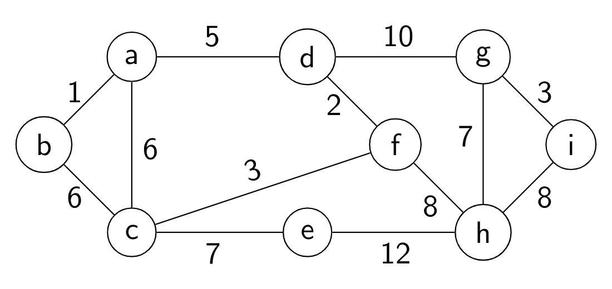
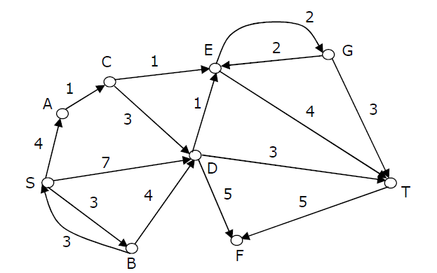
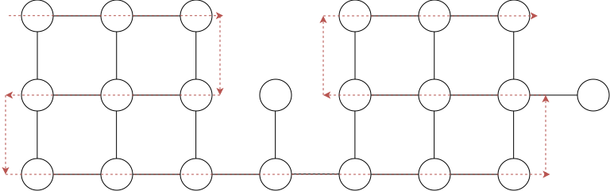
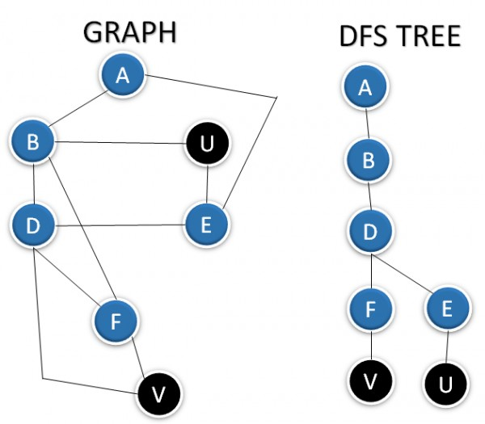

# 408经典练习题 · 数据结构篇 · 图
> 本练习题精选自 408 计算机考研权威真题及经典高频必刷练习题库，包含完整题干、选项、高清插图及参考答案与解析。
---

### 【408JD-DS08-T01】第 1 题

一个简单图的度数序列是将图中所有节点的度数按降序排列得到的序列。以下哪些序列不可能是任何图的度数序列？

I. 7, 6, 5, 4, 4, 3, 2, 1II. 6, 6, 6, 6, 3, 3, 2, 2III. 7, 6, 6, 4, 4, 3, 2, 2IV. 8, 7, 7, 6, 4, 2, 1, 1

- **A.** I 和 II
- **B.** III 和 IV
- **C.** 仅 IV
- **D.** II 和 IV

> **【唯一编号】** `408JD-DS08-T01`
> **【科目】** 数据结构篇
> **【知识点】** 图

<details>
<summary><b>💡 查看参考答案与解析</b></summary>

**【参考答案】** D

**【解析】**

**正确答案：D**

**解释：**

对于简单图的度数序列判断，需满足三个基本条件：度数总和必须为偶数（握手定理），序列中每个度数不超过顶点数减一（即最大度数 ≤ n-1），且序列需通过 Havel-Hakimi 算法的可图性检验。以下逐一分析各序列（n=8 个顶点）：

- 序列 I: 7, 6, 5, 4, 4, 3, 2, 1‌
总和为 32（偶数），最大度数 7 ≤ 7（n-1）。应用 Havel-Hakimi 算法：移除 7 并将后 7 个元素减 1，得序列 (5,4,3,3,2,1,0)；递归处理后最终序列全为 0，可图。**结论：可图。‌**
- 序列 II: 6, 6, 6, 6, 3, 3, 2, 2‌
总和为 34（偶数），最大度数 6 ≤ 7（n-1）。应用 Havel-Hakimi 算法：移除第一个 6 并将后 6 个减 1，得 (5,5,5,2,2,1,1)；移除 5 并将后 5 个减 1，得 (4,4,1,1,0,1)；排序后移除 4 并将后 4 个减 1，得 (3,0,0,0,0)；移除 3 并将后 3 个减 1，出现负数 (-1,-1,-1,0)，不可图。**结论：不可图。‌**
- 序列 III: 7, 6, 6, 4, 4, 3, 2, 2‌
总和为 34（偶数），最大度数 7 ≤ 7（n-1）。应用 Havel-Hakimi 算法：
移除 7 并将后 7 个减 1，得 (5,5,3,3,2,1,1)；移除 5 并将后 5 个减 1，得 (4,2,2,1,0,1)；排序后移除 4 并将后 4 个减 1，得 (1,1,0,0,0)；最终序列全为 0，可图。
**结论：可图。‌**
- 序列 IV: 8, 7, 7, 6, 4, 2, 1, 1‌
总和为 36（偶数），但最大度数为 8 > 7（n-1），违反简单图的最大度数限制。无需进一步检验。**结论：不可图。‌**

综上，序列 II 和 IV 不可能是任何简单图的度数序列。
答案：II 和 IV‌

</details>

---

### 【408JD-DS08-T02】第 2 题

考虑一个无向无权图
 G
。从节点
 r
开始进行广度优先遍历。设
 d(r,u)
和
 d(r,v)
分别为图
 G
中从
 r
到
 u
和
 v
的最短路径长度。如果在广度优先遍历中
 u
比
 v
先被访问，以下哪个陈述是正确的？（ ）

- **A.** d(r,u)<d(r,v)
- **B.** d(r,u)>d(r,v)
- **C.** d(r,u)≤d(r,v)
- **D.** 以上都不对

> **【唯一编号】** `408JD-DS08-T02`
> **【科目】** 数据结构篇
> **【知识点】** 图

<details>
<summary><b>💡 查看参考答案与解析</b></summary>

**【参考答案】** C

**【解析】**

**正确答案：C**

- 当 **u** 和 **v** 位于同一 BFS 层时，它们的最短路径长度相等，即
 d(r,u)=d(r,v)
- 当 **u** 比 **v** 更早被访问时，若不在同一层，则
 d(r,u)<d(r,v)

</details>

---

### 【408JD-DS08-T03】第 3 题

给定一个包含
 n
个顶点的集合
 V={V1,V2,…,Vn}
，可以构造出多少个无向图（不一定是连通的）？

（ ）
A.
 n(n−l)/2

B.
 2n

C.
 n!

D.
 2(n(n−1)/2) **正确答案：D**

**解释：**

- 在无向图中，顶点集合大小为
 n
时，最多可构造
 2n(n−1)
条边。
- 对于每一条可能的边，存在两种状态：**存在** 或 **不存在**。
- 因此，所有可能的无向图数量等于从
 2n(n−1)
条边中进行二元选择的组合数：
 22n(n−1)

> **【唯一编号】** `408JD-DS08-T03`
> **【科目】** 数据结构篇
> **【知识点】** 图

---

### 【408JD-DS08-T04】第 4 题

以下关于无向图的陈述中，哪些是正确的？

P: 奇度顶点的数量是偶数Q: 所有顶点的度数之和是偶数

- **A.** 仅 P
- **B.** 仅 Q
- **C.** P 和 Q 都正确
- **D.** P 和 Q 都不正确

> **【唯一编号】** `408JD-DS08-T04`
> **【科目】** 数据结构篇
> **【知识点】** 图

<details>
<summary><b>💡 查看参考答案与解析</b></summary>

**【参考答案】** C

**【解析】**

**正确答案：C**

**解析**

- **P 的正确性**：在无向图中，添加一条边会使两个顶点的度数各增加 1。由于每次操作都改变两个顶点的奇偶性，奇度顶点的总数始终为偶数（如从偶数变为偶数 +2 或偶数 -2）。
- **Q 的正确性**：每条边对总度数的贡献为 2（连接两个顶点），因此所有顶点的度数之和恒等于
 2×
边数，必然是偶数。即使存在奇数度数的顶点，其总和仍会被偶数个奇数相加抵消（如
 3+5=8
）。

</details>

---

### 【408JD-DS08-T05】第 5 题

在以下哪种情况下，有向无环图（DAG）最为适用？（ ）

- **A.** 表示项目计划中任务之间的依赖关系
- **B.** 建模带有好友连接的社会网络
- **C.** 在加权图中查找两个节点之间的最短路径
- **D.** 对图执行广度优先搜索（BFS）

> **【唯一编号】** `408JD-DS08-T05`
> **【科目】** 数据结构篇
> **【知识点】** 图

<details>
<summary><b>💡 查看参考答案与解析</b></summary>

**【参考答案】** A

**【解析】**

**正确答案：A**

**有向无环图（DAG）的核心特性**

- **拓扑排序支持**：通过无环结构实现任务顺序排列
- **依赖管理优势**：天然适合表达任务间的先后约束关系
- **调度优化能力**：可有效进行资源分配与进度规划

DAG 的这些特性使其成为项目管理工具（如甘特图、PERT 图）的基础数据结构，能避免循环依赖导致的逻辑矛盾。

</details>

---

### 【408JD-DS08-T06】第 6 题

在一个具有
 n
个顶点的无环无向图中，最多有多少条边？（ ）

- **A.** n−1
- **B.** n
- **C.** n+1
- **D.** 2n−1

> **【唯一编号】** `408JD-DS08-T06`
> **【科目】** 数据结构篇
> **【知识点】** 图

<details>
<summary><b>💡 查看参考答案与解析</b></summary>

**【参考答案】** A

**【解析】**

**正确答案：A**

**解析：**

- **有环图**：最大边数为
 2n(n−1)
- **无环图**：边数最多的无环图是一个生成树，此时边数为
 n−1

因此，正确答案是
 n−1
条边。

</details>

---

### 【408JD-DS08-T07】第 7 题

在有向图中，汇点是指一个顶点 `i` 满足：所有其他顶点 `j` ≠ `i` 都有一条边指向 `i`，并且 `i` 没有任何出边。一个包含 `n` 个顶点的有向图 `G` 通过邻接矩阵 `A` 表示，其中 `A[i][j] = 1` 表示存在从顶点 `i` 到 `j` 的边，否则为 `0`。以下算法用于判断图 `G` 中是否存在汇点。

```c
i = 0;
do {
    j = i + 1;
    while ((j < n) && E1) j++;
    if (j < n) E2;
} while (j < n);

flag = 1;
for (j = 0; j < n; j++)
    if ((j != i) && E3)
        flag = 0;

if (flag)
    printf("Sink exists");
else
    printf("Sink does not exist");
```

选择正确的 E3 表达式（ ）：

- **A.** `(A[i][j]` 且 `!A[j][i])`
- **B.** `(!A[i][j]` 且 `A[j][i])`
- **C.** `(!A[i][j]` 或 `A[j][i])`
- **D.** `(A[i][j]` 或 `!A[j][i])`

> **【唯一编号】** `408JD-DS08-T07`
> **【科目】** 数据结构篇
> **【知识点】** 图

<details>
<summary><b>💡 查看参考答案与解析</b></summary>

**【参考答案】** D

**【解析】**

**正确答案：D**

以下解释是针对本题前一部分的内容：

要使顶点 `i` 成为汇点，必须不存在从 `i` 到任何其他顶点的边。根据题目给出的输入条件，`A[i][j]=1` 表示存在从 `i` 到 `j` 的边，`A[i][j]=0` 表示不存在该边。对于 `i` 成为汇点，需要满足：对所有 `j`，`A[i][j]=0`（无出边），且对所有 `j`，`A[j][i]=1`（所有其他顶点都指向 `i`）。上述伪代码从 `i=0` 开始检查每个顶点是否为汇点。它实际上会检查 `i` 之后的所有顶点 `j` 是否可能成为汇点。该算法的巧妙之处在于不检查 `j` 小于 `i` 的情况。循环选出的 `i` 可能不是汇点，但确保不会忽略潜在的汇点。最终在 `do-while` 循环后会验证 `i` 是否真正为汇点。

当 `A[i][j]`为 `0` 时，`i` 是潜在汇点。因此 `E1` 应为`!A[i][j]`。若此条件不成立，则 `i` 不是汇点。所有 `j<i` 也不能是汇点，因为不存在从 `i` 到 `j` 的边。此时下一个潜在汇点可能是 `j`。所以 `E2` 应为 `i=j`。

关于本题的解释：以下伪代码验证上述选出的潜在汇点是否确实为汇点。

```c
flag = 1;
for (j = 0; j < n; j++)
    if ((j != i) && E3)
        flag = 0;
```

`flag=0` 表示 `i` 不是汇点。一旦发现 `i` 不符合汇点条件，立即设置 `flag=0`。若存在任意 `j≠i` 使得以下任一条件成立，则 `i` 不是汇点：

- **出边存在**：`A[i][j] = 1`（存在从 i 出发的边）
- **未被指向**：`A[j][i] = 0`（未被其他顶点指向）

因此 E3 应为 `(A[i][j] || !A[j][i])`。选项 D 正确。

</details>

---

### 【408JD-DS08-T08】第 8 题

对于下文所示的无向带权图，以下哪一序列的边表示使用 Prim 算法构造最小生成树的正确执行过程？



- **A.** (a, b), (d, f), (f, c), (g, i), (d, a), (g, h), (c, e), (f, h)
- **B.** (c, e), (c, f), (f, d), (d, a), (a, b), (g, h), (h, f), (g, i)
- **C.** (d, f), (f, c), (d, a), (a, b), (c, e), (f, h), (g, h), (g, i)
- **D.** (h, g), (g, i), (h, f), (f, c), (f, d), (d, a), (a, b), (c, e)

> **【唯一编号】** `408JD-DS08-T08`
> **【科目】** 数据结构篇
> **【知识点】** 图

<details>
<summary><b>💡 查看参考答案与解析</b></summary>

**【参考答案】** C

**【解析】**

**正确答案：C**

在 Prim 算法中，我们从任意一个节点开始，不断探索已包含节点的最小成本邻居。具体执行过程如下：

- **初始化**：选择任意起始节点（如 d），将其加入生成树集合。
- **迭代扩展**：每次从未选边中选择连接已选节点与未选节点的最小权重边。
- **终止条件**：当所有节点均被包含时停止。

**选项分析**：

- 正确选项需满足每一步都选择当前可扩展的最小权重边。
- 选项 C 的边序列 `(d, f), (f, c), (d, a), (a, b), (c, e), (f, h), (g, h), (g, i)` 符合 Prim 算法的贪心策略。
- 其他选项存在提前选择非最小权重边或跳过必要连接的情况。

</details>

---

### 【408JD-DS08-T09】第 9 题

考虑一个具有
 n
个顶点和
 m
条边的有向图，其中所有边的权重相同。求该图最小生成树的最佳已知算法的时间复杂度（ ）？

- **A.** O(m+n)
- **B.** O(mlog2n)
- **C.** O(mn)
- **D.** O(nlog2m)

> **【唯一编号】** `408JD-DS08-T09`
> **【科目】** 数据结构篇
> **【知识点】** 图

<details>
<summary><b>💡 查看参考答案与解析</b></summary>

**【参考答案】** A

**【解析】**

**正确答案：A**

当图中所有边的权重相等时，最小生成树的构造可通过以下方式实现：

- **深度优先搜索（DFS）**：通过遍历图构建深度优先树，该树即为有效生成树
- **时间复杂度分析**：DFS 的时间复杂度由访问所有顶点（n）和边（m）决定，因此总时间为 O(m+n)
- **结论**：此方法在等权图中可直接获得最优解，无需比较权重排序

</details>

---

### 【408JD-DS08-T10】第 10 题

设 G 是一个具有 20 个顶点和 8 个连通分量的简单图。如果我们从 G 中删除一个顶点，那么 G 中的连通分量数量应该介于（ ）之间。

- **A.** 8 和 20
- **B.** 8 和 19
- **C.** 7 和 19
- **D.** 7 和 20

> **【唯一编号】** `408JD-DS08-T10`
> **【科目】** 数据结构篇
> **【知识点】** 图

<details>
<summary><b>💡 查看参考答案与解析</b></summary>

**【参考答案】** C

**【解析】**

**正确答案：C**

**解析**

- **情况 1**：如果删除的是 G 中的孤立顶点（即该顶点本身构成一个连通分量），则 G 的连通分量数会减少为 **7**。
- **情况 2**：如果 G 是星型图，则删除其关节点后会得到 **19** 个连通分量。因此，G 的连通分量数量应介于 **7 到 19** 之间。

</details>

---

### 【408JD-DS08-T11】第 11 题

设图
 G
有 100 个顶点，编号为 1 到 100。若两个顶点
 i
和
 j
满足
 ∣i−j∣=8
或
 ∣i−j∣=12
，则它们相邻。图
 G
中的连通分量数目是（ ）

- **A.** 8
- **B.** 4
- **C.** 12
- **D.** 25

> **【唯一编号】** `408JD-DS08-T11`
> **【科目】** 数据结构篇
> **【知识点】** 图

<details>
<summary><b>💡 查看参考答案与解析</b></summary>

**【参考答案】** B

**【解析】**

**正确答案：B**

当顶点按差值为 12 连接时，连通分量数减少至 4：

- 第一列（1-4）与第五列（9-12）相连
- 第二列（5-8）与第六列（13-16）相连
- 第三列（17-20）与第七列（25-28）相连
- 第四列（21-24）与第八列（29-32）相连

由于差值为 8 的连接关系已被差值为 12 的连接覆盖，所有顶点最终归并为 4 个独立连通分量。因此选项 (B) 正确。

</details>

---

### 【408JD-DS08-T12】第 12 题

给定一个顶点集合 {0, 1, …, n−1} 上的任意固定 n 值的**完全无向带权图 G**。请画出 G 的最小生成树，当：

a) 边 (u,v) 的权重为 |u−v|b) 边 (u,v) 的权重为 u + v

> **【唯一编号】** `408JD-DS08-T12`
> **【科目】** 数据结构篇
> **【知识点】** 图

<details>
<summary><b>💡 查看参考答案与解析</b></summary>

**【解析】**

**解析：**

**情况 a: 权重为 |u−v|**


- **最小生成树结构**：形成一条从 0 到 n−1 的链式结构（即依次连接 0-1-2-…-n−1）。
- **原因**：每条边的权重等于顶点编号差值的绝对值。相邻顶点间的权重最小（均为 1），因此优先选择相邻边即可保证总权重最小。

**情况 b: 权重为 u + v**


- **最小生成树结构**：以顶点 0 为中心，连接到所有其他顶点（即 0-1, 0-2, …, 0-n−1）。
- **原因**：顶点 0 与其他顶点的权重为对应顶点编号（0+1=1, 0+2=2 等），这是所有可能连接中最小的组合。通过中心化连接可避免更高权重的边（如直接连接非零顶点时权重为 u+v ≥ 2）。

</details>

---

### 【408JD-DS08-T13】第 13 题

以下哪种数据结构在通过广度优先搜索遍历给定图时非常有用？（ ）

- **A.** 栈
- **B.** 列表
- **C.** 队列
- **D.** 以上都不是。

> **【唯一编号】** `408JD-DS08-T13`
> **【科目】** 数据结构篇
> **【知识点】** 图

<details>
<summary><b>💡 查看参考答案与解析</b></summary>

**【参考答案】** C

**【解析】**

**正确答案：C**

**解析：**

- 广度优先搜索（BFS）执行的是层级遍历
- 使用队列可以很好地实现这一特性
- 队列采用先进先出（FIFO）的顺序
- 先入队的节点会首先被探索，从而保持遍历的顺序

</details>

---

### 【408JD-DS08-T14】第 14 题

在下图中，深度优先搜索（DFS）的发现时间戳和完成时间戳以 x/y 的形式表示，其中 x 是发现时间戳，y 是完成时间戳。它显示了以下哪一个深度优先森林？（ ）

- **A.** {a, b, e} {c, d, f, g, h}
- **B.** {a, b, e} {c, d, h} {f, g}
- **C.** {a, b, e} {f, g} {c, d} {h}
- **D.** {a, b, c, d} {e, f, g} {h}

> **【唯一编号】** `408JD-DS08-T14`
> **【科目】** 数据结构篇
> **【知识点】** 图

<details>
<summary><b>💡 查看参考答案与解析</b></summary>

**【参考答案】** A

**【解析】**

**正确答案：A**

**解析：** 根据 DFS 的时间戳规则：

- **发现时间戳** 按递增顺序记录首次访问节点的顺序
- **完成时间戳** 按递减顺序记录回溯时的节点完成顺序

选项 A 的划分符合以下访问路径：

- 从起点 `a` 出发，依次访问 `b → e`
- 回溯至 `a` 后继续访问 `c → d → h`
- 最终访问剩余分支 `f → g`

该顺序与时间戳的递增/递减规律完全匹配，因此选项 A 正确。

**解释**

根据 DFS 时间戳规则：

- **发现时间戳较小的节点先被访问**
- **完成时间戳较大的节点最后被回溯**

**选项 A 中的时间戳顺序符合 DFS 遍历的特性**。其他选项均存在时间戳矛盾（如子树完成时间早于父节点发现时间等）。

</details>

---

### 【408JD-DS08-T15】第 15 题

以下哪项是邻接表表示法相对于邻接矩阵表示法在图中的优势？（ ）

- **A.** 邻接表表示法在稀疏图中节省空间。
- **B.** 在邻接表表示法中，深度优先搜索（DFS）和广度优先搜索（BSF）可以在
 O(V+E)
时间内完成。这些操作在邻接矩阵表示法中需要
 O(V2)
时间。这里
 V
和
 E
分别代表顶点数和边数。
- **C.** 在邻接表表示法中添加顶点比邻接矩阵表示法更容易。
- **D.** 以上所有

> **【唯一编号】** `408JD-DS08-T15`
> **【科目】** 数据结构篇
> **【知识点】** 图

<details>
<summary><b>💡 查看参考答案与解析</b></summary>

**【参考答案】** D

**【解析】**

**正确答案：D**

**解释：**邻接表表示法具有以下优势：

- **空间效率更高**：特别适合稀疏图，节省存储空间。
- **图遍历算法时间复杂度更低**：DFS 和 BFS 在邻接表中为
 O(V+E)
，而在邻接矩阵中为
 O(V2)
。
- **添加新顶点更灵活**：相较于邻接矩阵，邻接表更容易扩展顶点数量。

</details>

---

### 【408JD-DS08-T16】第 16 题

考虑下图所示的有向图。从顶点 S 到 T 存在多条最短路径。Dijkstra 最短路径算法会报告哪一条？假设在任何迭代中，只有当发现更短的路径时，顶点 v 的最短路径才会被更新。（ ）



- **A.** SDT
- **B.** SBDT
- **C.** SACDT
- **D.** SACET

> **【唯一编号】** `408JD-DS08-T16`
> **【科目】** 数据结构篇
> **【知识点】** 图

<details>
<summary><b>💡 查看参考答案与解析</b></summary>

**【参考答案】** D

**【解析】**

**正确答案：D**

**Dijkstra 算法执行流程解析**：

- 当算法处理到顶点 `C` 时，其邻接顶点 `D` 和 `E` 的临时距离分别被计算为 7 和 6
- 此时优先级队列中最小距离顶点为 `E`（距离值 6 < 7）
- 根据算法规则，下一步将选择距离最小的顶点 `E` 进行松弛操作
- 最终通过路径 `S → A → C → E → T` 构成最短路径 SACET

**关键结论**：由于 Dijkstra 算法始终选择当前已知最短距离的顶点进行扩展，因此在 `C` 节点处理阶段会选择距离更小的 `E` 节点继续搜索

</details>

---

### 【408JD-DS08-T17】第 17 题

在无权图上实现 Dijkstra 最短路径算法以使其运行时间为线性时间时，应使用的数据结构是（ ）：

- **A.** 队列
- **B.** 栈
- **C.** 堆
- **D.** B-树

> **【唯一编号】** `408JD-DS08-T17`
> **【科目】** 数据结构篇
> **【知识点】** 图

<details>
<summary><b>💡 查看参考答案与解析</b></summary>

**【参考答案】** A

**【解析】**

**正确答案：A****在无权图中，最短路径意味着需要遍历的边数最少。** 这与所有权重恰好为 1 的加权版本问题相同。如果我们使用 *队列*（先进先出）而非优先队列（最小堆），则可以在线性时间
 O(∣V∣+∣E∣)
内得到最短路径。本质上我们通过图的 **广度优先搜索**（BFS）遍历来获取最短路径。

</details>

---

### 【408JD-DS08-T18】第 18 题

从下图的顶点 a 运行 Dijkstra 单源最短路径算法时，计算出正确的最短路径距离到（ ）：


- **A.** 仅顶点 a
- **B.** 仅顶点 a、e、f、g、h
- **C.** 仅顶点 a、b、c、d
- **D.** 所有顶点

> **【唯一编号】** `408JD-DS08-T18`
> **【科目】** 数据结构篇
> **【知识点】** 图

<details>
<summary><b>💡 查看参考答案与解析</b></summary>

**【参考答案】** D

**【解析】**

**正确答案：D**

Dijkstra 单源最短路径算法不能保证在包含负权边的图中正确工作，但该算法在给定图中有效。让我们逐步验证：

- **第一次遍历后**

- b: 1
- b 是最小值，因此 b 的最短距离为 1。
- **第二次遍历后**

- c: 3，e: -2
- e 是最小值，因此 e 的最短距离为 -2
- **第三次遍历后**

- c: 3，f: 0
- f 是最小值，因此 f 的最短距离为 0
- **第四次遍历后**

- c: 3，g: 3
- 两者相同，选择 g，因此 g 的最短距离为 3
- **第五次遍历后**

- c: 3，h: 5
- c 是最小值，因此 c 的最短距离为 3
- **第六次遍历后**

- h: -2
- h 是最小值，因此 h 的最短距离为 -2

**注意**：虽然最终所有顶点都被处理，但由于图中存在负权边（如 e→h 的 -4），Dijkstra 算法理论上无法保证正确性。但在本例中，由于负权边未形成负权环且起点 a 到相关顶点的路径权重始终递增，算法仍能得出正确结果。

</details>

---

### 【408JD-DS08-T19】第 19 题

在一个无权、无向的连通图中，从节点 S 到其他所有节点的最短路径，按时间复杂度而言最高效的是以下哪种方法？（ ）

- **A.** 从 S 开始的 Dijkstra 算法。
- **B.** Warshall 算法
- **C.** 从 S 开始执行 DFS。
- **D.** 从 S 开始执行 BFS。

> **【唯一编号】** `408JD-DS08-T19`
> **【科目】** 数据结构篇
> **【知识点】** 图

<details>
<summary><b>💡 查看参考答案与解析</b></summary>

**【参考答案】** D

**【解析】**

**正确答案：D**

- **Dijkstra 算法**

- 时间复杂度：O(|V|² + |E|)
- 适用于有权图
- **Warshall 算法**

- 时间复杂度：O(|V|³)
- 通常用于传递闭包，而非最短路径
- **DFS**

- 不适用于寻找最短路径
- **BFS**

- 时间复杂度：O(|E| + |V|)
- 适用于无权图，能有效找到最短路径

</details>

---

### 【408JD-DS08-T20】第 20 题

假设我们以顶点 P 为源点，在以下边权有向图上运行 Dijkstra 单源最短路径算法。各节点按照什么顺序被加入到最短路径距离已确定的顶点集合中？


- **A.** P, Q, R, S, T, U
- **B.** P, Q, R, U, S, T
- **C.** P, Q, R, U, T, S
- **D.** P, Q, T, R, U, S

> **【唯一编号】** `408JD-DS08-T20`
> **【科目】** 数据结构篇
> **【知识点】** 图

<details>
<summary><b>💡 查看参考答案与解析</b></summary>

**【参考答案】** B

**【解析】**

**正确答案：B**答案是 (B)。在 Dijkstra 算法中，每一步我们都会从当前已找到最短路径的顶点集合中，选择一个与其距离最短的顶点，并将连接这两个顶点的边加入到最短路径中。

</details>

---

### 【408JD-DS08-T21】第 21 题

Bellman-Ford 单源最短路径算法在 n 个顶点的完全图上的时间复杂度是多少？

- **A.** O(V2)
- **B.** O(V2logV)
- **C.** O(V3)
- **D.** O(V3logV)

> **【唯一编号】** `408JD-DS08-T21`
> **【科目】** 数据结构篇
> **【知识点】** 图

<details>
<summary><b>💡 查看参考答案与解析</b></summary>

**【参考答案】** C

**【解析】**

**正确答案：C**

**解析：**

- Bellman Ford 算法的基本时间复杂度为 Θ(VE)

- **V** 表示顶点数量
- **E** 表示边的数量
- 在完全图中，边数 E 满足 E = Θ(V²)
- 代入计算得最终时间复杂度：
 Θ(V×V2)=Θ(V3)
- 因此选项 C 是正确答案。

</details>

---

### 【408JD-DS08-T22】第 22 题

在带权图中，假设使用最短路径算法正确计算了从源点 s 到目标点 t 的最短路径。以下陈述是否成立？（ ）

如果我们将每条边的权重增加 1，则最短路径始终不变。

- **A.** 是
- **B.** 否

> **【唯一编号】** `408JD-DS08-T22`
> **【科目】** 数据结构篇
> **【知识点】** 图

<details>
<summary><b>💡 查看参考答案与解析</b></summary>

**【参考答案】** B

**【解析】**

**正确答案：B**

请看以下反例说明：

- **原始图结构**四条边及对应权重：

- s-a: 1
- a-b: 1
- b-t: 1
- s-t: 4

```
1     1     1
s-----a-----b-----t
 \               /
  \             /
   \___________/
        4
```

- **修改前最短路径**路径 `s-a → a-b → b-t` 总权重 = 1 + 1 + 1 = 3
- **修改后权重变化**所有边权重 +1 后：

- s-a: 2
- a-b: 2
- b-t: 2
- s-t: 5
- **修改后路径比较**

- 原路径总权重 = 2 + 2 + 2 = 6
- 新路径 `s-t` 总权重 = 5
- **结论**修改后原最短路径不再是全局最优解，说明"最短路径始终不变"的陈述不成立。

</details>

---

### 【408JD-DS08-T23】第 23 题

在有向无环图（DAG）中，以下哪种算法可以**高效地**计算单源最短路径？（ ）

- **A.** Dijkstra 算法
- **B.** Bellman Ford 算法
- **C.** 拓扑排序
- **D.** 强连通分量

> **【唯一编号】** `408JD-DS08-T23`
> **【科目】** 数据结构篇
> **【知识点】** 图

<details>
<summary><b>💡 查看参考答案与解析</b></summary>

**【参考答案】** C

**【解析】**

**正确答案：C**

**解析**

- **核心原理**：拓扑排序利用 DAG 的特性，按拓扑序依次松弛每条边，确保每个节点的最短路径被唯一确定。
- **时间复杂度**：
 O(V+E)
，这是目前已知针对 DAG 的最优解法。
- **对比其他选项**：

- Dijkstra 算法需依赖优先队列，时间复杂度通常为
 O(ElogV)
或更高。
- Bellman Ford 算法虽可处理负权边，但时间复杂度为
 O(VE)
，效率较低。
- 强连通分量与最短路径问题无直接关联。
- **应用场景**：特别适合任务调度、数据流分析等 DAG 相关问题。

</details>

---

### 【408JD-DS08-T24】第 24 题

关于最短路径，以下陈述是否有效？给定一个图，假设我们已经计算出从源点到所有其他顶点的最短路径。如果我们将图中所有边的权重修改为原始权重的两倍，则最短路径保持不变，仅路径的总权重发生变化。（ ）

> **【唯一编号】** `408JD-DS08-T24`
> **【科目】** 数据结构篇
> **【知识点】** 图

<details>
<summary><b>💡 查看参考答案与解析</b></summary>

**【解析】**

是正确的。

**解析**

- 最短路径的确定依赖于路径中各边权重的**相对大小关系**
- 当所有边权重按相同比例缩放时（如×2），路径间的**相对顺序保持不变**
- 类比：将距离单位从"米"改为"千米"时，最短路径的实际路线不会改变
- 数学本质：若原路径 P₁ < P₂，则 2P₁ < 2P₂仍成立，路径选择结果一致

</details>

---

### 【408JD-DS08-T25】第 25 题

将以下内容进行匹配

| 组 A | 组 B |
| --- | --- |
| a) Dijkstra 单源最短路径算法 | p) 动态规划 |
| b) Bellman Ford 单源最短路径算法 | q) 回溯法 |
| c) Floyd Warshall 所有点对最短路径算法 | r) 贪心算法 |

- **A.** a-r, b-q, c-p
- **B.** a-p, b-p, c-p
- **C.** a-r, b-p, c-p
- **D.** a-p, b-r, c-q

> **【唯一编号】** `408JD-DS08-T25`
> **【科目】** 数据结构篇
> **【知识点】** 图

<details>
<summary><b>💡 查看参考答案与解析</b></summary>

**【参考答案】** C

**【解析】**

**正确答案：C**

- **Dijkstra 算法**：采用**贪心算法**，通过每次选择未确定最短路径的顶点中距离最小的节点进行扩展。
- **Bellman Ford 算法**：基于**动态规划**，通过松弛操作逐步更新最短路径估计值。
- **Floyd Warshall 算法**：同样属于**动态规划**，利用矩阵迭代计算所有点对之间的最短路径。

</details>

---

### 【408JD-DS08-T26】第 26 题

以下陈述是否有效？在所有边权重均唯一的加权图中（任意两条边的权重不同），从源点到目标点的最短路径总是唯一的（ ）。

- **A.** 正确
- **B.** 错误

> **【唯一编号】** `408JD-DS08-T26`
> **【科目】** 数据结构篇
> **【知识点】** 图

<details>
<summary><b>💡 查看参考答案与解析</b></summary>

**【参考答案】** B

**【解析】**

**正确答案：B**

即使所有边的权重唯一，也可能存在多条**总权重相同的路径**。例如：

- 一条单边权重为 5 的路径
- 另一条由权重 2 和 3 组成的双边路径它们的总权重相同（2 + 3 = 5）

</details>

---

### 【408JD-DS08-T27】第 27 题

以下陈述是否有效？给定一个所有边权均为正的图，Dijkstra 算法和 Bellman-Ford 算法生成的最短路径可能不同（ ），但路径权重始终相同。

- **A.** 正确
- **B.** 错误

> **【唯一编号】** `408JD-DS08-T27`
> **【科目】** 数据结构篇
> **【知识点】** 图

<details>
<summary><b>💡 查看参考答案与解析</b></summary>

**【参考答案】** A

**【解析】**

**正确答案：A**

- **Dijkstra 算法**：基于贪心策略，每次选择当前距离最小的节点进行松弛操作，优先保证局部最优解。
- **Bellman-Ford 算法**：通过动态规划迭代所有边，逐步更新最短路径估计值，允许全局调整。
- **结论**：两种算法虽然计算路径的方式不同，但在无负权边的情况下，最终得到的最短路径权重必然一致。但由于路径选择策略差异，实际经过的边可能不同。

</details>

---

### 【408JD-DS08-T28】第 28 题

以下关于 Bellman-Ford 最短路径算法的陈述中，哪些是正确的？

P: 如果存在负权环，则总是能检测到。Q: 检测是否存在从源点可达的负权环。

- **A.** 仅 P
- **B.** 仅 Q
- **C.** P 和 Q 都正确
- **D.** P 和 Q 都不正确

> **【唯一编号】** `408JD-DS08-T28`
> **【科目】** 数据结构篇
> **【知识点】** 图

<details>
<summary><b>💡 查看参考答案与解析</b></summary>

**【参考答案】** B

**【解析】**

**正确答案：B**

Bellman-Ford 最短路径算法是单源最短路径算法。因此它只能检测从给定源点可达的负权环，而非图中所有可能存在的负权环。考虑一个不连通图，其中某个负权环完全无法从源点到达的情况。

如果存在负权环，则在最短路径计算中会体现出来——因为每次经过该环都会使路径长度不断减小。

</details>

---

### 【408JD-DS08-T29】第 29 题

设
 G(V,E)
是一个具有正边权的无向图。使用二进制堆数据结构实现 Dijkstra 单源最短路径算法的时间复杂度为（ ）：

- **A.** O(∣V∣2)
- **B.** O(∣E∣+∣V∣log2∣V∣)
- **C.** O(∣V∣log2∣V∣)
- **D.** O((∣E∣+∣V∣)log2∣V∣)

> **【唯一编号】** `408JD-DS08-T29`
> **【科目】** 数据结构篇
> **【知识点】** 图

<details>
<summary><b>💡 查看参考答案与解析</b></summary>

**【参考答案】** D

**【解析】**

**正确答案：D**

在使用**二进制堆（Binary Heap）**实现的 Dijkstra 算法中，时间复杂度主要来自两部分操作：

- **取出当前距离最小的顶点**：最多执行
 ∣V∣
次，每次操作代价是
 log∣V∣
，总共是
 O(∣V∣log∣V∣)
。
- **更新邻接点的距离**：最多执行
 ∣E∣
次，每次操作代价是
 log∣V∣
，总共是
 O(∣E∣log∣V∣)
。

所以总时间复杂度为：

$$
O(∣V∣log∣V∣+∣E∣log∣V∣)=O((∣E∣+∣V∣)log∣V∣)
$$

</details>

---

### 【408JD-DS08-T30】第 30 题

设
 G(V,E)
是一个包含
 n
个顶点的有向图。
 G
中从
 vi
到
 vj
的路径是顶点序列
 (vi,vi+1,⋯,vj)
，满足对所有
 k∈[i,j−1]
，
 (vk,vk+1)∈E
。简单路径是指路径中不包含重复顶点的路径。

设 A 为一个 n×n 数组，初始化如下。考虑以下算法：

```c
for i = 1 to n
   for j = 1 to n
      for k = 1 to n
         A[j, k] = max(A[j, k], A[j, i] + A[i, k]);
```

在上述算法执行结束后，以下哪项陈述对于所有 j 和 k 必然成立？（ ）

- **A.** `A[j, k] ≤ n`
- **B.** 若 `A[j, k] ≥ n-1`，则 `G` 包含哈密顿回路
- **C.** 若存在从 `j` 到 `k` 的路径，`A[j, k]` 包含从 `j` 到 `k` 的最长路径长度
- **D.** 若存在从 `j` 到 `k` 的路径，每个从 `j` 到 `k` 的简单路径最多包含 `A[j, k]` 条边

> **【唯一编号】** `408JD-DS08-T30`
> **【科目】** 数据结构篇
> **【知识点】** 图

<details>
<summary><b>💡 查看参考答案与解析</b></summary>

**【参考答案】** D

**【解析】**

**正确答案：D**

**解析**

在原始输入矩阵中，若存在从 `j` 到 `k` 的边则 `A[j, k]=1`，否则为 0。

**关键分析步骤：**

- **算法本质**表达式 `A[j, k] = max(A[j, k], A[j, i] + A[i, k])` 实际上是在计算从 j 到 k 的路径中经过中间节点 i 的最大边数。每次迭代时，算法尝试通过新增的中间节点 i 来延长已知路径。
- **数值含义**

`-` 初始状态：`A[j,k]` 表示是否存在直接边（`1` 或 `0`）
`-` 迭代过程：`A[j,k]` 最终表示从 `j` 到 `k` 的最长路径所含的边数
`-` 上界约束：由于简单路径不能重复顶点，最长路径至多包含 `n-1` 条边
- **结论推导**

`-` 当 `A[j,k] = n-1` 时，说明存在一条长度为 `n-1` 的简单路径（覆盖所有顶点）
`-` 若 `A[j,k] ≥ n`，则必然存在环（因为简单路径最多 `n-1` 条边）
`-` 因此 D 选项表述了`"`简单路径最多包含 `A[j,k]` 条边`"`这一必然成立的关系
- **错误选项排除**

- A 错误：当存在环时 `A[j,k]` 可能超过 n
- B 错误：`A[j,k] ≥ n-1` 仅说明存在长度为 n-1 的路径，但不足以证明存在哈密顿回路
- C 错误：算法求的是最长路径的边数，而非路径长度（权重总和）

</details>

---

### 【408JD-DS08-T31】第 31 题

设
 G=(V,E)
是一个简单无向图，
 s
是其中的一个特定顶点（称为源点）。对于
 x∈V
，用
 d(x)
表示从
 s
到
 x
在
 G
中的最短距离。从
 s
开始执行广度优先搜索（BFS），得到一棵 BFS 树
 T
。若
 (u,v)
是
 G
的一条不在
 T
中的边，则以下哪一项不可能是
 d(u)−d(v)
的值？（ ）

- **A.** -1
- **B.** 0
- **C.** 1
- **D.** 2

> **【唯一编号】** `408JD-DS08-T31`
> **【科目】** 数据结构篇
> **【知识点】** 图

<details>
<summary><b>💡 查看参考答案与解析</b></summary>

**【参考答案】** D

**【解析】**

**正确答案：D**

注意：给定的图是无向的，因此边 (u, v) 也意味着 (v, u) 是一条边。

**解释：**在无向图中，BFS 构建的最短路径树具有以下性质：

- **非树边的特性**：若边 (u, v) 不在 BFS 树 T 中，则 u 和 v 必须属于同一层或相邻层。
- **距离差限制**：

- 若 u 和 v 属于同一层（即 d(u) = d(v)），则差值为 0。
- 若 u 和 v 属于相邻层（如 d(u) = d(v) + 1 或 d(v) = d(u) + 1），则差值为 ±1。
- **矛盾性分析**：

- 若假设 d(u) – d(v) = 2，则存在更短路径通过边 (u, v) 直接连接 u 和 v，这与 BFS 树定义的最短路径性质矛盾。

因此，在无向图中，非树边两端点的距离差绝对值不可能超过 1。

</details>

---

### 【408JD-DS08-T32】第 32 题

设
 G
是一个有向图，其顶点集是
 1
到
 100
的数字集合。若从顶点
 i
到顶点
 j
存在边，则当且仅当
 j=i+1
或
 j=3i
时成立。从顶点
 1
到顶点
 100
的路径中，最少需要多少条边？（ ）

- **A.** 4
- **B.** 7
- **C.** 23
- **D.** 99

> **【唯一编号】** `408JD-DS08-T32`
> **【科目】** 数据结构篇
> **【知识点】** 图

<details>
<summary><b>💡 查看参考答案与解析</b></summary>

**【参考答案】** B

**【解析】**

**正确答案：B**

任务是从顶点 1 到顶点 100 寻找路径中边数最少的方案，其中可以从顶点 i 移动到 i+1 或
 3×i
。由于目标是最小化边数，我们更倾向于选择
 3×i
的路径。

- **正向尝试 3 的倍数路径**1 → 3 → 9 → 27 → 81，此时无法继续使用
 3×i
路径，只能使用 i+1。这种方案会导致较长的路径。
- **反向从终点开始的策略**若数值不是 3 的倍数则减 1，否则除以 3：100 → 99 → 33 → 11 → 10 → 9 → 3 → 1

因此总共需要 7 条边。

</details>

---

### 【408JD-DS08-T33】第 33 题

考虑一个包含
 4
个顶点的带权无向图，其中边
 i,j
的权重由矩阵
 W
中的元素
 Wi,j
给出。使得至少存在某对顶点之间的最短路径中包含权重为
 x
的边的最大可能整数值是（ ）。

- **A.** 8
- **B.** 12
- **C.** 10
- **D.** 11

> **【唯一编号】** `408JD-DS08-T33`
> **【科目】** 数据结构篇
> **【知识点】** 图

<details>
<summary><b>💡 查看参考答案与解析</b></summary>

**【参考答案】** B

**【解析】**

**正确答案：B**

设顶点为 0、1、2 和 3。

x 直接连接顶点 2 和 3。不经过 x 的情况下，从 2 到 3 的最短路径权重为 12（路径为 `2-1-0-3`）。

当 x 的值大于 12 时，路径 `2-3` 的直接边权重会超过替代路径 `2-1-0-3` 的总权重（12），此时最短路径将不再包含权重为 x 的边。因此，x 的最大取值为 12，此时仍满足存在最短路径包含该边的条件。

</details>

---

### 【408JD-DS08-T34】第 34 题

考虑一个具有正边权的带权无向图，设
 uv
是图中的一条边。已知从源顶点
 s
到
 u
的最短路径权重为
 53
，从
 s
到
 v
的最短路径权重为
 65
。以下哪一项陈述始终成立？（ ）

- **A.** (u,v)
的权重 < 12
- **B.** (u,v)
的权重 ≤ 12
- **C.** (u,v)
的权重 > 12
- **D.** (u,v)
的权重 ≥ 12

> **【唯一编号】** `408JD-DS08-T34`
> **【科目】** 数据结构篇
> **【知识点】** 图

<details>
<summary><b>💡 查看参考答案与解析</b></summary>

**【参考答案】** D

**【解析】**

**正确答案：D**

根据三角不等性原理：

- 若存在路径
 s→⋯→u→v
，则满足
 d(s,u)+w(u,v)≥d(s,v)
- 已知
 d(s,u)=53
，
 d(s,v)=65
- 代入不等式得：
 53+w(u,v)≥65
- 推导结果：
 w(u,v)≥12

</details>

---

### 【408JD-DS08-T35】第 35 题

以下哪种算法用于解决所有节点对的最短路径问题？（ ）

- **A.** Prim 算法
- **B.** Dijkstra 算法
- **C.** Bellman-Ford 算法
- **D.** Floyd-Warshall 算法

> **【唯一编号】** `408JD-DS08-T35`
> **【科目】** 数据结构篇
> **【知识点】** 图

<details>
<summary><b>💡 查看参考答案与解析</b></summary>

**【参考答案】** D

**【解析】**

**正确答案：D**

- **Prim 算法**：用于求解给定图的最小生成树（MST）。
- **Dijkstra 算法**：用于在有权图中从源点到其他所有节点的最短路径。
- **Bellman-Ford 算法**：用于在可能包含负权边的图中求解从源点到其他所有节点的最短距离。
- **Floyd-Warshall 算法**：它是一种所有节点对的最短路径算法，用于求解每对顶点之间的最短距离。

因此，选项（D）正确。

</details>

---

### 【408JD-DS08-T36】第 36 题

以下哪种数据结构在使用广度优先搜索遍历给定图时非常有用（ ）？

- **A.** 栈
- **B.** 列表
- **C.** 队列
- **D.** 以上都不是

> **【唯一编号】** `408JD-DS08-T36`
> **【科目】** 数据结构篇
> **【知识点】** 图

<details>
<summary><b>💡 查看参考答案与解析</b></summary>

**【参考答案】** C

**【解析】**

**正确答案：C**

**解析：****队列**（先进先出/FIFO）是广度优先搜索（BFS）的核心数据结构。

- BFS 的核心特性是**逐层遍历**，即从起始节点出发，优先访问当前层级的所有相邻节点后再进入下一层级。
- 队列遵循 **FIFO（First In First Out）** 原则，能够保证节点按层级顺序依次被访问：

- 先入队的节点会先被处理，其邻接节点随后入队；
- 后入队的节点则等待前序节点处理完成后再处理，从而维持遍历的层次性。
- 相比之下，**栈**（LIFO）更适合深度优先搜索（DFS），而**列表**缺乏严格的顺序约束机制。

</details>

---

### 【408JD-DS08-T37】第 37 题

设
 G=(V,E)
是一个有向加权图，权重函数为
 w:E→R
。对于某个映射
 f:V→R
，对每条边 (u,v)∈E，定义
 w′(u,v)
=w(u,v)+f(u)−f(v)。以下哪个选项能补全下述句子使其成立？“在
 G
中基于
 w
的最短路径，在
 w′
下也是最短路径，（ ）”。

- **A.** 对于任意的映射 f:V→R
- **B.** 当且仅当∀u∈V，f(u) 为正数时
- **C.** 当且仅当∀u∈V，f(u) 为负数时
- **D.** 当且仅当 f(u) 是从新增顶点 s 到 u 的距离（该顶点 s 通过零权重边连接至 G 的所有顶点）时

> **【唯一编号】** `408JD-DS08-T37`
> **【科目】** 数据结构篇
> **【知识点】** 图

<details>
<summary><b>💡 查看参考答案与解析</b></summary>

**【解析】**

**正确答案：**

A

- 将顶点映射到任意实数值时，最短路径保持不变。
- 任何路径上的中间节点值都会相互抵消，最终仅剩起点和终点的值，其总和即为路径成本。
- 因此最短路径保持一致。

**关键分析**

- D 选项错误在于"当且仅当"的表述。若改为单纯的"如果"则正确。
- 给出的条件是充分而非必要条件，使得"仅当"部分无效。
- 本质上这意味着所有顶点的势能都为 0（因为它们与新顶点 s 通过零权重边相连）。
- B 和 C 选项也因相同原因错误（正负数限制并非必要条件）。

</details>

---

### 【408JD-DS08-T38】第 38 题

在给定一个所有边权重相同的有向图中，我们可以使用以下哪种方法高效地找到从给定源点到目标点的最短路径？（ ）

- **A.** BFS
- **B.** Dijkstra 最短路径算法
- **C.** 无法使用 BFS 和 Dijkstra 算法
- **D.** DFS

> **【唯一编号】** `408JD-DS08-T38`
> **【科目】** 数据结构篇
> **【知识点】** 图

<details>
<summary><b>💡 查看参考答案与解析</b></summary>

**【参考答案】** A

**【解析】**

**正确答案：A****解析**通过广度优先遍历（BFS），我们首先探索距离为一条边的顶点，然后是距离为两条边的所有顶点，依此类推。

</details>

---

### 【408JD-DS08-T39】第 39 题

图的遍历与树的不同之处在于（ ）。

- **A.** 图中可能存在环路，因此必须为每个顶点维护一个已访问标志
- **B.** 图的深度优先遍历使用栈，而树的中序遍历是递归的
- **C.** 图的广度优先遍历使用队列，而高效的树广度优先遍历是递归的
- **D.** 以上所有选项

> **【唯一编号】** `408JD-DS08-T39`
> **【科目】** 数据结构篇
> **【知识点】** 图

<details>
<summary><b>💡 查看参考答案与解析</b></summary>

**【参考答案】** A

**【解析】**

**正确答案：A**图的深度优先遍历（DFS）类似于树的深度优先遍历。唯一的区别在于，与树不同，图可能包含循环（节点可能被重复访问）。为了避免对同一节点进行多次处理，需要使用布尔型已访问数组。图可以有多个不同的 DFS 遍历路径。因此选项（A）是正确答案。

</details>

---

### 【408JD-DS08-T40】第 40 题

以下算法适用的数据结构是什么？

- 广度优先搜索
- 深度优先搜索
- Prim 最小生成树
- Kruskal 最小生成树

- **A.** 栈 队列 优先队列 并查集
- **B.** 队列 栈 优先队列 并查集
- **C.** 栈 队列 并查集 优先队列
- **D.** 优先队列 队列 栈 并查集

> **【唯一编号】** `408JD-DS08-T40`
> **【科目】** 数据结构篇
> **【知识点】** 图

<details>
<summary><b>💡 查看参考答案与解析</b></summary>

**【参考答案】** B

**【解析】**

**正确答案：B**广度优先搜索使用队列，深度优先搜索使用栈，Prim 最小生成树使用优先队列。Kruskal 最小生成树使用并查集。因此选项 (B) 是正确答案。

</details>

---

### 【408JD-DS08-T41】第 41 题

广度优先搜索算法使用队列数据结构实现。访问以下图中节点的一个可能顺序是（ ）。


- **A.** QMNPOR
- **B.** NQMPOR
- **C.** QMNPRO
- **D.** QMNPOR

> **【唯一编号】** `408JD-DS08-T41`
> **【科目】** 数据结构篇
> **【知识点】** 图

<details>
<summary><b>💡 查看参考答案与解析</b></summary>

**【参考答案】** C

**【解析】**

**正确答案：C**选项 (A) 的顺序为 MNOPQR。由于遍历从 M 开始，但 O 在 N 和 Q 之前被访问，这不符合广度优先搜索的规则（当前深度的所有相邻节点必须在下一层深度的节点前被访问）。选项 (B) 的顺序为 NQMPOR。这里 P 在 O 之前被访问，同样违反了 BFS 规则。选项 (C) 和 (D) 的前缀 QMNP 符合 BFS 特性。观察到 M 在 N 和 P 之前被加入队列（因为 QMNP 中 M 出现在 NP 前），而 R 是 M 的邻居节点，因此会在 N 和 P 的邻居节点（即 O）之前被加入队列。最终 R 会先于 O 被访问。因此，选项 (C) 是正确答案。

</details>

---

### 【408JD-DS08-T42】第 42 题

设 G 为一个无向图。考虑对 G 进行深度优先遍历，得到的深度优先搜索树为 T。假设 u 是 G 中的一个顶点，v 是在遍历中访问完 u 之后第一个被访问的新（未访问过）顶点。以下哪项陈述始终成立？

- **A.** {u,v} 必须是 G 中的边，并且 u 是 T 中 v 的后代
- **B.** {u,v} 必须是 G 中的边，并且 v 是 T 中 u 的后代
- **C.** 如果 {u,v} 不是 G 中的边，则 u 在 T 中是叶子节点
- **D.** 如果 {u,v} 不是 G 中的边，则 u 和 v 在 T 中必须有相同的父节点

> **【唯一编号】** `408JD-DS08-T42`
> **【科目】** 数据结构篇
> **【知识点】** 图

<details>
<summary><b>💡 查看参考答案与解析</b></summary>

**【参考答案】** C

**【解析】**

**正确答案：C**

在 DFS 中，若’v’在’u’之后被访问，则以下两种情况必居其一：

- (u, v) 是一条边。

```
u
   /   \
  v     w
 /     / \
x     y   z
```

- ‘u’ 是叶节点。

```
w
   /   \
  x     v
 /     / \
u     y   z
```

在 DFS 中，访问完一个节点后，会先递归访问所有未访问过的子节点。如果没有未访问的子节点（u 是叶节点），则控制权返回到父节点，父节点再访问下一个未访问的子节点。因此选项 (C) 是正确答案。

</details>

---

### 【408JD-DS08-T43】第 43 题

以下哪种条件足以检测有向图中的环？

- **A.** 当前访问的节点有一条边指向已访问过的节点。
- **B.** 当前访问的节点有一条边指向 DFS 森林中当前访问节点的祖先。
- **C.** 在 DFS 中每个节点都被访问两次。
- **D.** 以上都不是

> **【唯一编号】** `408JD-DS08-T43`
> **【科目】** 数据结构篇
> **【知识点】** 图

<details>
<summary><b>💡 查看参考答案与解析</b></summary>

**【参考答案】** B

**【解析】**

**正确答案：B**通过深度优先遍历（DFS）技术可以检测有向图中的环。其核心思想是：**只有当图中存在回溯边（即某个节点指向其祖先节点）时，才会形成环**。为了检测回溯边，需要跟踪两个状态：1）已访问过的节点集合；2）当前递归调用栈中的节点集合（即当前正在访问的路径）。如果在递归过程中遇到一个**已经在当前递归栈中的节点**，则说明存在环。对于不连通的图，需要先获取 DFS 森林，然后对每棵树单独检查是否存在回溯边。因此选项 (B) 是正确答案。

</details>

---

### 【408JD-DS08-T44】第 44 题

以下陈述是否正确/错误：如果一个有向图的深度优先搜索（DFS）包含回边，那么该图的任何其他深度优先搜索也会至少包含一条回边。

- **A.** 正确
- **B.** 错误

> **【唯一编号】** `408JD-DS08-T44`
> **【科目】** 数据结构篇
> **【知识点】** 图

<details>
<summary><b>💡 查看参考答案与解析</b></summary>

**【参考答案】** A

**【解析】**

**正确答案：A**回边表示图中存在环。因此，如果图中存在环，所有深度优先搜索都会至少包含一条回边。

</details>

---

### 【408JD-DS08-T45】第 45 题

Make 是一个工具，它通过读取名为 makefiles 的文件自动从源代码构建可执行程序和库。这些文件指定了如何推导目标程序。以下哪种标准图算法被 Make 使用？

- **A.** 强连通分量
- **B.** 拓扑排序
- **C.** 广度优先搜索
- **D.** 迪杰斯特拉最短路径算法

> **【唯一编号】** `408JD-DS08-T45`
> **【科目】** 数据结构篇
> **【知识点】** 图

<details>
<summary><b>💡 查看参考答案与解析</b></summary>

**【参考答案】** B

**【解析】**

**正确答案：B**Make 可以通过拓扑排序确定软件的构建顺序。拓扑排序会根据 makefile 中提供的所有依赖关系生成顺序。详情请参见：拓扑排序。因此选项 (B) 是正确答案。

</details>

---

### 【408JD-DS08-T46】第 46 题

在图中给定两个顶点 s 和 t，以下哪种遍历方式（BFS 和 DFS）可以用来判断是否存在从 s 到 t 的路径？

- **A.** 仅 BFS
- **B.** 仅 DFS
- **C.** 两者都可以
- **D.** 都不可以

> **【唯一编号】** `408JD-DS08-T46`
> **【科目】** 数据结构篇
> **【知识点】** 图

<details>
<summary><b>💡 查看参考答案与解析</b></summary>

**【参考答案】** C

**【解析】**

**正确答案：C**我们可以通过这两种遍历方式来判断是否存在从 s 到 t 的路径。因此选项 (C) 是正确答案。

</details>

---

### 【408JD-DS08-T47】第 47 题

以下陈述是否正确？有向图的深度优先搜索（DFS）总是产生相同数量的树边，即与顶点进行 DFS 的顺序无关。

- **A.** 正确
- **B.** 错误

> **【唯一编号】** `408JD-DS08-T47`
> **【科目】** 数据结构篇
> **【知识点】** 图

<details>
<summary><b>💡 查看参考答案与解析</b></summary>

**【参考答案】** B

**【解析】**

**正确答案：B**该陈述是错误的。在有向图中进行深度优先搜索（DFS）时，生成的树边数量可能因顶点考虑顺序的不同而变化。DFS 树中的树边数量取决于 DFS 期间所采取的具体遍历路径。从特定源顶点开始的 DFS 会通过系统化的方式探索邻接顶点，访问邻接顶点的顺序会影响 DFS 树的形成。因此选项 (B) 是正确答案。

</details>

---

### 【408JD-DS08-T48】第 48 题

如果在有向图 G 中，两个顶点 u 和 v 的 DFS 结束时间满足 f[u] > f[v]，并且它们属于同一棵 DFS 树（即 DFS 森林中的同一棵树），那么 u 在深度优先树中是 v 的祖先。

- **A.** 正确
- **B.** 错误
- **C.** B
- **D.** 在一个包含三个节点 r、u 和 v 的图中，存在边 (r; u) 和 (r; v)，且 DFS 从 r 开始。此时 u 和 v 是 DFS 树中的兄弟节点，彼此之间不存在祖先关系。因此上述命题不成立。

> **【唯一编号】** `408JD-DS08-T48`
> **【科目】** 数据结构篇
> **【知识点】** 图

<details>
<summary><b>💡 查看参考答案与解析</b></summary>

**【解析】**

**正确答案：**

</details>

---

### 【408JD-DS08-T49】第 49 题

考虑下图所示的有向无环图（DAG），其中顶点集合 V = {1, 2, 3, 4, 5, 6}。以下哪一项**不是**该图的拓扑排序？


- **A.** 1 2 3 4 5 6
- **B.** 1 3 2 4 5 6
- **C.** 1 3 2 4 6 5
- **D.** 3 2 4 1 6 5

> **【唯一编号】** `408JD-DS08-T49`
> **【科目】** 数据结构篇
> **【知识点】** 图

<details>
<summary><b>💡 查看参考答案与解析</b></summary>

**【参考答案】** D

**【解析】**

**正确答案：D**在选项 D 中，顶点 1 出现在顶点 2 和 3 之后，这违反了拓扑排序的基本规则。根据题目中的 DAG 可以直接观察到，顶点 1 存在指向顶点 2 和 3 的出边，因此顶点 2 和 3 必须出现在顶点 1 之前。显然选项 D 不符合拓扑排序的要求。对于无法直观判断的情况，我们需要掌握如何通过算法确定 DAG 的拓扑排序。综上所述，选项 (D) 是正确答案。

</details>

---

### 【408JD-DS08-T50】第 50 题

考虑从源节点 W 开始的无权、连通、无向图中的广度优先搜索（BFS）遍历的树边。由这些树边构成的树 T 是用于计算以下哪一项的数据结构？

- **A.** 每对顶点之间的最短路径。
- **B.** 从 W 到图中每个顶点的最短路径。
- **C.** 从 W 到树 T 中仅叶子节点的最短路径。
- **D.** 图中最长路径。

> **【唯一编号】** `408JD-DS08-T50`
> **【科目】** 数据结构篇
> **【知识点】** 图

<details>
<summary><b>💡 查看参考答案与解析</b></summary>

**【参考答案】** B

**【解析】**

**正确答案：B**解释：正确答案是 (B) 从 W 到图中每个顶点的最短路径。在无权、连通、无向图中，从源节点 W 进行广度优先搜索（BFS）遍历时，由树边构成的树 T 表示了从 W 到图中其他所有顶点的最短路径。BFS 按层级探索图，从源节点 W 开始，遍历过程中会按照与 W 的距离递增的顺序发现顶点。树 T 中的树边代表了从 W 到每个顶点的最短路径，因为 BFS 确保顶点是按照其与源节点的距离顺序被访问的。选项 (A) 错误，因为树 T 仅表示从 W 出发的最短路径，而非图中任意两顶点间的最短路径。选项 (C) 也不正确，BFS 生成的树 T 包含所有从 W 可达的顶点（而不仅仅是叶子节点），且无论顶点是否为叶子或内部节点，都表示最短路径。选项 (D) 错误，BFS 不提供关于最长路径的信息，它专注于寻找从源节点 W 到其他顶点的最短路径。因此，正确答案是 (B)。

</details>

---

### 【408JD-DS08-T51】第 51 题

假设从某个未知顶点开始对下图执行深度优先搜索。假定仅在首先确认顶点尚未被访问过的情况下才进行递归调用。那么可能的最大递归深度（包括初始调用）是（ ）。


- **A.** 17
- **B.** 18
- **C.** 19
- **D.** 20

> **【唯一编号】** `408JD-DS08-T51`
> **【科目】** 数据结构篇
> **【知识点】** 图

<details>
<summary><b>💡 查看参考答案与解析</b></summary>

**【参考答案】** C

**【解析】**

**正确答案：C**

下图展示了递归树具有最大深度的最坏情况。因此，递归深度为 19（包括第一个节点）。



</details>

---

### 【408JD-DS08-T52】第 52 题

设 T 是无向图 G 的深度优先搜索树。顶点 u 和 n 是该树 T 的叶子节点。u 和 n 在 G 中的度数至少为 2。以下哪项陈述是正确的？

- **A.** 在 G 中必须存在一个顶点 w，它同时与 u 和 n 相邻接
- **B.** 在 G 中必须存在一个顶点 w，其移除会导致 u 和 n 在 G 中失去连通性
- **C.** G 中必须存在一个包含 u 和 n 的环路
- **D.** G 中必须存在一个包含 u 及其在 G 中的所有邻居的环路

> **【唯一编号】** `408JD-DS08-T52`
> **【科目】** 数据结构篇
> **【知识点】** 图

<details>
<summary><b>💡 查看参考答案与解析</b></summary>

**【参考答案】** D

**【解析】**

**正确答案：D**

以下示例说明了 A、B、C 都是错误的，所以正确选项为 D。



</details>

---

### 【408JD-DS08-T53】第 53 题

在对具有 n 个顶点的图 G 进行深度优先遍历时，标记了 k 条树边。图 G 中的连通分量数量是：

- **A.** k
- **B.** k + 1
- **C.** n - k - 1
- **D.** n - k

> **【唯一编号】** `408JD-DS08-T53`
> **【科目】** 数据结构篇
> **【知识点】** 图

<details>
<summary><b>💡 查看参考答案与解析</b></summary>

**【参考答案】** D

**【解析】**

**正确答案：D**

树边是深度优先搜索树中包含的边。如果一棵树中有 x 条树边，则该树包含 x+1 个顶点。

当图不连通时，DFS 的输出是一片森林。

- 所有顶点都连通的情况。此时 k 必须等于 n-1。根据公式计算得连通分量数为 n-k = n-(n-1)=1
- 没有任何顶点连通的情况。此时 k 必须等于 0。根据公式计算得连通分量数为 n-k = n-0=n

</details>

---

### 【408JD-DS08-T54】第 54 题

考虑以下有向图。该图的顶点具有多少种不同的拓扑排序顺序？注意：此问题以数值型题目形式提出。


- **A.** 1
- **B.** 2
- **C.** 4
- **D.** 6

> **【唯一编号】** `408JD-DS08-T54`
> **【科目】** 数据结构篇
> **【知识点】** 图

<details>
<summary><b>💡 查看参考答案与解析</b></summary>

**【参考答案】** D

**【解析】**

**正确答案：D**

以下是六种不同的拓扑排序：

- `a-b-c-d-e-f`
- `a-d-e-b-c-f`
- `a-b-d-c-e-f`
- `a-d-b-c-e-f`
- `a-b-d-e-c-f`
- `a-d-b-e-c-f`

</details>

---

### 【408JD-DS08-T55】第 55 题

设
 G=(V,G)
是一个带权无向图，且使用邻接表维护其最小生成树（MST）
 T
。若在
 G
中新增一条边
 (u,v)∈V×V
，则判断
 T
是否仍为新图的 MST 的最坏时间复杂度是：

- **A.** Θ(∣E∣+∣V∣)
- **B.** Θ(∣E∣⋅∣V∣)
- **C.** Θ(∣E∣log∣V∣)
- **D.** Θ(∣V∣)

> **【唯一编号】** `408JD-DS08-T55`
> **【科目】** 数据结构篇
> **【知识点】** 图

<details>
<summary><b>💡 查看参考答案与解析</b></summary>

**【参考答案】** D

**【解析】**

**正确答案：D**在一个所有边权重互异的图中，广度优先搜索（BFS）不能直接用于此目的。以下是替代方法：对于包含 V 个顶点的最小生成树（MST），其边数为 V−1 条。遍历邻接表的时间复杂度为 O(V+E)，但由于我们处理的是 MST 的 V−1 条边，因此实际遍历时间为 O(V)。题目给出的是 MST 而非完整图，且 MST 中 E=V-1，故时间复杂度 TC = Θ(V + E) = Θ(V + V-1) = Θ(V)。在遍历 MST 的邻接表时，将新添加边的权重与 MST 中现有边的权重进行比较。若新边权重更小，则需更新 MST；否则无需修改。因此该过程的时间复杂度为 O(V)。

</details>

---

### 【408JD-DS08-T56】第 56 题

在一个连通图中，关键点（割点）是指删除该顶点及其关联边后，图会被分割成两个或更多连通分量的顶点。设 T 是通过在连通无向图 G 中进行深度优先搜索（DFS）得到的 DFS 树。以下哪个选项是正确的？

- **A.** T 的根节点在 G 中永远不可能是关键点。
- **B.** T 的根节点在 G 中是关键点当且仅当它有两个或更多子节点。
- **C.** T 的叶子节点在 G 中可能是关键点。
- **D.** 如果 u 是 G 中的关键点，并且在 T 中 x 是 u 的祖先，y 是 u 的后代，则 G 中从 x 到 y 的所有路径都必须经过 u。

> **【唯一编号】** `408JD-DS08-T56`
> **【科目】** 数据结构篇
> **【知识点】** 图

<details>
<summary><b>💡 查看参考答案与解析</b></summary>

**【参考答案】** B

**【解析】**

**正确答案：B**

我们逐一验证所有选项：**选项 (A)**：T 的根节点在 G 中永远不可能是关键点。此选项 **错误**。观察下图 G 的 DFS 树 T：

```
r
   / \
a     b
```

当根节点可以成为关键点时，删除与 T 根节点对应的顶点会将图分割为两个连通分量。因此，T 的根节点在 G 中可能成为关键点。

**选项 (B)**：T 的根节点在 G 中是关键点当且仅当它有两个或更多子节点。此选项 **正确**。根据上述示例及以下树结构：

```
r
   / \
a     b
```

若 T 的根节点只有一个子节点，则删除其对应顶点不会使图 G 分割为两个或更多连通分量。因此，T 的根节点至少需要有两个子节点才能成为关键点。

**选项 (C)**：T 的叶子节点在 G 中可能是关键点。此选项 **错误**。如下图 T 所示：

```
p
   /
q
```

任何叶子节点仅连接到父节点。删除该叶子节点不会导致图 G 分割为多个连通分量。因此，T 的叶子节点不可能是关键点。

**选项 (D)**：如果 u 是 G 中的关键点，并且在 T 中 x 是 u 的祖先，y 是 u 的后代，则 G 中从 x 到 y 的所有路径都必须经过 u。此选项 **错误**。考虑图 G 的示例：

```
x - w - v - y
 \         /
  u       u
```

在通过 DFS 得到的树 T 中，u 是 G 的关键点，x 是 u 的祖先，y 是 u 的后代。尽管满足条件，但存在不经过 u 的路径（如 x→w→v→y）。因此，只有选项 B 正确。

</details>

---

### 【408JD-DS08-T57】第 57 题

考虑一个包含 7 个节点的完全二叉树。设 A 是从根节点开始进行广度优先搜索（BFS）所获得的前 3 个元素的集合，B 是从根节点开始进行深度优先搜索（DFS）所获得的前 3 个元素的集合。|A−B| 的值是（ ）。

- **A.** 1
- **B.** 2
- **C.** 3
- **D.** 4

> **【唯一编号】** `408JD-DS08-T57`
> **【科目】** 数据结构篇
> **【知识点】** 图

<details>
<summary><b>💡 查看参考答案与解析</b></summary>

**【参考答案】** A

**【解析】**

**正确答案：A**

考虑一棵**完全二叉树**，共有 3 层，总共有 7 个元素。每层的元素数量如下：

- 第 1 层：1 个元素
- 第 2 层：2 个元素
- 第 3 层：4 个元素

**广度优先搜索（BFS）**

进行 **广度优先搜索** 时，定义集合 A 包含第 1 层和第 2 层的所有元素：

- 第 1 层：第一个元素
- 第 2 层：第二个和第三个元素

因此：

- A = { 第 1、2、3 个元素 }

**深度优先搜索（DFS）**

进行 **深度优先搜索** 时，定义集合 B 包含：

- 第 1 层：第一个元素
- 第 2 层：第二个元素
- 第 3 层：第三个元素

因此：

- B = { 第 1、2、4 个元素 }

**集合运算分析**

- A ∩ B 包含 **1 个元素**（第 1 层的根节点）
- A - B 表示 A 中不属于 B 的元素，即 **第 2 层中剩下的那个元素**

**结论**

|A - B| = 1

</details>

---

### 【408JD-DS08-T58】第 58 题

对于一个给定的图
 G
，它有
 v
个顶点和
 e
条边，并且是连通的且没有环路。以下哪项陈述是正确的？

- **A.** v=e−1
- **B.** e=v−2
- **C.** v=e+1
- **D.** 以上说法都不正确

> **【唯一编号】** `408JD-DS08-T58`
> **【科目】** 数据结构篇
> **【知识点】** 图

<details>
<summary><b>💡 查看参考答案与解析</b></summary>

**【参考答案】** C

**【解析】**

**正确答案：C**该图 G 是连通且无环路（也称为无循环）的树结构。根据树的定义，其边数 (e) 始终等于顶点数 (v) 减 1，即 e = v - 1 或等价地 v = e + 1。因此选项 (C) 为正确答案。

</details>

---

### 【408JD-DS08-T59】第 59 题

以下哪项陈述是正确的？

P1: 每棵树始终都是图。P2: 每个图始终都是树。P3: 每棵树都是图，但并非每个图都是树。P4: 每个图都是树，但并非每棵树都是图。

- **A.** P1 和 P2
- **B.** P1
- **C.** P2
- **D.** P1 和 P3

> **【唯一编号】** `408JD-DS08-T59`
> **【科目】** 数据结构篇
> **【知识点】** 图

<details>
<summary><b>💡 查看参考答案与解析</b></summary>

**【参考答案】** D

**【解析】**

**正确答案：D**

</details>

---
