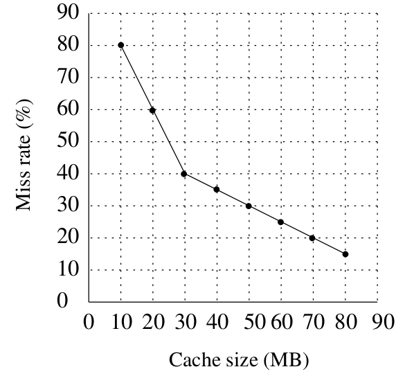

# 408经典练习题 · 计算机组成原理篇 · 存储系统
> 本练习题精选自 408 计算机考研权威真题及经典高频必刷练习题库，包含完整题干、选项、高清插图及参考答案与解析。
---

### 【408JD-CO02-T01】第 1 题

考虑一个大小为 2KB（1KB = 2¹⁰ 字节）的组相联高速缓存，其缓存块大小为 64 字节。假设该缓存是字节可寻址的，并使用 32 位地址访问缓存。如果标记字段的宽度为 22 位，则该缓存的关联度（每组中有的 cache 块数量）是（ ）。

- **A.** 2
- **B.** 4
- **C.** 1
- **D.** 8

> **【唯一编号】** `408JD-CO02-T01`
> **【科目】** 计算机组成原理篇
> **【知识点】** 存储系统

<details>
<summary><b>💡 查看参考答案与解析</b></summary>

**【参考答案】** A

**【解析】**

**正确答案：A**

- **计算缓存行数**行数 = 缓存大小 / 块大小 = 2¹¹ B / 2⁶ B = 2⁵
- **确定组号位数**地址总位数 = 32 位标记位 = 22 位偏移量位 = log₂(块大小) = 6 位组号位 = 32 - 22 - 6 = 4 位
- **计算组数**组数 = 2^{组号位} = 2⁴ = 16
- **求解关联度**关联度 = 行数 / 组数 = 2⁵ / 2⁴ = 2

</details>

---

### 【408JD-CO02-T02】第 2 题

假设一个两级包含式缓存层次结构（L1 和 L2），其中 L2 容量更大。考虑以下两个陈述：

- S1：在采用直写（write through）策略的 L1 缓存中，读缺失不会导致脏行写回 L2。
- S2：写分配（write allocate）策略必须与直写缓存配合使用，而写回（write back）缓存则不采用写分配策略。

以下哪项陈述是正确的？（ ）

- **A.** S1 为真且 S2 为假
- **B.** S1 为假且 S2 为真
- **C.** S1 为真且 S2 为真
- **D.** S1 为假且 S2 为假

> **【唯一编号】** `408JD-CO02-T02`
> **【科目】** 计算机组成原理篇
> **【知识点】** 存储系统

<details>
<summary><b>💡 查看参考答案与解析</b></summary>

**【参考答案】** A

**【解析】**

**正确答案：A**

**S1 分析**

- 直写（Write Through）特性决定了所有写操作会同步传播到 L2 缓存
- 因此 L1 缓存中 **不存在脏行**（Dirty Line）
- 读缺失（Read Miss）时无需执行脏行写回操作
- 结论：S1 成立

**S2 分析**

- 直写缓存通常采用 **不写分配**（No-Write Allocate）策略

- 直接通过 L1 向 L2 传递写操作，无需加载数据到 L1
- 写回缓存通常采用 **写分配**（Write Allocate）策略

- 数据逐出 L1 时才会更新 L2 中的副本
- 原命题 “写分配必须与直写配合” 是错误表述
- 结论：S2 错误

最终结论：S1 正确，S2 错误，正确答案为 A

</details>

---

### 【408JD-CO02-T03】第 3 题

在 k 路组相联缓存中，缓存被划分为 v 个组，每个组包含 k 个缓存行。同一组内的缓存行按顺序排列，组 s 中的所有行均位于组 (s+1) 的行之前。主存块编号从 0 开始。编号为 j 的主存块必须映射到以下哪个缓存行范围？（ ）

- **A.** (j mod v) × k 到 (j mod v) × k + (k-1)
- **B.** (j mod v) 到 (j mod v) + (k-1)
- **C.** (j mod k) 到 (j mod k) + (v-1)
- **D.** (j mod k) × v 到 (j mod k) × v + (v-1)

> **【唯一编号】** `408JD-CO02-T03`
> **【科目】** 计算机组成原理篇
> **【知识点】** 存储系统

<details>
<summary><b>💡 查看参考答案与解析</b></summary>

**【参考答案】** A

**【解析】**

**正确答案：A**

**解析：**

- 缓存中共有 `v` 个组
- 主存块 `j` 将被映射到第 `(j mod v)` 个组中
- 该组对应的缓存行范围是：`(j mod v) × k` 至 `(j mod v) × k + (k-1)`

</details>

---

### 【408JD-CO02-T04】第 4 题

一个 RAM 芯片的容量为 1024 个 8 位字（1K × 8）。使用 1K × 8 RAM 构建 16K × 16 RAM 时，需要多少个带使能线的 2 × 4 译码器？（ ）

- **A.** 4
- **B.** 5
- **C.** 6
- **D.** 7

> **【唯一编号】** `408JD-CO02-T04`
> **【科目】** 计算机组成原理篇
> **【知识点】** 存储系统

<details>
<summary><b>💡 查看参考答案与解析</b></summary>

**【参考答案】** B

**【解析】**

**正确答案：B**

**解析过程**

- **芯片数量计算**

- 目标容量：16K × 16
- 单芯片容量：1K × 8
- 所需芯片总数：
 1K×816K×16=1×816×16=32片
- 分布方式：

- **垂直方向**（地址扩展）：16 片（16K / 1K）
- **水平方向**（数据扩展）：2 片（16 位 / 8 位）
- **译码器需求分析**

- 需要选择 16 片中的某一片 → 需 **4:16 译码器**
- 可用译码器为 **2:4 译码器**，需通过级联实现 4:16 功能
- **译码器级联逻辑**

- 第一级：1 个 2:4 译码器（控制 4 组）
- 每组需 4 个 2:4 译码器（实现 4:16 的子译码）
- 总计：
 1+4=5
个 2:4 译码器

**结论**：需 **5 个 2:4 译码器** 实现 4:16 译码功能。

</details>

---

### 【408JD-CO02-T05】第 5 题

一台计算机拥有大小为 256 KB、四路组相联、采用写回（Write Back）式的数据缓存，块大小为 32 字节。处理器向缓存控制器发送 32 位地址。每个缓存标签目录项除包含地址标签外，还包含 2 个有效位、1 个修改位和 1 个替换位。

地址的标签（Tag）字段中包含的位数是（ ）：

- **A.** 11
- **B.** 14
- **C.** 16
- **D.** 27

> **【唯一编号】** `408JD-CO02-T05`
> **【科目】** 计算机组成原理篇
> **【知识点】** 存储系统

<details>
<summary><b>💡 查看参考答案与解析</b></summary>

**【参考答案】** C

**【解析】**

**正确答案：C**

组相联方案是全相联缓存和直接映射缓存之间的折中方案。它在需要全相联缓存（需并行搜索所有槽位）复杂硬件与直接映射方案（可能导致相同槽位地址冲突，类似哈希表冲突）之间取得了合理平衡。

- **块数量计算**块数量 = 缓存大小 ÷ 块大小 = 256 KB ÷ 32 字节 = 2¹³
- **组数量计算**组数量 = 块数量 ÷ 路数 = 2¹³ ÷ 4 = 2¹¹
- **地址字段分解**地址总位数 = 标签 + 组偏移 + 字节偏移32 = 标签 + 11 (组偏移) + 5 (字节偏移)解得：标签 = 16

</details>

---

### 【408JD-CO02-T06】第 6 题

考虑前一问题中给出的数据。数据缓存的元数据部分的大小是（ ）

- **A.** 160 Kbits
- **B.** 136 bits
- **C.** 40 Kbits
- **D.** 32 bits

> **【唯一编号】** `408JD-CO02-T06`
> **【科目】** 计算机组成原理篇
> **【知识点】** 存储系统

<details>
<summary><b>💡 查看参考答案与解析</b></summary>

**【参考答案】** A

**【解析】**

**正确答案：A**

- **地址位**：16 位
- **有效位**：2 位
- **修改位**：1 位
- **替换位**：1 位

总位数 = 16 + 2 + 1 + 1 = 20 位总大小 = 20 位 × 块数量 = 160 Kbits

</details>

---

### 【408JD-CO02-T07】第 7 题

一个 8KB 的直接映射写回式缓存由多个 32 字节大小的块组成。处理器生成 32 位地址。缓存控制器为每个缓存块维护包含以下内容的元数据：

- 1 个有效位
- 1 个修改位
- 以及最少需要的位数来标识映射到缓存中的内存块

缓存控制器存储元数据（标签）所需的总内存大小是多少？（ ）

- **A.** 4864 位
- **B.** 6144 位
- **C.** 6656 位
- **D.** 5376 位

> **【唯一编号】** `408JD-CO02-T07`
> **【科目】** 计算机组成原理篇
> **【知识点】** 存储系统

<details>
<summary><b>💡 查看参考答案与解析</b></summary>

**【参考答案】** D

**【解析】**

**正确答案：D**

- **缓存参数**

- 缓存大小 = 8 KB
- 块大小 = 32 字节
- 行数量 =
 328×1024=256
- **地址分解**

- 地址总位数：32 位
- 块内偏移量：
 log2(32)=5
位
- 索引位数：
 log2(256)=8
位
- 标签位数：
 32−5−8=19
位
- **元数据计算**

- 每行元数据位数：1（有效位） + 1（修改位） + 19（标签） = 21 位
- 总内存：
 21×256=5376
位

</details>

---

### 【408JD-CO02-T08】第 8 题

一个容量为 4MB 的主存单元使用 1M×1 位的 DRAM 芯片构建。每个 DRAM 芯片包含 1K 行，每行有 1K 个存储单元。单次刷新操作耗时 100 ns。完成该主存单元所有存储单元的一次刷新操作所需的时间是：

- **A.** 100 ns
- **B.** 100×2¹⁰ ns
- **C.** 100×2²⁰ ns
- **D.** 3200×2²⁰ ns

> **【唯一编号】** `408JD-CO02-T08`
> **【科目】** 计算机组成原理篇
> **【知识点】** 存储系统

<details>
<summary><b>💡 查看参考答案与解析</b></summary>

**【参考答案】** B

**【解析】**

**正确答案：B**

构建 4MB 主存所需的芯片数量 = (4 × 2²⁰ × 8) / (1 × 2²⁰) = 32 片在一次刷新周期中，内存芯片的整行会被同时刷新。这意味着给定的 100ns 单次刷新时间仅刷新芯片的一行。由于共有 1K=2¹⁰行，因此刷新整个芯片需要：2¹⁰ × 100ns。

**关键分析步骤**：

- **芯片数量计算**

- 主存总容量需求：4MB = 4 × 2²⁰ × 8 bit
- 单个芯片容量：1M × 1 bit = 1 × 2²⁰ bit
- 所需芯片数：(4 × 2²⁰ × 8) ÷ (1 × 2²⁰) = 32 片
- **刷新机制特性**

- **行刷新原理**：DRAM 刷新以行为单位，单次刷新操作可完成一行内所有存储单元的刷新。
- **单芯片刷新时间**：1K 行 × 100ns/行 = 2¹⁰ × 100ns
- **芯片排列与并行性**

- **串联排列模式**：32 片 1M×1bit 芯片串联组成 1M×32bit 的存储模块。
- **并行刷新特性**：所有串联芯片的同名行可在同一刷新周期内同步刷新。

**结论**：

- 总刷新时间 = 单芯片刷新时间 = 100 × 2¹⁰ ns
- 选项 (B) 正确。

</details>

---

### 【408JD-CO02-T09】第 9 题

某计算机系统包含一个 L1 缓存、一个 L2 缓存和主存储单元，连接方式如下图所示。L1 缓存的块大小为 4 字，L2 缓存的块大小为 16 字。L1 缓存、L2 缓存和主存储单元的访问时间分别为 2 ns、20 ns 和 200 ns。当 L1 缓存发生未命中而 L2 缓存命中时，会将一块数据从 L2 缓存转移到 L1 缓存。此次转移需要多长时间（ ）？


- **A.** 2 ns
- **B.** 20 ns
- **C.** 22 ns
- **D.** 88 ns

> **【唯一编号】** `408JD-CO02-T09`
> **【科目】** 计算机组成原理篇
> **【知识点】** 存储系统

<details>
<summary><b>💡 查看参考答案与解析</b></summary>

**【参考答案】** C

**【解析】**

**正确答案：C**

**解析**

- **访问 L2 缓存的时间**：20 ns
- **将数据写入 L1 缓存的时间**：2 ns

由于 L1 缓存的块大小为 4 字，仅需完成一次数据迁移操作。总时间 = 访问 L2 时间 + 写入 L1 时间 = 20 + 2 = **22 ns**

</details>

---

### 【408JD-CO02-T10】第 10 题

考虑上一题中的数据。当 L1 缓存和 L2 缓存都发生缺失时，首先会从主存向 L2 缓存传输一个块，然后从 L2 缓存向 L1 缓存传输一个块。这些传输的总耗时是多少？（ ）

- **A.** 222 ns
- **B.** 888 ns
- **C.** 902 ns
- **D.** 968 ns

> **【唯一编号】** `408JD-CO02-T10`
> **【科目】** 计算机组成原理篇
> **【知识点】** 存储系统

<details>
<summary><b>💡 查看参考答案与解析</b></summary>

**【参考答案】** C

**【解析】**

**正确答案：C**

**解析**

由于 **L2 缓存的块大小为 16 字**，而 **主存→L2 缓存的传输速率为 4 字**，因此需要进行四次每次传输 4 字的操作，然后再从 L2 缓存向 L1 缓存传输所需的 4 字。

具体计算如下：

- **主存→L2 缓存传输**：4 次 × (200 ns + 20 ns) = 4 × 220 ns = 880 ns
- **L2→L1 缓存传输**：1 次 × (20 ns + 2 ns) = 1 × 22 ns = 22 ns

**总时间**：880 ns + 22 ns = **902 ns**

选项 (C) 正确。

</details>

---

### 【408JD-CO02-T11】第 11 题

需要多少个 32K×1 的 RAM 芯片才能提供 256K 字节的存储容量？（ ）

- **A.** 8
- **B.** 32
- **C.** 64
- **D.** 128

> **【唯一编号】** `408JD-CO02-T11`
> **【科目】** 计算机组成原理篇
> **【知识点】** 存储系统

<details>
<summary><b>💡 查看参考答案与解析</b></summary>

**【参考答案】** C

**【解析】**

**正确答案：C**

**解析**

- **目标容量**：256 KB = 256 × 1024 × 8 比特
- **单个芯片容量**：32 K×1 = 32 × 1024 比特
- **计算公式**：
 32×1024256×1024×8=64
因此需要 **64 片** 32K×1 的 RAM 芯片。

</details>

---

### 【408JD-CO02-T12】第 12 题

在多级缓存层次结构中，若要使两个缓存层级 L1 和 L2 之间存在包含关系（inclusion），以下哪些条件是必须的？

I. L1 必须是直写（Write Through）缓存

II. L2 必须是直写缓存

III. L2 的关联度（Associativity）必须大于 L1

IV. L2 缓存至少与 L1 缓存一样大

- **A.** 仅 IV
- **B.** 仅 I 和 IV
- **C.** 仅 I、III 和 IV
- **D.** I、II、III 和 IV

> **【唯一编号】** `408JD-CO02-T12`
> **【科目】** 计算机组成原理篇
> **【知识点】** 存储系统

<details>
<summary><b>💡 查看参考答案与解析</b></summary>

**【参考答案】** A

**【解析】**

**正确答案：A**

**解释：**

- **陈述 I 不必要**因为在同一时间点，数据不需要完全相同。因此也可以使用写回策略。
- **陈述 II 不必要**因为讨论范围仅限于 L1 和 L2。
- **陈述 III 不必要**因为关联度可以相等。
- **陈述 IV 是必要的**L2 缓存必须至少与 L1 缓存一样大。

因此，选项 (A) 正确。

</details>

---

### 【408JD-CO02-T13】第 13 题

考虑一台机器，其数据缓存为 2 路组相联结构，容量为 64 KB，块大小为 16 字节。该缓存使用 32 位虚拟地址进行管理，页面大小为 4 KB。运行在该机器上的程序开始如下：

```c
double ARR[1024][1024];
int i,j;

// 初始化数组 ARR 为 0.0
for (i=0; i<1024; i++)
    for (j=0; j<1024; j++)
        ARR[i][j] = 0.0;
```

`double` 类型占用 8 字节。数组 `ARR` 从虚拟页 0xFF000 的起始位置存储，按行优先顺序排列。缓存初始为空且无预取操作。程序仅对数组 `ARR` 进行数据内存访问。缓存目录中标签（tag）的总大小是：（ ）

- **A.** 32 Kbits
- **B.** 34 Kbits
- **C.** 64 Kbits
- **D.** 68 Kbits

> **【唯一编号】** `408JD-CO02-T13`
> **【科目】** 计算机组成原理篇
> **【知识点】** 存储系统

<details>
<summary><b>💡 查看参考答案与解析</b></summary>

**【参考答案】** D

**【解析】**

**正确答案：D**

**解析**

- **计算缓存参数**

- 缓存总容量：64 KB = 65536 字节
- 块大小：16 字节 → 每块包含 16/8 = 2 个 `double` 元素
- 组数：64 KB / (16 字节 × 2 路) = 2048 组
- **确定标签位数**

- 虚拟地址 32 位，页面大小 4 KB = 4096 字节 → 页面内偏移量占 12 位
- 块大小 16 字节 → 块内偏移量占 4 位
- 组索引位数：log₂(2048 组) = 11 位
- 标签位数 = 32 - 11 - 4 = 17 位
- **计算标签总大小**

- 每组 2 路 → 总块数：2048 组 × 2 路 = 4096 块
- 每块标签 17 位 → 总标签大小：4096 × 17 = 69632 位 = 68 Kbits

</details>

---

### 【408JD-CO02-T14】第 14 题

该初始化循环的缓存命中率是（ ）

- **A.** 0%
- **B.** 25%
- **C.** 50%
- **D.** 75%

> **【唯一编号】** `408JD-CO02-T14`
> **【科目】** 计算机组成原理篇
> **【知识点】** 存储系统

<details>
<summary><b>💡 查看参考答案与解析</b></summary>

**【参考答案】** C

**【解析】**

**正确答案：C**

解释：缓存命中率 = 命中次数 / 总访问次数      = 1024/(1024+1024)      = 1/2 = 0.5 = 50%

因此，选项 (C) 是正确答案。

</details>

---

### 【408JD-CO02-T15】第 15 题

考虑一个由 128 行组成、每行大小为 64 字的四路组相联高速缓存。CPU 生成主存中某个字的 20 位地址。TAG 字段、LINE 字段和 WORD 字段的位数分别为（ ）：

- **A.** 9,6,5
- **B.** 7, 7, 6
- **C.** 7, 5, 8
- **D.** 9, 5, 6

> **【唯一编号】** `408JD-CO02-T15`
> **【科目】** 计算机组成原理篇
> **【知识点】** 存储系统

<details>
<summary><b>💡 查看参考答案与解析</b></summary>

**【参考答案】** D

**【解析】**

**正确答案：D**

**解析**：

- **组数计算**：128 行 ÷ 4 路 = 32 组
- **字偏移**：64 字 → 需
 log264=6
位标识字位置
- **行偏移**：32 组 → 需
 log232=5
位标识组索引
- **TAG 计算**：20 位地址 - (5 位行偏移 + 6 位字偏移) = 9 位 TAG

最终组合为：9 位 TAG, 5 位 LINE, 6 位 WORD

</details>

---

### 【408JD-CO02-T16】第 16 题

考虑一个具有
 216
字节字节可寻址主存的机器。假设系统中使用了一个由 32 行、每行 64 字节组成的直接映射数据缓存。一个 50×50 的二维字节数组从内存地址 1100H 开始存储在主存中。假设数据缓存初始为空，整个数组被访问两次。假设两次访问之间缓存内容不变。

总共会发生多少次数据缓存缺失？（ ）

- **A.** 40
- **B.** 50
- **C.** 56
- **D.** 59

> **【唯一编号】** `408JD-CO02-T16`
> **【科目】** 计算机组成原理篇
> **【知识点】** 存储系统

<details>
<summary><b>💡 查看参考答案与解析</b></summary>

**【参考答案】** C

**【解析】**

**正确答案：C**

缓存大小 =
 32×64
B =
 211
B = 2048 B，字节数组大小 = 2500 B，因此 cache 容量不足以容纳整个数组。

完整存储数组需要用到
 ⌈2500/64⌉=40
个 cache 行。在两次遍历数组的过程中，前 8 个 cache 行会在遍历过程被替换，后 24 个 cache 行不会被替换，所以 cache 缺失的次数为
 40+8×2=56
。

其中 40 为第一次遍历数组的 cache 缺失次数，8×2 为第二次遍历数组的缺失次数。

</details>

---

### 【408JD-CO02-T17】第 17 题

考虑上一题中给出的数据。

在第二次访问数组时，以下哪一行数据缓存会被新块替换？（ ）

- **A.** 第 4 行到第 11 行
- **B.** 第 4 行到第 12 行
- **C.** 第 0 行到第 7 行
- **D.** 第 0 行到第 8 行

> **【唯一编号】** `408JD-CO02-T17`
> **【科目】** 计算机组成原理篇
> **【知识点】** 存储系统

<details>
<summary><b>💡 查看参考答案与解析</b></summary>

**【参考答案】** A

**【解析】**

**正确答案：A**

上一题我们已经提到，存储有数组的前八个 cache 行会被替换，所以这里关键就在于搞清楚第一个存储数组的 cahce 行号。

给 cache 的地址结构为：`| 标记 (5 bits) | cache 行号 (5 bits) | 块内偏移 (6 bits) |`

数组的起始地址 1100H 对应的二进制为 00010 00100 000000，对应的 cache 行号为 4，所以数组的第一个字节存储在 cache 的第 4 行。

前 8 个 cache 行会被替换，所以被替换的 cache 行为 4 到 11。

</details>

---

### 【408JD-CO02-T18】第 18 题

一个容量为 16 KB 的四路组相联高速缓存存储单元，采用 8 字块大小。字长为 32 位。物理地址空间大小为 4 GB。标记（TAG）字段的位数是（ ）

- **A.** 5
- **B.** 15
- **C.** 20
- **D.** 25

> **【唯一编号】** `408JD-CO02-T18`
> **【科目】** 计算机组成原理篇
> **【知识点】** 存储系统

<details>
<summary><b>💡 查看参考答案与解析</b></summary>

**【参考答案】** C

**【解析】**

**正确答案：C**

在 k 路组相联映射中，高速缓存被划分为若干组，每组包含 k 个块。高速缓存容量 = 16 KB。由于是四路组相联，K = 4。块大小 B = 8 字（1 字=4 字节）。物理地址空间大小 = 4 GB = 4×2³⁰ 字节 = 2³² 字节。

**计算步骤：**

- 高速缓存总块数 N = 容量 / 块大小 = (16×1024 字节) / (8×4 字节) = 512
- 组数 S = 总块数 / 每组块数 = 512 / 4 = 128
- 物理地址空间划分：每个组可访问 (2³² 字节)/128 = 2²⁵ 字节 = 2²³ 字 = 2²⁰ 块
- 为标识这 2²⁰ 个块，需要 20 位标记字段

因此选项 C 正确。

</details>

---

### 【408JD-CO02-T19】第 19 题

在设计计算机的缓存系统时，缓存块（或缓存行）的大小是一个重要参数。以下哪一项陈述在此上下文中是正确的？（ ）

- **A.** 较小的块大小意味着更好的空间局部性
- **B.** 较小的块大小意味着更小的缓存标签，从而降低缓存标签开销
- **C.** 较小的块大小意味着更大的缓存标签，从而降低缓存命中时间
- **D.** 较小的块大小会导致更低的缓存未命中惩开销

> **【唯一编号】** `408JD-CO02-T19`
> **【科目】** 计算机组成原理篇
> **【知识点】** 存储系统

<details>
<summary><b>💡 查看参考答案与解析</b></summary>

**【参考答案】** D

**【解析】**

**正确答案：D**

**解析**

**块**：内存被划分为等长的段，每个段称为一个块。缓存中的数据以块的形式存储。其核心思想是利用空间局部性（一旦某个位置被访问，很可能在不久的将来需要访问其附近的地址）。

**标签位**：每个缓存块都有一组标签位，用于标识该缓存块对应主内存中的哪个块。

- **选项 A**：如果块大小较小，该块中包含未来 CPU 访问的附近地址的数量会减少，因此空间局部性并不更好。
- **选项 B**：如果块大小较小，缓存中块的数量会更多，因此需要更多的缓存标签位，而不是更少。
- **选项 C**：缓存标签位更多（因为较小的块大小导致更多块），但更多的标签位无法降低命中时间（甚至可能增加）。
- **选项 D**：当缓存发生未命中（即 CPU 需要的块不在缓存中）时，必须从下一级存储（如主存）将该块调入缓存。若块大小较小，则调入缓存所需时间更短，因此未命中开销更低。

因此，正确答案是 **D**。

</details>

---

### 【408JD-CO02-T20】第 20 题

如果在保持容量和块大小不变的情况下，将处理器缓存的关联度加倍，以下哪一项 **肯定不会受到影响**（ ）？

- **A.** 标记比较器的位宽
- **B.** 组索引译码器的位宽
- **C.** 路径选择多路复用器的位宽
- **D.** 处理器到主存数据总线的位宽

> **【唯一编号】** `408JD-CO02-T20`
> **【科目】** 计算机组成原理篇
> **【知识点】** 存储系统

<details>
<summary><b>💡 查看参考答案与解析</b></summary>

**【参考答案】** D

**【解析】**

**正确答案：D**

**解析**

- **关键结论**：当缓存关联度加倍时，**主存数据总线宽度（D）** 是唯一不受影响的组件
- **各选项分析**：

- **(B) 错误**：关联度加倍导致组数减半 → 组索引位宽减少 → 解码器宽度必然变化
- **(C) 错误**：每组包含的缓存行数量翻倍 → 需从双倍候选路径中选择 → 多路复用器宽度需增加
- **(A) 错误**：组内条目数增加 → 需更多标记位区分不同映射 → 标记比较器宽度需扩展
- **(D) 正确**：数据总线宽度由主存接口设计决定，与缓存组织方式（如关联度）无直接关联
- **核心原理**：缓存架构变更（如关联度调整）主要影响控制器内部逻辑单元，而物理层的数据传输通道（如主存总线）属于独立设计维度，二者互不干扰

</details>

---

### 【408JD-CO02-T21】第 21 题

一个 CPU 的缓存块大小为 64 字节。主存有 k 个存储体，每个存储体宽 c 字节。连续的 c 字节块被映射到连续的存储体上，并采用环绕方式。所有 k 个存储体可以并行访问，但对同一存储体的两次访问必须串行化。一个缓存块的访问可能需要多次并行存储体访问迭代，具体取决于通过并行访问所有 k 个存储体获得的数据量。每次迭代需要解码要访问的存储体编号，这需要 k/2 ns。单个存储体访问的延迟为 80 ns。若 c=2 且 k=24，则从地址零开始检索缓存块到主存的延迟是（ ）：

- **A.** 92 ns
- **B.** 104 ns
- **C.** 172 ns
- **D.** 184 ns

> **【唯一编号】** `408JD-CO02-T21`
> **【科目】** 计算机组成原理篇
> **【知识点】** 存储系统

<details>
<summary><b>💡 查看参考答案与解析</b></summary>

**【参考答案】** D

**【解析】**

**正确答案：D**

**解析：**

- **参数定义**

- 缓存块大小：64 字节
- 存储体数量
 k=24
- 单个存储体宽度
 c=2
字节
- **单次迭代数据量**每次并行访问可获取
 k×c=24×2=48
字节。
- **迭代次数计算**获取 64 字节需
 ⌈64/48⌉=2
次迭代。
- **单次迭代耗时**

- 解码时间：
 k/2=24/2=12
纳秒
- 存储体访问延迟：80 纳秒
- **总单次迭代时间**：
 12+80=92
纳秒
- **总延迟** 2×92=184
纳秒

</details>

---

### 【408JD-CO02-T22】第 22 题

考虑两种缓存组织结构：第一种是 32KB、2 路组相联，块大小为 32 字节；第二种大小相同但采用直接映射方式。两种情况下的地址长度均为 32 位。一个 2 选 1 多路复用器的延迟为 0.6 ns，而 k 位比较器的延迟为 k/10 ns。组相联结构的命中延迟为 h1，直接映射结构的命中延迟为 h2。h1 的值是（ ）。

- **A.** 2.4 ns
- **B.** 2.3 ns
- **C.** 1.8 ns
- **D.** 1.7 ns

> **【唯一编号】** `408JD-CO02-T22`
> **【科目】** 计算机组成原理篇
> **【知识点】** 存储系统

<details>
<summary><b>💡 查看参考答案与解析</b></summary>

**【参考答案】** A

**【解析】**

**正确答案：A**

**解析过程：**

- **基础参数计算**

- 缓存大小 = 32 KB = 32 × 2¹⁰ 字节
- 块大小 = 32 字节
- 块总数 = 2
- **组相联结构分析**

- 总组合数 = 缓存大小 / (块数 × 块大小) = 32 × 2¹⁰ / (2 × 32) = 512 = 2⁹
- **索引位数** = log₂(512) = 9 位
- **偏移位数** = log₂(32) = 5 位（因块大小为 32 字节）
- **标签位数** = 32 – 9 – 5 = 18 位
- **命中延迟计算**

- 多路复用器延迟 = 0.6 ns
- 标签比较器延迟 = 18 / 10 = 1.8 ns
- **总命中延迟 h1** = 0.6 + 1.8 = **2.4 ns**

因此选项 (A) 正确。

</details>

---

### 【408JD-CO02-T23】第 23 题

某 CPU 具有 32 KB 直接映射缓存，块大小为 128 字节。假设 A 是一个 512×512 的二维数组，每个元素占用 8 字节。考虑以下两个 C 代码段 P1 和 P2：

```c
// P1:
for (i = 0; i < 512; i++) {
    for (j = 0; j < 512; j++) {
        x += A[i][j];
    }
}
```

```c
// P2:
for (i = 0; i < 512; i++) {
    for (j = 0; j < 512; j++) {
        x += A[j][i];
    }
}
```

P1 和 P2 在相同初始状态下独立执行，即数组 A 不在缓存中，且 i、j、x 均在寄存器中。设 P1 经历的缓存未命中次数为 M1，P2 为 M2。

M1 的值是（ ）：

- **A.** 0
- **B.** 2048
- **C.** 16384
- **D.** 262144

> **【唯一编号】** `408JD-CO02-T23`
> **【科目】** 计算机组成原理篇
> **【知识点】** 存储系统

<details>
<summary><b>💡 查看参考答案与解析</b></summary>

**【参考答案】** C

**【解析】**

**正确答案：C**

**解析**

- **访问模式分析**

- [P1] 采用行优先访问（`A[i][j]`）
- [P2] 采用列优先访问（`A[j][i]`）
- **缓存参数计算**

- 缓存块数量 = 总容量 ÷ 块大小 = 32 KB ÷ 128 B = 256
- 每块可容纳元素数 = 块大小 ÷ 元素大小 = 128 B ÷ 8 B = 16
- **未命中次数推导**

- 数组总元素数 = 512 × 512 = 262,144
- 行优先访问时，每块可提供 16 次有效访问
- 由于缓存容量限制，需替换的块数 = 总元素数 ÷ (每块元素数 × 缓存块数) = 262,144 ÷ (16 × 256) = 64
- 实际未命中次数 = 每块首次访问触发一次未命中 → 64 × 256 = 16,384
- **关键结论**

$$
M1=256512×512×16=16384
$$

</details>

---

### 【408JD-CO02-T24】第 24 题

某 CPU 具有 32 KB 直接映射缓存，块大小为 128 字节。假设 A 是一个 512×512 的二维数组，每个元素占用 8 字节。考虑以下两个 C 代码段 P1 和 P2：

```c
// P1:
for (i = 0; i < 512; i++) {
    for (j = 0; j < 512; j++) {
        x += A[i][j];
    }
}
```

```c
// P2:
for (i = 0; i < 512; i++) {
    for (j = 0; j < 512; j++) {
        x += A[j][i];
    }
}
```

P1 和 P2 在相同初始状态下独立执行（即数组 A 不在缓存中，i、j、x 寄存器中）。设 P1 经历的缓存未命中次数为 M1，P2 为 M2。

M1/M2 的比值是：（ ）

- **A.** 0
- **B.** 1/16
- **C.** 1/8
- **D.** 16

> **【唯一编号】** `408JD-CO02-T24`
> **【科目】** 计算机组成原理篇
> **【知识点】** 存储系统

<details>
<summary><b>💡 查看参考答案与解析</b></summary>

**【参考答案】** B

**【解析】**

**正确答案：B**

**解析过程：**

- **访问模式分析**

- 代码段 P1: 行优先访问（`A[i][j]`）
- 代码段 P2: 列优先访问（`A[j][i]`）
- **缓存参数计算**

- 缓存块数量 = 缓存大小 ÷ 块大小 = 32KB ÷ 128 字节 = 256
- 每个块中的数组元素数 = 块大小 ÷ 元素大小 = 128 字节 ÷ 8 字节 = 16
- **未命中次数计算**

- **P1 总未命中次数**
 总元素数÷每块元素数×缓存块数量=(512×512)÷16×256=16384
- **P2 总未命中次数**所有元素均未命中：
 512×512=262144
- **比例计算**

$$
M2M1=26214416384=161
$$

</details>

---

### 【408JD-CO02-T25】第 25 题

考虑一个大小为 32 KB 的直接映射缓存，块大小为 32 字节。CPU 生成 32 位地址。需要多少位用于缓存索引和标记位？（ ）

- **A.** 10, 17
- **B.** 10, 22
- **C.** 15, 17
- **D.** 5, 17

> **【唯一编号】** `408JD-CO02-T25`
> **【科目】** 计算机组成原理篇
> **【知识点】** 存储系统

<details>
<summary><b>💡 查看参考答案与解析</b></summary>

**【参考答案】** A

**【解析】**

**正确答案：A**

**解析**

- 缓存大小 = 32 KB = 2⁵ × 2¹⁰ 字节 = 2¹⁵ 字节
- 需要 15 位进行缓存寻址，因此 CPU 地址包含标记和索引
- 标记位数 = 32 - 15 = 17

从 15 位缓存寻址位中包含块和字（字节）：

- 每个块有 32 字节 → 需要 5 位偏移量
- 索引 = 块 + 字偏移
- 块位数 = 15 - 5 = 10

结论：索引位 10 位，标记位 17 位，选项 (A) 正确。

</details>

---

### 【408JD-CO02-T26】第 26 题

考虑一台具有
 232
字节字节可寻址内存的机器，将其划分为大小为 32 字节的块。假设该机器使用一个拥有 512 个缓存行的 2 路组相联缓存。标记字段的位数是（ ）

- **A.** 18
- **B.** 16
- **C.** 19
- **D.** 21

> **【唯一编号】** `408JD-CO02-T26`
> **【科目】** 计算机组成原理篇
> **【知识点】** 存储系统

<details>
<summary><b>💡 查看参考答案与解析</b></summary>

**【参考答案】** C

**【解析】**

**正确答案：C**

**解释：**

- **总地址空间**：32 位（对应
 232
字节内存）
- **块内偏移（WO）**：5 位（32 字节块，
 log232=5
）
- **组索引（SO）**：
 log2(每组路数缓存行总数)=log2(2512)=log2256=8位
- **标记位计算**：
 32（地址位）−8（组索引）−5（块内偏移）=19位
因此，选项 (C) 正确。

</details>

---

### 【408JD-CO02-T27】第 27 题

将多个字放入一个缓存块中是为了（ ）

- **A.** 利用程序中的时间局部性
- **B.** 利用程序中的空间局部性
- **C.** 减少缺失惩罚
- **D.** 以上都不是

> **【唯一编号】** `408JD-CO02-T27`
> **【科目】** 计算机组成原理篇
> **【知识点】** 存储系统

<details>
<summary><b>💡 查看参考答案与解析</b></summary>

**【参考答案】** B

**【解析】**

**正确答案：B**程序访问内存时，缓存块存储连续地址的数据。这一设计基于程序在执行过程中倾向于访问邻近内存位置的 **空间局部性** 原理。

</details>

---

### 【408JD-CO02-T28】第 28 题

交换空间（swap space）位于何处？（ ）

- **A.** RAM
- **B.** 磁盘
- **C.** ROM
- **D.** 片上缓存

> **【唯一编号】** `408JD-CO02-T28`
> **【科目】** 计算机组成原理篇
> **【知识点】** 存储系统

<details>
<summary><b>💡 查看参考答案与解析</b></summary>

**【参考答案】** B

**【解析】**

**正确答案：B**

**解析**

- **核心原理**：交换空间是操作系统在物理内存（RAM）不足时，用于临时存储数据的磁盘区域
- **定位依据**：

- 实际位置在磁盘（选项 B）
- ROM 属于只读存储器
- 片上缓存为高速缓存设备
- **功能限制**：

- ROM 和片上缓存不具备动态数据交换能力
- 无法作为交换空间使用

</details>

---

### 【408JD-CO02-T29】第 29 题

假设对于某个处理器，缓存命中的读请求需要 5 ns，缓存未命中的读请求需要 50 ns。运行某程序时观察到 80% 的读请求导致缓存命中。该处理器的平均读取访问时间（单位：ns）为（  ）。

- **A.** 10
- **B.** 12
- **C.** 13
- **D.** 14

> **【唯一编号】** `408JD-CO02-T29`
> **【科目】** 计算机组成原理篇
> **【知识点】** 存储系统

<details>
<summary><b>💡 查看参考答案与解析</b></summary>

**【参考答案】** D

**【解析】**

**正确答案：D****解析：**平均读取访问时间（单位：ns） = 0.8 × 5 + 0.2 × 50 = 4 + 10 = 14

</details>

---

### 【408JD-CO02-T30】第 30 题

考虑一台具有 2²⁰ 字节可寻址主存的机器，块大小为 16 字节，采用直接映射缓存且有 2¹² 个缓存行。假设主存中两个连续字节的地址分别为 (E201F)₁₆ 和 (E2020)₁₆。那么主存地址 (E201F)₁₆ 对应的标签（tag）和缓存行地址（以十六进制表示）是什么？（ ）

- **A.** E, 201
- **B.** F, 201
- **C.** E, E20
- **D.** 2, 01F

> **【唯一编号】** `408JD-CO02-T30`
> **【科目】** 计算机组成原理篇
> **【知识点】** 存储系统

<details>
<summary><b>💡 查看参考答案与解析</b></summary>

**【参考答案】** A

**【解析】**

**正确答案：A**

**解析**

- 块大小 = 16 字节 → 块偏移 = 4
- 缓存行数 = 2¹² → 索引位数 = 12
- 主存大小 = 2²⁰ → 标签位数 = 20 - 12 - 4 = 4
- 十六进制地址 E201F 分解：

**标签字段** = 前 4 位 = `E`（十六进制）**缓存行号** = 接下来的 12 位 = `201`（十六进制）

</details>

---

### 【408JD-CO02-T31】第 31 题

考虑一个具有两级高速缓存的系统。一级缓存、二级缓存和主存的访问时间分别为 1ns、10ns 和 500ns。一级缓存和二级缓存的命中率分别为 0.8 和 0.9。忽略缓存内部搜索时间，系统的平均访问时间是多少？（ ）

- **A.** 13.0 ns
- **B.** 12.8 ns
- **C.** 12.6 ns
- **D.** 12.4 ns

> **【唯一编号】** `408JD-CO02-T31`
> **【科目】** 计算机组成原理篇
> **【知识点】** 存储系统

<details>
<summary><b>💡 查看参考答案与解析</b></summary>

**【参考答案】** C

**【解析】**

**正确答案：C**

**解析**

**系统访问流程**

系统会按层级依次查找缓存：

- 首先查找一级缓存
- 若一级缓存未命中，则查找二级缓存
- 若二级缓存仍未命中，则访问主存

**平均访问时间构成**

需综合考虑以下三种场景：

- 一级缓存命中
- 一级缓存未命中但二级缓存命中
- 两级缓存均未命中且主存命中

**计算公式**

$$
平均访问时间=[H1×T1]+[(1−H1)×H2×T2]+[(1−H1)(1−H2)×Hm×Tm]
$$

| 参数 | 含义 | 数值 |
| --- | --- | --- |
| H₁ | 一级缓存命中率 | 0.8 |
| T₁ | 一级缓存访问时间 | 1 ns |
| H₂ | 二级缓存命中率 | 0.9 |
| T₂ | 二级缓存访问时间 | 10 ns |
| Hₘ | 主存命中率 | 1 |
| Tₘ | 主存访问时间 | 500 ns |

**分步计算**

- 一级缓存命中贡献： 0.8×1=0.8ns
- 一级未命中但二级命中的贡献： (1−0.8)×0.9×10=0.2×0.9×10=1.8ns
- 两级未命中访问主存的贡献： (1−0.8)(1−0.9)×1×500=0.2×0.1×500=10ns

**最终结果**

$$
总平均访问时间=0.8+1.8+10=12.6ns
$$

因此，正确答案是选项 C。

</details>

---

### 【408JD-CO02-T32】第 32 题

DRAM 的存储周期时间为 64 ns。它需要每毫秒刷新 100 次，每次刷新需要 100 ns。用于刷新的存储周期时间占多少百分比？（ ）

- **A.** 10%
- **B.** 6.4%
- **C.** 1%
- **D.** 0.64%

> **【唯一编号】** `408JD-CO02-T32`
> **【科目】** 计算机组成原理篇
> **【知识点】** 存储系统

<details>
<summary><b>💡 查看参考答案与解析</b></summary>

**【参考答案】** C

**【解析】**

**正确答案：C**

**解析：**

- **已知条件：**

- 存储周期时间 =
 64ns=64×10−9s
- 刷新频率 = 每
 1ms=10−3s
刷新 100 次
- 单次刷新耗时 =
 100ns=100×10−9s
- **计算单个存储周期内的刷新次数：**

$$
10−3s100次×64×10−9s=64×10−4次
$$
- **计算总刷新耗时：**

$$
64×10−4次×100×10−9s/次=64×10−11s
$$
- **计算刷新占用的存储周期百分比：**

$$
64×10−9s64×10−11s×100%=1%
$$

因此选项 (C) 正确。

</details>

---

### 【408JD-CO02-T33】第 33 题

一个处理器最多支持 4GB 内存，其中内存是按字寻址的（每个字由两个字节组成）。该处理器的地址总线至少需要（ ）位。

- **A.** 16
- **B.** 31
- **C.** 32
- **D.** 以上选项都不是

> **【唯一编号】** `408JD-CO02-T33`
> **【科目】** 计算机组成原理篇
> **【知识点】** 存储系统

<details>
<summary><b>💡 查看参考答案与解析</b></summary>

**【参考答案】** B

**【解析】**

**正确答案：B**

**解析**

- 最大内存容量：
 4GB=232字节
- 每个字大小：
 2字节
- 因此，字的数量为：
 2232=231
- 所以处理器的地址总线需要至少 **31 位**

因此，正确答案是 B。

</details>

---

### 【408JD-CO02-T34】第 34 题

某机器的物理地址宽度为 40 位。一个 512 KB 的 8 路组相联高速缓存中，标记字段（tag field）的宽度是（  ）位。

- **A.** 24
- **B.** 20
- **C.** 30
- **D.** 40

> **【唯一编号】** `408JD-CO02-T34`
> **【科目】** 计算机组成原理篇
> **【知识点】** 存储系统

<details>
<summary><b>💡 查看参考答案与解析</b></summary>

**【参考答案】** A

**【解析】**

**正确答案：A**

**解题思路**

- **基本公式**物理地址 = 标记位 (T) + 组索引位 (S) + 块内偏移位 (O)即
 T+S+O=40
- **参数计算**

- 高速缓存总容量：512 KB =
 219
字节
- 8 路组相联 → 每组包含 8 行
- 设块大小为
 2y
字节 → 块内偏移
 O=y
位
- 总行数 =
 2y512KB=2y219
- 组数 =
 8总行数=23219−y=216−y
- 组索引位
 S=log2(组数)=16−y
- **代入求解**将
 S=16−y
和
 O=y
代入公式：

$$
T+(16−y)+y=40⇒T=24
$$

**错误分析与修正**

原文第二种解释存在以下问题：

- **错误 1**：行大小计算错误“行大小 = 512/8 = 64 KB” 是错误的，实际应为：
 块大小=8×组数512KB=8×2x219=216−x字节
- **错误 2**：偏移位计算矛盾正确的偏移位应为
 O=log2(块大小)=16−x
，而非文中所述的 6 位。

**最终结论**

通过规范推导可得：

$$
标记位=40−(S+O)=40−16=24位
$$

此结果与选项 A 完全一致。

</details>

---

### 【408JD-CO02-T35】第 35 题

一个文件系统使用内存缓存来缓存磁盘块。缓存的缺失率如图所示。从缓存读取一个块的延迟为 1ms，从磁盘读取一个块的延迟为 10ms。假设检查块是否存在于缓存中的成本可以忽略不计。可用的缓存大小以 10MB 的倍数提供。为了确保平均读取延迟低于 6ms，所需的最小缓存大小是（ ）MB。



- **A.** 10
- **B.** 20
- **C.** 30
- **D.** 40

> **【唯一编号】** `408JD-CO02-T35`
> **【科目】** 计算机组成原理篇
> **【知识点】** 存储系统

<details>
<summary><b>💡 查看参考答案与解析</b></summary>

**【参考答案】** C

**【解析】**

**正确答案：C**

设
 x
为未命中率，则
 (1−x)
为命中率。

- 命中时延迟为 1ms
- 未命中时延迟为 10ms

平均读取延迟计算如下：

$$
平均时间=x×10ms+(1−x)×1ms=9x+1ms
$$

根据题目要求，需满足：

$$
9x+1<6⇒9x<5⇒x<0.5556
$$

由缺失率曲线可知：

- 20MB 缓存时缺失率为 60%（
 x=0.6
）
- 30MB 缓存时缺失率为 40%（
 x=0.4
）

因此，满足
 x<0.5556
的最小缓存大小为 **30MB**。

</details>

---

### 【408JD-CO02-T36】第 36 题

一个缓存行大小为 64 字节。主存的延迟为 32ns，带宽为 1GB/秒。从主存中获取整个缓存行所需的时间是（ ）：

- **A.** 32 ns
- **B.** 64 ns
- **C.** 96 ns
- **D.** 128 ns

> **【唯一编号】** `408JD-CO02-T36`
> **【科目】** 计算机组成原理篇
> **【知识点】** 存储系统

<details>
<summary><b>💡 查看参考答案与解析</b></summary>

**【参考答案】** C

**【解析】**

**正确答案：C**

- **带宽计算**：1GB/秒 =
 109
字节/秒

- 加载 64 字节所需时间：
 10964s=64ns
- **总时间计算**：

- 主存延迟 32ns + 数据传输时间 64ns = **96ns**

</details>

---

### 【408JD-CO02-T37】第 37 题

某计算机系统包含一级指令缓存（I-cache）、一级数据缓存（D-cache）和二级缓存（L2-cache），其规格如下：主存中一个字的物理地址长度为 30 位。I-cache、D-cache 和 L2-cache 的标记存储器容量分别为（ ）：

- **A.** 1 K × 18 位，1 K × 19 位，4 K × 16 位
- **B.** 1 K × 16 位，1 K × 19 位，4 K × 18 位
- **C.** 1 K × 16 位，512 × 18 位，1 K × 16 位
- **D.** 1 K × 18 位，512 × 18 位，1 K × 18 位

> **【唯一编号】** `408JD-CO02-T37`
> **【科目】** 计算机组成原理篇
> **【知识点】** 存储系统

<details>
<summary><b>💡 查看参考答案与解析</b></summary>

**【参考答案】** A

**【解析】**

**正确答案：A**

**解释**

- **缓存中的块数** = 容量 / 块大小 = 2ᵐ
- **表示块所需的位数** = m
- **每个块中的字数** = 2ⁿ 字
- **表示字所需的位数** = n
- **标记位数** = （字的物理地址长度） - （表示块所需的位数） - （表示字所需的位数）
- **总标记位数** = 块数 × 标记位数

每个块都有自己的标记位。因此总标记位数 = 块数 × 标记位数。

</details>

---

### 【408JD-CO02-T38】第 38 题

考虑一个具有以下特性的四路组相联映射缓存计算机：主存总容量为 1MB，字长为 1 字节，块大小为 128 字，缓存容量为 8KB。

TAG、SET 和 WORD 字段中的位数分别为（ ）：

- **A.** 7, 6, 7
- **B.** 8, 5, 7
- **C.** 8, 6, 6
- **D.** 9, 4, 7

> **【唯一编号】** `408JD-CO02-T38`
> **【科目】** 计算机组成原理篇
> **【知识点】** 存储系统

<details>
<summary><b>💡 查看参考答案与解析</b></summary>

**【参考答案】** D

**【解析】**

**正确答案：D**

根据题目描述可知**缓存总容量**：8KB**主存总容量**：1MB**块大小**：128 字（128 字节）

**计算步骤**：

- **缓存块总数**缓存大小 ÷ (块大小 × 每字字节数) = 8KB ÷ (128 × 1B) = 64 块
- **缓存组数**四路组相联结构 → 组数 = 总块数 ÷ 4 = 64 ÷ 4 = 16 组SET 位数 = log₂(16) = 4 位
- **TAG 位数**

- 主存地址空间：1MB = 2²⁰ B
- 每组对应主存区域大小：1MB ÷ 16 组 = 64KB = 2¹⁶ B
- 每组包含的块数：2¹⁶ B ÷ 128 B/块 = 512 块
- 需要 TAG 位数：log₂(512) = 9 位
- **WORD 位数**块内偏移量：128 字 = 2⁷ → 需要 7 位

**最终结论**：(TAG, SET, WORD) = (9, 4, 7)

</details>

---

### 【408JD-CO02-T39】第 39 题

考虑一个具有以下特性的四路组相联映射高速缓存的计算机：主存总量为 1MB，字长为 1 字节，块大小为 128 字，高速缓存大小为 8KB。

当 CPU 访问内存地址 0C795H 时，对应高速缓存行的 TAG 字段内容是（ ）：

- **A.** 000011000
- **B.** 110001111
- **C.** 00011000
- **D.** 110010101

> **【唯一编号】** `408JD-CO02-T39`
> **【科目】** 计算机组成原理篇
> **【知识点】** 存储系统

<details>
<summary><b>💡 查看参考答案与解析</b></summary>

**【参考答案】** A

**【解析】**

**正确答案：A**

- **TAG 字段需要 9 位**
- **SET 需要 4 位**，**WORD 需要 7 位**

根据上一题推导出的结论：内存地址 0C795H 的二进制表示为：`0000 1100 0111 1001 0101`

按字段划分：

- **TAG = 前 9 位**：`0000 1100 0`
- **SET = 中间 4 位**：`1111`
- **WORD = 最后 7 位**：`001 0101`

因此，匹配的选项是 **选项 A**。该解法由 Namita Singh 贡献。

</details>

---

### 【408JD-CO02-T40】第 40 题

某计算机的主存有 2cm 块，而缓存有 2c 块。若缓存采用每组 2 块的组相联映射方案，则主存块 k 将映射到缓存的哪一组？（ ）

- **A.** 缓存的 (k mod m) 组
- **B.** 缓存的 (k mod c) 组
- **C.** 缓存的 (k mod 2c) 组
- **D.** 缓存的 (k mod 2cm) 组

> **【唯一编号】** `408JD-CO02-T40`
> **【科目】** 计算机组成原理篇
> **【知识点】** 存储系统

<details>
<summary><b>💡 查看参考答案与解析</b></summary>

**【参考答案】** B

**【解析】**

**正确答案：B**

**解析：**

- **已知条件：**

- 主存 = `2 C M` 块
- 缓存大小 = `2 C` 块
- **组相联映射规则：**

- 每组包含 2 条块（即 2 路组相联）
- 每组的行数 = 2（组大小）
- **缓存组数计算：**

```text
缓存组数 = 缓存大小 / 组大小
         = 2 C / 2
         = C
```
- **主存块映射规则：**

- 主存第 `k` 块映射到缓存的第 `(k mod C)` 组
- 即：`i = k mod c`

- `i`：缓存组号
- `k`：主存块号
- `c`：缓存中的组数

此解法由 VIVEK YEMUL 提供。

</details>

---

### 【408JD-CO02-T41】第 41 题

考虑一个数组 A[999]，每个元素占用 4 个字。使用一个 32 字的缓存，并将其划分为 16 字块。以下语句的 **缺失率** 是多少？假设在缺失的情况下，将读取一个块到缓存中：

```c
for (i = 0; i < 1000; i++)
    A[i] = A[i] + 99;
```

- **A.** 0.50
- **B.** 0.75
- **C.** 0.875
- **D.** 0.125

> **【唯一编号】** `408JD-CO02-T41`
> **【科目】** 计算机组成原理篇
> **【知识点】** 存储系统

<details>
<summary><b>💡 查看参考答案与解析</b></summary>

**【参考答案】** D

**【解析】**

**正确答案：D**

**解析**：

- **缓存块容量**：16 字块 × 4 字/元素 = 可容纳 4 个元素
- **访问模式**：每个元素被引用两次（一次读操作 + 一次写操作）
- **首次访问**：第一个元素读取时发生缺失 → 整个块加载到缓存
- **后续访问**：该块内后续 3 个元素的 7 次访问（含读写）均为命中
- **命中率计算**：每 8 次访问中有 7 次命中 → 命中率 7/8
- **缺失率结论**：1 - 7/8 = 1/8 = 0.125

选项 (D) 是正确的。

</details>

---

### 【408JD-CO02-T42】第 42 题

一个容量为 N 字、块大小为 B 字的高速缓存存储单元需要设计。若将其设计为 16 路组相联缓存，标记字段（TAG field）的长度为 10 位。若将该缓存单元改为直接映射缓存，则标记字段的长度为（ ）位。

- **A.** 6
- **B.** 14
- **C.** 16
- **D.** 以上选项都不正确

> **【唯一编号】** `408JD-CO02-T42`
> **【科目】** 计算机组成原理篇
> **【知识点】** 存储系统

<details>
<summary><b>💡 查看参考答案与解析</b></summary>

**【参考答案】** A

**【解析】**

**正确答案：A**

**解析**

- **关键公式**：

$$
组偏移=log(组数)行偏移
$$

$$
⇒行偏移=组偏移×log(组数)
$$
- **核心逻辑**：将 16 路组相联缓存转为直接映射缓存时，标记位数需减少
 log(组数)
。
- **具体计算**：

$$
新标记位数=10−log2(16)=10−4=6
$$
- **结论**：选项 (A) 正确。

</details>

---

### 【408JD-CO02-T43】第 43 题

在内存层次结构中，不同缓存的读取访问时间和命中率如下所示。主存储器的读取访问时间为 90 ns。假设缓存使用先访问引用字的读取策略和回写策略。假设所有缓存均为直接映射缓存。假设缓存中所有块的脏位始终为 0。在程序执行过程中，60% 的内存读取用于指令获取，40% 用于内存操作数获取。平均数据获取时间与平均指令获取时间的乘积总值是多少？

- **A.** 4.72
- **B.** 16.89
- **C.** 9.1
- **D.** 19.98

> **【唯一编号】** `408JD-CO02-T43`
> **【科目】** 计算机组成原理篇
> **【知识点】** 存储系统

<details>
<summary><b>💡 查看参考答案与解析</b></summary>

**【参考答案】** D

**【解析】**

**正确答案：D**

由于 L2 缓存同时服务于指令和数据。

- **平均指令获取时间** = L1 访问时间 + L1 缺失率 × L2 访问时间 + L1 缺失率 × L2 缺失率 × 内存访问时间= 2 + 0.2 × 8 + 0.2 × 0.1 × 90= 5.4 ns
- **平均数据获取时间** = L1 访问时间 + L1 缺失率 × L2 访问时间 + L1 缺失率 × L2 缺失率 × 内存访问时间= 2 + 0.1 × 8 + 0.1 × 0.1 × 90= 3.7 ns

因此，平均数据获取时间与平均指令获取时间的乘积总值为：5.4 × 3.7 = 19.98

选项 (D) 正确。

</details>

---

### 【408JD-CO02-T44】第 44 题

考虑一个总共有 16 个缓存块的 4 路组相联缓存（初始为空）。主内存包含 256 个块，内存块请求顺序如下：

0, 255, 1, 4, 3, 8, 133, 159, 216, 129, 63, 8, 48, 32, 73, 92, 155.

使用最近最少使用（LRU）页面替换算法时，缓存中发生的命中次数是多少？（ ）

- **A.** 0
- **B.** 1
- **C.** 2
- **D.** 3

> **【唯一编号】** `408JD-CO02-T44`
> **【科目】** 计算机组成原理篇
> **【知识点】** 存储系统

<details>
<summary><b>💡 查看参考答案与解析</b></summary>

**【参考答案】** B

**【解析】**

**正确答案：B**

已知这是一个总共有 16 个缓存块的 4 路组相联缓存（初始为空），因此可以形成编号为 0 到 3 的 4 个组。每个组包含 4 个块。

给定的内存块对 4 取模后得到：0, 1, 0, 3, 0, 1, 3, 1, 3, 0, 0, 0, 1, 3。

- **第 0 组**

- 请求序列：{0, 4, 8, 8, 48, 32}
- 命中分析：

- 第一次访问 0 → 缺页
- 第一次访问 4 → 缺页
- 第一次访问 8 → 缺页
- 第二次访问 8 → **命中**
- 后续访问 48/32 → 缺页
- **第 1 组**

- 请求序列：{1, 133, 129, 73}
- 所有访问均为首次 → 全部缺页
- **第 2 组**

- 无请求 → 无命中
- **第 3 组**

- 请求序列：{3, 159, 63, 155}
- 所有访问均为首次 → 全部缺页

最终仅发生 **1 次命中**，对应选项 (B) 正确。

</details>

---

### 【408JD-CO02-T45】第 45 题

某处理器的物理地址空间大小为
 2P
字节。字长为
 2W
字节，即每个字的大小为
 2W
字节。高速缓存容量为
 2N
字节。每个高速缓存块的大小为
 2M
字。对于一个 K 路组相联的高速缓存，标记字段（tag field）的长度（以位为单位）是：

- **A.** P − N − log₂K
- **B.** P − N + log₂K
- **C.** P − N − M − W − log₂K
- **D.** P − N − M − W + log₂K

> **【唯一编号】** `408JD-CO02-T45`
> **【科目】** 计算机组成原理篇
> **【知识点】** 存储系统

<details>
<summary><b>💡 查看参考答案与解析</b></summary>

**【参考答案】** B

**【解析】**

**正确答案：B**

物理地址空间为
 2P
字节。字长为
 2W
字节，意味着每个字的大小为
 2W
字节。高速缓存容量为
 2N
字节，标记字段大小为
 2X
字节。

**关键推导步骤**：

- **物理地址位数**：按字寻址时，总字数为
 2W2P=2P−W
，故物理地址需
 P−W
位。
- **高速缓存块数**：每个块大小为
 2M
字 ×
 2W
字节/字 =
 2M+W
字节。总块数为
 2M+W2N=2N−M−W
。
- **组数与组索引位数**：K 路组相联下，组数为
 K2N−M−W
。组索引位数为
 log2(K2N−M−W)=N−M−W−log2K
。
- **偏移量位数**：块内偏移量需
 M
位（因块大小为
 2M
字）。
- **标记位数计算**：标记位数 = 物理地址位数 - 组索引位数 - 偏移量位数

$$
x=(P−W)−(N−M−W−log2K)−M=P−N+log2K
$$

综上，选项 **(B)** 正确。

</details>

---

### 【408JD-CO02-T46】第 46 题

一个容量为 16 KB 的两路组相联高速缓存存储单元，使用块大小为 8 字。字长为 32 位。物理地址空间为 4 GB。TAG 和 SET 字段的位数分别为多少？（ ）

- **A.** 20, 7
- **B.** 19, 8
- **C.** 20, 8
- **D.** 21, 9

> **【唯一编号】** `408JD-CO02-T46`
> **【科目】** 计算机组成原理篇
> **【知识点】** 存储系统

<details>
<summary><b>💡 查看参考答案与解析</b></summary>

**【参考答案】** B

**【解析】**

**正确答案：B**

- **偏移字段（块大小）**：8 字 × 每个字的大小 = 8 × 4 字节 = 32 字节
- **块数量**：高速缓存大小 / 块大小 = 16 KB / 32 B = 512
- **组数量**：512 / 2 = 256
- **SET 字段所需位数**：log₂(256) = 8 位
- **TAG 位数**：32 - 5 - 8 = 19 位

</details>

---

### 【408JD-CO02-T47】第 47 题

某 CPU 具有 32KB 直接映射高速缓存，块大小为 128 字节。假设 A 是一个 512×512 的二维数组，每个元素占用 8 字节。考虑以下代码段：

```c
for (i = 0; i < 512; i++) {
  for (j = 0; j < 512; j++) {
    x += A[i][j];
  }
}
```

假设数组按 A[0][0], A[0][1], A[0][2]……顺序存储，则高速缓存缺失次数为（ ）。

- **A.** 16384
- **B.** 512
- **C.** 2048
- **D.** 1024

> **【唯一编号】** `408JD-CO02-T47`
> **【科目】** 计算机组成原理篇
> **【知识点】** 存储系统

<details>
<summary><b>💡 查看参考答案与解析</b></summary>

**【参考答案】** A

**【解析】**

**正确答案：A**

- **块大小与元素数量计算**

- 块大小 = 128 字节
- 每块包含元素数 = 128 / 8 = 16
- **数组存储方式**

- 块 0：A[0][0] 到 A[0][15]
- 块 1：A[0][16] 到 A[0][31] 依此类推
- **i=0 时的缺失分析**

- A[0][0] 不在高速缓存中，发生缺失
- 后续 15 个元素（j=1 到 j=15）命中缓存
- j 从 0 到 512 循环时，每 16 个元素发生一次缺失
- i=0 时总缺失次数 = 512 / 16 = 32 次
- **总缺失次数计算**

- 外层 i 循环从 0 到 512
- 总缺失次数 = 512 × 32 = 16384

</details>

---

### 【408JD-CO02-T48】第 48 题

假设你想要构建一个以 4 字节为单位、容量为
 221
位的存储器。如果该存储器由 2K×8 的 RAM 芯片组成，那么需要哪种类型的译码器？（ ）

- **A.** 5 到 32
- **B.** 6 到 64
- **C.** 4 到 64
- **D.** 7 到 128

> **【唯一编号】** `408JD-CO02-T48`
> **【科目】** 计算机组成原理篇
> **【知识点】** 存储系统

<details>
<summary><b>💡 查看参考答案与解析</b></summary>

**【参考答案】** A

**【解析】**

**正确答案：A**

要构建
 221
位的存储器且每个字为 4 字节，因此存储器应包含的 4 字节数量为：

$$
4×8221=216个字
$$

已知使用的 RAM 芯片规格为 2K×8，目标存储器需满足
 216
个字的需求。所需 RAM 芯片数量计算如下：

$$
2K×8216×32=32×4
$$

因此，这些 RAM 芯片应排列为 32 行（每行 4 列）的结构。需要译码器选择特定行，多路复用器选择特定列。由于有 32 行，需要 5-32 译码器选择目标行。因此选项 (A) 正确。

</details>

---

### 【408JD-CO02-T49】第 49 题

需要多少个（128 x 8 RAM）芯片才能提供 2048 字节的存储容量？（ ）

- **A.** 2
- **B.** 4
- **C.** 8
- **D.** 16

> **【唯一编号】** `408JD-CO02-T49`
> **【科目】** 计算机组成原理篇
> **【知识点】** 存储系统

<details>
<summary><b>💡 查看参考答案与解析</b></summary>

**【参考答案】** D

**【解析】**

**正确答案：D**

所需芯片（128 x 8 RAM）数量计算如下：

- 总存储容量：2048 字节 × 8 位/字节 =
 2048×8
位
- 单个芯片容量：
 128×8
位
- 芯片数量：
 128×82048×8=16

</details>

---

### 【408JD-CO02-T50】第 50 题

一个直接映射的 1MB 高速缓存，其块大小为 256 字节。该高速缓存的访问时间为 3ns，命中率为 94%。在发生高速缓存未命中时，从主存中将第一个字块传送到高速缓存需要 20ns，而每个后续字需要 5ns。字长为 64 位。平均内存访问时间（单位：ns，四舍五入到小数点后一位）是 （ ）。

- **A.** 13.5
- **B.** 15.5
- **C.** 23.5
- **D.** 15.3

> **【唯一编号】** `408JD-CO02-T50`
> **【科目】** 计算机组成原理篇
> **【知识点】** 存储系统

<details>
<summary><b>💡 查看参考答案与解析</b></summary>

**【参考答案】** A

**【解析】**

**正确答案：A**

- **已知条件**字长 = 64 位 = 8 字节块大小 = 256 字节每块字数 = 256 ÷ 8 = 32
- **未命中时的访问时间计算**第一个字传输时间 = 20 ns后续 31 个字传输时间 = 31 × 5 ns = 155 ns总未命中时间 = 3 ns（缓存访问） + 20 ns + 155 ns = 178 ns
- **平均内存访问时间公式**

$$
Tavg=(命中率×命中时间)+((1−命中率)×未命中总时间)
$$

代入数据：

$$
Tavg=(0.94×3)+(0.06×178)=2.82+10.68=13.5ns
$$

四舍五入后结果为 **13.5 ns**

选项 (A) 正确。

</details>

---

### 【408JD-CO02-T51】第 51 题

某计算机系统字长为 32 位，具有 16MB 的字节可寻址主存和 64KB、4 路组相联的高速缓存，块大小为 256 字节。考虑以下四个以十六进制表示的物理地址：A1 = 0x42C8A4，A2 = 0x546888，A3 = 0x6A289C，A4 = 0x5E4880以下哪一项是正确的（ ）？

- **A.** A1 和 A4 映射到不同的高速缓存组。
- **B.** A2 和 A3 映射到相同的高速缓存组。
- **C.** A3 和 A4 映射到相同的高速缓存组。
- **D.** A1 和 A3 映射到相同的高速缓存组。

> **【唯一编号】** `408JD-CO02-T51`
> **【科目】** 计算机组成原理篇
> **【知识点】** 存储系统

<details>
<summary><b>💡 查看参考答案与解析</b></summary>

**【参考答案】** B

**【解析】**

**正确答案：B**

**解析：**

- **参数计算**

- 块大小 = 256 字节 → 字偏移位 = log₂(256) = 8 位
- 高速缓存总容量 = 64KB = 2¹⁶ B
- 组数 = (64KB / 256B) / 4 路相联 = 256 / 4 = 64 组 → 组偏移位 = log₂(64) = 6 位
- **地址映射规则**物理地址分为三部分：**标记位 + 组索引 (6 位) + 字偏移 (8 位)**取地址的第 8~13 位（从右往左编号）作为组索引
- **各地址组索引分析**

```text
A1: 0x42C8A4 → C8 = 11001000 → 最低 6 位：001000 (8)
A2: 0x546888 → 68 = 01101000 → 最低 6 位：101000 (40)
A3: 0x6A289C → 28 = 00101000 → 最低 6 位：101000 (40)
A4: 0x5E4880 → 48 = 01001000 → 最低 6 位：001000 (8)
```
- **结论**A2 与 A3 的组索引均为 `101000`（十进制 40），因此映射到同一组。其他选项中组索引均不相同，故选 B

</details>

---

### 【408JD-CO02-T52】第 52 题

操作系统使用的各种存储设备按访问速度从低到高排列，正确顺序是（ ）：

- **A.** 磁带 → 磁盘 → 光盘 → 电子盘 → 主存 → 高速缓存 → 寄存器
- **B.** 磁带 → 磁盘 → 电子盘 → 光盘 → 主存 → 高速缓存 → 寄存器
- **C.** 磁带 → 电子盘 → 磁盘 → 光盘 → 主存 → 高速缓存 → 寄存器
- **D.** 磁带 → 光盘 → 磁盘 → 电子盘 → 主存 → 高速缓存 → 寄存器

> **【唯一编号】** `408JD-CO02-T52`
> **【科目】** 计算机组成原理篇
> **【知识点】** 存储系统

<details>
<summary><b>💡 查看参考答案与解析</b></summary>

**【参考答案】** D

**【解析】**

**正确答案：D**

存储设备的访问速度从低到高的正确顺序为：

- **磁带**
- **光盘**
- **磁盘**
- **电子盘**
- **主存**
- **高速缓存**
- **寄存器**

因此，选项 **(D)** 正确。

</details>

---

### 【408JD-CO02-T53】第 53 题

一个硬盘每条磁道有 63 个扇区，每个盘片有 2 个记录面，共有 10 个盘片和 1000 个柱面。扇区的地址表示为三元组 (c, h, s)，其中 c 是柱面号，h 是表面号，s 是扇区号。因此，第 0 个扇区的地址为 (0, 0, 0)，第 1 个扇区为 (0, 0, 1)，依此类推。地址<400,16,29>对应的扇区号是（ ）：

- **A.** 505035
- **B.** 505036
- **C.** 505037
- **D.** 505038

> **【唯一编号】** `408JD-CO02-T53`
> **【科目】** 计算机组成原理篇
> **【知识点】** 存储系统

<details>
<summary><b>💡 查看参考答案与解析</b></summary>

**【参考答案】** C

**【解析】**

**正确答案：C**

**解析**

硬盘中的数据按如下方式排列。最小的存储单位是扇区。多个扇区组合成一条磁道。柱面由位于相同半径位置的磁道组合而成。读写头访问磁盘时，需要先移动到特定磁道，然后等待盘片旋转使目标扇区位于其下方。此处，每个盘片有两个表面（即读写头可以从盘片的上下两面访问）。因此，<400,16,29>表示已通过了 0-399 号柱面。每个柱面包含 20 个表面（10 个盘片 × 每个盘片 2 个表面），每个表面有 63 个扇区。计算过程如下：

- 已通过 0-399 号柱面：**400 × 20 × 63 = 504000** 扇区
- 在第 400 号柱面中，已通过 0-15 号表面（共 16 个表面）：**16 × 63 = 1008** 扇区
- 当前在第 16 号表面上的第 29 号扇区：**29** 扇区

**总扇区号 = 504000 + 1008 + 29 = 505037**

</details>

---

### 【408JD-CO02-T54】第 54 题

考虑上一题给出的数据。第 1039 个扇区的地址是（ ）：

- **A.** (0, 15, 31)
- **B.** (0, 16, 30)
- **C.** (0, 16, 31)
- **D.** (0, 17, 31)

> **【唯一编号】** `408JD-CO02-T54`
> **【科目】** 计算机组成原理篇
> **【知识点】** 存储系统

<details>
<summary><b>💡 查看参考答案与解析</b></summary>

**【参考答案】** C

**【解析】**

**正确答案：C**

可以通过上一题上传的图像辅助理解。

**解析**

**(a) <0,15,31>**

- **表示含义**：第 0 柱面、第 15 磁头和第 31 扇区
- **计算过程**：

- 已经过 0 个柱面 → `0 × 20 × 63`（每个柱面 20 个磁头，每个磁头 63 个扇区）
- 已经过 15 个磁头（0-14）→ `15 × 63`
- 当前位于第 31 个扇区
- **总扇区编号**：`0 × 20 × 63 + 15 × 63 + 31 = 976`
- **结论**：不等于 1039，排除该选项

---

**(b) <0,16,30>**

- **表示含义**：第 0 柱面、第 16 磁头和第 30 扇区
- **计算过程**：

- 0 × 20 × 63 + 16 × 63（0-15 磁头）+ 第 16 磁头上的 30 个扇区
- **总扇区编号**：`0 × 20 × 63 + 16 × 63 + 30 = 1038`
- **结论**：不等于 1039，排除该选项

---

**(c) <0,16,31>**

- **表示含义**：第 0 柱面、第 16 磁头和第 31 扇区
- **计算过程**：

- 0 × 20 × 63 + 16 × 63（0-15 磁头）+ 第 16 磁头上的 31 个扇区
- **总扇区编号**：`0 × 20 × 63 + 16 × 63 + 31 = 1039`
- **结论**：与目标值相等，因此选项 C 正确

---

**(d) <0,17,31>**

- **表示含义**：第 0 柱面、第 17 磁头和第 31 扇区
- **计算过程**：

- 0 × 20 × 63 + 17 × 63（0-16 磁头）+ 第 17 磁头上的 31 个扇区
- **总扇区编号**：`0 × 20 × 63 + 17 × 63 + 31 = 1102`
- **结论**：不等于 1039，排除该选项

</details>

---

### 【408JD-CO02-T55】第 55 题

与静态 RAM 相比，动态 RAM 具有（ ）

- **A.** 较低的位密度和较高的功耗
- **B.** 较高的位密度和较高的功耗
- **C.** 较低的位密度和较低的功耗
- **D.** 较高的位密度和较低的功耗

> **【唯一编号】** `408JD-CO02-T55`
> **【科目】** 计算机组成原理篇
> **【知识点】** 存储系统

<details>
<summary><b>💡 查看参考答案与解析</b></summary>

**【参考答案】** B

**【解析】**

**正确答案：B**

**解析**

- **动态 RAM（DRAM）**

- 存储机制：通过电容存储数据
- 刷新需求：需要周期性刷新以维持数据
- 位密度：单位面积可集成的存储单元更多（位密度更高）
- 功耗：频繁刷新操作会增加功耗
- **静态 RAM（SRAM）**

- 存储机制：使用触发器电路存储数据
- 刷新需求：无需刷新
- 位密度：相对较低
- 功耗：整体功耗更低

</details>

---

### 【408JD-CO02-T56】第 56 题

要实现 16K × 16 的存储容量，需要多少条地址线和数据线（ ）？

- **A.** 10,4
- **B.** 16,16
- **C.** 14,16
- **D.** 4,16

> **【唯一编号】** `408JD-CO02-T56`
> **【科目】** 计算机组成原理篇
> **【知识点】** 存储系统

<details>
<summary><b>💡 查看参考答案与解析</b></summary>

**【参考答案】** C

**【解析】**

**正确答案：C**

**解析：**ROM 存储容量公式为：2^m × n，其中：

- **m** 表示地址线条数（决定寻址空间）
- **n** 表示数据线条数（决定单次读取位宽）

题目中 16K × 16 可转换为 2^14 × 16，因此：

- 地址线数量 m = 14
- 数据线数量 n = 16

综上，选项 C 是正确答案

</details>

---

### 【408JD-CO02-T57】第 57 题

设 WB 和 WT 是两种使用 LRU 算法进行缓存块替换的组相联缓存组织。其中，WB 为写回（Write Back）缓存，WT 为写直达（Write Through）缓存。以下哪些陈述是 **正确** 的？（ ）

- **A.** WB 和 WT 中的每个缓存块都有一个脏位
- **B.** WB 中的每次写命中都会导致数据从缓存转移到主存
- **C.** 从 WT 中驱逐一个块不会导致数据从缓存转移到主存
- **D.** WB 中的读缺失永远不会导致 WB 中脏块的驱逐

> **【唯一编号】** `408JD-CO02-T57`
> **【科目】** 计算机组成原理篇
> **【知识点】** 存储系统

<details>
<summary><b>💡 查看参考答案与解析</b></summary>

**【参考答案】** C

**【解析】**

**正确答案：C**

**解析**

- **选项 A**：写回缓存需要脏位标记是否修改过数据，而写直达缓存不需要脏位（因为数据直接写入主存），因此该陈述错误。
- **选项 B**：写命中时，写回缓存仅更新缓存内容，只有当块被驱逐时才可能触发主存更新，因此该陈述错误。
- **选项 C**：写直达缓存每次写操作都同步到主存，驱逐块时无需额外传输数据，因此该陈述正确。
- **选项 D**：读缺失可能导致 LRU 策略驱逐当前块，若该块为脏块则需写回主存，因此该陈述错误。

因此该题选 C。

</details>

---

### 【408JD-CO02-T58】第 58 题

在一个非流水线顺序处理器中，给出了一段程序代码，该代码是中断服务例程的一部分，用于将 500 字节的数据从 I/O 设备传输到内存：

- 初始化地址寄存器
- 将计数器初始化为 500
- 循环：从设备加载一个字节
- 将其存储在地址寄存器指定的内存地址
- 增加地址寄存器
- 减少计数器
- 如果计数器≠0，则跳转到循环

假设此程序中的每条语句等效于一条机器指令。若为非加载/存储指令，则执行需要一个时钟周期；加载-存储指令需要两个时钟周期来执行。

系统设计者还提出了另一种使用 DMA 控制器实现相同数据传输的替代方案。DMA 控制器需要 20 个时钟周期进行初始化和其他开销。每个 DMA 传输周期需要两个时钟周期将一个字节的数据从设备传输到内存。

当使用基于 DMA 控制器的设计代替基于中断驱动程序的输入输出时，近似的加速比是多少？（ ）

- **A.** 3.4
- **B.** 4.4
- **C.** 5.1
- **D.** 6.7

> **【唯一编号】** `408JD-CO02-T58`
> **【科目】** 计算机组成原理篇
> **【知识点】** 存储系统

<details>
<summary><b>💡 查看参考答案与解析</b></summary>

**【参考答案】** A

**【解析】**

**正确答案：A**

**解析**

**1. 基于中断服务程序的时钟周期数**

这段中断服务例程的循环每次迭代要执行如下操作：

- 从设备加载一个字节（load） → 2个周期
- 存储到内存（store） → 2个周期
- 增加地址寄存器（加法） → 1个周期
- 减少计数器（减法） → 1个周期
- 判断并跳转（条件跳转） → 1个周期

合计每次迭代：2 + 2 + 1 + 1 + 1 = 7 个时钟周期

循环共执行 500 次，所以中断服务总时钟周期 = 500 × 7 = 3500

**2. 基于 DMA 控制器的执行周期数**

初始化 DMA 控制器和开销：20个周期

每个字节传输 2 个周期，共 500 字节：500 × 2 = 1000 周期

总计：DMA 总周期 = 20 + 1000 = 1020

**3. 加速比计算**

加速比 = 中断服务程序所用时间 / DMA 方案所用时间 = 3500 / 1020 ≈ 3.43。

</details>

---

### 【408JD-CO02-T59】第 59 题

考虑一个由 8 个内存模块组成的主存储系统，这些模块连接到一条字宽的系统总线。当发出写入请求时，总线会被数据、地址和控制信号占用 100 纳秒（ns）。在相同的 100 ns 内以及之后的 500 ns 期间，目标内存模块会执行一次接收并存储数据的操作周期。不同内存模块的（内部）操作可以时间重叠，但任何时刻只能有一个请求在总线上。在 1 毫秒内能够发起的最大存储次数（每次存储一个字）是（ ）。

- **A.** 1000
- **B.** 10000
- **C.** 100000
- **D.** 100

> **【唯一编号】** `408JD-CO02-T59`
> **【科目】** 计算机组成原理篇
> **【知识点】** 存储系统

<details>
<summary><b>💡 查看参考答案与解析</b></summary>

**【参考答案】** B

**【解析】**

**正确答案：B**

**解析：**

- **关键限制条件**：

- 总线占用时间为 100 ns（地址/数据/控制信号传输）
- 内存模块内部操作周期为 600 ns（100 ns 同步 + 500 ns 异步）
- **总线互斥性**：同一时刻仅允许一个请求占用总线
- **性能瓶颈分析**：
虽然单个内存模块需要 600 ns 完成完整操作，但 **不同模块的操作可时间重叠**。这意味着只要总线空闲即可发起新请求，无需等待前一模块完成全部操作。
- **最大吞吐量计算**：

$$
1毫秒=1,000,000ns100ns/请求1,000,000ns=10,000次
$$

因此，**总线利用率决定最大请求数**，与内存模块数量无关。

</details>

---

### 【408JD-CO02-T60】第 60 题

一个宽度为 32 位、容量为 1GB 的主存储器单元使用 256M×4 位的 DRAM 芯片构建。该 DRAM 芯片中内存单元的行数为 2¹⁴。执行一次刷新操作所需时间为 50 纳秒，刷新周期为 2 毫秒。主存储器单元可用于执行内存读/写操作的时间百分比（四舍五入到最接近的整数）是（ ）。

- **A.** 59
- **B.** 40
- **C.** 99
- **D.** 以上选项都不对

> **【唯一编号】** `408JD-CO02-T60`
> **【科目】** 计算机组成原理篇
> **【知识点】** 存储系统

<details>
<summary><b>💡 查看参考答案与解析</b></summary>

**【参考答案】** A

**【解析】**

**正确答案：A**

已知总行数为 2¹⁴，执行一次刷新操作所需时间为 50 纳秒。

- **总刷新时间计算**
 214×50ns=819200ns=0.8192ms
- **刷新周期内时间占比**
 2ms0.8192ms=0.4096=40.96%
- **可用时间计算**
 100%−40.96%=59.04%≈59%
（四舍五入）

最终答案为 **59**。

</details>

---

### 【408JD-CO02-T61】第 61 题

如果每个地址空间代表一个字节的存储空间，那么需要多少条地址线才能访问由 4 x 6 阵列组成的 RAM 芯片？其中每个芯片为 8K × 4 位（ ）。

- **A.** 13
- **B.** 15
- **C.** 16
- **D.** 17

> **【唯一编号】** `408JD-CO02-T61`
> **【科目】** 计算机组成原理篇
> **【知识点】** 存储系统

<details>
<summary><b>💡 查看参考答案与解析</b></summary>

**【参考答案】** D

**【解析】**

**正确答案：D**

**解析：**

- **单个芯片容量计算**

- 每个芯片大小 = 8K × 4 位 =
 23×210×22
位 =
 215
位
- 转换为字节：
 215÷8=212
字节
- **芯片数量与地址需求**

- 阵列为 4×6，共需 24 片芯片
- 寻址 24 个芯片需要
 log224≈5
条地址线
- **总地址线数**

- 单芯片地址线：12 条（对应
 212
字节）
- 芯片选择线：5 条
- 总计：12 + 5 = **17 条地址线**

</details>

---

### 【408JD-CO02-T62】第 62 题

假设要构建一个容量为 2²¹位、每个字 4 字节的存储器。如果使用 2K x 8 的 RAM 芯片构建该存储器，需要哪种类型的译码器？（ ）

- **A.** 5 到 32
- **B.** 6 到 64
- **C.** 4 到 64
- **D.** 7 到 128

> **【唯一编号】** `408JD-CO02-T62`
> **【科目】** 计算机组成原理篇
> **【知识点】** 存储系统

<details>
<summary><b>💡 查看参考答案与解析</b></summary>

**【参考答案】** A

**【解析】**

**正确答案：A**

要构建的存储器容量为 2²¹位，采用 4 字节字结构。因此存储器应包含的 4 字节数量为：

2²¹ / (4×8) = 2¹⁶ 个字

给定的 RAM 芯片规格为 2K x 8
使用这些 RAM 芯片构建的目标存储器为 2¹⁶ 字
所需 RAM 芯片数量计算如下：
(2¹⁶ × 32)/(2K × 8) = 32 × 4

因此 RAM 芯片的排列应包含 32 行（每行 4 列）。

需要译码器选择特定行，多路复用器选择特定列。由于有 32 行，因此需要 5 到 32 的译码器选择目标行。

所以选项 (A) 正确。

</details>

---

### 【408JD-CO02-T63】第 63 题

一个处理器以 1 MIPS 的速度获取指令。使用 DMA 模块从以 9600 bps 传输的设备向 RAM 传输字符。由于 DMA 活动，处理器会减慢多少时间（ ）？

- **A.** 9.6 ms
- **B.** 4.8 ms
- **C.** 2.4 ms
- **D.** 1.2 ms

> **【唯一编号】** `408JD-CO02-T63`
> **【科目】** 计算机组成原理篇
> **【知识点】** 存储系统

<details>
<summary><b>💡 查看参考答案与解析</b></summary>

**【参考答案】** D

**【解析】**

**正确答案：D**

**解析**

- **数据转换**

- 9600 bps = 9600/8 Bps = 1200 字节/秒
- 处理器速度 = 1 MIPS = 10⁶ 条指令/秒
- **时间计算**

- 减速时间 =
 1061200
秒 =
 10412×1000
ms
- 最终结果 = **1.2 ms**
- **结论**
DMA 操作导致处理器每秒需额外处理 1200 字节的数据，相当于每秒减少 1.2 ms的指令执行时间。

</details>

---

### 【408JD-CO02-T64】第 64 题

在（）方法中，字被同时写入高速缓存和主存储器的块中（ ）。

- **A.** 直写
- **B.** 回写
- **C.** 写保护
- **D.** 直接映射

> **【唯一编号】** `408JD-CO02-T64`
> **【科目】** 计算机组成原理篇
> **【知识点】** 存储系统

<details>
<summary><b>💡 查看参考答案与解析</b></summary>

**【参考答案】** A

**【解析】**

**正确答案：A**

- **写直达**：字被同时写入高速缓存和主存储器
- **回写**：字仅写入高速缓存，实际更新到主存储器的对应位置只在指定时间间隔或特定条件下进行
- **写保护**：数据无法被修改或删除
- **直接映射**：主存储器的第 M 块映射到高速缓存的第 M mod n 块（n 为高速缓存总块数）

因此，选项 (A) 正确。

</details>

---

### 【408JD-CO02-T65】第 65 题

考虑一个具有 64 个块且块大小为 16 字节的直接映射缓存。字节地址 1206 会映射到哪个块号（ ）？

- **A.** 不映射
- **B.** 6
- **C.** 11
- **D.** 54

> **【唯一编号】** `408JD-CO02-T65`
> **【科目】** 计算机组成原理篇
> **【知识点】** 存储系统

<details>
<summary><b>💡 查看参考答案与解析</b></summary>

**【参考答案】** C

**【解析】**

**正确答案：C**

**解析：**

- **计算内存块号**

$$
内存块号=⌊块大小字节地址⌋=⌊161206⌋=75
$$
- **计算缓存块号**

$$
缓存块号=内存块号mod缓存块数=75mod64=11
$$

因此，字节地址 1206 会映射到缓存块号 **11**，对应选项 **(C)**。

</details>

---

### 【408JD-CO02-T66】第 66 题

一个使用高速缓存的层次化存储系统，其高速缓存访问时间为 50 纳秒，主存访问时间为 300 纳秒。75% 的内存请求为读操作，读操作的命中率为 0.8，并采用写直达（write-through）方案。该系统对读和写请求的平均访问时间是多少？（ ）

- **A.** 157.5 ns
- **B.** 110 ns
- **C.** 75 ns
- **D.** 82.5 ns

> **【唯一编号】** `408JD-CO02-T66`
> **【科目】** 计算机组成原理篇
> **【知识点】** 存储系统

<details>
<summary><b>💡 查看参考答案与解析</b></summary>

**【参考答案】** A

**【解析】**

**正确答案：A**

**解析**

- 首先分析以下基本设定

- 高速缓存访问时间：50 ns
- 主存访问时间：300 ns
- 读操作命中率：80%
- 读写频率比：读75%/写25%
- 读写时间计算

- 读操作时间 (t_read)：

- = 命中率×缓存时间 + (1-命中率)×(缓存时间+主存时间)
- = 0.8×50 + 0.2×(50+300) = 110 ns
- 写操作时间 (t_write)：

- = max(主存时间, 缓存时间) = max(300,50) = 300 ns
- 平均加权时间

- = 读频率 × t_read + 写频率 × t_write
- = 0.75×110 + 0.25×300 = 157.5 ns

所以答案选择 A。

</details>

---

### 【408JD-CO02-T67】第 67 题

CMOS 是主板上的一个计算机芯片，它是：（ ）

- **A.** 随机存取存储器
- **B.** 只读存储器
- **C.** 可擦除可编程只读存储器
- **D.** 辅助存储器

> **【唯一编号】** `408JD-CO02-T67`
> **【科目】** 计算机组成原理篇
> **【知识点】** 存储系统

<details>
<summary><b>💡 查看参考答案与解析</b></summary>

**【参考答案】** A

**【解析】**

**正确答案：A**

**解释：**

- **CMOS** 是一种 **易失性存储器（RAM）**，依赖持续供电来保存数据。
- 计算机关机后，主板电池为其供电，因此归类为 RAM。
- 其他选项：

- **ROM/EPROM** 属于 **非易失性存储器**。
- **辅助存储器** 通常指硬盘等外部存储设备。

</details>

---

### 【408JD-CO02-T68】第 68 题

若某个计算机使用 32 位虚拟地址，页面大小为 4 KB。处理器具有一个可容纳 128 个页表项的转换后备缓冲器（TLB），该 TLB 采用 4 路组相联方式。TLB 标记字段包含多少位？（ ）

- **A.** 11 位
- **B.** 13 位
- **C.** 15 位
- **D.** 20 位

> **【唯一编号】** `408JD-CO02-T68`
> **【科目】** 计算机组成原理篇
> **【知识点】** 存储系统

<details>
<summary><b>💡 查看参考答案与解析</b></summary>

**【参考答案】** C

**【解析】**

**正确答案：C**

- 页面大小 = 4KB =
 212
- 寻址页框所需的总位数 = 32 – 12 = 20

**组相联映射分析**

- 若一组中有 n 个缓存行，则称为 n 路 组相联
- TLB 是 4 路组相联，共 128（
 27
）个页表项
- 组数 =
 27/4=25
→ 需要 5 位寻址组
- 剩余标记位数 = 总页框位数 - 组索引位数 = 20 - 5 = **15 位**

</details>

---

### 【408JD-CO02-T69】第 69 题

某计算机系统实现 40 位虚拟地址，页面大小为 8KB，采用包含 128 项的转换后备缓冲器（TLB），该 TLB 组织为 32 组，每组 4 路。假设 TLB 标记中不存储任何进程 ID。TLB 标记的最小长度（位数）是（ ）？

- **A.** 20
- **B.** 10
- **C.** 11
- **D.** 22

> **【唯一编号】** `408JD-CO02-T69`
> **【科目】** 计算机组成原理篇
> **【知识点】** 存储系统

<details>
<summary><b>💡 查看参考答案与解析</b></summary>

**【参考答案】** D

**【解析】**

**正确答案：D**

**解析**

- **虚拟地址总大小**：40 位
- **组偏移**：由于 TLB 有 32 组（2⁵），因此组偏移为 5 位
- **字偏移**：页面大小为 8KB（2¹³ 字节），因此字偏移为 13 位
- **最小标记长度**：40 - 5 - 13 = **22 位**

</details>

---
