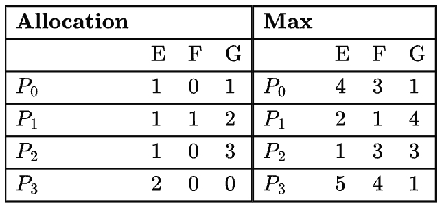

# 408经典练习题 · 操作系统篇 · 死锁
> 本练习题精选自 408 计算机考研权威真题及经典高频必刷练习题库，包含完整题干、选项、高清插图及参考答案与解析。
---

### 【408JD-OS03-T01】第 1 题

一台计算机有六个磁带驱动器，有 n 个进程竞争使用它们。每个进程可能需要两个驱动器。为了使系统处于无死锁状态，n 的最大值是多少（ ）？

- **A.** 6
- **B.** 5
- **C.** 4
- **D.** 3

> **【唯一编号】** `408JD-OS03-T01`
> **【科目】** 操作系统篇
> **【知识点】** 死锁

<details>
<summary><b>💡 查看参考答案与解析</b></summary>

**【参考答案】** B

**【解析】**

**正确答案：B**

**解析：**

- 已知磁带驱动器总数为 6，每个进程需要 2 个驱动器。
- **极端情况分析**：若每个进程先被分配 1 个驱动器，则最多可分配 6 个进程。此时所有进程均持有 1 个资源并等待第 2 个资源，形成循环等待，必然发生死锁。
- **避免死锁策略**：根据银行家算法原理，为防止死锁需预留至少一个资源供系统调度。因此需减少 1 个进程，即
 nmax=6−1=5
。

综上，选项 (B) 正确。

</details>

---

### 【408JD-OS03-T02】第 2 题

每个进程 Pi（i=1…9）的代码如下：

```
repeat
    P(mutex)
    {Critical section}
    V(mutex)
forever
```

P10 的代码与此相同，但将 `P(mutex)` 替换为 `V(mutex)`。在任意时刻，最多有多少个进程可以同时处于临界区？

- **A.** 1
- **B.** 2
- **C.** 3
- **D.** 以上都不是

> **【唯一编号】** `408JD-OS03-T02`
> **【科目】** 操作系统篇
> **【知识点】** 死锁

<details>
<summary><b>💡 查看参考答案与解析</b></summary>

**【参考答案】** D

**【解析】**

**正确答案：D**

**分析过程**

- **常规进程行为**

- 初始时互斥量值设为 1，因此每次只能允许一个进程进入临界区。
- 假设 P1 进入临界区后，其余进程（P2-P9）均因 `P(mutex)` 操作被阻塞。
- **P10 的特殊作用**

- P10 的代码通过 `V(mutex)` 操作释放互斥量资源。
- 每次执行 `V(mutex)` 会唤醒一个阻塞进程，使其进入临界区。
- 由于 P10 持续运行，其不断执行 `V(mutex)` 可逐步解除所有阻塞进程。
- **最大并发数推导**

- 最终所有 9 个常规进程（P1-P9）均可进入临界区。
- 加上 P10 自身，理论上最多有 **10 个进程** 同时处于临界区。

**补充说明**

- 循环结构保证 P10 永远执行，持续提供资源释放能力。
- 题目要求的是“可能存在的最大值”，因此答案为 10。

因此选项 (D) 正确。

</details>

---

### 【408JD-OS03-T03】第 3 题

解决“就餐哲学家问题”并避免死锁的一种方法是（ ）：

- **A.** 确保所有哲学家先拿左边的叉子再拿右边的叉子
- **B.** 确保所有哲学家先拿右边的叉子再拿左边的叉子
- **C.** 确保某一位特定哲学家先拿左边的叉子再拿右边的叉子，而其他所有哲学家先拿右边的叉子再拿左边的叉子
- **D.** 以上都不正确

> **【唯一编号】** `408JD-OS03-T03`
> **【科目】** 操作系统篇
> **【知识点】** 死锁

<details>
<summary><b>💡 查看参考答案与解析</b></summary>

**【参考答案】** C

**【解析】**

**正确答案：C**

在“就餐哲学家问题”中，通过让某一位特定哲学家先拿左边的叉子再拿右边的叉子，同时让其他所有哲学家先拿右边的叉子再拿左边的叉子，可以避免死锁条件。

选项 (C) 是正确的。

</details>

---

### 【408JD-OS03-T04】第 4 题

某计算机系统使用银行家算法处理死锁。其当前状态如下表所示，其中 P0、P1、P2 是进程，R0、R1、R2 是资源类型。

```
R0  R1  R2
P0   4   1   2
P1   1   5   1
P2   1   2   3
```

最大需求

```
R0   R1   R2
P0   1    0    2
P1   0    3    1
P2   1    0    2
```

当前分配量

```
R0    R1    R2
2     2     0
```

系统可用

a) 证明系统可以处于该状态；b) 当进程 P0 请求一个 R1 类型资源时，系统会如何处理？

> **【唯一编号】** `408JD-OS03-T04`
> **【科目】** 操作系统篇
> **【知识点】** 死锁

<details>
<summary><b>💡 查看参考答案与解析</b></summary>

**【解析】**

**答案：**

a) 该系统的当前状态是可能的，因为这可能是某个安全序列的一部分。例如，在此状态下系统可以按照 P1→P2→P0 的顺序执行且不会导致死锁，因此系统确实可以处于该状态b) 系统可以将一个 R1 资源分配给 P0 且仍然不会导致死锁，它依然可以按照 P1→P2→P0 的顺序执行
正确答案：未找到

**解析：**

- **a) 状态可行性验证**根据银行家算法的安全性检查规则，需验证是否存在至少一个安全序列。假设当前可用资源向量为 [A0, A1, A2]，各进程的最大需求矩阵（Max）与已分配资源矩阵（Allocation）满足以下条件：

- 进程 P1 的 Need ≤ 可用资源 → 分配后释放资源，更新可用资源
- 进程 P2 的 Need ≤ 更新后的可用资源 → 分配后释放资源
- 进程 P0 的 Need ≤ 再次更新后的可用资源 → 完成所有进程执行因此，存在安全序列 P1→P2→P0，证明系统可以处于该状态。
- **b) 资源请求处理**当 P0 请求一个 R1 资源时，系统需进行以下判断：

- 检查请求是否超过 P0 的最大需求（Need）
- 假设分配后，检查新状态是否存在安全序列

- 若仍存在安全序列（如 P1→P2→P0），则允许分配
- 否则拒绝请求根据题目描述，分配后仍能维持安全序列，故系统会批准此次请求。

</details>

---

### 【408JD-OS03-T05】第 5 题

一个系统共享 9 个磁带驱动器。进程的当前分配和最大需求如下所示：以下哪项最能描述系统的当前状态？（ ）

| 进程 | 当前分配 | 最大需求 |
| --- | --- | --- |
| P1 | 3 | 7 |
| P2 | 1 | 6 |
| P3 | 3 | 5 |

- **A.** 安全，死锁
- **B.** 安全，未死锁
- **C.** 不安全，死锁
- **D.** 不安全，未死锁

> **【唯一编号】** `408JD-OS03-T05`
> **【科目】** 操作系统篇
> **【知识点】** 死锁

<details>
<summary><b>💡 查看参考答案与解析</b></summary>

**【参考答案】** B

**【解析】**

**正确答案：B**

**解析**

- **资源分配分析**：

- 系统总磁带驱动器：9 个
- 已分配数量：3 (P1) + 1 (P2) + 3 (P3) + 0 (P4) = **7 个**
- 剩余可用资源：9 - 7 = **2 个**
- **资源分配顺序**：

- **优先满足 P3**（需求 2 个）→ 可用资源更新为 5
- **满足 P2**（需求 5 个）→ 可用资源更新为 6
- **满足 P1**（需求 6 个）→ 可用资源更新为 9

因此存在一个 **安全分配序列** P3 → P2 → P1，系统处于安全状态，不会发生死锁，B 选项正确。

</details>

---

### 【408JD-OS03-T06】第 6 题

考虑一个系统中有 3 个进程共享 4 个同类型资源实例。每个进程最多可以请求 K 个实例。资源实例只能一次请求或释放一个。始终避免死锁的最大 K 值是（ ）。

- **A.** 1
- **B.** 2
- **C.** 3
- **D.** 4

> **【唯一编号】** `408JD-OS03-T06`
> **【科目】** 操作系统篇
> **【知识点】** 死锁

<details>
<summary><b>💡 查看参考答案与解析</b></summary>

**【参考答案】** B

**【解析】**

**正确答案：B**已知：进程数（P）= 3，资源数（R）= 4。无死锁条件为：R ≥ P(N − 1) + 1其中 R 表示总资源数，P 表示进程数，N 表示每个资源的最大需求量。代入得：4 ≥ 3(N − 1) + 1 → 3 ≥ 3(N − 1) → 1 ≥ (N − 1) → N ≤ 2因此，始终避免死锁的最大 K 值为 2。选项 (B) 正确。

</details>

---

### 【408JD-OS03-T07】第 7 题

在一个系统中，存在三种资源类型：E、F 和 G。四个进程 P0、P1、P2 和 P3 并发执行。初始时，进程通过名为 Max 的矩阵声明其最大资源需求。例如，Max[P2, F] 表示 P2 所需的最大 F 资源实例数。任意状态下分配给各进程的资源实例数由名为 Allocation 的矩阵给出。

考虑一个系统状态，其 Allocation 矩阵如下所示，且当前可用资源仅包含 3 个 E 实例和 3 个 F 实例。



从死锁避免的角度来看，以下哪一项是正确的？（ ）

- **A.** 系统处于安全状态
- **B.** 系统不处于安全状态，但如果再有一个 E 实例可用则会变为安全状态
- **C.** 系统不处于安全状态，但如果再有一个 F 实例可用则会变为安全状态
- **D.** 系统不处于安全状态，但如果再有一个 G 实例可用则会变为安全状态

> **【唯一编号】** `408JD-OS03-T07`
> **【科目】** 操作系统篇
> **【知识点】** 死锁

<details>
<summary><b>💡 查看参考答案与解析</b></summary>

**【参考答案】** A

**【解析】**

**正确答案：A**

根据银行家算法：

- 初始可用资源为 (3, 3, 0)
- 可满足 P0 或 P2 的需求，选择 P0 <3, 3, 0>

- 完成后资源变为 (3, 3, 0)+(1, 0, 1)=(4, 3, 1)
- 选择 P2 <0, 3, 0>

- 完成后资源变为 (4, 3, 1)+(1, 0, 3)=(5, 3, 4)
- 选择 P1 <1, 0, 2>

- 完成后资源变为 (5, 3, 4)+(1, 1, 2)=(6, 4, 6)
- 选择 P3 <3, 4, 1>

- 完成后资源变为 (6, 4, 6)+(2, 0, 0)=(8, 4, 6)

**安全序列**：P0→P2→P1→P3因此选项 (A) 正确。

</details>

---

### 【408JD-OS03-T08】第 8 题

Dijkstra 银行家算法解决了什么问题？（ ）

- **A.** 缓存一致性
- **B.** 互斥
- **C.** 死锁恢复
- **D.** 死锁避免

> **【唯一编号】** `408JD-OS03-T08`
> **【科目】** 操作系统篇
> **【知识点】** 死锁

<details>
<summary><b>💡 查看参考答案与解析</b></summary>

**【参考答案】** D

**【解析】**

**正确答案：D**

**解析**

- **银行家算法**是荷兰计算机科学家 Edsger Dijkstra 提出的一种经典算法
- 属于 **死锁避免**（Deadlock Avoidance）策略的核心实现
- 通过动态检测资源分配请求是否会导致系统进入不安全状态，从而决定是否允许该请求
- 在进程申请资源时，会预先模拟分配后系统的安全性，若存在安全序列则批准请求，否则拒绝
- 与死锁预防不同，它允许死锁条件存在但通过谨慎的资源分配策略避免进入死锁状态

</details>

---

### 【408JD-OS03-T09】第 9 题

单个资源时会发生死锁吗？（ ）

- **A.** 如果有两个以上进程竞争该资源时
- **B.** 如果只有两个进程竞争该资源时
- **C.** 如果只有一个进程竞争该资源时
- **D.** 以上都不是

> **【唯一编号】** `408JD-OS03-T09`
> **【科目】** 操作系统篇
> **【知识点】** 死锁

<details>
<summary><b>💡 查看参考答案与解析</b></summary>

**【参考答案】** D

**【解析】**

**正确答案：D**

发生死锁需要满足以下 4 个条件：

- 互斥（Mutual Exclusion）
- 不可抢占（No pre-emption）
- 持有并等待（Hold and wait）
- 循环等待（Circular wait）

当资源只有一个时，持有并等待和循环等待的条件会被消除。假设进程不能无限期占用资源，则每当一个进程执行完毕后，另一个进程就能获得该资源。因此死锁不可能发生。

所以选项 (D) 正确。

</details>

---

### 【408JD-OS03-T10】第 10 题

以下哪项不是死锁的必要条件？（ ）

- **A.** 互斥
- **B.** 可重入性
- **C.** 持有并等待
- **D.** 不可抢占

> **【唯一编号】** `408JD-OS03-T10`
> **【科目】** 操作系统篇
> **【知识点】** 死锁

<details>
<summary><b>💡 查看参考答案与解析</b></summary>

**【参考答案】** B

**【解析】**

**正确答案：B**

死锁发生的四个必要条件为：

- **互斥**：资源不能共享，一次只能被一个进程占用
- **不可抢占**：资源只能由持有它的进程主动释放
- **持有并等待**：进程在等待新资源时不会释放已持有的资源
- **循环等待**：存在一个进程链，每个进程都在等待下一个进程所持有的资源

选项 (B) 正确。

</details>

---

### 【408JD-OS03-T11】第 11 题

系统共有 9 个某类资源，当前处于安全状态，如下表所示。以下哪个进程执行顺序是安全的？（ ）

| Process | Used | Max |
| --- | --- | --- |
| P1 | 2 | 7 |
| P2 | 1 | 6 |
| P3 | 2 | 5 |
| P4 | 1 | 4 |

- **A.** (P4, P1, P3, P2)
- **B.** (P4, P2, P1, P3)
- **C.** (P4, P2, P3, P1)
- **D.** (P3, P1, P2, P4)

> **【唯一编号】** `408JD-OS03-T11`
> **【科目】** 操作系统篇
> **【知识点】** 死锁

<details>
<summary><b>💡 查看参考答案与解析</b></summary>

**【参考答案】** D

**【解析】**

**正确答案：D**

应用银行家算法，各进程的 Need 矩阵为：

| Process | Used | Max | Need |
| --- | --- | --- | --- |
| P1 | 2 | 7 | 5 |
| P2 | 1 | 6 | 5 |
| P3 | 2 | 5 | 3 |
| P4 | 1 | 4 | 3 |

当前可用资源数 = 可用资源 - 已分配资源 = **9 - 6 = 3**

**排除逻辑：**

- 若首先满足 P4 的请求，则其执行后最多释放 4 个资源（1+3）
- 后续分配给 P1 或 P2（两者均需 5 个资源）时：

- 当前可用资源 4 < 需求 5 → 无法满足需求
- 因此选项 (A)、(B)、(C) 均被排除

✅ **选项 (D) 正确**

</details>

---

### 【408JD-OS03-T12】第 12 题

当进程因死锁而回滚时，可能产生的负面作用是（ ）

- **A.** 饥饿
- **B.** 系统吞吐量
- **C.** 设备利用率低
- **D.** 周期窃取

> **【唯一编号】** `408JD-OS03-T12`
> **【科目】** 操作系统篇
> **【知识点】** 死锁

<details>
<summary><b>💡 查看参考答案与解析</b></summary>

**【参考答案】** A

**【解析】**

**正确答案：A**

当进程因死锁而回滚时，产生的负面作用是**饥饿**。

- 回滚操作可能导致进程重新进入死锁状态
- 此时进程可能需要**无限期等待资源**
- 最终形成**资源分配无法满足**的饥饿现象

其他选项分析：

- **设备利用率低**属于系统性能问题，与死锁回滚无直接关联
- **周期窃取**（Cycle Stealing）是 DMA 技术中的概念，与死锁处理无关
- **系统吞吐量**受多种因素影响，但并非死锁回滚的直接后果

</details>

---

### 【408JD-OS03-T13】第 13 题

在死锁的四个必要条件中，哪个条件要求进程对其所需的资源声明独占控制？（ ）

- **A.** 不可抢占
- **B.** 互斥
- **C.** 循环等待
- **D.** 占有并等待

> **【唯一编号】** `408JD-OS03-T13`
> **【科目】** 操作系统篇
> **【知识点】** 死锁

<details>
<summary><b>💡 查看参考答案与解析</b></summary>

**【参考答案】** B

**【解析】**

**正确答案：B**

**互斥**是指一个或多个资源为非共享资源（同一时间仅允许一个进程使用），即进程对其所需的资源声明独占控制。

因此，选项 (B) 是正确的。

</details>

---

### 【408JD-OS03-T14】第 14 题

考虑以下进程及其资源需求情况：

| 进程 | 资源类型 1: 已分配 | 资源类型 1: 最大需求 | 资源类型 2: 已分配 | 资源类型 2: 最大需求 |
| --- | --- | --- | --- | --- |
| P1 | 1 | 2 | 1 | 3 |
| P2 | 1 | 3 | 1 | 2 |
| P3 | 2 | 4 | 1 | 4 |

假设系统中共有资源类型 1 的实例 5 个，资源类型 2 的实例 4 个。预测该系统的状态（ ）。

- **A.** 根据执行顺序可能进入安全或不安全状态
- **B.** 安全状态
- **C.** 不安全状态
- **D.** 死锁状态

> **【唯一编号】** `408JD-OS03-T14`
> **【科目】** 操作系统篇
> **【知识点】** 死锁

<details>
<summary><b>💡 查看参考答案与解析</b></summary>

**【参考答案】** C

**【解析】**

**正确答案：C**

| 进程 | 资源类型 1: 已分配 | 资源类型 1: 最大需求 | 资源类型 1: 需求 | 资源类型 2: 已分配 | 资源类型 2: 最大需求 | 资源类型 2: 需求 |
| --- | --- | --- | --- | --- | --- | --- |
| P1 | 1 | 2 | 1 | 1 | 3 | 2 |
| P2 | 1 | 3 | 2 | 1 | 2 | 2 |
| P3 | 2 | 4 | 2 | 1 | 4 | 3 |

- **可用资源**

- 类型 1:5 - 4 = 1
- 类型 2:4 - 3 = 1

当前仅有的 1 个类型 1 和 1 个类型 2 资源无法满足任何进程的需求，因此系统处于**不安全状态**。选项 (C) 正确。

</details>

---

### 【408JD-OS03-T15】第 15 题

考虑以下系统运行
 n
个进程的快照。进程
 i
持有
 Xi
个资源
 R
的实例，
 1≤i≤n
。当前，所有
 R
的实例都被占用。此外，对于所有
 i
，进程
 i
在持有其已有的
 Xi
实例的同时，还请求了额外的
 Yi
实例。恰好存在两个进程
 p
和
 q
，使得
 Yp=Yq=0
。以下哪一项可以作为保证系统不会进入死锁状态的必要条件？

- **A.** min(Xp,Xq)<max(Yk)
，其中
 k=p
且
 k=q
- **B.** Xp+Xq≥min(Yk)
，其中
 k=p
且
 k=q
- **C.** max(Xp,Xq)>1
- **D.** min(Xp,Xq)>1

> **【唯一编号】** `408JD-OS03-T15`
> **【科目】** 操作系统篇
> **【知识点】** 死锁

<details>
<summary><b>💡 查看参考答案与解析</b></summary>

**【参考答案】** B

**【解析】**

**正确答案：B**由于
 p
和
 q
都不需要额外资源，它们都可以完成并释放
 Xp+Xq
个资源，而无需请求任何额外资源。如果
 p
和
 q
释放的资源足以满足另一个等待
 Yk
资源的进程的需求，则系统不会进入死锁状态。

</details>

---

### 【408JD-OS03-T16】第 16 题

一个系统包含三个程序，每个程序运行时需要三个磁带单元。为了确保系统永远不会发生死锁，该系统至少需要（  ）个磁带单元。

- **A.** 6
- **B.** 7
- **C.** 8
- **D.** 9

> **【唯一编号】** `408JD-OS03-T16`
> **【科目】** 操作系统篇
> **【知识点】** 死锁

<details>
<summary><b>💡 查看参考答案与解析</b></summary>

**【参考答案】** B

**【解析】**

**正确答案：B**

**解析**

- 当系统拥有 6 个磁带单元时：三个程序各持有 2 个资源，同时各自请求第 3 个资源，形成循环等待，最终导致死锁。
- 当系统拥有 7 个磁带单元时：至少有一个程序可以获取全部 3 个所需资源，完成执行后释放资源，打破循环等待条件，从而避免死锁。

</details>

---

### 【408JD-OS03-T17】第 17 题

一个系统有 6 个相同的资源，N 个进程竞争这些资源。每个进程最多请求 2 个资源。以下哪个 N 的值可能导致死锁？（ ）

- **A.** 3
- **B.** 4
- **C.** 5
- **D.** 6

> **【唯一编号】** `408JD-OS03-T17`
> **【科目】** 操作系统篇
> **【知识点】** 死锁

<details>
<summary><b>💡 查看参考答案与解析</b></summary>

**【参考答案】** D

**【解析】**

**正确答案：D**

**答案：N = 6（以及任何 N ≥ 6）**

理由：对 m 个相同资源、每进程最多要 r 个资源的系统，若
 m≥n(r−1)+1
则一定不会死锁；否则可能死锁。

这里
 m=6,r=2
，代入得需
 6≥n+1⇒n≤5
才必无死锁。

当 **N=6** 时，可让每个进程先拿到 1 个资源、再各自再请求第 2 个资源，此时无空闲资源，6 个进程互相等待 → 发生死锁。

因此 **最小会导致死锁的 N 是 6**（更大的 N 也可能死锁）。

</details>

---

### 【408JD-OS03-T18】第 18 题

考虑以下在具有互斥资源的系统中防止死锁的策略：

I. 进程应在执行开始时获取所有所需资源。如果任何资源不可用，则释放已获取的所有资源。II. 资源被唯一编号，进程只能按递增的资源编号请求资源。III. 资源被唯一编号，进程只能按递减的资源编号请求资源。IV. 资源被唯一编号。进程只能请求当前所持资源编号更大的资源。

上述哪些策略可用于防止死锁？（ ）

- **A.** 仅 I 和 III，而非 II 或 IV
- **B.** 仅 I、III 和 IV，而非 II
- **C.** 仅 II 和 III，而非 I 或 IV
- **D.** I、II、III 和 IV 均可

> **【唯一编号】** `408JD-OS03-T18`
> **【科目】** 操作系统篇
> **【知识点】** 死锁

<details>
<summary><b>💡 查看参考答案与解析</b></summary>

**【参考答案】** D

**【解析】**

**正确答案：D**

**解析**

- 策略 I 通过要求进程一次性获取所有所需资源，避免了“持有并等待”这一死锁必要条件。
- 策略 II、III 和 IV 通过限制资源请求的顺序（递增、递减或仅允许请求更高编号的资源），消除了“循环等待”这一死锁必要条件。

</details>

---

### 【408JD-OS03-T19】第 19 题

操作系统按照以下方式处理资源请求：一个进程（请求某些资源，使用一段时间后退出系统）在其启动时被分配一个唯一的时间戳。这些时间戳随时间单调递增。我们用 TS(P) 表示进程 P 的时间戳。

当进程 P 请求资源时，操作系统执行以下操作：

(i) 如果没有其他进程当前持有该资源，操作系统将资源分配给 P。(ii) 如果有某个进程 Q 持有该资源且 TS(Q) < TS(P)，操作系统使 P 等待该资源。(iii) 如果有某个进程 Q 持有该资源且 TS(Q) > TS(P)，操作系统重启 Q 并将资源分配给 P。（重启意味着从进程中收回资源、终止它并以相同的时间戳重新启动）

当进程释放资源时，操作系统将资源分配给等待该资源的进程中时间戳最小的那个（如果有的话）。

a). 是否可能发生死锁？如果可能，请说明原因；否则，请证明。b). 进程 P 是否可能发生饥饿？如果可能，请说明原因；否则，请证明。

> **【唯一编号】** `408JD-OS03-T19`
> **【科目】** 操作系统篇
> **【知识点】** 死锁

<details>
<summary><b>💡 查看参考答案与解析</b></summary>

**【解析】**

**解析：**

**a) 死锁分析**

- **结论：不可能发生死锁**
- **原因：**

- **互斥条件成立**：资源只能由一个进程持有。
- **持有并等待条件成立**：进程在等待资源时可能持有其他资源。
- **循环等待条件被破坏**：

- 当进程
 P
请求资源时，若持有资源的进程
 Q
满足
 TS(Q)>TS(P)
，则
 Q
被强制重启，资源立即分配给
 P
。
- 时间戳的单调性确保所有进程按时间戳排序形成全序关系，不存在循环依赖。

**b) 饥饿分析**

- **结论：不可能发生饥饿**
- **原因：**

- **优先级调度**：等待队列中的进程按时间戳从小到大依次被分配资源。
- **重启机制保障公平性**：

- 若进程
 Q
持有资源且
 TS(Q)>TS(P)
，
 Q
会被重启，其时间戳不变，但资源释放后
 P
可立即获得服务。
- 所有等待进程最终都会因时间戳优先级被调度，无无限等待的情况。

</details>

---

### 【408JD-OS03-T20】第 20 题

考虑以下生产者 - 消费者同步问题的解决方案。共享缓冲区大小为 N。定义了三个信号量 empty、full 和 mutex，其初始值分别为 0、N 和 1。信号量 empty 表示缓冲区中可供消费者读取的可用槽位数量；信号量 full 表示缓冲区中可供生产者写入的可用槽位数量。代码中的占位符变量 P、Q、R 和 S 可以被分配为 empty 或 full。有效的信号量操作是：wait() 和 signal()。以下哪一组对 P、Q、R 和 S 的赋值能产生正确的解决方案？

```C
do {
    wait(P);
    wait(mutex);
    // Add item to buffer
    signal(mutex);
    signal(Q);
} while(1);
```

```C
do {
    wait(R);
    wait(mutex);
    // Consume item from buffer;
    signal(mutex);
    signal(S);
} while(1);
```

- **A.** P:full, Q:full, R:empty, S:empty
- **B.** P:empty, Q:empty, R:full, S:full
- **C.** P:full, Q:empty, R:empty, S:full
- **D.** P:empty, Q:full, R:full, S:empty

> **【唯一编号】** `408JD-OS03-T20`
> **【科目】** 操作系统篇
> **【知识点】** 死锁

<details>
<summary><b>💡 查看参考答案与解析</b></summary>

**【参考答案】** C

**【解析】**

**正确答案：C**

已知 Empty = 0 Full = N Mutex = 1。由于 empty 信号量的初始值为 0，因此第一次尝试时无法对 empty 执行 wait 操作。注意：empty 信号量表示已填充的槽位数，因此生产者进程必须处理 empty 和 mutex 信号量；full 信号量表示空闲槽位数，因此消费者进程必须处理 full 和 mutex 信号量。

**排除错误选项的原因**：

- **选项 (A)**：会导致饥饿，生产者无法获取 empty 信号量（初始为 0）。
- **选项 (B)**：同样导致饥饿，消费者无法获取 full 信号量（初始为 N，但逻辑错误）。
- **选项 (D)**：消费者因 empty 信号量初始为 0 而无法开始消费，实现错误。

**选项 (C) 正确的原因**：

- **P:empty**：生产者通过 `wait(empty)` 确保缓冲区有空位可写入。
- **Q:full**：消费者通过 `wait(full)` 确保缓冲区有数据可读取。
- **R:full**：生产者写入后通过 `signal(full)` 增加可用数据量。
- **S:empty**：消费者读取后通过 `signal(empty)` 增加可用空位。

该顺序保证了无死锁且无饥饿的同步机制。

</details>

---

### 【408JD-OS03-T21】第 21 题

以下哪项关于死锁预防和死锁避免方案的描述是不正确的？（ ）

- **A.** 在死锁预防中，如果结果状态是安全的，则资源请求总是被授予
- **B.** 在死锁避免中，如果结果状态是安全的，则资源请求总是被授予
- **C.** 死锁避免比死锁预防的限制更少
- **D.** 死锁避免需要预先了解资源需求

> **【唯一编号】** `408JD-OS03-T21`
> **【科目】** 操作系统篇
> **【知识点】** 死锁

<details>
<summary><b>💡 查看参考答案与解析</b></summary>

**【参考答案】** A

**【解析】**

**正确答案：A**

死锁预防：通过防止四个必要条件中的至少一个来避免死锁

- **互斥** – 可共享资源不需要互斥；不可共享资源必须满足互斥。
- **持有并等待** – 必须保证进程请求资源时不持有其他资源。要求进程在开始执行前申请所有所需资源，或仅允许进程在未持有任何资源时申请资源。这可能导致资源利用率低和饥饿问题。限制了请求的方式。
- **不可抢占** – 如果持有资源的进程请求无法立即分配的资源，则释放当前持有的所有资源。被抢占的资源加入进程等待列表。只有当进程重新获得旧资源和新请求资源后才能重启。
- **循环等待** – 对所有资源类型定义全序关系，并要求进程按递增顺序请求资源。

**死锁避免**：当调度器发现启动进程或授予资源请求可能导致未来死锁时，将拒绝该请求。死锁避免算法动态检查资源分配状态以确保不会出现循环等待条件。资源分配状态由可用资源数、已分配资源数及进程的最大需求定义。

**选项解析**：

- (A) 在死锁预防中，如果结果状态是安全的，则资源请求总是被授予 → **错误**。死锁预防通过确保四个必要条件之一不成立来处理死锁。即使结果状态是安全的，资源请求也可能不被授予（例如，为打破“持有并等待”条件）。
- (B) 在死锁避免中，如果结果状态是安全的，则资源请求总是被授予 → 正确。死锁避免中，若状态安全则授予请求，因为此时进程可以继续持有其他资源。
- (C) 死锁避免比死锁预防的限制更少 → 正确。死锁预防可能在安全状态下拒绝请求（如强制一次性申请所有资源），而死锁避免仅在状态不安全时拒绝。
- (D) 死锁避免需要预先了解资源需求 → 正确。死锁避免需预测资源分配后的系统状态是否安全，因此需要进程声明最大资源需求。

</details>

---

### 【408JD-OS03-T22】第 22 题

如果系统中有三个进程 P1、P2 和 P3 正在运行，它们对同类资源的最大需求分别为 3、4 和 5。为确保系统永远不会发生死锁，至少需要多少个资源？

- **A.** 3
- **B.** 7
- **C.** 9
- **D.** 10

> **【唯一编号】** `408JD-OS03-T22`
> **【科目】** 操作系统篇
> **【知识点】** 死锁

<details>
<summary><b>💡 查看参考答案与解析</b></summary>

**【参考答案】** D

**【解析】**

**正确答案：D**

设 P1 所需资源数为
 R1=3
，P2 所需资源数为
 R2=4
，以此类推…确保不会发生死锁所需的最小资源数：

$$
(R1−1)+(R2−1)+(R3−1)+1=(3−1)+(4−1)+(5−1)+1=2+3+4+1=10
$$

选项 (D) 是正确的。

</details>

---

### 【408JD-OS03-T23】第 23 题

考虑一个拥有 m 个同类资源的系统。这些资源由三个进程 A、B、C 共享，它们的峰值需求分别为 3、4、6。为确保系统永远不会发生死锁，m 的最小值是（ ）。

- **A.** 11
- **B.** 12
- **C.** 13
- **D.** 14

> **【唯一编号】** `408JD-OS03-T23`
> **【科目】** 操作系统篇
> **【知识点】** 死锁

<details>
<summary><b>💡 查看参考答案与解析</b></summary>

**【参考答案】** A

**【解析】**

**正确答案：A**

**解析：**避免死锁所需的最少资源数计算公式为：

$$
i=1∑y(mi−1)+1
$$

其中：

- mi
表示第 i 个进程的峰值需求
- y
表示进程总数

代入本题数据：

$$
(3−1)+(4−1)+(6−1)+1=2+3+5+1=11
$$

当系统资源数 ≥ 11 时，可保证至少有一个进程能获得全部所需资源并完成执行，释放其占用资源，从而避免死锁。因此选项 (A) 正确。

</details>

---

### 【408JD-OS03-T24】第 24 题

三个并发进程 X、Y 和 Z 分别执行访问和更新某些共享变量的不同代码段。进程 X 在进入代码段前对信号量 a、b 和 c 执行 P 操作（即 wait）；进程 Y 对信号量 b、c 和 d 执行 P 操作；进程 Z 对信号量 c、d 和 a 执行 P 操作。每个进程完成代码段的执行后，会对其三个信号量执行 V 操作（即 signal）。所有信号量均为二进制信号量，初始值为 1。以下哪一项表示进程调用 P 操作的无死锁顺序？

- **A.** X：P(a)P(b)P(c) Y：P(b)P(c)P(d) Z：P(c)P(d)P(a)
- **B.** X：P(b)P(a)P(c) Y：P(b)P(c)P(d) Z：P(a)P(c)P(d)
- **C.** X：P(b)P(a)P(c) Y：P(c)P(b)P(d) Z：P(a)P(c)P(d)
- **D.** X：P(a)P(b)P(c) Y：P(c)P(b)P(d) Z：P(c)P(d)P(a)

> **【唯一编号】** `408JD-OS03-T24`
> **【科目】** 操作系统篇
> **【知识点】** 死锁

<details>
<summary><b>💡 查看参考答案与解析</b></summary>

**【参考答案】** B

**【解析】**

**正确答案：B**

**解析：**

- **选项 A** 可能导致死锁

- 场景示例：进程 X 获取 a，进程 Y 获取 b，进程 Z 获取 c 和 d → 形成循环等待链（X 等待 b，Y 等待 c，Z 等待 a）
- **选项 C** 可能导致死锁

- 场景示例：进程 X 获取 b，进程 Y 获取 c，进程 Z 获取 a → 形成循环等待链（X 等待 a，Y 等待 b，Z 等待 c）
- **选项 D** 可能导致死锁

- 场景示例：进程 X 获取 a 和 b，进程 Y 获取 c → 形成相互等待（X 等待 c，Y 等待 a 或 b）
- **选项 B** 是唯一无死锁的方案

- 完成顺序为 Z→X→Y
- 资源分配路径：Z 先获取 a/c/d → X 获取 b/a/c → Y 获取 b/c/d
- 不存在循环等待条件，满足银行家算法的安全序列要求

</details>

---

### 【408JD-OS03-T25】第 25 题

考虑一个具有 4 种资源的系统：R1（3 个单位）、R2（2 个单位）、R3（3 个单位）、R4（2 个单位）。系统采用非抢占式资源分配策略。在任意时刻，如果请求无法完全满足，则不会被处理。

有三个进程 P1、P2 和 P3 独立执行时的资源请求如下：

```
t=0: 请求 2 个单位的 R2
t=1: 请求 1 个单位的 R3
t=3: 请求 2 个单位的 R1
t=5: 释放 1 个单位的 R2 和 1 个单位的 R1
t=7: 释放 1 个单位的 R3
t=8: 请求 2 个单位的 R4
t=10: 完成
```

进程 P1

```
t=0: 请求 2 个单位的 R3
t=2: 请求 1 个单位的 R4
t=4: 请求 1 个单位的 R1
t=6: 释放 1 个单位的 R3
t=8: 完成
```

进程 P2

```
t=0: 请求 1 个单位的 R4
t=2: 请求 2 个单位的 R1
t=5: 释放 2 个单位的 R1
t=7: 请求 1 个单位的 R2
t=8: 请求 1 个单位的 R3
t=9: 完成
```

进程 P3

若所有三个进程从时间 t=0 开始并发运行，以下哪项陈述是正确的？（ ）

- **A.** 所有进程都能完成且无死锁
- **B.** 仅 P1 和 P2 会陷入死锁
- **C.** 仅 P1 和 P3 会陷入死锁
- **D.** 所有三个进程都会陷入死锁

> **【唯一编号】** `408JD-OS03-T25`
> **【科目】** 操作系统篇
> **【知识点】** 死锁

<details>
<summary><b>💡 查看参考答案与解析</b></summary>

**【参考答案】** A

**【解析】**

**正确答案：A**

- **分析过程**

- 按照时间轴逐步模拟资源分配：

- t=0: P1 获取 R2(2), P2 获取 R3(2), P3 获取 R4(1)
- t=1: P1 获取 R3(1)
- t=2: P2 获取 R4(1), P3 获取 R1(2)
- t=3: P1 获取 R1(2)
- t=4: P2 获取 R1(1)
- t=5: P1 释放 R2(1) + R1(1)，此时可用资源 R2=1, R1=1
- t=7: P1 释放 R3(1)，P3 获取 R2(1)
- t=8: P1 获取 R4(2)，P3 获取 R3(1)
- t=9: P3 完成
- t=10: P1 完成
- **关键验证点**

- 所有资源请求均能按需分配
- 不存在循环等待条件（各进程最终释放全部资源）
- 最终所有进程均完成执行
- **结论**根据死锁检测算法，系统始终处于安全状态，因此选择 A。

</details>

---

### 【408JD-OS03-T26】第 26 题

一个系统有
 n
个资源
 R0,⋯,Rn−1
和 k 个进程 P₀, …, Pₖ₋₁。每个进程 Pᵢ 的资源请求逻辑实现如下：

```c
if (i % 2 == 0) {
    if (i < n) request Ri;
    if (i+2 < n) request Ri+2;
}
else {
    if (i < n) request Rn-i;
    if (i+2 < n) request Rn-i-2;
}
```

在以下哪种情况下可能发生死锁？（ ）

- **A.** n=40, k=26
- **B.** n=21, k=12
- **C.** n=20, k=10
- **D.** n=41, k=19

> **【唯一编号】** `408JD-OS03-T26`
> **【科目】** 操作系统篇
> **【知识点】** 死锁

<details>
<summary><b>💡 查看参考答案与解析</b></summary>

**【参考答案】** B

**【解析】**

**正确答案：B**

**选项 B 是答案**

**资源数量 n=21，进程数量 k=12**

进程 {P₀, P₁,…,P₁₁} 发出以下资源请求：R₀, R₂₀, R₂, R₁₈, R₄, R₁₆, R₆, R₁₄, R₈, R₁₂, R₁₀, R₁₀

> **示例解析**
>
>
>
> - P₀ 请求 R₀（`0%2==0` 且 `0 < 21`）
> - P₁₀ 请求 R₁₀
> - P₁₁ 请求 R₁₀（`n-i = 21-11 = 10`）

**死锁成因**

由于不同进程请求相同的资源（如 R₁₀ 被 P₁₀ 和 P₁₁ 同时请求），当资源分配顺序不当且无法满足所有进程的请求时，可能发生死锁。

</details>

---

### 【408JD-OS03-T27】第 27 题

一个操作系统在管理三个进程 P0、P1 和 P2 对三种资源类型 X、Y 和 Z 的分配时，使用银行家算法进行死锁避免。下表展示了当前系统状态。其中，Allocation 矩阵显示了每个进程当前分配的每种资源数量，Max 矩阵显示了每个进程在其执行过程中所需的每种资源最大数量。

```
Allocation          Max
         X   Y   Z         X   Y   Z
P0       0   0   1         8   4   3
P1       3   2   0         6   2   0
P2       2   1   1         3   3   3
```

目前仍有 3 个单位的 X 资源、2 个单位的 Y 资源和 2 个单位的 Z 资源可用。系统当前处于安全状态。考虑以下两个独立的额外资源请求：

REQ1: P0 请求 0 个 X 单位，      0 个 Y 单位和 2 个 Z 单位REQ2: P1 请求 2 个 X 单位，      0 个 Y 单位和 0 个 Z 单位

以下哪一项是正确的？（ ）

- **A.** 仅 REQ1 可以被允许。
- **B.** 仅 REQ2 可以被允许。
- **C.** REQ1 和 REQ2 都可以被允许。
- **D.** REQ1 和 REQ2 都不能被允许

> **【唯一编号】** `408JD-OS03-T27`
> **【科目】** 操作系统篇
> **【知识点】** 死锁

<details>
<summary><b>💡 查看参考答案与解析</b></summary>

**【参考答案】** B

**【解析】**

**正确答案：B**

**解析**

这是当前的安全状态：

```
AVAILABLE（可用资源）：X=3，Y=2，Z=2

      MAX        ALLOCATION
    X  Y  Z       X  Y  Z
P0  8  4  3       0  0  1
P1  6  2  0       3  2  0
P2  3  3  3       2  1  1
```

现在，如果允许请求 REQ1，状态将变为：

```
AVAILABLE：X=3，Y=2，Z=0

      MAX        ALLOCATION       NEED
    X  Y  Z       X  Y  Z       X  Y  Z
P0  8  4  3       0  0  3       8  4  0
P1  6  2  0       3  2  0       3  0  0
P2  3  3  3       2  1  1       1  2  2
```

在当前资源可用的情况下，我们可以满足 P1 的需求。状态将变为：

```
AVAILABLE：X=6，Y=4，Z=0

      MAX        ALLOCATION       NEED
    X  Y  Z       X  Y  Z       X  Y  Z
P0  8  4  3       0  0  3       8  4  0
P1  6  2  0       3  2  0       0  0  0
P2  3  3  3       2  1  1       1  2  2
```

此时，由于缺少 Z 资源，我们无法满足 P0 或 P2 的需求。因此，系统将进入死锁状态。
⇒ 我们不能允许 REQ1。

现在，在当前安全状态下，如果我们接受 REQ2：

```
AVAILABLE：X=1，Y=2，Z=2

      MAX        ALLOCATION       NEED
    X  Y  Z       X  Y  Z       X  Y  Z
P0  8  4  3       0  0  1       8  4  2
P1  6  2  0       5  2  0       1  0  0
P2  3  3  3       2  1  1       1  2  2
```

在该资源可用情况下，可以服务 P1（也可以服务 P2）。状态变为：
AVAILABLE：X=7，Y=4，Z=2

```
MAX        ALLOCATION       NEED
    X  Y  Z       X  Y  Z       X  Y  Z
P0  8  4  3       0  0  1       8  4  2
P1  6  2  0       5  2  0       0  0  0
P2  3  3  3       2  1  1       1  2  2
```

现在我们可以服务 P2。状态变为：

```
AVAILABLE：X=10，Y=7，Z=5

      MAX        ALLOCATION       NEED
    X  Y  Z       X  Y  Z       X  Y  Z
P0  8  4  3       0  0  1       8  4  2
P1  6  2  0       5  2  0       0  0  0
P2  3  3  3       2  1  1       0  0  0
```

最后我们服务 P0。状态变为：
AVAILABLE：X=18，Y=11，Z=8

```
MAX        ALLOCATION       NEED
    X  Y  Z       X  Y  Z       X  Y  Z
P0  8  4  3       0  0  1       0  0  0
P1  6  2  0       5  2  0       0  0  0
P2  3  3  3       2  1  1       0  0  0
```

所得到的状态是一个安全状态。
⇒ 可以允许 REQ2。

因此，只有 REQ2 可以被允许。所以，正确的选项是 **B**。

</details>

---

### 【408JD-OS03-T28】第 28 题

假设有
 n
个进程
 P1,⋯,Pn
共享
 m
个相同的资源单元，这些资源可以一次一个地被保留和释放。进程
 Pi
的最大资源需求为
 si
，其中
 si>0
。以下哪一项是确保不会发生死锁的充分条件？

- **A.** ∀i,si<m
- **B.** ∀i,si<n
- **C.** ∑i=1nsi<(m+n)
- **D.** ∑i=1nsi<(m×n)

> **【唯一编号】** `408JD-OS03-T28`
> **【科目】** 操作系统篇
> **【知识点】** 死锁

<details>
<summary><b>💡 查看参考答案与解析</b></summary>

**【参考答案】** C

**【解析】**

**正确答案：C**

**解释：**要确保系统不会发生死锁，一个充分条件是所有进程的最大资源需求之和满足以下条件：

$$
i=1∑nsi≤(m+n−1)
$$

- **原因：**

- 如果总需求满足此条件，则至少存在一个进程能够获得所需的所有资源并完成执行。
- 该进程完成后会释放其占用的资源，使得其他进程有机会继续运行。
- 这样可以打破死锁的四个必要条件之一（循环等待），从而避免死锁的发生。

</details>

---

### 【408JD-OS03-T29】第 29 题

以下哪项不是有效的死锁预防方案？（ ）

- **A.** 在请求新资源之前释放所有资源
- **B.** 为资源唯一编号，并且永远不要请求比上次请求的编号更低的资源。
- **C.** 在释放任何资源后，永不请求资源
- **D.** 执行前分配所有所需资源。

> **【唯一编号】** `408JD-OS03-T29`
> **【科目】** 操作系统篇
> **【知识点】** 死锁

<details>
<summary><b>💡 查看参考答案与解析</b></summary>

**【参考答案】** C

**【解析】**

**正确答案：C**

题目：以下哪项**不是**有效的死锁预防方案？

选项如下：
A. 在请求新资源之前释放所有资源
B. 为资源唯一编号，并且永远不要请求比上次请求的编号更低的资源。
C. 在释放任何资源后，永不请求资源
D. 执行前分配所有所需资源
**解析**

为了预防死锁，需要破坏**死锁的四个必要条件**之一：

- **互斥**（资源不能被共享）
- **占有且等待**（一个进程持有资源并等待其他资源）
- **不剥夺**（已经分配的资源不能被强制剥夺）
- **循环等待**（存在一个等待资源的环）

逐个分析选项：

- **A. 在请求新资源之前释放所有资源**
→ 破坏了**占有且等待**条件，是有效的预防策略。
- **B. 为资源唯一编号，并且永远不要请求比上次请求的编号更低的资源**
→ 避免了**循环等待**，也是经典的死锁预防方法。
- **C. 在释放任何资源后，永不请求资源**
→ 这个策略过于极端，**实际上不可行**，也**不是有效的死锁预防方案**。它限制了程序合理地分阶段申请资源的能力。
- **D. 执行前分配所有所需资源**
→ 这也是一种经典策略，称为**一次性分配策略**，可以避免死锁。

因此，**C 选项不是有效的死锁预防方案**。

</details>

---

### 【408JD-OS03-T30】第 30 题

考虑以下针对临界区问题的解决方案。共有
 n
个进程：
 P0,P1,⋯,Pn−1
。在代码中，函数 `pmax` 返回一个不小于其任何参数的整数。对于所有 `i`，`t[i]` 被初始化为零。关于上述解决方案，以下哪一项是正确的？（ ）

```c
do {
    c[i]=1; t[i] = pmax(t[0],...,t[n-1])+1; c[i]=0;
    for every j != i in {0,...,n-1} {
        while (c[j]);
        while (t[j] != 0 && t[j]<=t[i]);
    }
    Critical Section;
    t[i]=0;
    Remainder Section;
} while (true);
```

- **A.** 任何时候最多只有一个进程可以在临界区中
- **B.** 满足有界等待条件
- **C.** 满足进展条件
- **D.** 不会导致死锁

> **【唯一编号】** `408JD-OS03-T30`
> **【科目】** 操作系统篇
> **【知识点】** 死锁

<details>
<summary><b>💡 查看参考答案与解析</b></summary>

**【参考答案】** A

**【解析】**

**正确答案：A**

**解析**

**互斥性分析**

- **互斥性得到满足**：所有在进程 `i` 之前启动的其他进程 `j` 必须具有较小的值（即 `t[j] < t[i]`），因为函数 `pMax()` 返回一个不小于其任何参数的整数。
- **执行机制**：当 `j` 进程退出临界区时，它会将 `t[j]`设为 `0`；随后循环会选择下一个进程。因此，当 `i` 进程进入临界区时，所有在 `i` 进程之前启动的进程 `j` 都不在其临界区中。
- **结论**：同一时间只有一个进程在执行其临界区。

**死锁与进展条件**

- **死锁可能发生**：由于 `while (t[j] != 0 && t[j] <=t[i])` 这一条件，当 `j` 进程的值等于 `i` 进程的值（即 `t[j] == t[i]`）时可能发生死锁。
- **进展条件未满足**：由于死锁的存在，进展条件也无法满足（即进展=无死锁），因为没有进程能够通过阻止其他进程来取得进展。

**有界等待条件**

- **有界等待未满足**：如果 `t[j] == t[i]` 是可能的，则可能导致饥饿（即无限等待）。这种情况源于相同的原因——死锁的可能性导致无法保证有限次等待后进入临界区。

</details>

---

### 【408JD-OS03-T31】第 31 题

一个操作系统包含 3 个用户进程，每个进程需要 2 个资源单位 R。为确保永远不会发生死锁，R 的最小资源单位数是（ ）。

- **A.** 3
- **B.** 5
- **C.** 4
- **D.** 6

> **【唯一编号】** `408JD-OS03-T31`
> **【科目】** 操作系统篇
> **【知识点】** 死锁

<details>
<summary><b>💡 查看参考答案与解析</b></summary>

**【参考答案】** C

**【解析】**

**正确答案：C**

总进程数为 3，每个进程需要 2 个资源单位。

如果我们给每个进程分配 1 个资源，则总资源数为 1+1+1=3，但此时必然会发生死锁，因为每个进程都持有 1 个资源并等待另一个资源。如果再增加 1 个资源（3+1=4），则死锁将不会发生（即当进程 1 完成执行后会释放 2 个资源，这 2 个资源可被其他进程使用）。

**结论分析**：

- **资源数 = 3**：每个进程各持 1 个资源，形成循环等待 → 死锁
- **资源数 ≥ 4**：至少有一个进程能获得全部所需资源并完成执行，释放资源供其他进程使用 → 避免死锁

因此，系统至少需要 **4 个资源单位** 才能保证不死锁。选项 (C) 正确。

</details>

---

### 【408JD-OS03-T32】第 32 题

进程
 P1
和
 P2
使用两个共享资源
 R1
和
 R2
。每个进程对每个资源的访问具有特定优先级。设
 Tij
表示进程
 Pi
访问资源
 Rj
的优先级。若
 Tik
>
 Tjk
，则进程
 Pi
可以从进程
 Pj
处抢占资源
 Rh
。

已知以下条件：

- T11>T21
- T12>T22
- T11<T21
- T12<T22

以下哪项条件能确保 P1 和 P2 永远不会发生死锁？（ ）

- **A.** (I) 和 (IV)
- **B.** (II) 和 (III)
- **C.** (I) 和 (II)
- **D.** 以上都不是

> **【唯一编号】** `408JD-OS03-T32`
> **【科目】** 操作系统篇
> **【知识点】** 死锁

<details>
<summary><b>💡 查看参考答案与解析</b></summary>

**【参考答案】** C

**【解析】**

**正确答案：C**

**关键分析**

- **死锁预防核心**：若所有资源始终分配给单个进程，则系统处于安全状态，无法形成循环等待。
- **条件解析**：

- 当满足 (I) 和 (II) 时，R1 和 R2 同时分配给 P1
- 当满足 (III) 和 (IV) 时，R1 和 R2 同时分配给 P2
- **执行流程**：

- 被分配资源的进程完成执行 → 释放全部资源 → 另一进程获得资源并继续执行
- **结论**：

- 条件组合 (I)+(II) 或 (III)+(IV) 均可打破死锁必要条件（循环等待）
- 因此选项 C 正确

</details>

---

### 【408JD-OS03-T33】第 33 题

信号量用于解决以下哪些问题？（ ）

I. 竞态条件II. 进程同步III. 互斥IV. 以上都不是

- **A.** I 和 II
- **B.** II 和 III
- **C.** 以上全部
- **D.** 以上都不是

> **【唯一编号】** `408JD-OS03-T33`
> **【科目】** 操作系统篇
> **【知识点】** 死锁

<details>
<summary><b>💡 查看参考答案与解析</b></summary>

**【参考答案】** B

**【解析】**

**正确答案：B**

信号量（Semaphore）是操作系统中用于协调多个进程访问共享资源的机制。其核心作用包括：

- **进程同步（II）**通过`P/V`操作（或称`wait/signal`），信号量可以控制进程执行顺序，确保某些操作按预期时序完成。
- **互斥（III）**当信号量初始值为 1 时，可作为互斥锁（Mutex）使用，保证同一时刻只有一个进程进入临界区。
- **竞态条件（I）的间接解决**虽然信号量本身不直接解决竞态条件（Race Condition），但通过实现互斥和同步，能有效避免因资源竞争导致的竞态问题。因此选项 I 的表述存在误导性。

综上，正确答案为 **B（II 和 III）**。

</details>

---

### 【408JD-OS03-T34】第 34 题

一个操作系统有 13 个磁带驱动器。现有三个进程 P1、P2 和 P3。P1 的最大需求为 11 个磁带驱动器，P2 为 5 个，P3 为 8 个。当前 P1 已分配 6 个，P2 已分配 3 个，P3 已分配 2 个。以下哪个执行序列代表安全状态（ ）？

- **A.** P2 → P1 → P3
- **B.** P2 → P3 → P1
- **C.** P1 → P2 → P3
- **D.** P1 → P3 → P2

> **【唯一编号】** `408JD-OS03-T34`
> **【科目】** 操作系统篇
> **【知识点】** 死锁

<details>
<summary><b>💡 查看参考答案与解析</b></summary>

**【参考答案】** A

**【解析】**

**正确答案：A**

- **进程资源分配**

- P1: 最大需求 11 / 当前分配 6
- P2: 最大需求 5 / 当前分配 3
- P3: 最大需求 8 / 当前分配 2
- 系统总资源：13 个磁带驱动器（已分配 11 个，剩余 2 个）
- **资源需求分析**

- P1 需求：11 - 6 = **5 个**
- P2 需求：5 - 3 = **2 个**
- P3 需求：8 - 2 = **6 个**
- **安全序列验证**

- **初始可用资源**：2 个

- 可满足 P2 的需求（2 ≤ 2），执行 P2 后释放 3 个 → **可用资源变为 5 个**
- **可用资源 5 个**

- 满足 P1 的需求（5 ≤ 5），执行 P1 后释放 6 个 → **可用资源变为 11 个**
- **可用资源 11 个**

- 满足 P3 的需求（6 ≤ 11），执行 P3 后释放 2 个 → **全部资源回收**
- **结论**存在可行的安全序列 **P2 → P1 → P3**，因此选项 (A) 正确。

</details>

---

### 【408JD-OS03-T35】第 35 题

进程 P1 和 P2 存在生产者 - 消费者关系，通过一组共享缓冲区进行通信。

```
repeat
    获取一个空缓冲区
    填充数据
    返回一个满缓冲区
forever
```

P1 操作流程

```
repeat
    获取一个满缓冲区
    清空数据
    返回一个空缓冲区
forever
```

P2 操作流程

增加缓冲区数量可能会导致以下哪些结果？（ ）

I. 提高请求满足率（吞吐量）II. 降低死锁发生的可能性III. 提升实现正确性的便利性

- **A.** 仅 III
- **B.** 仅 II
- **C.** 仅 I
- **D.** 仅 II 和 III

> **【唯一编号】** `408JD-OS03-T35`
> **【科目】** 操作系统篇
> **【知识点】** 死锁

<details>
<summary><b>💡 查看参考答案与解析</b></summary>

**【参考答案】** C

**【解析】**

**正确答案：C**

**解析**

- **I. 提高请求满足率（吞吐量）**增加缓冲区数量可以提升系统同时处理的数据量，因此会提高吞吐量。
- **II. 降低死锁发生的可能性**缓冲区数量与死锁概率无直接关联。
- **III. 提升实现正确性的便利性**更多缓冲区可能使同步逻辑更复杂。

**结论**：因此正确答案是 **仅 I**。

</details>

---

### 【408JD-OS03-T36】第 36 题

考虑一个拥有 m 个相同类型资源的系统。这些资源由三个进程 P1、P2 和 P3 共享，它们的峰值需求分别为 2、5 和 7 个资源。若要使得系统不发生死锁，m 的最小值是多少？（ ）

- **A.** 11
- **B.** 12
- **C.** 13
- **D.** 14

> **【唯一编号】** `408JD-OS03-T36`
> **【科目】** 操作系统篇
> **【知识点】** 死锁

<details>
<summary><b>💡 查看参考答案与解析</b></summary>

**【参考答案】** B

**【解析】**

**正确答案：B**

一个系统中，为了保证**不发生死锁**，需要满足 **最小资源数目定理**：

$$
m≥(i=1∑n(最大需求i−1))+1
$$

其中：

- n
为进程数，
- 每个进程最大需求为
 Maxi
。

这个公式的直观含义：如果所有进程都至少先占有
 Maxi−1
个资源，那么还必须保证**至少有 1 个资源剩余**，这样总能保证某个进程能最终拿到它的最大需求并运行结束，从而避免死锁。

代入所有数值计算得到
 m>=(2−1+5−1+7−1)+1=1+4+6+1=12
，所以最小值为
 12
，答案选择 B。

</details>

---

### 【408JD-OS03-T37】第 37 题

假设系统中有 4 个进程正在运行，共有 12 个资源 R 的实例。每个进程的最大需求和当前分配如下：根据当前分配情况，系统是否处于安全状态？如果是，安全序列是什么？

| 进程 | 最大需求 | 当前分配 |
| --- | --- | --- |
| P1 | 8 | 3 |
| P2 | 9 | 4 |
| P3 | 5 | 2 |
| P4 | 3 | 1 |

- **A.** 否
- **B.** 是，P1→P2→P3→P4
- **C.** 是，P4→P3→P1→P2
- **D.** 是，P2→P1→P3→P4

> **【唯一编号】** `408JD-OS03-T37`
> **【科目】** 操作系统篇
> **【知识点】** 死锁

<details>
<summary><b>💡 查看参考答案与解析</b></summary>

**【参考答案】** C

**【解析】**

**正确答案：C**

**解析**

- **当前分配**：P1=3，P2=4，P3=2，P4=1 → 总计 10 个资源
- **剩余资源**：12 - 10 = 2 个
- **最大需求**：

- P1: 5
- P2: 5
- P3: 3
- P4: 2

**执行流程分析**：

- **P4 执行**：释放 3 个资源（当前分配 1，需释放 1）→ 剩余 2 + 1 = 3
- **P3 执行**：消耗 3 个资源 → 剩余 3 - 3 = 0
- **P1/P2 执行**：此时剩余 0 + 2（P3 释放）= 2 个资源，仍不足满足 P1/P2 需求

- 需等待 P3 完成后再释放 2 个资源（P3 当前分配 2）→ 剩余 2 + 2 = 4
- 此时仍不足 5 个资源，需继续等待
- 实际应为 P4 执行后释放 1 个资源（当前分配 1），剩余 2 + 1 = 3
- P3 执行后释放 2 个资源（当前分配 2），剩余 3 + 2 = 5
- 此时 P1 和 P2 各需 5 个资源，可任选其一先执行
- 优先选择 P1 → 顺序为 P4 → P3 → P1 → P2

**结论**：存在可行的安全序列 **P4→P3→P1→P2**，对应选项 (C) 正确。

</details>

---

### 【408JD-OS03-T38】第 38 题

考虑一个包含 `n` 个进程和 `m` 种资源类型的系统。检查系统是否处于安全状态的安全算法的时间复杂度为（ ）：

- **A.** O(mn)
- **B.** O(m2n2)
- **C.** O(m2n)
- **D.** O(mn2)

> **【唯一编号】** `408JD-OS03-T38`
> **【科目】** 操作系统篇
> **【知识点】** 死锁

<details>
<summary><b>💡 查看参考答案与解析</b></summary>

**【参考答案】** D

**【解析】**

**正确答案：D**

该算法需要进行三重嵌套循环：

- **外层循环**：遍历所有资源类型（m 次）
- **中层循环**：遍历所有进程（n 次）
- **内层循环**：每次分配检查时可能再次遍历所有进程（n 次）

因此总时间复杂度为
 O(m×n×n)=O(mn2)
。

</details>

---

### 【408JD-OS03-T39】第 39 题

一个系统有四个进程和五个可分配资源。当前的分配、最大需求和可用资源如下：

| 进程 | Allocated（已分配） | Maximum（最大需求） | Available（可用） |
| --- | --- | --- | --- |
| A | 1 0 2 1 1 | 1 1 2 1 3 | 0 0 x 1 1 |
| B | 2 0 1 1 0 | 2 2 2 1 0 |  |
| C | 1 1 0 1 0 | 2 1 3 1 0 |  |
| D | 1 1 1 1 0 | 1 1 2 2 1 |  |

请计算使上述系统处于安全状态的最小 x 值是（  ）。

- **A.** 1
- **B.** 3
- **C.** 2
- **D.** 对于任何 x 值系统都不安全。

> **【唯一编号】** `408JD-OS03-T39`
> **【科目】** 操作系统篇
> **【知识点】** 死锁

<details>
<summary><b>💡 查看参考答案与解析</b></summary>

**【参考答案】** D

**【解析】**

**正确答案：D**

**分析过程：**

**当 x=1 时**

- 进程 D 将执行并释放 **1 1 2 2 1** 个实例
- 此时其他进程均无法执行（A 需求 [0,1,0,0,2] 无法满足）

**当 x=2 时**

- 进程 D 执行并释放 **1 1 3 2 1** 个实例
- 随后进程 C 执行并释放 **2 2 3 3 1** 个实例
- 通过这些空闲实例：

- 进程 B 可以执行
- **进程 A 无法执行**（其需求 5 个资源中的 2 个实例永远无法满足）

因此系统仍不处于安全状态。

**结论**

无论 x 取何值，系统都无法找到一条安全序列满足所有进程需求，故 **选项 (D) 正确**。

</details>

---
