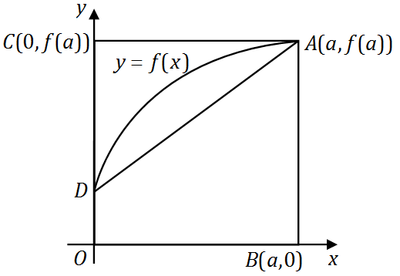
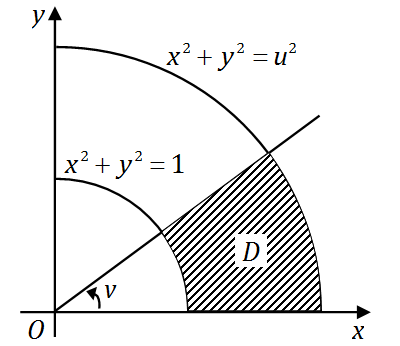
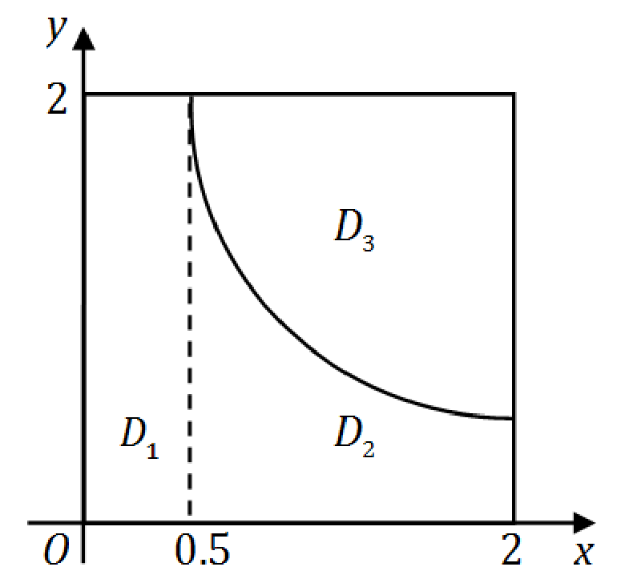

# 2008年全国硕士研究生招生考试数学二真题
> 本真题试卷来源于权威公开考研真题题库整理，包含全部题目、完整选项、高清插图、专业标签及详细参考答案与解析。
---

## 选择题

### 【M2-08-C-T01】第 1 题

设函数
$f(x)=x2(x−1)(x−2)$
，求
$f′(x)$
的零点个数为

- **A.** 0
- **B.** 1
- **C.** 2
- **D.** 3

> **【唯一编号】** `M2-08-C-T01`
> **【题型】** 选择题
> **【科目】** 微积分
> **【分值】** 4分
> **【年份】** 2008年
> **【考点】** 一元函数微分学、导数的计算

<b>💡 查看参考答案与解析</b>

**【参考答案】** D

**【解析】**

**正确答案：D**

**命题目的**考查求导的运算能力。

**详细解答**函数
$f(x)=2x(x−1)(x−2)+x2(x−2)+x2(x−1)$
。整理得
$f(x)=4x3−9x2+4x$
。求导得
$f′(x)=12x2−18x+4$
。令
$f′(x)=0$
，即解方程
$12x2−18x+4=0$
。判别式
$Δ=(−18)2−4×12×4=324−192=132>0$
，故该方程有两个不同实根，因此
$f′(x)$
的零点个数为 2。

**易错辨析**对于二次方程
$ax2+bx+c=0$
，当
$b2−4ac>0$
时，方程有两个不同实根。

**延伸拓展**n 次方程在复数范围内有 n 个根（包括重根）。

---

### 【M2-08-C-T02】第 2 题

如图，曲线段的方程为
$y=f(x)$
，函数
$f(x)$
在区间
$[0,a]$
上有连续的导数，则定积分
$\int_0^a xf′(x) \, dx$
等于（ ）

- **A.** 曲边梯形
$ABOD$
的面积
- **B.** 梯形
$ABOD$
的面积
- **C.** 曲边三角形
$ACD$
的面积
- **D.** 三角形
$ACD$
的面积

> **【唯一编号】** `M2-08-C-T02`
> **【题型】** 选择题
> **【科目】** 微积分
> **【分值】** 4分
> **【年份】** 2008年
> **【考点】** 一元函数积分学、定积分的应用

<b>💡 查看参考答案与解析</b>

**【参考答案】** C

**【解析】**

**正确答案：C**

**命题目的**考查定积分的分部积分法及定积分的几何意义。

**详细解答**

$$
∫0axf′(x)dx=∫0axdf(x)=af(a)−∫0af(x)dx
$$

其中
$af(a)$
表示矩形面积，
$\int_0^a f(x) \, dx$
表示曲边梯形的面积，因此
$\int_0^a xf′(x) \, dx$
表示曲边三角形的面积。

**易错辨析**若
$f(x)≤0$
，则曲边梯形的面积为：

$$
−∫0af(x)dx
$$

**延伸拓展**必须熟练掌握定积分的分部积分法及变量替换法。

---

### 【M2-08-C-T03】第 3 题

在下列微分方程中，以
$y=C1ex+C2cos2x+C3sin2x$
（
$C1$
、
$C2$
、
$C3$
为任意常数）为通解的是（　）

- **A.** y′′′+y′′−4y′−4y=0
- **B.** y′′′+y′′+4y′+4y=0
- **C.** y′′′−y′′−4y′+4y=0
- **D.** y′′′−y′′+4y′−4y=0

> **【唯一编号】** `M2-08-C-T03`
> **【题型】** 选择题
> **【科目】** 微积分
> **【分值】** 4分
> **【年份】** 2008年
> **【考点】** 常微分方程、常系数齐次线性微分方程

<b>💡 查看参考答案与解析</b>

**【参考答案】** D

**【解析】**

**正确答案：D**

【命题目的】考查高阶齐次常系数微分方程的解法。

【详细解答】由
$y=C1ex+C2cos2x+C3sin2x$
可知其特征根为

$$
λ1=1,λ2,3=±2i
$$

特征方程为：

$$
(λ−1)(λ+2i)(λ−2i)=(λ−1)(λ2+4)
$$

即

$$
λ3−λ2+4λ−4=0
$$

所以所求微分方程为：

$$
y′′′−y′′+4y′−4y=0
$$

故选 (D)。

【易错辨析】 C2cos2x+C3sin2x
对应的特征方程为

$$
(λ+2i)(λ−2i)=λ2+4
$$

【延伸拓展】高阶齐次常系数微分方程的解法见同济大学《高等数学》第五版下册。

---

### 【M2-08-C-T04】第 4 题

设函数
$f(x)=∣x−1∣ln∣x∣sinx$
，则
$f(x)$
有（

- **A.** 1个可去间断点,1个跳跃间断点.
- **B.** 1个可去间断点,1个无穷间断点。
- **C.** 2个跳跃间断点.
- **D.** 2个无穷间断点.

> **【唯一编号】** `M2-08-C-T04`
> **【题型】** 选择题
> **【科目】** 微积分
> **【分值】** 4分
> **【年份】** 2008年
> **【考点】** 函数、极限、连续、函数的连续性

<b>💡 查看参考答案与解析</b>

**【参考答案】** A

**【解析】**

**正确答案：A**

**命题目的**考查函数间断点及其类型。

**详细解答**函数
$f(x)$
的间断点为
$x=0$
和
$x=1$
。计算极限得：

$$
x→0+limf(x)=0
$$

因此
$x=0$
是可去间断点。又：

$$
x→1+limf(x)=sin1,x→1−limf(x)=−sin1
$$

左右极限存在但不相等，因此
$x=1$
是跳跃间断点。故应选 (A)。

**延伸拓展**在点
$x$
处可导一定连续，但连续不一定可导。

---

### 【M2-08-C-T05】第 5 题

设函数
$f(x)$
在
$(−∞,+∞)$
内单调有界，
${xn}$
为数列，下列命题正确的是（　　）

- **A.** 若
$xn$
收敛,则
$f(xn)$
收敛.
- **B.** 若
$xn$
单调,则
$f(xn)$
收敛.
- **C.** 若
$f(xn)$
收敛,则
$xn$
收敛.
- **D.** 若
$f(xn)$
单调,则
$xn$
收敛.

> **【唯一编号】** `M2-08-C-T05`
> **【题型】** 选择题
> **【科目】** 微积分
> **【分值】** 4分
> **【年份】** 2008年
> **【考点】** 函数、极限、连续、数列敛散性的判定

<b>💡 查看参考答案与解析</b>

**【参考答案】** B

**【解析】**

**正确答案：B**

**命题目的**考查定理：单调有界数列一定有极限。

**详细解答**若
$xn$
单调，则由
$f(x)$
在
$(−∞,+∞)$
内单调有界，可知
$f(xn)$
单调有界，因此
$f(xn)$
收敛，故应选 (B)。

**延伸拓展**“单调有界数列一定有极限”具体表述为：

- 单增有上界数列一定有极限；
- 单减有下界数列一定有极限。

---

### 【M2-08-C-T06】第 6 题

设函数
$F(u,v)=∬Duvx2+y2f(x2+y2)dxdy$
，其中区域
$Duv$
为如图中阴影部分，则
$∂u∂F=()$
。

- **A.** vf(u2)
- **B.** uvf(u2)
- **C.** vf(u)
- **D.** uvf(u)

> **【唯一编号】** `M2-08-C-T06`
> **【题型】** 选择题
> **【科目】** 微积分
> **【分值】** 4分
> **【年份】** 2008年
> **【考点】** 多元函数积分学、重积分的计算

<b>💡 查看参考答案与解析</b>

**【参考答案】** A

**【解析】**

**正确答案：A**

[命题目的]考查二重积分的极坐标变换及求偏导数和对定积分上限变量求导。

[详细解答]用极坐标得

$$
F(u,v)=∫0vdθ∫1urf(r2)⋅rdr=v∫1uf(r2)dr,
$$

因此

$$
∂u∂F=vf(u2).
$$

---

### 【M2-08-C-T07】第 7 题

设
$A$
为
$n$
阶非零矩阵，
$E$
为
$n$
阶单位矩阵，若
$A3=O$
，则（  ）

- **A.** E−A
不可逆，
$E+A$
不可逆.
- **B.** E−A
不可逆，
$E+A$
可逆.
- **C.** E−A
可逆，
$E+A$
可逆.
- **D.** E−A
可逆，
$E+A$
不可逆.

> **【唯一编号】** `M2-08-C-T07`
> **【题型】** 选择题
> **【科目】** 线性代数
> **【分值】** 4分
> **【年份】** 2008年
> **【考点】** 矩阵、伴随矩阵与可逆矩阵

<b>💡 查看参考答案与解析</b>

**【参考答案】** C

**【解析】**

**正确答案：C**

**命题目的**考查逆矩阵的概念。

**详细解答****方法一**由已知
$A3=0$
，可得

$$
(E−A)(E+A+A2)=E−A3=E,
$$

$$
(E+A)(E−A+A2)=E+A3=E.
$$

因此
$E−A$
与
$E+A$
均可逆。

**方法二**设
$A$
的特征值为
$λ$
，由
$A3=0$
可得
$λ3=0$
，从而
$λ=0$
。于是
$E−A$
与
$E+A$
的特征值均为 1，因此

$$
∣E−A∣=1,∣E+A∣=1,
$$

故
$E−A$
与
$E+A$
均可逆。

**易错辨析**由
$A3=0$
不能推出
$A=0$
。

**延伸拓展**

- 矩阵
$A$
可逆的充要条件：

- 存在矩阵
$B$
满足
$AB=BA=E$
；
- 存在矩阵
$B$
满足
$AB=E$
或
$BA=E$
；
- ∣A∣=0
；
- A
的所有特征值不等于 0；
- r(A)=n
。

- 设
$A$
的特征值为
$λ$
，则多项式
$Pn(A)$
的特征值为
$Pn(λ)$
。

---

### 【M2-08-C-T08】第 8 题

设
$A=(1221)$
，则在实数域上与
$A$
合同的矩阵为（ ）

- **A.** (−211−2)
- **B.** (2−1−12)
- **C.** (2112)
- **D.** (1−2−21)

> **【唯一编号】** `M2-08-C-T08`
> **【题型】** 选择题
> **【科目】** 线性代数
> **【分值】** 4分
> **【年份】** 2008年
> **【考点】** 二次型

<b>💡 查看参考答案与解析</b>

**【参考答案】** D

**【解析】**

**正确答案：D**

【命题目的】考查两个矩阵合同的概念。

【详细解答】

方法一：计算特征值。

$$
∣λE−A∣=λ−1−2−2λ−1=(λ−1)2−4=λ2−2λ−3=(λ+1)(λ−3)=0
$$

因此
$λ1=−1$
，
$λ2=3$
。

记
$D=(1−2−21)$
，则

$$
∣λE−D∣=λ−122λ−1=(λ−1)2−4=λ2−2λ−3=(λ+1)(λ−3)=0
$$

因此
$λ1=−1$
，
$λ2=3$
。

方法二：利用行列式与特征值的关系。

$$
∣A∣=1221=−3=λ1λ2
$$

说明
$A$
的特征值一正一负。

对于
$D$
：

$$
∣D∣=1−2−21=−3
$$

说明
$D$
的特征值也为一正一负。
$A$
与
$D$
的正负惯性指数相同，因此应选 (D)。

【易错辨析】方法二仅适用于本题（读者可自行思考原因）。

【延伸拓展】两个矩阵的等价、相似、合同概念存在不同之处。

---

## 填空题

### 【M2-08-F-T09】第 9 题

（填空题）已知函数
$f(x)$
连续，且

$$
x→0lim(ex2−1)f(x)1−cos[xf(x)]=1,
$$

则
$f(0)=$

> **【唯一编号】** `M2-08-F-T09`
> **【题型】** 填空题
> **【科目】** 微积分
> **【分值】** 4分
> **【年份】** 2008年
> **【考点】** 函数、极限、连续、函数极限的计算

<b>💡 查看参考答案与解析</b>

**【解析】**

**【答案】** 2

**【解析】** 本题旨在考查
$00$
型未定式的极限计算。

已知极限

$$
x→0limx2f(x)21x2f2(x)=1
$$

化简可得

$$
x→0limf(x)21f2(x)=1
$$

由于
$f(x)$
在
$x→0$
时非零，可约去
$f(x)$
，得

$$
x→0lim21f(x)=1
$$

因此

$$
21f(0)=1
$$

解得

$$
f(0)=2
$$

**易错辨析**：在极限运算中，对于加减项不能随意使用等价无穷小代换，否则可能导致结果错误。

---

### 【M2-08-F-T10】第 10 题

（填空题）微分方程
$(y+x2e−x)dx−xdy=0$
的通解是
$y=$

> **【唯一编号】** `M2-08-F-T10`
> **【题型】** 填空题
> **【科目】** 微积分
> **【分值】** 4分
> **【年份】** 2008年
> **【考点】** 常微分方程、一阶非齐次线性微分方程

<b>💡 查看参考答案与解析</b>

**【解析】**

**【答案】**
$y=−xe−x+Cx$

**【解析】** ## 题目
（填空题）微分方程
$(y+x2e−x)dx−xdy=0$
的通解是
$y=$

#### 解析

命题目的考查求解一阶线性微分方程。

详细解答将方程整理为 y′−xy=xe−x
，其中
$P=−x1$
，
$Q=xe−x$
。

利用一阶线性微分方程通解公式：

$$
y=e∫x1dx(∫xe−xe∫x1dxdx+C)=x(∫e−xdx+C)=−xe−x+Cx
$$

延伸拓展：

- 也可用常数变易法求解一阶线性微分方程；
- 一阶线性微分方程通解 = 齐次方程通解 + 非齐次方程特解。

---

### 【M2-08-F-T11】第 11 题

（填空题）曲线
$sin(xy)+ln(y−x)=x$
在点
$(0,1)$
处的切线方程是

> **【唯一编号】** `M2-08-F-T11`
> **【题型】** 填空题
> **【科目】** 微积分
> **【分值】** 4分
> **【年份】** 2008年
> **【考点】** 一元函数微分学、导数的几何意义

<b>💡 查看参考答案与解析</b>

**【解析】**

**【答案】**
$y=x+1$

**【解析】** **命题目的**：考查隐函数求导及导数的几何意义。

**详细解答**

**方法一**：设

$$
F(x,y)=sin(xy)+ln(y−x)−x,
$$

计算

$$
k=−FyFx=−xcos(xy)+y−x1ycos(xy)+y−x−1−1.
$$

代入
$x=0$
，
$y=1$
，得
$k=1$
，切线方程为
$y=x+1$
。

**方法二**：方程两边对
$x$
求导，

$$
cos(xy)⋅(y+xy′)+y−xy′−1=1,
$$

令
$x=0$
，
$y=1$
，得
$k=y′(0)=1$
，切线方程为
$y=x+1$
。

**易错辨析**：
$sin(xy)$
对
$x$
求导时，
$y$
是中间变量。计算时不必求出
$y′$
的表达式，直接代入
$x=0$
，
$y=1$
即可得出
$k=1$
。

**延伸拓展**：只要不对自变量
$x$
求导，都要按照复合函数求导。

---

### 【M2-08-F-T12】第 12 题

（填空题）曲线
$y=(x−5)x32$
的拐点坐标为 ______

> **【唯一编号】** `M2-08-F-T12`
> **【题型】** 填空题
> **【科目】** 微积分
> **【分值】** 4分
> **【年份】** 2008年
> **【考点】** 一元函数微分学、曲线的凹凸性、拐点及渐近线

<b>💡 查看参考答案与解析</b>

**【解析】**

**【答案】**
$(−1,−6)$

**【解析】** 命题目的考查拐点的概念。

详细解答计算
$f′(x)=x32+(x−5)⋅32x−31=35(x−2)x−31$
，再求二阶导数
$f′′(x)=910x−34(x+1)$
，令其为零得
$x=−1$
。

当
$x=−1$
时，
$f′′(x)$
左右两边符号改变，故拐点坐标为
$(−1,−6)$
。

当
$x=0$
时，二阶导数不存在，且
$f′′(x)$
左右两边符号不变，故
$(0,0)$
不是拐点。

**易错辨析**

- 如果在
$(0,0)$
两侧
$f′′(x)$
符号改变，则
$(0,0)$
也是拐点；
- 拐点应表示为
$(x0,f(x0))$
。

**延伸拓展**

如果在
$(x0,f(x0))$
两侧
$f′′(x)$
符号改变，则
$(x0,f(x0))$
是拐点。

---

### 【M2-08-F-T13】第 13 题

（填空题）设
$z=(xy)yx$
，则
$∂x∂z(1,2)=$

> **【唯一编号】** `M2-08-F-T13`
> **【题型】** 填空题
> **【科目】** 微积分
> **【分值】** 4分
> **【年份】** 2008年
> **【考点】** 多元函数微分学、偏导数的概念与计算

<b>💡 查看参考答案与解析</b>

**【解析】**

**【答案】**
$22(ln2−1)$

**【解析】**
命题目的考查多元函数的复合函数求导。

**详细解答**

**方法一**：令
$u=xy$
，
$v=yx$
，则
$z=uv$
。取对数后对
$x$
求导，可得：

$$
z1∂x∂z=y1lnxy−y1
$$

代入点
$(1,2)$
得：

$$
∂x∂z(1,2)=22(ln2−1)
$$

**方法二**：直接取对数后对
$x$
求导，代入
$(1,2,2)$
得：

$$
∂x∂z(1,2)=22(ln2−1)
$$

**易错辨析**：方法二比方法一运算量小，不易出错。

**延伸拓展**：本题也可求全微分：

$$
dz=∂x∂zdx+∂y∂zdy
$$

---

### 【M2-08-F-T14】第 14 题

（填空题）设 3 阶矩阵
$A$
的特征值为
$2$
、
$3$
、
$λ$
。若行列式
$∣2A∣=−48$
，则
$λ=$

> **【唯一编号】** `M2-08-F-T14`
> **【题型】** 填空题
> **【科目】** 线性代数
> **【分值】** 4分
> **【年份】** 2008年
> **【考点】** 矩阵的特征值与特征向量

<b>💡 查看参考答案与解析</b>

**【解析】**

**【答案】**
$λ=−1$

**【解析】** 命题目的考查
$∣A∣=λ1λ2⋯λn$
与
$∣kA∣=kn∣A∣$
。

详细解答如下：由
$∣2A∣=23∣A∣=−48$
，得
$∣A∣=−6$
。又因为
$∣A∣=2×3×λ=−6$
，故
$λ=−1$
。

易错辨析：常见错误是误以为
$∣2A∣=2∣A∣=−48$
，正确应为
$∣2A∣=23∣A∣$
。

延伸拓展：假设
$A$
的特征值为
$λ$
，则
$A$
的多项式
$Pn(A)$
的特征值为
$Pn(λ)$
。

---

## 解答题

### 【M2-08-A-T15】第 15 题

（本题满分 10 分）求极限

$$
x→0limx4[sinx−sin(sinx)]sinx
$$

> **【唯一编号】** `M2-08-A-T15`
> **【题型】** 解答题
> **【科目】** 微积分
> **【分值】** 10分
> **【年份】** 2008年
> **【考点】** 函数、极限、连续、函数极限的计算

<b>💡 查看参考答案与解析</b>

**【解析】**

**【答案】**
$61$

**【解析】**

$$
x→0limx4[sinx−sin(sinx)]sinx=x→0limx3sinx−sin(sinx)=x→0lim3x2cosx−cos(sinx)⋅cosx=x→0lim3x2cosx[1−cos(sinx)]=x→0lim3x221sin2x⋅cosx=61.
$$

[命题目的] 考查
$00$
型极限的计算。

[思路点拨] 先使用等价无穷小代换，然后使用洛必达法则。

[易错辨析] 对于加、减项不能使用等价无穷小代换。

[延伸拓展] “
$00$
”、“
$1∞$
”等其他不定型的极限的求法。

---

### 【M2-08-A-T16】第 16 题

（本题满分 10 分）设函数
$y=y(x)$
由参数方程

$$
{x=x(t),y=∫0t2ln(1+u)du
$$

确定，其中
$x(t)$
满足微分方程

$$
dtdx−2te−x=0
$$

且
$x∣t=0=0$
，求
$dx2d2y$
。

> **【唯一编号】** `M2-08-A-T16`
> **【题型】** 解答题
> **【科目】** 微积分
> **【分值】** 10分
> **【年份】** 2008年
> **【考点】** 常微分方程、可分离变量的微分方程与齐次方程

<b>💡 查看参考答案与解析</b>

**【解析】**

**【答案】** \[\frac{d^{2}y}{dx^{2}} = (1 + t^{2})\left[\ln(1 + t^{2}) + 1\right] \]

**【解析】****[详细解答]**

已知
$exdx=2tdt$
，积分得
$ex=t2+C$
。由
$x∣t=0=0$
得
$C=1$
，故
$x=ln(1+t2)$
。

$$
dxdy=xt′yt′=1+t22t2tln(1+t2)=(1+t2)ln(1+t2)
$$

$$
dx2d2y=xt′[(1+t2)ln(1+t2)]′=1+t22t2tln(1+t2)+2t=(1+t2)[ln(1+t2)+1]
$$

**[命题目的]**考查求微分方程特解和参数方程求导。

**[思路点拨]**

- 对
$x$
和
$t$
，为可分离变量方程；
- 求导过程中，
$t$
是中间变量。

**[延伸拓展]**可用相同方法求三阶导数。

---

### 【M2-08-A-T17】第 17 题

（本题满分 10 分）计算

$$
∫011−x2x2arcsinxdx
$$

> **【唯一编号】** `M2-08-A-T17`
> **【题型】** 解答题
> **【科目】** 微积分
> **【分值】** 10分
> **【年份】** 2008年
> **【考点】** 一元函数积分学、定积分的计算

<b>💡 查看参考答案与解析</b>

**【解析】**

**【答案】**
$41+16π2$

**【解析】****命题目的**考查定积分的变量替换。

**思路点拨**对含
$a2−x2$
类型的积分，令
$x=asint$
。

**详细解答**令
$x=sint$
，则

$$
∫011−x2x2arcsinxdx=∫02πcostsin2t⋅tcostdt=∫02πtsin2tdt=21∫02πtdt−21∫02πtcos2tdt=41+16π2
$$

**易错辨析**定积分变量替换一定要改变上下限。

**延伸拓展**对含
$a2+x2$
类型的积分，令
$x=atant$
。

---

### 【M2-08-A-T18】第 18 题

（本题满分 10 分）计算

$$
∬Dmax{xy,1}dxdy,
$$

其中

$$
D={(x,y)∣0≤x≤2,0≤y≤2}.
$$

> **【唯一编号】** `M2-08-A-T18`
> **【题型】** 解答题
> **【科目】** 微积分
> **【分值】** 10分
> **【年份】** 2008年
> **【考点】** 多元函数积分学、重积分的计算

<b>💡 查看参考答案与解析</b>

**【解析】**

**【答案】**
$419+ln2$

**【解析】**曲线
$xy=1$
将区域分成三个区域
$D1,D2,D3$
：

从而所求的积分

$$
∬Dmax(xy,1)dxdy=∬D1xydxdy+∬D21dxdy+∬D31dxdy=∫021dx∫021dy+∫212dx∫0x11dy∫212dx∫x12xydy=1+2ln2+415−ln2=419+ln2.
$$

---

### 【M2-08-A-T19】第 19 题

（本题满分 10 分）设
$f(x)$
是区间
$[0,+∞)$
上具有连续导数的单调增加函数，且
$f(0)=1$
。对任意的
$t∈[0,+∞)$
，直线
$x=0$
，
$x=t$
，曲线
$y=f(x)$
以及
$x$
轴所围成的曲边梯形绕
$x$
轴旋转一周生成一旋转体。若该旋转体的侧面面积在数值上等于其体积的 2 倍，求函数
$f(x)$
的表达式。

> **【唯一编号】** `M2-08-A-T19`
> **【题型】** 解答题
> **【科目】** 微积分
> **【分值】** 10分
> **【年份】** 2008年
> **【考点】** 一元函数积分学、定积分的应用

<b>💡 查看参考答案与解析</b>

**【解析】**

**【答案】**
$f(x)=coshx$

**【解析】** ## 解析
旋转体的体积公式为：

$$
V(t)=π∫0t[f(x)]2dx
$$

旋转体的侧面积公式为：

$$
S(t)=2π∫0tf(x)1+[f′(x)]2dx
$$

由题意可知
$S(t)=2V(t)$
，即：

$$
2π∫0tf(x)1+[f′(x)]2dx=2π∫0t[f(x)]2dx
$$

两边对
$t$
求导，得到：

$$
f(t)1+[f′(t)]2=[f(t)]2
$$

化简得：

$$
1+[f′(t)]2=f(t)
$$

两边平方得：

$$
1+[f′(t)]2=[f(t)]2
$$

整理得：

$$
[f′(t)]2=[f(t)]2−1
$$

由于
$f(x)$
单调增加，因此：

$$
f′(t)=[f(t)]2−1
$$

分离变量得：

$$
f2−1df=dt
$$

积分得：

$$
ln(f+f2−1)=t+C
$$

由初始条件
$f(0)=1$
，代入得
$C=0$
，因此：

$$
ln(f+f2−1)=t
$$

解得：

$$
f(x)=2ex+e−x=coshx
$$

[命题目的] 考查旋转体侧面积、体积计算及微分方程的综合应用。

[思路点拨] 由
$V(t)S(t)=2$
对上限变量求导得到微分方程。

---

### 【M2-08-A-T20】第 20 题

（本题满分 11 分）

(I) 证明积分中值定理：若函数
$f(x)$
在闭区间
$[a,b]$
上连续，则至少存在一点
$η∈[a,b]$
，使得

$$
∫abf(x)dx=f(η)(b−a)
$$

(II) 若函数
$φ(x)$
具有二阶导数，且满足
$φ(2)>φ(1)$
及
$φ(2)>∫23φ(x)dx$
，则至少存在一点
$ξ∈(1,3)$
，使得

$$
φ′′(ξ)<0
$$

> **【唯一编号】** `M2-08-A-T20`
> **【题型】** 解答题
> **【科目】** 微积分
> **【分值】** 11分
> **【年份】** 2008年
> **【考点】** 一元函数积分学、变限积分

<b>💡 查看参考答案与解析</b>

**【解析】**

**【答案】** 见解析

**【解析】** 设
$M$
及
$m$
分别是函数
$f(x)$
在区间
$[a,b]$
上的最大值及最小值，则

$$
m(b−a)≤∫abf(x)dx≤M(b−a)
$$

将不等式两边除以
$b−a$
，得

$$
m≤b−a1∫abf(x)dx≤M
$$

根据闭区间上连续函数的介值定理，在
$[a,b]$
上至少存在一点
$η$
，使得

$$
f(η)=b−a1∫abf(x)dx
$$

即

$$
∫abf(x)dx=f(η)(b−a)
$$

---

由积分中值定理，存在
$c∈(2,3)$
，使得

$$
∫23φ(x)dx=φ(c)
$$

由题设
$φ(2)>φ(1)$
且
$φ(2)>φ(c)$
。

对
$φ(x)$
在区间
$[1,2]$
和
$[2,c]$
上分别应用拉格朗日中值定理，得

$$
φ′(ξ1)=2−1φ(2)−φ(1)>0,ξ1∈(1,2)
$$

$$
φ′(ξ2)=c−2φ(c)−φ(2)<0,ξ2∈(2,c)
$$

再对
$φ′(x)$
在区间
$[ξ1,ξ2]$
上应用拉格朗日中值定理，存在

$$
ξ∈(ξ1,ξ2)⊂(1,3)
$$

使得

$$
φ′′(ξ)=ξ2−ξ1φ′(ξ2)−φ′(ξ1)<0
$$

---

**[命题目的]** 考查积分中值定理证明及导数应用。

**[思路点拨]** 第一问的结果是解答第二问的关键。

**[易错辨析]** 连续函数的介值定理中
$η$
在闭区间
$[a,b]$
上。

**[延伸拓展]** 改进后的积分中值定理中
$ξ$
可在开区间
$(a,b)$
上。

---

### 【M2-08-A-T21】第 21 题

（本题满分 11 分）求函数
$u=x2+y2+z2$
在约束条件
$z=x2+y2$
和
$x+y+z=4$
下的最大值与最小值。

> **【唯一编号】** `M2-08-A-T21`
> **【题型】** 解答题
> **【科目】** 微积分
> **【分值】** 11分
> **【年份】** 2008年
> **【考点】** 多元函数微分学、多元函数的极值问题

<b>💡 查看参考答案与解析</b>

**【解析】**

**【答案】** 最大值 72，最小值 6

**【解析】****命题目的**考查条件极值的拉格朗日乘数法。

**思路点拨**求解具有两个约束条件的条件极值，方法与单一约束条件的情形相同。

**详细解答**设

$$
F(x,y,z)=x2+y2+z2+λ1(x2+y2−z)+λ2(x+y+z−4)
$$

得到方程组

$$
⎩⎨⎧Fx=0Fy=0Fz=0x2+y2−z=0x+y+z−4=0
$$

即

$$
⎩⎨⎧2x+2xλ1+λ2=02y+2yλ1+λ2=02z−λ1+λ2=0x2+y2−z=0x+y+z−4=0
$$

解得

$$
⎩⎨⎧x=−2y=−2z=8或⎩⎨⎧x=1y=1z=2
$$

于是

$$
Umax=(−2)2+(−2)2+82=72
$$

$$
Umin=12+12+22=6
$$

**易错辨析**求解方程组是最容易出错的地方，计算时应仔细。

**延伸拓展**可进一步探讨具有更多约束条件的最值问题。

---

### 【M2-08-A-T22】第 22 题

（本题满分 11 分）设
$n$
元线性方程组
$Ax=b$
，其中

$$
A=2aa212aa212a⋱1⋱a2⋱2aa212an×n,x=x1x2⋮xn,b=10⋮0
$$

（I）证明行列式
$∣A∣=(n+1)an$

（II）当
$a$
为何值时，该方程组有唯一解，并求
$x1$

（III）当
$a$
为何值时，该方程组有无穷多解，并求通解。

> **【唯一编号】** `M2-08-A-T22`
> **【题型】** 解答题
> **【科目】** 线性代数
> **【分值】** 11分
> **【年份】** 2008年
> **【考点】** 行列式

<b>💡 查看参考答案与解析</b>

**【解析】**

**【答案】**(I) 见解析(II) 当
$a=0$
时，方程组有唯一解，且
$x1=(n+1)an (III) 当$
$a=0$
时，方程组有无穷多解，且通解为
$x=k100⋮0+010⋮0$
，其中
$k$
为任意常数。

**【解析】****命题目的**计算 n 阶三对角线行列式、求解非齐次方程组。

**思路点拨**非齐次方程组的通解 = 齐次方程组的通解 + 非齐次方程组的特解。

**详细解答**

**(I)**

$$
∣A∣=2aa212a⋱⋱⋱⋱⋱⋱a212a=(n+1)an.
$$

另一种方法（递推法）：

$$
Dn=∣A∣=2aa212aa212a⋱⋱⋱⋱⋱⋱a212a=2aDn−1−a2Dn−2.
$$

直接计算得： D1=2a=(1+1)a1
， D2=3a2=(2+1)a2
，假设
$Dn−1=nan−1$
，则

$$
Dn=2aDn−1−a2Dn−2=2a⋅nan−1−a2⋅(n−1)an−2=(2n−n+1)an=(n+1)an.
$$

**(II)**方程组有唯一解时，由
$Ax=B$
知
$∣A∣=0$
，又
$∣A∣=(n+1)an$
，故
$a=0$
。

记
$A=An×n$
，由克莱姆法则知，

$$
x1=∣A∣∣A1∣,
$$

其中
$A1$
是将
$A$
的第一列替换为
$b$
后的行列式。经计算可得

$$
x1=(n+1)annan−1=(n+1)an.
$$

**(III)**方程组有无穷多解时，
$∣A∣=0$
，即
$a=0$
。此时

$$
(A∣B)=00⋮010⋮001⋮0⋯⋯⋱⋯10⋮0.
$$

对应的齐次方程组
$Ax=0$
的基础解系为

$$
ξ=(1,0,0,…,0)T,
$$

非齐次方程组的一个特解为

$$
η=(0,1,0,…,0)T,
$$

故通解为

$$
x=k(1,0,0,…,0)T+(0,1,0,…,0)T,
$$

其中
$k$
为任意常数。

**易错辨析**用递推法计算
$∣A∣$
的值比使用行列式性质计算，运算量要小得多。

---

### 【M2-08-A-T23】第 23 题

（本题满分 11 分）设
$A$
为 3 阶矩阵，
$α1$
、
$α2$
为
$A$
的分别属于特征值
$−1$
、
$1$
的特征向量，向量
$α3$
满足
$Aα3=α2+α3$
。

(I) 证明
$α1$
、
$α2$
、
$α3$
线性无关；

(II) 令
$P=(α1,α2,α3)$
，求
$P−1AP$
。

> **【唯一编号】** `M2-08-A-T23`
> **【题型】** 解答题
> **【科目】** 线性代数
> **【分值】** 11分
> **【年份】** 2008年
> **【考点】** 矩阵、伴随矩阵与可逆矩阵

<b>💡 查看参考答案与解析</b>

**【解析】**

**【答案】**(I) 见解析(II)
$−100010011$

**【解析】****命题目的**考查向量的线性相关性。

**思路点拨**使用线性相关和线性无关的定义进行证明。

**详细解答**

**(I) 方法一**假设
$α1,α2,α3$
线性相关。因为
$α1,α2$
是不同特征值的特征向量，所以线性无关，则
$α3$
可由
$α1,α2$
线性表出。不妨设
$α3=l1α1+l2α2$
，其中
$l1,l2$
不全为零（若
$l1,l2$
同时为 0，则
$α3=0$
，由
$Aα3=α2+α3$
可知
$α2=0$
）。

由于
$Aα1=−α1$
，
$Aα2=α2$
，可得

$$
Aα3=α2+α3=α2+l1α1+l2α2,
$$

又

$$
Aα3=A(l1α1+l2α2)=−l1α1+l2α2,−l1α1+l2α2=α2+l1α1+l2α2,2l1α1+α2=0.
$$

则
$α1,α2$
线性相关，矛盾（因为
$α1,α2$
分别属于不同特征值的特征向量，故线性无关）。所以
$α1,α2,α3$
线性无关。

**方法二**因为
$α1,α2$
是不同特征值的特征向量，所以线性无关。假设

$$
k1α1+k2α2+k3α3=0(1),k1Aα1+k2Aα2+k3Aα3=0,−k1α1+k2α2+k3(α2+α3)=0(2).
$$

(1) − (2) 得

$$
2k1α1−k3α2=0,
$$

所以
$k1=k3=0$
，代入 (1) 得
$k2α2=0$
，故
$k2=0$
。因此
$α1,α2,α3$
线性无关。

**(II)**记
$P=(α1,α2,α3)$
，则
$P$
可逆。

$$
A(α1,α2,α3)=(Aα1,Aα2,Aα3)=(−α1,α2,α2+α3)=(α1,α2,α3)
$$

$$
−100010011,
$$

即

$$
AP=P−100010011,
$$

所以

$$
P−1AP=−100010011.
$$

**易辨析**以下说法是错误的：线性相关，则任一向量可用其他向量线性表示。正确说法是：
$α1,α2,…,αn$
线性相关，则其中某一向量可用其他向量线性表示。

---
