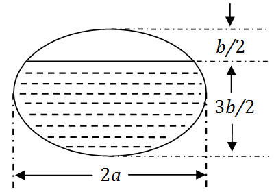

# 2010年全国硕士研究生招生考试数学二真题
> 本真题试卷来源于权威公开考研真题题库整理，包含全部题目、完整选项、高清插图、专业标签及详细参考答案与解析。
---

## 选择题

### 【M2-10-C-T01】第 1 题

函数
$f(x)=x2−1x2−x1+x21$
的无穷间断点的个数为

- **A.** 0
- **B.** 1
- **C.** 2
- **D.** 3

> **【唯一编号】** `M2-10-C-T01`
> **【题型】** 选择题
> **【科目】** 微积分
> **【分值】** 4分
> **【年份】** 2010年
> **【考点】** 函数、极限、连续、函数的连续性

<b>💡 查看参考答案与解析</b>

**【参考答案】** B

**【解析】**

**正确答案：B**

函数
$f(x)=x2−1x2−x1+x21$
有间断点
$x=0,1,−1$
。

因为

$$
x→0limf(x)=x→0lim(x+1)(x−1)x(x−1)1+x21=x→0limx1+x21,
$$

其中

$$
x→0+limx1+x21=1,x→0−limx1+x21=−1,
$$

所以
$x=0$
为跳跃间断点。

虽然

$$
x→1limf(x)=211+1=22,
$$

所以
$x=1$
为可去间断点。

而

$$
x→−1limf(x)=x→−1lim(x+1)(x−1)x(x−1)1+x21=∞,
$$

即
$x=−1$
为无穷间断点。

故无穷间断点个数为 1。

---

### 【M2-10-C-T02】第 2 题

设
$y1$
、
$y2$
是一阶线性非齐次微分方程
$y′+p(x)y=q(x)$
的两个特解，若常数
$λ$
、
$μ$
使
$λy1+μy2$
是该方程的解，
$λy1−μy2$
是该方程对应的齐次方程的解，则（ ）

- **A.** λ=21,μ=21
- **B.** λ=−21,μ=−21
- **C.** λ=32,μ=31
- **D.** λ=32,μ=32

> **【唯一编号】** `M2-10-C-T02`
> **【题型】** 选择题
> **【科目】** 微积分
> **【分值】** 4分
> **【年份】** 2010年
> **【考点】** 常微分方程、线性微分方程的解的结构

<b>💡 查看参考答案与解析</b>

**【参考答案】** A

**【解析】**

**正确答案：A**

由于
$λy1−μy2$
是
$y′+P(x)y=0$
的解，因此有

$$
(λy1−μy2)′+P(x)(λy1−μy2)=0,
$$

即

$$
λ(y1′+P(x)y1)−μ(y2′+P(x)y2)=0.
$$

又已知

$$
y1′+P(x)y1=q(x),y2′+P(x)y2=q(x),
$$

代入得

$$
λq(x)−μq(x)=0⇒(λ−μ)q(x)=0.(1)
$$

由于一阶非齐次微分方程
$y′+p(x)y=q(x)$
是非齐次的，可知
$q(x)=0$
，因此

$$
λ−μ=0.
$$

又因为
$λy1+μy2$
是非齐次微分方程
$y′+P(x)y=q(x)$
的解，所以

$$
(λy1+μy2)′+P(x)(λy1+μy2)=q(x),
$$

整理得

$$
λ(y1′+P(x)y1)+μ(y2′+P(x)y2)=q(x),
$$

即

$$
(λ+μ)q(x)=q(x).
$$

由
$q(x)=0$
可得

$$
λ+μ=1.(2)
$$

由 (1) 与 (2) 解得

$$
λ=μ=21.
$$

故应选 (A)。

---

### 【M2-10-C-T03】第 3 题

曲线
$y=x2$
与曲线
$y=alnx(a=0)$
相切，则
$a=()$

- **A.** 4e
- **B.** 3e
- **C.** 2e
- **D.** e

> **【唯一编号】** `M2-10-C-T03`
> **【题型】** 选择题
> **【科目】** 微积分
> **【分值】** 4分
> **【年份】** 2010年
> **【考点】** 一元函数微分学、导数的几何意义

<b>💡 查看参考答案与解析</b>

**【参考答案】** C

**【解析】**

**正确答案：C**

由于曲线
$y=x2$
与曲线
$y=alnx(a=0)$
相切，在切点处两条曲线的斜率相等，即

$$
2x=xa,
$$

解得

$$
x=2a(x>0).
$$

在切点处两条曲线的纵坐标也相等。对于
$y=x2$
，当
$x=2a$
时，

$$
y=2a.
$$

对于
$y=alnx$
，当
$x=2a$
时，

$$
y=aln2a=2aln2a.
$$

因此有

$$
2a=2aln2a.
$$

解得

$$
a=2e.
$$

故正确答案为 (C)。

---

### 【M2-10-C-T04】第 4 题

设
$m,n$
是正数，反常积分
$\int_0^1 nxmln2(1−x) \, dx$
（）

- **A.** 仅与
$m$
的取值有关。
- **B.** 仅与
$n$
的取值有关。
- **C.** 与
$m,n$
取值都有关。
- **D.** 与
$m,n$
取值都无关。

> **【唯一编号】** `M2-10-C-T04`
> **【题型】** 选择题
> **【科目】** 微积分
> **【分值】** 4分
> **【年份】** 2010年
> **【考点】** 一元函数积分学、反常积分的计算与敛散性

<b>💡 查看参考答案与解析</b>

**【参考答案】** D

**【解析】**

**正确答案：D**

x=0
与
$x=1$
都是瑕点，应分成

$$
∫01nxmln2(1−x)dx=∫021nxmln2(1−x)dx+∫211nxmln2(1−x)dx.
$$

对于
$∫021nxmln2(1−x)dx$
，当
$x→0+$
时，
$ln(1−x)∼−x$
，故
$mln2(1−x)∼mx2=xm2$
，则被积函数等价于
$xn1xm2=xm2−n1$
。

根据反常积分收敛性判别法，当
$m2−n1>−1$
时收敛，否则发散。但无论
$m,n$
取何正整数，该积分的收敛性仅由指数决定。而题目问的是积分本身是否与
$m,n$
有关。

实际计算中，对于
$∫021nxmln2(1−x)dx$
，当
$x→0+$
时，
$\lim_{x \to 0}+xn1[ln2(1−x)]m1$
的极限为有限值，故积分收敛性与
$m,n$
无关。

对于
$∫211nxmln2(1−x)dx$
，当
$x→1−$
时，令
$t=1−x$
，则积分变为
$∫021n1−tmln2tdt$
。此时
$n1−t∼1$
，故被积函数等价于
$mln2t$
，而
$lnt∼t−1$
，即
$mln2t∼m(t−1)2$
，在
$t→0+$
时，积分收敛性同样与
$m,n$
无关。

综上，该反常积分与
$m,n$
取值都无关。

---

### 【M2-10-C-T05】第 5 题

设函数
$z=z(x,y)$
，由方程
$F(xy,xz)=0$
确定，其中
$F$
为可微函数，且
$F2′=0$
，则

$$
x∂x∂z+y∂y∂z=()
$$

- **A.** x
- **B.** z
- **C.** −x
- **D.** −z

> **【唯一编号】** `M2-10-C-T05`
> **【题型】** 选择题
> **【科目】** 微积分
> **【分值】** 4分
> **【年份】** 2010年
> **【考点】** 多元函数微分学、偏导数的概念与计算

<b>💡 查看参考答案与解析</b>

**【参考答案】** B

**【解析】**

**正确答案：B**

根据隐函数求导公式，有：

$$
∂x∂z=−Fz′Fx′=−F2′⋅x1F1′⋅(−x2y)+F2′⋅(−x2z)=F2′F1′⋅xy+F2′⋅xz=xF2′yF1′+zF2′,
$$

$$
∂y∂z=−Fz′Fy′=−F2′⋅x1F1′⋅x1=−F2′F1′.
$$

因此，

$$
x∂x∂z+y∂y∂z=F2′yF1′+zF2′−F2′yF1′=F2′zF2′=z.
$$

---

### 【M2-10-C-T06】第 6 题

$$
n→∞limi=1∑nj=1∑n(n+i)(n2+j2)n=()
$$

- **A.** ∫01dx∫01(1+x)(1+y2)1dy
- **B.** ∫01dx∫0x(1+x)(1+y)1dy
- **C.** ∫01dx∫01(1+x)(1+y)1dy
- **D.** ∫01dx∫01(1+x)(1+y2)1dy

> **【唯一编号】** `M2-10-C-T06`
> **【题型】** 选择题
> **【科目】** 微积分
> **【分值】** 4分
> **【年份】** 2010年
> **【考点】** 多元函数积分学、重积分的计算

<b>💡 查看参考答案与解析</b>

**【参考答案】** D

**【解析】**

**正确答案：D**

$$
i=1∑nj=1∑n(n+i)(n2+j2)n=i=1∑nn+i1(j=1∑nn2+j2n)=(i=1∑nn+in)(j=1∑nn2+j21)
$$

$$
n→∞limj=1∑nn2+j2n=n→∞limn1j=1∑n1+(nj)21=∫011+y21dy
$$

$$
n→∞limi=1∑nn+in=n→∞limn1i=1∑n1+(ni)1=∫011+x1dx
$$

因此，

$$
n→∞limi=1∑nj=1∑n(n+i)(n2+j2)n=n→∞lim(j=1∑nn2+j2n)(i=1∑nn+in)=(n→∞limj=1∑nn2+j2n)(n→∞limi=1∑nn+in)=(∫011+x1dx)(∫011+y21dy)=∫01dx∫01(1+x)(1+y2)1dy.
$$

---

### 【M2-10-C-T07】第 7 题

设向量组
$I:a1,a2,⋯,ar$
可由向量组
$II:β1,β2,⋯,βs$
线性表示，下列命题正确的是（　　）

- **A.** 若向量组I线性无关,则
$r≤s$
。
- **B.** 若向量组I线性相关,则
$r>s$
。
- **C.** 若向量组II线性无关,则
$r≤s$
。
- **D.** 若向量组II线性相关,则
$r>s$
。

> **【唯一编号】** `M2-10-C-T07`
> **【题型】** 选择题
> **【科目】** 线性代数
> **【分值】** 4分
> **【年份】** 2010年
> **【考点】** 向量、向量组之间的线性表示

<b>💡 查看参考答案与解析</b>

**【参考答案】** A

**【解析】**

**正确答案：A**

由于向量组
$I$
能由向量组
$II$
线性表示，所以
$r(I)≤r(II)$
，即

$$
r(a1,⋯,ar)≤r(β1,⋯,βs)≤s
$$

若向量组
$I$
线性无关，则
$r(a1,⋯,ar)=r$
，所以

$$
r=r(a1,⋯,ar)≤r(β1,⋯,βs)≤s
$$

即
$r≤s$
，选 (A)。

---

### 【M2-10-C-T08】第 8 题

设
$A$
为 4 阶实对称矩阵，且
$A2+A=0$
，若
$A$
的秩为 3，则
$A$
相似于

- **A.** 1110
- **B.** 11−10
- **C.** 1−1−10
- **D.** −1−1−10

> **【唯一编号】** `M2-10-C-T08`
> **【题型】** 选择题
> **【科目】** 线性代数
> **【分值】** 4分
> **【年份】** 2010年
> **【考点】** 矩阵的特征值与特征向量

<b>💡 查看参考答案与解析</b>

**【参考答案】** D

**【解析】**

**正确答案：D**

设
$λ$
为
$A$
的特征值。由于
$A2+A=0$
，所以
$λ2+λ=0$
，即
$λ(λ+1)=0$
。因此
$A$
的特征值只能为
$−1$
或
$0$
。

由于
$A$
为实对称矩阵，故
$A$
可相似对角化，且相似对角矩阵中非零特征值的个数等于矩阵的秩。已知
$r(A)=3$
，所以
$A$
有 3 个非零特征值，即 3 个
$−1$
和 1 个
$0$
。

因此
$A$
相似于

$$
−1−1−10
$$

，选 (D)。

---

## 填空题

### 【M2-10-F-T09】第 9 题

（填空题）3 阶常系数线性齐次微分方程
$y′′′−2y′′+y′−2y=0$
的通解为
$y=$

> **【唯一编号】** `M2-10-F-T09`
> **【题型】** 填空题
> **【科目】** 微积分
> **【分值】** 4分
> **【年份】** 2010年
> **【考点】** 常微分方程、常系数齐次线性微分方程

<b>💡 查看参考答案与解析</b>

**【解析】**

**【答案】**
$y=C1e2x+C2cosx+C3sinx$

**【解析】** 该常系数线性齐次微分方程的特征方程为
$λ3−2λ2+λ−2=0$
。

因式分解得
$λ2(λ−2)+(λ−2)=(λ−2)(λ2+1)=0$
。

解得特征根为
$λ=2$
，
$λ=±i$
。

因此通解为
$y=C1e2x+C2cosx+C3sinx$
。

---

### 【M2-10-F-T10】第 10 题

（填空题）曲线
$y=x2+12x3$
的斜渐近线方程为

> **【唯一编号】** `M2-10-F-T10`
> **【题型】** 填空题
> **【科目】** 微积分
> **【分值】** 4分
> **【年份】** 2010年
> **【考点】** 一元函数微分学、曲线的凹凸性、拐点及渐近线

<b>💡 查看参考答案与解析</b>

**【解析】**

**【答案】**
$y=2x$

**【解析】** 曲线
$y=x2+12x3$
的斜渐近线方程为

由
$\lim_{x \to ∞}xx2+12x3=2$
，可得该函数在无穷远处的斜率趋向于 2。

又因为

$$
x→∞limx2+12x3−2x=x→∞limx2+12x3−2x3−2x=0
$$

说明函数与直线
$y=2x$
在无穷远处的纵向差距趋于零。

因此，该曲线的斜渐近线为
$y=2x$
。

---

### 【M2-10-F-T11】第 11 题

（填空题）函数
$y=ln(1−2x)$
在
$x=0$
处的
$n$
阶导数
$y(n)(0)=$

> **【唯一编号】** `M2-10-F-T11`
> **【题型】** 填空题
> **【科目】** 微积分
> **【分值】** 4分
> **【年份】** 2010年
> **【考点】** 一元函数微分学、导数与微分的计算

<b>💡 查看参考答案与解析</b>

**【解析】**

**【答案】**
$−2n(n−1)!$

**【解析】**根据高阶导数公式可知：

$$
ln(n)(1+x)=(−1)n−1(1+x)n(n−1)!
$$

因此：

$$
ln(n)(1−2x)=(−1)n−1(1−2x)n(n−1)!×(−2)n=−2n(1−2x)n(n−1)!
$$

代入
$x=0$
得：

$$
y(n)(0)=−2n(1−2×0)n(n−1)!=−2n(n−1)!
$$

---

### 【M2-10-F-T12】第 12 题

（填空题）当
$0≤θ≤π$
时，对数螺线
$r=eθ$
的弧长为

> **【唯一编号】** `M2-10-F-T12`
> **【题型】** 填空题
> **【科目】** 微积分
> **【分值】** 4分
> **【年份】** 2010年
> **【考点】** 一元函数积分学、定积分的应用

<b>💡 查看参考答案与解析</b>

**【解析】**

**【答案】**
$2(eπ−1)$

**【解析】** 由于
$0≤θ≤π$
，对数螺线
$r=eθ$
的极坐标弧长公式为：

$$
∫0π(eθ)2+(eθ)2dθ=∫0π2eθdθ=2(eπ−1)
$$

---

### 【M2-10-F-T13】第 13 题

（填空题）已知一个长方形的长
$l$
以
$2cm/s$
的速率增加，宽
$w$
以
$3cm/s$
的速率增加，则当
$l=12cm$
，
$w=5cm$
时，它的对角线增加的速率为

> **【唯一编号】** `M2-10-F-T13`
> **【题型】** 填空题
> **【科目】** 微积分
> **【分值】** 4分
> **【年份】** 2010年
> **【考点】** 多元函数微分学、偏导数的概念与计算

<b>💡 查看参考答案与解析</b>

**【解析】**

**【答案】** 3

**【解析】** 设
$l=x(t)$
，
$w=y(t)$
。由题意知，在
$t=t0$
时刻，
$x(t0)=12$
，
$y(t0)=5$
，且
$x′(t0)=2$
，
$y′(t0)=3$
。

设该对角线长为
$S(t)$
，则：

$$
S(t)=x2(t)+y2(t).
$$

对其求导得：

$$
S′(t)=x2(t)+y2(t)x(t)x′(t)+y(t)y′(t).
$$

代入
$t=t0$
时的值：

$$
S′(t0)=122+5212×2+5×3=1339=3.
$$

---

### 【M2-10-F-T14】第 14 题

（填空题）设
$A,B$
为 3 阶矩阵，且
$∣A∣=3$
，
$∣B∣=2$
，
$∣A−1+B∣=2$
，则
$∣A+B−1∣=$

> **【唯一编号】** `M2-10-F-T14`
> **【题型】** 填空题
> **【科目】** 线性代数
> **【分值】** 4分
> **【年份】** 2010年
> **【考点】** 矩阵、伴随矩阵与可逆矩阵

<b>💡 查看参考答案与解析</b>

**【解析】**

**【答案】** 3

**【解析】**

由于
$A(A−1+B)B−1=(E+AB)B−1=B−1+A$
，所以

$$
∣A+B−1∣=∣A(A−1+B)B−1∣=∣A∣⋅∣A−1+B∣⋅∣B−1∣.
$$

已知
$∣B∣=2$
，因此

$$
∣B−1∣=∣B∣−1=21.
$$

于是

$$
∣A+B−1∣=∣A∣⋅∣A−1+B∣⋅∣B−1∣=3×2×21=3.
$$

---

## 解答题

### 【M2-10-A-T15】第 15 题

（本题满分 10 分）求函数
$f(x)=∫−∞x2(x2−t)e−t2dt$
的单调区间与极值。

> **【唯一编号】** `M2-10-A-T15`
> **【题型】** 解答题
> **【科目】** 微积分
> **【分值】** 10分
> **【年份】** 2010年
> **【考点】** 一元函数积分学、变限积分

<b>💡 查看参考答案与解析</b>

**【解析】**

**【答案】**函数
$f(x)$
的单调递减区间为
$(−∞,−1)∪(0,1)$
，单调递增区间为
$(−1,0)∪(1,+∞)$
。极大值点为
$x=0$
，极大值为
$0$
；极小值点为
$x=±1$
，极小值为
$0$
。

**【解析】**因为
$f(x)=∫−∞x2(x2−t)e−t2dt=x2∫−∞x2e−t2dt−∫−∞x2te−t2dt$
，所以

$$
f′(x)=2x∫0x2e−t2dt+2x3e−x4−2x3e−x4=2x∫0x2e−t2dt.
$$

令
$f′(x)=0$
，得
$x=0$
或
$x=±1$
。

又

$$
f′′(x)=2∫0x2e−t2dt+4x2e−x4,
$$

$$
f′′(0)=2∫00e−t2dt=0.
$$

进一步利用导数定义判断极值：当
$x$
由负变正时，
$f′(x)$
由正变负，所以

$$
f(0)=∫00(0−t)e−t2dt=−21e−t200=0
$$

是极大值。

而
$f′′(±1)=4e−1>0$
，所以
$f(±1)=0$
为极小值。

又因为：

- 当
$x≥1$
时，
$f′(x)>0$
；
- 当
$0≤x<1$
时，
$f′(x)<0$
；
- 当
$−1≤x<0$
时，
$f′(x)>0$
；
- 当
$x<−1$
时，
$f′(x)<0$
，

所以
$f(x)$
的单调递减区间为
$(−∞,−1)∪(0,1)$
，单调递增区间为
$(−1,0)∪(1,+∞)$
。

---

### 【M2-10-A-T16】第 16 题

（本题满分 10 分）

(I) 比较
$\int_0^1 ∣lnt∣[ln(1+t)]n \, dt$
与
$\int_0^1 ∣lnt∣tn \, dt$
$(n=1,2,⋯)$
的大小，说明理由；

(II) 记
$un=\int_0^1 ∣lnt∣[ln(1+t)]n \, dt$
$(n=1,2,⋯)$
，求极限
$limn→∞un$
。

> **【唯一编号】** `M2-10-A-T16`
> **【题型】** 解答题
> **【科目】** 微积分
> **【分值】** 10分
> **【年份】** 2010年
> **【考点】** 一元函数积分学、定积分的计算

<b>💡 查看参考答案与解析</b>

**【解析】**

**【答案】**(I)
$\int_0^1 ∣lnt∣[ln(1+t)]n \, dt<\int_0^1 ∣lnt∣tn \, dt (II)$
$limn→∞un=0$

**【解析】**【解析】

(I) 当
$0<x<1$
时，
$0<ln(1+x)<x$
，因此
$[ln(1+t)]n<tn$
，所以

$$
∣lnt∣[ln(1+t)]n<∣lnt∣tn,
$$

于是

$$
∫01∣lnt∣[ln(1+t)]ndt<∫01∣lnt∣tndt(n=1,2,…).
$$

(II) 计算得

$$
∫01∣lnt∣tndt=−∫01lnt⋅tndt=−n+11∫01lntd(tn+1)=(n+1)21,
$$

因此

$$
0<un<∫01∣lnt∣tndt=(n+1)21.
$$

根据夹逼定理，有

$$
0≤n→∞limun≤n→∞lim(n+1)21=0,
$$

所以

$$
n→∞limun=0.
$$

---

### 【M2-10-A-T17】第 17 题

（本题满分 10 分）设
$y=f(x)$
由参数方程

$$
{x=2t+t2y=ψ(t)
$$

（
$t>−1$
）所确定，
$ψ(1)=25$
，
$ψ′(1)=6$
，已知
$dx2d2y=4(1+t)3$
，求
$ψ(t)$
。

> **【唯一编号】** `M2-10-A-T17`
> **【题型】** 解答题
> **【科目】** 微积分
> **【分值】** 10分
> **【年份】** 2010年
> **【考点】** 一元函数微分学、导数与微分的计算

<b>💡 查看参考答案与解析</b>

**【解析】**

**【答案】**

$$
ψ(t)=23t2+t3,t>−1
$$

**【解析】**根据题意得：

$$
dxdy=dtdxdtdy=2t+2ψ′(t)
$$

$$
dx2d2y=dtdxdtd(2t+2ψ′(t))=(2t+2)3ψ′′(t)(2t+2)−2ψ′(t)=4(1+t)3
$$

即：

$$
ψ′′(t)(2t+2)−2ψ′(t)=6(t+1)2
$$

整理得：

$$
ψ′′(t)(t+1)−ψ′(t)=3(t+1)2
$$

令
$y′=ψ′(t)$
，则方程化为：

$$
y′−1+t1y=3(1+t)
$$

其通解为：

$$
y=e∫1+t1dt(∫3(1+t)e−∫1+t1dtdt+C)=(1+t)(3t+C)(t>−1)
$$

因为
$y(1)=ψ′(1)=6$
，所以：

$$
6=(1+1)(3×1+C)
$$

解得
$C=0$
，故：

$$
y=3t(t+1)
$$

即：

$$
ψ′(t)=3t(t+1)
$$

则：

$$
ψ(t)=∫3t(t+1)dt=23t2+t3+C1
$$

又由
$ψ(1)=25$
，可得：

$$
23×12+13+C1=25
$$

解得
$C1=0$
，故：

$$
ψ(t)=23t2+t3,(t>−1)
$$

---

### 【M2-10-A-T18】第 18 题

（本题满分 10 分）一个高为
$l$
的柱体形贮油罐，底面是长轴为
$2a$
，短轴为
$2b$
的椭圆。现将贮油罐平放，当油的高度为
$23b$
时，计算油的质量（长度单位为
$m$
，质量密度为常数
$ρkg/m3$
）。

> **【唯一编号】** `M2-10-A-T18`
> **【题型】** 解答题
> **【科目】** 微积分
> **【分值】** 10分
> **【年份】** 2010年
> **【考点】** 一元函数积分学、定积分的应用

<b>💡 查看参考答案与解析</b>

**【解析】**

**【答案】**

$$
m=(32π+43)ablρ
$$

**【解析】**油罐放平后建立坐标系，底面椭圆方程为
$a2x2+b2y2=1$
。当油的高度为
$23b$
时，液面位于
$y=−b$
到
$y=2b$
之间。

阴影部分面积为：

$$
S=∫−b2b2xdy=b2a∫−b2bb2−y2dy
$$

令
$y=bsint$
，积分限对应为：

- 当
$y=−b$
时，
$t=−2π$
- 当
$y=2b$
时，
$t=6π$

于是：

$$
S=2ab∫−2π6πcos2tdt
$$

利用恒等式
$cos2t=21+21cos2t$
，得：

$$
S=2ab∫−2π6π(21+21cos2t)dt=ab[t+21sin2t]−2π6π
$$

代入上下限：

$$
S=ab[(6π+21sin3π)−(−2π+21sin(−π))]
$$

计算得：

$$
S=ab(6π+43+2π)=ab(32π+43)
$$

因此，油的质量为：

$$
m=Slρ=(32π+43)ablρ
$$

---

### 【M2-10-A-T19】第 19 题

（本题满分 10 分）设函数
$u=f(x,y)$
具有二阶连续偏导数，且满足等式

$$
4∂x2∂2u+12∂x∂y∂2u+5∂y2∂2u=0,
$$

求
$a,b$
的值，使等式在变换
$ξ=x+ay$
，
$η=x+by$
下化简为

$$
∂ξ∂η∂2u=0.
$$

> **【唯一编号】** `M2-10-A-T19`
> **【题型】** 解答题
> **【科目】** 微积分
> **【分值】** 10分
> **【年份】** 2010年
> **【考点】** 多元函数微分学、偏导数的概念与计算

<b>💡 查看参考答案与解析</b>

**【解析】**

**【答案】**
$a=−2,b=−52$
或
$a=−52,b=−2$

**【解析】** 根据复合函数链式法则，得到以下偏导数关系：

$$
∂x∂u=∂ξ∂u+∂η∂u,
$$

$$
∂y∂u=a∂ξ∂u+b∂η∂u,
$$

$$
∂x2∂2u=∂ξ2∂2u+2∂ξ∂η∂2u+∂η2∂2u,
$$

$$
∂x∂y∂2u=a∂ξ2∂2u+(a+b)∂ξ∂η∂2u+b∂η2∂2u,
$$

$$
∂y2∂2u=a2∂ξ2∂2u+2ab∂ξ∂η∂2u+b2∂η2∂2u.
$$

将上述结果代入原方程，得到：

$$
4(∂ξ2∂2u+2∂ξ∂η∂2u+∂η2∂2u)+12(a∂ξ2∂2u+(a+b)∂ξ∂η∂2u+b∂η2∂2u)+5(a2∂ξ2∂2u+2ab∂ξ∂η∂2u+b2∂η2∂2u)=0.
$$

整理后得到：

$$
(4+12a+5a2)∂ξ2∂2u+(8+12(a+b)+10ab)∂ξ∂η∂2u+(4+12b+5b2)∂η2∂2u=0.
$$

为了使方程化简为
$∂ξ∂η∂2u=0$
，需要满足以下条件：

$$
⎩⎨⎧4+12a+5a2=0,4+12b+5b2=0,8+12(a+b)+10ab=0.
$$

解方程
$4+12a+5a2=0$
，得到
$a=−2$
或
$a=−52$
。

解方程
$4+12b+5b2=0$
，得到
$b=−2$
或
$b=−52$
。

当
$a=−2$
，
$b=−52$
或
$a=−52$
，
$b=−2$
时，计算：

$$
8+12(a+b)+10ab=8+12(−2−52)+10×(−2)×(−52)=8−5144+8=16−5144=−564=0,
$$

满足条件。

因此，
$a,b$
的值为
$(−2,−52)$
或
$(−52,−2)$
。

---

### 【M2-10-A-T20】第 20 题

（本题满分
$11$
分）计算二重积分
$I=∫Dr2sinθ1−r2cos2θdrdθ$
，其中
$D={(r,θ)∣0≤r≤secθ,0≤θ≤4π}$
。

> **【唯一编号】** `M2-10-A-T20`
> **【题型】** 解答题
> **【科目】** 微积分
> **【分值】** 11分
> **【年份】** 2010年
> **【考点】** 多元函数积分学、重积分的计算

<b>💡 查看参考答案与解析</b>

**【解析】**

**【答案】**
$I=31−16π$

**【解析】**将极坐标转换为直角坐标，
$x=rcosθ$
，
$y=rsinθ$
，以及
$cos2θ=cos2θ−sin2θ$
，则被积函数可化为：

$$
r2sinθ1−r2(cos2θ−sin2θ)=r2sinθ1−(rcosθ)2+(rsinθ)2=r2sinθ1−x2+y2.
$$

积分区域
$D$
中，
$0≤r≤secθ$
，即
$rcosθ≤1$
，也就是
$x≤1$
，且
$0≤θ≤4π$
，对应的直角坐标区域为
$0≤x≤1$
，
$0≤y≤x$
。

因此，二重积分可化为直角坐标下的累次积分：

$$
I=∫04πdθ∫0secθr2sinθ1−r2cos2θdr=∫01dx∫0xy1−x2+y2dy.
$$

令
$u=1−x2+y2$
，则
$du=2ydy$
。当
$y=0$
时，
$u=1−x2$
；当
$y=x$
时，
$u=1$
，于是：

$$
∫0xy1−x2+y2dy=21∫1−x21udu=21×32u231−x21=31(1−(1−x2)23).
$$

因此：

$$
I=∫0131(1−(1−x2)23)dx=31∫011dx−31∫01(1−x2)23dx=31−31×163π=31−16π.
$$

---

### 【M2-10-A-T21】第 21 题

（本题满分 11 分）

设函数
$f(x)$
在闭区间
$[0,1]$
上连续，在开区间
$(0,1)$
内可导，且
$f(0)=0$
，
$f(1)=31$
．

证明：存在
$ξ∈(0,21)$
，
$η∈(21,1)$
，使得：

$$
f′(ξ)+f′(η)=ξ2+η2.
$$

> **【唯一编号】** `M2-10-A-T21`
> **【题型】** 解答题
> **【科目】** 微积分
> **【分值】** 11分
> **【年份】** 2010年
> **【考点】** 一元函数微分学、微分中值定理

<b>💡 查看参考答案与解析</b>

**【解析】**

**【答案】** 见解析

**【解析】** 令
$F(x)=f(x)−31x3$
，对
$F(x)$
在区间
$[0,21]$
上应用拉格朗日中值定理，存在
$ξ∈(0,21)$
，使得

$$
F(21)−F(0)=21F′(ξ).
$$

再对
$F(x)$
在区间
$[21,1]$
上应用拉格朗日中值定理，存在
$η∈(21,1)$
，使得

$$
F(1)−F(21)=21F′(η).
$$

将两式相加，得到

$$
f′(ξ)+f′(η)=ξ2+η2.
$$

因此，存在
$ξ∈(0,21)$
与
$η∈(21,1)$
，使得

$$
f′(ξ)+f′(η)=ξ2+η2.
$$

---

### 【M2-10-A-T22】第 22 题

（本题满分 11 分）

(1) 已知矩阵
$A=λ011λ−1110λ$
，向量
$b=a11$
，若方程组
$Ax=b$
有两个不同的解，求
$λ$
，
$a$
；

(2) 求方程组
$Ax=b$
的通解。

> **【唯一编号】** `M2-10-A-T22`
> **【题型】** 解答题
> **【科目】** 线性代数
> **【分值】** 11分
> **【年份】** 2010年
> **【考点】** 线性方程组

<b>💡 查看参考答案与解析</b>

**【解析】**

**【答案】**(1)
$λ=−1$
,
$a=−2$
。(2) 方程组
$Ax=b$
的通解为
$x=k101+23−210$
，其中
$k$
为任意常数。

**【解析】**(1)**方法一**：已知
$Ax=b$
有两个不同的解，因此
$r(A)=r(A)<3$
。对增广矩阵进行初等行变换，可得当
$λ=−1$
且
$a=−2$
时满足条件。

**方法二**：由
$∣A∣=0$
得
$λ=1$
或
$−1$
。当
$λ=1$
时方程组无解，故
$λ=−1$
，再由
$r(A)=r(A)$
得
$a=−2$
。

(2) 对增广矩阵做初等行变换，可得通解为

$$
x=k101+23−210,
$$

其中
$k$
为任意常数。

---

### 【M2-10-A-T23】第 23 题

（本题满分 11 分）

设

$$
A=0−14−13a4a0
$$

正交矩阵
$Q$
使
$QTAQ$
为对角矩阵，若
$Q$
的第 1 列为
$61(1,2,1)T$
，求
$a$
，
$Q$
。

> **【唯一编号】** `M2-10-A-T23`
> **【题型】** 解答题
> **【科目】** 线性代数
> **【分值】** 11分
> **【年份】** 2010年
> **【考点】** 矩阵的特征值与特征向量

<b>💡 查看参考答案与解析</b>

**【解析】**

**【答案】**
$a=−1$
，
$Q=616261−2102131−3131$

**【解析】** 已知
$A=0−14−13a4a0$
，存在正交矩阵
$Q$
，使得
$QTAQ$
为对角阵，且
$Q$
的第一列为
$61(1,2,1)T$
，故
$A$
对应于
$λ1$
的特征向量为
$ξ1=61(1,2,1)T$
。

根据特征值与特征向量的定义，有

$$
A616261=λ1616261,
$$

即

$$
0−14−13a4a0121=λ1121.
$$

由此解得
$a=−1$
，
$λ1=2$
。因此

$$
A=0−14−13−14−10.
$$

由

$$
∣λE−A∣=λ1−41λ−31−41λ=(λ+4)(λ−2)(λ−5)=0,
$$

可得
$A$
的特征值为
$λ1=2$
，
$λ2=−4$
，
$λ3=5$
。

由
$(λ2E−A)x=0$
，即

$$
−41−41−71−41−4x1x2x3=0,
$$

可解得对应于
$λ2=−4$
的线性无关特征向量为
$ξ2=(−1,0,1)T$
。

由
$(λ3E−A)x=0$
，即

$$
51−4121−415x1x2x3=0,
$$

可解得对应于
$λ3=5$
的特征向量为
$ξ3=(1,−1,1)T$
。

由于
$A$
为实对称矩阵，
$ξ1,ξ2,ξ3$
为对应于不同特征值的特征向量，故它们相互正交。将其单位化：

$$
η1=∣ξ1∣ξ1=61(1,2,1)T,η2=∣ξ2∣ξ2=21(−1,0,1)T,η3=∣ξ3∣ξ3=31(1,−1,1)T.
$$

取

$$
Q=(η1,η2,η3)=616261−2102131−3131,
$$

则有

$$
QTAQ=Λ=2−45.
$$

---
