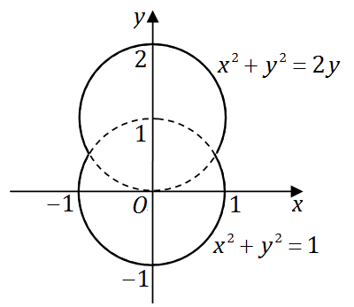

# 2011年全国硕士研究生招生考试数学二真题
> 本真题试卷来源于权威公开考研真题题库整理，包含全部题目、完整选项、高清插图、专业标签及详细参考答案与解析。
---

## 选择题

### 【M2-11-C-T01】第 1 题

已知当
$x→0$
时，函数
$f(x)=3sinx−sin3x$
与
$cxk$
是等价无穷小，则（

- **A.** k=1,c=4
- **B.** k=1,c=−4
- **C.** k=3,c=4
- **D.** k=3,c=−4

> **【唯一编号】** `M2-11-C-T01`
> **【题型】** 选择题
> **【科目】** 微积分
> **【分值】** 4分
> **【年份】** 2011年
> **【考点】** 函数、极限、连续、无穷小量的比较

<b>💡 查看参考答案与解析</b>

**【参考答案】** C

**【解析】**

**正确答案：C**

根据泰勒公式及无穷小阶的比较可得。

$$
sinx=x−3!x3+o(x3),sin3x=3x−3!27x3+o(x3)
$$

$$
x→0limcxk3sinx−sin3x=x→0limcxk−2x3+29x3+o(x3)=x→0limcxk4x3=1
$$

因此
$c=4$
，
$k=3$
。

$$
x→0limcxk3sinx−sin3x=x→0limckxk−13cosx−3cos3x=x→0limck3⋅xk−1−2sin2xsin(−x)=ck12x→0limxk−1x2=1
$$

所以
$k−1=2$
，
$ck=12$
，即
$k=3$
，
$c=4$
。

---

### 【M2-11-C-T02】第 2 题

已知
$f(x)$
在
$x=0$
处可导，且
$f(0)=0$
，则

$$
x→0limx3x2f(x)−2f(x3)
$$

等于（ ）

- **A.** −2f′(0)
- **B.** −f′(0)
- **C.** f′(0)
- **D.** 0

> **【唯一编号】** `M2-11-C-T02`
> **【题型】** 选择题
> **【科目】** 微积分
> **【分值】** 4分
> **【年份】** 2011年
> **【考点】** 一元函数微分学、导数与微分的概念

<b>💡 查看参考答案与解析</b>

**【参考答案】** B

**【解析】**

**正确答案：B**

根据导数在某点的定义求解。

$$
x→0limx3x2f(x)−2f(x3)=x→0limx3x2f(x)−x2f(0)−x→0limx32f(x3)−2f(0)
$$

$$
=f′(0)−2f′(0)=−f′(0)
$$

---

### 【M2-11-C-T03】第 3 题

函数
$f(x)=ln∣(x−1)(x−2)(x−3)∣$
的驻点个数为（  ）

- **A.** 0
- **B.** 1
- **C.** 2
- **D.** 3

> **【唯一编号】** `M2-11-C-T03`
> **【题型】** 选择题
> **【科目】** 微积分
> **【分值】** 4分
> **【年份】** 2011年
> **【考点】** 一元函数微分学、函数的单调性、极值与最值

<b>💡 查看参考答案与解析</b>

**【参考答案】** C

**【解析】**

**正确答案：C**函数的一阶导数为零的点为驻点，即
$f′(x)=0$
的解为
$x=2±31$
。

---

### 【M2-11-C-T04】第 4 题

微分方程
$y′′−λ2y=eλx+e−λx(λ>0)$
的特解形式为

- **A.** a(eλx+e−λx)
- **B.** ax(eλx+e−x)
- **C.** x(aeλx+be−λx)
- **D.** x2(aeλx+be−λx)

> **【唯一编号】** `M2-11-C-T04`
> **【题型】** 选择题
> **【科目】** 微积分
> **【分值】** 4分
> **【年份】** 2011年
> **【考点】** 常微分方程、常系数非齐次线性微分方程

<b>💡 查看参考答案与解析</b>

**【参考答案】** C

**【解析】**

**正确答案：C**

当特征值为
$±λ$
，且非齐次项中
$±λ$
分别与特征根相等时，特解可设为：

$$
x(aeλx+be−λx)
$$

---

### 【M2-11-C-T05】第 5 题

设函数
$f(x)$
、
$g(x)$
均有二阶连续导数，满足
$f(0)>0$
、
$g(0)<0$
，且
$f′(0)=g′(0)=0$
，则函数
$z=f(x)g(y)$
在点
$(0,0)$
处取得极小值的一个充分条件是（  ）

- **A.** f′′(0)<0,g′′(0)>0
- **B.** f′′(0)<0,g′′(0)<0
- **C.** f′′(0)>0,g′′(0)>0
- **D.** f′′(0)>0,g′′(0)<0

> **【唯一编号】** `M2-11-C-T05`
> **【题型】** 选择题
> **【科目】** 微积分
> **【分值】** 4分
> **【年份】** 2011年
> **【考点】** 多元函数微分学、多元函数的极值问题

<b>💡 查看参考答案与解析</b>

**【参考答案】** A

**【解析】**

**正确答案：A**

根据

$$
zxzy=f′(x)g(y)=0,=f(x)g′(y)=0
$$

以及

$$
zxx=f′′(x)g(y),zyy=f(x)g′′(y),zxy=f′(x)g′(y),
$$

对于点
$(0,0)$
，有

$$
zxx(0,0)=f′′(0)g(0),zyy(0,0)=f(0)g′′(0),zxy(0,0)=f′(0)g′(0).
$$

已知
$f(0)>0$
，
$g(0)<0$
，且
$f′(0)=g′(0)=0$
。根据题意可判断：

$$
f′′(0)<0,g′′(0)>0.
$$

---

### 【M2-11-C-T06】第 6 题

设
$I=\int_0^{\frac{\pi}{4}} ln(sinx) \, dx$
，
$J=\int_0^{\frac{\pi}{4}} ln(cotx) \, dx$
，
$K=\int_0^{\frac{\pi}{4}} ln(cosx) \, dx$
，则
$I$
，
$J$
，
$K$
的大小关系为（ ）

- **A.** I<J<K
- **B.** I<K<J
- **C.** J<I<K
- **D.** K<J<I

> **【唯一编号】** `M2-11-C-T06`
> **【题型】** 选择题
> **【科目】** 微积分
> **【分值】** 4分
> **【年份】** 2011年
> **【考点】** 一元函数积分学、定积分的计算

<b>💡 查看参考答案与解析</b>

**【参考答案】** B

**【解析】**

**正确答案：B**

在区间
$[0,4π]$
上，有
$lnsinx<lncosx<lncotx$
。

根据定积分比较大小的性质，可知应选 (B)。

---

### 【M2-11-C-T07】第 7 题

设
$A$
为 3 阶矩阵，将
$A$
的第 2 列加到第 1 列得矩阵
$B$
，再交换
$B$
的第 2 行与第 3 行得单位矩阵。

记
$P1=110010001$
，
$P2=100001010$
，则
$A=$
（   ）

- **A.** P1P2
.
- **B.** P1−1P2
.
- **C.** P2P1
.
- **D.** P2P1−1
.

> **【唯一编号】** `M2-11-C-T07`
> **【题型】** 选择题
> **【科目】** 线性代数
> **【分值】** 4分
> **【年份】** 2011年
> **【考点】** 矩阵、矩阵的运算与变换

<b>💡 查看参考答案与解析</b>

**【参考答案】** D

**【解析】**

**正确答案：D**

由初等变换及初等矩阵的性质易知
$P2AP1=E$
，从而

$$
A=P2−1P1−1=P2P1−1,
$$

答案应选 (D)。

---

### 【M2-11-C-T08】第 8 题

设
$A=(α1,α2,α3,α4)$
是
$4$
阶矩阵，
$A∗$
为
$A$
的伴随矩阵。若
$(1,0,1,0)T$
是方程组
$Ax=0$
的一个基础解系，则
$A∗x=0$
的基础解系可为( )

- **A.** α1,α3
- **B.** α1,α2
- **C.** α1,α2,α3
- **D.** α2,α3,α4

> **【唯一编号】** `M2-11-C-T08`
> **【题型】** 选择题
> **【科目】** 线性代数
> **【分值】** 4分
> **【年份】** 2011年
> **【考点】** 矩阵、伴随矩阵与可逆矩阵

<b>💡 查看参考答案与解析</b>

**【参考答案】** D

**【解析】**

**正确答案：D**

由
$(1,0,1,0)⊤$
是方程
$AX=0$
的一个基础解系，可知
$r(A)=3$
，从而
$r(A∗)=1$
，且
$∣A∣=0$
。

于是
$A∗A=∣A∣E=0$
，即
$a1,a2,a3,a4$
为
$A∗X=0$
的解。

由
$a1+a3=0$
，可知
$a1,a3$
线性相关。又由
$r(A)=3$
，可知
$a2,a3,a4$
线性无关。

同时
$r(A∗)=1$
，因此
$a2,a3,a4$
为
$A∗X=0$
的基础解系。

故应选 (D)。

---

## 填空题

### 【M2-11-F-T09】第 9 题

（填空题）
$\lim_{x \to 0}(21+2x)x1=$

> **【唯一编号】** `M2-11-F-T09`
> **【题型】** 填空题
> **【科目】** 微积分
> **【分值】** 4分
> **【年份】** 2011年
> **【考点】** 函数、极限、连续、函数极限的计算

<b>💡 查看参考答案与解析</b>

**【解析】**

**【答案】**
$2$

**【解析】**首先，我们考虑极限：

$$
x→0lim(21+2x)x1
$$

为了简化计算，我们取自然对数并利用指数函数的连续性：

$$
x→0lim(21+2x)x1=elimx→0x1ln(21+2x)
$$

接下来，我们处理指数部分：

$$
x→0limx1ln(21+2x)
$$

注意到：

$$
21+2x=1+22x−1
$$

因此，我们可以将极限改写为：

$$
x→0limx1ln(1+22x−1)
$$

当
$x→0$
时，
$22x−1$
是一个无穷小量，因此我们可以使用近似公式
$ln(1+y)≈y$
当
$y→0$
时：

$$
ln(1+22x−1)≈22x−1
$$

于是：

$$
x→0limx1⋅22x−1
$$

进一步化简：

$$
21x→0limx2x−1
$$

我们知道：

$$
x→0limx2x−1=ln2
$$

因此：

$$
21⋅ln2=ln2
$$

最后，代入指数函数：

$$
eln2=2
$$

所以：

$$
x→0lim(21+2x)x1=2
$$

---

### 【M2-11-F-T10】第 10 题

（填空题）微分方程
$y′+y=e−xcosx$
满足条件
$y(0)=0$
的解为
$y=$

> **【唯一编号】** `M2-11-F-T10`
> **【题型】** 填空题
> **【科目】** 微积分
> **【分值】** 4分
> **【年份】** 2011年
> **【考点】** 常微分方程、一阶非齐次线性微分方程

<b>💡 查看参考答案与解析</b>

**【解析】**

**【答案】**
$y=e−xsinx$

**【解析】**
已知方程的解为：

$$
y=e−∫1dx(C+∫e−xcosxe∫1dxdx)=e−x(C+sinx)
$$

代入初始条件
$y(0)=0$
得：

$$
0=e0(C+sin0)=1⋅(C+0)=C
$$

因此
$C=0$
。

最终解为：

$$
y=e−xsinx
$$

---

### 【M2-11-F-T11】第 11 题

（填空题）曲线
$y=\int_0^x \tantdt(0≤x≤4π)$
的弧长
$s=$

> **【唯一编号】** `M2-11-F-T11`
> **【题型】** 填空题
> **【科目】** 微积分
> **【分值】** 4分
> **【年份】** 2011年
> **【考点】** 一元函数积分学、定积分的应用

<b>💡 查看参考答案与解析</b>

**【解析】**

**【答案】**
$ln(2+1)$

**【解析】**要计算积分

$$
s=∫04π1+tan2xdx
$$

首先，利用三角恒等式

$$
1+tan2x=sec2x
$$

因此

$$
1+tan2x=sec2x=∣secx∣
$$

在区间
$[0,4π]$
上，
$secx>0$
，所以

$$
∣secx∣=secx
$$

于是积分变为

$$
s=∫04πsecxdx
$$

已知

$$
∫secxdx=ln∣secx+tanx∣+C
$$

因此

$$
s=[ln(secx+tanx)]04π
$$

代入上下限：当
$x=4π$
时，

$$
sec(4π)=2,tan(4π)=1
$$

所以

$$
ln(sec4π+tan4π)=ln(2+1)
$$

当
$x=0$
时，

$$
sec0=1,tan0=0
$$

所以

$$
ln(sec0+tan0)=ln(1+0)=ln1=0
$$

因此

$$
s=ln(2+1)−0=ln(2+1)
$$

最终结果为

$$
s=ln(2+1)
$$

---

### 【M2-11-F-T12】第 12 题

（填空题）设随机变量
$X$
的概率密度为

$$
f(x)={λe−λx,0,x>0x≤0(λ>0),
$$

则

$$
∫−∞+∞xf(x)dx=
$$

> **【唯一编号】** `M2-11-F-T12`
> **【题型】** 填空题
> **【科目】** 微积分
> **【分值】** 4分
> **【年份】** 2011年
> **【考点】** 随机变量的数字特征、数学期望与方差

<b>💡 查看参考答案与解析</b>

**【解析】**

**【答案】**
$λ1$

**【解析】** 已知指数分布的概率密度函数为
$f(x)=λe−λx$
，其中
$x≥0$
，
$λ>0$
。

其数学期望为：

$$
E[X]=∫0+∞x⋅λe−λxdx
$$

令
$u=x$
，
$dv=λe−λxdx$
，则
$du=dx$
，
$v=−e−λx$
。

使用分部积分法：

$$
E[X]=[−xe−λx]0+∞+∫0+∞e−λxdx
$$

第一项在
$x→+∞$
时趋于 0，在
$x=0$
时也为 0，因此该项为 0。

于是：

$$
E[X]=∫0+∞e−λxdx=[−λ1e−λx]0+∞
$$

当
$x→+∞$
时，
$e−λx→0$
；当
$x=0$
时，
$e−λx=1$
。

因此：

$$
E[X]=0−(−λ1)=λ1
$$

所以指数分布的数学期望为
$λ1$
。

---

### 【M2-11-F-T13】第 13 题

（填空题）设平面区域
$D$
由直线
$y=x$
、圆
$x2+y2=2y$
及
$y$
轴所组成，则二重积分
$∬Dxydσ=$

> **【唯一编号】** `M2-11-F-T13`
> **【题型】** 填空题
> **【科目】** 微积分
> **【分值】** 4分
> **【年份】** 2011年
> **【考点】** 多元函数积分学、重积分的计算

<b>💡 查看参考答案与解析</b>

**【解析】**

**【答案】**
$329$

**【解析】**计算二重积分
$∬Dxydσ$
，其中区域
$D$
由极坐标给出。

首先，将积分转换为极坐标形式：

$$
∬Dxydσ=∫03πdθ∫02sinθr3sinθcosθdr
$$

先对
$r$
进行积分：

$$
∫02sinθr3dr=[4r4]02sinθ=4(2sinθ)4=4sin4θ
$$

代入原式：

$$
∫03π4sin4θcosθsinθdθ=∫03π4sin5θcosθdθ
$$

令
$u=sinθ$
，则
$du=cosθdθ$
，积分上下限变为：

$$
θ=0⇒u=0,θ=3π⇒u=23
$$

代入得：

$$
∫0234u5du=4[6u6]023=64(23)6=32⋅6427=19254=329
$$

因此，积分结果为：

$$
∬Dxydσ=329
$$

原答案中给出的
$127$
有误，正确结果应为
$329$
。

---

### 【M2-11-F-T14】第 14 题

（填空题）二次型
$f(x1,x2,x3)=x12+3x22+x32+2x1x2+2x1x3+2x2x3$
，则
$f$
的正惯性指数为 ______。

> **【唯一编号】** `M2-11-F-T14`
> **【题型】** 填空题
> **【科目】** 线性代数
> **【分值】** 4分
> **【年份】** 2011年
> **【考点】** 二次型

<b>💡 查看参考答案与解析</b>

**【解析】**

**【答案】** 2

**【解析】** 【详解1】二次型
$f(x1,x2,x3)=x12+3x22+x32+2x1x2+2x1x3+2x2x3$
可通过配方法化为
$y12+4y22$
，因此正惯性指数为 2。

【详解2】本题也可通过求二次型矩阵的特征值，进一步得到正惯性指数为 2。

---

## 解答题

### 【M2-11-A-T15】第 15 题

（本题满分 10 分）已知函数

$$
F(x)=x3a∫0xln(1+t2)dt,
$$

设

$$
x→+∞limF(x)=x→0+limF(x)=0,
$$

试求
$a$
的取值范围。

> **【唯一编号】** `M2-11-A-T15`
> **【题型】** 解答题
> **【科目】** 微积分
> **【分值】** 10分
> **【年份】** 2011年
> **【考点】** 一元函数微分学、微分中值定理

<b>💡 查看参考答案与解析</b>

**【解析】**

**【答案】**
$31<a<1$

**【解析】** 解：由
$limx→+∞F(x)=0$
，所以至少
$a>0$
。

由
$\lim_{x \to 0}+F(x)=0$
，可得

$$
x→0+limF(x)=x→0+limx3a∫0xln(1+t2)dt=x→0+lim3ax3a−1ln(1+x2)=x→0+lim3ax3a−1x2=0
$$

因此
$2>3a−1$
，即
$a<1$
。

又由
$limx→+∞F(x)=0$
，可得

$$
x→+∞limF(x)=x→+∞limx3a∫0xln(1+t2)dt=x→+∞lim3ax3a−1ln(1+x2)=x→+∞lim1+x22x⋅3a(3a−1)x3a−21=x→+∞lim1+x22x3−3a⋅3a(3a−1)1=0
$$

即
$3−3a<2$
，所以
$a>31$
。

综上，
$31<a<1$
。

---

### 【M2-11-A-T16】第 16 题

（本题满分 10 分）设函数
$y=y(x)$
由参数方程

$$
{x=31t3+t+31,y=31t3−t+31
$$

确定，求
$y=y(x)$
的极值和曲线
$y=y(x)$
的凹凸区间及拐点。

> **【唯一编号】** `M2-11-A-T16`
> **【题型】** 解答题
> **【科目】** 微积分
> **【分值】** 10分
> **【年份】** 2011年
> **【考点】** 一元函数微分学、函数的单调性、极值与最值

<b>💡 查看参考答案与解析</b>

**【解析】**

**【答案】**

- 极小值点：当
$t=1$
时，
$(x,y)=(35,−31)$
- 极大值点：当
$t=−1$
时，
$(x,y)=(−1,1)$
- 拐点：当
$t=0$
时，
$(x,y)=(31,31)$
- 凸区间：
$t<0$
- 凹区间：
$t>0$

**【解析】**解：

$$
dxdy=t2+1t2−1,dx2d2y=(t2+1)34t
$$

当
$t=1$
时，
$x=35$
，
$y=−31$
，是极小值。

当
$t=−1$
时，
$x=−1$
，
$y=1$
，是极大值。

当
$t=0$
时，
$x=31$
，
$y=31$
，是拐点。

当
$t<0$
时，是凸区间。

当
$t>0$
时，是凹区间。

---

### 【M2-11-A-T17】第 17 题

（本题满分 10 分）设函数
$z=f(xy,yg(x))$
，其中函数
$f$
具有二阶连续偏导数，函数
$g(x)$
可导且在
$x=1$
处取得极值
$g(1)=1$
，求

$$
∂x∂y∂2zx=1y=1
$$

> **【唯一编号】** `M2-11-A-T17`
> **【题型】** 解答题
> **【科目】** 微积分
> **【分值】** 10分
> **【年份】** 2011年
> **【考点】** 多元函数微分学、偏导数的概念与计算

<b>💡 查看参考答案与解析</b>

**【解析】**

**【答案】**

$$
∂x∂y∂2zx=1y=1=f1′(1,1)+f11′′(1,1)
$$

**【解析】**【详解】

首先，我们计算一阶偏导数：

$$
∂x∂z=f1′y+f2′g′(x)
$$

接着，计算二阶混合偏导数：

$$
∂x∂y∂2z=f1′+xyf11′′+xf21′′g′(x)
$$

已知
$g(x)$
在
$x=1$
处取得极值，因此：

$$
g′(1)=0
$$

代入
$x=1$
，
$y=1$
及
$g′(1)=0$
，得到：

$$
∂x∂y∂2zx=1y=1=f1′(1,1)+f11′′(1,1)
$$

---

### 【M2-11-A-T18】第 18 题

（本题满分 10 分）设函数
$y(x)$
具有二阶导数，且曲线
$l:y=y(x)$
与直线
$y=x$
相切于原点。记
$α$
为曲线
$l$
在点
$(x,y)$
处切线的倾角，若
$dxdα=dxdy$
，求
$y(x)$
的表达式。

> **【唯一编号】** `M2-11-A-T18`
> **【题型】** 解答题
> **【科目】** 微积分
> **【分值】** 10分
> **【年份】** 2011年
> **【考点】** 一元函数微分学、微分中值定理

<b>💡 查看参考答案与解析</b>

**【解析】**

**【答案】**
$y(x)=arcsin(22ex)−4π$

**【解析】** 由题意知
$y(0)=0$
，
$y′(0)=1$
。因为
$α$
为曲线
$l$
在点
$(x,y)$
处切线的倾角，所以
$tanα=dxdy$
。

两边同时对
$x$
求导，得：

$$
sec2α⋅dxdα=dx2d2y.
$$

由题知
$dxdα=dxdy$
，且
$sec2α=1+tan2α$
，代入得：

$$
dx2d2y=dxdy+(dxdy)3.
$$

结合初值条件，得到微分方程组：

$$
⎩⎨⎧dx2d2y=dxdy+(dxdy)3,y(0)=0,y′(0)=1.
$$

此方程不显含
$x$
，令
$y′=p$
，则
$y′′=pdydp$
，代入方程得：

$$
pdydp=p+p3.
$$

若
$p=0$
，两边除以
$p$
得：

$$
dydp=1+p2.
$$

分离变量得：

$$
1+p2dp=dy.
$$

积分得：

$$
arctanp=y+C1.
$$

即：

$$
y′=tan(y+C1).
$$

由
$y′(0)=1$
，代入得：

$$
tan(C1)=1⇒C1=4π.
$$

因此：

$$
y′=tan(y+4π).
$$

此为可分离变量方程，改写为：

$$
dxdy=tan(y+4π).
$$

分离变量得：

$$
cot(y+4π)dy=dx.
$$

积分得：

$$
lnsin(y+4π)=x+C2.
$$

即：

$$
sin(y+4π)=Cex.
$$

由
$y(0)=0$
得：

$$
sin(4π)=C⇒C=22.
$$

因此：

$$
sin(y+4π)=22ex.
$$

解得：

$$
y(x)=arcsin(22ex)−4π.
$$

---

### 【M2-11-A-T19】第 19 题

（本题满分 10 分）

（Ⅰ）证明：对任意的正整数
$n$
，都有

$$
n+11<ln(1+n1)<n1
$$

成立；

（Ⅱ）设

$$
an=1+21+⋯+n1−lnn(n=1,2,⋯),
$$

证明数列
${an}$
收敛。

> **【唯一编号】** `M2-11-A-T19`
> **【题型】** 解答题
> **【科目】** 微积分
> **【分值】** 10分
> **【年份】** 2011年
> **【考点】** 函数、极限、连续、数列敛散性的判定

<b>💡 查看参考答案与解析</b>

**【解析】**

**【答案】** 见解析

**【解析】**
**证明：**

① 先证明当
$0⩽x⩽1$
时，有

$$
x+1x<ln(1+x)<x.
$$

可以利用导数得到函数单调性，结论是明显的。令
$x=n1$
，就得到证明结论。

② 先证明数列
${an}$
单调递减：

$$
an+1−an=n+11−ln(n+1)+lnn=n+11−ln(1+n1)<0.
$$

再证明数列
${an}$
有下界：

$$
an=1+21+⋯+n1−lnn>ln(1+11)+ln(1+21)+⋯+ln(1+n1)−lnn=ln(12⋅23⋯nn+1⋅n1)=ln(nn+1)>0.
$$

所以数列
${an}$
收敛。

---

### 【M2-11-A-T20】第 20 题

（本题满分 11 分）

一容器的内侧是由图中曲线绕
$y$
轴旋转一周而成的曲面，该曲线由
$x2+y2=2y(y⩾21)$
与
$x2+y2=1(y⩽21)$
连接而成。

（Ⅰ）求容器的容积；

（Ⅱ）若将容器内盛满的水从容器顶部全部抽出，至少需要做多少功？

（长度单位：
$m$
，重力加速度为
$gm/s2$
，水的密度为
$103kg/m3$
）

> **【唯一编号】** `M2-11-A-T20`
> **【题型】** 解答题
> **【科目】** 微积分
> **【分值】** 11分
> **【年份】** 2011年
> **【考点】** 一元函数积分学、定积分的应用

<b>💡 查看参考答案与解析</b>

**【解析】**

**【答案】**（Ⅰ）
$49π （Ⅱ）$
$427π×103g$

**【解析】**(I) 容积
$V=V1+V2=2V1=2π∫211(1−y2)dy=49π$
。

(II) 功
$W=∫12ρg⋅πx2(y)⋅(2−y)dy$
。

由于积分区间跨越上下两部分，需分段处理：

上半部分对应
$x2(y)=2y−y2$
，下半部分对应
$x2(y)=1−y2$
。

因此：

$$
W=∫212103g⋅π[(2y−y2)−(1−y2)]⋅(2−y)dy
$$

最终结果为：

$$
W=427π×103g
$$

---

### 【M2-11-A-T21】第 21 题

（本题满分 11 分）

已知函数
$f(x,y)$
具有二阶连续偏导数，且
$f(1,y)=f(x,1)=0$
，
$∬Df(x,y)dxdy=a$
，其中
$D={(x,y)∣0≤x≤1,0≤y≤1}$
，计算二重积分
$I=∬Dxyfxy′′(x,y)dxdy$
。

> **【唯一编号】** `M2-11-A-T21`
> **【题型】** 解答题
> **【科目】** 微积分
> **【分值】** 11分
> **【年份】** 2011年
> **【考点】** 多元函数积分学、重积分的计算

<b>💡 查看参考答案与解析</b>

**【解析】**

**【答案】**
$I=a$

**【解析】** 根据二重积分的计算，有：

$$
D∬xyfxy′′(x,y)dxdy=∫01x(∫01yfxy′′(x,y)dy)dx
$$

对内部积分进行计算：

$$
∫01yfxy′′(x,y)dy=∫01ydfx′(x,y)=[yfx′(x,y)]y=0y=1−∫01fx′(x,y)dy
$$

$$
=fx′(x,1)−∫01fx′(x,y)dy=−∫01fx′(x,y)dy
$$

代入原式：

$$
=∫01x(−∫01fx′(x,y)dy)dx=−∫01(∫01xfx′(x,y)dx)dy
$$

进一步计算：

$$
−∫01(∫01xfx′(x,y)dx)dy=−∫01(∫01xdf(x,y))dy
$$

$$
=−∫01([xf(x,y)]x=0x=1−∫01f(x,y)dx)dy
$$

$$
=−∫01(f(1,y)−∫01f(x,y)dx)dy
$$

$$
=D∬f(x,y)dxdy=a
$$

---

### 【M2-11-A-T22】第 22 题

（本题满分 11 分）

设向量组
$α1=(1,0,1)T$
，
$α2=(0,1,1)T$
，
$α3=(1,3,5)T$
不能由向量组
$β1=(1,1,1)T$
，
$β2=(1,2,3)T$
，
$β3=(3,4,a)T$
线性表示。

（Ⅰ）求
$a$
的值；

（Ⅱ）将
$β1$
，
$β2$
，
$β3$
用
$α1$
，
$α2$
，
$α3$
线性表示。

> **【唯一编号】** `M2-11-A-T22`
> **【题型】** 解答题
> **【科目】** 线性代数
> **【分值】** 11分
> **【年份】** 2011年
> **【考点】** 向量、向量组之间的线性表示

<b>💡 查看参考答案与解析</b>

**【解析】**

**【答案】**（Ⅰ）
$a=5$
。（Ⅱ）
$(β1β2β3)=(α1α2α3)24−1120510−2$
。

**【解析】**(1) 易知
$α1$
，
$α2$
，
$α3$
线性无关。由于它们不能被
$β1$
，
$β2$
，
$β3$
线性表出，可得
$β1$
，
$β2$
，
$β3$
线性相关，从而
$r(β1,β2,β3)<3$
。

由

$$
11112334a→10011231a−3→10011011a−5
$$

得
$a=5$
。

(2) 由

$$
101011135111123345→100011134110122342
$$

$$
→10001013111−112034−2→10001000124−1120510−2
$$

得

$$
(β1β2β3)=(α1α2α3)24−1120510−2
$$

---

### 【M2-11-A-T23】第 23 题

（本题满分 11 分）

设
$A$
为 3 阶实对称矩阵，
$A$
的秩为 2，且

$$
A10−1101=−101101
$$

（Ⅰ）求
$A$
的所有特征值与特征向量；

（Ⅱ）求矩阵
$A$
。

> **【唯一编号】** `M2-11-A-T23`
> **【题型】** 解答题
> **【科目】** 线性代数
> **【分值】** 11分
> **【年份】** 2011年
> **【考点】** 矩阵的特征值与特征向量

<b>💡 查看参考答案与解析</b>

**【解析】**

**【答案】**（Ⅰ）特征值：-1, 1, 0；对应的特征向量分别为
$10−1$
,
$101$
,
$010$
。（Ⅱ）矩阵
$A=001000100$
。

**【解析】**(1) 易知特征值
$−1$
对应的特征向量为
$10−1, 特征值$
$1$
对应的特征向量为
$101. 由$
$r(A)=2$
知
$A$
的另一个特征值为
$0$
。因为实对称矩阵不同特征值的特征向量正交，从而特征值
$0$
对应的特征向量为
$010.$

(2) 由

$$
A=10−1101010−10001000010−1101010−1
$$

得

$$
A=001000100.
$$

---
