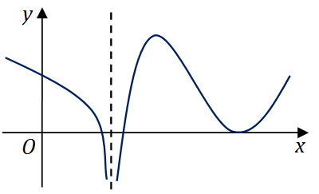

# 2016年全国硕士研究生招生考试数学二真题
> 本真题试卷来源于权威公开考研真题题库整理，包含全部题目、完整选项、高清插图、专业标签及详细参考答案与解析。
---

## 选择题

### 【M2-16-C-T01】第 1 题

设
$a1=x(cosx−1)$
，
$a2=xln(1+3x)$
，
$a3=3x+1−1$
，当
$x→0+$
时，以上 3 个无穷小量按照从低阶到高阶的排序是（ ）。

- **A.** a1,a2,a3
- **B.** a2,a3,a1
- **C.** a2,a1,a3
- **D.** a3,a2,a1

> **【唯一编号】** `M2-16-C-T01`
> **【题型】** 选择题
> **【科目】** 微积分
> **【分值】** 4分
> **【年份】** 2016年
> **【考点】** 函数、极限、连续、无穷小量的比较

<b>💡 查看参考答案与解析</b>

**【参考答案】** B

**【解析】**

**正确答案：B**

当
$x→0+$
时，

$$
a1=x(cosx−1)∼−21x2,
$$

$$
a2=xln(1+3x)∼x32,
$$

$$
a3=3x+1−1∼31x.
$$

因此，三个无穷小量按照从低阶到高阶的排序为
$a2,a3,a1$
，故选 B。

---

### 【M2-16-C-T02】第 2 题

已知函数
$f(x)={2(x−1),lnx,x<1,x≥1,$
，则
$f(x)$
的一个原函数是

- **A.** F(x)={(x−1)2,x(lnx−1),x<1,x≥1.
- **B.** F(x)={(x−1)2,x(lnx+1)−1,x<1,x≥1.
- **C.** F(x)={(x−1)2,x(lnx+1)+1,x<1,x≥1.
- **D.** F(x)={(x−1)2,x(lnx−1)+1,x<1,x≥1.

> **【唯一编号】** `M2-16-C-T02`
> **【题型】** 选择题
> **【科目】** 微积分
> **【分值】** 4分
> **【年份】** 2016年
> **【考点】** 一元函数积分学、不定积分的计算

<b>💡 查看参考答案与解析</b>

**【参考答案】** D

**【解析】**

**正确答案：D**

【解析】设
$F(x)=∫f(x)dx$
，由题设得

$$
F(x)={(x−1)2,xlnx−x+C,x<1,x>1,
$$

由于
$F(x)$
连续，需满足

$$
F(1−)=F(1+).
$$

代入计算得

$$
(1−1)2=1⋅ln1−1+C⇒0=−1+C,
$$

因此

$$
C=1.
$$

---

### 【M2-16-C-T03】第 3 题

反常积分 ①
$∫−∞0x21ex1dx$
，②
$∫0+∞x21ex1dx$
的敛散性为

- **A.** ①收敛，②收敛
- **B.** ①收敛，②发散
- **C.** ①发散，②收敛
- **D.** ①发散，②发散

> **【唯一编号】** `M2-16-C-T03`
> **【题型】** 选择题
> **【科目】** 微积分
> **【分值】** 4分
> **【年份】** 2016年
> **【考点】** 一元函数积分学、反常积分的计算与敛散性

<b>💡 查看参考答案与解析</b>

**【参考答案】** B

**【解析】**

**正确答案：B**

【解析】考虑积分
$∫−∞0x21ex1dx$
，令
$u=x1$
，则
$du=−x21dx$
，于是原积分化为

$$
∫−∞0x21ex1dx=−∫−∞0ex1d(x1)=−ex1−∞0
$$

代入上下限得

$$
−(x→0−limex1−x→−∞limex1)=−(0−1)=1
$$

该积分收敛。

再考虑
$∫0+∞x21ex1dx$
，类似地有

$$
∫0+∞x21ex1dx=−∫0+∞ex1d(x1)=−ex10+∞
$$

代入上下限得

$$
−(x→+∞limex1−x→0+limex1)=−(1−∞)=+∞
$$

该积分发散。

因此，应选 B。

---

### 【M2-16-C-T04】第 4 题

设函数
$f(x)$
在
$(−∞,+∞)$
内连续，其导函数的图形如图所示，则（  ）

- **A.** 函数
$f(x)$
有2个极值点，曲线
$y=f(x)$
有2个拐点.
- **B.** 函数
$f(x)$
有2个极值点，曲线
$y=f(x)$
有3个拐点.
- **C.** 函数
$f(x)$
有3个极值点，曲线
$y=f(x)$
有1个拐点.
- **D.** 函数
$f(x)$
有3个极值点，曲线
$y=f(x)$
有2个拐点.

> **【唯一编号】** `M2-16-C-T04`
> **【题型】** 选择题
> **【科目】** 微积分
> **【分值】** 4分
> **【年份】** 2016年
> **【考点】** 一元函数微分学、函数的单调性、极值与最值

<b>💡 查看参考答案与解析</b>

**【参考答案】** B

**【解析】**

**正确答案：B**

根据极值的必要条件可知，极值点可能是驻点或导数不存在的点。根据极值的充分条件可知，在某点左右导函数符号发生改变，则该点是极值点。因此从图形可知函数
$f(x)$
有 2 个极值点。

根据拐点的必要条件可知，拐点可能是二阶导为零的点或二阶导不存在的点。根据拐点的充分条件可知，曲线在某点左右导函数的单调性发生改变，则该点是曲线的拐点。因此曲线
$y=f(x)$
有 3 个拐点，故选 B。

---

### 【M2-16-C-T05】第 5 题

设函数
$fi(x)(i=1,2)$
具有二阶连续导数，且
$fi′′(x0)<0(i=1,2)$
，若两条曲线
$y=fi(x)(i=1,2)$
在点
$(x0,y0)$
处具有公切线
$y=g(x)$
，且在该点处曲线
$y=f1(x)$
的曲率大于曲线
$y=f2(x)$
的曲率，则在
$x0$
的某个邻域内，有（  ）

- **A.** f1(x)≤f2(x)≤g(x)
- **B.** f2(x)≤f1(x)≤g(x)
- **C.** f1(x)≤g(x)≤f2(x)
- **D.** f2(x)≤g(x)≤f1(x)

> **【唯一编号】** `M2-16-C-T05`
> **【题型】** 选择题
> **【科目】** 微积分
> **【分值】** 4分
> **【年份】** 2016年
> **【考点】** 一元函数微分学、导数与微分的概念

<b>💡 查看参考答案与解析</b>

**【参考答案】** A

**【解析】**

**正确答案：A**

【解析】因为
$fi′′(x)$
连续且
$fi′′(x0)<0$
，根据连续的定义与极限的保号性，在
$x0$
的某邻域
$U(x0)$
内，有
$fi′′(x)<0$
，因此
$fi(x)$
在
$U(x0)$
内是凸函数。

又因为在
$x=x0$
处两曲线具有公切线
$y=g(x)$
，根据凸函数的几何意义，曲线与切线的位置关系为
$fi(x)≤g(x)$
。

在点
$x0$
处，
$y=f1(x)$
的曲率大于
$y=f2(x)$
的曲率，因此
$f1′′(x0)<f2′′(x0)<0$
。

令
$F(x)=f1(x)−f2(x)$
，由于在
$x=x0$
处具有公切线
$y=g(x)$
，可得
$F(x0)=0$
，
$F′(x0)=0$
。

又由
$F′′(x0)<0$
可知，
$F(x0)=0$
是
$F(x)$
的极大值，因此在
$x0$
的某邻域
$U1(x0)$
内，有
$F(x)≤0$
，即
$f1(x)≤f2(x)$
。

综合可得
$f1(x)≤f2(x)≤g(x)$
，故选 A。

---

### 【M2-16-C-T06】第 6 题

已知函数
$f(x,y)=x−yex$
，则

- **A.** fx′−fy′=0
- **B.** fx′+fx′=0
- **C.** fx′−fy′=f
- **D.** fx′+fy′=f

> **【唯一编号】** `M2-16-C-T06`
> **【题型】** 选择题
> **【科目】** 微积分
> **【分值】** 4分
> **【年份】** 2016年
> **【考点】** 多元函数微分学、偏导数的概念与计算

<b>💡 查看参考答案与解析</b>

**【参考答案】** D

**【解析】**

**正确答案：D**

由于
$fx′(x,y)=(x−y)2ex(x−y)−ex$
和
$fy′(x,y)=(x−y)2ex$
，

因此有

$$
fx′(x,y)+fy′(x,y)=(x−y)2ex(x−y)−ex+(x−y)2ex=x−yex=f(x,y)
$$

故应选 D。

---

### 【M2-16-C-T07】第 7 题

设
$A$
，
$B$
是可逆矩阵，且
$A$
与
$B$
相似，则下列结论错误的是

- **A.** AT
与
$BT$
相似
- **B.** A−1
与
$B−1$
相似
- **C.** A+AT
与
$B+BT$
相似
- **D.** A+A−1
与
$B+B−1$
相似

> **【唯一编号】** `M2-16-C-T07`
> **【题型】** 选择题
> **【科目】** 线性代数
> **【分值】** 4分
> **【年份】** 2016年
> **【考点】** 矩阵的特征值与特征向量

<b>💡 查看参考答案与解析</b>

**【参考答案】** C

**【解析】**

**正确答案：C**

由于矩阵
$A$
与
$B$
相似，存在可逆矩阵
$P$
使得
$P−1AP=B$
。

对
$B$
取转置得：

$$
BT=PTAT(PT)−1=PTAT(P−1)T,
$$

因此
$AT$
与
$BT$
相似。

对
$B$
取逆得：

$$
B−1=P−1A−1P,
$$

因此
$A−1$
与
$B−1$
相似。

又由
$B=P−1AP$
，可得：

$$
B−1+B=P−1A−1P+P−1AP=P−1(A−1+A)P,
$$

即
$A+A−1$
与
$B−1+B$
相似。

因此正确选项为 C。

---

### 【M2-16-C-T08】第 8 题

设二次型
$f(x1,x2,x3)=a(x12+x22+x32)+2x1x2+2x2x3+2x1x3$
的正、负惯性指数分别为
$1,2$
，则（ ）

- **A.** a>1
- **B.** a<−2
- **C.** −2<a<1
- **D.** a=1
与
$a=−2$

> **【唯一编号】** `M2-16-C-T08`
> **【题型】** 选择题
> **【科目】** 线性代数
> **【分值】** 4分
> **【年份】** 2016年
> **【考点】** 二次型

<b>💡 查看参考答案与解析</b>

**【参考答案】** C

**【解析】**

**正确答案：C**

【解析】二次型
$f(x1,x2,x3)$
对应的矩阵为

$$
A=a111a111a.
$$

由

$$
∣λE−A∣=λ−a−1−1−1λ−a−1−1−1λ−a=(λ−a−2)(λ−a+1)2=0
$$

可得，矩阵
$A$
的特征值为

$$
λ1=a+2,λ2=λ3=a−1.
$$

由于
$f(x1,x2,x3)$
的正惯性指数为 1，负惯性指数为 2，且正负惯性指数等于特征值中正、负数的个数，因此有

$$
a+2>0且a−1<0,
$$

即

$$
−2<a<1.
$$

故选 C。

---

## 填空题

### 【M2-16-F-T09】第 9 题

（填空题）曲线
$y=1+x2x3+arctan(1+x2)$
的斜渐近线方程为________。

> **【唯一编号】** `M2-16-F-T09`
> **【题型】** 填空题
> **【科目】** 微积分
> **【分值】** 4分
> **【年份】** 2016年
> **【考点】** 一元函数微分学、曲线的凹凸性、拐点及渐近线

<b>💡 查看参考答案与解析</b>

**【解析】**

**【答案】**
$y=x+2π$

**【解析】**因为

$$
a=x→∞limxy=x→∞limx1(1+x2x3+arctan(1+x2))=1,b=x→∞lim(y−ax)=x→∞lim(1+x2x3+arctan(1+x2)−x)=2π.
$$

所以斜渐近线为

$$
y=x+2π.
$$

---

### 【M2-16-F-T10】第 10 题

（填空题）极限
$\lim_{n \to ∞}n21(sinn1+2sinn2+⋯+nsinnn)=$
______。

> **【唯一编号】** `M2-16-F-T10`
> **【题型】** 填空题
> **【科目】** 微积分
> **【分值】** 4分
> **【年份】** 2016年
> **【考点】** 一元函数积分学、定积分的应用

<b>💡 查看参考答案与解析</b>

**【解析】**

**【答案】**
$sin1−cos1$

**【解析】**因为 limn→∞n21(sinn1+2sinn2+⋯+nsinnn)=limn→∞n1(n1sinn1+n2sinn2+⋯+nnsinnn)

该极限可视为定积分的定义形式，即

$$
∫01xsinxdx
$$

计算该积分：

$$
∫01xsinxdx=sin1−cos1
$$

因此，原极限值为
$sin1−cos1$
。

---

### 【M2-16-F-T11】第 11 题

（填空题）以
$y=x2−ex$
和
$y=x2$
为特解的一阶非齐次线性微分方程为______。

> **【唯一编号】** `M2-16-F-T11`
> **【题型】** 填空题
> **【科目】** 微积分
> **【分值】** 4分
> **【年份】** 2016年
> **【考点】** 常微分方程、一阶非齐次线性微分方程

<b>💡 查看参考答案与解析</b>

**【解析】**

**【答案】**
$y′−y=2x−x2$

**【解析】** 设一阶非齐次线性微分方程为
$y′+p(x)y=q(x)$
。

根据线性微分方程齐次与非齐次解之间的关系，可知
$x2−(x2−ex)=ex$
是
$y′+p(x)y=0$
的解，因此可得
$p(x)=−1$
。

又因为
$y=x2$
是
$y′+p(x)y=q(x)$
的解，代入可得
$q(x)=2x−x2$
。

故所求一阶非齐次线性微分方程为
$y′−y=2x−x2$
。

---

### 【M2-16-F-T12】第 12 题

（填空题）已知函数
$f(x)$
在
$(−∞,+∞)$
上连续，且

$$
f(x)=(x+1)2+2∫01f(t)dt,
$$

则当
$n≥2$
时，
$f(n)(0)=$
________。

> **【唯一编号】** `M2-16-F-T12`
> **【题型】** 填空题
> **【科目】** 微积分
> **【分值】** 4分
> **【年份】** 2016年
> **【考点】** 一元函数积分学、变限积分

<b>💡 查看参考答案与解析</b>

**【解析】**

**【答案】**
$25×2n$

**【解析】** 当
$x=0$
时，
$f(0)=1$
。

已知

$$
f(x)=(x+1)2+2∫01f(t)dt
$$

两边同时对
$x$
求导，得

$$
f′(x)=2(x+1)+2f(x)
$$

代入
$x=0$
，有
$f′(0)=4$
。

对

$$
f′(x)=2(x+1)+2f(x)
$$

两边再次对
$x$
求导，得

$$
f′′(x)=2+2f′(x)
$$

代入
$x=0$
，有
$f′′(0)=10$
。

继续对

$$
f′′(x)=2+2f′(x)
$$

两边对
$x$
求导，得

$$
f′′′(x)=2f′′(x)
$$

依此类推，可得

$$
f(n)(x)=2n−2f′′(x)
$$

因此

$$
f(n)(0)=2n−2f′′(0)=10×2n−2=25×2n
$$

---

### 【M2-16-F-T13】第 13 题

（填空题）已知动点
$P$
在曲线
$y=x3$
上运动，记坐标原点与点
$P$
间的距离为
$l$
。若点
$P$
的横坐标对时间的变化率为常数
$v0$
，则当点
$P$
运动到点
$(1,1)$
时，
$l$
对时间的变化率是______。

> **【唯一编号】** `M2-16-F-T13`
> **【题型】** 填空题
> **【科目】** 微积分
> **【分值】** 4分
> **【年份】** 2016年
> **【考点】** 一元函数微分学、导数与微分的计算

<b>💡 查看参考答案与解析</b>

**【解析】**

**【答案】**
$22v0$

**【解析】** 设
$l=x2+y2=x2+x6$
，对
$t$
求导得：

$$
dtdl=dxdl⋅dtdx=2x2+x62x+6x5⋅dtdx.
$$

当
$x=1$
时，已知
$dtdx=v0$
，代入得：

$$
dtdlx=1=21+12+6⋅v0=228v0=22v0.
$$

---

### 【M2-16-F-T14】第 14 题

（填空题）设矩阵
$a−1−1−1a−1−1−1a$
与
$1011−10011$
等价，则
$a=$
______。

> **【唯一编号】** `M2-16-F-T14`
> **【题型】** 填空题
> **【科目】** 线性代数
> **【分值】** 4分
> **【年份】** 2016年
> **【考点】** 矩阵、矩阵的秩

<b>💡 查看参考答案与解析</b>

**【解析】**

**【答案】** 2

**【解析】** 首先计算矩阵
$B$
的行列式：

$$
∣B∣=1011−10011=0
$$

因此
$r(B)=2$
。

接着计算矩阵
$A$
的行列式：

$$
∣A∣=a−1−1−1a−1−1−1a=(a+1)2(a−2)=0
$$

当
$a=−1$
时，
$r(A)=1$
；当
$a=2$
时，
$r(A)=2$
。因此
$a=2$
。

---

## 解答题

### 【M2-16-A-T15】第 15 题

（本题满分 10 分）求极限

$$
x→0lim(cos2x+2xsinx−1)x41
$$

> **【唯一编号】** `M2-16-A-T15`
> **【题型】** 解答题
> **【科目】** 微积分
> **【分值】** 10分
> **【年份】** 2016年
> **【考点】** 函数、极限、连续、函数极限的计算

<b>💡 查看参考答案与解析</b>

**【解析】**

**【答案】**
$e31$

**【解析】**原极限可表示为

$$
x→0lim(cos2x+2xsinx−1)x41=ex→0limx41(cos2x+2xsinx−1).
$$

其中，

$$
x→0limx41(cos2x+2xsinx−1)=x→0limx41−21(2x)2+4!1(2x)4+o(x4)+2x(x−3!x3+o(x3))−1=x→0limx41−2x2+32x4+2x2−3x4+o(x4)−1=x→0limx431x4+o(x4)=31.
$$

因此，原极限

$$
=e31.
$$

---

### 【M2-16-A-T16】第 16 题

（本题满分 10 分）

设函数
$f(x)=\int_0^1 ∣t2−x2∣ \, dt(x>0)$
，求
$f′(x)$
并求
$f(x)$
的最小值。

> **【唯一编号】** `M2-16-A-T16`
> **【题型】** 解答题
> **【科目】** 微积分
> **【分值】** 10分
> **【年份】** 2016年
> **【考点】** 一元函数积分学、变限积分

<b>💡 查看参考答案与解析</b>

**【解析】**

**【答案】** f′(x)={4x2−2x2x0<x≤1x>1  f(x)
的最小值为
$41$
。

**【解析】** f(x)=∫01∣t2−x2∣dt(x>0)

当
$0<x≤1$
时，

$$
f(x)=∫0x(x2−t2)dt+∫x1(t2−x2)dt=x3−31x3+31−31x3−x2(1−x)=34x3−x2+31
$$

当
$x>1$
时，

$$
f(x)=∫01(x2−t2)dt=x2∫01dt−∫01t2dt=x2−31
$$

即

$$
f(x)={34x3−x2+31x2−310<x≤1x>1
$$

$$
f′(x)={4x2−2x2x0<x≤1x>1
$$

令
$f′(x)=0$
，可得当
$0<x≤1$
时
$x=21$
为驻点且为极小值点，
$f(21)=41$
，而
$f(1)=32$
。

因此，
$f(x)$
的最小值为
$41$
。

---

### 【M2-16-A-T17】第 17 题

（本题满分 10 分）

已知函数
$z=z(x,y)$
由方程
$(x2+y2)z+lnz+2(x+y+1)=0$
确定，求
$z=z(x,y)$
的极值。

> **【唯一编号】** `M2-16-A-T17`
> **【题型】** 解答题
> **【科目】** 微积分
> **【分值】** 10分
> **【年份】** 2016年
> **【考点】** 多元函数微分学、多元函数的极值问题

<b>💡 查看参考答案与解析</b>

**【解析】**

**【答案】** 在点
$(−1,−1)$
处取得极大值，极大值为
$z=1$
。

**【解析】**

给定方程组：

$$
{2xz+x2∂x∂z+y2∂x∂z+z1∂x∂z+2=0x2∂y∂z+2yz+y2∂y∂z+z1∂y∂z+2=0
$$

整理可得：

$$
⎩⎨⎧xz+1=0yz+1=0x2z+y2z+lnz+2(x+y+1)=0⇒⎩⎨⎧x=−1y=−1z=1
$$

由第一个方程
$2xz+x2∂x∂z+y2∂x∂z+z1∂x∂z+2=0$
再对
$x$
求导得：

$$
2z+2x∂x∂z+(x2+y2)∂x2∂2z−z21(∂x∂z)2+z1⋅∂x2∂2z=0
$$

代入
$∂x∂z=0$
，
$x=−1$
，
$y=−1$
，
$z=1$
，得：

$$
A=∂x2∂2z=−32<0
$$

同理可得
$∂y2∂2z<0$
。

由第一个方程对
$y$
求导得：

$$
2x∂y∂z+2y∂x∂z+(x2+y2)∂x∂y∂2z−z21⋅∂x∂z⋅∂y∂z+z1⋅∂x∂y∂2z=0
$$

代入
$∂x∂z=0$
，
$∂y∂z=0$
，
$x=−1$
，
$y=−1$
，
$z=1$
，得：

$$
∂x∂y∂2z=0
$$

由于
$AC−B2>0$
且
$A<0$
，故在点
$(−1,−1)$
处取得极大值。

---

### 【M2-16-A-T18】第 18 题

（本题满分 10 分）

设
$D$
是由直线
$y=1$
、
$y=x$
、
$y=−x$
围成的有界区域，计算二重积分

$$
D∬x2+y2x2−xy−y2dxdy
$$

> **【唯一编号】** `M2-16-A-T18`
> **【题型】** 解答题
> **【科目】** 微积分
> **【分值】** 10分
> **【年份】** 2016年
> **【考点】** 多元函数积分学、重积分的计算

<b>💡 查看参考答案与解析</b>

**【解析】**

**【答案】**
$1−2π$

**【解析】**【解析】 I=D∬x2+y2x2−xy−y2dxdy=D∬x2+y2x2+y2−2y2dxdy−D∬x2+y2xydxdy=I1+I2

由于区域
$D$
关于
$y$
轴对称，可知
$I2=0$
。

进一步计算：

$$
I1=D∬dxdy−2D∬x2+y2y2dxdy=I3+I4
$$

其中：

$$
I3=D∬dxdy=1
$$

$$
I4=2D∬x2+y2y2dxdy=4D1∬x2+y2y2dxdy=4∫01dy∫0yx2+y2y2dx
$$

计算内层积分：

$$
∫0yx2+y2y2dx=y2∫0y(yx)2+11⋅ydx=y[arctanyx]0y=4πy
$$

代入得：

$$
I4=π∫01ydy=2π
$$

因此：

$$
I=1−2π
$$

---

### 【M2-16-A-T19】第 19 题

（本题满分 10 分）

已知
$y1(x)=ex$
，
$y2(x)=μ(x)ex$
是二阶微分方程

$$
(2x−1)y′′−(2x+1)y′+2y=0
$$

的两个解，若
$μ(−1)=e$
，
$μ(0)=−1$
，求
$μ(x)$
并写出该微分方程的通解。

> **【唯一编号】** `M2-16-A-T19`
> **【题型】** 解答题
> **【科目】** 微积分
> **【分值】** 10分
> **【年份】** 2016年
> **【考点】** 常微分方程、常系数非齐次线性微分方程

<b>💡 查看参考答案与解析</b>

**【解析】**

**【答案】** μ(x)=−2xe−x−e−x
，该微分方程的通解为
$y=k1ex+k2(−2x−1)e−x$
，其中
$k1,k2$
为任意常数。

**【解析】**已知
$y2(x)=μ(x)ex$
是二阶微分方程

$$
(2x−1)y′′−(2x+1)y′+2y=0
$$

的一个解。将其代入方程并整理可得

$$
(2x−1)μ′′=(3−2x)μ′,
$$

即

$$
μ′μ′′=2x−13−2x.
$$

两边积分得

$$
∫μ′μ′′dx=∫2x−13−2xdx,
$$

$$
ln∣μ′∣=∫2x−1−2x+3dx=−x+ln∣2x−1∣+lnC1,
$$

因此

$$
∣μ′(x)∣=e−x∣2x−1∣C1,
$$

取

$$
μ′(x)=C1(2x−1)e−x.
$$

进一步积分得

$$
μ(x)=∫C1(2x−1)e−xdx=C1[−2xe−x−e−x+C2].
$$

由已知条件
$μ(−1)=e$
，
$μ(0)=−1$
，解得
$C1=1$
，
$C2=0$
，所以

$$
μ(x)=−2xe−x−e−x.
$$

已知
$y1(x)$
与
$y2(x)$
线性无关，因此原方程的通解为

$$
y=k1ex+k2(−2x−1)e−x,
$$

其中
$k1,k2$
为任意常数。

---

### 【M2-16-A-T20】第 20 题

（本题满分 11 分）

设
$D$
是由曲线
$y=1−x2(0≤x≤1)$
与参数方程

$$
{x=cos3ty=sin3t(0≤t≤2π)
$$

围成的平面区域，求
$D$
绕
$x$
轴旋转一周所得旋转体的体积和表面积。

> **【唯一编号】** `M2-16-A-T20`
> **【题型】** 解答题
> **【科目】** 微积分
> **【分值】** 11分
> **【年份】** 2016年
> **【考点】** 一元函数积分学、定积分的应用

<b>💡 查看参考答案与解析</b>

**【解析】**

**【答案】**体积：
$3518π$
，表面积：
$516π$

**【解析】****体积部分**

体积计算公式为：

$$
V=V1−V2=π∫01(1−x2)dx−π∫02πsin6t⋅3cos2t(−sint)dt
$$

化简得：

$$
V=32π−3π∫02πsin7t(1−sin2t)dt+3π∫02πsin9tdt
$$

计算得：

$$
V=32π−3π⋅3516⋅91=3518π
$$

---

**表面积部分**

对于曲线
$y=1−x2(0≤x≤1)$
旋转所得表面积
$S1$
：

$$
S1=2π∫01y1+y′2(x)dx=2π∫011−x21+1−x2x2dx=2π
$$

对于参数方程

$$
{x=cos3ty=sin3t(0≤t≤2π)
$$

旋转所得表面积
$S2$
：

$$
S2=2π∫02πsin3t(3sin2tcost)2+(3cos2tsint)2dt=2π∫02πsin3t⋅3sintcostdt=2π∫02π3sin4tcostdt=56πsin5t02π=56π.
$$

总表面积为：

$$
S=S1+S2=2π+56π=516π
$$

---

### 【M2-16-A-T21】第 21 题

（本题满分 11 分）

已知
$f(x)$
在
$[0,23π]$
上连续，在
$(0,23π)$
内是函数
$2x−3πcosx$
的一个原函数，且
$f(0)=0$
，

（1）求
$f(x)$
在区间
$[0,23π]$
上的平均值；

（2）证明
$f(x)$
在区间
$(0,23π)$
内存在唯一零点。

> **【唯一编号】** `M2-16-A-T21`
> **【题型】** 解答题
> **【科目】** 微积分
> **【分值】** 11分
> **【年份】** 2016年
> **【考点】** 一元函数积分学、定积分的应用

<b>💡 查看参考答案与解析</b>

**【解析】**

**【答案】**（1）
$3π1 （2）见解析$

**【解析】**（1）函数
$f(x)=∫0x2t−3πcostdt$
。根据平均值公式，
$f(x)$
在区间
$[0,23π]$
上的平均值为

$$
23π∫023πf(x)dx
$$

利用交换积分次序，

$$
∫023πdx∫0x2t−3πcostdt=∫023πdt∫t23π2t−3πcostdx
$$

计算内层积分：

$$
∫t23π2t−3πcostdx=2t−3πcost⋅(23π−t)
$$

因此平均值为

$$
23π∫023π2t−3πcost⋅(23π−t)dt=23π−∫023π2costdt
$$

计算定积分：

$$
−21sint023π=−21(−1−0)=21
$$

故平均值为

$$
23π21=3π1
$$

（2）由
$f(x)=∫0x2t−3πcostdt$
，求导得

$$
f′(x)=2x−3πcosx
$$

令
$f′(x)=0$
，解得在区间
$(0,23π)$
上的唯一驻点为
$x=2π$
。

当
$0<x<2π$
时，
$cosx>0$
，
$2x−3π<0$
，故
$f′(x)<0$
；当
$2π<x<23π$
时，
$cosx<0$
，
$2x−3π<0$
，故
$f′(x)>0$
。

因此
$x=2π$
为
$f(x)$
在区间
$(0,23π)$
内的极小值点，也是最小值点，即
$fmin(x)=f(2π)<0$
。

又
$f(0)=0$
，计算
$f(23π)=∫023π2t−3πcostdt$
。令
$u=2t−3π$
，则
$t=2u+3π$
，
$dt=21du$
。当
$t=0$
时
$u=−3π$
，
$t=23π$
时
$u=0$
，积分变为

$$
21∫−3π0ucos2u+3πdu=21∫−3π0u−sin2udu>0
$$

（可通过积分性质判断符号）。

结合单调性：
$f(x)$
在区间
$(0,2π)$
上单调递减，且
$f(0)=0$
，故该区间内无零点；在区间
$(2π,23π)$
上单调递增，且
$f(2π)<0$
，
$f(23π)>0$
，故该区间内有唯一零点。

综上所述，
$f(x)$
在区间
$(0,23π)$
内只有唯一零点。

---

### 【M2-16-A-T22】第 22 题

（本题满分 11 分）

设矩阵
$A=11a+11011−aaa+1$
，
$β=012a−2$
，且方程组
$Ax=β$
无解，

（1）求
$a$
的值；

（2）求方程组
$ATAx=ATβ$
的通解。

> **【唯一编号】** `M2-16-A-T22`
> **【题型】** 解答题
> **【科目】** 线性代数
> **【分值】** 11分
> **【年份】** 2016年
> **【考点】** 线性方程组

<b>💡 查看参考答案与解析</b>

**【解析】**

**【答案】**（1）
$a=0 （2）$
$x=k0−11+1−20,k∈R$

**【解析】**（1）由方程组
$Ax=β$
无解，可知
$r(A)=r(A,β)$
，因此
$∣A∣=0$
。计算行列式：

$$
∣A∣=11a+11011−aaa+1=0
$$

解得
$a=0$
或
$a=2$
。当
$a=0$
时，
$r(A)=r(A,β)$
；当
$a=2$
时，
$r(A)=r(A,β)$
。因此
$a=0$
符合题意。

（2）当
$a=0$
时，

$$
ATA=322222222,ATβ=−1−2−2
$$

于是

$$
(ATA,ATβ)=322222222−1−2−2→1000100101−20
$$

因此，方程组
$ATAx=ATβ$
的通解为：

$$
x=k0−11+1−20,k∈R
$$

---

### 【M2-16-A-T23】第 23 题

（本题满分 11 分）

已知矩阵

$$
A=020−1−30100
$$

（1）求
$A99$

（2）设 3 阶矩阵
$B=(α1,α2,α3)$
满足
$B2=BA$
。记
$B100=(β1,β2,β3)$
，将
$β1,β2,β3$
分别表示为
$α1,α2,α3$
的线性组合。

> **【唯一编号】** `M2-16-A-T23`
> **【题型】** 解答题
> **【科目】** 线性代数
> **【分值】** 11分
> **【年份】** 2016年
> **【考点】** 矩阵、矩阵的运算与变换

<b>💡 查看参考答案与解析</b>

**【解析】**

**【答案】**(1)

$$
A99=−2+299−2+210001−2991−210002−2992−2990
$$

(2)

$$
β1=(−2+299)α1+(−2+2100)α2
$$

$$
β2=(1−299)α1+(1−2100)α2
$$

$$
β3=(2−299)α1+(2−299)α2
$$

**【解析】**(1) 由
$∣λE−A∣=λ(λ+1)(λ+2)=0$
，得
$λ1=0,λ2=−1,λ3=−2$
。因此
$A$
可相似对角化，且
$A$
与

$$
0−1−2
$$

相似。由
$(0E−A)x=0$
得
$η1=2311$
；由
$(−E−A)x=0$
得
$η2=110$
；由
$(−2E−A)x=0$
得
$η3=120$
。令
$P=2311110120$
，则

$$
P−1AP=0−1−2=Λ
$$

因此
$A=PΛP−1$
，可得

$$
A99=PΛ99P−1=−2+299−2+210001−2991−210002−2992−2990
$$

(2) 由
$B2=BA$
得

$$
B3=B2A=BA2⇒B4=B2A2=BA3⇒⋯⇒B100=BA99
$$

因此

$$
(β1β2β3)=(α1α2α3)A99
$$

于是

$$
β1=(−2+299)α1+(−2+2100)α2
$$

$$
β2=(1−299)α1+(1−2100)α2
$$

$$
β3=(2−299)α1+(2−299)α2
$$

---
