# 2027年育操作系统考研复习指导

王道论坛 组编

電子工業出版社

Publishing House of Electronics Industry 北京·BEIJING

## 内容简介

本书是计算机专业硕士研究生入学考试“操作系统”课程的复习用书，内容包括计算机系统概述、进程与线程、内存管理、文件管理、输入/输出管理等。全书严格按照最新计算机考研大纲操作系统部分的要求，对大纲所涉及的知识点进行集中梳理，力求内容精练、重点突出、深入浅出。本书精选部分名校的历年考研真题，给出详细的解题思路，力求实现讲练结合、灵活掌握、举一反三的功效。

本书可作为考生参加计算机专业硕士研究生入学考试的复习用书，也可作为计算机类专业学生学习“操作系统”课程的辅导用书。

未经许可，不得以任何方式复制或抄袭本书之部分或全部内容。

版权所有，侵权必究。

## 图书在版编目（CIP）数据

2027年操作系统考研复习指导/王道论坛组编.

北京：电子工业出版社，2026. 1. -- ISBN 978-7-121

-51795-2

I. TP316

中国国家版本馆CIP数据核字第2026RN2556号

责任编辑：谭海平

印 刷：保定市中画美凯印刷有限公司

装订：保定市中画美凯印刷有限公司

出版发行：电子工业出版社北京市海淀区万寿路173信箱 邮编：100036

开 本：787×1092 1/16 印张：23.25 字数：654.7 千字

版❤次：2026年1月第1版

印次：2026年1月第1次印刷

定价：71.00元

凡所购买电子工业出版社图书有缺损问题，请向购买书店调换。若书店售缺，请与本社发行部联系，联系及邮购电话：（010）88254888，88258888。

质量投诉请发邮件至zlts@phei.com.cn，盗版侵权举报请发邮件至 dbqq@phei.com.cn。

本书咨询联系方式：（010）88254552，tan02@phei.com.cn。

  
iliii 首页 备剧 直播 游戏中心 会员购 漫画 赛事  下载睿户端  
王道计算机教育

## B站搜索“王道计算机教育”


代表作

  
王道计算机考研操作系统1461.1万 15.7万

  
王道计算机考研计算机网络1073.7万 12万

  
王道计算机考研数据结构1801.6万 26.1万

直播预约：26考研408如何做三轮规.. 预约12-06 15:00直播 55人已预约

直播预约：鸿蒙会给程序员带来哪些...预约12-10 19:00直播


“王道在线”


进入菜单“兑换中心”兑换配套课件等资源

王道计算机考研题库


开通题库小程序VIP权限

遇到问题请加微信


盗版书无兑换码请勿购买配套视频不包含答疑服务


# 本书配套资源介绍

## 【关于配套视频的说明】

1. 配套的考点精讲视频与习题视频均为最新版本，已免费发布在B站，无须兑换，内容持续更新，可放心使用！

2.【王道计算机刷题库】小程序面向所有读者免费开放，它将纸质习题数字化，可智能刷题，靶向提分，高效备考！

3. 兑换码用于获取课件资源，以及开通小程序VIP权限。

4. 兑换码位于封面右下角，区分大小写，不含空格，且一经兑换即失效。

## 前言

“王道考研系列”的定位是考试类辅导书。本书主要分为考点讲解部分和习题讲解部分，前者的篇幅约占43%，后者的篇幅约占57%。考点讲解部分按照统考大纲梳理考点，主要参考了一些权威教材，如汤小舟老师的《计算机操作系统》、国外经典教材《现代操作系统》等，并且融合了作者的总结与理解，在此对这些老师表示致敬和感谢！习题讲解部分主要精选自多所名校的自命题考研真题、教材配套习题册、同类辅导书，或者改编自统考真题。

由于篇幅限制，考点讲解部分较为精炼，对学科基础较为薄弱的读者来说，可能难以理解。为此，我们提供了配套的考点精讲视频和习题讲解视频。考点精讲视频有形象丰富的动画演示、由浅入深的考点分析，相信能打通读者复习过程中的“任督二脉”。往年有不少读者反馈视频和王道书不太匹配，这是因为王道书的出版时间远早于课程制作时间，而咸鱼老师录制课程时会参考众多的优秀教材（不限于王道书）；后面，我们将逐步解决这个问题。此外，早期的习题讲解视频主要由高分学长录制，因为质量参差不齐，现已全部下架。目前，仅提供由王道老师重新录制的最新版本，该版本已覆盖全部选择题；综合题的重新录制工作会适时启动并及时发布。

考点精讲视频和习题讲解视频免费发布在B站账号“王道计算机教育”上。

“王道考研系列”是计算机考研学子口碑相传的辅导书，自2011版首次推出以来，就始终占据同类书销量的榜首位置，这就是口碑的力量。有这么多学长的成功经验，相信读者只要合理地利用本套书，并采用科学的复习方法，就一定能收获属于自己的那份回报。

针对考研学子的需求，我们还开发了除本书配套视频外的一系列计算机考研课程，包括C语言督学课、408基础课、408暑期强化课、408冲刺课、机试课、模拟面试、调剂，以及复习规划、伴学督学、一对一指导、全程实时答疑和择校服务等。王道的课程同样是市面上领先的计算机考研课程，对学科基础较为薄弱的读者来说，相信这些课程和服务定能助你一臂之力。

“不包就业、不包推荐，培养有态度的码农。”王道训练营是王道团队打造的线下魔鬼式编程训练营。打好编程功底，增强项目经验，彻底转行入行，不再迷茫，期待有梦想的你！

参与本书编写的人员主要有赵霖、罗乐、徐秀瑛、赵淑芬、范佳玉、严汉、喻云珍、余勇、赵淑芳、刘政学、罗庆学、赵晓宇等。予人玫瑰，手有余香，王道论坛伴你一路同行！

对本书的任何建议，或发现有错误，欢迎扫码与我们联系，以便及时优化或纠错。


风华漫舞

## 致读者

关于王道单科辅导书使用方法的道友建议

我是“二战考生”，2012年第一次考研成绩为333分（专业代码408，成绩为81分），痛定思痛后决心再战。潜心复习了半年后终于以392分（专业代码408，成绩为124分）考入上海交通大学计算机科学与技术专业，这半年里我的专业课成绩提高了43分，成了提分主力。从未达到录取线到考出比较满意的成绩，从蒙头乱撞到有了自己明确的复习思路，我想这也是风华哥从诸多高分选手中选择我给大家介绍经验的一个原因吧。

整个专业课的复习是围绕王道辅导书展开的，从一遍、两遍、三遍看单科辅导书的积累提升，到做8套模拟题时的强化巩固，再到看思路分析时的醍醐灌顶。王道辅导书能两次押中算法原题固然有运气成分，但这也从侧面说明编者的编写思路和选题方向与真题很接近。

下面说一说我的具体复习过程。

每天划给专业课的时间是3～4小时。第一遍仔细看课本，看完一章做一章单科辅导书上的习题（红笔标注错题），这一遍共持续2个月。第二遍主攻单科辅导书（红笔标注重难点），辅看课本。第二遍看单科辅导书和课本的速度快了很多，但感觉收获更多，常有温故知新的感觉，理解更深刻。（风华注：建议这里再速看第三遍，特别针对错题和重难点。模拟题做完后再跳看第四遍。) X

以上是打基础阶段，注意：我仔细精读了两遍单科辅导书和课本，以便尽量弄懂每个知识点和习题。大概11月上旬开始做模拟题和思路分析，其间遇到不熟悉的地方不断回头查阅单科辅导书和课本。8套模拟题的考点覆盖得很全面，所以大家做题时如果忘记了某个知识点，千万不要慌张，赶紧回去看这个知识点，最后的模拟就是查漏补缺。模拟题一定要严格按考试时间（3小时）去做，注意应试技巧，做完试题后再回头研究错题。算法题的最优解法不太好想，如果实在没思路，建议直接“暴力”解决，结果正确也能有10分，总比苦拼出15分来而将后面比较好拿分的题耽误了好（这是我第一次考研的切身教训）。最后剩了几天看标注的错题，第三遍跳看单科辅导书，考前一夜浏览完网络，踏实地睡着了…… X

考完专业课，走出考场终于长舒一口气，考试情况也心中有数。回想这半年的复习，耐住了寂寞和诱惑，雨雪风霜从未间断地跑去自习，考研这人生一站终归没有辜负我的良苦用心。佛教徒说世间万物生来平等，都要落入春华秋实的代谢中去：辩证唯物主义认为事物作为过程存在，凡是存在的终归要结束。你不去为活得多姿多彩而拼搏，真到了和青春说再见时，你是否会可惜虚度了青春？风华哥说过，我们都是有梦想的青年，我们正在逆袭，你呢？

感谢风华哥的信任，给我这个机会为大家分享专业课复习经验，作为一个铁杆道友在王道受益匪浅，也借此机会回报王道论坛。祝大家金榜题名！

ccg1990@SJTU

# 王道训练营

王道是道友考研路上值得信赖的伙伴。十多年来，我们陪伴了数百万计算机考研学子，从考研图书，到辅导课程、编程训练，始终助力大家提升真实能力。

我们都清楚，计算机是个靠实力说话的专业。王道团队中的许多人，也曾和你一样：本科迷茫、基础薄弱，把考研当作改变命运的出路。但后来明白学历只是入场券。同样是名校硕士，有人早就拿下了心仪的Offer，也有人毕业即失业，再次陷入焦虑。

如今，虽然AI让编写代码变得简单了，但却抬高了能力门槛：会写语法已远远不够，系统设计与工程落地才是核心竞争力。如果你只会调API，但无法思考架构、解决实际问题，那么读研可能只是把竞争往后推迟了几年。我们真心希望，王道能帮你少走弯路。我们教的不只是“怎么用AI”，更有“怎么用好AI”—成为能主导项目、把控技术方向的人。

考研结束后的空档期，是你补编程、练实战的黄金窗口。趁生活尚未被新任务填满，抓紧补齐本科阶段落下的核心能力，别等到入学或入职才惊觉差距。参加王道训练营，说到底，就是对自己的一次认真投资，而投资自己永远最值得。 XTA

## 王道训练营简介

## 1. 面向就业

适合希望转行但编程基础薄弱的你。

考研不是人生的唯一出路。无论结果如何，这段拼搏都值得铭记，但不必让它成为遗憾的终点。不少在考研路上暂时受挫的道友，在王道找到了技术成长的新起点。我们始终相信：肯努力、肯坚持的人，终会走出属于自己的路。

在高度竞争的技术领域，你当下的编程能力决定了你能拿到什么Offer；而你的学习态度与潜力，才决定你能走多远。再不行动，机会只会悄然溜走。 XTA

王道训练营，为有梦想、敢奋斗的你铺就通往高质量就业的坚实通道。

## 2. 面向硕士

适合刚上岸的准硕士，希望赢在研一起跑线。

考上研究生是重要转折，但硕士学历早已不是“保险箱”。考研高分不等于高薪Offer，同是名校硕士，有人手握字节跳动、腾讯等大厂的Offer，有人却“屡面屡败”——差距，往往在入学前就已拉开。

王道训练营相当于“硕士先修班”：开学前啃下企业级代码，带着完整项目进组。当同门还在熟悉环境，你已用“大模型+微服务”跑通实验室课题：导师自然更愿意把核心项目、论文一作等机会优先给你。抓住这个隐形的转折点，三年后你的简历上不止有学历，更有扎实的工程能力、可落地的项目和发表的文章——高薪Offer，水到渠成。

## 3. 报名要求

• 具有本科学历，愿以“高三式”的专注全力投入。

· 须认真完成开课前的作业不看基础，只看态度，合格方可入营，宁缺毋滥。

作业是最重要的筛选标准。我们从不看轻跨专业或双非背景的你——坚定转行者往往更

拼、更踏实。学校和专业是过去的标签，能力靠持续努力重塑。一段高强度训练，完全可能让你逆袭，这已被无数的往期学员用结果证明。 KK

## 4. 学习成效

我们以“动手编程+实战项目”为核心，帮你补齐当下的能力短板，指明后续的学习方向。你收获的不只是方法，更是工程师的思维方式一真正推开职场大门。

自2020年起，王道坚持公开每期真实就业数据，承诺100%真实！学员从零起步，成长为能解决问题的开发者。部分学员成功入职字节跳动、腾讯、阿里、拼多多、京东、华为、百度、小米等互联网大厂；也有不少学员进入东方财富交易组、大疆飞控、比亚迪车规芯片、深信服防火墙引擎、招商银行风控等部门，岗位覆盖后端、算法、嵌入式、金融量化、信息安全等方向。我们不信“神秘高薪”，只信真实结果。 机

## 王道训练营优势

这里聚集的都是道友彼此信任，乐于分享，氛围纯粹而温暖。经历过考研的你，深知转行路上的孤独与压力，因此更容易成为并肩作战的战友：互相答疑、一起debug、共同成长。在技术转型的路上，这样的圈子是最宝贵的资源。正如一位学员所说：“来了你就发现，这里无关学历、背景或过往，只关乎一件事——对自己认真，对自己负责。”

我们的授课老师平均拥有8年以上的开发与教学经验，编程功底扎实，教学经验丰富。上课时，授课老师不会照本宣科地念PPT，而会展示真正上线运行过的代码，分享实际工作中遇到的“坑”、提升系统性能的方法，以及处理突发线上问题的经验。用真实的实战经验引导大家，以严谨的技术态度陪伴每位学员—既是对道友信任的回应，又是我们坚守的责任。

## 王道训练营课程

王道训练营目前开设5种班型：

复试冲刺/春招（Python/LinuxC/Java/C++）项目班（40～45天，初试结束后开班）

●AI应用开发（Java）方向（四个半月，武汉校区，掌握AI应用开发，抢占技术高地）

微服务开发C++方向（四个半月，武汉校区，深入后端架构，进入核心开发岗）

● 嵌入式开发C++方向（四个半月，武汉校区，紧跟硬科技趋势，切入芯片/物联网）

● Python 大模型方向（三个半月，直播授课或深圳校区，紧跟前沿算法，AI算法工程师）

项目班的作用是利用初试后的时间和寒假期间，快速提升编程能力和项目经验，为复试和春招面试加分。其余4种班型既适合想就业的你，又适合已上岸想提升能力或计划继续考研的你。

想了解课程、获取就业数据或就业咨询吗？扫码添加王道老师的微信，一对一为你解答。


## 目 录

第1章 计算机系统概述  
1.1 操作系统的基本概念  
1.1.1 操作系统的概念  
1.1.2 操作系统的功能和目标  
1.1.3 操作系统的特征  
1.1.4 本节习题精选  
1.1.5 答案与解析.  
1.2 操作系统发展历程·  
1.2.1手工操作阶段（未配置操作系统）  
1.2.2 批处理阶段（操作系统开始出现）  
1.2.3 分时操作系统…  
1.2.4 实时操作系统…  
1.2.5 网络操作系统和分布式系统  
1.2.6 微机操作系统  
1.2.7 本节习题精选 10  
1.2.8 答案与解析· 12  
1.3 操作系统的运行环境 15  
1.3.1 操作系统内核 15  
1.3.2 处理机的双重工作模式 16  
1.3.3 中断和异常的概念 ·16  
1.3.4 系统调用· 17  
1.3.5本节习题精选 19  
1.3.6 答案与解析. 22  
1.4操作系统结构 26  
1.5 操作系统引导 29  
1.6 虚拟机… ·30  
1.6.1 虚拟机的基本概念 ·30  
1.6.2 本节习题精选· ·31  
1.6.3 答案与解析· 33  
1.7 本章疑难点 35  
第 2章 进程与线程 37  
2.1 进程与线程简介 37  
2.1.1 进程的概念和特征 38  
2.1.2 进程的组成 38  
2.1.3 进程的内存映像 40  
2.1.4 进程的状态与转换 41  
2.1.5 进程控制 … 42  
2.1.6 进程的通信 43  
2.1.7 线程和多线程模型 45  
2.1.8 本节小结… 50  
2.1.9 本节习题精选 51  
2.1.10 答案与解析· 58  
2.2 CPU 调度 66  
2.2.1 调度的概念 66  
2.2.2 进程调度 67  
2.2.3 调度的目标 70  
2.2.4 进程切换 70  
2.2.5 CPU 调度算法 71  
2.2.6 多处理机调度 77  
2.2.7 本节小结 78  
2.2.8 本节习题精选 78  
2.2.9 答案与解析· 87  
2.3 同步与互斥· 99  
2.3.1 同步与互斥的基本概念 ·99  
2.3.2 实现临界区互斥的基本方法 ·100  
2.3.3 互斥锁· ·103  
2.3.4 信号量… 104  
2.3.5 经典同步问题 ·107  
2.3.6 管程… 112  
2.3.7 本节小结… ·114  
2.3.8 本节习题精选 ·114  
2.3.9 答案与解析· ·127  
2.4 死锁… 149  
2.4.1 死锁的概念 150  
2.4.2 死锁预防 ·152  
2.4.3 死锁避免 153  
2.4.4 死锁检测与解除 157  
2.4.5 本节小结 …158  
2.4.6 本节习题精选 158  
2.4.7 答案与解析· 165  
2.5 本章疑难点 175  
第3章 内存管理 176  
3.1 内存管理概念 176  
3.1.1 内存管理的基本原理和要求 176  
3.1.2 连续分配管理方式. 180  
3.1.3 基本分页存储管理 183  
3.1.4 基本分段存储管理 187  
3.1.5 段页式存储管理· 190  
3.1.6 本节小结… 191  
3.1.7本节习题精选 191  
3.1.8 答案与解析· 200  
3.2虚拟内存管理 ·212  
3.2.1 虚拟内存的基本概念 - 212  
3.2.2 请求分页管理方式· ·213  
3.2.3 页框分配· ·215  
3.2.4 页面置换算法 ·217  
\*3.2.5 抖动和工作集① 220  
3.2.6 页框回收…… 221  
3.2.7 内存映射文件 222  
3.2.8 虚拟存储器性能影响因素 223  
3.2.9 地址翻译的示例… 223  
3.2.10 本节小结… 225  
3.2.11 本节习题精选 226  
3.2.12 答案与解析 237  
3.3 本章疑难点… ·250  
第4章 文件管理 251  
4.1 文件系统基础· ·251  
4.1.1 文件的基本概念 ·251  
4.1.2 文件系统结构· ·253  
王  
4.1.3 文件的逻辑结构· ·253  
4.1.4 本节小结… ·255  
4.1.5 本节习题精选· ·256  
4.1.6 答案与解析· ·256  
4.2 目录与文件… ·257  
4.2.1 目录的基本概念 ·257  
4.2.2 文件控制块和索引节点 257  
4.2.3 目录结构… ·258  
4.2.4 目录的操作 ·260  
\*4.2.5 目录实现 ·261  
4.2.6 文件的物理结构 ·261  
4.2.7 文件的操作 ·266  
4.2.8 文件共享 ·268  
4.2.9 文件保护 269  
4.2.10 本节小结… ·271  
4.2.11 本节习题精选 ·271  
4.2.12 答案与解析· ·282  
4.3 文件系统… ·294  
4.3.1 文件系统布局 ·294  
4.3.2 文件存储空间管理 ·295  
4.3.3 虚拟文件系统 ·298  
4.3.4 文件系统挂载 ·299  
4.3.5 本节小结 ·300  
4.3.6 本节习题精选 ·300  
4.3.7 答案与解析 ·302  
4.4 本章疑难点· ·304  
弯5章 输入/输出管理 ·305  
5.1 I/O 管理概述 ·305  
5.1.1 I/O 设备 305  
5.1.2 I/O 控制方式 .308  
5.1.3 I/O 软件层次结构 .310  
5.1.4 应用程序I/O 接口 ·313  
5.1.5 本节小结 314  
5.1.6 本节习题精选 314  
5.1.7 答案与解析 317  
5.2 设备独立性软件… ·320  
5.2.1 设备独立性软件 320  
5.2.2 高速缓存与缓冲区 ·320  
5.2.3 设备分配与回收 ·324  
5.2.4 SPOOLing 技术（假脱机技术） ·326  
5.2.5 设备驱动程序接口 ·327  
5.2.6 I/O 操作举例 ·328  
5.2.7 本节小结 ·329  
5.2.8 本节习题精选 ·329  
5.2.9 答案与解析· 334  
5.3 磁盘和固态硬盘 …340  
5.3.1 磁盘…… … 340  
5.3.2 磁盘的管理…………… …341  
5.3.3 磁盘调度算法…… ·342  
5.3.4 固态硬盘… ·346  
5.3.5 本节小结… 347  
5.3.6 本节习题精选 ..348  
5.3.7 答案与解析 …352  
5.4 本章疑难点 ……… 359  
考文献…… 360

## 第 1 章

# 计算机系统概述

## 【考纲内容】

（一）操作系统的基本概念

（二）操作系统的发展历程

（三）程序运行环境


CPU运行模式：内核模式与用户模式：中断和异常的处理：系统调用：程序的链接与装入；程序运行时内存映像与地址空间①

视频讲解

（四）操作系统结构

分层、模块化、宏内核、微内核、外核

（五）操作系统引导

（六）虚拟机

## 【复习提示】

本章通常以选择题的形式进行考查，要求考生在宏观上把握操作系统的整体架构，在微观上掌握关键概念与核心机制。作为全书的导引章节，本章有助于构建对操作系统的整体认知框架，为后续深入学习进程管理、内存管理、文件系统等核心内容奠定基础。因此，复习时应首先建立清晰的知识体系，通过反复练习巩固理解，最终实现对各模块知识的有机整合。

## 1.1 操作系统的基本概念

## 1.1.1 操作系统的概念

在信息化时代，软件是计算机系统的灵魂，而作为其核心的操作系统，已与现代计算机系统深度融合。从使用层次来看，计算机系统自下而上可分为四层：硬件、操作系统、应用程序和用户（该划分侧重人机交互视角，不同于计算机组成原理中的结构分层）。其中，硬件（如中央处理器、内存、输入/输出设备等）提供基本计算资源；应用程序（如文字处理软件、电子表格、编译器、浏览器等）则利用这些资源解决用户的实际问题。操作系统负责管理硬件资源，为应用程序提供运行环境，并充当硬件与用户之间的桥梁。 XTA

具体而言，操作系统通过有效协调多个应用程序对硬件资源的访问，确保系统高效、安全地运行。综上所述，操作系统（OperatingSystem，OS）是控制和管理计算机系统软/硬件资源、合理调度任务与分配资源，并为用户及其他软件提供统一接口与运行环境的最基本的系统软件。

## 1.1.2 操作系统的功能和目标

为多道程序提供良好的运行环境，操作系统需具备四大核心功能：处理机管理、存储器管理、设备管理和文件管理。此外，为方便用户使用，操作系统还需提供用户接口；同时，它通过抽象与虚拟化技术扩充硬件功能，从而提供更便捷的服务并提升资源利用率。

下面用直观的例子来描述操作系统的角色。例如，将用户视为“雇主”，计算机（由处理机、存储器、设备和文件等组成)视为“机器”，而操作系统则如同一位“工人”。这位工人具备协调和控制各个部件工作的能力，这体现了操作系统对系统资源的管理功能；同时，工人接收雇主的命令并执行任务，这对应于操作系统提供的“用户接口”：由于工人的存在，让原本复杂的机器变得简单易用，并充分发挥其价值，这正是操作系统“扩充机器”的作用。

## 1. 操作系统作为计算机系统资源的管理者

## （1）处理机管理

在多道程序环境下，处理机的分配和运行都以进程（或线程）为基本单位，因此处理机管理本质上是对进程的管理。并发是指多个进程在一段时间内交替执行，宏观上呈现同时运行的特征。进程管理的主要任务包括进程控制、进程同步、进程通信、死锁处理以及处理机调度等。

## (2) 存储器管理

存储器管理旨在为多道程序提供良好的内存运行环境，方便用户使用并提高内存利用率，主要功能包括内存分配与回收、地址映射、内存保护与共享，以及内存扩充等。

## (3) 文件管理

用户可见的持久化信息通常以文件形式组织。操作系统中负责文件管理的部分称为文件系统，其功能包括文件存储空间的管理、目录管理、文件读/写操作及访问保护等。

## (4）设备管理

设备管理的主要任务是处理用户的I/O请求，屏蔽设备差异，方便用户使用各类外设，并提高设备利用率，主要包括缓冲管理、设备分配、设备驱动处理和虚拟设备等功能。

上述任务均由“工人”（操作系统）自动完成，“雇主”（用户）无须关注。

## 2. 操作系统作为用户与计算机硬件系统之间的接口

所谓操作系统，是指用户与计算机硬件系统的接口，即操作系统位于用户与硬件之间，是用户使用硬件的必经媒介。正是有了操作系统的支撑，用户才能更方便、更可靠地操作硬件设备和运行用户程序。如图1.1所示，操作系统处于计算机硬件与用户之间，充当二者之间的桥梁。

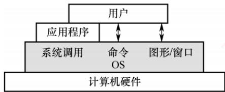  
图1.1 操作系统作为用户与硬件系统之间的接口

用户通过应用程序或直接交互方式访问系统服务，而这些请求最终均由操作系统统一管理和调度。从交互方式来看，终端用户通过命令行和图形界面与操作系统通信；应用程序则通过系统调用请求操作系统服务。根据服务对象与使用场景的不同，这些交互方式可以分为两大类：用户接口包括命令方式和图形方式，面向普通终端用户；程序接口即系统调用，专为应用程序设计。

## （1）用户接口

为了使用户能够直接或间接控制作业的执行，操作系统提供了以下三类用户接口。

联机用户接口（命令行接口）：面向交互式用户，由键盘命令与命令解释程序组成。用户输入命令后，系统立即解释并执行，完成后返回控制权，适用于实时交互场景。可以这样理解：“雇主”说一句话，“工人”做一件事，并做出反馈，这就体现了交互性。

脱机用户接口（作业控制语言）：用于批处理系统。用户将作业控制命令写入作业说明书，连同作业一并提交；系统调度到该作业时，自动解释并执行说明书中的命令，无须用户实时干预。可以这样理解：“雇主”预先将任务清单交给“工人”，“工人”按清单逐条完成这些任务。

图形用户接口（GUI）：为提升易用性，通过图标、菜单、对话框等图形元素替代文本命令。用户借助鼠标等设备进行操作，底层通过系统调用与内核交互，显著降低了使用门槛。

## （2）程序接口

## 考点追踪操作系统为应用程序提供的接口（2010）

程序接口是应用程序在运行时请求操作系统服务、访问系统资源的唯一合法途径，其核心是一组系统调用。每个系统调用对应内核中实现某个特定功能的子程序。当应用程序需要操作系统服务时，必须通过调用相应的系统调用来完成。

早期的系统调用多基于汇编语言实现，仅能在汇编程序中直接使用；在高级语言（如C语言）环境中，程序员通常调用标准库函数（如printf()、open()等）来间接触发系统调用。注意，库函数本身并非操作系统接口，它们只是对系统调用的封装。例如，printf()最终通过write系统调用输出数据，malloc()在需要更多内存时可能调用brk或mmap系统调用；而strlen()、sqrt()等纯计算类库函数则完全在用户空间中运行，不涉及任何系统调用。因此，尽管库函数在编程中被频繁使用，但操作系统真正提供给应用程序的接口本质上仍是系统调用。

## 3. 操作系统实现了对计算机资源的扩充

未安装任何软件的计算机称为裸机，它仅构成计算机系统的物质基础。实际呈现在用户面前的计算机系统，是经过多层软件增强后的逻辑实体。裸机位于最内层，其外层覆盖着操作系统。操作系统通过资源管理功能和用户服务功能，将裸机抽象并扩展为一台功能更强、使用更便捷的逻辑机器。因此，通常将这种被操作系统抽象和扩展后的机器称为扩充机器。可以这样理解：操作系统作为“工人”，操作原始机器，使机器发挥远超本身的能力。

需要说明的是，本章的重点在于理解操作系统如何控制和协调处理机、存储器、设备和文件四大资源。关于接口与扩充机器的概念，读者只需理解其基本思想即可。 K

## 1.1.3 操作系统的特征

操作系统是一种系统软件，但与其他系统软件和应用软件有显著不同，具有自身的特殊性，即基本特征。操作系统的基本特征包括并发、共享、虚拟和异步。这些概念对理解和掌握操作系统的核心至关重要，将贯穿于后续各章节。

## 1. 并发（Concurrency）

并发是指两个或多个事件在同一时间间隔内发生。在多道程序环境下，内存中同时驻留若干道程序，操作系统通过调度机制，在一道程序因J/O操作而暂停时，立即切换到另一道程序运行，从而实现多道程序的交替执行，使CPU保持高利用率。

## 考点追踪并行性的定义及分析（2009）

需要注意的是，并行是指两个或多个事件在同一时刻真正同时发生。在单处理机系统中，尽管宏观上多道程序看似同时运行，但微观上任一时刻仅有一个程序在执行，因此属于并发而非并行；而CPU与I/O设备之间、多个I/O设备之间则可实现真正的硬件并行。若要实现进程级别的并行，则需多核CPU或多处理机等硬件支持。

可通过一个生活实例理解并发与并行的区别。例如，在9:00一10:00期间，你交替吃面包和写字：9:00—9:10吃面包，9:10—9:20写字，9:20—9:30吃面包，9:30—10:00写字。两种活动在同一时段内交错进行，但任一时刻仅执行一项，这属于并发。又如，在9:00一10:00期间，你在右手写字的同时，左手拿着面包吃，则两种行为在同一时刻真正同时进行，这属于并行。

在操作系统中，引入进程这一概念，其核心目的之一就是支持程序的并发执行。

## 2. 共享（Sharing）

共享是指系统中的资源可供内存中多个并发执行的进程共同使用。根据资源特性与访问方式的不同，共享主要分为互斥共享和同时访问两种形式。 K

## （1）互斥共享方式

系统中的某些资源，如打印机、磁带机等，虽然可供多个进程使用，但为避免所打印或记录的结果混淆，必须保证在任一时间段内仅有一个进程访问该资源。

具体而言，当进程A访问某个资源时，需先提出请求；若资源空闲，则系统将其分配给A；此后，若其他进程请求访问该资源而A尚未释放，则必须等待。仅当A使用完毕并释放资源后，才允许另一进程对该资源进行访问。我们将此类资源共享方式称为互斥共享，而将在一段时间内只允许一个进程访问的资源称为临界资源。计算机系统中的大多数独占型物理设备（如打印机），以及软件中的栈、变量、表格等，均属于临界资源，必须以互斥方式共享。

## (2)同时访问方式

系统中还存在另一类资源，允许多个进程在宏观上“同时”访问。此处的“同时”通常指逻辑上的并发访问，微观上这些进程可能通过分时交替方式访问资源，即分时共享。典型的可同时访问资源包括磁盘上的文件（尤其是只读文件），允许多个用户同时读取同一份文档；此外，用重入代码编写的程序也可被多个进程并发调用，而不会产生冲突。

需注意，互斥共享要求资源在任意时刻仅响应一个请求，否则将导致数据混乱（例如，若多个进程同时向打印机输出，可能导致文档A与文档B的内容交错混杂）；而同时访问则允许多个请求分时完成，只要其最终效果对用户而言等同于连续访问即可。

并发与共享是操作系统两个最基本的特征，二者互为前提：①资源共享以程序的并发执行为前提，若系统仅支持单道程序，则无须考虑资源共享：②有效的资源共享机制是并发执行的

## 3. 虚拟（Virtual）

虚拟是指通过某种技术手段，将一个物理实体映射为多个逻辑上的对应物。物理实体是真实存在的硬件资源，而逻辑对应物则是用户或程序所感知的抽象资源。操作系统主要通过两类复用技术实现虚拟：时分复用（如处理器的分时共享）和空分复用（如虚拟存储器）。

利用多道程序设计技术，操作系统可让多道程序并发执行，分时共享同一个处理器。尽管系统中仅有一个物理CPU，但每个用户都仿佛独占一个CPU。这种通过时间片轮转实现的处理器抽象，使得单个物理CPU在逻辑上表现为多个处理单元。

采用虚拟存储器技术，可将有限的物理内存扩展为更大的逻辑地址空间。用户程序所面对的是虚拟存储器，其逻辑容量通常超过实际物理内存，从而在逻辑上实现了存储容量的扩充。

此外，通过虚拟设备技术（如 SPOOLing），可将某些独占型物理I/O设备（如打印机）转

化为多台逻辑设备。每个用户可独占一台逻辑设备，而系统在后台将请求排队处理。这样，原本需要互斥访问的临界资源，便转化为可并发使用的共享资源。

## 4. 异步（Asynchronism）

在多道程序环境下，多个进程并发执行。但由于系统资源有限，进程的执行并非连续进行，而是以不可预知的速度断续推进，这种特性称为进程的异步性。

异步性使操作系统运行于高度不确定的环境中，若对共享资源的访问缺乏协调，可能导致与时间相关的错误（例如，多个进程并发修改全局变量而未加同步保护）。然而，在程序正确使用操作系统提供的同步机制的前提下，其执行结果的正确性与可再现性能够得到保障。

## 1.1.4 本节习题精选

## 单项选择题

01. 操作系统是对（）进行管理的软件。A. 软件 B. 硬件 C. 计算机资源 D. 应用程序

02.下面的（）资源不是操作系统应该管理的。 王A. CPU B. 内存 C. 外存 D. 源程序

03.下列选项中，（）不是操作系统关心的问题。A. 管理计算机裸机B. 设计、提供用户程序与硬件系统的界面C. 管理计算机系统资源 D. 高级程序设计语言的编译器 算机

04. 操作系统的基本功能是（）。A. 提供功能强大的网络管理工具 B. 提供用户界面方便用户使用C. 提供方便的可视化编辑程序 D. 控制和管理系统内的各种资源

05.下列关于并发性的叙述中，正确的是（）。A. 并发性是指若干事件在同一时刻发生B. 并发性是指若干事件在不同时刻发生C. 并发性是指若干事件在同一时间间隔内发生D. 并发性是指若干事件在不同时间间隔内发生

06. 系统调用是由操作系统提供给用户的，它（）。A. 直接通过键盘交互方式使用 B. 只能通过用户程序间接使用C. 是命令接口中的命令 D. 与系统的命令一样

07. 操作系统提供给编程人员的接口是（）。 王人A. 库函数 B. 高级语言 C. 系统调用 D. 子程序

08. 系统调用的目的是（）。A. 请求系统服务B. 中止系统服务 C. 申请系统资源 D. 释放系统资源

09. 下列关于操作系统的叙述中，错误的是（）。A. 操作系统是管理资源的程序B. 操作系统是管理用户程序执行的程序C. 操作系统是能使系统资源提高效率的程序D. 操作系统是用来编程的程序

10.下列关于库函数和系统调用的区别与联系的说法中，错误的是（）。A. 系统调用用于请求内核服务，部分库函数通过系统调用实现功能B. 系统调用需要陷入内核态执行，而普通库函数（如字符串处理）通常在用户态执行C. 所有库函数的实现都依赖系统调用，没有系统调用则无法完成任何功能D. 库函数具有良好的可移植性，可跨平台使用；系统调用则与具体操作系统紧密耦合

11. 【2010统考真题】下列选项中，操作系统提供给应用程序的接口是（）。A. 系统调用 B. 中断 C. 库函数 D. 原语

## 1.1.5 答案与解析

## 单项选择题

## 01. C

操作系统管理计算机的硬件和软件资源，这些资源统称为计算机资源。注意，操作系统不仅管理处理机、存储器等硬件资源，还管理文件，文件不属于硬件资源，但属于计算机资源。

## 02. D

操作系统负责管理计算机系统的硬件和软件资源，包括CPU、内存、外存等，以提供高效、安全、抽象的运行环境。源程序虽以文件形式存储在外存中，但其具体内容（如代码语义、编程逻辑）并不属于操作系统管理的范畴。操作系统对文件的管理关注的是文件的逻辑组织、存储分配、访问控制及元数据（如文件名、大小、权限、创建时间等），而非文件内容的语义。因此，源程序作为具有特定语义的用户数据，其内容本身并非操作系统的管理对象。

## 03. D

操作系统管理计算机软/硬件资源，扩充裸机以提供功能更强大的扩充机器，并充当用户与硬件交互的中介。高级程序设计语言的编译器显然不是操作系统关心的问题。编译器的实质是一段程序指令，它存储在计算机中，是上述水杯中的水。

## 04. D

操作系统是指控制和管理整个计算机系统的硬件和软件资源，合理地组织、调度计算机的工作和资源的分配，以便为用户和其他软件提供方便的接口与环境的程序集合。选项A、B、C都可理解成应用程序为用户提供的服务，是应用程序的功能，而不是操作系统的功能。

## 05. C

并发性是指若干事件在同一时间间隔内发生，而并行性是指若于事件在同一时刻发生。

## 06. B

系统调用是操作系统为应用程序使用内核功能所提供的接口。

## 07.C

操作系统为编程人员提供的接口是程序接口，即系统调用。

## 08. A

操作系统不允许用户直接操作各种硬件资源，因此用户程序只能通过系统调用的方式来请求内核为其服务，间接地使用各种资源。 育V

## 09. D

操作系统是用来管理资源的程序，用户程序也是在操作系统的管理下完成的。配置了操作系统的机器与裸机相比，资源利用率大大提高。操作系统不能直接用来编程，选项D错误。

## 10. C

并非所有库函数都依赖系统调用。例如，字符串处理、数学计算等纯用户态操作完全在用户

空间中完成，无须陷入内核；只有涉及I/O、进程控制等资源访问的库函数才会调用系统调用。

## 11. A

操作系统接口主要有命令接口和程序接口（也称系统调用）。库函数是高级语言中提供的与系统调用对应的函数（也有些库函数与系统调用无关），目的是隐藏“访管”指令的细节，使系统调用更为方便、抽象。但是，库函数属于用户程序而非系统调用，是系统调用的上层。

## 1.2 操作系统发展历程

## 1.2.1 手工操作阶段（未配置操作系统）

## 1. 人工操作方式

早期阶段，用户将程序和数据穿孔在纸带或卡片上，装入输入设备后手动控制读入内存并启动程序运行。程序的装入、执行与结果输出等全过程均依赖人工操作。随着计算机硬件性能不断提升，人机速度之间的矛盾日益突出，系统资源利用率低下的问题也愈发严重。

手工操作阶段存在两个突出缺点：（①）用户独占全机，虽无资源竞争，但系统资源利用率极低；②CPU长时间空闲，等待人工完成I/O操作，导致其计算能力未能充分发挥。

为此，人们提出用高速设备替代人工操作，来控制作业流程。

## 2. 脱机 I/O 方式

为缓解人机速度不匹配以及CPU与外设之间的速度差异，诞生了脱机I/O技术。其核心思想是引入一台外围机（如小型专用计算机），在CPU不参与的情况下，预先完成I/O准备工作：输入时，外围机将纸带或卡片上的程序和数据读入磁带，供CPU后续调入内存；输出时，CPU将结果先写入磁带，再由外围机将磁带内容输出至外设。

由于I/O操作完全由外围机独立完成，脱离了主机的直接控制，故称为脱机I/O；相比之下，由主机直接管理I/O设备的方式则称为联机I/O。

脱机I/O的主要优点包括：（①）装带、卸带及数据传输等操作在脱机状态下由外围机完成，显著减少了CPU空闲时间；②CPU可直接从高速磁带读取或写入数据，大幅提升了I/O效率。

## 1.2.2 批处理阶段（操作系统开始出现）

在脱机I/O技术的基础上，为实现作业的自动连续处理并进一步提升CPU与系统资源的利用率，批处理系统应运而生。按发展历程，可分为单道批处理系统和多道批处理系统。

考点追踪批处理系统的特点（2016）

## 1. 单道批处理系统

为实现对作业的连续处理，系统先将一批作业以脱机方式输入到磁带，并配备一个监督程序(Monitor)。在其控制下，作业能自动、顺序地逐个运行。尽管作业成批提交，但内存中始终仅驻留一道用户程序。单道批处理系统的主要特征如下：

1）自动性。在正常情况下，磁带上的作业可自动连续执行，无须人工干预。

2）顺序性。作业按磁带上的顺序依次装入内存，先装入者先完成。

3）单道性。内存中仅允许一道用户程序运行；监督程序每次仅从磁带调入一道作业，待其完成或异常终止后才装入下一道。

然而，该系统存在明显局限：当正在运行的作业发起I/O请求时，高速CPU不得不空闲等待低速I/O操作结束，导致资源利用率低下。为克服这一瓶颈，多道程序设计技术被引入。

## 2. 多道批处理系统

用户提交的作业首先存放在外存的后备队列中。作业调度程序按一定算法从该队列中选取若于作业调入内存，使其在管理程序的控制下并发执行，并共享系统资源。当某道程序因I/O请求而暂停运行时，CPU立即切换至另一就绪程序继续执行。该机制依赖中断技术，使系统各部件尽可能保持忙碌，从而显著提升整体吞吐量和资源利用率。这种采用多道程序设计技术的批处理系统称为多道批处理系统，它将用户作业成批送入内存，由作业调度程序自动选择运行。

## 考点追踪多道批处理系统的特点（2017、2022）

多道程序设计具有以下核心特点：

1）多道。内存中同时驻留多道相互独立的程序。

2）宏观上并行。多道程序均处于运行过程中，但尚未全部完成。

3）微观上串行。各程序轮流占用CPU，交替执行。

为实现多道程序设计，需解决以下关键问题：

1）处理器的分配策略。

2）多道程序的内存分配与保护机制。

3）I/O设备的分配与调度方法。

4）大量程序与数据的组织、存储方式，以及安全性与一致性保障。

优点：资源利用率高，多道程序共享CPU、内存、I/O设备等资源；系统吞吐量大，各部件保持高负载状态。缺点：缺乏交互能力，用户无法了解程序运行状态或进行干预，响应时间较长。

## 1.2.3 分时操作系统

分时技术是指将处理器时间划分为很短的时间片，轮流分配给各用户程序使用。若某程序在其时间片内未完成计算，则暂停运行，释放处理器给其他用户程序，待下一轮再继续执行。由于计算机运行速度极快，程序轮转迅速，每个用户均能获得“独占计算机”的交互体验。

分时操作系统允许多个用户通过终端同时连接到一台主机，并与系统进行交互，彼此互不干扰。其实现的核心在于：当用户在终端输入命令时，系统必须能够及时接收、快速处理并立即返回结果。分时操作系统基于多道程序设计，但与多道批处理系统有本质区别：后者追求高吞吐量和资源利用率，无须人工于预：而前者以人机交互为核心目标，由此形成了以下主要特征。 X

1）同时性（多路性）。允许多个终端用户同时使用同一台计算机。

2）交互性。用户可通过终端以人机对话方式直接控制程序运行，并与其程序进行交互。

3）独立性。各用户的操作相互隔离，任一用户均感觉系统为其独占。

4）及时性。用户请求能在较短时间内获得响应，满足交互需求。

尽管分时操作系统较好地解决了通用交互问题，但在某些特定场景，系统必须在严格限定的时间内对外部事件做出响应，且需保证响应的确定性与时限性。为此，实时操作系统应运而生。

## 1.2.4 实时操作系统

实时操作系统是为在严格的时间限制内完成关键任务而设计的系统。它摒弃了分时操作系统的时间片轮转机制，转而采用基于任务紧迫性或截止时间的调度策略，确保高优先级任务能够及时获得处理器资源。根据时限要求的严格程度，实时操作系统可分为两类：①硬实时操作系统：要求任务必须在规定的截止时间前完成，否则可能引发灾难性后果。例如飞机的控制系统、导弹的制导系统等，这类系统必须提供绝对可靠的时间保证：②软实时操作系统：允许偶尔错过截止时间，只要不造成永久性损害即可。例如飞机订票系统、银行管理系统等，其短暂延迟通常可被容忍。

在实时操作系统的控制下，计算机在接收到外部事件后，能够在可预测且有保障的时限内完成处理。其主要特点包括：确定性（响应时间可预测）、高可靠性和强时效性。 XIT

## 1.2.5 网络操作系统和分布式系统

网络操作系统是在单机操作系统基础上扩展网络功能而形成的系统，主要用于支持计算机之间的通信、数据传输以及资源共享（如文件、打印机共享等）。在该系统中，各计算机保持独立运行，用户需显式指定远程资源的位置才能访问，系统不提供统一的全局视图。

分布式系统是由多台计算机组成的集合，具有以下特征：节点地位对等，无固定的主从关系；系统资源可被所有用户透明地共享；具备良好的可扩展性与容错能力，支持动态重组；能够将一个任务分解为多个子任务，并分布到不同节点上并行执行、协同完成。用于管理此类系统的操作系统称为分布式操作系统，其核心特点包括分布性、并行性和透明性。其中，透明性尤为关键，用户无须感知底层的多机结构，操作体验如同使用一台计算机。

二者的区别在于：网络操作系统仅实现资源共享与通信功能，用户需主动于预远程操作；而分布式操作系统通过协同机制，使多台计算机共同完成同一任务，并向用户提供单一系统映像。 X

## 1.2.6 微机操作系统

微机操作系统是为微型计算机（如个人计算机、工作站等）设计的操作系统，广泛应用于日常计算与办公环境。根据用户数量和任务并发能力，可分为以下三类。

## 1. 单用户单任务操作系统

仅允许一个用户登录并运行一个程序。这类系统结构简单，但资源利用率低，典型代表为早期的MS-DOS（16 位）。

## 2. 单用户多任务操作系统

## 考点追踪多任务操作系统的特点（2018）

支持一个用户同时运行多个应用程序，系统通过时间片轮转实现任务切换，显著提升了交互体验与资源利用率。代表性系统包括 Windows XP 及后续版本、macOS 以及现代Linux桌面版。此类系统是当前主流的微机操作系统，兼具良好的人机交互性、高效率与稳定性。

## 3. 多用户多任务操作系统

允许多个用户通过终端或网络同时登录，各自并发执行多个任务，资源共享且互不干扰。常用于服务器或高性能工作站，典型代表为 UNIX、Linux服务器版和 Windows Server系列。

操作系统的发展历程如图1.2所示。

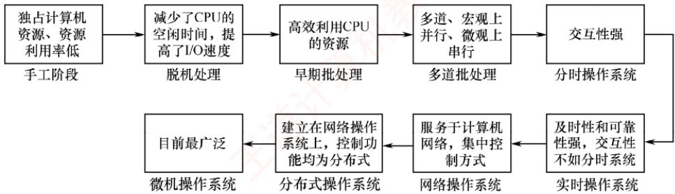  
图1.2 操作系统的发展历程

此外，还有嵌入式操作系统、服务器操作系统、智能手机操作系统等。

## 1.2.7 本节习题精选

## 一、单项选择题

01.提高单机资源利用率的关键技术是（）。三道A. 脱机技术 B. 虚拟技术C. 交换技术 D. 多道程序设计技术

02. 批处理系统的主要缺点是（）。A. 系统吞吐量小 B. CPU 的利用率不高C. 资源利用率低 Y D. 无交互能力

03.下列选项中，不属于多道程序设计的基本特征的是（）。A. 制约性 B. 间断性 C. 顺序性 D. 共享性

04. 操作系统的基本类型主要有（）。A. 批处理操作系统、分时操作系统和多任务系统B. 批处理操作系统、分时操作系统和实时操作系统C. 单用户系统、多用户系统和批处理操作系统D. 实时操作系统、分时操作系统和多用户系统

05.实时操作系统必须在（）内处理来自外部的事件。A. 一个机器周期 B. 被控制对象规定时间C. 周转时间 D. 时间片

06.（）不是设计实时操作系统的主要追求目标。A. 安全可靠 B. 资源利用率 C. 及时响应 D. 快速处理

07.下列（）应用工作最好采用实时操作系统平台。I. 航空订票 II. 办公自动化 I. 机床控制王IV. AutoCAD V. 工资管理系统A. I、ⅡI和ⅢII B. I、III和 IV C. I、IV 和 V D. I、III 和 VI

08.下列关于分时操作系统的叙述中，错误的是（）。A. 分时操作系统主要用于批处理作业B. 分时操作系统中每个任务依次轮流使用时间片C. 分时操作系统的响应时间好D. 分时操作系统是一种多用户操作系统

09.分时操作系统的一个重要性能是系统的响应时间，对操作系统的（）因素进行改进有利于改善系统的响应时间。

A. 加大时间片 B. 采用静态页式管理C. 优先级+非抢占式调度算法 D. 代码可重入

10. 分时操作系统追求的目标是（）。A. 充分利用 I/O 设备 道计算 B. 比较快速响应用户C. 提高系统吞吐率 D. 充分利用内存

11. 在分时操作系统中，时间片一定时，（），响应时间越长。A. 内存越多 B. 内存越少 C. 用户数越多 D. 用户数越少

12.在分时操作系统中，为使多个进程能够及时与系统交互，关键的问题是能在短时间内，使所有就绪进程都能运行。当就绪进程数为100时，为保证响应时间不超过2s，此时的时间片最大应为（）。A. 10ms x B. 20ms C. 50ms D. 100ms

13.操作系统有多种类型。允许多个用户以交互的方式使用计算机的操作系统，称为（）：允许多个用户将若干作业提交给计算机系统集中处理的操作系统，称为（）；在（）的控制下，计算机系统能及时处理由过程控制反馈的数据，并及时做出响应；在IBM-PC中，操作系统称为（）。  
王A. 批处理系统 B. 分时操作系统C. 实时操作系统 D. 微型计算机操作系统

14. 下列各种系统中，（）可以使多个进程并行执行。A. 分时操作系统B. 多处理器系统 C. 批处理系统 D. 实时操作系统

15.下列关于操作系统的叙述中，正确的是（）。A. 批处理操作系统必须在响应时间内处理完一个任务B. 实时操作系统须在规定时间内处理完来自外部的事件C. 分时操作系统必须在周转时间内处理完来自外部的事件D. 分时操作系统必须在调度时间内处理完来自外部的事件

16. 引入多道程序设计技术的前提条件之一是系统具有（）。A. 多个 CPU B. 多个终端 C. 中断功能 D. 分时功能

17.【2016统考真题】下列关于批处理系统的叙述中，正确的是（）。I. 批处理系统允许多个用户与计算机直接交互Ⅱ. 批处理系统分为单道批处理系统和多道批处理系统 机教育. 中断技术使得多道批处理系统的I/O设备可与 CPU 并行工作A. 仅Ⅱ、ⅢI B. 仅Ⅱ C. 仅I、Ⅱ D.仅I、III

18. 【2017统考真题】与单道程序系统相比，多道程序系统的优点是（）。I. CPU 的利用率高 II. 系统开销小Ⅲ. 系统吞吐量大 IV. I/O 设备利用率高  
王 A. 仅I、ⅢII B. 仅I、IV C. 仅ⅡI、ⅢII D. 仅I、ⅢII、IV

19.【2018统考真题】下列关于多任务操作系统的叙述中，正确的是（）。I. 具有并发和并行的特点Ⅱ. 需要实现对共享资源的保护II. 需要运行在多 CPU 的硬件平台上 有机教育A. 仅I B. 仅Ⅱ C. 仅I、ⅡI D. I、II、III

20.【2022统考真题】下列关于多道程序系统的叙述中，不正确的是（）。A. 支持进程的并发执行 直计 B. 不必支持虚拟存储管理C. 需要实现对共享资源的管理 D. 进程数越多，CPU 的利用率越高

## 二、综合应用题

01. 有两个程序，程序 A 依次使用 CPU 计10s、设备甲计 5s、CPU 计 5s、设备乙计 10s、CPU 计10s；程序B 依次使用设备甲计10s、CPU 计10s、设备乙计 5s、CPU计 5s、设备乙计10s。假设先执行程序A再执行程序B，在单道程序环境下，CPU的利用率是多少？在多道程序环境下，CPU的利用率是多少？

02. 设某计算机系统有一个CPU、一台输入设备、一台打印机。现有两个进程同时进入就绪态，并且进程A先得到CPU运行，进程B后运行。进程A的运行轨迹为：计算50ms，打印信息100ms，再计算50ms，打印信息100ms，结束。进程B的运行轨迹为：计算50ms，输入数据80ms，再计算100ms，结束。画出它们的甘特图，并说明：

1）开始运行后，CPU有无空闲等待？若有，在哪段时间内等待？计算CPU的利用率。

2）进程A运行时有无等待现象？若有，则在何时发生等待现象？

3）进程B运行时有无等待现象？若有，则在何时发生等待现象？

## 1.2.8 答案与解析

## 一、单项选择题

## 01. D

脱机技术是指在主机以外的设备上进行输入/输出操作，需要时再送主机处理，以提高设备的利用率。虚拟技术与交换技术以多道程序设计技术为前提。多道程序设计技术同时在主存中运行多个程序，在一个程序等待时，可以去执行其他程序，因此提高了系统资源的利用率。

## 02. D

批处理系统中，作业执行时用户无法干预其运行，只能通过事先编制作业控制说明书来间接干预，缺少交互能力，也因此才有了分时操作系统的出现。

## 03. C

多道程序的运行环境比单道程序的运行环境更加复杂。引入多道程序后，程序的执行就失去了封闭性和顺序性。程序执行因为共享资源及相互协同的原因产生了竞争，相互制约。

考虑到竞争的公平性，程序的执行是断续的。

## 04. B

操作系统的基本类型主要有批处理操作系统、分时操作系统和实时操作系统。

## 05. B

实时操作系统要求能实时处理外部事件，即在规定的时间内完成对外部事件的处理。

## 06. B

实时性和可靠性是实时操作系统最重要的两个目标，而安全可靠体现了可靠性，快速处理和及时响应体现了实时性。资源利用率不是实时操作系统的主要目标，即为了保证快速处理高优先级任务，允许“浪费”一些系统资源。

## 07. D

实时操作系统主要应用在需要对外界输入立即做出反应的场合，不能有拖延，否则会产生严重后果。本题的选项中，航空订票系统需要实时处理票务，因为票额数据库的数量直接反映了航班的可订机位。机床控制也要实时，不然会出差错。股票交易行情随时在变，若不能实时交易会出现时间差，使交易出现偏差。

## 08. A

分时操作系统主要用于交互式作业而非批处理作业。分时操作系统中每个任务依次轮流使用

时间片，这是一种公平的CPU分配策略。分时操作系统的响应时间好，因为分时操作系统采用了时间片轮转法来调度进程，可以使得每个任务在较短的时间内得到响应，提高用户的满意度。分时操作系统是一种多用户操作系统，因为分时操作系统可以支持多个终端同时连接到同一台计算机上。

## 09. C

采用优先级+非抢占式调度算法，既可使重要的作业/进程通过高优先级尽快获得系统响应又可保证次要的作业/进程在非抢占式调度下不会迟迟得不到系统响应，这样有利于改善系统的响应时间。加大时间片会延迟系统响应时间：静态页式管理和代码可重入与系统响应时间无关。

## 10. B

要求快速响应用户是导致分时操作系统出现的重要原因。

## 11. C

在分时操作系统中，当时间片固定时，用户数越多，每个用户分到的时间片就越少，响应时间就相应变长。注意，分时操作系统的响应时间T可表示为T≈QN，其中Q是时间片，而N是用户数。

## 12. B

响应时间不超过2s，即在2s内必须响应所有进程。所以时间片最大为2s/100=20ms。

## 13.B、A、C、D

这是操作系统发展过程中的几种主要类型。

## 14. B

多个进程并发执行的系统是指在一段时间内宏观上有多个进程同时运行，但在单处理器系统中，每个时刻只能有一道程序执行，所以微观上这些程序只能分时地交替执行。只有多处理器系统才能使多个进程并行执行，每个处理器上分别运行不同的进程。

## 15. B

实时操作系统要求能在规定时间内完成特定的功能。批处理操作系统不需要在响应时间内处理完一个任务。分时操作系统不要求在周转时间或调度时间内处理完外部事件。

## 16. C

多道程序设计技术要求进程间能实现并发，需要实现进程调度以保证CPU的工作效率，而并发性的实现需要中断功能的支持。 XTA

## 17. A

批处理系统中，作业执行时用户无法于预其运行，只能通过事先编制作业控制说明书来间接干预，缺少交互能力，说法Ⅰ错误。批处理系统按发展历程又分为单道批处理系统、多道批处理系统，说法Ⅱ正确。多道程序设计技术允许把多个程序同时装入内存，并允许它们在CPU中交替运行，共享系统中的各种硬/软件资源，当一道程序因I/O请求而暂停运行时，CPU便立即转去运行另一道程序，即多道批处理系统的I/O设备可与CPU并行工作，这是借助中断技术实现的，说法Ⅲ正确。

## 18. D

多道程序系统中总有一个作业在CPU上执行，因此提高了CPU的利用率、系统吞吐量和I/O设备利用率，说法I、Ⅲ、IV正确。但是，系统要付出额外的开销来组织作业和切换作业，说法Ⅱ错误。

## 19. C

现代操作系统都是多任务的，允许用户把程序分为若干个任务，使它们并发执行。在单CPU中，这些任务并发执行，即宏观上并行执行，微观上分时地交替执行；在多CPU中，这些任务是真正的并行执行。此外，引入中断之后才出现了多任务操作系统，而中断方式的特点是CPU与外设并行工作，因此说法Ⅰ正确。多个任务必须互斥地访问共享资源，为达到这一目标必须对共享资源进行必要的保护，说法Ⅱ正确。多任务操作系统并不一定需要运行在多CPU的硬件上，单个CPU通过分时使用也能满足要求，说法Ⅲ错误。综上所述，说法I、Ⅱ正确，说法Ⅲ错误。

## 20. D

操作系统的基本特点：并发、共享、虚拟、异步，其中最基本、一定要实现的是并发和共享。早期的多道批处理系统会将所有进程的数据全部调入主存，再让多道程序并发执行，即使不支持虚拟存储管理，也能实现多道程序并发。进程多并不意味着CPU的利用率高，进程数量越多，进程之间的资源竞争越激烈，其至可能因为资源竞争而出现死锁现象，导致CPU的利用率低。

## 二、综合应用题

## 01. 【解答】

单道环境下，CPU的运行时间为 $(10 + 5 + 10)\mathrm{s} + (10 + 5)\mathrm{s} = 40\mathrm{s}$ ，两个程序运行的总时间为 $4 0 s +$ $4 0 \mathrm { s } = 8 0 \mathrm { s }$ ，因此利用率是 $40/80 = 50\%$ KIIN

多道环境下，CPU运行时间为40s，两个程序运行总时间为45s，因此利用率为 $40/45 \approx 88.9\%$ 如下图所示。 美

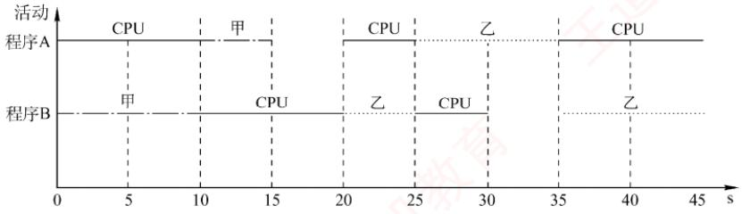

## 注意

此图为甘特图，甘特图也称横道图，它以图示的方式通过活动列表和时间刻度形象地表示任意特定项目的活动顺序与持续时间。

以后遇到此类题目，即给出几个不同的程序，每个程序以各个任务时间片给出时，一定要用甘特图来求解，因为其直观、快捷。为节省读者研究甘特图画法的时间，下面给出既定的步骤，读者可按下列步骤快速、正确地画出甘特图。 XTA

①横坐标上标出合适的时间间隔，纵坐标上的点是程序的名字。

②过横坐标上每个标出的时间点，向上作垂直于横坐标的虚线。

③用几种不同的线（推荐用“直线”“波浪线”“虚线”三种，较易区分）代表对不同资源的占用，按题目给出的任务时间片，平行于横坐标把不同程序对应的线段分别画出来。

画图时要注意，如处理器、打印设备等资源是不能让两个程序同时使用的，有一个程序正在使用时，其他程序的请求只能排队。 自

## 02.【解答】

这类实际的CPU和输入/输出设备调度的题目一定要画图，画出运行时的甘特图后就能清楚地看到不同进程间的时序关系，进程运行情况如下图所示。

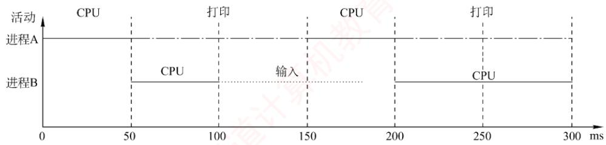

1）CPU在100～150ms时间段内空闲，利用率为250/300≈83.3%。

2）进程A无等待现象。

3）进程B有等待现象，发生在0～50ms和180～200ms时间段。

## 1.3 操作系统的运行环境

## 1.3.1 操作系统内核

现代操作系统通常采用分层架构，将与硬件紧密相关的模块（如中断处理程序、设备驱动程序）、运行频率较高的模块（如时钟管理、进程调度），以及各模块共用的基础操作，集中置于紧靠硬件的层次并常驻内存。这部分核心组件被称为操作系统内核。这种设计有两个主要目的：一是保护核心模块免受应用程序破坏：二是提升操作系统的运行效率。不同操作系统的内核功能存在一定差异，但大多数都包含以下两类功能： 道

## 1. 支撑功能

这类功能为操作系统其他模块提供基础支持，以保障系统稳定且高效地运行。

## 考点追踪时钟中断服务的内容（2018）

1）时钟管理。时钟是计算机系统的关键部件，其功能包括计时和产生定时中断。操作系统通过时钟管理向用户提供标准系统时间，并利用时钟中断实现任务调度。例如，在分时操作系统中通过时间片轮转进行进程切换，在实时操作系统中依据截止时间控制任务执行，在批处理系统中衡量作业运行进度。因此，系统的大量活动均依赖于时钟机制。 冰订

## 考点追踪中断机制在多道程序设计中的作用（2016）

2）中断机制。中断是现代操作系统运行的基础，它允许CPU在I/O操作期间执行其他指令，从而提高资源利用率。中断来源广泛，包括键盘输入、鼠标事件、系统调用、设备驱动和文件访问等。当发生中断时，内核负责保存当前进程的现场，转移控制权至相应的处理程序，并在处理完成后恢复现场，有效提升了系统的并发处理能力。

3）原语。原语是由若于条指令组成的、用于完成特定功能的操作，具有原子性，即其执行过程不可被中断，必须一气呵成。原语通常运行在内核态，执行时间短、调用频繁，是保证系统安全性和一致性的重要机制。常见的原语包括进程切换、进程同步和资源分配等。为实现原子性，原语常通过关闭中断等手段确保执行不被干扰。

## 2. 系统资源管理功能

操作系统通过一系列核心数据结构（如进程控制块、设备控制块、内存分配表、缓冲区等）对系统资源进行统一管理。为实现高效、安全的资源使用，内核需提供以下三类基本管理功能：

1）进程管理。负责进程的创建与撤销、状态转换、调度与分派，并维护进程控制块（PCB）等核心数据结构。

2）存储器管理。实现内存的分配与回收、地址映射、内存保护及页面置换等机制，确保多道程序安全、高效地共享主存资源。

3）设备管理。完成设备的分配与回收、缓冲区管理、I/O调度及设备驱动调用，屏蔽硬件差异，为用户提供统一的设备访问接口。

## 1.3.2 处理机的双重工作模式

为确保操作系统正确运行，必须严格区分操作系统代码与用户程序的执行环境。绝大多数计算机系统通过硬件支持实现这一区分，即为处理机设置至少两种独立的运行模式：用户态（也称目态）和内核态（也称管态或系统态）。硬件通过一个模式位标识当前运行模式（例如0表示内核态，1表示用户态），从而明确当前执行的是系统任务还是用户任务。

## 考点追踪两种模式下发生或执行的事件分析（2011、2012、2014、2021）

系统引导时，硬件从内核态开始工作，完成操作系统的加载后，切换到用户态执行用户程序。一旦发生中断或陷阱，硬件就会自动从用户态切换至内核态（模式位置0）。因此，操作系统一旦获得控制权，就处于内核态；而在将控制权交还用户程序前，将切换回用户态（模式位置1）。

这种双重模式机制通过指令分类提供保护：将可能危及系统安全的指令定义为特权指令，仅允许在内核态下执行；其余指定定义为非特权指令，可在任意模式下执行。具体如下。

## 考点追踪特权指令和非特权指令的特点（2022）

1）特权指令。仅能在内核态执行，可访问全部地址空间（包括用户空间和系统空间），并十 执行关键操作，如启动外设、设置系统时钟、关闭中断、修改模式位或返回用户态等。

2）非特权指令。通常在用户态下执行，主要用于一般计算和数据处理，其内存访问被限制在用户地址空间，无法直接操作硬件或系统核心资源。

上述限制由硬件强制实施：若用户程序试图执行特权指令，则硬件将产生非法指令异常；操作系统捕获该异常后，会终止该程序并重新调度。

## 1.3.3 中断和异常的概念①

## 考点追踪用户态切换到内核态的事件分析（2013、2015）

在引入内核态与用户态之后，操作系统必须解决两者之间的安全切换问题。内核运行在内核态，用户程序运行在用户态：用户程序虽不能直接执行内核功能，却必须通过受控方式使用这些服务。为此，系统在内核中设立若干称为“门”的受控入口，而用户程序进入内核态的唯一合法途径就是中断或异常。当CPU运行用户程序时，一旦发生中断（如I/O完成）或异常（如系统调用、除零错误），硬件会自动将处理器切换至内核态，并跳转至内核中对应的处理程序。这一机制由硬件强制保障，确保状态切换的安全性与原子性。 X

中断机制对现代操作系统至关重要。操作系统的演进本质上是不断提升资源利用率的过程：当某程序因等待I/O等事件而暂时无法继续执行时，系统需及时将其挂起，转而调度其他就绪程序运行。在抢占式多任务系统中，这一调度行为主要依赖中断（尤其是时钟中断）来触发。因此，中断机制是现代操作系统实现高效并发与资源共享的基础。

## 1. 中断和异常的定义

## 考点追踪可能引发中断或异常的指令分析（2013、2015）

中断（Interrupt）也称外中断，是指来自CPU执行指令外部的事件，通常用于信息输入/输出（见第5章)，如设备发出的I/O结束中断，表示设备I/O操作已完成。时钟中断，表示一个固定的时间片已到，用于系统计时、进程调度或启动定时任务等。

异常（Exception）也称内中断，是指来自CPU执行指令内部的事件，如程序的非法操作码、

地址越界、运算溢出、虚存系统的缺页及专门的陷入指令等引起的事件。异常一旦发生，就必须立即处理，不可被屏蔽。关于异常和外中断的联系与区别如图1.3所示。

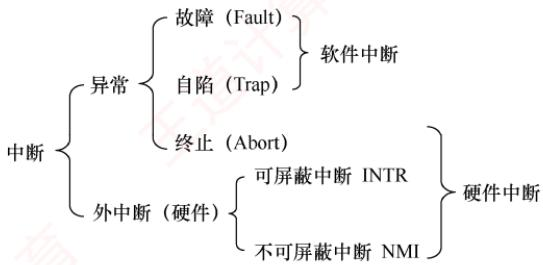  
图1.3 异常和外中断的联系与区别

## 2. 中断和异常的分类

## 考点追踪中断和异常的分类（2016）

外中断可分为可屏蔽中断和不可屏蔽中断。可屏蔽中断是指通过INTR线发出的中断请求通过改变屏蔽字可以实现多重中断，从而使得中断处理更加灵活。不可屏蔽中断是指通过NMI线发出的中断请求，通常是紧急的硬件故障，如电源掉电等。此外，异常也是不能被屏蔽的。

异常可分为故障、自陷和终止。故障（Fault）通常是由指令执行引起的异常，如非法操作码、缺页故障、除数为0、运算溢出等。自陷（Trap，也称陷入）是一种事先安排的“异常”事件，用于在用户态下调用操作系统内核程序，如条件陷阱指令、系统调用指令等。终止（Abort）是指出现了使得CPU无法继续执行的硬件故障，如控制器出错、存储器校验错等。故障和自陷异常属于软件中断（程序性异常），终止异常和外中断属于硬件中断。

## 3. 中断和异常的处理过程

## 考点追踪中断和异常的处理过程（2015、2020、2024）

中断和异常处理过程的大致描述如下：当CPU在执行用户程序的第i条指令时，若该指令引发异常（如缺页、除零），或在指令执行结束后检测到中断请求信号，则CPU会打断当前程序，转入相应的中断或异常处理程序执行。若问题可被处理程序解决，则对于异常，通常在处理完成后返回第i条指令重新执行（例如，缺页处理完成后重访原内存地址）：而对于中断，则在处理完成后返回第i+1条指令继续执行。若处理程序判定为不可恢复的致命错误，则终止该用户程序。通常情况下，中断和异常的具体处理由操作系统（及设备驱动程序）完成。

## 考点追踪中断处理和子程序调用的比较（2012）

注意区分中断处理和子程序调用：（①）中断处理程序与被中断的程序相互独立，无固定关联：而子程序与主程序属于同一程序的主从关系。②中断的产生通常是随机的；而子程序调用由CALL指令显式触发，是程序员事先安排的。③子程序调用完全由软件实现；而中断处理需要硬件电路支持才能完成。④中断处理程序的入口地址由中断向量表直接提供；子程序的入口地址则由CALL指令中的地址码指定。⑤调用中断处理程序和子程序均需保护程序计数器（PC）的内容：前者由硬件在中断响应过程中自动保存，后者由CALL指令在执行时将当前PC压入栈中。⑥响应中断时，需对同时到达的多个中断请求进行优先级裁决；而子程序调用不存在此类操作。

## 1.3.4 系统调用

## 考点追踪系统调用的定义、功能及性质（2019、2021、2024）

系统调用是操作系统提供给应用程序（程序员）使用的接口，可视为一种特殊的公共子程序调用。系统中的各种共享资源均由操作系统统一管理，因此凡涉及共享资源的操作（如存储分配、I/O传输及文件管理等），都必须通过系统调用向操作系统提出服务请求，由操作系统代为完成，并将结果返回给应用程序。这样可以保证系统的稳定性和安全性，防止用户进行非法操作。通常，一个操作系统提供的系统调用有几十条乃至上百条，每个系统调用都有唯一的系统调用号。这些系统调用按功能大致可分为如下几类。

● 设备管理。完成设备的请求或释放，以及设备启动等功能。

● 文件管理。完成文件的读、写、创建及删除等功能。

● 进程控制。完成进程的创建、撤销、阻塞及唤醒等功能。

● 进程通信。完成进程之间的消息传递或信号传递等功能。

● 内存管理。完成内存的分配、回收，以及获取作业占用内存区的大小和起始地址等功能。

显然，系统调用涉及系统资源管理、进程管理等关键操作，对整个系统的影响非常大，因此必须由操作系统内核程序在内核态下完成。操作系统提供系统调用的核心目的，是让应用程序能够安全地间接调用内核功能。它本质上是一种特殊的过程调用，与普通过程调用存在显著差异。

1）运行状态不同。普通过程调用的调用者与被调用者运行在同一特权级；而系统调用的调X 用者运行在用户态，被调用者运行在内核态。

2）状态转换不同。普通过程调用无须特权级切换，可以直接跳转；系统调用则需要通过陷入指令（Trap）触发，先从用户态切换到内核态，再由内核分派至相应处理程序。

3）返回机制不同。系统调用执行完毕后，内核可能根据调度策略决定是否切换进程；而普通过程调用总是直接返回原调用点。

4）嵌套调用限制不同。系统调用的嵌套深度受到内核栈空间的限制；而普通过程调用的嵌套深度通常仅受用户栈大小约束。

考点追踪系统调用的处理过程及相关分析（2012、2017、2022、2023）

系统调用的处理过程可分为4个阶段。

1）传递系统调用参数。用户程序将系统调用号及所需参数压入堆栈（或通过寄存器），为内核服务做准备。

2）执行陷入指令并切换至内核态。用户程序执行陷入指令，触发CPU从用户态切换至内核态。硬件与内核协同保存现场，将PC、PSW及通用寄存器内容压入内核堆栈。

3）定位并执行相应服务程序。内核根据系统调用号查询系统调用表，找到对应处理程序的入口地址，并执行具体的服务逻辑。 KX

4）恢复现场并返回用户态。服务完成后，内核恢复被中断进程的CPU现场，将运行模式切换回用户态，并将控制权交还给用户程序，使其从断点继续执行。

系统调用的执行过程如图1.4所示。用户程序通过执行陷入指令，主动将CPU控制权移交操作系统内核：内核完成请求后，再将控制权交还。这一机制确保了用户程序无法直接执行高危操作，必须通过受控接口请求操作系统代为执行，进而保障系统安全与稳定。由此，可概括操作系统的运行环境：用户程序运行在受限的用户态，通过系统调用（主动）或异常/中断（被动）两种受控途径进入内核态，请求内核提供资源管理与服务支持：内核处理完毕后，再安全返回用户态继续执行。这种用户态与内核态的隔离，构成了现代操作系统安全、高效运行的基础环境。 KOH

在操作系统层面，我们关注内核态与用户态的软件实现与切换机制；其硬件支持细节可结合“计算机组成原理”课程中关于中断与异常的内容深入理解。

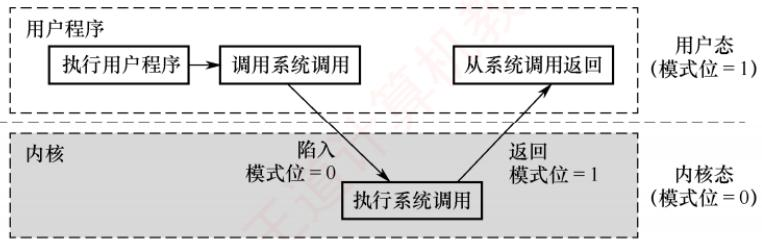  
图1.4 系统调用的执行过程

常见的用户态转向内核态的情形包括：

1）用户程序请求操作系统服务（系统调用）。

2）发生外中断（如I/O完成、时钟信号）。

3）用户程序执行过程中产生异常（如除零、缺页）。

4）用户程序试图执行特权指令，从而触发异常。

从内核态返回用户态由内核通过特定的返回指令（如IRET）完成，该操作在内核态执行。

## 1.3.5 本节习题精选

## 单项选择题

01.下列关于操作系统的说法中，错误的是（）。I. 在通用操作系统管理下的计算机上运行程序，需要向操作系统预订运行时间Ⅱ. 在通用操作系统管理下的计算机上运行程序，需要确定起始地址，并从这个地址开始执行Ⅲ. 操作系统需要提供高级程序设计语言的编译器IV. 管理计算机系统资源是操作系统关心的主要问题A. I B. I、ⅢII C. II、III D. I、ⅡI、III、IV

02. 下列说法中，正确的是（）。I. 批处理的主要缺点是需要大量内存Ⅱ. 当计算机提供了内核态和用户态时，输入/输出指令必须在内核态下执行Ⅲ. 操作系统中采用多道程序设计技术的最主要原因是提高CPU和外部设备的可靠性IV. 操作系统中，通道技术是一种硬件技术A. I、Ⅱ B. I、III C. II、IV D.ⅡI、III、IV

03.下列关于系统调用的说法中，正确的是（）。I.用户程序使用系统调用命令，该命令经过编译后形成若干参数和陷入指令王 Ⅱ. 用户程序使用系统调用命令，该命令经过编译后形成若干参数和屏蔽中断指令Ⅲ.用户程序创建一个新进程，需使用操作系统提供的系统调用接口IV. 当操作系统完成用户请求的系统调用功能后，应使CPU从内核态转到用户态A. I、III B. III、IV C.I、III、IV D. II、ⅢII、IV

04.（）是操作系统必须提供的功能。A. 图形用户界面（GUI） B. 为进程提供系统调用命令C. 中断处理 D. 编译源程序

05. CPU执行的指令被分为两类，其中有一类称为特权指令，它只允许（）使用。A. 管理员 B. 联机用户 C. 目标程序 D. 操作系统

06. 在中断发生后，中断处理的程序属于（）。A. 用户程序B. 可能是用户程序，也可能是OS程序C. 操作系统程序D. 单独的程序，既不是用户程序也不是OS程序

07. CPU的状态分为用户态和内核态，从用户态转换到内核态的唯一途径是（）。A. 修改程序状态字指令 B. 中断屏蔽C. 中断 D. 中断处理程序

08. 下列指令中，可以在用户态执行的是（）。I. 置时钟指令 Ⅱ. 停机指令 II. 存数指令 IV. 寄存器清零指令A. I、IV B. III、IV C. II、III、IV D. ⅡI、ⅢII

09. 下列指令中，必须在内核态执行的是（）。I. 陷入指令 Ⅱ. 系统调用指令 Ⅲ. 开中断指令IV. 转移指令 V. 中断屏蔽字设置指令A. I、II、III、IVB. II、III C. II、III、V D. I、IV

10. 下列程序中，必须在内核态执行的是（）。I. 磁盘调度程序 Ⅱ. 中断处理程序 . 设备驱动程序 IV. 操作系统初始化程序A. I、II、III、IV B. I、Ⅱ、ⅢII C. I、ⅡI、IV D. ⅡI、ⅢII

11. 当CPU处于内核态时，它可以执行的指令是（）。A. 只有特权指令 B. 只有非特权指令C. 只有访管指令 D. 除访管指令之外的全部指令

12. 下列中断事件中，能引起外中断的事件是（）。I. 时钟中断 II. 访管中断 Ⅲ. 缺页中断A. I B. III C. I和Ⅱ D. ⅡI和III

13. 下列关于库函数和系统调用的说法中，不正确的是（）。A. 库函数运行在用户态，系统调用运行在内核态B. 使用库函数时开销较小，使用系统调用时开销较大C. 库函数不方便被替换，系统调用通常很方便被替换D. 库函数可以很方便地调试，而系统调用很麻烦

14. 下列关于系统调用和一般过程调用的说法中，正确的是（）。A. 两者都需要将当前CPU 中的 PSW和PC 的值压栈，以保存现场信息B. 系统调用的被调用过程一定运行在内核态C. 一般过程调用的被调用过程一定运行在用户态D. 两者的调用过程与被调用过程一定都运行在用户态

15. 用户在程序中试图读某文件的第100个逻辑块，使用操作系统提供的（）接口。A. 系统调用 B. 键盘命令 C. 原语 D. 图形用户接口

16.【2011统考真题】下列选项中，在用户态执行的是（）。A. 命令解释程序 B. 缺页处理程序C. 进程调度程序 D. 时钟中断处理程序

17.【2012统考真题】下列选项中，不可能在用户态发生的事件是（）。A. 系统调用 B. 外中断 C. 进程切换 D. 缺页

18. 【2012统考真题】中断处理和子程序调用都需要压栈，以便保护现场，中断处理一定会保存而子程序调用不需要保存其内容的是（）。A. 程序计数器 B. 程序状态字寄存器C. 通用数据寄存器 D. 通用地址寄存器

19. 【2013统考真题】下列选项中，会导致用户进程从用户态切换到内核态的操作是（）。I. 整数除以零 ⅡI. sin()函数调用 III. read 系统调用A. 仅I、Ⅱ B. 仅I、ⅢI C. 仅Ⅱ、ⅢII D. I、ⅡI和ⅢII

20.【2014统考真题】下列指令中，不能在用户态执行的是（）。A. Trap 指令B. 跳转指令 C. 压栈指令 D. 关中断指令

21.【2015统考真题】处理外中断时，应该由操作系统保存的是（）。A. 程序计数器（PC）的内容 B. 通用寄存器的内容C. 快表（TLB）中的内容 D. Cache 中的内容

22. 【2015统考真题】假定下列指令已装入指令寄存器，则执行时不可能导致CPU从用户态变为内核态（系统态）的是（）。 王道A. DIV R0, R1 ; (R0)/(R1)→R0B. INT n ；产生软中断C. NOT R0 ；寄存器R0 的内容取非D. MOV R0, addr；把地址 addr 处的内存数据放入寄存器 R0

23.【2016统考真题】异常是指令执行过程中在处理器内部发生的特殊事件，中断是来自处理器外部的请求事件。下列关于中断或异常情况的叙述中，错误的是（）。A.“访存时缺页”属于中断 B. “整数除以零”属于异常D.“存储保护错”属于异常

24. 【2017统考真题】执行系统调用的过程包括如下主要操作：①返回用户态 ②执行陷入（Trap）指令③传递系统调用参数 ④执行相应的服务程序正确的执行顺序是（）。A. ②→③→①→④ B. ②→④→③→①C. ③→②→④→① D. ③→④→②→①

25.【2018统考真题】定时器产生时钟中断后，由时钟中断服务程序更新的部分内容是（）。I. 内核中时钟变量的值II. 当前进程占用 CPU 的时间 王道计集Ⅲ.当前进程在时间片内的剩余执行时间A. 仅I、Ⅱ B. 仅Ⅱ、ⅢII C. 仅I、ⅢI D.I、II、ⅢII

26.【2019统考真题】下列关于系统调用的叙述中，正确的是（）。I. 在执行系统调用服务程序的过程中，CPU处于内核态Ⅱ. 操作系统通过提供系统调用避免用户程序直接访问外设Ⅲ. 不同的操作系统为应用程序提供了统一的系统调用接口IV. 系统调用是操作系统内核为应用程序提供服务的接口A. 仅I、IV B. 仅ⅡI、Ⅲ C. 仅I、II、IV D.

27.【2020统考真题】下列与中断相关的操作中，由操作系统完成的是（）。I. 保存被中断程序的中断点 II. 提供中断服务

Ⅲ. 初始化中断向量表 IV. 保存中断屏蔽字A. 仅I、Ⅱ B. 仅I、ⅡI、IV C. 仅ⅢII、IV D. 仅ⅡI、III、IV

28. 【2021统考真题】下列指令中，只能在内核态执行的是（）。A. Trap 指令 B. I/O 指令 C. 数据传送指令 D. 设置断点指令

29. 【2021统考真题】下列选项中，通过系统调用完成的操作是（）。A. 页置换 B. 进程调度 C. 创建新进程 D. 生成随机整数

30.【2022统考真题】下列关于CPU模式的叙述中，正确的是（）。A. CPU处于用户态时只能执行特权指令B. CPU处于内核态时只能执行特权指令C. CPU处于用户态时只能执行非特权指令D. CPU处于内核态时只能执行非特权指令

31. 【2022统考真题】执行系统调用的过程涉及下列操作，其中由操作系统完成的是（）。I. 保存断点和程序状态字 I. 保存通用寄存器的内容Ⅲ. 执行系统调用服务例程 IV. 将 CPU模式改为内核态A. 仅I、ⅢII B. 仅ⅡI、II C. 仅Ⅱ、IV D. 仅II、III、IV

32. 【2023统考真题】在操作系统内核中，中断向量表适合采用的数据结构是（）。A. 数组 B. 队列 C. 单向链表 D. 双向链表

33.【2024统考真题】下列关于中断、异常和系统调用的叙述中，错误的是（）。A. 中断或异常发生时，CPU处于内核态B. 每个系统调用都有对应的内核服务例程C. 中断处理程序开始执行时，CPU处于内核态D. 系统添加新类型设备时，需要注册相应的中断服务例程

## 1.3.6 答案与解析

## 单项选择题

## 01. B

说法I错误：通用操作系统使用时间片轮转调度算法，用户运行程序并不需要预先预订运行时间。说法Ⅱ正确：操作系统执行程序时，必须从起始地址开始执行。说法Ⅲ错误：编译器是操作系统的上层软件，不是操作系统需要提供的功能。说法IV正确：操作系统是计算机资源的管理者，管理计算机系统资源是操作系统关心的主要问题。 K

02. C

说法I错误：批处理的主要缺点是缺少交互性。批处理系统的主要缺点是常考点，读者对此要非常敏感。说法Ⅱ正确：输入/输出指令属于特权指令，只能由操作系统使用，因此必须在内核态下执行。说法Ⅲ错误：多道性是为了提高系统利用率和吞吐量而提出的。说法IV正确：I/O通道实际上是一种特殊的处理器，它具有执行I/O指令的能力，并通过执行通道程序来控制I/O操作。

## 03. C

系统调用需要触发陷入指令，如基于x86的Linux系统，该指令为int 0x80或sysenter，说法I正确。程序设计无法形成屏蔽中断指令，说法Ⅱ错误。用户程序通过系统调用进行进程控制，说法Ⅲ正确。执行系统调用时CPU状态要从用户态转到内核态，这是通过中断来实现的，当系统调用返回后，继续执行用户程序，同时CPU状态也从内核态转到用户态，说法IV正确。

## 04. C

中断是操作系统必须提供的功能，因为计算机的各种错误都需要中断处理，内核态与用户态

切换也需要中断处理。

## 05. D

内核可以执行CPU能执行的任何指令，用户程序只能执行除特权指令之外的指令。因此特权指令只能由内核即操作系统使用。 x

## 06. C

中断处理程序是OS专门为处理中断事件而设计的程序。中断发生时，若被中断的是用户程序，则CPU将从用户态转入内核态，在内核态下进行中断的处理；若被中断的是低级中断，则

## 07. C

CPU通过程序状态字寄存器中的某个位来标志当前的状态，但是修改程序状态字的指令本身就属于特权指令，不能在用户态下执行。当CPU执行到一条访管指令或陷阱指令时，会引起访管中断或陷阱中断，CPU会保存断点和其他上下文环境，然后切换到内核态。也就是说，从用户态转换到内核态，不是通过指令来修改CPU的状态标志位的，而是由CPU在中断时自动完成的。中断处理程序一般在内核态执行，因此无法完成“转换成内核态”这一任务。

## 08. B

直接管理系统资源的指令（如设置时钟、启动/关闭硬件设备、切换进程、设置中断等）、系统状态修改指令（如修改中断向量表、切换CPU的运行模式等）、系统控制指令（如停机指令、重启指令等），都属于特权指令，必须在内核态执行。普通的数据处理指令、流程控制指令、读操作指令都不会影响系统的安全和整体状态，可以在用户态执行。

## 09. C

用户程序通过陷入指令让CPU模式从用户态转入内核态，因此在用户态执行。虽然调用的发生可能在用户态（注意区分调用和执行），但是系统调用指令必然在内核态执行。开中断指令和关中断指令都属于特权指令，能够影响到系统的运行，必须在内核态执行。无论是分支跳转指令还是无条件转移指令，都属于普通的程序流程控制指令，在用户态执行。中断屏蔽字寄存器属于中断控制器的一部分，而中断控制器是属于I/O接口的，因此设置中断屏蔽字寄存器的操作就相当于对I/O接口中的I/O端口进行设置，属于I/O指令，必须在内核态执行。

## 10. A

磁盘调度程序控制磁头的运行，和硬件密切相关，运行在内核态。中断处理程序在中断发生后由操作系统内核调用，运行在内核态。设备驱动程序用于和硬件设备进行通信，运行在内核态。操作系统初始化程序负责初始化系统资源、设置环境、加载驱动程序等，运行在内核态。

## 11. D

访管指令（Trap指令）是一条在用户态下执行的指令。用户程序在用户态下要请求操作系统内核提供服务，就有意识地使用访管指令来引起访管中断，从而将控制权交给内核。在内核态，CPU可以执行除访管指令之外的任何指令。

## 12. A

外中断是由CPU外部的事件引起的，如I/O设备的请求、时钟信号等。内部中断（也称异常）是由CPU内部的事件引起的，如访管指令（Trap指令）、缺页异常等。

## 13. C

库函数是指被封装在库文件中的可复用的代码块，运行在用户态；而系统调用是面向硬件的，运行在内核态，是操作系统为用户提供的接口。库函数可以很方便地调试，而系统调用很麻烦，因为它运行在内核态。库函数可以很方便地替换，而系统调用通常不可替换。库函数属于过程调用，开销较小；系统调用需要在用户空间和内核空间中进行上下文切换，开销较大。

## 14. B

系统调用需要保存PSW和PC的值，一般过程调用只需保存PC的值，选项A错误。系统调用的被调用过程是操作系统中的程序，是系统级程序，必须运行在内核态，选项B正确。一般过程调用的被调用程序与调用程序运行在同一个状态，可能是系统态，也可能是用户态，选项C和D错误。

## 15. A

操作系统通过系统调用向用户程序提供服务，文件I/O需要在内核态运行。

## 16. A

缺页处理和时钟中断都属于中断，在内核态执行；进程调度是操作系统内核进程，无须用户

## 17. C

本题的关键是对“在用户态发生”（注意与“在用户态执行”区分）的理解。对于选项A，系统调用是操作系统提供给用户程序的接口，系统调用发生在用户态，被调用程序在内核态下执行。对于选项B，外中断是用户态到内核态的“门”，也发生在用户态，在内核态完成中断处理过程。对于选项C，进程切换属于系统调用执行过程中的事件，只能发生在内核态；对于选项D，缺页产生后，在用户态发生缺页中断，然后进入内核态执行缺页中断服务程序。

## 18. B

子程序调用不改变程序的状态，因为子程序调用是编译器可控的流程，而中断不是。下面以程序if(a==b)为例加以说明。该程序通常包含一条测试指令，以及一条根据标志位决定是否需要跳转来调用子程序的指令。编译器不在这两条指令中间插入任何子程序调用代码，因此标志位不变，但中断随时可能发生，导致标志位改变。具体地说，执行if(a==b)时，会进行a-b操作，并生成相应的标志位，进而根据标志位来判断是否发生跳转。假设刚好在生成相应的标志位后发生了中断，若不保存PSW的内容，则后续根据标志位来进行跳转的流程就可能发生错误。但是，若进行了子程序调用，则说明已经根据a-b的标志位进行了跳转，此时PSW的内容已无意义而无须保存。综上所述，中断处理和子程序调用都有可能使PSW的内容发生变化，但中断处理程序执行完返回后，可能需要用到PSW原来的内容，子程序执行完返回后，一定不需要用到PSW原来的内容，因此选择选项B。选项A都会保存，选项C和D不一定会保存。 XTA

## 19. B

整数除以零是非法操作，因此CPU会检测到异常，并切换到内核态进行异常处理。sin()函数是C语言中的普通运算类库函数，且不会引发系统调用，在用户态执行。在用户态触发read系统调用时，会通过Trap指令陷入内核态，由CPU执行相应的系统调用服务例程。

## 20. D

Trap指令、跳转指令和压栈指令均可以在用户态执行，其中Trap指令负责由用户态转换为内核态。关中断指令为特权指令，必须在内核态才能执行。注意，在操作系统中，关中断指令是权限非常大的指令，因为中断是现代操作系统正常运行的核心保障之一，能把它关掉，说明执行这条指令的一定是权限非常大的机构（内核态）。 XTA

## 21. B

外中断处理过程，PC值由中断隐指令自动保存，而通用寄存器内容由操作系统保存。快表（TLB）和Cache中的内容在外中断处理过程中通常无须保存，直接置有效位为0即可。

## 22. C

部分指令可能出现异常，从而转到内核态。指令A有除零异常的可能。指令B为软中断指令，用于触发一个中断并跳转到相应的中断处理程序，n表示中断向量号，使用软中断可以在用

户态和内核态之间切换，以实现系统调用。指令D有缺页异常的可能。指令C不会发生异常。

## 23. A

中断是指来自CPU执行指令以外事件，如设备发出的J/O结束中断，表示设备输入/输出已完成，希望处理机能够向设备发出下一个输入输出请求，同时让完成输入/输出后的程序继续运行。异常也称内中断，指源自CPU执行指令内部的事件。选项A错误。

## 24. C

执行系统调用的过程：正在运行的进程先传递系统调用参数，然后由陷入（Trap）指令负责将CPU模式从用户态转换为内核态，并将返回地址压入堆栈以备后用，接下来CPU执行相应的内核态服务程序，最后返回用户态。

## 25. D

时钟中断的主要工作是处理和时间有关的信息及决定是否执行调度程序。和时间有关的所有信息包括系统时间、进程的时间片、延时、使用CPU的时间、各种定时器。

## 26. C

用户可以在用户态调用操作系统的服务，但执行具体的系统调用服务程序是处于内核态的，说法I正确；设备管理属于操作系统的职能之一，包括对输入/输出设备的分配、初始化、维护等，用户程序需要通过系统调用使用操作系统的设备管理服务，说法Ⅱ正确：操作系统不同，底层逻辑、实现方式均不相同，为应用程序提供的系统调用接口也不同，说法Ⅲ错误：系统调用是用户在程序中调用操作系统提供的子功能，说法IV正确。

## 27. D

当CPU检测到中断信号后，由硬件自动保存被中断程序的断点程序计数器（PC）和程序状态字寄存器（PSW）]，说法I错误。之后，硬件找到该中断信号对应的中断向量，中断向量指明中断服务程序入口地址（各个中断向量统一存放在中断向量表中，该表由操作系统初始化，说法Ⅲ正确）。接下来开始执行中断服务程序，保存中断屏蔽字、保存各个通用寄存器的值，并提供与中断信号对应的中断服务，中断服务程序属于操作系统内核，说法Ⅱ和IV正确。

## 28. B

在内核态下，CPU可执行任何指令，在用户态下CPU只能执行非特权指令，而特权指令只能在内核态下执行。常见的特权指令有：①有关对I/O设备操作的指令；②有关访问程序状态的指令；③存取特殊寄存器的指令；④其他指令。选项A、C和D都是提供给用户使用的指令，可以在用户态执行，只是可能使CPU从用户态切换到内核态。

## 29. C

系统调用是由用户进程发起的，请求操作系统的服务。对于选项A，当内存中的空闲页框不够时，操作系统会将某些页面调出，并将要访问的页面调入，这个过程完全由操作系统完成，不涉及系统调用。对于选项B，进程调度完全由操作系统完成，无法通过系统调用完成。对于选项C，创建新进程可以通过系统调用来完成，如Linux中通过fork系统调用来创建子进程。对于选项D，生成随机数是普通的函数调用，不涉及请求操作系统的服务，如C语言的random()函数。

## 30. C

CPU在用户态时只能执行非特权指令，在内核态时可以执行特权指令和非特权指令。

## 31. B

发生系统调用时，CPU通过执行软中断指令将CPU的运行状态从用户态切换到内核态，这个过程与中断和异常的响应过程相同，由硬件负责保存断点和程序状态字，并将CPU模式改为内核态。然后，执行操作系统内核的系统调用入口程序，该内核程序负责保存通用寄存器的内容，再调

用执行特定的系统调用服务例程。综上，说法I、IV由硬件完成，说法Ⅱ、Ⅲ由操作系统完成。

## 32. A

本题考查了“计算机组成原理”的考点，且综合了“数据结构”的内容。中断向量表用于存放中断处理程序的入口地址，CPU通过查询得到中断类型号，然后据此计算可以得到对应中断服务程序的入口地址在中断向量表的位置，采用数组作为中断向量表的存储结构，可实现时间复杂度为O(1)的快速访问，从而提高中断处理的效率。

## 33. A

当中断或异常发生时，CPU既可能处于内核态，又可能处于用户态，具体取决于当时CPU正在处理的任务，选项A错误。不同的系统调用对应不同的内核服务例程，选项B正确。在中断响应阶段，若CPU处于用户态，则需要切换到内核态，因此在中断处理阶段，CPU一定处于内核态，选项C正确。设备种类繁多，计算机不可能事先准备好所有设备对应的中断服务例程（实际上属于设备驱动程序)，因此当系统添加新类型的设备时，需要注册相应的中断服务例程。

## 1.4 操作系统结构

随着操作系统功能的不断扩展和代码规模的持续增长，采用合理的结构设计对降低系统复杂度、提升安全性和可靠性至关重要。

## 1. 分层法

分层法将操作系统划分为若干层次，最底层（层0）为硬件，顶层（层N）为用户接口。各

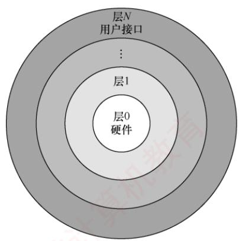  
图1.5 分层的操作系统

层仅可调用其紧邻下层所提供的功能与服务（单向依赖）。  
分层的操作系统如图1.5所示。

分层法的优点如下：①便于调试与验证，系统可自底向上逐层开发与测试。层1完成且验证无误后，即可开发层2，因其仅依赖已验证的下层；后续各层以此类推。若某层出现错误，可将其定位在该层内部，因其所有依赖的下层均已通过验证。②易于扩充与维护。在保持层间接口不变的前提下，可独立修改、替换或新增某一层的实现，而不会影响其他层次的功能。

分层法的问题如下：①层次划分困难。合理界定各层的功能边界较为复杂，且一旦依赖关系固化，系统架构可能缺乏灵活性。②运行效率较低。执行一个高层功能通常需穿越多个中间层，每层之间的参数传递与控制转移

会引入额外开销，从而影响系统整体性能。

## 2. 模块化

模块化是将操作系统按功能划分为若于具有一定独立性的模块。每个模块实现特定的管理功能，并明确定义与其他模块的接口，以便通过这些接口进行通信。还可进一步将模块细分为若干子模块，并且规定子模块之间的接口。这种设计方法称为模块-接口法，图1.6所示为由模块、子模块等组成的模块化操作系统结构。

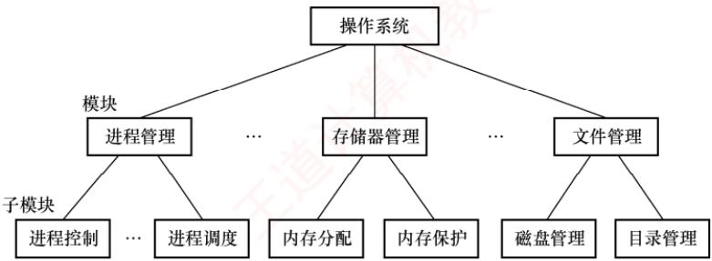  
图1.6由模块、子模块等组成的模块化操作系统结构

在划分模块时，若模块过小，虽然可降低单个模块的复杂性，但会导致模块间交互频繁，增加系统的整体复杂度：若模块过大，则模块内部结构复杂，难以维护。因此，需要在粒度大小之间取得合理平衡。此外，应高度重视模块的独立性：模块独立性越高，相互依赖越少，系统结构越清晰。衡量模块独立性的主要标准有两个： X

内聚性，模块内部各组成部分间联系的紧密程度。内聚性越高，模块独立性越好。

●耦合度，模块间相互依赖和影响的程度。耦合度越低，模块独立性越好。

模块化的优点：①提高了操作系统设计的正确性、可理解性和可维护性；②增强了系统的可适应性，便于功能扩展；③支持并行开发，加速操作系统研制进程。

模块化的缺点：（①）模块间的接口规定很难满足对接口的实际需求。②各模块设计者齐头并进，每个决定无法建立在上一个已验证的正确决定的基础上，因此无法找到一个可靠的决定顺序

## 3. 宏内核

从操作系统的内核架构来划分，可分为宏内核和微内核。

宏内核（也称单内核或大内核）将系统的主要功能模块集成在一个紧密耦合的整体中，运行于内核态，从而为用户程序提供高效的系统服务。由于各模块共享地址空间，可直接调用彼此的函数，减少了上下文切换和消息传递开销，因而具有较高的性能优势。

然而，随着体系结构和应用需求的不断发展，操作系统需提供的服务日益复杂，代码规模急剧膨胀，导致系统维护困难、可靠性下降，面临典型的“软件危机”。为提升系统的模块化、可扩展性与安全性，微内核技术应运而生：其核心思想是仅保留最基本的功能（如进程调度、进程间通信等）在内核中，而将文件系统、设备驱动等非核心服务移至用户态运行。

从发展现状看，当前主流操作系统（如Linux、Windows、Android）主要采用宏内核或混合内核架构，在保持高性能的同时，也吸收了微内核的部分设计理念。例如，macOS和iOS所采用的XNU内核即融合了Mach微内核与BSD宏内核的特性。这表明，宏内核与微内核并非对立，而是相互借鉴、融合发展。近年来，随着对安全性和可验证性的重视，微内核架构重新受到关注，尤其是谷歌的Fuchsia和华为的 HarmonyOS NEXT，都采用了微内核架构。

## 4. 微内核

## （1）微内核的基本概念

微内核架构是指将操作系统中最基本的功能保留在内核，而将其他非核心功能移至用户态运行，从而降低内核的复杂性。这些移出的功能被组织为若干独立的服务程序，它们运行在用户态，彼此之间以及与客户进程之间的交互均通过微内核提供的消息传递机制完成。

微内核结构将操作系统划分为两大部分：微内核和多个服务器。微内核是一个精心设计的小型内核，仅实现操作系统最核心的机制，通常包括：①与硬件紧密相关的部分；②基本的资源管理机制；③客户与服务器间的通信支持。这些部分为构建完整的操作系统提供了基础，确保内

核保持极小规模。操作系统的绝大部分功能都放在微内核外的一组服务器（进程）中实现，运行在用户态。例如，进程/线程服务器、虚拟存储器服务器等，均以用户态进程的形式提供相应服务。图1.7展示了单机环境下的客户/服务器模式。

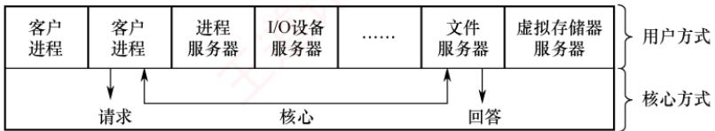  
图1.7 单机环境下的客户/服务器模式

在微内核结构中，为提升可靠性，仅微内核运行在内核态，其余模块均运行在用户态。因此，某一模块（如文件服务器）发生故障时，仅该模块崩溃，系统可通过重启该服务恢复，而不会导致整个系统宕机。相比之下，在宏内核中，文件系统运行于内核态，其崩溃将直接引发系统崩溃。

## （2）微内核的基本功能

微内核操作系统遵循“机制与策略分离”的设计原则，将与硬件紧密相关的机制置于微内核中，而将策略交由用户态服务器实现。通过这种划分，进程管理、存储器管理和I/O管理等功能均被分解为两部分：机制保留在微内核中，策略则由外部服务器实现。由于服务器通常远大于微内核，该设计使微内核得以保持极小的规模。具体而言，微内核通常具备以下功能：

（①）进程（线程）管理。微内核提供进程/线程的创建、切换、调度队列管理等机制，而进程分类、优先级分配等策略则由用户态的进程管理服务器实现。

②低级存储器管理。微内核仅包含与硬件相关的地址转换机制（如页表管理、逻辑地址到物理地址的映射），而页面置换算法、内存分配策略等由用户态的存储器管理服务器实现。

③中断和陷入处理。微内核负责捕获硬件中断和陷入事件，在识别中断或异常类型后，将其分发给相应的用户态服务器处理。中断与陷入的捕获及分发机制属于微内核的核心功能。

（3）微内核的特点

## 考点追踪微内核操作系统的特点（2023）

微内核结构的主要优点如下：

①扩展性和灵活性。新增或修改功能只需调整相应服务器，无须改动内核。

②可靠性和安全性。用户态服务的故障不会导致系统崩溃，且攻击面更小。

③可移植性。仅微内核包含硬件相关代码，其余服务器与平台无关，便于移植。

④分布式计算。客户/服务器间通过消息传递通信，易于扩展至网络环境。

微内核结构的主要缺点是性能问题，每次服务请求需多次穿越内核态与用户态，导致系统调用延迟增加。为缓解此问题，部分现代系统采用混合内核设计，在保留微内核思想的同时，将高频服务移入内核以提升性能，但这又会使微内核的容量明显增大。

尽管如此，微内核因其高可靠性和可验证性，被广泛应用于对系统可靠性要求极高的关键任务领域，如实时操作系统、工业控制、航空航天及军事等。

## 5. 外核

与传统操作系统通过抽象层向应用程序提供统一接口不同，外核（exokernel）采用一种截然不同的设计思想：将物理资源直接暴露给用户级系统，自身仅负责资源的安全分配与隔离。

在外核架构中，外核作为运行于内核态的极小程序，其核心职责是将底层硬件资源（如磁盘块、内存页、网络包缓冲区等）划分为互不重叠的子集，并分配给不同的用户级系统。例如，一个用户级系统可能被分配磁盘的0～1023块，另一个用户级系统则被分配独特的1024～2047块。外核通过权限检查机制，确保各用户级系统仅能访问其被明确授权的资源，防止越权访问。在外核之上，可在用户空间构建库操作系统（libraryOS），自主实现文件系统、进程调度、虚拟内存管理等传统操作系统功能。由于库操作系统直接操作物理资源，无须经过传统内核强制性的抽象层，因此避免了不必要的数据拷贝、地址转换以及上下文切换开销，显著提升了系统性能与灵活性。 道

外核机制的主要优点如下。

①减少抽象开销。传统操作系统强制引入虚拟内存、虚拟文件系统等映射层，而外核允许用户级系统按需定制资源使用方式，显著降低了系统开销。

②提升灵活性与性能。用户级系统可根据应用特性优化资源管理策略（如数据库可以直接管理磁盘块），充分发挥硬件的潜力。 妆

③清晰分离保护与实现。外核仅负责资源保护，功能实现完全置于用户空间，系统结构简洁且易于验证。

## 1.5 操作系统引导

操作系统（如Windows、Linux等）以程序形式存储于硬盘等外部存储设备中。操作系统引导是指计算机通过执行一系列引导程序，依次定位启动设备、确定可引导分区、加载其中的操作系统内核，最终完成系统启动的链式过程。

## 考点追踪操作系统的引导过程（2021、2022）

常见操作系统的引导过程如下。

① CPU 激活与 BIOS 初始化。计算机通电后，CPU 从 ROM 中读取并执行 BIOS（基本输入/输出系统）程序。BIOS初始化基本硬件，建立中断向量表，为引导阶段的设备访问提供支持。

②硬件自检与启动设备选择。BIOS执行通电自检（POST），检测CPU、内存以及外设是否正常。自检通过后，依据CMOS设置（主板上由电池供电的配置存储器，用于保存启动顺序、系统时间等参数）确定启动设备优先级，并选择首个有效的启动设备（如硬盘、U盘）。

③加载主引导记录（MBR）。BIOS将所选启动设备的首扇区（主引导记录，即MBR）加载到内存中。MBR包含两部分核心内容：引导代码与硬盘分区表。

④定位活动分区并加载分区引导记录（PBR）。MBR中的引导代码解析分区表，识别标记为“活动”的分区，并将其首扇区（分区引导记录，即PBR）加载到内存中。

⑤加载启动管理器。PBR中的代码负责加载活动分区内的启动管理器(如Linux的GRUB、Windows的Bootmgr），后者提供多操作系统或内核版本的选择界面。

## 考点追踪操作系统运行的存储器（2013）

⑥加载操作系统内核。启动管理器将用户选定的操作系统内核映象加载到内存中，并跳转执行。内核随即完全接管系统控制权，重建中断处理机制，不再依赖BIOS提供的服务。 KK

⑦内核初始化与用户环境启动。内核完成核心子系统的初始化：内存管理模块构建内核页表及用户进程地址空间框架；进程调度模块初始化进程控制块（PCB）链表、就绪队列与阻塞队列；设备驱动模块建立设备控制块、设备分配表以及I/O缓冲区管理结构。初始化完成后，内核启动首个用户态进程（如Linux的init），由此逐步构建完整的用户操作环境。

## 1.6 虚拟机

## 1.6.1 虚拟机的基本概念

考点追踪虚拟化技术的原理与特点（2025）

虚拟机是指通过虚拟化技术，将一台物理计算机抽象为多台逻辑上独立的计算环境，每台虚拟机都表现为完整硬件系统的精确复制品。虚拟化技术的核心在于隐藏底层物理硬件的细节，向上层提供统一且隔离的执行平台。目前主流的虚拟化方案分为两类。

## 1. 第一类虚拟机管理程序

第一类虚拟机管理程序（又称裸金属架构）直接运行在物理硬件之上，是系统中唯一处于最高特权级的软件。它类似于一个轻量级的操作系统，负责管理硬件资源和并发调度多个虚拟机。每个虚拟机均可安装独立的操作系统（称为客户操作系统），彼此完全隔离。图1.8(a)展示了第一类虚拟机管理程序在系统中的位置。

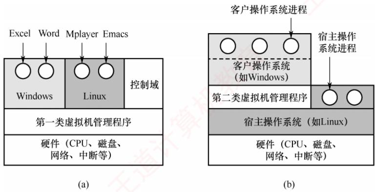  
图1.8 两类虚拟机管理程序在系统中的位置

在此类架构中，客户操作系统运行于虚拟内核态，它认为自己处于真实的CPU内核态，但实际上并非如此；其用户进程则运行在真实的用户态。当客户操作系统执行一条仅允许在真实内核态下执行的敏感指令时，会触发异常并陷入虚拟机管理程序。

在支持硬件虚拟化的CPU上，虚拟机管理程序能够根据执行上下文判断该指令源自客户操作系统还是用户程序：若为前者，则代为完成其功能；若为后者（用户程序非法执行敏感指令），则模拟真实硬件的异常响应行为。而在早期不支持硬件虚拟化的CPU上，所有敏感指令均

## 2. 第二类虚拟机管理程序

第二类虚拟机管理程序(又称寄居架构)以应用程序的形式运行在宿主操作系统(如Windows或Linux）之上，依赖宿主系统进行资源分配与调度，本质上是一个用户态进程。尽管如此，它仍向客户操作系统伪装成完整的硬件平台。图1.8(b)展示了第二类虚拟机管理程序在系统中的位置。VMware Workstation是 x86平台上首个广泛使用的第二类虚拟机管理程序。

首次启动时，第二类虚拟机管理程序模拟一台新计算机的行为，用户可将客户操作系统安装到虚拟磁盘（实际上是宿主操作系统中的一个普通文件），安装完成后即可正常启动和运行。

虚拟化技术在Web主机领域应用广泛。若无虚拟化，服务商只能提供共享托管（用户无法控制软件环境）或独占托管（成本高昂）。借助虚拟化，单台物理服务器可同时运行多个虚拟机，每个虚拟机对用户而言都是一台完整的服务器，支持自定义操作系统与软件，且成本显著降低一这正是当前主流云服务器服务的基础。

## 1.6.2 本节习题精选

## 单项选择题

01.用（）设计的操作系统结构清晰且便于调试。A. 分层式架构 B. 模块化架构 C. 微内核架构 D. 宏内核架构

02. 下列关于分层式结构操作系统的说法中，（）是错误的。A. 各层之间只能是单向依赖或单向调用B. 容易实现在系统中增加或替换一层而不影响其他层C. 具有非常灵活的依赖关系D. 系统效率较低

03.下列选项中，（）不属于模块化操作系统的特点。A.很多模块化的操作系统，可以支持动态加载新模块到内核，适应性强B. 内核中的某个功能模块出错不会导致整个系统崩溃，可靠性高C. 内核中的各个模块可以相互调用，无须通过消息传递进行通信，效率高D. 各模块间相互依赖，相比于分层式操作系统，模块化操作系统更难调试和验证

04. 相对于微内核系统，（）不属于大内核操作系统的缺点。A. 占用内存空间大 B. 缺乏可扩展性而不方便移植C. 内核切换太慢 X D. 可靠性较低

05.下列说法中，（）不适合描述微内核操作系统。A. 内核足够小 C. 基于 C/S 模式 首计 D. 策略与机制分离 B. 功能分层设计

06.对于以下五种服务，在采用微内核结构的操作系统中，（）不宜放在微内核中。I. 进程间通信机制 II. 低级I/O Ⅲ. 低级进程管理和调度IV. 中断和陷入处理 V. 文件系统服务A. I、Ⅱ和III B. Ⅱ 和 V C. 仅V D. IV 和 V

07. 相对于传统操作系统结构，采用微内核结构设计和实现操作系统有诸多好处，下列（）是微内核结构的特点。I. 使系统更高效 II. 添加系统服务时不必修改内核Ⅲ. 微内核结构没有单一内核稳定 IV. 使系统更可靠A. I、III、IV B. I、II、IV C. II、IV D. I、IV

08.下列关于操作系统结构的说法中，正确的是（）。I. 当前广泛使用的 Windows操作系统，采用的是分层式 OS 结构Ⅱ. 模块化的OS结构设计的基本原则是，每一层都仅使用其底层所提供的功能和服务，这样就使系统的调试和验证都变得容易Ⅲ. 因为微内核结构能有效支持多处理机运行，所以非常适合于分布式系统环境IV. 采用微内核结构设计和实现操作系统具有诸多好处，如添加系统服务时不必修改内核，使系统更高效。A. I和Ⅱ B. I和III C. III D. III 和 IV

09. 下列关于微内核操作系统的描述中，不正确的是（）。A. 可提高操作系统的可靠性 B. 可提高操作系统的执行效率

C. 可提高操作系统的可移植性 D. 可提高操作系统的可拓展性

10.下列关于操作系统外核（exokernel）的说法中，错误的是（）。A. 外核可以给用户进程分配未经抽象的硬件资源B. 用户进程通过调用“库”请求操作系统外核的服务C. 外核负责完成进程调度D. 外核可以减少虚拟硬件资源的“映射”开销，提升系统效率

11. 对于计算机操作系统引导，描述不正确的是（）。A. 计算机的引导程序驻留在ROM中，开机后自动执行B. 引导程序先做关键部位的自检，并识别已连接的外设C. 引导程序会将硬盘中存储的操作系统全部加载到内存中D. 若计算机中安装了双系统，引导程序会与用户交互加载有关系统

12. 存放操作系统自举程序的芯片是（）。A. SRAM B. DRAM C. ROM D. CMOS

13.计算机操作系统的引导程序位于（）中。 道A. 主板 BIOS B. 片外 Cache C. 主存 ROM 区 D. 硬盘

14. 在操作系统引导过程中，下列关于各阶段核心功能的描述，正确的是（）。A. BIOS直接加载并执行操作系统内核B. MBR解析硬盘分区表，并加载活动分区的引导扇区C. 启动管理器由 BIOS 直接从磁盘读取并执行D. 内核初始化阶段仅加载设备驱动，不初始化进程调度相关数据结构

15. 检查分区表是否正确，确定哪个分区为活动分区，并在程序结束时将该分区的启动程序（操作系统引导扇区）调入内存加以执行，这是（）的任务。A. MBR B. 引导程序 C. 操作系统 D. BIOS

16. 下列关于虚拟机的说法中，正确的是（）。I. 虚拟机可以用软件实现 Ⅱ. 虚拟机可以用硬件实现Ⅲ. 多台虚拟机可同时运行在同一物理机器上，它实现了真正的并行A. I和Ⅱ B. Ⅰ和 C. 仅I D. I、ⅡI和ⅢII

17. 下列关于 VMware Workstation 虚拟机的说法中，错误的是（）。A. 真实硬件不会直接执行虚拟机中的敏感指令B. 虚拟机中只能安装一种操作系统C. 虚拟机是运行在计算机中的一个应用程序D.虚拟机文件封装在一个文件夹中，并存储在数据存储器中

18. 虚拟机的实现离不开虚拟机管理程序（VMM)，下列关于VMM的说法中正确的是（）。I. 第一类 VMM 直接运行在硬件上，其效率通常高于第二类 VMMⅡ. VMM的上层需要支持操作系统的运行、应用程序的运行，因此实现 VMM的代码量通常大于实现一个完整操作系统的代码量Ⅲ. VMM可将一台物理机器虚拟化为多台虚拟机器IV. 为了支持客户操作系统的运行，第二类VMM需要完全运行在最高特权级A. I、ⅡI和ⅢII B. I和ⅢI C. I、ⅢII和IV D. I、II、III 和IV

19.【2013统考真题】计算机开机后，操作系统最终被加载到（）。A. BIOS B. ROM C. EPROM D. RAM

20.【2022统考真题】下列选项中，需要在操作系统进行初始化过程中创建的是（）。A. 中断向量表 道 B. 文件系统的根目录

C. 硬盘分区表 C D. 文件系统的索引节点表

21. 【2023统考真题】与宏内核操作系统相比，下列特征中，微内核操作系统具有的是（）。I. 较好的性能 Ⅱ. 较高的可靠性 . 较高的安全性 IV. 较强的可扩展性A. 仅Ⅱ、IV B. 仅I、Ⅱ、III C. 仅I、III、IV D. 仅II、III、IV

22.【2025统考真题】下列关于虚拟化技术的叙述中，错误的是（）。A. 操作系统可以运行在虚拟机上B. 虚拟化技术支持在一台计算机上构建多个虚拟机C. 虚拟机监控程序（VMM）与操作系统的特权级相同D. 虚拟化技术支持在一台计算机上模拟不同的指令集体系结构

## 1.6.3 答案与解析

## 单项选择题

## 01. A

分层式结构简化了系统的设计和实现，每层只能调用紧邻它的低层的功能和服务，便于系统的调试和验证，若在调试某层时发现错误，则错误应在这层上，这是因为其低层都已调试好。

## 02. C

单向依赖是分层式OS的特点。分层式OS中增加或替换一个层中的模块或整层时，只要不改变相应层间的接口，就不会影响其他层，因而易于扩充和维护。层次定义好后，相当于各层之间的依赖关系也就固定了，因此往往显得不够灵活，选项C错误。每执行一个功能，通常都要自上而下地穿越多层，增加了额外的开销，导致系统效率降低。

## 03. B

模块化操作系统的各功能模块都在内核中，并且模块之间相互调用、相互依赖，任何一个模块出错，都可能导致整个内核崩溃。选项B的设置属于“移花接木”，正确的说法应该是：在微内核操作系统中，内核外的某个功能模块出错不会导致整个系统崩溃，可靠性高。

## 04. C

微内核和宏内核作为两种对立的结构，它们的优缺点也是对立的。微内核OS的主要缺点是性能问题，因为需要频繁地在内核态和用户态之间进行切换，因而切换开销偏大。L

## 05. B

功能分层设计是分层式OS的特点。通常可以从四个方面来描述微内核OS：①内核足够小；②基于客户/服务器模式；③应用“机制与策略分离”原理；④采用面向对象技术。

## 06. C

进程（线程）之间的通信功能是微内核最频繁使用的功能，因此几乎所有微内核OS都将其放入微内核。低级I/O和硬件紧密相关，因此应放入微内核。低级进程管理和调度属于调度功能的机制部分，应将它放入微内核。微内核OS将与硬件紧密相关的一小部分放入微内核处理，此时微内核的主要功能是捕获所发生的中断和陷入事件，并进行中断响应处理，识别中断或陷入的事件后，再发送给相关的服务器处理，所以中断和陷入处理也应放入微内核。而文件系统服务是放在微内核外的文件服务器中实现的，所以仅选项V不宜放在微内核中。

## 07. C

微内核结构需要频繁地在内核态和用户态之间进行切换，操作系统的执行开销相对偏大，那些移出内核的操作系统代码根据分层的原则被划分成若干服务程序，它们的执行相互独立，交互则都借助微内核进行通信，影响了系统的效率，因此说法Ⅰ不是优势。因为内核的服务变少，且一般来

说内核的服务越少内核越稳定，所以说法Ⅲ错误。而说法Ⅱ、IV正是微内核结构的优点。

## 08. C

Windows是融合了宏内核和微内核的操作系统，说法Ⅰ错误。说法Ⅱ描述的是层次化架构的原则。微内核架构将操作系统的核心功能和其他服务分离，使不同的服务可在不同的处理器上并行执行，提高了系统的并发性和可扩展性；微内核架构可以方便地实现进程间的通信和同步，支持服务器之间的消息传递和远程过程调用，使得分布式系统的开发和管理更简单和高效，说法Ⅲ正确。添加系统服务时不必修改内核，这就使得微内核架构的可扩展性和灵活性更强；微内核架构的主要问题是性能问题，“使系统更高效”显然错误。 YTA

## 09. B

微内核会增加一些开销，如上下文切换、消息传递、数据拷贝等。这些开销会降低操作系统的执行效率，尤其是对一些频繁调用的服务。选项A、C、D均正确。 临村

## 10. C

在拥有外核的操作系统中，外核只负责硬件资源的分配、回收、保护等，进程管理相关的工作仍然由内核负责。

## 11. C

常驻内存的只是操作系统内核，其他部分仅在需要时才调入。

## 12. C

BIOS(基本输入/输出系统)是一组固化在主板的ROM芯片上的程序，它包含系统设置程序、基本输入/输出程序、开机自检程序和系统启动自举程序等。

## 13. D

操作系统的引导程序位于磁盘活动分区的引导扇区中。引导程序分为两种：一种是位于ROM中的自举程序（BIOS的组成部分），用于启动具体的设备；另一种是位于装有操作系统硬盘的活动分区的引导扇区中的引导程序（称为启动管理器），用于引导操作系统。

## 14. B

在操作系统引导过程中，BIOS执行硬件自检后，仅加载主引导记录（MBR）到内存中并执行；MBR位于硬盘首扇区，通过解析分区表定位活动分区，并加载其分区引导记录（PBR）；PBR负责加载启动管理器，而不由BIOS直接加载；内核初始化阶段除加载设备驱动外，还需要初始化进程控制块、调度队列和空闲进程等调度相关数据结构。综上，仅选项B正确。 。

## 15. A

BIOS将控制权交给排在首位的启动设备后，CPU将该设备主引导扇区的内容主引导记录（MBR）]加载到内存中，然后由MBR检查分区表，查找活动分区，并将该分区的引导扇区的内容「分区引导记录（PBR）加载到内存加以执行。 道

## 16. A

软件能实现的功能也能由硬件实现，因为虚拟机软件能实现的功能也能由硬件实现，软件和硬件的分界面是系统结构设计者的任务，说法Ⅰ和Ⅱ正确。实现真正并行的是多核处理机，多台虚拟机同时运行在同一物理机器上，类似于多个程序运行在同一个系统中。

## 17. B

VMware Workstation虚拟机属于第二类虚拟机管理程序，若真实硬件直接执行虚拟机中的敏感指令，则该指令非法时可能导致宿主操作系统崩溃，而这是不可能的，实际上是由第二类虚拟机管理程序模拟真实硬件环境。虚拟机看起来和真实物理计算机没什么两样，因此当然可以安装多个操作系统。VMware Workstation就是一个安装在计算机上的程序，在创建虚拟机时，会为该虚拟机创建一组文件，这些虚拟机文件都存储在主机的磁盘上。

## 18. B

第一类VMM直接运行在硬件上；第二类VMM运行在宿主操作系统上，不能直接和硬件打交道，因此第一类VMM的效率通常更高。VMM的功能没有操作系统的功能复杂，其代码量少于一个完整的操作系统。说法Ⅲ是基本概念。第一类VMM运行在最高特权级（内核态），而第二类VMIM和普通应用程序的地位相同，通常运行在较低特权级（用户态）。

## 19. D

系统开机后，操作系统的程序会被自动加载到内存中的系统区，这段区域是RAM。部分未

## 20. A

在操作系统初始化的过程中需要创建中断向量表，以实现通电自检（POST），CPU检测到中断信号后，根据中断号查询中断向量表，跳转到相应的中断处理程序，选项A正确。在硬盘逻辑格式化之前，需要先对硬盘进行分区，即创建硬盘分区表。分区完成后，对物理分区进行逻辑格式化（创建文件系统），为每个分区初始化一个特定的文件系统，并创建文件系统的根目录。若某个分区采用UNIX文件系统，则还要在该分区中建立文件系统的索引节点表。

## 21. D

微内核架构将内核中最基本的功能保留在内核，只有微内核运行在内核态，其余模块都运行在用户态，一个模块中的错误只会使这个模块崩溃，而不会使整个系统崩溃，因此具有较高的可靠性和安全性。微内核的非核心功能运行在用户空间，可通过插件或模块的方式进行扩展，无须改动内核代码，因此具有较强的可扩展性。微内核需要频繁地在用户态和内核态之间进行切换，操作系统的执行开销偏大，从而影响系统性能。

## 22. C

虚拟化技术通过软件抽象底层硬件资源，使多个相互隔离的虚拟机能够在同一台物理计算机上运行。操作系统可作为客户系统运行在虚拟机中，依托虚拟硬件正常运行：同时，在单台物理主机上构建多个虚拟机正是虚拟化的核心能力。虚拟机监控程序（VMM）作为虚拟化的核心组件，必须运行在高于操作系统的特权级上，才能有效拦截和模拟敏感指令、管理物理资源并维持虚拟机间的隔离，因此其特权级不可能与操作系统的相同。此外，结合仿真或动态二进制翻译等机制，虚拟化方案也能在一种指令集架构的平台上模拟运行另一种架构的虚拟机，进而支持跨架构场景。综上，选项C的表述不符合虚拟化的基本原理。

## 1.7 本章疑难点

## 1. 并行性与并发性的区别和联系

并行性与并发性是两个既相似又有区别的概念。并行性是指多个事件在同一时刻发生，而并发性是指多个事件在同一时间间隔内发生。在多道程序环境下，并发性表现为宏观上多个程序同时运行：但在单处理器系统中，任一时刻仅能执行一个程序，因此微观上这些程序分时交替执行。若系统配备多个处理器，则可将并发执行的程序分配至不同处理器，实现真正的并行。

## 2. 特权指令与非特权指令

特权指令是一类具有特殊权限的指令，用于执行清内存、置时钟、分配系统资源、修改虚存页表、调整用户访问权限等关键操作。由于其权限极高，使用不当可能导致系统崩溃。为保障系

统安全，特权指令仅允许在内核态执行；实际上，CPU在内核态下可执行完整的指令集。

为防止用户程序误用特权指令，用户态下仅允许执行非特权指令。当用户程序试图执行特权指令时，硬件将触发异常以阻止该操作。因此，操作系统中涉及特权操作的部分必须运行于内核态，从而确保系统的安全性与可靠性。从用户态切换至内核态的唯一途径是中断或异常。

## 3. 访管指令与访管中断

访管指令（Trap指令）是一条可在用户态执行的特殊指令。当用户程序需要请求操作系统服务时，会主动执行该指令，从而引发一个自愿中断一一访管中断，使系统从用户态切换至内核态，由操作系统内核处理相应请求。系统调用正是通过访管指令实现的。 OT

引入访管指令的原因在于：用户程序运行于用户态，而诸如I/O操作、进程创建、内存分配等任务涉及特权资源，无法在用户态直接完成，必须借助访管指令主动触发中断，进入内核态以获取所需服务。值得注意的是，访管指令本身并非特权指令，其核心作用是为用户提供一种受控且主动的内核态入口机制，在保障系统安全的同时，实现用户程序与操作系统的高效交互。

## 4. 定义微内核结构 OS 的四个方面

1）足够小的内核：微内核仅包含最基础的核心功能，如进程间通信、基本调度等。

2）基于客户/服务器模式：内核作为服务器提供基础服务，应用程序作为客户端请求服务。

3）机制与策略分离：机制指实现功能的具体执行机构，策略则是在机制基础上通过参数或算法实现优化或差异化目标。传统操作系统将机制置于底层、策略置于高层；而微内核OS将机制保留在内核中，策略移至用户态服务进程，从而显著减小内核规模。

4）采用面向对象技术：通过“抽象”“封装”“继承”等特性，有效控制系统复杂性，并提升操作系统的正确性、可靠性与可扩展性，因而被广泛应用于现代操作系统设计。

进程与线程的组织与控制

进程间通信：共享内存，消息传递，管道，信号

## （二）CPU调度与上下文切换

视频讲解

调度的基本概念；调度的目标；

调度的实现：调度器/调度程序（scheduler），调度的时机与调度方式（抢占式/非抢占式），闲逛进程，内核级线程与用户级线程调度

CPU 调度算法

多处理机调度

上下文及其切换机制

（三）同步与互斥

同步与互斥的基本概念

基本的实现方法：软件方法；硬件方法

锁；信号量；条件变量

经典同步问题：生产者-消费者问题，读者-写者问题；哲学家进餐问题

（四）死锁

死锁的基本概念；死锁预防

死锁避免；死锁检测和解除

## 【复习提示】

进程管理是操作系统的核心，也是每年必考的重点。其中，进程的概念、进程调度、信号量机制实现同步与互斥、死锁问题等更是重中之重，必须深入掌握。需要注意的是，本章除常考选择题外，还易出现综合题，尤其是利用信号量实现进程同步、进程调度算法分析及死锁相关问题，均可能作为综合题考查，例如“利用信号量进行进程同步”在历年统考中就频繁出现。

## 2.1 进程与线程简介

在学习本节时，请读者思考以下问题：

1）为什么要引入进程？

2）什么是进程？进程由什么组成？

3）引入进程主要解决了多道程序并发执行中的哪些关键问题？

希望读者带着这些问题进入本节的学习，并在学习过程中多思考，从而更深入地把握核心概念。进程本身是一个抽象的逻辑实体，它并非物理存在的对象，初学者在理解时往往感到困难。为此，在系统阐述相关理论之后，我们将通过直观的例子帮助读者理解。

## 2.1.1 进程的概念和特征

## 1. 进程的概念

在多道程序环境下，允许多个程序并发执行，但并发性破坏了程序原本的封闭性，使其执行过程呈现间断性，并可能导致结果不可再现。为有效描述和控制程序的并发行为，操作系统引入了进程（Process）这一核心概念，以支撑操作系统的两大基本特性：并发性与共享性。

为使每个参与并发执行的程序能独立运行，必须为其配置一个专门的数据结构，称为进程控制块（Process ControlBlock，PCB）。操作系统通过PCB记录进程的基本信息和运行状态，从而实现对其的控制与管理。通常，程序段、相关数据段和PCB三者共同构成进程实体（也称进程映像）。因此，创建进程的本质是创建其PCB：相应地，撤销进程即释放该PCB及相关资源。

从不同视角出发，进程可有不同的定义，比较典型的定义如下。

1）进程是正在执行的程序实例。

2）进程是程序及其数据从外存加载到内存后，在CPU上运行的过程。

3）进程是具有独立功能的程序在一个特定数据集合上的执行活动。

在传统操作系统中，进程被正式定义为：“进程是进程实体的运行过程，是系统进行资源分配和调度的一个独立单位”。这里所说的“系统资源”不仅包括内存空间、I/O设备等硬件资源，也包括CPU的使用权，而CPU的使用权通常通过时间片的分配来实现。正因进程是资源分配与调度的基本单位，它必然不是静态的程序，而必须是一个动态的、具有生命周期的过程性实体。

## 2. 进程的特征

进程源于多道程序并发执行的需求，与静态的程序有着本质区别。其核心特征如下。

1）动态性。进程是程序的一次执行实例，具有明确的生命周期，包括创建、就绪、运行、阻塞和终止等状态变化。动态性是进程最根本的特征。 YTA

2）并发性。多个进程可同时驻留于内存，并在一段时间内交替或并行执行。引入进程的根本目的，正是为了支持程序的并发执行。

3）独立性。进程是能够独立运行、独立获取系统资源，并作为调度基本单位参与CPU竞争的实体。任何未建立PCB的程序，均不能被操作系统调度执行。

4）异步性。进程相互制约，以不可预知的速度向前推进。这种异步性可能导致执行结果不可再现，因此操作系统必须提供相关机制，以协调进程行为，确保执行的正确性。

尽管考试中较少直接考查四大特征，但对其内涵的理解是分析进程调度、同步互斥、死锁等问题的基础。建议读者着重把握各特征的成因、表现及其对系统设计的影响，而非机械记忆。

## 2.1.2 进程的组成

进程是操作系统进行资源分配和调度的基本单位，由三部分共同构成：程序段、数据段和进程控制块（PCB），其中PCB是最核心的组成部分。

## 1. 进程控制块

进程创建时，操作系统为其分配一个PCB；该结构常驻内存，可随时被系统访问，并在进程终止时被回收。PCB是进程存在的唯一标志，系统唯有通过它才能感知并管理进程。

在进程的整个生命期内，系统始终依赖PCB对其进行管理。操作系统通过PCB记录并维护进程的当前状态，以便在需要调度、切换或于预时，能够准确地控制其行为。

具体而言，当操作系统准备调度某个进程运行时，首先从其PCB中读取当前状态、优先级等调度所需信息：一旦该进程被选中，系统便根据PCB中保存的CPU上下文（如寄存器值）恢复其执行现场，并依据其中记录的内存地址找到对应的程序段和数据段。在进程运行过程中，若需与其他进程实现同步、通信，或访问文件，同样需要查询PCB中的相关资源信息。而当进程因某种原因而暂停执行时，其当前的CPU状态会被保存回PCB，以便后续重新调度时能从中断处继续执行。当进程正常结束或被强制终止时，系统将回收其PCB，该进程也随之消亡。由此可见，从创建到终止，系统对进程的所有操作，都离不开对其PCB的访问与更新。 K

PCB主要包括如表2.1所示的四类信息，各部分的主要说明如下。

表 2.1 PCB 通常包含的内容
<table><tr><td rowspan=1 colspan=1>进程标识信息</td><td rowspan=1 colspan=1>进程调度信息</td><td rowspan=1 colspan=1>资源和内存信息</td><td rowspan=1 colspan=1>处理机状态信息</td></tr><tr><td rowspan=1 colspan=1>进程ID（PID）</td><td rowspan=1 colspan=1>进程当前状态</td><td rowspan=1 colspan=1>代码段指针</td><td rowspan=1 colspan=1>通用寄存器值</td></tr><tr><td rowspan=1 colspan=1>父进程ID（PPID）</td><td rowspan=1 colspan=1>进程优先级</td><td rowspan=1 colspan=1>数据段指针</td><td rowspan=1 colspan=1>程序计数器值</td></tr><tr><td rowspan=1 colspan=1>用户ID（UID）</td><td rowspan=1 colspan=1>CPU 占用时间</td><td rowspan=1 colspan=1>堆栈段指针</td><td rowspan=1 colspan=1>程序状态字（PSW）</td></tr><tr><td rowspan=1 colspan=1></td><td rowspan=1 colspan=1>等待时间</td><td rowspan=1 colspan=1>文件描述符列表</td><td rowspan=1 colspan=1>栈指针（SP）</td></tr><tr><td rowspan=1 colspan=1></td><td rowspan=1 colspan=1>进入内存时间</td><td rowspan=1 colspan=1>I/O 资源清单</td><td rowspan=1 colspan=1></td></tr><tr><td rowspan=1 colspan=1></td><td rowspan=1 colspan=1>阻塞原因</td><td rowspan=1 colspan=1></td><td rowspan=1 colspan=1></td></tr></table>

1）进程标识信息。用于唯一标识一个进程及其归属关系。进程ID（PID）是系统为每个进程分配的唯一编号；父进程ID（PPID）记录创建该进程的父进程标识符；用户ID（UID）指明进程所属用户，为资源共享与安全保护提供依据。

2）进程调度信息。支持操作系统的调度决策与状态管理。进程当前状态是CPU分配的基本依据；进程优先级决定其抢占CPU的能力；此外，还包括CPU占用时间、等待时间、进入内存时间等统计信息，以及阻塞原因，用于调整调度策略及后续唤醒。

3）资源和内存信息。记录进程所占用的各类系统资源。包括代码段、数据段和堆栈段在内存中的起始地址（或指针）、已打开文件的描述符列表，以及所占用的I/O资源。

4）处理机状态信息。也称CPU上下文，主要包括通用寄存器、程序计数器、栈指针及程序状态字（PSW）等寄存器的值。当进程被切换出CPU时，这些信息必须完整保存到PCB中；再次被调度运行时，系统将其恢复至CPU，从而能从中断处继续执行。

在一个实际系统中，通常同时存在大量进程，有的处于就绪态，有的处于阻塞态，并且阻塞原因各不相同。为高效地进行调度与管理，操作系统需将各进程的PCB以适当方式组织起来。常用的组织方法主要有两种：链接方式和索引方式。在链接方式中，系统将处于相同状态的PCB通过指针链接成一个队列，如就绪队列、阻塞队列；对于阻塞进程，还可根据其阻塞原因（如等待J/O完成、等待信号量等）进一步划分为多个阻塞子队列。在索引方式中，系统为每种状态建立一个索引表（如就绪索引表、阻塞索引表等），表项指向对应状态的PCB。

## 2. 程序段

程序段是进程中可被CPU执行的代码部分。需要指出的是，程序本身是静态的，可被多个进程共享。例如，多个用户同时运行同一个文本编辑器程序时，系统只需在内存中保留一份代码副本，各进程通过各自的PCB指向该共享代码段，从而节省内存空间并提高系统效率。

## 3. 数据段

数据段包含进程运行所需的各种数据，既包括程序处理的原始输入，也包括执行过程中产生的中间结果和最终输出。与程序段不同，每个进程的数据段是私有的，即使多个进程运行同一程序，它们的数据段也彼此隔离。这种设计有效保障了进程间的独立性与安全性。

## 2.1.3 进程的内存映像

当程序被加载运行时，操作系统会为其建立一个虚拟地址空间，该空间的逻辑布局称为进程的内存映像。它反映了进程在运行时代码、数据、堆、栈等部分的组织方式。与磁盘上的静态可执行文件不同，内存映像是动态的。在虚拟内存机制（见3.2节）下，进程的整个地址空间无须全部驻留物理内存，只有在实际访问某一部分时，系统才会通过缺页中断将其从磁盘调入内存。

考点追踪进程虚拟地址空间中各区域的存放内容（2025）

典型的进程虚拟地址空间由以下几个主要区域构成。

## 1. 代码段

代码段是指存放程序的机器指令，即编译后的可执行代码。该段通常是只读的，防止程序运行时意外修改指令，同时也允许多个进程共享同一份代码。代码段通常包含以下几个子区域。

● .init：包含程序启动时由系统自动调用的初始化代码。

●.text：存放主程序的指令。如main()函数、自定义函数编译后的机器指令。

•.rodata：存放只读数据。如字符串常量“Hello World!”。

## 2. 数据段

数据段用于存放全局变量和静态变量（static变量），分为如下两部分。

●.data：存放已初始化（已显式赋初值）的全局变量和静态变量，如 $\mathrm{int}_{\mathrm{X}} = 5;$ 0

• .bss：存放未初始化的全局变量和静态变量，如“int y;”。

## 3. 进程控制块（PCB）

虽然PCB是管理进程的核心数据结构，但它并不属于进程的虚拟地址空间。它由操作系统内核维护，存放在系统内核区中，对用户进程不可见。

## 4. 堆

堆是指程序运行时动态申请内存的区域。通过malloc(等函数从堆中申请内存，不再需要时通过free()释放。堆从低地址向高地址增长，大小不固定，适合存储生命周期不确定的数据。例如，C语言语句 $\mathrm{int}* \mathrm{pr} = (\mathrm{int}*) \mathrm{malloc}(4)$ ”会在堆上分配4字节内存，用于存储一个整数。

## 5. 栈

栈用于支持函数调用，存放局部变量、函数参数、返回地址等临时信息，由系统自动管理。遵循后进先出（LIFO）原则，栈从高地址向低地址扩展。例如，调用函数add(3,5)时，参数3、5和返回地址会被压入栈；函数执行结束后，这些数据被弹出，栈指针自动回退。

## 6. 共享库的存储映射区

共享库用于提供进程所依赖的公共函数代码（如printf()等标准库函数）。它们在运行时被动态映射到进程的地址空间，代码是只读的，且可被多个进程共享，从而节省内存资源。

图2.1所示为一个典型进程在内存中的映像。其中，最高地址处是用户栈，随函数调用向下增长；其下方是共享库的映射区域，用于加载动态库；再往下是堆，由malloc()等函数动态扩展；

堆下方是读/写数据段（.data和.bss）；底部是只读代码段（.init、.text、.rodata）；注意，代码段和数据段的大小在程序加载时就已确定，而堆和栈则可在运行过程中动态扩展和收缩。

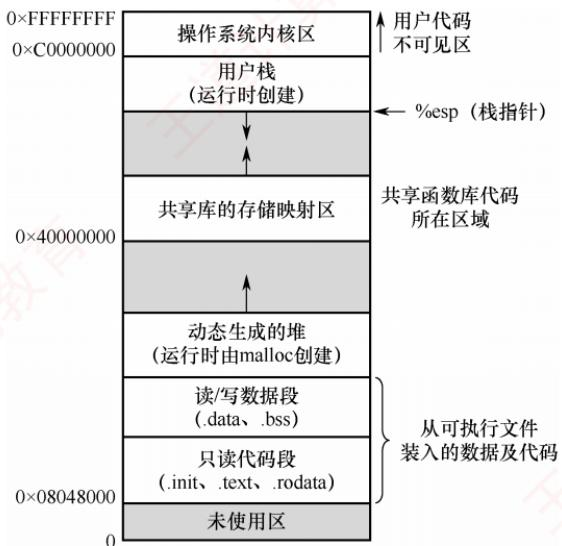  
图2.1 一个典型进程在内存中的映像

## 2.1.4 进程的状态与转换

进程在其生命周期中，由于与其他进程的相互制约以及系统运行环境的变化，其状态会不断发生转换。通常，进程具有以下五种状态，其中前三种为基本状态。

1）运行态。进程正在CPU上执行。在单CPU中，任一时刻最多只有一个进程处于运行态。

2）就绪态。进程已获得除CPU外的所有必要资源，一旦获得CPU，便可立即投入运行。系统中可能有多个就绪进程，通常将它们组织成一个队列，称为就绪队列。

## 考点追踪执行中断处理程序时进程的状态（2023）

3）阻塞态，也称等待态。进程因等待某一事件（如某个资源可用、/O操作完成等）而暂停运行。此时即使CPU空闲，该进程也无法执行。系统通常将处于阻塞态的进程组织成一个阻塞队列，甚至根据阻塞原因的不同，还可进一步划分为多个子队列。

4）创建态。进程正处于创建过程中，尚未进入就绪态。创建进程包括多个步骤：首先申请一个空白的PCB，并向其中填写用于控制和管理进程的信息；然后为该进程分配运行时所需的资源（如内存空间）；最后，当所有必要资源都已到位，系统将该进程转入就绪态，并插入就绪队列。创建态是一个短暂的中间状态，正常情况下不会长期停留。

5）终止态。进程已完成执行（无论是正常结束还是被强制终止），正在等待系统回收其资源。此时，进程不再参与调度，但其PCB等信息可能暂时保留，直至完成最终清理。

区分就绪态与阻塞态：就绪态是指进程仅缺少CPU，只要获得CPU就可立即运行；而阻塞态是指进程需要其他资源（除CPU外）或等待某一事件。之所以将CPU与其他资源分开，是因为在分时系统的时间片轮转机制中，每个进程分得的时间片很短（通常为几毫秒），因此进程在运行过程中会频繁地在运行态与就绪态之间切换；而其他资源（如外设）的分配或事件（如I/O完成）的发生往往需要较长时间，导致进程进入阻塞态的频率远低于就绪态。由此可见，就绪态和阻塞态在进程生命周期中代表了两种性质完全不同的等待情形。

## 考点追踪引起进程状态转换的事件（2014、2015、2018、2023、2025）

图2.2说明了五种进程状态之间的转换关系。其中，三种基本状态之间的转换如下。

● 就绪态→运行态：处于就绪态的进程被调度程序选中，获得CPU的使用权（例如分配到一个时间片），随即由就绪态转换为运行态。

● 运行态→就绪态：处于运行态的进程在时间片用完后，必须主动让出CPU，从而转回就绪态；此外，在可剥夺式调度系统中，若有更高优先级的进程变为就绪，则当前运行的进程也会被强制切换回就绪态，以便让更高优先级的进程执行。

● 运行态→阻塞态：当运行中的进程通过系统调用请求某项服务（如发起I/O操作），而该请求无法立即满足（需等待I/O完成），进程便会主动进入阻塞态。需注意，并非所有系统调用都会导致阻塞，只有那些需要等待外部事件的操作才会引发状态转换。

  
图 2.2 5 种进程状态的转换

●阻塞态→就绪态：当进程所等待的事件发生时（如I/O操作完成），相应的中断处理程序会将其状态由阻塞态修改为就绪态，并重新插入就绪队列，等待下一次调度。

值得注意的是，进程从运行态变为阻塞态是一种主动行为（由自身发起的系统调用触发），而从阻塞态变为就绪态则是一种被动行为，依赖于外部事件的发生或其他进程的协助。

## 2.1.5 进程控制

进程控制的功能是对系统中所有进程进行有效的管理，主要包括创建新进程、撤销已有进程、实现进程状态转换等操作。在操作系统中，这些控制操作通常以原语的形式实现。原语在执行期间不允许被中断，是一个不可分割的基本单位，确保了关键操作的原子性和一致性。

## 1. 进程的创建

## 考点追踪父进程与子进程的关系和特点（2020、2024）

允许一个进程创建另一个进程。创建者称为父进程，被创建的进程称为子进程。子进程在创建时会复制父进程的当前状态，包括程序代码、数据段、堆栈内容、打开的文件描述符、环境变量等。然而，子进程与父进程是相互独立的实体，拥有各自的PCB和虚拟地址空间。

## 考点追踪导致创建进程的操作（2010）

在操作系统中，终端用户登录系统、作业调度启动批处理任务、系统提供服务、用户程序发起应用请求等，都会触发进程的创建。操作系统通过创建原语建立新进程，具体步骤如下。

## 考点追踪创建新进程时的操作（2021）

1）分配唯一标识并申请PCB：为新进程分配唯一的进程标识号（PID），并从系统PCB池中申请一个空白PCB。若PCB资源耗尽，则创建失败，系统返回错误。

2）分配新进程运行所需的资源：如内存、文件、I/O设备等（记录在PCB中）。这些资源或从操作系统获得，或从其父进程继承。

3）初始化PCB：初始化的内容包括：标识信息、处理机状态信息、调度与控制信息和内存与资源信息。通常将新进程设置为最低优先级，除非用户显式提出高优先级要求。

4）插入就绪队列：若系统允许新进程参与调度，则将其PCB插入就绪队列，等待调度。

## 2. 进程的终止

引起进程终止的事件主要包括：①正常结束，表示进程完成其预定任务后主动退出。②异常结束，表示进程在运行过程中发生严重错误，导致无法继续执行。常见原因包括：存储区越界、非法指令、特权指令违规、算术运算错误、I/O故障、运行超时等。③外界于预，由外部实体请求终止进程，如操作员强制终止、操作系统因资源不足或安全策略终止进程、父进程通过系统调用请求终止其子进程。操作系统通过终止原语完成进程的撤销，具体步骤如下。

## 考点追踪终止进程时的操作（2024）

1）根据被终止进程的标识符，检索其PCB，并读取当前状态。

2）若该进程正处于运行态，立即剥夺其CPU，并触发调度程序选择下一个就绪进程。

3）释放该进程占用的所有系统资源，统一归还给操作系统。

4）若系统支持级联终止，则递归终止其所有子孙进程；否则，子孙进程继续运行。

5）将该进程的PCB从所在队列（或链表）中移除，完成清理。

在某些系统中，当一个进程终止时，其所有子孙进程也必须随之终止，这种机制称为级联终止。然而，并非所有操作系统都采用这一策略。以Linux为例，当父进程终止时，其子进程并不会被自动终止，而是由init进程（PID=1）收养，并继续正常运行。

## 3. 进程的阻塞和唤醒

## 考点追踪进程阻塞的事件与分析（2018、2022、2023）

当一个正在运行的进程因等待某个外部事件而暂时无法继续执行时，会主动调用阻塞原语（Block），使自己从运行态转换为阻塞态。常见的等待事件包括：请求系统资源暂时不可用、等待I/O操作完成、等待接收数据、等待信号量等。需要强调的是，阻塞是进程的主动行为，因此只有处于运行态的进程才能执行阻塞操作。阻塞原语的执行过程如下。

1）保存当前进程的CPU现场（如程序计数器、状态寄存器等）到其PCB中。

2）将其PCB中的状态字段修改为阻塞态，并将该PCB插入所等待事件的等待队列中。

3）调用调度程序，从就绪队列中选择另一个进程投入运行，以释放CPU资源。

## 考点追踪进程唤醒的事件与分析（2014、2019）

当被阻塞进程所等待的事件发生时（如I/O操作完成、所需数据到达），由内核的中断处理程序或合作进程调用唤醒（Wakeup）原语，将该进程重新激活。唤醒原语的执行过程如下。

1）在指定事件的等待队列中找到目标进程的PCB。

2）将其从等待队列中移出，并将状态置为就绪态。

3）将该PCB插入就绪队列，等待调度程序在适当时机选中并恢复其执行。

需要注意是，Block与Wakeup是一对作用相反的原语，必须成对使用。若某进程调用了Block进入阻塞态，但系统中没有任何机制调用对应的Wakeup，则该进程将永久停留在阻塞态，无法再被调度执行。因此，在设计并发程序时，必须确保每个阻塞操作都有相应的唤醒路径。

## 2.1.6 进程的通信

进程通信（IPC）是指进程之间的信息交换。根据通信效率和数据量的不同，可分为低级通信和高级通信两类：低级通信主要用于传递控制信息（如同步、互斥），典型代表是PV操作（见2.3节）；高级通信用于高效传输大量数据，主要包括共享存储、消息传递和管道通信、信号等方式。

## 1. 共享存储

进程的地址空间通常是相互隔离的，一个进程不能直接访问另一个进程的内存。因此，若要实现高效的数据交换，操作系统提供了共享存储机制：通过特殊的系统调用，创建一段独立的内存区域，并将其映射到多个进程的虚拟地址空间中，使这些进程都能直接读/写该区域。在共享存储方式中，参与通信的进程通过对这一共享区域进行读/写来交换信息，如图2.3所示。由于多个进程可能并发访问同一块内存，必须由用户程序引入同步互斥机制（如信号量的P、V操作），以避免数据竞争或不一致。需要注意的是，操作系统仅负责分配共享内存区并完成地址映射，并不会自动提供同步保护；具体的读/写逻辑与同步控制，均需由用户程序自行设计和实现。

通俗地理解，可以想象甲和乙之间放着一个公共的大布袋：甲把要传递的物品放进布袋，乙再从里面取出。但乙不能直接伸手去拿甲手里的东西，甲也不能直接取走乙的东西，所有交换都必须通过这个公共区域完成。

## 2. 消息传递

当进程之间没有共享内存，或出于安全等考虑不便使用共享存储时，可采用操作系统提供的消息传递机制进行通信。在消息传递系统中，进程间的数据交换以格式化的消息（Message）为单位，通过操作系统提供的发送原语和接收原语进行。这种方式将通信的底层细节封装在内核中，对用户透明，从而简化了应用程序的设计。消息传递是目前应用最广泛的进程间通信机制，在微内核操作系统中，微内核与服务器之间的交互正是基于消息传递。此外，该机制很好地支持多处理器系统、分布式系统和计算机网络，因此也成为这些环境中的主流通信方式。

消息传递可分为两种基本模式：

1）直接通信方式。发送进程通过发送原语将消息发给指定的接收进程：内核负责将消息从发送方复制到接收方的内核缓冲队列中；接收进程通过接收原语接收消息，如图2.4所示。

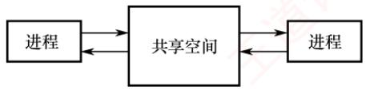  
图 2.3 共享存储

  
图 2.4 消息传递

2）间接通信方式。通信双方不直接指定对方，而是通过一个中间实体（通常称为信箱）进行消息交换。发送进程将消息投递到信箱，接收进程从信箱中取出消息。

通俗地理解，甲要向乙传递信息，便写好一封信交给邮差。在直接通信中，邮差将信件直接交到乙本人手中；在间接通信中，乙家门口设有一个邮箱，邮差只需将信投入该邮箱，乙随后自行取阅。无论哪种方式，消息的投递均由邮差（操作系统内核）完成消息的可靠投递。

## 3. 管道通信

## 考点追踪管道通信的特点（2014）

管道通信是一种基于先进先出原则的进程间通信机制，常用于具有亲缘关系的进程（如父子进程）之间，以生产者-消费者模式进行数据交换（见图2.5）。从编程接口上看，管道（Pipe）

表现为一种特殊的共享文件，支持标准的 read()和 write()操作；但从实现上看，它并非存储在磁盘上的文件，而是由操作系统内核维护的一块固定大小的内存缓冲区。

为确保通信的正确性，管道机制必须提供三方面的协调能力：①互斥，指任一时刻只允许一个进程对管道进

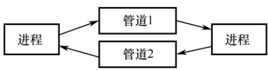  
图 2.5 管道通信

行读或写操作，防止多个进程并发访问导致数据混乱：②同步，指当管道满时，写进程自动阻塞，直到读进程取走部分数据；当管道空时，读进程自动阻塞，直到写进程向其中写入新数据：③写端关闭检测，当写端关闭后，读端read返回0，表明无数据可读。

在Linux系统中，管道是一种广泛使用的IPC机制。其主要特点包括：

1）固定缓冲区大小。管道使用内核中的环形缓冲区（如64KB），不会像普通文件那样无限制增长。当缓冲区满时，后续的write()调用将被阻塞，直到有足够空间可用。

2）自动阻塞与唤醒。若读进程的消费速度快于写进程，则管道中的数据会被迅速读空。此时，任何read()调用将被阻塞，等待写进程再次写入数据。 XTA

管道由父进程通过pipe()系统调用创建。由于子进程在创建时会继承父进程的文件描述符表，因此能够通过这些描述符访问同一管道，从而与父进程进行通信。

## 注意

从管道中读取数据是一次性操作，数据一旦被读出，其占用的缓冲区空间即被释放，供后续写入使用；普通管道仅支持单向通信，若需双向通信，则必须创建两个管道，分别用于两个方向的数据传输。

## 4. 信号

信号（Signal）是一种用于通知进程某个事件已发生的机制。不同的系统事件对应不同的信号类型，每类信号对应一个序号。例如，Linux内核实现了约30种信号，编号通常为1～30。

在进程的PCB中，用一个n位向量（如Linux使用一个32位整型变量）记录该进程当前待处理的信号。当向某进程发送一个信号时，内核会将该信号对应的位置为1；一旦该信号被成功处理，对应位即被清零。此外，PCB中还维护另一个n位向量，用于记录被阻塞（屏蔽）的信号。当某一位为1时，表示对应的信号不会被立即处理，而是暂存起来，直到解除阻塞。

信号的发送主要有以下两种方式：

1）内核发送信号。当内核检测到特定的系统事件时，会向相关进程发送相应的信号。例如，若进程执行了非法指令，则内核将向其发送SIGILL信号（序号为4）。

2）由进程发送信号。一个进程可以通过调用kill()函数，请求内核向指定进程（需提供目标进程的PID和信号序号）发送信号。当然，进程也可以向自身发送信号。 K

当操作系统从内核态返回用户态时（如系统调用结束），会检查当前进程是否存在未被阻塞的待处理信号。若存在，则立即处理其中一个信号（通常优先处理序号较小的信号）。

信号的处理方式有两种：

1）执行默认的信号处理程序。操作系统为每类信号预设了默认操作。例如，收到SIGILL信号的默认操作是终止进程。

2）执行进程自定义的信号处理程序。进程可以为某类信号定义自己的处理函数。例如，可定义收到 SIGILL时输出“hello world”，而不是终止进程。

信号处理程序执行结束后，通常会返回到原程序被中断的位置，继续执行后续指令。

## 2.1.7 线程和多线程模型

## 1. 线程的基本概念

引入进程的目的是使多道程序能够并发执行，从而提高资源利用率和系统吞吐量；而引入线程（Thread）则是为了进一步降低程序并发执行时的时空开销，提升操作系统的并发性能。

考点追踪线程的特点（2019、2011、2024）

线程可被通俗地理解为“轻量级进程”，它是程序执行流的最小单元，也是处理器调度的基本单位。在多线程操作系统中，进程不再作为基本的执行实体，但仍保留与执行相关的状态。所谓进程处于“执行”状态，实际上是指该进程中的某个线程正在运行。线程的主要属性如下。

## （1）轻量级执行实体

线程本身不拥有独立的系统资源（如地址空间、打开的文件等），但拥有运行所必需的私有数据结构，包括线程ID、程序计数器、寄存器集合和栈。每个线程都具有唯一的标识符和一个线程控制块（TCB），用于记录其执行上下文（如寄存器状态、栈指针等）。 XTA

## (2)共享代码段

同一进程中的多个线程可并发执行相同的程序代码。例如，当多个用户同时访问一个Web服务器时，服务器进程可创建多个线程，各自服务不同的用户请求，显著提升并发能力。

## （3）资源共享

同一进程内的所有线程共享该进程的代码段、数据段、堆、文件描述符等系统资源。这种机制使得线程间的通信和数据共享非常高效，无须复杂的进程间通信（IPC）机制。

## （4）独立调度单位

线程是CPU调度和执行的基本单位。在单CPU系统中，多个线程通过时间片轮转等方式轮流使用CPU；在多CPU系统中，不同线程可并行运行于多个CPU核心上。若多个核心同时执行同一进程的不同线程，则能显著缩短该进程的整体处理时间。

## (5）生命周期

线程从创建开始，经历就绪、运行、阻塞等状态变化，直至最终终止。

引入线程后，进程的内涵发生了重要变化：进程成为除CPU外的系统资源分配单位，而线程则成为CPU调度和执行的基本单位。当线程切换发生在同一进程内部时，由于地址空间等资源无须切换，其开销远小于进程切换。接下来，将从多个维度对线程与进程进行比较。

## 2. 线程与进程的比较

## 考点追踪进程和线程的比较（2012）

1）调度。在传统的操作系统中，进程既是资源拥有者，也是独立调度的基本单位，每次调度都需要进行完整的上下文切换，开销较大。引入线程后，线程成为独立调度的基本单位。在同一进程中，线程切换不会引起进程切换；但若从一个进程的线程切换到另一个进程的线程，则仍会触发进程切换。 KYID

2）并发性。在支持线程的操作系统中，并发性得到显著增强：不仅进程之间可以并发执行，同一进程内的多个线程也可以并发执行，甚至不同进程中的线程也能并发执行。这种多层次的并发机制有效提升了系统资源利用率和吞吐量。

3）拥有资源。进程是系统资源分配的基本单位；而线程不拥有独立的系统资源，但拥有运行所必需的私有数据结构。同一进程的所有线程共享该进程的地址空间及资源。

4）独立性。每个进程拥有完全独立的地址空间，默认情况下，其他进程无法直接访问其任何内存区域。相应的，一个进程中的线程对其他进程完全不可见。同一进程内的线程则因共享地址空间而紧密协作，旨在提升并发性能。

5）系统开销。创建或撤销进程时，系统需分配或回收PCB、地址空间、I/O资源等，开销显著；而创建或撤销线程仅需分配栈和少量内核对象，开销很小。类似地，进程切换涉及整个地址空间和资源上下文的切换，而线程切换只需保存和恢复寄存器状态。此外，由于同一进程内的线程共享地址空间，它们之间的同步与通信非常容易实现。

6）支持多处理器系统。对于单线程进程，尽管可以在不同时间被调度到任意CPU上运行，但在任一时刻只能在一个CPU上执行。而对于多线程进程，系统可将其中的多个线程同时调度到多个CPU上并行执行，从而真正发挥多核处理器的性能优势。

## 3. 线程的状态与生命周期

由于线程之间共享资源，并存在同步与互斥等制约关系，其执行过程具有明显的间断性。相应地，线程在其生命周期中会经历以下三种基本状态：

● 运行态：线程已获得CPU，正在执行。

● 就绪态：线程已具备所有运行条件，只需获得CPU即可立即执行。

●阻塞态：线程因等待某一事件（如I/O完成、锁释放等）而暂时无法继续执行。

线程这三种基本状态之间的转换与进程基本状态之间的转换是类似的。

线程具有完整的生命周期：由创建而产生，经调度而执行，最终因终止而消亡。为支持这一过程，操作系统提供了相应的系统调用或库函数。

用户程序启动时，通常仅有一个初始线程在执行，其主要任务是创建其他线程。创建新线程时，需调用线程创建函数，并传入必要的参数，例如：指向线程主函数的入口地址、堆栈大小、调度优先级等。创建成功后，系统返回唯一的线程标识符，供后续操作使用。

操作系统的调度器根据线程的优先级和其他调度策略决定哪个线程获得CPU使用权。调度机制可选用多种方式。当线程被调度到CPU上时，它进入运行态，开始执行其主函数中的代码。在此期间，线程可能会与其他线程进行同步或互斥操作，以确保数据一致性。

线程终止的原因可能有多种。例如，线程正常执行完其主函数：在运行过程中发生未处理的异常而被迫退出；主动调用线程终止函数；或被其他线程通过取消机制强制终止。在大多数操作系统中，线程终止后并不会立即释放其所占用的资源。只有当进程中的其他线程执行了相应的分离操作后，被终止的线程才会与资源分离，其资源才能被系统回收并供其他线程使用。

已被终止但尚未释放资源的线程仍可被其他线程调用，以使其重新恢复运行。

## 4. 线程控制块

## 考点追踪线程的私有资源（2024）

与进程类似，操作系统为每个线程维护一个线程控制块（Thread Control Block,TCB），用于记录和管理线程的运行信息。TCB通常包含以下内容：①线程标识符（ThreadID）：②寄存器集合，包括程序计数器、状态寄存器和通用寄存器；③线程当前状态，用于描述线程正处于何种状态；④调度优先级；⑤线程局部存储区，用于保存线程私有的数据；⑥堆栈指针，指向该线程的私有栈，用于过程调用时保存局部变量、返回地址等。

同一进程中的所有线程共享该进程的地址空间和全局变量。每个线程拥有独立的私有栈，这些栈位于进程的地址空间内，因此从技术上讲，一个线程可以访问另一个线程的栈内容。然而，这种做法严重违反编程规范，会破坏线程封装性和程序正确性，实际开发中应严格避免。

## 5. 线程的实现方式

## 考点追踪两种线程的特点与比较（2019）

线程的实现可以分为两类：用户级线程（User-Level Thread，ULT）和内核级线程（Kernel-LevelThread，KLT)。其中，内核级线程也称为内核支持的线程。

## （1）用户级线程（ULT）

通俗地说，用户级线程是指“从用户视角看到的线程”。在该模型中，所有线程管理工作（包括创建、切换、撤销等）均由应用程序在用户空间（用户态）完成，无须操作系统介入。正因如此，操作系统内核完全感知不到这些线程的存在。应用程序只需引入线程库，即可被开发为多线程程序。通常，用户程序启动时仅包含一个初始线程；在执行过程中，该线程可在任意时刻调用线程库提供的创建函数，在同一进程中派生出新的线程。图2.6(a)展示了用户级线程的实现方式。

对于采用用户级线程的系统，调度仍以进程为单位进行。调度器只能感知到进程，无法察觉进程内部的多个用户级线程，因此它仅为整个进程分配一个时间片。例如，假设系统采用时间片轮转调度，每个进程每次获得100ms的CPU时间。若进程A仅包含1个用户级线程，则当该进程获得时间片时，其唯一的线程可独占全部100ms的CPU时间；而若进程B包含100个用户级线程，则这100ms必须在其内部的100个线程之间分配。倘若进程B内部采用简单的轮转调度，那么每个线程平均仅能获得1 ms的CPU时间。由此可见，进程A中的线程所获得的CPU时间是进程B中各线程的100倍。这种差异导致在多线程密集型任务中，不同进程间的线程实际执行效率极不均衡，从而在系统层面体现出明显的调度不公平性。 X

这种实现方式的优点：①线程切换在用户空间完成，无须切换到内核态，避免了模式切换的开销。②调度策略可由应用程序定制，不同进程可根据自身需求采用不同的线程调度算法。③用户级线程的实现与操作系统无关，线程管理代码属于用户程序的一部分，具有良好的可移植性。

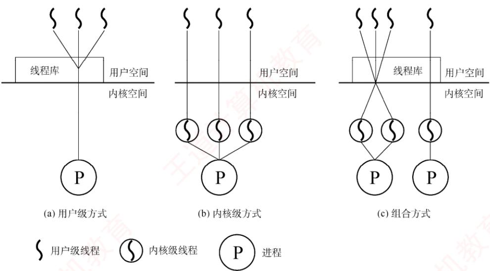  
图2.6 用户级线程和内核级线程

其缺点在于：①系统调用的阻塞问题，当某个用户级线程执行一个阻塞型系统调用时，整个进程会被内核挂起，导致进程中的所有线程均被阻塞。②无法发挥多处理器的并行优势，由于内核仅将该进程调度到一个CPU上执行，即使系统配备了多个CPU核心，同一进程中的多个用户级线程也无法同时在不同CPU上并行运行，只能在单个CPU上交替执行。

## （2）内核级线程（KLT）

在操作系统中，无论是系统进程还是用户进程，都依赖内核的支持运行。内核级线程的管理完全由操作系统内核负责，所有线程相关的操作均在内核空间（内核态）完成。操作系统为每个内核级线程维护一个线程控制块（TCB），内核通过该TCB感知线程的存在并对其进行控制。图2.6(b)展示了内核级线程的实现方式。

这种实现方式的优点：①能发挥多处理器的并行优势，内核可将同一进程中的多个线程同时调度到不同CPU核心上并行执行。②阻塞处理更灵活，若进程中的某个线程因系统调用被阻塞，内核仍可调度该进程中的其他线程运行，或切换到其他进程的线程继续执行。③内核自身可采用多线程技术，从而提升系统服务的并发性和整体效率。

其缺点在于：线程切换需从用户态陷入内核态。由于线程在用户态运行，而调度由内核完成，每次切换都涉及模式转换和上下文保存/恢复，系统开销较大。

## （3）组合方式

某些系统采用组合方式（混合模型）实现多线程。在该模型中，内核支持多个内核级线程的创建与调度，同时允许用户程序在用户空间管理多个用户级线程。这种方式能结合两种模型的优点，并克服各自的不足：多个线程可在多CPU上并行执行；单个线程阻塞不会导致整个进程挂起；用户级线程切换可在用户空间快速完成，减少内核介入。图2.6(c)展示了这种组合实现方式。根据用户级线程与内核级线程之间的映射关系不同，形成了以下三种典型的多线程模型：

1）多对一模型。将多个用户级线程映射到一个内核级线程，如图2.7(a)所示。线程的调度和

管理在用户空间完成。每个进程仅拥有一个内核级线程，仅当用户线程需要访问内核时，

才将其映射到一个内核级线程上，但每次只允许一个线程进行映射。

优点：线程管理在用户空间进行，无须切换到内核态，因此线程切换的效率较高。

缺点：当任一用户级线程执行阻塞型系统调用时，整个进程都会被内核挂起；在任何时刻最多只能有一个线程与内核交互，无法在多处理器系统中实现并行执行。

(a) 多对一模型  
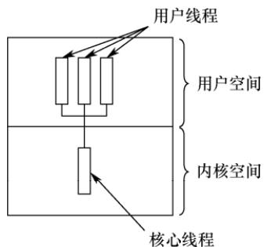

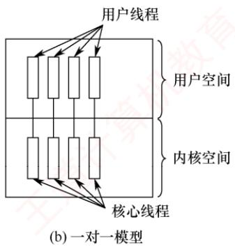

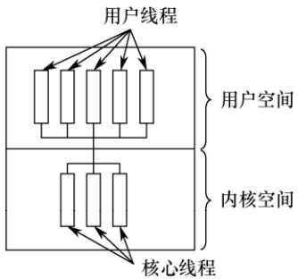  
(c) 多对多模型  
图 2.7 多线程模型

2）一对一模型。将每个用户级线程映射到一个独立的内核级线程，如图2.7(b)所示。进程中的用户级线程与内核级线程一一对应，线程的调度由内核完成，需要切换到内核态。

优点：当某个线程被阻塞时，内核可调度同一进程中的其他线程运行，支持真正的并发执行，且可在多CPU系统上并行运行。

缺点：每创建一个用户线程，系统就必须创建一个对应的内核线程，导致较大的系统开销（如内核TCB占用内存、调度负担增加），限制了系统可支持的最大线程数。

3）多对多模型。将n个用户级线程映射到m个内核级线程，要求n≥m，如图2.7(c)所示。

用户级线程由应用程序在用户空间调度，而内核级线程由内核调度到多个CPU上执行。特点：既克服了多对一模型并发度低的缺陷，又避免了一对一模型资源开销过大的问题。同时兼具两者优点：用户级线程切换高效，且支持多核并行与阻塞隔离。

## （4）线程库（thread library）的实现

程序员通常通过线程库提供的API来创建和管理线程。线程库的实现主要有两种方式：

①纯用户空间实现：线程库完全位于用户空间，所有代码和数据结构均在用户态。调用库函数仅触发本地过程调用，无须陷入内核。此类实现对应用户级线程模型。

②内核支持实现：线程库的底层依赖操作系统内核。库中的API调用通常会触发系统调用，

由内核完成实际的线程操作。此类实现对应内核级线程模型。

目前广泛使用的三种主流线程库包括：POSIX Pthreads、Windows 线程 API和 Java 线程 API。Pthreads 是POSIX标准定义的线程API，其具体实现可基于用户级或内核级线程。Windows线程API 直接构建于 Windows 内核之上，属于内核级线程实现。Java 线程 API 允许在 Java 程序中直接创建线程。由于JVM运行于宿主操作系统之上，Java线程通常通过调用宿主系统的线程库实现，因此在 Windows 上使用 Windows API，在类UNIX 系统上则使用 Pthreads。

## 2.1.8 本节小结

本节开头提出的问题的参考答案如下。

## 1）为什么要引入进程？

在多道程序环境下，多个程序并发执行并共享系统资源，导致运行过程中相互制约，表现出间断性、异步性和不可预测性。然而，传统的“程序”仅是一组静态的指令集合，无法反映其在内存中的动态执行行为。例如，无法体现程序何时开始、何时暂停、如何与其他程序交互等。为了准确刻画程序并发执行的动态特性，并为操作系统提供有效的管理机制，进程这一概念被引入。进程是程序并发执行的基本单位，也是操作系统进行资源分配和调度的实体。

## 2）什么是进程？进程由什么组成？

进程是一个具有独立功能的程序在其特定数据集上的一次执行过程。它是一个动态的、活动的实体，不仅包含程序代码，还包含当前的执行状态（如程序计数器的值、处理器寄存器的内容等）。一个进程实体由程序段、相关数据段和PCB三部分构成。其中，PCB是进程存在的唯一标志，操作系统通过PCB感知并控制进程的整个生命周期。

## 3）引入进程主要解决了多道程序并发执行中的哪些关键问题？

引入进程有效解决了多道程序并发执行带来的三大问题：①失去封闭性：在缺乏进程机制的环境中，程序执行易受其他程序于扰（如共享内存被修改），导致行为不可控；进程通过地址空间隔离，为每个程序提供独立、受保护的执行环境，从而恢复一定程度的封闭性。②执行过程的间断性：程序可能因I/O请求、时间片用尽或调度决策而被中断；进程利用PCB保存和恢复执行上下文，确保中断后能准确、连续地继续执行。③结果不可再现性：在并发环境下，相同输入可能因执行顺序不确定而产生不同输出；进程的隔离机制与操作系统的调度策略共同保障了执行的可控性与结果的可再现性。通过为每个程序建立独立的进程实体，操作系统得以高效实现调度、切换、资源分配与保护，显著提升系统资源利用率和并发处理能力。 XV

本节主要围绕“什么是进程”展开阐述，旨在为后续内容奠定概念基础。然而，对于尚未接触过操作系统相关知识的读者而言，“进程”作为一个抽象的动态实体，可能仍显得模糊不清。为了帮助大家更直观地把握其本质，我们引入一个贴近生活的类比。

我们可以将进程类比为“人的生命历程”。首先，人的生命历程是一个动态的、过程性的存在，而非静态的描述：同样，进程也不是一段固定的程序代码，而是一次正在执行的活动。要研究生命历程，必须先明确其主体“人”：对应地，进程的主体是进程映像，它由程序段、数据段和PCB组成。其中，PCB就如同人的“身份标识”，记录了该进程的唯一身份与当前状态。人在一生中会经历多种状态：出生、成长、奋斗、受挫、康复、衰老乃至离世：类似地，进程在其生命周期中也会在创建、就绪、运行、阻塞、终止等状态之间转换。例如，一个人从“充满斗志”（就绪）进入“发奋图强”（运行）：若遭遇挫折，可能陷入“失落”（阻塞）：在他人鼓励下，又可重新“充满斗志”（回到就绪）。这正对应于进程从就绪态转换为运行态，因等待事件而进入阻塞态，待事件发生后再次返回就绪态的典型状态迁移。通过“人生历程”这一过程性视角来理解进程，有助于我们超越对“程序=进程”的误解，真正把握进程作为动态执行实体的核心特征。当然，任何类比都有其局限性。上述比喻虽有助于建立直觉，但不能替代严谨的技术定义。因此，建议读者在借助类比形成初步理解后，回过头来重新阅读本节前文的正式阐述。这种“感性认知→理性回归”的学习路径，往往能带来更深刻、更准确的理解。

这里再给出一些学习计算机科学的建议。许多同学在学习过程中容易陷入一个误区：过于关注定理和公式的应用，而忽视了对基础概念的理解。这一倾向往往源于长期应试训练，毕竟熟练套用公式和定理在考试中见效快、收益明显。然而，公式和定理的应用固然重要，唯有深入理解基础概念，才能真正透彻地掌握一门学科，进而激发兴趣，培养创造性思维。 XTA

## 2.1.9 本节习题精选

## 一、单项选择题

01.一个进程映像是（）。A. 由协处理器执行的一个程序 B. 一个独立的程序+数据集C. PCB 结构与程序和数据的组合 D. 一个独立的程序

02.进程之间交换数据不能通过（）途径进行。A. 共享文件 B. 消息传递C. 访问进程地址空间 D. 访问共享存储区

03. 进程与程序的根本区别是（）。A. 静态和动态特点 B. 是不是被调入内存C. 是不是具有就绪、运行和等待三种状态D. 是不是占有处理器

04.下列关于进程的描述中，最不符合操作系统对进程的理解的是（）。A. 进程是在多程序环境中的完整程序B. 进程可以由程序、数据和PCB描述C. 线程（Thread）是一种特殊的进程D. 进程是程序在一个数据集合上的运行过程，它是系统进行资源分配和调度的一个独立单元 V TA

05.下列关于并发进程特性的叙述中，正确的是（）。A. 进程是一个动态过程，其生命周期是连续的B. 并发进程执行完毕后，一定能够得到相同的结果C. 并发进程对共享变量的操作结果与执行速度无关D. 并发进程的运行结果具有不可再现性

06.下列关于进程的叙述中，正确的是（）。A. 进程获得处理器运行是通过调度得到的B. 优先级是进程调度的重要依据，一旦确定就不能改动C. 在单处理器系统中，任何时刻都只有一个进程处于运行态D. 进程申请处理器而得不到满足时，其状态变为阻塞态

07. 并发进程执行的相对速度是（）。A. 由进程的程序结构决定的 算机 B. 由进程自己来控制的C. 与进程调度策略有关 D. 在进程被创建时确定的

08.下列任务中，（）不是由进程创建原语完成的。A. 申请PCB 并初始化 B. 为进程分配内存空间

C. 为进程分配 CPU D. 将进程插入就绪队列

09. 下列关于进程和程序的叙述中，错误的是（）。A. 一个进程在其生命周期中可执行多个程序B. 一个进程在同一时刻可执行多个程序C. 一个程序的多次运行可形成多个不同的进程D. 一个程序的一次执行可产生多个进程

10. 下列选项中，导致创建新进程的操作是（）。I. 用户登录 I. 高级调度发生时Ⅲ. 操作系统响应用户提出的请求 IV. 用户打开了一个浏览器程序A. 仅I和IV B. 仅Ⅱ和IV C. I、ⅡI 和IV D. 全部

11. 操作系统是根据（）来对并发执行的进程进行控制和管理的。 NA. 进程的基本状态 B. 进程控制块 C. 多道程序设计 Y D. 进程的优先权

12.在任何时刻，一个进程的状态变化（）引起另一个进程的状态变化。A. 必定 B. 一定不 C. 不一定 D. 不可能

13. 在单处理器系统中，若同时存在10个进程，则处于就绪队列中的进程最多有（）个。A. 1 B. 8 C. 9 D. 10

14.一个进程释放了一台打印机，它可能改变（）的状态。A. 自身进程 B. 输入/输出进程C. 另一个等待打印机的进程 D. 所有等待打印机的进程

15. 系统进程所请求的一次I/0操作完成后，将使进程状态从（）。A. 运行态变为就绪态 C. 就绪态变为运行态 古计算 B. 运行态变为阻塞态 D. 阻塞态变为就绪态

16. 一个进程的基本状态可以从其他两种基本状态转变过去，这个基本的状态一定是（)。A. 运行态 B. 阻塞态 C. 就绪态 D. 终止态

17.在分时系统中，通常处于（）的进程最多。A. 运行态 B. 就绪态 C. 阻塞态 D. 终止态

18.并发进程失去封闭性，是指（）。A. 多个相对独立的进程以各自的速度向前推进B. 并发进程的执行结果与速度无关C. 并发进程执行时，在不同时刻发生的错误D.并发进程共享变量，其执行结果与速度有关

19. 通常用户进程被建立后，（）。A. 便一直存在于系统中，直到被操作人员撤销B. 随着进程运行的正常或不正常结束而撤销C. 随着时间片轮转而撤销与建立D. 随着进程的阻塞或者唤醒而撤销与建立

20. 进程在处理器上执行时，（）。A. 进程之间是无关的，具有封闭特性B. 进程之间都有交互性，相互依赖、相互制约，具有并发性C. 具有并发性，即同时执行的特性D. 进程之间可能是无关的，但也可能是有交互性的

21.下列关于父进程和子进程的叙述中，正确的是（）。A. 为了标志父子关系，可让子进程和父进程拥有相同的PIDB. 父进程和子进程是相互独立的，可以并发执行C. 撤销子进程时，一定会同时撤销父进程D. 父进程创建了子进程，要等父进程执行完后，子进程才能执行

22. 若一个进程实体由PCB、共享正文段、数据堆段和数据栈段组成，请指出下列C语言程序中的内容及相关数据结构各位于哪一段中。I. 全局赋值变量（） II. 未赋值的局部变量（）Ⅲ.函数调用实参传递值（） IV. 用 malloc()要求动态分配的存储区（）V.常量值（如1995、"string"）（） VI. 进程的优先级（）A. PCB B. 正文段 C. 堆段 D. 栈段

23. 同一程序经过多次创建，运行在不同的数据集上，形成了（）的进程。A. 不同 B. 相同 C. 同步 -XD. 互斥

24. PCB是进程存在的唯一标志，下列（）不属于 PCB。 王A. 进程 ID B. CPU 状态 C. 堆栈指针 D. 全局变量

25.一个计算机系统中，进程的最大数量主要受到（）限制。A. 内存大小 B. 用户数目 C. 打开的文件数 D. 外部设备数量

26. 进程创建完成后会进入一个序列，这个序列称为（）。A. 阻塞队列 B. 挂起序列 C. 就绪队列 D. 运行队列

27. 进程自身决定（）。A. 从运行态到阻塞态 そ计算机 B. 从运行态到就绪态C. 从就绪态到运行态 D. 从阻塞态到就绪态

28.下列关于原语操作的叙述中，错误的是（）。A. 操作系统使用原语对进程进行管理和控制B. 原语在执行过程中不允许被中断C. 原语在内核态下执行，常驻内存D. 原语被定义为“原子操作”，意思是其执行速度非常快

29. 下列进程间通信方式中，数据传输速度最快的是（）。A. 消息传递 B. 信号量 C. 共享内存 D. 管道

30.信箱通信是一种（）通信方式。A. 直接通信 B. 间接通信 C. 低级通信 X D. 信号量

31.下列关于信号发送和处理的描述中，错误的是（）。A. 一个进程可以给自己发送信号B. 操作系统的内核可以给进程发送信号C. 操作系统的内核对每种信号都有默认处理程序D. 用户可以对每种信号自定义处理函数

32.下列关于信号的处理的描述中，错误的是（）。A. 当进程从内核态转换为用户态时，会检查是否有待处理的信号B. 当进程从用户态转换为内核态时，也会检查是否有待处理的信号C. 操作系统对某些信号的处理是可以忽略的D. 操作系统允许进程通过系统调用，自定义某些信号的处理程序

33.下面的叙述中，正确的是（）。A. 引入线程后，处理器只能在线程间切换B. 引入线程后，处理器仍在进程间切换C. 线程的切换，不会引起进程的切换D. 线程的切换，可能引起进程的切换

34.下列关于线程的叙述中，正确的是（）。A. 线程包含CPU现场，可以独立执行程序B. 每个线程都有自己独立的地址空间C. 每个进程只能包含一个线程D. 同一进程中的线程间通信也必须使用系统调用函数

35.下面的叙述中，正确的是（）。A. 线程是比进程更小的能独立运行的基本单位，可以脱离进程独立运行B.引入线程可提高程序并发执行的程度，可进一步提高系统效率C. 线程的引入增加了程序执行时的时空开销 王道D. 一个进程一定包含多个线程

36.下面的叙述中，正确的是（）。A. 同一进程内的线程可并发执行，不同进程的线程只能串行执行B. 同一进程内的线程只能串行执行，不同进程的线程可并发执行C. 同一进程或不同进程内的线程都只能串行执行D. 同一进程或不同进程内的线程都可以并发执行

37.下列选项中，（）不是线程的优点。A. 提高系统并发性 C. 切换开销小 道计 B. 节约系统资源 D. 增强进程安全性

38. 下列关于进程和线程的说法中，正确的是（）。A.一个进程可以包含一个或多个线程，一个线程可以属于一个或多个进程B. 多线程技术具有明显的优越性，如速度快、通信简便、设备并行性高等C. 由于线程不作为资源分配单位，线程之间可以无约束地并行执行D. 线程也称轻量级进程，因为线程都比进程小

39.在下列描述中，（）并不是多线程系统的特长。A. 利用线程并行地执行矩阵乘法运算B. Web 服务器利用线程响应 HTTP 请求C. 键盘驱动程序为每个正在运行的应用配备一个线程，用以响应该应用的键盘输入D. 基于GUI的调试程序用不同的线程分别处理用户输入、计算和跟踪等操作

40.在进程转换时，下列（）转换是不可能发生的。A. 就绪态→运行态 B. 运行态→就绪态C. 运行态→阻塞态 D. 阻塞态→运行态

41. 当（）时，进程从执行状态转换为就绪态。A. 进程被调度程序选中 B. 时间片到时C. 等待某一事件 D. 等待的事件发生

42. 两个合作进程（Cooperating Processes）无法利用（）交换数据。A. 文件系统 B. 共享内存

C. 高级语言程序设计中的全局变量 D. 消息传递系统

43. 以下可能导致一个进程从运行态变为就绪态的事件是（）。A. 一次 I/O 操作结束 B. 运行进程需做I/O操作C. 运行进程结束 首计算 D. 出现了比现在进程优先级更高的进程

44.（）必会引起进程切换。A. 一个进程创建后，进入就绪态 B. 一个进程从运行态变为就绪态C. 一个进程从阻塞态变为就绪态 D. 以上答案都不对

45. 进程处于（）时，它处于非阻塞态。A. 等待从键盘输入数据 B. 等待协作进程的一个信号C. 等待操作系统分配 CPU 时间 D. 等待网络数据进入内存

46.一个进程被唤醒，意味着（）。A. 该进程可以重新竞争CPU B. 优先级变大C. PCB 移动到就绪队列之首 D. 进程变为运行态

47. 进程创建时，不需要做的是（）。A. 填写一个该进程的进程表项 B. 分配该进程适当的内存C. 将该进程插入就绪队列 D. 为该进程分配 CPU

48. 下面关于用户级线程和内核级线程的描述中，错误的是（）。A. 采用轮转调度算法，进程中设置内核级线程和用户级线程的效果完全不同B. 跨进程的用户级线程调度也不需要内核参与，控制简单C. 用户级线程可以在任何操作系统中运行D. 若系统中只有用户级线程，则CPU的调度对象是进程

49. 在内核级线程相对于用户级线程的优点的如下描述中，错误的是（）A. 同一进程内的线程切换，系统开销小B. 当内核线程阻塞时，同一进程中的其他内核级线程仍可被调度C. 内核级线程的程序实体可以在内核态运行D. 对多处理器系统，核心可以同时调度同一进程的多个线程并行运行

50.下列关于用户级线程相对于内核级线程的优点的描述中，错误的是（）A. 一个线程阻塞不影响另一个线程的运行B. 线程的调度不需要内核直接参与，控制简单C. 线程切换代价小 首计算D. 允许每个进程定制自己的调度算法，线程管理比较灵活

51.下列关于用户级线程的优点的描述中，不正确的是（）。 王A. 线程切换不需要切换到内核态B. 支持不同的应用程序采用不同的调度算法C. 在不同操作系统上不经修改就可直接运行D. 同一个进程内的多个线程可以同时调度到多个处理器上执行

52. 下列选项中，可能导致用户级线程切换的事件是（）。A. 系统调用 B. I/O 请求 C. 异常处理 D. 线程同步

53.下列关于用户级线程的描述中，错误的是（）。A. 用户级线程由线程库进行管理B. 用户级线程只有在创建和调度时需要内核的干预

C. 操作系统无法直接调度用户级线程D. 线程库中线程的切换不会导致进程切换

54.下面的说法中，正确的是（）。A. 不论是系统支持的线程还是用户级线程，其切换都需要内核的支持B. 线程是资源分配的单位，进程是调度和分派的单位C. 不管系统中是否有线程，进程都是拥有资源的独立单位D. 在引入线程的系统中，进程仍是资源调度和分派的基本单位

55. 在多对一的线程模型中，当一个多线程进程中的某个线程被阻塞后，（)。加A. 该进程的其他线程仍可继续运行 B. 整个进程都将阻塞C. 该阻塞线程将被撤销 D. 该阻塞线程将永远不可能再执行

56. 并发性较好的多线程模型有（）。I. 一对一模型 II. 多对一模型 III. 多对多模型A.仅I B. I和Ⅱ C. I和Ⅲ D. I、IⅡI和ⅢII

57.下列关于多对一模型的叙述中，错误的是（）。A. 一个进程的多个线程不能并行运行在多个处理器上B. 进程中的用户级线程由进程自己管理C. 线程切换会导致进程切换育D. 一个线程的系统调用会导致整个进程阻塞

58.【2010统考真题】下列选项中，导致创建新进程的操作是（）。I. 用户登录成功 II. 设备分配 . 启动程序执行A. 仅I和Ⅱ B. 仅Ⅱ和Ⅲ C. 仅I和Ⅲ D. I、II、III

59.【2011统考真题】在支持多线程的系统中，进程P创建的若干线程不能共享的是（）。A. 进程P的代码段 王道 B. 进程P中打开的文件C. 进程P的全局变量 D. 进程P 中某线程的栈指针

60.【2012统考真题】下列关于进程和线程的叙述中，正确的是（）。A. 不管系统是否支持线程，进程都是资源分配的基本单位B. 线程是资源分配的基本单位，进程是调度的基本单位C. 系统级线程和用户级线程的切换都需要内核的支持D. 同一进程中的各个线程拥有各自不同的地址空间

61.【2014统考真题】一个进程的读磁盘操作完成后，操作系统针对该进程必做的是（）。A. 修改进程状态为就绪态 B. 降低进程优先级C. 给进程分配用户内存空间 D. 增加进程时间片大小

62. 【2014统考真题】下列关于管道（Pipe）通信的叙述中，正确的是（）。A. 一个管道可实现双向数据传输B. 管道的容量仅受磁盘容量大小限制C. 进程对管道进行读操作和写操作都可能被阻塞D. 一个管道只能有一个读进程或一个写进程对其操作

63.【2015统考真题】下列选项中，会导致进程从运行态变为就绪态的事件是（）。A. 执行 P(wait)操作 B. 申请内存失败C. 启动I/O 设备 首计 D. 被高优先级进程抢占

64.【2018统考真题】下列选项中，可能导致当前进程P阻塞的事件是（）。I. 进程P 申请临界资源II. 进程P从磁盘读数据I. 系统将CPU 分配给高优先权的进程A. 仅I B. 仅Ⅱ C. 仅I、ⅡI D. I、II、III

65.【2019统考真题】下列选项中，可能将进程唤醒的事件是（）。I. I/O 结束 II. 某进程退出临界区. 当前进程的时间片用完A. 仅I XTA B. 仅Ⅲ C. 仅I、ⅡI D. I、II、III

66.【2019统考真题】下列关于线程的描述中，错误的是（）。A. 内核级线程的调度由操作系统完成B. 操作系统为每个用户级线程建立一个线程控制块C. 用户级线程间的切换比内核级线程间的切换效率高D.用户级线程可以在不支持内核级线程的操作系统上实现

67.【2020统考真题】下列关于父进程与子进程的叙述中，错误的是（）。A. 父进程与子进程可以并发执行B. 父进程与子进程共享虚拟地址空间C. 父进程与子进程有不同的进程控制块D. 父进程与子进程不能同时使用同一临界资源

68.【2021统考真题】下列操作中，操作系统在创建新进程时，必须完成的是（）。I. 申请空白的进程控制块Ⅱ. 初始化进程控制块Ⅲ. 设置进程状态为运行态A. 仅I B. 仅I、Ⅱ C. 仅I、ⅢII D. 仅II、III

69. 【2022统考真题】下列事件或操作中，可能导致进程P由运行态变为阻塞态的是（）。I. 进程 P读文件 王 II. 进程P的时间片用完III. 进程P申请外设 IV. 进程 P 执行信号量的 wait()操作A. 仅I、IV B. 仅Ⅱ、ⅢII C. 仅II、IV D. 仅I、III、IV

70. 【2023统考真题】下列操作完成时，导致CPU从内核态转换为用户态的是（）。A. 阻塞进程 B. 执行 CPU 调度C. 唤醒进程 D. 执行系统调用

71.【2023统考真题】下列由当前线程引起的事件或执行的操作中，可能导致该线程由运行态变为就绪态的是（）。A. 键盘输入 B. 缺页异常C. 主动出让 CPU D. 执行信号量的 wait()操作

72.【2024统考真题】下列选项中，操作系统在终止进程时不一定执行的是（）。A. 终止子进程 B. 回收进程占用的设备C. 释放进程控制块 D. 回收为进程分配的内存

73.【2024统考真题】若进程P中的线程T先打开文件，得到文件描述符fd，再创建两个线程Ta和 Tb，则在下列资源中，Ta与 Tb 可共享的是（)。I. 进程P的地址空间 Ⅱ. 线程 T 的栈 III. 文件描述符 fdA. 仅I B. 仅I、ⅢI C.仅ⅡI、II D. I、II、III

## 二、综合应用题

01. 【2025统考真题】某系统中进程的虚拟地址空间包括内核区、用户栈、运行时堆、可读/

请回答下列问题。

写数据段、只读代码段等区域，其布局如下图所示，图中阴影部分表示未占用区域。现有C语言程序的部分代码如下。

char \*ptr;   
内核区   
void main() 王道计   
用户栈   
int length;   
ptr = (char \*)malloc(100);   
scanf("%s", ptr); 运行时堆   
length = strlen(ptr);   
printf("length = %d\n", length); 可读写数据段   
free(ptr); 只读代码段

1）上述程序执行时，其进程控制块位于哪个区域？执行scanf()等待键盘输入时，该进程处于什么状态？

2）main()函数的代码位于哪个区域？其直接调用的哪些函数的功能需通过执行驱动程序实现？

3）变量ptr被分配在哪个区域？若变量length未被分配在寄存器中，则会被分配在哪个区域？ptr指向的字符串位于哪个区域？ X

## 2.1.10 答案与解析

## 一、单项选择题

## 01. C

进程映像是PCB、程序段和数据的组合，其中PCB是进程存在的唯一标志。

## 02. C

每个进程包含独立的地址空间，进程各自的地址空间是私有的，只能执行自己地址空间中的程序，且只能访问自己地址空间中的数据，相互访问会导致指针的越界错误（学完内存管理将有更好的认识）。因此，进程之间不能直接交换数据，但可利用操作系统提供的共享文件、消息传递、共享存储区等进行通信。

## 03. A

动态性是进程最重要的特性，以此来区分文件形式的静态程序。操作系统引入进程的概念，是为了从变化的角度动态地分析和研究程序的执行。

## 04.A

进程是一个独立的运行单位，也是操作系统进行资源分配和调度的基本单位，它包括PCB、程序和数据以及执行栈区，仅仅说进程是在多程序环境下的完整程序是不合适的，因为程序是静态的，它以文件形式存放在计算机的硬盘内，而进程是动态的。

## 05. D

并发进程可能因等待资源或因被抢占CPU而暂停运行，其生命周期是不连续的。执行速度会影响进程之间的执行顺序和内存冲突问题，从而导致不同的操作结果。并发进程之间存在相互竞争和制约，导致每次运行可能得到不同的结果，选项D正确。

## 06. A

选项B错在优先级分静态和动态两种，动态优先级是根据运行情况而随时调整的。选项C

错在系统发生死锁时有可能进程全部都处于阻塞态，CPU空闲。选项D错在进程申请处理器得不到满足时就处于就绪态，等待处理器的调度。

## 07. C

并发进程执行的相对速度与进程调度策略有关，因为进程调度策略决定了哪些进程可以获得处理机，以及获得处理机的时间长短，从而影响进程执行的速度和效率。

## 08. C

进程创建原语的执行过程：申请空白PCB，并为新进程申请唯一的数字标识符。为新进程分  
配资源，包括内存、I/O设备等。初始化PCB，将新进程插入就绪队列。从上述过程可以看出，  
为进程分配CPU不是由进程创建原语完成的，而是由进程调度实现的。K

## 09. B

一个进程可以顺序地执行一个或多个程序，只要在执行过程中改变其CPU状态和内存空间即可，但不能同时执行多个程序，选项B错误，选项A正确。一个程序可以对应多个进程，即多个进程可以执行同一个程序。例如，同一个文本编辑器可以被多个用户或多个窗口同时运行，每次运行都形成一个新进程。一个程序在执行过程中也可产生多个进程。例如，一个程序可以通过系统调用fork()或create()来创建子进程，从而实现并发处理或分布式计算。选项C和D正确。

## 10. D

用户登录时，操作系统会为用户创建一个登录进程，用于验证用户身份和提供用户界面。高级调度即作业调度，会从后备队列上选择一个作业调入内存，并为之创建相应的进程。操作系统响应用户提出的请求时，通常会为用户创建一个子进程，用于执行用户指定的任务或程序。用户打开一个浏览器程序时，也是一种操作系统响应用户请求的情况，同样会创建一个新进程。

## 11. B

在进程的整个生命周期中，系统总是通过其PCB对进程进行控制。也就是说，系统是根据进程的PCB而非任何其他因素来感知到进程存在的，PCB是进程存在的唯一标志。同时PCB常驻内存。A和D选项的内容都包含在进程PCB中。

## 12. C

一个进程的状态变化可能引起另一个进程的状态变化。例如，一个进程时间片用完，可能引起另一个就绪进程的运行。同时，一个进程的状态变化也可能不会引起另一个进程的状态变化。例如，一个进程由阻塞态转换为就绪态就不会引起其他进程的状态变化。 X

## 13. C

在单处理器系统中，不可能出现10个进程都处于就绪态的情况。但9个进程处于就绪态、1个进程处于运行态是可能的。此外还要想到，可能10个进程都处于阻塞态。

## 14. C

由于打印机是独占资源，当一个进程释放打印机后，另一个等待打印机的进程就可能从阻塞态转到就绪态。当然，也存在一个进程执行完毕后由运行态转换为终止态时释放打印机的情况，但这并不是由于释放打印机引起的，相反是因为运行完成才释放了打印机。

## 15. D

I/O操作完成之前进程在等待结果，状态为阻塞态；完成后进程等待事件就绪，变为就绪态。

## 16. C

只有就绪态可以既由运行态转变过去又能由阻塞态转变过去。时间片到时，运行态变为就绪态；当所需要资源到达时，进程由阻塞态转换为就绪态。

## 17. B

分时系统中处于就绪态的进程最多，这些进程都在争夺CPU的使用权，而CPU的数量是有

限的。处于运行态的进程只能有一个或少数几个。处于阻塞态的进程也不会太多，阻塞事件的发生频率不会太高。处于终止态的进程也不多，这些进程已释放资源，不再占用内存空间。

## 18. D

程序封闭性是指进程执行的结果只取决于进程本身，不受外界影响。也就是说，进程在执行过程中不管是不停顿地执行，还是走走停停，进程的执行速度都不会改变它的执行结果。失去封闭性后，不同速度下的执行结果不同。

## 19. B

进程有它的生命周期，不会一直存在于系统中，也不一定需要用户显式地撤销。进程在时间片结束时只是就绪，而不是撤销。阻塞和唤醒是进程生存期的中间状态。进程可在完成时撤销，或在出现内存错误等时撤销。

## 20. D

选项A和B都说得太绝对，进程之间可能具有相关性，也可能是相互独立的。选项C错在“同时”。-

## 21. B

虽然父进程创建了子进程，它们有一定的关系，但仍然是两个不同的进程，拥有各自的PID，选项A错误。父进程和子进程是相互独立的，两个进程能并发执行，且互不影响，选项B正确，选项D错误。撤销一个进程并不一定会导致另一个进程也被撤销，父进程撤销后，子进程可能有两种状态：①子进程一并被终止；②子进程成为孤儿进程，被init进程领养。子进程撤销不会导致父进程撤销，选项C错误。

## 22.B、D、D、C、B、A

C语言编写的程序在使用内存时一般分为三个段：正文段（代码和赋值数据段）、数据堆段和数据栈段。二进制代码和常量存放在正文段，动态分配的存储区存放在数据堆段，临时使用的变量存放在数据栈段。由此，我们可以确定全局赋值变量在正文段赋值数据段，未赋值的局部变量和实参传递在栈段，动态内存分配在堆段，常量在正文段，进程的优先级只能在PCB内。

## 23. A

进程是程序的一次执行过程，它不仅包括程序的代码，还包括程序的数据和状态。同一个程序经过多次创建，运行在不同的数据集上，会形成不同的进程，它们之间没有必然的联系。

## 24. D

进程实体主要是代码、数据和PCB。因此，要清楚了解PCB内所含的数据结构内容，主要有四大类：进程标志信息、进程控制信息、进程资源信息、CPU现场信息。由此可知，全局变量与PCB无关，而只与用户代码有关。 vX

## 25.A

进程的创建和运行需要占用内存空间，包括PCB、代码段、数据段、堆栈等；系统可用内存总量直接决定了可同时存在的最大进程数量，若内存不足，则无法为新进程分配所需空间，选项A正确。用户数目仅影响登录会话数，打开的文件数和外部设备数量分别约束I/O资源的使用。

## 26. C

我们先要考虑创建进程的过程，当该进程所需的资源分配完成而只等CPU时，进程的状态为就绪态，因此所有的就绪PCB一般以链表方式链成一个序列，称为就绪队列。

## 27. A

进程在运行过程中，若主动执行如read(、wait(等系统调用，以请求I/O操作或等待资源，会自行触发从运行态到阻塞态的转换，选项A正确。而其他状态的转换均由内核控制：运行态转

换为就绪态通常由时间片耗尽或高优先级进程抢占引起，就绪态转换为运行态由调度程序决定，阻塞态转换为就绪态则依赖外部事件（如I/O完成）触发。这些转换均非进程自身所能决定。

## 28. D

原语是由若于条指令组成的、用于实现某个特定功能的程序段。它与一般的程序的区别如下：它是“原子操作”，即一个操作中的所有动作要么全做，要么全不做，在执行过程中不允许被中断，因此“原子操作”并不是指执行速度快，选项D错误。对进程的管理和控制功能是通过各种原语实现的，如创建原语等。原语是操作系统内核的组成部分，它常驻内存，且在内核态下执行。

## 29. C

共享内存是最快的进程间数据传输方式，它允许多个进程直接访问同一块物理内存区域，无须内核参与数据拷贝，也避免了用户态与内核态之间的模式切换；而消息传递和管道均需通过内核中转，数据传输过程涉及两次数据拷贝（用户→内核→用户）和两次模式切换，开销显著；信号量并非数据传输机制，仅用于同步与互斥，不能传递数据，故选项C正确。

## 30. B

信箱通信属于消息传递中的间接通信方式，因为信箱通信借助于收发双方进程之外的共享数据结构作为通信中转，发送方和接收方不直接建立联系，没有处理时间上的限制，发送方可以在任何时间发送信息，接收方也可以在任何时间接收信息。

## 31. D

有些信号是不能被用户自定义处理函数的，只能执行操作系统默认的处理程序，选项D错误。

## 32. B

信号的处理时机只会在进程从内核态转换为用户态时。当进程从用户态转换为内核态时，不会检查是否有待处理的信号，选项B错误。操作系统对某些信号的默认处理可能就是忽略。

## 33. D

在同一进程中，线程的切换不会引起进程的切换。当从一个进程中的线程切换到另一个进程中的线程时，才会引起进程的切换，因此选项A、B、C错误。

## 34. A

线程的CPU现场是指线程运行时所需的一组寄存器的值，包括程序计数器、状态寄存器、通用寄存器和栈指针等。当线程切换时，操作系统会保存当前线程的CPU现场，并恢复下一个线程的CPU现场。线程是CPU调度的基本单位，当然可以独立执行程序，选项A正确。线程没有自己独立的地址空间，它共享其所属进程的空间，选项B错误。进程可以创建多个线程，选项C错误。同一个进程中的线程间通信可以直接通过它们共享的存储空间，选项D错误。

## 35. B

线程是进程内一个相对独立的执行单元，但不能脱离进程单独运行，只能在进程中运行。引入线程是为了减少程序执行时的时空开销。一个进程可包含一个或多个线程。

## 36. D

同一个进程或不同进程内的线程可以并发执行，并发是指多个线程在一段时间内交替执行，而不一定是同时执行的。在多核CPU中，同一个进程或不同进程内的线程可以并行执行，并行是指多个线程在同一时刻同时执行。若实现了并行，则一定也实现了并发。

## 37. D

线程相比进程的核心优势体现在粒度更细与开销更小上：一个进程可包含多个线程并发执行，显著提升系统并发性；线程不拥有独立的内存空间，仅需少量私有数据结构，资源占用远低于进程；线程切换无须切换地址空间，仅保存和恢复少量上下文，开销更低：但因为线程共享进程资源，一个线程出错可能影响整个进程，无法增强进程安全性，选项D错误。

## 38. B

一个进程可以包含一个或多个线程，但一个线程只能属于一个进程，选项A错误。线程共享进程的资源，但线程之间不能无约束地并行执行，因为线程之间还需要进行同步和互斥，以免造成数据的不一致和冲突，选项C错误。线程也称轻量级进程，但并不能说所有线程都比进程小，选项D错误。

## 39. C

整个系统只有一个键盘，而且键盘输入是人的操作，速度比较慢，完全可以使用一个线程来处理整个系统的键盘输入。

## 40. D

阻塞的进程在获得所需资源时只能由阻塞态转换为就绪态，并插入就绪队列，而不能直接转换为运行态。 KX

## 41. B

进程的时间片到时间后，系统会暂停其执行，并将其从运行态转换为就绪态，等待下一次被调度，选项B正确。进程被调度程序选中时，从就绪态转换为执行状态；等待某一事件时，进程由执行状态转换为阻塞态；等待的事件发生时，进程由阻塞态转换为就绪态。

## 42. C

不同的进程拥有不同的代码段和数据段，全局变量是对同一进程而言的，在不同的进程中是不同的变量，没有任何联系，所以不能用于交换数据。此题也可用排除法做，选项A、B、D均是课本上所讲的。管道是一种文件。

## 43. D

进程处于运行态时，它必须已获得所需的资源，在运行结束后就撤销。只有在时间片到时或出现了比现在进程优先级更高的进程时才转变成就绪态。选项A使进程从阻塞态到就绪态，选项B使进程从运行态到阻塞态，选项C使进程撤销。

## 44. B

进程切换是指CPU调度不同的进程执行，当一个进程从运行态变为就绪态时，CPU调度另一个进程执行，引起进程切换。

## 45. C

进程有三种基本状态，处于阻塞态的进程由于某个事件不满足而等待。这样的事件一般是I/O操作，如键盘等，或是因互斥或同步数据引起的等待，如等待信号或等待进入互斥临界区代码段等，等待网络数据进入内存是为了进程同步。而等待CPU调度的进程处于就绪态，只有它是非阻塞态。

## 46. A

当一个进程被唤醒时，这个进程就进入了就绪态，等待进程调度而占有CPU运行。进程被唤醒在某种情形下优先级可以增大，但一般不会变为最大，而由固定的算法来计算。也不会在唤醒后位于就绪队列的队首，就绪队列是按照一定的规则赋予其位置的，如先来先服务，或者高优先级优先，或者短进程优先等，更不能直接占有处理器运行。

## 47. D

进程创建原语完成的工作是：向系统申请一个空闲PCB，为被创建进程分配必要的资源，然后将其PCB初始化，并将此PCB插入就绪队列，最后返回一个进程标志号。当调度程序为进程分配CPU后，进程开始运行。所以进程创建的过程中不会包含分配CPU的过程，这不是进程创建者的工作，而是调度程序的工作。

## 48. B

用户级线程的调度仍以进程为单位，各个进程轮流执行一个时间片，假设进程A包含1个用户级线程，而进程B包含100个用户级线程，此时进程A中单个线程的运行时间将是进程 B中各个线程平均运行时间的100倍；内核级线程的调度是以线程为单位的，各个线程轮流执行一个时间片，同样假设进程A包含1个内核级线程，而进程B包含100个内核级线程，此时进程B的运行时间将是进程A的100倍，选项A正确。用户级线程的调度单位是进程，跨进程的线程调度需要内核支持，选项B错误。用户级线程是由用户程序或函数库实现的，不依赖于操作系统的支持，选项C正确。用户级线程对操作系统是透明的，CPU调度的对象仍然是进程，选项D正确。

## 49. A

在内核级线程中，同一进程中的线程切换，需要从用户态转到内核态进行，系统开销较大，选项A错误。CPU调度是在内核中进行的，在内核级线程中，调度是在线程一级进行的，因此内核可以同时调度同一进程的多个线程在多CPU上并行运行（用户级线程则不行），选项B正确、选项D正确。内核级线程可以在内核态执行系统调用子程序，直接利用系统调用为它服务，因此选项C正确。注意，用户级线程是在用户空间中实现的，不能直接利用系统调用获得内核的服务，当用户级线程要获得内核服务时，必须借助于操作系统的帮助，因此用户级线程只能在用户态运行。

## 50. A

进程中的某个用户级线程被阻塞，则整个进程也被阻塞，即进程中的其他用户级线程也被阻塞，选项A错误。用户级线程的调度是在用户空间进行的，节省了模式切换的开销，不同进程可以根据自身的需要，对自己的线程选择不同的调度算法，因此选项B、C和D都正确。

## 51. D

用户级线程是不需要内核支持而在用户程序中实现的线程，不能利用多处理器的并行性，因为操作系统只能看到进程。其余说法均正确。 X

## 52. D

本题可用排除法。用户级线程的切换是由应用程序自己控制的，不需要操作系统的于预，操作系统感受不到用户级线程的存在。因此，系统调用、I/O请求和异常处理这些涉及内核态的事件都不会导致用户级线程切换，但会导致内核级线程切换。线程同步是指多个线程之间协调执行顺序的机制，如互斥锁、信号量、条件变量等。当一个线程在等待同步条件时，应用程序可以选择切换到另一个就绪的用户级线程，以提高CPU的利用率。

## 53. B

用户级线程不依赖于操作系统内核，而是由用户程序自己实现的，选项A正确。用户级线程的创建和调度都是在用户态下实现的，不需要切换到内核态，选项B错误。操作系统只能看到一个单线程进程，而不知道进程内部有多个用户级线程，选项C正确。线程库中线程的切换只涉及用户栈和寄存器等上下文的保存和恢复，不涉及内核栈和页表等内核上下文的切换，选项D正确。

## 54. C

引入线程后，进程仍然是资源分配的单位。内核级线程是处理器调度和分派的单位，线程本身不具有资源，它可以共享所属进程的全部资源，选项C正确，选项B、D明显错误。至于选项A，可以这样来理解：假如有一个内核进程，它映射到用户级后有多个线程，那么这些线程之间的切换不需要在内核级切换进程，也就不需要内核的支持。

## 55. B

在多对一的线程模型中，只有一个内核级线程，用户级线程的“多”对操作系统透明，因此操作系统内核只能感知到一个调度单位的存在。因此，该进程的一个线程被阻塞后，该进程就被阻塞，进程的其他线程当然也被阻塞。注意，作为对比，在一对一模型中将每个用户级线程都映射到一个内核级线程，因此当某个线程被阻塞时，不会导致整个进程被阻塞。

## 56. C

一对一模型和多对多模型能充分利用内核级线程，发挥多处理机的优势，能同时调度同一个进程中的多个线程并发执行，具有较好的并发性。

## 57. C

多对一模型中的线程切换不会导致进程切换，而是在用户空间进行的。其余说法均正确。

## 58. C

创建进程的原因主要有：①用户登录；②高级调度；③系统处理用户程序的请求；④用户程序的应用请求。对于说法I，用户登录成功后，系统要为此创建一个用户管理的进程，包括用户桌面、环境等，所有用户进程都会在该进程下创建和管理。对于说法Ⅱ，设备分配是通过在系统中设置相应的数据结构实现的，不需要创建进程，这是操作系统中I/O核心子系统的内容。对于说法，启动程序执行是引起创建进程的典型事件，启动程序执行属于③或④。

## 59. D

进程是资源分配的基本单位，线程是CPU调度的基本单位。进程的代码段、进程打开的文件、进程的全局变量等都是进程的资源，唯有进程中某线程的栈指针.（包含在线程TCB中）是属于线程的，属于进程的资源可以共享，属于线程的栈指针是独享的，对其他线程透明。

## 60. A

在引入线程后，进程依然是资源分配的基本单位，线程是调度的基本单位，同一进程中的各个线程共享进程的地址空间。在用户级线程中，有关线程管理的所有工作都由应用程序完成，无须内核的干预，内核意识不到线程的存在。

## 61. A

进程申请读磁盘操作时，因为要等待I/O操作完成，会把自身阻塞，此时进程变为阻塞态：I/O操作完成后，进程得到了想要的资源，会从阻塞态转换到就绪态（这是操作系统的行为）。而降低进程优先级、分配用户内存空间和增加进程的时间片大小都不一定会发生，选择选项A。

## 62. C

普通管道只允许单向通信，数据只能往一个方向流动，要实现双向数据传输，就需要定义两个方向相反的管道，选项A错误。管道是一种存储在内存中的、固定大小的缓冲区，管道的大小通常为内存的一页，其大小并不是受磁盘容量大小的限制，选项B错误。由于管道的读/写操作都可能遇到缓冲区满或空的情况，当管道满时，写操作会被阻塞，直到有数据读出；而当管道空时，读操作会被阻塞，直到有数据写入，因此选项C正确。一个管道可以有多个读进程或多个写进程对其进行操作，但是这会增加数据竞争和混乱的风险，为了避免这种情况，应使用互斥锁或信号量等同步机制来保证每次只有一个进程对管道进行读或写操作，选项D错误。

## 63. D

P(wait)操作表示进程请求某一资源，选项A、B和C都因为请求某一资源会进入阻塞态，而选项D只是被剥夺了CPU资源，进入就绪态，一旦得到CPU即可运行。

## 64. C

进程等待某资源为可用（不包括CPU）或等待输入/输出完成均会进入阻塞态，因此说法I、Ⅱ正确；说法Ⅲ中的情况发生时，进程进入就绪态，故说法Ⅲ错误。

## 65. C

当被阻塞进程等待的某资源（不包括CPU）可用时，进程将被唤醒。I/O结束后，等待该I/O结束而被阻塞的有关进程会被唤醒，说法Ⅰ正确：某进程退出临界区后，之前因需要进入该临界区而被阻塞的有关进程会被唤醒，说法Ⅱ正确：当前进程的时间片用完后进入就绪队列等待重新调度，优先级最高的进程获得CPU资源从就绪态变成运行态，说法Ⅲ错误。

## 66. B

应用程序没有进行内核级线程管理的代码，只有一个到内核级线程的编程接口，内核为进程及其内部的每个线程维护上下文信息，调度也是在内核中由操作系统完成的，选项A正确。用户级线程的控制块是由用户空间的库函数维护的，操作系统并不知道用户级线程的存在，用户级线程的控制块一般存放在用户空间的数据结构中，如链表或数组，由用户空间的线程库来管理。操作系统只负责为每个进程建立一个进程控制块，操作系统只能看到进程，而看不到用户级线程，所以不会为每个用户级线程建立一个线程控制块。但是，内核级线程的线程控制块是由操作系统创建的，当一个进程创建一个内核级线程时，操作系统会为该线程分配一个线程控制块，并将其加入内核的线程管理数据结构，选项B错误。用户级线程的切换可以在用户空间完成，内核级线程的切换需要操作系统帮助进行调度，因此用户级线程的切换效率更高，选项C正确。用户级线程的管理工作可以只在用户空间中进行，因此可以在不支持内核级线程的操作系统上实现，选项D正确。

## 67. B

父进程与子进程当然可以并发执行，选项A正确。父进程可与子进程共享一部分资源，但不能共享虚拟地址空间，在创建子进程时，会为子进程分配资源，如虚拟地址空间等，选项B错误。临界资源一次只能为一个进程所用，选项D正确。进程控制块（PCB）是进程存在的唯一标志，每个进程都有自己的PCB，选项C正确。

## 68. B

操作系统感知进程的唯一方式是通过进程控制块（PCB），所以创建一个新进程就是为其电请一个空白的进程控制块，并且初始化一些必要的进程信息，如初始化进程标志信息、初始化CPU状态信息、设置进程优先级等。说法I、Ⅱ正确。创建一个进程时，一般会为其分配除CPU外的大多数资源，所以一般将其设置为就绪态，让它等待调度程序的调度。

## 69. D

进程P读文件时，进程从运行态进入阻塞态，等待磁盘I/O完成，说法I正确。进程P的时间片用完，导致进程从运行态进入就绪态，转入就绪队列等待下次被调度，说法Ⅱ错误。进程P申请外设，若外设是独占设备且正在被其他进程使用，则进程P从运行态进入阻塞态，等待系统分配外设，说法Ⅲ正确。进程P执行信号量的wait操作，若信号量的值小于或等于0，则进程进入阻塞态，等待其他进程用signal(操作唤醒，说法IV正确。 X

## 70. D

操作系统通过执行软中断指令陷入内核态执行系统调用，系统调用执行完成后，恢复被中断的进程或设置新进程的CPU现场，然后返回被中断进程或新进程。只有系统调用是用户进程调用内核功能，CPU从用户态切换到内核态，执行完后再返回到用户态。选项A、B、C的操作都是在内核态进行的，执行前后都可能处在内核态，只有中断返回时才切换为用户态。

## 71. C

在等待键盘输入的操作中，当前线程处于阻塞态，键盘输入完成后，再调出相应的中断服务程序进行处理，由中断服务程序负责唤醒当前线程，选项A错误。当线程检测到缺页异常时，会调用缺页异常处理程序从外存调入缺失的页面，线程状态从运行态转换为阻塞态，选项B错误。当线程的时间片用完后，主动放弃CPU，此时若线程还未执行完，就进入就绪队列等待下次调度，此时线程状态从运行态转换为就绪态，选项C正确。线程执行wait()后，若成功获取资源，则线程状态不变，若未能获取资源，则线程进入阻塞态，选项D错误。

## 72. A

当操作系统终止进程时，所有的进程资源（如内存空间、进程控制块、设备、打开文件、I/O缓冲区等）都会被释放。有些系统不允许子进程在父进程已终止的情况下存在，对于这类系统，

若一个进程终止，则它的所有子进程也终止，这种现象称为级联终止。但是，不是所有操作系统都是这么设计的，因此终止子进程不一定在终止进程时执行。

## 73. B

线程可理解为轻量级进程，仅拥有一点必不可少、能保证独立运行的资源。例如，在每个线程中都有一个用于控制线程运行的线程控制块（TCB）、用于指示被执行指令序列的程序计数器、保留局部变量、少数状态参数和返回地址等的一组寄存器和堆栈。因此，线程T的栈空间是线程T所独有的，不会被线程Ta和Tb共享。多个线程共享所属进程所拥有的资源，进程P的线程可以访问进程P的全部地址空间和资源（如已打开的文件、定时器、信号量机构等）以及它申请到的I/O设备等。综上所述，Ta和Tb可共享的是进程P的地址空间和文件描述符fd。

## 二、综合应用题

## 01. 【解答】

1）进程控制块（PCB）是操作系统内核用于管理进程的核心数据结构，始终位于内核区。当进程执行scanf()等待键盘输入时，因需等待I/O完成而主动放弃CPU，进入阻塞态。

2）main()函数的代码存储在只读代码段中。scanf()和printf()虽为标准库函数，但其底层通过T 系统调用访问设备（如键盘、终端），最终依赖设备驱动程序完成实际I/O操作。

3）ptr是全局变量，被分配在可读/写数据段；length是 main()中的局部变量，若未被优化至寄存器，则分配在用户栈；ptr指向的字符串由malloc()动态分配，位于运行时堆中。

## 2.2 CPU 调度

在学习本节时，请读者思考以下问题：

## 1）为什么要进行CPU调度？

2）结合本章学习到的调度算法，思考哪些调度算法比较适合分时系统和实时系统？

希望读者能够在学习调度算法前，先自己思考一些调度算法，在学习的过程中注意将自己的想法与这些经典的算法进行比对，并学会计算一些调度算法的周转时间。

## 2.2.1 调度的概念

## 1. 调度的基本概念

在多道程序系统中，进程的数量通常远多于CPU的个数，因此多个进程争用CPU的情况在所难免。CPU调度是指按照一定的算法（兼顾公平性与效率），从就绪队列中选择一个进程，并将CPU分配给它运行，从而实现多个进程的并发执行。 交

CPU调度是多道程序操作系统的基础，也是操作系统设计的核心问题之一。

## 2. 调度的层次

一个作业从提交到完成，通常要经历以下三级调度，如图2.8所示。

## （1）高级调度（作业调度）

高级调度负责从外存后备队列中按照一定规则挑选一个或多个作业，为其分配内存、I/O设备等必要资源，并创建相应的进程，使其获得参与CPU竞争的资格。简言之，作业调度实现了内存与外存之间的调度。每个作业在整个生命周期中仅被调入一次、调出一次。

传统多道批处理系统普遍配备作业调度；而在分时系统或实时系统中，由于用户进程通常由

交互式命令直接创建，一般不设置独立的作业调度模块。

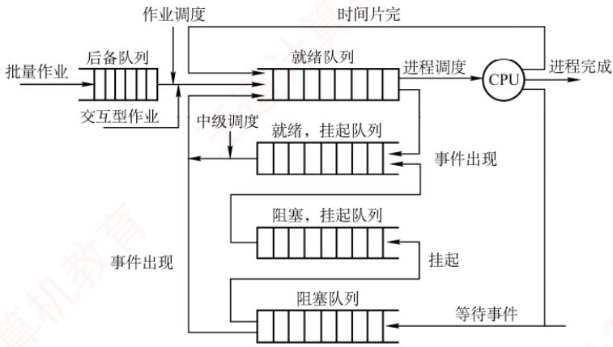  
图 2.8 CPU 的三级调度

## （2）中级调度（内存调度）

中级调度的引入旨在提高内存利用率和系统吞吐量。当系统内存紧张时，它会将某些暂时无法运行的进程（如处于阻塞态且等待时间较长的进程）换出到外存，此时的进程状态称为挂起态。此后，当这些进程具备运行条件且内存有空闲时，中级调度再将其换入内存，恢复为就绪态，并加入就绪队列等待调度。中级调度实际上是存储器管理中的对换功能。

## （3）低级调度（进程调度）

低级调度按照特定算法从就绪队列中选择一个进程，将CPU分配给它。这是最基础、最频繁的一级调度，在所有操作系统中都必须存在。其调度频率很高，通常每几十毫秒执行一次。

## 3. 三级调度的联系

在三级调度体系中，进程调度是最基本且不可或缺的，而作业调度和中级调度则根据系统类型和设计目标选择性配置。三级调度协同工作，共同完成作业从提交到终止的全过程：

1）作业调度为进程活动做准备，将作业调入内存并创建进程，使其具备参与调度的资格。

2）中级调度起调节作用，通过将暂时无法运行的进程换出至外存（挂起态），或在条件满足时将其重新换入内存（恢复为就绪态），动态调整内存中活跃进程的数量。

3）进程调度驱动实际执行，从就绪队列中选择进程投入运行，是实现并发的核心机制。

4）调度频率依次升高：作业调度频率最低，中级调度次之，进程调度频率最高。

## 2.2.2 进程调度

## 1. 进程调度任务

进程调度的任务主要包括：

①保存CPU现场信息。调度发生时，需要将当前进程的CPU状态（如程序计数器、通用寄存器等）完整保存至其PCB中，以确保后续能从断点恢复执行。

②选取待运行进程。调度程序依据特定算法（如时间片轮转、优先级调度等），从就绪队列中选取一个进程，将其状态由“就绪态”改为“运行态”。

③完成CPU 分配。由分派程序将选中进程PCB 中保存的 CPU现场加载到处理器寄存器中，移交CPU控制权，使其从上次断点处恢复执行。

## 2. 调度程序（调度器）

用于实现CPU调度与分派的软件组件称为调度程序，它通常由三部分组成，如图2.9所示。

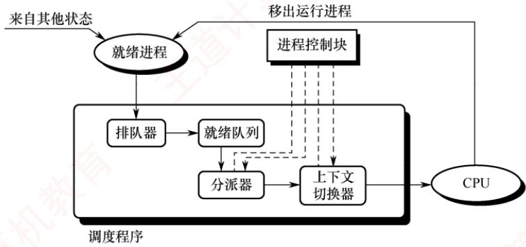  
图2.9 调度程序的结构

1）排队器。将系统中所有就绪进程按照特定策略组织成一个或多个就绪队列。每当有进程转换为就绪态时，排队器便将其插入相应的就绪队列，为后续调度选择提供基础。

2）分派器。根据调度算法选定的进程，分派器负责执行实际的CPU分配操作，其主要任务包括：从就绪队列中移出目标进程、触发上下文切换，并将CPU控制权转交给该进程。

3）上下文切换器。在对CPU进行切换时，会发生两对上下文的切换操作：第一对，将当前进程的上下文保存到其PCB中，再装入分派程序的上下文，以便分派程序运行；第二对，移出分派程序的上下文，将新选进程的CPU现场信息装入CPU的各个相应寄存器。

上下文切换需要执行大量1oad和store指令以保存寄存器内容，因此开销较大。目前已有硬件实现的方法来减少上下文切换时间。通常采用两组寄存器，一组供内核使用，另一组供用户使用。这样，在上下文切换时只需改变指针，使其指向当前所需的寄存器组即可。

## 3. 调度的时机、切换与过程

调度程序是操作系统内核程序。只有当请求调度的事件发生后，才会运行调度程序；而在调度出新的就绪进程之后，才会进行进程切换。理论上，这三个步骤应按顺序执行，但在实际的操作系统内核运行中，即使发生了引发调度的条件，也不一定能够立即进行调度与切换。

考点追踪可以进行CPU调度的事件或时机（2012、2021）

现代操作系统中，通常在以下情况下需要进行进程调度与切换：

1）创建新进程后，父进程和子进程都处于就绪态，因此需要决定是运行父进程还是子进程，调度程序可以合法地选择其中一个先运行。 道

2）进程正常结束或异常终止后，必须从就绪队列中选择某个进程运行：若没有就绪进程，则通常运行一个系统提供的闲逛进程。

3）当进程因I/O请求、信号量操作或其他原因而被阻塞时，必须调度其他进程运行。

4）当I/O设备准备就绪后，发出I/O中断，原先等待V/O的进程由阻塞态转换为就绪态，此时需决定是让该新就绪进程投入运行，还是让中断发生时正在运行的进程继续执行。

此外，在支持抢占的系统中，若更高优先级的进程进入就绪队列，或当前进程的时间片用完，也会触发调度并可能剥夺当前进程的CPU。

进程切换通常紧随调度之后发生，其核心任务是保存原进程的执行现场，并恢复新进程的现场。具体而言，操作系统内核会将原进程的上下文（包括程序计数器、寄存器状态等）保存到其

PCB或内核栈中；随后，从新进程的PCB或内核栈中加载其上下文，更新地址空间相关信息（如页表基址），重置程序计数器，并开始执行新进程。

然而，在以下情况下不能进行进程调度与切换：

1）处理中断的过程中。中断处理逻辑复杂，实现上难以安全地进行进程切换：同时，中断处理属于系统内核工作，逻辑上不隶属于任何用户进程，不应被剥夺CPU资源。

2）执行原子操作的过程中。如加锁、解锁、中断现场的保护与恢复等操作，通常需要屏蔽中断以保证原子性。在此期间，连中断都被禁止，更不应进行进程调度与切换。

若在上述不可调度期间发生了调度条件，系统会设置一个调度请求标志，待当前临界区或中断处理完成后，再根据该标志执行相应的调度与切换操作。 姚

## 4. 进程调度的方式

所谓进程调度方式，是指当某个进程正在CPU上执行时，若有某个更为重要或紧迫的进程需要处理，即有优先级更高的进程进入就绪队列，此时系统应如何分配CPU。

通常有以下两种进程调度方式：

1）非抢占调度方式，也称非剥夺方式。指当一个进程正在CPU上执行时，即使有某个更为重要或紧迫的进程进入就绪队列，系统仍让当前进程继续执行，直到该进程运行完成（例如正常结束或异常终止），或者因发生某种事件（如等待/操作、在进程通信或同步中执行了Block原语）而主动进入阻塞态，此时才会将CPU分配给其他进程。

非抢占调度方式的优点是实现简单、系统开销小，适用于早期的批处理系统；但它无法满足分时系统和大多数实时系统对及时响应的要求。

2）抢占调度方式，也称剥夺方式。指当一个进程正在CPU上执行时，若出现更高优先级的就绪进程，调度程序可依据一定策略暂停当前进程，将CPU分配给更紧迫的进程。

抢占调度方式对提高系统吞吐率和响应效率都有明显好处。但“抢占”并不是一种任意的行为，必须遵循一定的原则，主要有优先级、短进程优先和时间片原则等。

## 5. 闲逛进程

当进程切换发生时，若系统中没有就绪进程，操作系统会调度闲逛进程（IdleProcess）运行，它的PID为0。闲逛进程的优先级最低，仅在无其他就绪进程时运行；一旦有新进程进入就绪队列，它会立即让出CPU。其主要任务是在空闲循环中不断检测中断请求。

闲逛进程不占用除CPU外的其他系统资源，也不会因等待事件而被阻塞。

## 6. 两种线程的调度

1）用户级线程调度。由于内核并不知道线程的存在，因此内核仍以进程为单位进行调度，  
人 将CPU时间分配给整个进程。当内核将CPU分配给某进程后，由该进程内部的用户级线程库决定具体运行哪个线程。线程切换在同一进程内完成，仅需保存少量寄存器状态，开销极小。但缺点是：若一个线程执行阻塞操作（如I/O），整个进程都会被阻塞。

2）内核级线程调度。内核直接感知并管理每个线程，调度时选择的是特定线程，而非进程。每个线程拥有独立的内核上下文，可被单独赋予时间片：若时间片用完或被更高优先级线程抢占，则该线程会被强制挂起。由于涉及完整的上下文切换、地址空间更新（在跨进程线程间）以及可能的TLB刷新和缓存失效，其切换开销远高于用户级线程，通常高出数倍。 -X

## 2.2.3 调度的目标

不同的调度算法具有不同的特性，因此在选择调度算法时，必须考虑其适用场景与性能表现。为了客观比较CPU调度算法的优劣，人们提出了多种衡量标准，下面介绍主要的几种：

考点追踪作业执行的相关计算（2012、2016、2018、2019、2023、2024）

1）CPU利用率。CPU是计算机系统中最重要且昂贵的资源之一，应尽可能使其保持“忙碌”状态，以提高资源利用效率。其计算公式为

CPU 利用率 = CPU 有效工作时间/(CPU 有效工作时间+CPU 空闲等待时间)

## 注意

在计算作业完成时间时，需注意CPU与I/O设备之间、以及不同I/O设备之间可以并行执行。

2）系统吞吐量。表示单位时间内系统完成的作业数量。长作业因占用较多CPU时间，会降低系统的吞吐量；而短作业所需CPU时间较少，有助于提升吞吐量。不同的调度算法对系统吞吐量有显著影响。

3）周转时间。指从作业提交到作业完成所经历的总时间，包括作业等待、在就绪队列中排队、在CPU上执行以及进行I/O操作等所有阶段的时间之和。其计算公式为

$$
 周转时间  =  作业完成时间  -  作业提交时间
$$

对于n个作业，平均周转时间定义为

$$
 平均周转时间  = (  作业  1  的周转时间  + \cdots +  作业  \; n \;  的周转时间  ) / n
$$

带权周转时间用于衡量作业的相对等待程度，其定义为

$$
 带权周转时间 = 作业周转时间 / 作业实际运行时间
$$

相应地，平均带权周转时间定义为

$$
 平均带权周转时间  = (  作业  1  的带权周转时间  + \cdots +  作业  n  的带权周转时间  )/n
$$

4）等待时间。等待时间是指进程在就绪队列中等待CPU的总时间。等待时间越长，响应延迟越高，满意度越低。CPU调度算法并不影响作业的实际执行时间或I/O操作时间，仅影响其在就绪队列中的等待时长。因此，在评估调度算法时，等待时间常被作为一项核心指标。

5）响应时间。响应时间是指从用户提交请求到系统首次产生响应所经历的时间。在交互式系统中，用户更关注快速反馈，而非作业整体完成时间，因此响应时间通常比周转时间更具实际意义。理想的调度策略应尽可能缩短响应时间，使其处于用户可接受的范围之内。

需要强调的是，不存在一种调度算法能同时满足所有用户需求和系统目标。设计调度程序时，一方面要满足特定应用场景的要求（如实时任务的快速响应、交互式进程的低延迟），另一方面也要兼顾系统整体效率（如降低平均周转时间），同时还需考虑调度算法自身的实现开销。

## 2.2.4 进程切换

考点追踪进程调度前后CPU模式的变化（2023）

对通常的进程而言，其创建、撤销以及请求由系统设备完成的I/O操作，都是通过系统调用进入内核，再由内核中的相应处理程序予以完成的。进程切换同样是在内核的支持下实现的，因

此可以说，任何进程都是在操作系统内核的支持下运行的，是与内核紧密相关的。

## （1）上下文切换

## 考点追踪进程的上下文切换（2024、2025）

将CPU切换到另一个进程，需保存当前进程的状态，并恢复另一个进程的状态，这个任务称为上下文切换。进程上下文由其PCB表示，包括CPU寄存器的值、进程状态、内存管理信息等。当进行上下文切换时，内核将旧进程的状态保存在其PCB中，然后加载经调度而要执行的新进程的上下文。在切换过程中，进程的运行环境发生实质性的变化。上下文切换的流程如下。

1）挂起当前进程，将其CPU上下文保存到其PCB中。

2）将该进程的PCB移入相应的队列，例如就绪队列，或因等待某事件而进入的阻塞队列。

3）选择另一个进程执行，并更新其PCB中的相关信息。

4）恢复新进程的CPU上下文。

5）跳转到新进程PCB中的程序计数器所指向的位置，开始执行该进程。

## (2）上下文切换的消耗

上下文切换是一项开销较大的操作，需要执行大量寄存器的保存与恢复指令。尽管单次切换所需的时间仅为微秒量级，但在高负载系统中，若每秒发生数十甚至上百次切换，则累积的CPU时间消耗将十分可观。为减少这一开销，某些处理器架构提供多个寄存器组，通过切换寄存器组指针即可完成上下文切换：但大多数通用处理器仍需完整保存和恢复寄存器状态。

## (3）上下文切换与模式切换

模式切换（用户态和内核态之间的切换）与上下文切换是两个不同的概念。模式切换发生在同一进程内部，如用户进程因系统调用或中断进入内核态执行，完成后返回用户态继续执行该进程。此过程中，当前进程并未改变，因此不涉及上下文切换。而上下文切换则意味着从一个进程切换到另一个进程，必须保存旧进程的上下文并恢复新进程的上下文。由于该操作涉及内核数据结构（如PCB）的访问与修改，上下文切换只能由内核完成，且整个切换过程运行在内核态。

## 注意

调度和切换的区别：调度是决策行为，即决定将CPU分配给哪个进程；切换是执行行为，即实际完成CPU控制权的转移。通常，先由调度程序做出调度决策，随后触发上下文切换以实现该决策。

## 2.2.5 CPU 调度算法

## 考点追踪各种调度算法的特点与对比（2009、2011、2014）

操作系统中存在多种调度算法，有的适用于作业调度，有的适用于进程调度，也有的两者均可适用。下面介绍几种常用的调度算法。

## 1. 先来先服务（FCFS）调度算法

FCFS调度算法是一种最简单的调度算法，既可用于作业调度，也可用于进程调度。

## 考点追踪FCFS调度算法的思想（2017）

在作业调度中，FCFS算法每次从后备作业队列中选择最早进入该队列的一个或多个作业，将它们调入内存，分配必要的资源，创建相应的进程，并放入就绪队列。

在进程调度中，FCFS算法每次从就绪队列中选择最早进入该队列的进程，将CPU分配给它，使其投入运行，直到该进程运行完成，或因某种原因而进入阻塞态，此时才会交出CPU。

## 考点追踪批处理系统中作业完成时间的分析（2012、2016）

下面用一个实例来说明FCFS算法的性能。假设系统中有4个作业，它们的提交时间分别是8.0、8.4、8.8和9.0，运行时间依次为2、1、0.5和0.2。若系统采用FCFS算法，则这组作业的平均等待时间、平均周转时间和平均带权周转时间如表2.2所示。

FCFS算法属于非抢占式算法。从表面上看，它对所有作业都是公平的；但若一个长作业先到达系统，则会导致后续的许多短作业长时间等待，因此它不适合作为分时系统和实时系统的主要调度策略。不过，FCFS算法常被结合到其他调度策略中使用。例如，在采用优先级调度的系统中，对于多个具有相同优先级的进程，通常按照FCFS的原则进行调度。

FCFS算法的特点是实现简单，但效率较低。它对长作业较为有利，而对短作业相对不利（与SJF或高响应比优先调度算法相比）。此外，它更有利于CPU繁忙型作业：而对于I/O繁忙型作业，由于其运行过程中会频繁发起I/O请求并进入阻塞状态，本可及时让出CPU以提高系统并发性，但在ECES调度下，若排在长作业之后，则仍需长时间等待，难以发挥其优势。

表2.2 FCFS 调度算法的性能
<table><tr><td rowspan=1 colspan=1>作业号</td><td rowspan=1 colspan=1>提交时间</td><td rowspan=1 colspan=1>运行时间</td><td rowspan=1 colspan=1>开始时间</td><td rowspan=1 colspan=1>等待时间</td><td rowspan=1 colspan=1>完成时间</td><td rowspan=1 colspan=1>周转时间</td><td rowspan=1 colspan=1>带权周转时间</td></tr><tr><td rowspan=1 colspan=1>1</td><td rowspan=1 colspan=1>8</td><td rowspan=1 colspan=1>2</td><td rowspan=1 colspan=1>8</td><td rowspan=1 colspan=1>0</td><td rowspan=1 colspan=1>10</td><td rowspan=1 colspan=1>2</td><td rowspan=1 colspan=1>1</td></tr><tr><td rowspan=1 colspan=1>2</td><td rowspan=1 colspan=1>8.4</td><td rowspan=1 colspan=1>1</td><td rowspan=1 colspan=1>10</td><td rowspan=1 colspan=1>1.6</td><td rowspan=1 colspan=1>11</td><td rowspan=1 colspan=1>2.6</td><td rowspan=1 colspan=1>2.6</td></tr><tr><td rowspan=1 colspan=1>3</td><td rowspan=1 colspan=1>8.8</td><td rowspan=1 colspan=1>0.5</td><td rowspan=1 colspan=1>11</td><td rowspan=1 colspan=1>2.2</td><td rowspan=1 colspan=1>11.5</td><td rowspan=1 colspan=1>2.7</td><td rowspan=1 colspan=1>5.4</td></tr><tr><td rowspan=1 colspan=1>4</td><td rowspan=1 colspan=1>9</td><td rowspan=1 colspan=1>0.2</td><td rowspan=1 colspan=1>11.5</td><td rowspan=1 colspan=1>2.5</td><td rowspan=1 colspan=1>11.7</td><td rowspan=1 colspan=1>2.7</td><td rowspan=1 colspan=1>13.5</td></tr></table>

平均等待时间 t = (0 + 1.6 + 2.2 + 2.5)/4 = 1.575；平均周转时间 T= (2 + 2.6 + 2.7 + 2.7)/4 = 2.5;平均带权周转时间 W= (1 + 2.6 + 5.4 + 13.5)/4 = 5.625。

## 2. 短作业优先（SJF）调度算法

考点追踪SJF调度算法的思想（2017）

短作业优先（SF）调度算法是一种按照作业或进程的预计运行时间进行调度的策略。

在作业调度中，SF算法从后备作业队列中选择一个或多个估计运行时间最短的作业，将它们调入内存，分配资源并创建进程。 XTA

在进程调度中，该策略称为短进程优先（SPF），即从就绪队列中选择估计运行时间最短的进程，将CPU分配给它，使其立即执行，直至完成，或因某种事件而阻塞时才释放CPU。

例如，考虑与表2.2中示例相同的一组作业，若系统采用SJF调度算法，则这组作业的平均等待时间、平均周转时间和平均带权周转时间如表2.3所示。 Y

表 2.3 SJF 调度算法的性能
<table><tr><td rowspan=1 colspan=1>作业号</td><td rowspan=1 colspan=1>提交时间</td><td rowspan=1 colspan=1>运行时间</td><td rowspan=1 colspan=1>开始时间</td><td rowspan=1 colspan=1>等待时间</td><td rowspan=1 colspan=1>完成时间</td><td rowspan=1 colspan=1>周转时间</td><td rowspan=1 colspan=1>带权周转时间</td></tr><tr><td rowspan=1 colspan=1>1</td><td rowspan=1 colspan=1>8</td><td rowspan=1 colspan=1>2</td><td rowspan=1 colspan=1>8</td><td rowspan=1 colspan=1>0</td><td rowspan=1 colspan=1>10</td><td rowspan=1 colspan=1>2</td><td rowspan=1 colspan=1>1</td></tr><tr><td rowspan=1 colspan=1>2</td><td rowspan=1 colspan=1>8.4</td><td rowspan=1 colspan=1>1</td><td rowspan=1 colspan=1>10.7</td><td rowspan=1 colspan=1>2.3</td><td rowspan=1 colspan=1>11.7</td><td rowspan=1 colspan=1>3.3</td><td rowspan=1 colspan=1>3.3</td></tr><tr><td rowspan=1 colspan=1>3</td><td rowspan=1 colspan=1>8.8</td><td rowspan=1 colspan=1>0.5</td><td rowspan=1 colspan=1>10.2</td><td rowspan=1 colspan=1>1.4</td><td rowspan=1 colspan=1>10.7</td><td rowspan=1 colspan=1>1.9</td><td rowspan=1 colspan=1>3.8</td></tr><tr><td rowspan=1 colspan=1>4</td><td rowspan=1 colspan=1>9</td><td rowspan=1 colspan=1>0.2</td><td rowspan=1 colspan=1>10</td><td rowspan=1 colspan=1>1</td><td rowspan=1 colspan=1>10.2</td><td rowspan=1 colspan=1>1.2</td><td rowspan=1 colspan=1>6</td></tr></table>

平均等待时间 t = (0 + 2.3 + 1.4 + 1)/4 = 1.175；平均周转时间 T = (2 + 3.3 + 1.9 + 1.2)/4 = 2.1;平均带权周转时间 W = (1 + 3.3 + 3.8 + 6)/4 = 3.525。  
尽管SJF算法在某些指标上表现优异，但它也存在不容忽视的缺点：

考点追踪饥饿现象的含义（2016）

1）对长作业不利。由表2.2与表2.3可知，在SJF调度下，长作业的周转时间明显增加。更

严重的是，若一个长作业进入系统的后备队列，而此后不断有新的短作业到达，调度程序将总是优先调度这些短作业，导致长作业长期得不到服务，从而产生饥饿现象（注意：饥饿是由于调度策略导致的无限期等待，与死锁中的环形等待有本质区别）。

2）未考虑作业的紧迫程度。该算法仅依据运行时间长短进行调度，完全忽略了作业的截止时间或紧急性，因此无法保证紧迫性作业被及时处理。

3）作业的“长短”由用户提交的估计值决定，而用户可能有意或无意地低估其作业的实际运行时间，以获取调度优势，从而使算法难以真正实现“短作业优先”的目标。

SPF算法既可以是非抢占式的（默认情况），也可以是抢占式的。在抢占式版本中，当一个新进程到达就绪队列时，若其估计运行时间比当前进程的剩余执行时间更短，则立即暂停当前进程，将CPU分配给新进程。这种抢占式策略也称最短剩余时间优先调度算法。

## 注意

当所有作业同时到达且运行时间已知时，SJF算法的平均等待时间和平均周转时间是最优的。

## 3. 高响应比优先调度算法

高响应比优先调度算法主要用于作业调度，是对FCFS算法和SF算法的一种综合平衡。它在调度决策时同时考虑每个作业的等待时间和估计运行时间。在每次进行作业调度时，系统首先计算后备作业队列中每个作业的响应比，然后选择响应比最高的作业调入内存并执行。

响应比的计算公式为

$$
 响应比  = ( 等待时间  +  估计运行时间 ) /  估计运行时间
$$

由该公式可知：①当作业的等待时间相同时，估计运行时间越短，响应比越高，因此有利于短作业，这与SJF算法的特性相似。②当估计运行时间相同时，响应比由等待时间决定，等待时间越长，响应比越高，这体现了FCFS调度的公平性。③对于长作业，其响应比会随着等待时间的增加而不断提高。当等待时间足够长时，即使估计运行时间较长，其响应比也可能超过其他作业，从而被调度执行。这一机制有效避免了长作业因长期得不到服务而产生的饥饿现象。

## 4. 优先级调度算法

考点追踪优先级调度算法的应用分析（2025）

优先级调度算法通过为每个作业或进程分配一个优先级，以反映其紧迫程度。

在作业调度中，优先级调度算法每次从后备作业队列中选择优先级最高的一个或多个作业，将它们调入内存，分配资源并创建进程。 X

在进程调度中，该算法每次从就绪队列中选择优先级最高的进程，将CPU分配给它，使其投入运行。

根据是否允许抢占，优先级调度算法可分为以下两类：

考点追踪非抢占式优先级调度算法的应用分析（2018）

1）非抢占式优先级调度算法。当一个进程正在CPU上运行时，即使有更高优先级的进程进入就绪队列，系统仍允许当前进程继续执行，直到其因自身原因（如任务完成或等待事件）而让出CPU时，此时将CPU分配给就绪队列中优先级最高的进程。

## 考点追踪抢占式优先级调度算法的应用分析（2022、2023）

2）抢占式优先级调度算法。当一个进程正在CPU上运行时，若有更高优先级的进程进入就绪队列，系统将立即暂停当前进程，将CPU分配给优先级更高的进程。

此外，根据进程创建后其优先级是否可变，优先级又可分为静态与动态两类：

## 考点追踪静态优先级和动态优先级的分析（2016）

1）静态优先级。优先级在进程创建时确定，并在其整个运行期间保持不变。确定静态优先级的主要依据包括：进程类型、对资源的需求、用户指定的优先级等。优点是实现简单，系统开销小；缺点是不够灵活，可能出现低优先级进程长期得不到调度的饥饿现象。

## 考点追踪调整进程优先级的合理时机（2010）

2）动态优先级。进程创建时赋予一个初始优先级，但该优先级会随着进程的推进或等待时间的增加而动态调整，以获得更好的调度效果。例如，规定优先级随等待时间的增加而提高，这样，即使初始优先级较低的进程，在等待足够长时间后也能获得CPU调度。  
在实际系统中，进程优先级的设置通常遵循以下原则： 顺村

1）系统进程>用户进程。系统进程负责管理核心资源和服务，通常被赋予更高的优先级。

2）交互型进程>非交互型进程（或前台进程>后台进程）。交互型进程需要快速响应用户输入，因此应优先调度，以保证良好的用户体验。 C

## 考点追踪进程优先级的设置：I/O型和计算型（2013）

3）I/O型进程>计算型进程。I/O型进程指频繁进行I/O操作的进程，而计算型进程主要消耗CPU时间，很少使用I/O设备。我们知道，I/O设备（如打印机）的处理速度远低于CPU，因此若将I/O型进程的优先级设置得更高，就能让它尽快获得CPU并启动I/O操作，使I/O设备尽早开始工作，进而提高系统整体吞吐量。

## 5. 时间片轮转（RR）调度算法

## 考点追踪时间片轮转调度算法的原理（2021、2024）

时间片轮转（RR）调度算法主要适用于分时系统，其最大特点是公平性。系统将所有就绪进程按FCFS的原则组织成一个就绪队列。每隔固定的时间间隔（称为时间片，例如30ms），系统会产生一次时钟中断，激活调度程序，将CPU分配给就绪队列的队首进程，并允许其执行一个时间片。当该进程执行完一个时间片后，即使尚未运行完毕，也必须被剥夺CPU，并重新放入就绪队列的末尾，等待下一次调度；而下一个队首进程则获得CPU的使用权。

RR算法的调度时机：①）若当前进程在时间片结束前已运行完成，则调度程序会立即被激活，进行进程切换；②若时间片用尽，则由时钟中断处理程序触发调度程序，完成上下文切换。

## 考点追踪时间片轮转调度算法的特点（2017）

在RR算法中，时间片的大小对系统性能有显著影响。时间片过大，大到足以让每个进程在一个时间片内完成运行时，RR算法将退化为FCFS算法，无法满足短作业和交互式用户对快速响应的需求；时间片过小时，虽然部分短作业可能在一个时间片内完成，但会导致系统频繁进行进程调度和上下文切换，大幅增加系统开销，真正用于执行用户程序的CPU时间反而减少。

因此，时间片的长度应合理设置，在响应速度与运行效率之间取得平衡。通常，其取值需综合考虑以下因素：系统的期望响应时间、就绪队列中的进程数量以及系统的处理能力。特别地，在交互式系统中，常以“典型交互”作为参考基准，例如，用户在文本编辑器中输入一个字符，或在终端中按下回车键，这类操作通常只需几十至上百毫秒即可完成。一个较为合理的时间片大小，应略长于一次典型交互所需的时间，这样既能确保大多数交互式进程在单个时间片内完成处理、获得流畅的响应体验，又能有效控制上下文切换频率，避免不必要的系统开销。

## 6. 多级队列调度算法

前述的各种调度算法通常只设置一个就绪队列，采用固定且单一的调度策略，难以满足系统中不同类型进程对调度的不同需求。例如，交互型进程要求快速响应，而批处理进程更关注吞吐量和资源利用率。为兼顾这些差异，多级队列调度算法被提出。

该算法将系统中的就绪进程划分为多个独立的就绪队列，每个队列对应一类具有相似特性的进程（如系统进程、交互型进程、批处理进程等）。每个队列可独立采用适合其特性的调度算法：例如，交互型队列常使用RR算法以保证响应性，而批处理队列可采用FCFS算法或 SJF算法以提高吞吐量。更重要的是，各队列本身具有不同的优先级。调度时，系统总是优先调度高优先级队列中的进程；只有当所有高优先级队列均为空时，才会调度低优先级队列中的进程。这种机制确保了关键任务（如系统服务或用户交互）能够及时获得CPU资源。 X

## 7. 多级反馈队列调度算法（融合了前几种算法的优点）

## 考点追踪多级反馈队列调度算法的应用分析（2019）

多级反馈队列调度算法是时间片轮转调度算法与优先级调度算法的综合与发展（见图2.10）。

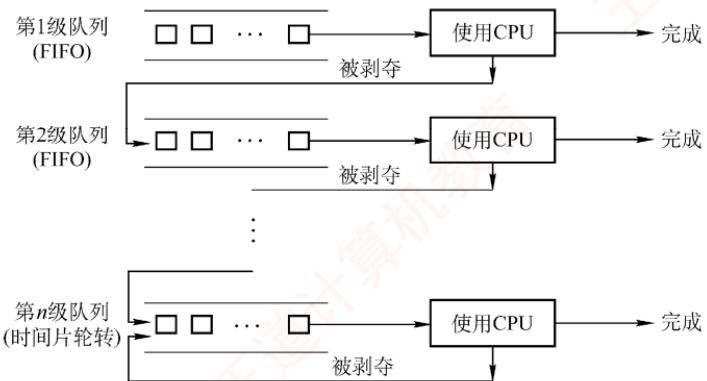  
图2.10 多级反馈队列调度算法

通过动态调整进程所处的队列（优先级）和对应的时间片大小，该算法能够兼顾系统的多种目标：既有利于短进程，可提高吞吐量并缩短平均周转时间，又有利于I/O型进程以提升设备利用率和响应速度，同时无须事先知道进程的运行时间。

## 考点追踪多级反馈队列调度算法的实现思想（2020）

多级反馈队列调度算法的实现机制如下。

1）设置多个就绪队列。为每个队列赋予不同的优先级，第1级队列优先级最高，第2级次之，其余队列优先级依次降低。该算法为各级队列分配不同的时间片，优先级越高的队列，时间片越小。例如，第i+1级队列的时间片长度通常是第i级的2倍。

2）每个队列内部采用时间片轮转（RR）调度。新进程创建后，首先被放入第1级队列的末尾。当轮到该进程执行时：若其在当前时间片内完成，则终止并退出系统；若时间片用完仍未完成，则被移至下一级（优先级更低）队列的末尾，等待后续调度。这一过程持续进行，直至进程在某一级队列中完成。通常，最低优先级队列（如第n级）的时间片较长，其行为接近FCFS，但仍采用时间片轮转以保证公平性。

3）按队列优先级调度。调度程序总是优先调度最高优先级队列中的进程执行。具体而言：仅当第1级队列为空时，才调度第2级队列中的进程：仅当第1～i-1级队列均为空时，才会调度第i级队列中的进程。此外，由于新进程总是首先进入第1级队列，因此若当前正在执行的是低优先级队列中的进程，而有新进程进入系统，则系统将立即抢占当前进程，将其放回原队列末尾，同时将CPU分配给新的高优先级进程。

多级反馈队列调度算法的优势主要体现在以下场景中：

1）交互型（终端型）用户：进程通常较短且频繁进行I/O，能在高优先级队列中快速完成。

2）短批处理作业用户：因优先级高、时间片小，可迅速执行完毕，周转时间较短。

3）长批处理作业用户：虽最终降至低优先级队列，但已在高优先级队列中获得部分CPU时间，不会因长期得不到调度而产生饥饿现象，最终仍能完成。

## 8. 基于公平原则的调度算法

前面介绍的调度算法主要关注响应时间、吞吐量或周转时间等性能指标，但通常未将调度公平性作为主要设计目标。本节介绍两种以公平性为核心目标的调度算法。

## （1）保证调度算法

保证调度算法并不以“优先运行”为目标，而是为每个进程提供可量化的CPU时间分配保证。例如，在包含n个并发进程的系统中，每个进程应获得约1/n的CPU时间。调度器通过动态跟踪各进程的实际CPU使用情况，并据此调整调度顺序，以逐步逼近这一公平目标。

为实现这一目标，系统需具备以下功能：

1）跟踪每个进程自创建以来已获得的CPU时间。

2）计算每个进程应获得的CPU时间，即自进程创建以来的时间除以n。

3）计算每个进程的公平比率，即实际获得的CPU时间与应获得的CPU时间之比。若比率小于1，则表示未达应得份额；若比率大于1，则表示超额占用。

4）调度程序应选择当前比率最小的进程，将CPU分配给它，并让它一直运行，直到它的比率超过最接近它的进程的比率为止。

## (2）公平分享调度算法

保证调度算法对进程公平，但未必对用户公平。假设各用户拥有的进程数不同，如用户1启动4个进程，而用户2仅启动1个进程，采用RR调度，那么对每个进程而言很公平，但用户1将获得80%的CPU时间，而用户2仅获得20%的CPU时间，显然对用户2有失公平。

公平分享调度算法则保证每个用户获得相同的CPU时间，或按所要求的比例分配。在这种  
方式下，不论用户启动多少进程，都能确保其获得应得的CPU份额。例如，系统中有两个用户，  
用户1拥有4个进程A、B、C和D，用户2仅拥有1个进程E，若采用RR调度，为保证两个用  
户获得相同的CPU时间，可采用如下调度序列：V

## AEBECEDEAEBECEDE ……

若用户1应获得的CPU时间是用户2的两倍，则可采用如下调度序列：

## ABECDEABECDE……

这类调度策略通过按用户权重分配调度机会，从而在用户层面实现公平性。

表2.4总结了本章介绍的主要调度算法特性，建议读者在理解的基础上掌握。

表2.4 几种常见进程调度算法的特点
<table><tr><td colspan="1" rowspan="1"></td><td colspan="1" rowspan="1">先来先服务</td><td colspan="1" rowspan="1">短作业优先</td><td colspan="1" rowspan="1">高响应比优先</td><td colspan="1" rowspan="1">时间片轮转</td><td colspan="1" rowspan="1">多级反馈队列</td></tr><tr><td colspan="1" rowspan="1">能否可抢占</td><td colspan="1" rowspan="1">否</td><td colspan="1" rowspan="1">可以</td><td colspan="1" rowspan="1">否</td><td colspan="1" rowspan="1">可以</td><td colspan="1" rowspan="1">队列内算法不一定</td></tr><tr><td colspan="1" rowspan="1">优点</td><td colspan="1" rowspan="1">公平，实现简单</td><td colspan="1" rowspan="1">平均等待时间、平均周转时间最优</td><td colspan="1" rowspan="1">兼顾长短作业</td><td colspan="1" rowspan="1">兼顾长短作业</td><td colspan="1" rowspan="1">兼顾长短作业，有较好的响应时间，可行性强</td></tr><tr><td colspan="1" rowspan="1">缺点</td><td colspan="1" rowspan="1">不利于短作业</td><td colspan="1" rowspan="1">长作业会饥饿，估计计时间不易确定</td><td colspan="1" rowspan="1">算响应比的开销大</td><td colspan="1" rowspan="1">平均等待时间较长，上下文切换浪费时间</td><td colspan="1" rowspan="1">最复杂</td></tr><tr><td colspan="1" rowspan="1">适用于</td><td colspan="1" rowspan="1">无</td><td colspan="1" rowspan="1">批处理系统</td><td colspan="1" rowspan="1">无</td><td colspan="1" rowspan="1">分时系统</td><td colspan="1" rowspan="1">相当通用</td></tr></table>

## 2.2.6 多处理机调度

多处理机系统的进程调度比单处理机系统更为复杂，其调度策略与系统结构有关。根据处理机之间的协作方式，多处理机系统主要分为非对称多处理机和对称多处理机两类。 wK

非对称多处理机（Asymmetric MultiProcessing，AMP）通常采用主从式架构：一个主CPU负责全部调度决策和系统管理，其余从CPU仅执行任务而不参与调度。内核一般运行在主CPU上，从CPU执行由主CPU分配的进程。当某个从CPU空闲时，会向主CPU发送进程请求信号。主CPU维护一个全局就绪队列，只要队列非空，便从中取出一个进程分配给请求的从CPU。该方案实现简单，但主CPU需承担所有调度开销，在高负载下容易成为系统性能瓶颈。

对称多处理机（Symmetric MultiProcessing，SMP）的所有CPU地位对等，均可参与调度。调度程序可将任意就绪进程分配给任意空闲CPU。本节主要讨论SMP系统的调度问题。

## 1. 亲和性和负载平衡

SMP的调度面临两个核心矛盾：处理器亲和性和负载平衡。

当一个进程从一个CPU迁移到另一个CPU上时，应将第一个CPU的缓存设置为无效，然后重新填充第二个CPU的缓存。这种操作的代价较高，因此系统应尽量避免将进程从一个CPU移到另一个CPU，而应尽量让一个进程运行在同一个CPU上，这称为处理器亲和性。

对于SMP系统，应尽量保证所有CPU的负载平衡（也称负载均衡），以便充分利用多处理机的优势。否则，一个或多个CPU会空闲，而其他CPU会处于高负载状态，且有一些进程处于等待状态。负载平衡应设法将负载平均分配到SMP系统的所有CPU上。

然而，负载平衡通常会抵消处理器亲和性带来的好处：保持一个进程运行在同一个CPU上的好处是可以利用它在该CPU的缓存，而将进程从一个CPU迁移到另一个CPU会失去这个好处。因此，在某些系统中，只有当不平衡达到一定程度后，才会触发进程迁移。

## 2. 多处理机调度方案

## 方案一：公共就绪队列

系统中仅设置一个公共就绪队列，所有CPU共享该队列。这种方案能很好地实现负载平衡，因为CPU一旦空闲，就会立刻从公共就绪队列中选择一个进程运行。缺点是各进程可能频繁地在不同的CPU上切换，处理器亲和性不好。 X

提升处理器亲和性的方法有两种：①软亲和，指由调度程序尽量将一个进程保持在某个CPU上运行，但这个进程也可以迁移到其他CPU上。②硬亲和，指由用户进程通过系统调用，主动请求系统将其绑定到固定的CPU上。例如，Linux系统实现了软亲和，也支持硬亲和的系统调用。

## 方案二：私有就绪队列

系统为每个CPU设置一个私有就绪队列，当CPU空闲时，便从其对应的私有就绪队列中选择一个进程运行。这种方案很好地实现了处理器亲和性，缺点是必须进行负载平衡。

平衡负载的方法通常有两种：①推迁移，指由一个特定的系统程序周期性地检查各CPU的负载，若发现不平衡，则从超载CPU的就绪队列中“推”出部分进程，迁移到空闲CPU的就绪

队列，以实现负载平衡。②拉迁移，指当某个CPU负载很低时，主动从超载CPU的就绪队列中“拉”取部分进程到自己的就绪队列。在实际系统中，推迁移和拉迁移常被结合使用。

## 2.2.7 本节小结

本节开头提出的问题的参考答案如下。

## 1）为什么要进行CPU调度？

若没有CPU调度，则必须等到当前运行的进程执行完毕后，下一个进程才能获得CPU。然而在实际系统中，进程经常需要等待外部设备的输入，而外部设备的速度远低于CPU。若让CPU长时间等待I/O完成，将造成极大的资源浪费。引入CPU调度后，当运行中的进程因等待I/O而阻塞时，系统可将CPU分配给其他就绪进程，从而显著提高CPU的利用率。简言之，CPU调度的目的在于高效、合理地管理和分配计算机的软硬件资源。

2）结合本章学习到的调度算法，思考哪些调度算法比较适合分时系统和实时系统。

在本节介绍的调度算法中，先来先服务调度算法和短作业优先调度算法均无法保证在限定时间内响应用户请求，因此既不适用于分时系统，也无法满足实时系统对及时性和可预测性的要求。优先级调度算法根据任务的紧急程度赋予不同优先级，对高优先级任务优先服务，尤其适合实时系统（通常需配合抢占机制以确保关键任务及时执行）。高响应比优先调度算法、时间片轮转调度算法以及多级反馈队列调度算法，都能保证每个就绪进程在一定时间内获得CPU时间片，并通过轮转方式公平地共享CPU，因此更适合分时系统。

本节主要介绍了CPU调度的概念。操作系统主要管理CPU、内存、文件和设备等资源。当对某类资源的请求超过其可用数量时，就需要进行调度。例如，在单处理器系统中，CPU只有一个，而请求运行的进程却有多个，因此必须通过CPU调度来协调分配。引入调度机制后，随之而来的问题是：如何调度？应优先满足哪些进程？哪些进程需要等待？这正是调度算法所要解决的核心问题：而这些问题的答案，需依据一定的调度准则来确定。调度这一概念贯穿操作系统的始终。读者在后续学习中，还将接触到内存调度、磁盘调度、I/O调度等多种资源调度问题。将这些调度机制与CPU调度进行对比，会发现它们在设计思想上具有异曲同工之妙。

## 2.2.8 本节习题精选

## 一、单项选择题

01. 中级调度的目的是（）。A. 提高 CPU 的效率 B. 降低系统开销C. 提高 CPU 的利用率 D. 节省内存

02.进程从创建态转换到就绪态的工作由（）完成。X A. 进程调度 B. 中级调度 D. 低级调度

03.下列哪些指标是调度算法设计时应该考虑的？（）I. 公平性Ⅱ. 资源利用率I. 互斥性 V IV. 平均周转时间A. I、ⅡI B. I、II、IV C.I、III、IV D. 全部都是

04. 时间片轮转调度算法是为了（）。A. 多个用户能及时干预系统 算机子 B. 使系统变得高效C. 优先级较高的进程得到及时响应 D. 需要CPU时间最少的进程最先做

05. 在单处理器系统中，进程什么时候占用处理器及占用时间的长短是由（）决定的。A. 进程相应的代码长度 B. 进程总共需要运行的时间

C. 进程特点和进程调度策略 D. 进程完成什么功能

06. 在某单处理器系统中，若此刻有多个就绪态进程，则下列叙述中错误的是（）。A. 进程调度的目标是让进程轮流使用处理器B. 当一个进程运行结束后，会调度下一个就绪进程运行C. 上下文切换是进程调度的实现手段D. 处于临界区的进程在退出临界区前，无法被调度

07. 下列内容中，不属于进程上下文的是（）。A. 进程现场信息B. 进程控制信息 C. 中断向量 D. 用户堆栈

08.下列关于进程上下文切换的叙述中，错误的是（）。A. 进程上下文指进程的代码、数据以及支持进程执行的所有运行环境 B. 进程上下文切换机制实现了不同进程在一个处理器中交替运行的功能 VXC. 进程上下文切换过程中必须保存换下进程在切换处的程序计数器的值D.进程上下文切换过程中必须将换下进程的代码和数据从主存保存到磁盘

09. 在支持页式存储管理和多线程技术的系统中，当一个进程中的线程 $\mathrm { T } _ { 1 }$ 切换到同一个进程中的线程 $\mathrm { T } _ { 2 }$ 执行时，操作系统需要执行的操作是（）。I. 更新程序计数器的值 I. 更新栈基址寄存器的值IⅢ. 更新页基址寄存器的值 IV. 更新进程打开文件表A. I、ⅡI、III、IVB. II、IV C. I、ⅡI D. I、III、IV

10.（）有利于CPU繁忙型的作业，而不利于I/O繁忙型的作业。A. 时间片轮转调度算法 C. 短作业（进程）优先调度算法 K B. 先来先服务调度算法 D. 优先级调度算法

11. 下面有关选择进程调度算法的准则中，不正确的是（）。A. 尽快响应交互式用户的请求 B. 尽量提高处理器利用率C. 尽可能提高系统吞吐量 D. 适当增长进程就绪队列的等待时间

12. 实时系统的进程调度，通常采用（）调度算法。A. 先来先服务 B. 时间片轮转C. 抢占式的优先级高者优先 D. 高响应比优先

13. 支持多道程序设计的操作系统在运行过程中，不断地选择新进程运行来实现CPU的共享，但其中（）不是引起操作系统选择新进程的直接原因。A. 运行进程的时间片用完 B. 运行进程出错C. 运行进程要等待某一事件发生 D. 有新进程被创建进入就绪态

14. 进程（线程）调度的时机有（）。I. 运行的进程（线程）运行完毕 Ⅱ.运行的进程（线程）所需资源未准备好Ⅲ. 运行的进程（线程）的时间片用完 IV. 运行的进程（线程）自我阻塞V. 运行的进程（线程）出现错误A. II、III、IV 和 V B. I和 III C. II、IV 和 V D. 全部都是

15. 设有4个作业同时到达，每个作业的执行时间均为2h，它们在一台处理器上按单道式运行，则平均周转时间为（）。A. 1h B. 5h C. 2.5h D. 8h

16. 若每个作业只能建立一个进程，为了照顾短作业用户，应采用（）；为了照顾紧急作业用户，应采用（）；为了能实现人机交互，应采用（）；而能使短作业、长作业和

交互作业用 $\dot{ 严 }$ 都满意，应采用（）。  
A. FCFS 调度算法 C. 时间片轮转调度算法 计算机学 B. 短作业优先调度算法 D. 多级反馈队列调度算法E. 剥夺式优先级调度算法

17.（）优先级是在创建进程时确定的，确定之后在整个运行期间不再改变。A. 先来先服务 B. 动态 C. 短作业 D. 静态

18. 现在有三个同时到达的作业 $\mathbf { J } _ { 1 } , \mathbf { J } _ { 2 }$ 和 ${ \bf J } _ { 3 } ,$ ，它们的执行时间分别是 $T _ { 1 } ,   T _ { 2 } ,   T _ { 3 }$ ，且 $T _ { 1 } < T _ { 2 } < T _ { 3 }$ 系统按单道方式运行且采用短作业优先调度算法，则平均周转时间是（）。A. $T _ { 1 } + T _ { 2 } + T _ { 3 }$ X B. $( 3 T _ { 1 } + 2 T _ { 2 } + T _ { 3 } ) / 3$ 教育C. $(T_{1} + T_{2} + T_{3})/3$ D. $( T _ { 1 } + 2 T _ { 2 } + 3 T _ { 3 } ) / 3$

19. 设有三个作业，其运行时间分别是2h,5h,3h，假定它们同时到达，并在同一台处理器上以单道方式运行，则平均周转时间最小的执行顺序是（）。A. $\mathrm { J } _ { 1 } , \mathrm { J } _ { 2 } , \mathrm { J } _ { 3 }$ B. $\mathrm { J } _ { 3 } , \mathrm { J } _ { 2 } , \mathrm { J } _ { 1 }$ C. $\mathsf { J } _ { 2 } , \mathsf { J } _ { 1 } , \mathsf { J } _ { 3 }$ D. $\mathrm { J } _ { 1 } , \mathrm { J } _ { 3 } , \mathrm { J } _ { 2 }$

20. 采用时间片轮转调度算法分配CPU时，当处于运行态的进程用完一个时间片后，它的状态是（）状态。A. 阻塞 B. 运行 C. 就绪 D. 消亡

21. 一个作业8:00到达系统，估计运行时间为1h。若10:00开始执行该作业，其响应比是（）。A. 2 B. 1 C. 3 D. 0.5

22. 关于优先权大小的论述中，正确的是（）。A. 计算型作业的优先权，应高于I/O型作业的优先权B. 用户进程的优先权，应高于系统进程的优先权C. 在动态优先权中，随着作业等待时间的增加，其优先权将随之下降D. 在动态优先权中，随着进程执行时间的增加，其优先权降低

23.下列调度算法中，（）调度算法是绝对可抢占的。A. 先来先服务 B. 时间片轮转 C. 优先级 D. 短进程优先

24. 作业是用户提交的，进程是由系统自动生成的，除此之外，两者的区别是（）。A. 两者执行不同的程序段B. 前者以用户任务为单位，后者以操作系统控制为单位C. 前者是批处理的，后者是分时的 +算机教D.后者是可并发执行，前者则不同

25. 进程调度算法采用固定时间片轮转调度算法，当时间片过大时，就会使时间片轮转调度算法转化为（）调度算法。王A. 高响应比优先 B. 先来先服务C. 短进程优先 D. 以上选项都不对

26. 有以下的进程需要调度执行（见下表）：

<table><tr><td rowspan=1 colspan=1>进程名</td><td rowspan=1 colspan=1>到达时间/h</td><td rowspan=1 colspan=1>运行时间/h</td></tr><tr><td rowspan=1 colspan=1> $\mathrm { P } _ { 1 }$ </td><td rowspan=1 colspan=1>0.0</td><td rowspan=1 colspan=1>9</td></tr><tr><td rowspan=1 colspan=1> $\mathrm { P } _ { 2 }$ </td><td rowspan=1 colspan=1>0.4</td><td rowspan=1 colspan=1>4</td></tr><tr><td rowspan=1 colspan=1> $ P _{3}$ </td><td rowspan=1 colspan=1>1.0</td><td rowspan=1 colspan=1>1</td></tr><tr><td rowspan=1 colspan=1> $\mathrm { P } _ { 4 }$ </td><td rowspan=1 colspan=1>5.5</td><td rowspan=1 colspan=1>4</td></tr><tr><td rowspan=1 colspan=1> $\overline { { \mathrm { P } _ { 5 } } }$ </td><td rowspan=1 colspan=1>7</td><td rowspan=1 colspan=1>2</td></tr></table>

1）若用非抢占式短进程优先调度算法，问这5个进程的平均周转时间是多少？2）若采用抢占式短进程优先调度算法，问这5个进程的平均周转时间是多少？A. 8.62h; 6.34h B. 8.62h; 6.8hC. 10.62h; 6.34h D. 10.62h; 6.8h

27. 有 5 个批处理作业 A, B, C, D,E 几乎同时到达，其预计运行时间分别为 10,6,2,4,8，其优先级（由外部设定）分别为3,5,2,1,4，这里5为最高优先级。以下各种调度算法中，平均周转时间为14的是（）调度算法。A. 时间片轮转（时间片为1） B. 优先级C. 先来先服务（按照顺序10,6,2,4,8） D. 短作业优先

28. 使用抢占式最短剩余时间优先调度算法对下列进程进行调度，总周转时间是（）。

<table><tr><td rowspan=1 colspan=1>进程名</td><td rowspan=1 colspan=1>到达时间/h</td><td rowspan=1 colspan=1>运行时间/h</td></tr><tr><td rowspan=1 colspan=1> $\overline { { \mathrm { P _ { 1 } } } }$ </td><td rowspan=1 colspan=1>0</td><td rowspan=1 colspan=1>3</td></tr><tr><td rowspan=1 colspan=1> $\overline { { \mathrm { ~ P _ { 2 } ~ } } }$ </td><td rowspan=1 colspan=1>1</td><td rowspan=1 colspan=1>1</td></tr><tr><td rowspan=1 colspan=1> $ P _{3}$ </td><td rowspan=1 colspan=1>2</td><td rowspan=1 colspan=1>4</td></tr><tr><td rowspan=1 colspan=1> $\overline { { \mathrm { ~ P _ { 4 } ~ } } }$ </td><td rowspan=1 colspan=1>3</td><td rowspan=1 colspan=1>5</td></tr><tr><td rowspan=1 colspan=1> $\boxed { \mathrm { ~ P } _ { 5 } }$ </td><td rowspan=1 colspan=1>4</td><td rowspan=1 colspan=1>2</td></tr></table>

A. 25h B. 26h C. 27h D. 28h

29. 假设系统采用多级反馈队列调度算法，系统中设置了三个不同优先级的队列A、B和C，优先级 $\mathrm { A } \geq \mathrm { B } \geq \mathrm { C }$ ，A的时间片为10ms，B的时间片为20ms，C的时间片为30ms。当t = 0时，进程 $\mathrm { P } _ { 1 }$ 到达， $\mathrm { P _ { 1 } }$ 所需的运行时间为 90ms; 当 t = 30ms时，进程 $\mathrm { P } _ { 2 }$ 到达， $\mathrm { P } _ { 2 }$ 所需的运行时间为30ms，不考虑任何其他系统开销，进程 $\mathrm { P } _ { 1 }$ 的周转时间为（）。A. 90ms B. 100ms C. 110ms D. 120ms

30.分时操作系统通常采用（）调度算法来为用户服务。A. 时间片轮转 B. 先来先服务 C. 短作业优先 D. 优先级

31. 在进程调度算法中，对短进程不利的是（）。A. 短进程优先调度算法 B. 先来先服务调度算法C. 高响应比优先调度算法 D. 多级反馈队列调度算法

32.假设系统中所有进程同时到达，则使进程平均周转时间最短的是（）调度算法。A. 先来先服务 B. 短进程优先 C. 时间片轮转 D. 优先级

33. 多级反馈队列调度算法不具备的特性是（）。A. 资源利用率高B. 响应速度快 C. 系统开销小 D. 并发度高

34.下列调度算法中，系统开销最小的调度算法是（）。A. 高响应比优先调度算法 B. 多级反馈队列调度算法C. 先来先服务调度算法 D. 时间片轮转调度算法

35.下列进程调度算法中，可能导致饥饿现象的有（）。I. 先来先服务调度算法 I. 短作业优先调度算法Ⅲ. 优先级调度算法 IV. 时间片轮转调度算法A. I和Ⅱ B. ⅡI和ⅢII C. II、III和IV D. ⅢII

36. 与单处理机调度相比，多处理机调度需要额外考虑的调度目标是（）。I. 负载平衡 Ⅱ. 处理器亲和性 Ⅲ. 进程周转时间A. I和Ⅱ B. ⅡI 和 ⅢII C. I和III D. I、ⅡI和ⅢII

37.【2009统考真题】下列进程调度算法中，综合考虑进程等待时间和执行时间的是（）。A. 时间片轮转调度算法 B. 短进程优先调度算法

C. 先来先服务调度算法 D. 高响应比优先调度算法

38.【2010统考真题】下列选项中，降低进程优先级的合理时机是（）。A. 进程时间片用完 B. 进程刚完成I/O操作，进入就绪队列C. 进程长期处于就绪队列 D. 进程从就绪态转换为运行态

39.【2011统考真题】下列选项中，满足短作业优先且不会发生饥饿现象的是（）调度算法。A. 先来先服务 B. 高响应比优先C. 时间片轮转 D. 非抢占式短作业优先

40.【2012统考真题】一个多道批处理系统中仅有 $\mathrm { P } _ { 1 }$ 和 $\mathrm { P } _ { 2 }$ 两个作业， $\mathrm { P } _ { 2 }$ 比 $\mathrm { P _ { 1 } }$ 晚 5ms 到达，它的计算和I/O操作顺序如下。$\mathbf { P } _ { 1 } ;$ 计算60ms，I/080ms，计算20ms 算机教$\mathbf { P } _ { 2 } ;$ 计算120ms，I/O40ms，计算 40ms若不考虑调度和切换时间，则完成两个作业需要的时间最少是（）。A. 240ms B. 260ms C. 340ms D. 360ms

41.【2012统考真题】若某单处理器多进程系统中有多个就绪态进程，则下列关于处理机调度的叙述中，错误的是（）。A. 在进程结束时能进行处理机调度B. 创建新进程后能进行处理机调度C. 在进程处于临界区时不能进行处理机调度D. 在系统调用完成并返回用户态时能进行处理机调度

42. 【2013统考真题】某系统正在执行三个进程 $\mathrm { P } _ { 1 } , \mathrm { P } _ { 2 }$ 和 $\mathrm { P } _ { 3 }$ ，各进程的计算（CPU）时间和I/O时间比例如下表所示。

<table><tr><td rowspan=1 colspan=1>进程名</td><td rowspan=1 colspan=1>计算时间</td><td rowspan=1 colspan=1>I/O 时间</td></tr><tr><td rowspan=1 colspan=1> $\overline { { \mathrm { P _ { 1 } } } }$ </td><td rowspan=1 colspan=1>90%</td><td rowspan=1 colspan=1>10%</td></tr><tr><td rowspan=1 colspan=1> $\overline{\left| \mathrm{P}_{2} \right|}$ </td><td rowspan=1 colspan=1>50%</td><td rowspan=1 colspan=1>50%</td></tr><tr><td rowspan=1 colspan=1> $\overline { { \mathrm { ~ P _ { 3 } ~ } } }$ </td><td rowspan=1 colspan=1>15%</td><td rowspan=1 colspan=1>85%</td></tr></table>

为提高系统资源利用率，合理的进程优先级设置应为（）。  
A. $\mathrm{P}_{1}>\mathrm{P}_{2}>\mathrm{P}_{3}$ B. $\mathrm{P}_{3}>\mathrm{P}_{2}>\mathrm{P}_{1}$ C. $\mathrm{P}_{2}>\mathrm{P}_{1}=\mathrm{P}_{3}$ D. $\mathrm{P}_{1}>\mathrm{P}_{2}=\mathrm{P}_{3}$

43.【2014统考真题】下列调度算法中，不可能导致饥饿现象的是（）。A. 时间片轮转 B. 静态优先数调度C. 非抢占式短任务优先 D. 抢占式短任务优先

44.【2016统考真题】某单CPU系统中有输入和输出设备各1台，现有3个并发执行的作业，每个作业的输入、计算和输出时间均分别为2ms,3ms和4ms，且都按输入、计算和王输出的顺序执行，则执行完3个作业需要的时间最少是（）。A. 15ms B. 17ms C. 22ms D. 27ms

45.【2017统考真题】假设4个作业到达系统的时刻和运行时间如下表所示。

<table><tr><td rowspan=1 colspan=1>作业号</td><td rowspan=1 colspan=1>到达时刻t</td><td rowspan=1 colspan=1>运行时间</td></tr><tr><td rowspan=1 colspan=1> $\mathbf { J } _ { 1 }$ </td><td rowspan=1 colspan=1>0</td><td rowspan=1 colspan=1>3</td></tr><tr><td rowspan=1 colspan=1> $\overline { { \mathrm { J } _ { 2 } } }$ </td><td rowspan=1 colspan=1>1</td><td rowspan=1 colspan=1>3</td></tr><tr><td rowspan=1 colspan=1> $\overline { { \mathrm { ~ J } _ { 3 } } }$ </td><td rowspan=1 colspan=1>1</td><td rowspan=1 colspan=1>2</td></tr><tr><td rowspan=1 colspan=1> $\overline { { \mathrm { J } _ { 4 } } }$ </td><td rowspan=1 colspan=1>3</td><td rowspan=1 colspan=1>1</td></tr></table>

系统在t = 2时开始作业调度。若分别采用先来先服务和短作业优先调度算法，则选中

的作业分别是（）。  
A. $\mathbf { J } _ { 2 } , \mathbf { J } _ { 3 }$ B. $\mathbf { J } _ { 1 } , \mathbf { J } _ { 4 }$ C. $\mathbf { J } _ { 2 } , \mathbf { J } _ { 4 }$ D. $\mathbf { J } _ { 1 } , \mathbf { J } _ { 3 }$

46.【2017统考真题】下列有关基于时间片的进程调度的叙述中，错误的是（）。A. 时间片越短，进程切换的次数越多，系统开销越大B. 当前进程的时间片用完后，该进程状态由运行态变为阻塞态C. 时钟中断发生后，系统会修改当前进程在时间片内的剩余时间D. 影响时间片大小的主要因素包括响应时间、系统开销和进程数量等

47.【2018统考真题】某系统采用基于优先权的非抢占式进程调度策略，完成一次进程调度和进程切换的系统时间开销为1μs。在T时刻就绪队列中有3个进程 $ P _{1} 、  P _{2}  和   P _{3}$ ，其在就绪队列中的等待时间、需要的CPU时间和优先权如下表所示。

<table><tr><td rowspan=1 colspan=1>进程名</td><td rowspan=1 colspan=1>等待时间</td><td rowspan=1 colspan=1>需要的 CPU 时间</td><td rowspan=1 colspan=1>优先权</td></tr><tr><td rowspan=1 colspan=1> $\overline { { \mathrm { P _ { 1 } } } }$ </td><td rowspan=1 colspan=1>30μs</td><td rowspan=1 colspan=1>12μs</td><td rowspan=1 colspan=1>10</td></tr><tr><td rowspan=1 colspan=1> $\mathrm { P } _ { 2 }$ </td><td rowspan=1 colspan=1> $1 5 \mu \mathrm { s }$ </td><td rowspan=1 colspan=1> $2 4 \mu \mathrm { s }$ </td><td rowspan=1 colspan=1>30</td></tr><tr><td rowspan=1 colspan=1> $\overline { { \mathrm { P } _ { 3 } } }$ </td><td rowspan=1 colspan=1> $\overline { { | 1 8 \mu \mathrm { s } | } }$ </td><td rowspan=1 colspan=1> $3 6 \mu \mathrm { s }$ </td><td rowspan=1 colspan=1>20</td></tr></table>

若优先权值大的进程优先获得CPU，从T时刻起系统开始进程调度，则系统的平均周转时间为（）。A. $5 4 \mu \mathrm { s }$ B. $7 3 \mu \mathrm { s }$ C. $7 4 \mu \mathrm { s }$ D. $7 5 \mu \mathrm { s }$

48. 【2019统考真题】系统采用二级反馈队列调度算法进行进程调度。就绪队列 $\mathrm { Q _ { 1 } }$ 采用时间片轮转调度算法，时间片为10ms；就绪队列 $ Q _2$ 采用短进程优先调度算法；系统优先调度 $\mathrm { Q _ { 1 } }$ 队列中的进程，当 $\mathrm { Q _ { 1 } }$ 为空时系统才会调度 $\mathrm { Q } _ { 2 }$ 中的进程；新创建的进程首先进$\wedge  Q _{1};  Q _{1}$ 中的进程执行一个时间片后，若未结束，则转入 $\mathrm { Q } _ { 2 } ,$ 若当前 $\mathrm { Q } _ { 1 } , \mathrm { Q } _ { 2 }$ 为空，系统依次创建进程 $\mathrm { P } _ { 1 } , \mathrm { P } _ { 2 }$ 后即开始进程调度， $\mathrm { P } _ { 1 } , \mathrm { P } _ { 2 }$ 需要的 CPU 时间分别为 30ms和 20ms，则进程 $\mathrm { ~ P _ { 1 } , ~ }   \mathrm { ~ P } _ { 2 }$ 在系统中的平均等待时间为（）。A. 25ms B. 20ms E C. 15ms D. 10ms

49.【2020统考真题】下列与进程调度有关的因素中，在设计多级反馈队列调度算法时需要考虑的是（）。I. 就绪队列的数量 I. 就绪队列的优先级育Ⅲ. 各就绪队列的调度算法 IV. 进程在就绪队列间的迁移条件A. 仅I、Ⅱ妆 B. 仅ⅢII、IV C.仅ⅡI、ⅢII、IV D. I、II、ⅢII和IV

50. 【2021统考真题】在下列内核的数据结构或程序中，分时系统实现时间片轮转调度需要使用的是（）。I. 进程控制块 Ⅱ. 时钟中断处理程序 III. 进程就绪队列 IV. 进程阻塞队列A.仅Ⅱ、III B. 仅I、IV C. 仅I、II、ⅢII D. 仅I、ⅡI、IV

51.【2021统考真题】下列事件中，可能引起进程调度程序执行的是（）。I. 中断处理结束 Ⅱ. 进程阻塞 III. 进程执行结束 IV. 进程的时间片用完A. 仅I、III B. 仅ⅡI、IV C. 仅ⅢII、IV D. I、II、III 和 IV

52.【2022统考真题】进程 $ P _{0} 、  P _{1} 、  P _{2}$ 和 $\mathrm { P } _ { 3 }$ 进入就绪队列的时刻、优先级（值越小优先权越高）及CPU执行时间如下表所示。

<table><tr><td rowspan=1 colspan=1>进程名</td><td rowspan=1 colspan=1>进入就绪队列的时刻</td><td rowspan=1 colspan=1>优先级</td><td rowspan=1 colspan=1>CPU执行时间</td></tr><tr><td rowspan=1 colspan=1> $\overline { { \mathrm { P _ { 0 } } } }$ </td><td rowspan=1 colspan=1>0ms</td><td rowspan=1 colspan=1>15</td><td rowspan=1 colspan=1>100ms</td></tr><tr><td rowspan=1 colspan=1> $\overline { { \mathrm { P _ { 1 } } } }$ </td><td rowspan=1 colspan=1>10ms</td><td rowspan=1 colspan=1>20</td><td rowspan=1 colspan=1>60ms</td></tr><tr><td rowspan=1 colspan=1> $\mathrm { P } _ { 2 }$ </td><td rowspan=1 colspan=1>10ms</td><td rowspan=1 colspan=1>10</td><td rowspan=1 colspan=1>20ms</td></tr><tr><td rowspan=1 colspan=1> $\overline { { \mathrm { P } _ { 3 } } }$ </td><td rowspan=1 colspan=1>15ms</td><td rowspan=1 colspan=1>6</td><td rowspan=1 colspan=1>10ms</td></tr></table>

若系统采用基于优先权的抢占式进程调度算法，则从0ms时刻开始调度，到4个进程都运行结束为止，发生进程调度的总次数为（）。A. 4 B. 5 C. 6 D. 7

53.【2023统考真题】进程 $ P _{1} 、  P _{2}$ 和 $ P _{3}$ 进入就绪队列的时刻、优先级（值越大优先权越高）和CPU 执行时间如下表所示。 道

<table><tr><td rowspan=1 colspan=1>进程名</td><td rowspan=1 colspan=1>进入就绪队列的时刻</td><td rowspan=1 colspan=1>优先级</td><td rowspan=1 colspan=1>CPU执行时间</td></tr><tr><td rowspan=1 colspan=1> $\overline { { | \mathrm { P } _ { 1 } | } }$ </td><td rowspan=1 colspan=1>0ms</td><td rowspan=1 colspan=1>1</td><td rowspan=1 colspan=1>60ms</td></tr><tr><td rowspan=1 colspan=1> $\mathrm { P } _ { 2 }$ </td><td rowspan=1 colspan=1>20ms</td><td rowspan=1 colspan=1>10</td><td rowspan=1 colspan=1>42ms</td></tr><tr><td rowspan=1 colspan=1> $\mathrm { P } _ { 3 }$ </td><td rowspan=1 colspan=1>30ms</td><td rowspan=1 colspan=1>100</td><td rowspan=1 colspan=1>13ms</td></tr></table>

若系统采用基于优先权的抢占式CPU调度算法，从0ms时刻开始进行调度，则 $ P _{1} 、  P _{2}$ 和 $\mathrm { P } _ { 3 }$ 的平均周转时间为（）。A. 60ms B. 61ms C. 70ms D. 71ms

54.【2024统考真题】假设某系统使用时间片轮转调度算法进行CPU调度，时间片大小为5ms，系统共有10个进程，初始时均处于就绪队列，执行结束前仅处于运行态或就绪态。王 若队尾的进程P所需的CPU时间最短，时间为25ms，不考虑系统开销，则进程P的周转时间为（）。A. 200ms B. 205ms C. 250ms D. 295ms

55.【2024统考真题】在支持页式存储管理的系统中，进程切换时操作系统需要执行的操作是（）。I. 更新程序计数器的值 Ⅱ. 更新栈基址寄存器的值 Ⅲ. 更新页表基地址寄存器的值A. 仅ⅢI B. 仅I、Ⅱ C. 仅I、Ⅲ D. I、II、III

56.【2025统考真题】在某基于优先权的进程调度程序中，进程就绪队列采用优先权从高到低的有序单链表实现。若就绪队列长度为n，则就绪队列的插入操作和从就绪队列中选出将要执行进程的操作的时间复杂度分别是（）。A. O(1), O(1) B. O(1), O(n) C. O(n), O(1) D. O(n), O(n)

57.【2025统考真题】在采用页式虚拟存储管理方式的系统中，当发生进程上下文切换时，在下列寄存器中，操作系统不需要更新的是（）。A. 通用寄存器 B. 页表基址寄存器C. 程序计数器

## 二、综合应用题

01. 有一个CPU和两台外设 $\mathrm { D } _ { 1 } , \mathrm { D } _ { 2 } ,$ 且在能够实现抢占式优先级调度算法的多道程序环境中，同王 时进入优先级由高到低的 $\mathrm { P } _ { 1 } , \mathrm { P } _ { 2 } , \mathrm { P } _ { 3 }$ 三个作业，每个作业的处理顺序和使用资源的时间如下。$\mathrm{P}_{1}:\mathrm{D}_{2}(30\mathrm{ms}),\mathrm{CPU}(10\mathrm{ms}),\mathrm{D}_{1}(30\mathrm{ms}),\mathrm{CPU}(10\mathrm{ms})$ $\mathrm{P}_{2}: \mathrm{D}_{1}(20 \mathrm{ms}), \mathrm{CPU}(20 \mathrm{ms}), \mathrm{D}_{2}(40 \mathrm{ms})$ $\mathrm{P}_{3}:\ \mathrm{CPU}\ (30\mathrm{ms}),\ \mathrm{D}_{1}\ (20\mathrm{ms})$ 育

假设忽略不计其他辅助操作的时间，每个作业的周转时间 $T _ { 1 } ,   T _ { 2 } ,   T _ { 3 }$ 分别为多少？CPU和$\mathrm { D } _ { 1 }$ 的利用率各是多少？

02. 有三个作业 A,B,C，它们分别单独运行时的 CPU和I/O 占用时间如下图所示。现在请考虑三个作业同时开始执行。系统中的资源有一个CPU和两台输入/输出设备$\left( \mathrm{I} / \mathrm{O}_{1}  和  \mathrm{I} / \mathrm{O}_{2} \right)$ 同时运行。三个作业的优先级为A最高、B次之、C最低，一旦低优先级的进程开始占用CPU或I/O设备，高优先级进程也要等待到其结束后方可占用。

$$
 作业 A  $\begin{array}{c|ccccc}10 & 20 & 30 & 10 & 40 & 20 & 20 \\\hline\mid & \mid & \mid & \mid & \mid & \mid & \mid \\\hline\mathrm{I} / \mathrm{O}_{2} \mathrm{C} \mathrm{P} \mathrm{U} & \mathrm{I} / \mathrm{O}_{1} \text{— } \mathrm{C} \mathrm{P} \mathrm{U} & \mathrm{I} / \mathrm{O}_{1} & \mathrm{C} \mathrm{P} \mathrm{U} & \mathrm{I} / \mathrm{O}_{1} \\\end{array}$ms
$$

$$
\begin{aligned}& 作业   B  \quad \xrightarrow{30 \quad 40 \quad 30 \quad 30 \quad 30} \quad \xrightarrow{30} \quad \xrightarrow{} \quad \xrightarrow{} \quad \xrightarrow{} \quad \xrightarrow{} \quad \xrightarrow{} \quad \xrightarrow{} \quad \xrightarrow{} \quad \xrightarrow{} \quad \xrightarrow{} \quad \xrightarrow{} \quad \xrightarrow{} \quad \xrightarrow{} \quad \xrightarrow{} \quad \xrightarrow{} \quad \xrightarrow{} \quad \xrightarrow{} \quad \xrightarrow{} \quad \xrightarrow{} \quad \xrightarrow{} \quad \xrightarrow{} \quad \xrightarrow{} \quad \xrightarrow{} \quad \xrightarrow{} \quad \xrightarrow{} \quad \xrightarrow{} \quad \xrightarrow{} \quad \xrightarrow{} \quad \xrightarrow{} \quad \xrightarrow{} \quad \xrightarrow{} \quad \xrightarrow{} \quad \xrightarrow{} \quad \xrightarrow{} \quad \xrightarrow{} \quad \xrightarrow{} \quad \xrightarrow{} \quad \xrightarrow{} \quad \xrightarrow{} \quad \xrightarrow{} \quad \xrightarrow{} \quad \xrightarrow{} \quad \xrightarrow{} \quad \xrightarrow{} \quad \xrightarrow{} \quad \xrightarrow{} \quad \xrightarrow{} \quad \xrightarrow{} \quad \xrightarrow{} \quad \xrightarrow{} \quad \xrightarrow{} \quad \xrightarrow{} \quad \xrightarrow{} \quad \xrightarrow{} \quad \xrightarrow{} \quad \xrightarrow{} \quad \xrightarrow{} \quad \xrightarrow{} \quad \xrightarrow{} \quad \xrightarrow{} \quad \xrightarrow{} \quad \xrightarrow{} \quad \xrightarrow{} \quad \xrightarrow{} \quad \xrightarrow{} \quad \xrightarrow{} \quad \xrightarrow{} \quad \xrightarrow{} \quad \xrightarrow{} \quad \xrightarrow{} \quad \xrightarrow{} \quad \xrightarrow{} \quad \quad \xrightarrow{} \quad \xrightarrow{} \quad \quad \xrightarrow{} \quad \quad \xrightarrow{} \quad \quad \xrightarrow{} \quad \quad \xrightarrow{} \quad \quad \quad \xrightarrow{} \quad \quad \quad \mid \quad \quad \quad \quad \quad \xrightarrow{} \quad \quad \quad \quad \mid \quad \quad \quad \quad \quad \quad \mid \quad \quad \quad \quad \quad \mid \quad \quad \quad \quad \mid \quad \quad \quad \quad \mid \quad \quad \quad \quad \mid \quad \quad \quad \mid \quad \quad \quad \mid \quad \quad \quad \mid \quad \quad \quad \mid \quad \quad \quad \mid \quad \quad \quad \mid \quad \quad \quad \mid \quad \quad \quad \mid \quad \quad \quad \mid \quad \quad \quad \mid \quad \quad \quad \mid \quad \quad \quad \mid \quad \quad \quad \mid \quad \quad \quad \mid \quad \quad \quad \mid \quad \quad \quad \mid \quad \quad \quad \mid \quad \quad \quad \mid \quad \quad \quad \mid \quad \quad \quad \mid \quad \quad \quad \mid \quad \quad \quad \quad \mid \quad \quad \quad \mid \quad \quad \quad \mid \quad \quad \quad \quad \mid \quad \quad \quad \quad \mid \quad \quad \quad \quad \mid \quad \quad \quad \mid \quad \quad \quad \quad \mid \quad \quad \quad \quad \mid \quad \quad \quad \quad \mid \quad \quad \quad \quad \mid \quad \quad \quad \quad \mid \quad \quad \quad \quad \quad \mid \quad \quad \quad \quad \mid \quad \quad \quad \quad \quad \mid \quad \quad \quad \quad \mid \quad \quad \quad \quad \quad \mid \quad \quad \quad \quad \quad \quad \mid \quad \quad \quad \quad \quad \mid \quad \quad \quad \quad \quad \quad \quad \mid \quad \quad \quad \quad \quad \mid \quad \quad \quad \quad \quad \quad \mid \quad \quad \quad \quad \quad \quad \mid \quad \quad \quad \quad \quad \quad \mid \quad \quad \quad \quad \quad \quad \quad \mid \quad \quad \quad \quad \quad \quad \mid \quad \quad \end{aligned}
$$

$$
\begin{aligned}& 作业   C  \quad \xrightarrow{\begin{array}{c} 40 \quad 20 \quad 20 \quad 70 \\ | \quad | \quad | \quad | \quad | \quad | \quad | \quad | \quad | \quad | \quad | \quad | \quad | \quad | \quad | \quad | \quad | \quad | \quad | \quad | \quad | \quad | \quad | \quad | \quad | \quad | \quad | \quad | \quad | \quad | \quad | \quad | \quad | \quad | \quad | \quad | \quad | \quad | \quad | \quad | \quad | \quad | \quad | \quad | \quad | \quad | \quad | \quad | \quad | \quad | \quad | \quad | \quad | \quad | \quad | \quad | \quad | \quad | \quad | \quad | \quad | \quad | \quad | \quad | \quad | \quad | \quad | \quad | \quad | \quad | \quad | \quad | \quad | \quad | \quad | \quad | \quad | \quad | | \quad | \quad | \quad | | \quad | \quad | | \quad | \quad | | \quad | \quad | | \quad | \quad | | \quad | | \quad | \quad | | \quad | \quad | | \quad | | \quad | \quad | | \quad | | \quad | \quad | | \quad | | \quad | \quad | | \quad | | \quad | \quad | | \quad | | \quad | \quad | | \quad | | \quad | \quad | | \quad | | \quad | \quad | | \quad | \quad | | \quad | \quad | | \quad | \quad | | \quad | \quad | | \quad | \quad | | \quad | \quad | | \quad | \quad | | \quad | \quad | | \quad | \quad | | \quad | \quad | | \quad | \quad | | \quad | \quad | | \quad | \quad | | \quad | \quad | | \quad | \quad | | \quad | \quad | | \quad | \quad | \quad | | \quad | \quad | | \quad | \quad | \quad | | \quad | \quad | | \quad | \quad | \quad | | \quad | \quad | \quad | | \quad | \quad | \quad | | \quad | \quad | | \quad | \quad | \quad | | \quad | \quad | \quad | | \quad | \quad | \quad | | \quad | \quad | \quad | | \quad | \quad | \quad | | \quad | \quad | \quad | | \quad | \quad | \quad | \quad | | \quad | \quad | | \quad | \quad | \quad | | \quad | \quad | | \quad | \quad | \quad | \quad | | \quad | \quad | \quad | | \quad | \quad | \quad | \quad | | \quad | \quad | \quad | \quad | | \quad | \quad | \quad | \quad | \quad | | \quad | \quad | \quad | \quad | \quad | \quad | | \quad | \quad | \quad | \quad | \quad | \quad | \quad | \quad | \quad | \quad | | \quad | \quad | \quad | \quad | \quad | \quad | \quad | \quad | \quad | \quad | \quad | \quad | \quad | \quad | \quad | \quad | \quad | \quad | \quad | \quad | \quad \quad | | \quad \quad | \quad | \quad | \quad | \quad | \quad | \quad \quad | \quad | \quad | \quad | \quad | \quad | \quad \quad | \quad | \quad | \end{array} \end{aligned}
$$

请回答下面的问题：

1）最早结束的作业是哪个？

2）最后结束的作业是哪个？

3）计算这段时间CPU的利用率（三个作业全部结束为止）。

03. 某分时系统中的进程可能出现如下图所示的状态变化，请回答下列问题：

1）根据图示，该系统应采用什么进程调度策略？

2）将图中每个状态变化的可能原因填写在下表中。

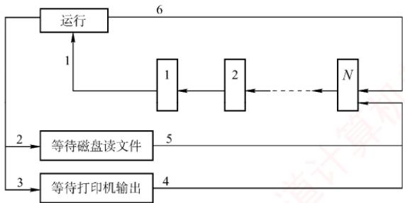

<table><tr><td rowspan=1 colspan=1>变化</td><td rowspan=1 colspan=1>原因</td></tr><tr><td rowspan=1 colspan=1>A   1</td><td rowspan=1 colspan=1></td></tr><tr><td rowspan=1 colspan=1>2</td><td rowspan=1 colspan=1></td></tr><tr><td rowspan=1 colspan=1>3</td><td rowspan=1 colspan=1></td></tr><tr><td rowspan=1 colspan=1>4</td><td rowspan=1 colspan=1></td></tr><tr><td rowspan=1 colspan=1>5</td><td rowspan=1 colspan=1></td></tr><tr><td rowspan=1 colspan=1>6</td><td rowspan=1 colspan=1></td></tr></table>

04. 假定要在一台处理器上执行下表所示的作业，且假定这些作业在时刻0以1,2,3,4,5的顺序到达。说明分别使用FCFS、RR（时间片=1）、SJF及非剥夺式优先级调度算法时，这些作业的执行情况（优先级的高低顺序依次为1到5）。 针对上述每种调度算法，给出平均周转时间和平均带权周转时间。 教育

<table><tr><td rowspan=1 colspan=1>作业号</td><td rowspan=1 colspan=1>执行时间</td><td rowspan=1 colspan=1>优先级</td></tr><tr><td rowspan=1 colspan=1>1</td><td rowspan=1 colspan=1>10</td><td rowspan=1 colspan=1>3</td></tr><tr><td rowspan=1 colspan=1>2</td><td rowspan=1 colspan=1>1</td><td rowspan=1 colspan=1>1</td></tr><tr><td rowspan=1 colspan=1>3</td><td rowspan=1 colspan=1>2</td><td rowspan=1 colspan=1>3</td></tr><tr><td rowspan=1 colspan=1>4</td><td rowspan=1 colspan=1>1</td><td rowspan=1 colspan=1>4</td></tr><tr><td rowspan=1 colspan=1>5</td><td rowspan=1 colspan=1>5</td><td rowspan=1 colspan=1>2</td></tr></table>

05. 有一个具有两道作业的批处理系统，作业调度采用短作业优先调度算法，进程调度采用抢占式优先级调度算法。作业的运行情况见下表，其中作业的优先数即进程的优先数，优先数越小，优先级越高。 XTT

<table><tr><td rowspan=1 colspan=1>作业号</td><td rowspan=1 colspan=1>到达时间</td><td rowspan=1 colspan=1>运行时间</td><td rowspan=1 colspan=1>优先数</td></tr><tr><td rowspan=1 colspan=1>1</td><td rowspan=1 colspan=1>8:00</td><td rowspan=1 colspan=1>40min</td><td rowspan=1 colspan=1>5</td></tr><tr><td rowspan=1 colspan=1>2</td><td rowspan=1 colspan=1>8:20</td><td rowspan=1 colspan=1>30min</td><td rowspan=1 colspan=1>3</td></tr><tr><td rowspan=1 colspan=1>3</td><td rowspan=1 colspan=1>8:30</td><td rowspan=1 colspan=1>50min</td><td rowspan=1 colspan=1>4</td></tr><tr><td rowspan=1 colspan=1>4</td><td rowspan=1 colspan=1>8:50</td><td rowspan=1 colspan=1>20min</td><td rowspan=1 colspan=1>6</td></tr></table>

1）列出所有作业进入内存的时间及结束的时间（以分为单位）。

2）计算平均周转时间。

06.假设某计算机系统有4个进程，各进程的预计运行时间和到达就绪队列的时刻见下表(相对时间，单位为“时间配额”)。试用可抢占式短进程优先调度算法和时间片轮转调度算法进行调度（时间配额为2)。分别计算各个进程的调度次序及平均周转时间。

<table><tr><td rowspan=1 colspan=1>进程名</td><td rowspan=1 colspan=1>到达就绪队列时刻</td><td rowspan=1 colspan=1>预计运行时间</td></tr><tr><td rowspan=1 colspan=1> $\overline { { \mathrm { P _ { 1 } } } }$ </td><td rowspan=1 colspan=1>0</td><td rowspan=1 colspan=1>8</td></tr><tr><td rowspan=1 colspan=1> $\overline { { \mathrm { P } _ { 2 } } }$ </td><td rowspan=1 colspan=1>1</td><td rowspan=1 colspan=1>4</td></tr><tr><td rowspan=1 colspan=1> $ P _{3}$ </td><td rowspan=1 colspan=1>2</td><td rowspan=1 colspan=1>9</td></tr><tr><td rowspan=1 colspan=1> $\overline { { \mathrm { P } _ { 4 } } }$ </td><td rowspan=1 colspan=1>3</td><td rowspan=1 colspan=1> $\overline { { 5 } }$ </td></tr></table>

07. 假设一个计算机系统具有如下性能特征：处理一次中断平均需要500μs，一次进程调度平均需要花费1ms，进程的切换平均需要花费2ms。若该计算机系统的定时器每秒发出120次时钟中断，忽略其他I/O中断的影响，请问： KU

1）操作系统将百分之几的CPU时间分配给时钟中断处理程序？

2）若系统采用时间片轮转调度算法，24个时钟中断为一个时间片，操作系统每进行一次进程的切换，需要花费百分之几的CPU时间？

3）根据上述结果，说明为了提高CPU的使用效率，可以采用什么对策。

08. 设有4 个作业 $\mathrm { J } _ { 1 } ,   \mathrm { J } _ { 2 } ,   \mathrm { J } _ { 3 } ,   \mathrm { J } _ { 4 } ,$ 它们的到达时间和计算时间见下表。若这4个作业在一台处理器上按单道方式运行，采用高响应比优先调度算法，试写出各作业的执行顺序、各作业的周转时间及平均周转时间。

<table><tr><td rowspan=1 colspan=1>作业号</td><td rowspan=1 colspan=1>到达时间</td><td rowspan=1 colspan=1>计算时间</td></tr><tr><td rowspan=1 colspan=1> $\boxed { \overline { { \mathbf { J } _ { 1 } } } }$ </td><td rowspan=1 colspan=1>8:00</td><td rowspan=1 colspan=1>2h</td></tr><tr><td rowspan=1 colspan=1> $\overline { { \mathrm { ~ J _ { 2 } ~ } } }$ </td><td rowspan=1 colspan=1>8:30</td><td rowspan=1 colspan=1>40min</td></tr><tr><td rowspan=1 colspan=1> ${ \bf J } _ { 3 }$ </td><td rowspan=1 colspan=1>9:00</td><td rowspan=1 colspan=1>25min</td></tr><tr><td rowspan=1 colspan=1> $\boxed { \mathbf { \overline { { J _ { 4 } } } } }$ </td><td rowspan=1 colspan=1>9:30</td><td rowspan=1 colspan=1>30min</td></tr></table>

09. 在一个有两道作业的批处理系统中，有一作业序列，其到达时间及估计运行时间见下表。系统作业采用最高响应比优先调度算法[响应比 =(等待时间+估计运行时间)/估计运行时间]。进程的调度采用短进程优先的抢占式调度算法。 YTA

<table><tr><td rowspan=1 colspan=1>作业号</td><td rowspan=1 colspan=1>到达时间</td><td rowspan=1 colspan=1>估计运行时间/min</td></tr><tr><td rowspan=1 colspan=1> $\overline { { \mathrm { J } _ { 1 } } }$ </td><td rowspan=1 colspan=1>10:00</td><td rowspan=1 colspan=1>35</td></tr><tr><td rowspan=1 colspan=1> $\overline { { \mathrm { J } _ { 2 } } }$ </td><td rowspan=1 colspan=1>10:10</td><td rowspan=1 colspan=1>30</td></tr><tr><td rowspan=1 colspan=1> $\overline { { \mathrm { J } _ { 3 } } }$ </td><td rowspan=1 colspan=1>10:15</td><td rowspan=1 colspan=1>45</td></tr><tr><td rowspan=1 colspan=1> $\overline { { \mathrm { J } _ { 4 } } }$ </td><td rowspan=1 colspan=1>10:20</td><td rowspan=1 colspan=1>20</td></tr><tr><td rowspan=1 colspan=1> $\boxed { \mathrm { ~ J } _ { 5 } }$ </td><td rowspan=1 colspan=1>10:30</td><td rowspan=1 colspan=1>30</td></tr></table>

1）列出各作业的执行时间，即列出每个作业运行的时间片段，如作业i的运行时间序列为10:00—10:40，11：00—11:20，11:30—11:50结束。

2）计算这批作业的平均周转时间。

10.【2016统考真题】某个进程调度程序采用基于优先数（priority）的调度策略，即选择优先数最小的进程运行，进程创建时由用户指定一个nice作为静态优先数。为了动态调整优先数，引入运行时间 cpuTime和等待时间waitTime，初值均为0。进程处于运行态时，cpuTime 定时加 1，且 waitTime 置 0；进程处于就绪态时，cpuTime置 0，waitTime 定时加1。请回答下列问题： K

1）若调度程序只将 nice的值作为进程的优先数，即 priority= nice，则可能出现饥饿现象。为什么？

2）使用 nice, cpuTime和 waitTime 设计一种动态优先数计算方法，以避免产生饥饿现象，并说明 waitTime 的作用。 临村

## 2.2.9 答案与解析

## 一、单项选择题

## 01. D

中级调度的主要目的是节省内存，将内存中处于阻塞态或长期不运行的进程挂起到外存，从而腾出空间给其他进程使用。当这些进程重新具备运行条件时，再从外存调入内存，恢复运行。

## 02. C

进程从创建态转换到就绪态是由高级调度完成的。高级调度（作业调度）的主要任务是从后备队列中选择一个或一批作业，为其创建PCB，分配内存等其他资源，并将其插入就绪队列。

## 03. B

设计调度算法时应考虑的指标有很多，比较常见的有公平性、资源利用率、平均周转时间、平均等待时间、平均响应时间。互斥性不是调度算法设计时需要考虑的指标，而是一种同步机制，用来保证多个进程访问临界资源时不会发生冲突。

## 04. A

时间片轮转的主要目的是，使得多个交互的用户能够得到及时响应，使得每个用户以为“独占”计算机的使用，因此它并没有偏好，也不会对特殊进程做特殊服务。时间片轮转增加了系统开销，所以不会使得系统高效运转，吞吐量和周转时间均不如批处理。但其较快速的响应时间使得用户能够与计算机进行交互，改善了人机环境，满足用户需求。

## 05. C

进程调度的时机与进程特点有关，如进程是CPU繁忙型还是I/O繁忙型、自身的优先级等。但仅有这些特点是不够的，能否得到调度还取决于进程调度策略，若采用优先级调度算法，则进程的优先级才起作用。至于占用处理器运行时间的长短，则要看进程自身，若进程是I/O繁忙型，运行过程中要频繁访问I/O端口，即可能频繁放弃CPU，所以占用CPU的时间不会长，一旦放弃CPU，则必须等待下次调度。若进程是CPU繁忙型，则一旦占有CPU，就可能运行很长时间，但运行时间还取决于进程调度策略，大部分情况下，交互式系统为改善用户的响应时间，大多数采用时间片轮转调度算法，这种算法在进程占用CPU达到一定时间后，会强制将其换下，以保证其他进程的 CPU使用权。因此选择选项C。

## 06. D

处于临界区的进程也可能因中断或抢占而导致调度。此外，若进程在临界区内请求的是一个需要等待的资源，比如打印机，则它主动放弃CPU，让其他进程运行。

## 07.C

当一个进程被执行时，CPU的所有寄存器中的值（进程的现场信息）、进程的状态和控制信息以及堆栈中的内容被称为该进程的上下文。中断向量不属于进程上下文的一部分，而是一组指向中断处理程序的指针，存放在内存的固定位置。 XTA

## 08. D

上下文切换发生在操作系统调度一个新进程到处理器上运行的时候。一个重要的上下文信息就是程序计数器（PC）的值，当前进程被打断的PC值作为寄存器上下文的一部分保存在进程现场信息中。进程上下文切换过程中不涉及主存和磁盘的数据交换，选项D错误。

## 09. C

当线程切换时，操作系统需要保存当前线程的程序计数器的值，并恢复新线程的程序计数器，以便从新线程的正确位置开始执行。在多线程条件下，每个线程拥有各自独立的栈，当线程切换时，需要保存当前线程的栈基址寄存器的值，并加载新线程的栈基址，以便正确管理栈空间。同一个进程中的线程共享进程的虚拟地址空间，因此不需要更新页基址寄存器的值。一个进程所打开的文件也是被这个进程中的所有线程共享的，因此不需要更新进程打开文件表。

## 10. B

FCFS调度算法比较有利于长作业，而不利于短作业。CPU繁忙型作业是指该类作业需要占用很长的 CPU时间，而很少请求I/O操作，因此 CPU繁忙型作业类似于长作业，采用FCFS可从容完成计算。I/O繁忙型作业是指作业执行时需频繁请求I/O操作，即可能频繁放弃CPU，所以占用CPU的时间不会太长，一旦放弃CPU，则必须重新排队等待调度，所以采用 SJF比较适合。时间片轮转调度算法对于短作业和长作业的时间片都一样，所以地位也几乎一样。优先级调度有利于优先级高的进程，而优先级和作业时间长度是没有必然联系的。因此选择选项B。

## 11. D

在选择进程调度算法时应考虑以下几个准则：①公平：确保每个进程获得合理的CPU份额；②有效：使CPU尽可能地忙碌；③响应时间：使交互用户的响应时间尽可能短：④周转时间：使批处理用户等待输出的时间尽可能短；⑤吞吐量：使单位时间处理的进程数尽可能最多。由此可见选项D不正确。

## 12. C

实时系统必须能足够及时地处理某些紧急的外部事件，因此普遍用高优先级，并用“可抢占”来确保实时处理。

## 13. D

操作系统选择新进程的直接原因是当前运行的进程不能继续运行。当运行的进程由于时间片用完、运行结束、出错、需要等待事件的发生、自我阻塞等，均可以激活调度程序进行重新调度，选择就绪队列的队首进程投入运行。新进程加入就绪队列不是引起调度的直接原因，当CPU正在运行其他进程时，该进程仍需等待。即使是在采用高优先级调度算法的系统中，一个最高优先级的进程进入就绪队列，也需要考虑是否允许抢占，当不允许抢占时，仍需等待。

## 14. D

进程（线程）调度的时机包括：运行的进程（线程）运行完毕、运行的进程（线程）自我阻塞、运行的进程（线程）的时间片用完、运行的进程（线程）所需的资源没有准备好（会阻塞进程）、运行的进程（线程）出现错误（会终止进程）。因此，说法I、Ⅱ、Ⅲ、IV和V都正确。

## 15. B

4个作业的周转时间分别是2h,4h,6h,8h，所以4个作业的总周转时间为 $2+4+6+8=20$ 0此时，平均周转时间 = 各个作业周转时间之和/作业数=20/4=5小时。

## 16.B、E、C、D

照顾短作业用户，选择短作业优先调度算法；照顾紧急作业用户，即选择优先级高的作业优先调度，采用基于优先级的剥夺调度算法；实现人机交互，要保证每个作业都能在一定时间内轮到，采用时间片轮转调度算法法：使各种作业用户满意，要处理多级反馈，所以选择多级反馈队列调度算法。

## 17. D

优先级调度算法分静态和动态两种。静态优先级在进程创建时确定，之后不再改变。

## 18. B

系统采用短作业优先调度算法，作业的执行顺序为 $\mathrm { J } _ { 1 } , \mathrm { J } _ { 2 } , \mathrm { J } _ { 3 } , \mathrm { J } _ { 1 }$ 的周转时间为 $T _ { 1 }$ ， $\mathbf { J } _ { 2 }$ 的周转时间为$T _ { 1 }   + T _ { 2 }$ ${ \bf J } _ { 3 }$ 的周转时间为 $T _ { 1 } + T _ { 2 } + T _ { 3 }$ ，则平均周转时间为 $(T_{1}+T_{1}+T_{2}+T_{1}+T_{2}+T_{3})/3=(3T_{1}+2T_{2}+T_{3})/3$

## 19. D

在同一台处理器上以单道方式运行时，要想获得最短的平均周转时间，用短作业优先调度算法会有较好的效果。就本题目而言：选项A的平均周转时间 $(2 + 7 + 10)/3h = 19/3h$ ；选项B的平均周转时间 $(3 + 8 + 10)/3 \mathrm{h} = 7\mathrm{h}$ 。选项C的平均周转时间 $(5 + 7 + 10)/3h = 22/3h$ ；选项D的平均周转时间 $(2 + 5 + 10)/3h = 17/3h$

## 20. C

处于运行态的进程用完一个时间片后，其状态会变为就绪态，等待下一次处理器调度。进程执行完最后的语句并使用系统调用eit请求操作系统删除它或出现一些异常情况时，进程才会终止。

## 21. C

$$
\frac{ 等待时间 + 要求服务时间 }{ 要求服务时间 }=\frac{2+1}{1}=3
$$

## 22. D

优先级算法中，I/O 繁忙型作业要优于计算繁忙型作业，系统进程的优先权应高于用户进程的优先权。作业的优先权与长作业、短作业或系统资源要求的多少没有必然的关系。在动态优先权中，随着进程执行时间的增加其优先权随之降低，随着作业等待时间的增加其优先权相应上升。

## 23. B

时间片轮转调度算法是按固定的时间配额来运行的，时间一到，不管是否完成，当前的进程必须撤下，调度新的进程，因此它是由时间配额决定的、是绝对可抢占的。而优先级算法和短进程优先调度算法都可分为抢占式和不可抢占式。

## 24. B

作业是从用户角度出发的，它由用户提交，以用户任务为单位；进程是从操作系统出发的，由系统生成，是操作系统的资源分配和独立运行的基本单位。

## 25. B

时间片轮转调度算法在实际运行中也按先后顺序使用时间片，时间片过大时，我们可以认为其大于进程需要的运行时间，即转换为先来先服务调度算法。

## 26. D

对这类题目，我们可以采用广义甘特图来求解，甘特图的画法在1.2节的习题中已经有所介绍。我们直接给出甘特图（见右图），以非抢占为例。

在0时刻，进程 $\mathrm { P } _ { 1 }$ 到达，于是处理器分配给$\mathrm { P } _ { 1 }$ ，因为是不可抢占的，所以 $\mathrm { P _ { 1 } } \mathrm { ~  一  ~ }$ 旦获得处理器，就会运行直到结束；在时刻9，所有进程已经到达，根据短进程优先调度，会把处理器分配给 $\mathrm { P } _ { 3 }$ ，接下

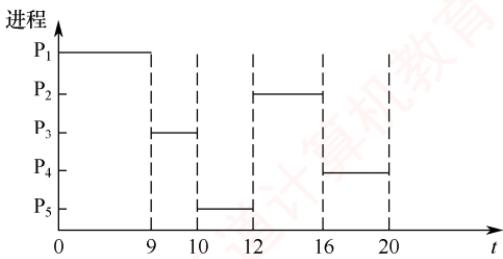

来就是 $\mathrm { P } _ { 5 } ;$ 然后，因为 $\mathrm { P } _ { 2 } , \mathrm { P } _ { 4 }$ 的预计运行时间一样，所以在 $\mathrm { P } _ { 2 }$ 和 $\mathrm { P } _ { 4 }$ 之间用先来先服务调度，优先把处理器分配给 $\mathrm { P } _ { 2 }$ ，最后再分配给 $\mathrm { P } _ { 4 } ,$ ，完成任务。

周转时间=完成时间－作业到达时间，从图中显然可以得到各进程的完成时间，于是 $\mathrm { P } _ { 1 }$ 的周转时间是 $9 - 0 = 9\mathrm{h};\mathrm{~P}_{2}$ 的周转时间是 $16-0.4=15.6\mathrm{h};\mathrm{P}_{3}$ 的周转时间是 $10 - 1 = 9\mathrm{h}; \mathrm{P}_4$ 的周转时间是 $20-5.5=14.5\mathrm{h};\mathrm{P}_{5}$ 的周转时间是 $12 - 7 = 5  h$ ；平均周转时间为 $( 9 + 15.6 + 9 + 14.5 + 5 ) / 5 =$ $1 0 . 6 2 \mathrm { h }$ 算

同理，抢占式的周转时间也可通过画甘特图求得，而且直观、不易出错。

抢占式的平均周转时间为6.8h。

甘特图在操作系统中有着广泛的应用，本节习题中会有不少这种类型的题目，若读者按照上面的方法求解，则解题时就可以做到胸有成竹。

## 27. D

当这五个批处理作业采用短作业优先调度算法时，平均周转时间 $2+(2+4)+(2+4+6)+(2+$ $4+6+8)+(2+4+6+8+10)]/5=14$

这道题主要考查读者对各种优先调度算法的认识。若按照18题中的方法求解，则可能要花费一定的时间，但这是值得的，因为可以起到熟练基本方法的效果。在考试中很少会遇到操作量和计算量如此大的题目，所以读者不用担心。 XTA

## 28. C

根据各个进程的到达时间和预计运行时间，画出甘特图如下。由此可知，各个进程的周转时间分别为4h、1h、8h、12h、2h，所以总周转时间为 $4+1+8+12+2=27$

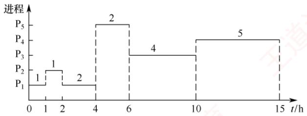

## 29. D

新进程总是先进入第一级队列的队尾。在0～10ms时段， $\mathrm { P } _ { 1 }$ 在队列A上运行；在10～30ms时段， $\mathrm { P } _ { 1 }$ 在队列B上运行；当 $t = 30 ms$ 时， $\mathrm{P}_{2}$ 进入队列A，因此在30～40ms时段， $\mathrm { P } _ { 2 }$ 在队列A上运行；在40～60ms时段， $\mathrm { P } _ { 2 }$ 在队列B上运行，此时 $\mathrm { P } _ { 2 }$ 运行结束；最后 $\mathrm { P } _ { 1 }$ 在 60～90ms 和 90～120ms时段内，于队列C上运行2个时间片，因此 $\mathrm { P _ { 1 } }$ 的总周转时间为120ms。

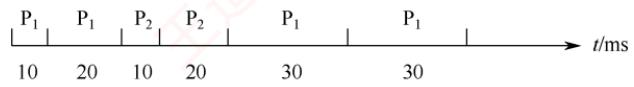

## 30. A

分时系统需要同时满足多个用户的需要，因此把处理器时间轮流分配给多个用户作业使用，即采用时间片轮转调度算法。

## 31. B

先来先服务调度算法中，若一个长进程（作业）先到达系统，则会使后面的许多短进程（作业）等待很长的时间，因此对短进程（作业）不利。

## 32. B

短进程优先调度算法具有最短的平均周转时间。平均周转时间=各进程周转时间之和/进程数。因为每个进程的执行时间都是固定的，所以变化的是等待时间，只有短进程优先调度算法能最小化等待时间。 V

## 33. C

系统开销小不是多级反馈队列调度算法的特性，而正好相反，该算法需要设置多个就绪队列，并且要在不同的队列之间进行进程的转移和抢占，因此增加了系统开销。

## 34. C

高响应比优先调度算法需根据进程的等待时间和服务时间来计算响应比：多级反馈队列调度算法涉及多个队列的管理，以及进程在队列之间的转移，它们的系统开销都较大。时间片轮转调

度算法虽然简单，但它需要为每个进程分配一个固定的时间片，并且在时间片用完时进行上下文切换，因此它的系统开销也不小。先来先服务调度算法是一种最简单的调度算法，它只需按照进程到达的先后顺序进行调度，无须进行任何优先级调度或时间片的判断和分配，故系统开销最小。

## 35. B

先来先服务调度算法和时间片轮转调度算法都不会出现饥饿现象，因为它们都是按照进程到达的顺序或固定的时间片来调度的，不会因为进程的特征而忽略某些进程。短作业优先调度算法（也可视为一种特殊的优先级算法）和优先级算法都可能出现饥饿现象，因为它们都是根据进程的服务时间或优先级来调度的，这样就可能导致一些长作业或低优先级的进程长期得不到调度。

## 36. A

多处理机调度需要额外考虑负载平衡和处理器亲和性两个调度目标。负载平衡是指应尽量让每个CPU都同等地忙碌，处理器亲和性是指应尽量让一个进程运行在同一个CPU上。

## 37. D

响应比=（等待时间+执行时间）/执行时间。它综合考虑了每个进程的等待时间和执行时间，对于同时到达的长进程和短进程，短进程会优先执行，以提高系统吞吐量；而长进程的响应比可以随等待时间的增加而提高，不会产生进程无法调度的情况。

## 38. A

选项A中进程时间片用完，可降低其优先级以让其他进程被调度进入执行状态。选项B中进程刚完成I/O，进入就绪队列等待被CPU调度，为了让其尽快处理I/O结果，因此应提高优先级。选项C中进程长期处于就绪队列，为不至于产生饥饿现象，也应适当提高优先级。选项D中进程的优先级不应该在此时降低，而应在时间片用完后再降低。

## 39. B

响应比=（等待时间+执行时间）/执行时间。高响应比优先调度算法在等待时间相同的情况下，作业执行时间越短，响应比越高，满足短任务优先。随着长作业等待时间的增加，响应比会变大，执行机会也会增大，因此不会发生饥饿现象。先来先服务和时间片轮转不符合短任务优先，非抢占式短任务优先会产生饥饿现象。

## 40. B

由于 $\mathrm { P } _ { 2 }$ 比 $\mathrm { P } _ { 1 }$ 晚 5ms 到达， $\mathrm { P } _ { 1 }$ 先占用CPU，作业运行的甘特图如下。

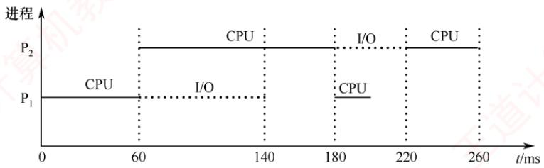

## 41. C

选项A、B、D显然属于可以进行CPU调度的情况。对于选项C，处于临界区的进程也可能因中断或抢占而导致调度，此外，若进程在临界区内请求的是一个需要等待的资源，比如打印机则它主动放弃CPU，让其他进程运行。

## 42. B

为了合理地设置进程优先级，应综合考虑进程的CPU时间和I/O时间。对于优先级调度算法，一般来说，I/O型作业的优先权高于计算型作业的优先权，这是由于I/O操作需要及时完成，它没有办法长时间地保存所要输入/输出的数据，所以考虑到系统资源利用率，要选择I/O繁忙型作业

有更高的优先级。

## 43. A

采用静态优先级调度且系统总是出现优先级高的任务时，优先级低的任务总是得不到CPU而产生饥饿现象：而短任务优先调度不管是抢占式的还是非抢占的，当系统总是出现新来的短任务时，长任务会总是得不到CPU，产生饥饿现象，因此选项B、C、D都错误。

## 44. B

这类调度题目最好画图。因CPU、输入设备、输出设备都只有一个，因此各操作步骤不能重叠，画出运行时的甘特图后，就能清楚地看到不同作业间的时序关系，如下图所示。 XTA

<table><tr><td rowspan=1 colspan=1>作业\时间</td><td rowspan=1 colspan=1>1</td><td rowspan=1 colspan=1>2</td><td rowspan=1 colspan=1>3</td><td rowspan=1 colspan=1>4</td><td rowspan=1 colspan=1>5</td><td rowspan=1 colspan=1>6</td><td rowspan=1 colspan=1>7</td><td rowspan=1 colspan=1>8</td><td rowspan=1 colspan=1>9</td><td rowspan=1 colspan=1>10</td><td rowspan=1 colspan=1>11</td><td rowspan=1 colspan=1>12</td><td rowspan=1 colspan=1>13</td><td rowspan=1 colspan=1>14</td><td rowspan=1 colspan=1>15</td><td rowspan=1 colspan=1>16</td><td rowspan=1 colspan=1>17</td></tr><tr><td rowspan=1 colspan=1>1</td><td rowspan=1 colspan=2>输入</td><td rowspan=1 colspan=3>计算</td><td rowspan=1 colspan=4>输出</td><td rowspan=1 colspan=1></td><td rowspan=1 colspan=1></td><td rowspan=1 colspan=1></td><td rowspan=1 colspan=1></td><td rowspan=1 colspan=1></td><td rowspan=1 colspan=1></td><td rowspan=1 colspan=1></td><td rowspan=1 colspan=1></td></tr><tr><td rowspan=1 colspan=1>2</td><td rowspan=1 colspan=1></td><td rowspan=1 colspan=1></td><td rowspan=1 colspan=2>输入</td><td rowspan=1 colspan=1></td><td rowspan=1 colspan=3>计算</td><td rowspan=1 colspan=1></td><td rowspan=1 colspan=4>输出</td><td rowspan=1 colspan=1></td><td rowspan=1 colspan=1></td><td rowspan=1 colspan=1></td><td rowspan=1 colspan=1></td></tr><tr><td rowspan=1 colspan=1>3</td><td rowspan=1 colspan=1></td><td rowspan=1 colspan=1></td><td rowspan=1 colspan=1></td><td rowspan=1 colspan=1></td><td rowspan=1 colspan=2>输入</td><td rowspan=1 colspan=1></td><td rowspan=1 colspan=1></td><td rowspan=1 colspan=3>计算</td><td rowspan=1 colspan=1></td><td rowspan=1 colspan=1></td><td rowspan=1 colspan=4>输出</td></tr></table>

## 45. D

注意，系统是在t=2时开始作业调度的，此时 $\mathbf { J } _ { 4 }$ 还没有到达。FCFS调度算法的特点是作业来得越早，优先级就越高，因此选择 $\mathbf { J } _ { 1 }$ 。SF调度算法的特点是作业运行时间越短，优先级就越高，因此选择 $\mathbf { J } _ { 3 }$

## 46. B

进程切换带来系统开销，切换次数越多，开销就越大，选项A正确。当前进程的时间片用完后，其状态由运行态变为就绪态，选项B错误。时钟中断是系统中特定的周期性时钟节拍，操作系统通过它来确定时间间隔，实现时间的延时和任务的超时，选项C正确。现代操作系统为了保证性能最优，通常根据响应时间、系统开销、进程数量、进程运行时间等因素确定时间片大小，选项D正确。

## 47. D

由优先权可知，进程的执行顺序为 $\mathrm{P}_{2} \rightarrow \mathrm{P}_{3} \rightarrow \mathrm{P}_{1} \text { 。 } \mathrm{P}_{2}$ 的周转时间为 $1+15+24=40\mu s$ 的周转时间为 $18+1+24+1+36=80\mu s$ 的周转时间为 $30+1+24+1+36+1+12=105\mu s;$ 平均周转时间为 $( 4 0 + 8 0 + 1 0 5 ) / 3 = 2 2 5 / 3 = 7 5 \mu \mathrm { s }$ ，因此选择选项 $\mathrm { D } ,$

## 48. C

进程 $\mathrm { P } _ { 1 }$ 和 $\mathrm { P } _ { 2 }$ 依次创建后进入队列 $\mathrm { Q _ { 1 } }$ ，根据时间片调度算法的规则，进程 $\mathrm { P } _ { 1 }$ 和 $ P _2$ 将依次被分配10ms的CPU时间，两个进程分别执行完一个时间片后都会被转入队列 $\mathrm { Q } _ { 2 }$ ，就绪队列 $\mathrm { Q } _ { 2 }$ 采用短进程优先调度算法，此时 $\mathrm { P _ { 1 } }$ 还需要 20ms 的 CPU 时间， $\mathrm { P } _ { 2 }$ 还需要10ms的CPU时间，所以

$\mathrm { P } _ { 2 }$ 会被优先调度执行，10ms后进程 $\mathrm { P } _ { 2 }$ 执行完成，之后 $\mathrm { P } _ { 1 }$ 再调度执行，再过 20ms 后$\mathrm { P _ { 1 } }$ 也执行完成。运行图表述如右。

进程 $ P _{1} 、  P _{2}$ 的等待时间分别为图中的虚横线部分，平均等待时 $ 间 =\left( P _{1}\right.$ 的等待时间 $+ \mathrm { ~ P } _ { 2 }$ 的等待时间 $) / 2 = ( 2 0 + 1 0 ) / 2 = 1 5$ 因此答案选C。

## 49. D

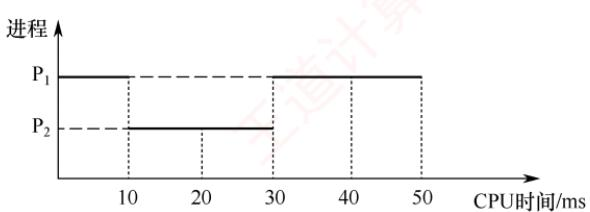

多级反馈队列调度算法需要综合考虑优先级数量、优先级之间的转换规则等，就绪队列的数量会影响长进程的最终完成时间，说法Ⅰ正确；就绪队列的优先级会影响进程执行的顺序，说法Ⅱ正确；各就绪队列的调度算法会影响各队列中进程的调度顺序，说法Ⅲ正确；进程在就绪队列中的迁移条件会影响各进程在各队列中的执行时间，说法IV正确。

## 50. C

时钟中断处理程序是一种特殊的中断处理程序，它负责在每个时钟周期结束时执行一些操  
作，如内核中时钟变量的值、当前进程占用CPU的时间、当前进程在时间片内的剩余执行时间。  
时钟中断处理程序的触发条件是系统定时器（一种可编程的硬件芯片）以固定的频率（称为节拍  
率）产生一个中断信号，通知CPU进行中断处理。在分时系统的时间片轮转调度中，当时钟中断  
处理程序检查到当前进程的时间片用完时，就触发进程调度，调度程序从就绪队列中选择一个进  
程为其分配时间片，并且修改该进程的进程控制块中的进程状态等信息，同时将时间片用完的进  
程放入就绪队列或让其结束运行，说法I、Ⅱ、Ⅲ正确。阻塞队列中的进程只有被唤醒并进入就  
绪队列后，才能参与调度，所以该调度过程不使用阴塞队列。K

## 51. D

中断处理阶段运行的是中断处理程序，中断处理结束后，需要返回原程序或重新选择程序运行，而后者需要进行进程调度，例如在时间片轮转调度中，时钟中断处理结束后，若当前进程的时间片用完，则会发生进程调度。当前进程阻塞时，将其放入阻塞队列，若就绪队列不空，则调度新进程执行。进程执行结束会导致当前进程释放CPU，并从就绪队列中选择一个进程获得CPU。进程时间片用完，会导致当前进程让出CPU，同时选择就绪队列的队首进程获得CPU。

## 52. C

需要注意的是，在0时刻， $\mathrm { P _ { 0 } }$ 获得CPU也是一次进程调度，所以0时刻调度进程 $\mathrm { P _ { 0 } }$ 获得CPU;10ms时 $\mathrm { P } _ { 2 }$ 进入就绪队列，调度 $\mathrm { P } _ { 2 }$ 抢占获得 CPU；15ms 时 $ P _{3}$ 进入就绪队列，调度 $\mathrm { P } _ { 3 }$ 抢占获得CPU；25ms时 $\mathrm { P } _ { 3 }$ 执行完毕，调度 $\mathrm { P } _ { 2 }$ 获得 CPU；40ms 时 $ P _2$ 执行完毕，调度 $\mathrm { P _ { 0 } }$ 获得CPU；130ms时 $\mathrm { P _ { 0 } }$ 执行完毕，调度 $\mathrm { P } _ { 1 }$ 获得 CPU；190ms 时 $\mathrm { P } _ { 1 }$ 执行完毕，结束；总共调度6次。

## 53. B

采用抢占式优先级调度算法，三个作业的执行顺序如右图所示。

周转时间 = 完成时间－到达时间。 $\mathrm { P _ { 1 } }$ 的周转时间 $115 - 0 = 115  ms$ $\mathrm { P } _ { 2 }$ 的周转时间 $75 - 20 =$ 55ms; $\mathrm { P } _ { 3 }$ 的周转时间 $43 - 30 = 13  ms$ ，所以平均周转时间 $(115 + 55 + 13)/3 = 61  ms$

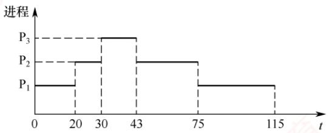

## 54. C

系统使用时间片轮转调度算法，最初共有10个进程处于就绪队列，进程P处于队尾，时间片大小为5ms。假设当t=0时开始进程调度，就绪队列的前9个进程依次运行一个时间片，则当t=45ms时调度进程P运行，运行5ms后，当 $t = 50 ms$ 时又开始新一轮循环。进程P所需的CPU时间为25ms，共需5轮循环，其他进程所需的CPU时间都比进程P的长，这5轮循环中其余9个进程都不会运行结束，因此进程P的周转时间为 $50 \times 5 = 250  ms$

## 55. D

进程切换时，需要进行上下文切换，主要完成：（①）将当前CPU中各寄存器的内容保存到当前进程的PCB中；②将新进程的现场信息装入CPU的各个寄存器。③将控制转至新进程执行，即更新程序计数器（PC）的值。栈基址寄存器用来指明系统内核栈位置的寄存器，页表基址寄存器用来指明当前进程顶级页表基地址的寄存器，属于进程控制信息。因此，说法I、Ⅱ、Ⅲ均需要更新。

## 56. C

在该调度系统中，就绪队列采用按优先权从高到低排序的有序单链表实现。插入新进程时，为维持链表的有序性，需要从表头开始顺序查找，直至找到首个优先权不高于待插入进程的结点，并在其前插入；最坏情况下需要遍历整个链表，时间复杂度为O(n)。由于最高优先权的进程始终

位于链表头部，调度程序只需访问头结点即可获得下一个待执行的进程，无须额外搜索，因此选择进程的操作时间复杂度为O(1)。 临村

## 57. D

进程上下文切换需要隔离各进程的执行环境，并确保新进程正确恢复运行，因此必须更新当前进程的上下文。通用寄存器和程序计数器属于典型的进程私有状态：前者保存临时数据，后者指向下一条指令地址，两者都必须在切换时保存和恢复。页表基址寄存器存放当前进程页表的物理起始地址。在页式系统中，每个进程都拥有独立的虚拟地址空间和页表，切换时必须更新该寄存器，以激活新进程的地址映射。内核中断向量表基址寄存器指向操作系统内核维护的中断处理入口表，该表是全局共享的系统资源，用于响应中断和异常，其内容由内核统一管理，不随用户进程变化，因此在进程上下文切换时无须更新。

## 二、综合应用题

## 01. 【解答】

抢占式优先级调度算法，三个作业执行的顺序如下图所示。

作业 $\mathrm { P } _ { 1 }$ 的优先级最高，周转时间等于运行时间， $T _ { 1 }   { = }   8 0 \mathrm { m s }$ ；作业 $ P _2$ 的等待时间为10ms，运行时间为80ms，周转时间 $T_{2} = (10 + 80)  ms  = 90  ms$ 作业 $\mathrm { P } _ { 3 }$ 的等待时间为40ms，运行时间为50ms，因此周转时间 $T _ { 3 } = 9 0 \mathrm { m s }$ 0

三个作业从进入系统到全部运行结束，时间为90ms。CPU与外设都是独占设备，运行时间分别为各作业的使用时间之和。CPU运行时间为 $[(10 + 10) + 20 + 30] \mathrm{ms} = 70 \mathrm{ms}$ ， $\mathrm { D _ { 1 } }$ 为 $(30 + 20 +$ $20 \mathrm{ms} = 70 \mathrm{ms}$ $\mathrm { D } _ { 2 }$ 为 $(30 + 40) \mathrm{ms} = 70 \mathrm{ms}$ ，因此利用率均为 $70/90=77.8\%$

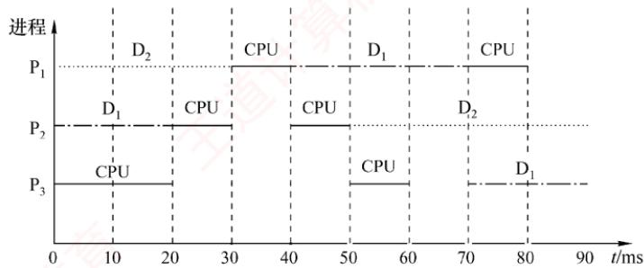

## 02.【解答】

作业A、B、C的优先级依次递减，采用不可抢占的优先级调度。

在时刻40，作业C释放CPU，优先级较高的作业A获得 $\mathrm { C P U } ;$ 在时刻60，作业 A释放CPU，优先级较高的作业 B获得 CPU；在时刻100，作业 B释放 CPU，优先级高的作业 A获得CPU;在时刻110，作业A释放CPU，作业C获得CPU；在时刻130，作业C释放CPU，作业B获得$\mathrm { C P U }$ ；在时刻160，作业B释放CPU，作业A获得CPU。运行图如下所示。

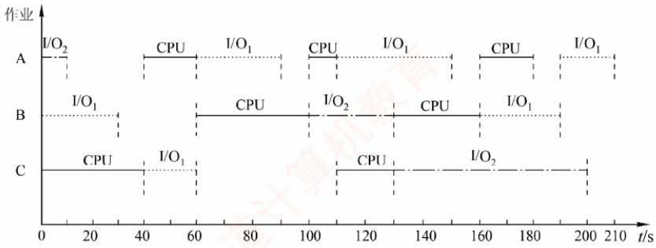

1）最早结束的是作业B。

2）最后结束的是作业A。

3）三个作业从开始到全部执行结束，经历时间为210ms，因为是单CPU系统，CPU运行时间为各个作业的CPU运行时间之和，即 $\left[ \left( 20 + 10 + 20 \right) + \left( 40 + 30 \right) + \left( 40 + 20 \right) \right] \mathrm{ms} = 180 \mathrm{ms}$ 因此 CPU 的利用率为 180/210 = 85.7%。

## 03.【解答】

根据题意，首先由图进行分析，进程由运行态可以直接回到就绪队列的末尾，而且就绪队列中是先来先服务。那么，什么情况才能发生这样的变化呢？只有采用单一时间片轮转的调度系统，分配的时间片用完后，才会发生上述情况。因此，该系统一定采用时间片轮转调度算法，采用时间片轮转调度算法的操作系统一般均为交互式操作系统。由图可知，进程被阻塞时，可以进入不同的阻塞队列，等待打印机输出结果和等待磁盘读取文件。所以，它是一个多阻塞队列的时间片轮转调度算法的调度系统。 V

具体解答如下。

1）根据题意，该系统采用的是时间片轮转调度算法调度进程策略。

2）可能的变化见下表。

<table><tr><td rowspan=1 colspan=1>变化</td><td rowspan=1 colspan=1>原因</td></tr><tr><td rowspan=1 colspan=1>1</td><td rowspan=1 colspan=1>进程被调度，获得CPU，进入运行态            如</td></tr><tr><td rowspan=1 colspan=1>2</td><td rowspan=1 colspan=1>进程需要读文件，因I/O操作进入阻塞态</td></tr><tr><td rowspan=1 colspan=1>3</td><td rowspan=1 colspan=1>进程打印输出结果，因打印机未结束而阻塞</td></tr><tr><td rowspan=1 colspan=1>4</td><td rowspan=1 colspan=1>打印机打印结束，进程重新回归就绪态，并排在尾部</td></tr><tr><td rowspan=1 colspan=1>5</td><td rowspan=1 colspan=1>进程所需数据已从磁盘进入内存，进程回到就绪态</td></tr><tr><td rowspan=1 colspan=1>6</td><td rowspan=1 colspan=1>运行的进程因为时间片用完而让出CPU，排到就绪队列尾部</td></tr></table>

## 04. 【解答】

1）作业执行情况可以用如下的甘特图来表示。

<table><tr><td></td><td rowspan=1 colspan=10>1</td><td rowspan=1 colspan=1>2</td><td rowspan=1 colspan=2>3</td><td rowspan=1 colspan=1>4</td><td rowspan=1 colspan=1>5</td></tr><tr><td rowspan=1 colspan=16>RR:</td></tr><tr><td></td><td rowspan=1 colspan=1>1</td><td rowspan=1 colspan=1>2</td><td rowspan=1 colspan=1>3</td><td rowspan=1 colspan=1>4</td><td rowspan=1 colspan=1>5</td><td rowspan=1 colspan=1>1</td><td rowspan=1 colspan=1>3</td><td rowspan=1 colspan=1>5</td><td rowspan=1 colspan=1>1</td><td rowspan=1 colspan=1>5</td><td rowspan=1 colspan=1>1</td><td rowspan=1 colspan=1>5</td><td rowspan=1 colspan=1>1</td><td rowspan=1 colspan=1>5</td><td rowspan=1 colspan=1>1</td></tr><tr><td rowspan=1 colspan=16>SJF:</td></tr><tr><td></td><td rowspan=1 colspan=1>2</td><td rowspan=1 colspan=1>4</td><td rowspan=1 colspan=2>3</td><td rowspan=1 colspan=5>5</td><td rowspan=1 colspan=6>1</td></tr><tr><td rowspan=1 colspan=16>优先级：</td></tr><tr><td></td><td rowspan=1 colspan=1>2</td><td rowspan=1 colspan=5>5</td><td rowspan=1 colspan=8>1</td><td rowspan=1 colspan=1>4</td></tr></table>

2）各个作业对应于各个算法的周转时间和加权周转时间见下表。

<table><tr><td rowspan=2 colspan=1>算法</td><td rowspan=1 colspan=1>时间类型</td><td rowspan=1 colspan=1> $\mathrm { P _ { 1 } }$ </td><td rowspan=1 colspan=1> $\overline { { | \mathrm { P } _ { 2 } | } }$ </td><td rowspan=1 colspan=1> $\overline { { \mathrm { P } _ { 3 } } }$ </td><td rowspan=1 colspan=1> $\mathrm { P } _ { 4 }$ </td><td rowspan=1 colspan=1> $\mathrm { P } _ { 5 }$ </td><td rowspan=1 colspan=1>平均时间</td></tr><tr><td rowspan=1 colspan=1>运行时间</td><td rowspan=1 colspan=1>10</td><td rowspan=1 colspan=1>1</td><td rowspan=1 colspan=1> $2$ </td><td rowspan=1 colspan=1>1</td><td rowspan=1 colspan=1>5</td><td rowspan=1 colspan=1>3.8</td></tr><tr><td rowspan=2 colspan=1>FCFS</td><td rowspan=1 colspan=1>周转时间</td><td rowspan=1 colspan=1>10</td><td rowspan=1 colspan=1>11</td><td rowspan=1 colspan=1>13</td><td rowspan=1 colspan=1>14</td><td rowspan=1 colspan=1>19</td><td rowspan=1 colspan=1>13.4</td></tr><tr><td rowspan=1 colspan=1>加权周转时间</td><td rowspan=1 colspan=1>1</td><td rowspan=1 colspan=1>11</td><td rowspan=1 colspan=1>6.5</td><td rowspan=1 colspan=1>14</td><td rowspan=1 colspan=1>3.8</td><td rowspan=1 colspan=1>7.26</td></tr><tr><td rowspan=2 colspan=1>RR</td><td rowspan=1 colspan=1>周转时间</td><td rowspan=1 colspan=1>19</td><td rowspan=1 colspan=1>2</td><td rowspan=1 colspan=1>7</td><td rowspan=1 colspan=1>4</td><td rowspan=1 colspan=1>14</td><td rowspan=1 colspan=1>9.2</td></tr><tr><td rowspan=1 colspan=1>加权周转时间</td><td rowspan=1 colspan=1>1.9</td><td rowspan=1 colspan=1>2</td><td rowspan=1 colspan=1>3.5</td><td rowspan=1 colspan=1>4</td><td rowspan=1 colspan=1>2.8</td><td rowspan=1 colspan=1>2.84</td></tr><tr><td rowspan=2 colspan=1>SJF</td><td rowspan=1 colspan=1>周转时间</td><td rowspan=1 colspan=1>19</td><td rowspan=1 colspan=1>1</td><td rowspan=1 colspan=1>4</td><td rowspan=1 colspan=1>2</td><td rowspan=1 colspan=1>9</td><td rowspan=1 colspan=1>7</td></tr><tr><td rowspan=1 colspan=1>加权周转时间</td><td rowspan=1 colspan=1>1.9</td><td rowspan=1 colspan=1>1</td><td rowspan=1 colspan=1>2</td><td rowspan=1 colspan=1>2</td><td rowspan=1 colspan=1>1.8</td><td rowspan=1 colspan=1>1.74</td></tr><tr><td rowspan=2 colspan=1>优先级</td><td rowspan=1 colspan=1>周转时间</td><td rowspan=1 colspan=1>16</td><td rowspan=1 colspan=1>1</td><td rowspan=1 colspan=1>18</td><td rowspan=1 colspan=1>19</td><td rowspan=1 colspan=1>6</td><td rowspan=1 colspan=1>12</td></tr><tr><td rowspan=1 colspan=1>加权周转时间</td><td rowspan=1 colspan=1>1.6</td><td rowspan=1 colspan=1>1</td><td rowspan=1 colspan=1>9</td><td rowspan=1 colspan=1>19</td><td rowspan=1 colspan=1>1.2</td><td rowspan=1 colspan=1>6.36</td></tr></table>

所以，FCFS的平均周转时间为13.4，平均加权周转时间为7.26。

RR的平均周转时间为9.2，平均加权周转时间为2.84。

S.JF的平均周转时间为7，平均加权周转时间为1.74。

非剥夺式优先级调度算法的平均周转时间为12，平均加权周转时间为6.36。

## 注意

SJF的平均周转时间肯定是最短的，计算完毕后可以利用这个性质进行检验。

## 05. 【解答】

1）具有两道作业的批处理系统，内存只存放两道作业，它们采用抢占式优先级调度算法竞争CPU，而将作业调入内存采用的是短作业优先调度。8:00，作业1到来，此时内存和CPU空闲，作业1进入内存并占用CPU；8:20，作业2到来，内存仍有一个位置空闲，因此将作业2调入内存，又由于作业2的优先数高，相应的进程抢占CPU，在此期间8:30作业3到来，但内存此时已无空闲，因此等待。直至8：50，作业2执行完毕，此时作业3、4竞争空出的一道内存空间，作业4的运行时间短，因此先调入，但它的优先数低于作业1，因此作业1先执行。到9：10时，作业1执行完毕，再将作业3调入内存，且由于作业3的优先数高而占用CPU。所有作业进入内存的时间及结束的时间见下表。

<table><tr><td rowspan=1 colspan=1>作业号</td><td rowspan=1 colspan=1>到达时间</td><td rowspan=1 colspan=1>运行时间</td><td rowspan=1 colspan=1>优先数</td><td rowspan=1 colspan=1>进入内存时间</td><td rowspan=1 colspan=1>结束时间</td><td rowspan=1 colspan=1>周转时间</td></tr><tr><td rowspan=1 colspan=1>1</td><td rowspan=1 colspan=1>8:00</td><td rowspan=1 colspan=1>40min</td><td rowspan=1 colspan=1>5</td><td rowspan=1 colspan=1>8:00</td><td rowspan=1 colspan=1>9:10</td><td rowspan=1 colspan=1>70min</td></tr><tr><td rowspan=1 colspan=1>2</td><td rowspan=1 colspan=1>8:20</td><td rowspan=1 colspan=1>30min</td><td rowspan=1 colspan=1>3</td><td rowspan=1 colspan=1>8:20</td><td rowspan=1 colspan=1>8:50</td><td rowspan=1 colspan=1>30min</td></tr><tr><td rowspan=1 colspan=1>3</td><td rowspan=1 colspan=1>8:30</td><td rowspan=1 colspan=1>50min</td><td rowspan=1 colspan=1>4</td><td rowspan=1 colspan=1>9:10</td><td rowspan=1 colspan=1>10:00</td><td rowspan=1 colspan=1>90min</td></tr><tr><td rowspan=1 colspan=1>4</td><td rowspan=1 colspan=1>8:50</td><td rowspan=1 colspan=1>20min</td><td rowspan=1 colspan=1>6</td><td rowspan=1 colspan=1>8:50</td><td rowspan=1 colspan=1>10:20</td><td rowspan=1 colspan=1>90min</td></tr></table>

2）平均周转时间为 $(70+30+90+90)/4=70\min$

## 06. 【解答】

1）按照可抢先式短进程优先调度算法，进程运行时间见下表。

<table><tr><td rowspan=1 colspan=1>进程名</td><td rowspan=1 colspan=1>到达就绪队列时刻</td><td rowspan=1 colspan=1>预计执行时间</td><td rowspan=1 colspan=1>执行时间段</td><td rowspan=1 colspan=1>周转时间</td></tr><tr><td rowspan=1 colspan=1> $\mathrm { P } _ { 1 }$ </td><td rowspan=1 colspan=1>0</td><td rowspan=1 colspan=1>8</td><td rowspan=1 colspan=1>0~1;10~17</td><td rowspan=1 colspan=1>17</td></tr><tr><td rowspan=1 colspan=1> $\mathrm { P } _ { 2 }$ </td><td rowspan=1 colspan=1>1</td><td rowspan=1 colspan=1>4</td><td rowspan=1 colspan=1>1~5</td><td rowspan=1 colspan=1>4</td></tr><tr><td rowspan=1 colspan=1> $ P _{3}$ </td><td rowspan=1 colspan=1>2</td><td rowspan=1 colspan=1>9</td><td rowspan=1 colspan=1>17~26</td><td rowspan=1 colspan=1>24</td></tr><tr><td rowspan=1 colspan=1> $ P _4$ </td><td rowspan=1 colspan=1>3</td><td rowspan=1 colspan=1>5</td><td rowspan=1 colspan=1>5~10</td><td rowspan=1 colspan=1>7</td></tr></table>

● 时刻 0，进程 $\mathrm { P } _ { 1 }$ 到达并占用处理器运行。

● 时刻 1，进程 $\mathrm { P } _ { 2 }$ 到达，因其预计运行时间短，因此抢夺处理器进入运行， $\mathrm { P } _ { 1 }$ 等待。

● 时刻2，进程 $\mathrm { P } _ { 3 }$ 到达，因其预计运行时间长于正在运行的进程，进入就绪队列等待。

●时刻3，进程 $\mathrm { P } _ { 4 }$ 到达，因其预计运行时间长于正在运行的进程，进入就绪队列等待。

● 时刻 5，进程 $\mathrm { P } _ { 2 }$ 运行结束，调度器在就绪队列中选择短进程， $\mathrm { P } _ { 4 }$ 符合要求，进入运行， 进程 $\mathrm { P } _ { 1 }$ 和进程 $\mathrm { P } _ { 3 }$ 则还在就绪队列等待。

● 时刻 10，进程 $\mathrm { P } _ { 4 }$ 运行结束，调度器在就绪队列中选择短进程， $\mathrm { P } _ { 1 }$ 符合要求，再次进入运行，而进程 $\mathrm { P } _ { 3 }$ 则还在就绪队列等待。

● 时刻 17，进程 $\mathrm { P } _ { 1 }$ 运行结束，只剩下进程P3，调度其运行。

● 时刻 26，进程 $\mathrm { P } _ { 3 }$ 运行结束。

平均周转时间 $\left[ (17-0)+(5-1)+(26-2)+(10-3) \right] / 4 = 13$

2）时间片轮转调度算法按就绪队列的FCFS进行轮转，在时刻2， $\mathrm { P } _ { 1 }$ 被挂到就绪队列队尾，队列顺序为 $\mathrm { P } _ { 2 } , \mathrm { P } _ { 3 } , \mathrm { P } _ { 1 }$ ，此时 $ P _4$ 还未到达。按时间片轮转调度算法的进程时间分配见下表。

<table><tr><td rowspan=1 colspan=1>进程名</td><td rowspan=1 colspan=1>到达就绪队列时刻</td><td rowspan=1 colspan=1>预计执行时间</td><td rowspan=1 colspan=1>执行时间段</td><td rowspan=1 colspan=1>周转时间</td></tr><tr><td rowspan=1 colspan=1> $\mathrm { P _ { 1 } }$ </td><td rowspan=1 colspan=1>0</td><td rowspan=1 colspan=1>8</td><td rowspan=1 colspan=1> $0 \sim 2; 6 \sim 8; 14 \sim 16; 20 \sim 22$ </td><td rowspan=1 colspan=1>22</td></tr><tr><td rowspan=1 colspan=1> $\mathrm { P } _ { 2 }$ </td><td rowspan=1 colspan=1>1</td><td rowspan=1 colspan=1>4</td><td rowspan=1 colspan=1> $2 \sim 4; 10 \sim 12$ </td><td rowspan=1 colspan=1>11</td></tr><tr><td rowspan=1 colspan=1> $ P _{3}$ </td><td rowspan=1 colspan=1>2</td><td rowspan=1 colspan=1>9</td><td rowspan=1 colspan=1>4~6;12~14;18~20;23~25;25~26</td><td rowspan=1 colspan=1>24</td></tr><tr><td rowspan=1 colspan=1> $\mathrm { P } _ { 4 }$ </td><td rowspan=1 colspan=1>3</td><td rowspan=1 colspan=1>5</td><td rowspan=1 colspan=1>8~10;16~18;22~23</td><td rowspan=1 colspan=1>20</td></tr></table>

平均周转时间 $\left[ (22-0)+(12-1)+(26-2)+(23-3) \right] / 4 = 19.25$

## 07.【解答】

在时间片轮转调度算法中，系统将所有就绪进程按到达时间的先后次序排成一个队列。进程调度程序总是选择队列中的第一个进程运行，且仅能运行一个时间片。在使用完一个时间片后，即使进程并未完成其运行，也必须将处理器交给下一个进程。时间片轮转调度算法是绝对可抢先的算法，由时钟中断来产生。

时间片的长短对计算机系统的影响很大。若时间片大到让一个进程足以完成其全部工作，则这种算法就退化为先来先服务调度算法。若时间片很小，则处理器在进程之间的转换工作会过于频繁，处理器真正用于运行用户程序的时间将减少，系统开销将增大。时间片的大小应能使分时用户得到好的响应时间，同时也使系统具有较高的效率。

## 由题目给定条件可知：

1）每秒产生120个时钟中断，每次中断的时间为 $1 / 1 2 0 \approx 8 . 3 \mathrm { m s }$ ，其中中断处理耗时为500μs，那么其开销为 $500\mu s/8.3ms=6\%$ XTA

2）每次进程切换需要1次调度、1次切换，所以需要耗时 $1 ms  + 2 ms  = 3 ms$ ，每24个时钟为一个时间片， $24 \times 8.3   ms  = 200   ms$ 。一次切换所占CPU的时间比 $3 ms /200 ms =1.5\%$

3）为提高CPU的效率，一般情况下要尽量减少时钟中断的次数，如由每秒120次降低到100次，以延长中断的时间间隔。或将每个时间片的中断数量（时钟数）加大，如由24个中断加大到36个。也可优化中断处理程序，减少中断处理开销，如将每次 $5 0 0 \mu \mathrm { s }$ 的时间降低到 $4 0 0 \mu \mathrm { s }$ 。若能这样，则时钟中断和进程切换的总开销占CPU的时间比为 $(36 \times 400\mu s +$ $1 \mathrm{ms} + 2 \mathrm{ms}) / (1 / 100 \times 36) \approx 4.8\%$

## 08. 【解答】

作业的响应比可表示为

$$
 响应比  = \frac{ 等待时间  +  要求服务时间 }{ 要求服务时间 }
$$

在时刻8:00，系统中只有一个作业 $\mathrm { J } _ { 1 }$ ，因此系统将它投入运行。在 $\mathrm { J _ { 1 } }$ 完成（10:00）时， ${ \bf J } _ { 2 } ,$ $\mathbf { J } _ { 3 } , \mathbf { J } _ { 4 }$ 的响应比分别为 $( 9 0 + 4 0 ) / 4 0 , ( 6 0 + 2 5 ) / 2 5 , ( 3 0 + 3 0 ) / 3 0$ ，即3.25,3.4,2，因此应先将 ${ \bf J } _ { 3 }$ 投入运行。在 ${ \bf J } _ { 3 }$ 完成（10：25）时， $\mathbf { J } _ { 2 } ,   \mathbf { J } _ { 4 }$ 的响应比分别为 $( 1 1 5 + 4 0 ) / 4 0 , ( 5 5 + 3 0 ) / 3 0$ ，即3.875,2.83，因此应先将 $ J _2$ 投入运行，待它运行完毕时（11:05），再将 $\mathrm { J } _ { 4 }$ 投入运行， $\mathrm { J } _ { 4 }$ 的结束时间为11:35。

可见作业的执行次序为 $\mathrm { J } _ { 1 } , \mathrm { J } _ { 3 } , \mathrm { J } _ { 2 } , \mathrm { J } _ { 4 }$ ，各作业的运行情况见下表，它们的周转时间分别为120min,155min, 85min, 125min，平均周转时间为121.25min。

<table><tr><td rowspan=1 colspan=1>作业号</td><td rowspan=1 colspan=1>提交时间</td><td rowspan=1 colspan=1>开始时间</td><td rowspan=1 colspan=1>执行时间</td><td rowspan=1 colspan=1>结束时间</td><td rowspan=1 colspan=1>周转时间</td></tr><tr><td rowspan=1 colspan=1>1</td><td rowspan=1 colspan=1>8:00</td><td rowspan=1 colspan=1>8:00</td><td rowspan=1 colspan=1>2h</td><td rowspan=1 colspan=1>10:00</td><td rowspan=1 colspan=1>120min</td></tr><tr><td rowspan=1 colspan=1> $2$ </td><td rowspan=1 colspan=1>8:30</td><td rowspan=1 colspan=1>10:25</td><td rowspan=1 colspan=1>40min</td><td rowspan=1 colspan=1>11:05</td><td rowspan=1 colspan=1>155min</td></tr><tr><td rowspan=1 colspan=1>3</td><td rowspan=1 colspan=1>9:00</td><td rowspan=1 colspan=1>10:00</td><td rowspan=1 colspan=1>25min</td><td rowspan=1 colspan=1>10:25</td><td rowspan=1 colspan=1>85min</td></tr><tr><td rowspan=1 colspan=1>4</td><td rowspan=1 colspan=1>9:30</td><td rowspan=1 colspan=1>11:05</td><td rowspan=1 colspan=1>30min</td><td rowspan=1 colspan=1>11:35</td><td rowspan=1 colspan=1>125min</td></tr></table>

## 09.【解答】

上述5个作业的运行情况如下图所示。

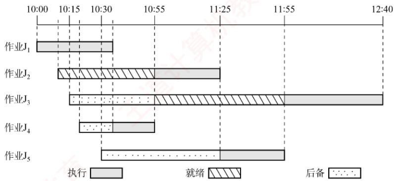

本题涉及作业和进程两方面的调度，一个作业首先需要被调入内存，创建相应的进程，然后竞争CPU，获得CPU的资源来执行。本题的条件是有两道作业的批处理系统，所以内存中同时最多只有两个进程存在，且同时最多只有一个进程能够获得CPU资源。

在10:00，因为只有 $\mathbf { J } _ { 1 }$ 到达，因此将它调入内存，并将CPU调度给它。

在10:10， $\mathbf { J } _ { 2 }$ 到达，因此将 $\mathrm { J } _ { 2 }$ 调入内存，但 $\mathrm { J } _ { 1 }$ 只需再执行25min，因此 $\mathrm { J } _ { 1 }$ 继续执行。

虽然 $\mathbf { J } _ { 3 } , \mathbf { J } _ { 4 } , \mathbf { J } _ { 5 }$ 分别在10:15,10:20和10:30到达，但因当时内存中已存放了两道作业，因此不能马上将它们调入内存。

在10:35， $\mathrm { J } _ { 1 }$ 结束。此时 $\mathbf { J } _ { 3 } , \mathbf { J } _ { 4 } , \mathbf { J } _ { 5 }$ 的响应比[根据题意，响应比=(等待时间+估计运行时间)/估计运行时间]分别为65/45,35/20,35/30，因此将 $\mathbf { J } _ { 4 }$ 调入内存，并将CPU分配给内存中运行时间最短者，即 $\mathbf { J } _ { 4 } \mathrm { { _ { \circ } } }$

在10:55， $\mathbf { J } _ { 4 }$ 结束。此时 $\mathbf { J } _ { 3 } ,   \mathbf { J } _ { 5 }$ 的响应比分别为85/45,55/30，因此将 ${ \bf J } _ { 3 }$ 调入内存，并将CPU分配给估计运行时间较短的 ${ \bf J } _ { 2 } ,$ X

在11:25， ${ \bf J } _ { 2 }$ 结束，作业调度程序将 $\mathbf { J } _ { 5 }$ 调入内存，并将CPU分配给估计运行时间较短的 $\mathbf { J } _ { 5 }$ 8

在11:55， $\mathbf { J } _ { 5 }$ 结束，将 CPU分配给 $\mathbf { J } _ { 3 }$ o

在12:40， $\mathbf { J } _ { 3 }$ 结束。

通过上述分析，可知：

1）作业1的执行时间片段为10：00—10:35（结束）。

作业2的执行时间片段为10：55—11:25（结束）。

作业3的执行时间片段为11:55—12:40（结束）。

作业4的执行时间片段为10:35—10:55（结束）。

作业5的执行时间片段为11:25—11:55（结束）。

2）它们的周转时间分别为35min,75min,145min,35min, 85min，因此它们的平均周转时间为75min。

## 10. 【解答】

1）因为采用了静态优先数，当就绪队列中总有优先数较小的进程时，优先数较大的进程一直没有机会运行，所以会出现饥饿现象。 XTA

2）一种动态优先数计算方法为 $\mathrm{priority} = \mathrm{nice} + k_{1} \times \mathrm{cpuTime} - k_{2} \times \mathrm{waiftTime}$ ，其中 $k_{1} > 0,\ k_{2} > 0$ 分别用来调整cpuTime和waitTime在priority中所占的比例。若一个进程的运行时间较长，则其 cpuTime就增加，进而降低其优先级；若一个进程的等待时间较长，则其 waitTime增加，进而会提高其优先级。于是，waitTime就可使长时间等待的进程优先数减少，进而避免出现饥饿现象。 XN

## 2.3 同步与互斥

在学习本节时，请读者思考以下问题：

1）为什么要引入进程同步的概念？

2）不同的进程之间会存在什么关系？

3）当单纯用本节介绍的方法解决这些问题时会遇到什么新的问题吗？

用PV操作解决进程之间的同步互斥问题是这一节的重点，统考中频繁考查这一内容，请读者务必多加练习，掌握好求解该类问题的方法。

## 2.3.1 同步与互斥的基本概念

在多道程序环境下，进程是并发执行的，不同进程之间存在多种相互制约关系。为了协调这些制约关系，引入了进程同步的概念。下面通过一个简单的例子来帮助理解。例如，计算表达式1+2×3，假设系统为此创建两个进程：一个是乘法进程，一个是加法进程。显然，加法进程必须等待乘法进程完成之后才能正确执行。然而，由于操作系统的异步性，若不加以约束，加法进程完全有可能在乘法进程之前运行，从而导致计算结果错误。因此，需要设计一种机制，确保加法进程只能在乘法进程结束后才开始执行，而这种机制正是本节要讨论的问题。

## 1. 临界资源

## 考点追踪同步与互斥的相关分析（2016、2021、2023）

虽然多个进程可以共享系统中的各种资源，但其中许多资源在同一时刻仅允许一个进程访问，这类资源被称为临界资源。常见的临界资源包括物理设备（如打印机）以及被多个进程共享的变量、数据结构等。

## 考点追踪临界区和临界资源的分析（2024）

对临界资源的访问必须以互斥方式进行。在每个进程中，访问临界资源的那段代码称为临界

1）进入区。在进入临界区之前，进程需要检查当前是否允许进入。若允许，则设置一个“正在访问临界区”的标志，以阻止其他进程同时进入临界区。 KK

2）临界区。进程中实际访问临界资源的代码段，也称临界段。

3）退出区。在离开临界区时，清除“正在访问临界区”的标志，表示已释放该资源。

4）剩余区。指代码中除上述三部分之外的其余部分。

while(true){   
entry section; //进入区   
critical section; //临界区   
exit section; //退出区   
remainder section; //剩余区   
}

## 2. 同步（直接制约关系）

同步是指为完成某种任务而建立的两个或多个进程，由于需要协调彼此的运行次序，而在执行过程中产生等待或传递信息的制约关系。同步关系源于进程之间的相互合作。

例如，输入进程A通过单缓冲向进程B提供数据。当缓冲区为空时，进程B因无法获得所

需数据而被阻塞；一旦进程A将数据送入缓冲区，进程B就会被唤醒。反之，当缓冲区已满时，进程A无法写入新数据，会被阻塞；只有当进程B从缓冲区取走数据后，才会唤醒进程A。

## 3. 互斥（间接制约关系）

互斥是指当一个进程正在临界区中使用临界资源时，其他试图访问该资源的进程必须等待；只有当占用临界资源的进程退出临界区后，其他进程才被允许进入。

例如，在一个只配备一台打印机的系统中，有两个进程A和进程B。如果进程A需要打印，但此时打印机已被分配给进程B，那么进程A必须进入阻塞状态。一旦进程B完成打印并释放打印机，系统便会唤醒进程A，并将其状态由阻塞态转为就绪态。 TI

## 考点追踪临界区同步与互斥的设计准则（2020）

为防止多个进程同时进入临界区，同步机制应遵循以下准则。

1）空闲让进。临界区处于空闲状态时，应允许一个请求进入临界区的进程立即进入。

2）忙则等待。已有进程在临界区内执行时，表明临界资源正在被访问，其他试图进入临界区的进程必须等待，以保证对临界资源的互斥访问。

3）有限等待。对任何请求进程，应保证其在有限时间内能进入临界区，避免无限期等待。

4）让权等待（原则上应该遵循，但非必须）。当进程因无法进入临界区而需要等待时，应主动放弃CPU的使用权，转为阻塞态，而不是在原地循环测试（避免忙等待）。

## 2.3.2 实现临界区互斥的基本方法

考点追踪实现互斥的软/硬件方法的特点（2018）

## 1. 软件实现方法

在进入区设置并检查一些标志，用以表明是否有进程正在临界区中。若已有进程在临界区，则其他进程在进入区通过循环检查的方式等待；当进程离开临界区后，在退出区修改相应的标志，以允许其他进程进入。

## （1）算法一：单标志法

该算法设置一个公用整型变量turn，用于指示当前允许进入临界区的进程编号，当 $\mathrm{turn} = 0$ 时，表示允许 $\mathrm { P _ { 0 } }$ 进入临界区；当turn=1时，表示允许 $\mathrm { P } _ { 1 }$ 进入临界区。每当一个进程 $ P _i$ 退出临界区时，就将 turn置为 $j (i = 0, j = 1$ 或 $i = 1 , j = 0$ ，即将临界区的使用权转让给另一个进程。

进程 $\mathbf { P } _ { 0 } ;$ 进程 $\mathrm { P _ { 1 } ; }$   
while(turn!=0); while(turn!=1); //进入区   
critical section; critical section; //临界区   
turn=1; turn=0; 道 //退出区   
remainder section; remainder section; //剩余区

该算法可以保证每次只有一个进程进入临界区。但缺点是：两个进程必须交替进入临界区。若某个进程不再请求进入临界区，则另一个进程也将无法再次进入（违背“空闲让进”准则），造成资源利用不充分。例如，假设 $\mathrm { P _ { 0 } }$ 顺利进入临界区并执行完毕，此时临界区处于空闲状态，但若 $\mathrm { P } _ { 1 }$ 没有进入临界区的打算，而turn=1一直成立，则 $\mathrm{P}_{0}$ 就无法再次进入临界区。

## (2) 算法二：双标志先检查法

该算法设置一个布尔型数组flag[2]，用来标记各进程是否希望进入临界区。 $\mathrm{f}\mathrm{l}\mathrm{a}\mathrm{g}[i]=\mathrm{true}$ 表示$\mathrm { P } _ { i }$ 想进入临界区（i=0或1）。 $\mathrm { P } _ { i }$ 进入临界区前，先检查对方是否想进入；若对方想进入，则等待；否则，将自己的flag[i]置为true，然后进入临界区。当 $\mathrm { P } _ { i }$ 退出临界区时，将 $\operatorname { f l a g } [ i ]$ 置为false。

进程 $\mathbf { P } _ { 0 } ;$

进程 $\mathrm { P _ { 1 } ; }$

优点：无须交替进入，允许进程连续使用临界区。缺点：在某些执行顺序下， $\mathrm { P _ { 0 } }$ 和 $\mathrm { P } _ { 1 }$ 可能同时进入临界区。例如，若执行顺序为①②③④，即两个进程都先检查对方的标志（发现为false），然后才设置自己的标志，结果双方都通过检查，从而同时进入临界区（违背“忙则等待”准则）。原因在于“检查对方标志”和“设置自己标志”两个操作不是原子的，中间可能发生进程切换。

## (3）算法三：双标志后检查法

算法二的问题在于先检查后设置，而这两次操作无法一气呵成。因此，联想到先设置后检查的方法，以避免上述问题。算法三改为先设置自己的标志，再检查对方的标志：进程 $ P _i$ 首先将自己的flag[i]置为true，然后检查flag[j]，若flag[j]为true，则等待；否则，进入临界区。

进程 P0: 进程P1:   
flag[0]=true; flag[1]=true; //进入区   
while(flag[1]); while(flag[0]); //进入区   
critical section; critical section; //临界区   
flag[0]=false; flag[1]=false; //退出区   
remainder section; remainder section; /剩余区

然而，这种方案也可能出现问题。例如，若执行顺序为①②③④，即两个进程都先设置了各自的标志，然后分别检查对方的标志，会发现对方也想进入临界区，于是彼此等待，谁也无法进入。此时即使临界区空闲，也没有进程能够进入（违背“空闲让进”准则）；同时，进程可能会长期其至永远无法获得访问权（违背“有限等待”准则），导致“饥饿”现象。

## （4）算法四：Peterson 算法

## 考点追踪Peterson算法的原理（2010、2018）

Peterson算法结合了算法一和算法三的思想：利用 flag[]数组解决互斥访问问题，利用 turn变量解决“饥饿”问题。若flag[i]=true，则表示 $\mathrm { P } _ { i }$ 准备进入临界区；若turn=i，则表示当两个进程同时请求时，优先允许 $\mathrm { P } _ { i }$ 进入临界区。具体做法如下：在 $\mathrm { P } _ { i }$ 进入临界区之前，先将自己的flag[i]置为true,并将turn置为j(主动将进入机会“谦让”给对方)。随后，通过循环条件while(flag[i]&&turn==j)判断是否需要等待，从而确保双方同时请求进入临界区时，只允许一个进程进入。

进程 P{0: 进程 $\mathrm { P } _ { 1 } ;$   
flag[0]=true; flag[1]=true; //进入区   
turn=1; turn=0; //进入区   
while(flag[1]&&turn==1); while(flag[0]&&turn==0); //进入区   
flag[0]=false; critical section; critical section; flag[1]=false; 王 //临界区 //退出区   
remainder section; remainder section; //剩余区

若仅有一个进程请求进入（例如 $\mathrm { P _ { 0 } ) }$ ，由于flag[1]为false，其while条件不成立，可直接进入临界区。若两个进程同时请求进入， $\mathrm { P _ { 0 } }$ 将 turn 置为 1， $\mathrm { P _ { 1 } }$ 将turn置为0。由于这两个赋值在运行时是依次完成的，turn的最终值由后执行赋值的进程所决定。而while条件仅在“对方准备进入”且“turn指向对方”时成立，因此总有一个进程的等待条件不成立，从而得以进入临界区。

由此可见，Peterson算法很好地遵循了“空闲让进”“忙则等待”和“有限等待”三条准则。但由于它采用忙等待（在进入区中循环测试），没有遵循“让权等待”准则。尽管如此，在纯软件实现的互斥算法中，Peterson算法是在满足前三条准则方面最完善的方案。

## 2. 硬件实现方法

现代计算机提供了特殊的硬件指令，能够以原子方式对一个字进行检测和修改，或是交换两个字的内容。因此，可利用它们实现临界区的互斥访问。

实际上，管理临界区时，可将共享标志视为一把锁：“锁开”表示允许进入，“锁关”表示需等待，初始时锁为打开状态。每个欲进入临界区的进程必须先测试该锁：若锁已关，则等待，直至其被打开：一旦发现锁开，就应立即上锁，以阻止其他进程进入临界区。显然，若多个进程几乎同时检测到“锁开”，就可能同时进入临界区，因此测试与上锁必须构成一个原子操作。

## （1）中断屏蔽方法

## 考点追踪中断屏蔽实现互斥的原理与分析（2021）

关中断是实现互斥最简单的方法之一。其做法是：在执行临界区代码之前关闭中断，待临界区执行完毕后再重新开启中断。由于CPU仅在响应中断时才可能发生进程或线程切换，因此在关中断期间，当前进程不会被抢占，从而确保临界区代码不受于扰地连续执行。其典型模式如下：

这种方法的缺点：（1）限制了CPU的并发执行能力，显著降低系统效率。②对内核而言，在更新关键变量的几条指令期间关中断是可行的，但若将关中断权限开放给用户进程，则存在风险：若某进程关中断后未及时开中断，可能导致系统死锁或崩溃。③不适用于多处理器系统，因为在某一CPU上关中断无法阻止其他CPU上的进程并发访问同一临界区。

## (2）硬件指令方法——TestAndSet 指令

借助一条名为TestAndSet（简称TS）的硬件指令实现互斥，该指令是原子操作。其功能是：读取指定标志的当前值，并立即将其置为true，然后返回读取到的旧值。功能描述如下：

boolean TestAndSet (boolean \*lock) {  
boolean old;  
old=\*lock; //old 用来存放 lock 的旧值  
\*lock=true; //将 lock 置为 true  
return old; 月 //返回 lock 的旧值 教育  
1

## 考点追踪TestAndSet指令实现互斥的原理与特点（2016、2018）

使用TS指令管理临界区时，需要为每个临界资源设置一个共享布尔变量1ock（可视为一把锁，初值为false）：若lock=true，表示资源已被占用（已加锁）；若lock=false，表示资源空闲(未加锁)。进程在进入临界区前，通过执行TestAndSet(&lock)尝试获取锁：①若返回值为false，则说明lock原为false，即无其他进程在临界区，当前进程成功获得锁，并将lock置为true，从而阻止其他进程进入。②若返回值为true，则说明lock原为true，即已有进程在临界区，当前进程需循环等待，直至持有锁的进程退出临界区并将lock置为false。典型实现如下：

while(TestAndSet(&lock)); //尝试获取锁（忙等待）  
进程的临界区代码段；  
lock=false; //解锁  
进程的其他代码；

相比软件实现方法，TS指令由硬件保证“检查锁”与“加锁”这两个操作的原子性。相比关中断方法，由于“1ock”是共享变量，该机制适用于多处理器系统。缺点：等待进程会持续执行TS指令，形成忙等待，无法实现“让权等待”，造成CPU资源浪费。

(3）硬件指令方法——Swap 指令

Swap指令的功能是原子地交换两个变量的值。其功能描述如下：

void Swap(boolean \*a, boolean +b){   
boolean temp=\*a;   
\*a=\*b;   
\*b=temp; 王道   
}

## 注意

以上对TS和Swap指令的描述仅为功能示意，实际由硬件逻辑实现，不会被中断。

## 考点追踪Swap指令实现互斥的原理与分析（2018、2023）

使用 Swap 指令管理临界区时，需要为每个临界资源设置一个共享布尔变量lock（初值为false）；并在每个进程中定义一个局部布尔变量key，每次尝试进入临界区前将其初始化为true。其工作原理与TS指令本质相同：通过一次原子操作，既获取锁的当前状态，又将锁置为占用。具体过程如下：进程执行 Swap(&lock,&key)后，key 中保存了 lock 的旧值。若 key = false，说明此前无进程持有锁，当前进程成功获得访问权；若key=true，说明锁已被占用，进程需继续循环等待。因此，进入临界区的条件是key变为false。典型实现如下：

boolean key=true;  
while(key!=false)  
Swap(&lock, &key);  
进程的临界区代码段；  
lock=false;  
进程的其他代码；

硬件指令方法实现互斥的优点：①实现简单，正确性易于验证。②支持任意数量的进程，并适用于多处理器系统。③系统中可存在多个临界区，只需为每个临界区分配独立的lock变量。缺点：①等待进程持续执行Swap指令，形成忙等待，无法实现“让权等待”，造成CPU资源浪费。②锁的获取顺序不确定，可能导致某些进程长期无法获得访问机会，产生“饥饿”现象。

无论是软件还是硬件实现方法，都应重点理解其执行逻辑与同步思想。需注意：上述代码并非实际编程接口，而是描述进程间同步与互斥的抽象模型。在真实操作系统中，这些底层机制已被封装在信号量、互斥锁等高级同步原语中，用户通常无须直接编写忙等待循环。

## 2.3.3 互斥锁

解决临界区问题最简单的工具是互斥锁(mutex lock)。一个进程在进入临界区前调用 acquire()以获得锁：在退出临界区时调用release()以释放锁。每个互斥锁包含一个布尔变量available，用于表示锁是否可用。若锁可用，则调用acquire()会成功，并将锁置为不可用。当一个进程试图获取不可用的锁时，它将被阻塞，直到锁被释放。其过程描述如下：

```javascript
acquire () { //获得锁的定义
while(!available)
i //忙等待
available=false; //获得锁
1
release () { //释放锁的定义
available=true; //释放锁
}
```

acquire()或release()的执行必须是原子操作，因此互斥锁通常采用硬件机制来实现。

上述互斥锁也称自旋锁，其主要缺点是忙等待：当有一个进程在临界区中时，任何其他进程在进入临界区前都必须连续循环调用acquire()。类似的还有前面介绍的单标志法、TS指令和Swap指令。当多个进程共享同一CPU时，这种连续循环显然浪费了CPU周期。因此，自旋锁通常用于多处理器系统，一个线程可以在一个处理器上“旋转”，而不影响其他线程的执行。自旋锁的优点：进程在等待锁期间没有上下文切换；若持有锁的时间较短，则等待代价较低。

本节后面，将研究如何使用互斥锁解决经典同步问题。

## 2.3.4 信号量

信号量机制是一种功能强大的同步机制，既能解决互斥问题，也能处理进程间的同步问题。它仅能通过两个标准原语访问：wait()和 signal()。这两个操作也称P操作和 V操作。

原语是指完成特定功能且在执行过程中不可被中断的操作序列，通常由硬件实现。例如，前述的TS 指令和Swap指令均为硬件实现的原子操作。在单 CPU系统中，也可通过屏蔽中断的方式确保原语执行的原子性。之所以要求原语不可中断，是因为若其对共享变量的操作被中途打断，可能与其他进程的操作交织，从而破坏临界区的互斥性。

## 考点追踪信号量的含义（2010）

## 1. 整型信号量

整型信号量用一个整型变量S表示某类资源的可用数量。与普通整型变量不同，对其操作仅限于三种：初始化、wait操作和signal操作。其行为可描述如下：

```javascript
wait(S) { //相当于进入区（原子操作）
while(S<=0); //若资源数不够，则一直循环等待
S=S-1; //若资源数够，则占用一个资源
signal (S) { //相当于退出区（原子操作）
S=S+1; //使用完后，就释放一个资源
1
```

在整型信号量机制中，当S≤0时，进程将持续循环测试，处于忙等待状态。这种实现未遵循“让权等待”准则，会浪费CPU时间，尤其是在单CPU系统中效率低下。

## 2. 记录型信号量

为了克服忙等待的缺陷，Dijkstra提出了记录型信号量，它通过阻塞机制实现了“让权等待”。记录型信号量采用结构化数据表示：除整型字段value（表示当前可用资源数）外，还包含一个进程链表L（等待队列），用于链接所有因请求该资源而被阻塞的进程。其定义如下：

```c
typedef struct{
int value;
struct process *L;
} semaphore;
```

考点追踪wait()操作导致线程状态的变化（2023）

考点追踪遵循“让权等待”的互斥方法（2018）

相应的 wait(S)和 signal(S)操作定义如下：

```javascript
void wait(semaphore S) { //相当于申请资源
S.value--;
if(S.value<0) {
add this process to S.L;
block(S.L);
```

void signal(semaphore S) { //相当于释放资源   
S.value++;   
if(S.value<=0) {   
remove a process P from S.L;   
wakeup(P);   
} 1 道

执行 wait(S)时，进程首先将 S.value 减1，表示请求一个该类资源。若减1后S.value <0，则表明该类资源已分配完毕，当前进程应调用block原语自我阻塞，主动放弃CPU，并加入等待队列S.L，从而实现“让权等待”。 YT

执行 signal(S)时，进程将 S.value加1，表示释放一个该类资源。若加1后 S.value≤0，则说明仍有进程在等待该类资源，此时应调用wakeup原语，从S.L中移出一个进程并将其唤醒。

## 3. 利用信号量实现进程互斥

## 考点追踪利用信号量实现互斥的实现（2024）

为使多个进程能够互斥地访问某一临界资源，可为该资源设置一个互斥信号量S，其初值设为1（表示该资源的可用数量为1）。随后，将各进程中访问该资源的临界区置于P(S)与V(S)操作之间。具体而言，每个进程在进入临界区前必须执行P(S)操作：若此时资源空闲（S=1），则P(S)成功，S被减为0，进程进入临界区；若资源已被占用（S=0），则后续进程执行P(S)时会因S≤0而被阻塞，并加入该信号量的等待队列。当进程退出临界区后，执行V(S)操作，将S加1，表示释放资源，并唤醒等待队列中的一个进程（若存在）。其实现如下：

semaphore S=1; //初始化信号量，初值为1  
P1 ( ) {  
P (S); //申请临界资源，加锁  
进程 P1 的临界区；  
V(S); 王 //释放临界资源，解锁  
P2 ( ) {  
P(S); //申请临界资源，加锁  
进程 P2 的临界区；  
V(S); //释放临界资源，解锁

在仅有两个进程竞争该资源的情形下，S的取值仅可能为1、0或-1。若S=1，表示两个进程均未进入临界区；若S=0，表示有一个进程正在临界区中；若S=-1，则表示一个进程在临界区，另一个进程因请求资源而阻塞在等待队列中，需等待临界区中的进程执行V(S)后方可被唤醒。

## 注意

①不同的临界资源应配置独立的互斥信号量，避免相互干扰。②P(S)与V(S)必须严格成对出现：缺少P(S)将无法保证互斥访问，缺少V(S)则会导致资源永不释放，使等待进程永久阻塞。③若系统中存在多个同类资源，应将信号量初值设为资源总数，进程申请资源时执行P(S)，释放时执行V(S)。

## 4. 利用信号量实现同步

## 考点追踪利用信号量实现同步（2024）

进程间的同步源于协作需求。在并发执行中，各进程具有异步性，其推进次序不确定。若某一进程的操作依赖于另一进程的执行结果，则必须确保前者在后者之后执行。例如，进程 $\mathrm { P _ { 1 } }$ 与$\mathrm { P } _ { 2 }$ 并发执行，其中 $\mathrm { P } _ { 2 }$ 的语句 y需要使用 $\mathrm { P } _ { 1 }$ 的语句x的执行结果，则必须保证语句 v在语句x之后执行。为此，可引入一个同步信号量S，其初值设为0（可理解为：初始时 $\mathrm { P } _ { 2 }$ 所需的某个资源尚未满足，而该资源只能由 $\mathrm { P } _ { 1 }$ 的执行结果提供）。其实现如下：

semaphore S=0; P1 ( ) { 王道 //初始化信号量，初值为0  
X; //执行语句x  
V (S) ; //通知 P2，x 已完成  
P2 ( ) {  
机教育  
P (S); //等待x完成  
Yi /使用 ⅹ的结果，执行语句 y  
1

该机制的行为取决于两个进程的执行顺序。

·若 $\mathrm { P } _ { 1 }$ 先执行V(S)：信号量S由0增为1。随后 $\mathrm { P } _ { 2 }$ 执行 P(S)时，由于S = 1，表示此时有可用资源，执行 S--后S = 0，P操作不会调用 block 原语，而是继续执行语句 $ y   。$

• 若 $\mathrm { P } _ { 2 }$ 先执行P(S)，信号量S由0减为-1，表示当前无可用资源，因此P操作会调用 block原语，将 $\mathrm { P } _ { 2 }$ 阻塞。当 $\mathrm { P } _ { 1 }$ 完成语句 x并执行 V(S)后，S 由-1 增为 0，于是 V 操作会调用wakeup原语，唤醒等待队列中的 $\mathrm { P } _ { 2 }$ ，使其得以继续执行语句 $\mathrm { y }   ,$

PV操作的用法总结：在同步问题中，若某个行为会提供某种资源，则应在该行为之后V这种资源；若某个行为需要使用这种资源，则应在该行为之前P这种资源。在互斥问题中，P、V操作必须紧夹使用临界资源的那个行为，中间不得插入任何无关代码。

## 5. 利用信号量实现前驱关系

## 考点追踪信号量实现前驱关系的应用题（2020、2022）

信号量还可用于描述程序段之间的前驱关系。图2.11展示了一个前驱关系示例，其中 $\mathrm{S}_{1}, \mathrm{S}_{2}, \cdots, \mathrm{S}_{6}$ 均为简单的程序段（仅含一条语句），箭头表示执行顺序的约束。 育

每对前驱关系都对应一个同步问题：后继段必须等待前驱段完成。因此，可为每条前驱边设置一个同步信号量，初值均为0。其使用规则如下：前驱段执行完毕后，执行Ⅴ操作，通知所有直接后继；后继段开始执行前，执行P操作，等待所有直接前驱完成。以图2.11中的依赖关系为例，需满足： $\mathrm{S}_{1} \rightarrow \mathrm{S}_{2}, \mathrm{S}_{1} \rightarrow \mathrm{S}_{3}, \mathrm{S}_{2} \rightarrow \mathrm{S}_{4}, \mathrm{S}_{2} \rightarrow \mathrm{S}_{5},$ $\mathrm{S}_{3} \rightarrow \mathrm{S}_{6}, \mathrm{S}_{4} \rightarrow \mathrm{S}_{6}, \mathrm{S}_{5} \rightarrow \mathrm{S}_{6},$ 为此，分别定义同步信号量a12, a13, a24, a25,a36,a46, a56，其中下标ij表示该信号量用于协调 $\mathbb { S } _ { i }$ 与 $\mathbb { S } _ { j }$ 的前驱关系。各程序段的实现如下：

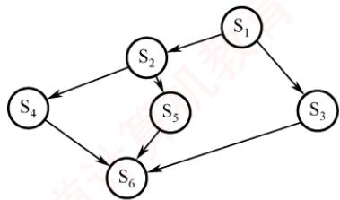  
图2.11 前驱关系举例

semaphore a12=0,a13=0,a24=0,a25=0,a36=0,a46=0,a56=0;  
//初始化所有信号量，初值均为0  
S1 ( ) {  
…; //执行 S1  
V(a12);V(a13); //通知 S2 和 S3：S1 已完成  
1  
S2 ( ) {  
P(a12); …; 首 //执行 S2 //等待 S1 完成

<table><tr><td>V(a24);V(a25); }</td><td>//通知S4和 S5：S2 已完成</td></tr><tr><td>S3 ( ) {</td><td></td></tr><tr><td>P(a13);</td><td>//等待 S1 完成</td></tr><tr><td>…;</td><td>//执行 S3</td></tr><tr><td>V(a36);</td><td>//通知 S6：S3 已完成</td></tr><tr><td>} S4 ( ) { 王道</td><td></td></tr><tr><td>P(a24);</td><td>//等待 S2 完成</td></tr><tr><td>…;</td><td>//执行 S4</td></tr><tr><td>V(a46);</td><td>//通知S6：S4 已完成</td></tr><tr><td>} S5 ( ) { 机教育</td><td>王道计算机教育</td></tr><tr><td>P(a25);</td><td>//等待 S2 完成</td></tr><tr><td></td><td>//执行 S5</td></tr><tr><td>V(a56);</td><td>//通知 S6：S5 已完成</td></tr><tr><td></td><td></td></tr><tr><td>S6 ( ) {</td><td>//等待 S3 完成</td></tr><tr><td>P(a36);</td><td>//等待 S4 完成</td></tr><tr><td>P(a46); 王</td><td>//等待 S5 完成</td></tr><tr><td>P(a56);</td><td></td></tr><tr><td>…;</td><td>//执行 S 6</td></tr></table>

## 6. 分析进程同步和互斥问题的方法步骤

1）关系分析。首先识别参与并发的进程，并厘清其间的关系：互斥关系（多个进程竞争同一临界资源）、同步关系（某进程需等待另一进程的执行结果）、前驱关系（存在明确的执行顺序约束）。每类关系均可映射到前述经典信号量模型。

2）思路梳理。根据各进程的操作流程，确定关键同步点，并初步规划P、V操作的位置。可参考和类比典型场景，如生产者-消费者、读者-写者、前驱图。

3）信号量设置。基于上述分析，定义所需的信号量，明确其语义与初值，并将P、V操作嵌入各进程的适当位置，确保逻辑正确，避免死锁与饥饿，且满足所有约束条件。

## 2.3.5 经典同步问题

考点追踪PV操作的应用题（2009、2011、2013、2014、2015、2017、2019、2025）

## 1. 生产者-消费者问题

## 问题描述：

系统中存在一组生产者进程和一组消费者进程，它们共享一个初始为空、容量为n的缓冲区。生产者每次生产一个产品，并将其放入缓冲区；消费者每次从缓冲区取出一个产品并进行消费。该问题需满足以下约束条件：仅当缓冲区未满时，生产者才能写入产品，否则必须等待；仅当缓冲区非空时，消费者才能读取产品，否则必须等待：缓冲区是临界资源，所有进程必须互斥访问。

## 问题分析：

1）关系分析。由于缓冲区是共享的临界资源，生产者与消费者对缓冲区的访问构成互斥关系；同时，消费者必须等待生产者生成产品后才能消费，二者又存在同步关系。

2）思路梳理。使用一个互斥信号量控制对缓冲区的互斥访问；使用两个计数信号量分别跟踪空缓冲区和满缓冲区的数量；并严格控制P和V操作的执行顺序，以避免死锁。

3)信号量设置。互斥信号量mutex，控制对缓冲区的互斥访问，初值为1；计数信号量empty，记录空缓冲区的数量，初值为n；计数信号量full，记录满缓冲区的数量，初值为0。

生产者-消费者进程的实现如下：

semaphore mutex=1; //互斥访问缓冲区  
semaphore empty=n; //空缓冲区数量  
semaphore full=0; 王道计算机 //满缓冲区数量  
producer () { //生产者进程  
while(1) {  
生产一个产品  
P(empty)；（要用什么，Ρ一下） //申请一个空缓冲区  
P(mutex)；（互斥夹紧) //进入临界区  
将产品放入缓冲区  
V(mutex)；(互斥夹紧) //退出临界区  
V(ful1)；（提供什么，V一下） //满缓冲区数加1  
1  
}  
consumer() { //消费者进程  
while(1) {  
P(full); //申请一个满缓冲区  
王道 P(mutex); 从缓冲区中取出一个产品 //进入临界区  
V(mutex) ; //退出临界区  
V(empty); //空缓冲区数加1  
消费产品  
育

需特别注意：对 empty和 full的P操作必须置于对 mutex的P操作之前。若顺序颠倒，例如生产者先执行 P(mutex)再执行 P(empty)，则消费者先执行 P(mutex)再执行P(full)可能导致死锁。试想：当缓冲区已满（empty=0），若生产者先获取mutex，随后因P(empty)而阻塞；此时消费者欲取产品，却因mutex已被生产者持有而无法进入临界区执行P(full)和消费操作。结果，生产者等待消费者释放空位，消费者等待生产者释放mutex，双方互相阻塞，导致死锁。同理，当缓冲区为空（full=0）时，若消费者先获取mutex再执行P(full)，也会因无法继续而阻塞，进而阻止生产者进入临界区放入产品，同样导致死锁。因此，必须先申请资源状态（empty或full），再申请互斥访问（mutex），以确保进程不会在持有互斥锁的同时等待资源，从而避免死锁。

下面再看一个较为复杂的生产者-消费者问题。

## 问题描述：

桌上有一个盘子，最多只能容纳一个水果。爸爸专门向盘中放入苹果，妈妈专门放入橘子；女儿只吃盘中的苹果，儿子只吃盘中的橘子；只有当盘子为空时，爸爸或妈妈才能向其中放入一个水果；只有当盘中有自己所需的水果时，儿子或女儿才能从中取出并食用。

## 问题分析：

1）关系分析。爸爸和妈妈在向盘中放入水果时存在互斥关系；爸爸与女儿、妈妈与儿子之间分别构成同步关系（爸爸放苹果后，女儿才能取用；妈妈放橘子后，儿子才能取用）；儿子与女儿各自等待不同的水果，因此他们之间既无互斥也无同步关系。

2）整理思路。可抽象为两个生产者（爸爸、妈妈）和两个消费者（女儿、儿子），共享一个容量为1的缓冲区。由于不同类型的产品（苹果、橘子）需由不同的消费者消费，故不能仅使用一个full信号量来表示满状态，而需为每种产品设置独立的同步信号量。

3）信号量设置。互斥信号量plate，控制对盘子的互斥访问，初值为1；同步信号量apple，表示盘中是否有苹果，初值为0；同步信号量orange，表示盘中是否有橘子，初值为0。进程的实现如下： 道

```javascript
semaphore plate=1,apple=0,orange=0;
dad ( ) { //爸爸进程
while(1) {
准备一个苹果
P(plate); 王道计算机 //获取对盘子的独占使用权
把苹果放入盘子
V(apple); //通知女儿：苹果已放入盘中
1
1
mom ( ) { //母亲进程
while(1){
准备一个橘子
P(plate); //获取对盘子的独占使用权
把橘子放入盘子
V(orange) ; //通知儿子：橘子已放入盘中
1
son ( ) { //儿子进程
while(1) {
P(orange); //等待盘中有橘子
从盘子中取出橘子
V(plate); //释放盘子，允许他人使用
吃掉橘子
1
daughter() { //女儿进程
while(1) {
P(apple); 王道计算机教育 //等待盘中有苹果
从盘子中取出苹果
V(plate); //释放盘子，允许他人使用
吃掉苹果
1
```

进程之间的关系如图 2.12 所示。dad()和 daughter()、mom()和 son()必须成对执行。只有当女儿拿走苹果或儿子拿走橘子之后，才会执行V(plate)操作，从而释放盘子供下一次使用。

## 2. 读者-写者问题

## 问题描述：

系统中存在两组并发进程：读者和写者，它们共享一个文件。多个读者可以同时读取文件，不会导致数据不一致：

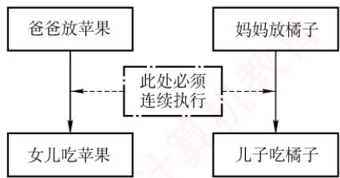  
图2.12 进程之间的关系

但若任一写者与其他进程（无论是读者还是其他写者）同时访问文件，则可能破坏数据一致性。因此，需满足以下要求：（①）允许多个读者同时执行读操作：②任一时刻只允许一个写者执行写操作；③写者在完成写操作前，不允许任何其他读者或写者访问文件；④写者开始写操作前，必须等待所有已进入的读者和写者全部退出。

## 问题分析：

1）关系分析。读者与写者之间存在互斥关系；写者与写者之间也存在互斥关系；读者与读者之间无互斥关系，可并发读取。

2）整理思路。写者的实现较为直接：它与所有其他进程互斥，只需用一个互斥信号量控制即可。读者的实现则更为复杂：它既要允许其他读者并发读取，又要阻止写者在读期间介入。为此，引入一个计数器count，用于记录当前正在读文件的读者数量。当第一个读者开始读时，应阻塞后续的写者；当最后一个读者结束读时，才允许写者进入；同时，多个读者对 count 的修改必须互斥。

3）信号量设置。计数信号量count，记录当前读者数量，初值为0；互斥信号量mutex，控制对count的互斥访问，初值为1；互斥信号量rw，控制对文件的互斥访问，初值为1。进程的实现如下（读者优先）：

```c
int count=0; //记录当前的读者数量
semaphore mutex=1; //控制对 count 的互斥访问
semaphore rw=1; //控制读者与写者对文件的互斥访问
writer().{ //写者进程
while(1) {
P(rw) ; //申请对文件的独占写权限
写文件
V(rw) ; //释放文件写权限
王道
reader () { //读者进程
while(1) {
P (mutex) ; //互斥访问 count
if(count==0) //若是第一个读者
P(rw); //阻止写者访问文件
count++; //读者数量加1
V(mutex) ; //释放对 count 的访问
读文件
P (mutex) ; //互斥访问 count
count--; //读者数量减1
if(count==0) //若是最后一个读者
V(rw); //允许写者访问文件
V(mutex) ; //释放对 count 的访问
```

上述算法实现的是读者优先策略。只要已有读者在读，后续到来的读者均可立即进入读取，而写者必须等待所有读者全部退出。这种设计可能导致写者长时间等待，甚至出现写者饥饿，即在读者持续到达的情况下，写者可能被无限期推迟。

若需实现写者优先策略：一旦有写者请求写入，就禁止新读者进入，并在当前读者全部退出后立即让写者执行。为此，引入互斥信号量w，用于控制所有进程进入“准备访问文件”阶段的权限：写者先执行P(w)，再执行P(rw)，从而阻止后续读者插队；读者也需先执行P(w)；若此时有写者持有或正在等待w，该读者将被阻塞；读者在更新count后立即执行V(w)，因为只要存在活跃读者（count>0），写者已被rw阻塞，提前释放w可避免不必要地阻碍其他写者；写者完成写操作后执行V(w)，释放访问权。这样，w如同“门卫”：当有写者等待时，新读者无法进入；但已在读的读者可正常完成操作，既保障了写者的优先权，又维持了读者之间的并发读取。

```javascript
int count=0; //记录当前的读者数量
semaphore mutex=1; //控制对count 的互斥访问
semaphore rw=1; //控制读者与写者对文件的互斥访问
semaphore w=1; //实现写者优先的关键信号量
writer() { //写者进程
while(1) {
```

```javascript
P(w); //申请写者优先权：阻止新读者进入
P(rw); //申请对文件的独占写权限
写文件
V(rw); //释放文件写权限
V(w); //释放写者优先权，允许其他进程进入
reader() { //读者进程
while(1){
P(w); //申请进入权限：若无写者等待，则通过
P(mutex); //互斥访问 count
if(count==0) //若是第一个读者
P(rw) ; //阻止写者访问文件
count++; //读者数量加1
V(mutex); //释放对 count 的访问
V(w) ; //立即释放w，允许其他进程竞争
读文件
王道 P(mutex); count--; //互斥访问 count //读者数量减1 王道
if(count==0) //若是最后一个读者
V(rw); //允许写者访问文件
V(mutex); //释放对 count 的访问
1
```

上述写者优先策略是相对的，并非绝对优先。该算法通过信号量w阻止新读者在写者等待时进入，从而避免读者无限插队：然而，若多个进程（包括读者和写者）同时阻塞在w上，系统通常按FCFS顺序唤醒，此时先到达的读者仍可能优先于后到的写者获得访问权。因此，该算法本质上是在防止写者饥饿的前提下，对写者给予有限优先，而非严格意义上的写者优先。

读者-写者问题的关键在于使用了受互斥保护的计数器count。因此，面对复杂的同步互斥问题时，可考虑引入此类计数器来动态判断资源状态，这是一种重要的解题思路。

## 3. 哲学家进餐问题

## 问题描述：

一张圆桌旁围坐5名哲学家，每两名相邻哲学家之间放置一根筷子，共5根筷子，每位哲学家面前有一碗米饭，如图2.13所示。哲学家交替进行思考与进餐：思考时互不影响：饥饿时，必须同

时持有左右两根筷子才能开始进餐（筷子需要逐根拿起）；若所需筷子已被他人持有，则必须等待；进餐结束后，立即放下两根筷子，继续思考。

## 问题分析：

1）关系分析。每根筷子被其两侧的哲学家共享，因此对同一根筷子的访问必须互斥。

2）整理思路。共有5个并发进程。本题的关键是如何让一名哲学家安全地获取左右两根筷子，避免死锁或饥饿。直观的解决思路有两种：①尝试同时获取两根筷子，即仅当左右筷子均空闲时才

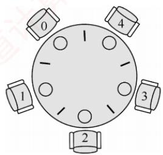  
图 2.13 5名哲学家进餐

拿起；②对哲学家的行为制定规则，破坏死锁产生的必要条件。

3）信号量设置。定义互斥信号量数组chopstick[5]，控制对5根筷子的互斥访问，初值均为1。哲学家编号为0～4，哲学家i左侧筷子的编号为i，右侧筷子的编号为(i+1)%5。

一个直观的实现如下（存在死锁风险）：

semaphore chopstick[5]={1,1,1,1,1}; //初始化 5 根筷子的信号量  
Pi ( ) { //i 号哲学家进程  
do {  
P(chopstick[i]); //拿起左侧筷子  
P(chopstick[(i+1)%5]); //拿起右侧筷子  
进餐  
V(chopstick[i]) ; //放回左侧筷子  
V(chopstick[(i+1)%5]); //放回右侧筷子  
思考  
} while(1);

假设5名哲学家同时饥饿，并几乎同时执行完P(chopstick[i])。此时，每位哲学家各持一根左侧筷子，且均在等待右侧筷子，系统进入循环等待状态，所有进程阻塞，形成死锁。

为防止死锁发生，可对哲学家进程施加一些限制条件：①限制最多4名哲学家同时尝试进餐，确保至少有一人能获得两根筷子，这样在其用餐完毕后释放他的两根筷子，从而使更多的哲学家能够进餐；②对哲学家编号，规定奇数号哲学家先拿左筷、再拿右筷，偶数号则相反，打破循环等待条件；③仅当左右两根筷子均空闲时，才允许哲学家同时拿起。

假设采用第二种方法，当一名哲学家左右两侧的筷子都可用时，才允许他拿起筷子。

semaphore chopstick[5]={1,1,1,1,1}； ∥/初始化 5 根筷子的信号量  
semaphore mutex=1; //设置取筷子的信号量  
Pi ( ) { //i 号哲学家的进程  
do {  
P (mutex) ; //申请取筷子的信号量  
P(chopstick[i]); //拿起左侧筷子  
P(chopstick[(i+1)%5]); //拿起右侧筷子  
V(mutex) ; //释放取筷子的信号量  
进餐  
首  
V(chopstick[i]); //放回左侧筷子  
V(chopstick[(i+1)%5]); //放回右侧筷子  
思考  
} while(1);  
1

哲学家进餐问题是经典的进程同步案例，其本质在于预防循环等待。尽管大部分习题和真题通过消费者-生产者模型或读者-写者问题就能求解，但对哲学家进餐问题仍然要熟悉。考研复习的关键在于反复多次和全面，“偷工减料”是要吃亏的。

## 2.3.6 管程

在信号量机制中，每个访问临界资源的进程都需自行编写P/V操作。分散的同步代码不仅增加了编程复杂度，还极易因操作顺序不当而引发死锁。为简化同步控制，操作系统引入了更高层的抽象机制管程：它将共享资源及其操作封装于一体，自动保证互斥访问，程序员无须显式编写互斥代码：同时，通过条件变量实现灵活的进程同步，有效降低死锁风险。

## 1. 管程的定义

## 考点追踪管程的特点（2016）

系统中的各类硬件资源和软件资源，均可通过数据结构进行抽象描述：即用少量状态信息和一组对资源的操作来表征该资源，而忽略其内部结构与实现细节。

管程正是基于这一思想构建的。它利用一个共享数据结构来表示系统中的共享资源，并将对该数据结构的所有操作封装为一组过程。进程对共享资源的申请、释放等操作，都必须通过调用这些过程来完成。这组过程可根据资源的当前状态决定是否允许访问：若条件满足，则处理请求：否则，将进程阻塞。由此确保任一时刻至多只有一个进程使用该共享资源，从而统一管理所有对共享资源的访问，实现进程互斥。这个由共享数据结构及其操作过程共同组成的资源管理程序，称为管程（monitor）。形式上，管程定义了一个数据结构，以及一组可在该数据结构上被并发进程调用的操作；这些操作不仅能修改管程内部的数据，还能协调进程之间的同步行为。

形式上，一个管程由以下四部分组成。

①管程的名称。

②局部于管程内部的共享数据结构说明。

③对该数据结构进行操作的一组过程（或函数）。

④对共享数据进行初始化的语句。

典型的管程定义如下：

monitor Demo{ //① 定义一个名称为 Demo 的管程  
//② 定义共享数据结构，对应系统中的某种共享资源  
共享数据结构 S；  
//④对共享数据结构初始化的语句  
init code() {  
S=5; //初始可用资源数为5  
take away() { //③操作过程1：申请资源  
对共享数据结构s的一系列处理； 育  
S--; //可用资源数-1  
1  
give\_back() { //③操作过程2：归还资源  
对共享数据结构S的一系列处理；  
S++; //可用资源数+1  
1  
熟悉面向对象程序设计的读者会发现，管程与类（class）高度相似。

1）封装性：管程将对共享资源的操作封装起来，其内部的共享数据结构只能被管程自身的过程访问。外部进程必须通过调用这些过程才能访问资源。例如，在上例中，申请资源需调用 take\_away()，归还资源则需调用 give\_back()。

2）互斥性：任一时刻仅允许一个进程执行管程内的过程，从而实现互斥访问。若多个进程同时调用 take away()或 give back()，则只有当前进程完成其所调用的过程后，下一个进程才能开始执行，这一机制确保了对共享数据S的互斥访问。

管程与进程的区别：①进程拥有私有数据结构（如PCB），而管程管理的是公共数据结构（如缓冲区）。②进程执行通用计算任务，而管程专注于同步控制与资源管理。③引入进程是为了实现并发，而引入管程是为了解决共享资源的互斥访问问题。④进程是主动执行的实体，而管程是被动调用的模块，即进程通过调用管程中的过程来操作共享数据。⑤多个进程可并发执行，但对同一管程的多个调用是互斥的，即同一时刻仅一个进程可在该管程内执行。⑥进程具有动态的生命周期（从创建到撤销），而管程是操作系统中的静态资源管理模块，仅供进程调用。

## 2. 条件变量

当一个进程进入管程后，若因条件不满足而需要等待，它必须释放对管程的占用：否则，其他进程将无法进入管程，从而导致系统停滞。为解决这一问题，管程引入了条件变量（condition），将不同的阻塞原因分别抽象为独立的条件变量。通常，一个进程可能因多种条件不满足而被阻塞，因此管

程中可以设置多个条件变量。每个条件变量维护一个等待队列，用于记录所有因该条件而阻塞的进程对条件变量仅支持两种操作：wait 和 signal。

x.wait：当条件变量x所代表的条件不满足时，当前执行管程过程的进程调用 x.wait()，将自身加入x的等待队列，并自动释放管程，从而允许其他进程进入。

x.signal：当x所代表的条件发生变化（可能已满足）时，调用x.signal()，唤醒一个因等待该条件而阻塞在x上的进程。

条件变量的定义和使用示例如下：

monitor Demo{  
共享数据结构 S;  
condition x; //定义一个条件变量×  
init code(){ ... }  
take away() {  
if(S<=0) x.wait(); //资源不足，在条件变量×上阻塞等待  
资源足够，分配资源，做一系列相应处理；  
give back() { 王道计  
归还资源，做一系列相应处理；  
if(有进程在等待) x.signal()；//唤醒一个阻塞进程  
1

条件变量与信号量的比较。相似点：wait/signal操作与P/V操作均可实现进程的阻塞与唤醒。不同点：信号量具有整数值，反映可用资源数量：而条件变量不维护数值，仅用于线程排队和通知。在管程中，资源数量由共享变量（如S）显式记录，条件变量只负责同步。

## 2.3.7 本节小结

本节开头提出的问题的参考答案如下。

## 1）为什么要引入进程同步的概念？

在多道程序环境下，多个进程并发执行，彼此之间存在相互制约关系。为协调这些关系，确保进程能够正确、有序地协作或竞争共享资源，操作系统引入了进程同步的概念。

## 2）不同的进程之间会存在什么关系？

进程之间主要存在两种基本的制约关系：同步与互斥。同步是指为完成共同任务而建立的多个进程，在某些关键点上需要协调工作次序，通过等待或传递信息所形成的协作关系。互斥是指当一个进程正在访问临界资源（处于临界区）时，其他进程必须等待；只有当前进程退出临界区后，其他进程才被允许进入，以保证对临界资源的独占访问。

## 3）当单纯用本节介绍的方法解决这些问题时会遇到什么新的问题吗？

当两个或多个进程各自已占用某些资源，又同时请求对方所持有的资源时，可能形成一种互相等待的局面。若无外部干预，这些进程将永久阻塞，无法继续推进，这种现象称为死锁。其形成原因、必要条件、检测方法及解决方案将在下一节中详细介绍。

## 2.3.8 本节习题精选

## 一、单项选择题

01. 下列对临界区的论述中，正确的是（）。A. 临界区是指进程中用于实现进程互斥的那段代码B. 临界区是指进程中用于实现进程同步的那段代码C. 临界区是指进程中用于实现进程通信的那段代码

D. 临界区是指进程中用于访问临界资源的那段代码

02. 不需要信号量就能实现的功能是（）。A. 进程同步 首计算不 B. 进程互斥C. 执行的前驱关系 D. 进程的并发执行

03. 若一个信号量的初值为3，经过多次PV操作后当前值为-1，这表示等待进入临界区的进程数是（）。A. 1 B. 2 C. 3 D. 4

04.一个正在访问临界资源的进程由于申请等待I/O操作而被中断时，它（）。A. 允许其他进程进入与该进程相关的临界区B. 不允许其他进程进入任何临界区C. 允许其他进程抢占处理器，但不得进入该进程的临界区 +算だD. 不允许任何进程抢占处理器

05. 两个旅行社甲和乙为旅客到某航空公司订飞机票，形成互斥资源的是（）。A. 旅行社 B. 航空公司C. 飞机票 D. 旅行社与航空公司

06. 临界区是指并发进程访问共享变量段的（）。A. 管理信息 B. 信息存储 C. 数据 D. 代码程序

07. 以下不是同步机制应遵循的准则的是（）。A. 让权等待 B. 空闲让进 C. 忙则等待 D. 无限等待

08.以下（）不属于临界资源。 算A. 打印机 B. 非共享数据 C. 共享变量 D. 共享缓冲区

09.以下（）属于临界资源。A. 磁盘 王道 B. 公用队列C. 私用数据 D. 可重入的程序代码

10. 在操作系统中，要对并发进程进行同步的原因是（）。A. 进程必须在有限的时间内完成 B. 进程具有动态性C. 并发进程是异步的 D. 进程具有结构性

11. 进程A 和进程B通过共享缓冲区协作完成数据处理，进程A 负责产生数据并放入缓冲区，进程B从缓冲区读数据并输出。进程A和进程B之间的制约关系是（）。A. 互斥关系 B. 同步关系 C. 互斥和同步关系D. 无制约关系

12. 在操作系统中，P, Ⅴ操作是一种（）。A. 机器指令C. 作业控制命令 D. 低级进程通信原语

13. P操作可能导致（)。A. 进程就绪 B. 进程结束 C. 进程阻塞 D. 新进程创建

14. 原语是（)。A. 运行在用户态的过程 算机 B. 操作系统的内核C. 可中断的指令序列 D. 不可分割的指令序列

15.（）定义了共享数据结构和各种进程在该数据结构上的全部操作。A. 管程 B. 类程 C. 线程 D. 程序

16. 用Ⅴ操作唤醒一个等待进程时，被唤醒进程变为（）态。A. 运行 B. 等待 C. 就绪 D. 完成

17. 在用信号量机制实现互斥时，互斥信号量的初值为（）。A. 0 B. 1 C. 2 D. 3

18. 用 P,Ⅴ操作实现进程同步，信号量的初值为（）。A. -1 B. 0 C. 1 D. 由用户确定

19. 可以被多个进程在任意时刻共享的代码必须是（）。A. 顺序代码 B. 机器语言代码C. 不允许任何修改的代码 D. 无转移指令代码

20.一个进程映像由程序、数据及PCB组成，其中（）必须用可重入编码编写。A. PCB B. 程序 C. 数据 D. 共享程序段

21. 下列关于互斥锁的说法中，正确的是（）。A.互斥锁只能用于多线程之间，不能用于多进程之间B. 互斥锁只能用于多进程之间，不能用于多线程之间C. 互斥锁可用于多线程或多进程之间，但只能由创建它的线程或进程来加锁和解锁D. 互斥锁可用于多线程或多进程之间，但只能由对它加锁的线程或进程来解锁

22.在使用互斥锁进行同步互斥时，下列（）情况会导致死锁。A. 一个线程对同一个互斥锁连续加锁两次B. 一个线程尝试对一个已加锁的互斥锁再次加锁C. 两个线程分别对两个不同的互斥锁先后加锁，但顺序相反D. 一个线程对一个互斥锁加锁后忘记解锁

23. 用来实现进程同步与互斥的PV操作实际上是由（）过程组成的。A. 一个可被中断的 B. 一个不可被中断的C. 两个可被中断的 王道 D. 两个不可被中断的

24. 对于两个并发进程，设互斥信号量为 mutex（初值为1)，若mutex= 0，则表示（）。A. 没有进程进入临界区B. 有一个进程进入临界区C. 有一个进程进入临界区，另一个进程等待进入 机教育D. 有一个进程在等待进入

25. 对于两个并发进程，设互斥信号量为mutex（初值为1)，若mutex=-1，则（）。A. 表示没有进程进入临界区B. 表示有一个进程进入临界区 王道计C. 表示有一个进程进入临界区，另一个进程等待进入D. 表示有两个进程进入临界区

26. 一个进程因在互斥信号量 mutex 上执行 V(mutex)操作而导致唤醒另一个进程时，执行 V操作后 mutex 的值为（)。A. 大于0 B. 小于0 C.大于或等于0 D. 小于或等于0

27. 一个系统中共有5个并发进程涉及某个相同的变量A，变量A的相关临界区是由（）个临界区构成的。算A. 1 B. 3 C. 5 D. 6

28.下述（）选项不是管程的组成部分。A. 局限于管程的共享数据结构