B. 对管程内数据结构进行操作的一组过程C. 管程外过程调用管程内数据结构的说明D. 对局限于管程的数据结构设置初始值的语句

29. 以下关于管程的叙述中，错误的是（）。A. 管程是进程同步工具，解决信号量机制大量同步操作分散的问题B. 管程每次只允许一个进程进入管程C. 管程中 signal 操作的作用和信号量机制中的 V操作相同D. 管程是被进程调用的，管程是语法范围，无法创建和撤销

30. 对信号量S执行P操作后，使该进程进入资源等待队列的条件是（）。 NUA. S.value < 0 B. S.value <= 0 C. S.value > 0 D. S.value >= 0

31. 若系统有n个进程，则就绪队列中进程的个数最多有（①）个；阻塞队列中进程的个数 最多有（②）个。 ① A. n + 1 B. n C. n-1 D. 1 ② A. n + 1 B. n C. n-1 道 D. 1

1）假如若干进程对S进行28次P操作和18次V操作后，信号量S的值为0。

2）假如若干进程对信号量S进行了15次P操作和2次Ⅴ操作。请问此时有多少个进程等待在信号量S的队列中？（） 育A. 2 B. 3 C. 5 D. 7

$$
\mathrm { P } _ { 1 }
$$

$$
\mathrm { P } _ { 2 } ,
$$

P1 ( ) { P2 ( ) { x=1; //A1 x=-3; //B1 y=2; c=x\*x; z=x+y; print z; //A2 王道 print c; } //B2

可能打印出的z值有（），可能打印出的c值有（）（其中x为 $\mathrm { P } _ { 1 } , \mathrm { P } _ { 2 }$ 的共享变量)。A. z = 1,−3; c =-1,9 B. z=−1,3; c = 1,9C. z=−1,3,1; c = 9 D. z = 3; c = 1, 9 教育

34. 并发进程之间的关系是（）。 算机A. 无关的 B. 相关的C. 可能相关的 D. 可能是无关的，也可能是有交往的

35. 若系统中有4个进程共享3台打印机，采用信号量机制控制打印机的共享使用，则信号量的取值范围是（）。 王A. [−1, 4] B. [-2, 2] C. [-1,3] D. [-3, 2]

36. 两个进程 $ P _{0} 、  P _{1} 互$ 斥的 Peterson 算法描述如下：进程PO 进程 P1flag[0]=1; flag[1]=1;(1); (2);while(flag[1]&&turn==1); while(flag[0]&&turn==0);临界区； 临界区；flag[0]=0; flag[1]=0;其余代码； 其余代码；

其中，(1)和(2)处的代码分别为（）。A. $\mathrm{tum} = 0, \mathrm{tum} = 0$ B. turn=0, turn= 1 C. turn= 1, turn=0 D. turn =1, turn= 1

37. 在 Peterson 算法中，flag 数组的作用是（)。A. 表示每个线程是否想进入临界区 B. 表示每个线程是否已进入临界区C. 表示每个线程是否已退出临界区 D. 表示每个线程是否已完成任务

38. 在 Peterson 算法中，turn 变量的作用是（）。A. 表示轮到哪个线程进入临界区 B. 表示哪个线程先发出访问请求C. 表示哪个线程后发出访问请求 D. 表示哪个线程已进入临界区

39. 生产者-消费者问题用于解决（）。A. 多个进程共享一个数据对象的问题 B. 多个进程之间的同步和互斥问题C. 多个进程共享资源的死锁与饥饿问题 D. 利用信号量实现多个进程并发的问题

40. 所有的消费者必须等待生产者先运行的前提条件是（）。A. 缓冲区空 B. 缓冲区满 C. 缓冲区不可用 D. 缓冲区半空

41. 下列关于生产者-消费者问题的唤醒操作的说法中，正确的是（)。I. 生产者唤醒其他生产者 I. 生产者唤醒消费者Ⅲ. 消费者唤醒其他消费者 IV. 消费者唤醒生产者A. I和ⅡI B. ⅢII 和 IV C. Ⅱ和ⅢII X D. I、II、III和IV

42. 在9个生产者、6个消费者共享容量为8的缓冲区的生产者-消费者问题中，互斥使用缓冲区的信号量初始值为（）。A. 1 B. 6 C. 8 D. 9

43. 消费者进程阻塞在wait(m)（m是互斥信号量）的条件是（）。I. 没有空缓冲区 ⅡI. 没有满缓冲区Ⅲ. 有其他生产者已进入临界区 算机 IV. 有其他消费者已进入临界区A. I和Ⅱ B. III 和 IV C. I和ⅢI D. ⅡI 和 IV

44. 在读者-写者问题中，能同时执行的是（）。A. 读者和写者 B. 不同的写者 C. 不同的读者 D. 都不能

45. 哲学家就餐问题的解决方案如下：

semaphore \*chopstick[5];semaphore \*seat;  
哲学家 i:  
P(seat) ;  
P(chopStick[i]);  
P(chopStick[(i+1)%5]);吃饭  
V(chopStick[i]);  
V(chopStick[(i+1)%5]);V(seat)

其中，信号量 seat的初值最大为（）。A. 0 B. 1 C. 4 D. 5

46. 有两个优先级相同的并发程序 $\mathrm { P } _ { 1 }$ 和 $\mathrm { P } _ { 2 } ,$ ，它们的执行过程如下所示。假设当前信号量s1=0，s2= 0。当前的z=2，进程运行结束后，x,y和z的值分别是（)。

进程 $\mathrm { P } _ { 1 }$ 进程 $\mathrm { P } _ { 2 }$ y:=1; x:=1 y:=y+2; 道计算机 x:=x+1; z:=y+1; P(s1); V(s1); x:=x+y; P(s2); z:=x+z;

y:=z+y; V(s2); A. 5,9,9 B. 5, 9, 4 C. 5, 12, 9 D. 5, 12, 4

47.【2010统考真题】设与某资源关联的信号量初值为3，当前值为1。若M表示该资源的可用个数，N表示等待该资源的进程数，则M,N分别是（）。A. 0, 1 B. 1,0 C. 1,2 D. 2,0

48.【2010统考真题】进程 $\mathrm { P _ { 0 } }$ 和进程 $\mathrm { P } _ { 1 }$ 的共享变量定义及其初值为：

若进程 $\mathrm { P _ { 0 } }$ 和进程 $\mathrm { P _ { 1 } }$ 访问临界资源的类C代码实现如下：

void PO() //进程 $\mathrm { P _ { 0 } }$ void P1() //进程 $\mathrm { P } _ { 1 }$   
1 算机   
while(true) while(true)   
flag[0]=true;turn=1; flag[1]=true;turn=0;   
while(flag[1]&&(turn==1)); while(flag[0]&&(turn==0));   
王道   
临界区； 临界区；   
flag[0]=false; flag[1]=false;   
1

则并发执行进程 $\mathrm { P _ { 0 } }$ 和进程 $\mathrm { P } _ { 1 }$ 时产生的情况是（）。A. 不能保证进程互斥进入临界区，会出现“饥饿”现象B. 不能保证进程互斥进入临界区，不会出现“饥饿”现象C. 能保证进程互斥进入临界区，会出现“饥饿”现象D. 能保证进程互斥进入临界区，不会出现“饥饿”现象

49. 【2011统考真题】有两个并发执行的进程 $\mathrm { P } _ { 1 }$ 和进程 $\mathrm { P } _ { 2 }$ ，共享初值为1的变量x。 $\mathrm { P } _ { 1 }$ 对x加1， $\mathrm { P } _ { 2 }$ 对x减1。加1和减1操作的指令序列分别如下：

两个操作完成后，x的值（）。A. 可能为-1 或 3 B. 只能为 1C. 可能为 0,1 或 2 D. 可能为-1,0,1 或 2

50.【2016统考真题】进程 $\mathrm { P } _ { 1 }$ 和 $\mathrm { P } _ { 2 }$ 均包含并发执行的线程，部分伪代码描述如下所示。

<table><tr><td>/进程P1</td><td>∥进程P2 王</td></tr><tr><td>int x=0;</td><td>int x=0;</td></tr><tr><td>Thread1()</td><td>Thread3()</td></tr><tr><td>{ int a;</td><td>{ int a;</td></tr><tr><td>a=1; x + = 1;</td><td>X + = 3;</td></tr><tr><td>}</td><td>道计算机</td></tr><tr><td>Thread2()</td><td>Thread4 ()</td></tr><tr><td>{ int a;</td><td>{ int b;</td></tr><tr><td>a=2; x + = 2;</td><td>b=x; x + = 4;</td></tr><tr><td>}</td><td>}</td></tr></table>

下列选项中，需要互斥执行的操作是（）。A. a=1与a=2 B. a=x与b=xC. x += 1与x+ = 2 D. x + = 1与x + = 3

51. 【2016 统考真题】使用TSL（Test and Set Lock）指令实现进程互斥的伪代码如下所示。do {while(TSL(&lock));critical section;lock=FALSE;} while(TRUE);

下列与该实现机制相关的叙述中，正确的是（）。A. 退出临界区的进程负责唤醒阻塞态进程B. 等待进入临界区的进程不会主动放弃CPUC.上述伪代码满足“让权等待”的同步准则D. while(TSL(&lock))语句应在关中断状态下执行

52.【2016统考真题】下列关于管程的叙述中，错误的是（）。A. 管程只能用于实现进程的互斥B. 管程是由编程语言支持的进程同步机制C. 任何时候只能有一个进程在管程中执行D. 管程中定义的变量只能被管程内的过程访问

53.【2018统考真题】属于同一进程的两个线程thread1和 thread2并发执行，共享初值为0的全局变量x。thread1 和thread2 实现对全局变量x加1 的机器级代码描述如下。

<table><tr><td colspan="2">thread1</td><td colspan="2">thread2</td></tr><tr><td>mov R1,X</td><td>∥(x)→R1</td><td>mov R2,x</td><td>∥(x)→R2</td></tr><tr><td>inc R1</td><td></td><td>inc R2</td><td>∥/(R2)+1→R2</td></tr><tr><td>mov x,R1</td><td>∥(R1)→x</td><td>mov x,R2</td><td>∥(R2)→x</td></tr></table>

在所有可能的指令执行序列中，使x的值为2的序列个数是（）。A. 1 XT B. 2 C. 3 D. 4

54.【2018统考真题】若x是管程内的条件变量，则当进程执行x.wait()时所做的工作是（)。A. 实现对变量x的互斥访问B. 唤醒一个在x上阻塞的进程 C. 根据x的值判断该进程是否进入阻塞态 首计算机D. 阻塞该进程，并将之插入x的阻塞队列中

55.【2018统考真题】在下列同步机制中，可以实现让权等待的是（）。A. Peterson 方法 B. swap 指令C. 信号量方法 D. TestAndSet 指令

56.【2020统考真题】下列准则中，实现临界区互斥机制必须遵循的是（）。I. 两个进程不能同时进入临界区Ⅱ. 允许进程访问空闲的临界资源 机教Ⅲ. 进程等待进入临界区的时间是有限的IV. 不能进入临界区的执行态进程立即放弃CPUA. 仅I、IV B. 仅Ⅱ、ⅢIC.仅I、ⅡI、ⅢII て道计 D. 仅I、II、IV

## 二、综合应用题

01.下面是两个并发执行的进程，它们能正确运行吗？若不能请举例说明并改正。

<table><tr><td>int x; process_P1 {</td><td>process_P2 {</td></tr><tr><td>int  $y , z ;$ </td><td>int t,u;</td></tr><tr><td>x=1;</td><td>x=0;</td></tr><tr><td>y=0; 王道</td><td>t=0;</td></tr><tr><td>if(x&gt;=1)</td><td>if(x&lt;=1)</td></tr><tr><td> $y = y + 1$ </td><td>t=t+2;</td></tr><tr><td> $z { = } \gamma ;$ </td><td>u=t;</td></tr><tr><td></td><td>}</td></tr></table>

02. 在一个仓库中可以存放A和B两种产品，要求：

①每次只能存入一种产品。

② A 产品数量-B 产品数量< M，其中 M是正整数。

③ B $ 产$ 品数量-A产品数量<N，其中N是正整数。

假设仓库的容量是无限的，试用P,V操作描述产品A和B的入库过程。

03.面包师有很多面包，由n名销售人员推销。每名顾客进店后按序取一个号，并且等待叫号，当一名销售人员空闲时，就按序叫下一个号。可以用两个整型变量来记录当前的取号值和叫号值，试设计一个使销售人员和顾客同步的算法。

04. 某工厂有两个生产车间和一个装配车间，两个生产车间分别生产A、B两种零件，装配车间的任务是把A，B两种零件组装成产品。两个生产车间每生产一个零件后，都要分别把它们送到专配车间的货架 $\mathrm { F } _ { 1 } , \mathrm { F } _ { 2 }$ 上。 $\mathrm { F } _ { 1 }$ 存放零件A， $\mathrm { F } _ { 2 }$ 存放零件B， $\mathrm { F } _ { 1 }$ 和 $\mathrm { F } _ { 2 }$ 的容量均可存放10个零件。装配工人每次从货架上取一个零件A和一个零件B后组装成产品。请用 P, V 操作进行正确管理。

05.某寺庙有小和尚、老和尚若干，有一水缸，由小和尚提水入缸供老和尚饮用。水缸可容10桶水，水取自同一井中。水井径窄，每次只能容一个桶取水。水桶总数为3个。每次入缸取水仅为1桶水，且不可同时进行。试给出有关从缸取水、入水的算法描述。

06. 如下图所示，三个合作进程 $\mathrm { P } _ { 1 } , \mathrm { P } _ { 2 } , \mathrm { P } _ { 3 }$ ，它们都需要通过同一设备输入各自的数据a,b,c，该输入设备必须互斥地使用，而且其第一个数据必须由 $\mathrm { P } _ { 1 }$ 进程读取，第二个数据必须由 $\mathrm { P } _ { 2 }$ 进程读取，第三个数据必须由 $\mathrm { P } _ { 3 }$ 进程读取。然后，三个进程分别对输入数据进行下列计算：


$$
\begin{aligned} P _{1}: &  x  =  a  +  b ; \\ P _{2}: &  y  =  a  *  b ; \\ P _{3}: &  z  =  y  +  c  -  a ;\end{aligned}
$$

最后， $\mathrm { P } _ { 1 }$ 进程通过所连接的打印机将计算结果 x, y,z 的值打印出来。请用信号量实现它们的同步。

07. 有桥如右图所示。车流方向如箭头所示。回答如下问题：

1）假设桥上每次只能有一辆车行驶，试用信号灯的P，V操作实现交通管理。

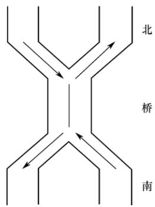

2）假设桥上不允许两车交会，但允许同方向多辆车一次通过（桥

上可有多辆同方向行驶的车)。试用信号灯的P,Ⅴ操作实现桥上的交通管理。

08. 假设有两个线程（编号为0和1）需要去访问同一个共享资源，为避免竞争状态的问题，我们必须实现一种互斥机制，使得在任何时候只能有一个线程访问这个资源。假设有如下一段代码：

```c
bool flag[2]; //flag 数组，初始化为 FALSE
Enter Critical Section(int my thread id,int other thread id) {
while(flag[other thread id]==TRUE); //空循环语句
flag[my_thread_id]=TRUE;
Exit Critical Section(int my thread id,int other thread id){
flag[my thread id]=FALSE;
```

当一个线程想要访问临界资源时，就调用上述的这两个函数。例如，线程0的代码可能是这样的：

Enter Critical Section(0,1);  
使用这个资源；  
Exit Critical Section(0,1);  
做其他的事情；

试问：

1）以上的这种机制能够实现资源互斥访问吗？为什么？

2）若把 Enter Critical Section()函数中的两条语句互换位置，可能发生死锁吗？

09. 设自行车生产线上有一个箱子，其中有N个位置（N≥3)，每个位置可存放一个车架或一个车轮；又设有3名工人，其活动分别为：

工人1活动： 工人2活动： 工人3活动：  
do { do { do{箱中取一个车架；  
加工一个车架； 加工一个车轮； 箱中取二个车轮；  
车架放入箱中； 车轮放入箱中； 组装为一台车；  
}while(1) }while(1) }while(1)

试分别用信号量与PV操作实现三名工人的合作，要求解中不含死锁。

10. 设P, Q,R 共享一个缓冲区，P, Q构成一对生产者-消费者，R既为生产者又为消费者，若缓冲区为空，则可以写入；若缓冲区不空，则可以读出。使用P,Ⅴ操作实现其同步。

11. 理发店里有一位理发师、一把理发椅和n把供等候理发的顾客坐的椅子。若没有顾客，理发师便在理发椅上睡觉，一位顾客到来时，顾客必须叫醒理发师，若理发师正在理发时又有顾客来到，且有空椅子可坐，则坐下来等待，否则就离开。试用P,Ⅴ操作实现，并说明信号量的定义和初值。

12. 假设一个录像厅有1,2,3三种不同的录像片可由观众选择放映，录像厅的放映规则如下：

1）任意时刻最多只能放映一种录像片，正在放映的录像片是自动循环放映的，最后一名观众主动离开时结束当前录像片的放映。

2）选择当前正在放映的录像片的观众可立即进入，允许同时有多位选择同一种录像片的观众同时观看，同时观看的观众数量不受限制。

3）等待观看其他录像片的观众按到达顺序排队，当一种新的录像片开始放映时，所有等待观看该录像片的观众可依次序进入录像厅同时观看。用一个进程代表一个观众，要求：用信号量方法PV操作实现，并给出信号量定义和初始值。

13. 设公共汽车上驾驶员和售票员的活动分别如下图所示。驾驶员的活动：启动车辆，正常行车，到站停车；售票员的活动：关车门，售票，开车门。在汽车不断地到站、停车、行驶的过程中，这两个活动有什么同步关系？用信号量和P,Ⅴ操作实现它们的同步。

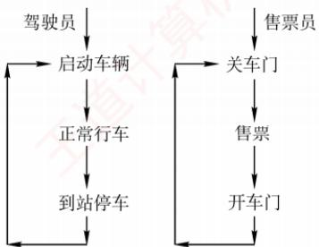

14. 一组进程的执行顺序如下图所示，圆圈 $\mathrm{P}_{1}, \mathrm{P}_{2}, \mathrm{P}_{3}, \mathrm{P}_{4}, \mathrm{P}_{5}, \mathrm{P}_{6}$ 表示进程，弧上的字母a,b,c,d, e, f, g, h 表示同步信号量，请用 P, V操作实现进程的同步。 X

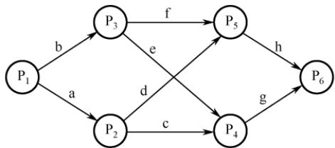

15. 有3 个进程 P、 $\mathrm { P } _ { 1 }$ 、 $\mathrm { P } _ { 2 }$ 合作处理数据，P从输入设备读数据到缓冲区，缓冲区可存1000个字。 $\mathrm { P } _ { 1 }$ 和 $\mathrm { P } _ { 2 }$ 的功能一样，都是从缓冲区取出数据并计算，再打印结果。请用信号量的P, V操作实现。其中，语句 read()从输入设备读入20 个字到缓冲区；get()从缓冲区取出20个字；comp()计算40个字输出并得到结果的1个字；print()打印结果的 2个字。

16. 假设有3个抽烟者和1个供应者。每个抽烟者不停地卷烟并抽掉它，但要卷起并抽掉一支烟，抽烟者需要有三种材料：烟草、纸和胶水。三个抽烟者中，第一个拥有烟草，第二个拥有纸，第三个拥有胶水。供应者无限提供三种材料，供应者每次将两种材料放到桌子上，拥有剩下那种材料的抽烟者卷一根烟并抽掉它，并给供应者一个信号告诉已完成，此时供应者就将另外两种材料放到桌上，如此重复，让3个抽烟者轮流抽烟。

17.【2009统考真题】三个进程 $\mathrm { P } _ { 1 } , \mathrm { P } _ { 2 } , \mathrm { P } _ { 3 }$ 互斥使用一个包含N（N>0）个单元的缓冲区。 $\mathrm { P } _ { 1 }$ 每次用 produce()生成一个正整数并用 put()送入缓冲区某一空单元； $\mathrm { P } _ { 2 }$ 每次用 getodd()从该缓冲区中取出一个奇数并用countodd()统计奇数个数； $\mathrm { P } _ { 3 }$ 每次用 geteven()从该缓冲区中取出一个偶数并用counteven()统计偶数个数。请用信号量机制实现这三个进程的同步与互斥活动，并说明所定义的信号量的含义（要求用伪代码描述）。

18.【2011统考真题】某银行提供1个服务窗口和10个供顾客等待的座位。顾客到达银行时，若有空座位，则到取号机上领取一个号，等待叫号。取号机每次仅允许一位顾客使用。当1 营业员空闲时，通过叫号选取一位顾客，并为其服务。顾客和营业员的活动过程描述如下：

coBegin  
process 顾客i  
从取号机获取一个号码；  
等待叫号；  
获取服务；  
process 营业员  
While(TRUE)

叫号；  
为客户服务；  
1  
}coEnd

请添加必要的信号量和P, V [或 wait(), signal()]操作，实现上述过程中的互斥与同步。  
要求写出完整的过程，说明信号量的含义并赋初值。

19.【2013统考真题】某博物馆最多可容纳500人同时参观，有一个出入口，该出入口一次仅允许一人通过。参观者的活动描述如下：

coBegin   
参观者进程i:   
进门；   
参观；   
出门;   
coEnd

请添加必要的信号量和P, V[或 wait(), signal()]操作，以实现上述过程中的互斥与同步。  
要求写出完整的过程，说明信号量的含义并赋初值。

20.【2014统考真题】系统中有多个生产者进程和多个消费者进程，共享一个能存放1000件产品的环形缓冲区（初始为空）。缓冲区未满时，生产者进程可以放入其生产的一件产品，否则等待；缓冲区未空时，消费者进程可从缓冲区取走一件产品，否则等待。要求一个消费者进程从缓冲区连续取出10件产品后，其他消费者进程才可以取产品。请使用信号量P,V(wait(), signal()）操作实现进程间的互斥与同步，要求写出完整的过程，并说明所用信号量的含义和初值。

21.【2015统考真题】有A.B两人通过信箱进行辩论，每个人都从自己的信箱中取得对方的问题。将答案和向对方提出的新问题组成一个邮件放入对方的邮箱中。假设A的信箱最多放M个邮件，B的信箱最多放N个邮件。初始时A的信箱中有x个邮件(0<x<M)，B 的信箱中有y个邮件（0 <y<N)。辩论者每取出一个邮件，邮件数减1。A和B两人的操作过程描述如下： K

<table><tr><td>A{</td><td>B{</td></tr><tr><td>while(TRUE){</td><td>while(TRUE){</td></tr><tr><td>从A的信箱中取出一个邮件；</td><td>从B的信箱中取出一个邮件；</td></tr><tr><td>回答问题并提出一个新问题; 将新邮件放入B的信箱；</td><td>回答问题并提出一个新问题;</td></tr><tr><td>}</td><td>育 将新邮件放入A的信箱；</td></tr><tr><td></td><td>}</td></tr><tr><td>1</td><td>}</td></tr></table>

当信箱不为空时，辩论者才能从信箱中取邮件，否则等待。当信箱不满时，辩论者才能将新邮件放入信箱，否则等待。请添加必要的信号量和P, V 或 wait(), signal()] 操作，以实现上述过程的同步。要求写出完整的过程，并说明信号量的含义和初值。

22. 【2017统考真题】某进程中有3个并发执行的线程thread1, thread2和 thread3，其伪代码如下所示。

//复数的结构类型定义 thread1 thread3   
typedef struct   
{ 王道 cnum w; cnum w;   
float a; w = add (x, y) ; w.a = 1;   
float b; … w.b = 1;   
} cnum; z = add(z, w);   
cnum x，y，z；∥全局变量 y = add (y, w) ;   
thread2 …   
//计算两个复数之和 { 一   
cnum add (cnum p, cnum q) cnum w;   
{ w = add (y, z) ;   
cnum s;   
s.a = p.a+q.a; s.b = p.b+q.b; 王道   
return s;   
}

请添加必要的信号量和P, V[或 wait(), signal()]操作，要求确保线程互斥访问临界资源，并且最大限度地并发执行。

23.【2019统考真题】有n（n≥3）名哲学家围坐在一张圆桌边，每名哲学家交替地就餐和思考。在圆桌中心有m（m≥1）个碗，每两名哲学家之间有一根筷子。每名哲学家必须取到一个碗和两侧的筷子后，才能就餐，进餐完毕，将碗和筷子放回原位，并继续思考。为使尽可能多的哲学家同时就餐，且防止出现死锁现象，请使用信号量的P,V操作[wait()，signal()操作]描述上述过程中的互斥与同步，并说明所用信号量及初值的含义。

24.【2020统考真题】现有5个操作A、B、C、D和E，操作C必须在A和B完成后执行，操作E必须在 C和D完成后执行，请使用信号量的 wait()、signal()操作（P、V操作）描述上述操作之间的同步关系，并说明所用信号量及其初值。

25.【2021 统考真题】下表给出了整型信号量S的wait()和 signal()操作的功能描述，以及采用开/关中断指令实现信号量操作互斥的两种方法。 X

<table><tr><td>功能描述</td><td>方法1</td><td>方法2</td></tr><tr><td>Semaphore S; wait (S) { while(S&lt;=0); S=S-1; }</td><td>Semaphore S; wait(S) { 关中断； while(S&lt;=0); S=S-1; 开中断； }</td><td>Semaphore S; wait (S) { 关中断； while(S&lt;=0){ 开中断； 关中断； } S=S-1; 开中断；</td></tr><tr><td>signal (S) { S=S+1; }</td><td>signal (S) { 关中断； S=S+1; 十算机教 开中断； }</td><td>一 signal (S) { 关中断； S=S+1; 开中断； 一</td></tr></table>

请回答下列问题。

1）为什么在 wait()和 signal()操作中对信号量S的访问必须互斥执行？

2）分别说明方法1和方法2是否正确。若不正确，请说明理由。

3）用户程序能否使用开/关中断指令实现临界区互斥？为什么？

26.【2022统考真题】某进程的两个线程T1和T2 并发执行A、B、C、D、E和F共6个操作，其中T1执行A、E和F，T2执行B、C和D。下图表示上述6个操作的执行顺序所必须满足的约束：C在A和B完成后执行，D和E在C完成后执行，F在E完成后执行。请使用信号量的 wait()、signal()操作描述T1 和T2之间的同步关系，并说明所用信号量的作用及其初值。

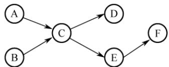

27.【2023 统考真题】现要求学生使用 swap 指令和布尔型变量lock实现临界区互斥。lock王 为线程间共享的变量，当lock 的值为 TRUE时线程不能进入临界区，为 FALSE时线程能够进入临界区。某同学编写的实现临界区互斥的伪代码如下图所示。

某同学编写的伪代码   
bool lock = FALSE; //共享变量   
bool key = TRUE; 进入区   
if (key == TRUE)   
swap key, lock; //交换 key 和 lock 的值   
临界区   
lock = TRUE; 退出区  
(a)

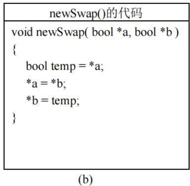

请回答下列问题。

1）图(a)的伪代码中哪些语句存在错误？将其改为正确的语句（不增加语句的条数)。

2）图(b)给出了交换两个变量值的函数newSwap()的代码，是否可以用函数调用语句“newSwap(&key,&lock)”代替指令“swap key, lock”以实现临界区互斥？为什么？

28.【2024统考真题】计算机系统中的进程之间往往需要相互协作来完成一个任务。在某网络系统中，缓冲区B用于存放一个数据分组，对B的操作有 $ C _{1} 、  C _{2}$ 和 $\mathrm { C } _ { 3 }$ 。 $\mathrm { C _ { 1 } }$ 将一个数据分组写入 B， $\mathrm { C } _ { 2 }$ 从B中读出一个数据分组， $\mathrm { C } _ { 3 }$ 对B中的数据分组进行修改。要求B为空时才能执行 $\mathrm { C _ { 1 } }$ ，B非空时才能执行 $\mathrm { C } _ { 2 }$ 和 $\mathrm { C } _ { 3 }$ 。请回答下列问题。

1）假设进程 $\mathrm { P } _ { 1 }$ 和 $\mathrm { P } _ { 2 }$ 均需要执行 $\mathrm { C _ { 1 1 } }$ ，实现 $\mathrm { C _ { 1 } }$ 的代码是否为临界区？为什么？

2）假设B初始为空，进程 $\mathrm { P } _ { 1 }$ 执行 $\mathrm { C _ { 1 } } \mathrm { - }$ 次，进程 $\mathrm { P } _ { 2 }$ 执行 $\mathrm { C } _ { 2 }$ 一次。请定义尽可能少的信号量，并用 wait()、signal()操作描述进程 $\mathrm { P _ { 1 } }$ 和 $\mathrm { P } _ { 2 }$ 之间的同步或互斥关系，说明所用信号量的作用及其初值。

3）设B初始不为空，进程 $\mathrm { P } _ { 1 }$ 和 $\mathrm { P } _ { 2 }$ 各执行 $ C _{3}$ 一次。定义尽可能少的信号量，并用 wait()、signal()操作描述进程 $\mathrm { P } _ { 1 }$ 和 $\mathrm { P } _ { 2 }$ 之间的同步或互斥关系，说明所用信号量的作用及其初值。

29.【2025统考真题】甲、乙、丙三人一起植树，甲负责挖树坑，乙负责将树苗放入树坑并 填土，丙负责为新种的树苗浇水。植树的步骤依次为：挖树坑、放树苗、填土和浇水。

现有铁锹和水桶各1个，铁锹用于挖树坑和填土，水桶用于浇水。当树坑的数量小于3时，甲才可以挖树坑。假设初始时树坑的数量为0，铁锹和水桶均可用。请定义尽可能少的信号量，用wait()、signal()操作描述植树过程中三人之间的同步或互斥关系，并说明所用信号量的作用及其初值。

## 2.3.9 答案与解析

## 一、单项选择题

## 01. D

多个进程可以共享系统中的资源，一次仅允许一个进程使用的资源称为临界资源。访问临界资源的那段代码称为临界区。

## 02. D

在多道程序技术中，信号量机制是一种有效实现进程同步和互斥的工具。进程执行的前趋关系实质上是指进程的同步关系。除此之外，只有进程的并发执行不需要信号量来控制。

## 03. A

信号量是一个特殊的整型变量，只有初始化和PV操作才能改变其值。通常，信号量分为互斥量和资源量，互斥量的初值一般为1，表示临界区只允许一个进程进入，从而实现互斥。当互斥量等于0时，表示临界区已有一个进程进入，临界区外尚无进程等待；当互斥量小于0时，表示临界区中有一个进程，互斥量的绝对值表示在临界区外等待进入的进程数。同理，资源信号量的初值可以是任意整数，表示可用的资源数，当资源量小于0时，表示所有资源已全部用完，而且还有进程正在等待使用该资源，等待的进程数就是资源量的绝对值。

## 04. C

进程进入临界区必须满足互斥条件。当进程已进入临界区但尚未离开时，若被迫进入阻塞状态，这是允许的，系统中常出现此类情形。在此状态下，只要其他进程在运行过程中不试图进入该临界区，就应允许其获得CPU并继续执行。该进程所锁定的临界区不允许其他进程访问；若其他进程尝试进入，必将在临界区的“锁”上阻塞，等待该进程下次运行时退出并释放临界区。

## 05. C

一张飞机票不能售给不同的旅客，因此飞机票是互斥资源，其他因素只是为完成飞机票订票的中间过程，与互斥资源无关。

## 06. D

所谓临界区，并不是指临界资源，如共享的数据、代码或硬件设备等，而是指访问临界资源的那段代码程序，如P/V操作、加减锁等。操作系统访问临界资源时，关心的是临界区的操作过程，具体对临界资源做何操作是应用程序的事情，操作系统并不关心。

## 07. D

同步机制的4个准则是空闲让进、忙则等待、让权等待和有限等待。

## 08. B

临界资源是互斥共享资源，非共享数据不属于临界资源。打印机、共享变量和共享缓冲区都只允许一次供一个进程使用。

## 09. B

临界资源是指必须互斥访问的资源，若并发使用将导致数据混乱或逻辑错误。磁盘虽为共享设备，但其访问由操作系统统一协调，不构成临界资源；公用队列被多个进程共享，若无互斥控制，同时操作会导致队列结构破坏或数据错乱，属于典型临界资源：私用数据仅限单个进程使用，不存在竞争；可重入的程序代码不含全局状态，允许多进程并发执行，无须互斥。

## 10. C

同步是指为了完成某项任务而建立的多个进程的相互合作关系，由于并发进程的执行是异步的（按各自独立的、不可预知的速度向前推进），需要保证进程之间操作的先后次序的约束。例如，读进程和写进程对同一段缓冲区的读和写就需要进行同步，以保证正确的执行顺序。

## 11. C

并发进程因共享资源而产生相互制约，可分为两类：①互斥关系，指进程竞争使用独占资源（互斥资源）所形成的制约；②同步关系，指进程为协同工作而需交换信息、相互等待所形成的制约。本题中，两个进程之间的制约属于同步关系，进程B必须等待进程A将数据写入缓冲区后，才能从中读取数据。同时，缓冲区是共享资源，其访问必须互斥，因此二者也存在互斥关系。

## 12. D

P、V操作是一种低级的进程通信原语，它是不能被中断的。

## 13. C

P操作即wait操作，表示等待某种资源直到可用。若这种资源暂时不可用，则进程进入阻塞态。注意，执行P操作时的进程处于运行态。 C

## 14. D

原语顾名思义，就是原子性的、不可分割的操作。其严格定义为：由若干机器指令构成的完成某种特定功能的一段程序，其执行必须是连续的，在执行过程中不允许被中断。

## 15. A

管程定义了一个数据结构和能为并发进程所执行（在该数据结构上）的一组操作，这组操作能同步进程并改变管程中的数据。

## 16. C

只有就绪进程能获得处理器资源，被唤醒的进程并不能直接转换为运行态。

## 17. B

互斥信号量的初值设置为1，P操作成功则将其减1，禁止其他进程进入；V操作成功则将其加1，允许等待队列中的一个进程进入。

## 18. D

与互斥信号量初值一般置1不同，用P.V操作实现进程同步时，信号量的初值应根据具体情况来确定。若期望的消息尚未产生，则对应的初值应设为0；若期望的消息已存在，则信号量的初值应设为一个非0的正整数。 KKK

## 19. C

若代码可被多个进程在任意时刻共享，则要求任意一个进程在调用此段代码时都以同样的方式运行：而且进程在运行过程中被中断后再继续执行，其执行结果不受影响。这必然要求代码不能被任何进程修改，否则无法满足共享的要求。这样的代码就是可重入代码，也称纯代码，即允许多个进程同时访问的代码。

## 20. D

共享程序段可能同时被多个进程使用，所以必须可重入编码，否则无法实现共享的功能。

## 21. D

互斥锁可用于多线程或多进程之间，但只有对它加锁的线程或进程才能解锁它。若一个线程 或进程试图解锁一个不属于它（加锁）的互斥锁，则返回错误码。

## 22. C

若两个线程分别对两个不同的互斥锁先后加锁，但顺序相反，则可能导致死锁，这是典型

的循环等待现象。例如，线程1先对互斥锁A加锁，然后尝试对互斥锁B加锁；同时，线程2先对B加锁，然后尝试对A加锁，两个线程都在等待对方释放资源，从而无法继续推进。

## 23. D

P操作和V操作都属于原语操作，不可被中断。

## 24. B

互斥信号量mutex初值为1，表示临界区初始可用。当mutex=0时，说明一个进程已执行P操作并进入临界区，且因信号量非负，无其他进程在等待；只有当mutex=-1时，才表示一个进程在临界区内，另一个在等待。因此，mutex=0对应有且仅有一个进程进入临界区。 XTA

## 25. C

当有一个进程进入临界区且有另一个进程等待进入临界区时，mutex = -1。当mutex小于0时，其绝对值等于等待进入临界区的进程数。 KYT

## 26. D

由题意可知，系统原来存在等待进入临界区的进程，mutex小于或等于-1，因此在执行V(mutex)操作后，mutex的值小于或等于0。

## 27.C

这里的临界区是指访问临界资源A的那段代码（临界区的定义）。那么5个并发进程共有5个操作共享变量A的代码段。 XTA

## 28. C

管程由局限于管程的共享变量说明、对管程内的数据结构进行操作的一组过程及对局限于管程的数据设置初始值的语句组成。

## 29. C

管程的signal操作与信号量机制中的V操作不同，信号量机制中的V操作一定会改变信号量的值S=S+1。而管程中的 signal操作是针对某个条件变量的，若不存在因该条件而阻塞的进程，则 signal 不会产生任何影响。

## 30. A

参见记录型信号量的介绍。此处极易出关于 S.value的概念题，总结如下：① S.value> 0，  
表示某类可用资源的数量。每次P操作，意味着请求分配一个单位的资源。②S.value≤0，表示  
某类资源已无可用，且存在因请求该资源而被阻塞的进程，S.yalue的绝对值表示等待进程数量。一定要看清题目中的陈述是执行P操作前还是执行P操作后。

## 31. ①C ②B

①系统中有n个进程，只要这些进程不都处于阻塞态，则至少有一个进程正在处理器上运行（处理器至少有一个），因此就绪队列中的进程个数最多有n-1个。选项B容易被错选，以为出现了处理器为空、就绪队列全满的情况，实际调度无此状态。

②本题易错选C，阻塞队列有n-1个进程是可能发生的，但不是最多的情况。不少读者会忽略死锁的情况，死锁就是n个进程都被阻塞，因此阻塞队列最多可以有n个进程。

## 32. B

对S进行了28次P操作和18次V操作，即S-28+18=0，得信号量的初值为10；然后，对信号量S进行了15次P操作和2次V操作，即S-15+2=10-15+2=-3，S信号量的负值的绝对值表示等待队列中的进程数。所以有3个进程等待在信号量S的队列中。

## 33. B

本题的关键是，输出语句A2,B2中读取的x的值不同，由于A1,B1执行有先后问题，使得在

执行A2, B2前，x的可能取值有两个，即 1,− 3；这样，输出 z的值可能是1 + 2 = 3 或(-3)+ 2 = -1；  
输出 c 的值可能是 1×1 = 1 或(-3)(-3) = 9。

## 34. D

并发进程之间的关系没有必然的要求，只有执行时间上的偶然重合，可能无关也可能有交往。

## 35. C

信号量的初值表示该类资源的总数，因此信号量的初值取3。每分配一个该类资源，信号量减1，当信号量等于0时，表示该类资源刚好被分完；当信号量小于0时，表示还有进程正在等待该类资源，信号量的绝对值就是等待进程的数量。因此，当没有进程使用时，信号量最大为3；当有三个进程正在使用并有一个进程在等待时，信号量最小为-1。 长

## 36. C

根据 Peterson 算法的原理，可知(1)和(2)处分别为 turn = 1 和 turn = 0。

## 37. A

flag数组用于标记各个线程想进入临界区的意愿。当一个线程想要进入临界区时，它将自己对应的flag值置为true；当一个线程退出临界区时，它将自己对应的flag值置为false。这样，若两个进程都争着想进入临界区，则可以让进程将进入临界区的机会谦让给对方。

## 38. A

turn变量用于指示允许进入临界区的线程编号。当一个线程想要进入临界区时，它将turn置为对方的编号，表示优先让对方先进入。当一个线程检查到对方的flag为true时，表示对方也想进入，这时就需要根据turn来决定谁先进入。若turn等于自己的编号，表示轮到自己进入，则可以直接进入。若turn等于对方的编号，表示轮到对方进入，则需等待对方退出。

## 39. B

进程并发带来问题不仅包括同步互斥问题，还包括死锁等其他问题。生产者-消费者问题用于解决进程的同步和互斥问题。共享一个数据对象仅涉及互斥访问的问题。

## 40. A

当缓冲区为空时，消费者进程取产品会被阻塞，此时需等待生产者进程生产新产品。

## 41. D

生产者和消费者共享缓冲区，每次只允许一个生产者或消费者进入缓冲区，当有一个生产者或消费者进入缓冲区时，其他生产者或消费者就必须阻塞等待。因此，生产者有可能唤醒其他生产者或消费者，消费者也有可能唤醒其他生产者或消费者，四个选项均正确。

## 42. A

所谓互斥使用某临界资源，是指在同一时间段只允许一个进程使用此资源，所以互斥信号量的初值都为1。 人

## 43. B

在生产者-消费者问题中，每次只能有一个生产者或消费者进入缓冲区，需要用一个互斥信号量来控制，当有一个生产者或消费者进入缓冲区时，其他申请进入缓冲区的消费者会被阻塞。

## 44. C

在读者-写者问题中，写者和写者之间、写者和读者之间必须互斥访问共享对象，读者和读者之间则可以同时访问。

## 45. C

信号量seat表示桌子上可以坐下的位置数，因为只有五个位置，所以每次只能有四位哲学家同时拿起左边的餐叉，才能保证不会发生死锁，所以seat的初值应该为4。

## 46. C

因为进程并发，所以进程的执行具有不确定性，在 $\mathrm { P } _ { 1 } , \mathrm { P } _ { 2 }$ 执行到第一个P,V操作前，应该是相互无关的。现在考虑第一个对 $\mathrm { s } _ { 1 }$ 的P,V操作，因为进程 $\mathrm { P } _ { 2 }$ 是 $\mathrm { P } ( \mathrm { s } _ { 1 } )$ 操作，所以它必须等待 $\mathrm { P } _ { 1 }$ 执行完 $\mathbf { V } ( \mathbf { s } _ { 1 } )$ 操作后才可继续运行，此时的 $ x , y , Z$ 值分别是2,3,4，当进程 $\mathrm { P _ { 1 } }$ 执行完 $\mathbf { V } ( \mathbf { s } _ { 1 } )$ 后便在 $\mathrm { P } ( s _ { 2 } )$ 上阻塞，此时 $\mathrm { P } _ { 2 }$ 可以运行直到 $\mathrm { V } ( \mathrm { s } _ { 2 } )$ ，此时的 x, y, z 值分别是 5, 3, 9，进程 $\mathrm { P } _ { 1 }$ 继续运行到结束，最终的 x, y, z 值分别为 5, 12, 9。

## 47. B

信号量表示相关资源的当前可用数量。当信号量 $K   \ge 0$ 时，表示还有K个相关资源可用，所以该资源的可用个数是1。而当信号量 $K \leq 0$ 时，表示有K个进程在等待该资源。因为资源有剩余，可见没有其他进程等待使用该资源，所以进程数为0。

## 48. D

这是Peterson算法的实际实现，保证进入临界区的进程合理安全。该算法为了防止两个进程为进入临界区而无限期等待，设置了变量turn，表示允许进入临界区的编号，每个进程在先设置自己的标志后再设置turn标志，允许另一个进程进入。这时，再同时检测另一个进程状态标志和允许进入标志，就可保证当两个进程同时要求进入临界区时只允许一个进程进入临界区。保存的是较晚的一次赋值，因此较晚的进程等待，较早的进程进入。先到先入，后到等待，从而完成临界区访问的要求。 XTA

其实这里可想象为两个人进门，每个人进门前都会和对方客套一句“你走先”。若进门时没别人，则当和空气说句废话，然后大步登门入室；若两人同时进门，则互相先请，但各自只客套一次，所以先客套的人请完对方，就等着对方请自己，然后光明正大地进门。

## 49. C

x的值最终是多少，取决于最后是哪个进程对x进行了写操作。一个进程一旦拿到了x值，它最后对x写操作的值也就确定了。因此本题只需考虑两个进程拿到x值的所有可能情况。对于进程$\mathrm { P _ { 1 } }$ ，最初取到的x值可能是1，也可能是进程 $\mathrm { P } _ { 2 }$ 完成后更新得到的x值0，因此对于 $\mathrm { P } _ { 1 }$ ，最终写入x的值可能是2（当它最初取到1时）和1（当它最初取到0时）。同理，对于 $\mathrm { P } _ { 2 }$ ，最初取到的x值可能是1，也可能是 $\mathrm { P } _ { 1 }$ 完成后更新得到的x值2，因此对于 $\mathrm { P } _ { 2 } ,$ 最终写入x的值可能是0（当它最初取到1时）和1（当它最初取到2时）。因此，最终的x值可能是0、1或2。

## 50. C

需要进行互斥的操作是对临界资源的访问，也就是说，不同线程对同一个进程内部的共享变量的访问才有可能需要进行互斥，不同进程的线程、代码段或变量不存在互斥访问的问题，同一个线程内部的局部变量也不存在互斥访问的问题。选项A中的a是线程内部的局部变量，不需要互斥访问。选项D是不同进程的线程代码段，不存在互斥访问的问题。选项B是对进程内部的共享变量x的读操作，不互斥也不影响执行结果，所以不需要互斥访问。选项C是不同线程对同一个进程内部的共享变量的写操作，需要互斥访问（类似于读者-写者问题）。

## 51. B

使用TSL指令实现进程互斥时，并没有阻塞态进程，等待进入临界区的进程一直停留在执行while(TSL(&lock))的循环中，不会主动放弃CPU，一直处于运行态，直到该进程的时间片用完放弃处理机，转为就绪态，此时切换另一个就绪态进程占用处理机。这不同于信号量机制实现的互斥。由此可知选项A和C错误，选项B正确。TSL指令本身就是原子操作，不需要关中断来保证其不被打断。TSL指令实现原子性的原理是，执行TSL指令的CPU锁住内存总线，以禁止其他 CPU在本指令结束之前访问内存。此外，假如 while(TSL(&lock))在关中断状态下执行，若

TSL(&lock)一直为true，不再开中断，则系统可能因此终止。因此选项D错误。

## 52. A

管程是由一组数据及定义在这组数据之上的对这组数据的操作组成的软件模块，这组操作能初始化并改变管程中的数据和同步进程。管程不仅能实现进程间的互斥，还能实现进程间的同步，因此选项A错误、B正确；管程具有如下特性：①局部于管程的数据只能被局部于管程内的过程所访问：②一个进程只有通过调用管程内的过程才能进入管程访问共享数据：③每次仅允许一个进程在管程内执行某个内部过程，因此选项C和D正确。

## 53. B

仔细阅读两个线程代码可知，thread1和thread2均是对x进行加1操作，x的初始值为0，若要使得最终 x = 2，只能先执行完 thread1 再执行 thread2，或先执行完 thread2 再执行 thread1，因此仅有2种可能。

## 54. D

“条件变量”是管程内部说明和使用的一种特殊变量，其作用类似于信号量机制中的“信号量”，都用于实现进程同步。需要注意的是，在同一时刻，管程中只能有一个进程在执行。若进程A执行了x.waitO操作，则该进程会阻塞，并挂到条件变量x对应的阻塞队列上。这样，管程的使用权被释放，就可以有另一个进程进入管程。若进程B执行了x.signal操作，则会唤醒x对应的阻塞队列的队首进程。只有一个进程要离开管程时才能调用signal()操作。

## 55. C

硬件方法实现进程同步时不能实现让权等待；Peterson算法满足有限等待但不满足让权等待；记录型信号量由于引入阻塞机制，消除了不让权等待的情况，选项C正确。

## 56. C

实现临界区互斥需满足多个准则。“忙则等待”准则，即两个进程不能同时访问临界区，说法Ⅰ正确。“空闲让进”准则，若临界区空闲，则允许其他进程访问，说法Ⅱ正确。“有限等待”准则，即进程应该在有限时间内访问临界区，说法Ⅲ正确。说法Ⅰ、Ⅱ和Ⅲ是互斥机制必须遵循的原则。说法IV是“让权等待”准则，不一定非得实现，如皮特森算法。

## 二、综合应用题

## 01.【解答】

$\mathrm { P } _ { 1 }$ 和 $\mathrm { P } _ { 2 }$ 两个并发进程的执行结果是不确定的，它们都对同一变量X进程操作，X是一个临界资源，而没有进行保护。例如： KK

1）若先执行完 $\mathrm { P _ { 1 } }$ 再执行 $\mathrm { P } _ { 2 }$ ，则结果是 $\mathrm{x}=0,\mathrm{y}=1,\mathrm{z}=1,\mathrm{t}=2,\mathrm{u}=2.$

2）若先执行 $\mathrm { P } _ { 1 }$ 到 $ \text{" }_{ X }=1 \text{" }$ ，然后一个中断去执行完 $\mathrm { P } _ { 2 }$ ，再一个中断回来执行完 $\mathrm { P } _ { 1 }$ ，则结果是 $\mathrm{x}=0, \mathrm{y}=0, \mathrm{z}=0, \mathrm{t}=2, \mathrm{u}=2$

显然，两次执行结果不同，所以这两个并发进程不能正确运行。可将这个程序改为：

int x;   
semaphore S=1; //访问ⅹ的互斥信号量   
process\_P1 { process\_P2 {   
int y,z; int t,u;   
P (S) ; P (S) ;   
x=1; x=0;   
y=0; t=0;   
if(x>=1) if(x<=1)   
y=y + 1; t=t + 2;   
V (S) ; V(S) ;   
z=y; 道 u=t;   
1 1

## 02. 【解答】

使用信号量mutex控制两个进程互斥访问临界资源（仓库），使用同步信号量Sa和 Sb（分别代表产品A与B的还可容纳的数量差，以及产品B与A的还可容纳的数量差）满足条件2和条件3。代码如下：

Semaphore Sa=M-1,Sb=N-1;   
Semaphore mutex=1; //访问仓库的互斥信号量   
process A() { process B() {   
while(1) { while(1) {   
P(Sa); P(Sb);   
P(mutex); P(mutex);   
A产品入库； B产品入库；   
V(mutex) ; V(mutex);   
V (Sb) ; V(Sa);   
1 1

## 03.【解答】

顾客进店后按序取号，并等待叫号；销售人员空闲后也按序叫号，并销售面包。因此同步算法只要对顾客取号和销售人员叫号进行合理同步即可。我们使用两个变量i和i分别记录当前的取号值和叫号值，并各自使用一个互斥信号量用于对i和i进行访问和修改。

int i=0,j=0;  
semaphore mutex\_i=1,mutex\_j=1;  
Consumer () { //顾客  
进入面包店；  
P(mutex\_i); //互斥访问i  
取号i;  
i++;  
V(mutex\_i); //释放对i的访问  
1 等待叫号i并购买面包； 王道计  
Seller() { //销售人员  
while(1) {  
P(mutex\_j); //互斥访问j  
if (j<i) { //号j已有顾客取走并等待  
叫号j；  
j++;  
V(mutex\_j); //释放对 j 的访问  
销售面包；  
else{ //暂时没有顾客在等待  
王道计 V(mutex\_j); 休息片刻； //释放对 j 的访问

## 04. 【解答】

本题是生产者-消费者问题的变体，生产者“车间A”和消费者“装配车间”共享缓冲区“货架F1”；生产者“车间B”和消费者“装配车间”共享缓冲区“货架F2”。因此，可为它们设置6个信号量：empty1对应货架F1上的空闲空间，初值为10；full1对应货架F1 上面的A产品，初值为0；empty2 对应货架F2 上的空闲空间，初值为10；full2对应货架F2上面的 B 产品，初值为0；mutex1用于互斥地访问货架F1，初值为1；mutex2用于互斥地访问货架F2，初值为1。

A车间的工作过程可描述为：

```solidity
while(1) {
生产一个产品A；
P(empty1); //判断货架 F1 是否有空
P (mutex1); //互斥访问货架F1
将产品 A 存放到货架 F1 上：
V (mutex1); 王道计 //释放货架 F1
V(full1); //货架 F1 上的零件 A 的个数加 1
}
```

B车间的工作过程可描述为：

while(1){  
生产一个产品B；  
P(empty2); //判断货架 F2 是否有空  
P (mutex2); //互斥访问货架 F2  
将产品 B 存放到货架 F2 上；  
V(mutex2); //释放货架 F2  
V(full2); //货架 F2 上的零件 B 的个数加 1

装配车间的工作过程可描述为：

while(1) {  
P(full1); //判断货架 F1 上是否有产品 A  
P(mutex1); //互斥访问货架F1  
从货架F1 上取一个A 产品；  
V (mutex1); //释放货架F1  
V(empty1); //货架F1上的空闲空间数加1  
P(full2); //判断货架 F2 上是否有产品 B  
P (mutex2); //互斥访问货架F2  
从货架F2 上取一个 B 产品；  
V (mutex2); //释放货架 F2  
V(empty2); //货架 F2 上的空闲空间数加 1  
将取得的 A 产品和 B 产品组装成产品；

## 05. 【解答】

从井中取水并放入水缸是一个连续的动作，可视为一个进程；从缸中取水可视为另一个进程。设水井和水缸为临界资源，引入well和 vat；三个水桶无论是从井中取水还是将水倒入水缸都是一次一个，应该给它们一个信号量pail，抢不到水桶的进程只好等待。水缸满时，不可以再放水，设置empty信号量来控制入水量；水缸空时，不可以取水，设置full信号量来控制。本题需要设置5个信号量来进行控制：

```c
semaphore well=1; //用于互斥地访问水井
semaphore vat=1; //用于互斥地访问水缸
semaphore empty=10; //用于表示水缸中剩余空间能容纳的水的桶数
semaphore full=0; //表示水缸中的水的桶数
semaphore pail=3; //表示有多少个水桶可以用，初值为3
//老和尚
while(1) {
P(full);
P(pail);
P(vat);
从水缸中打一桶水； 道计算机教育
V(vat);
V(empty);
喝水；
V(pail);
```

```c
//小和尚
while(1){
P(empty);
P(pail);
P(well);
从井中打一桶水；
V(well);
P(vat);
将水倒入水缸中；
V(vat);
V(full);
V(pail);
```

## 06. 【解答】

为了控制三个进程依次使用输入设备进行输入，需分别设置三个信号量S1.S2.S3，其中S1的初值为1，S2和S3的初值为0。使用上述信号量后，三个进程不会同时使用输入设备，因此不必再为输入设备设置互斥信号量。另外，还需要设置信号量Sb,Sy，Sz来表示数据b是否已经输入，以及y,z是否已计算完成，它们的初值均为0。三个进程的动作可描述为：

P1 ( ) {  
P(S1);  
从输入设备输入数据 a;  
V(S2);  
P(Sb);  
x=a+b;  
P(Sy);  
P(Sz);  
使用打印机打印出 x，y，z 的结果；  
P2 ( ) {  
P(S2); 王道  
从输入设备输入数据b；  
V(S3);  
V(Sb);  
y=a\*b;  
V(Sy);  
一 V(Sy) ; 机教育  
P3 ( ) {  
P(S3);  
从输入设备输入数据c;  
P(Sy) ;  
z=y+c-a;  
V(Sz);

## 07.【解答】

1）桥上每次只能有一辆车行驶，所以只要设置一个信号量bridge就可判断桥是否使用，若在使用中，等待；若无人使用，则执行P操作进入；出桥后，执行Ⅴ操作。

semaphore bridge=1; //用于互斥地访问桥  
NtoS ( ) { //从北向南  
P(bridge);  
通过桥；  
V(bridge);  
1  
StoN ( ) { //从南向北

2）桥上可以同方向多车行驶，需要设置bridge，还需要对同方向车辆计数。为了防止同方向计数中同时申请bridge造成同方向不可同时行车的问题，要对计数过程加以保护，因此设置信号量 mutexSN 和 mutexNS。

```c
int countSN=0; //用于表示从南到北的汽车数量
int countNS=0; //用于表示从北到南的汽车数量
semaphore mutexSN=1; //用于保护 countSN
semaphore mutexNS=1; //用于保护 countNS
semaphore bridge=1; //用于互斥地访问桥
StoN() { //从南向北
P (mutexSN) ;
if(countSN==0)
P(bridge);
countSN++;
王道 V (mutexSN) ;
过桥；
P (mutexSN) ;
countSN--;
if(countSN==0)
V(bridge) ;
V (mutexSN) ;
NtoS ( ) { //从北向南
P (mutexNS) ;
if(countNS==0)
countNS++; P(bridge); 王道计算
V(mutexNS);
过桥；
P (mutexNS) ;
countNS--;
if(countNS==0)
V(bridge);
V (mutexNS) ;
```

## 08.【解答】

1）这种机制不能实现资源的互斥访问。考虑如下情形。

①初始化时，flag数组的两个元素值均为FALSE。

②线程0先执行，执行while循环语句时，因为flag[1]为FALSE，所以顺利结束，不会被卡住。假设这时来了一个时钟中断，打断了它的运行。

③线程1 去执行，执行 while循环语句时，因为 flag[0]为 FALSE，所以顺利结束，不会被卡住，然后进入临界区。

④后来当线程0再执行时，也进入临界区，这样就同时有两个线程在临界区。

总结：不能成功的根本原因是无法保证Enter Critical Section()函数执行的原子性。我们从上面的软件实现方法中可以看出，对于两个进程间的互斥，最主要的问题是标志的检查和修改不能作为一个整体来执行，因此容易导致无法保证互斥访问的问题。

2）可能出现死锁。考虑如下情形。

①初始化时，flag数组的两个元素值均为FALSE。

②线程0先执行，flag[0]为TRUE，假设这时来了一个时钟中断，打断了它的运行。

③ 线程 1 去执行，flag[1]为 TRUE，在执行 while 循环语句时，因为 flag[0] = TRUE，所以在这个地方被卡住，直到时间片用完。

④线程0再执行时，因为flag[1]为TRUE，它也在 while循环语句的地方被卡住，所以这两个线程都无法执行下去，从而死锁。

## 09. 【解答】

用信号量与PV操作实现三名工人的合作。

首先不考虑死锁问题，工人1与工人3、工人2与工人3构成生产者与消费者关系，这两对生产/消费关系通过共同的缓冲区相联系。从资源的角度来看，箱子中的空位置相当于工人1和工人2的资源，而车架和车轮相当于工人3的资源。

分析上述解法易见，当工人1推进速度较快时，箱中空位置可能完全被车架占满或只留有一个存放车轮的位置，此时工人3同时取2个车轮将无法得到，而工人2又无法将新加工的车轮放入箱中；当工人2推进速度较快时，箱中空位置可能完全被车轮占满，而此时工人3取车架将无法得到，而工人1又无法将新加工的车架放入箱中。上述两种情况都意味着死锁。为防止死锁的发生，箱中车架的数量不可超过N-2，车轮的数量不可超过N-1，这些限制可以用两个信号量来表达。具体解答如下。

semaphore empty=N; //空位置  
semaphore wheel=0; //车轮 育  
semaphore frame=0; //车架  
semaphore s1=N-2; //车架最大数  
semaphore s2=N-1; //车轮最大数  
工人1活动：  
do {  
加工一个车架；  
P(s1); //检查车架数是否达到最大值  
P(empty); //检查是否有空位  
车架放入箱；  
V(frame); //车架数加1  
}while(1);  
工人2活动：  
do {  
加工一个车轮；  
P(s2); //检查车轮数是否达到最大值  
P(empty); //检查是否有空位  
车轮放入箱中；  
V(wheel); //车轮数加1  
}while(1);  
工人3活动：  
do {  
P(frame); //检查是否有车架  
箱中取一车架；  
V(empty); //空位数加1  
V(s1); //可装入车架数加1  
P(wheel); //检查是否有一个车轮  
P(wheel); //检查是否有另一个车轮  
箱中取二车轮；  
V(empty); //取走一个车轮，空位数加1  
V(empty); //取走另一个车轮，空位数加1

V(s2) ;   
V(s2);   
组装为一台车；   
}while(1);

//可装入车轮数加1   
//可装入车轮数再加1

## 10.【解答】

P, Q 构成消费者-生产者关系，因此设三个信号量 full, empty, mutex。full 和 empty 用来控制缓冲池状态，mutex用来互斥进入。R既为消费者又为生产者，因此必须在执行前判断状态，若empty==1，则执行生产者功能；若full==1，执行消费者功能。

semaphore full=0; //表示缓冲区的产品   
semaphore empty=1; /表示缓冲区的空位   
semaphore mutex=1; //互斥信号量   
Procedure P Procedure Q Procedure R   
while(TRUE) { while(TRUE) { if(empty==1) {   
p(empty); p(full); p(empty);   
P (mutex) ; P (mutex); P (mutex) ;   
道 Product one; consume one; product one;   
v (mutex) ; v (mutex) ; v (mutex) ;   
v(full); v(empty); v(full);   
1   
1 } if(full==1){   
p(full);   
p(mutex) ;   
consume one;   
算机教育 v (mutex) ;   
v(empty);

## 11. 【解答】

1）控制变量waiting用来记录等候理发的顾客数，初值为0，进来一名顾客时，waiting加1，一名顾客理发时，waiting减1。

2）信号量customers用来记录等候理发的顾客数，并用作阻塞理发师进程，初值为0。

3）信号量barbers用来记录正在等候顾客的理发师数，并用作阻塞顾客进程，初值为0。

4）信号量mutex用于互斥，初值为1。

int waiting=0; //等候理发的顾客数   
int chairs=n; //为顾客准备的椅子数   
barber () { semaphore customers=0,barbers=0,mutex=1; //理发师进程 直计算机   
while(1) { //理完一人，还有顾客吗？   
王道 P(customers); P (mutex) ; //若无顾客，理发师睡眠 //进程互斥   
waiting=waiting-1; //等候顾客数少一个   
V(barbers); //理发师去为一名顾客理发   
V (mutex) ; //开放临界区   
Cut\_hair(); //正在理发   
}   
customer () { //顾客进程   
P (mutex) ; //进程互斥   
if(waiting<chairs) { /若有空的椅子，就找到椅子坐下等待   
waiting=waiting+1; //等候顾客数加1   
首   
V(customers); //呼唤理发师

V(mutex); //开放临界区   
P(barbers); //无理发师，顾客坐着   
get haircut(); //一名顾客坐下等待理发   
}   
else   
V(mutex); 道 //人满，离开   
1

## 12. 【解答】

电影院一次只能放映一部影片，希望观看的观众可能有不同的爱好，但每次只能满足部分观众的需求，即希望观看另外两部影片的用户只能等待。分别为三部影片设置三个信号量s0,s1,s2，初值分别为1,1,1。电影院一次只能放一部影片，因此需要互斥使用。观看影片的观众有多个，因此必须分别设置三个计数器（初值都是0），用来统计观众个数。当然，计数器是个共享变量，需要互斥使用。 KKN

semaphore s=1,s0=1,s1=1,s2=1;   
int count0=0,count1=0,count2=0;   
process videoshow1 { //看第一部影片的观众   
P(s0) ;   
count0=count0+1;   
if(count0==1)   
P(s);   
V(s0);   
看影片； P(s0); 教育   
count0=count0-1;   
if(count0==0) //没人看了，就结束放映   
V(s);   
V(s0);   
process videoshow2 { 王道计算 //看第二部影片的观众   
P(s1);   
count1=count1+1;   
if(count1==1)   
P(s);   
V(s1);   
看影片； 教育   
P(s1);   
count1=count1-1;   
if(count1==0) //没人看了，就结束放映   
V(s);   
V(s1);   
process videoshow3{ //看第三部影片的观众   
P(s2);   
count2=count2+1;   
if(count2==1)   
P(s);   
V(s2);   
看影片； 机教育   
P(s2);   
Count2=count2-1;   
if(count2==0) //没人看了，就结束放映   
V(s);   
V(s2); 道计

## 13. 【解答】

在汽车行驶过程中，驾驶员活动与售票员活动之间的同步关系为：售票员关车门后，向驾驶员发开车信号，驾驶员接到开车信号后启动车辆，在汽车正常行驶过程中售票员售票，到站时驾驶员停车，售票员在车停后开门让乘客上下车。因此，驾驶员启动车辆的动作必须与售票员关车门的动作同步；售票员开车门的动作也必须与驾驶员停车同步。应设置两个信号量S1,S2：S1表示是否允许驾驶员启动汽车（初值为0）；S2表示是否允许售票员开门（初值为0）。

```csv
semaphore S1=0,S2=0;
Procedure driver Procedure Conductor
1
while(1) 教育 while(1)
P (S1); 关车门；
Start; V(s1);
Driving; 售票；
Stop; P(s2);
V(S2) ; 开车门；
王道 1 上下乘客；
1
```

## 14. 【解答】

本题是一个典型的利用信号量实现前驱关系的同步问题。

Semaphore a=b=c=d=e=f=g=h=0; //定义进程执行顺序的信号量  
coBegin  
process P1() {  
执行 P1 的任务；  
V(a) ; //实现先 P1 后 P2 的同步关系  
V (b) ; //实现先 P1 后 P3 的同步关系  
1  
process P2() {  
P(a); //检查 P1 是否已运行完成  
执行 Ρ2 的任务；  
V(c) ; //实现先 P2 后 P4 的同步关系  
V (d) ; //实现先 P2 后 P5 的同步关系  
1  
process P3() {  
P (b) ; //检查 P1 是否已运行完成  
执行 P3 的任务；  
V (e) ; //实现先 P3 后 P4 的同步关系  
V(f) ; //实现先 P3 后 P5 的同步关系  
process P4() { 王道  
P (c) ; //检查 P2 是否已运行完成  
P (e) ; //检查 P3 是否已运行完成  
执行Ρ4的任务；  
V(g); //实现先 P4 后 P6 的同步关系  
1  
process P5() {  
P (d) ; //检查 P2 是否已运行完成  
P(f); //检查 P3 是否已运行完成  
执行 P5 的任务；  
V(h); //实现先 P5 后 P6 的同步关系  
1  
process P6() {

P (g); //检查P4 是否已运行完成  
P(h); //检查 P5 是否已运行完成  
执行 P6 的任务；  
coEnd

## 15.【解答】

本题是经典的生产者-消费者问题。把缓冲区的每20个字视为一个基本单位，因此缓冲区共有1000/20=50个空位。设置互斥信号量mutex，用于对缓冲区的访问；还需要设置两个同步信号量：full表示缓冲区已有多少数据，empty表示缓冲区还有多少空位置。

Semaphore mutex=1; //互斥使用缓冲区  
Semaphore ful1=0; //表示缓冲区已有多少个20字数据，初值为0  
Semaphore empty=50; //表示缓冲区还有多少个20字空位，初值为50  
process P() { process P1/P2(){//P1、P2 完全一样  
P(empty); for(int i=0;i<2;++i){  
P (mutex) ; p(full);P(mutex);  
read(); get() ; 计算  
V(mutex) : V(mutex);V(empty);  
V(full); p(full) ;P (mutex);  
get () ;V (mutex) ;V(empty) ;  
comp () ;  
1  
print() ;  
1

## 16. 【解答】

供应者与3个抽烟者分别是同步关系。由于供应者无法同时满足两个或以上的抽烟者，3个抽烟者对抽烟这个动作互斥（或者理解为互斥访问桌子）。显然这里有4个进程。供应者作为生产者向3个抽烟者提供材料。设置信号量offer1.offer2.offer3分别表示烟草和纸组合的资源、烟草和胶水组合的资源、纸和胶水组合的资源，信号量finish用于互斥进行抽烟动作。代码如下：

int num=0; //存储随机数  
semaphore offer1=0; 王 //定义信号量对应烟草和纸组合的资源  
semaphore offer2=0; //定义信号量对应烟草和胶水组合的资源  
semaphore offer3=0; //定义信号量对应纸和胶水组合的资源  
semaphore finish=0; //定义信号量表示抽烟是否完成  
process P1 () { //供应者  
while(1) {  
num++;  
num=num%3;  
if(num==0)  
V(offer1); //提供烟草和纸  
else if(num==1)  
首 V(offer2); //提供烟草和胶水 王道计  
else  
V(offer3); //提供纸和胶水  
任意两种材料放在桌子上；  
P(finish);  
}  
1  
process P2 () { //拥有烟草者  
while(1) {  
P(offer3);  
拿纸和胶水，卷成烟，抽掉； 道计算机  
V(finish);  
}  
1

```c
process P3 () { //拥有纸者
while(1) {
P(offer2);
拿烟草和胶水，卷成烟，抽掉；
V(finish); 王道计算机
}
process P4() { //拥有胶水者
while(1) {
P(offer1);
拿烟草和纸，卷成烟，抽掉；
V(finish);
}
1
```

## 17. 【解答】

互斥资源：缓冲区只能互斥访问，因此设置互斥信号量mutex。

同步问题： $\mathrm { P } _ { 1 } ,   \mathrm { P } _ { 2 }$ 因为奇数的放置与取用而同步，设同步信号量 $\mathrm{odd};\ \mathrm{P}_{1},\ \mathrm{P}_{3}$ 因为偶数的放置与取用而同步，设置同步信号量 $ even;   \mathrm{P}_{1}, \mathrm{P}_{2}, \mathrm{P}_{3}$ 因为共享缓冲区，设同步信号量empty，初值为$N _ { \circ }$ 程序如下：

semaphore mutex=1; //缓冲区操作互斥信号量  
semaphore odd=0,even=0; //奇数、偶数进程的同步信号量  
semaphore empty=N; //空缓冲区单元个数信号量  
coBegin{  
Process P1 ()  
while(True)  
1  
x=produce(); //生成一个数  
P(empty); //判断缓冲区是否有空单元  
P(mutex); //缓冲区是否被占用  
Put () ;  
V (mutex) ; 王道 //释放缓冲区  
if(x%2==0)  
V(even) ; //若是偶数，向 P3 发出信号  
else  
V(odd) ; //若是奇数，向 P2 发出信号  
1  
Process P2 ()  
while(True)  
1  
P (odd) ; //收到 P1 发来的信号，已产生一个奇数  
P(mutex); //缓冲区是否被占用  
getodd();  
王道计 V(empty); V(mutex); //释放缓冲区 //向 P1 发信号，多出一个空单元  
countodd () ;  
1  
Process P3 ()  
while(True)  
1  
P (even) ; //收到 P1 发来的信号，已产生一个偶数  
P (mutex) ; //缓冲区是否被占用  
geteven () ;  
V(mutex) ; //释放缓冲区  
V(empty); //向 P1 发信号，多出一个空单元  
counteven() ;  
1  
}coEnd

## 18.【解答】

互斥资源：取号机（一次只有一位顾客取号），因此设置互斥信号量mutex。

同步问题：顾客需要获得空座位等待叫号。营业员空闲时，将选取一位顾客并为其服务。空座位的有无会影响等待顾客的数量，顾客的有无决定了营业员是否能开始服务，因此分别设置信号量empty和full来实现这一同步关系。另外，顾客获得空座位后，需要等待叫号和被服务。这样，顾客与营业员就服务何时开始又构成了一个同步关系，定义信号量service来完成这一同步过程。

```c
semaphore empty=10; //空座位的数量，初值为10
semaphore mutex=1; //互斥使用取号机
semaphore full=0; //已占座位的数量，初值0
semaphore service=0; //等待叫号
coBegin
Process 顾客 i
P(empty); //等空位
P(mutex); //申请使用取号机
王道 从取号机上取号；
V(mutex); //取号完毕
V(full); //通知营业员有新顾客
P(service); //等待营业员叫号
接受服务；
1
Process 营业员 机教育
while(True) {
P(full); //没有顾客则休息
V(empty); //离开座位
V(service); 01/叫号
为顾客服务； 王道
1
}coEnd
```

## 19. 【解答】

出入口一次仅允许一人通过，设置互斥信号量mutex，初值为1。博物馆最多可以同时容纳500人，因此设置信号量 empty，初值为500。

```c
semaphore empty=500; //博物馆可以容纳的最多人数
semaphore mutex=1; //用于出入口资源的控制
coBegin
参观者进程i:
P(empty); //可容纳人数减1
P(mutex); //互斥使用门
进门；
V(mutex);
参观；
P(mutex); //互斥使用门
出门;
V(mutex);
V(empty); //可容纳人数增1
1 计
coEnd
```

## 20. 【解答】

这是典型的生产者和消费者问题，只对典型问题加了一个条件，只需在标准模型上新加一个信号量，即可完成指定要求。 1

设置4个变量 mutex1, mutex2, empty和 full, mutex1 用于控制一个消费者进程在一个周期(10次）内对缓冲区的访问，初值为1；mutex2用于控制进程单次互斥地访问缓冲区，初值为1；empty代表缓冲区的空位数，初值为1000；full代表缓冲区的产品数，初值为0。伪代码如下：

semaphore empty=1000; //空缓冲区数  
semaphore full=0; //非空缓冲区数  
semaphore mutex1=1; //用于实现生产者之间的互斥  
semaphore mutex2=1; //用于实现消费者之间的互斥  
int in=0;  
int out=0;

生产者进程

while(TRUE) {   
produce;   
P(empty);   
王道 P (mutex1);   
put an item into buf[in];   
in=(in+1) mod n;   
V(mutex1);   
V(full);   
1

消费者进程

while(TRUE) {   
P(mutex2);   
for(int i=0;i<10;i++){   
P(full);   
get an item from buf[out];   
out=(out+1) mod n;   
V(empty);   
V(mutex2);   
Consume;   
}

## 21. 【解答】

本题是一个典型的生产者-消费者问题。A和B既是生产者，又是消费者。首先分析题中的互斥关系，信箱A和信箱B作为生产者-消费者问题中的缓冲区，需要互斥访问，因此设置两个信号量mutex A和mutexB。然后分析A和B的同步关系，A有两个动作，分别是从信箱A中取出邮件和将新邮件放入信箱B，因此设置信号量 Full A 和 Empty B，用来保证信箱A 中有邮件可以取，信箱B中有空间可以放。B的分析同理。因此本题的所有信号量设置如下：

semaphore Full\_A = x; ∥ Ful1 A 表示 A的信箱中的邮件数量  
semaphore Empty\_A = M-x; ∥ Empty A表示 A 的信箱中还可存放的邮件数量  
semaphore Full\_B = y; ∥/ Ful1 B 表示 B 的信箱中的邮件数量  
semaphore Empty\_B = N-y; ∥ Empty B 表示 B 的信箱中还可存放的邮件数量  
semaphore mutex\_A = 1; ∥ mutex A 用于 A的信箱互斥  
semaphore mutex B = 1; ∥mutex B 用于 B 的信箱互斥

互斥信号量的PV操作直接放置在对信箱操作的前后。在A取邮件之前需执行P(FullA)来检查信箱 A 中是否有邮件可取，取出邮件之后需执行 V(Empty A)，表示新增了一个邮件大小的空间；在A 将邮件放入邮箱B之前需执行 P(Empty\_B)来检车信箱B 中是否有空间可以放，放完邮件之后需执行 V(Full B)，表示信箱B增加了一个邮件。B的分析同理。

<table><tr><td>A{ while(TRUE) { P(Full _A); P(mutex_A); 从A的信箱中取出一个邮件； V(mutex_A); V(Empty_A); 回答问题并提出一个新问题； P(Empty_B) ; P(mutex_B); 将新邮件放入B的信箱；</td><td>B{ while(TRUE) { P(Full B); P(mutex_B); 从B的信箱中取出一个邮件； V(mutex_B); V(Empty_B); 回答问题并提出一个新问题； P (Empty_A); P (mutex_A); 将新邮件放入A的信箱； V(mutex_A); 王道计算机教</td></tr></table>

coEnd

## 22. 【解答】

对于这类问题，做法如下：

首先，找出有可能需要互斥访问的变量，只有全局变量才可能需要互斥访问，也就是说，含全局变量的代码段才可能是临界区。而局部变量是不需要互斥访问的，就算不同的进程之间都有相同名字的局部变量，但对不同的进程来说，它们只认识属于自己的局部变量。

其次，有关互斥的难点不在于找出哪些变量有可能需要互斥访问，而要理解互斥是进程之间对某个变量的互斥，不能脱离具体的进程来谈某个变量需不需要互斥访问。前面说了全局变量有可能需要互斥访问，但也不一定，因为这要看进程对它的操作，因此，一组互斥关系需要指出是哪些进程对哪个变量的互斥。例如，考虑两种情况：第一种情况是，进程1和进程2需要对共享变量C互斥访问，进程1和进程3也需要对变量C互斥访问，这是两组不同的互斥关系，而不能简单地理解为对C的互斥；第二种情况是，进程1、2、3两两之间都需要对变量C互斥访问。这种情况与第一种情况的差别是，第一种情况允许进程2、3对变量C的访问是不互斥的。若题目给出的是第一种情况，而我们采用了第二种情况去解题，则可能有同学认为，我依然满足了题目的要求啊，进程1、2之间以及进程1、3之间对C的访问都是互斥的，但这样降低了并发度，因为第二种情况允许进程2、3对变量C的访问是不互斥的，这也是PV互斥的最大难点，就是在没有准确找准互斥关系的条件下，容易导致程序的并发度降低，从而扣分。 E

本题的分析如下。

首先，全局变量是x、y、z，只有对这三个变量的访问才可能需要互斥。线程1涉及x、y的访问（只读），线程2涉及y、z的访问（只读)，线程3涉及y、z的访问（读和写）。

其次，找互斥关系，根据什么原则呢？答案是读者-写者原则。读和读之间不需要互斥，读和写之间、写和写之间需要互斥。因此，本题的互斥关系如下：第一对，thread1和thread3之间需要对变量y的访问互斥；第二对，线程2和线程3之间需要对变量y的访问互斥；第三对，线程2和线程3之间需要对变量z访问的互斥。正确找出所有互斥关系后，接下来的操作就很简单。因为有三组互斥关系，所以定义三个互斥信号量，分别为 mutex\_y1=1、mutex\_y2=1和mutex\_z=1，然后分别将它们加到线程代码段的相应位置。例如，在线程1的 w= add(x, y)和线程 3的 y = add(y, w)

上下用 mutex\_y1 夹住；在线程2的 w = add(y, z)和线程 3 的 $z = \mathrm{add}(z, w)$ 上下用 mutex\_y2 夹住；  
在线程 2 的 w = add(y, z)和线程 3 的 y = add(y, w)上下用 mutex\_z 夹住。

semaphore mutex y1=1； /mutex y1 用于 thread1 与 thread3 对变量y的互斥访问semaphore mutex y2=1； /mutex y2 用于 thread2 与 thread3 对变量y的互斥访问semaphore mutex z=1； /mutex z 用于 thread2 与 thread3 对变量 z 的互斥访问互斥代码如下：

```matlab
thread1 thread2 thread3
{
cnum w; cnum w; cnum w;
wait ( mutex_y1); wait( mutex_y2) ; w.a = 1;
w = add (x, y) ; wait(mutex_z); w.b = 1;
signal( mutex_y1); w = add (y, z) ; wait( mutex_z);
. signal( mutex_z) ; z = add (z, w) ;
一 signal( mutex_y2) signal ( mutex_z);
… wait( mutex_y1);
} wait( mutex_y2) ;
y = add (y, w) ;
signal( mutex_y1);
signal ( mutex_y2);
一
```

## 23. 【解答】

回顾传统的哲学家问题，假设餐桌上有n名哲学家、n根筷子，那么可以用这种方法避免死锁（本书考点讲解中提供了这一思路）：限制至多允许n-1名哲学家同时“抢”筷子，那么至少会有1名哲学家可以获得两根筷子并顺利进餐，于是不可能发生死锁的情况。

本题可以用碗这个限制资源来避免死锁：当碗的数量m小于哲学家的数量n时，可以直接让碗的资源量等于m，确保不会出现所有哲学家都拿一侧筷子而无限等待另一侧筷子进而造成死锁的情况；当碗的数量m大于或等于哲学家的数量n时，为了让碗起到同样的限制效果，我们让碗的资源量等于n-1，这样就能保证最多只有n-1名哲学家同时进餐，所以得到碗的资源量为min{n-1，m}。在进行PV操作时，碗的资源量起限制哲学家取筷子的作用，所以需要先对碗的资源量进行P操作。具体过程如下： 临

```lisp
//信号量
semaphore bowl; //用于协调哲学家对碗的使用
semaphore chopsticks[n]; //用于协调哲学家对筷子的使用
for(int i=0;i<n;i++)
chopsticks[i]=1; //设置两名哲学家之间筷子的数量
bowl=min(n-1,m); //bowl≤n-1，确保不死锁
coBegin
while(TRUE) { //哲学家 i 的程序
思考；
P(bowl); //取碗
P (chopsticks[i]); //取左边筷子
P(chopsticks[(i+1) %n]); //取右边筷子
就餐；
V(chopsticks[i]);
V(chopsticks[(i+1) %n]);
```

V(bowl);   
1   
coEnd

## 24. 【解答】

本题是一个典型的利用信号量实现前驱关系的同步问题。首先画出各个操作之间的执行顺序图，可以看出，A、B、D的执行不需要任何前提条件。执行完A和B之后才能执行C，存在两对同步关系：A→C和 B→C，设置两个同步变量SAC= 0和 SBC= 0，完成A和B 之后分别执行V(SAC)和 V(SBC)，表示 A 或 B 已完成；执行 C 之前需要执行 P(SAC)和 P(SBC)，检查 A 和 B

是否完成。执行完C和D之后才能执行E，也存在两对同步关系：C→E和 D→E，因此再设置两个同步变量 SCE= 0和 SDE= 0，完成C和 D之后分别执行 V(SCE)和 V(SDE)，表示C或D 已完成；执行E之前需要执行P(SCE)和 P(SDE)，检查C和D是否完成。

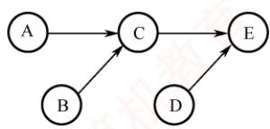

semaphore SAC = 0; //控制 A 和 C 的执行顺序  
semaphore SBC = 0; //控制 B 和 C 的执行顺序  
semaphore SCE = 0; //控制 C 和E 的执行顺序  
semaphore SDE = 0; //控制D和E的执行顺序

5个操作可描述为如下。

```c
coBegin
A ( ) {
完成动作A;
V(SAC); //实现 A、C 之间的同步关系
}
B ( ) {
完成动作B；
V(SBC); //实现 B、C 之间的同步关系
}
C ( ) {
//C 必须在A、B 都完成后才能完成
P(SAC);
P(SBC);
完成动作C;
V(SCE); //实现C、E之间的同步关系
}
D ( ) {
V(SDE); //实现D、E之间的同步关系
E ( ) {
//E 必须在完成C、D之后执行
P(SCE);
P(SDE)
完成动作E；
coEnd
```

## 25. 【解答】

1）信号量S 是能被多个进程共享的变量，多个进程都可通过 wait()和 signal()对 S 进行读、写操作。所以，wait()和 signal()操作中对S的访问必须是互斥的。

2）方法1错误。在wait()中，当S<=0时，关中断后，其他进程无法修改S的值，while语句陷入死循环。方法2正确。方法2在循环体中有一个开中断操作，这样就可以使其他进程修改 S的值，从而避免 while语句陷入死循环。

3）用户程序不能使用开/关中断指令实现临界区互斥。因为开中断和关中断指令都是特权指令，不能在用户态下执行，只能在内核态下执行。

## 26. 【解答】

本题是一个典型的利用信号量实现前驱关系的同步问题。需要强调的是，只有不同进程之间的操作才需要进行同步。进程T1依次执行A、E、F，进程T2依次执行B、C、D。我们需要分析哪些操作必须在另一个进程的某个操作完成之后才能执行。由图可知，对进程T1来说，E必须在进程T2执行完C后才能执行；对进程T2来说，C必须在进程T1执行完A后才能执行。因此，有两对同步关系： $\mathrm { A } { \rightarrow } \mathrm { C }$ 和 $\mathrm { C } { \rightarrow } \mathrm { E } \text { 。 }$ 为了实现这两对同步关系，定义两个同步信号量 $\mathrm { S _ { A C } }$ 和 $\mathrm { S _ { C E ^ { \circ } } }$ 进程T1执行完A后，发出信号 $\mathrm { s i g n a l } ( \mathrm { S _ { A C } } )$ ，表示A已执行完成；进程T2准备执行C之前，等待信号 $\mathrm { w a i t } ( \mathrm { S _ { A C } } )$ ，检查A是否执行完成。同理，进程T2执行完C后，发出信号 $\mathrm{signal(S_{CE})}$ ，表示C已执行完成；进程T1准备执行E之前，等待信号 $\mathrm { w a i t } ( \mathrm { S } _ { \mathrm { C E } } )$ ，检查C是否执行完成。这样就保证了两个进程之间的同步。

<table><tr><td colspan="2">semaphore  $\mathrm { S _ { A C }   =   0 ; }$  //描述A、C之间的同步关系 semaphore  $\mathrm { S _ { C E }   =   0 ; }$  //描述C、E之间的同步关系</td></tr><tr><td>T1:</td><td> $\mathrm { T } 2 ;$  道</td></tr><tr><td> $\mathrm { A } ;$ </td><td> $\mathbf { B } ;$ </td></tr><tr><td> $\mathrm { s i g n a l } ( \mathrm { S } _ { \mathrm { A C } } ) ;$ </td><td> $\mathrm{wait}(\mathrm{S_{AC}});$ </td></tr><tr><td> $\mathrm{width}(S_{\mathrm{CE}});$ </td><td>T  $ C ;$ </td></tr><tr><td> $\mathrm { E } ;$ </td><td> $\mathrm{signal(S_{CE})};$ </td></tr><tr><td> $\boxed { \mathrm { F } ; }$ </td><td> $\boxed{ D ;}$ </td></tr></table>

## 27.【解答】

1）if语句无法实现对临界区的互斥访问，因为f语句执行后，不论结果如何，线程都能访问临界区。本题使用 swap指令和lock变量来实现对临界区的互斥访问，当线程不能进入临界区时，本身并不会主动放弃CPU，因此需要让线程在进入区中循环检查lock值，可以使用 while循环，当lock 值为 TRUE时，线程一直执行 while循环的内容，直到lock值被修改为FALSE时，线程才能进入临界区，因此将进入区中的语句 $ \text{" if} ( key == TRUE )$ swap key, lock”修改为 $ \text{" while } ( key  ==  TRUE )   swap key,    block$ 。在退出区中，代表该线程对临界资源的访问已经结束，此时需要将lock值置为FALSE，代表其他线程可以访问临界区，因此将退出区中的语句 $\mathrm{lock} = \mathrm{TRUE}$ 修改为 $\mathrm{lock} = \mathrm{FALSE}$

2）否。因为多个线程可以并发执行 newSwap()，newSwap()执行时传递给形参b的是共享变量lock的地址，在newSwap()中对lock既有读操作又有写操作，并发执行时不能保证实现两个变量值的原子交换，从而导致并发执行的线程同时进入临界区。例如，线程A和线程B并发执行，初始时lock值为FALSE，当线程A执行完 $^{*}a = ^{*}b$ 后发生了进程调度，  
区 切换到线程B 执行，线程B 执行完 newSwap 后发生线程切换，此时线程 A 和 B 都能进入临界区，不能实现互斥访问。

## 28. 【解答】

1）代码 $\mathrm { C _ { 1 } }$ 执行对 B的写操作，且 $\mathrm { P } _ { 1 }$ 和 $\mathrm { P } _ { 2 }$ 需要互斥执行 $\mathrm { C _ { 1 } }$ ，因此 $\mathrm { C _ { 1 } }$ 的代码是临界区。

2）有一组互斥关系和一组同步关系。互斥关系为： $\mathrm { P } _ { 1 }$ 和 $\mathrm { P } _ { 2 }$ 需要互斥访问缓冲区B；同步关系为： $\mathrm { P } _ { 1 }$ 执行 $\mathrm { C } _ { 1 }$ 后， $\mathrm { P } _ { 2 }$ 才能执行 $ C _{2} 。$ 。缓冲区B初始为空，且最大容量为1，因此可不用定义互斥信号量mutex。因为在缓冲区大小为1的条件下，同步信号量S就可同时保证$\mathrm { P } _ { 1 }$ 和 $\mathrm { P } _ { 2 }$ 互斥访问B，符合题意“尽可能定义少的信号量”的要求。进程 $\mathrm { P } _ { 1 }$ 和 $\mathrm { P } _ { 2 }$ 的同步伪代码如下。

<table><tr><td colspan="2">Semaphore S = 0；//实现进程 P1 与 P2 的同步</td></tr><tr><td>Pl</td><td>P2</td></tr><tr><td></td><td></td></tr><tr><td>C1;</td><td>wait(S);</td></tr><tr><td>signal(S);</td><td>C2; 首算</td></tr><tr><td></td><td></td></tr></table>

3）缓冲区B初始非空，因此仅需一个互斥信号量 mutex来保证 $\mathrm { P } _ { 1 }$ 和 $\mathrm { P } _ { 2 }$ 互斥访问B即可。进程 $\mathrm { P } _ { 1 }$ 和 $\mathrm { P } _ { 2 }$ 的互斥伪代码如下。

<table><tr><td colspan="2">Semaphore mutex = 1；//实现 P1 与 P2 互斥执行 C3</td></tr><tr><td>P1</td><td>P2</td></tr><tr><td></td><td></td></tr><tr><td>wait(mutex);</td><td>wait(mutex);</td></tr><tr><td>C3;</td><td>C3;</td></tr><tr><td>signal(mutex);</td><td>signal(mutex); 算机</td></tr><tr><td>...</td><td></td></tr></table>

## 29.【解答】

本题需协调甲、乙、丙三人的协作过程，并管理共享资源。水桶仅由丙使用，无竞争；铁锹由甲（挖树坑）和乙（填土）共用，需互斥访问，设置一个互斥信号量mutex。本题有三组同步关系：①未被使用的树坑数量必须小于3，甲才可挖新坑；②乙必须在有树坑时才能放树苗并填土；③丙必须在有已填土的树苗时才能浇水。为此，还需定义三个同步信号量：position表示还可挖的树坑配额（允许新增的未使用树坑数量），初值为3；pit表示当前已挖好但尚未被使用的树坑数量，初值为0；tree表示已完成填土、等待浇水的树苗数量，初值为0。

三人操作流程如下：甲先执行wait(position)申请一个树坑配额，成功后获取铁锹挖坑，释放铁锹后执行 signal(pit)，通知乙有新树坑可用；乙先执行 wait(pit)等待树坑，放树苗后立即执行signal(position)释放一个树坑配额（因可用树坑减少1个），随后在mutex保护下使用铁锹填土，完成后执行 signal(tree)通知丙；丙执行 wait(tree)等待可浇水的树苗，然后浇水。

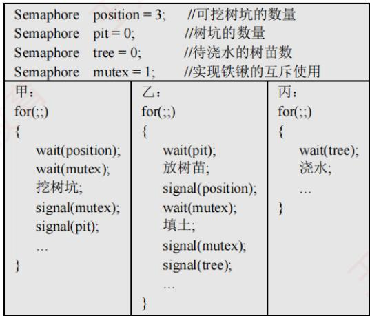

## 2.4 死锁

在学习本节时，请读者思考以下问题：

1）为什么会产生死锁？产生死锁有什么条件？

2）有什么办法可以解决死锁问题？

学完本节，读者应了解死锁的由来、产生条件及基本解决方法，区分避免死锁和预防死锁。

## 2.4.1 死锁的概念

## 1. 死锁的定义

在多道程序系统中，进程的并发执行显著提高了系统资源的利用率和整体效率。然而，这种并发性也带来了新的问题一一死锁。所谓死锁，是指多个进程因竞争资源而陷入相互等待的僵局：每个进程都在等待其他进程所占有的资源，而这些资源又不会被释放，从而形成一个循环等待链。结果，所有涉及的进程都被永久阻塞；若无外部干预，它们将无法继续推进。

下面通过实例说明死锁现象。

先看一个生活中的类比。假设有一条狭窄的小巷，仅容一辆车通行。若有两辆汽车分别从巷子的两端同时驶入，且双方都坚持前行而不愿倒车，则两车将在巷中对峙，彼此阻挡，谁也无法通过。这种互相等待、互不让步的情形，恰如计算机系统中的死锁。 X

在计算机系统中，死锁的表现更为典型。例如，某系统中仅配备一台打印机和一台扫描仪。进程 $\mathrm { P } _ { 1 }$ 当前正占有扫描仪，并请求使用打印机；与此同时，进程 $\mathrm { P } _ { 2 }$ 正占有打印机，并请求使用扫描仪。由于每个进程都持有对方所需的资源，且都不主动释放，两个进程便陷入无限期的相互等待之中，无法继续执行。此时，系统就处于死锁状态。

## 2. 死锁与饥饿

一组进程处于死锁状态，是指其中每个进程都在等待某个事件的发生，而该事件只能由组内另一个进程触发，通常表现为等待对方释放其所占有的资源。

与死锁密切相关但本质不同的另一个问题是饥饿，是指某个进程因资源分配策略的不公平性，长期得不到所需资源，从而无法推进其执行。产生饥饿的主要原因是：当多个进程同时竞争同一类资源时，若系统采用的分配策略不能保证“等待时间有上界”（无法确保每个等待进程最终都能获得服务），则某些进程就可能被无限期推迟。例如，当多个进程需要打印文件时，若系统采用“最短作业优先”的打印调度策略，则长文件的打印请求可能因不断有新的短文件到达而始终无法获得服务，最终陷入饥饿状态。需要注意的是，饥饿并不等同于死锁：系统可能仍在正常运行，其他进程可以顺利执行，只是个别进程被持续忽略。

死锁与饥饿的共同点如下：相关进程都无法顺利向前推进。二者的主要区别如下：①涉及的进程数量不同，饥饿可以只影响单个进程；而死锁必须涉及两个或更多的进程，且它们之间存在循环等待关系。②进程所处的状态不同，处于饥饿状态的进程可能处于就绪态（例如，在SPF调度算法中长期得不到CPU），也可能处于阻塞态（例如，长期等待某个I/O设备）；而处于死锁状态的进程则必定处于阻塞态，因为它们正在等待已被其他死锁进程占有的资源。

## 3. 死锁产生的原因

考点追踪单类资源竞争时发生死锁的临界条件的分析（2009、2014）

## （1）系统资源的竞争

系统中不可剥夺资源（如打印机、磁带机等）的数量通常有限，难以满足所有并发进程的需求。当多个进程竞争这类资源且资源分配策略不当，便可能因相互等待而陷入僵局，进而引发死锁。需要强调的是，死锁的发生与不可剥夺资源的存在密切相关。对于可剥夺资源（如CPU时间片），操作系统可在必要时强制回收，因此单纯因这类资源的竞争一般不会导致死锁。

## (2)进程推进顺序非法

即使系统资源充足，若进程请求和释放资源的顺序不合理，则仍可能引发死锁。例如，进程$\mathrm { P _ { 1 } }$ 和 $\mathrm { P } _ { 2 }$ 分别占有资源 $\mathtt { R _ { l } }$ 和 $\mathrm { R } _ { 2 }$ ，随后 $\mathrm { P _ { 1 } }$ 申请 $\mathrm{R}_{2}$ 、而 $\mathrm { P } _ { 2 }$ 申请 $\mathrm { R _ { 1 } }$ 。由于双方所需资源均被对方占有，两个进程均被阻塞，且各自保持已占有的资源不放，从而形成死锁。

此外，同步机制使用不当也可能导致死锁。例如，进程A等待进程B发送的消息，而进程B又在等待进程A的消息。此时，尽管未涉及传统硬件资源，但消息通道或同步对象可被视为一种逻辑资源，其相互等待同样会使进程无法继续推进，形成死锁。

## 4. 死锁产生的必要条件

死锁的发生必须同时满足以下四个条件；只要其中任一条件不成立，死锁就不可能发生。

1）互斥条件。进程对所分配的资源（如打印机）要求排他性使用，即在一段时间内，某资源只能被一个进程占有；若有其他进程请求该资源，则必须等待。

2）不可剥夺条件。进程已获得的资源在使用完毕之前，不能被其他进程强行剥夺，只能由该进程主动释放。 K

3）请求并保持条件。进程在持有至少一个资源的同时，又提出新的资源请求；若该资源已被其他进程占有，则请求进程被阻塞，但对其已占有的资源仍保持不放。

4）循环等待条件。存在一个进程集合 $\left\{ \mathrm{P}_{1}, \mathrm{P}_{2}, \cdots, \mathrm{P}_{n} \right\}$ ，其中每个进程 $\mathrm { P } _ { i }$ 等待的资源正被下一个进程 $P_{(i+1)\bmod(n+1)}$ 占有，从而形成一个循环等待链，如图2.14所示。

直观上看，循环等待条件似乎与死锁的定义相同，实则不然。

资源分配图中存在环，并不必然意味着死锁。其根本原因在于：当某类资源有多个实例时，即使图中存在环，系统仍可能通过资源重分配打破僵局。例如，在图2.15中，若输出设备有两个实例，进程 $\mathrm { P _ { 0 } }$ 和 $\mathrm{P}_{K} \left( K \notin \{0,1,\cdots,n\} \right)$ ）各持有一台。当 $\mathrm { P } _ { n }$ 请求一台输出设备时，只要 $\mathrm { P _ { 0 } }$ 或 $\mathrm { P } _ { K }$ 任一释放其所持有的设备， $\mathrm { P } _ { n }$ 即可获得所需资源，从而解除等待环。

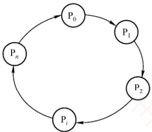  
图 2.14 循环等待

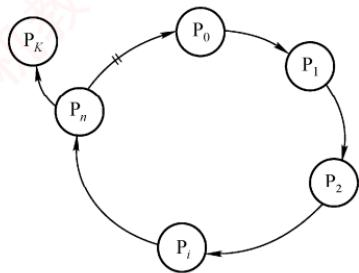  
图2.15 满足条件但无死锁

因此，只有当系统中每类资源均仅有一个实例时，资源分配图中的环才成为死锁的充分必要条件；否则，环的存在仅表明系统处于潜在风险状态，未必实际发生死锁。

区分不可剥夺条件与请求并保持条件，通过以下例子说明：若你手中持有一个苹果，他人不能强行将其拿走（使你暂时不吃），这体现了不可剥夺条件；若你已持有一个苹果，又去请求第二个苹果，但在获得第二个苹果前拒绝放下第一个，则体现了请求并保持条件。

## 5. 死锁的处理策略

处理死锁主要有三种策略：一是通过协议预防或避免死锁，确保系统永不进入死锁状态；二是允许死锁发生，但能检测并恢复；三是完全忽略死锁问题，假定其不会出现。其中，第一种策略包含预防死锁和避免死锁两种方法；第二种策略包含检测及解除死锁方法；第三种策略被大多数通用操作系统（如Linux和Windows）所采用。下面简要介绍这些处理方法。

1）预防死锁。通过设置严格的限制条件，破坏死锁的四个必要条件中的一个或多个，从根本上杜绝死锁的可能。 临村

2）避免死锁。在资源动态分配过程中，通过特定算法判断分配后系统是否仍处于安全状态，仅当安全时才允许分配，从而避免进入可能导致死锁的不安全状态。

3）检测及解除死锁。不施加任何预防性限制，允许进程自由申请资源；系统定期运行检测

算法，一旦发现死锁，便采取相应措施（如终止部分进程或剥夺其资源）予以解除。

预防与避免死锁均属于事前防范策略。死锁预防的限制条件较为严格，实现相对简单，但往往导致系统效率和资源利用率较低；死锁避免的限制条件相对宽松，但需在每次资源分配前通过算法判断系统是否仍处于安全状态，实现较为复杂。各类策略的对比如表2.5所示。

表2.5 死锁处理策略的比较
<table><tr><td rowspan=1 colspan=1></td><td rowspan=1 colspan=1>资源分配策略</td><td rowspan=1 colspan=1>各种可能模式</td><td rowspan=1 colspan=1>主要优点</td><td rowspan=1 colspan=1>主要缺点</td></tr><tr><td rowspan=1 colspan=1>死锁预防</td><td rowspan=1 colspan=1>保守，宁可资源闲置</td><td rowspan=1 colspan=1>一次请求所有资源，资源剥夺，资源按序分配</td><td rowspan=1 colspan=1>无须运行时检测，实现简单</td><td rowspan=1 colspan=1>资源利用率低；剥夺可能很频繁；不适用于动态请求</td></tr><tr><td rowspan=1 colspan=1>死锁避免</td><td rowspan=1 colspan=1>是预防和检测的折中（运行时判断是否可能死锁）</td><td rowspan=1 colspan=1>每次分配前，寻找可能的安全允许顺序</td><td rowspan=1 colspan=1>无须资源剥夺，资源利用率较高</td><td rowspan=1 colspan=1>须预知最大资源需求；进程可能因长期不安全而被无限期推迟</td></tr><tr><td rowspan=1 colspan=1>死锁检测</td><td rowspan=1 colspan=1>宽松，只要允许就分配资源</td><td rowspan=1 colspan=1>定期检测死锁，发现后采取解除措施</td><td rowspan=1 colspan=1>不限制资源申请，无启动延迟；支持灵活分配</td><td rowspan=1 colspan=1>检测与解除带来额外开销；终止或剥夺可能导致工作丢失</td></tr></table>

## 2.4.2 死锁预防

## 考点追踪死锁预防的特点（2019）

预防死锁的发生，只需破坏死锁产生的四个必要条件之一即可。

## 1. 破坏互斥条件

若将原本只能互斥使用的资源改造为允许多个进程共享访问，则可避免死锁。然而，许多资源（如打印机、磁带机等临界资源）本质上不支持并发访问，否则会导致数据不一致或设备冲突。因此，互斥性通常是保障系统正确性的基本要求，破坏该条件在实践中并不可行。

## 2. 破坏不可剥夺条件

当一个已占有某些不可剥夺资源的进程请求新资源而无法满足时，系统强制释放其已占有的所有资源，待后续需要时再重新申请。这意味着，资源被临时剥夺，从而破坏不可剥夺条件。

该策略实现复杂且代价高昂：对于打印机等不可剥夺的外部设备，强制释放可能导致已完成的工作失效，甚至引发设备状态混乱。此外，频繁的申请与释放会显著增加系统开销，延长进程周转时间，降低系统吞吐量。因此，该方法在实际系统中极少采用。

## 3. 破坏请求并保持条件

要求进程在请求新资源时不得持有任何不可剥夺资源。可通过以下方式实现。

1）静态资源分配：进程在运行前一次性申请所需全部资源。若系统无法满足，则进程暂不投入运行。运行期间不再提出新请求，从而避免“请求并保持”行为。

2）动态释放后申请：作为对方法一的改进，进程在获得初期所需资源后即可开始执行；但在运行过程中，必须先释放所有已使用完毕的资源，才能申请新资源。

方法一的优点是实现简单，但存在明显缺点：①资源浪费严重：进程在运行初期即占有全部所需资源，其中部分资源可能仅在运行末期才使用，甚至从未被使用，导致长期闲置；②易引发饥饿现象：由于某些资源长期被其他进程占有，等待这些资源的进程可能迟迟无法启动。

## 4. 破坏循环等待条件

采用资源有序分配法：为系统中每类资源赋予唯一的编号，并规定进程必须按编号递增的顺序请求不同类资源，且同类资源须一次性申请。换言之，进程只有在未持有任何资源，或仅持有较小编号的资源时，才被允许申请更大编号的资源。按此规则，任何已持有大编号资源的进程都无法再申请小编号资源，从而确保资源分配图中不可能出现环，从根本上杜绝死锁。

该方法的缺点：①资源编号需相对稳定，不利于新增设备类型。②尽管在编号时已尽量考虑大多数进程使用资源的顺序，但实际使用资源的顺序仍可能与编号次序不一致，导致资源提前占用而长期闲置，造成浪费。③强制按固定次序申请资源，增加了用户编程的复杂性。

## 2.4.3 死锁避免

死锁避免同样属于事先预防策略，但它并非通过预先施加限制来破坏死锁的必要条件，而是在每次分配资源时，动态判断此次分配是否可能引发死锁。只有在确认不会导致死锁的情况下，系统才予以分配。由于该方法所施加的约束较为宽松，因而能够获得较好的系统性能。

## 1. 系统安全状态

在死锁避免机制中，系统允许进程动态申请资源，但在进行资源分配前，必须先评估此次分配的安全性：若分配后系统仍处于安全状态，则允许分配；否则，进程需等待。

所谓安全状态，是指系统存在某个进程执行序列 $( \mathrm { P } _ { 1 } , \mathrm { P } _ { 2 } , \cdots , \mathrm { P } _ { n } )$ ，使得对于序列中的每个进程 $\mathrm { P } _ { i }$ ，在其之前的所有进程执行完毕并释放所占资源后，系统仍有足够的可用资源满足 $\mathrm { P } _ { i }$ 的尚需资源量（最大需求减去已分配量），从而保证 $\mathrm { P } _ { i }$ 能顺利完成。这样的序列称为安全序列（可能存在多个）。若系统无法找到任何一个安全序列，则称系统处于不安全状态。

## 考点追踪系统安全状态的分析（2018）

假设系统中有三个进程 $\mathrm { P } _ { 1 }$ $\mathrm { P } _ { 2 }$ 和 $\mathrm { P } _ { 3 } ,$ ，共有12台磁带机。各进程的最大需求分别为： $\mathrm { P } _ { 1 }$ 需10台， $\mathrm { P } _ { 2 }$ 需4台， $\mathrm { P } _ { 3 }$ 需9台。在 $T _ { 0 }$ 时刻，各进程已分配资源及系统可用资源如表2.6所示。

表 2.6 资源分配
<table><tr><td rowspan=1 colspan=1>进程名</td><td rowspan=1 colspan=1>最大需求</td><td rowspan=1 colspan=1>已分配</td><td rowspan=1 colspan=1>可用</td></tr><tr><td rowspan=1 colspan=1> $\mathrm { P _ { 1 } }$ </td><td rowspan=1 colspan=1>10</td><td rowspan=1 colspan=1>5</td><td rowspan=1 colspan=1>3</td></tr><tr><td rowspan=1 colspan=1> $\mathrm { P } _ { 2 }$ </td><td rowspan=1 colspan=1>4</td><td rowspan=1 colspan=1>2</td><td rowspan=1 colspan=1></td></tr><tr><td rowspan=1 colspan=1> $ P _{3}$ </td><td rowspan=1 colspan=1>9</td><td rowspan=1 colspan=1>2</td><td rowspan=1 colspan=1></td></tr></table>

在 $T _ { 0 }$ 时刻，系统处于安全状态，因为存在安全序列 $\left( \mathrm{P}_{2}, \mathrm{P}_{1}, \mathrm{P}_{3} \right)$ ：若按此顺序推进进程，每个进程在其轮次均可获得所需资源并顺利完成。具体而言，当前可用资源为3， $\mathrm { P } _ { 2 }$ 尚需2台，可立即满足， $\mathrm { P } _ { 2 }$ 完成后释放其全部4台资源，可用资源变为5； $\mathrm { P } _ { 1 }$ 尚需5台，恰好可满足， $\mathrm { P } _ { 1 }$ 完成后释放10台，可用资源增至10； $\mathrm { P } _ { 3 }$ 尚需7台，可被满足，最终顺利完成。 OT

若在 $T _ { 0 }$ 时刻之后，系统将1台分配给P3，则 $\mathrm { P } _ { 3 }$ 已分配量变为3，可用资源降为2。此时，系统进入不安全状态，因为无法再找到任何安全序列。例如，若将剩余的2台分配给 $\mathrm { P } _ { 2 }$ (其尚需2台）， $\mathrm { P } _ { 2 }$ 可完成并释放4台，可用资源变为4。然而， $\mathrm { P _ { 1 } }$ 尚需5台， $\mathrm { P } _ { 3 }$ 尚需6台（因已分配3台），均无法满足。两个进程相互等待对方释放资源，陷入僵局，最终导致死锁。

系统处于安全状态时，一定不会发生死锁：而处于不安全状态时，死锁可能发生，但并非必然发生。换言之，死锁发生时，系统必定处于不安全状态，但不安全状态不一定会演变为死锁。

## 2. 利用银行家算法避免死锁

## 考点追踪银行家算法的特点（2013、2019）

银行家算法是最著名的死锁避免算法。其基本思想是：将操作系统视为银行家，系统管理的资源视为银行资金，进程请求资源相当于用户申请贷款。每个进程在运行前需声明其对各类资源的最大需求量（且该最大需求量在整个生命周期内不得更改，否则银行家算法的安全性保证失效），且该总量不得超过系统资源总量。当进程在运行中申请资源时，系统首先检查当前是否有足够资源可供分配；若有，则进一步试探：若将这些资源分配给该进程，系统是否仍处于安全状态。只有在确保安全的前提下，才正式分配资源；否则，就让进程等待。

## （1）银行家算法中的数据结构

假设系统中有n个进程和m类资源，银行家算法需维护以下四个数据结构。

1）可利用资源向量Available：长度为m的向量，其中每个元素代表一类可用的资源数量。$\operatorname { A v a i l a b l e } [ j ] = K$ 表示当前系统中有K个 $\mathrm { R } _ { j }$ 类资源可用。

2）最大需求矩阵Max: $n { \times } m$ 矩阵，定义系统中每个进程对m类资源的最大需求。 $\operatorname { M a x } [ i , j ] =$ K表示进程 $\mathrm { P } _ { i }$ 对 $\mathrm { R } _ { j }$ 类资源的最大需求数量为 $K _ { s }$

3）分配矩阵Allocation：n×m矩阵，定义系统中每类资源当前已分配给每个进程的资源数。$\operatorname { A l l o c a t i o n } [ i , j ] = K$ 表示进程 $\mathrm { P } _ { i }$ 当前已获得 $\mathrm { R } _ { j }$ 类资源的数量为 $K _ { \circ }$

4）需求矩阵Need： $n \times m$ 矩阵，表示每个进程尚需的各类资源数。 $\mathrm { N e e d } [ i , j ] = K$ 表示进程 $\mathrm { P } _ { i }$ 尚需 $\mathrm { R } _ { j }$ 类资源的数量为 $K _ { \circ }$

上述三个矩阵满足如下关系：

$$
\mathrm{Need}[i, j] = \mathrm{Max}[i, j] - \mathrm{Allocation}[i, j]
$$

通常，题目会给出Max和Allocation矩阵，解题的第一步即是据此计算出Need矩阵。

## (2)银行家算法

设 Request是进程 $\mathrm { P } _ { i }$ 的资源请求向量， $\operatorname { R e q u e s t } _ { i } [ j ] = K$ 表示 $\mathrm { P } _ { i }$ 请求K个j类资源。当 $\mathrm { P } _ { i }$ 发出资源请求后，系统按以下步骤进行检查：

①合法性检查：若 $\mathrm { R e q u e s t } _ { i } [ j ] \leqslant \mathrm { N e e d } [ i , j ]$ ，则转向步骤②；否则视为非法请求，因为其申请量已超过预先声明的最大需求。

②资源可用性检查：若 $\mathrm { R e q u e s t } _ { i } [ j ] \leqslant \mathrm { A v a i l a b l e } [ j ]$ ，则转向步骤③；否则表示当前资源不足，$\mathrm { P } _ { i }$ 必须等待。 机

③试探性分配：系统尝试将资源分配给 $\mathrm{P}_{i}^{\prime}$ 并更新相关数据结构：

$$
\begin{aligned} & Avalidle [i, j] =  Avalidle [j] -  Request _i[j] \quad &\# 减少系统可用资源  \quad  反映资源已被分配 \\& Alllocation [i, j] =  Alllocation [i, j] +  Request _i[j] \quad &\# 增加  \quad \mathrm{P}_i  已分配的资源量 \\& Need [i, j] =  Need [i, j] -  Request _i[j] \quad &\# 减少  \quad \mathrm{P}_i  尚需的资源量 \end{aligned}
$$

④安全性检查：系统执行安全性算法，判断此次分配后系统是否处于安全状态。若是，则正式确认此次分配；否则，撤销分配，恢复各数据结构的原始值，并让 $\mathrm { P } _ { i }$ 等待。

## （3）安全性算法

安全性算法用于判断系统当前是否处于安全状态，其基本思想是：尝试构造一个进程执行序列，使得所有进程都能依次获得所需资源并顺利完成。具体步骤如下。 机

1）设置两个向量。①工作向量Work：长度为m的向量，表示当前可用的各类资源数，初始时 $\mathrm{Work} = \mathrm{Avalable};$ 完成向量Finish：长度为n的布尔向量，标记各进程能否顺利完成，初始时Finish[]=false；当进程 $\mathrm { P } _ { i }$ 的资源需求可被满足时，令 $\mathrm{Finish}[i] = \mathrm{true}$

2）在尚未完成的进程中，查找一个满足以下两个条件的进程 $ P _{i};$

$$
\begin{align*}&\mathsf{Finsh}[i] - \mathsf{false} \quad &\#  尚未加入安全序列  \\&\mathsf{Need}[i] \leq \mathsf{Work} \quad &\#  其尚需的各类资源数均不超过当前可用资源 \end{align*}
$$

若能找到，则执行步骤3）；否则，执行步骤4）。

3）当进程 $\mathrm { P } _ { i }$ 获得所需资源后可顺利执行至完成，并释放其所占有的全部资源，故执行：

$$
\begin{aligned} &\mathrm{Work} = \mathrm{Work} + \mathrm{Allocation}[i] \quad \#  释放其已分配的各类资源  \\&\mathrm{Finish}[i] = \mathrm{true} \quad \#  将其加入安全序列 \\ \end{aligned}
$$

随后返回步骤2），继续寻找下一个可完成的进程。

4）若所有进程均满足 $\mathrm{Finish}[i] = \mathrm{true}$ ，则系统处于安全状态；否则系统处于不安全状态。  
为帮助理解上述流程，下面将通过具体示例完整演示安全性算法的执行过程。

## 3. 安全性算法举例

考点追踪银行家算法的安全序列分析（2011、2012、2018、2020、2022）

假定系统中有5个进程 $\{ \mathrm{P}_{0}, \mathrm{P}_{1}, \mathrm{P}_{2}, \mathrm{P}_{3}, \mathrm{P}_{4} \}$ 和 3类资源{A,B, C}，各类资源的总量分别为10,5,7，在 $T _ { 0 }$ 时刻的资源分配情况见表2.7。现利用安全性算法，判断系统此时是否处于安全状态。

表2.7 $T _ { 0 }$ 时刻的资源分配表
<table><tr><td rowspan=2 colspan=1>进程名</td><td rowspan=1 colspan=3>资源情况</td></tr><tr><td rowspan=1 colspan=1>MaxA B C</td><td rowspan=1 colspan=1>AllocationA B C</td><td rowspan=1 colspan=1>AvailableA B C</td></tr><tr><td rowspan=1 colspan=1> $\mathrm { P _ { 0 } }$ </td><td rowspan=1 colspan=1>7 5 3</td><td rowspan=1 colspan=1>0 1 0</td><td rowspan=5 colspan=1>3 3 2首计(2 3 0)</td></tr><tr><td rowspan=1 colspan=1> $\boxed{ P _{1}}$ 大</td><td rowspan=1 colspan=1>3 2 2</td><td rowspan=1 colspan=1>2 0 0(3 0 2)</td></tr><tr><td rowspan=1 colspan=1> $\mathrm { P } _ { 2 }$ </td><td rowspan=1 colspan=1>9 0 2</td><td rowspan=1 colspan=1>3 0 2</td></tr><tr><td rowspan=1 colspan=1> $\mathrm { P } _ { 3 }$ </td><td rowspan=1 colspan=1>2 2 2</td><td rowspan=1 colspan=1>2 1 1</td></tr><tr><td rowspan=1 colspan=1> $\boxed { \mathrm { ~ P _ { 4 } ~ } }$ </td><td rowspan=1 colspan=1>4 3 3</td><td rowspan=1 colspan=1>0 0 2</td></tr></table>

①首先，由题目给出的Max矩阵和 Allocation矩阵，可计算出Need矩阵：

$$
\begin{bmatrix} 7 & 5 & 3 \\ 3 & 2 & 2 \\ 9 & 0 & 2 \\ 2 & 2 & 2 \\ 4 & 3 & 3 \\ \end{bmatrix} - \begin{bmatrix} 0 & 1 & 0 \\ 2 & 0 & 0 \\ 3 & 0 & 2 \\ 2 & 1 & 1 \\ 0 & 0 & 2 \\ \end{bmatrix} = \begin{bmatrix} 7 & 4 & 3 \\ 1 & 2 & 2 \\ 6 & 0 & 0 \\ 0 & 1 & 1 \\ 4 & 3 & 1 \\ \end{bmatrix}
$$

由此得到各进程的尚需资源数。

②初始化工作向量 $\mathrm{Work}=\mathrm{Avalable}=(3,3,2)$ 。将 Work与Need矩阵的各行进行比较，寻找满足 $\mathrm{Need}[i] \leqslant \mathrm{Work}$ （各分量均不超过）且Finish[i]=false的进程。初始时

$$
\begin{aligned} &\mathrm{P}_{1} \rightarrow (1,2,2) < (3,3,2) \\&\mathrm{P}_{3} \rightarrow (0,1,1) < (3,3,2)\\ \end{aligned}
$$

进程 $\mathrm { P } _ { 1 }$ 和 $\mathrm { P } _ { 3 }$ 均满足条件。此处选择 $\mathrm { P } _ { 1 }$ (也可选择 $\mathbf { P } _ { 3 } )$ 作为安全序列的第一个进程。

③将 $\mathrm { P } _ { 1 }$ 加入安全序列，并模拟其顺利完成：释放其所占资源，更新工作向量：

$$
\mathrm{Work}=\mathrm{Work}+\mathrm{Allocation}[1]=(3,3,2)+(2,0,0)=(5,3,2)
$$

同时，标记 Finish[1]=true。

以更新后的Work=(5,3,2)重复上述过程，继续查找下一个可执行的进程。以此类推，整个分析过程如表2.8所示（表中“Work+Allocation”列即为下一步的 Work值），最终构造出一个完整的安全序列 $\left\{ \mathrm{P}_{1}, \mathrm{P}_{3}, \mathrm{P}_{4}, \mathrm{P}_{2}, \mathrm{P}_{0} \right\}$ ，表明系统在 $T _ { 0 }$ 时刻处于安全状态。

表2.8 $T _ { 0 }$ 时刻的安全序列的分析
<table><tr><td rowspan=3 colspan=1>进程名</td><td rowspan=1 colspan=13>资源情况</td></tr><tr><td rowspan=1 colspan=3>Work</td><td rowspan=1 colspan=3>Need</td><td rowspan=1 colspan=3>Allocation</td><td rowspan=1 colspan=3>Work+Allocation</td><td rowspan=2 colspan=1>Finish</td></tr><tr><td rowspan=1 colspan=1>A</td><td rowspan=1 colspan=1>B</td><td rowspan=1 colspan=1>C</td><td rowspan=1 colspan=1>A</td><td rowspan=1 colspan=1>B</td><td rowspan=1 colspan=1>C</td><td rowspan=1 colspan=1>A</td><td rowspan=1 colspan=1>B</td><td rowspan=1 colspan=1>C</td><td rowspan=1 colspan=1>A</td><td rowspan=1 colspan=1>B</td><td rowspan=1 colspan=1>C</td></tr><tr><td rowspan=1 colspan=1> $\mathrm { P } _ { 1 }$ </td><td rowspan=1 colspan=1>3</td><td rowspan=1 colspan=1>3</td><td rowspan=1 colspan=1>2</td><td rowspan=1 colspan=1>1</td><td rowspan=1 colspan=1>2</td><td rowspan=1 colspan=1>2</td><td rowspan=1 colspan=1>2</td><td rowspan=1 colspan=1>0</td><td rowspan=1 colspan=1>0</td><td rowspan=1 colspan=1>5</td><td rowspan=1 colspan=1>3</td><td rowspan=1 colspan=1>2</td><td rowspan=1 colspan=1>true</td></tr><tr><td rowspan=1 colspan=1> $\mathrm { P } _ { 3 }$ </td><td rowspan=1 colspan=1>5</td><td rowspan=1 colspan=1>3</td><td rowspan=1 colspan=1>2</td><td rowspan=1 colspan=1>0</td><td rowspan=1 colspan=1>1</td><td rowspan=1 colspan=1>1</td><td rowspan=1 colspan=1>2</td><td rowspan=1 colspan=1>1</td><td rowspan=1 colspan=1>1</td><td rowspan=1 colspan=1>7</td><td rowspan=1 colspan=1>4</td><td rowspan=1 colspan=1>3</td><td rowspan=1 colspan=1>true</td></tr><tr><td rowspan=1 colspan=1> $\mathrm { P } _ { 4 }$ </td><td rowspan=1 colspan=1>7</td><td rowspan=1 colspan=1>4</td><td rowspan=1 colspan=1>3</td><td rowspan=1 colspan=1>4</td><td rowspan=1 colspan=1>3</td><td rowspan=1 colspan=1>1</td><td rowspan=1 colspan=1>0</td><td rowspan=1 colspan=1>0</td><td rowspan=1 colspan=1>2</td><td rowspan=1 colspan=1>7</td><td rowspan=1 colspan=1>4</td><td rowspan=1 colspan=1>5</td><td rowspan=1 colspan=1>true</td></tr><tr><td rowspan=1 colspan=1> $\mathrm { P } _ { 2 }$ </td><td rowspan=1 colspan=1>7</td><td rowspan=1 colspan=1>4</td><td rowspan=1 colspan=1>5</td><td rowspan=1 colspan=1>6</td><td rowspan=1 colspan=1>0</td><td rowspan=1 colspan=1>0</td><td rowspan=1 colspan=1>3</td><td rowspan=1 colspan=1>0</td><td rowspan=1 colspan=1>2</td><td rowspan=1 colspan=1>10</td><td rowspan=1 colspan=1>4</td><td rowspan=1 colspan=1>7</td><td rowspan=1 colspan=1>true</td></tr><tr><td rowspan=1 colspan=1> $\overline { { \mathrm { ~ P _ { 0 } ~ } } }$ </td><td rowspan=1 colspan=1>10</td><td rowspan=1 colspan=1>4</td><td rowspan=1 colspan=1>7</td><td rowspan=1 colspan=1>7</td><td rowspan=1 colspan=1>4</td><td rowspan=1 colspan=1>3</td><td rowspan=1 colspan=1>0</td><td rowspan=1 colspan=1>1</td><td rowspan=1 colspan=1>0</td><td rowspan=1 colspan=1>10</td><td rowspan=1 colspan=1>5</td><td rowspan=1 colspan=1>7</td><td rowspan=1 colspan=1>true</td></tr></table>

## 4. 银行家算法举例

安全性算法是银行家算法的核心。在典型考题中，通常会给出某个进程的资源请求向量。读者只需执行银行家算法的前三个步骤，即可得到更新后的Allocation和Need矩阵，再参照上例的安全性算法判断系统是否仍处于安全状态，从而决定是否批准该请求。

假设当前系统资源分配及剩余情况如表2.7所示 $( T _ { 0 }$ 时刻的状态）。

1）进程 $\mathrm { P } _ { 1 }$ 发出请求向量Request(1,0,2)，系统按银行家算法进行如下检查。

① 合法性检查： $\mathrm{Request_{l}(1,0,2) \leq Need_{l}(1,2,2)}$ ，成立。

②资源可用性检查： $\mathrm{Request_{l}(1,0,2) \leq Avalable_{l}(3,3,2)}$ ，成立。

③试探性分配：系统尝试为 $\mathrm { P _ { 1 } }$ 分配资源，并修改相关数据结构：

$$
\mathrm{Avallable - Avalable - Request_{l} = (2, 3, 0)}
$$

$$
\mathrm{Allocation_{l}} = \mathrm{Allocation_{l}} + \mathrm{Req} \mathrm{west_{l}} = (3, 0, 2)
$$

$$
\mathrm{Need}_{1}=\mathrm{Need}_{1}-\mathrm{Request}_{1}=(0,2,0)
$$

由此形成的资源变化情况如表2.7中的圆括号所示。

④安全性检查：令 $\mathrm{Work}=\mathrm{Avalable}=(2,3,0)$ ，执行安全性算法，过程如表2.9所示。

表2.9 $\mathbf { P _ { 1 } }$ 申请资源时的安全性检查
<table><tr><td rowspan=3 colspan=1>进程名</td><td rowspan=1 colspan=13>资源情况</td></tr><tr><td rowspan=1 colspan=3>Work</td><td rowspan=1 colspan=3>Need</td><td rowspan=1 colspan=3>Allocation</td><td rowspan=1 colspan=3>Work+Allocation</td><td rowspan=2 colspan=1>Finish</td></tr><tr><td rowspan=1 colspan=3>A  B  C</td><td rowspan=1 colspan=3>A  B  C</td><td rowspan=1 colspan=3>A  B  C</td><td rowspan=1 colspan=3>A    B   C</td></tr><tr><td rowspan=1 colspan=1> $\mathrm { P _ { 1 } }$ </td><td rowspan=1 colspan=1>2</td><td rowspan=1 colspan=1>3</td><td rowspan=1 colspan=1>0</td><td rowspan=1 colspan=1>0</td><td rowspan=1 colspan=1>2</td><td rowspan=1 colspan=1>0</td><td rowspan=1 colspan=1>3</td><td rowspan=1 colspan=1>0</td><td rowspan=1 colspan=1>2</td><td rowspan=1 colspan=1>5</td><td rowspan=1 colspan=1>3</td><td rowspan=1 colspan=1>2</td><td rowspan=1 colspan=1>true</td></tr><tr><td rowspan=1 colspan=1> $\mathrm { P } _ { 3 }$ </td><td rowspan=1 colspan=1>5</td><td rowspan=1 colspan=1>3</td><td rowspan=1 colspan=1>2</td><td rowspan=1 colspan=1>0</td><td rowspan=1 colspan=1>1</td><td rowspan=1 colspan=1>1</td><td rowspan=1 colspan=1>2</td><td rowspan=1 colspan=1>1</td><td rowspan=1 colspan=1>1</td><td rowspan=1 colspan=1>7</td><td rowspan=1 colspan=1>4</td><td rowspan=1 colspan=1>3</td><td rowspan=1 colspan=1>true</td></tr><tr><td rowspan=1 colspan=1> $\mathrm { P } _ { 4 }$ </td><td rowspan=1 colspan=1>7</td><td rowspan=1 colspan=1>4</td><td rowspan=1 colspan=1>3</td><td rowspan=1 colspan=1>4</td><td rowspan=1 colspan=1>3</td><td rowspan=1 colspan=1>1</td><td rowspan=1 colspan=1>0</td><td rowspan=1 colspan=1>0</td><td rowspan=1 colspan=1>2</td><td rowspan=1 colspan=1>7</td><td rowspan=1 colspan=1>4</td><td rowspan=1 colspan=1>5</td><td rowspan=1 colspan=1>true</td></tr><tr><td rowspan=1 colspan=1> $\mathrm { P _ { 0 } }$ </td><td rowspan=1 colspan=1>7</td><td rowspan=1 colspan=1>4</td><td rowspan=1 colspan=1>5</td><td rowspan=1 colspan=1>7</td><td rowspan=1 colspan=1>4</td><td rowspan=1 colspan=1>3</td><td rowspan=1 colspan=1>0</td><td rowspan=1 colspan=1>1</td><td rowspan=1 colspan=1>0</td><td rowspan=1 colspan=1>7</td><td rowspan=1 colspan=1>5</td><td rowspan=1 colspan=1>5</td><td rowspan=1 colspan=1>true</td></tr><tr><td rowspan=1 colspan=1> $\mathrm { P } _ { 2 }$ </td><td rowspan=1 colspan=1>7</td><td rowspan=1 colspan=1>5</td><td rowspan=1 colspan=1>5</td><td rowspan=1 colspan=1>6</td><td rowspan=1 colspan=1>0</td><td rowspan=1 colspan=1>0</td><td rowspan=1 colspan=1>3</td><td rowspan=1 colspan=1>0</td><td rowspan=1 colspan=1>2</td><td rowspan=1 colspan=1>10</td><td rowspan=1 colspan=1>5</td><td rowspan=1 colspan=1>7</td><td rowspan=1 colspan=1>true</td></tr></table>

由表可知，存在安全序列 $\left\{ \mathrm{P}_{1}, \mathrm{P}_{3}, \mathrm{P}_{4}, \mathrm{P}_{0}, \mathrm{P}_{2} \right\}$ ，系统处于安全状态。因此，可以正式将$\mathrm { P } _ { 1 }$ 所请求的资源分配给它。分配后系统的资源状态如表2.10所示。

表2.10 为 $\mathbf { P _ { 1 } }$ 分配资源后的有关资源数据
<table><tr><td rowspan=3 colspan=1>进程名</td><td rowspan=1 colspan=9>资源情况</td></tr><tr><td rowspan=1 colspan=3>Allocation</td><td rowspan=1 colspan=3>Need</td><td rowspan=1 colspan=3>Available</td></tr><tr><td rowspan=1 colspan=1>A</td><td rowspan=1 colspan=1>B</td><td rowspan=1 colspan=1>C</td><td rowspan=1 colspan=1>A</td><td rowspan=1 colspan=1>B</td><td rowspan=1 colspan=1>C</td><td rowspan=1 colspan=1>A</td><td rowspan=1 colspan=1>B</td><td rowspan=1 colspan=1>C</td></tr><tr><td rowspan=1 colspan=1> $\mathrm{P}_{0}$ </td><td rowspan=1 colspan=1>0</td><td rowspan=1 colspan=1>1</td><td rowspan=1 colspan=1>0</td><td rowspan=1 colspan=1>7</td><td rowspan=1 colspan=1>4</td><td rowspan=1 colspan=1>3</td><td rowspan=5 colspan=1>2</td><td rowspan=5 colspan=1>3</td><td rowspan=5 colspan=1></td></tr><tr><td rowspan=1 colspan=1> $\mathrm { P } _ { 1 }$ </td><td rowspan=1 colspan=1>3</td><td rowspan=1 colspan=1>0</td><td rowspan=1 colspan=1>2</td><td rowspan=1 colspan=1>0</td><td rowspan=1 colspan=1>2</td><td rowspan=1 colspan=1>0</td></tr><tr><td rowspan=1 colspan=1> $\overline { { \mathrm { P } _ { 2 } } }$ </td><td rowspan=1 colspan=1>3</td><td rowspan=1 colspan=1>0</td><td rowspan=1 colspan=1>2</td><td rowspan=1 colspan=1>6</td><td rowspan=1 colspan=1>0</td><td rowspan=1 colspan=1>0</td></tr><tr><td rowspan=1 colspan=1> $\overline { { \mathrm { P } _ { 3 } } }$ </td><td rowspan=1 colspan=1>2</td><td rowspan=1 colspan=1>1</td><td rowspan=1 colspan=1>1</td><td rowspan=1 colspan=1>0</td><td rowspan=1 colspan=1>1</td><td rowspan=1 colspan=1>1</td></tr><tr><td rowspan=1 colspan=1> $\overline { { \mathrm { ~ P _ { 4 } ~ } } }$ </td><td rowspan=1 colspan=1>0</td><td rowspan=1 colspan=1>0</td><td rowspan=1 colspan=1>2</td><td rowspan=1 colspan=1>4</td><td rowspan=1 colspan=1>3</td><td rowspan=1 colspan=1>1</td></tr></table>

2) $ P _4$ 发出请求向量 $\mathrm { R e q u e s t } _ { 4 }   ( 3 , 3 , 0 )$ ，系统按银行家算法进行检查：

① 合法性检查： $\mathrm{Request_{4}(3,3,0) \leq Need_{4}(4,3,1)}$ ，成立。

②资源可用性检查： $\mathrm{Request_{4}(3, 3, 0) > Avalable(2, 3, 0)}$ ，不成立，让 $\mathrm { P } _ { 4 }$ 等待。

3) $\mathrm { P } _ { 0 }$ 发出请求向量 $\mathrm { R e q u s t } _ { 0 } ( 0 , 2 , 0 )$ ，系统按银行家算法进行检查：

① 合法性检查： $\mathrm{Request_{0}(0,2,0) \leq Need_{0}(7,4,3)}$ ，成立。

②资源可用性检查： $\mathrm{Request_{0}(0,2,0) \leq Aviable(2,3,0)}$ ，成立。

③试探性分配：系统尝试为 $\mathrm { P _ { 0 } }$ 分配资源，并修改相关数据结构：

$$
A v a i l a b l e = A v a i l a b l e - R e q u e s t _ { 0 } = ( 2 , 1 , 0 )
$$

$$
\mathrm{Allocation_{0}=Allocation_{0}+Reques_{0}=(0,3,0)}
$$

$\mathrm{Need}_{0}=\mathrm{Need}_{0}-\mathrm{Request}_{0}=(7,2,3)$ ，结果如表2.11所示。

表2.11 为 $\mathbf { P } _ { 0 }$ 分配资源后的有关资源数据
<table><tr><td rowspan=3 colspan=1>进程名</td><td rowspan=1 colspan=9>资源情况</td></tr><tr><td rowspan=1 colspan=3>Allocation</td><td rowspan=1 colspan=3>Need</td><td rowspan=1 colspan=3>Available</td></tr><tr><td rowspan=1 colspan=1>A</td><td rowspan=1 colspan=1>B</td><td rowspan=1 colspan=1>C</td><td rowspan=1 colspan=1>A</td><td rowspan=1 colspan=1>B</td><td rowspan=1 colspan=1>C</td><td rowspan=1 colspan=1>A</td><td rowspan=1 colspan=1>B</td><td rowspan=1 colspan=1>C</td></tr><tr><td rowspan=1 colspan=1> $\mathrm { P _ { 0 } }$ </td><td rowspan=1 colspan=1>0</td><td rowspan=1 colspan=1>3</td><td rowspan=1 colspan=1>0</td><td rowspan=1 colspan=1>7</td><td rowspan=1 colspan=1>2</td><td rowspan=1 colspan=1>3</td><td rowspan=5 colspan=1>2</td><td rowspan=5 colspan=1>1</td><td rowspan=5 colspan=1>0</td></tr><tr><td rowspan=1 colspan=1> $\mathrm { P _ { 1 } }$ </td><td rowspan=1 colspan=1>3</td><td rowspan=1 colspan=1>0</td><td rowspan=1 colspan=1>2</td><td rowspan=1 colspan=1>0</td><td rowspan=1 colspan=1>2</td><td rowspan=1 colspan=1>0</td></tr><tr><td rowspan=1 colspan=1> $\mathrm { P } _ { 2 }$ </td><td rowspan=1 colspan=1>3</td><td rowspan=1 colspan=1>0</td><td rowspan=1 colspan=1>2</td><td rowspan=1 colspan=1>6</td><td rowspan=1 colspan=1>0</td><td rowspan=1 colspan=1>0</td></tr><tr><td rowspan=1 colspan=1> $ P _{3}$ </td><td rowspan=1 colspan=1>2</td><td rowspan=1 colspan=1>1</td><td rowspan=1 colspan=1>1</td><td rowspan=1 colspan=1>0</td><td rowspan=1 colspan=1>1</td><td rowspan=1 colspan=1>1</td></tr><tr><td rowspan=1 colspan=1> $\mathrm { P } _ { 4 }$ </td><td rowspan=1 colspan=1>0</td><td rowspan=1 colspan=1>0</td><td rowspan=1 colspan=1>2</td><td rowspan=1 colspan=1>4</td><td rowspan=1 colspan=1>3</td><td rowspan=1 colspan=1>1</td></tr></table>

④安全性检查：此时Available(2,1,0)，无法满足任何进程的尚需资源，系统进入不安全状态，因此拒绝 $\mathrm { P _ { 0 } }$ 的请求，撤销试探性分配，并恢复各数据结构至分配前状态。

## 2.4.4 死锁检测与解除

## 考点追踪死锁避免和死锁检测的区分（2015）

前面介绍的死锁预防和避免算法，都是在为进程分配资源时施加限制条件或进行安全性检查。若系统在资源分配时不采取任何预防或避免措施，则必须提供死锁检测与解除机制。

## 1. 死锁检测

## 考点追踪死锁避免和死锁检测对比（2015）

区分死锁避免与死锁检测。死锁避免要求在进程运行过程中始终确保系统不会进入死锁状态，因此需要预先知道进程从开始到结束的全部资源需求。死锁检测则仅判断当前时刻系统是否已发生死锁，无须预知进程未来的资源请求，只需依据当前的资源分配和请求情况。

## 考点追踪多在资源竞争时发生死锁的临界条件分析（2016、2021）

通常采用资源分配图来检测系统是否处于死锁状态。在资源分配图中：圆圈表示进程，矩形框表示一类资源：若某类资源有多个实例，则在框内用多个圆点表示：请求边（从进程指向资源）表示该进程申请一个单位的该类资源；分配边（从资源指向进程）表示该类资源的一个实例已分配给该进程。在图2.16(a)所示的资源分配图中，进程 $\mathrm { P } _ { 1 }$ 已获得两个 $\mathtt { R } _ { 1 }$ 资源，并请求一个 $ R _{2} ; P _{2}$ 已获得一个 $\mathrm { R } _ { 1 }$ 和一个 $\mathrm{R}_{2}$ ，并请求一个 $\mathrm { R _ { 1 } }$ 。系统中存在环，但尚未确定是否死锁。

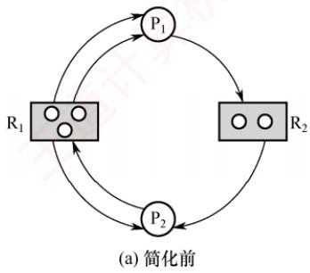

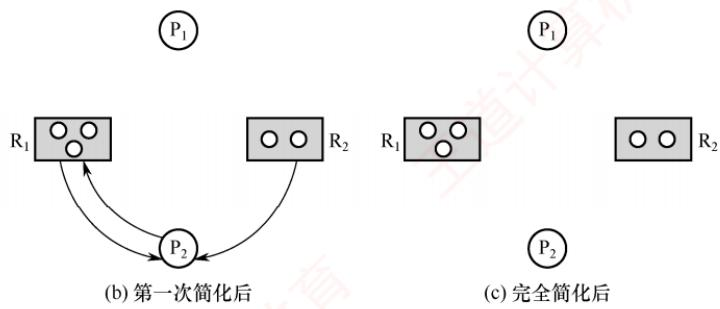  
图2.16 资源分配图及其化简过程

通过简化资源分配图可判断系统是否处于死锁状态。简化步骤如下。

1）在资源分配图中，找出当前可继续执行的进程 $\mathrm { P } _ { i }$ (其所有资源请求均可被当前空闲资源满足）。空闲资源数量等于该类资源总数减去已分配实例数（资源节点发出的分配边数量）。例如，在图2.16(a)中， $\mathrm { R _ { 1 } }$ 总数为3，出度为3，故无空闲资源； $\mathrm { R } _ { 2 }$ 总数为2，出度为1，故有1个空闲。 $\mathrm { P } _ { 1 }$ 仅请求1个 $\mathrm { R } _ { 2 }$ ，而 $\mathrm{R}_{2}$ 有1个空闲，因此 $\mathrm { P } _ { 1 }$ 可继续执行。将其所有请求边和分配边删除，使之成为孤立节点，得到图2.16(b)所示的情况。

2) $\mathrm { P } _ { i }$ 释放的资源可能使其他阻塞进程的请求得以满足，从而转为可执行状态。例如， $\mathrm { P } _ { 1 }$ 释放其占有的 $\mathtt { R _ { l } }$ 资源后， $\mathrm { P } _ { 2 }$ 的 $\mathrm { R _ { 1 } }$ 请求即可满足，因而也能继续执行。重复上述过程，若最终能删除图中所有边，则称该图可完全简化，如图2.16(c)所示。

死锁定理：系统处于死锁状态，当且仅当其资源分配图不可完全简化。

## 2. 死锁解除

## 考点追踪解除死锁的方式（2019）

一旦检测出死锁，系统应立即采取措施予以解除。主要方法包括如下几种。

1）资源剥夺法。挂起部分死锁进程，抢占其资源并重新分配给其他死锁进程，以打破死锁环路；但需防止被挂起的进程因长期得不到所需资源而陷入饥饿。

## 注意

在资源分配图中，经死锁定理化简后，仍有边相连的进程即为死锁进程。

2）撤销进程法。强制终止部分或全部死锁进程，并回收其所占资源。终止顺序可依据进程优先级或撤销代价（如资源占有量等）确定。该方法实现简单，但代价可能较高，尤其当进程已接近完成时，一旦被终止，已完成的工作将全部丢失，后续需从头执行。

3）进程回退法。令一个或多个死锁进程回退到之前某个足以回避死锁的状态，并在回退过程中自愿释放其所占资源。系统需记录进程的历史状态并设置还原点，实现较复杂。

## 2.4.5 本节小结

本节开头提出的问题的参考答案如下。

1）为什么会产生死锁？产生死锁有什么条件？

死锁是指多个进程因竞争不可剥夺资源而陷入永久阻塞：每个进程都占有部分资源，同时等待其他进程占有的资源，导致所有相关进程均无法继续推进。死锁的产生必须同时满足以下四个必要条件：①互斥条件，资源在任一时刻只能被一个进程占有；②不可剥夺条件，进程已获得的资源在其使用完毕前不能被强制收回，只能由其主动释放；③请求并保持条件，进程在占有资源的同时可申请新资源，若无法立即获得，则阻塞但不会释放已占有的资源；④循环等待条件，存在一个由多个进程构成的循环等待链，其中每个进程都在等待下一个进程所占有的资源。

## 2）有什么办法可以解决死锁问题？

死锁的处理策略分为三类：①死锁预防，通过限制资源分配方式，破坏死锁的某个必要条件，从而从根本上防止死锁发生；②死锁避免，在动态分配资源的过程中，利用安全性算法判断系统是否仍处于安全状态，仅当分配后系统仍安全时才批准请求，从而避免进入可能导致死锁的状态：③死锁检测与解除，不对资源分配施加限制，而是定期检测系统是否已发生死锁，一旦发现死锁，便采取措施予以解除，例如终止部分死锁进程或回滚其操作以释放资源。

## 2.4.6 本节习题精选

## 一、单项选择题

01. 下列情况中，可能导致死锁的是（）。A. 进程释放资源 0 B. 一个进程进入死循环

C. 多个进程竞争资源出现了循环等待 D. 多个进程竞争使用共享型设备

02.在哲学家进餐问题中，若所有哲学家同时拿起左筷子，则发生死锁，因为他们都需要右筷子才能用餐。为了让尽可能多的哲学家可以同时用餐，并且不发生死锁，可以利用信号量PV操作实现同步互斥，下列说法中正确的是（）。A. 使用信号量进行控制的方法一定可以避免死锁B. 同时检查两支筷子是否可用的方法可以预防死锁，但是会导致饥饿问题C. 限制允许拿起筷子的哲学家数量可以预防死锁，它破坏了“循环等待”条件D. 对哲学家顺序编号，奇数号哲学家先拿左筷子，然后拿右筷子，而偶数号哲学家刚好相反，可以预防死锁，它破坏了“互斥”条件 K

03.下列关于进程死锁的描述中，错误的是（）。A. 若每个进程只能同时申请或拥有一个资源，则不会发生死锁B. 若多个进程可以无冲突共享访问所有资源，则不会发生死锁C. 若所有进程的执行严格区分优先级，则不会发生死锁D.若进程资源请求之间不存在循环等待，则不会发生死锁

04.一次分配所有资源的方法可以预防死锁的发生，它破坏死锁4个必要条件中的（）。A. 互斥 B. 占有并请求 C. 非剥夺 D. 循环等待

05. 系统产生死锁的可能原因是（）。A. 独占资源分配不当 B. 系统资源不足C. 进程运行太快 D. CPU 内核太多

06. 死锁的避免是根据（）采取措施实现的。A. 配置足够的系统资源 B. 使进程的推进顺序合理D. 防止系统进入不安全状态

07. 死锁预防是保证系统不进入死锁状态的静态策略，其解决办法是破坏产生死锁的四个必要条件之一。下列方法中直接破坏了“循环等待”条件的是（）。A. 银行家算法 B. 一次性分配策略C. 剥夺资源法 D. 资源有序分配策略 TA

08. 可以防止系统出现死锁的手段是（）。A. 用 PV 操作管理共享资源 B. 使进程互斥地使用共享资源C. 采用资源静态分配策略 D. 定时运行死锁检测程序

09. 某系统中有三个并发进程都需要四个同类资源，则该系统必然不会发生死锁的最少资源是（）。A. 9 B. 10 C. 11 道 D. 12

10. 某系统中共有11台磁带机，X个进程共享此磁带机设备，每个进程最多请求使用3台，则系统必然不会死锁的最大X值是（）。A. 4 B. 5 C. 6 D. 7

11. 若系统中有5个某类资源供若干进程共享，则不会引起死锁的情况是（）。A. 有6个进程，每个进程需1个资源 B. 有5个进程，每个进程需2个资源C. 有4个进程，每个进程需3个资源 D. 有3个进程，每个进程需4个资源

12. 解除死锁通常不采用的方法是（）。A. 终止一个死锁进程 B. 终止所有死锁进程C. 从死锁进程处抢夺资源 D. 从非死锁进程处抢夺资源

13. 采用资源剥夺法可以解除死锁，还可以采用（）方法解除死锁。A. 执行并行操作 B. 撤销进程C. 拒绝分配新资源 D. 修改信号量

14. 在下列死锁的解决方法中，属于死锁预防策略的是（）。A. 银行家算法 王道 B. 资源有序分配算法C. 死锁检测算法 D. 资源分配图化简法

15. 三个进程共享四个同类资源，这些资源的分配与释放只能一次一个。已知每个进程最多需要两个该类资源，则该系统（）。A. 有些进程可能永远得不到该类资源 C. 进程请求该类资源必然能得到 B. 必然有死锁 D. 必然是死锁 7教育

16. 以下有关资源分配图的描述中，正确的是（）。A. 有向边包括进程指向资源类的分配边和资源类指向进程申请边两类B. 矩形框表示进程，其中圆点表示申请同一类资源的各个进程C. 圆圈节点表示资源类D. 资源分配图是一个有向图，用于表示某时刻系统资源与进程之间的状态

17. 死锁的四个必要条件中，无法破坏的是（）。A. 环路等待资源 B. 互斥使用资源C. 占有且等待资源 D. 非抢夺式分配

18. 死锁与安全状态的关系是（）。A. 死锁状态有可能是安全状态 算机教 B. 安全状态有可能成为死锁状态C. 不安全状态就是死锁状态 D. 死锁状态一定是不安全状态

19. 死锁检测时检查的是（）。 NA. 资源有向图 B. 前驱图 C. 搜索树 D. 安全图

20. 某系统采用如下资源分配策略：当一个进程提出资源请求而暂时无法满足时，若当前没有其他进程因等待资源而被阻塞，则该进程自行阻塞；若已有因等待资源而被阻塞的进程，则系统检查所有被阻塞的进程，若其中某些进程所占有的资源恰好是当前申请进程所需的，则立即剥夺这些资源并分配给申请进程。该策略可能导致（）。A. 系统死锁 B. 系统陷入死循环 C. 进程回退 D. 进程饥饿

21. 系统的资源分配图在下列情况下，无法判断是否处于死锁状态的有（）。I. 出现了环路 II. 没有环路Ⅲ. 每种资源只有一个，并出现环路 IV. 每个进程节点至少有一条请求边A. I、II、III、IV B. I、III、IVC. I、 IV D. 以上答案都不正确

22. 下列关于死锁的说法中，正确的有（）。I. 死锁状态一定是不安全状态Ⅱ. 产生死锁的根本原因是系统资源分配不足和进程推进顺序非法Ⅲ. 资源的有序分配策略可以破坏死锁的循环等待条件IV. 采用资源剥夺法可以解除死锁，还可以采用撤销进程方法解除死锁A. I、III B. II C. IV D. 四个说法都对

23. 下面是并发进程的程序代码，正确的是（）。Semaphore x1=x2=y=1;int c1=c2=0;

P1 ( ) P2 () while(1) { while(1){ P(x1); P(x2); if(++c1==1)Ρ(y); if(++c2==1)Ρ(y); V(x1); 王道计算 V(x2); computer(A); computer(B); P(x1); P(x2); if(−--c1==0)V(y); if(−-c2==0)V(y); V(x1); V(x2); }   
} 1

A. 进程不会死锁，也不会“饥饿” B.进程不会死锁，但是会“饥饿”C. 进程会死锁，但是不会“饥饿” D. 进程会死锁，也会“饥饿”

24. 有两个并发进程，对于如下这段程序的运行，正确的说法是（）。 ∠4.有网个开反近程，对丁如下这权程序的运仃，止硼的说法定（)。

int x,y,z,t,u; P1 ( ) P2 ( ) { 王道计 while(1){ while(1) { 王道 x=1; x=0; y=0; t=0; if x>=1 then y=y+1; if x<=1 then t=t+2; z=y; u=t; 1 1 1 }

A. 程序能正确运行，结果唯一 B.程序不能正确运行，可能有两种结果C. 程序不能正确运行，结果不确定 D. 程序不能正确运行，可能死锁

25.一个进程在获得资源后，只能在使用完资源后由自己释放，这属于死锁必要条件的（）。A. 互斥条件 B. 请求和释放条件C. 不剥夺条件 D. 防止系统进入不安全状态

26. 假设具有5 个进程的进程集合 $\mathrm{P} = \{ \mathrm{P}_0, \mathrm{P}_1, \mathrm{P}_2, \mathrm{P}_3, \mathrm{P}_4 \}$ ，系统中有三类资源A, B, C，假设在某时刻有如下状态，见下表。

<table><tr><td rowspan="2">进程名</td><td colspan="3">Allocation</td><td colspan="3">Max</td><td colspan="3">Available</td></tr><tr><td>A</td><td>B</td><td>C</td><td></td><td>A B</td><td>C</td><td></td><td></td></tr><tr><td> $\mathrm { P _ { 0 } }$ </td><td></td><td>0 0 3</td><td></td><td>0</td><td>0</td><td>4</td><td rowspan="4"></td><td rowspan="4">A B C</td></tr><tr><td> $\mathrm { P } _ { 1 }$ </td><td>1</td><td>0</td><td>0</td><td>1</td><td>7</td><td>5</td></tr><tr><td> $\mathrm { P } _ { 2 }$ </td><td>1</td><td>3 </td><td>5</td><td>2</td><td>3 3 5</td><td></td></tr><tr><td> $ P _{3}$ </td><td>0</td><td>0 2</td><td></td><td>0</td><td>6 </td><td>4</td></tr><tr><td> $\mathrm { P } _ { 4 }$ </td><td></td><td>0 0 1</td><td></td><td></td><td>0 6 5</td><td></td><td></td><td></td></tr></table>

系统是处于安全状态的，则 x, y, z 的取值可能是（)。 王I. 1, 4, 0 II. 0, 6,2 III. 1, 1, 1 IV. 0,4,7A. I、ⅡI、IV B. I、ⅡI C. 仅I D. I、III

27.死锁定理是用于处理死锁的（）方法。A. 预防死锁 B. 避免死锁 C. 检测死锁 D. 解除死锁

28. 某系统有 m 个同类资源供 n个进程共享，若每个进程最多申请k个资源(k≥1)，采用银行家算法分配资源，为保证系统不发生死锁，则各进程的最大需求量之和应（）。A. 等于 m B. 等于 m+ n C. 小于 m + n D. 大于 m + n

29. 采用银行家算法可以避免死锁的发生，这是因为该算法（）。A. 可以抢夺已分配的资源

B. 能及时为各进程分配资源C. 任何时刻都能保证每个进程能得到所需的资源D. 任何时刻都能保证至少有一个进程可以得到所需的全部资源

30.用银行家算法避免死锁时，检测到（）时才分配资源。A. 进程首次申请资源时对资源的最大需求量超过系统现存的资源量B. 进程已占有的资源数与本次申请的资源数之和超过对资源的最大需求量C. 进程已占有的资源数与本次申请的资源数之和不超过对资源的最大需求量，且现存资源量能满足尚需的最大资源量D. 进程已占有的资源数与本次申请的资源数之和不超过对资源的最大需求量，且现存资源量能满足本次申请量，但不能满足尚需的最大资源量

31. 下列各种方法中，可用于解除已发生死锁的是（）。A. 撤销部分或全部死锁进程 B. 剥夺部分或全部死锁进程的资源C. 降低部分或全部死锁进程的优先级 D. A 和 B 都可以

32. 假定某计算机系统有两类可使用资源： $\mathbf { R } _ { 1 } \mathrm { ~ ( ~ } \mathbf { R } _ { 1 }$ 共2个单位）和 $\mathrm{R}_{2} \text { ( } \mathrm{R}_{2}$ 共1个单位)，由进程 $\mathrm { P } _ { 1 }$ 和 $\mathrm { P } _ { 2 }$ 共享。两个进程均按如下顺序使用资源：申请 $ R _{1} \xrightarrow{}$ 申请 $\mathrm { R } _ { 2 } { \longrightarrow }$ 申请 $\mathrm { R _ { 1 } } { \rightarrow }$ 释放$\mathrm { R _ { 1 } } { \longrightarrow }$ 释放 $\mathrm { R } _ { 2 } { \longrightarrow }$ 释放 $\mathtt { R } _ { 1 }$ ，则在系统运行过程中（）。A. 不可能产生死锁 B. 有可能产生死锁，因为 $\mathrm { R _ { 1 } }$ 资源不足C. 有可能产生死锁，因为 $\mathrm { R } _ { 2 }$ 资源不足 D.只有一种进程执行序列可能导致死锁

33. 在哲学家就餐问题中，若同时存在左撇子和右撇子（将先拿起左侧筷子的人称为左撇子，而将先拿起右侧筷子的人称为右撇子），则不会发生死锁，因为破坏了（）。A. 互斥条件 B. 请求与保持条件 C. 不剥夺条件 D. 循环等待条件

34.【2009统考真题】某计算机系统中有8台打印机，由K个进程竞争使用，每个进程最多需要3台打印机。该系统可能发生死锁的K的最小值是（）。A. 2 B. 3 C. 4 D. 5

35.【2011统考真题】某时刻进程的资源使用情况见下表，此时的安全序列是（）。A. $\mathrm{P}_{1}, \mathrm{P}_{2}, \mathrm{P}_{3}, \mathrm{P}_{4}$ B. $\mathrm{P}_{1}, \mathrm{P}_{3}, \mathrm{P}_{2}, \mathrm{P}_{4}$ 育C. $\mathrm{P}_{1}, \mathrm{P}_{4}, \mathrm{P}_{3}, \mathrm{P}_{2}$ D. 不存在

<table><tr><td rowspan=2 colspan=1>进程名</td><td rowspan=1 colspan=3>已分配资源</td><td rowspan=1 colspan=3>尚需分配</td><td rowspan=1 colspan=3>可用资源</td></tr><tr><td rowspan=1 colspan=1> $\mathbf { R _ { 1 } }$ </td><td rowspan=1 colspan=1> $\mathbf { R } _ { 2 }$ </td><td rowspan=1 colspan=1> $\mathbf { R } _ { 3 }$ </td><td rowspan=1 colspan=1> $\mathbf { R _ { 1 } }$ </td><td rowspan=1 colspan=1> $\mathbf { R } _ { 2 }$ </td><td rowspan=1 colspan=1> $\mathbf { R } _ { 3 }$ </td><td rowspan=1 colspan=1> $\mathbf { R _ { 1 } }$ </td><td rowspan=1 colspan=1>R2</td><td rowspan=1 colspan=1>R3</td></tr><tr><td rowspan=1 colspan=1> $\mathrm { P } _ { 1 }$ </td><td rowspan=1 colspan=1>2</td><td rowspan=1 colspan=1>0</td><td rowspan=1 colspan=1>0</td><td rowspan=1 colspan=1>0</td><td rowspan=1 colspan=1>0</td><td rowspan=1 colspan=1>1</td><td rowspan=4 colspan=1>0</td><td rowspan=4 colspan=1>2</td><td rowspan=4 colspan=1></td></tr><tr><td rowspan=1 colspan=1> $\mathrm { P } _ { 2 }$ </td><td rowspan=1 colspan=1>1</td><td rowspan=1 colspan=1>2</td><td rowspan=1 colspan=1>0</td><td rowspan=1 colspan=1>1</td><td rowspan=1 colspan=1>3</td><td rowspan=1 colspan=1>2</td></tr><tr><td rowspan=1 colspan=1> $ P _{3}$ </td><td rowspan=1 colspan=1>0</td><td rowspan=1 colspan=1>1</td><td rowspan=1 colspan=1>1</td><td rowspan=1 colspan=1>1</td><td rowspan=1 colspan=1>3</td><td rowspan=1 colspan=1>1</td></tr><tr><td rowspan=1 colspan=1> $\mathrm { P } _ { 4 }$ </td><td rowspan=1 colspan=1>0</td><td rowspan=1 colspan=1>0</td><td rowspan=1 colspan=1>1</td><td rowspan=1 colspan=1>2</td><td rowspan=1 colspan=1>0</td><td rowspan=1 colspan=1>0</td></tr></table>

36.【2012统考真题】假设5个进程 $\mathrm{P}_{0}, \mathrm{P}_{1}, \mathrm{P}_{2}, \mathrm{P}_{3}, \mathrm{P}_{4}$ 共享三类资源 $\mathrm { R } _ { 1 } , \mathrm { R } _ { 2 } , \mathrm { R } _ { 3 }$ ，这些资源总数分别为18,6,22。 $T _ { 0 }$ 时刻的资源分配情况如下表所示，此时存在的一个安全序列是（）。

<table><tr><td rowspan=2 colspan=1>进程名</td><td rowspan=1 colspan=3>已分配资源</td><td rowspan=1 colspan=3>资源最大需求</td></tr><tr><td rowspan=1 colspan=1> $\mathbf { R _ { 1 } }$ </td><td rowspan=1 colspan=1> $\mathbf { R } _ { 2 }$ </td><td rowspan=1 colspan=1> $\mathbf { R } _ { 3 }$ </td><td rowspan=1 colspan=1> $\mathbf { R _ { 1 } }$ </td><td rowspan=1 colspan=1> $\mathbf { R } _ { 2 }$ </td><td rowspan=1 colspan=1> $\mathbf { R } _ { 3 }$ </td></tr><tr><td rowspan=1 colspan=1> $\mathrm { P _ { 0 } }$ </td><td rowspan=1 colspan=1>3</td><td rowspan=1 colspan=1>2</td><td rowspan=1 colspan=1>3U</td><td rowspan=1 colspan=1>5</td><td rowspan=1 colspan=1>5</td><td rowspan=1 colspan=1>10</td></tr><tr><td rowspan=1 colspan=1> $\mathrm { P } _ { 1 }$ </td><td rowspan=1 colspan=1>4</td><td rowspan=1 colspan=1>0</td><td rowspan=1 colspan=1>3</td><td rowspan=1 colspan=1>5</td><td rowspan=1 colspan=1>3</td><td rowspan=1 colspan=1>6</td></tr><tr><td rowspan=1 colspan=1> $ P _2$ </td><td rowspan=1 colspan=1>4</td><td rowspan=1 colspan=1>0</td><td rowspan=1 colspan=1>5</td><td rowspan=1 colspan=1>4</td><td rowspan=1 colspan=1>0</td><td rowspan=1 colspan=1>11</td></tr><tr><td rowspan=1 colspan=1> $\mathrm { P } _ { 3 }$ </td><td rowspan=1 colspan=1>2</td><td rowspan=1 colspan=1>0</td><td rowspan=1 colspan=1>4</td><td rowspan=1 colspan=1>4</td><td rowspan=1 colspan=1>2</td><td rowspan=1 colspan=1>5</td></tr><tr><td rowspan=1 colspan=1> $ P _4$ </td><td rowspan=1 colspan=1>3</td><td rowspan=1 colspan=1>1</td><td rowspan=1 colspan=1>4</td><td rowspan=1 colspan=1>4</td><td rowspan=1 colspan=1>2</td><td rowspan=1 colspan=1>4</td></tr></table>

A. $\mathrm{P}_{0}, \mathrm{P}_{2}, \mathrm{P}_{4}, \mathrm{P}_{1}, \mathrm{P}_{3}$ B. $\mathrm{P}_{1}, \mathrm{P}_{0}, \mathrm{P}_{3}, \mathrm{P}_{4}, \mathrm{P}_{2}$ C.X $\mathrm{P}_{2}, \mathrm{P}_{1}, \mathrm{P}_{0}, \mathrm{P}_{3}, \mathrm{P}_{4}$ D. $\mathrm{P}_{3}, \mathrm{P}_{4}, \mathrm{P}_{2}, \mathrm{P}_{1}, \mathrm{P}_{0}$

37.【2013统考真题】下列关于银行家算法的叙述中，正确的是（）。A. 银行家算法可以预防死锁B. 当系统处于安全状态时，系统中一定无死锁进程C. 当系统处于不安全状态时，系统中一定会出现死锁进程D. 银行家算法破坏了死锁必要条件中的“请求和保持”条件

38. 【2014统考真题】某系统有n台互斥使用的同类设备，三个并发进程分别需要3,4,5台设备，可确保系统不发生死锁的设备数n最小为（）。A. 9 B. 10 C. 11 D. 12

39. 【2015统考真题】若系统 $\mathrm { S } _ { 1 }$ 采用死锁避免方法， $\mathbb { S } _ { 2 }$ 采用死锁检测方法。下列叙述中，正确的是（）。I. $\mathbb { S } _ { 1 }$ 会限制用户申请资源的顺序，而 $\mathbb { S } _ { 2 }$ 不会$\mathrm{S}_{1}$ 需要进程运行所需的资源总量信息，而 $\mathbb { S } _ { 2 }$ 不需要 王道计算机III. $\mathrm { S } _ { 1 }$ 不会给可能导致死锁的进程分配资源， $ 而  \;  S _2$ 会  
A.仅I、Ⅱ B. 仅Ⅱ、ⅢⅢ C. 仅I、ⅢI D. I、II、II

40.【2016统考真题】系统中有3个不同的临界资源 $\mathrm { R } _ { 1 } ,   \mathrm { R } _ { 2 }$ 和 $\mathtt { R } _ { 3 }$ ，被4个进程 $\mathrm{P}_{1}, \mathrm{P}_{2}, \mathrm{P}_{3}, \mathrm{P}_{4}$ 共享。各进程对资源的需求为： $\mathrm { P } _ { 1 }$ 申请 $\mathrm { R } _ { 1 }$ 和 $ R _{2} ,  P _{2}$ 申请 $\mathtt { R } _ { 2 }$ 和 $\mathrm { R } _ { 3 } , \mathrm { ~ P } _ { 3 }$ 申请 $\mathrm { R } _ { 1 }$ 和 $\mathrm { R } _ { 3 } , \mathrm { ~ P } _ { 4 }$ 申请 $\mathtt { R } _ { 2 }$ 。若系统出现死锁，则处于死锁状态的进程数至少是（）。A. 1 B. 2 C. 3 D. 4

41.【2018统考真题】假设系统中有4个同类资源，进程 $\mathrm { P } _ { 1 } , \mathrm { P } _ { 2 }$ 和 $\mathrm { P } _ { 3 }$ 需要的资源数分别为4,3和1, $\mathrm { P } _ { 1 } , \mathrm { P } _ { 2 }$ 和 $\mathrm { P } _ { 3 }$ 已申请到的资源数分别为2,1和0，则执行安全性检测算法的结果是（）。A. 不存在安全序列，系统处于不安全状态B. 存在多个安全序列，系统处于安全状态C. 存在唯一安全序列 $\mathrm { P } _ { 3 } , \mathrm { P } _ { 1 } , \mathrm { P } _ { 2 }$ ，系统处于安全状态D. 存在唯一安全序列 $\mathrm { P } _ { 3 } , \mathrm { P } _ { 2 } , \mathrm { P } _ { 1 }$ ，系统处于安全状态

42.【2019统考真题】下列关于死锁的叙述中，正确的是（）。I. 可以通过剥夺进程资源解除死锁Ⅱ. 死锁的预防方法能确保系统不发生死锁 计算机教育Ⅲ. 银行家算法可以判断系统是否处于死锁状态IV.当系统出现死锁时，必然有两个或两个以上的进程处于阻塞态A.仅Ⅱ、Ⅲ B. 仅I、ⅡI、IV C. 仅I、ⅡI、ⅢII D. 仅I、ⅢII、IV

43.【2020统考真题】某系统中有A、B 两类资源各6个，t时刻的资源分配及需求情况如 下表所示。

<table><tr><td rowspan=1 colspan=1>进程名</td><td rowspan=1 colspan=1>A 已分配数量</td><td rowspan=1 colspan=1>B已分配数量</td><td rowspan=1 colspan=1>A需求总量</td><td rowspan=1 colspan=1>B需求总量</td></tr><tr><td rowspan=1 colspan=1> $\mathrm { P _ { 1 } }$ </td><td rowspan=1 colspan=1>2</td><td rowspan=1 colspan=1>3</td><td rowspan=1 colspan=1>4</td><td rowspan=1 colspan=1>4</td></tr><tr><td rowspan=1 colspan=1> $\mathrm { P } _ { 2 }$ </td><td rowspan=1 colspan=1>2</td><td rowspan=1 colspan=1>1</td><td rowspan=1 colspan=1>3</td><td rowspan=1 colspan=1>1</td></tr><tr><td rowspan=1 colspan=1> $ P _{3}$ </td><td rowspan=1 colspan=1>1</td><td rowspan=1 colspan=1>2</td><td rowspan=1 colspan=1>3</td><td rowspan=1 colspan=1>4</td></tr></table>

t时刻安全性检测结果是（）。A. 存在安全序列 $ P _{1} 、  P _{2} 、  P _{3}$ そ计算机 B. 存在安全序列 $ P _{2} 、  P _{1} 、  P _{3}$ C. 存在安全序列 $\mathrm{P}_{2} 、 \mathrm{P}_{3} 、 \mathrm{P}_{1}$ D. 不存在安全序列

44.【2021统考真题】若系统中有 $n (n \geqslant 2)$ 个进程，每个进程均需要使用某类临界资源2个，则系统不会发生死锁所需的该类资源总数至少是（）。A. 2 B. n NC. n+1 D. 2n

45.【2022统考真题】系统中有三个进程 $\mathrm { P _ { 0 } }$ $\mathrm { P } _ { 1 }$ $ P _2$ 及三类资源A、B、C。若某时刻系统分配资源的情况如下表所示，则此时系统中存在的安全序列的个数为（）。

<table><tr><td rowspan=2 colspan=1>进程名</td><td rowspan=1 colspan=3>已分配资源数</td><td rowspan=1 colspan=3>尚需资源数</td><td rowspan=1 colspan=3>可用资源数</td></tr><tr><td rowspan=1 colspan=1>A</td><td rowspan=1 colspan=1>B</td><td rowspan=1 colspan=1>C</td><td rowspan=1 colspan=1>A</td><td rowspan=1 colspan=1>B</td><td rowspan=1 colspan=1>C</td><td rowspan=1 colspan=1>A</td><td rowspan=1 colspan=1>B</td><td rowspan=1 colspan=1>C</td></tr><tr><td rowspan=1 colspan=1> $\mathrm { P _ { 0 } }$ </td><td rowspan=1 colspan=1>2</td><td rowspan=1 colspan=1>0</td><td rowspan=1 colspan=1>1</td><td rowspan=1 colspan=1>0</td><td rowspan=1 colspan=1>2</td><td rowspan=1 colspan=1>1</td><td rowspan=3 colspan=1>1</td><td rowspan=3 colspan=1>3</td><td rowspan=3 colspan=1>2</td></tr><tr><td rowspan=1 colspan=1> $\mathrm { P } _ { 1 }$ </td><td rowspan=1 colspan=1>0</td><td rowspan=1 colspan=1>2</td><td rowspan=1 colspan=1>0</td><td rowspan=1 colspan=1>1</td><td rowspan=1 colspan=1>2</td><td rowspan=1 colspan=1>3</td></tr><tr><td rowspan=1 colspan=1> $\mathrm { P } _ { 2 }$ </td><td rowspan=1 colspan=1>1</td><td rowspan=1 colspan=1>0</td><td rowspan=1 colspan=1>1</td><td rowspan=1 colspan=1>0</td><td rowspan=1 colspan=1>1</td><td rowspan=1 colspan=1>3</td></tr><tr><td rowspan=1 colspan=10>城       B.2                    C. 3</td></tr></table>

## 二、综合应用题

01. 系统有同类资源m个，供n个进程共享，若每个进程对资源的最大需求量为k，试问：当m,n,k的值分别为下列情况时（见下表），是否会发生死锁？

<table><tr><td rowspan=1 colspan=1>序号</td><td rowspan=1 colspan=1>m</td><td rowspan=1 colspan=1>n</td><td rowspan=1 colspan=1>k</td><td rowspan=1 colspan=1>是否会死锁</td><td rowspan=1 colspan=1>说明</td></tr><tr><td rowspan=1 colspan=1>1</td><td rowspan=1 colspan=1>6</td><td rowspan=1 colspan=1>3</td><td rowspan=1 colspan=1>3</td><td rowspan=1 colspan=1></td><td rowspan=1 colspan=1></td></tr><tr><td rowspan=1 colspan=1>2</td><td rowspan=1 colspan=1>9</td><td rowspan=1 colspan=1>3</td><td rowspan=1 colspan=1>3</td><td rowspan=1 colspan=1></td><td rowspan=1 colspan=1></td></tr><tr><td rowspan=1 colspan=1>3</td><td rowspan=1 colspan=1>13</td><td rowspan=1 colspan=1>6</td><td rowspan=1 colspan=1>3</td><td rowspan=1 colspan=1></td><td rowspan=1 colspan=1></td></tr></table>

02. 有三个进程 $\mathrm { P } _ { 1 }$ $\mathrm { P } _ { 2 }$ 和 $\mathrm { P } _ { 3 }$ 并发工作。进程 $\mathrm { P } _ { 1 }$ 需要资源 $\mathbb { S } _ { 3 }$ 和资源 $\mathrm { S _ { 1 } ; }$ 进程 $\mathrm { P } _ { 2 }$ 需要资源 $\mathbb { S } _ { 2 }$ 和资源 $\mathbf { S } _ { 1 } ;$ 进程 $\mathrm { P } _ { 3 }$ 需要资源 $\mathbb { S } _ { 3 }$ 和资源 $\mathrm{S}_{2} 。$ 问：

1）若对资源分配不加限制，会发生什么情况？为什么？

2）为保证进程正确运行，应采用怎样的分配策略？列出所有可能的方法。

03. 某系统有 $\mathrm { R } _ { 1 } , \mathrm { R } _ { 2 }$ 和 $\mathrm { R } _ { 3 }$ 共三种资源，在 $T _ { 0 }$ 时刻 $\mathrm { P } _ { 1 } , \mathrm { P } _ { 2 } , \mathrm { P } _ { 3 }$ 和 $\mathrm { P } _ { 4 }$ 这四个进程对资源的占用和需求情况见下表，此时系统的可用资源向量为(2,1,2)。试问：

1）系统是否处于安全状态？若安全，则请给出一个安全序列。

2）若此时进程 $\mathrm { P } _ { 1 }$ 和进程 $\mathrm { P } _ { 2 }$ 均发出资源请求向量Request(1,0,1)，为了保证系统的安全性，应如何分配资源给这两个进程？说明所采用策略的原因。

3）若2）中两个请求立即得到满足后，系统此刻是否处于死锁状态？

<table><tr><td rowspan=3 colspan=1>进程名</td><td rowspan=1 colspan=6>资源情况</td></tr><tr><td rowspan=1 colspan=3>最大资源需求量</td><td rowspan=1 colspan=3>已分配资源数量</td></tr><tr><td rowspan=1 colspan=1> $\mathbf { R _ { 1 } }$ </td><td rowspan=1 colspan=1> $\mathbf { R } _ { 2 }$ </td><td rowspan=1 colspan=1> $\mathbf { R } _ { 3 }$ </td><td rowspan=1 colspan=1> $\mathbf { R _ { 1 } }$ </td><td rowspan=1 colspan=1> $\mathbf { R } _ { 2 }$ </td><td rowspan=1 colspan=1> $\mathbf { R } _ { 3 }$ </td></tr><tr><td rowspan=1 colspan=1> $\mathrm { P _ { 1 } }$ </td><td rowspan=1 colspan=1>3</td><td rowspan=1 colspan=1>2</td><td rowspan=1 colspan=1>2</td><td rowspan=1 colspan=1>1</td><td rowspan=1 colspan=1>0</td><td rowspan=1 colspan=1>0</td></tr><tr><td rowspan=1 colspan=1> $\mathrm { P } _ { 2 }$ </td><td rowspan=1 colspan=1>6</td><td rowspan=1 colspan=1>1</td><td rowspan=1 colspan=1>3</td><td rowspan=1 colspan=1>4</td><td rowspan=1 colspan=1>1</td><td rowspan=1 colspan=1>1</td></tr><tr><td rowspan=1 colspan=1> $ P _{3}$ </td><td rowspan=1 colspan=1>3</td><td rowspan=1 colspan=1>1</td><td rowspan=1 colspan=1>4</td><td rowspan=1 colspan=1>2</td><td rowspan=1 colspan=1>1</td><td rowspan=1 colspan=1>1</td></tr><tr><td rowspan=1 colspan=1> $\mathrm { P } _ { 4 }$ </td><td rowspan=1 colspan=1>4</td><td rowspan=1 colspan=1>2</td><td rowspan=1 colspan=1>2</td><td rowspan=1 colspan=1>0</td><td rowspan=1 colspan=1>0</td><td rowspan=1 colspan=1>2</td></tr></table>

04. 考虑某个系统在下表时刻的状态。

<table><tr><td rowspan=2 colspan=1>进程名</td><td rowspan=1 colspan=4>Allocation</td><td rowspan=1 colspan=4>Max</td><td rowspan=1 colspan=4>Available</td></tr><tr><td rowspan=1 colspan=1>A</td><td rowspan=1 colspan=1>B</td><td rowspan=1 colspan=1>C</td><td rowspan=1 colspan=1>D</td><td rowspan=1 colspan=1>A</td><td rowspan=1 colspan=1>B</td><td rowspan=1 colspan=1>C</td><td rowspan=1 colspan=1>D</td><td rowspan=1 colspan=1>A</td><td rowspan=1 colspan=1>B</td><td rowspan=1 colspan=1>C</td><td rowspan=1 colspan=1>D</td></tr><tr><td rowspan=1 colspan=1> $\mathrm { P _ { 0 } }$ </td><td rowspan=1 colspan=1>0</td><td rowspan=1 colspan=1>0</td><td rowspan=1 colspan=1>1</td><td rowspan=1 colspan=1>2</td><td rowspan=1 colspan=1>0</td><td rowspan=1 colspan=1>0</td><td rowspan=1 colspan=1>1</td><td rowspan=1 colspan=1>2</td><td rowspan=4 colspan=1>1</td><td rowspan=4 colspan=1>5</td><td rowspan=4 colspan=1>2</td><td rowspan=4 colspan=1>0</td></tr><tr><td rowspan=1 colspan=1> $\mathrm { P _ { 1 } }$ </td><td rowspan=1 colspan=1>1</td><td rowspan=1 colspan=1>0</td><td rowspan=1 colspan=1>0</td><td rowspan=1 colspan=1>0</td><td rowspan=1 colspan=1>1</td><td rowspan=1 colspan=1>7</td><td rowspan=1 colspan=1>5</td><td rowspan=1 colspan=1>0</td></tr><tr><td rowspan=1 colspan=1> $\mathrm { P } _ { 2 }$ </td><td rowspan=1 colspan=1>1</td><td rowspan=1 colspan=1>3</td><td rowspan=1 colspan=1>5</td><td rowspan=1 colspan=1>4</td><td rowspan=1 colspan=1>2</td><td rowspan=1 colspan=1>3</td><td rowspan=1 colspan=1>5</td><td rowspan=1 colspan=1>6</td></tr><tr><td rowspan=1 colspan=1> $ P _{3}$ </td><td rowspan=1 colspan=1>0</td><td rowspan=1 colspan=1>0</td><td rowspan=1 colspan=1>1</td><td rowspan=1 colspan=1>4</td><td rowspan=1 colspan=1>0</td><td rowspan=1 colspan=1>6</td><td rowspan=1 colspan=1>5</td><td rowspan=1 colspan=1>6</td></tr></table>

使用银行家算法回答下面的问题：

1）Need 矩阵是怎样的？

2）系统是否处于安全状态？如安全，请给出一个安全序列。

3）若从进程 $\mathrm { P } _ { 1 }$ 发来一个请求(0,4,2,0)，这个请求能否立刻被满足？如安全，请给出一个安全序列。

05. 假设具有 5 个进程的进程集合 $\mathbf{P} = \{ \mathbf{P}_{0}, \mathbf{P}_{1}, \mathbf{P}_{2}, \mathbf{P}_{3}, \mathbf{P}_{4} \}$ ，系统中有三类资源A,B,C，假设在某时刻有如下状态:

<table><tr><td rowspan=2 colspan=1>进程名</td><td rowspan=1 colspan=3>Allocation</td><td rowspan=1 colspan=3>Max</td><td rowspan=1 colspan=3>Available</td></tr><tr><td rowspan=1 colspan=1>A</td><td rowspan=1 colspan=1>B</td><td rowspan=1 colspan=1>C</td><td rowspan=1 colspan=1>A</td><td rowspan=1 colspan=1>B</td><td rowspan=1 colspan=1>C</td><td rowspan=1 colspan=1>A</td><td rowspan=1 colspan=1>B</td><td rowspan=1 colspan=1>C</td></tr><tr><td rowspan=1 colspan=1> $\mathrm { P _ { 0 } }$ </td><td rowspan=1 colspan=1>0</td><td rowspan=1 colspan=1>0</td><td rowspan=1 colspan=1>3</td><td rowspan=1 colspan=1>0</td><td rowspan=1 colspan=1>0</td><td rowspan=1 colspan=1>4</td><td rowspan=5 colspan=1>1</td><td rowspan=5 colspan=1>4</td><td rowspan=5 colspan=1>0</td></tr><tr><td rowspan=1 colspan=1> $\mathrm { P _ { 1 } }$ </td><td rowspan=1 colspan=1>1</td><td rowspan=1 colspan=1>0</td><td rowspan=1 colspan=1>0</td><td rowspan=1 colspan=1>1</td><td rowspan=1 colspan=1>7</td><td rowspan=1 colspan=1>5</td></tr><tr><td rowspan=1 colspan=1> $\mathrm { P } _ { 2 }$ </td><td rowspan=1 colspan=1>1</td><td rowspan=1 colspan=1>3</td><td rowspan=1 colspan=1>5</td><td rowspan=1 colspan=1>2</td><td rowspan=1 colspan=1>3</td><td rowspan=1 colspan=1>5</td></tr><tr><td rowspan=1 colspan=1> $\mathrm { P } _ { 3 }$ </td><td rowspan=1 colspan=1>0</td><td rowspan=1 colspan=1>0</td><td rowspan=1 colspan=1>2</td><td rowspan=1 colspan=1>0</td><td rowspan=1 colspan=1>6</td><td rowspan=1 colspan=1>4</td></tr><tr><td rowspan=1 colspan=1> $\mathrm { P } _ { 4 }$ </td><td rowspan=1 colspan=1>0</td><td rowspan=1 colspan=1>0</td><td rowspan=1 colspan=1>1</td><td rowspan=1 colspan=1>0</td><td rowspan=1 colspan=1>6</td><td rowspan=1 colspan=1>5</td></tr></table>

当前系统是否处于安全状态？若系统中的可利用资源 Available为(0,6, 2)，系统是否安全？若系统处在安全状态，请给出安全序列；若系统处在非安全状态，简要说明原因。

## 2.4.7 答案与解析

## 一、单项选择题

## 01. C

引起死锁的4个必要条件是：互斥、占有并等待、非剥夺和循环等待。本题中，出现了循环等待的现象，意味着可能导致死锁。进程释放资源不会导致死锁，进程自己进入死循环只能产生“饥饿”，不涉及其他进程。共享型设备允许多个进程申请使用，因此不会造成死锁。再次提醒，死锁一定要有两个或两个以上的进程才会导致，而饥饿可能由一个进程导致。

## 02. C

信号量机制能确保临界资源的互斥访问，不能完全避免死锁，选项A错误。同时检查两支筷子是否可用的方法可以预防死锁，但是会导致资源浪费，因为可能有一些空闲的筷子无法使用，但拿到筷子的哲学家用完餐后，释放筷子，其他哲学家就可以正常用餐，因此不会导致饥饿现象，选项B错误。若限制允许拿起筷子的哲学家数量，则不被允许的哲学家左边的哲学家一定可以拿到两边的筷子，从而破坏“循环等待”条件，选项C正确。对哲学家顺序编号，奇数号哲学家先拿左筷子，然后拿右筷子，而偶数号哲学家刚好相反，则相邻的哲学家总有一个可以拿起两边的筷子，但这破坏的是“循环等待”条件，而不是“互斥条件”，选项D错误。

## 03. C

进程的执行优先级并不能破坏死锁的四个必要条件。即使有高优先级和低优先级的进程，若它们都请求或占有了不可抢占的资源，且形成了环路等待，则死锁仍可能发生。选项A可以破坏请求并保持条件，选项B可以破坏互斥条件，选项D可以破坏循环等待条件。

## 04. B

发生死锁的4个必要条件：互斥、占有并请求、非剥夺和循环等待。一次分配所有资源的方法是当进程需要资源时，一次性提出所有的请求，若请求的所有资源均满足，则分配，只要有一项不满足，就不分配任何资源，该进程阻塞，直到所有的资源空闲后，满足进程的所有需求时再分配。这种分配方式不会部分地占有资源，因此打破了死锁的4个必要条件之一，实现了对死锁的预防。但是，这种分配方式需要凑齐所有资源，因此当一个进程所需的资源较多时，资源的利用率会较低，甚至会造成进程“饥饿”。 临村

## 05. A

系统死锁的可能原因主要是时间上和空间上的。时间上由于进程运行中推进顺序不当，即调度时机不合适，不该切换进程时进行了切换，可能造成死锁：空间上的原因是对独占资源分配不当，互斥资源部分分配又不可剥夺，极易造成死锁。那么，为什么系统资源不足不是造成死锁的原因呢？系统资源不足只会对进程造成“饥饿”。例如，某系统只有三台打印机，若进程运行中要申请四台，则显然不能满足，该进程会永远等待下去。若该进程在创建时便声明需要四台打印机，则操作系统立即就会拒绝，这实际上是资源分配不当的一种表现。不能以系统资源不足来描述剩余资源不足的情形。

## 06. D

死锁避免是指在资源动态分配过程中用某些算法加以限制，防止系统进入不安全状态从而避免死锁的发生。选项B是避免死锁后的结果，而不是措施的原理。 A

## 07. D

资源有序分配策略可以限制循环等待条件的发生。选项A判断是否为不安全状态；选项B破坏了占有请求条件；选项C破坏了非剥夺条件。

## 08. C

PV操作不能破坏死锁条件，反而可能加强互斥和占有并等待条件。选项B同理。选项C可以破坏请求并保持条件。选项D只能在系统出现死锁时检测，却不能防止系统出现死锁。

## 09. B

资源数为9时，存在三个进程都占有三个资源，为死锁；资源数为10时，必然存在一个进程能拿到4个资源，然后可以顺利执行完其他进程。

## 10. B

考虑极端情况：每个进程已经分配了两台磁带机，那么其中任何一个进程只要再分配一台磁带机即可满足它的最大需求，该进程总能运行下去直到结束，然后将磁带机归还给系统再次分配给其他进程使用。因此，系统中只要满足2X+1=11这个条件即可认为系统不会死锁，解得X=5，也就是说，系统中最多可以并发5个这样的进程是不会死锁的。或者，根据死锁公式，资源数大于进程个数乘以“每个进程需要的最大资源数减1”就不会发生死锁，即 $m > n(w - 1)$ ，其中 m是磁带机的数量，n是进程的数量，w是每个进程最多请求的磁带机数量。代入可得 $1 1 > n ( 3 - 1 )$ 即 n < 5.5，n是正整数，因此系统必然不会死锁的最大n值是5。

## 11. A

A项的每个进程只申请一个资源，破坏了请求并保持条件，必然不会发生死锁。或者，根据死锁公式，假设系统共有m个资源，n个进程，每个进程需要k个资源，若满足 $m   >   n ( k   -   1 )$ ，则系统一定不会发生死锁，代入公式可知选项B、C、D均可能发生死锁。

## 12. D

解除死锁的方法有，（①）剥夺资源法：挂起某些死锁进程，并抢占它的资源，将这些资源分配给其他的死锁进程；②撤销进程法：强制撤销部分甚至全部死锁进程并剥夺这些进程的资源。

## 13. B

资源剥夺法允许一个进程强行剥夺其他进程所占有的系统资源。而撤销进程强行释放一个进程已占有的系统资源，与资源剥夺法同理，都通过破坏死锁的“请求和保持”条件来解除死锁。拒绝分配新资源只能维持死锁的现状，无法解除死锁。

## 14. B

其中，银行家算法为死锁避免算法，死锁检测算法和资源分配图化简法为死锁检测，根据排除法可以得出资源有序分配算法为死锁预防策略。

## 15. C

不会发生死锁。因为每个进程都分得一个资源时，还有一个资源可以让任意一个进程满足，这样这个进程可以顺利运行完成进而释放它的资源。

## 16. D

进程指向资源的有向边称为申请边，资源指向进程的有向边称为分配边，选项A张冠李戴；矩形框表示资源，其中的圆点表示资源的数量，选项B错；圆圈节点表示进程，选项C错；选项D的说法是正确的。

## 17. B

所谓破坏互斥使用资源，是指允许多个进程同时访问资源，但有些资源根本不能同时访问，如打印机只能互斥使用。因此，破坏互斥条件而预防死锁的方法不太可行，而且在有的场合应该保护这种互斥性。其他三个条件都可以实现。

## 18. D

如右图所示，并非所有不安全状态都是死锁状态，但当系统进入不安全状态后，便可能进入死锁状态；反之，只要系统处于安全状态，系统便可避免进入死锁状态；死锁状态必定是不安全状态。


## 19. A

死锁检测一般采用两种方法：资源有向图法和资源矩阵法。前驱图只是说明进程之间的同步关系，搜索树用于数据结构的分析，安全图并不存在。注意死锁避免和死锁检测的区别：死锁避免是指避免死锁发生，即死锁没有发生；死锁检测是指死锁已出现，要把它检测出来。 X

## 20. D

该策略在新进程的资源请求无法满足时，从已阻塞的进程中剥夺其所占的资源，并分配给新进程。由于资源可被剥夺，死锁的“不剥夺条件”被破坏，因此不可能发生死锁；被剥夺资源的进程直接进入阻塞态，并无反复执行或循环调度行为，不会导致系统陷入死循环：策略仅涉及资源的即时重分配，未要求进程撤销操作或回退至先前状态，不构成回退：然而，被剥夺的进程可能因持续被新请求者抢占资源，长期无法获得足够资源以完成执行，从而引发饥饿。

## 21. C

出现了环路，只是满足了循环等待的必要条件，而满足必要条件不一定会导致死锁，说法I对；没有环路，破坏了循环等待条件，一定不会发生死锁，说法Ⅱ错；每种资源只有一个，又出现了环路，这是死锁的充分条件，可以确定是否有死锁，说法Ⅲ错；即使每个进程至少有一条请求边，若资源足够，则不会发生死锁，但若资源不充足，则有发生死锁的可能，说法IV对。综上所述，选择选项C。

## 22. D

说法Ⅰ正确。说法Ⅱ正确：这是产生死锁的两大原因。说法Ⅲ正确：在对资源进行有序分配时，进程间不可能出现环形链，即不会出现循环等待。说法IV正确：资源剥夺法允许一个进程强行剥夺其他进程占有的系统资源。而撤销进程强行释放一个进程已占有的系统资源，与资源剥夺法同理，都通过破坏死锁的“请求和保持”条件来解除死锁，因此选择选项D。

## 23. B

遇到这种问题时千万不要慌张，下面我们来慢慢分析，给读者一个清晰的解题过程。

仔细考察程序代码，可以看出这是一个扩展的单行线问题。也就是说，某单行线只允许单方向的车辆通过，在单行线的入口设置信号量y，在告示牌上显示某一时刻各方向来车的数量c1和c2，要修改告示牌上的车辆数量必须互斥进行，为此设置信号量x1和x2。若某方向的车辆需要通过时，则首先要将该方向来车数量c1或c2增加1，并查看自己是否是第一个进入单行线的车辆，若是，则获取单行线的信号量y，并进入单行线。通过此路段以后出单行线时，将该方向的车辆数c1或c2减1（当然是利用x1或x2来互斥修改），并查看自己是否是最后一辆车，若是，则释放单行线的互斥量v，否则保留信号量v，让后继车辆继续通过。双方的操作如出一辙。考虑出现一个极端情况，即当某方向的车辆首先占据单行线并后来者络绎不绝时，另一个方向的车辆就再没有机会通过该单行线了。而这种现象是由于算法本身的缺陷造成的，不属于因为特殊序列造成的饥饿，所以它是真正的饥饿现象。因为有信号量的控制，所以死锁的可能性没有了（双方同时进入单行线，在中间相遇，造成双方均无法通过的情景）。

①假设 $\mathrm { P } _ { 1 }$ 进程稍快， $\mathrm { P } _ { 2 }$ 进程稍慢，同时运行；② $\mathrm { P } _ { 1 }$ 进程首先进入if条件语句，因此获得了 y的互斥访问权， $\mathrm { P } _ { 2 }$ 被阻塞；③在第一个 $\mathrm { P } _ { 1 }$ 进程未释放y之前，又有另一个 $\mathrm { P } _ { 1 }$ 进入，c1的值变成2，当第一个 $\mathrm { P } _ { 1 }$ 离开时， $\mathrm { P } _ { 2 }$ 仍然被阻塞，这种情形不断发生；④在这种情况下会发生什么事？$\mathrm { P } _ { 1 }$ 顺利执行， $\mathrm { P } _ { 2 }$ 很郁闷，长期被阻塞。 V

综上所述，不会发生死锁，但会出现饥饿现象。因此选B。

## 24. C

本题中两个进程不能正确地工作，运行结果的可能性详见下面的说明。  
1. x = 1; 5. x = 0;  
3. 2. y = 0; $\mathrm{If} \; \mathrm{x} >= 1 \; \mathrm{then} \; \mathrm{y} = \mathrm{y} + 1;$ 王道计算 6. t = 0; 7. if x <= 1 then t = t + 2;  
4. z=y; 8. u = t;

不确定的原因是由于使用了公共变量x，考查程序中与变量x有关的语句共四处，执行的顺序是 $1 \rightarrow 2 \rightarrow 3 \rightarrow 4 \rightarrow 5 \rightarrow 6 \rightarrow 7 \rightarrow 8$ 时，结果是 $y = 1, \; z = 1, \; t = 2, \; u = 2, \; x = 0;$ 并发执行过程是1→$2 \rightarrow 5 \rightarrow 6 \rightarrow 3 \rightarrow 4 \rightarrow 7 \rightarrow 8$ 时，结果是 $\mathrm{y}=0,\mathrm{~Z}=0,\mathrm{~t}=2,\mathrm{~u}=2,\mathrm{~x}=0$ ；执行的顺序是 $5 \rightarrow 6 \rightarrow 7 \rightarrow 8 \rightarrow$ 1→2→3→4 时，结果是 $y = 1, z = 1, t = 2, u = 2, x = 1$ ；执行的顺序是 $5 \rightarrow 6 \rightarrow 1 \rightarrow 2 \rightarrow 7 \rightarrow 8 \rightarrow 3 \rightarrow 4$ 时，结果是 $y = 1, z = 1, t = 2, u = 2, x = 1$ 。可见结果有多种可能性。 机

显然，无论执行顺序如何，x的结果只能是0或1，因此语句7的条件一定成立，即 $\mathrm { t } = \mathrm { u } = 2$ 的结果是一定的；而y=z必定成立，只可能有0,1两种情况，又不可能出现 $\mathrm{x}=1,\mathrm{y}=\mathrm{z}=0$ 的情况，所以总共只有3种结果（答案中的3种）。

## 25. C

一个进程在获得资源后，只能在使用完资源后由自己释放，即它的资源不能被系统剥夺。

## 26. C

$$
\mathrm{Need}=\mathrm{Max}-\mathrm{Allocation}=\begin{bmatrix}0&0&4\\1&7&5\\2&3&5\\0&6&4\\0&6&5\end{bmatrix}-\begin{bmatrix}0&0&3\\-1&0&0\\1&3&5\\0&0&2\\0&0&1\end{bmatrix}=\begin{bmatrix}0&0&1\\0&7&5\\1&0&0\\0&6&2\\0&6&4\end{bmatrix}
$$

说法I：根据 need 矩阵可知，当 Available 为(1,4,0)时，可满足 $\mathrm { P } _ { 2 }$ 的需求； $\mathrm { P } _ { 2 }$ 结束后释放资源，

Available 为(2, 7, 5)可以满足 $\mathrm{P}_{0}, \mathrm{P}_{1}, \mathrm{P}_{3}, \mathrm{P}_{4}$ 中任意一个进程的需求，所以系统不会出现死锁，处于安全状态。说法Ⅱ：当Available为(0.6.2)时，可以满足进程 $\mathrm { P _ { 0 } } , \mathrm { P _ { 3 } }$ 的需求；这两个进程结束后释放资源，Available为(0,6,7)，仅可以满足进程4的需求； $\mathrm { P } _ { 4 }$ 结束并释放后，Available为(0,6,8)，此时不能满足余下任意一个进程的需求，因此当前处在非安全状态。说法Ⅲ：当Available为(1,1,1)时，可以满足进程 $\mathrm { P _ { 0 } } , \mathrm { P _ { 2 } }$ 的需求；这两个进程结束后释放资源，Available为(2,4,9)，此时不能满足余下任意一个进程的需求，处于非安全状态。说法 $\mathrm { I V } ;$ 当Available为(0,4,7)时，可以满足 $\mathrm { P _ { 0 } }$ 的需求，进程结束后释放资源，Available为(0,4,10)，此时不能满足余下任意一个进程的需求，处于非安全状态。综上分析：只有说法Ⅰ处于安全状态。 YTA

## 27. C

死锁定理是用于检测死锁的方法。

## 28. C

按照银行家算法，只要保证系统中进程申请的最大资源数小于或等于 $m$ ，就一定存在一个安全序列。考虑最极端的情况，假如有n-1个进程都申请了1个资源，剩下一个进程申请了m个资源，则各进程的最大需求量之和为 $m   +   n   -   1$ ，此时能保证一定不会发生死锁。

## 29. D

任何时刻都能保证至少有一个进程可以得到所需的全部资源，这意味着银行家算法可以保证系统中至少存在一个安全序列，使每个进程都能按该顺序得到所需的全部资源并正常结束，不会出现死锁的情况。这也是银行家算法避免死锁的核心思想。 0

## 30. C

银行家算法要求，进程运行之前先声明它对各类资源的最大需求量，并保证它在任何时刻对每类资源的请求量不超过它所声明的最大需求量。当进程已占有的资源数与本次申请的资源数之和不超过对资源的最大需求量，并且现存资源量能满足尚需的最大资源量时，才分配资源。

## 31. D

解除死锁的方法有两种：撤销死锁进程和剥夺死锁进程的资源。降低死锁进程的优先级是无效的方法，因为它不能改变死锁进程对资源的需求和占有，也不能打破循环等待条件。

## 32. B

当 $\mathrm { P _ { 1 } }$ 和 $\mathrm { P } _ { 2 }$ 各自完成第一步后，均已持有1个 $\mathrm { R _ { 1 } }$ （共2个）， $\mathtt { R } _ { 1 }$ 资源耗尽。无论哪个进程先申请到唯一的 $\mathtt { R } _ { 2 }$ ，其在下一步申请第二个 $\mathtt { R } _ { 1 }$ 时都将因资源不足而阻塞；另一个进程则因无法获

取 $\mathrm { R } _ { 2 }$ 而阻塞。例如，此时 $\mathrm { P _ { 1 } }$ 持有 $\mathrm { R _ { 1 } }$ 和 $\mathtt { R } _ { 2 }$ 并等待 $\mathrm { R _ { 1 } }$ ， $\mathrm { P } _ { 2 }$ 持有 $\mathtt { R _ { l } }$ 并等待 $\mathrm{R}_{2}$ ，形成循环等待链，且资源不可剥夺，系统陷入死锁。根本原因在于：每个进程需两次使用 $\mathrm { R } _ { 1 }$ ，而系统仅有2个 $\mathtt { R } _ { 1 }$ 单位，无法满足两个进程在交错执行时各自的第二次 $\mathtt { R } _ { 1 }$ 请求，故死锁源于$\mathrm { R _ { 1 } }$ 资源不足。

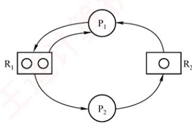

补充分析：若 $\mathtt { R _ { l } }$ 无限、 $\mathtt { R } _ { 2 }$ 为1个，则总有一个进程能完成并

释放 $\mathrm { R } _ { 2 }$ ，不会死锁；但若 $\mathrm { R _ { 1 } }$ 为2个、 $\mathrm { R } _ { 2 }$ 无限，则仍可能死锁。例如： $\mathrm { P } _ { 1 }$ 申请到 $\mathtt { R } _ { 1 }$ 、 $\mathtt { R } _ { 2 }$ 后被切换，$\mathrm { P } _ { 2 }$ 申请 $\mathrm { R _ { 1 } }$ 、 $\mathrm { R } _ { 2 }$ ，再申请 $\mathrm { R _ { 1 } }$ 时阻塞； $\mathrm { P _ { 1 } }$ 恢复执行后也因无法获得第二个 $\mathtt { R } _ { 1 }$ 而阻塞。此时，双方互相等待，死锁发生。

## 33. D

当哲学家中同时存在左撇子（先取左侧筷子）和右撇子（先取右侧筷子）时，各进程请求资源的顺序不再一致，至少有一对相邻哲学家不会同时持有一根筷子并等待对方释放另一根，从而无法形成环形等待链，破坏了死锁的循环等待条件，避免了死锁的发生。

## 34. C

这类题可用到组合数学中鸽巢原理的思想。考虑最极端的情况，因为每个进程最多需要3台打印机，若每个进程已经占有了2台打印机，则只要还有多的打印机，总能满足一个进程达到3台的条件，然后顺利执行，所以将8台打印机分给K个进程，每个进程有2台打印机，这个情况就是极端情况，K为4。或者，假设M是打印机的数量，K是进程的数量，R是每个进程最多需要打印机的数量。根据死锁公式逆推可得，若 $M \leqslant K(R - 1)$ ，则系统可能发生死锁。将本题的数据代入，得到 $8 \leq K(3 - 1)$ ，即 $K { \geqslant } 4$ ，因此系统可能发生死锁的K的最小值是4。

## 35. D

本题应采用排除法，逐个代入分析。剩余资源分配给 $\mathrm { P _ { 1 } }$ ，待 $\mathrm { P } _ { 1 }$ 执行完后，可用资源数为(2,2,1)，此时仅能满足 $\mathrm { P } _ { 4 }$ 的需求，排除选项A、B；接着分配给 $\mathrm { P } _ { 4 }$ ，待 $\mathrm { P } _ { 4 }$ 执行完后，可用资源数为(2,2,2),此时已无法满足任何进程的需求，排除选项 $\mathrm { C } _ { \circ }$ K

此外，本题还可以使用银行家算法求解（对选择题来说显得过于复杂）。

## 36. D

首先求得各进程的需求矩阵Need与可利用资源向量 Available:

<table><tr><td rowspan=2 colspan=1>进程名</td><td rowspan=1 colspan=3>Need</td></tr><tr><td rowspan=1 colspan=1>R1</td><td rowspan=1 colspan=1>R2</td><td rowspan=1 colspan=1>R3</td></tr><tr><td rowspan=1 colspan=1> $\mathrm { P _ { 0 } }$ </td><td rowspan=1 colspan=1>2</td><td rowspan=1 colspan=1>3</td><td rowspan=1 colspan=1>7</td></tr><tr><td rowspan=1 colspan=1> $\mathrm { P } _ { 1 }$ </td><td rowspan=1 colspan=1>1</td><td rowspan=1 colspan=1>3</td><td rowspan=1 colspan=1>3</td></tr><tr><td rowspan=1 colspan=1> $\mathrm { P } _ { 2 }$ </td><td rowspan=1 colspan=1>0</td><td rowspan=1 colspan=1>0</td><td rowspan=1 colspan=1>6</td></tr><tr><td rowspan=1 colspan=1> $\mathrm { P } _ { 3 }$ </td><td rowspan=1 colspan=1>2</td><td rowspan=1 colspan=1>2</td><td rowspan=1 colspan=1>1</td></tr><tr><td rowspan=1 colspan=1> $\mathrm { P } _ { 4 }$ </td><td rowspan=1 colspan=1>1</td><td rowspan=1 colspan=1>1</td><td rowspan=1 colspan=1>0</td></tr></table>

<table><tr><td rowspan=2 colspan=1>Available</td><td rowspan=1 colspan=1>R1</td><td rowspan=1 colspan=1> $\mathbf { R } _ { 2 }$ </td><td rowspan=1 colspan=1> $\mathbf { R } _ { 3 }$ </td></tr><tr><td rowspan=1 colspan=1>2</td><td rowspan=1 colspan=1>3</td><td rowspan=1 colspan=1>3</td></tr></table>

比较 Need 和 Available 发现，初始时进程 $\mathrm { P } _ { 1 }$ 与 $\mathrm { P } _ { 3 }$ 可满足需求，排除选项A、C。尝试给 $\mathrm { P } _ { 1 }$ 分配资源时， $\mathrm { P } _ { 1 }$ 完成后 Available 将变为(6,3,6)，无法满足 $\mathrm { P _ { 0 } }$ 的需求，排除选项B。尝试给 $\mathrm { P } _ { 3 }$ 分配资源时， $\mathrm { P } _ { 3 }$ 完成后Available将变为(4,3,7)，该向量能满足其他所有进程的需求。因此，以 $\mathrm { P } _ { 3 }$ 开头的所有序列都是安全序列。

## 37. B

银行家算法是避免死锁的方法，选项A、D错。根据下图，选项B对，选项C错。


## 38.B

根据死锁公式，当资源数量大于各个进程所需资源数-1的总和时，不发生死锁，三个进程分别需要3,4,5台设备，即当资源数量大于 $(3 - 1) + (4 - 1) + (5 - 1) = 9$ 时，不发生死锁。而当系统中只有9台设备时，第一个进程分配2台，第二个进程分配3台，第三个进程分配4台，这种情况下，三个进程均无法继续执行下去，发生死锁。当系统再增加1台设备，最后1台设备分配给任意一个进程都可以顺利执行完成，因此保证系统不发生死锁的最小设备数为10。

## 39. B

死锁的处理采用三种策略：死锁预防、死锁避免、死锁检测和解除。

死锁预防采用破坏产生死锁的4个必要条件中的一个或几个来防止发生死锁。其中之一的“破坏循环等待条件”，一般采用顺序资源分配法，即限制了用户申请资源的顺序，因此说法Ⅰ的前半句属于死锁预防的范畴。此外，银行家算法虽然会通过检测是否存在安全序列来判断申请资源的请求是否合法，但安全序列并不是唯一的，也不是固定的，它只是一种可能的分配方案，而不是一种必须遵循的规则，银行家算法更没有给出固定的申请资源的顺序，因此说法Ⅰ错误。

银行家算法是最著名的死锁避免算法，其中的最大需求矩阵Max定义了每个进程对m类资源的最大需求量，系统在执行安全性算法中都会检查此次资源试分配后，系统是否处于安全状态，若不安全则将本次的试探分配作废。在死锁的检测和解除中，系统为进程分配资源时不采取任何措施，但提供死锁检测和解除的手段，一旦检测到系统发生死锁，就立即采取相应的措施来解除死锁，因此不用关心进程所需的总资源量。说法Ⅱ、Ⅲ正确。 XTA

## 40. C

对于本题，需先画出如右所示的资源分配图。若系统出现死锁，则必然出现循环等待的情况。

从图中可以看出，若出现循环等待的情况，则至少有 $\mathrm { P } _ { 1 }$ 、 $\mathrm { P } _ { 2 } \mathrm {  、  }$ $\mathrm { P } _ { 3 }$ 三个进程在循环等待环中，在该图中不可能出现两个进程发生循环等待的情况。现在考察 $ P _{1} 、  P _{2} 、  P _{3}$ 三个进程形成环路的情况，若此时 $\mathrm{P}_{1}$ 、 $\mathrm { P } _ { 2 }$ $\mathrm { P } _ { 3 }$ 三个进程分别拥有 $\mathtt { R _ { l } }$ 、 $\mathtt { R } _ { 2 }$ 和 $\mathtt { R } _ { 3 }$ ，则会形成 $\mathrm { P } _ { 1 }$ 等待 $\mathrm { P } _ { 2 }$ 释放 $\mathrm { R } _ { 2 } , \mathrm { ~ P } _ { 2 }$ 等待 $\mathrm { P } _ { 3 }$ 释放 $\mathrm { R } _ { 3 } , \mathrm { ~ P } _ { 3 }$ 等待 $\mathrm { P } _ { 1 }$ 释放 $\mathtt { R } _ { 1 }$ 的循环等待情况。 $ P _{1} 、  P _{2} 、  P _{3}$ 三个进程分别拥有 $\mathrm { R } _ { 2 }$ 、 $\mathrm { R } _ { 3 }$ 和 $\mathrm { R _ { 1 } }$ 的情况的分析类

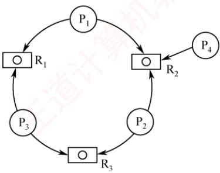

似。以上两种情况都会形成循环等待情况，至少有三个进程陷入死锁状态。若 $\mathrm { P } _ { 4 }$ 事先已获取 $\mathtt { R } _ { 2 }$ 成功运行，则死锁进程数为3；若 $\mathrm { P } _ { 4 }$ 尚未获取 $\mathrm { R } _ { 2 }$ ，未运行，则死锁进程数为 $4   ,$ 。因此，若系统出现死锁，则处于死锁状态的进程至少是3个。 K

## 41. A

由题意可知，仅剩最后一个同类资源，若将其分给 $\mathrm { P _ { 1 } }$ 或 $\mathrm { P } _ { 2 }$ ，则均无法正常执行；若分给 $\mathrm { P } _ { 3 }$ 则 $\mathrm { P } _ { 3 }$ 正常执行完成后，释放的这一个资源仍无法使 $\mathrm { P } _ { 1 } , \mathrm { P } _ { 2 }$ 正常执行，因此不存在安全序列。

## 42. B

剥夺进程资源，将其分配给其他死锁进程，可以解除死锁，说法Ⅰ正确。死锁预防是死锁处理策略（死锁预防、死锁避免、死锁检测）中最为严苛的一种策略，破坏死锁产生的4个必要条件之一，可以确保系统不发生死锁，说法Ⅱ正确。银行家算法是一种死锁避免算法，用于计算动态资源分配的安全性以避免系统进入死锁状态，不能用于判断系统是否处于死锁，说法Ⅲ错误。通过简化资源分配图可以检测系统是否为死锁状态，当系统出现死锁时，资源分配图不可完全简化，只有两个或两个以上的进程才会出现“环”而不能被简化，说法IV正确。

## 43. B

首先求出需求矩阵：

$$
\mathrm{Need}=\mathrm{Max}-\mathrm{Allocation}=\begin{bmatrix}\mathrm{A} & \mathrm{B} & \mathrm{A} & \mathrm{B} & \mathrm{A} & \mathrm{B} \\4 & 4 \\3 & 1 \\3 & 4\end{bmatrix}-\begin{bmatrix}2 & 3 \\2 & 1 \\1 & 2\end{bmatrix}=\begin{bmatrix}2 & 1 \\1 & 0 \\2 & 2\end{bmatrix}
$$

由 Allocation 得知当前 Available为(1，0)。由需求矩阵可知，初始只能满足 $\mathrm { P } _ { 2 }$ 的需求，选项A错误。 $\mathrm { P } _ { 2 }$ 释放资源后 Available变为(3, 1)，此时仅能满足 $\mathrm { P } _ { 1 }$ 的需求，选项C错误。 $\mathrm { P _ { 1 } }$ 释放资源后Available变为(5,4)，可以满足 $\mathrm { P } _ { 3 }$ 的需求，得到的安全序列为 $\mathrm { P } _ { 2 } , \mathrm { P } _ { 1 } , \mathrm { P } _ { 3 }$ ，选项B正确，选项D错误。

## 44. C

考虑极端情况，当临界资源数为n时，每个进程都拥有1个临界资源并等待另一个资源，会发生死锁。当临界资源数为n+1时，则n个进程中至少有一个进程可以获得2个临界资源，顺利运行完后释放自己的临界资源，使得其他进程也能顺利运行，不会产生死锁。或者，根据死锁公式 $m \geq$ n(r-1)，其中m是系统中临界资源的总数，n是并发进程的个数，r是每个进程所需临界资源的个数。若这个不等式成立，则系统不发生死锁。将本题的数据代入，得到 $m > n(2 - 1)$ ，即只要系统中临界资源的总数至少是n+1，就可避免死锁。

## 45. B

初始时系统中的可用资源数为<1,3,2>，只能满足 $\mathrm { P _ { 0 } }$ 的需求<0,2,1>，所以安全序列第一个只能是 $\mathbf { P } _ { 0 } ,$ 将资源分配给 $\mathrm { P _ { 0 } }$ 后， $\mathrm { P _ { 0 } }$ 执行完释放所占资源，可用资源数变为 $< 1,3,2 > + < 2,0,1 > = < 3,3,3 >$ 此时可用资源数既能满足 $\mathrm { P _ { 1 } }$ ，又能满足 $\mathrm { P } _ { 2 } ,$ ，可以先分配给 $\mathrm { P _ { 1 } , ~ P _ { 1 } }$ 执行完释放资源再分配给 $\mathrm{P}_{2};$ 也可以先分配给 $\mathrm { P } _ { 2 }$ $\mathrm { P } _ { 2 }$ 执行完释放资源再分配给 $\mathrm { P } _ { 1 } ,$ 。所以安全序列可以是① $\mathrm{P}_{0} 、 \mathrm{P}_{1} 、 \mathrm{P}_{2}$ 或② $\mathbb{P}_{0}$ 8 $\mathrm { P } _ { 2 1 }$ $\mathrm { P } _ { 1 }$

## 二、综合应用题

## 01. 【解答】

不发生死锁要求，必须保证至少有一个进程得到所需的全部资源并执行完毕， $m \geqslant n(k - 1) + 1$ 时，一定不会发生死锁。

<table><tr><td rowspan=1 colspan=1>序 号</td><td rowspan=1 colspan=1>m</td><td rowspan=1 colspan=1>n</td><td rowspan=1 colspan=1>k</td><td rowspan=1 colspan=1>是否会死锁</td><td rowspan=1 colspan=1>说明</td></tr><tr><td rowspan=1 colspan=1>1</td><td rowspan=1 colspan=1>6</td><td rowspan=1 colspan=1>3</td><td rowspan=1 colspan=1>3</td><td rowspan=1 colspan=1>可能会</td><td rowspan=1 colspan=1> $6 < 3(3 - 1) + 1$ </td></tr><tr><td rowspan=1 colspan=1>2</td><td rowspan=1 colspan=1>9</td><td rowspan=1 colspan=1>3</td><td rowspan=1 colspan=1>3</td><td rowspan=1 colspan=1>不会</td><td rowspan=1 colspan=1> $9 > 3(3 - 1) + 1$ </td></tr><tr><td rowspan=1 colspan=1>3</td><td rowspan=1 colspan=1>13</td><td rowspan=1 colspan=1>6</td><td rowspan=1 colspan=1>3</td><td rowspan=1 colspan=1>不会</td><td rowspan=1 colspan=1> $13 = 6(3 - 1) + 1$ </td></tr></table>

## 02. 【解答】

1）可能发生死锁。满足发生死锁的4大条件，例如， $\mathrm { P } _ { 1 }$ 占有 $\mathbb { S } _ { 1 }$ 申请 $\mathbb { S } _ { 3 }$ ， $\mathrm { P } _ { 2 }$ 占有 $\mathrm { S } _ { 2 }$ 申请 $\mathbb { S } _ { 1 }$ $\mathrm { P } _ { 3 }$ 占有 $\mathbb { S } _ { 3 }$ 申请 $\mathrm { S } _ { 2 }$

2）可有以下几种答案。

A. 采用静态分配：因为执行前已获得所需的全部资源，所以不会出现占有资源又等待别的资源的现象（或不会出现循环等待资源的现象）。

B. 采用按序分配：不会出现循环等待资源的现象。

C. 采用银行家算法：因为在分配时，保证了系统处于安全状态。

## 03.【解答】

1）利用安全性算法对 $T _ { 0 }$ 时刻的资源分配情况进行分析，可得到如下表所示的安全性检测情况。可以看出，此时存在一个安全序列 $\{ \mathrm{P}_{2}, \mathrm{P}_{3}, \mathrm{P}_{4}, \mathrm{P}_{1} \}$ ，所以该系统是安全的。

<table><tr><td rowspan=3 colspan=1>1进程名</td><td rowspan=1 colspan=13>资源情况</td></tr><tr><td rowspan=1 colspan=3>Work</td><td rowspan=1 colspan=3>Need</td><td rowspan=1 colspan=3>Allocation</td><td rowspan=1 colspan=3>Work + Allocation</td><td rowspan=2 colspan=1>Finish</td></tr><tr><td rowspan=1 colspan=1> $\mathrm { R _ { 1 } }$ </td><td rowspan=1 colspan=1> $\mathrm { R } _ { 2 }$ </td><td rowspan=1 colspan=1> $\mathrm { R } _ { 3 }$ </td><td rowspan=1 colspan=1> $\mathrm { R _ { 1 } }$ </td><td rowspan=1 colspan=1> $\mathrm { R } _ { 2 }$ </td><td rowspan=1 colspan=1> $ R _{3}$ </td><td rowspan=1 colspan=1> $\mathrm { R _ { 1 } }$ </td><td rowspan=1 colspan=1> $\mathrm { R } _ { 2 }$ </td><td rowspan=1 colspan=1> $ R _{3}$ </td><td rowspan=1 colspan=1> $\mathrm { R _ { 1 } }$ </td><td rowspan=1 colspan=1> $\mathrm{R}_{2}$ </td><td rowspan=1 colspan=1> $\mathrm { R } _ { 3 }$ </td></tr><tr><td rowspan=1 colspan=1> $\mathrm { P } _ { 2 }$ </td><td rowspan=1 colspan=1>2</td><td rowspan=1 colspan=1>1</td><td rowspan=1 colspan=1>2</td><td rowspan=1 colspan=1>2</td><td rowspan=1 colspan=1>0</td><td rowspan=1 colspan=1>2</td><td rowspan=1 colspan=1>4</td><td rowspan=1 colspan=1>1</td><td rowspan=1 colspan=1>1</td><td rowspan=1 colspan=1>6</td><td rowspan=1 colspan=1>2</td><td rowspan=1 colspan=1>3</td><td rowspan=1 colspan=1>True</td></tr><tr><td rowspan=1 colspan=1> $ P _{3}$ </td><td rowspan=1 colspan=1>6</td><td rowspan=1 colspan=1>2</td><td rowspan=1 colspan=1>3</td><td rowspan=1 colspan=1>1</td><td rowspan=1 colspan=1>0</td><td rowspan=1 colspan=1>3</td><td rowspan=1 colspan=1>2</td><td rowspan=1 colspan=1>1</td><td rowspan=1 colspan=1>1</td><td rowspan=1 colspan=1>8</td><td rowspan=1 colspan=1>3</td><td rowspan=1 colspan=1>4</td><td rowspan=1 colspan=1>True</td></tr><tr><td rowspan=1 colspan=1> $\mathrm { P } _ { 4 }$ </td><td rowspan=1 colspan=1>8</td><td rowspan=1 colspan=1>3</td><td rowspan=1 colspan=1>4</td><td rowspan=1 colspan=1>4</td><td rowspan=1 colspan=1>2</td><td rowspan=1 colspan=1>0</td><td rowspan=1 colspan=1>0</td><td rowspan=1 colspan=1>0</td><td rowspan=1 colspan=1>2</td><td rowspan=1 colspan=1>8</td><td rowspan=1 colspan=1>3</td><td rowspan=1 colspan=1>6</td><td rowspan=1 colspan=1>True</td></tr><tr><td rowspan=1 colspan=1> $\mathrm { P _ { 1 } }$ </td><td rowspan=1 colspan=1>8</td><td rowspan=1 colspan=1>3</td><td rowspan=1 colspan=1>6</td><td rowspan=1 colspan=1>2</td><td rowspan=1 colspan=1>2</td><td rowspan=1 colspan=1>2</td><td rowspan=1 colspan=1>1</td><td rowspan=1 colspan=1>0</td><td rowspan=1 colspan=1>0</td><td rowspan=1 colspan=1>9</td><td rowspan=1 colspan=1>3</td><td rowspan=1 colspan=1>6</td><td rowspan=1 colspan=1>True</td></tr></table>

此处要注意，一般大多数题目中的安全序列并不唯一。  
2）若此时 $\mathrm { P } _ { 1 }$ 发出资源请求Request1(1, 0,1)，则按银行家算法进行检查：$\mathrm{Request_{l}(1,0,1) \leqslant Need_{l}(2,2,2)}$ $\mathrm{Request_{l}(1,0,1) \leqslant Aviallable(2,1,2)}$

试分配并修改相应数据结构，由此形成的进程 $ P _1$ 请求资源后的资源分配情况见下表。

<table><tr><td rowspan=2 colspan=1>进程名</td><td rowspan=1 colspan=9>资源情况</td></tr><tr><td rowspan=1 colspan=3>Allocation</td><td rowspan=1 colspan=3>Need</td><td rowspan=1 colspan=3>Available</td></tr><tr><td rowspan=1 colspan=1> $ P _1$ </td><td rowspan=1 colspan=1>2</td><td rowspan=1 colspan=1>0</td><td rowspan=1 colspan=1>1</td><td rowspan=1 colspan=1>1</td><td rowspan=1 colspan=1>2</td><td rowspan=1 colspan=1>1</td><td rowspan=4 colspan=1>1</td><td rowspan=4 colspan=1>1</td><td rowspan=4 colspan=1>1</td></tr><tr><td rowspan=1 colspan=1> $\mathrm { P } _ { 2 }$ </td><td rowspan=1 colspan=1>4</td><td rowspan=1 colspan=1>1</td><td rowspan=1 colspan=1>1</td><td rowspan=1 colspan=1>2</td><td rowspan=1 colspan=1>0</td><td rowspan=1 colspan=1>2</td></tr><tr><td rowspan=1 colspan=1> $\mathrm { P } _ { 3 }$ </td><td rowspan=1 colspan=1>2</td><td rowspan=1 colspan=1>1</td><td rowspan=1 colspan=1>1</td><td rowspan=1 colspan=1>1</td><td rowspan=1 colspan=1>0</td><td rowspan=1 colspan=1>3</td></tr><tr><td rowspan=1 colspan=1> $\mathrm { P } _ { 4 }$ </td><td rowspan=1 colspan=1>0</td><td rowspan=1 colspan=1>0</td><td rowspan=1 colspan=1>2</td><td rowspan=1 colspan=1>4</td><td rowspan=1 colspan=1>2</td><td rowspan=1 colspan=1>0</td></tr></table>

再利用安全性算法检查系统是否安全，可用资源Available(1,1,1)已不能满足任何进程系统进入不安全状态，此时系统不能将资源分配给进程 $\mathrm { P } _ { 1 }$ o 城

若此时进程 $ P _2$ 发出资源请求 $\mathrm { R e q u e s t } _ { 2 } ( 1 , 0 , 1 )$ ，则按银行家算法进行检查：

$$
\mathrm{Request_{2}(1,0,1) \leq Need_{2}(2,0,2)}
$$

$$
\mathrm{Request_{2}(1,0,1) \leq Aviallable(2,1,2)}
$$

试分配并修改相应数据结构，由此形成的进程 $\mathrm { P } _ { 2 }$ 请求资源后的资源分配情况下表：

<table><tr><td rowspan=2 colspan=1>进程名</td><td rowspan=1 colspan=9>资源情况</td></tr><tr><td rowspan=1 colspan=3>Allocation</td><td rowspan=1 colspan=3>Need</td><td rowspan=1 colspan=3>Available</td></tr><tr><td rowspan=1 colspan=1> $\mathrm { P _ { 1 } }$ </td><td rowspan=1 colspan=1>1</td><td rowspan=1 colspan=1>0</td><td rowspan=1 colspan=1>0</td><td rowspan=1 colspan=1>2</td><td rowspan=1 colspan=1>2</td><td rowspan=1 colspan=1>2</td><td rowspan=4 colspan=1>7</td><td rowspan=4 colspan=1>1</td><td rowspan=4 colspan=1>1</td></tr><tr><td rowspan=1 colspan=1> $\mathrm { P } _ { 2 }$ </td><td rowspan=1 colspan=1>5</td><td rowspan=1 colspan=1>1</td><td rowspan=1 colspan=1>2</td><td rowspan=1 colspan=1>1</td><td rowspan=1 colspan=1>0</td><td rowspan=1 colspan=1>1</td></tr><tr><td rowspan=1 colspan=1> $\mathrm { P } _ { 3 }$ </td><td rowspan=1 colspan=1>2</td><td rowspan=1 colspan=1>1</td><td rowspan=1 colspan=1>1</td><td rowspan=1 colspan=1>1</td><td rowspan=1 colspan=1>0</td><td rowspan=1 colspan=1>3</td></tr><tr><td rowspan=1 colspan=1> $\mathrm { P } _ { 4 }$ </td><td rowspan=1 colspan=1>0</td><td rowspan=1 colspan=1>0</td><td rowspan=1 colspan=1>2</td><td rowspan=1 colspan=1>4</td><td rowspan=1 colspan=1>2</td><td rowspan=1 colspan=1>0</td></tr></table>

再利用安全性算法检查系统是否安全，可得到如下表中所示的安全性检测情况。注意表中各个进程对应的 Work + Allocation向量表示在该进程释放资源之后更新的 Work向量。

<table><tr><td rowspan=2 colspan=1>进程名</td><td rowspan=1 colspan=12>资源情况</td></tr><tr><td rowspan=1 colspan=3>Work</td><td rowspan=1 colspan=3>Need</td><td rowspan=1 colspan=3>Allocation</td><td rowspan=1 colspan=3>Work + Allocation</td></tr><tr><td rowspan=1 colspan=1> $\mathrm { P } _ { 2 }$ </td><td rowspan=1 colspan=1>1</td><td rowspan=1 colspan=1>1</td><td rowspan=1 colspan=1>1</td><td rowspan=1 colspan=1>1</td><td rowspan=1 colspan=1>0</td><td rowspan=1 colspan=1>1</td><td rowspan=1 colspan=1>5</td><td rowspan=1 colspan=1>1</td><td rowspan=1 colspan=1>2</td><td rowspan=1 colspan=1>6</td><td rowspan=1 colspan=1>2</td><td rowspan=1 colspan=1>3</td></tr><tr><td rowspan=1 colspan=1> $\mathrm { P } _ { 3 }$ </td><td rowspan=1 colspan=1>6</td><td rowspan=1 colspan=1>2</td><td rowspan=1 colspan=1>3</td><td rowspan=1 colspan=1>1</td><td rowspan=1 colspan=1>0</td><td rowspan=1 colspan=1>3</td><td rowspan=1 colspan=1>2</td><td rowspan=1 colspan=1>1</td><td rowspan=1 colspan=1>1</td><td rowspan=1 colspan=1>8</td><td rowspan=1 colspan=1>3</td><td rowspan=1 colspan=1>4</td></tr><tr><td rowspan=1 colspan=1> $\mathrm { P } _ { 4 }$ </td><td rowspan=1 colspan=1>8</td><td rowspan=1 colspan=1>3</td><td rowspan=1 colspan=1>4</td><td rowspan=1 colspan=1>4</td><td rowspan=1 colspan=1>2</td><td rowspan=1 colspan=1>0</td><td rowspan=1 colspan=1>0</td><td rowspan=1 colspan=1>0</td><td rowspan=1 colspan=1>2</td><td rowspan=1 colspan=1>8</td><td rowspan=1 colspan=1>3</td><td rowspan=1 colspan=1>6</td></tr><tr><td rowspan=1 colspan=1> $ P _1$ </td><td rowspan=1 colspan=1>8</td><td rowspan=1 colspan=1>3</td><td rowspan=1 colspan=1>6</td><td rowspan=1 colspan=1>2</td><td rowspan=1 colspan=1>2</td><td rowspan=1 colspan=1>2</td><td rowspan=1 colspan=1>1</td><td rowspan=1 colspan=1>0</td><td rowspan=1 colspan=1>0</td><td rowspan=1 colspan=1>9</td><td rowspan=1 colspan=1>3</td><td rowspan=1 colspan=1>6</td></tr></table>

从上表中可以看出，此时存在一个安全序列 $\{ \mathrm{P}_{2}, \mathrm{P}_{3}, \mathrm{P}_{4}, \mathrm{P}_{1} \}$ ，因此该状态是安全的，可以立即将进程 $\mathrm{P}_{2}$ 所申请的资源分配给它。 KK

3）若2）中的两个请求立即得到满足，则此刻系统并未立即进入死锁状态，因为这时所有的进程未提出新的资源申请，全部进程均未因资源请求没有得到满足而进入阻塞态。只有T 当进程提出资源申请且全部进程都进入阻塞态时，系统才处于死锁状态。

## 04.【解答】

1)

$$
\mathsf{Need}=\mathsf{Max}-\mathsf{Allocation}=\begin{bmatrix}0&0&1&2\\1&7&5&0\\2&3&5&6\\0&6&5&6\end{bmatrix}-\begin{bmatrix}0&0&1&2\\1&0&0&0\\1&3&5&4\\0&0&1&4\end{bmatrix}=\begin{bmatrix}0&0&0&0\\0&7&5&0\\1&0&0&2\\0&6&4&2\end{bmatrix}
$$

2）Work 向量初始化值 = Available(1, 5,2,0)。

系统安全性分析：

<table><tr><td rowspan=3 colspan=1>进程名</td><td rowspan=1 colspan=16>资源情况</td></tr><tr><td rowspan=1 colspan=4>Work</td><td rowspan=1 colspan=4>Need</td><td rowspan=1 colspan=4>Allocation</td><td rowspan=1 colspan=4>Work + Allocation</td></tr><tr><td rowspan=1 colspan=1>A</td><td rowspan=1 colspan=1>B</td><td rowspan=1 colspan=1>C</td><td rowspan=1 colspan=1>D</td><td rowspan=1 colspan=1>A</td><td rowspan=1 colspan=1>B</td><td rowspan=1 colspan=1>C</td><td rowspan=1 colspan=1>D</td><td rowspan=1 colspan=1>A</td><td rowspan=1 colspan=1>B</td><td rowspan=1 colspan=1>C</td><td rowspan=1 colspan=1>D</td><td rowspan=1 colspan=1>A</td><td rowspan=1 colspan=1>B</td><td rowspan=1 colspan=1>C</td><td rowspan=1 colspan=1>D</td></tr><tr><td rowspan=1 colspan=1> $\mathrm { P _ { 0 } }$ </td><td rowspan=1 colspan=1>1</td><td rowspan=1 colspan=1>5</td><td rowspan=1 colspan=1>2</td><td rowspan=1 colspan=1>0</td><td rowspan=1 colspan=1>0</td><td rowspan=1 colspan=1>0</td><td rowspan=1 colspan=1>0</td><td rowspan=1 colspan=1>0</td><td rowspan=1 colspan=1>0</td><td rowspan=1 colspan=1>0</td><td rowspan=1 colspan=1>1</td><td rowspan=1 colspan=1>2</td><td rowspan=1 colspan=1>1</td><td rowspan=1 colspan=1>5</td><td rowspan=1 colspan=1>3</td><td rowspan=1 colspan=1>2</td></tr><tr><td rowspan=1 colspan=1> $\mathrm { P } _ { 2 }$ </td><td rowspan=1 colspan=1>1</td><td rowspan=1 colspan=1>5</td><td rowspan=1 colspan=1>3</td><td rowspan=1 colspan=1>2</td><td rowspan=1 colspan=1>1</td><td rowspan=1 colspan=1>0</td><td rowspan=1 colspan=1>0</td><td rowspan=1 colspan=1>2</td><td rowspan=1 colspan=1>1</td><td rowspan=1 colspan=1>3</td><td rowspan=1 colspan=1>5</td><td rowspan=1 colspan=1>4</td><td rowspan=1 colspan=1>2</td><td rowspan=1 colspan=1>8</td><td rowspan=1 colspan=1>8</td><td rowspan=1 colspan=1>6</td></tr><tr><td rowspan=1 colspan=1> $ P _1$ </td><td rowspan=1 colspan=1>2</td><td rowspan=1 colspan=1>8</td><td rowspan=1 colspan=1>8</td><td rowspan=1 colspan=1>6</td><td rowspan=1 colspan=1>0</td><td rowspan=1 colspan=1>7</td><td rowspan=1 colspan=1>5</td><td rowspan=1 colspan=1>0</td><td rowspan=1 colspan=1>1</td><td rowspan=1 colspan=1>0</td><td rowspan=1 colspan=1>0</td><td rowspan=1 colspan=1>0</td><td rowspan=1 colspan=1>3</td><td rowspan=1 colspan=1>8</td><td rowspan=1 colspan=1>8</td><td rowspan=1 colspan=1>6</td></tr><tr><td rowspan=1 colspan=1> $ P _{3}$ </td><td rowspan=1 colspan=1>3</td><td rowspan=1 colspan=1>8</td><td rowspan=1 colspan=1>8</td><td rowspan=1 colspan=1>6</td><td rowspan=1 colspan=1>0</td><td rowspan=1 colspan=1>6</td><td rowspan=1 colspan=1>4</td><td rowspan=1 colspan=1>2</td><td rowspan=1 colspan=1>0</td><td rowspan=1 colspan=1>0</td><td rowspan=1 colspan=1>1</td><td rowspan=1 colspan=1>4</td><td rowspan=1 colspan=1>3</td><td rowspan=1 colspan=1>8</td><td rowspan=1 colspan=1>9</td><td rowspan=1 colspan=1>10</td></tr></table>

因为存在一个安全序列 $< \mathrm{P}_{0}, \mathrm{P}_{2}, \mathrm{P}_{1}, \mathrm{P}_{3} >$ ，所以系统处于安全状态。3)Request1(0, 4, 2, 0) < Need1(0, 7, 5, 0)Request1(0, 4, 2, 0) < Available(1, 5, 2, 0)假设先试着满足进程 $\mathrm { P } _ { 1 }$ 的这个请求，则 Available变为(1,1,0,0)。系统状态变化见下表：

<table><tr><td rowspan=3 colspan=1>进程名</td><td rowspan=1 colspan=16>资源情况</td></tr><tr><td rowspan=1 colspan=4>Max</td><td rowspan=1 colspan=4>Allocation</td><td rowspan=1 colspan=4>Need</td><td rowspan=1 colspan=4>Available</td></tr><tr><td rowspan=1 colspan=1>A</td><td rowspan=1 colspan=1>B</td><td rowspan=1 colspan=1>C</td><td rowspan=1 colspan=1>D</td><td rowspan=1 colspan=1>A</td><td rowspan=1 colspan=1>B</td><td rowspan=1 colspan=1>C</td><td rowspan=1 colspan=1>D</td><td rowspan=1 colspan=1>A</td><td rowspan=1 colspan=1>B</td><td rowspan=1 colspan=1>C</td><td rowspan=1 colspan=1>D</td><td rowspan=1 colspan=1>A</td><td rowspan=1 colspan=1>B</td><td rowspan=1 colspan=1>C</td><td rowspan=1 colspan=1>D</td></tr><tr><td rowspan=1 colspan=1> $\mathrm { P _ { 0 } }$ </td><td rowspan=1 colspan=1>0</td><td rowspan=1 colspan=1>0</td><td rowspan=1 colspan=1>1</td><td rowspan=1 colspan=1>2</td><td rowspan=1 colspan=1>0</td><td rowspan=1 colspan=1>0</td><td rowspan=1 colspan=1>1</td><td rowspan=1 colspan=1>2</td><td rowspan=1 colspan=1>0</td><td rowspan=1 colspan=1>0</td><td rowspan=1 colspan=1>0</td><td rowspan=1 colspan=1>0</td><td rowspan=4 colspan=1>1</td><td rowspan=4 colspan=1>1</td><td rowspan=4 colspan=1>0</td><td rowspan=4 colspan=1>0</td></tr><tr><td rowspan=1 colspan=1> $\mathrm { P } _ { 1 }$ </td><td rowspan=1 colspan=1>1</td><td rowspan=1 colspan=1>7</td><td rowspan=1 colspan=1>5</td><td rowspan=1 colspan=1>0</td><td rowspan=1 colspan=1>1</td><td rowspan=1 colspan=1>4</td><td rowspan=1 colspan=1>2</td><td rowspan=1 colspan=1>0</td><td rowspan=1 colspan=1>0</td><td rowspan=1 colspan=1>3</td><td rowspan=1 colspan=1>3</td><td rowspan=1 colspan=1>0</td></tr><tr><td rowspan=1 colspan=1> $\mathrm { P } _ { 2 }$ </td><td rowspan=1 colspan=1>2</td><td rowspan=1 colspan=1>3</td><td rowspan=1 colspan=1>5</td><td rowspan=1 colspan=1>6</td><td rowspan=1 colspan=1>1</td><td rowspan=1 colspan=1>3</td><td rowspan=1 colspan=1>5</td><td rowspan=1 colspan=1>4</td><td rowspan=1 colspan=1>1</td><td rowspan=1 colspan=1>0</td><td rowspan=1 colspan=1>0</td><td rowspan=1 colspan=1>2</td></tr><tr><td rowspan=1 colspan=1> $\mathrm { P } _ { 3 }$ </td><td rowspan=1 colspan=1>0</td><td rowspan=1 colspan=1>6</td><td rowspan=1 colspan=1>5</td><td rowspan=1 colspan=1>6</td><td rowspan=1 colspan=1>0</td><td rowspan=1 colspan=1>0</td><td rowspan=1 colspan=1>1</td><td rowspan=1 colspan=1>4</td><td rowspan=1 colspan=1>0</td><td rowspan=1 colspan=1>6</td><td rowspan=1 colspan=1>4</td><td rowspan=1 colspan=1>2</td></tr></table>

再对系统进行安全性分析，见下表：

<table><tr><td rowspan=3 colspan=1>进程名</td><td rowspan=1 colspan=16>资源情况</td></tr><tr><td rowspan=1 colspan=4>Work</td><td rowspan=1 colspan=4>Need</td><td rowspan=1 colspan=4>Allocation</td><td rowspan=1 colspan=4>Work + Allocation</td></tr><tr><td rowspan=1 colspan=1>A</td><td rowspan=1 colspan=1>B</td><td rowspan=1 colspan=1>C</td><td rowspan=1 colspan=1>D</td><td rowspan=1 colspan=1>A</td><td rowspan=1 colspan=1>B</td><td rowspan=1 colspan=1>C</td><td rowspan=1 colspan=1>D</td><td rowspan=1 colspan=1>A</td><td rowspan=1 colspan=1>B</td><td rowspan=1 colspan=1>C</td><td rowspan=1 colspan=1>D</td><td rowspan=1 colspan=1>A</td><td rowspan=1 colspan=1>B</td><td rowspan=1 colspan=1>C</td><td rowspan=1 colspan=1>D</td></tr><tr><td rowspan=1 colspan=1> $\mathrm { P } _ { 0 }$ </td><td rowspan=1 colspan=1>1</td><td rowspan=1 colspan=1>1</td><td rowspan=1 colspan=1>0</td><td rowspan=1 colspan=1>0</td><td rowspan=1 colspan=1>0</td><td rowspan=1 colspan=1>0</td><td rowspan=1 colspan=1>0</td><td rowspan=1 colspan=1>0</td><td rowspan=1 colspan=1>0</td><td rowspan=1 colspan=1>0</td><td rowspan=1 colspan=1>1</td><td rowspan=1 colspan=1>2</td><td rowspan=1 colspan=1>1</td><td rowspan=1 colspan=1>1</td><td rowspan=1 colspan=1>1</td><td rowspan=1 colspan=1>2</td></tr><tr><td rowspan=1 colspan=1> $\mathrm { P } _ { 2 }$ </td><td rowspan=1 colspan=1>1</td><td rowspan=1 colspan=1>1</td><td rowspan=1 colspan=1>1</td><td rowspan=1 colspan=1>2</td><td rowspan=1 colspan=1>1</td><td rowspan=1 colspan=1>0</td><td rowspan=1 colspan=1>0</td><td rowspan=1 colspan=1>2</td><td rowspan=1 colspan=1>1</td><td rowspan=1 colspan=1>3</td><td rowspan=1 colspan=1>5</td><td rowspan=1 colspan=1>4</td><td rowspan=1 colspan=1>2</td><td rowspan=1 colspan=1>4</td><td rowspan=1 colspan=1>6</td><td rowspan=1 colspan=1>6</td></tr><tr><td rowspan=1 colspan=1> $\mathrm { P _ { l } }$ </td><td rowspan=1 colspan=1>2</td><td rowspan=1 colspan=1>4</td><td rowspan=1 colspan=1>6</td><td rowspan=1 colspan=1>6</td><td rowspan=1 colspan=1>0</td><td rowspan=1 colspan=1>3</td><td rowspan=1 colspan=1>3</td><td rowspan=1 colspan=1>0</td><td rowspan=1 colspan=1>1</td><td rowspan=1 colspan=1>4</td><td rowspan=1 colspan=1>2</td><td rowspan=1 colspan=1>0</td><td rowspan=1 colspan=1>3</td><td rowspan=1 colspan=1>8</td><td rowspan=1 colspan=1>8</td><td rowspan=1 colspan=1>6</td></tr><tr><td rowspan=1 colspan=1> $ P _{3}$ </td><td rowspan=1 colspan=1>3</td><td rowspan=1 colspan=1>8</td><td rowspan=1 colspan=1>8</td><td rowspan=1 colspan=1>6</td><td rowspan=1 colspan=1>0</td><td rowspan=1 colspan=1>6</td><td rowspan=1 colspan=1>4</td><td rowspan=1 colspan=1>2</td><td rowspan=1 colspan=1>0</td><td rowspan=1 colspan=1>0</td><td rowspan=1 colspan=1>1</td><td rowspan=1 colspan=1>4</td><td rowspan=1 colspan=1>3</td><td rowspan=1 colspan=1>8</td><td rowspan=1 colspan=1>9</td><td rowspan=1 colspan=1>10</td></tr></table>

因为存在一个安全序列 $< \mathrm{P}_{0}, \mathrm{P}_{2}, \mathrm{P}_{1}, \mathrm{P}_{3} >$ ，所以系统仍处于安全状态。所以进程 $\mathrm { P _ { 1 } }$ 的这个请求应该马上被满足。

## 05.【解答】

1）根据 Need 矩阵可知，初始 Work 等于 Available 为(1,4,0)，可以满足进程 $ P _2$ 的需求；进程 $\mathrm { P } _ { 2 }$ 结束后释放资源，Work为(2,7,5)，可以满足 $\mathrm { P _ { 0 } } ,   \mathrm { P _ { 1 } } ,   \mathrm { P _ { 3 } }$ 和 $\mathrm { P } _ { 4 }$ 中任意一个进程的需求，所以系统不会出现死锁，当前处于安全状态。

$$
\mathbf{Need} = \mathbf{Max} - \mathbf{Allocation} = \begin{bmatrix} 0 & 0 & 4 \\ 1 & 7 & 5 \\ 2 & 3 & 5 \\ 0 & 6 & 4 \\ 0 & 6 & 5 \end{bmatrix} - \begin{bmatrix} 0 & 0 & 3 \\ 1 & 0 & 0 \\ 1 & 3 & 5 \\ 0 & 0 & 2 \\ 0 & 0 & 1 \end{bmatrix} = \begin{bmatrix} 0 & 0 & 1 \\ 0 & 7 & 5 \\ 1 & 0 & 0 \\ 0 & 6 & 2 \\ 0 & 6 & 4 \end{bmatrix}
$$

2）若初始 Work = Available 为(0, 6, 2)，可满足进程 $\mathrm { P } _ { 0 } ,   \mathrm { P } _ { 3 }$ 的需求；这两个进程结束后释放资源，Work为(0,6,7)，仅可满足进程 $ P _{4}$ 的需求； $\mathrm { P } _ { 4 }$ 结束后释放资源，Work为(0,6,8)，此时不能满足余下任意一个进程的需求，系统出现死锁，因此当前系统处在非安全状态。

## 注意

在银行家算法中，当实际计算分析系统安全状态时，并不需要逐个进程进行。如本题中，在情况1）下，当计算到进程 $\mathrm { P } _ { 2 }$ 结束并释放资源时，系统当前空闲资源可满足余下任意一个进程的最大需求量，这时已经不需要考虑进程的执行顺序。系统分配任意一个进程所需的最大需求资源，在其执行结束释放资源后，系统当前空闲资源会增加，所以余下的进程仍然可以满足最大需求量。因此，在这里可以直接判断系统处于安全状态。在情况2）下，系统当前可满足进程 $\mathrm { P _ { 0 } } , \mathrm { P _ { 3 } }$ 的需求，所以可以直接让系统推进到 $\mathrm { P _ { 0 } } _ { \mathrm { { } _ { 2 } } }$ $\mathrm { P } _ { 3 }$ 执行完并释放资源后的情形，这时系统出现死锁；因为此时是系统空闲资源所能达到的最大值，所以按照其他方式推进，系统必然还是出现死锁。因此，在计算过程中，将每步中可满足需求的进程作为一个集合，同时执行并释放资源，可以简化银行家算法的计算。 灿育

## 2.5 本章疑难点

## 1. 进程与程序的区别与联系

1）进程是程序及其数据在计算机上的一次执行活动，是一个动态概念：其运行实体是程序，脱离程序，进程便无意义。从静态视角看，进程由程序、数据和进程控制块（PCB）三部分组成；而程序仅是一组有序指令的集合，属于静态实体。

2）进程具有生命周期，动态地创建并消亡，是暂时存在的；程序作为代码的集合，可长期保存，是永久存在的。

3）一个进程在其生命周期中通常执行一个程序，而一个程序可被多个进程并发执行；进程能够创建新进程，而程序本身无法生成新进程。

4）二者的组成不同：进程包含程序、数据和PCB。

## 2. 银行家算法的工作原理

银行家算法通过避免系统进入不安全状态来预防死锁。每次进行资源分配时，系统首先检查当前是否有足够资源满足进程的请求：若有，则进行试探性分配，并对分配后的新状态执行安全性检查。若新状态安全，则正式分配资源；否则拒绝该请求，从而确保系统始终处于安全状态。

## 3. 进程同步、互斥的区别和联系

并发进程的执行存在两类制约关系：一是竞争使用临界资源，必须互斥访问，体现为竞争关系：二是协同完成任务，在关键点等待对方发出的信号以协调执行，体现为协作关系。

连续分配管理方式；页式管理；段式管理；段页式管理

视频讲解

（二）虚拟内存管理

虚拟内存基本概念；请求页式管理；页框分配与回收；页置换算法

内存映射文件（Memory-Mapped Files）；虚拟存储器性能的影响因素及改进方式

## 【复习提示】

内存管理和进程管理是操作系统的核心内容，需要重点复习。本章围绕分页机制展开：通过分页管理方式在物理内存大小的基础上提高内存的利用率，再进一步引入请求分页管理方式，实现虚拟内存，使内存脱离物理大小的限制，从而提高处理器的利用率。

## 3.1 内存管理概念

在学习本节时，请读者思考以下问题：

1）为什么要进行内存管理？

2）多级页表解决了什么问题？又会带来什么问题？

在学习经典的内存管理方法之前，也建议读者先尝试独立思考，提出自己的内存管理设想，并在后续学习中与经典方案进行比较。本节内容循序渐进，后一种方法通常旨在克服前一种方法的不足。希望读者勤于思考，深入比较各类方法的异同，并着重掌握页式管理。

## 3.1.1 内存管理的基本原理和要求

内存管理是操作系统中最核心、也最复杂的机制之一。尽管现代计算机的主存容量持续增长，但仍无法同时容纳所有用户进程及其所需的程序与数据。因此，操作系统必须对有限的物理内存进行合理划分，并实施高效的动态分配策略。所谓内存管理（MemoryManagement），正是指操作系统对内存空间的组织、分配、回收以及地址映射等一系列操作。

在多道程序环境下，有效的内存管理尤为重要。它不仅提升了内存的利用率，简化了用户对存储资源的使用，还能在逻辑上扩展内存空间。具体而言，内存管理的主要功能包括：

● 内存空间的分配与回收。操作系统需实时跟踪内存使用状态，记录空闲区域，为新创建的进程分配所需空间，并在进程终止后及时回收其所占用的内存。

●地址转换。用户程序使用的是逻辑地址（也称虚拟地址），而实际访问内存时必须使用物理地址。操作系统需提供机制，将逻辑地址动态转换为对应的物理地址。

● 内存空间的扩充。通过虚拟存储技术，使进程能够使用远大于物理内存容量的地址空间。

● 内存共享。允许多个进程安全地访问同一块物理内存区域，常用于共享库或进程间通信。

· 存储保护。确保各进程只能访问自身被授权的内存区域，防止相互干扰或非法破坏。

上述功能的实现依赖于内存管理的基本原理，其中逻辑地址与物理地址的区别尤为关键。此处仅作初步介绍，详细机制将在后续结合具体管理方法深入展开。

## 1. 程序的链接与装入

创建进程时，首先需要将程序和数据装入内存。如图3.1所示，将用户源程序转换为可在内存中执行的程序，通常需经过以下三个步骤：

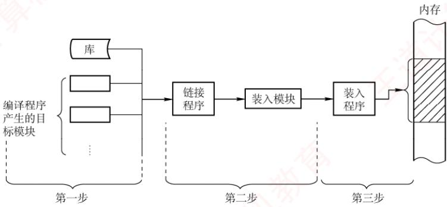  
图3.1 将用户程序变为可在内存中执行的程序的步骤

## 考点追踪编译、链接和装入阶段的工作内容（2011）

1）编译。由编译程序将用户源代码翻译成若于目标模块。

2）链接。由链接程序将这些目标模块及其所需的库函数合并，形成一个完整的装入模块。

3）装入（加载）。由装入程序将该装入模块载入内存，并启动其执行。

## 2. 逻辑地址与物理地址

## 考点追踪进程虚拟地址空间的特点（2023）

编译后的每个目标模块通常从0号单元开始编址，这种地址称为该模块的相对地址（或逻辑地址）。链接程序将多个目标模块合并为一个完整的可执行程序时，依次将各模块的相对地址拼接成一个统一的、从0开始编址的逻辑地址空间（或虚拟地址空间）。以32位系统为例，该逻辑地址空间的范围为 $0 { \sim } 2 ^ { 3 2 } { - 1 }$ 。进程运行时所使用的地址均为逻辑地址；用户程序和程序员只需关注逻辑地址，而底层的内存管理机制对其完全透明。不同进程可以拥有相同的逻辑地址，因为它们各自拥有独立的逻辑地址空间，这些地址会被映射到主存的不同位置。

物理地址空间是指主存中所有物理存储单元的集合，它是地址转换的最终目标。无论进程执行指令还是访问数据，最终都必须通过物理地址从主存中读取或写入信息。在早期系统中，程序装入内存时需将逻辑地址转换为物理地址，这一过程称为地址重定位；而在现代支持虚拟内存的系统中，该转换由内存管理单元（MMU）在硬件层面于运行时自动完成。

具体而言，现代操作系统为每个进程维护一张页表，用于记录逻辑页到物理页框的映射关系。当进程访问某个逻辑地址时，MMUJ会依据当前进程的页表，将其动态转换为相应的物理地址。整个过程对用户程序完全透明，构成了虚拟内存系统的基础。

## 3. 程序的链接

链接程序的作用是将编译生成的目标模块及其所需的库函数合并，形成一个完整的装入模块，以便后续装入内存并执行。根据链接发生的时机不同，可分为以下三种方式。

## （1）静态链接

在程序运行之前，将各目标模块及其所需的库函数链接成一个完整的装入模块（可执行文件），此后不再拆分，这种链接方式称为静态链接。链接过程中需完成两项关键操作。

①地址调整。各目标模块在编译后均以0为起始地址，链接时需根据其在装入模块中的实际位置，将内部地址统一加上相应的偏移量。例如，若模块A的长度为L，且链接后模块B紧邻在模块A之后存放，则原本从0开始编址的模块B在合并后的装入模块中将从地址L处开始，其内部所有地址均需加上偏移量L。

②外部符号解析。将模块间引用的外部符号（如函数名）替换为确定的地址。若模块A中包含语句CALLB，其中B为指向模块B入口的外部调用符号，则链接程序会将其解析为模块B在装入模块中的起始地址L，并将CALLB中的符号B 替换为地址L。

## (2)装入时动态链接

装入时动态链接是指：将用户源程序编译后生成的一组目标模块，在装入内存时采用边装入边链接的方式。具体而言，当装入某个目标模块时，若遇到对外部模块的调用，则装入程序会立即查找并装入相应的外部目标模块，并替换其中的外部符号。其优点如下。

①便于修改和更新。静态链接需将所有目标模块预先装配成一个完整的装入模块，若其中任一模块需要修改或更新，则必须重新生成整个装入模块。若采用装入时动态链接方式，则各目标模块独立存放，只需替换被修改的模块，无须重建整个程序。

②便于实现对目标模块的共享。在静态链接方式下，每个应用程序都包含其所依赖目标模块的完整副本，无法实现共享。而在装入时动态链接方式下，操作系统可将同一个目标模块链接到多个应用程序中，从而实现多个程序对该目标模块的共享。

## （3）运行时动态链接

运行时动态链接是对装入时动态链接的改进，在程序执行过程中，仅当需要调用某个尚未装入内存的目标模块时，操作系统才动态加载并链接该模块。具体而言，系统会查找该模块，将其装入内存，并完成符号解析，使其可被当前进程调用；而程序运行中未使用的模块，则既不会被装入内存，也不会进行链接。其优点是既能加快程序的装入过程，又可节省内存空间。

## 4. 程序的装入

将一个装入模块载入内存时，主要有以下三种方式。

## （1）绝对装入

绝对装入仅适用于单道程序环境。由于内存中始终只有一个程序，其驻留位置在编译前即可确定，因此编译程序可以直接生成使用绝对地址的目标代码；装入程序只需按这些地址将程序和数据载入内存。此时，程序中的逻辑地址与实际物理地址完全一致，无须任何修改。

程序中通常使用的是符号地址（如变量名、函数名），由编译器或汇编器在编译或汇编阶段将其转换为绝对地址：当然，绝对地址也可由程序员直接指定，但这种方式缺乏灵活性。

## (2)可重定位装入

在多道程序环境下，编译程序无法预知目标模块在内存中的具体位置，因此经编译和链接生成的装入模块通常从地址0开始编址，程序中的地址均为相对于模块起始位置的逻辑地址。此时应采用可重定位装入方式，它可根据内存的具体情况，将装入模块装入内存的适当位置。

装入时，系统根据内存当前的空闲情况，为该模块分配一块连续的内存区域，并将整个模块载入其中。随后，一次性将所有逻辑地址修改为对应的物理地址。这一地址转换过程称为重定位。由于转换在装入时完成，且在程序运行期间不再改变，故称静态重定位，如图3.2(a)所示。

进程必须在装入前一次性获得其所需的全部内存空间：若内存不足，则无法装入。一旦装入，进程在整个运行期间既不能移动位置，也不能动态申请额外内存，限制了内存管理的灵活性。

## (3)动态运行时装入

为克服静态重定位的局限，支持程序在内存中的移动，需采用动态重定位方式。装入程序将装入模块载入内存后，并不立即转换地址，而是将地址转换推迟到指令实际执行时进行。为此，系统借助一个重定位寄存器，用于存放该模块在内存中的起始物理地址。程序中保留的仍是逻辑地址，而实际物理地址则由硬件在运行时动态计算得出，如图3.2(b)所示。

动态重定位的优点：支持程序在内存中移动，便于操作系统进行紧凑，从而有效减少外部碎片；提高内存分配的灵活性，允许在运行期间根据需要动态调整进程的内存布局。

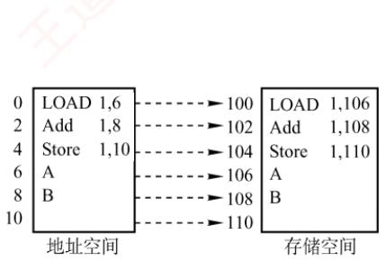  
(a) 静态重定位

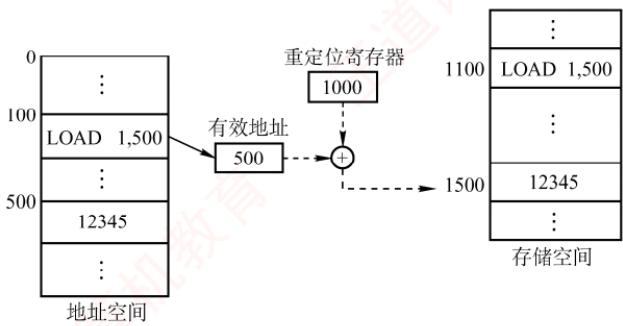  
(b) 动态重定位  
图 3.2 重定位类型

## 5. 内存保护

## 考点追踪分区分配内存保护的措施（2009）

为确保各进程拥有独立的内存空间，内存保护机制需在内存分配前防止用户进程破坏操作系统，同时避免用户进程相互干扰。常用方法主要有以下两种。 K

1）在CPU中设置一对上、下限寄存器，分别存放用户进程在内存中的下限和上限地址，每当CPU访问一个地址时，硬件自动将其与这两个寄存器的值进行比较，以判断是否越界。

2）采用重定位寄存器（也称基地址寄存器）和界地址寄存器（也称限长寄存器）实现越界检查。重定位寄存器存放进程在内存中的起始物理地址，界地址寄存器存放进程地址空间的长度。内存管理部件首先将逻辑地址与界地址寄存器的值进行比较，若未越界，则将逻辑地址加上重定位寄存器的值，得到物理地址，并据此访存，如图3.3所示。

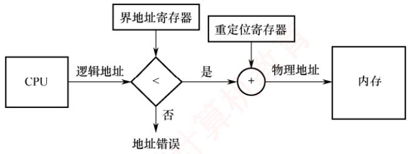  
图3.3 重定位寄存器和界地址寄存器的硬件支持

重定位寄存器与界地址寄存器的作用不同：重定位寄存器用于“加”，即将逻辑地址加上其值，得到物理地址；界地址寄存器用于“比”，即将逻辑地址与其值比较，判断是否越界。

重定位寄存器与界地址寄存器的加载必须通过特权指令完成，仅操作系统内核具备此权限。这一机制可确保寄存器内容只能由内核修改，用户程序无法篡改，从而有效保障内存的安全。

## 6. 内存共享

并非所有进程的内存空间都适合共享，只有只读区域才可以被共享。可重入代码（也称纯代码）是一种允许多个进程同时访问但不允许被任何进程修改的代码。在实际执行时，每个进程需配备独立的私有数据区，用于存放运行过程中可能修改的数据；程序仅对私有数据区进行写操作，而共享的代码段始终保持不变。例如，考虑一个可同时容纳40个用户的多用户系统，所有用户同时运行同一个文本编辑程序。该程序包含160KB的代码区和40KB的数据区。若不共享代码，则系统共需(160KB+40KB)×40=8000KB的内存；若代码为可共享代码，则无论采用分页系统还是分段系统，整个系统只需保留一份副本，此时所需内存仅为 $160\mathrm{KB}+40\mathrm{KB}\times40=1760\mathrm{KB}$

在分页系统中，假设页面大小为4KB，则代码区占用40个页面，数据区占用10个页面。为实现代码共享，每个进程的页表中需设置40个页表项，均指向同一组共享代码页的物理页框；此外，每个进程还需为其私有数据区建立10个页表项，指向各自的数据页。

在分段系统中，由于以段为单位进行管理，只需为共享代码段设置一个段表项，记录共享代码段的起始地址和段长（160KB）。每个进程的段表中包含对该共享段的引用。由此可见，分页与分段均可有效支持内存共享，区别在于共享的粒度和管理机制。

此外，在第2章中介绍过基于共享内存的进程通信机制，由操作系统提供同步与互斥支持。本章后续还将介绍另一种内存共享的实现方式一一内存映射文件。

## 7. 内存分配与回收

操作系统的演进持续推动内存管理的发展。随着系统从单道向多道程序发展，单一连续分配逐渐被固定分区分配所取代。然而，固定分区难以适应作业大小的动态变化，因此又被动态分区分配所替代。为进一步提升内存利用率，连续分配方式最终让位于离散分配方式（如页式存储管理）。此外，为满足用户在编程和使用上的更高需求（如支持程序的逻辑结构、实现段级共享与保护等），分段存储管理应运而生，而这些功能恰是其他分配方式难以有效支持的。

## 3.1.2 连续分配管理方式

连续分配方式是指为一个用户程序分配一个连续的内存空间。例如，若某用户程序需要100MB的内存，则系统便会在内存中为其分配一块连续的100MB区域。

连续分配方式主要包括单一连续分配、固定分区分配和动态分区分配。

## 1. 单一连续分配

在单一连续分配方式中，内存被划分为系统区和用户区。系统区仅供操作系统使用，通常位于低地址部分；用户区则仅允许一道用户程序运行，即该程序独占整个用户区。

这种方式的优点是结构简单、无外部碎片，且无须内存保护机制，因为内存中始终只有一道程序。缺点是仅适用于单用户、单任务的操作系统，存在内部碎片，且内存利用率极低。

## 2. 固定分区分配

固定分区分配是最简单的一种多道程序存储管理方式。它将用户内存空间划分为若干大小固定的分区，每个分区仅能容纳一道作业。当有空闲分区时，系统可从外存的后备作业队列中选择一个合适大小的作业装入该分区，并反复执行这一过程。在划分分区时，有两种方法：

● 分区大小相等。程序过小会造成空间浪费，过大则无法装入，缺乏灵活性。

● 分区大小不等。划分为多个较小分区、适量中等分区和少量大分区，以提高适应性。

为便于内存的分配与回收，系统维护一张分区使用表，通常按分区大小排序。各表项包含对应分区的始址、大小及状态（是否已分配），如图3.4所示。分配时，系统检索该表，寻找一个满足作业大小要求且尚未分配的分区，将其分配给待装入程序，并将对应表项的状态置为“已分配”：若找不到合适分区，则拒绝分配。回收时，只需将对应表项的状态置为“未分配”即可。

<table><tr><td rowspan=1 colspan=1>分区号</td><td rowspan=1 colspan=1>大小/KB</td><td rowspan=1 colspan=1>始址/KB</td><td rowspan=1 colspan=1>状态</td></tr><tr><td rowspan=1 colspan=1>1</td><td rowspan=1 colspan=1>12</td><td rowspan=1 colspan=1>20</td><td rowspan=1 colspan=1>已分配</td></tr><tr><td rowspan=1 colspan=1>2</td><td rowspan=1 colspan=1>32</td><td rowspan=1 colspan=1>32</td><td rowspan=1 colspan=1>已分配</td></tr><tr><td rowspan=1 colspan=1></td><td rowspan=1 colspan=1>64</td><td rowspan=1 colspan=1>64</td><td rowspan=1 colspan=1>已分配</td></tr><tr><td rowspan=1 colspan=1>4</td><td rowspan=1 colspan=1>128</td><td rowspan=1 colspan=1>128</td><td rowspan=1 colspan=1>未分配</td></tr></table>

(a) 分区使用表

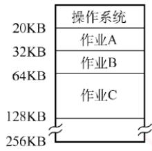  
(b) 存储空间分配情况  
图3.4 固定分区说明表和内存分配情况

该方式存在两个问题：①若作业大于所有分区，则无法装入；②若作业小于分区大小，则仍需占用整个分区，造成内部未被利用的空间，即内部碎片。固定分区方式虽无外部碎片，但因每个分区仅能由一个作业独占，无法支持多个进程共享同一内存区域，故内存利用率较低。

## 3. 动态分区分配

## （1）动态分区分配的基本原理

动态分区分配也称可变分区分配，是指在进程装入内存时，按其实际需求动态分配一块大小恰好匹配的连续内存空间，因此系统中分区的数量和大小随进程的装入与释放而动态变化。

如图3.5所示，系统拥有64MB内存空间，其中低8MB固定分配给操作系统，其余为用户可用区域。初始时装入前三个进程后，仅剩4MB空闲，不足以容纳进程4。为腾出空间，操作系统换出进程2，并换入较小的进程4；因其所需内存更少，释放出一个6MB的空闲块。随后，当需要重新换入进程2时，因剩余空间仍不足，操作系统又换出进程1，再换入进程2。

动态分区分配在初期运行良好，但随着进程频繁装入与释放，内存中会逐渐积累大量分散的小空闲块，导致可用内存总量虽足，却难以满足较大进程的需求，内存利用率随之下降。这些散布在已分配分区之间、无法利用的小空闲块称为外部碎片，与固定分区中因分区内部未用完而产生的内部碎片形成鲜明对比。外部碎片可通过紧凑技术缓解：操作系统周期性地移动进程，将所有空闲块合并为一个连续区域；然而，该操作要求系统支持动态重定位，且开销较大。其原理类似于Windows系统中的磁盘碎片整理，但后者作用于外存文件系统，而前者作用于主存。

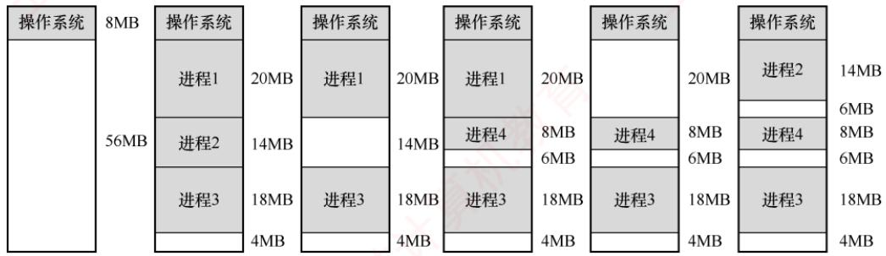  
图 3.5 动态分区分配

## 考点追踪动态分区分配的内存回收方法（2017）

在动态分区分配中，系统维护一张空闲分区链（表），通常按起始地址排序。分配内存时，系统检索该链，寻找一个满足请求大小的空闲分区：若其尺寸大于所需，则从中分割出请求大小的空间分配给进程，剩余部分（如果不小于最小分配单位）仍保留在空闲分区链中。回收内存时，系统根据回收分区的起始地址，在空闲分区链中确定插入位置，并依据相邻情况执行合并操作，具体可分为四种情形：①回收区与前一空闲分区相邻，两者合并，更新前一分区的大小；②回收区与后一空闲分区相邻，两者合并，更新后一分区的起始地址和大小；③回收区与前后两个空闲分区均相邻，三者合并，更新前一分区的大小，并删除后一分区的表项；④回收区不与任何空闲分区相邻，为其新建一个表项，记录起始地址和大小，并插入空闲分区链。 灿

上述三种连续分配方式有一个共同特点：用户程序在主存中均以连续方式存放。

## (2)基于顺序搜索的分配算法

将作业装入主存时，需依据特定的分配算法从空闲分区链（表）中选出一个大小合适的分区分配给该作业。根据分区检索方式的不同，动态分区分配算法可分为顺序分配算法和索引分配算法。其中，顺序分配算法通过依次遍历空闲分区链，查找第一个满足作业大小要求的分区。

常见的顺序分配算法有以下四种。

## 考点追踪各种动态分区分配算法的特点（2019、2024）

1）首次适应（FirstFit）算法。空闲分区按地址递增次序排列。分配时从链首开始顺序查找，找到第一个满足请求的空闲分区，从中划出所需空间分配给作业，余下部分仍留在链中。该算法优先利用低地址分区，从而保留高地址的大空闲区，有利于后续大作业装入；但低地址容易积累小碎片，且每次分配均需从链首开始查找，增加了查找开销。

2）邻近适应（NextFit）算法。也称循环首次适应算法，由首次适应算法改进而来。不同之处在于：分配时从上次查找结束的位置开始继续循环搜索，而非每次都从链首开始。该算法减少了对低地址区域的重复扫描，但往往导致大空闲区在内存中分布不均，难以有效支持后续大作业的装入，因此其整体性能通常不如首次适应算法。

## 考点追踪最佳适应算法的分配过程（2010）

3）最佳适应（BestFit）算法。空闲分区按容量递增次序排列。分配时，顺序查找第一个能满足作业大小的空闲分区（最小的可用分区）进行分配。尽管名为“最佳”，该算法虽能尽量保留较大的空闲分区，但每次分配都会在原分区中留下极小的剩余块。随着时间推移，这些小块难以被利用，产生大量外部碎片，实际性能通常较差。

4）最坏适应（WorstFit）算法。空闲分区按容量递减次序排列。分配时，选择第一个满足要求的空闲分区（最大的可用分区），从中分割出所需空间。与最佳适应算法相反，该算法试图通过避免生成小碎片来提升内存利用率，但由于总是切割最大的空闲区，系统很快难以满足大作业的内存需求，因此性能同样不佳。

综合来看，首次适应算法在实现开销、碎片控制与大作业支持之间取得了较好的平衡：其查找过程简单高效，回收分区时无须对空闲链重新排序，且能有效保留高地址的大空闲区。

## （3）基于索引搜索的分配算法

当系统规模较大时，空闲分区链可能很长，采用顺序搜索算法效率较低。为此，大中型系统常采用基于索引的分配算法，索引分配算法的思想是：根据空闲分区的大小进行分类，对每一类大小相同的空闲分区建立独立的空闲分区链，并通过一张索引表统一管理这些链。分配时，依据请求大小在索引表中定位对应链表，获取其头指针，从而快速取得一个空闲分区。

常见的索引分配算法有以下三种。

1）快速适应（OuickFit）算法。根据系统中进程常用的空间大小，预先将空闲分区划分为若于固定尺寸的类别。分配过程分为两步：（①）根据作业长度，在索引表中找到能容纳它的最小类别链表；②从该链表头部取下第一个空闲分区进行分配。优点是查找效率高、不会产生内存碎片；缺点是回收时难以有效合并分区，算法比较复杂，开销较大。

## 考点追踪伙伴关系的概念（2024）

2）伙伴系统（BuddySystem）。规定所有分区大小均为 $2 ^ { k }$ （k为正整数）。当需要为进程分配大小为n的内存时（满足 $2^{i - 1} < n \leq 2^i$ ，首先在大小为 $2 ^ { i }$ 的空闲分区链中查找。若存在，则直接分配；否则，依次在大小为 $2 ^ { i + 1 } , 2 ^ { i + 1 } ,$ …的链中查找，直至找到一个可用分区。随后，将该分区不断二分，直至得到所需大小的块，其余部分按大小加入对应的空闲链。在伙伴系统中，每个大小为 $2 ^ { k }$ 的分区都有一个唯一的伙伴分区：与它大小相同、地址相邻（首尾相接）的另一个分区。回收时，若某空闲分区与其伙伴也为空闲，则合并为一个大小为 $2 ^ { k + 1 }$ 的分区，并继续向上尝试合并，直至无法合并为止。

3）哈希算法。以空闲分区大小为关键字，建立哈希函数，构建一张哈希表，每个表项记录对应空闲分区链的头指针。分配时，根据所需分区大小，通过哈希函数计算出其在哈希表中的位置，从而快速获取相应的空闲分区链。

在连续分配方式中，即使系统拥有超过1GB的空闲内存，只要其中不存在连续的1GB空间，需要该大小内存的作业便无法装入运行，这正是外部碎片导致的问题。为了克服这一限制，操作系统引入了非连续分配方式：将进程的地址空间划分为多个单元，并允许这些单元分散地装入内存中互不相邻的区域，从而彻底摆脱对外部连续空间的依赖。该机制能有效利用零散的空闲内存，显著提升内存利用率；但与此同时，系统必须额外维护各逻辑单元与其物理位置之间的映射关系，因而带来了一定的存储开销。根据所划分单元的大小是否固定，非连续分配方式可分为分页存储管理与分段存储管理。进一步，若作业运行前需要一次性装入全部单元，则称为基本分页或基本分段；若支持按需动态装入，则相应地称为请求分页与请求分段。

## 3.1.3 基本分页存储管理①

固定分区会产生内部碎片，动态分区会产生外部碎片，这两种方式对内存的利用率都较低。为提高内存利用率并彻底消除外部碎片，操作系统引入了分页存储管理：将物理内存划分为若干大小相等的固定单元，称为页框（或页帧、物理块）；同时将进程的逻辑地址空间划分为与页框大小相同的单元，称为页面（或页）。系统以页框为单位为进程分配内存。

从形式上看，分页类似于等长的固定分区，但其本质不同：固定分区按作业整体分配，而分页将进程和内存均按固定大小的单元划分，使得内存分配以页为单位进行。因此，分页管理不会产生外部碎片。然而，由于页面大小固定，当进程的某一页未被完全填满时，其对应的页框中会留下未使用的空间，形成页内碎片（内部碎片），每个进程平均产生的页内碎片约为半页。

## 1. 分页存储的几个基本概念

## （1）页面和页面大小

进程的逻辑地址空间被划分为若于页面，每个页面有一个编号，称为页号，从0开始：物理内存中的每个页框也有一个编号，称为页框号（或物理块号），同样从0开始。通过建立页号到页框号的映射，系统为进程的每个页面分配物理内存。

为便于地址转换，页面大小通常取2的整数次幂。页面大小应适中：若页面过小，则进程的


页面数量增多，导致页表过长，不仅占用大量内存，还会增加地址转换开销，降低页面换入/换出的效率；若页面过大，则页内碎片增多，同样会降低内存利用率。

## (2）地址结构

考点追踪分页系统的逻辑地址结构（2009、2010、2013、2015、2017、2024）

在分页存储管理中，逻辑地址由两部分组成：页号P和页内偏移量W，如图3.6所示。

<table><tr><td>31</td><td>…</td><td>12</td><td></td><td>0</td></tr><tr><td></td><td>页号P</td><td></td><td>页内偏移量W</td><td></td></tr></table>

图3.6 某分页系统的 32 位逻辑地址结构

以32位地址为例，若页面大小为 $2 ^ { 1 2 } \mathrm { B }$ （4KB），则低12位（0～11位）为页内偏移量，高20位（12～31位）为页号，最多可支持 $2 ^ { 2 0 }$ 个页面。 KIN

## (3） 页表

为实现逻辑地址到物理地址的转换，系统为每个进程建立一张页表（PageTable）。页表是一个按页号顺序排列的数组，每个页表项记录对应页面所驻留的物理页框号，以及相关状态信息（如有效位、访问位等）。进程执行时，通过页号索引页表，即可获得该页所在的物理块号，从而完成地址映射，如图3.7所示。因此，页表的作用是实现从页号到页框号的映射。

(a)逻辑空间  
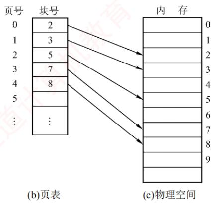  
图 3.7 页表的作用

## 2. 基本地址变换机构

地址变换机构的任务是将逻辑地址转换为内存中的物理地址，这一过程借助页表实现。图3.8展示了分页存储管理系统中的地址变换机构。

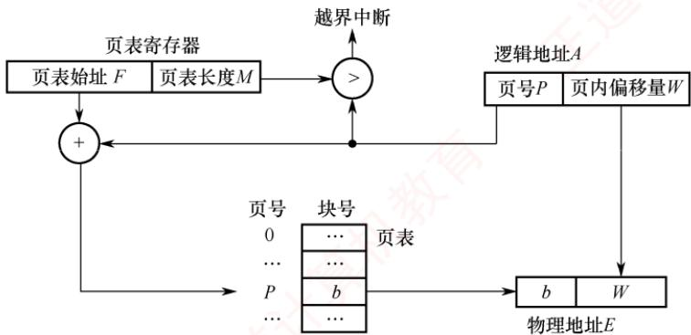  
图3.8 分页存储管理系统中的地址变换机构

## 注意

在页表中，页表项按页号顺序连续存放，因此页号作为索引是隐含的，无须在页表项中显式存储。

为提高地址变换速度，系统设置一个页表寄存器（PTR），存放页表在内存中的始址F和页表长度M。由于寄存器造价昂贵，单CPU系统中通常只设置一个PTR。进程未执行时，其页表始址和长度保存在该进程的PCB中；当进程被调度执行时，操作系统将这些信息装入PTR。

设页面大小为L，逻辑地址A到物理地址E的变换过程如下。

考点追踪页式系统的地址变换过程（2013、2021、2024）

## 考点追踪页表项地址的计算与分析（2024）

①根据逻辑地址计算页号 $P = \lfloor A / L \rfloor$ 、页内偏移量 $W = A \% L$ 0

②判断页号是否越界，若页号 $P \geq  页$ 表长度M，则产生越界中断；否则，继续执行。

③根据页号P查找页表，找出对应页表项中的物理块号。页表项地址=页表始址F+页号P×页表项长度，取出该页表项中的物理块号b。

④计算物理地址 $E = b L + W ,$ ，并据此访问内存（注意，物理地址=页面在内存中的始址+页内偏移量，页面在内存中的始址=块号×块大小）。

上述地址变换过程由MMU硬件自动完成的。例如，若页面大小 $L = 1 \mathrm { K B }$ ，则页号2对应的物理块号 $b   = 8$ ，逻辑地址 $A = 2 5 0 0$ 的物理地址E的计算过程如下： $P=2500/1K=2$ $W=2500\%1\mathrm{K}=$ 452，故物理地址 $E = 8 \times 1024 + 452 = 8644$ o XK

若逻辑地址以二进制形式给出，则页号和页内偏移可直接通过截取高位和低位获得，效率更高。正因页面大小固定，逻辑地址可视为一维线性地址，因而仅需一个整数即可确定其位置。

页表项大小不是随意规定的，而是有所约束的。页表项大小如何确定？

页表项需能表示所有可能的物理页框号。以32位地址空间、按字节编址、页面大小为4KB为例，物理内存最多包含 $2^{32}\mathrm{B}/4\mathrm{KB}=2^{20}$ 个页框，因此需要 $\log_{2}2^{20}=20$ 位来表示页框号。由于内存按字节编址，为保证页表项能够指向所有页面，页表项大小至少为 $\left[20/8\right]=3\mathrm{B}$ 。但出于对齐和扩展考虑（如加入有效位、访问位等），实际系统通常将页表项设为4B。

分页管理面临两个主要挑战：①每次访存都需要进行地址转换，若转换速度不够快，则会显著降低系统性能：②页表本身占用内存空间，若页表过大，则会降低内存利用率。正是这些问题，推动了后续优化技术的发展，如快表（TLB）和多级页表。 机

## 3. 具有快表的地址变换机构

由前述地址变换过程可知，若页表全部存放在内存中，则每次访问内存（无论是取指令还是读/写数据）至少需两次访存：第一次访问页表以获取物理块号，第二次根据形成的物理地址访问目标内容。显然，这种方式会显著降低系统性能。为此，现代地址变换机构增设了一个具有并行查找能力的高速缓冲存储器一一快表（TLB），用于缓存当前活跃的若于页表项，以加速地址变换。相应地，主存中的完整页表常被称为慢表。具有快表的地址变换机构如图3.9所示。

## 考点追踪具有快表的地址变换的性能分析（2009）

在具有快表的分页机制中，地址变换过程如下。

①CPU给出逻辑地址后，硬件自动提取页号，并将其与快表中所有页号并行比较。

②若命中（找到匹配的页号），则直接从快表中取出对应的物理块号，与页内偏移量拼接形成物理地址。此时，仅需一次访存即可。

③若未命中（未找到匹配的页号），则需访问内存中的页表，读取相应的页表项以获得其

物理块号，再拼接形成物理地址并访问内存，共需两次访存。同时，系统会将该页表项装入快表，以便后续可能的重复访问；若快表已满，则按特定置换算法淘汰一个旧项。

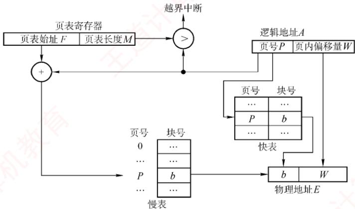  
图3.9 具有快表的地址变换机构

在程序具有良好局部性的前提下，快表命中率通常可达90%以上，因此分页机制带来的性能开销可控制在10%以内。快表的有效性基于著名的局部性原理，这一原理将在3.2节中介绍。

## 4. 两级页表

引入分页管理后，进程执行时无须将所有页面调入内存，但仍需将整个页表驻留内存。然而，页表本身可能非常庞大。以32位逻辑地址空间、页面大小为4KB、页表项大小为4B为例：页内偏移占 $\log _ { 2 } 4 \mathrm { K } = 1 2$ 位，页号占20位，因此每个进程的页表最多包含 $2 ^ { 2 0 }$ 个页表项，仅页表就需占用 $2^{20} \times 4\mathrm{B} / 4\mathrm{KB} = 1\mathrm{K}$ 个页。若还要求页表连存放，则显然不切实际。

## 考点追踪多级页表的特点和优点（2014）

解决上述问题的思路是将页表本身也视为可分页的对象，具体体现为两个方面：（①）对页表采用离散分配，不再要求其连续存放，而是通过一张专门的索引表记录各页表页在内存中的位置，从而消除对连续内存空间的需求；②仅将当前活跃的部分页表项调入内存，其余仍驻留磁盘，按需调入（虚拟内存的思想），从而有效缓解页表占用过多内存的问题。 XOT

不难发现，这一方案与最初引入页表以解决进程地址空间离散分配的思路如出一辙：本质上就是为已离散化的页表再建立一层页表，称为外层页表（或页目录）。仍以上述条件为例：当采用两级分页时，将原页表按页面大小（4KB）进行分页。由于每页可容纳 $4\mathrm{KB}/4\mathrm{B}=1024$ 个页表项，而总页表项数为 $2 ^ { 2 0 }$ ，故需 $2^{20}/2^{10}=2^{10}=1024$ 个页表页，对应外层页表包含1024个表项，恰好占用一页（4KB）。由此自然形成了如图3.10所示的逻辑地址结构。

<table><tr><td>一级页号或页目录号10位</td><td>二级页号或页号10位</td><td>7 页内偏移12位</td></tr></table>

图3.10 逻辑地址空间的格式

## 考点追踪两级页表的逻辑地址结构及相关分析（2010、2013、2015、2017—2019）

两级页表是在普通页表结构上再加一层页表，其结构如图3.11所示。

在页表的每个表项中，存放的是进程某页对应的物理块号。例如，0号页存放在1号物理块中，1号页存放在5号物理块中。在外层页表的每个表项中，存放的是某个页表分页的物理起始地址。例如，0号页表页存放在3号物理块中。

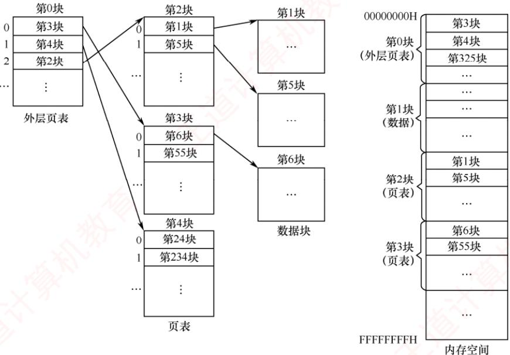  
图3.11 两级页表结构示意图

通过外层页表和内层页表的协同作用，可实现从逻辑地址到物理地址的变换。

考点追踪二级页表的页表基址寄存器中的内容（2018、2021）

考点追踪二级页表中的地址变换过程（2015、2017）

为方便地址变换，系统增设一个外层页表寄存器（也称页目录基址寄存器），用于存放外层页表的起始地址。地址变换过程如下。 X

①用逻辑地址中的页目录号作为索引，访问外层页表，获取对应内层页表的物理起始地址。

②用逻辑地址中的二级页号作为索引，访问该页表，得到目标页面的物理块号。

③将物理块号与页内偏移量拼接，形成物理地址，并据此访问内存单元。

在无快表的情况下，此过程需三次访存。

对于更大的地址空间（如64位），两级页表远远不够。例如，若逻辑地址为64位、页面大小为4KB，则页号占52位。若每页仍可存放1024个页表项，则需约6级页表才能覆盖整个地址空间。然而，实际系统通常将虚拟地址限制为48位，从而采用三级或四级页表即可高效管理，既满足应用需求，又避免硬件过度复杂化。建立多级页表的根本目的，是通过按需分配页表页，避免为未使用的地址空间预留大量无用的页表项，进而显著节省内存开销。 VY

## 3.1.4 基本分段存储管理

分页管理方式是从计算机的角度出发设计的，旨在提高内存利用率和系统性能，其地址转换由硬件自动完成，对用户完全透明。而分段管理方式则从用户和程序员的实际需求出发，旨在支持方便编程、信息保护与共享、动态增长以及动态链接等高级功能。

## 1. 分段

分段系统将用户进程的逻辑地址空间划分为若于大小不等的段。例如，一个进程可包含主程序段、子程序段、栈段和数据段，共划分为5个段。每个段内部从0开始编址，并分配一段连续的地址空间（段内连续，段间不要求连续）。由于地址空间被组织为多个具有明确语义的段，整个进程的逻辑地址结构呈现出二维特性：由段号和段内偏移共同确定一个地址。

## 考点追踪分段系统的逻辑地址结构分析（2009）

分段存储管理的逻辑地址由段号S和段内偏移量W两部分组成。在图3.12中，段号占16位，段内偏移量也占16位，则一个进程最多可拥有 $2^{16} = 65536$ 个段，最大段长为64KB。

<table><tr><td>31</td><td></td><td>15</td><td></td></tr><tr><td colspan="2">段号S</td><td colspan="2">段内偏移量W</td></tr></table>

图3.12 分段系统中的逻辑地址结构

在页式系统中，逻辑地址中的页号与页内偏移量对用户透明；而在分段系统中，段号和段内偏移量必须由用户显式提供一—这一工作在高级语言中由编译程序自动完成。

## 2. 段表

每个进程都拥有一张段表，用于实现逻辑段到物理内存区的映射。段表中每个段对应一个段表项，记录该段在内存中的基址（起始地址）和段长（长度）。段表的内容如图3.13所示。

<table><tr><td>段</td><td>号</td><td>段</td><td>长</td><td>本段在主存的始址</td></tr><tr><td></td><td></td><td></td><td></td><td></td></tr></table>

图 3.13 段表的内容

运行时，系统通过查找段表，即可定位每段在内存中的实际位置，其映射过程见图3.14。

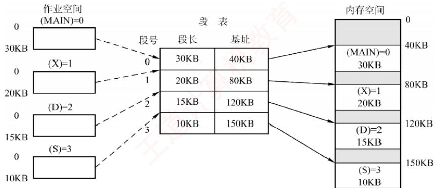  
图3.14 利用段表实现物理内存区映射

由于段表项连续存放且长度相同，段号可作为隐含索引，无须额外存储。例如，在某32位分段系统中，段号为16位，段内偏移量为16位（段长字段为16位，对应最大段长64KB），物理地址为32位（可寻址4GB内存）。因此，每个段表项至少需要16（段长）+32（基址）=48位，即6B。若段表首地址为M，则第K号段对应的段表项位于地址 $M + K \times 6$ 处。

## 3. 地址变换机构

分段系统的地址变换过程如图3.15所示。为实现从逻辑地址到物理地址的变换，系统设置了一个段表寄存器，用于存放段表始址F和段表长度M。段式存储管理的地址变换过程如下。

考点追踪段式系统的地址变换过程（2016）

① 从逻辑地址 A 中分离出段号 S和段内偏移量 $W_{\circ}$

②判断段号是否越界：若段号S≥段表长度M，则产生段号越界中断，否则继续执行。

③根据段号S查找段表，段表项地址 =段表始址F +段号S×段表项长度。取出该段表项 中该段的段长C，若 $W \geqslant C ,$ ，则产生段内越界中断；否则，继续执行。

④取出段表项中该段的基址b，计算物理地址 $E = b + W ,$ ，并据此访问内存。

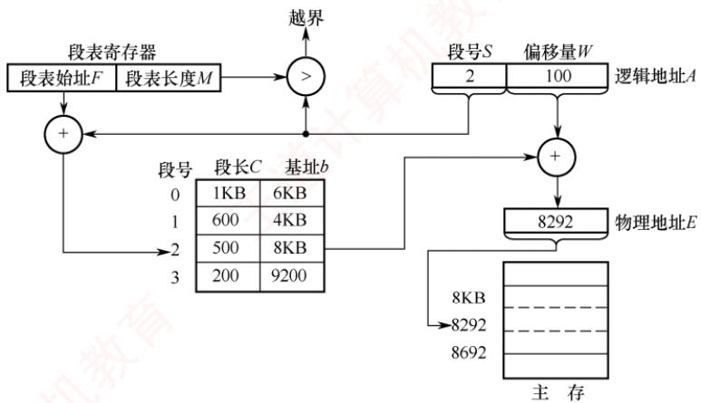  
图3.15 分段系统的地址变换过程

## 4. 分页和分段的对比

分页与分段均为非连续分配方式，均需通过地址映射机构实现地址变换。然而，二者在概念上有本质区别，主要体现在以下三个方面：

1）页是系统管理内存的物理单位，分页的主要目的是提高内存利用率，完全由系统实现，对用户透明；段是用户程序的逻辑单位，分段的主要目的是满足编程、共享、保护等需求，由编译器根据程序结构划分，对用户可见。

2）页的大小固定，由系统决定。段的长度不固定，取决于程序的逻辑结构。

3）分页系统的地址空间是一维的，程序员只需提供单一的线性地址：分段系统的地址空间是二维的，程序员在引用地址时，必须同时指定段名（或段号）和段内偏移量。

## 5. 段的共享与保护

## 考点追踪页、段共享的原理和特点（2019、2023）

在分页系统中，虽然也能实现共享，但远不如分段系统方便。若一段共享代码占N个页框，则每个共享进程的页表中都需建立N个页表项，分别指向这N个页框。而在分段系统中，无论该段多大，只需在每个进程的段表中设置一个段表项指向该共享段，因此实现共享极为便捷。

为支持段共享，系统可维护一张共享段表，其中每个共享段对应一个表项，记录其段号、段长、内存起始地址、存在位、外存起始地址以及共享进程计数count。当某进程不再使用该段时，count减1；仅当count=0时，系统才回收该段所占的内存空间。值得注意的是，同一共享段在不同进程中可以具有不同的段号，各进程通过各自的段号即可访问同一物理段①。 X

不能被修改的代码称为可重入代码（或纯代码），它允许多个进程并发执行。为确保共享代码的完整性，系统通常将此类代码置于只读段中。同时，每个进程需配备私有的局部数据区，专门用于存放执行过程中可能变化的数据，从而有效避免对共享代码段的任何写操作。

与分页管理类似，分段系统的保护机制主要包括两类：①地址越界保护，将逻辑地址中的段号与段表长度比较，若段号≥段表长度，则产生越界中断；将段内偏移与段表项中的段长比较，若偏移≥段长，则同样触发越界中断。②存取控制保护，通过段表项中的访问权限位防止非法访问。

## 3.1.5 段页式存储管理

分页存储管理能有效提高内存利用率，而分段存储管理能反映程序的逻辑结构，并有利于段的共享与保护。将二者各自的优势有机结合，便形成了段页式存储管理方式。

在段页式系统中，进程的地址空间首先被划分为若于逻辑段，每段拥有唯一的段号：随后，每个段被进一步划分为若于大小固定的页。内存空间的管理仍采用分页方式，即划分为与页面大小相同的物理块，内存分配以物理块为单位，如图3.16所示。

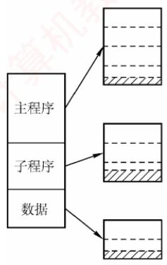

(a) 程序的段页划分  
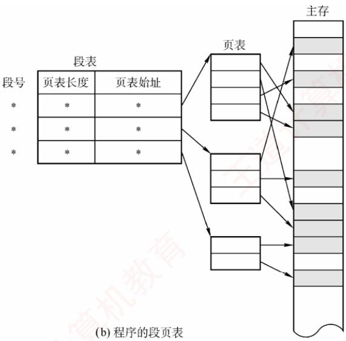  
图3.16段页式管理方式

进程的逻辑地址由三部分组成：段号S、页号P和页内偏移量W，如图3.17所示。
<table><tr><td>段号S</td><td>页号P</td><td>页内偏移量W</td></tr><tr><td></td><td></td><td></td></tr></table>

图3.17 段页式系统的逻辑地址结构

为实现地址变换，系统为每个进程建立一张段表，每个段对应一个段表项，记录该段的页表始址和页表长度（段号作为段表索引，无须显式存储）。每个段还对应一张页表，其每个页表项记录对应页的物理块号（页号作为页表索引，亦无须存储）。此外，系统设置一个段表寄存器，用于存放当前进程段表的起始地址和段表长度，既用于段表寻址，也用于段号越界检查。

## 注意

在段页式存储管理中，每个进程仅有一张段表，但可能有多张页表（每个段一张）。

段页式存储管理的地址变换过程如下。

①根据逻辑地址中的段号S，通过段表寄存器定位段表，并查得该段对应页表的起始地址；

②系统利用页号P访问该页表，获取物理块号；

③将物理块号与页内偏移量W拼接，形成物理地址。

如图3.18所示，在无快表的情况下，每次基于逻辑地址的内存访问需三次访存。为加速查找，可引入快表（TLB），其表项包含关键字（段号、页号）及对应的物理块号和保护信息。

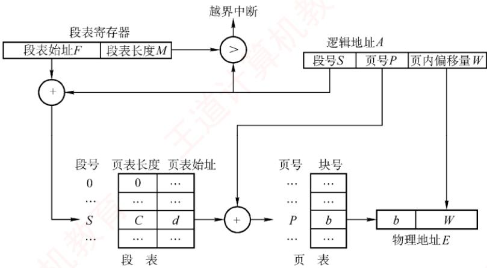  
图3.18 段页式系统的地址变换机构

对用户而言，程序仍按段组织，页的划分由系统自动完成且完全透明。正因如此，段页式管理的地址空间是二维的——这与分段系统一致，而分页机制对用户不可见。

## 3.1.6 本节小结

本节开头提出的问题的参考答案如下。

## 1）为什么要进行内存管理？

在单道程序系统中，系统一次仅运行一个程序，内存分配极为简单一一只需将全部内存（或固定分区）分配给当前进程。引入多道程序设计后，多个进程并发执行并共享主存。若缺乏有效管理，则不同进程的地址空间可能重叠或相互覆盖，导致数据被意外修改，破坏程序正确性，严重影响并发可靠性。因此，为支持多道程序安全、高效地并发运行，必须进行内存管理。

## 2）多级页表解决了什么问题？又会带来什么问题？

多级页表解决了逻辑地址空间较大时，单级页表过长、占用内存过多的问题。通过分级组织页表，系统只需将当前使用的各级页表驻留内存，从而既减少内存占用，又避免对大块连续内存的需求。然而，采用多级页表也会带来性能开销：在无快表（TLB）的情况下，一次地址变换需逐级访问多级页表，导致多次内存访问，进而增加访存延迟。

无论是段式、页式还是段页式管理，读者只需掌握三个关键问题：①逻辑地址结构，②页（段）表项结构，③寻址过程。搞清这三点，便掌握了各类存储管理方式的核心机制。再次提醒注意区分逻辑地址结构与表项结构。 V

## 3.1.7 本节习题精选

## 一、单项选择题

01. 下列关于存储管理目标的说法中，错误的是（）。A. 为进程分配内存空间 B. 回收被进程释放的内存空间C. 提高内存的利用率 D. 提高内存的物理存取速度

02.下列关于内存保护的描述中，不正确的是（）。A. 一个进程不能未被授权就访问另外一个进程的内存空间B.内存保护可以仅通过操作系统（软件）来满足，不需要处理器（硬件）的支持C. 内存保护的方法有界地址保护和上下限地址保护D. 一个进程不能直接跳转到另一个进程的指令地址中

03.内存保护需要由（）完成，以保证进程空间不被非法访问。A. 操作系统 B. 硬件机构C. 操作系统和硬件机构合作 D. 操作系统或者硬件机构独立完成

04. 下列各种存储管理方式中，需要硬件地址变换机构的是（）。I. 单一连续分配 II. 固定分区分配 Ⅲ. 页式存储管理IV. 动态分区分配 V. 页式虚拟存储管理A. I、III、V B. II、III、IV C. III、IV、V D. II、III、IV、V

05. 在固定分区分配中，每个分区的大小是（）。A. 随作业长度变化 B. 可以不同但预先固定C. 相同 D. 可以不同但根据作业长度固定

06. 在动态分区分配方案中，某一进程完成后，系统回收其主存空间并与相邻空闲区合并，为此需修改空闲区表，造成空闲区数减1的情况是（）。A. 无上邻空闲区也无下邻空闲区 B. 有上邻空闲区但无下邻空闲区C. 有下邻空闲区但无上邻空闲区 D. 有上邻空闲区也有下邻空闲区

07. 设内存的分配情况如右图所示。若要申请一块40KB的内存空间，采用最佳适应算法，则所得到的分区首址为（）。A. 100K B. 190KC. 330K D. 410K

08. 某分段存储管理系统中，段表内容如下表所示，逻辑地址的格式为（段号，段内偏移)，则逻辑地址(2,154)对应的物理地址是（)。

<table><tr><td rowspan="4">0 100K 180K 190K</td><td>操作系统</td></tr><tr><td></td></tr><tr><td>占用</td></tr><tr><td rowspan="2"></td></tr><tr><td></td></tr><tr><td rowspan="2">280K 330K 390K</td><td>占用</td></tr><tr><td></td></tr><tr><td rowspan="2">410K 512K</td><td>占用</td></tr><tr><td></td></tr></table>

<table><tr><td rowspan=1 colspan=1>段号</td><td rowspan=1 colspan=1>段首址</td><td rowspan=1 colspan=1>段长</td></tr><tr><td rowspan=1 colspan=1>0</td><td rowspan=1 colspan=1>120K</td><td rowspan=1 colspan=1>40K</td></tr><tr><td rowspan=1 colspan=1>1</td><td rowspan=1 colspan=1>760K</td><td rowspan=1 colspan=1>30K</td></tr><tr><td rowspan=1 colspan=1>2</td><td rowspan=1 colspan=1>480K</td><td rowspan=1 colspan=1>20K</td></tr><tr><td rowspan=1 colspan=1>3</td><td rowspan=1 colspan=1>370K</td><td rowspan=1 colspan=1>20K</td></tr></table>

A. 120K + 2 B. 480K + 154 C. 30K + 154 D. 480K + 2

09. 动态重定位是在作业的（）中进行的。 NTA. 编译过程 B. 装入过程 C. 链接过程 D. 执行过程

10. 下列关于程序装入的动态重定位方式的描述中，错误的是（）。A. 系统将程序装入内存后，程序在内存中的位置可能发生移动B.系统为每个进程分配一个重定位寄存器C. 被访问单元的物理地址 = 逻辑地址+ 重定位寄存器的值D. 逻辑地址到物理地址的映射过程在进程执行时发生

11. 动态重定位的过程依赖于（）。I. 可重定位装入程序 II. 重定位寄存器 III. 地址变换机构 IV. 目标程序A. I和Ⅱ B. Ⅱ和ⅢI C.I、ⅡI和III D. I、II、III 和 IV

12. 为保证一个程序在主存中被改变存放位置后仍能正确执行，应采用（）。A. 静态重定位B. 动态重定位 C. 动态分配 D. 静态分配

13.下面的存储管理方案中，（）方式可以采用静态重定位。A. 固定分区 B. 可变分区 C. 页式 D. 段式

14. 对重定位存储管理方式，应（）。A. 在整个系统中设置一个重定位寄存器

B. 为每道程序设置一个重定位寄存器C. 为每道程序设置两个重定位寄存器D. 为每道程序和数据都设置一个重定位寄存器

15. 在可变分区管理中，采用拼接技术的目的是（）。A. 合并空闲区 B. 合并分配区 C. 增加主存容量 D. 便于地址转换

16. 某页式存储管理系统中，按字节编址，页表内容如下表所示。若页的大小为4KB，则地址转换机构将逻辑地址4097转换成的物理地址为（）。（地址均用十进制表示。）

<table><tr><td rowspan=1 colspan=1>页 号</td><td rowspan=1 colspan=1>页框号</td></tr><tr><td rowspan=1 colspan=1>0</td><td rowspan=1 colspan=1>2</td></tr><tr><td rowspan=1 colspan=1>1</td><td rowspan=1 colspan=1>1</td></tr><tr><td rowspan=1 colspan=1>3</td><td rowspan=1 colspan=1>0</td></tr><tr><td rowspan=1 colspan=1>4</td><td rowspan=1 colspan=1>5</td></tr></table>

A. 8193 B. 4097 C. 2049 D.1025

17. 不会产生内部碎片的存储管理是（）。A.分页式存储管理 B. 分段式存储管理C. 固定分区式存储管理 D. 段页式存储管理

18. 多进程在主存中彼此互不干扰的环境下运行，操作系统是通过（）来实现的。A. 内存分配 B. 内存保护 C. 内存扩充 D. 地址映射

19. 在动态分区分配存储管理中，随着时间的推移，会产生越来越多的小碎片，可通过紧凑技术解决，即操作系统不时地对进程进行移动和整理，则适合采用（）装入技术。A. 绝对装入 B. 静态重定位C. 动态重定位 D. 静态重定位和动态重定位

20. 在动态分区分配存储管理中，不需要对空闲区链进行排序的分配算法是（）。A. 首次适应法 B. 最佳适应法 C. 最差适应法 D. 都不需要

21.分区管理中采用最佳适应分配算法时，把空闲区按（）次序登记在空闲区表中。A. 长度递增 B. 长度递减 C. 地址递增 D. 地址递减

22. 首次适应算法的空闲分区（）。A. 按大小递减顺序连在一起 B. 按大小递增顺序连在一起C. 按地址由小到大排列 D. 按地址由大到小排列 1

23. 为了提高搜索空闲分区的速度，在大、中型系统中往往采用基于索引搜索的动态分区分配算法，以下不属于基于索引搜索的动态分区分配算法的是（）。A. 快速适应算法 B. 伙伴系统 C. 哈希算法 D. 最佳适应算法

24. 内存存储管理由连续分配方式发展为页式管理方式的主要动力是（）。A. 提高内存利用率 B. 提高系统吞吐量C. 满足用户的需要 D. 更好地满足多道程序的需要

25. 页式存储管理中的页表是由（）建立的。A. 编译程序 B. 用户程序 C. 链接程序 D. 操作系统

26. 在段式存储管理中，共享段表是用来实现（）的。A. 多个进程共享同一段代码或数据 B. 多个进程共享同一段物理内存空间C. 多个进程共享同一段逻辑地址空间 D. 多个进程共享同一段号

27. 在段式存储管理中，若一个进程有n个段，则该进程需要（）个段表。A. n B. n+ 1 C. 1 D. 2

28. 采用分页或分段管理后，提供给用户的物理地址空间为（）。A. 分页支持更大的物理地址空间 B. 分段支持更大的物理地址空间C. 不能确定 D. 一样大

29. 分页系统中的页面是为（）。A. 用户所感知的 王道ù B. 操作系统所感知的C. 编译系统所感知的 D. 装配程序所感知的

30. 在页式存储管理中，页表的始地址存放在（）中。A. 物理内存 人 B. 页表 C. 快表（TLB） D. 页表寄存器

31. 在页式存储管理中，当CPU形成一个有效地址时，查找页表的工作是由（）实现的。A. 操作系统 B. 页表查询程序C. 硬件 D. 存储管理进程

32. 采用段式存储管理时，一个程序如何分段是在（）时决定的。A. 分配主存 B. 用户编程 C. 装作业 D. 程序执行

33.下面的（）方法有利于程序的动态链接。A. 分段存储管理 B. 分页存储管理C. 可变式分区管理 D. 固定式分区管理

34. 当前编程人员编写好的程序经过编译转换成目标文件后，各条指令的地址编号起始一般定为（①），称为（②）地址。① A. 1 B. 0 C. IP D. CS② A. 绝对 B. 名义 C. 逻辑 D. 实

35.可重入程序是通过（）方法来改善系统性能的。A. 改变时间片长度 B. 改变用户数C. 提高对换速度 计计算 D. 减少对换数量

36. 操作系统实现（）存储管理的代价最小。A. 分区 B. 分页 C. 分段 D. 段页式

37. 动态分区也称可变式分区，它是系统运行过程中（）动态建立的。A. 在作业装入时 B. 在作业创建时C. 在作业完成时 D. 在作业未装入时

38.在页式存储管理中选择页面的大小，需要考虑下列（）因素。I. 页面大的好处是页表项比较少 算机教I. 页面小的好处是可以减少由内碎片引起的内存浪费Ⅲ. 影响磁盘访问时间的主要因素通常不是页面大小，所以使用时优先考虑较大的页面A. I和III B. Ⅱ和III C. I和Ⅱ D. I、II和ⅢI

39. 某个操作系统对内存的管理采用页式存储管理方法，所划分的页面大小（）。A. 要根据内存大小确定 B. 必须相同C. 要根据 CPU 的地址结构确定 D. 要依据外存和内存的大小确定

40. 引入段式存储管理方式，主要是为了更好地满足用户的一系列要求。下面选项中不属于这一系列要求的是（）。A. 提高内存利用率 算机 B. 方便编程C. 共享和保护 D. 动态链接和增长

41. 对主存储器的访问，（）。 A. 以块（页）或段为单位 道计 B. 以字节或字为单位

C. 随存储器的管理方案不同而异 D.以用户的逻辑记录为单位

42. 以下存储管理方式中，不适合多道程序设计系统的是（）。A. 单用户连续分配 B. 固定式分区分配C. 可变式分区分配 D. 分页式存储管理方式

43. 在分页存储管理中，主存的分配（）。A. 以页框为单位进行 B. 以作业的大小进行C. 以物理段进行 D. 以逻辑记录大小进行

44. 在段式分配中，CPU每次从内存中取一次数据需要（）次访问内存。A. 1 V B. 3 C. 2 D. 4

45. 在段页式分配中，CPU每次从内存中取一次数据需要（）次访问内存。A. 1 B. 3 C. 2 D. 4

46. 采用段页式存储管理时，内存地址结构是（）。A. 线性的 B. 二维的 C. 三维的 xD. 四维的

47.在段页式存储管理中，地址映射表是（）。A. 每个进程一张段表，两张页表B. 每个进程的每个段一张段表，一张页表C. 每个进程一张段表，每个段一张页表D. 每个进程一张页表，每个段一张段表

48. 操作系统采用分页存储管理方式，要求（）。A. 每个进程拥有一张页表，且进程的页表驻留在内存中B. 每个进程拥有一张页表，但只有执行进程的页表驻留在内存中C. 所有进程共享一张页表，以节约有限的内存空间，但页表必须驻留在内存中D. 所有进程共享一张页表，只有页表中当前使用的页面必须驻留在内存中，以最大限度地节省有限的内存空间

49. 在分段存储管理方式中，（)。A. 以段为单位，每段是一个连续存储区 B. 段与段之间必定不连续C. 段与段之间必定连续 D. 每段是等长的

50.下列关于段式存储管理的叙述中，错误的是（）。A. 段是逻辑结构上相对独立的程序块，因此段是可变长的B. 按程序中实际的段来分配主存，所以分配后的存储块是可变长的C. 每个段表项必须记录对应段在主存的起始位置和段的长度D.分段方式对低级语言程序员和编译器来说是透明的 道

51. 段页式存储管理汲取了页式管理和段式管理的长处，其实现原理结合了页式和段式管理的基本思想，即（）。A. 用分段方法来分配和管理物理存储空间，用分页方法来管理用户地址空间B. 用分段方法来分配和管理用户地址空间，用分页方法来管理物理存储空间C. 用分段方法来分配和管理主存空间，用分页方法来管理辅存空间D. 用分段方法来分配和管理辅存空间，用分页方法来管理主存空间

52. 以下存储管理方式中，会产生内部碎片的是（）。I. 分段虚拟存储管理 II. 段页式分区管理 道计 II. 分页虚拟存储管理 IV. 固定式分区管理

A. I、II、ⅢII B. III、IV 7C.仅ⅡI D. II、III、IV

53. 下列关于页式存储管理的论述中，正确的是（）。I. 若关闭TLB，则每存取一条指令或一个操作数都至少要访存2次Ⅱ. 页式存储管理不会产生内部碎片Ⅲ. 页式存储管理中的页面是用户所能感知的IV. 页式存储方式可以采用静态重定位A. I、II、IV B. I、IV C. 仅I D. 全都正确

54. 在某分页存储管理系统中，地址结构长18位，其中11\~17位为页号，0\~10位为页内偏移量，则主存的最大容量为（）KB，主存可分为（）个页。若有一作业依次放入2、3、7号物理块，相对地址1500处有一条指令“storer1,2500”，该指令地址所在页的页号为0，则指令的物理地址为（），指令数据的存储地址所在页的页框号为（）。A.256、256、5596、3 B. 256、128、5596、3C.256、128、5596、7 D. 256、128、3548、7

55. 在某页式存储管理的系统中，主存容量为1MB，被分成256 个页框，页框号为0,1,2,…，255。某作业的地址空间占用4页，其页号为0,1,2,3，被分配到主存的第2,4,1,5号页框中，则作业中的2号页在主存中的始址是（）。A. 1 B. 1024 C. 2048 D. 4096

56.下列关于分页和分段的描述中，正确的是（）。A. 分段是信息的逻辑单位，段长由系统决定B. 引入分段的主要目的是实现离散分配并提高内存利用率C. 分页是信息的物理单位，页长由用户决定D. 页面在物理内存中只能从页面大小的整数倍地址开始存放

57. 在采用页式存储管理的系统中，逻辑地址空间大小为256TB，页表项大小为8B，页面大小为4KB，则该系统中的页表应该采用（）级页表。A. 2 B. 3 C. 4 D. 5

58. 若对经典的页式存储管理方式的页表做出稍微改造，允许不同页表的页表项指向同一个页帧，则可能的结果有（）。I. 可以实现对可重入代码的共享Ⅱ. 只需修改页表项，就能实现内存“复制”操作Ⅲ. 容易发生越界访问 IV. 可以实现进程间通信A. I、ⅡI、IV B. II、III C. I、II、III D. 仅I

59.【2009统考真题】分区分配内存管理方式的主要保护措施是（）。A. 界地址保护 B. 程序代码保护C. 数据保护 D. 栈保护

60.【2009统考真题】一个分段存储管理系统中，地址长度为32位，其中段号占8位，则最大段长是（）。A. $2 ^ { 8 } \mathrm { B }$ B. $2 ^ { 1 6 } \mathbf { B }$ C. $2 ^ { 2 4 } \mathrm { B }$ D. $2 ^ { 3 2 } \mathbf { B }$

61.【2010统考真题】某基于动态分区存储管理的计算机，其主存容量为55MB（初始为空)，采用最佳适配（BestFit）算法，分配和释放的顺序为：分配15MB，分配30MB，释放15MB，分配8MB，分配6MB，此时主存中最大空闲分区的大小是（）。A. 7MB B. 9MB XC. 10MB D. 15MB

62. 【2010统考真题】某计算机采用二级页表的分页存储管理方式，按字节编址，页大小为$2 ^ { 1 0 } \mathbf { B }$ ，页表项大小为2B，逻辑地址结构为

<table><tr><td>页目录号</td><td>页 号</td><td>页内偏移量</td></tr><tr><td></td><td></td><td></td></tr></table>

逻辑地址空间大小为 $2 ^ { 1 6 }$ 页，则表示整个逻辑地址空间的页目录表中包含表项的个数至少是（）。A. 64 B. 128 C. 256 D. 512

63.【2011统考真题】在虚拟内存管理中，地址变换机构将逻辑地址变换为物理地址，形成该逻辑地址的阶段是（）。A. 编辑 C. 链接 D. 装载

64.【2014统考真题】下列选项中，属于多级页表优点的是（）。A. 加快地址变换速度 B. 减少缺页中断次数C. 减少页表项所占字节数 D. 减少页表所占的连续内存空间

65. 【2016统考真题】某进程的段表内容如下所示。

<table><tr><td rowspan=1 colspan=1>段长</td><td rowspan=1 colspan=1>内存起始地址</td><td rowspan=1 colspan=1>权限</td><td rowspan=1 colspan=1>状态</td></tr><tr><td rowspan=1 colspan=1>100</td><td rowspan=1 colspan=1>6000</td><td rowspan=1 colspan=1>只读</td><td rowspan=1 colspan=1>在内存</td></tr><tr><td rowspan=1 colspan=1>200</td><td rowspan=1 colspan=1>二</td><td rowspan=1 colspan=1>读写</td><td rowspan=1 colspan=1>不在内存</td></tr><tr><td rowspan=1 colspan=1>300</td><td rowspan=1 colspan=1>4000</td><td rowspan=1 colspan=1>读写</td><td rowspan=1 colspan=1>在内存</td></tr></table>

访问段号为2、段内地址为400的逻辑地址时，进行地址转换的结果是（）。A. 段缺失异常 B. 得到内存地址 4400C. 越权异常 D. 越界异常

66.【2017统考真题】某计算机按字节编址，其动态分区内存管理采用最佳适应算法，每次分配和回收内存后都对空闲分区链重新排序。当前空闲分区信息如下表所示。

<table><tr><td rowspan=1 colspan=1>分区始址</td><td rowspan=1 colspan=1>20K</td><td rowspan=1 colspan=1>500K</td><td rowspan=1 colspan=1>1000K</td><td rowspan=1 colspan=1>200K</td></tr><tr><td rowspan=1 colspan=1>分区大小</td><td rowspan=1 colspan=1>40KB</td><td rowspan=1 colspan=1>80KB</td><td rowspan=1 colspan=1>100KB</td><td rowspan=1 colspan=1>200KB</td></tr></table>

回收始址为60K、大小为140KB的分区后，系统中空闲分区的数量、空闲分区链第一个分区的始址和大小分别是（）。  
A. 3, 20K, 380KB B. 3, 500K, 80KB  
C. 4, 20K, 180KB D. 4, 500K, 80KB  
67.【2019统考真题】在分段存储管理系统中，用共享段表描述所有被共享的段。若进程 $\mathrm { P } _ { 1 }$ 和 $\mathrm { P } _ { 2 }$ 共享段S，则下列叙述中，错误的是（）。A. 在物理内存中仅保存一份段S的内容B. 段S在 $\mathrm { P } _ { 1 }$ 和 $\mathrm { P } _ { 2 }$ 中应该具有相同的段号 三道计算机C. $ P _1$ 和 $\mathrm { P } _ { 2 }$ 共享段S在共享段表中的段表项  
T D. $\mathrm { P } _ { 1 }$ 和 $\mathrm { P } _ { 2 }$ 都不再使用段S时才回收段S所占的内存空间

68.【2019统考真题】某计算机主存按字节编址，采用二级分页存储管理，地址结构如下：

<table><tr><td>页目录号（10位）</td><td>页号（10位）</td><td>页内偏移（12位）</td></tr></table>

虚拟地址 2050 1225H对应的页目录号、页号分别是（）。A. 081H, 101H B. 081H, 401H C. 201H, 101H D. 201H, 401H

69.【2019统考真题】在下列动态分区分配算法中，最容易产生内存碎片的是（）。A. 首次适应算法 B. 最坏适应算法C. 最佳适应算法 计算 D. 循环首次适应算法

70.【2021统考真题】在采用二级页表的分页系统中，CPU页表基址寄存器中的内容是（）。

A. 当前进程的一级页表的起始虚拟地址 1 B. 当前进程的一级页表的起始物理地址C. 当前进程的二级页表的起始虚拟地址 D. 当前进程的二级页表的起始物理地址

71. 【2023 统考真题】进程 R和 S 共享数据 data，若 data在 R 和S 中所在页的页号分别为 p1和p2，两个页所对应的页框号分别为f1和f2，则下列叙述中，正确的是（)。A. p1 和 p2 一定相等，f1 和 f2 一定相等B. p1 和 p2 一定相等，f1 和 f2 不一定相等C. p1 和 p2 不一定相等，f1 和 f2 一定相等D. p1 和 p2 不一定相等，f1 和 f2 不一定相等 XTA

72. 【2024统考真题】下列算法中，每次回收分区时仅合并大小相等的空闲分区的是（）。A. 伙伴算法 B. 最佳适应算法C. 最坏适应算法 D. 首次适应算法

## 二、综合应用题

01. 某系统的空闲分区见下表，采用动态分区管理策略，现有如下作业序列：96KB，20KB.200KB。若用首次适应算法和最佳适应算法来处理这些作业序列，则哪种算法能满足该作业序列请求？为什么？

<table><tr><td rowspan=1 colspan=1>分区号</td><td rowspan=1 colspan=1>大小</td><td rowspan=1 colspan=1>始址</td></tr><tr><td rowspan=1 colspan=1>1</td><td rowspan=1 colspan=1>32KB</td><td rowspan=1 colspan=1>100K</td></tr><tr><td rowspan=1 colspan=1>2</td><td rowspan=1 colspan=1>10KB</td><td rowspan=1 colspan=1>150K</td></tr><tr><td rowspan=1 colspan=1>3</td><td rowspan=1 colspan=1>5KB</td><td rowspan=1 colspan=1>200K</td></tr><tr><td rowspan=1 colspan=1>4</td><td rowspan=1 colspan=1>218KB</td><td rowspan=1 colspan=1>220K</td></tr><tr><td rowspan=1 colspan=1>5</td><td rowspan=1 colspan=1>96KB</td><td rowspan=1 colspan=1>530K</td></tr></table>

02. 某操作系统采用段式管理，用户区主存为512KB，空闲块链入空块表，分配时截取空块的前半部分（小地址部分)。初始时全部空闲。执行申请、释放操作序列 reg(300KB)，reg(100KB), release(300KB), reg(150KB), reg(50KB), reg(90KB)后:1）采用最先适配，空块表中有哪些空块？（指出大小及始址）2）采用最佳适配，空块表中有哪些空块？（指出大小及始址）3）若随后又要申请80KB，针对上述两种情况会产生什么后果？这说明了什么问题？

03.下图给出了页式和段式两种地址变换示意（假定段式变换对每段不进行段长越界检查，即段表中无段长信息)。

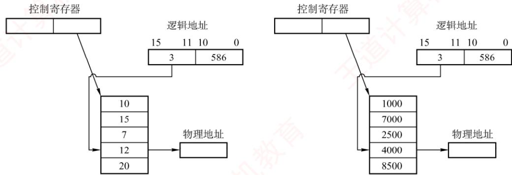

1）指出这两种变换各属于何种存储管理。

2）计算出这两种变换所对应的物理地址。

04. 在一个段式存储管理系统中，其段表见下表A。试求表B中的逻辑地址所对应的物理地址。

表A 段表
<table><tr><td rowspan=1 colspan=1>段号</td><td rowspan=1 colspan=1>内存始址</td><td rowspan=1 colspan=1>段长</td></tr><tr><td rowspan=1 colspan=1>0</td><td rowspan=1 colspan=1>210</td><td rowspan=1 colspan=1>500</td></tr><tr><td rowspan=1 colspan=1>1</td><td rowspan=1 colspan=1>2350</td><td rowspan=1 colspan=1>20</td></tr><tr><td rowspan=1 colspan=1>2</td><td rowspan=1 colspan=1>100</td><td rowspan=1 colspan=1>90</td></tr><tr><td rowspan=1 colspan=1>3</td><td rowspan=1 colspan=1>1350</td><td rowspan=1 colspan=1>590</td></tr><tr><td rowspan=1 colspan=1>4</td><td rowspan=1 colspan=1>1938</td><td rowspan=1 colspan=1>95</td></tr></table>

表B 逻辑地址
<table><tr><td rowspan=1 colspan=1>1     段号</td><td rowspan=1 colspan=1>段内位移</td></tr><tr><td rowspan=1 colspan=1>0</td><td rowspan=1 colspan=1>430</td></tr><tr><td rowspan=1 colspan=1>1</td><td rowspan=1 colspan=1>10</td></tr><tr><td rowspan=1 colspan=1>2</td><td rowspan=1 colspan=1>500</td></tr><tr><td rowspan=1 colspan=1>3</td><td rowspan=1 colspan=1>400</td></tr><tr><td rowspan=1 colspan=1>4</td><td rowspan=1 colspan=1>112</td></tr><tr><td rowspan=1 colspan=1>5</td><td rowspan=1 colspan=1>32</td></tr></table>

05. 页式存储管理允许用户的编程空间为 32个页面（每页1KB），主存为16KB。如有一用户程序为10页长，且某个时刻该用户程序页表见下表。

<table><tr><td rowspan=1 colspan=1>逻辑页号</td><td rowspan=1 colspan=1>物理块号</td></tr><tr><td rowspan=1 colspan=1>0</td><td rowspan=1 colspan=1>8</td></tr><tr><td rowspan=1 colspan=1>1</td><td rowspan=1 colspan=1>7</td></tr><tr><td rowspan=1 colspan=1>2</td><td rowspan=1 colspan=1>4</td></tr><tr><td rowspan=1 colspan=1>3</td><td rowspan=1 colspan=1>10</td></tr></table>

若分别遇到三个逻辑地址 0AC5H, 1AC5H,3AC5H处的操作，计算并说明存储管理系统将如何处理。

06. 在某页式管理系统中，假定主存为64KB，分成16个页框，页框号为0,1,2,…，15。设某进程有4页，其页号为0,1,2,3，被分别装入主存的第9,0,1,14号页框。

1）该进程的总长度是多大？

2）写出该进程每页在主存中的始址。

3）若给出逻辑地址(0,0),(1,72),(2,1023),(3,99)，请计算出相应的内存地址（括号内的第一个数为十进制页号，第二个数为十进制页内地址)。

07.某操作系统存储器采用页式存储管理，页面大小为64B，假定一进程的代码段的长度为702B，页表见表A，该进程在快表中的页表见表B。现进程有如下访问序列：其逻辑地址为八进制的0105,0217,0567,01120,02500。试问给定的这些地址能否进行转换？

表A 进程页表
<table><tr><td rowspan=1 colspan=1>页 号</td><td rowspan=1 colspan=1>页帧号</td><td rowspan=1 colspan=1>页 号</td><td rowspan=1 colspan=1>页帧号</td></tr><tr><td rowspan=1 colspan=1>0</td><td rowspan=1 colspan=1>FO</td><td rowspan=1 colspan=1>6</td><td rowspan=1 colspan=1>F6</td></tr><tr><td rowspan=1 colspan=1>1</td><td rowspan=1 colspan=1>F1</td><td rowspan=1 colspan=1>7</td><td rowspan=1 colspan=1>F7</td></tr><tr><td rowspan=1 colspan=1>2</td><td rowspan=1 colspan=1>F2</td><td rowspan=1 colspan=1>8</td><td rowspan=1 colspan=1>F8</td></tr><tr><td rowspan=1 colspan=1>3</td><td rowspan=1 colspan=1>F3</td><td rowspan=1 colspan=1>9</td><td rowspan=1 colspan=1>F9</td></tr><tr><td rowspan=1 colspan=1>4</td><td rowspan=1 colspan=1>F4</td><td rowspan=1 colspan=1>10</td><td rowspan=1 colspan=1>F10</td></tr><tr><td rowspan=1 colspan=1>5</td><td rowspan=1 colspan=1>F5</td><td rowspan=1 colspan=1>6</td><td rowspan=1 colspan=1>F6</td></tr></table>

表B 快表
<table><tr><td rowspan=1 colspan=1>页 号</td><td rowspan=1 colspan=1>页帧号</td></tr><tr><td rowspan=1 colspan=1>0</td><td rowspan=1 colspan=1>F0</td></tr><tr><td rowspan=1 colspan=1>1</td><td rowspan=1 colspan=1>F1</td></tr><tr><td rowspan=1 colspan=1>2</td><td rowspan=1 colspan=1>F2</td></tr><tr><td rowspan=1 colspan=1>3</td><td rowspan=1 colspan=1>F3</td></tr><tr><td rowspan=1 colspan=1>4</td><td rowspan=1 colspan=1>F4</td></tr></table>

08.在某页式系统中，假设在查找主存页表的过程中不发生缺页的情况，请回答：

1）若对主存的一次存取需1.5μs，问实现一次页面访问时存取时间是多少？

2）若系统有快表且其平均命中率为85%，而页表项在快表中的查找时间可忽略不计，试问此时的存取时间为多少？

09.在页式、段式和段页式存储管理中，假设不发生缺页异常，当访问一条指令或数据时，各需要访问内存几次？其过程如何？假设一个页式存储系统具有快表，多数活动页表项都可以存在其中。若页表存放在内存中，内存访问时间是1μs，检索快表的时间为0.2μs，若快表的命中率是85%，则有效存取时间是多少？若快表的命中率为50%，则有效存取时间是多少？

10. 在一个分页存储管理系统中，地址空间分页（每页1KB），物理空间分块，设主存总容量是256KB，描述主存分配情况的位示图如下图所示（0表示未分配，1表示已分配），此时作业调度程序选中一个长为5.2KB的作业投入内存。试问：

1）为该作业分配内存后（分配内存时，首先分配低地址的内存空间），请填写该作业的页表内容。

2）页式存储管理有无内存碎片存在？若有，会存在哪种内存碎片？为该作业分配内存后，会产生内存碎片吗？若产生，则大小为多少？

3）假设一个64MB内存容量的计算机，采用页式存储管理（页面大小为4KB），内存分配采用位示图方式管理，请问位示图将占用多大的内存？

<table><tr><td rowspan=1 colspan=1>1 1 1 1 1 11 1 1 1 11 11 11 111 1</td></tr><tr><td rowspan=1 colspan=1>1 1 1 1 1 00 1 1 1 1 1 0 0 0 1 1</td></tr><tr><td rowspan=1 colspan=1>1 1 0 0 0 0 0 0 0 0 0 0 1 1 1 1</td></tr><tr><td rowspan=1 colspan=1>1 1 1 1 1 0 0 0 0 1 0 0 0 1 0 1</td></tr><tr><td rowspan=1 colspan=1>0 1 0 1 1 0 1 1 0 1 1 0 1 1 0 1</td></tr><tr><td rowspan=1 colspan=1>1 0 0 0 0 0 0 0 0 0 0 0 0 0 0 0</td></tr><tr><td rowspan=1 colspan=1>0 1 1 1 1 1 1 00 0 0 0 0 0 0 0 0</td></tr><tr><td rowspan=1 colspan=1>1 ………</td></tr><tr><td rowspan=1 colspan=1></td></tr></table>

<table><tr><td rowspan=1 colspan=1>页号</td><td rowspan=1 colspan=1>块号（从0开始编址）</td></tr><tr><td rowspan=1 colspan=1></td><td rowspan=1 colspan=1></td></tr><tr><td rowspan=1 colspan=1></td><td rowspan=1 colspan=1></td></tr><tr><td rowspan=1 colspan=1></td><td rowspan=1 colspan=1></td></tr><tr><td rowspan=1 colspan=1></td><td rowspan=1 colspan=1></td></tr><tr><td rowspan=1 colspan=1></td><td rowspan=1 colspan=1></td></tr></table>

11. 【2013统考真题】某计算机主存按字节编址，逻辑地址和物理地址都是32位，页表项大小为4B。请回答下列问题： XTA

1）若使用一级页表的分页存储管理方式，逻辑地址结构为

<table><tr><td>页号（20位）</td><td>页内偏移量（12位）</td></tr></table>

则页的大小是多少字节？页表最大占用多少字节？

2）若使用二级页表的分页存储管理方式，逻辑地址结构为

<table><tr><td>页目录号（10位）</td><td>页表索引（10位）</td><td>页内偏移量（12位）</td></tr><tr><td></td><td></td><td></td></tr></table>

设逻辑地址为LA，请分别给出其对应的页目录号和页表索引的表达式。

3）采用1）中的分页存储管理方式，一个代码段的起始逻辑地址为00008000H，其长度为8KB，被装载到从物理地址0090 0000H开始的连续主存空间中。页表从主存00200000H开始的物理地址处连续存放，如下图所示（地址大小自下向上递增）。请计算出该代码段对应的两个页表项的物理地址、这两个页表项中的页框号，以及代码页面2的起始物理地址。 Y

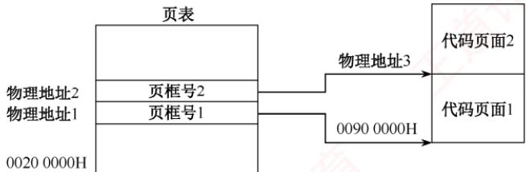

## 3.1.8 答案与解析

## 一、单项选择题

## 01. D

内存的物理存取速度是由硬件决定的，而不是由操作系统管理的。操作系统可以通过虚拟内

存、缓存等技术提高数据的逻辑存取速度，但不能改变内存的物理特性。

## 02. B

内存保护需要硬件和软件的配合，不能仅靠操作系统来实现。通常需要在CPU中设置上下限寄存器、重定位寄存器、界地址寄存器等寄存器，以记录进程在内存中的合法范围。

## 03. C

内存保护是内存管理的一部分，是操作系统的任务，但是出于安全性和效率考虑，必须由硬件实现，所以需要操作系统和硬件机构的合作来完成。

## 04. C

硬件地址变换机构一般用于动态重定位的情况。而单一连续分配和固定分区分配采用的是静态重定位，不需要硬件地址变换机构，而由装入程序或操作系统来完成地址转换。因此，只有页式存储管理、动态分区分配和页式虚拟存储管理需要硬件地址变换机构。

## 05. B

在固定分区分配中，每个分区的大小是在系统启动时就确定了的，不会随着作业的长度而变化。分区的大小可以不同，也可以相同，但是一旦确定，就不会改变。

## 06. D

将上邻空闲区、下邻空闲区和回收区合并为一个空闲区，因此空闲区数反而减少了一个。而仅有上邻空闲区或下邻空闲区时，空闲区数并不减少。

## 07. C

最佳适配算法是指，每次为作业分配内存空间时，总是找到能满足空间大小需要的最小空闲分区给作业，可以产生最小的内存空闲分区。从图中可以看出应选择大小为60KB的空闲分区，其首地址为330K。

## 08. B

段号为2，其对应的首地址为480K，段长度为20K，大于154，所以逻辑地址(2,154)对应的物理地址为 480K + 154。

## 09. D

静态装入是指在编程阶段就把物理地址计算好。可重定位是指在装入时把逻辑地址转换成物理地址，但装入后不能改变。动态重定位是指在执行时再决定装入的地址并装入，装入后有可能换出，所以同一个模块在内存中的物理地址是可能改变的，在作业运行过程中，当执行到一条访存指令时，再把逻辑地址转换为主存的物理地址，实际上是通过地址变换机构实现的。

## 10. B

动态重定位允许程序在内存中移动，系统中只有一个重定位寄存器，每次切换进程时，都要保存和恢复该寄存器的值，不会为每个进程分配一个重定位寄存器，选项B错误。

## 11. C

可重定位装入程序在重定位的过程中执行，重定位寄存器（也称基址寄存器）用于存放进程的基地址，地址变换机构用于将指令中的逻辑地址与重定位寄存器中的基地址相加得到物理地址。目标程序是装入内存后执行的，动态重定位不依赖于目标程序。

## 12. B

动态重定位可以在程序加载或运行时，根据程序的实际存放位置，对程序中的地址进行修改，使其与物理地址相符。静态重定位只能在程序加载时进行一次地址修改，若程序在运行过程中改变了存放位置，则会出错。动态分配和静态分配是指内存的分配方式，与重定位无关。

## 13. A

静态重定位只能对程序中的地址进行一次修改，而不能动态调整。在固定分区方式中，作业

装入内存后位置不会改变，且作业在内存中占用连续的存储空间，因此可以采用静态重定位。其余三种方案均可能在运行过程中改变程序在内存中的位置，不能采用静态重定位。

## 14. A

为使地址转换不影响到指令的执行速度，必须有硬件地址变换结构的支持，即需在系统中增设一个重定位寄存器，用它来存放程序（数据）在内存中的始址。在执行程序或访问数据时，真正访问的内存地址由相对地址与重定位寄存器中的地址相加而成，这时将始址存入重定位寄存器，之后的地址访问即可通过硬件变换实现。因为系统处理器在同一时刻只能执行一条指令或访问数据，所以为每道程序（数据）设置一个寄存器没有必要（同时也不现实，因为寄存器是很昂贵的硬件，而且程序的道数是无法预估的），而只需在切换程序执行时重置寄存器内容。

## 15. A

在可变分区管理中，回收空闲区时采用拼接技术对空闲区进行合并。

## 16. B

逻辑地址4097对应的页号为4097/4096=1，页内偏移量为4097%4096=1。由页表可知，页号1对应的页框号也是1，页大小为4KB，因此转换成的物理地址为1×4K+1=4097。

## 17.B

分页式和段页式存储管理均以固定大小的页框为单位分配内存，进程末页通常无法填满页框，从而产生内部碎片；固定分区式因分区大小固定，当进程小于分区时，剩余空间同样形成内部碎片。而分段式按逻辑段动态分配内存，为每个段分配恰好满足其长度的连续空间，不会因分配粒度固定而导致空间浪费，因此不产生内部碎片（但可能因段间空隙产生外部碎片）。

## 18. B

多进程的执行通过内存保护实现互不干扰，如页式管理中有页地址越界保护，段式管理中有段地址越界保护。

## 19. C

绝对装入在编译时直接将程序的逻辑地址转换成物理地址：静态重定位虽然允许将装入模块装入内存的任何位置，但不允许进程在内存中移动；动态重定位在程序执行时才产生真正的物理地址，它允许进程在内存中移动，但需要一个重定位寄存器的支持。 XIA

## 20. A

首次适应法从空闲区链的链首开始顺序查找，找到一个大小满足要求的空闲分区，根据作业的大小，从该分区中划出一块内存空间分配给请求者，余下的空闲分区仍然留在空闲链中。这种算法不需要对空闲区链进行排序，只需按地址递增的顺序链接即可。

## 21. A

最佳适应算法要求从剩余的空闲分区中选出最小且满足存储要求的分区，空闲区应按长度递增登记在空闲区表中。

## 22. C

首次适应算法的空闲分区按地址递增的次序排列。

## 23. D

基于顺序搜索的分配算法有首次适应算法、循环首次适应算法、最佳适应算法和最坏适应算法；基于索引搜索的分配算法有快速适应算法、伙伴系统和哈希算法。

## 24. A

连续分配要求为进程分配连续内存，易产生内部碎片和外部碎片，导致空闲内存无法有效利用，内存利用率较低。页式管理采用离散分配方式，将内存和进程地址空间划分为相等大小的页

框与页面，分配时无须物理连续，可充分利用零散空闲块，显著提升内存利用率。

## 25. D

页表是由操作系统在程序装入内存时建立的，根据进程的逻辑地址空间和物理地址空间的对应关系，为每个页设置一个页表项，记录其对应的物理页框号、有效位等信息。

## 26. A

在段式存储管理中，若有些段可被多个进程共享，则可用一个单独的共享段表来描述这些段，而不需要在每个进程的段表中都保存一份。共享段表的作用是实现多个进程共享同一段代码或数据，这样既能节省内存空间，又能便于实现对共享段的更新和维护。多个进程共享同一段物理内存空间并不需要用到共享段表，只需在各自的段表中指向相同的物理地址即可。多个进程共享同一段逻辑地址空间是不可能的，因为每个进程的逻辑地址空间都是相互独立的。在段式存储管理中，并不要求各个进程中相同功能的段必须有相同的段号。

## 27. C

不管进程有多少个段，系统都为每个进程建立一张段表，每个段表项对应进程中的一段。

## 28. C

页表和段表同样存储在内存中，系统提供给用户的物理地址空间为总空间大小减去页表或段表的长度。因为页表和段表的长度不能确定，所以提供给用户的物理地址空间大小也不能确定。

## 29. B

分页管理是在硬件和操作系统层面实现的，对用户、编译系统、装配程序等上层是不可见的。

## 30. D

页表的功能由一组专门的存储器实现，其始址放在页表基址寄存器（PTBR）中。这样才能满足在地址变换时能够较快地完成逻辑地址和物理地址之间的转换。

## 31. C

在页式存储管理中，CPU将虚拟地址分解为页号和页内偏移量，然后通过硬件中的页表寄存器和内存管理单元（MMU），将页号转换为物理地址，再拼接上页内偏移量，得到最终的内存物理地址。这一过程是由硬件自动完成的，不需要操作系统或其他软件的于预。

## 32. B

分段是指在用户编程时，将程序按照逻辑划分为几个逻辑段。

## 33. A

程序的动态链接与程序的逻辑结构相关，分段存储管理将程序按照逻辑段进行划分，因此有利于其动态链接。其他的内存管理方式与程序的逻辑结构无关。

## 34. ①B、②C

编译后一个目标程序所限定的地址范围称为该作业的逻辑地址空间。换句话说，地址空间仅指程序用来访问信息所用的一系列地址单元的集合。这些单元的编号称为逻辑地址。通常，编译地址都是相对始址“0”的，因此逻辑地址也称相对地址。

## 35. D

可重入程序主要是通过共享来使用同一块存储空间的，或通过动态链接的方式将所需的程序段映射到相关进程中去，其优点是减少了对程序段的调入/调出，因此减少了对换数量。

## 36. A

实现分页、分段和段页式存储管理需要特定的数据结构支持，如页表、段表等。为了提高性能，还需要硬件提供快存和地址加法器等，代价高。分区存储管理是满足多道程序设计的最简单的存储管理方案，特别适合嵌入式等微型设备。

## 37. A

动态分区时，在系统启动后，除操作系统占据一部分内存外，其余所有内存空间是一个大空闲区，称为自由空间。若作业申请内存，则从空闲区中划出一个与作业需求量相适应的分区分配给该作业，将作业创建为进程，在作业运行完毕后，再收回释放的分区。

## 38. C

页面较大时，页表项较少，但页内碎片较大：页面较小时，页内碎片较小，但负表项增多。此外，页面大小直接影响磁盘访问次数：页面过小会导致缺页频繁，大幅增加I/O次数和总访问时间；页面过大会加剧内部碎片。因此，页面大小需要在页表开销、内存浪费与I/O效率之间权衡。

## 39. B

页式管理中很重要的一个问题是页面大小如何确定。确定页面大小有很多因素，如进程的平均大小、页表占用的长度等。而一旦确定，所有的页面就是等长的（一般取2的整数幂倍），以便易于系统管理。

## 40. A

段式存储管理按程序逻辑结构划分段，段名与段长由用户定义，便于编程；各段作为独立逻辑单位，支持共享、按段保护、动态增长（如数据段扩展）和动态链接（运行时按需加载）。而提高内存利用率并非段式管理的目标：因其段长不固定，易产生外部碎片，内存利用率通常较低。高效利用内存恰好是分页式管理的优势，通过固定页框离散分配，可有效消除外部碎片。

## 41. B

这里是指主存的访问，不是主存的分配。对主存的访问是以字节或字为单位的。例如，在页式管理中，不仅要知道块号，还要知道页内偏移量。

## 42. A

单用户连续分配管理方式只适用于单用户、单任务的操作系统，不适用于多道程序设计。

## 43. A

在分页存储管理中，逻辑地址分配是按页为单位进行分配的，而主存的分配即物理地址分配是以内存块为单位分配的。

## 44. C

在段式分配中，取一次数据时先从内存查找段表，再拼成物理地址后访问内存，共需要2次内存访问。 xK

## 45. B

在段页式分配中，取一次数据时先从内存查找段表，再访问内存查找相应的页表，最后拼成物理地址后访问内存，共需要3次内存访问。 X

## 46. B

虽然段页式存储管理的内存地址结构分为段号、段内页号和页内地址三部分，但分页是操作系统的行为，用户不用指出页内偏移量的位数；而分段之间是独立的，且段长不定长，需指出段号所占的位数。因此，当采用段页式存储管理时，内存地址结构仍然是二维的。而在分页存储管理中，作业地址空间是一维的，即单一的线性地址空间，程序员只需要一个整数来表示地址。简言之，确定一个地址需要几个参数，作业地址空间就是几维的。

## 47. C

段页式系统中，进程首先划分为段，每段再进一步划分为页。

## 48. A

在多个进程并发执行时，所有进程的页表大多数驻留在内存中，在系统中只设置一个页表寄存器（PTR），它存放页表在内存中的始址和长度。平时，进程未执行时，页表的始址和页表长度

存放在本进程的PCB中，当调度到某进程时，才将这两个数据装入页表寄存器中。每个进程都有一个单独的逻辑地址，有一张属于自己的页表。

## 49. A

在分段存储管理方式中，以段为单位进行分配，每段是一个连续存储区，每段不一定等长，段与段之间可连续，也可不连续。 自

## 50. D

分段方式对低级语言程序员和编译器是可见的，因为低级语言程序员可以按照程序的逻辑结构划分段，并给每个段命名；编译器也需要对各个段生成逻辑地址。

## 51. B

段页式存储管理兼有页式管理和段式管理的优点，采用分段方法来分配和管理用户地址空间，采用分页方法来管理物理存储空间。但它的开销要比段式和页式管理的开销大。

## 52. D

只要是固定的分配就会产生内部碎片，其余的都会产生外部碎片。若固定和不固定同时存在（例如段页式），则仍视为固定。分段虚拟存储管理：每段的长度都不一样（对应不固定），所以会产生外部碎片。分页虚拟存储管理：每页的长度都一样（对应固定），所以会产生内部碎片。段页式分区管理：既有固定，又有不固定，以固定为主，所以会有内部碎片。固定式分区管理：很明显固定，会产生内部碎片。综上分析，说法Ⅱ、Ⅲ、IⅣ会产生内部碎片。

## 53. C

说法Ⅰ正确：关闭TLB后，每当访问一条指令或存取一个操作数时都要先访问页表(内存中)，得到物理地址后，再访问一次内存进行相应操作。说法Ⅱ错误：记住，凡是分区固定的都会产生内部碎片，而无外部碎片。说法Ⅲ错误：页式存储管理对于用户是透明的。说法IV错误：静态重定位是在程序运行之前由装配程序完成的，必须分配其要求的全部连续内存空间。而页式存储管理方案是将程序离散地分成若于页（块），从而可以将程序装入不连续的内存空间，显然静态重定位不能满足其要求。

## 54. B

地址结构长18位，所以主存的最大容量为 $2^{18} = 256\mathrm{KB}$ ；页内偏移量占11位，所以页面大小为 $2 ^ { 1 1 }   =   2 0 4 8 \mathrm { B }$ ；页号占7位，所以主存页数为 $2 ^ { 7 }   =   1 2 8$ 个。该指令的相对地址为1500，小于一个页面的大小，所以该指令存放在2号物理块中，物理地址为 $2 \times 2048 + 1500 = 5596$ ，指令数据的存放地址为2500，大于一个页面的大小，所以指令数据存放在3号物理块中。

## 55. D

主存容量为1MB，分为256个页框，页框大小为 $1  MB /256 = 4  KB$ ，作业中的2号页被分配到主存的1号页框中，因此其在主存中的始址为 $1 \times 4096 = 4096$ a

## 56. D

分段是指将逻辑地址空间划分为若于不等长的单元，称为段。段长由用户根据信息的性质和逻辑结构决定，而不由系统决定，引入分段的主要目的是更好地满足用户的需求，实现程序的模块化和保护。实现离散分配并提高内存利用率是引入分页的主要目的。

## 57. C

逻辑地址空间大小为 $2 5 6 \mathrm { T B } = 2 ^ { 4 8 } \mathrm { B }$ ，逻辑地址有48位，页面大小为 $4 \mathbf { K } \mathbf { B } = 2 ^ { 1 2 } \mathbf { B }$ ，页内偏移量2占12位，剩余36位表示页表索引，页表项大小为8B，一个页面能存放 $4\mathrm{K}\mathrm{B}{\div}8=2^{9}$ 个页表项，因此可用9位来表示某一级的页表索引， $36 \div 9 = 4$ ，所以共需要采用4级页表。

## 58. A

让不同页表的页表项指向同一个页帧，可以共享该页帧的代码，若代码是可重入的（如编辑软件、编译软件等），则这种方法可以节省大量的内存空间。实现内存“复制”操作时，不需要将页面的内容逐字节复制，而只需将页表中指向该页面的指针复制到目的地址的页表项中。越界保护是通过界地址寄存器实现的，说法Ⅲ是干扰项。当多个进程需要通信时，可以采用共享内存的方式，它们是通过让各个进程页表的页表项指向相同的页帧实现的。

## 59. A

每个进程都拥有自己独立的进程空间，若一个进程在运行时所产生的地址在其地址空间之外，则发生地址越界，因此需要进行界地址保护，即当程序要访问某个内存单元时，由硬件检查是否允许，若允许，则执行，否则产生地址越界中断。

## 60. C

分段存储管理的逻辑地址分为段号和位移量两部分，段内位移的最大值就是最大段长。地址长度为32位，段号占8位，因此位移量占 $3 2 - 8 = 2 4$ 位，因此最大段长为 $2 ^ { 2 4 } \mathrm { B }$ 0 XV

## 61. B

最佳适配算法是指每次为作业分配内存空间时，总是找到能满足空间大小需要的最小空闲分区给作业，可以产生最小的内存空闲分区。下图显示了这个过程的主存空间变化。

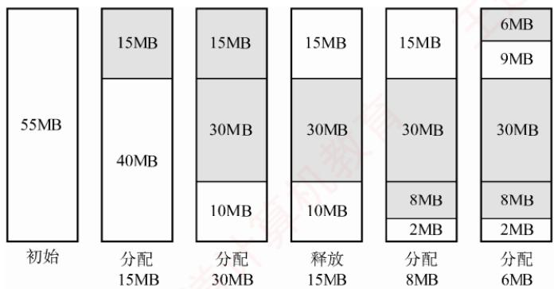

图中，灰色部分为分配出去的空间，白色部分为空闲区。这样，容易发现，此时主存中最大空闲分区的大小为9MB。

## 62. B

页大小为 $2 ^ { 1 0 } \mathbf { B }$ ，所以页内偏移量占10位，又因为页表项大小为2B，一页可以存放 $2 ^ { 9 }$ 个页表项，所以页号占9位，根据逻辑地址空间共有 $2 ^ { 1 6 }$ 页可知，页目录号加页号共占16位，页目录号占7位，所以页目录表中包含表项的个数至少是 $2 ^ { 7 }   = 1 2 8$

## 63. C

编译后的程序需要经过链接才能装载，而链接后形成的目标程序中的地址也就是逻辑地址。以C语言为例：C程序经过预处理→编译→汇编→链接产生了可执行文件，其中链接的前一步是产生可重定位的二进制目标文件。C语言采用源文件独立编译的方法，如程序main.c,file1.c,file2.c,file1.h,file2.h在链接的前一步生成了main.o, file1.o, file2.o,这些目标模块的逻辑地址都从0开始，但只是相对于该模块的逻辑地址。链接器将这三个文件、libc和其库文件链接成一个可执行文件，从而形成整个程序的完整逻辑地址空间。

例如，file1.o的逻辑地址为0～1023，main.o的逻辑地址为0～1023，假设链接时将file1.o链接在main.o之后，则链接之后file1.o对应的逻辑地址应为1024～2047。

## 64. D

多级页表不仅不会加快地址的变换速度，还会因为增加更多的查表过程，使地址变换速度减慢：也不会减少缺页中断的次数，相反，若访问过程中多级的页表都不在内存中，则会大大增加缺页的

次数，并不会减少页表项所占的字节数，而多级页表能够减少页表所占的连续内存空间，即当页表太大时，将页表再分级，把每张页表控制在一页之内，减少页表所占的连续内存空间。

## 65. D

分段系统的逻辑地址A到物理地址E之间的地址变换过程如图3.15所示。

①从逻辑地址A中取出前几位为段号S，后几位为段内偏移量W，注意段式存储管理的题目中，逻辑地址一般以二进制数给出，而页式存储管理的题目中，逻辑地址一般以十进制数给出，读者要注意具体问题具体分析。

②比较段号S和段表长度M，若 $S { \geqslant } M ,$ 则产生越界异常，否则继续执行。

③ 在段表中查询段号对应的段表项，段号 S对应的段表项地址 = 段表始址F + 段号 S×段表项长度。取出段表项中该段的段长C，若 $W { \geqslant } C ,$ 则产生越界中断，否则继续执行。

④取出段表项中该段的基址b，计算 $E = b + W$ ，用得到的物理地址E去访问内存。

题目中段号为2的段长为300，小于段内地址400，因此发生越界异常，选项D正确。

## 66. B

回收始址为60K、大小为140KB的分区时，它与表中第一个分区和第四个分区合并，成为始址为20K、大小为380KB的分区，剩余3个空闲分区。在回收内存后，算法会对空闲分区链按分区大小由小到大进行排序，表中的第二个分区排第一。

## 67. B

段的共享是通过两个作业的段表中相应表项指向被共享的段的同一个物理副本来实现的，因此在内存中仅保存一份段S的内容，选项A正确。段S对进程 $ P _{1} 、  P _{2}$ 来说，使用位置可能不同，所以在不同进程中的逻辑段号可能不同，选项B错误。段表项存放的是段的物理地址（包括段始址和段长度），对共享段S来说物理地址唯一，选项C正确。为了保证进程可以顺利使用段S，段S必须确保在没有任何进程使用它（可在段表项中设置共享进程计数）后才能被删除，选项D正确。

## 68. A

题中给出的是十六进制地址，首先将它转化为二进制地址，然后用二进制地址去匹配题中对应的地址结构。转换为二进制地址和地址结构的对应关系如下图所示。

$$
2050\;1225\; H  = \underbrace{0010\;0000\;01}_{ 页目录号 } \underbrace{01\;0000\;0001}_{ 页号 } \underbrace{0010\;0010\;0101}_{ 页内偏移 }
$$

前10位、11～20位、21～32位分别对应页目录号、页号和页内偏移。把页目录号、页号单独拿出，转换为十六进制时缺少的位数在高位补零，000010000001，0001 0000 0001分别对应081H，101H，选项A正确。

## 69. C

最佳适应算法总是匹配与当前大小要求最接近的空闲分区，但是大多数情况下空闲分区的大小不可能完全和当前要求的大小相等，几乎每次分配内存都会产生很小的难以利用的内存块，所以最佳适应算法最容易产生最多的内存碎片。

## 70. B

在多级页表中，页表基址寄存器存放的是顶级页表的起始物理地址，所以存放的是一级页表的起始物理地址。 机

## 71. C

进程R和S共享数据data，说明它们都映射了同一个共享内存段，于是这个段在物理内存中的位置（页框号）必然相同，但这两个段在不同进程的地址空间中的位置（页号）可以不同。因

此，p1和p2不一定相等，f1和f2一定相等。

## 72. A

伙伴算法在回收一个大小为 $2 ^ { i }$ 的空闲分区时，会检查其伙伴分区（地址相邻、大小同为 $2 ^ { i }$ 的分区）是否也空闲。若是，则将两者合并为一个大小为 $2 ^ { i + 1 }$ 的空闲分区；随后，继续检查新生成的 $2 ^ { i + 1 }$ 分区是否存在同大小的伙伴，若有，则再次合并，以此类推。因此，伙伴算法在一次回收过程中可能触发多次合并，但每次合并仅发生在两个大小相等且互为伙伴的空闲分区之间。

## 二、综合应用题

## 01. 【解答】

采用首次适应算法时，96KB大小的作业进入4号空闲分区，20KB大小的作业进入1号空闲分区，这时空闲分区如下表所示。

<table><tr><td rowspan=1 colspan=1>分区号</td><td rowspan=1 colspan=1>大小</td><td rowspan=1 colspan=1>始址</td></tr><tr><td rowspan=1 colspan=1>1</td><td rowspan=1 colspan=1>12KB</td><td rowspan=1 colspan=1>120K</td></tr><tr><td rowspan=1 colspan=1>2</td><td rowspan=1 colspan=1>10KB</td><td rowspan=1 colspan=1>150K</td></tr><tr><td rowspan=1 colspan=1>3</td><td rowspan=1 colspan=1>5KB</td><td rowspan=1 colspan=1>200K</td></tr><tr><td rowspan=1 colspan=1>4</td><td rowspan=1 colspan=1>122KB</td><td rowspan=1 colspan=1>316K</td></tr><tr><td rowspan=1 colspan=1>5</td><td rowspan=1 colspan=1>96KB</td><td rowspan=1 colspan=1>530K</td></tr></table>

此时再无空闲分区可以满足200KB大小的作业，所以该作业序列请求无法满足。

采用最佳适应算法时，作业序列分别进入5,1,4号空闲分区，可以满足其请求。分配处理之后的空闲分区表见下表：

<table><tr><td rowspan=1 colspan=1>分区号</td><td rowspan=1 colspan=1>大小</td><td rowspan=1 colspan=1>始址</td></tr><tr><td rowspan=1 colspan=1>1</td><td rowspan=1 colspan=1>12KB</td><td rowspan=1 colspan=1>120K</td></tr><tr><td rowspan=1 colspan=1>2</td><td rowspan=1 colspan=1>10KB</td><td rowspan=1 colspan=1>150K</td></tr><tr><td rowspan=1 colspan=1>3</td><td rowspan=1 colspan=1>5KB</td><td rowspan=1 colspan=1>200K</td></tr><tr><td rowspan=1 colspan=1>4</td><td rowspan=1 colspan=1>18KB</td><td rowspan=1 colspan=1>420K</td></tr></table>

## 02. 【解答】

1）最先适配的内存分配情况如下图中的(a)所示。

$$
\begin{array}{c|c}0 KB  &  \\\hline150 KB  &  \\\hline200 KB  &  \\\hline200 KB  &  \\\hline300 KB  &  \\\hline400 KB  &  \\\hline&  \\512 KB  &  \\\hline&  \\\hline&  \\\hline&  \\600 KB  &  \\\hline&  \\\hline&  \\\hline&  \\\hline&  \\600 KB  &  \\\hline&  \\\hline&  \\\hline&  \\\hline&  \\600 KB  &  \\\hline&  \\\hline&  \\\hline&  \\600KB  &  \\\hline&  \\\hline&  \\600KB  &  \\\hline&  \\\hline&  \\600KB  &  \\\hline&  \\600KB  &  \\\hline&  \\600KB  &  \\\hline&  \\600KB  &  \\\hline&  \\600KB  &  \\\hline&  \\600KB  &  \\\hline&  \\601111111111111111111111111111111111111111111111111111111111111111111111111111111111111111111111111111111111111111111111111111111111111111111111111111111111111111111111111111111111111111111111111111111111111111111111111111111111111111111111111111111111111111111111111111111111111111111111111111111111111111111111111111111111111111111111111111111111111111111111111111111111111111111111111111111111111111111111111111111111111111111111111111111111111111111111111111111111111111111111111111111111111111111111111111111111111111111111111111111111111111111111111111111111111111111111111111111111111111111111111111111111111111111111111111111111111111111111111111111111111111111111111111111111111111111111111111111111111111111111111111111111111111111111111111111111111111111111111111111111111111111111111111111111111111111111111111111111111111111111111111111111111111111111111111111111111111111111111111111111111111111111111111111111111111111111111111111111111111111111111111111111111111111111111111111111111111111111111111111111111111111111111111111111111111111111111111111111111111111111111111111111111111111111111111111111111111111111111111111111111111111111111111111111111111111111111111111111111111111111111111111111111111111111111111111111111111111111 \end{array}
$$

(a)
<table><tr><td>0KB</td><td rowspan="2">reg150KB</td></tr><tr><td>150KB</td></tr><tr><td>240KB</td><td>reg90KB</td></tr><tr><td>300KB</td><td></td></tr><tr><td rowspan="2">400KB 450KB</td><td>reg100KB</td></tr><tr><td>reg50KB</td></tr></table>

(b)

内存中的空块为：

第一块：始址290K，大小10KB；第二块：始址400K，大小112KB。

2）最佳适配的内存分配情况如上图中的(b)所示。内存中的空块为：

第一块：始址240K，大小60KB；第二块：超始地址450K，大小62KB。

3）若随后又要申请80KB，则最先适配算法可以分配成功，而最佳适配算法则没有足够大的

空闲区分配。这说明最先适配算法尽可能地使用了低地址部分的空闲区域，留下了高地址部分的大的空闲区，更有可能满足进程的申请。

## 03. 【解答】

1）由题图所示的逻辑地址结构可知：页或段的最大个数为 $2 ^ { 5 } = 3 2$ 。若左图是段式管理，则段始址12加上偏移量586，远超第1段的段始址15，超过第4段的段始址20，所以左图是页式变换，而右图满足段式变换。对于页式管理，由逻辑地址的位移量位数可知，一页的大小为2KB。

2）对图中的页式地址变换，其物理地址为 $12 \times 2048 + 586 = 25162$ ；对图中的段式地址变换，其物理地址为 $4000+586=4586$ 0

## 04. 【解答】

1）由段表知，第0段内存始址为210，段长为500，因此逻辑地址(0,430)是合法地址，对应的物理地址为 $210 + 430 = 640$

2）由段表知，第1段内存始址为2350，段长为20，因此逻辑地址(1,10)是合法地址，对应的物理地址为 $2350+10=2360$

3）由段表知，第2段内存始址为100，段长为90，逻辑地址(2,500)的段内位移500超过了段长，因此为非法地址。

4）由段表知，第3段内存始址为1350，段长为590，因此逻辑地址(3,400)是合法地址，对应的物理地址为 $1350+400=1750$

5）由段表知，第4段内存始址为1938，段长为95，逻辑地址(4,112)的段内位移112超过了段长，因此为非法地址。

6）由段表知，不存在第5段，因此逻辑地址(5,32)为非法地址。

## 05.【解答】

页面大小为1KB，所以低10位为页内偏移地址；用户编程空间为32个页面，即逻辑地址高5位为虚页号；主存为16个页面，即物理地址高4位为物理块号。

逻辑地址 0AC5H转换为二进制表示是000 10101100 0101B，虚页号为2(00010B)，映射至物理块号4，因此系统访问物理地址12C5H(01 00101100 0101B)。

逻辑地址1AC5H转换为二进制表示是00110101100 0101B，虚页号为6(00110B)，不在页面映射表中，会产生缺页中断，系统进行缺页中断处理。

逻辑地址3AC5H转换为二进制表示是011101011000101B，页号为14，而该用户程序只有10页，因此系统产生越界中断。 KEON

## 注意

当将十六进制地址转换为二进制地址时，我们可能习惯性地写为16位，这是容易犯错的细节。例如，题中的逻辑地址为15位，物理地址为14位。逻辑地址0AC5H的二进制表示为000101011000101B，对应物理地址12C5H的二进制表示为01 001011000101B。这一点应该引起注意。

## 06.【解答】

1)页面的大小为(64/16)KB=4KB，该进程共有4页，所以该进程的总长度为 $4 \times 4 \mathrm{KB} = 16 \mathrm{KB}$

2）页面大小为4KB，因此低12位为页内偏移地址；主存分为16块，因此内存物理地址高4位为主存块号。

页号为0的页面被装入主存的第9块，因此该地址在内存中的始址为 1001 0000 00000000B，即 9000H。

页号为 1 的页面被装入主存的第0 块，因此该地址在内存中的始址为 0000 0000 0000

0000B，即 0000H。

页号为 2 的页面被装入主存的第 1 块，因此该地址在内存中的始址为 0001 0000 00000000，即1000H。

页号为3的页面被装入主存的第14块，因此该地址在内存中的始址为1110 0000 00000000，即 E000H。

3）逻辑地址为(0,0)，因此内存地址为(9,0)=10010000 0000 0000B，即9000H。逻辑地址为(1,72)，因此内存地址为(0,72)=0000 0000 01001000B，即 0048H。逻辑地址为(2,1023)，因此内存地址为(1,1023)=0001001111111111，即13FFH。逻辑地址为(3,99)，因此内存地址为(14,99)=11100000 0110 0011，即E063H。

## 07.【解答】

要注意题目中的逻辑地址使用哪种进制的数给出，若是十进制，则一般通过整数除法和求余得到页号和页内偏移，若用其他进制给出，则一般转换成二进制，然后按照地址结构划分为页号部分和页内偏移部分，再把页号和页内偏移计算出来。 计

页面大小为64B，因此页内位移为6位，进程代码段长度为702B，因此需要11个页面，编号为0\~10。

1）八进制逻辑地址0105的二进制表示为001000101B。逻辑页号为1，此页号可在快表中查找到，得页帧号为F1；页内位移为5，因此物理地址为(F1,5)。

2）八进制逻辑地址0217的二进制表示为010001111B。逻辑页号为2，此页号可在快表中查找到，得页帧号为F2；页内位移为15，因此物理地址为(F2,15)。

3）八进制逻辑地址0567的二进制表示为1.01110111B。逻辑页号为5，此页号不在快表中，在内存页表中可以查找到，得页帧号为F5；页内位移为55，因此物理地址为(F5,55)。

4）八进制逻辑地址01120的二进制表示为001001010000B。逻辑页号为9，此页号不在快表中，在内存页表中可以查找到，得页帧号为F9;页内位移为16，因此物理地址为(F9,16)。

5）八进制逻辑地址02500的二进制表示为010101000000B。逻辑页号为21，此页号已超过页表的最大页号10，因此产生越界中断。

## 注意

根据题中条件无法得知逻辑地址位数，所以在其二进制表示中，其位数并不一致，只是根据八进制表示进行转换。若已知逻辑地址空间大小或位数，则二进制表示必须保持一致。

## 08.【解答】

页表在主存时，实现一次存取需要访问主存两次：第一次是访问页表，获得所需访问数据所在页面的物理地址；第二次才是根据这个物理地址存取数据。

1）因为页表在主存，所以CPU必须访问主存两次，即实现一次页面访问的存取时间是

$$
1.5 \times 2 = 3\mu s
$$

2）系统增加快表后，在快表中找到页表项的概率为85%，所以实现一次页面访问的存取时间为

$$
0.85 \times (0 + 1.5) + (1 - 0.85) \times 2 \times 1.5 = 1.725 \mu  s
$$

## 09. 【解答】

1）在页式存储管理中，访问指令或数据时，首先要访问内存中的页表，查找到指令或数据所在页面对应的页表项，然后根据页表项查找访问指令或数据所在的内存页面。需要访问内存2次。段式存储管理同理，需要访问内存2次。段页式存储管理，首先要访问内存中的段表，然后访问内存中的页表，最后访问指令或数据所在的内存页面，需要访问内存3次。

对于比较复杂的情况，如多级页表，若页表划分为N级，则需要访问内存 $N + 1$ 次。若系统中有快表，则在快表命中时，只需要访问内存1次。

2）按1）中的访问过程分析，有效存取时间为

$$
(0.2 + 1) \times 85\% + (0.2 + 1 + 1) \times (1 - 85\%) = 1.35\mu s
$$

## 3）同理可计算得

$$
(0.2 + 1) \times 50\% + (0.2 + 1 + 1) \times (1 - 50\%) = 1.7\mu s
$$

从结果可以看出，快表的命中率对访存时间影响非常大。当命中率从85%降低到50%时，有效存取时间增加0.35μs。因此在页式存储系统中，应尽可能地提高快表的命中率，从而提高系统效率。 V K

## 10. 【解答】

1）位示图是利用二进制的一位来表示磁盘中一个盘块的使用情况，其值为 $ \text{" }0 \text{" }$ 时表示对应盘块空闲，为“1”时表示已分配，地址空间分页，每页为1KB，则对应的盘块大小也为1KB，主存总容量为256KB，可分成256个盘块，长5.2KB的作业需要占用6页空间，假设页号与物理块号都从0开始，则根据位示图可得到如下页表内容：

<table><tr><td rowspan=1 colspan=1>页 号</td><td rowspan=1 colspan=1>块 号</td></tr><tr><td rowspan=1 colspan=1>0</td><td rowspan=1 colspan=1>21</td></tr><tr><td rowspan=1 colspan=1>1</td><td rowspan=1 colspan=1>27</td></tr><tr><td rowspan=1 colspan=1>2</td><td rowspan=1 colspan=1>28</td></tr><tr><td rowspan=1 colspan=1>3</td><td rowspan=1 colspan=1>29</td></tr><tr><td rowspan=1 colspan=1>4</td><td rowspan=1 colspan=1>34</td></tr><tr><td rowspan=1 colspan=1>5</td><td rowspan=1 colspan=1>X     35</td></tr></table>

2）页式存储管理中有内存碎片的存在，会存在内部碎片。为该作业分配内存后，会产生内存碎片，因为此作业大小为5.2KB，占6页，前5页满，最后一页只占0.2KB的空间，因此内存碎片的大小为 $1\mathrm{KB}-0.2\mathrm{KB}=0.8\mathrm{KB}$

3）64MB内存，一页大小为4KB，共可分成 $64\mathrm{K} \times 1\mathrm{K} / 4\mathrm{K} = 2^{14}$ 个物理盘块，在位示图中每个盘块占1位，共占 $2 ^ { 1 4 }$ 位空间，因为1B=8位，所以此位示图共占2KB空间的内存。

## 11. 【解答】

1）因为主存按字节编址，页内偏移量是12位，所以页大小为 $2^{12}\mathrm{B}=4\mathrm{KB}$ 页表项数为 $2^{32}/4K = 2^{20}$ ，因此该一级页表最大为 $2^{20} \times 4\mathrm{B} = 4\mathrm{MB}$

2)页目录号可表示为(((unsigned int)(LA))>>22)& 0x3FF。这里采用的方法是逻辑右移22 位，再和3FF（10个1）进行逻辑与运算，得到10位的页目录号。这种方法虽然效率较高，但比较难想到，采用 $\mathrm { L A } / 2 ^ { 2 2 }$ 的写法来取高10位的页目录号也是可以的。页表索引可表示为(((unsigned int)(LA))>>12) & 0x3FF。这里也可采用 $\mathrm{(LA/2^{12})\%2^{10}}$ 的方法来获取中间10位的页表索引号。 X

3）代码页面1的逻辑地址为00008000H，表明其位于第8个页处，对应页表中的第8个页表项，所以第8个页表项的物理地址=页表始址 +8×页表项的字节数 $=0020\;0000\mathrm{H}+$ $8 \times 4 = 0020\ 0020\mathrm{H}$ 。由此可得如下图所示的答案。TI

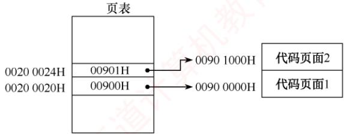

## 3.2 虚拟内存管理

在学习本节时，请读者思考以下问题：

1）为什么要引入虚拟内存？

2）虚拟内存空间的大小由什么因素决定？

3）虚拟内存是怎么解决问题的？会带来什么问题？

读者要掌握虚拟内存解决问题的思想，了解各种置换算法的优劣，掌握虚实地址的变换方法。

## 3.2.1 虚拟内存的基本概念

## 1. 传统存储管理方式的特征

3.1节讨论的各种内存管理策略，都是为了将多个进程同时保留在内存中，以支持多道程序设计。它们具有以下两个共同特征。 美

1）一次性。作业必须一次性全部装入内存后才能开始运行。这会带来两个问题：①当作业过大而无法全部装入内存时，该作业将无法运行；②当大量作业请求运行时，由于内存不足以容纳所有作业，只能让少数作业先运行，导致系统并发度下降。

2）驻留性。作业一旦装入内存，便一直驻留其中，其任何部分都不会被换出，直至作业运行结束。然而，运行中的进程常因等待I/O而被阻塞，可能长时间处于等待状态。

由上述分析可知，许多在程序运行中暂未使用或暂时不用的代码和数据仍占据大量内存空间，而一些急需运行的作业却因内存不足无法装入，显然造成了宝贵内存资源的浪费。

## 2. 局部性原理

要真正理解虚拟内存技术的思想，首先必须了解著名的局部性原理。从广义上讲，快表、页高速缓存及虚拟内存技术都属于缓存技术，这个技术所依赖的原理就是局部性原理。局部性原理既适用于程序结构，又适用于数据结构。局部性原理表现在以下两个方面。

## 考点追踪页面置换算法的时间局部性分析（2012）

1）时间局部性。程序中的某条指令或某个数据项一旦被访问，不久之后很可能再次被访问。这主要是由于程序中存在大量的循环和重复操作。

2）空间局部性。一旦程序访问了某个存储单元，在不久之后，其附近的存储单元也很可能被访问。这是因为指令通常按顺序存放并顺序执行，而数据（如向量、数组、表等）也一般以连续或簇聚的方式存储。

时间局部性通过将近期使用的指令和数据保存在高速缓存中，并借助多级缓存层次结构加以利用：空间局部性则通过采用较大容量的缓存，并集成预取机制到缓存控制逻辑中实现。虚拟内存技术正是基于局部性原理，将外存作为内存的透明扩展，有效缓解物理内存不足的问题。

## 3. 虚拟存储器的定义和特征

## 考点追踪虚拟存储器的特点（2012）

基于局部性原理，在程序装入时，仅需将当前运行所需的少数页面（或段）装入内存，其余部分暂留外存，即可启动程序执行。在程序执行过程中，若所访问的信息不在内存中，则操作系统会自动将其从外存调入内存，然后继续执行程序，这一机制称为请求调页（或请求调段）。当内存空间不足时，操作系统又会将暂时不用的信息换出到外存，以腾出空间存放即将调入的内容，这一机制称为页面置换（或段置换）。正是通过这两种机制的协同工作，系统为用户提供了一个逻辑上远大于物理内存的地址空间，称为虚拟存储器。

之所以称为“虚拟”存储器，是因为该存储器并非真实存在的物理实体，而是操作系统通过部分装入、请求调入和置换功能（均对用户透明）所构造的一种逻辑抽象。用户程序可像使用大容量内存一样运行，而无须关心物理内存的实际大小。虚拟存储器有以下三个主要特征。

1）多次性。作业无须在运行前一次性全部装入内存，而是可以分多次动态调入。只需将当前需要执行的程序和数据装入内存即可开始运行，后续所需部分在访问时按需调入。

2）对换性。作业在运行过程中无须常驻内存，操作系统可根据需要，将暂不使用的程序或数据换出至外存对换区，并在后续需要时再换入内存，从而实现内存的高效利用。 。

3）虚拟性。从用户视角看，内存容量被逻辑扩充，呈现出远大于实际物理内存的可用空间。虚拟性正是虚拟存储器的本质特征和根本目标，其实现依赖于多次性与对换性。

## 4. 虚拟内存技术的实现

虚拟内存技术允许将一个作业分多次调入内存。若采用连续分配方式，则会导致相当一部分内存空间处于暂时甚至“永久”的空闲状态，不仅造成内存资源的严重浪费，也无法从逻辑上扩充内存容量。因此，虚拟内存的实现必须建立在离散分配的内存管理方式基础之上。

目前，虚拟内存主要有以下三种实现方式：

● 请求分页存储管理。

● 请求分段存储管理。

• 请求段页式存储管理。

无论采用哪种方式，均需一定的硬件支持，主要包括以下几个方面：

● 足够容量的内存和外存，用于存放程序的当前部分与后备部分。

● 页表机制（或段表机制），作为地址映射的关键数据结构。

·中断机构，用于在用户程序访问尚未调入内存的部分时，触发缺页（或缺段）中断。

● 地址变换机构，负责在程序运行过程中动态地将逻辑地址转换为物理地址。

## 3.2.2 请求分页管理方式

请求分页系统建立在基本分页系统的基础之上，为支持虚拟存储器功能，增加了请求调页和页面置换功能：在该系统中，只需将当前需要的一部分页面装入内存，便可启动作业运行。在作业运行过程中，若所访问的页面不在内存中，则系统将通过请求调页功能将其从外存调入；而当内存空间不足时，则通过页面置换功能将暂时不用的页面换出到外存。由于每次换入和换出的基本单位均为长度固定的页面，其实现比以长度可变的段为单位的请求分段系统更简单；正因其实现简洁且效率较高，请求分页成为目前最常用的一种虚拟存储器实现方式。

为了实现请求分页，系统必须提供一定的硬件支持。除需要足够容量的内存和外存外，还需具备页表机制、缺页中断机构以及地址变换机构。 X

## 1. 页表机制

相比于基本分页系统，请求分页系统中的页表需提供更多信息，以支持请求调页和页面置换。具体而言，操作系统必须能够：（①）判断某页是否已调入内存：②若尚未调入，则还需获知该页在外存中的存放位置；③在页面置换时，依据访问特征选择合适的换出页面；④对于要换出的页面，还需知道其是否被修改过，以决定是否需写回外存。为此，请求分页的页表项在基本结构基础上增加了四个字段，如图3.19所示。

<table><tr><td rowspan=1 colspan=1>页号</td><td rowspan=1 colspan=1>物理块号</td><td rowspan=1 colspan=1>状态位P</td><td rowspan=1 colspan=1>访问字段A</td><td rowspan=1 colspan=1>修改位 M</td><td rowspan=1 colspan=1>外存地址</td></tr></table>

图3.19 请求分页系统中的页表项

各新增字段的说明如下：

● 状态位P（存在位）。标记该页是否已调入内存，供地址变换时判断是否触发缺页中断。

● 访问字段A。记录本页在一段时间内的访问次数，或记录自上次访问以来的时间间隔，供页面置换算法选择换出页面时参考。

● 修改位M（脏位）。标记该页调入内存后是否被修改过，以决定换出时是否需写回外存。

● 外存地址。指示该页在外存中的存放位置（通常为物理块号），供调页时将其读入内存。

## 2. 缺页中断机构

考点追踪缺页处理的过程及效率分析（2011、2013、2014、2020、2022）

考点追踪缺页异常导致进程状态的变化（2023）

在请求分页系统中，当进程访问的页面尚未调入内存时，硬件会自动触发缺页中断，由操作系统的缺页中断处理程序处理：将所需页面从外存调入内存（必要时先换出一页）。具体而言，若内存中有空闲页框，则分配一个页框，将所缺页面从外存装入，并更新页表中相应的表项；若无空闲页框，则需先由页面置换算法选择一个页面淘汰，若该页在内存中被修改过，则必须将其写回外存，否则可直接丢弃。由于页面调入通常涉及较长时间的磁盘I/O操作，系统在此期间可能会调度其他进程运行；待所需页面调入完成后，重新执行引发缺页的那条指令。

缺页中断作为一种内中断，其处理过程与其他中断类似，也需经历保护CPU现场、分析中断原因、转入中断处理程序、恢复CPU现场等步骤。然而，它具有以下两个显著特点：

● 在指令执行期间触发，由当前指令的地址访问直接引发，而非在指令执行完毕之后。

● 一条指令在执行过程中可能引发多次缺页中断。例如，在执行指令 copy A to B时，若该指令本身及其两个操作数各自跨越两个页面，则最多可能引发6次缺页中断。

## 3. 地址变换机构

在基本分页系统地址变换机构的基础上，请求分页系统为支持虚拟存储器，增加了缺页中断触发机制。请求分页系统的地址变换过程如图3.20所示。

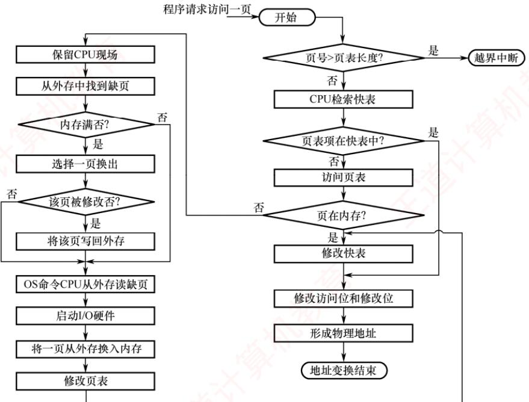  
图3.20 请求分页中的地址变换过程

## 考点追踪分页系统的地址变换过程及分析（2009、2010、2014、2024）

请求分页系统的地址变换过程如下。

①首先检索快表，若命中，则从相应表项中取出该页的物理块号，并置访问位为1，以供置换算法换出页面时参考。对于写操作，还需置修改位为1。

②若快表未命中，则需访问页表。若该页已在内存中（状态位=1），则从相应表项中取出物理块号，并将该页表项装入快表；若快表已满，则按置换算法淘汰一项。

③若页面不在内存，则触发缺页中断。操作系统接管后，将所需页面从外存调入内存（必要时先换出一页），并更新页表和快表。随后，重新执行地址变换以获取物理块号。

④将获得的物理块号与页内地址拼接，形成物理地址，用于访存。

## 3.2.3 页框分配

在为进程分配内存时，主要涉及以下问题：①为保证进程能正常运行，所需最小页框数的确定；②为每个进程分配页框时，所分配的页框是固定的还是可变的；③在为不同进程分配页框时，是采用平均分配还是按进程大小比例分配。本节将围绕这些问题展开讨论。

## 1. 最小页框数与驻留集

## （1）最小页框数

## 考点追踪最小物理块数的确定原则（2025）

最小页框数（也称最小物理块数）是指能保证进程正常运行所需的最少页框数量。若系统为进程分配的页框数少于此值，则进程将无法执行。进程应获得的最小页框数与计算机的硬件结构有关，具体取决于指令的格式、功能和寻址方式。例如，对于采用单地址指令和直接寻址的简单机器，最小页框数为2：一个用于存放指令，另一个用于存放数据。若支持间接寻址，则至少需要3个页框：分别用于存放指令、指针和数据。对于功能较强的机器，若一条指令及其两个操作数各自跨越两个页面，则在最坏情况下，该指令执行过程中可能涉及6个不同的页面。因此，应至少为每个进程分配6个页框，以确保这些页面能同时驻留内存，顺利完成指令执行。

## (2)驻留集大小

在页式虚拟存储系统中，进程启动时既不需要、也不可能将其所有页面装入内存。因此，操作系统必须决定为该进程分配多少页框一一这一集合即称为该进程的驻留集。驻留集大小的选择需在系统并发度与缺页开销之间进行权衡，具体体现在以下两个方面： 临村

1）驻留集过小，内存中可容纳的进程数量增多，有助于提高多道程序的并发度；但每个进程获得的页框过少，将导致缺页率显著升高，CPU需耗费大量时间处理缺页中断。

2）驻留集过大，当分配给进程的页框数超过某一阈值后，继续增加页框对缺页率的改善趋X 于平缓，不仅浪费内存资源，还会因可用页框总量减少而降低系统的整体并发能力。

## 2. 内存分配策略

在请求分页系统中，可采取两种内存分配策略，即固定和可变分配策略。在进行置换时，也可采取两种策略，即全局和局部置换。于是可组合出以下三种适用的策略。

## 考点追踪页面分配与置换策略的名称（2015）

## （1）固定分配局部置换

所谓固定分配，是指为每个进程分配固定数量的页框，并在其运行期间保持不变。所谓局部置换，是指当进程发生缺页时，只能从该进程自身已分配的页框中选择一页换出，再将所缺页面

调入，从而维持其驻留集大小恒定。该策略的难点在于：若初始分配的页框太少，则进程将频繁缺页；若分配过多，则不仅浪费内存资源，还会减少系统可容纳的并发进程数。

## 注意

理论上可形成四种组合，但由于固定分配要求进程的页框数量保持不变，而全局置换会导致进程的页框数量发生变化，二者互斥，因此实际可行的策略仅有三种。

## (2)可变分配全局置换

所谓可变分配，是指初始时为每个进程分配一定数量的页框，并在运行期间根据需要动态调整。所谓全局置换，是指当进程发生缺页时，系统首先从空闲页框队列中取出一个页框分配给该进程，并将所缺页面调入；若空闲页框已耗尽，则允许从内存所有页框中选择一个换出，而不论其归属哪个进程。该方法比固定分配局部置换更为灵活，能够动态扩充进程的驻留集以更好地适应运行需求。然而，由于每次缺页都会为其分配新页框，若缺乏有效调控，则某些活跃进程的驻留集可能持续膨胀，不断抢占其他进程的页框，进而削弱系统的多道程序并发能力。

## （3）可变分配局部置换

系统初始为每个进程分配一定数量的页框：当某进程发生缺页时，仅允许从其自身已分配的页框中选择一页换出，因此不会影响其他进程的运行。此外，系统还根据进程的缺页率动态调整其驻留集大小：若缺页率过高，表明当前页框不足，则为其增加若于页框；若缺页率过低，说明存在资源冗余，则可适当回收部分页框，但需确保不会引发缺页率的显著上升。该策略在有效抑制进程频繁调页的同时，兼顾了系统的多道程序并发能力。尽管其实现机制较为复杂、运行开销较大，但相比因频繁换入/换出所消耗的磁盘I/O与CPU资源，这一开销无疑是值得的。

页面分配策略曾在2015年统考选择题中出现过，考查的正是这三种策略的名称。不少考生因误判其为非重点内容，复习时一带而过，最终在考试中失分。而在这种基础题上失分，实属可惜。再次提醒读者，考研成功的秘诀在于“全面”和“反复多次”。

## 3. 页框调入算法

在采用固定分配策略时，系统需将空闲页框分配给各进程，常见的分配算法如下。

1）平均分配算法，将系统中所有可供分配的页框平均分配给各个进程。

2）按比例分配算法，根据进程的逻辑地址空间大小按比例分配页框。

3）优先权分配算法，为重要或紧迫的进程分配更多页框。通常的做法是将所有可分配页框分为两部分：一部分按比例分配给各进程，另一部分则依据进程的优先权动态分配。

## 4. 调入页面的时机

为确定系统将进程运行时所缺页面调入内存的时机，可采用以下两种调页策略。

1）预调页策略。根据局部性原理，一次调入若于相邻页面通常比逐页调入更高效。然而，若预调入的页面大多未被访问，则会造成内存浪费。因此，系统可尝试预测进程近期可能访问的页面并预先调入，但目前预测成功率仅约50%。鉴于预测效果有限，该策略主要用于进程首次调入时，由程序员显式指定应优先加载的页面。

2）请求调页策略。当进程在运行中访问的页面不在内存时，便会触发缺页中断，由系统将其所需页面调入内存。这种策略调入的页面必然会被访问，且实现相对简单，因此当前的虚拟存储器大多采用此策略。其缺点是每次仅调入一页，导致磁盘I/O开销较大。  
预调页本质上是在进程运行前完成页面加载，而请求调页则是在运行期间动态调入。

## 5. 从何处调入页面

请求分页系统中的外存分为两部分：用于存放文件的文件区和用于存放换出页面的对换区，也称交换区。对换区采用连续分配方式，而文件区采用离散分配方式，因此对换区的磁盘I/O速度通常快于文件区。这样，系统在发生缺页时，调入页面的来源可分为以下三种情况。

1）系统拥有足够的对换区空间。此时可将所有页面从对换区调入，以提高调页速度。为此，需在进程运行前，将与该进程相关的文件从文件区复制到对换区。

2）系统对换区空间不足。对于不会被修改的页面，直接从文件区调入：当换出此类页面时，因其内容未变，无须写回磁盘。而对于可能被修改的页面，换出时必须保存到对换区，后续调入时也需从对换区读取，从而兼顾效率与正确性。

3）UNIX方式。与进程相关的文件始终保留在文件区。因此，未运行过的页面从文件区调入；曾经运行过但已被换出的页面则存放在对换区，后续调入时从对换区读取。若多个进程共享同一页面，则只要该页面已在内存中，其他进程便可直接复用，无须重复调入。

## 6. 如何调入页面

当进程访问的页面不在内存中时（页表项的存在位为0），CPU会触发缺页中断。中断响应后，系统转入缺页中断处理程序。该程序首先通过页表项获取该页在外存中的地址，然后判断内存是否已满：若内存未满，则分配一个空闲页框，发起磁盘/O将所缺页面调入，并更新页表项：填写物理块号，置存在位为1；若内存已满，则先按某种置换算法选出一页准备换出。若该页的修改位为0，则直接丢弃：若修改位为1，则需先将其写回对换区，再释放该页框。随后，将所缺页面调入该页框，并更新页表项，置存在位为1。调入完成后，进程即可通过更新后的页表生成正确的物理地址。整个页面调入过程对用户完全透明，由操作系统自动完成。

## 3.2.4 页面置换算法

进程运行时，若其访问的页面不在内存中，需将其调入，但内存又无空闲页框，则必须从内存中换出一页至外存。选择换出哪一页的算法称为页面置换算法。由于页面的换入与换出均涉及磁盘I/O，开销较大，因此，一个好的页面置换算法应致力于降低缺页率。 NIT

考点追踪各种页面置换算法的特点（2014）

常见的页面置换算法有以下四种。

## 1.最佳（OPT）算法

最佳页面置换算法在发生缺页时，选择淘汰以后永不使用或在最长时间内不再被访问的页面，从而在理论上获得最低的缺页率。然而，由于操作系统无法预知未来的页面访问序列，该算法在实际系统中无法实现。尽管如此，OPT算法仍具有重要的理论意义，常用于评价其他算法。

假定系统为某进程分配了三个物理块，并给定如下页面访问序列：

$$
7 , 0 , 1 , 2 , 0 , 3 , 0 , 4 , 2 , 3 , 0 , 3 , 2 , 1 , 2 , 0 , 1 , 7 , 0 , 1
$$

进程运行时，首先将页面7,0,1依次装入内存。当访问页面2时，发生缺页中断。根据OPT算法，选择未来最久才被再次访问的页面（页面7的下一次访问在第18次，远晚于其他页面）淘汰。随后访问页面0时，因其已在内存中，不产生缺页。访问页面3时再次缺页，此时页面1的下次访问（第14次）最晚，故将其淘汰……以此类推，具体过程如图3.21所示。

<table><tr><td>访问页面</td><td>7</td><td>0</td><td>1</td><td>2</td><td>0</td><td>3</td><td>0</td><td>4</td><td>2</td><td>3</td><td>0</td><td>3</td><td>2</td><td>1</td><td>2</td><td>0</td><td>1</td><td></td><td>7</td><td>0</td><td>1</td></tr><tr><td>物理块1</td><td>7</td><td>7</td><td>7</td><td>2</td><td></td><td>2</td><td></td><td>2</td><td></td><td></td><td>2</td><td></td><td></td><td></td><td>2</td><td></td><td></td><td></td><td>7</td><td></td><td></td></tr><tr><td>物理块2</td><td></td><td>0</td><td>0</td><td>0</td><td></td><td>0</td><td></td><td>4</td><td></td><td></td><td>0</td><td></td><td></td><td></td><td>0</td><td></td><td></td><td></td><td>0</td><td></td><td></td></tr><tr><td>物理块3</td><td></td><td></td><td>1</td><td>1</td><td></td><td>3</td><td></td><td>3</td><td></td><td></td><td>3</td><td></td><td></td><td></td><td>1</td><td></td><td></td><td></td><td>1</td><td></td><td></td></tr><tr><td>缺页否</td><td>√</td><td>√</td><td>√</td><td>√</td><td></td><td>√</td><td></td><td>√</td><td></td><td></td><td>√</td><td></td><td></td><td></td><td>√</td><td></td><td></td><td></td><td>√</td><td></td><td></td></tr></table>

图3.21利用最佳置换算法时的置换图  
可见，整个过程中共发生9次缺页中断，其中6次触发页面置换（不算初始装入）。

## 2. 先进先出（FIFO）算法

先进先出页面置换算法选择淘汰最早进入内存的页面。该算法实现简单，将内存中的页面按调入时间组织成一个队列，需要换出时直接移除队首页面。然而，FIFO算法未利用局部性原理，与进程实际运行规律不符，最早装入的页面仍可能被频繁访问，因此性能通常较差。

考点追踪FIFO算法的应用分析（2010）

仍用上面的例子，采用FIFO算法进行置换。当访问页面2时发生缺页，淘汰最早进入的页面7。随后访问页面3时再次缺页，此时将2,0,1中最先进入的页面0换出……以此类推，具体过程如图3.22所示。可见，共发生15次缺页中断，其中12次触发页面置换。

<table><tr><td>访问页面</td><td>7</td><td>0</td><td></td><td>2</td><td>0</td><td>3</td><td>0</td><td>4</td><td>2</td><td>3</td><td>0</td><td>3</td><td>2</td><td>1</td><td>2</td><td>0</td><td></td><td>7</td><td>0</td><td>1</td></tr><tr><td>物理块1</td><td>7</td><td>7</td><td>7</td><td>2</td><td></td><td>2</td><td>2</td><td>4</td><td>4</td><td>4</td><td>0</td><td></td><td></td><td>0</td><td>0</td><td></td><td></td><td>7</td><td>7</td><td>7</td></tr><tr><td>物理块2</td><td></td><td>0</td><td>0</td><td>0</td><td></td><td>3</td><td>3</td><td>3</td><td>2</td><td>2</td><td>2</td><td></td><td></td><td>1</td><td>1</td><td></td><td></td><td>1</td><td>0</td><td>0</td></tr><tr><td>物理块3</td><td></td><td></td><td>1</td><td>1</td><td></td><td>1</td><td>0</td><td>0</td><td>0</td><td>3</td><td>3</td><td></td><td></td><td>3</td><td>2</td><td></td><td></td><td>2</td><td>2</td><td>1</td></tr><tr><td>缺页否</td><td>√</td><td>√</td><td>√</td><td>7</td><td></td><td>√</td><td>√</td><td>√</td><td>√</td><td>√</td><td>√</td><td></td><td></td><td>√</td><td>√</td><td></td><td></td><td>√</td><td>√</td><td>√</td></tr></table>

图 3.22 FIFO 算法的置换图

值得注意的是，FIFO算法存在一种反直觉现象：当为进程分配的物理块数增加时，缺页次数反而可能上升，这一现象称为Beladv异常。其根本原因在于FIFO仅依据调入时间决策，而忽略了页面的实际使用情况。例如，页面访问需列为3,2,1,0,3,2,4,3,2,1,0,4，当分配3个物理块时，缺页次数为9次；当分配4个物理块时，缺页次数反而增至10次，如图3.23所示。

<table><tr><td rowspan=1 colspan=13>访问页面    3   2    1    0   3   2   4    3   2   1   0    4</td></tr><tr><td rowspan=1 colspan=1>物理块1</td><td rowspan=1 colspan=1>3</td><td rowspan=1 colspan=1>3</td><td rowspan=1 colspan=1>3</td><td rowspan=1 colspan=1>0</td><td rowspan=1 colspan=1>0</td><td rowspan=1 colspan=1>0</td><td rowspan=1 colspan=1>4</td><td rowspan=1 colspan=1></td><td rowspan=1 colspan=1></td><td rowspan=1 colspan=1>4</td><td rowspan=1 colspan=1>4</td><td rowspan=1 colspan=1></td></tr><tr><td rowspan=1 colspan=1>物理块2</td><td rowspan=1 colspan=1></td><td rowspan=1 colspan=1>2</td><td rowspan=1 colspan=1>2</td><td rowspan=1 colspan=1>2</td><td rowspan=1 colspan=1>3</td><td rowspan=1 colspan=1>3</td><td rowspan=1 colspan=1>3</td><td rowspan=1 colspan=1></td><td rowspan=1 colspan=1></td><td rowspan=1 colspan=1>1</td><td rowspan=1 colspan=1>1</td><td rowspan=1 colspan=1></td></tr><tr><td rowspan=1 colspan=1>物理块3</td><td rowspan=1 colspan=1></td><td rowspan=1 colspan=1></td><td rowspan=1 colspan=1>1</td><td rowspan=1 colspan=1>1</td><td rowspan=1 colspan=1>1</td><td rowspan=1 colspan=1>2</td><td rowspan=1 colspan=1>2</td><td rowspan=1 colspan=1></td><td rowspan=1 colspan=1></td><td rowspan=1 colspan=1>2</td><td rowspan=1 colspan=1>0</td><td rowspan=1 colspan=1></td></tr><tr><td rowspan=1 colspan=1>缺页否</td><td rowspan=1 colspan=1>√</td><td rowspan=1 colspan=1>√</td><td rowspan=1 colspan=1>√</td><td rowspan=1 colspan=1>V</td><td rowspan=1 colspan=1>√</td><td rowspan=1 colspan=1>√</td><td rowspan=1 colspan=1>√</td><td rowspan=1 colspan=1></td><td rowspan=1 colspan=1></td><td rowspan=1 colspan=1>√</td><td rowspan=1 colspan=1>V</td><td rowspan=1 colspan=1></td></tr><tr><td rowspan=1 colspan=1>物理块1*</td><td rowspan=1 colspan=1>3</td><td rowspan=1 colspan=1>3</td><td rowspan=1 colspan=1>3</td><td rowspan=1 colspan=1>3</td><td rowspan=1 colspan=1></td><td rowspan=1 colspan=1></td><td rowspan=1 colspan=1>4</td><td rowspan=1 colspan=1>4</td><td rowspan=1 colspan=1>4</td><td rowspan=1 colspan=1>4</td><td rowspan=1 colspan=1>0</td><td rowspan=1 colspan=1>0</td></tr><tr><td rowspan=1 colspan=1>物理块2*</td><td rowspan=1 colspan=1></td><td rowspan=1 colspan=1>2</td><td rowspan=1 colspan=1>2</td><td rowspan=1 colspan=1>2</td><td rowspan=1 colspan=1></td><td rowspan=1 colspan=1></td><td rowspan=1 colspan=1>2</td><td rowspan=1 colspan=1>3</td><td rowspan=1 colspan=1>3</td><td rowspan=1 colspan=1>3</td><td rowspan=1 colspan=1>3</td><td rowspan=1 colspan=1>4</td></tr><tr><td rowspan=1 colspan=1>物理块3*</td><td rowspan=1 colspan=1></td><td rowspan=1 colspan=1></td><td rowspan=1 colspan=1>1</td><td rowspan=1 colspan=1>1</td><td rowspan=1 colspan=1></td><td rowspan=1 colspan=1></td><td rowspan=1 colspan=1>1</td><td rowspan=1 colspan=1>1</td><td rowspan=1 colspan=1>2</td><td rowspan=1 colspan=1>2</td><td rowspan=1 colspan=1>2</td><td rowspan=1 colspan=1>2</td></tr><tr><td rowspan=1 colspan=1>物理块4</td><td rowspan=1 colspan=1></td><td rowspan=1 colspan=1></td><td rowspan=1 colspan=1></td><td rowspan=1 colspan=1>0</td><td rowspan=1 colspan=1></td><td rowspan=1 colspan=1></td><td rowspan=1 colspan=1>0</td><td rowspan=1 colspan=1>0</td><td rowspan=1 colspan=1>0</td><td rowspan=1 colspan=1>1</td><td rowspan=1 colspan=1>1</td><td rowspan=1 colspan=1>1</td></tr><tr><td rowspan=1 colspan=1>缺页否</td><td rowspan=1 colspan=1>√</td><td rowspan=1 colspan=1>√</td><td rowspan=1 colspan=1>√</td><td rowspan=1 colspan=1>√</td><td rowspan=1 colspan=1></td><td rowspan=1 colspan=1></td><td rowspan=1 colspan=1>√</td><td rowspan=1 colspan=1>√</td><td rowspan=1 colspan=1>√</td><td rowspan=1 colspan=1>√</td><td rowspan=1 colspan=1>√</td><td rowspan=1 colspan=1>√</td></tr></table>

图 3.23 Belady 异常

只有 FIFO 算法可能出现 Belady 异常，而 OPT 算法和 LRU 算法永远不会出现此类异常。

## 3. 最近最久未使用（LRU）算法

LRU算法选择淘汰最近最长时间未使用的页面，其基本思想是：若某页面在过去一段时间内未被使用，则在近期未来很可能也不会被访问。为实现这一策略，系统需为每个页面维护一个访问字段，记录其自上次被访问以来所经历的时间，淘汰页面时选择该值最大的页面。

## 考点追踪LRU算法的应用分析（2009、2015、2019、2025）

仍用上面的例子采用LRU算法进行置换，如图3.24所示。首次访问页面2时发生缺页，将最近最久未使用的页面7换出；随后访问页面3时再次缺页，将最近最久未使用的页面1换出。

<table><tr><td>访问页面</td><td>7</td><td>0</td><td>1</td><td>2</td><td>0</td><td>3</td><td>0</td><td>4</td><td>2</td><td>3</td><td>0</td><td>3</td><td>2</td><td>1</td><td>2</td><td>0</td><td>1</td><td>7</td><td>0</td><td>1</td></tr><tr><td>物理块1</td><td>7</td><td>7</td><td>7</td><td>2</td><td></td><td>2</td><td></td><td>4</td><td>4</td><td>4</td><td>0</td><td></td><td></td><td>1</td><td></td><td>1</td><td></td><td>1</td><td></td><td></td></tr><tr><td>物理块2</td><td></td><td>0</td><td>0</td><td>0</td><td></td><td>0</td><td></td><td>0</td><td>0</td><td>3</td><td>3</td><td></td><td></td><td>3</td><td></td><td>0</td><td></td><td>0</td><td></td><td></td></tr><tr><td>物理块3</td><td></td><td></td><td>1</td><td>1</td><td></td><td>3</td><td></td><td>3</td><td>2</td><td>2</td><td>2</td><td></td><td></td><td>2</td><td></td><td>2</td><td></td><td>7</td><td></td><td></td></tr><tr><td>缺页否</td><td>√</td><td>√</td><td>√</td><td>√</td><td></td><td>√</td><td></td><td>√</td><td>√</td><td>√</td><td>√</td><td></td><td></td><td>√</td><td></td><td>√</td><td></td><td>√</td><td></td><td></td></tr></table>

图3.24 LRU 页面置换算法时的置换图

由图可见，前5次缺页处理的结果与OPT算法相同，但这仅是巧合，并无必然联系。实际上，LRU算法根据页面过去的使用情况来判断，是“向前看”的；而OPT算法则根据页面未来的使用情况来判断，是“向后看”的。而页面过去与未来的走向之间并无必然联系。

OPT算法的性能最好，但无法实现。FIFO算法实现简单，但忽略局部性，性能较差。LRU算法性能接近OPT算法，具有良好的实际效果，但其实现通常需要硬件支持，开销较大。

## 4.时钟（CLOCK）算法

LRU算法的性能接近OPT算法，但其实现开销较大。因此，操作系统的设计者尝试了许多算法，试图以较小的开销接近LRU算法的性能，这类算法统称为CLOCK算法的变体。

## （1）简单的 CLOCK算法

## 考点追踪类CLOCK算法的过程分析（2012）

简单的CLOCK算法为每个页面设置一个访问位，当某页首次被装入内存或被访问时，其访问位被置为1。系统将所有页框组织成一个循环队列，并维护一个替换指针，指向当前检查位置。发生缺页且需置换时，算法按以下规则操作：若指针所指页面的访问位为0，则直接淘汰该页；若为1，则将其置为0，指针顺移至下一页面，给予该页一次“宽恕”机会一—即暂不淘汰，待后续轮询时再行判断。由于指针在队列中循环移动，形如时钟指针，故称CLOCK算法。又因其仅依据“最近是否被使用”这一粗略信息进行决策，也被称为最近未用（NRU）算法。

考点追踪CLOCK算法的应用分析（2010）

假设页面访问需列为7,0,1,2,0,3,0,4,2,3,0,3,2,1,3,2，采用简单CLOCK算法，分配4个页框，每个页框记录（页面号，访问位），具体过程如图3.25所示。

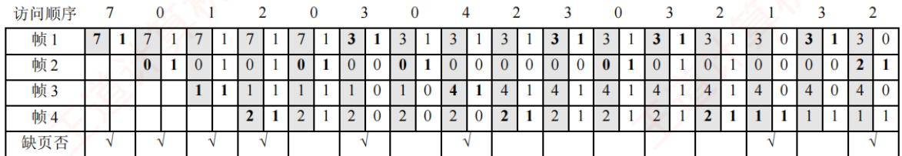  
图 3.25 CLOCK 算法时的置换图

初始阶段，页面7,0,1,2依次调入，访问位均置为1。随后访问0，已存在，访问位保持为1。访问3时发生第5次缺页，此时替换指针位于帧1，而所有页框的访问位均为1。算法遂完整扫描一圈，将各帧访问位清零，指针回到最初的位置（帧1)，故淘汰帧1中的页面7，装入页面3，访问位置为1，如图3.26(a)所示。接着访问0，已存在，访问位置为1。访问4时发生第6次缺页，替换指针指向帧2（上次替换位置的下一帧)，帧2的访问位为1，将其置0后继续扫描；帧3的访问位为0，故淘汰帧3中的页面2，装入页面4，如图3.26(b)所示。此后访问2,3,0,3,2，均已存在，每次访问均将对应帧的访问位置为1。当访问1时发生第7次缺页，此时替换指针指向帧4，且所有帧的访问位均为1，算法再次完成一轮扫描并将访问位清零，故淘汰帧4中的页面2。后续访问3，已存在，访问位置为1。最后访问2时发生第8次缺页，替换指针指向帧1，帧1的访问位为1，将其置0后继续扫描，帧2的访问位为0，故淘汰帧2中的页面0，装入页面2。

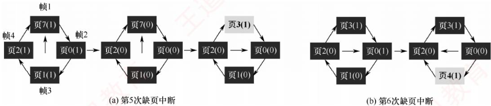  
图3.26 缺页中断时替换指针扫描示意图

（2) 改进型 CLOCK 算法

考点追踪改进CLOCK算法的思想（2018）

考点追踪改进CLOCK算法的应用分析（2016、2021）

将一个页面换出时，若该页已被修改，则需将其写回磁盘；若未被修改，则无须写回。可见，修改过的页面置换代价更高。为降低I/O开销，改进型CLOCK算法在访问位（A）的基础上，引入修改位（M），综合考虑页面的使用情况与置换代价。在选择淘汰页时，优先考虑既未被访问过又未被修改的页面。根据（A,M）的组合，页面可分为以下四类：

●1类（A=0,M=0）：最近未被访问，且未被修改，是最佳的淘汰页。

●2类（A=0,M=1）：最近未被访问，但已被修改，是次佳的淘汰页。

● 3类（A=1,M=0）：最近已被访问，但未被修改，可能再次被访问。

●4类（A=1,M=1）：最近已被访问，且已被修改，可能再次被访问。

内存中的每一页必属于这四类页面之一。进行页面置换时，算法采用与简单CLOCK类似的循环扫描机制，区别在于该算法需同时检查访问位与修改位，具体步骤如下。

①从当前指针位置开始，进行第一轮扫描，寻找A=0且M=0的1类页面，将第一个找到的1类页面作为淘汰页。此轮扫描不修改任何访问位A。 XT

②若第①步失败，则进行第二轮扫描，寻找A=0且M=1的2类页面，将第一个找到的2类页面作为淘汰页。此轮扫描中，将所有经过的页面的访问位A置为0。

③若前两步均失败（所有页面A=1），则将指针复位至起始位置，并将所有帧的访问位清零，随后重复第①步；若仍无1类页面，则执行第②步。此时必能找到可淘汰页面。

改进型CLOCK算法优于简单CLOCK算法之处在于：优先淘汰未修改的页面，从而降低磁盘/O开销。但为定位合适的淘汰页，可能需多轮扫描，算法本身的运行开销相应增加。

操作系统中的页面置换算法普遍遵循一个原则：尽可能保留近期访问过的页面，优先淘汰未访问过的页面。简单CLOCK算法仅依据访问位判断页面是否“被访问过”；而改进型CLOCK算法则在此基础上进一步细化：对“未访问过”的页面，优先换出其中未修改者：即使所有页面均“被访问过”，仍优先选择未修改者换出，以最小化磁盘写回成本。

## \*3.2.5 抖动和工作集

## 1. 抖动

在页面置换过程中，最糟糕的情形是：刚刚换出的页面马上又要换入内存，而刚刚换入的页面又立即被换出。这种频繁的页面调度行为称为抖动（也称颠簸）。

## 考点追踪抖动的处理措施（2011）

系统发生抖动的根本原因在于：分配给进程的物理块数量过少，无法满足其正常运行的基本需求，导致进程在执行过程中频繁触发缺页中断，不得不反复请求系统将所缺页面调入内存。此时，磁盘I/O频率急剧上升，进程的大部分时间都消耗在页面的换入与换出操作上，几乎无法完成有效计算，进而造成CPU利用率急剧下降，甚至趋近于零。

抖动是虚拟存储系统中的严重性能问题，必须加以解决。由于抖动的发生直接源于系统为进程分配的页框数（驻留集）过少，于是又提出了工作集的概念，用以动态指导页框分配。

## 2. 工作集

工作集是指在某段时间间隔内，进程实际访问过的页面集合。通常，工作集W可由时间t和工作集窗口尺寸4共同确定。例如，某进程对页面的访问序列如下： 机

$$
\begin{array}{c}1,4,\underbrace{\overbrace{2,3,5,3,2,}^{\bullet}}_{ \begin{array}{c} \bullet  \\ \uparrow \\ t_{1} \end{array} } \underbrace{\left| 2,1,1,1,3,4,5,4, \right| }_{ \begin{array}{c} \bullet  \\ \uparrow \\ t_{2} \end{array} } \underbrace{\left| 4,2,1,1,3, \right| }_{ \begin{array}{c} \bullet  \\ \uparrow \\ t_{2} \end{array} } \underbrace{\left| 3 \right| }_{ \begin{array}{c} \bullet  \\ \uparrow \\ t_{3} \end{array} }\end{array}
$$

## 考点追踪工作集的应用分析（2016）

假设工作集窗口尺寸4设置为5，则在 $t _ { 1 }$ 时刻，进程的工作集为{2,3,5}；在 $t _ { 2 }$ 时刻，工作集为{1,2,3,4}。在实际应用中，工作集窗口通常设置得较大，对于局部性较好的程序，其工作集大小一般远小于窗口尺寸4。由于工作集反映了进程在随后一段时间内很可能频繁访问的页面集合，因此驻留集的大小不应小于工作集的大小，否则进程在运行过程中将频繁发生缺页。

## 3.2.6 页框回收

本节为2025年大纲新增考点。实际上，2012年统考真题第45题已涉及页框回收，其将页框回收的过程描述为“被系统回收的页框，放入空闲页框链尾，其中内容在下一次分配之前不清空”，这一描述正是页面缓冲算法中空闲页面链表的定义。因此，本节主要介绍页面缓冲算法。页框回收算法较为复杂，且主流操作系统教材通常未系统介绍相关内容，其细节多见于深入剖析Linux内核的图书，而408考试中出现的概率也极低，因此本书不做介绍。

## 1. 页面缓冲算法

在页式虚拟存储系统中，页面换入/换出的开销对系统性能影响显著。

影响页面换入/换出效率的主要因素有如下几种。

1）页面置换算法的选择。一个好的置换算法可有效降低进程运行过程中的缺页率，从而减少页面换入/换出的频率，显著提升系统性能。

2）已修改页面写回磁盘的频率。对于已被修改的页面（脏页），换出时必须写回磁盘。若采用“每次换出即写回”的策略，则会导致频繁的磁盘I/O操作。

3）磁盘内容读入内存的频率。若每次访问缺失页面都需从磁盘重新读取，则会引发高频率的磁盘I/O，进而增加页面换入的开销。

页面缓冲算法在原页面置换算法的基础上增设一个修改页面链表，保存已修改且需要被换出的页面，等被换出的页面数量达到一定值时，再批量写回磁盘，以减少页面换出的开销。

为显著降低页面换入/换出的频率，系统在内存中维护如下两个专用链表。

1）空闲页面链表（也称空闲页框链表）。当进程需要读入一个页面时，系统从该链表头部取出一个页框，并将目标页面装入其中。若某未被修改的页面需要被换出，则系统并不将其写回磁盘，而直接将其所在的物理页框挂在空闲链表的末尾。这些页框中仍保留着原有数据。若后续有进程访问相同页面，则可直接从空闲链表中取下该页框复用，从而避免从磁盘重新读入，有效减少页面换入开销。

2）修改页面链表。当进程需要将一个已修改的页面换出时，系统不会立即写回磁盘，而是将其所在的页框挂在该链表的末尾。待链表中积累足够数量的脏页后，再批量写回磁盘。这样不仅降低了写回频率，也减少了因数据缺失而需重新读盘的次数。

上述通过链表管理物理页框、延迟实际I/O的机制，即为页框回收的过程。

页面缓冲算法的优点：①显著降低页面换入/换出频率，大幅减少磁盘I/O开销；②即使采用简单的置换策略（如FIFO），也能获得良好性能，且无须特殊硬件支持，实现简单高效。

## 2. 页框回收

当系统可分配的内存不足时，就必须回收部分页框，但并非所有页框都可回收。属于内核的大部分页框（如内核栈、内核代码段、内核数据段、大部分内核使用的页框）均不可回收；而由进程使用的页框（如进程代码段、进程数据段、进程堆栈、进程访问文件时映射的文件页、进程间共享内存所占用的页框）则大多可以回收。 X

在Linux内核中，设置了一个负责页面换出的守护进程kswapd，它定期检查内存使用情况。当空闲页框数量低于特定阈值时，便主动发起页框回收操作。之所以不能等到空闲页框完全耗尽才启动回收，是因为释放某些页框（如脏页）通常需要先将其写回磁盘，而该/O操作本身往往需要临时页框作为缓冲区。若此时系统已无空闲页框，则既无法分配I/O缓冲区，也无法完成页面释放，从而可能导致内核陷入内存分配死锁，甚至引发系统崩溃。

Linux系统采用3.1.2节介绍的“伙伴算法”对内存中不同长度的连续空闲页框进行统计和管理。该算法将连续的空闲页框组织为“空闲块”，并按其大小（所含连续页框的数量）分组。分配页框是一个“化整为零”的过程，会产生外部碎片；因此，系统必须具备将零碎页框重新合并为较大连续块的能力。Linux通过伙伴算法的逆操作实现页框回收：当一个页框被释放时，系统首先检查其是否存在大小相等的伙伴空闲块：若存在，则将二者合并为一个大小翻倍的新空闲块：随后继续向上检查该新块是否能与其更高一级的伙伴再次合并，直至无法再合并为止。

## 3.2.7 内存映射文件

## 考点追踪内存映射文件的原理与特点（2025）

内存映射文件（Memory-MappedFiles）是操作系统向应用程序提供的一种系统调用机制，它在磁盘文件与进程的虚拟地址空间之间建立直接映射关系，与虚拟内存机制紧密相关。

进程通过该系统调用，将一个文件映射到其虚拟地址空间的某一区域，此后便可像访问内存一样读/写文件。这种功能将一个文件当作内存中的一个大字符数组来访问，而无须调用传统的文件I/O接口，显然更为便捷。磁盘文件的读/写由操作系统负责完成，对进程而言是透明的。映射时并不会立即加载文件内容，而是在进程首次访问某页面时，才按需将其一页一页地调入内存；当进程退出或显式解除文件映射时， 存；当进程退出或显式解除文件映射时，

所有被修改的页面才会被写回磁盘文件。

进程可通过共享内存实现高效通信。实践中，这种共享内存往往正是通过将同一文件映射到多个通信进程的虚拟地址空间来实现的。此时，尽管各进程的虚拟地址空间相互独立，但操作系统会通过页表将它们对应的虚拟页映射到相同的物理页（见图3.27）。因此，当一个进程在共享

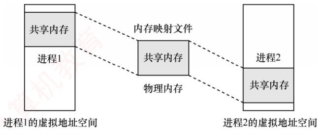  
图 3.27 采用内存映射I/O的共享内存

区域执行写操作后，另一个进程在其映射区域执行读操作时，能够立即看到更新结果因为二者访问的是同一块物理内存，数据必然一致，无须额外的复制或同步机制。

由此可见，内存映射文件带来的好处主要有：①使程序员的编程更为简单，已建立映射的文件，可直接按内存方式进行读/写；②便于多个进程共享同一个磁盘文件。

## 3.2.8 虚拟存储器性能影响因素

## 考点追踪请求分页系统性能的影响因素分析（2020、2022）

缺页率是影响虚拟存储器性能的核心因素，而缺页率又受页面大小、分配给进程的物理块数、页面置换算法、写回磁盘的频率以及程序的局部化程度等多方面影响。

根据局部性原理，页面较大时，单次装入可覆盖更多局部访问区域，从而降低缺页率；而页面较小时，缺页率则相对较高。较小的页面虽能减少页内碎片、提高内存利用率，但会导致每个进程所需页面数量增多，导致页表过长，占用大量内存。较大的页面虽可缩短页表长度，却会增大页内碎片。因此，页面大小的设计需在碎片控制与页表开销之间取得合理平衡。

分配给进程的物理块数越多，缺页率通常越低。然而，当物理块数量超过某一國值后，继续增加块数对缺页率的改善趋于平缓。因为此时进程的活跃页面已基本常驻内存，缺页主要由非活跃页面引发，而这些页面本就无须长期驻留。若再分配更多物理块，则不仅收益其微，反而造成内存资源浪费。因此，只需确保活跃页面常驻内存，即可将缺页率有效控制在可接受范围内。

好的页面置换算法能有效降低运行过程中的缺页率。例如，LRU、CLOCK等算法通过预测未来访问行为，优先保留可能被再次访问的页面，从而提升内存命中率，加快页面访问速度。

对于已修改的页面(脏页），换出时必须写回磁盘。若采用“每换出一页即写回”的策略，则会频繁触发磁盘I/O，效率极低。为此，系统引入已修改换出页面链表：当脏页被换出时，暂不写回磁盘，而是挂入该链表：待积累足够数量后，再批量写回磁盘，从而显著减少磁盘I/O次数，降低页面换出开销。此外，若某进程在这些页面尚未写回磁盘前再次访问它们，则可直接从链表中复用，无须重新从外存调入，进一步减少页面换入频率与J/O开销。

程序编写的局部化程度越高，执行时的缺页率就越低。例如，若数组采用按行存储，则访问时应尽量按行顺序进行，避免按列访问破坏空间局部性，从而导致缺页率异常升高。

## 3.2.9 地址翻译的示例

考虑到408统考越来越注重学科综合能力的考查，本节结合《计算机组成原理》中Cache的相关内容，分析虚实地址的变换过程。对于不参加统考的读者，可酌情跳过；对于参加统考但尚未复习该部分内容的读者，建议先完成相关章节的学习，再回过头来学习本节。

设某系统满足以下条件：

• 配置一个 TLB 和一个 data Cache;

● 存储器以字节为编址单位；

• 虚拟地址为 14 位；

• 物理地址为 12 位；

• 页面大小为 64B;

• TLB 采用四路组相联结构，共16个条目；

• data Cache采用物理寻址、直接映射方式，行大小为4B，共16组。

要求分析对虚拟地址0x03d4, 0x00f1和 0x0229的访问过程。

系统以字节编址，页面大小为64B，故页内偏移占log264=6位。虚拟地址共14位，故虚拟页号为14-6=8位；物理地址共12位，故物理页号为12-6=6位。TLB采用四路组相联，共

16个条目，因此组数为16/4=4，组索引占1og24=2位，虚拟页号的低2位作为组索引、高6位作为 TLB 标记。data Cache 行大小为 4B，故物理地址中最低 log24 = 2 位为块内偏移；Cache 共16组，因此接下来的1og₂16=4位为组索引，剩余高6位为标记。地址结构如图3.28所示。

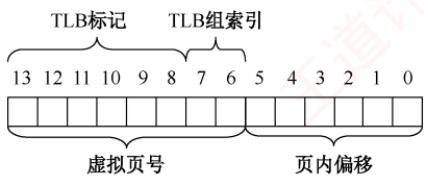  
(a) 虚拟地址

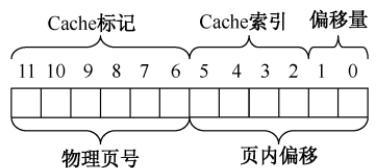  
(b) 物理地址  
图 3.28 地址结构

TLB、部分页表及 data Cache的内容分别见表 3.1、表 3.2 和表 3.3。

表 3.1 TLB
<table><tr><td rowspan=1 colspan=1>索引</td><td rowspan=1 colspan=1>标记位</td><td rowspan=1 colspan=1>物理页号</td><td rowspan=1 colspan=1>有效位</td><td rowspan=1 colspan=1>标记位</td><td rowspan=1 colspan=1>物理页号</td><td rowspan=1 colspan=1>有效位</td></tr><tr><td rowspan=2 colspan=1>0</td><td rowspan=1 colspan=1>03</td><td rowspan=1 colspan=1></td><td rowspan=1 colspan=1>0</td><td rowspan=1 colspan=1>09</td><td rowspan=1 colspan=1>0D</td><td rowspan=1 colspan=1>1</td></tr><tr><td rowspan=1 colspan=1>00</td><td rowspan=1 colspan=1>一</td><td rowspan=1 colspan=1>0</td><td rowspan=1 colspan=1>07</td><td rowspan=1 colspan=1>02</td><td rowspan=1 colspan=1>1</td></tr><tr><td rowspan=2 colspan=1>1</td><td rowspan=1 colspan=1>03</td><td rowspan=1 colspan=1>2D</td><td rowspan=1 colspan=1>1</td><td rowspan=1 colspan=1>02</td><td rowspan=1 colspan=1></td><td rowspan=1 colspan=1>0</td></tr><tr><td rowspan=1 colspan=1>04</td><td rowspan=1 colspan=1></td><td rowspan=1 colspan=1>0</td><td rowspan=1 colspan=1>0A</td><td rowspan=1 colspan=1>一</td><td rowspan=1 colspan=1>0</td></tr><tr><td rowspan=2 colspan=1>2</td><td rowspan=1 colspan=1>02</td><td rowspan=1 colspan=1>一</td><td rowspan=1 colspan=1>0</td><td rowspan=1 colspan=1>08</td><td rowspan=1 colspan=1>一</td><td rowspan=1 colspan=1>0</td></tr><tr><td rowspan=1 colspan=1>06</td><td rowspan=1 colspan=1>一</td><td rowspan=1 colspan=1>0</td><td rowspan=1 colspan=1>03</td><td rowspan=1 colspan=1>一</td><td rowspan=1 colspan=1>0</td></tr><tr><td rowspan=2 colspan=1>3</td><td rowspan=1 colspan=1>07</td><td rowspan=1 colspan=1>一</td><td rowspan=1 colspan=1>0</td><td rowspan=1 colspan=1>03</td><td rowspan=1 colspan=1>OD</td><td rowspan=1 colspan=1>1</td></tr><tr><td rowspan=1 colspan=1>0A</td><td rowspan=1 colspan=1>34</td><td rowspan=1 colspan=1>1</td><td rowspan=1 colspan=1>02</td><td rowspan=1 colspan=1>-</td><td rowspan=1 colspan=1>0</td></tr></table>

表3.2 部分页表
<table><tr><td rowspan=1 colspan=1>虚拟页号</td><td rowspan=1 colspan=1>物理页号</td><td rowspan=1 colspan=1>有效位</td><td rowspan=1 colspan=1>虚拟页号</td><td rowspan=1 colspan=1>物理页号</td><td rowspan=1 colspan=1>有效位</td></tr><tr><td rowspan=1 colspan=1>00</td><td rowspan=1 colspan=1>28</td><td rowspan=1 colspan=1>1</td><td rowspan=1 colspan=1>08</td><td rowspan=1 colspan=1>–</td><td rowspan=1 colspan=1>0</td></tr><tr><td rowspan=1 colspan=1>01</td><td rowspan=1 colspan=1>一</td><td rowspan=1 colspan=1>0</td><td rowspan=1 colspan=1>09</td><td rowspan=1 colspan=1>17</td><td rowspan=1 colspan=1>1</td></tr><tr><td rowspan=1 colspan=1>02</td><td rowspan=1 colspan=1>33</td><td rowspan=1 colspan=1>1</td><td rowspan=1 colspan=1>0A</td><td rowspan=1 colspan=1>09</td><td rowspan=1 colspan=1>1</td></tr><tr><td rowspan=1 colspan=1>03</td><td rowspan=1 colspan=1>02</td><td rowspan=1 colspan=1>1</td><td rowspan=1 colspan=1>0B</td><td rowspan=1 colspan=1>二</td><td rowspan=1 colspan=1>0</td></tr><tr><td rowspan=1 colspan=1>04</td><td rowspan=1 colspan=1>一</td><td rowspan=1 colspan=1>0</td><td rowspan=1 colspan=1>0C</td><td rowspan=1 colspan=1>一</td><td rowspan=1 colspan=1>0</td></tr><tr><td rowspan=1 colspan=1>05</td><td rowspan=1 colspan=1>16</td><td rowspan=1 colspan=1>1</td><td rowspan=1 colspan=1>OD</td><td rowspan=1 colspan=1>2D</td><td rowspan=1 colspan=1>1</td></tr><tr><td rowspan=1 colspan=1>06</td><td rowspan=1 colspan=1>一</td><td rowspan=1 colspan=1>0</td><td rowspan=1 colspan=1>OE</td><td rowspan=1 colspan=1>11</td><td rowspan=1 colspan=1>1</td></tr><tr><td rowspan=1 colspan=1>07</td><td rowspan=1 colspan=1>1</td><td rowspan=1 colspan=1>0</td><td rowspan=1 colspan=1>OF</td><td rowspan=1 colspan=1>0D</td><td rowspan=1 colspan=1>1</td></tr></table>

表 3.3 data Cache 内容
<table><tr><td rowspan=1 colspan=1>索引</td><td rowspan=1 colspan=1>标记位</td><td rowspan=1 colspan=1>有效位</td><td rowspan=1 colspan=1>块0</td><td rowspan=1 colspan=1>块1</td><td rowspan=1 colspan=1>块2</td><td rowspan=1 colspan=1>块3</td><td rowspan=1 colspan=1>索引</td><td rowspan=1 colspan=1>标记位</td><td rowspan=1 colspan=1>有效位</td><td rowspan=1 colspan=1>块0</td><td rowspan=1 colspan=1>块1</td><td rowspan=1 colspan=1>块2</td><td rowspan=1 colspan=1>块3</td></tr><tr><td rowspan=1 colspan=1>0</td><td rowspan=1 colspan=1>19</td><td rowspan=1 colspan=1>1</td><td rowspan=1 colspan=1>99</td><td rowspan=1 colspan=1>11</td><td rowspan=1 colspan=1>23</td><td rowspan=1 colspan=1>11</td><td rowspan=1 colspan=1>8</td><td rowspan=1 colspan=1>24</td><td rowspan=1 colspan=1>1</td><td rowspan=1 colspan=1>3A</td><td rowspan=1 colspan=1>00</td><td rowspan=1 colspan=1>51</td><td rowspan=1 colspan=1>89</td></tr><tr><td rowspan=1 colspan=1>1</td><td rowspan=1 colspan=1>15</td><td rowspan=1 colspan=1>0</td><td rowspan=1 colspan=1>一</td><td rowspan=1 colspan=1>1</td><td rowspan=1 colspan=1></td><td rowspan=1 colspan=1>一</td><td rowspan=1 colspan=1>9</td><td rowspan=1 colspan=1>2D</td><td rowspan=1 colspan=1>0</td><td rowspan=1 colspan=1>一</td><td rowspan=1 colspan=1>一</td><td rowspan=1 colspan=1>一</td><td rowspan=1 colspan=1>一</td></tr><tr><td rowspan=1 colspan=1>2</td><td rowspan=1 colspan=1>1B</td><td rowspan=1 colspan=1>1</td><td rowspan=1 colspan=1>00</td><td rowspan=1 colspan=1>02</td><td rowspan=1 colspan=1>04</td><td rowspan=1 colspan=1>08</td><td rowspan=1 colspan=1>A</td><td rowspan=1 colspan=1>2D</td><td rowspan=1 colspan=1>1</td><td rowspan=1 colspan=1>93</td><td rowspan=1 colspan=1>15</td><td rowspan=1 colspan=1>DA</td><td rowspan=1 colspan=1>3B</td></tr><tr><td rowspan=1 colspan=1>3</td><td rowspan=1 colspan=1>36</td><td rowspan=1 colspan=1>0</td><td rowspan=1 colspan=1>一</td><td rowspan=1 colspan=1>一</td><td rowspan=1 colspan=1>一</td><td rowspan=1 colspan=1>一</td><td rowspan=1 colspan=1>B</td><td rowspan=1 colspan=1>OB</td><td rowspan=1 colspan=1>0</td><td rowspan=1 colspan=1>一</td><td rowspan=1 colspan=1>一</td><td rowspan=1 colspan=1>一</td><td rowspan=1 colspan=1>一</td></tr><tr><td rowspan=1 colspan=1>4</td><td rowspan=1 colspan=1>32</td><td rowspan=1 colspan=1>1</td><td rowspan=1 colspan=1>43</td><td rowspan=1 colspan=1>6D</td><td rowspan=1 colspan=1>8F</td><td rowspan=1 colspan=1>09</td><td rowspan=1 colspan=1>C</td><td rowspan=1 colspan=1>02</td><td rowspan=1 colspan=1>0</td><td rowspan=1 colspan=1>1</td><td rowspan=1 colspan=1>一</td><td rowspan=1 colspan=1>一</td><td rowspan=1 colspan=1>一</td></tr><tr><td rowspan=1 colspan=1>5</td><td rowspan=1 colspan=1>OD</td><td rowspan=1 colspan=1>1</td><td rowspan=1 colspan=1>36</td><td rowspan=1 colspan=1>72</td><td rowspan=1 colspan=1>F0</td><td rowspan=1 colspan=1>1D</td><td rowspan=1 colspan=1>D</td><td rowspan=1 colspan=1>16</td><td rowspan=1 colspan=1>1</td><td rowspan=1 colspan=1>04</td><td rowspan=1 colspan=1>96</td><td rowspan=1 colspan=1>34</td><td rowspan=1 colspan=1>15</td></tr><tr><td rowspan=1 colspan=1>6</td><td rowspan=1 colspan=1>31</td><td rowspan=1 colspan=1>0</td><td rowspan=1 colspan=1>一</td><td rowspan=1 colspan=1>一</td><td rowspan=1 colspan=1>一</td><td rowspan=1 colspan=1>一</td><td rowspan=1 colspan=1>E</td><td rowspan=1 colspan=1>13</td><td rowspan=1 colspan=1>1</td><td rowspan=1 colspan=1>83</td><td rowspan=1 colspan=1>77</td><td rowspan=1 colspan=1>1B</td><td rowspan=1 colspan=1>D3</td></tr><tr><td rowspan=1 colspan=1>7</td><td rowspan=1 colspan=1>16</td><td rowspan=1 colspan=1>1</td><td rowspan=1 colspan=1>11</td><td rowspan=1 colspan=1>C2</td><td rowspan=1 colspan=1>DF</td><td rowspan=1 colspan=1>03</td><td rowspan=1 colspan=1>F</td><td rowspan=1 colspan=1>14</td><td rowspan=1 colspan=1>0</td><td rowspan=1 colspan=1>-</td><td rowspan=1 colspan=1>1</td><td rowspan=1 colspan=1>1-1x</td><td rowspan=1 colspan=1>1</td></tr></table>

首先将十六进制的虚拟地址0x03d4,0x00fl和0x0229转换为二进制形式，如表3.4所示。

表 3.4 虚拟地址结构
<table><tr><td rowspan=1 colspan=1>虚拟地址</td><td rowspan=1 colspan=6>TLB 标记</td><td rowspan=1 colspan=2>组索引</td><td rowspan=1 colspan=6></td></tr><tr><td rowspan=1 colspan=1></td><td rowspan=1 colspan=1>13</td><td rowspan=1 colspan=1>12</td><td rowspan=1 colspan=1>11</td><td rowspan=1 colspan=1>10</td><td rowspan=1 colspan=1>9</td><td rowspan=1 colspan=1>8</td><td rowspan=1 colspan=1>7</td><td rowspan=1 colspan=1>6</td><td rowspan=1 colspan=1>5</td><td rowspan=1 colspan=1>4</td><td rowspan=1 colspan=1>3</td><td rowspan=1 colspan=1>2</td><td rowspan=1 colspan=1>1</td><td rowspan=1 colspan=1>0</td></tr><tr><td rowspan=1 colspan=1>0x03d4</td><td rowspan=1 colspan=1>0</td><td rowspan=1 colspan=1>0</td><td rowspan=1 colspan=1>0</td><td rowspan=1 colspan=1>0</td><td rowspan=1 colspan=1>1</td><td rowspan=1 colspan=1>1</td><td rowspan=1 colspan=1>1</td><td rowspan=1 colspan=1>1</td><td rowspan=1 colspan=1>0</td><td rowspan=1 colspan=1>1</td><td rowspan=1 colspan=1>0</td><td rowspan=1 colspan=1>1</td><td rowspan=1 colspan=1>0</td><td rowspan=1 colspan=1>0</td></tr><tr><td rowspan=1 colspan=1>0x00fl</td><td rowspan=1 colspan=1>0</td><td rowspan=1 colspan=1>0</td><td rowspan=1 colspan=1>0</td><td rowspan=1 colspan=1>0</td><td rowspan=1 colspan=1>0</td><td rowspan=1 colspan=1>0</td><td rowspan=1 colspan=1>1</td><td rowspan=1 colspan=1>1</td><td rowspan=1 colspan=1>1</td><td rowspan=1 colspan=1>1</td><td rowspan=1 colspan=1>0</td><td rowspan=1 colspan=1>0</td><td rowspan=1 colspan=1>0</td><td rowspan=1 colspan=1>1</td></tr><tr><td rowspan=1 colspan=1>0x0229</td><td rowspan=1 colspan=1>0</td><td rowspan=1 colspan=1>0</td><td rowspan=1 colspan=1>0</td><td rowspan=1 colspan=1>0</td><td rowspan=1 colspan=1>1</td><td rowspan=1 colspan=1>0</td><td rowspan=1 colspan=1>0</td><td rowspan=1 colspan=1>0</td><td rowspan=1 colspan=1>1</td><td rowspan=1 colspan=1>0</td><td rowspan=1 colspan=1>1</td><td rowspan=1 colspan=1>0</td><td rowspan=1 colspan=1>0</td><td rowspan=1 colspan=1>1</td></tr><tr><td rowspan=1 colspan=1></td><td rowspan=1 colspan=8>虚拟页号</td><td rowspan=1 colspan=6>页内偏移</td></tr></table>

由表3.4可得各地址的虚拟页号、组索引及TLB标记。接下来需判断对应页面是否已在主存中；若在主存中，则进一步确定其物理地址。

● 对于0x03d4：组索引为3，TLB标记为0x03。查TLB第3组，存在标记为03且有效位为1的项，TLB命中。对应物理页号为0x0d（001101），拼接页内偏移010100，得物理

地址为0x354（001101010100）。

● 对于0x00f1：组索引为3，TLB标记为0x00。查TLB第3组，无匹配项，TLB未命中，转而查询页表。虚拟页号为0x03，页表第3行有效位为1，表明页面在主存中。物理页号为0x02（000010），拼接页内偏移110001，得物理地址为0x0b1（000010110001）。

● 对于0x0229：组索引为0，TLB标记为0x02。查TLB第0组，无匹配项。再查页表，虚拟页号为0x08，对应页表项有效位为0，页面不在主存中，触发缺页中断。

获得主存中页面的物理地址后，需通过该地址访问数据，此时应检查其内容是否在Cache中，物理地址结构如表3.5所示。 XTA

表 3.5 物理地址结构
<table><tr><td rowspan=1 colspan=1>物理地址</td><td rowspan=1 colspan=6>Cache 标记</td><td rowspan=1 colspan=4>Cache 索引</td><td rowspan=1 colspan=2>偏 移</td></tr><tr><td rowspan=1 colspan=1></td><td rowspan=1 colspan=1>11</td><td rowspan=1 colspan=1>10</td><td rowspan=1 colspan=1>9</td><td rowspan=1 colspan=1>8</td><td rowspan=1 colspan=1>7</td><td rowspan=1 colspan=1>6</td><td rowspan=1 colspan=1>5</td><td rowspan=1 colspan=1>4</td><td rowspan=1 colspan=1>3</td><td rowspan=1 colspan=1>2</td><td rowspan=1 colspan=1>1</td><td rowspan=1 colspan=1>0</td></tr><tr><td rowspan=1 colspan=1>0x354</td><td rowspan=1 colspan=1>0</td><td rowspan=1 colspan=1>0</td><td rowspan=1 colspan=1>1</td><td rowspan=1 colspan=1>1</td><td rowspan=1 colspan=1>0</td><td rowspan=1 colspan=1>1</td><td rowspan=1 colspan=1>0</td><td rowspan=1 colspan=1>1</td><td rowspan=1 colspan=1>0</td><td rowspan=1 colspan=1>1</td><td rowspan=1 colspan=1>0</td><td rowspan=1 colspan=1>0</td></tr><tr><td rowspan=1 colspan=1>0x0b1</td><td rowspan=1 colspan=1>0</td><td rowspan=1 colspan=1>0</td><td rowspan=1 colspan=1>0</td><td rowspan=1 colspan=1>0</td><td rowspan=1 colspan=1>1</td><td rowspan=1 colspan=1>0</td><td rowspan=1 colspan=1>1</td><td rowspan=1 colspan=1>1</td><td rowspan=1 colspan=1>0</td><td rowspan=1 colspan=1>0</td><td rowspan=1 colspan=1>0</td><td rowspan=1 colspan=1>1</td></tr><tr><td rowspan=1 colspan=1></td><td rowspan=1 colspan=6>物理页号</td><td rowspan=1 colspan=6>页内偏移</td></tr></table>

• 对于 0x354：Cache 组索引为 5，标记为 0x0d。查 Cache索引为 5的行，标记为 0d 且有效位为1，Cache命中。偏移为0（块0），故虚拟地址0x03d4对应的数据为36H。

● 对于 0x0b1：Cache组索引为0xc，标记为 0x02。查Cache索引为 0xc的行，有效位为0，Cache未命中，需从主存中读取物理页号为0x2、偏移为0x31处的数据。

上述示例涵盖了从虚拟地址到Cache查找过程中可能出现的典型情形。完整的地址翻译与数据访问流程如下：首先查询TLB：若TLB未命中，则需访问页表以完成虚实地址转换。在此过程中，若发现所需页面尚未调入主存（页表项无效），则触发缺页中断，从外存调入该页面。随后，利用所得物理地址访问Cache；若Cache未命中，则进一步从主存读取所需数据。

## 3.2.10 本节小结

本节开头提出的问题的参考答案如下。

## 1）为什么要引入虚拟内存？

上一节提到，多道程序并发执行使进程共享处理器和内存。随着并发进程数量的增加，每个进程获得的处理器时间会相对平滑地减少：然而，若同时运行的进程过多，则内存需求将急剧上升，当某个进程无法获得足够的内存时，甚至无法被加载运行。因此，在物理内存扩展受限的情况下，有必要通过其他方式在逻辑上扩充内存容量，虚拟内存技术由此应运而生。

## 2）虚拟内存（虚存）空间的大小由什么因素决定？

虚拟内存空间的大小主要由虚拟地址的位数决定。例如，若虚拟地址为32位，且存储器按字节编址，则虚存空间最大为 $2 ^ { 3 2 } \mathrm { B }$ ，即4GB。系统试图定义超过4GB的虚拟地址空间时，由于32位地址最多只能寻址4GB，超出部分将无法被访问。

## 3）虚拟内存是怎么解决问题的？会带来什么问题？

虚拟内存利用外存空间在逻辑上扩充内存容量，通过页面的换入换出机制，使系统能够运行总规模远超物理内存的多个进程。然而，该机制也引入额外开销：每次缺页均需访问外存，导致平均访存时间增加：采用不合适的页面置换算法，还可能引发频繁缺页，降低系统性能。

本节学习了4种页面置换算法，要将它们与处理机调度算法区分开。当然，二者存在内在联系：它们都属于资源调度机制，核心思想是依据某种准则，决定将有限资源分配给哪个请求者。处理机调度的准则包括优先级、响应比、时间片等；而页面置换则聚焦于页面的使用历史，如是

否被访问过、近期是否经常使用。事实上，操作系统中几乎每类资源都有相应的调度策略。读者若能以“调度”为线索串联各类算法，则有助于构建对操作系统整体架构的系统性理解。

## 3.2.11 本节习题精选

## 一、单项选择题

01. 下列关于存储管理的叙述中，正确的是（）。A. 存储保护的目的是限制内存的分配B. 在内存为M、有N个用户的分时系统中，每个用户占用M/N的内存空间C. 在虚拟内存系统中，只要磁盘空间无限大，作业就能拥有任意大的编址空间D. 实现虚拟内存管理必须有相应硬件的支持 7

02. 请求分页存储管理中，若把页面尺寸增大一倍而且可容纳的最大页数不变，则在程序顺序执行时缺页中断次数会（）。A. 增加 B. 减少 计C. 不变 D. 可能增加也可能减少

03.进程在执行中发生了缺页中断，经操作系统处理后，应让其执行（）指令。A. 被中断的前一条 B. 被中断的那一条C. 被中断的后一条 D. 启动时的第一条

04. 虚拟存储技术是（）。A. 补充内存物理空间的技术 B. 补充内存逻辑空间的技术C. 补充外存空间的技术 D. 扩充输入/输出缓冲区的技术

05.下列关于虚拟存储器的论述中，正确的是（）。A.作业在运行前，必须全部装入内存，且在运行过程中也一直驻留内存B. 作业在运行前，不必全部装入内存，且在运行过程中也不必一直驻留内存C. 作业在运行前，不必全部装入内存，但在运行过程中必须一直驻留内存D. 作业在运行前，必须全部装入内存，但在运行过程中不必一直驻留内存

06. 以下不属于虚拟内存特征的是（）。A. 一次性B. 多次性 C. 对换性 D. 虚拟性

07. 为使虚存系统有效地发挥其预期的作用，所运行的程序应具有的特性是（）。A. 该程序不应含有过多的I/O操作B. 该程序的大小不应超过实际的内存容量C. 该程序应具有较好的局部性 首计算机D. 该程序的指令相关性不应过多

08.（）是请求分页存储管理方式和基本分页存储管理方式的区别。A. 地址重定向 B. 不必将作业全部装入内存C. 采用快表技术 D. 不必将作业装入连续区域

09. 通常所说的“存储保护”的基本含义是（）。A. 防止存储器硬件受损 B. 防止程序在内存丢失C. 防止程序间相互越界访问 D. 防止程序源码被人偷窃

10. 在页式虚拟存储管理中，程序的链接方式必然是（）。A. 静态链接 B. 装入时动态链接C. 运行时动态链接 D. 不确定哪种链接方式

11. 虚拟地址指的是（）。

A. 程序访问内存时使用的地址 B. 访问内存总线上的地址C. 内存与磁盘交换数据时使用的地址 D. 寄存器的地址

12. 在采用页式虚拟存储管理和固定分配局部置换策略的系统中，数组采用行优先存储，页框大小为512B。某个进程中有如下代码段（该代码段已提前读入内存）：int a[128][128];for(int i=0;i<128;i++)$\mathrm{f o r} (\mathrm{i n t} \quad \mathrm{j}=0 ; \quad \mathrm{j}<128 ; \quad \mathrm{j}++)$ a[j][i]=0;

系统为该进程分配的数据区只有1个页框，则执行该代码会发生（）次缺页中断。A. 1 妆B. 2 C. 128 D. 16384

13. 假设某个进程分配有4个页框，每个页框大小为128个字（一个整数占一个字）。进程的代码段正好可以存放在一页中，而且总是占用0号页框。数据会在其他3个页框中换进或换出。数组Ⅹ为按行优先存储，则执行该进程会发生（）次缺页中断。int X[64][64];王$\begin{aligned} & for   (\texttt{i n t } \texttt{j}=0 ; \texttt{j}<64 ; \texttt{j}++) \\&\quad  for   (\texttt{i n t } \texttt{i}=0 ; \texttt{i}<64 ; \texttt{j}++) \\&\quad \texttt{X}[\texttt{i}] [\texttt{j}]=0 ;\\ \end{aligned}$ A. 32 B. 1024 C. 2048 D. 其他都不对

14. 在配置了TLB的页式虚拟存储管理的系统中，假设TLB的命中率约为75%，忽略访问TLB的时间，并且使用二级页表，则每次存取的平均访存次数是（）。A. 1.25 B. 1.5 C. 1.75 D. 2

15.下面关于请求页式系统的页面调度算法中，说法错误的是（）。A. 一个好的页面调度算法应减少和避免抖动现象B. FIFO算法实现简单，选择最先进入主存储器的页面调出C. LRU算法基于局部性原理，首先调出最近一段时间内最长时间未被访问过的页面D. CLOCK算法首先调出一段时间内被访问次数多的页面

16. 考虑页面置换算法，系统有m个物理块供调度，初始时全空，页面引用串长度为p，包含了n个不同的页号，无论用什么算法，缺页次数不会少于（）。A. m X B. p C. n

17. 在请求分页存储管理中，若采用FIFO算法，则当可供分配的页帧数增加时，缺页中断的次数（）。A. 减少 B. 增加 道计  
C. 无影响 D. 可能增加也可能减少

18. 设主存容量为1MB，外存容量为400MB，计算机系统的地址寄存器有32位，那么虚拟存储器的最大容量是（）。A. 1MB B. 401MB C. $1 \mathrm{MB} + 2^{32} \mathrm{MB}$ D. $2 ^ { 3 2 } \mathbf { B }$

19. 一台机器有32位虚拟地址和16位物理地址，若页面大小为512B，采用单级页表，则页表共有（）个页表项。A. $2 ^ { 7 }$ B. $2 ^ { 1 6 }$ $2 ^ { 2 3 }$ D. $2 ^ { 3 2 }$

20. 在某分页存储管理的系统中，逻辑地址为16位，页面大小为1KB，第0,1,2,3号页依次存放在3,7,11,10号页框中，则逻辑地址0A6FH对应的物理地址为（）。

A. 1E6FH B. 2E6FH C. DE6FH D. EE6FH

21. 在决定页面大小时，选择较小的页面是为了减少（）。A. 页表大小 B. 缺页次数 C. I/O 开销 D. 页内碎片

22. 某虚拟存储器系统采用页式内存管理，使用LRU页面置换算法，考虑页面访问地址序列18178272183821317137。假定内存容量为4个页面，开始时是空的，则页面失效次数是（）。A. 4 B. 5 C. 6 D. 7

23. LRU页面置换算法软件实现开销高的直接原因是（)。A. 需要硬件的特殊支持 B. 需要特殊的中断处理程序C. 需要在页表中标明特殊的页类型 D. 需维护访问历史并遍历查找

24. 在虚拟存储器系统的页表项中，决定是否会发生页故障的是（)。A. 有效位 B. 修改位 C. 页类型 D. 保护码

25.在页面置换策略中，（）策略可能引起抖动。A. FIFO B. LRU C. 没有一种 D.所有

26. 虚拟存储管理系统的基础是程序的（）理论。 王A. 动态性 B. 虚拟性 C. 局部性 D. 全局性

27. 请求分页存储管理的主要特点是（）。A. 消除了内部碎片 B. 扩充了内存C. 便于动态链接 D.便于信息共享

28. 在请求分页存储管理的页表中增加了若干项信息，其中修改位和访问位供（）参考。A. 分配页面 B. 调入页面C. 置换算法 D. 程序访问

29. 下列关于驻留集和工作集的表述中，正确的是（）。I. 驻留集是进程已装入内存的页面的集合Ⅱ. 工作集是某段时间间隔内，进程运行所需要访问页面的集合Ⅲ. 工作集是驻留集的子集A. I B. I、ⅡI C. Ⅱ、Ⅲ D.I、Ⅱ、Ⅲ

30. 在配置了 TLB的页式虚拟存储管理的系统中，假设访问内存需要lμs，查询 TLB 需要0.2μs。已知 TLB和内存的访问是串行的，请问在 TLB 命中率为 85 %和 50%时，系统的平均访问时间分别是多少？（）A. 1.5μs, 1.8μs B. 1.35μs, 1.7μs C. 1.6μs, 1.7μs D. 1.35μs, 1.8μs

31.下列选项中，（）不是页面换进换出效率的影响因素。 XA. 页面置换算法 B. 已修改页面写回磁盘的频率C C. 磁盘数据读入内存的频率 D. CPU与内存交换的速度

32. 允许进程在所有页框中选择一个页面替换，而不管该页框是否已分配给其他进程的置换方法是（）。A. 局部置换 B. 全局置换 C. 进程外置换 D. 进程内置换

33. 在页面置换算法中，存在 Belady现象的算法是（）。A. 最佳页面置换算法（OPT） B.先进先出置换算法（FIFO）C. 最近最久未使用算法（LRU） D. 最近未使用算法（NRU）

34.页式虚拟存储管理的主要特点是（）。A. 不要求将作业装入主存的连续区域B. 不要求将作业同时全部装入主存的连续区域

C. 不要求进行缺页中断处理D. 不要求进行页面置换

35. 提供虚拟存储技术的存储管理方法有（）。A. 动态分区存储管理 C. 请求段式存储管理 道计 B. 页式存储管理 D. 存储覆盖技术

36. 内存映射可以将一个文件映射到进程的虚拟地址空间的某个区域，实现文件磁盘地址和进程虚拟地址空间的映射关系，下列说法中正确的是（）。A.内存映射文件是将整个文件内容一次性加载到内存中的一种方式B. 内存映射文件只适用于读取文件，不支持对文件进行写操作 教育C. 内存映射文件可以通过修改内存中的数据来实现对文件的写操作D. 由于进程的虚拟地址空间是独立的，内存映射文件不支持多进程映射到同一文件

37.在虚拟分页存储管理系统中，若进程访问的页面不在主存中，且主存中没有可用的空闲帧时，则系统正确的处理顺序为（）。A.决定淘汰页→页面调出→缺页中断→页面调入 王道计B. 决定淘汰页→页面调入→缺页中断→页面调出C. 缺页中断→决定淘汰页→页面调出→页面调入D. 缺页中断→决定淘汰页→页面调入→页面调出

38. 已知系统为32位实地址，采用48位虚拟地址，页面大小为4KB，页表项大小为8B。假设系统使用纯页式存储，则要采用（）级页表，页内偏移（）位。A. 3, 12 B. 3, 14 C. 4, 12 D. 4, 14

39. 下列说法中，正确的是（）。I. 先进先出（FIFO）页面置换算法会产生Belady现象II. 最近最少使用（LRU）页面置换算法会产生Belady现象Ⅲ.在进程运行时，若其工作集页面都在虚拟存储器内，则能够使该进程有效地运行，否则会出现频繁的页面调入/调出现象IV. 在进程运行时，若其工作集页面都在主存储器内，则能够使该进程有效地运行，否则会出现频繁的页面调入/调出现象A. I、ⅢII B. I、IV C. II、III D. II、IV 教育

40. 测得某个采用按需调页策略的计算机系统的部分状态数据为：CPU利用率为20%，用于交换空间的磁盘利用率为97.7%，其他设备的利用率为5%。由此判断系统出现异常，这种情况下（）能提高系统性能。A. 安装一个更快的硬盘 B. 通过扩大硬盘容量增加交换空间  
T C. 增加运行进程数 D. 加内存条来增加物理空间容量

41. 假定有一个请求分页存储管理系统，测得系统各相关设备的利用率为：CPU的利用率为10%，磁盘交换区的利用率为99.7%，其他I/O设备的利用率为5%。下面（）措施将显著地改进 CPU的利用率。I. 增大内存的容量 I. 增大磁盘交换区的容量Ⅲ. 减少多道程序的度数 IV. 增加多道程序的度数V. 使用更快速的磁盘交换区 VI. 使用更快速的 CPUA. I、ⅡI、ⅢII、IV B. I、ⅢII C. II、III、V D. II、 VI

42. 在请求分页存储管理系统中，为了提高TLB命中率，可行的方法是（）。I. 增大 TLB 容量 Ⅱ. 采用多级页表 II. 提高页面大小 IV. 降低页面大小

A. Ⅰ 和 B. I 和IV C.XI、Ⅱ和Ⅲ D. Ⅱ和Ⅲ

43.【2011统考真题】在缺页处理过程中，操作系统执行的操作可能是（）。I. 修改页表 II. 磁盘 I/O II. 分配页框A. 仅I、ⅡI B. 仅Ⅱ C. 仅Ⅲ D. I、Ⅱ和ⅢI

44.【2011统考真题】当系统发生抖动时，可以采取的有效措施是（）。I. 撤销部分进程 I. 增加磁盘交换区的容量Ⅲ. 提高用户进程的优先级A. 仅I V B. 仅ⅡI C. 仅Ⅲ D. 仅I、Ⅱ

45.【2012统考真题】下列关于虚拟存储器的叙述中，正确的是（）。A. 虚拟存储只能基于连续分配技术B. 虚拟存储只能基于非连续分配技术C. 虚拟存储容量只受外存容量的限制D. 虚拟存储容量只受内存容量的限制

46.【2013统考真题】若用户进程访问内存时产生缺页，则在下列选项中，操作系统可能执行的操作是（）。I. 处理越界错 II. 置换页 Ⅲ. 分配内存  
A.仅I、ⅡI B. 仅ⅡI、II C. 仅I、III D. I、ⅡI和 III

47.【2014统考真题】下列措施中，能加快虚实地址转换的是（）。I. 增大快表（TLB）容量 I. 让页表常驻内存III. 增大交换区（swap）A. 仅I B. 仅Ⅱ C.仅I、ⅡI D. 仅ⅡI、ⅢI

48.【2014统考真题】在页式虚拟存储管理系统中，采用某些页面置换算法会出现Belady异常现象，即进程的缺页次数会随着分配给该进程的页框个数的增加而增加。下列算法中，可能出现 Belady异常现象的是（）。I. LRU 算法 II. FIFO 算法 III. OPT 算法A. 仅Ⅱ B. 仅I、Ⅱ C. 仅I、III D. 仅ⅡI、Ⅲ

49. 【2015统考真题】在请求分页系统中，页面分配策略与页面置换策略不能组合使用的是（）。A. 可变分配，全局置换 B. 可变分配，局部置换C. 固定分配，全局置换 D. 固定分配，局部置换

50.【2015统考真题】系统为某进程分配了4个页框，该进程已访问的页号序列为2,0,2,93,4,2,8,2,4,8,4,5。若进程要访问的下一页的页号为7，则依据LRU算法，应淘汰页的页号是（）。 算A. 2 B. 3 C. 4 D. 8

51.【2016统考真题】某系统采用改进型CLOCK算法，页表项中字段A为访问位，M为修改位。A=0表示页最近没有被访问，A=1表示页最近被访问过。M=0表示页未被修改过，M =1表示页被修改过。按(A, M)所有可能的取值，将页分为(0, 0)，(1,0)，(0,1)和(1,1)四类，则该算法淘汰页的次序为（)。A. (0, 0), (0, 1), (1, 0), (1, 1) B. (0, 0), (1, 0), (0, 1), (1, 1)C. (0, 0), (0, 1), (1, 1), (1, 0) D. (0, 0), (1, 1), (0, 1), (1, 0)

52.【2016统考真题】某进程访问页面的序列如下所示（注意，抖动和工作集已从最新大纲中删除）。…,1, 3, 4, 5, 6, 0, 3, 2, 3,2, A 0,4,0,3, 2, 9, 2, 1, …1 时间

若工作集的窗口大小为6，则在t时刻的工作集为（）。

A. {6, 0, 3, 2} B. {2, 3, 0, 4} C. {0, 4, 3, 2, 9} D. {4, 5, 6, 0, 3, 2}

53.【2019统考真题】某系统采用LRU页置换算法和局部置换策略，若系统为进程P预分配了4个页框，进程P访问页号的序列为0,1,2,7,0,5,3,5,0,2,7,6，则进程访问上述页的过程中，产生页置换的总次数是（）。A. 3 B. 4 C. 5 D. 6

54.【2020统考真题】下列因素中，影响请求分页系统有效（平均）访存时间的是（）。I. 缺页率 Ⅱ. 磁盘读/写时间 Ⅲ. 内存访问时间IV. 执行缺页处理程序的 CPU 时间A. 仅Ⅱ、ⅢB. 仅I、IV C. 仅I、III、IVD. I、ⅡI、II和IV

55.【2021统考真题】某请求分页存储系统的页大小为4KB，按字节编址。系统给进程P分配2个固定的页框，并采用改进型CLOCK算法，进程P页表的部分内容见下表。

<table><tr><td rowspan=1 colspan=1>页框号</td><td rowspan=1 colspan=1>存在位1：存在，0：不存在</td><td rowspan=1 colspan=1>访问位1：访问，0：未访问</td><td rowspan=1 colspan=1>修改位1：修改，0：未修改</td></tr><tr><td rowspan=1 colspan=1>…</td><td rowspan=1 colspan=1>…</td><td rowspan=1 colspan=1>…</td><td rowspan=1 colspan=1></td></tr><tr><td rowspan=1 colspan=1>20 H</td><td rowspan=1 colspan=1>0</td><td rowspan=1 colspan=1>0</td><td rowspan=1 colspan=1>0</td></tr><tr><td rowspan=1 colspan=1>60 H</td><td rowspan=1 colspan=1>1</td><td rowspan=1 colspan=1>1   XT</td><td rowspan=1 colspan=1>0</td></tr><tr><td rowspan=1 colspan=1>80 H</td><td rowspan=1 colspan=1>1</td><td rowspan=1 colspan=1></td><td rowspan=1 colspan=1>1</td></tr><tr><td rowspan=1 colspan=1>…</td><td rowspan=1 colspan=1>…</td><td rowspan=1 colspan=1>X</td><td rowspan=1 colspan=1>…</td></tr></table>

若P访问虚拟地址为02A01H的存储单元，则经地址变换后得到的物理地址是（）。A. 00A01H B. 20A01H～ C. 60A01H D. 80A01H

56.【2022统考真题】某进程访问的页b不在内存中，导致产生缺页异常，该缺页异常处理过程中不一定包含的操作是（）。A. 淘汰内存中的页 B. 建立页号与页框号的对应关系C. 将页b从外存读入内存 D. 修改页表中页b对应的存在位

57.【2022统考真题】下列选项中，不会影响系统缺页率的是（）。A. 页置换算法 B. 工作集的大小C. 进程的数量 D. 页缓冲队列的长度

58.【2023统考真题】对于采用虚拟内存管理方式的系统，下列关于进程虚拟地址空间的叙述中，错误的是（）。A.每个进程都有自己独立的虚拟地址空间 王道计B. C 语言中 malloc()函数返回的是虚拟地址C. 进程对数据段和代码段可以有不同的访问权限D. 虚拟地址空间的大小由内存和硬盘的大小决定

59.【2025统考真题】某页式虚拟存储管理系统采用固定分配局部置换的LRU算法。若系统为进程P分配了3个页框，P从某时刻开始的页访问序列为0,1,2,0,5,1,4,3,0,2,3,2,0，且0,1,2三个页己在内存中，则完成上述页序列的访问时，系统执行缺页异常处理程序的次数为（）。A. 5 B. 6 -X C. 7 D. 8

60. 【2025统考真题】在页式虚拟存储管理系统中，确定进程正常运行所需的最少页框数时，下列因素中需要考虑的是（）。A. 代码段长度 B. 进程的虚拟地址空间大小C. 物理内存大小 D. 指令系统支持的寻址方式

61.【2025统考真题】下列关于内存映射文件（memory-mapped files）机制的叙述中，正确的是（）。 王道I. 可实现进程之间的通信 I. 可实现页到磁盘块的映射Ⅲ. 将文件映射到进程的虚拟地址空间 IV. 将文件映射到系统的物理地址空间A. 仅I、ⅢII B. 仅I、IV C. 仅Ⅱ、Ⅲ D. 仅I、ⅡI、ⅢII

## 二、综合应用题

01. 假定某操作系统存储器采用页式存储管理，一个进程在相联存储器中的页表项见表A，不在相联存储器的页表项见表B。 村

表A相联存储器中的页表
<table><tr><td></td><td>页 号</td><td>页帧号</td></tr><tr><td></td><td>0</td><td>fl</td></tr><tr><td></td><td>1</td><td>f2</td></tr><tr><td></td><td>2</td><td>f3</td></tr><tr><td></td><td>3</td><td>f4</td></tr></table>

表B 内存中的页表
<table><tr><td rowspan=1 colspan=1>页 号</td><td rowspan=1 colspan=1>页帧号</td></tr><tr><td rowspan=1 colspan=1>4</td><td rowspan=1 colspan=1>f5</td></tr><tr><td rowspan=1 colspan=1>5</td><td rowspan=1 colspan=1>f6</td></tr><tr><td rowspan=1 colspan=1>6</td><td rowspan=1 colspan=1>f7</td></tr><tr><td rowspan=1 colspan=1>7</td><td rowspan=1 colspan=1>f8</td></tr><tr><td rowspan=1 colspan=1>8</td><td rowspan=1 colspan=1>f9</td></tr><tr><td rowspan=1 colspan=1>9</td><td rowspan=1 colspan=1>f10</td></tr></table>

注：只列出不在相联存储器中的页表项。

假定该进程长度为320B，每页32B。现有逻辑地址（八进制）为101,204,576，若上述逻辑地址能转换成物理地址，说明转换的过程，并指出具体的物理地址；若不能转换，则说明其原因。

02. 某分页式虚拟存储系统，用于页面交换的磁盘的平均访问及传输时间是20ms。页表保存在主存中，访问时间为1μs，即每引用一次指令或数据，需要访问内存两次。为改善性能，可以增设一个关联寄存器，若页表项在关联寄存器中，则只需访问一次内存。假设80%的访问的页表项在关联寄存器中，剩下的20%中，10%的访问（总数的2%）会产生缺页。请计算有效访问时间。 VIT

03. 在页式虚存管理系统中，假定驻留集为m个页帧（初始所有页帧均为空)，在长为p的引用串中具有n个不同页号（n>m)，对于FIFO、LRU两种页面置换算法，试给出页故障数的上限和下限，说明理由并举例说明。

04. 在一个请求分页存储管理系统中，一个作业的页面走向为4,3,2,1,4,3,5,4,3,2,1,5,当分配给作业的物理块数分别为3和4时，试计算采用下述页面置换算法时的缺页率(假设开始执行时主存中没有页面)，并比较结果。

1）最佳置换算法。

2）先进先出置换算法。

3）最近最久未使用算法。

05.一个页式虚拟存储系统，其并发进程数固定为4个。最近测试了它的CPU利用率和用于页面交换的磁盘的利用率，得到的结果就是下列3组数据中的一组。针对每组数据，说明系统发生了什么事情。增加并发进程数能提升CPU的利用率吗？页式虚拟存储系统有用吗？

1）CPU 利用率为13%；磁盘利用率为 97%。

2）CPU 利用率为 87%；磁盘利用率为3%。

3）CPU 利用率为13%；磁盘利用率为 3%。

06. 现有一请求页式系统，页表保存在寄存器中。若有一个可用的空页或被置换的页未被修改，则它处理一个缺页中断需要8μs；若被置换的页已被修改，则处理一缺页中断因增加写回外存时间而需要20μs，内存的存取时间为1μs。假定70%被置换的页被修改过，为保证有效存取时间不超过2μs，可接受的最大缺页中断率是多少？

07. 已知系统为32位实地址，采用48位虚拟地址，页面大小为4KB，页表项大小为8B，每段最大为4GB。

1）假设系统使用纯页式存储，则要采用多少级页表？页内偏移多少位？

2）假设系统采用一级页表，TLB命中率为98%，TLB访问时间为10ns，内存访问时间为100ns，并假设当TLB访问失败时才开始访问内存，问平均页面访问时间是多少？3）若是二级页表，则页面平均访问时间是多少？

4）上题中，若要满足访问时间小于120ns，则命中率至少需要为多少？

5）若系统采用段页式存储，则每个用户最多可以有多少个段？段内采用几级页表？

08.在一个请求分页系统中，采用LRU页面置换算法时，假如一个作业的页面走向为1,3,2.1,1,3,5,1,3,2,1,5，当分配给该作业的物理块数分别为3和4时，试计算在访问过程中发生的缺页次数和缺页率。

09.一个进程分配给4个页帧，见下表（所有数字均为十进制，均从0开始计数）。时间均为从进程开始到该事件之前的时钟值，而不是从事件发生到当前的时钟值。请回答：

<table><tr><td rowspan=1 colspan=1>虚拟页号</td><td rowspan=1 colspan=1>页帧</td><td rowspan=1 colspan=1>装入时间</td><td rowspan=1 colspan=1>最近访问时间</td><td rowspan=1 colspan=1>访问位</td><td rowspan=1 colspan=1>修改位</td></tr><tr><td rowspan=1 colspan=1>2</td><td rowspan=1 colspan=1>0</td><td rowspan=1 colspan=1>60</td><td rowspan=1 colspan=1>161</td><td rowspan=1 colspan=1>0</td><td rowspan=1 colspan=1>1</td></tr><tr><td rowspan=1 colspan=1>1</td><td rowspan=1 colspan=1>1</td><td rowspan=1 colspan=1>130</td><td rowspan=1 colspan=1>160</td><td rowspan=1 colspan=1>0</td><td rowspan=1 colspan=1>0</td></tr><tr><td rowspan=1 colspan=1>0</td><td rowspan=1 colspan=1>2</td><td rowspan=1 colspan=1>26</td><td rowspan=1 colspan=1>162</td><td rowspan=1 colspan=1>1</td><td rowspan=1 colspan=1>0</td></tr><tr><td rowspan=1 colspan=1>3</td><td rowspan=1 colspan=1>3</td><td rowspan=1 colspan=1>20</td><td rowspan=1 colspan=1>163</td><td rowspan=1 colspan=1>1</td><td rowspan=1 colspan=1>1</td></tr></table>

1）当进程访问虚页4时，产生缺页中断，请分别用FIFO（先进先出）、LRU（最近最少使用）、改进型CLOCK算法，决定缺页中断服务程序选择换出的页面。

2）在缺页之前给定上述的存储器状态，考虑虚页访问串4,0,0,0,2,4,2,1,0,3,2，若使用LRU页面置换算法，分给4个页帧，则会发生多少缺页？

10. 在页式虚拟管理的页面置换算法中，对于任何给定的驻留集大小，在什么样的访问串情况下，FIFO与LRU置换算法一样（被替换的页面和缺页情况完全一样）？

11. 某系统有4个页框，某个进程的页面使用情况见下表，问采用 FIFO、LRU、简单CLOCK和改进型 CLOCK算法，将替换哪一页？

<table><tr><td rowspan=1 colspan=1>页号</td><td rowspan=1 colspan=1>装入时间</td><td rowspan=1 colspan=1>上次引用时间</td><td rowspan=1 colspan=1>R</td><td rowspan=1 colspan=1>M</td></tr><tr><td rowspan=1 colspan=1>0</td><td rowspan=1 colspan=1>126</td><td rowspan=1 colspan=1>279</td><td rowspan=1 colspan=1>0</td><td rowspan=1 colspan=1>0</td></tr><tr><td rowspan=1 colspan=1>1</td><td rowspan=1 colspan=1>230</td><td rowspan=1 colspan=1>260</td><td rowspan=1 colspan=1>1</td><td rowspan=1 colspan=1>0</td></tr><tr><td rowspan=1 colspan=1>2</td><td rowspan=1 colspan=1>120</td><td rowspan=1 colspan=1>272</td><td rowspan=1 colspan=1>1</td><td rowspan=1 colspan=1>1</td></tr><tr><td rowspan=1 colspan=1>3</td><td rowspan=1 colspan=1>160</td><td rowspan=1 colspan=1>280</td><td rowspan=1 colspan=1>1</td><td rowspan=1 colspan=1>1</td></tr></table>

其中，R是读标志位，M是修改标志位。

12. 有一个矩阵intA[100,100]以行优先方式进行存储。计算机采用虚拟存储系统，物理内存共有三页，其中一页用来存放程序，其余两页用于存放数据。假设程序已在内存中占一页，其余两页空闲。若每页可存放200个整数，则程序1、程序2执行的过程中各会发生多少次缺页？每页只能存放100个整数时，会发生多少次缺页？以上结果说

明了什么问题？

程序1： 程序2:   
for(i=0; i<100; i++) 计算机 for(j=0; j<100; j++)   
for(j=0; j<100; j++) for(i=0; i<100; i++) A[i,j]=0; A[i,j]=0;

13. Gribble公司正在开发一款64位的计算机体系结构，也就是说，在访问内存时，最多可以使用64位的地址。假设采用的是虚拟页式存储管理，现在要为这款机器设计相应的地址映射机制。

1）假设页面的大小是4KB，每个页表项的长度是4B，而且必须采用三级页表结构，每级页表结构中的每个页表都必须正好存放在一个物理页面中，请问在这种情形下，如何实现地址的映射？具体来说，对于给定的一个虚拟地址，应该将它划分为几部分，每部分的长度分别是多少，功能是什么？另外，采用这种地址映射机制后，可以访问的虚拟地址空间有多大？（提示：64位地址并不一定全部用上。）

2）假设每个页表项的长度变成了8B，而且必须采用四级页表结构，每级页表结构中的页表都必须正好存放在一个物理页面中，请问在这种情形下，系统能够支持的最大的页面大小是多少？此时，虚拟地址应该如何划分？ X

14. 某设备TLB的分页管理系统按字节编址，虚拟地址为32位，物理地址为24位，页面大小为4KB，页表项大小为4B，采用二级页表，TLB命中率为98%，TLB的访问时间为10ns，内存的访问时间为100ns，处理一次缺页中断的时间为10ms。请回答：

1）物理地址中的页框号占多少位？虚拟地址中的一级页号和二级页号各占多少位？系统的页表基址寄存器中存放的内容是什么？一级页表页表项中的内容是什么？

2）若访问一级页表和二级页表的过程中均不发生缺页，则系统进行地址转换的平均时间是多少？

3）若访问一级页表不发生缺页，访问二级页表的缺页率为10%，则系统进行地址转换的平均时间是多少？

15.【2009统考真题】请求分页管理系统中，假设某进程的页表内容如下表所示。

<table><tr><td rowspan=1 colspan=1>页号</td><td rowspan=1 colspan=1>页框号</td><td rowspan=1 colspan=1>有效位（存在位）</td></tr><tr><td rowspan=1 colspan=1>0</td><td rowspan=1 colspan=1>101H</td><td rowspan=1 colspan=1>1</td></tr><tr><td rowspan=1 colspan=1>1</td><td rowspan=1 colspan=1></td><td rowspan=1 colspan=1>0</td></tr><tr><td rowspan=1 colspan=1>2</td><td rowspan=1 colspan=1>254H</td><td rowspan=1 colspan=1>1</td></tr></table>

页面大小为4KB，一次内存的访问时间是100ns，一次快表（TLB)的访问时间是10ns，处理一次缺页的平均时间为10⁸ns(已含更新TLB和页表的时间)，进程的驻留集大小固定为2，采用最近最少使用（LRU）置换算法和局部淘汰策略。假设：①TLB初始为空；②地址转换时先访问TLB，若TLB未命中，则再访问页表（忽略访问页表后的TLB更新时间）；③有效位为0表示页面不在内存，产生缺页中断，缺页中断处理后，返回到产生缺页中断的指令处重新执行。设有虚地址访问序列2362H，1565H，25A5H，请问： YTA

1）依次访问上述三个虚拟地址，各需多少时间？给出计算过程。

2）基于上述访问序列，虚地址1565H的物理地址是多少？请说明理由。

16.【2010统考真题】设某计算机的逻辑地址空间和物理地址空间均为64KB，按字节编址。若某个进程最多需要6页（Page）数据存储空间，页的大小为1KB，则操作系统采用固定分配局部置换策略为此进程分配4 个页框（Page Frame)，见下表。在装入时刻 260前，该进程的访问情况也见下表（访问位即使用位）。

<table><tr><td rowspan=1 colspan=1>页号</td><td rowspan=1 colspan=1>页框号</td><td rowspan=1 colspan=1>装入时刻</td><td rowspan=1 colspan=1>访问位</td></tr><tr><td rowspan=1 colspan=1>0</td><td rowspan=1 colspan=1>7</td><td rowspan=1 colspan=1>130</td><td rowspan=1 colspan=1>1</td></tr><tr><td rowspan=1 colspan=1>1</td><td rowspan=1 colspan=1>4</td><td rowspan=1 colspan=1>230</td><td rowspan=1 colspan=1>1</td></tr><tr><td rowspan=1 colspan=1>2</td><td rowspan=1 colspan=1>2</td><td rowspan=1 colspan=1>200</td><td rowspan=1 colspan=1>1</td></tr><tr><td rowspan=1 colspan=1>3</td><td rowspan=1 colspan=1>9</td><td rowspan=1 colspan=1>160</td><td rowspan=1 colspan=1>1</td></tr></table>

当该进程执行到时刻260时，要访问逻辑地址为17CAH的数据。回答下列问题：

1）该逻辑地址对应的页号是多少？

2）若采用先进先出（FIFO）置换算法，则该逻辑地址对应的物理地址是多少？要求给出计算过程。若采用时钟（Clock）置换算法，则该逻辑地址对应的物理地址是多少？要求给出计算过程。设搜索下一页的指针沿顺时针方向移动，且当前指向2号页框，如右图所示。


17. 【2012统考真题】某请求分页系统的页面置换策略如

下：从0时刻开始扫描，每隔5个时间单位扫描一轮驻留集（扫描时间忽略不计）且本轮未被访问过的页框将被系统回收，并放入空闲页框链尾，其中内容在下一次分配之前不清空。当发生缺页时，若该页曾被使用过且还在空闲页链表中，则重新放回进程的驻留集中；否则，从空闲页框链表头部取出一个页框。

忽略其他进程的影响和系统开销。初始时进程驻留集为空。目前系统空闲页的页框号依次为 32,15,21,41。进程P依次访问的<虚拟页号，访问时刻>为<1,1>, <3,2>, <0,4>, <0,6>, <1, 11>, <0, 13>, <2, 14>。请回答下列问题：

1）当虚拟页为<0,4>时，对应的页框号是什么？

2）当虚拟页为<1，11>时，对应的页框号是什么？说明理由。

3）当虚拟页为<2,14>时，对应的页框号是什么？说明理由。

4）这种方法是否适合于时间局部性好的程序？说明理由。

18.【2015统考真题】某计算机系统按字节编址，采用二级页表的分页存储管理方式，虚拟地址格式如下所示：

<table><tr><td>10位</td><td>10位</td><td>12位</td></tr><tr><td>页目录号</td><td>页表索引</td><td>页内偏移量</td></tr></table>

请回答下列问题：

1）页和页框的大小各为多少字节？进程的虚拟地址空间大小为多少页？

2）若页目录项和页表项均占4B，则进程的页目录和页表共占多少页？写出计算过程。

3）若某指令周期内访问的虚拟地址为0100 0000H和01112048H，则进行地址转换时共 访问多少个二级页表？说明理由。

19.【2017统考真题】假定2017年题44给出的计算机M采用二级分页虚拟存储管理方式，虚拟地址格式如下：

<table><tr><td>页目录号（10位）</td><td>页表索引（10位）</td><td>页内偏移量（12位）</td></tr><tr><td></td><td></td><td></td></tr></table>

请针对2017年题43的函数f1和题44中的机器指令代码，回答下列问题。

1）函数f1的机器指令代码占多少页？

2）取第一条指令（pushebp）时，若在进行地址变换的过程中需要访问内存中的页目录和页表，则会分别访问它们各自的第几个表项（编号从0开始）？

3）M的I/O采用中断控制方式。若进程P在调用f1前通过scanf()获取 n的值，则在执行 scanf()的过程中，进程P的状态会如何变化？CPU是否会进入内核态？

20.【2018统考真题】某计算机采用页式虚拟存储管理方式，按字节编址，CPU进行存储访问的过程如下图所示，回答下列问题。

1）某虚拟地址对应的页目录号为6，在相应的页表中对应的页号为6，页内偏移量为8，该虚拟地址的十六进制表示是什么？

2）寄存器PDBR用于保存当前进程的页目录始址，该地址是物理地址还是虚拟地址？进程切换时，PDBR的内容是否会变化？说明理由。同一进程的线程切换时，PDBR的内容是否会变化？说明理由。

3）为了支持改进型CLOCK算法，需要在页表项中设置哪些字段？

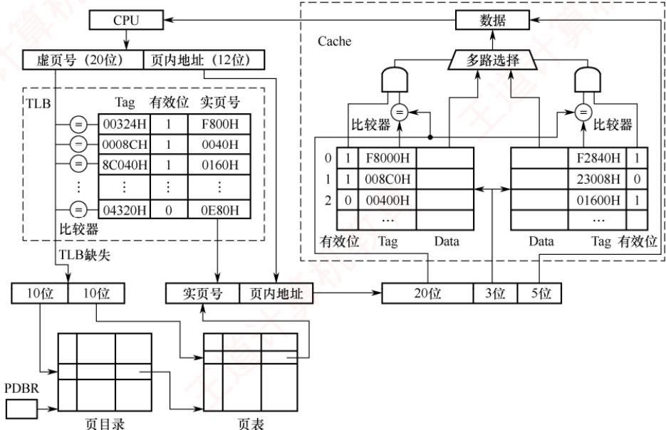

21.【2020统考真题】某32位系统采用基于二级页表的请求分页存储管理方式，按字节编 址，页目录项和页表项长度均为4B，虚拟地址结构如下所示。 灿

<table><tr><td>页目录号（10位）</td><td>页号（10位）</td><td>页内偏移量（12位）</td></tr></table>

某 C 程序中数组 a[1024][1024]的起始虚拟地址为 1080 0000H，数组元素占 4B，该程序运行时，其进程的页目录起始物理地址为00201000H，请回答下列问题。

1）数组元素a[1][2]的虚拟地址是什么？对应的页目录号和页号分别是什么？对应的页目录项的物理地址是什么？若该目录项中存放的页框号为00301H，则a[1][2]所在页对应的页表项的物理地址是什么？

2）数组a在虚拟地址空间中所占的区域是否必须连续？在物理地址空间中所占的区域是否必须连续？

3）已知数组a按行优先方式存放，若对数组a分别按行遍历和按列遍历，则哪种遍历方式的局部性更好?

22.【2024统考真题】某计算机按字节编址，采用页式虚拟存储管理方式，虚拟地址和物理地址的长度均为32位，页表项的大小为4B，页大小为4MB，虚拟地址结构如下。

<table><tr><td>页号（10位）</td><td>页内偏移量（22位）</td></tr></table>

进程P的页表起始虚拟地址为 B8C0 0000H，被装载到从物理地址 6540 0000H开始的连续主存空间中。请回答下列问题，要求答案用十六进制表示。

1）CPU在执行进程P的过程中，访问虚拟地址12345678H时发生了缺页异常，经过缺页异常处理和MMU地址转换后得到的物理地址是BAB45678H。在此次缺页异常处理过程中，需要为所缺页分配页框并更新相应的页表项，该页表项的虚拟地址和物理地址分别是什么？该页表项中的页框号更新后的值是什么？

2）进程P的页表所在页的页号是什么？该页对应的页表项的虚拟地址是什么？该页表项中的页框号是什么？

## 3.2.12 答案与解析

## 一、单项选择题

## 01. D

选项A、B显然错误。编址空间大小由虚拟地址位数决定，与磁盘容量无关。虚拟内存管理必须依赖硬件支持，如地址变换机构、缺页中断机构及存储管理单元等，仅靠软件无法实现。

## 02. B

对于顺序执行程序，缺页中断的次数等于其访问的页帧数。因为页面尺寸增大，存放程序需要的页帧数就减少，所以缺页中断的次数也会减少。

## 03. B

缺页中断是访存指令引起的，说明所要访问的页面不在内存中，进行缺页中断处理并调入所要访问的页后，访存指令显然应该重新执行。

## 04. B

虚拟存储技术并未实际扩充内存、外存，而是采用相关技术相对地扩充主存。

## 05. B

在非虚拟存储器中，作业必须全部装入内存且在运行过程中也一直驻留内存；在虚拟存储器中，作业不必全部装入内存且在运行过程中也不用一直驻留内存，这是两者的主要区别之一。

## 06. A

多次性、对换性和离散性是虚拟内存的特征，一次性则是传统存储系统的特征。

## 07. C

虚拟存储技术基于程序的局部性原理。局部性越好，虚拟存储系统越能更好地发挥作用。

## 08. B

请求分页存储管理方式和基本分页存储管理方式的区别是，前者采用虚拟技术，因此开始运行时，不必将作业全部一次性装入内存，而后者不是。 天へ

## 09. C

通常所说的“存储保护”的基本含义是防止程序间相互越界访问。存储保护可以保证多个程序在共享主存时不相互覆盖或非法访问，从而保证系统的正常运行和安全性。

## 10. C

在页式虚拟存储管理中，程序的逻辑地址和物理地址是不一致的，而且物理地址是在程序运行时才确定的，因此，程序的链接也必须在运行时进行，不能在装入时或编译时进行。运行时动态链接是一种在程序执行过程中，根据需要动态地将目标模块装入内存并进行链接的技术。

## 11. A

程序访问内存时使用的是虚拟地址，操作系统负责将其转换为物理地址。

## 12. D

数组大小为128×128，int 型数据占4B，一个页框可以存放一行数据。当访问 a[0][0]时，发

生第一次缺页中断，此时调入第一行数据；之后访问a[1][0]，又发生缺页中断。每访问一个元素，都发生一次缺页中断，共有 $128 \times 128 = 16384$ 个元素，因此共发生16384次缺页中断。

## 13. C

数组大小为64×64，一个页框可以存放两行数据。当访问X[0][0]时，发生第一次缺页中断，此时调入前两行数据，之后访问 X[1][0]，不发生缺页中断，因为已被调入内存；当访问 X[2][0]时，又发生缺页中断；同理，访问X[3][0]时不发生缺页中断。不难发现，每访问两个元素就发生一次缺页中断，共有64×64=4096个元素，因此共发生2048次缺页中断。

## 14. B

若TLB命中，则访问TLB就能得到物理地址；若TLB未命中，则需要2次访存，依次访问一级页表和二级页表，才能得到物理地址，最后用物理地址在内存中存取数据。平均访存次数=TLB 命中率×1 + (1- TLB 命中率) $\times 3 = 0.75 \times 1 + (1 - 0.75) \times 3 = 1.5$

## 15. D

CLOCK算法选择将最近未使用的页面置换出去，因此也称NRU算法。

## 16.C

无论采用什么页面置换算法，每种页面第一次访问时不可能在内存中，必然发生缺页，所以缺页次数大于或等于n。

## 17. D

请求分页存储管理中，若采用FIFO算法，则可能产生当驻留集增大时页故障数不减反增的Belady异常。然而，还有另外一种情况。例如，页面序列为1,2,3,1,2,3，当页帧数为2时产生6次缺页中断，当页帧数为3时产生3次缺页中断。所以在请求分页存储管理中，若采用FIFO算法，则当可供分配的页帧数增加时，缺页中断的次数可能增加，也可能减少。

## 18. D

进程的虚拟地址空间寻址由系统的地址结构决定，这就决定了虚拟存储器的最大容量，而与主存和外存的容量没有必然联系，因此虚拟地址空间为 $2 ^ { 3 2 } \mathrm { B }$ 。比如，在64位系统环境下，虚拟存储技术使得进程可用地址空间达24B，但外存显然是达不到这个大小的。

## 19. C

页面大小为512B，页内偏移量占9位，虚拟地址占32位，页号占23位，因此页表共有 $2 ^ { 2 3 }$ 个页表项。页表项数量与物理地址的位数没有必然关系。

## 20. B

页面大小为1KB，页内偏移量占10位，页号占6位，将0A6FH展开为二进制，得到逻辑页号为2（000010），存放在11号（001011）页框中，拼接上页内偏移量得到物理地址为2E6FH。

## 21. D

页面越小，页表项数量越多，页表所占的空间就更大；页面越小，缺页率越高；页面越小，换入换出的次数就越多，I/O操作更频繁。页面越小，页内浪费的空间越少，内存利用率越高。

## 22. C

利用LRU算法时的置换如下图所示。

<table><tr><td rowspan=1 colspan=1>访问页面</td><td rowspan=1 colspan=1>1</td><td rowspan=1 colspan=1>8</td><td rowspan=1 colspan=1>1</td><td rowspan=1 colspan=1>7</td><td rowspan=1 colspan=1>8</td><td rowspan=1 colspan=1>2</td><td rowspan=1 colspan=1>7</td><td rowspan=1 colspan=1>2</td><td rowspan=1 colspan=1>1</td><td rowspan=1 colspan=1>8</td><td rowspan=1 colspan=1>3</td><td rowspan=1 colspan=1>8</td><td rowspan=1 colspan=1>2</td><td rowspan=1 colspan=1>1</td><td rowspan=1 colspan=1>3</td><td rowspan=1 colspan=1>1</td><td rowspan=1 colspan=1>7</td><td rowspan=1 colspan=1>1</td><td rowspan=1 colspan=1>3</td><td rowspan=1 colspan=1>7</td></tr><tr><td rowspan=1 colspan=1>物理块1</td><td rowspan=1 colspan=1>1</td><td rowspan=1 colspan=1>1</td><td rowspan=1 colspan=1></td><td rowspan=1 colspan=1>1</td><td rowspan=1 colspan=1></td><td rowspan=1 colspan=1>1</td><td rowspan=1 colspan=1></td><td rowspan=1 colspan=1></td><td rowspan=1 colspan=1></td><td rowspan=1 colspan=1></td><td rowspan=1 colspan=1>1</td><td rowspan=1 colspan=1></td><td rowspan=1 colspan=1></td><td rowspan=1 colspan=1></td><td rowspan=1 colspan=1></td><td rowspan=1 colspan=1></td><td rowspan=1 colspan=1>1</td><td rowspan=1 colspan=1></td><td rowspan=1 colspan=1></td><td rowspan=1 colspan=1></td></tr><tr><td rowspan=1 colspan=1>物理块2</td><td rowspan=1 colspan=1></td><td rowspan=1 colspan=1>8</td><td rowspan=1 colspan=1></td><td rowspan=1 colspan=1>8</td><td rowspan=1 colspan=1></td><td rowspan=1 colspan=1>8</td><td rowspan=1 colspan=1></td><td rowspan=1 colspan=1></td><td rowspan=1 colspan=1>公</td><td rowspan=1 colspan=1>N</td><td rowspan=1 colspan=1>8</td><td rowspan=1 colspan=1></td><td rowspan=1 colspan=1></td><td rowspan=1 colspan=1></td><td rowspan=1 colspan=1></td><td rowspan=1 colspan=1></td><td rowspan=1 colspan=1>7</td><td rowspan=1 colspan=1></td><td rowspan=1 colspan=1></td><td rowspan=1 colspan=1></td></tr><tr><td rowspan=1 colspan=1>物理块3</td><td rowspan=1 colspan=1></td><td rowspan=1 colspan=1></td><td rowspan=1 colspan=1></td><td rowspan=1 colspan=1>7</td><td rowspan=1 colspan=1></td><td rowspan=1 colspan=1>7</td><td rowspan=1 colspan=1></td><td rowspan=1 colspan=1></td><td rowspan=1 colspan=1>X</td><td rowspan=1 colspan=1></td><td rowspan=1 colspan=1>3</td><td rowspan=1 colspan=1></td><td rowspan=1 colspan=1></td><td rowspan=1 colspan=1></td><td rowspan=1 colspan=1></td><td rowspan=1 colspan=1></td><td rowspan=1 colspan=1>3</td><td rowspan=1 colspan=1></td><td rowspan=1 colspan=1></td><td rowspan=1 colspan=1></td></tr><tr><td rowspan=1 colspan=1>物理块4</td><td rowspan=1 colspan=1></td><td rowspan=1 colspan=1></td><td rowspan=1 colspan=1></td><td rowspan=1 colspan=1></td><td rowspan=1 colspan=1></td><td rowspan=1 colspan=1>2</td><td rowspan=1 colspan=1></td><td rowspan=1 colspan=1></td><td rowspan=1 colspan=1></td><td rowspan=1 colspan=1></td><td rowspan=1 colspan=1>2</td><td rowspan=1 colspan=1></td><td rowspan=1 colspan=1></td><td rowspan=1 colspan=1></td><td rowspan=1 colspan=1></td><td rowspan=1 colspan=1></td><td rowspan=1 colspan=1>2</td><td rowspan=1 colspan=1></td><td rowspan=1 colspan=1></td><td rowspan=1 colspan=1></td></tr><tr><td rowspan=1 colspan=1>缺页否</td><td rowspan=1 colspan=1>√</td><td rowspan=1 colspan=1>√</td><td rowspan=1 colspan=1></td><td rowspan=1 colspan=1>√</td><td rowspan=1 colspan=1></td><td rowspan=1 colspan=1>√</td><td rowspan=1 colspan=1></td><td rowspan=1 colspan=1></td><td rowspan=1 colspan=1></td><td rowspan=1 colspan=1></td><td rowspan=1 colspan=1>√</td><td rowspan=1 colspan=1></td><td rowspan=1 colspan=1></td><td rowspan=1 colspan=1></td><td rowspan=1 colspan=1></td><td rowspan=1 colspan=1></td><td rowspan=1 colspan=1>√</td><td rowspan=1 colspan=1></td><td rowspan=1 colspan=1></td><td rowspan=1 colspan=1></td></tr></table>

分别在访问第1、2、4、6、11、17个页面时产生中断，共产生6次中断。

## 23. D

LRU算法要求在缺页时选择淘汰最近最久未使用的页面。若采用纯软件实现，则需为每个驻留页面维护其访问历史信息，并在每次缺页时遍历所有页帧以确定替换目标，时间复杂度为O(n)，开销显著。选项A并非开销高的原因，而是为降低该软件开销而引入的硬件手段。换言之，正因软件实现开销过高，才需借助硬件辅助。选项B和C与LRU算法的机制无关。

## 24. A

页表项中的合法位信息显示本页面是否在内存中，即决定了是否会发生页面故障。

## 25. D

抖动是进程的页面置换过程中，频繁的页面调度（缺页中断）行为，所有的页面调度策略都不可能完全避免抖动。 临

## 26. C

基于局部性原理：当程序装入时，不必将其全部读入内存，而只需将当前需要执行的部分页或段读入内存，就可让程序开始执行。在程序执行过程中，若需执行的指令或访问的数据尚未在内存（称为缺页或缺段）中，则由处理器通知操作系统将相应的页或段调入内存，然后继续执行程序。由于程序具有局部性，虚拟存储管理在扩充逻辑地址空间的同时，对程序执行时内存调换的代价很小。

## 27. B

请求分页存储管理就是为了解决内存容量不足而使用的方法，它基于局部性原理实现了以时间换取空间的目的。它的主要特点自然是间接扩充了内存。

## 28. C

当需要置换页面时，置换算法根据修改位和访问位选择调出内存的页面。

## 29. B

驻留集是指分配给进程的物理页面的集合。工作集是指在某段时间内，进程实际要访问的页面的集合。工作集不一定是驻留集的子集，因为有些工作集中的页面可能还未被调入内存，或已被换出内存。只有当工作集完全包含在驻留集中时，才能保证进程不发生缺页中断。

## 30. B

平均访存时间 =命中率 ×快表访问时间+ 不命中率×(快表访问时间 + 页表访问时间) + 内存访问时间。当 TLB 命中率为 85%时，平均访存时间 = 0.85×0.2 + 0.15×(1 + 0.2) + 1 = 1.35μs。当TLB 命中率为 50%时，平均访存时间 = 0.5×0.2 + 0.5×(1 + 0.2) + 1 = 1.7μs。 X

## 31. D

页面置换算法影响进程运行过程中的缺页率，从而影响页面换进换出的开销。若建立一个已修改页面的链表，则对每个要被换出的页面（已修改），系统可暂不把它们写回磁盘，而等被换出页面数量达到一定值时，才集中写回磁盘，从而减少页面换出的开销。当已修改页面链表中暂未写回磁盘的页面再使用时，就不需从磁盘中调入，而直接从该链表上获取，从而减少页面换进的开销。CPU与内存交换的速度，不是页面换进换出效率的影响因素。

## 32. B

这种置换方法是全局置换，它不受驻留集大小的限制，可以从任何页框中选择一个页面置换。

## 33. B

FIFO是队列类算法，有Belady现象；选项C、D均为堆栈类算法，理论上可以证明不会出现 Belady 现象。

## 34. B

页式虚拟存储管理的主要特点是，不要求将作业同时全部装入主存的连续区域，一般只装入

10%～30%。不要求将作业装入主存连续区域是所有离散式存储管理（包括页式存储管理）的特点；页式虚拟存储管理需要进行缺页中断处理和页面置换。

## 35. C

虚拟存储技术是基于页或段从内存的调入/调出实现的，需要有请求机制的支持。

## 36. C

内存映射文件将一个文件映射到进程的虚拟地址空间的某个区域，让进程可以按读/写内存的方式来读/写文件，选项C正确。内存映射文件不是一次性加载整个文件，而是按需加载文件的部分，这样既节省空间，又方便处理大文件。虽然进程的虚拟地址空间是独立的，但操作系统可以通过页表将对应的虚拟地址空间映射到相同的物理内存，很方便实现多个进程共享同一文件。

## 37. C

根据缺页中断的处理流程，产生缺页中断后，首先去内存寻找空闲物理块，若内存没有空闲物理块，则使用页面置换算法决定淘汰页面，然后调出该淘汰页面，最后再调入该进程欲访问的页面。整个流程可归纳为缺页中断→决定淘汰页→页面调出→页面调入。

## 38. C

页面大小为4KB，因此页内偏移为12位。系统采用48位虚拟地址，因此虚页号48-12=36位。采用多级页表时，最高级页表项不能超出一页大小；每页能容纳的页表项数为4KB/8B=512=29，36/9=4，因此应采用4级页表，最高级页表项正好占据一页空间，所以本题选择选项C。

## 39. B

FIFO算法可能产生Belady现象，例如页面走向为1,2,3,4,1,2,5,1,2,3,4,5时，当分配3帧时产生9次缺页中断，分配4帧时产生10次缺页中断，说法Ⅰ正确。最近最少使用法不会产生Belady现象，说法Ⅱ错误。若页面在内存中，则不会产生缺页中断，即不会出现页面的调入/调出，而不是虚拟存储器（包括作为虚拟内存那部分硬盘），所以说法Ⅲ错误、说法IV正确。

## 40. D

用于交换空间的磁盘利用率已达97.7%，其他设备的利用率为5%，CPU的利用率为20%，说明在任务作业不多的情况下交换操作非常频繁，因此判断物理内存严重短缺。

## 41. B

说法Ⅰ正确：增大内存容量可为进程分配更多页框，从而降低缺页率，减少页面换入/换出操作，有效提升CPU利用率。说法Ⅱ错误：磁盘交换区利用率高达99.7%，表明系统已陷入抖动；此时性能瓶颈源于频繁的页面置换，而非交换区容量不足，因此扩大其容量无效。说法Ⅲ正确：减少多道程序度可降低并发进程数量，缓解内存竞争，进而抑制抖动，使CPU获得更多有效计算时间。说法IV错误：若增加多道程序度，则会引入更多的进程，进一步加剧内存压力，导致页面置换更加频繁，系统性能显著恶化。说法V错误：即使采用更快的磁盘交换区，由于页面置换的频率并未降低，系统仍会将大量时间耗费在I/O操作上，CPU利用率难以改善。说法VI错误：当前CPU利用率仅为10%，说明其大部分时间处于空闲等待状态，瓶颈在于I/O而非计算能力，因此提升CPU速度无济于事。

## 42. A

增大TLB容量可以提高TLB命中率，因为可以缓存更多的地址映射。采用多级页表对TLB命中率没有影响。提高页面大小可用较少的页面覆盖更大的地址空间，从而减少页表项，因此可以提高TLB命中率。反之，降低页面大小则会降低TLB命中率。

## 43. D

缺页中断产生后，需要在内存中找到空闲页框并分配给需要访问的页（可能涉及页面置换），之后缺页中断处理程序调用设备驱动程序做磁盘I/Q，将位于外存上的页面调入内存，调入后需

要修改页表，将页表中代表该页是否在内存的标志位（或有效位）置为1，并将物理页框号填入相应位置，必要时还需要修改其他相关表项等。

## 44. A

在具有对换功能的操作系统中，通常把外存分为文件区（用于存放文件）和对换区（用于存放从内存换出的进程）。抖动是指刚刚被换出的页很快又要被访问，为此又要换出其他页，而该页又很快被访问，如此频繁地置换页面，以致大部分时间都花在页面置换上，导致系统性能下降。撤销部分进程可以减少所要用到的页面数，防止抖动。对换区大小和进程优先级都与抖动无关。

## 45. B

当采用连续分配方式时，会使相当一部分内存空间都处于暂时或“永久”的空闲状态，造成内存资源的严重浪费，也无法从逻辑上扩大内存容量，因此虚拟内存的实现只能建立在离散分配的内存管理的基础上。有以下三种实现方式：请求分页：请求分段：请求段页式。虚存的实际容量受外存和内存容量之和限制，虚存的最大容量是由计算机的地址位数决定的。 X

## 46. B

用户进程访问内存时缺页，会发生缺页中断。发生缺页中断时，系统执行的操作可能是置换页面或分配内存。越界检查发生在查询页表之前，而此处产生了缺页中断，说明已经正常进行到查询页表的阶段，系统此时没有产生越界错，因此不会进行越界出错处理。

## 47. C

虚实地址转换是指逻辑地址和物理地址的转换。增大快表容量能把更多的表项装入快表，会加快虚实地址转换的速度：让页表常驻内存可以省去一些不在内存中的页表从磁盘上调入的过程，也能加快虚实地址转换：增大交换区对虚实地址转换速度无影响，因此说法Ⅰ、Ⅱ正确。

## 48. A

只有 FIFO 算法会导致 Belady 异常。

## 49. C

对各进程进行固定分配时页面数不变，不可能出现全局置换。而选项A、B、D是现代操作系统中常见的3种策略。 H

## 50. A

可以采用书中常规的解法思路，也可以采用便捷法。对页号序列从后往前计数，直到数到4（页框数）个不同的数字为止，这个停止的数字就是要淘汰的页号（最近最久未使用的页），题中为页号2。

## 51. A

改进型CLOCK算法执行的步骤如下。

1）从指针的当前位置开始，扫描帧缓冲区。在这次扫描过程中，对使用位不做任何修改。选择遇到的第一个帧（A=0,M=0）用于替换。

2）若第1）步失败，则重新扫描，查找（A=0,M=1）的帧。选择遇到的第一个这样的帧用于替换。在这个扫描过程中，对每个跳过的帧，将其使用位设置成0。

3）若第2）步失败，则指针将回到它的最初位置，并且集合中所有帧的使用位均为0。重复第1）步，并在有必要时重复第2）步，这样将可以找到供替换的帧。

因此，该算法淘汰页的次序为(0, 0),(0, 1),(1, 0),(1, 1)。

## 52. A

在任意时刻t，都存在一个集合，它包含所有最近k次（该题窗口大小为6）内存访问所访问过的页面。这个集合w(k,t)就是工作集。题中最近6次访问的页面分别为6,0,3,2,3,2，去除重复的页面，形成的工作集为{6,0,3,2}。

## 53. C

最近最久未使用（LRU）算法每次执行页面置换时会换出最近最久未使用过的页面。第一次

访问5页面时，会把最久未被使用的1页面换出，第一次访问3页面时，会把最久未访问的2页面换出。具体的页面置换情况如下图所示。

<table><tr><td rowspan=1 colspan=1>访问页面</td><td rowspan=1 colspan=1>0</td><td rowspan=1 colspan=1>1</td><td rowspan=1 colspan=1>2</td><td rowspan=1 colspan=1>7</td><td rowspan=1 colspan=1>0</td><td rowspan=1 colspan=1>5</td><td rowspan=1 colspan=1>3</td><td rowspan=1 colspan=1>5</td><td rowspan=1 colspan=1>0</td><td rowspan=1 colspan=1>2</td><td rowspan=1 colspan=1>7</td><td rowspan=1 colspan=1>6</td></tr><tr><td rowspan=1 colspan=1>物理块1</td><td rowspan=1 colspan=1>0</td><td rowspan=1 colspan=1>0</td><td rowspan=1 colspan=1>0</td><td rowspan=1 colspan=1>0</td><td rowspan=1 colspan=1>0</td><td rowspan=1 colspan=1>0</td><td rowspan=1 colspan=1>0</td><td rowspan=1 colspan=1>0</td><td rowspan=1 colspan=1>0</td><td rowspan=1 colspan=1>0</td><td rowspan=1 colspan=1>0</td><td rowspan=1 colspan=1>0</td></tr><tr><td rowspan=1 colspan=1>物理块2</td><td rowspan=1 colspan=1></td><td rowspan=1 colspan=1>1</td><td rowspan=1 colspan=1>1</td><td rowspan=1 colspan=1>1</td><td rowspan=1 colspan=1>1</td><td rowspan=1 colspan=1>5</td><td rowspan=1 colspan=1>5</td><td rowspan=1 colspan=1>5</td><td rowspan=1 colspan=1>5</td><td rowspan=1 colspan=1>5</td><td rowspan=1 colspan=1>5</td><td rowspan=1 colspan=1>6</td></tr><tr><td rowspan=1 colspan=1>物理块3</td><td rowspan=1 colspan=1></td><td rowspan=1 colspan=1></td><td rowspan=1 colspan=1>2</td><td rowspan=1 colspan=1>2</td><td rowspan=1 colspan=1>2</td><td rowspan=1 colspan=1>2</td><td rowspan=1 colspan=1>3</td><td rowspan=1 colspan=1>3</td><td rowspan=1 colspan=1>3</td><td rowspan=1 colspan=1>3</td><td rowspan=1 colspan=1>7</td><td rowspan=1 colspan=1>7</td></tr><tr><td rowspan=1 colspan=1>物理块4</td><td rowspan=1 colspan=1></td><td rowspan=1 colspan=1></td><td rowspan=1 colspan=1></td><td rowspan=1 colspan=1>7</td><td rowspan=1 colspan=1>7</td><td rowspan=1 colspan=1>7</td><td rowspan=1 colspan=1>7</td><td rowspan=1 colspan=1>7</td><td rowspan=1 colspan=1>7</td><td rowspan=1 colspan=1>2</td><td rowspan=1 colspan=1>2</td><td rowspan=1 colspan=1>2</td></tr><tr><td rowspan=1 colspan=1>缺页否</td><td rowspan=1 colspan=1>√</td><td rowspan=1 colspan=1>√</td><td rowspan=1 colspan=1>√</td><td rowspan=1 colspan=1>√</td><td rowspan=1 colspan=1></td><td rowspan=1 colspan=1>√</td><td rowspan=1 colspan=1>7</td><td rowspan=1 colspan=1></td><td rowspan=1 colspan=1></td><td rowspan=1 colspan=1>√</td><td rowspan=1 colspan=1>√</td><td rowspan=1 colspan=1>√</td></tr></table>

需要注意的是，题中问的是页置换次数，而不是缺页次数，所以前4次缺页未换页的情况不考虑在内，答案为5次，因此选择选项C。

## 54. D

说法Ⅰ影响缺页中断的频率，缺页率越高，平均访存时间越长：说法Ⅱ和IV影响缺页中断的处理时间，中断处理时间越长，平均访存时间越长；说法Ⅲ影响访问页表和访问目标物理地址的时间，所以说法I、Ⅱ、Ⅲ和IV均正确。

## 55. C

页面大小为4KB，低12位是页内偏移。虚拟地址为02A01H，页号为02H，02H页对应的页表项中存在位为0，进程P分配的页框固定为2，且内存中已有两个页面存在。根据Clock算法，选择将3号页换出，将2号页放入60H页框，经过地址变换后得到的物理地址是60A01H。

## 56. A

缺页异常需要从磁盘调页到内存中，将新调入的页与页框建立对应关系，并修改该页的存在位，选项B、C、D正确；若内存中有空闲页框，则不需要淘汰其他页，选项A错误。

## 57. D

页置换算法会影响缺页率，例如，LRU算法的缺页率通常要比FIFO算法的缺页率低，排除选项A。工作集的大小决定了分配给进程的物理块数，分配给进程的物理块数越多，缺页率就越低，排除选项B。进程的数量越多，对内存资源的竞争越激烈，每个进程被分配的物理块数越少，缺页率也就越高，排除选项C。页缓冲队列是将被淘汰的页面缓存下来，暂时不写回磁盘，队列长度会影响页面置换的速度，但不会影响缺页率。

## 58. D

虚拟地址空间的大小由底层的虚拟内存管理机制和操作系统决定，通常在不同的操作系统中有所不同，与内存和硬盘的大小没有关系，内存和硬盘的大小仅决定虚拟存储器实际可用容量的最大值，选项D错误。选项A、C显然正确。在进程的虚拟地址空间中，有专门用来存放动态分配的变量的堆区，通过调用malloc()函数动态地分配该空间，选项B正确。

## 59. B

系统为进程P分配3个页框，记为A、B、C，初始时页面0、1、2已在内存中。采用固定分配局部置换的LRU算法，访问页面序列时，各页框内容及缺页情况如下表所示。

<table><tr><td rowspan=1 colspan=1></td><td rowspan=1 colspan=1>初始</td><td rowspan=1 colspan=1>#0</td><td rowspan=1 colspan=1>#1</td><td rowspan=1 colspan=1>#2</td><td rowspan=1 colspan=1>#0</td><td rowspan=1 colspan=1>#5</td><td rowspan=1 colspan=1>#1</td><td rowspan=1 colspan=1>#4</td><td rowspan=1 colspan=1>#3</td><td rowspan=1 colspan=1>#0</td><td rowspan=1 colspan=1>#2</td><td rowspan=1 colspan=1>#3</td><td rowspan=1 colspan=1>2</td><td rowspan=1 colspan=1>0</td></tr><tr><td rowspan=1 colspan=1>页框A</td><td rowspan=1 colspan=1>#0</td><td rowspan=1 colspan=1>#0</td><td rowspan=1 colspan=1>#0</td><td rowspan=1 colspan=1>#0</td><td rowspan=1 colspan=1>#0</td><td rowspan=1 colspan=1>#0</td><td rowspan=1 colspan=1>#0</td><td rowspan=1 colspan=1>#4</td><td rowspan=1 colspan=1>#4</td><td rowspan=1 colspan=1>#4</td><td rowspan=1 colspan=1>#2</td><td rowspan=1 colspan=1>#2</td><td rowspan=1 colspan=1></td><td rowspan=1 colspan=1></td></tr><tr><td rowspan=1 colspan=1>页框B</td><td rowspan=1 colspan=1>#1</td><td rowspan=1 colspan=1>#1</td><td rowspan=1 colspan=1>#1</td><td rowspan=1 colspan=1>#1</td><td rowspan=1 colspan=1>#1</td><td rowspan=1 colspan=1>#5</td><td rowspan=1 colspan=1>#5</td><td rowspan=1 colspan=1>#5</td><td rowspan=1 colspan=1>#3</td><td rowspan=1 colspan=1>#3</td><td rowspan=1 colspan=1>#3</td><td rowspan=1 colspan=1>#3</td><td rowspan=1 colspan=1></td><td rowspan=1 colspan=1></td></tr><tr><td rowspan=1 colspan=1>页框C</td><td rowspan=1 colspan=1>#2</td><td rowspan=1 colspan=1>#2</td><td rowspan=1 colspan=1>#2</td><td rowspan=1 colspan=1>#2</td><td rowspan=1 colspan=1>#2</td><td rowspan=1 colspan=1>#2</td><td rowspan=1 colspan=1>#1</td><td rowspan=1 colspan=1>#1</td><td rowspan=1 colspan=1>#1</td><td rowspan=1 colspan=1>#0</td><td rowspan=1 colspan=1>#0</td><td rowspan=1 colspan=1>#0</td><td rowspan=1 colspan=1></td><td rowspan=1 colspan=1></td></tr><tr><td rowspan=1 colspan=1>是否缺页</td><td rowspan=1 colspan=1></td><td rowspan=1 colspan=1></td><td rowspan=1 colspan=1></td><td rowspan=1 colspan=1></td><td rowspan=1 colspan=1></td><td rowspan=1 colspan=1>是</td><td rowspan=1 colspan=1>是</td><td rowspan=1 colspan=1>是</td><td rowspan=1 colspan=1>是</td><td rowspan=1 colspan=1>是</td><td rowspan=1 colspan=1>是</td><td rowspan=1 colspan=1></td><td rowspan=1 colspan=1></td><td rowspan=1 colspan=1></td></tr></table>

初始状态：页框A、B、C分别存放#0、#1、#2。第5次访问#5：不在内存，缺页，此时最近使用顺序为#0→#2→#1（#1为最久未用），淘汰最久未使用的#1，换入#5。第6次访问#1：不在内存，缺页，淘汰最久未用的#2，换入#1。第7次访问#4：缺页，淘汰#0，换入#4。第8次访

问#3：缺页，淘汰#5，换入#3。第9次访问#0：缺页，淘汰#1，换入#0。第10次访问#2：缺页，淘汰4，换入#2。后续访问#3、#2、#0均命中。共发生6次缺页异常。

## 60. D

在页式系统中，进程正常运行所需的最少页框数并不由代码段长度、虚拟地址空间大小或物理内存容量决定，而取决于单条指令在取指和执行过程中可能同时访间的最大页面数。该数量由指令系统支持的寻址方式直接决定：取指阶段至少需访问存放指令的页面；执行阶段则因寻址方式不同而异。寄存器寻址无须访问内存，直接寻址需访问一个数据页面，而间接寻址可能需先后访问两个页面（分别存放形式地址和实际操作数）。若一条指令最多涉及k个不同的页面，则系统至少需要为其分配k个页框，否则将因频繁缺页而导致颠簸，甚至无法完成该指令的执行。因此，确定最少页框数的关键因素是指令系统的寻址方式。

## 61. A

内存映射文件机制将文件内容映射到进程的虚拟地址空间，使进程能够像访问内存一样直接读/写文件数据，而底层I/O（如页面的按需加载与换出）由操作系统自动处理，从而简化文件操作。当多个进程映射同一文件时，它们通过共享内核页缓存读/写相同的数据，从而高效实现进程间通信。需要明确的是，该机制本身仅建立文件与进程虚拟地址空间之间的关联，并不直接实现“页到磁盘块的映射”，这一映射由操作系统的虚拟内存管理系统（如页表、缺页中断机制）统一维护，属于通用虚拟存储机制的功能。此外，映射目标始终是进程的虚拟地址空间，物理地址由操作系统动态分配并对进程完全透明，进程无法感知或直接访问。因此，只有说法Ⅰ和Ⅲ准确描述了内存映射文件机制直接提供的功能。

## 二、综合应用题

## 01. 【解答】

一页的大小为32B，逻辑地址结构为：低5位为页内位移，其余高位为页号。

101（八进制）=001000001（二进制），则页号为2，在相联存储器中，对应的页帧号为f3，即物理地址为(f3,1)。 X

204（八进制）=010000100（二进制），则页号为4，不在相联存储器中，查内存的页表得页帧号为f5，即物理地址为(f5,4)，并用其更新相联存储器中的一项。V

576（八进制）=101111110（二进制），则页号为11，已超出页表范围，即产生越界中断。

## 02. 【解答】

1）80%的访问的页表项在关联寄存器中，访问耗时1μs。

2）18%的访问的页表项不在关联寄存器中，但在内存中，耗时(1+1)μs。

3）2%的访问产生缺页中断，访问耗时 $( 1 \mu \mathrm { s } + 1 \mu \mathrm { s } + 2 0 \mathrm { m s } )$ 0

从而有效访问时间为 $80\% \times 1 + 18\% \times 2 + 2\% \times (1 \times 2 + 20 \times 1000) = 401.2 \mu  s$

## 03.【解答】

发生页故障的原因是，当前访问的页不在主存，需要将该页调入主存。此时不管主存中是否已满（已满则先调出一页），都要发生一次页故障，即无论怎样安排，n个不同的页号在首次进入主存时必须要发生一次页故障，总共发生n次，这是页故障数的下限。虽然不同的页号数为n小于或等于总长度 $p$ (访问串可能有一些页重复出现)，但驻留集 $m \leq n$ ，所以可能有某些页进入主存后又被调出主存，当再次访问时又发生一次页故障的现象，即有些页可能出现多次页故障。最差的情况是每访问一个页号时，该页都不在主存中，这样共发生 $p$ 次故障。

因此，对于FIFO、LRU算法，页故障数的上限均为 $p ,$ 下限均为 $n _ { \circ }$ 例如，当 $m = 3, p = 12,$ $n = 4$ 时，有访问串111223334444，则页故障数为4，这是下限n的情况。又如，有访问串123412341234，则页故障数为12，这是上限 $p$ 的情况。

## 04. 【解答】

1）根据页面走向，使用最佳置换算法时，页面置换情况见下表。

物理块数为3时：

<table><tr><td rowspan=1 colspan=1>走 向</td><td rowspan=1 colspan=1>4</td><td rowspan=1 colspan=1>3</td><td rowspan=1 colspan=1>2</td><td rowspan=1 colspan=1>1</td><td rowspan=1 colspan=1>4</td><td rowspan=1 colspan=1>3</td><td rowspan=1 colspan=1>5</td><td rowspan=1 colspan=1>4</td><td rowspan=1 colspan=1>3</td><td rowspan=1 colspan=1>2</td><td rowspan=1 colspan=1>1</td><td rowspan=1 colspan=1>5</td></tr><tr><td rowspan=1 colspan=1>块1</td><td rowspan=1 colspan=1>4</td><td rowspan=1 colspan=1>4</td><td rowspan=1 colspan=1>4</td><td rowspan=1 colspan=1>4</td><td rowspan=1 colspan=1>4</td><td rowspan=1 colspan=1>4</td><td rowspan=1 colspan=1>4</td><td rowspan=1 colspan=1>4</td><td rowspan=1 colspan=1>4</td><td rowspan=1 colspan=1>2</td><td rowspan=1 colspan=1>2</td><td rowspan=1 colspan=1>2</td></tr><tr><td rowspan=1 colspan=1>块2</td><td rowspan=1 colspan=1></td><td rowspan=1 colspan=1>3</td><td rowspan=1 colspan=1>3</td><td rowspan=1 colspan=1>3</td><td rowspan=1 colspan=1>3</td><td rowspan=1 colspan=1>3</td><td rowspan=1 colspan=1>3</td><td rowspan=1 colspan=1>3</td><td rowspan=1 colspan=1>3</td><td rowspan=1 colspan=1>3</td><td rowspan=1 colspan=1>1</td><td rowspan=1 colspan=1>1</td></tr><tr><td rowspan=1 colspan=1>块3</td><td rowspan=1 colspan=1></td><td rowspan=1 colspan=1></td><td rowspan=1 colspan=1>2</td><td rowspan=1 colspan=1>1</td><td rowspan=1 colspan=1>1</td><td rowspan=1 colspan=1>1</td><td rowspan=1 colspan=1>5</td><td rowspan=1 colspan=1>5</td><td rowspan=1 colspan=1>5</td><td rowspan=1 colspan=1>5</td><td rowspan=1 colspan=1>5</td><td rowspan=1 colspan=1>5</td></tr><tr><td rowspan=1 colspan=1>缺页</td><td rowspan=1 colspan=1>√</td><td rowspan=1 colspan=1>V</td><td rowspan=1 colspan=1>√</td><td rowspan=1 colspan=1>√</td><td rowspan=1 colspan=1></td><td rowspan=1 colspan=1></td><td rowspan=1 colspan=1>√</td><td rowspan=1 colspan=1></td><td rowspan=1 colspan=1></td><td rowspan=1 colspan=1>√</td><td rowspan=1 colspan=1>√</td><td rowspan=1 colspan=1></td></tr></table>

缺页率为7/12。

物理块数为4时：

<table><tr><td rowspan=1 colspan=1>走 向</td><td rowspan=1 colspan=1>4</td><td rowspan=1 colspan=1>3</td><td rowspan=1 colspan=1>2</td><td rowspan=1 colspan=1>1</td><td rowspan=1 colspan=1>4</td><td rowspan=1 colspan=1>3</td><td rowspan=1 colspan=1>5</td><td rowspan=1 colspan=1>4</td><td rowspan=1 colspan=1>3</td><td rowspan=1 colspan=1>2</td><td rowspan=1 colspan=1>1</td><td rowspan=1 colspan=1>5</td></tr><tr><td rowspan=1 colspan=1>块1</td><td rowspan=1 colspan=1>4</td><td rowspan=1 colspan=1>4</td><td rowspan=1 colspan=1>4</td><td rowspan=1 colspan=1>4</td><td rowspan=1 colspan=1>4</td><td rowspan=1 colspan=1>4</td><td rowspan=1 colspan=1>4</td><td rowspan=1 colspan=1>4</td><td rowspan=1 colspan=1>4</td><td rowspan=1 colspan=1>4</td><td rowspan=1 colspan=1>1</td><td rowspan=1 colspan=1>1</td></tr><tr><td rowspan=1 colspan=1>块2</td><td rowspan=1 colspan=1></td><td rowspan=1 colspan=1>3</td><td rowspan=1 colspan=1>3</td><td rowspan=1 colspan=1>3</td><td rowspan=1 colspan=1>3</td><td rowspan=1 colspan=1>3</td><td rowspan=1 colspan=1>3</td><td rowspan=1 colspan=1>3</td><td rowspan=1 colspan=1>3</td><td rowspan=1 colspan=1>3</td><td rowspan=1 colspan=1>3</td><td rowspan=1 colspan=1>3</td></tr><tr><td rowspan=1 colspan=1>块3</td><td rowspan=1 colspan=1></td><td rowspan=1 colspan=1></td><td rowspan=1 colspan=1>2</td><td rowspan=1 colspan=1>2</td><td rowspan=1 colspan=1>2</td><td rowspan=1 colspan=1>2</td><td rowspan=1 colspan=1>2</td><td rowspan=1 colspan=1>2</td><td rowspan=1 colspan=1>2</td><td rowspan=1 colspan=1>2</td><td rowspan=1 colspan=1>2</td><td rowspan=1 colspan=1>2</td></tr><tr><td rowspan=1 colspan=1>块4</td><td rowspan=1 colspan=1></td><td rowspan=1 colspan=1></td><td rowspan=1 colspan=1></td><td rowspan=1 colspan=1>1</td><td rowspan=1 colspan=1>1</td><td rowspan=1 colspan=1>1</td><td rowspan=1 colspan=1>5</td><td rowspan=1 colspan=1>5</td><td rowspan=1 colspan=1>5</td><td rowspan=1 colspan=1>5</td><td rowspan=1 colspan=1>5</td><td rowspan=1 colspan=1>5</td></tr><tr><td rowspan=1 colspan=1>缺页</td><td rowspan=1 colspan=1>√</td><td rowspan=1 colspan=1>√</td><td rowspan=1 colspan=1>√</td><td rowspan=1 colspan=1>√</td><td rowspan=1 colspan=1></td><td rowspan=1 colspan=1></td><td rowspan=1 colspan=1>√</td><td rowspan=1 colspan=1></td><td rowspan=1 colspan=1></td><td rowspan=1 colspan=1></td><td rowspan=1 colspan=1>√</td><td rowspan=1 colspan=1></td></tr></table>

缺页率为6/12。

由上述结果可以看出，增加分配作业的内存块数可以降低缺页率。

2）根据页面走向，使用先进先出页面置换算法时，页面置换情况见下表。物理块数为3时：1

<table><tr><td rowspan=1 colspan=1>走 向</td><td rowspan=1 colspan=1>4</td><td rowspan=1 colspan=1>3</td><td rowspan=1 colspan=1>2</td><td rowspan=1 colspan=1>1</td><td rowspan=1 colspan=1>4</td><td rowspan=1 colspan=1>3</td><td rowspan=1 colspan=1>5</td><td rowspan=1 colspan=1>4</td><td rowspan=1 colspan=1>3</td><td rowspan=1 colspan=1>2</td><td rowspan=1 colspan=1>1</td><td rowspan=1 colspan=1>5</td></tr><tr><td rowspan=1 colspan=1>块1</td><td rowspan=1 colspan=1>4</td><td rowspan=1 colspan=1>4</td><td rowspan=1 colspan=1>4</td><td rowspan=1 colspan=1>1</td><td rowspan=1 colspan=1>1</td><td rowspan=1 colspan=1>1</td><td rowspan=1 colspan=1>5</td><td rowspan=1 colspan=1>5</td><td rowspan=1 colspan=1>5</td><td rowspan=1 colspan=1>5</td><td rowspan=1 colspan=1>5</td><td rowspan=1 colspan=1></td></tr><tr><td rowspan=1 colspan=1>块2</td><td rowspan=1 colspan=1></td><td rowspan=1 colspan=1>3</td><td rowspan=1 colspan=1>3</td><td rowspan=1 colspan=1>3</td><td rowspan=1 colspan=1>4</td><td rowspan=1 colspan=1>4</td><td rowspan=1 colspan=1>4</td><td rowspan=1 colspan=1>4</td><td rowspan=1 colspan=1>4</td><td rowspan=1 colspan=1>2</td><td rowspan=1 colspan=1>2</td><td rowspan=1 colspan=1></td></tr><tr><td rowspan=1 colspan=1>块3</td><td rowspan=1 colspan=1></td><td rowspan=1 colspan=1></td><td rowspan=1 colspan=1>2</td><td rowspan=1 colspan=1>2</td><td rowspan=1 colspan=1>2</td><td rowspan=1 colspan=1>3</td><td rowspan=1 colspan=1>3</td><td rowspan=1 colspan=1>3</td><td rowspan=1 colspan=1>3</td><td rowspan=1 colspan=1>3</td><td rowspan=1 colspan=1>1</td><td rowspan=1 colspan=1></td></tr><tr><td rowspan=1 colspan=1>缺页</td><td rowspan=1 colspan=1>√</td><td rowspan=1 colspan=1>V</td><td rowspan=1 colspan=1>√</td><td rowspan=1 colspan=1>√</td><td rowspan=1 colspan=1>√</td><td rowspan=1 colspan=1>√</td><td rowspan=1 colspan=1>√</td><td rowspan=1 colspan=1></td><td rowspan=1 colspan=1></td><td rowspan=1 colspan=1>√</td><td rowspan=1 colspan=1>√</td><td rowspan=1 colspan=1></td></tr></table>

缺页率为9/12。

物理块数为4时：

<table><tr><td rowspan=1 colspan=1>走向</td><td rowspan=1 colspan=1>4</td><td rowspan=1 colspan=1>3</td><td rowspan=1 colspan=1>2</td><td rowspan=1 colspan=1>1</td><td rowspan=1 colspan=1>4</td><td rowspan=1 colspan=1>3</td><td rowspan=1 colspan=1>5</td><td rowspan=1 colspan=1>4</td><td rowspan=1 colspan=1>3</td><td rowspan=1 colspan=1>2</td><td rowspan=1 colspan=1>1</td><td rowspan=1 colspan=1>5</td></tr><tr><td rowspan=1 colspan=1>块1</td><td rowspan=1 colspan=1>4</td><td rowspan=1 colspan=1>4</td><td rowspan=1 colspan=1>4</td><td rowspan=1 colspan=1>4</td><td rowspan=1 colspan=1>4</td><td rowspan=1 colspan=1>4</td><td rowspan=1 colspan=1>5</td><td rowspan=1 colspan=1>5</td><td rowspan=1 colspan=1>5</td><td rowspan=1 colspan=1>5</td><td rowspan=1 colspan=1>1</td><td rowspan=1 colspan=1>1</td></tr><tr><td rowspan=1 colspan=1>块2</td><td rowspan=1 colspan=1></td><td rowspan=1 colspan=1>3</td><td rowspan=1 colspan=1>3</td><td rowspan=1 colspan=1>3</td><td rowspan=1 colspan=1>3</td><td rowspan=1 colspan=1>3</td><td rowspan=1 colspan=1>3</td><td rowspan=1 colspan=1>4</td><td rowspan=1 colspan=1>4</td><td rowspan=1 colspan=1>4</td><td rowspan=1 colspan=1>4</td><td rowspan=1 colspan=1>5</td></tr><tr><td rowspan=1 colspan=1>块3</td><td rowspan=1 colspan=1></td><td rowspan=1 colspan=1></td><td rowspan=1 colspan=1>2</td><td rowspan=1 colspan=1>2</td><td rowspan=1 colspan=1>2</td><td rowspan=1 colspan=1>2</td><td rowspan=1 colspan=1>2</td><td rowspan=1 colspan=1>2</td><td rowspan=1 colspan=1>3</td><td rowspan=1 colspan=1>3</td><td rowspan=1 colspan=1>3</td><td rowspan=1 colspan=1>3</td></tr><tr><td rowspan=1 colspan=1>块4</td><td rowspan=1 colspan=1></td><td rowspan=1 colspan=1></td><td rowspan=1 colspan=1></td><td rowspan=1 colspan=1>1</td><td rowspan=1 colspan=1>1</td><td rowspan=1 colspan=1>1</td><td rowspan=1 colspan=1>1</td><td rowspan=1 colspan=1>1</td><td rowspan=1 colspan=1>1</td><td rowspan=1 colspan=1>2</td><td rowspan=1 colspan=1>2</td><td rowspan=1 colspan=1>2</td></tr><tr><td rowspan=1 colspan=1>缺页</td><td rowspan=1 colspan=1>√</td><td rowspan=1 colspan=1>√</td><td rowspan=1 colspan=1>√</td><td rowspan=1 colspan=1>√</td><td rowspan=1 colspan=1></td><td rowspan=1 colspan=1></td><td rowspan=1 colspan=1>√</td><td rowspan=1 colspan=1>√</td><td rowspan=1 colspan=1>√</td><td rowspan=1 colspan=1>√</td><td rowspan=1 colspan=1>√</td><td rowspan=1 colspan=1>√</td></tr></table>

缺页率为10/12。

由上述结果可以看出，对先进先出算法而言，增加分配作业的内存块数反而使缺页率上升，即出现 Belady现象。

3）根据页面走向，使用最近最久未使用页面置换算法时，页面置换情况见下表。

物理块数为3时：

<table><tr><td rowspan=1 colspan=1>走 向</td><td rowspan=1 colspan=1>4</td><td rowspan=1 colspan=1>3</td><td rowspan=1 colspan=1>2</td><td rowspan=1 colspan=1>1</td><td rowspan=1 colspan=1>4</td><td rowspan=1 colspan=1>3</td><td rowspan=1 colspan=1>5</td><td rowspan=1 colspan=1>4</td><td rowspan=1 colspan=1>3</td><td rowspan=1 colspan=1>2</td><td rowspan=1 colspan=1>1</td><td rowspan=1 colspan=1>5</td></tr><tr><td rowspan=1 colspan=1>块1</td><td rowspan=1 colspan=1>4</td><td rowspan=1 colspan=1>4</td><td rowspan=1 colspan=1>4</td><td rowspan=1 colspan=1>1</td><td rowspan=1 colspan=1>1</td><td rowspan=1 colspan=1>1</td><td rowspan=1 colspan=1>5</td><td rowspan=1 colspan=1>5</td><td rowspan=1 colspan=1>5</td><td rowspan=1 colspan=1>2</td><td rowspan=1 colspan=1>2</td><td rowspan=1 colspan=1>2</td></tr><tr><td rowspan=1 colspan=1>块2</td><td rowspan=1 colspan=1></td><td rowspan=1 colspan=1>3</td><td rowspan=1 colspan=1>3</td><td rowspan=1 colspan=1>3</td><td rowspan=1 colspan=1>4</td><td rowspan=1 colspan=1>4</td><td rowspan=1 colspan=1>4</td><td rowspan=1 colspan=1>4</td><td rowspan=1 colspan=1>4</td><td rowspan=1 colspan=1>4</td><td rowspan=1 colspan=1>1</td><td rowspan=1 colspan=1>1</td></tr><tr><td rowspan=1 colspan=1>块3</td><td rowspan=1 colspan=1></td><td rowspan=1 colspan=1></td><td rowspan=1 colspan=1>2</td><td rowspan=1 colspan=1>2</td><td rowspan=1 colspan=1>2</td><td rowspan=1 colspan=1>3</td><td rowspan=1 colspan=1>3</td><td rowspan=1 colspan=1>3</td><td rowspan=1 colspan=1>3</td><td rowspan=1 colspan=1>3</td><td rowspan=1 colspan=1>3</td><td rowspan=1 colspan=1>5</td></tr><tr><td rowspan=1 colspan=1>缺页</td><td rowspan=1 colspan=1>√</td><td rowspan=1 colspan=1>√</td><td rowspan=1 colspan=1>√</td><td rowspan=1 colspan=1>√</td><td rowspan=1 colspan=1>√</td><td rowspan=1 colspan=1>√</td><td rowspan=1 colspan=1>√</td><td rowspan=1 colspan=1></td><td rowspan=1 colspan=1></td><td rowspan=1 colspan=1>√</td><td rowspan=1 colspan=1>√</td><td rowspan=1 colspan=1>√</td></tr></table>