缺页率为10/12。

物理块数为4时：

<table><tr><td rowspan=1 colspan=1>走 向</td><td rowspan=1 colspan=1>4</td><td rowspan=1 colspan=1>3</td><td rowspan=1 colspan=1>2</td><td rowspan=1 colspan=1>1</td><td rowspan=1 colspan=1>4</td><td rowspan=1 colspan=1>3</td><td rowspan=1 colspan=1>5</td><td rowspan=1 colspan=1>4</td><td rowspan=1 colspan=1>3</td><td rowspan=1 colspan=1>2</td><td rowspan=1 colspan=1>1</td><td rowspan=1 colspan=1>5</td></tr><tr><td rowspan=1 colspan=1>块1</td><td rowspan=1 colspan=1>4</td><td rowspan=1 colspan=1>4</td><td rowspan=1 colspan=1>4</td><td rowspan=1 colspan=1>4</td><td rowspan=1 colspan=1>4</td><td rowspan=1 colspan=1>4</td><td rowspan=1 colspan=1>4</td><td rowspan=1 colspan=1>4</td><td rowspan=1 colspan=1>4</td><td rowspan=1 colspan=1>4</td><td rowspan=1 colspan=1>4</td><td rowspan=1 colspan=1>5</td></tr><tr><td rowspan=1 colspan=1>块2</td><td rowspan=1 colspan=1></td><td rowspan=1 colspan=1>3</td><td rowspan=1 colspan=1>3</td><td rowspan=1 colspan=1>3</td><td rowspan=1 colspan=1>3</td><td rowspan=1 colspan=1>3</td><td rowspan=1 colspan=1>3</td><td rowspan=1 colspan=1>3</td><td rowspan=1 colspan=1>3</td><td rowspan=1 colspan=1>3</td><td rowspan=1 colspan=1>3</td><td rowspan=1 colspan=1>3</td></tr><tr><td rowspan=1 colspan=1>块3</td><td rowspan=1 colspan=1></td><td rowspan=1 colspan=1></td><td rowspan=1 colspan=1>2</td><td rowspan=1 colspan=1>2</td><td rowspan=1 colspan=1>2</td><td rowspan=1 colspan=1>2</td><td rowspan=1 colspan=1>5</td><td rowspan=1 colspan=1>5</td><td rowspan=1 colspan=1>5</td><td rowspan=1 colspan=1>5</td><td rowspan=1 colspan=1>1</td><td rowspan=1 colspan=1>1</td></tr><tr><td rowspan=1 colspan=1>块4</td><td rowspan=1 colspan=1></td><td rowspan=1 colspan=1></td><td rowspan=1 colspan=1></td><td rowspan=1 colspan=1>1</td><td rowspan=1 colspan=1>1</td><td rowspan=1 colspan=1>1</td><td rowspan=1 colspan=1>1</td><td rowspan=1 colspan=1>1</td><td rowspan=1 colspan=1>1</td><td rowspan=1 colspan=1>2</td><td rowspan=1 colspan=1>2</td><td rowspan=1 colspan=1>2</td></tr><tr><td rowspan=1 colspan=1>缺页</td><td rowspan=1 colspan=1>√</td><td rowspan=1 colspan=1>√</td><td rowspan=1 colspan=1>√</td><td rowspan=1 colspan=1>√</td><td rowspan=1 colspan=1></td><td rowspan=1 colspan=1></td><td rowspan=1 colspan=1>√</td><td rowspan=1 colspan=1></td><td rowspan=1 colspan=1></td><td rowspan=1 colspan=1>√</td><td rowspan=1 colspan=1>√</td><td rowspan=1 colspan=1>√</td></tr></table>

缺页率为 8/12。

由上述结果可以看出，增加分配作业的内存块数可以降低缺页率。

## 05. 【解答】

1）系统出现“抖动”现象。这时如果再增加并发进程数，那么反而会恶化系统性能。页式虚拟存储系统因“抖动”现象而未能充分发挥功用。

2）系统正常。不需要采取什么措施。

3）CPU没有充分利用。应该增加并发进程数。

## 06.【解答】

在缺页中断处理完成，调入请求页面后，还需1μs的存取访问，即

1）当未缺页时，直接访问内存，用时1μs。

2）当缺页时，若未修改，则用时 $8 \mu \mathrm { s } + 1 \mu \mathrm { s } \mathrm {  。  }$

3）当缺页时，而且修改了，则用时 $20\mu s + 1\mu s$

设最大缺页中断率为p，有 $(1 - p) \times 1 \mu \mathrm{s} + (1 - 70\%) \times p \times (1 \mu \mathrm{s} + 8 \mu \mathrm{s}) + 70\% \times p \times (1 \mu \mathrm{s} + 20 \mu \mathrm{s}) = 2 \mu \mathrm{s}$ 即 $1\mu s+(1-70\%)\times p\times8\mu s+70\%\times p\times20\mu s=2\mu s$ ，解得 $p \approx 0.061 = 6.1\%$

## 07.【解答】

1）页面大小为4KB，因此页内偏移为12位。系统采用48位虚拟地址，因此虚页号为48-12=36位。采用多级页表时，最高级页表项不能超出一页大小；每页能容纳的页表项数为 $4\mathrm{KB}/8\mathrm{B}=512=2^{9},\ 36/9=4$ ，因此应采用4级页表，最高级页表项正好占据一页空间。

2）系统进行页面访问操作时，首先读取页面对应的页表项，有98%的概率可以在TLB中直接读取到，然后进行地址转换，访问内存读取页面；若TLB未命中，则要通过一次内存访问来读取页表项。页面平均访问时间为

$$
98\% \times (10 + 100) + (1 - 98\%) \times (10 + 100 + 100) = 112 ns
$$

3）二级页表的平均访问时间计算同理：

$$
98\% \times (10 + 100) + (1 - 98\%) \times (10 + 100 + 100 + 100) = 114  ns
$$

4）设快表命中率为p，则应满足

$$
p \times (10 + 100) + (1 - p) \times (10 + 100 + 100 + 100) \leq 120 ms
$$

解得 $p \geq 95\%$

5）系统采用48位虚拟地址，每段最大为4GB，因此段内地址为32位，段号为48-32=16位。每个用户最多可以有 $2 ^ { 1 6 }$ 段。段内采用页式地址，与1）中计算同理，(32-12)/9，取上整为3，因此段内应采用3级页表。

## 注意

在采用多级页表的页式存储管理中，若快表命中，则只需一次访问内存操作即可存取指令或数据，这一点需要注意和理解。以本题1)中假设的条件为例，不考虑分段时，需要4级页表。若快表未命中，则要从虚拟地址的高位起，每9位逐级访问各级页表，第5次才能访问到指令或数据所在的内存页面。

若快表命中，则首先考虑快表中的实际内容：快表存放经常被访问的页面对应的页表项，页表项中是完整的48-12=36位页面号，所以根据快表可以直接对虚拟地址进行转换。因此多级页表中，快表命中时同样只需要一次访问内存操作。根本原因在于，快表提供了进行地址转换的完整的页面号，而不是某一级的页面号。

## 08.【解答】

1）物理块数为3时，缺页情况见下表：

<table><tr><td rowspan=1 colspan=1>访问串</td><td rowspan=1 colspan=1>1</td><td rowspan=1 colspan=1>3</td><td rowspan=1 colspan=1>2</td><td rowspan=1 colspan=1>1</td><td rowspan=1 colspan=1>1</td><td rowspan=1 colspan=1>3</td><td rowspan=1 colspan=1>5</td><td rowspan=1 colspan=1>1</td><td rowspan=1 colspan=1>3</td><td rowspan=1 colspan=1>2</td><td rowspan=1 colspan=1>1</td><td rowspan=1 colspan=1>5</td></tr><tr><td rowspan=3 colspan=1>内存</td><td rowspan=1 colspan=1>1</td><td rowspan=1 colspan=1>1</td><td rowspan=1 colspan=1>1</td><td rowspan=1 colspan=1>1</td><td rowspan=1 colspan=1>1</td><td rowspan=1 colspan=1>1</td><td rowspan=1 colspan=1>1</td><td rowspan=1 colspan=1>1</td><td rowspan=1 colspan=1>1</td><td rowspan=1 colspan=1>1</td><td rowspan=1 colspan=1>1</td><td rowspan=1 colspan=1>1</td></tr><tr><td rowspan=1 colspan=1></td><td rowspan=1 colspan=1>3</td><td rowspan=1 colspan=1>3</td><td rowspan=1 colspan=1>3</td><td rowspan=1 colspan=1>3</td><td rowspan=1 colspan=1>3</td><td rowspan=1 colspan=1>3</td><td rowspan=1 colspan=1>3</td><td rowspan=1 colspan=1>3</td><td rowspan=1 colspan=1>3</td><td rowspan=1 colspan=1>3</td><td rowspan=1 colspan=1>5</td></tr><tr><td rowspan=1 colspan=1></td><td rowspan=1 colspan=1></td><td rowspan=1 colspan=1>2</td><td rowspan=1 colspan=1>2</td><td rowspan=1 colspan=1>2</td><td rowspan=1 colspan=1>2</td><td rowspan=1 colspan=1>5</td><td rowspan=1 colspan=1>5</td><td rowspan=1 colspan=1>5</td><td rowspan=1 colspan=1>2</td><td rowspan=1 colspan=1>2</td><td rowspan=1 colspan=1>2</td></tr><tr><td rowspan=1 colspan=1>缺页</td><td rowspan=1 colspan=1>√</td><td rowspan=1 colspan=1>V</td><td rowspan=1 colspan=1>√</td><td rowspan=1 colspan=1></td><td rowspan=1 colspan=1></td><td rowspan=1 colspan=1></td><td rowspan=1 colspan=1>√</td><td rowspan=1 colspan=1></td><td rowspan=1 colspan=1></td><td rowspan=1 colspan=1>√</td><td rowspan=1 colspan=1></td><td rowspan=1 colspan=1>7</td></tr></table>

缺页次数为6，缺页率为6/12=50%。

2）物理块数为4时，缺页情况见下表：

<table><tr><td rowspan=1 colspan=1>访问串</td><td rowspan=1 colspan=1>1</td><td rowspan=1 colspan=1>3</td><td rowspan=1 colspan=1>2</td><td rowspan=1 colspan=1>1</td><td rowspan=1 colspan=1>1</td><td rowspan=1 colspan=1>3</td><td rowspan=1 colspan=1>5</td><td rowspan=1 colspan=1>1</td><td rowspan=1 colspan=1>3</td><td rowspan=1 colspan=1>2</td><td rowspan=1 colspan=1>1</td><td rowspan=1 colspan=1>5</td></tr><tr><td rowspan=4 colspan=1>内存</td><td rowspan=1 colspan=1>1</td><td rowspan=1 colspan=1>1</td><td rowspan=1 colspan=1>1</td><td rowspan=1 colspan=1>1</td><td rowspan=1 colspan=1>1</td><td rowspan=1 colspan=1>1</td><td rowspan=1 colspan=1>1</td><td rowspan=1 colspan=1>1</td><td rowspan=1 colspan=1>1</td><td rowspan=1 colspan=1>1</td><td rowspan=1 colspan=1>1</td><td rowspan=1 colspan=1>1</td></tr><tr><td rowspan=1 colspan=1></td><td rowspan=1 colspan=1>3</td><td rowspan=1 colspan=1>3</td><td rowspan=1 colspan=1>3</td><td rowspan=1 colspan=1>3</td><td rowspan=1 colspan=1>3</td><td rowspan=1 colspan=1>3</td><td rowspan=1 colspan=1>3</td><td rowspan=1 colspan=1>3</td><td rowspan=1 colspan=1>3</td><td rowspan=1 colspan=1>3</td><td rowspan=1 colspan=1>3</td></tr><tr><td rowspan=1 colspan=1></td><td rowspan=1 colspan=1></td><td rowspan=1 colspan=1>2</td><td rowspan=1 colspan=1>2</td><td rowspan=1 colspan=1>2</td><td rowspan=1 colspan=1>2</td><td rowspan=1 colspan=1>2</td><td rowspan=1 colspan=1>2</td><td rowspan=1 colspan=1>2</td><td rowspan=1 colspan=1>2</td><td rowspan=1 colspan=1>2</td><td rowspan=1 colspan=1>2</td></tr><tr><td rowspan=1 colspan=1></td><td rowspan=1 colspan=1></td><td rowspan=1 colspan=1></td><td rowspan=1 colspan=1></td><td rowspan=1 colspan=1></td><td rowspan=1 colspan=1></td><td rowspan=1 colspan=1>5</td><td rowspan=1 colspan=1>5</td><td rowspan=1 colspan=1>5</td><td rowspan=1 colspan=1>5</td><td rowspan=1 colspan=1>5</td><td rowspan=1 colspan=1>5</td></tr><tr><td rowspan=1 colspan=1>缺页</td><td rowspan=1 colspan=1>√</td><td rowspan=1 colspan=1>√</td><td rowspan=1 colspan=1>√</td><td rowspan=1 colspan=1></td><td rowspan=1 colspan=1></td><td rowspan=1 colspan=1></td><td rowspan=1 colspan=1>√</td><td rowspan=1 colspan=1></td><td rowspan=1 colspan=1></td><td rowspan=1 colspan=1></td><td rowspan=1 colspan=1></td><td rowspan=1 colspan=1></td></tr></table>

缺页次数为4，缺页率为4/12=33%。

## 注意

当分配给作业的物理块数为4时，注意到作业请求页面序列中只有4个页面，可以直接得出缺页次数为4，而不需要按表列出缺页情况。

## 09.【解答】

1）FIFO算法：最先进入的页帧号应最先替换，因此访问虚页4发生缺页时，应置换3号页帧中的3号虚页，因为它是最先进入存储器的。

LRU算法：应置换1号页帧中的1号虚页，因为它是最久未被访问和修改过的，又是最先进入存储器的。 xK

改进型CLOCK算法：第一轮扫描淘汰访问位和修改位都为0的页面，因此淘汰1号页面。

2）采用LRU算法时缺页情况如下表，缺页次数为3次。

<table><tr><td rowspan=1 colspan=1>页访问串</td><td rowspan=1 colspan=1>当前状态</td><td rowspan=1 colspan=1>4</td><td rowspan=1 colspan=1>0</td><td rowspan=1 colspan=1>0</td><td rowspan=1 colspan=1>0</td><td rowspan=1 colspan=1>2</td><td rowspan=1 colspan=1>4</td><td rowspan=1 colspan=1>2</td><td rowspan=1 colspan=1>1</td><td rowspan=1 colspan=1>0</td><td rowspan=1 colspan=1>3</td><td rowspan=1 colspan=1>2</td></tr><tr><td rowspan=1 colspan=1>标记</td><td rowspan=1 colspan=1></td><td rowspan=1 colspan=1>*</td><td rowspan=1 colspan=1></td><td rowspan=1 colspan=1></td><td rowspan=1 colspan=1></td><td rowspan=1 colspan=1></td><td rowspan=1 colspan=1></td><td rowspan=1 colspan=1></td><td rowspan=1 colspan=1>*</td><td rowspan=1 colspan=1></td><td rowspan=1 colspan=1>*</td><td rowspan=1 colspan=1></td></tr><tr><td rowspan=1 colspan=1> $\mathbf { M _ { 1 } }$ </td><td rowspan=1 colspan=1>2</td><td rowspan=1 colspan=1>2</td><td rowspan=1 colspan=1>2</td><td rowspan=1 colspan=1>2</td><td rowspan=1 colspan=1>2</td><td rowspan=1 colspan=1>2</td><td rowspan=1 colspan=1>2</td><td rowspan=1 colspan=1>2</td><td rowspan=1 colspan=1>2</td><td rowspan=1 colspan=1>2</td><td rowspan=1 colspan=1>2</td><td rowspan=1 colspan=1>2</td></tr><tr><td rowspan=1 colspan=1> $\mathbf { M } _ { 2 }$ </td><td rowspan=1 colspan=1>1</td><td rowspan=1 colspan=1>4</td><td rowspan=1 colspan=1>4</td><td rowspan=1 colspan=1>4</td><td rowspan=1 colspan=1>4</td><td rowspan=1 colspan=1>4</td><td rowspan=1 colspan=1>4</td><td rowspan=1 colspan=1>4</td><td rowspan=1 colspan=1>4</td><td rowspan=1 colspan=1>4</td><td rowspan=1 colspan=1>3</td><td rowspan=1 colspan=1>3</td></tr><tr><td rowspan=1 colspan=1> $\mathbf { M } _ { 3 }$ </td><td rowspan=1 colspan=1>0</td><td rowspan=1 colspan=1>0</td><td rowspan=1 colspan=1>0</td><td rowspan=1 colspan=1>0</td><td rowspan=1 colspan=1>0</td><td rowspan=1 colspan=1>0</td><td rowspan=1 colspan=1>0</td><td rowspan=1 colspan=1>0</td><td rowspan=1 colspan=1>0</td><td rowspan=1 colspan=1>0</td><td rowspan=1 colspan=1>0</td><td rowspan=1 colspan=1>0</td></tr><tr><td rowspan=1 colspan=1>M4</td><td rowspan=1 colspan=1>3</td><td rowspan=1 colspan=1>3</td><td rowspan=1 colspan=1>3</td><td rowspan=1 colspan=1>3</td><td rowspan=1 colspan=1>3</td><td rowspan=1 colspan=1>3</td><td rowspan=1 colspan=1>3</td><td rowspan=1 colspan=1>3</td><td rowspan=1 colspan=1>1</td><td rowspan=1 colspan=1>1</td><td rowspan=1 colspan=1>1</td><td rowspan=1 colspan=1>1</td></tr></table>

## 10. 【解答】

由于驻留集大小任意，现要求两种算法的替换页面和缺页情况完全一样，就意味着要求FIFO与LRU的置换选择一致。FIFO替换最早进入主存的页面，LRU替换上次访问以来最久未被访问的页面，这两个页面一致。就是说，最先进入主存的页面在此次缺页之前不能再被访问，这样该页面也就同时是最久未被访问的页面。

例如，合法驻留集大小为4时，对访问串1.2.3.4.1.2.5，当5号页面调入主存时，应在1.2.3.4页中选择一个替换，FIFO选择1，LRU选择3。原因在于1号页面虽然最先进入主存，但因为其进入主存后又被再次访问，所以它不是最久未被访问的页面。若去掉对1号页面的第二次访问，则FIFO与LRU的替换选择就会相同。同理，当5号页面调入主存后，若再访问新的6号页面，则2号页面会遇到同样的问题。因此，以此类推，访问串中的所有页面号都应不同，但要注意到，连续访问相同页面时不影响后面的替换选择，所以对访问串的要求是：不连续的页面号均不相同。

## 11. 【解答】

1）FIFO算法选择最先进入内存的页面进行替换。由表中装入时间可知，第2页最先进入内存，因此FIFO算法将选择第2页替换。V

2）LRU算法选择最近最长时间未使用的页面进行替换。由表中的上次引用时间可知，第1页是最长时间未使用的页面，因此LRU算法将选择第1页替换。 XV

3）简单CLOCK算法从上一次位置开始扫描，选择第一个访问位为0的页面进行替换。由表中的R（读）标志位可知，依次扫描2,0（按装入顺序），页面0未被访问，扫描结束，因此简单CLOCK算法将选择第0页替换。

4）改进型CLOCK算法从上一次的位置开始扫描，首先寻找未被访问和修改的页面。由表中的R（读）标志位和M（修改）标志位可知，只有页面0满足R=0和M=0，因此改进型CLOCK算法将选择第0页替换。

## 12. 【解答】

程序1按行优先的顺序访问数组元素，与数组在内存中存放的顺序一致，每个内存页面可存放200个数组元素。这样，程序1每访问两行数组元素就产生一次缺页中断，所以程序1的执行过程会发生50次缺页。 KYIN

程序2按列优先的顺序访问数组元素，每个内存页面存放两行数组元素，因此程序2每访问两个数组元素就产生一次缺页中断，整个执行过程会发生5000次缺页。

若每页只能存放100个整数，则每页仅能存放一行数组元素，同理可以计算出：程序1的执行过程产生100次缺页；程序2的执行过程产生10000次缺页。

以上说明缺页的次数与内存中数据存放的方式及程序执行的顺序有很大关系：同时说明，当缺页中断次数不多时，减小页面大小影响并不大，但缺页中断次数很多时，减小页面大小会带来很严重的影响。 K

## 13. 【解答】

1）页面大小为4KB，每个页表项大小为4B，因此在每个页表当中，共有1024个页表项，对每个层次的页表来说，都满足这一点，这样每级页表的索引均为10位，因为页面大小为4KB，所以页内偏移地址为12位。逻辑地址被划分为5个部分：

  
空闲 一级索引二级索引三级索引页内偏移

可访问的虚拟地址空间大小为 $2 ^ { 4 2 } \mathbf { B } = 4 \mathbf { T } \mathbf { B }$ 0

2）假定一个页面的大小为 $2 ^ { Y }$ ，即页内偏移地址为Y位，每个页面可以包含 $2 ^ { Y } / 8 = 2 ^ { ( Y - 3 ) }$ 个页表项，因此每级页表的索引位为Y-3位，共有4级页表，所以 $4(Y - 3) + Y \leqslant 64, \; Y \leqslant 15.2$ 因此Y=15。所以最大的页面大小为 $2^{15}  B  = 32  KB$

总结：求解这类题目的关键是清楚地划分逻辑地址，清楚地划分了逻辑地址的每个部分，这类题目就很容易求解。 道

## 14. 【解答】

1）页面大小为4KB，所以页内偏移量占12位，物理页框号占24-12=12位，页表项大小为4B，所以每个页面能存放 $4\mathrm{KB}/4\mathrm{B}=1\mathrm{K}$ 个页表项，因此二级页号和一级页号各占10位。页表基址寄存器中存放的是当前进程的一级页表的起始物理地址，一级页表页表项中的内容是此页表项对应的二级页表所在的物理页框号。

2）TLB的命中率为98%，若TLB命中，则地址转换时间为10ns。若TLB未命中，则还要分别查找一级页表和二级页表，且均未缺页，所以地址转换时间为210ns。地址转换的平均时间为 $10 \times 98\% + 210 \times 2\% = 14  ns$ YTA

3）若TLB未命中且一级页表命中，但二级页表缺失，则处理缺页中断后再访问TLB，所以地址转换时间为220ns + 10ms。地址转换的平均时间为 $10ns \times 98\% + 210ns \times 2\% \times 90\% +$ $(220ns + 10ms) \times 2\% \times 10\% \approx 20014ns$

## 15. 【解答】

1）根据页式管理的工作原理，应先考虑页面大小，以便将页号和页内位移分解出来。页面大小为4KB，即 $2 ^ { 1 2 }$ ，得到页内位移占虚地址的低12位，页号占剩余高位。可得三个虚地址的页号P如下（十六进制的一位数字转换成二进制的4位数字，因此十六进制的低三位正好为页内位移，最高位为页号）：2362H：P=2，访问快表10ns，因初始为空，访问页表100ns得到页框号，合成物理地址后访问主存100ns，共计 $10ns + 100ns + 100ns = 210ns$ o1565H：P=1，访问快表10ns，落空，访问页表100ns落空，进行缺页中断处理 $1 0 ^ { 8 } \mathrm { { n s } }$ ，访问快表10ns，合成物理地址后访问主存100ns，共计 $10ns + 100ns + 10^{8}ns + 10ns + 100ns =$ 100000220ns。25A5H：P=2，访问快表，因第一次访问已将该页号放入快表，因此花费10ns便可合成物理地址，访问主存100ns，共计 $10 ns  + 100 ns  = 110 ns$ 0

2）当访问虚地址1565H时，产生缺页中断，合法驻留集为2，必须从页表中淘汰一个页面，根据题目的置换算法，应淘汰0号页面，因此1565H的对应页框号为101H。由此可得1565H的物理地址为101565H。

## 16. 【解答】

1）因为该计算机的逻辑地址空间和物理地址空间均为 $64\mathrm{KB}=2^{16}\mathrm{B}$ ，按字节编址，且页的大小为 $1  K  = 2^{10}$ ，所以逻辑地址和物理地址的地址格式均为 机

<table><tr><td>页号/页框号（6位）</td><td>页内偏移量（10位）</td></tr><tr><td></td><td></td></tr></table>

17CAH=0001011111001010B，可知该逻辑地址的页号为 $000101\mathrm{B} = 5$ 0

2）采用FIFO算法，与最早调入的页面即0号页面置换，其所在的页框号为7，于是对应的物理地址为 0001 1111 1100 1010B = 1FCAH。

3）采用CLOCK算法，首先从当前位置（2号页框）开始顺时针寻找访问位为0的页面，当指针指向的页面的访问位为1时，就将该访问位清零，指针遍历一周后，回到2号页框，此时2号页框的访问位为0，置换该页框的页面，于是对应的物理地址为000010111100$1010B = 0BCAH$

## 17.【解答】

1）页框号为21。因为起始驻留集为空，而0页对应的页框为空闲链表中的第三个空闲页框（21)，其对应的页框号为 21。

2）页框号为32。理由：因 $11 \geq 10$ ，因此发生第三轮扫描，页号为1的页框在第二轮已处于

空闲页框链表中，此刻该页又被重新访问，因此应被重新放回驻留集中，其页框号为32。

3）页框号为41。理由：因为第2页从来没有被访问过，它不在驻留集中，因此从空闲页框链表中取出链表头的页框41，页框号为41。

4）合适。理由：程序的时间局部性越好，从空闲页框链表中重新取回的机会越大，该策略的优势越明显。

## 18. 【解答】

1）页和页框大小均为4KB。进程的虚拟地址空间大小为 $2 ^ { 3 2 } / 2 ^ { 1 2 }   =   2 ^ { 2 0 }$ 页。

2) $( 2 ^ { 1 0 } { \times } 4 ) / 2 ^ { 1 2 }$ (页目录所占页数) $+ ( 2 ^ { 2 0 } { \times } 4 ) / 2 ^ { 1 2 }$ （页表所占页数）=1025页。页目录占用的物理页面数=(页目录项数×页目录项大小)/物理页面大小 $(2^{10} \times 4)/2^{12} = 1$ 页。虚拟地址空间中的高20位表示有多少个页面，所以进程的页面数为 $2 ^ { 2 0 }$ ，因此页表总大小为 $2 ^ { 2 0 } { \times } 4 \mathrm { B }$ 存放页表需要 $(2^{20} \times 4)/2^{12} = 1024$ 页。因此，页目录和页表共占 $1+1024=1025$

3）需要访问一个二级页表。因为虚拟地址01000000H和01112048H的最高10位的值都是4，访问的是同一个二级页表。

## 19.【解答】

1）函数f1的代码段中，所有指令的虚拟地址的高20位相同，因此f1的机器指令代码在同一页中，仅占用1页。页目录号用于寻找页目录的表项，该表项包含页表的位置。页表索引用于寻找页表的表项，该表项包含页的位置。 V

2）push ebp指令的虚拟地址的最高10位（页目录号）为00 0000 0001，中间10位（页表索引）为0000000001，所以取该指令时访问了页目录的1号表项，在对应的页表中访问了1号表项。

3）在执行scanf的过程中，进程P因等待输入而从执行态变为阻塞态。输入结束时，P被中断处理程序唤醒，变为就绪态。P被调度程序调度，变为运行态。CPU状态会从用户态变为内核态。

## 20.【解答】

1）由图可知，地址总长度为32位，高20位为虚页号，低12位为页内地址，且虚页号高10位为页目录号，低10位为页号。展开成二进制表示为 V

$$
\underbrace{0000\ 0001\ 10}_{ 页目录号 } \underbrace{00\ 0000\ 0110}_{ 页号 } \underbrace{0000\ 0000\ 1000}_{ 页内地址 }  B
$$

因此十六进制表示为01806008H。

2）PDBR为页目录基址地址寄存器（Page-Directory Base Register），其存储页目录表物理内存基地址。进程切换时，PDBR的内容会变化：同一进程的线程切换时，PDBR的内容不会变化。每个进程的地址空间、页目录和PDBR的内容存在一一对应的关系。进程切换时，地址空间发生了变化，对应的页目录及其始址也相应变化，因此需要用进程切换后当前进程的页目录始址刷新PDBR。同一进程中的线程共享该进程的地址空间，其线程发生切换时，地址空间不变，线程使用的页目录不变，因此PDBR的内容也不变。

3）改进型CLOCK算法需要用到使用位和修改位，所以需要设置访问字段（使用位）和修改字段（脏位）。

## 21. 【解答】

1)

①页面大小 $2^{12}\mathrm{B}=4096\mathrm{B}=4\mathrm{KB}$ 。每个数组元素4B，每个页面可以存放 $4\mathrm{KB}/4\mathrm{B}=1024$ 个数组元素，正好是数组的一行，数组a按行优先方式存放。1080 0000H的虚页号为

10800H，因此 a[0]行存放在虚页号为10800H的页面中，a[1]行存放在页号为10801H的页面中。a[1][2]的虚拟地址为10801000H+4×2=10801008H。

②转换为二进制00010000100000000001000000001000，根据虚拟地址结构可知，对应的页目录号为042H，页号为001H。

③进程的页目录表始址为00201000H，每个页目录项长4B，因此042H号页目录项的物理地址是 00201000H + 4×42H=00201108H。

④页目录项存放的页框号为00301H，二级页表的始址为00301 000H，因此a[1][2]所在页的页号为 001H，每个页表项4B，因此对应的页表项物理地址是00301 000H + 001H×4 =00301 004H。

2）根据数组的随机存取特点，数组a在虚拟地址空间中所占的区域必须连续，因为数组a不止占用一页，相邻逻辑页在物理上不一定相邻，所以数组a在物理地址空间中所占的区域可以不连续。

3）由1）可知每个页面正好可以存放一整行的数组元素，“按行优先方式存放”意味着数组的同一行的所有元素都存放在同一个页面中，同一列的各个元素都存放在不同的页面中，T 因此数组a按行遍历的局部性较好。

## 22.【解答】

1）页表项的虚拟地址为B8C0 0000H+48H<<2= B8C0 0120H。页表项的物理地址为6540  
0000H + 48H << 2= 6540 0120H。相应页表项中的页框号为 BAB4 5678H>> 22 =2EAH。

2）进程P的页表所在页的页号为B8C0 0000H >>22 = 2E3H。页表项的虚拟地址为B8C0 0000H + 2E3H << 2 = B8C0 0B8CH。页表项中的页框号为 6540 0000H >> 22 = 195H。

注意，符号“<<”表示左移操作，符号“>>”表示右移操作。将二进制数左移1位，与“乘以2”的效果等价。页表项中的页框号为物理地址的前10位可以通过右移22位得到。

## 3.3 本章疑难点

分页管理方式和分段管理方式在很多地方是相似的，比如在内存中都是不连续的、都有地址变换机构来进行地址映射等。但两者也存在许多区别，表3.6列出了两种方式的对比。

表3.6 分页管理方式和分段管理方式的比较
<table><tr><td rowspan=1 colspan=1></td><td rowspan=1 colspan=1>分页</td><td rowspan=1 colspan=1>分段</td></tr><tr><td rowspan=1 colspan=1>目的</td><td rowspan=1 colspan=1>分页仅是系统管理上的需要，是为实现离散分配方式，以提高内存的利用率。而不是用户的需要</td><td rowspan=1 colspan=1>段是信息的逻辑单位，它含有一组意义相对完整的信息。分段的目的是能更好地满足用户的需要</td></tr><tr><td rowspan=1 colspan=1>长度</td><td rowspan=1 colspan=1>页的大小固定且由系统决定，由系统将逻辑地址划分为页号和页内地址两部分，是由机器硬件实现的</td><td rowspan=1 colspan=1>段的长度不固定，决定于用户所编写的程序，通常由编译程序在编译时根据信息的性质来划分</td></tr><tr><td rowspan=1 colspan=1>地址空间</td><td rowspan=1 colspan=1>分页的程序地址空间是一维的，即单一的线性地址空间，程序员利用一个记忆符即可表示一个地址</td><td rowspan=1 colspan=1>分段的程序地址空间是二维的，程序员在标识一个地址时，既需给出段名，又需给出段内地址</td></tr><tr><td rowspan=1 colspan=1>碎片</td><td rowspan=1 colspan=1>有内部碎片，无外部碎片</td><td rowspan=1 colspan=1>有外部碎片，无内部碎片</td></tr></table>

文件的保护；文件的逻辑结构；文件的物理结构

（二）目录

视频讲解

目录的基本概念；树形目录；目录的操作；硬链接和软链接

（三）文件系统

文件系统的全局结构（lavout）：文件系统在外存中的结构，文件系统在内存中的结构外存空闲空间管理办法；虚拟文件系统；文件系统挂载（mounting）

## 【复习提示】

本章内容较为具体，要注意对概念的理解。重点掌握文件系统的结构及其实现、文件分配和空闲空间管理等。要掌握文件系统的文件控制块、物理分配方法、索引结构、树形目录结构、文件共享原理、文件系统的布局、虚拟文件系统原理等。这些都是统考真题容易考查的内容。

## 4.1 文件系统基础

在学习本节时，请读者思考以下问题：

1）什么是文件？

2）文件系统在操作系统中的地位如何？

本节聚焦文件系统的理论基础，涵盖文件的定义与基本属性、文件系统的层次结构以及文件的逻辑结构等基本概念。内容偏理论且较为基础，有助于读者构建对文件的整体认知。

## 4.1.1 文件的基本概念

文件（File）是存储在计算机持久性存储设备（如硬盘、固态盘等）上的信息集合，其内容可以是文本文档、图像、程序代码或其他形式的数据。在操作系统中，系统运行时以进程为基本单位进行资源的调度与分配；而用户在进行输入/输出操作时，则通常将文件作为逻辑操作的基本对象。绝大多数应用程序从文件中读取输入数据，并将处理结果写回文件，从而实现信息的长期保存与后续访问。为了支持用户对文件的创建、读取、修改、删除及安全保护等需求，操作系统提供了专门的文件系统（FileSystem），用以统一管理文件资源。

要清晰地理解文件的概念，就需要了解文件究竟由哪些要素构成。

## 1. 文件的定义

首先，文件必然包含实际的数据，即存储空间中所保存的信息：其次，由于操作系统需要管理大量数据，必须对这些数据进行分类和组织，因此每个文件都关联有用于分类和索引的信息：最后，不同用户对数据的访问权限存在差异，系统还需为文件设置相应的访问控制信息。

再举一个直观的例子“图书馆管理图书”来类比文件。可以认为，计算机中的一个文件相当于图书馆中的一本书，而操作系统管理文件，则相当于图书管理员管理图书馆中的书。

具体而言，书的内容对应于文件的数据：不同类别的书籍被分置于不同书库，赋予编号并录入图书管理系统以供查阅，类似于文件的分类与查找机制；某些绝版或高价值的外文书籍仅限高权限读者借阅，而普通书籍则向所有读者开放，体现了文件的访问权限控制。尽管这一类比并不完全等同于操作系统的实际机制，但在内容、组织方式和权限控制等关键属性上，二者体现了相似的管理思想，因而有助于初学者快速把握这一抽象概念。

从用户的角度看，文件系统是操作系统的重要组成部分之一。用户关心的是如何命名、分类和查找文件，如何保障文件数据的安全性，以及可以对文件执行哪些操作等；而对于底层细节，例如文件如何存储在外存上、如何管理文件的外存区域等，则通常较少关注。

文件系统通过对二级存储相关资源的抽象，屏蔽了文件的内部属性、存储介质的物理特性及其在设备上的具体位置等底层细节，使用户无须关心这些细节，便能方便、高效地使用文件。用户借助文件系统创建文件，并将其用于应用程序的输入与输出，从而有效管理数据资源。

为了解文件的内部结构，我们采用自底向上的方式加以定义。

1）数据项。是文件系统中最低级的数据组织形式，可分为以下两种类型：

● 基本数据项。用于描述一个对象某一方面属性的一个值，是数据中的最小逻辑单位。  
● 组合数据项。由多个基本数据项组成。

2）记录。是一组相关数据项的集合，用于描述一个对象在某一方面的完整属性。

3）文件。是指由创建者所定义的、具有文件名的一组相关元素的集合，可分为有结构文件和无结构文件两类。有结构文件由若干格式相似的记录组成，如一个班级的学生记录：而无结构文件则被视为一个连续的字节流，如二进制文件或普通文本文件。

虽然上面给出了结构化的表述，但操作系统对文件并无严格统一的定义。通常，程序和数据均以文件的形式组织。文件的内容可以是数字、字符或二进制代码，基本访问单元可以是字节或记录。文件可长期存储在外存中，支持受控的进程间共享，并能被组织成复杂的逻辑结构。

## 2. 文件的属性

除了文件所包含的数据内容，操作系统还会维护一系列与文件相关的信息，例如所有者、创建时间等。这些附加信息统称为文件属性（或文件元数据），用于支持文件的管理、保护与检索。尽管不同操作系统在具体实现上有所差异，但通常都包含以下基本属性。

1）名称。文件的标识符，为避免命名冲突，在同一目录中必须唯一。

2）类型。用于标识文件的种类，供系统决定如何处理或打开该文件。

3）创建者。创建该文件的用户标识（ID）。

4）所有者。当前拥有该文件的用户标识（ID），通常有权修改文件属性或访问权限。

5）位置。指向文件在外存设备上物理存储位置的指针。

6）大小。文件当前所占存储空间的大小（通常以字节、字或块为单位）。

7）保护。定义对文件的访问控制策略，包括读/写、执行等权限，用于保障文件安全。

8）创建时间、最后一次修改时间及最后一次访问时间，常用于审计、备份或缓存管理。

## 3. 文件的分类

为便于对文件进行有效管理，操作系统通常将文件划分为若于类型。由于不同系统在设计理念和管理机制上存在差异，其文件分类方法也各不相同。以下是几种常见的分类方式：

1）按性质和用途分类，可分为系统文件、用户文件和库文件。

2）按数据的形式分类，可分为源文件、目标文件（编译过程的中间文件）和可执行文件。

3）按存取控制属性分类，可分为只读文件、读/写文件和可执行文件。

4）按组织形式与处理方式分类，可分为普通文件、目录文件和特殊文件（如设备文件）。

## 4.1.2 文件系统结构

文件系统（FileSystem）为用户提供高效、便捷的磁盘访问机制，支持数据的存储、定位与提取。其设计涉及两个核心问题：一是定义用户接口，包括文件及其属性、允许的操作类型以及目录结构的组织方式；二是设计相应的算法与数据结构，将逻辑上的文件系统映射到物理外存设备上。由于现代操作系统支持多种文件系统类型，其内部层次结构也各不相同。

图4.1展示了一个合理的文件系统层次结构。

## （1）I/O 控制

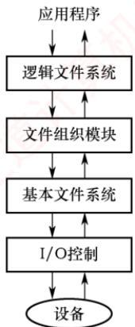

包含设备驱动程序和中断处理程序，负责在内存与磁盘之间传输数据。设备驱动程序将高层命令转换为底层硬件可识别的特定指令，由硬件控制器执行，实现I/O设备与系统的交互，并向I/O控制器指明对设备的具体位置执行何种操作

## (2)基本文件系统

负责向设备驱动程序发送通用命令，以读取或写入磁盘的物理块；每个物理块由唯一的磁盘地址标识。该层还管理内存缓冲区，缓存文件系统元数据、目录项及数据块；在执行磁盘传输前，需要分配并维护合适的缓冲区一有效的缓冲区管理对系统性能至关重要。 ZTA

## （3）文件组织模块

负责建立文件逻辑块与物理块之间的映射关系，将逻辑块地址转换为物理块地址。文件的逻辑块按顺序编号（从0到N），通常与物理块布局不一致，因此需通过地址转换机制进行定位。该模块还包含空闲空间管理器，用于跟踪未分配的磁盘块，并按需分配给文件使用。

## （4）逻辑文件系统

负责管理文件系统的元数据（描述文件系统结构的信息，如文件名、目录项、权限和时间戳等），不含实际数据内容。它维护目录结构，并根据给定文件名，向文件组织模块提供所需的元数据：同时通过文件控制块记录各文件的属性与状态，并负责实现文件保护机制。

## 4.1.3 文件的逻辑结构

文件的逻辑结构是指从用户视角所看到的文件组织形式；而文件的物理结构（也称存储结构）则是指文件在外存上的实际存储方式，对用户透明。逻辑结构与底层存储介质无关，其核心在于描述文件内部数据在逻辑上是如何组织的。

根据逻辑结构的不同，文件可分为两大类：无结构文件和有结构文件。

## 1. 无结构文件

无结构文件是最简单的组织形式，由连续的字符流构成，因此也称流式文件，其长度以字节为单位。对这类文件的访问通过读/写指针来定位下一个要操作的字节。系统中大量的源程序、可执行文件和库函数均采用这种形式。由于缺乏显式的记录边界，若需检索特定内容，只能进行顺序查找，效率较低，因而不适用于需要频繁随机访问或按记录检索的应用场景。

## 2. 有结构文件

有结构文件由一个或多个记录组成，故也称记录式文件。每条记录由若干数据项组成，其数量和长度可能固定，也可能可变。根据记录长度是否一致，有结构文件进一步分为两类。

1）定长记录。所有记录的长度相同，且各数据项在记录中的位置固定。系统可通过偏移量直接定位任意记录，从而支持高效的随机访问。 X

2）变长记录。各记录的长度不一，或因所含数据项数量不同，或因某些数据项长度可变。由于无法直接计算记录位置，检索时通常只能顺序查找，速度较慢。

有结构文件按记录的组织形式可分为顺序文件、索引文件、索引顺序文件。

## （1）顺序文件

顺序文件中的记录按线性顺序依次排列，可采用定长或变长记录。根据记录是否按键字排序，可分为两种结构：①串结构，记录按存入时间先后排列，不按键字排序。检索时必须从头开始顺序扫描，效率较低。②顺序结构，所有记录按键字有序排列。对于定长且按键字有序的顺序文件，可通过偏移量直接定位记录，并支持折半查找等高效算法，检索效率高。

正因记录连续存储、访问局部性强，顺序文件在批量处理场景下表现最优一当需要连续读取或写入大量记录时，其I/O效率在所有逻辑文件类型中最高。此外，对于顺序存储设备（如磁带），顺序文件是唯一能够有效工作的组织形式。然而，在频繁进行单条记录的查找、修改、插入或删除操作时，由于缺乏直接定位能力且需移动大量数据，顺序文件的性能明显不足。

## (2)索引文件

对于定长记录的顺序文件，可直接通过公式计算第i条记录的物理地址： $A _ { i }   =   i L$ (L 为记录长度）。对于变长记录的顺序文件，由于各记录长度不一，无法直接定位目标记录，必须从头开始依次读取前i-1条记录，累加其长度以确定第i条记录的起始位置，即

$$
\mathcal { A } _ { _ { i } } = \sum _ { i = 0 } ^ { i - 1 } L _ { _ { i } } + 1
$$

该过程需顺序扫描，效率较低。为提高检索效率，可建立一张索引表，为每个记录设置一个索引项，包含指向该记录的指针及其长度，并按关键字排序。由于索引表由定长记录构成，支持高效的随机访问。如图4.2所示，系统可通过索引表直接定位任意记录，从而将对变长记录顺序文件的顺序查找，转变为对定长索引文件的随机查找，显著提升检索速度。

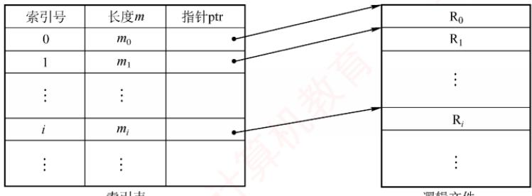  
图4.2 索引文件示意图

索引文件需额外维护一张索引表，且每个记录对应一个索引项，因此增加了存储开销。

## （3）索引顺序文件

索引顺序文件是顺序文件与索引文件的结合。其最简单的形式采用一级索引：先将变长记录的顺序文件划分为若于组，再为每组的首条记录建立一个索引项，包含该记录的关键字及其指针，所有索引项共同构成一张按关键字有序排列的索引表。

图4.3所示为索引顺序文件示意图。主文件包含姓名（作为关键字）及其他数据项，记录按姓名首字母分组组内可无序，但组间必须按键字有序。每组首条记录的姓名及其逻辑地址被存入索引表，该表按姓名递增排序。检索时，首先在索引表中定位目标记录所属的组，继而在该组内进行顺序查找，从而快速找到目标记录。 姚R

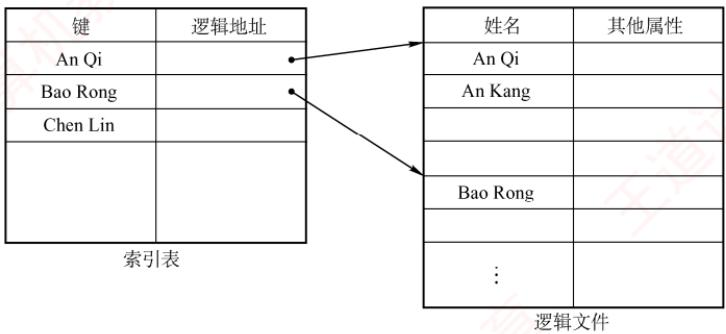  
图4.3 索引顺序文件示意图

对于含N条记录的普通顺序文件，平均需查找N/2次。而在索引顺序文件中，若将记录均分为m组，则每组约含s=N/m条记录。查找过程分为两步：①在索引表中顺序查找，平均需m/2次；②在对应组内顺序查找，平均需s/2次。因此，总平均查找次数为

$$
m/2+s/2=m/2+(N/m)/2
$$

当 $m   =   \sqrt { N }$ 时，该值最小，查找效率达到最优。

显然，索引顺序文件显著提升检索效率；当记录数量极大时，还可引入两级或多级索引，进一步降低查找开销—这正是分块查找（也称索引顺序查找）的基本思想。然而，索引文件与索引顺序文件在大幅提升查找速度的同时，也因维护索引表而带来额外存储开销。

## （4）直接文件（散列文件）

在直接文件（也称散列文件）中，记录的物理地址由其关键字经散列函数计算直接确定。这种方式支持极快的随机存取，但不同关键字可能映射到同一地址，从而引发冲突。

熟悉数据结构的读者不难发现：有结构文件的各类逻辑组织方式（包括顺序、索引、索引顺序和散列），本质上都是围绕“如何高效查找数据”这一核心目标而设计的。

## 4.1.4 本节小结

本节开头提出的问题的参考答案如下。

## 1）什么是文件？

文件是操作系统中用于存储和组织数据的基本单位，是一组逻辑上相关的信息（如程序、文本、图像等）的有序集合，通常以一个名字标识，并保存在持久性存储设备（如硬盘）上。

## 2）文件系统在操作系统中的地位如何？

文件系统是操作系统的核心子系统之一，负责对存储设备上的文件和目录进行统一管理，提供创建、读取、写入、删除、组织及保护等基本操作。它向上为应用程序和用户提供简洁、一致

的抽象接口，屏蔽底层存储细节；向下则与设备驱动协同，高效调度物理存储资源。作为连接用户逻辑视图与物理存储之间的关键桥梁，文件系统在操作系统中扮演着承上启下的核心角色。

## 4.1.5 本节习题精选

## 单项选择题

01. UNIX操作系统中，输入/输出设备视为（）。A. 普通文件 B. 目录文件 C. 索引文件 D. 特殊文件

02. 下列说法中，（）属于文件的逻辑结构的范畴。A. 连续文件 B. 系统文件 C. 链接文件 D. 流式文件

03. 文件的逻辑结构是为了方便（）而设计的。A. 存储介质特性 B. 操作系统的管理方式C. 主存容量 D. 用户

04.下列关于逻辑结构为索引文件的索引表的叙述中，（）是正确的。A. 索引表中每条记录的索引项可以有多个B. 对索引文件存取时，必须先查找索引表C. 索引表中含有索引文件的数据及其物理地址D. 建立索引的目的之一是减少存储空间

05. 有一个顺序文件含有10000条记录，平均查找的记录数为5000个，采用索引顺序文件结构，则最好情况下平均只需约查找（）次记录。A. 1000 B. 10000 KK C. 100 D. 500

## 4.1.6 答案与解析

## 单项选择题

## 01. D

UNIX操作系统中，所有设备都被视为特殊的文件，因为UNIX操作系统控制和访问外部设备的方式和访问一个文件的方式是相同的。 XIT

## 02. D

逻辑文件有两种：无结构文件（流式文件）和有结构式文件。连续文件和链接文件都属于文件的物理结构，而系统文件是按文件用途分类的。

## 03. D

文件结构包括逻辑结构和物理结构。逻辑结构是用户组织数据的结构形式，数据组织形式来自需求，而物理结构是操作系统组织物理存储块的结构形式。

因此说，逻辑文件的组织形式取决于用户，物理结构的选择取决于文件系统设计者针对硬件结构（如磁带介质很难实现链接结构和索引结构）所采取的策略（选项A和B）。

## 04. B

索引文件由逻辑文件和索引表组成，对索引文件存取时，必须先查找索引表。索引项只包含每条记录的长度和在逻辑文件中的起始位置。每条记录都有一个索引项，因此提高了存储代价。

## 05. C

采用索引顺序文件时，最好情况是有 $\sqrt{10000} = 100$ 组，每组有100条记录，则查找100组平均需要100/2=50次，组内查找平均需要100/2=50次，共需要50+50=100次。注意，严格来

说，索引表查找和组内查找的准确平均次数都是(1+100)/2=50.5，不过在操作系统教材中，往往直接忽略前面的1，因此本类题中也不会同时出现100和101两个选项。

## 4.2 目录与文件

在学习本节时，请读者思考以下问题：

1）目录管理的基本要求是什么？

2）在目录中查找某个文件可采用哪些方法？

3）单个文件的逻辑结构与物理结构之间是否存在制约关系？

本节从文件控制块与索引节点的原理出发，逐步深入目录结构设计，文件的物理分配方式、基本操作以及共享与保护机制。这部分知识点密集、逻辑环环相扣。需特别提醒：历年考试表明，多数读者对进程与内存管理掌握较好，但对文件及I/O管理往往基础薄弱，甚至在基本问题上失分，实属可惜。究其原因，仍是对概念的理解不够全面和透彻，望读者高度重视。

## 4.2.1 目录的基本概念

现代计算机系统需存储大量文件，必须通过文件目录对文件进行有效组织。文件目录是一种数据结构，用于记录每个文件的属性、存储位置等元数据，以便在检索时快速定位其在外存中的物理地址。目录管理需要满足以下要求：①实现按名存取，用户仅需提供文件名，系统即可自动定位该文件在外存中的位置：②提高检索速度，通过合理组织目录结构，加快查找过程，从而提升文件存取效率；③支持文件共享，在多用户系统中，允许多个用户共享同一文件；④允许文件重名，不同用户可对各自所属的文件使用相同名称，以契合其命名习惯。

## 4.2.2 文件控制块和索引节点

为便于文件管理，引入了文件控制块（FileControl Block，FCB）这一重要数据结构。

## 1. 文件控制块

考点追踪文件属性信息的存储位置（2009）

文件控制块（FCB）是用于存放控制文件所需各种信息的数据结构，以实现按名存取。每个文件对应一个FCB，所有FCB的集合构成文件目录（也称目录文件）。每当创建新文件，系统即为其建立一个FCB，用以记录其属性信息。图4.4展示了一个典型的FCB结构。

FCB主要包含以下几类信息：

● 基本信息，如文件名、物理位置、逻辑结构、物理结构等。

<table><tr><td rowspan=1 colspan=1>文件名</td></tr><tr><td rowspan=1 colspan=1>类型</td></tr><tr><td rowspan=1 colspan=1>文件权限（读，写）</td></tr><tr><td rowspan=1 colspan=1>文件大小</td></tr><tr><td rowspan=1 colspan=1>文件数据块指针</td></tr></table>

图 4.4 一个典型的 FCB

● 存取控制信息，包括文件主、核准用户和一般用户的访问权限。

● 使用信息，如文件创建时间、最后修改时间等。

## 2. 索引节点

考点追踪目录项结构的相关分析与计算（2020、2022）

然而，当文件数量庞大时，传统FCB目录会占用大量磁盘空间。在查找过程中，系统需逐块读入目录项，并逐一比对文件名；而仅当匹配成功时才需要获取该文件的物理地址。这意味着，在检索阶段，除文件名外的其他描述信息并无必要调入内存。为此，UNIX等系统采用文件名与描述信息分离的设计策略：将文件的描述信息独立组织为索引节点（inode），简称i节点；而目录项则仅由文件名及其对应的索引节点号（或索引节点指针）构成，如图4.5所示。

<table><tr><td rowspan=1 colspan=1>文件名</td><td rowspan=1 colspan=1>索引节点编号</td></tr><tr><td rowspan=1 colspan=1>文件名1</td><td rowspan=1 colspan=1></td></tr><tr><td rowspan=1 colspan=1>文件名2</td><td rowspan=1 colspan=1></td></tr><tr><td rowspan=1 colspan=1>…</td><td rowspan=1 colspan=1></td></tr><tr><td rowspan=1 colspan=1>…</td><td rowspan=1 colspan=1></td></tr></table>

图 4.5 UNIX 的文件目录结构

## 考点追踪索引节点与文件容量的关系（2018、2020）

例如，假设一个FCB占64B，盘块大小为1KB，则每个盘块可容纳16个FCB（FCB必须连续存放）；若目录共含640个FCB，则平均需启动磁盘20次才能完成一次文件查找。而在UNIX系统中，每个目录项仅占16B（14B文件名+2B索引节点号），每块可容纳64个目录项，从而将平均磁盘启动次数降至原来的1/4，显著降低系统开销。 -X

为兼顾持久存储与高效访问，文件系统将索引节点设计为两种形态：

## （1）磁盘索引节点

存储于磁盘上，作为文件的“永久档案”，每个文件有唯一磁盘索引节点，主要包含：

● 文件主标识符，标识文件所属的用户或用户组。

● 文件类型，指明是普通文件、目录文件还是特殊文件。

● 文件存取权限，规定文件主、核准用户及一般用户的访问权限。

● 文件物理地址，通过13个地址项以直接或间接方式记录数据所在盘块编号。

• 文件长度，以字节为单位表示文件的实际大小。

● 文件链接计数，统计本文件系统中指向该文件的目录项（硬链接）数量。

● 文件存取时间，记录文件最近被访问、修改的时间，以及索引节点最近被修改的时间。

## (2) 内存索引节点

当文件被打开时，系统将对应的磁盘索引节点载入内存，并附加运行时状态信息，以支持高效的并发访问与快速操作。因此，在磁盘索引节点的基础上，额外新增了以下内容：

● 索引节点号，用于在内存中唯一标识该节点。

● 状态，指示i节点是否被上锁或已修改，便于缓存一致性管理。

访问计数，进程每访问一次，计数加1；访问结束减1，用于判断节点是否可释放。

逻辑设备号，标识文件所属文件系统的逻辑设备号，在多文件系统环境中尤为关键。

● 链接指针，分别指向空闲链表与散列队列，便于内核高效调度和回收。

## 4.2.3 目录结构

## \*1. 单级目录结构

整个文件系统仅维护一张全局目录表，每个文件对应一个目录项，如图4.6所示。

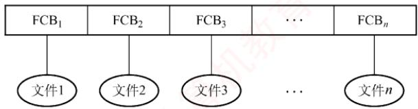  
图 4.6 单级目录结构

创建新文件时，系统首先遍历整张目录表，确保无同名文件存在；确认无冲突后，方可新增

一个FCB，并填入该文件的属性信息。访问文件时，系统根据文件名查找对应的FCB，经合法性检查后执行相应操作。删除文件时，则先定位其FCB，回收其所占存储空间，再清除该FCB。

尽管单级目录结构实现了按名存取，但其存在查找效率低、不允许文件重名、难以支持文件共享等缺点，且完全无法满足多用户环境的需求，因此仅适用于早期单用户的简单文件系统。

## \*2. 两级目录结构

为克服单级目录存在的缺陷，系统可采用两级方案，将文件目录划分为主文件目录（MasterFile Directory，MFD）和用户文件目录（User File Directory，UFD），如图 4.7所示。

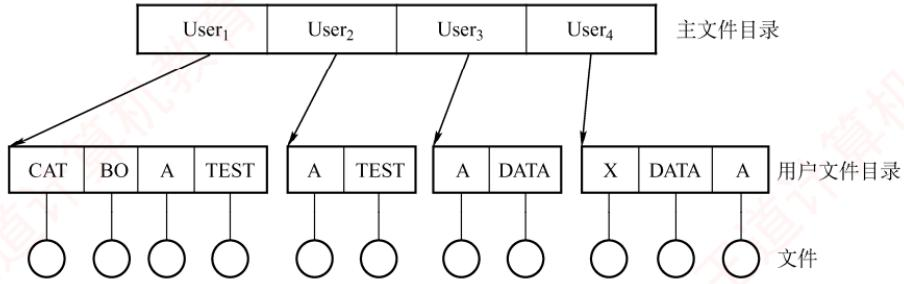  
图4.7 两级目录结构

MFD中的每个目录项记录一个用户名及其对应的UFD存储位置；每个UFD则包含该用户所有文件的FCB。当用户访问其文件时，系统仅需在其专属UFD中进行查找。这一机制不仅有效解决了不同用户间文件重名的问题，还通过隔离用户命名空间增强了安全性。

两级目录结构提升了检索效率，并支持基于目录的访问控制。然而，由于每个用户仅拥有一个扁平的UFD，无法对文件进行分类管理，因此在组织复杂文件集合时显得灵活性不足。

## 3. 树形目录结构

考点追踪设置当前工作目录的作用（2010）

将两级目录结构加以推广，便形成了树形目录结构，如图4.8所示。

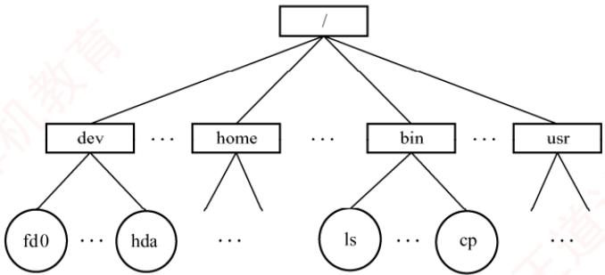  
图4.8 树形目录结构

树形目录结构显著提升了目录检索效率与文件系统的整体性能。在该结构中，用户通过文件路径名来标识文件。路径名是一个字符串，由从根目录出发到目标文件路径上所有目录名和文件名，用分隔符“/”连接而成。若路径从根目录开始，则称为绝对路径；系统中每个文件都具有唯一的绝对路径。例如，在Linux系统中，“/dev/hda”就是一个典型的绝对路径。然而，当目录层次较深时，每次从根目录逐级查找会耗费大量时间。为此，系统为每个进程设置一个当前目录（也称工作目录），进程对文件的访问通常以当前目录为基准。此时，用户可使用相对路径进行定位：它由从当前目录出发至目标文件路径上的目录名与文件名，用“/”连接构成。例如，若当前目录为“/bin”，则“./ls”即为相对路径，其中符号“”表示当前工作目录。

通常，每个用户都拥有专属的“当前目录”，登录后系统自动将其切换至该默认目录。操作系统提供专门的系统调用，允许用户随时更改当前目录。例如，Linux系统的/etc/passwd文件记录了各用户登录时的默认当前目录，而cd命令通过调用该接口动态更新当前目录。

树形目录结构支持灵活的文件分类，层次清晰，便于管理与保护。不同性质或归属的文件可分布于目录树的不同分支或子树中，并能针对各节点设置独立的存取权限，实现精细化控制。然而，该结构也存在局限：查找一个文件需按路径名逐级访问中间目录节点，导致磁盘I/O次数增加，可能影响查询速度。尽管如此，凭借其良好的组织性、扩展性以及对多用户环境的支持，目前绝大多数现代操作系统（如UNIX、Linux和Windows）都采用了树形目录结构。 姚

## \*4. 无环图目录结构

树形目录结构便于实现文件分类，但难以支持文件共享。为此，在其基础上引入指向同一节点的有向边，使整个目录结构演变为一个有向无环图，如图4.9所示。该结构允许目录共享子目录或文件，同一个文件或子目录可出现在两个或多个目录中，从而实现跨目录的共享。

然而，共享也带来了删除操作的复杂性：当某用户请求删除一个共享节点时，若系统直接将其物理删除，其他共享用户后续访问将因节点缺失而失败。为此，系统为每个共享节点维护一个共享计数器—新增共享链时计数器加1，收到删除请求时减1。仅当计数器归零，才真正删除该节点，否则仅断开请求用户的共享链，保留节点供他人

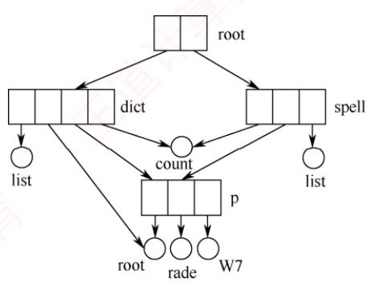  
图 4.9 无环图目录结构

继续使用。无环图目录结构虽有效支持灵活的文件共享，但也因此增加了管理开销，需额外维护引用计数等共享状态。 交

## 4.2.4 目录的操作

在理解文件系统的设计需求之前，需要先明确目录层面所支持的基本操作。这些操作构成了用户与文件系统交互的核心接口，也为后续把握文件系统的整体架构奠定基础。

● 搜索。访问文件时，需要在相应目录中查找对应的目录项。为提升效率，系统通常支持从根目录或当前工作目录出发，并允许使用精确匹配或部分文件名进行检索。

● 创建文件。系统首先检查当前目录中是否存在同名文件；仅当确认无重名后，才新增目录项，并初始化其属性（如文件类型、权限和时间戳等）。 XN

● 删除文件。系统移除该文件在所属目录中的目录项，并回收其所占用的数据块及元数据。

●创建目录。在树形目录结构中，用户可创建子目录（用户文件目录，UFD），用于组织个人文件与嵌套子目录，实现灵活的层次化管理。

●删除目录。若目录为空（不含任何文件或子目录），则可直接删除：若非空，则通常采用两种策略：①要求用户先手动清空目录内容（对子目录需要递归删除），待其成为空目录后再删除；②允许直接删除非空目录，系统自动递归删除其中所有文件与子目录。

● 移动目录。将指定的文件或子目录从原父目录迁移到新的父目录下。移动完成后，原有目录项被转移，文件的完整路径名随之自动更新，而文件内容保持不变。

● 显示目录。列出指定目录的内容，包括所有文件与子目录的名称，通常还显示文件大小、最后修改时间等基本属性；当文件属性发生变化时，其目录项也会同步更新。

● 改变具录。用户可通过此操作切换当前工作目录，可指定绝对路径或相对路径：若未显式指定目标目录，系统通常默认返回用户的主目录，从而简化后续路径输入。

## \*4.2.5 目录实现

访问文件时，操作系统根据路径名定位相应的目录项，而目录项中包含用于查找文件磁盘块所需的关键信息。目录实现的核心目标是高效支持查找操作，因此主要有两种基本方法：

## 1. 线性列表

最简单的目录实现方式是采用由文件名及其数据块指针组成的线性列表。创建新文件时，需要先遍历目录以确保无同名文件，然后新增目录项：删除文件时，则根据文件名查找并释放其占用的空间。为重用被删除的目录项，常见策略包括：标记为未使用、加入空闲链表，或将末尾项移至空位并缩短目录长度。若以链表组织目录项，还可进一步降低删除操作的时间开销。

线性列表的优点是实现简单，但缺点是查找效率低目录规模越大，扫描开销越高。

## 2. 哈希表

另一种方法是采用哈希表：系统根据文件名计算其哈希值，并以此索引到哈希表中的某个元素，该元素通常存放一个指向实际目录项的指针。哈希表的优势在于查找、插入和删除操作均具有很高的性能，但需要妥善处理哈希冲突，即不同文件名映射到同一表元素的情况。

由于目录查询依赖磁盘I/O，频繁访问会带来较大开销。为此，系统通常将当前活跃的目录缓存到内存中。后续访问可直接在内存进行，从而大幅减少磁盘操作，提升系统响应速度。

## 4.2.6 文件的物理结构

前文指出，文件本质上是一种抽象数据类型，其研究涵盖逻辑结构、物理结构及相关操作。文件的物理结构关注的是文件数据如何在磁盘上分布与组织。这一问题可从两个互补的视角加以理解：①文件分配方式，解决如何为文件分配已使用的磁盘块，属于对非空闲块的管理；②文件存储空间管理，解决如何跟踪和分配空闲磁盘块，属于对空闲块的管理（见4.3节）。

## 考点追踪不同物理结构的特点和比较（2009、2011、2013、2020）

文件分配方式直接决定文件的物理结构，常用策略有三种：连续分配、链接分配和索引分配。需要特别注意将其与文件的逻辑结构区分开来。可类比数据结构中“线性表”（逻辑结构）与“顺序表/链表”（物理实现）的关系：逻辑结构描述“是什么”，物理结构则说明“如何存”。

此外，如同内存被划分为固定大小的页，磁盘也被划分为若于磁盘块，其大小通常与内存页面一致。所有磁盘I/O操作均以块为单位，在内存与磁盘之间进行数据交换。

## 1. 连续分配

## 考点追踪连续分配的应用和分析（2011、2012、2014）

连续分配方法要求每个文件在磁盘上占有一组连续的块（见图4.10）。由于磁盘地址本身具有线性顺序，这种布局使得进程访问文件时所需的寻道次数和寻道时间最小。

采用连续分配时，逻辑文件中的记录依次存放在相邻的物理块中。文件的目录项需要记录该文件起始块的块号及其所占用的总块数。若文件长度为n块，且从块b开始存放，则该文件占据的块为 $b,b+1,b+2,\cdots,b+n-1$ ；要访问第i块，可直接计算并访问块b+i-1。

连续分配的优点：①支持顺序访问和直接访问。②顺序访问高效且速度快，因为文件所占的块通常位于一条或少数几条相邻磁道上，磁头移动距离最小。缺点：①必须为文件分配连续

的存储空间，与内存连续分配类似，易产生大量外部碎片。②需要预先知道文件长度，难以支持文件的动态增长若强行扩展，可能覆盖物理上相邻的其他文件。③为维持文件的逻辑顺序，在删除或插入记录时，往往需要对后续记录进行物理移动，开销较大。

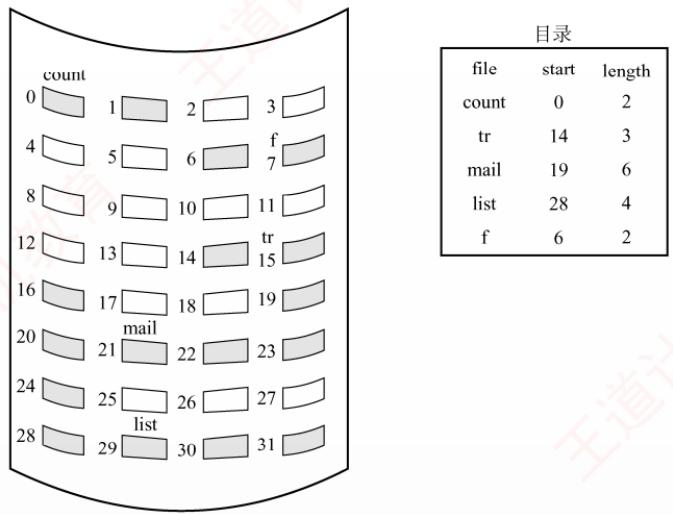  
图 4.10 连续分配

## 2. 链接分配

链接分配是一种采用离散方式分配磁盘块的策略。其主要优点包括：①消除了外部碎片，显著提高磁盘空间的利用率。②支持动态分配盘块，无须事先预知文件大小。③文件的插入、删除和修改操作十分便捷。根据指针存储方式的不同，链接分配可分为隐式链接和显式链接。

## （1）隐式链接

## 考点追踪链接分配的应用和分析（2014）

隐式链接方式如图4.11所示。目录项中包含指向文件第一块和最后一块的指针（盘块号）。每个文件对应一个由磁盘块构成的链表，这些块可分散存储于磁盘的任意位置。除最后一块外，每个盘块均存有指向下一个盘块的指针，这些指针对用户完全透明。

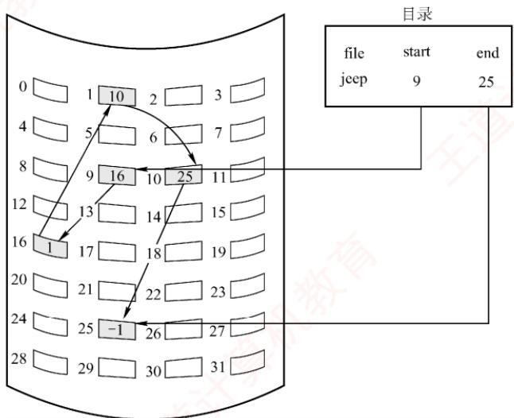  
图4.11 隐式链接方式

隐式链接的缺点：①仅支持顺序访问，若要访问文件的第i块，必须从首块开始，依次跟随指针遍历至第i块，随机访问效率极低。②可靠性较差，一旦链中任一指针损坏，整个链将断开，导致后续数据无法访问。③每个盘块需要存储指向下一块的指针，占用一定的存储空间。

## 考点追踪文件空间分配与簇的关系（2017、2018）

为缓解上述问题，可引入簇（cluster）的概念：将若于连续的盘块组合成一个簇（基本分配单位），文件的分配与链接均以簇为单位进行。如此，指针数量大幅减少，不仅降低存储开销，也显著缩短链式查找时间，从而提升整体I/O性能。但这一优化的代价是可能产生内部碎片当文件大小不是簇大小的整数倍时，最后一个簇的剩余空间无法被其他文件利用。

## (2）显式链接

显式链接将用于链接文件各物理块的指针集中存放在内存中的一张全局表中，该表在整个文件系统中仅设一张，称为文件分配表（FileAllocationTable，FAT）。FAT的每个表项对应一个磁盘块，并存放指向下一个盘块的指针。因此，文件目录项只需记录该文件的起始块号，后续所有块号均可通过依次查询FAT获得。例如，某磁盘共有100个盘块，其中存放了两个文件：文件“aaa”占用三个块，链接顺序为2→8→5；文件“bbb”占用两个块，链接顺序为7→1。其余盘块均为空闲块。该磁盘的文件分配表（FAT）如图4.12所示。 爱

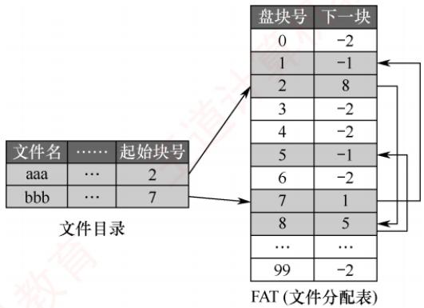  
图4.12 磁盘的文件分配表

## 考点追踪FAT表的作用（2019、2025）

不难看出，FAT的表项与所有磁盘块一一对应。通常，可用特殊值-1标记文件的最后一块，用-2表示该盘块空闲（也可指定为-3、-4等）。因此，FAT不仅记录了文件的链式结构，还标识了空闲盘块，系统可直接利用FAT管理磁盘的空闲空间。当某进程请求分配一个磁盘块时，系统只需在FAT中查找值为-2的表项，并将对应的磁盘块分配给该进程即可。 YTA

显式链接的优点：（①）支持顺序访问，也支持直接访问，要访问第i块，无须依次遍历前i-1块：②EAT在系统启动时即被载入内存，后续检索操作均在内存中完成，不仅显著提升查找速度，也大幅减少磁盘I/O次数。缺点：FAT需要常驻内存，磁盘容量越大，内存开销越显著。

## 3. 索引分配

## （1）单级索引分配方式

## 考点追踪索引分配的应用和分析（2012）

事实上，在打开某个文件时，只需将该文件所占用的盘块编号调入内存即可，无须加载整个FAT。为此，可将每个文件的所有盘块号集中存放于一处；当访问该文件时，只需将其对应的盘块号集合一次性载入内存，这正是索引分配的思想。具体而言，系统为每个文件分配一个专用的索引块（或称索引表），并将分配给该文件的所有盘块号记录其中，如图4.13所示。

例如，若盘块大小为4KB，每个盘块号占4B，则一个索引块可容纳 $4\mathrm{KB}/4\mathrm{B}=1024$ 个盘块号。采用单级索引时，可支持的最大文件为 $1024 \times 4 \mathrm{KB} = 4 \mathrm{MB}$

索引分配的优点：①支持高效的直接访问，要访问文件的第i块，只需读取索引块中第i项，即可直接获得对应的盘块号；②不会产生外部碎片，因为文件的盘块可离散分配。缺点：引入了额外的存储开销，每个文件必须配备一个索引块。当文件较小时，如仅占用几个盘块，仍需要为其分配一个完整的索引块，导致索引块的利用率极低；当文件较大时，若所需盘块号超出单个索引块容量，虽可借助链式指针将多个索引块链接起来，但这种方法效率低下。

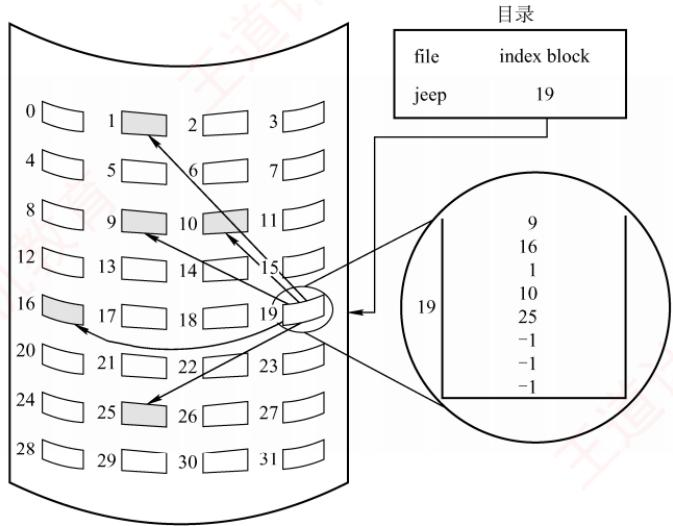  
图 4.13 索引分配

## (2)多级索引分配方式

显然，当文件过大而索引块较多时，可为这些索引块再建立一级索引，称为主索引。主索引表中依次存放各二级索引块的盘块号，从而形成二级索引分配方式。其设计思想与内存管理中的多级页表高度相似（见图4.14）。访问数据时，系统首先通过主索引定位对应的二级索引块，再通过该二级索引块找到目标数据块。若文件非常大，还可进一步扩展为三级、四级的索引分配结构。

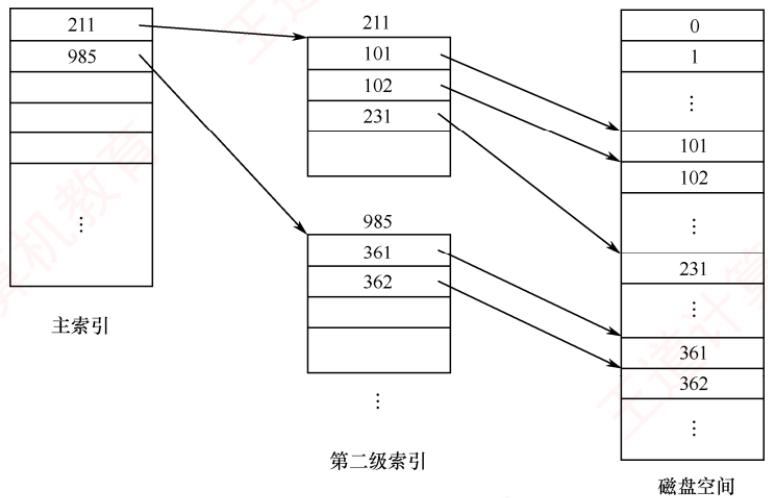  
图 4.14 二级索引分配

例如，假设盘块大小为4KB，每个盘块号占4B，则一个索引块可容纳1024个盘块号。采用两级索引时，可支持的最大文件为 $1024 \times 1024 \times 4 \mathrm{KB} = 4 \mathrm{GB}$

多级索引的优点：显著提升大型文件的可扩展性与查找效率。缺点：当访问一个盘块时，所需的磁盘/O次数随索引级数增加而增多。若文件系统仅采用多级索引作为组织方式，则即使对于大量小文件，访问单个盘块仍需要多次磁盘I/O，导致整体/O性能难以达到理想水平。

## (3)混合索引分配方式

## 考点追踪混合索引分配的原理（2013）

为兼顾小、中、大乃至特大型文件的访问效率，需要根据文件大小动态选用最合适的分配策略，在空间开销与访问性能之间取得最佳平衡，因此通常采用混合索引分配方式。对于小文件，为提升大量小文件的访问速度，可将其全部盘块地址直接存放在inode（或FCB）中，系统直接从中获取所有盘块地址，无须额外读取索引结构，即直接寻址。对于中型文件，采用单级索引分配，inode中存放一个索引块的地址，系统需要先读取该索引块，再从中获取文件的盘块地址，即一次间址。对于大型或特大型文件，则分别采用两级和三级索引分配。UNIX系统正是采用这种混合策略。在其索引节点中，共设有13个地址项，即i.addr(0)～i.addr(12)，如图4.15所示。

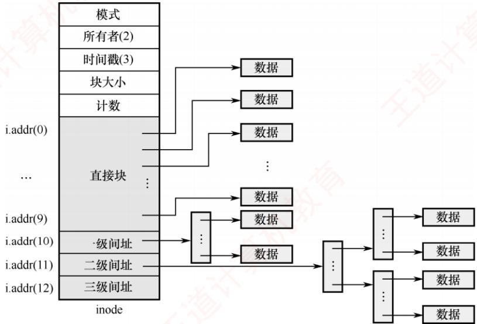  
图 4.15 UNIX 系统的 inode 结构示意图

## 考点追踪混合索引分配的相关计算（2010、2015、2018、2022）

1）直接地址。为了提升对小文件的检索速度，索引节点中设置了10个直接地址项，记为$\mathrm{i.addr}(0) \sim \mathrm{i.addr}(9)$ ，每个项直接存放一个文件数据块的盘块号。假设每个盘块大小为4KB，当文件不大于40KB时，则可直接从索引节点中读取该文件的全部盘块号。

2）一次间接地址。对于中、大型文件，仅靠直接地址显然无法满足需求。为此，索引节点中的地址项i.addr(10)被设计为一次间接地址，用于实现一级索引分配。一次间接地址指向一个专门的一次间址块（索引块），其中存放的是文件数据块的盘块号。一个索引块可容纳1024个盘块号，通过一次间接地址最多可寻址 $1  K  \times 4  K   B  = 4  MB$ 的数据。因此，同时使用直接地址和一次间址时，最大可表示的文件长度为 $4MB + 40KB$

## 考点追踪多级索引块的访问效率分析（2018、2022）

3）多次间接地址。当文件长度超过4MB+40KB时，还需要利用地址项i.addr(11)作为二次间接地址，以实现两级索引分配。二次间接地址指向文件的主索引块，该主索引块中的每一项又指向一个一次间址块，而每个一次间址块再指向1024个数据块。通过二次间接地址最多可寻址 $1 \mathrm{K} \times 1 \mathrm{K} \times 4 \mathrm{KB} = 4 \mathrm{GB}$ 的数据。因此，同时使用直接地址、一次间址和二次间址时，最大可表示的文件长度为 $4\mathrm{GB}+4\mathrm{MB}+40\mathrm{KB}$ 。同理，同时采用直接地址、一次间址、二次间址和三次间址时，最大可表示的文件长度为 $4\mathrm{TB}+4\mathrm{GB}+4\mathrm{MB}+40\mathrm{KB}$ 0

## 4.2.7 文件的操作

文件是一种抽象数据类型。为了正确定义文件，需要明确可对其执行的操作。操作系统提供一系列的系统调用来实现对文件的创建、删除、读/写、打开和关闭等操作。

## 1. 文件的基本操作

最基本的文件操作包括创建文件、删除文件、读文件和写文件等。

## （1）创建文件

## 考点追踪文件创建的过程（2025）

创建文件涉及元数据分配、存储空间预留与目录注册等多个步骤，具体过程如下：①合法性与权限校验，检查文件名是否合法、是否与同目录下已有的文件重名，并验证用户对目标目录是否具有写权限。若任一条件不满足，则创建立即终止。②分配索引节点，从空闲inode（或FCB)池中分配一个空闲项，初始化其元数据，包括文件类型、初始大小、访问权限、时间戳以及物理块指针等，并标记为已占用。③分配磁盘块，根据文件预估大小，从空闲磁盘块管理结构中分配相应数量的物理块，并将块地址记录在inode中。（4)在目录中新建目录项，格式为<文件名，索引节点号>，使文件可被检索。⑤更新文件系统元数据，包括空闲inode表、空闲磁盘块结构、目录大小以及修改时间等。⑥打开并返回文件描述符（可选），若创建后立即打开（见下节），则系统将在进程的打开文件表中创建表项，分配文件描述符，并初始化读/写指针。

## (2） 删除文件

## 考点追踪文件删除的过程（2013、2021）

删除文件的步骤包括撤销目录可见性、回收元数据、释放存储空间等，具体过程如下：①路径解析与定位，按路径名逐级查找目录，定位目标文件的目录项，获取其inode（或FCB），并验证用户对文件所在目录的写权限。②检查使用状态与硬链接计数，若文件正被打开，则部分系统将延迟物理删除，待所有引用关闭后再回收资源；若硬链接计数（见4.2.8节）大于1，则仅删除当前目录项并将计数减1，不回收inode与磁盘块；仅当计数为1时，才执行完整的删除流程。③移除目录中的目录项，使文件在用户视角下“消失”，完成逻辑删除。④释放索引节点，当链接计数降至0时，将inode标记为空闲，并归还至空闲管理结构，其元数据彻底失效。⑤释放磁盘块，根据inode中的块指针，将所有数据块和索引块归还至空闲磁盘块管理结构。⑥释放内存临时资源（可选），包括对应的缓冲区、打开文件表项及内核文件对象等。⑦更新文件系统元数据，同步更新目录大小、空闲inode表及空闲块结构，确保一致性。

## （3）读文件

读文件时，首先根据文件名在目录中查找对应目录项，获取文件的索引节点号，进而定位其在外存中的数据块。随后，依据当前读指针的位置，从指定块中读取数据，并更新读指针。

## (4) 写文件

写文件时，系统同样先通过文件名查找目录项，获取索引节点号以定位外存数据块。然后，根据当前写指针的位置，将数据写入相应块，并更新写指针。若写入超出当前分配空间，系统将动态分配新磁盘块并更新inode（或FCB）中的块指针。

## 2. 文件的打开与关闭

当用户对一个文件执行多次读/写操作时，若每次均需要从检索目录开始，将带来显著的性能开销。为避免重复查找，大多数操作系统规定：用户首次访问某文件时，必须先通过系统调用open将其打开。系统维护一个称为打开文件表的数据结构，用于记录当前活跃文件的信息。所谓“打开”，是指系统根据文件路径定位到其目录项后，将关键信息载入内存，在打开文件表中创建一个表目，并将该表目的索引号（文件描述符）返回给用户。此后，用户再次操作该文件时，只需提供文件描述符，系统即可直接从内存获取所需信息，显著降低目录检索开销。

为提升效率与管理灵活性，现代操作系统采用两级打开文件表结构：

● 系统打开文件表：全局共享，存储与进程无关的文件属性，如磁盘位置、文件大小、访问时间等；每项都包含一个打开计数器（OpenCount），记录有多少进程打开了该文件。

● 进程打开文件表：每个进程独有，记录进程私有的访问状态，如当前读/写指针、访问权限及文件打开模式。该表中的每一项均指向系统打开文件表的对应项，实现资源共享与独立控制的统一。图4.16展示了内存中文件的系统结构。

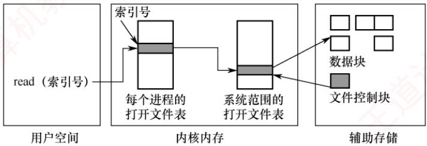  
图4.16 内存中文件的系统结构

当一个进程成功打开文件时，系统首先确保其在系统打开文件表中存在对应项（若不存在，则创建），随后在该进程的打开文件表中新增一项，指向该系统表项。此后，其他进程若打开同一文件，仅需要在其各自的进程表中添加新项并指向同一系统表项，无须重复加载文件元数据，既保证了各进程访问上下文的隔离，又实现了底层资源的高效共享。

## 考点追踪文件打开的过程与分析（2014、2017、2020）

综上，文件打开的完整过程如下：系统首先根据用户提供的文件路径逐级遍历目录，将所需的目录文件从磁盘加载至内存，定位目标文件的目录项：随后从中提取其索引节点编号，并以此为关键字在系统打开文件表中查找对应项。若未找到，则从磁盘读取该索引节点至内核缓冲区，在系统表中创建新项，并将打开计数初始化为1；若已存在，则仅将该项的打开计数加1。接着，在发起请求的进程所属的进程打开文件表中分配一个新表项，用于记录其指向系统表项的索引；最终，将该表项的索引号作为文件描述符返回给用户进程，供后续读/写等操作使用。

## 考点追踪文件关闭的过程（2023）

当文件不再使用时，用户调用close关闭它。系统随即从该进程的打开文件表中删除对应项，并将系统打开文件表中相应项的打开计数器减1。一旦计数器减至0，表明该文件已无任何进程引用，系统便可安全地删除其在系统表中的项，并释放所占用的相关资源。

## 考点追踪文件名和文件描述符的应用场景（2012、2017、2024）

文件名并非打开文件表的组成部分。因为一旦系统通过文件名完成对磁盘上FCB的定位，后续操作便不再需要该文件名。用于访问打开文件表的索引号，也称文件描述符（Linux）或文件句柄（Windows）。因此，只要文件处于打开状态，所有文件操作均通过该索引号完成。

## 注意

一旦成功执行 open()系统调用，后续所有文件操作[包括read()、write()、lseek()、close()等]均不再使用文件名，而是通过文件描述符进行，这一机制是文件管理的核心考点。

每个被打开的文件在系统中均关联以下关键信息：

● 文件指针。系统为每个进程维护一个独立的当前读/写位置指针。由于该指针对不同进程而言是私有的，必须与磁盘上的共享文件属性分离，保存在进程的打开文件表中。

● 文件打开计数。记录当前打开该文件的进程数量。因多个进程可能同时访问同一文件，系统只有在最后一个进程调用close()后，才会真正释放其在系统打开文件表中的项。

● 文件磁盘位置。大多数文件操作涉及对磁盘数据的修改。为避免每次操作都重新解析路径并读取元数据，系统将文件在磁盘上的位置信息缓存在内存中，供快速访问。

● 访问权限。每个进程在打开文件时需要指定访问模式（如只读、读/写、追加、创建等）。该权限信息保存在进程的打开文件表中，操作系统据此判断是否允许后续的I/O请求。

## 4.2.8 文件共享

文件共享允许多个用户访问同一文件，系统中仅需保留一个物理副本。若缺乏共享机制，则每个需要该文件的用户都必须持有独立副本，不仅浪费存储空间，还易导致数据不一致。

前文介绍的无环图目录结构可用于实现文件共享。建立链接时，需要将被共享文件的盘块号复制到相应目录项中。然而，若某用户向文件追加数据并分配新盘块，这些新增盘块仅出现在其操作所对应的目录中，对其他用户不可见，因此无法实现真正的共享。

## 1. 基于索引节点的共享方式（硬链接）

## 考点追踪硬链接的原理与相关分析（2009、2017）

硬链接是一种基于索引节点的共享机制。在此方式下，文件的物理地址和属性信息不再存放于目录项中，而是集中存储在索引节点内；目录项仅包含文件名及指向该索引节点的指针。

如图4.17所示，用户A和B的目录中均设有指向同一共享文件索引节点的指针。该索引节点包含一个链接计数count，也称引用计数，用于记录当前指向它的目录项数量。例如，当count=2时，表示有两个用户目录项链接到此文件，即两个用户共享该文件。

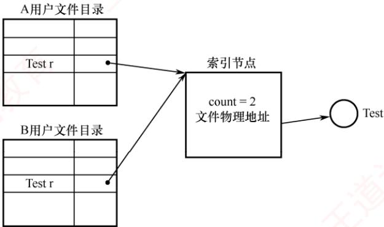  
图4.17 基于索引节点的共享方式

当用户A创建新文件时，成为该文件的拥有者，系统为其创建索引节点，并将count置为1。当用户B需要共享此文件时，系统在B的目录中新增一个目录项，并设置指向该索引节点的指针，此时count增至2，但拥有者仍为A。若A不再需要该文件，能否直接删除？答案是否定的。因为删除操作若同时移除索引节点，将导致用户B的指针悬空：而B可能正在对该文件执行写操作，此时操作将中断失败。因此，A不能直接删除文件，而应仅删除自己的目录项，并将索引节点的count减1。只要count>0，文件及其索引节点仍被保留，B可继续使用。只有当count=0时，系统才真正释放该文件及其索引节点。图4.18展示了不同用户对同一文件的链接情况。

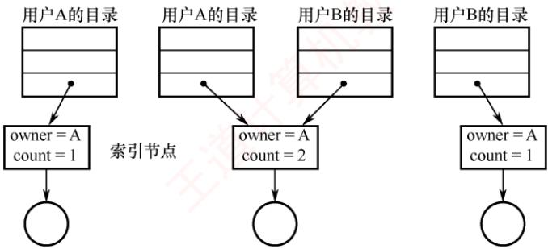  
图4.18 文件共享中的链接计数

## 2. 利用符号链实现文件共享（软链接）

考点追踪软链接的原理与相关分析（2009、2021）

为使用户B能共享用户A的文件F，系统可创建一个LINK类型的新文件L，并将其写入用户B的目录中，从而建立B的目录与文件F之间的链接。文件L仅包含被链接文件F的路径名，如图4.19所示。这种链接方式称为符号链接，也称软链接，其功能类似于Windows系统中的快捷方式。当用户B访问文件L时，操作系统识别出其为LINK类型，便根据其中记录的路径名逐级查找，定位到目标文件F，并对其执行读/写操作，从而实现对文件F的共享。

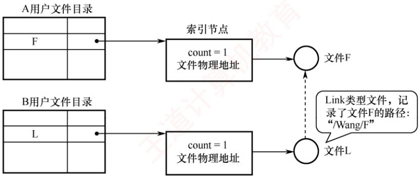  
图4.19 利用符号链的共享方式

在基于符号链的共享机制中，只有文件拥有者持有指向其索引节点的指针。其他共享用户仅保存该文件的路径名，而不具备直接指向索引节点的指针。因此，即使拥有者删除了共享文件F，也不会导致其他用户的指针悬空。当其他用户尝试通过符号链访问已被删除的共享文件时，系统将返回访问失败，此时可安全地删除该符号链接，而不会引发任何问题。

在符号链的共享方式中，用户每次访问共享文件时，系统需要根据路径名逐级遍历目录结构，直至定位到目标文件的索引节点。这一过程可能涉及多次磁盘读取，从而增加访问开销。同时，符号链接本身也是一个独立文件，其索引节点同样占用一定的磁盘空间。

利用符号链实现网络文件共享时，只需记录文件所在机器的网络地址及文件路径名。

可以这样说：文件共享，“软硬”兼施。硬链接是多个目录项指向同一个索引节点，只要至少有一个指针存在，该索引节点就不会被删除：软链接是将到达共享文件的路径保存下来，访问时依据路径进行查找。可见，硬链接的查找速度通常优于软链接，因其直接通过指针访问。

## 4.2.9 文件保护

为防止文件共享导致文件被意外破坏或被未授权用户篡改，文件系统必须对用户访问文件的行为实施控制，即明确哪些用户可对文件执行读/写、执行等操作。为此，需要建立有效的文件保

护机制。常见的实现方式包括口令保护、加密保护和访问控制：其中，口令与加密主要用于防止他人非法获取或窃取文件内容，而访问控制则用于精细管理用户对文件的具体访问权限。

## 1. 访问类型

文件保护通常通过限制用户可执行的访问类型来实现。主要的受控操作包括：

● 读。从文件中读取数据。

● 写。向文件中写入或修改数据。

● 执行。将文件加载到内存并运行。

● 添加。在文件末尾追加新数据，而不覆盖原有内容。

● 删除。移除文件并释放其所占用的存储空间。

● 列表清单。列出目录中文件的名称及其属性。

此外，系统还可对重命名、复制、编辑等高层操作进行控制。然而，这些功能通常由应用程序通过调用系统调用来实现，而真正的保护机制仅在底层提供。例如，复制文件本质上是通过一系列“读”操作完成的；因此，用户只要拥有读权限，便隐含具备了复制和打印的能力。

## 2. 访问控制

实现访问控制最常用的方法是基于用户身份进行权限管理。其中，最普遍的机制是为每个文件和目录附加一个访问控制列表（Access-ControlList，ACL），明确指定各用户名及其被允许的访问类型。该方法的优点在于支持灵活而复杂的访问策略，但缺点是列表长度不可预知，可能带来复杂的空间管理开销。为此，现代系统常采用精简的访问控制列表加以缓解。

## 考点追踪文件访问控制表的结构（2017）

精简ACL通常将用户划分为三类：拥有者、组和其他。

1）拥有者。创建文件的用户。

2）组。一组需要共享该文件且具有相似访问需求的用户。

3）其他。系统中除拥有者和同组用户外的所有用户。

表4.1是一个精简ACL的实例。每种访问类型用一个二进制位表示，因此仅需一个3×4位的矩阵，即可完整描述三类用户的访问权限。创建文件时，系统将文件拥有者的用户名及其所属组名记录在该文件的FCB中。当用户访问文件时，系统按优先级顺序匹配其身份：若为拥有者，则授予拥有者权限：若与拥有者同属一组，则授予组权限：否则，仅授予其他用户的权限。

表4.1 一个精简的访问控制列表
<table><tr><td rowspan=2 colspan=1>用户类型</td><td rowspan=1 colspan=4>访问类型</td></tr><tr><td rowspan=1 colspan=1>读取</td><td rowspan=1 colspan=1>写入</td><td rowspan=1 colspan=1>删除</td><td rowspan=1 colspan=1>执行</td></tr><tr><td rowspan=1 colspan=1>拥有者</td><td rowspan=1 colspan=1>1</td><td rowspan=1 colspan=1>1</td><td rowspan=1 colspan=1>1</td><td rowspan=1 colspan=1>1</td></tr><tr><td rowspan=1 colspan=1>组</td><td rowspan=1 colspan=1>1</td><td rowspan=1 colspan=1>0</td><td rowspan=1 colspan=1>0</td><td rowspan=1 colspan=1>0</td></tr><tr><td rowspan=1 colspan=1>其他</td><td rowspan=1 colspan=1>0</td><td rowspan=1 colspan=1>0</td><td rowspan=1 colspan=1>0</td><td rowspan=1 colspan=1>0</td></tr></table>

除ACL外，口令和密码也是常见的辅助性访问控制手段。

只令指用户在创建文件时设定一个口令，系统将其存入FCB，并告知授权共享的其他用户，访问时需要提供正确口令。该方法时空开销小，但因口令通常以明文或弱保护形式存储于系统内部，安全性较低。密码指用户对文件内容进行加密，访问时需要使用密钥解密。此方法保密性强，且不额外占用元数据空间，但加解密过程会引入一定的计算开销。

口令与加密主要用于防止文件被非法获取或窃取，并不区分具体的访问操作类型（如读/写、执行等）。因此，它们无法替代基于权限的访问控制机制，而应视为补充手段。

对于多级目录结构而言，保护需求不仅限于单个文件，还需要涵盖子目录及其全部内容。由于目录操作与文件操作存在较大差异，系统还必须提供专门的目录保护机制。

## 4.2.10 本节小结

本节开头提出的问题的参考答案如下。

1）目录管理的基本要求是什么？

①实现“按名存取”，这是目录管理最基本的功能。②提高目录检索速度，从而加快文件的存取效率。③为支持安全共享，目录需要提供访问控制信息，以管理不同用户对文件的使用权限。④支持重名，允许不同用户为各自的文件使用相同的名称。 灿

2）在目录中查找某个文件可采用哪些方法？

可采用线性列表法或哈希表法。线性列表法将文件名组织成一个线性表，查找时依次与各表项比较：若文件名有序，则可采用折半查找。但插入新文件需要维护有序性，带来额外开销。哈希表法通过哈希函数将文件名映射为指向目录项的指针，查找迅速，但需要妥善处理哈希冲突。

3）单个文件的逻辑结构与物理结构之间是否存在制约关系？

文件的逻辑结构是用户可见的组织形式，即从用户视角所见的文件全貌：而物理结构则是文件在存储器上的实际存放方式，与存取方法及存储介质特性密切相关。二者虽无直接制约关系，但若物理结构选择不当，则难以体现逻辑结构的特点。例如，一个逻辑上为顺序结构的文件，若采用隐式链接的物理结构，即使理论上能快速定位某条记录，实际仍需在磁盘上逐块查找。

学到这里，读者应能体会到：现代操作系统的设计思想中，处处可见面向对象程序设计的影子。本章所学的“文件”，实质上是一种抽象数据类型，即一种数据结构。若读者在此之前已学完数据结构，则面对新数据结构时，自然会关注其逻辑结构、物理结构及所支持的操作。

## 4.2.11 本节习题精选

## 一、单项选择题

01.当文件被打开时，需要将磁盘索引节点拷贝到内存的索引节点，下列属于内存索引节点中有而磁盘索引节点中没有的内容是（）。A. 访问计数值B. 文件物理地址C. 文件长度 D. 文件类型

02.目录文件存放的信息是（）。A. 某一文件存放的数据信息 B. 某一文件的文件目录C. 该目录中所有数据文件目录 D. 该目录中所有子目录和数据文件的目录

03. FAT32的文件目录项不包括（）。A. 文件名 B. 文件访问权限说明C. 文件控制块的物理位置 D. 文件所在的物理位置

04. 有些操作系统中将文件描述信息从目录项中分离出来，这样做的好处是（）。A. 减少读文件时的 I/O 信息量 B. 减少写文件时的I/O 信息量C. 减少查找文件时的I/O信息量 D. 减少复制文件时的 I/O 信息量

05.下列选项中，（）不是为了提升文件系统性能的操作。A. 目录项分解 B. 文件高速缓存 C. 磁盘调度算法 D. 异步I/O

06. 在访问文件时，需要根据文件名对目录文件进行检索，其检索性能主要由（）决定。I. 文件大小Ⅱ. 目录项数量I. 目录项的大小IV. 目录项在目录中的位置A. I、ⅡI 和ⅢII B. II、III 和 IV

C. I、ⅢII和 IV D. I、Ⅱ和IV

07. 在计算机中，不允许两个文件名重名主要指的是（）。A. 不同磁盘的不同目录下 B. 不同磁盘里的同名目录下C. 同一个磁盘的不同目录下 D. 同一个磁盘的同一目录下

08. 文件系统实现按名存取主要是靠（）实现的。A. 查找位示图 B. 查找文件目录 C. 查找作业表 D. 地址转换机构

09. 在一个文件系统中，FCB占64B，盘块大小为1KB，采用一级目录。假定文件目录中有3200个目录项，则查找一个文件平均需要（）次访问磁盘。A. 50 B. 54 C. 100 D. 200

10.在一个采用索引节点的文件系统中，目录项分为文件名和索引节点编号两部分，文件名和索引节点编号各占8B，盘块大小为1KB，采用一级目录，假定文件目录中有3200个目录项，则读入一个文件的索引节点平均需要（）次访问磁盘。 XA. 25 B. 26 C. 51 D. 52

11.下列关于目录检索的论述中，正确的是（）。A. 散列法具有较快的检索速度，因此现代操作系统中都用它替代传统的顺序检索方法B. 在利用顺序检索法时，对树形目录应采用文件的路径名，且应从根目录开始逐级检索C. 在利用顺序检索法时，只要路径名的一个分量名未找到，就应停止查找D. 利用顺序检索法查找完成后，即可得到文件的物理地址

12.一个文件的相对路径名是从（）开始，逐步沿着各级子目录追溯，最后到指定文件的整个通路上所有子目录名组成的一个字符串。A. 当前目录 B. 根目录 C. 多级目录 D. 二级目录

13. 文件系统采用多级目录结构的目的是（）。A. 减少系统开销B. 节省存储空间 C. 解决命名冲突 D. 缩短传送时间

14. 若文件系统中有两个文件重名，则不应采用（）。A. 单级目录结构B. 两级目录结构 C. 树形目录结构 D. 多级目录结构

15. 用磁带做文件存储介质时，文件只能组织成（）。A. 顺序文件人N B. 链接文件 C. 索引文件 D. 目录文件

16. 以下不适合随机存取的外存分配方式是（）。A. 连续分配 B. 链接分配 C. 索引分配 D. 以上都适合

17. 在以下文件的物理结构中，不利于文件长度动态增长的是（）。A. 连续结构 B. 链接结构 C. 索引结构 D. 散列结构

18.若文件的物理结构采用连续分配，则FCB中有关文件的物理位置的信息应包括（）。I. 首块地址 II. 文件长度 III. 索引表地址A. 仅I B. I、ⅡI C. II、III D. I、III

19. 在磁盘上，最容易导致存储碎片发生的物理文件结构是（）。A. 隐式链接 B. 顺序存放 C. 索引存放 D. 显式链接

20. 物理文件的组织方式是由（）确定的。A. 应用程序 B. 主存容量 C. 外存容量 D. 操作系统

21. 文件系统为每个文件创建一张（），存放文件数据块的磁盘存放位置。A. 打开文件表 B. 位图 C. 索引表 D. 空闲盘块链表

22.下列有关文件组织管理的描述中，错误的是（）。

A. 记录是对文件进行存取操作的单位，一个文件中各记录的长度可以不等B. 采用链接分配的文件，它的物理块必须连续排列C. 创建一个文件时，可以分配连续的区域，也可以分配不连续的物理块D. Hash结构文件的优点是能够实现物理块的动态分配和回收

23. 逻辑文件存放到存储介质上时，采用的组织形式与（）有关。A. 逻辑文件结构 B. 存储介质特性C. 主存储器管理方式 D. 设备分配方式

24. 某500个盘块的文件的目录项已调入内存（若为索引分配，其索引块也在内存中）。若需要在文件中增加一块，下列分配方式中磁盘I/O次数最多的是（）。A. 连续分配 B. 隐式链接分配C. 显式链接分配 D. 索引分配

25. 设有一个记录文件，采用隐式链接分配方式，逻辑记录的固定长度为100B，在磁盘上存储时采用记录成组分解技术。盘块长度为512B。若该文件的目录项已经读入内存，则对第22个逻辑记录完成修改后，共启动了磁盘（）次。A. 3 B. 4 C. 5 D. 6

26.设某文件为链接文件，它由5个逻辑记录组成，每个逻辑记录的大小与磁盘块的大小相等，均为512B，并依次存放在50,121,75,80,63号磁盘块上。若要存取文件的第1569逻辑字节处的信息，则应该访问（）号磁盘块。育A. 3 B. 80 C. 75 D. 63

27. 某文件共有8个记录L1\~L8，采用隐式链接分配，每个记录及链接指针占一个磁盘块，主存中的磁盘缓冲区的大小与磁盘块的大小相等。假设文件目录已读入内存。为了在L5和L6之间插入一个记录Lx’（已在内存中），需要进行的磁盘操作有（）。C. 5 次读盘和2 次写盘 A. 4 次读盘和2 次写盘 道计 B. 5 次读盘和1次写盘 D. 4 次读盘和1 次写盘

28. 某文件系统采用显示链接分配方式组织文件，磁盘块大小为4KB，一个簇包含两个磁盘块，操作系统以簇为单位进行盘块分配。已知系统支持的最大文件长度为512MB，若FAT的每个表项仅存放簇号，则FAT表占用的空间大约是（）。A. 64KB K B. 128KB C. 512KB D. 1024KB

29. 某文件共有3个记录，每个记录占1个磁盘块，在1次读文件的操作中，为了读出最后1个记录，不得不读出其他2个记录。由此可知该文件所采用的物理结构是（）。A. 连续分配 B. 索引分配 C. 链接分配 D. 连续分配或链接分配

30.某文件存放在100个数据块中，假设管理文件所必需的文件控制块、索引块或索引信息都驻留在内存中。那么若（），则不需要做任何磁盘I/O操作。  
王 A. 采用连续分配，将最后一个数据块搬到文件头部B. 采用单级索引分配，将最后一个数据块插入文件头部C. 采用隐式链接分配，将最后一个数据块插入文件头部D. 采用隐式链接分配，将第一个数据块插入文件尾部

31. 某文件有100个盘块（数据块），假设管理文件所必需的文件控制块、所有索引块都已调入内存。若需要在文件的第45个盘块后插入数据，则物理结构采用（）时开销最大。A. 连续分配 B. 链接分配C. 一级索引分配 D. 多级索引分配

32. 某文件系统使用类似于Linux的 inode存储结构，文件块和磁盘块的大小都是4KB，磁盘地址是32位，现在一个文件包含10个直接指针和1个一级间接指针，则这个文件所占用的磁盘块数量最多是（）块（不考虑索引块）。A. 128 B. 512 NC. 1024 D. 1034

33. 文件系统采用两级索引分配方式。若每个磁盘块的大小为1KB，每个盘块号占4B，则该系统中单个文件的最大长度是（）。A. 64MB B. 128MB C. 32MB D. 以上都错误

34. 某文件系统的物理结构采用三级索引分配方式，每个磁盘块的大小为1024B，每个盘块索引号占用4B，则该文件系统支持的最大文件的尺寸接近（）。A. 8GB V B. 16GB C. 32GB D. 2TB V

35.下列各种操作系统内核相关的数据结构中，可以不用数组实现的是（）。A. 文件分配表 B. 页表C. 调度器的就绪队列 D. 中断向量表

36. 文件系统在创建一个文件时，为它建立一个（）。A. 文件目录项 B. 目录文件 C. 逻辑结构 D. 逻辑空间

37.打开文件操作的主要工作是（）。A. 把指定文件的目录项复制到内存指定的区域B. 把指定文件复制到内存指定的区域C. 在指定文件所在的存储介质上找到指定文件的目录项D. 在内存寻找指定的文件

38. 某用户程序发起open()系统调用，下列对该过程的描述中最准确的是（）。A. open()调用必然导致文件 I/O 2B. open()调用的参数含有需要打开的文件的文件名C. open()调用完成后，系统打开文件表将增加一个表目D. open()调用的参数的文件名不同时，必然会打开不同的文件实体

39. 关闭文件操作的主要工作是（）。A. 将文件的最新信息从内存写回磁盘 B. 将文件当前的控制信息从内存写回磁盘C. 将位示图从内存写回磁盘 D. 将超级块当前的信息从内存写回磁盘

40. 读文件操作的正确次序应该是（）。I. 向设备驱动程序发出I/O请求，完成数据交换工作 机教育Ⅱ. 按存取控制说明检查访问的合法性Ⅲ.根据目录项中该文件的逻辑和物理组织形式，将逻辑记录号转换成物理块号IV.按文件描述符在打开文件表中找到该文件的目录项A.ⅡI、IV、III、IB.IV、II、III、IC.IV、III、ⅡI、I D. IⅡI、IV、I、III

41.下列关于文件与文件系统的说法中，错误的是（）。I. 一个文件在同一系统中、不同的存储介质上的复制文件，应采用同一种物理结构Ⅱ. 对一个文件的访问，常由用户访问权限和用户优先级共同限制Ⅲ.文件系统采用树形目录结构后，对于不同用户的文件，其文件名应该不同IV. 为防止系统故障造成系统内文件受损，常采用存取控制矩阵方法保护文件A. ⅡI B. I、III X C. I、III、IV D. 全选

42. 在树形目录结构中，文件已被打开后，对文件的访问采用（）。A. 文件符号名 B. 从根目录开始的路径名首计C. 从当前目录开始的路径名 D. 文件描述符

43. 设文件 F1 的当前引用计数为 1，先建立 F1 的硬链接文件 F2，再建立 F1 的符号链接文件F3，然后删除F2，则此时文件F1、F3的引用计数值分别是（）。A. 1、1 B. 1、2 V C. 1、0 D. 2、2

44. 设文件F1 的当前引用计数值为 1，先建立 F1 的硬链接文件 F2，再建立 F2 的符号链接文件F3，现有两个进程 $\mathrm { P } _ { 1 }$ 和 $\mathrm { P } _ { 2 }$ 分别打开了F1和F2，则下列说法中正确的是（）。A. 两次打开操作只涉及一次文件索引节点的磁盘读取操作B. 进程 $\mathrm { P _ { 1 } }$ 和 $\mathrm { P } _ { 2 }$ 对F1 具有相同的访问权限C. 若删除文件 F3，则 F2 的引用计数值减1D. 进程 $\mathrm { P } _ { 1 }$ 读取F1 时需要提供F1 的绝对路径作为系统调用参数 育

45. 操作系统为保证未经文件拥有者授权，任何其他用 $\dot{ 严 }$ 不能使用该文件，所提供的解决方法是（）。A. 文件保护 B. 文件保密 C. 文件转储 D.文件共享

46. 在文件系统中，以下不属于文件保护的方法是（）。A.口令 B. 存取控制C. 用户权限表 D. 读/写之后使用关闭命令

47.对一个文件的访问，常由（）共同限制。A. 用户访问权限和文件属性 B. 用户访问权限和用户优先级C. 优先级和文件属性 D. 文件属性和口令

48. 为了对文件系统中的文件进行安全管理，任何一个用户在进入系统时都必须进行注册这一级安全管理是（）。A. 系统级 B. 目录级 C. 用户级 D. 文件级

49.【2009统考真题】文件系统中，文件访问控制信息存储的合理位置是（）。A. 文件控制块 B. 文件分配表 C. 用户口令表 D. 系统注册表

50.【2009统考真题】下列文件物理结构中，适合随机访问且易于文件扩展的是（）。A. 连续结构 B. 索引结构C. 链式结构且磁盘块定长 D. 链式结构且磁盘块变长 YTA

51.【2009统考真题】设文件F1的当前引用计数值为1，先建立文件F1的符号链接（软链接）文件F2，再建立文件F1的硬链接文件F3，然后删除文件F1。此时，文件F2和文件 F3的引用计数值分别是（）。A. 0,1 B. 1, 1 C. 1,2 D. 2, 1

52.【2010统考真题】设置当前工作目录的主要目的是（）。A.节省外存空间 B. 节省内存空间C. 加快文件的检索速度 D. 加快文件的读/写速度

53.【2010统考真题】设文件索引节点中有7个地址项，其中4个地址项是直接地址索引，2 个地址项是一级间接地址索引，1个地址项是二级间接地址索引，每个地址项大小为4B，若磁盘索引块和磁盘数据块大小均为256B，则可表示的单个文件最大长度是（）。A. 33KB B. 519KB C. 1057KB D. 16516KB

54.【2012统考真题】若一个用户进程通过read系统调用读取一个磁盘文件中的数据，则下列关于此过程的叙述中，正确的是（）。I. 若该文件的数据不在内存，则该进程进入睡眠等待状态Ⅱ. 请求 read 系统调用会导致 CPU 从用户态切换到核心态

II. read 系统调用的参数应包含文件的名称A. 仅I、Ⅱ B. 仅I、Ⅲ NC.仅ⅡI、ⅢII D. I、II和ⅢI

55.【2013统考真题】用户在删除某文件的过程中，操作系统不可能执行的操作是（）。A. 删除此文件所在的目录 B. 删除与此文件关联的目录项C. 删除与此文件对应的文件控制块 D. 释放与此文件关联的内存缓冲区

56.【2013统考真题】若某文件系统索引节点（inode）中有直接地址项和间接地址项，则下列选项中，与单个文件长度无关的因素是（）。A. 索引节点的总数 B. 间接地址索引的级数C. 地址项的个数 D. 文件块大小

57.【2013统考真题】为支持CD-ROM 中视频文件的快速随机播放，播放性能最好的文件数据块组织方式是（）。A. 连续结构 B. 链式结构C. 直接索引结构

58.【2014统考真题】在一个文件被用户进程首次打开的过程中，操作系统需做的是（）。A. 将文件内容读到内存中B. 将文件控制块读到内存中C. 修改文件控制块中的读/写权限D. 将文件的数据缓冲区首指针返回给用户进程

59.【2015统考真题】在文件的索引节点中存放直接索引指针10个，一级和二级索引指针各1个。磁盘块大小为1KB，每个索引指针占4B。若某文件的索引节点已在内存中，则把该文件偏移量（按字节编址）为1234和307400处所在的磁盘块读入内存，需要访问的磁盘块个数分别是（）。A. 1, 2 B. 1, 3 C. 2, 3 D. 2, 4

60.【2017统考真题】某文件系统中，针对每个文件，用户类别分为4类：安全管理员、文件主、文件主的伙伴、其他用户；访问权限分为5种：完全控制、执行、修改、读取、写入。若文件控制块中用二进制位串表示文件权限，为表示不同类别用户对一个文件的访问权限，则描述文件权限的位数至少应为（）。 育A. 5 x姚K B. 9 C. 12 D. 20

61. 【2017统考真题】若文件fl的硬链接为f2，两个进程分别打开f1和f2，获得对应的文件描述符为fd1和fd2，则下列叙述中正确的是（）。I. f1 和 f2 的读/写指针位置保持相同Ⅱ. f1 和f2 共享同一个内存索引节点 王道计算Ⅲ. fd1和fd2分别指向各自的用户打开文件表中的一项A. 仅 B. 仅Ⅱ、ⅢI C. 仅I、Ⅱ D. I、ⅡI和ⅢII

62.【2017统考真题】某文件系统的簇和磁盘扇区大小分别为1KB和512B。若一个文件的大小为1026B，则系统分配给该文件的磁盘空间大小是（）。A. 1026B B. 1536B C. 1538B D. 2048B

63.【2020统考真题】某文件系统的目录项由文件名和索引节点号构成。若每个目录项长度为64字节，其中4字节存放索引节点号，60字节存放文件名。文件名由小写英文字母构成，则该文件系统能创建的文件数量的上限为（）。A. $2 ^ { 2 6 }$ B. $2 ^ { 3 2 }$ XAN C. $2 ^ { 6 0 }$ D. $2 ^ { 6 4 }$

64.【2020统考真题】若多个进程共享同一个文件F，则下列叙述中，正确的是（）。A. 各进程只能用“读”方式打开文件FB. 在系统打开文件表中仅有一个表项包含F的属性C. 各进程的用户打开文件表中关于F的表项内容相同D. 进程关闭F时，系统删除F在系统打开文件表中的表项

65.【2020统考真题】下列选项中，支持文件长度可变、随机访问的磁盘存储空间分配方式是（）。A. 索引分配 B. 链接分配C. 连续分配 D. 动态分区分配

66. 【2021统考真题】若目录dir下有文件file1，则为删除该文件内核不必完成的工作是（）。A. 删除 file1 的快捷方式B. 释放 file1 的文件控制块 道计算机C. 释放 file1 占用的磁盘空间D.删除目录dir中与file1 对应的目录项

67.【2023统考真题】若文件F仅被进程P打开并访问，则当进程P关闭F时，下列操作中，文件系统需要完成的是（）。A. 删除目录中文件F的目录项 B. 释放F的索引节点所占的内存空间C. 释放F的索引节点所占的外存空间 D. 文件磁盘索引节点中的链接计数减1

68.【2024统考真题】下列系统调用的实现中，包含文件按名查找功能的是（）。A. open() B. read() C. write() D. close()

69. 【2025统考真题】在下列选项中，文件系统可用于记录外存空闲空间使用情况的是（）。A. 目录 C. 文件分配表（FAT） 道计 B. 系统打开文件表 D. 文件控制块（FCB）

70.【2025统考真题】某文件系统采用目录和索引节点管理文件，当用户在目录中新建文件F时，在下列操作中，文件系统不会做的是（）。A. 对F的索引节点进行初始化 B. 在目录文件中写入F的索引节点号C. 在目录文件中写入F的访问权限信息 D. 在目录文件中增加一条F对应的目录项

## 二、综合应用题

01. 简述文件的外存分配中，连续分配、链接分配和索引分配各自的主要优缺点。

02.在实现文件系统时，为加快文件目录的检索速度，可利用“FCB分解法”。假设目录文件存放在磁盘上，每个盘块512B。FCB占64B，其中文件名占8B。通常将FCB分解成两部分，第一部分占10B（包括文件名和文件内部号），第二部分占56B（包括文件内部号和文件的其他描述信息）。1）假设某一目录文件共有254个FCB，试分别给出采用分解法前和分解法后，查找该目录文件的某个FCB的平均访问磁盘次数（访问每个文件的概率相同）。2）一般地，若目录文件分解前占用n个盘块，分解后改用m个盘块存放文件名和文件内部号，请给出访问磁盘次数减少的条件（假设m和n个盘块中都正好装满）。

03. 有文件系统如下图所示，图中的框表示目录，圆圈表示普通文件。 03. 有文件系统如下图所示，图中的框表示目录

1）可否建立F与R的链接？试加以说明。  
2）能否删除R？为什么？  
3）能否删除N？为什么？

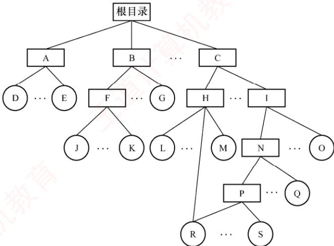

04. 某树形目录结构的文件系统如下图所示。该图中的方框表示目录，圆圈表示文件。

1）可否进行下列操作？

① 在目录D中建立一个文件，取名为A。

② 将目录 C 改名为 A。

2）若E和G分别为两个用户的目录：

①在一段时间内用户G主要使用文件S和T。为简化操作和提高速度，应如何处理？

②用户E欲对文件Ⅰ加以保护，不许别人使用，能否实现？如何实现？

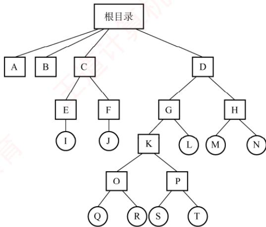

05.有一个文件系统如图A所示。图中的方框表示目录，圆圈表示普通文件。根目录常驻内存，目录文件组织成链接文件，不设FCB，普通文件组织成索引文件。目录表指示下一级文件名及其磁盘地址（各占2B，共4B）。下级文件是目录文件时，指示其第一个磁盘块地址。下级文件是普通文件时，指示其FCB的磁盘地址。每个目录的文件磁盘块的最后4B供拉链使用。下级文件在上级目录文件中的次序在图中为从左至右。每个磁盘块有512B，与普通文件的一页等长。 姚

普通文件的FCB组织如图B所示。其中，每个磁盘地址占2B，前10个地址直接指示该文件前10页的地址。第11个地址指示一级索引表地址，一级索引表中的每个磁盘地址指示一个文件页地址；第12个地址指示二级索引表地址，二级索引表中的每个地址指示一个一级索引表地址；第13个地址指示三级索引表地址，三级索引表中的每个地址指示一个二级索引表地址。请问：

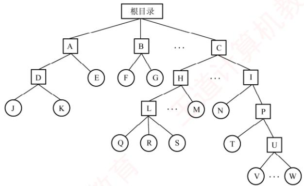  
图A 某树形结构文件系统框图

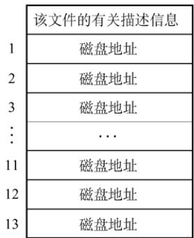  
图 B FCB 组织

1）一个普通文件最多可有多少个文件页？

2）若要读文件J中的某一页，最多启动磁盘多少次？

3）若要读文件W中的某一页，最少启动磁盘多少次？

4）根据3），为最大限度地减少启动磁盘的次数，可采用什么方法？此时，磁盘最多启动多少次?

06. 在某个文件系统中，外存为硬盘。物理块大小为512B，有文件A包含598条记录，每条记录占255B，每个物理块放2条记录。文件A所在的目录如下图所示。文件目录采用多级树形目录结构，由根目录节点、作为目录文件的中间节点和作为信息文件的树叶组成，每个目录项占127B，每个物理块放4个目录项，根目录的第一块常驻内存。试问：

1）若文件的物理结构采用链式存储方式，链指针地址占2B，则要将文件A读入内存，至少需要存取几次硬盘？

2）若文件为连续文件，则要读文件A的第487条记录至少要存取几次硬盘？

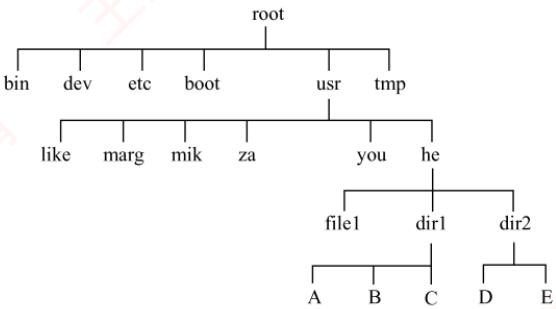

07.假定磁盘块的大小为1KB，对于540MB的硬盘，其文件分配表（FAT）最少需要占用多少存储空间？

08. 某文件系统采用混合索引分配方式，如下图所示。在索引节点中，有10个直接块，有1个一级间接块、1个二级间接块及1个三级间接块，间接块指向的是一个索引块，每个索引块和数据块的大小均为4KB，而系统中地址所占空间为4B（指针大小为4B），假设以下问题都建立在该索引节点已在内存中的前提下。

现请回答：

1）文件的大小为多大时可以只用到索引节点的直接块？

2）该索引节点能访问到的地址空间大小总共为多大（小数点后保留2位）？

3）若要读取一个文件的第10000B的内容，需要访问磁盘多少次？

4）若要读取一个文件的第10MB的内容，需要访问磁盘多少次？

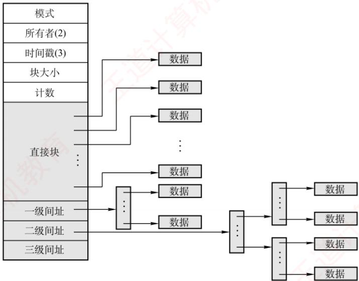

09. 某文件系统采用多级索引的方式组织文件的数据存放，假定在文件的 i node中设有13个地址项，其中直接索引10项，一次间接索引项1项，二次间接索引项1项，三次间接索引项1项。数据块的大小为4KB，磁盘地址用4B表示，试问：

1）这个文件系统允许的最大文件长度是多少？

2）一个2GB大小的文件，在这个文件系统中实际占用多少空间？（文件索引块所占的磁盘空间也需要考虑)

10.【2014统考真题】文件F由200条记录组成，记录从1开始编号。用户打开文件后，欲将内存中的一条记录插入文件F，作为其第30条记录。请回答下列问题，并说明理由。

1）若文件系统采用连续分配方式，每个磁盘块存放一条记录，文件F存储区域前后均有足够的空闲磁盘空间，则完成上述插入操作最少需要访问多少次磁盘块？F的文件控制块内容会发生哪些改变？

2）若文件系统采用链接分配方式，每个磁盘块存放一条记录和一个链接指针，则完成上述插入操作需要访问多少次磁盘块？若每个存储块大小为1KB，其中4B存放链接指针，则该文件系统支持的文件最大长度是多少？

11.【2016统考真题】某磁盘文件系统使用链接分配方式组织文件，簇大小为4KB。目录文件的每个目录项包括文件名和文件的第一个簇号，其他簇号存放在文件分配表FAT中。

1）假定目录树如下图所示，各文件占用的簇号及顺序如下表所示，其中dir、dir1是目录，file1、file2是用户文件。请给出所有目录文件的内容。

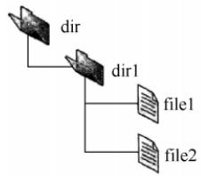

<table><tr><td rowspan=1 colspan=1>文件名</td><td rowspan=1 colspan=1>簇号</td></tr><tr><td rowspan=1 colspan=1>dir</td><td rowspan=1 colspan=1>1</td></tr><tr><td rowspan=1 colspan=1>dir1</td><td rowspan=1 colspan=1>48</td></tr><tr><td rowspan=1 colspan=1>file1</td><td rowspan=1 colspan=1>100、106、108</td></tr><tr><td rowspan=1 colspan=1>file2</td><td rowspan=1 colspan=1>200、201、202</td></tr></table>

2）若FAT的每个表项仅存放簇号，占2B，则FAT的最大长度为多少字节？该文件系统支持的文件长度最大是多少？

3）系统通过目录文件和FAT实现对文件的按名存取，说明file1的106,108两个簇号分

别存放在 FAT 的哪个表项中。

4）假设仅 FAT 和 dir目录文件已读入内存，若需要将文件 dir/dir1/file1 的第 5000 个字节读入内存，则要访问哪几个簇？

12.【2011统考真题】某文件系统为一级目录结构，文件的数据一次性写入磁盘，已写入的文件不可修改，但是可多次创建新文件。请回答如下问题。

1）在连续、链式、索引三种文件的数据块组织方式中，哪种更合适？说明理由。为定位文件数据块，需要在FCB中设计哪些相关描述字段？

2）为快速找到文件，对于FCB，是集中存储好，还是与对应的文件数据块连续存储好？说明理由。

13.【2012统考真题】某文件系统空间的最大容量为 $4\mathrm{TB} (1\mathrm{TB} = 2^{40}\mathrm{B})$ ，以磁盘块为基本分配单位。磁盘块大小为1KB。文件控制块（FCB）包含一个512B的索引表区。请回答下列问题：

1）假设索引表区仅采用直接索引结构，索引表区存放文件占用的磁盘块号，索引表项中块号最少占多少字节？可支持的单个文件的最大长度是多少字节？

2）假设索引表区采用如下结构：第0\~7字节采用<起始块号，块数>格式表示文件创建时预分配的连续存储空间。其中起始块号占6B，块数占2B，剩余504B采用直接索引结构，一个索引项占6B，则可支持的单个文件的最大长度是多少字节？为使单个文件的长度达到最大，请指出起始块号和块数分别所占字节数的合理值并说明理由。

14.【2018统考真题】某文件系统采用索引节点存放文件的属性和地址信息，簇大小为4KB。每个文件索引节点占64B，有11个地址项，其中直接地址项8个，一级、二级和三级间接地址项各1个，每个地址项长度为4B。请回答下列问题：

1）该文件系统能支持的最大文件长度是多少？（给出计算表达式即可）

2）文件系统用 $\mathrm{IM} (1\mathrm{M} = 2^{20})$ 个簇存放文件索引节点，用512M个簇存放文件数据。若一个图像文件的大小为5600B，则该文件系统最多能存放多少个这样的图像文件？

3）若文件 F1 的大小为 6KB，文件 F2 的大小为40KB，则该文系统获取 F1和 F2 最后一个簇的簇号需要的时间是否相同？为什么？

15.【2022统考真题】某文件系统的磁盘块大小为4KB，目录项由文件名和索引节点号构成，每个索引节点占256字节，其中包含直接地址项10个，一级、二级和三级间接地址项各1个，每个地址项占4字节。该文件系统中子目录stu的结构如图(a)所示，stu包含子目录 course 和文件 doc，course 子目录包含文件 course1 和 course2。各文件的文件名、索引节点号、占用磁盘块的块号如图(b)所示。请回答下列问题。

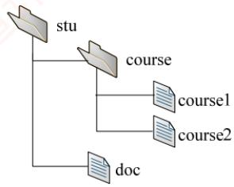  
(a)

<table><tr><td rowspan=1 colspan=1>文件名</td><td rowspan=1 colspan=1>索引节点号</td><td rowspan=1 colspan=1>磁盘块号</td></tr><tr><td rowspan=1 colspan=1>stu</td><td rowspan=1 colspan=1>1</td><td rowspan=1 colspan=1>10</td></tr><tr><td rowspan=1 colspan=1>course</td><td rowspan=1 colspan=1>2</td><td rowspan=1 colspan=1>20</td></tr><tr><td rowspan=1 colspan=1>course1</td><td rowspan=1 colspan=1>10</td><td rowspan=1 colspan=1>30</td></tr><tr><td rowspan=1 colspan=1>course2</td><td rowspan=1 colspan=1>100</td><td rowspan=1 colspan=1>40</td></tr><tr><td rowspan=1 colspan=1>doc</td><td rowspan=1 colspan=1>10</td><td rowspan=1 colspan=1>x</td></tr></table>

(b)

1）目录文件stu中每个目录项的内容是什么？

2）文件doc占用的磁盘块的块号x的值是多少？

3）若目录文件course的内容已在内存，则打开文件course1并将其读入内存，需要读几个磁盘块？说明理由。

4）若文件 course2的大小增长到6 MB，则为了存取 course2 需要使用该文件索引节点的哪几级间接地址项？说明理由。

## 4.2.12 答案与解析

## 一、单项选择题

## 01. A

访问计数值表示的意义是，每当有一个进程要访问此索引节点，访问计数值加1，访问结束时减1，它属于内存索引节点中特有的内容。 XTI

## 02. D

目录文件是FCB的集合，一个目录中既可能有子目录，又可能有数据文件，因此目录文件中存放的是子目录和数据文件的信息。

## 03. C

文件目录项即FCB，通常由文件基本信息、存取控制信息和使用信息组成。基本信息包括文件物理位置。文件目录项显然不包括FCB的物理位置信息。

## 04. C

将文件描述信息从目录项中分离，即应用了索引节点的方法，磁盘的盘块中可以存放更多的目录项，查找文件时可以大大减少其I/O信息量。 XTA

## 05. D

异步I/O是指发出I/O请求后，系统不必等待I/O完成，而继续执行其他任务，当I/O完成后再通知系统，异步I/O提高了CPU利用率，但对磁盘J/O次数没有影响。将目录项分解为符号目录项和基本目录项，符号目录项包括文件名和文件号，基本目录项包括文件号和文件其他描述信息，查找时只需查找符号目录，减少了磁盘占用空间，因此减少了读盘次数。文件高速缓存可以减少磁盘IO次数。磁盘调度算法可以减少寻道时间，提高磁盘I/O速度。

## 06. B

文件大小与对目录进行检索无关。目录项数量越多，检索目录时的平均比较次数就越多，影响检索性能；目录项的大小越大，占用的盘块就越多，I/O时间也就越长，影响检索性能；目录项在目录中的位置不同，可能导致不同的访问路径，影响检索性能。

## 07. D

A、B和C项的同名文件都有不同的路径名，因此不会造成文件名重名问题。在同一个磁盘的同一目录下，若两个文件名重名，则它们具有相同的路径名，因此无法区别。

## 08.B

文件目录是实现按名存取的关键，通过查找目录可以获得文件的物理地址和其他属性。

## 09. C

FCB 占 64B，盘块大小为1KB，一个盘块能存放1024/64=16个FCB。文件目录有3200个目录项，即3200个FCB（每个目录项一个FCB），文件目录需要占用3200/16=200个盘块。查找一个文件需要在200个盘块中顺序查找目标FCB，平均查找次数为200/2=100，即平均访问磁盘的次数。注意，在操作系统教材中，平均查找长度通常描述为“总长度/2”；在数据结构教材中，平均查找长度通常描述为“(总长度+1)/2”，相对而言后者更严谨。

## 10. B

一个目录项的大小是16B，一个磁盘块可以存放1024B/16B=64个目录项，存放3200个目录项共需要50个磁盘块。因此，找到一个文件对应的目录项平均读磁盘的次数为50/2= 25，之

后根据对应目录项的索引节点编号再启动磁盘读入索引节点，总读磁盘次数为26。

## 11. C

实现用户对文件的按名存取，系统先利用用户提供的文件名形成检索路径，对目录进行检索。在顺序检索中，路径名的一个分量未找到，说明路径名中的某个目录或文件不存在，不需要继续检索，选项C正确。目录的查询方式有顺序检索法和散列法两种，散列法并不适用于所有的目录结构，而且有冲突和溢出的缺点，解决的开销也较大，因此通常更多采用的是顺序检索法，选项A错误。在树形目录中，为了加快文件检索速度，可设置当前目录，于是文件路径可以从当前目录开始查找，选项B错误。在顺序检索法查找完成后，得到的是文件的逻辑地址，选项D错误。

## 12. A

相对路径是从当前目录出发到所找文件通路上所有目录名和数据文件名用分隔符连接起来而形成的，注意与绝对路径的区别。

## 13. C

在文件系统中采用多级目录结构后，符合了多层次管理的需要，提高了文件查找的速度，还允许用户建立同名文件。因此，多级目录结构的采用解决了命名冲突。

## 14. A

在单级目录文件中，每当新建一个文件时，必须先检索所有的目录项，以保证新文件名在目录中是唯一的。所以单级目录结构无法解决文件重名问题。

## 15. A

磁带是一种顺序存储设备，用它存储文件时只能采用顺序存储结构。注意，若允许磁带来回倒带，也可组织为其他文件形式，本题不做讨论。

## 16. B

采用连续分配和索引分配的文件都支持随机存取。采用链接分配的文件不支持随机存取。

## 17. A

要求有连续的存储空间，因此必须事先知道文件的大小，并据此在存储空间中找出一块大小足够的存储区。若文件动态地增长，则会使文件所占的空间越来越大，即使事先知道文件的最终大小，在采用预分配的存储空间的方法时，也是很低效的，它会使大量的存储空间长期闲置。

## 18. B

在连续分配方式中，为了使系统能找到文件存放的地址，应在目录项的“文件物理地址”字段中，记录该文件第一条记录所在的盘块号和文件长度（以盘块数进行计量）。

## 19. B

顺序文件占用连续的磁盘空间，容易导致存储碎片（外部碎片）的发生。

## 20. D

通常用户可以根据需要来确定文件的逻辑结构，而文件的物理结构是由操作系统的设计者根据文件存储器的特性来确定的，一旦确定，就由操作系统管理。

## 21. C

打开文件表仅存放已打开文件信息的表，将指明文件的属性从外存复制到内存，再使用该文件时直接返回索引，选项A错误。位图和空闲盘块链表是磁盘管理方法，选项B、D错误。只有索引表中记录每个文件所存放的盘块地址，选项C正确。

## 22. B

链接分配的文件通过在每个盘块上的链接指针，将同属于一个文件的多个离散的盘块链接成一个链表，它的物理块不需要连续排列。其他说法均正确。

## 23. B

不同的存储介质有不同的存储特性，如磁带只能顺序存取，磁盘可以随机存取，因此文件的组织形式与存储介质特性有关。文件的逻辑结构与文件的物理结构没有必然关系，主存储器的管理方式只涉及内存管理，文件的物理存储与设备的分配方式也没有必然关系。

## 24. A

若需要在文件中间增加一块，则连续分配就要将后面的所有盘块都向后移动一块，这样就会产生很多的磁盘I/O操作。而其他三种分配方式都不需要移动盘块，只需修改一些指针或者索引。因此，连续分配是操作磁盘I/O次数最多的。

## 25. D

记录成组分解技术是指将若于逻辑记录存入一个块，一个逻辑记录不能跨越两个块。逻辑记录的固定长度为100B，盘块长度为512B，采用成组分解技术，因此每个盘块可以存放5个逻辑记录，剩下12B的空间可用于存放指向下一个盘块的指针。每个盘块存放5个逻辑记录，因此第22个逻辑记录在第5个物理块中 $( \left [ 22/5 \right ] = 5 )$ 。采用链接分配方式，要找到第5个物理块，需要从第1个物理块开始按指针顺序查找，因此需要启动磁盘5次。修改完后还要写回磁盘，因为此前已获得该块的磁盘地址，所以只需启动磁盘1次，共需启动磁盘6次。

## 26. B

因为1569=512×3+33，所以要访问字节位于第4个磁盘块上，对应的物理磁盘块号为80。

## 27. C

采用隐式链接分配，首先需要依次读L1～L5磁盘块，根据L5磁盘块，获取L6磁盘块的地址；然后将Lx’的数据写入一个空闲磁盘块，将该块的链接指针指向L6磁盘块；最后修改L5磁盘块，将链接指针指向Lx’的磁盘块的地址并写回磁盘。因此共进行了5次读盘和2次写盘。

## 28. B

根据2016年统考真题综合题47，可知FAT支持的最大文件长度可理解为整个分区大小。一个簇的大小为 8KB，一个512MB 的文件包含 $512MB/8KB = 2^{16}$ 个簇，所以簇号占2B，最多有 $2 ^ { 1 6 }$ 个FAT表项，FAT表占用的空间约为 $2^{16} \times 2\mathrm{B} = 128\mathrm{KB}$ o

## 29. C

连续分配和索引分配都支持随机访问，链接分配通常可默认为隐式链接，仅支持顺序访问，由题意可知该文件仅支持顺序访问，因此文件采用的结构为链接分配。

## 30. B

采用连续分配时，将最后一个数据块搬到文件头部，要移动文件的物理块，需要磁盘I/O。采用单级索引分配时，将最后一个数据块插入文件头部，索引块已驻留在内存中，因此只需修改索引块，不需要磁盘I/O。采用隐式链接分配时，仅支持顺序访问，要修改文件数据块的顺序，就必须修改对应磁盘块末尾的指针，必须将文件块读入内存，需要磁盘I/O。

## 31. A

采用连续分配时，至少需要进行45次读磁盘和45次写磁盘，将前45个盘块依次向前移动之后还要进行1次写磁盘，将数据写入对应空出的盘块。采用链接分配时，需要进行45次读磁盘然后修改第45个磁盘块中的链接指针，并写新磁盘块，共进行2次写磁盘，开销比顺序文件小。采用一级索引分配或多级索引分配时，只需修改内存中的索引表，不需磁盘I/OQ，开销较小。

## 32. D

直接指针可指向10个磁盘块，一级间接指针可指向一个索引块，一个索引块中可存放1024个磁盘地址，每个地址指向一个磁盘块。因此该文件最多占用10+1024=1034个磁盘块。

## 33. A

最大文件的尺寸由二级索引块能够指向的磁盘块数决定。每个磁盘块中最多有1KB/4B=256个索引项，则两级索引分配方式下单个文件的最大长度为256×256×1KB=64MB。

## 34. B

最大文件的尺寸由三级索引块能够指向的磁盘块数决定。三级索引块可以指向1024B/4B= 256个二级索引块，每个二级索引块又可指向256个一级索引块，每个一级索引块又可指向256 个磁盘块。因此，最大文件的尺寸为256×256×256×1024B=16GB。

## 35. C

根据文件分配表、页表和中断向量表的应用原理，它们都有一个要求，就是要能随机访问表中的任一元素，即随机访问，因此只能用数组实现。在进程调度的过程中，每次都调度就绪队列的队首进程，因此既可以用数组实现，又可以用链表实现。

## 36. A

一个文件对应一个FCB，而一个文件目录项就是一个FCB。

## 37. A

打开文件操作是将该文件的FCB存入内存的活跃文件目录表，而不是将文件内容复制到主存，找到指定文件目录是打开文件之前的操作。

## 38. B

open()调用的参数含有文件名（或者说文件的路径名），它会在进程的用户打开文件表中增加一个对应的表目，并返回该表目的索引号（文件描述符或句柄）。系统打开文件表只有在文件实体第一次被打开时才增加一个表目，也才会通过文件I/O将对应的索引节点从磁盘读入内存。当open()调用的不同文件互为硬链接时，所打开的文件实体是一样的。

## 39. B

关闭文件是指将文件当前的控制信息从内存写回磁盘，需要注意的是关闭文件并不意味着将文件数据写回磁盘，写文件操作才会写回磁盘（不考虑延迟写），选项B正确。

## 40. B

读文件操作的正确次序是：按文件描述符在打开文件表中找到该文件的目录项：按存取控制说明检查访问的合法性：根据目录项中该文件的逻辑和物理组织形式，将逻辑记录号转换成物理块号；向设备驱动程序发出I/O请求，完成数据交换工作。因此答案是说法IV、Ⅱ、、I。

## 41. D

文件在磁带上通常采用连续存放方法，在硬盘上通常不采用连续存放方法，在内存上采用随机存放方法，说法Ⅰ错误。对文件的访问控制，常由用户访问权限和文件属性共同限制，说法Ⅱ错误。在树形目录结构中，对于不同用户的文件，文件名可以不同也可以相同，说法Ⅲ错误。防止文件受损常采用备份的方法，而存取控制矩阵方法用于多用户之间的存取权限保护，说法I错误。

## 42. D

文件被打开后，系统为每个打开的文件分配一个文件描述符（索引号），用来标识该文件。之后用户不再使用文件名，而使用文件描述符，来对该文件进行读/写、定位等操作。

## 43. A

建立F2时，F1和F2的引用计数值都变为2。建立F3时，符号链接文件的引用计数值不受被链接文件的影响，始终为1，所以F1和F3的引用计数值为2和1。删除F2时，F1的引用计数值变为2-1=1，F3的引用计数值仍保持不变，因此F1、F3的引用计数值分别是1、1。

## 44. A

文件F2是F1的硬链接文件，指向同一个索引节点，当进程 $\mathrm { P } _ { 1 }$ 第一次打开F1时，会将磁盘的索引节点读入内存，之后 $\mathrm { P } _ { 1 }$ 打开F2及 $\mathrm { P } _ { 2 }$ 打开F1和F2都共享之前已读入内存的索引节点，选项A正确。 $\mathrm { P _ { 1 } }$ 和 $\mathrm { P } _ { 2 }$ 对同一个文件的访问权限可能有所不同，选项B错误。F3是F2的软链接文件，删除F3不影响F2的引用计数值，选项C错误。读取F1只需传入F1在 $\mathrm { P } _ { 1 }$ 中的文件描述符(F1 在 $\mathrm { P } _ { 1 }$ 的进程打开文件表中的索引号），并不需要其路径名，选项D错误。

## 45. A

文件保护是针对文件访问权限的保护。

## 46. D

在文件系统中，口令、存取控制和用户权限表都是常用的文件保护方法。

## 47. A

对于这道题，只要能区分用户的访问权限和用户优先级，就能得到正确的答案。用户访问权限是指用户有没有权限访问该文件，而用户优先级是指在多个用户同时请求该文件时应该先满足谁。比如，图书馆的用户排队借一本书，某用户可能有更高的优先级，即他排在队伍的前面，但有可能轮到他时被告知他没有借阅那本书的权限。

文件的属性包括保存在FCB中对文件访问的控制信息。

## 48. A

系统级安全管理包括注册和登录。此外，通过“进入系统时”也可推测出正确答案。

## 49. A

为了实现“按名存取”，在文件系统中为每个文件设置用于描述和控制文件的数据结构，称为文件控制块。在文件控制块中，通常包含三类信息：基本信息、存取控制信息及使用信息。

## 50. B

文件的物理结构包括连续、链式、索引三种，其中链式结构不能实现随机访问，连续结构的文件不易于扩展。因此随机访问且易于扩展是索引结构的特性。

## 51. B

建立符号链接时，引用计数值直接设置为1，不受被链接文件的影响：建立硬链接时，引用计数值加1。删除文件时，删除操作对于符号链接是不可见的，这并不影响文件系统，当以后再通过符号链接访问时，发现文件不存在，直接删除符号链接；但对于硬链接则不可直接删除，引用计数值减1，若值不为0，则不能删除此文件，因为还有其他硬链接指向此文件。

当建立F2时，F1和F2的引用计数值都为1。当再建立F3时，F1和F3的引用计数值就都变成了2。当后来删除F1时，F3的引用计数值为2-1=1，F2的引用计数值不变。

## 52. C

当一个文件系统含有多级目录时，每访问一个文件，都要使用从树根开始到树叶为止、包括各中间节点名的全路径名。当前目录也称工作目录，进程对各个文件的访问都相对于当前目录进行，而不需要从根目录一层一层地检索，加快了文件的检索速度。选项A、B都与相对目录无关；选项D，文件的读/写速度取决于磁盘的性能。

## 53. C

每个磁盘索引块和磁盘数据块大小均为256B，每个磁盘索引块有256/4=64个地址项。因此，4个直接地址索引指向的数据块大小为4×256B；2个一级间接索引包含的直接地址索引数为2×(256/4)，即其指向的数据块大小为2×(256/4)×256B。1个二级间接索引所包含的直接地址索引数为(256/4)×(256/4)，即其所指向的数据块大小为(256/4)×(256/4)×256B。因此，7个地址项所指向的数据块总大小为 $4 \times 256 + 2 \times (256/4) \times 256 + (256/4) \times (256/4) \times 256 = 1082368 = 1057 \mathrm{KB}$ 0

## 54. A

对于说法I，当所读文件的数据不在内存时，产生中断（缺页中断），原进程进入阻塞态，直到所需数据从外存调入内存后，才将该进程唤醒。对于说法Ⅱ，read系统调用通过陷入将CPU从用户态切换到核心态，从而获取操作系统提供的服务。对于说法Ⅲ，要读一个文件，首先要用open系统调用打开该文件。open中的参数包含文件的路径名与文件名，而 read 只需使用 open返回的文件描述符，并不使用文件名作为参数。read要求用户提供三个输入参数：①文件描述符fd；② buf缓冲区首址；③传送的字节数n。read的功能是试图从fd所指示的文件中读入n字节的数据，并将它们送至由指针buf所指示的缓冲区中。

## 55. A

此文件所在目录下可能还存在其他文件，因此删除文件时不能（也不需要）删除文件所在的目录，而与此文件关联的目录项和文件控制块需要随着文件一同删除，同时释放文件关联的内存缓冲区。

## 56. A

索引节点的总数即文件的总数，与单个文件的长度无关。间接地址级数越多、地址项数越多、文件块越大，单个文件的长度就会越大。

## 57. A

为了实现快速随机播放，要保证最短的查询时间，即不能选取链表和索引结构，因此连续结构最优。

## 58. B

一个文件被用户进程首次打开即被执行了open操作，会把文件的FCB调入内存，而不会把文件内容读到内存中，只有进程希望获取文件内容时才会读入文件内容。选项C、D明显错误。

## 59. B

10个直接索引指针指向的数据块大小为10×1KB=10KB。每个索引指针占4B，则每个磁盘块可存放1KB/4B=256个索引指针，一级索引指针指向的数据块大小为256×1KB = 256KB，二级索引指针指向的数据块大小为 $256 \times 256 \times 1 \mathrm{KB} = 2^{16} \mathrm{KB} = 64 \mathrm{MB}$

按字节编址，偏移量为1234时，因1234B<10KB，由直接索引指针可得到其所在的磁盘块地址。  
文件的索引节点已在内存中，因此地址可直接得到，因此仅需1次访盘即可。

偏移量为307400时，因 $10\mathrm{KB}+256\mathrm{KB}<307400\mathrm{B}<64\mathrm{MB}$ ，可知该偏移量的内容在二级索引指针所指向的某个磁盘块中，索引节点已在内存中，因此先访盘2次得到文件所在的磁盘块地址，再访盘1次即可读出内容，共需要3次访盘。

## 60. D

需要注意的是，二进制位串表示的访问权限是这个文件所持有的，而不是某个用户所持有的，这个二进制位串要表示所有类别的用户的访问权限，每个要访问该文件的用户在访问之前都要查这个二进制位串。对于每类用户来说，都需要用5位来表示5种访问权限中的哪几种访问权限，共有四类用户，因此可将用户访问权限抽象为一个矩阵，其行代表用户类别，列代表访问权限。这个矩阵有4行5列，1代表true，0代表false，所以需要20位。

例如，下表是一个用二进制位串表示的文件权限。

<table><tr><td rowspan=2 colspan=1>用户类别</td><td rowspan=1 colspan=5>访问权限</td></tr><tr><td rowspan=1 colspan=1>完全控制</td><td rowspan=1 colspan=1>执行</td><td rowspan=1 colspan=1>修改</td><td rowspan=1 colspan=1>读取</td><td rowspan=1 colspan=1>写入</td></tr><tr><td rowspan=1 colspan=1>安全管理员</td><td rowspan=1 colspan=1>1</td><td rowspan=1 colspan=1>1</td><td rowspan=1 colspan=1></td><td rowspan=1 colspan=1>1</td><td rowspan=1 colspan=1>0</td></tr><tr><td rowspan=1 colspan=1>文件主</td><td rowspan=1 colspan=1>1</td><td rowspan=1 colspan=1>1</td><td rowspan=1 colspan=1>1</td><td rowspan=1 colspan=1>1</td><td rowspan=1 colspan=1>1</td></tr><tr><td rowspan=1 colspan=1>文件主的伙伴</td><td rowspan=1 colspan=1>0</td><td rowspan=1 colspan=1>1</td><td rowspan=1 colspan=1>0</td><td rowspan=1 colspan=1>1</td><td rowspan=1 colspan=1>0</td></tr><tr><td rowspan=1 colspan=1>其他用户</td><td rowspan=1 colspan=1>0</td><td rowspan=1 colspan=1>0</td><td rowspan=1 colspan=1>0</td><td rowspan=1 colspan=1>1</td><td rowspan=1 colspan=1>0</td></tr></table>

本题易误选A，有读者认为用2位来表示用户类别，用3位来表示访问权限，这种情况在于没有理解文件访问权限的二进制位串是文件所持有的，所以当用户需要检查访问权限时，要在二进制位串中查询所属用户类别的访问权限。此外，每类用户的访问权限不是拥有5种访问权限中的哪一种，而是5种访问权限都可能拥有，因此不可能用3位来表示访问权限。

## 61. B

多个进程打开一个文件时，读/写指针的位置不同，它们保存在各自的用户打开文件表中，说法Ⅰ错误。硬链接是基于索引节点的共享方式，指向同一个内存索引节点，说法Ⅱ正确。不同进程获得的文件描述符是各自独立的，分别指向各自的用户打开文件表中的一项，说法Ⅲ正确。

## 62. D

为了改善磁盘的效率，操作系统将多个相邻的扇区组合成簇，对文件存储空间的分配以簇为单位，因此一个文件所占用的空间只能是簇的整数倍。文件的大小为1026B，大于1簇、小于2簇，因此需要分配2簇磁盘空间，即2048B。 饰村

## 63. B

在总长为64字节的目录项中，索引节点占4字节，即32位。不同目录下的文件的文件名可以相同，所以在考虑系统创建最多文件数量时，只需考虑索引节点的个数，即创建文件数量上限=索引节点数量上限。整个系统中最多存储232个索引节点，因此整个系统最多可以表示232个文件。

## 64. B

多个进程可以同时以“读”或“写”的方式打开文件，操作系统并不保证写操作的互斥性，进程可通过系统调用对文件加锁，保证互斥写（读者-写者问题），选项A错误。整个系统只有一个系统打开文件表，同一个文件打开多次只需改变引用计数，选项B正确。用户进程的打开文件表关于同一个文件不一定相同，例如当前读/写位置指针、访问权限不一定相同，选项C错误。进程关闭文件时，文件的引用计数减1，引用计数变为0时才删除系统打开文件表中的表项，选项D错误。

## 65. A

索引分配支持变长的文件，同时可以随机访问文件的指定数据块，选项A正确。链接分配不支持随机访问，需要依靠指针依次访问，选项B错误。连续分配的文件长度固定，不支持可变文件长度（连续分配的文件长度虽然也可变，但是需要大量移动数据，代价较大，相比之下不太合适），选项C错误。动态分区分配是内存管理方式，不是磁盘空间的管理方式，选项D错误。

## 66. A

删除一个文件时，会根据文件控制块回收相应的磁盘空间，将文件控制块回收，并删除目录中对应的目录项。选项B、C、D正确。快捷方式属于文件共享中的软连接，本质上创建的是一个链接文件，其中存放的是访问该文件的路径，删除文件并不会导致文件的快捷方式被删除，正如在Windows中删除一个程序后，其快捷方式可能仍留在桌面上，但已无法打开。

## 67. B

当文件F首次被进程P打开时，会将磁盘的索引节点复制到内存的索引节点，并新增链接计数（打开计数）等内容。当进程P关闭文件F时，会将内存索引节点的链接计数减1，因为文件F仅被进程P打开，所以链接计数变为0，文件系统释放℉的内存索引节点，选项B正确。关闭F不改变目录中文件F的目录项，选项A错误。关闭F只对内存索引节点进行相关的操作，不改变磁盘索引节点的数据结构，选项C、D错误。

## 68. A

当用户首次对某文件发出操作请求时，需要先用系统调用open()将该文件打开。所谓“打开”，是指系统利用文件名检索到指定文件的目录项后，将文件的属性（包括该文件在外存中的物理位

置）从外存复制到内存的打开文件表的一个表目中，并给用户返回一个文件描述符fd。此后（只要文件未被关闭），用户对该文件的所有操作就都是通过文件描述符fd来进行的。

## 69. C

文件分配表（FAT）通过一个与逻辑块一一对应的表项数组，既描述文件数据块的链接关系，又标识每个块的使用状态（如空闲、已分配或坏块），进而直接支持空闲空间的跟踪与分配。相比之下，目录仅用于建立文件名到元数据（如FCB或inode）的映射；文件控制块（FCB）或inode存储单个文件的属性及物理位置信息：系统打开文件表则维护当前被进程打开的文件状态。这三者均不负责记录外存空闲空间的使用情况。 XTA

## 70. C

在采用目录与索引节点（inode）分离管理的文件系统中，新建文件F时，文件系统首先分配一个空闲inode，并初始化其元数据字段，包括文件类型、访问权限、时间戳以及数据块指针等：随后，在所属目录文件中新增一个目录项，该目录项仅包含文件名F及其对应的inode号。由于访问权限等属性信息始终保存在inode中，目录项并不包含这些内容，因此目录文件不会记录文件的访问权限信息。综上，文件系统在创建文件时不会在目录文件中写入F的访问权限信息。

## 二、综合应用题

## 01. 【解答】

连续分配方式的优点是可以随机访问（磁盘），访问速度快：缺点是要求有连续的存储空间，容易产生碎片，降低磁盘空间利用率，并且不利于文件的增长扩充。

链接分配方式的优点是不要求连续的存储空间，能更有效地利用磁盘空间，并且有利于扩充文件；缺点是只适合顺序访问，不适合随机访问；另外，链接指针占用一定的空间，降低了存储效率，可靠性也差。 X

索引分配方式的优点是既支持顺序访问又支持随机访问，查找效率高，便于文件删除；缺点是索引表会占用一定的存储空间。 C

## 02.【解答】

目录是存放在磁盘上的，检索目录时需要访问磁盘，速度很慢。利用“FCB分解法”加快目录检索速度的原理是：将FCB的一部分分解出去，存放在另一个数据结构中，而在目录中仅留下文件的基本信息和指向该数据结构的指针，这样一来就有效地缩减了目录的体积，减少了目录所占磁盘的块数，检索目录时读取磁盘的次数也减少，于是就加快了检索目录的速度。

因为原本整个FCB都是在目录中的，而FCB分解法将FCB的部分内容放在了目录外，所以检索完目录后还需要读取一次磁盘，以找齐FCB的所有内容。 X

1）分解法前，目录的磁盘块数为 $64 \times 254 / 512 = 31.75$ ，即32块。前31块中每块放了 $5 1 2 / 6 4 = 8$ 个，而最后一块放了 $254 - 31 \times 8 = 6$ 个。所以查找该目录文件的某个FCB的平均访问磁盘次$8 \times (1 + 2 + 3 + \cdots + 31) + 6 \times 32 + 254 = 16.38$ 次。分解法后，目录的磁盘块数为 $10 \times 254 / 512 = 4.96$ ，即5块。前4块中每块放了 $512/10=51$ 个，而最后一块放了254-4×51=50个。所找的目录项在第1,2,3,4,5块所需的磁盘访问次数分别为2,3,4,5,6次。所以查找该目录文件的某个FCB的平均访问磁盘次数$[51 \times (2 + 3 + 4 + 5) + 50 \times 6] / 254 = 3.99$ 次。

2）分解法前，平均访问磁盘次数 $(1 + 2 + 3 + \cdots + n) / n = (n + 1) / 2$ 次。分解法后，平均访问磁盘次数 $\left[ 2 + 3 + 4 + \cdots + (m + 1) \right] / m = (m + 3) / 2$ 次。为了使访问磁盘次数减少，显然需要 $(m + 3)/2 < (n + 1)/2$ ，即 $m < n - 2$

注，第二问中的每个盘块都正好装满，相当于访问每个盘块的概率是相等的，因此计算起来

比第一问方便很多。

## 03. 【解答】

1）可以建立链接。因为F是目录，而R是文件，所以可以建立R到F的符号链接。除了符号链接，也可以通过硬链接的方式。

2）不一定能删除R。由于R被多个目录共享，能否删除R取决于文件系统实现共享的方法。若采用基于索引节点的共享方法，则因删除后存在指针悬空问题而不能删除R节点。若采用基于符号共享的方法，则可以删除R节点。

3）不一定能删除N。因为N的子目录中存在共享文件R，而R节点本身不一定能被删除，所以N也不一定能被删除。 LK

## 04.【解答】

1）①因为目录D中没有已命名为A的文件，所以在目录D中，可以建立一个名为A的文件。②因为在文件系统的根目录下已存在一个名为A的目录，所以根目录下的目录C不能改名为A。 XV

2）①用户G需要通过依次访问目录K和目录P，才能访问文件S和文件T。为了提高文件  
H 访问速度，可在目录G下建立两个链接文件，分别链接到文件S和文件T上。这样用户G就可直接访问这两个文件。②用户E可以修改文件Ⅰ的存取控制表来对文件Ⅰ加以保护，不让别的用户使用。具体实现方法是：在文件Ⅰ的存取控制表中，只留下用户E的访问权限，其他用户对该文件无操作权限，从而达到不让其他用户访问的目的。

## 05.【解答】

1）因为磁盘块大小为512B，所以索引块大小也为512B，每个磁盘地址大小为2B。因此，一个一级索引表可容纳256个磁盘地址。同样，一个二级索引表可容纳256个一级索引表地址，一个三级索引表可容纳256个二级索引表地址。这样，一个普通文件最多可有的文件页数为 $10+256+256\times 256+256\times 256\times 256=16843018$

2）由图可知，目录文件A和D中的目录项都只有两个，因此这两个目录文件都只占用一个物理块。要读文件J中的某一页，先从内存的根目录中找到目录文件A的磁盘地址，将其读入内存（已访问磁盘1次）。然后从目录A中找出目录文件D的磁盘地址读入内存（已访问磁盘2次）。再从目录D中找出文件J的FCB地址读入内存（已访问磁盘3次）。在最坏情况下，该访问页存放在三级索引下，这时候需要一级级地读三级索引块才能得到文件J的地址（已访问磁盘6次）。最后读入文件J中的相应页（共访问磁盘7次）。所以，若要读文件J中的某一页，最多启动磁盘7次。

3）由图可知，目录文件C和U的目录项较多，可能存放在多个链接在一起的磁盘块中。在最好情况下，所需的目录项都在目录文件的第一个磁盘块中。先从内存的根目录中找到目录文件C的磁盘地址并读入内存（已访问磁盘1次）。在C中找出目录文件Ⅰ的磁盘地址并读入内存（已访问磁盘2次）。在Ⅰ中找出目录文件P的磁盘地址并读入内存（已访问磁盘3次）。从P中找到目录文件U的磁盘地址并读入内存（已访问磁盘4次）。从U的第一个磁盘块中找出文件W的FCB地址并读入内存（已访问磁盘5次）。在最好情况下，要访问的页在FCB的前10个直接块中，按照直接块指示的地址读文件W的相应页（已访问磁盘6次）。所以，若要读文件W中的某页，最少启动磁盘6次。

4）为了减少启动磁盘的次数，可以将需要访问的W文件挂在根目录的最前面的目录项中。此时，只需读内存中的根目录就可找到W的FCB，将FCB读入内存（已访问磁盘1次），最差情况下，需要的W文件的那个页挂在FCB的三级索引下，因此读3个索引块需要访问磁盘3次（已访问磁盘4次）得到该页的物理地址，再去读这个页即可（已访问磁盘5次）。此时，磁盘最多启动5次。

## 06.【解答】

1）根目录的第一块常驻内存（root所指的/bin、/dev、/etc、/boot等可直接获得），根目录找到文件A需要5次读盘。由 $255 \times 2 + 2 = 512$ 可知，一个物理块在链式存储结构下可放2条记录及下一个物理块地址，而文件A共有598条记录，因此读取A的所有记录所需的读盘次数为 $5 9 8 / 2 = 2 9 9$ ，所以将文件A读到内存至少需要读盘 $2 9 9 + 5 = 3 0 4$ 次。

2）当文件为连续文件时，找到文件A同样需要5次读盘，且知道文件A的地址后通过计算只需一次读盘即可读出第487条记录，所以至少需要 $5 + 1 = 6$ 次读盘。 姚

## 07.【解答】

对于540MB的硬盘，硬盘总块数为 $540MB/1KB = 540K$ 个。

因为540K刚好小于220，所以文件分配表的每个表目可用20位，即 $20/8 = 2.5B$ ，这样 FAT占用的存储空间大小为 $2.5\mathrm{B} \times 540\mathrm{K}=1350\mathrm{KB}$ 发计

## 08.【解答】

1）要想只用到索引节点的直接块，这个文件应能全部在10个直接块指向的数据块中放下，而数据块的大小为4KB，所以该文件的大小应小于或等于 $4\mathrm{KB} \times 10 = 40\mathrm{KB}$ ，即文件的大小不超过40KB时可以只用到索引节点的直接块。

2）只需要算出索引节点指向的所有数据块的块数，再乘以数据块的大小即可。直接块指向的数据块数 =10块。

一级间接块指向的索引块里的指针数为 $4\mathrm{KB}/4\mathrm{B}=1024$ ，所以一级间接块指向的数据块数为1024块。

二级间接块指向的索引块里的指针数为4KB/4B=1024，指向的索引块里再拥有 $4\mathrm{KB}/4\mathrm{B}=$ 1024个指针数。所以二级间接块指向的数据块数为 $(4\mathrm{KB}/4\mathrm{B})^{2}=1024^{2}$

三级间接块指向的数据块数为 $(4\mathrm{KB}/4\mathrm{B})^{3}=1024^{3}$ 。所以，该索引节点能访问到的地址空间大小为

$$
\left[10+1\times\frac{4 KB }{4 B }+1\times\left(\frac{4 KB }{4 B }\right)^{2}+1\times\left(\frac{4 KB }{4 B }\right)^{3}\right]\times4 KB \approx4100.00 GB =4.00 TB
$$

3）因为10000B/4KB=2.44，所以第10000B的内容存放在第3个直接块中，若要读取一个文件的第10000B的内容，需要访问磁盘1次。

4）因为10MB的内容需要数据块数为 $10MB/4KB = 2.5 \times 1024$ ，直接块和一级间接块指向的数据块数 $10+(4KB/4B)=1034<2.5\times1024$ ，直接块和一级间接块及二级间接块的数据块数 $10+(4\mathrm{KB}/4\mathrm{B})+(4\mathrm{KB}/4\mathrm{B})^{2}>1\times1024^{2}>2.5\times1024$ ，所以第10MB数据应该在二级

## 09.【解答】

第一问要计算混合索引结构的寻址空间大小；第二问只要计算出存储该文件索引块的大小，然后加上该文件本身的大小即可。

1）物理块大小为4KB，数据大小为4B，则每个物理块可存储的地址数为 $4\mathrm{KB}/4\mathrm{B}=1024$ 。最大文件的物理块数可达 $1 0 + 1 0 2 4 + 1 0 2 4 ^ { 2 } + 1 0 2 4 ^ { 3 }$ ，每个物理块大小为4KB，因此总长度为

$$
(10 + 1024 + 1024^2 + 1024^3) \times 4KB = 40KB + 4MB + 4GB + 4TB
$$

这个文件系统允许的最大文件长度是 $4\mathrm{TB}+4\mathrm{GB}+4\mathrm{MB}+40\mathrm{KB}$ ，约为 $4 \mathrm { T B }$

2）占用空间分为文件实际大小和索引项大小，文件大小为2GB，从1）中的计算知，需要

使用到二次间接索引项。该文件占用 $2GB/4KB=512\times1024$ 个数据块。

一次间接索引项使用1个间接索引块，二次间接索引项使用 $1+\left[\left(512\times1024-10-1024\right)\right]$ $1 0 2 4 \rceil { \approx } 5 1 2$ 个间接索引块（最左的1表示二次间址块），所以间接索引块所占空间大小为

$$
(1 + 512) \times 4 \mathrm{KB} = 2 \mathrm{MB} + 4 \mathrm{KB}
$$

另外每个文件使用的i node 数据结构占 $13 \times 4\mathrm{B} = 52\mathrm{B}$ ，因此该文件实际占用磁盘空间大小为 $2\mathrm{GB}+2\mathrm{MB}+4\mathrm{KB}+52\mathrm{B}$

## 10. 【解答】

1）在磁盘中连续存放（采取连续结构），磁盘寻道时间更短，文件随机访问效率更高；在FCB中加入的字段为<起始块号，块数>或<起始块号，结束块号>。 uK

2）将所有的FCB集中存放，文件数据集中存放。这样在随机查找文件名时，只需访问FCB对应的块，可减少磁头移动和磁盘I/O访问次数。

## 11. 【解答】

1）文件系统中所能容纳的磁盘块总数为 $4\mathrm{TB/1KB}=2^{32}$ 。要完全表示所有磁盘块，索引项中的块号最少要占 $3 2 / 8   =   4 \mathrm { B }$ 。而索引表区仅采用直接索引结构，因此512B的索引表区能王 容纳 $512\mathrm{B}/4\mathrm{B}=128$ 个索引项。每个索引项对应一个磁盘块，所以该系统可支持的单个文件最大长度是 $128 \times 1 \mathrm{KB} = 128 \mathrm{KB}$

2）这里考查的分配方式不同于我们熟悉的三种经典分配方式，但题目中给出了详细的解释。所求的单个文件最大长度一共包含两部分：预分配的连续空间和直接索引区。连续区块数占2B，共可表示 $2 ^ { 1 6 }$ 个磁盘块，即 $2^{26}  B$ 。直接索引区共 $504\mathrm{B} / 6\mathrm{B} = 84$ 个索引项。所以该系统可支持的单个文件最大长度是 $2 ^ { 2 6 } \mathrm { B } + 8 4 \mathrm { K B }$ 0为了使单个文件的长度达到最大，应使连续区的块数字段表示的空间大小尽可能接近系统最大容量4TB。分别设起始块号和块数占4B，这样起始块号可以寻址的范围是 $2 ^ { 3 2 }$ 个磁盘块，共4TB，即整个系统空间。同样，块数字段可以表示最多 $2 ^ { 3 2 }$ 个磁盘块，共4TB。

## 12. 【解答】

1）系统采用顺序分配方式时，插入记录需要移动其他的记录块，整个文件共有200条记录，要插入新记录作为第30条，而存储区前后均有足够的磁盘空间，且要求最少的访问存储块数，则要把文件前29条记录前移，若算访盘次数，则移动一条记录读出和存回磁盘各是一次访盘，29条记录共访盘58次，存回第30条记录访盘1次，共访盘59次。F的文件控制区的起始块号和文件长度的内容会因此改变。

2）文件系统采用链接分配方式时，插入记录并不用移动其他记录，只需找到相应的记录，修改指针即可。插入的记录为其第30条记录，因此需要找到文件系统的第29块，一共需要访盘29次，然后把第29块的下块地址部分赋给新块，把新块存回磁盘会访盘1次，然后修改内存中第29块的下块地址字段，再存回磁盘，一共访盘31次。4B共32位，可以寻址 $2 ^ { 3 2 }   =   4 \mathrm { G }$ 块存储块，每块的大小为1KB，即1024B，其中下块地址部分占4B，数据部分占1020B，因此该系统的文件最大长度是 $4G \times 1020B = 4080GB$ 0

## 13.【解答】

1）两个目录文件dir和dir1的内容如下表所示。

<table><tr><td colspan="2">dir目录文件</td><td colspan="2">dir1目录文件</td></tr><tr><td>文件名</td><td>簇号</td><td>文件名</td><td>簇号</td></tr><tr><td>dir1</td><td>48 道算机</td><td>file1</td><td>100</td></tr><tr><td colspan="2"></td><td>file2</td><td>200</td></tr></table>

2）FAT的簇号为2个字节，即16比特，因此在FAT表中最多允许 $2 ^ { 1 6 }$ （65536）个表项，一个FAT文件最多包含216（65536）个簇。FAT的最大长度为 $2^{16} \times 2\mathrm{B} = 128\mathrm{KB}$ 。文件的最大长度是 $2^{16} \times 4 \mathrm{KB} = 256 \mathrm{MB}$ 0

3）在FAT的每个表项中存放下一个簇号。file1的簇号106存放在FAT的100号表项中，簇号108存放在FAT的106 号表项中。

4）先在dir目录文件里找到dir1的簇号，然后读取48号簇，得到dir1目录文件，接着找到file1 的第一个簇号，据此在FAT里查找 file1的第 5000个字节所在的簇号，最后访问磁盘中的该簇。因此，需要访问目录文件dir1所在的48号簇，及文件file1的106号簇。

## 14. 【解答】

1）簇大小为4KB，每个地址项长度为4B，因此每簇有4KB/4B=1024个地址项。最大文件的物理块数可达 $8+1\times1024+1\times1024^{2}+1\times1024^{3}$ ，每个物理块（簇）大小为4KB，因此最大文件长度 $(8 + 1 \times 1024 + 1 \times 1024^2 + 1 \times 1024^3) \times 4KB = 32KB + 4MB + 4GB + 4TB$

2）文件索引节点总个数为1M×4KB/64B=64M，5600B的文件占2个簇，512M个簇可存放的文件总个数为512M/2=256M。可表示的文件总个数受限于文件索引节点总个数，因此能存储64M个大小为 5600B的图像文件

3）文件F1的大小为 $6\mathrm{KB}<4\mathrm{KB}\times8=32\mathrm{KB}$ ，因此获取文件F1的最后一个簇的簇号只需要访问索引节点的直接地址项。文件F2大小为40KB， $4\mathrm{KB} \times 8 \leq 40\mathrm{KB} \leq 4\mathrm{KB} \times 8 + 4\mathrm{KB} \times 1024$ 因此获取F2的最后一个簇的簇号还需要读一级索引表。综上，需要的时间不相同。

## 15. 【解答】

1）在该文件系统中，目录项由文件名和索引节点号构成。由图(a)可知，stu目录下有两个文件，分别是course和doc。由图(b)可知，这两个文件分别对应索引节点号2和10。因此，目录文件 stu 中两个目录项的内容是

<table><tr><td rowspan=1 colspan=1>文件名</td><td rowspan=1 colspan=1>索引节点号</td></tr><tr><td rowspan=1 colspan=1>course</td><td rowspan=1 colspan=1>2</td></tr><tr><td rowspan=1 colspan=1>doc</td><td rowspan=1 colspan=1>10</td></tr></table>

2）由图(b)可知，文件 doc和文件 course1 对应的索引节点号都是10，说明 doc 和 course1两个目录项共享同一个索引节点，本质上对应同一个文件。而文件course1存储在30号磁盘块，因此文件doc占用的磁盘块的块号x为30。

3）需要读2个磁盘块。先读course1的索引节点所在的磁盘块，再读course1的内容所在的磁盘块。目录文件 course的内容已在内存中，即 course1、course2对应的目录项已在内存中，根据course1对应的目录项可以知道其索引节点号，即可读入course1的索引节点所在的磁盘块；根据course1 的索引节点可知该文件存储在 30号磁盘块，因此可再读入course1的内容所在的磁盘块。

4）存取course2需要使用索引节点的一级和二级间接地址项。6MB大小的文件需要占用$6MB/4KB = 1536$ 个磁盘块。直接地址项可以记录10个磁盘块号，一级间接地址块可以记录4KB/4B = 1024个磁盘块号，二级间接地址块可以记录1024×1024个磁盘块号，而$10+1024<1536<10+1024+1024<1024$ 。因此，6MB大小的文件，需要使用一级间接地址项和二级间接地址项（拓展：若文件的总大小超出 $10+1024+1024\times1024$ 块，则还需要使用三级间接地址项）。

## 4.3 文件系统

在学习本节时，请读者思考以下问题：

1）什么是文件系统？

2）文件系统要完成哪些功能？

本节除“外存空闲空间管理”外，其余内容均为2022年统考大纲新增考点。这些内容较为抽象，属于“看不见、摸不着”的底层原理，在常见的国内《操作系统》教材中鲜有涉及。若读者感到理解困难，建议结合王道最新课程进行学习，以更好地掌握这些抽象机制。

## 4.3.1 文件系统布局

## 1. 文件系统在磁盘中的结构

文件系统存放在磁盘上。磁盘通常被划分为一个或多个分区，每个分区中有一个独立的文件系统。文件系统一般包含以下关键信息：引导操作系统的机制、磁盘总块数、空闲块的数量与位置、目录结构，以及所有具体文件的数据。图4.20展示了一种可能的文件系统布局。

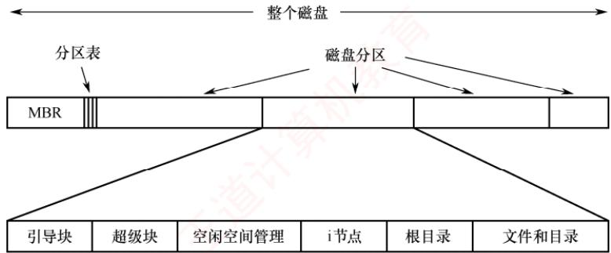  
图4.20 一个可能的文件系统布局

其主要组成部分简述如下：

1）主引导记录（MasterBootRecord，MBR），位于磁盘的0号扇区，负责引导计算机。MBR后紧随一个分区表，用于记录各分区的起始与结束地址，并标记其中一个为活动分区。系统加电后，BIOS 将MBR读入内存并执行；MBR首先识别活动分区，随后读取该分区的第一个扇区，即引导块。 X

2）引导块（bootblock），MBR将控制权移交至引导块中的程序，由其负责加载并启动该分区中的操作系统。注意，每个分区均以引导块开头，即使当前未安装可启动的操作系统，也保留此区域，以便未来部署系统。在Windows中，该区域称为分区引导扇区。除引导块外，磁盘分区的后续布局因文件系统类型而异。UNIX/Linux系统中的文件系统通常还包含以下组件（见图4.20）： XTA

3）超级块（superblock），存储文件系统的所有关键信息。当系统启动或首次挂载该文件系统时，超级块会被读入内存。超级块中的典型内容包括：分区的总块数、块大小、空闲块数量及其指针、空闲i节点（inode）数量及指针等。

4）空闲块信息，记录未分配的磁盘块，通常以位示图或空闲链表实现。紧随其后的是一组i节点，每个文件对应一个i节点，其中完整描述了文件的各种属性。之后是根目录，作为整个目录树的起点。磁盘的其余空间则用于存放所有其他文件和目录的实际数据。

## 2. 文件系统在内存中的结构

为高效管理文件系统并提升性能，系统在内存中维护一组数据结构。这些信息在文件系统挂载时加载，在运行期间动态更新，并在卸载时释放。典型的内存结构包括：

1）内存中的挂载表（mounttable），记录每个已挂载文件系统分区的有关信息，如设备标识、挂载点、文件系统类型及挂载选项等。

2）内存中的目录项的缓存，缓存最近访问过的目录内容，以减少对磁盘的重复读取，加快路径解析速度。

3）系统级的打开文件表，为每个当前打开的文件维护一个FCB的副本，包含文件状态、访问权限、读/写指针、打开计数等全局信息。

4）进程级的打开文件表，每个进程拥有独立的打开文件表，包含该进程所使用的文件描述符及指向系统级打开文件表中对应表项的指针，从而实现进程与全局资源的关联。

## 4.3.2 文件存储空间管理

如4.2.6节所述，文件的物理结构包含两个方面：文件的分配方式与文件存储空间管理。后者专门负责记录磁盘中的哪些块是空闲的，并提供对这些块进行分配与回收的机制。由于系统以固定大小的物理块为单位进行数据交换，存储空间管理的核心任务是高效组织和管理空闲块。为此，系统需要维护描述空闲块状态的数据结构，而这正是本节要介绍的几种管理方法所要解决的问题。 uK VIT

## 考点追踪磁盘空闲块管理的方法及特点（2019、2024）

## 1. 空闲表法

空闲表法属于连续分配方式，其思想源于内存的动态分区分配：为每个文件分配一块物理上连续的磁盘区域。系统为外存中的所有空闲区维护一张空闲表，每个空闲区对应一个表项，包含序号、起始盘块号和空闲盘块数等信息，并按起始盘块号递增顺序排列，如表4.2所示。

表 4.2 空闲盘块表
<table><tr><td rowspan=1 colspan=1>序  号</td><td rowspan=1 colspan=1>第一个空闲盘块号</td><td rowspan=1 colspan=1>空闲盘块数</td></tr><tr><td rowspan=1 colspan=1>1</td><td rowspan=1 colspan=1>2</td><td rowspan=1 colspan=1>4</td></tr><tr><td rowspan=1 colspan=1>2</td><td rowspan=1 colspan=1>9</td><td rowspan=1 colspan=1>3</td></tr><tr><td rowspan=1 colspan=1>3</td><td rowspan=1 colspan=1>15</td><td rowspan=1 colspan=1>5</td></tr><tr><td rowspan=1 colspan=1>4</td><td rowspan=1 colspan=1></td><td rowspan=1 colspan=1></td></tr></table>

盘块的分配：

空闲盘区的分配策略与内存动态分区分配一致，通常采用首次适应(FirstFit)、最佳适应(BestFit）等算法。当系统为新创建的文件分配空间时，会顺序扫描空闲表，查找第一个大小满足需求的空闲区；一旦找到，便将其分配给用户，并立即更新空闲表。

盘块的回收：

回收用户释放的空间时，也借鉴内存回收机制：需要判断回收区是否与空闲表中相邻的前区或后区在物理上连续。若相邻，则将它们合并为一个更大的空闲区，以减少碎片。

空闲表法的优点：具有较高的分配效率，能够显著降低磁盘I/O次数。尤其对于小型文件（如占用1～5个盘块），连续分配不仅实现简单，还能充分发挥磁盘顺序读/写的性能优势。

## 2. 空闲链表法

空闲链表法将所有空闲盘区组织成一条链表，根据链表节点的不同，可分为以下两类：

## （1）空闲盘块链

空闲盘块链以单个盘块为单位，将所有空闲盘块链接成一条链，每个盘块包含一个指向下一个空闲盘块的指针。分配时：从链首依次摘下所需数量的盘块分配给用户。回收时：将释放的盘块逐个插入链尾。

空闲盘块链的优点：单个盘块的分配与回收操作极为简单。缺点：为一个文件分配多个盘块需要多次访问链表，效率较低；且由于管理粒度细，空闲盘块链通常较长，管理开销大。

## (2) 空闲盘区链

空闲盘区链以空闲盘区（一组连续的盘块）为单位构建链表。每个盘区包含两项信息：本盘区的盘块数和指向下一个空闲盘区的指针。分配时：采用与内存动态分区分配类似的策略（如首次适应算法），查找满足需求的空闲盘区进行分配。回收时：需要判断回收区是否与链表中相邻的空闲盘区在物理上连续，若相邻则合并，从而有效减少外部碎片。 K

空闲盘区链的优缺点与空闲盘块链恰好相反，优点：分配与回收的效率较高，且空闲盘区链的长度较短。缺点：分配与回收的过程较为复杂，需要处理盘区的分割与合并操作。

## 3. 位示图法

考点追踪位示图的应用及相关计算（2010、2014、2015、2023）

位示图法利用二进制的一位来表示磁盘中一个盘块的使用状态：磁盘上的每个盘块均对应位示图中的一个比特位。当该位为“0”时，表示对应盘块空闲；为“1”时，表示已被分配。因此，一个由m×n位组成的位示图，恰好可描述m×n个盘块的使用情况，如图4.21所示。

盘块的分配：

1）顺序扫描位示图，查找一个（或一组）值为“0”的位。

2）将找到的一个（或一组）比特位转换为对应的盘块号。假设该位位于位示图中的第i行、第j列（行、列编号从1开始），每行包含n位，则对应盘块号b按下式计算：

$$
b = n(i - 1) + j
$$

3）修改位示图，置 $\operatorname* { m a p } [ i , j ] = 1$

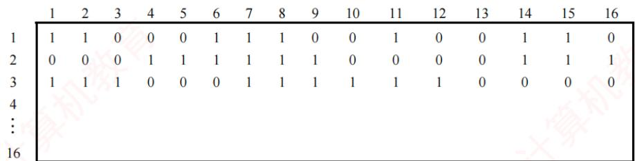  
图4.21 位示图法示意图

盘块的回收：

1）将回收盘块的盘块号b转换为位示图中的行号和列号。计算公式为

$$
i = (b - 1) \mathrm{DIV} n + 1
$$

$$
j = (b - 1) \mathrm{MOD} n + 1
$$

2）修改位示图，置 $\mathrm { m a p } [ i , j ] = 0$

## 注意

本书中位示图的行和列均从1开始编号。若题目指定从0开始，则上述公式需要相应调整。

位示图法的优点：查找高效，能快速在位示图中找到一个或一组相邻的空闲盘块，便于实现连续分配；位示图结构紧凑，占用内存空间极小，可常驻内存，避免频繁访问磁盘。缺点：位示图大小会随着磁盘容量的增加而增大，因此更适用于小型或中等规模的系统。

## 4. 成组链接法

空闲表法和空闲链表法均不适用于大型文件系统，因其管理结构随磁盘容量增大而过度膨胀。为此，UNIX系统采用成组链接法，它融合了二者的思想，有效控制了管理结构的规模。

成组链接法的思想：将所有空闲盘块划分为若于组（例如每组100个盘块）。除最后一组外，每组的第一个盘块用作索引块，用于记录下一组中所有空闲盘块的块号及其数量；这些索引块依次链接，形成一条链。文件系统挂载时，第一组的空闲盘块信息（包括块号列表和数量）被预先加载到内存的一个专用栈结构，称为空闲盘块号栈。例如，若系统空闲区为第201～7999号盘块，则分组如下：第一组为201～300号…次末组为7801～7900号，最末组为7901～7999号（共99个盘块）。最末组的块号由前一组的最后一个盘块（7900号）记录，而该盘块中存放的第一个盘块号为“0”，用作整条空闲链的结束标志，如图4.22所示。

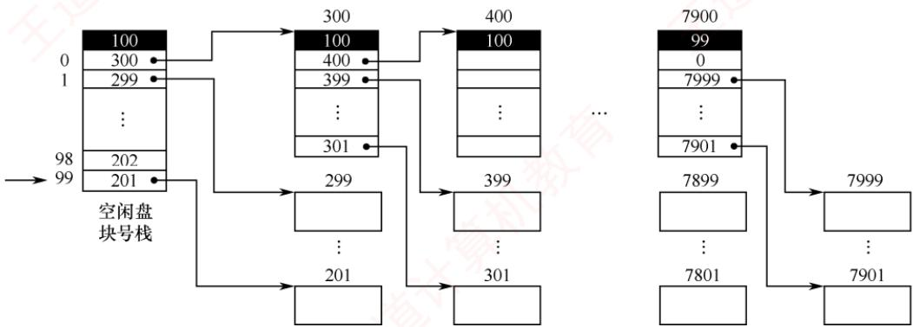  
图4.22 成组链接法示意图

简而言之，成组链接法通过“分组+索引+链接”的设计，既避免了长链表的遍历开销，又无须维护完整的空闲表，从而在可扩展性与性能之间取得了良好平衡。

盘块的分配：

从空闲盘块号栈顶取出一个盘块号并分配给用户，栈指针相应上移，栈中空闲盘块数减1。若此时栈指针到达栈底（表示当前组已分配完毕），则需要读取该栈底盘块号所对应的物理盘块内容其中保存的是下一组的空闲盘块号列表。此时，先将该内容整体读入栈以更新空闲盘块号栈，再将原栈底所指的盘块（其索引作用已完成）分配出去。

例如，在图4.22中，系统先依次分配201～299号盘块；当需要分配300号盘块时，首先将其内容（下一组的块号列表）读入空闲盘块号栈，随后将300号盘块本身分配给用户。

盘块的回收：

系统将释放的盘块号压入空闲盘块号栈顶部，栈指针相应下移，栈中空闲盘块数加1。若此时栈已满（如达到100项），则需要将当前栈中的全部盘块号写入该新回收的盘块，使其成为新的索引块；随后，将该盘块号设为新的栈底，并将栈中空闲盘块数重置为1。

描述空闲空间的数据结构（如空闲盘块号栈）以及文件系统的关键信息，通常存储在磁盘的固定位置。在UNIX系统中，这一区域称为超级块。文件系统挂载时会将其读入内存，并在运行过程中持续维护内存副本与磁盘副本的一致性，从而确保空闲空间管理的正确性与可靠性。

## 4.3.3 虚拟文件系统

## 考点追踪虚拟文件系统的原理与特点（2025）

现代操作系统通常需要支持多种文件系统，如ext4、NTES、FAT等。这些文件系统在磁盘组织方式、元数据格式和操作方法上各不相同。若应用程序为每种文件系统分别编写代码，则不仅开发困难，系统的可维护性也会显著降低。为此，操作系统引入了虚拟文件系统（VFS），它位于用户程序与具体文件系统之间，向上提供统一的文件操作接口，如图4.23所示。有了VES，用户程序就无须关心底层使用的是哪种文件系统。无论文件存储在何种设备上、采用何种格式，程序只需调用标准系统调用[如 open()、write()等]即可完成操作。VFS 则负责将这些通用请求转发给相应的文件系统进行处理，进而让用户无须察觉底层文件系统的差异。 机教

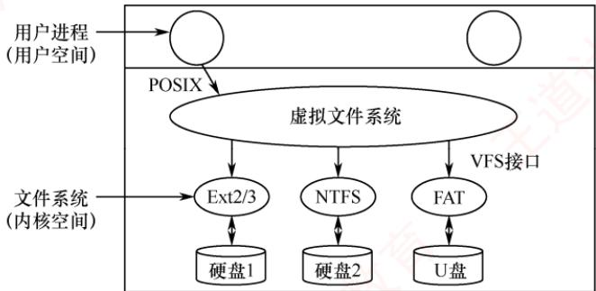  
图4.23 虚拟文件系统的示意图

VFS采用面向对象的设计思想，抽象出一个通用的文件系统模型，并将其中的公共特性封装为四种对象。每个对象都包含数据成员和一组操作函数指针，这些函数由具体的文件系统提供。只要新的文件系统实现了VFS定义的接口，就能被系统识别、挂载并使用。这四种对象如下。

## （1）超级块对象

超级块对象表示一个已挂载的文件系统。它对应磁盘上的超级块，记录该文件系统的全局信息，如块大小、总块数、空闲块数量以及文件系统类型等。当文件系统挂载时，VFS将其超级块读入内存，创建对应的超级块对象，并设置好相关的操作函数，如分配inode、同步元数据等。

## (2) V节点对象

V节点（vnode）对象是VFS中最重要的抽象对象，用于在内存中表示一个具体的文件或目录。每个ynode对象关联底层某个具体文件系统的索引节点（如ext4的inode），本质上是对各类文件系统元数据的统一封装：向上为系统调用提供统一的文件属性（如权限、大小、时间戳等），向下通过指针指向该文件系统私有的元数据结构。vnode对象仅在文件首次被访问时动态创建于内存，引用计数归零后自动释放：其内部包含一组标准操作函数指针（如read、write等），VFS通过这些指针将上层请求分发至相应文件系统的具体实现，以屏蔽不同文件系统的差异。

## 注意

V 节点并不等同于磁盘上的 inode。V节点是 VFS 为统一管理各类文件而创建的内存对象，它与 inode通过指针关联，协同完成文件操作：V节点提供统一接口，inode提供实际存储信息。

## (3)目录项对象

目录项对象表示路径中的一个组成部分，如“/home/user/file”中的“user”。目录项对象并不直接对应磁盘上的某个固定结构，而是VFS在解析路径时动态生成的内存缓存；每个目录项保

存文件名、指向父目录项和子目录项的指针，以及指向对应V节点的指针；多个目录项组合形成逻辑上的目录树；VFS通过缓存常用目录项，有效加快后续路径查找的速度。

## (4)文件对象

文件对象表示一个进程所打开的文件，可理解为“文件在进程中的运行实例”，正如进程是程序的运行实例。当进程调用open()时，内核为其创建一个文件对象；当调用close()且引用计数归零时，该对象被销毁。文件对象保存当前读/写位置（文件指针）、访问模式（读/写或追加）和引用计数等信息，并包含指向对应V节点和目录项的指针；它提供的read、write、seek等操作接口最终由V节点转发至底层文件系统执行。 XTA

下面以 write()为例说明 VFS 的工作过程：当进程调用 write(fd, buf, n)时，内核首先进入 VFS 层，执行 sys write()函数；随后根据文件描述符fd定位到对应的文件对象，并通过该对象获取其关联的 V节点；接着，VFS利用V节点中预置的写操作函数指针，调用目标文件系统的具体写方法；该文件系统将数据写入缓冲区，最终通过设备驱动完成磁盘写入。write()系统调用操作示意图如图4.24所示。

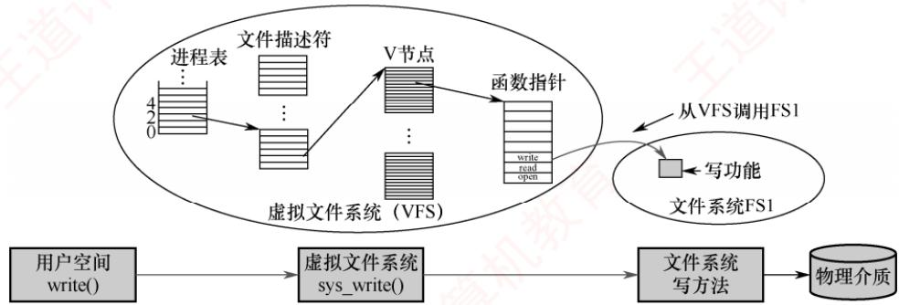  
图 4.24 write()系统调用操作示意图

总结：对用户程序而言，所有文件操作均通过VFS提供的统一接口完成，无须关心底层使用的是 ext4、NTFS还是其他文件系统。VFS借助前述四类对象，屏蔽不同文件系统的实现细节，使其在系统中呈现出一致的行为。需要强调的是，VFS本身并不是一种真正的文件系统它仅存在于内存之中，不占用磁盘空间，随系统启动而建立，随系统关闭而释放。 XTA

## 4.3.4 文件系统挂载

如同文件在使用之前必须先打开一样，文件系统在被进程访问前也必须先安装，也称挂载（Mounting）。将某个设备上的文件系统挂载到目录树中的一个目录后，即可通过该目录访问该设备上的文件。此处的设备是指逻辑上的设备，如同一磁盘的不同分区可视为多个独立设备。

Windows系统采用驱动器号（如C:、D:）标识分区（也称卷），每个分区拥有独立的目录树结构，并关联一个已挂载的文件系统。文件路径通常表示为drive-letter:\path\to\file。访问时，操作系统根据驱动器号定位对应的文件系统，再在其目录结构中查找目标文件。较新版本的Windows也支持将文件系统挂载到目录树下的任意目录（称为装入点），其行为与UNIX类似。系统启动时，Windows会自动探测所有存储设备，并挂载其所识别的文件系统。

UNIX系统则以单一的根文件系统为基础，该文件系统在系统启动时由内核直接挂载，通常包含内核映像等关键文件。除根文件系统外，所有其他文件系统都必须挂载到根文件系统中的某个目录下才能被访问。这些文件系统可在系统初始化阶段自动挂载，也可由用户手动挂载。用于挂载的目录称为挂载点（mountpoint）。需要注意的是：同一个设备可以被挂载到多个不同的挂载点；但同一挂载点在同一时刻只能挂载一个设备。

例如，将位于磁盘/dev/fd0上的 ext2 文件系统，通过 mount 命令挂载到目录/flp:

$$
{ \tt m o u n t - t e x t 2 / d e v / f d 0 / f l p }
$$

若需要卸载该文件系统，则使用 umount命令。

贯穿本章有两条主线：其一，引入一种新的抽象数据类型文件，从逻辑结构（如流式、记录式）和物理结构（如连续、链接、索引）两个维度展开：其二，阐述操作系统如何管理文件，包括多文件的组织方式（目录结构）、用户请求的处理机制（如系统调用、VFS分发）以及底层存储的调度策略（磁盘管理）。仅了解宏观框架是远远不够的，其目的正是为了更好地掌握微观细节；读者应通过反复做题与思考，不断深化对知识点的理解与运用。 XTA

## 4.3.5 本节小结

本节开头提出的问题的参考答案如下。

## 1）什么是文件系统？

操作系统中负责管理和存储文件信息的软件机构称为文件管理系统，简称文件系统。文件系统由三部分组成：与文件管理相关的软件、被管理的文件，以及实现文件管理所需要的数据结构。

## 2）文件系统要完成哪些功能？

对用户而言，文件系统最主要的功能是支持对文件的基本操作，使用户能够按名存取和查找文件，将其组织为合适的逻辑结构，并提供基本的文件共享与保护机制。对操作系统而言，文件系统还需要管理与磁盘之间的信息交换，完成文件逻辑结构到物理结构的映射，合理组织文件在磁盘上的存放，并采用高效的文件布局策略与磁盘调度方法，以提升系统整体性能。

## 4.3.6 本节习题精选

## 一、单项选择题

01. 从用户的观点看，操作系统中引入文件系统的目的是（）。A. 保护用户数据 B. 实现对文件的按名存取C. 实现虚拟存储 D. 保存用户和系统文档及数据

02. 逻辑文件系统的功能有（）。I. 文件按名存取 II. 文件目录组织管理Ⅲ. 把文件名转换为文件描述符或文件句柄 IV. 存储保护A. I、Ⅱ和ⅢII B. II、III和IVYC. I、ⅡI和IV D. I、ⅡI、III和IV

03.下列关于文件系统的说法中，正确的是（）。A.一个文件系统可以管理的文件数量受限于文件控制块的数量B. 一个文件系统可使用的容量一定等于其所在磁盘的容量C. 一个文件系统中单个文件的大小只受磁盘剩余容量大小的限制D. 一个文件系统不能将数据存放在多个磁盘上

04. UNIX操作系统中，文件的索引结构放在（）。A. 超级块 B. 索引节点 11 C. 目录项 D. 空闲块

05. 文件的存储空间管理实质上是对（）的组织和管理。A. 文件目录 B. 外存已占用区域 C. 外存空闲区 D. 文件控制块

06. 对外存文件区的管理应以（）为主要目标。A. 提高系统吞吐量 山 B. 提高换入换出速度

C. 降低存储费用 D. 提高存储空间的利用率

07.位示图可用于（）。A. 文件目录的查找 B. 磁盘空间的管理 C. 主存空间的管理 D. 文件的保密

08.下列各种文件存储空间的管理方法中，（）需要使用空闲盘块号栈。A. 空闲表法 B. 空闲链表法 C. 位示图法 D. 成组链接法

09. 硬盘的主引导扇区（）。 XA. 包含引导记录 B. 包含分区表和主引导程序C. 只包含主引导程序 D. 只包含分区表

10. 若用8个字（字长32位）组成的位示图管理内存，即位示图有8行、32列，行号和列号均从1开始，则块号为100的内存块所对应位示图的位置是（）。A. 字号为3，位号为 5 B. 字号为 4，位号为4 算机教C. 字号为3，位号为4 D. 字号为 4，位号为 5

11. 比较难得到连续空间的空闲空间管理方式是（）。 A.空闲链表 B. 空闲表 C. 位示图 道订 D. 成组链接

12.下列选项中，（）不是Linux实现虚拟文件系统 VFS 所定义的对象类型。A. 超级块（superblock）对象 B. 目录项（inode）对象C. 文件（file）对象 D. 数据（data）对象

13.【2014统考真题】现有一个容量为10GB的磁盘分区，磁盘空间以簇为单位进行分配，簇的大小为4KB，若采用位图法管理该分区的空闲空间，即用一位来标识一个簇是否被分配，则存放该位图所需要的簇数为（）。A. 80 B. 320 C. 80K D. 320K

14.【2015统考真题】文件系统用位图法表示磁盘空间的分配情况，位图存于磁盘的32\~127号块中，每个盘块占1024B，盘块和块内字节均从0开始编号。假设要释放的盘块号为409612，则位图中要修改的位所在的盘块号和块内字节序号分别是（）。A. 81, 1 B. 81, 2 C. 82, 1 D. 82, 2

15.【2019统考真题】下列选项中，可用于文件系统管理空闲磁盘块的数据结构是（）。I. 位图I. 索引节点I. 空闲磁盘块链 IV. 文件分配表（FAT）A.仅I、ⅡIB. 仅I、III、IV C. 仅I、ⅢII D. 仅ⅡI、ⅢII、IV

16.【2023统考真题】某系统采用页式存储管理，用位图管理空闲页框。若页大小为4KB，物理内存大小为16GB，则位图所占空间的大小是（）。A. 128B B. 128KB C. 512KB D. 4MB

17.【2024统考真题】文件系统需要占用部分外存空间记录空闲块位置。在下列方法中，占用外存空间的大小与当前空闲块数量无关的是（）。王 A. 位图法 B. 空闲表法 D. 空闲链表法

18.【2025统考真题】下列关于虚拟文件系统（VFS）的叙述中，正确的是（）。A. VFS 是在虚拟内存中建立的文件系统育B. VFS 能提高不同文件系统中文件的访问速度C. VFS 定义了可以访问不同文件系统的统一接口D. 通过VFS只能访问本地文件，不能访问网络文件

## 二、综合应用题

01. 一计算机系统利用位示图来管理磁盘文件空间。假定该磁盘组共有100个柱面，每个柱

面有20个磁道，每个磁道分成8个盘块（扇区），每个盘块1KB，位示图如下图所示。

$$
\begin{array}{c} \begin{array} { c } { \hat { \eta } _ { j } } \\ { \begin{array} { c } { 1 } \\ { 1 } \\ { 2 } \\ { 2 } \\ \end{array} } \\ { \begin{array} { c } { 1 } \\ { 1 } \\ { 1 } \\ \end{array} } \\ { \begin{array} { c } { 1 } \\ { 1 } \\ \end{array} } \\ { \begin{array} { c } { 1 } \\ { 1 } \\ \end{array} } \\ { \begin{array} { c } { 1 } \\ { 1 } \\ \end{array} } \\ { \begin{array} { c } { 1 } \\ { 1 } \\ \end{array} } \\ { \begin{array} { c } { 1 } \\ { 1 } \\ \end{array} } \\ { \begin{array} { c } { 1 } \\ { 1 } \\ \end{array} } \\ { \begin{array} { c } { 1 } \\ { 1 } \\ \end{array} } \\ { \begin{array} { c } { 1 } \\ { 1 } \\ \end{array} } \\ { \begin{array} { c } { 1 } \\ { 1 } \\ \end{array} } \\ { \begin{array} { c } { 1 } \\ { 1 } \\ \end{array} } \\ { \begin{array} { c } { 1 } \\ { 1 } \\ \end{array} } \\ { \begin{array} { c } { 1 } \\ \end{array} } \\ { \begin{array} { c } { 1 } \\ { 1 } \\ \end{array} } \\ { \begin{array} { c } { 1 } \\ \end{array} } \\ { \begin{array} { c } { 1 } \\ \end{array} } \\ { \begin{array} { c } { 1 } \\ \end{array} } \\ { \begin{array} { c } { 1 } \\ \end{array} } \\ { \begin{array} { c } { 1 } \\ \end{array} } \\ { \begin{array} { c } { 1 } \\ \end{array} } \\ { \begin{array} { c } { 1 } \\ \end{array} } \\ { \begin{array} { c } { 1 } \\ \end{array} } \\ { \begin{array} { c } { 1 } \\ \end{array} } \\ { \begin{array} { c } { 1 } \\ \end{array} } \\ { \begin{array} { c } { 1 } \\ \end{array} } \\ { \begin{array} { c } { 1 } \\ \end{array} } \\ { \begin{array} { c } { 1 } \\ \end{array} } \\ { \begin{array} { c } { 1 } \\ \end{array} } \\ { \begin{array} { c } { 1 } \\ \end{array} } \\ { \begin{array} { c } { 1 } \\ \end{array} } \\ { \begin{array} { c } { 1 } \\ \end{array} } \\ { \begin{array} { c } { 1 } \\ \end{array} } \\ { \begin{array} { c } { 1 } \\ \end{array} } \\ { \begin{array} { c } { c } { 1 } \\ \end{array} } \\ { \begin{array} { c } { 1 } \\ \end{array} } \\ { \begin{array} { c } { c } { 1 } \\ \end{array} } \\ { \begin{array} { c } { c } { 1 } \\ \end{array} } \\ { \begin{array} { c } { c } { 1 } \\ \end{array} } \\ { \begin{array} { c } { c } { 1 } \\ \end{array} } \\ { \begin{array} { c } { c } { 1 } \\ \end{array} {array} \\ \begin{ c } { c } { 1 } \\ \end{array} {array} & \begin{ c } { c } { 1 } \\ \end{array} {array} 
$$

1）试给出位示图中位置(i,j)与对应盘块所在的物理位置（柱面号，磁头号，扇区号）之间的计算公式。假定柱面号、磁头号、扇区号都从0开始编号。 月

2）试说明分配和回收一个盘块的过程。

02. 假定一个盘组共有100个柱面，每个柱面上有16个磁道，每个磁道分成4个扇区。

1）整个磁盘空间共有多少个存储块？（每个扇区对应一个存储块）

2）若用字长32位的单元来构造位示图，共需要多少个字？

3）位示图中第18个字的第16位对应的块号是多少？（字号和位号都从1开始）

## 4.3.7 答案与解析

## 一、单项选择题

## 01. B

从系统角度看，文件系统负责对文件的存储空间进行组织、分配，负责文件的存储并对文件进行保护、检索。从用户角度看，文件系统根据一定的格式将文件存放到存储器中适当的地方，当用户需要使用文件时，系统根据用户所给的文件名能够从存储器中找到所需要的文件。

## 02. D

逻辑文件系统的功能包括对文件按名存取，进行文件目录组织管理，将文件名转换为文件描述符或文件句柄，进行存储保护，因此4个说法均正确。

## 03. A

一个文件系统的容量不一定等于承载该文件系统的磁盘容量。一个磁盘可分为多个分区，每个分区可以有不同的文件系统，单个文件的大小不仅受磁盘剩余容量大小的限制，还受FCB和FAT表等结构的限制。利用磁盘阵列技术，一个文件系统可将数据存放到多个磁盘上。

## 04. B

UNIX采用树形目录结构，文件信息存放在索引节点中。超级块是用来描述文件系统的。

## 05. C

文件存储空间管理即文件空闲空间管理。文件管理要解决的重要问题是，如何为创建文件分配存储空间，即如何找到空闲盘块，并对其管理。 X

## 06. D

文件区占磁盘空间的大部分，因为通常的文件都较长时间地驻留在外存上，对它们的访问频率是较低的，所以对文件区管理的主要目标是提高存储空间的利用率。

## 07. B

位示图方法是空闲块管理方法，用于管理磁盘空间。

## 08. D

成组链接法将所有空闲盘块分成若于组，每组的第一个盘块记录下一组的空闲盘块总数和空闲盘块号。第一组的空闲盘块总数和空闲盘块号存放在内存的专用栈中，称为空闲盘块号栈。

## 09. B

硬盘的主引导扇区由三部分组成：主引导程序，也称主引导记录（MBR），用于系统启动时将控制转给用户指定的并在分区表中登记了的某个活动分区：分区表，给出每个分区的起始和结束地址；结束标志，其值通常为AA55。

## 10. B

首先求出块号100所在的行号，1\~32在行号1中，33～64在行号2中，65～96在行号3中，97～128在行号4中，所以块号100在行号4中；然后求出块号100在行号4中的哪列，行号4的第1列是块号97，以此类推，块号100在行号4中的第4列。另解，行号row和列号col分别为

$$
\begin{aligned} row  = (100 - 1)  DIV   32 + 1 = 4 \\ col  = (100 - 1)  MOD   32 + 1 = 4\end{aligned}
$$

即字号为4，位号也为4。

## 11. A

空闲链表法适用于离散分配，比较难得到连续空间。空闲表法适用于连续分配，容易得到连续空间。位示图法适用于连续分配和离散分配，容易找到连续的空闲块。成组链接法是将连续分配和离散分配相结合的方法，也能方便找到连续的空闲块。

## 12. D

为了实现虚拟文件系统（VFS），Linux主要抽象了四种对象类型：超级块对象、索引节点对象、目录项对象和文件对象。选项D错误。 XTT

## 13. A

簇的总数为10GB/4KB = 2.5M，用一位标识一簇是否被分配，整个磁盘共需要2.5Mbit，即需要2.5M/8= 320KB，因此共需要320KB/4KB = 80簇。

## 14. C

盘块号 = 起始块号 + 盘块号 $\left \lfloor (1024 \times 8) \right \rfloor = 32 + \left \lfloor 409612 / (1024 \times 8) \right \rfloor = 32 + 50 = 82$ ，这里问的是块内字节号而不是位号，因此还需要除以8，块内字节号=L(盘块号%(1024×8))/8=1。

## 15. B

传统文件系统管理空闲磁盘的方法包括空闲表法、空闲链表法、位示图法和成组链接法，说法I、Ⅲ正确。FAT的表项与物理磁盘块一一对应，并且可以用一个特殊的数字-1表示文件的最后一块，用-2表示这个磁盘块是空闲的（当然也可用-3,-4来表示），因此FAT不仅记录了文件中各个块的先后链接关系，还标记了空闲的磁盘块，操作系统可以通过FAT对文件存储空间进行管理，说法IV正确。索引节点是操作系统为了实现文件名与文件信息分开而设计的数据结构，存储了文件描述信息，索引节点属于文件目录管理部分的内容，说法Ⅱ错误。

## 16. C

物理内存大小为16GB，页大小为4KB，则物理内存的总页框数为 $16GB/4KB=2^{34}/2^{12}=2^{22}$ 0位图用1位来表示一个页框是否空闲，所以占用的空间大小为 $2^{22}b = 2^{19}B = 512KB$

## 17. A

位图法利用一个二进制位来表示磁盘中一个盘块的使用情况，磁盘上的所有盘块都有一个二进制位与之对应。当其值为“0”时，表示对应的盘块空闲；当其值为“1”时，表示已分配。位图所占空间的大小只取决于外存空间的总大小（盘块数量），而与当前空闲块数量无关。

## 18. C

虚拟文件系统（VFS）是操作系统内核中的一个抽象层，其核心目标是向上层应用程序提供统一的文件操作接口（如open、read等），进而屏蔽底层各类文件系统（如 ext4、NTFS等）在实现细节上的差异。VFS并不是一种在虚拟内存中实现的文件系统，也不存储实际数据，仅作为软件抽象存在。它不改变底层文件系统的数据组织方式，因此无法提升文件访问速度，读/写性能仍由具体文件系统结构及存储设备决定。此外，VFS的设计支持多种文件系统类型，包括本地文件系统和网络文件系统（如NFS），能够透明地访问远程文件。因此，只有关于VFS提供统一接口的描述准确反映了其本质功能。

## 二、综合应用题

## 01. 【解答】

1）根据位示图的位置(i,j)，得出盘块的序号 $b = i \times 16 + j;$ 用C表示柱面号，H表示磁头号，S表示扇区号，则有 XTON

$$
C=b/(20 \times 8), \quad H=(b\%(20 \times 8))/8, \quad S=b\%8
$$

2）分配：顺序扫描位示图，找出1个其值为 $ \text{" }0 \text{" }$ 的二进制位 $ (" 0 "$ 表示空闲），利用上述公式将其转换成相应的序号b，并修改位示图，置 $\left( i , j \right) = 1$ 0 K

回收：将回收盘块的盘块号换算成位示图中的i和j，转换公式为

$$
b = C \times 20 \times 8 + H \times 8 + S, \quad i = b/16, \quad j = b\%16
$$

最后将计算出的(i,j)在位示图中置 $ \text{" }0 "$

## 02.【解答】

1）整个磁盘空间的存储块（扇区）数量为 $4 \times 16 \times 100 = 6400$ 个。

2）位示图应为6400个位，用字长为32位 $(n = 32)$ 的单元来构造位示图时，需要 $6400 / 32 =$ 200个字。 uK

3）位示图中第18个字的第16位 $(i = 18, j = 16)$ 对应的块号为 $32 \times (18 - 1) + 16 = 560$

## 4.4 本章疑难点

## 1. 文件的物理分配方式的比较

文件的三种物理分配方式的比较如表4.3所示。

表4.3 文件三种分配方式的比较
<table><tr><td rowspan=1 colspan=1></td><td rowspan=1 colspan=1>访问第n条记录</td><td rowspan=1 colspan=1>优点</td><td rowspan=1 colspan=1>缺点</td></tr><tr><td rowspan=1 colspan=1>连续分配</td><td rowspan=1 colspan=1>需要访问磁盘1次</td><td rowspan=1 colspan=1>顺序存取时速度快，文件定长时可根据文件起始地址及记录长度进行随机访问</td><td rowspan=1 colspan=1>文件存储要求连续的存储空间，会产生碎片，不利于文件的动态扩充</td></tr><tr><td rowspan=1 colspan=1>链接分配</td><td rowspan=1 colspan=1>需要访问磁盘n次</td><td rowspan=1 colspan=1>可解决外存的碎片问题，提高外存空间的利用率，动态增长较方便</td><td rowspan=1 colspan=1>只能按照文件的指针链顺序访问，查找效率低，指针信息存放消耗外存空间</td></tr><tr><td rowspan=1 colspan=1>索引分配</td><td rowspan=1 colspan=1>m级需要访问磁盘 $m   + 1$ 次可</td><td rowspan=1 colspan=1>以随机访问，文件易于增删</td><td rowspan=1 colspan=1>索引表增加存储空间的开销，索引表的查找策略对文件系统效率影响较大</td></tr></table>

## 2. 文件打开的过程描述

①检索目录，要求打开的文件应该是已经创建的文件，它应登记在文件目录中，否则会出错。在检索到指定文件后，就将其磁盘 inode复制到活动inode表中。

②将参数mode所给出的打开方式与活动inode中在创建文件时所记录的文件访问权限相比较，若合法，则此次打开操作成功。

③当打开合法时，为文件分配用户打开文件表表项和系统打开文件表表项，并为后者设置初值，通过指针建立表项与活动inode之间的联系，再将文件描述符fd返回给调用者。

设备：设备的基本概念，设备的分类，I/O接口

I/O控制方式：轮询方式，中断方式，DMA方式

I/O软件层次结构：中断处理程序，驱动程序，设备独立性软件，用户层I/O软件

视频讲解

输入/输出应用程序接口：字符设备接口，块设备接口，网络设备接口，阻塞/非阻塞I/O

（二）设备独立软件

缓冲区管理；设备分配与回收；假脱机技术（SPOOLing）；设备驱动程序接口

（三）外存管理

磁盘：磁盘结构，格式化，分区，磁盘调度算法

固态硬盘：读/写性能特效，磨损均衡

## 【复习提示】

本章内容较为分散，重点掌握I/O接口、I/O软件、I/O控制方式、缓冲区管理、SPOOLing技术，以及磁盘特性与调度算法。由于涉及较多硬件相关知识，建议结合《计算机组成原理》中的相关内容进行复习。本章在历年统考中所占分值较小，且命题通常较为直接：认真复习者一般能准确作答，而未接触相关内容者则难以凭直觉判断。考研成功的秘诀在于复习要“全面反复”且“多次”，偷工减料终将吃亏，希望读者重视本章内容。 XTA

## 5.1 I/O 管理概述

在学习本节时，请读者思考：I/O管理需要完成哪些核心功能？

## 5.1.1 I/0 设备

I/O设备管理是操作系统中最复杂且多样化的部分，其核心是通过软硬件协作，屏蔽不同设备的物理差异，使应用程序能以统一方式使用各类设备。一个/O设备通常由两部分组成：设备本身和设备控制器。设备本身是执行具体输入或输出操作的物理装置（如磁盘的盘片与磁头）；设备控制器则是连接到系统总线上的专用电路（如接口芯片），负责将操作系统发出的抽象命令（如“读取第x个扇区”）转换为设备可识别的电信号，并协调主机与设备间的数据传输。通过这种设计，操作系统无须了解各类设备的具体细节，即可统一管理它们。

## 1. 设备的分类

I/O设备是指能够向计算机输入数据或接收其输出数据的外部设备。I/O设备类型多样，可从

不同角度进行分类。

## （1）按信息交换单位分类

1）块设备。以固定大小的数据块为单位进行信息交换，如磁盘等。其基本特征是传输速率较高、支持随机访问（可寻址），允许对任意数据块进行读/写操作。

2）字符设备。以字符（或字节）为单位进行信息交换，如交互式终端、打印机等。其基本特征是传输速率较低、不可寻址，通常采用中断方式实现异步通信。

## (2)按传输速率分类

1）低速设备。传输速率仅为每秒几字节至数百字节，如键盘、鼠标等。

2）中速设备。传输速率为每秒数千字节至数十千字节，如激光打印机等。

3）高速设备。传输速率可达每秒数百千字节至数百兆字节（甚至更高），如磁盘等。

（3）按使用特性分类

1）人机交互设备。用于用户与计算机之间的信息交互，如键盘、显示器、打印机等。

2）存储设备。用于持久化存储数据，如磁盘、磁带、光盘等。

3）网络通信设备。用于计算机间通信，如网卡、调制解调器等。

## （4）按共享属性分类

1）独占设备。任一时刻仅允许一个进程使用。一旦分配给某进程，即由该进程独占，直至使用完毕后释放。典型的独占设备多为低速设备，如打印机。

2）共享设备。允许多个进程在逻辑上并发访问。尽管物理访问仍需调度协调，系统可将其分配给多个进程分时交替使用。磁盘是典型的共享设备。

3）虚拟设备。通过SPOOLing技术，将独占设备改造为多个逻辑设备，使多个进程能并发使用。其实质是利用高速共享设备（如磁盘）作为缓冲区，实现独占设备的逻辑共享。

## 2. I/O 接口

I/O接口（也称设备控制器）是CPU与设备之间的“桥梁”，用于实现计算机与设备之间的数据交换。它接收CPU发出的命令，控制设备工作，使CPU得以从烦琐的设备控制事务中解脱出来。设备控制器主要由如下三部分组成，如图5.1所示。

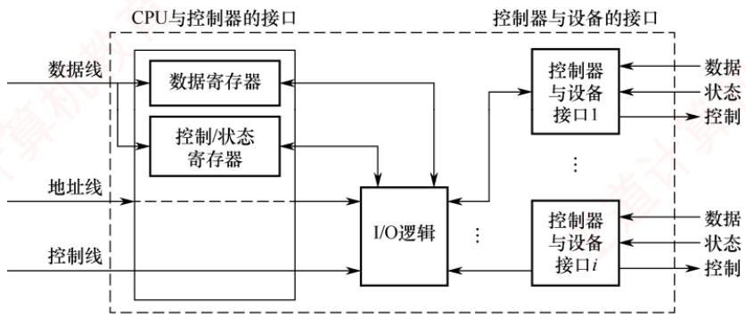  
图 5.1 设备控制器的组成

1）设备控制器与CPU的接口。用于实现CPU与设备控制器之间的通信。该接口包括三类信号线：数据线、地址线和控制线。数据线用于传输读/写数据、控制和状态信息；地址线用于指定I/O接口中的寄存器编号；控制线用于传送读/写等控制信号。

2）设备控制器与设备的接口。一个设备控制器可连接一个或多个设备，因此内部包含一个或多个设备接口。每个接口均可传输数据、控制和状态三类信号。

3）I/O逻辑。用于实现对设备的控制。它通过控制线与CPU交互，对接收的I/O命令进行译码，并依据目标地址识别相应设备。CPU启动设备时，向控制器发送启动命令及目标地址，由I/O逻辑完成解析并控制指定的设备。

设备控制器的主要功能有：①接收并识别命令，例如磁盘控制器可响应CPU发出的读、写、寻道等命令；②完成数据交换，包括CPU与控制器之间以及控制器与设备之间的数据传输；③标识并报告设备状态，供CPU查询与处理；④地址识别；⑤数据缓冲；⑥差错控制。

以磁盘控制器为例：当它接收到一条读命令（如“读取第11408个扇区”）后，会自动将线性扇区号转换为对应的柱面号、盘面号和扇区号，并控制磁头定位、等待旋转延迟、读取数据，最终将数据可靠地传送到内存。操作系统只需发出命令，而无须关心底层硬件的具体实现细节。

## 3. I/O 接口的类型

从不同角度看，I/O接口可分为以下类型。

1）按数据传送方式（设备与接口一侧），可分为并行接口（一个字节或一个字的所有位同时传送）和串行接口（一位一位地有序传送），接口需完成相应的并/串或串/并格式转换。

2）按主机访问设备的控制方式，可分为程序查询接口、中断接口和DMA接口等。

3）按功能灵活性，可分为可编程接口（通过编程改变接口功能）和不可编程接口。

4）按设备类型的不同，可分为字符设备接口、块设备接口和网络设备接口。

## 4. I/O 端口

I/O端口是指设备控制器中可被CPU访问的寄存器，主要包括以下三类：

● 数据寄存器：缓存从设备送来的输入数据，或暂存CPU发出的输出数据。

● 状态寄存器：保存设备的状态或执行结果，供CPU读取。

● 控制寄存器：由CPU写入，用于启动操作或设置设备的工作模式。

为使CPU能够访问I/O端口，必须对各端口进行编址，每个端口对应一个唯一的端口地址。常见的编址方式主要有独立编址和统一编址两种，如图5.2所示。

## （1）独立编址（I/O映射方式）

独立编址为I/O端口建立一个独立于主存的地址空间。I/O端口地址与内存地址在逻辑上完全分离，地址值可以相同，但由于属于不同地址空间，不会发生冲突。CPU通过专用的I/O指令（如x86中的IN和OUT）访问I/O端口，指令中的地址字段指定端口号。

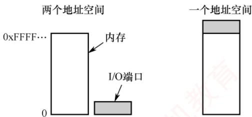  
图 5.2 独立编址 I/O 和内存映射 I/O

优点：I/O端口数量远少于内存单元，所需地址线较少，译码电路简单，寻址速度快；使用专用I/O指令，使程序中的I/O操作清晰可辨，便于阅读与调试。

缺点：I/O指令功能有限，通常仅支持简单的数据传输，程序设计灵活性较差；CPU需同时提供存储器读/写和I/O读/写两组控制信号，增加了控制逻辑的复杂性。

## （2）统一编址（内存映射方式）

统一编址将部分主存地址空间分配给I/O端口，使I/O端口与内存单元共享同一地址空间。通过地址范围即可区分访问目标（如高地址段映射到I/O设备），因此无须专用I/O指令，CPU使用普通的访存指令（如加载和存储指令）即可访问I/O端口。

优点：无须专用I/O指令，使得编程更加灵活；I/O端口可获得较大的编址空间；I/O访问的保护机制可由虚拟存储管理系统统一实现，无须额外硬件支持。

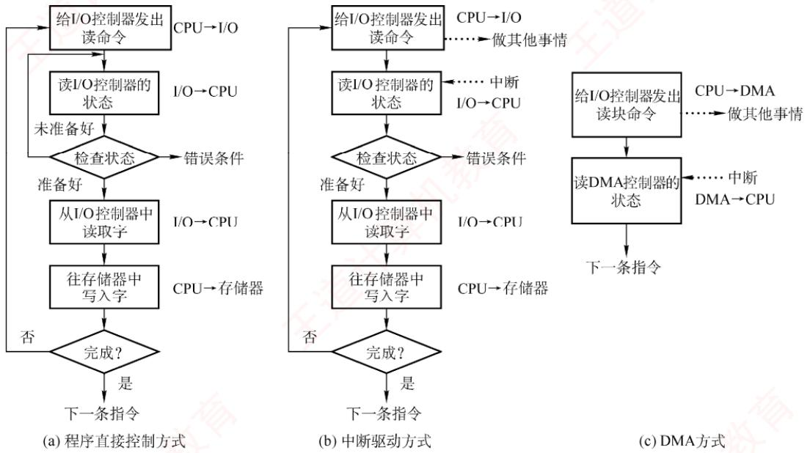  
图 5.3 I/O 控制方式的操作流程

缺点：I/O端口占用主存地址空间，减少了系统可用内存容量：由于需根据完整地址判断是否为I/O区域，译码电路相对复杂，通常会降低译码速度。

## 5.1.2 I/O 控制方式①

I/O控制是指控制设备和主机之间的数据传送。在I/O控制方式的发展过程中，始终贯穿着这样一个宗旨：尽量减少CPU对I/O控制的于预，将CPU从繁杂的I/O控制事务中解脱出来，以便其能更多地去执行运算任务。I/O控制方式共有4种，下面分别加以介绍。

## 1. 程序直接控制方式

CPU对I/O设备的控制采取轮询的I/O方式，也称程序轮询方式。如图5.3(a)所示，CPU向设备控制器发出一条I/O指令，从I/O设备读取一个字（节），然后不断地循环测试设备状态（称为轮询），直到确定该字（节）已在设备控制器的数据寄存器中。于是CPU将数据寄存器中的数据取出，送入内存的指定单元，这样便完成了一个字（节）的I/O操作。

这种方式简单且易于实现，但缺点也很明显。CPU的绝大部分时间都处于等待I/O设备状态的循环测试中，CPU和I/O设备只能串行工作，由于CPU和I/O设备的速度差异很大，导致CPU的利用率相当低。而CPU之所以要不断地测试I/O设备的状态，就是因为在CPU中未采用中断机制，使I/O设备无法向CPU报告它已完成了一个字（节）的输入操作。

## 2. 中断驱动方式

中断驱动方式的思想是允许I/O设备主动打断CPU的运行并请求服务，从而“解放”CPU，使得CPU向设备控制器发出一条I/O指令后可以继续做其他有用的工作。如图5.3(b)所示，我们从设备控制器和CPU两个角度分别来看中断驱动方式的工作过程。

从设备控制器的角度来看：设备控制器从CPU接收一个读命令，然后从设备读数据。一旦数据读入设备控制器的数据寄存器，便通过控制线向CPU发出中断信号，表示数据已准备好，然

后等待CPU请求该数据。设备控制器收到CPU发出的取数据请求后，将数据放到数据总线上，传到CPU的寄存器中。至此，本次I/O操作完成，设备控制器又可开始下一次I/O操作。

## 考点追踪中断处理程序执行时请求进程的状态（2017、2023）

从CPU的角度来看：当前运行进程发出读命令，该进程将被阻塞，然后保存该进程的上下文，转去执行其他程序。在每个指令周期的末尾，CPU检查中断信号。当有来自设备控制器的中断时，CPU保存当前运行进程的上下文，转去执行中断处理程序以处理该中断请求。中断处理程序从设备控制器的数据寄存器中读取一个字节（或字），并将其写入内核的缓冲区。处理完成后，系统解除原I/O请求进程的阻塞状态，并恢复相应进程的上下文以继续执行。

相比于程序轮询I/O方式，在中断驱动I/O方式中，设备控制器通过中断主动向CPU报告I/O操作已完成，不再需要轮询，在设备准备数据期间，CPU和设备并行工作，CPU的利用率得到明显提升。但是，中断驱动方式仍有两个明显的问题：①设备与内存之间的数据交换都必须经过CPU中的寄存器：②CPU是以字（节）为单位进行干预的，若将这种方式用于块设备的I/O操作，则显然是极其低效的。因此，中断驱动I/O方式的速度仍然受限。 。道

## 3. DMA 方式

DMA（直接存储器存取）方式的核心思想是在I/O设备与内存之间建立直接数据通路，彻底“解放”CPU。其特点如下：

1）基本传送单位是数据块，而不再是字（节）。

2）数据直接在设备与内存之间传输，而不再经过CPU。

3）仅在数据块传送开始和结束时需要CPU干预。

图 5.4 展示了 DMA 控制器的组成。

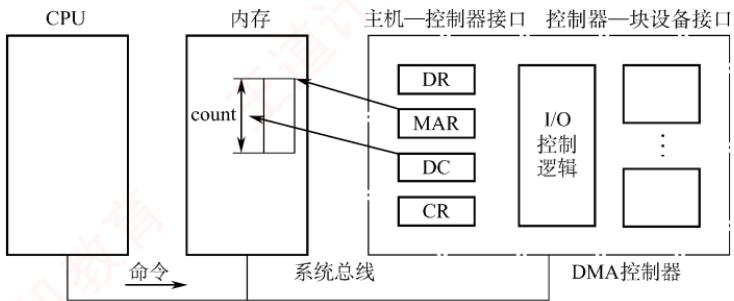  
图 5.4 DMA 控制器的组成

为实现设备与内存之间直接交换成块的数据，DMA控制器需包含以下四类寄存器：

1）命令/状态寄存器（CR）。暂存CPU发来的I/O命令或设备状态。

2）内存地址寄存器（MAR）。存放数据在内存中的起始地址。输入时（设备→内存），表示数据要写入内存的目标地址；输出时（内存→设备），表示数据从内存读取的源地址。

3）数据寄存器（DR）。暂存单次传输的数据单元（如一个字）。

4）数据计数器（DC）。记录本次需传送的字（节）总数。

## 考点追踪DMA方式的工作流程（2017）

如图5.3(c)所示，DMA方式的工作过程如下：CPU收到设备的DMA请求后，向DMA控制器发送启动命令，并设置MAR和DC的初值，随后启动DMA控制器。接着，CPU将I/O控制权交予DMA控制器，转而执行其他任务。DMA控制器接管总线后，以突发方式将整块数据在设备与内存之间直接传输，无须CPU干预。传输结束后，DMA控制器向CPU发送中断信号，通知操作完成。因此，CPU仅在数据传送的开始和结束阶段介入。

DMA方式的优点：数据以“块”为单位传输，相比中断方式，CPU干预频率进一步降低；数据也不再经过CPU寄存器，CPU与设备的并行程度进一步提升。

## \*4. 通道控制方式

I/O通道是一种专用处理机，能够执行存放在主存中的通道程序（由一系列专用通道指令组成）。设置通道后，CPU仅需向通道发送一条I/O指令，指明目标设备及通道程序在内存中的起始地址。通道收到该指令后，便自主执行通道程序，完成全部I/O操作，并在结束后向CPU发出中断请求。由此，CPU、通道与I/O设备可高效并行工作，显著提升系统资源利用率。

通道与通用处理机的区别：通道的指令集专用于I/O控制，功能单一；它不具备独立的主存储器，其通道程序和数据均存放在主机内存中，且所有访存操作均受CPU控制。

通道与DMA方式的区别：DMA需由CPU预设数据块大小、内存始址等参数；而通道通过执行程序动态确定参数，能自主完成涉及多台设备、多个阶段的复杂I/O任务。此外，每个DMA控制器通常仅服务于一台设备，而一个通道可同时管理多台设备与内存之间的数据交换。

每种方式的优点都在于解决了前一种方式的主要缺点。总体而言，I/O控制方式的发展过程，就是要尽量减少 CPU 对I/O过程的干预，将CPU从繁杂的I/O控制事务中解脱出来。

下面通过一个形象的例子总结这几种I/O方式。想象一位客户要去裁缝店定制一批衣服的情形。采用程序直接控制方式时，裁缝没有客户的联系方式，客户只能每隔一段时间亲自去店里查看衣服是否做好，白白浪费大量时间。采用中断驱动方式时，裁缝有了客户的联系方式，每做完一件衣服就打电话通知客户来取，相比轮询方式，客户省去了反复跑腿的麻烦，但每件衣服都要跑一趟，依然效率不高。采用DMA方式时，客户花钱雇了一位秘书，并交代好：所有衣服先暂存在指定仓库，裁缝直接与秘书对接，由秘书负责取回衣服并入库，每处理完100件衣服，秘书才向客户汇报一次，从而大幅节省了客户的时间。采用通道方式时，客户交给秘书一份详细的办事清单（通道程序），秘书不仅能自主决定衣服存放的位置，还能根据清单灵活安排汇报时机。例如，是每完成100件还是10000件再通知客户，均由秘书自行判断。此外，一位DMA类秘书通常只能对接一位裁缝，而通道类秘书则可同时协调多位裁缝的工作。

## 5.1.3 I/0 软件层次结构

I/O软件涉及面很广，向下与硬件密切相关，向上又与虚拟存储器系统、文件系统及用户直接交互，各类I/O操作均需通过I/O软件实现。 KKK

## 考点追踪I/0子系统各层次的功能及分析（2011、2012、2013）

为使复杂的I/O软件具备清晰的结构、良好的可移植性和适应性，现代操作系统普遍采用层

次化的I/O软件设计。系统将设备管理模块划分为若于层次，每层利用其下层提供的服务，完成输入/输出功能中的特定子任务，并屏蔽其实现细节，向上层提供统一接口。只要层间接口保持不变，任一层的修改都不会影响其他层次，仅最低层涉及硬件的具体特性。一种较为合理的四层划分如图5.5所示。整个I/O软件可视为具有4个层次的系统结构，各层次及其功能如下： 首

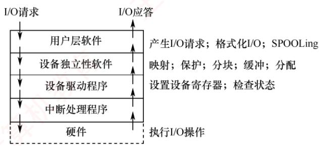  
图 5.5 I/O 层次结构

## 1. 用户层软件

实现与用户的交互接口。用户可直接调用用户层提供的I/O库函数（如与I/O操作相关的标准库函数）对设备进行操作。通常，大部分I/O软件位于操作系统内核，但仍有一小部分驻留在用户层，例如与用户程序链接的库函数。用户层I/O软件必须通过系统调用获取操作系统服务。

## 2. 设备独立性软件

## 考点追踪设备独立性所涵盖的内容（2020）

设备独立性（也称设备无关性）是指应用程序在使用V/O设备时，无须依赖具体的物理设备。为实现这一特性，系统引入了逻辑设备与物理设备的概念：应用程序使用逻辑设备名请求某类设备；系统在运行时，必须将逻辑设备名映射为实际的物理设备名。

使用逻辑设备名的优势在于：①提高设备分配的灵活性；②易于实现I/O重定向，I/O重定向是指用于I/O操作的设备可以更换（重定向），而不必修改应用程序。 K

为实现设备独立性，需在设备驱动程序之上设置一层设备独立性软件。该层的主要功能包括以下两个方面：①执行所有设备的公共操作，包括设备的分配与回收、逻辑设备名到物理设备名的映射、设备保护（禁止用户直接访问硬件）、缓冲管理、差错控制，以及提供统一大小的逻辑块，以屏蔽不同设备在信息交换单位和传输速率上的差异；②向用户层（或文件系统）提供统一的接口。通过这一层抽象，无论底层设备类型如何，应用程序均可使用统一的系统调用（如read/write）进行访问，显著增强了系统的可移植性与可维护性。

## 3. 设备驱动程序

## 考点追踪设备驱动程序的功能（2025）

设备驱动程序与硬件直接相关，每类设备都需要配置一个专用的驱动程序。它作为I/O子系统与设备控制器之间的通信桥梁，向上层提供统一的操作接口，屏蔽不同设备控制器的差异。驱动程序的主要任务是：接收上层软件（如设备独立性层）发出的抽象I/O请求（例如read或write命令），将其转换为设备控制器能够识别的具体指令，启动设备执行相应操作，并将设备控制器返回的状态信息或数据传递回上层。其工作流程通常包括如下操作。

1）将抽象请求转换为具体操作。上层请求通常是逻辑性的（如“读取逻辑块5”），而设备控制器只能处理物理操作。驱动程序根据设备特性，将逻辑地址转换为物理参数。例如，磁盘驱动程序会将逻辑扇区号转换为柱面号、盘面号和扇区号。

2）校验请求的合法性。驱动程序检查操作是否允许。例如，禁止从只写设备（如打印机）读取数据，或向以只读方式打开的设备写入。若请求非法，则向上层返回错误。

3）检查设备状态。在启动I/O前，驱动程序读取设备控制器的状态寄存器，确认设备是否就绪。例如，写操作要求设备处于“接收就绪”状态；否则，进程需要等待。

4）传递参数。设备就绪后，驱动程序向控制器的相应寄存器写入命令、数据缓冲区地址、传输长度等参数。对于磁盘等复杂设备，所需传递的参数更多。

5）启动设备并处理后续。参数设置完成后，驱动程序向命令寄存器发送启动信号，设备开始工作。在多道程序系统中，当前进程随即被阻塞，CPU转去执行其他就绪进程，实现与I/O设备的并行；设备完成操作并发出中断后，由中断处理程序将其唤醒。

此外，驱动程序还负责设备的初始化、状态维护、错误处理以及与中断处理的配合，通过封装底层硬件细节，使上层软件无须了解设备的具体实现，即可使用统一接口访问各类I/O设备。

## 4. 中断处理程序

当I/O操作完成时，设备控制器发出中断信号。CPU在执行完当前指令后响应中断，暂停当

前进程，转去执行相应的中断处理程序；处理完毕后，再恢复原进程执行。整个过程如下。

1）检测并响应中断。设备完成一个数据单位（如字符或数据块）传输后，其控制器发出中断请求。CPU在指令周期末检测到中断信号时，即暂停当前进程，准备转入中断处理。

2）保护被中断进程的CPU现场。硬件自动将程序计数器（PC）和程序状态字（PSW）压入中断栈；随后，操作系统软件将其他CPU寄存器内容也保存至该栈。

3）转入相应设备的中断处理程序。CPU识别中断源，并跳转至对应设备的中断处理程序。

4）处理中断。程序读取设备控制器的状态寄存器，判断操作是否正常完成：若成功，则将设备数据寄存器中的内容传送到内存缓冲区；若异常，则进行错误处理。

5）恢复现场并返回。中断处理完成后，系统从中断栈恢复所有寄存器内容，CPU从被中断指令的下一条继续执行原进程。

为确保上述流程可靠运行，操作系统还需对中断处理程序本身进行管理，主要包括三个环节。

1）注册中断。驱动程序初始化时，需要向内核注册中断号及其处理函数入口地址，以建立硬件中断信号与服务代码之间的映射，确保中断发生时内核能准确调用相应处理例程。

2）处理中断。中断处理程序的典型流程：①确认中断是否由本设备产生：②清除控制器王 中的中断标志，防止重复触发；③执行必要的硬件操作，如读/写数据。由于运行在中断上下文中，处理程序必须快速、非阻塞，不得调用可能引起进程睡眠或调度的函数。

3）注销中断。当驱动程序被卸载或设备停用时，需要注销其中断处理程序以释放资源。若该中断请求线为独占，则注销后内核立即禁用该线；若该中断请求线为共享，则仅移除本设备的处理例程，该中断线需要等到所有关联设备均注销后，才会被最终禁用。

## 5. I/O 操作举例

## 考点追踪键盘I/O过程的分析（2010、2024）

类似于文件系统的层次结构，/O子系统的层次结构也是需要掌握的重要内容，但不应死记硬背。为帮助读者理解，下面通过用户发起的一次write请求来说明各层的功能：①当用户要向某设备写入数据时，通过操作系统提供的write命令接口发起请求，该请求首先进入用户层软件。②操作系统向上层提供的是统一的通用接口，即大多数设备都支持的标准命令，用户发出的write请求首先由设备独立性层解析，然后传递给下一层。③不同类型设备对write命令的处理方式不同（如磁盘与打印机的行为差异显著），因此需由设备驱动层将通用的write命令转换为设备特定的指令。(④)驱动程序将指令发送给设备控制器，启动实际的写操作：操作完成后，控制器向CPU发出中断信号，由中断处理程序响应。⑤中断处理程序确认写操作完成，清除中断标志，唤醒等待该操作的进程，并将结果逐层返回至用户程序，完成整个写操作。

上面从理论上说明了I/O请求在各层次间的传递过程。下面结合Linux系统中一次 write系统调用的实际执行流程（见图5.6），具体分析各层如何协作以及CPU状态如何切换。

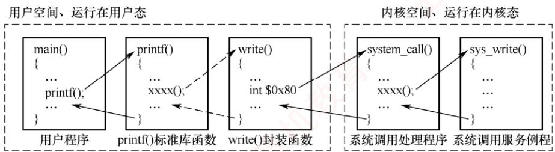  
图 5.6 Linux 系统中 write 调用的执行流程

该流程始于用户空间对库函数的调用。用户程序调用printf()后，经标准库内部封装，最终触发write(O)系统调用的封装函数。该函数生成的机器指令序列中包含一条陷阱指令（如IA-32架构下的int\$0x80）。在执行该指令之前，若于传送指令会将系统调用号及J/O参数（如文件描述符、缓冲区地址、字节数）写入指定寄存器（如eax）。CPU执行陷阱指令后，产生一个受控的软中断，硬件自动完成从用户态到内核态的模式切换，并将控制权移交给操作系统内核。

进入内核态后，CPU跳转至系统调用的统一入口程序 system call()。该程序根据寄存器 eax中的系统调用号，通过跳转表将请求分派给对应的系统调用服务例程sys\_write()。sys\_write()首先执行与设备无关的公共操作，如参数合法性检查、内核缓冲区分配与管理等。随后，它根据参数（如文件描述符）定位目标设备，并调用对应的设备驱动程序。 XTA

设备驱动程序作为直接与设备控制器交互的模块，负责将抽象的I/O请求转换为设备可识别的具体命令。它初始化I/O接口、设置传输参数，并启动设备进行数据传输。随后，通常将当前进程置为阻塞态，并主动调用调度程序让出CPU，以便其他就绪进程运行。

传输完成后，设备控制器向CPU发出中断请求。CPU响应中断，暂停当前执行流，转入预设的中断服务程序。该程序读取设备状态，确认写操作是否成功，清除中断标志，并唤醒等待I/O的进程。中断处理完毕后，内核沿调用栈逐级返回。最终，在 system call()末尾通过执行iret等特权指令，CPU切换回用户态，并在用户空间中陷阱指令的下一条指令处恢复执行。

一次完整的I/O请求依次穿越了用户层软件、系统调用接口、设备独立性软件、设备驱动程序和中断处理程序，其中，陷阱指令是从用户态进入内核态的唯一合法入口，中断是设备通知操作完成、触发进程状态转换的核心机制。二者共同实现了用户态与内核态之间的安全切换。

## 5.1.4 应用程序 I/O 接口

应用程序I/O接口是操作系统为统一管理各类I/O设备而设计的一套软件架构与编程规范，其主要目的有二：一是让应用程序（如执行文件打开操作）无须关心底层硬件的具体实现细节；二是使新设备能够以模块化的方式方便地加入系统，而无须改动内核代码。

## 1. I/O 接口的分类

操作系统将物理设备抽象为三种通用类型：字符设备、块设备和网络设备，并为每类设备提供标准的接口。设备间的具体差异由相应的驱动程序封装。下面分别介绍这三类设备接口。

## （1）字符设备接口

字符设备是指数据的存取和传输以字符为单位的设备，如键盘、打印机等。其基本特征是传输速率较低、不可寻址，输入/输出通常采用中断驱动方式。 顺村

get和put操作：由于字符设备不可寻址，只能顺序存取，系统通常为其设置一个字符缓冲区。用户程序通过get操作从缓冲区读取字符，通过put操作向缓冲区写入字符。

in-control指令:字符设备种类繁多，差异较大，因此接口还提供一种通用的in-control指令，（该指令包含多个参数），用于指定与具体设备相关的特定功能。

大部分字符设备属于独占设备，因此接口还需提供打开和关闭操作，以实现互斥共享。

## (2)块设备接口

块设备是指数据的存取和传输以数据块为单位的设备，典型的块设备是磁盘。其基本特征是传输速率较高、可寻址。磁盘的I/O常采用DMA方式。

块设备接口将上层发来的抽象命令（如打开、读、写和关闭等）映射为设备能识别的具体操作。为简化上层访问，该接口隐藏了磁盘的物理二维结构（块地址用磁道号和扇区号表示），将所有扇区从0到n-1依次编号，从而将二维结构变为线性地址空间。

块设备接口的常用命令有 read()、write()和 seek()，其中 seek()命令用来指定下一个传输块。

这三个命令描述了块设备的基本行为，使得应用程序不必关注这些设备的低层差别。

## (3) 网络设备接口

现代操作系统均提供网络通信的功能，为此需配备相应的网络软件和网络通信接口，使计算机能够与网络上的其他计算机通信或访问互联网。多数操作系统采用套接字（Socket）接口作为网络I/O的标准。应用程序通过套接字系统调用创建本地套接字，并将其连接到远程应用程序的套接字，从而建立通信通道，实现数据的发送与接收。

## 2. 阻塞 I/O 和非阻塞 I/O

操作系统的I/O接口还支持两种执行模式：阻塞与非阻塞。

阻塞/O是多数操作系统默认采用的模式，原因是其编程模型简单、逻辑直观。当进程发起I/O请求时，若所请求的数据尚未就绪，则该进程立即被阻塞，并移入相应的等待队列；此后，进程无法执行任何其他任务，只能等待底层设备完成实际的数据传输。I/Q操作完成后，内核将该进程移回就绪队列。当其再次获得CPU时，系统调用返回操作结果，进程继续后续处理。例如，你去咖啡店点单后，由于无法预知咖啡何时做好，只能原地等待，其间无法做其他事情。

优点：实现简单，适用于顺序处理或低并发场景。

缺点：I/O等待期间进程完全阻塞，CPU资源闲置，系统整体利用率较低。

非阻塞I/O是指当进程发起I/O请求时，内核不会阻塞该进程，而使系统调用立即返回。若数据尚未就绪，则调用将返回一个表示“暂无数据”的错误状态（如返回-1）；进程可据此继续执行其他任务，并在时机适当时重试该操作。当某次重试时数据已就绪时，内核便将数据从内核缓冲区复制到用户空间，并返回实际成功传输的字节数。例如，吸取上次的教训，你在咖啡店点单后去逛商场，每隔一段时间回来询问“好了吗？”，其间可自由安排其他活动。

优点：进程在I/O等待期间不被阻塞，可执行其他任务，适合高并发或高响应性应用。

缺点：采用轮询方式频繁检查I/O状态，浪费CPU资源。

## 5.1.5 本节小结

本节开头提出的问题的参考答案如下。

I/O管理需要完成哪些核心功能？

I/O管理需要完成以下4部分内容：

1）状态监控。实时掌握外部设备的工作状态（如忙、就绪、故障等）。

2）数据传输。协调并完成主机与设备之间的数据交换。

3）设备分配。在多用户或多进程环境下，负责设备的分配、共享与回收。

4）设备控制。通过设备驱动程序启动I/O操作，并处理设备返回的完成信号或故障中断。

## 5.1.6 本节习题精选

## 一、单项选择题

01. 下列关于设备属性的叙述中，正确的是（）。A. 字符设备的基本特征是可寻址到字节，即能指定读/写操作的字节地址B. 共享设备必须是可寻址的和可随机访问的设备C. 共享设备是指同一时刻内允许多个进程同时访问的设备D. 在分配共享设备和独占设备时都可能引起进程死锁

02.下列关于虚拟设备的含义的描述中，正确的是（）。A. 允许用户使用比系统中具有的物理设备更多的设备

B. 允许用户以标准化方式来使用物理设备C. 把一个物理设备变换成多个对应的逻辑设备D. 允许用户程序不必全部装入主存便可使用系统中的设备

03. 磁盘设备的I/O控制主要采取（）方式。A. 位 B. 字节 C. 帧 D. DMA

04. 为了便于上层软件的编制，设备控制器通常需要提供（）。A. 控制寄存器、状态寄存器和控制命令B. I/O地址寄存器、工作方式状态寄存器和控制命令C. 中断寄存器、控制寄存器和控制命令D. 控制寄存器、编程空间和控制逻辑寄存器

05. 在设备控制器中用于实现设备控制功能的是（）。A. CPU B. 设备控制器与处理器的接口C. I/O 逻辑 D. 设备控制器与设备的接口

06. DMA方式是在（）之间建立一条直接数据通路。A. I/O 设备和主存 B. 两个 I/O 设备 C. I/O 设备和 CPU D. CPU 和主存

07.在操作系统中，（）指的是一种硬件机制。A. 通道技术 B. 缓冲池 C. SPOOLing 技术 D. 内存覆盖技术

08. 若I/O设备与存储设备进行数据交换不经过CPU来完成，则这种数据交换方式是（)。A. 程序查询 B. 中断方式 C. DMA 方式 D. 直接存取方式

09. 下列关于DMA方式的描述中，正确的是（）。A. DMA是一个专门负责输入/输出的处理机B. 数据传输过程由 DMA 控制器负责，CPU只在预处理和后处理阶段进行干预C. CPU通过程序的方式给出 DMA 可以解释的程序D. DMA 不需要 CPU 指出所取数据的地址与长度

10. 计算机系统中，不属于DMA控制器的是（)。A. 命令/状态寄存器 B. 内存地址寄存器C. 数据寄存器 XT D. 堆栈指针寄存器

11. DMA传输前需要进行预处理，传输后需要进行后处理，则下列说法中正确的是（）。A. 预处理程序运行在用户态，后处理程序运行在内核态B. 负责预处理和后处理程序的进程都是请求I/O的进程 计算机C. 预处理阶段不需要CPU参与，后处理阶段需要CPU参与D. 预处理阶段请求I/O的进程处于运行态，后处理阶段处于阻塞态

12.在下列问题中，（）不是设备分配中应考虑的问题。 王A. 及时性 B. 设备的固有属性 C. 设备独立性 D. 安全性

13. 将系统中的每台设备按某种原则统一进行编号，这些编号作为区分硬件和识别设备的代号，该编号称为设备的（）。A. 绝对号 B. 相对号 C. 类型号 D. 符号

14. 关于通道、设备控制器和设备之间的关系，以下叙述中正确的是（）。A. 设备控制器和通道可以分别控制设备B. 对于同一组输入/输出命令，设备控制器、通道和设备可以并行工作C. 通道控制设备控制器、设备控制器控制设备工作D. 以上答案都不对

15. 一个计算机系统配置了2台相同类型的绘图机和3台相同类型的打印机，为了正确驱动这些设备，系统应该提供（）个设备驱动程序。A. 5 B. 3 C. 2 D. 1

16. 将系统调用参数翻译成设备操作命令的工作由（）完成。A. 用户层I/O 王道 B. 设备无关的操作系统软件C. 中断处理 D. 设备驱动程序

17. 向设备寄存器的写命令是在I/O软件的（）中完成的。A. 用户层软件 B. 设备独立性软件 C. 设备驱动程序 D. 中断处理程序

18.一个典型的文本打印页面有50行，每行80个字符，假定一台标准的打印机每分钟能打印6页，向打印机的输出寄存器中写一个字符的时间很短，可忽略不计。若每打印一个字符都需要花费 $5 0 \mu \mathrm { s }$ 的中断处理时间（包括所有服务），则使用中断驱动I/O方式运行这台打印机，中断的系统开销占CPU的百分比为（）。A. 2% B. 5% C. 20% -X D. 50%

19.在接收和处理一个输入设备的中断的过程中，一定不由硬件来完成的工作是（）。A. 判断产生中断的类型 B. CPU模式由用户态切换到内核态C. 主机获取设备输入 D. 保存用户程序的断点

20. 下列几种I/O方式中，会导致用户进程进入阻塞态的是（）。I. 程序直接控制 II. 中断方式 III. DMA 方式A. II B. I、ⅢII C. II、III D. I、II、III

21. 当一个进程请求I/O操作时，该进程将被挂起，直到I/O设备完成I/O操作后，设备控制器便向CPU发送一个中断请求，CPU响应后便转向中断处理程序，下列关于中断处理程序的说法中，错误的是（）。A.中断处理程序将设备控制器中的数据传送到内存的缓冲区（读入），或将要输出的数据传送到设备控制器（输出）。B. 对于不同的设备，有不同的中断处理程序C. 中断处理结束后，需要恢复CPU现场，此时一定会返回到被中断的进程D. I/O操作完成后，驱动程序必须检查本次I/O操作中是否发生了错误

22. 在I/O系统与高层之间的接口中，根据设备类型的不同，又进一步分为若干类接口，若某设备的数据传输速率较高，且可寻址，则比较适合采用（）。A. 块设备接口 B. 网络设备接口C. 字符设备接口 D. 流设备接口

23.【2010统考真题】本地用户通过键盘登录系统时，首先获得键盘输入信息的程序是（）。A. 命令解释程序 B. 中断处理程序 VC. 系统调用服务程序 D. 用户登录程序

24.【2011统考真题】用户程序发出磁盘I/O请求后，系统的正确处理流程是（）。A. 用户程序→系统调用处理程序→中断处理程序→设备驱动程序B. 用户程序→系统调用处理程序→设备驱动程序→中断处理程序C. 用户程序→设备驱动程序→系统调用处理程序→中断处理程序D. 用户程序→设备驱动程序→中断处理程序→系统调用处理程序

25.【2012统考真题】操作系统的I/0子系统通常由4个层次组成，每层明确定义了与邻近层次的接口，其合理的层次组织排列顺序是（）。A.用户级I/O软件、设备无关软件、设备驱动程序、中断处理程序B. 用户级I/O软件、设备无关软件、中断处理程序、设备驱动程序

C. 用户级I/O软件、设备驱动程序、设备无关软件、中断处理程序D. 用户级I/O软件、中断处理程序、设备无关软件、设备驱动程序

26.【2017统考真题】系统将数据从磁盘读到内存的过程包括以下操作：① DMA 控制器发出中断请求②初始化 DMA 控制器并启动磁盘③从磁盘传输一块数据到内存缓冲区④执行“DMA结束”中断服务程序正确的执行顺序是（）。A. ③→①→②→④ B. ②→③→①→④C. ②→①→③→④ D. ①→②→④→③

## 二、综合应用题

01. 在某计算机系统中，时钟中断处理程序每次执行时间为 2ms（包括进程切换开销），若时钟中断频率为60Hz，则CPU用于时钟中断处理的时间比率为多少？

02. 考虑56kb/s调制解调器的性能，驱动程序输出一个字符后就阻塞，当一个字符打印完毕T 后，产生一个中断通知阻塞的驱动程序，输出下一个字符，然后阻塞。若发消息、输出一个字符和阻塞的时间总和为0.1ms，则由于处理调制解调器而占用的CPU时间比率是多少？假设每个字符有一个开始位和一个结束位，共占10位。

## 5.1.7 答案与解析

## 一、单项选择题

## 01. B

可寻址是块设备的基本特征，选项A错误。若共享设备不是可寻址的和可随机访问的，则不能保证数据的完整性和一致性，也不能提高设备的利用率，选项B正确。共享设备是指一段时间内允许多个进程同时访问的设备，选项C错误。分配共享设备是不会引起进程死锁的，选项D错误。

## 02. C

虚拟设备是指采用虚拟技术将一台独占设备转换为若于逻辑设备。引入虚拟设备是为了克服独占设备速度慢、利用率低的特点。这种设备并不是物理地变成共享设备，一般的独享设备也不能转换为共享设备，只是用户在使用它们时“感觉”是共享设备，是逻辑的概念。

## 03. D

DMA方式主要用于块设备，磁盘是典型的块设备。这道题也要求读者了解什么是I/O控制方式，选项A、B、C显然都不是I/O控制方式。

## 04. A

中断寄存器位于主机内：不存在I/Q地址寄存器：编程空间一般是由体系结构和操作系统共同决定的。控制寄存器和状态寄存器分别用于接收上层发来的命令并存放设备状态信号，是设备控制器与上层的接口；至于控制命令，它虽然是由CPU发出的，用来控制设备控制器，但控制命令是由设备控制器提供的，每种设备控制器都对应一组相应的控制命令。

接口用来传输信号，I/O逻辑即设备控制器，用来实现对设备的控制。

## 06. A

DMA是一种不经过CPU而直接从主存存取数据的数据交换模式，它在I/O设备和主存之间建立了一条直接数据通路，如磁盘。当然，这条数据通路只是逻辑上的，实际并未直接建立一条

物理线路，而通常是通过总线进行的。

## 07. A

通道是一种特殊的处理器，所以属于硬件技术。SPOOLing、缓冲池、内存覆盖都是在内存的基础上通过软件实现的。 XV

## 08. C

在DMA方式中，设备和内存之间可以成批地进行数据交换而不用CPU干预，CPU只参与预处理和结束过程。

## 09. B

DMA不是一个处理机，而是一个控制器，选项A错误。CPU无须给出DMA可以解释的程序，而是给DMA发出一条命令，同时设置DMA控制器中寄存器的值，来启动DMA，选项C错误。DMA需要CPU指出所取数据的地址与长度，这些参数存放在DMA控制器的寄存器中，选项D错误。

## 10. D

命令/状态寄存器控制DMA的工作模式并给CPU反映它当前的状态，地址寄存器存放DMA作业时的源地址和目标地址，数据寄存器存放需要DMA转移的数据，只有堆栈指针寄存器不需要在DMA控制器中存放。

## 11. D

在预处理之前，请求I/O的进程通过系统调用进入内核态，因此预处理程序和后处理程序都运行在内核态。负责预处理的进程是请求I/的进程，负责后处理的进程是中断服务例程，中断服务例程不是一个单独的进程。在预处理阶段，CPU执行相应的设备驱动程序来设置相关的传输参数，需要CPU的参与。预处理由请求I/O的进程在内核态执行相关操作，之后阻塞其自身，直到系统调用返回，因此在后处理阶段请求I/O的进程仍处于阻塞态。

## 12. A

设备的固有属性决定了设备的使用方式：设备独立性可以提高设备分配的灵活性和设备的利用率；设备安全性可以保证分配设备时不会导致永久阻塞。设备分配时一般无须考虑及时性，及时性是一个与系统性能和用户需求相关的因素，设备分配时应该考虑的问题是如何在保证系统安全和正确运行的前提下，合理地分配和利用设备资源。

## 13. A

系统为每台设备确定一个编号以便区分和识别设备，这个确定的编号称为设备的绝对号。

## 14. C

三者的控制关系是层层递进的，选项C正确。对于同一组输入/输出命令，要么CPU向通道发出命令，要么CPU直接给设备控制器发出命令，不存在并行的可能，选项B错误。

## 15. C

因为绘图机和打印机属于两种不同类型的设备，系统只要按设备类型配置设备驱动程序即可，即每类设备只需一个设备驱动程序。

## 16. B

将系统调用参数翻译成设备操作命令的工作由设备无关的操作系统软件完成。设备无关的操作系统软件是J/O软件的一部分，它向上层提供系统调用的接口，根据设备类型选择调用相应的驱动程序。设备驱动程序负责执行操作系统发出的I/O命令，因设备的不同而不同。

## 17. C

设备驱动程序负责将上层软件发来的抽象I/O要求转换为具体要求，发送给设备控制器，控制设备工作。设备驱动程序需要向设备寄存器写入命令，以控制设备的工作状态和数据传输方式。

## 18. A

这台打印机每分钟打印50×80×6=24000个字符，即每秒打印400个字符。每个字符打印中断需要占用CPU时间50μs，所以每秒用于中断的系统开销为400×50μs=20ms。若使用中断驱动I/O，则CPU剩余的 980ms可用于其他处理，中断的开销占 CPU的2%。因此，使用中断驱动I/O方式运行这台打印机是有意义的。

## 19. C

在中断I/O方式下，由中断服务程序来完成数据的输入和输出，C错误。在中断响应阶段，由硬件完成CPU模式的转换，并保存用户程序的断点，中断源的识别可以采用硬件识别法。

## 20. C

在程序直接控制方式下，用户进程在I/O过程中不会被阻塞，驱动程序完成用户进程的I/O请求后才结束，CPU和I/O操作串行。在中断控制方式下，驱动程序启动第一次I/O操作后，将调出其他进程执行，而当前用户进程被阻塞，CPU和设备准备并行。在DMA方式下，驱动程序对DMA控制器初始化后，便发送“启动DMA”命令，在外设和主存之间传送数据，同时CPU执行调度程序，转向其他进程执行，当前用户进程被阻塞时，CPU和数据传送并行。

## 21. C

中断处理结束后，是否返回到被中断的进程，有两种情况：（①）采用的是屏蔽中断方式（单重中断），此时会返回被中断的进程。②采用的是中断嵌套方式（多重中断），若没有更高优先级的中断请求，则会返回被中断的进程；否则，系统将处理更高优先级的中断请求。

## 22. A

块设备是指数据的存取和传输都是以数据块为单位的设备，其特征是传输速率较高且可寻址，典型的块设备（如磁盘）通常采用DMA方式。字符设备（也称流设备）是指数据的存取和传输是以字符为单位的设备，如键盘、打印机等，字符设备的传输速率较低且不可寻址。

## 23. B

键盘是典型的通过中断I/O方式工作的外设，当用户输入信息时，计算机响应中断并通过中断处理程序获得输入信息。

## 24. B

输入/输出软件一般从上到下分为4个层次：用户层、与设备无关的软件层、设备驱动程序及中断处理程序。与设备无关的软件层也就是系统调用的处理程序。

当用户使用设备时，首先在用户程序中发起一次系统调用，操作系统的内核接到该调用请求后，请求调用处理程序进行处理，再转到相应的设备驱动程序，当设备准备好或者所需数据到达后，设备硬件发出中断，将数据按上述调用顺序逆向回传到用户程序中。 X

## 25. A

考查内容同上题。设备管理软件一般分为4个层次：用户层、与设备无关的系统调用处理层、设备驱动程序及中断处理程序。

## 26. B

DMA的传送过程分为预处理、数据传送和后处理三个阶段。在预处理阶段，由CPU初始化DMA控制器中的有关寄存器、设置传送方向、测试并启动设备等。在数据传送阶段，完全由DMA控制，DMA控制器接管系统总线。在后处理阶段，DMA控制器向 CPU发送中断请求，CPU执行中断服务程序做DMA结束处理。因此，正确的执行顺序是②③①④。

## 二、综合应用题

## 01.【解答】

时钟中断频率为60Hz，因此中断周期为1/60s，每个时钟周期中用于中断处理的时间为2ms，

因此比率为 0.002/(1/60) = 12%。

## 02. 【解答】

因为一个字符占10位，因此在56kb/s的速率下，每秒传送56000/10=5600个字符，即产生5600次中断。每次中断需0.1ms，因此处理调制解调器占用的CPU时间共为5600×0.1ms=560ms，占 56%的 CPU 时间。

## 5.2 设备独立性软件

在学习本节时，请读者思考以下问题：

1）当处理机和外部设备的速度差距较大时，有什么办法可以解决这个问题？

2）什么是设备的独立性？引入设备的独立性有什么好处？

## 5.2.1 设备独立性软件

设备独立性软件（也称与设备无关的软件）位于设备驱动程序之上，是内核I/O子系统的最高层。该层与设备驱动程序之间的界限并非固定，常因操作系统设计或设备类型而异。例如，某些通常由设备独立性软件实现的功能，有时会被下放至驱动程序中。这种设计差异源于对系统性能、代码复用性及驱动程序效率等多方面因素的综合权衡。总体而言，其核心职责是实现各类设备的公共操作，为上层提供统一、抽象的I/O接口。具体包括以下五项公共功能。

1）提供统一的驱动程序接口。为便于驱动开发与系统扩展，所有设备驱动程序应遵循一致的接口规范。设备独立性软件负责将抽象设备名映射到具体的物理设备，并定位相应驱动程序的入口，同时确保I/O操作通过内核受控路径执行，保障系统安全。

2）缓冲管理。系统普遍采用缓冲机制以缓解CPU与外设之间的速度差异，提高CPU利用率。缓冲形式包括单缓冲、双缓冲、环形缓冲和缓冲池等，可根据应用场景灵活选用。

3）差错控制。I/O设备因含机械与电气部件，故障率较高，产生的错误可分为两类：暂时性错误（如网络丢包），通常通过重试纠正，仅当连续失败后才视为持久性错误。此类错误主要由驱动程序处理，设备无关层仅介入驱动程序无法解决的情形。持久性错误（如磁盘划痕），操作系统可将其记录至坏块表，后续I/O自动绕过，避免更换整盘。

4）独占设备的分配与回收。对打印机等独占设备，系统需要统一分配以避免竞争。进程请求设备时，若设备空闲，则立即分配；否则，被阻塞并加入等待队列。设备释放时，若队列非空，则唤醒队首进程；否则，置设备状态为“空闲”，完成回收。

5）提供统一的逻辑数据块。不同设备的数据交换单位各异：字符设备以字节为单位，块设备以固定大小的数据块为单位，并且块长可能不一。设备独立性软件通过抽象层屏蔽这F 些差异，向上层提供大小统一的逻辑数据块，使上层无须感知底层设备特性。

## 5.2.2 高速缓存与缓冲区

## 1. 磁盘高速缓存（Disk Cache）

## 考点追踪 设置磁盘缓冲区的目的（2015）

操作系统采用磁盘高速缓存技术以提高磁盘I/O性能，访问高速缓存中的数据比直接读/写磁盘更高效。磁盘高速缓存不同于通常意义下的位于CPU与主存之间的硬件高速缓存，而是指利用内存中的存储空间暂存从磁盘读取的盘块数据。这些数据在逻辑上是磁盘内容的副本，物理上贝驻留在内存中。磁盘高速缓存在内存中有两种组织形式：一种是在内存中开辟固定大小的专用缓存区；另一种是将系统空闲内存作为动态缓冲池，供请求分页系统和磁盘V/O子系统共享使用。

## 2. 缓冲区（Buffer）

在设备管理子系统中，引入缓冲区的主要目的如下：

1）缓和CPU与I/O设备间速度不匹配的矛盾。

2）减少对CPU的中断频率，放宽对中断响应时间的限制。

3）解决基本数据单元大小（数据粒度）不匹配的问题。

4）提高CPU与I/O设备之间的并行性。

缓冲区的实现方法包括：

1）采用硬件缓冲器，但由于成本较高，除一些关键部位外一般不采用。

2）利用内存作为缓冲区，本节要介绍的正是由内存组成的缓冲区。

根据系统设置的缓冲区数量，缓冲技术可分为以下几种：

## （1）单缓冲

当用户进程发出I/O请求时，操作系统在内存中为其分配一个缓冲区，其大小通常为一个数据块。如图5.7所示，在块设备输入过程中，假设设备将一块数据送入缓冲区的时间为T，操作系统将缓冲区数据传送到用户工作区的时间为M，CPU处理该块数据的时间为C。对于块设备，必须等整块数据装入缓冲区后，才能将其传送到工作区。

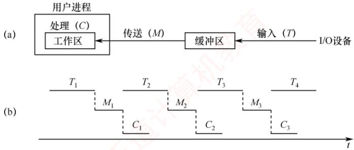  
图 5.7 单缓冲工作示意图

## 考点追踪单缓冲的工作时间的理解与计算（2011、2013）

在单缓冲中，设备向缓冲区写入数据的时间T可与CPU处理前一块数据的时间C并行。

当T>C时，设备向缓冲区填充数据的速度慢于CPU处理数据的速度。此时，CPU在完成当前数据块的处理后，必须等待设备将下一块数据完整写入缓冲区；只有缓冲区装满后，操作系统才能将该数据块从缓冲区传送到用户工作区。处理每块数据所需的时间为T+M。

当T<C时，设备填充缓冲区的速度快于CPU的处理速度。此时，缓冲区一旦装满，设备便无法继续写入新数据，必须等待CPU完成对当前工作区数据的处理；此后，操作系统才能将缓冲区中的数据移至工作区，从而释放缓冲区空间。处理每块数据所需的时间为C+M。

## 综上，单缓冲处理每块数据所需的时间为 Max(T, C)+ M。

由于单缓冲区是共享资源，设备与CPU对其访问必须互斥。若CPU尚未取走缓冲区中的数据，即使设备已准备好新数据，也无法写入缓冲区，此时设备需等待CPU释放缓冲区。

## (2) 双缓冲

为了加快输入/输出速度，提高设备利用率，引入了双缓冲机制（也称缓冲对换）。如图5.8所示，当设备输入数据时，先将数据送入缓冲区1：装满后，转向缓冲区2写入。此时，操作系统可从已满的缓冲区1中取出数据送入用户工作区，并由CPU进行处理。当缓冲区1的数据处理完后，若缓冲区2已装满，则操作系统切换到从缓冲区2中取数据送入用户工作区，而设备又可以开始向缓冲区1写入新数据。可见，双缓冲显著提高了设备与CPU的并行程度。

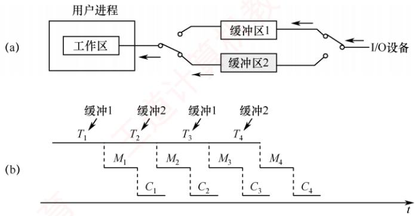  
图5.8 双缓冲工作示意图

## 考点追踪双缓冲的工作时间的理解与计算（2011）

仍假设设备输入数据到缓冲区、数据传送到工作区和处理的时间分别为T、M和C。在双缓冲中，设备向一个缓冲区写入数据的时间T可与操作系统传送及处理的时间C+M并行。

当T>C+M时，设备输入所需时间大于数据传送与处理的总时间。此时，设备可连续工作。假设在某一时刻，缓冲区1为空，缓冲区2已满：操作系统开始将缓冲区2的数据传送到工作区（耗时M，CPU随即处理该数据（耗时C），同时设备向缓冲区1写入新数据。由于 $T \geq C + M ,$ 当缓冲区2的数据处理完毕时，缓冲区1尚未装满，系统必须等待其装满后，才能将下一块数据从缓冲区1传送到工作区。处理每块数据所需的时间为 $T _ { \circ }$

当T<C+M时，设备输入较快，CPU无须等待设备。类似地，当缓冲区1为空、缓冲区2已满时：操作系统传送并处理缓冲区2的数据（共耗时C+M），同时设备向缓冲区1写入数据。由于 $T \leq C + M$ ，缓冲区1很快装满，但系统仍需等待缓冲区2的数据完全处理完毕，才能切换至缓冲区1并传送其内容。处理每块数据所需的时间为C+M。

## 综上，双缓冲处理每块数据的时间为$\operatorname { M a x } ( T , C + M )$ 0

在双机通信场景中，若要实现全双工通信（双方同时收发数据），每台机器需分别设置发送缓冲区和接收缓冲区。如图5.9(b)所示，A机的发送缓冲区对应B机的接收缓冲区，反之亦然。若仅在每台机器中配置单一缓冲区[见图5.9(a)]，则无法同时进行发送与接收操作。

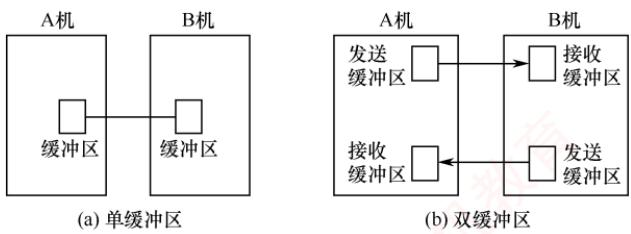  
图 5.9 双机通信时缓冲区的设置

## （3）循环缓冲

在双缓冲机制中，当输入与输出速度基本匹配时，能够取得较好的效果；但若两者速率相差较大，则双缓冲难以充分发挥作用。为此，可引入多缓冲机制，并将多个缓冲区组织成循环缓冲区的形式，如图5.10所示(灰色表示已装满数据的缓冲区，白色表示空缓冲区）。

循环缓冲由若于个大小相等的缓冲区构成，每个缓冲区包含一个链接指针，指向下一个缓冲区；最后一个缓冲区的指针则指向第一个缓冲区，从而形成一个循环队列结构。

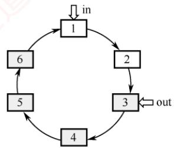  
图5.10 循环缓冲工作示意图

系统需维护两个指针：in和out。其中，in指向下一个待写入的空缓冲区，out指向下一个待读取的满缓冲区。输入进程和计算进程在运行过程中分别推进in和 out指针，沿链接方向循环移动。采用循环缓冲技术，可以实现输入进程与计算进程的并行执行。由于两者的处理速度可能不一致，在运行过程中可能出现以下两种同步情形。

1）in追赶上out（称为系统受计算限制）。表明输入进程的写入速度快于计算进程的处理速度，导致所有缓冲区均被填满，无空缓冲区可供继续写入。此时，输入进程必须阻塞，直至计算进程从某个缓冲区中取走数据，释放出一个空缓冲区，并唤醒输入进程。

2）out追赶上in（称为系统受I/O限制）。表明计算进程的处理速度快于输入进程的供给速度，导致所有缓冲区均为空，无数据可供继续处理。此时，计算进程必须阻塞，直至输入进程向某个缓冲区写入数据，使其变为满缓冲区，并唤醒计算进程。 YTA

## （4）缓冲池

相比于单个缓冲区（仅是一块内存区域），缓冲池是一种包含管理数据结构和操作函数的软件机制，用于统一管理多个缓冲区，并支持多进程共享使用。

缓冲池由系统统一管理的供多个进程共享的一组缓冲区构成。根据使用状态，这些缓冲区被组织为以下队列：①空缓冲队列，由空缓冲区链接而成；②输入队列，由装满输入数据的缓冲区链接而成：③输出队列，由装满输出数据的缓冲区链接而成。

在操作过程中，缓冲区可动态扮演以下四种角色（见图5.11）：①收容输入缓冲区(hin)，用于暂存输入数据；②提取输入缓冲区（sin），用于读取输入数据；③收容输出缓冲区（hout），用于暂存输出数据；④提取输出缓冲区（sout），用于读取输出数据。

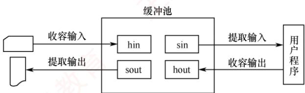  
图5.11 缓冲池的4 种工作方式

缓冲池中的缓冲区按以下4种方式工作。

1）收容输入。输入进程需要输入数据时，从空缓冲队列队首摘取一个空缓冲区，作为收容输入缓冲区，将输入数据写入其中，装满后将其挂到输入队列队尾。

2）提取输入。计算进程需要输入数据时，从输入队列队首摘取一个缓冲区，作为提取输入缓冲区，从中读取数据，读取完毕后将其挂到空缓冲队列队尾。

3）收容输出。计算进程需要输出数据时，从空缓冲队列队首摘取一个空缓冲区，作为收容输出缓冲区，将输出数据写入其中，装满后将其挂到输出队列队尾。 XOT

4）提取输出。输出进程需要输出数据时，从输出队列队首摘取一个缓冲区，作为提取输出缓冲区，从中读取数据，读取完毕后将其挂到空缓冲队列队尾。 X

对于循环缓冲和缓冲池，本节仅介绍其工作机制，不涉及时间性能的定量分析。而对于单缓冲和双缓冲，只要依据前述模型进行分析，即可求解任意场景下处理每块数据所需的时间。

## 3. 高速缓存与缓冲区的对比

在I/O系统中，高速缓存（Cache）是一种利用高速存储介质保存慢速设备数据副本的机制，其访问速度远高于直接访问慢速设备。高速缓存与缓冲区的对比如表5.1所示。

表5.1 高速缓存和缓冲区的对比
<table><tr><td rowspan=1 colspan=2></td><td rowspan=1 colspan=1>高速缓存</td><td rowspan=1 colspan=1>缓冲区</td></tr><tr><td rowspan=1 colspan=2>相同点</td><td rowspan=1 colspan=2>均位于高速设备和低速设备之间，用于缓解二者之间的速度差异</td></tr><tr><td rowspan=2 colspan=1>区别</td><td rowspan=1 colspan=1>存放数据</td><td rowspan=1 colspan=1>已存在于慢速设备上的数据副本；缓存中的数据可长期驻留，直至被替换</td><td rowspan=1 colspan=1>存放正在传输过程中的数据；这些数据源自发送方（高速或低速设备），传输完成后通常立即释放</td></tr><tr><td rowspan=1 colspan=1>目的</td><td rowspan=1 colspan=1>提高重复访问的效率：若所需数据已存在于缓存中，则可避免访问低速设备</td><td rowspan=1 colspan=1>提高数据传输的效率与并行性：通过暂存数据，协调速度差异、降低中断频率、匹配数据粒度等</td></tr></table>

## 5.2.3 设备分配与回收

## 1. 设备分配概述

设备分配是指根据用户的I/O请求分配所需设备的过程。分配的总体原则是：在充分发挥设备使用效率（使设备尽可能忙碌）的同时，避免因分配策略不当引发进程死锁。

## 2. 设备分配的数据结构

在系统中，可能存在多个通道，一个通道可连接多个控制器，每个控制器又可连接多个物理设备。设备分配的数据结构要能体现出这种从属关系，各数据结构的介绍如下。 YTA

1）设备控制表（DCT）：系统为每个物理设备配置一张DCT，用于记录该设备的各项属性，如图5.12所示。DCT中的主要字段包括：

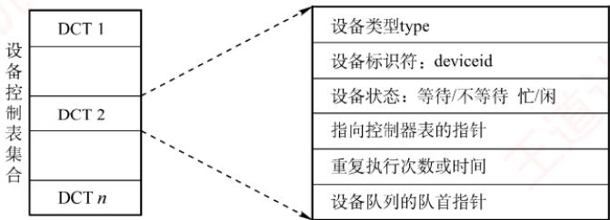  
图 5.12 DCT

设备类型：表示设备类型，如打印机、扫描仪、键盘等

设备标识符：即物理设备名，该标识符在系统内是唯一的。

设备状态：表示当前设备的状态（忙/闲）。

指向控制器表的指针：每个设备由一个控制器控制，该指针指向对应的控制器表。

重复执行次数或时间：系统指定I/O操作的可重试次数，超过此值则判定为I/O失败。

设备队列的队首指针：指向因请求该设备而阻塞的进程队列（由PCB构成）的队首。

## 注意

当某进程释放设备且无其他进程等待时，系统会将DCT中的设备状态置为空闲，完成设备回收。

2）控制器控制表（COCT）：每个设备控制器对应一张COCT，用于记录控制器的状态及所辖设备信息，如图5.13(a)所示。通过COCT中的“与控制器连接的通道表指针”，可以找到相应通道的信息。操作系统根据COCT对控制器进行操作和管理。

3）通道控制表（CHCT）：每个通道对应一张CHCT，用于管理该通道及其下属控制器，如图5.13(b)所示。通过CHCT中的“与通道连接的控制器表首址”，可以找到该通道管理C 的所有控制器的信息。操作系统根据CHCT对通道进行操作和管理。

4）系统设备表（SDT）：整个系统只维护一张SDT，作为所有物理设备的全局索引，如图5.13(c)所示。每个表目对应一个设备，通常包含设备类型、标识符等信息。

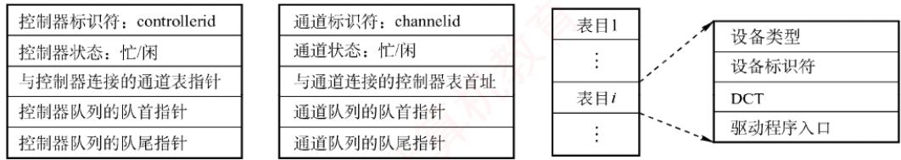  
(a) 控制器控制表COCT  
(b) 通道控制表CHCT  
(c) 系统设备表SDT  
图 5.13 COCT、CHCT和 SDT

在多道程序系统中，由于进程数通常多于设备数，必须采用合理的分配策略。主要考虑的因素包括：设备的固有属性、分配算法、分配的安全性以及设备的独立性。

## 3. 设备分配时应考虑的因素

## 考点追踪设备分配需要考虑的因素（2023）

## （1）设备的固有属性

设备的固有属性可分为三类，需采用不同的分配策略。

1）独占设备：分配给某进程后，便由其独占使用，直至进程主动释放或终止。

2）共享设备：可同时供多个进程使用，需通过调度机制协调访问顺序（如磁盘）。

3）虚拟设备：通过对独占设备进行虚拟化（如SPOOLing技术），使其在逻辑上表现为可共享设备，允许多个进程并发地提交I/O请求。

## (2)设备分配算法

常用的设备分配算法主要有两种。

1）FCFS算法。按进程请求设备的先后顺序，排成一个等待队列，优先分配给队首进程。

2）最高优先级优先算法。高优先级进程排在队列前方，优先级相同时按FCFS原则排队。

## （3）设备分配中的安全性

指在分配过程中应避免死锁的发生，主要通过以下两种方式实现。

1）安全分配方式。每当进程发出I/O请求后，便立即进入阻塞态，直至I/O操作完成才被唤醒。在此期间，进程不再请求任何其他资源，从而有效避免死锁。其优点是安全性高，缺点是CPU与I/O设备串行工作，系统效率较低。

2）不安全分配方式。进程在发出J/O请求后仍继续运行，需要时可发出第二个、第三个J/C请求等。仅当所请求的设备已被其他进程占用时，才进入阻塞态。其优点是单个进程可同时使用多个设备，使进程推进迅速；缺点是可能因循环等待而造成死锁。

## 4. 设备分配的步骤

下面以独占设备为例，介绍设备分配的过程。

1）分配设备。首先根据I/O请求中的物理设备名，查找SDT，从中找出该设备的DCT，再根据DCT中的设备状态字段判断其状态。若忙，则将进程PCB挂入设备等待队列；若空闲，则将设备分配给该进程。

2）分配控制器。设备分配后，根据DCT找到对应的COCT，查询控制器的状态。若忙，则将进程PCB挂入控制器等待队列；若空闲，则将控制器分配给该进程。

3）分配通道。控制器分配后，根据COCT找到对应的CHCT，查询通道的状态。若忙，则将进程PCB挂入通道等待队列；若空闲，则将通道分配给该进程。只有当设备、控制器和通道均成功分配后，此次设备分配才算完成，随后可启动设备进行数据传送。

上述过程基于物理设备名发出I/O请求。若指定设备已被其他进程占用，则分配失败，说明该方案缺乏设备独立性。为实现设备独立性，进程应使用逻辑设备名。此时，系统从SDT中依次查找该类设备的DCT：若某设备空闲，则进行后续分配：仅当所有同类设备都忙时，才将进程挂入该类设备的公共等待队列。只要存在一个可用设备，系统便会继续进行后续分配流程。

## 5. 逻辑设备名到物理设备名的映射

## 考点追踪逻辑设备名和物理设备名的使用（2009）

为实现设备独立性，进程应使用逻辑设备名请求某类设备。由于系统只能识别物理设备名，需在系统中配置一张逻辑设备表（Logical Unit Table，LUT），用于建立逻辑设备名到物理设备

名的映射。LUT的每个表项包含三项内容：逻辑设备名、物理设备名和驱动程序入口地址。当进程使用某个逻辑设备名请求设备时，系统为其分配一台空闲的物理设备，并在LUT中建立相应表目。此后，该进程的所有I/O请求均通过该表项找到对应的物理设备及其驱动程序。

系统中可采用两种方式设置逻辑设备表。

1）整个系统仅设置一张LUT。如图5.14(a)所示。所有进程的设备分配情况都记录在同一张LUT中，这就要求所有用户不能使用相同的逻辑设备名，适用于单用户系统。

2）为每个用户设置一张LUT。如图5.14(b)所示。系统仍维护全局的系统设备表（SDT）。不同用户可以使用相同的逻辑设备名，互不干扰，适用于多用户系统。

<table><tr><td rowspan=1 colspan=1>逻辑设备名</td><td rowspan=1 colspan=1>物理设备名</td><td rowspan=1 colspan=1>驱动程序入口地址</td></tr><tr><td rowspan=1 colspan=1>/dev/printer</td><td rowspan=1 colspan=1>3</td><td rowspan=1 colspan=1>2014</td></tr><tr><td rowspan=1 colspan=1>/dev/tty</td><td rowspan=1 colspan=1>5</td><td rowspan=1 colspan=1>2046</td></tr><tr><td rowspan=1 colspan=1>…</td><td rowspan=1 colspan=1>…</td><td rowspan=1 colspan=1>…</td></tr></table>

(a)整个系统的LUT

<table><tr><td rowspan=1 colspan=1>逻辑设备名</td><td rowspan=1 colspan=1>系统设备指针</td></tr><tr><td rowspan=1 colspan=1>/dev/printer</td><td rowspan=1 colspan=1>3</td></tr><tr><td rowspan=1 colspan=1>/dev/tty</td><td rowspan=1 colspan=1>5</td></tr><tr><td rowspan=1 colspan=1>…</td><td rowspan=1 colspan=1></td></tr></table>

(b)每个用户设置一张LUT  
图5.14 逻辑设备表（LUT）

## 5.2.4 SPOOLing 技术（假脱机技术）

为缓和 CPU的高速性与I/O设备低速性之间的矛盾，操作系统引入了 SPOOLing，即假脱机技术。其思想源于早期的脱机/O方式：依赖专用外围控制机，在主机不参与的情况下完成I/O操作。输入时，外围机将低速输入设备（如纸带机）上的数据预先读入高速磁盘：输出时，CPU先将结果高速写入磁盘，再由外围机将数据送至低速输出设备（如打印机）。由于整个I/O过程脱离主机控制，因此称为脱机。随着多道程序设计技术的发展，操作系统不再需要物理外围机，而通过专门的输入进程与输出进程，在主机直接控制下模拟外围机的功能：输入进程负责将低速输入设备的数据提前读入磁盘上的输入井：输出进程则将用户作业的输出结果暂存于磁盘的输出井，再逐步送往实际输出设备。由此，I/O操作 并，再逐步送往实际输出设备。由此，IO操作

与CPU计算得以并行执行。

这种以磁盘为缓冲、用软件模拟脱机I/O的机制，正是SPOOLing技术的本质。“脱机”承袭自早期脱机I/O的思想，“假”则体现在以多道程序和磁盘空间替代外围机，进而将一台物理独占设备虚拟为多台逻辑设备，实现设备共享。SPOOLing系统的组成如图5.15所示。

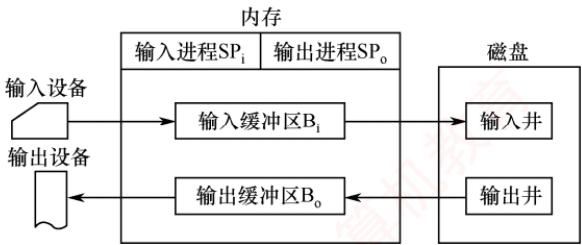  
图 5.15 SPOOLing 系统的组成

## 考点追踪SPOOLing技术的特点（2016）

## （1）输入井和输出井

在磁盘上开辟的两个专用存储区域。输入并模拟脱机输入的磁盘，用于暂存输入设备的数据。输出并模拟脱机输出的磁盘，用于暂存用户程序的输出数据。每个进程的输入（或输出）数据以文件形式保存（称为并文件），所有文件按顺序链接成输入队列或输出队列。

## (2）输入缓冲区和输出缓冲区

在内存中开辟的两个缓冲区。输入缓冲区暂存由输入设备送来的数据，随后传送到输入井。输出缓冲区暂存从输出并读出的数据，随后传送到输出设备。

## （3）输入进程和输出进程

输入进程模拟脱机输入的外围控制机，负责将输入设备的数据经输入缓冲区传送到输入井。

当CPU需要输入数据时，直接从输入井读取。输出进程模拟脱机输出的外围控制机，负责将用户程序的输出数据写入输出井，并在输出设备空闲时，经输出缓冲区将数据传送到输出设备。

## (4）井管理程序

控制作业与磁盘井之间的信息交换。

打印机是典型的独占设备。通过SPOOLing技术，可将其改造为可供多个用户共享的虚拟设备。当多个用户进程发出打印请求时，SPOOLing系统接受其请求，但并不真正立即将物理打印机分配给它们，而是由输出进程为每个进程完成以下两项操作。

1）在磁盘输出井中为其分配一个空闲盘块，并将待打印数据写入其中。

2）申请一张用户请求打印表，记录用户的打印要求，并将该表挂到假脱机打印队列上。

完成上述操作后，用户进程即认为打印任务已完成，可继续执行后续代码。实际上，真实打印尚未开始，但该过程对用户完全透明。真正的打印由后台的假脱机打印进程负责。当打印机空闲时，该进程检查假脱机打印队列：若队列非空，则取出队首的请求表，根据其中信息将对应的输出数据从输出井读入内存缓冲区，再送至物理打印机进行输出。一个任务完成后，继续处理下一个：若队列为空，则该进程进入等待状态，直至有新的打印请求将其唤醒。由于用户进程仅需将数据写入磁盘即可返回，而物理打印由后台进程按队列顺序依次执行，多个用户便可并发提交打印请求。系统为每个请求在输出井中分配独立的存储区域，使各进程均以为自己独占了一台打印机。由此，一台物理打印机被虚拟为多台逻辑设备，实现了高效且透明的共享。

SPOOLing系统的特点：①提高了I/O速度，将对低速I/O设备的操作转化为对磁盘输出井中数据的存取，如同脱机输入/输出一样，有效缓和了CPU与低速I/O设备之间速度不匹配的矛盾；②将独占设备改造为共享设备，在假脱机打印机系统中，实际上并未将物理设备分配给任何进程；③实现了虚拟设备功能，每个进程都认为自己独占了一台设备。

SPOOLing技术是一种以空间换时间的技术。它通过开辟磁盘空间作为输入井和输出井，牺牲了存储空间，但显著节省了时间。磁盘是一种高速设备，其与内存交换数据的速度远高于打印机等低速设备。若无SPOOLing技术，CPU向打印机输出数据时，必须等待缓慢的打印操作完成，才能继续后续工作，造成 CPU时间的浪费。而在 SPOOLing技术下，CPU可将待打印数据快速写入磁盘输出井(该过程由输出进程控制)，随即继续执行其他任务。若打印机正被占用，SPOOLing系统会将该打印请求挂到等待队列上，待打印机空闲时再按序输出。由于向磁盘写入数据的速度远快于直接驱动打印机，整体I/O效率得以提升，CPU与I/O设备实现了并行工作。

## 5.2.5 设备驱动程序接口

设备驱动程序是I/O系统上层与设备控制器之间的通信桥梁。其主要任务是接收上层软件发来的抽象I/O请求（如read/write），将这些请求转换为设备可识别的具体命令，并发送给设备控制器以启动设备执行相应操作；同时，也将设备控制器返回的状态和中断信息反馈给上层。

## 考点追踪设备驱动程序的功能（2013、2019、2023）

为实现上述通信功能，设备驱动程序应具备以下功能：①接收上层软件传递的命令和参数，并将抽象的I/O请求转换为与具体设备相关的操作指令。例如，将逻辑盘块号转换为磁盘的盘面号、磁道号和扇区号：②检查用户/O请求的合法性，查询设备当前状态，传递必要参数，并设置其工作方式；③发出/O命令：若设备空闲，则立即启动设备执行操作；若设备正忙，则将请求进程的PCB挂到该设备的等待队列上以待调度；④及时响应设备控制器发出的中断请求，并根据中断类型调用相应的中断处理程序进行处理。

考点追踪设备驱动程序的特点（2022）

相比于普通应用程序和系统程序，设备驱动程序具有以下特点：①它在抽象I/O请求与具体设备操作之间实现双向转换，并将设备状态及操作完成情况及时反馈给请求进程；②其实现与设备所采用的I/O控制方式(如中断驱动方式、DMA方式)紧密相关：③由于直接操作硬件，不同类型的设备必须配备相应的专用驱动程序：④部分底层驱动功能可能由设备固件或系统ROM提供；⑤驱动程序应设计为可重入的，以支持多个进程对同一设备的并发调用。

为使各类设备驱动程序具有统一的接口，操作系统要求：（①所有驱动程序与内核之间遵循相同或相近的接口规范，便于新增和维护：（②通过设备管理模块将逻辑设备名映射为物理设备名，并定位到对应的驱动程序入口：③对设备访问实施权限控制，防止未授权用户非法使用设备。

## 5.2.6 I/O 操作举例

由于统考对I/O的考查日益深入，本节以C语言中的库函数 scanf()为例，从执行“scanf("%c",&d)”开始，到键盘输入的字符最终存入变量d，介绍I/O操作的具体执行过程。

在讨论之前，先补充两个概念：内核缓冲区（位于内核空间）和与之对应的用户缓冲区（位于用户空间）。这两个地址空间相互隔离：内核空间存放操作系统代码和数据，供所有进程共享：而用户程序运行在用户空间。由于系统调用在内核态执行，因此必须先将/O设备的数据复制到内核缓冲区，在系统调用返回前，再将数据从内核缓冲区复制到用户缓冲区。

当程序调用“scanf("%c",&d)”时，试图通过键盘输入为变量d赋值。scanf()会关联一个由C标准库在用户空间管理的缓冲区 buf。scanf()函数的执行分为两个阶段。

第一阶段的工作是在C标准库中完成的：

1）检查与scanfO函数关联的用户缓冲区buf。若其中已有数据，则直接读取；若缓冲区为空，则触发系统调用read，从内核缓冲区中读取数据。

2）执行read系统调用。在执行trap指令前，需要传入三个参数：

●fd：文件描述符，标识输入设备（此处为标准输入）。

●buf：用户空间的缓冲区，用于接收从内核复制的数据。

● count：期望读取的最大字节数。

第二阶段的工作是系统调用，在内核中完成。read系统调用通过一段包含陷阱指令的代码，使CPU从用户态陷入内核态，执行相应的系统调用服务例程。系统调用的大致过程如图5.16所示。

  
图5.16 系统调用的大致过程

进入内核态后，系统调用服务例程访问内核缓冲区，并转至真正执行I/O操作的设备驱动层。在中断驱动方式下，系统调用服务例程的执行过程大致如下。

1）设置相应的I/O参数后，发起I/O的进程P进入阻塞态，CPU调度其他进程运行。

2）用户通过键盘输入字符，该字符被送入键盘I/O接口的数据端口。

3）键盘I/O接口向CPU发出中断请求。

4）CPU响应中断，执行键盘中断处理程序，读取字符并将其从I/O端口送入内核缓冲区。

5）进程P被唤醒，并加入就绪队列，等待调度。

6）进程P再次获得CPU后，系统调用服务例程将字符从内核缓冲区复制到用户缓冲区。

7）进程P从系统调用返回，随后scanf()对缓冲区中的字符进行解析，最终将其存入变量d。

整个I/O操作的工作流程如图5.17所示。

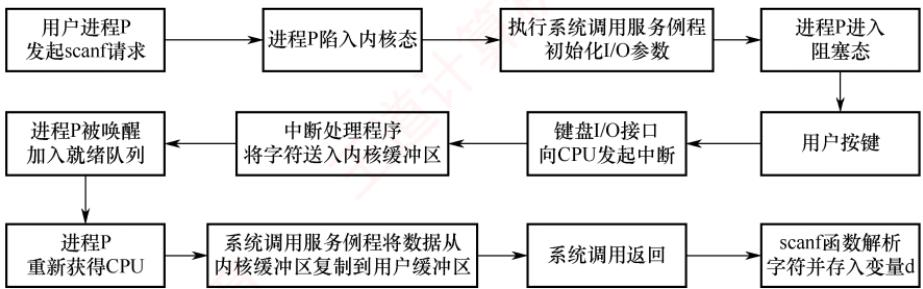  
图 5.17 整个I/O操作的工作流程

值得注意的是，在此过程中，用户输入的字符首先从键盘I/O接口的数据端口送入内核缓冲区，再从内核缓冲区送入用户缓冲区。前者由设备驱动程序完成（因其需直接操作I/O端口），后者由设备无关的I/O软件层完成（因其不依赖具体硬件）。数据的流向如图5.18所示。

  
图 5.18 数据的流向

## 5.2.7 本节小结

本节开头提出的问题的参考答案如下。

1）当处理机和外部设备的速度差距较大时，有什么办法可以解决问题？

可采用缓冲技术来缓解CPU与外设速度上的矛盾，即在主存中设立一片缓冲区，外设与CPU的输入/输出都经过该缓冲区，从而减少相互等待，提高系统效率。

2）什么是设备的独立性？引入设备的独立性有什么好处？

设备独立性是指应用程序使用逻辑设备名进行I/O操作，而无须指定具体的物理设备。操作系统在运行时将逻辑设备名动态映射到实际可用的物理设备。引入设备独立性的主要优点包括：①简化编程，屏蔽底层硬件细节；②提高程序可移植性，使同一程序能在不同硬件配置的系统上运行；③支持O重定向与设备动态绑定，提升系统灵活性和资源利用率。

## 5.2.8 本节习题精选

## 一、单项选择题

01. 设备的独立性是指（）。A. 设备独立于计算机系统B. 系统对设备的管理是独立的C. 用户编程时使用的设备与实际使用的设备无关D. 每台设备都有唯一的编号 X

02. 引入高速缓冲的主要目的是（）。A. 提高 CPU 的利用率 B. 提高I/O设备的利用率C. 改善 CPU 与I/O 设备速度不匹配的问题 D. 节省内存

03. 为了使多个并发进程能有效地进行输入和输出，最好采用（）结构的缓冲技术。A. 缓冲池 B. 循环缓冲 C. 单缓冲 D. 双缓冲

04. 缓冲技术中的缓冲池在（）中。

A. 主存 B. 外存 C. ROM D. 寄存器

05. 支持双向传送的设备应使用（）。 算机A. 单缓冲区 B. 双缓冲区 C. 多缓冲区 D. 缓冲池

06. 下列关于缓冲区的描述中，正确的是（）。A. 缓冲区是一种专门的硬件缓冲器，不能用内存来实现B. 缓冲区的作用是提高CPU和I/O设备之间的速度匹配C. 缓冲区只能用于输入设备，不能用于输出设备D. 缓冲区只能用于块设备，不能用于字符设备

07. 使用单缓冲或双缓冲进行通信时，（）可以实现数据的双向并行传输。A. 只有单缓冲 B. 只有双缓冲 C. 都 D. 都不

08.下列各种算法中，（）是设备分配常用的一种算法。A. 首次适应 B. 时间片分配 C. 最佳适应 D. 先来先服务

09. 设从磁盘将一块数据传送到缓冲区所用的时间为 $8 0 \mu \mathrm { s }$ ，将缓冲区中的数据传送到用户区所用的时间为 $4 0 \mu \mathrm { s }$ ，CPU处理一个数据块所用的时间为 $3 0 \mu \mathrm { s }$ 。若有多块数据需要处理，王 并采用单缓冲区传送某磁盘数据，则处理一块数据所用的总时间为（）。A. 120μs B. 110μs C. $1 5 0 \mu \mathrm { s }$ D. 70μs

10. 某操作系统采用双缓冲区传送磁盘上的数据。设从磁盘将数据传送到缓冲区所用的时间为 $T _ { 1 }$ ，将缓冲区中的数据传送到用 $\dot{ 严 }$ 区所用的时间为 $T _ { 2 } , \mathrm { C P U }$ 处理一块数据所用的时间为 $T _ { 3 } ,$ 假设一个磁盘块和一个缓冲区的大小相等，某系统在一段时间内连续处理一大批数据，则平均处理一个磁盘块数据的时间为（）。A. $T _ { 1 } + T _ { 2 } + T _ { 3 }$ B. $\max(T_{2},T_{3}) + T_{1}$ C. $\operatorname* { m a x } ( T _ { 1 } , T _ { 3 } ) + T _ { 2 }$ D. $\max(T_{1},T_{2}+T_{3})$

11. 若I/O所花费的时间比 CPU 的处理时间短得多，则缓冲区（）。A. 最有效 B. 几乎无效C. 均衡 王道 D. 以上答案都不对

12. 缓冲区管理者重要考虑的问题是（）。A. 选择缓冲区的大小 B. 决定缓冲区的数量C. 实现进程访问缓冲区的同步 D. 限制进程的数量

13. 考虑单用户计算机上的下列I/O操作，需要使用缓冲技术的是（）。I. 图形用户界面下使用鼠标Ⅱ. 多任务操作系统下的磁盘驱动器（假设没有设备预分配） 道计算机教Ⅲ. 包含用户文件的磁盘驱动器IV. 使用存储器映射I/O，直接和总线相连的图形卡  
C A. I、ⅢII B. II、IV C. II、III、IV D. 全选

14. 以下（）不属于设备管理数据结构。A. PCB B. DCT C. COCT D. CHCT

15. 下列（）不是设备的分配方式。 育A. 独享分配 B. 共享分配 C. 虚拟分配 D. 分区分配

16. 设备分配程序需要访问一系列的数据结构来给进程分配设备，这些数据结构有：设备控制表（DCT），控制器控制表（COCT），通道控制表（CHCT），系统设备表（SDT）。在设备分配的过程中，访问这些数据结构的正确顺序是（）。A. SDT, DCT, COCT, CHCT 道计 B. DCT, COCT, CHCT, SDTC. SDT, COCT, CHCT, DCT D. COCT, CHCT, SDT, DCT

17. 下面设备中属于共享设备的是（）。A. 打印机 B. 磁带机 C. 磁盘 D. 磁带机和磁盘

18. 提高单机资源利用率的关键技术是（）。A. SPOOLing 技术 B. 虚拟技术C. 交换技术 道计 D. 多道程序设计技术

19. 虚拟设备是靠（）技术来实现的。A. 通道 B. 缓冲 C. SPOOLing D. 控制器

20. SPOOLing技术的主要目的是（)。A. 提高 CPU 和设备交换信息的速度 B. 提高独占设备的利用率C. 减轻用户编程负担 D. 提供主、辅存接口

21. 在采用 SPOOLing技术的系统中，用户的打印结果首先被送到（）。A. 磁盘固定区域B. 内存固定区域C. 终端 D. 打印机

22. 采用 SPOOLing技术的计算机系统，外围计算机需要（）。A.一台 B. 多台 C. 至少一台 D. 0台

23.SPOOLing系统由（）组成。A. 预输入程序、井管理程序和缓输出程序B. 预输入程序、井管理程序和井管理输出程序C. 输入程序、井管理程序和输出程序D. 预输入程序、井管理程序和输出程序

24. 在 SPOOLing系统中，用户进程实际分配到的是（）。A. 用户所要求的外设 B. 外存区，即虚拟设备C. 设备的一部分存储区 D. 设备的一部分空间

25. 下面关于SPOOLing系统的说法中，正确的是（）。A. 构成 SPOOLing系统的基本条件是有外围输入机与外围输出机B. 构成 SPOOLing系统的基本条件仅是要有高速的大容量硬盘作为输入井和输出井C. 当输入设备忙时，SPOOLing系统中的用户程序暂停执行，待I/O空闲时再被唤醒执行输出操作D. SPOOLing系统中的用户程序可以随时将输出数据送到输出井中，待输出设备空闲时再由 SPOOLing系统完成数据的输出操作 X

26. 下面关于SPOOLing的叙述中，不正确的是（）。A. SPOOLing系统中不需要独占设备B. SPOOLing系统加快了作业执行的速度C. SPOOLing系统使独占设备变成共享设备D. SPOOLing系统提高了独占设备的利用率

27.（）是操作系统中采用的以空间换取时间的技术。A. SPOOLing 技术 B. 虚拟存储技术 C. 覆盖与交换技术 D. 通道技术

28. 采用假脱机技术，将磁盘的一部分作为公共缓冲区以代替打印机，用户对打印机的操作实际上是对磁盘的存储操作，用以代替打印机的部分由（）完成。A. 独占设备 B. 共享设备 C. 虚拟设备 D. 一般物理设备

29.下面关于独占设备和共享设备的说法中，不正确的是（）。A. 打印机、扫描仪等属于独占设备B. 对独占设备往往采用静态分配方式

C. 共享设备是指一个作业尚未撤离，另一个作业即可使用，但每个时刻只有一个作业使用D. 对共享设备往往采用静态分配方式

30. 当用户要求使用打印机打印某文件时，用户的要求是由操作系统的（）实现的。A. 文件系统 道计 B. 设备管理程序C. 文件系统和设备管理程序 D. 打印机启动程序和设备管理程序

31. 下列设备管理工作中，适合由设备独立性软件来完成的有（）。I. 向设备寄存器写命令 I. 检查用户是否有权使用设备I. 将二进制整数转换成 ASCI码格式打印 IV. 缓冲区管理A. I、Ⅱ和ⅢIIB. II、III和Ⅳ C. ⅡI 和IV D. I、III和IV

32. 下列关于设备驱动程序的说法中，正确的是（）。I. 设备驱动程序负责处理与设备相关的中断处理过程Ⅱ. 驱动程序全部使用汇编语言编写，没有使用高级语言编写 首计算机教Ⅲ. 设备驱动程序负责处理磁盘调度IV. 设备驱动程序与设备密切相关，可以在任意操作系统运行A. II、III、IV B. I、II C. III、IV D. I、II、III

33.下列选项中，（）不属于设备驱动程序的功能。A. 接收进程发来的I/O命令和参数，并检查其合法性B. 查询 I/O 设备的状态C. 发出I/O 命令，启动 I/O 设备 教育D. 对I/O 设备传回的数据进行分析和缓冲

34. 对设备驱动程序的处理过程进行排序，正确的处理顺序是（）。①对服务请求进行校验 ②传送必要的参数 ③启动I/O设备④将抽象要求转化为具体要求 ⑤检查设备的状态A. ①④⑤②③ B. ④①⑤②③ C. ①④②⑤③ D. ④①②⑤③

35. printf()是C 语言中进行格式化输出的库函数，该函数最终会转到内核态执行相应的系统调用服务例程，进程是通过执行（）从用户态进入内核态的。A. 陷入指令T B. 关中断指令 C. 无条件跳转指令D. 输出指令

36. 【2009统考真题】单处理机系统中，可并行的是（）。I. 进程与进程 I. 处理机与设备 III. 处理机与通道 IV. 设备与设备A. I、ⅡI、III B. I、II、IV C. I、III、IV D. II、III、IV

37. 【2009统考真题】程序员利用系统调用打开I/O设备时，通常使用的设备标识是（）。A. 逻辑设备名 B. 物理设备名 C. 主设备号 D. 从设备号

38.【2011统考真题】某文件占10个磁盘块，现要把该文件的磁盘块逐个读入主存缓冲区，并且送到用户区进行分析，假设一个缓冲区与一个磁盘块大小相同，把一个磁盘块读入缓冲区的时间为100μs，将缓冲区的数据传送到用户区的时间是50μs，CPU对一块数据进行分析的时间为50μs。在单缓冲区和双缓冲区结构下，读入并分析完该文件的时间分别是（）。A. 1500μs, 1000μs B. 1550μs, 1100μs C. 1550μs, 1550μs D. 2000μs, 2000μs

39.【2013统考真题】设系统缓冲区和用户工作区均采用单缓冲，从外设读入一块数据到系统缓冲区的时间为100，从系统缓冲区读入一块数据到用户工作区的时间为5，对用户工作区中的一块数据进行分析的时间为90（见右图）。进程从外设读入并分析2个数据块的最短时间是（）。

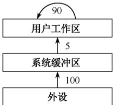

A. 200 B. 295 C. 300 D. 390

40. 【2013统考真题】用户程序发出磁盘I/O请求后，系统的处理流程是：用户程序→系统调用处理程序→设备驱动程序→中断处理程序。其中，计算数据所在磁盘的柱面号、磁头号、扇区号的程序是（）。A. 用户程序 王道计 B. 系统调用处理程序C. 设备驱动程序 D. 中断处理程序

41.【2015统考真题】在系统内存中设置磁盘缓冲区的主要目的是（）。A. 减少磁盘 I/O 次数 B. 减少平均寻道时间C. 提高磁盘数据可靠性 D. 实现设备无关性

42.【2016统考真题】下列关于SPOOLing技术的叙述中，错误的是（）。A. 需要外存的支持B. 需要多道程序设计技术的支持C. 可以让多个作业共享一台独占式设备 道计D.由用户作业控制设备与输入/输出井之间的数据传送

43.【2020统考真题】对于具备设备独立性的系统，下列叙述中，错误的是（）。A. 可以使用文件名访问物理设备B. 用户程序使用逻辑设备名访问物理设备C. 需要建立逻辑设备与物理设备之间的映射关系D. 更换物理设备后必须修改访问该设备的应用程序

44.【2022统考真题】下列关于驱动程序的叙述中，不正确的是（）。A. 驱动程序与I/O 控制方式无关B. 初始化设备是由驱动程序控制完成的C. 进程在执行驱动程序时可能进入阻塞态D. 读/写设备的操作是由驱动程序控制完成的

45.【2023统考真题】下列因素中，设备分配需要考虑的是（）。I. 设备的类型 Ⅱ. 设备的访问权限Ⅲ. 设备的占用状态 IV. 逻辑设备与物理设备的映射关系A. 仅I、II B. 仅ⅡI、Ⅲ C. 仅ⅢII、IV D. I、ⅡI、ⅢII、IV

46.【2024统考真题】当键盘中断服务例程执行结束时，所输入数据的存放位置是（）。A. 用户缓冲区 B. CPU 中的通用寄存器C. 内核缓冲区 D. 键盘控制器的数据寄存器

## 二、综合应用题

01.输入/输出软件一般分为4个层次：用户层、与设备无关的软件层、设备驱动程序和中断处理程序。请说明以下各工作是在哪一层完成的：1）为磁盘读操作计算磁道、扇区和磁头。2）向设备寄存器写命令。3）检查用户是否有权使用设备。

02. 在某系统中，若采用双缓冲区（每个缓冲区可存放一块数据），将一块数据从磁盘传送到缓冲区的时间为 80μs，从缓冲区传送到用户的时间为 20μs，CPU计算一块数据的时间为50μs。总共处理4个数据块，每个数据块的平均处理时间是多少？

03.【2023统考真题】进程P通过执行系统调用从键盘接收一个字符的输入，已知此过程中与进程P相关的操作包括：①将进程P插入就绪队列；②将进程P插入阻塞队列；③将字符从键盘控制器读入系统缓冲区；④启动键盘中断处理程序；⑤进程P从系统调用返回；⑥用户在键盘上输入字符。以上编号①\~⑥仅用于标记操作，与操作的先后顺序无关。请回答下列问题。

1）按照正确的操作顺序，操作①的前一个和后一个操作分别是上述操作中的哪一个？操作⑥的后一个操作是上述操作中的哪一个？

2）在上述哪个操作之后CPU一定从进程P切换到其他进程？在上述哪个操作之后CPU调度程序才能选中进程P执行？

3）完成上述哪个操作的代码属于键盘驱动程序？

4）键盘中断处理程序执行时，进程P处于什么状态？CPU是处于内核态还是处于用户态？

## 5.2.9 答案与解析

## 一、单项选择题

## 01. C

设备的独立性主要是指用户使用设备的透明性，即使用户程序和实际使用的物理设备无关。

## 02. C

CPU与I/O设备执行速度通常是不对等的，前者快、后者慢，通过高速缓冲技术来改善两者不匹配的问题。

## 03. A

缓冲池是系统的共用资源，可供多个进程共享，并且既能用于输入又能用于输出。其一般包含三种类型的缓冲：（①）空闲缓冲区：②装满输入数据的缓冲区：③装满输出数据的缓冲区。为了管理上的方便，可将相同类型的缓冲区链成一个队列。选项B、C、D属专用缓冲。

## 04. A

输入井和输出井是在磁盘上开辟的存储空间，而输入/输出缓冲区是在内存中开辟的，因为CPU速度比I/O设备高很多，缓冲池通常在主存中建立。

## 05. B

支持双向发送和接收数据的设备（如网卡等）应使用双缓冲区，双缓冲区可以实现同一时刻的双向数据传输，提高设备的效率和利用率。单缓冲区只能实现单向数据传输。多缓冲区和缓冲池用于提高I/O性能的技术，但不是必需的，也不一定适合所有的双向设备。

## 06. B

缓冲区是一个存储区域，可由专门的硬件寄存器组成，也可利用内存来实现。缓冲区的作用是提高CPU和I/O设备之间的速度匹配，因为CPU的速度远高于I/O设备的速度，若没有缓冲区，则CPU就要等待I/O设备完成操作，造成资源浪费。缓冲区可用于输入设备和输出设备，如键盘、打印机等。缓冲区也可用于块设备和字符设备，如磁盘、串口等。

## 07. B

两个进程之间若只设置单缓冲区，则同一时刻只能实现单向传输，但可在一段时间内用于发送数据，另一段时间内用于接收数据。若设置双缓冲区，则可以实现双向同时的并行传输。

## 08. D

选项A和C都是动态分区分配的常用算法，选项B是进程调度的常用算法，设备分配的常用算法主要有先来先服务算法和最高优先级优先算法。

## 09. A

采用单缓冲区传送数据时，设备与处理机对缓冲区的操作是串行的，当进行第i次读磁盘数据送至缓冲区时，系统再同时读出用户区中第i-1次数据进行计算，此两项操作可以并行，并与数据从缓冲区传送到用户区的操作串行进行，所以系统处理一块数据所用的总时间为max(80μs$30\mu s + 40\mu s = 120\mu s$

## 10. D

计算处理一个磁盘块数据的平均时间，可以假定系统的初始状态：用户区为空，缓冲区1为满，缓冲区2为空，如右图所示。 $\textcircled{i}  0   \sim   T _ { 2 }$ 时段，将Ti → → T2缓冲区1中的数据送入用户区；② $T_{2} \sim T_{2} + T_{3}$ 时段， 缓冲区1处理用户区中的数据，③ $0 { \sim } T _ { 1 }$ 时段，将数据从磁盘 Ti → 缓冲区2 → T2 °送入缓冲区2，只有②和③都完成后，系统才重新回 算机到初始状态，因此平均处理一个磁盘块数据的时间为 $\max(T_{1},T_{2}+T_{3})$

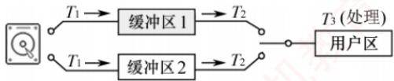

## 11. B

缓冲区主要解决输入/输出速度比CPU处理的速度慢而造成数据积压的矛盾。所以当I/O花费的时间比CPU处理时间短很多时，缓冲区没有必要设置。

## 12. C

在缓冲机制中，无论是单缓冲、多缓冲还是缓冲池，因为缓冲区是一种临界资源，所以在使用缓冲区时都有一个申请和释放（互斥）的问题需要考虑。

## 13. D

在鼠标移动时，若有高优先级的操作产生，为了记录鼠标活动的情况，必须使用缓冲技术，说法Ⅰ正确。由于磁盘驱动器和目标或源I/O设备间的吞吐量不同，必须采用缓冲技术，说法Ⅱ正确。为了能使数据从用户作业空间传送到磁盘或从磁盘传送到用户作业空间，必须采用缓冲技术，说法Ⅲ正确。为了便于多幅图形的存取及提高性能，缓冲技术是可以采用的，特别是在显示当前一幅图形又要得到下一幅图形时，应采用双缓冲技术，说法IV正确。

## 14. A

DCT是设备控制表；COCT是控制器控制表；CHCT是通道控制表；PCB 是进程控制块，不属于设备管理的数据结构。 VO WITV

## 15. D

设备的分配方式主要有独享分享、共享分配和虚拟分配，选项D是内存的分配方式。

## 16. A

在设备分配的过程中，访问数据结构的顺序通常是按设备管理的逻辑层次来安排的。设备分配过程通常从系统设备表（SDT）开始，然后依次获取设备控制表(DCT）、控制器控制表（COCT)和通道控制表（CHCT）中的信息，最终完成对设备的分配。 X

## 17. C

共享设备是指在一个时间间隔内可被多个进程同时访问的设备，只有磁盘满足。打印机在一个时间间隔内被多个进程访问时，打印出来的文档会乱；磁带机旋转到所需的读/写位置需要较长时间，若一个时间间隔内被多个进程访问，磁带机就只能一直旋转，没时间读/写。

## 18. D

在单机系统中，最关键的资源是处理器资源，最大化地提高处理器利用率，就是最大化地提高系统效率。多道程序设计技术是提高处理器利用率的关键技术，其他均为设备和内存的相关技术。 道

## 19. C

SPOOLing技术是操作系统中采用的一种将独占设备改造为共享设备的技术。通过这种技术处理后的设备通常称为虚拟设备。V

## 20. B

SPOOLing技术将一台物理设备虚拟为多台逻辑设备，以减少设备的闲置时间，提高设备的并发度和吞吐量，因此SPOOLing技术的主要目的是提高独占设备的利用率。

## 21. A

输入井和输出井是在磁盘上开辟的两大存储空间。输入井模拟脱机输入时的磁盘设备，用于暂存I/O设备输入的数据；输出井模拟脱机输出时的磁盘，用于暂存用户程序的输出数据。为了缓和CPU，打印结果首先送到位于磁盘固定区域的输出井。

## 22. D

SPOOLing技术需要使用磁盘空间（输入井和输出井）和内存空间（输入/输出缓冲区），不需要外围计算机的支持。

## 23. A

SPOOLing系统主要包含三部分，即输入井和输出井、输入缓冲区和输出缓冲区以及输入进程和输出进程。这三部分由预输入程序、井管理程序和缓输出程序管理，以保证系统正常运行。

## 24. B

通过 SPOOLing技术可将一台物理I/O设备虚拟为I/O 设备，同样允许多个用户共享一台物理I/O设备，所以 SPOOLing并不是将物理设备真的分配给用户进程。

## 25. D

构成SPOOLing系统的基本条件是不仅要有大容量、高速度的外存作为输入井和输出井，还要有 SPOOLing软件，因此选项A 错误、选项B 不够全面，同时利用 SPOOLing技术提高了系统和I/O设备的利用率，进程不必等待I/O操作的完成，因此选项C也不正确。

## 26. A

SPOOLing技术将独占设备虚拟成共享设备，因此必须先有独占设备才行。下面说明SPOOLing技术如何加快作业执行的速度，提高独占设备的利用率。进程不需要等待打印机空闲，只需将输出数据送到输出井，然后继续执行其他操作，这样就提高了进程的效率。打印机不需要空闲等待进程的输出，只需从输出井中读取数据进行打印，然后读取下一个数据，这样就提高了打印机的效率。输出进程可以根据输出井中的数据量和优先级来安排打印顺序，从而平衡各个进程的等待时间和响应时间，这样就提高了系统的性能。输出进程可以减少对打印机的切换次数，从而减少系统的开销，进而提高打印机的利用率。 -X

## 27.A

SPOOLing技术需有高速大容量且可随机存取的外存支持，通过预输入和缓输出来减少CPU等待慢速设备的时间，将独享设备改造成共享设备。

## 28. C

利用假脱机技术可将独享设备改造为可供多个用户共享的虚拟设备，各作业在执行期间只使用虚拟设备。采用假脱机技术，将磁盘的一部分作为公共缓冲区以代替打印机，用户对打印机的操作实际上是对磁盘的存储操作，用以代替打印机的部分由虚拟设备完成。

## 29. D

独占设备采用静态分配方式，而共享设备采用动态分配方式。

## 30. C

当用户使用打印机打印某文件时，需要通过文件系统来访问磁盘上的数据，然后通过设备管

理程序来控制打印机的输出。打印机启动程序只能初始化打印机，不能直接访问磁盘上的数据。

## 31. C

设备寄存器写命令是由设备驱动程序完成的。检查用户是否有权使用设备属于设备保护，是由设备独立性软件完成的。将二进制整数转换成ASCⅡ码的格式打印是通过I/O库函数完成的，属于用户层软件。缓冲区管理属于输入输出的共有操作，是由设备独立性软件完成的。缓冲区是内存中的区域，显然不是由设备驱动程序完成的。

## 32. B

不同厂家的设备通常提供不同的驱动程序，对应不同的中断处理，因此需要驱动程序来完成，说法Ⅰ正确。驱动程序仅有一部分需要用汇编语言编写，其余部分可用高级语言编写，说法Ⅱ错误。不同型号的磁盘的调度方式不一定相同，磁盘调度由磁盘驱动程序完成，说法Ⅲ正确。不同的操作系统有不同的驱动程序接口，因此驱动程序要根据操作系统的要求进行定制，说法IⅣ错误。

## 33. D

设备驱动程序的功能是管理I/O设备。数据的分析和缓冲是由进程或操作系统完成的。

## 34. B

用户层软件发出的命令是设备独立性软件提供的统一接口，需要由驱动程序将这些抽象要求转化为具体要求，才能被设备控制器识别，例如将抽象要求中的盘块号转化为磁盘的柱面号、盘面号和扇区号。然后，驱动程序会检查服务请求是不是该设备可以执行的，之后检查设备的状态，只有设备处于就绪状态时才能启动，最后传送此次I/O的参数并启动设备。

## 35. A

printf()是进行输出的函数，最终需要在内核态执行I/O指令来完成输出的功能。系统调用函数中包含一条陷入指令，也称trap指令，会让CPU陷入内核态执行相应的服务程序。

## 36. D

在单CPU系统中，同一时刻只能有一个进程占用CPU，因此进程之间不能并行执行。通道是独立于CPU、控制输入/输出的设备，两者可以并行。显然，处理器与设备是可以并行的。设备与设备也是可以并行的，比如显示屏与打印机是可以并行工作的。

## 37. A

用户程序对I/O设备的请求采用逻辑设备名，而程序实际执行时使用物理设备名，它们之间的转换是由设备无关软件层完成的。主设备和从设备是总线仲裁中的概念。

## 38. B

在单缓冲区中，当上一个磁盘块从缓冲区读入用户区完成时，下一磁盘块才能开始读入，也就是当最后一个磁盘块读入用户区完毕时所用的时间为 $150 \times 10 = 1500 \mu s$ ，加上处理最后一个磁盘块的时间 $5 0 \mu \mathrm { s }$ ，得 $1 5 5 0 \mu \mathrm { s }$ 。双缓冲区中，不存在等待磁盘块从缓冲区读入用户区的问题，10个磁盘块可以连续从外存读入主存缓冲区，加上将最后一个磁盘块从缓冲区送到用户区的传输时间$5 0 \mu \mathrm { s }$ 及处理时间 $5 0 \mu \mathrm { s }$ ，也就是 $100 \times 10 + 50 + 50 = 1100 \mu s$

## 39. C

数据块1从外设到用户工作区的总时间为105，在这段时间中，数据块2未进行操作。在数据块1进行分析处理时，数据块2从外设到用户工作区的总时间为105，这段时间是并行的。再加上数据块2进行处理的时间90，总共是300。

## 40. C

计算柱面号、磁头号和扇区号的工作是由设备驱动程序完成的。题中的功能因设备硬件的不同而不同，因此应由厂家提供的设备驱动程序实现。

## 41. A

磁盘和内存的速度差异，决定了可以将内存经常访问的文件调入磁盘缓冲区，从高速缓存中复制的访问比磁盘I/O的机械操作要快很多。

## 42. D

SPOOLing利用专门的外围控制机，将低速I/O设备上的数据传送到高速磁盘上，或者相反。SPOOLing的意思是外部设备同时联机操作，也称假脱机输入/输出操作，是操作系统中采用的一项将独占设备改造成共享设备的技术。高速磁盘即外存，选项A正确。SPOOLing技术建立在多道程序设计技术的基础上，在一个时间段内，输入进程、输出进程是可以和运行的作业进程并发执行的，选项B正确。SPOOLing技术实现了将独占设备改造成共享设备的技术，选项C正确。设备与输入井/输出井之间数据的传送是由系统实现的，选项D错误。

## 43. D

设备可视为特殊文件，选项A正确。用户使用逻辑设备名来访问物理文件，有利于设备独立性，选项B正确。通过逻辑设备名访问物理设备时，需要建立逻辑设备和物理设备之间的映射关系，选项C正确。应用程序按逻辑设备名访问设备，再经驱动程序的处理来控制物理设备，若更换物理设备，则只需更换驱动程序，而无须修改应用程序，选项D错误。

## 44. A

厂家在设计一个设备时，通常会为该设备编写驱动程序，主机需要先安装驱动程序，才能使用设备。当一个设备被连接到主机时，驱动程序负责初始化设备(如将设备控制器中的寄存器初始化)选项B正确。若采用程序直接控制方式，进程不会被阻塞，进程会处于等待状态；若采用中断控制方式，则驱动程序启动I/O操作后，将调出其他进程执行，而当前用户进程被阻塞；若采用DMA控制方式，则驱动程序对DMA控制器初始化后，便发送“启动DMA传送”命令，外设开始传送数据，同时CPU执行处理器调度程序，当前用户进程被阻塞，选项C正确。设备的读/写操作本质就是在设备控制器和主机之间传送数据，而只有厂家知道设备控制器的内部实现，因此也只有厂家提供的驱动程序能控制设备的读/写操作，选项D正确。厂家会根据设备特性，在驱动程序中实现一种合适的I/O控制方式，不同的I/O控制方式需要不同的驱动程序来实现数据的传输和控制，例如，中断驱动方式需要驱动程序能够响应中断信号，DMA方式需要驱动程序能够设置DMA控制器的寄存器，通道控制方式需要驱动程序能够执行通道指令等，选项A错误。

## 45. D

设备的类型决定了设备的固有属性，如独占性、共享性、可虚拟性等，不同类型的设备需要采用不同的分配方式，如独占分配、共享分配、虚拟分配等。设备的访问权限决定了哪些进程可以使用哪些设备，以保证系统的安全性和保密性，通常系统设备只能由系统进程或特权进程访问，用户设备只能由用户进程或授权进程访问。设备的占用状态决定了设备是否可以被分配给请求进程，以及如何处理等待进程，若设备空闲，则通常可以直接分配给请求进程：若设备忙，则需要将请求进程排入设备队列，并按照一定的算法进行调度。逻辑设备与物理设备的映射关系决定了如何通过逻辑地址访问物理地址，以提高系统的灵活性和可扩展性，通常系统会为每个物理设备分配一个逻辑名，并建立一个系统设备表来记录逻辑名与物理名之间的对应关系。

## 46. C

以C语言中 scanf()函数的执行过程为例，用户请求通过键盘输入数据，当程序执行到 scanf()

时，触发系统调用，CPU切换到内核态，执行系统调用服务例程，系统调用的内核程序进行一些初始化操作，启动外设，同时阻塞该用户进程，直到键盘输入数据，键盘中断服务例程（实际上是驱动程序）将数据从I/O接口（键盘控制器）中的数据寄存器取出并送至内核缓冲区，然后唤醒用户进程，用户进程被唤醒后进入就绪队列，等得到CPU运行后，再将内核缓冲区中的数据送至用户缓冲区，最后进行系统调用的返回。综上所述，键盘中断服务例程执行结束后，所输入数据的存放位置是内核缓冲区，当系统调用结束时，所输入数据才被送至用户缓冲区。

## 二、综合应用题

## 01. 【解答】

分析：首先，我们来看这些功能是不是应该由操作系统来完成。操作系统是一个代码相对稳定的软件，它很少发生代码的变化。若1）由操作系统完成，则操作系统就必须记录逻辑块和磁盘细节的映射，操作系统的代码会急剧膨胀，而且对新型介质的支持也会引起代码的变动。若2）也由操作系统完成，则操作系统需要记录不同生产厂商的不同数据，而且后续新厂商和新产品也无法得到支持。

因为1）和2）都与具体的磁盘类型有关，因此为了能够让操作系统尽可能多地支持各种不同型号的设备，1）和2）应由厂商所编写的设备驱动程序完成。3）涉及安全与权限问题，应由与设备无关的操作系统完成。4)应由用户层来完成，因为只有用户知道将二进制整数转换为ASCⅡI码的格式（使用二进制还是十进制、有没有特别的分隔符等）。

## 02. 【解答】

4个数据块的处理过程如下图所示，总耗时 $3 9 0 \mu \mathrm { s }$ ，每块的平均处理时间为 $390\mu s /4 = 97.5\mu s$

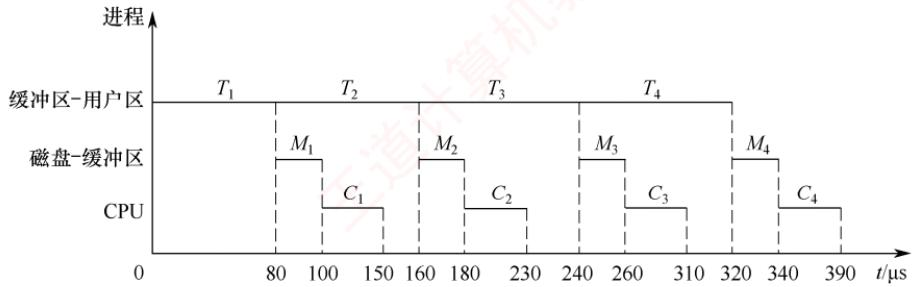

从上图可以看出，处理n个数据块的总耗时为 $( 8 0 n + 2 0 + 5 0 ) \mu \mathrm { s } = ( 8 0 n + 7 0 ) \mu \mathrm { s }$ ，每个数据块的平均处理时间为 $( 8 0 n + 7 0 ) / n \mu \mathrm { s }$ ，当n较大时，平均时间近似为 $\operatorname* { m a x } ( C , T ) = 8 0 \mu \mathrm { s }$

## 03. 【解答】

1）正确的执行顺序为②⑥④③①⑤，因此操作①的前一个操作是③，后一个操作是⑤；操作⑥的后一个操作是④。下面以 scanf()函数的执行过程为例分析相关操作顺序。首先用户进程P调用 I/O 标准库的 scanf()函数，scanf()调用系统调用封装函数 read()，在这个函数中有一条陷阱指令，通过它陷入内核，内核调出 read()对应的 sys read()系统调用服务例程进行执行，进入内核后，在设备无关层进行若于调用，最终到设备驱动层进行处理，设备驱动程序对本次I/O进行初始化操作，然后执行操作系统的进程调度程序scheduler()，由调度程序scheduler)来阻塞用户进程P，并调度其他进程执行。此后，在用户输入字符之前，CPU运行其他进程，键盘等待用户输入数据，当用户在键盘上输入字符后，外设向CPU发出相应的中断请求，CPU响应中断后，启动键盘中断处理程序，该处理程序对I/O中断进行简单通用的处理后，唤醒具体的处理键盘输入的驱动程序，该驱动程序将字符从键盘控制器读入系统缓冲区，数据传输完成后，唤醒P并将其插入就绪队列，进行中断返回，进程P也从系统调用返回。相关过程如下图所示。

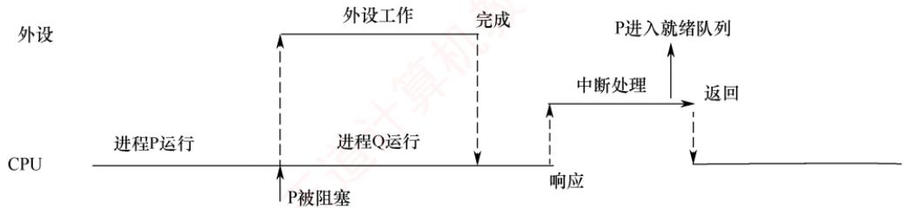

2）在操作②之后CPU一定从进程P切换到其他进程。在操作①之后CPU调度程序才能选中 进程P执行。

3）设备驱动程序负责驱动I/O设备工作，I/O操作初始化，执行具体的I/O指令。将字符从键盘控制器读入系统缓冲区是和键盘直接相关的具体操作，完成操作③的代码属于键盘驱动程序。

4）键盘中断处理程序执行时，进程P还在阻塞队列，处于阻塞态。中断处理程序、设备驱动程序、设备独立性软件都属于内核I/O软件层，执行相关代码时，CPU处于内核态。

## 5.3 磁盘和固态硬盘①

在学习本节时，请读者思考以下问题：

1）磁盘一次读/写操作包含哪几部分时间？其中哪部分最长？

2）存储文件时，若一个磁道容纳不下，剩余数据应存放在同一盘面的不同磁道，还是同一柱面的不同盘面？

本节主要介绍磁盘管理的方式。学习时应重点掌握：计算一次磁盘操作的时间，以及对给定的磁道访问序列，按特定调度算法求出磁头移动的总磁道数和平均寻道长度。

## 5.3.1 磁盘

## 考点追踪磁盘容量的计算（2019）

磁盘（Disk）是由表面涂有磁性物质的盘片构成的存储设备，它通过磁头（一个导体线圈）读/写数据。在读/写操作期间，盘片高速旋转，磁头沿盘片径向移动以定位目标位置。如图5.19所示，盘面上的数据存储在一组同心圆中，称为磁道。每个磁道宽度与磁头相当，一个盘面包含上千个磁道。磁道又划分为数百个扇区，每个扇区具有固定大小（如1KB），是磁盘寻址的最小物理单位。相邻磁道及扇区间留有间隙，以避免读/写于扰。传统设计中，每个磁道扇区数相同，由于外道周长更大，其线性存储密度低于内道，磁盘的存储能力受限于最内道的最大存储密度。

## 注意

为提高磁盘存储容量并充分利用外层磁道的存储能力，现代磁盘采用区域记录（ZBR）技术：将盘面划分为若干环带，同一环带内的所有磁道具有相同的扇区数，外层环带的磁道扇区数多于内层环带。

考点追踪将簇号转化为磁盘物理地址的过程（2019）

磁盘安装在磁盘驱动器中，后者由磁头臂、驱动盘片旋转的转轴及数据输入/输出电路组成。

如图5.20所示，多个盘片垂直堆叠形成盘组，每个盘面对应一个磁头，所有磁头安装在同一磁头臂上，同步径向移动。所有盘片上半径相同的磁道构成一个柱面。磁盘地址用“柱面号·盘面号·扇区号”表示，总存储容量由柱面数、盘面数和每磁道扇区数共同决定。

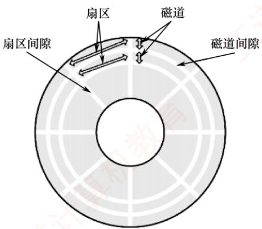  
图 5.19 磁盘盘片

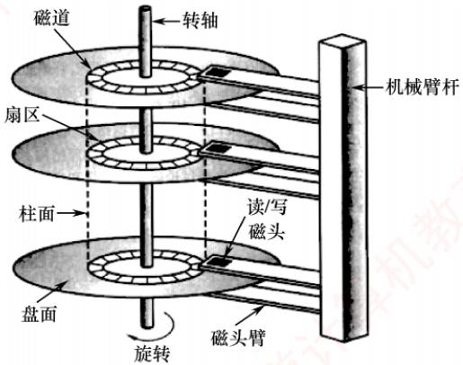  
图 5.20 磁盘的结构

读/写磁盘数据块的过程如下：①根据柱面号移动磁头臂，使磁头定位到目标柱面；②激活对应盘面的磁头；③等待目标扇区随盘片旋转至磁头下方，完成读/写操作。

磁盘可按结构分为不同类型：固定头磁盘为每个磁道配备一个磁头，磁头位置固定；活动头磁盘的磁头可沿径向移动，通过磁头臂定位到目标磁道；固定盘磁盘的盘片永久密封在驱动器内，不可拆卸；而可换盘磁盘则允许盘片拆卸和更换。最早的磁盘由IBM公司于1973年推出，称为温彻斯特磁盘（温盘），其采用活动磁头与固定盘片结构，是现代机械硬盘的雏形。

在操作系统中，每类资源的管理都涉及相应的调度算法。用户访问文件时，操作系统需完成权限检查、逻辑地址到物理地址的转换等步骤，最终将请求转化为对磁盘的读/写操作。当多个I/C请求同时到达时，系统需决定服务顺序，这正是磁盘调度算法所要解决的核心问题。

## 5.3.2 磁盘的管理

## 1. 磁盘初始化

## 考点追踪物理格式化的内容（2017、2021）

一个新的磁盘只是一个涂有磁性材料的空白盘。在磁盘能够存储数据之前，必须将其划分为扇区，以便磁盘控制器进行读/写操作，这一过程称为低级格式化（也称物理格式化）。每个扇区通常由头部、数据区域和尾部组成。头部和尾部包含了一些磁盘控制器的使用信息，其中利用磁道号、磁头号和扇区号来标志一个扇区，利用CRC字段对扇区进行校验。

大多数磁盘在出厂时作为制造过程的一部分已完成低级格式化，这使制造商能够测试磁盘，并建立逻辑块地址到物理扇区的初始映射。对于许多磁盘，控制器在低级格式化时还可指定扇区中数据区域的大小，通常为256字节、512字节或4KB等。

## 2. 分区

## 考点追踪逻辑格式化的内容（2017、2021）

在使用磁盘存储文件之前，还需完成两个步骤。第一步是分区，将磁盘划分为若于逻辑区域（如常见的C盘、D盘），每个分区的起始位置和大小记录在主引导记录（MBR）的分区表中。第二步是对分区进行逻辑格式化（也称高级格式化），即在分区上建立文件系统，包括初始化根

目录、创建用于管理空闲与已分配空间的数据结构，并将初始目录置为空。

由于扇区单位过小，为提高I/O效率，操作系统将多个连续扇区组合成一簇（在文件系统中也称块)。为简化管理，通常将一簇分配给单个文件，因此文件占用空间为簇的整数倍；即使文件大小小于一簇（甚至为0字节），仍需占用一整簇空间。

## 3. 引导块

计算机启动时需要运行一个初始化程序（称为自举程序），用于初始化CPU、寄存器、设备控制器和内存等，随后加载并启动操作系统。为此，自举程序需定位磁盘上的操作系统内核，将其载入内存，并跳转至其入口地址，从而开始操作系统的执行。

自举程序通常存放于ROM中。为避免因修改自举代码而需更换ROM硬件的问题，一般仅在ROM中保留一个小型自举装入程序，而将功能完整的引导程序存放在磁盘的引导块中。该引导块位于磁盘的固定位置。含有引导块的磁盘称为启动磁盘或系统磁盘。 KE

ROM中的代码指示磁盘控制器将引导块读入内存并执行，后者可从指定位置加载操作系统内核并启动之。下面以Windows为例说明引导过程：Windows允许将磁盘划分为多个分区，其中活动分区（引导分区）包含操作系统核心文件。系统将初始引导代码存储在磁盘第0号扇区，称为主引导记录（MBR）。启动时，ROM中的代码首先读取MBR；除引导代码外，MBR还包含分区表和一个标志位，用于指明应从哪个分区引导，如图5.21所示。随后，系统读取该分区的首扇区（称为引导扇区），继续完成后续引导步骤，包括加载系统服务与驱动程序。

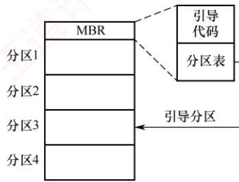  
图 5.21 Windows 磁盘的引导

## 4. 坏块

磁盘因含有机械部件且容错能力较弱，容易出现一个或多个扇区损坏，部分坏块甚至在出厂时就已存在。根据磁盘类型和控制器能力，坏块的处理方式有所不同。

对于简单磁盘，如采用IDE控制器的磁盘，坏块通常由操作系统在逻辑格式化时检测。例如MS-DOS的Format命令会识别坏扇区，并在FAT表中标记为不可用，从而避免程序使用。

对于现代的复杂磁盘，控制器内部维护一份坏块烈表。该列表在出厂低级格式化时初始化，并在使用过程中动态更新。低级格式化会预留部分备用扇区，这些扇区对操作系统透明。当发现坏块时，控制器自动将其映射到备用扇区，实现逻辑替换，此机制称为扇区备用。

坏块处理的核心思想是：通过软件标记或硬件重映射，确保系统不会使用坏块。

## 5.3.3 磁盘调度算法

## 1. 磁盘的存取时间

一次磁盘读/写操作的时间由寻道时间、旋转延迟时间和数据传输时间三部分组成。

1）寻道时间 $T _ { \mathrm { s } } ,$ ，活动头磁盘在读/写数据前，磁头移动到目标磁道所需的时间。该时间包括磁头臂的启动时间s和跨越n条磁道的移动时间，即

$$
T_{s} = mn + s
$$

式中，m为跨越每条磁道所需的时间，约为0.2ms；磁头臂的启动时间约为2ms。

2）旋转延迟时间 $T _ { \mathrm { r } }$ 。目标扇区旋转至磁头下方所需的平均等待时间（因位置随机，平均为半圈旋转时间）。设磁盘转速为r，则

$$
T _ { \mathrm { r } }   { = }   1 / ( 2 r )
$$

典型的磁盘转速为5400转/分，相当于旋转一圈需11.1ms，对应 $T _ { \mathrm { r } } \approx 5 . 5 6 \mathrm { m s }$ 0

3）数据传输时间 $T _ { \mathrm { t } ^ { \circ } }$ 读取或写入 $b$ 字节数据所需的时间。若每条磁道存储N字节，则

$$
T_{\mathrm{t}} = b / (rN)
$$

式中，r为磁盘每秒转数。总平均存取时间 $T _ { \mathrm { a } }$ 可表示为

$$
T_{a}=T_{s}+1/(2r)+b/(rN)
$$

在磁盘存取时间中，寻道时间占主导地位，且直接受磁盘调度算法影响；而旋转延迟时间和数据传输时间均与磁盘转速成反比，因此转速是磁盘性能的一个非常重要的硬件参数，难以从操作系统层面进行优化。因此，磁盘调度的主要目标是减少磁盘的平均寻道时间。 YTA

## 2. 磁盘调度算法

目前常用的磁盘调度算法有以下几种。

考点追踪各种磁盘调度算法的比较（2010、2018）

（1）先来先服务（First Come First Served，FCFS）算法

FCFS算法按进程请求访问磁盘的先后顺序进行调度，是最简单的调度算法（见图5.22）。优点是公平性好。当请求较少且访问的扇区在物理位置上较为聚集时，性能尚可；但当大量进程竞争磁盘时，磁头频繁长距离移动，导致效率低下。因此，实际系统通常采用更高效的调度算法。

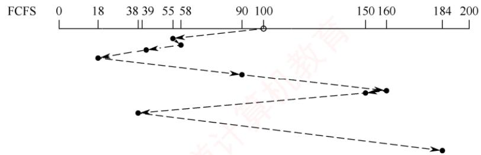  
图 5.22 FCFS 算法

例如，假设磁盘请求队列为55,58,39,18,90,160,150,38,184，磁头初始位于磁道100。采用FCFS算法时，磁头的移动过程如图5.22所示。总移动距离为 $1 ( 4 5 + 3 + 1 9 + 2 1 + 7 2 + 7 0 + 1 0 +$ $112 + 146 = 498$ 个磁道，平均寻道长度 $4 9 8 / 9 = 5 5 . 3$

（2）最短寻道时间优先（Shortest Seek Time First, SSTF）算法

考点追踪SSTF算法的应用（2019、2021）

SSTF算法每次选择距离当前磁头位置最近的请求进行调度，以使单次寻道时间最短。尽管该策略不能保证平均寻道时间最小，但通常能提供优于FCFS算法的性能。该算法可能引发“饥饿”现象，如图5.23所示，若磁头位于18号磁道，且附近持续出现新请求，则磁头将长期在18号磁道附近来回移动，导致较远磁道（如184号）长时间得不到服务。

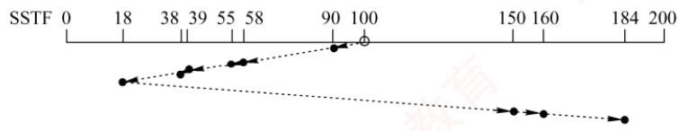  
图 5.23 SSTF 算法

例如，设磁盘请求队列为55,58,39,18,90,160,150,38,184，磁头初始位于磁道100。采用SSTF算法时，磁头的移动过程如图5.23所示。总移动距离为 $1 0 + 3 2 + 3 + 1 6 + 1 + 2 0 + 1 3 2 + 1 0 +$ 24=248个磁道，平均寻道长度 $248/9 = 27.5$

## （3）扫描（SCAN）算法

SSTF算法因磁头在局部区域来回移动而引发饥饿。为避免该问题，SCAN算法规定：磁头仅在到达最外侧磁道后才转向内侧移动，到达最内侧磁道后才转向外侧移动。它在SSTF的基础上引入了磁头移动方向的约束，如图5.24所示。其行为类似于电梯运行，故也称电梯调度算法。但 SCAN算法对最近扫描过的区域不公平，因此在访问局部性方面不如FCFS 算法和SSTF算法。

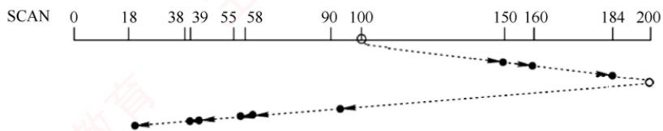  
图 5.24 SCAN 算法  
考点追踪SCAN算法的应用（2009、2010、2015）

例如，设磁盘请求队列为55,58,39,18,90,160,150,38,184，磁头初始位于磁道100。采用SCAN算法时，还需知道磁头移动方向。若磁头沿磁道号增大的方向移动，则访问顺序为100,150，160,184,200,90,58,55,39,38,18,磁头的移动过程如图5.24所示。总移动距离为(50+10+24+16$110+32+3+16+1+20=282$ 个磁道，平均寻道长度 =282/9= 31.33。

（4）循环扫描（Circular SCAN,C-SCAN）算法

考点追踪C-SCAN算法的应用（2024）

C-SCAN算法在SCAN算法的基础上规定：磁头仅沿单一方向移动并提供服务，返回时快速移至起始端且不处理任何请求。由于SCAN算法倾向于优先服务靠近最内侧或最外侧磁道的请求，导致中间区域的响应延迟较大。C-SCAN算法通过将回扫过程转化为非服务性的快速跳转，并以循环方式均匀地处理所有请求，从而有效缓解了这种不公平性，如图5.25所示。

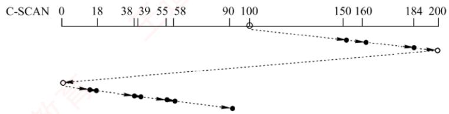  
图 5.25 C-SCAN 算法

例如，假设磁盘请求队列为55,58,39,18,90,160,150,38,184，磁头初始位于磁道100。采用C-SCAN算法时，若磁头沿磁道号增大的方向移动，则访问顺序为100,150,160,184,200,0,18,38,39.55,58.90，磁头的移动过程如图5.25所示。总移动距离为50+10+24+16+200+18+20+1+16+3+32=390个磁道，平均寻道长度 $= 3 9 0 / 9 = 4 3 . 3 3$ 0 X

采用SCAN算法和C-SCAN算法时，磁头总是严格地从磁盘一端移动到另一端。实际上，可进一步改进：磁头只需移动到当前方向上最远的请求位置即可返回，无须抵达物理端点。这种改进后的 SCAN 算法和 C-SCAN 算法分别称为LOOK 调度(见图 5.26)和 C-LOOK 调度(见图 5.27)，因其在朝某一方向移动前会“查看”（look）该方向是否存在待处理请求。

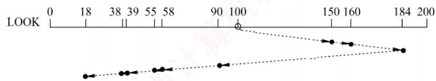  
图 5.26 LOOK 调度

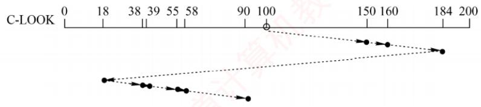  
图 5.27 C-LOOK 调度

若无特别说明，实际系统中所称的 SCAN算法和C-SCAN算法通常指LOOK调度和C-LOOK调度。 1

以上四种磁盘调度算法的优缺点如表5.2所示。

表5.2 四种磁盘调度算法的优缺点
<table><tr><td rowspan=1 colspan=1>算法</td><td rowspan=1 colspan=1>优点</td><td rowspan=1 colspan=1>缺点</td></tr><tr><td rowspan=1 colspan=1>FCFS 算法</td><td rowspan=1 colspan=1>公平、简单</td><td rowspan=1 colspan=1>平均寻道距离大，仅适用于磁盘I/O较少的场合</td></tr><tr><td rowspan=1 colspan=1>SSTF 算法</td><td rowspan=1 colspan=1>性能优于“先来先服务”</td><td rowspan=1 colspan=1>不能保证平均寻道时间最短，可能出现“饥饿”现象</td></tr><tr><td rowspan=1 colspan=1>SCAN算法</td><td rowspan=1 colspan=1>寻道性能较好，可避免“饥饿”现象</td><td rowspan=1 colspan=1>对远离磁头当前位置一端的请求响应较慢</td></tr><tr><td rowspan=1 colspan=1>C-SCAN 算法</td><td rowspan=1 colspan=1>消除了对两端磁道请求的不公平性</td><td rowspan=1 colspan=1></td></tr></table>

## (5) NStepSCAN 算法和 FSCAN 算法

SSTF算法、SCAN算法和C-SCAN算法在特定情况下可能出现磁臂黏着现象：当一个或多个进程频繁发出对某个磁道的I/O请求时，磁头会长期滞留于该区域，导致其他进程难以获得服务。

为了缓解这一问题，NStepSCAN算法将磁盘请求队列划分为若干长度为N的子队列。调度器按FCFS原则依次处理各子队列，而在处理每个子队列内部时，则采用SCAN算法进行扫描。在处理某个子队列的过程中，若有新请求到达，则系统将其放入尚未处理的其他子队列中，不插入当前正在服务的子队列。这一机制有效避免了磁头因局部热点请求而长期滞留的现象，进而避免了磁臂黏着。算法性能随N值变化：当N值较大时，NStepSCAN算法的行为趋近于SCAN算法；当N=1时，每个子队列仅含一个请求，算法退化为FCFS算法。

FSCAN 算法是NStepSCAN 算法的简化形式，其做法是将请求队列固定划分为两个子队列：①当前服务队列，包含调度开始时已存在的所有请求，按SCAN算法处理；②新请求队列，在当前扫描过程中新到达的请求全部暂存于此，推迟至下一轮扫描时处理。通过“冻结当前、延后新请求”的策略，FSCAN算法不仅保留了SCAN算法的特性，还避免了磁臂黏着，且实现简单、开销低。

## 3. 减少延迟时间的方法

除减少寻道时间外，减少旋转延迟时间也是提高磁盘I/O效率的重要途径。

磁盘是连续旋转设备。当磁头读取一个扇区后，系统需要一定时间处理数据，才能开始读取下一个扇区。若逻辑上相邻的块在物理上也相邻，则在处理当前扇区的过程中，下一个目标扇区可能已随盘面旋转而掠过磁头；待处理完成时，该扇区已不可访问，只能等待近一整圈才能再次到达，从而造成显著延迟。为此，可对单个盘面的扇区采用交替编号假设盘面有8个扇区，见图5.28(b)]，使逻辑相邻的块在物理布局上保持

  
(a)连续编号

  
(b)交替编号  
图5.28 盘面扇区的交替编号

适当间隔，确保在处理完一个扇区后，下一个目标扇区能及时旋转至磁头下方，从而有效减少因错过扇区而导致的长延迟。

此外，由于磁盘的所有盘面同步旋转，同一柱面内的块通常按盘面顺序连续存放，即依次为：

盘面0扇区0、盘面0扇区1…盘面0扇区7、盘面1扇区0…盘面1扇区7、盘面2扇区0…。若要读取不同盘面上的连续块，例如在读完盘面0扇区7后，系统仍需一段处理时间；而在此期间，盘面持续旋转，导致下一个目标块（如盘面1扇区0）可能已在磁头经过时被错过，无法立即读取，只能等待其下一次旋转至磁头下方。为此，可对不同盘面实施错位命名「假设有2个盘面，且已采用交替编号，见图5.29(b)]，使得在处理完盘面0扇区7后，盘面1扇区0恰好或即将到达磁头位置，从而在首次经过时即可读取，显著减少旋转延迟。

  
0号盘面

  
(a)普通命名  
1号盘面

  
0号盘面

  
(b)错位命名  
1号盘面  
图 5.29 磁盘盘面的错位命名

在磁盘的存取时间中，寻道时间和旋转延迟时间属于“找”的时间，这类开销可通过合理的调度算法或布局优化来降低，而传输时间主要由磁盘本身的特性决定，难以通过软件手段减少。

## 4. 提高磁盘 I/O 速度的方法

文件的访问速度是衡量文件系统性能最重要的因素，可从以下三个方面来优化：（1）改进文件的目录结构和检索目录的方法，以减少对目录的查找时间；②选取好的文件存储结构，以提高对文件的访问速度：③提高磁盘I/O速度，以实现文件数据在磁盘与内存之间的快速传送。其中，①和②已在第4章中介绍，这里主要介绍如何提高磁盘I/O的速度。

考点追踪改善磁盘I/O性能的方法（2012、2018）

1）采用磁盘高速缓存。5.2.2节介绍了磁盘高速缓存的概念。

2）调整磁盘请求顺序。即上文介绍的各种磁盘调度算法。

3）提前读。在读取当前磁盘块的同时，将逻辑上紧随其后的下一个（或多个）磁盘块一并预读到内存缓冲区，以应对后续可能的连续访问。 XTA

4）延迟写。当修改一个缓冲区中的数据时，并不立即写回磁盘，而仅设置延迟写标志；当该缓冲区被替换时，才真正将数据写入磁盘，从而合并多次写操作，减少I/O次数。

5）优化物理块的分布。除上文介绍的扇区编号优化外，对于采用链接或索引方式组织的文件，应尽量将其所属的块安排在同一磁道或相邻磁道上，以减少寻道时间。此外，将若于连续扇区组成簇，以簇为单位对文件进行分配，也能有效降低磁头的平均移动距离。

6）虚拟盘。指用内存空间仿真磁盘，也称RAM盘。由于内存访问速度远高于磁盘，因此常用于存放临时文件或对I/O延迟敏感的数据。虚拟盘与磁盘高速缓存的区别：虚拟盘的内容完全由用户程序控制，而磁盘高速缓存的内容则由操作系统透明管理。

7）采用磁盘阵列RAID。某些RAID级别可支持交叉存取，能大幅提高磁盘I/O速度。

## 5.3.4 固态硬盘

## 1. 固态硬盘的特性

## 考点追踪机械磁盘与固态硬盘的对比（2025）

固态硬盘（SSD）是一种基于闪存技术的存储设备。其存储介质与U盘类似，但容量更大、存取性能更优。一个SSD由一个或多个闪存芯片以及闪存翻译层组成，如图5.30所示。其中，闪存芯片替代了传统磁盘中的机械驱动器；而闪存翻译层负责将CPU发出的逻辑块读/写请求转换为对底层物理闪存的读/写控制信号，因此，闪存翻译层相当于代替了磁盘控制器的角色。

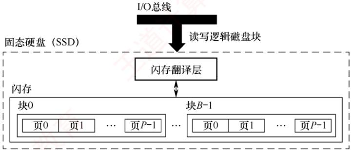  
图5.30 固态硬盘（SSD）

一个闪存芯片由B块组成，每块包含P页。通常，页的大小为512B～4KB，每块包含32～128页，块的大小为16KB～512KB。读/写操作以页为单位进行：擦除操作以块为单位进行，只有在整块被擦除后，才能向其中的页写入新数据。一旦某块被擦除，其所有页均可重新写入一次。每个块的擦写次数有限，经过若于次重复写入后，该块会因磨损而失效。

随机写入速度较慢，主要有两个原因：①擦除操作耗时较长，通常比页访问慢一个数量级。②若需修改一个已包含有效数据的页 $P _ { i } ,$ 必须先将该块中所有有效页复制到一个新的（已擦除的）块中，再执行对 $P _ { i }$ 的写入。

相比传统机械磁盘，SSD具有显著优势：由半导体器件构成，无机械运动部件，因此随机访问延迟极低，且无噪声、无振动、功耗更低、抗震性强、安全性更高。

## 2.磨损均衡（Wear Leveling）

SSD的主要缺点在于闪存的擦写寿命有限，通常仅为几百至几千次。若直接用普通闪存构建SSD而不加管理，则实际的寿命表现可能令人失望一一因为读/写操作往往会集中在少数物理块上，导致这些区域迅速磨损。一旦这部分闪存损坏，整块SSD即告失效。这种磨损不均衡的情况，可能导致一块256GB的SSD，仅因几兆字节的闪存损坏而报废。

为解决这一问题，SSD引入了磨损均衡技术，主要分为两类：

1）动态磨损均衡。在写入数据时，优先选择擦写次数较少的空闲块，避免反复写入同一区域，从而将写入负载分散到更多物理块上。 X

2）静态磨损均衡。这是一种更高级的策略。即使没有新数据写入，控制器也会定期扫描并自动进行数据迁移，将高磨损块中的有效数据迁移到低磨损块中。使高磨损块转为以读为主，低磨损块承担更多写入任务，进一步均衡整体寿命。

得益于磨损均衡算法，SSD的实际使用寿命显著提升。例如，一块256GB的SSD，若其闪存的擦写寿命为500次，则理论总写入量可达125TB。即使每天持续写入10GB数据，也需要三十多年才会达到寿命极限。而日常使用中，普通用户的日均写入量通常远低于此值。

## 5.3.5 本节小结

本节开头提出的问题的参考答案如下。

1）磁盘一次读/写操作包含哪几部分时间？其中哪部分最长？

磁盘读/写操作的时间由三部分组成：寻道时间、旋转延迟和传输时间。寻道时间是将磁头臂移动到指定磁道所需的时间；旋转延迟是等待目标扇区旋转至磁头下方所需的时间；传输时间是实际读出或写入数据所经历的时间。由于磁头臂的机械运动较慢，寻道时间通常最长。

2）存储文件时，若一个磁道容纳不下，剩余数据应存放在同一盘面的不同磁道，还是同一柱面的不同盘面？ 临村

由于寻道时间对磁盘访问性能影响最大，应优先将剩余数据存放在同一柱面的不同盘面上。同一柱面的各磁道半径相同，切换盘面仅需选择对应磁头，无须移动磁头臂，故无寻道开销；而若存放在同一盘面的不同磁道，则须移动磁头臂，产生显著寻道延迟，降低访问效率。

## 5.3.6 本节习题精选

## 一、单项选择题

01. 文件系统和整个磁盘的关系是（）。A. 没有磁盘就没有文件系统B. 文件系统的组织信息放在磁盘上，这些信息和代码合在一起形成文件系统D. 没有关系 C. 文件系统就是整个磁盘 当计

02.磁盘是可共享设备，但在每个时刻（）作业启动它。A. 可以由任意多个 B. 能限定多个 C. 至少能由一个 D. 至多能由一个

03. 既可以顺序读/写，又可以按任意次序读/写的存储器有（）。I. 光盘 II. 磁带 III. U盘 IV. 磁盘A. II、III、IV B. I、III、IV C. III、IV D. 仅IV

04. 磁盘调度的目的是缩短（）时间。A. 寻道 B. 延迟 C. 传送 D. 启动

05.下列各种算法中，（）算法和其他算法存在根本的不同。A. SCAN B. FCFS C. C-LOOK D. CLOCK

06. 磁盘上的文件以（）为单位读/写。A. 块 B. 记录 C. 柱面 D. 磁道

07. 在磁盘中读取数据的下列时间中，影响最大的是（）。A. 处理时间 B. 延迟时间 C. 传送时间 D. 寻道时间

08. 硬盘的操作系统引导扇区产生在（）。A. 对硬盘进行分区时 B. 对硬盘进行低级格式化时C. 硬盘出厂时自带 D. 对硬盘进行高级格式化时

09. 在磁盘中，每个扇区的头部和尾部都包含一些磁盘控制器的使用信息，如扇区号等，这些磁盘控制器的使用信息是在（）阶段被创建的。A. 低级格式化 B. 分区 C. 高级格式化 D. 系统引导

10.在下列有关旋转延迟的叙述中，不正确的是（）。A. 旋转延迟的大小与磁盘调度算法无关B. 旋转延迟的大小取决于磁盘空闲空间的分配程序C. 旋转延迟的大小与文件的物理结构有关D. 扇区数据的处理时间对旋转延迟的影响较大

11. 当设计针对传统机械式硬盘的磁盘调度算法时，主要考虑下列哪种因素对磁盘I/O的性能影响最为显著？（）。A. 移动磁头的延迟 道计算 B. 单个磁盘块的读/写时间C. 磁盘平均旋转延迟 D. 磁盘最大旋转延迟

12. 下列算法中，用于磁盘调度的是（）。A. 时间片轮转调度算法 B. LRU 算法C. 最短寻道时间优先算法 D. 优先级高者优先算法

13. 以下算法中，（）可能出现“饥饿”现象。A. 电梯调度 B. 最短寻道时间优先 C. 循环扫描算法 D. 先来先服务

14. 在以下算法中，（）可能随时改变磁头的运动方向。A. 电梯调度 B. 先来先服务 C. 循环扫描算法 D. 以上答案都不对

15. 假设磁盘有256个柱面，4个磁头（盘面），每个磁道有8个扇区（编号均从0开始）。文件A在磁盘上连续存放。若文件A中的一个块存放在5号柱面、1号磁头下的7号扇区，则文件A的下一块应存放在（）。A. 5号柱面、2号磁头下的7号扇区 B. 5号柱面、2号磁头下的0号扇区C. 6号柱面、1号磁头下的7号扇区 D. 6号柱面、1号磁头下的0号扇区

16.假设磁盘有100个柱面，每个柱面上有8个磁道，每个磁道有8个扇区。文件A含有  
X 64。文，逻记录区致，件以的区放在盘盘地址（78号柱面、6号盘面、6号扇区）中存放了该文件的第（）个逻辑记录。A. 5045 B. 5046 C. 5047 D. 5048

17. 已知某磁盘的平均转速为r秒/转，平均寻道时间为T秒，每个磁道可以存储的字节数为N，现向该磁盘读/写b字节的数据，采用随机寻道的方法，每道的所有扇区组成一个簇，其平均访问时间是（）。A. (r + T)b/N B. b/NT C. (b/N + T)r D. bT/N+r

18. 设磁盘的转速为3000转/分，盘面划分为10个扇区，则读取一个扇区的时间为（）。A. 20ms B. 5ms C. 2ms D. 1ms

19. 一个磁盘的转速为7200转/分，每个磁道有160个扇区，每扇区有512B，那么理想情况下，其数据传输率为（）。A. 7200×160KB/s B. 7200KB/s C. 9600KB/s D. 19200KB/s

20. 设一个磁道访问请求序列为 55,58,39,18,90,160,150,38,184，磁头的起始位置为 100，若采用SSTF（最短寻道时间优先）算法，则磁头移动（）个磁道。A. 55K B. 184 C. 200 D. 248

21.若当前磁头在67号磁道，依次有4个磁道号请求为35,77,55,121，则当采用（）调度算法时，下一次磁头才可能到达55号磁道。A. 循环扫描（向大磁道号方向移动） B. 最短寻道时间优先  
王 C. 电梯调度（向小磁道号方向移动） D. 先来先服务

22. 某磁盘有1000个磁道，编号从0到999，当前磁头正在734号磁道，且向磁道号增大的方向移动。磁道请求依次为 164,845,911,165,788,432,396, 700,25，若分别用 SCAN 算法（非LOOK调度）和SSTF算法完成上述请求后，磁头移过的磁道数分别是（）。A. 1865, 1543 B. 1688, 1738 L C. 1239, 1131 D. 1239, 1738

23. 假定磁带的记录密度为400字符/英寸（1in=0.0254m），每条逻辑记录为80字符，块间隙（每条逻辑记录之间的间隙）为0.4英寸，现有3000个逻辑记录需要存储，存储这些记录需要长度为（）的磁带，磁带利用率是（）。A. 1500 英寸，33.3% 七 B. 1500 英寸，43.5%

C. 1800 英寸，33.3% D. 1800 英寸，43.5%

24.下列关于固态硬盘（SSD）的说法中，错误的是（）。A. 基于闪存的存储技术 B. 随机读/写性能明显高于磁盘C. 随机写比较慢 そ计算 D. 不易磨损

25.下列关于固态硬盘的说法中，正确的是（）。A. 固态硬盘的写速度比较慢，性能甚至弱于常规硬盘B. 相比常规硬盘，固态硬盘优势主要体现在连续存取的速度C. 静态磨损均衡算法通常比动态磨损均衡算法的表现更优秀 XD. 写入时，静态磨损均衡算法每次选择使用长期存放数据而很少擦写的存储块

26.下列关于固态硬盘的说法中，错误的是（）。A. 常规硬盘需要采用磁盘调度算法，而固态硬盘不需要B. 固态硬盘需要进行磨损均衡，而常规硬盘不需要C.反复写同一个块会减少固态硬盘的寿命D. 磨损均衡机制的目的是加快固态硬盘读/写速度

27.【2009统考真题】假设磁头当前位于第105道，正在向磁道序号增加的方向移动。现有一个磁道访问请求序列为 35,45,12,68,110,180,170,195，采用 SCAN调度（电梯调度）算法得到的磁道访问序列是（）。A. 110, 170, 180, 195, 68, 45, 35, 12 B. 110, 68, 45, 35, 12, 170, 180, 195C. 110, 170, 180, 195, 12, 35, 45, 68 D. 12, 35, 45, 68, 110, 170, 180, 195

28.【2012统考真题】下列选项中，不能改善磁盘设备I/O性能的是（）。A. 重排 I/O 请求次序 B. 在一个磁盘上设置多个分区C. 预读和滞后写 首计算 D. 优化文件物理块的分布

29. 【2015统考真题】某硬盘有200个磁道（最外侧磁道号为0)，磁道访问请求序列为130，42,180,15,199，当前磁头位于第 58号磁道并从外侧向内侧移动。按照SCAN调度方法处理完上述请求后，磁头移过的磁道数是（）。A. 208 YTA B. 287 C. 325 D. 382 XTA

30.【2017统考真题】下列选项中，磁盘逻辑格式化程序所做的工作是（）。I. 对磁盘进行分区Ⅱ. 建立文件系统的根目录 道计算机教IⅢ. 确定磁盘扇区校验码所占位数IV. 对保存空闲磁盘块信息的数据结构进行初始化  
1 A. 仅Ⅱ B. 仅ⅡI、IV C. 仅ⅢII、IV D.仅I、ⅡI、IV

31.【2018统考真题】下列优化方法中，可以提高文件访问速度的是（）。I. 提前读 I. 为文件分配连续的簇III. 延迟写 IV. 采用磁盘高速缓存A. 仅I、Ⅱ B. 仅Ⅱ、ⅢI C.仅I、III、IV D. I、II、III、IV

32.【2018统考真题】系统总是访问磁盘的某个磁道而不响应对其他磁道的访问请求，这种现象称为磁头臂黏着。下列磁盘调度算法中，不会导致磁头臂黏着的是（）。A. 先来先服务（FCFS） B. 最短寻道时间优先（SSTF）C. 扫描算法（SCAN） D. 循环扫描算法（C-SCAN）

33.【2021统考真题】某系统中磁盘的磁道数为200（0\~199），磁头当前在184号磁道上。

用户进程提出的磁盘访问请求对应的磁道号依次为184,187,176,182,199。若采用最短寻道时间优先（SSTF）算法完成磁盘访问，则磁头移动的距离（磁道数）是（）。A. 37 B. 38 V C. 41 D. 42

34.【2024统考真题】某个磁盘的磁道数为400（磁道号为0\~399），采用循环扫描算法(C-SCAN)进行磁盘调度，完成对200号磁道的请求后，磁头向磁道号减小的方向移动。若还有7个磁盘请求，对应的磁道号分别为300,120,110,0,160,210,399，则完成上述磁盘访问请求后磁头移动的距离是（）。A. 599 B. 619 C. 788 D. 799

35.【2025统考真题】在下列选项中，文件系统需要为温彻斯特硬盘和固态硬盘都提供的功能是（）。A. 划分扇区 B. 确定盘块大小C. 降低寻道时间 D. 实现均衡磨损

## 二、综合应用题

01.假定有一个磁盘组共有100个柱面，每个柱面有8个磁道，每个磁道划分成8个扇区。现有一个5000条逻辑记录的文件，逻辑记录的大小与扇区大小相等，该文件以顺序结构存放在磁盘组上，柱面、磁道、扇区均从0开始编址，逻辑记录的编号从0开始，文件信息从0柱面、0磁道、0扇区开始存放。试问，该文件编号为3468的逻辑记录应存放在哪个柱面的第几个磁道的第几个扇区上？

02. 假设磁盘的每个磁道分成9块，现在一个文件有A，B,…,Ⅰ共9条记录，每条记录的大小与块的大小相等，设磁盘转速为27毫秒/转，每读出一块后需要2ms的处理时间。若忽略其他辅助时间，且一开始磁头在即将要读A记录的位置，试问：1）若将这些记录顺序存放在一个磁道上，则顺序读取该文件要多少时间？2）若要求顺序读取的时间最短，则应该如何安排文件的存放位置？

03. 在一个磁盘上，有1000个柱面，编号为0\~999，用下面的算法计算为满足磁盘队列中的所有请求，磁头臂必须移过的磁道的数目。假设最后服务的请求是在磁道345上，并且读/写头正在朝磁道0移动。在按FCFS顺序排列的队列中包含了如下磁道上的请求：123, 874, 692, 475, 105, 376.1）FCFS; 2)SSTF; 3） SCAN;4) LOOK; 5)C-SCAN;6） C-LOOK。

04. 某软盘有40 个磁道，磁头从一个磁道移至相邻磁道需要6ms。文件在磁盘上非连续存放，逻辑上相邻数据块的平均距离为13磁道，每块的旋转延迟时间及传输时间分别为100ms和25ms，问读取一个100块的文件需要多少时间？若系统对磁盘进行了整理，让同一文件的磁盘块尽可能靠拢，从而使逻辑上相邻数据块的平均距离降为2磁道，这时读取一个100块的文件需要多少时间？

05.有一个交叉存放信息的磁盘，信息在其上的存放方法如右图所示。每个磁道有8个扇区，每个扇区大小为512B，旋转速度为3000转/分，顺时针读扇区。假定磁头已在读取信息的磁道上，0扇区转到磁头下需要1/2转，且设备对应的控制器不能同时进行输入/输出，在数据从控制器传送至内存的这段时间内，从磁头下通过的扇区数为2，请回答：1）依次读取一个磁道上的所有扇区需要多少时间？

2）该磁盘的数据传输速率是多少？

06.【2010统考真题】如下图所示，假设计算机系统采用C-SCAN（循环扫描）磁盘调度策略，使用2KB的内存空间记录16384个磁盘块的空闲状态。

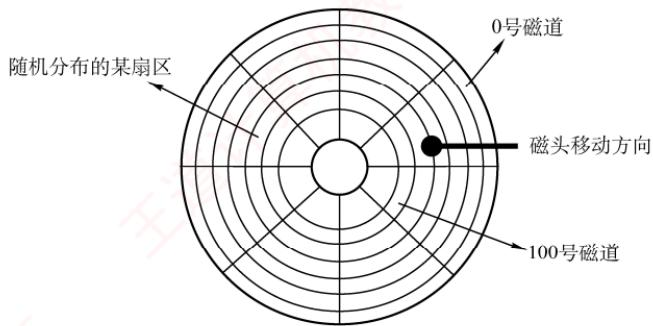

1）请说明在上述条件下如何进行磁盘块空闲状态的管理。

2）某单面磁盘的旋转速度为6000转/分，每个磁道有100个扇区，相邻磁道间的平均移动时间为1ms。若在某时刻，磁头位于100号磁道处，并沿着磁道号增大的方向移动（见上图），磁道号请求队列为50,90,30,120，对请求队列中的每个磁道需读取1个随机分布的扇区，则读完这4个扇区点共需要多少时间？要求给出计算过程。

3）若将磁盘替换为随机访问的Flash半导体存储器（如U盘、固态硬盘等），是否有比C-SCAN更高效的磁盘调度策略？若有，给出磁盘调度策略的名称并说明理由；若无，说明理由。

07.【2019统考真题】某计算机系统中的磁盘有300个柱面，每个柱面有10个磁道，每个磁道有200个扇区，扇区大小为512B。文件系统的每簇包含2个扇区。请回答下列问题：1）磁盘的容量是多少？

2）设磁头在85号柱面上，此时有4个磁盘访问请求，簇号分别为100260，60005，101660和110560。采用最短寻道时间优先SSTF算法，系统访问簇的先后次序是什么？

3）簇号100530在磁盘上的物理地址是什么？将簇号转换成磁盘物理地址的过程由I/0系统的什么程序完成？，

08.【2021统考真题】某计算机用硬盘作为启动盘，硬盘的第一个扇区存放主引导记录，其中包含磁盘引导程序和分区表。磁盘引导程序用于选择引导哪个分区的操作系统，分区表记录硬盘上各分区的位置等描述信息。硬盘被划分成若干分区，每个分区的第一个扇区存放分区引导程序，用于引导该分区中的操作系统。系统采用多阶段引导方式，除了执行磁盘引导程序和分区引导程序，还需要执行ROM中的引导程序。回答下列问题：

1）系统启动过程中操作系统的初始化程序、分区引导程序、ROM中的引导程序、磁盘引导程序的执行顺序是什么？

2）将硬盘制作为启动盘时，需要完成操作系统的安装、磁盘的物理格式化、逻辑格式化、对磁盘进行分区，执行这4个操作的正确顺序是什么？

3）磁盘扇区的划分和文件系统根目录的建立分别是在第2）问的哪个操作中完成的？

## 5.3.7 答案与解析

## 一、单项选择题

## 01. B

文件系统不一定依赖于磁盘，也可存在于其他存储介质上，如光盘、闪存、网络等。文件系统可以只占用磁盘的一部分空间，而不是整个磁盘；一个磁盘上可以有多个文件系统，也可以没有文件系统的空间。文件系统和磁盘之间的联系密切，文件系统需要用磁盘来存储数据，而磁盘需要用文件系统来组织数据。因此，选项B正确，选项A、C和D错误。

## 02. D

磁盘是可共享设备（分时共享），是指某段时间内可以有多个用户进行访问。但某一时刻只能有一个作业可以访问。

## 03. B

顺序访问按从前到后的顺序对数据进行读/写操作，如磁带。直接访问或随机访问，则可以按任意的次序对数据进行读/写操作，如光盘、磁盘、U盘等。

## 04. A 04. A

磁盘调度是对访问磁道次序的调度，若没有合适的磁盘调度，则寻道时间会大大增加。05. D  
SCAN、FCFS、C-LOOK算法都可以是磁盘调度算法，CLOCK算法是页面置换算法。06. A  
文件以块为单位存放于磁盘中，文件的读/写也以块为单位。 首计算机07. D

对磁盘读/写时间影响最大的是寻道时间，寻道过程为机械运动，时间较长，影响较大。08. D X

操作系统的引导程序位于磁盘活动分区的引导扇区，因此必然产生在分区之后。分区是将磁盘分为由一个或多个柱面组成的分区（C盘、D盘等形式），每个分区的起始扇区和大小都记录在磁盘主引导记录的分区表中。而对于高级格式化（创建文件系统），操作系统将初始的文件系统数据结构存储到磁盘上，文件系统在磁盘上布局介绍详见第4章。

## 09. A

低级格式化是磁盘制造商在生产磁盘时进行的操作，它负责创建磁盘的物理结构，包括磁道、扇区的划分，并将一些控制信息（如扇区号、磁道号等）写入每个扇区的头部和尾部。这些信息在低级格式化阶段被写入磁盘，因此磁盘控制器能够理解如何访问各个扇区。

## 10. D

磁盘调度算法是为了减少寻道时间。扇区数据的处理时间主要影响传输时间。选项B、C均与旋转延迟有关，文件的物理结构与磁盘空间的分配方式相对应，包括连续分配、链接分配和索引分配。连续分配的磁盘中，文件的物理地址连续；而链接分配方式的磁盘中，文件的物理地址不连续，因此与旋转延迟都有关。

## 11. A

磁盘存取时间由寻道时间、旋转延迟时间、传输时间决定，寻道时间占的比例最大，磁盘的调度算法主要是优化寻道时间，而旋转延迟时间和传输时间难以从操作系统层面优化。

12. C  
选项A和D可是进程调度算法。选项B可是页面淘汰算法。只有选项C是磁盘调度算法。13. B

最短寻道时间优先算法中，当新的距离磁头比较近的磁盘访问请求不断被满足时，可能导致较远的磁盘访问请求被无限延迟，从而导致“饥饿”现象。

## 14. B

先来先服务算法根据磁盘请求的时间先后进行调度，因此可能随时改变磁头方向。而电梯调度、循环扫描算法均限制磁头的移动方向。 V

## 15. B

文件A采用连续存放方式，按照磁盘的地址结构（柱面号，磁头号，扇区号），文件A的下

一块应存放在同一个柱面的同一个磁道的下一个扇区中，7号扇区已是本磁道的最后一个扇区，因此应存放在同一个柱面的下一个磁头的0号扇面，即5号柱面、2号磁头下的0号扇区。由此可见，文件A的数据是连续存储在磁盘的一组或相邻几组同心圆中的。

## 16. B

每个柱面上有8个磁道（表示有8个磁头），每个磁道有8个扇区，因此每个柱面有 $8   \times   8 = 6 4$ 个扇区。由题意可知，柱面号、盘面号、扇区号和逻辑记录编号都是从0开始的，因此78号柱面的6号磁道的6号扇区存放的是文件的第 $78 \times 64 + 6 \times 8 + 6 = 5046$ 个逻辑记录。

## 17. A

将每道的所有扇区组成一个簇，意味着可以将一个磁道的所有存储空间组织成一块数据组，这样有利于提高存储速度。读/写磁盘时，磁头首先找到磁道，称为寻道，然后才可以将信息从磁道里读出或写入。读/写完一个磁道后，磁头会继续寻找下一个磁道，完成剩余的工作，所以在随机寻道的情况下，读/写一个磁道的时间要包括寻道时间和读/写磁道时间，即T+r秒。因为总的数据量是b字节，它要占用的磁道数为b/N个，所以总平均读/写时间为(r+T)b/N秒。

## 18. C

访问每条磁道的时间为 $60/3000\mathrm{s}=0.02\mathrm{s}=20\mathrm{ms}$ ，即磁盘旋转一圈的时间为20ms，每个盘面10个扇区，因此读取一个扇区的时间为20ms/10=2ms。

## 19. C

磁盘的转速为7200转/分=120转/秒，转一圈经过160个扇区，每个扇区为512B，所以数据传输率= 120×160×512/1024KB/s= 9600KB/s。

## 20. D

对于 SSTF算法，寻道序列应为100,90,58,55,39,38,18,150,160,184；移动磁道次数分别为10,32,3,16,1,20,132,10,24，所以磁头移动总次数为248。另外也可以画出草图来解答，从100寻道到18需要82次，然后加上从18到184需要的184-18=166次，共移动166+82=248次。

## 21. C

当磁头位于67号磁道时，各算法的下一访问目标如下：先来先服务算法按请求顺序处理，下一个是35号磁道；最短寻道时间优先算法选择距离最近的77号磁道；循环扫描算法若规定向大磁道号方向移动，则磁头继续向高编号端扫描，下一个是77号磁道；而电梯调度算法若当前向小磁道号方向移动，则在67号磁道之后依次服务55、35，因此下一次到达55号磁道，选项C正确。

## 22. C

采用 SCAN算法时，依次访问的磁道是 788, 845,911, 999, 700,432, 396, 165, 164, 25，磁头移动的距离是(999-734)+(999-25)=1239。采用 SSTF算法时，依次访问的磁道是700,788,845,911,432,396,165,164,25，磁头移动的距离是 $( 7 3 4 - 7 0 0 ) + ( 9 1 1 - 7 0 0 ) + ( 9 1 1 - 2 5 ) = 1 1 3 1$

## 23. C

一个逻辑记录所占的磁带长度为80/400=0.2英寸，因此存储3000条逻辑记录需要的磁带长度为 $(0.2 + 0.4) \times 3000 = 1800$ 英寸，利用率为 $0.2/(0.2+0.4)=33.3\%$

## 24. D

固态硬盘基于闪存技术，没有机械部件，随机读/写不需要机械操作，因此速度明显高于磁盘，选项A和B正确。选项C已在考点讲解中解释过。SSD的缺点是容易磨损，选项D错误。

## 25. C

SSD基于闪存技术，无机械部件，随机读/写性能远优于机械硬盘；而机械硬盘因需寻道，在连续存取上相对占优，故选项A、B错误。动态磨损均衡仅在写入时选择擦写次数少的空块，而静态磨损均衡还会在空闲期间将长期未更新的“冷数据”迁移到高磨损块，使各存储块的擦写次数更均衡，从而延长SSD寿命，选项C正确。选项D错误地认为静态磨损均衡是在“写入时选择存放老数据的块”，实际上该机制是在后台空闲时主动迁移冷数据，而非发生在写入时刻。

## 26. D

磨损均衡机制的目的是延长固态硬盘的寿命，而不是加快固态硬盘读/写速度。

## 27. A

SCAN算法的原理类似于电梯。首先，当磁头从105道向序号增加的方向移动时，便会按照从小到大的顺序服务所有大于105的磁道号（110，170，180，195）；往回移动时又会按照从大到小的顺序进行服务（68,45,35,12），结果如下图所示。

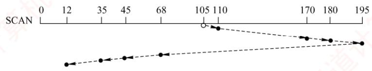

## 28.B

对于选项A，重排I/O请求次序也就是进行I/O调度，使进程之间公平地共享磁盘访问，减少I/O完成所需要的平均等待时间。对于选项C，缓冲区结合预读和滞后写技术对于具有重复性及阵发性的V/O进程改善磁盘I/O性能很有帮助。对于选项D，优化文件物理块的分布可以减少寻道时间与延迟时间，从而提高磁盘性能。在一个磁盘上设置多个分区与改善设备I/Q性能并无多大联系，相反还会带来处理的复杂性，降低利用率。

## 29. C

SCAN算法就是电梯调度算法。顾名思义，若开始时磁头向外移动，就一直要到最外侧，然后返回向内侧移动，就像电梯若往下，则一直要下到底层才会再上升一样。当前磁头位于58号并从外侧向内侧移动，先依次访问130、180和199，然后返回向外侧移动，依次访问42和15，因此磁头移过的磁道数是(199-58)+(199-15)=325。

## 30. B

新磁盘是空白盘，必须分成扇区以便磁盘控制器能进行读/写操作，这个过程称为低级格式化（或物理格式化）。低级格式化为每个扇区使用特别的数据结构，说法Ⅲ错误。为了使用磁盘存储文件，操作系统还需要将自己的数据结构记录在磁盘上。这分为两步。第一步是将磁盘分为由一个或多个柱面组成的分区，每个分区可以作为一个独立的磁盘，说法Ⅰ错误。在分区之后，第二步是逻辑格式化（创建文件系统）。在这一步，操作系统将初始的文件系统数据结构存储到磁盘上。这些数据结构包括空闲和已分配的空间及一个初始为空的目录，说法Ⅱ、IV正确。

## 31. D

说法Ⅱ和IV显然均能提高文件访问速度。对于说法Ⅰ，提前读是指在读当前盘块时，将下一个盘块提前读入缓冲区，以便需要时直接从缓冲区中读取，提高了文件的访问速度。对于说法Ⅲ，延迟写是指先将数据写入缓冲区，并置上“延迟写”标志，以备不久之后访问，当缓冲区需要再次被分配出去时，才将缓冲区数据写入磁盘，减少了访问磁盘的次数，提高了文件的访问速度。

## 32. A

当系统中总是持续存在某个磁道的访问请求时，均持续满足最短寻道时间优先、扫描算法和循环扫描算法的访问条件，会一直服务该访问请求，尽管系统中还存在其他磁道的访问请求，但却得不到响应。而先来先服务按照请求次序进行调度，比较公平。

## 33. C

最短寻道时间优先算法总是选择调度与当前磁头所在磁道距离最近的磁道。可以得出访问序列184,182, 187, 176, 199，从而求出移动距离之和是0 + 2 + 5 + 11 + 23 = 41。

## 34. C

采用C-SCAN算法进行磁盘调度，完成200号磁道的请求后，磁头向磁道号减小的方向移动依次处理160,120,110,0号磁道的请求；然后，磁头向磁道号增大的方向快速移动至399号磁道，在快速移动的过程中不处理任何请求；完成399号磁道的请求后，依次处理300.210号磁道的请求，所以磁头移动的总距离是 $(200 - 0) + (399 - 0) + (399 - 210) = 788.$ 。调度过程如下图所示。 XTA

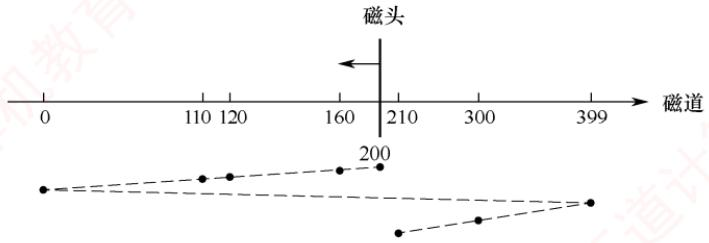

## 35. B

无论是温彻斯特硬盘（机械磁盘）还是固态硬盘，文件系统均以固定大小的逻辑盘块为单位组织和管理存储空间，因此确定盘块大小是两者都必须提供的基础功能。相比之下，“划分扇区”是机械硬盘固件或硬件层面的操作，文件系统无须参与，固态硬盘无传统扇区结构；“降低寻道时间”仅针对存在磁头移动的机械硬盘，固态硬盘无机械部件，无寻道问题；“均衡磨损”则是固态硬盘为延长闪存寿命所特有的机制，机械硬盘无须考虑。

## 二、综合应用题

## 01. 【解答】

该磁盘有8个盘面，一个柱面大小为8×8=64个扇区，即64条逻辑记录。所有磁头是固定在一起的，因此在存放数据时，先存满扇区，后存满磁道，再存满柱面。

编号为3468的逻辑记录对应的柱面号为 $3 4 6 8 / 6 4 = 5 4$ ; 对应的磁道号为(3468 MOD 64) DIV 8 = 1;对应的扇区号为(3468 MOD 64) MOD 8 = 4。

## 02. 【解答】

磁盘转速为27毫秒/转，每个磁道存放9条记录，因此读出1条记录的时间为27/9=3ms。

1）读出并处理记录A需要5ms，此时磁头已转到记录B的中间，因此为了读出记录B，必须再转接近一圈（从记录B的中间到记录B）。后续8条记录的读取及处理与此类似，但最后一条记录的读取与处理只需5ms。于是，处理9条记录的总时间为

$$
8 \times (27 + 3) + (3 + 2) = 245  ms
$$

【另解】注意，从开始读A到最后读完I一共转了9圈，即处理完前8条记录+读第9条记录的时间一共是27×9=243ms，加上最后的 2ms处理时间，共 243+2= 245ms。

2）由于每读出一条记录后需要2ms的处理时间，当读出并处理记录A时，不妨设记录A放在第1个盘块中，读/写头已移到第2个盘块的中间，为了能顺序读到记录B，应将它放到第3个盘块中，即应将记录按下表顺序存放：

<table><tr><td rowspan=1 colspan=1>盘块</td><td rowspan=1 colspan=1>1</td><td rowspan=1 colspan=1>2</td><td rowspan=1 colspan=1>3</td><td rowspan=1 colspan=1>4</td><td rowspan=1 colspan=1>5</td><td rowspan=1 colspan=1>6</td><td rowspan=1 colspan=1>7</td><td rowspan=1 colspan=1>8</td><td rowspan=1 colspan=1>9</td></tr><tr><td rowspan=1 colspan=1>记录</td><td rowspan=1 colspan=1>A</td><td rowspan=1 colspan=1>F</td><td rowspan=1 colspan=1>B</td><td rowspan=1 colspan=1>G</td><td rowspan=1 colspan=1>C</td><td rowspan=1 colspan=1>H</td><td rowspan=1 colspan=1>D</td><td rowspan=1 colspan=1>I</td><td rowspan=1 colspan=1>E</td></tr></table>

这样，处理一条记录并将磁头移到下一条记录的时间是

$$
3 \left(  读出  \right) + 2 \left(  处理  \right) + 1 \left(  等待  \right) = 6 ms
$$

所以，处理9条记录的总时间为

$$
6 \times 8 + (3 + 2) = 53 \mathrm{ms}
$$

## 03. 【解答】

1）FCFS：移动磁道的顺序为345,123,874,692,475,105,376。磁头臂必须移过的磁道的数 目为 $222+751+182+217+370+271=2013$

2）SSTF：移动磁道的顺序为345,376,475,692,874,123,105。磁头臂必须移过的磁道的数 目为 $31+99+217+182+751+18=1298$

注意，磁头臂必须移过的磁道的数目之和的计算没有必要像上面一样对31,99,217.182，751，18求和，仔细的读者会发现：从345到874是一路递增的，接着从874到105是一路递减的。所以仅需计算(874-345)+(874-105)=1298。这种方法是不是要比上面得出6个数后再计算它们的和要快捷一些？若之前未注意到此法，相信聪明的读者会马上回顾刚做完的1），并会仔细观察以下几问的“规律”，进而总结出自己的思路。

3）SCAN：移动磁道的顺序为345,123,105,0,376,475,692,874。磁头臂必须移过的磁道的 数目为 $222+18+105+376+99+217+182=1219$

4）LO0K：移动磁道的顺序为345,123,105,376,475,692,874。磁头臂必须移过的磁道的数 目为 $222+18+271+99+217+182=1009$

5）C-SCAN：移动磁道的顺序为345,123,105,0,999,874,692,475,376。磁头臂必须移过的 磁道的数目为 $222+18+105+999+125+182+217+99=1967$

6）C-L00K：移动磁道的顺序为345,123,105,874,692,475,376。磁头臂必须移过的磁道的 数目为 $222+18+769+182+217+99=1507.$

## 04. 【解答】

磁盘整理前，逻辑上相邻数据块的平均距离为13磁道，读一块数据需要的时间为

$$
13 \times 6 + 100 + 25 = 203  ms
$$

因此，读取一个100块的文件需要的时间为

$$
203 \times 100 = 20300  ms
$$

磁盘整理后，逻辑上相邻数据块的平均距离为2磁道，读一块数据需要的时间为

$$
2 \times 6 + 100 + 25 = 137  ms
$$

因此，读取一个100块的文件需要的时间为

$$
137 \times 100 = 13700  ms
$$

## 05. 【解答】

磁盘逆时针方向旋转按扇区来看即0,3,6,…这个顺序。每个号码连续的扇区正好相隔2个扇区，即数据从控制器传送到内存的时间，所以相当于磁头连续工作。

1）由题中条件可知，旋转速度为3000转/分=50转/秒，即20ms/转。

读一个扇区需要的时间为 $20/8 = 2.5  ms$

读一个扇区并将扇区数据送入内存需要的时间为2.5×3=7.5ms。

所以读出一个磁道上的所有扇区需要的时间为 $20/2+8\times7.5=70 ms =0.07 s$ 0

2）每个磁道的数据量为 $8 \times 512 = 4 \mathrm{KB}$

所以数据传输速率为 $4\mathrm{KB}/0.07\mathrm{s}=4\times1024\mathrm{kB}/(1000\times0.07\mathrm{s})=58.5\mathrm{kB}/\mathrm{s}。$

## 06. 【解答】

1）用位图表示磁盘的空闲状态。每位表示一个磁盘块的空闲状态，共需16384/32=512个

字 $512 \times 4B = 2KB$ ，正好可放在系统提供的内存中。

2）采用C-SCAN算法，访问磁道的顺序和移动的磁道数如下表所示：

<table><tr><td rowspan=1 colspan=1>被访问的下一个磁道号</td><td rowspan=1 colspan=1>移动距离（磁道数）</td></tr><tr><td rowspan=1 colspan=1>120</td><td rowspan=1 colspan=1>20</td></tr><tr><td rowspan=1 colspan=1>30</td><td rowspan=1 colspan=1>90</td></tr><tr><td rowspan=1 colspan=1>50</td><td rowspan=1 colspan=1>20</td></tr><tr><td rowspan=1 colspan=1>90</td><td rowspan=1 colspan=1>40</td></tr></table>

移动的磁道数为 $20+90+20+40=170$ ，因此总的移动磁道时间为170ms。

转速为6000转/分，因此平均旋转延迟为5ms，总的旋转延迟时间=20ms。

转速为6000转/分，因此读取一个磁道上的一个扇区的平均读取时间为0.1ms，扇区的平均读取时间为0.1ms，总的读取扇区的时间为0.4ms。

综上，读取上述磁道上所有扇区所花的总时间为190.4ms。

3）采用先来先服务（FCFS）调度策略更高效。因为Flash半导体存储器的物理结构不需要考虑寻道时间和旋转延迟，可直接按I/O请求的先后顺序服务。

## 07.【解答】

$$
1)  磁盘容量  =  磁盘的柱面数  \times  每个柱面的磁道数  \times  每个磁道的扇区数  \times  每个扇区的大小  \times  每个扇区的大小  \times  每个扇区的大小  \times  每个扇区的大小  \times  每个扇区的大小  \times  每个扇区的大小  \times  每个扇区的大小  \times  每个扇区的大小  \times  每个扇区的大小  \times  每个扇区的大小  \times  每个扇区的大小  \times  每个扇区的大小  \times  每个扇区的大小  \times  每个扇区的大小  \times  每个扇区大小  \times  每个扇区大小  \times  每个扇区大小  \times  每个扇区大小  \times  每个扇区大小  \times  每个扇区大小  \times  每个扇区大小  \times  每个扇区大小  \times  每个扇区大小  \times  每个扇区大小  \times  每个扇区大小  \times  每个扇区大小  \times  每个扇区大小  \times  每个扇区大区大小  \times \times  每个扇区区大区大小 \times \times  每个扇区区区大区大小小 \times \times  每区区区大区大区大区大小区区区区区区区区区区区区区区区区区区区区区区区区区区区区区区区区区区区区区区区区区区区区区区区区区区区区区区区区区区区区区区区区区区区区区区区区区区区区区区区区区区区区区区区区区区区区区区区区区区区区区区区区区区区区区区区区区区区区区区区区区区区区区区区区区区区区区区区区区区区区区区区区区区区区区区区区区区区区区区区区区区区区区区区区区区区区区区区区区区区区区区区区区区区区区区区区区区区区区区区区区区区区区区区区区区区区区区区区区区区区区区区区区区区区区区区区区区区区区区区区区区区区区区区区区区区区区区区�
$$

2）磁头在85号柱面上，对SSTF算法而言，总是访问当前柱面距离最近的地址。注意每个簇包含2个扇区，通过计算得到，85号柱面对应的簇号为85000～85999。通过比较得出，系统最先访问离85000～85999最近的100260，随后访问离100260最近的101660，然后访问110560，最后访问60005。顺序为100260，101660，110560，60005。

3）第100530簇在磁盘上的物理地址由其所在的柱面号、磁头号、扇区号构成。柱面号 = 簇号/每个柱面的簇数」= 100530/(10×200/2)」 = 100。磁头号 = L(簇号%每个柱面的簇数)/每个磁道的簇数」= 530/(200/2)」= 5。扇区号 = 扇区地址%每个磁道的扇区数 = (530×2)%200 = 60。将簇号转换成磁盘物理地址的过程由磁盘驱动程序完成。

## 08. 【解答】

1）执行顺序依次是ROQM中的引导程序、磁盘引导程序、分区引导程序、操作系统的初始化程序。启动系统时，首先运行ROM中的引导代码（bootstrap）。为执行某个分区的操作系统的初始化程序，需要先执行磁盘引导程序以指示引导到哪个分区，然后执行该分区的引导程序，用于引导该分区的操作系统。

2）4个操作的执行顺序依次是磁盘的物理格式化、对磁盘进行分区、逻辑格式化、操作系统  
X 的安装。磁盘只有通过分区和逻辑格式化后才能安装系统和存储信息。物理格式化（也称低级格式化，通常出厂时就已完成）的作用是为每个磁道划分扇区，安排扇区在磁道中的排列顺序，并对已损坏的磁道和扇区做“坏”标记等。随后将磁盘的整体存储空间划分为相互独立的多个分区（如Windows中划分C盘、D盘等），这些分区可以用作多种用途，如安装不同的操作系统和应用程序、存储文件等。然后进行逻辑格式化（也称高级格式化），其作用是对扇区进行逻辑编号，建立逻辑盘的引导记录、文件分配表、文件目录表和数据区等。最后才是操作系统的安装。

3）由上述分析可知，磁盘扇区的划分是在磁盘的物理格式化操作中完成的，文件系统根目录的建立是在逻辑格式化操作中完成的。

## 5.4 本章疑难点

## 1. 如何改进设备分配策略，以提高其灵活性和成功率？

可从以下两个方面对基本的设备分配程序加以改进：

1）增强设备无关性。进程使用逻辑设备名发起I/O请求。系统首先从系统设备表（SDT）中查找该类设备的第一个设备控制表（DCT）；若该设备正忙，则继续查找下一个DCT;仅当所有同类设备均处于忙碌状态时，才将进程挂起，并将其加入该类设备的等待队列；只要存在一个可用设备，系统便进入后续的安全性检查与分配流程。

2）支持多通路I/O结构。为避免I/O瓶颈，现代系统常采用多通路设计。在此结构下，控制器与通道的分配也需逐级尝试：若设备所连接的第一个控制器（或该控制器所连接的第一个通道）正忙，则尝试下一个；仅当所有相关控制器（或通道）均不可用时，分配才宣告失败，进程被挂入相应等待队列；只要有一个可用，即可完成分配。

在具有通道的系统中，设备分配需要依次访问 SDT→DCT→COCT→CHCT。成功分配一个设备须同时满足：设备可用；控制器可用；通道可用。因此，常称“设备分配，要过三关”。

## 2. 用户缓冲区与内核缓冲区的定义及作用分别是什么？

用户缓冲区是指用户进程在读取文件时，通常会预先申请一块内存区域（如一个数组），称为缓冲区（Buffer），用于暂存从文件中读取的数据。每次调用read系统调用时，操作系统会将读取的数据填充到该缓冲区中，随后应用程序便可直接从中获取数据。当其中的数据被处理完毕后，再发起下一次read系统调用以重新填充缓冲区。可见，用户缓冲区的主要作用是减少系统调用的次数，进而降低因频繁在用户态与内核态之间切换所带来的开销。

内核缓冲区则是操作系统在内核空间中维护的缓冲区。当用户进程请求读取磁盘数据时，系统并不会直接访问磁盘，而是先检查内核缓冲区中是否已缓存所需数据：若存在，则将数据从内核缓冲区复制到用户缓冲区：若不存在，内核会发起磁盘/O请求，并将当前进程挂起，转而调度其他进程执行。磁盘数据被读入内核缓冲区后，系统再将数据复制到用户缓冲区，并唤醒该进程。对于写操作，用户进程提交的数据通常不会立即写入磁盘，而是先写入内核缓冲区：当缓冲区中的数据积累到一定量，或满足特定刷新条件时，内核才会将数据批量写入磁盘。可见，内核缓冲区的核心目的是提升磁盘I/O的整体效率，尤其对写操作具有突出的优化效果。

## 参考文献

[1] 汤小丹，梁红兵，哲凤屏，等．计算机操作系统[M]．4版．西安：西安电子科技大学出版社，2014.

[2] 李善平．操作系统学习指导和考试指导[M]. 杭州：浙江大学出版社，2004.

[3] 塔能鲍姆．现代操作系统[M]. 4版．陈向群，马洪兵，译．北京：机械工业出版社，2017.

[4] 西尔伯沙茨，高尔文，加涅．操作系统概念[M]．4版．郑扣根，唐杰，李善平，译．北京：机械工业出版社，2018.

[5] 斯托林斯．操作系统：精髓与设计原理[M].9版．陈向群，陈瑜，等译．北京：电子工业出版社，2020.

[6] 全国考研计算机大纲配套教材专家委员会．全国硕士研究生入学统一考试计算机学科专业基础综合考试大纲解析（2010版）[M].北京：高等教育出版社，2009.

[7] 李春葆．操作系统联考辅导教程（2011版）[M]．北京：清华大学出版社，2010.

[8] 崔巍．2010考研计算机学科专业基础综合辅导讲义[M].北京：原子能出版社，2009.

[9] 翔高教育．计算机学科专业基础综合复习指南[M].上海：复旦大学出版社，2009.

[10] 布莱恩特，奥哈洛伦，等．深入理解计算机系统[M]. 3版.龚奕利，贺莲，译．北京：机械工业出版社，2016. K