<!--
Generated by 数学文档OCR_v3.py 3.0.0
Source: 27王道《数据结构》高清带书签【公众号：研料库，料最全】(1).pdf
MinerU: mineru, version 3.4.5
Do not treat automated OCR as proof of mathematical correctness.
-->

# 27王道《数据结构》高清带书签【公众号：研料库，料最全】(1)

<!-- PDF pages 1-128; chunk 0001_p000001-000128 -->

2027年

# 数据结构考研复习指导

王道论坛 组编

购买王道书，就上

# 王道官方考研书店

# wangdao.taobao.com


電子工業出版社

Publishing House of Electronics Industry

北京·BEIJING

官方开源，高清带书签PDF

最新配套视频请上bilibili.com 搜索“王道”

## 内容简介

本书是计算机专业硕士研究生入学考试“数据结构”课程的复习用书，内容包括绪论，线性表，栈、队列和数组，串，树与二叉树，图，查找，排序等。全书严格按照最新计算机考研大纲数据结构部分的要求，对大纲所涉及的知识点进行集中梳理，力求内容精练、重点突出、深入浅出。本书精选部分名校的历年考研真题，并给出详细的解题思路，力求实现讲练结合、灵活掌握、举一反三的效果。

本书既可作为考生参加计算机专业硕士研究生入学考试的复习用书，又可作为计算机专业学生学习“数据结构”课程的辅导用书。

未经许可，不得以任何方式复制或抄袭本书之部分或全部内容。

版权所有，侵权必究。

## 图书在版编目（CIP）数据

2027年数据结构考研复习指导/王道论坛组编.

北京：电子工业出版社，2026. 1. -- ISBN 978-7-121  
-51791-4

I. TP311.12

中国国家版本馆CIP数据核字第2025EF0296号

责任编辑：谭海平

印 刷：保定市中画美凯印刷有限公司

装订：保定市中画美凯印刷有限公司

出版发行：电子工业出版社

北京市海淀区万寿路173信箱 邮编：100036

开 本：787×1092 1/16 印张：25.25 字数：711.04 千字

版次：2026年1月第1版

印次：2026年1月第1次印刷

定价：78.00元

凡所购买电子工业出版社图书有缺损问题，请向购买书店调换。若书店售缺，请与本社发行部联系，联系及邮购电话：（010）88254888，88258888。

质量投诉请发邮件至zlts@phei.com.cn，盗版侵权举报请发邮件至 dbqq@phei.com.cn。

本书咨询联系方式：（010）88254552，tan02@phei.com.cn。

购买王道书请上王道考研书店：wangdao.taobao.com

  
iliii 首页 备剧 直播 游戏中心 会员购 漫画 赛事  下载客户端  
王道计算机教育

## B站搜索“王道计算机教育”


  
王道计算机考研操作系统1461.1万 15.7万

  
王道计算机考研计算机网络1073.7万 12万

  
王道计算机考研数据结构1801.6万 26.1万

直播预约：26考研408如何做三轮规.. 预约12-0615:00且播55人已预

直播预约：鸿蒙会给程序员带来哪些...预约12-10 19:00直播


“王道在线”

进入菜单“兑换中心”兑换配套课件等资源


王道计算机考研题库


开通题库小程序VIP权限

遇到问题请加微信


盗版书无兑换码请勿购买配套视频不包含答疑服务


# 本书配套资源介绍

## 【关于配套视频的说明】

1. 配套的考点精讲视频与习题视频均为最新版本，已免费发布在B站，无须兑换，内容持续更新，可放心使用！

2.【王道计算机刷题库】小程序面向所有读者免费开放，它将纸质习题数字化，可智能刷题，靶向提分，高效备考！

3. 兑换码用于获取课件资源，以及开通小程序VIP权限。

4. 兑换码位于封面右下角，区分大小写，不含空格，且一经兑换即失效。

购买王道书请上王道考研书店：wangdao.taobao.com

## 前 言

“王道考研系列”的定位是考试类辅导书。本书主要分为考点讲解部分和习题讲解部分，前者的篇幅约占35%，后者的篇幅约占65%。考点讲解部分按照统考大纲梳理考点，主要参考了一些权威教材，如严蔚敏老师的《数据结构》、李春葆老师的《数据结构教程》等，并且融合了作者的总结与理解，在此对这些老师表示致敬和感谢！习题讲解部分主要精选自多所名校的自命题考研真题、教材配套习题册、同类辅导书，或者改编自统考真题。

由于篇幅限制，考点讲解部分较为精炼，对学科基础较为薄弱的读者来说，可能难以理解。为此，我们提供了配套的考点精讲视频和习题讲解视频。考点精讲视频有形象丰富的动画演示、由浅入深的考点分析，相信能打通读者复习过程中的“任督二脉”。往年有不少读者反馈视频和王道书不太匹配，这是因为王道书的出版时间远早于课程制作时间，而咸鱼老师录制课程时会参考众多的优秀教材（不限于王道书）；后面，我们将逐步解决这个问题。此外，早期的习题讲解视频主要由高分学长录制，因为质量参差不齐，现已全部下架。目前，仅提供由王道老师重新录制的最新版本，该版本已覆盖全部选择题；综合题的重新录制工作会适时启动并及时发布。

考点精讲视频和习题讲解视频免费发布在B站账号“王道计算机教育”上。

“王道考研系列”是计算机考研学子口碑相传的辅导书，自2011版首次推出以来，就始终占据同类书销量的榜首位置，这就是口碑的力量。有这么多学长的成功经验，相信读者只要合理地利用本套书，并采用科学的复习方法，就一定能收获属于自己的那份回报。

针对考研学子的需求，我们还开发了除本书配套视频外的一系列计算机考研课程，包括C语言督学课、408基础课、408暑期强化课、408冲刺课、机试课、模拟面试、调剂，以及复习规划、伴学督学、一对一指导、全程实时答疑和择校服务等。王道的课程同样是市面上领先的计算机考研课程，对学科基础较为薄弱的读者来说，相信这些课程和服务定能助你一臂之力。

“不包就业、不包推荐，培养有态度的码农。”王道训练营是王道团队打造的线下魔鬼式编程训练营。打好编程功底，增强项目经验，彻底转行入行，不再迷茫，期待有梦想的你！

参与本书编写的人员主要有赵霖、罗乐、徐秀瑛、赵淑芬、范佳玉、严汉、喻云珍、余勇、赵淑芳、刘政学、罗庆学、赵晓宇等。予人玫瑰，手有余香，王道论坛伴你一路同行！

对本书的任何建议，或发现有错误，欢迎扫码与我们联系，以便及时优化或纠错。


风华漫舞

## 致读者

关于王道单科辅导书使用方法的道友建议

我是“二战考生”，2012年第一次考研成绩为333分（专业代码408，成绩为81分），痛定思痛后决心再战。潜心复习了半年后终于以392分（专业代码408，成绩为124分）考入上海交通大学计算机科学与技术专业，这半年里我的专业课成绩提高了43分，成了提分主力。从未达到录取线到考出比较满意的成绩，从蒙头乱撞到有了自己明确的复习思路，我想这也是风华哥从诸多高分选手中选择我给大家介绍经验的一个原因吧。

整个专业课的复习是围绕王道辅导书展开的，从一遍、两遍、三遍看单科辅导书的积累提升，到做8套模拟题时的强化巩固，再到看思路分析时的醍醐灌顶。王道辅导书能两次押中算法原题固然有运气成分，但这也从侧面说明编者的编写思路和选题方向与真题很接近。

下面说一说我的具体复习过程。

每天划给专业课的时间是3～4小时。第一遍仔细看课本，看完一章做一章单科辅导书上的习题（红笔标注错题），这一遍共持续2个月。第二遍主攻单科辅导书（红笔标注重难点），辅看课本。第二遍看单科辅导书和课本的速度快了很多，但感觉收获更多，常有温故知新的感觉，理解更深刻。（风华注：建议这里再速看第三遍，特别针对错题和重难点。模拟题做完后再跳看第四遍。) X

以上是打基础阶段，注意：我仔细精读了两遍单科辅导书和课本，以便尽量弄懂每个知识点和习题。大概11月上旬开始做模拟题和思路分析，其间遇到不熟悉的地方不断回头查阅单科辅导书和课本。8套模拟题的考点覆盖得很全面，所以大家做题时如果忘记了某个知识点，千万不要慌张，赶紧回去看这个知识点，最后的模拟就是查漏补缺。模拟题一定要严格按考试时间（3小时）去做，注意应试技巧，做完试题后再回头研究错题。算法题的最优解法不太好想，如果实在没思路，建议直接“暴力”解决，结果正确也能有10分，总比苦拼出15分来而将后面比较好拿分的题耽误了好（这是我第一次考研的切身教训）。最后剩了几天看标注的错题，第三遍跳看单科辅导书，考前一夜浏览完网络，踏实地睡着了…… -X字

考完专业课，走出考场终于长舒一口气，考试情况也心中有数。回想这半年的复习，耐住了寂寞和诱惑，雨雪风霜从未间断地跑去自习，考研这人生一站终归没有辜负我的良苦用心。佛教徒说世间万物生来平等，都要落入春华秋实的代谢中去：辩证唯物主义认为事物作为过程存在，凡是存在的终归要结束。你不去为活得多姿多彩而拼搏，真到了和青春说再见时，你是否会可惜虚度了青春？风华哥说过，我们都是有梦想的青年，我们正在逆袭，你呢？

感谢风华哥的信任，给我这个机会为大家分享专业课复习经验，作为一个铁杆道友在王道受益匪浅，也借此机会回报王道论坛。祝大家金榜题名！

ccg1990@SJTU

## 王道训练营

王道是道友考研路上值得信赖的伙伴。十多年来，我们陪伴了数百万计算机考研学子，从考研图书，到辅导课程、编程训练，始终助力大家提升真实能力。

我们都清楚，计算机是个靠实力说话的专业。王道团队中的许多人，也曾和你一样：本科迷茫、基础薄弱，把考研当作改变命运的出路。但后来明白学历只是入场券。同样是名校硕士，有人早就拿下了心仪的Offer，也有人毕业即失业，再次陷入焦虑。

如今，虽然AI让编写代码变得简单了，但却抬高了能力门槛：会写语法已远远不够，系统设计与工程落地才是核心竞争力。如果你只会调API，但无法思考架构、解决实际问题，那么读研可能只是把竞争往后推迟了几年。我们真心希望，王道能帮你少走弯路。我们教的不只是“怎么用AI”，更有“怎么用好AI”—成为能主导项目、把控技术方向的人。

考研结束后的空档期，是你补编程、练实战的黄金窗口。趁生活尚未被新任务填满，抓紧补齐本科阶段落下的核心能力，别等到入学或入职才惊觉差距。参加王道训练营，说到底，就是对自己的一次认真投资，而投资自己永远最值得。 XTA

## 王道训练营简介

## 1. 面向就业

适合希望转行但编程基础薄弱的你。

考研不是人生的唯一出路。无论结果如何，这段拼搏都值得铭记，但不必让它成为遗憾的终点。不少在考研路上暂时受挫的道友，在王道找到了技术成长的新起点。我们始终相信：肯努力、肯坚持的人，终会走出属于自己的路。

在高度竞争的技术领域，你当下的编程能力决定了你能拿到什么Offer；而你的学习态度与潜力，才决定你能走多远。再不行动，机会只会悄然溜走。 XTA

王道训练营，为有梦想、敢奋斗的你铺就通往高质量就业的坚实通道。

## 2. 面向硕士

适合刚上岸的准硕士，希望赢在研一起跑线。

考上研究生是重要转折，但硕士学历早已不是“保险箱”。考研高分不等于高薪Offer，同是名校硕士，有人手握字节跳动、腾讯等大厂的Offer，有人却“屡面屡败”——差距，往往在入学前就已拉开。

王道训练营相当于“硕士先修班”：开学前啃下企业级代码，带着完整项目进组。当同门还在熟悉环境，你已用“大模型+微服务”跑通实验室课题；导师自然更愿意把核心项目、论文一作等机会优先给你。抓住这个隐形的转折点，三年后你的简历上不止有学历，更有扎实的工程能力、可落地的项目和发表的文章—高薪Offer，水到渠成。

## 3. 报名要求

• 具有本科学历，愿以“高三式”的专注全力投入。

· 须认真完成开课前的作业不看基础，只看态度，合格方可入营，宁缺毋滥。

作业是最重要的筛选标准。我们从不看轻跨专业或双非背景的你—坚定转行者往往更

拼、更踏实。学校和专业是过去的标签，能力靠持续努力重塑。一段高强度训练，完全可能让你逆袭，这已被无数的往期学员用结果证明。 KK

## 4. 学习成效

我们以“动手编程+实战项目”为核心，帮你补齐当下的能力短板，指明后续的学习方向。你收获的不只是方法，更是工程师的思维方式一真正推开职场大门。

自2020年起，王道坚持公开每期真实就业数据，承诺100%真实！学员从零起步，成长为能解决问题的开发者。部分学员成功入职字节跳动、腾讯、阿里、拼多多、京东、华为、百度、小米等互联网大厂；也有不少学员进入东方财富交易组、大疆飞控、比亚迪车规芯片、深信服防火墙引擎、招商银行风控等部门，岗位覆盖后端、算法、嵌入式、金融量化、信息安全等方向。我们不信“神秘高薪”，只信真实结果。 机

## 王道训练营优势

这里聚集的都是道友彼此信任，乐于分享，氛围纯粹而温暖。经历过考研的你，深知转行路上的孤独与压力，因此更容易成为并肩作战的战友：互相答疑、一起debug、共同成长。在技术转型的路上，这样的圈子是最宝贵的资源。正如一位学员所说：“来了你就发现，这里无关学历、背景或过往，只关乎一件事——对自己认真，对自己负责。”

我们的授课老师平均拥有8年以上的开发与教学经验，编程功底扎实，教学经验丰富。上课时，授课老师不会照本宣科地念PPT，而会展示真正上线运行过的代码，分享实际工作中遇到的“坑”、提升系统性能的方法，以及处理突发线上问题的经验。用真实的实战经验引导大家，以严谨的技术态度陪伴每位学员一既是对道友信任的回应，又是我们坚守的责任。

## 王道训练营课程

王道训练营目前开设5种班型：

复试冲刺/春招（Python/LinuxC/Java/C++）项目班（40～45天，初试结束后开班）

●AI应用开发（Java）方向（四个半月，武汉校区，掌握AI应用开发，抢占技术高地）

微服务开发C++方向（四个半月，武汉校区，深入后端架构，进入核心开发岗）

● 嵌入式开发C++方向（四个半月，武汉校区，紧跟硬科技趋势，切入芯片/物联网）

● Python 大模型方向（三个半月，直播授课或深圳校区，紧跟前沿算法，AI算法工程师）

项目班的作用是利用初试后的时间和寒假期间，快速提升编程能力和项目经验，为复试和春招面试加分。其余4种班型既适合想就业的你，又适合已上岸想提升能力或计划继续考研的你。

想了解课程、获取就业数据或就业咨询吗？扫码添加王道老师的微信，一对一为你解答。


## 目 录

第1章 绪论  
1.1 数据结构的基本概念  
1.1.1 基本概念和术语  
1.1.2 数据结构三要素  
1.1.3 本节试题精选  
1.1.4 答案与解析 …  
1.2 算法和算法评价.  
1.2.1 算法的基本概念  
1.2.2 算法效率的度量  
1.2.3 本节试题精选  
1.2.4 答案与解析  
归纳总结 11  
思维拓展 ·12  
第2章 线性表 13  
2.1 线性表的定义和基本操作 ·13  
2.1.1 线性表的定义 … …13  
2.1.2 线性表的基本操作· 14  
2.1.3 本节试题精选 14  
2.1.4 答案与解析 14  
2.2 线性表的顺序表示 …15  
2.2.1 顺序表的定义 … …15  
2.2.2 顺序表上基本操作的实现· 16  
2.2.3 本节试题精选 18  
2.2.4 答案与解析 21  
2.3 线性表的链式表示 30  
2.3.1单链表的定义 31  
2.3.2 单链表上基本操作的实现· 31  
2.3.3 双链表 36  
2.3.4 循环链表 …37  
2.3.5 静态链表 ·38  
2.3.6 顺序表和链表的比较 38  
2.3.7 本节试题精选 39  
2.3.8 答案与解析 ·45  
归纳总结 ·62  
思维拓展 ·62  
第3章 栈、队列和数组 63  
3.1 栈… 63  
3.1.1 栈的基本概念 63  
3.1.2 栈的顺序存储结构 64  
3.1.3 栈的链式存储结构 66  
3.1.4 本节试题精选 67  
3.1.5 答案与解析 69  
3.2 队列… 76  
3.2.1 队列的基本概念 76  
3.2.2 队列的顺序存储结构 76  
3.2.3 队列的链式存储结构 79  
3.2.4 双端队列· 80  
3.2.5 本节试题精选 .82  
3.2.6 答案与解析· 84  
3.3 栈和队列的应用 ·90  
3.3.1 栈在括号匹配中的应用 90  
3.3.2栈在表达式求值中的应用 ·90  
3.3.3 栈在递归中的应用 92  
3.3.4 队列在层次遍历中的应用 93  
3.3.5 队列在计算机系统中的应用 94  
3.3.6 本节试题精选 ·94  
3.3.7 答案与解析 ·96  
3.4 数组和特殊矩阵… 100  
3.4.1 数组的定义 ·100  
3.4.2 数组的存储结构…… 101  
3.4.3 特殊矩阵的压缩存储… 101  
3.4.4 稀疏矩阵… 103  
3.4.5 本节试题精选 ·104  
3.4.6 答案与解析 ·105  
归纳总结· ·108  
思维拓展 ·108  
第4章 串… 109  
\*4.1 串的定义和实现 109  
4.1.1 串的定义· ·109  
4.1.2 串的基本操作 110  
4.1.3 串的存储结构… ·110  
4.2 串的模式匹配…… 111  
4.2.1 简单的模式匹配算法… 111  
4.2.2 串的模式匹配算法——KMP 算法 112  
4.2.3 KMP 算法的进一步优化… ·117  
4.2.4 本节试题精选 118  
4.2.5 答案与解析…… ·119  
归纳总结… 123  
思维拓展…… …123  
第5章 树与二叉树 ·124  
5.1 树的基本概念 ·124  
5.1.1 树的定义… ·124  
5.1.2 基本术语 … 125  
5.1.3 树的性质 …126  
5.1.4 本节试题精选 … 126  
5.1.5 答案与解析 ·127  
5.2 二叉树的概念 ·129  
5.2.1 二叉树的定义及其主要特性… …129  
5.2.2 二叉树的存储结构 ·131  
5.2.3 本节试题精选… … 133  
5.2.4 答案与解析 … 135  
5.3 二叉树的遍历和线索二叉树· ·140  
5.3.1 二叉树的遍历 …… 140  
5.3.2 线索二叉树… ……143  
5.3.3本节试题精选 ·146  
5.3.4 答案与解析… …152  
5.4树、森林· ·168  
5.4.1 树的存储结构 ·168  
5.4.2 树、森林与二叉树的转换 ·170  
5.4.3 树和森林的遍历 171  
5.4.4 本节试题精选 …172  
5.4.5 答案与解析 ·175  
5.5 树与二叉树的应用· … 180  
5.5.1 哈夫曼树和哈夫曼编码… ·180  
5.5.2 并查集 183  
5.5.3 本节试题精选 .185  
5.5.4 答案与解析 … …187  
归纳总结… 192  
思维拓展… … 193  
6章图 ·194  
6.1 图的基本概念 ……194  
6.1.1 图的定义 … 194  
6.1.2 本节试题精选 …197  
6.1.3 答案与解析 …… ……199  
6.2 图的存储及基本操作· ·201  
6.2.1 邻接矩阵法 ·201  
6.2.2 邻接表法…… ·203  
6.2.3 十字链表 …… ·204  
6.2.4 邻接多重表 …… ·205  
6.2.5 图的基本操作 ·206  
6.2.6 本节试题精选 ··206  
6.2.7 答案与解析 …… …210  
6.3 图的遍历… · 214  
6.3.1 广度优先搜索 ·214  
6.3.2 深度优先搜索 ·217  
6.3.3 图的遍历与图的连通性· ·218  
6.3.4 本节试题精选 ·218  
6.3.5 答案与解析 …221  
6.4 图的应用 …… 226  
6.4.1 最小生成树… 226  
6.4.2 最短路径… ·228  
6.4.3 有向无环图描述表达式 ·232  
6.4.4 拓扑排序 ·232  
6.4.5 关键路径 ·234  
6.4.6 本节试题精选 ·237  
6.4.7 答案与解析 246  
归纳总结· ·262  
思维拓展· ·…263  
第7章 查找 264  
7.1 查找的基本概念 …264  
7.2 顺序查找和折半查找 …265  
7.2.1 顺序查找· …265  
7.2.2 折半查找… …267  
7.2.3 分块查找… …268  
7.2.4 本节试题精选… …269  
7.2.5 答案与解析… 272  
7.3 树形查找· ·278  
7.3.1 二叉排序树（BST） ·278  
7.3.2 平衡二叉树 ·282  
7.3.3 红黑树· ·286  
7.3.4 本节试题精选 291  
7.3.5 答案与解析 295  
7.4 B 树和 B+树· ·304  
7.4.1 B 树及其基本操作 ·305  
7.4.2 B+树的基本概念 308  
7.4.3 本节试题精选 ·309  
7.4.4 答案与解析 ·311  
7.5 散列（Hash）表… ·…317  
7.5.1 散列表的基本概念 317  
7.5.2 散列函数的构造方法 318  
7.5.3 处理冲突的方法 318  
7.5.4 散列查找及性能分析的应用…… 320  
7.5.5 本节试题精选 321  
7.5.6 答案与解析… 324  
归纳总结· ·330  
思维拓展· ·330  
第8章 排序 331  
8.1 排序的基本概念 331  
8.1.1 排序的定义 ·331  
8.1.2 本节试题精选 ·332  
8.1.3 答案与解析… 332  
8.2 插入排序 333  
8.2.1 直接插入排序 333  
8.2.2 折半插入排序 334  
8.2.3 希尔排序 335  
8.2.4 本节试题精选 336  
8.2.5 答案与解析 338  
8.3 交换排序 340  
8.3.1 冒泡排序 340  
8.3.2 快速排序 341  
8.3.3 本节试题精选 344  
8.3.4 答案与解析 346  
8.4 选择排序 351  
8.4.1简单选择排序 351  
8.4.2 堆排序 351  
8.4.3 本节试题精选 354  
8.4.4 答案与解析 357  
8.5 归并排序、基数排序和计数排序 363  
8.5.1 归并排序 363  
8.5.2 基数排序 365  
\*8.5.3 计数排序 366  
8.5.4 本节试题精选 367  
8.5.5 答案与解析 370  
8.6 各种内部排序算法的比较及应用 373  
8.6.1内部排序算法的比较 373  
8.6.2 内部排序算法的应用 374  
8.6.3 本节试题精选 374  
8.6.4 答案与解析 377  
8.7 外部排序… 380  
8.7.1 外部排序的基本概念 380  
8.7.2 外部排序的方法· 381  
8.7.3 多路平衡归并与败者树. 382  
8.7.4 置换-选择排序（生成初始归并段） 383  
8.7.5 最佳归并树 384  
8.7.6 本节试题精选 385  
8.7.7 答案与解析 386  
归纳总结 390  
思维拓展 391  
考文献 392

算法的时间复杂度和空间复杂度

【知识框架】

视频讲解

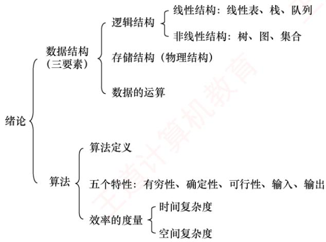

## 【复习提示】

本章概述数据结构，帮助读者整体认识数据结构，重点在于掌握算法时间复杂度和空间复杂度的分析方法。在统考真题中，无论是算法设计题还是选择题，通常都会要求分析算法的时间复杂度（有时也包括空间复杂度），因此要熟练掌握相关内容。

## 1.1 数据结构的基本概念

## 1.1.1 基本概念和术语

## 1. 数据

数据是信息的载体，是描述客观事物属性的数、字符，以及所有能输入到计算机中并被计算机程序识别和处理的符号的集合。数据是计算机程序加工的原料。

## 2. 数据元素

数据元素是数据的基本单位，通常作为一个整体进行考虑和处理。一个数据元素可由若于数据项组成，而数据项是构成数据元素的不可分割的最小单位。例如，一条学生记录就是一个数据元素，它由学号、姓名、性别等数据项组成。

## 3. 数据对象

数据对象是具有相同性质的数据元素的集合，是数据的一个子集。例如，整数数据对象可表示为集合 $N = \{ 0 , \pm 1 , \pm 2 , \cdots \}$

## 4. 数据类型

数据类型是一个值的集合以及定义在该集合上的一组操作的总称。

1）原子类型：其值不可再分的数据类型。

2）结构类型：其值可进一步分解为若干成分（分量）的数据类型。

3）抽象数据类型（ADT)：一个数学模型以及定义在该模型上的一组操作。它通常是对数据的某种抽象，规定了数据的取值范围、结构形式以及可执行的操作集合。

## 5. 数据结构

数据结构是相互之间存在一种或多种特定关系的数据元素的集合。在任何问题中，数据元素都不是孤立存在的，它们之间存在某种关系，这种关系称为结构（Structure)。数据结构包括三方面的内容：逻辑结构、存储结构和数据的运算。

数据的逻辑结构与存储结构密不可分：算法的设计取决于所采用的逻辑结构，而算法的实现则依赖于所选择的存储结构①。

## 1.1.2 数据结构三要素

## 1. 数据的逻辑结构

逻辑结构是指数据元素之间的逻辑关系，即从逻辑角度对数据的描述方式。它与数据在计算机中的存储方式无关，是独立于具体系统的。数据的逻辑结构可分为线性结构和非线性结构。例如，线性表是典型的线性结构；集合、树和图则是典型的非线性结构，如图1.1所示。

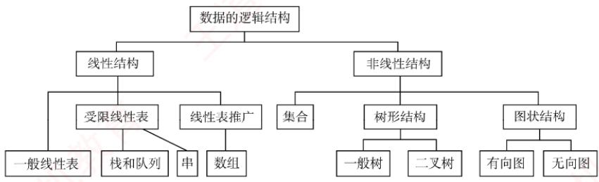  
图1.1 数据的逻辑结构分类

1）集合：结构中的数据元素之间除“同属一个集合”外，别无其他关系见图1.2(a)]。

  
(a)集合

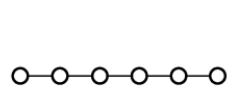  
(b) 线性结构

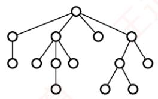  
(c) 树形结构

  
(d) 网状结构  
图1.2 四类基本结构关系示例图

2）线性结构：结构中的数据元素之间仅存在一对一的关系见图1.2(b)]。

3）树形结构：结构中的数据元素之间存在一对多的关系见图1.2(c)]。

4）图状结构（或网状结构）：结构中的数据元素之间存在多对多的关系见图1.2(d)]。

## 2. 数据的存储结构

存储结构是指数据结构在计算机中的表示形式，也称物理结构，包括数据元素的表示及其相互关系的表示。它是逻辑结构在计算机中的具体实现，依赖于所采用的编程语言。常见的存储结构有顺序存储、链式存储、索引存储和散列存储。

1）顺序存储：将逻辑上相邻的数据元素存储在物理位置也相邻的存储单元中，元素间的关系由存储单元的邻接关系体现。优点是可以实现随机存取，每个元素占用最少的存储空间；缺点是要求使用连续的存储空间，可能导致较多的外部碎片。 XTA

2）链式存储：不要求逻辑上相邻的元素在物理位置上也相邻，而是通过指针指示元素的存储地址来表示其逻辑关系。优点是不会出现碎片现象，能充分利用所有存储单元；缺点是每个元素因存储指针而额外占用存储空间，且只能顺序存取。 KN

3）索引存储：在存储元素信息的同时，额外建立索引表。索引表中的每一项称为索引项，通常包含关键字和地址。优点是检索速度快；缺点是需要额外的存储空间用于索引表，且增加或删除数据时需更新索引表，带来额外的时间开销。

4）散列存储：根据元素的关键字直接计算出其存储地址，也称哈希（Hash）存储。优点是检索、插入和删除操作都非常快速；缺点是如果散列函数设计不当，可能会产生冲突（也称哈希冲突)，解决冲突会增加时间和空间成本。

## 3. 数据的运算

数据的运算包括定义与实现两个方面：定义针对逻辑结构，说明运算的功能；实现则基于存储结构，描述具体的操作步骤。

## 1.1.3 本节试题精选

## 一、单项选择题

01.一个完整的数据结构通常应包含以下哪些要素（）？A. 数据元素及其存储方式B. 数据的逻辑结构和物理结构C. 数据的逻辑结构、存储结构以及在其上定义的基本操作D. 数据对象和数据元素之间的关系

02. 下列四种数据结构中，（）是非线性数据结构。A. 树 B. 字符串C. 队列 D. 栈

03. 下列选项中，属于逻辑结构的是（）。A. 顺序表 B. 哈希表 C. 有序表 D. 单链表

04.下列关于数据结构的说法中，正确的是（）。A. 数据的逻辑结构独立于其存储结构B. 数据的存储结构独立于其逻辑结构C. 数据的逻辑结构唯一决定其存储结构D. 数据结构仅由其逻辑结构和存储结构决定

05.在存储数据时，通常不仅要存储各数据元素的值，还要存储（）。A. 数据的操作方法 B. 数据元素的类型C. 数据元素之间的关系 D. 数据的存取方法

## 二、综合应用题

01. 对于两种不同的数据结构，逻辑结构或物理结构一定不相同吗？

02. 举例说明对相同的逻辑结构，同一种运算在不同存储方式下实现时，其运算效率不同。

## 1.1.4 答案与解析

## 一、单项选择题

## 01. C

一个完整的数据结构由三部分组成：逻辑结构（如线性、树形等）、存储结构（物理表示）以及在其上定义的基本操作（如插入、删除等）。只有选项C同时包含这三个核心要素。

## 02. A

树和图是典型的非线性数据结构，其他选项都属于线性数据结构。

## 03. C

顺序表、哈希表和单链表是三种不同的数据结构，既描述逻辑结构，又描述存储结构和数据运算。而有序表是指关键字有序的线性表，仅描述元素之间的逻辑关系，它既可链式存储，又可顺序存储，所以属于逻辑结构。

## 04. A

数据的逻辑结构是从面向实际问题的角度出发的，只采用抽象表达方式，独立于存储结构，数据的存储方式有多种不同的选择：而数据的存储结构是逻辑结构在计算机上的映射，它不能独立于逻辑结构而存在。数据结构包括三个要素，缺一不可。

## 05. C

在存储数据时，不仅要存储数据元素的值，而且要存储数据元素之间的关系。

## 二、综合应用题

## 01. 【解答】

应该注意到，数据的运算也是数据结构的一个重要方面。

对于两种不同的数据结构，它们的逻辑结构和物理结构完全有可能相同。比如二叉树和二叉排序树，二叉排序树可以采用二叉树的逻辑表示和存储方式，前者通常用于表示层次关系，而后者通常用于排序和查找。虽然它们的运算都有建立树、插入结点、删除结点和查找结点等功能，但对于二叉树和二叉排序树，这些运算的定义是不同的，以查找结点为例，二叉树的平均时间复杂度为O(n)，而二叉排序树的平均时间复杂度为O(log2n)。 K

## 02. 【解答】

线性表既可以用顺序存储方式实现，又可以用链式存储方式实现。在顺序存储方式下，在线性表中插入和删除元素，平均要移动近一半的元素，时间复杂度为O(n)；而在链式存储方式下，插入和删除的时间复杂度都是O(1)。

## 1.2 算法和算法评价

## 1.2.1 算法的基本概念

算法（Algorithm）是对特定问题求解步骤的描述，是一个有穷的指令序列，其中每条指令表示一个或多个操作。此外，一个有效的算法应具备以下五个重要特性：

1）有穷性。算法必须在执行有限步后结束，且每一步都能在有限时间内完成。

2）确定性。算法中每条指令必须有明确的含义，对于相同的输入，只能产生相同的输出。

3）可行性。算法中所描述的操作都可以通过已实现的基本运算执行有限次来完成。

4）输入。算法可以有零个或多个输入，这些输入取自某个特定对象的集合。

5）输出。算法至少有一个输出，且该输出与输入之间存在某种特定关系。

通常，设计一个“好”的算法应力求满足以下目标：

1）正确性。能够正确地解决所给问题。

2）可读性。结构清晰、易于理解，便于阅读和交流。

3）健壮性。对非法或异常输入能做出适当处理，而不是产生不可预测的结果。

4）高效率与低存储量需求。效率是指算法的执行时间，存储量需求是指执行过程中所需的最大存储空间，二者均与问题规模密切相关。

## 1.2.2 算法效率的度量

考点追踪（算法题）分析时空复杂度（2010—2013、2015、2016、2018—2021、2025）

在算法设计中，正确性只是基础，效率才是衡量算法优劣的关键指标。由于实际运行时间受硬件、编译器等因素影响，无法作为通用标准，因此引入渐近复杂度分析一—一通过时间复杂度和空间复杂度来抽象描述算法随问题规模增长的资源消耗趋势。

## 1. 时间复杂度

考点追踪分析算法的时间复杂度（2011—2014、2017、2019、2022、2025）

时间复杂度描述算法执行时间随问题规模n增大而变化的趋势，是关于n的渐近函数。算法执行时间通常由语句频度（某条语句的执行次数）来衡量。设算法中所有语句的频度之和为T(n)，它是问题规模n的函数。当n足够大时，低阶项和常数系数对整体增长趋势的影响可以忽略不计，因此只需关注T(n)中增长最快的项。这一项通常由算法中的基本运算（最深层循环内的关键操作）的执行次数决定，该执行次数的数量级即为整个算法的时间复杂度。

时间复杂度通常用大O记号表示：若存在正常数C和 $n _ { 0 1 }$ ，使得对所有 $n   \geq   n _ { 0 }$ 时，都有

$$
0 \leqslant T(n) \leqslant C f(n)
$$

则称 $T ( n ) = O ( f ( n ) )$ ，它表示当n足够大时，T(n)的增长速度不超过f(n)的常数倍。

例如， $T(n)=3n^{2}+100n+5 \rightarrow O(n^{2}), \quad T(n)=2^{n}+n^{100} \rightarrow O(2^{n})$

算法的实际运行时间不仅依赖于问题规模n，还受输入数据初始状态的影响，同一算法在不同实例下的运行时间可能差异很大。例如，在数组A[0...n-1]中逆序查找值k的算法：

(1) $\text{算法执行频度与时间复杂度递推展开}$   
(2)   
(3) 本运算

最好时间复杂度：在最有利输入下的运行时间。若A[n-1]等于k，则语句3的频度 $f ( n )   =   0$ 最坏时间复杂度：在最不利输入下的运行时间。若k不存在，则语句3的频度 $f ( n )   =   n \mathrm { { } _ { \circ } }$ 平均时间复杂度：所有输入等概率出现时的期望运行时间。

通常以最坏时间复杂度作为算法效率的评价标准，因为它提供了运行时间的确定性上界。分析由多个代码段组成的程序时，可用以下规则快速推导整体时间复杂度：

1）加法规则，若两段代码顺序执行，则总时间复杂度取两者中的高阶项：

$$
O(f(n)) + O(g(n)) = O(\max(f(n),g(n)))
$$

2）乘法规则，若一段代码嵌套在另一段内部中，则总时间复杂度为两者之积：

$$
O(f(n)) \cdot O(g(n)) = O(f(n)g(n))
$$

例如，设 $\underline { { \mathsf { a } } } \left\{ \right\}  、  \underline { { \mathsf { b } } } \left\{ \right\}  、  \underline { { \mathsf { c } } } \left\{ \right\}$ 三个语句块的时间复杂度分别为O(1)、 $O ( n )  、  O ( n ^ { 2 } )$ ，则  
① a {b{ }c { }  
② $\}$ //时间复杂度为 $O ( n ^ { 2 } )$ ，适用加法规则$\text{算法执行频度与时间复杂度递推展开}$ 1 //时间复杂度为 $O ( n ^ { 3 } )$ ，适用乘法规则

常见的时间复杂度阶次（按增长速度升序)：

$$
O(1) < O(\log_2 n) < O(n) < O(n \log_2 n) < O(n^2) < O(n^3) < O(2^n) < O(n!) < O(n^n)
$$

## 2. 空间复杂度

空间复杂度S(n)表示算法在运行过程中所需的额外存储空间，是问题规模n的函数，记为

$$
S ( n ) = O ( g ( n ) )
$$

程序执行时所需的空间包括：指令、常数和变量（与n无关）；输入数据；以及辅助空间（如递归调用栈、临时数组、指针等)。其中，输入数据所占的空间只取决于问题本身，与算法无关，不计入空间复杂度；而指令、常数和与n无关的变量所占的空间为固定开销，也不随问题规模变化。因此，在分析空间复杂度时，我们只关注算法额外使用的辅助空间。例如，若算法创建了若干与输入规模n同阶的辅助数组，则其空间复杂度为O(n)。

若算法仅使用常量级的额外空间，则称其为原地工作，空间复杂度为O(1)。

## 1.2.3 本节试题精选

## 一、单项选择题

01.一个算法应该具有（）等重要特性。A. 可维护性、可读性和可行性 B. 可行性、确定性和有穷性C. 确定性、有穷性和可靠性 D. 可读性、正确性和可行性

02. 下列关于算法的说法中，正确的是()。A. 算法的时间效率取决于算法执行所花的 CPU 时间B. 在算法设计中不允许用牺牲空间效率的方式来换取好的时间效率C. 算法必须具备有穷性、确定性等五个特性D. 通常用时间效率和空间效率来衡量算法的优劣

03. 某算法的时间复杂度为 $O ( n ^ { 2 } )$ ，则表示该算法的（）。 道A. 问题规模是 $n ^ { 2 }$ B. 执行时间等于 $n ^ { 2 }$ C. 执行时间与 $n ^ { 2 }$ 成正比 D. 问题规模与 $n ^ { 2 }$ 成正比

04. 若某算法的空间复杂度为O(1)，则表示该算法（)。A. 不需要任何辅助空间 B. 所需辅助空间大小与问题规模n无关C. 不需要任何空间 D. 所需空间大小与问题规模n无关

05. 下列关于时间复杂度的函数中，时间复杂度最小的是（）。A. $T_{1}(n) = n \log_{2} n + 5000n$ B. $T_{2}(n) = n^{2} - 8000n$ C. $T_{3}(n) = n \log_{2} n - 6000n$ D. $T_{4}(n) = 20000\log_{2}n$

06. 下列算法的时间复杂度为（）。void fun(int n){

$\begin{array} { r l } & { \mathtt { i n t \_ i = i ; } } \\ & { \mathtt { w h i l e ( i < = n ) ; } } \\ & { \quad \mathtt { i = i ^ { \star } 2 ; } } \end{array}$ 算机孝 A. O(n) B. $O ( n ^ { 2 } )$ C. $O ( n \log _ { 2 } n )$ D. $O ( \log _ { 2 }   n )$

07. 下列算法的时间复杂度为（）。voi$\text{算法执行频度与时间复杂度递推展开}$ A. O(n) B. $O ( n \log _ { 2 } n )$ C. $O ( { \sqrt [ 3 ] { n } } )$ D. $O ( { \sqrt { n } } )$

08. 某个程序段如下：$\mathrm{f} \circ \mathrm{r} (\mathrm{i}=\mathrm{n}-1 ; \mathrm{i}>1 ; \mathrm{i}--)$ for(j=1;j<i;j++)if(A[j]>A[j+1])A[j]与A[j+1]对换；

其中n为正整数，则最后一行语句的频度在最坏情况下是（）。  
A. O(n) B. $O ( n \log _ { 2 } n )$ C. $O ( n ^ { 3 } )$ D. $O ( n ^ { 2 } )$

09. 下列程序段的时间复杂度为（）。if(n>=0) {$\begin{array} { c } { \mathtt { f o r } \left( \mathtt { i n t } \quad \mathtt { i } = 0 \quad ; \quad \mathtt { i } < \mathtt { n } \quad ; \quad \mathtt { i } + + \right) } \\ { \mathtt { f o r } \left( \mathtt { i n t } \quad \mathtt { j } = 0 \quad ; \quad \mathtt { j } < \mathtt { n } \quad ; \quad \mathtt { j } + + \right) } \end{array}$ 教育printf("输入数据大于或等于零\n")1else {$\frac{\texttt{f o r (i n t \_ j = 0 ; j < n ; j ++ )}}{\texttt{p r i n t f (  输入数据小于零入 n )}}$ A. $O ( n ^ { 2 } )$ B. O(n) C. O(1) D. $O ( n \log _ { 2 } n )$

10. 下列算法中加下划线的语句的执行次数为（）。int m=0,i,j;$\begin{array}{c}\mathtt{f} \circ \mathtt{r} (\mathtt{i} = \mathtt{1}; \mathtt{i} <= \mathtt{n}; \mathtt{i}++) \\\mathtt{f} \circ \mathtt{r} (\mathtt{j} = \mathtt{1}; \mathtt{j} <= 2 \star \mathtt{i}; \mathtt{j}++) \\\mathtt{m}++;\end{array}$ 教育A. n(n+ 1) B. n C. n+1 D. $n ^ { 2 }$

11. 下列函数代码的时间复杂度是（）。$\text{状态追踪与算法演进过程}$ 道计算A. O(n) B. $O ( n \log _ { 2 } n )$ C. $O ( \log _ { 2 }   n )$ D. $O ( n ^ { 2 } )$

12. 【2011统考真题】设n是描述问题规模的非负整数，下列程序段的时间复杂度是（）。x=2;while(x<n/2) 育x=2\*x;A. $O ( \log _ { 2 } n )$ B. O(n) C. $O(n\log_{2}n)$ D. $O ( n ^ { 2 } )$

13. 【2012统考真题】求整数 $n (n \geqslant 0)$ 的阶乘的算法如下，其时间复杂度是（）。int fact(int n){if(n<=1) return 1; 道计$\mathtt { r e t u r n } \quad \mathtt { n } ^ { \star } \mathtt { f a c t } \quad ( \mathtt { n } \mathtt { - 1 } )$ 1

A. $O ( \log _ { 2 }   n )$ B. O(n) C教卜 $O ( n \log _ { 2 } n )$ D. $O ( n ^ { 2 } )$

14. 【2014统考真题】下列程序段的时间复杂度是（）。count=0;$\text{p->next->prior = p;}$ 道计集A. $O ( \log _ { 2 }   n )$ B. $O ( n )$ C. O(nlog₂n) D. $O ( n ^ { 2 } )$

15.【2017统考真题】下列函数的时间复杂度是（）。int func(int n){$\text{int } i = 0, \text{sum} = 0; \quad \text{while}(\text{sum} < n) \; \text{sum} += ++i;$ 机教育A. O(log2n) B. $O ( n ^ { 1 / 2 } )$ C. $O ( n )$ D. O(nlog2n)

16. 【2019统考真题】设n是描述问题规模的非负整数，下列程序段的时间复杂度是（）。x=0;while (n>=(x+1)\*(x+1)) 王道x=x+1;A. O(log2n) B. $O ( n ^ { 1 / 2 } )$ C. O(n) D. $O ( n ^ { 2 } )$

17.【2022统考真题】下列程序段的时间复杂度是（）。int sum=0;for $\begin{array}{c}\texttt{c}(\texttt{i n t } \texttt{i}=\texttt{1};\texttt{i}<\texttt{n};\texttt{i}^{\star}=2) \\\texttt{f o r }(\texttt{i n t } \texttt{j}=0;\texttt{j}<\texttt{i};\texttt{j}++) \\\texttt{s u m}++;\end{array}$ 机教育A. $O ( \log _ { 2 } n )$ B. $O ( n )$ C. O(nlog2n) D. $O ( n ^ { 2 } )$

18. 【2025统考真题】下列程序段的时间复杂度是（）。$\begin{array} { l } { \mathtt { i n t \_ c o u n t = } 0   , \mathtt { i }   , \mathtt { j }   ; } \\ { \mathtt { f o r \_ ( i { = } i ; i ^ { \star } i { < } { = } n ; i { + } + ) } } \\ { \quad \mathtt { f o r \_ ( j { = } l ; j { < } { = } i ; j { + } + ) } } \\ { \quad \mathtt { c o u n t { + } + ; } } \end{array}$ 王道A. $O ( \log _ { 2 } n )$ B. O(n) C. O(nlog2n) D. $O ( n ^ { 2 } )$

## 二、综合应用题

01. 分析下列各程序段，求出算法的时间复杂度。① $\begin{array}{l}\text { i = 1 ; k = 0 ; } \\\text { w h i l e ( i < n - 1 ) ; } \\\text { k = k + 1 0 \times i ; } \\\text { i + + ; }\end{array}$ ② $\scriptstyle \mathtt { V } = 0   ;$ $\mathrm{whi}\bot\mathrm{e}\left(\left(\mathrm{y}+\mathrm{1}\right)\star\left(\mathrm{y}+\mathrm{1}\right)<=\mathrm{n}\right)$ y=y+1;$\begin{aligned}& \texttt{f o r (i=0 ; i<n ; i++)} \\& \quad \texttt{f o r (j=0 ; j<m ; j++)} \\& \quad \texttt{a [i] [j]=0};\end{aligned}$

## 1.2.4 答案与解析

## 一、单项选择题

## 01. B

一个算法应具有五个重要特性：有穷性、确定性、可行性、输入和输出。选项A、C和D中

提到的特性（如可维护性、可读性、可靠性、正确性等）是很重要的，但它们并不是算法定义的重要特性，更多的是关于软件开发中的附加要求。

## 02. C

算法的时间效率是指算法的时间复杂度，即执行算法所需的计算工作量，选项A错误。算法设计会综合考虑时间效率和空间效率两个方面，若某些应用场景对时间效率要求很高，而对空间效率要求不高，则可用牺牲空间效率的方式来换取好的时间效率，选项B错误。评价一个算法的“优劣”不仅要考虑算法的时空效率，还要从正确性、可读性、健壮性等方面来综合评价。

## 03. C

时间复杂度为 $O ( n ^ { 2 } )$ ，说明算法的时间复杂度 T(n)满足 $T(n) \leq c n^{2}$ (其中 c为比例常数)，即$T ( n ) = O ( n ^ { 2 } )$ ，时间复杂度 T(n)是问题规模 n的函数，其问题规模仍然是 n而不是 $n ^ { 2 }$

## 04. B

算法的空间复杂度为O(1)，表示执行该算法所需的辅助空间大小相比输入数据的规模来说是一个常量，而不表示该算法执行时不需要任何空间或辅助空间。 道

## 05. D

选项A的最高阶是 nlog2n，时间复杂度是 O(nlog2n)。选项B 的最高阶是 $n ^ { 2 }$ ，时间复杂度是${ \cal O } ( n ^ { 2 } )$ 。选项C的最高阶是 nlog2n，时间复杂度是 $O ( n \log _ { 2 } n )$ 。选项D的最高阶是log2n，时间复杂度是 O(log2n)。 XTIT

## 06. D

找出基本运算i=i\*2，设执行次数为 $t , 2 ^ { t } \leqslant n$ ，即 $t \leqslant \log_{2} n$ ，故时间复杂度 $T ( n ) = O ( \log _ { 2 } n )$ 0更直观的方法：计算基本运算i=i\*2的执行次数（每执行一次，i乘以2)，其中判断条件可以理解为 $2 ^ { t }   =   n$ ，即 $t = \log _ { 2 } n$ ，则 $T(n) = O(\log_2 n)$

## 07. C

基本运算为i++，设执行次数为t，有 $t \cdot t \cdot t \leq n$ ，即 $t ^ { 3 } { \leqslant } n$ 。因此有 $t   \leqslant   \sqrt [ 3 ] { n }$ ，则 $T(n) = O(\sqrt[3]{n})$ o08. D

这是冒泡排序的算法代码，考查最坏情况下的元素交换次数（若觉得理解起来有困难，则可在学完第8章后再回顾)。当所有相邻元素都为逆序时，则最后一行的语句每次都会执行。此时，

$$
T(n)=\sum_{i = 2}^{n - 1}\sum_{j = 1}^{i - 1}1=\sum_{i = 2}^{n - 1}i-1=(n-2)(n-1)/2=O(n^2)
$$

所以在最坏情况下该语句的频度是 $O ( n ^ { 2 } )$

## 09. A

当程序段中有条件判断语句时，取分支路径上的最大时间复杂度。

## 10. A

m++语句的执行次数为

$$
\sum_{i = 1}^{n}\sum_{j = 1}^{2i}1 = \sum_{i = 1}^{n}2i = 2\sum_{i = 1}^{n}i = n(n + 1)
$$

## 11. C

本题求的是递归调用的时间复杂度，递归调用可视为多重循环，每次递归执行的基本语句是$\mathtt { i f ( n { = } { = } 1 ) r e t u r n \_ l ; }$ ，因此可以认为单层循环的执行次数为1，设递归次数为 $t, 2^{t} \leqslant n$ ，即t≤log2n，共执行了log2n次递归调用，总执行次数 $T = \log_{2}n \times 1$ ，所以时间复杂度为O(log2n)。

<table><tr><td rowspan=1 colspan=1>循环变量i</td><td rowspan=1 colspan=1>单层循环语句</td><td rowspan=1 colspan=1>单层循环执行次数</td></tr><tr><td rowspan=1 colspan=1>n</td><td rowspan=1 colspan=1>if(n==1) return 1;</td><td rowspan=1 colspan=1>1</td></tr><tr><td rowspan=1 colspan=1> $\overline { { \mathrm { n } / 2 } }$ </td><td rowspan=1 colspan=1>if(n==1) return 1;</td><td rowspan=1 colspan=1>1</td></tr><tr><td rowspan=1 colspan=1> $\mathrm { n } / 4$ </td><td rowspan=1 colspan=1>if(n==1) return 1;</td><td rowspan=1 colspan=1>1</td></tr><tr><td rowspan=1 colspan=1>…</td><td rowspan=1 colspan=1>…</td><td rowspan=1 colspan=1>.…</td></tr><tr><td rowspan=1 colspan=1>1</td><td rowspan=1 colspan=1>if(n==1) return 1;</td><td rowspan=1 colspan=1>1</td></tr></table>

## 12. A

基本运算（执行频率最高的语句）为 $\scriptstyle \mathbb { X } = 2   ^ { \star } \mathbb { X }$ ，每执行一次，×乘以2，设执行次数为t，则有 $2 ^ { t + 1 }   <   n / 2$ ，所以 $t < \log_{2}(n/2) - 1 = \log_{2}n - 2$ ，得 $T ( n ) = O ( \log _ { 2 } n )$ XTIT

## 13. B

本题求的是递归调用的时间复杂度，递归调用可视为多重循环，每次递归执行的基本语句是$\mathrm{i} \mathrm{f} (\mathrm{n}<=1) \quad \mathrm{reterm} \quad \mathrm{1};$ ，因此，可以认为单层循环的执行次数为1，共执行了n次递归调用，KN总执行次数 $T = 1 + 1 + \cdots + 1 = n$ ，所以时间复杂度为 $O ( n )$

<table><tr><td rowspan=1 colspan=1>循环变量i</td><td rowspan=1 colspan=1>单层循环语句</td><td rowspan=1 colspan=1>单层循环执行次数</td></tr><tr><td rowspan=1 colspan=1>n</td><td rowspan=1 colspan=1> $\boxed { \mathtt { i f } ( \mathtt { n } { < } \mathtt { = } \mathtt { l } ) \mathtt { r e t u r n } \mathtt { l } } ;$ </td><td rowspan=1 colspan=1>1</td></tr><tr><td rowspan=1 colspan=1> $\overline { { \mathrm { ~ n ~ } { - } 1 } }$ </td><td rowspan=1 colspan=1> $\mathrm { i f } ( \mathrm { n } < = 1 ) \mathrm { r e t u r n } \downarrow ;$ </td><td rowspan=1 colspan=1>1</td></tr><tr><td rowspan=1 colspan=1> $\overline { { \mathrm { n } { - } 2 } }$ </td><td rowspan=1 colspan=1> $\boxed { \mathtt { i f } ( \mathtt { n } \mathtt { < } \mathtt { = } \mathtt { l } ) \mathtt { r e t u r n } \mathtt { l } } ;$ </td><td rowspan=1 colspan=1>1</td></tr><tr><td rowspan=1 colspan=1>…</td><td rowspan=1 colspan=1></td><td rowspan=1 colspan=1>…</td></tr><tr><td rowspan=1 colspan=1>1</td><td rowspan=1 colspan=1>if(n&lt;=1) return 1;</td><td rowspan=1 colspan=1>1</td></tr></table>

## 14. C

对于单层循环如 $\mathtt { f o r } ( \mathtt { j } = \mathtt { l } ; \mathtt { j } < = \mathtt { n } ; \mathtt { j } + + ) \quad \mathtt { C o u n t } + + ;$ ，可以直接数出执行次数为n，因此可将多层循环转换成多个并列的单层循环，且列出每个单层循环如下（假设t为循环变量的幂次）：

<table><tr><td rowspan=1 colspan=1>循环变量k</td><td rowspan=1 colspan=1>单层循环语句</td><td rowspan=1 colspan=1>单层循环执行次数</td></tr><tr><td rowspan=1 colspan=1>1</td><td rowspan=1 colspan=1> $\mathrm{Cov}(j = 1; j <= n; j++)$ </td><td rowspan=1 colspan=1>n</td></tr><tr><td rowspan=1 colspan=1> $\overline { { 2 ^ { \top } } }$ </td><td rowspan=1 colspan=1> $\mathrm{Cov}(\mathrm{j}=1;\mathrm{j}<=\mathrm{n};\mathrm{j}++)$ </td><td rowspan=1 colspan=1>n</td></tr><tr><td rowspan=1 colspan=1> $\overline { { 2 ^ { 2 } } }$ </td><td rowspan=1 colspan=1> $\mathrm{Cov}(\mathrm{j}=1;\mathrm{j}<=\mathrm{n};\mathrm{j}++)$ </td><td rowspan=1 colspan=1>n</td></tr><tr><td rowspan=1 colspan=1></td><td rowspan=1 colspan=1></td><td rowspan=1 colspan=1>……</td></tr><tr><td rowspan=1 colspan=1> $\overline { { 2 ^ { t } } }$ </td><td rowspan=1 colspan=1> $\mathrm{for} (\mathrm{j}=1;\mathrm{j}<=\mathrm{n};\mathrm{j}++)$ </td><td rowspan=1 colspan=1>n</td></tr></table>

进入外层循环的条件是 $k   \leqslant   n$ ，当循环结束时，循环变量的幂次t满足 $2^{t} \leqslant n < 2^{t+1}$ ,即 $t \leqslant \log_{2} n.$ 所以总执行次数 $T = n(t + 1) = n(\log_{2}n + 1)$ ，时间复杂度为 $O ( n \log _ { 2 } n )$ 机

## 15. B

基本运算为 $\mathtt { s u m } { \mathrel { + } \mathrel { = } \mathrel { + } \mathrel { + } \downarrow }$ ，等价于 $ \text{" }++ \text{" }; \ \mathrm{sum}=\mathrm{sum}+\text{" }$ ，每执行一次，i都自增1。当 $\mathrm { i { = } 1 }$ 时， $\mathrm{S}\mathrm{\mu m}=0+1$ ；当i=2时， $\mathrm{s}\mathrm{um}=0+1+2$ ；当i=3时， $\mathrm{sum}=0+1+2+3$ ，以此类推，得出 sum=$0+1+2+3+\cdots+\downarrow=(1+\downarrow)\times\downarrow/2$ ，可知循环次数t满足 $( 1 + t ) \cdot t / 2 < n ,$ 故时间复杂度为 $O ( n ^ { 1 / 2 } )$ o

## 注意

统考真题中常将log2书写为log，此时默认底数为2。

## 16. B

假设第k次循环终止，则第k次执行时， $(x + 1)^{2} > n$ ,x的初始值为0，第k次判断时， $x   =   k   -   1$ 即 $k^{2} > n,\ k > \sqrt{n}$ ，因此该程序段的时间复杂度为 $O ( n ^ { 1 / 2 } )$

## 17. B

对于单层循环如 $\mathrm{f} \circ \mathrm{r} (\mathrm{j}=0 ; \mathrm{j}<=\mathrm{i} ; \mathrm{j}++) \mathrm{s} \mathrm{u} \mathrm{m}++;$ ，可以直接数出执行次数为i，因此可将多

层循环转换成多个并列的单层循环，且列出每个单层循环如下（假设t为循环变量的幂次）：

<table><tr><td rowspan=1 colspan=1>循环变量i</td><td rowspan=1 colspan=1>单层循环语句</td><td rowspan=1 colspan=1>单层循环执行次数</td></tr><tr><td rowspan=1 colspan=1>1</td><td rowspan=1 colspan=1> $\mathrm{f} \circ \mathrm{r} (\mathrm{j}=0 ; \mathrm{j}<1 ; \mathrm{j}++)$ </td><td rowspan=1 colspan=1>1</td></tr><tr><td rowspan=1 colspan=1> $\overline { { 2 ^ { 1 } } }$ </td><td rowspan=1 colspan=1> $\mathrm{f} \circ \mathrm{r} ( \mathrm{j} = 0 ; \mathrm{j} \leq 2 ; \mathrm{j}++ )$ </td><td rowspan=1 colspan=1>2</td></tr><tr><td rowspan=1 colspan=1> $| \overline { { 2 ^ { 2 } } } |$ </td><td rowspan=1 colspan=1> $\mathrm{Cov} (j = 0; j < 2^2; j++)$ </td><td rowspan=1 colspan=1>4</td></tr><tr><td rowspan=1 colspan=1> $\ldots$ </td><td rowspan=1 colspan=1>A  …</td><td rowspan=1 colspan=1>…</td></tr><tr><td rowspan=1 colspan=1> $2 ^ { t }$ </td><td rowspan=1 colspan=1> $\mathrm{Cov}(j = 0; j < 2^t; j++)$ </td><td rowspan=1 colspan=1> $2 ^ { t }$ </td></tr></table>

进入外层循环的条件是 $i \leq n$ ，当循环结束时，循环变量的幂次t满足 $2^{t} < n \leq 2^{t+1}$ 。总执行次数 $T = 1 + 2^{1} + 2^{2} + \cdots + 2^{t} = 2^{t + 1} - 1$ ，即 $n - 1 \leq T$ 且 $T < 2 n   -   1$ ，所以时间复杂度为 $O ( n )$

## 18. B

对于单层循环 $\mathtt { f o r } ( \mathtt { j } = \mathtt { l } \; ; \; \mathtt { j } < = \mathtt { i } \; ; \; \mathtt { j } + + ) \quad \mathtt { c o u n t } + + ;$ ，其每趟的执行次数为 i(j 从1到 i)。外层循环的条件为 $i ^ { 2 } { \leqslant } n ,$ i²≤n，即 $i   \leqslant \sqrt { n }$ 。因此，可将多层循环转换为多个并列的单层循环，列出每个单层循环如下。总执行次数 $T(n)=1+2+\cdots+\left\lfloor\sqrt{n}\right\rfloor=n/2+\left\lfloor\sqrt{n}\right\rfloor/2$ ，时间复杂度为 $O ( n )$ 0

<table><tr><td rowspan=1 colspan=1>循环变量i</td><td rowspan=1 colspan=1>单层循环语句</td><td rowspan=1 colspan=1>单层循环执行次数</td></tr><tr><td rowspan=1 colspan=1>1</td><td rowspan=1 colspan=1> $\mathrm{f} \circ \mathrm{r} ( \mathrm{j} = \mathrm{i} ; \mathrm{j} < = \mathrm{i} ; \mathrm{j}++ )$ </td><td rowspan=1 colspan=1>7    1</td></tr><tr><td rowspan=1 colspan=1>2</td><td rowspan=1 colspan=1> $\mathtt { f o r } ( \mathtt { j } = \mathtt { l } ; \mathtt { j } < = \mathtt { i } ; \mathtt { j } + + )$ </td><td rowspan=1 colspan=1>2</td></tr><tr><td rowspan=1 colspan=1>…</td><td rowspan=1 colspan=1> $\mathrm{f o r ( j = 1 ; j < = i ; j++ )}$ </td><td rowspan=1 colspan=1>…</td></tr><tr><td rowspan=1 colspan=1> $\left\lfloor { \sqrt { n } } \right\rfloor$ </td><td rowspan=1 colspan=1> $\mathrm{f} \circ \mathrm{r} ( \mathrm{j} = \mathrm{i} ; \mathrm{j} < = \mathrm{i} ; \mathrm{j}++ )$ XIT</td><td rowspan=1 colspan=1> $\left\lfloor { \sqrt { n } } \right\rfloor$ </td></tr></table>

## 二、综合应用题

## 01. 【解答】

① 基本语句 $k = k + 10 \times 1$ 共执行了n-2次，故 $T ( n ) = O ( n )$ 0

②设循环体共执行t次，每循环一次，循环变量y加1，最终 $t   =   y .$ 。故 $t ^ { 2 } { \leqslant } n ,$ 得 $T ( n ) = O ( n ^ { 1 / 2 } )$ a

③ 内循环执行 m次，外循环执行 n次，根据乘法原理，共执行了mn次，故 $T ( m , n ) = O ( m n )$ 0

## 归纳总结

本章的核心在于分析程序的时间复杂度。读者不仅要能快速判断算法的渐近复杂度，更要掌握规范、严谨的推导过程—许多人在解题时虽能“一眼看出”答案，却难以清晰地阐述其分析逻辑。为此，编者综合众多资料，将此类问题归纳为以下两种典型情形，以供参考。

## 1. 循环主体中的变量参与循环条件的判断

对于采用循环递推实现的算法，应先建立基本运算的执行次数x与问题规模n之间的关系式，解得 $x = f(n)$ 。若 $f ( n )$ 的最高次幂为k，则时间复杂度为 $O ( n ^ { k } )$ )。例如，

1. $\begin{array} { r l } & { \mathtt { i } \mathtt { n t } \quad \mathtt { i } = \mathtt { l }   ; } \\ & { \mathtt { w h i l e }   (   \mathtt { i } < = \mathtt { n }   ) } \\ & { \quad \mathtt { i } = \mathtt { i } \star 2   ; } \end{array}$ 2. $\begin{aligned}& int   y = 5; \\& while  \; ((y + 1) \star (y + 1) < n); \\&\quad y = y + 1;\end{aligned}$

在例1中，设基本运算 $\mathtt { i }   =   \mathtt { i }   ^ { \star } 2$ 的执行次数为t，则 $2 ^ { t } { \leqslant } n ,$ 解得 $t \leqslant \log_{2} n$ ，故 $T ( n ) = O ( \log _ { 2 } n ) .$ 在例2中，设基本运算 $\mathtt { y } { = } \mathtt { y } { + } \mathtt { 1 }$ 的执行次数为t，则 $t   =   y   -   5$ ，且 $(t + 5 + 1)(t + 5 + 1) < n$ ，解得$t   \le   \sqrt { n } - 6$ ，即 $T ( n ) = O ( { \sqrt { n } } )$ 。

## 2. 循环主体中的变量与循环条件无关

此类问题可采用数学归纳法或直接累计循环执行次数。分析多层循环时，应从内向外逐层计算，忽略单步语句、条件判断语句，仅关注主体语句的执行次数。此类问题又可分以下两种。

· 递归程序通常通过建立递推关系式求解。时间复杂度的分析如下：

$$
T(n)=1+T(n-1)=1+1+T(n-2)=\cdots=n-1+T(1)
$$

即 $T ( n ) = O ( n )$ 0

· 非递归程序的分析较为简单，可直接累加次数。本节前面已给出相关习题。

## 思维拓展

求解斐波那契数列

$$
F ( n ) = \left\{ \begin{aligned} & 0 , & n = 0 , \\ & 1 , & n = 1 , \\ & F ( n - 1 ) + F ( n - 2 ) , & n > 1 . \end{aligned} \right.
$$

有两种常用的算法：递归算法和非递归算法。试分别分析两种算法的时间复杂度。

## 提示

请结合归纳总结中的两种方法进行解答。

购买王道书，就上

王道官方考研书店

wangdao.taobao.com


## （三）线性表的应用

【知识框架】

视频讲解

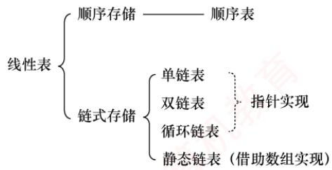

## 【复习提示】

线性表是算法题命题的重点。应牢固掌握其在两种存储结构（顺序存储与链式存储）下的各  
种基本操作，并在平时的学习中注重动手能力的培养。另需提醒的是，算法最重要的是思想！考  
场时间紧迫，在试卷上并不要求代码具备实际可执行性，应着重清晰地表达出算法的核心思想与  
关键步骤，而不必过于拘泥于语法、边界等细节。此外，即使采用暴力法，通常也能获得大部分  
分数，因此在时间紧张时建议直接采用。注意，算法题只能使用C/C++语言实现。 育V

## 2.1 线性表的定义和基本操作

## 2.1.1线性表的定义

线性表是由n（n≥0）个相同数据类型的元素组成的有限序列。其中n为表长；当n=0时，线性表为空表。若用L表示一个线性表，则其一般形式为

$$
L = ( a _ { 1 } , a _ { 2 } , \cdots , a _ { i } , a _ { i + 1 } , \cdots , a _ { n } )
$$

式中， $a _ { 1 }$ 是唯一的“第一个”数据元素，也称表头元素； $a _ { n }$ 是唯一的“最后一个”数据元素，也称表尾元素。除第一个元素外，每个元素有且仅有一个直接前驱；除最后一个元素外，每个元素有且仅有一个直接后继（“直接前驱”与“前驱”、“直接后继”与“后继”通常被视为同义词）。以上即为线性表的逻辑特性，这种一对一的线性逻辑关系正是线性表名称的由来。

由此，可总结出线性表的特点如下：

● 表中元素的个数有限。

● 表中元素具有逻辑上的顺序性，即存在明确的先后次序。

· 表中元素均为数据元素，每个元素在线性表中被视为一个不可分割的单位。

· 表中元素的数据类型都相同，这意味着每个元素占有相同大小的存储空间。

● 表中元素具有抽象性，即仅讨论元素之间的逻辑关系，而不考虑其究竟表示什么内容。

## 注意

线性表是一种逻辑结构，表示元素之间一对一的相邻关系。顺序表和链表是两种存储结构，二者属于不同层面的概念，因此不要将其混淆。

## 2.1.2 线性表的基本操作

一个数据结构的基本操作是指其最核心、最基本的操作集合，其他较复杂的功能通常可通过调用这些基本操作来实现。线性表的主要操作如下。

● InitList(&L)：初始化表。构造一个空的线性表。

● Length(L)：求表长。返回线性表的长度，即其中数据元素的个数。

● LocateElem(L，e)：按值查找操作。在表L中查找值为e的元素，并返回其位置。

● GetElem(L,i)：按位查找操作。获取表L 中第i个位置的元素值。

● ListInsert(&L,i,e)：插入操作。在表L的第i个位置插入指定元素e。

● ListDelete(&L,i,&e)：删除操作。删除表L中第i 个位置的元素，并用e返回被删元素的值。

● PrintList(L)：输出操作。按前后顺序输出线性表L的所有元素值。

● Empty(L)：判空操作。若L为空表，则返回 true，否则返回 false。

● DestroyList(&L)：销毁操作。销毁线性表，并释放其占用的内存空间。

## 注意

①基本操作的具体实现取决于所用的存储结构，存储结构不同，算法的实现方式也不同。②符号&表示C++语言中的引用调用；在C语言中，可通过指针实现相同效果。

## 2.1.3 本节试题精选

## 单项选择题

01. 线性表是具有n个（）的有限序列。A. 数据表 B. 字符 C. 数据元素 D. 数据项

02.下列几种描述中，（）是一个线性表。A. 由n个实数组成的集合 B. 由100 个字符组成的序列C. 所有整数组成的序列 D. 邻接表

03.在线性表中，除开始元素外，每个元素（）。A. 只有唯一的前驱元素 B. 只有唯一的后继元素C. 有多个前驱元素 D. 有多个后继元素

04. 若非空线性表中的元素既没有直接前驱，又没有直接后继，则该表中有（）个元素。A. 1 B. 2 C.3 D. n

## 2.1.4 答案与解析

## 单项选择题

01. C

线性表是由具有相同数据类型的有限数据元素组成的，数据元素是由数据项组成的。

## 02. B

线性表定义的要求为：相同数据类型、有限序列。选项C的元素个数是无穷个，错误：选项A集合中的元素没有前后驱关系，错误；选项D属于一种存储结构，本题要求选出的是一个具体的线性表，不要将二者混为一谈。只有选项B符合线性表定义的要求。

## 03. A

线性表中，除最后一个（或第一个）元素外，每个元素都只有一个后继（或前驱）元素。

## 04. A

线性表中的第一个元素没有直接前驱，最后一个元素没有直接后继；当线性表中仅有一个元素时，该元素既没有直接前驱，又没有直接后继。 灿育

## 2.2 线性表的顺序表示

## 2.2.1顺序表的定义

考点追踪（算法题）顺序表的应用（2010、2011、2018、2020、2025）

线性表的顺序存储也称顺序表。它是用一组地址连续的存储单元依次存储线性表中的数据元素，使得逻辑上相邻的元素在物理位置上也相邻。第1个元素存储在顺序表的起始位置，第i个元素的存储位置之后紧接着存放的是第i+1个元素，称i为元素 $a _ { i }$ 在顺序表中的位序。因此，顺序表的特点是：表中元素的逻辑顺序与其物理存储顺序完全一致。

设顺序表L的起始存储地址为LOC(A)，每个数据元素占用的存储空间大小为sizeof(E1emType)，则顺序表的存储结构如图2.1所示。

  
图2.1 线性表的顺序存储结构

由于任意数据元素的存储地址与顺序表起始地址之间的偏移量与其位序呈线性关系，因此可在0(1)时间内直接访问表中任意位置的元素，这种特性使得线性表的顺序存储结构属于随机存取。在高级程序设计语言中，通常使用数组来实现顺序表。

注意  
线性表中元素的位序从1开始，而数组中元素的下标从0开始，注意二者之间的转换。

假定线性表的元素类型为ElemType，则静态分配的顺序表存储结构描述为  
#define MaxSize 50 //定义线性表的最大长度  
typedef struct{  
ElemType data[MaxSize]; //顺序表的元素

int length;   
}SqList;

//顺序表的当前长度  
//顺序表的类型定义

一维数组既可以静态分配，也可以动态分配。静态分配时，数组的大小和存储空间在编译时已经固定，一旦空间占满，再插入新元素将导致溢出，进而可能引发程序异常。

动态分配时，存储数组的空间是在程序执行过程中通过动态存储分配语句申请的。当空间占满时，可以另行开辟一块更大的存储空间，将原表中的所有元素复制到新空间中，从而实现存储容量的扩充，而无须在初始化时为线性表一次性划分全部可能用到的空间。

动态分配的顺序表存储结构描述为

```c
#define InitSize 100
typedef struct{
ElemType *data;
int MaxSize,length;
}SeqList;
```

//表长度的初始定义  
//指示动态分配数组的指针  
//数组的最大容量和当前个数  
//动态分配数组顺序表的类型定义

```javascript
L.data=(ElemType*)malloc(sizeof(ElemType)*InitSize);
C++的初始动态分配语句为
L.data=new ElemType[InitSize];
```

## 注意

动态分配并不是链式存储，它同样属于顺序存储结构。其物理结构没有变化，依然支持随机存取，只是存储空间的大小可以在运行时动态调整。

顺序表的主要优点：①可进行随机访问，即通过首地址和元素序号可在O(1)时间内找到指定的元素；②存储密度高，每个结点仅存储数据元素，无额外指针开销。顺序表的缺点也很明显：①插入和删除操作效率较低，需要移动大量元素；②要求分配连续的存储空间，不够灵活。

## 2.2.2 顺序表上基本操作的实现

## 考点追踪顺序表上操作的时间复杂度分析（2023）

本节仅讨论顺序表的初始化、插入、删除和按值查找，其他基本操作的实现都较为简单。

## 注意

在各种操作的实现中（包括严蔚敏老师的教材），通常可以忽略边界条件判断、变量定义、内存分配失败等实现细节，即不要求代码具有实际可执行性，而应重点体现算法的核心思想与逻辑步骤。

## 1. 顺序表的初始化

静态分配和动态分配的顺序表在初始化时有所不同。静态分配：在声明顺序表时，数组空间已由编译器分配，因此初始化只需将当前长度置为0。

//SqList L; //声明一个顺序表  
void InitList(SqList &L) {  
L.length=0; //顺序表初始长度为0  
}

动态分配：需在运行时为顺序表分配初始大小的数组空间，并设置长度和容量。

void InitList(SeqList &L){  
L.data=(ElemType \*)malloc(InitSize\*sizeof(ElemType));//分配存储空间

```javascript
L.length=0;
L.MaxSize=InitSize;
```

其中，MaxSize表示当前分配的存储空间上限。当插入元素导致空间不足时，需要扩容。

## 2. 插入操作

在顺序表L的第i（1≤i≤L.length+1）个位置插入新元素e。若i超出合法范围，或存储空间已满，则插入失败，返回fa1se；否则，将第i个元素及其后的所有元素依次后移一位，腾出一个空位置插入e，表长加1，返回true。

```javascript
bool ListInsert(SqList &L,int i,ElemType e){
if(i<1|li>L.length+1) //判断i的范围是否有效
return false;
if(L.length>=MaxSize) //当前存储空间已满
return false;
for(int j=L.length;j>=i;j--) //将第i 个元素及之后的元素后移
L.data[j]=L.data[j-1];
L.data[i-1]=e; //在位置i插入e（注意下标转换）
L.length++; //表长加1
return true;
```

## 注意

区分位序（从1开始）与数组下标（从0开始）。为什么判断插入位置时使用1ength+1，而移动元素的for循环中使用length？因为合法插入位置包括第n+1位，但移动元素时最多从第n位开始后移。

最好情况：在表尾插入 $(i = n + 1)$ ，无须移动元素，时间复杂度为O(1)。

最坏情况：在表头插入（i=1），需移动全部n个元素，时间复杂度为O(n)。

平均情况：设在第i个位置插入的概率为 $p _ { i } = 1 / ( n + 1 )$ ，则平均移动次数为

$$
\sum_{i = 1}^{n + 1}p_{i}(n - i + 1) = \sum_{i = 1}^{n + 1}\frac{1}{n + 1}(n - i + 1) = \frac{1}{n + 1}\sum_{i = 1}^{n + 1}(n - i + 1) = \frac{1}{n + 1}\frac{n(n + 1)}{2} = \frac{n}{2}
$$

因此，插入操作的平均时间复杂度为O(n)。

## 3. 删除操作

删除顺序表L中第i（1≤i≤L.1ength）个位置的元素，并通过引用参数e返回其值。若i非法，返回false；否则，保存被删元素，将其后所有元素前移一位，表长减1，返回true。

```javascript
bool ListDelete(SqList &L,int i,ElemType &e){
if(i<1|li>L.length) //判断i的范围是否有效
return false;
e=L.data[i-1]; //将被删除的元素赋给
for(int j=i;j<L.length;j++) //将第i 个位置后的元素前移
L.data[j-1]=L.data[j];
L.length--; //表长减1
return true;
```

最好情况：删除表尾元素（i=n），无须移动元素，时间复杂度为O(1)。

最坏情况：删除表头元素（i=1），需移动其余n−1个元素，时间复杂度为O(n)。

平均情况：设删除第i个元素的概率为 $p_{i}=1/n$ ，则平均移动次数为

$$
\sum_{i = 1}^{n}p_{i}(n - i) = \sum_{i = 1}^{n}\frac{1}{n}(n - i) = \frac{1}{n}\sum_{i = 1}^{n}(n - i) = \frac{1}{n}\frac{n(n - 1)}{2} = \frac{n - 1}{2}
$$

因此，删除操作的平均时间复杂度为 $O ( n )$

可见，顺序表的插入和删除操作的时间开销主要耗费在移动元素上，而移动元素的个数取决于操作位置。图2.2显示了顺序表插入和删除操作前、后的状态，以及数据元素在存储空间中的位置和表长变化。图2.2(a)将第4～7个元素从后往前依次后移一位，为新元素腾出位置。图2.2(b)将第5～7个元素从前往后依次前移一位，填补删除后的空缺。

  
(a) 插入新元素示例

  
(b) 删除表中元素示例  
图2.2 顺序表的插入和删除

## 4. 按值查找（顺序查找）

在顺序表L中查找第一个值等于e的元素，返回其位序；若未找到，则返回0。

```javascript
int LocateElem(SqList L,ElemType e){
int i; 育
for(i=0;i<L.length;i++)
if(L.data[i]==e)
return i+1; //下标为 i的元素值等于 e，返回其位序 i+1
return 0; //查找失败
```

最好情况：目标元素在表头（i=1），比较1次，时间复杂度为O(1)。

最坏情况：目标元素在表尾或不存在，需要比较n次，时间复杂度为O(n)。

平均情况：设目标元素在第i位的概率为 $p _ { i }   = 1 / n$ ，则平均比较次数为

$$
\sum_{i = 1}^{n}p_{i} \cdot i = \sum_{i = 1}^{n}\frac{1}{n} \cdot i = \frac{1}{n}\frac{n(n + 1)}{2} = \frac{n + 1}{2}
$$

因此，按值查找的平均时间复杂度为 $O ( n )$

顺序表的按序号查找非常简单，直接通过数组下标访问即可，时间复杂度为O(1)。

## 2.2.3 本节试题精选

## 一、单项选择题

01.下列叙述中，（）是顺序存储结构的优点。A. 存储密度大 B. 插入运算方便C. 删除运算方便 D. 方便地运用于各种逻辑结构的存储表示

02.下列关于顺序表的叙述中，正确的是（）。A. 顺序表可以利用一维数组表示，因此顺序表与一维数组在逻辑结构上是相同的B. 在顺序表中，逻辑上相邻的元素物理位置上不一定相邻C. 顺序表和一维数组一样，都可以进行随机存取D. 在顺序表中，每个元素的类型不必相同

03. 通常说顺序表具有随机存取的特性，指的是（）。

A. 查找值为x的元素的时间与顺序表中元素个数n无关B. 查找值为x的元素的时间与顺序表中元素个数n有关C. 查找序号为i的元素的时间与顺序表中元素个数n无关D. 查找序号为i的元素的时间与顺序表中元素个数n有关

04.一个顺序表所占用的存储空间大小与（）无关。A. 表的长度 B. 元素的存放顺序C. 元素的类型 D. 元素中各字段的类型

05. 若线性表最常用的操作是存取第i个元素及其前驱和后继元素的值，为了提高效率，应采用（）的存储方式。A. 单链表B. 双链表 C. 循环单链表D. 顺序表

06.一个线性表最常用的操作是存取任意一个指定序号的元素并在最后进行插入、删除操作，则利用（）存储方式可以节省时间。A. 顺序表 B. 双链表 道计算C.带头结点的循环双链表 D. 循环单链表

07.在n个元素的线性表的数组表示中，时间复杂度为O(1)的操作是（）。I. 访问第i（1≤i≤n）个结点和求第i(2≤i≤n）个结点的直接前驱Ⅱ. 在最后一个结点后插入一个新的结点Ⅲ. 删除第 1 个结点 教育IV. 在第i(1≤i≤n）个结点后插入一个结点A. I B. II、III C. I、ⅡI D. I、ⅡI、ⅢII

08. 设线性表有n个元素，严格说来，以下操作中，（）在顺序表上实现要比在链表上实现的效率高。I. 输出第i(1≤i≤n）个元素值I. 交换第3个元素与第4个元素的值I. 顺序输出这 n 个元素的值A. I B. I、III C. I、ⅡI D. II、III TA

09.在一个长度为n的顺序表中删除第i（1≤i≤n）个元素时，需向前移动（）个元素。A. n 妆 B. i-1 C. n−i D. n−i+ 1

10. 对于顺序表，访问第i个位置的元素和在第i个位置插入一个元素的时间复杂度为（）。A. O(n), O(n) B. O(n), O(1) C. O(1), O(n) D. O(1), O(1)

11. 对于顺序存储的线性表，其算法时间复杂度为O(1)的运算应该是（）。A.将n个元素从小到大排序 王道B. 删除第 $i ( 1 \leqslant i \leqslant n )$ 个元素C. 改变第 $i ( 1 \leqslant i \leqslant n )$ 个元素的值D. 在第i $( 1 \leqslant i \leqslant n )$ 个元素后插入一个新元素

12. 顺序表的插入算法中，当n个空间已满时，可再申请增加分配m个空间，若申请失败，则说明系统没有（）可分配的存储空间。A. m 个 B. m 个连续C. n + m 个 D. n + m 个连续

13.【2023统考真题】在下列对顺序存储的有序表（长度为n）实现给定操作的算法中，平均时间复杂度为O(1)的是（）。

A. 查找包含指定值元素的算法 B. 插入包含指定值元素的算法C. 删除第 $i ( 1 \leqslant i \leqslant n )$ 个元素的算法 D. 获取第 $i ( 1 \leqslant i \leqslant n )$ 个元素的算法

## 二、综合应用题

01. 从顺序表中删除具有最小值的元素（假设唯一）并由函数返回被删元素的值。空出的位置由最后一个元素填补，若顺序表为空，则显示出错信息并退出运行。

02. 设计一个高效算法，将顺序表L的所有元素逆置，要求算法的空间复杂度为 O(1)。

03. 对长度为n的顺序表L，编写一个时间复杂度为 $O ( n )$ 、空间复杂度为O(1)的算法，该算法删除顺序表中所有值为x的数据元素。

04. 从顺序表中删除其值在给定值s和t之间（包含s和t，要求 $s \leq t   )$ 的所有元素，若s或t不合理或顺序表为空，则显示出错信息并退出运行。 X

05. 从有序顺序表中删除所有其值重复的元素，使表中所有元素的值均不同。

06. 将两个有序顺序表合并为一个新的有序顺序表，并由函数返回结果顺序表。

07. 已知在一维数组 $A [ m + n ]$ 中依次存放两个线性表 $(a_{1}, a_{2}, a_{3}, \cdots, a_{m})$ 和 $(b_{1}, b_{2}, b_{3}, \cdots, b_{n})$ 。编写一个函数，将数组中两个顺序表的位置互换，即将 $(b_{1},b_{2},b_{3},\cdots,b_{n})$ 放在 $(a_{1}, a_{2}, a_{3}, \cdots, a_{m})$ 的前面。

08. 线性表 $(a_{1}, a_{2}, a_{3}, \cdots, a_{n})$ 中的元素递增有序且按顺序存储于计算机内。要求设计一个算法，完成用最少时间在表中查找数值为x的元素，若找到，则将其与后继元素位置相交换，若找不到，则将其插入表中并使表中元素仍然递增有序。

09. 给定三个序列A、B、C，长度均为n，且均为无重复元素的递增序列，请设计一个时间上尽可能高效的算法，逐行输出同时存在于这三个序列中的所有元素。例如，数组A为{1,2,3}，数组B为{2,3,4}，数组C为{-1,0,2}，则输出2。要求：1）给出算法的基本设计思想。2）根据设计思想，采用C或C++语言描述算法，关键之处给出注释。3）说明你的算法的时间复杂度和空间复杂度。

10.【2010统考真题】设将 $n (n > 1)$ 个整数存放到一维数组R中。设计一个在时间和空间两方面都尽可能高效的算法。将R中保存的序列循环左移 $p \left( 0 < p < n \right)$ 个位置，即将R中的数据由 $(X_{0},X_{1},\cdots,X_{n-1})$ 变换为 $( X _ { p } , X _ { p + 1 } , \cdots , X _ { n - 1 } , X _ { 0 } , X _ { 1 } , \cdots , X _ { p - 1 } )$ 。要求：1）给出算法的基本设计思想。3）说明你所设计算法的时间复杂度和空间复杂度。

11.【2011统考真题】一个长度为 $L ( L \geqslant 1 )$ 的升序序列S，处在第 $\left[ L / 2 \right]$ 个位置的数称为S的中位数。例如，若序列 $S_{1} = (11, 13, 15, 17, 19)$ ，则 $S _ { 1 }$ 的中位数是15，两个序列的中位数是含它们所有元素的升序序列的中位数。例如，若 $S_{2} = (2,4,6,8,20)$ ，则 $S _ { 1 }$ 和 $S _ { 2 }$ 的中位数是11。现在有两个等长升序序列A和B，试设计一个在时间和空间两方面都尽可能高效的算法，找出两个序列A和B的中位数。要求：1）给出算法的基本设计思想。2）根据设计思想，采用C或C++或Java语言描述算法，关键之处给出注释。

3）说明你所设计算法的时间复杂度和空间复杂度。

12.【2013统考真题】已知一个整数序列 $A = (a_{0}, a_{1}, \cdots, a_{n-1})$ ，其中 $0 \leqslant a_{i} < n \quad (0 \leqslant i < n)$ 若存在 $a_{p_{1}} = a_{p_{2}} = \cdots = a_{p_{m}} = x$ 且 $m>n/2 (0 \leqslant p_{k}<n,1 \leqslant k \leqslant m)$ ，则称x为A的主元素。例如 $A = ( 0 , 5 , 5 , 3 , 5 , 7 , 5 , 5 )$ ，则5为主元素；又如 $A = ( 0 , 5 , 5 , 3 , 5 , 1 , 5 , 7 )$ ，则A中没有主元素。假设A中的n个元素保存在一个一维数组中，请设计一个尽可能高效的算法，找出A的主元素。若存在主元素，则输出该元素；否则输出-1。要求：

1）给出算法的基本设计思想。

2）根据设计思想，采用C或C++或Java语言描述算法，关键之处给出注释。

3）说明你所设计算法的时间复杂度和空间复杂度。

13. 【2018统考真题】给定一个含 $n (n \geqslant 1)$ 个整数的数组，请设计一个在时间上尽可能高效的算法，找出数组中未出现的最小正整数。例如，数组{-5,3,2,3}中未出现的最小正整数是1；数组{1,2,3}中未出现的最小正整数是4。要求：

1）给出算法的基本设计思想。

2）根据设计思想，采用C或C++语言描述算法，关键之处给出注释。

3）说明你所设计算法的时间复杂度和空间复杂度。

14.【2020统考真题】定义三元组 $( a , b , c ) ( a , b , c$ 均为整数)的距离 $D = \left| a - b \right| + \left| b - c \right| + \left| c - a \right|$ 给定3个非空整数集合 $S _ { 1 }  、  S _ { 2 }$ 和 $S _ { 3 } ,$ ，按升序分别存储在3个数组中。请设计一个尽可能高效的算法，计算并输出所有可能的三元组 $(a,   b,   c) \quad (a \in S_1, \quad b \in S_2, \quad c \in S_3)$ 中的最小距离。例如 $S_{1} = \{-1, 0, 9\}, S_{2} = \{-25, -10, 10, 11\}, S_{3} = \{2, 9, 17, 30, 41\}$ ，则最小距离为2，相应的三元组为(9,10,9)。要求：

1）给出算法的基本设计思想。

2）根据设计思想，采用C语言或C++语言描述算法，关键之处给出注释。

3）说明你所设计算法的时间复杂度和空间复杂度。

15. 【2025统考真题】有两个长度均为n的一维整型数组A和res，对数组A中的每个元素A[i]，计算A[i]与 $\mathrm{A}[j](0 \leqslant i \leqslant j \leqslant n-1)$ 乘积的最大值，并将其保存到res[i]中。例如，当 $\mathrm { A } [   ] = \{   [ 1$ 4,-9, 6}时，得到 $ res [] = \{6,24,81,36\}$ 。现给定数组A，设计一个时间和空间上尽可能高效的算法calMulMax，求res中各元素的值。函数原型为 $\mathtt { v o i d \quad c a l M u l M a x \left( i n t \quad A \left[ \right] \right. }$ , intres[],int n)。要求如下：

1）给出算法的基本设计思想。

2）根据设计思想，采用C或C++语言描述算法，关键之处给出注释。

3）说明你所设计算法的时间复杂度和空间复杂度。

## 2.2.4 答案与解析

## 一、单项选择题

## 01. A

顺序表不像链表那样要在结点中存放指针域，因此存储密度大，选项A正确。选项B和C是链表的优点。选项D是错误的，比如对于树形结构，顺序表显然不如链表表示起来方便。

## 02. C

顺序表是顺序存储的线性表，表中所有元素的类型必须相同，且必须连续存放。一维数组中的元素可以不连续存放；此外，栈、队列和树等逻辑结构也可利用一维数组表示，但它与顺序表不属于相同的逻辑结构。在顺序表中，逻辑上相邻的元素物理位置上也相邻。

## 03. C

随机存取是指在O(1)的时间访问下标为i的元素，所需时间与顺序表中的元素个数n无关。

## 04. B

顺序表所占的存储空间=表长×sizeof（元素的类型），表长和元素的类型显然会影响存储空间的大小。若元素为结构体类型，则元素中各字段的类型也会影响存储空间的大小。

## 05. D

题干实际要求能最快存取第i-1、i和i+1个元素值。选项A、B、C都只能从头结点依次顺序查找，时间复杂度为O(n)；只有顺序表可以按序号随机存取，时间复杂度为O(1)。

## 06. A

只有顺序表可以按序号随机存取，且在最后进行插入和删除操作时不需要移动任何元素。

## 07. C

对说法I，解析略；对说法Ⅱ，在最后位置插入新结点不需要移动元素，时间复杂度为O(1);对说法Ⅲ，被删结点后的结点需要要依次前移，时间复杂度为O(n)；对说法IV，需要后移n-i个结点，时间复杂度为O(n)。 姚

## 08. C

对说法Ⅱ，顺序表只需3次交换操作；链表需要分别找到两个结点前驱，第4个结点断链后再插入到第2个结点后，效率较低。对说法Ⅲ，需要依次顺序访问每个元素，时间复杂度相同。

## 09. C

需要将元素 $a _ { i ^ { + } 1 } { \sim } a _ { n }$ 依次前移一位，共移动 n − (i + 1) + 1 = n − i 个元素。

## 10. C

在第i个位置插入一个元素，需要移动n−i +1个元素，时间复杂度为O(n)。

## 11. C

对n个元素进行排序的时间复杂度最小也要O(n)（初始有序时），通常为O(nlog2n)或 $O ( n ^ { 2 } )$ 通过第8章学习后会更容易理解。选项B和D显然错误。顺序表支持按序号的随机存取方式。

## 12. D

顺序存储需要连续的存储空间，在申请时需申请n+m个连续的存储空间，然后将线性表原来的n个元素复制到新申请的n+m个连续的存储空间的前n个单元。

## 13. D

对于顺序存储的有序表，查找指定值元素可以采用顺序查找法或折半查找法，平均时间复杂度最少为O(log2n)。插入指定值元素需要先找到插入位置，然后将该位置及之后的元素依次后移一个位置，最后将指定值元素插入到该位置，平均时间复杂度为O(n)。删除第i个元素需要将该元素之后的全部元素依次前移一个位置，平均时间复杂度为O(n)。获取第i个元素只需直接根据下标读取对应的数组元素即可，时间复杂度为O(1)。

## 二、综合应用题

## 01.【解答】

算法思想：搜索整个顺序表，查找最小值元素并记住其位置，搜索结束后用最后一个元素填补空出的原最小值元素的位置。 X

## 本题代码如下：

```javascript
bool Del Min(SqList &L,ElemType &value) {
//删除顺序表L中最小值元素结点，并通过引用型参数 value 返回其值
//若删除成功，则返回true；否则返回false
if(L.length==0)
return false; 算机教 //表空，中止操作返回
value=L.data[0];
int pos=0; //假定0号元素的值最小
for(int i=1;i<L.length;i++) //循环，寻找具有最小值的元素
if(L.data[i]<value) { //让 value 记忆当前具有最小值的元素
value=L.data[i];
```

pos=i;   
L.data[pos]=L.data[L.length-1];   
L.length--;   
return true;

## 注意

本题也可用函数返回值返回，两者的区别是：函数返回值只能返回一个值，而参数返回（引用传参）可以返回多个值。 V

## 02.【解答】

算法思想：扫描顺序表L的前半部分元素，对于元素L.data[i]（0<=i<L.1ength/2），将其与后半部分的对应元素L.data[L.length-i-1]进行交换。

本题代码如下：

```javascript
void Reverse(SqList &L) { ElemType temp; //辅助变量 道
for(int i=0;i<L.length/2;i++){
temp=L.data[i]; //交换L.data[i]与L.data[L.length-i-1]
L.data[i]=L.data[L.length-i-1];
L.data[L.length-i-1]=temp;
} 育
}
```

## 03.【解答】

解法1：用k记录顺序表L中不等于x的元素个数（需要保存的元素个数），扫描时将不等于x的元素移动到下标k的位置，并更新k值。扫描结束后修改L的长度。

本题代码如下：

```javascript
void del x 1(SqList &L,ElemType x){
//本算法实现删除顺序表L中所有值为×的数据元素
int k=0,i; //记录值不等于×的元素个数
for(i=0;i<L.length;i++)
if(L.data[i]!=x) {
L.data[k]=L.data[i];
k++; //不等于 x的元素增1
1
L.length=k; //顺序表L的长度等于k
```

解法2：用k记录顺序表L中等于x的元素个数，一边扫描L，一边统计k，并将不等于x的元素前移k个位置。扫描结束后修改L的长度。 美

本题代码如下：

```javascript
void del x 2(SqList &L,ElemType x){
int k=0,i=0; //k 记录值等于 x的元素个数
while(i<L.length) {
if(L.data[i]==x)
k++;
else
L.data[i-k]=L.data[i]；//当前元素前移k个位置
i++;
}
L.length=L.length-k; //顺序表L的长度递减
}
```

此外，本题还可以考虑设头、尾两个指针（i=1,j=n），从两端向中间移动，在遇到最左端

```javascript
bool Delete Same(SeqList& L) {
if(L.length==0)
return false;
int i,j; //i 存储第一个不相同的元素，j 为工作指针
for(i=0,j=1;j<L.length;j++)
if(L.data[i]!=L.data[j]) //查找下一个与上一个元素值不同的元素
王道 L.data[++i]=L.data[j]; //找到后，将元素前移
L.length=i+1;
return true;
1
```

值x的元素时，直接将最右端值非x的元素左移至值为x的数据元素位置，直到两指针相遇。但这种方法会改变原表中元素的相对位置。 临村

## 04.【解答】

算法思想：从前向后扫描顺序表L，用k记录值在s和t之间的元素个数（初始时k=0）。对于当前扫描的元素，若其值不在s和t之间，则前移k个位置；否则执行k++。每个不在s和t之间的元素仅移动一次，因此算法效率高。

本题代码如下：

```javascript
bool Del s t(SqList &L,ElemType s,ElemType t){
//删除顺序表L中值在给定值s 和 t（要求s<t）之间的所有元素
int i,k=0;
if(L.length==0|Is>=t)
return false; //线性表为空或s、t 不合法，返回
for(i=0;i<L.length;i++) {
if(L.data[i]>=s&&L.data[i]<=t)
k++;
else
L.data[i-k]=L.data[i]； ∥当前元素前移k个位置
} ∥for
L.length-=k; //长度减小
return true;
```

## 注意

本题也可从后向前扫描顺序表，每遇到一个值在s和t之间的元素，就删除该元素，其后的所有元素全部前移。但移动次数远大于前者，效率不够高。

## 05. 【解答】

算法思想：注意是有序顺序表，值相同的元素一定在连续的位置上，用类似于直接插入排序的思想，初始时将第一个元素视为非重复的有序表。之后依次判断后面的元素是否与前面非重复有序表的最后一个元素相同，若相同，则继续向后判断，若不同，则插入前面的非重复有序表的最后，直至判断到表尾为止。 YTA

本题代码如下：

对于本题的算法，请读者用序列1,2,2,2,2,3,3,3,4,4,5来手动模拟算法的执行过程，在模 拟过程中要标注i和j所指示的元素。 uK

思考：若将本题中的有序表改为无序表，你能想到时间复杂度为O(n)的方法吗？

(提示：使用散列表。）

## 06.【解答】

算法思想：首先，按顺序不断取下两个顺序表表头较小的结点存入新的顺序表中。然后，看哪个表还有剩余，将剩下的部分加到新的顺序表后面。

本题代码如下：

```javascript
bool Merge(SeqList A,SeqList B,SeqList &C) {
//将有序顺序表A与B合并为一个新的有序顺序表C
if(A.length+B.length>C.maxSize) //大于顺序表的最大长度
return false;
int i=0,j=0,k=0;
while(i<A.length&&j<B.length) { //循环，两两比较，小者存入结果表
if(A.data[i]<=B.data[j])
C.data[k++]=A.data[i++];
else
C.data[k++]=B.data[j++];
1
while(i<A.length) //还剩一个没有比较完的顺序表
C.data[k++]=A.data[i++];
while(j<B.length)
C.data[k++]=B.data[j++]; 道计算机
C.length=k;
return true;
```

## 注意

本算法的方法非常典型，需要牢固掌握。

## 07.【解答】

算法思想：首先将数组 A[m + n]中的全部元素 $(a_{1}, a_{2}, a_{3}, \cdots, a_{m}, b_{1}, b_{2}, b_{3}, \cdots, b_{n})$ 原地逆置为 $( b _ { n } , b _ { n - 1 } , b _ { n - 2 } , \cdots , b _ { 1 } , a _ { m } , a _ { m - 1 } , a _ { m - 2 } , \cdots , a _ { 1 } )$ ，然后对前n个元素和后m个元素分别使用逆置算法，即可得到 $(b_{1},b_{2},b_{3},\cdots,b_{n},a_{1},a_{2},a_{3},\cdots,a_{m})$ ，从而实现顺序表的位置互换。

本题代码如下：

```c
typedef int DataType;
void Reverse(DataType A[],int left,int right,int arraySize){
//逆转(aleft,aleft+1,aleft+2,,aright)为(aright,aright-1,…,aleft)
if(left>=right|lright>=arraySize)
return;
int mid=(left+right)/2;
for(int i=0;i<=mid-left;i++) {
DataType temp=A[left+i];
A[left+i]=A[right-i]; 算机教育
A[right-i]=temp;
void Exchange(DataType A[],int m,int n,int arraySize){
/*数组 A[m+n]中，从0到 m-1 存放顺序表(a1,a2，a3，…,am)，从 m到 m+n-1 存放顺序表
(b1,b2,b3，…,bn)，算法将这两个表的位置互换*/
Reverse(A,0,m+n-1,arraySize);
Reverse(A,0,n-1,arraySize);
Reverse(A,n,m+n-1,arraySize);
```

## 08.【解答】

算法思想：顺序存储的线性表递增有序，可以顺序查找，也可以折半查找。题目要求“用最少的时间在表中查找数值为x的元素”，这里应使用折半查找法。

本题代码如下：

void SearchExchangeInsert(ElemType A[],ElemType x) {   
int low=0,high=n-1,mid; //1ow 和 high 指向顺序表下界和上界的下标   
while(low<=high) {

```javascript
mid=(low+high)/2; //找中间位置
if(A[mid]==x) break; //找到 x，退出 while 循环
else if(A[mid]<x) low=mid+1;//到中点mid的右半部去查
else high=mid-1; //到中点 mid的左半部去查
∥/下面两个 if 语句只会执行一个
if(A[mid]==x&&mid!=n-1){ //若最后一个元素与×相等，则不存在与其后
继交换的操作
t=A[mid]; A[mid]=A[mid+1]; A[mid+1]=t;
1
if (low>high) { //查找失败，插入数据元素x
for(i=n-1;i>high;i--) A[i+1]=A[i]; ∥后移元素
A[i+1]=x; //插入x //结束插入 机教育
1
```

本题的算法也可写成三个函数：查找函数、交换后继函数与插入函数。写成三个函数的优点是逻辑清晰且易读。

## 09.【解析】

## 1）算法的基本设计思想。

使用三个下标变量从小到大遍历数组。当三个下标变量指向的元素相等时，输出并向前推进指针，否则仅移动小于最大元素的下标变量，直到某个下标变量移出数组范围，即可停止。

## 2）算法的实现。

void samekey(int A[],int B[],int C[],int n){  
int i=0,j=0,k=0; //定义三个工作指针  
while(i<n&&j<n&&k<n){ //相同则输出，并集体后移  
if(A[i]==B[j]&&B[j]==C[k]){  
printf("%d\n",A[i]);  
i++;j++;k++;  
}else {  
int maxNum=max(A[i],max(B[j],C[k]));  
if (A[i]<maxNum) i++;  
if(B[j]<maxNum)j++;  
if(C[k]<maxNum) k++;  
1  
1 育

3）每个指针移动的次数不超过n，且每次循环至少有一个指针后移，故时间复杂度为O(n)，算法只用到了常数个变量，空间复杂度为O(1)。 KKN

## 10. 【解答】

## 1）算法的基本设计思想：

可将问题视为把数组 ab 转换成数组 ba（a代表数组的前p 个元素，b 代表数组中余下的 n−p个元素），先将a逆置得到 $a ^ { - 1 } b ,$ ，再将b逆置得到 $a ^ { - 1 } b ^ { - 1 }$ ，最后将整个 $a ^ { - 1 } b ^ { - 1 }$ 逆置得到 $( \boldsymbol { a } ^ { - 1 } \boldsymbol { b } ^ { - 1 } ) ^ { - 1 }   =   b \boldsymbol { a }$ 。设Reverse函数执行将数组逆置的操作，对 abcdefgh向左循环移动 $3 ( p = 3 )$ 个位置的过程如下：

Reverse(0,p-1)得到 cbadefgh;  
Reverse (p,n-1) 得到 cbahgfed;  
Reverse(0,n-1)得到 defghabc。

注：在Reverse中，两个参数分别表示数组中待转换元素的始末位置。

## 2）使用C语言描述算法如下：

void Reverse(int R[],int from,int to) {   
int i,temp;

```c
for(i=0;i<(to-from+1)/2;i++)
{temp=R[from+i];R[from+i]=R[to-i];R[to-i]=temp;}
1
void Converse(int R[],int n,int p){
Reverse(R,0,p-1);
Reverse(R,p,n-1); Reverse(R,0,n-1) ; 道
}
```

3）上述算法中三个 Reverse函数的时间复杂度分别为 O(p/2)、O((n-p)/2)和 O(n/2)，故所设计的算法的时间复杂度为O(n)，空间复杂度为O(1)。

【另解】借助辅助数组来实现。算法思想：创建大小为p的辅助数组S，将R中前p个整数依次暂存在S 中，同时将R中后n-p个整数左移，然后将S 中暂存的p个数依次放回到R中的后续单元。时间复杂度为O(n)，空间复杂度为O(p)。 机

## 11. 【解答】

1）算法的基本设计思想如下。

分别求两个升序序列A、B的中位数，设为a和b，求序列A、B的中位数过程如下：

①若a= b，则a或b为所求中位数，算法结束。

②若a< b，则舍弃序列A中较小的一半，同时舍弃序列B中较大的一半，要求两次舍弃的长度相等。

③若a>b，则舍弃序列A中较大的一半，同时舍弃序列B中较小的一半，要求两次舍弃的长度相等。 K

在保留的两个升序序列中，重复过程①、②、③，直到两个序列中均只含一个元素时为止，较小者为所求的中位数。 临K

2）本题代码如下：

```javascript
int M Search(int A[],int B[],int n){
int s1,d1,m1,s2,d2,m2;
s1=0;d1=n-1;
s2=0;d2=n-1;
while(s1!=d1||s2!=d2){
m1=(s1+d1)/2;
m2=(s2+d2)/2;
if(A[m1]==B[m2])
return A[m1]; //满足条件①
if (A[m1]<B[m2]) { //满足条件②
if((s1+d1)%2==0){ //若元素个数为奇数
s1=m1; //舍弃A中间点以前的部分，且保留中间点
王道计算机 d2=m2; //舍弃B中间点以后的部分，且保留中间点
else{ //元素个数为偶数 王道
s1=m1+1; //舍弃 A的前半部分
d2=m2; //舍弃B的后半部分
1
else { //满足条件③
if((s1+d1)%2==0){ //若元素个数为奇数
d1=m1; //舍弃A中间点以后的部分，且保留中间点
s2=m2; //舍弃B中间点以前的部分，且保留中间点
1
else{ //元素个数为偶数
d1=m1; //舍弃 A 的后半部分
s2=m2+1; //舍弃B 的前半部分
```

}   
}   
return A[s1]<B[s2]? A[s1]:B[s2];

3）算法的时间复杂度为O(log2n)，空间复杂度为O(1)。

【另解】对两个长度为n的升序序列A和B中的元素按从小到大的顺序依次访问，这里访问的含义只是比较序列中两个元素的大小，并不实现两个序列的合并，因此空间复杂度为O(1)。按照上述规则访问第n个元素时，这个元素为两个序列A和B的中位数。

## 12. 【解答】

1）算法的基本设计思想：算法的策略是从前向后扫描数组元素，标记出一个可能成为主元素的元素Num。然后重新计数，确认Num是否是主元素。

算法可分为以下两步：

①选取候选的主元素。依次扫描所给数组中的每个整数，将第一个遇到的整数Num保存到c中，记录Num的出现次数为1；若遇到的下一个整数仍等于Num，则计数加1，否则计X 数减1；当计数减到0时，将遇到的下一个整数保存到c中，计数重新记为1，开始新一轮计数，即从当前位置开始重复上述过程，直到扫描完全部数组元素。

②判断c中元素是否是真正的主元素。再次扫描该数组，统计c中元素出现的次数，若大于n/2，则为主元素；否则，序列中不存在主元素。

2）算法实现如下：

int Majority(int A[],int n) {  
int i,c,count=1; //c 用来保存候选主元素，count 用来计数  
c=A[0]; //设置A[0]为候选主元素  
for(i=1;i<n;i++) //查找候选主元素  
if(A[i]==c) count++; 王道计 //对A 中的候选主元素计数  
else  
if(count>0) //处理不是候选主元素的情况  
count--;  
else{ //更换候选主元素，重新计数  
c=A[i];  
count=1;  
if (count>0) 卓机教  
for(i=count=0;i<n;i++) //统计候选主元素的实际出现次数  
if(A[i]==c)  
count++;  
if(count>n/2) return c; //确认候选主元素 王道计  
else return -1; //不存在主元素

3）实现的程序的时间复杂度为O(n)，空间复杂度为O(1)。

## 说明

本题若采用先排好序再统计的方法[时间复杂度为O(nlog2n)]，则只要解答正确，最高就可拿11分。即便是写出O(n²)的算法，最高也能拿10分，因此，对于统考算法题，花费大量时间去思考最优解法是得不偿失的。本算法的方法非常典型，需要牢固掌握。

## 13. 【解答】

1）算法的基本设计思想：

要求在时间上尽可能高效，因此采用空间换时间的办法。分配一个用于标记的数组B[n]，用来记录A中是否出现了1～n中的正整数，B01对应正整数1，B「n-11对应正整数n，初始化B中全部为0。A中含有n个整数，因此可能返回的值是 $1 \sim n + 1$ ，当A中n个数恰好为1\~n时返回n+1。当数组A中出现了小于或等于0或大于n的值时，会导致1～n中出现空余位置，返回结果必然在 $1   \sim   \mathtt { n }$ 中，因此对于A中出现了小于或等于0或大于n的值，可以不采取任何操作。

经过以上分析可以得出算法流程：从A「01开始遍历A，若 $0 < \mathbb{A} \left[ \downarrow \right] < = \mathbb{n}$ ，则令B $\left[ \mathbb { A } \left[ \downarrow \right] - \mathbb { 1 } \right] = \mathbb { 1 }$ .否则不做操作。对A遍历结束后，开始遍历数组B，若能查找到第一个满足B「i1==0的下标i，返回i+1即为结果，此时说明A中未出现的最小正整数在1和n之间。若B[i]全部不为0，返回i+1（跳出循环时i=n，i+1等于n+1），此时说明A中未出现的最小正整数是n+1。 K

2）算法实现：

```c
int findMissMin(int A[],int n)
int i,*B; //标记数组 道计算机
B=(int *)malloc(sizeof(int)*n);//分配空间
memset(B,0,sizeof(int) *n); //赋初值为0
for(i=0;i<n;i++)
if(A[i]>0&&A[i]<=n) //若A[i]的值介于 1~n，则标记数组B
B[A[i]-1]=1;
for(i=0;i<n;i++) //扫描数组B，找到目标值
if (B[i]==0) break;
return i+1; //返回结果
```

3）时间复杂度：遍历A一次，遍历B一次，两次循环内操作步骤为O(1)量级，因此时间复杂度为O(n)。空间复杂度：额外分配了B[n]，空间复杂度为O(n)。

## 14.【解答】

分析。由 $D = | a - b | + | b - c | + | c - a | \geqslant 0$ ，有如下结论。

①当 $a = b = c$ 时，距离最小。

②其余情况。不失一般性，假设 $a \leqslant b \leqslant c$ ，观察下面的数轴：


$$
L_{1}=|a-b|,\quad L_{2}=|b-c|,\quad L_{3}=|c-a|
$$

由D的表达式可知，事实上决定D大小的关键是a和c之间的距离，于是问题就可以简化为每次固定c找一个a，使得 $L _ { 3 } = | c - a |$ |最小。

1）算法的基本设计思想：

①使用 $D _ { \mathrm { m i n } }$ 记录所有已处理的三元组的最小距离，初值为一个足够大的整数。

②集合 $S _ { 1 }  、  S _ { 2 }$ 和 $S _ { 3 }$ 分别保存在数组A、B、C中。数组的下标变量 $i = j = k = 0$ ，当 $i \leq | S _ { 1 } |$ $j \leq | S _ { 2 } |$ 且 $k   \le | S _ { 3 } |$ 时（S|表示集合S中的元素个数），循环执行下面的步骤 $\mathrm { a )   \sim   c ) }$

a）计算(A[i], B[j], C[k])的距离 D；（计算 D)

b）若 $D   \le   D _ { \operatorname* { m i n } }$ ，则 $D _ { \mathrm { m i n } }   =   D   ;$ (更新D)

c）将A[i]、B[j、C[k]中的最小值的下标+1；（对照分析：最小值为a，最大值为c，这里c不变而更新a，试图寻找更小的距离D)

③输出 $D _ { \mathrm { m i n } }$ ，结束。

2）算法实现：

```c
#define INT MAX 0x7fffffff
int abs (int a){//计算绝对值 if(a<0) return -a; 直计算机
else return a;
}
bool xls min(int a,int b,int c){//a 是否是三个数中的最小值
if(a<=b&&a<=c) return true;
return false;
int findMinofTrip(int A[],int n,int B[],int m,int C[],int p){
//D min 用于记录三元组的最小距离，初值赋为 INT MAX
int i=0,j=0,k=0,D min=INT MAX,D;
while(i<n&&j<m&&k<p&&D min>0) {
D=abs (A[i]-B[j])+abs (B[j]-C[k])+abs (C[k]-A[i]);∥计算D
if(D<D_min) D_min=D; //更新 D
if(xls min(A[i],B[j],C[k])) i++; ∥更新a
else if(xls_min(B[j],C[k],A[i])) j++; 王道计集
else k++;
return D min;
```

3）设 n = (|S1| + |S₂| + |S3|)，时间复杂度为 O(n)，空间复杂度为 O(1)。

## 15.【解答】

1）算法的基本设计思想：

从后向前扫描一趟数组A，对每个 $\mathrm{A}[i](0 \leqslant i \leqslant n-1)$ ，分别找到从A[n-1]到A[i]中的最大值Max和最小值Min，然后分以下情况进行处理：①若 $\mathrm { A } [ i ] { \geqslant } 0$ ，则 A[i]与 Max 相乘；②若 A[i] < 0,则 A[i]与 Min 相乘。相乘的结果保存在 res[i]中。

2）算法实现：

```c
void calMulMax(int A[], int res[], int n)
int i, Max, Min;
Max=Min=A[n-1]
for(i=n-1；i>=0;i--)//从后向前扫描一趟数组 A
{
if(A[i]>Max) Max=A[i];
else if(A[i]<Min) Min = A[i];
if(A[i]>=0) res[i] = A[i]*Max; //根据 A[i]的正负性分别处理
else res[i]=A[i]*Min;
```

3）算法的时间复杂度为O(n)，空间复杂度为O(1)。

## 2.3 线性表的链式表示

顺序表支持随机存取任意元素，但插入和删除操作需要移动大量元素，效率较低。相比之下，链式存储的线性表不要求地址连续的存储单元，即逻辑上相邻的元素在物理位置上是可以不相邻的；它通过指针建立元素之间的逻辑关系，因此插入或删除操作无须移动元素，而只需修改相关指针，效率较高。然而，这样做的代价是失去了顺序表的随机存取能力，只能从头开始顺序访问。

## 2.3.1 单链表的定义

考点追踪单链表的应用（2009、2012、2013、2015、2016、2019）

线性表的链式存储也称单链表。它通过一组任意的存储单元（不要求地址连续）来存储线性表中的数据元素。为了建立数据元素之间的线性关系，每个链表结点除了存放元素自身的信息外，还需额外设置一个指向其后继结点的指针。单链表的结点结构如图2.3所示，其中data为数据域，用于存放数据元素；next为指针域，用于存放其后继结点的地址。

  
图2.3 单链表的结点结构

单链表结点类型的定义如下：  
```c
typedef struct LNode{ //定义单链表结点类型
ElemType data; //数据域
struct LNode *next; //指针域
}LNode, *LinkList;
```

单链表避免了顺序表对连续内存空间的依赖，但每个结点需要额外存储一个指针，带来了一定的存储开销。同时，由于其元素离散地分布在内存中，单链表是一种非随机存取的存储结构，即无法直接定位到表中的某个特定结点，查找时要从表头开始依次遍历。

通常使用头指针（或head等）来标识一个单链表，该指针指向链表的起始位置。当头指针为NULL时，表示链表为空。此外，为了简化操作，在单链表的第一个数据结点之前常附加一个特殊的结点，称为头结点。头结点的数据域一般不存放有效数据（但可用于记录表长等信息）。在带头结点的单链表中，头指针工指向头结点，而头结点的next指向第一个数据结点，如图2.4(a)所示。在不带头结点的单链表中，头指针L直接指向第一个数据结点，如图2.4(b)所示。无论哪种形式，表尾结点的指针域为NULL（图中用“^”表示）。

  
图2.4 带头结点和不带头结点的单链表

头指针与头结点的关系：头指针始终指向链表的第一个结点（无论带不带头结点），而头结点仅存在于带头结点的链表中，它是链表的第一个结点，其数据域通常不存储实际数据。

引入头结点后，可带来以下两个主要优点：

①操作统一性：第一个数据结点的位置存储在头结点的指针域中，因此在链表首部进行插入、删除等操作时，与其他位置的操作逻辑一致，无须特殊处理。

②空表与非空表处理统一：无论链表是否为空，头指针始终是一个非空指针（指向头结点），而空表仅表现为头结点的next为NULL，从而避免了对空表的单独判断。

## 2.3.2 单链表上基本操作的实现

带头结点单链表在操作实现上更为简便。如无特殊说明，本节算法均默认链表带头结点。

## 1. 单链表的初始化

带头结点与不带头结点的单链表在初始化时有所不同。带头结点的单链表初始化时，需创建一个头结点，并令头指针L指向该头结点，其next指针初始化为NULL。

```c
L=(LNode*)malloc(sizeof(LNode)); //创建头结点①
L->next=NULL; //头结点之后暂无数据结点
return true;
1
```

不带头结点的单链表初始化时，只需将头指针工初始化为NULL。

bool InitList(LinkList &L){   
L=NULL;   
return true;

## 注意

设p为指向链表结点的结构体指针，则\*p表示该结点本身。可通过p->data或(\*p).data访问其数据域，二者完全等价。成员运算符（.）左侧应为结构体变量，指向运算符（->）左侧应为结构体指针。例如，p->next->data等价于(\*(\*p).next).data，表示当前结点后继结点的数据。

## 2. 求表长操作

求表长是指统计单链表中数据结点的个数（不包括头结点）。从第一个数据结点开始依次遍历，为此需要设置一个计数变量，每访问一个结点，其值加1，直到遇到NULL。

```c
int Length(LinkList L) {
int len=0;
LNode *p=L;
while(p->next!=NULL) {
p=p->next;
len++;
return len;
```

求表长操作的时间复杂度为O(n)。

另外，需要注意的是，由于表长不包含头结点，带头结点与不带头结点的实现细节略有不同。

## 3. 按序号查找结点

从单链表的第一个数据结点开始，沿next指针逐个查找，返回第i个结点的指针；若i超出表长，则返回NULL。

```c
LNode *GetElem(LinkList L,int i) {
LNode *p=L; //指针 p指向当前扫描结点
int j=0; //j 记录当前位序，头结点为第0 个结点
while(p!=NULL&&j<i) { //循环找到第i 个结点
p=p->next;
j++;
1
return p; //返回第 i 个结点的指针或 NULL
```

按序号查找操作的时间复杂度为O(n)。

## 4. 按值查找表结点

从单链表的第一个数据结点开始，依次比较各结点的数据域，若等于给定值e，则返回该结点指针；否则返回NULL。

LNode \*LocateElem(LinkList L,ElemType e) {  
LNode \*p=L->next;  
while(p!=NULL&&p->data!=e)∥//从第一个结点开始查找数据域为e的结点

p=p->next;   
return p;

//找到后返回该结点指针，否则返回 NULL

按值查找操作的时间复杂度为O(n)。

## 5. 插入结点操作

考点追踪单链表插入操作的过程（2016、2024）

将值为e的新结点插入到第i个位置（成为新的第i个数据结点）。先检查i的合法性，然后找到第i-1个结点（前驱），再在其后插入新结点。假设找到的第i-1个结点为\*p，然后令新结点\*s的next指向\*p的后继，再令\*p的next指向\*s，如图2.5所示。

  
图2.5 单链表的插入操作

```c
bool ListInsert(LinkList &L,int i,ElemType e){
LNode *p=L; //p 指向当前扫描结点
int j=0; //j 记录当前位序，头结点为第0个结点
while(p!=NULL&&j<i-1) { //循环找到第 i-1 个结点
p=p->next;
j++;
}
if(p==NULL) //i 值不合法
return false;
LNode *s=(LNode*)malloc(sizeof(LNode));
s->data=e;
s->next=p->next; 王 //图 2.5 中操作步骤①
p->next=s; //图 2.5 中操作步骤②
return true;
```

步骤①和②的顺序不可颠倒。若先执行p->next=s，则原后继地址丢失，导致s->next=p->next实际变为s->next=s，形成自环。该操作的时间复杂度为O(n)，主要开销在于查找前驱结点。若已知某结点指针，则在其后插入新结点的时间复杂度为O(1)。注意，当插入位置i=1时，不带头结点的单链表需要更新头指针工指向新首结点，而带头结点的则无须特殊处理。

扩展：对某个结点进行前插操作。

前插操作是指在某结点前插入一个新结点，与后插操作相反。任何前插操作均可转化为后插操作：只需从头结点开始顺序查找其前驱，时间复杂度为O(n)。若对给定结点进行前插，则还可采用另一种技巧（适用于数据可复制的情况）：将新结点\*s插入目标结点\*p之后，再交换\*p与\*s的数据域。这种技巧逻辑上等效于前插，且时间复杂度为O(1)。主要代码片段如下：

s->next=p->next; //修改指针域，不能颠倒  
p->next=s;  
temp=p->data; //交换数据域部分  
p->data=s->data;  
s->data=temp;

## 6. 删除结点操作

删除单链表的第i个数据结点。先检查i的合法性，然后找到第i-1个结点（前驱），再删

除其后继结点，并释放内存。假设找到的第i-1个结点为\*p，其后继为被删结点 $^ { \star } \mathrm { q }$ ，先将 $^ { \star } \mathrm { p }$ 的next 指向 $^ { \star } \mathrm { { q } }$ 的后继结点，然后释放\*q的存储空间，如图2.6所示。

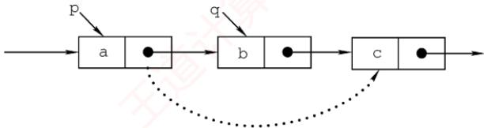  
图2.6 单链表结点的删除

```c
bool ListDelete(LinkList &L,int i,ElemType &e){ 育
LNode *p=L; //指针p指向当前扫描到的结点
int j=0; //记录当前结点的位序，头结点是第0个结点
while(p->next!=NULL&&j<i-1) {//循环找到第i-1 个结点
p=p->next;
1 j++; E道计算机
if(p->next==NULL|lj>i-1) //i 值不合法
王道 return false;
LNode *q=p->next; //令 q 指向被删除结点
e=q->data; //用 e 返回元素的值
p->next=q->next; //将*g结点从链中“断开”
free(q) ; //释放结点的存储空间①
return true;
2-
```

类似于插入操作，该操作的主要耗时也在查找操作上，时间复杂度为 $O ( n )$

当链表不带头结点时，需判断被删结点是否为首结点，若是，则要做特殊处理，将头指针指向新的首结点。当链表带头结点时，删除首结点和删除其他结点的操作是相同的。

扩展：删除给定结点 $^ { \star } \mathrm { p }$ o

常规方法需要从头遍历找到 $^ { \star } \mathrm { p }$ 的前驱，时间复杂度为O(n)。若允许修改结点内容，则可采用一种O(1)的技巧：将 $^ \star \mathrm { p }$ 的后继结点的数据复制到\*p中，然后删除其后继结点。该方法的局限性在于不能用于删除尾结点（因其无后继）。主要代码片段如下：

LNode \*q=p->next; //令 g 指向\*p 的后继结点  
p->data=p->next->data; //用后继结点的数据域覆盖  
p->next=q->next; //将\*g 结点从链中“断开  
free (q) ; //释放后继结点的存储空间

## 7. 采用头插法建立单链表

该方法从一个空表开始，生成新结点\*s，并将读取的数据存入其数据域。然后，令s->next指向头结点当前next所指的结点，再将头结点的next指向\*s，如图2.7所示。重复此过程，新结点始终成为第一个数据结点，最终链表中的元素顺序与输入顺序相反。

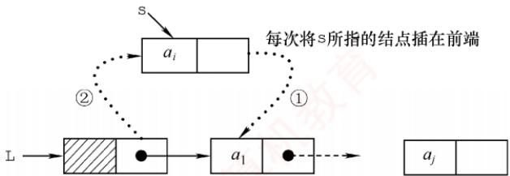  
图2.7 采用头插法建立单链表

```c
LinkList List HeadInsert(LinkList &L){ //逆向建立单链表
LNode *s; int x; //设元素类型为整型
L=(LNode*)malloc(sizeof(LNode)); //创建头结点
L->next=NULL; //初始为空链表
scanf ("%d",&x); //输入结点的值
while(x!=9999) { //输入9999表示结束
s=(LNode*)malloc(sizeof(LNode));∥/创建新结点
s->data=x;
s->next=L->next;
L->next=s; //将新结点插入表中，L为头指针
scanf ("%d",&x) ;
}
return L;
```

每插入一个结点的时间复杂度为O(1)，总时间复杂度为O(n)。

## 思考

若单链表不带头结点，则上述代码中哪些地方需要修改？

## 8. 采用尾插法建立单链表

若希望输入顺序与链表中的元素顺序一致，则可采用尾插法。该方法将新结点插入当前链表的表尾。为此，需要维护一个尾指针r，并且始终指向当前的尾结点；插入时，令r->next指向新结点\*s，再将r更新为s，使其继续指向新的尾结点，如图2.8所示。

  
图2.8 采用尾插法建立单链表

```c
LinkList List TailInsert(LinkList &L){ //正向建立单链表
int x; //设元素类型为整型
L=(LNode*)malloc(sizeof(LNode)); //创建头结点
LNode *s,*r=L; //r 为表尾指针
scanf ("%d",&x); //输入结点的值
while(x!=9999) { //输入 9999 表示结束
s=(LNode *)malloc(sizeof(LNode));
首 百
s->data=x;
r->next=s;
r=s; //r 指向新的表尾结点
scanf("%d",&x);
1
r->next=NULL; //尾结点指针置空
return L;
```

因为附设了一个尾指针，故无须遍历查找尾部，总时间复杂度仍为O(n)。

## 注意

单链表是链式存储结构的基础，建议读者熟练掌握其基本操作。在设计算法时，可先通过画图理清指针变化逻辑，再编写代码，有助于避免常见错误（如指针丢失、内存泄漏等）。

## 2.3.3 双链表

单链表的每个结点仅包含一个指向其后继的指针，故只能从前往后依次遍历。若需访问某结点的前驱（插入或删除操作时），则要从头开始遍历，时间复杂度为O(n)。为了克服这一局限，引入了双链表，双链表中的每个结点包含两个指针prior和next，分别指向直接前驱和直接后继，如图2.9所示。其中，头结点的prior为NULL，尾结点的next也为NULL。

  
图2.9 双链表示意图

双链表结点类型的定义如下：

```c
typedef struct DNode{ //定义双链表结点类型
ElemType data; //数据域
struct DNode *prior,*next; //前驱和后继指针
}DNode, *DLinklist;
```

双链表的按值查找操作和按位查找操作与单链表的相同，通常也需要从头结点开始顺序查找。由于增加了指向前驱的指针，双链表在插入操作和删除操作中要同时维护前驱与后继两个方向的链接，因此其实现方式与单链表的有较大差异。关键在于：修改指针时不能造成断链。得益于对前驱结点的直接访问，在已知目标结点的前提下，双链表的插入和删除操作的时间复杂度可降至0(1)。

## 1. 双链表的插入操作

考点追踪双链表中插入操作的实现（2023）

在双链表的结点\*p之后插入新结点\*s，其指针变化过程如图2.10所示。代码片段如下：


图2.10 双链表插入结点过程  
① s->next=p->next; //将结点\*s 插入到结点\*p 之后   
2 p->next->prior=s;   
③ s->prior=p;   
4 p->next=s;

上述语句的执行顺序并不是任意的：步骤①必须在步骤④之前，否则p->next被覆盖后，无法访问原后继结点，导致指针丢失，插入失败。其余步骤可在保证逻辑正确的前提下适当调整（例如③可在①前执行）。若问题改成要求在结点\*p之前插入结点\*s，则要如何处理？请读者自行推导操作步骤。

## 2. 双链表的删除操作

考点追踪双链表中删除操作的实现（2016）

删除双链表中结点 $^ { \star } \mathrm { p }$ 的后继结点 ${ } ^ { \star } \mathbb { Q }   ;$ ，其指针的变化过程如图2.11所示。

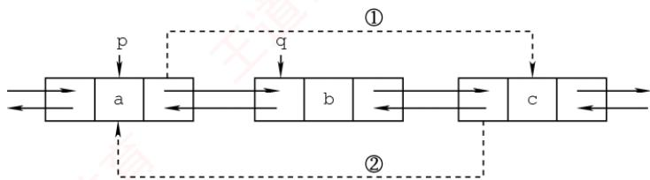  
图2.11 双链表删除结点过程

$$
\begin{aligned} &\mathtt{p}->\mathtt{next}=\mathtt{q}->\mathtt{next};\\ &\mathtt{q}->\mathtt{next}->\mathtt{pr}\downarrow\circ\mathtt{r}=\mathtt{p};\\ &\mathtt{f}\mathtt{ree}\;(\mathtt{q})\;;\\ \end{aligned}
$$

若问题改成要求删除结点 $^ { \star } \mathrm { { q } }$ 的前驱结点 $^ { \star } \mathrm { p }$ ，请读者尝试写出对应的操作步骤。

建立双链表时，同样可以采用类似单链表的头插法或尾插法，但要注意：每次插入新结点时，要同时正确设置next 和 $\mathtt { p r i o r }$ 两个指针，以维持双向链接的完整性。

## 2.3.4 循环链表

## 1. 循环单链表

循环单链表与普通单链表的主要区别在于：表中最后一个结点的next域不再为NULL，而是指向头结点，从而使整个链表形成一个环。这种结构使得从任意一个结点出发均可遍历整个循环单链表，而不仅限于从表头开始，如图2.12所示。

  
图 2.12 循环单链表

尾结点 $^ { \star } \mathbb { T }$ 的next指向头结点，因此链表中不存在next为NULL的结点。判空条件不再是检查头指针L是否为空，而是检查头结点的next是否指向自身 $( \mathtt { L } - > \mathtt { n e x t } = = \mathtt { L } )$

## 考点追踪循环单链表中删除首元素的操作（2021）

循环单链表的插入和删除操作与普通单链表基本相同，但有一个关键差异：在表尾进行操作时，需要特别处理以维持链表的循环特性。然而，正是因为循环单链表是一个环，在任何位置上的插入和删除操作都是等价的，因此无须判断是否到达表尾。 H

为了提高效率，循环单链表有时不设头指针，而仅设置尾指针r。此时，在表头或表尾插入元素的时间复杂度均为O(1)。若使用头指针，则表尾插入需要遍历整个链表，时间复杂度为O(n)。例如，在表尾插入新结点 $^ { \star } \mathrm { S }$ 时，需要执行以下步骤：令 $\mathrm{s}->\mathrm{n}\mathrm{e}\times \mathrm{t}=\mathrm{r}->\mathrm{n}\mathrm{e}\times \mathrm{t}$ (使新结点的后继指向头结点，以维持环状结构）：将 $\mathtt { r } \mathtt { - } \mathtt { > } \mathtt { n } \mathtt { e } \mathtt { x } \mathtt { t }$ 指向新结点 $\left[ ^ { \star } \mathrm { S } \right]$ ；更新r为新结点 $^ { \star } \mathrm { S }$

## 2. 循环双链表

基于循环单链表的概念，不难推导出循环双链表。不同之处在于：循环双链表中的每个结点不仅包含指向下一个结点的 ${ \tt n e x t }$ 域，还包含指向前一个结点的 $\mathtt { [ p r i o r }$ 域。特别地，头结点的 $\mathtt { | p r i o r }$

需要指向表尾结点，从而形成一个完整的环形结构，如图2.13所示。

  
图 2.13 循环双链表

设尾结点为 $^ { \star } \mathrm { p }$ ，则p->next 应指向头结点 L；同时，L->prior 应指向 $^ { \star } \mathrm { p }$ 。当循环双链表为空时，其头结点L的prior 和 next都指向自身（L->prior== L且 $\mathtt { L } \mathtt { - } \mathtt { > } \mathtt { n e x } \mathtt { \textell } \mathtt { = } \mathtt { = } \mathtt { L } \mathtt { ) }$

## 2.3.5 静态链表

静态链表是用数组来模拟线性表的链式存储结构。每个结点都包含两个域：data域和next域。与动态链表不同的是，这里的指针实际上是结点在数组中的相对地址（数组下标），也称游标。类似于顺序表，静态链表也需要预先分配一块连续的内存空间。

静态链表和单链表的对应关系如图2.14所示。

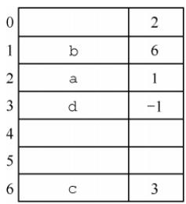  
(a)静态链表示例

  
(b)静态链表对应的单链表  
图2.14 静态链表和单链表的对应关系

静态链表的结构类型定义如下：

#define MaxSize 50 //静态链表的最大长度  
typedef struct{ //静态链表的结构类型定义  
ElemType data; //存储数据元素  
int next; //下一个元素的数组下标  
} SLinkList[MaxSize];

静态链表以next==-1作为其结束标志。静态链表的插入、删除操作与动态链表类似，只需修改指针（数组下标），而无须移动元素。尽管静态链表在灵活性上不及动态链表，但在一些不支持指针的编程语言（如Basic）中，它提供了一种巧妙的设计方案。 X

## 2.3.6 顺序表和链表的比较

## 1. 存取（读/写）方式

顺序表支持随机存取，可通过下标直接访问任意位置元素，时间复杂度为O(1)，同时也支持顺序存取。链表仅支持顺序存取，必须从头结点开始逐个遍历。例如，访问第i个元素时，顺序表只需一次操作；而链表需要遍历i个结点，平均时间复杂度为 $O ( n )$

## 2. 逻辑结构与物理结构

顺序存储中，逻辑上相邻的元素在物理内存中也连续存放，其邻接关系由地址自然体现；链式存储中，逻辑相邻的元素在物理上未必相邻，其逻辑关系通过指针显式维护。

## 3. 查找、插入和删除操作

对于按值查找，若表无序，则两者的时间复杂度均为O(n)；若表有序，则顺序表可以采用折半查找，时间复杂度为O(log2n)。对于按序号查找，顺序表的时间复杂度为O(1)，链表则为O(n)。对于插入/删除操作，顺序表平均需移动约一半的元素，开销较大；链表只需修改指针，无须移动元素，但前提是已知操作位置（否则仍需O(n)的时间定位）。

## 4. 空间分配

顺序表在静态分配下需预先设定容量：过大造成内存浪费，过小则易在插入时溢出。动态分配虽支持运行时扩容，但需要申请新的连续内存块并复制全部原有数据，不仅耗时，还可能因系统缺乏足够连续空闲空间而失败。相比之下，链表采用动态结点分配，按需扩展，灵活性高，但每个结点需额外存储指针域，导致存储密度小于1，空间利用率较低。

在实际应用中，该如何选择合适的存储结构呢？

## 1. 基于存储的考虑

当线性表的长度或规模难以预估时，顺序表因需预先分配固定容量而不适用；而链表无须预设容量，可按需动态扩展，但每个结点需额外存储指针，带来一定的空间开销。

## 2. 基于运算的考虑

若应用中频繁进行按序号访问（随机访问），顺序表具有O(1)的优势，明显更高效；而对于以插入和删除为主的操作，链表在定位目标位置后仅需调整指针，开销较小。尽管定位过程本身仍需O(n)时间，但在增删密集的场景下，链表的整体性能通常更优。

## 3. 基于环境的考虑

顺序表基于数组实现，几乎所有高级语言都支持，实现简单；链表则依赖指针操作，在部分环境中实现较为复杂。因此，开发语言和运行环境也是重要的考量因素。

综上所述，两种结构各有优劣。对于规模稳定、以随机访问为主的场景，宜采用顺序存储；而动态性强、频繁进行插入和删除操作的场景，则更适合链式存储。

## 注意

只有熟练掌握线性表的顺序存储和链式存储，才能深刻理解它们的优缺点。

## 2.3.7 本节试题精选

## 一、单项选择题

01. 下列关于线性表的存储结构的描述中，正确的是（）。 I. 线性表的顺序存储结构优于其链式存储结构 王道Ⅱ. 链式存储结构比顺序存储结构能更方便地表示各种逻辑结构Ⅲ. 若频繁使用插入和删除结点操作，则顺序存储结构更优于链式存储结构IV. 顺序存储结构和链式存储结构都可以进行顺序存取A. I、ⅡI、ⅢII B. II、IV C. II、III D. III、IV

02. 对于一个线性表，既要求能进行较快速地插入和删除，又要求存储结构能反映数据之间的逻辑关系，则应该用（）。A. 顺序存储方式 B. 链式存储方式C. 散列存储方式 D. 以上均可以

03. 链式存储设计时，结点内的存储单元地址（）。

A. 一定连续 B. 一定不连续C. 不一定连续 D. 部分连续，部分不连续

04. 下列关于线性表的说法中，正确的是（）。I. 顺序存储方式只能用于存储线性结构Ⅱ. 在一个设有头指针和尾指针的单链表中，删除表尾元素的时间复杂度与表长无关Ⅲ. 带头结点的循环单链表中不存在空指针IV. 在一个长度为 n的有序单链表中插入一个新结点并仍保持有序的时间复杂度为O(n)V. 若用单链表来表示队列，则应该选用带尾指针的循环链表A. I、ⅡI 教育 B. I、ⅢII、IV、V 7教育C. IV、V D. III、IV、V

05. 设线性表中有2n个元素，（）在单链表上实现要比在顺序表上实现效率更高。A. 删除所有值为 x的元素B. 在最后一个元素的后面插入一个新元素 道计算C. 顺序输出前k个元素D. 交换第i个元素和第 2n−i−1个元素的值（i=0,…,n−1）

06. 在一个单链表中，已知q所指结点是p所指结点的前驱结点，若在q和p之间插入结点s，则执行（）。7A. s->next=p->next;p->next=s; B. p->next=s->next;s->next=p;C. q->next=s;s->next=p; D. p->next=s;s->next=q;

07. 给定有n个元素的一维数组，建立一个有序单链表的最低时间复杂度是（）。A. O(1) B. O(n) C. O(n²) D. O(nlog2n)

08. 将长度为n的单链表链接在长度为 m的单链表后面，其算法的时间复杂度采用大O形式表示应该是（）。A. O(1) C. O(m) D. O(n + m)

09. 单链表中，增加一个头结点的目的是（）。A. 使单链表至少有一个结点 B. 标识表结点中首结点的位置C. 方便运算的实现 D. 说明单链表是线性表的链式存储

10. 在一个长度为n的带头结点的单链表h上，设有尾指针r，则执行（）操作与链表的表长有关。A. 删除单链表中的第一个元素B. 删除单链表中的最后一个元素 王道计算机C. 在单链表第一个元素前插入一个新元素D. 在单链表最后一个元素后插入一个新元素

11. 对于一个头指针为head的带头结点的单链表，判定该表为空表的条件是（）；对于不带头结点的单链表，判定空表的条件为（）。A. head==NULL B. head->next==NULLC. head->next==head D. head!=NULL

12. 在线性表 $a _ { 0 } , a _ { 1 } , \cdots , a _ { 1 0 0 }$ 中，删除元素 $a _ { 5 0 }$ 需要移动（）个元素。A. 0 B. 50 FI C. 51 D. 0或50

13. 通过含有n(n>1)个元素的数组a，采用头插法建立单链表L，则 L 中的元素次序（）。A. 与数组 a 的元素次序相同 B. 与数组 a的元素次序相反

C. 与数组a的元素次序无关 D. 以上都错误

14.下面关于线性表的一些说法中，正确的是（）。A. 对一个设有头指针和尾指针的单链表执行删除最后一个元素的操作与链表长度无关B. 线性表中每个元素都有一个直接前驱和一个直接后继C. 为了方便插入和删除数据，可以使用双链表存放数据D. 取线性表第i个元素的时间与i的大小有关

15. 在双链表中向p所指的结点之前插入一个结点q的操作为（）。A. p->prior=q; q->next=p; p->prior->next=q; q->prior=p->prior;B. q->prior=p->prior; p->prior->next=q; q->next=p; p->prior=q->next;C. q->next=p; p->next=q; q->prior->next=q; q->next=p;D. $\mathtt { p } { - } \mathtt { > } \mathtt { p } \mathtt { r } \mathtt { i } \mathtt { o } \mathtt { r } { - } \mathtt { > } \mathtt { n } \mathtt { e } \mathtt { x } \mathtt { t } { = } \mathtt { q } \mathtt { ; } \quad \mathtt { q } { - } \mathtt { > } \mathtt { n } \mathtt { e } \mathtt { x } \mathtt { t } { = } \mathtt { p } \mathtt { ; } \quad \mathtt { q } { - } \mathtt { > } \mathtt { p } \mathtt { r } \mathtt { i } \mathtt { o } \mathtt { r } { = } \mathtt { p } { - } \mathtt { > } \mathtt { p } \mathtt { r } \mathtt { i } \mathtt { o } \mathtt { r } \mathtt { ; } \quad \mathtt { p } { - } \mathtt { > } \mathtt { p } \mathtt { r } \mathtt { i } \mathtt { o } \mathtt { r } { = } \mathtt { q } \mathtt { ; }$

16. 在双链表存储结构中，删除p所指的结点时必须修改指针（）。A. p->prior->next=p->next; p->next->prior=p->prior;B. p->prior=p->prior->prior; p->prior->next=p;C. p->next->prior=p; p->next=p->next->next;D. p->next=p->prior->prior; p->prior=p->next->next;

17. 在如下图所示的双链表中，已知指针p指向结点A，若要在结点A和C之间插入指针q所指的结点B，则依次执行的语句序列可以是（）。

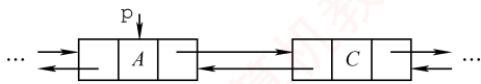


① q->next=p->next; ② q->prior=p; ③ p->next=q; ④ p->next->prior=q; A. ①②④③ B. ④③②① C. ③④①② D. ①③④②

18.在双链表的两个结点之间插入一个新结点，需要修改（）个指针域。A. 1 B. 3 C. 4 D. 2

19. 在长度为n的有序单链表中插入一个新结点，并仍然保持有序的时间复杂度是（）。A. O(1) B. O(n) C. O(n2) D. O(nlog2n)

20. 与单链表相比，双链表的优点之一是（）。A. 插入、删除操作更方便 B. 可以进行随机访问 KC. 可以省略表头指针或表尾指针 D. 访问前后相邻结点更灵活

21.对于一个带头结点的循环单链表L，判断该表为空表的条件是（）。A. 头结点的指针域为空 B. L 的值为 NULLC. 头结点的指针域与L的值相等 D. 头结点的指针域与L的地址相等

22. 对于一个带头结点的循环双链表L，判断该表为空表的条件是（）。A. $\mathtt { L } \mathtt { - } \mathtt { > } \mathtt { p r i o r } \mathtt { = } \mathtt { = } \mathtt { L } \mathtt { \& \& L } \mathtt { - } \mathtt { > } \mathtt { n e x t } \mathtt { = } \mathtt { = } \mathtt { N U L L }$ B. $\mathtt { L } \mathtt { - } \mathtt { > } \mathtt { p } \mathtt { \bar { r } } \mathtt { \downarrow } \mathtt { \circ } \mathtt { r } \mathtt { = } \mathtt { = } \mathtt { N } \mathtt { U } \mathtt { L } \mathtt { L } \mathtt { \& } \mathtt { \& } \mathtt { L } \mathtt { - } \mathtt { > } \mathtt { n } \mathtt { e } \mathtt { x } \mathtt { t } \mathtt { = } \mathtt { = } \mathtt { N } \mathtt { U } \mathtt { L } \mathtt { L }$ NC. $\mathtt { L } \mathtt { - } \mathtt { > } \mathtt { p r i o r } \mathtt { = } \mathtt { = } \mathtt { N U L L } \mathtt { \& \& L } \mathtt { - } \mathtt { > } \mathtt { n e x t } \mathtt { = } \mathtt { = } \mathtt { L }$ D. $\mathtt { L } - \mathtt { > } \mathtt { p r i o r } = = \mathtt { L } \& \& - \mathtt { > } \mathtt { n e x t } = = \mathtt { L }$

23.一个链表最常用的操作是在末尾插入结点和删除结点，则选用（）最节省时间。A. 带头结点的循环双链表 B. 循环单链表C. 带尾指针的循环单链表 D. 单链表

24. 设对n（n>1）个元素的线性表的运算只有4种：删除第一个元素；删除最后一个元素；在第一个元素之前插入新元素；在最后一个元素之后插入新元素，则最好使用（）。

A. 只有尾结点指针没有头结点指针的循环单链表B. 只有尾结点指针没有头结点指针的非循环双链表C. 只有头结点指针没有尾结点指针的循环双链表D. 既有头结点指针又有尾结点指针的循环单链表

25. 有两个长度为n的循环单链表，若要求两个循环单链表头尾相接的时间复杂度为O(1)，则对应两个循环单链表各设置一个指针，分别指向（）。A. 各自的头结点 B. 各自的尾结点C. 各自的首结点 D. 一个表的头结点，另一个表的尾结点

26. 有一个长度为n的循环单链表，若从表中删除首元结点的时间复杂度达到O(n)，则此时采用的循环单链表的结构可能是（）。A. 只有表头指针，没有头结点 B. 只有表尾指针，没有头结点C. 只有表尾指针，带头结点 D. 只有表头指针，带头结点

27. 某线性表用带头结点的循环单链表存储，头指针为 head，当 head->next->next==head成立时，线性表的长度可能是（）。 道L A. 0 B. 1 C. 2 D. 可能为0或1

28. 有两个长度都为 n 的双链表，若以 $h _ { 1 }$ 为头指针的双链表是非循环的，以 $h _ { 2 }$ 为头指针的双链表是循环的，则下列叙述中正确的是（）。A. 对于双链表 $h _ { 1 }$ ，删除首结点的时间复杂度是O(n)B. 对于双链表 $h _ { 2 } ,$ 删除首结点的时间复杂度是O(n)C. 对于双链表 $h _ { 1 } ,$ 删除尾结点的时间复杂度是O(1)D. 对于双链表 $h _ { 2 }$ ，删除尾结点的时间复杂度是O(1)

29.一个链表最常用的操作是在最后一个元素后插入一个元素和删除第一个元素，则选用（）A. 不带头结点的循环单链表 最节省时间。 道计 B. 双链表C. 单链表 D. 不带头结点且有尾指针的循环单链表

30. 需要分配较大连续空间，插入和删除不需要移动元素的线性表，其存储结构为（）。A. 单链表 1 B. 静态链表 C. 顺序表 D. 双链表 V

31.下列关于静态链表的说法中，正确的是（）。I. 静态链表兼具顺序表和单链表的优点，因此存取表中第i个元素的时间与i无关Ⅱ. 静态链表能容纳的最大元素个数在表定义时就确定了，以后不能增加Ⅲ.静态链表与动态链表在元素的插入、删除上类似，不需要移动元素IV.相比动态链表，静态链表可能浪费较多的存储空间A. I、Ⅱ、ⅢII B. II、ⅢII、IV 王道计C. I、III、IV D. I、II、IV

32. 【2016统考真题】已知一个带有表头结点的循环双链表L，结点结构为 $\boxed { \mathtt { p r e v } \; \boxed { \mathtt { d a t a } } \; \mathtt { n e x t } }$ 其中prev和next分别是指向其直接前驱和直接后继结点的指针。现要删除指针p所指的结点，正确的语句序列是（）。A. $\mathtt { p } \mathtt { - } \mathtt { > } \mathtt { n e } \mathtt { x t } \mathtt { - } \mathtt { > } \mathtt { p } \mathtt { x e } \mathtt { v } \mathtt { = } \mathtt { p } \mathtt { - } \mathtt { > } \mathtt { p } \mathtt { x e } \mathtt { v } \mathtt { ; } \quad \mathtt { p } \mathtt { - } \mathtt { > } \mathtt { p } \mathtt { x e } \mathtt { v } \mathtt { - } \mathtt { > } \mathtt { n e } \mathtt { x t } \mathtt { = } \mathtt { p } \mathtt { - } \mathtt { > } \mathtt { p } \mathtt { x e } \mathtt { v } \mathtt { ; } \quad \mathtt { f r e e } \quad \mathtt { ( p ) } \quad \mathtt { ; }$ B. `p->next->prior = p;` C. `p->next->prior = p;` D. $\mathtt { p } \mathtt { - } \mathtt { > } \mathtt { n e } \mathtt { x t } \mathtt { - } \mathtt { > } \mathtt { p } \mathtt { x e } \mathtt { v } \mathtt { = } \mathtt { p } \mathtt { - } \mathtt { > } \mathtt { p } \mathtt { x e } \mathtt { v } \mathtt { ; } \quad \mathtt { p } \mathtt { - } \mathtt { > } \mathtt { p } \mathtt { x e } \mathtt { v } \mathtt { - } \mathtt { > } \mathtt { n e } \mathtt { x t } \mathtt { = } \mathtt { p } \mathtt { - } \mathtt { > } \mathtt { n e } \mathtt { x t } \mathtt { ; } \quad \mathtt { f } \mathtt { x e } \mathtt { e } \quad \mathtt { ( p ) } \quad \mathtt { ; }$

33.【2016统考真题】已知表头元素为c的单链表在内存中的存储状态如下表所示。

<table><tr><td rowspan=1 colspan=4>地址       元素      链接地址</td></tr><tr><td rowspan=1 colspan=2>1000H</td><td rowspan=1 colspan=1>a</td><td rowspan=1 colspan=1>1010H</td></tr><tr><td rowspan=1 colspan=2>1004H</td><td rowspan=1 colspan=1>b</td><td rowspan=1 colspan=1>100CH</td></tr><tr><td rowspan=1 colspan=2>1008H</td><td rowspan=1 colspan=1>C</td><td rowspan=1 colspan=1>1000H</td></tr><tr><td rowspan=1 colspan=2>100CH</td><td rowspan=1 colspan=1>d</td><td rowspan=1 colspan=1>NULL</td></tr><tr><td rowspan=1 colspan=1>1010H</td><td rowspan=1 colspan=1></td><td rowspan=1 colspan=1>e</td><td rowspan=1 colspan=1>1004H</td></tr><tr><td rowspan=1 colspan=2>1014H</td><td rowspan=1 colspan=1></td><td rowspan=1 colspan=1></td></tr></table>

现将f存放于1014H处并插入单链表，若f在逻辑上位于a和e之间，则a、e、f的“链接地址”依次是（）。A. 1010H、1014H、1004H B. 1010H、1004H、1014HC. 1014H、1010H、1004H D. 1014H、1004H、1010H 教育

34.【2021 统考真题】已知头指针h指向一个带头结点的非空循环单链表，结点结构为datanext，其中next是指向直接后继结点的指针，p是尾指针，q是临时指针。现要删除该链表的第一个元素，正确的语句序列是（）。A. h->next=h->next->next;q=h->next;free(q); 王道计B. q=h->next;h->next=h->next->next;free(q);C. q=h->next;h->next=q->next;if(p!=q) p=h;free(q);D. q=h->next;h->next=q->next;if(p==q) p=h;free(q);

35.【2023统考真题】现有非空双链表L，其结点结构为 $\boxed { \mathtt { p r e v } \boxed { \mathtt { d a t a } } \boxed { \mathtt { n e x t } } } ,$ prev是指向直接前驱结点的指针，next是指向直接后继结点的指针。若要在L中指针p所指向的结点(非尾结点）之后插入指针s指向的新结点，则在执行语句序列“s->next=p->next；p->next=s；”后，下列语句序列中还需要执行的是（）。A. s->next->prev=p; s->prev=p;B. p->next->prev=s; s->prev=p;C. s->prev=s->next->prev; s->next->prev=s;D. p->next->prev=s->prev; s->next->prev=p;

36.【2024统考真题】已知带头结点的非空单链表L的头指针为h，结点结构为data next其中next是指向直接后继结点的指针。现有指针p和q，若p指向L中非首且非尾的任意一个结点，则执行语句序列“q=p->next；p->next=q->next；q->next=h->next；h->next=q;”的结果是（）。A. 在p所指结点后插入 q所指结点B. 在 q所指结点后插入 p所指结点C. 将p所指结点移至L的头结点之后 D. 将q所指结点移动到L的头结点之后

## 二、综合应用题

01.在带头结点的单链表工中，删除所有值为×的结点，并释放其空间，假设值为×的结点不唯一，试编写算法以实现上述操作。

02. 试编写在带头结点的单链表工中删除一个最小值结点的高效算法（假设该结点唯一）。

03. 试编写算法将带头结点的单链表就地逆置，所谓“就地”是指辅助空间复杂度为O(1)。

04. 设在一个带表头结点的单链表中，所有结点的元素值无序，试编写一个函数，删除表中所有处于给定的两个值（作为函数参数给出）之间的元素（若存在）。

05.给定两个单链表，试分析找出两个链表的公共结点的思想（不用写代码）。

06. 设 $C = \{ a _ { 1 } , b _ { 1 } , a _ { 2 } , b _ { 2 } , \cdots , a _ { n } , b _ { n } \}$ 为线性表，采用带头结点的单链表存放，设计一个就地算法，将其拆分为两个线性表，使得 $A = \left\{ a_{1}, a_{2}, \cdots, a_{n} \right\}, B = \left\{ b_{n}, \cdots, b_{2}, b_{1} \right\}$

07. 在一个递增有序的单链表中，存在重复的元素。设计算法删除重复的元素，例如（7,10，

10,21,30,42,42,42,51,70）将变为（7,10,21,30,42,51,70）。

08. 设A和B是两个单链表（带头结点），其中元素递增有序。设计一个算法从A和B中的公共元素产生单链表C，要求不破坏A、B的结点。

09. 已知两个链表A和 B 分别表示两个集合，其元素递增排列。编制函数，求A 与 B 的交集，并存放于A链表中。

10. 两个整数序列 $A = a_{1}, a_{2}, a_{3}, \cdots, a_{m}$ 和 $B = b_{1}, b_{2}, b_{3}, \cdots, b_{n}  已$ 经存入两个单链表中，设计一个算法，判断序列B是否是序列A的连续子序列。

11. 设计一个算法用于判断带头结点的循环双链表是否对称。

12. 有两个循环单链表，链表头指针分别为 $h _ { 1 }$ 和 $h _ { 2 }$ ，编写一个函数将链表 $h _ { 2 }$ 链接到链表 $h _ { 1 }$ 之后，要求链接后的链表仍保持循环链表形式。

13. 设有一个带头结点的非循环双链表L，其每个结点中除有pre、data和next域外，还有一个访问频度域freq，其值均初始化为零。每当在链表中进行一次Locate(L,x)运算时，令值为×的结点中freq域的值增1，并使此链表中的结点保持按访问频度递减的顺序排列，且最近访问的结点排在频度相同的结点之前，以便使频繁访问的结点总是靠近表头。试编写符合上述要求的Locate(L，x)函数，返回找到结点的地址，类型为指针型。

14. 设将n（n>1）个整数存放到不带头结点的单链表L中，设计算法将L中保存的序列循环右移k（0<k<n）个位置。例如，若k=1，则将链表{0,1,2,3}变为{3,0,1,2}。要求：1）给出算法的基本设计思想。2）根据设计思想，采用C或C++语言描述算法，关键之处给出注释。3）说明你所设计算法的时间复杂度和空间复杂度。

15.单链表有环，是指单链表的最后一个结点的指针指向了链表中的某个结点（通常单链表的最后一个结点的指针域是空的）。试编写算法判断单链表是否存在环。

1）给出算法的基本设计思想。

2）根据设计思想，采用C或C++语言描述算法，关键之处给出注释。

3）说明你所设计算法的时间复杂度和空间复杂度。

16.设有一个长度n（n为偶数）的不带头结点的单链表，且结点值都大于0，设计算法求这个单链表的最大孪生和。孪生和定义为一个结点值与其孪生结点值之和，对于第i个结点（从0开始），其孪生结点为第n-i-1个结点。要求： X

1）给出算法的基本设计思想。

2）根据设计思想，采用C或C++语言描述算法，关键之处给出注释。

3）说明你的算法的时间复杂度和空间复杂度。

17.【2009统考真题】已知一个带有表头结点的单链表，结点结构为

<table><tr><td>data</td><td></td></tr><tr><td></td><td>link</td></tr></table>

假设该链表只给出了头指针1ist。在不改变链表的前提下，请设计一个尽可能高效的算法，查找链表中倒数第k个位置上的结点（k为正整数）。若查找成功，算法输出该结点的data域的值，并返回1；否则，只返回0。要求：

1）描述算法的基本设计思想。

2）描述算法的详细实现步骤。

3）根据设计思想和实现步骤，采用程序设计语言描述算法（使用C、C++或Java语言实现），关键之处请给出简要注释。

18.【2012统考真题】假定采用带头结点的单链表保存单词，当两个单词有相同的后缀时，可共享相同的后缀存储空间，例如，loading和being的存储映像如下图所示。


设str1和str2分别指向两个单词所在单链表的头结点，链表结点结构为 $\boxed { \mathtt { d a t a } \boxed { \mathtt { n e x t } } }$ 请设计一个时间上尽可能高效的算法，找出由str1和str2所指向两个链表共同后缀的起始位置（如图中字符i所在结点的位置p）。要求： XK

1）给出算法的基本设计思想。

2）根据设计思想，采用C或C++或Java语言描述算法，关键之处给出注释。

3）说明你所设计算法的时间复杂度。

19.【2015统考真题】用单链表保存m个整数，结点的结构为[data][1ink]，且|data|≤值相等的点，仅保一现的结点而其对，等的点。例如，若给定的单链表 head 如下：


则删除结点后的 head 为

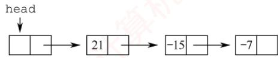

要求：

1）给出算法的基本设计思想。

2）使用C或C++语言，给出单链表结点的数据类型定义。

3）根据设计思想，采用C或C++语言描述算法，关键之处给出注释。

4）说明你所设计算法的时间复杂度和空间复杂度。

20.【2019统考真题】设线性表 $L = \left( a_{1}, a_{2}, a_{3}, \cdots, a_{n-2}, a_{n-1}, a_{n} \right)$ 采用带头结点的单链表保存，链表中的结点定义如下： X

```c
typedef struct node
int data;
struct node*next;
}NODE;
```

请设计一个空间复杂度为O(1)且时间上尽可能高效的算法，重新排列L中的各结点，得到线性表 $L ^ { \prime } = ( a _ { 1 } , a _ { n } , a _ { 2 } , a _ { n - 1 } , a _ { 3 } , a _ { n - 2 } , \cdots )$ 。要求：

1）给出算法的基本设计思想。

2）根据设计思想，采用C或C++语言描述算法，关键之处给出注释。

3）说明你所设计的算法的时间复杂度。

## 2.3.8 答案与解析

## 一、单项选择题

01. B

两种存储结构适用于不同的场合，不能简单地说谁好谁坏，说法Ⅰ错误。链式存储用指针表

示逻辑结构，而指针的设置是任意的，因此比顺序存储结构能更方便地表示各种逻辑结构，说法Ⅱ正确。在顺序存储中，插入和删除结点需要移动大量元素，效率较低，说法Ⅲ的描述刚好相反。顺序存储结构既能随机存取又能顺序存取，而链式结构只能顺序存取，说法IV正确。

## 02. B

首先直接排除选项A和D。散列存储通过散列函数映射到物理空间，不能反映数据之间的逻辑关系，排除选项C。链式存储能方便地表示各种逻辑关系，且插入和删除操作的时间复杂度为O(1)。

## 03. A

链式存储设计时，各个不同结点的存储空间可以不连续，但结点内的存储单元地址必须连续。

## 04. D

顺序存储方式同样适用于存储图和树，说法Ⅰ错误。删除表尾结点时，必须从头开始找到表尾结点的前驱，其时间与表长有关，说法Ⅱ错误。循环单链表中最后一个结点的指针不是NULL，而是指向头结点，整个链表形成一个环，因此不存在空指针，说法Ⅲ正确。有序单链表只能依次查找插入位置，时间复杂度为O(n)，说法IV正确。队列需要在表头删除元素，表尾插入元素，采用带尾指针的循环链表较为方便，插入和删除的时间复杂度都为O(1)，说法V正确。

## 05. A

对于选项A，在单链表和顺序表上实现的时间复杂度都为O(n)，但后者要移动很多元素，因此在单链表上实现效率更高。对于选项B和D，顺序表的效率更高。C无区别。

## 06. C

s 插入后，q成为 s的前驱，而p成为 s的后继，选择选项C。

## 注意

可能有读者认为选项C中的两条语句交换后才正确。实际上，因为本题插入位置的前后结点都有指针指示（这与前面介绍的插入操作是不同的），所以选项C中的语句顺序并不会造成断链。在此提醒读者在学习过程中一定要多动脑思考，而不要生搬硬套。

## 07. D

若先建立链表，然后依次插入建立有序表，则每插入一个元素就需遍历链表寻找插入位置，即直接插入排序，时间复杂度为 $O ( n ^ { 2 } )$ 。若先将数组排好序，然后建立链表，建立链表的时间复杂度为O(n)，数组排序的最好时间复杂度为 O(nlog2n)，总时间复杂度为O(nlog2n)。故选择选项D。

## 08. C

先遍历长度为m的单链表，找到该单链表的尾结点，然后将其next域指向另一个单链表的首结点，其时间复杂度为O(m)。

## 09. C

单链表设置头结点的目的是方便运算的实现，主要好处体现在：第一，有头结点后，插入和删除数据元素的算法就统一了，不再需要判断是否在第一个元素之前插入或删除第一个元素；第二，不论链表是否为空，其头指针是指向头结点的非空指针，链表的头指针不变，因此空表和非空表的处理也就统一了。

## 10. B

删除单链表的最后一个结点需置其前驱结点的指针域为NULL，需要从头开始依次遍历找到该前驱结点，需要O(n)的时间，与表长有关。其他操作均与表长无关，读者可自行模拟。

## 11. B, A

在带头结点的单链表中，头指针head指向头结点，头结点的next域指向第一个元素结点，$\mathtt { h e a d { - } { > } n e x t { = } { = } N U L L }$ 表示该单链表为空。在不带头结点的单链表中，head直接指向第一个元素结点，head==NULL表示该单链表为空。

## 12. D

线性表有顺序存储和链式存储两种存储结构。若采用链式存储结构，则删除元素 $a _ { 5 0 }$ 不需要移动元素；若采用顺序存储结构，则需要依次移动50个元素。

## 13. B

当采用头插法建立单链表时，数组后面的元素插入到单链表L的最前端，所以L中的元素次序与数组a的元素次序相反。 H

## 14. C

选项A显然错误。选项B中第一个元素和最后一个元素不满足题设要求。双链表能很方便地访问前驱和后继，故删除和插入数据较为方便，选项C正确。选项D未考虑顺序存储的情况。

## 15. D

为了在 $\mathrm { p }$ 之前插入结点 $\mathbb { G } ;$ ，可以将p的前一个结点的 next 域指向 q，将 $\mathbb { q }$ 的 next 域指向p，将 $\mathbb { q }$ 的 $\mathtt { p r i o r }$ 域指向 $\wp$ 的前一个结点，将 $\wp$ 的 $\mathtt { p r i o r }$ 域指向 $\mathbb { G } \circ$ 仅选项D满足条件。

## 16. A

与上一题的分析基本类似，只不过这里是删除一个结点，注意将 $\mathrm { p }$ 的前、后两结点链接起来。关键是要保证在结点指针的修改过程中不断链！ X

注意，请读者仔细对比上述两题，弄清双链表的插入和删除方法。

## 17. A

结点A和B分别由指针 $\mathrm { p }$ 和 $\mathbb { q }$ 指示，但结点C仅能由p->next间接指示，因此在改变p->next之前，必须先将g->next指向结点C，即①要在③前面，且④要在③前面（因为若先执行③，则④相当于q->prior指向其自身，显然矛盾）。故只能选择选项A。

## 18. C

当在双链表的两个结点（分别用第一个、第二个结点表示）之间插入一个新结点时，需要修改四个指针域，分别是：新结点的前驱指针域，指向第一个结点；新结点的后继指针域，指向第二个结点；第一个结点的后继指针域，指向新结点；第二个结点的前驱指针域，指向新结点。

## 19. B

设单链表递增有序，首先要在单链表中找到第一个大于×的结点的直接前驱p，在p之后插入该结点。查找的时间复杂度为 $O ( n )$ ，插入的时间复杂度为O(1)，总时间复杂度为 $O ( n )$

## 20. D

在插入和删除操作上，单链表和双链表都不用移动元素，都很方便，但双链表修改指针的操作更为复杂，选项A错误。双链表中可以快速访问任何一个结点的前驱和后继结点，选项D正确。

## 21. C

带头结点的循环单链表工为空表时，满足 $\mathtt { L } \mathtt { - } \mathtt { > } \mathtt { n e x t } \mathtt { = } \mathtt { = } \mathtt { L }$ ，即头结点的指针域与工的值相等，而不是头结点的指针域与工的地址相等。注意，带头结点的循环单链表中不存在空指针。

## 22. D

循环双链表L判空的条件是头结点（头指针）的prior和next域都指向它自身。

## 23. A

在链表的末尾插入和删除一个结点时，需要修改其相邻结点的指针域。而寻找尾结点及尾结点的前驱结点时，只有带头结点的循环双链表所需要的时间最少。

## 24. C

对于选项A，删除尾结点 $^ { \star } \mathrm { p }$ 时，需要找到 $^ { \star } \mathrm { P }$ 的前一个结点，时间复杂度为 $O ( n )$ 。对于选项B,删除首结点 $^ \star \mathrm { p }$ 时，需要找到 $^ { \star } \mathrm { p }$ 结点，这里没有直接给出头结点指针，而是通过尾结点的 $\mathtt { p r i o r }$ 指针找到 $^ { \star } \mathrm { p }$ 结点的时间复杂度为 $O ( n )$ 。对于选项D，删除尾结点 $^ \star \mathrm { p }$ 时，需要找到 $^ { \star } \mathrm { p }$ 的前一个结点，时间复杂度为 $O ( n )$ 。对于C，执行这四种算法的时间复杂度均为O(1)。

## 25. B

要求用O(1)的时间将两个循环单链表头尾相接，并未指明哪个链表接在另一个链表之后，所以对两个链表都要在O(1)的时间找到头结点和尾结点。因此，两个指针应都指向尾结点。

## 26. A

在循环单链表中，删除首元结点后，要保持链表的循环性，因此需要找到首元结点的前驱。  
当链表带头结点时，其前驱就是头结点，因此不论是表头指针还是表尾指针，删除首元结点的时  
间都为O(1)。当链表不带头结点时，其前驱是尾结点，因此，若有表尾指针，就可在O(1)的时间  
找到尾结点：若只有表头指针，则需要遍历整个链表找到尾结点，时间为O(n)。V

## 27. D

对一个空循环单链表，有 head->next==head，推理 head->next->next==head->next==head。对含有一个元素的循环单链表，头结点（头指针 head 指示）的 next 域指向这个唯一的元素结点，该元素结点的 next 域指向头结点，因此也有 head->next->next=head。

## 28. D

对于两种双链表，删除首结点的时间复杂度都是O(1)。对于非循环双链表，删除尾结点的时间复杂度是O(n)；对于循环双链表，删除尾结点的时间复杂度是O(1)。

## 29. D

对于选项A，在最后一个元素之后插入元素的情况与普通单链表相同，时间复杂度为 O(n)；而删除第一个元素时，为保持循环单链表的性质（尾结点指向第一个结点），要先遍历整个链表找到尾结点，再做删除操作，时间复杂度为O(n)。对于选项B，双链表的情况与单链表的相同，一个是O(n)，一个是O(1)。对于选项C，在最后一个元素之后插入一个元素，要遍历整个链表才能找到插入位置，时间复杂度为O(n)；删除第一个元素的时间复杂度为O(1)。对于选项D，与选项A的分析对比，有尾结点的指针，省去了遍历链表的过程，因此时间复杂度均为O(1)。

## 30. B

静态链表采用数组表示，因此需要预先分配较大的连续空间，静态链表同时还具有一般链表的特点，即插入和删除不需要移动元素。

## 31. B

静态链表的存储空间虽然是顺序分配的，但元素的存储不是顺序的，查找时仍然需要按链依次进行，而插入、删除都不需要移动元素。静态链表的存储空间是一次性申请的，能容纳的最大元素个数在定义时就已确定。并非每个空间都存储了元素，因此会造成存储空间的浪费。

## 32. D

选项A的第二句代码，相当于将p前驱结点的后继指针指向其自身，错误；选项B和C的第一句代码，相当于将p后继结点的前驱指针指向其自身，错误。只有选项D正确。

## 33. D

根据存储状态，单链表的结构如下图所示。


其中“链接地址”是指结点next所指的内存地址。当结点f插入后，a指向f，f指向e，e指向 b。显然a、e和 f的“链接地址”分别是f、b和e的内存地址，即1014H、1004H和1010H。

## 34. D

如图1所示，要删除带头结点的非空循环单链表中的第一个元素，就要先用临时指针g指向待删结点，q=h->next；然后将 $\mathbb { q }$ 从链表中断开，h->next=q->next（这一步也可写成h->next=$\mathrm{h}->\mathrm{ne}\mathrm{x}\mathrm{t}->\mathrm{ne}\mathrm{x}\mathrm{t}$ ；此时要考虑一种特殊情况，若待删结点是链表的尾结点，即循环单链表中只有一个元素 $\mathrm { r ( p ) }$ 和 $\mathbb { q }$ 指向同一个结点)，如图2所示，则在删除后要将尾指针指向头结点，即 $\mathrm{i}\mathrm{f}\left(\mathrm{p}==\mathrm{q}\right)$ p=h；最后释放 $\mathbb { q }$ 结点即可，答案选择选项D。

  
图1

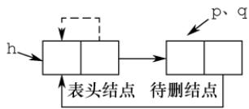  
图2

## 35. C

链表的插入操作要保证不会造成断链，画图再依次判断选项。执行语句“①s->next=p->next；②p->next=s；”后的结构如下图所示（虚线表示prev，实线表示next）。

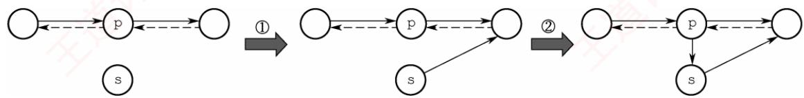

对于选项 A， $\mathtt { s } { \mathrel { \mathtt { - } } \mathrel { \mathtt { > } } } \mathtt { n e x t { \mathtt { - } } \mathrel { \mathtt { > } } } \mathtt { p r e v { \mathrel { \mathtt { = } } } p }$ ，错误。对于选项B， $\mathtt { p } { - } \mathtt { > } \mathtt { n e x t } { - } \mathtt { > } \mathtt { p r e v } { = } \mathtt { s }$ ，让 s的 prev指向s，错误。对于选项D,两句代码均错误。对于选项C，执行语句“③s->prev=s->next->prev；④s->next->prev=s；”后的结构如下图所示，满足插入的要求。

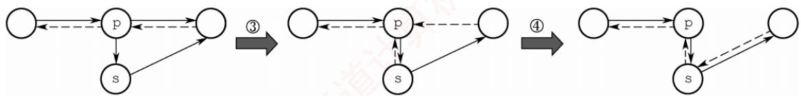

## 36. D

假设单链表的初始状态如图①所示。执行q=p->next后的状态如图②所示，q指向p的后继结点。执行 $\mathrm{p}->\mathrm{n}\mathrm{e}\times \mathrm{t}=\mathrm{q}->\mathrm{n}\mathrm{e}\times \mathrm{t}$ 后的状态如图③所示，结点p的 next指向 g的后继结点。执行q->next=h->next后的状态如图④所示，结点 q的next 指向h的后继结点。执行h->next=q后的状态如图⑤所示，g所指结点移至工的头结点h之后，选项D正确。


## 二、综合应用题

## 01.【解答】

解法1：用 $\wp$ 从头至尾扫描单链表，pre指向 $^ \star \mathrm { p }$ 结点的前驱。若 $\wp$ 所指结点的值为x，则删

除，并让p移向下一个结点，否则让pre、p指针同步后移一个结点。

本题代码如下：

```c
void Del_X_1(Linklist &L,ElemType x){
LNode *p=L->next,*pre=L,*q;∥/置p 和pre 的初始值
while(p!=NULL) {
if(p->data==x){
q=p; ∥/q指向被删结点
p=p->next;
pre->next=p; //将*q结点从链表中断开
free(q) ; //释放*q结点的空间
else{ //否则，pre 和 p 同步后移
pre=p;
p=p->next;
}//else
}//while
```

本算法是在无序单链表中删除满足某种条件的所有结点，这里的条件是结点的值为x。实际上，这个条件是可以任意指定的，只要修改if条件即可。比如，我们要求删除值介于mink和maxk之间的所有结点，只需将if 语句修改为if(p->data>mink&&p->data<maxk)。

解法2：采用尾插法建立单链表。用p指针扫描工的所有结点，当其值不为×时，将其链接到L之后，否则将其释放。

本题代码如下：

```c
void Del X 2(Linklist &L,ElemType x){
LNode *p=L->next,*r=L,*q; ∥/r指向尾结点，其初值为头结点
while(p!=NULL) {
if(p->data!=x) { //*p 结点值不为×时将其链接到L尾部
r->next=p;
r=p;
p=p->next; //继续扫描
}
else{ //*p 结点值为×时将其释放
q=p;
p=p->next; //继续扫描
free(q) ; //释放空间
}//while
r->next=NULL; //插入结束后置尾结点指针为NULL
```

上述两个算法扫描一遍链表，时间复杂度为O(n)，空间复杂度为O(1)。

## 02. 【解答】

算法思想：用p从头至尾扫描单链表，pre指向\*p结点的前驱，用minp保存值最小的结点指针（初值为p），minpre指向\*minp结点的前驱（初值为pre）。一边扫描，一边比较，若p->data 小于minp->data，则将p、pre 分别赋值给minp、minpre，如下图所示。当p扫描完毕时，minp指向最小值结点，minpre指向最小值结点的前驱结点，再将minp所指结点删除即可。


本题代码如下：

```c
LinkList Delete Min(LinkList &L){
LNode *pre=L，*p=pre->next；//p 为工作指针，pre 指向其前驱
LNode *minpre=pre，*minp=p；//保存最小值结点及其前驱
while(p!=NULL) {
if(p->data<minp->data) {
minp=p; //找到比之前找到的最小值结点更小的结点
minpre=pre;
1
pre=p; //继续扫描下一个结点
p=p->next;
}
minpre->next=minp->next; //删除最小值结点
free(minp);
return L;
```

算法需要从头至尾扫描链表，时间复杂度为O(n)，空间复杂度为O(1)。

若本题改为不带头结点的单链表，则实现上会有所不同，请读者自行思考。

## 03.【解答】

解法1：将头结点摘下，然后从第一结点开始，依次插入到头结点的后面（头插法建立单链表），直到最后一个结点为止，这样就实现了链表的逆置，如下图所示。

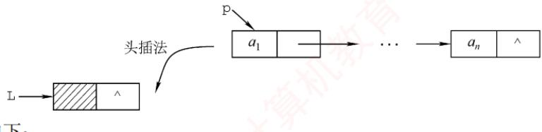

本题代码如下：

```c
LinkList Reverse 1(LinkList L) {
LNode *p, *r; //p为工作指针，r为p的后继，以防断链
p=L->next; //从第一个元素结点开始
L->next=NULL; //先将头结点 L 的 next 域置为 NULL
while(p!=NULL) { //依次将元素结点摘下
r=p->next; //暂存 p 的后继
p->next=L->next; //将p 结点插入到头结点之后
L->next=p;
p=r;
1 算机
return L;
```

解法2：大部分辅导书都只介绍解法1，这对读者的理解和思维是不利的。为了将调整指针这个复杂的过程分析清楚，我们借助图形来进行直观的分析。

假设pre、p和r指向三个相邻的结点，如下图所示。假设经过若于操作后，\*pre之前的结点的指针都已调整完毕，它们的next都指向其原前驱结点。现在令\*p结点的next域指向\*pre结点，注意到一旦调整指针的指向，\*p的后继结点的链就会断开，为此需要用r来指向原\*p的后继结点。处理时需要注意两点：一是在处理第一个结点时，应将其next域置为NULL，而不是指向头结点（因为它将作为新表的尾结点）；二是在处理完最后一个结点后，需要将头结点的指针指向它。


本题代码如下：

LinkList Reverse 2(LinkList L){  
LNode \*pre,\*p=L->next,\*r=p->next;  
p->next=NULL; //处理第一个结点  
while(r!=NULL){ //r为空，则说明p为最后一个结点  
pre=p; 王道 //依次继续遍历  
p=r;  
r=r->next;  
p->next=pre; //指针反转  
L->next=p; //处理最后一个结点  
return L;

上述两个算法的时间复杂度为O(n)，空间复杂度为O(1)。

## 04.【解答】

因为链表是无序的，所以只能逐个结点进行检查，执行删除。

本题代码如下：

```c
void RangeDelete(LinkList &L,int min,int max){
LNode *pr=L,*p=L->link; //p 是检测指针，pr 是其前驱
while(p!=NULL)
if(p->data>min&&p->data<max){ ∥寻找到被删结点，删除
pr->link=p->link;
free(p);
p=pr->link;
}
else{ 道计算机教育 //否则继续寻找被删结点
pr=p;
p=p->link;
```

## 05.【解答】

两个单链表有公共结点，即两个链表从某一结点开始，它们的next都指向同一结点。每个单链表结点只有一个next域，因此从第一个公共结点开始，之后的所有结点都是重合的，不可能再出现分叉。所以两个有公共结点而部分重合的单链表，拓扑形状看起来像Y，而不可能像X。

本题极容易联想到“蛮”方法：在第一个链表上顺序遍历每个结点，每遍历一个结点，在第二个链表上顺序遍历所有结点，若找到两个相同的结点，则找到了它们的公共结点。显然，该算法的时间复杂度为 O(len1·len2)。

接下来我们试着去寻找一个线性时间复杂度的算法。先把问题简化：如何判断两个单链表有  
没有公共结点？应注意到这样一个事实：若两个链表有一个公共结点，则该公共结点之后的所有  
结点都是重合的，即它们的最后一个结点必然是重合的。因此，我们判断两个链表是不是有重合  
的部分时，只需要分别遍历两个链表到最后一个结点。若两个尾结点是一样的，则说明它们有公  
共结点，否则两个链表没有公共结点。V

然而，在上面的思路中，顺序遍历两个链表到尾结点时，并不能保证在两个链表上同时到达尾结点。这是因为两个链表长度不一定一样。但假设一个链表比另一个长k个结点，我们先在长的链表上遍历k个结点，之后再同步遍历，此时我们就能保证同时到达最后一个结点。两个链表从第一个公共结点开始到链表的尾结点，这一部分是重合的，因此它们肯定也是同时到达第一公共结点的。于是在遍历中，第一个相同的结点就是第一个公共的结点。

根据这一思路中，我们先要分别遍历两个链表得到它们的长度，并求出两个长度之差。在长的链表上先遍历长度之差个结点之后，再同步遍历两个链表，直到找到相同的结点，或者一直到链表结束。此时，该方法的时间复杂度为O(len1+len2)。

## 06.【解答】

算法思想：循环遍历链表C，采用尾插法将一个结点插入表A，这个结点为奇数号结点，这样建立的表A与原来的结点顺序相同；采用头插法将下一结点插入表B，这个结点为偶数号结点，这样建立的表B与原来的结点顺序正好相反。

本题代码如下：

```c
LinkList DisCreat 2(LinkList &A){
LinkList B=(LinkList)malloc(sizeof(LNode));//创建B 表表头
B->next=NULL; //B 表的初始化
LNode *p=A->next,*q; //p 为工作指针
LNode *ra=A; //ra 始终指向 A 的尾结点 道计算机教育
while(p!=NULL) {
ra->next=p; ra=p; //将*p 链到 A 的表尾
p=p->next;
if (p!=NULL) {
q=p->next; //头插后，*p将断链，因此用 q记忆*p的后继
p->next=B->next; //将*p插入到B 的前端
B->next=p;
p=q;
} 育
}
ra->next=NULL; //A 尾结点的 next 域置空
return B;
1
```

要特别注意的是，该算法采用头插法插入结点后，\*p的指针域已改变，若不设变量保存其后继结点，则会引起断链，从而导致算法出错。

## 07.【解答】

算法思想：题中链表是有序表，因此所有相同值域的结点都是相邻的。用p扫描递增单链表L，若\*p结点的值域等于其后继结点的值域，则删除后者，否则p移向下一个结点。

本题代码如下：

```c
void Del Same(LinkList &L) {
LNode *p=L->next,*q; //p 为扫描工作指针
if(p==NULL)
return;
while(p->next!=NULL) {
q=p->next; //g 指向*p 的后继结点
道计 if(p->data==q->data) { //找到重复值的结点
p->next=q->next; //释放*q结点
free(q) ; //释放相同元素值的结点
1
else
p=p->next;
育
```

本算法的时间复杂度为 O(n)，空间复杂度为 O(1)。

本题也可采用尾插法，将头结点摘下，然后从第一结点开始，依次与已经插入结点的链表的最后一个结点比较，若不等则直接插入，否则将当前遍历的结点删除并处理下一个结点，直到最后一个结点为止。

## 08.【解答】

算法思想：表A、B都有序，可从第一个元素起依次比较A、B两表的元素，若元素值不等则值小的指针往后移，若元素值相等，则创建一个值等于两结点的元素值的新结点，使用尾插法插入到新的链表中，并将两个原表指针后移一位，直到其中一个链表遍历到表尾。

本题代码如下：

```c
roid Get Common(LinkList A,LinkList B){
LNode *p=A->next,*q=B->next,*r,*s;
LinkList C=(LinkList)malloc(sizeof(LNode)); //建立表C
r=C; /r 始终指向 C 的尾结点
while(p!=NULL&&q!=NULL) { //循环跳出条件
if(p->data<q->data)
p=p->next; //若A的当前元素较小，后移指针
else if(p->data>q->data)
q=q->next; //若B的当前元素较小，后移指针
else{ //找到公共元素结点
计算 s=(LNode*)malloc(sizeof(LNode));
s->data=p->data; //复制产生结点*s
r->next=s; //将*s链接到C上（尾插法）
r=s;
p=p->next; //表 A 和 B 继续向后扫描
q=q->next;
r->next=NULL; //置C 尾结点指针为空
```

## 09.【解答】

算法思想：采用归并的思想，设置两个工作指针pa和pb，对两个链表进行归并扫描，只有同时出现在两集合中的元素才链接到结果表中且仅保留一个，其他的结点全部释放。当一个链表遍历完毕后，释放另一个表中剩下的全部结点。

本题代码如下：

```c
LinkList Union(LinkList &la,LinkList &lb) {
LNode *pa=la->next; //设工作指针分别为 pa 和 pb
LNode *pb=1b->next;
LNode *u,*pc=la; //结果表中当前合并结点的前驱指针pc
while(pa&&pb) {
if(pa->data==pb->data) { //交集并入结果表中
pc->next=pa; //A 中结点链接到结果表
道计算机 pc=pa; pa=pa->next; 王道计算机教
u=pb; //B 中结点释放
pb=pb->next;
free(u) ;
}
else if(pa->data<pb->data) {//若A 中当前结点值小于 B 中当前结点值
u=pa;
pa=pa->next; //后移指针
free(u); //释放A中当前结点
}
else{ //若B 中当前结点值小于 A 中当前结点值
u=pb;
pb=pb->next; free(u); 道计算机 //后移指针 //释放B 中当前结点
}
}//while 结束
```

```c
while(pa) { //B 已遍历完，A未完
u=pa;
pa=pa->next;
free(u); //释放A 中剩余结点
} 王道计算机
while(pb) { //A 已遍历完，B未完
u=pb;
pb=pb->next;
free(u) ; //释放 B 中剩余结点
}
pc->next=NULL; //置结果链表尾指针为NULL
free(lb); //释放 B 表的头结点
return la;
1
```

链表归并类型的试题在各学校历年真题中出现的频率很高，故应扎实掌握解决此类问题的思想。该算法的时间复杂度为 O(len1 +len2)，空间复杂度为O(1)。

## 10.【解答】

算法思想：因为两个整数序列已存入两个链表中，操作从两个链表的第一个结点开始，若对应数据相等，则后移指针；若对应数据不等，则A链表从上次开始比较结点的后继开始，B链表仍从第一个结点开始比较，直到B链表到尾表示匹配成功。A链表到尾而B链表未到尾表示失败。操作中应记住A链表每次的开始结点，以便下次匹配时好从其后继开始。

本题代码如下：

```c
int Pattern(LinkList A,LinkList B){
LNode *p=A; //p 为A链表的工作指针，本题假定 A 和 B 均无头结点
LNode *pre=p; /pre 记住每趟比较中 A 链表的开始结点
LNode *q=B; //g 是B 链表的工作指针
while(p&&q)
if(p->data==q->data){//结点值相同
p=p->next;
q=q->next;
}
else{
pre=pre->next;
p=pre; //A链表新的开始比较结点
q=B; //g 从 B 链表第一个结点开始
if(q==NULL) //B 已经比较结束 道计算机教育
return 1; //说明 B 是 A 的子序列
else
return 0; //B 不是 A 的子序列
```

## 注意

该题其实是字符串模式匹配的链式表示形式，读者应该结合字符串模式匹配的内容重新考虑能否优化该算法。 TA

## 11.【解答】

算法思想：让p从左向右扫描，q从右向左扫描，直到它们指向同一结点（p==q，当循环双链表中结点个数为奇数时）或相邻 $(p - > \max t = q$ 或 $\mathtt { Q } - > \mathtt { p r i o r } = \mathtt { p }$ ，当循环双链表中结点个数为偶数时）为止，若它们所指结点值相同，则继续进行下去，否则返回0。若比较全部相等，则返回1。

本题代码如下：

```c
int Symmetry(DLinkList L){
DNode *p=L->next,*q=L->prior; //两头工作指针
while(p!=q&&p->next!=q) //循环跳出条件
if(p->data==q->data) { //所指结点值相同则继续比较
p=p->next;
q=q->prior;
王道
else //否则，返回0
return 0;
return 1; //比较结束后返回1
```

## 注意

while循环第二个判断条件易误写成q->next!=p，分析这样会产生什么问题。

## 12. 【解答】

算法思想：先找到两个链表的尾指针，将第一个链表的尾指针与第二个链表的头结点链接起来，再使之成为循环的。

本题代码如下：

```c
LinkList Link(LinkList &h1,LinkList &h2){
//将循环链表h2 链接到循环链表h1之后，使之仍保持循环链表的形式
LNode *p,*q; //分别指向两个链表的尾结点
p=h1;
while(p->next!=h1) //寻找 h1 的尾结点
p=p->next;
q=h2;
while(q->next!=h2) 王道计算机 //寻找 h2 的尾结点
q=q->next;
p->next=h2; //将 h2 链接到 h1 之后
q->next=h1; //令 h2 的尾结点指向 h1
return h1;
```

## 13. 【解答】

算法思想：首先在双链表中查找数据值为×的结点，查到后，将结点从链表上摘下，然后顺着结点的前驱链查找该结点的插入位置（频度递减，且排在同频度的第一个，即向前找到第一个比它的频度大的结点，插入位置为该结点之后），并插入到该位置。

本题代码如下：

```c
DLinkList Locate(DLinkList &L,ElemType x){
DNode *p=L->next,*q; /p为工作指针，q为p的前驱，用于查找插入位置
while(p&&p->data!=x)
p=p->next; //查找值为×的结点
if(!p)
exit(0); //不存在值为×的结点
else{
p->freq++; ∥/令元素值为x的结点的 freq 域加 1
if(p->pre==L|Ip->pre->freq>p->freq)
return p; //p 是链表首结点，或freq值小于前驱
if(p->next!=NULL) p->next->pre=p->pre;
p->pre->next=p->next；//将p结点从链表上摘下
q=p->pre; //以下查找p结点的插入位置
while(q!=L&&q->freq<=p->freq)
q=q->pre;
p->next=q->next;
```

```c
if(q->next!=NULL) q->next->pre=p; //将 p 结点排在同频率的第一个
p->pre=q;
q->next=p;
return p; //返回值为×的结点的指针
1
```

## 14.【解答】

## 1）算法的基本设计思想：

首先，遍历链表计算表长n，并找到链表的尾结点，将其与首结点相连，得到一个循环单链表。然后，找到新链表的尾结点，它为原链表的第n-k个结点，令工指向新链表尾结点的下一个结点，并将环断开，得到新链表。 姚

## 2）本题代码如下：

```c
LNode *Converse(LNode *L,int k) {
int n=1; /n 用来保存链表的长度
LNode *p=L; while(p->next!=NULL) { //p 为工作指针 //计算链表的长度 王道计算
p=p->next;
n++;
1 //循环执行后，p指向链表尾结点
p->next=L; //将链表连成一个环
for(int i=1;i<=n-k;i++) //寻找链表的第 n-k 个结点
p=p->next;
L=p->next; //令Ⅰ指向新链表尾结点的下一个结点
p->next=NULL; //将环断开
return L;
```

3）本算法的时间复杂度为O(n)，空间复杂度为O(1)。

## 15.【解答】

## 1）算法的基本设计思想：

设置快慢两个指针分别为fast和slow最初都指向链表头head。slow每次走一步，即slow=slow->next；fast每次走两步，即fast=fast->next->next。fast比slow走得快，若有环，则fast一定先进入环，而s1ow后进入环。两个指针都进入环后，经过若干操作后两个指针定能在环上相遇。这样就可以判断一个链表是否有环。

如下图所示，当slow刚进入环时，fast早已进入环。因为fast每次比slow多走一步且fast与slow的距离小于环的长度，所以fast与slow相遇时，slow所走的距离不超过环的长度。


如下图所示，设头结点到环的入口点的距离为a，环的入口点沿着环的方向到相遇点的距离为x，环长为r，相遇时fast绕过了n圈。

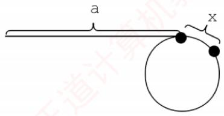

则有2(a+x)=a+n\*r+x，即 a=nr−x。显然从头结点到环的入口点的距离等于n倍的环长减去环的入口点到相遇点的距离。因此可设置两个指针，一个指向head，另一个指向相遇点，两个指针同步移动（均为一次走一步），相遇点即环的入口点。

## 2）本题代码如下：

```c
LNode* FindLoopStart(LNode *head) {
LNode *fast=head, *slow=head; //设置快慢两个指针
while(fast!=NULL&&fast->next!=NULL) {
slow=slow->next; //每次走一步
fast=fast->next->next; //每次走两步
if(slow==fast) break; //相遇
if(fast==NULL||fast->next==NULL)
return NULL; //没有环，返回NULL
LNode *p1=head, *p2=slow ; //分别指向开始点、相遇点
while(p1!=p2) {
p1=p1->next;
p2=p2->next; 王道计
return p1; //返回入口点
```

3）当fast与slow相遇时，slow肯定没有遍历完链表，故算法的时间复杂度为O(n)，空间复杂度为O(1)。 I

## 16. 【解答】

## 1）算法的基本设计思想：

设置快、慢两个指针分别为fast和slow，初始时slow指向L（第一个结点），fast指向L->next（第二个结点），之后slow每次走一步，fast每次走两步。当fast指向表尾（第n个结点）时，s1ow正好指向链表的中间点（第n/2个结点），即s1ow正好指向链表前半部分的最后一个结点。将链表的后半部分逆置，然后设置两个指针分别指向链表前半部分和后半部分的首结点，在遍历过程中计算两个指针所指结点的元素之和，并维护最大值。

## 2）本题代码如下：

```c
int PairSum(LinkList L){
LNode *fast=L->next,*slow=L;//利用快慢双指针找到链表的中间点
while(fast!=NULL&&fast->next!=NULL) {
fast=fast->next->next; //快指针每次走两步 计算机教育
slow=slow->next; //慢指针每次走一步
LNode *newHead=NULL,*p=slow->next,*tmp;
while(p!=NULL) { //反转链表后一半部分的元素，采用头插法
tmp=p->next; //p 指向当前待插入结点，令 tmp 指向其下一结点
p->next=newHead; //将p所指结点插入到新链表的首结点之前
newHead=p; //newHead指向刚才新插入的结点，作为新的首结点
p=tmp; //当前待处理结点变为下一结点
} int mx=0; p=L; 育
LNode *q=newHead;
while(q!=NULL) { //用p和q分别遍历两个链表
if((p->data+q->data)>mx)∥/用mx 记录最大值
mx=p->data+q->data;
p=p->next;
q=q->next;
1
```

return mx;

3）本算法的时间复杂度为O(n)，空间复杂度为O(1)。

## 17.【解答】

## 1）算法的基本设计思想：

问题的关键是设计一个尽可能高效的算法，通过链表的一次遍历，找到倒数第k个结点的位置。定义两个指针变量p和q，初始时均指向头结点的下一个结点（链表的第一个结点），p指针沿链表移动；当p指针移动到第k个结点时，q指针开始与p指针同步移动；当p指针移动到最后一个结点时，q指针所指示结点为倒数第k个结点。以上过程对链表仅进行一遍扫描。

2）算法的详细实现步骤如下：

① count=0，p和q指向链表表头结点的下一个结点。

②若p为空，转⑤。

③ 若 count等于 k，则 q指向下一个结点；否则，count=count+1。

④p指向下一个结点，转②。

⑤若count等于k，则查找成功，输出该结点的data域的值，返回1；否则，说明k值 超过了线性表的长度，查找失败，返回0。

⑥ 算法结束。

3）算法实现如下：

```c
typedef int ElemType; //链表数据的类型定义
typedef struct LNode{ //链表结点的结构定义
ElemType data; struct LNode *link; 算机 //结点数据 //结点链接指针
}LNode, *LinkList;
int Search k(LinkList list,int k){
LNode *p=list->link,*q=list->link； //指针p、q指示第一个结点
int count=0;
while(p!=NULL) { //遍历链表直到最后一个结点
if (count<k) count++; //计数，若 count<k 只移动p
else q=q->link;
p=p->link; //之后让p、q同步移动
}//while
if(count<k)
return 0; //查找失败返回0
else { //否则打印并返回1
printf("%d",q->data); 道计算机
return 1;
}
```

## 评分说明

若所给算法采用一遍扫描方式就能得到正确结果，则可给满分15分；若采用两遍或多遍扫描才能得到正确结果，则最高分为10分。若采用递归算法得到正确结果，则最高给10分；若实现算法的空间复杂度过高（使用了大小与k有关的辅助数组），但结果正确，则最高给10分。

## 18.【解答】

顺序遍历两个链表到尾结点时，并不能保证两个链表同时到达尾结点。这是因为两个链表的长度不同。假设一个链表比另一个链表长k个结点，我们先在长链表上遍历k个结点，之后同步遍历两个链表，这样就能够保证它们同时到达最后一个结点。因为两个链表从第一个公共结点到

链表的尾结点都是重合的，所以它们肯定同时到达第一个公共结点。

1）算法的基本设计思想：

① 分别求出 str1 和 str2 所指的两个链表的长度 m 和 n。

②将两个链表以表尾对齐：令指针 p、q分别指向 str1 和 str2的头结点，若 $m { \ngeq } n ,$ ，则指针p先走，使p指向链表中的第 m− n + 1个结点；若m < n，则使 q指向链表中的第n−m+1个结点，即使指针p和q所指的结点到表尾的长度相等。

③反复将指针p和q同步向后移动，并判断它们是否指向同一结点。当p、q指向同一结点，则该点即所求的共同后缀的起始地址。 XTA

2）本题代码如下：

```c
typedef struct Node{
char data;
struct Node *next;
} SNode; /*求链表长度的函数*/ 王道计算机系
int listlen(SNode *head) {
int len=0;
while(head->next!=NULL) {
len++;
head=head->next;
return len;
1
/*找出共同后缀的起始地址*/
SNode* find list(SNode *str1,SNode *str2) {
int m,n;
SNode *p,*q;
m=listlen(str1); //求 str1 的长度，O(m)
n=listlen(str2); 首 //求 str2 的长度，O(n)
for(p=str1;m>n;m--) /若 m>n，使 p 指向链表中的第 m-n+1 个结点
p=p->next;
for(q=str2;m<n;n--) //若 m<n，使 g 指向链表中的第 n-m+1 个结点
q=q->next;
while(p->next!=NULL&&p->next!=q->next){ //查找共同后缀的起始地址
p=p->next; //两个指针同步向后移动
} q=q->next; 算机教育
return p->next; //返回共同后缀的起始地址
```

3）时间复杂度为O(len1+len2)或O(max(len1,len2))，其中 len1、len2分别为两个链表的长度。

## 19.【解答】

1）算法的基本设计思想：

●算法的核心思想是用空间换时间。使用辅助数组记录链表中已出现的数值，从而只需对链表进行一趟扫描。

● 因为|data|≤n，故辅助数组g的大小为n+1，各元素的初值均为0。依次扫描链表中的各结点，同时检查 ${ \tt Q } \left[ \; | \; { \tt d a t a } \; | \; \right]$ 的值，若为0则保留该结点，并令q[|data|]=1；否则将该结点从链表中删除。

2）使用C语言描述的单链表结点的数据类型定义：

```c
typedef struct node {
int data;
struct node *link;
```

}NODE;   
Typedef NODE \*PNODE;

3）算法实现如下：

```c
void func (PNODE h,int n) {
PNODE p=h,r;
int *q,m;
q=(int *)malloc(sizeof(int)*(n+1))； //申请n+1 个位置的辅助空间
for(int i=0;i<n+1;i++) //数组元素初值置0
*(q+i)=0;
while(p->link!=NULL) {
m=p->link->data>0? p->link->data:-p->link->data;
if(*(q+m)==0){ //判断该结点的 data 是否已出现过
*(q+m)=1; //首次出现
p=p->link; //保留
else{ //重复出现 王道计算机教
r=p->link; //删除
道 p->link=r->link; free(r);
王 1
free(q) ;
```

4）参考答案所给算法的时间复杂度为O(m)，空间复杂度为O(n)。

## 20.【解答】

1）算法的基本设计思想：

先观察 $L = ( a _ { 1 } , a _ { 2 } , a _ { 3 } , \cdots , a _ { n - 2 } , a _ { n - 1 } , a _ { n } )$ 和 $L ^ { \prime } = ( a _ { 1 } , a _ { n } , a _ { 2 } , a _ { n - 1 } , a _ { 3 } , a _ { n - 2 } , \cdots )$ ，发现L'是由L摘取第一个元素，再摘取倒数第一个元素……依次合并而成的。为了方便链表后半段取元素，需要先将后半段原地逆置[题目要求空间复杂度为O(1)，不能借助栈]，否则每取最后一个结点都需要遍历一次链表。①先找出链表L的中间结点，为此设置两个指针p和q，指针p每次走一步，指针g每次走两步，当指针g到达链尾时，指针p正好在链表的中间结点；②然后将L的后半段结点原地逆置。③从单链表前后两段中依次各取一个结点，按要求重排。

## 2）算法实现如下：

```c
void change list (NODE*h) {
NOdE *p,*q, *r,*s;
p=q=h;
while(q->next!=NULL) { //寻找中间结点
p=p->next; //p 走一步 道计算机
q=q->next;
王道计 if(q->next!=NULL) q=q->next; //q走两步
1
q=p->next; //p所指结点为中间结点，q为后半段链表的首结点
p->next=NULL;
while(q!=NULL) { //将链表后半段逆置
r=q->next;
q->next=p->next;
p->next=q; 机教育
q=r;
}
s=h->next; //s 指向前半段的第一个数据结点，即插入点
q=p->next; //q指向后半段的第一个数据结点
p->next=NULL;
while(q!=NULL) { //将链表后半段的结点插入到指定位置
```

r=q->next; //r指向后半段的下一个结点  
q->next=s->next；//将 g 所指结点插入到 s 所指结点之后  
s->next=q;  
s=q->next; //s指向前半段的下一个插入点  
q=r;  
道

3）第一步找中间结点的时间复杂度为O(n)，第二步逆置的时间复杂度为O(n)，第三步合并链表的时间复杂度为O(n)，所以该算法的时间复杂度为O(n)。

## 归纳总结

本章是算法设计题的重点考查内容。线性表相关的算法题通常代码量较小，却蕴含一定的设计技巧，非常适合用于笔试考查。此类题目常采用“三段式”结构命题。

在给出题目背景和具体要求的前提下：

①给出算法的基本设计思想。

②采用C或C++语言描述算法，关键之处给出注释。

③分析所设计算法的时间复杂度和空间复杂度。

算法具体的设计思路灵活多变，难以一概而论。因此读者务必勤加练习，反复研读本章的典型例题，尝试用多种方法求解，并对比其时间与空间效率，从而逐步掌握各类题型的分析视角与最优解法。为此，编者整理了几种常用的算法设计技巧，供参考：针对链表，常用方法包括头插法、尾插法、逆置法、归并法、双指针法等，需根据具体问题灵活运用：针对顺序表，因其支持随机访问，常结合经典排序与查找策略进行设计，如归并排序、二分查找等。

## 注意

在算法设计题中，若能正确定义数据结构并清晰阐述算法思想，通常可获得至少一半的分数；若能进一步用规范代码实现，则得分更有保障；逻辑较复杂的部分可直接用文字说明，确保思路完整。

## 思维拓展

一个长度为 n 的整型数组 A[1...n]，给定整数 x，设计一个时间复杂度不超过 O(nlog2n)的算法，查找出这个数组中所有两两之和等于x的整数对（每个元素只输出一次）。

提示：本题若想到排序，则问题便迎刃而解。先用一种时间复杂度为O(nlog2n)的排序算法将A[1...n]从小到大排序，然后分别从数组的小端(i=1)和大端(j=n)开始查找：若 $\mathbb { A } \left[ \downarrow \right] + \mathbb { A } \left[ \downarrow \right] < \mathbb { X }$ i++；若A[i]+A[j]>x，j--；否则输出A[i]、A[j]，然后i++，j--；直到i>=j时停止。

请读者思考本题是否有其他求解算法。

# 第 3 章

# 栈、队列和数组

## 【考纲内容】

（一）栈和队列的基本概念

（二）栈和队列的顺序存储结构

（三）栈和队列的链式存储结构

（四）多维数组的存储

（五）特殊矩阵的压缩存储

（六）栈、队列和数组的应用

  
视频讲解

## 【知识框架】


## 【复习提示】

本章通常以选择题形式考查，题目难度不大，但命题方式较为灵活。其中，栈（如入栈/出栈过程、出栈序列的合法性）和队列的操作及其特征是考查重点。由于二者都是线性表的典型应用与推广，也常出现在算法设计题中。此外，栈和队列的顺序存储与链式存储及其特点、双端队列的特性、栈和队列的常见应用，以及数组与特殊矩阵的压缩存储，均为必须掌握的内容。

## 3.1 栈

## 3.1.1 栈的基本概念

## 1. 栈的定义

考点追踪栈的特点（2017）

栈（Stack）是仅允许在一端进行插入和删除操作的线性表。作为一种特殊的线性表，栈的插入（入栈）和删除（出栈）操作被限制在表的一端进行，如图3.1所示。

栈顶（Top）：允许进行插入和删除操作的一端。

栈底（Bottom）：固定不变、不允许进行插入和删除操作的另一端。  
空栈：不含任何元素的栈。

$$
 基高面螺师  \triangleright  出入枝序列的分析  (2010 、 2011 、 2013 、 2018 、 2020 、 2022)
$$

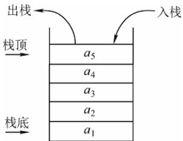

假设某栈 $S = ( a _ { 1 } , a _ { 2 } , a _ { 3 } , a _ { 4 } , a _ { 5 } )$ ，如图3.1所示，其中 $a _ { 1 }$ 为栈底元素，$a _ { 5 }$ 为栈顶元素。栈的入栈和出栈操作只能在栈顶进行。若元素按顺序$a _ { 1 } , a _ { 2 } , a _ { 3 } , a _ { 4 } , a _ { 5 }$ 入栈，则出栈顺序为 $a _ { 5 } , a _ { 4 } , a _ { 3 } , a _ { 2 } , a _ { 1 } ,$ ，由此可见，栈的操作特性可概括为后进先出（Last In First Out，LIFO）。

图 3.1 栈的示意图

## 注意

每接触一种新的数据结构，都应从其逻辑结构、存储结构和基本运算三方面进行系统理解。

## 2. 栈的基本操作

不同教材对基本操作的命名略有差异，但含义基本一致，本文采用严蔚敏教材的命名规范。

● InitStack(&S)：初始化一个空栈 S。

• StackEmpty(S)：判断栈是否为空。若栈s 为空，返回 true；否则返回 false。

● Push(&S，x)：入栈操作；若栈未满，则×成为新的栈顶元素。

● Pop(&S，&x)：出栈操作；若栈非空，则弹出栈顶元素，并通过×返回该值。

● GetTop(S，&x)：读取栈顶元素但不出栈；若栈非空，则通过×返回栈顶元素。

● DestroyStack(&S)：销毁栈s，并释放其所占用的存储空间（&表示引用调用）。

在解答算法题时，若题目未作特殊限制，可直接使用上述基本操作函数。

考点追踪Catalan数的应用（2015）

栈的数学性质：当n个不同元素按固定次序入栈时，可能的出栈序列总数为 $\scriptstyle { \frac { 1 } { n + 1 } } C _ { 2 n } ^ { n }$ 。该数列称为卡特兰（Catalan）数，可通过数学归纳法证明，有兴趣的读者可参考组合数学教材。

## 3.1.2 栈的顺序存储结构

与线性表类似，栈也有两种基本的存储方式：顺序存储和链式存储。

## 1. 顺序栈的实现

采用顺序存储的栈称为顺序栈，它利用一组地址连续的存储单元存放从栈底到栈顶的数据元素，并附设一个整型指针（top）指示当前栈顶元素的位置。

顺序栈的类型可定义如下

```c
#define MaxSize 50 //定义栈中元素的最大个数
typedef struct{
Elemtype data[MaxSize]; //存放栈中元素
int top; //栈顶指针
}SqStack;
```

栈顶指针：s.top，初始时设为s.top=-1；栈顶元素：s.data[s.top]。

入栈操作：当栈未满时，先将栈顶指针加1，再将元素存入栈顶。

出栈操作：当栈非空时，先取出栈顶元素，再将栈顶指针减1。

栈空条件：S.top==-1；栈满条件： $\mathrm{S}.\mathrm{top}=\mathrm{MaxS}\downarrow\mathrm{z}\mathrm{e}-1$ ；栈长：s.top+1。

另一种常见的方式是：栈顶指针初始化为s.top=0；入栈时先将元素存入栈顶，再将栈顶指针加 1；出栈时先将栈顶指针减1，再取出栈顶元素；栈空条件为 S.top==0；栈满条件为

S.top==MaxSize。

顺序栈的入栈操作受数组上界约束。若对栈的最大使用空间估计不足，则可能发生栈上溢，此时，应向用户报告错误信息，以便及时处理，避免程序异常。

## 注意

栈和队列的判空、判满条件，会因实际给出的条件不同而变化，下面的代码实现是在栈顶指针初始化为-1的条件下的相应方法，而其他情况则需具体问题具体分析。

## 2. 顺序栈的基本操作

考点追踪出/入栈操作的模拟（2009）

栈操作的示意图如图3.2所示，图3.2(a)为空栈，图3.2(c)为A、B、C、D、E依次入栈后的状态，图3.2(d)为在图3.2(c)基础上E、D、C相继出栈后的结果，此时栈中剩余2个元素。尽管C、D、E可能仍保留在原存储单元中，但top指针已指向新的栈顶，因此它们已不属于当前栈的内容。读者应结合该图理解栈顶指针的作用：它标识了栈中有效元素的边界。

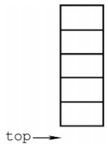  
(a) 空栈

  
(b)1个元素

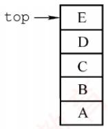  
(c) 5 个元素

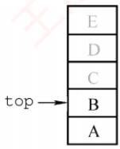  
(d) 2 个元素  
图3.2 栈顶指针和栈中元素之间的关系

以下是顺序栈常用基本操作的实现（基于top=-1初始化）。

## （1）初始化

```javascript
void InitStack(SqStack &S) {
S.top=-1; //初始化栈顶指针
```

## (2)判栈空

bool StackEmpty(SqStack S) {   
if(S.top==-1) //栈空   
return true;   
else //不空   
return false;   
}

## （3)入栈

bool Push(SqStack &S,ElemType x){   
if(S.top==MaxSize-1) //栈满，报错   
return false;   
S.data[++S.top]=x; //指针先加1，再入栈   
return true;

## (4)出栈 出栈

```javascript
bool Pop(SqStack &S,ElemType &x){
if(S.top==-1) //栈空，报错
return false;
x=S.data[S.top--]; //先出栈，指针再减1
return true; 道
```

## (5)读栈顶元素

```autohotkey
bool GetTop(SqStack S,ElemType &x) {
if(S.top==-1) //栈空，报错
return false;
x=S.data[S.top]; return true; 道 //x 记录栈顶元素
}
```

该操作不改变栈的状态，栈顶元素依然保留在栈中。

## 注意

此处，top指向栈顶元素本身。因此入栈为S.data[++S.top]=x，出栈为x=S.data[S.top--]。若top初始化为0（指向栈顶元素的下一个位置），则入栈变为S.data[S.top++]=x，出栈变为x=S.data[--S.top]，相应的判空、判满条件也随之改变。请读者仔细体会差异，做题时务必根据题目设定灵活应对。 K

## 3. 共享栈

利用栈底位置相对固定的特性，可让两个顺序栈共享同一段一维数组空间，将两个栈的栈底分别置于数组两端，栈顶向中间延伸，如图3.3所示。

  
图3.3 两个顺序栈共享存储空间

0号栈栈顶指针为top0，1号栈栈顶指针为top1，均指向各自的栈顶元素；初始时top0=-1（0号栈空），top1=MaxSize（1号栈空）；栈满条件为top1-top0==1（两栈顶相邻）。当0号栈入栈时，top0先加1，再赋值；当1号栈入栈时，top1先减1，再赋值；出栈操作的顺序相反。

共享栈能更高效地利用存储空间，两个栈的空间可动态调节，仅当整个数组被占满时，才发生栈溢出。其存取数据的时间复杂度均为O(1)，对存取效率无影响。

## 3.1.3 栈的链式存储结构

采用链式存储的栈称为链栈。其优点是便于动态分配存储空间，不存在栈满溢出的问题，且在多栈共存的场景下能更灵活地利用内存。通常使用单链表实现链栈，并且规定所有操作均在链表的表头进行。此处约定链栈不带头结点，栈顶指针Lhead直接指向栈顶元素，如图3.4所示。

  
图 3.4 栈的链式存储

链栈的类型可定义为

typedef struct LinkNode{  
ElemType data; //数据域  
struct LinkNode \*next; //指针域  
}LiStack; //链栈类型定义

由于采用链式存储，结点的插入与删除操作非常高效。链栈的操作与单链表类似，入栈和出栈均在表头进行。注意，对于带头结点的链栈，其初始化、判空及操作细节会有所不同：而本节所述实现基于无头结点的设计，读者应根据实际需求灵活调整实现方式。

## 3.1.4 本节试题精选

## 一、单项选择题

01. 栈和队列具有相同的（）。 计A. 抽象数据类型 B. 逻辑结构 C. 存储结构 D. 运算

02.栈是一种（）。 王A. 顺序存储的线性结构 B. 链式存储的非线性结构C. 限制存取点的线性结构 D. 限制存取点的非线性结构

03.下列选项中，（）不是栈的基本操作。A. 删除栈顶元素 B. 删除栈底元素C. 判断栈是否为空 D. 将栈置为空栈

04. 设用数组a[n]存储一个栈，初始栈顶指针top=-1，则元素x入栈的操作是（）。A. a[--top]=x B. a[top--]=x C. a[++top]=x D. a[top++]=x

05. 设用数组 data[1...n]存储一个栈，初始栈顶指针top=1，则元素x入栈的操作是（）。A. data[top--]=x B. data[top++]=xC. data[--top]=x D. data[++top]=x

06.设用数组 data[1...n]存储一个栈，初始栈顶指针 top=n+1，则元素x入栈的操作是( )。A. data[--top]=x B. data[top++]=xC. data[top--]=x D. data[++top]=x

07. 设有一个空栈，栈顶指针为1000H，栈向高地址方向增长，每个元素占一个存储单元，执行 Push、Push、Pop、Push、Pop、Push、Pop、Push操作后，栈顶指针为（）。A. 1002H B. 1003H C. 1004H D. 1005H

08.和顺序栈相比，链栈有一个比较明显的优势，即（）。A. 通常不会出现栈满的情况 B. 通常不会出现栈空的情况C. 插入操作更容易实现 D. 删除操作更容易实现

09. 设链表不带头结点且所有操作均在表头进行，则下列最不适合作为链栈的是（）。A. 只有表头结点指针，没有表尾指针的双向循环链表B. 只有表尾结点指针，没有表头指针的双向循环链表C. 只有表头结点指针，没有表尾指针的单向循环链表 机教育D. 只有表尾结点指针，没有表头指针的单向循环链表

10. 向一个栈顶指针为top的链栈（不带头结点）中插入一个x结点，则执行（）。A. top->next=x B. x->next=top->next; top->next=xC.x->next=top; top=x D. x->next=top; top=top->next

11.链栈（不带头结点）执行Pop操作，并将出栈的元素存在ⅹ中，应该执行（）。A. x=top; top=top->nextB. x=top->dataC. top=top->next; x=top->data 教育D. x=top->data; top=top->next

12. 经过以下栈的操作后，变量×的值为（）。InitStack(st); Push(st, a); Push(st, b); Pop(st, x); GetTop(st, x);A. a B. b C. NULL D. false

13. 3个不同元素依次入栈，能得到（）种不同的出栈序列。

A. 4 B. 5 C.6T D. 7

14. 设 $a,   b,   c,   d,   e,   f  以$ 所给的次序入栈，若在入栈操作时，允许出栈操作，则下面不会出现的出栈序列为（）。A. fedcba C. dcefba D. cabdef

15. 4个元素依次入栈的次序为 abcd，则以 cd开头的出栈序列的个数为（）。A. 1 B. 2 C. 3 D. 4

16. 用S表示入栈操作，用Χ表示出栈操作，若元素的入栈顺序是1234，为了得到1342的出栈顺序，相应的S和Χ的操作序列为（）。育A. SXSXSSXXB. SSSXXSXX C. SXSSXXSX D. SXSSXSXX

17. 若栈的输入序列是1,2,3,…，n，输出序列的第一个元素是 n，则第i 个输出元素是（）。A. 不确定 B. n-i C. n-i-1 D. n−i+1

18. 若栈的输入序列是 $1,2,3,\cdots,n,$ 输出序列的第一个元素是i，则第j个输出元素是（）。A. i-j-1 B. i- j C. j−i+1 D. 不确定

19. 某栈的输入序列为 $a , b , c , d ,$ 下面的4个序列中，不可能为其输出序列的是（）。A. $a , b , c , d$ B. $c , b , d , a$ C. $d , c , a , b$ D. $a , c , b , d$

20. 若栈的输入序列是 $P_{1},P_{2},\cdots,P_{n},$ 输出序列是1,2,3,…，n，若 $P _ { 3 }   = 1$ ，则 $P _ { 1 }$ 的值（）。A. 可能是2 B. 一定是2 C. 不可能是2 D. 不可能是3

21. 若栈的输入序列是 $P_{1},P_{2},\cdots,P_{n},$ 输出序列是1,2,3,…，n，若 $P _ { 3 }   = 3$ ，则 $P _ { 1 }$ 的值（）。A. 可能是2 B. 不可能是1 C.一定是1 D. 一定是2

22. 已知栈的入栈序列是1,2,3,4，其出栈序列为 $P _ { 1 } , P _ { 2 } , P _ { 3 } , P _ { 4 }$ ，则 $P _ { 2 } , P _ { 4 }$ 不可能是（）。A. 2, 4 B. 2, 1 Y C. 4,3 D. 3,4

23. 设栈的初始状态为空，当字符序列“n1”作为栈的输入时，输出长度为3，且可用作C语言标识符的序列有（）个。A. 4 B. 5 C. 3 D. 6

24.采用共享栈的好处是（）。A. 减少存取时间，降低发生上溢的可能B. 节省存储空间，降低发生上溢的可能C. 减少存取时间，降低发生下溢的可能D. 节省存储空间，降低发生下溢的可能

25. 设有一个顺序共享栈 Share[0:n-1]，其中第一个栈顶指针 top1 的初值为-1，第二个栈顶指针top2的初值为n，则判断共享栈满的条件是（）。A. $\mathtt { t o p 2 - t o p 1 } = = 1$ B. $\mathtt { t o p 1 - t o p 2 } = = 1$ C. top1==top2 D. 都不对

26.【2009统考真题】设栈S和队列Q的初始状态均为空，元素 abcdefg依次入栈S。若每个元素出栈后立即进入队列Q，且7个元素出队的顺序是bdcfeag，则栈S的容量至少是（）。A. 1 B. 2 C.3 D. 4

27.【2010统考真题】若元素a, b, c, d, e,f依次入栈，允许入栈、出栈操作交替进行，但不允许连续3次进行出栈操作，不可能得到的出栈序列是（）。A. $d c e b f a$ B. cbdaef C. bcaefd D. $a f e d c b$

28.【2011统考真题】元素 $a , b , c , d , e$ 依次进入初始为空的栈中，若元素入栈后可停留、可出栈，直到所有元素都出栈，则在所有可能的出栈序列中，以元素d开头的序列个数是（）。

A. 3 B. 4 C. 5KXT D. 6

29. 【2013统考真题】一个栈的入栈序列为1,2,3,…，n，出栈序列是 $P_{1},P_{2},P_{3},\cdots,P_{n}$ 若 $P _ { 2 }   =   3$ 则 $P _ { 3 }$ 可能取值的个数是（）。A. n-3 B. n-2 C. n-1 D. 无法确定

30. 【2020 统考真题】对空栈 S 进行 Push 和 Pop 操作，入栈序列为 $a , b , c , d , e$ ，经过 Push、Push、Pop、Push、Pop、Push、Push、Pop操作后得到的出栈序列是（）。A. b, a, c B. b, a, e C. b, c, a D. b, c, e

31.【2022统考真题】给定有限符号集S，in和out均为S中所有元素的任意排列。对于初始为空的栈ST，下列叙述中，正确的是（）。A. 若in是ST的入栈序列，则不能判断out是否为其可能的出栈序列B. 若out是ST的出栈序列，则不能判断in是否为其可能的入栈序列C. 若in 是ST的入栈序列，out 是对应 in 的出栈序列，则 in 与 out一定不同D. 若in 是ST 的入栈序列，out 是对应 in 的出栈序列，则 in 与out 可能互为倒序

## 二、综合应用题

01. 有5个元素，其入栈次序为 $A ,   B ,   C ,   D ,   E ,$ ，在各种可能的出栈次序中，第一个出栈元素为C且第二个出栈元素为D的出栈序列有哪几个？

02. 若元素的入栈序列为 A, B, C, D, E,运用栈操作，能否得到出栈序列 B, C, A, E, D 和 D, B,A, C, E？ 为什么?

03. 栈的初态和终态均为空，以Ⅰ和〇分别表示入栈和出栈，则出入栈的操作序列可表示为由Ⅰ和O组成的序列，可以操作的序列称为合法序列，否则称为非法序列。1）下面所示的序列中哪些是合法的？A. IOIIOIOO B. IOOIOIIO C. IIIOIOIO D. IIIOOIOO

2）通过对1）的分析，写出一个算法，判定所给的操作序列是否合法。若合法，返回true，否则返回false（假定被判定的操作序列已存入一维数组中）。

04. 设单链表的表头指针为L，结点结构由data和next两个域构成，其中data域为字符型。设计算法判断该链表的全部n个字符是否中心对称。例如，xyx、xyyx都是中心对称的。

05. 设有两个栈S1、S2都采用顺序栈方式，并共享一个存储区 $[ 0 , \ldots , \operatorname* { m a x s i z e } - 1 ]$ ，为了尽量利用空间，减少溢出的可能，可采用栈顶相向、迎面增长的存储方式。试设计S1、S2有关入栈和出栈的操作算法。

## 3.1.5 答案与解析

## 一、单项选择题

01. B

栈和队列的逻辑结构都是相同的，都属于线性结构，只是它们对数据的运算不同。

## 02. C

首先栈是一种线性表，所以选项B、D错。按存储结构的不同可分为顺序栈和链栈，但不可以把栈局限在某种存储结构上，所以选项A错。栈和队列都是限制存取点的线性结构。

03. B

基本操作是指该结构最核心、最基本的运算，其他较复杂的操作可通过基本操作实现。删除栈底元素不属于栈的基本运算，但它可以通过调用栈的基本运算求得。

## 04. C

数组下标范围为0～n−1，初始时top为-1，第一个元素入栈后，top为0，即top指向栈顶元素。栈向高地址方向增长，所以入栈时应先将指针top加1，然后存入元素x，选项C正确。

## 05. B

数组下标范围为1～n，初始时top为1，表示top指向栈顶元素的下一个元素。栈向高地址方向增长，所以入栈时应先存入元素x，然后将指针top加1，选项B正确。

## 06. A

数组下标范围为1～n，初始时top为n+1，表示top指向栈顶元素。栈向低地址方向增长，所以入栈时应先将指针top减1，然后存入元素x，A正确。 LK

## 07. A

每个元素需要1个存储单元，所以每入栈一次top加1，出栈一次top减1。指针top的值依次为 1001H,1002H, 1001H, 1002H, 1001H, 1002H, 1001H, 1002H。

## 08. A

顺序栈采用数组存储，数组的大小是固定的，不能动态地分配大小。和顺序栈相比，链栈的最大优势在于它可以动态地分配存储空间。 H

## 09. C

对于双向循环链表，不管是表头指针还是表尾指针，都可以很方便地找到表头结点，方便在表头做插入或删除操作。而循环单链表通过尾指针可以很方便地找到表头结点，但通过头指针找尾结点需要遍历一次链表。对于选项C，插入和删除结点后，找尾结点所需的时间为O(n)。

## 10. C

链栈采用不带头结点的单链表表示时，入栈操作在首部插入一个结点x（x->next=top），插入完后需将top指向该插入的结点x。请思考当链栈存在头结点时的情况。

## 11. D

这里假设栈顶指针指向的是栈顶元素，所以选择选项D；而选项A中首先将top指针赋给了x，错误；选项B中没有修改top指针的值；选项C为top指针指向栈顶元素的上一个元素时的答案。

## 12. A

执行前3句后，栈st内的值为a,b，其中b为栈顶元素；执行第4句后，栈顶元素b出栈，×的值为b；执行最后一句，读取栈顶元素的值，×的值为a。

## 13. B

当n个不同元素入栈时，出栈序列的个数为

$$
\frac{1}{n + 1}C_{2n}^{n} = \frac{1}{n + 1}\frac{(2n)!}{n! \times n!} = \frac{6 \times 5 \times 4}{4 \times 3 \times 2 \times 1} = 5
$$

考题中给出的n值不会很大，可以根据栈的特点，若 $X _ { i }$ 已经出栈，则 $X _ { i }$ 前面的尚未出栈的元素一定逆置有序地出栈，因此，可以采用例举方法。如a,b,c依次入栈的出栈序列有abc,acb,bac.bca,cba。另外，在一些考题中可能会问符合某个特定条件的出栈序列有多少种，比如此题中问以b开头的出栈序列有几种，这种类型的题目一般都使用穷举法。

## 14. D

根据栈“先进后出”的特点，且在入栈操作的同时允许出栈操作，显然选项D中c最先出栈，则此时栈内必定为a和b，但因为a先于b入栈，所以要晚出栈。对于某个出栈的元素，在它之前入栈却晚出栈的元素必定是按逆序出栈的，其余答案均是可能出现的情况。

此题也可采用将各序列逐个代入的方法来确定是否有对应的进出栈序列（类似下题）。

## 15. A

假设出栈序列为cd...，分析栈的操作序列：a入栈，b入栈，c入栈，c出栈，d入栈，d出栈，此后只能是 b出栈和a出栈一种情况，因此出栈序列只有 cdba。

## 16. D

采用排除法，选项A,B,C得到的出栈序列分别为1243,3241,1324。由1234得到1342的进出栈序列为：1进，1出，2进，3进，3出，4进，4出，2出，所以选择选项D。

## 17. D

第n个元素第一个出栈，说明前n-1个元素都已经按顺序入栈，由“先进后出”的特点可知，此时的输出序列一定是输入序列的逆序，所以答案选择选项D。

## 18. D

当第i个元素第一个出栈时，则i之前的元素可以依次排在i之后出栈，但剩余的元素可以在此时入栈，并且排在i之前的元素出栈，所以第j个出栈的元素是不确定的。

## 19. C

对于选项A，可能的顺序是a入，a出，b入，b出，c入，c出，d入，d出。对于选项B，可能的顺序是a入，b入，c入，c出，b出，d入，d出，a出。对于选项D，可能的顺序是a入，a出，b入，c入，c出，b出，d入，d出。选项C没有对应的序列。

【另解】若出栈序列的第一个元素为d，则出栈序列只能是dcba。该思想通常也适用于出栈序列的局部分析：如12345入栈，问出栈序列34152是否正确？如何分析？若第一个出栈元素是3，则此时12必停留在栈中，它们出栈的相对顺序只能是21，所以34152错误。

## 20. C

入栈序列是 $P_{1},P_{2},\cdots,P_{n},$ 。因为 $P _ { 3 }   = 1$ ，即 $P_{1},P_{2},P_{3}$ 连续入栈后，第一个出栈元素是 $P _ { 3 }$ ，说明 $P _ { 1 } , P _ { 2 }$ 已经按序入栈，根据先进后出的特点可知， $P _ { 2 }$ 必定在 $P _ { 1 }$ 之前出栈，而第二个出栈元素是2，而此时 $P _ { 1 }$ 不是栈顶元素，所以 $P _ { 1 }$ 的值不可能是2。思考：哪些 $P _ { i }$ 可能是2?

## 21. A

假设 $P _ { 1 }$ 是1，入栈后立即出栈， $P _ { 2 }$ 是2，入栈后立即出栈， $P _ { 3 }$ 是3，入栈后立即出栈，得到的序列符合题意。假设 $P _ { 1 }$ 是2， $P _ { 2 }$ 是1， $P _ { 1 }$ 、 $P _ { 2 }$ 依次入栈后全部出栈， $P _ { 3 }$ 是3，入栈后立即出栈，得到的序列符合题意。因此， $P _ { 1 }$ 既可能是1，又可能是2。

## 22. C

逐个判断每个选项可能的入栈出栈顺序。对于选项A，可能的顺序是1入，1出，2入，2出，3入，3出，4入，4出。对于选项B，可能的顺序是1入，2入，3入，3出，2出，4入，4出，1出。对于选项D，可能的顺序是1入，1出，2入，3入，3出，2出，4入，4出。选项C没有对应的序列，因为当4在栈中时，意味着前面的所有元素（1.2.3）都已在栈中或曾经入过栈，此时若4第二个出栈，即栈中还有两个元素，且这两个元素是有序的（对应入栈顺序），只能为(1,2)，(1,3),(2,3)，若是序列(1,2)，则3已在 $p _ { 1 }$ 位置出栈，不可能再在 $p _ { 4 }$ 位置出栈，若是(1,3)和(2,3)这种情况中的任意一种，则3一定是下一个出栈元素，即 $p _ { 3 }$ 一定是3，所以 $p _ { 4 }$ 不可能是3。

【另解】对于选项C， $p _ { 2 }$ 为最后一个入栈元素4，则只有 $p _ { 1 }$ 或 $p _ { 3 }$ 出栈的元素有可能为3（请读者分两种情况自行思考），而p₄绝不可能为3。读者在解答此类题时，一定要注意出栈序列中的 $p _ { 4 }$ “最后一个入栈元素”，这样可以节省答题的时间。

## 23. C

标识符只能以英文字母或下划线开头，而不能以数字开头。于上，由n、1、三个字符组合成

的标识符有n1\_、n\_1、\_1n和\_n1四种。第一种：n入栈再出栈，1入栈再出栈，入栈再出栈。第二种：n入栈再出栈，1入栈，入栈，出栈，1出栈。第三种：n入栈，1入栈，入栈，出栈，1出栈，n出栈。而根据栈的操作特性，n1这种情况不可能出现。

## 24. B

上溢是指存储器满，还往里写：下溢是指存储器空，还往外读。为了解决上溢，可给栈分配很大的存储空间，但这样又会造成存储空间的浪费。共享栈的提出就是为了在解决上溢的基础上节省存储空间，将两个栈放在同一段更大的存储空间内，这样，当一个栈的元素增加时，可使用另一个栈的空闲空间，从而降低发生上溢的可能性。 XTA

## 25. A

这种情况就是前面我们所描述的，详细内容请参见本节考点精析部分对共享栈的讲解。另外，读者可以思考当top1的初值为0，top2的初值为n-1时栈满的条件。 KMK

## 注意

栈顶、队头与队尾的指针的定义是不唯一的，做题时务必仔细审题和思考。

## 26. C

时刻注意栈的特点是先进后出，下表是出入栈的详细过程。

<table><tr><td rowspan=1 colspan=1>序号</td><td rowspan=1 colspan=1>说明</td><td rowspan=1 colspan=1>栈内</td><td rowspan=1 colspan=1>栈外</td><td rowspan=1 colspan=1>序号</td><td rowspan=1 colspan=1>说明</td><td rowspan=1 colspan=1>栈内</td><td rowspan=1 colspan=1>栈外</td></tr><tr><td rowspan=1 colspan=1>1</td><td rowspan=1 colspan=1>a入栈</td><td rowspan=1 colspan=1>a</td><td rowspan=1 colspan=1></td><td rowspan=1 colspan=1>8</td><td rowspan=1 colspan=1>e入栈</td><td rowspan=1 colspan=1>ae</td><td rowspan=1 colspan=1>bdc</td></tr><tr><td rowspan=1 colspan=1>2</td><td rowspan=1 colspan=1>b入栈</td><td rowspan=1 colspan=1>ab</td><td rowspan=1 colspan=1></td><td rowspan=1 colspan=1>9V</td><td rowspan=1 colspan=1>f入栈</td><td rowspan=1 colspan=1>aef</td><td rowspan=1 colspan=1>bdc</td></tr><tr><td rowspan=1 colspan=1>3</td><td rowspan=1 colspan=1>b出栈</td><td rowspan=1 colspan=1>a</td><td rowspan=1 colspan=1>b</td><td rowspan=1 colspan=1>10</td><td rowspan=1 colspan=1>f出栈</td><td rowspan=1 colspan=1>ae</td><td rowspan=1 colspan=1>bdcf</td></tr><tr><td rowspan=1 colspan=1>4</td><td rowspan=1 colspan=1>c入栈</td><td rowspan=1 colspan=1>ac</td><td rowspan=1 colspan=1>b</td><td rowspan=1 colspan=1>11</td><td rowspan=1 colspan=1>e 出栈</td><td rowspan=1 colspan=1>a</td><td rowspan=1 colspan=1>bdcfe</td></tr><tr><td rowspan=1 colspan=1>5</td><td rowspan=1 colspan=1>d入栈</td><td rowspan=1 colspan=1>acd</td><td rowspan=1 colspan=1>b</td><td rowspan=1 colspan=1>12</td><td rowspan=1 colspan=1>a出栈</td><td rowspan=1 colspan=1></td><td rowspan=1 colspan=1>bdcfea</td></tr><tr><td rowspan=1 colspan=1>6</td><td rowspan=1 colspan=1>d出栈</td><td rowspan=1 colspan=1>ac</td><td rowspan=1 colspan=1>bd</td><td rowspan=1 colspan=1>13</td><td rowspan=1 colspan=1>g入栈</td><td rowspan=1 colspan=1>g</td><td rowspan=1 colspan=1>bdcfea</td></tr><tr><td rowspan=1 colspan=1>7</td><td rowspan=1 colspan=1>c出栈</td><td rowspan=1 colspan=1>a</td><td rowspan=1 colspan=1>bdc</td><td rowspan=1 colspan=1>14</td><td rowspan=1 colspan=1>g出栈</td><td rowspan=1 colspan=1></td><td rowspan=1 colspan=1>bdcfeag</td></tr></table>

栈内的最大深度为3，所以栈S的容量至少是3。

【另解】因为元素的出队顺序和入队顺序相同，所以元素的出栈顺序就是 b, d, c,f, e, a, g，因此元素的出入栈次序为 Push(S, a), Push(S, b), Pop(S, b), Push(S, c), Push(S, d), Pop(S, d), Pop(S, c),Push(S, e), Push(S,f), Pop(S,f), Pop(S, e), Pop(S, a), Push(S, g), Pop(S, g)。 初始所需容量为 0,每做一次Push操作，容量加1；每做一次Pop操作，容量减1，记录的容量最大值为3。

## 27. D

选项A由a入，b入，c入，d入，d出，c出，e入，e出，b出，f入，f出，a出得到；选项B由a入，b入，c入，c出，b出，d入，d出，a出，e入，e出，f入，f出得到；选项C由a入，b入，b出，c入，c出，a出，d入，e入，e出，f入，f出，d出得到；选项D由a入，a出，b入，c入，d入，e入，f入，f出，e出，d出，c出，b出得到，但题意要求不允许连续3次出栈操作，选项D不符。

【另解】先入栈的元素后出栈，入栈顺序为 a, b, c, d, e,f,所以连续出栈时的子序列必然是按字母表逆序的，若出栈序列中出现了长度大于或等于3的连续逆序子序列，则为所选序列。

## 28. B

d 第一个出栈，则 c, b, a 出栈的相对顺序是确定的，出栈顺序必为d\_c\_b\_a\_，e的顺序不定，在任意一个“\_”上都有可能。

【另解】d首先出栈，则abc停留在栈中，此时栈的状态如右图所示。


此时可以有如下4种操作：①e入栈后出栈，则出栈序列为 decba；②c 出栈，e入栈后出栈，出栈序列为 dceba；③ $c b$ 出栈，e入栈后出栈，出栈序列为 dcbea；④ cba 出栈，e 入栈后出栈，出栈序列为 dcbae。思路和上面其实一样。 Y

## 29. C

显然，3之后的4,5,…，n都是 $P_{3}$ 可取的数（一直入栈直到该数入栈后马上出栈）。接下来分析1和 2 是否可取： $P _ { 1 }$ 可以是3之前入栈的数（可能是1或2），也可以是4，当 $P _ { 1 } = ~ 1$ 时，$P _ { 3 }$ 可取2；当 $P _ { 1 }   =   2$ 时， $P _ { 3 }$ 可取1。因此， $p _ { 3 }$ 可能取除3外的所有数，个数为n-1。

## 30. D

按题意，出入栈操作的过程如下：

<table><tr><td rowspan=1 colspan=1>C 操作</td><td rowspan=1 colspan=1>栈内元素</td><td rowspan=1 colspan=1>出栈元素</td></tr><tr><td rowspan=1 colspan=1>Push</td><td rowspan=1 colspan=1>a</td><td rowspan=1 colspan=1></td></tr><tr><td rowspan=1 colspan=1>Push</td><td rowspan=1 colspan=1> $a   b$ </td><td rowspan=1 colspan=1></td></tr><tr><td rowspan=1 colspan=1> $\boxed { \mathrm { P O p } }$ </td><td rowspan=1 colspan=1> $a$ </td><td rowspan=1 colspan=1>b</td></tr><tr><td rowspan=1 colspan=1>Push</td><td rowspan=1 colspan=1> $a c$ </td><td rowspan=1 colspan=1></td></tr><tr><td rowspan=1 colspan=1> $\boxed { \mathrm { P O p } }$ </td><td rowspan=1 colspan=1> $a$ </td><td rowspan=1 colspan=1> $c$ </td></tr><tr><td rowspan=1 colspan=1>Push</td><td rowspan=1 colspan=1> $a   d$ </td><td rowspan=1 colspan=1></td></tr><tr><td rowspan=1 colspan=1>Push</td><td rowspan=1 colspan=1> $a   d   e$ </td><td rowspan=1 colspan=1></td></tr><tr><td rowspan=1 colspan=1>Pop</td><td rowspan=1 colspan=1> $a   d$ </td><td rowspan=1 colspan=1>e</td></tr></table>

因此，出栈序列为 $b , c , e \circ$

## 31. D

通过模拟出入栈操作，可以判断入栈序列in和出栈序列out是否合法。因此，已知in序列可以判断out序列是否为可能的出栈序列；已知out序列也可以判断in序列是否为可能的入栈序列，选项A和B错误。若每个元素入栈后立即出栈，则in序列和out序列相同，选项C错误。若所有元素都入栈后才依次出栈，则in序列和out序列互为倒序，选项D正确。

## 二、综合应用题

## 01.【解答】

CD出栈后的状态如右图所示。

此时有如下3种操作：①E入栈后出栈，出栈序列为CDEBA；②B出栈，E入栈后出栈，出栈序列为CDBEA；③ B出栈，A 出栈，E入栈后出栈，出栈序列为 CDBAE。 KX


所以，以CD开头的出栈序列有CDEBA、CDBEA、CDBAE三种。

## 02.【解答】

能得到出栈序列BCAED。可由A入，B入，B出，C入，C出，A出，D入，E入，E出，D出得到。不能得到出栈序列DBACE。若出栈序列以D开头，说明在D之前的入栈元素是A、B和C，三个元素中C是栈顶元素，B和A不可能早于C出栈，所以不可能得到出栈序列DBACE。

## 03.【解答】

1）选项A、D合法，而选项B、C不合法。在B中，先入栈1次，再连续出栈2次，错误。在选项C中，入栈和出栈次数不一致，会导致最终的栈不空。选项A、D均为合法序列，请自行模拟。注意，在操作过程中，入栈次数一定大于或等于出栈次数；结束时，栈一定为空。

2）设被判定的操作序列已存入一维数组A中。算法的基本设计思想：依次逐一扫描入栈出栈序列（由Ⅰ和〇组成的字符串），每扫描至任意一个位置均需检查出栈次数（O的个数）是否

小于入栈次数（I的个数），若大于则为非法序列。扫描结束后，再判断入栈和出栈次数是否相等，若不相等则不合题意，为非法序列。 省村

本题代码如下：

bool Judge(char A[ ]){  
int i=0;  
int j=k=0; //i 为下标，j 和 k 分别为字母 Ⅰ 和 O 的个数  
while(A[i]!='\0'){ //未到字符数组尾  
switch(A[i]) {  
case 'I': j++; break; //入栈次数增1  
case 'O': k++;  
if(k>j){printf("序列非法\n")； exit(0)；}  
i++; //不论 A [i] 是I还是 O，指针 i 均后移  
if(j!=k) {  
printf("序列非法\n")；  
return false; 王道计算机  
}  
else {  
王道 printf("序列合法\n")；  
return true;  
}  
1

（另解】入栈后，栈内元素个数加1：出栈后，桟内元素个数减1，因此可将判定一组出入栈序列是否合法转化为一组由+1、-1组成的序列，它的任意前缀子序列的累加和不小于0（每次出栈或入栈操作后判断）则合法；否则非法。

## 04.【解答】

算法思想：使用栈来判断链表中的数据是否中心对称。让链表的前一半元素依次入栈。在处理链表的后一半元素时，当访问到链表的一个元素后，就从栈中弹出一个元素，对两个元素进行比较，若相等，则将链表中的下一个元素与栈中再弹出的元素进行比较，直至链表到尾。这时若栈是空栈，则得出链表中心对称的结论；否则，当链表中的一个元素与栈中弹出元素不等时，结论为链表非中心对称，结束算法的执行。

本题代码如下：

int dc(LinkList L,int n) {  
int i;  
char s[n/2]; //s 字符栈  
LNode \*p=L->next; //工作指针p，指向待处理的当前元素  
for(i=0;i<n/2;i++){ //链表前一半元素入栈  
s[i]=p->data;  
p=p->next; 道  
i--; //恢复最后的i 值  
if(n%2==1) //若n 是奇数，后移过中心结点  
p=p->next;  
while(p!=NULL&&s[i]==p->data){ //检测是否中心对称  
i--; //i 充当栈顶指针  
p=p->next;  
1  
if(i==-1) //栈为空栈  
else return 1; 道计算机 //链表中心对称  
return 0; //链表中心不对称

算法先将“链表的前一半”元素（字符）入栈。当n为偶数时，前一半和后一半的个数相同；当n为奇数时，链表中心结点字符不必比较，移动链表指针到下一字符开始比较。比较过程中遇到不相等时，立即退出 while循环，不再进行比较。

本题也可以先将单链表中的元素全部入栈，然后扫描单链表L并比较，直到比较到单链表L尾为止，但算法需要两次扫描单链表L，效率不及上述算法高。

## 05.【解答】

两个栈共享向量空间，将两个栈的栈底设在向量两端，初始时，S1栈顶指针为-1，S2栈顶指针为maxsize。两个栈顶指针相邻时为栈满。两个栈顶相向、迎面增长，栈顶指针指向栈顶元素。

本题代码如下：

```c
#define maxsize 100 //两个栈共享顺序存储空间所能达到的最多元素数，
//初始化为100
#define elemtp int //假设元素类型为整型
typedef struct{ 道计算机
elemtp stack[maxsize]; //栈空间
int top[2]; //top为两个栈顶指针
}stk;
stk S ; /s 是如上定义的结构类型变量，为全局变量
```

本题的关键在于，两个栈入栈和出栈时的栈顶指针的计算。S1栈是通常意义下的栈；而S2栈入栈操作时，其栈顶指针左移（减1），出栈时，栈顶指针右移（加1）。

此外，对于所有栈的操作，都要注意“入栈判满、出栈判空”的检查。

## （1）入栈操作

代码如下：

```javascript
int Push(int i, elemtp x){
//入栈操作。i 为栈号，i=0表示左边的 S1 栈，i=1 表示右边的 S2 栈，× 是入栈元素
//入栈成功返回1，否则返回0
if(i<0||i>1) {
printf("栈号输入不对")；
exit(0);
1
if(s.top[1]-s.top[0]==1) {
printf("栈已满\n");
return 0;
switch(i) {
case 0: s.stack[++s.top[0]]=x; return 1; break; 计算机考
case 1: s.stack[--s.top[1]]=x; return 1;
```

## （2）出栈操作

代码如下：

```javascript
elemtp Pop(int i) {
//出栈算法。i 代表栈号，i=0 时为 S1 栈，i=1 时为 S2 栈
//出栈成功返回出栈元素，否则返回-1
if(i<0|li>1) {
printf("栈号输入错误\n")；
exit(0); 计算机教育
1
switch(i) {
case 0:
if(s.top[0]==-1){
```

printf("栈空\n");   
return -1; 算机孝   
else   
return s.stack[s.top[0]--];   
break;   
case 1:   
if(s.top[1]==maxsize) {   
printf("栈空\n");   
return -1;   
1   
else   
return s.stack[s.top[1]++];   
break;   
}//switch   
1

## 3.2 队列

## 3.2.1 队列的基本概念

## 1. 队列的定义

队列（Queue）简称队，也是一种操作受限的线性表，仅允许在表的一端进行插入，而在另一端进行删除。向队列中插入元素称为入队（或进队），删除元素称为出队（或离队）。这一

  
图 3.5 队列示意图

规则符合日常排队“先到先服务”的原则，因此队列的操作特性为先进先出（First In First Out，FIFO），如图3.5所示。

队头（Front）：允许删除的一端，也称队首。

队尾（Rear）：允许插入的一端。

空队列：不含任何元素的队列。

## 2. 队列常见的基本操作

InitQueue(&Q)：初始化队列，构造一个空队列Q。

QueueEmpty(Q)：判队列空；若队列Q为空，返回 true，否则返回 false。

EnQueue(&Q,x)：入队操作；若队列Q未满，将x加入队尾。

DeQueue(&Q，&x)：出队操作；若队列Q非空，删除队首元素，并通过×返回其值。

GetHead(Q，&x)：读队首元素但不出队；若队列Q非空，将队首元素赋值给x。

需要注意的是，栈和队列均为操作受限的线性表，因此并非所有线性表的操作都适用于它们。例如，不允许直接访问或修改栈或队列中间的元素，这是由其逻辑特性所决定的。

## 3.2.2 队列的顺序存储结构

## 1. 队列的顺序存储

队列的顺序实现是指分配一块连续的存储单元存放队列元素，并附设两个指针：队首指针front指向队首元素，队尾指针rear指向队尾元素的下一个位置。不同教材对front和rear指针含义的约定可能不同（例如，rear可能指向队尾元素或其下一位置），这会导致入队和出队操作的具体实现不同。本节后附有相关习题，建议读者结合练习深入理解。

```c
#define MaxSize 50 //定义队列中元素的最大个数
typedef struct{
ElemType data[MaxSize]; //用数组存放队列元素
int front,rear; //队首指针和队尾指针
} SqQueue; 道
```

队列的顺序存储类型可定义为

初始状态：Q. $\mathtt { f r o n t } = \mathtt { Q } \: . \: \mathtt { r e a r } = 0$ o

入队操作：当队列未满时，先将元素存入队尾，再将队尾指针加1。

出队操作：当队列非空时，先取出队首元素，再将队首指针加1。

如图3.6(a)所示，初始时空队列满足Q.front==Q.rear==0，该条件可作为判空依据。

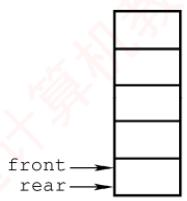  
(a) 空队

  
(b)5个元素入队

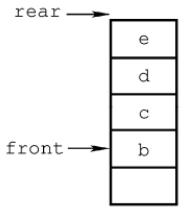  
(c) 出队 1 次

  
(d) 出队 3 次  
图 3.6 队列的操作

然而，能否以 $\mathtt { Q \_ r e a r } { = } \mathtt { M a x S i z e }$ 作为队满条件呢？显然不能。如图3.6(d)所示，队列中仅剩一个元素，但rear已达MaxSize，若此时继续入队，则会出现“上溢”。但这种溢出并非真正溢出，实际上数组中仍有空闲单元，因此称此现象为假溢出。

## 2. 循环队列

为了解决顺序队列的假溢出问题，引入循环队列：将顺序存储空间在逻辑上组织为环状结构。当指针到达数组末尾时，自动回到起始位置，这可通过取模运算（%）实现。

考点追踪特定条件下循环队列队头/队尾指针的初值（2011）

初始状态：Q.front=Q.rear=0。

队首指针进1：Q.front=(Q.front+1)%MaxSize。

队尾指针进1：Q.rear=(Q.rear+1)%MaxSize。

队列长度：(Q.rear+MaxSize-Q.front)%MaxSize。

出入队操作：指针均按顺时针方向移动（见图3.7）。

考点追踪循环队列判空/满的条件（2014）

那么，循环队列判空和判满的条件是什么呢？队空条件显然为Q.front==Q.rear。但当入队速度远快于出队时，rear会追上front，此时同样满足 $\mathrm{Q.~f.~cont}==\mathrm{Q.~r e a r}$ ，却表示队满。因此，仅凭 $\mathtt { f r o n t } { = } \mathtt { r e a r }$ 无法区分队空与队满。循环队列出入队的示意图如图3.7所示。

为解决这一问题，常用以下三种方法：

1）牺牲一个存储单元：入队时少用一个存储单元，这是一种较为普遍的做法，约定以“队尾指针的下一位置为队首”作为队满标志，如图3.7(d2)所示。

队满条件： $( \mathtt { Q } \mathtt { . r e a r } \mathtt { + 1 } ) \mathtt { \S { M a x S i z e } } { = = } \mathtt { Q } \mathtt { . f r o r i t } \mathtt { . }$

队空条件：Q.front==Q.rear。

队列中元素个数： $( \mathtt { Q } \mathtt { . r e a r } \mathtt { - Q } \mathtt { . f r o n t } \mathtt { + M a x S i z e } ) \mathtt { \S M a x S i z e } \mathtt { \circ }$

2）增设size成员：记录当前元素个数。若入队成功，则 $\scriptstyle \mathbf { S }   { \dot { \perp } }   z   \in + +$ ，若出队成功，则 $\mathrm { s i z e - - }$ 队空条件： $\mathtt { Q } . \mathtt { S i z e } { = } \mathtt { = } 0$ T

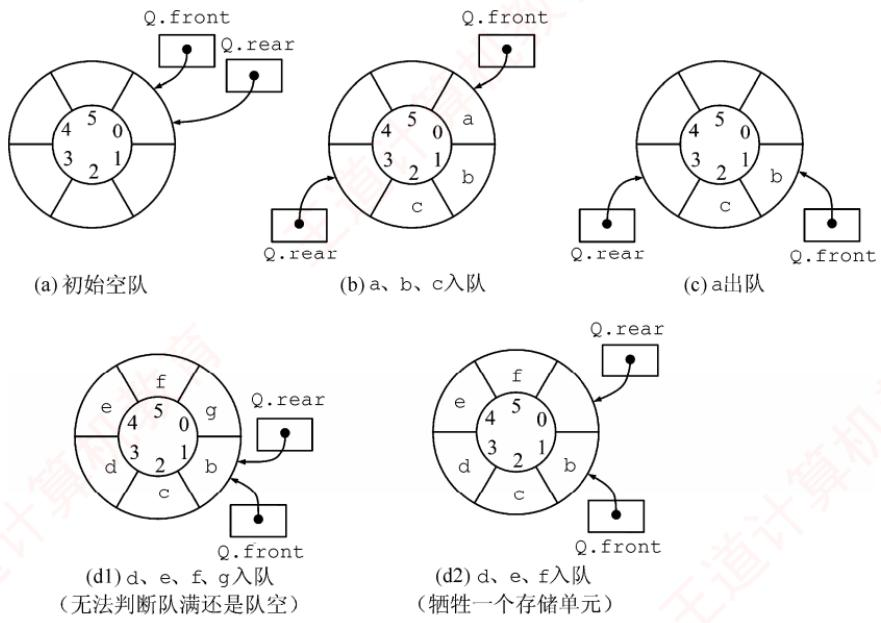  
图3.7 循环队列出入队的示意图

队满条件： $\mathtt { Q . S i z e } = = \mathtt { M a x S i z e } \mathtt { \cdot }$

两种情形均有 $\mathtt { Q . f r o n t } { = } { = } \mathtt { Q . r e a r }$ ，由 $\mathrm { s i z e }$ 区分队空与队满。

## 3）增设tag标志位：

出队后置 $\tan g = 0$ ，若此时 $\mathbb { Q } . \mathtt { f r o n t } = = \mathbb { Q } . \mathtt { r e a r }$ ，则为队空。KUX入队后置tag=1，若此时 $\mathtt { Q . f r o n t } = = \mathtt { Q . r e a r }$ ，则为队满。

## 3. 循环队列的操作（基于牺牲一个单元法）

```javascript
（1）初始化
void InitQueue(SqQueue &Q) {
Q.rear=Q.front=0;
```

//初始化队首、队尾指针

(2) 判队空

bool QueueEmpty(SqQueue Q) {   
if(Q.rear==Q.front)   
return true;   
else   
return false;

```csv
bool EnQueue(SqQueue &Q,ElemType x) {
if((Q.rear+1)%MaxSize==Q.front)
return false;
Q.data[Q.rear]=x;
Q.rear=(Q.rear+1) %MaxSize;
return true;
1
```

//队满则报错//队尾指针加 1 取模

```javascript
bool DeQueue(SqQueue &Q,ElemType &x) {
if(Q.rear==Q.front)
return false;
x=Q.data[Q.front];
```

//队空则报错

Q.front=(Q.front+1) %MaxSize;   
return true;

## 3.2.3 队列的链式存储结构

## 1. 队列的链式存储

考点追踪链式队列的应用场景（2019）

队列的链式表示称为链式队列，本质上是一个同时带有队首指针和队尾指针的单链表，如图3.8所示。队首指针指向队头结点，队尾指针指向队尾结点，即单链表的最后一个结点。

  
图3.8 不带队头结点的链式队列

链式队列的类型可定义为

```c
typedef struct LinkNode{ //链式队列结点
ElemType data;
struct LinkNode *next;
}LinkNode;
typedef struct{ //链式队列
LinkNode *front,*rear; //队列的队头和队尾指针
}LinkQueue;
```

当不带头结点时，若Q.front==NULL且Q.rear==NULL，则链式队列为空队列。

考点追踪链式队列判空的条件（2019）

入队操作：创建一个新结点，将其插入链表尾部，并令Q.rear指向该结点；若原队列为空，则同时令Q.front也指向该结点。

出队操作：先判断队列是否为空；若非空，则取出队首元素，删除对应结点，并令Q.front指向下一个结点；若被删结点是最后一个元素，则将Q.front 和Q.rear均置为NULL。

不难发现，不带头结点的链式队列在边界处理上较为烦琐。因此，通常将链式队列设计为带头结点的单链表，从而使插入与删除操作逻辑统一，如图3.9所示。

链式队列特别适用于元素数量频繁变化的场景，且不存在队满或溢出问题。此外，若程序中需使用多个队列（如同多个栈的情形），优先选用链式队列可避免存储分配不合理或溢出等问题。

  
图3.9 带队头结点的链式队列

## 2. 链式队列的基本操作

考点追踪链式队列出队/入队操作的基本过程（2019）

（1）初始化

```javascript
void InitQueue(LinkQueue &Q){ //初始化带头结点的链式队列
Q.front=Q.rear=(LinkNode*)malloc(sizeof(LinkNode));//建立头结点
Q.front->next=NULL; //初始为空
}
```

(2)判队空

bool QueueEmpty(LinkQueue Q) {

if(Q.front==Q.rear) //判空条件  
return true;  
else 算机  
return false;  
1  
(3)入队  
void EnQueue(LinkQueue &Q,ElemType x) {  
LinkNode \*s=(LinkNode \*)malloc(sizeof(LinkNode));//创建新结点  
s->data=x;  
s->next=NULL;  
Q.rear->next=s; //插入链尾  
Q.rear=s; //修改尾指针  
}  
（4）出队  
bool DeQueue(LinkQueue &Q,ElemType &x){ 王道计算机教育  
if(Q.front==Q.rear)  
return false; //空队  
LinkNode \*p=Q.front->next;  
王道 x=p->data;  
Q.front->next=p->next;  
if(Q.rear==p)  
Q.rear=Q.front; //若原队列中只有一个结点，删除后变空  
free(p) ;  
return true; 育  
1

## 3.2.4 双端队列

双端队列是一种允许在两端进行插入和删除操作的线性表，如图3.10所示。双端队列两端的地位是平等的，为便于理解，可将左端视为前端，右端视为后端。

  
图 3.10 双端队列

在双端队列入队时：前端插入的元素排列在队列中后端插入的元素之前；后端插入的元素排列在队列中前端插入的元素之后。在双端队列出队时：无论是从前端还是后端出队，先出的元素总是排列在后出的元素之前。思考：如何由入队序列 a, b, c, d得到出队序列d, c, a, b?

## 考点追踪双端队列出入队操作的分析（2010、2021）

输出受限的双端队列：允许在一端进行插入和删除，但在另一端仅允许插入的双端队列称为输出受限的双端队列，如图3.11所示。

  
图 3.11 输出受限的双端队列

输入受限的双端队列：允许在一端进行插入和删除，但在另一端仅允许删除的双端队列称为输入受限的双端队列，如图3.12所示。若限定双端队列从某个端点插入的元素只能从该端点删除，则该双端队列就蜕变为两个栈底相邻接的栈。

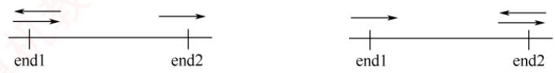  
1,4,2,3 2,4, 1, 3 3,4,1,2 3, 1, 4, 2 3, 1, 2,4  
4,3, 1,2 4,1, 3,2 4, 2, 3, 1 4,2, 1, 3 4, 1, 2, 3

  
图3.12 输入受限的双端队列  
例设有一个双端队列，输入序列为1,2,3,4，试分别求出以下条件的输出序列。  
（1）能由输入受限的双端队列得到，但不能由输出受限的双端队列得到的输出序列。  
（2）能由输出受限的双端队列得到，但不能由输入受限的双端队列得到的输出序列。  
（3）既不能由输入受限的双端队列得到，又不能由输出受限的双端队列得到的输出序列。

解：先看输入受限的双端队列，见图 3.13。假设 end1 端输入1,2,3,4，则 end2端的输出相当于普通队列的输出，即 1,2,3,4；而 end1 端的输出相当于栈的输出，n = 4 时仅通过 end1端有14种输出序列（由 Catalan公式得出），仅通过 end1 端不能得到的输出序列有4!-14=10种：

通过 end1和 end2端混合输出，可以输出这10种中的8种，参见下表。其中， $S _ { \mathrm { L } } , X _ { \mathrm { L } }$ 分別代表 end1 端的入队和出队， $X _ { \mathrm { R } }$ 代表 end2 端的出队。

<table><tr><td rowspan=1 colspan=1>输出序列</td><td rowspan=1 colspan=1>入队出队顺序</td><td rowspan=1 colspan=1>输出序列</td><td rowspan=1 colspan=1>入队出队顺序</td></tr><tr><td rowspan=1 colspan=1>1,4,2,3</td><td rowspan=1 colspan=1>SLXRSLSLSLXLXRXR</td><td rowspan=1 colspan=1>3,1,2,4</td><td rowspan=1 colspan=1>SLSLSLXLSLXRXRXR</td></tr><tr><td rowspan=1 colspan=1>2,4,1,3</td><td rowspan=1 colspan=1>SLSLXLSLSLXLXRXR</td><td rowspan=1 colspan=1>4,1,2,3</td><td rowspan=1 colspan=1>SLSLSLSLXLXRXRXR</td></tr><tr><td rowspan=1 colspan=1>3,4,1,2</td><td rowspan=1 colspan=1>SLSLSLXLSLXLXRXR</td><td rowspan=1 colspan=1>4,1, 3,2</td><td rowspan=1 colspan=1>SLSLSLSLXLXRXLXR</td></tr><tr><td rowspan=1 colspan=1>3,1,4,2</td><td rowspan=1 colspan=1>SLSLSLXLXRSLXLXR</td><td rowspan=1 colspan=1>4,3,1,2</td><td rowspan=1 colspan=1>SLSLSLSLXLXLXRXR</td></tr></table>

剩下的两种是不能通过输入受限的双端队列输出的，即4,2,3,1和4,2,1,3。

再看输出受限的双端队列，见图3.14。假设 end1和 end2端都能输入，仅 end2端可以输出。  
若都从end2端输入，则就是一个栈。当输入序列为1,2,3,4时，输出序列有14种。对于其余10  
种不能得到的输出序列，通过交替从end1和end2端输入，还可以输出其中8种。设 $S _ { \mathrm { L } }$ 代表 end1  
端的输入， $S _ { \mathrm { R } }  、  X _ { \mathrm { R } }$ 分别代表end2端的输入和输出，则可能的输出序列见下表。 育K

图3.13 例题中输入受限的双端队列 图 3.14 例题中输出受限的双端队列
<table><tr><td rowspan=1 colspan=1>输出序列</td><td rowspan=1 colspan=1>入队出队顺序</td><td rowspan=1 colspan=1>输出序列</td><td rowspan=1 colspan=1>入队出队顺序</td></tr><tr><td rowspan=1 colspan=1>1,4,2,3</td><td rowspan=1 colspan=1> $S _ { \mathrm { L } } X _ { \mathrm { R } } S _ { \mathrm { L } } S _ { \mathrm { L } } S _ { \mathrm { R } } X _ { \mathrm { R } } X _ { \mathrm { R } } X _ { \mathrm { R } }$ </td><td rowspan=1 colspan=1>3,1,2,4</td><td rowspan=1 colspan=1> $S _ { \mathrm { L } } S _ { \mathrm { L } } S _ { \mathrm { R } } X _ { \mathrm { R } } X _ { \mathrm { R } } S _ { \mathrm { L } } X _ { \mathrm { R } } X _ { \mathrm { R } }$ </td></tr><tr><td rowspan=1 colspan=1>2,4,1,3</td><td rowspan=1 colspan=1>SLSRXRSLSRXRXRXR</td><td rowspan=1 colspan=1>4,1,2,3</td><td rowspan=1 colspan=1>SLSLSLSRXRXRXRXR</td></tr><tr><td rowspan=1 colspan=1>3,4,1,2</td><td rowspan=1 colspan=1> $S _ { \mathrm { L } } S _ { \mathrm { L } } S _ { \mathrm { R } } X _ { \mathrm { R } } S _ { \mathrm { R } } X _ { \mathrm { R } } X _ { \mathrm { R } } X _ { \mathrm { R } }$ </td><td rowspan=1 colspan=1>4,2, 1,3</td><td rowspan=1 colspan=1> $S _ { \mathrm { L } } S _ { \mathrm { R } } S _ { \mathrm { L } } S _ { \mathrm { R } } X _ { \mathrm { R } } X _ { \mathrm { R } } X _ { \mathrm { R } } X _ { \mathrm { R } }$ </td></tr><tr><td rowspan=1 colspan=1>3,1,4,2</td><td rowspan=1 colspan=1> $S _ { \mathrm { L } } S _ { \mathrm { L } } S _ { \mathrm { R } } X _ { \mathrm { R } } X _ { \mathrm { R } } S _ { \mathrm { R } } X _ { \mathrm { R } } X _ { \mathrm { R } }$ </td><td rowspan=1 colspan=1>4,3,1,2</td><td rowspan=1 colspan=1> $S _ { \mathrm { L } } S _ { \mathrm { L } } S _ { \mathrm { R } } S _ { \mathrm { R } } X _ { \mathrm { R } } X _ { \mathrm { R } } X _ { \mathrm { R } } X _ { \mathrm { R } } X _ { \mathrm { R } }$ </td></tr></table>

通过输出受限的双端队列不能得到的两种输出序列是4,1,3,2和4,2,3,1。

综上所述：

1）能由输入受限的双端队列得到，但不能由输出受限的双端队列得到的是4,1,3,2。

2）能由输出受限的双端队列得到，但不能由输入受限的双端队列得到的是4,2,1,3。

3）既不能由输入受限的双端队列得到，又不能由输出受限的双端队列得到的是4,2,3,1。

## 提示

实际双端队列的考题不会如此复杂，通常只需判断序列是否满足题设条件，代入验证即可。

## 3.2.5 本节试题精选

## 一、单项选择题

01. 栈和队列的主要区别在于（）。A. 它们的逻辑结构不一样 B. 它们的存储结构不一样C. 所包含的元素不一样 D. 插入、删除操作的限定不一样

02.队列的“先进先出”特性是指（）。I. 最后插入队列中的元素总是最后被删除Ⅱ.当同时进行插入、删除操作时，总是插入操作优先Ⅲ.每当有删除操作时，总要先做一次插入操作IV. 每次从队列中删除的总是最早插入的元素 王道计A. I B. I和 IV C. II 和 ⅢII D. IV

03. 允许对队列进行的操作有（）。A. 对队列中的元素排序 B. 取出最近入队的元素C. 在队列元素之间插入元素 D. 删除队首元素

04. 一个队列的入队顺序是1,2,3,4，则出队的输出顺序是（）。A. 4, 3, 2, 1 B. 1, 2, 3, 4 C. 1, 4,3,2 D. 3, 2, 4, 1

05. 循环队列存储在数组A[0...n]中，入队时的操作为（）。A. $\mathtt { r e a r } { = } \mathtt { r e a r } { + } \mathtt { l }$ B. $\mathtt { r e a r } { = } \left( \mathtt { r e a r } { + } \mathtt { l } \right) \mod \left( \mathtt { n } { - } \mathtt { l } \right)$ C. rear=(rear+1) mod n D. $\mathtt { r e a r } = ( \mathtt { r e a r } + \mathtt { l } ) \mod ( \mathtt { n } + \mathtt { l } )$

06. 已知循环队列的存储空间为数组A[21]，front指向队首元素的前一个位置，rear指向队尾元素，假设当前front和rear的值分别为8和3，则该队列的长度为（）。A. 5 B. 6 C. 16 D. 17

07. 若用数组A[0...5]实现循环队列，且当前rear和front的值分别为1和5，当从队列中删除一个元素，再加入两个元素后，rear和front的值分别为（）。A. 3和4 B. 3和0 C. 5和0 D. 5和1

08. 假设用数组Q[MaxSize]实现循环队列，队首指针front指向队首元素的前一位置，队尾指针rear指向队尾元素，则判断该队列为空的条件是（）。A. $\mathtt { Q . r e a r } { = } \mathtt { ( Q . f r o n t { + } 1 ) \; \S { M a x S i z e } }$ 王道B. $( \mathtt { Q . r e a r { + } 1 } ) \; \mathtt { \S { M a x S i z e { = } = } Q . f r o n t { + } 1 }$ C. (Q.rear+1)%MaxSize==Q.frontD. $\mathtt { Q . r e a r } { = } \mathtt { Q . f r o n t }$

09. 假设循环队列Q[MaxSize]的队首指针为front，队尾指针为rear，队列的最大容量为MaxSize，此外，该队列再没有其他数据成员，则判断该队列已满的条件是（）。A. Q. $\mathtt { f r o n t } { = } { = } \mathtt { Q . r e a r }$ B. Q. $\mathtt { f r o n t } \mathtt { + Q } \mathtt { , r e a r } \mathtt { > = } \mathtt { M a x S i z e }$ C. Q.front==(Q.rear+1)%MaxSize D. $\mathtt { Q \_ r e a r } = \mathtt { ( Q \_ f r o n t + l ) \; \S M a x S i z e }$

10. 假设用A[0...n]实现循环队列，front、rear分别指向队首元素的前一个位置和队尾元素。若用 $( \mathtt { r e a r } + \mathtt { l } ) \; \mathtt { \hat { s } } \; ( \mathtt { n } + \mathtt { l } ) = = \mathtt { f r o n t }$ 作为队满标志，则（）。

A. 可用 $\mathtt { f r o n t } { = } \mathtt { r e a r }$ 作为队空标志B. 队列中最多可有n+1 个元素 算机字C. 可用 $\mathtt { f r o n t { > } r e a r }$ 作为队空标志D. 可用(front+1)%(n+1)==rear作为队空标志

11. 与顺序队列相比，链式队列的（）。A. 优点是队列的长度不受限制B. 优点是入队和出队时间效率更高C. 缺点是不能进行顺序访问D. 缺点是不能根据队首指针和队尾指针计算队列的长度

12.下列描述的几种链表中，最适合用作队列的是（）。A. 带队首指针和队尾指针的循环单链表B. 带队首指针和队尾指针的非循环单链表C. 只带队首指针的非循环单链表D.只带队首指针的循环单链表

13.下列描述的几种链表中，最不适合用作链式队列的是（）。A. 只带队首指针的非循环双链表 B. 只带队首指针的循环双链表C. 只带队尾指针的循环双链表 D. 只带队尾指针的循环单链表

14. 在用单链表实现队列时，队头设在链表的（）位置。A. 链头 B. 链尾 C. 链中 D. 以上都可以

15. 用链式存储方式的队列进行删除操作时需要（）。A. 仅修改头指针 B. 仅修改尾指针C. 头尾指针都要修改 D. 头尾指针可能都要修改

16. 在一个链式队列中，假设队首指针为front，队尾指针为rear，x所指向的元素需要入队，则需要执行的操作为（）。A. $\mathtt { f r o n t { = } x , \quad f r o n t { = } f r o n t { - } { > } n e x t }$ B. $\scriptstyle { \mathrm { x - > } } { \mathrm { n e x t = } } { \mathrm { f } } { \mathrm { x o n t - > } } { \mathrm { n e x t } } { \mathrm { , ~ } } { \mathrm { f } } { \mathrm { x o n t = } } { \mathrm { x } }$ C. $x \in \mathtt { a x } - > \mathtt { n e x t } = \mathtt { x } , x \in \mathtt { a x } = \mathtt { x }$ 教育D. $\mathtt { r e a r { - } { > } n e x t { = } x , \quad x { - } { > } n e x t { = } N U L L , \quad r e a r { = } x }$

17. 假设循环单链表表示的队列长度为n，队头固定在链表尾，若只设头指针，则入队操作的时间复杂度为（）。A. O(n) B. O(1) C. $O ( n ^ { 2 } )$ D. $O ( n \log _ { 2 } n )$

18. 假设输入序列为1,2,3,4,5，利用两个队列进行出入队操作，不可能输出的序列是（）。A. 1,2, 3, 4,5 B. 5, 2, 3, 4, 1 C. 1, 3, 2, 4, 5D. 4, 1, 5, 2, 3

19. 若以1,2,3,4作为双端队列的输入序列，则既不能由输入受限的双端队列得到，又不能由输出受限的双端队列得到的输出序列是（）。A. 1, 2, 3, 4 B. 4, 1, 3, 2 C. 4,2, 3, 1 D. 4, 2, 1, 3

20.【2010统考真题】某队列允许在其两端进行入队操作，但仅允许在一端进行出队操作。若元素 $a , b , c , d , e$ 依次入此队列后再进行出队操作，则不可能得到的出队序列是（）。A. $b , a , c , d , e$ B. $d , b , a , c , e$ KC. $d , b , c , a , e$ D. $e , c , b , a , d$

21.【2011统考真题】已知循环队列存储在一维数组 $\mathbb { A } \left[ 0 . . . n { - } 1 \right]$ 中，且队列非空时front和rear分别指向队首元素和队尾元素。若初始时队列为空，且要求第一个进入队列的元素存储在A[0]处，则初始时front和rear的值分别是（）。A. 0, 0 B. 0, n-1 C.n-1，0 D. n−1, n−1

22. 【2014 统考真题】循环队列放在一维数组A[0...M-1]中，end1 指向队首元素，end2指向队尾元素的后一个位置。假设队列两端均可进行入队和出队操作，队列中最多能容纳M-1个元素。初始时为空。下列判断队空和队满的条件中，正确的是（）。A. 队空： end1==end2; 土 队满： end1==(end2+1) mod MB. 队空： end1==end2; 队满：end2==(end1+1) mod (M-1)C. 队空： end2==(end1+1)mod M; 队满： end1==(end2+1) mod MD. 队空： end1==(end2+1)mod M; 队满： end2==(end1+1) mod (M-1)

23.【2018统考真题】现有队列Q与栈S，初始时Q中的元素依次是1,2,3,4,5,6（1在队头），S为空。若仅允许下列3种操作：①出队并输出出队元素；②出队并将出队元素入栈；③出栈并输出出栈元素，则不能得到的输出序列是（）。A. 1, 2, 5, 6, 4, 3 B. 2, 3, 4, 5, 6, 1  C. 3, 4, 5, 6, 1, 2 D. 6, 5, 4, 3, 2, 1

24.【2021统考真题】初始为空的队列Q的一端仅能进行入队操作，另外一端既能进行入H 队操作又能进行出队操作。若Q的入队序列是1,2,3,4,5，则不能得到的出队序列是()。A. 5,4, 3, 1, 2 B. 5, 3, 1, 2, 4 C. 4,2,1,3,5 D. 4, 1, 3,2, 5

## 二、综合应用题

01. 若希望循环队列中的元素都能得到利用，则需设置一个标志域tag，并以tag的值为0或1来区分队首指针front和队尾指针rear相同时的队列状态是“空”还是“满”。试编写与此结构相应的入队和出队算法。

02. Q是一个队列，S是一个空栈，实现将队列中的元素逆置的算法。

03. 利用两个栈S1和 S2 来模拟一个队列，已知栈的4 个运算定义如下：

如何利用栈的运算来实现该队列的3个运算（形参由读者根据要求自己设计）？  
Enqueue; //将元素x入队  
Dequeue; //出队，并将出队元素存储在×中  
QueueEmpty; //判断队列是否为空

04.【2019统考真题】请设计一个队列，要求满足：①初始时队列为空；②入队时，允许增加队列占用空间；③出队后，出队元素所占用的空间可重复使用，即整个队列所占用的空间只增不减；④入队操作和出队操作的时间复杂度始终保持为O(1)。请回答：

1）该队列是应选择链式存储结构，还是应选择顺序存储结构？

2）画出队列的初始状态，并给出判断队空和队满的条件。

3）画出第一个元素入队后的队列状态。

4）给出入队操作和出队操作的基本过程。

## 3.2.6 答案与解析

## 一、单项选择题

01. D

栈和队列的逻辑结构都是线性结构，都可以采用顺序存储或链式存储，选项A和B错误，

选项C显然也错误。只有选项D才是栈和队列的本质区别，限定表中插入和删除操作位置的不同。02. B K

队列“先进先出”的特性表现在：先入队列的元素先出队列，后入队列的元素后出队列，入队对应的是插入操作，出队对应的是删除操作。说法Ⅰ和IV均正确。

## 03. D

删除队首元素即出队，是队列的基本操作之一，所以选择选项D。

## 04. B

队列的入队顺序和出队顺序是一致的，这是和栈不同的。

## 05. D

数组下标范围为0～n，因此数组容量为n+1。循环队列中元素入队的操作是rear=(rear+1)mod maxsize，题中maxsize=n+1。因此入队操作应为 $x \mathrm{e} \mathrm{a} x = (x \mathrm{e} \mathrm{a} x + 1) \mod (n + 1)$

## 06. C

队列的长度为(rear-front+maxsize)%maxsize=(rear-front+21)%21=16。这种情况和front指向当前元素，rear指向队尾元素的下一个元素的计算是相同的。

## 注意

数组A[n]的下标范围为0\~n-1。若写成A[0...n]，则说明下标范围为0\~n。

## 07. B

循环队列中，每删除一个元素，队首指针front=(front+1)%6，每插入一个元素，队尾指针 rear=(rear+1)%6。上述操作后，front=0，rear=3。

## 08. D

当队列中只有一个元素时，front指向该元素的前一个位置，rear指向该元素，因此当队列为空时，队首指针等于队尾指针，这样第一个元素入队后，才能符合题目要求。

## 09. C

既然不能附加任何其他数据成员，只能采用牺牲一个存储单元的方法来区分是队空还是队满，约定以“队列头指针在队尾指针的下一位置作为队满的标志”，因此选择选项C。选项A是判断队列是否空的条件，选项B和D都是干扰项。 K

## 注意

对于这类具体问题，举一些特例判断往往比直接思考问题能更快得到答案。

## 10. A

若用(rear+1)%(n+1)==front作为队满标志，则说明题目采用了牺牲一个存储单元的方法来区分队空和队满，因此可用front==rear作为队空标志。

## 11. D

虽然链式队列采用动态分配方式，但其长度也受内存空间的限制，不能无限制增长。顺序队列和链式队列的入队和出队时间复杂度均为O(1)。顺序队列和链式队列都可以进行顺序访问。对于顺序队列，可通过队首指针和队尾指针计算队列中的元素个数，而链式队列则不能。

## 12. B

因为队列需在双端进行操作，所以选项C和D的链表显然不太适合链队。对于选项A，链表在完成入队和出队后还要修改为循环的，对于队列来讲这是多余的（画蛇添足）。对于选项B，

因为有首指针，所以适合删除首结点；因为有队尾指针，所以适合在其后插入结点。

## 13. A

因为非循环双链表只带队首指针，所以在执行入队操作时需要修改队尾结点的指针域，而查找队尾结点需要O(n)的时间。选项B、C和D均可在O(1)的时间内找到队首和队尾。

## 14. A

因为在队头做出队操作，为便于删除队首元素，所以总是选择链头作为队头。

## 15. D

队列采用链式存储时，删除元素要从表头删除，通常仅需修改头指针，但若队列中仅有一个元素，则队尾指针也需要被修改，仅有一个元素时，删除后队列为空，需要修改队尾指针为rear=front。

## 16. D

插入操作时，先将结点×插入到链表尾部，再让rear指向这个结点x。选项C的做法不够严密，因为是队尾，所以队尾x->next必须置为空。

## 17. A

依题意，入队操作是在队尾进行，即链表表头。题中已明确说明链表只设头指针，即没有头结点和尾指针，入队后，循环单链表必须保持循环的性质，在只带头指针的循环单链表中寻找表尾结点的时间复杂度为O(n)，所以入队的时间复杂度为O(n)。

## 18. B

此类题可对各选项进行模拟，假设队列为Q₁和 $ Q _{2},$ 。对于选项A，元素依次入队 $\mathrm { Q _ { 1 } }$ ，然后依次出队。对于选项B，5最先出队，只可能是1,2,3,4入队 $\mathrm { Q _ { 1 } }$ ，5入队 $\mathbf { Q } _ { 2 } ,$ ，然后5出队，只能得到5,1,2,3,4。对于选项C，1,2,5入队Q1，3,4入队 $\mathrm { Q } _ { 2 }$ ，然后按要求出队。选项D的分析同选项C。

## 19. C

使用排除法。先看可由输入受限的双端队列产生的序列：设右端输入受限，1,2,3,4依次左入，则依次左出可得4,3,2,1，排除选项A；左出、右出、左出、左出可得到4,1,3,2，排除选项B；再看可由输出受限的双端队列产生的序列：设右端输出受限，1,2,3,4依次左入、左入、右入、左入，依次左出可得到4,2,1,3，排除选项D。 XOT

## 20. C

本题的队列实际上是一个输出受限的双端队列，如图3.11所示。A操作：a左入（或右入）、b左入、c右入、d右入、e右入。B操作：a左入（或右入）、b左入、c右入、d左入、e右入。D操作：a左入（或右入）、b左入、c左入、d右入、e左入。C操作：a左入（或右入）、b右入、因d未出，此时只能入队，c怎么进都不可能在b和a之间。

【另解】初始时队列为空，第1个元素a左入（或右入）后，第2个元素b无论是左入还是右入都必与a相邻，而选项C中a与b不相邻，不合题意。

## 21. B

根据题意，第一个元素进入队列后存储在A[0]处，此时front和rear值都为0。入队时因为要执行(rear+1)%n操作，所以若入队后指针指向0，则rear初值为n-1，而因为第一个元素在A[0]中，插入操作只改变rear指针，所以front为0不变。

## 注意

①循环队列是指顺序存储的队列，而不是指逻辑上的循环，如循环单链表表示的队列不能称为循环队列。② front和rear的初值并不是固定的。

## 22. A

end1 指向队首元素，可知出队操作是先从 A[end1]读数，然后 end1 再加 1。end2 指向队  
尾元素的后一个位置，可知入队操作是先存数到Aend2]，然后end2 再加1。若用A01存储第  
一个元素，则队列初始时，入队操作先把数据放到A[0]中，然后 end2 自增，即可知 end2 初值  
为0；而 end1指向的是队首元素，队首元素在数组A中的下标为0，所以得知 end1的初值也为  
0，可知队空条件为end1==end2；然后考虑队列满时，因为队列最多能容纳M-1个元素，假设队  
列存储在下标为0到-2的-1个区域，队头为A[0]，队尾为A[-2]，此时队列满，考虑在这  
种情况下 end1 和 end2 的状态，end1 指向队首元素，可知 end1=0，end2 指向队尾元素的后一  
个位置，可知end2=M-2+1=M-1，所以队满条件为 $\mathrm{end1} = (\mathrm{end2} + \mathrm{1}) \mod \mathrm{M}$ K

## 23. C

选项A的操作顺序为①①②②①①③③。选项B的操作顺序为②①①①①①③。选项D的操作顺序为②②②②②①③③③③③。对于选项C：首先输出3，说明1和2必须先依次入栈，而此后2肯定比1先输出，因此无法得到1,2的输出顺序。 计

## 24. D

假设队列左端允许入队和出队，右端只能入队。对于选项A，依次从右端入队1，2，再从左端入队3,4,5。对于选项B，从右端入队1,2，然后从左端入队3，再从右端入队4，最后从左端入队5。对于选项C，从左端入队1，2，然后从右端入队3，再从左端入队4，最后从右端入队5。无法验证选项D的序列。 XIT

$$\n\text{栈深度与括号匹配演进}\n$$

## 二、综合应用题

## 01.【解答】

在循环队列的类型结构中，增设一个整型变量tag，入队时置tag为1，出队时置tag为0（因为只有入队操作可能导致队满，也只有出队操作可能导致队空）。队列Q初始时，置tag=0、front=rear=0。这样队列的4要素如下：

队空条件：Q. $\mathtt { f r o n t } { = } { = } \mathtt { Q . r e a r }$ 且 $\mathtt { Q . t a g { = } = } 0$ o

队满条件：Q.front==Q.rear且 $\mathtt { Q . t a g { = } = } \mathtt { 1 }$ 0

入队操作：Q. $\mathtt { d a t a } \left[ \mathtt { Q } \mathtt { . r e a r } \right] \mathtt { = } \mathtt { x } \mathtt { ; } \mathtt { Q } \mathtt { . r e a r } \mathtt { = } \left( \mathtt { Q } \mathtt { . r e a r } \mathtt { + } \mathtt { 1 } \right) \mathtt { \emptyset } \mathtt { M a x S i z e } \mathtt { ; } \mathtt { Q } \mathtt { . t a g } \mathtt { = } \mathtt { 1 } \mathtt {  。 }$

出队操作： $\mathtt { x } { = } \mathtt { Q } \mathtt { . d a t a } \left[ \mathtt { Q } \mathtt { . f r o n t } \right] \mathtt { ; ~ Q } \mathtt { . f r o n t } { = } \left( \mathtt { Q } \mathtt { . f r o n t } { + } \mathtt { l } \right) \mathtt { \emptyset } \mathtt { M a x S i z e } \mathtt { ; ~ Q } \mathtt { . t a g } { = } \mathtt { 0 } \mathtt {  。  }$

1）设“tag”法的循环队列入队算法：

```javascript
int EnQueue1(SqQueue &Q,ElemType x) {
if(Q.front==Q.rear&&Q.tag==1)
return 0; //两个条件都满足时则队满
Q.data[Q.rear]=x;
Q.rear=(Q.rear+1)%MaxSize;
Q.tag=1; //可能队满
return 1;
```

2）设“tag”法的循环队列出队算法：

int DeQueue1(SqQueue &Q,ElemType &x) {   
if(Q.front==Q.rear&&Q.tag==0)   
return 0; //两个条件都满足时则队空   
x=Q.data[Q.front];   
Q.front=(Q.front+1) %MaxSize;   
Q.tag=0; //可能队空

return 1;

## 02. 【解答】

本题主要考查大家对队列和栈的特性与操作的理解。因为对队列的一系列操作不可能将其中的元素逆置，而栈可以将入栈的元素逆序提取出来，所以我们可以让队列中的元素逐个地出队，入栈；全部入栈后再逐个出栈，入队。

算法的实现如下：

```javascript
void Inverser(Stack &S,Queue &Q) {
//本算法实现将队列中的元素逆置
while(!QueueEmpty(Q)){
x=DeQueue (Q) ; //队列中全部元素依次出队
Push (S,x) ; //元素依次入栈
while(!StackEmpty(S)){
Pop(S,x) ; //栈中全部元素依次出栈
EnQueue (Q,x) ; //再入队
```

## 03.【解答】

利用两个栈 S1和s2来模拟一个队列，当需要向队列中插入一个元素时，用s1来存放已输入的元素，即s1执行入栈操作。当需要出队时，则对s2执行出栈操作。因为从栈中取出元素的顺序是原顺序的逆序，所以必须先将S1中的所有元素全部出栈并入栈到S2中，再在S2中执行出栈操作，即可实现出队操作，而在执行此操作前必须判断s2是否为空，否则会导致顺序混乱。当栈 S1 和 S2 都为空时队列为空。

总结如下：

1）对S2的出栈操作用作出队，若S2为空，则先将S1中的所有元素送入S2。

2）对S1的入栈操作用作入队，若S1为满，则必须先保证S2为空，才能将S1中的元素全部插入 S2 中。 X

入队算法：

```c
int EnQueue(Stack &S1,Stack &S2,ElemType e){
if(!StackOverflow(S1)) {
Push (S1,e) ;
return 1;
if(StackOverflow(S1)&&!StackEmpty(S2)){
printf("队列为满")；
return 0;
if(StackOverflow(S1)&&StackEmpty(S2)) {
王道 while(!StackEmpty(S1)) {
Pop(S1,x) ;
Push (S2,x);
1
1
Push(S1,e);
return 1;
1
出队算法：
void DeQueue(Stack &S1,Stack &S2,ElemType &x) {
if(!StackEmpty(S2)){
Pop (S2,x) ;
1
else if(StackEmpty(S1)){
```

```csv
printf("队列为空")；
1
else{
while(!StackEmpty(S1)){
Pop(S1,x) ;
Push(S2,x);
Pop (S2,x) ; 王道
```

判断队列为空的算法：

```c
int QueueEmpty(Stack S1,Stack S2) {
if(StackEmpty(S1)&&StackEmpty(S2))
return 1;
else
return 0;
```

04. 【解答】

1）顺序存储无法满足要求②的队列占用空间随着入队操作而增加。根据要求来分析：要求①容易满足；链式存储方便开辟新空间，要求②容易满足；对于要求③，出队后的结点并不真正释放，用队首指针指向新的队头结点，新元素入队时，有空余结点则无须开辟新空间，赋值到队尾后的第一个空结点即可，然后用队尾指针指向新的队尾结点，这就需要设计成一个首尾相接的循环单链表，类似于循环队列的思想。设置队头、队尾指针后，链式队列的入队操作和出队操作的时间复杂度均为O(1)，要求④可以满足。

2）该循环链式队列的实现可以参考循环队列，不同之处在于循环链式队列可以方便地增加空间，出队的结点可以循环利用，入队时空间不够也可以动态增加。同样，循环链式队列也

要区分队满和队空的情况，这里参考循环队列牺牲一个单元来判断。

初始时，创建只有一个空结点的循环单链表，头指针front和尾指针rear均指向空结点，如右图所示。

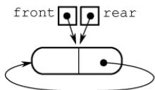

队空的判定条件：front==rear。

队满的判定条件：front==rear->next。

3）插入第一个元素后的状态如下图所示。

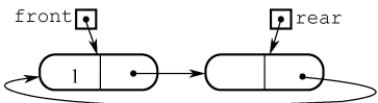

4）操作的基本过程如下：

入队操作：  
若(front==rear->next) //队满  
则在rear后面插入一个新的空闲结点；  
入队元素保存到rear所指结点中；rear=rear->next；返回。  
出队操作：  
若(front==rear) 则出队失败，返回； 算机 //队空  
取front所指结点中的元素e；front=front->next；返回e。

## 3.3 栈和队列的应用

要熟练掌握栈和队列，必须深入理解其典型应用场景，把握其中的规律，做到举一反三。接下来将简要介绍栈和队列的一些常见应用。

## 3.3.1 栈在括号匹配中的应用

假设表达式中允许包含两种括号：圆括号（)和方括号[]，其嵌套顺序任意。例如，（[]（））或[（[][]）]均为合法格式，而[（]）、（[（））或（（）]均为非法格式。 uk

考虑如下括号序列：

$$\text{字符串模式匹配与滑动比较过程}$$

分析过程如下：

1）读入第1个括号“”后，系统期待与之匹配的“]”（第8个）出现。

2）读入第2个括号“（”后，第1个括号“”的期待暂时搁置，转而优先期待与“（”匹配的“）”（第7个）出现。

3）读入第3个括号“「”，当前最急迫的期待变为与之匹配的“1”（第4个）。该期待满足后，先前被搁置的第2个括号“（”的匹配任务重新成为当前最急迫事项。

4）以此类推，可见整个处理过程完全符合后进先出的栈行为。

算法思想如下：

1）初始化一个空栈，顺序扫描输入的括号序列。

2）若遇到左括号，将其压入栈中，表示新增一个待匹配的期待，且其优先级最高。

3）若遇到右括号，则检查栈是否为空：若栈非空且栈顶左括号与当前右括号匹配，则弹出栈顶，完成一次匹配；否则，括号序列非法，算法终止。

4）扫描结束后，若栈为空，则括号序列合法；否则，存在未匹配的左括号，序列非法。

## 3.3.2 栈在表达式求值中的应用

表达式求值是程序设计语言编译中的一个基本问题，也是栈应用的典型范例。

## 1. 算术表达式

中缀表达式（如3+4）是人们常用的算术表达式，其运算符位于两个操作数之间。与前缀表达式（如+34）或后缀表达式（如34+）相比，中缀表达式虽然符合人类阅读习惯，但不便于计算机直接求值，因此许多编程语言在内部仍需要将其转换为后缀或前缀形式进行求值。

与前缀或后缀表达式不同，中缀表达式必须依赖括号来明确运算次序。而后缀表达式的运算符置于操作数之后，其结构已隐含了运算顺序，因此无须括号，仅由操作数和运算符构成。

## 考点追踪表达式树的定义（2025）

中缀表达式 $\mathrm{A}+\mathrm{B}^{\star}(\mathrm{C}-\mathrm{D})-\mathrm{E} / \mathrm{F}$ 对应的后缀表达式为 $\mathrm{ABCD}-\mathrm{^{米}}+\mathrm{EF}/-$ ，与该表达式对应的表达式树(见图3.15）的后序遍历序列一致，体现了后缀表达式与树结构的内在联系。

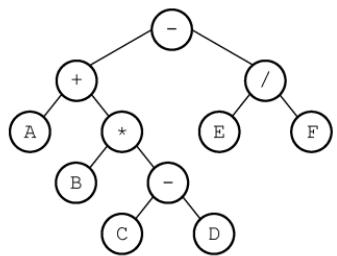  
图 3.15 A+B\*(C-D)-E/F 对应的表达式树

## 2. 中缀表达式转后缀表达式

考点追踪中缀表达式转后缀表达式的方法（2024）

下面先介绍一种手算转换方法。

1）按运算优先级对整个表达式逐层加括号。

2）将每个运算符移到其所在括号的右括号之后，形成“左操作数右操作数运算符”的结构。

3）删除所有括号，即得后缀表达式。

以 $\mathrm{A}+\mathrm{B} \times(\mathrm{C}-\mathrm{D})-\mathrm{E} / \mathrm{F}$ 为例（下标表示运算顺序）：

1）加括号： $\left( \left( \mathbb{A} +_{\textcircled{3}} \left( \mathbb{B} +_{\textcircled{2}} \left( \mathbb{C} -_{\textcircled{1}} \mathbb{D} \right) \right) \right) -_{\textcircled{5}} \left( \mathbb{E} /_{\textcircled{4}} \mathbb{F} \right) \right)$

2）运算符后移： $( ( \mathbb{A} ( \mathbb{B} ( \mathbb{CD} ) -_{\textcircled{1}} ) \star_{\textcircled{2}} ) +_{\textcircled{3}} ( \mathbb{EF} ) /_{\textcircled{4}} ) -_{\textcircled{5} \circ}$

3）去括号后得到后缀表达式： $\mathrm{ABCD}-\mathrm{\textcircled{1}}^{\star}\mathrm{\textcircled{2}}+\mathrm{\textcircled{3} EF}/\mathrm{\textcircled{4} \textcircled{5} \circ }$

在计算机中，该转换过程需借助一个运算符栈，用于暂存尚未确定输出时机的运算符。从左至右依次扫描中缀表达式的每一项，具体规则如下：

1）遇到操作数：直接加入后缀表达式。

2）遇到界限符：若为“（”，直接入栈；若为“)”，不入栈，且不断弹出栈顶运算符并加入后缀表达式，直到遇到“（”，将其弹出并丢弃。

3）遇到运算符：①若其优先级高于栈顶运算符，或栈顶为“（”，则直接入栈；②若其优先级低于或等于栈顶运算符，则依次弹出栈中运算符并加入后缀表达式，直到栈空，或栈顶为“（”，或遇到优先级更低的运算符为止，再将当前运算符入栈。  
按上述方法扫描完所有字符后，将栈中剩余运算符依次弹出并加入后缀表达式。  
例如，中缀表达式 $\mathrm{A}+\mathrm{B}^{\star}(\mathrm{C}-\mathrm{D})-\mathrm{E} / \mathrm{F}$ 转后缀表达式的过程如表3.1所示。

表3.1 中缀表达式A+B\*(C-D)-E/F转后缀表达式的过程
<table><tr><td rowspan=1 colspan=1>步</td><td rowspan=1 colspan=1>待处理序列</td><td rowspan=1 colspan=1>栈内</td><td rowspan=1 colspan=1>后缀表达式</td><td rowspan=1 colspan=1>扫描项</td><td rowspan=1 colspan=1>说明</td></tr><tr><td rowspan=1 colspan=1>1</td><td rowspan=1 colspan=1>A+B*(C-D)-E/F</td><td rowspan=1 colspan=1></td><td rowspan=1 colspan=1></td><td rowspan=1 colspan=1>A</td><td rowspan=1 colspan=1>A加入后缀表达式</td></tr><tr><td rowspan=1 colspan=1>2</td><td rowspan=1 colspan=1>+B*(C-D)-E/F</td><td rowspan=1 colspan=1></td><td rowspan=1 colspan=1>A</td><td rowspan=1 colspan=1>+</td><td rowspan=1 colspan=1>+入栈</td></tr><tr><td rowspan=1 colspan=1>3</td><td rowspan=1 colspan=1>B*(C-D)-E/F</td><td rowspan=1 colspan=1>+</td><td rowspan=1 colspan=1>A</td><td rowspan=1 colspan=1>B</td><td rowspan=1 colspan=1>B加入后缀表达式</td></tr><tr><td rowspan=1 colspan=1>4</td><td rowspan=1 colspan=1>* (C-D) -E/F</td><td rowspan=1 colspan=1>+</td><td rowspan=1 colspan=1>AB</td><td rowspan=1 colspan=1>*</td><td rowspan=1 colspan=1>*优先级高于栈顶，*入栈</td></tr><tr><td rowspan=1 colspan=1>5</td><td rowspan=1 colspan=1>(C-D)-E/F</td><td rowspan=1 colspan=1>+*</td><td rowspan=1 colspan=1>AB</td><td rowspan=1 colspan=1>C</td><td rowspan=1 colspan=1>(直接入栈</td></tr><tr><td rowspan=1 colspan=1>6</td><td rowspan=1 colspan=1>C-D)-E/F</td><td rowspan=1 colspan=1>+*(</td><td rowspan=1 colspan=1>AB</td><td rowspan=1 colspan=1>C</td><td rowspan=1 colspan=1>C 加入后缀表达式</td></tr><tr><td rowspan=1 colspan=1>7</td><td rowspan=1 colspan=1>-D)-E/F</td><td rowspan=1 colspan=1>+*(</td><td rowspan=1 colspan=1>ABC</td><td rowspan=1 colspan=1>一</td><td rowspan=1 colspan=1>栈顶为(，-直接入栈</td></tr><tr><td rowspan=1 colspan=1>8</td><td rowspan=1 colspan=1>D)-E/F</td><td rowspan=1 colspan=1>+*(-</td><td rowspan=1 colspan=1>ABC</td><td rowspan=1 colspan=1>D</td><td rowspan=1 colspan=1>D加入后缀表达式</td></tr><tr><td rowspan=1 colspan=1>9</td><td rowspan=1 colspan=1>)-E/F</td><td rowspan=1 colspan=1>+*(-</td><td rowspan=1 colspan=1>ABCD</td><td rowspan=1 colspan=1>一</td><td rowspan=1 colspan=1>遇到)，弹出-，删除(</td></tr><tr><td rowspan=1 colspan=1>10</td><td rowspan=1 colspan=1>-E/F</td><td rowspan=1 colspan=1>+*</td><td rowspan=1 colspan=1>ABCD-</td><td rowspan=1 colspan=1>1</td><td rowspan=1 colspan=1>-优先级低于栈顶，依次弹出*、+，-入栈</td></tr><tr><td rowspan=1 colspan=1>11</td><td rowspan=1 colspan=1>E/F</td><td rowspan=1 colspan=1>一</td><td rowspan=1 colspan=1>ABCD-*+</td><td rowspan=1 colspan=1>E</td><td rowspan=1 colspan=1>E加入后缀表达式</td></tr><tr><td rowspan=1 colspan=1>12</td><td rowspan=1 colspan=1>/F</td><td rowspan=1 colspan=1>一</td><td rowspan=1 colspan=1>ABCD-*+E</td><td rowspan=1 colspan=1>/</td><td rowspan=1 colspan=1>/优先级高于栈顶，/入栈</td></tr><tr><td rowspan=1 colspan=1>13</td><td rowspan=1 colspan=1>F</td><td rowspan=1 colspan=1>-1</td><td rowspan=1 colspan=1>ABCD-*+E</td><td rowspan=1 colspan=1>F</td><td rowspan=1 colspan=1>F加入后缀表达式</td></tr><tr><td rowspan=1 colspan=1>14</td><td rowspan=1 colspan=1></td><td rowspan=1 colspan=1>-1</td><td rowspan=1 colspan=1>ABCD-*+EF</td><td rowspan=1 colspan=1></td><td rowspan=1 colspan=1>扫描结束，弹出剩余运算符</td></tr><tr><td rowspan=1 colspan=1>15</td><td rowspan=1 colspan=1></td><td rowspan=1 colspan=1></td><td rowspan=1 colspan=1>ABCD-*+EF/-</td><td rowspan=1 colspan=1></td><td rowspan=1 colspan=1>结束</td></tr></table>

考点追踪栈的深度分析（2009、2012、2025）

所谓栈的深度，是指栈中元素最大个数。通常题目会给出入栈和出栈序列，要求计算栈所需的最大容量（最大深度）。有时该信息以中缀与后缀表达式的形式间接提供。掌握栈“后进先出”的特性，并通过手工模拟转换或求值过程，是解决此类问题的有效方法。

## 3. 后缀表达式求值

## 考点追踪用栈实现表达式求值的分析（2018）

后缀表达式的求值过程：从左至右依次扫描表达式，若当前项为操作数，则将其压入栈中；若为操作符<op>，则从栈中弹出两个操作数，先弹出的是右操作数￥，后弹出的是左操作数×，执行运算x<op>Y，并将结果压回栈中。所有项处理完毕后，栈顶元素即为最终计算结果。

例如，后缀表达式ABCD-\*+EF/-的求值过程共需12步，如表3.2所示。

表 3.2 后缀表达式 ABCD-\*+EF/-的求值过程
<table><tr><td rowspan=1 colspan=1>步</td><td rowspan=1 colspan=1>扫描项</td><td rowspan=1 colspan=1>项类型</td><td rowspan=1 colspan=1>动作</td><td rowspan=1 colspan=1>栈中内容</td></tr><tr><td rowspan=1 colspan=1>1</td><td rowspan=1 colspan=1></td><td rowspan=1 colspan=1></td><td rowspan=1 colspan=1>置空栈</td><td rowspan=1 colspan=1>空</td></tr><tr><td rowspan=1 colspan=1>2</td><td rowspan=1 colspan=1>A</td><td rowspan=1 colspan=1>操作数</td><td rowspan=1 colspan=1>入栈</td><td rowspan=1 colspan=1>A</td></tr><tr><td rowspan=1 colspan=1>3</td><td rowspan=1 colspan=1>B</td><td rowspan=1 colspan=1>操作数</td><td rowspan=1 colspan=1>入栈</td><td rowspan=1 colspan=1>A B</td></tr><tr><td rowspan=1 colspan=1>4</td><td rowspan=1 colspan=1>C</td><td rowspan=1 colspan=1>操作数</td><td rowspan=1 colspan=1>入栈</td><td rowspan=1 colspan=1>A B C</td></tr><tr><td rowspan=1 colspan=1>5</td><td rowspan=1 colspan=1>D</td><td rowspan=1 colspan=1>操作数</td><td rowspan=1 colspan=1>入栈</td><td rowspan=1 colspan=1>A B C D</td></tr><tr><td rowspan=1 colspan=1>6</td><td rowspan=1 colspan=1>1</td><td rowspan=1 colspan=1>操作符</td><td rowspan=1 colspan=1> $\mathbb { D } _ { \mathfrak { N } }$ C出栈，计算C-D，结果R1入栈</td><td rowspan=1 colspan=1>A B R1</td></tr><tr><td rowspan=1 colspan=1>7</td><td rowspan=1 colspan=1>★</td><td rowspan=1 colspan=1>操作符</td><td rowspan=1 colspan=1> $\mathbb { R } _ { 1 } ,$ B出栈，计算 $\mathbb { B }   \times   \mathbb { R } _ { 1 } ,$ 结果R2入栈</td><td rowspan=1 colspan=1>A $\mathrm { R } _ { 2 }$ </td></tr><tr><td rowspan=1 colspan=1>8</td><td rowspan=1 colspan=1>+</td><td rowspan=1 colspan=1>操作符</td><td rowspan=1 colspan=1> $\mathbb { R } _ { 2 } \textrm { v }$ A出栈，计算 $\mathbb { A } + \mathbb { R } _ { 2 } ,$ 结果 $\mathrm { R } _ { 3 }$ 入栈</td><td rowspan=1 colspan=1> $\mathrm { R } _ { 3 }$ </td></tr><tr><td rowspan=1 colspan=1>9</td><td rowspan=1 colspan=1>E</td><td rowspan=1 colspan=1>操作数</td><td rowspan=1 colspan=1>入栈</td><td rowspan=1 colspan=1>R3 E</td></tr><tr><td rowspan=1 colspan=1>10</td><td rowspan=1 colspan=1>E</td><td rowspan=1 colspan=1>操作数</td><td rowspan=1 colspan=1>入栈N</td><td rowspan=1 colspan=1> $\mathrm { R } _ { 3 }$ E F</td></tr><tr><td rowspan=1 colspan=1>11</td><td rowspan=1 colspan=1>1</td><td rowspan=1 colspan=1>操作符</td><td rowspan=1 colspan=1>F、E出栈，计算E/F，结果 $\mathbb { R } _ { 4 }$ 入栈</td><td rowspan=1 colspan=1>R3 R₄</td></tr><tr><td rowspan=1 colspan=1>12</td><td rowspan=1 colspan=1>一</td><td rowspan=1 colspan=1>操作符</td><td rowspan=1 colspan=1> $\mathbb { R } _ { 4 } ,$  $\mathrm { R } _ { 3 }$ 出栈，计算 $\scriptstyle \mathbb { R } _ { 3 } - \mathbb { R } _ { 4 } ,$ 结果 $\mathrm { R } _ { 5 }$ 入栈</td><td rowspan=1 colspan=1> $\mathrm { R } _ { 5 }$ </td></tr></table>

## 3.3.3 栈在递归中的应用

递归是一种重要的程序设计方法。简单来说，若一个函数、过程或数据结构在其定义中直接或间接地引用了自身，则称其为递归定义，简称递归。递归通过将原问题逐层分解为规模更小但结构相同的子问题来求解。借助递归策略，仅需少量代码即可简洁地表达解题过程中反复出现的相同计算模式，显著减少程序代码量。然而，在一般情况下，递归的执行效率并不高。

以斐波那契数列为例，其数学定义为

$$
F(n)=\left\{\begin{aligned}&F(n-1)+F(n-2), \quad n>1, \\&1, \quad n=1, \\&0, \quad n=0.\end{aligned}\right.
$$

这是递归的典型范例，其程序实现如下：

```c
int F(int n) { //斐波那契数列的实现
if(n==0)
return 0; //边界条件
else if(n==1)
else return 1; 算机教 //边界条件
return F(n-1)+F(n-2); //递归表达式
```

必须注意，递归定义不能是循环或无终止的，必须满足以下两个条件：

● 递归体（递归表达式）：描述问题如何分解为更小规模的同类子问题。

● 边界条件（递归出口）：确保递归在有限步内终止。

递归的精髓在于能否将原问题转化为属性相同但规模更小的问题。

考点追踪栈在函数调用中的作用和工作原理（2015、2017）

在递归调用过程中，系统为每一层调用的返回地址、局部变量及形参等信息分配存储空间，这些信息被保存在递归工作栈中。因此，递归深度过大时容易导致栈溢出。此外，递归效率低下的主要原因是存在大量重复计算。以n=5为例，其递归调用过程如图3.16所示。

  
图 3.16 F(5) 的递归执行过程

显然，在该过程中，F(3)被计算2次，F(2)被计算3次。F(1)被调用5次，F(0)被调用3次。由此可见，递归虽然代码简洁、易于理解，但存在明显的性能缺陷。在第5章讨论树的遍历时，采用递归可使代码极为简洁，但初学者往往难以清晰理解其执行过程。若希望深入理解递归的底层实现机制，可参考《编译原理》教材中关于运行时栈与活动记录的相关内容。

任何递归算法均可转换为非递归算法，通常需借助显式栈来模拟递归调用过程。

## 3.3.4 队列在层次遍历中的应用

在信息处理中，有一类典型问题需要逐层或逐行处理。解决这类问题的常用策略是：在处理当前层的同时，将下一层的元素按序加入待处理队列。队列正适用于此类场景，因其先进先出的特性，能够自然地保存后续待处理元素的顺序。以二叉树的层次遍历为例（见图3.17），可清晰体现队列的应用价值。表3.3展示了该遍历过程的具体执行步骤。

  
图 3.17 二叉树

表3.3 层次遍历二叉树的过程
<table><tr><td rowspan=1 colspan=1>序号</td><td rowspan=1 colspan=1>说明</td><td rowspan=1 colspan=1>队内</td><td rowspan=1 colspan=1>队外</td></tr><tr><td rowspan=1 colspan=1>1</td><td rowspan=1 colspan=1>A入</td><td rowspan=1 colspan=1>A</td><td rowspan=1 colspan=1></td></tr><tr><td rowspan=1 colspan=1>2</td><td rowspan=1 colspan=1>A出，BC入</td><td rowspan=1 colspan=1>BC</td><td rowspan=1 colspan=1>A</td></tr><tr><td rowspan=1 colspan=1>3</td><td rowspan=1 colspan=1>B出，D入</td><td rowspan=1 colspan=1>CD</td><td rowspan=1 colspan=1>AB</td></tr><tr><td rowspan=1 colspan=1>4</td><td rowspan=1 colspan=1>C出，EF入</td><td rowspan=1 colspan=1>DEF</td><td rowspan=1 colspan=1>ABC</td></tr><tr><td rowspan=1 colspan=1>5</td><td rowspan=1 colspan=1>D出，G入</td><td rowspan=1 colspan=1>EFG</td><td rowspan=1 colspan=1>NABCD</td></tr><tr><td rowspan=1 colspan=1>6</td><td rowspan=1 colspan=1>E出，HI入</td><td rowspan=1 colspan=1>FGHI</td><td rowspan=1 colspan=1>ABCDE</td></tr><tr><td rowspan=1 colspan=1>7</td><td rowspan=1 colspan=1>F出</td><td rowspan=1 colspan=1>GHI</td><td rowspan=1 colspan=1>ABCDEF</td></tr><tr><td rowspan=1 colspan=1>8</td><td rowspan=1 colspan=1>GHI 出</td><td rowspan=1 colspan=1></td><td rowspan=1 colspan=1>ABCDEFGHI</td></tr></table>

该过程可简要描述如下：

①将根结点入队。

②若队列为空（表示所有结点均已处理），则遍历结束；否则执行③。

③取出队首结点并访问；若其存在左孩子，则将左孩子入队；若其存在右孩子，则将右孩子入队返回②继续执行。

## 3.3.5 队列在计算机系统中的应用

队列在计算机系统中的应用非常广泛，以下从两个主要方面进行阐述：第一个方面是解决主机与外部设备之间速度不匹配的问题，第二个方面是解决由多用户引起的资源竞争问题。

考点追踪缓冲区的逻辑结构（2009）

以主机和打印机之间的速度不匹配为例。主机输出数据的速度远快于打印机处理数据的速度。若直接将数据发送给打印机，会导致数据丢失或打印错误。为此，通常设置一个打印数据缓冲区来缓解这一问题。具体实现如下：主机将待打印的数据依次写入缓冲区，当缓冲区满时，主机暂停输出并转向其他任务；打印机则从缓冲区中按先进先出原则逐个取出数据进行打印；打印完成后，打印机向主机发出请求，主机再次向缓冲区写入新的打印数据。这种方法不仅保证了数据的正确性，还提高了主机的整体效率。因此，打印数据缓冲区实际上就是一个队列。

考点追踪多队列出队/入队操作的应用（2016）

在多用户环境下，CPU资源的竞争是一个典型场景。在一个多终端系统中，用户通过各自的终端向操作系统提出对CPU的请求。为公平分配CPU时间，操作系统通常按照请求的时间顺序，将这些请求排成一个队列。具体步骤如下：每次将 CPU分配给队首用户的程序运行：当该程序运行结束或用完规定的时间片后，操作系统使其出队：然后将CPU分配给新的队首用户。这种方式既保证了请求的公平处理，又提升了CPU利用率。此外，在某些复杂系统中，可能还会引入多队列机制，以便根据不同的优先级或调度策略动态调整资源分配。

## 3.3.6 本节试题精选

## 一、单项选择题

01. 栈的应用不包括（）。A. 递归 B. 表达式求值 C. 括号匹配 D. 缓冲区

02. 表达式a\*(b+c)-d 的后缀表达式是（）。A. abcd\*+- B. abc+\*d- C. abc\*+d- D. -+\*abcd

03. 下面（）用到了队列。A.括号匹配 B. 表达式求值 C. 递归 D. FIFO 页面替换算法

04. 利用栈求表达式的值时，设立运算数栈OPEN。假设OPEN只有两个存储单元，则在下列表达式中，不会发生溢出的是（）。A. A-B\*(C-D) B. (A-B)\*C-D C. (A-B\*C)-D D. (A-B)\*(C-D)

$$
\mathtt { r e t u r n } ( ( \mathtt { x } { > } 0 ) ? \mathtt { x } { \star } \mathtt { f } ( \mathtt { x } { - } 1 ) : 2 ) ;
$$

i=f(f(1));A. 2 B. 4 C. 8 D. 无限递归

06. 设有如下递归函数，则计算℉(8)需要调用该递归函数的次数为（）。int F(int n){if(n<=3) return 1;else return F(n-2)+F(n-4)+1;}A. 7 B. 8 C. 9 D. 10

07. 设有如下递归函数，在 func(func(5))的执行过程中，第 4 个被执行的func 函数是()。int func(int x){if(x<=3) return 2;else return func(x-2)+func(x-4); 机教育A. func(2) B. func(3) C. func(4) D. func(5)

08. 对于一个问题的递归算法求解和其相对应的非递归算法求解，（）。A. 递归算法通常效率高一些 B. 非递归算法通常效率高一些C. 两者相同 D. 无法比较

09.执行函数时，其局部变量一般采用（）进行存储。 1A. 树形结构 B. 静态链表 C. 栈结构 D. 队列结构

10. 执行（）操作时，需要使用队列作为辅助存储空间。A. 查找散列（哈希）表 B. 广度优先搜索图C. 前序（根）遍历二叉树 D. 深度优先搜索图

11.下列说法中，正确的是（）。 算A. 消除递归不一定需要使用栈B. 对同一输入序列进行两组不同的合法入栈和出栈组合操作，所得的输出序列也一定相同C. 通常使用队列来处理函数或过程调用D. 队列和栈都是运算受限的线性表，只允许在表的两端进行运算

12.【2009统考真题】为解决计算机主机与打印机之间速度不匹配的问题，通常设置一个打印数据缓冲区，主机将要输出的数据依次写入该缓冲区，而打印机则依次从该缓冲区中取出数据。该缓冲区的逻辑结构应该是（）。A. 栈 へ妆B.队列 C. 树 D. 图

13. 【2012 统考真题】已知操作符包括 $\alpha_{+} - \alpha_{-} - \alpha_{\times} - \alpha_{/} - \alpha_{\left( \right)}$ 和“)”。将中缀表达式a+b-a\*（(c+d)/e-f)+g 转换为等价的后缀表达式 ab+acd+e/f-\*-g+时，用栈来存放暂时还不能确定运算次序的操作符。栈初始时为空，转换过程中同时保存在栈中的操作符的最大个数是（）。  
王 A. 5 B. 7 C. 8 D. 11

14.【2014统考真题】假设栈初始为空，将中缀表达式 $a / b + ( c ^ { \star } d - e ^ { \star } t )$ /g 转换为等价的后缀表达式的过程中，当扫描到f时，栈中的元素依次是（）。A. + (\*− B. + (−\* C. /+(\*-\* D. /+-\*

15.【2015统考真题】已知程序如下： int S(int n) { return (n<=0)?0:S(n-1)+n;} void main() { cout<<S (1) ;}

程序运行时使用栈来保存调用过程的信息，自栈底到栈顶保存的信息依次对应的是()。

A. main ( ) →S (1)→S (0) B. S(0) →S (1) →main ( ) C. main () →S (0) →S (1) D. S(1) →S (0) →main ( )

16.【2016统考真题】设有如下图所示的火车车轨，入口和出口之间有n条轨道，列车的行进方向均为从左至右，列车可驶入任意一条轨道。现有编号为1\~9的9列列车，驶入的次序依次是8,4,2,5,3,9,1,6,7。若期望驶出的次序依次为1\~9，则n至少是（）。


A. 2 B. 3 C. 4 D. 5

17.【2017统考真题】下列关于栈的叙述中，错误的是（）。I. 采用非递归方式重写递归程序时必须使用栈 王道ùⅡ. 函数调用时，系统要用栈保存必要的信息Ⅲ.只要确定了入栈次序，即可确定出栈次序IV. 栈是一种受限的线性表，允许在其两端进行操作A. 仅I B. 仅I、Ⅱ、ⅢIC.仅I、ⅢII、IVD.仅ⅡI、ⅢI、IV

18. 【2018 统考真题】若栈S1 中保存整数，栈 S2 中保存运算符，函数F()依次执行下述各步操作：1）从 S1中依次弹出两个操作数a和b。2）从 S2中弹出一个运算符op。3）执行相应的运算b op a。4）将运算结果压入S1中。

假定S1中的操作数依次是5,8,3,2（2在栈顶），S2中的运算符依次是\*、-、+（+在栈顶）。调用3次F（）后，S1栈顶保存的值是（）。A. -15 B. 15 C. -20 D. 20

19.【2024统考真题】与表达式 $x { + } y ^ { * } ( z { - } u ) / v$ 等价的后缀表达式是（）。A. $x y z u - * y / +$ B. $x y z u – v ^ { \prime * } +$ C. $+ x / ^ { * } y { - } z u v$ D. $+ x ^ { * } y / - z u v$

20.【2025统考真题】己知算法A用于检查字符串中各类括号是否匹配，A执行过程中使用初始为空的栈保存遇到的括号。若栈的容量是3，则下列选项中，A不能处理的是()。A. $(a+[b+(c+d)/e]+f)+g-h$ B. $\left[ a \times \left( (b+c) / (d-e) + f / g \right) - h \right]$ C. $\left[ a \star \left( b - ( c - d ) \star e / ( f + g ) \right) - h \right]$ D. $\left[a-\left(b+\left[c\times\left(\mathrm{d}+\mathrm{e}\right)-\mathrm{f}\right]+\mathrm{g}+\mathrm{h}\right)\right]$

## 二、综合应用题

01. 假设一个算术表达式中包含圆括号、方括号和花括号3种类型的括号，编写一个算法来判别表达式中的括号是否配对，以字符“\0”作为算术表达式的结束符。

## 3.3.7 答案与解析

## 一、单项选择题

01. D

缓冲区是用队列实现的，选项A、B、C都是栈的典型应用。

## 02. B

后缀表达式中，每个运算符均直接位于其两个操作数的后面，按照这样的方式逐步根据计算的优先级将每个计算式进行变换，即可得到后缀表达式。

【另解】将两个直接操作数用括号括起来，再将操作符提到括号后，最后去掉括号。例如，对于 $( \textcircled{i} ( a \times ( a + c ) ) - d )$ ，提出操作符并去掉括号后，可得后缀表达式为 $\mathrm{abc}+\mathrm{^{\star}d}-\mathrm{c}$

学完第5章后，可将表达式画成二叉树的形式，再用后序遍历即可求得后缀表达式。

## 03. D

FIFO页面替换算法用到了队列。其余的都只用到了栈。

## 04. B

利用栈求表达式的值时，可以分别设立运算符栈和运算数栈，其原理不变。选项B中A入栈，B入栈，计算得R1，C入栈，计算得R2，D入栈，计算得R3，由此得栈深为2。选项A、C、D依次计算得栈深为4、3、3。因此选择选项B。 7

## 技巧

根据运算符优先级，统计已依次入栈但还未参与计算的运算符数。以选项C为例，当“(”“A”“-”入栈时，“(”和“-”还未参与运算，此时运算符栈大小为2，“B”和“\*”入栈时运算符大小为3，“C”入栈时“B\*C”运算，运算符栈大小为2，以此类推。

## 05. B

栈与递归有着紧密的联系。递归模型包括递归出口和递归体两个方面。递归出口是递归算法的出口，即终止递归的条件。递归体是一个递推的关系式。根据题意有

f(0)=2;   
f(1)=1\*f(0)=2;   
f(f(1))=f(2)=2\*f(1)=4。 06. C

计算F(8)的递归调用树如右图所示：

由图可知，递归函数℉()调用的次数为9。

## 07. C

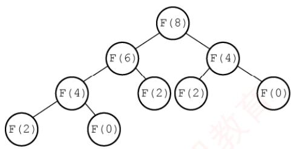

首先，执行内层参数 func(5) =func(3)+

func(1)=4，共执行 3 次 func 函数。然后，执行 func(func(5))=func(4)=func(2)+func(0)=4，因此第4个被执行的func函数是func(4)。也可以采用画出递归调用树的方式，即某个函数的执行次序等于其在递归调用树的先序遍历中的次序。

## 08. B

通常情况下，递归算法在计算机实际执行的过程中包含很多的重复计算，所以效率会低。

## 09. C

调用函数时，系统会为调用者构造一个由参数表和返回地址组成的活动记录，并将记录压入系统提供的栈中，若被调用函数有局部变量，也要压入栈中。

## 10. B

本题涉及第5章和第6章的内容，图的广度优先搜索类似于树的层序遍历，都要借助于队列。

## 11. A

使用栈可以模拟递归的过程，以此来消除递归，但对于单向递归和尾递归而言，可以用迭代的方式来消除递归，选项A正确。不同的入栈和出栈组合操作，会产生许多不同的输出序列，B

错误。通常使用栈来处理函数或过程调用，选项C错误。队列和栈都是操作受限的线性表，但只有队列允许在表的两端进行运算，而栈只允许在栈顶方向进行操作，选项D错误。

## 12. B

在提取数据时必须保持原来数据的顺序，所以缓冲区的特性是先进先出。

## 13. A

在中缀表达式转后缀表达式的过程中，扫描到操作数时直接输出，扫描到操作符时根据其优先级进行相应的出入栈操作。有几点需要注意：①若遇到界限符“（”，则直接入栈；②若遇到界限符“）”，则不入栈，且依次弹出栈顶运算符，直到遇到“（”为止，并删除“（”；③若当前运算符的优先级高于栈顶运算符或遇到栈顶为“（”，则直接入栈：④若当前运算符的优先级低于或等于栈顶运算符，则依次弹出栈中的运算符并加入后缀表达式，直到遇到一个优先级低于它的运算符或遇到“（”或栈空为止，之后将当前运算符入栈。

求栈中操作符的最大个数时，为简单起见，可省略对操作数的处理。
<table><tr><td rowspan=1 colspan=1>步</td><td rowspan=1 colspan=1>待处理运算符</td><td rowspan=1 colspan=1>栈</td><td rowspan=1 colspan=1>扫描运算符</td><td rowspan=1 colspan=1>动作</td></tr><tr><td rowspan=1 colspan=1>1</td><td rowspan=1 colspan=1>+b-a*((c+d)/e-f)+g</td><td rowspan=1 colspan=1></td><td rowspan=1 colspan=1>+</td><td rowspan=1 colspan=1>+入栈</td></tr><tr><td rowspan=1 colspan=1>2</td><td rowspan=1 colspan=1>-a*((c+d)/e-f)+g</td><td rowspan=1 colspan=1>+</td><td rowspan=1 colspan=1>一</td><td rowspan=1 colspan=1>-优先级等于栈顶+，弹出+，-入栈</td></tr><tr><td rowspan=1 colspan=1>3</td><td rowspan=1 colspan=1>*((c+d)/e-f)+g</td><td rowspan=1 colspan=1>一</td><td rowspan=1 colspan=1>*</td><td rowspan=1 colspan=1>*优先级高于栈顶-，*入栈</td></tr><tr><td rowspan=1 colspan=1>4</td><td rowspan=1 colspan=1>((c+d)/e-f)+g</td><td rowspan=1 colspan=1>- *</td><td rowspan=1 colspan=1>C</td><td rowspan=1 colspan=1>(直接入栈</td></tr><tr><td rowspan=1 colspan=1>5</td><td rowspan=1 colspan=1>(c+d) /e-f) +g</td><td rowspan=1 colspan=1>-*(</td><td rowspan=1 colspan=1>(</td><td rowspan=1 colspan=1>(直接入栈</td></tr><tr><td rowspan=1 colspan=1>6</td><td rowspan=1 colspan=1>+d) /e-f) +g</td><td rowspan=1 colspan=1>-*((</td><td rowspan=1 colspan=1>+</td><td rowspan=1 colspan=1>栈顶为(，+直接入栈</td></tr><tr><td rowspan=1 colspan=1>7</td><td rowspan=1 colspan=1>)/e-f) +g</td><td rowspan=1 colspan=1>-*((+</td><td rowspan=1 colspan=1>)</td><td rowspan=1 colspan=1>遇到)，弹出+，删除(</td></tr><tr><td rowspan=1 colspan=1>8</td><td rowspan=1 colspan=1>/e-f) +g</td><td rowspan=1 colspan=1>-*(</td><td rowspan=1 colspan=1>1</td><td rowspan=1 colspan=1>栈顶为(，/直接入栈</td></tr><tr><td rowspan=1 colspan=1>9</td><td rowspan=1 colspan=1>-f) +g</td><td rowspan=1 colspan=1>-*(1</td><td rowspan=1 colspan=1>-T</td><td rowspan=1 colspan=1>-优先级低于栈顶/，弹出/，-入栈</td></tr><tr><td rowspan=1 colspan=1>10</td><td rowspan=1 colspan=1>)+g</td><td rowspan=1 colspan=1>-*(-</td><td rowspan=1 colspan=1>へ</td><td rowspan=1 colspan=1>遇到)，弹出-，删除(</td></tr><tr><td rowspan=1 colspan=1>11</td><td rowspan=1 colspan=1>+g</td><td rowspan=1 colspan=1>- *</td><td rowspan=1 colspan=1>+</td><td rowspan=1 colspan=1>+优先级低于栈顶*，等于-，依次弹出*和-；+入栈</td></tr><tr><td rowspan=1 colspan=1>12</td><td rowspan=1 colspan=1></td><td rowspan=1 colspan=1>+</td><td rowspan=1 colspan=1></td><td rowspan=1 colspan=1></td></tr></table>

由上述过程可知，栈中操作符的最大个数为5。

## 14. B

中缀表达式 $a / b + (c^{\star} d - e^{\star} f)$ /g转换为后缀表达式的过程如下：

<table><tr><td rowspan=1 colspan=1>步</td><td rowspan=1 colspan=1>待处理序列</td><td rowspan=1 colspan=1>栈</td><td rowspan=1 colspan=1>后缀表达式</td><td rowspan=1 colspan=1>扫描项</td><td rowspan=1 colspan=1>动作</td></tr><tr><td rowspan=1 colspan=1>1</td><td rowspan=1 colspan=1>a/b+(c*d-e*f)/g</td><td rowspan=1 colspan=1></td><td rowspan=1 colspan=1></td><td rowspan=1 colspan=1>a</td><td rowspan=1 colspan=1>a 加入后缀表达式</td></tr><tr><td rowspan=1 colspan=1>2</td><td rowspan=1 colspan=1>/b+(c*d-e*f)/g</td><td rowspan=1 colspan=1></td><td rowspan=1 colspan=1>a</td><td rowspan=1 colspan=1>1</td><td rowspan=1 colspan=1>/入栈</td></tr><tr><td rowspan=1 colspan=1>3</td><td rowspan=1 colspan=1>b+(c*d-e*f)/g</td><td rowspan=1 colspan=1>/</td><td rowspan=1 colspan=1>a</td><td rowspan=1 colspan=1>b</td><td rowspan=1 colspan=1>b 加入后缀表达式</td></tr><tr><td rowspan=1 colspan=1>4</td><td rowspan=1 colspan=1>+(c*d-e*f)/g</td><td rowspan=1 colspan=1>/</td><td rowspan=1 colspan=1>ab</td><td rowspan=1 colspan=1>+</td><td rowspan=1 colspan=1>+优先级低于栈顶的/，弹出/，+入栈</td></tr><tr><td rowspan=1 colspan=1>5</td><td rowspan=1 colspan=1>(c*d-e*f)/g</td><td rowspan=1 colspan=1>+</td><td rowspan=1 colspan=1>ab/</td><td rowspan=1 colspan=1>(</td><td rowspan=1 colspan=1>(入栈</td></tr><tr><td rowspan=1 colspan=1>6</td><td rowspan=1 colspan=1>c*d-e*f)/g</td><td rowspan=1 colspan=1>+(</td><td rowspan=1 colspan=1>ab/</td><td rowspan=1 colspan=1>C</td><td rowspan=1 colspan=1>c 加入后缀表达式</td></tr><tr><td rowspan=1 colspan=1>7</td><td rowspan=1 colspan=1>*d-e*f)/g</td><td rowspan=1 colspan=1>+(</td><td rowspan=1 colspan=1>ab/c</td><td rowspan=1 colspan=1>★</td><td rowspan=1 colspan=1>栈顶为(，*入栈</td></tr><tr><td rowspan=1 colspan=1>8</td><td rowspan=1 colspan=1>d-e*f)/g</td><td rowspan=1 colspan=1>+(*</td><td rowspan=1 colspan=1>ab/c</td><td rowspan=1 colspan=1>d</td><td rowspan=1 colspan=1>α加入后缀表达式</td></tr><tr><td rowspan=1 colspan=1>9</td><td rowspan=1 colspan=1>-e*f)/g</td><td rowspan=1 colspan=1>+(*</td><td rowspan=1 colspan=1>ab/cd</td><td rowspan=1 colspan=1>-</td><td rowspan=1 colspan=1>-优先级低于栈顶的*，弹出*，-入栈</td></tr><tr><td rowspan=1 colspan=1>10</td><td rowspan=1 colspan=1>e*f)/g</td><td rowspan=1 colspan=1>+(-</td><td rowspan=1 colspan=1>ab/cd*</td><td rowspan=1 colspan=1>e</td><td rowspan=1 colspan=1>e 加入后缀表达式</td></tr><tr><td rowspan=1 colspan=1>11</td><td rowspan=1 colspan=1>*f)/g</td><td rowspan=1 colspan=1>+(-</td><td rowspan=1 colspan=1>ab/cd*e</td><td rowspan=1 colspan=1>★</td><td rowspan=1 colspan=1>*优先级高于栈顶的-，*入栈</td></tr><tr><td rowspan=1 colspan=1>12</td><td rowspan=1 colspan=1>f)/g</td><td rowspan=1 colspan=1>+(-*</td><td rowspan=1 colspan=1>ab/cd*e</td><td rowspan=1 colspan=1>f</td><td rowspan=1 colspan=1>f加入后缀表达式</td></tr><tr><td rowspan=1 colspan=1>13</td><td rowspan=1 colspan=1>)/g</td><td rowspan=1 colspan=1>+(-*</td><td rowspan=1 colspan=1>ab/cd*ef</td><td rowspan=1 colspan=1>)</td><td rowspan=1 colspan=1>遇到)，依次弹出*、-加入表达式，删除(</td></tr><tr><td rowspan=1 colspan=1>14</td><td rowspan=1 colspan=1>/g</td><td rowspan=1 colspan=1>+</td><td rowspan=1 colspan=1>ab/cd*ef*-</td><td rowspan=1 colspan=1>1</td><td rowspan=1 colspan=1>/优先级高于栈顶的+，/入栈</td></tr><tr><td rowspan=1 colspan=1>15</td><td rowspan=1 colspan=1>g</td><td rowspan=1 colspan=1>+1</td><td rowspan=1 colspan=1>ab/cd*ef*-</td><td rowspan=1 colspan=1>g</td><td rowspan=1 colspan=1>g加入后缀表达式</td></tr><tr><td rowspan=1 colspan=1>16</td><td rowspan=1 colspan=1></td><td rowspan=1 colspan=1>+1</td><td rowspan=1 colspan=1>ab/cd*ef*-g</td><td rowspan=1 colspan=1></td><td rowspan=1 colspan=1>扫描完毕，运算符依次弹出加入表达式</td></tr><tr><td rowspan=1 colspan=1>17</td><td rowspan=1 colspan=1></td><td rowspan=1 colspan=1></td><td rowspan=1 colspan=1>ab/cd*ef*-g/+</td><td rowspan=1 colspan=1></td><td rowspan=1 colspan=1>完成</td></tr></table>

由此可知，当扫描到f时，栈中的元素依次是+（-\*。

【另解】采用手算方法，得出中缀式 $a / b + ( c \times d - e \times t )$ /g 对应的后缀式为 $\mathrm { a b / c d ^ { \star } e f ^ { \star } \mathrm { - g / + } }$ 0中缀表达式转后缀表达式时，操作数都直接输出，因此操作数的顺序是固定的。扫描到f时，在后缀表达式f后面的运算符要么还未入栈，要么还在栈中，需要结合中缀式来判断，f后面依次出栈的运算符为\*-/+，/在中缀表达式f之后，此时还未入栈，因此栈中的运算符（从栈底到栈顶）为+-\*；此外，已入栈的界限符（此时还未消解，因此（也还在栈中，栈中的元素依次是+（-\*。

## 15. A

递归调用函数时，在系统栈中保存的函数信息需满足先进后出的特点，依次调用了main（），S(1)，S(0)，所以栈底到栈顶的信息依次是main（），S(1)，S(0)。

注意

在递归中，系统为每一层的返回点、局部变量、传入实参等开辟了递归工作栈来存储。

16. C

根据题意：入队顺序为8,4,2,5,3,9,1,6,7，出队顺序为1～9。入口和出口之间有多个队列（n条轨道），且每个队列（轨道）可容纳多个元素（多列列车），为便于区分，队列用字母编号。分析如下：显然先入队的元素必须小于后入队的元素（否则，若8和4入同一个队列，8在4前面，则出队时也只能8在4前面），这样8入队列A，4入队列B，2入队列C，5入队列B（按照前述原则“大的元素在小的元素后面”也可将5入队列C，但这时剩下的元素3就必须放入一个新的队列中，无法确保“至少”），3入队列C，9入队列A，这时共占了3个队列，后面还有元素1，直接再用一个新的队列D，1从队列D出队后，剩下的元素6和7或入队列B，或入队列C。综上，共占用了4个队列。当然还有其他的入队、出队情况，请读者自己推演，但要确保满足：①队列中后面的元素大于前面的元素；②确保占用最少（满足题意中“至少”）的队列。

17. C

说法Ⅰ的反例：计算斐波那契数列迭代实现只需要一个循环即可实现。说法Ⅲ的反例：入栈序列为 1, 2，进行 Push, Push, Pop, Pop 操作，出栈次序为 2、1；进行 Push, Pop, Push, Pop操作，出栈次序为1,2。说法IV，栈是一种受限的线性表，只允许在一端进行操作。说法Ⅱ正确。

18. B

第一次调用：① 从 s1 中弹出 2 和 3；② 从 s2 中弹出+；③ 执行 3+2=5；④ 将 5 压入S1中，第一次调用结束后s1中剩余5、8、5（5在栈顶），S2中剩余\*、-（-在栈顶）。第二

次调用：① 从 s1 中弹出 5 和 8；② 从 s2 中弹出一；③ 执行 8-5=3；④将 3压入S1中，第二次调用结束后S1中剩余5、3（3在栈顶），S2中剩余\*。第三次调用：①从S1 中弹出 3 和 5；② 从S2 中弹出\*；③执行5\*3=15；④将15压入S1中，第三次调用结束后S1中仅剩余15，S2为空。

19. A

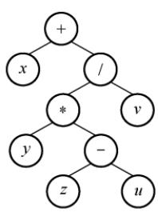

根据中缀表达式画出对应的二叉树如右图所示，对该二叉树进行后序遍历即可得到后缀表达式为 $x y z u ^ { - * } v / +$ 。本题也可采用本书前面描述的手算方法。

20. D

该算法利用栈来检查括号匹配：遇到左括号时入栈，遇到右括号时出栈并与之匹配。由于栈的容量为3，因此最多只能容纳3个未匹配的左括号，即最多支持3层嵌套的括号结构。逐项分析各选项的括号嵌套深度：对于选项A，括号序列为([()])，最大嵌套深度为3，依次入栈([(，未超过栈容量。对于选项B，括号序列为(())]，最大深度为3，依次入栈[((，栈容量足够。对于选项C，括号序列为[(())]，同样最大深度为3,栈容量足够。对于选项D,括号序列为[([()])]，最大嵌套深度达到4。扫描至\*后的(时，栈中已存有([三个左括号，此时，需要将第四个左括号(入栈，但栈容量仅为3，无法继续入栈，因此该表达式无法被正确处理。

## 二、综合应用题

## 01. 【解答】

括号匹配是栈的一个典型应用，给出这道题是希望读者好好掌握栈的应用。算法的基本思想是扫描每个字符，遇到花、方、圆的左括号时入栈，遇到花、方、圆的右括号时检查栈顶元素是否为相应的左括号，若是，出栈，否则配对错误。最后栈若不为空也为错误。 X

bool BracketsCheck(char \*str) {  
InitStack(S) ; //初始化栈  
int i=0;  
while(str[i]!='\0') {  
switch(str[i]) {  
//左括号入栈  
王道 case '(': Push(S,'('); break;  
case '[': Push(S,'['); break;  
case '{': Push(S,'{'); break;  
//遇到右括号，检测栈顶  
case ')': Pop(S,e);  
if(e!='(') return false;  
break;  
case ']': Pop(S,e);  
if(e!='[') return false;  
break;  
case '}': Pop(S,e);  
if(e!='{') return false;  
break;  
default:  
break; 王道  
}//switch  
i++;  
}//while  
if(!StackEmpty(S)){  
printf("括号不匹配\n")；  
return false;  
else {  
printf("括号匹配\n")；  
return true;

## 3.4 数组和特殊矩阵

矩阵在图形学、工程计算等领域占有重要地位。在数据结构中，关注的重点并非矩阵本身的数学性质及其运算，而是如何以最小的内存空间高效存储矩阵，并支持对元素的便捷访问。

## 3.4.1 数组的定义

数组是由n（n≥1）个相同类型的数据元素组成的有限序列。每个元素称为数组元素，其在线性序列中的位置由下标标识，下标的取值范围称为维界。

数组与线性表的关系：数组是线性表的推广。一维数组可视为一个线性表：二维数组可视为其元素为定长一维数组的线性表：更高维数组以此类推。数组一旦定义，其维数与维界即固定不变。因此，除初始化和销毁外，数组仅支持存取元素和修改元素两种基本操作。

## 3.4.2 数组的存储结构

大多数编程语言提供数组类型，逻辑上的数组通常映射为内存中一段连续的存储空间。以一维数组 $\mathrm { A } [ 0 . . .   n   -   1 ]$ 为例，设每个元素占L个存储单元，则元素A[i]的地址为

$$
\mathrm{LOC}(a_{i}) = \mathrm{LOC}(a_{0}) + iL \quad (0 \leqslant i \leqslant n)
$$

考点追踪二维数组按行优先存储的下标对应关系（2021）

多维数组在内存中需按某种顺序展开为一维。常见方式有按行优先和按列优先。按行优先：先行后列，先存储行号较小的元素；同一行内，先存储列号较小的元素。设二维数组行下标与列下标范围分别为 $[0,h_1]  与  [0,h_2]$ ，则元素A[i]闭]的地址为

$$
\mathrm{LOC}(a_{i,j}) = \mathrm{LOC}(a_{0,0}) + [i(h_2 + 1) + j]L
$$

例如，数组 $\mathbf { A } _ { [ 2 ] [ 3 ] }$ 按行优先存储的形式如图3.18所示。

  
图3.18 二维数组按行优先顺序存放

按列优先：先列后行，先存储列号较小的元素；同一列内，先存储行号较小的元素。其对应的地址公式为 V

$$
\mathrm{LOC}(a_{i,j}) = \mathrm{LOC}(a_{0,0}) + [j(h_1 + 1) + i]L
$$

例如，数组 $\mathbf { A } _ { [ 2 ] [ 3 ] }$ 按列优先存储的形式如图3.19所示。

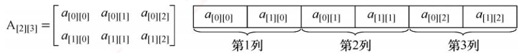  
图3.19 二维数组按列优先顺序存放

## 3.4.3 特殊矩阵的压缩存储

压缩存储：为多个值相同的元素只分配一个存储空间，对零元素不分配存储空间。

特殊矩阵：指具有大量相同元素或零元素，且这些元素分布具有规律性的矩阵。常见的特殊矩阵有对称矩阵、上（下）三角矩阵、对角矩阵等。

特殊矩阵的压缩存储方法：通过分析矩阵中相同元素的分布规律，仅存储一份实际数据，其余的可通过下标映射访问，从而将原本冗余的数据压缩到一个共享的空间中，显著节省内存。

## 1. 对称矩阵

考点追踪对称矩阵压缩存储的下标对应关系（2018、2020）

若n阶矩阵A 中任意元素 $a _ { i , j }$ 均满足 $a_{ij}=a_{ji} (1 \leqslant i,j \leqslant n)$ ，则称其为对称矩阵。其元素可分为三部分：上三角区、主对角线和下三角区，如图3.20所示。

由于上三角区与下三角区完全对称，若仍用二维数组存储，将近一半空间被浪费。为此可将n阶对称矩阵A压缩存储于一维数组 $\mathrm{B}[n(n + 1)/2]$ 中，通常仅存放下三角部分（含主对角线）。

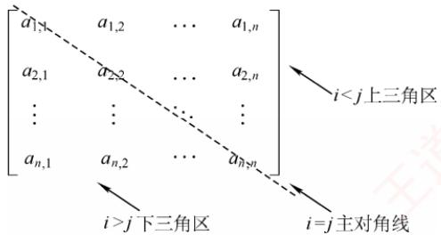  
图 3.20 n阶矩阵的划分

对于元素 $a _ { i j } \left( i \geqslant j \right)$ ，其在数组B中的位置由其前方的元素个数决定

第1行：1个元素 $( a _ { \mathrm { 1 , 1 } } )$ 第2行：2个元素 $( a _ { 2 , 1 } , a _ { 2 , 2 } )$

第i-1行：i-1个元素 $(a_{i - 1,1}, a_{i - 1,2}, \cdots, a_{i - 1,i - 1})$ 第i行：j-1个元素 $( a _ { i , 1 } , a _ { i , 2 } , \cdots , a _ { i , j - 1 } )$ 0

因此，元素 $a _ { i , j }$ 在数组B中的下标

$k = 1 + 2 + \cdots + (i - 1) + j - 1 = i(i - 1) / 2 + j - 1$ （数组下标从0开始）。元素下标之间的对应关系如下：

$$
k = \left\{ \begin{aligned} \frac{i(i - 1)}{2} + j - 1, & \quad i \geq j  (下三角区和主对角线元素) \\ \frac{j(j - 1)}{2} + i - 1, & \quad i < j  (上三角区元素 a_{i,j} = a_{j,i}) \end{aligned} \right.
$$

若数组下标从1开始，则可采用类似的推导方法，请读者自行思考。

## 注意

二维数组 A[n][n]与 A[0...n− 1][0...n- 1]写法等价，表示下标从0开始。若写作A[1...n][1...n]，则表示下标从1开始。矩阵元素通常记为 $a _ { i , j } ,$ 其行号i和列号j通常从1开始。

## 2. 三角矩阵

在下三角矩阵[见图3.22(a)]中，上三角区的所有元素均为同一常量。其存储思想与对称矩阵的类似，但是需要额外存储该常量一次。因此，可以将n阶下三角矩阵A压缩存储在$\mathrm{B}[n(n + 1)/2 +$ 1]中。 道

对于元素 $a_{i,j} (i \geqslant j)$ ，其在数组B中的下标为

$$
k = \left\{ \begin{aligned} &\frac{i(i - 1)}{2} + j - 1, & \quad i \geq j & ( 下三角区和主对角线元素 ) \\ &\frac{n(n + 1)}{2}, & \quad i < j & ( 上三角区元素 ) \end{aligned} \right.
$$

下三角矩阵的压缩存储形式如图3.21所示。

<table><tr><td>0</td><td>1</td><td>2</td><td>3</td><td>4</td><td>5</td><td>…</td><td></td><td></td><td>…</td><td></td><td>n(n+1)/2</td></tr><tr><td>a1,1</td><td>a2,1</td><td>a2,2</td><td>a3,1</td><td>a3,2</td><td>a3,3</td><td>…</td><td>an,1</td><td>an,2</td><td>…</td><td>an,n</td><td>c</td></tr><tr><td>第1行</td><td>第2行</td><td></td><td></td><td>第3行</td><td></td><td></td><td></td><td>第n行</td><td></td><td></td><td>常数项</td></tr></table>

图3.21 下三角矩阵的压缩存储

考点追踪上三角矩阵采用行优先存储的应用（2011）

在上三角矩阵「见图3.22(b)中，下三角区所有元素均为同一常量。只需存储主对角线、上三角区上元素及该常量一次，同样将其压缩存储在 $\mathrm{B}[n(n + 1)/2 + 1]$ 中。

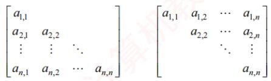  
(a) 下三角矩阵  
(b) 上三角矩阵  
图 3.22 三角矩阵

对于元素 $a_{ij} (i \leqslant j)$ ，其在数组B中前方的元素个数为

第1行：n个元素

第2行：n-1个元素

第i−1行：n-i +2个元素

第i行：j-i个元素

故元素 $a _ { i j }$ 在数组B中的下标 $k = n + (n - 1) + \cdots + (n - i + 2) + (j - i + 1) - 1 = (i - 1)(2n - i + 2)/2 +$ (j-i)。元素下标之间的对应关系如下： XTA


上三角矩阵的压缩存储形式如图3.23所示。

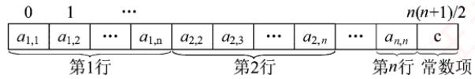  
图3.23 上三角矩阵的压缩存储

以上推导均假设数组下标从0开始。若下标指定从1开始，则要相应地调整映射关系。

## 3. 三对角矩阵

若n阶矩阵A 中的任意元素 $a _ { i j }$ ，当 $\lvert i   -   j \rvert \geq 1$ 时均有 $a_{ij} = 0 \quad (1 \leqslant i, j \leqslant n)$ ，则称为三对角矩阵，如图3.24所示。非零元素仅集中在以主对角线为中心的3条对角线的区域。

$$
\begin{bmatrix} a_{1,1} & a_{1,2} & & & \\ a_{2,1} & a_{2,2} & a_{2,3} & & 0 \\ & a_{3,2} & a_{3,3} & a_{3,4} & \\ & & \ddots & \ddots & \ddots \\ & 0 & & a_{n-1,n-2} & a_{n-1,n-1} & a_{n-1,n} \\ & & & & a_{n,n-1} & a_{n,n} \end{bmatrix}
$$

图 3.24 三对角矩阵A  
可将三对角上的元素按行优先顺序存入一维数组B，且 $a _ { 1 , 1 }$ 存于B[0]，如图3.25所示。
<table><tr><td rowspan=1 colspan=1> $a _ { 1 , 1 }$ </td><td rowspan=1 colspan=1> $a _ { 1 , 2 }$ </td><td rowspan=1 colspan=1> $a _ { 2 , 1 }$ </td><td rowspan=1 colspan=1> $a _ { 2 , 2 }$ </td><td rowspan=1 colspan=1> $a _ { 2 , 3 }$ </td><td rowspan=1 colspan=1></td><td rowspan=1 colspan=1> $a _ { n - 1 , n }$ </td><td rowspan=1 colspan=1> $a _ { n , n - 1 }$ </td><td rowspan=1 colspan=1> $a _ { n , n }$ </td></tr></table>

图3.25 三对角矩阵的压缩存储

## 考点追踪三对角矩阵压缩存储的下标对应关系（2016）

三对角上的元素 $a_{ij} (1 \leqslant i, j \leqslant n, |i - j| \leqslant 1)$ 在一维数组B中的下标 $k = 2 i + j - 3$ 0

反之，已知元素存于B[中时， $i = \left\lfloor (k + 1)/3 \right\rfloor + 1, j = k - 2i + 3$ 例如，当k=0时， $i = \lfloor (0 + 1)/3 + 1 \rfloor = 1$ $j = 0 - 2 \times 1 + 3 = 1$ ，存放的是 $a _ { 1 , 1 } ;$ 当k=2时， $i = \left\lfloor (2 + 1)/3 + 1 \right\rfloor = 2, j = 2 - 2 \times 2 + 3 = 1$ ，存放的是 $a _ { 2 , 1 } ;$ 当k=4时， $i = \left\lfloor (4 + 1)/3 + 1 \right\rfloor = 2, \quad j = 4 - 2 \times 2 + 3 = 3$ ，存放的是 $\boldsymbol { a } _ { 2 , 3 }$

## 3.4.4 稀疏矩阵

若矩阵中非零元素的个数t相对于总元素个数s来说非常少，即 $t \ll s ,$ 则称该矩阵为稀疏矩

阵。例如，一个100×100的矩阵中只有不到100个非零元素。

## 考点追踪存储稀疏矩阵需要保存的信息（2023）

为避免空间浪费，稀疏矩阵通常仅存储非零元素。然而，由于非零元素的分布通常是无规律的，仅存储其值是不够的，还需记录它们所在的行和列。为此，将每个非零元素及其对应的行列位置组合成一个三元组（行标i，列标i，值 $\overline { { a _ { i , j } } } )$ ，如图3.26所示。这些三元组可以按某种顺序排列成线性表进行存储。稀疏矩阵压缩存储后便失去了随机存取特性。

  
图3.26 稀疏矩阵及其对应的三元组

## 考点追踪稀疏矩阵压缩存储的方式（2017）

稀疏矩阵的三元组表可通过多种方式存储，常见的有：数组存储将所有三元组按某种顺序存储在一维数组中，这种方式简单直接，但插入和删除操作的效率较低；十字链表存储（见6.2节）通过链表的方式组织三元组，适用于频繁插入和删除操作的场景。无论采用哪种方式，都需要额外保存稀疏矩阵的行数、列数和非零元素的个数，以便支持后续的各种操作。

## 3.4.5 本节试题精选

## 单项选择题

01. 对特殊矩阵采用压缩存储的主要目的是（）。A. 表达变得简单 B. 对矩阵元素的存取变得简单C. 去掉矩阵中的多余元素 道 D. 减少不必要的存储空间

02.对n阶对称矩阵压缩存储时，需要表长为（）的顺序表。A. n/2 B. $n { \times } n / 2$ C. $n ( n + 1 ) / 2$ D. $n ( n - 1 ) / 2$

03. 有一个 n×n的对称矩阵A，将其下三角部分按行存放在一维数组 B 中，而 A[0][0]存放于B[0]中，则元素A[i][i]存放于B中的（）处。A. (i + 3)i/2 B. (i + 1)i/2 C. $( 2 n - i + 1 ) i / 2$ D. $(2n - i - 1)i / 2$

04. 在二维数组A中，假设每个数组元素的长度为3个存储单元，行下标i为0\~8，列下标j为0\~9，从首地址SA 开始连续存放。在这种情况下，元素A[8][5]的起始地址为（）。A. $\mathrm { S A } \pm 1 4 1$ B. SA + 144 C. SA+ 222 D. $\mathrm { S A } \pm 2 5 5$

05. 二维数组A按行优先存储，其中每个元素占1个存储单元。若A[1][1]的存储地址为420，A[3][3]的存储地址为446，则A[5][5]的存储地址为（）。A. 472 B. 471 C. 458 D. 457

06. 将三对角矩阵即数组 A[1...100][1...100]按行优先存入一维数组 B[1...298]中，数组 A中元素A[66][65]在数组 B 中的位置 k 为（）。A. 198 B. 195 C. 197 D. 196

07. 若将 n 阶上三角矩阵A 按列优先级压缩存放在一维数组 B[1.. $n ( n + 1 ) / 2 + 1 ]$ 中，则存放到 B[k中的非零元素 $a_{ij} (1 \leqslant i, j \leqslant n)$ 的下标i、j与 k的对应关系是（）。A. $i ( i + 1 ) / 2 + j$ B. $i(i - 1)/2 + j - 1$ C. $j ( j   -   1 ) / 2 + i$ D. $j ( j - 1 ) / 2 + i - 1$

08. 若将n阶下三角矩阵A按列优先顺序压缩存放在一维数组 $\mathrm { B } [ 1 \dots n ( n + 1 ) / 2 + 1 ]$ 中，则存放到B[k]中的非零元素 $a_{ij} (1 \leqslant i, j \leqslant n)$ 的下标i,j 与 k的对应关系是（）。A. $( j - 1 ) ( 2 n - j + 1 ) / 2 + i - j$ B. $( j - 1 ) ( 2 n - j + 2 ) / 2 + i - j + 1$ C. $( j - 1 ) ( 2 n - j + 2 ) / 2 + i - j$ 首计 D. $( j - 1 ) ( 2 n - j + 1 ) / 2 + i - j - 1$

09.稀疏矩阵采用压缩存储后的缺点主要是（）。A. 无法判断矩阵的行列数 B. 丧失随机存取的特性C. 无法由行、列值查找某个矩阵元素D. 使矩阵元素之间的逻辑关系更复杂

10. 下列关于矩阵的说法中，正确的是（）。I. 在 $n (n > 3)$ 阶三对角矩阵中，每行都有3个非零元素Ⅱ. 稀疏矩阵的特点是矩阵中的元素较少A. 仅IK B. 仅Ⅱ C. I和ⅡI D. 无正确项

11.【2016统考真题】有一个100阶的三对角矩阵M，其元素 $m_{i,j} (1 \leqslant i,j \leqslant 100)$ 按行优先依次压缩存入下标从0开始的一维数组N中。元素 $m _ { 3 0 , 3 0 }$ 在N中的下标是（）。A.86 B. 87 C. 88 D.89

12.2017统考真题】适用于压缩存储稀疏矩阵的两种存储结构是（）。A. 三元组表和十字链表 B. 三元组表和邻接矩阵C. 十字链表和二叉链表 D. 邻接矩阵和十字链表

13.【2018统考真题】设有一个12×12阶对称矩阵M，将其上三角部分的元素 $m_{i,j}(1 \leqslant i \leqslant j \leqslant 12)$ 按行优先存入C语言的一维数组N中，元素 $m _ { 6 ,   6 }$ 在N中的下标是（）。A. 50 B. 51 C. 55 D. 66

14.【2020统考真题】将一个10×10阶对称矩阵M的上三角部分的元素 $m_{i,j} (1 \leqslant i \leqslant j \leqslant 10)$ 按列优先存入C语言的一维数组N中，元素 $m _ { 7 , 2 }$ 在N中的下标是（）。A. 15 B. 16 C. 22 D. 23

15.【2021统考真题】二维数组A按行优先方式存储，每个元素占用1个存储单元。若元素 A[0][0]的存储地址是100,A[3][3]的存储地址是220,则元素A[5][5]的存储地址是( )。A. 295 NB. 300 C. 301 D. 306

16.【2023统考真题】若采用三元组表存储结构存储稀疏矩阵M，则除三元组表外，下列数据中还需要保存的是（）。I. M 的行数 II. M 中包含非零元素的行数III. M 的列数 IV. M 中包含非零元素的列数A.仅I、III B. 仅I、IV C. 仅ⅡI、IV D.I、II、ⅢII、IV

## 3.4.6 答案与解析

## 单项选择题

01. D

特殊矩阵中含有很多相同元素或零元素，所以可采用压缩存储，以节省存储空间。

02. C

只需存储其上三角或下三角部分（含对角线），元素个数为 $n+(n-1)+\cdots+1=n(n+1)/2$ 03. A

此题要注意3个细节：矩阵的最小下标为0；数组下标也是从0开始的；矩阵按行优先存在

数组中。注意到此三点，答案不难得到为选项A。此外，本类题建议采用特殊值代入法求解，例如，A[1][1]对应的下标应为2，代入后只有选项A满足条件。

## 技巧

对于特殊三角矩阵压缩存储的题，心中应有“平移”搬动的思想，并结合草图，这样会比较形象，在计算时再注意矩阵和数组的起始下标，就不容易出错。

## 04. D

二维数组计算地址（按行优先顺序）的公式为

$$
\mathrm{LOC}(i, j) = \mathrm{LOC}(0, 0) + (im + j)L
$$

其中， $\mathrm{LOC}(0,0)=\mathrm{SA}$ ，是数组存放的首地址；L=3是每个数组元素的长度： $m = 9 - 0 + 1 = 10$ 是数组的列数。因此有 $\mathrm{LOC}(8, 5) = \mathrm{SA} + (8 \times 10 + 5) \times 3 = \mathrm{SA} + 255$ ，所以选择选项D。

## 05. A

本题未直接给出数组A的行数和列数，因此需要根据题目中的信息来推理。因为该二维数组按行优先存储，且A[3][3]的存储地址为446，所以A[3][1]的存储地址为444，又A[1][1]的存储地址为420，显然A[1][1]和 A[3][1]正好相差2 行，所以该矩阵的列数为12。而A[5][3]和A[3][3]正好相差2行，A[5][5]和A[5][3]又相差2个元素，所以A[5][5]的存储地址是 $446 + 24 + 2 = 472$ 0

## 06. B

对于三对角矩阵，将A[1...n][1...n]压缩至B[1...3n-2]时 $a _ { i , j }$ 与 $b _ { k }$ 的对应关系为 $k = 2i + j - 2$ 0则 A 中的元素A[66][65]在数组B 中的位置 k为 $2 \times 66 + 65 - 2 = 195$

## 07. C

按列优先存储，所以元素 $a _ { i , j }$ 前面有j-1列，共有 $1 + 2 + 3 + \cdots + j - 1 = j ( j - 1 ) / 2$ 个元素，元素 $a _ { i j }$ 在第j列上是第i个元素，数组B的下标是从1开始，因此 $k = j ( j - 1 ) / 2 + i .$

## 08. B

按列优先存储，故元素 ${ } ^ { \cdot } a _ { i j }$ 前有j-1列，共有 $n+(n-1)+\cdots+(n-j+2)=(j-1)(2n-j+2)/2$ 个元素，元素 $a _ { i j }$ 是第j列上第 $i   -   j   +   1$ 个元素，数组B的下标从1开始， $k = ( j - 1 ) ( 2 n - j + 2 ) / 2 + i - j + 1$

## 09. B

稀疏矩阵通常采用三元组来压缩存储，存储矩阵元素的行列下标和相应的值，因此不能根据矩阵元素的行列下标快速定位矩阵元素，失去了随机存取的特性。

## 10. D

在三对角矩阵中，第1行和最后1行只有2个非零元，其余各行均有3个非零元。稀疏矩阵的特点是矩阵中非零元的个数较少。

## 11.B

三对角矩阵如下所示。

$$
\begin{bmatrix} a_{1,1} & a_{1,2} & & & \\ a_{2,1} & a_{2,2} & a_{2,3} & & \\ & a_{3,2} & a_{3,3} & a_{3,4} & \\ & & \ddots & \ddots & \ddots \\ & & & a_{n-1,n-2} & a_{n-1,n-1} & a_{n-1,n} \\ & & & & & a_{n,n-1} & a_{n,n} \end{bmatrix}
$$

采用压缩存储，将3条对角线上的元素按行优先方式存放在一维数组B中，且 $a _ { 1 , 1 }$ 存放于B[0]中，其存储形式如下所示：

<table><tr><td rowspan=1 colspan=1> $a _ { 1 , 1 }$ </td><td rowspan=1 colspan=1> $a _ { 1 , 2 }$ </td><td rowspan=1 colspan=1> $a _ { 2 , 1 }$ </td><td rowspan=1 colspan=1> $a _ { 2 , 2 }$ </td><td rowspan=1 colspan=1> $a _ { 2 , 3 }$ </td><td rowspan=1 colspan=1></td><td rowspan=1 colspan=1> $a _ { n - 1 , n }$ </td><td rowspan=1 colspan=1> $a _ { n , n - 1 }$ </td><td rowspan=1 colspan=1> $a _ { n , n }$ </td></tr></table>

可以计算矩阵A中3条对角线上的元素 $a_{i,j} \left( 1 \leqslant i, j \leqslant n, |i - j| \leqslant 1 \right)$ 在一维数组B中存放的下标为 $k = 2i + j - 3$ ，公式很难记忆，我们通常采用解法2。

解法1：针对该题，仅需将数字逐一代入公式 $k = 2 \times 30 + 30 - 3 = 87$ ，结果为 87。

解法2：观察上图的三对角矩阵不难发现，第一行有两个元素，剩下的在元素 $m _ { 3 0 , 3 0 }$ 所在行之前的28行（注意下标 $1 \leqslant i,j \leqslant 100$ 中，每行都有3个元素，而 $m _ { 3 0 , 3 0 }$ 之前仅有一个元素 $m _ { 3 0 , 2 9 }$ 不难发现元素 $m _ { 3 0 , 3 0 }$ 在数组N中的下标是 $2+28\times3+2-1=87$ 0

## 注意

矩阵和数组的下标从0或1开始（如矩阵可能从 $a _ { 0 , 0 }$ 或 $a _ { 1 , 1 }$ 开始，数组可能从B[0]或B[1]开始），这时就需要适时调整计算方法（方法无非是多计算1或少计算1的问题）。 K

## 12. A

三元组表的结点存储了行（row）、列（col）、值（value）三种信息，是主要用来存储稀疏矩阵的一种数据结构。十字链表将行单链表和列单链表结合起来存储稀疏矩阵。邻接矩阵空间复杂度达 $\mathcal { O } ( n ^ { 2 } )$ ，不适合存储稀疏矩阵。二叉链表又名左孩子右兄弟表示法，可用于表示树或森林。

## 13. A

在C语言中，数组N的下标从0开始。第一个元素 $m_{1,1}$ 对应存入 $n _ { 0 }$ ，矩阵M的第一行有12个元素，第二行有11个，第三行有10个，第四行有9个，第五行有8个，所以 $m _ { 6 , 6 }$ 是第$12+11+10+9+8+1=51$ 个元素，下标应为50。

## 14. C

上三角矩阵按列优先存储，先存储只有1个元素的第一列，再存储有2个元素的第二列，以此类推。 $m _ { 7 , 2 }$ 位于左下角，对应右上角的元素为 $m _ { 2 , 7 }$ ，在 $m _ { 2 , 7 }$ 之前存有

第1列：1

第2列：2

第6列：6

第7列：1

前面共存储有 $1+2+3+4+5+6+1=22$ 个元素（数组下标范围为0～21），注意数组下标从0开始，所以 $m_{2,7}$ 在数组N中的下标为22，即 $m _ { 7 , 2 }$ 在数组N 中的下标为 22。

## 15. B

二维数组A按行优先存储，每个元素占用1个存储单元，由A[0][0]和A[3][3]的存储地址可知，A[3][3]是二维数组A中的第121个元素，假设二维数组A的每行有n个元素，则 $n \times 3 + 4 = 121$ ，求得n=39，所以元素A[5][5]的存储地址为 $100+39\times5+6-1=300$

## 16. A

用三元组表存储结构存储稀疏矩阵M时，每个非零元素都由三元组（行标、列标、关键字

值）组成。但是，仅通过三元组表中的元素无法判断稀疏矩阵M的大小，因此还要保存M的行数和列数。此外，还可以保存M的非零元素个数。例如，右图所示的两个稀疏矩阵的三元组表是相同的，若不保存行数和列数，则无法判断两个稀疏矩阵的大小。 首

<table><tr><td rowspan=1 colspan=1>0</td><td rowspan=1 colspan=1>2</td><td rowspan=1 colspan=1>0</td><td rowspan=1 colspan=1>0</td></tr><tr><td rowspan=1 colspan=1>0</td><td rowspan=1 colspan=1>0</td><td rowspan=1 colspan=1>5</td><td rowspan=1 colspan=1>0</td></tr><tr><td rowspan=1 colspan=1>0</td><td rowspan=1 colspan=1>0</td><td rowspan=1 colspan=1>0</td><td rowspan=1 colspan=1>0</td></tr><tr><td rowspan=1 colspan=1>0</td><td rowspan=1 colspan=1>0</td><td rowspan=1 colspan=1>0</td><td rowspan=1 colspan=1>0</td></tr></table>

<table><tr><td rowspan=1 colspan=1>0</td><td rowspan=1 colspan=1>2</td><td rowspan=1 colspan=1>0</td></tr><tr><td rowspan=1 colspan=1>0</td><td rowspan=1 colspan=1>0</td><td rowspan=1 colspan=1>5</td></tr><tr><td rowspan=1 colspan=1>0</td><td rowspan=1 colspan=1>0</td><td rowspan=1 colspan=1>0</td></tr></table>

stack[++top]=x; ∥一句代码实现入栈操作

## 归纳总结

本章所介绍的几种数据结构是线性表的应用与推广，考试中主要以选择题形式考查，但栈和队列仍可能出现在算法设计题中。不少读者看到教材中列出大量操作函数时容易产生畏难情绪：如果考试中出现了栈或队列相关的算法大题，是否需要完整写出每个操作函数？

其实，在算法设计题中，栈和队列通常作为辅助工具用于解决其他问题，无须严格按照模块化方式分函数实现。我们完全可以将其声明和核心操作写得简洁明了。以顺序栈为例： YTA

（1）声明并初始化栈：

Elemtype stack[maxSize]； int top=-1； //两句代码用来声明和初始化

（2)入栈操作：

（3）出栈操作：

x=stack[top--]; ∥/单目运算符在变量之前表示“先运算后使用”，之后则相反

对于链式栈，同样只需定义一个结构体，然后根据需要从常规操作中摘取关键语句，直接嵌入到自己的解题代码中即可，无须完整实现所有接口。此外，在考研真题中，链式栈出现的概率远低于顺序栈，因此大家应有所侧重，多训练与顺序栈相关的题目。

## 思维拓展

设计一个栈，使它可以在 O(1)的时间复杂度内实现 Push、Pop和min操作。所谓min操作，是指得到栈中最小的元素。 X

## 提示

使用双栈，两个栈是同步关系。主栈是普通栈，用来实现栈的基本操作Push和Pop；辅助栈用来记录同步的最小值 min，例如元素x 入栈，则辅助栈 stack min[top++]=(x<min)?x:min;即在每次Push 中，都将当前最小元素放到 stack min 的栈顶。在主栈中 Pop 最小元素y时，stack min 栈中相同位置的最小元素 y 也会随着top--而出栈。因此 stack min 的栈顶元素必然是y之前入栈的最小元素。本题是典型的以空间换时间的算法。

购买王道书，就上

王道官方考研书店

wangdao.taobao.com


  
视频讲解

【复习提示】

本章为统考大纲第6章内容，根据读者建议单独成章。大纲仅要求掌握字符串模式匹配，重点是理解KMP算法的原理、next数组和 nextval数组的推导过程。手工计算 next数组时，可先求出部分匹配值表再进行转换，也可直接依据递推公式求解。

## \*4.1 串的定义和实现①

字符串简称串，计算机中非数值处理的对象基本上都是字符串数据。常见的信息检索系统（如搜索引擎）、文本编辑程序（如Word）、问答系统、自然语言翻译系统等，均以字符串作为核心处理对象。本章将详细介绍字符串的存储结构及其相关操作。

## 4.1.1 串的定义

串（string）是由零个或多个字符组成的有限序列，通常记为

$$
S = a_{1}a_{2}\cdots a_{n} \quad (n \geqslant 0)
$$

其中，S是串名，单引号括起的字符序列是串的值；每个 $a _ { i }$ 可以是字母、数字或其他字符；串中字符的个数n称为串的长度。当n=0时，该串称为空串（用∅表示）。

串中任意多个连续字符组成的子序列称为该串的子串，而包含该子串的串称为主串。某个字符在串中的序号称为该字符在串中的位置；子串在主串中的位置以其第1个字符在主串中的位

置来标识。当两个串长度相等，且对应位置上的字符完全相同时，称这两个串相等。

例如，设串A='China Beijing'，B='Beijing'，C='China'，则它们的长度分别为13、7和5。其中，B和C都是A的子串，B在A中的位置为7，C在A中的位置为1。

需注意，由一个或多个空格（空格是一种特殊字符）组成的串称为空格串，空格串不是空串，其长度等于其中空格字符的个数。 道

串的逻辑结构与线性表极为相似，区别仅在于串的数据对象被限定为字符集。但在基本操作上，二者有显著差异：线性表的基本操作通常以单个元素为单位，如查找、插入或删除某个元素；而串的基本操作一般以子串为单位，如查找、插入或删除一个子串等。 XTA

## 4.1.2 串的基本操作

• StrAssign(&T,chars)：赋值操作。将串 T赋值为 chars。

● StrCopy(&T,S)：复制操作。将串 s 复制给串 T。

● StrEmpty(S)：判空操作。若S 为空串，则返回 TRUE，否则返回 FALSE。

StrCompare(S,T)：比较操作。若 S>T，返回值>0；若S=T，返回值=0；若S<T，返回值<0。

● StrLength(S)：求串长操作。返回串 s 中字符的个数。

• SubString(&Sub,S, pos, len)：求子串操作。用 sub 返回串 s 中从第 pos 个字符起、长度为len的子串。

● Concat(&T，S1，S2)：串联接操作。用T 返回由 S1 和 S2 联接而成的新串。

● Index(S,T)：定位操作。若主串 S 中存在与串 T 值相同的子串，则返回其在 S 中首次出现的位置；否则返回0。

● ClearString(&S)：清空操作。将串 s置为空串。

● DestroyString(&S)：销毁操作。将串 s 销毁。

不同的高级语言对串的基本操作集可能有不同的定义方式。在上述操作中，StrAssign（赋值）、StrCompare（比较）、StrLength（求长）、Concat（联接）和SubString（求子串）这五种操作构成了串类型的最小操作子集：它们无法通过其他串操作实现；而其余串操作（除ClearString和DestroyString外）均可基于该最小操作子集实现。 山育

## 4.1.3 串的存储结构

## 1. 定长顺序存储表示

类似于线性表的顺序存储结构，串的定长顺序存储使用一组地址连续的存储单元来存放串值的字符序列。系统为每个串变量预先分配一个固定长度的数组。

```c
#define MAXLEN 255 //预定义最大串长为255
typedef struct{
char ch[MAXLEN]; //每个分量存储一个字符
int length; //串的实际长度
}SString;
```

串的实际长度不得超过MAXLEN，若超出，则多余部分被舍弃，称为截断。串长有两种表示方式：一种是如上述结构所示，用一个独立的整型变量1en显式记录串的长度；另一种是在串值末尾添加一个不计入串长的结束标记符0'，此时串长为隐含值，需要通过遍历计算得出。

执行插入、联接等操作时，若结果串长度超过MAXLEN，则通常按“截断”处理。要从根本上避免这一限制，需要取消对串长上限的硬性规定，转而采用动态分配的存储方式。

## 2. 堆分配存储表示

堆分配存储仍以地址连续的存储单元存放串值字符序列，但其存储空间在程序运行过程中动态申请获得。

typedef struct{  
char \*ch; //按串长分配存储区，ch 指向串的基地址  
int length; //串的长度  
}HString;

在C语言中，存在一个称为堆的自由存储区。可通过调用ma11oc（）为新生成的串动态分配一块大小等于串长的连续存储空间：若分配成功，返回指向该空间起始地址的指针，作为串的基地址（由指针ch指示）；若分配失败，则返回NULL。已分配的空间可通过free（）释放。

上述两种存储方式被大多数高级程序设计语言所采用。块链存储表示仅做简单介绍。

## 3. 块链存储表示

类似于线性表的链式存储结构，串也可采用链表形式存储。考虑到串的特殊性（每个元素仅为单个字符），实际实现中，每个链表结点可存放一个或多个字符。每个结点称为一个块，整个链表称为块链结构。图4.1(a)显示了块大小为4的链表（每个结点存放4个字符），最后一块占不满时通常用“#”补齐；图4.1(b)则为块大小为1的链表（每个结点仅存1个字符）。

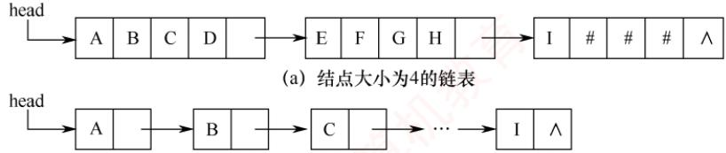  
(b) 结点大小为1的链表  
图4.1 串值的链式存储方式

## 4.2 串的模式匹配

## 4.2.1 简单的模式匹配算法

模式匹配是指在主串中查找与模式串（待搜索的字符串）完全相同的子串，并返回其首次出现的位置。本节基于定长顺序存储结构，介绍一种不依赖其他串操作的暴力匹配算法。

```javascript
int Index(SString S,SString T) {
int i=1,j=1;
while(i<=S.length&&j<=T.length) { if(S.ch[i]==T.ch[j]){ 王道计
++i;++j; //继续比较后继字符
}
else{
i=i-j+2;j=1; //指针后退重新开始匹配
if(j>T.length) return i-T.length; //匹配成功，返回起始位置
else return 0; //匹配失败
```

在该算法中，计数指针i和j分别指示主串 s和模式串中当前待比较的字符位置。其基本思想是：从主串s的第一个字符开始，与模式串T的首字符比较。若相等，则继续比较后续字符；否则，将主串的比较起点后移一位，并重新从的首字符开始比较；重复此过程，直至模式串T的所有字符依次与主串S中某段连续字符完全匹配，则称匹配成功，函数返回该子串在主串中的起始位置；若遍历完主串仍未找到匹配，则返回0，表示匹配失败。

图 4.2 显示了模式串 $\mathrm{T}=\mathrm{^{ ' }a}\mathrm{b}\mathrm{c}\mathrm{a}\mathrm{c}$ 和主串 S 中的匹配过程。

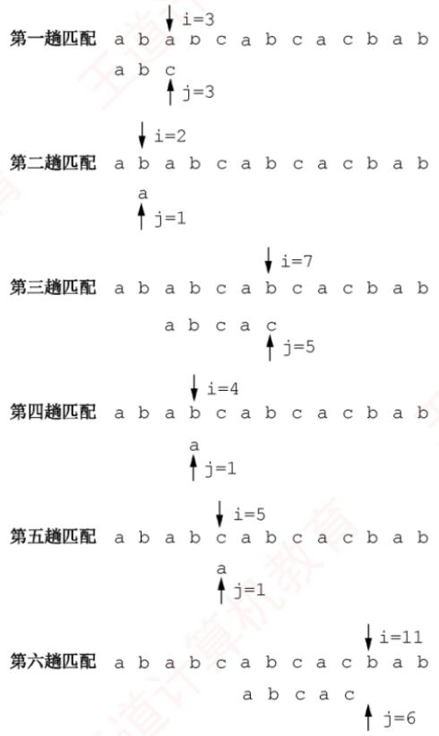  
图4.2 简单模式匹配算法举例

在简单模式匹配算法中，设主串和模式串的长度分别为n和 $m (n \gg m)$ ，则最多需进行 $n   -   m   +   1$ 趟匹配，每趟最多比较m次，因此最坏时间复杂度为O(nm)。例如，当模式串为 $\text{栈状态与括号匹配分析}$ ，而主串为'0000000000000000000000000000000000000000 000001'时，由于模式串前6个字符均为 $^ { \intercal } 0 ^ { \intercal }$ ，而主串前45个字符也全为 $\cdot \cdot _ { 0 } \cdot$ ，导致每趟匹配都直到模式串的最后一个字符才发现不匹配。整个过程中，主串指针i需回溯39次，总比较次数达 $40 \times 7 = 280$ 次。 KK

## 4.2.2 串的模式匹配算法——KMP 算法

在图4.2的第三趟匹配过程中，当i=7、j=5 位置字符不相等时，通常会从 $\downarrow = 4 , \downarrow = 1$ 重新开始比较。然而，观察发现，i=4和j=1、i=5和j=1 以及i=6和j=1 这三次比较都是不必要的。因为从第三趟部分匹配的结果可知，主串的第4、5、6个字符 $( 1 b ^ { \intercal } , 1 c ^ { \intercal } , 1 a ^ { \intercal } )$ ，与模式串的第2、3、4个字符相同，而模式串的首字符为 $ \text{" } a "$ ，故这些重复比较是多余的。只需将模式串向右滑动三个字符的位置，然后从 $i = 7 、 j = 2$ 继续比较即可。

在简单模式匹配中，每次匹配失败后都会将模式串向右滑动一位并从头开始比较。但是，某次已匹配成功的序列实际上是模式串的某个前缀，通过分析模式串本身的结构，若已匹配成功的序列中有后缀正好是模式串的前缀，则可直接将模式串右滑到与这些字符对齐的位置，而无须回溯主串指针i，从而提高效率。这种优化策略正是KMIP算法的核心。

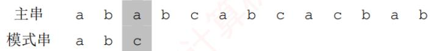

## 1. KMP 算法的原理

要理解模式串的结构，首先需明确几个概念：前缀、后缀和部分匹配值。前缀是指除最后一个字符外，字符串的所有头部子串；后缀是指除第一个字符外，字符串的所有尾部子串；部分四配值则是指字符串的前缀和后缀的最长相等前后缀长度。下面以'ababa'为例进行说明：

● 'a'的前缀和后缀均为空集，最长相等前后缀长度为0。

● 'ab'的前缀为{a}，后缀为{b}，{a}∩{b}=∅，最长相等前后缀长度为0。

• 'aba'的前缀{a,ab}∩后缀{a,ba}={a}，最长相等前后缀长度为1。

• 'abab'的前缀{a,ab,aba}∩后缀 $\{ \mathrm{b}, \mathrm{ab}, \mathrm{ab} \} = \{ \mathrm{ab} \}$ ，最长相等前后缀长度为2。

• 'ababa'的前缀{a,ab,aba,abab}∩后缀 $\{ \mathtt { a } , \mathtt { b } \mathtt { a } , \mathtt { a } \mathtt { b } \mathtt { a } , \mathtt { b } \mathtt { a } \mathtt { b } \mathtt { a } \} { = } \{ \mathtt { a } , \mathtt { a } \mathtt { b } \mathtt { a } \}$ ，交集有两个，最长相等前后缀长度为3。

因此，模式串'ababa'的部分匹配值为00123。

那么，这个部分匹配值有何作用？

回到最初的问题，主串为'ababcabcacbab'，模式串为'abcac'。

利用上述方法容易求得模式串'abcac'的部分匹配值为00010，将部分匹配值组织成数组的形式，即构成部分匹配值表（Partial Match Table，PM表）。

<table><tr><td rowspan=1 colspan=1>编号</td><td rowspan=1 colspan=1>1</td><td rowspan=1 colspan=1>2</td><td rowspan=1 colspan=1>3</td><td rowspan=1 colspan=1>4</td><td rowspan=1 colspan=1>5</td></tr><tr><td rowspan=1 colspan=1>S</td><td rowspan=1 colspan=1>a</td><td rowspan=1 colspan=1>b</td><td rowspan=1 colspan=1>C</td><td rowspan=1 colspan=1>a</td><td rowspan=1 colspan=1>C</td></tr><tr><td rowspan=1 colspan=1>PM</td><td rowspan=1 colspan=1>0</td><td rowspan=1 colspan=1>0</td><td rowspan=1 colspan=1>0</td><td rowspan=1 colspan=1>1</td><td rowspan=1 colspan=1>0</td></tr></table>

下面利用PM表进行字符串匹配：

第一趟匹配：

在第3位发生失配（c≠a），此前已匹配2个字符'ab'。查表可知，最后一个匹配字符b对应的部分匹配值为0，按照下面的公式计算模式串需要右滑的位数：

右滑位数= 已匹配字符数 - 对应的部分匹配值

由于2-0=2，将模式串向右滑动2位，进行第二趟匹配。

<table><tr><td>主串</td><td>a</td><td>b</td><td>a</td><td>b</td><td>C</td><td>a</td><td>b</td><td>C</td><td>a</td><td></td><td>C b</td><td>a</td><td>b</td></tr><tr><td>模式串</td><td></td><td></td><td>a</td><td>b</td><td>C</td><td>a</td><td>C</td><td></td><td></td><td></td><td></td><td></td><td></td></tr></table>

第二趟匹配：

在第5位发生失配（c≠b），此前已匹配4个字符'abca'。查表可知，最后一个匹配字符a对应的部分匹配值为1，4-1=3，将模式串向右滑动3位，进行第三趟匹配。

模式串

第三趟匹配：

模式串全部字符匹配成功。

可见，部分匹配值的核心价值在于指导模式串在失配后的最优右移距离。整个过程中，主串指针始终未回溯，这使得 KMP算法的时间复杂度稳定为O(n+ m)。

某趟匹配失败时：若已匹配序列中不存在相等的前后缀（PM值为0），则滑动位数最大，直接将模式串首字符对齐到主串当前失配位置：若存在最长相等前后缀（可理解为首尾重合），则将模式串向右滑动至与主串中该相等后缀对齐的位置，从而跳过已知相等的部分，避免重复比较。两种情形下，模式串右滑位数均为“已匹配字符数-对应的部分匹配值”。

还有一种特殊情况：若模式串的第一个字符即与主串当前字符失配，则已匹配字符数为0，按规则将模式串整体右移一位，并从主串下一个位置开始新一轮匹配。

## 2. next 数组的手算方法

在实际匹配过程中，模式串在内存中的存储位置是固定的，并不会真正“滑动”：发生变化的只是指针。前文通过模拟滑动的方式，是为了直观地帮助读者理解KMP算法的匹配逻辑。

$$
 【基盖面瓣】卜  $\mathsf { K M P }$  算法中指针变化化较次数的分析  $\left( \mathtt { 2 0 1 5 }  、  \mathtt { 2 0 1 9 } \right)$
$$

KMP算法的核心特性是：每趟匹配失败时，主串指针i不回溯，仅模式串指针i调整。为此，可定义一个next数组，next[j]的含义是：当模式串的第j个字符失配时，下一轮应从模式串的第next[j]个位置继续与主串当前字符比较。

下面介绍一种手算next数组的方法，仍以模式串'abcac'为例。

第1个字符失配时：令next[1]=0，然后指针i加1，指针j重置为1，即下一轮将模式串的第1个位置与主串当前位置的下一位置进行比较（注意，图中下标为字符编号）。

$$\text{字符串模式匹配与滑动比较过程}$$

第2个字符失配时：令next[2]=1，模式串下次的比较位置为1，相当于向右滑动1位(注，next[1]=0、next[2]=1 是固定规则）。 灿

$$\text{字符串模式匹配与滑动比较过程}$$

在后续的手算过程中，可在失配位置前画一条分界线，尝试将模式串向右移动，直到分界线左侧的部分能够首尾对齐（存在相等的前后缀），或模式串完全跨过分界线为止。

第3个字符失配时：模式串下次的比较位置为1，即 $\operatorname { n e x t } [ 3 ] = 1$ ，相当于向右滑动2位。

匹配失败，说明此元素不是c

$$\text{字符串模式匹配与滑动比较过程}$$

第4个字符失配时：模式串下次的比较位置为1，即 $\scriptstyle \mathbb { R e } \times \mathbb { t } \; [ \; 4 \; ] \; = \; \mathbb { 1 }$ ，相当于向右滑动3位。

匹配失败，说明此元素不是a

$$
\text{KMP模式匹配右滑示意}
$$

第5个字符失配时：模式串下次的比较位置为2，即 $\scriptstyle \mathrm { n e x t }   [   5   ]   = 2$ ，相当于向右滑动3位。

匹配失败，说明此元素不是c

$$\text{字符串模式匹配与滑动比较过程}$$

next 数组和 PM 表的关系是怎样的？

通过上述举例，可推导出 next数组和 PM表之间的关系：

$$
\mathrm{next}[\mathrm{j}] = \mathrm{j}-\mathrm{布滑位数} = \mathrm{j}-(\mathrm{已匹配的字符数}^0-\mathrm{对应的部分匹配值})
$$

因此，next数组等于将PM表右移一位，再整体加1。经验证，该结论与手算结果一致。

<table><tr><td rowspan=1 colspan=1>编号</td><td rowspan=1 colspan=1>1</td><td rowspan=1 colspan=1>2</td><td rowspan=1 colspan=1>3</td><td rowspan=1 colspan=1>4</td><td rowspan=1 colspan=1>5</td></tr><tr><td rowspan=1 colspan=1>S</td><td rowspan=1 colspan=1>a</td><td rowspan=1 colspan=1>b</td><td rowspan=1 colspan=1>C</td><td rowspan=1 colspan=1>a</td><td rowspan=1 colspan=1>C</td></tr><tr><td rowspan=1 colspan=1>next</td><td rowspan=1 colspan=1>0</td><td rowspan=1 colspan=1>1</td><td rowspan=1 colspan=1>1</td><td rowspan=1 colspan=1>1</td><td rowspan=1 colspan=1>2</td></tr></table>

我们注意到：

1）PM表右移后空出的第一个位置补0，因为若模式串首字符失配，算法规定 $\mathrm{n}\mathrm{e}\mathrm{x}\mathrm{t}\left[\mathrm{j}\right]=0$ 表示将主串和模式串同步右移一位。 X

2）PM表最后一个元素右移后移出，因为原来的模式串中，最后一个字符的部分匹配值是供其下一个字符使用的，但显然其没有下一个字符，所以可以舍去。

## 注意

以上讨论均假设串的编号从1开始；若串的编号从0开始，则next数组需要整体减1。

## \*3. next 数组的推理公式

如何推理next数组的一般公式？设主串为 $\mathrm{S}_{1}\mathrm{S}_{2}\cdots\mathrm{S}_{n}$ ，模式串为 $p_{1}p_{2}\cdots p_{m}$ 。当主串的第i个字符与模式串的第j个字符失配时，应将主串当前位置与模式串的哪个字符进行比较？

假设此时应与模式串的第 $k (k < j)$ 个字符比较，则模式串的前k-1个字符的子串必须满足以下条件，且不存在更大的 $\mathrm { k ^ { \prime } { \geq } k }$ 满足条件：

$$
p_{1}p_{2}\cdots p_{k - 1} = p_{j - k + 1}p_{j - k + 2}\cdots p_{j - 1}
$$

若存在满足上述条件的子串，则发生失配时，仅需将模式串的第k个字符与主串的第i个字符对齐。此时，模式串的前k-1个字符必然与主串中第i个字符之前的k-1个字符相等，因此，可直接从模式串的第k个字符开始，与主串的第i个字符继续比较，如图4.3所示。 XON

<table><tr><td rowspan=1 colspan=1>主串</td><td rowspan=1 colspan=1>S1</td><td rowspan=1 colspan=1>….</td><td rowspan=1 colspan=1>.</td><td rowspan=1 colspan=1>…</td><td rowspan=1 colspan=1>…</td><td rowspan=1 colspan=1>..</td><td rowspan=1 colspan=1> $\mathbf { S } _ { \mathrm { \normalfont \downarrow - k + 1 } }$ </td><td rowspan=1 colspan=1>……</td><td rowspan=1 colspan=1> $\mathbf { S } _ { \mathtt { i } - 1 }$ </td><td rowspan=1 colspan=1> $\underline { { \mathbb { S } } } _ { \dot { \lambda } _ { \alpha } }$ </td><td rowspan=1 colspan=1>..</td><td rowspan=1 colspan=1>…</td><td rowspan=1 colspan=1>…</td><td rowspan=1 colspan=1></td><td rowspan=1 colspan=1>Sn</td></tr><tr><td rowspan=1 colspan=1>子串</td><td rowspan=1 colspan=1></td><td rowspan=1 colspan=1></td><td rowspan=1 colspan=1>p₁</td><td rowspan=1 colspan=1>..</td><td rowspan=1 colspan=1>Pk-1</td><td rowspan=1 colspan=1>…</td><td rowspan=1 colspan=1>Pj-k+1</td><td rowspan=1 colspan=1>….</td><td rowspan=1 colspan=1> $\mathrm { p } _ { \mathrm { j - 1 } }$ </td><td rowspan=1 colspan=1> $\mathbb { R i }$ </td><td rowspan=1 colspan=1>..</td><td rowspan=1 colspan=1>Pm</td><td rowspan=1 colspan=1></td><td rowspan=1 colspan=1></td><td rowspan=1 colspan=1></td></tr><tr><td rowspan=1 colspan=1>右滑</td><td rowspan=1 colspan=1></td><td rowspan=1 colspan=1></td><td rowspan=1 colspan=1></td><td rowspan=1 colspan=1></td><td rowspan=1 colspan=1></td><td rowspan=1 colspan=1></td><td rowspan=1 colspan=1>P₁</td><td rowspan=1 colspan=1>…</td><td rowspan=1 colspan=1> $\mathrm { p _ { k - 1 } }$ </td><td rowspan=1 colspan=1> $\mathrm { p _ { k } }$ </td><td rowspan=1 colspan=1>…</td><td rowspan=1 colspan=1>…</td><td rowspan=1 colspan=1> $\mathrm{p_m}$ </td><td rowspan=1 colspan=1></td><td rowspan=1 colspan=1></td></tr></table>

图4.3 模式串右滑到合适位置（阴影对齐部分表示上下字符相等）

若在已匹配的序列中不存在满足上述条件的相等前后缀（可视为 $k = 1$ ，则应让主串的第i个字符与模式串的第1个字符重新比较。 土

特别地，当模式串的第1个字符 $( \mathrm { {  ~ j = } 1 ~ } )$ 与主串失配时，规定 $\mathtt { n e x t [ 1 ] }   =   0$ 0

通过上述分析可得出 next函数的公式：

$$\n\text{next}[j] = \max\{ k \mid 1 < k < j \text{ 且 } p_1 \cdots p_{k-1} = p_{j-k+1} \cdots p_{j-1} \}\n$$

要用代码来实现，貌似难度不小，下面尝试推理求解的科学步骤。

首先由公式可知

$$
\mathrm{n}\mathrm{e}\times\mathrm{t}\left[1\right]=0
$$

设 $\mathrm { n e x t } [ \mathrm { j } ] = \mathrm { k }$ ，此时k应满足的条件在上文中已描述。

此时 $\mathrm{next} \left[ \mathrm{j} + 1 \right] = ?$ 可能有两种情况：

（1）若 $\mathtt { p _ { k } } { = } \mathtt { p _ { j } }$ ，则表明在模式串中

$$
{ \bf p } _ { 1 } \cdots { \bf p } _ { k - 1 } { \bf p } _ { k } { } ^ { \intercal } = { \bf p } _ { j - k + 1 } \cdots { \bf p } _ { j - 1 } { \bf p } _ { j } { } ^ { \intercal }
$$

且不可能存在 $\Bbbk ^ { \prime } \geq \Bbbk$ 满足上述条件，此时 $\mathrm{n}\mathrm{e}\times\mathrm{t}\left[\mathrm{j}+1\right]=\mathrm{k}+1$ ，即

$$
\mathrm{next} [\mathrm{j} + \mathrm{1}] = \mathrm{next} [\mathrm{j}] + \mathrm{1}
$$

(2)若 $\mathrm { p _ { k } } \neq \mathrm { p _ { j } }$ ，则表明在模式串中

$$
\mathtt { p _ { l } \cdots p _ { k - l } p _ { k } } \neq \mathtt { p _ { j - k + l } \cdots p _ { j - l } p _ { j } }
$$

此时可将求 next函数值的问题视为一个模式匹配问题。用前缀 $\mathtt { p _ { 1 } } \cdots \mathtt { p _ { k } }$ 去与后缀 $\mathbb { P } _ { \mathrm { j - k + 1 } } \cdots \mathbb { P } _ { \mathrm { j } }$ 匹配，当 $\mathrm{P_{k}} \neq \mathrm{P_{j}}$ 时，应将 $\mathtt { p _ { l } } \cdots \mathtt { p _ { k } }$ 向右滑动至用第next[k]个字符与 $\mathrm { p _ { j } }$ 进行比较，若 $\mathtt { p _ { n e x t \: [ k ] } }$ 与$\mathrm { p } _ { \mathrm { j } }$ 仍不匹配，则需寻找长度更短的相等前后缀，下一步继续用 $\mathbb { P } _ { \mathrm { n e x t }   [ \mathrm { n e x t }   [ \mathrm { k } ]   ] }$ 与 $\mathrm { p _ { j } }$ 进行较，以此类推，直到找到某个更小的 $\mathrm{k}' = \mathrm{next} \left[ \mathrm{next} \cdots \left[ \mathrm{k} \right] \right] \left( 1 < \mathrm{k}' < \mathrm{k} < \mathrm{j} \right)$ ，满足条件

$$
\mathrm{p}_{1} \cdots \mathrm{p}_{\mathrm{k}}, \mathrm{p}_{\mathrm{j}-\mathrm{k}}, \cdots \mathrm{p}_{\mathrm{j}}
$$

则 $\mathrm{n}\mathrm{e}\times\mathrm{t}\left[\mathrm{j}+1\right]=\mathrm{k}^{\prime}+1$

也可能不存在任何 $\mathrm { k ^ { \prime } }$ 满足上述条件，即不存在长度更短的相等前后缀，令 $\mathrm { n e x t } \left[ \mathrm { j } + 1 \right] = 1$ 0理解起来可能有点抽象？下面通过一个具体例子说明。

图 4.4 的模式串已求得 6 个字符的 next 值，现求 $\mathtt { n e x t } \left[ 7 \right]$ ，因为 $\mathrm { n e x t } [ 6 ] = 3$ ，又 $\mathbb { P } _ { 6 } \neq \mathbb { P } _ { 3 }$ 所以需比较 $\mathrm { p } _ { 6 }$ 与 $\mathrm { p _ { 1 } }$ (因 $\mathrm{n}\mathrm{e}\mathrm{x}\mathrm{t}\ [3]=1)\ ,\ \mathrm{p}_{6}\neq\mathrm{p}_{1}$ ，而 $\operatorname { \bar { n e x t } } \left[ 1 \right] = 0$ ，故 $\scriptstyle \operatorname { n e x t } [ 7 ] = 1$ ；求 $\mathtt { n e x t } \; [   8   ]$ 因为 $\mathtt { p _ { 7 } } \mathtt { = } \mathtt { p _ { 1 } }$ ，所以 $\mathrm{next} [8] = \mathrm{next} [7] + 1 = 2$ ；求 $\mathtt { n e x t } \; [   9   ]$ ，因为 $\mathtt { p _ { 8 } } \mathtt { = } \mathtt { p _ { 2 } }$ ，所以 $\mathtt { n e x t } [ 9 ] = 3$

<table><tr><td rowspan=1 colspan=1>j</td><td rowspan=1 colspan=1>1</td><td rowspan=1 colspan=1>2</td><td rowspan=1 colspan=1>3</td><td rowspan=1 colspan=1>4</td><td rowspan=1 colspan=1>5</td><td rowspan=1 colspan=1>6</td><td rowspan=1 colspan=1>7</td><td rowspan=1 colspan=1>8</td><td rowspan=1 colspan=1>9</td></tr><tr><td rowspan=1 colspan=1>模式串</td><td rowspan=1 colspan=1>a</td><td rowspan=1 colspan=1>b</td><td rowspan=1 colspan=1>a</td><td rowspan=1 colspan=1>a</td><td rowspan=1 colspan=1>b</td><td rowspan=1 colspan=1>C</td><td rowspan=1 colspan=1>a</td><td rowspan=1 colspan=1>b</td><td rowspan=1 colspan=1>a</td></tr><tr><td rowspan=1 colspan=1>next[j]</td><td rowspan=1 colspan=1>0</td><td rowspan=1 colspan=1>1</td><td rowspan=1 colspan=1>1</td><td rowspan=1 colspan=1>2</td><td rowspan=1 colspan=1>2</td><td rowspan=1 colspan=1>3</td><td rowspan=1 colspan=1>?</td><td rowspan=1 colspan=1>?</td><td rowspan=1 colspan=1>?</td></tr></table>

图 4.4 求模式串的 next 值

## 4. KMP 算法的实现

通过上述分析，可写出求解next数组的程序如下：

void get next(SString T,int next[]){  
int i=1,j=0;  
next[1]=0;  
while(i<T.length) {  
if(j==0l|T.ch[i]==T.ch[j]){  
++i; ++j;  
next[i]=j; //若p=pj,则 next[j+1]=next[j]+1  
}  
else  
j=next[j]； //否则令j=next[j]，循环继续  
育

计算机上执行的效率很高，但手工计算时，仍需采用前文介绍的直观方法。

与next数组的求解相比，KMP算法的匹配过程相对简洁，其结构与简单模式匹配极为相似。关键区别在于：当发生失配时，主串指针i保持不变，仅将模式串指针j回退至next[j]所指示的位置，并继续比较；特别地，当 $j   =   0$ 时，将i和 $\dot { \mathsf { J } }$ 同时加1。也就是说，若模式串首字符失配，则将模式串向右滑动一位，下一轮匹配从主串第i+1个位置开始。具体实现如下：

<!-- PDF pages 129-256; chunk 0002_p000129-000256 -->

int Index KMP(SString S,SString T,int next[]){   
int i=1, j=1;   
while(i<=S.length&&j<=T.length) {   
if(j==0||S.ch[i]==T.ch[j]){   
++i; ++j; //继续比较后继字符   
}   
else j=next[j]; 王道 //模式串向右滑动   
if(j>T.length)   
return i-T.length; //匹配成功   
else   
return 0;   
}

尽管简单模式匹配的最坏时间复杂度为 $O ( m n )$ ，而KMP算法可达到 $O ( m + n )$ ，但在一般情况下，简单模式匹配的平均执行时间往往接近 $O ( m + n )$ ，因此至今仍被采用。KMP算法仅在主串与模式串存在大量“部分匹配”时才显著优于暴力匹配，其核心优点在于主串指针不回溯。

## 4.2.3KMP 算法的进一步优化

## 考点追踪nextval数组的计算（2024）

前面定义的next数组在某些情况下仍存在缺陷，还可进一步优化。图4.5展示了一个典型示例：模式串'aaaab'与主串'aaabaaaab'进行匹配。

<table><tr><td rowspan=1 colspan=1>主串</td><td rowspan=1 colspan=1>a</td><td rowspan=1 colspan=1>a</td><td rowspan=1 colspan=1>a</td><td rowspan=1 colspan=1>b</td><td rowspan=1 colspan=1>a</td><td rowspan=1 colspan=1>a</td><td rowspan=1 colspan=1>a</td><td rowspan=1 colspan=1>a</td><td rowspan=1 colspan=1>b</td></tr><tr><td rowspan=1 colspan=1>模式串</td><td rowspan=1 colspan=1>a</td><td rowspan=1 colspan=1>a</td><td rowspan=1 colspan=1>a</td><td rowspan=1 colspan=1>a</td><td rowspan=1 colspan=1>b</td><td rowspan=1 colspan=1></td><td rowspan=1 colspan=1></td><td rowspan=1 colspan=1></td><td rowspan=1 colspan=1></td></tr><tr><td rowspan=1 colspan=1>j</td><td rowspan=1 colspan=1>1</td><td rowspan=1 colspan=1>2</td><td rowspan=1 colspan=1>3</td><td rowspan=1 colspan=1>4</td><td rowspan=1 colspan=1>5</td><td rowspan=1 colspan=1></td><td rowspan=1 colspan=1></td><td rowspan=1 colspan=1></td><td rowspan=1 colspan=1></td></tr><tr><td rowspan=1 colspan=1>next[j]</td><td rowspan=1 colspan=1>0</td><td rowspan=1 colspan=1>1</td><td rowspan=1 colspan=1>2</td><td rowspan=1 colspan=1>3</td><td rowspan=1 colspan=1>4</td><td rowspan=1 colspan=1></td><td rowspan=1 colspan=1></td><td rowspan=1 colspan=1></td><td rowspan=1 colspan=1></td></tr><tr><td rowspan=1 colspan=1>nextval[j]</td><td rowspan=1 colspan=1>0</td><td rowspan=1 colspan=1>0</td><td rowspan=1 colspan=1>0</td><td rowspan=1 colspan=1>0</td><td rowspan=1 colspan=1>4</td><td rowspan=1 colspan=1></td><td rowspan=1 colspan=1></td><td rowspan=1 colspan=1></td><td rowspan=1 colspan=1></td></tr></table>

图4.5 KMP算法的进一步优化示例

当 $\dot{\mathrm{i}} = 4 , \quad \dot{\mathrm{j}} = 4$ 时，主串字符 $\mathbb { S } _ { 4 }$ 与模式串字符 $\mathbf{p}_{4} (\mathbf{b} \neq \mathbf{a})$ 失配。若使用之前的next数组，则还需依次进行 $\mathbb { S } _ { 4 }$ 与 $\mathbb { P } _ { 3 }  、  \mathbb { S } _ { 4 }$ 与 $\mathbb { P } _ { 2 }  、  \mathbb { S } _ { 4 }$ 与 $\mathrm { p _ { 1 } }$ 的三次比较。然而，由于 next[4]=3 且 $\mathbb{P}_{3}=\mathbb{P}_{4}=a$ ，同理next[3]=2 且 $p_{2}=p_{3}=a,\ \mathrm{n}\mathrm{e}\mathrm{x}\mathrm{t}\ [2]=1$ 且 $\mathsf{p}_{1}=\mathsf{p}_{2}=\mathsf{a}$ ，由于这些回退位置上的字符均与 $ p _4$ 相同，继续比较只会重复同样的失配过程，造成不必要的开销。

问题根源在于：不应出现 $\mathrm{p_{j}=p_{next[j]}}$ 。理由是：当 $\mathbb { P } _ { \mathrm { j } } { \neq } \mathbb { S } _ { \mathrm { i } }$ 时，下一轮将用 $\mathbb{P}_{\mathrm{next}   [ 氵 ]}$ 与 $\mathbf { S } _ { \dot { \perp } }$ 比较；若 $\scriptstyle \mathbb { P } _ { \mathrm { n e x t } \; [ \mathrm { j } ] } = \mathbb { P } _ { \mathrm { j } }$ ，则相当于用与 $\mathrm { p _ { j } }$ 相同的字符去匹配已知不等的 $\mathbf { S } _ { \perp }$ ，结果必定仍是失配。

那么，若出现 $\mathbb{P}_{ 日 } = \mathbb{P}_{ next  [ 日 ]}$ ，应如何处理？

此时应不断将 next[j] 替换为 $\mathtt { n e x t } \: [ \: \mathtt { n e x t } \: [ \: \mathsf { j } \: ] \: ]$ ，直到找到某个位置k，使得 $\mathbb { P } _ { \mathrm { j } } \neq \mathbb { P } _ { \mathrm { k } }$ 或 $\Bbbk { = } 0$ 为止，修正后的新数组称为nextva1数组。计算nextval数组的算法如下（匹配算法不变）。

void get nextval(SString T,int nextval[]){   
int i=1, j=0;   
nextval[1]=0;   
while(i<T.length) {   
if(j==0||T.ch[i]==T.ch[j]){   
++i; ++j;   
if(T.ch[i]!=T.ch[j]) nextval[i]=j   
else nextval[i]=nextval[j];   
else   
j=nextval[j];   
道

KMP算法对于初学者来说可能不太容易掌握，强烈建议读者结合配套课程学习。

## 4.2.4 本节试题精选

## 一、单项选择题

01. 设有两个串 $\mathrm { S } _ { 1 }$ 和 $\mathbb { S } _ { 2 }$ ，求 $\mathbb { S } _ { 2 }$ 在 $\mathrm{S}_{1}$ 中首次出现的位置的运算称为（）。A. 求子串 B. 判断是否相等 C. 模式匹配 D. 连接

02. KMP算法的特点是在模式匹配时，指示主串的指针（）。A. 不会变大B. 不会变小 C. 都有可能 D. 无法判断

03. 设主串的长度为n，子串的长度为m，则简单的模式匹配算法的时间复杂度为（），KMP算法的时间复杂度为（）。 XA. O(m) B. O(n) C. O(mn) D. $O(m + n)$

04. 在KMP算法中，用 next数组存放模式串的部分匹配信息，当模式串位j与主串位i比较时，两个字符不相等，则j的位移方式是（）。A. j=0 B. j=j+1 C. j 不变 $\mathbf { j } = \operatorname { n e x t } \left[ \mathbf { j } \right]$

05. 在 KMP算法中，用 next数组存放模式串的部分匹配信息，当模式串位j与主串位i比较时，两个字符不相等，则i的位移方式是（）。A. $\mathtt { i } { = } \mathtt { n e x t } \: [   \mathtt { i }   ]$ B. i 不变 C. i=0 D. i=i+1

06. 串'ababaaababaa'的 next数组为（）。A. 0, 1, 2, 3, 4, 5, 6, 7, 8, 9, 9 B. 0, 1, 2, 1, 2, 1, 1, 1, 1, 2, 1, 2C. 0, 1, 1, 2, 3, 4, 2, 2, 3, 4, 5, 6 D. 0, 1, 2, 3, 0, 1, 2, 3, 2, 2, 3, 4, 5

07. 设主串 $\mathtt { S } { = }  \verb ^ { \prime } \mathtt { a } \mathtt { a } \mathtt { b } \mathtt { a } \mathtt { a } \mathtt { a } \mathtt { b } \mathtt { a }$ ，模式串 $T = \alpha a a b$ ，采用KMP算法进行模式匹配，到匹配成功时为止，在匹配过程中进行的单个字符间的比较次数是（）。A. 10 B. 9 C. 8 D. 7

08. 设主串 $\mathtt { S } { = }  \verb ^ { \prime } \mathtt { a } \mathtt { a } \mathtt { b } \mathtt { a } \mathtt { a } \mathtt { a } \mathtt { b } \mathtt { a }$ ，模式串 $\mathrm { { T } } = \mathrm { { ' a a a b } }$ ，采用改进后的KMP算法进行模式匹配，到匹配成功时为止，在匹配过程中进行的单个字符间的比较次数是（）。A. 9 B. 8 C. 7 D. 6

09. KMP 算法使用 nextval 数组进行模式匹配，模式串为 $\mathtt { S } { = } \verb ^ { \prime } \mathtt { a } \mathtt { b } \mathtt { a } \mathtt { b } \mathtt { a } \mathtt { a } \mathtt { a } \verb$ ，当主串中的某个字符与S中的第6个字符失配时，S向右滑动的距离是（）。A. 1 x B. 2 C. 3 D. 4

10.【2015统考真题】已知字符串s为'abaabaabacacaabaabcc'，模式串t为 $\verb \mathsf { a b a a b c }$ 采用KMP算法进行匹配，第一次出现“失配”（s[i]≠t[j]）时，i=j=5，则下次开始匹配时，i和j的值分别是（）。 道A. i=1, j=0 B. i=5, j=0 C. i=5, j=2  D. i=6, j=2

11.【2019统考真题】设主串 $\mathtt { T } { = } \verb ^ { \intercal } \mathtt { a b } \mathtt { a } \mathtt { a } \mathtt { b } \mathtt { a } \mathtt { a } \mathtt { b } \mathtt { c } \mathtt { a } \mathtt { b } \mathtt { a } \mathtt { a } \mathtt { b } \mathtt { c } \verb ^ { \intercal }$ ，模式串 $\mathrm{S}=\mathrm{abaabc}$ ，采用 KMP算法进行模式匹配，到匹配成功时为止，在匹配过程中进行的单个字符间的比较次数是()。A. 9 B. 10 C. 12T D. 15

12. 【2024 统考真题】KMP算法使用修正后的next数组进行模式匹配，模式串为S=$\verb  a a b a a b$ ，当主串的某个字符与S的某个字符失配时，S向右滑动的最长距离是（）。A. 5 B. 4 C. 3 D. 2

## 二、综合应用题

01. 在字符串模式匹配的 KMP 算法中，求模式的 next数组值的定义如下：

$$
\begin{aligned}\max \left[ \text{j } \right] = \left\{ \begin{aligned} & 0, & \text{j=1} \\ & \max \left\{ \text{k} \mid 1<k<j 且^{\circ} \mathrm{p}_{\mathrm{1}}, \cdots \mathrm{p}_{\mathrm{k-1}}, \cdots \mathrm{p}_{\mathrm{j-1}}, \cdots \mathrm{p}_{\mathrm{j-1}} \right\}, &  集合不为空  \\ & \text{1}, &  其他情况  \end{aligned} \right.\end{aligned}
$$

1）当j=1时，为什么要取 $\mathrm{n}\mathrm{e}\mathrm{x}\mathrm{t}[1]=0?$

2）为什么要取max{k}，k最大是多少？

3）其他情况是什么情况，为什么取 $\mathrm { n e x t } [ \mathrm { j } ] = 1 ?$

02. 设有字符串 $\mathtt { S } { = } { { \verb  a a b } } { \mathtt { a } } { \mathtt { a } } { \mathtt { b } } { \mathtt { a } } { \mathtt { b } } { \mathtt { a } } { \mathtt { b } } { \mathtt { a } } { \mathtt { a } } { \mathtt { c } } ^ { \intercal } , \quad \mathtt { P } { = } { { \verb  a a b } } { \mathtt { a } } { \mathtt { a } } { \mathtt { c } } ^ { \intercal }$ 0

1）求出Ρ的next数组。

2）若S作为主串，Ρ作为模式串，试给出KMP算法的匹配过程。

## 4.2.5 答案与解析

## 一、单项选择题

## 01. C

求子串操作是从串S中截取第i个字符起长度为l的子串，选项A错误。选项B、D明显错误。02. B

在KMP算法的比较过程中，主串不会回溯，所以主串的指针不会变小。

## 03. C、D

尽管实际应用中，一般情况下简单的模式匹配算法的时间复杂度近似为 $O ( m + n )$ ，但它的理论时间复杂度还是 O(mn)。KMP算法的时间复杂度为 $O(m + n)$ o

04. D

在 KMP算法中，当主串的第i 个字符和模式串的第j 个字符不匹配时，主串的位指针i不变，将主串的第i 个字符与模式串的第next [j]个字符比较，即 $\mathbf{j} = \max \left[ \mathbf{j} \right]$

05. B

在KMP算法中，当主串的第i 个字符和模式串的第j 个字符失配时，主串指针i 不回溯。

06. C

本题采用先求串 $\mathtt { S } { = } \verb ^ { \intercal } \mathtt { a } \mathtt { b } \mathtt { a } \mathtt { b } \mathtt { a } \mathtt { a } \mathtt { a } \mathtt { b } \mathtt { a } \mathtt { b } \mathtt { a } \mathtt { b } \mathtt { a } \mathtt { a }$ 的部分匹配值，再求next数组的方法。

● 'a'的前后缀都为空，最长相等前后缀长度为0。

• 'ab'的前缀{a}∩后缀 $\{ b \} = \emptyset$ ，最长相等前后缀长度为0。

• 'aba'的前缀{a,ab}∩后缀 $\{ a , b a \} = \{ a \}$ ，最长相等前后缀长度为1。

• 'abab'的前缀{a,ab,aba}∩后缀{b,ab,bab}={ab}，最长相等前后缀长度为 2。

依次求出的部分匹配值见下表第3行，将其整体右移一位，低位用-1填充，见下表第4行。

<table><tr><td rowspan=1 colspan=1>编号</td><td rowspan=1 colspan=1>1</td><td rowspan=1 colspan=1>2</td><td rowspan=1 colspan=1>3</td><td rowspan=1 colspan=1>4</td><td rowspan=1 colspan=1>5</td><td rowspan=1 colspan=1>6</td><td rowspan=1 colspan=1>7</td><td rowspan=1 colspan=1>8</td><td rowspan=1 colspan=1>9</td><td rowspan=1 colspan=1>10</td><td rowspan=1 colspan=1>11</td><td rowspan=1 colspan=1>12</td></tr><tr><td rowspan=1 colspan=1>S</td><td rowspan=1 colspan=1>a</td><td rowspan=1 colspan=1>b</td><td rowspan=1 colspan=1>a</td><td rowspan=1 colspan=1>b</td><td rowspan=1 colspan=1>a</td><td rowspan=1 colspan=1>a</td><td rowspan=1 colspan=1>a</td><td rowspan=1 colspan=1>b</td><td rowspan=1 colspan=1>a</td><td rowspan=1 colspan=1>b</td><td rowspan=1 colspan=1>a</td><td rowspan=1 colspan=1>a</td></tr><tr><td rowspan=1 colspan=1>PM</td><td rowspan=1 colspan=1>0</td><td rowspan=1 colspan=1>0</td><td rowspan=1 colspan=1>1</td><td rowspan=1 colspan=1>2</td><td rowspan=1 colspan=1>3</td><td rowspan=1 colspan=1>1</td><td rowspan=1 colspan=1>1</td><td rowspan=1 colspan=1>2</td><td rowspan=1 colspan=1>3</td><td rowspan=1 colspan=1>4</td><td rowspan=1 colspan=1>5</td><td rowspan=1 colspan=1>6</td></tr><tr><td rowspan=1 colspan=1>next</td><td rowspan=1 colspan=1>-1</td><td rowspan=1 colspan=1>0</td><td rowspan=1 colspan=1>0</td><td rowspan=1 colspan=1>1</td><td rowspan=1 colspan=1>2</td><td rowspan=1 colspan=1>3</td><td rowspan=1 colspan=1>1</td><td rowspan=1 colspan=1>1</td><td rowspan=1 colspan=1>2</td><td rowspan=1 colspan=1>3</td><td rowspan=1 colspan=1>4</td><td rowspan=1 colspan=1>5</td></tr></table>

选项中 next [1]等于0，所以将 next 数组整体加 1。

## 07. B

假设位序从1开始，手工计算出T的next数组如下。

<table><tr><td rowspan=1 colspan=1>编号</td><td rowspan=1 colspan=1>1</td><td rowspan=1 colspan=1>2</td><td rowspan=1 colspan=1>3</td><td rowspan=1 colspan=1>4</td></tr><tr><td rowspan=1 colspan=1>S</td><td rowspan=1 colspan=1>a</td><td rowspan=1 colspan=1>a</td><td rowspan=1 colspan=1>a</td><td rowspan=1 colspan=1>b</td></tr><tr><td rowspan=1 colspan=1>next</td><td rowspan=1 colspan=1>0</td><td rowspan=1 colspan=1>1</td><td rowspan=1 colspan=1>2</td><td rowspan=1 colspan=1>3</td></tr></table>

采用 KMP 算法时：第一趟，经过 3 次比较后，发现 S[3]≠T [3]；第二趟，用 s[3]和 T[2]（next[3]=2）比较，不相等；第三趟，用s[3]和T[1]（next[2]=1）比较，不相等；第四趟，next[1]=0，因此开始用S[4]和T[1]比较，经过4次比较后，匹配成功。整个匹配过程如下。

<table><tr><td rowspan=1 colspan=1></td><td rowspan=1 colspan=1>a</td><td rowspan=1 colspan=1>a</td><td rowspan=1 colspan=1>b</td><td rowspan=1 colspan=1>a</td><td rowspan=1 colspan=1>a</td><td rowspan=1 colspan=1>a</td><td rowspan=1 colspan=1>b</td><td rowspan=1 colspan=1>a</td></tr><tr><td rowspan=1 colspan=1>第一趟</td><td rowspan=1 colspan=1>a</td><td rowspan=1 colspan=1>a</td><td rowspan=1 colspan=1>a</td><td rowspan=1 colspan=1>b</td><td rowspan=1 colspan=1></td><td rowspan=1 colspan=1></td><td rowspan=1 colspan=1></td><td rowspan=1 colspan=1></td></tr><tr><td rowspan=1 colspan=1>第二趟</td><td rowspan=1 colspan=1></td><td rowspan=1 colspan=1>a</td><td rowspan=1 colspan=1>a</td><td rowspan=1 colspan=1>a</td><td rowspan=1 colspan=1>b</td><td rowspan=1 colspan=1></td><td rowspan=1 colspan=1></td><td rowspan=1 colspan=1></td></tr><tr><td rowspan=1 colspan=1>第三趟</td><td rowspan=1 colspan=1></td><td rowspan=1 colspan=1></td><td rowspan=1 colspan=1>a</td><td rowspan=1 colspan=1>a</td><td rowspan=1 colspan=1>a</td><td rowspan=1 colspan=1>b</td><td rowspan=1 colspan=1></td><td rowspan=1 colspan=1></td></tr><tr><td rowspan=1 colspan=1>第四趟</td><td rowspan=1 colspan=1></td><td rowspan=1 colspan=1></td><td rowspan=1 colspan=1></td><td rowspan=1 colspan=1>a</td><td rowspan=1 colspan=1>a</td><td rowspan=1 colspan=1>a</td><td rowspan=1 colspan=1>b</td><td rowspan=1 colspan=1></td></tr></table>

总比较次数为3+1+1+4=9。

## 08. C

假设位序从1开始，计算出T的 nextva1数组如下。

<table><tr><td rowspan=1 colspan=1>编号</td><td rowspan=1 colspan=1>1</td><td rowspan=1 colspan=1>2</td><td rowspan=1 colspan=1>3</td><td rowspan=1 colspan=1>4</td></tr><tr><td rowspan=1 colspan=1>S</td><td rowspan=1 colspan=1>a</td><td rowspan=1 colspan=1>a</td><td rowspan=1 colspan=1>a</td><td rowspan=1 colspan=1>b</td></tr><tr><td rowspan=1 colspan=1>nextval</td><td rowspan=1 colspan=1>0</td><td rowspan=1 colspan=1>0</td><td rowspan=1 colspan=1>0</td><td rowspan=1 colspan=1>3</td></tr></table>

采用改进的KMP算法时：第一趟，经过3次比较后，发现 s[3]≠T[3]；第二趟，nextval[3]=0，因此开始用S[4]和T[1]比较，经过4次比较后，匹配成功。整个匹配过程如下。

<table><tr><td rowspan=1 colspan=1></td><td rowspan=1 colspan=1>a</td><td rowspan=1 colspan=1>a</td><td rowspan=1 colspan=1>b</td><td rowspan=1 colspan=1>a</td><td rowspan=1 colspan=1>a</td><td rowspan=1 colspan=1>a</td><td rowspan=1 colspan=1>b</td><td rowspan=1 colspan=1>a</td></tr><tr><td rowspan=1 colspan=1>第一趟</td><td rowspan=1 colspan=1>a</td><td rowspan=1 colspan=1>a</td><td rowspan=1 colspan=1>a</td><td rowspan=1 colspan=1>b</td><td rowspan=1 colspan=1>I11</td><td rowspan=1 colspan=1></td><td rowspan=1 colspan=1>- -</td><td rowspan=1 colspan=1></td></tr><tr><td rowspan=1 colspan=1>第二趟</td><td rowspan=1 colspan=1></td><td rowspan=1 colspan=1></td><td rowspan=1 colspan=1></td><td rowspan=1 colspan=1>a</td><td rowspan=1 colspan=1>a- -</td><td rowspan=1 colspan=1>-a</td><td rowspan=1 colspan=1>b1</td><td rowspan=1 colspan=1></td></tr></table>

总比较次数为3+4=7。

## 09. B

假设位序从0开始，计算出nextva1数组。当比较到s[j]失配时，模式串向右滑动的距离为 $\mathrm{j} - \mathrm{n} \mathrm{e} x t { v a l} \left[ \mathrm{j} \right] (0 \leqslant \mathrm{j} \leqslant 6)$ ，由下图可知，当j =5时向右滑动的距离为5-3=2。

<table><tr><td rowspan=1 colspan=1>编号j</td><td rowspan=1 colspan=1>0</td><td rowspan=1 colspan=1>1</td><td rowspan=1 colspan=1>2</td><td rowspan=1 colspan=1>3</td><td rowspan=1 colspan=1>4</td><td rowspan=1 colspan=1>5</td><td rowspan=1 colspan=1>6</td></tr><tr><td rowspan=1 colspan=1>S[j]</td><td rowspan=1 colspan=1>a</td><td rowspan=1 colspan=1>b</td><td rowspan=1 colspan=1>a</td><td rowspan=1 colspan=1>b</td><td rowspan=1 colspan=1>a</td><td rowspan=1 colspan=1>a</td><td rowspan=1 colspan=1>a</td></tr><tr><td rowspan=1 colspan=1>next[j]</td><td rowspan=1 colspan=1>-1</td><td rowspan=1 colspan=1>0</td><td rowspan=1 colspan=1>0</td><td rowspan=1 colspan=1>1</td><td rowspan=1 colspan=1>2</td><td rowspan=1 colspan=1>3</td><td rowspan=1 colspan=1>1</td></tr><tr><td rowspan=1 colspan=1>nextval[j]</td><td rowspan=1 colspan=1>-1</td><td rowspan=1 colspan=1>0</td><td rowspan=1 colspan=1>-1</td><td rowspan=1 colspan=1>0</td><td rowspan=1 colspan=1>-1</td><td rowspan=1 colspan=1>3</td><td rowspan=1 colspan=1>1</td></tr><tr><td rowspan=1 colspan=1>j-nextval[j]</td><td rowspan=1 colspan=1>1</td><td rowspan=1 colspan=1>1</td><td rowspan=1 colspan=1>3</td><td rowspan=1 colspan=1>3</td><td rowspan=1 colspan=1>5</td><td rowspan=1 colspan=1>2</td><td rowspan=1 colspan=1>5</td></tr></table>

此外，若对KMP算法很熟悉，则此类题也可直接动手模拟，而不需要求nextva1数组，与第6个字符匹配失败，说明前面的ababa匹配成功，s可向右滑动2位继续尝试匹配。

匹配失败，说明此元素不是aV主串：a b a b a第一趟匹配 模式串: a b a b a a a 道此元素继续与元素b比较V主串：a b a b a第二趟匹配 模式串： a b a b a a a

## 10. C

由题中“失配s[i]≠t[j]时， $\mathrm{i}=\mathrm{j}=5$ ，可知题中的主串和模式串的位序都是从0开始的（要注意灵活应变）。按照next数组生成算法，对于t有

<table><tr><td rowspan=1 colspan=1>编号</td><td rowspan=1 colspan=1>0</td><td rowspan=1 colspan=1>1</td><td rowspan=1 colspan=1>2</td><td rowspan=1 colspan=1>3</td><td rowspan=1 colspan=1>4</td><td rowspan=1 colspan=1>5</td></tr><tr><td rowspan=1 colspan=1>t</td><td rowspan=1 colspan=1>a</td><td rowspan=1 colspan=1>b</td><td rowspan=1 colspan=1>a</td><td rowspan=1 colspan=1>a</td><td rowspan=1 colspan=1>b</td><td rowspan=1 colspan=1>C</td></tr><tr><td rowspan=1 colspan=1>next</td><td rowspan=1 colspan=1>-1</td><td rowspan=1 colspan=1>0</td><td rowspan=1 colspan=1>0</td><td rowspan=1 colspan=1>1</td><td rowspan=1 colspan=1>1</td><td rowspan=1 colspan=1>2</td></tr></table>

发生失配时，主串指针i不变，子串指针j回退到next[j]位置重新比较，当s[i]≠t[j]时，i=j=5，由 next表得知 $\mathrm{next} [j] = \mathrm{next} [5] = 2$ （位序从0开始）。因此，i=5，j=2。

## 11. B

假设位序从0开始，按照next数组生成算法，对于s有

<table><tr><td rowspan=1 colspan=1>编号</td><td rowspan=1 colspan=1>0</td><td rowspan=1 colspan=1>1</td><td rowspan=1 colspan=1>2</td><td rowspan=1 colspan=1>3</td><td rowspan=1 colspan=1>4</td><td rowspan=1 colspan=1>5</td></tr><tr><td rowspan=1 colspan=1>S</td><td rowspan=1 colspan=1>a</td><td rowspan=1 colspan=1>b</td><td rowspan=1 colspan=1>a</td><td rowspan=1 colspan=1>a</td><td rowspan=1 colspan=1>b</td><td rowspan=1 colspan=1>C</td></tr><tr><td rowspan=1 colspan=1>next</td><td rowspan=1 colspan=1>-1</td><td rowspan=1 colspan=1>0</td><td rowspan=1 colspan=1>0</td><td rowspan=1 colspan=1>1</td><td rowspan=1 colspan=1>1</td><td rowspan=1 colspan=1>2</td></tr></table>

第一趟连续比较6次，在模式串的5号位和主串的5号位匹配失败，模式串的下一个比较位置为next「51，即下一次比较从模式串的2号位和主串的5号位开始，然后直到模式串的5号位和主串的8号位匹配，第二趟比较4次，匹配成功。单个字符的比较次数为10次。

## 12. A

假设位序从0开始，计算出nextva1数组。当比较到s[j1失配时，模式串向右滑动的距离为 $\mathrm{j}-\mathrm{n}\mathrm{e}x\mathrm{t}\mathrm{v}\mathrm{a}\mathrm{l}\ \mathrm{[j]}\ (0 \leqslant \mathrm{j} \leqslant 5)$ ，由下图可知，当j=4时向右滑动的距离最长，此时距离为5。

<table><tr><td rowspan=1 colspan=1>编号j</td><td rowspan=1 colspan=1>0</td><td rowspan=1 colspan=1>1</td><td rowspan=1 colspan=1>2</td><td rowspan=1 colspan=1>3</td><td rowspan=1 colspan=1>4</td><td rowspan=1 colspan=1>5</td></tr><tr><td rowspan=1 colspan=1>S[j]</td><td rowspan=1 colspan=1>a</td><td rowspan=1 colspan=1>a</td><td rowspan=1 colspan=1>b</td><td rowspan=1 colspan=1>a</td><td rowspan=1 colspan=1>a</td><td rowspan=1 colspan=1>b</td></tr><tr><td rowspan=1 colspan=1>next[j]</td><td rowspan=1 colspan=1>-1</td><td rowspan=1 colspan=1>0</td><td rowspan=1 colspan=1>1</td><td rowspan=1 colspan=1>0</td><td rowspan=1 colspan=1>1</td><td rowspan=1 colspan=1>2</td></tr><tr><td rowspan=1 colspan=1>nextval[j]</td><td rowspan=1 colspan=1>-1</td><td rowspan=1 colspan=1>一-1</td><td rowspan=1 colspan=1>1</td><td rowspan=1 colspan=1>-1</td><td rowspan=1 colspan=1>-1</td><td rowspan=1 colspan=1>1</td></tr><tr><td rowspan=1 colspan=1>j-nextval[j]</td><td rowspan=1 colspan=1>1</td><td rowspan=1 colspan=1>2</td><td rowspan=1 colspan=1>1</td><td rowspan=1 colspan=1>4</td><td rowspan=1 colspan=1>5</td><td rowspan=1 colspan=1>4</td></tr></table>

## 二、综合应用题

## 01. 【解答】

1）当模式串的第1个字符与主串的当前字符比较不相等时，next[11=0，表示模式串应右滑一位，主串当前指针后移一位，再和模式串的第1个字符进行比较。

2）当主串的第i个字符与模式串的第 j个字符失配时，主串i不回溯，则假定模式串的第k个字符与主串的第i个字符比较，k值应满足条件1<k<j且 $\mathbf{p}_{1} \cdots \mathbf{p}_{k-1} \cdots \mathbf{p}_{j-k+1} \cdots \mathbf{p}_{j-1}$ 即k为模式串的下次比较位置。k值可能有多个，为了不使向右滑动丢失可能的匹配，右滑距离应该取最小，因为j-k表示右滑的距离，所以取max{k}。k的最大值为j-1。

3）除上面两种情况外，发生失配时，主串指针i不回溯，在最坏情况下，模式串从第1个字符开始与主串的第i个字符比较。 KKIN

## 02. 【解答】

1) $\mathrm{P}=\mathrm{a}\mathrm{a}\mathrm{b}\mathrm{a}\mathrm{a}\mathrm{c}$ ，按照next数组生成算法，对于Ρ有：

① 设next[1]=0，next[2]=1。

<table><tr><td rowspan=1 colspan=1>编号</td><td rowspan=1 colspan=1>1</td><td rowspan=1 colspan=1>2</td><td rowspan=1 colspan=1>3</td><td rowspan=1 colspan=1>4</td><td rowspan=1 colspan=1>5</td><td rowspan=1 colspan=1>6</td></tr><tr><td rowspan=1 colspan=1>S</td><td rowspan=1 colspan=1>a</td><td rowspan=1 colspan=1>a</td><td rowspan=1 colspan=1>b</td><td rowspan=1 colspan=1>a</td><td rowspan=1 colspan=1>a</td><td rowspan=1 colspan=1>C</td></tr><tr><td rowspan=1 colspan=1>next</td><td rowspan=1 colspan=1>0</td><td rowspan=1 colspan=1>1</td><td rowspan=1 colspan=1></td><td rowspan=1 colspan=1></td><td rowspan=1 colspan=1></td><td rowspan=1 colspan=1></td></tr></table>

② j=3 时 $\mathrm{k}=\mathrm{n}\mathrm{e}\mathrm{x}\mathrm{t}\left[\mathrm{j}-\mathrm{1}\right]=\mathrm{n}\mathrm{e}\mathrm{x}\mathrm{t}\left[2\right]=1$ ，观察S[j-1](S[2])与S[k](S[1])是否相等， $\mathrm { S } [ 2 ] = \mathrm { a } , \mathrm { S } [ 1 ] = \mathrm { a } , \mathrm { S } [ 2 ] = \mathrm { S } [ 1 ]$ ，所以 $\mathrm{n}\mathrm{e}\times\mathrm{t}\left[\mathrm{j}\right]=\mathrm{k}+1=2$ 0

$$\text{字符串模式匹配与滑动比较过程}$$

③ j=4 时 $\mathrm{k}=\mathrm{next}\left[\mathrm{j}-\mathrm{1}\right]=\mathrm{next}\left[\mathrm{3}\right]=2$ ，观察S[j-1](S[3])与S[k](S[2])是否相等，s[3]=b，S[2]=a，S[3]!=S[2]。

$$\n\text{模式串字符比较对齐表}\n$$

此时 k=next[k]=1，观察s[3]与S[k](S[1])是否相等，S[3]=b，S[1]=a，S[3]!=S[1]。k=next[k]=0，因为k=0，所以next[j]=1。

$$
\begin{array} { l } { \texttt { a } \quad \texttt { a } \quad \begin{array} { l } { \downarrow \mathtt { j } \mathtt { - } \mathtt { l } \mathtt { = } 3 } \\ { \texttt { b } \quad \texttt { a } \quad \texttt { a } } \\ { \texttt { a } \quad \texttt { a } } \end{array} \quad \texttt { a } \quad \texttt { c } } \\ { \quad \uparrow \mathtt { k } \mathtt { = } 0 } \end{array}
$$

④ j=5 时 $\mathrm{k}=\mathrm{next}\left[\mathrm{j}-\mathrm{1}\right]=\mathrm{next}\left[\mathrm{4}\right]=\mathrm{1}$ ，观察S[j-1](S[4])与S[k](S[1])是否相等， $\mathrm{S}\ [4]=\mathrm{a},\ \mathrm{S}\ [1]=\mathrm{a},\ \mathrm{S}\ [4]=\mathrm{S}\ [1]$ ，所以next[j]=k+1=2。

$$\n\text{模式串 nextval 计算表}\n$$

⑤j=6时 $\mathrm{k}=\mathrm{n} \mathrm{e} \mathrm{x} \mathrm{t}\left[\mathrm{j}-\mathrm{1}\right]=\mathrm{n} \mathrm{e} \mathrm{x} \mathrm{t}\left[\mathrm{5}\right]=2$ ，观察S[j-1](S[5])与 S[k](S[2])是否相等，S[5]=a，S[2]=a，S[5]=S[2]，所以next[j]=k+1=3。

$$\n\text{模式串与主串字符比较追踪表}\n$$

最后的结果为

<table><tr><td rowspan=1 colspan=1>编号</td><td rowspan=1 colspan=1>1</td><td rowspan=1 colspan=1>2</td><td rowspan=1 colspan=1>3</td><td rowspan=1 colspan=1>4</td><td rowspan=1 colspan=1>5</td><td rowspan=1 colspan=1>6</td></tr><tr><td rowspan=1 colspan=1>S</td><td rowspan=1 colspan=1>a</td><td rowspan=1 colspan=1>a</td><td rowspan=1 colspan=1>b</td><td rowspan=1 colspan=1>a</td><td rowspan=1 colspan=1>a</td><td rowspan=1 colspan=1>C</td></tr><tr><td rowspan=1 colspan=1>next</td><td rowspan=1 colspan=1>0</td><td rowspan=1 colspan=1>1</td><td rowspan=1 colspan=1>2</td><td rowspan=1 colspan=1>1</td><td rowspan=1 colspan=1>2</td><td rowspan=1 colspan=1>3</td></tr></table>

也可以通过求部分匹配值表的方法来求next数组。

2）利用KMP算法的匹配过程如下。

第一趟：从主串和模式串的第1个字符开始比较，失配时i=6，j=6。

<table><tr><td rowspan=1 colspan=1>主串</td><td rowspan=1 colspan=1>a</td><td rowspan=1 colspan=1>a</td><td rowspan=1 colspan=1>b</td><td rowspan=1 colspan=1>a</td><td rowspan=1 colspan=1>a</td><td rowspan=1 colspan=1>b</td><td rowspan=1 colspan=1>a</td><td rowspan=1 colspan=1>a</td><td rowspan=1 colspan=1>b</td><td rowspan=1 colspan=1>a</td><td rowspan=1 colspan=1>a</td><td rowspan=1 colspan=1>C</td></tr><tr><td rowspan=1 colspan=1></td><td rowspan=1 colspan=1>a</td><td rowspan=1 colspan=1>a</td><td rowspan=1 colspan=1>b</td><td rowspan=1 colspan=1>a</td><td rowspan=1 colspan=1>a</td><td rowspan=1 colspan=1>C</td><td rowspan=1 colspan=6></td></tr></table>

第二趟：next[6]=3，主串当前位置和模式串的第3个字符继续比较，失配时i=9，j=6。

<table><tr><td rowspan=1 colspan=1>主串</td><td rowspan=1 colspan=1>a</td><td rowspan=1 colspan=1>a</td><td rowspan=1 colspan=1>b</td><td rowspan=1 colspan=1>a</td><td rowspan=1 colspan=1>a</td><td rowspan=1 colspan=1>b</td><td rowspan=1 colspan=1>a</td><td rowspan=1 colspan=1>a</td><td rowspan=1 colspan=1>b</td><td rowspan=1 colspan=1>a</td><td rowspan=1 colspan=1>a</td><td rowspan=1 colspan=1>C</td></tr><tr><td rowspan=1 colspan=4></td><td rowspan=1 colspan=1>a</td><td rowspan=1 colspan=1>a</td><td rowspan=1 colspan=1>b</td><td rowspan=1 colspan=1>a</td><td rowspan=1 colspan=1>a</td><td rowspan=1 colspan=1>C</td><td rowspan=1 colspan=3></td></tr></table>

第三趟： $\mathtt { n e x t } \; [ 6 ] = 3$ ，主串当前位置和模式串的第3个字符继续比较，匹配成功。

<table><tr><td rowspan=1 colspan=1>主串</td><td rowspan=1 colspan=1>a</td><td rowspan=1 colspan=1>a</td><td rowspan=1 colspan=1>b</td><td rowspan=1 colspan=1>a</td><td rowspan=1 colspan=1>a</td><td rowspan=1 colspan=1>b</td><td rowspan=1 colspan=1>a</td><td rowspan=1 colspan=1>a</td><td rowspan=1 colspan=1>b</td><td rowspan=1 colspan=1>a</td><td rowspan=1 colspan=1>a</td><td rowspan=1 colspan=1>C</td></tr><tr><td rowspan=1 colspan=7></td><td rowspan=1 colspan=1>a</td><td rowspan=1 colspan=1>a</td><td rowspan=1 colspan=1>b</td><td rowspan=1 colspan=1>a</td><td rowspan=1 colspan=1>a</td><td rowspan=1 colspan=1>C</td></tr></table>

## 归纳总结

学习KMP算法时，应从暴力匹配的低效性入手：主串指针的回溯会导致大量重复比较。实际上，已匹配的部分恰好是模式串的一个前缀，而每次回溯相当于将模式串与其自身的某个前缀反复比对。为了提升效率，需要深入分析模式串自身的结构。当某个字符失配时，若已匹配部分存在一个与模式串前缀相等的后缀（最长相等前后缀），则可将模式串滑动至该前后缀对齐的位置（对齐部分显然无须重新比较），直接从主串当前失配位置继续匹配即可。KMP算法的核心是通过预计算每个失配位置的最佳跳转位置（如next数组），避免无效比较，从而实现高效匹配。

## 思维拓展

编程实现：模式串在主串中有多少个完全匹配的子串？注意，统考应不会考KMP算法题。

购买王道书，就上

王道官方考研书店

wangdao.taobao.com


# 第 5 章

# 树与二叉树

## 【考纲内容】

（一）树的基本概念

（二）二叉树

二叉树的定义及其主要特征；二叉树的顺序存储结构和链式存储结构：

二叉树的遍历；线索二叉树的基本概念和构造

  
视频讲解

## （三）树、森林

树的存储结构；森林与二叉树的转换；树和森林的遍历

（四）树与二叉树的应用

哈夫曼（Huffman）树和哈夫曼编码；并查集及其应用；堆及其应用

## 【知识框架】


## 【复习提示】

本章内容主要以选择题和综合题形式考查，统考中也可能出现与树遍历相关的算法题。树与二叉树的基本性质、遍历操作、相互转换、存储结构及操作特性，以及满二叉树、完全二叉树、线索二叉树和哈夫曼树的定义与性质，均为选择题的高频考点。

## 5.1 树的基本概念

## 5.1.1 树的定义

树是 $n (n \geqslant 0)$ 个结点的有限集。当n=0时，称为空树。在任意一棵非空树中必须满足：

1）有且仅有一个特定的结点称为根结点。

2）当n>1时，其余结点可分为 $m (m > 0)$ 个互不相交的有限集 $T _ { 1 } ,   T _ { 2 } , \cdots ,   T _ { m }$ ，其中每个集合本身又是一棵树，称为根的子树。 临村

显然，树的定义是递归的一一在定义中引用了自身，因此树是一种典型的递归数据结构。作为一种逻辑结构，树同时也是一种分层结构，具有以下两个特征：

1）根结点没有前驱，除根结点外的每个结点有且仅有一个前驱。

2）所有结点均可拥有零个或多个后继。

树适用于表示具有层次结构的数据。除根结点外，树中任一结点最多只与上一层的一个结点（其父结点）存在直接关联：根结点则无上层结点。因此，在包含n个结点的树中，恰好存在n-1

## 5.1.2 基本术语

下面结合图5.1中的树来说明一些基本术语和概念。

  
图 5.1 树的树形表示

1）祖先、子孙、双亲、孩子、兄弟和堂兄弟。

考虑结点K，从根A到结点K的唯一路径上所经过的所有其他结点，称为K的祖先。例如，结点B是K的祖先，而K是B的子孙；B的子孙包括E,F,K,L。该路径上最接近K的结点E称为K的双亲，K则是E的孩子。根结点A是树中唯一没有双亲的结点。具有相同双亲的结点互为兄弟，如K与L的双亲均为E，故K与L为兄弟。若两个结点的双亲位于同一层，则它们互为堂兄弟，如G与E,F,H,I,J互为堂兄弟。

2）结点的层次、深度和高度。

结点的层次从根开始定义：根为第1层，其孩子为第2层，以此类推。结点的深度即为其所在的层次。树的高度（或深度）是树中结点的最大层数。而结点的高度是指以其为根的子树的高度。图5.1中树的高度为4。 KON

3）结点的度和树的度。

树中一个结点的孩子个数称为该结点的度；树中所有结点的度的最大值称为树的度。例如，结点B的度为2，结点D的度为3，因此该树的度为3。

4）分支结点和叶结点。

度大于0的结点称为分支结点（也称非终端结点）；度为0（无孩子）的结点称为叶结点（也称终端结点）。在分支结点中，每个结点的分支数即为其度。

5）有序树和无序树。

若树中各结点的子树从左到右具有固定次序、不可互换，则称为有序树；否则称为无序树。假设图5.1为有序树，若交换某结点的子结点位置，则得到一棵不同的树。

6）路径和路径长度。

树中两个结点之间的路径是由从一个结点到另一个结点所经过的结点序列构成的，路径长度则是该路径上边的数目。

7）森林。

## 考点追踪森林中树的数量、边数和结点数的关系（2016）

森林是 $m (m \geqslant 0)$ 棵互不相交的树的集合。森林与树的概念密切相关：将树的根结点移除后，其各子树构成一个森林；反之，若为m棵独立的树添加一个新结点，并将其作为这m棵树的共同根，则森林便转化为一棵树。

## 注意

上述概念无须死记硬背，结合实例理解即可。考研通常不会直接考查定义，而是融入具体题目中综合考查。做题时若遇到不熟悉的概念，可随时查阅；随着练习增多，自然能够熟练掌握。

## 5.1.3 树的性质

树具有如下基本性质：

考点追踪树中结点数和度数的关系分析（2010、2016）

1）树的结点数n等于所有结点的度数之和加1。

结点与其每个孩子都有唯一的边相连，因此树中所有结点的度数之和等于边数；又因除根结点外每个结点均有唯一双亲，故结点数n等于边数加1，即所有结点的度数之和加1。

2）度为m的树中，第i层上至多有 $m ^ { i - 1 }$ 个结点（i≥1）。第1层至多有1个结点（根结点）；第2层至多有m个结点；第3层至多有 $m ^ { 2 }$ 个结点，以此类推。通过数学归纳法可以证明，第i层至多有 $m ^ { i - 1 }$ 个结点。

3）高度为 h 的 m叉树至多有 $(m^h - 1)/(m - 1)$ 个结点。当各层结点数达到最大时，树中至多有 $1+m+m^{2}+\cdots+m^{h-1}=(m^{h}-1)/(m-1)$ 个结点。

## 考点追踪指定结点数的三叉树的最小高度分析（2022）

4）度为m、具有n个结点的树的最小高度h为 $\log _ { m } ( n ( m - 1 ) + 1 ) ] .$

要使高度最小，树应尽可能饱满，即前h-1层每层的结点数均达到最大值。前h-1层最多有 $( m ^ { h - 1 } - 1 ) / ( m - 1 )$ 个结点，前h层最多有 $( m ^ { h } - 1 ) / ( m - 1 )$ 个结点。因此， $( m ^ { h - I } - 1 ) / ( m - 1 ) < n$ $\leqslant \left( m^{h} - 1 \right) / (m - 1)$ 即 $h - 1 < \log_{m}(n(m - 1) + 1) \leq h$ ，解得 $h_{\min} = \left\lceil \log_{m}(n(m - 1) + 1) \right\rceil$ 育

5）度为m、具有n个结点的树的最大高度h为 $n   -   m   +   1$

树的度为m，因此至少有一个结点有m个孩子，它们处于同一层。为使树的高度最大，其他层可仅有一个结点，因此最大高度（层数）为 $n   -   m   +   1$ 。由此，也可逆推出高度为h、度为m的树至少包含 $h + m - 1$ 个结点。 -XX

## 5.1.4 本节试题精选

## 一、单项选择题

01.树最适合用来表示（）的数据。A. 有序 B. 无序C. 任意元素之间具有多种联系 D.元素之间具有分支层次关系

02.一棵有n个结点的树的所有结点的度数之和为（）。A. n−1 B. n C. n + 1 D. 2n

03. 树的路径长度是从树根到每个结点的路径长度的（）。A. 总和 B. 最小值 C. 最大值 D. 平均值

04. 对于一棵具有n个结点、度为4的树来说，（）。A. 树的高度至多是n-3 B. 树的高度至多是n-4C. 第i层上至多有 4(i-1)个结点\_ D. 至少在某一层上正好有4个结点

05.度为4、高度为 h的树，（）。A. 至少有 h+ 3 个结点 王道2 B. 至多有 4h-1 个结点C. 至多有 4h 个结点 D. 至少有 h +4个结点

06. 假定一棵度为3的树中，结点数为50，则其最小高度为（）。A. 3 B. 4C. 5 教育 D. 6

07. 设有一棵度为3的树，其中度为3的结点数 $n _ { 3 } = ~ 2$ ，度为2的结点数 $n_{2}=1$ ，叶结点数$n _ { \mathrm { 0 } }   =   6$ ，则该树的结点总数为（）。A. 12 B. 9 道计算C. 10 D. ≥9 的任意整数

08. 设一棵 m 叉树中有 $N _ { 1 }$ 个度数为1的结点， $N _ { 2 }$ 个度数为2 的结点 ${ \cdots \cdots } N _ { m }$ 个度数为 m 的结点，则该树中共有（）个叶结点。A. $\sum _ { i = 1 } ^ { m } ( i - 1 ) N _ { i }$ B. $\sum _ { i = 1 } ^ { m } N _ { i }$ C. $\sum_{i = 2}^{m} (i - 1)N_{i}$ D. $\sum _ { i = 2 } ^ { m } ( i   -   1 ) N _ { _ i } + 1$

09.【2010统考真题】在一棵度为4的树T中，若有20个度为4的结点，10个度为3的结点1个度为2的结点，10个度为1的结点，则树T的叶结点数是（）。A. 41 B. 82 X C. 113 D. 122

10.【2016统考真题】若森林F有15条边、25个结点，则F包含树的个数是（）。A. 8 B. 9 C. 10 D. 11

## 二、综合应用题

01. 含有n个结点的三叉树的最小高度是多少？

02. 已知一棵度为4的树中，度为0,1,2,3的结点数分别为14,4,3,2，求该树的结点总数n和度为4的结点数，并给出推导过程。

03. 已知一棵度为 m的树中，有 $n _ { 1 }$ 个度为1的结点，有 $n _ { 2 }$ 个度为2 的结点……有 $n _ { m }$ 个度为m的结点，问该树有多少个叶结点？

## 5.1.5 答案与解析

## 一、单项选择题

01. D

树是一种分层结构，它特别适合组织那些具有分支层次关系的数据。

02. A

除根结点外，其他每个结点都是某个结点的孩子，因此树中所有结点的度数加1等于结点数，即所有结点的度数之和等于总结点数减1。这是一个重要的结论，做题时经常用到。

03. A

树的路径长度是指树根到每个结点的路径长的总和，根到每个结点的路径长度的最大值应是树的高度减1。注意与哈夫曼树的带权路径长度相区别。

## 04. A

要使得具有n个结点、度为4的树的高度最大，就要使得每层的结点数尽可能少，类似右图所示的树，除最后一层外，每层的结点数是1，最终该树的高度为n-3。树的度为4只能说明存在某结点正好（也最多）有4个孩子结点，选项D错误。


## 05. A

要使得度为4、高度为h的树的总结点数最少，需要满足以下两个条件： XIT

①至少有一个结点有4个分支。

②每层的结点数尽可能少。

情况类似右图所示的树，结点数为 $h + 3$

要使得度为4、高度为h的树的总结点数最多，应使每个非叶结点的度均为4，即满树，总结点数最多为 $1 + 4 + 4 ^ { 2 } + \cdots + 4 ^ { h - 1 }$

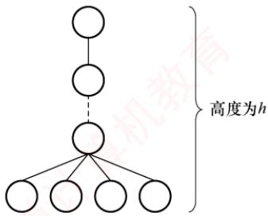

对于上面的两题，应画出草图来求解，就能一目了然。

## 06. C

要求满足条件的树，那么该树是一棵完全三叉树。在度为3的完全三叉树中，第1层有1个结点，第2层有 $3 ^ { 1 } = 3$ 个结点，第3层有 $3 ^ { 2 } = 9$ 个结点，第4层有 $3 ^ { 3 }   =   2 7$ 个结点，因此结点数之和为 $1 + 3 + 9 + 27 = 40$ ，第5层的结点数 $50 - 40 = 10$ 个，因此最小高度为5。

## 07. D

总结点数 $n = n_{0} + n_{1} + n_{2} + n_{3} = 6 + n_{1} + 1 + 2 = n_{1} + 9$ ，总度数= $\cdot n   -   1   =$   
$n_{1}+2n_{2}+3n_{3}=n_{1}+2+6=n_{1}+8$ ，根据题目条件无法得出n的具体  
值，只能证明n是一个大于或等于9的任意整数。画出满足题目条  
件的树，可以是右图所示的一棵树，该树中无法确定n的具体数量。08 D 08. D

##


设叶结点数为 $N _ { 0 }$ ，总结点数为N，则 $N = N_{1} + 2N_{2} + 3N_{3} + \cdots +$ $m N _ { m } + 1$ ，又因为 $N = N_{0} + N_{1} + N_{2} + N_{3} + \cdots + N_{m}$ 所以 $N_{0}=N_{2}+2N_{3}+\cdots+$ $(m - 1)N_{m} + 1 = \sum_{i = 2}^{m}(i - 1)N_{i} + 1$ 0

## 09. B

设树中度为 i（i = 0, 1,2,3, 4）的结点数分别为 ni，树中结点总数为 n，则 n = 分支数 + 1，而分支数又等于树中各结点的度之和，即 $n = 1 + n_{1} + 2n_{2} + 3n_{3} + 4n_{4} = n_{0} + n_{1} + n_{2} + n_{3} + n_{4}$ 。依题意， $n_{1} + 2n_{2} + 3n_{3} + 4n_{4} = 10 + 2 + 30 + 80 = 122, \quad n_{1} + n_{2} + n_{3} + n_{4} = 10 + 1 + 10 + 20 = 41$ ，可得出$n _ { 0 }   = 8 2$ ，即树T的叶结点的个数是82。

## 10. C

解法1：树有一个重要性质，即在n个结点的树中有n-1条边，“那么对于每棵树，其结点数比边数多1”。本题森林中的结点数比边数多 $10 \left( 25 - 15 = 10 \right)$ ，显然共有10棵树。

解法2：仔细分析后发现此题也是考查图的性质：生成树和生成森林。对于图的生成树有一个重要的性质，即图中顶点数若为n，则其生成树含有n-1条边。对比解法1中树的性质，不难发现两种解法都用到了性质“树中结点数比边数多1”，后面的分析如解法1。

## 二、综合应用题

## 01.【解答】

要求含有n个结点的三叉树的最小高度，那么满足条件的一定是一棵完全三叉树，设含有n个结点的完全三叉树的高度为h，第h层至少有1个结点，至多有 $3 ^ { h - 1 }$ 个结点。则有

$$
1 + 3^{1} + 3^{2} + \cdots + 3^{n - 2} < n \leqslant 1 + 3^{1} + 3^{2} + \cdots + 3^{n - 2} + 3^{n - 1}
$$

即 $( 3 ^ { h - 1 } - 1 ) / 2 < n \leq ( 3 ^ { h } - 1 ) / 2$ ，得 $3^{h - 1} < 2n + 1 \leq 3^h$ ，即 $h < \log_{3}(2n + 1) + 1, \quad h \geqslant \log_{3}(2n + 1).$

因为h只能为正整数， $h = \lceil \log_{3}(2n + 1) \rceil$ ，所这种三叉树的最小高度是 $\left[ \log_{3}(2n + 1) \right]$

## 02. 【解答】

设树中度为 $i \left( i = 0,1,2,3,4 \right)$ 的结点数为 $n _ { i } ,$ 则结点总数 $n = n_{0} + n_{1} + n_{2} + n_{3} + n_{4}$ ，即 $n = 23 + n_{4},$ 根据“树中所有结点的度数加1等于结点数”的结论，有 $n = 0 + n _ { 1 } + 2 n _ { 2 } + 3 n _ { 3 } + 4 n _ { 4 } + 1$ ，即有 $n =$ $1 7 \pm 4 n _ { 4 }$ K利

综合两式得 $n_{4}=2,\ n=25$ 。所以该树的结点总数为25，度为4的结点数为2。

## 03.【解答】

树中的结点数等于所有结点的度数加1，因此有 $n = \sum_{i = 0}^{m}in_{i} + 1 = n_{1} + 2n_{2} + 3n_{3} + \cdots + mn_{m} + 1$

又有 $n = n_{0} + n_{1} + n_{2} + \cdots + n_{m}$ ，所以

$$
n_{0}=\left(n_{1}+2 n_{2}+3 n_{3}+\cdots+m n_{m}+1\right)-\left(n_{1}+n_{2}+\cdots+n_{m}\right) \\ =n_{2}+2 n_{3}+\cdots+(m-1) n_{m}+1=1+\sum_{i=2}^{m}(i-1) n_{i}
$$

## 注意

综合以上几题，常用于求解树结点与度之间关系的有：

①总结点数 $n_{0}+n_{1}+n_{2}+\cdots+n_{m}$

② 总分支数 $\begin{aligned}= \ln_{1} + 2n_{2} + \cdots + mn_{m}\end{aligned}$ (度为m的结点引出m条分支）。

③总结点数= 总分支数 + 1。

这类题目常在选择题中出现，读者对以上关系应当熟练掌握并灵活应用。

## 5.2 二叉树的概念

## 5.2.1 二叉树的定义及其主要特性

## 1. 二叉树的定义

二叉树是一种特殊的树形结构，其核心特征在于：每个结点至多拥有两棵子树（不存在度大于2的结点），且这两棵子树具有明确的左右之分，其次序是固定的，不可交换。

与树类似，二叉树也以递归的方式定义。二叉树是包含 $n (n \geqslant 0)$ 个结点的有限集合：

①或者为空二叉树，即 $n   =   0$

②或者由一个根结点以及两棵互不相交的被称为根的左子树和右子树构成，且左右子树本身也均为二叉树。

二叉树属于有序树。即使某个结点仅有一棵子树，也要区分它是左子树还是右子树；若交换某结点的左右子树，则会得到另一棵不同的二叉树。二叉树的5种基本形态如图5.2所示。

(a) 空二叉树  
(b) 只有根结点  
  
(c) 只有左子树

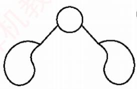  
(d)左右子树都有

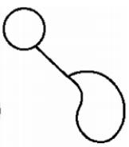  
(e) 只有右子树  
图 5.2 二叉树的 5 种基本形态

注意，二叉树与度为2的有序树有本质区别：

①度为2的树至少包含3个结点，而二叉树可以为空。

②在度为2的有序树中，若某结点只有一个孩子，则无须区分左右次序（因为左右关系是相对于另一个孩子而言的）；而在二叉树中，无论结点是否拥有两个孩子，其子树的左右位置都是确定且不可省略的，这种次序并非相对概念，而是结构本身的固有属性。

## 2. 几种特殊的二叉树

1）满二叉树。一棵高度为h且包含2″-1个结点的二叉树称为满二叉树，即每一层都含有该层所能容纳的最大结点数，如图5.3(a)所示。满二叉树的所有叶结点均位于最下一层，且除叶结点外，其余每个结点的度均为2。

可对满二叉树按层序进行编号：约定根结点编号为1，自上而下，自左向右依次编号。在此编号规则下，对于编号为i的结点，若其存在双亲，则双亲编号为i/2]；若存在左孩子，则左孩子编号为2i；若存在右孩子，则右孩子编号为2i+1。

## 考点追踪完全二叉树的特性（2009、2011、2018、2025）

2）完全二叉树。高度为h且包含n个结点的二叉树，当且仅当其每个结点与高度为h的满二叉树中编号为1～n的结点一一对应时，称为完全二叉树，如图5.3(b)所示。

  
(a) 满二叉树

  
(b) 完全二叉树  
图5.3 两种特殊形态的二叉树

3）二叉排序树。其左子树上所有结点的关键字均小于根结点的关键字；右子树上所有结点X 的关键字均大于根结点的关键字，且左子树和右子树本身也各是一棵二叉排序树。

4）平衡二叉树。树中任意一个结点的左子树和右子树的高度之差的绝对值不超过1。关于二叉排序树和平衡二叉树的详细介绍，见本书第7.3节。

考点追踪正则k叉树树高和结点数的关系的应用（2016）

5）正则二叉树。树中每个分支结点均有2个孩子，即树中仅有度为0或2的结点。

## 3. 二叉树的性质

考点追踪二叉树中结点数的关系（2025）

1）非空二叉树的叶结点数等于度为2的结点数加1，即 $n _ { 0 }   =   n _ { 2 } + 1$

设度为0,1和2的结点数分别为 $n _ { \mathrm { 0 } } , n _ { \mathrm { 1 } }$ 和 $n _ { 2 } ,$ 结点总数 $n = n _ { 0 } + n _ { 1 } + n _ { 2 }$ 0

再考虑二叉树中的分支数，除根结点外，其余结点都有一个分支进入，设B为分支总数，则 $n   =   B   +   1$ 。这些分支是由度为1或2的结点射出的，因此有 $B = n_{1} + 2n_{2}$

由此得出 $n_{0}+n_{1}+n_{2}=n_{1}+2n_{2}+1$ ，从而得出 $n _ { 0 } = n _ { 2 } + 1$

## 注意

该性质在选择题中经常出现，希望读者牢记并灵活应用。

2）非空二叉树的第k层最多有 $2 ^ { k - 1 }$ 个结点 $(k \geq 1)$ o

例如，第1层最多有 $2 ^ { 1 - 1 }   =   1$ 个结点（根），第2层最多有 $2 ^ { 2 - 1 } = 2$ 个结点，以此类推，这构成一个首项为1、公比为2的等比数列，通项为 $2 ^ { k - 1 }$

3）高度为h的二叉树至多有 $2 ^ { h }   -   1$ 个结点 $(h \geqslant 1)$ o

该性质可通过性质2求前h项的和得到，即等比数列求和的结果。

## 注意

性质 2 和 3 可拓展到 m 叉树的情况，即 m叉树的第 k层最多有 $m ^ { k - 1 }$ 个结点，高度为 h 的 m 叉树至多有 $( m ^ { h }   -   1 ) / ( m   -   1 )$ 个结点。

4）对完全二叉树按从上到下、从左到右的顺序依次编号 $1,2,\cdots,n,$ 则有以下关系：

①最后一个分支结点的编号为 $\lfloor n / 2 \rfloor$ ，若 $i \leq \lfloor n / 2 \rfloor$ ，则结点i为分支结点，否则为叶结点。

②叶结点只可能出现在最后两层上（相当于在相同高度的满二叉树的最底层、最右侧减少一些连续叶结点；当减少两个及以上叶结点时，次底层将出现叶结点）。

③若存在度为1的结点，则最多只可能有一个，且该结点只有左孩子而无右孩子（度为1的分支结点只可能是最后一个分支结点，其结点编号为 $\lfloor n / 2 \rfloor )$ )。

④按层序编号后，一旦某个结点i为叶结点或仅有左孩子，则所有编号大于i的结点均为叶结点（与上述结论①和结论③一致）。

⑤若n为奇数，则每个分支结点都有左右孩子；若n为偶数，则编号最大的分支结点（编号为n/2）只有左孩子，没有右孩子，其余分支结点都有左右孩子。 K

⑥ 当 i>1 时，结点i的双亲结点的编号为 $[ i / 2 ]$ o

⑦若结点i有左右孩子，则左孩子编号为2i，右孩子编号为 $2 i + 1$ 0

⑧结点i所在层次（深度）为 $\lfloor \log _ { 2 } i \rfloor + 1$

5）具有n个 $( n > 0 )$ 结点的完全二叉树的高度为 $\left\lceil \log _ { 2 } ( n + 1 ) \right\rceil$ 或 $\left\lfloor \log_{2}n \right\rfloor + 1$

设高度为h，根据性质3和完全二叉树的定义有

$$
2^{h - 1} - 1 < n \leq 2^h - 1 \quad  或者  \quad 2^{h - 1} \leq n \leq 2^h
$$

得出 $2^{h - 1} < n + 1 \leq 2^h$ ，即 $h - 1 < \log_{2}(n + 1) \leq h$ ，因为h为正整数，所以 $h = \left\lceil \log_{2}(n + 1) \right\rceil$ 或者得出 $h - 1 \leq \log_{2}n < h$ ，所以 $h = \left\lfloor \log_{2} n \right\rfloor + 1$

## 5.2.2 二叉树的存储结构

## 1. 顺序存储结构

二叉树的顺序存储是指使用一组连续的存储单元，按照自上而下、自左至右的层序，依次存储完全二叉树中的结点元素。即将编号为i的结点存储在一维数组下标为i-1的位置中。

依据二叉树的性质，完全二叉树和满二叉树特别适合采用顺序存储，其结点编号能够唯一反

映结点之间的逻辑关系，既能最大限度地节省存储空间，又可直接通过数组下标快速确定结点在二叉树中的位置及其父子、兄弟关系。 顺村

## 考点追踪二叉树的顺序存储结构相关应用（2020、2025）

然而，对于一般的二叉树，若仍想通过数组下标反映逻辑结构，则需插入若于“空结点”，使其结构与同高度的完全二叉树一致，再将所有结点（包括空结点）按层序存入数组，这种做法在最坏情况下效率极低。例如，一个高度为h且仅有h个结点的单支树，却需要占用近 $2 ^ { h }   -   1$ 个存储单元。图5.4展示了二叉树的顺序存储结构，其中用0表示空结点。

  
(a)完全二叉树的顺序存储结构

  
(b)一般二叉树的顺序存储结构  
图5.4 二叉树的顺序存储结构

## 注意

建议从数组下标1开始存储树中结点，保证数组下标与结点编号一致。

## 2. 链式存储结构

由于顺序存储的空间利用率较低，二叉树通常采用链式存储结构，即使用链表结点来存储二叉树中的每个结点。在二叉树的链式存储中，每个结点通常包括若干数据域和指针域。二叉链表至少包含3个域：左指针域1child、数据域data和右指针域rchild，如图5.5所示。

  
图 5.5 二叉树链式存储的结点结构

图5.6展示了一棵二叉树及其对应的二叉链表。在实际应用中，还可根据需要扩展结点结构，例如增加指向父结点的指针域，从而形成三叉链表的存储结构。

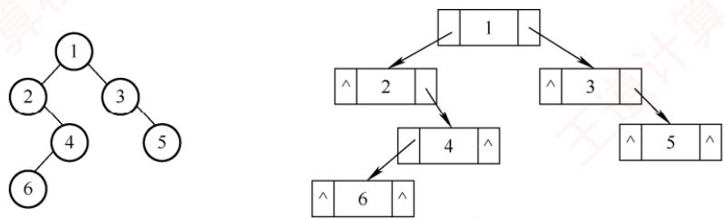  
图5.6 二叉链表的存储结构

二叉树的链式存储结构可定义如下：

typedef struct BiTNode{  
ElemType data; //数据域  
struct BiTNode \*lchild,\*rchild; //分别指向左右孩子的指针  
}BiTNode,\*BiTree;

不同的存储结构会导致二叉树操作算法的实现不同，因此应根据实际应用场景（如二叉树的

形态特征及所需执行的运算类型）选择合适的存储方式。

容易验证，在含有n个结点的二叉链表中，共有n+1个空链域（重要结论），常出现在选择题中。下一节将利用这些空链域构造一种新的链表结构——线索链表。

## 5.2.3 本节试题精选

## 一、单项选择题

01.下列关于二叉树的说法中，正确的是（）。A. 度为2的有序树就是二叉树B. 含有n个结点的二叉树的高度为 $\lfloor \log _ { 2 } n \rfloor + 1$ C. 在完全二叉树中，若一个结点没有左孩子，则它必是叶结点D. 含有 n 个结点的完全二叉树的高度为「1og2n

02.“二叉树为空”意味着二叉树（）。 直计A. 根结点没有子树 B. 不存在1 C. 没有结点 D. 由一些没有赋值的空结点构成

03.下列关于完全二叉树的说法中，正确的是（）。 YA. 在完全二叉树中，叶结点的双亲的左兄弟（若存在）一定不是叶结点B. 任何一棵二叉树中，叶结点数为度为2的结点数减1，即 $n _ { 0 }   =   n _ { 2 }   -   1$ C. 完全二叉树不适合顺序存储结构，只有满二叉树适合顺序存储结构D. 结点按完全二叉树层序编号的二叉树中，第i个结点的左孩子的编号为2i

04. 具有10个叶结点的二叉树中有（）个度为2的结点。A. 8 B. 9 Y C. 10 D. 11

05. 设高度为h的二叉树上只有度为0和度为2的结点，则此类二叉树中所包含的结点数至少为（）。A. h C. 2h+ 1 D. h + 1

06. 具有n个结点且高度为 n的二叉树的数目为（）。A. log₂n B. $n / 2$ C. n D. $2 ^ { n - 1 }$

07. 假设一棵二叉树的结点数为50，则它的最小高度是（）。A. 4 妆B. 5 C. 6 D. 7

08. 设二叉树有 2n 个结点，且 $m \leq n .$ ，则不可能存在（）的结点。A. n 个度为 0 B. 2m 个度为 0 C. 2m 个度为 1 D. 2m 个度为 2

09. 一个具有1025 个结点的二叉树的高 h为（）。A.11 B. 10 C. 11\~1025 D.10\~1024

10.设二叉树只有度为0和2的结点，其结点数为15，则该二叉树的最大深度为（）。A. 4 B. 5 C. 8 D. 9

11. 高度为h的完全二叉树最少有（）个结点。A. $2 ^ { h }$ B. $2 ^ { h } + 1$ C. $2 ^ { h - 1 }$ D. $2 ^ { h }   -   1$

12. 已知一棵完全二叉树的第6层（设根为第1层）有8个叶结点，则完全二叉树的结点数最少是（）。A. 39 B. 52 C. 111 D. 119

13. 若一棵深度为6的完全二叉树的第6层有3个叶结点，则该二叉树共有（）个叶结点。A. 17 B. 18 C. 19 D. 20

14. 一棵完全二叉树上有1001个结点，其中叶结点的个数是（）。A. 250 B. 500 C. 254 D. 501

15. 若一棵二叉树有126个结点，在第7层（根结点在第1层）至多有（）个结点。A. 32 B. 64 C. 63 D. 不存在第7层

16.一棵有124个叶结点的完全二叉树，最多有（）个结点。A. 247 B. 248 C. 249 D. 250

17. 某完全二叉树T中，结点数最大的层有8个结点，则T中至多有（）个结点。A. 8 B. 15 C. 23 D. 31

18. 一棵有n个结点的二叉树采用二叉链存储结点，其中空指针数为（）。A. n 妆B. n + 1 C. n−1 D. 2n

19. 设有n（n≥1）个结点的二叉树采用三叉链表表示，其中每个结点包含三个指针，分别指向其左孩子、右孩子及双亲（若不存在，则置为空），则下列说法中正确的是（）。I. 树中空指针的数量为 n + 2 Ⅱ. 所有度为2的结点均被三个指针指向Ⅲ.每个叶结点均被一个指针所指向A. I B. I、II C. I、ⅢII

20. 在一棵完全二叉树中，其根的序号为1，（）可判定序号为p和q的两个结点是否在同一层。A. $\lfloor \log _ { 2 } p \rfloor = \lfloor \log _ { 2 } q \rfloor$ B. $\log_{2}p = \log_{2}q$ C. $\lfloor \log _ { 2 } p \rfloor + 1 = \lfloor \log _ { 2 } q \rfloor$ D. $\lfloor \log _ { 2 } p \rfloor = \lfloor \log _ { 2 } q \rfloor + 1$

21. 在一个用数组表示的完全二叉树中，根结点的下标为1，那么下标为17和19的结点的最近公共祖先的下标是（）。A. 1 B. 2 C. 4 D. 8

22. 假定一棵三叉树的结点数为50，则它的最小高度为（）。A. 3 B. 4 C. 5 D. 6

23. 具有n个结点的三叉树用三叉链表表示，则树中空指针域的个数为（）。A. 3n + 1 B. $2 n + 1$ C. 3n − 1 D. 3n

24. 对于一棵满二叉树，共有n个结点和m个叶结点，高度为h，则（）。A. $n = h + m$ B. $n + m = 2h$ C. $m = h - 1$ D. $n   =   2 ^ { h }   -   1$

25.【2009统考真题】已知一棵完全二叉树的第6层（设根为第1层）有8个叶结点，则该完全二叉树的结点数最多是（）。A. 39 B. 52 C. 111 D. 119

26.【2011统考真题】若一棵完全二叉树有768个结点，则该二叉树中叶结点的个数是（）。YA. 257 B. 258 C. 384 D. 385

27. 【2018统考真题】设一棵非空完全二叉树T的所有叶结点均位于同一层，且每个非叶结点都有 2个子结点。若T有 k个叶结点，则 T的结点总数是（）。A. 2k−1 B. 2k C. $k ^ { 2 }$ T D. $2 ^ { k }   -   1$

28.【2020统考真题】对于任意一棵高度为5且有10个结点的二叉树，若采用顺序存储结构保存，每个结点占1个存储单元（仅存放结点的数据信息），则存放该二叉树需要的存储单元数量至少是（）。A. 31 B. 16 C. 15 D. 10

29. 【2022统考真题】若三叉树T中有244个结点（叶结点的高度为1），则T的高度至少是（）。

A. 8 B. 7 C. 6KXT D. 5

30.【2025统考真题】若二叉树的结点值均为正整数，采用顺序存储方式保存在数组R中，用-1表示结点不存在，则下列数组中，不能表示一棵二叉树的是（）。A. $\mathrm{R}[] = \{ 20, 15, 40, -1, -1, 35 \}$ B. $\mathrm{R}[]=\{15,40,10,18,35,-1,-1\}$ C. $\mathrm{R}[] = \{15, 40, 10, -1, -1, -1, 12\}$ D. $\mathrm{R}[] = \{17,20,35,-1,18,45,-1,-1,19,27\}$

## 二、综合应用题

01. 在一棵完全二叉树中，含有 $n _ { 0 }$ 个叶结点，当度为1的结点数为1时，该树的高度是多少？当度为1的结点数为0时，该树的高度是多少？

02. 一棵有n个结点的满二叉树有多少个分支结点和多少个叶结点？该满二叉树的高度是多少？

03. 已知完全二叉树的第9层有240个结点，则整个完全二叉树有多少个结点？有多少个叶结点？

04.一棵高度为h的满m叉树有如下性质：根结点所在层次为第1层，第h层上的结点都是叶结点，其余各层上每个结点都有m棵非空子树，若按层次自顶向下，同一层自左向右，顺序从1开始对全部结点进行编号，试问：

1）各层的结点数是多少？

2）编号为i的结点的双亲结点（若存在）的编号是多少？

3）编号为i的结点的第k个孩子结点（若存在）的编号是多少？

4）编号为i的结点有右兄弟的条件是什么？其右兄弟结点的编号是多少？

05. 已知一棵二叉树按顺序存储结构进行存储，设计一个算法，求编号分别为i和j的两个结点的最近的公共祖先结点的值。

06.【2016统考真题】若一棵非空 $k ( k \geqslant 2 )$ 叉树T中的每个非叶结点都有k个孩子，则称T为正则k叉树。请回答下列问题并给出推导过程。

1）若T有m个非叶结点，则T中的叶结点有多少个？

2)若 T的高度为 h(单结点的树 $h   = 1 \; )$ ，则T的结点数最多为多少个？最少为多少个？

## 5.2.4 答案与解析

## 一、单项选择题

## 01. C

在二叉树中，若某个结点只有一个孩子，则这个孩子的左右次序是确定的：而在度为2的有序树中，若某个结点只有一个孩子，则这个孩子就无须区分其左右次序，选项A错误。选项B仅当是完全二叉树时才有意义，对于任意一棵二叉树，高度可能为 $\left\lfloor \log _ { 2 } n \right\rfloor + 1 \sim n .$ ，在完全二叉树中，若有度为1的结点，则只可能有一个，且该结点只有左孩子而无右孩子，选项C正确。完全二叉树的高度为 $\left\lceil \log _ { 2 } ( n + 1 ) \right\rceil$ 或 $\left\lfloor \log _ { 2 } n \right\rfloor + 1$ ，也可通过举例n=4来排除，选项D错误。

## 02. C

“二叉树为空”意味着二叉树中没有结点，但并不意味着二叉树不存在。注意，线性表可以是空表，树可以是空树，但图不能是空图（图中不能没有结点）。

## 03. A

在完全二叉树中，叶结点的双亲的左兄弟的孩子一定在其前面（且一定存在），所以双亲的左兄弟（若存在）一定不是叶结点，选项A正确。 $n _ { 0 }$ 应等于 $n _ { 2 } + 1$ ，选项B错误。完全二叉树和满二叉树均可以采用顺序存储结构，选项C错误。第i个结点的左孩子不一定存在，选项D错误。

选项B的这种通用公式适用于所有二叉树，我们应能立即联想到采用特殊值代入法验证，如画一个只含3个结点的满二叉树的草图来验证是否满足条件。

## 04. B

由二叉树的性质 $n _ { 0 }   =   n _ { 2 } + 1$ ，得 $n_{2}=n_{0}-1=10-1=9$

【另解】画出草图，如下图所示。首先画出10个叶结点，然后每2个结点向上合并，构造一个新的度为2的分支结点，直到构成如下图所示的二叉树，其中度为2的分支结点数为9。

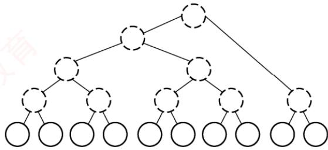

## 05.B

结点最少的情况如下图所示。除根结点层只有1个结点外，其他h-1层均有两个结点，结点总数 $2(h - 1) + 1 = 2h - 1$ o


## 06. D

除根结点外，在其余n-1个结点中，每个结点要么是其父结点的左孩子，要么是其父结点的右孩子，每个结点都有两种可能，n-1个结点共有 $2 ^ { n - 1 }$ 种不同的组合形态。

## 07. C

要求满足条件的树，分析可知当这50个结点构成一棵完全二叉树时高度最小， $h = \left\lfloor \log_{2} n \right\rfloor + 1 =$ $\left \lfloor \log_{2}50 \right \rfloor + 1 = 6$

【另解】第1层最多有1个结点，第2层最多有 $2 ^ { 1 }$ 个结点，第3层最多有 $2 ^ { 2 }$ 个结点，第4层最多有 $2 ^ { 3 }$ 个结点，以此类推，可以得到h最少为6。

## 08. C

由二叉树的性质1可知 $n _ { 0 }   =   n _ { 2 }   +   1$ ，结点总数 $2n = n_{0} + n_{1} + n_{2} = n_{1} + 2n_{2} + 1$ ，则 $n_{1}=2(n-n_{2})-1$ 所以 $n _ { 1 }$ 为奇数，说明该二叉树中不可能有2m个度为1的结点。 +2m2+

## 09. C

当二叉树为单支树时具有最大高度，即每层上只有一个结点，最大高度为1025。而当树为完全二叉树时，其高度最小，最小高度为 $\left\lfloor \log _ { 2 } n \right\rfloor + 1 = 1 1$ I

## 10. C

建议画图，第一层有1个结点，其余h-1层各有2个结点，总结点数 $1+2(h-1)=15,\ h=8$

## 11. C

高度为h的完全二叉树中，第1层～第h-1层构成一个高度为h-1的满二叉树，结点数为$2 ^ { h - 1 } - 1$ 。第h层至少有一个结点，所以最少的结点数 $( 2 ^ { h - 1 } - 1 ) + 1 = 2 ^ { h - 1 }$

## 12. A

第6层有叶结点说明完全二叉树的高度可能为6或7，显然树高为6时结点最少。若第6层上有8个叶结点，则前5层为满二叉树，所以完全二叉树的结点数最少为 $2^{5}-1+8=39$ 0

## 13. A

深度为6的完全二叉树，第5层共有 $2^{4} = 16$ 个结点。第6层最左边有3个叶结点，其对应的双亲结点为第5层最左边的两个结点，所以第5层剩余的结点均为叶结点，共有 $1 6   -   2   =   1 4$ 个，加上第6层的3个叶结点，共有17个叶结点。

## 14. D

由完全二叉树的性质，最后一个分支结点的序号为 $\left \lfloor 1001/2 \right \rfloor = 500$ ，所以叶结点数为501。【另解】 $n = n_{0} + n_{1} + n_{2} = n_{0} + n_{1} + (n_{0} - 1) = 2n_{0} + n_{1} - 1$ ，因为 $n   =   1 0 0 1$ ，而在完全二叉树中，$n _ { 1 }$ 只能取0或1。当 $n_{1} = 1$ 时， $n _ { 0 }$ 为小数，不符合题意。所以 $n _ { 1 } = 0$ ，于是有 $n _ { 0 } = 5 0 1$ 。

## 15. C

要使二叉树第7层的结点数最多，只考虑树高为7层的情况，7层满二叉树有127个结点，126仅比127少1个结点，只能少在第7层，所以第7层最多有 $2^{6} - 1 = 63$ 个结点。

## 16. B

在非空的二叉树当中，由度为0和2的结点数的关系 $n _ { 0 }   =   n _ { 2 } + 1$ 可知 $n _ { 2 } = 1 2 3$ ；总结点数 $n =$ $n_{0}+n_{1}+n_{2}=247+n_{1}$ ，其最大值为 $2 4 8 \: \left( n _ { 1 } \right.$ 的取值为1或0，当 $n _ { 1 } = 1$ 时结点最多）。注意，由完全二叉树总结点数的奇偶性可以确定 $n _ { 1 }$ 的值，但不能根据 $n _ { 0 }$ 来确定 $n _ { 1 }$ 的值。

【另解】 $1 2 4 \leq 2 ^ { 7 } = 1 2 8$ ，所以第8层没满，前7层为完全二叉树，由此可推算第8层可能有120个叶结点，第7层的最右4个为叶结点，考虑最多的情况，这4个叶结点中的最左边可以有1个左孩子（不改变叶结点数），因此结点总数 $2^{7}-1+120+1=248$ o

## 17. C

在完全二叉树中，第4层刚好最多有8个结点（前4层对应高度为4的满二叉树），若第5层也有8个结点，则对应于结点数最多的情况，此时树高为5，总结点数为 $1 5 + 8 = 2 3$

## 18. B

非空指针数=总分支数=n-1，空指针数=2×结点总数-非空指针数 $2n - (n - 1) = n + 1$

【另解】在树中，1个指针对应1个分支，n个结点的树共有n-1个分支，即n-1个非空指针，每个结点都有2个指针域，所以空指针数 $2n - (n - 1) = n + 1$

## 19. A

二叉链表表示的二叉树中空指针的数量为n+1，三叉链表表示的二叉树多了一个根结点指向双亲的空指针，所以树中空指针的数量为n+2，说法Ⅰ正确。若根结点的度为2，则只有左右两个孩子指向它，说法Ⅱ错误。若整棵树只有一个根结点，则没有指针指向它，说法Ⅲ错误。

## 20. A

由完全二叉树的性质，编号为 $i (i \geqslant 1)$ 的结点所在的层次为 $\log_{2}i + 1$ ，若两个结点位于同一层，则一定有 $\lfloor \log _ { 2 } p \rfloor + 1 = \lfloor \log _ { 2 } q \rfloor + 1$ ，因此有 $\lfloor \log _ { 2 } p \rfloor = \lfloor \log _ { 2 } q \rfloor$ 成立。

## 21. C

当根结点下标为1时，下标为i的结点的父结点下标为 $. i / 2 .$ ，那么下标为17的祖先的下标有8,4,2,1，下标为19的祖先的下标有9,4,2,1，因此两者最近的公共祖先的下标是4。

## 22. C

分析可知，满足条件的三叉树可以是完全三叉树，这棵树的第 $i ( i \geqslant 1 )$ 层最多有 $3 ^ { i - 1 }$ 个结点。设高度为h，则 $3^{0}+3^{1}+\cdots+3^{h-1}=(3^{h}-1)/2$ 是结点数的上限，问题是求解 $5 0 \leqslant ( 3 ^ { h } - 1 ) / 2$ 的最小h值，即 $h \geqslant \log_{3}101$ ，有 $h = \left\lceil \log_{3}101 \right\rceil = 5$

## 23. B

三叉树采用三叉链表表示，每个结点均有3个指针域指向3个孩子，共有3n个指针域，但n个结点构成的一棵树中只需要n-1个指针（对于n-1条边），因此空指针域有2n+1个。

## 24. D

对于高度为h的满二叉树，结点总数 $n = 2^{0} + 2^{1} + \cdots + 2^{h - 1} = 2^{h} - 1$ ，叶结点数 $m   =   2 ^ { h - 1 }$ 0

## 25. C

第6层有叶结点，完全二叉树的高度可能为6或7，显然树高为7时结点最多。完全二叉树与满二叉树相比，只是在最下一层的右边缺少部分叶结点，而最后一层之上是个满二叉树，且只有最后两层上有叶结点。若第6层上有8个叶结点，则前6层为满二叉树，而第7层缺失 $8 \times 2 = 16$ 个叶结点，所以完全二叉树的结点数最多为 $2^{7}-1-16=111$

## 26. C

最后一个分支结点的编号为 $\left \lfloor 768/2 \right \rfloor = 384$ ，所以叶结点的个数为 $768-384=384$

【另解】 $n = n_{0} + n_{1} + n_{2} = n_{0} + n_{1} + (n_{0} - 1) = 2n_{0} + n_{1} - 1$ ，其中 $n = 7 6 8$ ，而在完全二叉树中，$n _ { 1 }$ 只能取0或1，当 $n _ { 1 }   =   0$ 时， $n _ { 0 }$ 为小数，不符合题意。因此 $n _ { 1 } = 1$ ，所以 $n _ { 0 } = 3 8 4$

## 27. A

非叶结点的度均为2，且所有叶结点都位于同一层的完全二叉树就是满二叉树。对于一棵高度为h的满二叉树（空树 $h   =   0 )$ ，其最后一层全部是叶结点，数目为 $2 ^ { h - 1 }$ ；总结点数为 $2 ^ { h } { - } 1$ 。因此当 $2 ^ { h - 1 } = k$ 时，可以得到 $2 ^ { h } - 1 = 2 k - 1$

## 28. A

二叉树采用顺序存储时，用数组下标来表示结点之间的父子关系。对于一棵高度为5的二叉树，为了满足任意性，其1～5层的所有结点都要被存储起来，即考虑为一棵高度为5的满二叉树，共需要存储单元的数量为 $1+2+4+8+16=31$

## 29. C

高度一定的三叉树中结点数最多的情况是满三叉树。高度为5的满三叉树的结点数 $= 3 ^ { 0 } + 3 ^ { 1 } +$ $3^{2}+3^{3}+3^{4}=121$ ，高度为6的满三叉树的结点数 $3^{0}+3^{1}+3^{2}+3^{3}+3^{4}+3^{5}=364$ 。三叉树T的结点数为244， $1 2 1 < 2 4 4 < 3 6 4$ ，因此 T的高度至少为6。

## 30. D

在二叉树的顺序存储结构中，结点按完全二叉树的层次顺序存放：根在下标0，对于任意非根结点R[i]，其父结点为 $\mathrm { R } [ ( i - 1 ) / 2 ]$ 。若某结点为空，则其所有后代位置必须也为空，否则将出现“空

所有非-1的元素，其从根到该结点的祖先路径上均不含-1，符合顺序存储规则。在选项D中， $\mathrm { R } [ 8 ]   =   1 9$ 是一个有效结点，其父结点应为 $\mathrm{R}[(8 - 1)/2] =$ R[3]，但 $\operatorname { R } [ 3 ]   =   - 1$ ，表示该结点不存在，因此无法构成合法的二叉树。

## 二、综合应用题

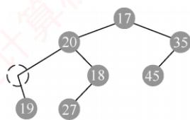

## 01. 【解答】

在非空的二叉树中，由度为0和度为2的结点之间的关系 $n _ { 0 }   =   n _ { 2 }   +   1$ ，可知 $n _ { 2 }   =   n _ { 0 }   - 1$ 。因此总结点数 $n = n_{0} + n_{1} + n_{2} = 2n_{0} + n_{1} - 1$ 0

①当 $n _ { 1 } = 1$ 时， $n = 2 n _ { 0 } , \quad h = \lceil \log _ { 2 } ( n + 1 ) \rceil = \lceil \log _ { 2 } ( 2 n _ { 0 } + 1 ) \rceil .$

②当 $n _ { 1 } = 0$ 时， $n = 2n_{0} - 1, \quad h = \lceil \log_{2}(n + 1) \rceil = \lceil \log_{2}(2n_{0}) \rceil = \lceil \log_{2}(n_{0}) \rceil + 1 。$

## 02. 【解答】

满二叉树中 $n _ { 1 } = 0$ ，由二叉树的性质1可知 $n _ { 0 }   =   n _ { 2 } + 1$ ，即 $n_{2}=n_{0}-1,n=n_{0}+n_{1}+n_{2}=2n_{0}-1$

则 $n _ { 0 } = ( n + 1 ) / 2$ 。分支结点数 $n_{2}=n-(n+1)/2=(n-1)/2$ 。高度为h的满二叉树的结点数 $n = 1 + 2 ^ { 1 } +$ $2 ^ { 2 } + \cdots + 2 ^ { h - 1 } = 2 ^ { h } - 1$ ，即高度 $h = \log_{2}(n + 1)$

## 03.【解答】

在完全二叉树中，若第9层是满的，则结点数 $2^{9 - 1} = 256$ ，而现在第9层只有240个结点，说明第9层未满，是最后一层。1～8层是满的，所以总结点数 $2^{8}-1+240=495$

因为第9层是最后一层，所以第9层的结点都是叶结点。且第9层的240个结点的双亲在第8层中，其双亲个数为120，即第8层有120个分支结点，其余为叶结点，所以第8层的叶结点数为 $2^{8 - 1} - 120 = 8$ 。因此，总的叶结点数 $8+240=248$ 0 XTA

【另解】总结点数 $n = n_{0} + n_{1} + n_{2}, \quad n_{2} = n_{0} - 1, \quad n = n_{0} + n_{1} + n_{2} = 2n_{0} + n_{1} - 1$ 。若 $n_{1} = 1$ ，则 $2n_{0}+n_{1}-1=2n_{0}=495$ ，不符合；若 $n _ { 1 } = 0$ ，则 $2n_{0}+n_{1}-1=2n_{0}-1=495$ ，则 $n_{0} = 248$

## 注意

对于本题，应理解完全二叉树中只有最底层的结点是不满的，其他各层的结点都是满的。

## 04.【解答】

1）第1层有 $m ^ { 0 }   = 1$ 个结点，第2层有 $m ^ { 1 }$ 个结点，第3层有 $m ^ { 2 }$ 个结点……一般地，第i层有$m ^ { i - 1 }$ 个结点 $( 1 \leqslant i \leqslant h )$

2）在m叉树的情形下，结点i的第1个孩子编号为 $j = (i - 1)m + 2$ ，反过来，结点i的双亲的编号是L $(i - 2)/m \downarrow + 1$ ，根结点没有双亲，所以要求i>1。

3）因为结点i的第1个孩子编号为 $l ( i - 1 ) m + 2$ ，若设该结点孩子的序号为 $k   =   1 , 2 , \cdots , m$ ，则第k个孩子结点的编号为 $(i - 1)m + k + 1 \quad (1 \leq k \leq m)$

4）结点i不是其双亲的第m个孩子时才有右兄弟。设其双亲编号为j，可得 $j = \left\lfloor (i + m - 2)/m \right\rfloor$ 结点j的第m个孩子的编号为 $\exists (j-1)m+m+1=jm+1=\left\lfloor (i+m-2)/m \right\rfloor m+1$ ，所以当结点的编号 $i \leqslant \left\lfloor (i + m - 2)/m \right\rfloor m$ 时才有右兄弟，右兄弟的编号为 $i + 1   \mathrm { { _ { c } } }$ ，或者，对于任意一个双亲结点j，其第m个孩子结点的编号是 $j m + 1$ ，故若不为第m个孩子结点，则 $(i - 1)^{n} \% m ! = 0$

## 05.【解答】

首先，必须明确二叉树中任意两个结点必然存在最近的公共祖先结点，最坏的情况下是根结点（两个结点分别在根结点的左右分支中），而且从最近的公共祖先结点到根结点的全部祖先结点都是公共的。由二叉树顺序存储的性质可知，任意一个结点i的双亲结点的编号为 $i / 2$ 。求解 i和i最近公共祖先结点的算法步骤如下（设从数组下标1开始存储）：

1）若 $i \geq j ,$ 则结点i所在层次大于或等于结点j所在层次。结点i的双亲结点为结点 $i / 2$ 若 $i / 2 = j,$ 则结点i2是原结点i和结点i的最近公共祖先结点，若 $i / 2   \neq   j$ ，则令 $i = i / 2$ 即以该结点i的双亲结点为起点，采用递归的方法继续查找。

2）若 $j \geq i ,$ 则结点j所在层次大于或等于结点i所在层次。结点j的双亲结点为结点 $j / 2$ 若 $j / 2 = i$ ，则结点 $j / 2$ 是原结点i和结点j的最近公共祖先结点，若 $j / 2   \neq   i$ ，则令 $j   =   j / 2$ 重复上述过程，直到找到它们最近的公共祖先结点为止。

本题代码如下：

```javascript
ElemType Comm Ancestor(SqTree T,int i,int j){
//本算法在二叉树中查找结点i 和结点 j的最近公共祖先结点
$\begin{aligned}\texttt{i f (T [i] !=}& \# \texttt{' s g T [j] !=} \# \texttt{' ) \{} } \\\texttt{wh i l e (i !=j) \{} } \\\texttt{i f (i>j)} \\\texttt{i=i/2 ;}\end{aligned}$ //结点存在
//两个编号不同时循环
//向上找 i 的祖先
```

else  
j=j/2; //向上找 j 的祖先  
}  
return T[i]; 计算机  
1  
1

由解题中算法的步骤描述可知，本题也很容易地联想到采用递归的方法求解。

## 06. 【解答】

1）正则k叉树中仅含有两类结点；叶结点（个数记为 $n _ { 0 } )$ 和度为k的分支结点（个数记为 $n _ { k } )$ 。树 T 中的结点总数 $n = n_{0} + n_{k} = n_{0} + m.$ 。树中所含的边数 $e = n - 1$ ，这些边均是从m个度为k的结点发出的，即 $e   =   m k .$ 。整理得 $n_{0}+m=mk+1$ ，所以 $n_{0} = (k - 1)m + 1$ 0

2）高度为h的正则k叉树T中，含最多结点的树形为：除第h层外，第1到第h-1层的结点都是度为k的分支结点；而第h层均为叶结点，即树是“满”树。此时第 $j ( 1 \leqslant j \leqslant h )$ 层的结点数为 $k ^ { j - 1 }$ ，结点总数 $M _ { 1 }$ 为

$$
M_{1}=\sum_{j = 1}^{h}k^{j - 1}=\frac{k^{h}-1}{k - 1}
$$

含最少结点的正则k叉树的树形为：第1层只有根结点，第2到第h-1层仅含1个分支结点和k-1个叶结点，第h层有k个叶结点。也就是说，除根外，第2到第h层中每层的结点数均为k，所以T中所含结点总数 $M _ { 2 }$ 为

$$
M_{2}=1+(h-1)k
$$

## 5.3 二叉树的遍历和线索二叉树

## 5.3.1 二叉树的遍历

二叉树的遍历是指按照某种搜索路径访问树中的每个结点，使得每个结点均被访问一次且仅  
被访问一次。由于二叉树是一种非线性结构，每个结点最多有两棵子树，因此需要确定一种系统  
性的访问顺序，将树中结点排列成一个线性序列，以便于后续处理。V

考点追踪二叉树遍历的相关分析（2009、2011、2012）

考点追踪（算法题）二叉树遍历的应用（2014、2017、2022）

根据二叉树的递归定义，遍历一棵二叉树的关键在于确定对根结点（N）、左子树（L）和右子树（R）的访问顺序。在遵循“先左后右”的原则下，常见的遍历方式有三种：先序遍历（NLR）、中序遍历（LNR）和后序遍历（LRN），其中“序”指的是根结点在遍历序列中的位置。

## 1. 先序遍历（PreOrder）

若二叉树为空，则不执行任何操作；否则，

1）访问根结点；

2）先序遍历左子树；

3）先序遍历右子树。

图5.7中的虚线表示对该二叉树进行先序遍历的访问路径，所得先序遍历序列为124635。

对应的递归算法如下：

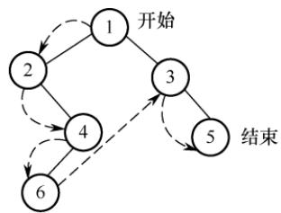  
图 5.7 二叉树的先序遍历

```c
void PreOrder(BiTree T) {
if(T!=NULL) {
visit(T); //访问根结点
PreOrder(T->lchild) ; 算 //递归遍历左子树
PreOrder(T->rchild); //递归遍历右子树
道
```

## 2. 中序遍历（InOrder）

若二叉树为空，则不执行任何操作；否则，

1）中序遍历左子树；

2）访问根结点；

3）中序遍历右子树。

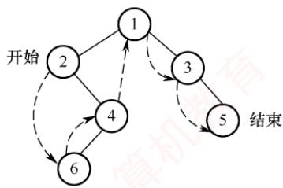

## 考点追踪中序序列中结点关系的分析（2017、2024）

图5.8中的虚线表示对该二叉树进行中序遍历的访问路径，所得中序遍历序列为264135。

图 5.8 二叉树的中序遍历

对应的递归算法如下：

void InOrder(BiTree T){  
if(T!=NULL) {  
InOrder(T->lchild); //递归遍历左子树  
visit(T); //访问根结点  
InOrder(T->rchild); //递归遍历右子树

## 3. 后序遍历（PostOrder）

若二叉树为空，则不执行任何操作；否则，

1）后序遍历左子树；

2）后序遍历右子树；

3）访问根结点。

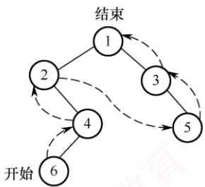

图5.9中的虚线表示对该二叉树进行后序遍历的访问路径，所得后序遍历序列为642531。

对应的递归算法如下：

图 5.9 二叉树的后序遍历  
```c
void PostOrder(BiTree T) {
if(T!=NULL) {
PostOrder(T->lchild); //递归遍历左子树
PostOrder(T->rchild); //递归遍历右子树
王道 visit(T); //访问根结点
2
```

上述三种遍历算法中，递归遍历左右子树的顺序都是固定的，区别仅在于访问根结点的时机

不同。不论采用哪种遍历方法，每个结点都被访问一次且仅一次，时间复杂度均为O(n)。在递归实现中，系统工作栈的深度等于树的高度，在最坏情况下（如单支树），空间复杂度为O(n)。

## 4. 层次遍历

图5.10展示了二叉树的层次遍历过程，即按照1,2,3,4的层次顺序，以及箭头所指方向，从上到下、从左到右逐层访问二叉树中的各结点。

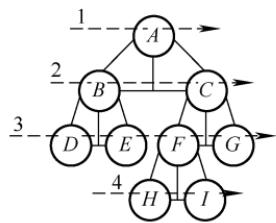  
图 5.10 二叉树的层次遍历

层次遍历需要借助一个队列，其基本思想如下：首先将根结点入队，随后不断出队并访问队头结点，同时将其存在的左右孩子依次加入队尾，直至队列为空。

## 二叉树的层次遍历算法如下：

```c
void LevelOrder(BiTree T){
BiTree p; InitQueue(Q); 王道 //初始化辅助队列
EnQueue (Q,T) ; //将根结点入队
while(!IsEmpty(Q)){ //队列不空则循环
DeQueue (Q, p); //队头结点出队
visit(p); //访问出队结点
if(p->lchild!=NULL)
EnQueue(Q,p->lchild); //若左孩子不空，则左孩子入队
if(p->rchild!=NULL)
EnQueue(Q,p->rchild); //若右孩子不空，则右孩子入队
```

读者可将上述层次遍历算法作为一个模板，熟练掌握其执行过程，并达到熟练手写的程度。

## 注意

遍历是二叉树各类操作的基础。例如，对于一棵给定二叉树，求结点的双亲、查找孩子结点、计算树的深度、统计叶结点数、判断两棵二叉树是否相同等操作，本质上都是在某种遍历过程中完成的。因此，必须深入理解并灵活运用各种遍历方法，以解决实际问题。

## 5. 由遍历序列构造二叉树

考点追踪先序序列对应的不同二叉树的分析（2015）

对于一棵给定的二叉树，其先序序列、中序序列、后序序列和层序序列都是唯一确定的。然而，仅凭这四种遍历序列中的任意一种，却无法唯一确定这棵二叉树。但若已知中序序列，并辅以其他三种遍历序列中的任意一种，则可以唯一地重构出该二叉树。

## （1）由先序序列和中序序列构造二叉树

考点追踪先序序列和中序序列相同时确定的二叉树（2017）

## 考点追踪由先序序列和中序序列构造一棵二叉树（2020、2021）

在先序序列中，第一个结点必定是整棵二叉树的根结点；而在中序遍历中，根结点将中序序列划分为两个子序列：左侧子序列为左子树的中序序列，右侧子序列为右子树的中序序列。由于左右子树的结点数在先序和中序序列中一致，因此可据此从先序序列中分离出左右子树各自的先序子序列，如图5.11所示。通过递归地对左右子树重复上述过程，即可唯一地确定整棵二叉树。

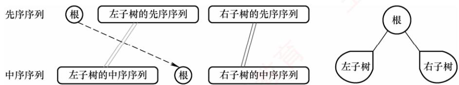  
图5.11 由先序序列和中序序列构造二叉树

例如，求先序序列（ABCDEFGHI）和中序序列（BCAEDGHFI）所确定的二叉树。首先，由先序序列可知A为根结点。在中序序列中，A左侧的BC构成左子树的中序序列，右侧的EDGHFI构成右子树的中序序列。然后，由先序序列可知B是左子树的根结点，D是右子树的根结点。以此类推，将剩余结点递归分解，最终构造出的二叉树如图5.12(c)所示。

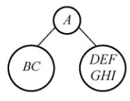


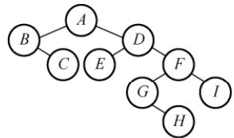  
图 5.12 一棵二叉树的构造过程

## （2）由后序序列和中序序列构造二叉树

## 考点追踪由后序序列和树形构造一棵二叉树（2017、2023）

同理，后序序列与中序序列也可唯一确定一棵二叉树。后序序列的最后一个结点即为整棵树的根结点，它同样能将中序序列划分为左右子树的中序序列。随后，根据左右子树的结点数，可从后序序列中分离出对应的左右子树的后序序列，并递归构造，如图5.13所示。

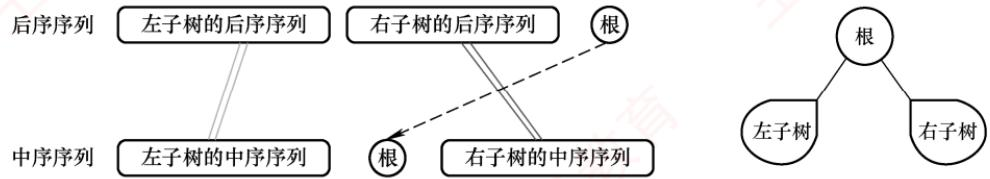  
图5.13 由后序序列和中序序列构造二叉树  
请读者分析后序序列（CBEHGIFDA）和中序序列（BCAEDGHFI）所确定的二叉树。

## (3）由层序序列和中序序列构造二叉树

在层序序列中，第一个结点必为二叉树的根结点，由此可在中序序列中划分出左右子树的中序序列。若存在左子树，则层序序列的第二个结点一定是左子树的根，可以进一步划分左子树；若存在右子树，则层序序列中紧接着的下一个结点一定是右子树的根，可以进一步划分右子树，如图514所示。通过逐层确定各子树的根结点并递归划分，即可唯一确定这棵二叉树。 NO

  
图5.14 由层序序列和中序序列构造二叉树

请读者分析层序序列（ABDCEFGIH）和中序序列（BCAEDGHFI）所确定的二叉树。

注意，仅凭先序、后序和层序序列中的任意两种组合，通常无法唯一确定一棵二叉树。例如，图5.15所示的两棵二叉树的先序序列均为AB，后序序列均为BA，层序序列均为AB。 1

  
图 5.15 两棵不同的二叉树

## 5.3.2 线索二叉树

## 1. 线索二叉树的基本概念

遍历二叉树是按照特定规则将树中所有结点排列成一个线性序列，从而得到相应的遍历序

列。在该序列中，除首尾结点外，每个结点都有唯一的直接前驱和直接后继。

考点追踪线索二叉树的定义（2010）

传统的二叉链表结构仅能反映父子关系，无法直接获取结点在某种遍历序列中的前驱或后继。前面提到，在含有n个结点的二叉树中，共有n+1个空指针域：每个叶结点贡献2个空指针，每个度为1的结点贡献1个空指针，因此空指针总数为 $2n_{0}+n_{1}, 又 n_{0}=n_{2}+1$ ，可得空指针总数 $n_{0}+n_{1}+n_{2}+1=n+1$ 由此，自然想到：可否利用这些空指针，直接指向结点在遍历序列中的前驱或后继？若能实现，便可像遍历链表一样高效地遍历二叉树，线索二叉树正是基于这一思想设计的。

具体规定如下：

● 若某结点无左子树，则将1child指向其在指定遍历序列中的前驱结点。

● 若某结点无右子树，则将rchild指向其在指定遍历序列中的后继结点。

为区分指针域指向的是孩子还是线索，需在结点结构中增设两个标志域，如图5.16所示。

<table><tr><td>1child</td><td>1tag</td><td>data</td><td>rtag</td><td>rchild</td></tr><tr><td></td><td></td><td></td><td></td><td></td></tr></table>

图5.16 线索二叉树的结点结构

标志域1tag 和rtag的含义如下：

● 1tag=0 表示 1child 指向左孩子，1tag=1 表示 1child 指向前驱。

● rtag=0 表示 rchild 指向右孩子，rtag=1 表示 rchild 指向后继。

线索二叉树的存储结构可定义为：

typedef struct ThreadNode{  
ElemType data; //数据元素  
struct ThreadNode \*lchild,\*rchild; //左右孩子指针  
int ltag,rtag; //左右线索标志  
}ThreadNode,\*ThreadTree;

采用上述结构的二叉链表称为线索链表，其中指向前驱或后继的指针称为线索。这种带有线索的二叉树称为线索二叉树。

## 2. 中序线索二叉树的构造

二叉树的线索化是指将二叉链表中的空指针域替换为指向前驱或后继的线索。由于结点的前驱和后继关系只能在遍历过程中确定，因此线索化本质上就是对二叉树进行一次遍历。

考点追踪中序线索二叉树中线索的指向（2014）

以中序线索二叉树的构造为例：设指针pre指向刚刚访问过的结点，指针p指向当前正在访问的结点，pre即为p的中序前驱。在中序遍历过程中：检查p的左指针是否为空，若为空则令其指向 pre；检查pre的右指针是否为空，若为空则令其指向p，如图5.17所示。

  
图5.17 中序线索二叉树及其二叉链表示

通过中序遍历对二叉树线索化的递归算法如下：

void InThread(ThreadTree &p,ThreadTree &pre) {   
if(p!=NULL) {

```c
InThread(p->lchild,pre); //递归，线索化左子树
if(p->lchild==NULL) { //当前结点的左子树为空
p->lchild=pre; //建立当前结点的前驱线索
p->1tag=1;
if(pre!=NULL&&pre->rchild==NULL){//前驱结点非空且其右子树为空
pre->rchild=p; //建立前驱结点的后继线索
pre->rtag=1;
}
pre=p; //标记当前结点成为刚刚访问过的结点
InThread(p->rchild,pre); //递归，线索化右子树
1
```

建立中序线索二叉树的主过程如下：

```c
void CreateInThread(ThreadTree T) {
ThreadTree pre=NULL;
if(T!=NULL) { //非空二叉树，线索化
InThread(T,pre); //线索化二叉树
pre->rchild=NULL; //处理遍历的最后一个结点
pre->rtag=1;
2
```

为方便遍历，可在线索链表上增设一个头结点：其1child指向根结点；rchilα指向中序序列的最后一个结点；中序序列的第一个结点的1child和最后一个结点的rchilα均指向头结点。如此，便形成一个双向循环线索链表，从而支持正向与反向的高效遍历，如图5.18所示。

  
图5.18 带头结点的中序线索二叉树

## 3. 中序线索二叉树的遍历

中序线索二叉树的结点中已隐含前驱和后继信息，因此遍历时无须借助栈或递归。只需先找到中序序列的第一个结点，然后依次查找每个结点的后继，直至后继为空（或回到头结点）。在中序线索二叉树中，查找结点后继的规则如下：若结点的rtag为1，则rchi1d直接指向其后继；若rtag为0，则其后继为右子树中最左下结点（右子树的中序第一个结点）。

不含头结点的中序线索二叉树遍历相关算法如下。

1）求中序序列中的第一个结点：

ThreadNode \*Firstnode(ThreadNode \*p) {  
while(p->ltag==0) p=p->lchild； //沿左孩子链走到最左下结点  
return p;  
}

2）求结点p在中序序列中的后继：

ThreadNode \*Nextnode(ThreadNode \*p) {   
if(p->rtag==0) return Firstnode(p->rchild); //右子树中最左下结点   
else return p->rchild; //若 rtag==1 则直接返回后继线索   
}

请读者自行完成求中序序列中的最后一个结点和结点p的中序前驱的运算①。

3）利用上面两个算法，可实现非递归的中序遍历：

```lisp
void Inorder(ThreadNode *T) {
for(ThreadNode *p=Firstnode(T);p!=NULL; p=Nextnode(p))
visit(p);
1 道
```

## 4. 先序线索二叉树和后序线索二叉树

建立先序或后序线索二叉树的方法与中序类似，只需调整递归调用顺序及线索建立的位置。以图5.19(a)的二叉树为例，手工构造先序线索二叉树的过程如下（先序序列为ABCDF，依次处理每个结点，若其左或右指针为空，则将其替换为对应前驱或后继的线索）： VI

结点A、B均有左右孩子，无须修改指针；结点C无左孩子，将其1chi1α指向前驱B，无右孩子，将其rchi1α指向后继D；结点D无左孩子，将其1chilα指向前驱C，无右孩子，将其rchild指向后继F；结点F无左孩子，将其1chilα指向前驱D，无右孩子且无后继，将其rchild置为空，最终得到的先序线索二叉树如图5.19(b)所示。

构造后序线索二叉树的过程类似（后序序列为CDBFA）：

结点C无左孩子且无前驱，将1child 置空，无右孩子，将rchilα 指向后继 $D;$ 结点D无左孩子，将lchild指向前驱C,无右孩子，将rchild指向后继 $B ;$ 结点F无左孩子，将lchild指向前驱B，无右孩子，将rchild指向后继A，得到的后序线索二叉树如图5.19(c)所示。

  
(a)一颗二叉树

  
(b) 先序线索二叉树

  
(c) 后序线索二叉树  
图5.19 先序线索二叉树和后序线索二叉树

在先序线索二叉树中查找某结点的后继较为直接：若该结点有左孩子，则左孩子为其后继；

## 考点追踪后序线索二叉树的特点（2013）

而在后序线索二叉树中查找后继则较为复杂，需要分以下三种情况：①若结点x是整棵二叉树的根，则其后继为空；②若结点x是其双亲的右孩子，或是其双亲的左孩子且该双亲无右子树，则x的后继即为其双亲；③若结点x是其双亲的左孩子，且该双亲存在右子树，则x的后继为该右子树中按后序遍历访问的第一个结点（右子树中最左下结点）。

值得注意的是，图5.19(c)中，结点B的后继是A，但无法直接通过线索找到后继，需要回溯到其双亲。因此，在后序线索二叉树中高效查找后继通常需要知道结点的父结点信息。为此，通常采用带父指针的三叉链表作为存储结构，而非标准的二叉线索链表。

## 5.3.3 本节试题精选

## 一、单项选择题

01. 在下列关于二叉树遍历的说法中，正确的是（）。

A. 若有一个结点是二叉树中某个子树的中序遍历结果序列的最后一个结点，则它一定是该子树的先序遍历结果序列的最后一个结点  
B. 若有一个结点是二叉树中某个子树的先序遍历结果序列的最后一个结点，则它一定是该子树的中序遍历结果序列的最后一个结点  
C. 若有一个叶结点是二叉树中某个子树的中序遍历结果序列的最后一个结点，则它一定是该子树的先序遍历结果序列的最后一个结点  
D. 若有一个叶结点是二叉树中某个子树的先序遍历结果序列的最后一个结点，则它一定是该子树的中序遍历结果序列的最后一个结点 XTA

02. 在任何一棵二叉树中，若结点a有左孩子b、右孩子c，则在结点的先序序列、中序序列、后序序列中，（）。 机A. 结点 b一定在结点a的前面 B. 结点a一定在结点c的前面C. 结点 b一定在结点c的前面 D. 结点 a一定在结点 b 的前面

03. 设n,m为一棵二叉树上的两个结点，在中序遍历时，n在m前的条件是（）。A. n 在 m 右方 B. n 是 m 祖先 C. n 在 m 左方 D. n 是 m 子孙

04.设n,m为一棵二叉树上的两个结点，在后序遍历时，n在m前的充分条件是（）。A. n 在 m 右方 B. n 是 m 祖先 C. n 在 m 左方 D. n 是 m 子孙

05. 某非空二叉树采用顺序存储结构，树中的结点信息按完全二叉树的层次序列依次存放在如下所示的一维数组中，则该二叉树的后序遍历序列为（）。

<table><tr><td rowspan=1 colspan=1>0</td><td rowspan=1 colspan=1>1</td><td rowspan=1 colspan=1>2</td><td rowspan=1 colspan=1>3</td><td rowspan=1 colspan=1>4</td><td rowspan=1 colspan=1>5</td><td rowspan=1 colspan=1>6</td><td rowspan=1 colspan=1>1</td><td rowspan=1 colspan=1>8</td><td rowspan=1 colspan=1>9</td><td rowspan=1 colspan=1>10</td><td rowspan=1 colspan=1>11</td><td rowspan=1 colspan=1>12</td></tr><tr><td rowspan=1 colspan=1>a</td><td rowspan=1 colspan=1>b</td><td rowspan=1 colspan=1>c</td><td rowspan=1 colspan=1></td><td rowspan=1 colspan=1>d</td><td rowspan=1 colspan=1>e</td><td rowspan=1 colspan=1></td><td rowspan=1 colspan=1></td><td rowspan=1 colspan=1></td><td rowspan=1 colspan=1>g</td><td rowspan=1 colspan=1></td><td rowspan=1 colspan=1></td><td rowspan=1 colspan=1>h</td></tr></table>

A. ghbefhca B. gbdehcfa C. gdbhefca D. bgdehcfa

06. 在二叉树的先序序列、中序序列和后序序列中，所有叶结点的先后顺序（）。A. 都不相同 B. 完全相同C. 先序和中序相同，而与后序不同D. 中序和后序相同，而与先序不同

07. 对二叉树的结点从1开始进行连续编号，要求每个结点的编号大于其左右孩子的编号，同一结点的左右孩子中，其左孩子的编号小于其右孩子的编号，可采用（）次序的遍历实现编号。A. 先序遍历 B. 中序遍历 C. 后序遍历

08. 按某种顺序对二叉树的结点进行编号，编号为1,2,…,n，规定：树中任一结点ν，其编号等于ν的左子树上的最小编号减1，而ν的右子树中的最小编号等于ν的左子树上的最大编号加1，则说明该二叉树是按（）次序编号的。  
A. 中序遍历 B. 先序遍历 C. 后序遍历

09. 先序序列为 A, B, C，后序序列为 C, B, A 的二叉树共有（）。A. 1 棵 B. 2 棵 C. 3 棵 D. 4 棵

10. 一棵完全二叉树的后序遍历序列为CDBFGEA，则其先序遍历序列是（）。A. CBDAFEG B. ABECDFG C. ABCDEFG D. 无法确定

11. 设结点X和Y是二叉树中任意的两个结点。在该二叉树的先序遍历序列中X在Y之前，而在其后序遍历序列中X在Y之后，则X和Y的关系是（）。A. X是Y的左兄弟 B. X是 Y的右兄弟C. X是Y的祖先 D. X是Y的后裔

12. 若二叉树中结点的先序序列是…a…b…，中序序列是…b…a…，则（）。A. 结点a和结点b分别在某结点的左子树和右子树中B. 结点 b 在结点 a 的右子树中C. 结点 b 在结点 a的左子树中 计D. 结点 a和结点b分别在某结点的两棵非空子树中

13. 一棵二叉树的先序遍历序列为1234567，它的中序遍历序列可能是（）。A. 3124567 B. 1234567 C. 4135627 D. 1463572

14. 下列序列中，不能唯一地确定一棵二叉树的是（）。A. 层次序列和中序序列 B. 先序序列和中序序列C. 后序序列和中序序列 D. 先序序列和后序序列

15. 若一棵二叉树的中序序列和后序序列相同，则（）。A. 二叉树为空树或二叉树任一结点没有左子树B.二叉树为空树或二叉树任一结点没有右子树C. 二叉树为空树或二叉树中每个结点的度为1D. 二叉树为空树或二叉树为满二叉树

16. 已知一棵二叉树的后序序列为DABEC，中序序列为DEBAC，则先序序列为（）。A. ACBED B. DECAB C. DEABC D. CEDBA

17. 已知一棵二叉树的先序遍历结果为ABCDEF，中序遍历结果为 CBAEDF，则后序遍历的结果为（）。A. CBEFDA B. FEDCBA C. CBEDFA D. 不确定

18. 已知一棵二叉树的层次序列为ABCDEF，中序序列为BADCFE，则先序序列为（）。A. ACBEDF B. ABCDEF C. BDFECA D. FCEDBA

19. 某二叉树中结点 x在先序、中序、后序遍历序列中的编号分别为 pre(x)、in(x)、post(x)(假设都从1开始依次顺序编号)，a和b是该二叉树中的两个结点，其中 a是b的祖先，则下列选项中不可能出现的是（）。A. pre(a) < pre(b) B. post(a) < post(b) C. in(a) < in(b) D. in(a) > in(b)

20. 某二叉树采用二叉链表存储结构，若要删除该二叉链表中的所有结点，并释放它们占用的存储空间，则采用（）遍历方法最合适。A. 中序 B. 层次 C. 后序 D. 先序 机

21. 某二叉树T采用二叉链表存储结构，T的中序遍历序列为一个升序序列，要求采用某种方法对T进行某种操作之后得到一棵新的二叉树T′，要求T'的中序遍历序列为一个降序序列，则下列关于该算法的叙述中，正确的是（）。A. 采用中序遍历的方法最合适 B. 采用后序遍历的方法最合适C. T'中的根结点一定不是原T中的根结点D. T'中的叶结点不一定是原 T中的叶结点

22. 引入线索二叉树的目的是（）。A. 加快查找结点的前驱或后继的速度 B. 为了能在二叉树中方便插入和删除C. 为了能方便找到双亲 D. 使二叉树的遍历结果唯一

23. n个结点的线索二叉树上含有的线索数为（）。A. 2n B. n-1 C. n+ 1 D. n

24. 判断线索二叉树中\*p结点有右孩子结点的条件是（）。A. p!=NULL B. p->rchild!=NULL

C. p->rtag==0 D. p->rtag==1

25.一棵左子树为空的二叉树在先序线索化后，其中空的链域的个数是（）。A. 不确定 B. 0个 C. 1个 D. 2 个

26.在线索二叉树中，下列说法不正确的是（）。A. 在中序线索树中，若某结点有右孩子，则其后继结点是它的右子树的最左下结点B. 在中序线索树中，若某结点有左孩子，则其前驱结点是它的左子树的最右下结点C. 线索二叉树是利用二叉树的n+1个空指针来存放结点的前驱和后继信息的D. 每个结点通过线索都可以直接找到它的前驱和后继 XTA

27.二叉树在线索化后，仍不能有效求解的问题是（）。A. 先序线索二叉树中求先序后继 B. 中序线索二叉树中求中序后继C. 中序线索二叉树中求中序前驱 D. 后序线索二叉树中求后序后继

28. 若X是二叉中序线索树中一个有左孩子的结点，且X不为根，则X的前驱为（）。A. X的双亲 B. X的右子树中最左的结点C. X的左子树中最右的结点 D. X的左子树中最右的叶结点

29. 若X是后序线索二叉树中的叶结点，且X存在左兄弟Y，则X的右线索指向的是（）。A. X的双亲 B. 以 Y为根的子树的最左下结点C. X的左兄弟 Y D. 以Y为根的子树的最右下结点

30. 某二叉树的先序序列和后序序列正好相反，则该二叉树一定是（）。A. 空或只有一个结点 B. 高度等于其结点数C. 任意一个结点无左孩子 D. 任意一个结点无右孩子

31. 某非空二叉树的先序序列和中序序列正好相反，则下列叙述中正确的是（）。A. 该二叉树一定只有一个结点B. 只有一个叶结点的二叉树一定满足条件C. 任意一个结点无左孩子的二叉树一定满足条件D. 任意一个结点无右孩子的二叉树一定满足条件

32.【2009统考真题】给定二叉树如右图所示。设N代表二叉树的根，L代表根结点的左子树，R代表根结点的右子树。若遍历后的结点序列是3175624，则其遍历方式是（）。A. LRN B. NRL C. RLN D. RNL


33.【2010统考真题】下列线索二叉树中（用虚线表示线索），符合后序线索树定义的是（）。 汝


A.


B.


C.


D.

34. 【2011统考真题】一棵二叉树的先序遍历序列和后序遍历序列分别为1,2,3,4和4,3,2,1，该二叉树的中序遍历序列不会是（）。A. 1, 2, 3, 4 B. 2, 3, 4,1 C. 3, 2, 4, 1 D. 4, 3, 2, 1

35. 【2012统考真题】若一棵二叉树的先序遍历序列为 $a , e , b , d , c ,$ 后序遍历序列为 $b , c , d , e ,$ a，则根结点的孩子结点（）。A. 只有 e B. 有e、b C. 有e、c D. 无法确定

36. 【2013统考真题】若X是后序线索二叉树中的叶结点，且X存在左兄弟结点Y，则X的右线索指向的是（）。 王道A. X的父结点 B. 以 Y为根的子树的最左下结点C. X的左兄弟结点Y D. 以 Y为根的子树的最右下结点

37.【2014统考真题】若对右图所示的二叉树进行中序线索化，则结点X的左右线索指向的结点分别是（）。A. $e ,   c$ B. $e , a$ C. $d , c$ D. $b , a$

38. 【2015统考真题】先序序列为 $a , b , c , d$ 的不同二叉树的个数是（）。A. 13 B. 14 C. 15 D. 16


39.【2017统考真题】某二叉树的树形如右图所示，其后序序列为 $e,a,c,b,d,$ $g , f ,$ 树中与结点a同层的结点是（）。 道A. c B. d C. f D. g


40.【2017统考真题】要使一棵非空二叉树的先序序列与中序序列相同，其所有非叶结点须满足的条件是（）。A. 只有左子树 B. 只有右子树C. 结点的度均为1 D. 结点的度均为2

41.【2022统考真题】若结点p与q在二叉树T的中序遍历序列中相邻，且p在q之前，则下列p与q的关系中，不可能的是（）。I. q 是p的双亲 II. q 是p 的右孩子III. q是p的右兄弟 道计 IV. q 是p的双亲的双亲A. 仅I B. 仅Ⅲ C. 仅Ⅱ、Ⅲ D. 仅ⅡI、IV

42.【2023统考真题】已知一棵二叉树的树形如右图所示，若其后序遍历序列为 $f d b e c a$ ，则其先（前）序遍历序列是（）。A. $a e d f b c$ B. acebdfC. $c a b e f d$ 教育 D. dfebac


43. 【2024统考真题】若p、q和ν均为二叉树T中的结点，ν有两个孩子结点，T的中序遍历序列形如 $ ``  \cdots ,p,v,q,\cdots  ''$ ，则在下列叙述中，正确的是（）。A. p没有右孩子，q没有左孩子 B. p没有右孩子，q有左孩子C. p有右孩子，q没有左孩子 D. p有右孩子，q有左孩子

## 二、综合应用题

01. 若某非空二叉树的先序序列和后序序列正好相反，则该二叉树的形态是什么？

02. 若某非空二叉树的先序序列和后序序列正好相同，则该二叉树的形态是什么？

03. 假设二叉树采用二叉链表存储结构，设计一个非递归算法求二叉树的高度。

04. 二叉树按二叉链表形式存储，试编写一个判别给定二叉树是否是完全二叉树的算法。

05. 假设二叉树采用二叉链表存储结构存储，试设计一个算法，计算一棵给定二叉树的所有双分支结点数。

06. 设树B是一棵采用链式结构存储的二叉树，编写一个把树B中所有结点的左右子树进行交换的函数。

07. 假设二叉树采用二叉链存储结构存储，设计一个算法，求先序遍历序列中第k（1≤k≤二叉树中结点数）个结点的值。

08. 已知二叉树以二叉链表存储，编写算法完成：对于树中每个元素值为x的结点，删除以它为根的子树，并释放相应的空间。

09. 在二叉树中查找值为x的结点，试编写算法（用C语言）打印值为x的结点的所有祖先，假设值为x的结点不多于一个。

10. 设一棵二叉树的结点结构为(LLINK，INFO，RLINK)，ROOT为指向该二叉树根结点的指针，p和q分别为指向该二叉树中任意两个结点的指针，试编写算法ANCESTOR(ROOT,p，q,r)，找到p和q的最近公共祖先结点r。

11. 假设二叉树采用二叉链表存储结构，设计一个算法，求非空二叉树b的宽度（具有结点数最多的那一层的结点数）。

12. 设有一棵满二叉树（所有结点值均不同），已知其先序序列为pre，设计一个算法求其后序序列 post。

13. 设计一个算法将二叉树的叶结点按从左到右的顺序连成一个单链表，表头指针为head。  
二叉树按二叉链表方式存储，链接时用叶结点的右指针域来存放单链表指针。

14. 试设计判断两棵二叉树是否相似的算法。所谓二叉树 $T _ { 1 }$ 和 $T _ { 2 }$ 相似，指的是 $T _ { 1 }$ 和 $T _ { 2 }$ 都是空的二叉树或都只有一个根结点；或者 $T _ { 1 }$ 的左子树和 $T _ { 2 }$ 的左子树是相似的，且 $T _ { 1 }$ 的右子树和 $T _ { 2 }$ 的右子树是相似的。 XOT

15.【2014统考真题】二叉树的带权路径长度（WPL）是二叉树中所有叶结点的带权路径长度之和。给定一棵二叉树T，采用二叉链表存储，结点结构为

<table><tr><td>left</td><td>weight</td><td>right</td></tr><tr><td></td><td></td><td></td></tr></table>

其中叶结点的 weight 域保存该结点的非负权值。设 root 为指向 T的根结点的指针，请设计求 T的 WPL 的算法，要求：

1）给出算法的基本设计思想。

2）使用C或C++语言，给出二叉树结点的数据类型定义。

3）根据设计思想，采用C或C++语言描述算法，关键之处给出注释。

16.【2017统考真题】请设计一个算法，将给定的表达式树（二叉树）转换为等价的中缀表达式（通过括号反映操作符的计算次序）并输出。例如，当下列两棵表达式树作为算法的输入时：，


输出的等价中缀表达式分别为 $(a+b) \star (c \star (-d))$ 和(a\*b)+(−(c−d))。

二叉树结点定义如下：

typedef struct node{   
char data[10]; //存储操作数或操作符   
struct node \*left, \*right;   
}BTree;

要求：

1）给出算法的基本设计思想。

2）根据设计思想，采用C或C++语言描述算法，关键之处给出注释。

17.【2022统考真题】已知非空二叉树T的结点值均为正整数，采用顺序存储方式保存，数据结构定义如下：

typedef struct { //MAX SIZE为已定义常量  
int SqBiTNode[MAX SIZE]; //保存二叉树结点值的数组  
int ElemNum; //实际占用的数组元素个数  
} SqBiTree;

T中不存在的结点在数组 SqBiTNode中用-1 表示。例如，对于下图所示的两棵非空二叉树 $T _ { 1 }$ 和 $T _ { 2 }$ 2 T


$T _ { 1 }$ 的存储结果如下：

<table><tr><td rowspan=1 colspan=1>T1.SqBiTNode</td><td rowspan=1 colspan=1>40</td><td rowspan=1 colspan=1>25</td><td rowspan=1 colspan=1>60</td><td rowspan=1 colspan=1>-1</td><td rowspan=1 colspan=1>30</td><td rowspan=1 colspan=1>-1</td><td rowspan=1 colspan=1>80</td><td rowspan=1 colspan=1>-1</td><td rowspan=1 colspan=1>-1</td><td rowspan=1 colspan=1>27</td><td rowspan=1 colspan=1></td><td rowspan=1 colspan=1></td></tr></table>

T1.ElemNum=10

$T _ { 2 }$ 的存储结果如下：

<table><tr><td rowspan=1 colspan=1>T2.SqBiTNode</td><td rowspan=1 colspan=1>40</td><td rowspan=1 colspan=1>50</td><td rowspan=1 colspan=1>60</td><td rowspan=1 colspan=1>-1</td><td rowspan=1 colspan=1>30</td><td rowspan=1 colspan=1>-1</td><td rowspan=1 colspan=1>-1</td><td rowspan=1 colspan=1>-1</td><td rowspan=1 colspan=1>-1</td><td rowspan=1 colspan=1>-1</td><td rowspan=1 colspan=1>35</td><td rowspan=1 colspan=1></td></tr></table>

T2.ElemNum=11

请设计一个尽可能高效的算法，判定一棵采用这种方式存储的二叉树是否为二叉搜索树，若是，则返回true，否则，返回false。要求：

1）给出算法的基本设计思想。

2）根据设计思想，采用C或C++语言描述算法，关键之处给出注释。

## 5.3.4 答案与解析

## 一、单项选择题

01. C

二叉树中序遍历的最后一个结点一定是从根开始沿右孩子指针链走到底的结点，设用p指示。若结点p不是叶结点（其左子树非空），则先序遍历的最后一个结点在它的左子树中，选项A、B错误；若结点p是叶结点，则先序与中序遍历的最后一个结点就是它，选项C正确。若中序遍历的最后一个结点p不是叶结点，它还有一个左孩子q，结点q是叶结点，那么结点g是先序遍历的最后一个结点，但不是中序遍历的最后一个结点，选项D错误。

02. C

三种遍历方式中，都先遍历左子树，再遍历右子树，因此b一定在c的前面访问。

03. C

中序遍历时，先访问左子树，再访问根结点，后访问右子树。n在m前的3种可能性如右图所示，从中看出n 总是在 m的左方。


【另解】设n和m的最近公共祖先p，则有以下可能：

(a)


(b)

(c)

情形1，m和n分别在p的左右（右左）分支上；情形2，m或n为p结点，另一结点在 $p$ 的分支上。只有n和 m分别处于p的左右分支上，m为祖先结点且 n位于 m的左分支，n为祖先结点且m位于n的右分支，符合题意。 临村

## 04. D

后序遍历的顺序是LRN，若n在N的左子树上，m在N的右子树上，则在后序遍历的过程中n在m之前访问；若n是m的子孙，设m在N的位置，则n无论是在m的左子树还是在右子树，在后序遍历的过程中n都在m之前访问。其他都不可以。选项C要成立，就需加上两个结点位于同一层这个条件。

## 05. C

在二叉树的数组存储结构中，下标为i的结点的左右孩子的下标分别为2i +1和2i +2（若存在），画出二叉树的形态如下右图所示，则后序遍历序列为 gdbhefca。

## 06. B


三种遍历方式中，访问左右子树的先后顺序是不变的，只是访问根结点的顺序不同，因此叶结点的先后顺序完全相同。此外，读者可以采用特殊值法，画一个结点数为3的满二叉树，采用三种遍历方式来验证答案的正确性。 X

## 07. C

对每个顶点从1开始按序编号，要求结点编号大于其左右孩子编号，并且左孩子编号小于右孩子编号。编号越大说明遍历顺序越靠后，因此，三者遍历顺序为先左子树、再右子树、后根结点。4个选项中仅后序遍历满足要求。

## 08. B

结点y的编号比其左子树上的最小编号还小，而ν的右子树中的最小编号大于y的左子树中的最大编号，因此ν的编号比其左右子树上的所有编号都小，显然是按先序遍历次序。

## 09. D

先序为A、B、C的不同二叉树共有5种，其中后序为C、B、A的有4种（前4种），都是单支树，如下图所示。


## 10. C

7个结点的完全二叉树是一棵3层的满二叉树，画出相应二叉树的树形，根据后序遍历序列填入相应的结点，得到相应的完全二叉树，求得其先序遍历序列为ABCDEFG。

## 11. C

二叉树的先序遍历为NLR，后序遍历为LRN。根据题意，在先序序列中X在Y之前，在后序序列中X在Y之后，若设X在根的位置，Y在其左子树或右子树中，即满足要求。

## 12. C

先序序列是…a… b，因此a和b结点的3种情况如下图(a)～(c)所示。中序序列是…b…a…，因此a和 b结点的3种情况如下图(d)～(f)所示，相同部分是b在a的左子树中。

  
(a)

  
(b)


(c)

  
(d)

  
(e)

  
(f)

## 13. B

解法1：由题可知，1为根结点，2为1的孩子。对于选项A，3应为1的左孩子，先序序列应为13…，不符题意。类似地，选项C也是错误的。对于选项B，2为1的右孩子，3为2的右孩子………满足题意。对于选项D，463572应为1的右子树，2为1的右孩子，46357为2的左子树，3为2的左孩子，46为3的左子树，57为3的右子树，先序序列4、6应相连，5、7应相连，不符题意。

解法2：先序遍历时需要借助栈。二叉树的先序序列和中序序列的关系相当于以先序序列作为入栈次序，以中序序列作为出栈次序。题中以1234567入栈；对于选项A，第一个出栈的是3，所以1不可能在2之前出栈，错误。对于选项C，1不可能在3之前出栈，错误。对于选项D，6第三个出栈，此时栈顶元素是5，不是3，错误。选项B正确。 K

解法3：因先序序列和中序序列可以确定一棵二叉树，所以可试着用题目中的序列构造出相应的二叉树，即可得知，只有选项B的序列可以构造出二叉树。

## 14. D

先序序列为NLR，后序序列为LRN，虽然可以唯一确定树的根结点，但无法划分左右子树。例如，先序序列为AB，后序序列为BA，则其对应的二叉树如右图所示。


## 15. B

中序遍历是“左根右”，后序遍历是“左右根”，当任一结点没有右子树时，两种遍历都是“左根”。显然，当二叉树为空树或只有根结点时，其中序序列和后序序列也相同。

## 16. D

根据后序序列与中序序列可构造出二叉树，如下图所示。由图可知先序序列为CEDBA。

  
(a) 确定根结点

  
(b)确定左子树根结点

  
(c)确定剩下的子树

## 17. A

对于这种遍历序列问题，先根据遍历的性质排除若干项，若还无法确定答案，则再根据遍历结果得到二叉树，找到对应遍历序列。例如，在本题中，已知先序和中序遍历结果，可知本树的根结点为A，左子树有C和B，其余为右子树，则后序遍历结果中，A一定在最后，并且C和B一定在前面，排除选项B和D。又因先序中有DEF，中序中有EDF，则D为这个子树的根，所以D在后序中排在EF之后。 道

根据二叉树的递归定义，要确定二叉树，就要分别找到根结点和左右子树。因此，根据遍历结果，必定要确定根结点位置和如何划分左右子树，才可以确定最终的二叉树。因此，仅有先序和后序遍历不能唯一确定一棵二叉树，而二者之一加上中序遍历都可以唯一确定一棵二叉树。如在本题中，根据先序和中序遍历的结果确定二叉树的过程如下图所示。

  
(a) 确定根结点

  
(b) 确定左子树

  
(c) 确定右子树

## 18. B

可构造出二叉树如下图所示。因此，先序序列为ABCDEF。

  
(a) 确定根结点

  
(b)确定右子树的根结点

  
(c) 确定剩下的子树

## 19. B

先序遍历是根左右，祖先a先于子孙b访问，即 $\mathrm{pre}(a) < \mathrm{pre}(b)$ ，因此选项A一定成立。后序遍历是左右根，子孙b先于祖先a访问，即 $\mathrm { p o s t } ( b ) < \mathrm { p o s t } ( a )$ ，因此选项B一定不成立。中序遍历是左根右，左子树中的子孙先于祖先访问，右子树中的子孙后于祖先访问，因此子孙的编号可能小于祖先的编号，也可能大于祖先的编号，选项C和D都有可能。 XV

## 20. C

删除一个结点时，需要先递归地删除它的左右孩子，并释放它们所占的存储空间，然后删除该结点，并删除它所占的存储空间，这正好和后序遍历的访问顺序相吻合。

## 21. B

1 只要交换T中所有分支结点的左右子树，就能得到一棵中序遍历序列为降序序列的树，而这并不会改变根结点，叶结点也仅仅交换位置，仍是原T中的叶结点，选项C、D错误。交换T中所有分支结点的左右子树，要么先处理根结点，然后递归地处理左右子树，即先序遍历；要么先处理左右子树，然后处理根结点，即后序遍历：中序遍历是不适合的。选项A错误，选项B正确。

## 22. A

线索是前驱结点和后继结点的指针，引入线索的目的是加快对二叉树的遍历。

## 23. C

n个结点共有链域指针2n个，其中，除根结点外，每个结点都被一个指针指向。剩余的链域建立线索，共2n−(n−1)=n+1个线索。 YTA

## 24. C

线索二叉树中用1tag/rtag标识结点的左/右指针域是否为线索，其值为1时，对应指针域为线索，其值为0时，对应指针域为左/右孩子。

## 25. D

对左子树为空的二叉树进行先序线索化，根结点的左子树为空并且也没有前驱结点（先遍历根结点），先序遍历的最后一个元素为叶结点，左右子树均为空且有前驱无后继结点，所以线索化后，树中空链域有2个。 X

## 26. D

不是每个结点通过线索都可以直接找到它的前驱和后继。在先序线索二叉树中查找一个结点的先序后继很简单，而查找先序前驱必须知道该结点的双亲结点。同样， 的先序后继很简单，而查找先序前驱必须知道该结点的双亲结点。同样，

在后序线索二叉树中查找一个结点的后序前驱也很简单，而查找后序后继也必须知道该结点的双亲结点，二叉链表中没有存放双亲的指针。

## 27. D

后序线索二叉树不能有效解决求后序后继的问题。如右图所示，结点E的右指针指向右孩子，而在后序序列中E的后继结点为B，在查找


E的后继时仍然只能按常规方法来查找。

## 28. C

在二叉中序线索树中，某结点若有左孩子，则按照中序“左根右”的顺序，该结点的前驱结点为左子树中最右的一个结点（注意，并不一定是最右叶结点）。

## 29. A

在二叉树的后序遍历中，叶结点X的后继是其双亲，因此X的右线索应指向该结点。

## 30. B

非空二叉树的先序序列和后序序列相反，即“根左右”与“左右根”顺序相反，因此树只有根结点，或根结点只有左子树或右子树，其子树也有同样的性质，任意结点只有一个孩子，才能满足先序序列和后序序列正好相反。此时树形应为一个长链，树中仅有一个叶结点。

## 31. D

非空二叉树的先序序列和中序序列相反，即“根左右”与“左根右”顺序相反，因此树只有根结点，或任意一个结点只有左孩子，此时树形应该是一棵向左倾斜的单支树，这棵单支树只有一个叶结点。但是，只有一个叶结点的二叉树不能保证任意一个结点无右孩子。

## 32. D

分析遍历后的结点序列，可以看出根结点是在中间被访问的，而且右子树结点在左子树之前，则遍历的方法是RNL。本题考查的遍历方法并不是二叉树遍历的3种基本遍历方法，对于考生而言，重要的是掌握遍历的思想。 K

## 33. D

题中所给二叉树的后序序列为dbca。结点d无前驱和左子树，左链域空，无右子树，右链域 指向其后继结点 $b ;$ 结点b无左子树，左链域指向其前驱结点 $d ;$ 结点c无左子树，左链域指向其 前驱结点b，无右子树，右链域指向其后继结点a。

## 34. C

先序序列为NLR，后序序列为LRN，因为先序序列和后序序列刚好相反，所以不可能存在一个结点同时有左右孩子，即二叉树的高度为4。1为根结点，根结点只能有左孩子（或右孩子），因此在中序序列中，1或在序列首或在序列尾，选项A、B、C、D皆满足要求。仅考虑以1的孩子结点2为根结点的子树，它也只能有左孩子（或右孩子），因此在中序序列中，2或在序列首或在序列尾，选项A、B、D皆满足要求。

【另解】画出各选项与题干信息所对应的二叉树如下，所以选项A、B、D均满足。


## 35. A

先序序列和后序序列不能唯一确定一棵二叉树，但可以确定二叉树中结点的祖先关系：当两个结点的先序序列为XY与后序序列为X时，则X为Y的祖先。考虑先序序列 $a , e , b , d , c _ { \mathrm { { } ^ { \prime } } }$ 后序序列 $b , c , d , e , a$ ，可知a为根结点，e为a的孩子结点；此外，由a的孩子结点的先序序列 $e , b , d ,$ c、后序序列 $b , c , d , e$ ，可知e是bcd的祖先，所以根结点的孩子结点只有e。

  
(a)

  
(b)

  
(c)

  
(d)

排除法：显然a为根结点，且确定e为a的孩子结点，排除选项D。各种遍历算法中左右子树的遍历次序是固定的，若b也为a的孩子结点，则在先序序列和后序序列中e、b的相对次序应是不变的，所以排除选项B，同理排除选项C。 XTA

特殊法：先序序列和后序序列对应多棵不同的二叉树树形，我们只需画出满足该条件的任意一棵二叉树即可，任意一棵二叉树必定满足正确选项的要求。

显然选择选项A，最终得到的二叉树满足题设中先序序列和后序序列的要求。

## 36. A。

根据后序线索二叉树的定义，X结点为叶结点且有左兄弟，因此这个结点为右孩子结点，利用后序遍历的方式可知X结点的后序后继是其父结点，即其右线索指向的是父结点。为了更加形象，在解题的过程中可以画出如右所示的草图。

## 37. D


线索二叉树的线索实际上指向的是相应遍历序列特定结点的前驱结点和后继结点，所以先写出二叉树的中序遍历序列debxac，中序遍历中在x左边和右边的字符，就是它在中序线索化的左右线索，即 b, a。 顺村

## 38. B

根据二叉树先序遍历和中序遍历的递归算法中递归工作栈的状态变化得出：先序序列和中序序列的关系相当于以先序序列为入栈次序，以中序序列为出栈次序。因为先序序列和中序序列可以唯一地确定一棵二叉树，所以题意相当于“以序列 $a , \; b , \; c , \; d$ 为入栈次序，则出栈序列的个数为？”，对于n个不同元素入栈，出栈序列的个数为 $\begin{array} { r } { \frac { 1 } { n + 1 } C _ { 2 n } ^ { n } = 1 4 . } \end{array}$

## 39. B

后序序列先访问左子树，接着访问右子树，最后访问父结点，递归进行。根结点左子树的叶结点首先被访问，它是e。接下来是它的父结点a，然后是a的父结点 $c _ { \circ }$ 接着访问根结点的右子树。它的叶结点b首先被访问，然后是b的父结点 $d ,$ 再后是 $d$ 的父结点 $g ,$ 最后是根结点 $f ,$ 如右图所示。因此 $d$ 与a同层，选项B正确。


## 40. B

先序序列先访问父结点，接着访问左子树，然后访问右子树。中序序列先访问左子树，接着访问父结点，然后访问右子树，递归进行。若所有非叶结点只有右子树，则先序序列和中序序列都先访问父结点，后访问右子树，递归进行。

## 41. B

对于此类题，每种情况只需举出一个反例即可。如图1所示，q是p的双亲，中序遍历序列为 $\{ p ,   q \}$ ，说法Ⅰ可能。如图2所示，q是p的右孩子，中序遍历序列为 $\{ p ,   q \}$ ，说法Ⅱ可能。如图4所示， $q$ 是 $p$ 的双亲的双亲，中序遍历序列为 $\{ x ,   p ,   q \}$ ，说法IV可能。如图3所示， $q$ 是 $p$ 的右兄弟，F是q和p的父结点，中序遍历要求先遍历左子树，再访问根结点，最后遍历右子树，因此一定先访问p，再访问F，最后访问q，p和q不可能相邻出现，说法Ⅲ不可能。

  
图1

  
图2

  
图3

  
图4

## 42. A

根据二叉树的树形和后序遍历序列，可以轻松地将各字母填入结点中，如右图所示。

然后对该二叉树进行先序遍历，得到序列aedfbc。

## 43. A


根据中序遍历的特点，ν有左右子树，以ν为根的子树的中序序列为：ν的左子树的中序序列, v, ν的右子树的中序序列。又因为 T 的中序序列为“…, p, ν,${ \bf \Phi } q , \cdots { \bf \Phi } ^ { \prime \prime }$ ，可知p属于ν的左子树，q属于ν的右子树。在ν的左子树的中序序列

中：假设p有右孩子，则p的右孩子在中序序列中应在p之后，与p是最后一个遍历结点矛盾，因此p不存在右孩子。在ν的右子树的中序序列中：假设q存在左孩子，则q的左孩子在中序序列中应在q之前，与q是第一个遍历结点矛盾，因此q不存在左孩子。

## 二、综合应用题

## 01.【解答】

二叉树的先序序列是NLR，后序序列是LRN。要使NLR=NRL（后序序列反序）成立，L或R应为空，这样的二叉树每层只有一个结点，即二叉树的形态是其高度等于结点数。以3个结点 a, b, c 为例，其形态如下图所示。


## 02. 【解答】

二叉树的先序序列是NLR，后序序列是LRN。要使NLR=LRN成立，L和R均应为空，所以满足条件的二叉树只有一个根结点。

## 03.【解答】

采用层次遍历的算法，设置变量1eve1 记录当前结点所在的层数，设置变量1ast指向当前层的最右结点，每次层次遍历出队时与1ast指针比较，若两者相等，则层数加1，并让1ast指向下一层的最右结点，直到遍历完成。1eve1的值即二叉树的高度。

算法实现如下：

int Btdepth(BiTree T){  
//采用层次遍历的非递归方法求解二叉树的高度if(!T)return 0; //树空，高度为0int front=-1,rear=-1;int last=0,level=0; //1ast 指向当前层的最右结点

BiTree Q[MaxSize]; //设置队列Q，元素是二叉树结点指针且容量足够  
Q[++rear]=T; //将根结点入队  
BiTree p;  
while(front<rear) { //队不空，则循环  
p=Q[++front]; //队列元素出队，即正在访问的结点  
if(p->lchild)  
Q[++rear]=p->1child;//左孩子入队  
if (p->rchild)  
Q[++rear]=p->rchild;//右孩子入队  
if(front==last) { //处理该层的最右结点  
level++; //层数增1  
last=rear; //1ast 指向下层  
1 算机教育  
return level;

求某层的结点数、每层的结点数、树的最大宽度等，都可采用与此题类似的思想。当然，此题可编写为递归算法，其实现如下：

int Btdepth2(BiTree T){  
if(T==NULL)  
return 0; //空树，高度为0  
1dep=Btdepth2(T->lchild); //左子树高度  
rdep=Btdepth2(T->rchild); //右子树高度  
if (1dep>rdep)  
return ldep+1; //树的高度为子树最大高度加根结点  
else  
return rdep+1; 算机

## 04.【解答】

根据完全二叉树的定义，具有n个结点的完全二叉树与满二叉树中编号从1～n的结点一一对应。算法思想：采用层次遍历算法，将所有结点加入队列（包括空结点）。遇到空结点时，查看其后是否有非空结点。若有，则二叉树不是完全二叉树。

算法实现如下：

```c
bool IsComplete(BiTree T) {
//本算法判断给定二叉树是否为完全二叉树
InitQueue(Q);
if(!T)
return true; //空树为满二叉树
EnQueue (Q, T) ; 道计算
while(!IsEmpty(Q)){
道 DeQueue (Q,p) ;
if (p) { //结点非空，将其左右子树入队列
EnQueue(Q,p->lchild) ;
EnQueue(Q,p->rchild) ;
}
else //结点为空，检查其后是否有非空结点
while(!IsEmpty(Q)){
DeQueue (Q, p) ;
if (p) //结点非空，则二叉树为非完全二叉树
return false;
return true; 道计
```

```c
void swap(BiTree b) {
//本算法递归地交换二叉树的左右子树
if(b) {
swap(b->lchild) ; //递归地交换左子树
swap(b->rchild) ; //递归地交换右子树
temp=b->lchild; //交换左右孩子结点
b->lchild=b->rchild;
b->rchild=temp;
```

## 05.【解答】

计算一棵二叉树b中所有双分支结点数的递归模型f(b)如下：

f (b) =0 若b=NULL   
f (b) =f (b->1child) +f (b->rchild)+1 若\*b为双分支结点   
f (b) =f (b->1child) +f (b->rchild) 其他情况（\*b为单分支结点或叶结点）

具体算法实现如下：

```c
int DsonNodes(BiTree b){
if(b==NULL)
return 0;
else if(b->lchild!=NULL&&b->rchild!=NULL) ∥双分支结点
return DSonNodes (b->lchild) +DsonNodes (b->rchild)+1;
else
return DSonNodes (b->lchild)+DsonNodes (b->rchild) ;
```

当然，本题也可以设置一个全局变量Num，每遍历到一个结点时，判断每个结点是否为分支结点（左右结点都不为空，注意是双分支），若是，则Num++。 道

## 06.【解答】

采用递归算法实现交换二叉树的左右子树，首先交换b结点的左孩子的左右子树，然后交换b结点的右孩子的左右子树，最后交换b结点的左右孩子，当结点为空时递归结束（后序遍历的思想）。算法实现如下：

## 07.【解答】

设置一个全局变量i（初值为1）来表示进行先序遍历时，当前访问的是第几个结点。然后可以借用先序遍历的代码模型，先序遍历二叉树。当二叉树b为空时，返回特殊字符'#'；当k==i时，该结点即要找的结点，返回b->data；当k≠i时，递归地在左子树中查找，若找到则返回该值，否则继续递归地在右子树中查找，并返回其结果。对应的递归模型如下：

f (b,k) ='#' 当 b=NULL 时   
f(b,k) =b->data 当i=k时   
f(b,k) =((ch=f(b->lchild,k))=='#'?f(b->rchild,k):ch) 其他情况   
管法的实现加下

算法的实现如下：

```c
int i=1; //遍历序号的全局变量
ElemType PreNode(BiTree b,int k) {
//本算法查找二叉树先序遍历序列中第k个结点的值
if(b==NULL) //空结点，则返回特殊字符
return '#';
if(i==k) 计算机 //相等，则当前结点即第k个结点
return b->data;
i++; //下一个结点
ch=PreNode(b->lchild,k); //左子树中递归寻找
```

```javascript
if(ch!='#')
return ch;
ch=PreNode(b->rchild,k);
return ch;
```

本题实质上就是一个遍历算法的实现，只不过用一个全局变量来记录访问的序号，求其他遍历序列的第k个结点也采用相似的方法。二叉树的遍历算法可以引申出大量的算法题，因此考生务必要熟练掌握二叉树的遍历算法。

## 08. 【解答】

删除以元素值×为根的子树，只要能删除其左右子树，就可以释放值为×的根结点，因此宜采用后序遍历。算法思想：删除值为x的结点，意味着应将其父结点的左（右）孩子指针置空，用层次遍历易于找到某结点的父结点。本题要求删除树中每个元素值为×的结点的子树，因此要遍历完整棵二叉树。算法实现如下：

```c
void DeleteXTree(BiTree &bt) { //删除以 bt 为根的子树
if (bt) {
王道 DeleteXTree(bt->lchild);
DeleteXTree(bt->rchild); //删除bt的左子树、右子树
free(bt); //释放被删结点所占的存储空间
}
//在二叉树上查找所有以×为元素值的结点，并删除以其为根的子树
void Search(BiTree bt,ElemType x) {
BiTree Q[]; //Q是存放二叉树结点指针的队列，容量足够大
if (bt) {
if (bt->data==x) { //若根结点值为x，则删除整棵树
DeleteXTree(bt);
exit(0);
InitQueue(Q);
EnQueue (Q,bt);
while(!IsEmpty(Q)){
DeQueue (Q, p) ;
if(p->lchild) //若左孩子非空
if(p->1child->data==x) { //左子树符合则删除左子树
DeleteXTree(p->lchild);
p->lchild=NULL;
1 //父结点的左孩子置空
王道计算机教 else
EnQueue(Q,p->lchild)； //左子树入队列
if(p->rchild) //若右孩子非空
if(p->rchild->data==x) { //右孩子符合则删除右子树
DeleteXTree(p->rchild);
p->rchild=NULL;
//父结点的右孩子置空
else
EnQueue(Q,p->rchild) ; //右孩子入队列
}
```

## 09.【解答】

算法思想：采用非递归后序遍历，最后访问根结点，访问到值为×的结点时，栈中所有元素均为该结点的祖先，依次出栈打印即可。算法实现如下：

```c
typedef struct{
BiTree t;
int tag;
}stack； ∥/tag=0 表示左孩子被访问，tag=1 表示右孩子被访问
void Search(BiTree bt,ElemType x) {
//在二叉树bt中，查找值为×的结点，并打印其所有祖先
stack s[]; //栈容量足够大
top=0;
while(bt!=NULLlltop>0) {
while(bt!=NULL&&bt->data!=x) { //结点入栈
s[++top].t=bt;
s[top].tag=0;
bt=bt->lchild; //沿左分支向下
if(bt!=NULL&&bt->data==x) {
printf("所查结点的所有祖先结点的值为：\n")； ∥/找到x
for(i=1;i<=top;i++)
王道计算 printf("%d",s[i].t->data); //输出祖先值后结束
exit(1);
王
while(top!=0&&s[top].tag==1)
top--; //退栈（空遍历）
if(top!=0) {
s[top].tag=1;
bt=s[top].t->rchild; //沿右分支向下遍历
1 机教育
} /while(bt!=NULL||top>0)
```

因为查找的过程就是后序遍历的过程，所以使用的栈的深度不超过树的深度。

## 10. 【解答】

后序遍历最后访问根结点，即在递归算法中，根是压在栈底的。本题要找p和σ的最近公共祖先结点r，不失一般性，设p在σ的左边。算法思想：采用后序非递归算法，栈中存放二叉树结点的指针，当访问到某结点时，栈中所有元素均为该结点的祖先。后序遍历必然先遍历到结点p，栈中元素均为p的祖先。先将栈复制到另一辅助栈中。继续遍历到结点g时，将栈中元素从栈顶开始逐个到辅助栈中去匹配，第一个匹配（相等）的元素就是结点p和g的最近公共祖先。算法实现如下：

```c
typedef struct{
BiTree t;
int tag；//tag=0 表示左孩子已被访问，tag=1 表示右孩子已被访问
}stack;
stack s[],s1[]; //栈，容量足够大
BiTree Ancestor(BiTree ROOT,BiTNode *p,BiTNode *q){
//本算法求二叉树中 p 和 σ 指向结点的最近公共结点
top=0;bt=ROOT;
while(bt!=NULLl|top>0) {
while(bt!=NULL) {
s[++top].t=bt;
s[top].tag=0; 机教育
bt=bt->lchild;
} //沿左分支向下
while(top!=0&&s[top].tag==1) {
//假定 p在 q的左侧，遇到p时，栈中元素均为p的祖先
if(s[top].t==p) {
for(i=1;i<=top;i++)
```

```javascript
s1[i]=s[i];
top1=top; 算机教
} //将栈 s 的元素转入辅助栈 s1 保存
if(s[top].t==q) //找到 g 结点
for(i=top;i>0;i--) {//将栈中元素的树结点到 s1 中去匹配
for(j=top1;j>0;j--)
if(s1[j].t==s[i].t)
return s[i].t；//p 和g 的最近公共祖先已找到
top--; //退栈
} ∥while
if (top!=0) {
s[top].tag=1;
bt=s[top].t->rchild; //沿右分支向下遍历 计算机教
} /while
return NULL; //p 和 q 无公共祖先
```

## 11.【解答】

采用层次遍历的方法求出所有结点的层次，并将所有结点和对应的层次放在一个队列中。然后通过扫描队列求出各层的结点总数，最大的层结点总数即二叉树的宽度。算法实现如下：

typedef struct{   
BiTree data[MaxSize]; //保存队列中的结点指针   
int level[MaxSize]; //保存 data 中相同下标结点的层次   
int front,rear;   
}Qu;   
int BTWidth(BiTree b) {   
BiTree p; 王道计算机   
int k,max,i,n;   
Qu.front=Qu.rear=-1; //队列为空   
Qu.rear++;   
Qu.data[Qu.rear]=b; //根结点指针入队   
Qu.level[Qu.rear]=1; //根结点层次为1   
while(Qu.front<Qu.rear) {   
Qu.front++; //出队   
p=Qu.data[Qu.front]; //出队结点   
k=Qu.level[Qu.front]; //出队结点的层次   
if(p->lchild!=NULL) { //左孩子入队   
Qu.rear++;   
Qu.data[Qu.rear]=p->lchild;   
道计算 Qu.level[Qu.rear]=k+1;   
1 王道计算   
if(p->rchild!=NULL) { //右孩子入队   
Qu.rear++;   
Qu.data[Qu.rear]=p->rchild;   
Qu.level[Qu.rear]=k+1;   
}   
}//while   
max=0;i=0; //max保存同一层最多的结点数   
k=1; //k 表示从第一层开始查找   
while(i<=Qu.rear) { //i扫描队中所有元素   
n=0; //n 统计第k层的结点数   
while(i<=Qu.rear&&Qu.level[i]==k){   
n++;   
i++;

k=Qu.level[i];  
if(n>max) max=n; //保存最大的 n  
1  
return max;

## 注意

本题队列中的结点，在出队后仍需要保留在队列中，以便求二叉树的宽度，所以设置的队列采用非环形队列，否则在出队后可能被其他结点覆盖，无法再求二叉树的宽度。

## 12. 【解答】

对一般二叉树，仅根据先序或后序序列，不能确定另一个遍历序列。但对满二叉树，任意一个结点的左右子树均含有相等的结点数，同时，先序序列的第一个结点作为后序序列的最后一个结点，由此得到将先序序列pre[11..h1]转换为后序序列post[12..h2]的递归模型如下：

```csv
f(pre,11,h1,post,12,h2)=不做任何事情 h1<11时
f(pre,11,h1,post,12, h2)=post[h2]=pre[11] 其他情况
取中间位置half=(h1-11)/2;
将pre[11+1,11+half]左子树转换为post[12,12+half-1]，
即f(pre,11+1,11+half,post,12,12+half-1);
将pre[11+half+1,h1]右子树转换为post[12+half,h2-1]，
即f(pre,11+half+1,h1,post,12+half,h2-1)。
```

其中，post[h2]=pre[11]表示后序序列的最后一个结点（根结点）等于先序序列的第一个结点（根结点）。相应的算法实现如下： -X

void PreToPost (ElemType pre[],int 11,int h1,ElemType post[],int 12,int h2) {   
int half;   
if(h1>=11) {   
post[h2]=pre[11];   
half=(h1-11)/2;   
PreToPost(pre,11+1,11+half,post,12,12+half-1); //转换左子树   
PreToPost(pre,11+half+1,h1,post,12+half,h2-1); //转换右子树   
}

例如，有以下代码：

ElemType \*pre="ABCDEFG";   
ElemType post[MaxSize];   
PreToPost(pre,0,6,post,0,6) ;   
printf("后序序列：")；   
for(int i=0;i<=6;i++)   
printf("%c",post[i]);   
printf("\n") ;

执行结果如下：

后序序列：C D B F G E A

## 13. 【解答】

通常使用的先序、中序和后序遍历对于叶结点的访问顺序都是从左到右，这里选择中序递归遍历。算法思想：设置前驱结点指针pre，初始为空。第一个叶结点由指针heaα指向，遍历到叶结点时，就将它前驱的rchilα指针指向它，最后一个叶结点的rchild为空。算法实现如下：

LinkedList head, pre=NULL;

//全局变量

```c
LinkedList InOrder(BiTree bt) {
if(bt) { 草机孝
InOrder(bt->lchild); //中序遍历左子树
if(bt->lchild==NULL&&bt->rchild==NULL) //叶结点
if(pre==NULL) {
head=bt; pre=bt; 王道
} //处理第一个叶结点
else{
pre->rchild=bt;
pre=bt;
//将叶结点链入链表
InOrder(bt->rchild); //中序遍历右子树
pre->rchild=NULL; //设置链表尾
return head;
```

上述算法的时间复杂度为 O(n)，辅助变量使用 head 和pre，栈空间复杂度为 O(n)。

## 14.【解答】

本题采用递归的思想求解，若 $T _ { 1 }$ 和 $T _ { 2 }$ 都是空树，则相似；若有一个为空另一个不空，则必然不相似；否则递归地比较它们的左右子树是否相似。递归函数的定义如下：

1）f(T1,T2)=1；若T1==T2==NULL。

2）f(T1，T2)=0；若T1和T2之一为NULL，另一个不为NULL。

3)f(T1,T2)=f(T1->lchild,T2->lchild) &&f(T1->rchild,T2->rchild);若T1  
和 T2 均不为 NULL。

因此，算法实现如下：

```c
int similar(BiTree T1,BiTree T2){
//采用递归的算法判断两棵二叉树是否相似
int leftS,rightS;
if(T1==NULL&&T2==NULL) //两棵树皆空
return 1;
else if(T1==NULL|IT2==NULL) //只有一棵树为空
return 0;
else{ //递归判断
leftS=similar(T1->lchild,T2->lchild);
rightS=similar(T1->rchild,T2->rchild);
return leftS&&rightS;
```

## 15.【解答】

二叉树的带权路径长度有两种常见的计算方法：①根据二叉树的带权路径长度的定义，二叉树的WPL值=树中全部叶结点的带权路径长度之和。②根据带权二叉树的性质，二叉树的WPL值=树中所有非叶结点的权值之和（记住该结论即可，不要求证明）。根据两种常见的计算方法，本题不难写出下列两种解法。 TIT

## 1）算法的基本设计思想。

①本问题可采用递归算法实现。根据定义：

二叉树的 WPL值=树中全部叶结点的带权路径长度之和  
=根结点左子树中全部叶结点的带权路径长度之和+  
根结点右子树中全部叶结点的带权路径长度之和

叶结点的带权路径长度 = 该结点的 weight 域的值×该结点的深度

设根结点的深度为0，若某结点的深度为d时，则其孩子结点的深度为d+1。

在递归遍历二叉树结点的过程中，若遍历到叶结点，则返回该结点的带权路径长度，否则返回其左右子树的带权路径长度之和。

② 若借用非叶结点的 weight 域保存其孩子结点中 weight 域值的和，则树的 WPL 等于树中所有非叶结点 weight 域值之和。

采用后序遍历策略，在遍历二叉树T时递归计算每个非叶结点的 weight 域的值，则树 T的 WPL 等于根结点左子树的 WPL 加上右子树的 WPL，再加上根结点中 weight 域的值。在递归遍历二叉树结点的过程中，若遍历到叶结点，则return 0并且退出递归，否则递归计算其左右子树的WPL和自身结点的权值。 教

2）二叉树结点的数据类型定义如下。

```c
typedef struct node{
int weight;
struct node *left,*right;
}BTree;
```

3）算法的代码如下。

①基于方法1的算法实现：

```c
int WPL(BTree *root) //根据WPL的定义采用递归算法实现
return WPL1(root,0);
int WPL1(BTree *root,int d) //d 为结点深度
if(root->left==NULL&&root->right==NULL)
return(root->weight*d) ;
else
return (WPL1(root->left,d+1)+WPL1(root->right,d+1));
1
```

②基于方法2的算法实现：

```c
int WPL(BTree *root) //基于递归的后序遍历算法实现
int w l,w r;
if(root->left==NULL&&root->right==NULL)
return 0;
else
w l=WPL(root->left); //计算左子树的 WPL
w_r=WPL(root->right); //计算右子树的 WPL
root->weight=root->left->weight+root->right->weight;
//填写非叶结点的 weight 域
return (w l+w r+root->weight); /返回WPL值
1
```

## 注意

上述两种算法为官方标准答案，当遍历到度为1的结点时，会传入空指针，导致空指针异常。但是，作为408考试的算法题，不要求考虑特殊的边界条件，只要算法思想正确，代码逻辑正确，即可得满分。因此，在复习过程中，无须花过多的时间抠代码的各种边界条件。

## 16. 【解答】

1）算法的基本设计思想。

表达式树的中序序列加上必要的括号即等价的中缀表达式。可以基于二叉树的中序遍历策略

得到所需的表达式。

表达式树中分支结点所对应的子表达式的计算次序，由该分支结点所处的位置决定。为得到正确的中缀表达式，需要在生成遍历序列的同时，在适当位置增加必要的括号。显然，表达式的最外层（对应根结点）和操作数（对应叶结点）不需要添加括号。

## 2）算法实现。

将二叉树的中序遍历递归算法稍加改造即可得本题的答案。除根结点和叶结点外，遍历到其他结点时在遍历其左子树之前加上左括号，遍历完右子树后加上右括号。

```c
void BtreeToE(BTree *root) {
BtreeToExp(root,1); //根的高度为 1
void BtreeToExp( BTree *root,int deep) {
if(root==NULL) return; //空结点返回
else if(root->left==NULL&&root->right==NULL) //若为叶结点
printf("%s", root->data); //输出操作数，不加括号
else {
if(deep>1) printf("("); //若有子表达式则加一层括号
王道 BtreeToExp(root->left, deep+1);
printf("%s", root->data); //输出操作符
BtreeToExp(root->right, deep+1);
if(deep>1) printf(")"); //若有子表达式则加一层括号
}
```

## 17. 【解答1】

## 1）算法的基本设计思想。

对于采用顺序存储方式保存的二叉树，根结点保存在 SqBiTNode[0]中；当某结点保存在SqBiTNode[i]中时，若有左孩子，则其值保存在 SqBiTNode[2i+1]中；若有右孩子，则其值保存在 SqBiTNode[2i+2]中；若有双亲结点，则其值保存在 SqBiTNode[(i-1)/2]中。

二叉搜索树需要满足的条件是：任意一个结点值大于其左子树中的全部结点值，小于其右子树中的全部结点值。中序遍历二叉搜索树得到一个升序序列。

使用整型变量va1记录中序遍历过程中已遍历结点的最大值，初值为一个负整数。若当前遍历的结点值小于或等于val，则算法返回false，否则，将val的值更新为当前结点的值。

## 2）算法实现。

```c
#define false 0
#define true 1
typedef int bool;
bool judgeInOrderBST(SqBiTree bt,int k,int *val) {//初始调用时 k 的值是0
if(k<bt.ElemNum&&bt.SqBiTNode[k]!=-1) {
if(!judgeInOrderBST(bt,2*k+1,val)) return false;
if(bt.SqBiTNode[k]<=*val) return false;
*val=bt.SqBiTNode[k];
if(!judgeInOrderBST(bt,2*k+2,val)) return false;
1
return true; 育
```

## 【解答2】

## 1）算法的基本设计思想。

对于采用顺序存储方式保存的二叉树，根结点保存在 SqBiTNode[0]中；当某结点保存在SqBiTNode[i]中时，若有左孩子，则其值保存在 SqBiTNode[2i+1]中；若有右孩子，则其值保存在 SqBiTNode[2i+2]中；若有双亲结点，则其值保存在 SqBiTNode[(i-1)/2]中。

二叉搜索树需要满足的条件是：任意一个结点值大于其左子树中的全部结点值，小于其右子树中的全部结点值。设置两个数组 pmax和pmin。根据二叉搜索树的定义，SqBiTNode[i]中的值应该大于以 SqBiTNode[2i+1]为根的子树中的最大值（保存在 pmax[2i+1]中），小于以SqBiTNode[2i+2]为根的子树中的最小值（保存在 pmin[2i+1]中）。初始时，用数组SqBiTNode 中前 ElemNum 个元素的值对数组 pmax 和 pmin 初始化。

在数组SqBiTNode中从后向前扫描，扫描过程中逐一验证结点与子树之间是否满足上述的大小关系。

## 2）算法实现。

```c
#define false 0
#define true 1
typedef int bool;
bool judgeBST(SqBiTree bt) { int k,m,*pmin,*pmax; 道计算机教育
pmin=(int *)malloc(sizeof(int)*(bt.ElemNum));
pmax=(int *)malloc(sizeof(int)*(bt.ElemNum));
for(k=0;k<bt.ElemNum;k++) //辅助数组初始化
王道 pmin[k]=pmax[k]=bt.SqBiTNode[k];
for(k=bt.ElemNum-1;k>0;k--) { //从最后一个叶结点向根遍历
if (bt.SqBiTNode[k]!=-1) {
m=(k-1)/2; //双亲
if(k%2==1&&bt.SqBiTNode[m]>pmax[k]) //其为左孩子
pmin[m]=pmin[k];
else if(k%2==0&&bt.SqBiTNode[m]<pmin[k]) //其为右孩子
pmax[m]=pmax[k];
else return false;
道计算机
return true;
```

## 5.4 树、森林

## 5.4.1 树的存储结构

树的存储方式有多种，既可采用顺序存储结构，也可采用链式存储结构。无论采用何种方式，都必须能够唯一地反映树中各结点之间的逻辑关系。下面介绍三种常用的存储结构。

## 1. 双亲表示法

双亲表示法使用一组连续的存储空间（如数组）来存放树中的所有结点。每个结点除包含数据域外，还增设一个“伪指针”域，用于指示其双亲结点在数组中的下标。如图5.20所示，根结点位于下标0处，其双亲域设为-1，表示无双亲。

双亲表示法的存储结构定义如下：

```c
#define MAX TREE SIZE 100 //树中最多结点数
typedef struct{ //树的结点定义
ElemType data; //数据元素
int parent; 算机 //双亲位置域
} PTNode ;
typedef struct{ //树的类型定义
PTNode nodes [MAX_TREE_ SIZE]; //双亲表示
```

//结点数  
int n; }PTree;  
  
(a)一棵树

  
(b) 双亲表示

  
(c) 双亲指针图示  
图 5.20 树的双亲表示法

双亲表示法利用了每个结点（除根结点外）有且仅有一个双亲的性质。因此，查找任意结点的双亲非常高效；然而，查找某结点的孩子则需遍历整个数组，效率较低。

## 注意

区分树与二叉树的顺序存储结构。在树的双亲表示法中，数组下标用于标识结点，结点间的父子关系通过parent域显式记录。而在二叉树的顺序存储结构中（如完全二叉树的数组表示），下标隐含了父子关系（例如，结点i的左孩子为2i+1，右孩子为2i+2）。二叉树是树的特例，因此可以使用树的存储结构表示。但是，一般的树不能直接使用二叉树的顺序存储方式。

## 2. 孩子表示法

孩子表示法将每个结点的所有孩子视为一个线性表，并用单链表存储。整棵树则由n个这样的孩子链表组成（叶结点对应空链表）。为便于访问，所有孩子链表的头指针被集中存放在一个顺序表（如数组）中，每个位置对应一个结点。图5.21(a)展示了图5.20(a)中树的孩子表示法。

  
(a) 孩子表示法

  
(b)孩子兄弟表示法  
图5.21 树的孩子表示法和孩子兄弟表示法

与双亲表示法相反，孩子表示法便于查找结点的孩子，但若要查找某结点的双亲，则需遍历所有孩子链表，检查是否包含该结点，效率较低。

## 3. 孩子兄弟表示法

孩子兄弟表示法也称二叉树表示法，采用二叉链表作为树的存储结构。每个结点包含三部分：

数据域、指向第一个孩子的指针、指向下一个兄弟的指针（沿此指针可依次访问该结点的所有右侧兄弟），如图5.21(b)所示。这种结构以“左孩子-右兄弟”的方式，将树映射为二叉树形式。

孩子兄弟表示法的存储结构描述如下：

```c
typedef struct CSNode{
ElemType data; //数据域
struct CSNode *firstchild,*nextsibling; //第一个孩子和右兄弟指针
}CSNode, *CSTree;
```

孩子兄弟表示法具有良好的灵活性，其最大优点是能自然地将树转换为二叉树，从而复用二叉树的算法。查找孩子非常高效。然而，从当前结点高效回溯到其双亲较为困难。若在结点中增设一个parent指针域，则可高效查询双亲，形成一种三叉链表的存储结构。 灿育

## 5.4.2 树、森林与二叉树的转换

二叉树和树均可用二叉链表作为存储结构。从物理结构上看，树的孩子兄弟表示法与二叉树的二叉链表表示法完全相同，因此可以用同一存储结构的不同解释将一棵树转换为二叉树。

## 1. 树转换为二叉树

考点追踪树和二叉树的转换及相关性质的推理（2009、2011）

树转换为二叉树的规则：每个结点的左指针指向其第一个孩子：右指针指向其在原树中的下一个右兄弟，这个规则也被称为“左孩子-右兄弟”原则。由于根结点没有兄弟，因此由树转换而来的二叉树的根结点必无右子树，如图5.22 所示。

  
图5.22 树与二叉树的对应关系

树转换为二叉树的手工画法：

1）在所有兄弟结点之间添加连线；

2）对每个结点，仅保留其与第一个孩子的连线，删除与其他孩子的连线；

3）以树根为轴心，顺时针旋转45°，使其呈现二叉树形态。

## 2. 森林转换为二叉树

## 考点追踪森林和二叉树的转换及相关性质的推理（2014）

森林是若干棵树的集合，其转换基于单棵树的转换方法。首先将森林中的每棵树分别转换为

对应的二叉树；由于每棵转换后的二叉树根结点均无右子树，可将这些根结点视为兄弟；将第二棵二叉树作为第一棵二叉树根的右子树……以此类推，最终形成一棵完整的二叉树。

森林转换为二叉树的手工画法：

1）将森林中的每棵树转换为相应的二叉树；

2）每棵树的根也可视为兄弟关系，在各树的根之间依次添加连线；

3）以第一棵树的根为轴心，顺时针旋转45°。

等效做法是：先在各树的根之间添加连线，然后整体应用树转二叉树的方法处理。

## 3. 二叉树转换为森林

考点追踪由遍历序列构造一棵二叉树并转换为对应的森林（2020、2021）

若给定的二叉树非空，则其转换为森林的规则：二叉树的根及其左子树对应第一棵树的二叉树表示；将根的右指针断开，其右子树即代表剩余森林转换后的二叉树：对右子树递归应用相同规则，不断分离出下一棵树，直至右子树为空：最后将每棵分离出的二叉树还原为普通树，即可得到原始森林。此过程如图5.23所示。二叉树转换为树或森林的结果是唯一的。

  
图5.23 森林与二叉树的对应关系

## 5.4.3 树和森林的遍历

## 1. 树的遍历

## 考点追踪树与二叉树遍历方法的对应关系（2019）

树的遍历是指以某种方式访问树中的每个结点，且仅访问一次。主要有两种方式：

1）先根遍历。若树非空，则按如下规则遍历：

• 先访问根结点。

●再依次遍历根结点的每棵子树，遍历子树时仍遵循先根后子树的规则。

其遍历序列与这棵树相应二叉树的先序序列相同。

2）后根遍历。若树非空，则按如下规则遍历：

● 先依次遍历根结点的每棵子树，遍历子树时仍遵循先子树后根的规则。

• 再访问根结点。

其遍历序列与这棵树相应二叉树的中序序列相同。

图5.22 的树的先根遍历序列为ABEFCDG，后根遍历序列为 EFBCGDA。

此外，树也支持层次遍历，与二叉树的层次遍历原理相似，即按层序依次访问各个结点。

## 2. 森林的遍历

基于森林和树相互递归的定义，可得出森林的两种遍历方法。

1）先序遍历森林。若森林为非空，则按如下规则遍历：

● 访问森林中第一棵树的根结点。

● 先序遍历第一棵树中根结点的子树森林。

● 先序遍历除去第一棵树后的剩余森林。

2）中序遍历森林。若森林为非空，则按如下规则遍历：

● 中序遍历第一棵树中根结点的子树森林。

● 访问森林中第一棵树的根结点。

● 中序遍历除去第一棵树后的剩余森林。

图 5.23 的森林的先序遍历序列为 ABCDEFGHI，中序遍历序列为 BCDAFEHIG。

## 考点追踪森林与二叉树遍历方法的对应关系（2020）

当森林转换成二叉树时，第一棵树的子树森林会转换为左子树，剩余森林则转换为右子树。因此，森林的先序、中序遍历与其对应二叉树的先序、中序遍历相同。

树和森林的遍历与二叉树的遍历关系见表5.1。

表5.1 树和森林的遍历与二叉树遍历的对应关系
<table><tr><td rowspan=1 colspan=1>树</td><td rowspan=1 colspan=1>森林</td><td rowspan=1 colspan=1>二叉树</td></tr><tr><td rowspan=1 colspan=1>先根遍历</td><td rowspan=1 colspan=1>先序遍历</td><td rowspan=1 colspan=1>先序遍历</td></tr><tr><td rowspan=1 colspan=1>后根遍历</td><td rowspan=1 colspan=1>中序遍历</td><td rowspan=1 colspan=1>中序遍历</td></tr></table>

## 注意

森林遍历方法的命名按照严蔚敏老师的教材。有些教材也将森林的中序遍历称为后序遍历，称中序遍历是相对其二叉树而言的，称后序遍历是因为根确实是在最后才被访问的。

## 5.4.4 本节试题精选

## 一、单项选择题

01.下列关于树的说法中，正确的是（）。I. 对于有n个结点的二叉树，其高度为 $\log _ { 2 }   n$ Ⅱ. 完全二叉树中，若一个结点没有左孩子，则它必是叶结点Ⅲ. 高度为h（h>0）的完全二叉树对应的森林所含的树的个数一定是hIV. 一棵树中的叶子数一定等于与其对应的二叉树的叶子数A. I和III B. IV C. I和Ⅱ D. ⅡI

02.利用二叉链表存储森林时，根结点的右指针是（）。A. 指向最左兄弟 B. 指向最右兄弟 C. 一定为空 D. 不一定为空

03. 设森林F中有3棵树，第1、2、3棵树的结点数分别为 $M_{1},M_{2}$ 和 $M _ { 3 } ,$ ，与森林F对应的二叉树根结点的右子树上的结点数是（）。A. $M _ { 1 }$ B. $M _ { 1 } + M _ { 2 }$ C. $M _ { 3 }$ D. $M _ { 2 } + M _ { 3 }$

04. 设森林 F中有4 棵树，第1、2、3、4 棵树的结点数分别为a、b、c和 $d ,$ 与森林F对应的二叉树的根结点的左子树上的结点数是（）。A. a B. $b + c + d$ XC. a - 1 D. $a + b + c$

05. 设森林 F对应的二叉树为 B，它有 m个结点，B 的根为 p，p 的右子树结点数为 n，森林F中第一棵树的结点数是（）。

A. m−n B. m-n−1 C. n+1 D. 条件不足，无法确定

06. 设森林F对应的二叉树是一棵具有16个结点的完全二叉树，则森林F中树的数目和结点最多的树的结点数分别是（）。 XA. 2和8 C. 4和8 D. 4和9

07. 森林 $T = (T_1, T_2, \cdots, T_m)$ 转化为二叉树BT的过程为：若m=0，则BT为空，若 $m \neq 0$ 则（）。A. 将中间子树 $T_{ mid } ( mid  = (1 + m)/2)$ 的根作为BT的根；将 $(T_1, T_2, \cdots, T_{\mathrm{mid}-1})$ 转换为 BT的左子树；将 $(T_{\mathrm{mid}+1}, \cdots, T_m)$ 转换为BT的右子树B. 将子树 $T _ { 1 }$ 的根作为 BT 的根；将 $T _ { 1 }$ 的子树森林转换成BT的左子树；将 $(T_{2}, T_{3}, \cdots, T_{m})$ 转换成BT的右子树C. 将子树 $T _ { 1 }$ 的根作为BT的根；将 $T _ { 1 }$ 的左子树森林转换成BT的左子树；将 $T _ { 1 }$ 的右子树森林转换为BT的右子树；其他以此类推D. 将森林 T的根作为 BT 的根；将 $( T _ { 1 } , \; T _ { 2 } , \cdots , \; T _ { m } )$ 转化为该根下的结点，得到一棵树，然后将这棵树再转化为二叉树BT

08. 设F是一个森林，B是由F变换来的二叉树。若F中有n个非终端结点，则B 中右指针域为空的结点有（）个。A. n-1 B. n C. n+1 D. n + 2

09. 设某树的孩子兄弟链表示中共有6个空的左指针域、7个空的右指针域，包括5个结点的左右指针域都为空，则该树中叶结点的个数是（）。A. 7 B. 6 C. 5 D. 不能确定

10. 若 $T _ { 1 }$ 是由有序树T转换而来的二叉树，则T中结点的后根序列就是 $T _ { 1 }$ 中结点的（）序列。A. 先序 B. 中序  C. 后序 D. 层序

11. 某二叉树结点的中序序列为 BDAECF，后序序列为 DBEFCA，则该二叉树对应的森林包括（）棵树。A. 1 B. 2 C. 3 D. 4

12. 设X是树T中的一个非根结点，B是T所对应的二叉树。在 B 中，X是其双亲结点的右孩子，下列结论中正确的是（）。A. 在树 T中，X是其双亲结点的第一个孩子B. 在树 T中，X一定无右边兄弟 首计算机教育C. 在树T中，X一定是叶结点D. 在树T中，X一定有左边兄弟

13. 右图是一棵逻辑上的树T，则在关于该树的存储结构的叙述中，错误的是（）。A. 若T采用双亲表示法，则有9个指向双亲的指针B. 若T采用孩子表示法，则在 T 中查找某个结点的孩子比双亲表示法更方便C. 若T采用孩子兄弟表示法，则在T中查找某个结点的双亲的时间复杂度为O(1)D. 双亲表示法是顺序存储结构，孩子表示法和孩子兄弟表示


14. 在森林的二叉树表示中，结点M和结点N是同一父结点的左孩子和右孩子，则在该森林中（）。

A. M和N有同一双亲 B. M和N可能无公共祖先C. M是N的孩子 K D. M是N的左兄弟

15.【2009统考真题】将森林转换为对应的二叉树，若在二叉树中，结点u是结点ν的父结点的父结点，则在原来的森林中，u和ν可能具有的关系是（）。I. 父子关系 Ⅱ. 兄弟关系 .u的父结点与ν的父结点是兄弟关系A. 只有Ⅱ B. I和Ⅱ C. I和III D. I、ⅡI 和 ⅢII

16.【2011统考真题】已知一棵有2011个结点的树，其叶结点数为116，该树对应的二叉树中无右孩子的结点数是（）。A. 115 B. 116 C. 1895 D. 1896 育

17.【2014统考真题】将森林F转换为对应的二叉树T，F中叶结点的个数等于（）。A. T中叶结点的个数 B. T 中度为 1 的结点数C. T中左孩子指针为空的结点数 D. T中右孩子指针为空的结点数

18.【2019统考真题】若将一棵树T转化为对应的二叉树BT，则下列对BT的遍历中，其遍历序列与T的后根遍历序列相同的是（）。 王道A. 先序遍历 B. 中序遍历C. 后序遍历 D. 按层遍历

19. 【2020 统考真题】已知森林F及与之对应的二叉树 T，若 F的先根遍历序列是 a, b, c, d,$e , f ,$ 后根遍历序列是 $b , a , d , f , e , c ,$ 则 T的后序遍历序列是（）。A. $b , a , d , f , e , c$ B. $b , d , f , e , c , a$ C. $b , f , e , d , c , a$ D. $[ f , e , d , c , b , a$

20. 【2021统考真题】某森林 F对应的二叉树为T，若T的先序遍历序列是 $a , b , d , c , e , g , f ,$ 中序遍历序列是 $b , d , a , e , g , c , f ,$ 则F中树的棵数是（）。A. 1 B. 2 C. 3 D. 4

21.【2025统考真题】下列关于二叉树及森林的叙述中，正确的是（）。A. 完全二叉树中不存在度为1的结点B. 任意一个森林都可以转换为一棵二叉树C. 二叉树的分支结点数比叶结点数少D. 表达式树的根中保存的是最先计算的运算符

## 二、综合应用题

01. 给定一棵树的先根遍历序列和后根遍历序列，能否唯一确定一棵树？若能，请举例说明；若不能，请给出反例。

02. 将下面一个由3棵树组成的森林转换为二叉树。


03. 已知某二叉树的先序序列和中序序列分别为 ABDEHCFIMGJKL 和 DBHEAIMFCGKLJ,请画出这棵二叉树，并画出二叉树对应的森林。

04. 编程求以孩子兄弟表示法存储的森林的叶结点数。

05. 以孩子兄弟链表为存储结构，请设计递归算法求树的深度。

## 5.4.5 答案与解析

## 一、单项选择题

## 01. D

若n个结点的二叉树是一棵单支树，则其高度为n。完全二叉树中最多存在一个度为1的结点且只有左孩子，若不存在左孩子，则一定也不存在右孩子，因此必是叶结点，说法Ⅱ正确。只有满二叉树才具有性质Ⅲ，如下图所示。

  
(a) 满二叉树转化为对应的森林

  
(b) 非满二叉树转化为对应的森林

在树转换为二叉树时，若有几个叶结点具有共同的双亲，则转换成二叉树后只有一个叶结点（最右边的叶结点），如下图所示，说法IV错误。注意，若树中的任意两个叶结点都不存在相同的双亲，则树中的叶子数才有可能与其对应的二叉树中的叶子数相等。


## 02. D

森林与二叉树具有对应关系，因此，我们存储森林时应先将森林转换成二叉树，转换的方法就是“左孩子右兄弟”，与树不同的是，若存在第二棵树，则二叉链表的根结点的右指针指向的是森林中的第二棵树的根结点。若此森林只有一棵树，则根结点的右指针为空。因此，右指针可能为空也可能不为空。 X

## 03. D

与树转换为二叉树不同，森林中的每棵树是独立的，因此先要将每棵树的根结点全部视为兄弟结点的关系。森林转换为二叉树后，树2作为树1的根结点的右子树，树3作为树2的根结点的右子树，因此森林F对应的二叉树根结点的右子树上的结点数是 $M _ { 2 } + M _ { 3 }$

## 04. C

森林转换为二叉树后，二叉树的根结点为第1棵树的根结点，二叉树的根结点的左子树包含第1棵树的所有孩子，因此森林F对应的二叉树的根结点的左子树上的结点数是a-1。

## 05. A

森林转换成二叉树时采用孩子兄弟表示法，根结点及其左子树为森林中的第一棵树。右子树为其他剩余的树。所以，第一棵树的结点数为m-n。

## 06. D

森林转换为二叉树后，二叉树的根结点及其左子树由第1棵树转换得到，二叉树的根结点的右子树由剩余的森林转换得到，以此类推，可以划分出第2,3,…棵树的结点。具有16个结点的完全二叉树的形态如右图所示，沿二叉树的根结点往右下遍历，共有4个结点，可知森林中有4棵树，其中第1棵树的结点数最多，


有9个。

## 07. B

将森林中每棵树的根结点视为兄弟结点的关系，再按照“左孩子右兄弟”的规则来进行转化。

## 08. C

根据森林与二叉树转换规则“左孩子右兄弟”。二叉树B中右指针域为空代表该结点没有兄弟结点。森林中每棵树的根结点从第二个开始依次连接到前一棵树的根的右孩子，因此最后一棵树的根结点的右指针为空。另外，每个非终端结点，其所有孩子结点在转换之后，最后一个孩子的右指针也为空，所以树B中右指针域为空的结点有n+1个。 XTA

## 09. B

在树的孩子兄弟表示法中，若一个结点没有孩子（叶结点），则表现为该结点的左指针域为空，因此本题答案为“6”。至于“5个结点的左右指针域都为空”，表示树中有5个结点既没有孩子又没有右兄弟，约束条件比题中的“求叶结点的个数”要求更严格。

## 10. B

有序树T转换成二叉树 $T _ { 1 }$ 时，T的后根序列是对应 $T _ { 1 }$ 的中序序列还是后序序列呢（显然树的后根序列不可能对应二叉树的先序序列和层序序列）？看右图所示的例子，在树T中，叶结点

B应最先访问，在 $T _ { 1 }$ 中，B的右兄弟C转换为它的右孩子，若对应 $T _ { 1 }$ 的后序序列，则C应在B的前面访问，所以T的后根序列不可能对应 $T _ { 1 }$ 的后序序列。 k


## 11. C

根据二叉树的先序序列和中序序列可以确定一棵二叉树。根据后序序列，A是二叉树的根结点。根据中序序列，二叉树的形态如下图(a)所示。对于A的左子树，根据后序序列，B比D后被访问，因此B必为D的父结点，又根据中序序列，D是B的右孩子。对于A的右子树，同理可确定结点E、C、F的关系。此二叉树的形态如下图(b)所示。

  
(a)

  
(b)

再根据二叉树与森林的对应关系，森林中树的棵数即其对应二叉树（向右上旋转 $4 5 ^ { \circ }$ 后）的根结点A及其右兄弟数，或解释为：对应二叉树从根结点A开始不断往右孩子访问，所访问到的结点数。可知此森林中有3棵树，根结点分别为A、C和F。

## 12. D

在二叉树B中，X是其双亲的右孩子，因此在树T中，X必是其双亲结点的右兄弟，换句话说，X在树中必有左兄弟。

## 13. C

若T采用双亲表示法存储，则除根结点外，其余每个结点都有指向其双亲的指针，T共有10个结点，于是有9个指向双亲的指针，选项A正确。若T采用孩子表示法存储，则每个结点的孩子被视为一个线性表，且以单链表作为存储结构，只要遍历该单链表，就能找到某个结点的所有孩子，而双亲表示法要寻找某个结点的孩子，就必须遍历整棵树，选项B正确。若刀采用孩子兄弟表示法，则在T中查找某个结点的双亲也必须遍历整棵树，时间复杂度为O(n)，选项C错误。选项D显然正确。 顺村

## 14. B

在森林的二叉树表示中，当M和N的父结点是二叉树根结点时，M和N在不同的树上。因此M和N可能无公共祖先。

## 15. B

森林与二叉树的转换规则为“左孩子右兄弟”。在最后生成的二叉树中，父子关系在对应森林关系中可能是兄弟关系或者原本就是父子关系。 XTA

说法I：若结点ν是结点u的第二个孩子结点，转换时，结点ν就变成结点μ第一个孩子的右孩子，符合要求。说法Ⅱ：结点μ和ν是兄弟结点的关系，但二者之中还有一个兄弟结点k，则转换后结点ν就变为结点k的右孩子，而结点k则是结点μ的右孩子，符合要求。

  
图I

  
图Ⅱ

说法Ⅲ：若结点u的父结点与ν的父结点是兄弟关系，则转换后，结点u和ν分别在两者最左父结点的两棵子树中，不可能出现在同一条路径中。 X


图ⅢI  


【另解】由题意可知u是ν的父结点的父结点，如下图所示，有四种情况：

  
(1)


(2)

  
(3)

  
(4)

根据树与二叉树的转换规则，将这四种情况转换成树中结点的关系。（1）在原来的树中μ是ν的父结点的父结点；（2）在树中μ是ν的父结点；（3）在树中μ是ν的父结点的兄弟；（4）在树中u与ν是兄弟关系。由此可知说法Ⅰ和Ⅱ正确。

## 16. D

树转换为二叉树时，树的每个分支结点的所有子结点中的最右子结点无右孩子，根结点转换后也没有右孩子，因此，对应二叉树中无右孩子的结点数=分支结点数 $+ 1 = 2011 - 116 + 1 = 1896$

通常本题应采用特殊法求解，设题意中的树是如右图所示的结构，则对应的二叉树中仅有前115个叶结点有右孩子，所以无右孩子的结点数 $2011 - 115 = 1896$ X


## 17. C

将森林转化为二叉树相当于用孩子兄弟表示法来表示森林。在变化过程中，原森林某结点的

第一个孩子结点作为它的左子树，它的兄弟作为它的右子树。森林中的叶结点没有孩子结点，转化为二叉树时，该结点就没有左结点，因此F中叶结点的个数等于T中左孩子指针为空的结点数。此题还可通过一些特例来排除选项A、B和D。

## 18. B

后根遍历树可分为两步：①从左到右访问双亲结点的每个孩子（转化为二叉树后，先访问根结点，再访问右子树）：②访问完所有孩子后，再访问它们的双亲结点（转化为二叉树后，先访问左子树，再访问根结点），因此树的后根遍历序列与其相应二叉树的中序遍历序列相同。对于此类题，采用特殊值法求解通常会更便捷，左下图树T转换为二叉树BT的过程如下图所示，树的后序遍历序列显然和其相应二叉树的中序遍历序列相同，均为5,6,7,2,3,4,1. A


## 19. C

森林F的先根遍历序列对应于其二叉树T的先序遍历序列，森林F的后根遍历序列对应于其二叉树T的中序遍历序列。即T的先序遍历序列为 $a , b , c , d , e , f ,$ 中序遍历序列为 $b , a , d , f , e , c \circ$ 根据二叉树T的先序序列和中序序列可以唯一确定它的结构，构造过程如下：


可以得到二叉树T的后序序列为 $b , f , e , d , c , a \circ$

## 20. C

由二叉树T的先序序列和中序序列可以构造出T，如右图所示。由森林转化成二叉树的规则可知，森林中每棵树的根结点以右子树的方式相连，所以T中的结点a、c、f为F中树的根结点，森林F中有3棵树。

## 21. B

完全二叉树中至多存在一个度为1的结点（最后一个非叶结点仅当总结点数为偶数时出现），选项A错误。根据“左孩子右兄弟”表示法，


任意森林均可唯一地转换为一棵二叉树，即将每棵树的根视为兄弟，各树内部按左孩子、右兄弟关系重构，选项B正确。在任意非空二叉树中，叶结点数 $n _ { 0 }$ 等于度为2的结点数 $n _ { 2 }$ 加1。但分支结点包括度为1和度为2的结点，其总数不一定少于叶结点数。例如，一条单支二叉树中，叶结点仅1个，而分支结点有n-1个，远多于叶结点。选项C错误。表达式树的结构体现运算优先级，根结点对应最后执行的运算符，而非最先计算的。最先计算的操作位于最深层的子树中，选项D错误。

## 二、综合应用题

## 01.【解答】

一棵树的先根遍历结果与其对应二叉树的先序遍历结果相同，树的后根遍历结果与其对应二叉

树表示的中序遍历结果相同。二叉树的先序序列和中序序列能够唯一地确定这棵二叉树，因此，根据题目给出的条件，利用树的先根遍历序列和后根遍历序列能够唯一地确定这棵树。例如，对于右图所示的树，对应二叉树的先序序列为1,2,3,4,5,6,8,7，中序序列为3,4,8,6,7,5,2,1。原树的先根遍历序列为1,2,3,4,5,6,8,7，后根遍历序列为3,4,8,6,7,5,2,1。


注意

树的先根遍历、后根遍历与对应二叉树的先序遍历、中序遍历对应。

## 02.【解答】

根据树与二叉树“左孩子右兄弟”的转换规则，将森林转换为二叉树的过程如下：①将每棵树的根结点也视为兄弟关系，在兄弟结点之间加一连线。②对每个结点，只保留它与第一个子结点的连线，与其他子结点的连线全部抹掉。③以树根为轴心，顺时针旋转45°。结果如下图所示。


03. 【解答】

知道二叉树的先序和中序遍历后，可以唯一确定这棵树的结构。然后把二叉树转换到树和森林的方式是，若结点x是双亲y的左孩子，则把x的右孩子、右孩子的右孩子……都与y用连线连起来，最后去掉所有双亲到右孩子的连线。

得到的二叉树及对应的森林如下图所示。


## 04.【解答】

当森林（树）以孩子兄弟表示法存储时，若结点没有孩子（fch=NULL），则它必是叶子，总的叶结点数是孩子子树（fch）上的叶子数和兄弟子树（nsib）上的叶结点数之和。

算法代码如下：

```c
typedef struct node
{
ElemType data; //数据域
struct node *fch,*nsib; //孩子与兄弟域
}*Tree;
int Leaves(Tree t) { //计算以孩子兄弟表示法存储的森林的叶子数
if(t==NULL)
return 0; //树空返回0
if(t->fch==NULL) //若结点无孩子，则该结点必是叶子
return 1+Leaves(t->nsib)； //返回叶结点和其兄弟子树中的叶结点数
else //孩子子树和兄弟子树中叶子数之和
return Leaves(t->fch) +Leaves(t->nsib);
```

## 05.【解答】

由孩子兄弟链表表示的树，求高度的算法思想：采用递归算法，若树为空，高度为零；否则，高度为第一个孩子树高度加1和兄弟子树高度的大者。其非递归算法使用队列，逐层遍历树，取得树的高度。算法代码如下：

```c
int Height(CSTree bt){
//递归求以孩子兄弟链表表示的树的深度 int hc,hs; 算机教
if(bt==NULL)
return 0;
else{//否则，高度取孩子高度+1 和兄弟子树高度的大者
hc=Height(bt->firstchild); //第一个孩子树高
hs=Height(bt->nextsibling); //兄弟树高
if(hc+1>hs)
return hc+1;
else
return hs;
```

## 5.5 树与二叉树的应用

## 5.5.1 哈夫曼树和哈夫曼编码

## 1. 哈夫曼树的定义

在介绍哈夫曼树之前，先明确几个相关概念：

在许多实际应用中，树中的结点常被赋予一个具有特定意义的数值，称为该结点的权。从树的根结点到某一结点的路径长度与该结点权值的乘积，称为该结点的带权路径长度。树中所有叶结点的带权路径长度之和称为该树的带权路径长度（WPL），记为

$$
\mathrm{WPL} = \sum_{i = 1}^{n} w_{i} l_{i}
$$

式中， $w _ { i }$ 为第i个叶结点的权值， $l _ { i }$ 为该叶结点到根结点的路径长度。

若将各叶结点的权值视为其出现的频度或概率，则每个叶结点的路径长度以其权值为权重所计算出的加权平均值称为加权平均长度，记为

$$
 加权平均长度  =  WPL  /  各叶结点的权值之和
$$

在含有n个带权叶结点的二叉树中，WPL最小的二叉树称为哈夫曼树，也称最优二叉树。图 5.24 中的 3 棵二叉树均包含4 个叶结点 $a,b,c,d,$ 权值分别为7,5,2,4，对应的WPL分别为

  
(a)

  
(b)

  
(c)  
图5.24 具有不同带权路径长度的二叉树

(a) $\mathrm{WPL}=7 \times 2+5 \times 2+2 \times 2+4 \times 2=36$

(b) $\mathrm{WPL}=4 \times 2+7 \times 3+5 \times 3+2 \times 1=46$

(c) $\mathrm{WPL}=7 \times 1+5 \times 2+2 \times 3+4 \times 3=35$

其中，图5.24(c)树的WPL最小，可验证其恰好为对应权值集合的哈夫曼树。

## 2. 哈夫曼树的构造

给定n个权值分别为 $w_{1},w_{2},\cdots,w_{n}$ 的结点，构造哈夫曼树的步骤如下：

1）将这n个结点分别视为n棵仅含一个结点的二叉树，构成森林 $F _ { \circ }$

考点追踪分析哈夫曼树的路径上权值序列的合法性（2010）

2）构造一个新结点，从F中选取两棵根结点权值最小的树作为其左右子树，并将新结点的权值设为左右子树根结点的权值之和。

3）从F中删除所选的两棵树，并将新生成的树加入F。

4）重复步骤2）和3），直至F中仅剩一棵树为止，最终得到的树即为哈夫曼树。

## 考点追踪哈夫曼树的性质（2010、2019）

由上述构造过程可归纳出哈夫曼树的以下性质：

1）每个初始结点最终都成为叶结点，且权值越小的结点，其到根的路径长度越大

2）构造过程中共新建了n-1个结点（双分支结点），因此哈夫曼树的结点总数为2n-1。

3）每次合并均选取两棵树，故哈夫曼树中不存在度为1的结点（为严格二叉树）。

例如，权值集合{7,5,2,4}的哈夫曼树构造过程如图5.25所示。

  
(a)


(b)  
  
(c)

  
(d)  
图5.25 哈夫曼树的构造过程

## 3. 哈夫曼编码

在数据通信中，若对每个字符使用相同长度的二进制位表示，称这种编码方式为固定长度编码；若允许不同字符使用不同长度的二进制位表示，则称为可变长度编码。合理的可变长度编码（如哈夫曼编码）比固定长度编码要好得多，其特点是对出现频率高的字符赋予较短编码，而对频率低的字符赋予较长编码，从而降低字符的平均编码长度，起到压缩数据的效果。

## 考点追踪根据哈夫曼编码对编码序列进行译码（2017）

若一个编码集合中，没有任何一个编码是另一个编码的前缀，则称该编码为前缀编码。例如，为字符A.B和C分配编码0.10和110，这是一个前缀编码。由于编码互不为前缀，解码过程简单且无歧义：从左到右扫描码串，一旦识别出一个有效编码，即可立即译出对应字符。例如，码串0010110可唯一译为AABC。反之，若再为字符D分配编码11，则11是110的前缀，导致上述码串的后3位无法确定是DA，还是直接表示C，从而破坏唯一可译性。

## 考点追踪哈夫曼树的构造及相关的分析（2012、2018、2021、2023）

## 考点追踪前缀编码的分析及应用（2014、2020）

可利用二叉树设计二进制前缀编码。例如，为字符A,B,CD设计前缀编码，可用图5.26所示的二叉树表示：四个叶结点分别对应这四个字符，并约定左分支标记为0，右分支标记为1。将根到各叶结点路径上的分支标记（0/1）拼接成的字符串，作为对应字符的编码，字符 A, B,C, D的编码分别为 0,10, 110，111。可以证明，如此生成的编码必为前缀编码。

  
图 5.26 前缀编码示例

## 考点追踪哈夫曼编码和定长编码的差异（2022）

哈夫曼编码是一种非常高效的数据压缩编码方法。由哈夫曼树生成哈夫曼编码的过程十分自然。首先，将每个字符视为一个独立的叶结点，其权值为其出现的频度（或次数）；构造对应的哈夫曼树；然后，将从根到各叶结点路径上分支标记的字符串，作为该字符的编码。图5.27展示了一个由哈夫曼树构造哈夫曼编码的示例，图中矩形结点标注了字符及其出现频次。

  
图5.27 由哈夫曼树构造哈夫曼编码

该哈夫曼树的 WPL 为

$$
\mathrm{WPL}=1 \times 45+3 \times(13+12+16)+4 \times(5+9)=224
$$

此处的WPL表示对100个字符编码后的二进制总长度，共224位。若采用3位固定长度编码（共6个不同字符，需至少3位），则总长度为 $3 \times 100 = 300$ 位。因此，哈夫曼编码实现了约25%的数据压缩率。由此可见，利用哈夫曼树可以设计出总长度最短的二进制前缀编码。

## 注意

左分支和右分支分别表示0还是1并无强制规定，因此构造出的哈夫曼树在形态上可能不唯一。此外，当存在多个权值相同的结点时，合并顺序的不同也可能导致结构不同的哈夫曼树。但无论具体形态如何，其带权路径长度WPL始终相同且达到最小值，即最优性不受影响。

## 5.5.2 并查集

## 1. 并查集的概念

并查集是一种处理不相交集合的合并与查询问题的树状数据结构，它支持三种基本操作：

1）Initial(S)：将集合s中的每个元素都初始化为一个独立的单元素子集合。

2) Union(S,Root1,Root2)：将集合s 中的子集合 Root2 并入子集合 Root1。要求 Root1和Root2属于不同的子集合，否则不执行合并操作。

3）Find(S,x)：在集合S中查找单元素×所属的子集合，并返回该子集合的根结点。

## 2. 并查集的存储结构

并查集通常采用树的双亲表示法作为其存储结构：每个子集合用一棵树来表示，所有子集合对应的树共同构成一个森林，并统一存储在一个数组中。在该数组中，数组下标代表集合中的元素编号，而每个元素所存的值为其双亲结点的下标；对于根结点，其双亲域设为负数一一通常取该子集合元素数量的相反数，既标识其为根，又记录了集合的规模。 XX

例如，设有一个全集合为S={0,1,2,3,4,5,6,7,8,9}，初始化时每个元素自成一个单元素子集合，对应数组中每个位置的值均为-1，如图5.28所示。 X


  
(b)初始化时形成的(森林)双亲表示  
图 5.28 并查集的初始化

经过若于合并操作后，这些子集合可能被合并为三个更大的子集合： $S _ { 1 } = \{ 0 , 6 , 7 , 8 \}$ $S _ { 2 }   =   \{ 1 , 4 , 9 \}$ $S _ { 3 }   =   \{ 2 , 3 , 5 \}$ ，此时并查集的树形及其对应的数组存储形式如图5.29所示。

  
(b)集合S1、S2和S3的(森林)双亲表示  
图 5.29 用树表示并查集

要实现两个子集合的并操作 $( S _ { 1 } \cup S _ { 2 } )$ ，只需将其中一个子集合根结点在数组中的值设为另一个子集合的根结点下标。例如，将 $S _ { 2 }$ 的根指向 $S _ { 1 }$ 的根后，所得结构如图5.30所示。

<table><tr><td rowspan=1 colspan=5></td></tr><tr><td rowspan=1 colspan=1></td><td rowspan=1 colspan=1></td><td rowspan=1 colspan=1></td><td rowspan=1 colspan=1>00</td><td rowspan=1 colspan=1></td></tr></table>

图 5.30 $S _ { 1 } \cup S _ { 2 }$ 的表示方法

在该存储方案中，集合元素的编号从0到SIZE-1，其中SIZE表示集合中元素的最大数量。

## 3. 并查集的基本实现

并查集的结构定义如下：

int Find(int S[],int x){   
while(S[x]>=0) //循环寻找×的根   
x=S[x];   
return x; //根的S []小于0   
}

下面是并查集主要运算的实现。

（1）并查集的初始化操作

```lisp
void Initial(int S[]){
for(int i=0;i<SIZE;i++)
S[i]=-1;
}
```

将每个元素对应的数组值设为-1，表示这些元素各自为根。

## (2) 并查集的 Find 操作

在并查集中查找并返回包含元素×的树的根。

判断两个元素是否属于同一集合，只需分别找到它们的根，再比较根是否相同即可。

## (3）并查集的 Union 操作

合并两个不相交子集合的操作。当要合并两个元素所在的集合时，需要先找到这两个元素的根，然后让一棵子集树的根指向另一棵子集树的根。

```javascript
void Union(int S[],int Root1,int Root2) {
if(Root1==Root2) return; //要求 Root1 与 Root2 是不同的集合
S[Root2]=Root1; //将根 Root2 连接到另一根 Root1 下面
```

Find和 Union操作的时间复杂度分别为 O(d)和 O(1)，其中 d为树的深度。

## 4. 并查集实现的优化

在极端情况下，由n个元素构成的集合树可能退化为一条链，深度达到n，此时Find操作的最坏时间复杂度为O(n)。改进的办法是：在执行Union操作前先比较两个子集合的规模，将规模较小的树作为子树挂到规模较大的树的根下，即“小树并入大树”。为此，可利用根结点的绝对值（其绝对值即为集合大小）来记录该集合中包含的元素个数。

(1）改进的 Union 操作

void Union(int S[l,int Root1,int Root2) {  
if(Root1==Root2) return;  
if (S [Root2]>S[Root1]) { //Root2 结点数更少  
S[Root1]+=S[Root2]; ∥/累加集合中的元素总数  
S[Root2]=Root1; //小树合并到大树  
else { //Root1 结点数更少  
S[Root2]+=S[Root1]; //累加结点总数  
S[Root1]=Root2; //小树合并到大树  
1

采用这种按集合大小合并的策略后，所构造的集合树深度不超过Llog2n+1。

然而，随着子集不断合并，集合树的深度仍可能逐渐增大。为进一步缩短查找时间，还可对上述Finα操作进一步优化：引入路径压缩机制一—在找到根结点后，将从×到根路径上的所有中间结点直接挂接到根结点下，从而“压平”整条路径。

## (2) 改进的 Find 操作

int Find(int S[],int x){   
int root=x;

while(S[root]>=0)   
root=S[root];   
while(x!=root) {   
int t=S[x];   
S[x]=root;   
x=t;   
return root;

采用按大小合并与路径压缩两种优化后，并查集的操作效率得到极大提升，使得集合树的深度不超过 O(α(n))，其中 α(n)是一个增长极其缓慢的函数，对于常见的正整数n，通常 α(n)≤4。

关于并查集的实际应用示例，请参见本书配套视频。

## 5.5.3 本节试题精选

## 一、单项选择题

01. 在有n个叶结点的哈夫曼树中，非叶结点的总数是（）。A. n-1 B. n C. 2n-1 D. 2n

02. 给定整数集合{3,5,6,9,12}，与之对应的哈夫曼树是（）。


A.


B.


C.


D.

03.下列编码中，（）不是前缀码。A. {00, 01, 10, 11} 王道计 B. {0, 1, 00, 11}C. {0, 10, 110, 111} D. {10, 110, 1110, 1111}

04. 设哈夫曼编码的长度不超过4，若已对两个字符编码为1和01，则还最多可对（）个字符编码。A. 2 B. 3 C. 4 D. 5

05.一棵哈夫曼树共有215个结点，对其进行哈夫曼编码，共能得到（）个不同的码字。A. 107 B. 108 C. 214 D. 215X

06. 设某哈夫曼树有5个叶结点，则该哈夫曼树的高度最高可以是（）。A. 3 B. 4 C. 5 D. 6

07.以下对于哈夫曼树的说法中，错误的是（） 道A. 用一组权值构造出的哈夫曼树可能不唯一，但带权路径长度唯一B. 哈夫曼树具有最小的带权路径长度C. 哈夫曼树中没有度为1的结点D. 哈夫曼树中除了度为1的结点，还有度为2的结点和叶结点

08. 下列关于哈夫曼树的说法中，错误的是（）。I. 哈夫曼树的总结点数不能是偶数I. 哈夫曼树中度为1的结点数等于度为2和0的结点数之差Ⅲ. 哈夫曼树的带权路径长度等于其所有分支结点的权值之和A. 仅ⅢI B. I和Ⅱ C. 仅Ⅱ D. I、ⅡI和 III

09. 若度为m的哈夫曼树中，叶结点数为n，则非叶结点的个数为（）。A. n-1 B. [n/m−1C. [(n−1)/(m−1)] D. [n/(m−1)]−1

10.并查集的结构是一种（）。A. 二叉链表存储的二叉树 主道订 B. 双亲表示法存储的树C. 顺序存储的二叉树 D. 孩子表示法存储的树

11.并查集中最核心的两个操作是：①查找，查找两个元素是否属于同一个集合；②合并，若两个元素不属于同一个集合，且所在的两个集合互不相交，则合并这两个集合。假设初始长度为10（0\~9）的并查集，按1-2、3-4、5-6、7-8、8-9、1-8、0-5、1-9的顺序进行查找和合并操作，最终并查集共有（）个集合。A. 1KK B. 2 C. 3

12.下列关于并查集的说法中，正确的是（）（注，本题涉及图的考点）。A.并查集不能检测图中是否存在环路的问题B. 通过路径优化后的并查集在最坏情况下的高度仍是O(n)C. Find操作返回集合中元素个数的相反数，它用来作为某个集合的标志D. Union操作时可根据当前集合的规模，将小集合合并到大集合中

13.下列关于并查集的叙述中，（）是错误的（注意，本题涉及图的考点）。A. 并查集是用双亲表示法存储的树B. 并查集可用于实现克鲁斯卡尔算法 机教育C. 并查集可用于判断无向图的连通性D. 在长度为 n的并查集中进行查找操作的时间复杂度为 O(log2n)

14.【2010统考真题】n（n≥2）个权值均不相同的字符构成哈夫曼树，关于该树的叙述中，错误的是（）。A. 该树一定是一棵完全二叉树B. 树中一定没有度为1的结点C. 树中两个权值最小的结点一定是兄弟结点D. 树中任意一个非叶结点的权值一定不小于下一层任意一个结点的权值 收育

15.【2014统考真题】5个字符有如下4种编码方案，不是前缀编码的是（）。A. 01,0000,0001,001,1 B. 011,000,001,010,1C. 000,001,010,011,100 D. 0,100,110,1110,1100

16.【2015统考真题】下列选项给出的是从根分别到达两个叶结点路径上的权值序列，能属于同一棵哈夫曼树的是（）。A. 24, 10, 5 和 24, 10, 7 B. 24,10, 5 和 24, 12, 7C. 24, 10, 10 和 24, 14, 11 D. 24, 10, 5 和 24, 14, 6

17. 【2017 统考真题】已知字符集{a, b, c, d, e, f, g, h}，各字符的哈夫曼编码依次是 0100, 10, 0000,0101,001,011,11,0001，编码序列0100011001001011110101的译码结果是（）。 A. acgabfh B. ad bagbb C. afbeagd D. afeefgd

18. 【2018统考真题】已知字符集{a, b, c, d, e, f}，若各字符出现的次数分别为 6, 3,8,2, 10,4，则对应字符集中各字符的哈夫曼编码可能是（）。A. 00, 1011,01, 1010, 11, 100 道计 B. 00, 100, 110, 000, 0010, 01C. 10, 1011, 11,0011, 00, 010 D. 0011, 10, 11,0010, 01, 000

19. 【2019统考真题】对n个互不相同的符号进行哈夫曼编码。若生成的哈夫曼树共有115个结点，则n的值是（）。A. 56 B. 57 C. 58 D. 60

20. 【2021统考真题】若某二叉树有5个叶结点，其权值分别为10,12,16,21,30，则其最小的带权路径长度（WPL）是（）。A. 89 B. 200 X C. 208 D. 289

21. 【2022统考真题】对任意给定的含 $n ( n > 2 )$ 个字符的有限集S，用二叉树表示S的哈夫曼编码集和定长编码集，分别得到二叉树 $T _ { 1 }$ 和 $T _ { 2 }$ 。下列叙述中，正确的是（）。A. $T _ { 1 }$ 与 $T _ { 2 }$ 的结点数相同 B. $T _ { 1 }$ 的高度大于 $T _ { 2 }$ 的高度C. 出现频次不同的字符在 $T _ { 1 }$ 中处于不同的层 机教育D. 出现频次不同的字符在 $T _ { 2 }$ 中处于相同的层

22. 【2023统考真题】在由6个字符组成的字符集S中，各字符出现的频次分别为3,4,5，6,8,10，为S构造的哈夫曼编码的加权平均长度为（）。A. 2.4 B. 2.5 C. 2.67 D. 2.75

23.【2025统考真题】设字符集S中包含7个字符，各字符出现的频次分别为2,3,4,6,8,10,11。现为S中的各字符构造哈夫曼编码，编码长度不小于3的字符数是（）。A. 2 B. 3 C. 4 D. 5

## 二、综合应用题

01. 设给定权集 w = {5,7,2,3,6,8,9}，试构造关于 w 的一棵哈夫曼树，并求其加权路径长度WPL。

02. 【2012 统考真题】设有 6 个有序表 A, B, C, D, E, F，分别含有 10,35, 40, 50, 60 和 200个数据元素，各表中的元素按升序排列。要求通过5次两两合并，将6个表最终合并为1个升序表，并使最坏情况下比较的总次数达到最小。请回答下列问题：1）给出完整的合并过程，并求出最坏情况下比较的总次数。2）根据你的合并过程，描述 $n (n \geqslant 2)$ 个不等长升序表的合并策略，并说明理由。

03.【2020统考真题】若任意一个字符的编码都不是其他字符编码的前缀，则称这种编码具有前缀特性。现有某字符集（字符个数≥2）的不等长编码，每个字符的编码均为二进制的0、1序列，最长为L位，且具有前缀特性。请回答下列问题：1）哪种数据结构适宜保存上述具有前缀特性的不等长编码？2）基于你所设计的数据结构，简述从0/1串到字符串的译码过程。 计算机3）简述判定某字符集的不等长编码是否具有前缀特性的过程。

## 5.5.4 答案与解析

## 一、单项选择题

01. A

由哈夫曼树的构造过程可知，哈夫曼树中只有度为0和2的结点。在非空二叉树中，有 $n _ { 0 } =$ $n _ { 2 } + 1$ ，所以 $n _ { 2 }   =   n   -   1$ 0

【另解】n个结点构造哈夫曼树需要n-1次合并过程，每次合并新建一个分支结点，所以选择选项A。

02. C

首先，3和5构造为一棵子树，其根权值为8，然后该子树与6构造为一棵新子树，根权值

为14，再后9与12构造为一棵子树，最后两棵子树共同构造为一棵哈夫曼树。

## 03. B

若没有一个编码是另一个编码的前缀，则称这样的编码为前缀编码。在选项B中，0是00的前缀，1是11的前缀。 XAN

## 04. C

在哈夫曼编码中，一个编码不能是任何其他编码的前缀。3位编码可能是001，对应的4位

编码只能是0000和0001。3位编码也可能是000，对应的4位编码只能是0010和0011。若全采用4位编码，则可以为0000,0001,0010和0011。题中问的是最多，所以选择选项C。

【另解】若哈夫曼编码的长度只允许小于或等于4，则哈夫曼树的高度最高是5，已知一个字符编码为1，另一个字符编码为01，这说明第二层和第三层各有一个叶结点，为使得该树从第3层起能够对尽可能多的字符编码，余下的二叉树应该是满二叉树，如右图所示，底层可以有4个叶结点，最多可以再对4个字符编码。


## 05. B

根据上题的结论，叶结点数为 $( 2 1 5 + 1 ) / 2 = 1 0 8$ ，所以共有108个不同的码字。

【另解】在哈夫曼树中只有度为0和2的结点，结点总数 $n = n _ { 0 } + n _ { 2 }$ ，且 $n _ { 0 } = n _ { 2 } + 1$ ，由题知$n = 215, \quad n_0 = 108$

## 06. C

在哈夫曼树的构造中，每个初始结点最终都成为叶结点，5个初始结点构造的哈夫曼树共新建4个双分支结点，4个双分支结点所构成的高度最高的哈夫曼树如右图所示，其高度为5。 道

## 07. D


在哈夫曼树的构造过程中，每次选根的权值最小的两棵树，一棵作为左子树，一棵作为右子树，生成新的二叉树，新的二叉树根的权值应为其左右两棵子

树根结点权值的和。至于谁做左子树，谁做右子树，没有限制，所以构造的哈夫曼树是不唯一的，但其带权路径长度是最小的和唯一的。哈夫曼树只有度为0和2的结点，度为0的结点是外结点，带有权值，没有度为1的结点。

## 08. C

由n个初始结点构造的哈夫曼树，会新建n-1个双分支结点，因此总结点数为 $2 n   -   1$ ，必为奇数，说法Ⅰ正确。哈夫曼树中没有度为1的结点，说法Ⅱ错误。哈夫曼的带权路径长度有两种计算方法：①所有叶结点的带权路径长度之和；②所有分支结点的权值之和，说法Ⅲ正确。

## 09. C

一棵度为m的哈夫曼树应只有度为0和 m的结点，设度为m的结点有 $n _ { m }$ 个，度为0的结点有$n _ { 0 }$ 个，又设结点总数为N， $N = n_{0} + n_{m}$ ，因N个结点的哈夫曼树有N-1条分支，则 $m n _ { m } = N - 1 = n _ { m } +$ $n _ { \mathrm { 0 } }   -   1$ ，整理得 $(m - 1)n_{m} = n_{0} - 1,\ n_{m} = (n_{0} - 1)/(m - 1)$ 。啦

## 10. B

并查集的存储结构是用双亲表示法存储的树，主要是为了方便两个重要的操作。

## 11. C

初始时，0～9各自成一个集合。查找1-2时，合并{1}和{2}；查找3-4时，合并{3}和{4}；

查找5-6时，合并{5}和{6}；查找7-8时，合并{7}和{8}；查找8-9时，合并{7，8}和{9}；查找1-8时，合并{1,2}和{7,8,9}；查找0-5时，合并{0}和{5,6}；查找1-9时，它们属于同一个集合。最终的集合为{0,5,6}、{1,2,7,8,9}和{3,4}，因此答案选择选项C。

## 12. D

依次探测图的各条边，用并查集检查该边依附的两个顶点是否已属于同一集合（两个顶点的根结点是否相同）。若是，则说明图中存在环路，选项A错误。经过路径优化后，并查集在最坏情况下的高度远小于O(n)，选项B错误。Find操作总返回当前根结点作为集合的标志，选项C错误。 XTA XTT

## 13. D

在用并查集实现Kruskal算法求图的最小生成树时：判断是否加入一条边之前，先查找这条边关联的两个顶点是否属于同一个集合（判断加入这条边之后是否形成回路），若形成回路，则继续判断下一条边：若不形成回路，则将该边和边对应的顶点加入最小生成树T，并继续判断下一条边，直到所有顶点都已加入最小生成树T。选项B正确。用并查集判断无向图连通性的方法：遍历无向图的边，每遍历到一条边，就把这条边连接的两个顶点合并到同一个集合中，处理完所有边后，只要是相互连通的顶点都会被合并到同一个子集合中，相互不连通的顶点一定在不同的子集合中。选项C正确。未做路径优化的并查集在最坏情况下的高度为n，此时查找操作的时间复杂度为O(n)，时间复杂度通常指最坏情况下的时间复杂度。选项D错误。

## 14. A

哈夫曼树为带权路径长度最小的二叉树，不一定是完全二叉树。哈夫曼树中没有度为1的结点，选项B正确。构造哈夫曼树时，最先选取两个权值最小的结点作为左右子树构造一棵新的二叉树，选项C正确。哈夫曼树中任意一个非叶结点的权值为其左右子树根结点的权值之和，可知，哈夫曼树中任意一个非叶结点的权值一定不小于下一层任意一个结点的权值。

## 15. D

前缀编码的定义是在一个字符集中，任何一个字符的编码都不是另一个字符编码的前缀。选项D中的编码110是编码1100的前缀，违反了前缀编码的规则，所以选项D不是前缀编码。

## 16. D

在哈夫曼树中，左右孩子权值之和为父结点权值。仅以分析选项A为例：若两个10分别属于两棵不同的子树，则根的权值不等于其孩子的权值和，不符；若两个10属同棵子树，则其权值不等于其两个孩子（叶结点）的权值和，不符。选项B、C选项的排除方法相同。

## 17. D

哈夫曼编码是前缀编码，各个编码的前缀不同，因此直接拿编码序列与哈夫曼编码一一比对即可。序列可分割为0100011001001011110101，译码结果是afeefgd。选项D正确。

## 18. A

根据各字符出现的次数构造的哈夫曼树如右图所示。由图可知，a、c和e的编码长度应该相同；a和c的第1个编码应该相同，且与e的第1个编码不同；b和d的前3个编码应该相同。

## 19. C

n个符号构造成哈夫曼树的过程中，共新建了n-1个结点（双分支结点），因此哈夫曼树的结点总数为2n-1=115，n的值为 58。


## 20. B

对于带权值的结点，构造出哈夫曼树的带权路径长度（WPL）最小，哈夫曼树的构造过程如下图所示。求得其 $\mathrm{WPL}=(10+12)\times3+(30+16+21)\times2=200$ 0


## 21. D

第二步  


可以画一个简单的特例来证明。图1是满足条件的二叉树 $T _ { 1 }$ ，图2是满足条件的二叉树 $T _ { 2 }$ 结点中有值表示这个结点是编码字符。 $T _ { 1 }$ 和 $T _ { 2 }$ 的结点数不同，选项A错误。 $T _ { 1 }$ 的高度等于 $T _ { 2 }$ 的高度，选项B错误。出现频次不同的字符在 $T _ { 1 }$ 中也可能处于相同的层，选项C错误。对于定长编码集，所有字符一定都在 $T _ { 2 }$ 中处于相同的层，而且都是叶结点。

  
图1

  
图2

## 22. B

构建哈夫曼树的过程如下图所示。


对叶结点的哈夫曼编码，共有4个长度为3的叶结点、2个长度为2的叶结点，编码的加权平均长度为 $\left[ (3+4+5+6) \times 3+(8+10) \times 2 \right] / (3+4+5+6+8+10) = 2.5$

## 23. D

哈夫曼编码的编码长度等于该字符在哈夫曼树中的路径深度（从根到该叶结点的边数）。一个字符所在子树参与后续合并的轮数越多，其深度越大。合并过程如下：①合并2和3→新结点 $5 ;$ ②合并4和5→新结点$9 ; \textcircled{3}$ 合并6和8→新结点14；④合并9和10→新结点19；⑤合并11和14→新结点25；⑥合并19和25→根结点44。最终构建的哈夫曼树如右图所示。因此，编码长度不小于3的字符为4、2、3、6、8，共5个。


## 二、综合应用题

## 01.【解答】

根据哈夫曼树的构造方法，每次从森林中选取两个根结点值最小的树合并成一棵树，将原先的两棵树作为左右子树，且新根结点的值为左右孩子关键字之和。构造过程如下图所示。


由构造出的哈夫曼树可得 $\mathrm{WPL}=(2+3)\times4+(5+6+7)\times3+(8+9)\times2=108$

## 注意

哈夫曼树并不唯一，但带权路径长度一定是相同的。

## 02.【解答】

1）最先合并的表中的元素在后续的每次合并中都会再次参与比较，因此求最小合并次数类似于求最小带权路径长度，此时可立即想到哈夫曼树。根据哈夫曼树的构造过程，每次选择表集合中长度最小的两个表进行合并。6个表的合并顺序如右图所示。根据图中的哈夫曼树，6个序列的合并过程如下：

①在表集合{10,35,40,50,60,200}中，选择表A与表B合并，生成含45个元素的表AB。


②在表集合{40,45,50,60,200}中，将表AB与表C合并，生成含85个元素的表ABC。

③ 在表集合{50,60,85,200}中，表D与表E合并，生成含110个元素的表DE。

④在表集合{85,110,200}中，表 ABC与表DE合并，生成含195个元素的表 ABCDE。

⑤当前表集合为{195,200}，表ABCDE与表F合并，生成含395个元素的表ABCDEF。因为合并两个长度分别为m和n的有序表，最坏情况下需要比较 $m + n - 1$ 次，所以最坏情况下比较的总次数计算如下：

第1次合并：最多比较次数=10+35-1=44。

第2次合并：最多比较次数=40+45-1=84。

第3次合并：最多比较次数=50+60-1=109。

第4次合并：最多比较次数=85+110-1=194。

第5次合并：最多比较次数=195+200-1=394。

比较的总次数最多为 44+84+109+194+394= 825。

2）各表的合并策略是：对多个有序表进行两两合并时，若表长不同，则最坏情况下总的比较次数依赖于表的合并次序。可以借助哈夫曼树的构造思想，依次选择最短的两个表进行合并，此时可以获得最坏情况下的最佳合并效率。

## 03.【解答】

1）使用一棵二叉树保存字符集中各字符的编码，每个编码对应于从根开始到达某叶结点的一条路径，路径长度等于编码位数，路径到达的叶结点中保存该编码对应的字符。

2）从左至右依次扫描0/1串中的各位。从根开始，根据串中当前位沿当前结点的左子指针或右子指针下移，直到移动到叶结点时为止。输出叶结点中保存的字符。然后从根开始重X 复这个过程，直到扫描到0/1串结束，译码完成。 X

3）二叉树既可用于保存各字符的编码，又可用于检测编码是否具有前缀特性。判定编码是否具有前缀特性的过程，也是构建二叉树的过程。初始时，二叉树中仅含有根结点，其左子指针和右子指针均为空。

依次读入每个编码C，建立/寻找从根开始对应于该编码的一条路径，过程如下：

对每个编码，从左至右扫描C的各位，根据C的当前位（0或1）沿结点的指针（左子指针或右子指针）向下移动。当遇到空指针时，创建新结点，让空指针指向该新结点并继续移动。沿指针移动的过程中，可能遇到三种情况：

①若遇到了叶结点（非根），则表明不具有前缀特性，返回。

②若在处理C的所有位的过程中，均没有创建新结点，则表明不具有前缀特性，返回。

③若在处理C的最后一个编码位时创建了新结点，则继续验证下一个编码。

若所有编码均通过验证，则编码具有前缀特性。

## 归纳总结

本章内容较为丰富，其中二叉树是极其重要的考查重点。在历年统考真题中，已多次出现基于二叉树的算法设计题，考生需特别关注。 道

遍历是二叉树各类操作的基础，统考常结合遍历过程考查对结点的各种附加操作。建议读者重点掌握各种遍历方法的代码实现，并在此基础上灵活完成相关操作。其中，递归算法结构简洁、逻辑清晰，在考试中出现的概率较高，切勿掉以轻心。应熟练掌握先序、中序、后序遍历的程序模板，并通过足量习题训练，方能在考试中快速写出规范、高效的代码。

二叉树遍历的通用递归框架如下：

```c
void Track(BiTree *p){
if(p!=NULL) {
∥(1)
Track(p->lchild);
∥(2)
Track(p->rchild);
```

11(3)

将访问操作visit()放在位置(1)、(2)或(3)，分别对应先序遍历、中序遍历和后序遍历。但在具体题目中，需根据问题要求灵活调整和扩展该模板。

例如，设二叉树采用二叉链表存储结构，请编写有关二叉树的递归算法。

1）统计二叉树中度为1的结点数。

2）统计二叉树中度为2的结点数。

3）统计二叉树中度为0的结点（叶结点）个数。

4）求二叉树的高度。

5）求二叉树的宽度（各层中结点数的最大值）。

6）删除二叉树中的所有叶结点。

7）计算指定结点\*p所在的层次。

8）求二叉树中所有结点数据值的最大值。

9）交换二叉树中每个结点的左右孩子。

10）以先序次序输出二叉树中每个结点的数据值及其所在层次。

## 思维拓展

输入一个整数data和一棵二元树。从树的根结点开始往下访问一直到叶结点，所经过的所有结点形成一条路径。打印出路径及与data相等的所有路径。例如，输入整数22和右图所示的二元树，则打印出两条路径10,12和10,5,7。


注意

使用数组或栈保存访问的路径，并记录当前路径上所有元素的和sum。若当前结点为叶结点，且当前结点值与sum的和等于data，则满足条件，打印当前路径。然后递归返回到父结点，注意在递归返回之前要先减去当前结点元素的值。使用先序遍历操作的递归算法模板可以简化程序。

购买王道书，就上

王道官方考研书店

wangdao.taobao.com


邻接矩阵；邻接表；邻接多重表；十字链表

## （三）图的遍历

深度优先搜索；广度优先搜索

视频讲解

（四）图的基本应用

最小（代价）生成树；最短路径；拓扑排序；关键路径

【知识框架】


【复习提示】

图算法整体难度较大，应重点掌握深度优先搜索与广度优先搜索。理解图的基本概念与性质，掌握邻接矩阵、邻接表、邻接多重表和十字链表等存储结构及其特点，并能进行结构间的转换。掌握基于这些结构的遍历操作及典型应用，如拓扑排序、最小生成树、最短路径和关键路径等。图算法较多，通常只需掌握其核心思想与实现步骤，代码实现并非重点。

## 6.1 图的基本概念

## 6.1.1 图的定义

图G由顶点集V和边集E组成，记为 $G = (V,   E)$ 。其中，V(G)表示图G中顶点的有限非空集；E(G)表示图G中顶点之间的关系（边）集合。若 $V = \{ v_{1}, v_{2}, \cdots, v_{n} \}$ ，则用|表示图G中顶点的数量， $E = \{ ( u , v )   |   u { \in } V , v { \in } V \}$ ，用|E表示图G中边的数量。


## 注意

线性表可以是空表，树可以是空树，但图不可以是空图。也就是说，图中不能一个顶点也没有，图的顶点集V必须是非空的，但边集E可以为空，此时图中只有顶点而无边。

下面是图的一些基本概念及术语。

## 1. 有向图

若E是有向边（也称弧）的有限集合，则图G称为有向图。弧是顶点的有序对，记为<v，w>，其中，ν称为弧尾，w称为弧头，表示从v到w的有向边，也称v邻接到w。V

图 6.1(a)所示的有向图 $G _ { 1 }$ 可表示为

$$
\begin{array} { c } { { G _ { 1 }   =   ( V _ { 1 } , E _ { 1 } ) } } \\ { { V _ { 1 }   =   \{ 1 , 2 , 3 \} } } \\ { { E _ { 1 }   =   \{   <   1 , 2   >   ,   <   2 , 1   > ,   <   2 , 3   >   \} } } \end{array}
$$

## 2. 无向图

若E是无向边（简称边）的有限集合，则图G称为无向图。边是顶点的无序对，记为(v,w)或(w, ν)。可以说 w和ν互为邻接点，或称边(v, w)和 ν, w 相关联。

图 6.1(b)所示的无向图 $G _ { 2 }$ 可表示为

$$
\begin{aligned}G_{2} &= (V_{2}, E_{2}) \\V_{2} &= \{1, 2, 3, 4\} \\E_{2} &= \{(1, 2), (1, 3), (1, 4), (2, 3), (2, 4), (3, 4)\}\end{aligned}
$$

(a) 有向图G1  
  
(b) 无向图G2

  
(c) 有向完全图G3  
图 6.1 图的示例

## 3. 简单图、多重图

若图G满足条件：①不存在重复边；②不存在顶点到自身的边，则称图G为简单图。图6.1中 $G _ { 1 }$ 和 $G _ { 2 }$ 均为简单图。若图G中某两个顶点之间的边数超过1条，并且允许顶点通过一条边与自身关联，则称图G为多重图。多重图和简单图的定义是相对的。本书仅讨论简单图。

## 4.顶点的度、入度和出度

## 考点追踪无向图中顶点和边的关系（2009、2017）

在无向图中，顶点ν的度是指依附于顶点ν的边的数量，记为TD(v)。图6.1(b)中，每个顶点的度均为3。无向图的全部顶点的度之和等于边数的2倍，因为每条边与两个顶点相关联。

在有向图中，顶点ν的度分为入度和出度，入度是以顶点ν为终点的有向边的数量，记为ID(v)；而出度是以顶点ν为起点的有向边的数量，记为OD(v)。图6.1(a)中，顶点2的出度为2、入度为1。顶点ν的度等于其入度与出度之和，即 $\mathrm{TD}(v)=\mathrm{ID}(v)+\mathrm{OD}(v)$ 。有向图的全部顶点的入度之和与出度之和相等，并且等于边数，这是因为每条有向边都有一个起点和终点。

## 5. 路径、路径长度和回路

顶点vν到 $v _ { p }$ $v _ { q ^ { * } }$ 之间的一条路径是指顶点序列 $v_{p},v_{i_{1}},v_{i_{2}},\cdots,v_{i_{m}},v_{q}$ 。路径所含边的数量称为路径长度。第一个顶点和最后一个顶点相同的路径称为回路或环。若一个图有n个顶点，且有大于n-1条边，则此图一定有环。

## 6. 简单路径、简单回路

考点追踪路径、回路、简单路径、简单回路的定义（2011）

路径序列中顶点不重复出现的路径称为简单路径。除第一个顶点和最后一个顶点外，其余顶点不重复的回路称为简单回路。

## 7. 距离

从顶点u到ν的最短路径的长度称为从u到ν的距离。若不存在路径，则距离为无穷大。

## 8. 子图

设有两个图 $G = ( V ,   E )$ 和 $G ^ { \prime } = ( V ^ { \prime } ,   E ^ { \prime } )$ ，若V是V的子集，且E'是E的子集，则称G'是G的子图。若有满足 $V _ { } ( G ^ { \prime } ) = V _ { } ( G )$ 的子图G'，则称其为G的生成子图。图6.1中 $G _ { 3 }$ 为 $G _ { 1 }$ 的子图。

## 注意

并非V和E的任何子集都能构成G的子图，因为这样的子集可能不是图，即E的子集中的某些边关联的顶点可能不在这个V的子集中。 xK

## 9. 连通、连通图和连通分量

考点追踪图的连通性与边和顶点的关系（2010、2022）

在无向图中，若从顶点v到w存在路径，则称v和w是连通的。若图G中任意两个顶点都是连通的，则称图G为连通图；否则为非连通图。无向图中的极大连通子图称为连通分量，在图6.2(a)中，图 $G _ { 4 }$ 的3个连通分量如图6.2(b)所示。假设一个图有n个顶点，若边数少于n-1，则此图必然是非连通的。思考：在一个非连通图中，最多可能有多少条边？①

  
(a) 无向图G4

  
(b) G4的3个连通分量  
图6.2 无向图及其连通分量

## 10. 强连通图、强连通分量

在有向图中，如果一对顶点ν和w，从ν到w和从w到ν之间都有路径，则称这两个顶点是强连通的。如果图中任意一对顶点都是强连通的，则称此图为强连通图。有向图中的极大强


连通子图称为强连通分量，图 $G _ { 1 }$ 的强连通分量如图6.3所示。思考，假设有向图拥有n个顶

## 注意

在无向图中讨论连通性，在有向图中讨论强连通性。

## 11. 生成树、生成森林

连通图的生成树是一个包含所有顶点的极小连通子图。若图中有n个顶点，则其生成树恰好包含n-1条边。这样的子图仅通过最少数量的边保持连通。对生成树而言，若移除任意一条边，都会变成非连通图；添加任何一条边则会形成一个回路。在非连通图中，每个连通分量的生成树共同构成了该图的生成森林。图 $G _ { 2 }$ 的一个生成树如图6.4所示。 临村

  
图 6.3 图 $G _ { 1 }$ 的强连通分量  
图 6.4 图 $G _ { 2 }$ 的一个生成树

## 注意

区分极大连通子图和极小连通子图。极大连通子图要求子图必须连通，而且包含尽可能多的顶点和边；极小连通子图是既要保持子图连通又要使得边数最少的子图。

## 12. 边的权、网和带权路径长度

在一些图中，每条边可以被赋予一个代表某种意义的数值，称为该边的权值。这种边上带有权值的图称为带权图，也称网。路径上所有边的权值之和，称为该路径的带权路径长度。

## 13. 完全图（也称简单完全图）

对于无向图，边的数量|E范围是从0到 $n ( n   -   1 ) / 2$ 。当边数达到最大值n(n-1)/2时，该无向图称为完全图，意味着任意两个顶点之间都有一条边相连。对于有向图，E的范围是从0到n(n-1)，有n(n-1)条弧的有向图称为有向完全图，即任意两个顶点之间都存在方向相反的两条弧。图6.1中 $G _ { 2 }$ 为无向完全图，而 $G _ { 3 }$ 为有向完全图。 X

## 14. 稠密图、稀疏图

边数相对较少的图称为稀疏图，反之称为稠密图。这两个概念本身较为模糊，稀疏和稠密常常是相对而言的。一般认为，当图G满足 $| E | < | V | \log _ { 2 } | V$ ]时，可视为稀疏图。

## 15. 有向树

一个顶点的入度为0、其余顶点的入度均为1的有向图，称为有向树。

## 6.1.2 本节试题精选

## 一、单项选择题

01.一个有n个顶点和n条边的无向图一定是（）。A. 连通的 B. 不连通的C. 无环的 D. 有环的

02. 若从无向图的任意顶点出发进行一次深度优先搜索即可访问所有顶点，则该图一定是（）。A. 强连通图 B. 连通图 C. 有回路 D. 一棵树

03.以下关于图的叙述中，正确的是（）。A. 图与树的区别在于图的边数大于或等于顶点数B. 假设有图 $G   =   \{ V ,   \{ E \} \}$ ，顶点集 $V ^ { \prime }   \subseteq   V , \quad E ^ { \prime }   \subseteq   E$ ，则V'和{E′}构成G的子图C. 无向图的连通分量是指无向图中的极大连通子图D. 图的遍历就是从图中某一顶点出发访遍图中其余顶点

04. 以下关于图的叙述中，正确的是（）。A. 强连通有向图的任何顶点到其他所有顶点都有弧B. 图的任意顶点的入度等于出度C. 有向完全图一定是强连通有向图D. 有向图的边集的子集和顶点集的子集都构成原有向图的子图

05.一个有28条边的非连通无向图至少有（）个顶点。 王A. 7 B. 8 C. 9 D. 10

06. 对于一个有n个顶点的图：若是连通无向图，其边的个数至少为（）；若是强连通有向图，则其边的个数至少为（）。A. n−1, n B. n−1, n(n−1) C. n, n D. n, n(n − 1)

07. 无向图G有23条边，度为4的顶点有5个，度为3的顶点有4个，其余都是度为2的顶点，则图G有（）个顶点。A. 11 B. 12 专计 C. 15 D. 16

08.在有n个顶点的有向图中，顶点的度最大可达（）。A. n B. n-1 C. 2n D. $2 n   -   2$

09. 具有6个顶点的无向图，当有（）条边时能确保是一个连通图。A. 8 B. 9 C. 10 D. 11

10. 设有无向图 G =(V, E)和 $G ^ { \prime }   =   ( V ^ { \prime } , E ^ { \prime } )$ ，若G'是G的生成树，则下列不正确的是（）。I. G'为 G的连通分量II. G'为 G的无环子图 计算机I. G'为 G 的极小连通子图且 V = VA. I、 ⅡI B. 只有Ⅲ C. II、ⅢII D. 只有I

11.具有51个顶点和21条边的无向图的连通分量最多为（）。A. 33 B. 34 C. 45 D. 32

12. 在右图所示的有向图中，共有（）个强连通分量。A. 1 B. 2C. 3 D.4

13.若具有n个顶点的图是一个环，则它有（）棵生成树。A. $n ^ { 2 }$ B. nC. n-1 X D. 1


14.若一个具有n个顶点、e条边的无向图是一个森林，则该森林中必有（）棵树。

A. n B. e C. n-e D. 1

15.【2009统考真题】下列关于无向连通图特性的叙述中，正确的是（）。I. 所有顶点的度之和为偶数I. 边数大于顶点个数减1 三道计算Ⅲ. 至少有一个顶点的度为1A. 只有I B. 只有Ⅱ C. I和Ⅱ D. I和ⅢII

16.【2010统考真题】若无向图 $G   =   ( V ,   E )$ 中含有7个顶点，要保证图G在任何情况下都是连通的，则需要的边数最少是（）。A. 6 B. 15 C. 16 D. 21

17. 【2017统考真题】已知无向图G含有16条边，其中度为4的顶点个数为3，度为3的顶点个数为4，其他顶点的度均小于3。图G所含的顶点个数至少是（）。A. 10 B. 11 C. 13 D. 15

18.【2022统考真题】对于无向图 $G   =   ( V , E )$ ，下列选项中，正确的是（）。A.当 $| V | > | E |$ 时，G一定是连通的 王道B. 当 $| V | < | E |$ 时，G一定是连通的C. 当 $| V |   =   | E |   - 1$ 时，G一定是不连通的D. 当 $| V |   >   | E |   +   1$ 时，G一定是不连通的

## 二、综合应用题

01. 图G是一个非连通无向图，共有28条边，该图至少有多少个顶点？

## 6.1.3 答案与解析

## 一、单项选择题

01. D

若一个无向图有n个顶点和n-1条边，可以使它连通但没有环（生成树），但若再加一条边，在不考虑重边的情形下，则必然会构成环。

## 02. B

强连通图是有向图，与题意矛盾，选项A错误；对无向连通图做一次深度优先搜索，可以访问到该连通图的所有顶点，选项B正确：有回路的无向图不一定是连通图，因为回路不一定包含图的所有顶点，选项C错误；连通图可能是树，也可能存在环，选项D错误。

03. C

图与树的区别是逻辑上的区别，而不是边数的区别，图的边数也可能小于树的边数，选项A错误；若E中的边对应的顶点不是V的元素，则V和{E}无法构成图，选项B错误；无向图的极大连通子图称为连通分量，选项C正确；图的遍历要求每个顶点只能被访问一次，且若图非连通，则从某一顶点出发无法访问到其他全部顶点，选项D的说法不准确。

04. C

强连通有向图的任何顶点到其他所有顶点都有路径，但未必有弧；无向图任意顶点的入度等于出度，但有向图未必满足；若边集中的某条边对应的某个顶点不在对应的顶点集中，则有向图的边集的子集和顶点集的子集无法构成子图。

05. C

考查至少有多少个顶点的情形，我们考虑该非连通图最极端的情况，即它由一个完全图加一个独立的顶点构成，此时若再加一条边，则必然使图变成连通图。在 $28 = n(n - 1)/2 = 8 \times 7/2$ 条边的完全无向图中，总共有8个顶点，再加上1个不连通的顶点，共9个顶点。

## 06. A

对于连通无向图，边最少即构成一棵树的情形；对于强连通有向图，边最少即构成一个有向环的情形。

## 07. D

因为在具有n个顶点、e条边的无向图中，有 $\sum_{i = 1}^{n} \mathrm{TD}(v_{i}) = 2e$ ，所以求得度为2的顶点数为7，从而共有16个顶点。

## 08. D

在有向图中，顶点的度等于入度与出度之和。n个顶点的有向图中，任意一个顶点最多还可以与其他n-1个顶点有一对指向相反的边相连。注意，数据结构中仅讨论简单图。

## 09. D

5个顶点构成一个完全无向图，需要 $n(n - 1)/2 = 10$ 条边；再加上1条边后，能保证第6个顶点必然与此完全无向图构成一个连通图，所以共需11条边。

## 10. D

一个连通图的生成树是一个极小连通子图，显然它是无环的，因此说法Ⅱ、Ⅲ正确。极大连通子图称为连通分量，G'连通但非连通分量。这里再补充一下“极大连通子图”：若图本来就是连通的，且每个子部分包含其本身的所有顶点和边，则它就是极大连通子图。

## 11. C

初始考虑只有51个顶点的无向图G，此时G中每个顶点都是连通分量，问题转化为向G中添加21条边，如何添加这21条边使得连通分量数目最多。若向两个不同的连通分量之间添加边，则连通分量数目会减1，所以应尽可能地将这21条边加入同一个连通分量且让其接近完全图，含有7个顶点的完全图有21条边，所以用7个顶点构成一个含有21条边的连通分量，剩下51-7=44个顶点对应44个连通分量，共有45个连通分量。

## 12. B

强连通分量是极大强连通子图，任意两个顶点之间有方向相反的两条路径。由定义不难得出，若一个顶点只有出边或入边，则该顶点必定单独构成一个连通分量。图中，顶点B只有出边，其他所有顶点都不可能有到顶点B的路径，所以顶点B单独构成一个强连通分量。在顶点A、C、D、E中，任意两个顶点之间都有方向相反的两条路径，所以可构成一个强连通分量。

## 13. B

n 个顶点的生成树是具有n-1条边的极小连通子图，因为 n个顶点构成的环共有 n条边去掉任意一条边就是一棵生成树，所以共有n种情况，所以可以有n棵不同的生成树。

## 14. C

n个顶点的树有n-1条边，假设森林中有x棵树，将每棵树的根连到一个添加的顶点，则成为一棵树，顶点数是n+1，边数是e+ x，从而可知 $x   =   n   -   e$

【另解】设森林中有x棵树，则再用x-1条边就可将所有的树连接成一棵树，此时边数+1=顶点数，即 $e+(x-1)+1=n$ ，所以 $x = n - e$ XTA

## 15. A

每条边都连接了两个顶点，在计算顶点的度之和时每条边都被计算了两次，所以所有顶点的度之和偶数。无向连通图对应的生成树也是无向连通图，但此时边数等于顶点数减1，说法Ⅱ错误。考虑2个或以上的顶点恰好构成一个环的情况，此时每个顶点的度都为2，说法Ⅲ错误。

## 16. C

题干要求无论如何分配边，都能使7个顶点连通，这不同于只要6条边两两相连就能构成一个连通图的情形。考虑最极端的情形，即图G的某6个顶点构成一个完全无向图，此时若再添加一条边，则都将连通第7个顶点，使该图变成一个连通图。所以最少边数 $6 \times 5 / 2 + 1 = 16$ 。若边数n小于或等于15，可以使这n条边仅连接图G中的某6个顶点，从而导致第7个顶点无法与这6个顶点构成连通图（不满足“在任何情况下”）。

为简单起见，以5个顶点为例，左边4个顶点和 $4 { \times } 3 / 2 = 6$ 条边构成一个完全图，此时若再添加一条边（可以是虚线中的任意一条），则能保证这5个顶点在任何情况下都是连通的，如右图所示。若边数小于7，则不能保证5个顶点在任何情况下都是连通的。


## 17. B

无向图边数的2倍等于各顶点度数的总和。要求至少的顶点数，应使每个顶点的度取最大，而其他顶点的度均小于3，因此可设它们的度都为2，并设它们的数量为x，列出方程 $4 \times 3 + 3 \times 4 +$ $2x = 16 \times 2$ ，解得 $x = 4$ 。因此至少包含 $4 + 4 + 3 = 11$ 个顶点。

## 18. D

对于此类分析图的边数、顶点数与连通性问题，思路是寻找临界情况，在临界情况下任意增加或减少一条边，都会改变图的连通性。第一种临界情况如图1所示，此时若减少任意一条边，图就由连通变为不连通，即无向图连通的最小边数是-1，因此，当 $| E | < | V |   -   1$ 时，图一定不连通，选项C错误，选项D正确。第二种临界情况如图2所示，此时若增加任意一条边，则图就由不连通变为连通，即无向图不连通的最大边数是 $( | V | - 1 ) ( | V | - 2 ) / 2$ （此时-1个顶点构成一个完全图），因此，仅当 $| E | \geqslant ( | V | - 1 ) ( | V | - 2 ) / 2 + 1$ 时才能保证无向图一定连通，选项A、B错误。

  
图1

  
图2

## 二、综合应用题

## 01. 【解答】

图G是一个非连通无向图，当边数固定时，顶点数最少的情况是该图由两个连通子图构成，且其中之一只含一个顶点，另一个为完全图。其中只含一个顶点的子图没有边，另一个完全图的边数为 $n(n - 1)/2 = 28$ ，得 $n = 8$ 。所以该图至少有 $1 + 8 = 9$ 个顶点。

## 6.2 图的存储及基本操作

图的存储必须要完整、准确地反映顶点集和边集的信息。针对不同的图结构和算法需求，选择合适的存储方式将显著影响程序的效率，因此所采用的存储结构应与待求解的问题相适应。

## 6.2.1 邻接矩阵法

邻接矩阵存储方法通过一个一维数组存储图中顶点的信息，并用一个二维数组存储边的信息（各顶点之间的邻接关系）。这个用于存储邻接关系的二维数组称为邻接矩阵。

顶点数为 n的图 $G   =   ( V , E )$ 的邻接矩阵A是 n×n的，将图G的顶点编号为 $v _ { 1 } , v _ { 2 } , \cdots , v _ { n }$ ，则

$$
\mathcal{A}[i][j] = \left\{ \begin{aligned} 1, & \quad (v_i, v_j)  或  \langle v_i, v_j \rangle  是  E(G)  中的边  \\ 0, & \quad (v_i, v_j)  或  \langle v_i, v_j \rangle  不是  E(G)  中的边  \end{aligned} \right.
$$

## 考点追踪图的邻接矩阵存储及相互转换（2011、2015、2018）

对带权图而言，若顶点 $v _ { i }$ 和之间有边相连，则邻接矩阵中对应位置存放该边的权值；若顶点 $v _ { i }$ 和 $v _ { j }$ 不相连，则通常用0或 $\infty$ 表示这两个顶点之间不存在边：

$$
A[i][j] = \left\{ \begin{aligned} & w_{ij}, \quad (v_i, v_j)  或  \langle v_i, v_j \rangle  是  E(G)  中的边  \\ & 0  或  \infty, \quad (v_i, v_j)  或  \langle v_i, v_j \rangle  不是  E(G)  中的边  \end{aligned} \right.
$$

图6.5展示了有向图、无向图及带权图（网）对应的邻接矩阵。


(a) 有向图 $G _ { 1 }$ 及其邻接矩阵


(b) 无向图 $G _ { 2 }$ 及其邻接矩阵


  
(c)网及其邻接矩阵（对角线元素也经常用0表示）  
图6.5 有向图、无向图及网的邻接矩阵

## 考点追踪（算法题）邻接矩阵的遍历及顶点的度的计算（2021、2023）

图的邻接矩阵存储结构定义如下：

```c
#define MaxVertexNum 100 //顶点数目的最大值
typedef char VertexType; //顶点对应的数据类型
typedef int EdgeType; //边对应的数据类型
typedef struct{
VertexType vex[MaxVertexNum]; //顶点表
EdgeType edge [MaxVertexNum][MaxVertexNum];//邻接矩阵，边表
int vexnum,arcnum; //图的当前顶点数和边数
}MGraph;
```

## 注意

①在简单应用中，可以直接使用二维数组作为图的邻接矩阵（顶点信息等均可省略）。

② 当邻接矩阵元素仅表示相应边是否存在时，EdgeType可用值为0和1的枚举类型。

③邻接矩阵表示法的空间复杂度为 $O ( n ^ { 2 } )$ ，其中n为图的顶点数|]。

## 考点追踪邻接矩阵的遍历的时间复杂度（2021）

邻接矩阵表示法具有以下特点：

①无向图的邻接矩阵一定是对称矩阵，因此实际存储时只需保存上（或下）三角部分。在顶点编号固定的条件下，该邻接矩阵是唯一的。

考点追踪基于邻接矩阵的顶点的度的计算（2013、2021、2023）

②对于无向图，邻接矩阵第i行（或第i列）非零元素（或非 $\infty$ 元素）的数量正好是顶点的度 $\mathrm { T D } ( v _ { i } )$

③对于有向图，邻接矩阵第i行非零元素（或非∞元素）的数量是顶点i的出度OD(vi)；第i列非零元素（或非∞元素）的数量则是顶点i的入度ID(vi)。

④使用邻接矩阵存储图时，很容易判断任意两个顶点之间是否有边相连，但要确定图中有多少条边，通常需要遍历整个矩阵，时间代价较大。

⑤稠密图（边数较多的图）更适合采用邻接矩阵存储。

考点追踪计算A2并说明An[][i]的含义（2015）

⑥ 设图 G 的邻接矩阵为 A， $A ^ { n }$ 的元素 A”[i][j]代表从顶点 i 到顶点 j 长度为 n的路径数量。这一结论了解即可，具体证明可参考离散数学教材。 育

## 6.2.2 邻接表法

当图为稀疏图时，使用邻接矩阵法显然会浪费大量存储空间。而邻接表法结合了顺序存储与链式存储的优点，能显著减少这种不必要的空间开销。 X

所谓邻接表，是指对图G中的每个顶点 $v _ { i }$ 建立一个单链表。第i个单链表中的结点表示依附于顶点 $v _ { i }$ 的边（对于有向图，这些边是以 $v _ { i }$ 为尾的弧），该链表称为顶点 $v _ { i }$ 的边表（有向图中也称出边表）。边表的头指针与顶点的数据信息采用顺序存储，称为顶点表。因此，邻接表中包含两类结点：顶点表结点和边表结点，如图6.6所示。

  
图6.6 顶点表和边表结点结构

顶点表结点由两个域组成：顶点域（data）存储顶点 $v _ { i }$ 的相关信息，边表头指针域（firstarc）指向其第一条邻接边的边表结点。边表结点至少包含两个域：邻接点域（adjvex）存储与该顶点邻接的另一顶点编号，指针域（nextarc）指向下一条边的边表结点。

考点追踪图的邻接表存储的应用（2014）

无向图和有向图的邻接表表示分别如图6.7和图6.8所示。

  
(a)无向图 G

  
(b)无向图G的邻接表的表示  
图6.7 无向图的邻接表表示

  
(a)有向图 G

  
(b)有向图G的邻接表的表示  
图6.8 有向图的邻接表表示

图的邻接表存储结构定义如下：

```c
#define MaxVertexNum 100 //图中顶点数目的最大值
typedef struct ArcNode{ //边表结点
int adjvex; //该弧所指向的顶点的位置
struct ArcNode *nextarc; //指向下一条弧的指针
∥InfoType info; //网的边权值
}ArcNode;
typedef struct VNode{ //顶点表结点
VertexType data; //顶点信息
ArcNode *firstarc; //指向第一条依附该顶点的弧的指针
}VNode,AdjList [MaxVertexNum];
typedef struct{
AdjList vertices; //邻接表
int vexnum,arcnum; //图的顶点数和弧数
}ALGraph; //ALGraph 是以邻接表存储的图类型
```

邻接表表示法具有以下特点：

①若G为无向图，所需存储空间为O(+ 2|E)；若为有向图，则为O(+ |E)。前者包含系数2，是因为无向图中每条边在邻接表中会出现两次。

## 考点追踪邻接矩阵法和邻接表法的适用性分析（2011）

②对于稀疏图（边数较少的图），采用邻接表表示能极大节省存储空间。

③在查找指定顶点的所有邻接点时，邻接表只需遍历对应的边表；而邻接矩阵则需扫描对应整行，效率较低。然而，若要判断两个顶点之间是否存在边，邻接矩阵支持O(1)的直接访问；而邻接表需要线性查找对应的边表，效率较低。

④在无向图的邻接表中，顶点的度等于其邻接表中边表结点的个数。对于有向图，顶点的出度等于其邻接表中边表结点的个数；而入度则需遍历所有顶点的边表，统计所有边表中（adjvex）域等于该顶点编号的结点总数。

⑤邻接表的表示不唯一，因为每个顶点对应的边表中，各边结点的链接顺序可以是任意的，它取决于建立邻接表的算法及输入边的次序。 XTA

## 6.2.3 十字链表

十字链表是有向图的一种链式存储结构。在十字链表中，每条弧用一个结点（称为弧结点）表示，每个顶点也用一个结点（称为顶点结点）表示。这两种结点的结构如下所示。

<table><tr><td rowspan=1 colspan=1>tailvex</td><td rowspan=1 colspan=1>headvex</td><td rowspan=1 colspan=1>hlink</td><td rowspan=1 colspan=1>tlink</td><td rowspan=1 colspan=1>(info)</td><td rowspan=1 colspan=1></td><td rowspan=1 colspan=1>data</td><td rowspan=1 colspan=1>firstin</td><td rowspan=1 colspan=1>firstout</td></tr></table>

弧结点包含五个域：tailvex和 headvex域分别存放弧尾顶点和弧头顶点的编号；头链域hlink指向弧头相同的下一条弧；尾链域tlink指向弧尾相同的下一条弧；info域存放该弧的相关信息。这样，弧头相同的弧在同一个链表上，弧尾相同的弧也在同一个链表上。

顶点结点包含三个域：data 域存放该顶点的数据信息，如顶点名称；firstin域指向以该顶点为弧头的第一条弧；firstout域指向以该顶点为弧尾的第一条弧。

图6.9为有向图的十字链表表示法。

  
图6.9 有向图的十字链表表示（弧结点省略info域）  
注意，顶点结点之间是顺序存储的，弧结点省略了info域。

在十字链表中，既容易找到以 $V _ { i }$ 为尾的弧，也容易找到以 $V _ { i }$ 为头的弧。因此，很容易求得顶点的出度和入度。图的十字链表的表示形式不唯一，取决于弧的输入顺序。

## 6.2.4 邻接多重表

邻接多重表是无向图的一种链式存储结构。虽然邻接表可以方便地获取顶点和边的信息，但在执行如判断两个顶点之间是否存在边等操作时，需分别遍历两个顶点的边表，效率较低。邻接多重表通过将每条边仅用一个结点表示，从而在判断边时只需遍历一次，提升了效率。 V

与十字链表类似，在邻接多重表中，每条边用一个结点表示，其结构如下。
<table><tr><td>ivex</td><td>ilink</td><td>jvex</td><td>jlink</td><td>(info)</td></tr><tr><td></td><td></td><td></td><td></td><td></td></tr></table>

其中，ivex和jvex域存放该边依附的两个顶点的编号；ilink域指向依附于顶点ivex的下一条边；jlink域指向依附于顶点jvex的下一条边，info域存放该边的相关信息。

每个顶点也用一个结点表示，包含如下所示的两个域。


其中，data域存放该顶点的相关信息，firstedge域指向依附于该顶点的第一条边。

在邻接多重表中，所有依附于同一顶点的边串联在同一链表中。由于每条边依附于两个顶点，其对应的边结点同时链接在两个链表中。对无向图而言，其邻接多重表与邻接表的主要区别在于：邻接表用两个结点表示同一条无向边，而邻接多重表仅用一个。 L

考点追踪图的邻接多重表表示的分析（2024）

图6.10为无向图的邻接多重表表示。邻接多重表的基本操作与邻接表类似。

  
图6.10 无向图的邻接多重表表示（边结点省略info域）

图的四种存储方式的总结如表6.1所示。

表6.1 图的四种存储方式的总结
<table><tr><td rowspan=1 colspan=1></td><td rowspan=1 colspan=1>邻接矩阵</td><td rowspan=1 colspan=1>邻接表</td><td rowspan=1 colspan=1>十字链表</td><td rowspan=1 colspan=1>邻接多重表</td></tr><tr><td rowspan=1 colspan=1>空间复杂度</td><td rowspan=1 colspan=1> $O ( | V | ^ { 2 } )$ </td><td rowspan=1 colspan=1>无向图： $O ( | V | + 2 | E | )$ 有向图： $O ( | V | + | E | )$ </td><td rowspan=1 colspan=1> $O ( | V | + | E | )$ </td><td rowspan=1 colspan=1> $O ( | V | + | E | )$ </td></tr><tr><td rowspan=1 colspan=1>找相邻边</td><td rowspan=1 colspan=1>遍历对应行或列的时间复杂度为 O(|)</td><td rowspan=1 colspan=1>找有向图的入度必须遍历整个邻接表</td><td rowspan=1 colspan=1>很方便</td><td rowspan=1 colspan=1>很方便</td></tr><tr><td rowspan=1 colspan=1>删除边或顶点</td><td rowspan=1 colspan=1>删除边很方便，删除顶点需要大量移动数据</td><td rowspan=1 colspan=1>无向图中删除边或顶点都不方便</td><td rowspan=1 colspan=1>很方便</td><td rowspan=1 colspan=1>很方便</td></tr><tr><td rowspan=1 colspan=1>适用于</td><td rowspan=1 colspan=1>稠密图</td><td rowspan=1 colspan=1>稀疏图和其他</td><td rowspan=1 colspan=1>只能存有向图</td><td rowspan=1 colspan=1>只能存无向图</td></tr><tr><td rowspan=1 colspan=1>表示方式</td><td rowspan=1 colspan=1>水   唯一</td><td rowspan=1 colspan=1>不唯一</td><td rowspan=1 colspan=1>不唯一</td><td rowspan=1 colspan=1>不唯一</td></tr></table>

## 6.2.5 图的基本操作

图的基本操作独立于其存储结构，但不同存储方式下的具体实现算法性能会有所不同。在设计具体算法时，应根据需求选择合适的存储方式以提高效率。

图的基本操作主要包括（仅抽象地考虑，所以忽略各变量的类型）：

${ \tt A d j a c e n t } \left( { \tt G } , { \tt x } , { \tt y } \right)$ ：判断图G 中是否存在边 $<   \propto , \gamma   >$ 或 $( \mathbf { x } , \mathbf { y } )$

$\tt N e i g h b o r s ( G , x )$ ：列出图G中与顶点×邻接的所有边。

• InsertVertex(G,x)：在图 G 中插入顶点 x。

$\mathtt { D e l e t e V e r t e x } \left( \mathtt { G } , \mathtt { x } \right)$ ：从图G中删除顶点×及其相关的所有边。

• AddEdge $( \mathtt { G } , \mathtt { x } , \mathtt { y } )$ ：若无向边 $( \mathbf { x } , \mathbf { y } )$ 或有向边 $<   \scriptstyle \mathrm { x }   ,   \scriptstyle \mathrm { y }   >$ 不存在，则将其添加到图G中。

• RemoveEdge $( \mathtt { G } , \mathtt { x } , \mathtt { y } )$ ：若无向边 $(x,y)$ 或有向边 $<   \scriptstyle \mathbb { X }   ,   \scriptstyle \mathbb { Y }   \geq$ 存在，则从图G中删除该边。

$\mathtt { F i r s t N e i g h b o r } \left( \mathtt { G } , \mathtt { x } \right)$ ：查找图G中顶点×的第一个邻接点。若存在则返回顶点号；  
若×没有邻接点或图中不存在x，则返回-1。

$\mathtt { N e x t N e i g h b o r } \; ( \mathtt { G } , \mathtt { x } , \mathtt { y } )$ ：假设顶点y是顶点×的一个邻接点，返回除y外顶点×的下一个邻接点的顶点号。若y是×的最后一个邻接点，则返回-1。

$\mathtt { G e t \_ e d g e \_ v a l u e \left( G , x , y \right) }$ ：获取图 G 中边 $( \mathbf { x } , \mathbf { y } )$ 或 $<   \mathrm { x }   ,   \mathrm { y }   >$ 对应的权值。

C $\mathtt { S e t \_ e d g e \_ v a l u e ( G , x , y , v ) }$ ：设置图 G 中边 $( \mathbf { x } , \mathbf { y } )$ 或 $<   \scriptstyle \mathrm { x }   ,   \scriptstyle \mathrm { y }   >$ 对应的权值为 v。

此外，还有图的遍历算法：按照某种顺序访问图中的每个顶点且仅访问一次。常见的图遍历算法包括深度优先遍历（DFS）和广度优先遍历（BFS），具体内容将在下一节详细讨论。

## 6.2.6 本节试题精选

## 一、单项选择题

01.下列关于图的存储结构的说法中，错误的是（）。

A. 使用邻接矩阵存储一个图时，在不考虑压缩存储的情况下，所占用的存储空间大小只与图中的顶点数有关，与边数无关B. 邻接表只用于有向图的存储，邻接矩阵适用于有向图和无向图C. 若一个有向图的邻接矩阵的对角线以下的元素为0，则该图的拓扑序列必定存在D. 存储无向图的邻接矩阵是对称的，所以只需存储邻接矩阵的下（或上）三角部分

02. 若图的邻接矩阵中主对角线上的元素皆为0，其余元素全为1，则该图一定（）。A. 是无向图 B. 是有向图 C. 是完全图 D. 不是带权图

03. 在含有n个顶点和e条边的无向图的邻接矩阵中，零元素的个数为（）。A. e B. $2 e$ C. $n ^ { 2 }   -   e$ D. $n ^ { 2 }   -   2 e$

04. 带权有向图G用邻接矩阵存储，则 $v _ { i }$ 的入度等于邻接矩阵中（）。A. 第i行非∞的元素个数 B. 第i列非∞的元素个数C. 第i行非∞且非0的元素个数 D. 第i列非∞且非0的元素个数

05. 一个有n个顶点的图用邻接矩阵A 表示，若图为有向图，顶点 $v _ { i }$ 的入度是（）；若图为无向图，顶点 $v _ { i }$ 的度是（）。A. $\sum _ { i = 1 } ^ { n } A [ i ] [ j ]$ B. $\sum _ { j = 1 } ^ { n }$ A[j][i]教育算机教育C. $\sum_{i = 1}^{n} A[j][i]$ D. $\sum _ { j = 1 } ^ { n }$ A[j][i]或 $\sum _ { j = 1 } ^ { n }$ A[i][j]

06. 从邻接矩阵 $\boldsymbol{A} = \begin{bmatrix} 0 & 1 & 0 \\ 1 & 0 & 1 \\ 0 & 1 & 0 \end{bmatrix}$ 可以看出，该图共有（①）个顶点；若是有向图，则该图共有王  
（②）条弧；若是无向图，则共有（③）条边。  
① A. 9 B. 3 C. 6 D. 1 E. 以上答案均不正确  
② A. 5 B. 4 C. 3 D. 2 E. 以上答案均不正确  
③ A. 5 B. 4 C. 3 D. 2 E. 以上答案均不正确

07.以下关于图的存储结构的叙述中，正确的是（）。A.一个图的邻接矩阵表示唯一，邻接表表示唯一B.一个图的邻接矩阵表示唯一，邻接表表示不唯一C. 一个图的邻接矩阵表示不唯一，邻接表表示唯一D. 一个图的邻接矩阵表示不唯一，邻接表表示不唯一

08. 矩阵A是有向图G的邻接矩阵，若矩阵 $A ^ { 2 }$ 的某元素 $a _ { i , j } ^ { 2 } = 3$ ，则说明（）。A. 从顶点i到j存在3条长度为 2的路径B. 从顶点i到j存在3条长度不超过2的路径C. 从顶点i到j存在2条长度为3的路径D. 从顶点i到 j存在2条长度不超过3的路径

09.用邻接表法存储图所用的空间大小（）。A. 与图的顶点数和边数有关 B. 只与图的边数有关C.只与图的顶点数有关 D. 与边数的平方有关

10. 若邻接表中有奇数个边表结点，则（）。A. 图中有奇数个顶点 B. 图中有偶数个顶点C. 图为无向图 D. 图为有向图

11.在有向图的邻接表存储结构中，顶点ν在边表中出现的次数是（）。A. 顶点ν的度 B. 顶点ν的出度C. 顶点ν的入度 D. 依附于顶点ν的边数

12. n个顶点的无向图的邻接表最多有（）个边表结点。A. $n ^ { 2 }$ B. $n ( n   -   1 )$ C. $n ( n + 1 )$ D. $n ( n   -   1 ) / 2$

13. 设某无向图中有n个顶点和e条边，则建立该图的邻接表的时间复杂度为（）。A. $O ( n + e )$ B. $O ( n ^ { 2 } )$ 道 C. $O ( n e )$ D. $O ( n ^ { 3 } )$

14. 假设有n个顶点、e条边的有向图用邻接表表示，则删除与某个顶点ν相关的所有边的时间复杂度为（）。A. O(n) B. O(e) C. O(n + e) D. O(ne)

15. 设n个顶点、e条边的有向图用邻接表表示，则求某顶点ν的入度的时间复杂度为（）。A. O(n) B. O(e) C. O(n + e) D. O(ne)

16. 对邻接表的叙述中，（）是正确的。A. 无向图的邻接表中，第i个顶点的度为第i个链表中结点数的两倍B. 邻接表比邻接矩阵的操作更简便C. 邻接矩阵比邻接表的操作更简便D. 求有向图顶点的度，必须遍历整个邻接表

17. 邻接多重表是（）的存储结构。A. 无向图 B. 有向图 C. 无向图和有向图 D. 都不是

18.十字链表是（）的存储结构。A. 无向图 B. 有向图 C. 无向图和有向图 D. 都不是

19.【2013统考真题】设图的邻接矩阵A如下所示，各顶点的度依次是（）。

$$
\boldsymbol{A} = \begin{bmatrix} 0 & 1 & 0 & 1 \\ 0 & 0 & 1 & 1 \\ 0 & 1 & 0 & 0 \\ 1 & 0 & 0 & 0 \end{bmatrix}
$$

A. 1, 2, 1, 2 B. 2,2, 1,1 C. 3,4,2,3 D. 4, 4, 2, 2

20. 【2024 统考真题】若无向图G =(V, E)的邻接多重表如下图所示，则G 中顶点 b 与 d的度分别是（）。


A. 0, 2 B. 2, 4 C. 2, 5 X D. 3，4

## 二、综合应用题

01. 已知带权有向图G的邻接矩阵如下图所示，请画出该带权有向图G。

<table><tr><td>0</td><td>15</td><td>2</td><td>12</td><td>8</td><td>∞</td><td>8</td></tr><tr><td>8</td><td>0</td><td>8</td><td>8</td><td>6</td><td>8</td><td>8</td></tr><tr><td>8</td><td>∞</td><td>0</td><td>8</td><td>8</td><td>4</td><td>8</td></tr><tr><td>8</td><td>∞</td><td>∞</td><td>0</td><td>8</td><td>8</td><td>3</td></tr><tr><td>8</td><td>8</td><td>8</td><td>8</td><td>0</td><td>8</td><td>9</td></tr><tr><td>8</td><td>8</td><td>8</td><td>5</td><td>8</td><td>0</td><td>10</td></tr><tr><td>8</td><td>4</td><td>8</td><td>8</td><td>8</td><td>8</td><td>0</td></tr></table>

02. 设图G=(V,E)以邻接表存储，如下图所示。画出其邻接矩阵存储及图G。

<table><tr><td>1</td><td>●</td><td></td><td>2</td><td>●</td><td></td><td>3</td><td>●</td><td>4</td><td>∧</td><td></td><td></td><td></td></tr><tr><td>2</td><td>e</td><td></td><td>1</td><td>o</td><td></td><td>3</td><td></td><td>4</td><td>●</td><td></td><td>5</td><td>∧</td></tr><tr><td>3</td><td>e</td><td></td><td>1</td><td>O</td><td></td><td>2</td><td>e</td><td>4</td><td>∧</td><td></td><td></td><td></td></tr><tr><td>4</td><td>●</td><td></td><td>1</td><td></td><td></td><td>2</td><td>•</td><td>3</td><td></td><td></td><td>5</td><td>^</td></tr><tr><td>5</td><td></td><td></td><td>2</td><td></td><td></td><td>4</td><td>^</td><td></td><td></td><td></td><td></td><td></td></tr></table>

03. 对n个顶点的无向图和有向图，分别采用邻接矩阵和邻接表表示时，试问：

1）如何判别图中有多少条边？

2）如何判别任意两个顶点i和j是否有边相连？

3）任意一个顶点的度是多少？

04. 如何对无环有向图中的顶点重新编号，使得该图的邻接矩阵中所有的1都集中到对角线以上？

05. 写出从图的邻接表表示转换成邻接矩阵表示的算法。

06.【2015统考真题】已知含有5个顶点的图G如右图所示。请回答下列问题：

1）写出图G的邻接矩阵A（行、列下标从0开始）。


2）求A²，矩阵A²中位于0行3列元素值的含义是什么？

3）若已知具有n（n≥2）个顶点的图的邻接矩阵为B，则 $B^{m} (2 \leqslant m \leqslant n)$ 中非零元素的含义是什么？

07. 【2021统考真题】已知无向连通图G由顶点集V和边集E组成，E> 0，当G中度为奇数的顶点个数为不大于2的偶数时，G存在包含所有边且长度为|E|的路径（称为EL路径）。设图G采用邻接矩阵存储，类型定义如下：

typedef struct{ //图的定义   
int numVertices,numEdges; //图中实际的顶点数和边数   
char VerticesList[MAXV]; /顶点表。MAXV为已定义常量   
int Edge[MAXV] [MAXV]; //邻接矩阵

}MGraph;

请设计算法 int IsExistEL (MGraph G)，判断G 是否存在 EL 路径，若存在，则返回1，否则返回0。要求： X

1）给出算法的基本设计思想。

2）根据设计思想，采用C或C++语言描述算法，关键之处给出注释。

3）说明你所设计算法的时间复杂度和空间复杂度。

08.【2023统考真题】已知有向图G采用邻接矩阵存储，类型定义如下：

typedef struct{ //图的类型定义   
int numVertices,numEdges; //图的顶点数和有向边数   
char VerticesList[MAXV]; //顶点表，MAXV为已定义常量   
int Edge[MAXV] [MAXV]; //邻接矩阵

}MGraph;

将图中出度大于入度的顶点称为K顶点。例如，在右图中，顶点a和b为K顶点。

请设计算法 int printVertices(MGraph G)，对给定的任意非空有向图G，输出G中所有的K顶点，并返回K顶点的个数。要求：


1）给出算法的基本设计思想。

2）根据设计思想，采用C或C++语言描述算法，关键之处给出注释。

## 6.2.7 答案与解析

## 一、单项选择题

## 01. B

对于有n个顶点的图，若采用邻接矩阵表示，不考虑压缩存储，则存储空间大小为 $O ( n ^ { 2 } )$ 选项A正确。邻接表可用于存储无向图，只是把每条边都视为两条方向相反的有向边，因此需要存储两次，选项B错误。因为邻接矩阵中对角线以下的元素全为0，所以若存在<i,>，则必有 i < j，由传递性可知图中路径的顶点编号是依次递增的，假设存在环 k→… →j→k，由题设可知k<j<k，矛盾，所以不存在环，拓扑序列必定存在，选项C正确。选项D显然正确。

## 注意

若邻接矩阵对角线以下（或以上）的元素全为0，则图中必然不存在环，即拓扑序列一定存在，但这并不能说明拓扑序列是唯一的。 X

## 02. C

除主对角线上的元素外，其余元素全为1，说明任意两个顶点之间都有边相连，因此该图一定是完全图。

## 03. D

在无向图的邻接矩阵中，矩阵大小为 $n ^ { 2 }$ ，非零元素的个数为2e，所以零元素的个数为$n ^ { 2 }   -   2 e$ 。读者应掌握此题的变体，即当无向图变为有向图时，能够求出零的个数和非零的个数。

## 04. D

带权有向图的邻接矩阵中，0和∞表示的都不是有向边，而入度是由邻接矩阵的列中元素计算出来的；出度是由邻接矩阵的行中元素计算出来的。

## 05. B、D

有向图的入度是其第i列的非0元素之和，无向图的度是第i行或第i列的非0元素之和。

## 06. B、B、D

邻接矩阵的顶点数等于矩阵的行（列）数，有向图的边数等于矩阵中非零元素的个数，无向图的边数等于矩阵中非零元素个数的一半。

## 注意

本题中所给的矩阵为对称矩阵，若不是对称矩阵，则必然不可能是无向图。

## 07. B

邻接矩阵表示唯一是因为图中边的信息在矩阵中有确定的位置，邻接表不唯一是因为邻接表的建立取决于读入边的顺序和边表中的插入算法。 KNI

## 08. A

设图G的邻接矩阵为A，Aⁿ的元素 $a _ { \phantom { n } i , \phantom { n } j } ^ { n }$ 等于从顶点 i 到 j的长度为 n的路径的数目，因此$a _ { i , j } ^ { 2 } = 3$ 表示从顶点i到i存在3条长度为2的路径。该结论记住即可。

## 09. A

邻接表存储时，顶点数n决定了顶点表的大小，边数e决定了边表结点的个数，且无向图的

每条边存储两次，总存储空间为O(n+2e)。而邻接矩阵只与图的顶点数有关，为O(n²)。

## 10. D

无向图采用邻接表表示时，每条边存储两次，所以其边表结点的个数为偶数。题中边表结点为奇数个，所以必然是有向图，且有奇数条边。

## 11. C

题中的边表是不包括顶点表的。因为任何顶点u对应的边表中存放的都是以u为起点的边所对应的另一个顶点ν。从而ν在边表中出现的次数也就是它的入度。

## 12. B

最多有n(n-1)/2条边，每条边在邻接表中存储两次，因此边表结点最多为n(n-1)个。

## 13. A

建立图的邻接表需要遍历所有的顶点和边，每个顶点有一个顶点表结点，每条边需要创建一个边表结点并插入到相应的链表中。因此，共需n+2e次操作，时间复杂度为O(n+ e)。

## 14. C

与顶点ν相关的边包括出边和入边，对于出边，只需遍历ν的顶点表结点和其指向的边表；对于入边，则需遍历整个边表。先删除出边：删除ν的顶点表结点的单链表，出边数最多为n-1，时间复杂度为O(n)；再删除入边：扫描整个边表（扫描剩余全部顶点表结点及其指向的边表），删除所有的顶点ν的入边，时间复杂度为O(n+e)。因此总时间复杂度为O(n + e)。

## 15. C

为了求顶点ν的入度，只需要遍历邻接表中的所有边表，检查每条边是否指向顶点v，这相当于遍历整个邻接表，因此算法的时间复杂度为O(n+e)。

## 16. D

无向图的邻接表中，第i个顶点的度为第i个链表中的结点数，所以选项A错。邻接表和邻接矩阵对于不同的操作各有优势，选项B和C都不准确。有向图顶点的度包括出度和入度，对于出度，需要遍历顶点表结点所对应的边表；对于入度，则需要遍历剩下的全部边表。

## 17. A

邻接多重表是无向图的存储结构。

## 18. B

十字链表是有向图的存储结构。

## 19. C

邻接矩阵A为非对称矩阵，说明图是有向图，度为入度与出度之和。各顶点的度是矩阵中此顶点对应的行（对应出度）和列（对应入度）的非零元素之和。

## 20. B

在邻接多重表中，统计一个顶点的入度、出度或度数（入度+出度）时，只需考虑所有的边结点。下图是邻接多重表的边结点的结构：

<table><tr><td>ivex</td><td>ilink</td><td>jvex</td><td>jlink</td><td>info</td></tr><tr><td></td><td></td><td></td><td></td><td></td></tr></table>

其中，ivex表示弧头的编号，ilink域指向下一个弧头相同的边结点，jvex表示弧尾的编号，j1ink域指向下一个弧尾相同的边结点。根据定义可知：求x号顶点的入度时，只需统计jvex域等于x的边结点个数；求x号顶点的出度时，只需统计ivex域等于x的边结点个数；x号顶点的度

数为入度和出度之和。顶点b的编号为1，统计可知：入度为1，出度为1，度数为2。顶点d的编号为3，统计可知：入度为1，出度为3，度数为4。 人 4

## 二、综合应用题

## 01.【解答】

带权有向图G如右图所示。

## 02. 【解答】

其邻接矩阵存储如下所示。


$$
\begin{bmatrix} 0 & 1 & 1 & 1 & 0 \\ 1 & 0 & 1 & 1 & 1 \\ 1 & 1 & 0 & 1 & 0 \\ 1 & 1 & 1 & 0 & 1 \\ 0 & 1 & 0 & 1 & 0 \end{bmatrix}
$$

在邻接表中，每条边存储了2次，在没有特殊说明时，通常默认其为无向图（当然，无向图也可视为具有对边的有向图）。该邻接表对应的图G如右图所示。

## 03.【解答】

1）对于邻接矩阵表示的无向图，边数等于矩阵中1的个数除以  
2；对于邻接表表示的无向图，边数等于边结点的个数除以2。


对于邻接矩阵表示的有向图，边数等于矩阵中1的个数：对于邻接表表示的有向图，边数等于边结点的个数。 KO

2）在邻接矩阵表示的无向图或有向图中，对于任意两个顶点i和j，邻接矩阵中 arcs[i][j]或arcs[j][i]为1表示有边相连，否则表示无边相连。在邻接表表示的无向图或有向图中，对于任意两个顶点i和 j，若从顶点表结点i出发找到编号为i的边表结点或从顶点表结点j出发找到编号为i的边表结点，表示有边相连；否则为无边相连。

3）对于邻接矩阵表示的无向图，顶点i的度等于第i行中1的个数；对于邻接矩阵表示的有向图，顶点i的出度等于第i行中1的个数；入度等于第i列中1的个数；度数等于它们的和。对于邻接表表示的无向图，顶点i的度等于顶点表结点i的单链表中边表结点的个数；对于邻接表表示的有向图，顶点i的出度等于顶点表结点i的单链表中边表结点的个数，顶点i的入度等于邻接表中所有编号为i的边表结点数；度数等于入度与出度之和。 -X

## 04.【解答】

按各顶点的出度进行排序。n个顶点的有向图，其顶点的最大出度为 $n   -   1$ ，最小出度为0。这样排序后，出度最大的顶点编号为1，出度最小的顶点编号为n。之后，进行调整，即只要存在弧<i,，就不管顶点j的出度是否大于顶点i的出度，都把i编号在顶点i的编号之前，因为只有 $i { \leqslant } j$ ，弧 $\textcircled{<} i , j \textgreater$ 对应的1才能出现在邻接矩阵的上三角。

通过后面小节的学习，会发现采用拓扑排序并依次编号是一种更为简便的方法。

## 05.【解答】

算法思想：设图的顶点分别存储在数组 $\nabla \left[ \mathrm{n} \right]$ 中。首先初始化邻接矩阵。遍历邻接表，在依次遍历顶点v[i]的边链表时，修改邻接矩阵的第i行的元素值。若链表边结点的值为j，则置arcs「i1j1=1。遍历完邻接表时，整个转换过程结束。此算法对于无向图、有向图均适用。

算法的实现如下：

void Convert(ALGraph &G,int arcs[M] [N]){  
//此算法将邻接表方式表示的图G 转换为邻接矩阵arcs  
for(i=0;i<n;i++) { //依次遍历各顶点表结点为头的边链表  
p=(G->v[i]).firstarc; //取出顶点i的第一条出边  
while(p!=NULL) { //遍历边链表  
arcs[i] [p->adjvex]=1;  
p=p->nextarc; //取下一条出边  
//while  
//for

## 06.【解答】

考查图的邻接矩阵的性质。

1）图G的邻接矩阵A如下：

$$
\boldsymbol{A} = \begin{bmatrix} 0 & 1 & 1 & 0 & 1 \\ 1 & 0 & 0 & 1 & 1 \\ 1 & 0 & 0 & 1 & 0 \\ 0 & 1 & 1 & 0 & 1 \\ 1 & 1 & 0 & 1 & 0 \end{bmatrix}
$$

2）A²如下：

二 31031 13212 02202 31031 12213

0行3列的元素值3表示从顶点0到顶点3之间长度为2的路径共有3条。

3) $\boldsymbol{B}^{m} (2 \leqslant m \leqslant n)$ 中位于i行j列 $(0 \leqslant i, j \leqslant n-1)$ 的非零元素的含义是，图中从顶点i到顶点j的长度为m的路径条数。

## 07.【解答】

1）算法的基本设计思想：

本算法题属于送分题，题干已经告诉我们算法的思想。对于采用邻接矩阵存储的无向图，在邻接矩阵的每一行（列）中，非零元素的个数为本行（列）对应顶点的度。可以依次计算连通图G中各顶点的度，并记录度为奇数的顶点个数，若个数为0或2，则返回1，否则返回0。

2）算法实现

```javascript
int IsExistEL(MGraph G){
//采用邻接矩阵存储，判断图是否存在EL路径
int degree,i,j,count=0; for(i=0;i<G.numVertices;i++) { 王道计
degree=0;
for(j=0;j<G.numVertices;j++)
degree+=G.Edge[i][j]; //依次计算各个顶点的度
if(degree%2!=0)
count++; //对度为奇数的顶点计数
2
if(count==0l|count==2)
return 1; //存在EL 路径，返回1
else
return 0; //不存在 EL 路径，返回 0
```

3）时间复杂度和空间复杂度

算法需要遍历整个邻接矩阵，所以时间复杂度为 $O ( n ^ { 2 } )$ ，空间复杂度为O(1)。

## 08.【解答】

## 1）算法的基本设计思想：

采用邻接矩阵表示有向图时，一行中1的个数为该行对应顶点的出度，一列中1的个数为该列对应顶点的入度。使用一个初值为零的计数器记录K顶点的个数。对图G的每个顶点，根据邻接矩阵计算其出度 outdegree 和入度 indegree。若 $\mathtt { o u t d e g r e e { - } i n d e g r e e { > } 0 }$ ，则输出该顶点且计数器加1。最后返回计数器的值。

## 2）用C语言描述的算法：

int printVertices (MGraph G) {   
//采用邻接矩阵存储，输出K顶点，返回个数   
int indegree,outdegree,k,m,count=0;   
for(k=0;k<G.numVertices;k++) {   
indegree=outdegree=0;   
for(m=0;m<G.numVertices;m++) //计算顶点的出度   
outdegree+=G.Edge[k][m];   
for(m=0;m<G.numVertices;m++) //计算顶点的入度   
indegree+=G.Edge[m][k];   
if(outdegree>indegree) { 王道   
printf("%c",G.VerticesList[k]);   
count++;   
1   
return count; //返回K顶点的个数

## 6.3 图的遍历

图的遍历是指从图中某一顶点出发，按照某种搜索策略，沿着图中的边访问所有顶点，且每个顶点仅被访问一次。注意到树是一种特殊的图，因此树的遍历可视为图遍历的一种特例。图的遍历算法是求解连通性问题、拓扑排序、关键路径等图算法的基础。

与树的遍历相比，图的遍历要复杂得多，因为图中任意一个顶点都可能与其余多个顶点相邻接。访问某个顶点后，沿着某条路径继续搜索时，可能再次回到该顶点。为避免重复访问，遍历过程中需记录已访问过的顶点，通常设置一个辅助数组 visited[]来标记各顶点是否已被访问。图的遍历主要有两种基本算法：广度优先搜索和深度优先搜索。 KKK

## 6.3.1 广度优先搜索

广度优先搜索（Breadth-First-Search，BFS）类似于树的层序遍历。其基本思想是：首先访问起始顶点ν，然后从ν出发，依次访问ν的所有未被访问过的邻接顶点 $w_{1}, w_{2}, \cdots, w_{i};$ 随后依次访问 $w_{1}, w_{2}, \cdots, w_{i}$ 的所有尚未访问过的邻接顶点；再从这些访问过的顶点出发，访问它们所有未被访问过的邻接顶点，直至图中所有可达顶点都被访问为止。若此时图中仍有未被访问的顶点，则另选一个未访问的顶点作为新的起始点，重复上述过程，直至图中所有顶点均被访问。Dijkstra单源最短路径算法和Prim最小生成树算法也应用了类似的思想。

换句话说，广度优先搜索以起始顶点ν为中心，按路径长度递增的顺序访问所有从ν可达的顶点，即先访问距离为1的顶点，再访问距离为2的顶点，以此类推。BFS是一种分层遍历过程：每完成一层的访问，便会处理下一层的所有顶点，而不会沿已访问路径回溯，因此通常以非递归方式实现。BFS算法必须借助一个辅助队列，用于暂存当前层顶点的下一层邻接顶点。

bool visited[MAX VERTEX NUM]; //访问标记数组  
void BFSTraverse(Graph G) { //对图G 进行广度优先遍历  
for(i=0;i<G.vexnum;++i)  
visited[i]=FALSE; //访问标记数组初始化  
首  
InitQueue(Q) ; //初始化辅助队列Q  
for(i=0;i<G.vexnum;++i) //从0号顶点开始遍历  
if(!visited[i]) //对每个连通分量调用一次BFS()  
BFS(G,i) ; //若ν未访问过，从 ν开始调用 BFS()  
1

广度优先搜索算法的实现如下：

基于邻接表的广度优先搜索实现如下：

void BFS(ALGraph G,int i) {  
visit(i); //访问初始顶点 i  
visited[i]=TRUE; //对i 做已访问标记 计算机教  
EnQueue (Q, i) ; //顶点i入队  
while(!QueueEmpty(Q)){  
DeQueue (Q, v) ; //队首顶点 v 出队  
王道 for(p=G.vertices[v].firstarc;p;p=p->nextarc){∥/检测v 的所有邻接点  
w=p->adjvex;  
if(visited[w]==FALSE) {  
visit(w); //w 为ⅴ的尚未访问的邻接点，访问 w  
visited[w]=TRUE; //对 w 做已访问标记  
EnQueue (Q, w) ; /顶点 w 入队  
2

基于邻接矩阵的广度优先搜索实现如下：

```javascript
void BFS(MGraph G,int i){
visit(i); //访问初始顶点i
visited[i]=TRUE; //对 i 做已访问标记
EnQueue (Q,i) ; //顶点i入队
while(!QueueEmpty(Q)) {
DeQueue(Q, v) ; //队首顶点v 出队
for(w=0;w<G.vexnum;w++) //检测v的所有邻接点
if(visited[w]==FALSE&&G.edge[v] [w]==1) {
visit(w); //w 为 ⅴ 的尚未访问的邻接点，访问w
直计算机 1 EnQueue(Q,w) ; visited[w]=TRUE; //对 w 做已访问标记 //顶点 w 入队 道计算
```

辅助数组 visited[]用于标记顶点是否已被访问，初始值均为 FALSE。在遍历过程中，一旦顶点v被访问，立即置 $\mathtt { v i s i t e d \left[ i \right] { = } T R U E }$ ，以防止重复访问。

考点追踪广度优先遍历的过程（2013）

给定图G如图 6.11 所示，假设从顶点 a开始遍历，BFS 的执行过程如下：a先入队；队列非空，取出a，发现其邻接点b和c均未访问，依次访问并入队；取出b，访问其未访问的邻接点d和e，并入队（a虽与b也邻接，但已访问，故跳过）；取出c，访问其未访问的邻接点f和g，并入队；取出d，其邻接点均已访问，无操作；取出e，访问其未访问邻接点 h，并入队；继续处理f g, h，均无新邻接点可访问；最终队列为空，遍历结束。遍历结果为 abcdefgh。

  
图 6.11 一个无向图 G

上述过程与二叉树的层序遍历完全一致，说明图的BFS是树层序遍历算法的自然推广。

## 1. BFS 算法的性能分析

无论采用邻接表还是邻接矩阵存储，BFS算法都需要借助一个辅助队列Q来实现逐层访问。每个顶点最多入队一次，在最坏的情况下，空间复杂度为O()。

## 考点追踪基于邻接表存储的BFS的效率（2012）

遍历图的过程实质上是对每个顶点查找其邻接点的过程，耗费的时间取决于所采用的存储结构。采用邻接表存储时：每个顶点均需搜索（或入队）一次，时间复杂度为O()；在搜索每个顶点的邻接点时，每条边均需访问一次，时间复杂度为O(E)；总的时间复杂度为 $O(|V| + |E|)$ 。采用邻接矩阵存储时：查找每个顶点的邻接点所需的时间为O()，总时间复杂度为O(²)。

## 2. BFS算法求解单源最短路径问题

若图 G = (V, E)为非带权图，定义从顶点 u到顶点ν的最短路径 d(u, v)为所有从 u到ν的路径中所含边数的最小值；若从u到ν不可达，则 $d ( u , v ) = \infty$

利用BFS可求解非带权图的单源最短路径问题，这是因为广度优先搜索总是按照距离由近到远的顺序遍历图中顶点，从而保证每个顶点首次被访问时，所经过的路径即为最短路径。

BFS求解单源最短路径的实现如下：

```javascript
void BFS MIN Distance(Graph G,int u){
//α[i]表示从 u 到 i 的最短路径
for(i=0;i<G.vexnum;++i)
d[i]=∞; //初始化路径长度
visited[u]=TRUE; d[u]=0;
EnQueue (Q, u) ;
while(!QueueEmpty(Q)){ //BFS 算法主过程
DeQueue (Q, u) ; //队头元素u 出队
for(w=FirstNeighbor(G,u);w>=0;w=NextNeighbor(G,u,w))
if(!visited[w]) { //w 为 u的尚未访问的邻接顶点
visited[w]=TRUE; //设已访问标记
d[w]=d[u]+1; //路径长度加1
EnQueue(Q,w); //顶点 w 入队
机教育
```

## 3. 广度优先生成树

在广度优先遍历的过程中，所经过的边与访问的顶点共同构成一棵树，称为广度优先生成树，如图6.12所示。需要注意的是：若图采用邻接矩阵存储，由于其表示是唯一的，因此从同一源点出发得到的广度优先生成树也是唯一的。而若采用邻接表存储时，其表示不唯一，导致遍历时邻接点的访问顺序不确定，因此生成的广度优先生成树也可能不唯一。

  
图6.12图的广度优先生成树

## 6.3.2 深度优先搜索

与广度优先搜索不同，深度优先搜索（Depth-First-Search，DFS）类似于树的先序遍历。正如其名称所暗示的那样，这种搜索算法遵循尽可能“深”地探索一个图的策略。

其基本思想是：首先访问图中的某一起始顶点ν，然后从ν出发，访问ν的一个未访问邻接顶点 $w _ { 1 }$ ，再访问 $w _ { 1 }$ 的一个未访问邻接顶点 $\mathcal { W } _ { 2 } { } ^ { \cdot \cdot \cdot \cdot \cdot \cdot \cdot }$ 以此类推。当无法继续向下访问时，回退至上一顶点（递归返回），检查其是否还有未访问的邻接顶点。若有，则从该顶点开始继续上述搜索过程，直到图中所有顶点均被访问为止。

一般而言，其递归形式的算法非常简洁，具体过程如下：

bool visited[MAX VERTEX NUM]; //访问标记数组  
void DFSTraverse(Graph G) { //对图G 进行深度优先遍历  
for(i=0;i<G.vexnum;i++)  
visited[i]=FALSE; //初始化已访问标记数组  
for(i=0;i<G.vexnum;i++) //本代码从v₀开始遍历  
if(!visited[i]) //对尚未访问的顶点调用 DFS()  
DFS(G,i);

基于邻接表的深度优先搜索实现如下：

```javascript
void DFS(ALGraph G,int i){
visit(i); //访问初始顶点 i
visited[i]=TRUE; //对i做已访问标记
for(p=G.vertices[i].firstarc;p;p=p->nextarc) {//检测 i 的所有邻接点
j=p->adjvex;
if(visited[j]==FALSE)
DFS(G,j); //j 为i的尚未访问的邻接点，递归访问 j
1
```

基于邻接矩阵的深度优先搜索实现如下：

```javascript
void DFS(MGraph G,int i) {
visit(i); //访问初始顶点 i
visited[i]=TRUE; //对i做已访问标记
for(j=0;j<G.vexnum;j++) { //检测i的所有邻接点
if(visited[j]==FALSE&&G.edge[i][j]==1)
DFS(G,j); ∥ j 为 i 的尚未访问的邻接点，递归访问 j
```

考点追踪深度优先遍历的过程（2015、2016）

以图6.11的图G为例，DFS的执行过程如下：首先访问顶点 a，并置a访问标记。接着访问与a邻接且未被访问的b，置b访问标记；随后访问与b邻接且未被访问的d，置d访问标记。此时，由于d没有更多未被访问的邻接顶点，因此返回上一个访问的b，继续访问其未被访问的邻接顶点e，置e访问标记，以此类推，直至图中所有顶点都被访问一次。遍历结果为abdehcfg。

## 注意

图的邻接矩阵表示是唯一的，这意味着基于邻接矩阵和同一源点出发遍历得到的DFS和BFS 序列是唯一的。然而，对邻接表来说，若边的输入顺序不同，则生成的邻接表也会不同。因此，对同一个图，基于邻接表的遍历得到的DFS序列和BFS序列可能不是唯一的。

## 1. DFS 算法的性能分析

DFS算法通常以递归形式实现，其执行过程依赖系统提供的递归工作栈，在最坏情况下，递归深度可达|，因此空间复杂度为O()。

图的遍历本质上是通过边依次访问邻接点的过程。因此，无论是深度优先搜索还是广度优先搜索，其时间复杂度仅取决于图的存储结构，而与访问顺序无关。具体而言：采用邻接矩阵存储时，对每个顶点需扫描整行以查找邻接点，总时间复杂度为O()；采用邻接表存储时，每个顶点和每条边均被访问常数次，总时间复杂度为O(+E)。

## 2. 深度优先的生成树和生成森林

与广度优先搜索类似，深度优先搜索在遍历过程中也会形成一棵深度优先生成树。其存在的前提是图必须是连通的。只有对连通图调用DFS时，才能得到一棵覆盖所有顶点的生成树；若图是非连通的，DFS将为每个连通分量分别生成一棵树，这些树共同构成深度优先生成森林，如图6.13所示。注意，不论是采用DFS还是采用BFS方法，基于邻接表得到的生成树是不唯一的，而基于邻接矩阵和同一源点所得到的生成树是唯一的。

  
图6.13 图的深度优先生成森林

## 6.3.3 图的遍历与图的连通性

图的遍历算法可用于判断图的连通性。

为了确保遍历图中所有顶点（无论图是否连通），在BFSTraverse()和DFSTraverse()中均添加了一个外层for循环：从每个尚未被访问的顶点出发，启动一次新的BFS或DFS。

对于无向图，若图是连通的，则只需一次遍历即可访问所有顶点；若图是非连通的，则一次遍历仅能覆盖其所在连通分量的所有顶点。因此，调用BFS(G,i)或 DFS(G,i)的次数恰好等于该图的连通分量数，因为每次调用都会遍历一个连通分量中的所有顶点。

对于有向图，情况略有不同。仅当从初始顶点到达图中每个顶点都存在路径时，才能通过一次遍历访问到所有顶点：否则，将不能访问所有顶点。即使整个图是弱连通的，也可能包含强连通分量和非强连通分量。在非强连通分量中，单次调用 BFS(G,i)或 DFS(G,i)不一定能访问到该子图的所有顶点。例如，某些顶点可能无法从初始顶点到达，尽  
管它们之间可能存在路径。因此，对于有向图，同样需要外层循环  
以确保所有顶点被覆盖，如图6.14所示。 图6.14 有向图的非强连通分量


## 6.3.4 本节试题精选

## 一、单项选择题

01.下列关于广度优先算法的说法中，正确的是（）。

I. 当各边的权值相等时，广度优先算法可以解决单源最短路径问题Ⅱ. 当各边的权值不等时，广度优先算法可用来解决单源最短路径问题Ⅲ. 广度优先遍历算法类似于树中的后序遍历算法

IV. 实现图的广度优先算法时，使用的数据结构是队列A. I、IV B. II、III、IV C. II、IV D. I、III、IV

02.下列关于图的说法中，错误的是（）。I. 对一个无向图进行深度优先遍历时，得到的深度优先遍历序列是唯一的Ⅱ. 若有向图不存在回路，即使不用访问标志位，同一顶点也不会被访问两次Ⅲ. 采用深度优先遍历或拓扑排序算法可以判断一个有向图中是否有环（回路）IV. 对任何非强连通图必须2次或以上调用广度优先遍历算法才可访问所有的顶点A. I、II、III B. II、III C. I、ⅡI D. I、II、IV X7

03. 对于一个非连通无向图 G，采用深度优先遍历访问所有顶点，在 DFSTraverse 函数（见考点讲解DFS部分）中调用DFS的次数正好等于（）。 机A. 顶点数 B. 边数 C. 连通分量数 D. 不确定

04. 对一个有 n个顶点、e条边的图采用邻接表表示时，进行DFS 遍历的时间复杂度为（），空间复杂度为（）；进行BFS遍历的时间复杂度为（），空间复杂度为（）。A. O(n) B. O(e) C. $O ( n + e )$ D. O(1)

05.图的广度优先遍历算法中使用队列作为其辅助数据结构，那么在算法执行过程中，每个顶点的入队次数最多为（）。A. 1 B. 2 C. 3 YTA D. 4

06. 对有 n 个顶点、e条边的图采用邻接矩阵表示时，进行DFS遍历的时间复杂度为（），进行BFS遍历的时间复杂度为（）A. $O ( n ^ { 2 } )$ B. O(e) C. $O ( n + e )$ D. $O ( e ^ { 2 } )$

07. 无向图 $G   =   ( V , E )$ ，其中 $V   = \{ a , b , c , d , e , f \}$ $\it { E } = \{ ( a , b ) , ( a , e ) , ( a , c ) , ( b , e ) , ( c , f ) , ( f , d ) \}$ (e,d)}，对该图从a开始进行深度优先遍历，得到的顶点序列正确的是（）。A. $a , b , e , c , d , f$ B. $a , c , f , e , b , d$ C. $a , e , b , c , f , d$ D. $a , e , d , f , c , b$

08. 如右图所示，在下面的5个序列中，符合深度优先遍历的序列个a数是（）。1. $a e b f _ { Ḋ } d c Ḍ$ 2. acfdeb 3. $a e d f c b$ 4. $a e f d b c$ 5. aecfdb b e cA. 5 B. 4d fC. 3 D. 2


09. 用邻接表存储的图的深度优先遍历算法类似于树的（），而其广度优先遍历算法类似于树的（）。A. 中序遍历 B. 先序遍历 C. 后序遍历 D. 按层次遍历

10.一个有向图G的邻接表存储如下图所示，从顶点1出发，对图G调用深度优先遍历所得顶点序列是（）；按广度优先遍历所得顶点序列是（）。


A. 125436 B. 124536 C. 124563 D. 362514

11. 无向图 $G   =   ( V , E )$ ，其中 $V = \{ a , b , c , d , e , f \} , \quad E = \{ ( a , b ) , ( a , e ) , ( a , c ) , ( b , e ) , ( c , f ) , ( f , d ) \}$ $( e , d ) \}$ 。对该图进行深度优先遍历，不能得到的序列是（）。A. $a c f d e b$ B. $a e b d f c$ C. $a e d f _ { } { c b }$ D. $a b e c d f$

12. 判断有向图中是否存在回路，除拓扑排序外，还可利用（）。（注：涉及下节内容）A. 求关键路径的方法 王道 B. 求最短路径的 Dijkstra 算法C. 深度优先遍历算法 D. 广度优先遍历算法

13. 设无向图 $G   =   ( V , E )$ 和 $G ^ { \prime }   =   ( V ^ { \prime } , E ^ { \prime } )$ ，若G'是G的生成树，则下列说法错误的是（）。A. G'为 G的子图 B. G'为 G的连通分量C. G'为 G的极小连通子图且 $V   = V ^ { \prime }$ D. G'是G的一个无环子图 收育

14. 图的广度优先生成树的树高比深度优先生成树的树高（）。A. 小或相等 B. 小 C. 大或相等 D. 大

15.【2012统考真题】对有n个顶点、e条边且使用邻接表存储的有向图进行广度优先遍历，其算法的时间复杂度为（）。A. O(n) B. O(e) C. $O ( n + e )$ C D. $O ( n e )$

16. 【2013统考真题】下列选项中，不是右图所示无向图的广度优先遍历序列的是（）。A. $h , c , a , b , d , e , g , f$ B. $e , a , f , g , b , h , c , d$ C. $d , b , c , a , h , e , f , g$ 直机教育D. $a , b , c , d , h , e , f , g$

$$
G = ( V , E )
$$


$$
V   =
$$

$$
\{ V _ { 0 } , V _ { 1 } , V _ { 2 } , V _ { 3 } \}
$$

$$
E = \{ < v_{0},v_{1} > , < v_{0},v_{2} > , < v_{0},v_{3} > ,
$$

$< \scriptstyle { \boldsymbol { v } } _ { 1 } , \scriptstyle { \boldsymbol { v } } _ { 3 } > \}$ 。若从顶点 $V _ { 0 }$ 开始对图进行深度优先遍历，则可能得到的不同遍历序列个数是（）。A. 2 B. 3 C. 4 D. 5

18.【2016统考真题】下列选项中，不是右图所示深度优先搜索序列的是（）。A. $V_{1},V_{5},V_{4},V_{3},V_{2}$ B. $V _ { 1 } , V _ { 3 } , V _ { 2 } , V _ { 5 } , V _ { 4 }$ C. $V_{1},V_{2},V_{5},V_{4},V_{3}$ D. $V _ { 1 } , V _ { 2 } , V _ { 3 } , V _ { 4 } , V _ { 5 }$


## 二、综合应用题

01. 图 $G = ( V ,   E )$ 以邻接表存储，如下图所示，试画出图G的深度优先生成树和广度优先生成树（假设从顶点1开始遍历）。


02. 给定一个连通无向图，采用邻接表存储，将图的所有顶点分别染成红色或蓝色，若存在一种染色方法使图中每条边的两个顶点的颜色都不相同，则称这个图能被二分。


1）判断上面两个无向图是否能被二分，若能被二分，则请标出每个顶点的颜色。

2）请设计一种算法用来判断图是否能被二分，仅用语言描述算法的思想即可。

3）给出你设计的算法的时间复杂度和空间复杂度。

03. 试设计一个算法，判断一个无向图G是否为一棵树。若是一棵树，则算法返回true，否则返回false。

04. 分别采用基于深度优先遍历和广度优先遍历算法判别以邻接表方式存储的有向图中是否存在由顶点 $v _ { i }$ 到顶点v的路径（i≠j）。注意，算法中涉及的图的基本操作必须在此存储结构上实现。 1

05. 假设图用邻接表表示，设计一个算法，输出从顶点 $V _ { i }$ 到顶点 $V _ { j }$ 的所有简单路径。

## 6.3.5 答案与解析

## 一、单项选择题

## 01. A

广度优先搜索以起始顶点为中心，一层一层地向外层扩展遍历图的顶点，因此无法考虑到边权值，只适合求边权值相等的图的单源最短路径。广度优先搜索相当于树的层序遍历，说法Ⅲ错误。广度优先搜索需要用到队列，深度优先搜索需要用到栈，说法IV正确。

## 02. D

图的深度优先遍历序列通常是不唯一的，说法Ⅰ错误。图1是一个不存在回路的有向图，从顶点1开始执行广度优先遍历，若不设置访问标志位，则会重复访问顶点3，说法Ⅱ错误。深度优先遍历（见本节后面习题的解析）或拓扑排序算法可以判断有向图中是否有环，说法Ⅲ正确。图2是一个非强连通图，但从顶点1开始调用一次广度优先遍历算法就可访问所有顶点，说法IV错误。 X

  
图1

  
图2

## 03. C

DFS（或BFS）可用来计算无向图的连通分量数，因为一次遍历必然会将一个连通图中的所有顶点都访问到，所以计算图的连通分量数正好是DFSTraverse()中DFS被调用的次数。

## 04.C、A、C、A

深度优先遍历时，每个顶点表结点和每个边表结点均查找一次，每个顶点递归调用一次，需要借助一个递归工作栈；而广度优先遍历时，也是每个顶点表结点和每个边表结点均查找一次，需要借助一个辅助队列。因此，时间复杂度都为 $O ( n + e )$ ，空间复杂度都为 O(n)。

## 05. A

在图的广度优先遍历算法中，每个顶点被访问后立即做访问标记并入队。若队列不空，则队首顶点出队，若该顶点的邻接顶点未被访问，则访问之，做访问标记并入队；若被访问过，则跳过，如此反复，直至队空。因此，在广度优先遍历过程中，每个顶点最多入队一次。

## 06. A、A

采用邻接矩阵表示时，查找一个顶点所有出边的时间复杂度为O(n)，共有n个顶点，所以时间复杂度均为 $O ( n ^ { 2 } )$

## 07. D

画出草图后，此类题可以根据边的邻接关系快速排除错误选项。以选项A为例，在遍历到e之后，应该访问与e邻接但未被访问的顶点，(e, c)显然不在边集中。

## 08. D

仅1和4正确。以2为例，遍历到c之后，与c邻接且未被访问的顶点为空集，所以应为a的邻接点b或e入栈。以3为例，因为遍历要按栈退回，所以是先b后c，而不能先c后b。

## 09. B、D

图的深度优先搜索类似于树的先根遍历，即先访问顶点，再递归向外层顶点遍历，都采用回溯算法。图的广度优先搜索类似于树的层序遍历，即一层一层向外层扩展遍历，都需要采用队列来辅助算法的实现。

## 10. A、B

DFS 序列产生的路径为<1, 2>, <2, 5>, <5, 4>, <3, 6>； BFS 序列产生的路径为<1, 2>, <1, 4>, <2,$5>,<3,6>$

## 11. D

画出V和E对应的图G，然后根据搜索算法求解。

## 注意

为什么本题序列是不唯一的，而上题序列却是唯一的呢？

因为上题给出了具体的存储结构，此时就必须按照算法的过程来执行，每个顶点的邻接点的顺序已固定，但本题中每个顶点的邻接点的顺序是非固定的。 xK

## 12. C

利用深度优先遍历可以判断图G中是否存在回路。

对于无向图来说，若深度优先遍历过程中遇到了回边，则必定存在环；对于有向图来说，这条回边可能是指向深度优先森林中另一棵生成树上的顶点的弧；但是，从有向图的某个顶点ν出发进行深度优先遍历时，若在DFS(v)结束之前出现一条从顶点 u到顶点ν的回边，且u在生成树上是ν的子孙，则有向图必定存在包含顶点ν和顶点μ的环。

## 13. B

连通分量是无向图的极大连通子图，其中极大的含义是将依附于连通分量中顶点的所有边都加上，所以连通分量中可能存在回路，这样就不是生成树了。

## 注意

极大连通子图是无向图（不一定连通）的连通分量，极小连通子图是连通无向图的生成树。极小和极大是在满足连通的前提下，针对边的数目而言的。极大连通子图包含连通分量的全部边；极小连通子图（生成树）包含连通图的全部顶点，且使其连通的边数最少。

## 14. A

对于无向图的广度优先搜索生成树，起点到其他顶点的路径是图中对应的最短路径，即所有生成树中树高最小。此外，深度优先总是尽可能“深”地搜索图，因此其路径也尽可能长，所以深度优先生成树的树高总是大于或等于广度优先生成树的树高。

## 15. C

广度优先遍历需要借助队列实现。采用邻接表存储方式对图进行广度优先遍历时，每个顶点均需入队一次（顶点表遍历），所以时间复杂度为 $O ( n )$ ，在搜索所有顶点的邻接点的过程中，每条边至少访问一次（出边表遍历），所以时间复杂度为 $O ( e )$ ，算法总的时间复杂度为 $O ( n + e )$

## 16. D

只要掌握DFS和BFS的遍历过程，便能轻易解决。逐个代入，手工模拟，选项D是深度优先遍历，而不是广度优先遍历。

## 17. D

画出该有向图，如右图所示。采用图的深度优先遍历，共有5种可能： $< v_{0}, v_{1}, v_{3},$ $v_{2}>,<v_{0},v_{2},v_{3},v_{1}>,<v_{0},v_{2},v_{1},v_{3}>,<v_{0},v_{3},v_{2},v_{1}>,<v_{0},v_{3},v_{1},v_{2}>。$

## 18. D


按深度优先遍历的策略进行遍历。对于选项A：先访问 $V _ { 1 }$ ，然后访问与 $V _ { 1 }$ 邻接且未被访问的任意一个顶点（满足的有 $V _ { 2 } , ~ V _ { 3 }$ 和 $V _ { 5 } )$ ，此时访问 $V _ { 5 }$ ，然后从 $V _ { 5 }$ 出发，访问与 $V _ { 5 }$ 邻接且未被访问的任意一个顶点（满足的只有 $V _ { 4 } )$ ，然后从 $V _ { 4 }$ 出发，访问与 $V _ { 4 }$ 邻接且未被访问的任意一个顶点（满足的只有 $V _ { 3 } )$ ，然后从 $V _ { 3 }$ 出发，访问与 $V _ { 3 }$ 邻接且未被访问的任意一个顶点（满足的只有 $V _ { 2 } )$ ，结束遍历。选项B和 C的分析方法与A相同。对于选项D，首先访问 $V _ { 1 }$ ，然后从 $V _ { 1 }$ 出发，访问与 $V _ { 1 }$ 邻接且未被访问的任意一个顶点（满足的有 $V _ { 2 } , ~ V _ { 3 }$ 和 $V _ { 5 } )$ ，然后从 $V _ { 2 }$ 出发，访问与 $V _ { 2 }$ 邻接且未被访问的任意一个顶点（满足的只有 $V _ { 5 } )$ ，按规则本应该访问 $V _ { 5 }$ ，但选项D却访问了 $V _ { 3 }$ ，错误。 道

## 二、综合应用题

## 01. 【解答】

根据G的邻接表不难画出图(a)。

  
(a) 图G

  
(b)深度优先生成树

  
(c) 广度优先生成树

1）采用深度优先遍历。深度优先搜索总是尽可能“深”地搜索图，根据存储结构可知，深度优先搜索的路径次序为(1,2),(2,3),(3,4),(4,5)，深度优先生成树如图(b)所示。需要注意的是，当存储结构固定时，生成树的树形也就固定了，因此不能先搜索(1,3)。

2）采用广度优先遍历。广度优先搜索总是尽可能“广”地搜索图，一层一层地向外扩展，根据存储结构可知广度优先搜索的路径次序为(1,2)

(1, 3),(1,4),(2,5)，广度优先生成树如图(c)所示。

## 02.【解答】

1）右图不能被二分，左图能被二分，染色情况如右图所示。 XV


2）从任意一个顶点开始，将其染成红色，并从该顶点开始对整个图进行遍历，在遍历过程中，若当前遍历的顶点 a有一条边指向b，则可能出现三种情况：①b未被染色，将它染成与顶点a不同的颜色，并且继续遍历与b相连的顶点；②a与b的颜色相同，说明该图不能被二分，直接返回；③a与b的颜色不同，跳过b点。

3）上述遍历无论是使用深度优先还是使用广度优先，时间复杂度都为O(n+m)，其中的n和m分别是顶点数和边数。需要一个数组来存储各顶点的颜色及是否已访问，空间复杂度为 O(n)。

## 03.【解答】

一个无向图G是一棵树的条件是，G必须是无回路的连通图或有n-1条边的连通图。这里采用后者作为判断条件。对连通的判定，可以用能否一次遍历全部顶点来实现。可以采用深度优先搜索算法在遍历图的过程中统计可能访问到的顶点个数和边的条数，若一次遍历就能访问到n个顶点和n-1条边，则可断定此图是一棵树。算法实现如下：

bool isTree(Graph& G) {  
for(i=1;i<=G.vexnum;i++)  
王道 visited[i]=FALSE; //访问标记 visited[]初始化  
int Vnum=0,Enum=0; //记录顶点数和边数  
DFS (G,1,Vnum,Enum,visited) ;  
if(Vnum==G.vexnum&&Enum==2\*(G.vexnum-1))  
return true; //符合树的条件  
else  
return false; //不符合树的条件  
void DFS(Graph& G,int v,int& Vnum,int& Enum,int visited[]){  
//深度优先遍历图G，统计访问过的顶点数和边数，通过 Vnum 和 Enum 返回  
visited[v]=TRUE;Vnum++; //作访问标记，顶点计数  
int w=FirstNeighbor(G,v); //取v的第一个邻接顶点  
while(w!=-1) { //当邻接顶点存在  
Enum++; //边存在，边计数  
if(!visited[w]) //当该邻接顶点未访问过  
DFS (G,w,Vnum,Enum,visited);  
w=NextNeighbor(G,v,w);

## 04.【解答】

两个不同的遍历算法都采用从顶点vi出发，依次遍历图中每个顶点，直到搜索到顶点v，若能够搜索到v，则说明存在由顶点v到顶点v的路径。

深度优先遍历算法的实现如下：

```javascript
int visited[MAXSIZE]={0}; //访问标记数组
void DFS(ALGraph G,int i,int j,bool &can reach){
//深度优先判断有向图 G 中顶点 v到顶点 v是否有路径，用 can reach 来标识
if(i==j){
can reach=true;
} return; Ili就是j 育
visited[i]=1; //置访问标记
for(int p=FirstNeighbor(G,i);p>=0;p=NextNeighbor(G,i,p))
if(!visited[p]&&!can reach) //递归检测邻接点
DFS(G,p,j,can reach);
```

广度优先遍历算法的实现如下：

int visited[MAXSIZE]={0}; //访问标记数组  
int BFS(ALGraph G,int i,int j){  
//广度优先判断有向图 G 中顶点 v到顶点 v是否有路径，若是，则返回 1，否则返回 0  
InitQueue(Q); EnQueue(Q,i); //顶点i 入队  
while(!QueueEmpty(Q)){ //非空循环  
DeQueue (Q,i) ; //队头顶点出队  
visited[i]=1; //置访问标记  
if(i==j) return 1;  
for(int p=FirstNeighbor(G,i);p;p=NextNeighbor(G,i,p)){  
//检查所有邻接点  
if(p==j) //若p==j，则查找成功  
return 1;  
if(!visited[p]) { //否则，顶点p 入队  
EnQueue(Q,p) ;  
visited[p]=1;  
道计算机  
return 0;

本题也可以这样解答：调用以 i 为参数的 DFS(G,i) 或 BFS(G,i)，执行结束后判断visited[j]是否为TRUE，若是，则说明v已被遍历，图中必存在由ν到v的路径。但此种解法每次都耗费最坏时间复杂度对应的时间，需要遍历与连通的所有顶点。

## 05.【解答】

本题采用基于递归的深度优先遍历算法，从顶点u出发，递归深度优先遍历图中顶点，若访问到顶点v，则输出该搜索路径上的顶点。为此，设置一个path数组来存放路径上的顶点（初始为空），α表示路径长度（初始为-1）。查找从顶点u到v的简单路径过程说明如下（假设查找函数名为FindPath()）：

1） FindPath(G,u,v,path,d):d++;path[d]=u；若找到 u 的未访问过的相邻顶点u1，则继续下去，否则置visited[u]=0 并返回。

2) FindPath(G,u1,v,path,d):d++;path[d]=u1；若找到 u1 的未访问过的相邻顶点 u2，则继续下去，否则置visited[u1]=0。 TA

3）以此类推，继续上述递归过程，直到ui=v，输出path。

算法实现如下：

void FindPath(AGraph \*G,int u,int v,int path[],int d){  
int w;  
ArcNode \*p;  
d++; //路径长度增1  
path[d]=u; //将当前顶点添加到路径中  
visited[u]=1; //置已访问标记  
if(u==v) //找到一条路径则输出  
print(path[]); //输出路径上的顶点  
p=G->adjlist[u]. firstarc； /p 指向u的第一个相邻点  
while(p!=NULL) {  
w=p->adjvex; //若顶点w未访问，递归访问它  
if(visited[w]==0)  
FindPath(G,w,v,path,d);  
p=p->nextarc; //p 指向 u的下一个相邻点  
}  
visited[u]=0; //恢复环境，使该顶点可重新使用

## 6.4 图的应用

本节是历年考查的重点，但直接考查算法设计题的概率偏小，更多是结合具体的图实例，考查算法的具体操作过程。读者必须掌握如何手工模拟各类图算法在给定图上的执行过程。此外，还需要具备将实际问题抽象为图模型，并据此构建合适的图结构以解决问题的能力。

## 6.4.1 最小生成树

一个连通图的生成树包含了图的所有顶点，并且仅包含尽可能少的边。对生成树来说，若移除一条边，则会使该生成树变成非连通图；若增加一条边，则会在图中形成一条回路。

对于带权连通无向图G而言，不同的生成树其总权重（树中所有边的权值之和）可能不同。具有最小总权重的生成树称为图G的最小生成树（Minimum-Spanning-Tree，MST）。

## 考点追踪最小生成树的性质（2012、2017）

不难看出，最小生成树具有以下特性：

1）若图G中含有权值相同的边，则最小生成树可能不唯一，即可能存在多个不同的最小生成树。当图G中所有边的权值互不相同时，最小生成树是唯一的。此外，若无向连通图G本身的边数等于顶点数减1（G本身就是一棵树），则其最小生成树就是它本身。

2）虽然最小生成树可能不唯一，但所有最小生成树的总权重都是相同的，且为最小值。

3）最小生成树的边数等于顶点数减1。

## 考点追踪最小生成树中某顶点到其他顶点是否具有最短路径的分析（2023）

## 注意

最小生成树中所有边的权值之和最小，但不能保证任意两个顶点之间的路径是最短路径。如下图所示，最小生成树中A到C的路径长度为5，但图中A到C的最短路径长度为4。


构造最小生成树的方法有多种，但大多数算法都基于这样一个核心性质：假设 $G = (V, E)$ 个带权连通无向图，U是顶点集V的一个非空子集。若(u,v)是一条权值最小的边，其中 $u   \in   U ,$ $v   \in   V   -   U ,$ 则图G中必存在一棵包含边(u,ν)的最小生成树。

基于此原理的主要算法包括 Prim算法和 Kruskal 算法，二者均采用贪心策略。对这两种算法，应重点掌握其本质含义与基本思想，并能动手模拟其执行过程。

以下是通用的最小生成树算法框架：

while T 未形成一棵生成树；

do 找到一条最小代价边(u,v) 并且加入 π 后不会产生回路；

$$
\scriptstyle \mathbb { T } = \mathbb { T } \cup   ( \mathbb { u } ,   \mathbb { v } ) \; ;
$$

通过逐步添加边来逐渐构造一棵生成树，下面介绍实现上述框架的两种经典算法。

## 1. Prim 算法

Prim（普里姆）算法在执行过程上与求解单源最短路径的Dijkstra算法较为相似。

考点追踪Prim算法构造最小生成树的实例（2015、2017、2018）

初始时，从图中任取一个顶点加入树T，此时T仅包含该顶点。接着，选择一个与当前T中顶点集合距离最近的顶点，并将该顶点及其相连的最小权值边加入T。每执行一次此操作，T中的顶点数和边数各增加1。重复这一过程，直到图中所有顶点都被并入T为止。最终得到的T即为最小生成树，且其中必然含有n-1条边。图6.15展示了Prim算法构造最小生成树的过程。

  
图 6.15 Prim 算法构造最小生成树的过程

Prim 算法步骤如下：

假设 $G = \{ V , E \}$ 是连通图，其最小生成树 T=(U, Er)， $E _ { T }$ 是 T中的边集合。

初始化：向空树 $T   =   ( U , E _ { T } )$ 中添加图G的任意一个顶点u0，使得 $U = \{ u _ { 0 } \} , E _ { T } = \emptyset$

循环（重复，直至 $U = V )$ ：从图 G 中选择满足条件{(u, ν)|u∈U, ν∈V− U}且具有最小权值的边 $\mathbf { \nabla } _ { \mathbf { \nabla } } ( u , v )$ ，将其加入树T，并更新 $U = U \cup \{ v \} , \quad E _ { T } = E _ { T } \cup \{ ( u , v ) \}$ 0

Prim算法的简单实现如下：

void Prim(G,T) {  
T=∅; //初始化空树  
U= {w} ; //添加任意一个顶点 w  
while((V-U)!=∅) { //若树中不含全部顶点  
设(u, v) 是使 u∈U 与 v∈(V-U)，且权值最小的边；  
T=T∪{ (u, v) } ; //边归入树  
U=U∪{v}; //顶点归入树

在Prim算法中，每步都从当前已构建的树向外扩展一条最短边，逐步生长出整棵最小生成树。该算法的时间复杂度为 $O ( | V | ^ { 2 } )$ ，与边数E无关，因此特别适用于求解边稠密图的最小生成树。虽然采用其他方法能改进Prim算法的时间复杂度，但会增加实现的复杂度。

## 2. Kruskal 算法

与Prim算法从一个顶点开始扩展最小生成树的方式不同，Kruskal（克鲁斯卡尔）算法采用按边的权值递增次序选择合适的边来构造最小生成树的方法。

## 考点追踪Kruskal算法构造最小生成树的实例（2015、2018、2020）

初始时，图 $T = \{ V , \{ \} \}$ 包含全部n个顶点，但不含任何边，每个顶点自成一个连通分量。然后按照边的权值从小到大的顺序，依次考察各条边：如果当前边连接的两个顶点属于T中不同的连通分量（可通过并查集判断），则将该边加入T；否则，舍弃此边，继续考察下一条权值最小的边。重复这一过程，直到所有顶点都属于同一个连通分量，此时得到的T即为最小生成树。图6.16展示了Kruskal算法构造最小生成树的过程。

Kruskal 算法步骤如下：

假设 $G   =   ( V , E )$ 是连通图，其最小生成树 $T = ( U , E _ { T } ) , E _ { T }$ 是 T中的边集合。

初始化： $U = V , E _ { T } = \varnothing$ 。即每个顶点构成一棵独立的树，T此时是一个仅含个顶点的森林。循环（重复，直至T成为一棵树）：按照边权值递增的顺序，从 $E   -   E _ { T }$ 中选择一条边。若该边加入T后不构成回路，则将其加入 $E _ { T } ;$ 否则舍弃，直到 $E _ { T }$ 包含n-1条边为止。

  
图6.16 Kruskal 算法构造最小生成树的过程

Kruskal算法的简单实现如下：

void Kruskal(V,T) {  
T=V; 道 //初始化树T，仅含顶点  
numS=n; //连通分量数  
while (numS>1) { //若连通分量数大于1  
从Ε 中取出权值最小的边(v,u)；  
i f (v 和 u 属于 T 中不同的连通分量) {  
T=T∪{(v,u) }; //将此边加入生成树中  
numS--; //连通分量数减1  
1 机教育

在Kruskal算法中，每当选择一条连接两棵不同树的边时，这两棵树将通过这条边合并为一棵更大的树，随着算法的进行，整个森林逐渐合并成一棵树。考虑到算法效率，在最坏情况下需要对所有的E条边各扫描一次。通常，边会存储在一个堆（见第7章）中，每次从中选出最小权值的边所需时间为 $O ( \log _ { 2 } \lvert E \rvert )$ 。同时，使用并查集来快速确定两个顶点是否属于同一集合的时间复杂度为 O(α())，这里 α()增长极其缓慢，可视为常数。因此，Kruskal算法的总时间复杂度为 $O ( | E | \log _ { 2 } | E | )$ ，不依赖于，这使得它特别适合于处理边稀疏但顶点较多的图。

## 6.4.2 最短路径

## 考点追踪最短路径的分析与举例以及相关的算法（2009、2023）

在6.3节中讨论的广度优先搜索算法适用于求解无权图的最短路径。当图是带权图时，从一个顶点 $v _ { 0 }$ 到图中任意另一个顶点 $v _ { i }$ 的路径上所有边的权值之和，称为该路径的带权路径长度；其中，带权路径长度最小的路径（可能存在多条）称为最短路径。

求解最短路径问题的算法通常基于其最优子结构性质：两点间最短路径上的任意子路径，也是对应端点间的最短路径。图的最短路径问题一般可分为两类：一是单源最短路径一一求图中某个顶点到其余各顶点的最短路径，可使用经典的Dijkstra（迪杰斯特拉）算法求解；二是所有顶点对之间的最短路径，可使用Floyd（弗洛伊德）算法求解。

## 1. Dijkstra 算法求单源最短路径问题

Dijkstra算法使用一个集合S记录已确定最短路径的顶点。初始时，将源点（顶点0）放入S；每当将一个新顶点i加入S后，需更新源点到所有尚未确定最短路径的顶点（集合V-S中的顶点）的当前最短路径长度。算法执行过程中维护以下三个辅助数组： 育

• final：标记各顶点是否已找到最短路径（是否属于集合S）。

● dist∏：记录从源点到各顶点的当前最短路径长度。初始化时，若存在从源点到顶点 i的直接边，则dist[i]为该边的权值，否则置为∞。

● path：path[i]存储从源点到顶点 i的最短路径。算法结束后，可通过 path[]数组回溯，重构出完整的最短路径。

假设源点为顶点0，集合 S初始仅含顶点0。图以邻接矩阵 arcs表示，其中 arcs[i][j]为有向边<i,j>的权值；若该边不存在，则 arcs[i][j]为∞。

Dijkstra算法的步骤如下（暂不考虑对path[]的操作）：

1）初始化：集合S= {0}，dist[]的初始值为 $\mathrm{dist}[i] = \mathrm{arc}[0][i], i = 1, 2, \cdots, n-1$

2）选择最短路径顶点：从不在S中的顶点集合（V-S）中选出顶点j，使得dist[j]最小，此时，顶点j即为当前从源点出发的最短路径的终点，将其加入集合S。

3）松弛操作：对每个从顶点j出发的邻接顶点 $k \left( \arcsin[j][k] \neq \infty \right)$ ，若 $\mathrm { d i s t } [ j ]   +   \mathrm { a r c s } [ j ] [ k ]   <$ dist[k]，则更新 $\operatorname { d i s t } [ k ] = \operatorname { d i s t } [ j ] + \operatorname { a r c s } [ j ] [ k ]$

4）重复步骤2）～3）共n-1次，直至所有顶点都包含在集合S中。

每个新顶点加入集合S后，都可能发现到达其他尚未确定最短路径顶点的更短路径，从而需要更新相应的 dist[]值。以右图为例，设源点为 $\nu _ { 0 } ,$ 初始时 S = {vo}，dist[1] = 3, $\operatorname { d i s t } [ 2 ] = 7$ 将 $v _ { 1 }$ 加入集合S后，发现路径 $v _ { 0 } \rightarrow v _ { 1 } \rightarrow v _ { 2 }$ 的长度为4（dist[1]+ V

$$
\arcsin[1][2] = 3 + 1 = 4
$$

思考：Dijkstra 算法与Prim算法有何异同之处？①


考点追踪Dijkstra算法求解最短路径的实例（2012、2014、2016、2021）

例如，对图6.17中的图应用Dijkstra算法求从顶点1出发到其余各顶点的最短路径的过程，如表6.2所示。算法执行过程的说明如下。 X

  
图 6.17 应用 Dijkstra 算法的图

表 6.2 从 $\mathbf { v _ { 1 } }$ 到各终点的 dist值和最短路径的求解过程
<table><tr><td rowspan=1 colspan=1>顶点</td><td rowspan=1 colspan=1>第1轮</td><td rowspan=1 colspan=1>第2轮</td><td rowspan=1 colspan=1>第3轮</td><td rowspan=1 colspan=1>第4轮</td></tr><tr><td rowspan=1 colspan=1>2</td><td rowspan=1 colspan=1>10 $v _ { 1 }   \rightarrow   v _ { 2 }$ </td><td rowspan=1 colspan=1>8  7 $v _ { 1 } \rightarrow v _ { 5 } \rightarrow v _ { 2 }$ </td><td rowspan=1 colspan=1>8 $v _ { 1 } \rightarrow v _ { 5 } \rightarrow v _ { 2 }$ </td><td rowspan=1 colspan=1></td></tr><tr><td rowspan=1 colspan=1>3</td><td rowspan=1 colspan=1> $\infty$ </td><td rowspan=1 colspan=1>14 $v _ { 1 } \rightarrow v _ { 5 } \rightarrow v _ { 3 }$ </td><td rowspan=1 colspan=1>13 $v_{1} \rightarrow v_{5} \rightarrow v_{4} \rightarrow v_{3}$ </td><td rowspan=1 colspan=1>9 $v_{1} \rightarrow v_{5} \rightarrow v_{2} \rightarrow v_{3}$ </td></tr><tr><td rowspan=1 colspan=1>4</td><td rowspan=1 colspan=1>8</td><td rowspan=1 colspan=1>7 $v _ { 1 } \rightarrow v _ { 5 } \rightarrow v _ { 4 }$ </td><td rowspan=1 colspan=1></td><td rowspan=1 colspan=1></td></tr><tr><td rowspan=1 colspan=1>5</td><td rowspan=1 colspan=1>5 $v _ { 1 }   \rightarrow   v _ { 5 }$ </td><td rowspan=1 colspan=1></td><td rowspan=1 colspan=1></td><td rowspan=1 colspan=1></td></tr><tr><td rowspan=1 colspan=1>集合S</td><td rowspan=1 colspan=1>{1, 5}</td><td rowspan=1 colspan=1>{1, 5, 4}</td><td rowspan=1 colspan=1>{1,5, 4,2}</td><td rowspan=1 colspan=1>{1, 5, 4, 2, 3}</td></tr></table>

初始化：集合S初始为 $\{ v _ { 1 } \}$ ，从 $v _ { 1 }$ 可达 $v _ { 2 }$ 和 $v _ { 5 } ,$ 不可达 $v _ { 3 }$ 和 $v _ { 4 }$ ，因此 dist[]数组的初始值为$\mathrm{dist}[2]=10,\ \mathrm{dist}[3]=\infty$ $\operatorname { d i s t } [ 4 ] = \infty$ $\mathrm { d i s t } [ 5 ] = 5$

第 1 轮：选出最小值 dist[5]，将 $v _ { 5 }$ 加入集合S，此时已确定 $v _ { 1 }$ 到 $v _ { 5 }$ 的最短路径。检查从 $v _ { 5 }$ 出发的邻接边： $v _ { 5 }$ 可达 $v _ { 2 }$ $v _ { 1 } \rightarrow v _ { 5 } \rightarrow v _ { 2 }$ 的长度为8，小于当前 $\mathrm { d i s t } [ 2 ] = 1 0$ 更新 $\mathrm { d i s t } [ 2 ] = 8 ; \quad v _ { 5 }$ 可达$v_{3}, v_{1} \rightarrow v_{5} \rightarrow v_{3}$ 的长度为14，更新 $\mathrm{dist}[3] = 14; \quad v_{5}$ 可达 $v _ { 4 } , v _ { 1 } \rightarrow v _ { 5 } \rightarrow v _ { 4 }$ 的长度为7，更新 $\mathrm { d i s t } [ 4 ] = 7 .$

第 2 轮：选出最小值 dist[4]，将 $v _ { 4 }$ 加入集合S。检查从 $v _ { 4 }$ 出发的邻接边： $v _ { 4 }$ 不可达 $v _ { 2 }$ , dist[2]不变； $v _ { 4 }$ 可达 $v _ { 3 }$ $v_{1} \rightarrow v_{5} \rightarrow v_{4} \rightarrow v_{3}$ 的长度为13，小于当前 $\mathrm{dist}[3] = 14$ ，更新 $\mathrm { d i s t } [ 3 ] = 1 3$

第 3 轮：选出最小值 dist[2]，将 $v _ { 2 }$ 加入集合S。检查从 $v _ { 2 }$ 出发的邻接边： $v _ { 2 }$ 可达 $v _ { 3 }$ 2$v_{1} \rightarrow v_{5} \rightarrow v_{2} \rightarrow v_{3}$ 的长度为9，小于当前 $\mathrm { d i s t } [ 3 ] = 1 3$ ，更新 $\operatorname { d i s t } [ 3 ] = 9 .$

第 4 轮：选出唯一最小值 dist[3]，将 $v _ { 3 }$ 加入集合S，此时，所有顶点均已包含在集合S中。

使用邻接矩阵表示图，并采用线性扫描dist[]查找最小值时，Dijkstra算法的时间复杂度为$O ( | V | ^ { 2 } )$ 。若改用带权邻接表，虽然松弛操作的总代价可降至 $O ( | E | )$ ，但由于查找最小 dist[]值仍需O()时间，总时间复杂度仍为 $O ( | V | ^ { 2 } )$ 。即使只需求解从源点到某一个特定顶点的最短路径，在最坏情况下仍需处理所有顶点，因此时间复杂度不变，仍为 $O ( | V | ^ { 2 } )$ o

特别注意：Diikstra算法不适用于存在负权边的图。该算法基于贪心策略，一旦顶点被加入集合S，便不再更新其最短路径。然而，若图中存在负权边，后续路径可能通过负权边“绕回”已确定的顶点，从而发现更短路径，而Dijkstra算法无法察觉这一变化，导致结果错误。例如，对于图6.18所示的带权有向图，Dijkstra算法可能无法得到正确的最短路径。

  
图6.18 边上带有负权值的有向带权图

## 2. Floyd 算法求各顶点之间最短路径问题

给定带权有向图，对任意两个不同顶点 $v _ { i } \neq v _ { j }$ ，求解从 $v _ { i }$ 到 $v _ { j }$ 的最短路径及其长度。

Floyd算法的基本思想：迭代生成一系列n阶方阵 $A^{(-1)}, A^{(0)}, \cdots, A^{(k)}, \cdots, A^{(n-1)}$ ，其中 $A ^ { ( k ) } [ i ] [ j ]$ 表示从顶点 $v _ { i }$ 到 $v _ { j } .$ 、仅允许使用编号不超过k的顶点作为中间顶点时的最短路径长度。初始时$( k = - 1 )$ ，若存在从 $v _ { i }$ 到 $v _ { j }$ 的直接边，则 $A^{(-1)}[i][j]$ 为该边的权值；否则设为 $\infty$ 。特别地，对所有i,令 $A ^ { ( - 1 ) } [ i ] [ i ] = 0$ 。随后，依次考虑顶点k $(k = 0, 1, \cdots, n-1)$ 作为中间顶点，若经由 $v _ { k }$ 的路径比当前记录的路径更短，则更新对应的距离。算法的描述如下：

定义n阶方阵序列 $A^{(-1)}, A^{(0)}, \cdots, A^{(n-1)}$ ，其中，

$$
\begin{array} { c } { \mathcal { A } ^ { ( - 1 ) } [ i ] [ j ] = \operatorname { a r c s } [ i ] [ j ] } \\ { \mathcal { A } ^ { ( k ) } [ i ] [ j ] = \operatorname { M i n } \{ \mathcal { A } ^ { ( k - 1 ) } [ i ] [ j ] , \quad \mathcal { A } ^ { ( k - 1 ) } [ i ] [ k ] + \mathcal { A } ^ { ( k - 1 ) } [ k ] [ j ] \} , \quad k = 0 , 1 , \cdots , n - 1 } \end{array}
$$

式中， $\mathcal { A } ^ { ( 0 ) } [ i ] [ j ]$ 表示从 $v _ { i }$ 到 $v _ { j } \mathrm { _ v }$ 仅允许使用 $v _ { 0 }$ 作为中间顶点的最短路径长度；一般地， $\mathcal { A } ^ { ( k ) } [ i ] [ j ]$ 表示从 $v _ { i }$ 到 $v _ { j } .$ 、中间顶点编号不超过k的最短路径长度。Floyd算法是一个迭代过程，每完成一次迭代，便将下一个顶点纳入可选的中间顶点集合；经过n次迭代后， $A ^ { ( n - 1 ) } [ i ] [ j ]$ 即为 $v _ { i }$ 到 $v _ { j }$ 的最短路径长度。最终，矩阵 $A ^ { ( n - 1 ) }$ 中的每个元素即为对应顶点对的最短路径长度。 XTA

图 6.19 所示为一带权有向图 G 及其邻接矩阵。应用 Floyd 算法求解所有顶点对之间的最短路径长度的过程如表6.3所示。算法执行过程的说明如下。

  
图6.19 带权有向图G及其邻接矩阵

初始化：方阵 $A ^ { ( - 1 ) } [ i ] [ j ] = \operatorname { a r c s } [ i ] [ j ]$

第1轮：以 $v _ { 0 }$ 为中间顶点，检查全部顶点对 $\{ i , j \}$ 。若 $\boldsymbol { \varLambda } ^ { ( - 1 ) } [ i ] [ j ] \geq \boldsymbol { \varLambda } ^ { ( - 1 ) } [ i ] [ 0 ] + \boldsymbol { \varLambda } ^ { ( - 1 ) } [ 0 ] [ j ]$ ，则将A(−1)[i][]更新为 $A ^ { ( - 1 ) } [ i ] [ 0 ] + A ^ { ( - 1 ) } [ 0 ] [ j ] , \quad A ^ { ( - 1 ) } [ 2 ] [ 1 ] = \infty$ ，而 $\boldsymbol { \varLambda } ^ { ( - 1 ) } [ 2 ] [ 0 ] + \boldsymbol { \varLambda } ^ { ( - 1 ) } [ 0 ] [ 1 ] = 1 1$ ，因 $\infty > 1 1$ 故更新 $\boldsymbol { \mathcal { A } } ^ { ( - 1 ) } [ 2 ] [ 1 ]   =   1 1$ 。其余元素保持不变，得到方阵 $A ^ { ( 0 ) }$

第 2轮: $ 以  v_{1}$ 为中间顶点，检查全部顶点对 $\{ i , j \}$ $\mathcal { A } ^ { ( 0 ) } [ 0 ] [ 2 ] = 1 3$ ，而 $A ^ { ( 0 ) } [ 0 ] [ 1 ] + A ^ { ( 0 ) } [ 1 ] [ 2 ] =$ 10，因 $1 3 \geq 1 0$ ，故更新 $A ^ { ( 0 ) } [ 0 ] [ 2 ]   =   1 0$ ，得到方阵 $A ^ { ( 1 ) }$

第 3轮：以 $v _ { 2 }$ 为中间顶点，检查全部顶点对 $\{ i , j \}$ o $\mathcal { A } ^ { ( 1 ) } [ 1 ] [ 0 ] = 1 0$ ，而 $\mathcal { A } ^ { ( 1 ) } [ 1 ] [ 2 ] + \mathcal { A } ^ { ( 1 ) } [ 2 ] [ 0 ] =$ 9，更新 $A ^ { ( 1 ) } [ 1 ] [ 0 ] = 9$ ，最终得到方阵 $A ^ { ( 2 ) }$ ，其中每个元素 $A ^ { ( 2 ) } [ i ] [ j ]$ 即为 $v _ { i }$ 到 $v _ { j }$ 的最短路径长度。

表 6.3 Floyd 算法的执行过程
<table><tr><td rowspan=1 colspan=1>A</td><td rowspan=1 colspan=3>X  $A ^ { ( - 1 ) }$ </td><td rowspan=1 colspan=3> $A ^ { ( 0 ) }$ </td><td rowspan=1 colspan=3> $A ^ { ( 1 ) }$ </td><td rowspan=1 colspan=3> $A ^ { ( 2 ) }$ </td></tr><tr><td rowspan=1 colspan=1></td><td rowspan=1 colspan=1> $V _ { 0 }$ </td><td rowspan=1 colspan=1> $V _ { 1 }$ </td><td rowspan=1 colspan=1> $V _ { 2 }$ </td><td rowspan=1 colspan=1> $V _ { 0 }$ </td><td rowspan=1 colspan=1> $V _ { 1 }$ </td><td rowspan=1 colspan=1> $V _ { 2 }$ </td><td rowspan=1 colspan=1> $V _ { 0 }$ </td><td rowspan=1 colspan=1> $V _ { 1 }$ </td><td rowspan=1 colspan=1> $V _ { 2 }$ </td><td rowspan=1 colspan=1> $V _ { 0 }$ </td><td rowspan=1 colspan=1> $V _ { 1 }$ </td><td rowspan=1 colspan=1> $V _ { 2 }$ </td></tr><tr><td rowspan=1 colspan=1> $V _ { 0 }$ </td><td rowspan=1 colspan=1>0</td><td rowspan=1 colspan=1>6</td><td rowspan=1 colspan=1>13</td><td rowspan=1 colspan=1>0</td><td rowspan=1 colspan=1>6</td><td rowspan=1 colspan=1>13</td><td rowspan=1 colspan=1>0</td><td rowspan=1 colspan=1>6</td><td rowspan=1 colspan=1>10</td><td rowspan=1 colspan=1>0</td><td rowspan=1 colspan=1>6</td><td rowspan=1 colspan=1>10</td></tr><tr><td rowspan=1 colspan=1> $V _ { 1 }$ </td><td rowspan=1 colspan=1>10</td><td rowspan=1 colspan=1>0</td><td rowspan=1 colspan=1>4</td><td rowspan=1 colspan=1>10</td><td rowspan=1 colspan=1>0</td><td rowspan=1 colspan=1>4</td><td rowspan=1 colspan=1>10</td><td rowspan=1 colspan=1>0</td><td rowspan=1 colspan=1>4</td><td rowspan=1 colspan=1>2</td><td rowspan=1 colspan=1>0</td><td rowspan=1 colspan=1>4</td></tr><tr><td rowspan=1 colspan=1> $V _ { 2 }$ </td><td rowspan=1 colspan=1> $5$ </td><td rowspan=1 colspan=1>8</td><td rowspan=1 colspan=1>0</td><td rowspan=1 colspan=1>5</td><td rowspan=1 colspan=1>11</td><td rowspan=1 colspan=1>0</td><td rowspan=1 colspan=1>5</td><td rowspan=1 colspan=1>11</td><td rowspan=1 colspan=1>0</td><td rowspan=1 colspan=1>5</td><td rowspan=1 colspan=1>11</td><td rowspan=1 colspan=1>0</td></tr></table>

Floyd 算法的时间复杂度为 $O ( | V | ^ { 3 } )$ 。其代码结构紧凑，仅需一个三重循环，无须复杂数据结构，且常数因子较小，因此在中等规模图上实际运行效率较高。

Floyd算法允许图中存在负权边，但不允许存在负权环。Floyd算法同样适用于带权无向图—一只需将每条无向边视为两条方向相反、权值相同的有向边

此外，也可通过调用单源最短路径算法求解所有顶点对的最短路径：在边权非负的条件下，依次以每个顶点为源点运行Dijkstra算法。Dijkstra算法的时间复杂度为 $O ( | V | ^ { 2 } )$ ，因此共需执行|次，总时间复杂度为 $O ( | V | ^ { 3 } )$ ，与Floyd算法的相同。

BFS 算法、Dijkstra算法和 Floyd 算法求最短路径的总结如表 6.4 所示。

表 6.4 BFS 算法、Dijkstra 算法和 Floyd 算法求最短路径的总结
<table><tr><td rowspan=1 colspan=1></td><td rowspan=1 colspan=1>BFS 算法</td><td rowspan=1 colspan=1>Dijkstra 算法</td><td rowspan=1 colspan=1>Floyd 算法</td></tr><tr><td rowspan=1 colspan=1>用途</td><td rowspan=1 colspan=1>求单源最短路径</td><td rowspan=1 colspan=1>求单源最短路径</td><td rowspan=1 colspan=1>求各顶点之间的最短路径</td></tr><tr><td rowspan=1 colspan=1>无权图</td><td rowspan=1 colspan=1>适用</td><td rowspan=1 colspan=1>适用</td><td rowspan=1 colspan=1>适用</td></tr><tr><td rowspan=1 colspan=1>带权图</td><td rowspan=1 colspan=1>不适用</td><td rowspan=1 colspan=1>适用</td><td rowspan=1 colspan=1>适用</td></tr><tr><td rowspan=1 colspan=1>带负权值的图</td><td rowspan=1 colspan=1>不适用</td><td rowspan=1 colspan=1>不适用</td><td rowspan=1 colspan=1>适用</td></tr><tr><td rowspan=1 colspan=1>带负权回路的图</td><td rowspan=1 colspan=1>不适用</td><td rowspan=1 colspan=1>不适用</td><td rowspan=1 colspan=1>不适用        XID</td></tr><tr><td rowspan=1 colspan=1>时间复杂度</td><td rowspan=1 colspan=1>(|)或(| +|EI)</td><td rowspan=1 colspan=1>(²)</td><td rowspan=1 colspan=1>()</td></tr></table>

## 6.4.3 有向无环图描述表达式

有向无环图（简称DAG图）是指一个不含任何有向环路的有向图。

考点追踪构建表达式的有向无环图（2019）

有向无环图是表示含有公共子表达式的代数表达式的有效工具。例如，表达式

$$
( ( a + b ) ^ { * } ( b ^ { * } ( c + d ) ) + ( c + d ) ^ { * } e ) ^ { * } ( ( c + d ) ^ { * } e )
$$

可用上一章介绍的二叉树表示，如图6.20所示。观察该表达式，可发现存在公共子表达式，如 $\mathbb { I } ( c + d )$ ；该子表达式在多个位置被复用，如参与构成 $( c + d ) ^ { * } e$ 等。这些重复出现的子结构会被分别存储，造成空间浪费。若采用有向无环图，公共子表达式只需存储一次，并通过多个父结点的入边共享，从而显著节省存储空间。图6.21展示了该表达式的有向无环图表示。

  
图6.20 二叉树描述表达式

  
图6.21 有向无环图描述表达式

关于有向无环图描述表达式的具体示例，可参考本书配套视频中的相关讲解。

## 注意

在表达式的有向无环图表示中，不会出现重复的操作数顶点。

## 6.4.4 拓扑排序

AOV网：若用有向无环图表示一个工程，每个顶点代表一个活动，并用有向边 $i \textless V _ { i } ,   V _ { j } \textgreater$ 表示活动 $V _ { i }$ 必须先于活动 $V _ { j }$ 进行的关系，则称这种有向图为顶点表示活动的网络，简称 $\mathrm { A O V }$ 网。在此网络中，活动 $V _ { i }$ 是活动 $V _ { j }$ 的直接前驱，而 $V _ { j }$ 则是 $V _ { i }$ 的直接后继，这种关系具有传递性。此外，任何活动都不能成为自己的前驱或后继。

在图论中，拓扑排序指的是由有向无环图的顶点构成的一个线性序列，该序列满足条件：

1）每个顶点恰好出现一次。

2）若存在从顶点A到B的路径，则在排序后的序列中，B必须排在A之后。

每个AOV网都有一个或多个拓扑排序序列。

## 考点追踪拓扑排序和回路的关系（2011）

下面介绍一种常用的拓扑排序方法步骤：

①从AOV网中选择一个没有前驱（入度为0）的顶点并输出之。图中可能存在多个入度为0的顶点，随机选择一个输出，因此拓扑序列可能不唯一。

②从网中删除该顶点和所有以它为起点的有向边。

③重复步骤①和②，直到当前AOV网为空或无法找到新的入度为0的顶点为止。后一种情况表明有向图中必然存在环。 xK

考点追踪拓扑排序的实例（2010、2014、2018、2021）

图6.22展示了拓扑排序的过程示例，每轮选择一个入度为0的顶点输出，然后删除该顶点和所有以它为起点的有向边，最终得到拓扑排序结果{1,2,4,3,5}。


<table><tr><td rowspan=1 colspan=1>顶点号</td><td rowspan=1 colspan=1>1</td><td rowspan=1 colspan=1>2</td><td rowspan=1 colspan=1>3</td><td rowspan=1 colspan=1>4</td><td rowspan=1 colspan=1>5</td></tr><tr><td rowspan=1 colspan=1>初始入度</td><td rowspan=1 colspan=1>0</td><td rowspan=1 colspan=1>1</td><td rowspan=1 colspan=1>2</td><td rowspan=1 colspan=1>2</td><td rowspan=1 colspan=1>2</td></tr><tr><td rowspan=1 colspan=1>第1轮</td><td rowspan=1 colspan=1></td><td rowspan=1 colspan=1>0</td><td rowspan=1 colspan=1>2</td><td rowspan=1 colspan=1>1</td><td rowspan=1 colspan=1>2</td></tr><tr><td rowspan=1 colspan=1>第2轮</td><td rowspan=1 colspan=1></td><td rowspan=1 colspan=1></td><td rowspan=1 colspan=1>1</td><td rowspan=1 colspan=1>0</td><td rowspan=1 colspan=1>2</td></tr><tr><td rowspan=1 colspan=1>第3轮</td><td rowspan=1 colspan=1></td><td rowspan=1 colspan=1></td><td rowspan=1 colspan=1>0</td><td rowspan=1 colspan=1></td><td rowspan=1 colspan=1>1</td></tr><tr><td rowspan=1 colspan=1>第4轮</td><td rowspan=1 colspan=1></td><td rowspan=1 colspan=1>N</td><td rowspan=1 colspan=1></td><td rowspan=1 colspan=1></td><td rowspan=1 colspan=1>0</td></tr><tr><td rowspan=1 colspan=1>第5轮</td><td rowspan=1 colspan=1></td><td rowspan=1 colspan=1></td><td rowspan=1 colspan=1></td><td rowspan=1 colspan=1></td><td rowspan=1 colspan=1></td></tr></table>

(a)

图6.22 有向无环图的拓扑排序过程  
  
图6.22 有向无环图的拓扑排序过程（续）

## 考点追踪（算法题）拓扑排序的实现（2024）

基于邻接表存储结构的拓扑排序算法的实现如下：

```javascript
bool TopologicalSort(Graph G) {
InitStack(S); //初始化栈，存储入度为0的顶点
int i;
for(i=0;i<G.vexnum;i++)
if(indegree[i]==0)
Push (S,i) ; //将所有入度为0的顶点入栈
int count=0; //计数，记录当前已经输出的顶点数
while(!StackEmpty(S)) { //栈不空，则存在入度为0的顶点
Pop (S,i) ; //栈顶元素出栈
print[count++]=i; //输出顶点i
for(p=G.vertices[i].firstarc;p;p=p->nextarc) {
//将所有i指向的顶点的入度减1，并且将入度减为0的顶点压入栈S
```

```javascript
v=p->adjvex;
if(!(--indegree[v]))
Push(S,v); ∥/入度为0，则入栈
if(count<G.vexnum) 主道计集
return false; //排序失败，有向图中有回路
else
return true; //拓扑排序成功
1
```  
考点追踪不同存储方式下的拓扑排序的效率（2016）

因为输出每个顶点的同时还要删除以它为起点的边，所以采用邻接表存储时，拓扑排序的时间复杂度为O(+|E)；采用邻接矩阵存储时，时间复杂度为O(²)。

## 考点追踪DFS实现拓扑排序的思想（2020）

通过深度优先搜索（DFS）也可以实现拓扑排序，其基本思路如下（具体实现见本节习题）。对于有向无环图G中的任意两个顶点u和ν，其关系必属于以下三种情形之一：

1）若u是ν的祖先（存在从u到ν的路径），则在DFS过程中会先访问u，再递归访问v；ν先完成回溯，因此ν的结束时间早于u，即u的结束时间大于ν的结束时间。

2）若u是ν的子孙，则ν是u的祖先，因此ν的结束时间大于u的结束时间。

3）若u和ν之间不存在任何方向的路径，则它们在拓扑序列中的相对顺序可以任意。

于是，将所有顶点按DFS结束时间降序排列，即可得到一个合法的拓扑排序序列。

对一个AOV网，若采用以下步骤进行排序，则称为逆拓扑排序：

①从AOV网中选择一个没有后继（出度为0）的顶点并输出。

②从网中删除该顶点和所有以它为终点的有向边。

③重复步骤①和②，直到当前的AOV网变为空为止。

用拓扑排序算法处理AOV网时，应注意以下几点：

1）入度为零的顶点表示没有前驱活动，或其所有前驱活动均已执行完毕。工程可以从该顶点所代表的活动开始或继续推进。

## 考点追踪拓扑排序序列的存在性和唯一性分析（2011、2024）

2）拓扑排序的结果可能不唯一。拓扑序列唯一的充要条件是：AOV网中任意两个顶点之间都存在单向路径（任意两个活动都有明确的先后顺序）。实际判断方法是：每次输出顶点时，若当前入度为0的顶点都恰好只有一个，则最终拓扑序列唯一。

3）AQV网中各顶点地位平等，其编号是人为设定的。因此，可根据拓扑排序的结果对顶点重新编号，使得新邻接矩阵成为上三角矩阵。对于一般的有向图而言，若其邻接矩阵可通过顶点重排转换为上三角矩阵，则该图一定是有向无环图，因而存在拓扑序列。

## 6.4.5 关键路径

在带权有向图中，若以顶点表示事件，以有向边表示活动，并以边上的权值表示完成该活动所需的开销（如时间），则称这种图为用边表示活动的网络，简称AOE网。AOE网和AOV网同属有向无环图，但二者在定义上有本质区别：AOE网的边带有权值，代表活动及其持续时间，而顶点表示事件；AOV网的边无权值，仅用于表示顶点（活动）之间的前后关系。

AOE网具有以下两个基本性质：

①只有在某顶点所代表的事件发生后，从该顶点出发的各有向边所代表的活动才能开始;

②只有当进入某顶点的各有向边所代表的活动都已完成时，该顶点所代表的事件才能发生。

在AOE网中，通常仅有一个入度为0的顶点，称为开始顶点（源点），表示整个工程的起点；同时仅有一个出度为0的顶点，称为结束顶点（汇点），表示整个工程的终点。

考点追踪关键路径的性质与应用（2020、2025）

在AOE网中，有些活动可以并行进行。从源点到汇点可能存在多条有向路径，且这些路径的长度（路径上各边权值之和）可能不同。尽管不同路径上的活动所需时间各异，但只有在所有活动都完成后，整个工程才算结束。因此，在所有从源点到汇点的路径中，路径长度最大的那条路径被称为关键路径，而把关键路径上的活动称为关键活动。

完成整个工程所需的最短时间等于关键路径的长度，即该路径上所有活动持续时间之和。关键活动决定了工程的总工期，若任一关键活动延迟，整个工程的完成时间将随之推迟。因此，只要识别出关键活动，就能确定关键路径，并得出工程的最早完成时间。

下面给出在寻找关键活动时所用到的几个关键参量的定义。

## 1. 事件 $v _ { k }$ 的最早发生时间 $v _ { e } ( k )$

指从源点 $v _ { 1 }$ 到顶点 $v _ { k }$ 的最长路径长度。该值决定了所有从 $v _ { k }$ 开始的活动能够开工的最早时间。可用以下递推公式计算： V

$$
v_{e}(源点) = 0
$$

$$
v_{e}(k) = \mathrm{Max}\{v_{e}(j) + \mathrm{Weight}(v_{j}, v_{k})\}
$$

其中， $v _ { k }$ 是 $v _ { j }$ 的任意后继，Weight $( v _ { j } , v _ { k } )$ 表示有向边 $< v_{j}, v_{k} >$ 上的权值。

## 注意

计算 $v _ { e } ( )$ 时，可在拓扑排序过程中同步进行：

①初始时，令 $v _ { e } [ 1 . . . n ] = 0 .$

②每当输出一个入度为0的顶点 $v _ { j } ,$ 就计算其所有直接后继顶点 $v _ { k }$ 的最早发生时间，若 $v _ { e } [ j ] +$ $\mathrm{Weight}(v_j, v_k) > v_e[k]$ ，则更新 $v _ { e } [ k ] = v _ { e } [ j ] + \mathrm { W e i g h t } ( v _ { j } ,   v _ { k } )$ 。重复此过程，直至输出全部顶点。

## 2. 事件 $v _ { k }$ 的最迟发生时间 $v _ { l } ( k )$

指在不推迟整个工程完成时间的前提下，事件 $v _ { k }$ 必须发生的最晚时间，以保证其所有后继事件 $v _ { j }$ 均不晚于各自的最迟发生时间 $v _ { l } ( j )$ 发生。可用以下递推公式计算 临村

$$
v_{l}( 汇点 ) = v_{e}( 汇点 )
$$

$$
v_{l}(k) = \min \left\{ v_{l}(j) - \mathrm{Weight}(v_{k}, v_{j}) \right\}
$$

其中， $v _ { k }$ 是 $v _ { j }$ 的任意前驱。

## 注意

计算 $v _ { l } ( k )$ 时，需按逆拓扑顺序进行。可在拓扑排序时用栈记录顶点顺序，排序结束后从栈顶到栈底 即为逆拓扑序列。 XTA

①初始时，令 $v _ { l } [ 1 . . . n ] = v _ { e } [ n ]$

②依次弹出栈顶顶点 $v _ { j } ,$ 计算其所有直接前驱顶点 $v _ { k }$ 的最迟发生时间，若 $v _ { l } [ j ] - \mathrm { W e i g h t } ( v _ { k } , v _ { j } ) < v _ { l } [ k ]$ 则更新 $v _ { l } [ k ] = v _ { l } [ j ] - \mathrm { W e i g h t } ( v _ { k } , v _ { j } )$ 。重复此过程，直至栈空。

## 3. 活动 $\pmb { a } _ { i }$ 的最早开始时间 $e ( i )$

指该活动所对应弧的起点事件的最早发生时间。若边 $<   \scriptstyle { \mathcal { V } } _ { k } ,   \scriptstyle { \mathcal { V } } _ { j } >$ 表示活动 $a _ { i } ,$ ，则有

$$
e ( i ) = v _ { e } ( k ) ,
$$

## 4. 活动 $\pmb { a } _ { i }$ 的最迟开始时间 l(i)

指在不延误工程总工期的前提下，活动 $a _ { i }$ 最迟必须开始的时间，等于其终点事件的最迟发生时间与该活动所需时间之差。若边 $< v_{k}, v_{j} >$ 表示活动 $a _ { i } ,$ 则有

$$
l(i) = v_l(j) - \mathrm{Weight}(v_k, v_j)
$$

5. 一个活动 $\pmb { a } _ { i }$ 的最迟开始时间l(i)与其最早开始时间 e(i)的差额：

$$
d ( i ) = l ( i ) - e ( i )
$$

或称活动 $a _ { i }$ 的时间余量。该值表示在不延长整个工程总工期的前提下，活动 $a _ { i }$ 可以拖延的时间。若一个活动的时间余量为零，则该活动必须如期完成，否则将导致整个工程延期。因此，满足 $l(i) - e(i) = 0$ 即 $l ( i ) = e ( i ) ]$ 的活动称为关键活动。

考点追踪求关键路径的实例（2019、2022、2025）

求关键路径的算法步骤如下：

①从源点出发，令 $v_{e}(源点) = 0$ ，按拓扑有序求其余顶点的最早发生时间 $v _ { e } ( )$

②从汇点出发，令 $v_{l}( 汇点 ) = v_{e}( 汇点 )$ ，按逆拓扑有序求其余顶点的最迟发生时间 $v ( )$

③根据各顶点的 $v _ { e } ( ) \nmid$ 值，求所有弧的最早开始时间 $e ( )$

④根据各顶点的νi()值，求所有弧的最迟开始时间l()。

⑤求AOE网中所有活动的时间余量 d()，找出所有 $d \mathrm { { ( ) } } = 0$ 的活动构成关键路径。

图6.23所示为求解关键路径的具体过程，简单说明如下：

①求 $v _ { e } ( ) \cdot$ 初始时 $v _ { e } ( 1 )   =   0$ 。在拓扑排序输出顶点的过程中，依次求得 $v_{e}(2)=3,\ v_{e}(3)=2$ $\nu_{d}(4)=\max\{\nu_{d}(2)+2,\nu_{d}(3)+4\}=\max\{5,6\}=6,\ \nu_{d}(5)=6,\ \nu_{d}(6)=\max\{\nu_{d}(5)+1,\nu_{d}(4)+2,$ $v_{e}(3)+3 \}=\max \{7, 8, 5\}=8$ 七计

若本题为选择题，仅凭上述 $v _ { e } ( )$ 的计算过程，通常已可推断出关键路径。

②求v)：初始时 $v ( 6 ) = 8 \circ$ ，在逆拓扑排序（通过栈回溯）过程中，依次求得 $v_{1}(5)=7,\ v_{1}(4)=$ 6, $v_{1}(3)=\min\{v_{1}(4)-4,v_{1}(6)-3\}=\min\{2,5\}=2,\quad v_{1}(2)=\min\{v_{1}(5)-3,v_{1}(4)-2\}=\min\{4,4\}=$ 4, $v(1) 必$ 然为0，无须额外计算。

③弧的最早开始时间 $e ( )$ 等于该弧的起点顶点的 $v _ { e } ( )$ 值，结果见下表。

④弧的最迟开始时间 $l ( i )$ 等于该弧的终点顶点的 $v ( )$ 值减去该弧的权值，结果见下表。

⑤由 $l(i) - e(i) = 0$ 可确定关键活动，最终得到的关键路径为 $l(v_{1},v_{3},v_{4},v_{6})$

  
图6.23 求解关键路径的过程

考点追踪缩短工期的相关分析（2013、2025）

对于关键路径，需要注意以下几点：

1）关键路径上的所有活动均为关键活动，它们共同决定了整个工程的工期。因此，加快关

键活动的执行速度有可能缩短总工期。但不能任意缩短关键活动的持续时间，一旦过度缩短，原关键路径的长度可能小于其他路径，从而引发关键路径的转移。此时，即使继续压缩该活动，工程总工期已由新的最长路径决定，不再受其影响。

2）网中的关键路径可能不止一条。当存在多条关键路径时，仅提高其中某一条路径上的关键活动速度，并不能缩短整个工程的工期。只有加快那些同时出现在所有关键路径上的关键活动（公共关键活动），才能达到缩短工期的目的。

各种图算法在采用邻接矩阵或邻接表存储时的时间复杂度如表6.5所示。

表6.5采用不同存储结构时各种图算法的时间复杂度
<table><tr><td rowspan=1 colspan=1></td><td rowspan=1 colspan=1>Dijkstra</td><td rowspan=1 colspan=1>Floyd</td><td rowspan=1 colspan=1>Prim</td><td rowspan=1 colspan=1>Kruskal</td><td rowspan=1 colspan=1>DFS</td><td rowspan=1 colspan=1>BFS</td><td rowspan=1 colspan=1>拓扑排序</td><td rowspan=1 colspan=1>关键路径</td></tr><tr><td rowspan=1 colspan=1>邻接矩阵</td><td rowspan=1 colspan=1> ${ \cal O } ( n ^ { 2 } )$ V</td><td rowspan=1 colspan=1> $O ( n ^ { 3 } )$ </td><td rowspan=1 colspan=1> $O ( n ^ { 2 } )$ </td><td rowspan=1 colspan=1>1</td><td rowspan=1 colspan=1> $\mathcal { O } ( n ^ { 2 } )$ </td><td rowspan=1 colspan=1> $O ( n ^ { 2 } )$ </td><td rowspan=1 colspan=1> ${ \cal O } ( n ^ { 2 } )$ </td><td rowspan=1 colspan=1> $O ( n ^ { 2 } )$ </td></tr><tr><td rowspan=1 colspan=1>邻接表</td><td rowspan=1 colspan=1></td><td rowspan=1 colspan=1>一</td><td rowspan=1 colspan=1>一</td><td rowspan=1 colspan=1>O(elog2e)</td><td rowspan=1 colspan=1>O(n+ e)</td><td rowspan=1 colspan=1>O(n + e)</td><td rowspan=1 colspan=1>O(n + e)</td><td rowspan=1 colspan=1> $O ( n + e )$ </td></tr></table>

## 6.4.6本节试题精选

## 一、单项选择题

01. 任何一个无向连通图的最小生成树（）。A. 有一棵或多棵 B. 只有一棵C. 一定有多棵 D. 可能不存在

02. 用 Prim 算法和 Kruskal 算法构造图的最小生成树，所得到的最小生成树（）。A. 相同 B. 不相同C. 可能相同，可能不同 D. 无法比较

03. 下列关于图的生成树和最小生成树的叙述中，正确的是（）。A.只要无向连通图中没有权值相同的边，则其最小生成树唯一B. 只要无向图中有权值相同的边，则其最小生成树一定不唯一C. 从n个顶点的连通图中选取n-1条权值最小的边，即可构成最小生成树D. 设连通图G含有n个顶点，则含有n个顶点、n-1条边的子图一定是G的生成树

04. 设有n个顶点的无向连通图的最小生成树不唯一，则下列说法中正确的是（）。A. 图的边数一定大于n-1 B. 图的权值最小的边一定有多条C. 图的最小生成树的代价不一定相等 D. 图的各条边的权值不相等

05. 用Prim算法求一个带权连通图的最小生成树，在算法执行的某个时刻，已选取的顶点 集合 U= {1,2, 3}，已选取的边集合TE = {(1, 2),(2, 3)}，要选取下一条权值最小的边， 应当从（）组中选取。 A. {(1, 4), (3, 4), (3, 5), (2, 5)} B. {(3, 4), (3, 5), (4, 5), (1, 4)} C. {(1, 2), (2, 3), (3, 5)} D. {(4, 5), (1, 3), (3, 5)}

06. 用Kruskal算法求一个带权连通图的最小生成树，在算法执行的某个时刻，已选取的边集合TE= {(1,2),(2,3),(3, 5)}，要选取下一条权值最小的边，不可能选取的边是（）。A. (3, 6) B. (2, 4) C. (1,3) D. (1, 4)

07.下列关于图的最短路径的相关叙述中，正确的是（）。A. 最短路径一定是简单路径B. Dijkstra算法不适合求有回路的带权图的最短路径C. Dijkstra算法不适合求任意两个顶点的最短路径

D. Dijkstra算法可以正确处理含有负权边的图

08.下列关于图的最短路径的相关叙述中，正确的是（）。I. Dijkstra算法求单源最短路径不允许边的权为负II. Dijkstra算法求每对顶点间的最短路径的时间复杂度为 $O ( n ^ { 2 } )$ Ⅲ. Floyd算法求每对顶点间的最短路径允许边的权为负，但不允许含有负权的回路A. I、ⅡI和ⅢII B. 仅I C. I和III D. II和 ⅢII

09. 已知带权连通无向图 $G   =   ( V , E )$ ，其中 $V = \{ v _ { 1 } , v _ { 2 } , v _ { 3 } , v _ { 4 } , v _ { 5 } , v _ { 6 } , v _ { 7 } \}$ $E = \{ ( v _ { 1 } , v _ { 2 } ) 1 0 , ( v _ { 1 } , v _ { 3 } ) 2 ,$ $(v_{3}, v_{4})2, (v_{3}, v_{6})11, (v_{2}, v_{5})1, (v_{4}, v_{5})4, (v_{4}, v_{6})6, (v_{5}, v_{7})7, (v_{6}, v_{7})3\}$ (注：顶点偶对括号外的数据表示边上的权值），从源点 $v _ { 1 }$ 到顶点 $v _ { 7 }$ 的最短路径上经过的顶点序列是（）。A. $v_{1},v_{2},v_{5},v_{7}$ B. $v _ { 1 } , v _ { 3 } , v _ { 4 } , v _ { 6 } , v _ { 7 }$ C. $v_{1},v_{3},v_{4},v_{5},v_{7}$ D. $v _ { 1 } , v _ { 2 } , v _ { 5 } , v _ { 4 } , v _ { 6 } , v _ { 7 }$ 算机

10. 用 Dijkstra算法求一个带权有向图的从顶点0出发的最短路径，在算法执行的某个时刻，已求得的最短路径的顶点集合S={0,2,3,4}，下一个选取的目标顶点是顶点1，则可能修改的最短路径是（）。A. 从顶点0到顶点3的最短路径 B. 从顶点0到顶点2的最短路径C. 从顶点2到顶点4的最短路径 D. 从顶点0到顶点1的最短路径

11.下面的（）方法可以判断出一个有向图是否有环（回路）。I. 深度优先遍历 Ⅱ. 拓扑排序 I. 求最短路径 IV. 广度优先遍历A. I、ⅡI、IV B. I、III、IV C.I、II、III D. 全部可以

12. 在有向图G的拓扑序列中，若顶点 $v _ { i }$ 在顶点 $v _ { j }$ 之前，则不可能出现的情形是（）。A. G中有弧 C. G 中没有弧 $< _ { v _ { i } , \; v _ { j } > }$ $< _ { v _ { i } , v _ { j } > }$ 道计 B. G中有一条从 D. G中有一条从 $v _ { i }$ $v _ { j }$ 到 到 $v _ { j }$ $v _ { i }$ 的路径 的路径

13.下列关于拓扑排序的说法中，错误的是（）。I. 若某有向图存在环路，则该有向图一定不存在拓扑排序Ⅱ. 在拓扑排序算法中为暂存入度为零的顶点，可以使用栈，也可以使用队列Ⅲ. 若有向图的拓扑有序序列唯一，则图中每个顶点的入度和出度最多为1IV. 若有向图的拓扑有序序列唯一，则图中入度为0和出度为0的顶点都仅有1个A. I、III、IV B. III、IV C. II、IV D. III

14. 下列关于拓扑排序的说法中，正确的是（）。I. 顶点数大于1 的强连通图不能进行拓扑排序Ⅱ. 在一个有向图的拓扑序列中，若顶点a在顶点b之前，则图中必有一条弧 ${ \it { . 4 a } } ,$ b>Ⅲ. 若有向无环图的拓扑序列唯一，则可以唯一确定该图A. I和Ⅱ B. I、ⅡI和III C. 仅I D. I和III

15. 若一个有向图的顶点不能排成一个拓扑序列，则判定该有向图（）。A. 含有多个出度为0的顶点 B. 是个强连通图C. 含有多个入度为0的顶点 D. 含有顶点数大于1的强连通分量

16. 右图所示有向图的所有拓扑序列共有（）个。A. 4 B. 6C. 5 计真 D. 7

17. 已知有向图 G = (V, E)，其中 $V = \{ v_{1}, v_{2}, v_{3}, v_{4}, v_{5}, v_{6},$ $| v _ { 7 } \rangle$ $E = \{ < \nu _ { 1 } , \nu _ { 2 } > , < \nu _ { 1 } , \nu _ { 3 } > , < \nu _ { 1 } , \nu _ { 4 } > , < \nu _ { 2 } , \nu _ { 5 } > , < \nu _ { 3 } , \nu _ { 5 } > , < \nu _ { 3 } , \nu _ { 6 } > , < \nu _ { 5 } , \nu _ { 7 } > , < \nu _ { 6 } , \nu _ { 7 } > , < \nu _ { 4 } ,$ $\scriptstyle v _ { 6 } > \scriptstyle { \big \} }$ ，G的拓扑序列是（）。A. $\{ v _ { 1 } , v _ { 3 } , v _ { 4 } , v _ { 6 } , v _ { 2 } , v _ { 5 } , v _ { 7 } \}$ B. $\{ v _ { 1 } , v _ { 3 } , v _ { 2 } , v _ { 6 } , v _ { 4 } , v _ { 5 } , v _ { 7 } \}$ C. $\{ v _ { 1 } , v _ { 3 } , v _ { 4 } , v _ { 5 } , v _ { 2 } , v _ { 6 } , v _ { 7 } \}$ D. $\{ v _ { 1 } , v _ { 2 } , v _ { 5 } , v _ { 3 } , v _ { 4 } , v _ { 6 } , v _ { 7 } \}$


18. 下列哪种图的邻接矩阵是对称矩阵？（）A. 有向网 B. 无向图 C. AOV 网 D. AOE 网

19. 若一个有向图具有有序的拓扑排序序列，则它的邻接矩阵必定为（）。A. 对称 B. 稀疏 C. 三角 D. 一般

20. 用 DFS 算法遍历一个无环有向图，并在 DFS算法退栈返回时输出相应的顶点，则输出A. 逆拓扑有序B. 拓扑有序 的顶点序列是（）。 C. 无序的 D. 无法确定 几

21.下列关于图的说法中，正确的是（）。I. 有向图中顶点V的度等于其邻接矩阵中第V行中1的个数Ⅱ.无向图的邻接矩阵一定是对称矩阵，有向图的邻接矩阵一定是非对称矩阵I. 在带权图G的最小生成树 $G _ { 1 }$ 中，某条边的权值可能会超过未选边的权值IV. 若有向无环图的拓扑序列唯一，则可以唯一确定该图A. I、ⅡI和ⅢII B. III 和 IV C. III D. IV

22. 下图所示的AOE网中，关键路径长度为（）。A. 16 B. 17 C. 18 D. 19


23. 若某带权图为 G =(V, E)，其中 $V = \{ v_{1}, v_{2}, v_{3}, v_{4}, v_{5}, v_{6}, v_{7}, v_{8}, v_{9}, v_{10} \}, E = \{ < v_{1}, v_{2} > 5, < v_{1},$ $\mathrm{v}_{3}>6,<\mathrm{v}_{2}, \mathrm{v}_{5}>3,<\mathrm{v}_{3}, \mathrm{v}_{5}>6,<\mathrm{v}_{3}, \mathrm{v}_{4}>3,<\mathrm{v}_{4}, \mathrm{v}_{5}>3,<\mathrm{v}_{4}, \mathrm{v}_{7}>1,<\mathrm{v}_{4}, \mathrm{v}_{5}>4,<\mathrm{v}_{5}, \mathrm{v}_{6}>4,<\mathrm{v}_{5}, \mathrm{v}_{7}>2,<\mathrm{v}_{6}$ $v_{10} > 4, < v_{7}, v_{9} > 5, < v_{8}, v_{9} > 2, < v_{9}, v_{10} > 2 \}$ （注：边括号外的数据表示边上的权值），则G的关键路径的长度为（）。A. 19 B. 20 C. 21 D. 22

24.下面关于求关键路径的说法中，不正确的是（）。A.求关键路径是以拓扑排序为基础的  
X B. 一个事件的最早发生时间与以该事件为始的弧的活动的最早开始时间相同C. 一个事件的最迟发生时间是以该事件为尾的弧的活动的最迟开始时间与该活动的持续时间的差D. 任何一个活动的持续时间的改变可能会影响关键路径的改变

25.下列关于AOE网的关键路径的说法中，正确的是（）。I. 改变网上某一关键路径上的任意一个关键活动后，必将产生不同的关键路径Ⅱ. 关键路径上活动的时间延长多少，整个工期也就随之延长多少Ⅲ. 缩短关键路径上任意一个关键活动的持续时间可缩短关键路径长度IV. 缩短所有关键路径上共有的任意一个关键活动的持续时间可缩短关键路径长度

V. 缩短多条关键路径上共有的任意一个关键活动的持续时间可缩短关键路径长度A. Ⅱ和 V B. I、ⅡI和IV C. ⅡI和 IV D. I和IV

26. 在求AOE网的关键路径时，若该有向图用邻接矩阵表示且第i列值全为∞，则（）。A. 若关键路径存在，第i个顶点一定是起点B. 若关键路径存在，第i个顶点一定是终点C. 关键路径不存在D. 该有向图对应的无向图存在多个连通分量

27.【2010统考真题】对右图进行拓扑排序，可得不同拓扑序列的个数是（）。A. 4 C. 2 机教 B. 3 D. 1


28.【2012统考真题】下列关于最小生成树的叙述中，正确的I. 最小生成树的代价唯一 是（）。 王道计算王 Ⅱ. 所有权值最小的边一定会出现在所有的最小生成树中IⅢ. 使用Prim算法从不同顶点开始得到的最小生成树一定相同IV. 使用 Prim 算法和 Kruskal 算法得到的最小生成树总不相同A. 仅I B. 仅Ⅱ C. 仅I、Ⅲ D. 仅ⅡI、IV

29.【2012统考真题】对右图所示的有向带权图，若采用Dijkstra 算法求从源点 a 到其他各顶点的最短路径，则得到的第一条最短路径的目标顶点是b，第二条最短路径的目标顶点是c，后续得到的其余各最短路径的目标顶点依次是（）。 道A. $d , e , f$ B. $e , d , f$ C. f, d, e


$$
f , e , d
$$

30.【2012统考真题】若用邻接矩阵存储有向图，矩阵中主对角线以下的元素均为零，则关于该图拓扑序列的结论是（）。A. 存在，且唯一 B. 存在，且不唯一C. 存在，可能不唯一 D. 无法确定是否存在 育

31.【2013统考真题】下列 AOE网表示一项包含8个活动的工程。通过同时加快若干活动的进度，可缩短整个工程的工期。在下列选项中，加快其进度就可缩短工程工期的是（）。


A. c和e B. d和 cC. f和 d D. $f  和  h$

32.【2014统考真题】对右图所示的有向图进行拓扑排序，得到的拓扑序列可能是（）。A. 3,1,2,4,5,6 道计算 B. 3, 1, 2, 4, 6, 5C. 3, 1, 4, 2, 5, 6 D. 3, 1, 4, 2, 6, 5


33.【2015统考真题】求右图所示带权图的最小（代价）生成树时，可能是 Kruskal 算法第 2 次选中但不是 Prim 算法（从 $V _ { 4 }$ 开始）第2次选中的边是（）。A. $( V _ { 1 } ,   V _ { 3 } )$ 道计 B. $( V _ { 1 } ,   V _ { 4 } )$ C. $( V _ { 2 } ,   V _ { 3 } )$ D. $( V _ { 3 } ,   V _ { 4 } )$


34.【2011统考真题】下列关于图的叙述中，正确的是（）。I. 回路是简单路径Ⅱ. 存储稀疏图，用邻接矩阵比邻接表更省空间Ⅲ. 若有向图中存在拓扑序列，则该图不存在回路A. 仅Ⅱ 入妆B.仅I、ⅡI C. 仅Ⅲ D. 仅I、ⅢII

35.【2016统考真题】使用 Dijkstra算法求下图中从顶点1到其他各顶点的最短路径，依次得到的各最短路径的目标顶点是（）。


A. 5,2, 3,4,6 B. 5,2, 3, 6, 4 C. 5,2,4,3,6 D. 5, 2,6, 3, 4

36. 【2016统考真题】若对n个顶点、e条弧的有向图采用邻接表存储，则拓扑排序算法的时间复杂度为（）。A. O(n) B. $O ( n + e )$ C. O(n²) D. O(ne)

37.【2018统考真题】下列选项中，不是右侧有向图的拓扑序列的是（）。A. 1, 5, 2, 3, 6, 4 王道B. 5, 1, 2, 6, 3, 4C. 5, 1, 2, 3, 6, 4D. 5,2, 1, 6, 3,4


38.【2019统考真题】下图所示的AOE网表示一项包含8个活动的工程。活动d的最早开始时间和最迟开始时间分别是（）。


A. 3和7 B. 12 和 12 C. 12和 14 D. 15 和 15

39. 【2019统考真题】用有向无环图描述表达式(x+y)((x+y)/x)，需要的顶点个数至少是（）。A. 5 B. 6 C. 8 D. 9

40. 【2020统考真题】已知无向图G如右所示，使用Kruskal 算法求图G的最小生成树，加

到最小生成树中的边依次是（）。  
A. $( b , f ) , ( b , d ) , ( a , e ) , ( c , e ) , ( b , e )$   
B. $( b , f ) , ( b , d ) , ( b , e ) , ( a , e ) , ( c , e )$   
C. $( a , e ) , ( b , e ) , ( c , e ) , ( b , d ) , ( b , f )$


D. $( a , e ) , ( c , e ) , ( b , e ) , ( b , f ) , ( b , d )$

41.【2020统考真题】修改递归方式实现的图的深度优先搜索（DFS）算法，将输出（访问）顶点信息的语句移到退出递归前（执行输出语句后立刻退出递归）。采用修改后的算法遍历有向无环图G，若输出结果中包含G中的全部顶点，则输出的顶点序列是G的（）。 王道A. 拓扑有序序列 B. 逆拓扑有序序列C. 广度优先搜索序列 D. 深度优先搜索序列

42.【2020统考真题】若使用AOE网估算工程进度，则下列叙述中正确的是（）。A. 关键路径是从源点到汇点边数最多的一条路径B. 关键路径是从源点到汇点路径长度最长的路径C. 增加任意一个关键活动的时间不会延长工程的工期 +算机教D. 缩短任意一个关键活动的时间将会缩短工程的工期

43.【2021统考真题】给定右图所示有向图，该图的拓扑有序序列的王 个数是（）。 A. 1 B. 2 王道C. 3 D. 4

44. 【2021 统考真题】使用 Dijkstra 算法求下图中从顶点1 到其余各顶点的最短路径，将当前找到的从顶点1到顶点2,3,4,5的最短路


径长度保存在数组dist中，求出第二条最短路径后，dist中的内容更新为（）。


A. 26, 3, 14, 6B. 25, 3, 14, 6 C. 21, 3, 14, 6 D. 15, 3, 14, 6

45.【2022统考真题】下图是一个有10个活动的AOE网，时间余量最大的活动是（）。


A. c B. g C. h D. j

46.【2023统考真题】已知无向连通图G中各边的权值均为1。在下列算法中，一定能够求出图G中从某顶点到其余各顶点最短路径的是（）。I. Prim 算法 Ⅱ. Kruskal 算法 III. 图的广度优先搜索算法A. 仅I B. 仅Ⅲ C.仅I、ⅡI D. I、Ⅱ、ⅢII

47.【2025统考真题】下列关于图的叙述中，正确的是（）。A. 有向图必存在入度为0的顶点B. 有向无环图的拓扑有序序列存在且唯一

C. 各顶点的度均大于或等于2的无向图必有回路

D. 可用 BFS 算法求出带权图中每对顶点间的最短路径

## 二、综合应用题

01.下面是一种称为“破圈法”的求解最小生成树的方法：所谓“破圈法”，是指“任取一圈，去掉圈上权最大的边”，反复执行这一步骤，直到没有圈为止。试判断这种方法是否正确。若正确，说明理由；若不正确，举出反例（注：圈就是回路）。

02. 已知有向图如右图所示。

1）写出该图的邻接矩阵表示并据此给出从顶点1出发的深度优先遍历序列。

2）求该有向图的强连通分量的数目。

3）给出该图的任意两个拓扑序列。

4）若将该图视为无向图，分别用 Prim 算法和 Kruskal 算法求最小生成树。


03. 对右图所示的无向图，按照Dijkstra算法，写出从顶点1 到其他各个顶点的最短路径和最短路径长度（顺序不能颠倒）。

04. 下图所示为一个用 AOE网表示的工程。

1）画出此图的邻接表表示。


2）完成此工程至少需要多少时间？

3）指出关键路径。

4）哪些活动加速可以缩短完成工程所需的时间？


05. 下表给出了某工程各工序之间的优先关系和各工序所需的时间（其中“”表示无先驱工序），请完成以下各题： X

1）画出相应的AOE网。

2）列出各事件的最早发生时间和最迟发生时间。

3）求出关键路径并指明完成该工程所需的最短时间。

<table><tr><td rowspan=1 colspan=1>工序代号</td><td rowspan=1 colspan=1>A</td><td rowspan=1 colspan=1>B</td><td rowspan=1 colspan=1>C</td><td rowspan=1 colspan=1>D</td><td rowspan=1 colspan=1>E</td><td rowspan=1 colspan=1>F</td><td rowspan=1 colspan=1>G</td><td rowspan=1 colspan=1>H</td></tr><tr><td rowspan=1 colspan=1>所需时间</td><td rowspan=1 colspan=1>3</td><td rowspan=1 colspan=1>2</td><td rowspan=1 colspan=1>2</td><td rowspan=1 colspan=1>3</td><td rowspan=1 colspan=1>4</td><td rowspan=1 colspan=1>3</td><td rowspan=1 colspan=1>2</td><td rowspan=1 colspan=1>1</td></tr><tr><td rowspan=1 colspan=1>先驱工序</td><td rowspan=1 colspan=1></td><td rowspan=1 colspan=1></td><td rowspan=1 colspan=1>A</td><td rowspan=1 colspan=1>A</td><td rowspan=1 colspan=1>B</td><td rowspan=1 colspan=1>A</td><td rowspan=1 colspan=1>C、E</td><td rowspan=1 colspan=1>D</td></tr></table>

06. 一连通无向图，边非负权值，问用 Dijkstra最短路径算法能否给出一棵生成树，该树是否一定是最小生成树？说明理由。

07. 试编写利用 DFS 实现有向无环图拓扑排序的算法。

08.【2009统考真题】带权图（权值非负，表示边连接的两顶点间的距离）的最短路径问题是找出从初始顶点到目标顶点之间的一条最短路径。假设从初始顶点到目标顶点之

间存在路径，现有一种解决该问题的方法：

①设最短路径初始时仅包含初始顶点，令当前顶点u为初始顶点。

②选择离u最近且尚未在最短路径中的一个顶点ν，加入最短路径，修改当前顶点u = ν。 XV

③重复步骤②，直到u是目标顶点时为止。

请问上述方法能否求得最短路径？若该方法可行，请证明；否则，请举例说明。

09.【2011统考真题】已知有6个顶点（顶点编号为0\~5）的有向带权图G，其邻接矩阵A为上三角矩阵，按行为主序（行优先）保存在如下的一维数组中。 XTA

<table><tr><td rowspan=1 colspan=1>4</td><td rowspan=1 colspan=1>6</td><td rowspan=1 colspan=1>8</td><td rowspan=1 colspan=1>8</td><td rowspan=1 colspan=1>8</td><td rowspan=1 colspan=1>5</td><td rowspan=1 colspan=1>8</td><td rowspan=1 colspan=1>8</td><td rowspan=1 colspan=1>8</td><td rowspan=1 colspan=1>4</td><td rowspan=1 colspan=1>3</td><td rowspan=1 colspan=1>8</td><td rowspan=1 colspan=1>8</td><td rowspan=1 colspan=1>3</td><td rowspan=1 colspan=1>3</td></tr></table>

要求：

1）写出图G的邻接矩阵A。

2）画出有向带权图G。

3）求图G的关键路径，并计算该关键路径的长度。

10.【2014统考真题】某网络中的路由器运行OSPF路由协议，下表是路由器R1维护的主要链路状态信息（LSI），R1构造的网络拓扑图（见下图）是根据题下表及R1的接口名构造出来的网络拓扑。

<table><tr><td rowspan=1 colspan=2></td><td rowspan=1 colspan=1>R1 的 LSI</td><td rowspan=1 colspan=1>R2的 LSI</td><td rowspan=1 colspan=1>R3的 LSI</td><td rowspan=1 colspan=1>R4的 LSI</td><td rowspan=1 colspan=1>备注</td></tr><tr><td rowspan=1 colspan=2>Router ID</td><td rowspan=1 colspan=1>10.1.1.1</td><td rowspan=1 colspan=1>10.1.1.2</td><td rowspan=1 colspan=1>10.1.1.5</td><td rowspan=1 colspan=1>10.1.1.6</td><td rowspan=1 colspan=1>标识路由器的IP地址</td></tr><tr><td rowspan=3 colspan=1>Link1</td><td rowspan=1 colspan=1>ID</td><td rowspan=1 colspan=1>10.1.1.2</td><td rowspan=1 colspan=1>10.1.1.1</td><td rowspan=1 colspan=1>10.1.1.6</td><td rowspan=1 colspan=1>10.1.1.5</td><td rowspan=1 colspan=1>所连路由器的 Router ID</td></tr><tr><td rowspan=1 colspan=1>IP</td><td rowspan=1 colspan=1>10.1.1.1</td><td rowspan=1 colspan=1>10.1.1.2</td><td rowspan=1 colspan=1>10.1.1.5</td><td rowspan=1 colspan=1>10.1.1.6</td><td rowspan=1 colspan=1>Link1 的本地 IP地址</td></tr><tr><td rowspan=1 colspan=1>Metric</td><td rowspan=1 colspan=1>3</td><td rowspan=1 colspan=1>3</td><td rowspan=1 colspan=1>6</td><td rowspan=1 colspan=1>6</td><td rowspan=1 colspan=1>Link1的费用</td></tr><tr><td rowspan=3 colspan=1>Link2</td><td rowspan=1 colspan=1>ID</td><td rowspan=1 colspan=1>10.1.1.5</td><td rowspan=1 colspan=1>10.1.1.6</td><td rowspan=1 colspan=1>10.1.1.1</td><td rowspan=1 colspan=1>10.1.1.2</td><td rowspan=1 colspan=1>所连路由器的 Router ID</td></tr><tr><td rowspan=1 colspan=1>IP</td><td rowspan=1 colspan=1>10.1.1.9</td><td rowspan=1 colspan=1>10.1.1.13</td><td rowspan=1 colspan=1>10.1.1.10</td><td rowspan=1 colspan=1>10.1.1.14</td><td rowspan=1 colspan=1>Link2 的本地 IP 地址</td></tr><tr><td rowspan=1 colspan=1>Metric</td><td rowspan=1 colspan=1>2</td><td rowspan=1 colspan=1>4</td><td rowspan=1 colspan=1>2</td><td rowspan=1 colspan=1>4</td><td rowspan=1 colspan=1>Link2的费用</td></tr><tr><td rowspan=2 colspan=1>Net1</td><td rowspan=1 colspan=1>Prefix</td><td rowspan=1 colspan=1>192.1.1.0/24</td><td rowspan=1 colspan=1>192.1.6.0/24</td><td rowspan=1 colspan=1>192.1.5.0/24</td><td rowspan=1 colspan=1>192.1.7.0/24</td><td rowspan=1 colspan=1>直连网络 Net1 的网络前缀</td></tr><tr><td rowspan=1 colspan=1>Metric</td><td rowspan=1 colspan=1>1</td><td rowspan=1 colspan=1>1</td><td rowspan=1 colspan=1>1</td><td rowspan=1 colspan=1>1</td><td rowspan=1 colspan=1>到达直连网络 Net1 的费用</td></tr></table>

  
请回答下列问题。

1）本题中的网络可抽象为数据结构中的哪种逻辑结构？

2）针对表中的内容，设计合理的链式存储结构，以保存表中的链路状态信息(LSI）。要求给出链式存储结构的数据类型定义，并画出对应表的链式存储结构示意图（示意图中可仅以ID标识结点）。

3）按照 Dijkstra算法的策略，依次给出 R1 到达子网192.1.x.x的最短路径及费用。

11.【2017统考真题】使用Prim算法求带权连通图的最小（代价）生成树（MST）。请回

<!-- PDF pages 257-384; chunk 0003_p000257-000384 -->

答下列问题：

1）对右侧的图G，从顶点A开始求G的MST，依次给出按算法选出的边。 V

2）图 G的 MST 是唯一的吗？

3）对任意的带权连通图，满足什么条件时，其MST是唯一的？


12. 【2018统考真题】拟建设一个光通信骨干网络连通BJ、CS、

XA、QD、JN、NJ、TL和WH等8个城市，右图中无向边上的权值表示两个城市之间备选光缆的铺设费用。请回答下列问题：

1）仅从铺设费用角度出发，给出所有可能的最经济的光缆铺设方案（用带权图表示），并计算相应方案的总费用。

2）该图可采用图的哪种存储结构？给出求解问题1）所用的算法名称。


3）假设每个城市采用一个路由器按1）中得到的最经济方案组网，主机H1直接连接TL 的路由器，主机 H2 直接连接 BJ 的路由器。若 H1 向 H2 发送一个 TTL = 5 的 IP分组，则H2是否可以收到该IP分组？

13.【2024统考真题】2023年10月26日，神舟十七号载人飞船发射取得圆满成功，再次彰显了中国航天事业的辉煌成就。载人航天工程是包含众多子工程的复杂系统工程，为了保证工程的有序开展，需要明确各子工程的前导子工程，以协调各子工程的实施。该问题可以简化、抽象为有向图的拓扑序列问题。已知有向图G采用邻接矩阵存储，类型定义如下。

typedef struct   
int numVertices, numEdges;   
char VerticesList[MAXV];   
int Edge[MAXV] [MAXV];

//图的顶点数和有向边数 //顶点表，MAXV 为已定义常量 //邻接矩阵

请设计算法：int uniquely(MGraqh G)，判定G 是否存在唯一的拓扑序列，若是，则返回1，否则返回0。要求如下。

1）给出算法的基本设计思想。

2）根据设计思想，采用C或C++语言描述算法，关键之处给出注释。

14.【2025统考真题】某工程包含12个活动，使用右图所示的AOE网描述，图中各边上标注了活动及其持续时间。


请回答下列问题（活动均用活动名表示）。

1）完成该工程的最短时间是多少？哪些活动是关键活动？

2）若以最短时间完成工程，则与活动e同时进行的活动可能有哪些？

3）时间余量最大的活动是哪个？其时间余量是多少？

4）假设工程从时刻0启动，因某种原因，活动b在时刻6开始。为了保证工程不延期，在其他活动持续时间均不变的情况下，b的持续时间最多是多少？若不改变b的持续时间，则压缩哪个活动的持续时间也能保证工程不延期？

## 6.4.7 答案与解析

## 一、单项选择题

## 01. A

当无向连通图存在权值相同的多条边时，最小生成树可能是不唯一的；另外，这是一个无向连通图，因此最小生成树必定存在，从而选择选项A。 姚

## 02. C

因为无向连通图的最小生成树不一定唯一，所以用不同算法生成的最小生成树可能不同，但当无向连通图的最小生成树唯一时，不同算法生成的最小生成树必定是相同的。

## 03. A

最小生成树算法是基于贪心策略的，每次总是选取权值最小且满足条件的边，若各边权值不同，则每次选择的新顶点也是唯一的，因此最小生成树唯一，选项A正确。对于选项B，若无向图本身就是一棵树，则最小生成树就是它本身，这时就是唯一的。对于选项C，选取的n-1条边可能构成回路。对于选项D，含有n个顶点、n-1条边的子图可能构成回路，也可能不连通。

## 04. A

若图的边数小于n-1，则图不存在最小生成树；若无向连通图的边数等于n-1，则最小生成树唯一，即图本身，所以图的边数一定大于n-1，选项A正确。若最小生成树不唯一，则一定存在权值相等的边，但未必是权值最小的边，如右图所示，

选项B错误。最小生成树可能不唯一，但代价一定相同，选项C错误。当图的各边的权值互不相等时，图的最小生成树是唯一的，选项D错误。


## 05. A

$U   = \{ 1 , 2 , 3 \}$ $V - U = \{ 4, 5, \cdots \}$ ，候选边只能是这两个顶点集之间的边，只有选项A符合题意。 育 K

## 06. C

若选取边(1,3)则会构成回路。

## 07. A

选项A正确，见严蔚敏老师的教材。Dijkstra算法适合求解有回路的带权图的最短路径，也可以求任意两个顶点的最短路径，不适合求带负权值的最短路径问题。

## 08. C

在负权图中，Diikstra算法既不能保证每次选出的顶点都是真正的最近顶点，又不能保证已确定的最短路径不再被改变，因此Dijkstra算法不允许边的权为负，说法Ⅰ正确。求每对顶点间的最短路径需要调用Dijkstra算法n次，时间复杂度为 $O ( n ^ { 3 } )$ ，说法Ⅱ错误。Flovd算法求每对顶点间的最短路径允许有负边的存在，但不允许包含总权值为负的回路，说法Ⅲ正确。

## 09. B

题目所描述的图 G 如下图所示。A, B, C,D 对应的路径长度分别为 18,13,15,24。应用Dijkstra算法不难求出最短路径为 $v_{1} \rightarrow v_{3} \rightarrow v_{4} \rightarrow v_{6} \rightarrow v_{7}$


## 10. D

在Dijkstra算法的执行过程中，只可能修改从源点0到集合V-S中某个顶点的最短路径。

## 11. A

使用深度优先遍历，若从有向图上的某个顶点u出发，在DFS(u)结束之前出现一条从顶点ν到u的边，ν在生成树上是u的子孙，图中必定存在包含u和ν的环，因此深度优先遍历可以检测一个有向图是否有环。拓扑排序时，当某顶点不为任何边的头时才能加入序列，存在环时环中的顶点一直是某条边的头，不能加入拓扑序列。也就是说，还存在无法找到下一个可以加入拓扑序列的顶点，则说明此图存在回路。求最短路径是允许图有环的。广度优先遍历主要用于无权图求最短路径或层次遍历，不能直接用于判断有向图是否有环。

## 12. D

若图 $G$ 中存在一条从v到 $v _ { j }$ $v _ { i }$ 的路径，说明 $V _ { j }$ 是 $V _ { i }$ 的前驱，则要把 $V _ { j }$ 消去以后才能消去 $V _ { i } ,$ 从而拓扑序列中必然先输出v，再输出 $\nu _ { i } ,$ 这显然与题意矛盾。

## 13. D

对于说法Ⅰ，若有向图中存在环，运行拓扑排序算法后，肯定会剩下有环的子图，在此环中无法再找到入度为0的顶点，拓扑排序也就无法再运行。对于说法Ⅱ，若两个顶点之间不存在祖先或子孙关系，则它们在拓扑序列中的前后关系是任意的，因此使用栈和队列都可以，因为入

栈或队列的都是入度为0的顶点。说法Ⅲ是难点，若拓扑序列唯一，则很自然联想到一个线性的有向图，右图的拓扑序列也唯一，但却不满足该条件。对于说法IV，若入度为0的顶点不唯一，则这些顶点均可作为拓扑序列的起点；若出度为0的顶点不唯一，则这些顶点均可作为拓扑序列的终点。


## 14. C

强连通图是指有向图中任意顶点对之间都存在两条相反的路径，这意味着强连通图中一定存在环，因此不能进行拓扑排序，说法Ⅰ正确。假设顶点a和b的入度均为0，且分别有两条孤从 a和 b 指向同一顶点 c，则产生的拓扑序列可以是 abc，但是此时并无一条弧 $\leq a,$ b>，说法Ⅱ错误。如图1和2所示的有向图对应的拓扑序列都是abcd，且都是唯一的，说法Ⅲ错误。

  
图1

  
图2

## 15. D

一个有向图中的顶点不能排成一个拓扑序列，表明其中存在一个顶点数目大于1的回路（环），该回路构成一个强连通分量，从而答案选择选项D。

## 16. C

本图的拓扑排序序列有 ABCFDEG, ABCDFEG, ABCDEFG, ABDCFEG 和 ABDCEFG。读者应能把这一类经典习题的拓扑序列全部写出来。

## 17. A

拓扑序列的过程：找到入度为0的顶点，删除该顶点及其所有出边，并将顶点加入拓扑序列，重复直至所有顶点都加入拓扑序列。选择入度为0的顶点 $v _ { 1 }$ ，删除与 $v _ { 1 }$ 有关的边；此时顶点 $v _ { 3 }$ 的入度为0，选择 $v _ { 3 }$ ，删除与 $v _ { 3 }$ 有关的边；以此类推，得出G的拓扑序列。

## 18. B

无向图的邻接矩阵存储中，每条边存储两次，且 $A [ i ] [ j ] = A [ j ] [ i ]$ o

## 19. C

此题一直以来争议较大，因为有些书中漏掉了“有序”二字。可以证明，对有向图中的顶点适当地编号，使其邻接矩阵为三角矩阵且主对角元素全为零的充分必要条件是，该有向图可以进行拓扑排序。若这个题目把“有序”二字去掉，显然应选择选项D。但此题题干中已经指出是“有序的拓扑序列”，因此应选选项C。需要注意的是，若一个有向图的邻接矩阵为三角矩阵（对角线以上或以下的元素为0），则图中必不存在环，因此其拓扑序列必然存在。

## 20. A

设图中有顶点 $\gamma _ { i } ,$ 它有后继顶点 $v _ { j }$ ，即存在边 ${ \scriptstyle \cdot } { \scriptstyle \leq } \boldsymbol { v } _ { i _ { 2 } }$ $v _ { j } \succ$ 。根据DFS的规则， $v _ { i }$ 入栈后，必先遍历完其后继顶点后 $v _ { i }$ 才会出栈，也就是说 $v _ { i }$ 会在 $v _ { j }$ 之后出栈，在如题所指的过程中， $v _ { i }$ 在 $v _ { j }$ 后打印。 $v _ { i }$ 和 $v _ { j }$ 具有任意性，因此由上面的规律看出，输出顶点的序列是逆拓扑有序序列。

对有向无环图利用深度优先搜索进行拓扑排序的例子如下：如右图所示，退出DFS栈的顺序为efgdcahb，此图的一个拓扑序列为bhacdgfe。该方法的每一步均是先输出当前无后继的顶点，即对每个顶点v，先递归地求出ν的每个后继的拓扑序列。


## 21. C

有向图邻接矩阵的第V行中1的个数是顶点V的出度，而有向图中顶点的度为入度与出度之和，说法Ⅰ错。无向图的邻接矩阵一定是对称矩阵，但当有向图中任意两个顶点之间有边相连，且是两条方向相反的有向边时，有向图的邻接矩阵也是一个对称矩阵，说法Ⅱ错。最小生成树中的n-1条边不能保证是图中权值最小的n-1条边，因为权值最小的n-1条边并不一定能使图连通。在下图中，左图的最小生成树如下图所示，权值为3的边不在其最小生成树中。


有向无环图的拓扑序列唯一并不能唯一确定该图。在下图所示的两个有向无环图中，拓扑序列都为 $V _ { 1 } , V _ { 2 } , V _ { 3 } , V _ { 4 }$ ，IⅣ错。注意，很多辅导书对该命题的判断是错误的。


## 22. C

观察题图，从 $V _ { 0 }$ 到 $V _ { 8 }$ 的最长路径为 $V_{0} \rightarrow V_{1} \rightarrow V_{4} \rightarrow V_{6} \rightarrow V_{8}$ ，长度为 $6+1+9+2=18$

## 23. C

题目描述的图如下，得到关键路径的长度为21，图中画出的两条路径都是关键路径。


## 24. C

一个事件的最迟发生时间=min{以该事件为尾的弧的活动的最迟开始时间}，或min{以该事件为尾的弧所指事件的最迟发生时间与该弧的活动的持续时间之差}。改变AOE网中任何一个活动的持续时间，需要重新计算关键活动，可能导致关键路径的改变。 育

## 25. C

若改变的是所有关键路径上的公共活动，则不一定会产生不同的关键路径（延长必然不会导致，只有缩短才有可能导致）。根据关键路径的定义，可知说法Ⅱ正确。关键路径是源点到终点的最长路径，只有所有关键路径的长度都缩短时，整个图的关键路径才能有效缩短，但也不能任意缩短，一旦缩短到一定程度，该关键活动就有可能变成非关键活动。

## 26. A

邻接矩阵第i列值全为∞，说明顶点i没有入边，为整个工程的开始，若关键路径存在，则该顶点一定是起点。不能确定关键路径是否存在，也不能确定其对应的无向图的连通分量个数。

## 27. B

拓扑排序的过程如下图所示。

  
可以得到 3 种不同的拓扑序列，即 abced, abecd 和 aebcd。

## 28. A

最小生成树的树形可能不唯一（因为可能存在权值相同的边），但代价一定是唯一的，说法Ⅰ正确。若权值最小的边有多条并且构成环状，则总有权值最小的边将不出现在某棵最小生成树中，说法Ⅱ错误。设N个顶点构成环，N条边的权值相等，从不同的顶点开始执行Prim算法，只要选取任意不同的N-1条边，就能得到不同的最小生成树，说法Ⅲ错误。当最小生成树唯一时（各边的权值不同），Prim算法和Kruskal算法得到的最小生成树相同，说法IV错误。

## 29. C

从a到各顶点的最短路径的求解过程下：

<table><tr><td rowspan=1 colspan=1>顶点</td><td rowspan=1 colspan=1>第1轮</td><td rowspan=1 colspan=1>第2轮</td><td rowspan=1 colspan=1>第3轮</td><td rowspan=1 colspan=1>第4轮</td><td rowspan=1 colspan=1>第5轮</td></tr><tr><td rowspan=1 colspan=1>b</td><td rowspan=1 colspan=1> $( a ,   b )   2$ </td><td rowspan=1 colspan=1></td><td rowspan=1 colspan=1></td><td rowspan=1 colspan=1></td><td rowspan=1 colspan=1></td></tr><tr><td rowspan=1 colspan=1> $c$ </td><td rowspan=1 colspan=1> $( a , c )   5$ </td><td rowspan=1 colspan=1> $( a , b , c )   3$ </td><td rowspan=1 colspan=1></td><td rowspan=1 colspan=1></td><td rowspan=1 colspan=1></td></tr><tr><td rowspan=1 colspan=1> $d$ </td><td rowspan=1 colspan=1> $\infty$ </td><td rowspan=1 colspan=1> $( a , b , d   )   5$ </td><td rowspan=1 colspan=1> $( a , b , d )   5$ </td><td rowspan=1 colspan=1> $( a , b , d   )   5$ </td><td rowspan=1 colspan=1></td></tr><tr><td rowspan=1 colspan=1> $e$ </td><td rowspan=1 colspan=1>8</td><td rowspan=1 colspan=1> $\infty$ </td><td rowspan=1 colspan=1> $( a , b , c , e )   7$ </td><td rowspan=1 colspan=1> $( a , b , c , e )   7$ </td><td rowspan=1 colspan=1> $( a , b , d , e )   6$ </td></tr><tr><td rowspan=1 colspan=1> $f$ </td><td rowspan=1 colspan=1> $\infty$ </td><td rowspan=1 colspan=1> $\infty$ </td><td rowspan=1 colspan=1> $\left( a , b , c , f \right) 4$ </td><td rowspan=1 colspan=1></td><td rowspan=1 colspan=1></td></tr><tr><td rowspan=1 colspan=1>集合S</td><td rowspan=1 colspan=1> $\{ a , b \}$ </td><td rowspan=1 colspan=1> $\{ a , b , c \}$ </td><td rowspan=1 colspan=1> $\{ a , b , c , f \}$ </td><td rowspan=1 colspan=1> $\{ a , b , c , f , d \}$ </td><td rowspan=1 colspan=1> $\{ a , b , c , f , d , e \}$ </td></tr></table>

后续目标顶点依次为f, d, e。

本题也可用排除法：对于选项A，若下一个顶点为d，路径 $a ,   b ,   d$ 的长度为5，而 $a, \; b, \; c,$ f的长度仅为4，显然错误。同理可排除选项B。将f加入集合S后，采用上述方法也可排除选项D。 X

## 30. C

对角线以下元素均为零，表明只有顶点i到 $j \; ( i < j )$ 可能有边，而顶点j到i一定没有边，即有向图是一个无环图，因此一定存在拓扑序列。对于拓扑序列是否唯一，试举一例：设有向图的邻接矩阵 $\begin{bmatrix} 0 & 1 & 1 \\ 0 & 0 & 0 \\ 0 & 0 & 0 \end{bmatrix}$ ，存在两个拓扑序列，因此该图存在可能不唯一的拓扑序列。

结论：对于任一有向图，若它的邻接矩阵中对角线以下（或以上）的元素均为零，则存在拓扑序列（可能不唯一）。反之，若图存在拓扑序列，却不一定能满足邻接矩阵中主对角线以下的元素均为零，但是可以通过适当地调整顶点编号，使其邻接矩阵满足前述性质。

## 31. C

找出 AOE网的全部关键路径为bdcg、bdeh和 $b f h$ 。根据性质，只有当所有关键路径的活动时间同时减少时，才能缩短工期。即正确选项中的路径必须能涵盖所有的关键路径。选项A和B不能涵盖 bfh这条路径，选项D不能涵盖 bdcg这条路径，只有选项 C能涵盖所有关键路径，因此只有加快f和d的进度才能缩短工期（建议在图中检验）。

## 32. D

按照拓扑排序的算法，每次都选择入度为0的顶点从图中删除，此图中一开始只有顶点3的入度为0；删除顶点3后，只有顶点1的入度为0；删除顶点1后，只有顶点4的入度为0；删除顶点4后，顶点2和顶点6的入度都为0，此时选择删除不同的顶点，会得出不同的拓扑序列，分别处理完毕后可知可能的拓扑序列为3,1,4,2,6,5和3,1,4,6,2,5。

## 33. C

从 $V _ { 4 }$ 开始，Kruskal算法选中的第一条边一定是权值最小的 $( V _ { 1 } ,   V _ { 4 } )$ ，B错误。 $V _ { 1 }$ 和 $V _ { 4 }$ 已经可达，因此含有 $V _ { 1 }$ 和 $V _ { 4 }$ 的权值为8的第二条边一定符合Prim算法，排除选项A和选项D。

## 34. C

第一个顶点和最后一个顶点相同的路径称为回路；序列中顶点不重复出现的路径称为简单路径：回路显然不是简单路径，说法Ⅰ错误。稀疏图是边比较少的情况，邻接矩阵存储的空间复杂度为 $O ( n ^ { 2 } )$ ，必将浪费大量的空间，而邻接表存储的空间复杂度为 $O ( n + e )$ ，所以应选用邻接表，说法Ⅱ错误。存在回路的有向图不存在拓扑序列，若拓扑排序输出结束后所余下的顶点都有前驱，则说明只得到了部分顶点的拓扑有序序列，图中存在回路，说法Ⅲ正确。

## 35. B

根据Dijkstra算法，从顶点1到其余各顶点的最短路径如下表所示。

<table><tr><td rowspan=1 colspan=1>顶点</td><td rowspan=1 colspan=1>第1轮</td><td rowspan=1 colspan=1>第2轮</td><td rowspan=1 colspan=1>第3轮</td><td rowspan=1 colspan=1>第4轮</td><td rowspan=1 colspan=1>第5轮</td></tr><tr><td rowspan=1 colspan=1>2</td><td rowspan=1 colspan=1>5 $v _ { 1 }   \rightarrow   v _ { 2 }$ </td><td rowspan=1 colspan=1>5 $v _ { 1 }   \rightarrow   v _ { 2 }$ </td><td rowspan=1 colspan=1></td><td rowspan=1 colspan=1></td><td rowspan=1 colspan=1></td></tr><tr><td rowspan=1 colspan=1>3</td><td rowspan=1 colspan=1>8</td><td rowspan=1 colspan=1> $\infty$ </td><td rowspan=1 colspan=1>7 $v _ { 1 } \rightarrow v _ { 2 } \rightarrow v _ { 3 }$ </td><td rowspan=1 colspan=1></td><td rowspan=1 colspan=1></td></tr><tr><td rowspan=1 colspan=1>4</td><td rowspan=1 colspan=1>8</td><td rowspan=1 colspan=1>11 $v _ { 1 } \rightarrow v _ { 5 } \rightarrow v _ { 4 }$ </td><td rowspan=1 colspan=1>11 $v _ { 1 } \rightarrow v _ { 5 } \rightarrow v _ { 4 }$ </td><td rowspan=1 colspan=1>11 $v _ { 1 } \rightarrow v _ { 5 } \rightarrow v _ { 4 }$ </td><td rowspan=1 colspan=1>11v1→V5→V4</td></tr><tr><td rowspan=1 colspan=1>5</td><td rowspan=1 colspan=1>4 $v _ { 1 }   \rightarrow   v _ { 5 }$ </td><td rowspan=1 colspan=1></td><td rowspan=1 colspan=1></td><td rowspan=1 colspan=1></td><td rowspan=1 colspan=1></td></tr><tr><td rowspan=1 colspan=1>6</td><td rowspan=1 colspan=1>8</td><td rowspan=1 colspan=1>9 $v _ { 1 } \rightarrow v _ { 5 } \rightarrow v _ { 6 }$ </td><td rowspan=1 colspan=1>9 $v _ { 1 } \rightarrow v _ { 5 } \rightarrow v _ { 6 }$ </td><td rowspan=1 colspan=1>9 $v _ { 1 } \rightarrow v _ { 5 } \rightarrow v _ { 6 }$ </td><td rowspan=1 colspan=1></td></tr><tr><td rowspan=1 colspan=1>集合S</td><td rowspan=1 colspan=1>{1, 5}</td><td rowspan=1 colspan=1>{1, 5, 2}</td><td rowspan=1 colspan=1>{1, 5, 2, 3}</td><td rowspan=1 colspan=1>{1, 5, 2, 3, 6}</td><td rowspan=1 colspan=1>{1, 5,2, 3, 6, 4}</td></tr></table>

快速解法。依次观察从顶点1到其他顶点的最短路径长度：顶点1到顶点2的最短路径长度为5；顶点1到顶点3的最短路径长度为 $5+2=7;$ 顶点1到顶点4的最短路径长度为11；顶点 1 到顶点 5的最短路径长度为 4；顶点1 到顶点 6 的最短路径长度为 $4   +   5   =   9$ ；最终$\mathrm{dist}[] = \{0, 5, 7, 11, 4, 9\}$ ，根据dist数组值从小到大选择顶点顺序为1,5,2,3,6,4。

## 36. B

采用邻接表作为AOV网的存储结构进行拓扑排序，需要对n个顶点做入栈、出栈、输出各一次，当处理e条边时，需要检测这n个顶点的边链表结点，共需要的时间为 $O ( n + e )$ 。若采用邻接矩阵作为AOV网的存储结构进行拓扑排序，在处理e条边时需对每个顶点检测相应矩阵中的某一行，寻找与它相关联的边，以便对这些顶点的入度减1，需要的时间代价为 $O ( n ^ { 2 } )$

【补充】有两种常用的拓扑排序算法：基于BFS的算法和基于DFS的算法。本题未指明采用哪种算法，因此只需验证一种算法即可（说明两种算法在对应条件下的时间复杂度相同）。

基于BFS的算法的思想：首先找到所有入度为0的顶点，将它们加入一个队列，并将它们作为拓扑序列的起始部分；然后依次从队列中取出顶点，并删除它们与后继顶点的所有边。若某个后继顶点的入度变为0，则将它也加入队列，并将它加入拓扑序列，重复这个过程。

基于 DFS 的算法的思想：在 DFS 调用过程中设定一个时间标记，当 DFS 调用结束时，对各顶点计时，进而按结束时间从大到小排序，可以得到一个拓扑序列。 育

## 37. D

拓扑排序每次选取入度为0的顶点输出，经观察不难发现拓扑序列前两位一定是1,5 或 5,1（因为只有1和5的入度均为0，且其他顶点都不满足仅有1或仅有5作为前驱）。

## 38. C

活动d的最早开始时间等于该活动弧的起点所表示的事件的最早发生时间，活动d的最早开始时间等于事件2的最早发生时间 $\max\{a,b+c\}=\max\{3,12\}=12$ 。活动d的最迟开始时间等于该活动弧的终点所表示的事件的最迟发生时间与该活动所需时间之差，先算出图中关键路径长度为27（对于不复杂的选择题，找出所有路径计算长度），那么事件4的最迟发生时间为$\min\{27 - g\} = \min\{27 - 6\} = 21$ ，活动d的最迟开始时间为 $21 - d = 21 - 7 = 14$

常规方法：按照关键路径算法算得到下表。

<table><tr><td rowspan=1 colspan=1></td><td rowspan=1 colspan=1> $v _ { 1 }$ </td><td rowspan=1 colspan=1> $v _ { 2 }$ </td><td rowspan=1 colspan=1> $v _ { 3 }$ </td><td rowspan=1 colspan=1>7   V $v _ { 4 }$ </td><td rowspan=1 colspan=1> $v _ { 5 }$ </td><td rowspan=1 colspan=1> $v _ { 6 }$ </td></tr><tr><td rowspan=1 colspan=1> $v _ { e } ( i )$ </td><td rowspan=1 colspan=1>0</td><td rowspan=1 colspan=1>12</td><td rowspan=1 colspan=1>8</td><td rowspan=1 colspan=1>19</td><td rowspan=1 colspan=1>18</td><td rowspan=1 colspan=1>27</td></tr><tr><td rowspan=1 colspan=1> $v _ { l } ( i )$ </td><td rowspan=1 colspan=1>0</td><td rowspan=1 colspan=1>12</td><td rowspan=1 colspan=1>8</td><td rowspan=1 colspan=1>21</td><td rowspan=1 colspan=1>18</td><td rowspan=1 colspan=1>27</td></tr></table>

<table><tr><td rowspan=1 colspan=1></td><td rowspan=1 colspan=1>a</td><td rowspan=1 colspan=1> $b$ </td><td rowspan=1 colspan=1> $c$ </td><td rowspan=1 colspan=1> $d$ C</td><td rowspan=1 colspan=1> $e$ </td><td rowspan=1 colspan=1> $f$ </td><td rowspan=1 colspan=1>g</td><td rowspan=1 colspan=1>h</td></tr><tr><td rowspan=1 colspan=1>e(i)</td><td rowspan=1 colspan=1>0</td><td rowspan=1 colspan=1>8</td><td rowspan=1 colspan=1>0</td><td rowspan=1 colspan=1>12</td><td rowspan=1 colspan=1>12</td><td rowspan=1 colspan=1>8</td><td rowspan=1 colspan=1>19</td><td rowspan=1 colspan=1>18</td></tr><tr><td rowspan=1 colspan=1>l(i)</td><td rowspan=1 colspan=1>9</td><td rowspan=1 colspan=1>8</td><td rowspan=1 colspan=1>0</td><td rowspan=1 colspan=1>14</td><td rowspan=1 colspan=1>12</td><td rowspan=1 colspan=1>8</td><td rowspan=1 colspan=1>21</td><td rowspan=1 colspan=1>18</td></tr><tr><td rowspan=1 colspan=1>l(i) − e(i)</td><td rowspan=1 colspan=1>9</td><td rowspan=1 colspan=1>0</td><td rowspan=1 colspan=1>0</td><td rowspan=1 colspan=1>2</td><td rowspan=1 colspan=1>0</td><td rowspan=1 colspan=1>0</td><td rowspan=1 colspan=1>2</td><td rowspan=1 colspan=1>0</td></tr></table>

从表中可知，活动d的最早开始时间和最迟开始时间分别为12和14，所以选择选项 $\mathrm { C } _ { \circ }$

## 39. A

先将该表达式转换成有向二叉树，该二叉树中有些顶点是重复的，为了节省存储空间，去除重复的顶点，将有向二叉树去重转换成有向无环图，如下图所示。 NITV


## 40. A

Kruskal算法：按权值递增顺序依次选取n-1条边，并保证这n-1条边不构成回路。初始构造一个仅含n个顶点的森林；第一步，选取权值最小的边(b,f)加入最小生成树；第二步，剩余边中权值最小的边为(b,d)，加入最小生成树，第二步操作后权值最小的边(d,f)不能选，因为会与之前已选取的边形成回路：接下来依次选取权值9、10、11对应的边加入最小生成树，此时6个顶点形成了一棵树，最小生成树构造完成。按照上述过程，加到最小生成树的边依次为(b,f)，(b, d), (a, e), (c, e), (b, e)。其生成过程如下所示。


## 41. B

根据题干所提供的信息可知：

①图G为有向无环图，因此一定存在拓扑序列和逆拓扑序列。

② DFS 的性质是顶点 $v _ { i }$ 的所有后继顶点 $v _ { j }$ 出栈后， $v _ { i }$ 才会出栈。

③本题要求执行输出语句后立刻退出递归，即执行完输出语句后立即出栈，因此后入栈的顶点先输出，结合②不难得出只有输出顶点 $v _ { i }$ 的所有后继顶点 $v _ { j }$ 后， $v _ { i }$ 才会输出。综合上述分析，输出的顶点序列是逆拓扑有序序列。

## 42. B

关键路径是指权值之和最大而非边数最多的路径，选项A错误。选项B是关键路径的概念。无论是存在一条还是存在多条关键路径，增加任意一个关键活动的时间都会延长工程的工期，因为关键路径始终是权值之和最大的那条路径，选项C错误。仅有一条关键路径时，减少关键活动的时间会缩短工程的工期；存在多条关键路径时，缩短一条关键活动的时间不一定会缩短工程的工期，缩短了路径长度的那条关键路径不一定还是关键路径，选项D错误。

## 43. A

求拓扑序列的过程：从图中选择无入边的顶点，输出该顶点并删除该顶点的所有出边，重复上述过程，直至全部顶点都已输出，这样求得的拓扑序列为ABCDEF。每次输出一个顶点并删除该顶点的所有出边后，都发现有且仅有一个顶点无入边，因此该拓扑序列唯一。

## 44. C

在执行Dijkstra算法时，首先初始化 dist[]，若顶点1到顶点i（i =2, 3,4, 5）有边，就初始化为边的权值；若无边，就初始化为∞；初始化顶点集S只含顶点1。Dijkstra算法每次选择一个到顶点1距离最近的顶点j加入顶点集 S，并判断由顶点1绕行顶点 j后到任意一个顶点 k是否距离更短，若距离更短 $\left( \mathrm{dist}[j] + \mathrm{arc}[j][k] < \mathrm{dist}[k] \right)$ ，则将 dist[x]更新为 $\mathrm { d i s t } [ j ] + \mathrm { a r c s } [ j ] [ k ]$ ；重复该过程，直至所有顶点都加入顶点集S。数组dist的变化过程如下图所示，可知将第二个顶点5加入顶点集S后，数组 dist 更新为 21,3,14,6。

$$
 dist \{26,3,\infty,6\} \xrightarrow{ 顶点 3 入 S} \{25,3,\infty,6\} \xrightarrow{ 顶点 5 入 S} \{21,3,14,6\}
$$

## 45. B

在AOE网中，活动的时间余量=结束顶点的最迟开始时间-开始顶点的最早开始时间-该活动的持续时间。根据关键路径算法得到下表：

<table><tr><td rowspan=1 colspan=1>顶点编号</td><td rowspan=1 colspan=1>1</td><td rowspan=1 colspan=1>2</td><td rowspan=1 colspan=1>3</td><td rowspan=1 colspan=1>4</td><td rowspan=1 colspan=1>5</td><td rowspan=1 colspan=1>6</td></tr><tr><td rowspan=1 colspan=1>最早开始时间 $v _ { e } ( i )$ </td><td rowspan=1 colspan=1>0</td><td rowspan=1 colspan=1>2</td><td rowspan=1 colspan=1>5</td><td rowspan=1 colspan=1>8</td><td rowspan=1 colspan=1>9</td><td rowspan=1 colspan=1>12</td></tr><tr><td rowspan=1 colspan=1>最迟开始时间 v(i)</td><td rowspan=1 colspan=1>0</td><td rowspan=1 colspan=1>4</td><td rowspan=1 colspan=1>5</td><td rowspan=1 colspan=1>8</td><td rowspan=1 colspan=1>11</td><td rowspan=1 colspan=1>12</td></tr></table>

c的时间余量 $v_{\mathrm{f}}(3)-v_{\mathrm{e}}(2)-1=5-2-1=2$ ，g的时间余量 $v_{\mathrm{f}}(6)-v_{\mathrm{e}}(3)-1=12-5-1=6$ , h的时间余量 $v_{1}(5)-v_{e}(4)-1=11-8-1=2,$ j的时间余量 $v_{1}(6)-v_{e}(5)-1=12-9-1=2$

## 46. B

Prim算法和 Kruskal 算法用于求解最小生成树，最小生成树中某顶点到其余各顶点的路径不一定具有最短路径的性质。例如，在右图求得的最小生成树中，a到c的路径长度为2，但原图中a到c的最短路径长度为1。


图的广度优先搜索算法总按距离由近到远来遍历图中的每个顶点，因此可用来求解非带权图（或各边权值均相同）的单源最短路径问题。

## 47. C

若一个有向图构成环，则每个顶点的入度均不为0。有向无环图一定存在拓扑序列，但当存在多个入度为0的顶点时，其拓扑序列不唯一。在无向图中，若每个顶点的度都大于或等于2，说明从任意点出发，总能“一直走下去”（因为每到一个点，至少还有另一条边可走），由于顶点有限，走着走着必定会重复访问某个顶点，从而形成回路，选项C正确。BFS算法仅适用于求解无权图（或所有边权相等）的单源最短路径，不适用于带权图（边权不等）。

## 二、综合应用题

## 01. 【解答】

这种方法是正确的。

经过“破圈法”之后，最终没有回路，因此一定可以构造出一棵生成树。下面证明这棵生成树是最小生成树。记“破圈法”生成的树为Z，假设T不是最小生成树，则必然存在最小生成树 $T _ { 0 } ,$ ，使得它与T的公共边尽可能多，则将 $T _ { 0 }$ 与T取并集，得到一个图，此图中必然存在回路，“破圈法”的定义就是从回路中去除权最大的边，因此此时生成的Γ的权必然是最小的，这与原假设矛盾，从而T是最小生成树。下图说明了“破圈法”的过程：


## 02.【解答】

1）该图的邻接矩阵为

$$
\boldsymbol{A} = \begin{aligned}1 & \quad 2 \quad 3 \quad 4 \quad 5 \quad 6 \quad 7 \\2 & \quad \left[ \begin{matrix}0 & 3 & 4 & \infty & \infty \\\infty & 0 & 4 & \infty & 5 & \infty \\\infty & \infty & 0 & \infty & 4 & \infty & \infty \\\end{matrix} \right] \\4 & \quad \left[ \begin{matrix}\infty & \infty & \infty & 0 & \infty & 5 & \infty \\\infty & \infty & \infty & \infty & 0 & \infty & 3 \\\end{matrix} \right] \\5 & \quad \infty & \quad \infty & \quad \infty & \quad 0 & \infty & \quad 3 \\6 & \quad \infty & \quad \infty & \quad 3 & \infty & \infty & \quad 0 & \quad 7 \\7 & \quad \infty & \quad \infty & \quad \infty & \quad \infty & \quad \infty & \quad 0 \\\end{aligned}
$$

得到的深度优先遍历序列为1,2,3,5,7,4,6。

2）解题思路：当某个顶点只有出弧而没有入弧时，其他顶点无法到达这个顶点，不可能与其他顶点和边构成强连通分量（这个单独的顶点构成一个强连通分量）。

①顶点1无入弧构成第一个强连通分量。删除顶点1及所有以之为尾的弧。

②顶点2无入弧构成一个强连通分量。删除顶点2及所有以之为尾的弧。

以此类推，最后得到每个顶点都是一个强连通分量，所以强连通分量数目为7。

3）该图的两个拓扑序列如下：

① 1, 2, 4, 6, 3, 5, 7

② 1, 4, 2, 6, 3, 5, 7

4）若视该图为无向图：

用Prim算法生成最小生成树的过程如下：

1-2，1-3，3-6，3-5，5-7，6-4（图略）。

用Kruskal算法生成最小生成树的过程如下图所示。


## 03.【解答】

根据Dijkstra算法，求从顶点1到其余各顶点的最短路径如下表所示。

<table><tr><td rowspan=2 colspan=1>顶点</td><td rowspan=1 colspan=5>从顶点 1 到各终点的 dist 值</td></tr><tr><td rowspan=1 colspan=1>第1轮</td><td rowspan=1 colspan=1>第2轮</td><td rowspan=1 colspan=1>第3轮</td><td rowspan=1 colspan=1>第4轮</td><td rowspan=1 colspan=1></td></tr><tr><td rowspan=1 colspan=1>2</td><td rowspan=1 colspan=1>7 $\mathbf { v _ { 1 } } , \mathbf { v _ { 2 } }$ </td><td rowspan=1 colspan=1></td><td rowspan=1 colspan=1></td><td rowspan=1 colspan=1></td><td rowspan=1 colspan=1></td></tr><tr><td rowspan=1 colspan=1>3</td><td rowspan=1 colspan=1>11 $v _ { 1 } , v _ { 3 }$ </td><td rowspan=1 colspan=1> $\mathbf { H }$  $v _ { 1 } , v _ { 3 }$ </td><td rowspan=1 colspan=1></td><td rowspan=1 colspan=1></td><td rowspan=1 colspan=1></td></tr><tr><td rowspan=1 colspan=1>4</td><td rowspan=1 colspan=1> $\infty$ </td><td rowspan=1 colspan=1> $1 6$  $\nu _ { 1 } , \nu _ { 2 } , \nu _ { 4 }$ </td><td rowspan=1 colspan=1> $\mathbf { 1 6 }$  $\nu _ { 1 } , \nu _ { 2 } , \nu _ { 4 }$ </td><td rowspan=1 colspan=1></td><td rowspan=1 colspan=1></td></tr><tr><td rowspan=1 colspan=1>5</td><td rowspan=1 colspan=1> $\infty$ </td><td rowspan=1 colspan=1> $\infty$ </td><td rowspan=1 colspan=1> $1 8$  $\boldsymbol { \mathscr { v } } _ { 1 } , \boldsymbol { \mathscr { v } } _ { 3 } , \boldsymbol { \mathscr { v } } _ { 5 }$ </td><td rowspan=1 colspan=1>18 $\nu _ { 1 } , \nu _ { 3 } , \nu _ { 5 }$ </td><td rowspan=1 colspan=1></td></tr><tr><td rowspan=1 colspan=1>6</td><td rowspan=1 colspan=1> $\infty$ </td><td rowspan=1 colspan=1> $\infty$ </td><td rowspan=1 colspan=1> $1 9$  $\nu _ { 1 } , \nu _ { 3 } , \nu _ { 6 }$ </td><td rowspan=1 colspan=1> $1 9$  $\nu _ { 1 } , \nu _ { 3 } , \nu _ { 6 }$ </td><td rowspan=1 colspan=1>19 $\nu _ { 1 } , \nu _ { 3 } , \nu _ { 6 }$ </td></tr><tr><td rowspan=1 colspan=1>集合S</td><td rowspan=1 colspan=1>{1, 2}</td><td rowspan=1 colspan=1>{1,2, 3}</td><td rowspan=1 colspan=1>{1, 2, 3, 4}</td><td rowspan=1 colspan=1>{1, 2, 3, 4, 5}</td><td rowspan=1 colspan=1>{1, 2, 3, 4, 5, 6}</td></tr></table>

## 04. 【解答】

1）该图的邻接表表示如下图所示。

$$
\boxed{V_{1}} \boxed{} \boxed{} \boxed{2} \boxed{2} \boxed{} \boxed{3} \boxed{5} \boxed{} \boxed{5} \boxed{}
$$

$$
\boxed{V_{2}} \boxed{\quad} \boxed{3} \boxed{2} \boxed{\quad} \boxed{4} \boxed{3} \boxed{\quad}
$$

$$
\boxed{V_{3}} \boxed{\quad} \boxed{\quad} \boxed{\quad} \boxed{\quad} \boxed{\quad} \boxed{\quad} \boxed{\quad} \boxed{\quad} \boxed{\quad}
$$

$$
\boxed{V_{4}} \boxed{\quad} \boxed{\quad} \boxed{\quad} \boxed{6 \quad} \boxed{\quad 2 \quad} \wedge \quad \boxed{\quad}
$$

$$
\boxed{V_{5}} \boxed{\quad} \boxed{\quad} \boxed{7} \boxed{6} \boxed{\quad}
$$

$$\n\text{Dijkstra 最短路径求解状态追踪表}\n$$

$$
\boxed{V_{7}} \boxed{\quad} \boxed{\quad} \boxed{\quad} \boxed{\quad} \boxed{\quad} \boxed{\quad}
$$

$$
\boxed{V_{8}} \boxed{\quad} \boxed{\quad} \boxed{9} \boxed{2} \boxed{\quad}
$$

$$
\boxed{V_{9}} \land
$$

求关键路径的算法如下：

①输入e条弧 $\cdot \lnot j , k \rrangle$ ，建立 AOE网的存储结构。

②从源点 $v _ { 1 }$ 出发，令 $v _ { e } ( 1 )   =   0$ ，求 $v_{e}(j), 2 \leqslant j \leqslant n.$

③从汇点 $v _ { n }$ 出发，令 $v _ { \mathrm { l } } ( n ) = v _ { e } ( n )$ ，求 $v_{\mathrm{l}}(i), \ 1 \leqslant i \leqslant n-1$ o

④根据各顶点的 $v _ { e }$ 和 $v _ { 1 }$ 值，求每条弧s（活动）的最早开始时间e(s)和最晚开始时间l(s)，其中 $e ( s ) = l ( s )$ 为关键活动。

2）根据以上算法可以得到至少需要时间16。

3）关键路径为 $( V _ { 1 } , V _ { 3 } , V _ { 5 } , V _ { 7 } , V _ { 9 } ) .$

4）活动 $a _ { 2 } , a _ { 6 } , a _ { 9 } , a _ { 1 2 }$ 加速，可以缩短工程所需的时间。

## 05.【解答】

1）根据题表可以画出AOE网如下图所示。


求解各事件和活动的最早发生时间与最迟发生时间公式分别如下：

① ve(源点 $v_{e}(k) = \mathrm{Max}\{v_{e}(j) + \mathrm{Weight}(v_{j}, v_{k})\}$ $\mathrm{Weight}(v_j, v_k)$ 表示从v指向 $v _ { j }$ $v _ { k }$ 的弧的权值。 X

② vi(汇点) = ve(汇点), $v_{\mathrm{l}}(j) = \mathrm{Min}\{v_{\mathrm{l}}(k) - \mathrm{Weight}(v_{j}, v_{k})\}$ $\mathrm{weight}(v_{j}, v_{k})$ 表示从 $v _ { j }$ 指向 $v _ { k }$ 的弧的权值。

③若边 $< \scriptstyle { \mathcal { V } } _ { k } , \; { \mathcal { V } } _ { j } >$ 表示活动 $a _ { i } ,$ ，则有 $e ( i ) = v _ { e } ( k )$ 0

④若边 $< \scriptstyle { v _ { k } , \; v _ { j } > }$ 表示活动 $a _ { i } ,$ 则有 $l(i) = v_{\mathrm{l}}(j) - \mathrm{Weight}(v_{k}, v_{j})$ o

⑤ $d(i) = l(i) - e(i)$

关键路径即由 d(i) = 0的 i 构成。

2）根据上述公式，各事件的最早发生时间 $v _ { e }$ 和最迟发生时间 $v _ { l }$ 如下表所示。

<table><tr><td rowspan=1 colspan=1></td><td rowspan=1 colspan=1> $v _ { 1 }$ </td><td rowspan=1 colspan=1> $v _ { 2 }$ </td><td rowspan=1 colspan=1> $v _ { 3 }$ </td><td rowspan=1 colspan=1> $v _ { 4 }$ </td><td rowspan=1 colspan=1>V5</td><td rowspan=1 colspan=1>V6</td></tr><tr><td rowspan=1 colspan=1>ve(i)</td><td rowspan=1 colspan=1>0</td><td rowspan=1 colspan=1>3</td><td rowspan=1 colspan=1>2</td><td rowspan=1 colspan=1>6</td><td rowspan=1 colspan=1>6</td><td rowspan=1 colspan=1>8</td></tr><tr><td rowspan=1 colspan=1>v(i)</td><td rowspan=1 colspan=1>0</td><td rowspan=1 colspan=1>4</td><td rowspan=1 colspan=1>2</td><td rowspan=1 colspan=1>6</td><td rowspan=1 colspan=1>7</td><td rowspan=1 colspan=1>8</td></tr></table>

3）根据上述公式，各活动最早发生时间e、最迟发生时间l和时间余量 $d ( i ) = l ( i ) - e ( i )$ 如下表所示。

<table><tr><td rowspan=1 colspan=1></td><td rowspan=1 colspan=1>A</td><td rowspan=1 colspan=1>B</td><td rowspan=1 colspan=1>C</td><td rowspan=1 colspan=1>D</td><td rowspan=1 colspan=1>E</td><td rowspan=1 colspan=1>F</td><td rowspan=1 colspan=1>G</td><td rowspan=1 colspan=1>H</td></tr><tr><td rowspan=1 colspan=1>e(i)</td><td rowspan=1 colspan=1>0</td><td rowspan=1 colspan=1>0</td><td rowspan=1 colspan=1>3</td><td rowspan=1 colspan=1>3</td><td rowspan=1 colspan=1>2</td><td rowspan=1 colspan=1>3</td><td rowspan=1 colspan=1>6</td><td rowspan=1 colspan=1>6</td></tr><tr><td rowspan=1 colspan=1>l(i)</td><td rowspan=1 colspan=1>1</td><td rowspan=1 colspan=1>0</td><td rowspan=1 colspan=1>4</td><td rowspan=1 colspan=1>4</td><td rowspan=1 colspan=1>2</td><td rowspan=1 colspan=1>5</td><td rowspan=1 colspan=1>6</td><td rowspan=1 colspan=1>7</td></tr><tr><td rowspan=1 colspan=1>l(i)− e(i)</td><td rowspan=1 colspan=1>1</td><td rowspan=1 colspan=1>0</td><td rowspan=1 colspan=1>1</td><td rowspan=1 colspan=1>71</td><td rowspan=1 colspan=1>0</td><td rowspan=1 colspan=1>2</td><td rowspan=1 colspan=1>0</td><td rowspan=1 colspan=1>1</td></tr></table>

所以关键路径为B、E、G，完成该工程最少需要8（单位依题意而定）。

## 06.【解答】

Dijkstra算法每一步都会贪婪地选择与源点 $v _ { 0 }$ 最近的下一条边，直到 $v _ { 0 }$ 连接到图中所有顶点。Prim算法（已知是最小生成树算法）与Dijkstra算法高度相似，但是在每个阶段，它贪婪地选择与该阶段已加入MST中任意一个顶点最近的下一条边。显然，Dijkstra算法可以产生一棵生成树，但该树不一定是最小生成树，只需举出一个反例即可，以下图G为例（将a作为源点）。

(a) 图 G  


  
(b) 两种算法产生的生成树

Dijkstra 算法得到的路径集合为{(a, b), (a, c), (a, d)}，该生成树的总权值为 5 + 5 + 5 = 15。  
Prim算法得到的边集合为 $\{ ( a , d ) , ( b , d ) , ( c , d ) \}$ ，该最小生成树的总权值为5 +1 +1= 7。  
显然，Dijkstra算法得到的生成树不一定是最小生成树。

## 07.【解答】

本节前面给出了DFS实现拓扑排序的思想，下面是利用DFS求各顶点结束时间的代码（在DFS的基础上加入了time变量）。将结束时间从大到小排序，即可得到拓扑序列。

```javascript
bool visited[MAX VERTEX NUM]; //访问标记数组
void DFSTraverse(Graph G) {
for(v=0;v<G.vexnum;++v)
visited[v]=FALSE; //初始化访问标记数组
time=0;
for(v=0;v<G.vexnum;++v) //本代码从 v=0 开始遍历
if(!visited[v]) DFS(G,v);
1
void DFS(Graph G,int v) {
visited[v]=TRUE;
visit(v);
for(w=FirstNeighbor(G,v);w>=0;w=NextNeighbor(G,v,w))
if(!visited[w]) { //w 为v的尚未访问的邻接点
DFS (G,w);
time=time+1;finishTime[v]=time;
```

## 08.【解答】

该方法不一定能（或不能）求得最短路径。

例如，对于右图所示的带权图，若按照题中的原则，从A到C的最短路径是A→B→C，事实上其最短路径是 $A \xrightarrow{} D \xrightarrow{} C$ XTA


## 09. 【解答】

1）在上三角矩阵 $\mathbb { A }   [   6   ]   [   6   ]$ 中，第1行至第5行主对角线上方的元素个数分别为5,4,3,2,1，由此可以画出压缩存储数组中的元素所属行的情况，如下图所示。


可以用“平移”的思想，将前5个、后4个、后3个、后2个、后1个元素，分别移动到矩阵对角线（“0”）右边的行上。图G的邻接矩阵A为

$$
\boldsymbol{A} = \begin{bmatrix} 0 & 4 & 6 & \infty & \infty & \infty \\ \infty & 0 & 5 & \infty & \infty & \infty \\ \infty & \infty & 0 & 4 & 3 & \infty \\ \infty & \infty & \infty & 0 & \infty & 3 \\ \infty & \infty & \infty & \infty & 0 & 3 \\ \infty & \infty & \infty & \infty & \infty & 0 \end{bmatrix}
$$

2）有向带权图G如下图所示。


3）先计算各个事件的最早发生时间，得到 $v _ { e } ( )$ 和 $v ( )$ 数组如下表所示。

<table><tr><td rowspan=1 colspan=1>i</td><td rowspan=1 colspan=1>0</td><td rowspan=1 colspan=1>1</td><td rowspan=1 colspan=1>2</td><td rowspan=1 colspan=1>3</td><td rowspan=1 colspan=1>4</td><td rowspan=1 colspan=1>5</td></tr><tr><td rowspan=1 colspan=1>ve(i)</td><td rowspan=1 colspan=1>0</td><td rowspan=1 colspan=1>4</td><td rowspan=1 colspan=1>9</td><td rowspan=1 colspan=1>13</td><td rowspan=1 colspan=1>12</td><td rowspan=1 colspan=1>16</td></tr><tr><td rowspan=1 colspan=1>v(i)</td><td rowspan=1 colspan=1>0</td><td rowspan=1 colspan=1>4</td><td rowspan=1 colspan=1>9</td><td rowspan=1 colspan=1>13</td><td rowspan=1 colspan=1>13</td><td rowspan=1 colspan=1>16</td></tr></table>

接下来计算所有活动的最早和最迟发生时间 $e ( )$ 和I()，如下表所示。

<table><tr><td rowspan=1 colspan=1></td><td rowspan=1 colspan=1> $a _ { 0 ^ { - } 1 }$ </td><td rowspan=1 colspan=1> $a _ { 0 ^ { \rightarrow } 2 }$ </td><td rowspan=1 colspan=1> $a _ { 1 ^ { - 2 } }$ </td><td rowspan=1 colspan=1> $a_{2^{-}3}$ </td><td rowspan=1 colspan=1> $a _ { 2 ^ { - 4 } }$ </td><td rowspan=1 colspan=1> $a _ { 3 ^ { - 5 } }$ </td><td rowspan=1 colspan=1> $a _ { 4 ^ { \rightarrow } 5 }$ </td></tr><tr><td rowspan=1 colspan=1>e()</td><td rowspan=1 colspan=1>0</td><td rowspan=1 colspan=1>0</td><td rowspan=1 colspan=1>4</td><td rowspan=1 colspan=1>9C</td><td rowspan=1 colspan=1>9</td><td rowspan=1 colspan=1>13</td><td rowspan=1 colspan=1>12</td></tr><tr><td rowspan=1 colspan=1>10</td><td rowspan=1 colspan=1>0</td><td rowspan=1 colspan=1>3</td><td rowspan=1 colspan=1>4  K</td><td rowspan=1 colspan=1>9</td><td rowspan=1 colspan=1>10</td><td rowspan=1 colspan=1>13</td><td rowspan=1 colspan=1>13</td></tr><tr><td rowspan=1 colspan=1>l0)-e()</td><td rowspan=1 colspan=1>0</td><td rowspan=1 colspan=1>3</td><td rowspan=1 colspan=1>0</td><td rowspan=1 colspan=1>0</td><td rowspan=1 colspan=1>1</td><td rowspan=1 colspan=1>0</td><td rowspan=1 colspan=1>1</td></tr></table>

满足 $l ( ) - e ( ) = 0$ 的路径就是关键路径，所以关键路径为 $a_{0 \to 1}, \; a_{1 \to 2}, \; a_{2 \to 3}, \; a_{3 \to 5}$ ，如右图所示（双线箭头表示），长度为 $4+5+4+3=16$


按求关键路径的公式计算较为复杂，建议考生面临此类题时直接穷举各条路径即可。

## 10. 【解答】

本题初看起来感觉难度较大，但仔细分析就可发现考查的其实是邻接表的数据结构。

1）图题中给出的是一个简单的网络拓扑图，可以抽象为无向图。

2）图的常用存储结构有邻接矩阵法和邻接表法，其中邻接表法属于链式存储结构，因此本题的基本思路就是写出邻接表的数据类型定义，并根据题意调整相应的边表结点和顶点表结点的成员变量。具体分析如下：邻接表由表头顶点和弧顶点组成。根据题目给出的图和表，可将顶点分为三类：路由器、网络和链路。路由器是连接网络和链路的载体，因此可将它作为表头顶点。网络和链路则是连接路由器的边，因此可将它们作为弧顶点。为了简化代码，可将网络和链路的结构合并为一个，用一个标志位来区分它们，这样就可用邻接表来实现图的存储。链式存储结构如下图所示。

弧结点的两种基本形态
<table><tr><td rowspan=1 colspan=1>Flag=1</td><td rowspan=1 colspan=1>Next</td><td rowspan=1 colspan=2></td><td rowspan=1 colspan=1>Flag=2</td><td rowspan=1 colspan=1>Next</td><td rowspan=4 colspan=1>表头结点结构示意</td></tr><tr><td rowspan=1 colspan=2>ID</td><td rowspan=1 colspan=1></td><td rowspan=1 colspan=1></td><td rowspan=1 colspan=2>Prefix</td><td rowspan=1 colspan=1>RouterID</td></tr><tr><td rowspan=1 colspan=2>IP</td><td rowspan=1 colspan=1></td><td rowspan=1 colspan=1></td><td rowspan=1 colspan=2>Mask</td><td rowspan=1 colspan=1>LN_link</td></tr><tr><td rowspan=1 colspan=2>Metric</td><td rowspan=1 colspan=2></td><td rowspan=1 colspan=2>Metric</td><td rowspan=1 colspan=1></td></tr></table>

其数据类型定义如下：

```c
typedef struct{
unsigned int ID, IP;
}LinkNode; //Link 的结构
typedef struct{
unsigned int Prefix, Mask;
}NetNode; //Net 的结构
typedef struct Node{
int Flag; //Flag=1 为Link;Flag=2 为Net
union{
LinkNode Lnode;
NetNode Nnode
}LinkORNet;
Unsigned int Metric;
struct Node *next;
}ArcNode; //弧结点
typedef struct hNode{
unsigned int RouterID;
ArcNode *LN link;
Struct hNode *next;
}HNODE; //表头结点
```

对应表的链式存储结构示意图如下所示。


3）计算结果如下表所示。

<table><tr><td rowspan=1 colspan=1></td><td rowspan=1 colspan=1>目的网络</td><td rowspan=1 colspan=1>路  径</td><td rowspan=1 colspan=1>代价（费用）</td></tr><tr><td rowspan=1 colspan=1>步骤1</td><td rowspan=1 colspan=1>192.1.1.0/24</td><td rowspan=1 colspan=1>直接到达</td><td rowspan=1 colspan=1>1</td></tr><tr><td rowspan=1 colspan=1>步骤2</td><td rowspan=1 colspan=1>192.1.5.0/24</td><td rowspan=1 colspan=1>R1→R3→192.1.5.0/24</td><td rowspan=1 colspan=1>3</td></tr><tr><td rowspan=1 colspan=1>步骤3</td><td rowspan=1 colspan=1>192.1.6.0/24</td><td rowspan=1 colspan=1>R1→R2→192.1.6.0/24</td><td rowspan=1 colspan=1>4</td></tr><tr><td rowspan=1 colspan=1>步骤4</td><td rowspan=1 colspan=1>192.1.7.0/24</td><td rowspan=1 colspan=1>R1→R2→R4→192.1.7.0/24</td><td rowspan=1 colspan=1>8</td></tr></table>

## 11. 【解答】

1）Prim算法属于贪心策略。算法从一个任意的顶点开始，一直长大到覆盖图中的所有顶点

为止。算法的每一步在连接树集合S的顶点和其他顶点的边中，选择一条使得树的总权重增加最小的边加入集合 $S _ { \circ }$ 当算法终止时，S就是最小生成树。

① S 中顶点为 A，候选边为(A, D), (A, B),(A, E)，选择(A, D)加入 $S _ { \circ }$

② S 中顶点为 A, D，候选边为(A, B), (A, E), (D, E), (C, D)，选择(D, E)，加入 S。

③ S 中顶点为 A, D, E，候选边为(A, B), (C, D), (C, E)，选择(C, E)加入 S。

④ S 中顶点为 A, D, E, C，候选边为(A, B), (B, C)，选择(B, C)加入 S。

⑤S就是最小生成树。

依次选出的边为

$$
( A , D ) , ( D , E ) , ( C , E ) , ( B , C )
$$

2）图G的MST是唯一的。第一小题的最小生成树包括了图中权值最小的4条边，其他边除(A,E)外都比这4条边大，但若用(A,E)替换同权值的(C,E)，A,D,E三个顶点构成了回路，因此不能替换，所以此图的MST唯一。

3）当带权连通图的任意一个环中所包含的边的权值均不相同时，其MST是唯一的。此题不要求回答充分必要条件，所以回答一个限制边权值的充分条件即可。

## 12.【解答】

1）为了求解最经济的方案，可把问题抽象为求无向带权图的最小生成树。可以采用手动Prim算法或Kruskal算法作图。注意本题的最小生成树有两种构造，如下图所示。

  
方案1

  
方案2

方案的总费用为16。

2）存储题中的图可采用邻接矩阵（或邻接表）。构造最小生成树采用Prim算法（或Kruskal 算法）。 XTI

3）TTL=5，即IP分组的生存时间（最大传递距离）为5，方案1中TL和BJ的距离过远，TTL=5不足以让IP分组从H1传送到H2，因此H2不能收到IP分组。而方案2中TL和BJ邻近，H2可以收到IP分组。 KO

## 13. 【解答】

1）算法的基本设计思想：建立图G 各顶点的入度表 degree[]。选择入度为0的顶点v，将ν的所有邻接点的入度减1，重复执行这个过程。若每次选中的入度为0的顶点有且仅有一个，且共进行了G.numVertices次，则意味着存在唯一的拓扑序列，返回1，否则不存在拓扑序列，或者存在多个拓扑序列，返回0。

2）用C语言描述的算法如下：

```javascript
int uniquely(MGraph G) {//判定有向图是否存在唯一的拓扑序列
int *degree,i,j,count=0,in0=-l,prev in0;
degree=(int*)malloc(G.numVertices*sizeof(int));
for(j=0;j<G.numVertices;j++){//计算各顶点的入度
degree[j]=0;
for(i=0;i<G.numVertices;i++)
degree[j]+=G.Edge[i][j];
if(degree[j]==0) {
```

```javascript
if(in0==_1) in0=j; //入度为0的顶点
else in0=_2; //有多个入度为0的顶点
while(in0>=0) { 王道计算机
count++;
prev_in0=in0;
in0=-1;
for(j=0;j<G.numVertices;j++)
if(G.Edge[prev in0][j]>0) {
if(--degree[j]==0){ //邻接点入度值减1
if(in0==-1) in0=j；//入度为0 的顶点
教 else in0=_2; //有多个入度为0的顶点
2
free(degree);
if(count==G.numVertices) return 1; 道计
else return 0;
```

## 14.【解答】

1）计算AOE网中各事件的最早发生时间 $v _ { e }$ 和最晚发生时间 $\boldsymbol { v } _ { l ^ { \bullet } }$ 以确定关键路径。

）求各事件的最早发生时间 $\nu _ { e } ;$ 从源点（事件1）出发，按拓扑顺序递推。 $v _ { e } ( 1 ) = 0 ;$ $v_{e}(3) = v_{e}(1) + a = 0 + 2 = 2; \quad v_{e}(6) = v_{e}(3) + c = 2 + 1 = 3; \quad v_{e}(4) = \max\{v_{e}(1) + d, v_{e}(3) +$ e, ve(6) + g} = max{0 + 3, 2 + 3, 3 + 1 } = 5; ve(2) = max{ve(1) + b, ve(4) + f} = max{0 + 5, 5 + 4} = 9; ve(7) = max{ve(6) + h, ve(4) + m} = max{5 + 4, 3 + 1} = 9; ve(5) = max{ve(2) + k, ve(4) + j, ve(7) + n} = max{9 + 2, 5 + 1, 9 + 3} = 12.

汇点(5)的值就是完成工程的最短时间，即12。

②求各事件的最晚发生时间 $v _ { l } ;$ 从汇点（事件5）开始，按逆拓扑顺序反向递推。 $v _ { l } ( 5 ) =$ $v_{c}(5)=12;\quad v_{f}(2)=v_{f}(5)-k=12-2=10;\quad v_{f}(7)=v_{f}(5)-n=12-3=9;\quad v_{f}(6)=v_{f}(7)-h=$ 9 − 1 = 8; vi(4) = min{vi(2) −f, vi(5) −j, vi(7) − m} = min{ 10 − 4, 12 − 1, 9 − 4} = 5; v(3) = min{vi(4) − e, v(6)− c} = min{5 − 3, 8 − 1} = 2; v(1) = min{vi(3) − a, vi(2) − b, v(4)− d} = min{2−2, 10−5, 5−3} = 0。 xK

③关键活动是满足 $v_{e}(i)=v_{l}(i), \quad v_{e}(j)=v_{l}(j)$ 且 $v _ { l } ( j ) - v _ { e } ( i ) = \mathrm { d u r a t i o n } ( i , j )$ 的活动。满足条件 的事件序列为1,3,4,7,5，对应的活动为 $a , e , m , n ,$ 它们构成了关键路径。

2）关键活动 $e(3 \rightarrow 4)$ 的最早开始时间 $v _ { e } ( 3 ) = 2$ ，最早结束时间 $v_{e}(3) + 3 = 5$ ，执行时间窗口为[2,5]，因此与它同时进行的活动是其时间窗口与[2,5]有重叠的活动。活动b开始的时间窗口为[0,5]，有重叠；活动c开始的时间窗口为[2,3]，完全被包含；活动d开始的时间窗口为[0,3]，有重叠。因此，与活动e同时进行的活动可能有 $b , c , d \circ$

3）活动的时间余量 $d(i) = v_{i}(j) - v_{e}(i) - w(i,j) \quad d(j) = v_{i}(5) - v_{e}(4) - 1 = 6; \quad d(b) = v_{i}(2) - v_{e}(1) - 5 =$ $d(c) = v_{1}(6) - v_{e}(3) - 1 = 5; d(h) = v_{1}(7) - v_{e}(6) - 1 = 5$ 。其他非关键活动的时间余量更小。故时间余量最大的活动是j，其时间余量是6。

4）活动b的最晚开始时间为 $v_{l}(2)-\mathrm{ duration}(b)=10-5=5$ 现于时刻6开始，已延迟1个单位时间，这将导致工程延期。为保证工程不延期，①调整b的持续时间：若b在时刻6开始，则事件2的最早发生时间变为 $6 + w(b)$ 。后续事件5的最早发生时间为 $6 + w(b) +$ $k = 6 + w(b) + 2$ 。要使工程不延期，需满足 $6+w(b)+2\le 12$ ，解得 $w(b) \leq 4$ 。因此 b的持续时间最多为4。② 不调整b的持续时间：若b的持续时间仍为5，它在时刻6开始，则事件2在时刻11发生，事件 5在时刻11+ k发生。要使工程不延期，需要满足11+w(k)≤12，解得w(k)≤1。因此，需压缩活动k的持续时间（从2压缩到1）。

## 归纳总结

## 1. 关于图的基本操作

本章中介绍的多数图算法均可适配邻接矩阵或邻接表存储结构，主要原因是在图的基本操作函数中保持了相同的参数和返回值，封装了内部实现细节。例如，函数 NextNeighbor(G,x,y)用于返回顶点×在邻接顶点y之后的下一个邻接顶点。

## 1）使用邻接矩阵作为存储结构

int NextNeighbor(MGraph& G,int x,int y) {   
if(x!=-1&&y!=-1) {   
for(int col=y+1;col<G.vexnum;col++)   
if(G.Edge[x][col]>0 && G.Edge[x][col]<maxWeight)   
return col; /maxWeight 代表∞   
return -1;

2）使用邻接表作为存储结构

```c
int NextNeighbor(ALGraph& G,int x,int y){
if(x!=-1) { //顶点× 存在
ArcNode *p=G.vertices[x].first;//对应边链表第一个边结点
while(p!=NULL && p->data!=y) //寻找邻接顶点 y
p=p->next;
if(p!=NULL && p->next!=NULL)
return p->next->data; //返回下一个邻接顶点
1
return -1;
```

2. 关于图的遍历、连通性、生成树、关键路径的几个要点

1）在执行图的遍历时，由于图中可能存在回路，且任意顶点都可能与其他顶点相连，访问完某个顶点后可能沿某些边回到已访问过的顶点。因此，需设置辅助数组 visited[]标记顶点是否已被访问，以避免重复访问。

2）深度优先搜索（DFS）采用回溯策略遍历图，通常通过递归实现。在递归访问某一邻接顶点前，必须先判断该顶点是否已被访问。此外，所有递归算法均可借助栈转换为非递归形式，DFS 也不例外，具体实现参见6.3.4 节综合应用题03。

3）广度优先搜索（BFS）是一种分层遍历过程，每向前推进一层可能访问一批顶点，不存在回退操作，因此它不是递归过程。

4）一个给定图的邻接矩阵表示是唯一的：但邻接表表示则依赖于边的输入顺序，若输入次序不同，生成的邻接表也可能不同。1

5）最小生成树针对带权连通无向图，是从图中选出n-1条边构成的连通无环子图，使得所有边的权值总和最小。

6）加速某一关键活动不一定能缩短整个工程的工期，因为AOE网中可能存在多条关键路径。只有那些出现在所有关键路径上的关键活动被加速时，才能有效缩短总工期。

## 思维拓展

【网易有道笔试题】求一个无向连通图的割点。割点的定义是，若除去此顶点和与其相关的边，无向图不再连通，描述算法。

## 提示

要判断一个点是否为割点，最简单直接的方法是，先把这个点和所有与它相关的边从图中去掉，再用深搜或广搜来判断剩下的图的连通性，这种方法适合判断给定顶点是否为割点：还有一种比较复杂的方法可以快速找出所有割点，有兴趣的读者可自行搜索相关资料。

购买王道书，就上

王道官方考研书店

wangdao.taobao.com


# 第 7 章

## 查找

## 【考纲内容】

（一）查找的基本概念

（二）顺序查找法

（三）分块查找法

（四）折半查找法

（五）树形查找二叉搜索树；平衡二叉树；红黑树

（六）B树及其基本操作、B+树的基本概念

（七）散列（Hash）表

（八）查找算法的分析及应用

  
视频讲解

## 【知识框架】


## 【复习提示】

本章是考研命题的重点。对于折半查找，应掌握折半查找的过程、构造判定树、分析平均查找长度等。对于二叉排序树、二叉平衡树和红黑树，要了解它们的概念、性质和相关操作等。B树和B+树是本章的难点。对于B树，考研大纲要求掌握插入、删除和查找的操作过程：对于B+树，仅要求了解其基本概念和性质。对于散列查找，应掌握散列表的构造、冲突处理方法（各种方法的处理过程）、查找成功和查找失败的平均查找长度、散列查找的特征和性能分析。

## 7.1 查找的基本概念

1）查找。在数据集合中寻找满足某种条件的数据元素的过程称为查找。查找的结果一般分为两种：一是查找成功，即在数据集合中找到了满足条件的数据元素；二是查找失败。

2）查找表。用于查找的数据集合称为查找表，它由同一类型的数据元素（或记录）组成。对查找表的常见操作有：①查询符合条件的数据元素；②插入或删除数据元素。

3）静态查找表。若一个查找表的操作仅涉及查找，无须动态修改，则称为静态查找表：反之，需要支持插入或删除操作的查找表称为动态查找表。适合静态查找表的查找方法包括顺序查找、折半查找等；适合动态查找表的查找方法包括二叉排序树查找等。散列查找既可用于静态表，也可用于动态表（取决于具体实现）。

4）关键字。数据元素中唯一标识该元素的某个数据项的值，基于关键字的查找应返回唯一结果。例如，在学生记录集合中，“学号”这一数据项可唯一标识一名学生。 XTA

5）平均查找长度。在查找过程中，一次查找的长度是指该次查找中关键字的比较次数，而平均查找长度则是所有查找操作中关键字比较次数的加权平均值，其数学定义为

$$
\mathrm{ASL} = \sum_{i=1}^{n} P_{i}C_{i}
$$

式中，n是查找表的长度； $P _ { i }$ 是查找第i个数据元素的概率，若为等概率则 $P_{i} = 1/n; C_{i}$ 是找到第i个数据元素所需进行的比较次数。ASL是衡量查找算法效率的核心指标。

## 7.2 顺序查找和折半查找

## 7.2.1 顺序查找

顺序查找（又称线性查找）适用于顺序表和链表：对于顺序表，可通过递增数组下标依次访问每个元素；对于链表，则通过指针next逐个遍历结点。顺序查找可用于一般的无序线性表，也可用于按关键字有序的线性表。下面分别讨论其在无序表和有序表中的应用。

## 1. 一般线性表的顺序查找

作为一种最直观的查找方法，顺序查找的基本思想：①从线性表的一端开始，逐个检查元素的关键字是否满足给定条件；②若查找到某个元素的关键字满足条件，则查找成功，返回该元素在线性表中的位置；③若已查至表的另一端仍未找到符合条件的元素，则返回查找失败的信息。下面给出其算法实现，后面说明其中“哨兵”的作用。

```c
typedef struct{ //查找表的数据结构（顺序表）
ElemType *elem; //动态数组基址
int TableLen; //表的长度
} SSTable;
int Search_Seq(SSTable ST,ElemType key){
ST.elem[0]=key; Ⅱ“哨兵”
for(int i=ST.TableLen;ST.elem[i]!=key;--i);//从后往前找
return i；//若查找成功，则返回元素下标；若查找失败，则返回0
```

上述算法中，将 ST.elem[0]称为哨兵。引入哨兵的目的是避免在循环中反复判断数组下标是否越界。算法从表尾（下标TableLen）向前查找，一旦 $\mathtt { S T . e l e m \left[ i \right] = = k e y }$ ，即返回i，表示查找成功；否则，否则，循环最终会在i=0时终止（因为 $\mathrm{ST} \cdot \mathrm{e}\mathrm{1em} \left[ 0 \right] == \mathrm{key}$ ，此时返回0，表示查找失败。通过设置哨兵，可以省去边界判断，从而提高程序效率。

对于含n个元素的表，若给定关键字key与表中第i个元素相等，即定位第i个元素时，需进行 $n   -   i   +   1$ 次关键字比较，即 $C _ { i }   =   n   -   i   +   1$ 。查找成功的平均查找长度为

$$
\mathrm{ASL}_{ 成功 } = \sum_{i = 1}^{n} P_{i}(n - i + 1)
$$

当每个元素的查找概率相等 $( P _ { i } = 1 / n )$ 时，有

$$
\mathrm{ASL}_{ 成功 } = \sum_{i = 1}^{n} P_{i}(n - i + 1) = \frac{n + 1}{2}
$$

查找不成功时，与表中各关键字的比较次数显然是n+1次，即 $\mathrm{ASL}_{ 不成功 } = n + 1$

通常，查找表中记录的查找概率并不相等。若能预先获知各记录的查找概率，则应将记录按查找概率由大到小重新排列，使高频元素靠近查找起点，从而降低平均查找长度。 XTA

综上所述，顺序查找的主要缺点是当n较大时，平均查找长度较大，效率较低；其优点是对存储结构无要求一一无论是顺序存储还是链式存储均可使用，且不要求表中记录按关键字有序。此外还需注意，链表只能采用顺序查找。

## 2. 有序线性表的顺序查找

若在查找之前已知表是关键字有序的，则在查找失败时，无须继续比较到表的另一端即可提前返回查找失败的信息，从而降低查找失败的平均查找长度。假设表L按关键字从小到大排列，查找顺序为从前往后，待查元素的关键字为key。当查找到第i个元素时，若发现该元素的关键字小于kev，而第i+1个元素的关键字大于kev，则可立即判定查找失败。因为表中第i个元素之后的所有元素关键字均大于key，故表中不存在关键字等于key的元素。

## 考点追踪有序线性表的顺序查找的应用（2013）

可以用如图7.1所示的判定树来描述有序线性表的查找过程。树中的圆形结点表示表中实际存在的元素；矩形结点称为失败结点（若有n个结点，则相应的有n+1个失败结点），它描述了那些不在表中的关键字范围的集合。若最终查找到某个矩形结点，则表示查找失败。

  
图7.1 有序顺序表上的顺序查找判定树

在有序线性表的顺序查找中，查找成功的平均查找长度和一般线性表的顺序查找相同。

而查找失败时，查找过程一定会走到某个失败结点。这些失败结点是虚构的空结点，实际并不存在。因此，到达某一失败结点时所经历的比较次数，等于其父结点（路径上最后一个真实元素结点）所在的层数。在等概率查找失败的情形下，查找失败的平均查找长度为：

$$
\mathrm{ASL}_{ 失败 } = \sum_{j = 1}^{n} q_{j}(l_{j} - 1) = \frac{1 + 2 + \cdots + n + n}{n + 1} = \frac{n}{2} + \frac{n}{n + 1}
$$

其中，q是到达第j个失败结点的概率，在等概率假设下为 $q _ { j }$ $1 / ( n + 1 )$ ； $l _ { j }$ 是第 $j$ 个失败结点所在的层数。例如，当 $n   =   6$ 时， $\mathrm{ASL}_{ 失败 } = 6/2 + 6/7 = 3.86$ ，比一般的顺序查找要好一些。

注意，有序线性表的顺序查找与后续介绍的折半查找在思想上有本质区别。此外，有序线性

表的顺序查找的线性表可以是链式存储结构，而折半查找的线性表只能是顺序存储结构。

## 7.2.2 折半查找

折半查找也称二分查找，它仅适用于关键字有序的顺序表。

## 考点追踪分析对比给定查找算法与折半查找的效率（2016)

折半查找的基本思想：①首先将给定值key与表中中间位置的元素进行比较，若相等，则查找成功，返回该元素的存储位置；②若不相等，则待查元素只能位于中间元素以外的前半部分或后半部分（例如，当表按升序排列时，若key大于中间元素，则待查元素只可能在后半部分），随后在缩小的范围内重复上述过程，直到找到目标元素，或确定表中不存在该元素为止。此时返回查找失败信息。算法实现如下：

int Binary Search(SSTable L,ElemType key) {  
int low=0,high=L.TableLen-1,mid;  
while(low<=high) {  
mid=(low+high) /2; //取中间位置  
道 if(L.elem[mid]==key) return mid; //查找成功则返回所在位置  
else if(L.elem[mid]>key)  
high=mid-1; //从前半部分继续查找  
else  
low=mid+1; //从后半部分继续查找  
return -1; //查找失败，返回-1

在选取中间结点时，既可以采用向下取整，也可以采用向上取整。但每次查找必须采用相同的取整方式。相关内容可结合本节习题进一步理解。

## 考点追踪折半查找的查找路径的判断（2015）

例如，已知11个元素的有序表{7,10,13,16,19,29,32,33,37,41,43}，要查找值为11和32的元素，指针 low 和 high 分别指向当前查找区间的下界和上界，mid 指向中间位置L(low+high)/2」。

下面说明查找11的过程（查找32的过程请读者自行分析）：

$$
\begin{aligned}&7\quad 10\quad 13\quad 16\quad 19\quad 29\quad 32\quad 33\quad 37\quad 41\quad 43 \\&\uparrow \downarrow \circ \vee \quad \uparrow \mathrm{m} \downarrow \mathrm{d} \quad \uparrow \mathrm{h} \downarrow \mathrm{g} \mathrm{h}\end{aligned}
$$

第一次查找时，将中间位置元素与 key 比较。因为 11 < 29，故待查元素若存在，必在区间[1ow,mid-1]内，令high=mid-1=5，mid=(1+5)/2=3，第二次查找区间为[1,5]。

$$
\begin{aligned}&7\quad 10\quad 13\quad 16\quad 19\quad 29\quad 32\quad 33\quad 37\quad 41\quad 43 \\&\uparrow \downarrow \circ \circ \circ \quad \uparrow \mathrm{m}\downarrow \mathrm{d}\quad \uparrow \mathrm{h}\downarrow \mathrm{q}\mathrm{h}\end{aligned}
$$

第二次查找时，将中间位置元素与 key 比较。因为 11 < 13，故待查元素若存在，必在区间[1ow,mid-1]内，令high=mid-1=2，mid=(1+2)/2=1，第三次查找区间为[1,2]。

$$
\begin{array}{ccc}7 & 10 \quad 13 \quad 16 \quad 19 \quad 29 \quad 32 \quad 33 \quad 37 \quad 41 \quad 43 \\\downarrow \multimap \uparrow & \uparrow \downarrow \downarrow \mathrm{gh} \\\texttt{m} \downarrow \downarrow \uparrow & & \end{array}
$$

第三次查找时，将中间位置元素与 key比较。因为11 > 7，故待查元素若存在，必在区间[mid+1，high]内。令1ow=mid+1=2，mid=(2+2)/2=2，第四次查找区间为[2，2]。

7 10 13 16 19 29 32 33 37 41 43   
low↑↑high   
↑mid

第四次查找，此时子表仅含一个元素，且 $1 0 \neq 1 1$ ，因此表中不存在待查元素，查找失败。

## 考点追踪分析给定二叉树树形能否构成折半查找判定树（2017）

折半查找的过程可用图7.2所示的判定树来描述，圆形结点表示表中存在的记录，结点值为其关键字：最底层的方形结点为失败结点，表示查找失败的区间。从判定树可以看出：查找成功时的查找长度等于从根结点到目的结点的路径上的结点数；查找失败时的查找长度等于从根结点到对应失败结点的父结点的路径上的结点数。该判定树满足性质：任一结点的值大于其左子树中所有结点的值，小于其右子树中所有结点的值。若有序表包含n个元素，则对应的判定树有n个圆形非叶结点和n+1个方形叶结点。显然，该判定树是一棵平衡二叉树（见7.3.2节）。

  
图7.2 描述折半查找过程的判定树  
考点追踪折半查找的最多比较次数的分析（2010、2023）

由上述分析可知，折半查找的比较次数最多不超过判定树的高度。在等概率查找的情况下，查找成功的平均查找长度为 -X

$$
\mathrm{ASL} = \frac{1}{n} \sum_{i=1}^{n} l_i = \frac{1}{n} (1 \times 1 + 2 \times 2 + \cdots + h \times 2^{h-1}) = \frac{n+1}{n} \log_2(n+1) - 1 \approx \log_2(n+1) - 1
$$

其中，h为树的高度。当元素个数为n时，树高 $h = \left\lceil \log_{2}(n + 1) \right\rceil$ 。因此，折半查找的时间复杂度为O(log2n)，平均效率显著高于顺序查找。

以图7.2所示的判定树为例（对应11个元素），查找成功的平均查找长度为 $\mathrm{ASL} = (1 \times 1 + 2 \times 2 +$ $3 \times 4 + 4 \times 4)/11 = 3$ ，查找失败的平均查找长度为 $\mathrm{ASL}=(3 \times 4+4 \times 8)/12=11/3$

## 考点追踪折半查找的适用场景（2024）

由于折半查找需要能够随机访问任意位置的元素，以便快速定位中间元素并缩小区间，因此它仅适用于顺序存储结构，不适用于链式存储结构，且要求表中元素按关键字有序排列。

## 7.2.3 分块查找

分块查找也称索引顺序查找，它吸取了顺序查找和折半查找各自的优点，既有良好的动态性，又支持较快的查找效率。 XTA

分块查找的基本思想是：将查找表划分为若干子块。块内元素可以无序，但块间必须有序，即任意前一块的最大关键字小于后一块中的所有关键字。同时，建立一个索引表，其中每个元素包含对应块的最大关键字和该块的起始地址，且索引表按最大关键字有序排列。

## 考点追踪分块查找的效率分析（2025）

分块查找过程分为两步：第一步在索引表中确定待查记录所在的块（可采用顺序查找或折半

查找）；第二步在目标块内进行顺序查找。

例如,关键码集合为{88,24,72,61,21,6,32,11,8,31,22,83,78,54},可按关键码值24,54,7888将其划分为4个块，并建立相应的索引表，如图7.3所示。

  
图7.3 分块查找示意图

分块查找的平均查找长度等于索引查找的平均长度与块内查找的平均长度之和。设索引查找和块内查找的平均查找长度分别为 $L _ { \mathrm { I } }$ 和 $L _ { \mathrm { S } } ,$ 则分块查找的平均查找长度为

$$
\mathrm { A S L } = L _ { \mathrm { I } } + L _ { \mathrm { S } }
$$

若将长度为n的查找表均匀地分为b块，每块包含s个记录 $( n = b s )$ ，并在等概率假设下对索引表和块内均采用顺序查找，则平均查找长度为

$$
\mathrm{ASL} = L_{1} + L_{\mathrm{S}} = \frac{b + 1}{2} + \frac{s + 1}{2} = \frac{s^{2} + 2s + n}{2s}
$$

此时，当块大小s取最优值 $( s   =   \sqrt { n } )$ ，则平均查找长度达到最小值 ${ \sqrt { n } } + 1$ 0

尽管索引表占用了额外的存储空间，且索引查找引入了一定的系统开销，但由于分块结构限制了块内查找的范围，分块查找的总体效率仍显著优于普通的顺序查找。

## 7.2.4 本节试题精选

## 一、单项选择题

01.顺序查找适合于存储结构为（）的线性表。A. 顺序存储结构或链式存储结构 B. 散列存储结构C. 索引存储结构 D. 压缩存储结构

02. 由n个数据元素组成的两个表：一个递增有序，一个无序。采用顺序查找算法，对有序表从头开始查找，发现当前元素已不小于待查元素时，停止查找，确定查找不成功，已知查找任意一个元素的概率是相同的，则在两种表中成功查找（）。A. 平均时间后者小 B. 平均时间两者相同 算机孝C. 平均时间前者小 D. 无法确定

03. 对长度为n的有序单链表，若查找每个元素的概率相等，则顺序查找表中任意一个元素的查找成功的平均查找长度为（）。王 A. $n / 2$ B. $( n + 1 ) / 2$ C. (n−1)/2 D. $n / 4$

04. 对长度为3的顺序表进行查找，若查找第一个元素的概率为1/2，查找第二个元素的概率为1/3，查找第三个元素的概率为1/6，则查找任意一个元素的平均查找长度为（）。A. 5/3 B. 2 C. 7/3 D. 4/3

05.下列关于二分查找的叙述中，正确的是（）。A. 表必须有序，表可以顺序方式存储，也可以链表方式存储B. 表必须有序且表中数据必须是整型、实型或字符型C. 表必须有序，而且只能从小到大排列D. 表必须有序，且表只能以顺序方式存储

06.在一个顺序存储的有序线性表上查找一个数据时，既可以采用折半查找，也可以采用顺序查找，但前者比后者的查找速度（）。A. 必然快 B. 取决于表是递增还是递减C. 在大部分情况下要快 D. 必然不快

07. 折半查找过程所对应的判定树是一棵（）。A. 最小生成树 B. 平衡二叉树C. 完全二叉树 D. 满二叉树

08. 折半查找和二叉排序树的时间性能（）。A. 相同 B. 有时不相同 C. 完全不同 D. 无法比较

09. 在有11个元素的有序表 $\mathbb { A } [ 1   ,   2   ,   \cdots   ,   1   1 ]$ 中进行折半查找 $( \lfloor ( \mathtt { l o w } + \mathtt { h i g h } ) / 2 \rfloor )$ 元素A[11]时，被比较的元素下标依次是（）。A. 6, 8, 10, 11 B. 6, 9, 10, 11 C. 6,7,9, 11 D. 6, 8, 9, 11

10. 已知有序表(13,18,24,35,47,50,62,83,90,115,134)，当二分查找值为90的元素时，查找成功的元素比较次数为（）。A. 1 B. 2 C. 4 D. 6

11. 若有序表的关键字序列为{b, c, d, e, f, g, q, r, s, t}，则在二分查找关键字 b 的过程中，进行比较的关键字依次为（）。A. $f , c , b$ B. $f , d , b$ C. $g , c , b$ D. $g , d , b$

12. 对表长为n的有序表进行折半查找，其判定树的高度为（）。A. $\lceil \log _ { 2 } ( n + 1 ) \rceil$ B. $\lfloor \log _ { 2 } ( n + 1 ) \rfloor - 1$ C. $\lceil \log _ { 2 } n \rceil$ D. $\lfloor \log _ { 2 } n \rfloor - 1$

13. 已知一个长度为16的顺序表，其元素按关键字有序排列，若采用折半查找算法查找一个不存在的元素，则比较的次数至少是（），至多是（）。A. 4 B. 5 C. 6 D. 7

14. 具有12个关键字的有序表中，对每个关键字的查找概率相同，折半查找算法查找成功的平均查找长度为（），折半查找查找失败的平均查找长度为（）。A. 37/12 B. 35/12 C. 39/13 D. 49/13

15.下列关于查找的说法中，正确的是（）。（注，涉及下节内容）A. 若数据元素保持有序，则查找时就可以采用折半查找法B. 折半查找与二叉查找树的时间性能在最坏情况下是相同的C. 折半查找法的平均查找长度一定小于顺序查找法D. 折半查找法查找一个元素大约需要 $O ( \log _ { 2 } n )$ 次关键字比较

16.采用分块查找时，数据的组织方式为（）。A. 数据分成若干块，每块内数据有序B. 数据分成若干块，每块内数据不必有序，但块间必须有序，每块内最大（或最小）的数据组成索引块C. 数据分成若干块，每块内数据有序，每块内最大（或最小）的数据组成索引块D. 数据分成若干块，每块（除最后一块外）中数据个数需相同

17. 对有2500个记录的索引顺序表（分块表）进行查找，最理想的块长为（）。A. 50 B. 125 C. 500 D. $\left[ \log_{2}2500 \right]$

18. 设顺序存储的某线性表共有123个元素，按分块查找的要求等分为3块。若对索引表采用顺序查找法来确定子块，且在确定的子块中也采用顺序查找法，则在等概率情况下，分块查找成功的平均查找长度为（）。

A. 21 B. 23 C. 41XT D. 62

19. 为提高查找效率，对有65025个元素的有序顺序表建立索引顺序结构，在最好情况下查找到表中已有元素最多需要执行（）次关键字比较。A. 10 B. 14 x～ C. 16 D. 21

20.【2010统考真题】已知一个长度为16的顺序表L，其元素按关键字有序排列，若采用折半查找法查找一个L中不存在的元素，则关键字的比较次数最多是（）。A. 4 B. 5 C. 6 D. 7

21.【2015统考真题】下列选项中，不能构成折半查找中关键字比较序列的是（）。A. 500, 200, 450, 180 B. 500, 450, 200, 180C. 180, 500, 200, 450 D. 180, 200, 500, 450

22.【2016统考真题】在有n（n>1000）个元素的升序数组A中查找关键字x。查找算法的伪代码如下所示。k=0;  
王道 while(k<n 且 A[k]<x) k=k+3; if(k<n 且 A[k]==x) 查找成功； 王道计else if(k-1<n 且 A[k-1]==x) 查找成功；else if(k-2<n 且 A[k-2]==x) 查找成功;else 查找失败；

本算法与折半查找算法相比，有可能具有更少比较次数的情形是（）。A. 当×不在数组中 B. 当×接近数组开头处C. 当x接近数组结尾处 D.当x位于数组中间位置

23.【2017统考真题】下列二叉树中，可能成为折半查找判定树（不含外部结点）的是（）。A. Ω B. Ω


C.


D.


24.【2023统考真题】对含600个元素的有序顺序表进行折半查找，关键字间的比较次数最 多是（）。 A. 9 B. 10 C. 30 D. 300

25.【2024统考真题】下列数据结构中，不适合直接使用折半查找的是（）。H I. 有序链表 Ⅱ. 无序数组 I. 有序静态链表 IV. 无序静态链表A. 仅I、ⅢI B. 仅ⅡI、IV C. 仅ⅡI、III、IVD. I、ⅡI、ⅢII、IV

26.【2025统考真题】已知查找表中有400个元素，查找每个元素的概率相同。采用分块查找法进行查找，且均匀分块。若采用顺序查找法确定元素所在的块，且块内也采用顺序查找法，为使查找效率最高，则每块包含的元素个数应为（）。A. 8 B. 10 C. 20 D. 25

## 二、综合应用题

01. 若对有n个元素的有序顺序表和无序顺序表进行顺序查找，试就下列三种情况分别讨论两者在相等查找概率时的平均查找长度是否相同。

1）查找失败。

2）查找成功，且表中只有一个关键字等于给定值k的元素。

3）查找成功，且表中有若干关键字等于给定值k的元素，要求一次查找能找出所有元素。  
02. 有序顺序表中的元素依次为 017,094,154,170,275,503,509,512,553,612,677,765,897,908。

1）试画出对其进行折半查找的判定树。

2）若查找275或684的元素，将依次与表中的哪些元素比较？

3）计算查找成功的平均查找长度和查找不成功的平均查找长度。

03. 已知一个有序顺序表A[0...8n-1]的表长为 8n，并且表中没有关键字相同的数据元素。假设按下述方法查找一个关键字值等于给定值X的数据元素：首先在A[7],A[15]，A[23]，…,A[8k-1]，…,A[8n-1]中进行顺序查找，若查找成功，则算法报告成功位置并返回；若不成功，则当 $\mathrm{A}\left[8\mathrm{k}-\mathrm{l}\right]<\mathrm{X}<\mathrm{A}\left[8\times(\mathrm{k}+\mathrm{l})-\mathrm{l}\right]$ 时，可确定一个缩小的查找范围 $\mathbb{A}[8\mathrm{k}]\sim\mathbb{A}[8\times(\mathrm{k}+1)-2]$ ，然后可在这个范围内执行折半查找。特殊情况：若X>A[8n-1]的关键字，则查找失败。 道

1）画出描述上述查找过程的判定树。

2）计算相等查找概率下查找成功的平均查找长度。

04. 写出折半查找的递归算法。初始调用时，low为1，high为 ST.length。

05. 线性表中各结点的检索概率不等时，可用如下策略提高顺序检索的效率：若找到指定的结点，则将该结点和其前驱结点（若存在）交换，使得经常被检索的结点尽量位于表的前端。试设计在顺序结构和链式结构的线性表上实现上述策略的顺序检索算法。

06. 已知一个n阶矩阵A和一个目标值k。该矩阵无重复元素，每行从左到右升序排列，每列从上到下升序排列。请设计一个在时间上尽可能高效的算法，判断矩阵中是否存在目$\begin{bmatrix} 1 & 4 & 7 \\ 2 & 5 & 8 \\ 3 & 6 & 9 \end{bmatrix}$ 1标值k。例如，矩阵为 ，目标值为8，判断存在。要求：

1）给出算法的基本设计思想。

2）根据设计思想，采用C或C++语言描述算法，关键之处给出注释。

3）说明你的算法的时间复杂度和空间复杂度。

07.【2013统考真题】设包含4个数据元素的集合 $S = \{ \mathrm { d o } , \mathrm { f o r } , \mathrm { r e p e a t } , \mathrm { w h i l e } \}$ ，各元素的查找概率依次为 $p_{1}=0.35, p_{2}=0.15, p_{3}=0.15, p_{4}=0.35.$ 将S保存在一个长度为4的顺序

1）若采用顺序存储结构保存S，且要求平均查找长度更短，则元素应如何排列？应使用何种查找方法？查找成功时的平均查找长度是多少？

2）若采用链式存储结构保存S，且要求平均查找长度更短，则元素应如何排列？应使用何种查找方法？查找成功时的平均查找长度是多少？

## 7.2.5 答案与解析

## 一、单项选择题

01. A

顺序查找是指从表的一端开始向另一端查找。它不要求查找表具有随机存取的特性，可以是顺序存储结构或链式存储结构。

## 02. B

对于顺序查找，不管线性表是有序的还是无序的，成功查找第一个元素的比较次数为1，成功查找第二个元素的比较次数为2，以此类推，即每个元素查找成功的比较次数只与其位置有关（与是否有序无关），因此查找成功的平均时间两者相同。

## 03. B

在有序单链表上做顺序查找，查找成功的平均查找长度与在无序顺序表或有序顺序表上做顺序查找的平均查找长度相同，都是(n+1)/2。

## 04. A

在长度为3的顺序表中，查找第一个元素的查找长度为1，查找第二个元素的查找长度为2，查找第三个元素的查找长度为3，所以有

$$
\mathrm{ASL}_{ 成功 } = \frac{1}{2} \times 1 + \frac{1}{3} \times 2 + \frac{1}{6} \times 3 = \frac{5}{3}
$$

## 05. D

二分查找通过下标来定位中间位置元素，所以应采用顺序存储，且二分查找能够进行的前提是查找表是有序的，但具体是从大到小还是从小到大的顺序则不做要求。

## 06. C

折半查找的快体现在一般情况下，在大部分情况下要快，但是对于某些特殊情况，顺序查找可能会快于折半查找。例如，查找一个含1000个元素的有序表中的第一个元素时，顺序查找的比较次数为1次，而折半查找的比较次数却将近10次。

## 07. B

A显然排除。对于选项C，考点精析示例中的判定树就不是完全二叉树。由选项C也可排除选项D，且满二叉树对结点数有要求。只可能选择选项B。事实上，由折半查找的定义不难看出，每次把一个数组从中间结点分割时，总是把数组分为结点数相差最多不超过1的两个子数组，从而使得对应的判定树的两棵子树高度差的绝对值不超过1，所以应是平衡二叉树。

## 08. B

折半查找的性能分析可以用二叉判定树来衡量，平均查找长度和最大查找长度都是O(log2n);二叉排序树的查找性能与数据的输入顺序有关，最好情况下的平均查找长度与折半查找相同，但最坏情况即形成单支树时，其查找长度为O(n)。

## 09. B

依据折半查找算法的思想，第一次 $\mathrm{mid}=\left\lfloor\left(1+11\right)/2\right\rfloor=6$ ，第二次 $\mathrm{mid}=\left\lfloor\left[(6+1)+11\right]/2\right\rfloor=9$ 第三次 $\mathrm{m}\bot\mathrm{d}=\left\lfloor\left[\left(9+1\right)+11\right]/2\right\rfloor=10$ ，第四次 mid=11。 七算

## 10. B

开始时 1ow指向 13，high 指向 134，mid 指向 50，比较第一次 90> 50，所以将1ow指向62，high 指向134，mid指向90，第二次比较找到90。

## 11. A

在折半查找算法中，miα取值的方式是确定的，要么采用向上取整，要么采用向下取整，而不能出现两种情况。对于选项A，第1次比较的元素是 $f ,$ 为向下取整；第2次比较的元素是c，为向下取整；第3次比较的元素是b，为向下取整，查找成功，符合二分查找。对于选项B，第1次比较的元素是 $f ,$ 为向下取整；第2次比较的元素是 $d ,$ 为向上取整，两次mid取值的方式不同，不符合二分查找。对于选项C，第1次比较的元素是 $g ,$ ，为向上取整；第2次比较的元素是c，为向下取整，不符合二分查找。对于选项D，第1次比较的元素是 $g ,$ ，为向上取整；第2次比较的元素是 $d ,$ 为正中间元素；第3次比较的元素为b，为向下取整，不符合二分查找。

## 12. A

对n个结点的判定树，设结点总数 $n = 2 ^ { h } - 1$ ，则 $\bar { h } = \lceil \log _ { 2 } ( n + 1 ) \rceil$ 0

【另解】特殊值代入法。直接将n=1和n=2的情况代入，仅有A满足要求。

## 13. A、B

对于此类题，有两种做法：一种方法是，画出查找过程中构成的判定树，让最小的分支高度对应于最少的比较次数，让最大的分支高度对应于最多的比较次数，出现类似于长度为15的顺序表时，判定树刚好是一棵满树，此时最多比较次数与最少比较次数相等；另一种方法是，直接用公式求出最小的分支高度和最大分支高度，从前面的讲解不难看出最大分支高度为 $H = \left\lceil \log_{2}(n + 1) \right\rceil = 5$ ，这对应的就是最多比较次数，然后因为判定树不是一棵满树，所以至少应该是4（由判定树的各分支高度最多相差1得出）。

注意，若求查找成功或查找失败的平均查找长度，则需要画出判定树来求解。此外，对长度为n的有序表，采用折半查找时，查找成功和查找失败的最多比较次数相同，均为 $\left[ \log_{2}(n + 1) \right]$

## 14. A、D

假设有序表中元素为A「0...111，不难画出对它进行折半查找的判定树如下图所示，圆圈是查找成功结点，方形是虚构的查找失败结点。从而可以求出查找成功的 $\mathrm{ASL} = (1 + 2 \times 2 + 3 \times 4 + 4 \times 5)/12 =$ 37/12，查找失败的 $\mathrm{ASL} = (3 \times 3 + 4 \times 10)/13$


## 注意

对于本类题目，应先根据所给n的值，画出如上图所示的折半查找判定树。另外，查找失败结点的ASL不是到图中的方形结点，而是到方形结点上一层的圆形结点。 XID

## 15. D

折半查找法不仅要求数据元素有序，而且要求必须为顺序存储，选项A错误。折半查找法在最坏情况下的时间性能为O(log₂n)，二叉查找树在最坏情况下的时间性能为O(n)，选项B错误。在每个元素查找概率不同的情况下，折半查找法的平均查找长度可能大于顺序查找法，选项C错误。

## 16. B

通常情况下，在分块查找的结构中，不要求每个索引块中的元素个数都相等。

## 17. A

设块长为b，索引表包含n/b项，索引表的 $\mathrm{ASL} = (n/b + 1)/2$ ，块内的 $\mathrm { A S L } = ( b + 1 ) / 2$ ，总 $\mathrm { A S L }   =$ 索引表的 ASL + 块内的 $\mathrm{ASL} = (b + n/b + 2)/2$ ，其中对于 $b + n / b$ ，由均值不等式可知， $b = n / b$ 时有最小值，此时 $b   =   \sqrt { n }$ 。则最理想块长为 $\sqrt{2500} = 50$

## 18. B

根据公式 $\mathrm{ASL} = L_{1} + L_{\mathrm{S}} = \frac{b + 1}{2} + \frac{s + 1}{2} = \frac{s^{2} + 2s + n}{2s}$ ，其中 $b = n / s , s = 1 2 3 / 3 , n = 1 2 3$ ，代入不难得出ASL为23。所以选择选项B。另一方面，可根据穷举法来一步步模拟。对于A块中的元素，查找过程的第一步是先找到A块，由于是顺序查找，找到A块只需一步，然后在A块中顺序查找，因此A块内各元素查找长度分别为 $2,3,4,\cdots,42 。$ 对于B块，采用类似的方法，但查找到B块要比查找到A块多一步，因此B块内各元素查找长度为3,4,5,…,43。同理，C块中各个元素查找长度为4,5,6,…，44。所以平均查找长度为 $( 2 + 3 + 4 + \cdots + 42 + 3 + 4 + 5 + \cdots + 43 + 4 + 5 + 6 + \cdots + 44 ) / 123 = 23$

## 19. C

为使查找效率最高，每个索引块的大小应是 $\sqrt{65025} = 255$ ，为每个块建立索引，则索引表中索引项的个数为255。若对索引项和索引块内部都采用折半查找，则查找效率最高，为 $\left[ \log_{2}(255 + 1) \right] +$ $\left[ \log_{2}(255 + 1) \right] = 16$ XTA XT

## 20. B

折半查找法在查找不成功时和给定值进行关键字的比较次数最多为树的高度，即 $\log_{2}n + 1$ 或 $\left[ \log _ { 2 } ( n + 1 ) \right]$ 。在本题中， $n   =   1 6$ ，所以比较次数最多为5。 KK

## 注意

在折半查找判定树中的方形结点是虚构的，它不计入比较的次数。

## 21. A

画出查找路径图，因为折半查找判定树是一棵二叉排序树，看其是否满足二叉排序树的要求。

  
显然，选项A的查找路径不满足。

## 22. B

本题为送分题。

该程序采用跳跃式的顺序查找法查找升序数组中的x。显然，×越靠前，比较次数越少。

## 23. A

对于给定的一个有序查找表，其对应的折半查找判定树是确定且唯一的。在折半查找算法  
中， $\mathrm{mi}   \mathrm{d}= \left\lfloor (10w + \mathrm{h} \mathrm{i}  \mathrm{g} \mathrm{h}) / 2 \right\rfloor$ ，因此若表中初始有 $2 n + 1$ 个元素，则mid分割后，左右子树各  
有n个元素；若表中初始有2n个元素，则mid分割后，左子树有n-1个元素，右子树有n个  
元素。即左子树的元素个数或者与右子树的元素个数相等，或者比右子树少一个。若令mid=  
$\left[ \left( 1 0 w + h i g h \right) / 2 \right]$ ，不难理解，左子树的元素个数或者与右子树的元素个数相等，或者比右子  
树多一个。对于选项A，树中每个左子树都与右子树的结点个数相等，或者多一个结点，符合  
向上取整的规则。对于选项B、C、D，存在有的左子树比右子树多一个结点，有的左子树比右  
子树少一个结点，不符合折半查找的规则。V

## 24. B

用折半查找法查找给定值的比较次数最多不超过折半查找判定树的高度。折半查找判定树的树高 $h = \lceil \log_2 (n + 1) \rceil$ ，将 $n   =   6 0 0$ 代入，结果为10。

## 25. D

折半查找必须满足两个条件：①数组（或顺序表），折半查找的上一次查找和本次查找可能相

隔很远的距离，如依次查找下标为 $n / 2 ,   n / 4 ,   n / 8 , \cdots$ 的元素，若采用链表（或静态链表），则会使得时间复杂度非常高。②有序，只有在有序的情况下才能根据上一次的比较情况舍弃一半的序列。

## 26. C

本题可直接套用书中的结论“每块记录数= $\sqrt { n }$ 时，平均查找长度最小”。解释如下：分块查找的平均查找长度（ASL）等于查找索引表的ASL与块内查找的ASL之和。设每块含s个元素，则块数为 $k   =   4 0 0 / s$ 。总 $\mathrm{ASL} = (k + 1)/2 + (s + 1)/2 = (k + s)/2 + 1$ 。要使ASL最小，需要最小化 $k   +   s   =$ $4 0 0 / s + s _ { \perp }$ 。根据均值不等式，当 $4 0 0 / s   =   s$ 时取最小值，解得 $s   =   2 0$

## 二、综合应用题

## 01.【解答】

1）平均查找长度不同。因为有序顺序表查找到其关键字值比要查找值大的元素时就停止查找，并报告失败信息，不必查找到表尾：而无序顺序表必须查找到表尾才能确定查找失败。

2）平均查找长度相同。两者查找到表中元素的关键字值等于给定值时就停止查找。

3）平均查找长度不同。有序顺序表中关键字相等的元素相继排列在一起，只要查找到第一个就可以连续查找到其他关键字相同的元素。而无序顺序表必须查找全部表中的元素才能找出相同关键字的元素，因此所需的时间不同。

## 02. 【解答】

1）判定树如下图所示。


2）若查找275，依次与表中元素509,154,275进行比较，共比较3次。若查找684，依次与表中元素509,677,897,765进行比较，共比较4次。 V

3）在查找成功时，会找到图中的某个圆形结点，其平均查找长度为

$$
\frac{1}{14}\sum_{i = 1}^{14}C_{i}=\frac{1}{14}\left( 1 + 2 \times 2 + 3 \times 4 + 4 \times 7 \right)=\frac{45}{14}
$$

在查找失败时，会找到图中的某个方形结点，但这个结点是虚构的，最后一次的比较元素为其父结点（圆形结点），所以其平均查找长度为

$$
\mathrm{ASL}_{不成功} = \frac{1}{15} \sum_{i=0}^{14} C_{i}^{\prime} = \frac{1}{15} (3 \times 1 + 4 \times 14) = \frac{59}{15}
$$

## 03.【解答】

1）先在 $\mathbb{A} \left[ 7 \right], \mathbb{A} \left[ 15 \right], \cdots, \mathbb{A} \left[ 8 \mathbb{n} - 1 \right]$ 内顺序查找，再在区间内折半查找。相应的判定树如下图所示。其中，每个关键字下的数字为其查找成功时的关键字比较次数。

2）等查找概率下，平均每个关键字查找成功的概率为1/8n；0～7之间的关键字，顺序比较1次后，进行折半查找，查找成功的平均查找长度为 $2+3\times2+4\times4; 8\sim15$ 之间的关键字，先顺序比较2次后，再进入折半查找；以此类推， $8(n - 1) \sim 8n - 1$ 之间的关键字，先顺序比较n次，再进入折半查找，如上图所示。因此，查找成功的平均查找长度为


```matlab
11 1 ∑ n+1 n+2 n+3
ASL成功 二 S Ci = i+∑i+2∑ i+4∑
8n0 8n( i=2 i=3 i=4
1 n
二 ∑(i+(i+1)+ 2(i + 2)+ 4(i + 3))
8n i=1
1 n 1 n 17 n+1 17
二 (8i + 17) = − i + 二 +
8ni=1 ni1 8 2 8
```

## 04.【解答】

算法的基本思想：根据查找的起始位置和终止位置，将查找序列一分为二，判断所查找的关键字在哪一部分，然后用新的序列的起始位置和终止位置递归求解。

算法代码如下：

```c
typedef struct{ //查找表的数据结构
ElemType *elem; //存储空间基址，建表时按实际长度分配，0号留空
int length; //表的长度
} SSTable;
int BinSearchRec(SSTable ST,ElemType key,int low,int high) {
if(low>high)
return 0;
mid=(low+high)/2; //取中间位置
if(key>ST.elem[mid]) //向后半部分查找
BinSearchRec(ST,key,mid+1,high);
else if(key<ST.elem[mid]) //向前半部分查找
BinSearchRec(ST,key,low,mid-1);
else //查找成功
return mid;
```

算法把规模为n的复杂问题经过多次递归调用转化为规模减半的子问题求解。时间复杂度为O(log2n)，算法中用到了一个递归工作栈，其规模与递归深度有关，也是O(log2n)。

## 05.【解答】

算法的基本思想：检索时可先从表头开始向后顺序扫描，若找到指定的结点，则将该结点和

```javascript
int SeqSrch(RcdType R[],ElemType k) {
//顺序查找线性表，找到后和其前面的元素交换
int i=0;
while((R[i].key!=k)&&(i<n))
i++; //从前向后顺序查找指定结点
if(i<n&&i>0) { //若找到，则交换
temp=R[i];R[i]=R[i-1];R[i-1]=temp;
return --i; //交换成功，返回交换后的位置
1
else return -1; //交换失败
```

链表的实现方式请读者自行思考。注意，链表方式实现的基本思想与上述思想相似，但要注

意用链表实现时，在交换两个结点之前需要保存指向前一结点的指针。

## 06.【解析】

1）算法的基本设计思想：

从矩阵A的右上角（最右列）开始比较，若当前元素小于目标值，则向下寻找下一个更大的元素；若当前元素大于目标值，则从右往左依次比较，若目标值存在，则只可能在该行中。

2）算法的实现：

bool findkey(int A[][],int n,int k){  
int i=0,j=n-1;  
while(i<n&&j>=0) { //离开边界时查找结束  
if(A[i][j]==k) return true; ∥查找成功  
else if(A[i][j]>k) j--; //向左移动，在该行内寻找目标值  
else i++; //向下移动，查找下一个更大的元素  
return false; //查找失败

3）比较次数不超过2n次，时间复杂度为O(n)；空间复杂度为O(1)。

## 07．【解答】

1）折半查找要求元素有序顺序存储，字符串默认按字典序排序（字典序是一种比较两个字符串大小的方法，它按字母顺序从左到右逐个比较对应的字符，若某一位可以比较出大小，则不再继续比较后面的字符，如 abd < acd、abc < abcd 等），对本题来说 do < for < repeat<while。若各个元素的查找概率不同，折半查找的性能不一定优于顺序查找。采用顺序查找时，元素按其查找概率的降序排列时查找长度最小。采用顺序存储结构，数据元素按其查找概率降序排列。采用顺序查找方法。查找成功时的平均查找长度 $0.35 \times 1 + 0.35 \times 2 + 0.15 \times 3 + 0.15 \times 4 = 2.1$ 此时，显然查找长度比折半查找的更短。

2）答案1：采用链式存储结构时，只能采用顺序查找，其性能和顺序表一样，类似于上题。数据元素按其查找概率降序排列，构成单链表。采用顺序查找方法。

$$
0.35 \times 1 + 0.35 \times 2 + 0.15 \times 3 + 0.15 \times 4 = 2.1
$$

答案2：还可以构造成二叉排序树的形式。采用二叉链表的存储结构，构造二叉排序树，元素的存储方式见下图。采用二叉排序树的查找方法。

  
查找成功时的平均查找长度 $0.15 \times 1 + 0.35 \times 2 + 0.35 \times 2 + 0.15 \times 3 = 2.0$

## 7.3 树形查找

## 7.3.1 二叉排序树（BST）

构造一棵二叉排序树的主要目的并非直接输出有序序列，而是利用其有序结构支持高效的动态查找、插入和删除操作。这种非线性结构有利于实现快速的数据访问。


## 1. 二叉排序树的定义

考点追踪二叉排序树的应用（2013）

二叉排序树（也称二叉查找树）或者是一棵空树，或者是具有下列特性的二叉树：

1）若左子树非空，则左子树上所有结点的关键字均小于根结点的关键字。

2）若右子树非空，则右子树上所有结点的关键字均大于根结点的关键字。

3）左右子树也分别是一棵二叉排序树。

考点追踪二叉排序树中结点值之间的关系（2015、2018、2024）

基于上述定义，对二叉排序树进行中序遍历可以得到一个递增的有序关键字序列。例如，图7.4所示二叉排序树的中序遍历序列为1,2,3,4,6,8。

## 2. 二叉排序树的查找

二叉排序树的查找是从根结点开始，逐层向下比较并选择左/右子树的搜索过程。若二叉排序树非空，先将给定关键字与根结点的关键字比较：若相等，则查找成功；若不等，小于根结点的关键字，则在根结点的左子树上查找，否则在根结点的右子树上查找。这一过程具有天然的递归结构，也可以用循环实现。以下是用循环实现二叉排序树查找的代码示例：

  
图 7.4 一棵二叉排序树

$$
\begin{aligned}& BSTno\_de  \quad *  BST \_5 e \_\_\_\_\_\_ (  BJ \_\_\_\_\_\_ (  EJ \_\_\_\_\_\_ (  EJ \_\_\_\_\_ ) / / / / / / / / / / / / / / / / / / / / / / / / / / / / / / / / / / / / / / / / / / / / / / / / / / / / / / / / / / / / / / / / / / / / / / / / / / / / / / / / / / / / / / / / / / / / / / / / / / / / / / / / / / / / / / / / / / / / / / / / / / / / / / / / / / / / / / / / / / / / / / / / / / / / / / / / / / / / / / / / / / / / / / / / / / / / / / / / / / / / / / / / / / / / / / / / / / / / / / / / / / / / / / / / / / / / / / / / / / / / / / / / / / / / / / / / / / / / / / / / / / / / / / / / / / / / / / / / / / / / / / / / / / / / / / / / / / / / / / / / / / / / / / / / / / / / / / / / / / / / / / / / / / / / / / / / / / / / / / / / / / / / / / / / / / / / / / / / / / / / / / / / / / / / / / / / / / / / / / / / / / / / / / / / / / / / / / / / / / / / / / / / / / / / / / / / / / / / / / / / / / / / / / / / / / / / / / / / / / / / / / / / / / / / / / / / / / / / / / / / / / / / / / / / / / / / / / / / / / / / / / / / / / / / / / / / / / / / / / / / / / / / / / / / / / / / / / / / / / / / / / / / / / / / / / / / / / / / / / / / / / / / / / / / / / / / / / / / / / / / / / / / / / / / / / / / / / / / / / / / / / / / / / / / / / / / / / / / / / / / / / / / / / / / / / / / / / / / / / / / / / / / / / / / / / / / / / / / / / / / / / / / / / / / / / / / / / / / / / / / / / / / / / / / / / / / / / / / / / / / / / / / / / / / / / / / / / / / / / / / / / / / / / / / / / / / / / / / / / / / / / / / / / / / / / / / / / / / / / / / /  \end{aligned}
$$

例如，在图7.4中查找关键字为4的结点。首先4与根结点6比较。因为4<6，所以在根结点6的左子树中继续查找。因为4>2，故在结点2的右子树中继续查找，该子树的根结点即为4，查找成功。 H

同样，二叉排序树的查找也可用递归算法实现，其实现较为简单，但由于递归可能导致较大的栈空间开销，执行效率较低。具体的代码实现留给读者思考。 XTA

## 3. 二叉排序树的插入

二叉排序树作为一种动态树表，其结构通常不是一次性生成的，而是在查找过程中动态构建：当查找失败（树中不存在关键字等于给定值的结点）时，才执行插入操作。 K

插入结点的过程如下：若原二叉排序树为空，则将新结点作为根结点直接插入；否则，从根结点开始比较，若关键字k小于当前结点的关键字，则在左子树中继续查找并插入：若k大于当前结点的关键字，则在右子树中继续查找并插入。新插入的结点在插入完成后一定是一个叶结点，且恰好是查找失败时所访问的最后一个结点的左孩子或右孩子。如图7.5所示，在一棵二叉排序树中依次插入结点28和58，虚线所示路径即为每次插入前的查找路径。

  
(a) 插入28  
图7.5 向二叉排序树中插入结点  
(b) 插入58

(d) 插入53

二叉排序树插入操作的算法描述如下：

```c
int BST Insert(BiTree &T,KeyType k) {
if(T==NULL){ //原树为空，新插入的记录为根结点
T=(BiTree)malloc(sizeof(BSTNode));
T->data=k;
T->lchild=T->rchild=NULL;
return 1; //返回1，插入成功
else if(k==T->data) //树中存在相同关键字的结点，插入失败
return 0;
else if(k<T->data) //插入π 的左子树
return BST Insert(T->lchild,k);
else //插入 Τ 的右子树
return BST_Insert(T->rchild,k);
```

## 4. 二叉排序树的构造

考点追踪构造二叉排序树的过程（2020）

从一棵空树开始，依次将给定元素插入二叉排序树的合适位置（重复关键字将被忽略）。设插入的关键字序列为{45,24,53,45,12,24}，则生成的二叉排序树如图7.6所示。


  
(b) 插入45


(c) 插入24


  
(e) 插入12  
图7.6二叉排序树的构造过程

构造二叉排序树的算法描述如下：

```c
void Creat BST(BiTree &T,KeyType str[],int n) {
T=NULL; //初始时τ 为空树
int i=0;
while(i<n) { //依次将每个关键字插入二叉排序树
BST_Insert(T,str[i]);
i++;
```

## 5. 二叉排序树的删除

在二叉排序树中删除一个结点时，不能把以该结点为根的子树都删除，而必须将该结点从存储结构中摘下，并重新连接因删除操作而断裂的链表，同时确保整棵树仍满足二叉排序树的性质。删除操作需根据被删结点的不同情况分别处理，具体分为以下三种情形：

①若被删结点z是叶结点，则直接删除即可，不会破坏二叉排序树的性质。

②若结点z仅有一棵非空子树（左子树或右子树），则将其唯一的子树上移，作为z的父结点的新子树，从而替代z的位置。

③若结点z同时具有左右两棵子树，则可用z的直接后继或直接前驱（分别为中序遍历中的下一个或上一个结点）来替代z。替换完成后，再从树中删除该直接后继（或前驱）。由于直接后继（或前驱）至多只有一个子树，这样就转化为第①或第②种情况。

图7.7展示了分别删除结点45,78,78的过程。

  
图 7.7 3种情况下的删除过程

考点追踪二叉排序树中删除并插入某结点的分析（2013）

思考：若在二叉排序树中删除某结点，再重新插入，所得的二叉排序树是否与原树相同？

## 6. 二叉排序树的查找效率分析

二叉排序树的查找效率主要取决于树的高度。若左右子树高度之差的绝对值不超过1（见下一节的平衡二叉树），其平均查找长度为O(1og₂n)。在最坏情况下，若构造二叉排序树的输入序列是有序的，则会形成一个只有右孩子（或只有左孩子）的单支树，此时树的高度为n，性能显著下降，平均查找长度退化为(n+1)/2，如图7.8(b)所示。 X

  
图7.8 相同关键字组成的不同二叉排序树

在等概率情况下，图7.8(a)查找成功的平均查找长度为

$$
\mathrm{ASL}_{a}=(1+2 \times 2+3 \times 4+4 \times 3)/10=2.9
$$

而图7.8(b)查找成功的平均查找长度为

$$
\mathrm{ASL}_{\mathrm{b}}=(1+2+3+4+5+6+7+8+9+10)/10=5.5
$$

从查找过程来看，二叉排序树与二分查找相似。就平均时间性能而言，二者相近。但二分查找所对应的判定树是唯一的，而由相同关键字集合可能生成不同的二叉排序树一一其具体形态取决于关键字的插入顺序，如图7.8所示。

就维护表的有序性而言，二叉排序树无须移动结点，仅需修改指针即可完成插入和删除操作，平均时间复杂度为O(log₂n)。而二分查找的对象是有序顺序表，若需执行插入或删除操作，必须移动大量元素，时间复杂度为O(n)。因此，当表为静态查找表时，宜采用顺序表存储并使用二分查找；若表为动态查找表（需频繁插入或删除），则应选择二叉排序树作为其逻辑结构。

## 7.3.2 平衡二叉树

## 1. 平衡二叉树的定义

为了避免树的高度增长过快而导致二叉排序树性能下降，在插入和删除结点时，需保证任意结点的左右子树高度差的绝对值不超过1。满足这一条件的二叉树称为平衡二叉树（Balanced Binary Tree），也称 AVL树。定义结点左子树与右子树的高度差为该结点的平衡因子，则平衡二叉树中所有结点的平衡因子只能取-1、0或1。

## 考点追踪平衡二叉树的定义（2009）

因此，平衡二叉树可形式化定义为：它或者是一棵空树，或者是具有下列性质的二叉树一一其左子树和右子树均为平衡二叉树，且左右子树的高度差的绝对值不超过1。图7.9(a)是一棵平衡二叉树，图7.9(b)是一棵不平衡的二叉树。结点内的数字表示其平衡因子。

  
(a) 平衡二叉树

  
(b)不平衡的二叉树  
图7.9 平衡二叉树和不平衡的二叉树

## 2. 平衡二叉树的插入

平衡二叉树维持平衡的基本思想如下：每当插入一个结点后，沿查找路径向上检查各祖先结点是否因该操作而失去平衡。若存在失衡结点，则定位插入路径上离新结点最近、且平衡因子绝对值大于1的结点A，以A为根的子树即为最小不平衡子树。随后，在保持二叉排序树特性的前提下，通过旋转调整该子树的结构，使其重新达到平衡。

## 考点追踪平衡二叉树中插入操作的特点（2015）

每次调整的对象都是最小不平衡子树，图7.10中的虚线框内所示即为最小不平衡子树。

  
图7.10 最小不平衡子树示意

考点追踪平衡二叉树的插入及调整操作的实例（2010、2019、2021）

平衡二叉树的插入过程前半部分与普通二叉排序树相同；但在新结点插入后，若导致查找路径上的某个结点失去平衡，则需执行相应的调整。可将调整的规律归纳为下列4种情况：

1）LL平衡旋转（右单旋转）。由于在结点A的左孩子（L）的左子树（L）上插入了新结点，A的平衡因子由1增至2，导致以A为根的子树失去平衡，需要一次向右的旋转操作。将A的左孩子B向右上旋转，使其代替A成为新的根结点；将A向右下旋转，成为B的右孩子；而B的原右子树则作为A的左子树。如图7.11所示，结点旁的数值代表结点的平衡因子，方块表示相应结点的子树，下方数值代表该子树的高度。

  
(a) 插入结点前

  
(b) 插入结点导致不平衡

  
(c)LL旋转(右单旋转)  
图 7.11 LL 平衡旋转

2）RR平衡旋转（左单旋转）。由于在结点A的右孩子（R）的右子树（R）上插入了新结点，A的平衡因子由-1减至-2，导致以A为根的子树失去平衡，需要一次向左的旋转操作。将A的右孩子B向左上旋转，使其替代A成为新的根结点；将A向左下旋转，成为B的左孩子；而B的原左子树则作为A的右子树，如图7.12所示。

  
(a) 插入结点前

  
(b)插入结点导致不平衡

  
(c) RR旋转(左单旋转)  
图 7.12 RR 平衡旋转

3）LR平衡旋转（先左后右双旋转）。由于在结点A的左孩子（L）的右子树（R）上插入新结点，A的平衡因子由1增至2，导致以A为根的子树失去平衡，需要进行两次旋转操作，先左旋转后右旋转。先将A的左孩子B的右子树的根结点C向左上旋转，使其取代


B的位置；然后将C向右上旋转，使其取代A的位置，如图7.13所示。

  
(a)  
(a) 插入结点前

  
(b)插入结点导致不平衡

  
(c)LR旋转(双旋转)  
图 7.13 LR 平衡旋转

4）RL平衡旋转（先右后左双旋转）。由于在结点A的右孩子（R）的左子树（L）上插入新结点，A的平衡因子由-1减至-2，导致以A为根的子树失去平衡，需要进行两次旋转操作，先右旋转后左旋转。先将A的右孩子B的左子树的根结点C向右上旋转，使其取

  
(a) 插入结点前

  
(b) 插入结点导致不平衡

  
(c) RL旋转(双旋转)  
图 7.14 RL 平衡旋转

## 注意

LR和 RL旋转时，新结点究竟是插入C的左子树还是右子树不影响旋转过程，而图7.13 和图7.14中以插入C的左子树为例。 ZTA

## 考点追踪构造平衡二叉树的过程（2013）

以关键字序列{15.3.7.10.9.8}构造一棵平衡二叉树的过程为例：图7.15(d)插入7后导致不平衡，最小不平衡子树的根为15，插入位置为其左孩子的右子树，因此需执行LR旋转，先左后右双旋转，调整后的结果如图7.15(e)所示。图7.15(g)插入9后导致不平衡，最小不平衡子树的根为15，插入位置为其左孩子的左子树，需执行LL旋转，右单旋转，调整后的结果如图7.15(h)所示。图7.15(i)插入8后导致不平衡，最小不平衡子树的根为7，插入位置为其右孩子的左子树，需执行RL旋转，先右后左双旋转，调整后的结果如图7.15(j)所示。

(a)空树  
  
(b)插入15  
(c)插入3

  
(d)插入7

  
(e)LR旋转  
图7.15 平衡二叉树的生成过程

  
(f)插入10

  
(g)插入9

  
(h)LL旋转


  
(j) RL旋转  
图7.15 平衡二叉树的生成过程（续）

## 3. 平衡二叉树的删除

与插入操作相似，以删除结点w为例说明平衡二叉树删除操作的步骤：

1）使用二叉排序树的方法删除结点w。

2）若导致不平衡，则从结点w开始向上回溯，找到第一个不平衡的结点z（最小不平衡子树 的根）。设y是z的较高子树的根结点，x是y的较高子树的根结点。

3）对以 z为根的子树进行平衡调整，其中x、y和 z的相对位置有以下四种情况：

• y是 z 的左孩子，x 是y的左孩子（LL，右单旋转）；

● y是 z 的左孩子，x 是y的右孩子（LR，先左后右双旋转）；

● y是 z 的右孩子，x 是y的右孩子（RR，左单旋转）；

● y是 z的右孩子，x是y的左孩子（RL，先右后左双旋转）。

这些调整方式与插入操作相同。不同之处在于：插入操作只需对以z为根的子树进行一次平衡调整，而删除操作则可能需要多次调整。若一次调整导致子树的高度减1，则可能还需对z的祖先结点进行平衡调整，甚至回溯到根结点（导致整棵树的高度减1）。

以删除图7.16(a)中的结点32为例，由于32是叶结点，直接删除即可。然后向上回溯，找到第一个不平衡结点44（z），z的较高子树的根为78（y），y的较高子树的根为50（x），满足RL情况，需执行先右后左的双旋转。调整后的结果如图7.16(c)所示。

  
图 7.16 平衡二叉树的删除

## 4. 平衡二叉树的查找

考点追踪指定条件下平衡二叉树的结点数的分析（2012）

在平衡二叉树上进行查找的过程与普通二叉排序树相同，因此关键字的比较次数最多等于树的深度。设 $n _ { h }$ 表示深度为h（根结点深度为1）的平衡二叉树中所含的最少结点数。显然有 $n _ { 0 }   =   0 _ { \mathrm { i } }$ $n _ { 1 } = 1 ,   n _ { 2 } = 2$ ，且满足 $n _ { h } = n _ { h - 2 } + n _ { h - 1 } + 1$ ，如图7.17所示，依次推出 $n_{3}=4, n_{4}=7, n_{5}=12, \cdots$ 。含

有 n 个结点的平衡二叉树的最大深度为 O(log₂n)，因此平均查找时间复杂度为 O(log2n)。

  
图7.17 结点个数n最少的平衡二叉树

## 注意

该结论可用于求解给定结点数的平衡二叉树在查找时所需的最多比较次数（树的最大深度）。例如，含有12个结点的平衡二叉树中查找某个结点的最多比较次数？ KON

深度为h的平衡二叉树中所含的最多结点数显然是满二叉树的情况。

## 7.3.3 红黑树

## 1. 红黑树的定义

为了保持AVL树的平衡性，在插入和删除操作后，会非常频繁地调整全树的整体拓扑结构，代价较大。为此，在AVL树的平衡标准基础上进一步放宽条件，引入了红黑树的结构。

一棵红黑树是满足如下红黑性质的二叉排序树：

①每个结点或是红色，或是黑色的。

②根结点是黑色的。

③叶结点（虚构的外部结点、NULL结点）都是黑色的。

④不存在两个相邻的红结点（红结点的父结点和孩子结点均是黑色的）。

⑤对每个结点，从该结点到任意一个叶结点的简单路径上，所含黑结点的数量相同。

与折半查找树和B树类似，为了便于对红黑树的实现和理解，引入了n+1个外部叶结点，这些结点被视为黑色，以保证每个内部结点的左右子树均非空。图7.18所示是一棵红黑树。

从某个结点出发（不含该结点）到达一个叶结点的任意一个简单路径上的黑结点总数称为该结点的黑高（记为bh），黑高的概念是由性质⑤确定的。根结点的黑高称为红黑树的黑高。

结论1：从根到叶结点的最长路径不大于最短路径的2倍。

根据性质⑤，从根到任意一个叶结点的最短路径必然全由黑结点构成。根据性质④，当某条路径最长时，这条路径必然是由黑结点和红结点交替构成的，此时黑结点的数量固定，红结点的数量最多等于黑结点的数量。图7.18中的6-2和6-15-18-20就是这样的两条路径。 XK


结论 2：有 n 个内部结点的红黑树的高度 $h { \leqslant }$ $2 \log _ { 2 } ( n + 1 )$

图 7.18 一棵红黑树

证明：根据结论1，从根到叶结点（不含叶结点）的任意一条简单路径上都至少有一半是黑结点，因此根的黑高至少为 $h / 2$ 。由此得出 $n \geqslant 2^{h/2} - 1$ ，从而得到结论。

由结论2也可推出，黑高为h的红黑树的内部结点数最少是 $2 ^ { h } { } ^ { - } 1$ ，最多是 $2 ^ { 2 h } { } ^ { } - 1$ 0

可见，红黑树采用“适度平衡”策略——相比AVL树的“高度平衡”（左右子树高度差≤1），允许左右子树高度相差最多达2倍，显著降低了插入/删除时结构调整的频率。因此，对于动态查找表：若查找操作远多于插入/删除，采用AVL树更优（查找更快）；若插入/删除频繁，则采用红黑树更合适（调整开销小）。由于红黑树在实际应用中综合性能更优，它被广泛采用，例如C++中的 map 和 set（Java 中的 TreeMap 和 $_ \mathrm { T r e e S e t } )$ 均基于红黑树实现。

## 2. 红黑树的插入

红黑树的插入过程与普通二叉查找树基本类似。不同之处在于，插入新结点后可能破坏红黑性质，因此需要通过重新着色或旋转操作进行调整，以恢复红黑树的基本性质。

## 结论3：新插入的结点初始应着为红色。

假设将其染为黑色，则该结点所在路径的黑结点数将比其他路径的多1，几乎必然违反性质⑤（所有路径的黑结点数相等），且调整代价较高。而若染为红色，则所有路径的黑结点数保持不变，仅当出现父子均为红色时才违反性质④，此时，局部调整即可高效恢复平衡。

设新插入的结点为z。插入与调整过程如下：

1）用二叉查找树规则插入z，并将其染为红色。若z的父结点为黑色，则红黑性质未被破坏，插入结束。

2）若z为根结点，则将其染为黑色（满足性质②），树的黑高加1，插入结束。

3）若z非根，且其父结点 $z . p$ 为红色，则违反性质④。由于原树合法，根据性质②和④，z的爷结点 $z . p . p$ 必然存在且为黑色。此时，需要根据叔结点 $y ( z . p$ 的兄弟）的颜色分三种情形处理（此处假设 $z . p$ 是 $z . p . p$ 的左孩子，右孩子情形对称，后面会说明）。

情形1（LR型，先左旋再右旋）：z的叔结点y是黑色的，且z是其父结点的右孩子。

即 z 是其爷结点的左孩子的右孩子。先对 $z . p$ 执行左旋，使z上升取代原父位置，转化为情形2。此操作不改变任何路径的黑结点数（因z与 $z . p$ 均为红色），故性质⑤不受影响。

情形2（LL型，右单旋）：z的叔结点y是黑色的， $ 且  \; z$ 是其父结点的左孩子。

即z是其爷结点的左孩子的左孩子。对 $z . p . p$ 执行右旋，并将原父结点染黑、原爷结点染红。此操作保持所有路径的黑结点数不变，同时消除连续红结点，恢复全部红黑性质，插入结束。

图7.19展示了情形1（LR型）和情形2（LL型）的调整过程。子树 $T _ { 1 }$ $T _ { 2 }$ $T _ { 3 }$ 和 $T _ { 4 }$ 均以黑色结点为根，且黑高相同，确保旋转前后性质⑤成立。 城

  
图 7.19 情况 1 和情况 2 的调整方式

对称情形：若 $z . p$ 是 $z . p . p$ 的右孩子，则对应RL型（先右旋后左旋）和RR型（左单旋），处理方式完全对称，此处不再赘述。可见，红黑树的调整方法与AVL树有异曲同工之妙。

情形 $\mathbf { 3 } ; z$ 的叔结点y是红色的。

无论z是左孩子还是右孩子，均无影响。将 $z . p$ 和y染为黑色，将 $z . p . p$ 染为红色，以在局部恢复性质④（无连续红结点）和性质⑤（所有路径的黑结点数相等）。但 $z . p . p$ 变红后，可能与其父结点再次形成红-红冲突。因此，将 $z . p . p$ 视为新的“待调整结点 $z ^ { \prime \prime }$ ，继续向上回溯检查。调整过程如图7.20所示。该过程可能多次重复，每次循环z都会上移两层，直至满足以下任何一个终止条件：z成为根结点（此时染黑，结束）；进入情形1或情形2（执行旋转后结束）。

  
图 7.20 情况 3的调整方式

补充说明：尽管新结点最初总是插入在某个叶结点位置，但在情形3的回溯过程中，指针z可能已上移至内部结点，从而拥有子树。因此，所有调整操作都必须考虑其子树的存在。

以图7.21(a)中的红黑树为例（虚线表示插入后的状态），依次插入5、4和12的过程如图7.21所示。插入5，属于情形3，将5的父结点3与叔结点10染黑，爷结点7染红；由于7是根结点，需将其重新染黑，树的黑高加1，结束。插入4，属于情形1的对称情形（RL型），先对以5为根的子树执行右旋，转为情形2的对称情形（RR型），交换3和4的颜色，再对以4为根的子树执行左旋，结束。插入12，其父结点为黑色，无须调整，直接结束。

  
图 7.21 红黑树的插入过程

## \*3. 红黑树的删除

## 注意

本节内容难度较大，考查概率较低，读者可根据自身情况决定是否学习或学习的时机。

红黑树的插入操作可能破坏性质④（无连续红结点）。而删除操作则更易破坏性质⑤（所有路径的黑结点数相等），特别是当被删结点为黑色时，会导致经过该结点的所有路径黑高减1。

删除过程首先执行二叉查找树的标准删除。若待删结点有两个非空子树，不能直接删除，需用其中序后继（或前驱）替代之，即右子树中的最小结点，并转为删除该后继结点。由于中序后继在其子树中是最小值，因此至多只有一个右孩子。由此，删除操作最终都可归结为以下两种情形：

● 待删结点有一个孩子（左或右孩子）。

● 待删结点是终端结点（无孩子）。

1）若待删结点有一个孩子，则只有两种情况，如图7.22所示。

  
图7.22 只有右子树或左子树的删除情况

且仅有这两种情况存在。则子树只有一个结点，且必然是红色，否则会破坏性质⑤。

2）待删结点无孩子，且该结点是红色的，此时可直接删除，而不需要做任何调整。

3）待删结点无孩子，且该结点是黑色的，此时设待删结点为γ，x是用来替换ν的结点（注意，当ν是终端结点时，x是黑色的NULL结点）。删除ν后将导致先前包含ν的任何路径上的黑结点数量减1，因此ν的任何祖先都不再满足性质⑤，简单的修正办法就是将替换y的结点x视为还有额外一重黑色，定义为双黑结点。也就是说，若将任何包含结点x的路径上的黑结点数量加1，则在此假设下，性质⑤得到满足，但破坏了性质①。于是，删除操作的任务就转化为将双黑结点恢复为普通结点。

分为以下四种情形，区别在于x的兄弟结点w及w的孩子结点的颜色不同。

情形1：x的兄弟结点w是红色的。

w必须有黑色左右孩子和父结点。交换w和父结点 x.p的颜色，然后对 x.p做一次左旋，而不会破坏红黑树的任何规则。现在，x的新兄弟结点是旋转之前w的某个孩子结点，其颜色为黑色，这样，就将情形1转换为情形2、3或4处理。调整方式如图7.23所示。

  
图 7.23 情形1 的调整方式

情形2（RR型，左单旋）：x的兄弟结点w是黑色的，且w的右孩子是红色的。

即这个红结点是其爷结点的右孩子的右孩子。交换w和父结点x.p的颜色，把w的右孩子着为黑色，并对x的父结点x.p做一次左旋，将x变为单重黑色，此时不再破坏红黑树的任何性质，结束。调整方式如图7.24所示。

  
图7.24 情形2的调整方式

情形3（RL型，先右旋再左旋）：x的兄弟结点w是黑色的，w的左孩子是红色的，w的右孩子是黑色的。

即这个红结点是其爷结点的右孩子的左孩子。交换w和其左孩子的颜色，然后对w做一次右旋，而不破坏红黑树的任何性质。现在，x的新兄弟结点w的右孩子是红色的，这样就将情形3转换为了情形2。调整方式如图7.25所示。

  
图7.25 情形3的调整方式

情形4：x的兄弟结点w是黑色的，且w的两个孩子结点都是黑色的。

因为w也是黑色的，所以可从x和w上去掉一重黑色，使得x只有一重黑色而w变为红色。为了补偿从 x和w中去掉的一重黑色，把 x的父结点 x.p额外着一层黑色，以保持局部的黑高不变。通过将xp作为新结点x来循环，x上升一层。若是通过情形1进入情形4的，因为原来的x.p是红色的，将新结点x变为黑色，终止循环，结束。调整方式如图7.26所示。

  
图7.26 情形4的调整方式

若x是父结点x.p的右孩子，则还有四种对称的情形，处理方式类似，不再赘述。

归纳总结：在情形4中，因x的兄弟结点w及左右孩子都是黑色，可以从x和w中各提取一重黑色（以让x变为普通黑结点），不会破坏性质④，并把调整任务向上“推”给它们的父结点x.p。在情形1、2和3中，因为x的兄弟结点w或w左右孩子中有红结点，所以只能在x.p子树内用调整和重新着色的方式，且不能改变x原根结点的颜色（否则向上可能破坏性质④）。情形1虽可能会转为情形4，但因为新x的父结点xp是红色的，所以执行一次情形4就会结束。情形1、2和3在各执行常数次的颜色改变和至多3次旋转后便终止，情形4是可能重复执行的唯一情形，每执行一次指针x上升一层，至多O(log2n)次。

以图7.27(a)所示的红黑树为例（虚线表示删除前的状态），依次删除5和15的过程如图7.27所示。删除5，用虚构的黑色NULL结点（图中为N结点）替换，视为双黑NULL结点，属于情形1，交换兄弟结点12和父结点8的颜色，对8执行左旋；转变为情形4，从双黑NULL结点和10中各提取一重黑色（提取后，双黑NULL结点变为普通NULL结点，图中省略，10变为红色），因原父结点8是红色，所以将8变为黑色，结束。删除15，属于情形3的对称情形（LR型），交换8和10的颜色，对8执行左旋：转变为情形2的对称情形（LL型），交换10和12的颜色（两者颜色一样，无变化），将10的左孩子8着为黑色，对12执行右旋，结束。

  
图 7.27 红黑树的删除过程

## 7.3.4本节试题精选

## 一、单项选择题

01.对于二叉排序树，下面的说法中，（）是正确的。A.二叉排序树是动态树表，查找失败时插入新结点，会引起树的重新分裂和组合B. 对二叉排序树进行层序遍历可得到有序序列C. 用逐点插入法构造二叉排序树，若先后插入的关键字有序，二叉排序树的深度最大D. 在二叉排序树中进行查找，关键字的比较次数不超过结点数的1/2

02. 按（）遍历二叉排序树得到的序列是一个有序序列。A. 先序 B. 中序 C. 后序 D. 层次

03. 在二叉排序树中进行查找的效率与（）有关。A. 二叉排序树的深度 B. 二叉排序树的结点的个数C. 被查找结点的度 D. 二叉排序树的存储结构

04. 在常用的描述二叉排序树的存储结构中，关键字值最大的结点（）。A. 左指针一定为空 B. 右指针一定为空C. 左右指针均为空 D. 左右指针均不为空

05. 设二叉排序树中关键字由1到1000的整数构成，现要查找关键字为363的结点，下述关键字序列中，不可能是在二叉排序树上查找的序列是（）。  
H A. 2, 252, 401, 398, 330, 344, 397, 363 B. 924, 220, 911, 244, 898, 258, 362, 363C. 925, 202, 911, 240, 912, 245, 363 D. 2, 399, 387, 219, 266, 382, 381, 278, 363

06. 分别以下列序列构造二叉排序树，与用其他3个序列所构造的结果不同的是（）。A. (100, 80, 90, 60, 120, 110, 130) B. (100, 120, 110, 130, 80, 60, 90)C. (100, 60, 80, 90, 120, 110, 130) D. (100, 80, 60, 90, 120, 130, 110)

07. 从空树开始，依次插入元素52,26,14,32,71,60,93,58,24和41后构成了一棵二叉排序树。在该树查找60，要进行比较的次数为（）。A. 3 B. 4 XXC. 5 D. 6

08. 在含有n个结点的二叉排序树中查找某个关键字的结点时，最多进行（）次比较。

A. n/2 B. $\log _ { 2 }   n$ C. log2n + 1 D. n

09. 五个不同结点构造的二叉查找树的形态共有（）种。A. 20 B. 30 C. 32 D. 42

10. 构造一棵具有n个结点的二叉排序树时，最理想情况下的深度为（）。A. n/2 B. n C. $\left\lfloor \log _ { 2 } ( n + 1 ) \right\rfloor$ D. [log2(n + 1)]

11. 含有20个结点的平衡二叉树的最大深度为（）。A. 4 B. 5 C. 6 D. 7

12. 具有5层结点的平衡二叉树至少有（）个结点。A. 10 B. 12 C. 15 D. 17

13. 高度为3的平衡二叉排序树的形态共有（）种。A. 13 B. 14 C. 16 D. 15

14. 在平衡二叉树的基本操作中，可能发生两次旋转的操作是（）。A. 添加、删除结点 B. 仅删除结点C. 仅添加结点D. 都不会

15. 将关键字1,2,3,…，1024依次插入到初始为空的平衡二叉树中，假设只有一个根结点的二叉树的高度为0，则插入结束后的平衡二叉树的高度为（）。A. 8 B. 9 C. 10 D. 11

16. 下列关于红黑树和AVL树的说法中，不正确的是（）。I. 一棵含有n 个结点的红黑树的高度至多为 $2\log_{2}(n + 1)$ Ⅱ. 若一个结点是红色的，则它的父结点和孩子结点都是黑色的Ⅲ. 红黑树的查询效率一般要优于含有相同结点数的AVL树IV. 若AVL树的某结点的左右孩子的平衡因子都是零，则该结点的平衡因子也是零A. I、III B. ⅢII C. II、IV D. III、IV

17.下列关于红黑树和AVL树的描述中，不正确的是（）。A. 两者都属于自平衡的二叉树B. 两者查找、插入、删除的时间复杂度都相同C. 红黑树插入和删除过程至多有2次旋转操作D. 红黑树的任意一个结点的左右子树高度（含叶结点）之比不超过2

18.下列关于红黑树的说法中，正确的是（）。A. 红黑树的红结点的数目最多和黑结点的数目相同（不考虑虚构结点）B.若红黑树的所有结点都是黑色的，则它一定是一棵满二叉树C. 红黑树的任何一个分支结点都有两个非空孩子结点D. 红黑树的子树也一定是红黑树

19. 下列四个选项中，满足红黑树定义的是（）。A. B. C.


20. 将关键字1,2,3,4,5,6,7依次插入初始为空的红黑树 T，则 T 中红结点的个数是（）。A. 1 B. 2 C. 3 D. 4

21. 将关键字5,4,3,2,1依次插入初始为空的红黑树T，则 T的最终形态是（）。

A.


B.


C.


D.


22. 在下图所示的红黑树中插入结点2且染成红色后，则下一步应进行的操作是（）。


A. 左旋

B. 右旋

C. 变色

D. 无须调整

23.【2009统考真题】下列二叉排序树中，满足平衡二叉树定义的是（）。


A.


B.


C.


D.

24.【2010统考真题】在下图所示的平衡二叉树中插入关键字48后得到一棵新平衡二叉树，在新平衡二叉树中，关键字37所在结点的左右子结点中保存的关键字分别是（）。


A. 13, 48 B. 24, 48 C. 24,53 D. 24, 90

25.【2011统考真题】对下列关键字序列，不可能构成某二叉排序树中一条查找路径的是（）。A. 95, 22, 91, 24, 94, 71 B. 92, 20, 91, 34, 88, 35C. 21, 89, 77, 29, 36, 38 D. 12, 25, 71, 68, 33, 34

26.【2012统考真题】若平衡二叉树的高度为6，且所有非叶结点的平衡因子均为1，则该平衡二叉树的结点总数为（）。A. 12 B. 20 C. 32 D. 33

27.【2013统考真题】在任意一棵非空二叉排序树 $T _ { 1 }$ 中，删除某结点ν之后形成二叉排序树 $T _ { 2 }$ ，再将ν插入 $T _ { 2 }$ 形成二叉排序树 $T _ { 3 }$ 。下列关于 $T _ { 1 }$ 与 $T _ { 3 }$ 的叙述中，正确的是（）。I. 若ν是 $T _ { 1 }$ 的叶结点，则 $T _ { 1 }$ 与 $T _ { 3 }$ 不同

II. 若ν是 $T _ { 1 }$ 的叶结点，则 $T _ { 1 }$ 与 $T _ { 3 }$ 相同  
III. 若ν不是 $T _ { 1 }$ 的叶结点，则 $T _ { 1 }$ 与 $T _ { 3 }$ 不同  
IV. 若ν不是 $T _ { 1 }$ 的叶结点，则 $T _ { 1 }$ 与 $T _ { 3 }$ 相同  
A. 仅I、II B. 仅I、IⅣ C. 仅Ⅱ、ⅢI D. 仅ⅡI、IV

28.【2013统考真题】若将关键字1,2,3,4,5,6,7依次插入初始为空的平衡二叉树T，则T中平衡因子为0的分支结点的个数是（）。A. 0 B. 1 C. 2 D. 3

29.【2015统考真题】现有一棵无重复关键字的平衡二叉树（AVL），对其进行中序遍历可得到一个降序序列。下列关于该平衡二叉树的叙述中，正确的是（）。A. 根结点的度一定为 2 B. 树中最小元素一定是叶结点C. 最后插入的元素一定是叶结点 D. 树中最大元素一定是无左子树

30.【2018统考真题】已知二叉排序树如右图所示，元素之间应满足的大小关系是（）。A. $x_{1} < x_{2} < x_{5}$ B. $x_{1} < x_{4} < x_{5}$ 王道C. $x_{3} < x_{5} < x_{4}$ D. $x_{4} < x_{3} < x_{5}$


31.【2019统考真题】在任意一棵非空平衡二叉树（AVL树） $T _ { 1 }$ 中，删除某结点ν之后形成平衡二叉树 $T _ { 2 1 }$ ，再将ν插入 $T _ { 2 }$ 形成平衡二叉树 $T _ { 3 \circ }$ 下列关于 $T _ { 1 }$ 与 $T _ { 3 }$ 的叙述中，正确的是（）。I. 若ν是 $T _ { 1 }$ 的叶结点，则 $T _ { 1 }$ 与 $T _ { 3 }$ 可能不相同II. 若ν不是 $T _ { 1 }$ 的叶结点，则 $T _ { 1 }$ 与 $T _ { 3 } -$ 定不相同IⅢI. 若ν不是 $T _ { 1 }$ 的叶结点，则 $T _ { 1 }$ 与 $T_{3}  一$ 定相同A. 仅I 道计 B. 仅ⅡC. 仅I、ⅡI D. 仅I、ⅢI

32.【2020统考真题】下列给定的关键字输入序列中，不能生成右边二叉排序树的是（）。A. 4, 5, 2, 1, 3 B. 4,5,1,2, 3D. 4,2, 1, 3,5


33.【2021统考真题】给定平衡二叉树如右图所示，插入关键字23后，根中的关键字是（）。A. 16 B. 20C. 23 D. 25


34.【2024统考真题】一棵二叉搜索树如右图所示， $k_{1} 、 k_{2} 、 k_{3}$ 分别是对应结点中保存的关键字。子树T的任一结点中保存的关键字x满足的是（）。A. $x   \le   k _ { 1 }$ B. $x \geq k _ { 2 }$ C. $k_{1} < x < k_{3}$ D. $k_{3} < x < k_{2}$

## 二、综合应用题


01.一棵二叉排序树按先序遍历得到的序列为(50,38,30,45,40,48,70,60,75,80)，试画出该二叉排序树，并求出等概率下查找成功和查找失败的平均查找长度。

02. 按照序列(40,72,38,35,67,51,90,8,55,21)建立一棵二叉排序树，画出该树，并求出在等概率的情况下，查找成功的平均查找长度。

03. 依次把结点(34,23,15,98,115,28,107)插入初始状态为空的平衡二叉排序树，使得在每次插入后保持该树仍然是平衡二叉树。请依次画出每次插入后所形成的平衡二叉排序树。

04. 给定一个关键字集合{25,18,34,9,14,27,42,51,38}，假定查找各关键字的概率相同，请画出其最佳二叉排序树。

05. 试编写一个算法，判断给定的二叉树是否是二叉排序树。

06. 设计一个算法，求出指定结点在给定二叉排序树中的层次。

07. 利用二叉树遍历的思想编写一个判断二叉树是否是平衡二叉树的算法。

08. 设计一个算法，求出给定二叉排序树中最小和最大的关键字。

09. 设计一个算法，从大到小输出二叉排序树中所有值不小于k的关键字。

10. 编写一个递归算法，在一棵有n个结点的、随机建立的二叉排序树上查找第k（1≤k≤n）小的元素，并返回指向该结点的指针。要求算法的平均时间复杂度为O(log2n)。二叉排序树的每个结点中除data、lchild、rchild等数据成员外，增加一个count成员，保存以该结点为根的子树上的结点个数。

## 7.3.5 答案与解析

## 一、单项选择题

## 01. C

二叉排序树插入新结点时不会引起树的分裂组合。对二叉排序树进行中序遍历可得到有序序列。当插入的关键字有序时，二叉排序树会形成一个长链，此时深度最大。在此种情况下进行查找，有可能需要比较每个结点的关键字，超过总结点数的1/2。

## 02. B

由二叉排序树的定义不难得出中序遍历二叉树得到的序列是一个有序序列。

## 03. A

二叉排序树的查找路径是自顶向下的，其平均查找长度主要取决于树的高度。

## 04. B

在二叉排序树的存储结构中，每个结点由三部分构成，其中左（或右）指针指向比该结点的关键字值小（或大）的结点。关键字值最大的结点位于二叉排序树的最右位置，因此它的右指针一定为空（有可能不是叶结点）。还可用反证法，若右指针不为空，则右指针上的关键字肯定比原关键字大，所以原关键字结点一定不是值最大的，与条件矛盾，所以右指针一定为空。

## 05. C

在二叉排序树上查找时，先与根结点值进行比较，若相同，则查找结束，否则根据比较结果，沿着左子树或右子树向下继续查找。根据二叉排序树的定义，有左子树结点值≤根结点值≤右子树结点值。C序列中，比较911关键字后，应转向其左子树比较240，左子树中不应出现比911更大的数值，但240竟有一个右孩子结点值为912，所以不可能是正确的序列。

## 06. C

按照二叉排序树的构造方法，不难得到A,B,D序列的构造结果相同。

## 07. A

以第一个元素为根结点，依次将元素插入树，生成的二叉排序树如右图所示。进行查找时，先与根结点比较，然后根据比较结果，继续在左子树或右子树上进行查找。比较的结点依次为52,71,60。


## 08. D

当输入序列是一个有序序列时，构造的二叉排序树是一个单支树，当查找一个不存在的关键字值或最后一个结点的关键字值时，需要n次比较。

## 09. D

五个不同结点构造的二叉查找树，中序序列是确定的。先序序列的个数为n=5的卡特兰数，加上中序序列和先序序列能唯一确定一棵二叉树，因此二叉排序树的形态共有Catalan(5)=42种。

## 10. D

当二叉排序树的叶结点全部都在相邻的两层内时，深度最小。理想情况是从第一层到倒数第二层为满二叉树。类比完全二叉树，可得深度为 $\left[ \log _ { 2 } ( n + 1 ) \right]$ o

## 11. C

平衡二叉树结点数的递推公式为 $n _ { 0 }   =   0$ $n _ { 1 } = 1$ $n _ { 2 } = 2$ $n _ { h } = 1 + n _ { h - 1 } + n _ { h - 2 }$ (h为平衡二叉树高度， $n _ { h }$ 为构造此高度的平衡二叉树所需的最少结点数）。通过递推公式可得，构造5层平衡二叉树至少需12个结点，构造6层至少需要20个结点。

## 12. B

设 $n _ { h }$ 表示高度为h的平衡二叉树中含有的最少结点数，则有 $n_{1} = 1, n_{2} =$ $n_{h}=n_{h-1}+n_{h-2}+1$ ，由此求出 $n _ { 5 }   =   1 2$ ，对应的AVL如右图所示。

## 13. D


高度为3的平衡二叉树的左右子树的高度共有三种情况：①左右子树都是高度为2的平衡二叉树；②左子树是高度为1的平衡二叉树，右

子树是高度为2的平衡二叉树；③左子树是高度为2的平衡二叉树，右子树是高度为1的平衡二叉树。高度为1的平衡二叉树只有1种形态，即单个结点，如图1所示；高度为2的平衡二叉树有3种形态，如图2所示。

  
图1

  
图2

因此，对于情况①，共有3×3=9种树形态；对于情况②，共有1×3=3种树形态；情况③和情况②类似，也有3种树形态，所以共有 $9 + 3 + 3 = 15$ 种树形态。 机

## 14. A

插入和删除结点都有可能引起LR平衡旋转或者RL平衡旋转，发生两次旋转操作。

## 15. C

当按关键字有序的顺序插入初始为空的平衡二叉树时，若关键字个数 $n   =   2 ^ { k }   -   1$ 时，则该平衡二叉树一定是一棵满二叉树（可以用1～3、1～7手工验证）。当插入关键字1023时，平衡二叉树正好是一棵满二叉树，高度为9。因此，插入关键字1024后，平衡二叉树的高度为10。

## 16. D

说法Ⅰ和Ⅱ都是红黑树的性质。AVL是高度平衡的二叉查找树，红黑树是适度平衡的二叉查找树，从这一点也可以看出AVL的查询效率往往更优，说法Ⅲ错误。AVL的某结点的左右孩子的平衡因子都是零，并不能说明左右子树的高度相等，因此该结点的平衡因子不一定为零，说法IV错误。

## 17. C

自平衡的二叉排序树是指在插入和删除时能自动调整以保持其所定义的平衡性，两者都属于自平衡二叉树，选项A正确。两者的查找、插入、删除操作的时间复杂度都为O(logn)，选项B正确。在红黑树中删除结点时，情况1可能变为情况2、3或4，情况2会变为情况3，可能会出现旋转次数超过2次的情况，选项C错误。从任一结点到每个叶结点的所有路径都包含相同数目的黑结点，没有两个连续的红结点，且叶结点是黑色的，这意味着在任一结点到其左右子树中最远和最近的叶结点之间，红结点的数目小于或等于黑结点的数目，路径长度之比不超过2，选项D正确。


## 18. B

红黑树的红结点数目最大可以是黑结点数目的2倍（如一棵有3个结点的红黑树，第1层为黑色，第2层为红色），选项A错误。从根结点出发到所有叶结点的黑结点数是相同的，若所有结点都是黑色，则一定是满二叉树，选项B正确。考虑某个黑结点，它可以有一个空叶结点孩子和一个非空红结点孩子，选项C错误。红黑树中可能存在红结点，根结点为红色的子树不是红黑树，选项D错误。 KO

## 19. A

红黑树是一种特殊的二叉排序树，选项B不满足二叉排序树的性质。选项C中，结点2的左右黑结点数不同。在选项D中，结点3的左右黑结点数不同。只有选项A满足红黑树的定义。

## 20. C

关键字1,2,3,4,5,6,7依次插入红黑树后的形态变化如下：


## 21. D

关键字5,4,3,2,1依次插入红黑树后的形态变化如下：


## 22. B

插入结点2且将其染成红色后违反不红红原则，并且叔结点是黑色，应进行LL旋转，将结

点3右旋旋转到结点5的位置，结点2和结点5分别成为结点3的左右孩子，然后将结点3染成黑色，结点2和结点5染成红色。因此，下一步应进行右旋操作。

## 23. B

根据平衡二叉树的定义，任意结点的左右子树高度差的绝对值不超过1。而其余3个答案均可以找到不满足条件的结点。答题时可以把每个非叶结点的平衡因子都写出来。

## 24. C

插入48以后，该二叉树根结点的平衡因子由-1变为-2，在最小不平衡子树根结点的右子树（R）的左子树（L）中插入新结点引起的不平衡属于RL型平衡旋转（先右旋后左旋）。

  
调整后，关键字37所在结点的左右子结点中保存的关键字分别是24、53。

## 25. A

在二叉排序树中，左子树结点值小于根结点，右子树结点值大于根结点。在选项A中，当查找到91后再向24查找，说明这一条路径（左子树）之后查找的数都要比91小，而后面却查找到了94（解题过程中，建议配合画图），因此错误。

画图法：各选项对应的查找过如下图所示。选项B、C、D对应的查找树都是二叉排序树，选项A对应的查找树不是二叉排序树，因为在91为根的左子树中出现了比91大点的结点94。

  
(a) 选项A的查找过程

  
(b)选项B的查找过程

  
(c) 选项C的查找过程

  
(d) 选项D的查找过程

## 26. B

所有非叶结点的平衡因子均为1，即平衡二叉树满足平衡的最少结点情况，如下图所示。对于高度为n、左右子树的高度分别为n-1和n-2、所有非叶结点的平衡因子均为1的平衡二叉树，计算总结点数的公式为 $C_{n}=C_{n - 1}+C_{n - 2}+1,C_{1}=1,C_{2}=2,C_{3}=2+1+1=4$ ，可推出 $C _ { 6 }   =   2 0$


画图法：先画出 $T _ { 1 }$ 和 $T _ { 2 }$ ；然后新建一个根结点，连接 $T _ { 2 }$ 、 $T _ { 1 }$ 构成 $T _ { 3 }$ ；新建一个根结点，连接 $T _ { 3 }  、  T _ { 2 }$ 构成 $T _ { 4 } { \cdots } { \cdots }$ 直到画出 $T _ { 6 }$ ，可知 $T _ { 6 }$ 的结点数为20。

排除法：对于选项A，高度为6、结点数为12的树怎么也无法达到平衡。对于选项C，结点较多时，考虑较极端的情形，即第6层只有最左叶子的完全二叉树刚好有32个结点，虽然满足平衡的条件，但显然再删去部分结点依然不影响平衡，不是最少结点的情况。同理，选项D错误。

## 27. C

由于在二叉排序树中插入结点的位置是一个新的叶结点，若删除的是叶结点，则重新插入后得到的二叉排序树与原来的二叉排序树相同。若删除的是非叶结点，在删除过程中会找其他结点填补，重新插入后变成叶结点，则得到的二叉排序树与原来的二叉排序树不同。

## 28. D

利用7个关键字构建平衡二叉树T，平衡因子为0的分支结点个数为3，构建的平衡二叉树及构造与调整过程如下图所示。 X


## 29. D

大多数教材将平衡二叉树定义为一种高度平衡的二叉排序树，二叉排序树的中序序列是一个升序序列，而题意正好相反。由此可知，命题老师认为平衡二叉树仅为一棵满足高度平衡的二叉树，不一定是二叉排序树。只有两个结点的平衡二叉树的根结点的度为1，选项A错误。中序遍历后得到一个降序序列（与二叉排序树正好相反），树中最大元素一定无左子树（可能有右子树），这与二叉排序树也正好相反，也因此不一定是叶结点，选项B错误，选项D正确。最后插入的结点可能会导致平衡调整，而不一定是叶结点，选项C错误。

## 30. C

根据二叉排序树的特性：中序遍历（LNR）得到的是一个递增序列。图中二叉排序树的中序遍历序列为 $x _ { 1 } , x _ { 3 } , x _ { 5 } , x _ { 4 } , x _ { 2 }$ ，可知 $x_{3} < x_{5} < x_{4}$

## 31. A

在非空平衡二叉树中插入结点，在失去平衡调整前，一定插入在叶结点的位置。

若删除的是 $T _ { 1 }$ 的叶结点，则删除后平衡二叉树可能不会失去平衡，即不会发生调整，再插入此结点得到的二叉平衡树 $T _ { 1 }$ 与 $T _ { 3 }$ 相同；若删除后平衡二叉树失去平衡而发生调整，再插入结点得到的二叉平衡树 $T _ { 3 }$ 与 $T _ { 1 }$ 可能不同。说法Ⅰ正确。例如，如下图所示，删除结点0，平衡二叉树失衡调整，再插入结点0后，平衡二叉树和以前不同。


对于比较绝对的说法Ⅱ和Ⅲ，通常只需举出反例即可。

若删除的是 $T _ { 1 }$ 的非叶结点，且删除和插入操作均没有导致平衡二叉树的调整（这时可以首先想到删除的结点只有一个孩子的情况），则该结点从非叶结点变成了叶结点， $T _ { 1 }$ 与 $T _ { 3 }$ 显然不同。例如，如下图所示，删除结点2，用右孩子结点3填补，再插入结点2，平衡二叉树和以前不同。


若删除的是 $T _ { 1 }$ 的非叶结点，且删除和插入操作后导致了平衡二叉树的调整，则该结点有可能通过旋转后继续变成非叶结点， $T _ { 1 }$ 与 $T _ { 3 }$ 相同。例如，如下图所示，删除结点2，用右孩子结点3填补，再插入结点2，平衡二叉树失衡调整，调整后的平衡二叉树和以前相同。


## 32. B

每个选项都逐一验证，选项B生成二叉排序树的过程如下图所示，显然错误。


## 33.D

关键字23的插入位置为25的左孩子，此时破坏了平衡的性质，需要对平衡二叉树进行调整。最小不平衡子树就是该树本身，插入位置在根结点的右子树的左子树上，因此需要进行RL旋转RL旋转过程如下图所示，旋转完成后根结点的关键字为25，所以选择选项D。


## 34. D

在二叉搜索树中，每个结点的左子树中的所有关键字都小于该结点的关键字，右子树中的所有关键字都大于该结点的关键字。 $k _ { 2 }$ 、 $k _ { 3 }$ 所在结点都在 $k _ { 1 }$ 所在结点的右子树中，因此 $k _ { 2 } > k _ { 1 } , k _ { 3 } >$ $k _ { 1 } ; k _ { 3 }$ 所在结点在 $k _ { 2 }$ 所在结点的左子树中，因此 $k _ { 3 } < k _ { 2 }$ ；子树T是 $k _ { 3 }$ 所在结点的右子树，因此子树T中任意结点的关键字x满足 $x \geq k _ { 3 }$ 。综合可得， $k _ { 3 } < x < k _ { 2 }$ 0

## 二、综合应用题

01. 【解答】


先序序列为(50, 38, 30,45,40, 48, 70, 60, 75,80),二叉树的中序序列是一个有序序列，所以为(30,38,40，45,48,50,60,70,75,80)，由先序序列和中序序列可以构造出对应的二叉树，如左图所示。

查找成功的平均查找长度为

$$
\mathrm{ASL}=(1 \times 1+2 \times 2+3 \times 4+4 \times 3)/10=2.9
$$

图中的方块结点为虚构的查找失败结点，其查找路径为从根结点到其父结点（圆形结点）的结点序列，所以对应的查找失败平均长度为

$$
\mathrm{ASL}=(3 \times 5+4 \times 6)/11=39/11
$$

## 02. 【解答】

根据二叉排序树的定义，该序列所对应的二叉排序树如下图所示。


平均查找长度为 $\mathrm{ASL}=(1+2 \times 2+3 \times 3+4 \times 2+5 \times 2)/10=3.2$

## 03.【解答】


第一步：插入结点34,23,15后，需要根结点34的子树做LL调整。


第二步：插入结点98,115后，需要根结点34的子树做RR调整。


第三步：插入结点28后，需要根结点23的子树做RL调整。


第四步：插入结点107后，需要根结点98的子树做RL调整。

## 04.【解答】

当各关键字的查找概率相等时，最佳二叉排序树应是高度最小的二叉排序树。构造过程分两步走：首先对各关键字按值从小到大排序，然后仿照折半查找的判定树的构造方法构造二叉排序树。这样得到的就是最佳二叉排序树，结果如右图所示。

## 05. 【解答】


对二叉排序树来说，其中序遍历序列为一个递增有序序列。

因此，对给定的二叉树进行中序遍历，若始终能保持前一个值比后一个值小，则说明该二叉树是一棵二叉排序树。算法实现如下：

```c
KeyType predt=-32767;
int JudgeBST(BiTree bt){
int b1,b2;
if(bt==NULL)
return 1;
else{
b1=JudgeBST(bt->lchild) ;
if(b1==0llpredt>=bt->data)
return 0;
predt=bt->data;
b2=JudgeBST(bt->rchild);
return b2;
```

//predt为全局变量，保存当前结点中序前驱  
的值，初值为-∞  
//空树  
育  
//判断左子树是否是二叉排序树  
//若左子树返回值为0或前驱大于或等于当前结点  
//则不是二叉排序树  
//保存当前结点的关键字 //判断右子树 首计算  
//返回右子树的结果

## 06.【解答】

算法思想：设二叉树采用二叉链表存储结构。在二叉排序树中，查找一次就下降一层。因此，查找该结点所用的次数就是该结点在二叉排序树中的层次。采用二叉排序树非递归查找算法，用n保存查找层次，每查找一次，n就加1，直到找到相应的结点。算法如下：

```c
int level(BiTree bt,BSTNode *p){
int n=0; //统计查找次数
BiTree t=bt;
if(bt!=NULL) {
n++;
while(t->data!=p->data) {
```

if(p->data<t->data) //在左子树中查找   
t=t->lchild;   
else //在右子树中查找   
t=t->rchild;   
n++; //层次加1   
1   
} 王道   
return n;

## 07.【解答】

设置二叉树的平衡标记balance，以标记返回二叉树bt是否为平衡二叉树，若为平衡二叉树，则返回1，否则返回0；h为二叉树bt的高度。采用后序遍历的递归算法：

1）若bt为空，则高度为0，balance=1。

2）若bt仅有根结点，则高度为1，balance=1。

3）否则，对bt的左右子树执行递归运算，返回左右子树的高度和平衡标记，bt的高度为最高子树的高度加1。若左右子树的高度差大于1，则balance=0；若左右子树的高度差小于或等于1，且左右子树都平衡时，balance=1，否则balance=0。

```c
void Judge AVL(BiTree bt,int &balance,int &h){
int bl=0,br=0,hl=0,hr=0; //左右子树的平衡标记和高度
if (bt==NULL) { //空树，高度为0
h=0;
balance=1;
}
else if(bt->lchild==NULL&&bt->rchild==NULL){//仅有根结点，则高度为1
h=1;
balance=1;
}
else{
Judge_AVL(bt->lchild,bl,hl); //递归判断左子树
Judge AVL(bt->rchild,br,hr); //递归判断右子树
h=(hl>hr?hl:hr)+1;
if (abs (hl-hr) <2) //若子树高度差的绝对值<2，则看左右子树是否都平衡
balance=bl&&br；//&&为逻辑与，即左右子树都平衡时，二叉树平衡
else
1 balance=0; 算机考
```

## 08.【解答】

在一棵二叉排序树中，最左下结点即关键字最小的结点，最右下结点即关键字最大的结点，本算法只要找出这两个结点即可，而不需要比较关键字。算法如下：

```c
KeyType MinKey(BSTNode *bt) {
while(bt->lchild!=NULL)
bt=bt->lchild;
return bt->data;
1
KeyType MaxKey(BSTNode *bt) {
//求出二叉排序树中最大关键字结点
while (bt->rchild!=NULL)
bt=bt->rchild;
return bt->data;
1
```

1）t->lchild->count==k-1，\*t即第k小的元素，查找成功。  
2） t->lchild->count>k-1，第k 小的元素必在\*t 的左子树，继续到\*t 的左子树中查找。  
3)t->1child->count<k-1，第k小的元素必在右子树，继续搜索右子树，寻找第k-(t->  
1child->count+1）小的元素。

## 09.【解答】

由二叉排序树的性质可知，右子树中所有的结点值均大于根结点值，左子树中所有的结点值均小于根结点值。为了从大到小输出，先遍历右子树，再访问根结点，后遍历左子树。算法如下：

```c
void OutPut(BSTNode *bt,KeyType k)
{//本算法从大到小输出二叉排序树中所有值不小于k的关键字
if(bt==NULL)
return;
if(bt->rchild!=NULL)
OutPut(bt->rchild,k) ; //递归输出右子树结点
if(bt->data>=k)
printf("%d",bt->data); //只输出大于或等于k的结点值
if(bt->lchild!=NULL)
OutPut (bt->lchild,k) ; //递归输出左子树的结点
```

本题也可采用中序遍历加辅助栈的方法实现。

## 10.【解答】

设二叉排序树的根结点为\*t，根据结点存储的信息，有以下几种情况：

当t->lchild 为空时，情况如下：

1）若t->rchild非空且k==1，则\*t即第k小的元素，查找成功。

2）若t->rchild非空且k!=1，则第k小的元素必在\*t的右子树。

当t->lchild 非空时，情况如下：

对左右子树的搜索采用相同的规则，递归实现的算法描述如下：

```c
BSTNode *Search Small(BSTNode*t,int k) {
//在以 t 为根的子树上寻找第k小的元素，返回其所在结点的指针。k从11 开始计算
//在树结点中增加一个count 数据成员，存储以该结点为根的子树的结点个数
if(k<1||k>t->count) return NULL;
if(t->lchild==NULL){
if(k==1) return t;
else return Search Small(t->rchild,k-1);
1 算机教
else{
if(t->lchild->count==k-1) return t;
if(t->lchild->count>k-1) return Search Small(t->lchild,k);
if(t->lchild->count<k-1)
return Search Small(t->rchild, k-(t->lchild->count+1));
```

最大查找长度取决于树的高度。由于二叉排序树是随机生成的，其高度应是O(log2n)，算法的时间复杂度为 O(log2n)。

## 7.4 B 树①和 B+树

考研大纲对B树和B+树的要求各不相同：重点考查B树，不仅要求理解其基本特点，还要

求掌握其建立、插入和删除操作；而对B+树，仅考查基本概念。

## 7.4.1 B 树及其基本操作

m阶B树是一种自平衡的m路查找树，其所有叶结点都位于同一层次。

考点追踪B树的定义和特点（2009、2025）

具体而言，一棵m阶B树或为空树，或为满足以下特性的m叉树。

1）每个结点至多有m棵子树，即至多包含 $m - 1$ 个关键字。

2）若根结点不是叶结点，则至少有2棵子树，即至少包含1个关键字。

3）除根结点外，所有非叶结点至少有 $\lceil m / 2 \rceil$ 棵子树，即至少包含 $\lceil m / 2 \rceil - 1$ 个关键字。

4）每个非叶结点的结构如下

<table><tr><td rowspan=1 colspan=1>n</td><td rowspan=1 colspan=1> $P _ { 0 }$ </td><td rowspan=1 colspan=1> $K _ { 1 }$ </td><td rowspan=1 colspan=1> $P _ { 1 }$ </td><td rowspan=1 colspan=1> $K _ { 2 }$ </td><td rowspan=1 colspan=1> $P _ { 2 }$ </td><td rowspan=1 colspan=1></td><td rowspan=1 colspan=1> $K _ { n }$ </td><td rowspan=1 colspan=1> $P _ { n }$ </td></tr></table>

其中， $K_{i} \left( i = 1, 2, \cdots, n \right)$ 为关键字，且满足 $K_{1} < K_{2} < \cdots < K_{n}; \quad P_{i} \quad (i = 0, 1, \cdots, n)$ 为指向子树根结点的指针；指针 $P _ { i - 1 }$ 所指子树中所有关键字均小于 $K _ { i } ,$ 指针 $P _ { i }$ 所指子树中所有关键字均大于 $K _ { i }$ （更准确地说，介于 $K _ { i }$ 和 $K _ { i + 1 }$ 之间）；n为该结点中关键字的个数。

5）所有叶结点①都出现在同一层次上，且不实际存储数据（对应指针为空，可视为查找失败的外部结点，作用类似于折半查找判定树中的失败结点）。

考点追踪B树中关键字数和结点数的分析（2013、2014、2018、2021）

图7.28所示为一棵5阶B树，可借助该实例分析B树的性质。

  
图 7.28 一棵 5 阶 B 树的实例

1）任意结点的子树个数等于其关键字个数加1。

2）若B树为空，则无结点；若非空，则根结点至少包含1个关键字，因此至少有2棵子树。

3）除根结点外，所有非叶结点至少有 $\left [ m/2 \right ] = \left [ 5/2 \right ] = 3$ 棵子树（至少包含 $[m/2]-1=2$ 个关键字）；至多有5棵子树（至多包含 $m   -   1   =   4$ 个关键字）。

4）结点中的关键字从左到右严格递增。每个关键字两侧的指针指向其对应的子树：左侧指针所指子树中的所有关键字均小于该关键字，右侧指针所指子树中的所有关键字均大于该关键字。也可理解为，下层子树中的所有关键字均落在由上层结点关键字划分出的对应区间内。例如，第二层最左结点的关键字为5和11，可将关键字空间划分为三个区间$( - \infty , 5 ) , ( 5 , 1 1 ) , ( 1 1 , + \infty )$ ，其三个子树中的关键字分别落在这三个区间内。

5）所有叶结点（外部结点）均位于第4层，代表查找失败的位置。

## 1. B树的查找

在B树上进行查找与二叉排序树相似，只是每个结点都是多关键字的有序表。在每个结点上

所做的不是二路分支决定，而是基于该结点的多个子树进行多路分支决策。

B树的查找包含两个基本操作：①在B树中定位目标结点；②在结点内查找关键字。B树常存储在磁盘上，因此前一操作是在磁盘上进行的，而后一操作是在内存中进行的，即在磁盘上找到目标结点后，先将结点读入内存，再采用顺序查找法或折半查找法。因此，在磁盘上的查找次数（目标结点在B树中的层次数）是决定查找效率的关键因素。

在B树上查找到某结点后，先在该结点的有序表中查找。若找到，则查找成功；否则，根据对应的指针信息继续在所指子树中查找。例如，在图7.28中查找关键字42，先从根结点开始，根结点只有一个关键字22，且 $4 2 \geq 2 2$ ，因此42必定位于22的右边子树。右孩子结点包含两个关键字36和45，由于 $36 < 42 < 45$ ，因此42必定位于36与45之间的子树。最终在该子结点中找到42，查找成功。若查找到叶结点，则说明树中不存在该关键字，查找失败。

## 2. B树的高度（磁盘存取次数）

由上一节可知，B树中大多数操作所需的磁盘存取次数与树的高度成正比。

下面分析B树在不同情况下的高度范围。需要特别说明的是：B树的高度不包括最底层外部叶结点所处的那一层（部分教材将该层计入高度，定义略有不同）。

设 $n { \geqslant } 1$ ，对于任意一棵包含n个关键字、高度为h、阶数为m的B树：

1）最小高度情形：当每个结点的关键字数达到最大值时，B树的高度最小。因每个结点最多有m棵子树（最多含m-1个关键字），故高度为h的B树最多可容纳的关键字数为n$\leqslant (m - 1)(1 + m + m^{2} + \cdots + m^{h - 1}) = m^{h} - 1$ ，因此有 $h \geqslant \log_{m}(n + 1)$ 0

2）最大高度情形：当每个结点的关键字数达到最小值时，B树的高度最大。第1层（根）至少有1个结点；第2层至少有2个结点；除根结点外，每个非叶结点至少有 $\lceil m / 2 \rceil$ 棵子树，因此第3层至少有 $2 \lceil m / 2 \rceil$ 个结点……，第h+1层至少有 $2 ( \lceil m / 2 \rceil ) ^ { h - 1 }$ 个结点。注意到第h+1层为不存储数据的外部叶结点。对于包含n个关键字的B树，其外部叶结点数量恒为n+1，由此有 $n + 1 \geqslant 2( \left \lceil m/2 \right \rceil )^{h - 1}$ ，即 $h \leqslant \log_{\left \lceil m/2 \right \rceil}\left ( \left ( n+1 \right )/2 \right )+1$ 0

例如，假设一棵3阶B树共有8个关键字，则其高度范围为 $2 \leqslant h \leqslant 3.17$ 。由于高度h必为整数，故实际高度范围为 $2 \leq h \leq 3$ 0

## 3. B 树的插入

## 考点追踪通过插入操作构造一棵初始为空的B树（2020）

与二叉排序树的插入操作相比，B树的插入要复杂得多。在B树中找到插入位置后，不能简单地将关键字添加到终端结点中，因为这可能导致结点违反B树的定义约束。

将关键字key插入 B 树的过程如下：

1）定位。利用B树查找算法，沿着路径向下查找，最终指向一个外部叶结点（表示查找失败），但实际的插入位置一定是该叶结点的父结点，即最底层终端结点。

2）插入与分裂。每个非根结点的关键字个数必须维持在区间 $[ [ m / 2 ] - 1 , m - 1 ]$ 内。若该结点在插入 key 后关键字总数不超过 $m   -   1$ ，则可直接插入；若插入后关键字总数超过 $m   -   1$ （达到m个），则必须对该结点进行分裂。

分裂方法：创建一个新结点，并将插入key后的原结点中的关键字从中间位置（第 $\left[ m / 2 \right]$ 个关键字）处分成左右两部分：左半部分的关键字保留在原结点中：右半部分的关键字移至新结点中：中间的关键字（注意，是关键字而非结点）被提升并插入原结点的父结点。若父结点因接收该关键字而超出上限（关键字数大于 $m   -   1 )$ ，则对父结点递归执行分裂操作。这一过程可能向上传播，直至根结点。若根结点也被分裂，则B树高度增1。

对于 $m = 3$ 的B树，每个结点最多包含 $m - 1 = 2$ 个关键字。当某个结点已有两个关键字时[见图7.29(a)]，则已满。此时，插入60后，结点包含3个关键字[见图7.29(b)]，超过上限。分裂后，中间关键字52被提升至父结点，原结点与新结点各保留1个关键字见图7.29(c)]。

  
图7.29 结点的“分裂”示意

## 4. B树的删除

B树的删除比插入操作更复杂，因为删除后需保证每个结点的关键字数不少于下限 $( \lceil m/2 \rceil - 1 )$ 否则需通过“借位”或“合并”来恢复平衡。

考点追踪B树的删除操作的实例（2012、2022）

当被删关键字k不在终端结点中时，可以用k的前驱（或后继）k替代，即k左侧子树中“最右下”的元素（或右侧子树中“最左下”的元素），然后在相应的结点中删除k。关键字k必定落在某个终端结点中，从而转化为删除终端结点中关键字的情形。例如，在图7.30的4阶B树中，删除关键字80，用其前驱78替代，然后在终端结点中删除78。

  
图7.30 B树中删除非终端结点关键字的取代

因此只需讨论被删关键字在终端结点中的情形，有下列三种情况：

1）直接删除关键字。若被删关键字所在结点删除前的关键字个数≥ $\lceil m / 2 \rceil$ ，则删除该关键字后仍满足B树定义，可以直接删除该关键字。

2）兄弟够借。若被删关键字所在结点删除前的关键字个数 $\left \lceil m/2 \right \rceil -1$ ，且与该结点相邻的右（或左）兄弟结点的关键字个数 $\geqslant \lceil m / 2 \rceil$ ，则需要调整该结点、右（或左）兄弟结点及其父结点（父子换位法），以达到新的平衡。例如，在图7.31(a)中删除4阶B树的关键字65，右兄弟关键字个数≥ $\left[m/2\right]=2$ ，将父结点中的关键字71下移到当前结点替代65，再将右兄弟中的最小关键字74上移到父结点原71的位置。

  
(a) 兄弟够借

  
(b) 兄弟不够借  
图7.31 4阶B 树中删除终端结点关键字的示意图

3）兄弟不够借。若被删关键字所在结点删除前的关键字个数为 $\lceil m / 2 \rceil - 1$ ，且其左右兄弟结点的关键字个数也均为m/2-1，则删除该关键字后，需将该结点、其中一个兄弟结点以及父结点中分隔它们的关键字合并为一个新结点。例如，在图7.31(b)中删除4阶B树的关键字5，该结点与其右兄弟的关键字个数均为 $[m/2]-1=1$ ，因此在删除5后，将父结点中的关键字60与左右两个子结点（分别为空和含65）合并为一个新结点。

## 考点追踪非空B树的查找、插入、删除操作的特点（2023）

在合并过程中，父结点中的关键字个数会减1。若其父结点是根结点且关键字个数减少至0（根结点关键字个数为1时，有2棵子树），则直接将根结点删除，合并后的新结点成为根；若父结点不是根结点，且关键字个数减少到 $\lceil m / 2 \rceil - 2$ ，则需对其执行借位或合并操作，并可能向上递归，直至整棵树重新满足B树性质。

## 7.4.2 B+树的基本概念

## 考点追踪B+树的应用场合（2017）

B+树是为满足数据库系统高效检索需求而设计的一种B树变体。

一棵m阶B+树应满足下列条件。

1）每个分支结点最多有m棵子树。

2）非叶根结点至少有2棵子树；其余每个分支结点至少有m/2棵子树。

3）每个分支结点的关键字个数等于其子树个数。

4）所有关键字及其对应的记录指针均存储在叶结点中；叶结点内的关键字按升序排列，且相邻叶结点通过指针按关键字顺序链接，从而支持高效的顺序查找。

5）所有分支结点（可视为索引的索引）仅包含用于引导查找的关键字（通常为其对应子结点中关键字的最大值）以及指向各子结点的指针。

## 考点追踪B树和B+树的差异的分析（2016）

m阶 B+树与 m阶 B树的主要差异如下。

1）子树数量关系不同：在B+树中，具有n个关键字的结点恰好含有n棵子树，即每个关键字对应一棵子树；而在B树中，具有n个关键字的结点含有n+1棵子树。 XTA

2）关键字数量范围不同：在B+树中，每个非根内部结点的关键字个数n满足 $\left \lceil m/2 \right \rceil \leqslant n \leqslant$ m（非叶根结点满足 $2 \leqslant n \leqslant m$ ；而在B树中，每个非根内部结点的关键字个数n满 足 $\left \lceil m/2 \right \rceil -1\leqslant n\leqslant m-1$ (根结点满足 $1 \leqslant n \leqslant m - 1$

3）关键字存储位置不同：在B+树中，所有关键字均存储在叶结点中，非叶结点中的关键字是其对应子树中关键字的副本（通常为最大值），因此会重复出现在叶结点中；而在B树中，关键字仅出现一次，终端结点与其他结点的关键字互不重复。

4）结点功能不同：在B+树中，叶结点包含完整的数据信息，所有非叶结点仅起索引作用，其索引项只包含对应子树的最大关键字和指向该子树的指针。由于非叶结点结构更紧凑，一个磁盘块可容纳更多关键字，从而可减少磁盘I/O次数，提升查询效率。

5）支持顺序查找：B+树通常设置一个头指针，指向关键字最小的叶结点，并将所有叶结点通过指针按关键字顺序链接成一个线性链表，便于范围查询和顺序遍历。

图7.32所示为一棵4阶B+树。可以看出，分支结点中的关键字是其子树中最大关键字的副本。通常在B+树中有两个头指针：一个指向根结点，另一个指向关键字最小的叶结点。因此，B+树支持两种查找方式：一种是从最小关键字开始的顺序查找，另一种是从根结点开始的多路查找。

  
图 7.32 B+树结构示意图

B+树的查找、插入和删除操作与B树基本类似。区别在于：在查找过程中，即使在非叶结点中遇到与给定关键字相等的值，也不会终止查找，而是继续向下，直到到达对应的叶结点为止。因此，无论查找成功与否，每次查找都对应一条从根结点到某个叶结点的路径。

## 7.4.3 本节试题精选

## 一、单项选择题

01.右图所示是一棵（）。 12 25A. 4阶B树 B. 3阶B树C. 4 阶 B+树 D. 无法确定 05 10 15 19 22 26 28


02. 下列关于m阶B树的说法中，错误的是（）。A. 根结点至多有 m棵子树B. 所有叶结点都在同一层次上C. 非叶结点至少有m/2（m为偶数）或(m+1)/2（m为奇数）棵子树D. 根结点中的数据是有序的

03.下列关于高度为3的3阶B树的说法中，正确的是（）。I. 每个内部结点至少有两棵非空子树Ⅱ. 树中每个结点至多有2个关键字Ⅲ. 树中最多能存储26个关键字IV. 插入一个元素引起B树结点分裂后，树的高度变为4A. I、ⅡI 1 B. I、ⅡI、III C. III、IV D. I、ⅡI、IV

04.在一棵m阶B树中做插入操作前，若一个结点中的关键字个数等于（），则插入操作后必须分裂成两个结点；在一棵m阶B树中做删除操作前，若一个结点中的关键字个数等于（），则删除操作后可能需要同它的左兄弟或右兄弟结点合并成一个结点。A. $m, \left \lceil m/2 \right \rceil -2$ B. $m - 1, \left\lceil m/2 \right\rceil - 1$ 王C. $m + 1, \left\lceil m/2 \right\rceil$ D. $m / 2, \left \lceil m / 2 \right \rceil + 1$

05. 具有 n个关键字的 m阶B 树，应有（）个叶结点。A. n + 1 B. n-1 C. mn D. $n m / 2$

06.高度为5的3阶B树至少有（）个结点，至多有（）个结点。A. 32 B. 31 C. 120 D. 121

07.含有n个非叶结点的m阶B树中至少包含（）个关键字。A. $n ( m + 1 )$ B. n C. $n ( \lceil m / 2 \rceil - 1 )$ D. $(n - 1)(\left \lceil m/2 \right \rceil - 1) + 1$

08. 已知一棵5阶B树中共有53个关键字，则树的最大高度为（），最小高度为（）。A. 2 B. 3 C. 4 D. 5

09.已知一棵3阶B树中共有2047个关键字，则树的最大高度为（），最小高度为（）。A. 11 B. 10 K C. 8 D. 7

10. 在7阶B树中，按从上往下、从左往右的顺序搜索第2016个关键字，若根结点已读入内存，则最多需启动（）次I/O。A. 4 B. 5 C. 6 D. 7

11. 在一棵高度为h的B树中插入一个新关键字，假设在插入过程中读入的结点一直在内存中，根结点的高度为1，且初始时未读入内存，则下列叙述中错误的是（）。（注意，本题中的新结点是指新产生的结点，如一次分裂才产生一个新结点。)育A. 若插入操作导致树的高度变为h+1，则本次插入一定导致了根结点的分裂B. 若插入操作导致旧结点的分裂，则树的高度一定会变为h+1C. 由于本次插入操作而产生的新结点的个数最多为h+1 +算机D. 由于本次插入操作而产生的读/写磁盘的次数最多为3h+1

12.下列关于B树和B+树的叙述中，错误的是（）。A. B树和B+树都能有效地支持顺序查找B. B树和B+树都能有效地支持随机查找C. B树和B+树都是平衡的多叉树D. B树和B+树都可以用于文件索引结构

13. 下列关于B树和B+树的查找操作的叙述中，错误的是（）。A. B树查找成功时，不一定需要查找到最后一层的内部结点B. B树查找失败时，一定需要查找到叶结点C. B+树查找成功时，不一定需要查找到叶结点D. B+树查找成功时，每次查找的长度都相等

14.【2009统考真题】下列叙述中，不符合m阶B树定义要求的是（）。A. 根结点至多有 m棵子树 B. 所有叶结点都在同一层上C. 各结点内关键字均升序或降序排列 D. 叶结点之间通过指针链接

15.【2012统考真题】已知一棵3阶B树，如右图所示。删除关键字78得到一棵新B树，其最右叶结点中的关键字是（）。A. 60 B. 60, 62C. 62,65 D. 65


16.【2013统考真题】在一棵高度为2的5阶B树中，所含关键字的个数至少是（）。A. 5 B. 7 C. 8 D. 14

17.【2014统考真题】在一棵有15个关键字的4阶B树中，含关键字的结点个数最多是（）。A. 5 B. 6 C. 10 D. 15

18.【2016统考真题】B+树不同于B树的特点之一是（）。A. 能支持顺序查找 B. 结点中含有关键字C. 根结点至少有两个分支 D.所有叶结点都在同一层上

19.【2017统考真题】下列应用中，适合使用B+树的是（）。A. 编译器中的词法分析 B. 关系数据库系统中的索引C. 网络中的路由表快速查找 D. 操作系统的磁盘空闲块管理

20.【2018统考真题】高度为5的3阶B树含有的关键字个数至少是（）。

A. 15 B. 31 C. 62×T D. 242

21.【2020统考真题】依次将关键字5，6，9，13，8，2，12，15插入初始为空的4阶B树后，根结点中包含的关键字是（）。A. 8 B. 6, 9 C. 8, 13 D. 9, 12

22.【2021统考真题】在一棵高度为3的3阶B树中，根为第1层，若第2层中有4个关键字，则该树的结点数最多是（）。A. 11 B. 10 C. 9 D. 8

23.【2022统考真题】在下图所示的5阶B树T中，删除关键字260之后需要进行必要的调整，得到新的B树 $T _ { 1 \circ }$ 下列选项中，不可能是 $T _ { 1 }$ 根结点中关键字序列的是（）。


A. 60,90,280 B. 60,90, 350   
C. 60, 85, 110, 350 D. 60,90, 110, 350

24.【2023统考真题】下列关于非空B树的叙述中，正确的是（）。I. 插入操作可能增加树的高度 Ⅱ. 删除操作一定会导致叶结点的变化. 查找某关键字总是要查找到叶结点 IV. 插入的新关键字最终位于叶结点中A. 仅I B. 仅I、Ⅱ C. 仅ⅢI、IV D. 仅I、ⅡI、IV

25. 【2025统考真题】给定7个不同的关键字，能构造的不同4阶B树的个数最多是（）。A. 7 B. 8 KC.9 D. 10

## 二、综合应用题

01. 给定一组关键字{20,30,50,52,60,68,70}，给出创建一棵3阶B树的过程。

02. 对如右图所示的3阶B树，依次执行下列操作，画出各步操作的结果。1)插入90 2)插入25 3)插入454）删除605）删除80


03. 利用B树做文件索引时，若假设磁盘页块的大小是 8 20 35 40 60 1004000B(实际应是2的次幂，此处是为了计算方便)，指示磁盘地址的指针需要5B。现有 20000000个记录构成的文件，每个记录为 200B，其中包括关键字5B。试问在这个采用B树作索引的文件中，B树的阶数应为多少？假定文件数据部分未按关键字有序排列，则索引部分需要占用多少磁盘页块？

## 7.4.4 答案与解析

## 一、单项选择题

01. D

关键字数目比子树数目少1，首先可排除B+树。对于4阶B树，根结点至少有2棵子树（关键字数至少为1），其他非叶结点至少有 $\left[ n / 2 \right] = 2$ 棵子树（关键字数至少为1）、至多有4棵子树（关键字数至多为3）。5阶B树和6阶B树的分析也类似。题目所示的B树，同时满足4阶B树、5阶B树和6阶B树的要求，因此不能确定是哪种类型的B树。

## 02. C

除根结点外的所有非叶结点至少有 $[ m / 2 ]$ 棵子树。对于根结点，最多有m棵子树，若其不是叶结点，则至少有2棵子树。 X

## 03. B

每个非根的内部结点必须至少有 $\lceil m / 2 \rceil$ 棵子树，而本题中的根结点不是叶结点，也至少要有两棵子树，说法Ⅰ正确。每个结点至多有 $m   -   1   =   2$ 个关键字，说法Ⅱ正确。在高度为h的m阶B树中，关键字个数至多为 $(m - 1)(1 + m + m^2 + \cdots + m^{h-1}) = m^h - 1$ ，代入 $m = 3, \quad h = 3$ ，即树中最多能存储26个关键字，说法Ⅲ正确。对于说法IV，插入一个元素引起B树结点分裂后，只要从根结点到该元素插入位置的路径上至少有一个结点未满，B树就不会长高，如图1所示；只有当结点的分裂传到根结点，并使根结点也分裂时，才会导致树高增1，如图2所示，说法IV错误。

  
图1 结点分裂不导致树高增1（3阶B树）

  
图2 结点分裂导致树高增1（3阶B树）

## 04. B

因为B树每个结点内的关键字个数最多为m-1，所以当关键字个数大于m-1时，则应该分裂。每个结点内的关键字个数至少为 $[ m / 2 ] - 1$ 个，所以当关键字个数少于m/2]-1时，则可能与其他结点合并（除非只有根结点）。若将本题题于改为B+树，请读者思考上述问题的解答。

## 05. A

B树的叶结点对应查找失败的情况，对有n个关键字的查找集合进行查找，失败的可能性有$n + 1$ 种。 WO V WIT

## 06. B、D

由m阶B树的性质可知，根结点至少有2棵子树；根结点外的所有非终端结点至少有m/2棵子树，结点数最少时，3阶B树形状至少类似于一棵满二叉树，即高度为5的B树至少有 $2 ^ { 5 }   -   1   =$ 31个结点。因为每个结点最多有m棵子树，所以当结点数最多时，3阶B树形状类似于满三叉树，结点数为 $(3^{5} - 1)/2 = 121$ （注意，这里求的是结点数而非关键字数，若求的是关键字数，则还应把每个结点中关键字数的上下界确定出来）。 X

## 07. D

除根结点外，m阶B树中的每个非叶结点至少有 $\lceil m / 2 \rceil - 1$ 个关键字，根结点至少有一个关键字，所以总共包含的关键字最少个数 $(n - 1)(\left\lceil m/2 \right\rceil - 1) + 1$

## 注意

由以上题目可知B树和B+树的定义与性质尤为重要，需要熟练掌握。

## 08. C、B

5 阶B树中共有53个关键字，由最大高度公式 $H \leqslant \log_{\left \lceil m/2 \right \rceil } \left ( \left ( n+1 \right )/2 \right ) +1$ 得最大高度 $H { \leqslant }$

$\log _ { 3 } [ ( 5 3 + 1 ) / 2 ] + 1 = 4$ ，即最大高度为4；由最小高度公式 $h \geqslant \log_{m}(n + 1)$ 得最小高度 $h \geqslant \log_{5}54 \approx 2.5$ 从而最小高度为3。 KN

## 09. A、D

利用前面的公式即最小高度 $h \geqslant \log_{m}(n + 1)$ 和最大高度 $H \leqslant \log_{\left \lceil m/2 \right \rceil } \left [ (n+1)/2 \right ] + 1$ ，易算出最大高度 $H \leqslant \log_{2}[(2047 + 1)/2] + 1 = 11$ ，最小高度 $h \geqslant \log_{3}2048 = 6.9$ ，从而最小高度取7（注意，有些辅导书针对本题算出的高度要比这里给出的答案多1，因为它们在对B树的高度定义中，把最底层不包含任何关键字的叶结点也算进去了）。

## 10. B

本题要计算的是最坏情况下第2016个关键字在7阶B树中的最大深度，即考查B树结点中关键字数最少的情况。按照B树的定义，根结点至少有1个关键字，第二层至少有2个结点，即$2 { \times } 3$ 个关键字；第三层至少有2×4个结点，即 $2 \times 4 \times 3$ 个关键字；第四层至少有 $2   \times   4 ^ { 2 }$ 个结点，即 $2 \times 4 ^ { 2 } \times 3$ 个关键字；以此类推，第h层至少有 $2   \times   4 ^ { h - 2 }$ 个结点，即 $2 \times 4 ^ { h - 2 } \times 3$ 个关键字，故前h层的关键字总数 $n = 1 + 2 \times 3 \times ( 1 + 4 + \cdots + 4 ^ { h - 2 } ) = 1 + 2 \times ( 4 ^ { h - 1 } - 1 )$ 。故当 $h   =   5$ 时， $n   =   5 1 1$ ;当 $h = 6$ 时， $n   =   2 0 4 7$ 说明5层高的7阶B树最少有511个关键字，而6层高的7阶B树最少有2047个关键字，故最坏情况下第2016个关键字在7阶B树的第6层，需启动5次I/O操作。

## 11. B

考虑最坏情况，在待插入结点中插入一个关键码后，导致结点分裂，在该层分裂成2个结点，因此需要2次写磁盘操作：分裂操作逐层向上传导，导致每层都有结点分裂，因为结点分裂而导致的写磁盘操作共有2h次，加上最后一次结点分裂形成新根结点也需要1次写磁盘操作，写磁盘的总次数为2h+1，即由于本次插入而产生的新结点个数为h+1，加上寻找插入位置而引起的h次的读磁盘操作，整个过程中读/写磁盘的总次数为3h+1次，选项C、D正确。若插入操作导致了B树的高度增加，则分裂操作一定是从最底层传导至根结点的，即前面分析的最坏情况，选项A正确。若分裂操作没有传导至根结点，则B树的高度不变，选项B错误。

## 12. A

B树和B+树的差异主要体现在：（①1）结点关键字和子树的个数：②B+树非叶结点仅起索引作用：③B树叶结点关键字和其他结点包含的关键字是不重复的：④B+树支持顺序查找和随机查找，而B树仅支持随机查找。B+树的所有叶结点中包含了全部的关键字信息，且叶结点本身依关键字从小到大顺序链接，因此可以进行顺序查找，而B树不支持顺序查找。B树和B+树都可用于文件索引结构，但B+树更适合做数据库索引和文件索引，因为它的磁盘读/写代价更低。

## 13. C

在B树的查找操作中，若目标元素在某个内部结点中，则查找结束，不需要进入叶结点；查找失败时，叶结点是所有路径的终点，选项A、B正确。B+树中仅叶结点包含信息，非叶结点仅起到索引作用，查找成功时一定会找到相应的叶结点，所经过的路径长度都相等，选项C错误，选项D正确。

## 14. D

m阶B树不要求将各叶结点之间用指针链接。选项D描述的实际上是B+树。

## 15. D

对于图中所示的3阶B树，被删关键字78所在的结点在删除前的关键字个数 $1 = \left[ 3 / 2 \right] - 1$ 且其左兄弟结点的关键字个数 $= 2 \geq \left\lceil 3 / 2 \right\rceil$ ，属于“兄弟够借”的情况，因此要把该结点的左兄弟结点中的最大关键字上移到父结点中，同时把父结点中大于上移关键字的关键字下移到要删除关键字的结点中，这样就达到了新的平衡，如下图所示。


## 16. A

对于5阶B树，根结点的分支数最少为2（关键字数最少为1），其他非叶结点的分支数最少为 $\left[ n / 2 \right] = 3$ （关键字数最少为2），因此关键字个数最少的情况如右图所示（叶结点不计入高度）。


## 注意

一般来说，对于某个具体的B树图形，并不能确定是几阶B树。对于本题所述的5阶B树，不要误认为：“存在至少有一个含关键字结点中的关键字达到4”才符合5阶B树的要求，因为5阶B树中各个结点包含的关键字个数最少为 $2 \left( \left\lceil 5 / 2 \right\rceil - 1 = 2 \right)$ ，最多为4（5-1=4）。当5阶B树中各个结点包含的关键字个数为2时，也满足5阶B树的要求。

## 17. D

关键字数量不变，要求结点数量最多，即要求每个结点中含关键字的数量最少。根据4阶B树的定义，根结点最少含1个关键字，非根结点中最少含[4/2]-1=1个关键字，所以每个结点中关键字数量最少都为1个，即每个结点都有2个分支，类似于排序二叉树，而15个结点正好可以构造一个4层的4阶B树，使得终端结点全在第四层，符合B树的定义。

## 18. A

B+树的所有叶结点中包含了全部的关键字信息，且叶结点本身依关键字从小到大顺序链接，因此可以进行顺序查找，而B树不支持顺序查找（只支持多路查找）。

## 19. B

B+树是应文件系统所需而产生的B树的变形，前者比后者更加适用于实际应用中的操作系统的文件索引和数据库索引，因为前者的磁盘读/写代价更低，查询效率更加稳定。编译器中的词法分析使用有穷自动机和语法树。网络中的路由表快速查找主要靠高速缓存、路由表压缩技术和快速查找算法。系统一般使用空闲空间链表管理磁盘空闲块。

## 20. B

m阶B 树的基本性质：除根结点外的非叶结点最少含有「m/2]-1个关键字，代入 m= 3 得到每个非叶结点中最少包含1个关键字，而根结点含有1个关键字，因此所有非叶结点都有两个孩子。此时其树形与h=5的满二叉树相同，可求得关键字最少为31个。

## 21. B

一个4阶B树的任意非叶结点至多含有m-1=3个关键字，在关键字依次插入的过程中，会导致结点的不断分裂，插入过程如下图所示。得到根结点包含的关键字为6,9。


## 22. A

在阶为3的B树中，每个结点至多含有2个关键字（至少1个），至多有3棵子树。本题规定第二层有4个关键字，欲使B树的结点数达到最多，则这4个关键字包含在3个结点中，B树树形如下图所示，其中A,B,C,…,M表示关键字，最多有11个结点。


## 23. D

在5阶B树中，除根结点外的非叶结点的关键字数k需要满足 $2 \leq k \leq 4$ 。当被删关键字x不在终端结点（最底层非叶结点）时，可以用x的前驱（或后继）关键字v来替代x，然后在相应结点中删除v。情况①：删除260，将其前驱110放入260处，删除110后的结点<100>不满足5阶B树定义，从左兄弟中借85，将85放入根中，将根中的90移入结点<100>变为<90,100>。情况②：删除260，将其后继280放入260处，结点<300>不满足5阶B树定义且左右兄弟都不够借，结点<300>可以和左兄弟<100，110>以及关键字280合并成一个新的结点<100，110，280.300>。情况③：在情况②中，结点<300>也可以和右兄弟<400.500>以及关键字350合并成一个新的结点<300,350,400,500>。综上， $T _ { 1 }$ 根结点中的关键字序列可能是<60,85,110,350>或<60,90350>或<60,90,280>，仅选项D不可能。

快速解法：假如选项D的60,90,110,350作为根结点，则在90和110之间只有100这一个数据，显然不符合5阶B树的定义，因此选项D不可能。

## 24. B

B树的插入操作可能导致叶结点分裂，叶结点分裂可能导致父结点分裂，甚至会传导到根结点，从而导致B树高度增1，说法Ⅰ正确。若被删结点是叶结点，则显然会导致叶结点变化：若被删结点不是叶结点，则要先将被删结点和它的前驱或后继交换，最终转换为删除叶结点，还是导致叶结点变化，说法Ⅱ正确。若在非叶结点中查找到了给定的关键字，则不用向下继续查找，说法Ⅲ错误。插入关键字的初始位置是最底层叶结点，但可能因结点分裂而被转移到父结点中，说法IⅣ错误。

## 注意

由本题可知，与大多数教材不同，统考真题中称最底层终端结点为叶结点。

## 25. C

对于4阶B树，每个结点包含1～3个关键字（根结点可为1～3个，非根结点至少1个）。给定7个不同关键字，按树高分类讨论：①当树为2层时，若根含1个关键字，则其2个子结点需要分配6个关键字，唯一合法的分配为(3.3)，对应1种：若根含2个关键字，则3个子结点分配5个关键字，合法分配为(3,1,1)和(2,2,1)，考虑所有排列共6种；若根含3个关键字，则4个子结点各含1个关键字，对应1种；合计8种。②当树为3层时，仅当根及其两个子结点均含1个关键字时，剩余4个关键字恰好分配给4个叶子结点（各1个），满足最小关键字数要求，仅1种。综上，共可构造8+1=9种不同的4阶B树。

## 二、综合应用题

## 01.【解答】

m=3，因此除根结点外，非叶结点关键字个数为1～2。


如上图所示，首先插入20,30，结点内关键字个数不超过m-1=2，不会引起分裂；插入50，插入20,30所在的结点，引起分裂，结点内第「m/2个关键字30上升为父结点。


如上图所示，插入52，插入50所在的结点，不会引起分裂；继续插入60，插入50,52所在的结点，引起分裂，52上升到父结点中，不会引起父结点的分裂。 KKN


如上图所示，插入68，插入60所在的结点，不会引起分裂；继续插入70，插入60,68所在的结点，引起分裂，68上升为新的父结点，68上升到30,52所在的结点后，会继续引起该结点的分裂，所以52上升为新的根结点。最后得到的B树如右图所示。 K


## 02.【解答】

1）插入90：将90插入100所在的结点，插入90后该结点中的元素个数不超过「3/2=2，不会引起结点的分裂，插入后的B树如下图所示。


2）插入25：将25插入8.20所在的结点，插入后结点内的元素个数为3，引起分裂。所以将结点内的中间元素20上升到父结点中，此时父结点中的元素个数为2（元素20和30），不会引起继续分裂，插入25后的B树如右图所示。


3）插入45：将45插入35,40所在的结点，引起分裂，

中间元素40上升到父结点（20,30所在的结点）中，引起父结点分裂，中间元素30上升到父结点（50所在的结点）中，两次分裂后的B树如下图所示。


4）删除60：删除60后，其所在的结点元素为空，从而导致借用右兄弟结点的元素，调整后的B树如下图所示。


5）删除80：删除80后，导致80所在结点的父结点与其右兄弟结点合并，这时父结点元素个数为0，再次对父结点进行调整。将50与40合并成一个新结点，则90，100所在结点为这个结点的子结点。从而构造的B树如下图所示。注意，这次调整的过程实际上包含多次调整过程，希望读者对照考点讲解中的删除过程仔细思考。


## 注意

B树中结点的插入、删除操作（特别是插入、删除后的结点分裂与合并）是本节的重点，也是难点，请读者务必熟练掌握。

## 03.【解答】

根据B树的概念，一个索引结点应适应操作系统一次读/写的物理记录大小，其大小应取不超过但最接近一个磁盘页块的大小。假设B树为m阶，一个B树结点最多存放m-1个关键字（5B）和对应的记录地址（5B）、m个子树指针（5B）和1个指示结点中的实际关键字个数的整数（2B），则有

$$
(2 \times (m - 1) + m) \times 5 + 2 \leq 4000
$$

计算结果为 $m \leq 2 6 7$

一个索引结点最多可以存放 $m - 1 = 266$ 个索引项，最少可以存放 $\lceil m / 2 \rceil - 1 = 1 3 3$ 个索引项。全部有 $n = 2 0 0 0 0 0 0 0$ 个记录，每个记录占用空间200B，每个页块可以存放4000/200=20个记录，则全部记录分布在 $20000000 / 20 = 1000000$ 个页块中，最多需要占用 $1 0 0 0 0 0 0 / 1 3 3 = 7 5 1 9$ 个磁盘页块作为B树索引，最少需要占用 $1 0 0 0 0 0 0 / 2 6 6 = 3 7 6 0$ 个磁盘页块作为B树索引（注意B树与B+树的不同，B树所有对数据记录的索引项分布在各个层次的结点中，B+树所有对数据记录的索引项都在叶结点中）。

## 7.5散列（Hash）表

## 7.5.1 散列表的基本概念

在前面介绍的线性表和树表查找中，查找记录需要进行一系列关键字比较。由于记录在表中的位置与其关键字之间不存在映射关系，因此这些结构的查找效率取决于关键字比较的次数。

散列函数（也称哈希函数）是一种将关键字映射到其对应存储地址的函数，记为

$$
\mathrm{Hash(key) = Addr} \quad  或  \quad \mathrm{H(key) = Addr}
$$

其中，地址可以是数组下标、索引或内存地址等。

散列函数可能会将两个或两个以上不同的关键字映射到同一地址，这种现象称为冲突，这些发生冲突的不同关键字称为同义词。一方面，良好的散列函数应尽可能减少冲突的发生；另一方

面，由于冲突总是不可避免的，因此还需设计有效的冲突处理方法。

散列表（也称哈希表）：一种根据关键字直接进行访问的数据结构。它建立了关键字到存储地址的直接映射。 V

在理想情况下，对散列表进行查找的时间复杂度为O(1)，即与表中元素的个数无关。下面将分别介绍常用的散列函数和处理冲突的方法。

## 7.5.2 散列函数的构造方法

在构造散列函数时，必须注意以下几点：

1）散列函数的定义域必须包含全部关键字，而值域的范围则取决于散列表的大小。

2）散列函数计算出的地址应尽可能均匀地分布在整个地址空间，以有效减少冲突。

3）散列函数应尽量简单，能在较短时间内计算出任意关键字对应的散列地址。

## 1. 直接定址法

直接取关键字的某个线性函数值作为散列地址，其散列函数为

$$
H(\mathrm{key}) = \mathrm{key} \quad  或  \quad H(\mathrm{key}) = a \cdot \mathrm{key} + b
$$

其中，a和b是常数。该方法计算最简单，且不会产生冲突，适用于关键字分布基本连续的情形。  
若关键字分布稀疏、空位较多，则会造成存储空间的浪费。

## 2. 除留余数法

这是最简单且最常用的散列函数构造方法。设散列表长度为m，选取一个不超过m且尽可能接近 m的质数 $p ,$ ，通过以下公式将关键字映射为散列地址：

$$
H(\mathrm{key}) = \mathrm{key} \% p
$$

除留余数法的关键在于合理选择 $p ,$ 使得不同关键字经该函数映射后能近似等概率地落在散列空间的各个位置，从而尽可能减少冲突。

## 3. 数字分析法

设关键字是r进制数，其各位上的数码（共r种）出现的频率可能不同：某些数位上数码分布较为均匀，各种数码出现的机会接近均等；而另一些数位上分布不均，仅有少数几种数码频繁出现。此时应选取那些数码分布较为均匀的数位，以其组合构成散列地址。该方法适用于已知目固定的关键字集合，若关键字集合发生变化，则需重新构造新的散列函数。

## 4. 平方取中法

顾名思义，该方法取关键字平方值的中间几位作为散列地址。具体取多少位根据散列表大小和关键字范围确定。由于平方运算与关键字的每位都有关系，因此使得散列地址的分布较为均匀。该方法适用于关键字的各位取值分布不均或关键字本身位数较少的情形。

在不同应用场景下，各类散列函数的性能表现各异，因此不能笼统地说某种方法最优。实际选择时，应根据关键字集合的特性合理选用散列函数的构造方法。

## 7.5.3 处理冲突的方法

应当注意到，任何散列函数都无法绝对避免冲突。因此，必须设计有效的冲突处理机制，即为发生冲突的关键字寻找下一个可用的散列地址。设 $H _ { i }$ 表示第i次探测所得的散列地址。若初始地址 $H _ { 0 } = H ( \mathrm { k e y } )$ 发生冲突，则尝试 $H _ { 1 }$ ；若 $H _ { 1 }$ 仍冲突，则继续计算 $H _ { 2 }$ ，以此类推，直到找到首个不发生冲突的地址 $H _ { k }$ ，该地址即为关键字在散列表中的最终存储位置。

## 考点追踪冲突处理方法的特点（2025）

## 1. 开放定址法

开放定址法是指散列表中的所有空闲地址均可用于存放任意关键字（无论是否与其同义）。其地址探测序列由如下递推公式给出：

$$
H_{i} = (H(\mathrm{key}) + d_{i})\% m
$$

其中， $H ( \mathrm { k e y } )$ 为散列函数； $d _ { i }$ 为第i次探测的增量， $i = 1,2,\cdots,k (k \leqslant m-1)$ ；m为散列表表长。一旦选定增量序列，对应的冲突处理方法即被确定。常见的增量序列取法有以下四种。

## 考点追踪堆积现象导致的结果（2014）

1）线性探测法，也称线性探测再散列法。增量序列 $d _ { i } = 1 , 2 , \cdots , m - 1$ o

其特点是：冲突发生时，顺序查看表中下一个单元；若探测到表尾地址 $m - 1$ ，则下一个探测地址回绕至表首地址0，如此循环，直到找到一个空闲单元(只要表未满，必能找到）。然而，线性探测法容易引发“聚集（或称堆积）”现象：原本映射到地址i的同义词被存入i+1，而本应存入 i+1的元素则被迫占用i+2，以此类推。这会导致大量元素在相邻地址上堆积，显著降低查找效率。 H

2）平方探测法，也称二次探测法。增量序列 $d_{i}=1^{2},-1^{2},2^{2},-2^{2},\cdots,k^{2},-k^{2} \quad (k \leqslant m/2)$ 0

其中，散列表长度m必须是一个形如 $4 k + 3$ 的素数。

平方探测法能有效避免“堆积”问题，是一种较好的冲突处理方法。其缺点是无法探测散列表中的所有位置，但至少可以覆盖一半的地址空间。

3）双散列法。增量序列 $d _ { i } = i H _ { 2 } ( \mathrm { k e y } )$ 0

该方法需使用两个散列函数。当通过第一个散列函数 $H ( \mathrm { k e y } )$ 得到的地址发生冲突时，利用第二个散列函数 $H _ { 2 } ( \mathrm { k e y } )$ 计算地址增量。其探测序列为：

$$
H_{i} = \left( H(\mathrm{key}) + iH_{2}(\mathrm{key}) \right) \% m
$$

其中，初始探测位置 $H_{0}=H(\mathrm{key})\% m 。 i=0,1,2,\cdots$ 表示探测序号。

4）伪随机序列法。增量序列由一个伪随机数生成器产生，即 $d_{i} =  第  i$ 个伪随机数。

## 考点追踪散列表中删除部分元素后的查找效率分析（2023）

## 注意

采用开放定址法时，不能直接物理删除表中已有元素。否则，可能截断其他同义词的查找路径，导致查找失败。正确的做法是：对被删元素所在位置设置一个删除标记，实现逻辑删除。但该方法的副作用是：经过多次删除后，散列表看似已满，但实际上有许多位置未被利用。 V

## 2. 拉链法（链接法，chaining）

为了处理冲突，可将散列到同一地址的所有同义词组织成一个链表。每个链表由其对应的散列地址唯一确定。具体而言，若散列地址为i，则该同义词链表的头指针存放在散列表的第i个单元中。因此，查找、插入和删除操作主要在相应的同义词链表中进行。拉链法特别适用于需要频繁执行插入和删除操作的场景。例如，关键字序列{19, 14, 23, 01, 68, 20, 84, 27, 55, 11, 10, 79},散列函数 $H(\mathrm{key}) = \mathrm{key}\%13$ ，采用拉链法处理冲突，建立的表如图7.33所示。

  
图7.33 拉链法处理冲突的散列表

## 7.5.4 散列查找及性能分析的应用

考点追踪散列表的构造及查找效率的分析（2010、2018、2019、2024）

散列表的查找过程与构造过程基本一致。对于给定的关键字key，先通过散列函数计算其初始地址，然后按如下步骤执行

初始化： $\mathrm{Addx} = \mathrm{H}   (\mathrm{Key})$ ir

①检查散列表中地址Addr处是否有记录：若无记录，则查找失败；若有记录，则比较该记录与key的值，若相等，则查找成功，否则转到步骤②。 YTA

②按指定的冲突处理方法计算下一个探测地址，将Addr更新为此地址，返回步骤①。

例如，关键字序列{19,14,23,01,68,20,84,27,55,11,10,79}，散列函数 $H(\mathrm{key}) = \mathrm{key}\%13$ 采用线性探测法处理冲突，所得的散列表L如图7.34所示（表长为16）。 临村

<table><tr><td>0</td><td>1</td><td>2</td><td>3</td><td>4</td><td>5</td><td>6</td><td></td><td>7</td><td>8</td><td>9</td><td>10</td><td>11</td><td>12</td><td>13</td><td>14</td><td>15</td></tr><tr><td></td><td>14</td><td>01</td><td>68</td><td>27</td><td></td><td>55</td><td>19</td><td>20</td><td>84</td><td>79</td><td>23</td><td>11</td><td>10</td><td></td><td></td><td></td></tr></table>

图7.34 用线性探测法得到的散列表L

查找关键字84的过程：初始散列地址 $H ( 8 4 ) = 6$ 。因L[6]非空且 $\mathrm { L } [ 6 ] \neq 8 4$ ，冲突；第一次探测的地址 $H_{1} = (6 + 1)\% 16 = 7$ ，因L[7]非空且 $\mathrm { L } [ 7 ]   \neq   8 4$ ，冲突；第二次探测的地址 $H_{2} = (6 + 2)\% 16$ $= 8   , \mathrm { ~ L } [ 8 ]$ 非空且 $\mathrm { L } [ 8 ] = 8 4$ ，查找成功，返回其存储地址。

查找关键字38的过程：初始散列地址 $H(38) = 12$ 。因L[12]非空且 $\mathrm { L } [ 1 2 ] \neq 3 8$ ，冲突；第一次探测的地址 $H_{1}=(12+1)\%16=13$ ，因L[13]为空，查找失败。

各关键字的查找比较次数如图7.35所示。
<table><tr><td rowspan=1 colspan=1>关键字</td><td rowspan=1 colspan=1>14</td><td rowspan=1 colspan=1>01</td><td rowspan=1 colspan=1>68</td><td rowspan=1 colspan=1>27</td><td rowspan=1 colspan=1>55</td><td rowspan=1 colspan=1>19</td><td rowspan=1 colspan=1>20</td><td rowspan=1 colspan=1>84</td><td rowspan=1 colspan=1>79</td><td rowspan=1 colspan=1>23</td><td rowspan=1 colspan=1>11</td><td rowspan=1 colspan=1>10</td></tr><tr><td rowspan=1 colspan=1>比较次数</td><td rowspan=1 colspan=1>1</td><td rowspan=1 colspan=1>2</td><td rowspan=1 colspan=1>1</td><td rowspan=1 colspan=1>4</td><td rowspan=1 colspan=1>3</td><td rowspan=1 colspan=1>1</td><td rowspan=1 colspan=1>1</td><td rowspan=1 colspan=1>3</td><td rowspan=1 colspan=1>9</td><td rowspan=1 colspan=1>1</td><td rowspan=1 colspan=1>1</td><td rowspan=1 colspan=1>3</td></tr></table>

图7.35 查找各关键字的比较次数

平均查找长度（ASL）为

$$
\mathrm{ASL}=(1 \times 6+2+3 \times 3+4+9)/12=2.5
$$

对于同一关键字集合和相同的散列函数，不同的冲突处理方法会生成不同的散列表结构，从而导致不同的平均查找长度。本例的ASL与上节拉链法的结果不同，正好体现了这一特性。

从散列表的查找过程可见：

1）尽管散列表在关键字与其存储位置之间建立了直接映射，但由于冲突的存在，查找过程仍需将给定值与表中关键字进行比较。因此，ASL仍是衡量散列表查找效率的核心指标。

考点追踪影响散列表查找效率的因素（2011、2022）

2）散列表的查找效率主要取决于三个因素：散列函数、冲突处理方法和装填因子。

装填因子通常记为α，定义为散列表的填充程度，即

$$
\alpha = \frac{ 表中记录数 n}{ 散列表长度 m}
$$

散列表的平均查找长度主要依赖于装填因子α，而不直接依赖于n或m。直观地看，α越大，表示表越“满”，发生冲突的可能性越高；反之，越小，冲突越少。

读者应能根据给定的散列表长度、元素个数、散列函数及冲突处理方法，构造出相应的散列表，并进一步计算查找成功时的平均查找长度与查找失败时的平均查找长度。

## 7.5.5 本节试题精选

## 一、单项选择题

01. 只能在顺序存储结构上进行的查找方法是（）。A. 顺序查找法B. 折半查找法 C. 树形查找法 D. 散列查找法

02.散列查找一般适用于（）的情况下的查找。A. 查找表为链表B. 查找表为有序表C. 关键字集合比地址集合大得多D. 关键字集合与地址集合之间存在对应关系

03.下列关于散列表的说法中，正确的是（）。I. 若散列表的填装因子α<1，则可避免碰撞的产生I. 散列查找中不需要任何关键字的比较Ⅲ.散列表在查找成功时平均查找长度仅与表长有关 王道计IV. 若在散列表中删除一个元素，不能简单地将该元素删除A. I和 IV B. ⅡI和ⅢII C. III D. IV

04.在开放定址法中散列到同一个地址而引起的“堆积”问题是由（）引起的。A. 同义词之间发生冲突B. 非同义词之间发生冲突 机教育C. 同义词之间或非同义词之间发生冲突D. 散列表“溢出”

05.下列关于散列冲突处理方法的说法中，正确的有（）。I. 采用平方探测法处理冲突时不易产生聚集Ⅱ. 采用线性探测法处理冲突时，所有同义词在散列表中一定相邻Ⅲ. 采用链地址法处理冲突时，若限定在链首插入，则插入任意一个元素的时间相同IV. 采用链地址法处理冲突易引起聚集现象A. I和ⅢII B. I、II和III C. III 和 IV D. I和IV

06.设有一个含有200个元素的散列表，用线性探测法解决冲突，按关键字查询时找到一个表项的平均探测次数不超过1.5，则散列表应至少能够容纳（）个元素（设查找成功的平均查找长度为ASL= [1+1/(1- α)]/2，其中α为装填因子）。 算A.400 B. 526 C. 624 D. 676

07. 假定有K个关键字互为同义词，若用线性探测法把这K个关键字填入散列表，至少要进行（）次探测。A. K-1 B. K C. K+1 D. K(K + 1)/2

08. 对包含n个元素的散列表进行查找，平均查找长度（）。A. 为 O(log2n) B. 为 O(1) C. 不直接依赖于 n D. 直接依赖于表长 m

09. 采用开放定址法解决冲突的散列查找中，发生聚集的原因主要是（）。A. 数据元素过多 B. 负载因子过大C. 散列函数选择不当 K D. 解决冲突的方法选择不当

10. 当用线性探测再散列法解决冲突时，计算出的一系列“下一个空位”的要求是（）。A. 必须大于或等于原散列地址 B. 必须小于或等于原散列地址C. 可以大于或小于但不等于原散列地址D. 对地址在何处没有限制

11. 一组记录的关键字为{19,14,23,1,68,20,84,27,55,11,10,79}，用链地址法构造散列表，散列函数为 $H(\mathrm{key}) = \mathrm{key} \bmod 13$ ，散列地址为1的链中有（）个记录。A. 1 B. 2 C. 3 D. 4

12. 在采用链地址法处理冲突所构成的散列表上查找某一关键字，则在查找成功的情况下，所探测的这些位置上的关键字值（）；若采用线性探测法，则（）。A. 一定都是同义词 B. 不一定都是同义词C. 都相同 D. 一定都不是同义词

13. 若采用链地址法构造散列表，散列函数为H(key)=key mod17，则需（①）个链表。这些链的链首指针构成一个指针数组，数组的下标范围为（②）。① A. 17 B. 13 C. 16 D. 任意 机教育② A. 0\~17 B. 1\~17 C. 0\~16 D. 1\~16

14. 设散列表长 m= 14，散列函数为 $H(\mathrm{key}) = \mathrm{key}\%$ ，表中仅有4个结点 H(15)=4，H(38)=5，H(61)= 6，H(84)= 7，若采用线性探测法处理冲突，则关键字为49的结点地址是（）。  
A.8 B. 3 C. 5 XD.9

15. 现有长度为17、初始为空的散列表HT，散列函数 $H(\mathrm{key}) = \mathrm{key}\%17$ ，用线性探查法解决冲突。将关键字序列26,25,72,38,8,18,59依次插入HT后，查找59需探查（）次。A. 2 B. 3 C. 4N D. 5

16. 现有长度为17、初始为空的散列表HT，散列函数 $H(\mathrm{key}) = \mathrm{key}\%17$ ，用平方探测法解决冲突： $H_{i}( key ) = (H( key ) \pm i^{2})\%17$ 。将关键字序列6,22,7,26,9,23依次插入HT后，则关键字23存放在散列表中的位置是（）。A. 0 B. 2 C. 6 D. 15

17.将10个元素散列到100000个单元的散列表中，则（）产生冲突。A. 一定会 B. 一定不会 C. 仍可能会 D. 不确定

18.【2011统考真题】为提高散列表的查找效率，可以采取的正确措施是（）。I. 增大装填（载）因子I. 设计冲突（碰撞）少的散列函数Ⅲ.处理冲突（碰撞）时避免产生聚集（堆积）现象A. 仅I B. 仅Ⅱ C. 仅I、Ⅱ D. 仅ⅡI、ⅢI

19.【2014统考真题】用哈希（散列）方法处理冲突（碰撞）时可能出现堆积（聚集）现象，下列选项中，会受堆积现象直接影响的是（）。A. 存储效率 B. 散列函数 道计  
C C.装填（装载）因子 D. 平均查找长度

20. 【2018统考真题】现有长度为7、初始为空的散列表HT，散列函数 $H ( k ) = k \% 7$ ，用线性探测再散列法解决冲突。将关键字22，43，15依次插入HT后，查找成功的平均查找长度是（）。A. 1.5 B. 1.6 C. 2 D. 3

21.【2019统考真题】现有长度为11且初始为空的散列表HT，散列函数是 $H(\mathrm{key}) = \mathrm{key}\%7$ 采用线性探查（线性探测再散列）法解决冲突。将关键字序列87,40,30,6,11,22,98,20依次插入HT后，HT查找失败的平均查找长度是（）。A. 4 B. 5.25 x C. 6 D. 6.29

22.【2022统考真题】下列因素中，影响散列（哈希）方法平均查找长度的是（）。

I. 装填因子 ⅡI. 散列函数 III. 冲突解决策略A. 仅I、Ⅱ B. 仅I、III C. 仅ⅡI、III D. I、ⅡI、ⅢII

23.【2023统考真题】现有长度为5、初始为空的散列表HT，散列函数 $H(k) = (k + 4)\%5$ 用线性探查再散列法解决冲突。若将关键字序列2022,12,25依次插入HT，然后删除关键字25，则HT中查找失败的平均查找长度为（）。A. 1 B. 1.6 X C. 1.8 D. 2.2

24.【2025统考真题】下列关于散列方法处理冲突的叙述中，正确的是（）。A. 只要散列表不满，线性探查再散列一定能找到一个空闲位置B. 只要散列表不满，二次探查再散列一定能找到一个空闲位置C. 线性探查再散列处理的冲突，一定是发生在同义词之间的冲突D. 二次探查再散列处理的冲突，一定是发生在非同义词之间的冲突

## 二、综合应用题

01. 若要在散列表中删除一个记录，应如何操作？为什么？按照处理冲突的方法为开放地址法和拉链法分别说明。

02.假定把关键字key散列到有n个表项（从0到n-1编址）的散列表中。对于下面的每个函数H(key)（key为整数），这些函数能够当作散列函数吗？若能，它是一个好的散列函数吗？说明理由。设函数random(n)返回一个0到n-1之间的随机整数（包括0与n-1在内）。1) $H(\mathrm{key}) = \mathrm{key} / n$ 算机教育2) $H(\mathrm{key}) = 1$ 3) $H(\mathrm{key}) = (\mathrm{key} + \mathrm{random}(n))\%n$ 4) $H(\mathrm{key}) = \mathrm{key}\%p(n);$ 其中 p(n)是不大于 n的最大素数。

03. 使用散列函数H(key)=key%11，把一个整数值转换成散列表下标，散列表的长度为11，现在要把数据{1,13,12,34,38,33,27,22}依次插入散列表。1）使用线性探测法来构造散列表。2）使用链地址法构造散列表。试针对这两种情况，分别确定查找成功所需的平均查找长度，及查找不成功所需的平均查找长度。

04. 已知一组关键字为{26,36,41,38,44,15,68,12,6,51,25}，用链地址法解决冲突，假设装填因子 $\alpha = 0.73$ ，散列函数的形式为 $H(\mathrm{key}) = \mathrm{key}\%P$ ，P为不大于表长的最大素数，请回答以下问题：1）构造出散列函数。 道计2）分别计算出等概率情况下查找成功和查找失败的平均查找长度（查找失败的计算中  
王只将与关键字的比较次数计算在内即可）。

05. 设散列表为HT[0...12]，即表的大小为m=13。现采用双散列法解决冲突，散列函数和再散列函数分别为：$H_{0}(\mathrm{key}) = \mathrm{key}\%13$ 注：%是取模运算（=mod）$H_{i} = \left( H_{i - 1} +  REV ( key  + 1)\%11 + 1 \right)\%13; \quad i = 1,2,3,\cdots,m - 1$ 其中，函数REV(x)表示颠倒十进制数x的各位，如REV(37)=73、REV(7)=7等。若插入的关键码序列为(2,8,31,20,19,18,53,27)，请回答：1）画出插入这8个关键码后的散列表。

2）计算查找成功的平均查找长度ASL。

06.【2010统考真题】将关键字序列(7,8,30,11,18,9,14)散列存储到散列表中。散列表的存储空间是一个下标从0开始的一维数组，散列函数为 $H(\mathrm{key}) = (\mathrm{key} \times 3) \bmod 7$ ，处理冲突采用线性探测再散列法，要求装填（载）因子为0.7。

1）请画出所构造的散列表。

2）分别计算等概率情况下，查找成功和查找不成功的平均查找长度。

07.【2024统考真题】将关键字序列20,3,11,18,9,14,7依次存储到初始为空、长度为11的散列表HT中，散列函数 $H(\mathrm{key}) = (\mathrm{key} \times 3)\% 11$ 。H(key)计算出的初始散列地址为 $H _ { 0 }$ 发生冲突时探查地址序列是 $H _ { 1 } , H _ { 2 } , H _ { 3 } , \cdots$ ，其中 $H_{k} = (H_{0} + k^{2})\%$ $k = 1, 2, 3, \cdots$ 请回答下列问题： 教。

1）画出所构造的HT，并计算HT的装填因子。

2）给出在HT中查找关键字14的关键字比较序列。

3）在HT中查找关键字8，确认查找失败时的散列地址是多少？

## 7.5.6 答案与解析

## 一、单项选择题

## 01. B

顺序查找可以是顺序存储或链式存储：折半查找只能是顺序存储且要求关键字有序：树形查找法要求采用树的存储结构，既可以采用顺序存储也可以采用链式存储；散列查找中的链地址法解决冲突时，采用的是顺序存储与链式存储相结合的方式。

## 02. D

关键字集合与地址集合之间存在对应关系时，通过散列函数表示这种关系。这样，查找以计算散列函数而非比较的方式进行查找。 1

## 03. D

冲突（碰撞）是不可避免的，与装填因子无关，因此需要设计处理冲突的方法，说法Ⅰ错误。散列查找的思想是计算出散列地址来进行查找，然后比较关键字以确定是否查找成功，说法Ⅱ错误。散列查找成功的平均查找长度与装填因子有关，与表长无直接关系，说法Ⅲ错误。在开放定址的情形下，不能随便删除散列表中的某个元素，否则可能会导致搜索路径被中断（因此通常的做法是在要删除的地方做删除标记，而不是直接删除），说法IV正确。

## 04. C

在开放定址法中散列到同一个地址而产生的“堆积”问题，是同义词冲突的探查序列和非同义词之间不同的探查序列交织在一起，导致关键字查询需要经过较长的探测距离，降低了散列的效率。因此要选择好的处理冲突的方法来避免“堆积”。

## 05. A

平方探测法采用的增量序列是非线性的，它可以跳过一些已被占用的单元，而不是顺序地探测下一单元，这样能减小冲突的概率，说法Ⅰ正确。散列地址i的关键字，和为解决冲突形成的某次探测地址为i的关键字，都争夺地址 $i,   i + 1, \cdots$ ，因此不一定相邻，说法Ⅱ错误。说法Ⅲ正确。同义词冲突不等于聚集，链地址法处理冲突时将同义词放在同一个链表中，不会引起聚集现象，说法IV错误。

## 06. A

若有200个元素要放入散列表，采用线性探测法解决冲突，限定查找成功的平均查找长度不

超过1.5，则

$$
\mathrm{ASL}_{ 成功 } = \frac{1}{2}\left(1 + \frac{1}{1 - \alpha}\right) \leqslant 1.5 \Rightarrow \alpha = \frac{200}{m} \leqslant \frac{1}{2} \Rightarrow m \geqslant 400
$$

## 07. D

K个关键字在依次填入的过程中，只有第一个不会发生冲突，所以探测次数为 $1+2+3+\cdots+K=$ $K ( K + 1 ) / 2$ 0 X

## 08. C

散列表的平均查找长度与装填因子α直接相关，表的查找效率不直接依赖于表中已有表项个数n或表长 m。若表中存放的记录全是某个地址的同义词，则平均查找长度为 O(n)而非O(1)。

## 09. D

聚集是因选取不当的处理冲突的方法，而导致不同关键字的元素对同一散列地址进行争夺的现象。用线性探查法时，容易引发聚集现象。

## 10. C

“下一个空位”可以大于或小于但不等于原散列地址，等于原散列地址是没有意义的。

## 11. D

由散列函数计算可知，14,1,27,79散列后的地址都是1，所以有4个记录。

## 12. A, B

因为在链地址法中，映射到同一地址的关键字都会链到与此地址相对应的链表上，所以探测过程一定是在此链表上进行的，从而这些位置上的关键字均为同义词；但在线性探测法中出现两个同义关键字时，会把该关键字对应地址的下一个地址也占用掉，两个地址分别记为Addr、Addr+1，查找一个满足 $H(\mathrm{key}) = \mathrm{Addr} + 1$ 的关键字key时，显然首次探测到的不是key的同义词。

## 13. A, C

H的取值有17种可能，对应到不同的链表中，所以链表的个数应为17。因为H(key)的取值范围为0\~16，所以数组下标为0～16。

## 14. A

线性探测法的公式为 $H_{i} = (H(\mathrm{key}) + d_{i})\%m$ ，其中 $d_{i}=1,2,\cdots,m-1 。H(49)=49\%11=5,$ 有冲突；$H_{1}=(H(49)+1)\%14=6$ ，有冲突； $H_{2}=(H(49)+2)\%14=7$ ，有冲突； $H_{3}=(H(49)+3)\%14=8$ ，无冲突。15. C K xK

插入过程如下： $H(26) = 9$ ，不冲突； $H ( 2 5 ) = 8$ ，不冲突； $H ( 7 2 ) = 4$ ，不冲突； $H(38) = 4$ ，冲突，冲突处理后的地址为5；H(8)=8，冲突，冲突处理后的地址为10；H(18)=1，不冲突； $H ( 5 9 ) = 8$ 冲突，冲突处理后的地址为11。因此，在表中查找59需要探查4次。

## 16. B

插入过程如下： $6\%17 = 6; 22\%17 = 5; 7\%17 = 7; 26\%17 = 9; 9\%17 = 9$ ，冲突，平方探测法探测10（无冲突）；23%17=6，冲突，平方探测法探测7（冲突），探测5（冲突），探测10（冲突），探测2（无冲突）。因此，关键字23应放在位置2。构造的散列表如下表所示。

<table><tr><td rowspan=1 colspan=1>地址</td><td rowspan=1 colspan=1>0</td><td rowspan=1 colspan=1>1</td><td rowspan=1 colspan=1>2</td><td rowspan=1 colspan=1>3</td><td rowspan=1 colspan=1>4</td><td rowspan=1 colspan=1>5</td><td rowspan=1 colspan=1>6</td><td rowspan=1 colspan=1>7</td><td rowspan=1 colspan=1>8</td><td rowspan=1 colspan=1>9</td><td rowspan=1 colspan=1>10</td><td rowspan=1 colspan=1>11</td><td rowspan=1 colspan=1>12</td><td rowspan=1 colspan=1>13</td><td rowspan=1 colspan=1>14</td><td rowspan=1 colspan=1>15</td><td rowspan=1 colspan=1>16</td></tr><tr><td rowspan=1 colspan=1>元素</td><td rowspan=1 colspan=1></td><td rowspan=1 colspan=1></td><td rowspan=1 colspan=1>23</td><td rowspan=1 colspan=1></td><td rowspan=1 colspan=1></td><td rowspan=1 colspan=1>22</td><td rowspan=1 colspan=1>6</td><td rowspan=1 colspan=1>7</td><td rowspan=1 colspan=1></td><td rowspan=1 colspan=1>26</td><td rowspan=1 colspan=1>9</td><td rowspan=1 colspan=1></td><td rowspan=1 colspan=1></td><td rowspan=1 colspan=1></td><td rowspan=1 colspan=1></td><td rowspan=1 colspan=1></td><td rowspan=1 colspan=1></td></tr></table>

## 17. C

由于散列函数的选取，仍然有可能产生地址冲突，冲突不能绝对地避免。

## 18. D

散列表的查找效率取决于散列函数、处理冲突的方法和装填因子。显然，冲突的产生概率与

装填因子（表中记录数与表长之比）的大小成正比，说法Ⅰ与题意相反。说法Ⅱ显然正确。采用合适的冲突处理方法可避免聚集现象，也将提高查找效率，说法Ⅲ正确。例如，用链地址法处理冲突时不存在聚集现象，用线性探测法处理冲突时易引起聚集现象。

## 19. D

堆积现象因冲突而产生，它对存储效率、散列函数和装填因子均不会有影响，而平均查找长度会因为堆积现象而增大。散列函数是指将关键字映射到哈希地址的函数。存储效率和装填（装载）因子的定义相同，指哈希表中已存储的元素个数与哈希表长度的比值。这些因素都与堆积现象无关，而只与哈希表的结构和设计有关。 XTI

## 20. C

根据题意，得到的HT如下：

<table><tr><td rowspan=1 colspan=1>0气</td><td rowspan=1 colspan=1>1</td><td rowspan=1 colspan=1>2</td><td rowspan=1 colspan=1>3</td><td rowspan=1 colspan=1>4</td><td rowspan=1 colspan=1>5</td><td rowspan=1 colspan=1>6</td></tr><tr><td rowspan=1 colspan=1>7</td><td rowspan=1 colspan=1>22</td><td rowspan=1 colspan=1>43</td><td rowspan=1 colspan=1>15</td><td rowspan=1 colspan=1></td><td rowspan=1 colspan=1></td><td rowspan=1 colspan=1>7</td></tr></table>

ASL 成功 = (1 + 2 + 3)/3 = 2。

## 21. C

采用线性探查法计算每个关键字的存放情况如下表所示。

<table><tr><td rowspan=1 colspan=1>散列地址</td><td rowspan=1 colspan=1>0</td><td rowspan=1 colspan=1>1</td><td rowspan=1 colspan=1>2</td><td rowspan=1 colspan=1>3</td><td rowspan=1 colspan=1>4</td><td rowspan=1 colspan=1>5</td><td rowspan=1 colspan=1>6</td><td rowspan=1 colspan=1>7</td><td rowspan=1 colspan=1>8</td><td rowspan=1 colspan=1>9</td><td rowspan=1 colspan=1>10</td></tr><tr><td rowspan=1 colspan=1>关键字</td><td rowspan=1 colspan=1>98</td><td rowspan=1 colspan=1>22</td><td rowspan=1 colspan=1>30</td><td rowspan=1 colspan=1>87</td><td rowspan=1 colspan=1>11</td><td rowspan=1 colspan=1>40</td><td rowspan=1 colspan=1>6</td><td rowspan=1 colspan=1>20</td><td rowspan=1 colspan=1></td><td rowspan=1 colspan=1></td><td rowspan=1 colspan=1></td></tr></table>

由于 $H(\mathrm{key}) = 0 \sim 6$ ，查找失败时可能对应的地址有7个，对于计算出地址为0的关键字key0，只有比较完0～8号地址后才能确定该关键字不在表中，比较次数为9；对于计算出地址为1的关键字key1，只有比较完1～8号地址后才能确定该关键字不在表中，比较次数为8；以此类推。需要特别注意的是，散列函数不可能计算出地址7，因此有

$$
\mathrm{ASL}_{ 失敗 } = (9 + 8 + 7 + 6 + 5 + 4 + 3)/7 = 6
$$

## 22. D

原题再现。填装因子越大，说明哈希表中存储的元素越满，发生冲突的可能性就越高，导致平均查找长度越大。散列函数、冲突解决策略也会影响发生冲突的可能性。说法I、Ⅱ、Ⅲ都正确。

## 23. C

当采用开放定址法时，不能随便物理删除表中的已有元素，因为若删除元素，则可能截断其他具有相同散列地址的元素的查找地址。因此，当要删除一个元素时，可给它做一个删除标记。依次将2022,12,25插入散列表，然后删除25，得到的散列表如下：

<table><tr><td rowspan=1 colspan=1>地址</td><td rowspan=1 colspan=1>0</td><td rowspan=1 colspan=1>1</td><td rowspan=1 colspan=1>2</td><td rowspan=1 colspan=1>3</td><td rowspan=1 colspan=1>4</td></tr><tr><td rowspan=1 colspan=1>关键字</td><td rowspan=1 colspan=1></td><td rowspan=1 colspan=1>2022</td><td rowspan=1 colspan=1>12</td><td rowspan=1 colspan=1></td><td rowspan=1 colspan=1>25（删除）</td></tr><tr><td rowspan=1 colspan=1>查找失败次数</td><td rowspan=1 colspan=1>1</td><td rowspan=1 colspan=1>3</td><td rowspan=1 colspan=1>2</td><td rowspan=1 colspan=1>1</td><td rowspan=1 colspan=1>2</td></tr></table>

当查找位置是删除标记时，应继续往后查找。

查找失败的平均查找长度为 $(1 + 3 + 2 + 1 + 2)/5 = 1.8$

## 24. A

线性探查法按顺序依次探查下一个地址，其探查序列覆盖整个散列表，因此只要表中尚有空闲位置，该方法就一定能找到一个空位，选项A正确。二次探查法的探查序列仅访问部分地址（取决于表长是否为质数等条件），即使表未满，也可能无法遍历所有位置，从而找不到空位，选项B错误。线性探查处理的冲突不仅限于同义词（散列地址相同的关键词），非同义词因探查路径重叠也可能发生冲突，故选项C错误；同理，二次探查处理的冲突既可能来自同义词，又可能来自非同义词，选项D中“一定发生在非同义词之间”的说法同样错误。

## 二、综合应用题

## 01. 【解答】

在散列表中删除一个记录，在拉链法情况下可以物理地删除。但在开放定址法情况下，不能物理地删除，只能做删除标记。该地址可能是该记录的同义词查找路径上的地址，物理地删除就中断了查找路径，因为查找时碰到空地址就认为是查找失败。

## 02.【解答】

1）不能作为散列函数，因为key/n可能大于n，这样就无法找到适合的位置。

2）能够作为散列函数，但不是一个好的散列函数，因为所有关键字都映射到同一位置，造成大量的冲突机会。 KKN

3）不能当作散列函数，因为该函数的返回值不确定，这样无法进行正常的查找。

4）能够作为散列函数，是一个好的散列函数。

## 03.【解答】

由散列函数可知散列地址的范围为0～10。

采用线性探测法构造散列表时，首先应计算出关键字对应的散列地址，然后检查散列表中对应的地址是否已经有元素。若没有元素，则直接将该关键字放入散列表对应的地址中：若有元素则采用线性探测的方法查找下一个地址，从而决定该关键字的存放位置。

采用链地址法构造散列表时，在直接计算出关键字对应的散列地址后，将关键字结点插入此散列地址所在的链表。 顺村

具体解答如下。

1）线性探测法。

H(1)=1，无冲突，地址1存放关键字1。H(13)=2，无冲突，地址2存放关键字13。H(12)=1，发生冲突，根据线性探测法： $H _ { 1 }   = 2$ ，发生冲突，继续探测 $H _ { 2 }   = 3$ ，无冲突，于是12存放在地址为3的表项中。H(34)=1，发生冲突，根据线性探测法： $H _ { 1 }   =   2$ ，发生冲突， $H _ { 2 }   =   3$ ，发生冲突，$H _ { 3 }   =   4$ ，没有冲突，于是34存放在地址为4的表项中。

同理，可以计算其他的数据存放情况，最后结果如下表所示。

<table><tr><td rowspan=1 colspan=1>散列地址</td><td rowspan=1 colspan=1>0</td><td rowspan=1 colspan=1>1</td><td rowspan=1 colspan=1>2</td><td rowspan=1 colspan=1>3</td><td rowspan=1 colspan=1>4</td><td rowspan=1 colspan=1>5</td><td rowspan=1 colspan=1>6</td><td rowspan=1 colspan=1>7</td><td rowspan=1 colspan=1>8</td><td rowspan=1 colspan=1>9</td><td rowspan=1 colspan=1>10</td></tr><tr><td rowspan=1 colspan=1>关键字</td><td rowspan=1 colspan=1>33</td><td rowspan=1 colspan=1>1</td><td rowspan=1 colspan=1>13</td><td rowspan=1 colspan=1>12</td><td rowspan=1 colspan=1>34</td><td rowspan=1 colspan=1>38</td><td rowspan=1 colspan=1>27</td><td rowspan=1 colspan=1>22</td><td rowspan=1 colspan=1></td><td rowspan=1 colspan=1></td><td rowspan=1 colspan=1></td></tr><tr><td rowspan=1 colspan=1>冲突次数</td><td rowspan=1 colspan=1>0</td><td rowspan=1 colspan=1>0</td><td rowspan=1 colspan=1>0</td><td rowspan=1 colspan=1>2</td><td rowspan=1 colspan=1>3</td><td rowspan=1 colspan=1>0</td><td rowspan=1 colspan=1>1</td><td rowspan=1 colspan=1>7</td><td rowspan=1 colspan=1></td><td rowspan=1 colspan=1></td><td rowspan=1 colspan=1></td></tr></table>

下面计算平均查找长度：

查找成功时，显然查找每个元素的概率都是1/8。对于33，因为冲突次数为0，所以仅需1次比较便可查找成功；对于22，因为计算出的地址为0，但需要8次比较才能查找成功，所以22的查找长度为8；其他元素的分析类似。因此有

$$
\mathrm{ASL}_{ 成功 } = (1 + 1 + 1 + 3 + 4 + 1 + 2 + 8)/8 = 21/8
$$

查找失败时， $H(\mathrm{key}) = 0 \sim 10$ ，因此对每个位置查找的概率都是1/11，对于计算出的地址为0的关键字key0，只有探测完0～8号地址后才能确定该元素不在表中，比较次数为9；对于计算出的地址为1的关键字key1，只有探测完1～8号地址后，才能确定该元素不在表中，比较次数为8，以此类推。而对于计算出的地址为8,9,10的关键字，这些单元中没有存放元素，所以只需比较1次便可确定查找失败，因此有

$$
\mathrm{ASL}_{ 失败 } = (9 + 8 + 7 + 6 + 5 + 4 + 3 + 2 + 1 + 1 + 1)/11 = 47/11
$$

2）链地址法构造的表如下：

在链地址表中查找成功时，查找关键字为33的记录需进行1次比较，查找关键字为22的记录需进行2次比较，以此类推。因此有

$$
\mathrm{ASL}_{ 成功 } = (1 \times 4 + 2 \times 3 + 3)/8 = 13/8
$$


查找失败时，对于地址0，比较3次后确定元素不在表中（空指针算1次），所以其查找长度为3；对于地址1，其查找长度为4；对于地址2，查找长度为2；以此类推。因此有

$$
\mathrm{ASL}_{ 失败 } = (3 + 4 + 2 + 1 + 1 + 3 + 1 + 1 + 1 + 1)/11 = 19/11
$$

## 注意

求查找失败的平均查找长度时有两种观点：其一，认为比较到空结点才算失败，所以比较次数等于冲突次数加1；其二，认为只有与关键字的比较才算比较次数。

## 04. 【解答】

由装填因子的计算公式 $( \alpha   =   n / N$ （n为关键字个数，N为表长），不难得出表长，而根据散列函数的选择要求，P应该取不大于表长的最大素数，从而可以确定P的大小，也就构造出了散列函数。采用链地址法解决冲突。具体解答如下。

1）由 $\alpha   =   n / N$ 得 $N   =   n / \alpha$ ，即 $N = n / \alpha \approx 1 5$ ，从而 $P = 1 3$ 。因此散列函数为 $H(\mathrm{key}) = \mathrm{key}\%13$ 0

2）由1）求出的散列函数，计算各关键字对应的散列地址如下表所示。

<table><tr><td rowspan=1 colspan=1>关键字</td><td rowspan=1 colspan=1>26</td><td rowspan=1 colspan=1>36</td><td rowspan=1 colspan=1>41</td><td rowspan=1 colspan=1>38</td><td rowspan=1 colspan=1>44</td><td rowspan=1 colspan=1>15</td><td rowspan=1 colspan=1>68</td><td rowspan=1 colspan=1>12</td><td rowspan=1 colspan=1>6</td><td rowspan=1 colspan=1>51</td><td rowspan=1 colspan=1>25</td></tr><tr><td rowspan=1 colspan=1>散列地址</td><td rowspan=1 colspan=1>0</td><td rowspan=1 colspan=1>10</td><td rowspan=1 colspan=1>2</td><td rowspan=1 colspan=1>12</td><td rowspan=1 colspan=1>5</td><td rowspan=1 colspan=1>2</td><td rowspan=1 colspan=1>3</td><td rowspan=1 colspan=1>12</td><td rowspan=1 colspan=1>6</td><td rowspan=1 colspan=1>12</td><td rowspan=1 colspan=1>12</td></tr></table>

由此构造的链地址法处理冲突的散列表为


由上图不难计算出

$$
\mathrm{ASL}_{ 成功 } = (1 \times 7 + 2 \times 2 + 3 \times 1 + 4 \times 1)/11 = 18/11
$$

$$
\mathrm{ASL}_{ 矢敏 } = (1 + 0 + 2 + 1 + 0 + 1 + 1 + 0 + 0 + 0 + 1 + 0 + 4)/13 = 11/13
$$

## 05.【解答】

1) $H_{0}(2)=2,H_{0}(8)=8,H_{0}(31)=5,H_{0}(20)=7,H_{0}(19)=6,$ ，没有冲突。 $H_{0}(18) = 5$ ，发生冲突， $H _ { 1 } ( 1 8 )   =$ $(H_{0}(18)+REV (18+1)\% 11+1)\% 13=(5+3+1)\% 13=9$ ，没有冲突。 $H _ { 0 } ( 5 3 ) = 1$ ，没有冲突。$H _ { 0 } ( 2 7 ) = 1$ ，发生冲突， $H_{1}(27)=(H_{0}(27)+REV (27+1)\%11+1)\%13=(1+5+1)\%13=7$ ，发生冲突， $H_{2}(27)=(H_{1}(27)+REV (27+1)\%11+1)\%13=0$ ，没有冲突。构造的散列表如下：

<table><tr><td rowspan=1 colspan=1>散列地址</td><td rowspan=1 colspan=1>0</td><td rowspan=1 colspan=1>1</td><td rowspan=1 colspan=1>2</td><td rowspan=1 colspan=1>3</td><td rowspan=1 colspan=1>4</td><td rowspan=1 colspan=1>5</td><td rowspan=1 colspan=1>6</td><td rowspan=1 colspan=1>7</td><td rowspan=1 colspan=1>8</td><td rowspan=1 colspan=1>9</td><td rowspan=1 colspan=1>10</td><td rowspan=1 colspan=1>11</td><td rowspan=1 colspan=1>12</td></tr><tr><td rowspan=1 colspan=1>关键字</td><td rowspan=1 colspan=1>27</td><td rowspan=1 colspan=1>53</td><td rowspan=1 colspan=1>2</td><td rowspan=1 colspan=1></td><td rowspan=1 colspan=1></td><td rowspan=1 colspan=1>31</td><td rowspan=1 colspan=1>19</td><td rowspan=1 colspan=1>20</td><td rowspan=1 colspan=1>8</td><td rowspan=1 colspan=1>18</td><td rowspan=1 colspan=1></td><td rowspan=1 colspan=1></td><td rowspan=1 colspan=1></td></tr><tr><td rowspan=1 colspan=1>比较次数</td><td rowspan=1 colspan=1>3</td><td rowspan=1 colspan=1>1</td><td rowspan=1 colspan=1>1</td><td rowspan=1 colspan=1></td><td rowspan=1 colspan=1></td><td rowspan=1 colspan=1>1</td><td rowspan=1 colspan=1>1</td><td rowspan=1 colspan=1>1</td><td rowspan=1 colspan=1>1</td><td rowspan=1 colspan=1>2</td><td rowspan=1 colspan=1></td><td rowspan=1 colspan=1></td><td rowspan=1 colspan=1></td></tr></table>

2）由1）中散列表的构造过程，各个关键字查找成功的比较次数如上表所示，所以有

$$
\mathrm{ASL}_{ 成功 } = (3 + 1 + 1 + 1 + 1 + 1 + 1 + 2)/8 = 11/8
$$

## 06.【解答】

1）由装填因子0.7和数据总数7，得一维数组大小为 $7 / 0 . 7 = 1 0$ ，数组下标为0～9。所构造的散列函数值如下所示：

<table><tr><td rowspan=1 colspan=1>key</td><td rowspan=1 colspan=1>7</td><td rowspan=1 colspan=1>8</td><td rowspan=1 colspan=1>30</td><td rowspan=1 colspan=1>11</td><td rowspan=1 colspan=1>18</td><td rowspan=1 colspan=1>9</td><td rowspan=1 colspan=1>14</td></tr><tr><td rowspan=1 colspan=1>H(key)</td><td rowspan=1 colspan=1>0</td><td rowspan=1 colspan=1>3</td><td rowspan=1 colspan=1>6</td><td rowspan=1 colspan=1>5</td><td rowspan=1 colspan=1>5</td><td rowspan=1 colspan=1>6</td><td rowspan=1 colspan=1>0</td></tr></table>

采用线性探测再散列法处理冲突，所构造的散列表为

<table><tr><td rowspan=1 colspan=1>地址</td><td rowspan=1 colspan=1>0</td><td rowspan=1 colspan=1>1</td><td rowspan=1 colspan=1>2</td><td rowspan=1 colspan=1>3</td><td rowspan=1 colspan=1>4</td><td rowspan=1 colspan=1>5</td><td rowspan=1 colspan=1>6</td><td rowspan=1 colspan=1>7</td><td rowspan=1 colspan=1>8</td><td rowspan=1 colspan=1>9</td></tr><tr><td rowspan=1 colspan=1>关键字</td><td rowspan=1 colspan=1>7</td><td rowspan=1 colspan=1>14</td><td rowspan=1 colspan=1></td><td rowspan=1 colspan=1>8</td><td rowspan=1 colspan=1></td><td rowspan=1 colspan=1>11</td><td rowspan=1 colspan=1>30</td><td rowspan=1 colspan=1>18</td><td rowspan=1 colspan=1>9</td><td rowspan=1 colspan=1></td></tr></table>

2）查找成功时，在等概率情况下，查找每个表中元素的概率是相等的。因此，根据表中元素的个数来计算平均查找长度，各关键字的比较次数如下所示：

<table><tr><td rowspan=1 colspan=1>key</td><td rowspan=1 colspan=1>7</td><td rowspan=1 colspan=1>8</td><td rowspan=1 colspan=1>30</td><td rowspan=1 colspan=1>11</td><td rowspan=1 colspan=1>18</td><td rowspan=1 colspan=1>9</td><td rowspan=1 colspan=1>14</td></tr><tr><td rowspan=1 colspan=1>比较次数</td><td rowspan=1 colspan=1>1</td><td rowspan=1 colspan=1>1</td><td rowspan=1 colspan=1>1</td><td rowspan=1 colspan=1>1</td><td rowspan=1 colspan=1>3</td><td rowspan=1 colspan=1>3</td><td rowspan=1 colspan=1>2</td></tr></table>

所以 ASL 成功 = 查找次数/元素个数 $(1 + 2 + 1 + 1 + 1 + 3 + 3)/7 = 12/7$

在计算查找失败时的平均查找长度时，要特别注意防止思维定式，在查找失败的情况下既不是根据表中的元素个数，也不是根据表长来计算平均查找长度的。

查找失败时，在等概率情况下，经过散列函数计算后只可能映射到表中的0～6位置，且映射到0～6中任意一个位置的概率是相等的。因此，是根据散列函数（mod后面的数字）来计算平均查找长度的。在等概率情况下，查找失败的比较次数如下所示：

<table><tr><td rowspan=1 colspan=1>H(key)</td><td rowspan=1 colspan=1>0</td><td rowspan=1 colspan=1>1</td><td rowspan=1 colspan=1>2</td><td rowspan=1 colspan=1>3</td><td rowspan=1 colspan=1>4</td><td rowspan=1 colspan=1>5</td><td rowspan=1 colspan=1>6</td></tr><tr><td rowspan=1 colspan=1>比较次数</td><td rowspan=1 colspan=1>3</td><td rowspan=1 colspan=1>2</td><td rowspan=1 colspan=1>1</td><td rowspan=1 colspan=1>2</td><td rowspan=1 colspan=1>1</td><td rowspan=1 colspan=1>5</td><td rowspan=1 colspan=1>4</td></tr></table>

所以 $\mathrm{ASL_{ 不成功 }} =$ 查找次数/散列后的地址个数 $(3 + 2 + 1 + 2 + 1 + 5 + 4) / 7 = 18 / 7$

## 07.【解答】

1) ① $H ( 2 0 ) = 5$ ，装入地址 $\textcircled{2} H ( 3 ) = 9$ ，装入地址9；③H(11)=0，装入地址0；④ $H ( 1 8 ) =$ 10，装入地址10；⑤ $H ( 9 )   =   5$ ，冲突， $H_{\mathrm{l}}(9)=(5+1)\%11=6$ ，装入地址6；⑥ $H ( 1 4 )   =   9$ 冲突， $H_{1}(14)=(9+1)\%11=10$ ，冲突， $H_{2}(14)=(9+4)\%11=2$ ，装入地址2。散列表如下。

<table><tr><td>散列地址</td><td>0</td><td>1</td><td>2</td><td>3</td><td>4</td><td>5</td><td>6</td><td>7</td><td>8</td><td>9</td><td>10</td></tr><tr><td>关键字</td><td>11</td><td></td><td>14</td><td>7</td><td></td><td>20</td><td>9</td><td></td><td></td><td>3</td><td>18</td></tr></table>

装填因子 $\alpha   =   7 / 1 1$ 0

2) $H ( 1 4 ) = 9$ ，和关键字3比较，不命中； $H_{1}(14) = (9 + 1)\% 11 = 10$ ，和18比较，不命中；$H_{2}(14)=(9+4)\%11=2$ ，和14比较，命中。因此，关键字比较序列是3,18,14。

3) $H ( 8 ) = 2$ ，和关键字14比较，不命中； $H_{1}(8)=(2+1)\%11=3$ ，和7比较，不命中； $H _ { 2 } ( 8 ) =$ $(2 + 4)\% 11 = 6$ ，和9比较，不命中； $H_{3}(8)=(2+9)\%11=0$ ，和11比较，不命中； $H _ { 4 } ( 8 ) =$ $(2 + 16)\% 11 = 7$ ，是空位置，确认查找失败。因此，确认查找失败时的散列地址是7。

## 归纳总结

本章的核心考点是平均查找长度（ASL），以度量各种查找算法的性能。查找算法依赖于特定的查找结构，而查找结构由相同数据类型的记录构成，因此其性能差异最终源于数据结构类型的不同。虽然各类查找算法的ASL都采用加权平均的形式，但其具体取值因结构而异。

查找成功的平均查找长度 $\mathrm{ASL}_{ 成功 } = \sum_{i = 1}^{n} p_{i}c_{i}$ o

查找失败的平均查找长度 $\mathrm{ASL}_{ 不成功 } = \sum_{j = 0}^{n} q_{j} c_{j}$ 0

设一个查找集合中已有n个数据元素，每个元素的查找概率为 $p _ { i }$ ，查找成功的比较次数为 $c _ { i }$ $(i = 1,2,\cdots,n)$ ；不在此集合中的数据元素分布在由这n个元素划分出的n+1个失败区间内，每个区间的查找概率为 $q _ { j } ,$ ，查找失败的比较次数为 $c_{j} (j = 0, 1, \cdots, n)$ 。因此，对某一特定查找算法的查找成功的 $\mathrm{ASL_{  成功 - }}$ 与查找失败的 $\mathrm{ASL_{ 不成功 }}$ ，通常是综合考虑还是分开考虑呢？

若综合考虑，即 $\sum_{i = 1}^{n} p_{i} + \sum_{j = 0}^{n} q_{j} = 1$ ，若所有元素查找概率相等，则有 $p_{i} = q_{j} = \frac{1}{2n + 1}$ ；若分开考虑，即 $\sum_{i = 1}^{n} p_{i} = 1 , \quad \sum_{j = 0}^{n} q_{j} = 1$ ，若所有元素查找概率相等，则有 $p_{i} = \frac{1}{n}, \quad q_{j} = \frac{1}{n + 1}$ oXTA

虽然综合考虑更为全面，但在实际应用中大多是分开考虑的，通常分别计算 $\mathrm{ASL_{成功}}$ 或ASL不成功。这是因为查找失败的概率分布往往未被明确给出，容易被忽略。但读者仍需注意：两种计算方式的结果不同，考试中务必仔细审题，按要求作答，以免失误。 临村

## 思维拓展

本章介绍了几种基本的查找算法，在实际中又会碰到怎样的查找问题呢？

题目：数组中有一个数字出现的次数超过了数组长度的一半，请找出这个数字。读者也许会想到先进行排序，位于位置(n+1)/2的数即要找的数，这样最小时间复杂度就为O(nlog2n)；若进行散列查找，数字的范围又未知，则应如何将时间复杂度控制在 $O ( n )$ 内呢？

## 提示

出现的次数超过数组长度的一半，表明这个数字出现的次数比其他数字出现的次数的总和还多。所以我们可以考虑每次删除两个不同的数，则在剩下的数中，待查找数字出现的次数仍然超过总数的一半。通过不断重复这个过程，不断排除其他的数字，最终剩下的都为同一个数字，即要找的数字。

# 第8 章

## 排序

## 【考纲内容】

（一）排序的基本概念

（二）插入排序

直接插入排序；折半插入排序；希尔排序（shell sort）

（三）交换排序冒泡排序（bubble sort）；快速排序

（四）选择排序 简单选择排序；堆排序

（五）2路归并排序（merge sort）

  
视频讲解

（六）基数排序

（七）外部排序

（八）排序算法的分析和应用

## 【知识框架】


## 【复习提示】

堆排序、快速排序和归并排序是本章的重点与难点。读者应深入掌握各类算法的思想、排序过程（能动手模拟）及其特性，包括初始状态的影响、时空复杂度、稳定性和适用场景等。考试通常以选择题形式考查不同算法的对比。此外，应对常用排序算法的关键代码做到熟练编写，并能根据给定序列的特点，结合算法特性选择最合适的排序方法。

## 8.1 排序的基本概念

## 8.1.1 排序的定义

排序是指将表中的元素重新排列，使其按关键字有序的过程。在许多应用中，为了便于后续查找，通常会将表组织成有序形式。排序的确切定义如下。

输入：n个记录 $R _ { 1 } , R _ { 2 } , \cdots , R _ { n } ,$ 对应的关键字为 $k_{1},k_{2},\cdots,k_{n} 。$

输出：输入序列的一个重排 $R_{1}^{\prime},R_{2}^{\prime},\cdots,R_{n}^{\prime}$ ，使得 $k_{1}^{\prime} \leqslant k_{2}^{\prime} \leqslant \cdots \leqslant k_{n}^{\prime}$ (其中 $ \text{" } \leqslant  \text{" }$ 可根据需要替换为其他比较关系）。

算法的稳定性。若待排序表中有两个元素 $R _ { i }$ 和 $R _ { j }$ ，则其关键字相同 $\left( \mathrm{key}_{i} = \mathrm{key}_{j} \right)$ ，且排序前 $R _ { i }$ 位于 $R _ { j }$ 之前；若使用某一排序算法排序后， $R _ { i }$ 仍位于 $R _ { j }$ 之前，则称该排序算法是稳定的，否则，称为不稳定的。需要注意的是，稳定性并不能用来衡量算法的优劣，而只是描述其性质之一。当待排序关键字互不重复时，排序结果唯一，此时算法是否稳定就无关紧要了。

注意

对于不稳定的排序算法，只需举出一组关键字的实例，证明它的不稳定性即可。

在排序过程中，根据数据是否全部存放在内存中，可将排序算法分为两类：①内部排序，指排序期间所有元素都存放在内存中；②外部排序，指排序期间元素无法全部装入内存，需要在排序过程中频繁地在内、外存之间交换数据。

一般情况下，内部排序算法在执行过程中主要涉及两种基本操作：比较和移动。通过比较关键字的大小来确定元素的相对顺序，并通过移动元素使整个序列达到有序状态。当然，并非所有内部排序都基于比较操作一一例如，基数排序就是一种典型的非比较排序。

各类排序算法各有优缺点，适用于不同场景。通常可将排序算法分为五大类：插入排序、交换排序、选择排序、归并排序和基数排序，后续几节将分别介绍。内部排序算法的性能主要由其时间复杂度和空间复杂度决定，而时间复杂度通常取决于比较和移动操作的次数。

注意

大多数内部排序算法更适用于顺序存储的线性表。

## 8.1.2 本节试题精选

## 单项选择题

01. 下述排序算法中，不属于内部排序算法的是（）。A. 插入排序B. 选择排序 C. 拓扑排序 D. 冒泡排序

02. 排序算法的稳定性是指（）。A. 经过排序后，能使关键字相同的元素保持原顺序中的相对位置不变B. 经过排序后，能使关键字相同的元素保持原顺序中的绝对位置不变C.排序算法的性能与被排序元素个数关系不大D.排序算法的性能与被排序元素的个数关系密切

03.下列关于排序的叙述中，正确的是（）。 王A. 稳定的排序算法优于不稳定的排序算法B. 对同一线性表使用不同的排序算法进行排序，得到的排序结果可能不同C. 排序算法都是在顺序表上实现的，在链表上无法实现排序算法D. 在顺序表上实现的排序算法在链表上也可以实现

## 8.1.3 答案与解析

## 单项选择题

01. C

拓扑排序是将有向图中所有结点排成一个线性序列，虽然也是在内存中进行的，但它不属于

我们这里所提到的内部排序范畴，也不满足前面排序的定义。

## 02. A

注意，这里的绝对位置是指若在排序前元素R在位置i，则绝对位置就是i，即排序后R的位置不发生变化，显然选项B是不对的。选项C、D与题目要求无关。

## 03. B

算法的稳定性与算法优劣无关，选项A排除。使用链表也可以进行排序，只是有些排序算法不再适用，因为这时定位元素只能顺序逐链查找，如折半插入排序。

## 8.2 插入排序

插入排序是一种简单直观的排序算法，其基本思想是：每次将一个待排序的记录，按其关键字大小插入到前面已经排好序的子序列中，直到所有记录都插入完毕。基于这一思想，可以引申出三种重要的排序算法：直接插入排序、折半插入排序和希尔排序。

## 8.2.1 直接插入排序①

根据上述插入排序的思想，不难得出一种最简单也最直观的直接插入排序算法。假设在排序过程中，待排序表L「1...n1在某一时刻的状态如下： K NIT

<table><tr><td>有序序列L[1...i-1]</td><td>L (i)</td><td>无序序列L[i+1...n]</td></tr><tr><td></td><td></td><td></td></tr></table>

要将元素L(i)插入到已有序的子序列L[1...i-1]中，需执行以下操作（为避免混淆，下文中用L[]表示一个表，而用L（）表示一个元素）：

1）查找L(i)在L[1...i-1]中的插入位置k。

2）将L[k...i-1]中的所有元素依次后移一个位置。

3）将L(i)放入位置k。

为实现对整个表L[1...n]的排序，可从L(2)开始，依次将L(2)到L(n)插入其前面已排好序的子序列中。初始时，[11可视为一个长度为1的有序子序列。上述过程共执行n-1次，最终得到一个有序表。直接插入排序通常采用原地排序（空间复杂度为O(1)）。在从后往前的比较过程中，需要将已排序的元素逐个后移，为新元素腾出插入位置。

以下是直接插入排序的实现，其中再次使用了前面提到的“哨兵”（作用相同）。

$$
\begin{aligned}& void \ [  Inset \_  isset \_ [ [[[], ]\_ \_ \_ ] \_ ] \_ \\&\quad \{  int \_ ; ; ; \} \\&\quad\quad \{  for \ (  i=2;  i<=n; ; ; ++ ) \\&\quad\quad\quad \} \{ \&\ \& \& \& \& \& \& \& \& \& \& \& \& \& \& \& \& \& \& \& \& \& \& \& \& \& \& \& \& \& \& \& \& \& \& \& \& \& \& \& \& \& \& \& \& \& \& \& \& \& \& \& \& \& \& \& \& \& \& \& \& \& \& \& \& \& \& \& \& \& \& \& \& \& \& \& \& \& \& \& \& \& \& \& \& \& \& \& \& \& \& \& \& \& \& \& \& \& \& \& \& \& \& \& \& \& \& \& \& \& \& \& \& \& \& \& \& \& \& \& \& \& \& \& \& \& \& \& \& \& \& \& \& \& \& \& \& \& \& \& \& \& \& \& \& \& \& \& \& \& \& \& \& \& \& \& \& \& \& \& \& \& \& \& \& \& \& \& \& \& \& \& \& \& \& \& \& \& \& \& \& \& \& \& \& \& \& \& \& \& \& \& \& \& \& \& \& \& \& \& \& \& \& \& \& \& \& \& \& \& \& \& \& \& \& \& \& \& \& \& \& \& \& \& \& \& \& \& \& \& \& \& \& \& \& \& \& \& \& \& \& \& \& \& \& \& \& \& \& \& \& \& \& \& \& \& \& \& \& \& \& \& \& \& \& \& \& \& \& \& \& \& \& \& \& \& \& \& \& \& \& \& \& \& \& \& \& \& \& \& \& \& \& \& \& \& \& \& \& \& \& \& \& \& \& \& \& \& \& \& \& \& \& \& \& \& \& \& \& \& \& \& \& \& \& \& \& \& \& \& \& \& \& \& \& \& \& \& \& \& \& \& \& \& \& \& \& \& \& \& \& \& \& \& \& \& \& \& \& \& \& \& \& \& \& \& \& \& \& \& \& \& \& \& \& \& \& \& \& \& \& \& \& \& \& \& \& \& \& \& \& \& \& \& \& \& \& \& \& \& \& \& \& \& \& \& \& \& \& \& \& \& \& \& \& \& \& \& \& \& \& \& \& \& \& \& \& \& \& \& \& \& \& \& \& \& \& \& \& \& \& \& \& \& \& \& \& \& \& \& \& \& \& \& \& \& \& \& \& \& \& \& \& \& \& \& \& \& \& \&  \end{aligned}
$$

假定初始序列为49,38,65,97,76,13,27,49，初始时49可视为一个已排好序的子序列。按

照上述算法进行直接插入排序的过程如图8.1所示，括号内为当前已排好序的子序列。

<table><tr><td>[初始关键字]:</td><td></td><td>(49) V</td><td>38</td><td>65</td><td>97</td><td>76</td><td>13</td><td>27</td><td>49</td></tr><tr><td>i=2:</td><td>(38)</td><td>(38</td><td>49)</td><td>65 V</td><td>97</td><td>76</td><td>13</td><td>27</td><td>49</td></tr><tr><td>i=3:</td><td>(65)</td><td>(38</td><td>49</td><td>65)</td><td>97 V</td><td>76</td><td>13</td><td>27</td><td>49</td></tr><tr><td>i=4:</td><td>(97)</td><td>(38</td><td>49</td><td>65</td><td>97) V</td><td>76</td><td>13</td><td>27</td><td>49</td></tr><tr><td>i=5:</td><td>(76)</td><td>(38</td><td>49</td><td>65</td><td>76</td><td>97)</td><td>13</td><td>27</td><td>49</td></tr><tr><td>i=6:</td><td>(13)</td><td>(13 V</td><td>38 V</td><td>49</td><td>65</td><td>76</td><td>97)</td><td>27</td><td>49</td></tr><tr><td>育 i=7:</td><td>(27)</td><td>(13</td><td>27</td><td>38</td><td>49</td><td>65</td><td>76</td><td>97)</td><td>49</td></tr><tr><td>i=8：</td><td>(49)</td><td>(13</td><td>27</td><td>38</td><td>49</td><td>V 49</td><td>65</td><td>76</td><td>97)</td></tr><tr><td></td><td>监视哨L.R[0]</td><td></td><td></td><td></td><td></td><td></td><td></td><td></td><td></td></tr></table>

图8.1 直接插入排序示例

直接插入排序的性能分析如下。

空间效率：仅使用常数个辅助单元，空间复杂度为O(1)。

时间效率：整个排序过程共进行n-1趟插入操作，每趟包括关键字比较和元素移动，具体次数取决于初始序列的状态。最好情况下，表中元素已有序。每插入一个元素只需一次比较，无须移动，时间复杂度为 $O ( n )$ 。最坏情况下，表中元素完全逆序。此时每趟插入需比较i-1次并移动i-1个元素，总时间复杂度为 $O ( n ^ { 2 } )$ 。平均情况下，假设元素随机排列，平均比较次数和移动次数均约为 $n ^ { 2 } / 4$ ，故时间复杂度仍为 $O ( n ^ { 2 } )$ 。因此直接插入排序算法的时间复杂度为 $O ( n ^ { 2 } )$ 0

稳定性：由于插入时总是从后往前比较，并在找到插入位置后才移动元素，因此相同关键字的元素相对顺序不会改变。直接插入排序是稳定的排序算法。

适用性：该算法适用于顺序存储和链式存储的线性表，采用链式存储时无须移动元素。

## 8.2.2 折半插入排序

从直接插入排序算法可以看出，每趟插入过程包含两项操作：①在前面的有序子表中查找待插入元素的正确位置：②为该位置腾出空间，并将待插入元素放入其中。在直接插入排序中，总是边比较边移动元素。而折半插入排序则将二者分离：先通过折半查找确定插入位置，再统一移动元素。当排序表采用顺序存储时，可以在查找有序子表时使用折半查找来提高效率。一旦确定了插入位置，便可将该位置及其后的所有元素统一后移一位，从而空出插入位置。

折半插入排序的排序过程示例见本书配套视频，其代码实现如下：

void BInsertSort(ElemType A[],int n) {   
int i,j,low,high,mid;   
for(i=2;i<=n;i++) { ∥/依次将A[2]～A[n]插入前面的已排序序列   
A[0]=A[i]; //将A[i]暂存到A[0]   
low=1;high=i-1; //设置折半查找的范围   
while(low<=high) { //折半查找(默认递增有序)   
mid=(1ow+high) /2; //取中间点   
if(A[mid]>A[0]) high=mid-1；//查找左半子表   
else low=mid+1; //查找右半子表   
for(j=i-1;j>=high+1;--j)   
A[j+1]=A[j]; //统一后移元素，空出插入位置   
A[high+1]=A[0]; //插入操作   
道

考点追踪直接插入排序和折半插入排序的比較（2012）

空间效率：与直接插入排序相同，仅使用常数个辅助单元，空间复杂度为 $O ( 1 )$ o

时间效率：折半插入排序的主要改进在于减少了关键字的比较次数。由于采用折半查找，比较次数约为O(nlogn)，仅取决于元素个数n。然而，元素的移动次数并未减少，仍然依赖于初始序列的有序程度。因此，折半插入排序的时间复杂度仍为 $O ( n ^ { 2 } )$ o

稳定性：在插入过程中保持了相同关键字元素的相对顺序，因此是稳定的排序算法。

适用性：该算法仅适用于顺序存储的线性表。

## 8.2.3 希尔排序

由前文分析可知，直接插入排序的时间复杂度为 $O ( n ^ { 2 } )$ ，但在待排序列接近正序时，其时间效率可提升至 $O ( n )$ 。因此，该算法更适用于基本有序或数据量较小的排序场景。希尔排序正是基于这一特性对直接插入排序进行改进，也称为缩小增量排序。 X

考点追踪希尔排序的特性与分析（2014、2015、2018、2025）

希尔排序的基本思想是：通过逐步缩小增量的方式，对表中相隔一定距离的元素构成的子序列进行多次直接插入排序，使整个表逐渐趋于基本有序，最终通过一趟完整的直接插入排序完成全局排序。具体而言，算法首先选取一个小于n的初始增量 $d _ { 1 }$ ，将待排序表划分为 $d _ { 1 }$ 个子序列（每个子序列包含下标间隔为 $d _ { 1 }$ 的记录），并对各子序列分别进行直接插入排序；随后依次取更小的增量 $d _ { 2 } , d _ { 3 } , \cdots$ (满足 $d_{1} > d_{2} > \cdots > d_{t} = 1$ ，重复分组与排序操作。当增量减至1时，所有记录属于同一子序列，且序列已高度有序，此时执行最后一趟直接插入排序，即可快速获得最终结果。

注意，目前尚未找到理论上最优的增量序列。仍以8.2.1节的关键字为例，假定第一趟取 $d _ { 1 }   =   5$ 形成5个子序列（对应图中第2至第6行），排序后结果如第7行所示；第二趟取 $d _ { 2 }   =   3$ ，对3个子序列排序，结果见第11行：最后对整个序列进行一趟排序，完整过程如图8.2所示。

  
图 8.2 希尔排序示例

希尔排序的算法实现如下：

void ShellSort(ElemType A[],int n){

//A[0]只是暂存单元，不是哨兵，当 $j < = 0$ 时，插入位置已到int dk,i,j;

$$
\begin{aligned}& for   (\text{dk=n/2;dk>=1;dk=dk/2}) \quad // 增量变化  ( 无统一规定 ) \\& \quad  for   (\text{dk=dk+1;i<=n;+1}) \\& \quad \text { i f } (\text{h[ i <=0;i<=k;)}) \quad // 需将  h[ i ] 插入有序增量子表 \\& \quad \text { h[ 0]=h[ i ] ; } \quad // 借存在  \text{h[ 0] } \\& \quad  for   (j=i-dk;j>0;6 线 [ 0]<h[ j ; j==dk ) \\& \quad \text { h[ j+dk]=h[ j ] ; } \quad // 汇录后移 ,  查找插入的位置  \\& \quad \text { h[ j+dk]=h[ 0] ; } \quad // 插入  \\& \quad ) \end{aligned}
$$

希尔排序算法的性能分析如下：

空间效率：仅使用常数个辅助单元，空间复杂度为O(1)。

时间效率：时间复杂度依赖于所选增量序列，而最优增量序列仍是数学上的未解难题，因此精确分析较为困难。当n在常见范围内时，时间复杂度约为 $O ( n ^ { 1 . 3 } )$ ；最坏情况下退化为 $O ( n ^ { 2 } )$ 0

稳定性：当相同关键字的记录被划分到不同子表时，可能会改变它们的相对次序，因此希尔排序是不稳定的排序算法。例如，图8.2中49与49在排序过程中相对顺序发生了变化。

适用性：希尔排序仅适用于顺序存储的线性表。

## 8.2.4 本节试题精选

## 一、单项选择题

01. 对5个不同的数据元素进行直接插入排序，最多需要进行的比较次数是（）。注意，哨兵的比较不计入次数。A. 8 B. 10 C. 15 D. 25

02. 在待排序的元素序列基本有序的前提下，效率最高的排序算法是（）。A. 直接插入排序 B. 简单选择排序 C. 快速排序 D. 归并排序

03. 对有n个元素的顺序表采用直接插入排序算法进行排序，在最坏情况下所需的比较次数是（），在最好情况下所需的比较次数是（）。A. n-1 B. n + 1 C. n/2 D. n(n−1)/2

04. 数据序列{8,10,13,4,6,7,22,2,3}只能是（）两趟排序后的结果。A. 简单选择排序B. 冒泡排序 C. 直接插入排序 D. 堆排序

05. 用直接插入排序算法对下列4个表进行（从小到大）排序，比较次数最少的是（）。A. 94, 32, 40, 90, 80, 46, 21, 69 B. 21, 32, 46, 40, 80, 69, 90, 94 机C. 32, 40, 21, 46, 69, 94, 90, 80 D. 90, 69, 80, 46, 21, 32, 94, 40

06.在下列算法中，（）算法可能出现下列情况：在最后一趟开始之前，所有元素都不在最终位置上。A. 堆排序 B. 冒泡排序 C. 直接插入排序 D. 快速排序

07. 希尔排序属于（）。A. 插入排序 B. 交换排序 C. 选择排序 D. 归并排序

08. 对序列{15,9,7,8,20,-1,4}采用希尔排序，经一趟后序列变为{15,-1,4,8,20,9,7}，则该次采用的增量是（）。A. 1 B. 4 C. 3 D. 2

09. 若序列{15,9,7,8,20,-1,4}经一趟排序后变成{9,15,7,8,20,-1,4}，则采用的是（)方法。A. 选择排序 B. 快速排序 C. 直接插入排序 D. 冒泡排序

10. 对序列{98,36,-9,0,47,23,1,8,10,7}采用希尔排序，下列序列（）是增量为4的一趟排序结果。A. {10, 7, −9, 0, 47, 23, 1, 8, 98, 36} B. {−9, 0, 36, 98, 1, 8, 23, 47, 7, 10 }C. {36, 98, −9, 0, 23, 47, 1, 8, 7, 10} D. 以上都不对

11. 对序列{E, A, S, Y, Q, U, E, S, T, I, O,N}按照字典顺序排序，采用增量 d = 6, 3, 1 的希尔排序算法。则前两趟排序后，关键字的总比较次数为（）。A. 15 B. 17 C. 16 D. 18

12. 已知输入序列{13,24,7,1,8,9,11,56,34,51,2,77,5}，增量序列 d= 5,3,1，采用希尔排序算法进行排序，则两趟排序后的结果为（）。A. 1, 7, 8, 9, 13, 24, 11, 34, 51, 2, 5, 56, 77B. 1, 7, 5, 2, 8, 9, 24, 11, 34, 51, 13, 77, 56 首计算机教育C. 2, 11, 5, 1, 8, 9, 24, 7, 34, 51, 13, 77, 56D. 2, 5, 11, 1, 8, 9, 7, 24, 34, 13, 51, 77, 56

13. 折半插入排序算法的时间复杂度为（）。A. O(n) B. O(nlog₂n) C. $O ( n ^ { 2 } )$ D. $O ( n ^ { 3 } )$

14.有些排序算法在每趟排序过程中，都会有一个元素被放置到其最终位置上，（）算法不一定会出现此种情况。A. 希尔排序 B. 堆排序 C. 冒泡排序 D. 快速排序

15. 以下排序算法中，不稳定的是（）。A. 冒泡排序 B. 直接插入排序C. 希尔排序 D. 归并排序

16. 以下排序算法中，稳定的是（）。A. 快速排序 B. 堆排序 C. 直接插入排序 D. 简单选择排序

17.【2012统考真题】对同一待排序序列分别进行折半插入排序和直接插入排序，两者之间可能的不同之处是（）。A. 排序的总趟数 B. 元素的移动次数C. 使用辅助空间的数量 D. 元素之间的比较次数

18.【2014统考真题】用希尔排序算法对一个数据序列进行排序时，若第一趟排序结果为9,1,4,13,7,8,20,23,15，则该趟排序采用的增量（间隔）可能是（）。A. 2 K B. 3 C. 4 D. 5

19.【2015统考真题】希尔排序的组内排序采用的是（）。A.直接插入排序 B. 折半插入排序C. 快速排序 D.归并排序

20.【2018统考真题】对初始数据序列(8,3,9,11,2,1,4,7,5,10,6)进行希尔排序。若第一趟排序结果为(1,3,7,5,2,6,4,9,11,10,8)，第二趟排序结果为(1,2,6,4,3,7,5,8,11,10,9)，则两趟排序采用的增量（间隔）依次是（）。A. 3, 1 B. 3,2 C. 5,2 D. 5, 3

## 二、综合应用题

01. 给出关键字序列{4,5,1,2,6,3}的直接插入排序过程。

02. 给出关键字序列{50,26,38,80,70,90,8,30,40,20}的希尔排序过程（取增量序列为 $d   =$ {5,3,1}，排序结果为从小到大排列）。

## 8.2.5 答案与解析

## 一、单项选择题

## 01. B

直接插入排序在最坏的情况下要做n(n-1)/2次关键字的比较，当n=5时，关键字的比较次数为10。注意不考虑与哨兵的比较。

## 02. A

序列初始基本有序，因此使用直接插入排序算法的时间复杂度接近O(n)，而使用其他算法的时间复杂度均大于 O(n)。

## 03. D、A

待排序表为反序时，直接插入排序需要进行 n(n-1)/2次比较(从前往后依次需要比较1,2,…，n-1次）；待排序表为正序时，只需进行n-1次比较。注意本题不考虑与哨兵的比较。

## 04. C

冒泡排序和选择排序经过两趟排序后，应该有两个最大（或最小）元素放在其最终位置；插入排序经过两趟排序后，前三个元素应该是局部有序的。只可能是插入排序。

## 注意

在排序过程中，每趟都能确定一个元素在其最终位置的有冒泡排序、简单选择排序、堆排序、快速排序，其中前三者能形成全局有序的子序列，后者能确定枢轴元素的最终位置。

## 05. B

越接近正序的序列，直接插入排序的比较次数就越少。选项B和C是比较接近正序的，然后分别判断两个序列的比较次数，以选项B为例：第一趟，插入32，比较1次；第二趟，插入46，比较1次；第三趟，插入40，因为40比46小但比32大，所以比较2次；第四趟，插入80，比较1次；第五趟，插入69，比较2次；以此类推，共比较9次。同理求出选项C的比较次数为11次。所以选择选项B。

## 06. C

在直接插入排序中，若待排序列中的最后一个元素应插入表中的第一个位置，则前面的有序子序列中的所有元素都不在最终位置上。

## 07. A

希尔排序是对直接插入排序算法改进后提出来的，本质上仍属于插入排序的范畴。

## 08. B

希尔排序将序列分成若干组，记录只在组内进行交换。由观察可知，经过一趟后9和-1交换，7和4交换，可知增量为4。 X

## 09. C

前两个元素已经局部有序，很明显一趟直接插入排序算法有效。再排除其他算法即可。

## 10. A

增量为4意味着所有相距为4的记录构成一组，然后在组内进行直接插入排序，经观察，只有选项A满足要求。

## 11. B

第一趟：EE为一组，比较；AS为一组，比较；ST为一组，比较；YI为一组，比较后交换；QO为一组，比较后交换；UN为一组，比较后交换，结果为EASIONESTYQU。第二趟：EIEY为一组，用直接插入排序需要依次比较I和E、E和I、E和E、Y和I；AOSQ为一组，依次比较O和A、S

和O、Q和S、Q和O；SNTU为一组，依次比较N和S、T和S、U和T。第一趟比较次数为6，第二趟比较次数为11，总比较次数为17。

## 12. B

第一趟增量d=5，第一趟排序后，结果为2,11,5,1,8,9,24,7,34,51,13,77,56。第二趟增量d=3，第二趟排序后，结果为1,7,5,2,8,9,24,11,34,51,13,77,56。

## 13. C

虽然折半插入排序是对直接插入排序的改进，但它改进的只是比较的次数，而移动次数未发生变化，时间复杂度仍为O(n²)1

## 14. A

因为希尔排序是基于插入排序算法提出的，所以它不一定在每趟排序过程后将某一元素放置到最终位置上。

## 15. C

希尔排序是一种复杂的插入排序算法，它是一种不稳定的排序算法。

## 16. C

基于插入、交换、选择的三类排序算法中，通常简单方法是稳定的（直接插入、折半插入、冒泡），但有一个例外就是简单选择，复杂方法都是不稳定的（希尔排序、快速排序、堆排序）。

## 17. D

折半插入排序与直接插入排序都将待插入元素插入前面的有序子表，区别是：确定当前记录在前面有序子表中的位置时，直接插入排序采用顺序查找法，而折半插入排序采用折半查找法。排序的总趟数取决于元素个数n，两者都是n-1趟。元素的移动次数都取决于初始序列，两者相同。使用辅助空间的数量也都是O(1)。折半插入排序的比较次数与序列初态无关，时间复杂度为O(nlog2n)；而直接插入排序的比较次数与序列初态有关，时间复杂度为O(n)～O(n²)。

## 18. B

首先，第二个元素为1，是整个序列中的最小元素，可知该希尔排序为从小到大排序。然后考虑增量问题，若增量为2，则第1+2个元素4明显比第1个元素9要小，排除选项A。若增量为3，则第ii+3,i+6（i=1,2,3）个元素都为有序序列，符合希尔排序的特点。若增量为4，则第1个元素9比第1±4个元素7要大，排除选项C。若增量为5，则第1个元素9比第1±5个元素8要大，排除选项D。

## 19. A

希尔排序的思想是：先将待排元素序列分割成若于子序列（由相隔某个“增量”的元素组成），分别进行直接插入排序，然后依次缩减增量再进行排序，待整个序列中的元素基本有序（增量足够小）时，再对全体元素进行一次直接插入排序。

## 20. D

如下图所示。

初始序列： 8, 3, 9, 11,2, 1, 4,7, 5, 10, 6


第一趟分组：8,1,6；3,4；9,7；11,5；2,10；间隔为5，排序后组内递增。  
第二趟分组：1,5,4,10；3,2,9,8；7,6,11；间隔为3，排序后组内递增。  
因此，选择选项D。

## 二、综合应用题

## 01. 【解答】

直接插入排序过程如下。

<table><tr><td>初始序列：</td><td>4,5, 1, 2, 6, 3</td><td></td></tr><tr><td>第一趟：</td><td>4, 5, 1, 2, 6, 3</td><td>(将5插入{4})</td></tr><tr><td>第二趟：</td><td>1,4,5, 2, 6,3</td><td>(将1插入{4,5})</td></tr><tr><td>第三趟：</td><td>1,2,4, 5, 6, 3</td><td>(将2插入{1,4,5})</td></tr><tr><td>第四趟：</td><td>1,2,4, 5, 6, 3</td><td>(将6插入{1,2,4,5})</td></tr><tr><td>第五趟：</td><td>1,2,3, 4,5,6</td><td>(将3插入{1,2,4,5,6})</td></tr></table>

## 02. 【解答】

原始序列：第一趟（增量5）：第二趟（增量3）：第三趟（增量1）：

## 8.3 交换排序

所谓交换，是指根据序列中两个元素关键字的比较结果，互换它们在序列中的位置。基于交换思想的排序算法有很多，本书主要介绍冒泡排序与快速排序。其中，冒泡排序实现简单，一般较少直接考查；而快速排序则因效率高、应用广，通常是考查的重点。

## 8.3.1 冒泡排序

冒泡排序的基本思想是：从后往前（或从前往后）依次比较相邻元素的关键字，若为逆序（A「i-11>A「i1），则交换它们的位置。每一趟排序都会将当前未排序部分中的最小（或最大）元素放到其最终位置一一最小元素如气泡上浮至水面（或最大元素如石头下沉至水底）。具体而言，第一趟冒泡将最小元素移至序列首部（或最大元素移至尾部）；第二趟对剩余子序列重复此过程，已确定位置的元素不再参与比较。如此最多进行n-1趟冒泡，即可完成整个排序。

图8.3所示为冒泡排序的过程，第一趟冒泡时：27<49，不交换；13<27，不交换；76>13，交换；97>13，交换；65>13，交换；38>13，交换；49>13，交换。通过第一趟冒泡后，元素13被移至第一个位置，及其最终位置；第二趟对后续子序列采用同样方法进行排序，如此重复，到第五趟结束后，未发生任何交换，说明序列已有序，算法提前终止。

冒泡排序算法的代码如下：

void BubbleSort(ElemType A[],int n){  
for(int i=0;i<n-1;i++) {  
bool flaq=false; //表示本趟冒泡是否发生交换的标志  
for(int j=n-1;j>i;j--) //一趟冒泡过程  
if(A[j-1]>A[j]){ //若为逆序  
swap(A[j-1],A[j]); //使用封装的 swap 函数①交换  
flag=true;  
}  
if(flag==false)  
return; //本趟遍历后没有发生交换，说明表已经有序  
算机

  
图 8.3 冒泡排序示例

冒泡排序的性能分析如下。

空间效率：仅使用常数个辅助单元，空间复杂度为O(1)。

时间效率：最好情况下（初始序列有序），仅需第一趟冒泡，共n-1次比较，0次移动，时间复杂度为O(n)；最坏情况下（序列初始逆序），需n-1趟排序，第i趟进行n-i次比较，且每次比较后都需3次移动来完成交换元素位置。这种情况下，

总比较次数 $\sum_{i = 1}^{n - 1}(n - i) = \frac{n(n - 1)}{2}$ ，移动次数 $\sum_{i = 1}^{n - 1}3(n - i) = \frac{3n(n - 1)}{2}$

因此，最坏情况下的时间复杂度为 $O ( n ^ { 2 } )$ 。平均时间复杂度也为 $O ( n ^ { 2 } )$

稳定性：比较相邻元素时，相等元素不会被交换，因此冒泡排序是稳定的排序算法。

适用性：冒泡排序适用于顺序存储和链式存储的线性表。

注意

冒泡排序每趟产生的有序子序列具有全局有序性一一已排序部分的所有元素均小于（或大于）未排序部分的所有元素。与直接插入排序的局部有序不同，冒泡排序每趟能将一个元素精确放置到其最终位置

## 8.3.2 快速排序

## 考点追踪快速排序的思想（2024）

快速排序的基本思想是：在待排序表L[1...n]中任取一个元素作为枢轴（pivot，也称基准，通常取首元素），通过一趟排序将原表划分为两个独立的子表L「1...k-11和L[k+1...n1，使得左子表中所有元素的关键字均小于枢轴，右子表中所有元素的关键字均大于或等于枢轴。此时，枢轴元素被放在了其最终位置工（k）上，这个过程称为一次划分。随后，分别对两个子表递归地执行相同的划分操作，直至每个子表仅包含一个元素或为空，此时整个序列已完全有序。

一趟快速排序的划分过程本质上是一个双向交替扫描与元素移动的过程，下面通过实例来介绍，附设两个指针i和j，初值分别为low和 high，取第一个元素49为枢轴pivot。

j从右向左扫描，找到第一个小于枢轴的元素27，将其复制到i所指位置。


i 从左向右扫描，找到第一个大于枢轴的元素65，将其复制到j所指位置。


j继续向左扫描，找到小于枢轴的元素13，将其复制到i所指位置。


i继续向右扫描，找到大于枢轴的元素97，将其复制到j所指位置。


如此交替进行，直到i与j相遇（i==j）。


考点追踪快速排序的中间过程的分析（2014、2019、2023）

此时，i左侧的所有元素均小于49，右侧的所有元素均大于或等于49。将枢轴49放入i所指位置，即完成第一趟划分。原序列被分割为两个子序列，分别位于枢轴的左右两侧。

第一趟后： {27 38 13} 49 {76 97 65 49}

接下来，对这两个子序列分别递归地应用同样的快速排序过程。若某子序列仅包含一个元素，则该子序列自然有序，无须进一步处理。

第二趟后： {13} 27 {38} 49 {49 65} {97}

第三趟后： 13 2738 49 49 {65} 76 97

第四趟后： 13 27 38 49 49 65 76 97

整个递归调用的层次结构可以用一棵二叉树来表示，如图8.4所示。

第一层快排处理后：

第二层快排要处理的部分：


第一层快排处理后：

第二层快排处理后：

第三层快排要处理的部分：


(a)第一层快排处理后

(b)第二层快排处理后

第一层快排处理后：

第一层快排处理后：

第二层快排处理后：

第二层快排处理后：

第四层快排要处理的部分：

第四层快排处理后：

(c)第三层快排处理后

(d)第四层快排处理后：最终结果

图8.4 快速排序的递归执行过程

假设划分操作已封装为函数Partition()，其功能是对子表A[low...high]进行一趟划分，并返回枢轴元素的最终位置k。在此基础上，快速排序的递归实现如下：

```javascript
void QuickSort(ElemType A[],int low,int high) {
if(low<high) { //递归跳出的条件
//Partition()就是划分操作，将表A[low…high]划分为满足上述条件的两个子表
int pivotpos=Partition(A,low,high); //划分
QuickSort(A,low,pivotpos-1);//依次对两个子表进行递归排序
QuickSort (A,pivotpos+1,high) ;
```

## 考点追踪（算法题）快速排序中划分操作的应用（2016）

考研所考查的划分操作，通常以子表的第一个元素作为枢轴来对表进行划分，将比枢轴小的元素逐步移至左侧，比枢轴大的元素移至右侧，最终使枢轴归位。典型实现如下：

int Partition(ElemType A[],int low,int high){ ∥—趟划分  
ElemType pivot=A[low]； //将当前表中第一个元素设为枢轴，对表进行划分  
while(low<high){ //循环跳出条件  
while(low<high&&A[high]>=pivot) --high;  
A[low]=A[highl；//将比枢轴小的元素移动到左端  
while(low<high&&A[low]<=pivot) ++low;  
A[high]=A[low]； //将比枢轴大的元素移动到右端  
A[low]=pivot; //枢轴元素存放到最终位置  
return low; //返回存放枢轴的最终位置  
}

快速排序的性能高度依赖于划分的平衡性，其性能分析如下。

## 考点追踪快速排序中递归次数的影响因素分析（2010）

空间效率：由于采用递归实现，算法需借助系统栈保存每层递归的上下文信息，栈的容量等于递归调用的最大层数。最好情况下（每次划分均分）为O(log2n)；最坏情况下（划分极不平衡），需进行 n−1 次递归调用，栈的容量为 O(n)；平均情况下为 O(log2n)。

时间效率：最坏情况发生在初始序列基本有序或基本逆序时，每趟划分仅减少一个元素，总比较次数约为n(n-1)/2，时间复杂度为 $O ( n ^ { 2 } )$ 。最好情况是每次划分都将序列等分为两部分，此时时间复杂度为O(nlog₂n)。值得注意的是，快速排序的平均运行时间非常接近其最优情况，远优于最坏情况，因此它是所有内部排序算法中平均性能最优的排序方法。

有很多方法可以提高划分的平衡性：一种是三数取中法，从子序列的首、尾及中间三个位置各取一个元素，以其中位数作为枢轴；或者随机选取子序列中的某个元素作为枢轴。

稳定性：在划分过程中，若右侧区域有两个关键字相等，且均小于枢轴，则交换到左侧区域后，它们的相对位置会发生改变，因此快速排序是不稳定的排序算法。例如，表L={3,2,2}，经过一趟排序后L={2,2,3}，也是最终排序结果，显然，2与2的相对次序已发生了变化。

## 考点追踪快速排序适合采用的存储方式（2011）

适用性：快速排序要求能够随机访问元素，因此仅适用于顺序存储的线性表。

## 注意

快速排序在每趟划分后并不产生全局有序的子序列。然而，每趟划分都能确保当前所选的枢轴元素被精确放置到其在整个序列中的最终位置上。这一特性是快速排序高效性的关键所在。

## 8.3.3 本节试题精选

## 一、单项选择题

01. 对n个不同的元素利用冒泡法从小到大排序，在（）情况下元素交换的次数最多。A. 从大到小排列好的 B. 从小到大排列好的王道C. 元素无序 D. 元素基本有序

02. 若用冒泡排序算法对序列{10,14,26,29,41,52}从大到小排序，则需进行（）次比较。A. 3 B. 10 C. 15 D. 25

03. 用某种排序算法对线性表{25,84,21,47,15,27,68,35,20}进行排序时，元素序列的变化情况如下：1)25, 84, 21, 47, 15, 27, 68, 35, 202)20, 15, 21, 25, 47, 27, 68, 35, 84 王道计算机教3)15, 20, 21, 25, 35, 27, 47, 68, 844)15, 20, 21, 25, 27, 35, 47, 68, 84则所采用的排序算法是（）。A. 选择排序 B. 插入排序 C. 2 路归并排序 D. 快速排序

04. 一组记录的关键码为(46,79,56,38,40,84)，则利用快速排序算法，以第一个记录为基准，从小到大得到的一次划分结果为（）。A. (38, 40, 46, 56, 79, 84) B. (40, 38, 46, 79, 56, 84)C. (40, 38, 46, 56, 79, 84) D. (40, 38, 46, 84, 56, 79)

05. 快速排序算法在（）情况下最不利于发挥其长处。A. 要排序的数据量太大 B. 要排序的数据中含有多个相同值C. 要排序的数据个数为奇数 D. 要排序的数据已基本有序

06. 就平均性能而言，目前最好的内部排序算法是（）。A. 冒泡排序 B. 直接插入排序C. 希尔排序 D. 快速排序

07. 数据序列F= {2,1,4,9,8,10,6,20}只能是下列排序算法中的（）两趟排序后的结果。A. 快速排序B. 冒泡排序 C. 选择排序 D. 插入排序N

08. 对元素序列{8,9,10,4,5,6,20,1,2}采用冒泡排序（从后往前次序进行，要求升序），需要进行元素交换的趟数至少是（）（不考虑无元素交换的最后一趟）。A. 3 B. 4 C. 5 D. 8

09. 双向冒泡排序是指对一个序列在正反两个方向交替进行扫描，第一趟把最大值放在序列的最右端，第二趟把最小值放在序列的最左端，之后在缩小的范围内进行同样的扫描，放在次右端、次左端，直至序列有序。对数组{4,7,8,3,5,6,10,9,1,2}进行双向冒泡排序，则排序趟数是（）。（第一趟从左往右开始，从左往右或从右往左都称为一趟。）A. 7 B. 6 C. 8 D. 9

10. 对下列关键字序列用快速排序进行排序时，每次选取的基准元素都为待处理序列的第一个元素，速度最快的情形是（），速度最慢的情形是（）。A. {21, 25, 5, 17, 9, 23, 30} B. {25, 23, 30, 17, 21, 5, 9}C. {21, 9, 17, 30, 25, 23, 5} 算 D. {5, 9, 17, 21, 23, 25, 30}

11. 对下列4个序列，以第一个关键字为基准用快速排序算法进行排序，在第一趟过程中移动记录次数最多的是（）。）

A. 92, 96, 88, 42, 30, 35, 110, 100 B. 92, 96, 100, 110, 42, 35, 30, 88   
C. 100, 96, 92, 35, 30, 110, 88, 42 D. 42, 30, 35, 92, 100, 96, 88, 110

12. 下列序列中，（）可能是执行第一趟快速排序后所得到的序列（按从大到小排序和从小到大排序来分别讨论）。I. {68, 11, 18, 69, 23, 93, 73 } 王道计 II. {68, 11, 69, 23, 18, 93, 73}III. {93, 73, 68, 11, 69, 23, 18} IV. {68, 11, 69, 23, 18, 73, 93}A. I、IV B. II、III C. III、IV D. 只有 IV

13. 对n个关键字进行快速排序，最大递归深度为（），最小递归深度约为（）。A. 1 K B. n C. log2n D. nlog2n xX

14. 对8个元素的序列进行快速排序，在最好情况下的关键字比较次数是（）。A. 7N B. 8 C. 12 D. 13

15.【2010统考真题】采用递归方式对顺序表进行快速排序。下列关于递归次数的叙述中，正确的是（）。A.递归次数与初始数据的排列次序无关 王道计B. 每次划分后，先处理较长的分区可以减少递归次数C. 每次划分后，先处理较短的分区可以减少递归次数D. 递归次数与每次划分后得到的分区的处理顺序无关

16.【2011统考真题】为实现快速排序算法，待排序序列宜采用的存储方式是（）。A. 顺序存储 B. 散列存储 C. 链式存储 D. 索引存储

17.【2014统考真题】下列选项中，不可能是快速排序第二趟排序结果的是（）。A. 2, 3, 5, 4, 6, 7, 9 C. 3,2, 5,4, 7, 6,9 专计 B. 2, 7, 5, 6, 4, 3, 9 D. 4, 2, 3, 5, 7, 6,9

18. 【2019统考真题】排序过程中，对尚未确定最终位置的所有元素进行一遍处理称为一趟。下列序列中，不可能是快速排序第二趟结果的是（）。A. 5, 2, 16, 12, 28, 60, 32, 72 B. 2, 16, 5, 28, 12, 60, 32, 72C. 2, 12, 16, 5, 28, 32, 72, 60 D. 5, 2, 12, 28, 16, 32, 72, 60 XTA

19.【2023统考真题】使用快速排序算法对数据进行升序排序，若经过一次划分后得到的数据序列是68,11,70,23,80,77,48,81,93,88，则该次划分的枢轴是（）。A. 11K B. 70 C. 80 D. 81

20.【2024统考真题】使用快速排序算法对含n（n≥3）个元素的数组M进行排序，若第一趟排序将M中除枢轴外的n-1个元素划分为均不为空的P和Q两块，则下列叙述中，正确的是（）。A. P 与 Q 块间有序 B. P 与 Q 均块内有序C. P和O的元素个数大致相等 D. P 中和 Q 中均不存在相等的元素

## 二、综合应用题

01.已知线性表按顺序存储，且每个元素都是不相同的整数型元素，设计把所有奇数移动到所有偶数前边的算法（要求时间最短，辅助空间最小）。

02. 试编写一个算法，使之能够在数组L[1...n]中找出第k小的元素（从小到大排序后处于第k个位置的元素）。

03.荷兰国旗问题：设有一个仅由红、白、蓝三种颜色的条块组成的条块序列，存储在

一个顺序表中，请编写一个时间复杂度为 $\mathcal { O } ( n )$ 的算法，使得这些条块按红、白、蓝的顺序排好，即排成荷兰国旗图案。请完成算法实现：

typedef enum{RED, WHITE, BLUE} color; //设置枚举数组   
void Flag Arrange(color a[],int n) {  }

04.【2016统考真题】已知由 $n (n \geqslant 2)$ 个正整数构成的集合 $A = \{ a_{k} | 0 \leqslant k < n \}$ ，将其划分为两个不相交的子集 $A _ { 1 }$ 和 $A_{2};$ 元素个数分别是 $n _ { 1 }$ 和 $n _ { 2 }$ $A _ { 1 }$ 和 $A _ { 2 }$ 中的元素之和分别为 $S _ { 1 }$ 和 $S _ { 2 }$ 。设计一个尽可能高效的划分算法，满足 $| n _ { 1 }   -   n _ { 2 } |$ 最小且 $| S _ { 1 }   -   S _ { 2 } |$ 最大。要求：

1）给出算法的基本设计思想。

2）根据设计思想，采用C或C++语言描述算法，关键之处给出注释。

3）说明所设计算法的平均时间复杂度和空间复杂度。

## 8.3.4 答案与解析

## 一、单项选择题

## 01. A

冒泡排序最少进行1趟冒泡，最多进行n-1趟冒泡。初始序列为逆序时，需进行n-1趟冒泡，并且元素交换的次数最多。初始序列为正序时，进行1趟冒泡（无交换）就可结束算法。

## 02. C

冒泡排序始终在调整“逆序”，因此交换次数为排列中逆序的个数。对逆序序列进行冒泡排序，每个元素向后调整时都需要进行比较，因此共需要比较 $5+4+3+2+1=15$ 次。

## 03. D

选择排序在每趟结束后可以确定一个元素的最终位置，不对。插入排序，第i趟后前i+1个元素应该是有序的，不对。第二趟{20,15}和{21,25}是反序的，因此不是归并排序。快速排序每趟都将基准元素放在其最终位置，然后以它为基准将序列划分为两个子序列。观察题中的排序过程，可知是快速排序。

## 04. C

以46为基准元素，首先从后往前扫描比46小的元素，并与之进行交换，而后从前往后扫描比46大的元素并将46与该元素交换，得到(40.46.56.38.79.84)。此后，继续重复从后往前扫描与从前往后扫描的操作，直到46处于最终位置。

## 05. D

当待排序数据为基本有序时，每次选取第n个元素为基准，会导致划分区间分配不均匀，不利于发挥快速排序算法的优势。相反，当待排序数据分布较为随机时，基准元素能将序列划分为两个长度大致相等的序列，这时才能发挥快速排序的优势。

## 06. D

这里问的是平均性能，选项A、B的平均性能都会达到 $O ( n ^ { 2 } )$ ，而希尔排序虽然大大降低了直接插入排序的时间复杂度，但其平均性能不如快速排序。另外，虽然众多排序算法的平均时间复杂度也是O(nlog₂n)，但快速排序算法的常数因子是最小的。

## 07. A

若为插入排序，则前三个元素应该是有序的，显然不对。而冒泡排序和选择排序经过两趟排序后应该有两个元素处于最终位置（最左/右端），无论是按从小到大还是从大到小排序，数据序列中都没有两个满足这样的条件的元素，因此只可能选择选项A。

【另解】先写出排好序的序列，并和题中的序列进行对比。

题中序列：2 1 4 9 8 10 6 20

已排好序序列：1 2 4 6 8 9 10 20

在已排好序的序列中，与题中序列相同的元素有4、8和20，最左和最右两个元素与题中的序列不同，所以不可能是冒泡排序、选择排序或插入排序。

## 08. C

从后往前冒泡的过程为，第一趟{1,8,9,10,4,5,6,20,2}，第二趟{1,2,8,9,10,4,5,6,20}，第三趟{1,2,4,8,9,10,5, 6,20},第四趟{1, 2,4,5,8,9, 10,6,20},第五趟{1, 2, 4, 5,6,8,9, 10, 20},经过第五趟冒泡后，序列已经全局有序，因此选择选项C。实际每趟冒泡发生交换后可以判断是否会产生新的逆序对，若不会产生，则本趟冒泡之后序列全局有序，所以最少5趟即可。

## 09. B

第一趟从左往右的排序结果为4,7,3,5,6,8,9,1,2,10；第二趟从右往左的排序结果为1,4,7,3,5,6,8,9,2,10；第三趟从左往右的排序结果为1,4,3,5,6,7,8,2,9,10；第四趟从右往左的排序结果为1,2,4,3,5,6,7,8,9,10；第五趟从左往右的排序结果为1,2,3,4,5,6,7,8,9,10，此时序列已有序，但仍需进行一趟无交换的排序才能确定序列已有序，因此共需6趟排序。

## 10. A、D

当每趟的枢轴值都把表等分为长度相近的两个子表时，速度是最快的：当表本身已经有序或逆序时，速度最慢。选项D中的序列已按关键字排好序，因此它是最慢的，而选项A中第一趟枢轴值21将表划分为两个子表{9,17,5}和{25,23,30}，而后对两个子表划分时，枢轴值再次将它们等分，所以该序列是快速排序最优的情况，速度最快。针对其他选项，可以进行类似的分析。

## 11. B

对各序列分别执行一趟快速排序，可做如下分析（以选项A为例）：枢轴值为92，因此35移动到第一个位置，96移动到第六个位置，30移动到第二个位置，再将枢轴值移动到30所在的单元，即第五个位置，所以选项A中序列移动的次数为4。同样，可以分析出选项B中序列的移动次数为8，选项C中序列的移动次数为4，选项D中序列的移动次数为2。

## 12. C

显然，若按从小到大排序，则最终有序的序列是{11,18,23,68,69,73,93}；若按从大到小排序，则最终有序的序列是{93.73.69.68.23.18.11}。对比可知说法I、Ⅱ中没有处于最终位置的元素，所以说法I、Ⅱ都不可能。说法Ⅲ中73和93处于从大到小排序后的最终位置，而且73将序列分割成大于73和小于73的两部分，所以说法Ⅲ是有可能的。说法IV中73和93处于从小到大排列后的最终位置，73也将序列分割成大于73和小于73的两部分。 -X

## 13. B、C

快速排序过程构成一个递归树，递归深度即递归树的高度。枢轴值每次都将子表等分时，递归树的高为log₂n；枢轴值每次都是子表的最大值或最小值时，递归树退化为单链表，树高为n。

## 14. D

快速排序的最好情况是每次划分将待排序列划分为等长的两部分。因此，第一趟将第1个元素与后面的7个元素进行比较，将原序列划分为长度为3和4的两个子表，比较7次：第二趟对两个子表进行划分，将长度为3的子表划分为长度为1的两个子表（不用继续划分），比较2次，将长度为4的子表划分为长度为1和2的两个子表，比较3次：第三趟将长度为2的子表划分为长度为1的子表，比较1次。至此，排序结束，共进行的比较次数是7+2+3+1=13。

## 15. D

快速排序的递归次数与元素的初始排列有关。若每次划分后分区比较平衡，则递归次数少：若划分后分区不平衡，则递归次数多。递归次数与分区处理顺序无关。

## 16. A

对于绝大部分内部排序而言，只适用于顺序存储结构。快速排序在排序的过程中，既要从后往前查找，也要从前往后查找，因此宜采用顺序存储。

## 17. C

对n个元素进行第一趟快速排序后，会确定一个基准元素，根据这个基准元素在数组中的位置，有两种情况：①）基准元素在数组的首端或尾端，接下来对剩下的n-1个元素构成的子序列进行第二趟快速排序，再确定一个基准元素。这样，在两趟排序后就至少能确定两个元素的最终位置，其中至少有一个元素是在数组的首端或尾端。②基准元素不在数组的首端或尾端，第二趟快速排序对基准元素划分开的两个子序列分别进行一次划分，两个子序列各确定一个基准元素。这样，两趟排序后就至少能确定三个元素的最终位置。基于上述结论，观察题中的四个选项，选项A的2,3,6,7,9符合第一种或第二种情况；选项B中2,9符合第一种情况；选项D中5,9符合第一种情况；最后看选项C，只有9处于最终位置，因此不可能是快速排序第二趟的结果。

## 18. D

基于上题中分析得出的结论，观察题中的四个选项，选项A的28.72符合第一种情况：选项B的2,72符合第一种情况；选项C的2,28,32符合第一种或第二种情况；最后看选项D，只有12和32处于最终位置，既不符合第一种情况，又不符合第二种情况。

## 19. D

第一趟划分后得到的序列中只有一个枢轴，因此可将当前序列和最终排好序的序列进行比较如下表所示。枢轴会出现在两个序列的相同位置，可以看出枢轴只可能是77、81，选项只有81。在当前序列中，77左边有比它大的元素80，因此77不是枢轴；而81左边都是比它小的元素，右边都是比它大的元素，因此81是枢轴。

<table><tr><td rowspan=1 colspan=1>当前序列</td><td rowspan=1 colspan=1>68</td><td rowspan=1 colspan=1>11</td><td rowspan=1 colspan=1>70</td><td rowspan=1 colspan=1>23</td><td rowspan=1 colspan=1>80</td><td rowspan=1 colspan=1>77</td><td rowspan=1 colspan=1>48</td><td rowspan=1 colspan=1>81</td><td rowspan=1 colspan=1>93</td><td rowspan=1 colspan=1>88</td></tr><tr><td rowspan=1 colspan=1>最终序列</td><td rowspan=1 colspan=1>11</td><td rowspan=1 colspan=1>23</td><td rowspan=1 colspan=1>48</td><td rowspan=1 colspan=1>68</td><td rowspan=1 colspan=1>70</td><td rowspan=1 colspan=1>77</td><td rowspan=1 colspan=1>80</td><td rowspan=1 colspan=1>81</td><td rowspan=1 colspan=1>88</td><td rowspan=1 colspan=1>93</td></tr></table>

## 20. A

依题意，对数组M进行第一趟快速排序后，会将M划分为三部分：小于枢轴值的块P，枢轴元素，大于枢轴值的块Q。P和Q块内都是无序的，但是P块内的数据≤枢轴值，Q块内的数据≥枢轴值，因此P块内的数据≤Q块内的数据，即P与Q块间有序。 KN

## 二、综合应用题

## 01.【解答】

本题可采用基于快速排序的划分思想来设计算法，只需遍历一次即可，其时间复杂度为O(n)，空间复杂度为O(1)。假设表为L[1...n]，基本思想是：先从前往后找到一个偶数元素L(i)，再从后往前找到一个奇数元素L(j)，将二者交换；重复上述过程直到i大于j。

算法的实现如下：

```javascript
void move(ElemType A[],int len){
//对表A按奇偶进行一趟划分
int i=0,j=len-1; //i表示左端偶数元素的下标；表示右端奇数元素的下标
while(i<j) {
while(i<j&&A[i]%2!=0) i++； ∥从前往后找到一个偶数元素
while(i<j&&A[j]%2!=1) j--； ∥从后往前找到一个奇数元素
if (i<j){
```

```javascript
Swap(A[i],A[j]); //交换这两个元素
i++; j--;
} 十算机
}
1
```

## 02.【解答】

显然，本题最直接的做法是用排序算法对数组先进行从小到大的排序，然后直接提取L(k)便得到了第k小的元素，但其平均时间复杂度将达到O(nlog2n)以上。此外，还可采用小顶堆的方法，每次堆顶元素都是最小值元素，时间复杂度为O(n+klog2n)。下面介绍一个更精彩的算法，它基于快速排序的划分操作。 XTO

这个算法的主要思想如下：从数组L[1...n]中选择枢轴 pivot（随机或直接取第一个）进行和快速排序一样的划分操作后，表L[1...n]被划分为L[1...m-1]和L[m+1...n]，其中L(m)=pivot。

讨论 m 与 k的大小关系：

1）当m= k时，显然pivot就是所要寻找的元素，直接返回pivot即可。

2）当m<k时，所要寻找的元素一定落在L[m+1...n]中，因此可对L[m+1...n]递归地查找第k−m小的元素。

3）当m> k时，所要寻找的元素一定落在L[1...m-1]中，因此可对L[1...m-1]递归地查找第k小的元素。

该算法的时间复杂度在平均情况下可以达到 O(n)，而所占空间的复杂度则取决于划分的方法。算法的实现如下：

```c
int kth elem(int a[],int low,int high,int k){
int pivot=a[low];
int low temp=low; //由于下面会修改low 与 high，在递归时又要用到它们
int high temp=high;
while(low<high) {
while(low<high&&a[high]>=pivot)
--high;
a[low]=a[high];
while(low<high&&a[low]<=pivot)
++low;
a[high]=a[low];
}
a[low]=pivot; 算机教育
∥上面为快速排序中的划分算法
//以下是本算法思想中所述的内容
if(low==k) //由于与 k 相同，直接返回 pivot 元素
return a[low];
else if(low>k) //在前一部分表中递归寻找 王道
return kth_elem(a,low_temp,low-1,k);
else //在后一部分表中递归寻找
return kth_elem(a,low+1,high_temp,k);
1
```

## 03.【解答】

算法思想：顺序扫描线性表，将红色条块交换到线性表的最前面，蓝色条块交换到线性表的最后面。为此，设立三个指针，其中，i为工作指针，表示当前扫描的元素，i以前的元素全部为红色，k以后的元素全部为蓝色。根据j所指示元素的颜色，决定将其交换到序列的前部或尾部。初始时i =0，k=n-1，算法的实现如下：

typedef enum{RED,WHITE,BLUE} color; //设置枚举数组

```javascript
void Flag Arrange(color a[],int n){
int i=0,j=0,k=n-1;
while(j<=k)
switch(a[j]){//判断条块的颜色
case RED: Swap(a[i],a[j]);i++;j++;break;
//红色，则和i交换
case WHITE: j++;break;
case BLUE: Swap(a[j],a[k]);k--;
//蓝色，则和k交换
//这里没有j++语句，以防止交换后a[j]仍为蓝色
}
```

例如，将元素值正数、负数和零排序为前面都是负数，接着是0，最后是正数，也用同样的方法。思考：为什么case RED语句不用考虑交换后a[j]仍为红色，而case BLUE语句中却需要考虑交换后a[j]仍为蓝色？

## 04.【解答】

## 1）算法的基本设计思想

由题意可知，将最小的 $[ n / 2 ]$ 个元素放在 $A _ { 1 }$ 中，其余的元素放在 $A _ { 2 }$ 中，分组结果即可满足题目要求。仿照快速排序的思想，基于枢轴将n个整数划分为两个子集。根据划分后枢轴所处的位置i分别处理：

①若 $i   =   \lfloor n / 2 \rfloor ,$ 则分组完成，算法结束。

②若 $i   <   \lfloor n / 2 \rfloor$ ，则枢轴及之前的所有元素均属于 $A_{1}$ ，继续对i之后的元素进行划分。

③若 $i   >   \lfloor n / 2 \rfloor$ ，则枢轴及之后的所有元素均属于 $A _ { 2 }$ ，继续对i之前的元素进行划分。

基于该设计思想实现的算法，无须对全部元素进行全排序，其平均时间复杂度是 $O ( n )$ ，空间复杂度是 O(1)。

## 2）算法实现

int setPartition(int a[], int n){   
int pivotkey, low=0,low0=0,high=n-1,high0=n-1,flag=1,k=n/2,i;   
int s1=0,s2=0;   
while(flag) {   
pivotkey=a[low]; //选择枢轴   
while(low<high) { //基于枢轴对数据进行划分   
while(low<high && a[high]>=pivotkey) --high; 算机教育   
if(low!=high) a[low]=a[high];   
while(low<high && a[low]<=pivotkey) ++low;   
if(low!=high) a[high]=a[low];   
王道计算机 } ∥end of while(low<high)   
a[low]=pivotkey;   
if(1ow==k-1) //若枢轴是第 n/2 小的元素，划分成功   
flag=0;   
else{ //是否继续划分   
if(low<k−1) {   
low0=++low;   
high=high0;   
}   
else{   
high0=--high; 计算机教育   
low=low0;   
1   
}   
}   
for(i=0;i<k;i++) s1+=a[i];

```c
for(i=k;i<n;i++) s2+=a[i];
return s2-s1;
1
```

3）本算法的平均时间复杂度是O(n)，空间复杂度是O(1)。

## 8.4 选择排序

选择排序的基本思想是：每一趟（如第i趟）在后面 $n - i + 1 \quad (i = 1, 2, \cdots, n - 1)$ 个待排序元素中选取关键字最小的元素，作为有序子序列的第i个元素。直到第n-1趟排序完成，待排序元素只剩下1个，无须再选。选择排序中的堆排序是历年统考考查的重点。

## 8.4.1 简单选择排序

根据上述选择排序的思想，可直观得出简单选择排序的算法思想：假设排序表为L[1...n]，第i趟排序从L「i...n]中选出关键字最小的元素，并将其与L（i）交换。每一趟排序均可确定一个元素的最终位置，经过n-1趟排序后，整个表即有序。

简单选择排序的过程较为直观，具体示例可参考配套视频。其代码实现如下：

```javascript
void SelectSort(ElemType A[],int n) {
for(int i=0;i<n-1;i++){ //共进行 n-1 趟
int min=i; //记录最小元素位置
for(int j=i+1;j<n;j++) //在 A[i...n-1]中选择最小元素
if(A[j]<A[min]) min=j; //更新最小元素位置
if(min!=i) swap(A[i],A[min]); //swap()函数共移动元素3次
```

简单选择排序算法的性能分析如下。

空间效率：仅使用常数个辅助单元，空间复杂度为O(1)。

考点追踪简单选择排序的性能分析（2025）

时间效率：排序过程中，总移动次数很少，最多不超过3(n-1)次，最好情况下为0次，即序列初始有序；但总比较次数与序列初态无关，始终为 $n ( n   -   1 ) / 2$ 次，因此时间复杂度恒为 $\mathcal { O } ( n ^ { 2 } )$

稳定性：在交换过程中，若被选中的最小元素与当前位置元素之间存在相同关键字的记录，则会改变其相对顺序。例如，表L= {2,2,1}，经过一趟排序后 $L = \{ 1 , 2 , 2 \}$ ，也是最终排序结果，显然，2与2的相对次序已发生改变。因此，简单选择排序是不稳定的排序算法。

适用性：简单选择排序适用于顺序存储和链式存储的线性表，尤其适合关键字较少的情况。

## 8.4.2 堆排序

堆的定义如下，n个关键字序列L[1...n]称为堆，当且仅当该序列满足以下条件之一：

① L(i) ≥L(2i) 且 $\mathrm{L}(\mathrm{i}) \geqslant \mathrm{L}(2 \mathrm{i}+1)$ 或

② L (i) ≤L(2i) 且 $\mathrm{L}\left(\mathrm{i}\right) \leqslant \mathrm{L}\left(2 \mathrm{i}+1\right) \quad(1 \leqslant i \leqslant\left\lfloor n / 2\right\rfloor)$

考点追踪堆的性质与特点（2020）

可将堆视为一棵完全二叉树。满足条件①的堆称为大根堆（大顶堆），其最大元素位于根结点，且任意非根结点的值均不大于其双亲结点。满足条件②的堆称为小根堆（小顶堆），其最小元素位于根结点，性质与大根堆恰好相反。图8.5所示为一个大根堆。

  
图 8.5 一个大根堆示意图

最新统考大纲新增了“堆的应用”考点，堆的主要应用包括堆排序、Top-K问题和优先队列（见本节综合题7），Top-K问题和优先队列均利用了堆的结构特性，本节主要介绍堆排序。

堆排序的基本思路是：首先将待排序序列「1...n1构建成初始堆（以大顶堆为例），此时堆顶即为最大值。随后，交换堆顶元素与堆底元素，使最大值归位；接着将剩余n-1个元素重新调整为堆，再取出新的堆顶。重复此过程，直至堆中仅剩一个元素。因此，堆排序需解决两个问题：①如何将无序序列构造成初始堆？②输出堆顶后，如何高效调整剩余元素为新堆？

考点追踪初始建堆的操作（2018、2021）

堆排序的关键在于初始堆的构建。建堆的基本策略是：按自底向上的顺序（从最后一个分支结点到根结点），依次对每个分支结点执行自上而下的筛选操作：若其不满足堆的性质，则调整其对应的子树。对于含n个结点的完全二叉树，最后一个分支结点的编号为n/2」。因此，建堆过程从 $i   =   \lfloor n / 2 \rfloor$ 开始，依次向前处理至i=1。具体而言：对每个结点i，若其关键字小于左右子结点中的较大者（大根堆情形），则将其与该较大的子结点交换：交换后可能破坏下层子树的堆性质，因此需要继续沿该路径向下调整，直至当前子树重新满足堆的定义。通过依次对各分支结点执行上述的向下调整操作，最终可将整个无序序列构建成一个完整的堆。

如图8.6所示，初始时调整L(4)子树，09<32，交换后满足堆定义；接着调整L(3)子树，78<左右孩子中的较大者87，交换后满足堆定义；再调整L(2)子树，17 <左右孩子中的较大者45，交换后满足堆定义；继续调整根结点L(1)，53 <左右孩子中的较大者87，交换后破坏了L(3)子树的堆，于是对L(3)重新调整，53<左右孩子中的较大者78，交换后，该完全二叉树满足堆定义。

  
图8.6 自下往上逐步调整为大根堆

## 考点追踪堆的删除操作及调整分析（2015、2024）

每次输出堆顶后，将堆底元素移至堆顶，此时堆的性质可能被破坏，需要自上而下地进行筛选：将新堆顶与其左右孩子中的较大者比较，若小于该子结点，则交换；重复此过程，直至恢复堆性质。例如，当09移至堆顶后，先与左右孩子中的较大者78交换，交换后破坏了L(3)子树的堆；继续对L(3)子树向下筛选，将09与65交换，最终得到新堆，调整过程如图8.7所示。


  
图8.7 输出堆顶后再将剩余元素调整成新堆

建立大根堆的算法如下：

void BuildMaxHeap(ElemType A[],int len) {  
for(int i=len/2;i>0;i--) //从最后一个分支结点到根结点  
HeapAdjust(A,i,len); //反复调整子树  
1  
void HeapAdjust(ElemType A[],int k,int len) {  
//对以k为根的子树进行调整  
A[0]=A[k]; //A[0]暂存子树的根结点  
for(int i=2\*k;i<=len;i\*=2) { //沿关键字较大的子结点向下筛选  
if(i<len&&A[i]<A[i+1])  
i++; //取关键字较大的子结点的下标  
if(A[0]>=A[i]) break; //筛选结束  
else {  
A[k]=A[i]; //将较大结点上移  
k=i; //修改k值，以便继续向下筛选  
A[k]=A[0]; //被筛选结点的值放入最终位置  
}

堆调整的时间复杂度与树高成正比，为O(h)。构建含n个元素的堆时，关键字的总比较次数不超过4n，故建堆时间复杂度为O(n)，即可以在线性时间内将无序数组建成堆。

堆排序的完整算法如下：

```javascript
void HeapSort(ElemType A[],int len){
BuildMaxHeap(A,len); //初始建堆
for(int i=len;i>1;i--){ //执行 n-1 趟排序
Swap(A[i],A[1]); //输出堆顶元素（与堆底元素交换）
HeapAdjust(A,1,i-1); //把剩余i-1个元素重新整理为堆
1
}
```

## 考点追踪堆的插入操作及调整操作分析（2009、2011）

同时，堆也支持插入操作。插入时，先将新元素置于堆末端，然后自下而上地与其父结点比较：若违反堆性质，则交换，直至满足堆定义。图8.8展示了大根堆的插入操作示例。

  
(a)初始，尾部插入63


  
图8.8 大根堆的插入操作示例


## 考点追踪堆在海量数据中选出最小k个数的应用及效率分析（2022）

堆排序适用于大规模数据的排序场景，还常用于解决Top-K问题。例如，在1亿个数中选出最大的100个数。首先使用一个大小为100的数组，读入前100个数，构建小顶堆，而后依次读入后续数字，若小于堆顶则舍弃，否则用该数替换堆顶并向下调整，待数据读取完毕，堆中100个数为所求。此方法的时间复杂度为O(nlog2k)，空间复杂度为O(k)，效率远高于全排序。

堆排序算法的性能分析如下。

空间效率：仅使用了常数个辅助单元，空间复杂度为O(1)。

时间效率：建堆的时间复杂度为O(n)，随后需进行n-1次堆顶输出与调整操作，每次调整的时间复杂度为O(log2n)。因此，堆排序在最好、最坏和平均情况下的时间复杂度均为O(nlog2n)。

稳定性：在堆调整过程中，相等关键字的元素可能因交换而改变其原始相对位置，因此堆排序是不稳定的排序算法。例如，表L = {1,2,2}，建堆时可能将2 交换到堆顶，此时L = {2,1,2}最终排序序列为L= {1,2,2}，显然，2与2的相对次序已发生变化。

适用性：堆排序依赖完全二叉树的随机访问特性，因此仅适用于顺序存储的线性表。

## 8.4.3 本节试题精选

## 一、单项选择题

01. 在以下排序算法中，每趟从待排序记录中选出关键字最小的记录，并将其与当前待排序部分的首记录交换，从而使有序区从前向后逐步扩大的是（）。 育A. 简单选择排序 B. 冒泡排序 C. 堆排序 D. 直接插入排序

02. 简单选择排序算法的比较次数和移动次数分别为（）。A. O(n), O(log2n) B. $O ( \log _ { 2 } n ) , O ( n ^ { 2 } )$ C. $O(n^{2}), \; O(n)$ D. O(nlog2n), O(n)

03. 若只想得到100000个元素组成的序列中第10个最小元素之前的部分排序的序列，用（）方法最快。A. 冒泡排序 B. 快速排序 C. 归并排序 D. 堆排序

04.下列（）是一个堆。A. 19, 75, 34, 26, 97, 56 B. 97, 26, 34, 75, 19, 56C. 19, 56, 26, 97, 34, 75 D. 19, 34, 26, 97, 56, 75

05.在含有n个元素的小根堆中（下标从1开始），关键字最大的元素可能存储在（）位置。A. n/2 B. n/2 + 2 K C. 1 D. n/2−1

06. 向具有n个结点的堆中插入一个新元素的时间复杂度为（），删除一个元素的时间复杂度为（）。 道计A. O(1) B. O(n) C. O(log₂n) D. $O ( n \log _ { 2 } n )$

07. 构建n个记录的初始堆，其时间复杂度为（）；对n个记录进行堆排序，最坏情况下其时间复杂度为（）。A. O(n) B. $O ( n ^ { 2 } )$ C. $O ( \log _ { 2 }   n )$ D. $O ( n \log _ { 2 } n )$

08.下列4种排序算法中，排序过程中的比较次数与序列初始状态无关的是（）。A. 简单选择排序 B. 直接插入排序C. 快速排序 D. 冒泡排序

09. 对由相同的n个整数构成的二叉排序树和小根堆，下列说法中不正确的是（）。A. 二叉排序树的高度大于或等于小根堆的高度B. 对二叉排序树进行中序遍历可以得到从小到大的序列C. 从小根堆的根结点到任意叶结点的路径构成从小到大的序列D. 对小根堆进行层序遍历可以得到从小到大的序列

10. 有一组数据(15,9,7,8,20,-1,7,4)，用堆排序的筛选方法建立的初始小根堆为（）。A. −1, 4, 8, 9, 20, 7, 15, 7 B. −1, 7, 15, 7, 4, 8, 20, 9C. –1, 4, 7, 8, 20, 15, 7, 9 D. A、B、C均不对

11. 对关键字序列{23,17,72,60,25,8,68,71,52}进行堆排序，输出两个最小关键字后的剩余堆为（）。A. {23, 72, 60, 25, 68, 71, 52} B. {23, 25, 52, 60, 71, 72, 68}C. {71, 25, 23, 52, 60, 72, 68} D. {23, 25, 68, 52, 60, 72, 71}

12. 堆排序分为两个阶段：第一阶段将给定的序列构造成一个初始堆，第二阶段逐次输出堆顶元素，并调整使其保持堆的性质。设有给定序列{48,62,35,77,55,14,35,98}，若在堆排序的第一阶段将该序列构造成一个大根堆，则交换元素的次数为（）。A. 5 B. 6 V C. 7 D. 8

13. 已知大根堆{62,34,53,12,8,46,22}，删除堆顶元素后需要重新调整堆，则在此过程中关键字的比较次数为（） 王道A. 2 B. 3 C. 4 D. 5

14. 从根结点到任意叶结点的路径都是有序的数据结构是（）。A. 红黑树 B. 二叉查找树 C. 哈夫曼树 D. 堆

15.【2009统考真题】已知关键字序列{5,8,12,19,28,20,15,22}是小根堆，插入关键字3， 调整好后得到的小根堆为（）。 A. 3, 5, 12, 8, 28, 20, 15, 22, 19 B. 3, 5, 12, 19, 20, 15, 22, 8, 28 机 C. 3, 8, 12, 5, 20, 15, 22, 28, 19 D. 3, 12, 5, 8, 28, 20, 15, 22, 19

16. 【2011统考真题】已知序列{25,13,10,12,9}是大根堆，在序列尾部插入新元素18，再将其调整为大根堆，调整过程中元素之间进行的比较次数是（）。王 A. 1 B. 2 C. 4 D. 5

17.【2015统考真题】已知小根堆为8,15,10,21,34,16,12，删除关键字8之后需重建堆，在此过程中，关键字之间的比较次数是（）。A. 1 B. 2 C. 3 D. 4

18. 【2018统考真题】在将序列(6,1,5,9,8,4,7)建成大根堆时，正确的序列变化过程是（）。A. $6 , 1 , 7 , 9 , 8 , 4 , 5 \rightarrow 6 , 9 , 7 , 1 , 8 , 4 , 5 \rightarrow 9 , 6 , 7 , 1 , 8 , 4 , 5 \rightarrow 9 , 8 , 7 , 1 , 6 , 4 , 5$ B. $6 , 9 , 5 , 1 , 8 , 4 , 7 \rightarrow 6 , 9 , 7 , 1 , 8 , 4 , 5 \rightarrow 9 , 6 , 7 , 1 , 8 , 4 , 5 \rightarrow 9 , 8 , 7 , 1 , 6 , 4 , 5$ C. $6 , 9 , 5 , 1 , 8 , 4 , 7 \rightarrow 9 , 6 , 5 , 1 , 8 , 4 , 7 \rightarrow 9 , 6 , 7 , 1 , 8 , 4 , 5 \rightarrow 9 , 8 , 7 , 1 , 6 , 4 , 5$ D. 6, 1, 7, 9, 8, 4, 5 → 7, 1, 6, 9, 8, 4, 5 → 7, 9, 6, 1, 8, 4, 5 → 9, 7, 6, 1, 8, 4, 5 → 9, 8, 6, 1, 7, 4, 5

19.【2020统考真题】下列关于大根堆（至少含2个元素）的叙述中，正确的是（）。I. 可以将堆视为一棵完全二叉树Ⅱ. 可以采用顺序存储方式保存堆Ⅲ. 可以将堆视为一棵二叉排序树IV. 堆中的次大值一定在根的下一层A. 仅I、Ⅱ B. 仅Ⅱ、ⅢI C. 仅I、ⅡI和IV D. I、ⅢII和 IV

20. 【2021 统考真题】将关键字 6,9,1,5,8,4,7依次插入初始为空的大根堆 H，得到的 H是( )。A. 9,8,7,6,5,4,1 B. 9,8,7,5,6,1,4 C. 9,8,7,5,6,4,1 D. 9,6,7,5,8,4,1

21.【2024统考真题】已知关键字序列28,22,20,19,8,12,15,5是大根堆（最大堆），对该堆进行两次删除操作后，得到的新堆为（）。A. 20, 19, 15, 12, 8, 5 B. 20, 19, 15, 5, 8, 12 算机教C. 20, 19, 12, 15, 8, 5 D. 20, 19, 8, 12, 15, 5

## 二、综合应用题

01. 指出堆和二叉排序树的区别？

02.画出一棵二叉树，使得它既满足大根堆的要求又满足二叉排序树的要求。

03. 若只想得到一个序列中第k（k≥5）个最小元素之前的部分的排序序列，则最好采用什么排序算法？

04. 通常使用的堆也称二叉堆，因为它是用完全二叉树来实现的，树中结点最多只有两个孩子。同理可以有m叉堆，即用完全m叉树来实现的堆。

1）下图是一个m叉小根堆，问m值是多少？向这个堆插入一个元素65后，堆中的元素如何变化？再删除堆顶元素呢？请画出变化后的树形。


2）从0开始对完全4叉树中的结点从左到右、从上到下进行编号。若给定一个结点k，其父结点的编号是多少？（若存在），其第i（i=1,2,3,4）个孩子的编号是多少？

3）在m叉堆中进行插入和删除操作的时间复杂度是多少？

05. 编写一个算法，在基于单链表表示的待排序关键字序列上进行简单选择排序。

06. 试设计一个算法，判断一个数据序列是否构成一个小根堆。

07.优先队列（PriorityQueue）是一种数据结构，它类似于普通队列，但每个元素都有一个优先级。元素在入队时会根据其优先级来排序，而不按照先入先出的顺序来排序。每次从优先队列中出队时，出队的是优先级最高的元素，而不是最早进入队列的元素。队列中的元素的数据结构的定义如下： XTA

typedef struct{   
int value; //元素的值   
int priority; ∥/元素的优先级，priority越大，优先级越高 }PriorityQueueElement;

请设计一个优先队列，要求满足：①初始时队列为空；②入队时，不允许增加队列的占用空间；③出队后，出队元素所占用的空间可重复使用，即整个队列所占用的空间不变；④入队操作和出队操作的时间复杂度始终保持为O(log2n)。请回答：

1）该队列是应选择链式存储结构，还是选择顺序存储结构？

2）给出优先队列的数据结构的定义。

3）用伪代码给出入队操作和出队操作的基本过程（关键之处可用文字描述）。

08.【2022统考真题】现有n（n>100000）个数保存在一维数组M中，需要查找M中最小的10个数。请回答下列问题。

1）设计一个完成上述查找任务的算法，要求平均情况下的比较次数尽可能少，简述其算法思想（不需要编程实现）。

2）说明你所设计的算法平均情况下的时间复杂度和空间复杂度。

## 8.4.4 答案与解析

## 一、单项选择题

## 01. A

该算法描述的是简单选择排序：每趟从待排序部分顺序扫描，选出最小关键字记录，与首元素交换，使有序区从前向后扩展。这一过程强调“选择最小”和“一次定位”。

## 02. C

注意，读者应熟练掌握各种排序算法的思想、过程和特点。

## 03. D

采用堆排序时，读入前10个元素，建立含10个元素的大根堆，而后依次扫描剩余元素，若大于堆顶，则舍弃，否则用该元素取代堆顶并重新调整堆，当元素全部扫描完毕，堆中保存的即是最小的10个元素。冒泡排序需要从后往前执行10趟冒泡才能得到10个最小的元素。两者的时间复杂度都和数据规模n线性相关，但显然堆排序的常系数更小。而快速排序、归并排序的每一趟都不能保证得到当前序列的最小值，也无法达到线性时间复杂度。

## 04. D

可将每个选项中的序列表示成完全二叉树，再看父结点与子结点的关系是否全部满足堆的定义。例如，选项A中序列对应的完全二叉树如右图所示。显然，最小元素19在根结点，因此可能是小根堆，但75与26的关系却不满足小根堆的定义，所以选项A中的序列不是一个堆。其他选项采用类似的过程分析。


## 05. B

在小根堆中，关键字最大的元素一定存储在该堆所对应的完全二叉树的叶结点中（位于最底层或次底层）。又因为二叉树中的最后一个非叶结点存储在n/2中，所以关键字最大的元素的存储范围为 $n / 2 \rfloor + 1 \sim n 。$ 注意，读者可类比在大根堆中求关键字最小的元素的存储范围。

## 06. C、C

在向有n个元素的堆中插入一个新元素时，需要调用一个向上调整的算法，比较次数最多等于树的高度减1，因为树的高度为log₂n+1，所以堆的向上调整算法的比较次数最多等于log2n。此处需要注意，调整堆和建初始堆的时间复杂度是不一样的，读者可以仔细分析两个算法的具体执行过程。

## 07. A、D

建堆过程中，向下调整的时间与树高h有关，为O(h)。每次向下调整时，大部分结点的高度都较小。因此，可以证明在元素个数为n的序列上建堆，其时间复杂度为O(n)。无论是在最好情况下还是在最坏情况下，堆排序的时间复杂度均为O(nlog2n)。

## 08. A

简单选择排序的比较次数始终为n(n-1)/2，与序列状态无关。

## 09. D

堆是顺序存储的完全二叉树，因此其高度小于或等干结点数相同的二叉排序树，选项A正确。选项B显然正确。根据小根堆的定义，其根结点到任意叶结点的路径构成从小到大的序列，选项C正确。堆的各层结点之间没有大小要求，因此层序遍历不能保证得到有序序列，选项D错误。

## 10. C

从 $\lfloor n / 2 \rfloor   \sim   1$ 依次筛选堆的过程如下图所示，显然选择选项C。


## 11. D

筛选法初始建堆为{8,17,23,52,25,72,68,71,60},输出8后重建的堆为{17,25,23,52,60,72, 68,71}，输出17后重建的堆为{23,25,68,52,60,72,71}。 XTA

## 12. B

初始序列是一棵顺序存储的完全二叉树，然后根据大根堆的要求，按照从下到上、从右到左的顺序进行调整。98和77比较，98和77交换（交换1次）；14和35比较，35和35比较，不交换；98和55比较，98和62比较，98和62交换（交换1次）；62和77比较，77和62交换（交换1次）；98和35比较，98和48比较，98和48交换（交换1次）；77和55比较，77和48比较，77和48交换（交换1次）；48和62比较，62和48交换（交换1次），共交换6次。

## 13. B

删除堆顶62后，将堆尾22放入堆顶，然后自上而下调整。首先34与53比较(第一次比较），较大者53与根22比较（第二次比较），53被换至堆顶；22只有一个孩子，直接与其左孩子46比较（第3次比较），22与46交换，至此大根堆调整结束，具体过程如下图所示。


## 14. D

红黑树和二叉查找树的中序序列是有序序列，从根结点到任意叶结点的路径不能保证是有序的。哈夫曼树是根据权值按一定规则构造的树，和关键字次序无关。若是小根堆，则从根结点到任意叶结点的路径是升序序列；若是大根堆，则从根结点到叶结点的路径是降序序列。

## 15. A

插入关键字3后，堆的变化过程如下图所示。

  
(a) 原始堆

  
(b)插入3

  
(c) 调整结束

## 16. B

首先18与10比较，交换；18与25比较，不交换。共比较2次，调整过程如下图所示。


## 17. C

删除8后，将12移动到堆顶，第一次是15和10比较，第二次是10和12比较并交换，第三次还需比较12和16，所以比较次数为3。


## 18. A

要熟练掌握建堆和调整堆的方法，从序列末尾开始向前遍历，变换过程如下图所示。


## 19. C

简单概念题。堆是一棵完全树，采用一维数组存储，说法Ⅰ正确，说法Ⅱ正确。大根堆只要求根结点值大于左右孩子值，并不要求左右孩子值有序，说法Ⅲ错误。堆的定义是递归的，所以其左右子树也是大根堆，所以堆的次大值一定是其左孩子或右孩子，说法IV正确。

## 20. B

要熟练掌握调整堆的方法，建堆的过程如下图所示，所以选择选项B。


注意，给定序列依次插入空堆的结果与给定序列直接调整成堆的结果是不同的，最终得到的堆的形式也不同。若对序列6,9,1,5,8,4,7直接调整成堆，则会误选选项C。

## 21. B

该序列已调整成大根堆，接下来进行第一次删除操作：删除28后，将5放入堆顶；然后自上而下调整。22和20比较，较大者22与5比较，交换；19和8比较，较大者19与5比较，交换。


接下来进行第二次删除操作：删除22后，将15放入堆顶；然后自上而下调整。19和20比较，较大者20与15比较，交换；15直接与其仅有的左孩子12比较，不交换。

  
因此，进行两次删除操作后，得到的新堆是20,19,15,5,8,12。

## 二、综合应用题

## 01. 【解答】

以小根堆为例，堆的特点是双亲结点的关键字必然小于或等于该孩子结点的关键字，而两个孩子结点的关键字没有次序规定。在二叉排序树中，每个双亲结点的关键字均大于左子树结点的关键字，均小于右子树结点的关键字，也就是说，每个双亲结点的左右孩子的关键字有次序关系。这样，当对两种树执行中序遍历后，二叉排序树会得到一个有序的序列，而堆则不一定能得到一个有序的序列。

## 02. 【解答】

大根堆要求根结点的关键字值既大于或等于左孩子的关键字值，又大于或等于右孩子的关键字值。二叉排序树要求根结点的关键字值大于左孩子的关键字值，同时小于右孩子的关键字值。两者的交集是：根结点的关键字值大于左孩子的关键字值。这意味着它是一棵左斜单支树，但大根堆要求是完全二叉树，因此最后得到的只能是如右图所示的两个结点的二叉树。


读者也可能会注意到，当只有一个结点时，显然是满足题意的，但我们不举一个结点的例子是为了体现出排序树与大根堆的区别。

## 03. 【解答】

在基于比较的排序算法中，插入排序、快速排序和归并排序只有在将元素全部排完序后，才能得到前k个最小的元素序列，算法的效率不高。 K

冒泡排序、堆排序和简单选择排序可以，因为它们在每一趟中都可以确定一个最小的元素。采用堆排序最合适，对于n个元素的序列，建立初始堆的时间不超过4n，取得第k个最小元素之前的排序序列所花的时间为log₂n，总时间为 $4 n + k \log _ { 2 } n$ ；冒泡和简单选择排序完成此功能所花的时间为kn，当k≥5时，通过比较可以得出堆排序最优。

## 注意

求前k个最小元素的顺序排列可采用的排序算法有冒泡排序、堆排序和简单选择排序。

## 04.【解析】

1）除最后一个分支结点外，其余每个分支结点都有4个孩子，所以该树是完全4叉树。插入元素65后，再删除堆顶元素的树形分别如下图1和图2所示。

  
图1 插入 65后的树形

  
图2 删除堆顶元素后的树形

2）父结点的编号为(k-1)/4，第i个孩子的编号为 $4k + i, \quad i = 1, 2, 3, 4 。$

3）与二叉堆类似，插入和删除操作都有向上、向下调整的过程，操作时间都与树的高度有关。因此，插入和删除操作的时间复杂度都为 $O ( \log _ { m } n )$ ，其中n为元素个数。

## 05.【解答】

算法的思想是：每趟在原始链表中摘下关键字最大的结点，把它插入结果链表的最前端。在原始链表中摘下的关键字越来越小，在结果链表前端插入的关键字也越来越小，因此最后形成的结果链表中的结点将按关键字非递减的顺序有序链接。

单链表的定义如第2章所述，假设它不带表头结点。

```javascript
void selectSort(LinkedList& L){
//对不带表头结点的单链表工执行简单选择排序
LinkNode *h=L,*p,*q,*r,*s;
L=NULL;
while(h!=NULL){ //持续扫描原链表
p=s=h;q=r=NULL;
//指针 s 和r记忆最大结点和其前驱；p为工作指针，g 为其前驱
while(p!=NULL) { //扫描原链表寻找最大结点s
if(p->data>s->data) {s=p;r=q;} //找到更大的，记忆它和它的前驱
q=p;p=p->1ink; //继续寻找
}
if(s==h)
h=h->link; //最大结点在原链表前端 教育
else
r->link=s->link; //最大结点在原链表表内
s->link=L;L=s; //结点 s 插入结果链前端
```

## 06.【解答】

将顺序表L「1...n1视为一个完全二叉树，扫描所有分支结点，遇到孩子结点的关键字小于根结点的关键字时返回false，扫描完后返回true。算法的实现如下：

```javascript
bool IsMinHeap(ElemType A[],int len) {
if(1en%2==0){ //1en为偶数，有一个单分支结点
if(A[len/2]>A[len]) //判断单分支结点
return false;
for(i=len/2-1;i>=1;i--) //判断所有双分支结点
if(A[i]>A[2*i]l|A[i]>A[2*i+1])
return false;
else { //1en为奇数时，没有单分支结点
for(i=len/2;i>=1;i--) ∥/判断所有双分支结点
if(A[i]>A[2*i]||A[i]>A[2*i+1])
return false;
1
return true;
```

## 07.【解答】

1）题目要求整个队列所占用的空间不变，入队操作和出队操作的时间复杂度始终保持为O(log2n)，则应采用顺序存储结构，即用数组实现大根堆。 X

## 2）优先队列的数据结构定义如下：

typedef struct{   
PriorityQueueElement heap[MAX SIZE]; //用数组实现堆   
int size; //当前堆中元素的数量   
}PriorityQueue

## 3）入队操作：

void enqueue(PriorityQueue \*pq,int value,int priority) {  
if(pq->size>=MAX SIZE) {  
队列已满，无法入队；  
return;  
将新元素添加到堆的末尾; 机教育  
向上调整堆；  
}

出队操作：

PriorityQueueElement dequeue(PriorityQueue \*pq) {   
if(pq->size==0) {

队列为空时直接退出；  
1  
获取堆顶元素（优先级最高的元素）；  
将堆的最后一个元素放到堆顶；  
向下调整堆；  
返回出队元素； 道

## 08.【解答】

## 1）算法思想。

【方法1】定义含10个元素的数组A，初始时元素值均为该数组类型能表示的最大数MAX。for M中的每个元素s

if (s<A[9]) 丢弃A[9]并将s 按升序插入 A；

当数据全部扫描完毕，数组A[0]～A[9]保存的就是最小的10个数。

【方法2】定义含10个元素的大根堆H，元素值均为该堆元素类型能表示的最大数MAX。

for 中的每个元素s

if (s<H 的堆顶元素） 删除堆顶元素并将 s 插入H；

当数据全部扫描完毕，堆H中保存的就是最小的10个数。

2）算法平均情况下的时间复杂度是O(n)，空间复杂度是O(1)。

## 8.5 归并排序、基数排序和计数排序

## 8.5.1 归并排序

## 考点追踪2路归并操作的功能（2022）

归并排序不同于基于交换或选择的排序方法，其核心思想是“归并”一一即将两个或多个有序序列合并为一个更长的有序序列。具体地，对于含有n个记录的待排序表，可将其视为n个长度为1的有序子表；然后两两归并，得到n/2个长度为2（或1）的有序子表；继续两两归并……

图8.9展示了一个2路归并排序的示例，经过三趟归并后合并为一个完整的有序序列。

  
图 8.9 2 路归并排序示例

## 考点追踪（算法题）归并排序思想的应用（2011）

归并操作由函数Merge()实现，其功能是将同一顺序表中前后相邻的两个有序子表合并为一个有序表。首先将这两个子表的所有元素复制到辅助数组B中。随后，设置两个指针分别指向B中两段的起始位置，依次比较当前元素的关键字，将较小者放入原数组A的对应位置。其中一段的所有元素均已复制完毕后，将另一段的剩余部分直接复制到A中。具体实现如下：

```javascript
ElemType *B=(ElemType *)malloc((n+1)*sizeof(ElemType)); ∥/辅助数组B
void Merge(ElemType A[l,int low,int mid,int high) {
//表 A 的两段A[low...mid]和A[mid+1...high]各自有序，将它们合并成一个有序表
int i,j,k;
for(k=low;k<=high;k++)
B[k]=A[k]; //将 A 中所有元素复制到B 中
for(i=low,j=mid+1,k=i;i<=mid&&j<=high;k++) {
if(B[i]<=B[j]) //比较B 的两个段中的元素
A[k]=B[i++]; //将较小值复制到A中
else
A[k]=B[j++];
1
while(i<=mid) A[k++]=B[i++1； //若第一个表未检测完，复制
while(j<=high) A[k++]=B[j++]； ∥/若第二个表未检测完，复制
```

## 注意

在上述代码中，最后两个while循环仅有一个会执行。

在非递归的归并排序中，一趟归并操作是指：将当前序列划分为若干长度为h的有序段，然后两两归并，形成长度为2h的有序段。若序列总长度为n，则每趟需调用 $\left[ n / ( 2 h ) \right]$ l次 Merge()函数。整个排序过程共需进行[1og2n趟归并。 V

递归形式的2路归并排序基于分治策略，其过程如下。

分解：将含n个元素的待排序表从中间分为两个子表，每个子表含约n/2个元素。

递归求解：对两个子表分别递归地进行归并排序。

合并：合并两个已排序的子表得到排序结果。

2路归并排序的递归实现如下：

```javascript
void MergeSort(ElemType A[],int low,int high) {
if (low<high) {
int mid=(low+high)/2; //从中间划分两个子序列
MergeSort(A,low,mid); //对左侧子序列进行递归排序
MergeSort (A,mid+1,high); //对右侧子序列进行递归排序
Merge(A,low,mid,high); //归并
}
```

## 考点追踪2路归并比较次数的分析（2024）

2路归并排序算法的性能分析如下：

空间效率：归并操作需要一个与待排序表等长的辅助数组，因此空间复杂度为O(n)。

时间效率：每趟归并需要遍历所有n个元素，时间复杂度为O(n)；共需进行「1og2n趟，总时间复杂度为 O(nlog2n)。

稳定性：在归并过程中，当两个元素关键字相等时，优先取自前一段，从而保持了相同关键字元素的相对次序。因此2路归并排序是稳定的排序算法。

适用性：归并排序仅需顺序访问元素，因此适用于顺序存储和链式存储的线性表。

## 注意

一般而言，对N个元素进行k路归并排序时，排序的趟数m满足kⁿ=N，从而m=logkN，又考虑到m为整数，因此 $m = \lceil \log _ { k } N \rceil .$ 这与前述的2路归并排序算法是一致的。

## 8.5.2 基数排序

基数排序是一种很特别的排序算法，它不依赖于元素间的比较，而基于关键字各位的大小进行排序。基数排序是一种借助多关键字排序的思想对单逻辑关键字进行排序的方法。

假设长度为n的线性表中，每个结点 a的关键字由 $a _ { j }$ $d$ 个分量 $(k_{j}^{d - 1},k_{j}^{d - 2},\cdots,k_{j}^{1},k_{j}^{0})$ 组成，满足 $0 \leqslant k_{j}^{i} \leqslant r - 1 \quad (0 \leqslant j < n, 0 \leqslant i \leqslant d - 1)$ 。其中 $k _ { j } ^ { d - 1 }$ 为最高位关键字， $k _ { j } ^ { 0 }$ 为最低位关键字。

为实现多关键字排序，通常有两种方法：第一种是最高位优先（MSD）法，按关键字位权重递减依次逐层划分成若干更小的子序列，最后将所有子序列依次连接成一个有序序列；第二种是最低位优先（LSD）法，按关键字位权重递增依次进行排序，最后形成一个有序序列。

以下描述以基数r进行的最低位优先基数排序过程。算法使用r个队列 $Q_{0},Q_{1},\cdots,Q_{r-1}$ 对每一位 $i = 0 , 1 , \cdots , d - 1$ ，依次执行一次分配和收集操作（每轮本质上是一次稳定的排序）：

①分配：初始化所有队列为空，然后依次扫描线性表中的每个结点 $a_{j} (j = 0, 1, \cdots, n-1)$ 若 $a _ { j }$ 在当前位上的关键字值为 $k ,$ 则将其加入队列 $Q _ { k }$ 七字

②收集：按 $Q _ { 0 } ,$ 到 $\mathcal { Q } _ { r - 1 }$ 的顺序，依次将各队列中的结点连接起来，形成新的线性表。

## 考点追踪基数排序的中间过程的分析（2013、2021）

通常采用链式基数排序。例如，对以下10个记录进行排序：

$$
\begin{array}{l}一 一 \boxed{278} 一 一 \boxed{109} 一 一 \boxed{063} 一 一 \boxed{930} 一 一 \boxed{589} 一 一 \boxed{184} 一 一 \boxed{505} 一 \boxed{269} 一 \boxed{008} 一 \boxed{083}\end{array}
$$

假设所有关键字均为小于1000的正整数，基数 $r = 1 0$ ，在排序过程中需借助10个链队列，关键字由3位子关键字构成： $\mathrm { K } ^ { 1 } \mathrm { K } ^ { 2 } \mathrm { K } ^ { 3 }$ ，分别代表百位、十位和个位，共需进行三趟分配与收集操作。第一趟分配用最低位子关键字 $\mathrm { K } ^ { 3 }$ （个位）进行，将所有记录按个位数字分配到 $Q _ { 0 }$ 到 $Q _ { 9 }$ 中，如图8.10(a)所示，随后按队列顺序收集，结果如图8.10(b)所示。

  
(a) 第一趟分配后

  
图8.10 第一趟链式基数排序操作

第二趟分配用次低位子关键字 $\mathrm { K } ^ { 2 }$ （十位）进行，将所有十位相等的记录分配到同一个队列，如图8.11(a)所示。第二趟收集后的结果如图8.11(b)所示。

  
(a) 第二趟分配后

  
(b) 第二趟收集后  
图8.11 第二趟链式基数排序操作

第三趟分配用最高位子关键字 $\mathrm { K } ^ { 1 }$ （百位）进行，将所有百位相等的记录分配到同一个队列，如图8.12(a)所示，第三趟收集后的结果如图8.12(b)所示，至此整个排序结束。

  
图8.12 第三趟链式基数排序操作

基数排序算法的性能分析如下。

空间效率：一趟排序需要的辅助空间为r（r个队列：r个队头指针和r个队尾指针），但这些结构在后续各趟排序中可重复使用，因此空间复杂度为O(r)。

## 考点追踪元素的移动次数与序列初态无关的排序算法（2015）

时间效率：共需进行d趟分配与收集。每趟分配需遍历n个元素，所需时间为O(n)；每趟收集需处理r个队列，所需时间为 $O ( r )$ 。总时间复杂度为O(d(n+ r))，它与序列的初始状态无关。

稳定性：由于每趟分配按原序列顺序入队，收集按队列编号顺序出队，相同关键字的元素相对次序不会改变，因此基数排序是稳定的排序算法。

适用性：基数排序适用于顺序存储和链式存储的线性表，链式结构尤其适合。

## \*8.5.3 计数排序

考点追踪（算法题）计数排序思想的应用（2013、2015、2018）

计数排序也是一种不依赖于比较的排序算法。其核心思想是：对每个待排序元素x，统计小于x的元素个数，从而确定x在有序序列中的位置。例如，若有8个元素小于x，则x应排在第9位。当存在重复元素时，需对算法稍做调整，以保证排序的稳定性。

## 注意

计数排序并不在统考大纲的范围内，但其排序思想在历年真题中多次涉及。

在计数排序的实现中，假设输入是一个数组An]，序列长度为n。算法还需两个辅助数组：B[n]用于存放排序结果，C[k]用于存储计数值。具体做法是：以A中的元素值作为C的下标（索引），而C「×1保存的是值为×的元素出现的次数。算法实现如下：

## 考点追踪计数排序相关的思想和代码的分析（2021）

```javascript
void CountSort(ElemType A[],ElemType B[],int n,int k){
int i,C[k];
for(i=0;i<k;i++)
C[i]=0; //初始化计数数组
for(i=0;i<n;i++) //遍历输入数组，统计每个元素出现的次数
C[A[i]]=C[A[i]]+1; //C[A[i]]保存的是等于 A[i]的元素个数
for(i=1;i<k;i++)
C[i]=C[i]+C[i-1]; //C[x]保存的是小于或等于x的元素总数
for(i=n-1;i>=0;i--){ //从后往前遍历输入数组
B[C[A[i]]-1]=A[i]; //将元素A[i]放置到输出数组B[]的正确位置
```


第一个for循环将计数数组c初始化为0。第二个for循环遍历输入数组A，对每个元素$\mathbf { x } \mathbf { = } \mathbb { A } \left[ \mathbf { \Delta } \mathbf { i } \right]$ ，将C[x]加1；循环结束后，C[x]保存的是值等于×的元素个数。第三个for循环通过累加计算后，使C×]变为小于或等于×的元素总数，即×在最终有序序列中的最后可能出现的位置（从1开始计数）。第四个for循环从后往前遍历A：对于每个A[i]，将其放入输出数组B的 $\mathbb { C } \left[ \mathbb { A } \left[ \mathbb { \partial } \mathbb { \partial } \mathbb { \partial } \right] \right] - \mathbb { 1 }$ 位置（下标从0开始），然后将C[A[i]]减1。若A中无重复元素，则C[A[i]]-1即为A[i]在B 中的唯一正确位置；若存在重复元素，“从后往前遍历+计数递减”的策略确保在A中先出现的相同元素，在B中仍排在前面，从而保证排序的稳定性。

假设输入数组A[]={2,4,3,0,2,3}，第二个for循环结束后，辅助数组c的状态如图8.13(a)所示；第三个for循环结束后，C的状态如图8.13(b)所示。图8.13(c)至图8.13(h)分别展示了第四个for循环每次迭代后，输出数组B和辅助数组C的变化情况。

  
图 8.13 计数排序的过程

由上述过程可知，计数排序利用了数组下标天然有序的特性：将元素值映射为辅助数组的下标，通过统计频次并累加，再反向填充输出数组，从而完成排序。 uK

计数排序算法的性能分析如下。

空间效率：计数排序是一种以空间换时间的算法。输出数组B的长度为n；计数数组C的长度为k，空间复杂度为 $O ( n + k )$ 。若不将输出数组视为辅助空间，则空间复杂度为O(k)。算法要求待排序元素为非负整数，取值范围（如0\~k-1）不宜过大，否则会导致辅助空间浪费。

时间效率：上述代码的第1和第3个for循环耗时O(k)，第2和第4个 $\mathbb { E O r }$ 循环耗时 O(n),总时间复杂度为 $O ( n + k )$ 。因此，当 $k   =   O ( n )$ 时，计数排序可达线性时间 $\mathcal { O } ( n )$ ；但当 $k \gg O(n \log_2 n)$ 时，其效率反而不如基于比较的排序算法（如快速排序、堆排序等）。

稳定性：上述代码的第4个for循环从后往前遍历输入数组，相同元素在输出数组中的相对次序得以保持，因此计数排序是稳定的排序算法。

适用性：计数排序适用于顺序存储的线性表。

## 8.5.4 本节试题精选

## 一、单项选择题

01. 以下排序算法中，（）在一趟结束后不一定能选出一个元素放在其最终位置上。

A. 简单选择排序 B. 冒泡排序 C. 归并排序 D. 堆排序

02. 以下排序算法中，（）不需要进行关键字的比较。A. 快速排序 B. 归并排序 C. 基数排序 D. 堆排序

03. 在下列排序算法中，平均情况下空间复杂度为O(n)的是（），最坏情况下空间复杂度为O(n)的是（）。I. 希尔排序 ⅡI. 堆排序 III. 冒泡排序IV. 归并排序 V. 快速排序 VI. 基数排序A. I、IV、VI B. ⅡI、V C. IV、 V D. IV XTA

04.下列排序算法中，排序过程中比较次数的数量级与序列初始状态无关的是（）。A. 归并排序 B. 插入排序 C. 快速排序 D. 冒泡排序

05. 2路归并排序中，归并趟数的数量级是（）。A. O(n) B. O(log2n) C. $O ( n \log _ { 2 } n )$ D. $O(n^{2})$

06. 若对27个元素只进行三趟多路归并排序，则选取的归并路数最少为（）。A. 2 B. 3 C. 4 D. 5

07.将两个各有N个元素的有序表合并成一个有序表，最少的比较次数是（），最多的比较次数是（）。A. N B. 2N-1 C. 2N D. N-1

08. 用归并排序算法对序列{1,2,6,4,5,3,8,7}进行排序，共需要进行（）次比较。A. 12 B. 13 C. 14 D. 15

09. 一组经过第一趟2 路归并排序后的记录的关键字为{25,50, 15,35,80,85,20,40,36,70}，其中包含5个长度为2的有序表，用2路归并排序算法对该序列进行第二趟归并后的结果为（）。A. 15, 25, 35, 50, 80, 20, 85, 40, 70, 36 B. 15, 25, 35, 50, 20, 40, 80, 85, 36, 70C. 15, 25, 50, 35, 80, 85, 20, 36, 40, 70 D. 15, 25, 35, 50, 80, 20, 36, 40, 70, 85

10.若将中国人按照生日（不考虑年份，只考虑月、日）来排序，则使用下列排序算法时，最快的是（）。A. 归并排序 育 B. 希尔排序 C. 快速排序 D. 基数排序

11. 设线性表中每个元素有两个数据项 $k _ { 1 }$ 和 $k _ { 2 }$ ，现对线性表按以下规则进行排序：先看数据项 $k_{1},\ k_{1}$ 值小的元素在前，大的元素在后；在 $k _ { 1 }$ 值相同的情况下，再看 $k_{2}, k_{2}$ 值小的元素在前，大的元素在后。满足这种要求的排序算法是（）。A. 先按 $k _ { 1 }$ 进行直接插入排序，再按 $k _ { 2 }$ 进行简单选择排序 王道计算B. 先按 $k _ { 2 }$ 进行直接插入排序，再按 $k _ { 1 }$ 进行简单选择排序C. 先按 $k _ { 1 }$ 进行简单选择排序，再按 $k _ { 2 }$ 进行直接插入排序D. 先按 $k _ { 2 }$ 进行简单选择排序，再按 $k _ { 1 }$ 进行直接插入排序

12. 对{05,46,13,55,94,17,42}进行基数排序，一趟排序的结果是（）。A. 05, 46, 13, 55, 94, 17, 42 B. 05, 13, 17, 42, 46, 55, 94C. 42, 13, 94, 05, 55, 46, 17 D. 05, 13, 46, 55, 17, 42, 94

13. 有n个十进制整数进行基数排序，其中最大的整数为5位，则基数排序过程中临时建立的队列个数是（）。A. n B. 2 计 C. 5 D. 10

14.下列各种排序算法中，（）需要的附加存储空间最大。

A. 快速排序 B. 堆排序 C. 归并排序 D. 插入排序

15.【2013统考真题】已知两个长度分别为m和n的升序链表，若将它们合并为长度为 $m +$ n的一个降序链表，则最坏情况下的时间复杂度为（）。A. O(n) B. O(mn)  C. O(min(m, n)) D. O(max(m, n))

16. 【2013统考真题】对给定的关键字序列110,119,007,911,114,120,122进行基数排序，第二趟分配、收集后得到的关键字序列为（）。A. 007, 110, 119, 114, 911, 120, 122 B. 007, 110, 119, 114, 911, 122, 120C. 007, 110, 911, 114, 119, 120, 122 D. 110, 120, 911, 122, 114, 007, 119 YTA

17.【2015统考真题】下列排序算法中，元素的移动次数与关键字的初始状态无关的是（）。A. 直接插入排序 B. 冒泡排序 C. 基数排序 D. 快速排序

18. 【2021 统考真题】设数组S[]={93,946,372,9,146,151,301,485,236,327,43,892}，采用最低位优先（LSD）基数排序将S排列成升序序列。第一趟分配、收集后，元素372之前、之后紧邻的元素分别为（）。A. 43, 892 B. 236, 301 C. 301, 892 D. 485, 301

19. 【2022统考真题】使用2路归并排序对含n个元素的数组M进行排序时，2路归并排序的功能是（）。A. 将两个有序表合并为一个新的有序表B. 将划分为两部分，两部分的元素个数大致相等C. 将划分为n个部分，每个部分中仅含有一个元素D. 将Μ划分为两部分，一部分元素的值均小于另一部分元素的值

20. 【2024统考真题】现有由关键字组成的3个有序序列(3,5)、(7,9)和(6)，若按从左至右的次序选择有序序列进行2路归并排序，则关键字之间的总比较次数是（）。A. 3 B. 4 道 C. 5 D. 6

## 二、综合应用题

01. 已知序列{503,87,512,61,908,170,897,275,653,462}，采用非递归的 2路归并排序算法对该序列做升序排序时需要几趟排序？给出每一趟的结果。 V

02. 设待排序的关键字序列为{12,2,16,30,28,10,16\*,20,6,18}，试写出使用最低位优先(LSD）基数排序算法每趟排序后的结果。 1

03.【2021统考真题】已知某排序算法如下：

```javascript
void cmpCountSort(int a[],int b[],int n){
int i,j,*count;
count=(int *)malloc(sizeof(int)*n);
//C++语言： count=new int[n];
for(i=0;i<n;i++) count[i]=0;
for(i=0;i<n-1;i++)
for(j=i+1;j<n;j++)
if(a[i]<a[j]) count[j]++;
else count[i]++;
for(i=0;i<n;i++) b[count[i]]= a[i];
free(count); //C++语言： delete count;
```

请回答下列问题。

1) 若有 int a[]={25,-10,25,10,11,19},b[6];, 则调用 cmpCountSort(a,b,6)后数组b中的内容是什么？

2）若a中含有n个元素，则算法执行过程中，元素之间的比较次数是多少？

3）该算法是稳定的吗？若是，阐述理由；否则，修改为稳定排序算法。

## 8.5.5 答案与解析

## 一、单项选择题

## 01. C

我们知道插入排序不能保证在一趟排序结束后一定有元素放在最终位置上。事实上，归并排序也不能保证。例如，序列{6,5,7,8,2,1,4,3}进行一趟2路归并排序（从小到大）后为{5,6,7,8,1,2,3,4}，显然它们都未被放在最终位置上。 XTI

## 02. C

基数排序是基于关键字各位的大小进行排序的，而不是基于关键字的比较进行的。

## 03. D、C

归并排序在平均情况和最坏情况下的空间复杂度都是O(n)，快速排序只在最坏情况下才是O(n)，平均情况是O(log2n)。因此，归并排序是本章所有排序算法中占用辅助空间最多的。

## 04. A

前面已讲过选择排序的比较次数与序列初始状态无关，归并排序的比较次数的数量级也与序列的初始状态无关。读者应能从算法的原理方面来考虑为什么和初始状态无关。

## 05. B

N个元素进行k路归并排序的趟数m满足 $k ^ { m }   =   N$ 即 $m = \left\lceil \log_{k}N \right\rceil$ ，本题中为 $\lceil \log _ { 2 } n \rceil _ { \circ }$

## 06. B

N个元素进行 k路归并排序的趟数m满足 $k^{m} = N,$ ，这里要求的是k，代入可得k=3。

## 07. A、B

注意，当一个表中的最小元素比另一个表中的最大元素还大时，比较的次数是最少的，仅比较N次；而当两个表中的元素依次间隔地比较时，即 $a_{1} < b_{1} < a_{2} < b_{2} < \cdots < a_{n} < b_{n}$ 时，比较的次数是最多的，为2N-1次。

建议读者对此举一反三：若将本题中的两个有序表的长度分别设为M和N，则最多（或最少）的比较次数是多少？时间复杂度又是多少？ XTA

## 08. C

第一趟归并后{1,2}, {4,6}, {3,5}, {7,8}，共比较4 次；第二趟归并后{1,2,4,6}, {3,5,7,8}，共比较4次；第三趟归并后{1,2,3,4,5,6,7,8}，共比较6次。三趟归并共需进行14次比较。

## 09. B

这里采用2路归并排序算法，且是第二趟排序，因此每4个元素放在一起归并，可将序列划分为{25,50,15,35},{80,85,20,40}和{36,70}，分别对它们进行排序后有{15,25,35,50},{20,40,80, 85}和{36, 70}。

## 10. D

按照所有中国人的生日排序，一方面N是非常大的，另一方面关键字所含的排序码数为2，且一个排序码的基数为12，另一个排序码的基数为31，都是较小的常数值，因此采用基数排序可以在O(M)内完成排序过程。

## 11. D

本题思路来自基数排序的LSD，首先应确定 $k _ { 1 }$ 、 $k _ { 2 }$ 的排序顺序，若先排 $k _ { 1 }$ 再排 $k _ { 2 } ,$ ，则排序结果不符合题意，排除选项A和C。再考虑排序的稳定性，当 $k _ { 2 }$ 排好序后，再对 $k _ { 1 }$ 排序，若对 $k _ { 1 }$ 排序采

用的方法是不稳定的，则对于 $k _ { 1 }$ 相同而 $k _ { 2 }$ 不同的元素可能会改变相对次序，从而不一定能满足题设要求。直接插入排序是稳定的，而简单选择排序是不稳定的，只能选择选项D。

## 12. C

基数排序有MSD和LSD两种，基数排序是稳定的。对于选项A，不符合LSD和MSD；对于选项B，符合MSD，但关键字42、46的相对位置发生了变化；对于选项D，不符合LSD和MSD。

## 13. D

基数排序中建立的队列个数等于进制数。

## 14. C

快速排序的平均空间复杂度是O(log2n)，归并排序的空间复杂度是O(n)，其他都是O(1)。

## 15. D

考虑两个升序链表合并，两两比较表中元素，每比较一次，确定一个元素的链接位置（取较小元素，头插法）。当一个链表比较结束后，将另一个链表的剩余元素插入即可。最坏的情况是两个链表中的元素依次进行比较，因为2max(m, n)≥m+n，所以时间复杂度为O(max(m, n))。此外，每次比较把两个链表中的较小结点插入新链表的表头，直到一个链表为空，因为原链表是升序排列的，要求合并后为降序排列的，因此还要把另一个链表剩下的结点一一插入新链表的表头，不论是最好情况还是最坏情况，都需要遍历两个链表中的所有结点。

## 16. C

基数排序的第一趟排序是按照个位数字的大小来进行的，第二趟排序是按照十位数字的大小来进行的，排序的过程如下图所示。


## 17. C

基数排序的元素移动次数与序列初态无关，而其他三种排序算法都与序列初态有关。

## 18. C

基数排序是一种稳定的排序算法。因为采用最低位优先（LSD）的基数排序，即第一趟对个位进行分配和收集操作，所以第一趟分配和收集后的结果是{151,301,372,892,93,43,485,946.146,236,327,9}，元素372之前、之后紧邻的元素分别为301和892。

## 19. A。

送分题。本书对归并的定义原话是“归并的含义是将两个或两个以上的有序表合并成一个新的有序表”，而2路归并是将两个有序表合并为一个新的有序表。

20. C

从左至右对这三个有序序列进行2路归并排序的过程如下。

①合并(3,5)和(7,9)：比较3和7（1次），选择3；比较5和7（1次），选择5；剩余元素7和9直接加入。②合并(3,5,7,9)和(6)：比较3和6（1次），选择3；比较5和6（1次），选择5；比较7和6（1次），选择6；剩余元素7和9直接加入。总共比较5次。

## 二、综合应用题

## 01. 【解答】

n= 10，需要排序的趟数 =「1og₂10= 4，各趟的排序结果如下：

初始序列：503,87,512,61,908,170,897,275,653,462

第一趟：87,503,61,512,170,908,275,897,462,653（长度为2）

第二趟：61,87,503,512,170,275,897,908,462,653（长度为4)

第三趟：61,87,170,275,503,512,897,908,462,653（长度为8)

第四趟：61,87,170,275,462,503,512,653,897,908（长度为10）

## 02.【解答】

使用链式队列的基数排序的排序过程如下图所示。


需要通过2次分配和收集完成排序。

## 03.【解答】

cmpCountSort算法基于计数排序的思想，对序列进行排序。cmpCountSort算法遍历数组中的元素，count数组记录比对应待排序数组元素下标大的元素个数，例如，count[1]=3的意思是数组a中有三个元素比a[1]小，即a[1]是第四大元素，a[1]的正确位置应是b[3]。

1）排序结果为b[6]={-10,10,11,19,25,25}。

<!-- PDF pages 385-404; chunk 0004_p000385-000404 -->

2）由代码 $\mathrm{f}\circ\mathrm{r}(\mathrm{i}=0;\mathrm{i}<\mathrm{n}-1;\mathrm{i}++)$ 和 $\mathrm{f} \circ \mathrm{r} (\mathrm{j}=\mathrm{i}+1 ; \mathrm{j}<\mathrm{n} ; \mathrm{j}++)$ 可知，在循环过程中，每个元素都与它后面的所有元素比较一次（所有元素都两两比较一次），比较次数之和为$(n - 1) + (n - 2) + \cdots + 1$ ，所以总比较次数为n(n-1)/2。

3）不是。需要将程序中的if语句修改如下：

$$
\begin{array} { l } { \mathtt { i i f } \; ( \mathtt { a } \; [ \; \mathtt { i } \; ] < = \mathtt { a } \; [ \; \mathtt { j } \; ] \; ) \quad \mathtt { c o u n t } \; [ \; \mathtt { j } \; ] + + ; } \\ { \mathtt { e l s e } \quad \mathtt { c o u n t } \; [ \; \mathtt { i } \; ] + + ; } \end{array}
$$

若不加等号，两个相等的元素比较时，前面元素的count值会加1，则导致原序列中靠 前的元素在排序后的序列中处于靠后的位置。

## 8.6 各种内部排序算法的比较及应用

## 8.6.1 内部排序算法的比较

前面讨论的排序算法很多，各种排序算法的对比是考研常考的内容。通常从五个方面进行对比：时间复杂度、空间复杂度、稳定性、适用性和过程特征。 X

## 考点追踪各种排序算法的特点和对比（2009、2010、2017、2020、2022、2025）

从时间复杂度看：简单选择排序、直接插入排序和冒泡排序在平均情况下的时间复杂度均为${ \cal O } ( n ^ { 2 } )$ ，且实现较为简单。其中，直接插入排序和冒泡排序在最好情况下可达O(n)，而简单选择排序的时间复杂度与序列初始状态无关。希尔排序作为插入排序的改进，对较大规模的数据通常具有较高效率，但目前未知其精确的渐近时间。堆排序利用堆这种数据结构，可在O(n)时间内完成建堆，整个排序过程的时间复杂度为O(nlog₂n)。快速排序基于分治思想，最坏情况下的时间复杂度为 $O ( n ^ { 2 } )$ ，但平均性能可达O(nlog2n)，在实际应用中快速排序通常表现优异。归并排序同样基于分治思想，其分割过程与初始序列无关，因此最好、最坏和平均时间复杂度均为O(nlog₂n)。

从空间复杂度看：简单选择排序、插入排序、冒泡排序、希尔排序和堆排序仅需常数级辅助空间，空间复杂度为O(1)。快速排序需要递归工作栈，平均空间复杂度为O(log₂n)，最坏情况下可能达到O(n)。2路归并排序在合并操作中需要额外的辅助数组用于元素复制，空间复杂度为O(n)。虽有方法可减少辅助空间，但通常会导致算法复杂度显著增加，甚至影响时间效率。

## 考点追踪各种排序算法的稳定性及分析（2021、2023）

从稳定性看：插入排序、冒泡排序、归并排序和基数排序是稳定的排序算法，而简单选择排序、快速排序、希尔排序和堆排序都是不稳定的。在平均时间复杂度为O(nlog2n)的排序算法中，只有归并排序是稳定的。判断排序算法是否稳定，关键在于分析其操作是否会改变相等元素的相对次序；对于不稳定的算法，通常可通过构造一个反例加以验证。

## 考点追踪各种排序算法的适用性（2017）

从适用性看：折半插入排序、希尔排序、快速排序和堆排序适用于顺序存储。直接插入排序、冒泡排序、简单选择排序、归并排序和基数排序既适用于顺序存储，也适用于链式存储。

## 考点追踪各种排序算法的过程特征（2012）

从过程特征看：不同排序算法在一趟或几趟处理后的中间结果通常是不同的。考研题目常给出初始序列和部分排序后的结果，要求判断所用的排序方法。这就要求考生熟练掌握各类算法的过程特征。如冒泡排序、简单选择排序和堆排序在每趟处理后都能确定当前最大（或最小）元素的最终位置，而快速排序在一趟划分后，至少能确定一个元素（枢轴）的最终位置等。

表8.1列出了各种排序算法的时空复杂度和稳定性情况。其中，空间复杂度仅列出平均情况：由于希尔排序的时间复杂度依赖于所选的增量序列，因此无法给出精确表达式。

表8.1 各种排序算法的性质
<table><tr><td rowspan=1 colspan=1>算法种类</td><td rowspan=1 colspan=3>时间复杂度</td><td rowspan=2 colspan=1>空间复杂度</td><td rowspan=2 colspan=1>是否稳定</td></tr><tr><td rowspan=1 colspan=1></td><td rowspan=1 colspan=1>最好情况</td><td rowspan=1 colspan=1>平均情况</td><td rowspan=1 colspan=1>最坏情况</td></tr><tr><td rowspan=1 colspan=1>直接插入排序</td><td rowspan=1 colspan=1>O(n)</td><td rowspan=1 colspan=1> $\boxed { \mathcal { O } ( n ^ { 2 } ) }$ </td><td rowspan=1 colspan=1> $\overline { { \mathcal { O } ( n ^ { 2 } ) } }$ </td><td rowspan=1 colspan=1>0(1)</td><td rowspan=1 colspan=1>是</td></tr><tr><td rowspan=1 colspan=1>冒泡排序</td><td rowspan=1 colspan=1>O(n)</td><td rowspan=1 colspan=1>O(n2)</td><td rowspan=1 colspan=1>O(n2)</td><td rowspan=1 colspan=1>0(1)</td><td rowspan=1 colspan=1>是</td></tr><tr><td rowspan=1 colspan=1>简单选择排序</td><td rowspan=1 colspan=1>O(n2)</td><td rowspan=1 colspan=1>O(n2)</td><td rowspan=1 colspan=1>O(n2)</td><td rowspan=1 colspan=1>0(1)</td><td rowspan=1 colspan=1>否</td></tr><tr><td rowspan=1 colspan=1>希尔排序</td><td rowspan=1 colspan=3></td><td rowspan=1 colspan=1>O(1)</td><td rowspan=1 colspan=1>否</td></tr><tr><td rowspan=1 colspan=1>快速排序</td><td rowspan=1 colspan=1>O(nlog2n)</td><td rowspan=1 colspan=1>O(nlog2n)</td><td rowspan=1 colspan=1>O(n2)</td><td rowspan=1 colspan=1>O(log2n)</td><td rowspan=1 colspan=1>否</td></tr><tr><td rowspan=1 colspan=1>堆排序</td><td rowspan=1 colspan=1>O(nlog2n)</td><td rowspan=1 colspan=1>O(nlog2n)</td><td rowspan=1 colspan=1>O(nlog2n)</td><td rowspan=1 colspan=1>0(1)</td><td rowspan=1 colspan=1>否</td></tr><tr><td rowspan=1 colspan=1>2路归并排序</td><td rowspan=1 colspan=1>O(nlog2n)</td><td rowspan=1 colspan=1>O(nlog2n)</td><td rowspan=1 colspan=1>O(nlog2n)</td><td rowspan=1 colspan=1>O(n)</td><td rowspan=1 colspan=1>是</td></tr><tr><td rowspan=1 colspan=1>基数排序</td><td rowspan=1 colspan=1>O(d(n + r))</td><td rowspan=1 colspan=1>O(d(n + r))</td><td rowspan=1 colspan=1>O(d(n + r))</td><td rowspan=1 colspan=1>O(r)</td><td rowspan=1 colspan=1>是</td></tr></table>

## 8.6.2 内部排序算法的应用

通常情况，对排序算法的比较和应用应考虑以下情况。

考点追踪选取排序算法时需要考虑的因素（2019）

## 1. 选取排序算法需要考虑的因素

1）待排序元素的个数n。

2）待排序序列的初始状态（如是否基本有序）。

3）关键字的结构及其分布情况。

4）对稳定性的要求。

5）存储结构类型及辅助空间的限制等。

## 2. 排序算法选型小结

1）若n较小，可采用直接插入排序或简单选择排序。直接插入排序的记录移动次数通常多于简单选择排序，因此当记录本身信息量较大时，简单选择排序更为合适。

2）若n较大，应采用时间复杂度为O(nlog₂n)的排序算法，如快速排序、堆排序或归并排序。当关键字随机分布时，快速排序通常被认为是最高效的基于比较的内部排序算法。堆排序所需辅助空间少于快速排序，且不会退化到最坏情况，但两者均为不稳定排序。若既要求稳定性，又希望达到O(nlog2n)的时间复杂度，则应选用归并排序。

3）若初始序列已基本有序，则直接插入或冒泡排序更为高效，因其最好时间复杂度为O(n)。

4）在基于比较的排序算法中，每次比较两个关键字仅有两种可能的结果，因此其执行过程可用一棵判定树来描述。由此可证明：对于n个关键字的随机排列，任何基于比较的排序算法，在最坏情况下至少需要O(nlog2n)的时间。

5）若n很大，且关键字位数较少、可分解为多个子关键字（如整数、字符串），则基数排序是更优选择，因其时间复杂度可接近线性。

6）当记录本身信息量较大（如包含大量字段或大对象）时，为避免因频繁移动记录而产生高昂开销，宜采用链表作为存储结构，此时插入类或归并类排序更具优势。

## 8.6.3 本节试题精选

## 一、单项选择题

01. 若要求排序是稳定的，且关键字为实数，则在下列排序算法中应选（）。

A. 直接插入排序 B. 选择排序 C. 基数排序 D. 快速排序

02. 以下排序算法中时间复杂度为O(nlog2n)且稳定的是（）。A. 堆排序 B. 快速排序 C. 归并排序 D. 直接插入排序

03. 设被排序的结点序列共有n个结点，在该序列中的结点已十分接近有序的情况下，用直接插入排序、归并排序和快速排序对其进行排序，这些算法的时间复杂度应为（）。A. O(n), O(n), O(n) B. $O ( n ) , O ( n \log _ { 2 } n ) , O ( n \log _ { 2 } n )$ C. $O(n),O(n\log_{2}n),O(n^{2})$ D. $O(n^{2}),O(n\log_{2}n),O(n^{2})$

04. 下列排序算法中属于稳定排序的是（①），平均时间复杂度为O(nlog2n)的是（②），在最好的情况下，时间复杂度可以达到线性时间的有（③）。（注：多选题）I. 冒泡排序 Ⅱ. 堆排序 I. 选择排序 IV. 直接插入排序 直机教育V. 希尔排序 VI. 归并排序 VI. 快速排序

05.就排序算法所用的辅助空间而言，堆排序、快速排序和归并排序的关系是（）。A. 堆排序<快速排序<归并排序 B. 堆排序<归并排序<快速排序C.堆排序>归并排序>快速排序 D. 堆排序>快速排序>归并排序

06.排序趟数与序列的初始状态无关的排序算法是（）。I. 快速排序 I. 简单选择排序 I. 冒泡排序 IV. 基数排序A. I、III B. II、IV C. I、II、IV D. I、 IV

07. 排序趟数与序列的初始状态有关的排序算法是（）。A. 直接插入排序 B. 2 路归并排序 C. 快速排序 D. 堆排序

08. 对n个元素进行排序，其排序趟数肯定为n-1趟的排序算法是（）。A. 直接插入排序和快速排序 B. 冒泡排序和快速排序C. 简单选择排序和直接插入排序 D. 简单选择排序和冒泡排序

09. 若序列的初始状态为{1,2,3,4,5,10,6,7,8,9}，要想使得排序过程中的元素比较次数最少，则应该采用（）方法。A. 插入排序 B. 选择排序 C. 希尔排序 D. 冒泡排序

10. 对于元素个数相同的不同初始序列，总比较次数大致相同的排序算法是（）。A. 折半插入排序和简单选择排序 B. 基数排序和归并排序C. 冒泡排序和快速排序 D. 堆排序 老

11.一般情况下，以下查找效率最低的数据结构是（）。 KNA. 有序顺序表 B. 二叉排序树C. 堆 D. 平衡二叉树

12. 一台计算机具有多核CPU，可以同时执行相互独立的任务。归并排序的各个归并段可以并行执行，在下列排序算法中，不可以并行执行的有（）。I. 基数排序 II. 快速排序 III. 冒泡排序 IV. 堆排序A. I、ⅢII B. I、Ⅱ C. I、III、IV D. II、IV

13.【2009统考真题】若数据元素序列{11,12,13,7,8,9,23,4,5}是采用下列排序算法之一得到的第二趟排序后的结果，则该排序算法只能是（）。A. 冒泡排序 B. 插入排序 C. 选择排序 D. 2 路归并排序

14.【2010统考真题】对一组数据(2,12,16,88,5,10)进行排序，若前3趟排序结果如下：第一趟排序结果：2,12,16,5,10,88第二趟排序结果：2,12,5,10,16,88第三趟排序结果：2,5,10,12,16,88

则采用的排序算法可能是（）。A. 冒泡排序 B. 希尔排序 C. 归并排序 D. 基数排序

15.【2012统考真题】在内部排序过程中，对尚未确定最终位置的所有元素进行一遍处理称为一趟排序。下列排序算法中，每趟排序结束都至少能够确定一个元素最终位置的方法是（）。I. 简单选择排序 Ⅱ. 希尔排序 I. 快速排序 IV. 堆排序 V. 2 路归并排序A. 仅I、ⅢII、IV B.仅I、ⅢI、VC. 仅Ⅱ、ⅢI、IV D. 仅ⅢII、IV、V

16.【2017统考真题】在内部排序时，若选择了归并排序而未选择插入排序，则可能的理由是（）。I. 归并排序的程序代码更短 I. 归并排序的占用空间更少 机教I. 归并排序的运行效率更高A. 仅ⅡI B. 仅I C. 仅I、ⅡI D. 仅I、III

17.【2017统考真题】下列排序算法中，若将顺序存储更换为链式存储，则算法的时间效率会降低的是（）。王I. 插入排序 Ⅱ. 选择排序 . 冒泡排序 IV. 希尔排序 V. 堆排序A. 仅I、Ⅱ B. 仅ⅡI、ⅢII C. 仅Ⅲ、IV D. 仅IV、V

18.【2019统考真题】选择一个排序算法时，除算法的时空效率外，下列因素中，还需要考虑的是（）。I. 数据的规模 Ⅱ. 数据的存储方式 I. 算法的稳定性 IV. 数据的初始状态A. 仅ⅢII B. 仅I、Ⅱ C.仅ⅡI、ⅢII、IV D. I、ⅡI、ⅢII、IV

19.【2020统考真题】对大部分元素已有序的数组排序时，直接插入排序比简单选择排序效率更高，其原因是（）。I. 直接插入排序过程中元素之间的比较次数更少Ⅱ. 直接插入排序过程中所需的辅助空间更少Ⅲ. 直接插入排序过程中元素的移动次数更少A. 仅I B.仅Ⅲ C. 仅I、ⅡI D. I、ⅡI和ⅢII

20.【2022统考真题】对数据进行排序时，若采用直接插入排序而不采用快速排序，则可能的原因是（）。I. 大部分元素已有序 Ⅱ. 待排序元素数量很少 算机II. 要求空间复杂度为 O(1) IV. 要求排序算法是稳定的A.仅I、Ⅱ B. 仅ⅢII、IV C.仅I、II、IVD.I、ⅡI、III、IV

21：【2023统考真题】下列排序算法中，不稳定的是（）。I. 希尔排序 II. 归并排序 III. 快速排序 IV. 堆排序 V. 基数排序A. 仅I、Ⅱ B. 仅Ⅱ、V C. 仅I、III、IVD. 仅ⅢII、IV、V

22.【2025统考真题】在下列排序算法中，最坏情况下元素移动次数最少的是（）。A. 起泡排序 B. 直接插入排序C. 快速排序 D. 简单选择排序

23.【2025统考真题】对含9个关键字的初始序列进行排序，若序列的变化情况如下表所示，则下列排序算法中，采用的是（）。

<table><tr><td rowspan=1 colspan=1>初始序列</td><td rowspan=1 colspan=1>5,25,40, 30, 10, 20,45, 15, 35</td></tr><tr><td rowspan=1 colspan=1>第1趟排序后的序列</td><td rowspan=1 colspan=1>5, 10, 20, 30, 15, 35, 45, 25, 40</td></tr><tr><td rowspan=1 colspan=1>第2趟排序后的序列</td><td rowspan=1 colspan=1>5, 10, 15, 25, 20, 30, 40, 35, 45</td></tr></table>

A. 希尔排序 B. 基数排序 C. 归并排序 D. 折半插入排序

## 二、综合应用题

01. 设关键字序列为{3,7,6,9,7,1,4,5,20}，对其进行排序的最小交换次数是多少？

02. 设顺序表用数组A[]表示，表中元素存储在数组下标1～m+n的范围内，前m个元素递增有序，后n个元素递增有序，设计一个算法，使得整个顺序表有序。

1）给出算法的基本设计思想。

2）根据设计思想，采用C/C++描述算法，关键之处给出注释。

3）说明你所设计算法的时间复杂度与空间复杂度。

03. 设有一个数组中存放了一个无序的关键序列 $K_{1},K_{2},\cdots,K_{n} 。$ 现要求将 $K _ { n }$ 放在将元素排序后的正确位置上，试编写实现该功能的算法，要求比较关键字的次数不超过n。

## 8.6.4 答案与解析

## 一、单项选择题

01. A

采用排除法。题目要求是稳定排序，因此排除选项B和D，又基数排序不能对float型和double型的实数进行排序，因此排除选项C。

02. C

堆排序和快速排序不是稳定排序算法，而直接插入排序算法的时间复杂度为 $O ( n ^ { 2 } )$ o

## 03. C

各种排序算法的时间和空间复杂度、稳定性等见表8.1。

04. ①I、IV、VI ② ⅡI、VI、VII ③ I、IV

读者应能从算法的原理上理解算法的稳定性情况。堆排序和归并排序在最坏情况下的时间复杂度与最好情况下的时间复杂度是同一数量级的，都是O(nlog2n)。

## 05. A

堆排序的空间复杂度为O(1)，因此快速排序的空间复杂度在最坏情况下为O(n)，平均空间复杂度为 O(log2n)，归并排序的空间复杂度为O(n)。

06. B

冒泡排序的趟数为1～n-1，和序列初态有关。简单选择排序每趟都选出一个最小（或最大）的元素，排序趟数固定为n-1。基数排序每趟都要进行分配和收集，排序趟数固定为d。快速排序的趟数和枢轴的选取有关，即和划分是否对称有关，当划分的两个区域分别包含0个元素和n-1个元素时，这种最大限度的不对称性发生在序列初态基本有序时。

07. C

直接插入排序的趟数始终为n-1，而与序列的初始状态无关。2路归并排序的趟数始终为「1og₂n，而与序列的初始状态无关。堆排序每趟选出一个最大元素或最小元素，然后调整堆，初始建好堆后，需要n-1趟输出和调整堆的操作，而与序列的初始状态无关。

08. C

简单选择排序和直接插入排序的趟数始终为n-1。冒泡排序的趟数为1～n-1，快速排序的趟数为log2n\~n-1，具体取决于序列的初始状态（快速排序还取决于划分方法）。

09. A

选择排序和序列初态无关，直接排除。初始序列基本有序时，插入排序比较次数较少。本题中，插入排序仅需比较n-1+4次，而希尔排序和冒泡排序的比较次数均远大于此。

## 10. A

简单选择排序的总比较次数显然是确定的。折半插入排序每趟的比较次数都为O(1og2m)（m为当前已排好序的子序列的长度），因此总比较次数也是确定的。基数排序不是基于比较的排序算法。其他几种排序算法的比较次数显然和序列的初始状态有关。

## 11. C

堆是用于排序的，在查找时它是无序的，所以效率没有其他查找结构的高。

## 12. A

基数排序每趟需要利用前一趟已排好的序列，无法并行执行。快速排序每趟划分的子序列互不影响，可以并行执行。冒泡排序每趟对未排序的所有元素进行一趟处理，无法并行执行。堆排序可以并行执行，因为根结点的左右子树构成的子堆在执行过程中是互不影响的。

## 13. B

每趟冒泡和选择排序后，总会有一个元素被放置在最终位置上。显然，这里{11,12}和{4,5}所处的位置并不是最终位置，因此不可能是冒泡和选择排序。2路归并算法经过第二趟后应该是每4个元素有序的，但{11,12,13,7}并非有序，因此也不可能是2路归并排序。

## 14. A

题中给出的排序过程，每一趟都是从前往后依次比较使最大值沉底，符合冒泡排序的特点。分别用其他3种排序算法尝试，归并排序第一趟后的结果为(2,12,16,88,5,10)，基数排序第一趟

## 15. A

对于说法Ⅰ，简单选择排序每次选择未排序序列中的最小元素放入其最终位置。对于说法Ⅱ，希尔排序每次对划分的子表进行排序，得到局部有序的结果，所以不能保证每趟结束都能确定一个元素的最终位置。对于说法Ⅲ，快速排序每趟结束后都将枢轴元素放到最终位置。对于说法IV，堆排序属于选择排序，每次都将大根堆的根结点与表尾结点交换，确定其最终位置。对于选项V，2路归并排序每趟对子表进行两两归并，从而得到若于局部有序的结果，但无法确定最终位置。

## 16. B

归并排序的代码比插入排序的代码更为复杂，前者的空间复杂度为 $O ( n )$ ，后者为O(1)。但是前者的时间复杂度为O(nlog2n)，后者为 $O ( n ^ { 2 } )$ IKNIT

## 17. D

在顺序存储的条件下，插入排序、选择排序、冒泡排序的时间复杂度都是 $O(n^{2})$ ，更换为链式存储后的时间复杂度还是 $O ( n ^ { 2 } )$ 。希尔排序和堆排序都利用了顺序存储的随机访问特性，而链式存储不支持这种性质，所以时间复杂度会增加。

## 18. D

当数据规模较小时可选择复杂度为 $O ( n ^ { 2 } )$ 的简单排序算法，当数据规模较大时应选择复杂度为 $O ( n \log _ { 2 } n )$ 的排序算法，当数据规模大到内存无法放下时需选择外部排序算法，说法Ⅰ正确。数据的存储方式主要分为顺序存储和链式存储，有些排序算法（如堆排序）只能用于顺序存储方式，说法Ⅱ正确。若对数据稳定性有要求，则不能选择不稳定的排序算法，说法Ⅲ显然正确。当数据初始基本有序时，直接插入排序的效率最高，冒泡排序和直接插入排序的时间复杂度都为$O ( n )$ ，而归并排序的时间复杂度仍然为 $O ( n \log _ { 2 } n )$ ，说法IV正确。

## 19. A

考虑比较极端的情况，对于有序数组，直接插入排序的比较次数为n-1，简单选择排序的比较次数始终为 $1+2+\cdots+n-1=n(n-1)/2$ ，说法Ⅰ正确。两种排序算法的辅助空间都为O(1)，无

差别，说法Ⅱ错误。初始有序时，移动次数均为0；对于通常情况，直接插入排序每趟插入都需要依次向后挪位，而简单选择排序只需与找到的最小元素交换位置，后者的移动次数少很多，说法Ⅲ错误。

## 20. D

直接插入排序和快速排序的特点如下表所示。

<table><tr><td rowspan=1 colspan=1></td><td rowspan=1 colspan=1>适合初始序列情况</td><td rowspan=1 colspan=1>适合元素数量</td><td rowspan=1 colspan=1>空间复杂度</td><td rowspan=1 colspan=1>稳定性</td></tr><tr><td rowspan=1 colspan=1>直接插入排序</td><td rowspan=1 colspan=1>大部分元素有序</td><td rowspan=1 colspan=1>较少</td><td rowspan=1 colspan=1>0(1)</td><td rowspan=1 colspan=1>稳定</td></tr><tr><td rowspan=1 colspan=1>快速排序</td><td rowspan=1 colspan=1>基本无序</td><td rowspan=1 colspan=1>较多</td><td rowspan=1 colspan=1>O(log2n)</td><td rowspan=1 colspan=1>不稳定</td></tr></table>

可见，说法I、Ⅱ、Ⅲ、IV都是采用直接插入排序而不采用快速排序的可能原因。

## 21. C

稳定的内部排序算法：插入排序、冒泡排序、归并排序和基数排序。不稳定的内部排序算法： 简单选择排序、快速排序、希尔排序和堆排序。 V

## 22. D

简单选择排序每趟从未排序部分选出最小（或最大）元素，与未排序部分的首元素交换。无论输入如何，最多执行n-1次交换，总移动次数为O(n)，是所有选项中最少的。而起泡排序、直接插入排序和快速排序在最坏情况下均需O(n²)次移动（如逆序时起泡和插入需要大量移位，快排递归分割导致频繁交换）。因此，简单选择排序在最坏情况下的元素移动次数最少。

## 23. A

第1趟排序后，序列呈现出以间隔3分组的局部有序特征：下标模3相同的元素各自有序（如位置1,4,7上的25,10,15变为10,15,25；位置2,5,8上的40,20,35变为20,35,40），这是希尔排序在增量d=3时对各子序列进行插入排序的典型特征。第2趟进一步调整，符合增量缩小至1的结果。而其他三种排序方法均无法产生这种跨距离分组、局部有序的中间状态。

## 二、综合应用题

## 01.【解答】

直接插入排序的交换次数更多，因此应当采用简单选择排序。

初始序列：3,7,6,9,7,1,4,5,20

第一次：1,7,6,9,7,3,4,5,20 交换1,3

第二次：1,3,6,9,7,7,4,5,20 交换3,7

第三次：1,3,4,9,7,7,6,5,20 交换4,6

第四次：1,3,4,5,7,7,6,9,20 交换5,9

第五次：1,3,4,5,6,7,7,9,20 交换6,7

所以最小交换次数为5（注意这里求的是交换次数，而不是移动次数或比较次数）。

## 02.【解答】

1）算法的基本设计思想如下：将数组A[1...m+n]视为一个已经过m趟插入排序的表，则从m+1趟开始，将后n个元素依次插入前面的有序表中。

2）算法的实现如下：

```javascript
void Insert Sort(ElemType A[],int m,int n){
int i,j;
for(i=m+1;i<=m+n;i++){ //依次将A[m+1...m+n]插入有序表
A[0]=A[i]; //复制为哨兵
for(j=i-1;A[j]>A[0];j--) //从后往前插入
A[j+1]=A[j]; //元素后移
A[j+1]=A[0]; //插入
```

3）时间复杂度由m和n共同决定，从上面的算法不难看出，在最坏情况下元素的比较次数为O(mn)，而元素移动的次数为O(mn)，所以时间复杂度为 O(mn)。

因为算法只用到了常数个辅助空间，所以空间复杂度为O(1)。

此外，本题也可采用归并排序，将A[1...m]和A[m+1...m+n]视为两个待归并的有序子序列，算法的时间复杂度为 O(m + n)，空间复杂度为 O(m + n)。

## 03. 【解答】

基本思想：以 $K _ { n }$ 为枢轴进行一趟快速排序。将快速排序算法改为以最后一个元素为枢轴，先从前往后，再从后往前。算法的代码如下：

int Partition(ElemType K[],int n) {  
//交换序列κ[1..n]中的记录，使枢轴到位，并返回其所在位置  
int i=1,j=n; //设置两个交替变量初值分别为1和n  
ElemType pivot=K[j]; //枢轴  
while(i<j){ while(i<j&&K[i]<=pivot) //循环跳出条件 道  
i++; //从前往后找比枢轴大的元素  
if (i<j)  
K[j]=K[i]; //移动到右端  
while(i<j&&K[j]>=pivot)  
j--; //从后往前找比枢轴小的元素  
if (i<j)  
K[i]=K[j]; //移动到左端  
} ∥while  
K[i]=pivot; //枢轴存放在最终位置  
return i; //返回存放枢轴的位置

## 8.7 外部排序

外部排序可能会考查相关概念、方法及排序过程。本节的主要内容包括：

①外部排序是指对大文件进行排序，即待排序记录存储在外存中，且无法一次性全部装入内存，需在内存与外存之间多次交换数据，以完成整个文件的排序。

②为减少多路平衡归并中外存读/写次数可采取的方法：增大归并路数和减少归并段数。

③利用败者树可高效实现多路归并，从而增大归并路数。

④利用置换-选择排序可生成更长的初始归并段，从而减少归并段个数。

⑤由长度不等的归并段进行多路平衡归并时，需要构造最佳归并树。

## 8.7.1 外部排序的基本概念

此前介绍的排序算法均假设所有数据可一次性载入内存（称为内部排序）。而在许多应用中，常需对大规模文件进行排序；由于记录数量庞大，无法将整个文件一次性装入内存。此时，待排序记录必须存储在外存中，排序时仅能将部分数据调入内存处理，并通过多次内外存之间的数据交换，逐步完成整体排序。这类依赖内外存协同操作的排序算法，称为外部排序。

## 8.7.2 外部排序的方法

文件通常以块为单位存储在磁盘上，操作系统也按块对磁盘信息进行读/写操作。由于磁盘读/写的机械动作耗时远高于内存运算时间（相比而言后者可忽略不计），因此外部排序的时间代价主要取决于访问磁盘的次数，即I/O 次数。

## 考点追踪对大文件排序时使用的排序算法（2016）

外部排序通常采用归并排序策略，包含两个阶段：①生成初始归并段。根据内存缓冲区大小，将外存上的文件划分为若干子文件，依次读入内存，利用内部排序算法对每个子文件排序后写回外存，形成多个有序的初始归并段（也称顺串）；②多路归并。对这些初始归并段进行逐趟多路归并，每趟将多个有序段合并为更长的有序段，逐步减少段数，最终得到整个有序文件。

例如，一个包含2000个记录的文件，每个磁盘块可容纳125个记录。首先通过8次内部排序，得到8个初始归并段R1～R8，每段包含250条记录。随后，对该文件执行如图8.15所示的2路归并，直至获得一个有序文件。具体实现时，可将内存工作区划分为三个缓冲区（见图8.14）：两个输入缓冲区和一个输出缓冲区。首先，从归并段R1和R2中各读入一个磁盘块，分别存入两个输入缓冲区：然后在内存中进行2路归并，将归并结果依次写入输出缓冲区：若输出缓冲区已满，则将其内容写入新的归并段R1'，清空后继续接收后续归并结果：若某个输入缓冲区取空，则从对应的归并段中读入下一块数据，继续参与归并。如此反复，直至R1与R2的所有记录均被归并完毕。接着归并R3与R4、R5与R6、R7与R8，完成第一趟归并。第二趟归并R1′与R2'、R3'与R4′。第三趟归并R1"与R2”，最终得到完整的有序文件，整个过程共进行3趟归并。

  
图 8.14 2 路归并

  
图 8.15 2 路归并的排序过程

在外部排序中实现两两归并时，通常无法将两个输入有序段及归并结果同时驻留于内存中，因此必须频繁地将数据从外存读入、再将结果写回磁盘，这会消耗大量时间。一般而言，有

$$
 外部排序总时间  =  内部排序时间  +  外存读 / 写时间  +  内部归并时间
$$

显然，外存读/写时间远大于内部排序与内部归并所需的时间，因此应着力减少I/O次数。由于外存的读/写操作以磁盘块为单位进行，结合前例可知，每趟归并需进行16次读和16次写，共32次I/O；3趟归并加上初始内部排序阶段的32次I/O，总计32×3+32=128次I/O操作。

若改用4路归并，则仅需2趟归并，总I/O次数降至32×2+32=96次。由此可见，增大归并路数可有效减少归并趟数，从而显著降低总的磁盘I/0次数，如图8.16所示。

  
图8.16 4 路归并的排序过程

一般地，对r个初始归并段进行k路归并（每趟将k个或更少的有序子文件合并为一个）。第一趟可将r个归并段合并为「r/k]个，后续每趟归并将m个归并段合并为「m/k]个，直至只剩一个

  
图8.17 实现 5 路归并的败者树

归并段。树的高度-1 =「1ogkr]= 归并趟数 $S _ { \circ }$ 因此，增大归并路数k，或减少初始归并段个数r，均可减少归并趟数S，进而减少磁盘I/O次数，有效提升外部排序效率。

## 8.7.3 多路平衡归并与败者树

增大归并路数k可减少归并趟数S，从而降低I/O次数。然而，随着k的增大，内部归并的时间开销也会显著增加。这是因为在k个元素中选出关键字最小者，每次选择需要进行k-1次比较；每趟归并n个元素，共需 $( n   -   1 ) ( k   -   1 )$ 次比较。S趟归并的总比较次数为①

$$
S(n - 1)(k - 1) = \left\lceil \log_{k}r \right\rceil(n - 1)(k - 1) = \left\lceil \log_{2}r \right\rceil(n - 1)(k - 1) / \left\lceil \log_{2}k \right\rceil
$$

式中，（k-1)1og₂k随k增大而增大，因此内部归并时间也随之增长，这将部分抵消因减少I/O次数带来的性能收益。因此，不能直接使用普通的多路归并方法。

为使内部归并的时间复杂度不受k增大的影响，引入了败者树。败者树是树形选择排序的一种变体，可视为一棵完全二叉树。其k个叶结点分别存放k个归并段当前参与比较的元素，内部结点用于记录左右子树比较中的“败者”（关键字较大者），而“胜者”（较小者）继续向上参与比较，最终胜者的段号存于s[0]，其对应的关键字即为当前最小值。 道

## 考点追踪败者树的实现原理（2024）

如图8.17(a)所示，考虑5路归并，叶结点为b0,b1,b2,b3,b4：b3与b4比较，b4为败者，将其段号4写入父结点1s[4]；b1与b2比较，b2为败者，将段号2写入1s[3]；胜者b3与b0比较，b0为败者，将段号0写入1s[2]；最后，两个子树的胜者b3与b1比较，b1为败者，将段号1写入ls[1];而将胜者b3的段号3写入1s[0]，表明当前最小关键字来自第3段。输出b3中的关键字后，从第3段读入下一个关键字，更新b3，并沿路径向上重新调整败者树。

由于k路归并的败者树深度为 $\lceil \log _ { 2 } k \rceil + 1$ ，因此从k个记录中选出最小关键字，仅需 $\left[ \log _ { 2 } \vec { k } \right]$ 次比较。此时，总的比较次数约为 uK VI

$$
S(n - 1)\left[ \log_{2}k \right] = \left[ \log_{k}r \right](n - 1)\left[ \log_{2}k \right] = (n - 1)\left[ \log_{2}r \right]
$$

可见，使用败者树后，内部归并的比较次数与归并路数k无关。因此，在内存空间允许的前提下，增大k可有效降低归并树高度，减少I/O次数，从而提高外部排序的效率。

值得注意的是，归并路数k并非越大越好。增大k需要增加输入缓冲区的数量。若总内存容量固定，则每个缓冲区的容量将相应减小，导致每趟归并中外存读/写的次数增加。当k过大时，尽管归并趟数减少，但总体I/O次数反而可能增加，从而抵消性能增益。

## 8.7.4 置换-选择排序（生成初始归并段）

由8.7.2节可知，减少初始归并段个数r同样可减少归并趟数S。若待排序记录总数为n，每个归并段的平均长度为l，则归并段个数 $r = \lceil n / \ell \rceil$ 。采用普通内部排序方法生成的初始归并段长度通常固定（除最后一段外），其长度受限于内存工作区的大小。因此，有必要探索新方法以生成更长的初始归并段，从而减少r，这就是本节要介绍的置换-选择算法。

## 考点追踪置换-选择排序生成初始归并段的实例（2023）

设初始待排文件为FI，归并段输出文件为FO，内存工作区为WA，其中 WA可容纳w个记录，初始时FO与WA均为空。置换-选择算法的执行步骤如下： X

1）从 FI读入 w个记录至工作区WA。

2）从WA中选出当前关键字最小的记录，记为MINIMAX记录。

3）将该 MINIMAX记录写入FO。

4）若FI非空，则从FI读入下一个记录至WA。

5）从WA中所有关键字不小于当前MINIMAX关键字的记录中，选出关键字最小者，作为新的 MINIMAX记录。 长

6）重复步骤3）～5），直至WA中不存在关键字不小于当前MINIMAX的记录为止，此时完成一个初始归并段的输出。 KK

7）重复步骤2）～6），直至FI与WA均为空，从而生成全部初始归并段。

通过该方法，初始归并段长度不再受限于内存大小w，而取决于输入数据的分布。理想情况下（如输入基本有序），可生成长度远超w的归并段，显著减少归并段总数。

设待排文件 FI = {17,21,05,44,10,12,56,32,29}，WA 容量为3，排序过程如表8.2所示。

表8.2 置换-选择排序过程示例
<table><tr><td rowspan=1 colspan=1>输出文件FO</td><td rowspan=1 colspan=1>工作区</td><td rowspan=1 colspan=3>WA</td><td rowspan=1 colspan=1></td><td rowspan=1 colspan=1>输入文件FI</td></tr><tr><td rowspan=1 colspan=1></td><td rowspan=1 colspan=5></td><td rowspan=1 colspan=1>17,21,05, 44, 10, 12,56,32,29</td></tr><tr><td rowspan=1 colspan=1></td><td rowspan=1 colspan=3>17 2105</td><td rowspan=1 colspan=2></td><td rowspan=1 colspan=1>44, 10, 12, 56, 32, 29</td></tr><tr><td rowspan=1 colspan=1>05</td><td rowspan=1 colspan=5>1721 44</td><td rowspan=1 colspan=1>10, 12, 56, 32, 29</td></tr><tr><td rowspan=1 colspan=1>05 17</td><td rowspan=1 colspan=2>10214</td><td rowspan=1 colspan=3>4</td><td rowspan=1 colspan=1>12, 56, 32, 29</td></tr><tr><td rowspan=1 colspan=1>05 17 21</td><td rowspan=1 colspan=5>10 124</td><td rowspan=1 colspan=1>56, 32,29</td></tr><tr><td rowspan=1 colspan=1>05 17 21 44</td><td rowspan=1 colspan=5>10 12 56</td><td rowspan=1 colspan=1>32,29</td></tr><tr><td rowspan=1 colspan=1>05 17 21 44 56</td><td rowspan=1 colspan=5>10 12 32</td><td rowspan=1 colspan=1>29</td></tr><tr><td rowspan=1 colspan=1>05 17 21 44 56 #</td><td rowspan=1 colspan=5>1012 32</td><td rowspan=1 colspan=1>29</td></tr><tr><td rowspan=1 colspan=1>10</td><td rowspan=1 colspan=2>29123</td><td rowspan=1 colspan=3>2</td><td rowspan=1 colspan=1></td></tr><tr><td rowspan=1 colspan=1>10 12</td><td rowspan=1 colspan=5>29  32</td><td rowspan=1 colspan=1></td></tr><tr><td rowspan=1 colspan=1>10 12 29</td><td rowspan=1 colspan=2>32</td><td rowspan=1 colspan=3></td><td rowspan=1 colspan=1>xy</td></tr><tr><td rowspan=1 colspan=1>10 12 29 32</td><td rowspan=1 colspan=5>-</td><td rowspan=1 colspan=1></td></tr><tr><td rowspan=1 colspan=1>10 12 29 32 #</td><td rowspan=1 colspan=5></td><td rowspan=1 colspan=1></td></tr></table>

上述算法，在WA中选择MINIMAX记录的过程需利用败者树来实现。

## 8.7.5 最佳归并树

文件经过置换-选择排序后，得到长度不等的初始归并段。下面讨论如何安排这些长度不等

的归并段的归并顺序，使得I/O次数最少。假设通过置换-选择排序得到9个初始归并段，其长度依次为9,30,12,18,3,17,2,6,24。若采用3路平衡归并，一种可能的归并树如图8.18所示。


在图8.18中，各叶结点表示一个初始归并段，其上的权值表示该段的长度；叶结点到根的路径长度表示该图8.18 3 路平衡归并的归并树

段参与归并的趟数；非叶结点表示归并生成的新段；根结点对应最终有序文件。树的带权路径长度WPL等于归并过程中读取的总记录数，因此总的I/O次数 $2 \times  WPL = 484$

## 考点追踪构造三叉哈夫曼树及相关的分析和计算（2013）

显然，不同的归并方案对应不同的归并树，其WPL（I/O次数）也不同。为最小化I/O开销，可将哈夫曼编码的思想推广至k叉树情形：优先归并长度较小的段，延后归并长度较大的段，从而构造出I/O次数最少的最佳归并树。对上述9个归并段，按此原则构造的最佳3路归并树如图8.19所示，按此方案归并，总I/O次数仅为446，显著优于普通方案。


图8.19所示的归并树是一棵严格三叉树，即树中只有度为3或0的结点。然而，当初始归并段的数量不足以构成严格图8.19 3路平衡归并的最佳归并树

k叉树（也称正则k叉树）时，直接进行k路归并会导致某些归并轮次不足k路，从而降低效率。例如，若只有8个初始归并段（如删除上例中长度为30的段），如果强行在最后一次归并时降

为2路，其余仍为3路，则I/O次数将高达386，这并非最优方案。更优的做法是：引入若干长度为0的“虚段”（不包含实际数据的空归并段），使每趟归并都能满路（每次归并都处理3个段）。这些虚段不会产生实际的I/O开销，但能让归并树的结构更接近哈夫曼最优形态一一权值较小的段（包括虚段）被安排在更深的位置，避免过早参与归并。按照这一思路构造的最佳归并树如图8.20所示，其I/O次数显著降低至326。

  
图8.20 8个归并段的最佳归并树

如何判定添加虚段的数目？

设度为0的结点有 $n _ { 0 }$ 个，度为k的结点有 $n _ { k }$ 个，归并树的结点总数为n，则有：

$n = n_{k} + n_{0}$ (总结点数 = 度为 k的结点数 + 度为 0的结点数)

$n = k n _ { k } + 1$ （总结点数 = 所有结点的度数之和 +1)

因此，对严格k叉树有 $n _ { 0 } = ( k - 1 ) n _ { k } + 1$ ，由此可得 $n _ { k } = ( n _ { 0 } - 1 ) / ( k - 1 )$ o

接下来，根据 $n _ { 0 }$ 和k的关系，判断是否需要添加虚段：

若 $(n_{0}-1)\%(k-1)=0$ （%为取模运算），则说明这 $n _ { 0 }$ 个叶结点（初始归并段）正好可以构成一棵严格的k叉归并树。此时，内结点有 $n _ { k }$ 个。

若 $(n_{0}-1)\%(k-1)=u\neq0$ ，则说明对于这 $n _ { 0 }$ 个叶结点，其中有u个多余，不能直接纳入k叉归并树。为构造包含所有 $n _ { 0 }$ 个初始归并段的k叉归并树，应在原有 $n _ { k }$ 个内结点的基础上再增加1个内结点。该内结点将代替一个叶结点的位置，被代替的叶结点连同多出的u个叶结点，再加上k-u-1个空归并段，即可构建完整的归并树。

考点追踪实现最佳归并时需补充的虚段数量的分析（2019）

以图8.20为例，用8个归并段构造三叉树时， $(n_{0}-1)\%(k-1)=(8-1)\%(3-1)=1\ne0$ ，表明当前叶结点数无法构成严格的三叉树。因此，需要添加3-1-1=1个虚段，使叶结点总数增至9，满足 $(9 - 1)\%(3 - 1) = 0$ ，这样就可以构建一棵完整的严格三叉树。

## 8.7.6 本节试题精选

## 一、单项选择题

01. 外部排序和内部排序的主要区别是（）。A. 内部排序的数据量小，而外部排序的数据量大B.内部排序不涉及内、外存数据交换，而外部排序涉及内、外存数据交换C. 内部排序的速度快，而外部排序的速度慢D. 内部排序所需的内存小，而外部排序所需的内存大 +算

02. 下列关于外部排序的说法中，正确的是（）。A.置换选择排序得到的初始归并段的长度一定相等B. 内外存交换数据的时间只占总排序时间的一小部分C. 败者树是一棵完全二叉树D. 外部排序不涉及对文件的读/写操作

03.多路平衡归并的作用是（）。A. 减少归并趟数 B. 减少初始归并段的个数C. 便于实现败者树 D. 以上都对

04. 设在磁盘上存放有375000个记录，进行5路平衡归并排序，内存工作区能容纳600个记录，为把所有记录排好序，需要进行（）趟归并排序。A. 3 B. 4 C. 5 D. 6

05. 在下列关于外部排序过程输入/输出缓冲区作用的叙述中，不正确的是（）。A. 暂存输入/输出记录 B. 内部归并的工作区C. 产生初始归并段的工作区 D. 传送用户界面的消息

06. 若只需3趟排序就可完成64个元素的多路归并排序，则选取的归并路数最少是（）。A. 2 妆B. 3 C. 4 D. 5

07.置换-选择排序的作用是（）。A. 用于生成外部排序的初始归并段B.完成将一个磁盘文件排序成有序文件的有效的外部排序算法C.生成的初始归并段的长度是内存工作区的2倍D. 对外部排序中输入/归并/输出的并行处理 王

08. 一个无序文件的n个记录采用置换选择排序产生 m 个有序段，则 m和 n的关系是（）。A. m 与 n 成正比 B. $m = \log _ { 2 } n$ C. m 与 n 成反比 D. 以上都不对

09. 在由k路归并构建的败者树中选取一个关键字最小的记录，则所需时间为（）。A. O(1) B. O(k) C. O(log2k) D. 以上都不对

10.下列关于小顶堆和败者树的说法中，正确的是（）。I. 败者树从下往上维护，每上一层，只需和失败结点比较1次Ⅱ. 败者树的每次维护，必定要从叶结点一直走到根结点，不可能从中间停止Ⅲ.堆从上往下维护，每下一层，若其左右孩子均不为空，则需比较2次

IV. 堆的每次维护，必定要从根结点一直走到叶结点，不可能从中间停止A. I、III B. II、III K C.I、ⅡI、III D. I、III、IV

11. 最佳归并树在外部排序中的作用是（）。A. 完成 m 路归并排序 B. 设计m路归并排序的优化方案C. 产生初始归并段 D. 与锦标赛树的作用类似

12. 在由m个初始归并段构建的k阶最佳归并树中，不需要补充虚段，则度为k的结点个数是（）。A. (m − 1)/k B. m/k C. (m−1)/(k−1) D. 无法确定

13. 【2013统考真题】已知三叉树T中6个叶结点的权分别是2,3,4,5,6,7，T的带权（外部）路径长度最小是（）。A. 27 B. 46 C. 54 D. 56

14.【2016统考真题】对10TB的数据文件进行排序，应使用的方法是（）。A. 希尔排序 B. 堆排序 C. 快速排序 D. 归并排序

15.【2019统考真题】设外存上有120个初始归并段，进行12路归并时，为实现最佳归并，需要补充的虚段个数是（）。HA. 1 B. 2 C. 3 D. 4

16.【2024统考真题】在外排序中，利用败者树对初始为升序的归并段进行多路归并，败者树中记录“冠军”的结点保存的是（）。TA. 最大关键字 B. 最小关键字C. 最大关键字所在的归并段号 D. 最小关键字所在的归并段号

## 二、综合应用题

01.若某个文件经内部排序得到80个初始归并段，试问：1）若使用多路平衡归并执行3趟完成排序，则应取得的归并路数至少应为多少？2)若操作系统要求一个程序同时可用的输入/输出文件的总数不超过15个，则按多路归并至少需要几趟可以完成排序？若限定这个趟数，可取的最低路数是多少？

02. 假设文件有4500个记录，在磁盘上每个块可放75个记录。计算机中用于排序的内存区可容纳450个记录。试问：1）可以建立多少个初始归并段？每个初始归并段有多少记录？存放于多少个块中？2）应采用几路归并？请写出归并过程及每趟需要读/写磁盘的块数。

03. 设初始归并段为(10, 15, 31), (9, 20), (22, 34, 37), (6, 15, 42),(12, 37), (84, 95)。试利用败者 树进行m路归并，手工执行选择最小的5个关键字的过程。 FD

04. 给出12个初始归并段，其长度分别为30,44,8,6,3,20,60,18,9,62,68,85。现要做4路外归并排序，试画出表示归并过程的最佳归并树，并计算该归并树的带权路径长度WPL。

05.【2023统考真题】对含有n（n>0）个记录的文件进行外部排序，采用置换-选择排序生成初始归并段时需要使用一个工作区，工作区中能保存m个记录。请回答：1)若文件中含有19 个记录,其关键字依次是51,94,37,92, 14,63,15,99,48, 56,23,60, 31,17,43,8,90,166,100，则当m=4时，可生成几个初始归并段？各是什么？

2)对任意的 $m \left( n \gg m > 0 \right)$ ，生成的第一个初始归并段的长度最大值和最小值分别是多少？

## 8.7.7 答案与解析

## 一、单项选择题

01. B

外部排序和内部排序最主要的区别是是否涉及内存、外存的数据交换。

## 02. C

置换选择排序得到的是长度不一定相等的归并段，选项A错误。外部排序的主要时间消耗在内外存之间的数据交换上，选项B错误。败者树是一棵完全二叉树，选项C正确。外部排序包括两个阶段：生成初始归并段和对初始归并段进行归并，这两个阶段都涉及对文件的读/写操作，选项D错误。

## 03. A

多路平衡归并的目的是减少归并趟数，因为当m个初始归并段采用k路平衡归并时，所需趟数 $s = \lceil \log _ { k } m \rceil ,$ ，若不采用多路平衡归并，则其归并趟数大于s。

## 04. B

初始归并段的个数 $r=375000/600=625$ ，因此，归并趟数 $S = \lceil \log_{m} r \rceil = \lceil \log_{5} 625 \rceil = 4$ 。第一趟把625个归并段归并成625/5=125个；第二趟把125个归并段归并成125/5=25个；第三趟把25个归并段归并成25/5=5个；第四趟把5个归并段归并成5/5=1个。

## 05. D

在外部排序过程中输入/输出缓冲区就是排序的内存工作区，例如进行m路平衡归并需要m个输入缓冲区和1个输出缓冲区，用以存放参加归并的和归并完成的记录。在产生初始归并段时也可用作内部排序的工作区。它没有传送用户界面的消息的任务。

## 06. C

归并趟数= 「1ogkn]，其中 k 表示归并的路数，n表示元素个数，当 k = 4、n = 64 时，归并趟数恰好等于3，因此选取的归并路数至少是4。

## 07. A

置换-选择排序是外部排序中生成初始归并段的方法，用此方法得到的初始归并段的长度是不等长的，其长度平均是传统等长初始归并段的2倍，从而使得初始归并段数减少到原来的近二分之一。但是，置换-选择排序不是一种完整的生成有序文件的外部排序算法。

## 08. D

设内存工作区w=1，则文件{1,2,3,4,5}产生1个有序段，而文件{5,4,3,2,1}产生5个有序段，因此m与待排文件、内存工作区大小 w和 n都有关，但不是选项A、B、C 描述的直接关系。

## 09. C

在败者树中选取最小关键字的时间复杂度取决于败者树的高度，所需时间为 $O ( \log _ { 2 } k )$

## 10. C

说法Ⅰ正确，是败者树的性质。在败者树的维护过程中，会让胜利者一直调整到根结点，说法Ⅱ正确。以小根堆为例，每次调整时，先比较下一层的两个元素（1次），找出较小值，然后比较当前元素和下一层的较小元素（1次），以决定是否向下交换位置，说法Ⅲ正确。堆在维护时，可能会在中间某层停止（若此处无须调整），而不一定要走到叶结点，说法IV错误。

## 11. B

最佳归并树在外部排序中的作用是设计m路归并排序的优化方案，仿照构造哈夫曼树的方法，以初始归并段的长度为权值，构造具有最小带权路径长度的m叉哈夫曼树，可以有效地减少归并过程中的读/写记录数，加快外部排序的速度。 长

## 12. C

k阶最佳归并树中只有度为0和k的结点。设结点总数为n，度为0的结点数为 $n _ { 0 }$ ，度为k的结点数为 $n _ { k }$ ，则 $n_{0}=m、n-1=kn_{k},n=n_{0}+n_{k},$ 因此 $k n _ { k } = m + n _ { k } - 1$ ，求得 $n _ { k }   =   ( m   -   1 ) / ( k   -   1 )$

## 13. B

题中的三叉树为使WPL最小，必须构造三叉哈夫曼树，应满足 $(n_{0}-1)\%(3-1)=0$ 的条件，因

14. D

此需添加1个权值为0的虚叶结点，说明7个叶结点刚好可构成一棵严格的三叉树。按照哈夫曼树的原则，权为0的叶结点应离树根最远，构造三叉哈夫曼树的过程如下：

① 合并权值最小的三个结点 0,2,3，得到新结点的权值 = 5，剩下 5,4,5,6,7。

②合并权值最小的三个结点4,5,5，得到新结点的权值 = 14，剩下14,6,7。

③合并权值最小的三个结点6,7,14，得到新结点的权值=27，仅有27，建树完成。

$$
\mathrm{WPL}=\sum_{i=1}^{n} \mathrm{K}_{i} \left(W_{叶结点 i} \times \mathrm{ 深度 } D_{叶结点 i}=(2+3) \times 3+(4+5) \times 2+(6+7) \times 1=46\right)
$$

或

$$
\mathrm{WPL}=\sum_{1}^{m}\mathrm{权值}W_{ 分支结点 j}=27+14+5=46
$$

每个分支结点的权值都累加了其下面所有分支结点的权值，因此采用第二种方法更方便。


外部排序指的是大文件的排序，即待排序的记录存储在外存中，待排序的文件无法一次性装入内存，需要在内存和外存之间进行多次数据交换，以达到排序整个文件的目的。外部排序通常采用归并排序算法。选项A、B、C都是内部排序的方法。

## 15. B

在12路归并树中只存在度为0和度为12的结点，设度为0的结点数、度为12的结点数和要补充的结点数分别为 $n _ { 0 }  、 n _ { 1 2 }$ 和n，则有 $n_{ 补 }$ $n_{0}=120+n_{补}, \quad n_{0}=(12-1)n_{12}+1$ ，可得 $n_{12} = (120 - 1 + n_{补}) / (12 - 1)$ 因为结点数 $n _ { 1 2 }$ 为整数，所以 $n_{ 补 }$ 是使上式整除的最小整数，求得 $n_{ 补 } = 2$ 0

此外，题中为实现最佳归并，应满足12叉哈夫曼树， $n = 120, m = 12$ ，不满足 $(n - 1)\%(m - 1) = 0$ 的条件，因此需要添加两个权值为0的叶结点，使得 $n   =   1 2 2$ ，才能满足条件。

## 16. D

利用败者树归并升序归并段，每次需要得到当前的最小关键字，因此记录“冠军”的结点保存的只能是最小关键字或最小关键字所在的归并段号。通过败者树找出最小关键字后，还需要找到该关键字所在的归并段，并移动段内元素，以继续比较下一个元素，下面分别进行讨论：①假设记录“冠军”的结点保存的是最小关键字所在的归并段号，则能直接得到最小关键字及其所在的段，时间复杂度低。②假设记录“冠军”的结点保存的是最小关键字，则查找其所在的段需要检索所有段的首元素是否与该最小关键字相等，时间复杂度高。为了提高效率，记录“冠军”的结点保存的是最小关键字所在的归并段号，而不是最小关键字。 X

## 二、综合应用题

## 01. 【解答】

1）设归并路数为m，初始归并段个数 $r   = 8 0$ ，根据归并趟数计算公式 $S = \left\lceil \log_{m}r \right\rceil = \left\lceil \log_{m}80 \right\rceil =$ 3，得 $\log _ { m } 8 0 \leqslant 3 , m ^ { 3 } \geqslant 8 0$ 。由此解得 $m   \geq   5$ ，即应取的归并路数至少为5。

2）设多路归并的归并路数为m，需要m个输入缓冲区和1个输出缓冲区。一个缓冲区对应一个文件，有 $m + 1 = 1 5$ ，因此 $m = 1 4$ ，可做14路归并。由 $S = \lceil \log_{m} r \rceil = \lceil \log_{14} 80 \rceil = 2$ 即至少需要2趟归并可完成排序。若限定趟数为2，由 $S = \left\lceil \log_{m}80 \right\rceil = 2$ ，有 $8 0 { \leqslant } m ^ { 2 }$ ，可取的最低路数为9。即要在2趟内完成排序，进行9路归并排序即可。

## 02. 【解答】

1）文件有4500个记录，用于排序的内存区可容纳450个记录，可建立的初始归并段有4500/450=10个。每个初始归并段中有450个记录，存于450/75=6个块中。

2）内存区可容纳6个块，可建立6个缓冲区，其中5个缓冲区用于输入，1个缓冲区用于输出，因此可采用5路归并，归并过程如下图所示。


共进行了2趟归并，每趟需要读60块、写60块。

03.【解答】

进行6路归并排序，选择最小的5个关键字的败者树如下图所示。


04. 【解答】

设初始归并段个数 n =12，外归并路数 k = 4，计算(n−1)%(k −1)=11%3 =2≠0，说明不能做完全的4路归并，因为多出了两个初始归并段，必须添加k-2-1=1个长度为0的空归并段，才能构成严格的4路归并树，即每次归并都有k个归并段参加归并。 V

此时，归并树的内结点应有(n−1+1)/(k−1)=12/3=4个，如下图所示。


$$
\mathrm{WPL}=(3+6+8)\times3+(9+18+20+30+44+60+62)\times2+(68+85)\times1=51+486+153=690。
$$

## 05.【解答】

1）当文件中的n个记录升序排列时，只生成一个归并段，长度达到最大，为n。若初始工作区内的m个元素都大于输入文件中剩下的所有记录，则第一个归并段的长度就为m，此时为第一个归并段长度最小的情况。排序过程如下表所示。

<table><tr><td rowspan=1 colspan=1>输出文件FO</td><td rowspan=1 colspan=1>工作区WA</td><td rowspan=1 colspan=1>输入文件FI</td></tr><tr><td rowspan=1 colspan=1></td><td rowspan=1 colspan=1></td><td rowspan=1 colspan=1>51, 94, 37, 92, 14, 63, 15, 99, 48, 56, 23, 60, 31, 17, 43, 8, 90, 166, 100</td></tr><tr><td rowspan=1 colspan=1></td><td rowspan=1 colspan=1>51,94,37,92</td><td rowspan=1 colspan=1>14,63,15,99,48,56,23,60,31,17,43,8,90,166,100</td></tr><tr><td rowspan=1 colspan=1>37</td><td rowspan=1 colspan=1>51,94, 14,92</td><td rowspan=1 colspan=1>63, 15, 99, 48, 56, 23, 60, 31, 17, 43, 8, 90, 166, 100</td></tr><tr><td rowspan=1 colspan=1>37,51</td><td rowspan=1 colspan=1>94, 14, 92,63</td><td rowspan=1 colspan=1>15,99, 48, 56,23,60, 31, 17,43, 8,90, 166, 100</td></tr><tr><td rowspan=1 colspan=1>37,51,63</td><td rowspan=1 colspan=1>15,94,14,92</td><td rowspan=1 colspan=1>99, 48, 56, 23, 60, 31, 17, 43, 8, 90, 166, 100</td></tr><tr><td rowspan=1 colspan=1>37,51,63,92</td><td rowspan=1 colspan=1>15,94, 14,99</td><td rowspan=1 colspan=1>48, 56, 23, 60, 31, 17, 43, 8, 90, 166, 100</td></tr><tr><td rowspan=1 colspan=1>37,51, 63,92, 94</td><td rowspan=1 colspan=1>15,14,99,48</td><td rowspan=1 colspan=1>56, 23, 60, 31, 17, 43, 8, 90, 166, 100</td></tr><tr><td rowspan=1 colspan=1>37,51,63,92,94,99</td><td rowspan=1 colspan=1>15, 14, 56,48</td><td rowspan=1 colspan=1>23, 60, 31, 17, 43, 8, 90, 166, 100</td></tr><tr><td rowspan=1 colspan=1>37,51,63,92,94,99#</td><td rowspan=1 colspan=1>15, 14, 56,48</td><td rowspan=1 colspan=1>23, 60, 31, 17, 43, 8, 90, 166, 100</td></tr><tr><td rowspan=1 colspan=1>14</td><td rowspan=1 colspan=1>15,23,56,48</td><td rowspan=1 colspan=1>60, 31, 17, 43, 8, 90, 166, 100</td></tr><tr><td rowspan=1 colspan=1>14,15</td><td rowspan=1 colspan=1>60,23,56,48</td><td rowspan=1 colspan=1>31, 17, 43, 8, 90, 166, 100</td></tr><tr><td rowspan=1 colspan=1>14, 15,23</td><td rowspan=1 colspan=1>60,31,56,48</td><td rowspan=1 colspan=1>17, 43, 8, 90, 166, 100</td></tr><tr><td rowspan=1 colspan=1>14,15,23,31</td><td rowspan=1 colspan=1>60, 17,56,48</td><td rowspan=1 colspan=1>43, 8, 90, 166, 100</td></tr><tr><td rowspan=1 colspan=1>14,15,23,31,48</td><td rowspan=1 colspan=1>60, 17,56,43</td><td rowspan=1 colspan=1>8,90, 166, 100</td></tr><tr><td rowspan=1 colspan=1>14,15,23,31,48,56</td><td rowspan=1 colspan=1>60,17,8,43</td><td rowspan=1 colspan=1>90, 166, 100</td></tr><tr><td rowspan=1 colspan=1>14, 15, 23,31,48,56, 60</td><td rowspan=1 colspan=1>90, 17,8, 43</td><td rowspan=1 colspan=1>166, 100</td></tr><tr><td rowspan=1 colspan=1>14, 15, 23, 31,48, 56,60, 90</td><td rowspan=1 colspan=1>166,17,8,43</td><td rowspan=1 colspan=1>100</td></tr><tr><td rowspan=1 colspan=1>14, 15, 23, 31, 48, 56, 60, 90, 166</td><td rowspan=1 colspan=1>100,17,8,43</td><td rowspan=1 colspan=1></td></tr><tr><td rowspan=1 colspan=1>14, 15, 23, 31,48, 56, 60, 90, 166#</td><td rowspan=1 colspan=1>100,17,8,43</td><td rowspan=1 colspan=1></td></tr><tr><td rowspan=1 colspan=1>8</td><td rowspan=1 colspan=1>100, 17,43</td><td rowspan=1 colspan=1></td></tr><tr><td rowspan=1 colspan=1>8,17</td><td rowspan=1 colspan=1>100,43</td><td rowspan=1 colspan=1></td></tr><tr><td rowspan=1 colspan=1>8,17,43</td><td rowspan=1 colspan=1>100</td><td rowspan=1 colspan=1></td></tr><tr><td rowspan=1 colspan=1>8,17,43, 100</td><td rowspan=1 colspan=1></td><td rowspan=1 colspan=1></td></tr><tr><td rowspan=1 colspan=1>8,17,43, 100#</td><td rowspan=1 colspan=1></td><td rowspan=1 colspan=1></td></tr></table>

生成三个初始归并段,分别是37,51,63,92,94,99;14,15,23,31,48,56,60,90,166;8,17,43,100。2）最大值为n，最小值为m。 V

## 归纳总结

下面对本章所介绍的排序算法进行一次系统的比较与复习。

## 1.基本排序算法：适用于元素个数n不是很大（n<10000）的情形。

直接插入排序、冒泡排序和简单选择排序均属于此类，平均时间复杂度均为 $O ( n ^ { 2 } )$ ，实现简单。直接插入排序在小规模数据 $(n \leq 25)$ 时效率较高：在最好情况下，仅需n-1次比较。冒泡排序在最好情况下只需1趟扫描和n-1次比较。简单选择排序的比较次数恒为 $O ( n ^ { 2 } )$ ，与初始排列无关，但移动次数受初始状态影响，最多不超过 $3(n - 1)$ 次。这三类算法的空间复杂度均为O(1)，仅需一个辅助变量。其中，直接插入排序和冒泡排序是稳定的，而简单选择排序不稳定。

2. 对于中等规模数据 $(n \leqslant 1000)$ ，希尔排序是一种很好的选择。

它通过逐步缩小增量对子序列进行插入排序，初期移动距离大，后期接近有序，从而显著减

少总的比较与移动次数。希尔排序代码简洁，空间开销小（开销为O(1)），但属于不稳定排序。

## 3. 大规模高效排序算法：当 n很大时，应选用时间复杂度为O(nlog2n)的算法。

快速排序是最通用的高效内部排序方法，平均时间复杂度为O(nlog2n)，平均空间复杂度为O(log2n)，虽然在最坏情况下（如输入已有序）退化为O(n²)，但可通过“三者取中”等策略有效规避。堆排序的时间复杂度稳定为O(nlog₂n)，无性能退化问题，且仅需O(1)的额外空间，但平均性能通常略逊于快速排序。归并排序的时间复杂度始终为O(nlog2n)，与输入无关，稳定性好，但需要O(n)的额外存储空间。基数排序具有线性时间复杂度O(d(n+ r))，但其实际效率受限于关键字结构和平台支持，通用性较弱，应用不如比较类排序广泛。

## 4. 混合策略：

实际系统常结合多种算法以扬长避短。例如，在归并排序或快速排序的递归底层切换为直接插入排序，可减少函数调用开销并提升局部效率。 V

综上，排序算法的选择应综合考虑数据规模、内存限制、稳定性要求及输入特性。深入理解各类算法的优劣，有助于在实际应用中做出更合理、高效的决策。

## 思维拓展

一道看似吓人的题目：对n个整数进行排序，要求时间复杂度为O(n)，空间复杂度为O(1)。

## 提示

设待排序整数的范围为0\~65535，设定一个数组intcount[65535]并初始化为0，则所需空间与n无关，为O(1)。扫描一遍待排序列X[]，count[X[i]]++，时间复杂度为O(n);再扫描一次count[]，当count[i]>0时，输出count[i]个i，排序完毕所需的时间复杂度也为O(n);所以总时间复杂度为O(n)，空间复杂度为O(1)。另外，读者可能会问假如有负整数怎么办，这种情况下可以给所有整数都加上一个偏移量，使之都变成正整数，再使用上述方法。

购买王道书，就上王道官方考研书店wangdao.taobao.com


## 参考文献

[1] 严蔚敏，吴伟民． 数据结构（C语言版）[M]. 北京：清华大学出版社，2018.

[2] 科尔曼，雷瑟尔森，李维斯特，等．算法导论[M]．3版．殷建平，徐云，刘晓光，等译．北京：机械工业出版社，2013. TA XTA

[3]李春葆，陈良臣，尹为民，等．数据结构教程（C++语言描述）[M]． 北京：清华大学出版社，2009.

[4]陈守孔，胡潇琨，李玲．算法与数据结构考研试题精析[M]. 北京：机械工业出版社，2007.

[5]夏清国． 数据结构考研教案[M]. 西安：西北工业大学出版社，2006.

[6]全国考研计算机大纲配套教材专家委员会．全国硕士研究生入学统一考试计算机专业基础综合考试大纲解析[M].北京：高等教育出版社，2023.

[7]李春葆，尹为民，陈良臣．数据结构联考辅导教程[M].北京：清华大学出版社，2010.
