2027年

# 数据结构考研复习指导

王道论坛 组编

购买王道书，就上

# 王道官方考研书店

# wangdao.taobao.com


電子工業出版社

Publishing House of Electronics Industry

北京·BEIJING

官方开源，高清带书签PDF

最新配套视频请上bilibili.com 搜索“王道”

## 内容简介

本书是计算机专业硕士研究生入学考试“数据结构”课程的复习用书，内容包括绪论，线性表，栈、队列和数组，串，树与二叉树，图，查找，排序等。全书严格按照最新计算机考研大纲数据结构部分的要求，对大纲所涉及的知识点进行集中梳理，力求内容精练、重点突出、深入浅出。本书精选部分名校的历年考研真题，并给出详细的解题思路，力求实现讲练结合、灵活掌握、举一反三的效果。

本书既可作为考生参加计算机专业硕士研究生入学考试的复习用书，又可作为计算机专业学生学习“数据结构”课程的辅导用书。

未经许可，不得以任何方式复制或抄袭本书之部分或全部内容。

版权所有，侵权必究。

## 图书在版编目（CIP）数据

2027年数据结构考研复习指导/王道论坛组编.

北京：电子工业出版社，2026. 1. -- ISBN 978-7-121  
-51791-4

I. TP311.12

中国国家版本馆CIP数据核字第2025EF0296号

责任编辑：谭海平

印 刷：保定市中画美凯印刷有限公司

装订：保定市中画美凯印刷有限公司

出版发行：电子工业出版社

北京市海淀区万寿路173信箱 邮编：100036

开 本：787×1092 1/16 印张：25.25 字数：711.04 千字

版次：2026年1月第1版

印次：2026年1月第1次印刷

定价：78.00元

凡所购买电子工业出版社图书有缺损问题，请向购买书店调换。若书店售缺，请与本社发行部联系，联系及邮购电话：（010）88254888，88258888。

质量投诉请发邮件至zlts@phei.com.cn，盗版侵权举报请发邮件至 dbqq@phei.com.cn。

本书咨询联系方式：（010）88254552，tan02@phei.com.cn。

购买王道书请上王道考研书店：wangdao.taobao.com

  
iliii 首页 备剧 直播 游戏中心 会员购 漫画 赛事  下载客户端  
王道计算机教育

## B站搜索“王道计算机教育”


  
王道计算机考研操作系统1461.1万 15.7万

  
王道计算机考研计算机网络1073.7万 12万

  
王道计算机考研数据结构1801.6万 26.1万

直播预约：26考研408如何做三轮规.. 预约12-0615:00且播55人已预

直播预约：鸿蒙会给程序员带来哪些...预约12-10 19:00直播


“王道在线”

进入菜单“兑换中心”兑换配套课件等资源


王道计算机考研题库


开通题库小程序VIP权限

遇到问题请加微信


盗版书无兑换码请勿购买配套视频不包含答疑服务


# 本书配套资源介绍

## 【关于配套视频的说明】

1. 配套的考点精讲视频与习题视频均为最新版本，已免费发布在B站，无须兑换，内容持续更新，可放心使用！

2.【王道计算机刷题库】小程序面向所有读者免费开放，它将纸质习题数字化，可智能刷题，靶向提分，高效备考！

3. 兑换码用于获取课件资源，以及开通小程序VIP权限。

4. 兑换码位于封面右下角，区分大小写，不含空格，且一经兑换即失效。

购买王道书请上王道考研书店：wangdao.taobao.com

## 前 言

“王道考研系列”的定位是考试类辅导书。本书主要分为考点讲解部分和习题讲解部分，前者的篇幅约占35%，后者的篇幅约占65%。考点讲解部分按照统考大纲梳理考点，主要参考了一些权威教材，如严蔚敏老师的《数据结构》、李春葆老师的《数据结构教程》等，并且融合了作者的总结与理解，在此对这些老师表示致敬和感谢！习题讲解部分主要精选自多所名校的自命题考研真题、教材配套习题册、同类辅导书，或者改编自统考真题。

由于篇幅限制，考点讲解部分较为精炼，对学科基础较为薄弱的读者来说，可能难以理解。为此，我们提供了配套的考点精讲视频和习题讲解视频。考点精讲视频有形象丰富的动画演示、由浅入深的考点分析，相信能打通读者复习过程中的“任督二脉”。往年有不少读者反馈视频和王道书不太匹配，这是因为王道书的出版时间远早于课程制作时间，而咸鱼老师录制课程时会参考众多的优秀教材（不限于王道书）；后面，我们将逐步解决这个问题。此外，早期的习题讲解视频主要由高分学长录制，因为质量参差不齐，现已全部下架。目前，仅提供由王道老师重新录制的最新版本，该版本已覆盖全部选择题；综合题的重新录制工作会适时启动并及时发布。

考点精讲视频和习题讲解视频免费发布在B站账号“王道计算机教育”上。

“王道考研系列”是计算机考研学子口碑相传的辅导书，自2011版首次推出以来，就始终占据同类书销量的榜首位置，这就是口碑的力量。有这么多学长的成功经验，相信读者只要合理地利用本套书，并采用科学的复习方法，就一定能收获属于自己的那份回报。

针对考研学子的需求，我们还开发了除本书配套视频外的一系列计算机考研课程，包括C语言督学课、408基础课、408暑期强化课、408冲刺课、机试课、模拟面试、调剂，以及复习规划、伴学督学、一对一指导、全程实时答疑和择校服务等。王道的课程同样是市面上领先的计算机考研课程，对学科基础较为薄弱的读者来说，相信这些课程和服务定能助你一臂之力。

“不包就业、不包推荐，培养有态度的码农。”王道训练营是王道团队打造的线下魔鬼式编程训练营。打好编程功底，增强项目经验，彻底转行入行，不再迷茫，期待有梦想的你！

参与本书编写的人员主要有赵霖、罗乐、徐秀瑛、赵淑芬、范佳玉、严汉、喻云珍、余勇、赵淑芳、刘政学、罗庆学、赵晓宇等。予人玫瑰，手有余香，王道论坛伴你一路同行！

对本书的任何建议，或发现有错误，欢迎扫码与我们联系，以便及时优化或纠错。


风华漫舞

## 致读者

关于王道单科辅导书使用方法的道友建议

我是“二战考生”，2012年第一次考研成绩为333分（专业代码408，成绩为81分），痛定思痛后决心再战。潜心复习了半年后终于以392分（专业代码408，成绩为124分）考入上海交通大学计算机科学与技术专业，这半年里我的专业课成绩提高了43分，成了提分主力。从未达到录取线到考出比较满意的成绩，从蒙头乱撞到有了自己明确的复习思路，我想这也是风华哥从诸多高分选手中选择我给大家介绍经验的一个原因吧。

整个专业课的复习是围绕王道辅导书展开的，从一遍、两遍、三遍看单科辅导书的积累提升，到做8套模拟题时的强化巩固，再到看思路分析时的醍醐灌顶。王道辅导书能两次押中算法原题固然有运气成分，但这也从侧面说明编者的编写思路和选题方向与真题很接近。

下面说一说我的具体复习过程。

每天划给专业课的时间是3～4小时。第一遍仔细看课本，看完一章做一章单科辅导书上的习题（红笔标注错题），这一遍共持续2个月。第二遍主攻单科辅导书（红笔标注重难点），辅看课本。第二遍看单科辅导书和课本的速度快了很多，但感觉收获更多，常有温故知新的感觉，理解更深刻。（风华注：建议这里再速看第三遍，特别针对错题和重难点。模拟题做完后再跳看第四遍。) X

以上是打基础阶段，注意：我仔细精读了两遍单科辅导书和课本，以便尽量弄懂每个知识点和习题。大概11月上旬开始做模拟题和思路分析，其间遇到不熟悉的地方不断回头查阅单科辅导书和课本。8套模拟题的考点覆盖得很全面，所以大家做题时如果忘记了某个知识点，千万不要慌张，赶紧回去看这个知识点，最后的模拟就是查漏补缺。模拟题一定要严格按考试时间（3小时）去做，注意应试技巧，做完试题后再回头研究错题。算法题的最优解法不太好想，如果实在没思路，建议直接“暴力”解决，结果正确也能有10分，总比苦拼出15分来而将后面比较好拿分的题耽误了好（这是我第一次考研的切身教训）。最后剩了几天看标注的错题，第三遍跳看单科辅导书，考前一夜浏览完网络，踏实地睡着了…… -X字

考完专业课，走出考场终于长舒一口气，考试情况也心中有数。回想这半年的复习，耐住了寂寞和诱惑，雨雪风霜从未间断地跑去自习，考研这人生一站终归没有辜负我的良苦用心。佛教徒说世间万物生来平等，都要落入春华秋实的代谢中去：辩证唯物主义认为事物作为过程存在，凡是存在的终归要结束。你不去为活得多姿多彩而拼搏，真到了和青春说再见时，你是否会可惜虚度了青春？风华哥说过，我们都是有梦想的青年，我们正在逆袭，你呢？

感谢风华哥的信任，给我这个机会为大家分享专业课复习经验，作为一个铁杆道友在王道受益匪浅，也借此机会回报王道论坛。祝大家金榜题名！

ccg1990@SJTU

## 王道训练营

王道是道友考研路上值得信赖的伙伴。十多年来，我们陪伴了数百万计算机考研学子，从考研图书，到辅导课程、编程训练，始终助力大家提升真实能力。

我们都清楚，计算机是个靠实力说话的专业。王道团队中的许多人，也曾和你一样：本科迷茫、基础薄弱，把考研当作改变命运的出路。但后来明白学历只是入场券。同样是名校硕士，有人早就拿下了心仪的Offer，也有人毕业即失业，再次陷入焦虑。

如今，虽然AI让编写代码变得简单了，但却抬高了能力门槛：会写语法已远远不够，系统设计与工程落地才是核心竞争力。如果你只会调API，但无法思考架构、解决实际问题，那么读研可能只是把竞争往后推迟了几年。我们真心希望，王道能帮你少走弯路。我们教的不只是“怎么用AI”，更有“怎么用好AI”—成为能主导项目、把控技术方向的人。

考研结束后的空档期，是你补编程、练实战的黄金窗口。趁生活尚未被新任务填满，抓紧补齐本科阶段落下的核心能力，别等到入学或入职才惊觉差距。参加王道训练营，说到底，就是对自己的一次认真投资，而投资自己永远最值得。 XTA

## 王道训练营简介

## 1. 面向就业

适合希望转行但编程基础薄弱的你。

考研不是人生的唯一出路。无论结果如何，这段拼搏都值得铭记，但不必让它成为遗憾的终点。不少在考研路上暂时受挫的道友，在王道找到了技术成长的新起点。我们始终相信：肯努力、肯坚持的人，终会走出属于自己的路。

在高度竞争的技术领域，你当下的编程能力决定了你能拿到什么Offer；而你的学习态度与潜力，才决定你能走多远。再不行动，机会只会悄然溜走。 XTA

王道训练营，为有梦想、敢奋斗的你铺就通往高质量就业的坚实通道。

## 2. 面向硕士

适合刚上岸的准硕士，希望赢在研一起跑线。

考上研究生是重要转折，但硕士学历早已不是“保险箱”。考研高分不等于高薪Offer，同是名校硕士，有人手握字节跳动、腾讯等大厂的Offer，有人却“屡面屡败”——差距，往往在入学前就已拉开。

王道训练营相当于“硕士先修班”：开学前啃下企业级代码，带着完整项目进组。当同门还在熟悉环境，你已用“大模型+微服务”跑通实验室课题；导师自然更愿意把核心项目、论文一作等机会优先给你。抓住这个隐形的转折点，三年后你的简历上不止有学历，更有扎实的工程能力、可落地的项目和发表的文章—高薪Offer，水到渠成。

## 3. 报名要求

• 具有本科学历，愿以“高三式”的专注全力投入。

· 须认真完成开课前的作业不看基础，只看态度，合格方可入营，宁缺毋滥。

作业是最重要的筛选标准。我们从不看轻跨专业或双非背景的你—坚定转行者往往更

拼、更踏实。学校和专业是过去的标签，能力靠持续努力重塑。一段高强度训练，完全可能让你逆袭，这已被无数的往期学员用结果证明。 KK

## 4. 学习成效

我们以“动手编程+实战项目”为核心，帮你补齐当下的能力短板，指明后续的学习方向。你收获的不只是方法，更是工程师的思维方式一真正推开职场大门。

自2020年起，王道坚持公开每期真实就业数据，承诺100%真实！学员从零起步，成长为能解决问题的开发者。部分学员成功入职字节跳动、腾讯、阿里、拼多多、京东、华为、百度、小米等互联网大厂；也有不少学员进入东方财富交易组、大疆飞控、比亚迪车规芯片、深信服防火墙引擎、招商银行风控等部门，岗位覆盖后端、算法、嵌入式、金融量化、信息安全等方向。我们不信“神秘高薪”，只信真实结果。 机

## 王道训练营优势

这里聚集的都是道友彼此信任，乐于分享，氛围纯粹而温暖。经历过考研的你，深知转行路上的孤独与压力，因此更容易成为并肩作战的战友：互相答疑、一起debug、共同成长。在技术转型的路上，这样的圈子是最宝贵的资源。正如一位学员所说：“来了你就发现，这里无关学历、背景或过往，只关乎一件事——对自己认真，对自己负责。”

我们的授课老师平均拥有8年以上的开发与教学经验，编程功底扎实，教学经验丰富。上课时，授课老师不会照本宣科地念PPT，而会展示真正上线运行过的代码，分享实际工作中遇到的“坑”、提升系统性能的方法，以及处理突发线上问题的经验。用真实的实战经验引导大家，以严谨的技术态度陪伴每位学员一既是对道友信任的回应，又是我们坚守的责任。

## 王道训练营课程

王道训练营目前开设5种班型：

复试冲刺/春招（Python/LinuxC/Java/C++）项目班（40～45天，初试结束后开班）

●AI应用开发（Java）方向（四个半月，武汉校区，掌握AI应用开发，抢占技术高地）

微服务开发C++方向（四个半月，武汉校区，深入后端架构，进入核心开发岗）

● 嵌入式开发C++方向（四个半月，武汉校区，紧跟硬科技趋势，切入芯片/物联网）

● Python 大模型方向（三个半月，直播授课或深圳校区，紧跟前沿算法，AI算法工程师）

项目班的作用是利用初试后的时间和寒假期间，快速提升编程能力和项目经验，为复试和春招面试加分。其余4种班型既适合想就业的你，又适合已上岸想提升能力或计划继续考研的你。

想了解课程、获取就业数据或就业咨询吗？扫码添加王道老师的微信，一对一为你解答。


## 目 录

第1章 绪论  
1.1 数据结构的基本概念  
1.1.1 基本概念和术语  
1.1.2 数据结构三要素  
1.1.3 本节试题精选  
1.1.4 答案与解析 …  
1.2 算法和算法评价.  
1.2.1 算法的基本概念  
1.2.2 算法效率的度量  
1.2.3 本节试题精选  
1.2.4 答案与解析  
归纳总结 11  
思维拓展 ·12  
第2章 线性表 13  
2.1 线性表的定义和基本操作 ·13  
2.1.1 线性表的定义 … …13  
2.1.2 线性表的基本操作· 14  
2.1.3 本节试题精选 14  
2.1.4 答案与解析 14  
2.2 线性表的顺序表示 …15  
2.2.1 顺序表的定义 … …15  
2.2.2 顺序表上基本操作的实现· 16  
2.2.3 本节试题精选 18  
2.2.4 答案与解析 21  
2.3 线性表的链式表示 30  
2.3.1单链表的定义 31  
2.3.2 单链表上基本操作的实现· 31  
2.3.3 双链表 36  
2.3.4 循环链表 …37  
2.3.5 静态链表 ·38  
2.3.6 顺序表和链表的比较 38  
2.3.7 本节试题精选 39  
2.3.8 答案与解析 ·45  
归纳总结 ·62  
思维拓展 ·62  
第3章 栈、队列和数组 63  
3.1 栈… 63  
3.1.1 栈的基本概念 63  
3.1.2 栈的顺序存储结构 64  
3.1.3 栈的链式存储结构 66  
3.1.4 本节试题精选 67  
3.1.5 答案与解析 69  
3.2 队列… 76  
3.2.1 队列的基本概念 76  
3.2.2 队列的顺序存储结构 76  
3.2.3 队列的链式存储结构 79  
3.2.4 双端队列· 80  
3.2.5 本节试题精选 .82  
3.2.6 答案与解析· 84  
3.3 栈和队列的应用 ·90  
3.3.1 栈在括号匹配中的应用 90  
3.3.2栈在表达式求值中的应用 ·90  
3.3.3 栈在递归中的应用 92  
3.3.4 队列在层次遍历中的应用 93  
3.3.5 队列在计算机系统中的应用 94  
3.3.6 本节试题精选 ·94  
3.3.7 答案与解析 ·96  
3.4 数组和特殊矩阵… 100  
3.4.1 数组的定义 ·100  
3.4.2 数组的存储结构…… 101  
3.4.3 特殊矩阵的压缩存储… 101  
3.4.4 稀疏矩阵… 103  
3.4.5 本节试题精选 ·104  
3.4.6 答案与解析 ·105  
归纳总结· ·108  
思维拓展 ·108  
第4章 串… 109  
\*4.1 串的定义和实现 109  
4.1.1 串的定义· ·109  
4.1.2 串的基本操作 110  
4.1.3 串的存储结构… ·110  
4.2 串的模式匹配…… 111  
4.2.1 简单的模式匹配算法… 111  
4.2.2 串的模式匹配算法——KMP 算法 112  
4.2.3 KMP 算法的进一步优化… ·117  
4.2.4 本节试题精选 118  
4.2.5 答案与解析…… ·119  
归纳总结… 123  
思维拓展…… …123  
第5章 树与二叉树 ·124  
5.1 树的基本概念 ·124  
5.1.1 树的定义… ·124  
5.1.2 基本术语 … 125  
5.1.3 树的性质 …126  
5.1.4 本节试题精选 … 126  
5.1.5 答案与解析 ·127  
5.2 二叉树的概念 ·129  
5.2.1 二叉树的定义及其主要特性… …129  
5.2.2 二叉树的存储结构 ·131  
5.2.3 本节试题精选… … 133  
5.2.4 答案与解析 … 135  
5.3 二叉树的遍历和线索二叉树· ·140  
5.3.1 二叉树的遍历 …… 140  
5.3.2 线索二叉树… ……143  
5.3.3本节试题精选 ·146  
5.3.4 答案与解析… …152  
5.4树、森林· ·168  
5.4.1 树的存储结构 ·168  
5.4.2 树、森林与二叉树的转换 ·170  
5.4.3 树和森林的遍历 171  
5.4.4 本节试题精选 …172  
5.4.5 答案与解析 ·175  
5.5 树与二叉树的应用· … 180  
5.5.1 哈夫曼树和哈夫曼编码… ·180  
5.5.2 并查集 183  
5.5.3 本节试题精选 .185  
5.5.4 答案与解析 … …187  
归纳总结… 192  
思维拓展… … 193  
6章图 ·194  
6.1 图的基本概念 ……194  
6.1.1 图的定义 … 194  
6.1.2 本节试题精选 …197  
6.1.3 答案与解析 …… ……199  
6.2 图的存储及基本操作· ·201  
6.2.1 邻接矩阵法 ·201  
6.2.2 邻接表法…… ·203  
6.2.3 十字链表 …… ·204  
6.2.4 邻接多重表 …… ·205  
6.2.5 图的基本操作 ·206  
6.2.6 本节试题精选 ··206  
6.2.7 答案与解析 …… …210  
6.3 图的遍历… · 214  
6.3.1 广度优先搜索 ·214  
6.3.2 深度优先搜索 ·217  
6.3.3 图的遍历与图的连通性· ·218  
6.3.4 本节试题精选 ·218  
6.3.5 答案与解析 …221  
6.4 图的应用 …… 226  
6.4.1 最小生成树… 226  
6.4.2 最短路径… ·228  
6.4.3 有向无环图描述表达式 ·232  
6.4.4 拓扑排序 ·232  
6.4.5 关键路径 ·234  
6.4.6 本节试题精选 ·237  
6.4.7 答案与解析 246  
归纳总结· ·262  
思维拓展· ·…263  
第7章 查找 264  
7.1 查找的基本概念 …264  
7.2 顺序查找和折半查找 …265  
7.2.1 顺序查找· …265  
7.2.2 折半查找… …267  
7.2.3 分块查找… …268  
7.2.4 本节试题精选… …269  
7.2.5 答案与解析… 272  
7.3 树形查找· ·278  
7.3.1 二叉排序树（BST） ·278  
7.3.2 平衡二叉树 ·282  
7.3.3 红黑树· ·286  
7.3.4 本节试题精选 291  
7.3.5 答案与解析 295  
7.4 B 树和 B+树· ·304  
7.4.1 B 树及其基本操作 ·305  
7.4.2 B+树的基本概念 308  
7.4.3 本节试题精选 ·309  
7.4.4 答案与解析 ·311  
7.5 散列（Hash）表… ·…317  
7.5.1 散列表的基本概念 317  
7.5.2 散列函数的构造方法 318  
7.5.3 处理冲突的方法 318  
7.5.4 散列查找及性能分析的应用…… 320  
7.5.5 本节试题精选 321  
7.5.6 答案与解析… 324  
归纳总结· ·330  
思维拓展· ·330  
第8章 排序 331  
8.1 排序的基本概念 331  
8.1.1 排序的定义 ·331  
8.1.2 本节试题精选 ·332  
8.1.3 答案与解析… 332  
8.2 插入排序 333  
8.2.1 直接插入排序 333  
8.2.2 折半插入排序 334  
8.2.3 希尔排序 335  
8.2.4 本节试题精选 336  
8.2.5 答案与解析 338  
8.3 交换排序 340  
8.3.1 冒泡排序 340  
8.3.2 快速排序 341  
8.3.3 本节试题精选 344  
8.3.4 答案与解析 346  
8.4 选择排序 351  
8.4.1简单选择排序 351  
8.4.2 堆排序 351  
8.4.3 本节试题精选 354  
8.4.4 答案与解析 357  
8.5 归并排序、基数排序和计数排序 363  
8.5.1 归并排序 363  
8.5.2 基数排序 365  
\*8.5.3 计数排序 366  
8.5.4 本节试题精选 367  
8.5.5 答案与解析 370  
8.6 各种内部排序算法的比较及应用 373  
8.6.1内部排序算法的比较 373  
8.6.2 内部排序算法的应用 374  
8.6.3 本节试题精选 374  
8.6.4 答案与解析 377  
8.7 外部排序… 380  
8.7.1 外部排序的基本概念 380  
8.7.2 外部排序的方法· 381  
8.7.3 多路平衡归并与败者树. 382  
8.7.4 置换-选择排序（生成初始归并段） 383  
8.7.5 最佳归并树 384  
8.7.6 本节试题精选 385  
8.7.7 答案与解析 386  
归纳总结 390  
思维拓展 391  
考文献 392

算法的时间复杂度和空间复杂度

【知识框架】

视频讲解


## 【复习提示】

本章概述数据结构，帮助读者整体认识数据结构，重点在于掌握算法时间复杂度和空间复杂度的分析方法。在统考真题中，无论是算法设计题还是选择题，通常都会要求分析算法的时间复杂度（有时也包括空间复杂度），因此要熟练掌握相关内容。

## 1.1 数据结构的基本概念

## 1.1.1 基本概念和术语

## 1. 数据

数据是信息的载体，是描述客观事物属性的数、字符，以及所有能输入到计算机中并被计算机程序识别和处理的符号的集合。数据是计算机程序加工的原料。

## 2. 数据元素

数据元素是数据的基本单位，通常作为一个整体进行考虑和处理。一个数据元素可由若于数据项组成，而数据项是构成数据元素的不可分割的最小单位。例如，一条学生记录就是一个数据元素，它由学号、姓名、性别等数据项组成。

## 3. 数据对象

数据对象是具有相同性质的数据元素的集合，是数据的一个子集。例如，整数数据对象可表示为集合 $N = \{ 0 , \pm 1 , \pm 2 , \cdots \}$

## 4. 数据类型

数据类型是一个值的集合以及定义在该集合上的一组操作的总称。

1）原子类型：其值不可再分的数据类型。

2）结构类型：其值可进一步分解为若干成分（分量）的数据类型。

3）抽象数据类型（ADT)：一个数学模型以及定义在该模型上的一组操作。它通常是对数据的某种抽象，规定了数据的取值范围、结构形式以及可执行的操作集合。

## 5. 数据结构

数据结构是相互之间存在一种或多种特定关系的数据元素的集合。在任何问题中，数据元素都不是孤立存在的，它们之间存在某种关系，这种关系称为结构（Structure)。数据结构包括三方面的内容：逻辑结构、存储结构和数据的运算。

数据的逻辑结构与存储结构密不可分：算法的设计取决于所采用的逻辑结构，而算法的实现则依赖于所选择的存储结构①。

## 1.1.2 数据结构三要素

## 1. 数据的逻辑结构

逻辑结构是指数据元素之间的逻辑关系，即从逻辑角度对数据的描述方式。它与数据在计算机中的存储方式无关，是独立于具体系统的。数据的逻辑结构可分为线性结构和非线性结构。例如，线性表是典型的线性结构；集合、树和图则是典型的非线性结构，如图1.1所示。

  
图1.1 数据的逻辑结构分类

1）集合：结构中的数据元素之间除“同属一个集合”外，别无其他关系见图1.2(a)]。

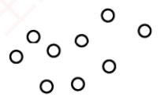  
(a)集合

  
(b) 线性结构

  
(c) 树形结构

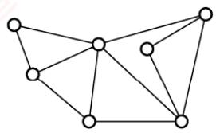  
(d) 网状结构  
图1.2 四类基本结构关系示例图

2）线性结构：结构中的数据元素之间仅存在一对一的关系见图1.2(b)]。

3）树形结构：结构中的数据元素之间存在一对多的关系见图1.2(c)]。

4）图状结构（或网状结构）：结构中的数据元素之间存在多对多的关系见图1.2(d)]。

## 2. 数据的存储结构

存储结构是指数据结构在计算机中的表示形式，也称物理结构，包括数据元素的表示及其相互关系的表示。它是逻辑结构在计算机中的具体实现，依赖于所采用的编程语言。常见的存储结构有顺序存储、链式存储、索引存储和散列存储。

1）顺序存储：将逻辑上相邻的数据元素存储在物理位置也相邻的存储单元中，元素间的关系由存储单元的邻接关系体现。优点是可以实现随机存取，每个元素占用最少的存储空间；缺点是要求使用连续的存储空间，可能导致较多的外部碎片。 XTA

2）链式存储：不要求逻辑上相邻的元素在物理位置上也相邻，而是通过指针指示元素的存储地址来表示其逻辑关系。优点是不会出现碎片现象，能充分利用所有存储单元；缺点是每个元素因存储指针而额外占用存储空间，且只能顺序存取。 KN

3）索引存储：在存储元素信息的同时，额外建立索引表。索引表中的每一项称为索引项，通常包含关键字和地址。优点是检索速度快；缺点是需要额外的存储空间用于索引表，且增加或删除数据时需更新索引表，带来额外的时间开销。

4）散列存储：根据元素的关键字直接计算出其存储地址，也称哈希（Hash）存储。优点是检索、插入和删除操作都非常快速；缺点是如果散列函数设计不当，可能会产生冲突（也称哈希冲突)，解决冲突会增加时间和空间成本。

## 3. 数据的运算

数据的运算包括定义与实现两个方面：定义针对逻辑结构，说明运算的功能；实现则基于存储结构，描述具体的操作步骤。

## 1.1.3 本节试题精选

## 一、单项选择题

01.一个完整的数据结构通常应包含以下哪些要素（）？A. 数据元素及其存储方式B. 数据的逻辑结构和物理结构C. 数据的逻辑结构、存储结构以及在其上定义的基本操作D. 数据对象和数据元素之间的关系

02. 下列四种数据结构中，（）是非线性数据结构。A. 树 B. 字符串C. 队列 D. 栈

03. 下列选项中，属于逻辑结构的是（）。A. 顺序表 B. 哈希表 C. 有序表 D. 单链表

04.下列关于数据结构的说法中，正确的是（）。A. 数据的逻辑结构独立于其存储结构B. 数据的存储结构独立于其逻辑结构C. 数据的逻辑结构唯一决定其存储结构D. 数据结构仅由其逻辑结构和存储结构决定

05.在存储数据时，通常不仅要存储各数据元素的值，还要存储（）。A. 数据的操作方法 B. 数据元素的类型C. 数据元素之间的关系 D. 数据的存取方法

## 二、综合应用题

01. 对于两种不同的数据结构，逻辑结构或物理结构一定不相同吗？

02. 举例说明对相同的逻辑结构，同一种运算在不同存储方式下实现时，其运算效率不同。

## 1.1.4 答案与解析

## 一、单项选择题

## 01. C

一个完整的数据结构由三部分组成：逻辑结构（如线性、树形等）、存储结构（物理表示）以及在其上定义的基本操作（如插入、删除等）。只有选项C同时包含这三个核心要素。

## 02. A

树和图是典型的非线性数据结构，其他选项都属于线性数据结构。

## 03. C

顺序表、哈希表和单链表是三种不同的数据结构，既描述逻辑结构，又描述存储结构和数据运算。而有序表是指关键字有序的线性表，仅描述元素之间的逻辑关系，它既可链式存储，又可顺序存储，所以属于逻辑结构。

## 04. A

数据的逻辑结构是从面向实际问题的角度出发的，只采用抽象表达方式，独立于存储结构，数据的存储方式有多种不同的选择：而数据的存储结构是逻辑结构在计算机上的映射，它不能独立于逻辑结构而存在。数据结构包括三个要素，缺一不可。

## 05. C

在存储数据时，不仅要存储数据元素的值，而且要存储数据元素之间的关系。

## 二、综合应用题

## 01. 【解答】

应该注意到，数据的运算也是数据结构的一个重要方面。

对于两种不同的数据结构，它们的逻辑结构和物理结构完全有可能相同。比如二叉树和二叉排序树，二叉排序树可以采用二叉树的逻辑表示和存储方式，前者通常用于表示层次关系，而后者通常用于排序和查找。虽然它们的运算都有建立树、插入结点、删除结点和查找结点等功能，但对于二叉树和二叉排序树，这些运算的定义是不同的，以查找结点为例，二叉树的平均时间复杂度为O(n)，而二叉排序树的平均时间复杂度为O(log2n)。 K

## 02. 【解答】

线性表既可以用顺序存储方式实现，又可以用链式存储方式实现。在顺序存储方式下，在线性表中插入和删除元素，平均要移动近一半的元素，时间复杂度为O(n)；而在链式存储方式下，插入和删除的时间复杂度都是O(1)。

## 1.2 算法和算法评价

## 1.2.1 算法的基本概念

算法（Algorithm）是对特定问题求解步骤的描述，是一个有穷的指令序列，其中每条指令表示一个或多个操作。此外，一个有效的算法应具备以下五个重要特性：

1）有穷性。算法必须在执行有限步后结束，且每一步都能在有限时间内完成。

2）确定性。算法中每条指令必须有明确的含义，对于相同的输入，只能产生相同的输出。

3）可行性。算法中所描述的操作都可以通过已实现的基本运算执行有限次来完成。

4）输入。算法可以有零个或多个输入，这些输入取自某个特定对象的集合。

5）输出。算法至少有一个输出，且该输出与输入之间存在某种特定关系。

通常，设计一个“好”的算法应力求满足以下目标：

1）正确性。能够正确地解决所给问题。

2）可读性。结构清晰、易于理解，便于阅读和交流。

3）健壮性。对非法或异常输入能做出适当处理，而不是产生不可预测的结果。

4）高效率与低存储量需求。效率是指算法的执行时间，存储量需求是指执行过程中所需的最大存储空间，二者均与问题规模密切相关。

## 1.2.2 算法效率的度量

考点追踪（算法题）分析时空复杂度（2010—2013、2015、2016、2018—2021、2025）

在算法设计中，正确性只是基础，效率才是衡量算法优劣的关键指标。由于实际运行时间受硬件、编译器等因素影响，无法作为通用标准，因此引入渐近复杂度分析一—一通过时间复杂度和空间复杂度来抽象描述算法随问题规模增长的资源消耗趋势。

## 1. 时间复杂度

考点追踪分析算法的时间复杂度（2011—2014、2017、2019、2022、2025）

时间复杂度描述算法执行时间随问题规模n增大而变化的趋势，是关于n的渐近函数。算法执行时间通常由语句频度（某条语句的执行次数）来衡量。设算法中所有语句的频度之和为T(n)，它是问题规模n的函数。当n足够大时，低阶项和常数系数对整体增长趋势的影响可以忽略不计，因此只需关注T(n)中增长最快的项。这一项通常由算法中的基本运算（最深层循环内的关键操作）的执行次数决定，该执行次数的数量级即为整个算法的时间复杂度。

时间复杂度通常用大O记号表示：若存在正常数C和 $n _ { 0 1 }$ ，使得对所有 $n   \geq   n _ { 0 }$ 时，都有

$$
0 \leqslant T(n) \leqslant C f(n)
$$

则称 $T ( n ) = O ( f ( n ) )$ ，它表示当n足够大时，T(n)的增长速度不超过f(n)的常数倍。

例如， $T(n)=3n^{2}+100n+5 \rightarrow O(n^{2}), \quad T(n)=2^{n}+n^{100} \rightarrow O(2^{n})$

算法的实际运行时间不仅依赖于问题规模n，还受输入数据初始状态的影响，同一算法在不同实例下的运行时间可能差异很大。例如，在数组A[0...n-1]中逆序查找值k的算法：

(1) $\begin{array}{l}\text { \text { \text { \text { \text { \text { \text { \text { \text { \text { \text { \text { \text { \text { \text { \text { \text { \text { \text { \text { \text { \text { \text { \text { } } } } } } \text { \text { \text { \text { \text { \text { \text { \text { \text { \text { \text { \text } { \text { } } } } } \text { \text { \text { \text { \text { \text { \text { \text { } \text { } } } } \text { \text { \text { \text { \text { \text { \text } { \text { } \text { \text { } \text { } \text { } \text { \text { } \text { \text { } \text { \text } { \text } { \text } } \text { \text { \text { \text { } \text { \text } { \text } { \text } \text { \text { } \text { \text } { \text } \text { \text { \text { } \text } } \text { \text { \text { \text } } \text { \text { \text } } \text { \text { \text } \text { \text { \text } } \text { \text { \text } \text { \text } \text { \text { } \text } \text { \text } \text { \text { \text } \text { \text } \text { \text } \text { \text } \text { \text } \text { \text } \text { \text } \text { \text } \text { \text } \text { \text } \text { \text \text { } \text \text { \text } \text } \text { \text } \text { \text \text } \text { \text } \text { \text \text { \text } \text } \text { \text \text { } \text \text } \text { \text } \text \text { \text } \text { \text \text } \text { \text \text } \text { \text } \text { \text \text } \text { \text \text } \text { \text } \text \text { \text } \text \text { \text } \text \text { \text } \text \text { \text } \text \text { \text } \text \text { \text } \text \text { \text } \text \text { \text } \text \text \text { } \text \text \text { } \text \text \text { \text } \text \text } \text { \text \text } \text \text { \text \text \text { } \text \text \text } \text { \text \text \text } \text { \text \text \text } \text { \text \text \text { } \text \text \text \text { } \text \text \text \text { \text } \text \text { \text \text } \text \text { \text \text \text } \text \text { \text \text \text } \text { \text \text \text \text { } \text \text \text \text \text { \text \text } \text \text \text { \text \text \text } \text \text { \text \text \text \text { \text \text } \text \text \text \text { \text \text } \text \text \text { \text \text \text \text \text { \text \text \text \text { } \text \text \text \text \text \text \text { \text \text \text \text \text { \text \text } \text \text \text \text { \text \text \text \text \text \text { \text \text \text \text \text \text \text { \text \end{array}$   
(2)   
(3) 本运算

最好时间复杂度：在最有利输入下的运行时间。若A[n-1]等于k，则语句3的频度 $f ( n )   =   0$ 最坏时间复杂度：在最不利输入下的运行时间。若k不存在，则语句3的频度 $f ( n )   =   n \mathrm { { } _ { \circ } }$ 平均时间复杂度：所有输入等概率出现时的期望运行时间。

通常以最坏时间复杂度作为算法效率的评价标准，因为它提供了运行时间的确定性上界。分析由多个代码段组成的程序时，可用以下规则快速推导整体时间复杂度：

1）加法规则，若两段代码顺序执行，则总时间复杂度取两者中的高阶项：

$$
O(f(n)) + O(g(n)) = O(\max(f(n),g(n)))
$$

2）乘法规则，若一段代码嵌套在另一段内部中，则总时间复杂度为两者之积：

$$
O(f(n)) \cdot O(g(n)) = O(f(n)g(n))
$$

例如，设 $\underline { { \mathsf { a } } } \left\{ \right\}  、  \underline { { \mathsf { b } } } \left\{ \right\}  、  \underline { { \mathsf { c } } } \left\{ \right\}$ 三个语句块的时间复杂度分别为O(1)、 $O ( n )  、  O ( n ^ { 2 } )$ ，则  
① a {b{ }c { }  
② $\}$ //时间复杂度为 $O ( n ^ { 2 } )$ ，适用加法规则$\begin{array} { r l } { \mathbb { D } \{ \begin{array} { l l } { } & { } \\ { } & { \mathbb { C } \{ \begin{array} { l } \end{array} \} } \\ { } & { } \end{array}  } \\ { \{ \begin{array} { l l } \end{array}  } & { { } \mathbb { C } \{ \begin{array} { l } \end{array} \} } \\ { \} & { { } } \end{array}$ 1 //时间复杂度为 $O ( n ^ { 3 } )$ ，适用乘法规则

常见的时间复杂度阶次（按增长速度升序)：

$$
O(1) < O(\log_2 n) < O(n) < O(n \log_2 n) < O(n^2) < O(n^3) < O(2^n) < O(n!) < O(n^n)
$$

## 2. 空间复杂度

空间复杂度S(n)表示算法在运行过程中所需的额外存储空间，是问题规模n的函数，记为

$$
S ( n ) = O ( g ( n ) )
$$

程序执行时所需的空间包括：指令、常数和变量（与n无关）；输入数据；以及辅助空间（如递归调用栈、临时数组、指针等)。其中，输入数据所占的空间只取决于问题本身，与算法无关，不计入空间复杂度；而指令、常数和与n无关的变量所占的空间为固定开销，也不随问题规模变化。因此，在分析空间复杂度时，我们只关注算法额外使用的辅助空间。例如，若算法创建了若干与输入规模n同阶的辅助数组，则其空间复杂度为O(n)。

若算法仅使用常量级的额外空间，则称其为原地工作，空间复杂度为O(1)。

## 1.2.3 本节试题精选

## 一、单项选择题

01.一个算法应该具有（）等重要特性。A. 可维护性、可读性和可行性 B. 可行性、确定性和有穷性C. 确定性、有穷性和可靠性 D. 可读性、正确性和可行性

02. 下列关于算法的说法中，正确的是()。A. 算法的时间效率取决于算法执行所花的 CPU 时间B. 在算法设计中不允许用牺牲空间效率的方式来换取好的时间效率C. 算法必须具备有穷性、确定性等五个特性D. 通常用时间效率和空间效率来衡量算法的优劣

03. 某算法的时间复杂度为 $O ( n ^ { 2 } )$ ，则表示该算法的（）。 道A. 问题规模是 $n ^ { 2 }$ B. 执行时间等于 $n ^ { 2 }$ C. 执行时间与 $n ^ { 2 }$ 成正比 D. 问题规模与 $n ^ { 2 }$ 成正比

04. 若某算法的空间复杂度为O(1)，则表示该算法（)。A. 不需要任何辅助空间 B. 所需辅助空间大小与问题规模n无关C. 不需要任何空间 D. 所需空间大小与问题规模n无关

05. 下列关于时间复杂度的函数中，时间复杂度最小的是（）。A. $T_{1}(n) = n \log_{2} n + 5000n$ B. $T_{2}(n) = n^{2} - 8000n$ C. $T_{3}(n) = n \log_{2} n - 6000n$ D. $T_{4}(n) = 20000\log_{2}n$

06. 下列算法的时间复杂度为（）。void fun(int n){

$\begin{array} { r l } & { \mathtt { i n t \_ i = i ; } } \\ & { \mathtt { w h i l e ( i < = n ) ; } } \\ & { \quad \mathtt { i = i ^ { \star } 2 ; } } \end{array}$ 算机孝 A. O(n) B. $O ( n ^ { 2 } )$ C. $O ( n \log _ { 2 } n )$ D. $O ( \log _ { 2 }   n )$

07. 下列算法的时间复杂度为（）。voi$\begin{array}{l}\text { \text { (d } \text { \text { 1 } } \text { \text { 2 } } \text { \text { 1 }} \text { \text { 1 }} \text { \text { 1 }} \text { \text { 1 }} \text { \text { 1 }} \text { \text { 1 }} \text { \text { 1 }} \text { \text { 1 }} \text { \text { 1 }} \text { \text { 1 }} \text { \text { 1 }} \text { \text { 1 }} \text { \text { 1 }} \text { \text { 1 }} \text { \text { 1 }} \text { \text { 1 }} \text { \text { 1 }} \text { \text { 1 }} \text { \text { 1 }} \text { \text { 1 }} \text { \text { 1 }} \text { \text { 1 }} \text { \text { 1 }} \text { \text { 1 }} \text { \text { 1 }} \text { \text { 1 }} \text { \text { 1 }} \text { \text { 1 }} \text { \text { 1 }} \text { \text { 1 }} \text { \text { 1 }} \text { \text { 1 }} \text { \text { 1 }} \text { \text { 1 }} \text { \text { 1 }} \text { \text { 1 }} \text { \text { 1 }} \text { \text { 1 }} \text { \text { 1 }} \text { \text { 1 }} \text { \text { 1 }} \text { \text { 1 }} \text { \text { 1 }} \text { \text { 1 }} \text { \text { 1 }} \text { \text { 1 }} \text { \text { 1 }} \text { \text { 1 }} \text { \text { 1 }} \text { \text { 1 }} \text { \text { 1 }} \text { \text { 1 }} \text { \text { 1 }} \text { \text { 1 }} \text { \text { 1 }} \text { \text { 1 }} \text { \text { 1 }} \text { \text { 1 }} \text { \text { 1 }} \text { \text { 1 }} \text { \text { 1 }} \text { \text { 1 }} \text { \text { 1 }} \text { \text { 1 }} \text { \text { 1 }} \text { \text { 1 }} \text { \text { 1 }} \text { \text { 1 }} \text { \text { 1 }} \text { \text { 1 }} \text { \text { 1 }} \text { \text { 1 }} \text { \text { 1 }} \text { \text { 1 }} \text { \text { 1 }} \text { \text { 1 }} \text { \text { 1 }} \text { \text { 1 } } \text { \text { 1 } } \text { \text { 1 } } \text \text { { 1 } } \text { \text { 1 } } \text { \text { 1 } } \text { \text { 1 } } \text \text { { \text 1 } } \text { \text { 1 } } \text { \text { 1 } } \text \text { { 1 } } \text \text { 1 } \text { } \text { \text { 1 } } \text \text { { 1 } } \text \text { { 1 } } \text \text { { \text 1 } } \text { \text { 1 } } \text \text { { 1 } } \text \text { \text { 1 } } \text \text { { \end{array}$ A. O(n) B. $O ( n \log _ { 2 } n )$ C. $O ( { \sqrt [ 3 ] { n } } )$ D. $O ( { \sqrt { n } } )$

08. 某个程序段如下：$\mathrm{f} \circ \mathrm{r} (\mathrm{i}=\mathrm{n}-1 ; \mathrm{i}>1 ; \mathrm{i}--)$ for(j=1;j<i;j++)if(A[j]>A[j+1])A[j]与A[j+1]对换；

其中n为正整数，则最后一行语句的频度在最坏情况下是（）。  
A. O(n) B. $O ( n \log _ { 2 } n )$ C. $O ( n ^ { 3 } )$ D. $O ( n ^ { 2 } )$

09. 下列程序段的时间复杂度为（）。if(n>=0) {$\begin{array} { c } { \mathtt { f o r } \left( \mathtt { i n t } \quad \mathtt { i } = 0 \quad ; \quad \mathtt { i } < \mathtt { n } \quad ; \quad \mathtt { i } + + \right) } \\ { \mathtt { f o r } \left( \mathtt { i n t } \quad \mathtt { j } = 0 \quad ; \quad \mathtt { j } < \mathtt { n } \quad ; \quad \mathtt { j } + + \right) } \end{array}$ 教育printf("输入数据大于或等于零\n")1else {$\frac{\texttt{f o r (i n t \_ j = 0 ; j < n ; j ++ )}}{\texttt{p r i n t f (  输入数据小于零入 n )}}$ A. $O ( n ^ { 2 } )$ B. O(n) C. O(1) D. $O ( n \log _ { 2 } n )$

10. 下列算法中加下划线的语句的执行次数为（）。int m=0,i,j;$\begin{array}{c}\mathtt{f} \circ \mathtt{r} (\mathtt{i} = \mathtt{1}; \mathtt{i} <= \mathtt{n}; \mathtt{i}++) \\\mathtt{f} \circ \mathtt{r} (\mathtt{j} = \mathtt{1}; \mathtt{j} <= 2 \star \mathtt{i}; \mathtt{j}++) \\\mathtt{m}++;\end{array}$ 教育A. n(n+ 1) B. n C. n+1 D. $n ^ { 2 }$

11. 下列函数代码的时间复杂度是（）。$\begin{array}{l}\text { i n t } \text { F u n c }(\text { i n t } \text { n }) \text { \{ } } \\\quad \text { i f }(\text { n }=\text { 1 }) \text { r e t u r n } \text { 1 }; \\\quad \text { e l s e } \text { r e t u r n } 2 ^{\star} \text { F u n c }(\text { n } / 2)+\text { n };\end{array}$ 道计算A. O(n) B. $O ( n \log _ { 2 } n )$ C. $O ( \log _ { 2 }   n )$ D. $O ( n ^ { 2 } )$

12. 【2011统考真题】设n是描述问题规模的非负整数，下列程序段的时间复杂度是（）。x=2;while(x<n/2) 育x=2\*x;A. $O ( \log _ { 2 } n )$ B. O(n) C. $O(n\log_{2}n)$ D. $O ( n ^ { 2 } )$

13. 【2012统考真题】求整数 $n (n \geqslant 0)$ 的阶乘的算法如下，其时间复杂度是（）。int fact(int n){if(n<=1) return 1; 道计$\mathtt { r e t u r n } \quad \mathtt { n } ^ { \star } \mathtt { f a c t } \quad ( \mathtt { n } \mathtt { - 1 } )$ 1

A. $O ( \log _ { 2 }   n )$ B. O(n) C教卜 $O ( n \log _ { 2 } n )$ D. $O ( n ^ { 2 } )$

14. 【2014统考真题】下列程序段的时间复杂度是（）。count=0;$\begin{array}{c}\mathtt{cov} \mathtt{m} \mathtt{n} \mathtt{o} \mathtt{o} \mathtt{o} \mathtt{o} \mathtt{o} \mathtt{o} \mathtt{o} \mathtt{o} \mathtt{o} \mathtt{o} \mathtt{o} \mathtt{o} \mathtt{o} \mathtt{o} \mathtt{o} \mathtt{o} \mathtt{o} \mathtt{o} \mathtt{o} \mathtt{o} \mathtt{o} \mathtt{o} \mathtt{o} \mathtt{o} \mathtt{o} \mathtt{o} \mathtt{o} \mathtt{o} \mathtt{o} \mathtt{o} \mathtt{o} \mathtt{o} \mathtt{o} \mathtt{o} \mathtt{o} \mathtt{o} \mathtt{o} \mathtt{o} \mathtt{o} \mathtt{o} \mathtt{o} \mathtt{o} \mathtt{o} \mathtt{o} \mathtt{o} \mathtt{o} \mathtt{o} \mathtt{o} \mathtt{o} \mathtt{o} \mathtt{o} \mathtt{o} \mathtt{o} \mathtt{o} \mathtt{o} \mathtt{o} \mathtt{o} \mathtt{o} \mathtt{o} \mathtt{o} \mathtt{o} \mathtt{o} \mathtt{o} \mathtt{o} \mathtt{o} \mathtt{o} \mathtt{o} \mathtt{o} \mathtt{o} \mathtt{o} \mathtt{o} \mathtt{o} \mathtt{o} \mathtt{o} \mathtt{o} \mathtt{o} \mathtt{o} \mathtt{o} \mathtt{o} \mathtt{o} \mathtt{o} \mathtt{o} \mathtt{o} \mathtt{o} \mathtt{o} \mathtt{o} \mathtt{o} \mathtt{o} \mathtt{o} \mathtt{o} \mathtt{o} \mathtt{o} \mathtt{o} \mathtt{o} \mathtt{o} \mathtt{o} \mathtt{o} \mathtt{o} \mathtt{o} \mathtt{o} \mathtt{o} \mathtt{o} \mathtt{o} \mathtt{o} \mathtt{o} \mathtt{o} \mathtt{o} \mathtt{o} \mathtt{o} \mathtt{o} \mathtt{o} \mathtt{o} \mathtt{o} \mathtt{o} \mathtt{o} \mathtt{o} \mathtt{o} \mathtt{o} \mathtt{o} \mathtt{o} \mathtt{o} \mathtt{o} \mathtt{o} \mathtt{o} \mathtt{o} \mathtt{o} \mathtt{o} \mathtt{o} \mathtt{o} \mathtt{o} \mathtt{o} \mathtt{o} \mathtt{o} \mathtt{o} \mathtt{o} \mathtt{o} \mathtt{o} \mathtt{o} \mathtt{o} \mathtt{o} \mathtt{o} \mathtt{o} \mathtt{o} \mathtt{o} \mathtt{o} \mathtt{o} \mathtt{o} \mathtt{o} \mathtt{o} \mathtt{o} \mathtt{o} \mathtt{o} \mathtt{o} \mathtt{o} \mathtt{o} \mathtt{o} \mathtt{o} \mathtt{o} \mathtt{o} \mathtt{o} \mathtt{o} \mathtt{o} \mathtt{o} \mathtt{o} \mathtt{o} \mathtt{o} \mathtt{o} \mathtt{o} \mathtt{o} \mathtt{o} \mathtt{o} \mathtt{o} \mathtt{o} \mathtt{o} \mathtt{o} \mathtt{o} \mathtt{o} \mathtt{o} \mathtt{o} \mathtt{o} \mathtt{o} \mathtt{o} \mathtt{o} \mathtt{o} \mathtt{o} \mathtt{o} \mathtt{o} \mathtt{o} \mathtt{o} \mathtt{o} \mathtt{o} \mathtt{o} \mathtt{o} \mathtt{o} \mathtt{o} \mathtt{o} \mathtt{o} \mathtt{o} \mathtt{o} \mathtt{o} \mathtt{o} \mathtt{o} \mathtt{o} \mathtt{o} \mathtt{o} \mathtt{o} \mathtt{o} \mathtt{o} \mathtt{o} \mathtt{o} \mathtt{o} \mathtt{o} \mathtt{o} \mathtt{o} \mathtt{o} \mathtt{o} \mathtt{o} \mathtt{o} \mathtt{o} \mathtt{o} \mathtt{o} \mathtt{o} \mathtt{o} \mathtt{o} \mathtt{o} \mathtt{o} \mathtt{o} \mathtt{o} \mathtt{o} \mathtt{o} \mathtt{o} \mathtt{o} \mathtt{o} \mathtt{o} \mathtt{o} \mathtt{o} \mathtt{o} \mathtt{o} \mathtt{o} \mathtt{o} \mathtt{o} \mathtt{o} \mathtt{o} \mathtt{o} \mathtt{o} \mathtt{o} \mathtt{o} \mathtt{o} \mathtt{o} \mathtt{o} \mathtt{o} \mathtt{ \end{array}$ 道计集A. $O ( \log _ { 2 }   n )$ B. $O ( n )$ C. O(nlog₂n) D. $O ( n ^ { 2 } )$

15.【2017统考真题】下列函数的时间复杂度是（）。int func(int n){$\begin{aligned}& int  \quad \underline{\mathrm{i}} = 0 , \quad \mathrm{sim} = 0 ; \\& with \underline{\mathrm{i}} \underline{\mathrm{i}} \underline{\mathrm{e}} ( \mathrm{sum} \underline{\mathrm{n}} ) \quad \mathrm{sum} \quad \underline{\mathrm{s}} \quad \underline{\mathrm{u}} \quad \underline{\mathrm{s}} \quad \underline{\mathrm{u}} \quad \underline{\mathrm{s}} \quad \underline{\mathrm{u}} \quad \underline{\mathrm{s}} \quad \underline{\mathrm{u}} \quad \underline{\mathrm{u}} \quad \underline{\mathrm{u}} \quad \underline{\mathrm{u}} \quad \underline{\mathrm{u}} \quad \underline{\mathrm{u}} \quad \underline{\mathrm{u}} \quad \underline{\mathrm{u}} \quad \underline{\mathrm{u}} \quad \underline{\mathrm{u}} \quad \underline{\mathrm{u}} \quad \underline{\mathrm{u}} \quad \underline{\mathrm{u}} \quad \underline{\mathrm{u}} \quad \underline{\mathrm{u}} \quad \underline{\mathrm{u}} \quad \underline{\mathrm{u}} \quad \underline{\mathrm{u}} \quad \underline{\mathrm{u}} \quad \underline{\mathrm{u}} \quad \underline{\mathrm{u}} \quad \underline{\mathrm{u}} \quad \underline{\mathrm{u}} \quad \underline{\mathrm{u}} \quad \underline{\mathrm{u}} \quad \underline{\mathrm{u}} \quad \underline{\mathrm{u}} \quad \underline{\mathrm{u}} \quad \underline{\mathrm{u}} \quad \underline{\mathrm{u}} \quad \underline{\mathrm{u}} \quad \underline{\mathrm{u}} \quad \underline{\mathrm{u}} \quad \underline{\mathrm{u}} \quad \underline{\mathrm{u}} \quad \underline{\mathrm{u}} \quad \underline{\mathrm{u}} \quad \underline{\mathrm{u}} \quad \underline{\mathrm{u}} \quad \underline{\mathrm{u}} \quad \underline{\mathrm{u}} \quad \underline{\mathrm{u}} \quad \underline{\mathrm{u}} \quad \underline{\mathrm{u}} \quad \underline{\mathrm{u}} \quad \underline{\mathrm{u}} \quad \underline{\mathrm{u}} \quad \underline{\mathrm{u}} \quad \underline{\mathrm{u}} \quad \underline{\mathrm{u}} \quad \underline{\mathrm{u}} \quad \underline{\mathrm{u}} \quad \underline{\mathrm{u}} \quad \underline{\mathrm{u}} \quad \underline{\mathrm{u}} \quad \underline{\mathrm{u}} \quad \underline{\mathrm{u}} \quad \underline{\mathrm{u}} \quad \underline{\mathrm{u}} \quad \underline{\mathrm{u}} \quad \underline{\mathrm{u}} \quad \underline{\mathrm{u}} \quad \underline{\mathrm{u}} \quad \underline{\mathrm{u}} \quad \underline{\mathrm{u}} \quad \underline{\mathrm{u}} \quad \underline{\mathrm{u}} \quad \underline{\mathrm{u}} \quad \underline{\mathrm{u}} \quad \underline{\mathrm{u} \quad \mathrm{u} \quad \mathrm{u} \quad \mathrm{u} \quad \mathrm{u} \quad \mathrm{u} \quad \mathrm{u} \quad \mathrm{u} \quad \mathrm{u} \quad \mathrm{u} \quad \mathrm{u} \quad \mathrm{u} \quad \mathrm{u} \quad \mathrm{u} \quad \mathrm{u} \quad \mathrm{u} \quad \mathrm{u} \quad \mathrm{u} \quad \mathrm{u} \quad \mathrm{u} \quad \mathrm{u} \quad \mathrm{u} \quad \mathrm{u} \quad \mathrm{u} \quad \mathrm{u} \quad \mathrm{u} \quad \mathrm{u} \quad \mathrm{u} \quad \mathrm{u} \quad \mathrm{u} \quad \mathrm{u} \quad \mathrm{u} \quad \mathrm{u} \quad \mathrm{u} \quad \mathrm{u} \quad \mathrm{u} \quad \mathrm{u} \quad \mathrm{u} \quad \mathrm{u} \quad \mathrm{u} \quad \mathrm{u} \quad \mathrm{u} \quad \mathrm{u} \quad \mathrm{u} \quad \mathrm{u} \quad \mathrm{u} \quad \mathrm{u} \quad \mathrm{u} \quad \mathrm{u \end{aligned}$ 机教育A. O(log2n) B. $O ( n ^ { 1 / 2 } )$ C. $O ( n )$ D. O(nlog2n)

16. 【2019统考真题】设n是描述问题规模的非负整数，下列程序段的时间复杂度是（）。x=0;while (n>=(x+1)\*(x+1)) 王道x=x+1;A. O(log2n) B. $O ( n ^ { 1 / 2 } )$ C. O(n) D. $O ( n ^ { 2 } )$

17.【2022统考真题】下列程序段的时间复杂度是（）。int sum=0;for $\begin{array}{c}\texttt{c}(\texttt{i n t } \texttt{i}=\texttt{1};\texttt{i}<\texttt{n};\texttt{i}^{\star}=2) \\\texttt{f o r }(\texttt{i n t } \texttt{j}=0;\texttt{j}<\texttt{i};\texttt{j}++) \\\texttt{s u m}++;\end{array}$ 机教育A. $O ( \log _ { 2 } n )$ B. $O ( n )$ C. O(nlog2n) D. $O ( n ^ { 2 } )$

18. 【2025统考真题】下列程序段的时间复杂度是（）。$\begin{array} { l } { \mathtt { i n t \_ c o u n t = } 0   , \mathtt { i }   , \mathtt { j }   ; } \\ { \mathtt { f o r \_ ( i { = } i ; i ^ { \star } i { < } { = } n ; i { + } + ) } } \\ { \quad \mathtt { f o r \_ ( j { = } l ; j { < } { = } i ; j { + } + ) } } \\ { \quad \mathtt { c o u n t { + } + ; } } \end{array}$ 王道A. $O ( \log _ { 2 } n )$ B. O(n) C. O(nlog2n) D. $O ( n ^ { 2 } )$

## 二、综合应用题

01. 分析下列各程序段，求出算法的时间复杂度。① $\begin{array}{l}\text { i = 1 ; k = 0 ; } \\\text { w h i l e ( i < n - 1 ) ; } \\\text { k = k + 1 0 \times i ; } \\\text { i + + ; }\end{array}$ ② $\scriptstyle \mathtt { V } = 0   ;$ $\mathrm{whi}\bot\mathrm{e}\left(\left(\mathrm{y}+\mathrm{1}\right)\star\left(\mathrm{y}+\mathrm{1}\right)<=\mathrm{n}\right)$ y=y+1;$\begin{aligned}& \texttt{f o r (i=0 ; i<n ; i++)} \\& \quad \texttt{f o r (j=0 ; j<m ; j++)} \\& \quad \texttt{a [i] [j]=0};\end{aligned}$

## 1.2.4 答案与解析

## 一、单项选择题

## 01. B

一个算法应具有五个重要特性：有穷性、确定性、可行性、输入和输出。选项A、C和D中

提到的特性（如可维护性、可读性、可靠性、正确性等）是很重要的，但它们并不是算法定义的重要特性，更多的是关于软件开发中的附加要求。

## 02. C

算法的时间效率是指算法的时间复杂度，即执行算法所需的计算工作量，选项A错误。算法设计会综合考虑时间效率和空间效率两个方面，若某些应用场景对时间效率要求很高，而对空间效率要求不高，则可用牺牲空间效率的方式来换取好的时间效率，选项B错误。评价一个算法的“优劣”不仅要考虑算法的时空效率，还要从正确性、可读性、健壮性等方面来综合评价。

## 03. C

时间复杂度为 $O ( n ^ { 2 } )$ ，说明算法的时间复杂度 T(n)满足 $T(n) \leq c n^{2}$ (其中 c为比例常数)，即$T ( n ) = O ( n ^ { 2 } )$ ，时间复杂度 T(n)是问题规模 n的函数，其问题规模仍然是 n而不是 $n ^ { 2 }$

## 04. B

算法的空间复杂度为O(1)，表示执行该算法所需的辅助空间大小相比输入数据的规模来说是一个常量，而不表示该算法执行时不需要任何空间或辅助空间。 道

## 05. D

选项A的最高阶是 nlog2n，时间复杂度是 O(nlog2n)。选项B 的最高阶是 $n ^ { 2 }$ ，时间复杂度是${ \cal O } ( n ^ { 2 } )$ 。选项C的最高阶是 nlog2n，时间复杂度是 $O ( n \log _ { 2 } n )$ 。选项D的最高阶是log2n，时间复杂度是 O(log2n)。 XTIT

## 06. D

找出基本运算i=i\*2，设执行次数为 $t , 2 ^ { t } \leqslant n$ ，即 $t \leqslant \log_{2} n$ ，故时间复杂度 $T ( n ) = O ( \log _ { 2 } n )$ 0更直观的方法：计算基本运算i=i\*2的执行次数（每执行一次，i乘以2)，其中判断条件可以理解为 $2 ^ { t }   =   n$ ，即 $t = \log _ { 2 } n$ ，则 $T(n) = O(\log_2 n)$

## 07. C

基本运算为i++，设执行次数为t，有 $t \cdot t \cdot t \leq n$ ，即 $t ^ { 3 } { \leqslant } n$ 。因此有 $t   \leqslant   \sqrt [ 3 ] { n }$ ，则 $T(n) = O(\sqrt[3]{n})$ o08. D

这是冒泡排序的算法代码，考查最坏情况下的元素交换次数（若觉得理解起来有困难，则可在学完第8章后再回顾)。当所有相邻元素都为逆序时，则最后一行的语句每次都会执行。此时，

$$
T(n)=\sum_{i = 2}^{n - 1}\sum_{j = 1}^{i - 1}1=\sum_{i = 2}^{n - 1}i-1=(n-2)(n-1)/2=O(n^2)
$$

所以在最坏情况下该语句的频度是 $O ( n ^ { 2 } )$

## 09. A

当程序段中有条件判断语句时，取分支路径上的最大时间复杂度。

## 10. A

m++语句的执行次数为

$$
\sum_{i = 1}^{n}\sum_{j = 1}^{2i}1 = \sum_{i = 1}^{n}2i = 2\sum_{i = 1}^{n}i = n(n + 1)
$$

## 11. C

本题求的是递归调用的时间复杂度，递归调用可视为多重循环，每次递归执行的基本语句是$\mathtt { i f ( n { = } { = } 1 ) r e t u r n \_ l ; }$ ，因此可以认为单层循环的执行次数为1，设递归次数为 $t, 2^{t} \leqslant n$ ，即t≤log2n，共执行了log2n次递归调用，总执行次数 $T = \log_{2}n \times 1$ ，所以时间复杂度为O(log2n)。

<table><tr><td rowspan=1 colspan=1>循环变量i</td><td rowspan=1 colspan=1>单层循环语句</td><td rowspan=1 colspan=1>单层循环执行次数</td></tr><tr><td rowspan=1 colspan=1>n</td><td rowspan=1 colspan=1>if(n==1) return 1;</td><td rowspan=1 colspan=1>1</td></tr><tr><td rowspan=1 colspan=1> $\overline { { \mathrm { n } / 2 } }$ </td><td rowspan=1 colspan=1>if(n==1) return 1;</td><td rowspan=1 colspan=1>1</td></tr><tr><td rowspan=1 colspan=1> $\mathrm { n } / 4$ </td><td rowspan=1 colspan=1>if(n==1) return 1;</td><td rowspan=1 colspan=1>1</td></tr><tr><td rowspan=1 colspan=1>…</td><td rowspan=1 colspan=1>…</td><td rowspan=1 colspan=1>.…</td></tr><tr><td rowspan=1 colspan=1>1</td><td rowspan=1 colspan=1>if(n==1) return 1;</td><td rowspan=1 colspan=1>1</td></tr></table>

## 12. A

基本运算（执行频率最高的语句）为 $\scriptstyle \mathbb { X } = 2   ^ { \star } \mathbb { X }$ ，每执行一次，×乘以2，设执行次数为t，则有 $2 ^ { t + 1 }   <   n / 2$ ，所以 $t < \log_{2}(n/2) - 1 = \log_{2}n - 2$ ，得 $T ( n ) = O ( \log _ { 2 } n )$ XTIT

## 13. B

本题求的是递归调用的时间复杂度，递归调用可视为多重循环，每次递归执行的基本语句是$\mathrm{i} \mathrm{f} (\mathrm{n}<=1) \quad \mathrm{reterm} \quad \mathrm{1};$ ，因此，可以认为单层循环的执行次数为1，共执行了n次递归调用，KN总执行次数 $T = 1 + 1 + \cdots + 1 = n$ ，所以时间复杂度为 $O ( n )$

<table><tr><td rowspan=1 colspan=1>循环变量i</td><td rowspan=1 colspan=1>单层循环语句</td><td rowspan=1 colspan=1>单层循环执行次数</td></tr><tr><td rowspan=1 colspan=1>n</td><td rowspan=1 colspan=1> $\boxed { \mathtt { i f } ( \mathtt { n } { < } \mathtt { = } \mathtt { l } ) \mathtt { r e t u r n } \mathtt { l } } ;$ </td><td rowspan=1 colspan=1>1</td></tr><tr><td rowspan=1 colspan=1> $\overline { { \mathrm { ~ n ~ } { - } 1 } }$ </td><td rowspan=1 colspan=1> $\mathrm { i f } ( \mathrm { n } < = 1 ) \mathrm { r e t u r n } \downarrow ;$ </td><td rowspan=1 colspan=1>1</td></tr><tr><td rowspan=1 colspan=1> $\overline { { \mathrm { n } { - } 2 } }$ </td><td rowspan=1 colspan=1> $\boxed { \mathtt { i f } ( \mathtt { n } \mathtt { < } \mathtt { = } \mathtt { l } ) \mathtt { r e t u r n } \mathtt { l } } ;$ </td><td rowspan=1 colspan=1>1</td></tr><tr><td rowspan=1 colspan=1>…</td><td rowspan=1 colspan=1></td><td rowspan=1 colspan=1>…</td></tr><tr><td rowspan=1 colspan=1>1</td><td rowspan=1 colspan=1>if(n&lt;=1) return 1;</td><td rowspan=1 colspan=1>1</td></tr></table>

## 14. C

对于单层循环如 $\mathtt { f o r } ( \mathtt { j } = \mathtt { l } ; \mathtt { j } < = \mathtt { n } ; \mathtt { j } + + ) \quad \mathtt { C o u n t } + + ;$ ，可以直接数出执行次数为n，因此可将多层循环转换成多个并列的单层循环，且列出每个单层循环如下（假设t为循环变量的幂次）：

<table><tr><td rowspan=1 colspan=1>循环变量k</td><td rowspan=1 colspan=1>单层循环语句</td><td rowspan=1 colspan=1>单层循环执行次数</td></tr><tr><td rowspan=1 colspan=1>1</td><td rowspan=1 colspan=1> $\mathrm{Cov}(j = 1; j <= n; j++)$ </td><td rowspan=1 colspan=1>n</td></tr><tr><td rowspan=1 colspan=1> $\overline { { 2 ^ { \top } } }$ </td><td rowspan=1 colspan=1> $\mathrm{Cov}(\mathrm{j}=1;\mathrm{j}<=\mathrm{n};\mathrm{j}++)$ </td><td rowspan=1 colspan=1>n</td></tr><tr><td rowspan=1 colspan=1> $\overline { { 2 ^ { 2 } } }$ </td><td rowspan=1 colspan=1> $\mathrm{Cov}(\mathrm{j}=1;\mathrm{j}<=\mathrm{n};\mathrm{j}++)$ </td><td rowspan=1 colspan=1>n</td></tr><tr><td rowspan=1 colspan=1></td><td rowspan=1 colspan=1></td><td rowspan=1 colspan=1>……</td></tr><tr><td rowspan=1 colspan=1> $\overline { { 2 ^ { t } } }$ </td><td rowspan=1 colspan=1> $\mathrm{for} (\mathrm{j}=1;\mathrm{j}<=\mathrm{n};\mathrm{j}++)$ </td><td rowspan=1 colspan=1>n</td></tr></table>

进入外层循环的条件是 $k   \leqslant   n$ ，当循环结束时，循环变量的幂次t满足 $2^{t} \leqslant n < 2^{t+1}$ ,即 $t \leqslant \log_{2} n.$ 所以总执行次数 $T = n(t + 1) = n(\log_{2}n + 1)$ ，时间复杂度为 $O ( n \log _ { 2 } n )$ 机

## 15. B

基本运算为 $\mathtt { s u m } { \mathrel { + } \mathrel { = } \mathrel { + } \mathrel { + } \downarrow }$ ，等价于 $ \text{" }++ \text{" }; \ \mathrm{sum}=\mathrm{sum}+\text{" }$ ，每执行一次，i都自增1。当 $\mathrm { i { = } 1 }$ 时， $\mathrm{S}\mathrm{\mu m}=0+1$ ；当i=2时， $\mathrm{s}\mathrm{um}=0+1+2$ ；当i=3时， $\mathrm{sum}=0+1+2+3$ ，以此类推，得出 sum=$0+1+2+3+\cdots+\downarrow=(1+\downarrow)\times\downarrow/2$ ，可知循环次数t满足 $( 1 + t ) \cdot t / 2 < n ,$ 故时间复杂度为 $O ( n ^ { 1 / 2 } )$ o

## 注意

统考真题中常将log2书写为log，此时默认底数为2。

## 16. B

假设第k次循环终止，则第k次执行时， $(x + 1)^{2} > n$ ,x的初始值为0，第k次判断时， $x   =   k   -   1$ 即 $k^{2} > n,\ k > \sqrt{n}$ ，因此该程序段的时间复杂度为 $O ( n ^ { 1 / 2 } )$

## 17. B

对于单层循环如 $\mathrm{f} \circ \mathrm{r} (\mathrm{j}=0 ; \mathrm{j}<=\mathrm{i} ; \mathrm{j}++) \mathrm{s} \mathrm{u} \mathrm{m}++;$ ，可以直接数出执行次数为i，因此可将多

层循环转换成多个并列的单层循环，且列出每个单层循环如下（假设t为循环变量的幂次）：

<table><tr><td rowspan=1 colspan=1>循环变量i</td><td rowspan=1 colspan=1>单层循环语句</td><td rowspan=1 colspan=1>单层循环执行次数</td></tr><tr><td rowspan=1 colspan=1>1</td><td rowspan=1 colspan=1> $\mathrm{f} \circ \mathrm{r} (\mathrm{j}=0 ; \mathrm{j}<1 ; \mathrm{j}++)$ </td><td rowspan=1 colspan=1>1</td></tr><tr><td rowspan=1 colspan=1> $\overline { { 2 ^ { 1 } } }$ </td><td rowspan=1 colspan=1> $\mathrm{f} \circ \mathrm{r} ( \mathrm{j} = 0 ; \mathrm{j} \leq 2 ; \mathrm{j}++ )$ </td><td rowspan=1 colspan=1>2</td></tr><tr><td rowspan=1 colspan=1> $| \overline { { 2 ^ { 2 } } } |$ </td><td rowspan=1 colspan=1> $\mathrm{Cov} (j = 0; j < 2^2; j++)$ </td><td rowspan=1 colspan=1>4</td></tr><tr><td rowspan=1 colspan=1> $\ldots$ </td><td rowspan=1 colspan=1>A  …</td><td rowspan=1 colspan=1>…</td></tr><tr><td rowspan=1 colspan=1> $2 ^ { t }$ </td><td rowspan=1 colspan=1> $\mathrm{Cov}(j = 0; j < 2^t; j++)$ </td><td rowspan=1 colspan=1> $2 ^ { t }$ </td></tr></table>

进入外层循环的条件是 $i \leq n$ ，当循环结束时，循环变量的幂次t满足 $2^{t} < n \leq 2^{t+1}$ 。总执行次数 $T = 1 + 2^{1} + 2^{2} + \cdots + 2^{t} = 2^{t + 1} - 1$ ，即 $n - 1 \leq T$ 且 $T < 2 n   -   1$ ，所以时间复杂度为 $O ( n )$

## 18. B

对于单层循环 $\mathtt { f o r } ( \mathtt { j } = \mathtt { l } \; ; \; \mathtt { j } < = \mathtt { i } \; ; \; \mathtt { j } + + ) \quad \mathtt { c o u n t } + + ;$ ，其每趟的执行次数为 i(j 从1到 i)。外层循环的条件为 $i ^ { 2 } { \leqslant } n ,$ i²≤n，即 $i   \leqslant \sqrt { n }$ 。因此，可将多层循环转换为多个并列的单层循环，列出每个单层循环如下。总执行次数 $T(n)=1+2+\cdots+\left\lfloor\sqrt{n}\right\rfloor=n/2+\left\lfloor\sqrt{n}\right\rfloor/2$ ，时间复杂度为 $O ( n )$ 0

<table><tr><td rowspan=1 colspan=1>循环变量i</td><td rowspan=1 colspan=1>单层循环语句</td><td rowspan=1 colspan=1>单层循环执行次数</td></tr><tr><td rowspan=1 colspan=1>1</td><td rowspan=1 colspan=1> $\mathrm{f} \circ \mathrm{r} ( \mathrm{j} = \mathrm{i} ; \mathrm{j} < = \mathrm{i} ; \mathrm{j}++ )$ </td><td rowspan=1 colspan=1>7    1</td></tr><tr><td rowspan=1 colspan=1>2</td><td rowspan=1 colspan=1> $\mathtt { f o r } ( \mathtt { j } = \mathtt { l } ; \mathtt { j } < = \mathtt { i } ; \mathtt { j } + + )$ </td><td rowspan=1 colspan=1>2</td></tr><tr><td rowspan=1 colspan=1>…</td><td rowspan=1 colspan=1> $\mathrm{f o r ( j = 1 ; j < = i ; j++ )}$ </td><td rowspan=1 colspan=1>…</td></tr><tr><td rowspan=1 colspan=1> $\left\lfloor { \sqrt { n } } \right\rfloor$ </td><td rowspan=1 colspan=1> $\mathrm{f} \circ \mathrm{r} ( \mathrm{j} = \mathrm{i} ; \mathrm{j} < = \mathrm{i} ; \mathrm{j}++ )$ XIT</td><td rowspan=1 colspan=1> $\left\lfloor { \sqrt { n } } \right\rfloor$ </td></tr></table>

## 二、综合应用题

## 01. 【解答】

① 基本语句 $k = k + 10 \times 1$ 共执行了n-2次，故 $T ( n ) = O ( n )$ 0

②设循环体共执行t次，每循环一次，循环变量y加1，最终 $t   =   y .$ 。故 $t ^ { 2 } { \leqslant } n ,$ 得 $T ( n ) = O ( n ^ { 1 / 2 } )$ a

③ 内循环执行 m次，外循环执行 n次，根据乘法原理，共执行了mn次，故 $T ( m , n ) = O ( m n )$ 0

## 归纳总结

本章的核心在于分析程序的时间复杂度。读者不仅要能快速判断算法的渐近复杂度，更要掌握规范、严谨的推导过程—许多人在解题时虽能“一眼看出”答案，却难以清晰地阐述其分析逻辑。为此，编者综合众多资料，将此类问题归纳为以下两种典型情形，以供参考。

## 1. 循环主体中的变量参与循环条件的判断

对于采用循环递推实现的算法，应先建立基本运算的执行次数x与问题规模n之间的关系式，解得 $x = f(n)$ 。若 $f ( n )$ 的最高次幂为k，则时间复杂度为 $O ( n ^ { k } )$ )。例如，

1. $\begin{array} { r l } & { \mathtt { i } \mathtt { n t } \quad \mathtt { i } = \mathtt { l }   ; } \\ & { \mathtt { w h i l e }   (   \mathtt { i } < = \mathtt { n }   ) } \\ & { \quad \mathtt { i } = \mathtt { i } \star 2   ; } \end{array}$ 2. $\begin{aligned}& int   y = 5; \\& while  \; ((y + 1) \star (y + 1) < n); \\&\quad y = y + 1;\end{aligned}$

在例1中，设基本运算 $\mathtt { i }   =   \mathtt { i }   ^ { \star } 2$ 的执行次数为t，则 $2 ^ { t } { \leqslant } n ,$ 解得 $t \leqslant \log_{2} n$ ，故 $T ( n ) = O ( \log _ { 2 } n ) .$ 在例2中，设基本运算 $\mathtt { y } { = } \mathtt { y } { + } \mathtt { 1 }$ 的执行次数为t，则 $t   =   y   -   5$ ，且 $(t + 5 + 1)(t + 5 + 1) < n$ ，解得$t   \le   \sqrt { n } - 6$ ，即 $T ( n ) = O ( { \sqrt { n } } )$ 。

## 2. 循环主体中的变量与循环条件无关

此类问题可采用数学归纳法或直接累计循环执行次数。分析多层循环时，应从内向外逐层计算，忽略单步语句、条件判断语句，仅关注主体语句的执行次数。此类问题又可分以下两种。

· 递归程序通常通过建立递推关系式求解。时间复杂度的分析如下：

$$
T(n)=1+T(n-1)=1+1+T(n-2)=\cdots=n-1+T(1)
$$

即 $T ( n ) = O ( n )$ 0

· 非递归程序的分析较为简单，可直接累加次数。本节前面已给出相关习题。

## 思维拓展

求解斐波那契数列

$$
F ( n ) = \left\{ \begin{aligned} & 0 , & n = 0 , \\ & 1 , & n = 1 , \\ & F ( n - 1 ) + F ( n - 2 ) , & n > 1 . \end{aligned} \right.
$$

有两种常用的算法：递归算法和非递归算法。试分别分析两种算法的时间复杂度。

## 提示

请结合归纳总结中的两种方法进行解答。

购买王道书，就上

王道官方考研书店

wangdao.taobao.com


## （三）线性表的应用

【知识框架】

视频讲解


## 【复习提示】

线性表是算法题命题的重点。应牢固掌握其在两种存储结构（顺序存储与链式存储）下的各  
种基本操作，并在平时的学习中注重动手能力的培养。另需提醒的是，算法最重要的是思想！考  
场时间紧迫，在试卷上并不要求代码具备实际可执行性，应着重清晰地表达出算法的核心思想与  
关键步骤，而不必过于拘泥于语法、边界等细节。此外，即使采用暴力法，通常也能获得大部分  
分数，因此在时间紧张时建议直接采用。注意，算法题只能使用C/C++语言实现。 育V

## 2.1 线性表的定义和基本操作

## 2.1.1线性表的定义

线性表是由n（n≥0）个相同数据类型的元素组成的有限序列。其中n为表长；当n=0时，线性表为空表。若用L表示一个线性表，则其一般形式为

$$
L = ( a _ { 1 } , a _ { 2 } , \cdots , a _ { i } , a _ { i + 1 } , \cdots , a _ { n } )
$$

式中， $a _ { 1 }$ 是唯一的“第一个”数据元素，也称表头元素； $a _ { n }$ 是唯一的“最后一个”数据元素，也称表尾元素。除第一个元素外，每个元素有且仅有一个直接前驱；除最后一个元素外，每个元素有且仅有一个直接后继（“直接前驱”与“前驱”、“直接后继”与“后继”通常被视为同义词）。以上即为线性表的逻辑特性，这种一对一的线性逻辑关系正是线性表名称的由来。

由此，可总结出线性表的特点如下：

● 表中元素的个数有限。

● 表中元素具有逻辑上的顺序性，即存在明确的先后次序。

· 表中元素均为数据元素，每个元素在线性表中被视为一个不可分割的单位。

· 表中元素的数据类型都相同，这意味着每个元素占有相同大小的存储空间。

● 表中元素具有抽象性，即仅讨论元素之间的逻辑关系，而不考虑其究竟表示什么内容。

## 注意

线性表是一种逻辑结构，表示元素之间一对一的相邻关系。顺序表和链表是两种存储结构，二者属于不同层面的概念，因此不要将其混淆。

## 2.1.2 线性表的基本操作

一个数据结构的基本操作是指其最核心、最基本的操作集合，其他较复杂的功能通常可通过调用这些基本操作来实现。线性表的主要操作如下。

● InitList(&L)：初始化表。构造一个空的线性表。

● Length(L)：求表长。返回线性表的长度，即其中数据元素的个数。

● LocateElem(L，e)：按值查找操作。在表L中查找值为e的元素，并返回其位置。

● GetElem(L,i)：按位查找操作。获取表L 中第i个位置的元素值。

● ListInsert(&L,i,e)：插入操作。在表L的第i个位置插入指定元素e。

● ListDelete(&L,i,&e)：删除操作。删除表L中第i 个位置的元素，并用e返回被删元素的值。

● PrintList(L)：输出操作。按前后顺序输出线性表L的所有元素值。

● Empty(L)：判空操作。若L为空表，则返回 true，否则返回 false。

● DestroyList(&L)：销毁操作。销毁线性表，并释放其占用的内存空间。

## 注意

①基本操作的具体实现取决于所用的存储结构，存储结构不同，算法的实现方式也不同。②符号&表示C++语言中的引用调用；在C语言中，可通过指针实现相同效果。

## 2.1.3 本节试题精选

## 单项选择题

01. 线性表是具有n个（）的有限序列。A. 数据表 B. 字符 C. 数据元素 D. 数据项

02.下列几种描述中，（）是一个线性表。A. 由n个实数组成的集合 B. 由100 个字符组成的序列C. 所有整数组成的序列 D. 邻接表

03.在线性表中，除开始元素外，每个元素（）。A. 只有唯一的前驱元素 B. 只有唯一的后继元素C. 有多个前驱元素 D. 有多个后继元素

04. 若非空线性表中的元素既没有直接前驱，又没有直接后继，则该表中有（）个元素。A. 1 B. 2 C.3 D. n

## 2.1.4 答案与解析

## 单项选择题

01. C

线性表是由具有相同数据类型的有限数据元素组成的，数据元素是由数据项组成的。

## 02. B

线性表定义的要求为：相同数据类型、有限序列。选项C的元素个数是无穷个，错误：选项A集合中的元素没有前后驱关系，错误；选项D属于一种存储结构，本题要求选出的是一个具体的线性表，不要将二者混为一谈。只有选项B符合线性表定义的要求。

## 03. A

线性表中，除最后一个（或第一个）元素外，每个元素都只有一个后继（或前驱）元素。

## 04. A

线性表中的第一个元素没有直接前驱，最后一个元素没有直接后继；当线性表中仅有一个元素时，该元素既没有直接前驱，又没有直接后继。 灿育

## 2.2 线性表的顺序表示

## 2.2.1顺序表的定义

考点追踪（算法题）顺序表的应用（2010、2011、2018、2020、2025）

线性表的顺序存储也称顺序表。它是用一组地址连续的存储单元依次存储线性表中的数据元素，使得逻辑上相邻的元素在物理位置上也相邻。第1个元素存储在顺序表的起始位置，第i个元素的存储位置之后紧接着存放的是第i+1个元素，称i为元素 $a _ { i }$ 在顺序表中的位序。因此，顺序表的特点是：表中元素的逻辑顺序与其物理存储顺序完全一致。

设顺序表L的起始存储地址为LOC(A)，每个数据元素占用的存储空间大小为sizeof(E1emType)，则顺序表的存储结构如图2.1所示。

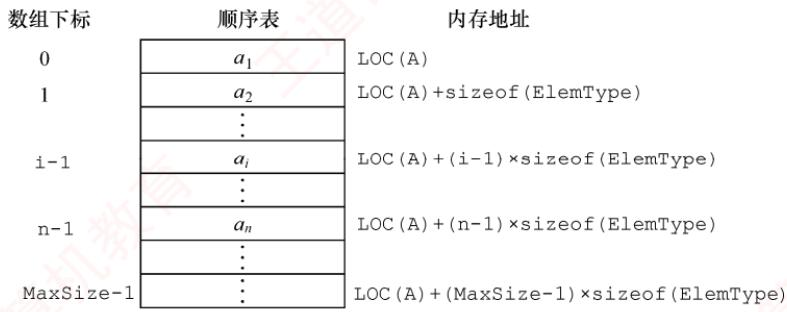  
图2.1 线性表的顺序存储结构

由于任意数据元素的存储地址与顺序表起始地址之间的偏移量与其位序呈线性关系，因此可在0(1)时间内直接访问表中任意位置的元素，这种特性使得线性表的顺序存储结构属于随机存取。在高级程序设计语言中，通常使用数组来实现顺序表。

注意  
线性表中元素的位序从1开始，而数组中元素的下标从0开始，注意二者之间的转换。

假定线性表的元素类型为ElemType，则静态分配的顺序表存储结构描述为  
#define MaxSize 50 //定义线性表的最大长度  
typedef struct{  
ElemType data[MaxSize]; //顺序表的元素

int length;   
}SqList;

//顺序表的当前长度  
//顺序表的类型定义

一维数组既可以静态分配，也可以动态分配。静态分配时，数组的大小和存储空间在编译时已经固定，一旦空间占满，再插入新元素将导致溢出，进而可能引发程序异常。

动态分配时，存储数组的空间是在程序执行过程中通过动态存储分配语句申请的。当空间占满时，可以另行开辟一块更大的存储空间，将原表中的所有元素复制到新空间中，从而实现存储容量的扩充，而无须在初始化时为线性表一次性划分全部可能用到的空间。

动态分配的顺序表存储结构描述为

```c
#define InitSize 100
typedef struct{
ElemType *data;
int MaxSize,length;
}SeqList;
```

//表长度的初始定义  
//指示动态分配数组的指针  
//数组的最大容量和当前个数  
//动态分配数组顺序表的类型定义

```javascript
L.data=(ElemType*)malloc(sizeof(ElemType)*InitSize);
C++的初始动态分配语句为
L.data=new ElemType[InitSize];
```

## 注意

动态分配并不是链式存储，它同样属于顺序存储结构。其物理结构没有变化，依然支持随机存取，只是存储空间的大小可以在运行时动态调整。

顺序表的主要优点：①可进行随机访问，即通过首地址和元素序号可在O(1)时间内找到指定的元素；②存储密度高，每个结点仅存储数据元素，无额外指针开销。顺序表的缺点也很明显：①插入和删除操作效率较低，需要移动大量元素；②要求分配连续的存储空间，不够灵活。

## 2.2.2 顺序表上基本操作的实现

## 考点追踪顺序表上操作的时间复杂度分析（2023）

本节仅讨论顺序表的初始化、插入、删除和按值查找，其他基本操作的实现都较为简单。

## 注意

在各种操作的实现中（包括严蔚敏老师的教材），通常可以忽略边界条件判断、变量定义、内存分配失败等实现细节，即不要求代码具有实际可执行性，而应重点体现算法的核心思想与逻辑步骤。

## 1. 顺序表的初始化

静态分配和动态分配的顺序表在初始化时有所不同。静态分配：在声明顺序表时，数组空间已由编译器分配，因此初始化只需将当前长度置为0。

//SqList L; //声明一个顺序表  
void InitList(SqList &L) {  
L.length=0; //顺序表初始长度为0  
}

动态分配：需在运行时为顺序表分配初始大小的数组空间，并设置长度和容量。

void InitList(SeqList &L){  
L.data=(ElemType \*)malloc(InitSize\*sizeof(ElemType));//分配存储空间

```javascript
L.length=0;
L.MaxSize=InitSize;
```

其中，MaxSize表示当前分配的存储空间上限。当插入元素导致空间不足时，需要扩容。

## 2. 插入操作

在顺序表L的第i（1≤i≤L.length+1）个位置插入新元素e。若i超出合法范围，或存储空间已满，则插入失败，返回fa1se；否则，将第i个元素及其后的所有元素依次后移一位，腾出一个空位置插入e，表长加1，返回true。

```javascript
bool ListInsert(SqList &L,int i,ElemType e){
if(i<1|li>L.length+1) //判断i的范围是否有效
return false;
if(L.length>=MaxSize) //当前存储空间已满
return false;
for(int j=L.length;j>=i;j--) //将第i 个元素及之后的元素后移
L.data[j]=L.data[j-1];
L.data[i-1]=e; //在位置i插入e（注意下标转换）
L.length++; //表长加1
return true;
```

## 注意

区分位序（从1开始）与数组下标（从0开始）。为什么判断插入位置时使用1ength+1，而移动元素的for循环中使用length？因为合法插入位置包括第n+1位，但移动元素时最多从第n位开始后移。

最好情况：在表尾插入 $(i = n + 1)$ ，无须移动元素，时间复杂度为O(1)。

最坏情况：在表头插入（i=1），需移动全部n个元素，时间复杂度为O(n)。

平均情况：设在第i个位置插入的概率为 $p _ { i } = 1 / ( n + 1 )$ ，则平均移动次数为

$$
\sum_{i = 1}^{n + 1}p_{i}(n - i + 1) = \sum_{i = 1}^{n + 1}\frac{1}{n + 1}(n - i + 1) = \frac{1}{n + 1}\sum_{i = 1}^{n + 1}(n - i + 1) = \frac{1}{n + 1}\frac{n(n + 1)}{2} = \frac{n}{2}
$$

因此，插入操作的平均时间复杂度为O(n)。

## 3. 删除操作

删除顺序表L中第i（1≤i≤L.1ength）个位置的元素，并通过引用参数e返回其值。若i非法，返回false；否则，保存被删元素，将其后所有元素前移一位，表长减1，返回true。

```javascript
bool ListDelete(SqList &L,int i,ElemType &e){
if(i<1|li>L.length) //判断i的范围是否有效
return false;
e=L.data[i-1]; //将被删除的元素赋给
for(int j=i;j<L.length;j++) //将第i 个位置后的元素前移
L.data[j-1]=L.data[j];
L.length--; //表长减1
return true;
```

最好情况：删除表尾元素（i=n），无须移动元素，时间复杂度为O(1)。

最坏情况：删除表头元素（i=1），需移动其余n−1个元素，时间复杂度为O(n)。

平均情况：设删除第i个元素的概率为 $p_{i}=1/n$ ，则平均移动次数为

$$
\sum_{i = 1}^{n}p_{i}(n - i) = \sum_{i = 1}^{n}\frac{1}{n}(n - i) = \frac{1}{n}\sum_{i = 1}^{n}(n - i) = \frac{1}{n}\frac{n(n - 1)}{2} = \frac{n - 1}{2}
$$

因此，删除操作的平均时间复杂度为 $O ( n )$

可见，顺序表的插入和删除操作的时间开销主要耗费在移动元素上，而移动元素的个数取决于操作位置。图2.2显示了顺序表插入和删除操作前、后的状态，以及数据元素在存储空间中的位置和表长变化。图2.2(a)将第4～7个元素从后往前依次后移一位，为新元素腾出位置。图2.2(b)将第5～7个元素从前往后依次前移一位，填补删除后的空缺。

  
(a) 插入新元素示例

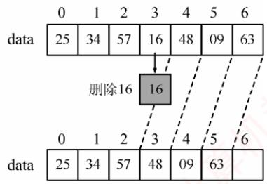  
(b) 删除表中元素示例  
图2.2 顺序表的插入和删除

## 4. 按值查找（顺序查找）

在顺序表L中查找第一个值等于e的元素，返回其位序；若未找到，则返回0。

```javascript
int LocateElem(SqList L,ElemType e){
int i; 育
for(i=0;i<L.length;i++)
if(L.data[i]==e)
return i+1; //下标为 i的元素值等于 e，返回其位序 i+1
return 0; //查找失败
```

最好情况：目标元素在表头（i=1），比较1次，时间复杂度为O(1)。

最坏情况：目标元素在表尾或不存在，需要比较n次，时间复杂度为O(n)。

平均情况：设目标元素在第i位的概率为 $p _ { i }   = 1 / n$ ，则平均比较次数为

$$
\sum_{i = 1}^{n}p_{i} \cdot i = \sum_{i = 1}^{n}\frac{1}{n} \cdot i = \frac{1}{n}\frac{n(n + 1)}{2} = \frac{n + 1}{2}
$$

因此，按值查找的平均时间复杂度为 $O ( n )$

顺序表的按序号查找非常简单，直接通过数组下标访问即可，时间复杂度为O(1)。

## 2.2.3 本节试题精选

## 一、单项选择题

01.下列叙述中，（）是顺序存储结构的优点。A. 存储密度大 B. 插入运算方便C. 删除运算方便 D. 方便地运用于各种逻辑结构的存储表示

02.下列关于顺序表的叙述中，正确的是（）。A. 顺序表可以利用一维数组表示，因此顺序表与一维数组在逻辑结构上是相同的B. 在顺序表中，逻辑上相邻的元素物理位置上不一定相邻C. 顺序表和一维数组一样，都可以进行随机存取D. 在顺序表中，每个元素的类型不必相同

03. 通常说顺序表具有随机存取的特性，指的是（）。

A. 查找值为x的元素的时间与顺序表中元素个数n无关B. 查找值为x的元素的时间与顺序表中元素个数n有关C. 查找序号为i的元素的时间与顺序表中元素个数n无关D. 查找序号为i的元素的时间与顺序表中元素个数n有关

04.一个顺序表所占用的存储空间大小与（）无关。A. 表的长度 B. 元素的存放顺序C. 元素的类型 D. 元素中各字段的类型

05. 若线性表最常用的操作是存取第i个元素及其前驱和后继元素的值，为了提高效率，应采用（）的存储方式。A. 单链表B. 双链表 C. 循环单链表D. 顺序表

06.一个线性表最常用的操作是存取任意一个指定序号的元素并在最后进行插入、删除操作，则利用（）存储方式可以节省时间。A. 顺序表 B. 双链表 道计算C.带头结点的循环双链表 D. 循环单链表

07.在n个元素的线性表的数组表示中，时间复杂度为O(1)的操作是（）。I. 访问第i（1≤i≤n）个结点和求第i(2≤i≤n）个结点的直接前驱Ⅱ. 在最后一个结点后插入一个新的结点Ⅲ. 删除第 1 个结点 教育IV. 在第i(1≤i≤n）个结点后插入一个结点A. I B. II、III C. I、ⅡI D. I、ⅡI、ⅢII

08. 设线性表有n个元素，严格说来，以下操作中，（）在顺序表上实现要比在链表上实现的效率高。I. 输出第i(1≤i≤n）个元素值I. 交换第3个元素与第4个元素的值I. 顺序输出这 n 个元素的值A. I B. I、III C. I、ⅡI D. II、III TA

09.在一个长度为n的顺序表中删除第i（1≤i≤n）个元素时，需向前移动（）个元素。A. n 妆 B. i-1 C. n−i D. n−i+ 1

10. 对于顺序表，访问第i个位置的元素和在第i个位置插入一个元素的时间复杂度为（）。A. O(n), O(n) B. O(n), O(1) C. O(1), O(n) D. O(1), O(1)

11. 对于顺序存储的线性表，其算法时间复杂度为O(1)的运算应该是（）。A.将n个元素从小到大排序 王道B. 删除第 $i ( 1 \leqslant i \leqslant n )$ 个元素C. 改变第 $i ( 1 \leqslant i \leqslant n )$ 个元素的值D. 在第i $( 1 \leqslant i \leqslant n )$ 个元素后插入一个新元素

12. 顺序表的插入算法中，当n个空间已满时，可再申请增加分配m个空间，若申请失败，则说明系统没有（）可分配的存储空间。A. m 个 B. m 个连续C. n + m 个 D. n + m 个连续

13.【2023统考真题】在下列对顺序存储的有序表（长度为n）实现给定操作的算法中，平均时间复杂度为O(1)的是（）。

A. 查找包含指定值元素的算法 B. 插入包含指定值元素的算法C. 删除第 $i ( 1 \leqslant i \leqslant n )$ 个元素的算法 D. 获取第 $i ( 1 \leqslant i \leqslant n )$ 个元素的算法

## 二、综合应用题

01. 从顺序表中删除具有最小值的元素（假设唯一）并由函数返回被删元素的值。空出的位置由最后一个元素填补，若顺序表为空，则显示出错信息并退出运行。

02. 设计一个高效算法，将顺序表L的所有元素逆置，要求算法的空间复杂度为 O(1)。

03. 对长度为n的顺序表L，编写一个时间复杂度为 $O ( n )$ 、空间复杂度为O(1)的算法，该算法删除顺序表中所有值为x的数据元素。

04. 从顺序表中删除其值在给定值s和t之间（包含s和t，要求 $s \leq t   )$ 的所有元素，若s或t不合理或顺序表为空，则显示出错信息并退出运行。 X

05. 从有序顺序表中删除所有其值重复的元素，使表中所有元素的值均不同。

06. 将两个有序顺序表合并为一个新的有序顺序表，并由函数返回结果顺序表。

07. 已知在一维数组 $A [ m + n ]$ 中依次存放两个线性表 $(a_{1}, a_{2}, a_{3}, \cdots, a_{m})$ 和 $(b_{1}, b_{2}, b_{3}, \cdots, b_{n})$ 。编写一个函数，将数组中两个顺序表的位置互换，即将 $(b_{1},b_{2},b_{3},\cdots,b_{n})$ 放在 $(a_{1}, a_{2}, a_{3}, \cdots, a_{m})$ 的前面。

08. 线性表 $(a_{1}, a_{2}, a_{3}, \cdots, a_{n})$ 中的元素递增有序且按顺序存储于计算机内。要求设计一个算法，完成用最少时间在表中查找数值为x的元素，若找到，则将其与后继元素位置相交换，若找不到，则将其插入表中并使表中元素仍然递增有序。

09. 给定三个序列A、B、C，长度均为n，且均为无重复元素的递增序列，请设计一个时间上尽可能高效的算法，逐行输出同时存在于这三个序列中的所有元素。例如，数组A为{1,2,3}，数组B为{2,3,4}，数组C为{-1,0,2}，则输出2。要求：1）给出算法的基本设计思想。2）根据设计思想，采用C或C++语言描述算法，关键之处给出注释。3）说明你的算法的时间复杂度和空间复杂度。

10.【2010统考真题】设将 $n (n > 1)$ 个整数存放到一维数组R中。设计一个在时间和空间两方面都尽可能高效的算法。将R中保存的序列循环左移 $p \left( 0 < p < n \right)$ 个位置，即将R中的数据由 $(X_{0},X_{1},\cdots,X_{n-1})$ 变换为 $( X _ { p } , X _ { p + 1 } , \cdots , X _ { n - 1 } , X _ { 0 } , X _ { 1 } , \cdots , X _ { p - 1 } )$ 。要求：1）给出算法的基本设计思想。3）说明你所设计算法的时间复杂度和空间复杂度。

11.【2011统考真题】一个长度为 $L ( L \geqslant 1 )$ 的升序序列S，处在第 $\left[ L / 2 \right]$ 个位置的数称为S的中位数。例如，若序列 $S_{1} = (11, 13, 15, 17, 19)$ ，则 $S _ { 1 }$ 的中位数是15，两个序列的中位数是含它们所有元素的升序序列的中位数。例如，若 $S_{2} = (2,4,6,8,20)$ ，则 $S _ { 1 }$ 和 $S _ { 2 }$ 的中位数是11。现在有两个等长升序序列A和B，试设计一个在时间和空间两方面都尽可能高效的算法，找出两个序列A和B的中位数。要求：1）给出算法的基本设计思想。2）根据设计思想，采用C或C++或Java语言描述算法，关键之处给出注释。

3）说明你所设计算法的时间复杂度和空间复杂度。

12.【2013统考真题】已知一个整数序列 $A = (a_{0}, a_{1}, \cdots, a_{n-1})$ ，其中 $0 \leqslant a_{i} < n \quad (0 \leqslant i < n)$ 若存在 $a_{p_{1}} = a_{p_{2}} = \cdots = a_{p_{m}} = x$ 且 $m>n/2 (0 \leqslant p_{k}<n,1 \leqslant k \leqslant m)$ ，则称x为A的主元素。例如 $A = ( 0 , 5 , 5 , 3 , 5 , 7 , 5 , 5 )$ ，则5为主元素；又如 $A = ( 0 , 5 , 5 , 3 , 5 , 1 , 5 , 7 )$ ，则A中没有主元素。假设A中的n个元素保存在一个一维数组中，请设计一个尽可能高效的算法，找出A的主元素。若存在主元素，则输出该元素；否则输出-1。要求：

1）给出算法的基本设计思想。

2）根据设计思想，采用C或C++或Java语言描述算法，关键之处给出注释。

3）说明你所设计算法的时间复杂度和空间复杂度。

13. 【2018统考真题】给定一个含 $n (n \geqslant 1)$ 个整数的数组，请设计一个在时间上尽可能高效的算法，找出数组中未出现的最小正整数。例如，数组{-5,3,2,3}中未出现的最小正整数是1；数组{1,2,3}中未出现的最小正整数是4。要求：

1）给出算法的基本设计思想。

2）根据设计思想，采用C或C++语言描述算法，关键之处给出注释。

3）说明你所设计算法的时间复杂度和空间复杂度。

14.【2020统考真题】定义三元组 $( a , b , c ) ( a , b , c$ 均为整数)的距离 $D = \left| a - b \right| + \left| b - c \right| + \left| c - a \right|$ 给定3个非空整数集合 $S _ { 1 }  、  S _ { 2 }$ 和 $S _ { 3 } ,$ ，按升序分别存储在3个数组中。请设计一个尽可能高效的算法，计算并输出所有可能的三元组 $(a,   b,   c) \quad (a \in S_1, \quad b \in S_2, \quad c \in S_3)$ 中的最小距离。例如 $S_{1} = \{-1, 0, 9\}, S_{2} = \{-25, -10, 10, 11\}, S_{3} = \{2, 9, 17, 30, 41\}$ ，则最小距离为2，相应的三元组为(9,10,9)。要求：

1）给出算法的基本设计思想。

2）根据设计思想，采用C语言或C++语言描述算法，关键之处给出注释。

3）说明你所设计算法的时间复杂度和空间复杂度。

15. 【2025统考真题】有两个长度均为n的一维整型数组A和res，对数组A中的每个元素A[i]，计算A[i]与 $\mathrm{A}[j](0 \leqslant i \leqslant j \leqslant n-1)$ 乘积的最大值，并将其保存到res[i]中。例如，当 $\mathrm { A } [   ] = \{   [ 1$ 4,-9, 6}时，得到 $ res [] = \{6,24,81,36\}$ 。现给定数组A，设计一个时间和空间上尽可能高效的算法calMulMax，求res中各元素的值。函数原型为 $\mathtt { v o i d \quad c a l M u l M a x \left( i n t \quad A \left[ \right] \right. }$ , intres[],int n)。要求如下：

1）给出算法的基本设计思想。

2）根据设计思想，采用C或C++语言描述算法，关键之处给出注释。

3）说明你所设计算法的时间复杂度和空间复杂度。

## 2.2.4 答案与解析

## 一、单项选择题

## 01. A

顺序表不像链表那样要在结点中存放指针域，因此存储密度大，选项A正确。选项B和C是链表的优点。选项D是错误的，比如对于树形结构，顺序表显然不如链表表示起来方便。

## 02. C

顺序表是顺序存储的线性表，表中所有元素的类型必须相同，且必须连续存放。一维数组中的元素可以不连续存放；此外，栈、队列和树等逻辑结构也可利用一维数组表示，但它与顺序表不属于相同的逻辑结构。在顺序表中，逻辑上相邻的元素物理位置上也相邻。

## 03. C

随机存取是指在O(1)的时间访问下标为i的元素，所需时间与顺序表中的元素个数n无关。

## 04. B

顺序表所占的存储空间=表长×sizeof（元素的类型），表长和元素的类型显然会影响存储空间的大小。若元素为结构体类型，则元素中各字段的类型也会影响存储空间的大小。

## 05. D

题干实际要求能最快存取第i-1、i和i+1个元素值。选项A、B、C都只能从头结点依次顺序查找，时间复杂度为O(n)；只有顺序表可以按序号随机存取，时间复杂度为O(1)。

## 06. A

只有顺序表可以按序号随机存取，且在最后进行插入和删除操作时不需要移动任何元素。

## 07. C

对说法I，解析略；对说法Ⅱ，在最后位置插入新结点不需要移动元素，时间复杂度为O(1);对说法Ⅲ，被删结点后的结点需要要依次前移，时间复杂度为O(n)；对说法IV，需要后移n-i个结点，时间复杂度为O(n)。 姚

## 08. C

对说法Ⅱ，顺序表只需3次交换操作；链表需要分别找到两个结点前驱，第4个结点断链后再插入到第2个结点后，效率较低。对说法Ⅲ，需要依次顺序访问每个元素，时间复杂度相同。

## 09. C

需要将元素 $a _ { i ^ { + } 1 } { \sim } a _ { n }$ 依次前移一位，共移动 n − (i + 1) + 1 = n − i 个元素。

## 10. C

在第i个位置插入一个元素，需要移动n−i +1个元素，时间复杂度为O(n)。

## 11. C

对n个元素进行排序的时间复杂度最小也要O(n)（初始有序时），通常为O(nlog2n)或 $O ( n ^ { 2 } )$ 通过第8章学习后会更容易理解。选项B和D显然错误。顺序表支持按序号的随机存取方式。

## 12. D

顺序存储需要连续的存储空间，在申请时需申请n+m个连续的存储空间，然后将线性表原来的n个元素复制到新申请的n+m个连续的存储空间的前n个单元。

## 13. D

对于顺序存储的有序表，查找指定值元素可以采用顺序查找法或折半查找法，平均时间复杂度最少为O(log2n)。插入指定值元素需要先找到插入位置，然后将该位置及之后的元素依次后移一个位置，最后将指定值元素插入到该位置，平均时间复杂度为O(n)。删除第i个元素需要将该元素之后的全部元素依次前移一个位置，平均时间复杂度为O(n)。获取第i个元素只需直接根据下标读取对应的数组元素即可，时间复杂度为O(1)。

## 二、综合应用题

## 01.【解答】

算法思想：搜索整个顺序表，查找最小值元素并记住其位置，搜索结束后用最后一个元素填补空出的原最小值元素的位置。 X

## 本题代码如下：

```javascript
bool Del Min(SqList &L,ElemType &value) {
//删除顺序表L中最小值元素结点，并通过引用型参数 value 返回其值
//若删除成功，则返回true；否则返回false
if(L.length==0)
return false; 算机教 //表空，中止操作返回
value=L.data[0];
int pos=0; //假定0号元素的值最小
for(int i=1;i<L.length;i++) //循环，寻找具有最小值的元素
if(L.data[i]<value) { //让 value 记忆当前具有最小值的元素
value=L.data[i];
```

pos=i;   
L.data[pos]=L.data[L.length-1];   
L.length--;   
return true;

## 注意

本题也可用函数返回值返回，两者的区别是：函数返回值只能返回一个值，而参数返回（引用传参）可以返回多个值。 V

## 02.【解答】

算法思想：扫描顺序表L的前半部分元素，对于元素L.data[i]（0<=i<L.1ength/2），将其与后半部分的对应元素L.data[L.length-i-1]进行交换。

本题代码如下：

```javascript
void Reverse(SqList &L) { ElemType temp; //辅助变量 道
for(int i=0;i<L.length/2;i++){
temp=L.data[i]; //交换L.data[i]与L.data[L.length-i-1]
L.data[i]=L.data[L.length-i-1];
L.data[L.length-i-1]=temp;
} 育
}
```

## 03.【解答】

解法1：用k记录顺序表L中不等于x的元素个数（需要保存的元素个数），扫描时将不等于x的元素移动到下标k的位置，并更新k值。扫描结束后修改L的长度。

本题代码如下：

```javascript
void del x 1(SqList &L,ElemType x){
//本算法实现删除顺序表L中所有值为×的数据元素
int k=0,i; //记录值不等于×的元素个数
for(i=0;i<L.length;i++)
if(L.data[i]!=x) {
L.data[k]=L.data[i];
k++; //不等于 x的元素增1
1
L.length=k; //顺序表L的长度等于k
```

解法2：用k记录顺序表L中等于x的元素个数，一边扫描L，一边统计k，并将不等于x的元素前移k个位置。扫描结束后修改L的长度。 美

本题代码如下：

```javascript
void del x 2(SqList &L,ElemType x){
int k=0,i=0; //k 记录值等于 x的元素个数
while(i<L.length) {
if(L.data[i]==x)
k++;
else
L.data[i-k]=L.data[i]；//当前元素前移k个位置
i++;
}
L.length=L.length-k; //顺序表L的长度递减
}
```

此外，本题还可以考虑设头、尾两个指针（i=1,j=n），从两端向中间移动，在遇到最左端

```javascript
bool Delete Same(SeqList& L) {
if(L.length==0)
return false;
int i,j; //i 存储第一个不相同的元素，j 为工作指针
for(i=0,j=1;j<L.length;j++)
if(L.data[i]!=L.data[j]) //查找下一个与上一个元素值不同的元素
王道 L.data[++i]=L.data[j]; //找到后，将元素前移
L.length=i+1;
return true;
1
```

值x的元素时，直接将最右端值非x的元素左移至值为x的数据元素位置，直到两指针相遇。但这种方法会改变原表中元素的相对位置。 临村

## 04.【解答】

算法思想：从前向后扫描顺序表L，用k记录值在s和t之间的元素个数（初始时k=0）。对于当前扫描的元素，若其值不在s和t之间，则前移k个位置；否则执行k++。每个不在s和t之间的元素仅移动一次，因此算法效率高。

本题代码如下：

```javascript
bool Del s t(SqList &L,ElemType s,ElemType t){
//删除顺序表L中值在给定值s 和 t（要求s<t）之间的所有元素
int i,k=0;
if(L.length==0|Is>=t)
return false; //线性表为空或s、t 不合法，返回
for(i=0;i<L.length;i++) {
if(L.data[i]>=s&&L.data[i]<=t)
k++;
else
L.data[i-k]=L.data[i]； ∥当前元素前移k个位置
} ∥for
L.length-=k; //长度减小
return true;
```

## 注意

本题也可从后向前扫描顺序表，每遇到一个值在s和t之间的元素，就删除该元素，其后的所有元素全部前移。但移动次数远大于前者，效率不够高。

## 05. 【解答】

算法思想：注意是有序顺序表，值相同的元素一定在连续的位置上，用类似于直接插入排序的思想，初始时将第一个元素视为非重复的有序表。之后依次判断后面的元素是否与前面非重复有序表的最后一个元素相同，若相同，则继续向后判断，若不同，则插入前面的非重复有序表的最后，直至判断到表尾为止。 YTA

本题代码如下：

对于本题的算法，请读者用序列1,2,2,2,2,3,3,3,4,4,5来手动模拟算法的执行过程，在模 拟过程中要标注i和j所指示的元素。 uK

思考：若将本题中的有序表改为无序表，你能想到时间复杂度为O(n)的方法吗？

(提示：使用散列表。）

## 06.【解答】

算法思想：首先，按顺序不断取下两个顺序表表头较小的结点存入新的顺序表中。然后，看哪个表还有剩余，将剩下的部分加到新的顺序表后面。

本题代码如下：

```javascript
bool Merge(SeqList A,SeqList B,SeqList &C) {
//将有序顺序表A与B合并为一个新的有序顺序表C
if(A.length+B.length>C.maxSize) //大于顺序表的最大长度
return false;
int i=0,j=0,k=0;
while(i<A.length&&j<B.length) { //循环，两两比较，小者存入结果表
if(A.data[i]<=B.data[j])
C.data[k++]=A.data[i++];
else
C.data[k++]=B.data[j++];
1
while(i<A.length) //还剩一个没有比较完的顺序表
C.data[k++]=A.data[i++];
while(j<B.length)
C.data[k++]=B.data[j++]; 道计算机
C.length=k;
return true;
```

## 注意

本算法的方法非常典型，需要牢固掌握。

## 07.【解答】

算法思想：首先将数组 A[m + n]中的全部元素 $(a_{1}, a_{2}, a_{3}, \cdots, a_{m}, b_{1}, b_{2}, b_{3}, \cdots, b_{n})$ 原地逆置为 $( b _ { n } , b _ { n - 1 } , b _ { n - 2 } , \cdots , b _ { 1 } , a _ { m } , a _ { m - 1 } , a _ { m - 2 } , \cdots , a _ { 1 } )$ ，然后对前n个元素和后m个元素分别使用逆置算法，即可得到 $(b_{1},b_{2},b_{3},\cdots,b_{n},a_{1},a_{2},a_{3},\cdots,a_{m})$ ，从而实现顺序表的位置互换。

本题代码如下：

```c
typedef int DataType;
void Reverse(DataType A[],int left,int right,int arraySize){
//逆转(aleft,aleft+1,aleft+2,,aright)为(aright,aright-1,…,aleft)
if(left>=right|lright>=arraySize)
return;
int mid=(left+right)/2;
for(int i=0;i<=mid-left;i++) {
DataType temp=A[left+i];
A[left+i]=A[right-i]; 算机教育
A[right-i]=temp;
void Exchange(DataType A[],int m,int n,int arraySize){
/*数组 A[m+n]中，从0到 m-1 存放顺序表(a1,a2，a3，…,am)，从 m到 m+n-1 存放顺序表
(b1,b2,b3，…,bn)，算法将这两个表的位置互换*/
Reverse(A,0,m+n-1,arraySize);
Reverse(A,0,n-1,arraySize);
Reverse(A,n,m+n-1,arraySize);
```

## 08.【解答】

算法思想：顺序存储的线性表递增有序，可以顺序查找，也可以折半查找。题目要求“用最少的时间在表中查找数值为x的元素”，这里应使用折半查找法。

本题代码如下：

void SearchExchangeInsert(ElemType A[],ElemType x) {   
int low=0,high=n-1,mid; //1ow 和 high 指向顺序表下界和上界的下标   
while(low<=high) {

```javascript
mid=(low+high)/2; //找中间位置
if(A[mid]==x) break; //找到 x，退出 while 循环
else if(A[mid]<x) low=mid+1;//到中点mid的右半部去查
else high=mid-1; //到中点 mid的左半部去查
∥/下面两个 if 语句只会执行一个
if(A[mid]==x&&mid!=n-1){ //若最后一个元素与×相等，则不存在与其后
继交换的操作
t=A[mid]; A[mid]=A[mid+1]; A[mid+1]=t;
1
if (low>high) { //查找失败，插入数据元素x
for(i=n-1;i>high;i--) A[i+1]=A[i]; ∥后移元素
A[i+1]=x; //插入x //结束插入 机教育
1
```

本题的算法也可写成三个函数：查找函数、交换后继函数与插入函数。写成三个函数的优点是逻辑清晰且易读。

## 09.【解析】

## 1）算法的基本设计思想。

使用三个下标变量从小到大遍历数组。当三个下标变量指向的元素相等时，输出并向前推进指针，否则仅移动小于最大元素的下标变量，直到某个下标变量移出数组范围，即可停止。

## 2）算法的实现。

void samekey(int A[],int B[],int C[],int n){  
int i=0,j=0,k=0; //定义三个工作指针  
while(i<n&&j<n&&k<n){ //相同则输出，并集体后移  
if(A[i]==B[j]&&B[j]==C[k]){  
printf("%d\n",A[i]);  
i++;j++;k++;  
}else {  
int maxNum=max(A[i],max(B[j],C[k]));  
if (A[i]<maxNum) i++;  
if(B[j]<maxNum)j++;  
if(C[k]<maxNum) k++;  
1  
1 育

3）每个指针移动的次数不超过n，且每次循环至少有一个指针后移，故时间复杂度为O(n)，算法只用到了常数个变量，空间复杂度为O(1)。 KKN

## 10. 【解答】

## 1）算法的基本设计思想：

可将问题视为把数组 ab 转换成数组 ba（a代表数组的前p 个元素，b 代表数组中余下的 n−p个元素），先将a逆置得到 $a ^ { - 1 } b ,$ ，再将b逆置得到 $a ^ { - 1 } b ^ { - 1 }$ ，最后将整个 $a ^ { - 1 } b ^ { - 1 }$ 逆置得到 $( \boldsymbol { a } ^ { - 1 } \boldsymbol { b } ^ { - 1 } ) ^ { - 1 }   =   b \boldsymbol { a }$ 。设Reverse函数执行将数组逆置的操作，对 abcdefgh向左循环移动 $3 ( p = 3 )$ 个位置的过程如下：

Reverse(0,p-1)得到 cbadefgh;  
Reverse (p,n-1) 得到 cbahgfed;  
Reverse(0,n-1)得到 defghabc。

注：在Reverse中，两个参数分别表示数组中待转换元素的始末位置。

## 2）使用C语言描述算法如下：

void Reverse(int R[],int from,int to) {   
int i,temp;

```c
for(i=0;i<(to-from+1)/2;i++)
{temp=R[from+i];R[from+i]=R[to-i];R[to-i]=temp;}
1
void Converse(int R[],int n,int p){
Reverse(R,0,p-1);
Reverse(R,p,n-1); Reverse(R,0,n-1) ; 道
}
```

3）上述算法中三个 Reverse函数的时间复杂度分别为 O(p/2)、O((n-p)/2)和 O(n/2)，故所设计的算法的时间复杂度为O(n)，空间复杂度为O(1)。

【另解】借助辅助数组来实现。算法思想：创建大小为p的辅助数组S，将R中前p个整数依次暂存在S 中，同时将R中后n-p个整数左移，然后将S 中暂存的p个数依次放回到R中的后续单元。时间复杂度为O(n)，空间复杂度为O(p)。 机

## 11. 【解答】

1）算法的基本设计思想如下。

分别求两个升序序列A、B的中位数，设为a和b，求序列A、B的中位数过程如下：

①若a= b，则a或b为所求中位数，算法结束。

②若a< b，则舍弃序列A中较小的一半，同时舍弃序列B中较大的一半，要求两次舍弃的长度相等。

③若a>b，则舍弃序列A中较大的一半，同时舍弃序列B中较小的一半，要求两次舍弃的长度相等。 K

在保留的两个升序序列中，重复过程①、②、③，直到两个序列中均只含一个元素时为止，较小者为所求的中位数。 临K

2）本题代码如下：

```javascript
int M Search(int A[],int B[],int n){
int s1,d1,m1,s2,d2,m2;
s1=0;d1=n-1;
s2=0;d2=n-1;
while(s1!=d1||s2!=d2){
m1=(s1+d1)/2;
m2=(s2+d2)/2;
if(A[m1]==B[m2])
return A[m1]; //满足条件①
if (A[m1]<B[m2]) { //满足条件②
if((s1+d1)%2==0){ //若元素个数为奇数
s1=m1; //舍弃A中间点以前的部分，且保留中间点
王道计算机 d2=m2; //舍弃B中间点以后的部分，且保留中间点
else{ //元素个数为偶数 王道
s1=m1+1; //舍弃 A的前半部分
d2=m2; //舍弃B的后半部分
1
else { //满足条件③
if((s1+d1)%2==0){ //若元素个数为奇数
d1=m1; //舍弃A中间点以后的部分，且保留中间点
s2=m2; //舍弃B中间点以前的部分，且保留中间点
1
else{ //元素个数为偶数
d1=m1; //舍弃 A 的后半部分
s2=m2+1; //舍弃B 的前半部分
```

}   
}   
return A[s1]<B[s2]? A[s1]:B[s2];

3）算法的时间复杂度为O(log2n)，空间复杂度为O(1)。

【另解】对两个长度为n的升序序列A和B中的元素按从小到大的顺序依次访问，这里访问的含义只是比较序列中两个元素的大小，并不实现两个序列的合并，因此空间复杂度为O(1)。按照上述规则访问第n个元素时，这个元素为两个序列A和B的中位数。

## 12. 【解答】

1）算法的基本设计思想：算法的策略是从前向后扫描数组元素，标记出一个可能成为主元素的元素Num。然后重新计数，确认Num是否是主元素。

算法可分为以下两步：

①选取候选的主元素。依次扫描所给数组中的每个整数，将第一个遇到的整数Num保存到c中，记录Num的出现次数为1；若遇到的下一个整数仍等于Num，则计数加1，否则计X 数减1；当计数减到0时，将遇到的下一个整数保存到c中，计数重新记为1，开始新一轮计数，即从当前位置开始重复上述过程，直到扫描完全部数组元素。

②判断c中元素是否是真正的主元素。再次扫描该数组，统计c中元素出现的次数，若大于n/2，则为主元素；否则，序列中不存在主元素。

2）算法实现如下：

int Majority(int A[],int n) {  
int i,c,count=1; //c 用来保存候选主元素，count 用来计数  
c=A[0]; //设置A[0]为候选主元素  
for(i=1;i<n;i++) //查找候选主元素  
if(A[i]==c) count++; 王道计 //对A 中的候选主元素计数  
else  
if(count>0) //处理不是候选主元素的情况  
count--;  
else{ //更换候选主元素，重新计数  
c=A[i];  
count=1;  
if (count>0) 卓机教  
for(i=count=0;i<n;i++) //统计候选主元素的实际出现次数  
if(A[i]==c)  
count++;  
if(count>n/2) return c; //确认候选主元素 王道计  
else return -1; //不存在主元素

3）实现的程序的时间复杂度为O(n)，空间复杂度为O(1)。

## 说明

本题若采用先排好序再统计的方法[时间复杂度为O(nlog2n)]，则只要解答正确，最高就可拿11分。即便是写出O(n²)的算法，最高也能拿10分，因此，对于统考算法题，花费大量时间去思考最优解法是得不偿失的。本算法的方法非常典型，需要牢固掌握。

## 13. 【解答】

1）算法的基本设计思想：

要求在时间上尽可能高效，因此采用空间换时间的办法。分配一个用于标记的数组B[n]，用来记录A中是否出现了1～n中的正整数，B01对应正整数1，B「n-11对应正整数n，初始化B中全部为0。A中含有n个整数，因此可能返回的值是 $1 \sim n + 1$ ，当A中n个数恰好为1\~n时返回n+1。当数组A中出现了小于或等于0或大于n的值时，会导致1～n中出现空余位置，返回结果必然在 $1   \sim   \mathtt { n }$ 中，因此对于A中出现了小于或等于0或大于n的值，可以不采取任何操作。

经过以上分析可以得出算法流程：从A「01开始遍历A，若 $0 < \mathbb{A} \left[ \downarrow \right] < = \mathbb{n}$ ，则令B $\left[ \mathbb { A } \left[ \downarrow \right] - \mathbb { 1 } \right] = \mathbb { 1 }$ .否则不做操作。对A遍历结束后，开始遍历数组B，若能查找到第一个满足B「i1==0的下标i，返回i+1即为结果，此时说明A中未出现的最小正整数在1和n之间。若B[i]全部不为0，返回i+1（跳出循环时i=n，i+1等于n+1），此时说明A中未出现的最小正整数是n+1。 K

2）算法实现：

```c
int findMissMin(int A[],int n)
int i,*B; //标记数组 道计算机
B=(int *)malloc(sizeof(int)*n);//分配空间
memset(B,0,sizeof(int) *n); //赋初值为0
for(i=0;i<n;i++)
if(A[i]>0&&A[i]<=n) //若A[i]的值介于 1~n，则标记数组B
B[A[i]-1]=1;
for(i=0;i<n;i++) //扫描数组B，找到目标值
if (B[i]==0) break;
return i+1; //返回结果
```

3）时间复杂度：遍历A一次，遍历B一次，两次循环内操作步骤为O(1)量级，因此时间复杂度为O(n)。空间复杂度：额外分配了B[n]，空间复杂度为O(n)。

## 14.【解答】

分析。由 $D = | a - b | + | b - c | + | c - a | \geqslant 0$ ，有如下结论。

①当 $a = b = c$ 时，距离最小。

②其余情况。不失一般性，假设 $a \leqslant b \leqslant c$ ，观察下面的数轴：

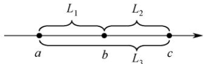

$$
L_{1}=|a-b|,\quad L_{2}=|b-c|,\quad L_{3}=|c-a|
$$

由D的表达式可知，事实上决定D大小的关键是a和c之间的距离，于是问题就可以简化为每次固定c找一个a，使得 $L _ { 3 } = | c - a |$ |最小。

1）算法的基本设计思想：

①使用 $D _ { \mathrm { m i n } }$ 记录所有已处理的三元组的最小距离，初值为一个足够大的整数。

②集合 $S _ { 1 }  、  S _ { 2 }$ 和 $S _ { 3 }$ 分别保存在数组A、B、C中。数组的下标变量 $i = j = k = 0$ ，当 $i \leq | S _ { 1 } |$ $j \leq | S _ { 2 } |$ 且 $k   \le | S _ { 3 } |$ 时（S|表示集合S中的元素个数），循环执行下面的步骤 $\mathrm { a )   \sim   c ) }$

a）计算(A[i], B[j], C[k])的距离 D；（计算 D)

b）若 $D   \le   D _ { \operatorname* { m i n } }$ ，则 $D _ { \mathrm { m i n } }   =   D   ;$ (更新D)

c）将A[i]、B[j、C[k]中的最小值的下标+1；（对照分析：最小值为a，最大值为c，这里c不变而更新a，试图寻找更小的距离D)

③输出 $D _ { \mathrm { m i n } }$ ，结束。

2）算法实现：

```c
#define INT MAX 0x7fffffff
int abs (int a){//计算绝对值 if(a<0) return -a; 直计算机
else return a;
}
bool xls min(int a,int b,int c){//a 是否是三个数中的最小值
if(a<=b&&a<=c) return true;
return false;
int findMinofTrip(int A[],int n,int B[],int m,int C[],int p){
//D min 用于记录三元组的最小距离，初值赋为 INT MAX
int i=0,j=0,k=0,D min=INT MAX,D;
while(i<n&&j<m&&k<p&&D min>0) {
D=abs (A[i]-B[j])+abs (B[j]-C[k])+abs (C[k]-A[i]);∥计算D
if(D<D_min) D_min=D; //更新 D
if(xls min(A[i],B[j],C[k])) i++; ∥更新a
else if(xls_min(B[j],C[k],A[i])) j++; 王道计集
else k++;
return D min;
```

3）设 n = (|S1| + |S₂| + |S3|)，时间复杂度为 O(n)，空间复杂度为 O(1)。

## 15.【解答】

1）算法的基本设计思想：

从后向前扫描一趟数组A，对每个 $\mathrm{A}[i](0 \leqslant i \leqslant n-1)$ ，分别找到从A[n-1]到A[i]中的最大值Max和最小值Min，然后分以下情况进行处理：①若 $\mathrm { A } [ i ] { \geqslant } 0$ ，则 A[i]与 Max 相乘；②若 A[i] < 0,则 A[i]与 Min 相乘。相乘的结果保存在 res[i]中。

2）算法实现：

```c
void calMulMax(int A[], int res[], int n)
int i, Max, Min;
Max=Min=A[n-1]
for(i=n-1；i>=0;i--)//从后向前扫描一趟数组 A
{
if(A[i]>Max) Max=A[i];
else if(A[i]<Min) Min = A[i];
if(A[i]>=0) res[i] = A[i]*Max; //根据 A[i]的正负性分别处理
else res[i]=A[i]*Min;
```

3）算法的时间复杂度为O(n)，空间复杂度为O(1)。

## 2.3 线性表的链式表示

顺序表支持随机存取任意元素，但插入和删除操作需要移动大量元素，效率较低。相比之下，链式存储的线性表不要求地址连续的存储单元，即逻辑上相邻的元素在物理位置上是可以不相邻的；它通过指针建立元素之间的逻辑关系，因此插入或删除操作无须移动元素，而只需修改相关指针，效率较高。然而，这样做的代价是失去了顺序表的随机存取能力，只能从头开始顺序访问。

## 2.3.1 单链表的定义

考点追踪单链表的应用（2009、2012、2013、2015、2016、2019）

线性表的链式存储也称单链表。它通过一组任意的存储单元（不要求地址连续）来存储线性表中的数据元素。为了建立数据元素之间的线性关系，每个链表结点除了存放元素自身的信息外，还需额外设置一个指向其后继结点的指针。单链表的结点结构如图2.3所示，其中data为数据域，用于存放数据元素；next为指针域，用于存放其后继结点的地址。

  
图2.3 单链表的结点结构

单链表结点类型的定义如下：  
```c
typedef struct LNode{ //定义单链表结点类型
ElemType data; //数据域
struct LNode *next; //指针域
}LNode, *LinkList;
```

单链表避免了顺序表对连续内存空间的依赖，但每个结点需要额外存储一个指针，带来了一定的存储开销。同时，由于其元素离散地分布在内存中，单链表是一种非随机存取的存储结构，即无法直接定位到表中的某个特定结点，查找时要从表头开始依次遍历。

通常使用头指针（或head等）来标识一个单链表，该指针指向链表的起始位置。当头指针为NULL时，表示链表为空。此外，为了简化操作，在单链表的第一个数据结点之前常附加一个特殊的结点，称为头结点。头结点的数据域一般不存放有效数据（但可用于记录表长等信息）。在带头结点的单链表中，头指针工指向头结点，而头结点的next指向第一个数据结点，如图2.4(a)所示。在不带头结点的单链表中，头指针L直接指向第一个数据结点，如图2.4(b)所示。无论哪种形式，表尾结点的指针域为NULL（图中用“^”表示）。

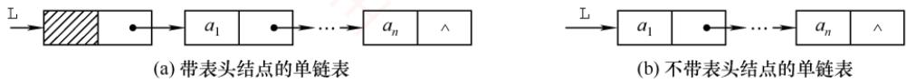  
图2.4 带头结点和不带头结点的单链表

头指针与头结点的关系：头指针始终指向链表的第一个结点（无论带不带头结点），而头结点仅存在于带头结点的链表中，它是链表的第一个结点，其数据域通常不存储实际数据。

引入头结点后，可带来以下两个主要优点：

①操作统一性：第一个数据结点的位置存储在头结点的指针域中，因此在链表首部进行插入、删除等操作时，与其他位置的操作逻辑一致，无须特殊处理。

②空表与非空表处理统一：无论链表是否为空，头指针始终是一个非空指针（指向头结点），而空表仅表现为头结点的next为NULL，从而避免了对空表的单独判断。

## 2.3.2 单链表上基本操作的实现

带头结点单链表在操作实现上更为简便。如无特殊说明，本节算法均默认链表带头结点。

## 1. 单链表的初始化

带头结点与不带头结点的单链表在初始化时有所不同。带头结点的单链表初始化时，需创建一个头结点，并令头指针L指向该头结点，其next指针初始化为NULL。

```c
L=(LNode*)malloc(sizeof(LNode)); //创建头结点①
L->next=NULL; //头结点之后暂无数据结点
return true;
1
```

不带头结点的单链表初始化时，只需将头指针工初始化为NULL。

bool InitList(LinkList &L){   
L=NULL;   
return true;

## 注意

设p为指向链表结点的结构体指针，则\*p表示该结点本身。可通过p->data或(\*p).data访问其数据域，二者完全等价。成员运算符（.）左侧应为结构体变量，指向运算符（->）左侧应为结构体指针。例如，p->next->data等价于(\*(\*p).next).data，表示当前结点后继结点的数据。

## 2. 求表长操作

求表长是指统计单链表中数据结点的个数（不包括头结点）。从第一个数据结点开始依次遍历，为此需要设置一个计数变量，每访问一个结点，其值加1，直到遇到NULL。

```c
int Length(LinkList L) {
int len=0;
LNode *p=L;
while(p->next!=NULL) {
p=p->next;
len++;
return len;
```

求表长操作的时间复杂度为O(n)。

另外，需要注意的是，由于表长不包含头结点，带头结点与不带头结点的实现细节略有不同。

## 3. 按序号查找结点

从单链表的第一个数据结点开始，沿next指针逐个查找，返回第i个结点的指针；若i超出表长，则返回NULL。

```c
LNode *GetElem(LinkList L,int i) {
LNode *p=L; //指针 p指向当前扫描结点
int j=0; //j 记录当前位序，头结点为第0 个结点
while(p!=NULL&&j<i) { //循环找到第i 个结点
p=p->next;
j++;
1
return p; //返回第 i 个结点的指针或 NULL
```

按序号查找操作的时间复杂度为O(n)。

## 4. 按值查找表结点

从单链表的第一个数据结点开始，依次比较各结点的数据域，若等于给定值e，则返回该结点指针；否则返回NULL。

LNode \*LocateElem(LinkList L,ElemType e) {  
LNode \*p=L->next;  
while(p!=NULL&&p->data!=e)∥//从第一个结点开始查找数据域为e的结点

p=p->next;   
return p;

//找到后返回该结点指针，否则返回 NULL

按值查找操作的时间复杂度为O(n)。

## 5. 插入结点操作

考点追踪单链表插入操作的过程（2016、2024）

将值为e的新结点插入到第i个位置（成为新的第i个数据结点）。先检查i的合法性，然后找到第i-1个结点（前驱），再在其后插入新结点。假设找到的第i-1个结点为\*p，然后令新结点\*s的next指向\*p的后继，再令\*p的next指向\*s，如图2.5所示。

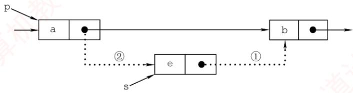  
图2.5 单链表的插入操作

```c
bool ListInsert(LinkList &L,int i,ElemType e){
LNode *p=L; //p 指向当前扫描结点
int j=0; //j 记录当前位序，头结点为第0个结点
while(p!=NULL&&j<i-1) { //循环找到第 i-1 个结点
p=p->next;
j++;
}
if(p==NULL) //i 值不合法
return false;
LNode *s=(LNode*)malloc(sizeof(LNode));
s->data=e;
s->next=p->next; 王 //图 2.5 中操作步骤①
p->next=s; //图 2.5 中操作步骤②
return true;
```

步骤①和②的顺序不可颠倒。若先执行p->next=s，则原后继地址丢失，导致s->next=p->next实际变为s->next=s，形成自环。该操作的时间复杂度为O(n)，主要开销在于查找前驱结点。若已知某结点指针，则在其后插入新结点的时间复杂度为O(1)。注意，当插入位置i=1时，不带头结点的单链表需要更新头指针工指向新首结点，而带头结点的则无须特殊处理。

扩展：对某个结点进行前插操作。

前插操作是指在某结点前插入一个新结点，与后插操作相反。任何前插操作均可转化为后插操作：只需从头结点开始顺序查找其前驱，时间复杂度为O(n)。若对给定结点进行前插，则还可采用另一种技巧（适用于数据可复制的情况）：将新结点\*s插入目标结点\*p之后，再交换\*p与\*s的数据域。这种技巧逻辑上等效于前插，且时间复杂度为O(1)。主要代码片段如下：

s->next=p->next; //修改指针域，不能颠倒  
p->next=s;  
temp=p->data; //交换数据域部分  
p->data=s->data;  
s->data=temp;

## 6. 删除结点操作

删除单链表的第i个数据结点。先检查i的合法性，然后找到第i-1个结点（前驱），再删

除其后继结点，并释放内存。假设找到的第i-1个结点为\*p，其后继为被删结点 $^ { \star } \mathrm { q }$ ，先将 $^ { \star } \mathrm { p }$ 的next 指向 $^ { \star } \mathrm { { q } }$ 的后继结点，然后释放\*q的存储空间，如图2.6所示。

  
图2.6 单链表结点的删除

```c
bool ListDelete(LinkList &L,int i,ElemType &e){ 育
LNode *p=L; //指针p指向当前扫描到的结点
int j=0; //记录当前结点的位序，头结点是第0个结点
while(p->next!=NULL&&j<i-1) {//循环找到第i-1 个结点
p=p->next;
1 j++; E道计算机
if(p->next==NULL|lj>i-1) //i 值不合法
王道 return false;
LNode *q=p->next; //令 q 指向被删除结点
e=q->data; //用 e 返回元素的值
p->next=q->next; //将*g结点从链中“断开”
free(q) ; //释放结点的存储空间①
return true;
2-
```

类似于插入操作，该操作的主要耗时也在查找操作上，时间复杂度为 $O ( n )$

当链表不带头结点时，需判断被删结点是否为首结点，若是，则要做特殊处理，将头指针指向新的首结点。当链表带头结点时，删除首结点和删除其他结点的操作是相同的。

扩展：删除给定结点 $^ { \star } \mathrm { p }$ o

常规方法需要从头遍历找到 $^ { \star } \mathrm { p }$ 的前驱，时间复杂度为O(n)。若允许修改结点内容，则可采用一种O(1)的技巧：将 $^ \star \mathrm { p }$ 的后继结点的数据复制到\*p中，然后删除其后继结点。该方法的局限性在于不能用于删除尾结点（因其无后继）。主要代码片段如下：

LNode \*q=p->next; //令 g 指向\*p 的后继结点  
p->data=p->next->data; //用后继结点的数据域覆盖  
p->next=q->next; //将\*g 结点从链中“断开  
free (q) ; //释放后继结点的存储空间

## 7. 采用头插法建立单链表

该方法从一个空表开始，生成新结点\*s，并将读取的数据存入其数据域。然后，令s->next指向头结点当前next所指的结点，再将头结点的next指向\*s，如图2.7所示。重复此过程，新结点始终成为第一个数据结点，最终链表中的元素顺序与输入顺序相反。

  
图2.7 采用头插法建立单链表

```c
LinkList List HeadInsert(LinkList &L){ //逆向建立单链表
LNode *s; int x; //设元素类型为整型
L=(LNode*)malloc(sizeof(LNode)); //创建头结点
L->next=NULL; //初始为空链表
scanf ("%d",&x); //输入结点的值
while(x!=9999) { //输入9999表示结束
s=(LNode*)malloc(sizeof(LNode));∥/创建新结点
s->data=x;
s->next=L->next;
L->next=s; //将新结点插入表中，L为头指针
scanf ("%d",&x) ;
}
return L;
```

每插入一个结点的时间复杂度为O(1)，总时间复杂度为O(n)。

## 思考

若单链表不带头结点，则上述代码中哪些地方需要修改？

## 8. 采用尾插法建立单链表

若希望输入顺序与链表中的元素顺序一致，则可采用尾插法。该方法将新结点插入当前链表的表尾。为此，需要维护一个尾指针r，并且始终指向当前的尾结点；插入时，令r->next指向新结点\*s，再将r更新为s，使其继续指向新的尾结点，如图2.8所示。

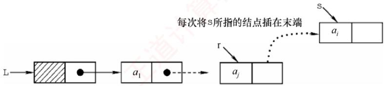  
图2.8 采用尾插法建立单链表

```c
LinkList List TailInsert(LinkList &L){ //正向建立单链表
int x; //设元素类型为整型
L=(LNode*)malloc(sizeof(LNode)); //创建头结点
LNode *s,*r=L; //r 为表尾指针
scanf ("%d",&x); //输入结点的值
while(x!=9999) { //输入 9999 表示结束
s=(LNode *)malloc(sizeof(LNode));
首 百
s->data=x;
r->next=s;
r=s; //r 指向新的表尾结点
scanf("%d",&x);
1
r->next=NULL; //尾结点指针置空
return L;
```

因为附设了一个尾指针，故无须遍历查找尾部，总时间复杂度仍为O(n)。

## 注意

单链表是链式存储结构的基础，建议读者熟练掌握其基本操作。在设计算法时，可先通过画图理清指针变化逻辑，再编写代码，有助于避免常见错误（如指针丢失、内存泄漏等）。

## 2.3.3 双链表

单链表的每个结点仅包含一个指向其后继的指针，故只能从前往后依次遍历。若需访问某结点的前驱（插入或删除操作时），则要从头开始遍历，时间复杂度为O(n)。为了克服这一局限，引入了双链表，双链表中的每个结点包含两个指针prior和next，分别指向直接前驱和直接后继，如图2.9所示。其中，头结点的prior为NULL，尾结点的next也为NULL。

  
图2.9 双链表示意图

双链表结点类型的定义如下：

```c
typedef struct DNode{ //定义双链表结点类型
ElemType data; //数据域
struct DNode *prior,*next; //前驱和后继指针
}DNode, *DLinklist;
```

双链表的按值查找操作和按位查找操作与单链表的相同，通常也需要从头结点开始顺序查找。由于增加了指向前驱的指针，双链表在插入操作和删除操作中要同时维护前驱与后继两个方向的链接，因此其实现方式与单链表的有较大差异。关键在于：修改指针时不能造成断链。得益于对前驱结点的直接访问，在已知目标结点的前提下，双链表的插入和删除操作的时间复杂度可降至0(1)。

## 1. 双链表的插入操作

考点追踪双链表中插入操作的实现（2023）

在双链表的结点\*p之后插入新结点\*s，其指针变化过程如图2.10所示。代码片段如下：


图2.10 双链表插入结点过程  
① s->next=p->next; //将结点\*s 插入到结点\*p 之后   
2 p->next->prior=s;   
③ s->prior=p;   
4 p->next=s;

上述语句的执行顺序并不是任意的：步骤①必须在步骤④之前，否则p->next被覆盖后，无法访问原后继结点，导致指针丢失，插入失败。其余步骤可在保证逻辑正确的前提下适当调整（例如③可在①前执行）。若问题改成要求在结点\*p之前插入结点\*s，则要如何处理？请读者自行推导操作步骤。

## 2. 双链表的删除操作

考点追踪双链表中删除操作的实现（2016）

删除双链表中结点 $^ { \star } \mathrm { p }$ 的后继结点 ${ } ^ { \star } \mathbb { Q }   ;$ ，其指针的变化过程如图2.11所示。

  
图2.11 双链表删除结点过程

$$
\begin{aligned} &\mathtt{p}->\mathtt{next}=\mathtt{q}->\mathtt{next};\\ &\mathtt{q}->\mathtt{next}->\mathtt{pr}\downarrow\circ\mathtt{r}=\mathtt{p};\\ &\mathtt{f}\mathtt{ree}\;(\mathtt{q})\;;\\ \end{aligned}
$$

若问题改成要求删除结点 $^ { \star } \mathrm { { q } }$ 的前驱结点 $^ { \star } \mathrm { p }$ ，请读者尝试写出对应的操作步骤。

建立双链表时，同样可以采用类似单链表的头插法或尾插法，但要注意：每次插入新结点时，要同时正确设置next 和 $\mathtt { p r i o r }$ 两个指针，以维持双向链接的完整性。

## 2.3.4 循环链表

## 1. 循环单链表

循环单链表与普通单链表的主要区别在于：表中最后一个结点的next域不再为NULL，而是指向头结点，从而使整个链表形成一个环。这种结构使得从任意一个结点出发均可遍历整个循环单链表，而不仅限于从表头开始，如图2.12所示。

  
图 2.12 循环单链表

尾结点 $^ { \star } \mathbb { T }$ 的next指向头结点，因此链表中不存在next为NULL的结点。判空条件不再是检查头指针L是否为空，而是检查头结点的next是否指向自身 $( \mathtt { L } - > \mathtt { n e x t } = = \mathtt { L } )$

## 考点追踪循环单链表中删除首元素的操作（2021）

循环单链表的插入和删除操作与普通单链表基本相同，但有一个关键差异：在表尾进行操作时，需要特别处理以维持链表的循环特性。然而，正是因为循环单链表是一个环，在任何位置上的插入和删除操作都是等价的，因此无须判断是否到达表尾。 H

为了提高效率，循环单链表有时不设头指针，而仅设置尾指针r。此时，在表头或表尾插入元素的时间复杂度均为O(1)。若使用头指针，则表尾插入需要遍历整个链表，时间复杂度为O(n)。例如，在表尾插入新结点 $^ { \star } \mathrm { S }$ 时，需要执行以下步骤：令 $\mathrm{s}->\mathrm{n}\mathrm{e}\times \mathrm{t}=\mathrm{r}->\mathrm{n}\mathrm{e}\times \mathrm{t}$ (使新结点的后继指向头结点，以维持环状结构）：将 $\mathtt { r } \mathtt { - } \mathtt { > } \mathtt { n } \mathtt { e } \mathtt { x } \mathtt { t }$ 指向新结点 $\left[ ^ { \star } \mathrm { S } \right]$ ；更新r为新结点 $^ { \star } \mathrm { S }$

## 2. 循环双链表

基于循环单链表的概念，不难推导出循环双链表。不同之处在于：循环双链表中的每个结点不仅包含指向下一个结点的 ${ \tt n e x t }$ 域，还包含指向前一个结点的 $\mathtt { [ p r i o r }$ 域。特别地，头结点的 $\mathtt { | p r i o r }$

需要指向表尾结点，从而形成一个完整的环形结构，如图2.13所示。

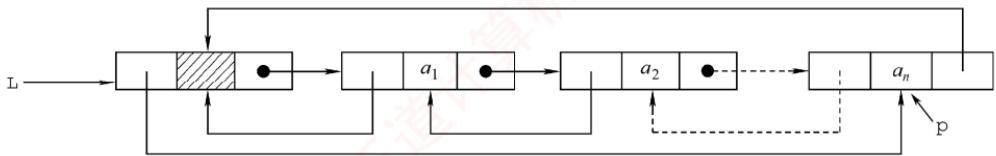  
图 2.13 循环双链表

设尾结点为 $^ { \star } \mathrm { p }$ ，则p->next 应指向头结点 L；同时，L->prior 应指向 $^ { \star } \mathrm { p }$ 。当循环双链表为空时，其头结点L的prior 和 next都指向自身（L->prior== L且 $\mathtt { L } \mathtt { - } \mathtt { > } \mathtt { n e x } \mathtt { \textell } \mathtt { = } \mathtt { = } \mathtt { L } \mathtt { ) }$

## 2.3.5 静态链表

静态链表是用数组来模拟线性表的链式存储结构。每个结点都包含两个域：data域和next域。与动态链表不同的是，这里的指针实际上是结点在数组中的相对地址（数组下标），也称游标。类似于顺序表，静态链表也需要预先分配一块连续的内存空间。

静态链表和单链表的对应关系如图2.14所示。

  
(a)静态链表示例

  
(b)静态链表对应的单链表  
图2.14 静态链表和单链表的对应关系

静态链表的结构类型定义如下：

#define MaxSize 50 //静态链表的最大长度  
typedef struct{ //静态链表的结构类型定义  
ElemType data; //存储数据元素  
int next; //下一个元素的数组下标  
} SLinkList[MaxSize];

静态链表以next==-1作为其结束标志。静态链表的插入、删除操作与动态链表类似，只需修改指针（数组下标），而无须移动元素。尽管静态链表在灵活性上不及动态链表，但在一些不支持指针的编程语言（如Basic）中，它提供了一种巧妙的设计方案。 X

## 2.3.6 顺序表和链表的比较

## 1. 存取（读/写）方式

顺序表支持随机存取，可通过下标直接访问任意位置元素，时间复杂度为O(1)，同时也支持顺序存取。链表仅支持顺序存取，必须从头结点开始逐个遍历。例如，访问第i个元素时，顺序表只需一次操作；而链表需要遍历i个结点，平均时间复杂度为 $O ( n )$

## 2. 逻辑结构与物理结构

顺序存储中，逻辑上相邻的元素在物理内存中也连续存放，其邻接关系由地址自然体现；链式存储中，逻辑相邻的元素在物理上未必相邻，其逻辑关系通过指针显式维护。

## 3. 查找、插入和删除操作

对于按值查找，若表无序，则两者的时间复杂度均为O(n)；若表有序，则顺序表可以采用折半查找，时间复杂度为O(log2n)。对于按序号查找，顺序表的时间复杂度为O(1)，链表则为O(n)。对于插入/删除操作，顺序表平均需移动约一半的元素，开销较大；链表只需修改指针，无须移动元素，但前提是已知操作位置（否则仍需O(n)的时间定位）。

## 4. 空间分配

顺序表在静态分配下需预先设定容量：过大造成内存浪费，过小则易在插入时溢出。动态分配虽支持运行时扩容，但需要申请新的连续内存块并复制全部原有数据，不仅耗时，还可能因系统缺乏足够连续空闲空间而失败。相比之下，链表采用动态结点分配，按需扩展，灵活性高，但每个结点需额外存储指针域，导致存储密度小于1，空间利用率较低。

在实际应用中，该如何选择合适的存储结构呢？

## 1. 基于存储的考虑

当线性表的长度或规模难以预估时，顺序表因需预先分配固定容量而不适用；而链表无须预设容量，可按需动态扩展，但每个结点需额外存储指针，带来一定的空间开销。

## 2. 基于运算的考虑

若应用中频繁进行按序号访问（随机访问），顺序表具有O(1)的优势，明显更高效；而对于以插入和删除为主的操作，链表在定位目标位置后仅需调整指针，开销较小。尽管定位过程本身仍需O(n)时间，但在增删密集的场景下，链表的整体性能通常更优。

## 3. 基于环境的考虑

顺序表基于数组实现，几乎所有高级语言都支持，实现简单；链表则依赖指针操作，在部分环境中实现较为复杂。因此，开发语言和运行环境也是重要的考量因素。

综上所述，两种结构各有优劣。对于规模稳定、以随机访问为主的场景，宜采用顺序存储；而动态性强、频繁进行插入和删除操作的场景，则更适合链式存储。

## 注意

只有熟练掌握线性表的顺序存储和链式存储，才能深刻理解它们的优缺点。

## 2.3.7 本节试题精选

## 一、单项选择题

01. 下列关于线性表的存储结构的描述中，正确的是（）。 I. 线性表的顺序存储结构优于其链式存储结构 王道Ⅱ. 链式存储结构比顺序存储结构能更方便地表示各种逻辑结构Ⅲ. 若频繁使用插入和删除结点操作，则顺序存储结构更优于链式存储结构IV. 顺序存储结构和链式存储结构都可以进行顺序存取A. I、ⅡI、ⅢII B. II、IV C. II、III D. III、IV

02. 对于一个线性表，既要求能进行较快速地插入和删除，又要求存储结构能反映数据之间的逻辑关系，则应该用（）。A. 顺序存储方式 B. 链式存储方式C. 散列存储方式 D. 以上均可以

03. 链式存储设计时，结点内的存储单元地址（）。

A. 一定连续 B. 一定不连续C. 不一定连续 D. 部分连续，部分不连续

04. 下列关于线性表的说法中，正确的是（）。I. 顺序存储方式只能用于存储线性结构Ⅱ. 在一个设有头指针和尾指针的单链表中，删除表尾元素的时间复杂度与表长无关Ⅲ. 带头结点的循环单链表中不存在空指针IV. 在一个长度为 n的有序单链表中插入一个新结点并仍保持有序的时间复杂度为O(n)V. 若用单链表来表示队列，则应该选用带尾指针的循环链表A. I、ⅡI 教育 B. I、ⅢII、IV、V 7教育C. IV、V D. III、IV、V

05. 设线性表中有2n个元素，（）在单链表上实现要比在顺序表上实现效率更高。A. 删除所有值为 x的元素B. 在最后一个元素的后面插入一个新元素 道计算C. 顺序输出前k个元素D. 交换第i个元素和第 2n−i−1个元素的值（i=0,…,n−1）

06. 在一个单链表中，已知q所指结点是p所指结点的前驱结点，若在q和p之间插入结点s，则执行（）。7A. s->next=p->next;p->next=s; B. p->next=s->next;s->next=p;C. q->next=s;s->next=p; D. p->next=s;s->next=q;

07. 给定有n个元素的一维数组，建立一个有序单链表的最低时间复杂度是（）。A. O(1) B. O(n) C. O(n²) D. O(nlog2n)

08. 将长度为n的单链表链接在长度为 m的单链表后面，其算法的时间复杂度采用大O形式表示应该是（）。A. O(1) C. O(m) D. O(n + m)

09. 单链表中，增加一个头结点的目的是（）。A. 使单链表至少有一个结点 B. 标识表结点中首结点的位置C. 方便运算的实现 D. 说明单链表是线性表的链式存储

10. 在一个长度为n的带头结点的单链表h上，设有尾指针r，则执行（）操作与链表的表长有关。A. 删除单链表中的第一个元素B. 删除单链表中的最后一个元素 王道计算机C. 在单链表第一个元素前插入一个新元素D. 在单链表最后一个元素后插入一个新元素

11. 对于一个头指针为head的带头结点的单链表，判定该表为空表的条件是（）；对于不带头结点的单链表，判定空表的条件为（）。A. head==NULL B. head->next==NULLC. head->next==head D. head!=NULL

12. 在线性表 $a _ { 0 } , a _ { 1 } , \cdots , a _ { 1 0 0 }$ 中，删除元素 $a _ { 5 0 }$ 需要移动（）个元素。A. 0 B. 50 FI C. 51 D. 0或50

13. 通过含有n(n>1)个元素的数组a，采用头插法建立单链表L，则 L 中的元素次序（）。A. 与数组 a 的元素次序相同 B. 与数组 a的元素次序相反

C. 与数组a的元素次序无关 D. 以上都错误

14.下面关于线性表的一些说法中，正确的是（）。A. 对一个设有头指针和尾指针的单链表执行删除最后一个元素的操作与链表长度无关B. 线性表中每个元素都有一个直接前驱和一个直接后继C. 为了方便插入和删除数据，可以使用双链表存放数据D. 取线性表第i个元素的时间与i的大小有关

15. 在双链表中向p所指的结点之前插入一个结点q的操作为（）。A. p->prior=q; q->next=p; p->prior->next=q; q->prior=p->prior;B. q->prior=p->prior; p->prior->next=q; q->next=p; p->prior=q->next;C. q->next=p; p->next=q; q->prior->next=q; q->next=p;D. $\mathtt { p } { - } \mathtt { > } \mathtt { p } \mathtt { r } \mathtt { i } \mathtt { o } \mathtt { r } { - } \mathtt { > } \mathtt { n } \mathtt { e } \mathtt { x } \mathtt { t } { = } \mathtt { q } \mathtt { ; } \quad \mathtt { q } { - } \mathtt { > } \mathtt { n } \mathtt { e } \mathtt { x } \mathtt { t } { = } \mathtt { p } \mathtt { ; } \quad \mathtt { q } { - } \mathtt { > } \mathtt { p } \mathtt { r } \mathtt { i } \mathtt { o } \mathtt { r } { = } \mathtt { p } { - } \mathtt { > } \mathtt { p } \mathtt { r } \mathtt { i } \mathtt { o } \mathtt { r } \mathtt { ; } \quad \mathtt { p } { - } \mathtt { > } \mathtt { p } \mathtt { r } \mathtt { i } \mathtt { o } \mathtt { r } { = } \mathtt { q } \mathtt { ; }$

16. 在双链表存储结构中，删除p所指的结点时必须修改指针（）。A. p->prior->next=p->next; p->next->prior=p->prior;B. p->prior=p->prior->prior; p->prior->next=p;C. p->next->prior=p; p->next=p->next->next;D. p->next=p->prior->prior; p->prior=p->next->next;

17. 在如下图所示的双链表中，已知指针p指向结点A，若要在结点A和C之间插入指针q所指的结点B，则依次执行的语句序列可以是（）。


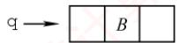

① q->next=p->next; ② q->prior=p; ③ p->next=q; ④ p->next->prior=q; A. ①②④③ B. ④③②① C. ③④①② D. ①③④②

18.在双链表的两个结点之间插入一个新结点，需要修改（）个指针域。A. 1 B. 3 C. 4 D. 2

19. 在长度为n的有序单链表中插入一个新结点，并仍然保持有序的时间复杂度是（）。A. O(1) B. O(n) C. O(n2) D. O(nlog2n)

20. 与单链表相比，双链表的优点之一是（）。A. 插入、删除操作更方便 B. 可以进行随机访问 KC. 可以省略表头指针或表尾指针 D. 访问前后相邻结点更灵活

21.对于一个带头结点的循环单链表L，判断该表为空表的条件是（）。A. 头结点的指针域为空 B. L 的值为 NULLC. 头结点的指针域与L的值相等 D. 头结点的指针域与L的地址相等

22. 对于一个带头结点的循环双链表L，判断该表为空表的条件是（）。A. $\mathtt { L } \mathtt { - } \mathtt { > } \mathtt { p r i o r } \mathtt { = } \mathtt { = } \mathtt { L } \mathtt { \& \& L } \mathtt { - } \mathtt { > } \mathtt { n e x t } \mathtt { = } \mathtt { = } \mathtt { N U L L }$ B. $\mathtt { L } \mathtt { - } \mathtt { > } \mathtt { p } \mathtt { \bar { r } } \mathtt { \downarrow } \mathtt { \circ } \mathtt { r } \mathtt { = } \mathtt { = } \mathtt { N } \mathtt { U } \mathtt { L } \mathtt { L } \mathtt { \& } \mathtt { \& } \mathtt { L } \mathtt { - } \mathtt { > } \mathtt { n } \mathtt { e } \mathtt { x } \mathtt { t } \mathtt { = } \mathtt { = } \mathtt { N } \mathtt { U } \mathtt { L } \mathtt { L }$ NC. $\mathtt { L } \mathtt { - } \mathtt { > } \mathtt { p r i o r } \mathtt { = } \mathtt { = } \mathtt { N U L L } \mathtt { \& \& L } \mathtt { - } \mathtt { > } \mathtt { n e x t } \mathtt { = } \mathtt { = } \mathtt { L }$ D. $\mathtt { L } - \mathtt { > } \mathtt { p r i o r } = = \mathtt { L } \& \& - \mathtt { > } \mathtt { n e x t } = = \mathtt { L }$

23.一个链表最常用的操作是在末尾插入结点和删除结点，则选用（）最节省时间。A. 带头结点的循环双链表 B. 循环单链表C. 带尾指针的循环单链表 D. 单链表

24. 设对n（n>1）个元素的线性表的运算只有4种：删除第一个元素；删除最后一个元素；在第一个元素之前插入新元素；在最后一个元素之后插入新元素，则最好使用（）。

A. 只有尾结点指针没有头结点指针的循环单链表B. 只有尾结点指针没有头结点指针的非循环双链表C. 只有头结点指针没有尾结点指针的循环双链表D. 既有头结点指针又有尾结点指针的循环单链表

25. 有两个长度为n的循环单链表，若要求两个循环单链表头尾相接的时间复杂度为O(1)，则对应两个循环单链表各设置一个指针，分别指向（）。A. 各自的头结点 B. 各自的尾结点C. 各自的首结点 D. 一个表的头结点，另一个表的尾结点

26. 有一个长度为n的循环单链表，若从表中删除首元结点的时间复杂度达到O(n)，则此时采用的循环单链表的结构可能是（）。A. 只有表头指针，没有头结点 B. 只有表尾指针，没有头结点C. 只有表尾指针，带头结点 D. 只有表头指针，带头结点

27. 某线性表用带头结点的循环单链表存储，头指针为 head，当 head->next->next==head成立时，线性表的长度可能是（）。 道L A. 0 B. 1 C. 2 D. 可能为0或1

28. 有两个长度都为 n 的双链表，若以 $h _ { 1 }$ 为头指针的双链表是非循环的，以 $h _ { 2 }$ 为头指针的双链表是循环的，则下列叙述中正确的是（）。A. 对于双链表 $h _ { 1 }$ ，删除首结点的时间复杂度是O(n)B. 对于双链表 $h _ { 2 } ,$ 删除首结点的时间复杂度是O(n)C. 对于双链表 $h _ { 1 } ,$ 删除尾结点的时间复杂度是O(1)D. 对于双链表 $h _ { 2 }$ ，删除尾结点的时间复杂度是O(1)

29.一个链表最常用的操作是在最后一个元素后插入一个元素和删除第一个元素，则选用（）A. 不带头结点的循环单链表 最节省时间。 道计 B. 双链表C. 单链表 D. 不带头结点且有尾指针的循环单链表

30. 需要分配较大连续空间，插入和删除不需要移动元素的线性表，其存储结构为（）。A. 单链表 1 B. 静态链表 C. 顺序表 D. 双链表 V

31.下列关于静态链表的说法中，正确的是（）。I. 静态链表兼具顺序表和单链表的优点，因此存取表中第i个元素的时间与i无关Ⅱ. 静态链表能容纳的最大元素个数在表定义时就确定了，以后不能增加Ⅲ.静态链表与动态链表在元素的插入、删除上类似，不需要移动元素IV.相比动态链表，静态链表可能浪费较多的存储空间A. I、Ⅱ、ⅢII B. II、ⅢII、IV 王道计C. I、III、IV D. I、II、IV

32. 【2016统考真题】已知一个带有表头结点的循环双链表L，结点结构为 $\boxed { \mathtt { p r e v } \; \boxed { \mathtt { d a t a } } \; \mathtt { n e x t } }$ 其中prev和next分别是指向其直接前驱和直接后继结点的指针。现要删除指针p所指的结点，正确的语句序列是（）。A. $\mathtt { p } \mathtt { - } \mathtt { > } \mathtt { n e } \mathtt { x t } \mathtt { - } \mathtt { > } \mathtt { p } \mathtt { x e } \mathtt { v } \mathtt { = } \mathtt { p } \mathtt { - } \mathtt { > } \mathtt { p } \mathtt { x e } \mathtt { v } \mathtt { ; } \quad \mathtt { p } \mathtt { - } \mathtt { > } \mathtt { p } \mathtt { x e } \mathtt { v } \mathtt { - } \mathtt { > } \mathtt { n e } \mathtt { x t } \mathtt { = } \mathtt { p } \mathtt { - } \mathtt { > } \mathtt { p } \mathtt { x e } \mathtt { v } \mathtt { ; } \quad \mathtt { f r e e } \quad \mathtt { ( p ) } \quad \mathtt { ; }$ B. $\mathtt { p } \mathtt { - } \mathtt { > } \mathtt { n } \mathtt { e } \mathtt { x } \mathtt { t } \mathtt { - } \mathtt { > } \mathtt { p } \mathtt { x } \mathtt { e } \mathtt { v } \mathtt { = } \mathtt { p } \mathtt { - } \mathtt { > } \mathtt { n } \mathtt { e } \mathtt { x } \mathtt { t } \; \mathtt { p } \mathtt { - } \mathtt { > } \mathtt { p } \mathtt { x } \mathtt { e } \mathtt { v } \mathtt { - } \mathtt { > } \mathtt { n } \mathtt { e } \mathtt { x } \mathtt { t } \mathtt { = } \mathtt { p } \mathtt { - } \mathtt { > } \mathtt { n } \mathtt { e } \mathtt { x } \mathtt { t } \; \mathtt { f } \mathtt { x } \mathtt { e } \mathtt { e } \; \mathtt { ( p ) } \; ;$ C. $\mathtt { p } \mathtt { - } \mathtt { > } \mathtt { n } \mathtt { e } \mathtt { x } \mathtt { t } \mathtt { - } \mathtt { > } \mathtt { p } \mathtt { x } \mathtt { e } \mathtt { v } \mathtt { = } \mathtt { p } \mathtt { - } \mathtt { > } \mathtt { n } \mathtt { e } \mathtt { x } \mathtt { t } \quad \mathtt { p } \mathtt { - } \mathtt { > } \mathtt { p } \mathtt { x } \mathtt { e } \mathtt { v } \mathtt { - } \mathtt { > } \mathtt { n } \mathtt { e } \mathtt { x } \mathtt { t } \mathtt { = } \mathtt { p } \mathtt { - } \mathtt { > } \mathtt { p } \mathtt { x } \mathtt { e } \mathtt { v } \quad \mathtt { f } \quad \mathtt { r } \mathtt { e } \mathtt { e } \quad \mathtt { ( } \mathtt { p } \quad \mathtt { ) } \quad \mathtt { ; } \quad \mathtt { p } \mathtt { e } \mathtt { x } \mathtt { t } \quad \mathtt { ( } \mathtt { p } \quad \mathtt { ) } \quad \mathtt { ; } \quad \mathtt { p } \mathtt { e } \mathtt { x } \mathtt { t } \quad \mathtt { ( } \mathtt { p } \quad \mathtt { ) } \quad \mathtt { ; } \quad \mathtt { p } \mathtt { - } \mathtt { > } \mathtt { p } \mathtt { x } \mathtt { e } \mathtt { v } \mathtt { - } \mathtt { > } \mathtt { n } \mathtt { e } \mathtt { x } \mathtt { t } \mathtt { = } \mathtt { p } \mathtt { - } \mathtt { > } \mathtt { p } \mathtt { x } \mathtt { e } \mathtt { v } \quad \mathtt { ; } \quad \mathtt { f } \quad \mathtt { r } \mathtt { e } \mathtt { e } \quad \mathtt { ( } \mathtt { p } \quad \mathtt { ) } \quad \mathtt { ; } \quad \mathtt { p } \mathtt { - } \mathtt { > } \mathtt { p } \mathtt { x } \mathtt { e } \mathtt { x } \mathtt { t } \quad \mathtt { - } \mathtt { > } \mathtt { p } \mathtt { x } \mathtt { e } \mathtt { x } \mathtt { t } \mathtt { = } \mathtt { p } \mathtt { - } \mathtt { > } \mathtt { p } \mathtt { x } \mathtt { e } \mathtt { x } \mathtt { t } \quad \mathtt { ; } \quad \mathtt { p } \mathtt { - } \mathtt { > } \mathtt { p } \mathtt { x } \mathtt { e } \mathtt { x } \mathtt { t } \mathtt { = } \mathtt { - } \mathtt { p } \mathtt { x } \mathtt { e } \mathtt { x } \mathtt \mathtt { - } \mathtt { > } \mathtt \mathtt { p } \mathtt { - } \mathtt \mathtt { > } \mathtt { p - } \mathtt \mathtt { - } \mathtt \mathtt { p - } \mathtt \mathtt { > } \mathtt { - } \mathtt \mathtt { p - } \mathtt \mathtt { - } \mathtt \mathtt { > } \mathtt { - } \mathtt \mathtt { p - } \mathtt \mathtt { - } \mathtt \mathtt { \mathtt - } \mathtt \mathtt { \mathtt { - } \mathtt \mathtt { \mathtt \mathtt { \mathtt - } \mathtt { \mathtt \mathtt { \mathtt \mathtt { \mathtt \mathtt \mathtt { \mathtt \mathtt { \mathtt \mathtt { \mathtt \mathtt \mathtt { \mathtt \mathtt { \mathtt \mathtt { \mathtt \mathtt { \mathtt \mathtt { \mathtt \mathtt \mathtt$ D. $\mathtt { p } \mathtt { - } \mathtt { > } \mathtt { n e } \mathtt { x t } \mathtt { - } \mathtt { > } \mathtt { p } \mathtt { x e } \mathtt { v } \mathtt { = } \mathtt { p } \mathtt { - } \mathtt { > } \mathtt { p } \mathtt { x e } \mathtt { v } \mathtt { ; } \quad \mathtt { p } \mathtt { - } \mathtt { > } \mathtt { p } \mathtt { x e } \mathtt { v } \mathtt { - } \mathtt { > } \mathtt { n e } \mathtt { x t } \mathtt { = } \mathtt { p } \mathtt { - } \mathtt { > } \mathtt { n e } \mathtt { x t } \mathtt { ; } \quad \mathtt { f } \mathtt { x e } \mathtt { e } \quad \mathtt { ( p ) } \quad \mathtt { ; }$

33.【2016统考真题】已知表头元素为c的单链表在内存中的存储状态如下表所示。

<table><tr><td rowspan=1 colspan=4>地址       元素      链接地址</td></tr><tr><td rowspan=1 colspan=2>1000H</td><td rowspan=1 colspan=1>a</td><td rowspan=1 colspan=1>1010H</td></tr><tr><td rowspan=1 colspan=2>1004H</td><td rowspan=1 colspan=1>b</td><td rowspan=1 colspan=1>100CH</td></tr><tr><td rowspan=1 colspan=2>1008H</td><td rowspan=1 colspan=1>C</td><td rowspan=1 colspan=1>1000H</td></tr><tr><td rowspan=1 colspan=2>100CH</td><td rowspan=1 colspan=1>d</td><td rowspan=1 colspan=1>NULL</td></tr><tr><td rowspan=1 colspan=1>1010H</td><td rowspan=1 colspan=1></td><td rowspan=1 colspan=1>e</td><td rowspan=1 colspan=1>1004H</td></tr><tr><td rowspan=1 colspan=2>1014H</td><td rowspan=1 colspan=1></td><td rowspan=1 colspan=1></td></tr></table>

现将f存放于1014H处并插入单链表，若f在逻辑上位于a和e之间，则a、e、f的“链接地址”依次是（）。A. 1010H、1014H、1004H B. 1010H、1004H、1014HC. 1014H、1010H、1004H D. 1014H、1004H、1010H 教育

34.【2021 统考真题】已知头指针h指向一个带头结点的非空循环单链表，结点结构为datanext，其中next是指向直接后继结点的指针，p是尾指针，q是临时指针。现要删除该链表的第一个元素，正确的语句序列是（）。A. h->next=h->next->next;q=h->next;free(q); 王道计B. q=h->next;h->next=h->next->next;free(q);C. q=h->next;h->next=q->next;if(p!=q) p=h;free(q);D. q=h->next;h->next=q->next;if(p==q) p=h;free(q);

35.【2023统考真题】现有非空双链表L，其结点结构为 $\boxed { \mathtt { p r e v } \boxed { \mathtt { d a t a } } \boxed { \mathtt { n e x t } } } ,$ prev是指向直接前驱结点的指针，next是指向直接后继结点的指针。若要在L中指针p所指向的结点(非尾结点）之后插入指针s指向的新结点，则在执行语句序列“s->next=p->next；p->next=s；”后，下列语句序列中还需要执行的是（）。A. s->next->prev=p; s->prev=p;B. p->next->prev=s; s->prev=p;C. s->prev=s->next->prev; s->next->prev=s;D. p->next->prev=s->prev; s->next->prev=p;

36.【2024统考真题】已知带头结点的非空单链表L的头指针为h，结点结构为data next其中next是指向直接后继结点的指针。现有指针p和q，若p指向L中非首且非尾的任意一个结点，则执行语句序列“q=p->next；p->next=q->next；q->next=h->next；h->next=q;”的结果是（）。A. 在p所指结点后插入 q所指结点B. 在 q所指结点后插入 p所指结点C. 将p所指结点移至L的头结点之后 D. 将q所指结点移动到L的头结点之后

## 二、综合应用题

01.在带头结点的单链表工中，删除所有值为×的结点，并释放其空间，假设值为×的结点不唯一，试编写算法以实现上述操作。

02. 试编写在带头结点的单链表工中删除一个最小值结点的高效算法（假设该结点唯一）。

03. 试编写算法将带头结点的单链表就地逆置，所谓“就地”是指辅助空间复杂度为O(1)。

04. 设在一个带表头结点的单链表中，所有结点的元素值无序，试编写一个函数，删除表中所有处于给定的两个值（作为函数参数给出）之间的元素（若存在）。

05.给定两个单链表，试分析找出两个链表的公共结点的思想（不用写代码）。

06. 设 $C = \{ a _ { 1 } , b _ { 1 } , a _ { 2 } , b _ { 2 } , \cdots , a _ { n } , b _ { n } \}$ 为线性表，采用带头结点的单链表存放，设计一个就地算法，将其拆分为两个线性表，使得 $A = \left\{ a_{1}, a_{2}, \cdots, a_{n} \right\}, B = \left\{ b_{n}, \cdots, b_{2}, b_{1} \right\}$

07. 在一个递增有序的单链表中，存在重复的元素。设计算法删除重复的元素，例如（7,10，

10,21,30,42,42,42,51,70）将变为（7,10,21,30,42,51,70）。

08. 设A和B是两个单链表（带头结点），其中元素递增有序。设计一个算法从A和B中的公共元素产生单链表C，要求不破坏A、B的结点。

09. 已知两个链表A和 B 分别表示两个集合，其元素递增排列。编制函数，求A 与 B 的交集，并存放于A链表中。

10. 两个整数序列 $A = a_{1}, a_{2}, a_{3}, \cdots, a_{m}$ 和 $B = b_{1}, b_{2}, b_{3}, \cdots, b_{n}  已$ 经存入两个单链表中，设计一个算法，判断序列B是否是序列A的连续子序列。

11. 设计一个算法用于判断带头结点的循环双链表是否对称。

12. 有两个循环单链表，链表头指针分别为 $h _ { 1 }$ 和 $h _ { 2 }$ ，编写一个函数将链表 $h _ { 2 }$ 链接到链表 $h _ { 1 }$ 之后，要求链接后的链表仍保持循环链表形式。

13. 设有一个带头结点的非循环双链表L，其每个结点中除有pre、data和next域外，还有一个访问频度域freq，其值均初始化为零。每当在链表中进行一次Locate(L,x)运算时，令值为×的结点中freq域的值增1，并使此链表中的结点保持按访问频度递减的顺序排列，且最近访问的结点排在频度相同的结点之前，以便使频繁访问的结点总是靠近表头。试编写符合上述要求的Locate(L，x)函数，返回找到结点的地址，类型为指针型。

14. 设将n（n>1）个整数存放到不带头结点的单链表L中，设计算法将L中保存的序列循环右移k（0<k<n）个位置。例如，若k=1，则将链表{0,1,2,3}变为{3,0,1,2}。要求：1）给出算法的基本设计思想。2）根据设计思想，采用C或C++语言描述算法，关键之处给出注释。3）说明你所设计算法的时间复杂度和空间复杂度。

15.单链表有环，是指单链表的最后一个结点的指针指向了链表中的某个结点（通常单链表的最后一个结点的指针域是空的）。试编写算法判断单链表是否存在环。

1）给出算法的基本设计思想。

2）根据设计思想，采用C或C++语言描述算法，关键之处给出注释。

3）说明你所设计算法的时间复杂度和空间复杂度。

16.设有一个长度n（n为偶数）的不带头结点的单链表，且结点值都大于0，设计算法求这个单链表的最大孪生和。孪生和定义为一个结点值与其孪生结点值之和，对于第i个结点（从0开始），其孪生结点为第n-i-1个结点。要求： X

1）给出算法的基本设计思想。

2）根据设计思想，采用C或C++语言描述算法，关键之处给出注释。

3）说明你的算法的时间复杂度和空间复杂度。

17.【2009统考真题】已知一个带有表头结点的单链表，结点结构为

<table><tr><td>data</td><td></td></tr><tr><td></td><td>link</td></tr></table>

假设该链表只给出了头指针1ist。在不改变链表的前提下，请设计一个尽可能高效的算法，查找链表中倒数第k个位置上的结点（k为正整数）。若查找成功，算法输出该结点的data域的值，并返回1；否则，只返回0。要求：

1）描述算法的基本设计思想。

2）描述算法的详细实现步骤。

3）根据设计思想和实现步骤，采用程序设计语言描述算法（使用C、C++或Java语言实现），关键之处请给出简要注释。

18.【2012统考真题】假定采用带头结点的单链表保存单词，当两个单词有相同的后缀时，可共享相同的后缀存储空间，例如，loading和being的存储映像如下图所示。

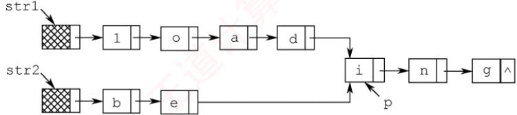

设str1和str2分别指向两个单词所在单链表的头结点，链表结点结构为 $\boxed { \mathtt { d a t a } \boxed { \mathtt { n e x t } } }$ 请设计一个时间上尽可能高效的算法，找出由str1和str2所指向两个链表共同后缀的起始位置（如图中字符i所在结点的位置p）。要求： XK

1）给出算法的基本设计思想。

2）根据设计思想，采用C或C++或Java语言描述算法，关键之处给出注释。

3）说明你所设计算法的时间复杂度。

19.【2015统考真题】用单链表保存m个整数，结点的结构为[data][1ink]，且|data|≤值相等的点，仅保一现的结点而其对，等的点。例如，若给定的单链表 head 如下：

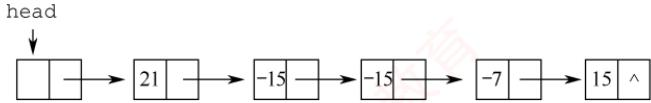

则删除结点后的 head 为


要求：

1）给出算法的基本设计思想。

2）使用C或C++语言，给出单链表结点的数据类型定义。

3）根据设计思想，采用C或C++语言描述算法，关键之处给出注释。

4）说明你所设计算法的时间复杂度和空间复杂度。

20.【2019统考真题】设线性表 $L = \left( a_{1}, a_{2}, a_{3}, \cdots, a_{n-2}, a_{n-1}, a_{n} \right)$ 采用带头结点的单链表保存，链表中的结点定义如下： X

```c
typedef struct node
int data;
struct node*next;
}NODE;
```

请设计一个空间复杂度为O(1)且时间上尽可能高效的算法，重新排列L中的各结点，得到线性表 $L ^ { \prime } = ( a _ { 1 } , a _ { n } , a _ { 2 } , a _ { n - 1 } , a _ { 3 } , a _ { n - 2 } , \cdots )$ 。要求：

1）给出算法的基本设计思想。

2）根据设计思想，采用C或C++语言描述算法，关键之处给出注释。

3）说明你所设计的算法的时间复杂度。

## 2.3.8 答案与解析

## 一、单项选择题

01. B

两种存储结构适用于不同的场合，不能简单地说谁好谁坏，说法Ⅰ错误。链式存储用指针表

示逻辑结构，而指针的设置是任意的，因此比顺序存储结构能更方便地表示各种逻辑结构，说法Ⅱ正确。在顺序存储中，插入和删除结点需要移动大量元素，效率较低，说法Ⅲ的描述刚好相反。顺序存储结构既能随机存取又能顺序存取，而链式结构只能顺序存取，说法IV正确。

## 02. B

首先直接排除选项A和D。散列存储通过散列函数映射到物理空间，不能反映数据之间的逻辑关系，排除选项C。链式存储能方便地表示各种逻辑关系，且插入和删除操作的时间复杂度为O(1)。

## 03. A

链式存储设计时，各个不同结点的存储空间可以不连续，但结点内的存储单元地址必须连续。

## 04. D

顺序存储方式同样适用于存储图和树，说法Ⅰ错误。删除表尾结点时，必须从头开始找到表尾结点的前驱，其时间与表长有关，说法Ⅱ错误。循环单链表中最后一个结点的指针不是NULL，而是指向头结点，整个链表形成一个环，因此不存在空指针，说法Ⅲ正确。有序单链表只能依次查找插入位置，时间复杂度为O(n)，说法IV正确。队列需要在表头删除元素，表尾插入元素，采用带尾指针的循环链表较为方便，插入和删除的时间复杂度都为O(1)，说法V正确。

## 05. A

对于选项A，在单链表和顺序表上实现的时间复杂度都为O(n)，但后者要移动很多元素，因此在单链表上实现效率更高。对于选项B和D，顺序表的效率更高。C无区别。

## 06. C

s 插入后，q成为 s的前驱，而p成为 s的后继，选择选项C。

## 注意

可能有读者认为选项C中的两条语句交换后才正确。实际上，因为本题插入位置的前后结点都有指针指示（这与前面介绍的插入操作是不同的），所以选项C中的语句顺序并不会造成断链。在此提醒读者在学习过程中一定要多动脑思考，而不要生搬硬套。

## 07. D

若先建立链表，然后依次插入建立有序表，则每插入一个元素就需遍历链表寻找插入位置，即直接插入排序，时间复杂度为 $O ( n ^ { 2 } )$ 。若先将数组排好序，然后建立链表，建立链表的时间复杂度为O(n)，数组排序的最好时间复杂度为 O(nlog2n)，总时间复杂度为O(nlog2n)。故选择选项D。

## 08. C

先遍历长度为m的单链表，找到该单链表的尾结点，然后将其next域指向另一个单链表的首结点，其时间复杂度为O(m)。

## 09. C

单链表设置头结点的目的是方便运算的实现，主要好处体现在：第一，有头结点后，插入和删除数据元素的算法就统一了，不再需要判断是否在第一个元素之前插入或删除第一个元素；第二，不论链表是否为空，其头指针是指向头结点的非空指针，链表的头指针不变，因此空表和非空表的处理也就统一了。

## 10. B

删除单链表的最后一个结点需置其前驱结点的指针域为NULL，需要从头开始依次遍历找到该前驱结点，需要O(n)的时间，与表长有关。其他操作均与表长无关，读者可自行模拟。

## 11. B, A

在带头结点的单链表中，头指针head指向头结点，头结点的next域指向第一个元素结点，$\mathtt { h e a d { - } { > } n e x t { = } { = } N U L L }$ 表示该单链表为空。在不带头结点的单链表中，head直接指向第一个元素结点，head==NULL表示该单链表为空。

## 12. D

线性表有顺序存储和链式存储两种存储结构。若采用链式存储结构，则删除元素 $a _ { 5 0 }$ 不需要移动元素；若采用顺序存储结构，则需要依次移动50个元素。

## 13. B

当采用头插法建立单链表时，数组后面的元素插入到单链表L的最前端，所以L中的元素次序与数组a的元素次序相反。 H

## 14. C

选项A显然错误。选项B中第一个元素和最后一个元素不满足题设要求。双链表能很方便地访问前驱和后继，故删除和插入数据较为方便，选项C正确。选项D未考虑顺序存储的情况。

## 15. D

为了在 $\mathrm { p }$ 之前插入结点 $\mathbb { G } ;$ ，可以将p的前一个结点的 next 域指向 q，将 $\mathbb { q }$ 的 next 域指向p，将 $\mathbb { q }$ 的 $\mathtt { p r i o r }$ 域指向 $\wp$ 的前一个结点，将 $\wp$ 的 $\mathtt { p r i o r }$ 域指向 $\mathbb { G } \circ$ 仅选项D满足条件。

## 16. A

与上一题的分析基本类似，只不过这里是删除一个结点，注意将 $\mathrm { p }$ 的前、后两结点链接起来。关键是要保证在结点指针的修改过程中不断链！ X

注意，请读者仔细对比上述两题，弄清双链表的插入和删除方法。

## 17. A

结点A和B分别由指针 $\mathrm { p }$ 和 $\mathbb { q }$ 指示，但结点C仅能由p->next间接指示，因此在改变p->next之前，必须先将g->next指向结点C，即①要在③前面，且④要在③前面（因为若先执行③，则④相当于q->prior指向其自身，显然矛盾）。故只能选择选项A。

## 18. C

当在双链表的两个结点（分别用第一个、第二个结点表示）之间插入一个新结点时，需要修改四个指针域，分别是：新结点的前驱指针域，指向第一个结点；新结点的后继指针域，指向第二个结点；第一个结点的后继指针域，指向新结点；第二个结点的前驱指针域，指向新结点。

## 19. B

设单链表递增有序，首先要在单链表中找到第一个大于×的结点的直接前驱p，在p之后插入该结点。查找的时间复杂度为 $O ( n )$ ，插入的时间复杂度为O(1)，总时间复杂度为 $O ( n )$

## 20. D

在插入和删除操作上，单链表和双链表都不用移动元素，都很方便，但双链表修改指针的操作更为复杂，选项A错误。双链表中可以快速访问任何一个结点的前驱和后继结点，选项D正确。

## 21. C

带头结点的循环单链表工为空表时，满足 $\mathtt { L } \mathtt { - } \mathtt { > } \mathtt { n e x t } \mathtt { = } \mathtt { = } \mathtt { L }$ ，即头结点的指针域与工的值相等，而不是头结点的指针域与工的地址相等。注意，带头结点的循环单链表中不存在空指针。

## 22. D

循环双链表L判空的条件是头结点（头指针）的prior和next域都指向它自身。

## 23. A

在链表的末尾插入和删除一个结点时，需要修改其相邻结点的指针域。而寻找尾结点及尾结点的前驱结点时，只有带头结点的循环双链表所需要的时间最少。

## 24. C

对于选项A，删除尾结点 $^ { \star } \mathrm { p }$ 时，需要找到 $^ { \star } \mathrm { P }$ 的前一个结点，时间复杂度为 $O ( n )$ 。对于选项B,删除首结点 $^ \star \mathrm { p }$ 时，需要找到 $^ { \star } \mathrm { p }$ 结点，这里没有直接给出头结点指针，而是通过尾结点的 $\mathtt { p r i o r }$ 指针找到 $^ { \star } \mathrm { p }$ 结点的时间复杂度为 $O ( n )$ 。对于选项D，删除尾结点 $^ \star \mathrm { p }$ 时，需要找到 $^ { \star } \mathrm { p }$ 的前一个结点，时间复杂度为 $O ( n )$ 。对于C，执行这四种算法的时间复杂度均为O(1)。

## 25. B

要求用O(1)的时间将两个循环单链表头尾相接，并未指明哪个链表接在另一个链表之后，所以对两个链表都要在O(1)的时间找到头结点和尾结点。因此，两个指针应都指向尾结点。

## 26. A

在循环单链表中，删除首元结点后，要保持链表的循环性，因此需要找到首元结点的前驱。  
当链表带头结点时，其前驱就是头结点，因此不论是表头指针还是表尾指针，删除首元结点的时  
间都为O(1)。当链表不带头结点时，其前驱是尾结点，因此，若有表尾指针，就可在O(1)的时间  
找到尾结点：若只有表头指针，则需要遍历整个链表找到尾结点，时间为O(n)。V

## 27. D

对一个空循环单链表，有 head->next==head，推理 head->next->next==head->next==head。对含有一个元素的循环单链表，头结点（头指针 head 指示）的 next 域指向这个唯一的元素结点，该元素结点的 next 域指向头结点，因此也有 head->next->next=head。

## 28. D

对于两种双链表，删除首结点的时间复杂度都是O(1)。对于非循环双链表，删除尾结点的时间复杂度是O(n)；对于循环双链表，删除尾结点的时间复杂度是O(1)。

## 29. D

对于选项A，在最后一个元素之后插入元素的情况与普通单链表相同，时间复杂度为 O(n)；而删除第一个元素时，为保持循环单链表的性质（尾结点指向第一个结点），要先遍历整个链表找到尾结点，再做删除操作，时间复杂度为O(n)。对于选项B，双链表的情况与单链表的相同，一个是O(n)，一个是O(1)。对于选项C，在最后一个元素之后插入一个元素，要遍历整个链表才能找到插入位置，时间复杂度为O(n)；删除第一个元素的时间复杂度为O(1)。对于选项D，与选项A的分析对比，有尾结点的指针，省去了遍历链表的过程，因此时间复杂度均为O(1)。

## 30. B

静态链表采用数组表示，因此需要预先分配较大的连续空间，静态链表同时还具有一般链表的特点，即插入和删除不需要移动元素。

## 31. B

静态链表的存储空间虽然是顺序分配的，但元素的存储不是顺序的，查找时仍然需要按链依次进行，而插入、删除都不需要移动元素。静态链表的存储空间是一次性申请的，能容纳的最大元素个数在定义时就已确定。并非每个空间都存储了元素，因此会造成存储空间的浪费。

## 32. D

选项A的第二句代码，相当于将p前驱结点的后继指针指向其自身，错误；选项B和C的第一句代码，相当于将p后继结点的前驱指针指向其自身，错误。只有选项D正确。

## 33. D

根据存储状态，单链表的结构如下图所示。

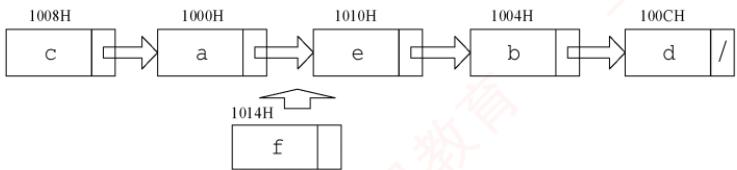

其中“链接地址”是指结点next所指的内存地址。当结点f插入后，a指向f，f指向e，e指向 b。显然a、e和 f的“链接地址”分别是f、b和e的内存地址，即1014H、1004H和1010H。

## 34. D

如图1所示，要删除带头结点的非空循环单链表中的第一个元素，就要先用临时指针g指向待删结点，q=h->next；然后将 $\mathbb { q }$ 从链表中断开，h->next=q->next（这一步也可写成h->next=$\mathrm{h}->\mathrm{ne}\mathrm{x}\mathrm{t}->\mathrm{ne}\mathrm{x}\mathrm{t}$ ；此时要考虑一种特殊情况，若待删结点是链表的尾结点，即循环单链表中只有一个元素 $\mathrm { r ( p ) }$ 和 $\mathbb { q }$ 指向同一个结点)，如图2所示，则在删除后要将尾指针指向头结点，即 $\mathrm{i}\mathrm{f}\left(\mathrm{p}==\mathrm{q}\right)$ p=h；最后释放 $\mathbb { q }$ 结点即可，答案选择选项D。

  
图1

  
图2

## 35. C

链表的插入操作要保证不会造成断链，画图再依次判断选项。执行语句“①s->next=p->next；②p->next=s；”后的结构如下图所示（虚线表示prev，实线表示next）。


对于选项 A， $\mathtt { s } { \mathrel { \mathtt { - } } \mathrel { \mathtt { > } } } \mathtt { n e x t { \mathtt { - } } \mathrel { \mathtt { > } } } \mathtt { p r e v { \mathrel { \mathtt { = } } } p }$ ，错误。对于选项B， $\mathtt { p } { - } \mathtt { > } \mathtt { n e x t } { - } \mathtt { > } \mathtt { p r e v } { = } \mathtt { s }$ ，让 s的 prev指向s，错误。对于选项D,两句代码均错误。对于选项C，执行语句“③s->prev=s->next->prev；④s->next->prev=s；”后的结构如下图所示，满足插入的要求。


## 36. D

假设单链表的初始状态如图①所示。执行q=p->next后的状态如图②所示，q指向p的后继结点。执行 $\mathrm{p}->\mathrm{n}\mathrm{e}\times \mathrm{t}=\mathrm{q}->\mathrm{n}\mathrm{e}\times \mathrm{t}$ 后的状态如图③所示，结点p的 next指向 g的后继结点。执行q->next=h->next后的状态如图④所示，结点 q的next 指向h的后继结点。执行h->next=q后的状态如图⑤所示，g所指结点移至工的头结点h之后，选项D正确。


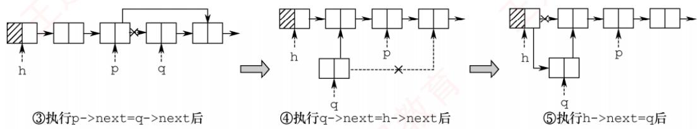

## 二、综合应用题

## 01.【解答】

解法1：用 $\wp$ 从头至尾扫描单链表，pre指向 $^ \star \mathrm { p }$ 结点的前驱。若 $\wp$ 所指结点的值为x，则删

除，并让p移向下一个结点，否则让pre、p指针同步后移一个结点。

本题代码如下：

```c
void Del_X_1(Linklist &L,ElemType x){
LNode *p=L->next,*pre=L,*q;∥/置p 和pre 的初始值
while(p!=NULL) {
if(p->data==x){
q=p; ∥/q指向被删结点
p=p->next;
pre->next=p; //将*q结点从链表中断开
free(q) ; //释放*q结点的空间
else{ //否则，pre 和 p 同步后移
pre=p;
p=p->next;
}//else
}//while
```

本算法是在无序单链表中删除满足某种条件的所有结点，这里的条件是结点的值为x。实际上，这个条件是可以任意指定的，只要修改if条件即可。比如，我们要求删除值介于mink和maxk之间的所有结点，只需将if 语句修改为if(p->data>mink&&p->data<maxk)。

解法2：采用尾插法建立单链表。用p指针扫描工的所有结点，当其值不为×时，将其链接到L之后，否则将其释放。

本题代码如下：

```c
void Del X 2(Linklist &L,ElemType x){
LNode *p=L->next,*r=L,*q; ∥/r指向尾结点，其初值为头结点
while(p!=NULL) {
if(p->data!=x) { //*p 结点值不为×时将其链接到L尾部
r->next=p;
r=p;
p=p->next; //继续扫描
}
else{ //*p 结点值为×时将其释放
q=p;
p=p->next; //继续扫描
free(q) ; //释放空间
}//while
r->next=NULL; //插入结束后置尾结点指针为NULL
```

上述两个算法扫描一遍链表，时间复杂度为O(n)，空间复杂度为O(1)。

## 02. 【解答】

算法思想：用p从头至尾扫描单链表，pre指向\*p结点的前驱，用minp保存值最小的结点指针（初值为p），minpre指向\*minp结点的前驱（初值为pre）。一边扫描，一边比较，若p->data 小于minp->data，则将p、pre 分别赋值给minp、minpre，如下图所示。当p扫描完毕时，minp指向最小值结点，minpre指向最小值结点的前驱结点，再将minp所指结点删除即可。


本题代码如下：

```c
LinkList Delete Min(LinkList &L){
LNode *pre=L，*p=pre->next；//p 为工作指针，pre 指向其前驱
LNode *minpre=pre，*minp=p；//保存最小值结点及其前驱
while(p!=NULL) {
if(p->data<minp->data) {
minp=p; //找到比之前找到的最小值结点更小的结点
minpre=pre;
1
pre=p; //继续扫描下一个结点
p=p->next;
}
minpre->next=minp->next; //删除最小值结点
free(minp);
return L;
```

算法需要从头至尾扫描链表，时间复杂度为O(n)，空间复杂度为O(1)。

若本题改为不带头结点的单链表，则实现上会有所不同，请读者自行思考。

## 03.【解答】

解法1：将头结点摘下，然后从第一结点开始，依次插入到头结点的后面（头插法建立单链表），直到最后一个结点为止，这样就实现了链表的逆置，如下图所示。


本题代码如下：

```c
LinkList Reverse 1(LinkList L) {
LNode *p, *r; //p为工作指针，r为p的后继，以防断链
p=L->next; //从第一个元素结点开始
L->next=NULL; //先将头结点 L 的 next 域置为 NULL
while(p!=NULL) { //依次将元素结点摘下
r=p->next; //暂存 p 的后继
p->next=L->next; //将p 结点插入到头结点之后
L->next=p;
p=r;
1 算机
return L;
```

解法2：大部分辅导书都只介绍解法1，这对读者的理解和思维是不利的。为了将调整指针这个复杂的过程分析清楚，我们借助图形来进行直观的分析。

假设pre、p和r指向三个相邻的结点，如下图所示。假设经过若于操作后，\*pre之前的结点的指针都已调整完毕，它们的next都指向其原前驱结点。现在令\*p结点的next域指向\*pre结点，注意到一旦调整指针的指向，\*p的后继结点的链就会断开，为此需要用r来指向原\*p的后继结点。处理时需要注意两点：一是在处理第一个结点时，应将其next域置为NULL，而不是指向头结点（因为它将作为新表的尾结点）；二是在处理完最后一个结点后，需要将头结点的指针指向它。


本题代码如下：

LinkList Reverse 2(LinkList L){  
LNode \*pre,\*p=L->next,\*r=p->next;  
p->next=NULL; //处理第一个结点  
while(r!=NULL){ //r为空，则说明p为最后一个结点  
pre=p; 王道 //依次继续遍历  
p=r;  
r=r->next;  
p->next=pre; //指针反转  
L->next=p; //处理最后一个结点  
return L;

上述两个算法的时间复杂度为O(n)，空间复杂度为O(1)。

## 04.【解答】

因为链表是无序的，所以只能逐个结点进行检查，执行删除。

本题代码如下：

```c
void RangeDelete(LinkList &L,int min,int max){
LNode *pr=L,*p=L->link; //p 是检测指针，pr 是其前驱
while(p!=NULL)
if(p->data>min&&p->data<max){ ∥寻找到被删结点，删除
pr->link=p->link;
free(p);
p=pr->link;
}
else{ 道计算机教育 //否则继续寻找被删结点
pr=p;
p=p->link;
```

## 05.【解答】

两个单链表有公共结点，即两个链表从某一结点开始，它们的next都指向同一结点。每个单链表结点只有一个next域，因此从第一个公共结点开始，之后的所有结点都是重合的，不可能再出现分叉。所以两个有公共结点而部分重合的单链表，拓扑形状看起来像Y，而不可能像X。

本题极容易联想到“蛮”方法：在第一个链表上顺序遍历每个结点，每遍历一个结点，在第二个链表上顺序遍历所有结点，若找到两个相同的结点，则找到了它们的公共结点。显然，该算法的时间复杂度为 O(len1·len2)。

接下来我们试着去寻找一个线性时间复杂度的算法。先把问题简化：如何判断两个单链表有  
没有公共结点？应注意到这样一个事实：若两个链表有一个公共结点，则该公共结点之后的所有  
结点都是重合的，即它们的最后一个结点必然是重合的。因此，我们判断两个链表是不是有重合  
的部分时，只需要分别遍历两个链表到最后一个结点。若两个尾结点是一样的，则说明它们有公  
共结点，否则两个链表没有公共结点。V

然而，在上面的思路中，顺序遍历两个链表到尾结点时，并不能保证在两个链表上同时到达尾结点。这是因为两个链表长度不一定一样。但假设一个链表比另一个长k个结点，我们先在长的链表上遍历k个结点，之后再同步遍历，此时我们就能保证同时到达最后一个结点。两个链表从第一个公共结点开始到链表的尾结点，这一部分是重合的，因此它们肯定也是同时到达第一公共结点的。于是在遍历中，第一个相同的结点就是第一个公共的结点。

根据这一思路中，我们先要分别遍历两个链表得到它们的长度，并求出两个长度之差。在长的链表上先遍历长度之差个结点之后，再同步遍历两个链表，直到找到相同的结点，或者一直到链表结束。此时，该方法的时间复杂度为O(len1+len2)。

## 06.【解答】

算法思想：循环遍历链表C，采用尾插法将一个结点插入表A，这个结点为奇数号结点，这样建立的表A与原来的结点顺序相同；采用头插法将下一结点插入表B，这个结点为偶数号结点，这样建立的表B与原来的结点顺序正好相反。

本题代码如下：

```c
LinkList DisCreat 2(LinkList &A){
LinkList B=(LinkList)malloc(sizeof(LNode));//创建B 表表头
B->next=NULL; //B 表的初始化
LNode *p=A->next,*q; //p 为工作指针
LNode *ra=A; //ra 始终指向 A 的尾结点 道计算机教育
while(p!=NULL) {
ra->next=p; ra=p; //将*p 链到 A 的表尾
p=p->next;
if (p!=NULL) {
q=p->next; //头插后，*p将断链，因此用 q记忆*p的后继
p->next=B->next; //将*p插入到B 的前端
B->next=p;
p=q;
} 育
}
ra->next=NULL; //A 尾结点的 next 域置空
return B;
1
```

要特别注意的是，该算法采用头插法插入结点后，\*p的指针域已改变，若不设变量保存其后继结点，则会引起断链，从而导致算法出错。

## 07.【解答】

算法思想：题中链表是有序表，因此所有相同值域的结点都是相邻的。用p扫描递增单链表L，若\*p结点的值域等于其后继结点的值域，则删除后者，否则p移向下一个结点。

本题代码如下：

```c
void Del Same(LinkList &L) {
LNode *p=L->next,*q; //p 为扫描工作指针
if(p==NULL)
return;
while(p->next!=NULL) {
q=p->next; //g 指向*p 的后继结点
道计 if(p->data==q->data) { //找到重复值的结点
p->next=q->next; //释放*q结点
free(q) ; //释放相同元素值的结点
1
else
p=p->next;
育
```

本算法的时间复杂度为 O(n)，空间复杂度为 O(1)。

本题也可采用尾插法，将头结点摘下，然后从第一结点开始，依次与已经插入结点的链表的最后一个结点比较，若不等则直接插入，否则将当前遍历的结点删除并处理下一个结点，直到最后一个结点为止。

## 08.【解答】

算法思想：表A、B都有序，可从第一个元素起依次比较A、B两表的元素，若元素值不等则值小的指针往后移，若元素值相等，则创建一个值等于两结点的元素值的新结点，使用尾插法插入到新的链表中，并将两个原表指针后移一位，直到其中一个链表遍历到表尾。

本题代码如下：

```c
roid Get Common(LinkList A,LinkList B){
LNode *p=A->next,*q=B->next,*r,*s;
LinkList C=(LinkList)malloc(sizeof(LNode)); //建立表C
r=C; /r 始终指向 C 的尾结点
while(p!=NULL&&q!=NULL) { //循环跳出条件
if(p->data<q->data)
p=p->next; //若A的当前元素较小，后移指针
else if(p->data>q->data)
q=q->next; //若B的当前元素较小，后移指针
else{ //找到公共元素结点
计算 s=(LNode*)malloc(sizeof(LNode));
s->data=p->data; //复制产生结点*s
r->next=s; //将*s链接到C上（尾插法）
r=s;
p=p->next; //表 A 和 B 继续向后扫描
q=q->next;
r->next=NULL; //置C 尾结点指针为空
```

## 09.【解答】

算法思想：采用归并的思想，设置两个工作指针pa和pb，对两个链表进行归并扫描，只有同时出现在两集合中的元素才链接到结果表中且仅保留一个，其他的结点全部释放。当一个链表遍历完毕后，释放另一个表中剩下的全部结点。

本题代码如下：

```c
LinkList Union(LinkList &la,LinkList &lb) {
LNode *pa=la->next; //设工作指针分别为 pa 和 pb
LNode *pb=1b->next;
LNode *u,*pc=la; //结果表中当前合并结点的前驱指针pc
while(pa&&pb) {
if(pa->data==pb->data) { //交集并入结果表中
pc->next=pa; //A 中结点链接到结果表
道计算机 pc=pa; pa=pa->next; 王道计算机教
u=pb; //B 中结点释放
pb=pb->next;
free(u) ;
}
else if(pa->data<pb->data) {//若A 中当前结点值小于 B 中当前结点值
u=pa;
pa=pa->next; //后移指针
free(u); //释放A中当前结点
}
else{ //若B 中当前结点值小于 A 中当前结点值
u=pb;
pb=pb->next; free(u); 道计算机 //后移指针 //释放B 中当前结点
}
}//while 结束
```

```c
while(pa) { //B 已遍历完，A未完
u=pa;
pa=pa->next;
free(u); //释放A 中剩余结点
} 王道计算机
while(pb) { //A 已遍历完，B未完
u=pb;
pb=pb->next;
free(u) ; //释放 B 中剩余结点
}
pc->next=NULL; //置结果链表尾指针为NULL
free(lb); //释放 B 表的头结点
return la;
1
```

链表归并类型的试题在各学校历年真题中出现的频率很高，故应扎实掌握解决此类问题的思想。该算法的时间复杂度为 O(len1 +len2)，空间复杂度为O(1)。

## 10.【解答】

算法思想：因为两个整数序列已存入两个链表中，操作从两个链表的第一个结点开始，若对应数据相等，则后移指针；若对应数据不等，则A链表从上次开始比较结点的后继开始，B链表仍从第一个结点开始比较，直到B链表到尾表示匹配成功。A链表到尾而B链表未到尾表示失败。操作中应记住A链表每次的开始结点，以便下次匹配时好从其后继开始。

本题代码如下：

```c
int Pattern(LinkList A,LinkList B){
LNode *p=A; //p 为A链表的工作指针，本题假定 A 和 B 均无头结点
LNode *pre=p; /pre 记住每趟比较中 A 链表的开始结点
LNode *q=B; //g 是B 链表的工作指针
while(p&&q)
if(p->data==q->data){//结点值相同
p=p->next;
q=q->next;
}
else{
pre=pre->next;
p=pre; //A链表新的开始比较结点
q=B; //g 从 B 链表第一个结点开始
if(q==NULL) //B 已经比较结束 道计算机教育
return 1; //说明 B 是 A 的子序列
else
return 0; //B 不是 A 的子序列
```

## 注意

该题其实是字符串模式匹配的链式表示形式，读者应该结合字符串模式匹配的内容重新考虑能否优化该算法。 TA

## 11.【解答】

算法思想：让p从左向右扫描，q从右向左扫描，直到它们指向同一结点（p==q，当循环双链表中结点个数为奇数时）或相邻 $(p - > \max t = q$ 或 $\mathtt { Q } - > \mathtt { p r i o r } = \mathtt { p }$ ，当循环双链表中结点个数为偶数时）为止，若它们所指结点值相同，则继续进行下去，否则返回0。若比较全部相等，则返回1。

本题代码如下：

```c
int Symmetry(DLinkList L){
DNode *p=L->next,*q=L->prior; //两头工作指针
while(p!=q&&p->next!=q) //循环跳出条件
if(p->data==q->data) { //所指结点值相同则继续比较
p=p->next;
q=q->prior;
王道
else //否则，返回0
return 0;
return 1; //比较结束后返回1
```

## 注意

while循环第二个判断条件易误写成q->next!=p，分析这样会产生什么问题。

## 12. 【解答】

算法思想：先找到两个链表的尾指针，将第一个链表的尾指针与第二个链表的头结点链接起来，再使之成为循环的。

本题代码如下：

```c
LinkList Link(LinkList &h1,LinkList &h2){
//将循环链表h2 链接到循环链表h1之后，使之仍保持循环链表的形式
LNode *p,*q; //分别指向两个链表的尾结点
p=h1;
while(p->next!=h1) //寻找 h1 的尾结点
p=p->next;
q=h2;
while(q->next!=h2) 王道计算机 //寻找 h2 的尾结点
q=q->next;
p->next=h2; //将 h2 链接到 h1 之后
q->next=h1; //令 h2 的尾结点指向 h1
return h1;
```

## 13. 【解答】

算法思想：首先在双链表中查找数据值为×的结点，查到后，将结点从链表上摘下，然后顺着结点的前驱链查找该结点的插入位置（频度递减，且排在同频度的第一个，即向前找到第一个比它的频度大的结点，插入位置为该结点之后），并插入到该位置。

本题代码如下：

```c
DLinkList Locate(DLinkList &L,ElemType x){
DNode *p=L->next,*q; /p为工作指针，q为p的前驱，用于查找插入位置
while(p&&p->data!=x)
p=p->next; //查找值为×的结点
if(!p)
exit(0); //不存在值为×的结点
else{
p->freq++; ∥/令元素值为x的结点的 freq 域加 1
if(p->pre==L|Ip->pre->freq>p->freq)
return p; //p 是链表首结点，或freq值小于前驱
if(p->next!=NULL) p->next->pre=p->pre;
p->pre->next=p->next；//将p结点从链表上摘下
q=p->pre; //以下查找p结点的插入位置
while(q!=L&&q->freq<=p->freq)
q=q->pre;
p->next=q->next;
```

```c
if(q->next!=NULL) q->next->pre=p; //将 p 结点排在同频率的第一个
p->pre=q;
q->next=p;
return p; //返回值为×的结点的指针
1
```

## 14.【解答】

## 1）算法的基本设计思想：

首先，遍历链表计算表长n，并找到链表的尾结点，将其与首结点相连，得到一个循环单链表。然后，找到新链表的尾结点，它为原链表的第n-k个结点，令工指向新链表尾结点的下一个结点，并将环断开，得到新链表。 姚

## 2）本题代码如下：

```c
LNode *Converse(LNode *L,int k) {
int n=1; /n 用来保存链表的长度
LNode *p=L; while(p->next!=NULL) { //p 为工作指针 //计算链表的长度 王道计算
p=p->next;
n++;
1 //循环执行后，p指向链表尾结点
p->next=L; //将链表连成一个环
for(int i=1;i<=n-k;i++) //寻找链表的第 n-k 个结点
p=p->next;
L=p->next; //令Ⅰ指向新链表尾结点的下一个结点
p->next=NULL; //将环断开
return L;
```

3）本算法的时间复杂度为O(n)，空间复杂度为O(1)。

## 15.【解答】

## 1）算法的基本设计思想：

设置快慢两个指针分别为fast和slow最初都指向链表头head。slow每次走一步，即slow=slow->next；fast每次走两步，即fast=fast->next->next。fast比slow走得快，若有环，则fast一定先进入环，而s1ow后进入环。两个指针都进入环后，经过若干操作后两个指针定能在环上相遇。这样就可以判断一个链表是否有环。

如下图所示，当slow刚进入环时，fast早已进入环。因为fast每次比slow多走一步且fast与slow的距离小于环的长度，所以fast与slow相遇时，slow所走的距离不超过环的长度。

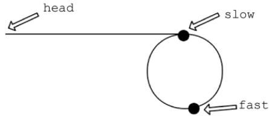

如下图所示，设头结点到环的入口点的距离为a，环的入口点沿着环的方向到相遇点的距离为x，环长为r，相遇时fast绕过了n圈。


则有2(a+x)=a+n\*r+x，即 a=nr−x。显然从头结点到环的入口点的距离等于n倍的环长减去环的入口点到相遇点的距离。因此可设置两个指针，一个指向head，另一个指向相遇点，两个指针同步移动（均为一次走一步），相遇点即环的入口点。

## 2）本题代码如下：

```c
LNode* FindLoopStart(LNode *head) {
LNode *fast=head, *slow=head; //设置快慢两个指针
while(fast!=NULL&&fast->next!=NULL) {
slow=slow->next; //每次走一步
fast=fast->next->next; //每次走两步
if(slow==fast) break; //相遇
if(fast==NULL||fast->next==NULL)
return NULL; //没有环，返回NULL
LNode *p1=head, *p2=slow ; //分别指向开始点、相遇点
while(p1!=p2) {
p1=p1->next;
p2=p2->next; 王道计
return p1; //返回入口点
```

3）当fast与slow相遇时，slow肯定没有遍历完链表，故算法的时间复杂度为O(n)，空间复杂度为O(1)。 I

## 16. 【解答】

## 1）算法的基本设计思想：

设置快、慢两个指针分别为fast和slow，初始时slow指向L（第一个结点），fast指向L->next（第二个结点），之后slow每次走一步，fast每次走两步。当fast指向表尾（第n个结点）时，s1ow正好指向链表的中间点（第n/2个结点），即s1ow正好指向链表前半部分的最后一个结点。将链表的后半部分逆置，然后设置两个指针分别指向链表前半部分和后半部分的首结点，在遍历过程中计算两个指针所指结点的元素之和，并维护最大值。

## 2）本题代码如下：

```c
int PairSum(LinkList L){
LNode *fast=L->next,*slow=L;//利用快慢双指针找到链表的中间点
while(fast!=NULL&&fast->next!=NULL) {
fast=fast->next->next; //快指针每次走两步 计算机教育
slow=slow->next; //慢指针每次走一步
LNode *newHead=NULL,*p=slow->next,*tmp;
while(p!=NULL) { //反转链表后一半部分的元素，采用头插法
tmp=p->next; //p 指向当前待插入结点，令 tmp 指向其下一结点
p->next=newHead; //将p所指结点插入到新链表的首结点之前
newHead=p; //newHead指向刚才新插入的结点，作为新的首结点
p=tmp; //当前待处理结点变为下一结点
} int mx=0; p=L; 育
LNode *q=newHead;
while(q!=NULL) { //用p和q分别遍历两个链表
if((p->data+q->data)>mx)∥/用mx 记录最大值
mx=p->data+q->data;
p=p->next;
q=q->next;
1
```

return mx;

3）本算法的时间复杂度为O(n)，空间复杂度为O(1)。

## 17.【解答】

## 1）算法的基本设计思想：

问题的关键是设计一个尽可能高效的算法，通过链表的一次遍历，找到倒数第k个结点的位置。定义两个指针变量p和q，初始时均指向头结点的下一个结点（链表的第一个结点），p指针沿链表移动；当p指针移动到第k个结点时，q指针开始与p指针同步移动；当p指针移动到最后一个结点时，q指针所指示结点为倒数第k个结点。以上过程对链表仅进行一遍扫描。

2）算法的详细实现步骤如下：

① count=0，p和q指向链表表头结点的下一个结点。

②若p为空，转⑤。

③ 若 count等于 k，则 q指向下一个结点；否则，count=count+1。

④p指向下一个结点，转②。

⑤若count等于k，则查找成功，输出该结点的data域的值，返回1；否则，说明k值 超过了线性表的长度，查找失败，返回0。

⑥ 算法结束。

3）算法实现如下：

```c
typedef int ElemType; //链表数据的类型定义
typedef struct LNode{ //链表结点的结构定义
ElemType data; struct LNode *link; 算机 //结点数据 //结点链接指针
}LNode, *LinkList;
int Search k(LinkList list,int k){
LNode *p=list->link,*q=list->link； //指针p、q指示第一个结点
int count=0;
while(p!=NULL) { //遍历链表直到最后一个结点
if (count<k) count++; //计数，若 count<k 只移动p
else q=q->link;
p=p->link; //之后让p、q同步移动
}//while
if(count<k)
return 0; //查找失败返回0
else { //否则打印并返回1
printf("%d",q->data); 道计算机
return 1;
}
```

## 评分说明

若所给算法采用一遍扫描方式就能得到正确结果，则可给满分15分；若采用两遍或多遍扫描才能得到正确结果，则最高分为10分。若采用递归算法得到正确结果，则最高给10分；若实现算法的空间复杂度过高（使用了大小与k有关的辅助数组），但结果正确，则最高给10分。

## 18.【解答】

顺序遍历两个链表到尾结点时，并不能保证两个链表同时到达尾结点。这是因为两个链表的长度不同。假设一个链表比另一个链表长k个结点，我们先在长链表上遍历k个结点，之后同步遍历两个链表，这样就能够保证它们同时到达最后一个结点。因为两个链表从第一个公共结点到

链表的尾结点都是重合的，所以它们肯定同时到达第一个公共结点。

1）算法的基本设计思想：

① 分别求出 str1 和 str2 所指的两个链表的长度 m 和 n。

②将两个链表以表尾对齐：令指针 p、q分别指向 str1 和 str2的头结点，若 $m { \ngeq } n ,$ ，则指针p先走，使p指向链表中的第 m− n + 1个结点；若m < n，则使 q指向链表中的第n−m+1个结点，即使指针p和q所指的结点到表尾的长度相等。

③反复将指针p和q同步向后移动，并判断它们是否指向同一结点。当p、q指向同一结点，则该点即所求的共同后缀的起始地址。 XTA

2）本题代码如下：

```c
typedef struct Node{
char data;
struct Node *next;
} SNode; /*求链表长度的函数*/ 王道计算机系
int listlen(SNode *head) {
int len=0;
while(head->next!=NULL) {
len++;
head=head->next;
return len;
1
/*找出共同后缀的起始地址*/
SNode* find list(SNode *str1,SNode *str2) {
int m,n;
SNode *p,*q;
m=listlen(str1); //求 str1 的长度，O(m)
n=listlen(str2); 首 //求 str2 的长度，O(n)
for(p=str1;m>n;m--) /若 m>n，使 p 指向链表中的第 m-n+1 个结点
p=p->next;
for(q=str2;m<n;n--) //若 m<n，使 g 指向链表中的第 n-m+1 个结点
q=q->next;
while(p->next!=NULL&&p->next!=q->next){ //查找共同后缀的起始地址
p=p->next; //两个指针同步向后移动
} q=q->next; 算机教育
return p->next; //返回共同后缀的起始地址
```

3）时间复杂度为O(len1+len2)或O(max(len1,len2))，其中 len1、len2分别为两个链表的长度。

## 19.【解答】

1）算法的基本设计思想：

●算法的核心思想是用空间换时间。使用辅助数组记录链表中已出现的数值，从而只需对链表进行一趟扫描。

● 因为|data|≤n，故辅助数组g的大小为n+1，各元素的初值均为0。依次扫描链表中的各结点，同时检查 ${ \tt Q } \left[ \; | \; { \tt d a t a } \; | \; \right]$ 的值，若为0则保留该结点，并令q[|data|]=1；否则将该结点从链表中删除。

2）使用C语言描述的单链表结点的数据类型定义：

```c
typedef struct node {
int data;
struct node *link;
```

}NODE;   
Typedef NODE \*PNODE;

3）算法实现如下：

```c
void func (PNODE h,int n) {
PNODE p=h,r;
int *q,m;
q=(int *)malloc(sizeof(int)*(n+1))； //申请n+1 个位置的辅助空间
for(int i=0;i<n+1;i++) //数组元素初值置0
*(q+i)=0;
while(p->link!=NULL) {
m=p->link->data>0? p->link->data:-p->link->data;
if(*(q+m)==0){ //判断该结点的 data 是否已出现过
*(q+m)=1; //首次出现
p=p->link; //保留
else{ //重复出现 王道计算机教
r=p->link; //删除
道 p->link=r->link; free(r);
王 1
free(q) ;
```

4）参考答案所给算法的时间复杂度为O(m)，空间复杂度为O(n)。

## 20.【解答】

1）算法的基本设计思想：

先观察 $L = ( a _ { 1 } , a _ { 2 } , a _ { 3 } , \cdots , a _ { n - 2 } , a _ { n - 1 } , a _ { n } )$ 和 $L ^ { \prime } = ( a _ { 1 } , a _ { n } , a _ { 2 } , a _ { n - 1 } , a _ { 3 } , a _ { n - 2 } , \cdots )$ ，发现L'是由L摘取第一个元素，再摘取倒数第一个元素……依次合并而成的。为了方便链表后半段取元素，需要先将后半段原地逆置[题目要求空间复杂度为O(1)，不能借助栈]，否则每取最后一个结点都需要遍历一次链表。①先找出链表L的中间结点，为此设置两个指针p和q，指针p每次走一步，指针g每次走两步，当指针g到达链尾时，指针p正好在链表的中间结点；②然后将L的后半段结点原地逆置。③从单链表前后两段中依次各取一个结点，按要求重排。

## 2）算法实现如下：

```c
void change list (NODE*h) {
NOdE *p,*q, *r,*s;
p=q=h;
while(q->next!=NULL) { //寻找中间结点
p=p->next; //p 走一步 道计算机
q=q->next;
王道计 if(q->next!=NULL) q=q->next; //q走两步
1
q=p->next; //p所指结点为中间结点，q为后半段链表的首结点
p->next=NULL;
while(q!=NULL) { //将链表后半段逆置
r=q->next;
q->next=p->next;
p->next=q; 机教育
q=r;
}
s=h->next; //s 指向前半段的第一个数据结点，即插入点
q=p->next; //q指向后半段的第一个数据结点
p->next=NULL;
while(q!=NULL) { //将链表后半段的结点插入到指定位置
```

r=q->next; //r指向后半段的下一个结点  
q->next=s->next；//将 g 所指结点插入到 s 所指结点之后  
s->next=q;  
s=q->next; //s指向前半段的下一个插入点  
q=r;  
道

3）第一步找中间结点的时间复杂度为O(n)，第二步逆置的时间复杂度为O(n)，第三步合并链表的时间复杂度为O(n)，所以该算法的时间复杂度为O(n)。

## 归纳总结

本章是算法设计题的重点考查内容。线性表相关的算法题通常代码量较小，却蕴含一定的设计技巧，非常适合用于笔试考查。此类题目常采用“三段式”结构命题。

在给出题目背景和具体要求的前提下：

①给出算法的基本设计思想。

②采用C或C++语言描述算法，关键之处给出注释。

③分析所设计算法的时间复杂度和空间复杂度。

算法具体的设计思路灵活多变，难以一概而论。因此读者务必勤加练习，反复研读本章的典型例题，尝试用多种方法求解，并对比其时间与空间效率，从而逐步掌握各类题型的分析视角与最优解法。为此，编者整理了几种常用的算法设计技巧，供参考：针对链表，常用方法包括头插法、尾插法、逆置法、归并法、双指针法等，需根据具体问题灵活运用：针对顺序表，因其支持随机访问，常结合经典排序与查找策略进行设计，如归并排序、二分查找等。

## 注意

在算法设计题中，若能正确定义数据结构并清晰阐述算法思想，通常可获得至少一半的分数；若能进一步用规范代码实现，则得分更有保障；逻辑较复杂的部分可直接用文字说明，确保思路完整。

## 思维拓展

一个长度为 n 的整型数组 A[1...n]，给定整数 x，设计一个时间复杂度不超过 O(nlog2n)的算法，查找出这个数组中所有两两之和等于x的整数对（每个元素只输出一次）。

提示：本题若想到排序，则问题便迎刃而解。先用一种时间复杂度为O(nlog2n)的排序算法将A[1...n]从小到大排序，然后分别从数组的小端(i=1)和大端(j=n)开始查找：若 $\mathbb { A } \left[ \downarrow \right] + \mathbb { A } \left[ \downarrow \right] < \mathbb { X }$ i++；若A[i]+A[j]>x，j--；否则输出A[i]、A[j]，然后i++，j--；直到i>=j时停止。

请读者思考本题是否有其他求解算法。

# 第 3 章

# 栈、队列和数组

## 【考纲内容】

（一）栈和队列的基本概念

（二）栈和队列的顺序存储结构

（三）栈和队列的链式存储结构

（四）多维数组的存储

（五）特殊矩阵的压缩存储

（六）栈、队列和数组的应用

  
视频讲解

## 【知识框架】

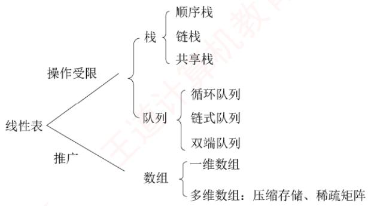

## 【复习提示】

本章通常以选择题形式考查，题目难度不大，但命题方式较为灵活。其中，栈（如入栈/出栈过程、出栈序列的合法性）和队列的操作及其特征是考查重点。由于二者都是线性表的典型应用与推广，也常出现在算法设计题中。此外，栈和队列的顺序存储与链式存储及其特点、双端队列的特性、栈和队列的常见应用，以及数组与特殊矩阵的压缩存储，均为必须掌握的内容。

## 3.1 栈

## 3.1.1 栈的基本概念

## 1. 栈的定义

考点追踪栈的特点（2017）

栈（Stack）是仅允许在一端进行插入和删除操作的线性表。作为一种特殊的线性表，栈的插入（入栈）和删除（出栈）操作被限制在表的一端进行，如图3.1所示。

栈顶（Top）：允许进行插入和删除操作的一端。

栈底（Bottom）：固定不变、不允许进行插入和删除操作的另一端。  
空栈：不含任何元素的栈。

$$
 基高面螺师  \triangleright  出入枝序列的分析  (2010 、 2011 、 2013 、 2018 、 2020 、 2022)
$$


假设某栈 $S = ( a _ { 1 } , a _ { 2 } , a _ { 3 } , a _ { 4 } , a _ { 5 } )$ ，如图3.1所示，其中 $a _ { 1 }$ 为栈底元素，$a _ { 5 }$ 为栈顶元素。栈的入栈和出栈操作只能在栈顶进行。若元素按顺序$a _ { 1 } , a _ { 2 } , a _ { 3 } , a _ { 4 } , a _ { 5 }$ 入栈，则出栈顺序为 $a _ { 5 } , a _ { 4 } , a _ { 3 } , a _ { 2 } , a _ { 1 } ,$ ，由此可见，栈的操作特性可概括为后进先出（Last In First Out，LIFO）。

图 3.1 栈的示意图

## 注意

每接触一种新的数据结构，都应从其逻辑结构、存储结构和基本运算三方面进行系统理解。

## 2. 栈的基本操作

不同教材对基本操作的命名略有差异，但含义基本一致，本文采用严蔚敏教材的命名规范。

● InitStack(&S)：初始化一个空栈 S。

• StackEmpty(S)：判断栈是否为空。若栈s 为空，返回 true；否则返回 false。

● Push(&S，x)：入栈操作；若栈未满，则×成为新的栈顶元素。

● Pop(&S，&x)：出栈操作；若栈非空，则弹出栈顶元素，并通过×返回该值。

● GetTop(S，&x)：读取栈顶元素但不出栈；若栈非空，则通过×返回栈顶元素。

● DestroyStack(&S)：销毁栈s，并释放其所占用的存储空间（&表示引用调用）。

在解答算法题时，若题目未作特殊限制，可直接使用上述基本操作函数。

考点追踪Catalan数的应用（2015）

栈的数学性质：当n个不同元素按固定次序入栈时，可能的出栈序列总数为 $\scriptstyle { \frac { 1 } { n + 1 } } C _ { 2 n } ^ { n }$ 。该数列称为卡特兰（Catalan）数，可通过数学归纳法证明，有兴趣的读者可参考组合数学教材。

## 3.1.2 栈的顺序存储结构

与线性表类似，栈也有两种基本的存储方式：顺序存储和链式存储。

## 1. 顺序栈的实现

采用顺序存储的栈称为顺序栈，它利用一组地址连续的存储单元存放从栈底到栈顶的数据元素，并附设一个整型指针（top）指示当前栈顶元素的位置。

顺序栈的类型可定义如下

```c
#define MaxSize 50 //定义栈中元素的最大个数
typedef struct{
Elemtype data[MaxSize]; //存放栈中元素
int top; //栈顶指针
}SqStack;
```

栈顶指针：s.top，初始时设为s.top=-1；栈顶元素：s.data[s.top]。

入栈操作：当栈未满时，先将栈顶指针加1，再将元素存入栈顶。

出栈操作：当栈非空时，先取出栈顶元素，再将栈顶指针减1。

栈空条件：S.top==-1；栈满条件： $\mathrm{S}.\mathrm{top}=\mathrm{MaxS}\downarrow\mathrm{z}\mathrm{e}-1$ ；栈长：s.top+1。

另一种常见的方式是：栈顶指针初始化为s.top=0；入栈时先将元素存入栈顶，再将栈顶指针加 1；出栈时先将栈顶指针减1，再取出栈顶元素；栈空条件为 S.top==0；栈满条件为

S.top==MaxSize。

顺序栈的入栈操作受数组上界约束。若对栈的最大使用空间估计不足，则可能发生栈上溢，此时，应向用户报告错误信息，以便及时处理，避免程序异常。

## 注意

栈和队列的判空、判满条件，会因实际给出的条件不同而变化，下面的代码实现是在栈顶指针初始化为-1的条件下的相应方法，而其他情况则需具体问题具体分析。

## 2. 顺序栈的基本操作

考点追踪出/入栈操作的模拟（2009）

栈操作的示意图如图3.2所示，图3.2(a)为空栈，图3.2(c)为A、B、C、D、E依次入栈后的状态，图3.2(d)为在图3.2(c)基础上E、D、C相继出栈后的结果，此时栈中剩余2个元素。尽管C、D、E可能仍保留在原存储单元中，但top指针已指向新的栈顶，因此它们已不属于当前栈的内容。读者应结合该图理解栈顶指针的作用：它标识了栈中有效元素的边界。

  
(a) 空栈

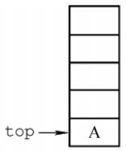  
(b)1个元素

  
(c) 5 个元素

  
(d) 2 个元素  
图3.2 栈顶指针和栈中元素之间的关系

以下是顺序栈常用基本操作的实现（基于top=-1初始化）。

## （1）初始化

```javascript
void InitStack(SqStack &S) {
S.top=-1; //初始化栈顶指针
```

## (2)判栈空

bool StackEmpty(SqStack S) {   
if(S.top==-1) //栈空   
return true;   
else //不空   
return false;   
}

## （3)入栈

bool Push(SqStack &S,ElemType x){   
if(S.top==MaxSize-1) //栈满，报错   
return false;   
S.data[++S.top]=x; //指针先加1，再入栈   
return true;

## (4)出栈 出栈

```javascript
bool Pop(SqStack &S,ElemType &x){
if(S.top==-1) //栈空，报错
return false;
x=S.data[S.top--]; //先出栈，指针再减1
return true; 道
```

## (5)读栈顶元素

```autohotkey
bool GetTop(SqStack S,ElemType &x) {
if(S.top==-1) //栈空，报错
return false;
x=S.data[S.top]; return true; 道 //x 记录栈顶元素
}
```

该操作不改变栈的状态，栈顶元素依然保留在栈中。

## 注意

此处，top指向栈顶元素本身。因此入栈为S.data[++S.top]=x，出栈为x=S.data[S.top--]。若top初始化为0（指向栈顶元素的下一个位置），则入栈变为S.data[S.top++]=x，出栈变为x=S.data[--S.top]，相应的判空、判满条件也随之改变。请读者仔细体会差异，做题时务必根据题目设定灵活应对。 K

## 3. 共享栈

利用栈底位置相对固定的特性，可让两个顺序栈共享同一段一维数组空间，将两个栈的栈底分别置于数组两端，栈顶向中间延伸，如图3.3所示。

  
图3.3 两个顺序栈共享存储空间

0号栈栈顶指针为top0，1号栈栈顶指针为top1，均指向各自的栈顶元素；初始时top0=-1（0号栈空），top1=MaxSize（1号栈空）；栈满条件为top1-top0==1（两栈顶相邻）。当0号栈入栈时，top0先加1，再赋值；当1号栈入栈时，top1先减1，再赋值；出栈操作的顺序相反。

共享栈能更高效地利用存储空间，两个栈的空间可动态调节，仅当整个数组被占满时，才发生栈溢出。其存取数据的时间复杂度均为O(1)，对存取效率无影响。

## 3.1.3 栈的链式存储结构

采用链式存储的栈称为链栈。其优点是便于动态分配存储空间，不存在栈满溢出的问题，且在多栈共存的场景下能更灵活地利用内存。通常使用单链表实现链栈，并且规定所有操作均在链表的表头进行。此处约定链栈不带头结点，栈顶指针Lhead直接指向栈顶元素，如图3.4所示。

  
图 3.4 栈的链式存储

链栈的类型可定义为

typedef struct LinkNode{  
ElemType data; //数据域  
struct LinkNode \*next; //指针域  
}LiStack; //链栈类型定义

由于采用链式存储，结点的插入与删除操作非常高效。链栈的操作与单链表类似，入栈和出栈均在表头进行。注意，对于带头结点的链栈，其初始化、判空及操作细节会有所不同：而本节所述实现基于无头结点的设计，读者应根据实际需求灵活调整实现方式。

## 3.1.4 本节试题精选

## 一、单项选择题

01. 栈和队列具有相同的（）。 计A. 抽象数据类型 B. 逻辑结构 C. 存储结构 D. 运算

02.栈是一种（）。 王A. 顺序存储的线性结构 B. 链式存储的非线性结构C. 限制存取点的线性结构 D. 限制存取点的非线性结构

03.下列选项中，（）不是栈的基本操作。A. 删除栈顶元素 B. 删除栈底元素C. 判断栈是否为空 D. 将栈置为空栈

04. 设用数组a[n]存储一个栈，初始栈顶指针top=-1，则元素x入栈的操作是（）。A. a[--top]=x B. a[top--]=x C. a[++top]=x D. a[top++]=x

05. 设用数组 data[1...n]存储一个栈，初始栈顶指针top=1，则元素x入栈的操作是（）。A. data[top--]=x B. data[top++]=xC. data[--top]=x D. data[++top]=x

06.设用数组 data[1...n]存储一个栈，初始栈顶指针 top=n+1，则元素x入栈的操作是( )。A. data[--top]=x B. data[top++]=xC. data[top--]=x D. data[++top]=x

07. 设有一个空栈，栈顶指针为1000H，栈向高地址方向增长，每个元素占一个存储单元，执行 Push、Push、Pop、Push、Pop、Push、Pop、Push操作后，栈顶指针为（）。A. 1002H B. 1003H C. 1004H D. 1005H

08.和顺序栈相比，链栈有一个比较明显的优势，即（）。A. 通常不会出现栈满的情况 B. 通常不会出现栈空的情况C. 插入操作更容易实现 D. 删除操作更容易实现

09. 设链表不带头结点且所有操作均在表头进行，则下列最不适合作为链栈的是（）。A. 只有表头结点指针，没有表尾指针的双向循环链表B. 只有表尾结点指针，没有表头指针的双向循环链表C. 只有表头结点指针，没有表尾指针的单向循环链表 机教育D. 只有表尾结点指针，没有表头指针的单向循环链表

10. 向一个栈顶指针为top的链栈（不带头结点）中插入一个x结点，则执行（）。A. top->next=x B. x->next=top->next; top->next=xC.x->next=top; top=x D. x->next=top; top=top->next

11.链栈（不带头结点）执行Pop操作，并将出栈的元素存在ⅹ中，应该执行（）。A. x=top; top=top->nextB. x=top->dataC. top=top->next; x=top->data 教育D. x=top->data; top=top->next

12. 经过以下栈的操作后，变量×的值为（）。InitStack(st); Push(st, a); Push(st, b); Pop(st, x); GetTop(st, x);A. a B. b C. NULL D. false

13. 3个不同元素依次入栈，能得到（）种不同的出栈序列。

A. 4 B. 5 C.6T D. 7

14. 设 $a,   b,   c,   d,   e,   f  以$ 所给的次序入栈，若在入栈操作时，允许出栈操作，则下面不会出现的出栈序列为（）。A. fedcba C. dcefba D. cabdef

15. 4个元素依次入栈的次序为 abcd，则以 cd开头的出栈序列的个数为（）。A. 1 B. 2 C. 3 D. 4

16. 用S表示入栈操作，用Χ表示出栈操作，若元素的入栈顺序是1234，为了得到1342的出栈顺序，相应的S和Χ的操作序列为（）。育A. SXSXSSXXB. SSSXXSXX C. SXSSXXSX D. SXSSXSXX

17. 若栈的输入序列是1,2,3,…，n，输出序列的第一个元素是 n，则第i 个输出元素是（）。A. 不确定 B. n-i C. n-i-1 D. n−i+1

18. 若栈的输入序列是 $1,2,3,\cdots,n,$ 输出序列的第一个元素是i，则第j个输出元素是（）。A. i-j-1 B. i- j C. j−i+1 D. 不确定

19. 某栈的输入序列为 $a , b , c , d ,$ 下面的4个序列中，不可能为其输出序列的是（）。A. $a , b , c , d$ B. $c , b , d , a$ C. $d , c , a , b$ D. $a , c , b , d$

20. 若栈的输入序列是 $P_{1},P_{2},\cdots,P_{n},$ 输出序列是1,2,3,…，n，若 $P _ { 3 }   = 1$ ，则 $P _ { 1 }$ 的值（）。A. 可能是2 B. 一定是2 C. 不可能是2 D. 不可能是3

21. 若栈的输入序列是 $P_{1},P_{2},\cdots,P_{n},$ 输出序列是1,2,3,…，n，若 $P _ { 3 }   = 3$ ，则 $P _ { 1 }$ 的值（）。A. 可能是2 B. 不可能是1 C.一定是1 D. 一定是2

22. 已知栈的入栈序列是1,2,3,4，其出栈序列为 $P _ { 1 } , P _ { 2 } , P _ { 3 } , P _ { 4 }$ ，则 $P _ { 2 } , P _ { 4 }$ 不可能是（）。A. 2, 4 B. 2, 1 Y C. 4,3 D. 3,4

23. 设栈的初始状态为空，当字符序列“n1”作为栈的输入时，输出长度为3，且可用作C语言标识符的序列有（）个。A. 4 B. 5 C. 3 D. 6

24.采用共享栈的好处是（）。A. 减少存取时间，降低发生上溢的可能B. 节省存储空间，降低发生上溢的可能C. 减少存取时间，降低发生下溢的可能D. 节省存储空间，降低发生下溢的可能

25. 设有一个顺序共享栈 Share[0:n-1]，其中第一个栈顶指针 top1 的初值为-1，第二个栈顶指针top2的初值为n，则判断共享栈满的条件是（）。A. $\mathtt { t o p 2 - t o p 1 } = = 1$ B. $\mathtt { t o p 1 - t o p 2 } = = 1$ C. top1==top2 D. 都不对

26.【2009统考真题】设栈S和队列Q的初始状态均为空，元素 abcdefg依次入栈S。若每个元素出栈后立即进入队列Q，且7个元素出队的顺序是bdcfeag，则栈S的容量至少是（）。A. 1 B. 2 C.3 D. 4

27.【2010统考真题】若元素a, b, c, d, e,f依次入栈，允许入栈、出栈操作交替进行，但不允许连续3次进行出栈操作，不可能得到的出栈序列是（）。A. $d c e b f a$ B. cbdaef C. bcaefd D. $a f e d c b$

28.【2011统考真题】元素 $a , b , c , d , e$ 依次进入初始为空的栈中，若元素入栈后可停留、可出栈，直到所有元素都出栈，则在所有可能的出栈序列中，以元素d开头的序列个数是（）。

A. 3 B. 4 C. 5KXT D. 6

29. 【2013统考真题】一个栈的入栈序列为1,2,3,…，n，出栈序列是 $P_{1},P_{2},P_{3},\cdots,P_{n}$ 若 $P _ { 2 }   =   3$ 则 $P _ { 3 }$ 可能取值的个数是（）。A. n-3 B. n-2 C. n-1 D. 无法确定

30. 【2020 统考真题】对空栈 S 进行 Push 和 Pop 操作，入栈序列为 $a , b , c , d , e$ ，经过 Push、Push、Pop、Push、Pop、Push、Push、Pop操作后得到的出栈序列是（）。A. b, a, c B. b, a, e C. b, c, a D. b, c, e

31.【2022统考真题】给定有限符号集S，in和out均为S中所有元素的任意排列。对于初始为空的栈ST，下列叙述中，正确的是（）。A. 若in是ST的入栈序列，则不能判断out是否为其可能的出栈序列B. 若out是ST的出栈序列，则不能判断in是否为其可能的入栈序列C. 若in 是ST的入栈序列，out 是对应 in 的出栈序列，则 in 与 out一定不同D. 若in 是ST 的入栈序列，out 是对应 in 的出栈序列，则 in 与out 可能互为倒序

## 二、综合应用题

01. 有5个元素，其入栈次序为 $A ,   B ,   C ,   D ,   E ,$ ，在各种可能的出栈次序中，第一个出栈元素为C且第二个出栈元素为D的出栈序列有哪几个？

02. 若元素的入栈序列为 A, B, C, D, E,运用栈操作，能否得到出栈序列 B, C, A, E, D 和 D, B,A, C, E？ 为什么?

03. 栈的初态和终态均为空，以Ⅰ和〇分别表示入栈和出栈，则出入栈的操作序列可表示为由Ⅰ和O组成的序列，可以操作的序列称为合法序列，否则称为非法序列。1）下面所示的序列中哪些是合法的？A. IOIIOIOO B. IOOIOIIO C. IIIOIOIO D. IIIOOIOO

2）通过对1）的分析，写出一个算法，判定所给的操作序列是否合法。若合法，返回true，否则返回false（假定被判定的操作序列已存入一维数组中）。

04. 设单链表的表头指针为L，结点结构由data和next两个域构成，其中data域为字符型。设计算法判断该链表的全部n个字符是否中心对称。例如，xyx、xyyx都是中心对称的。

05. 设有两个栈S1、S2都采用顺序栈方式，并共享一个存储区 $[ 0 , \ldots , \operatorname* { m a x s i z e } - 1 ]$ ，为了尽量利用空间，减少溢出的可能，可采用栈顶相向、迎面增长的存储方式。试设计S1、S2有关入栈和出栈的操作算法。

## 3.1.5 答案与解析

## 一、单项选择题

01. B

栈和队列的逻辑结构都是相同的，都属于线性结构，只是它们对数据的运算不同。

## 02. C

首先栈是一种线性表，所以选项B、D错。按存储结构的不同可分为顺序栈和链栈，但不可以把栈局限在某种存储结构上，所以选项A错。栈和队列都是限制存取点的线性结构。

03. B

基本操作是指该结构最核心、最基本的运算，其他较复杂的操作可通过基本操作实现。删除栈底元素不属于栈的基本运算，但它可以通过调用栈的基本运算求得。

## 04. C

数组下标范围为0～n−1，初始时top为-1，第一个元素入栈后，top为0，即top指向栈顶元素。栈向高地址方向增长，所以入栈时应先将指针top加1，然后存入元素x，选项C正确。

## 05. B

数组下标范围为1～n，初始时top为1，表示top指向栈顶元素的下一个元素。栈向高地址方向增长，所以入栈时应先存入元素x，然后将指针top加1，选项B正确。

## 06. A

数组下标范围为1～n，初始时top为n+1，表示top指向栈顶元素。栈向低地址方向增长，所以入栈时应先将指针top减1，然后存入元素x，A正确。 LK

## 07. A

每个元素需要1个存储单元，所以每入栈一次top加1，出栈一次top减1。指针top的值依次为 1001H,1002H, 1001H, 1002H, 1001H, 1002H, 1001H, 1002H。

## 08. A

顺序栈采用数组存储，数组的大小是固定的，不能动态地分配大小。和顺序栈相比，链栈的最大优势在于它可以动态地分配存储空间。 H

## 09. C

对于双向循环链表，不管是表头指针还是表尾指针，都可以很方便地找到表头结点，方便在表头做插入或删除操作。而循环单链表通过尾指针可以很方便地找到表头结点，但通过头指针找尾结点需要遍历一次链表。对于选项C，插入和删除结点后，找尾结点所需的时间为O(n)。

## 10. C

链栈采用不带头结点的单链表表示时，入栈操作在首部插入一个结点x（x->next=top），插入完后需将top指向该插入的结点x。请思考当链栈存在头结点时的情况。

## 11. D

这里假设栈顶指针指向的是栈顶元素，所以选择选项D；而选项A中首先将top指针赋给了x，错误；选项B中没有修改top指针的值；选项C为top指针指向栈顶元素的上一个元素时的答案。

## 12. A

执行前3句后，栈st内的值为a,b，其中b为栈顶元素；执行第4句后，栈顶元素b出栈，×的值为b；执行最后一句，读取栈顶元素的值，×的值为a。

## 13. B

当n个不同元素入栈时，出栈序列的个数为

$$
\frac{1}{n + 1}C_{2n}^{n} = \frac{1}{n + 1}\frac{(2n)!}{n! \times n!} = \frac{6 \times 5 \times 4}{4 \times 3 \times 2 \times 1} = 5
$$

考题中给出的n值不会很大，可以根据栈的特点，若 $X _ { i }$ 已经出栈，则 $X _ { i }$ 前面的尚未出栈的元素一定逆置有序地出栈，因此，可以采用例举方法。如a,b,c依次入栈的出栈序列有abc,acb,bac.bca,cba。另外，在一些考题中可能会问符合某个特定条件的出栈序列有多少种，比如此题中问以b开头的出栈序列有几种，这种类型的题目一般都使用穷举法。

## 14. D

根据栈“先进后出”的特点，且在入栈操作的同时允许出栈操作，显然选项D中c最先出栈，则此时栈内必定为a和b，但因为a先于b入栈，所以要晚出栈。对于某个出栈的元素，在它之前入栈却晚出栈的元素必定是按逆序出栈的，其余答案均是可能出现的情况。

此题也可采用将各序列逐个代入的方法来确定是否有对应的进出栈序列（类似下题）。

## 15. A

假设出栈序列为cd...，分析栈的操作序列：a入栈，b入栈，c入栈，c出栈，d入栈，d出栈，此后只能是 b出栈和a出栈一种情况，因此出栈序列只有 cdba。

## 16. D

采用排除法，选项A,B,C得到的出栈序列分别为1243,3241,1324。由1234得到1342的进出栈序列为：1进，1出，2进，3进，3出，4进，4出，2出，所以选择选项D。

## 17. D

第n个元素第一个出栈，说明前n-1个元素都已经按顺序入栈，由“先进后出”的特点可知，此时的输出序列一定是输入序列的逆序，所以答案选择选项D。

## 18. D

当第i个元素第一个出栈时，则i之前的元素可以依次排在i之后出栈，但剩余的元素可以在此时入栈，并且排在i之前的元素出栈，所以第j个出栈的元素是不确定的。

## 19. C

对于选项A，可能的顺序是a入，a出，b入，b出，c入，c出，d入，d出。对于选项B，可能的顺序是a入，b入，c入，c出，b出，d入，d出，a出。对于选项D，可能的顺序是a入，a出，b入，c入，c出，b出，d入，d出。选项C没有对应的序列。

【另解】若出栈序列的第一个元素为d，则出栈序列只能是dcba。该思想通常也适用于出栈序列的局部分析：如12345入栈，问出栈序列34152是否正确？如何分析？若第一个出栈元素是3，则此时12必停留在栈中，它们出栈的相对顺序只能是21，所以34152错误。

## 20. C

入栈序列是 $P_{1},P_{2},\cdots,P_{n},$ 。因为 $P _ { 3 }   = 1$ ，即 $P_{1},P_{2},P_{3}$ 连续入栈后，第一个出栈元素是 $P _ { 3 }$ ，说明 $P _ { 1 } , P _ { 2 }$ 已经按序入栈，根据先进后出的特点可知， $P _ { 2 }$ 必定在 $P _ { 1 }$ 之前出栈，而第二个出栈元素是2，而此时 $P _ { 1 }$ 不是栈顶元素，所以 $P _ { 1 }$ 的值不可能是2。思考：哪些 $P _ { i }$ 可能是2?

## 21. A

假设 $P _ { 1 }$ 是1，入栈后立即出栈， $P _ { 2 }$ 是2，入栈后立即出栈， $P _ { 3 }$ 是3，入栈后立即出栈，得到的序列符合题意。假设 $P _ { 1 }$ 是2， $P _ { 2 }$ 是1， $P _ { 1 }$ 、 $P _ { 2 }$ 依次入栈后全部出栈， $P _ { 3 }$ 是3，入栈后立即出栈，得到的序列符合题意。因此， $P _ { 1 }$ 既可能是1，又可能是2。

## 22. C

逐个判断每个选项可能的入栈出栈顺序。对于选项A，可能的顺序是1入，1出，2入，2出，3入，3出，4入，4出。对于选项B，可能的顺序是1入，2入，3入，3出，2出，4入，4出，1出。对于选项D，可能的顺序是1入，1出，2入，3入，3出，2出，4入，4出。选项C没有对应的序列，因为当4在栈中时，意味着前面的所有元素（1.2.3）都已在栈中或曾经入过栈，此时若4第二个出栈，即栈中还有两个元素，且这两个元素是有序的（对应入栈顺序），只能为(1,2)，(1,3),(2,3)，若是序列(1,2)，则3已在 $p _ { 1 }$ 位置出栈，不可能再在 $p _ { 4 }$ 位置出栈，若是(1,3)和(2,3)这种情况中的任意一种，则3一定是下一个出栈元素，即 $p _ { 3 }$ 一定是3，所以 $p _ { 4 }$ 不可能是3。

【另解】对于选项C， $p _ { 2 }$ 为最后一个入栈元素4，则只有 $p _ { 1 }$ 或 $p _ { 3 }$ 出栈的元素有可能为3（请读者分两种情况自行思考），而p₄绝不可能为3。读者在解答此类题时，一定要注意出栈序列中的 $p _ { 4 }$ “最后一个入栈元素”，这样可以节省答题的时间。

## 23. C

标识符只能以英文字母或下划线开头，而不能以数字开头。于上，由n、1、三个字符组合成

的标识符有n1\_、n\_1、\_1n和\_n1四种。第一种：n入栈再出栈，1入栈再出栈，入栈再出栈。第二种：n入栈再出栈，1入栈，入栈，出栈，1出栈。第三种：n入栈，1入栈，入栈，出栈，1出栈，n出栈。而根据栈的操作特性，n1这种情况不可能出现。

## 24. B

上溢是指存储器满，还往里写：下溢是指存储器空，还往外读。为了解决上溢，可给栈分配很大的存储空间，但这样又会造成存储空间的浪费。共享栈的提出就是为了在解决上溢的基础上节省存储空间，将两个栈放在同一段更大的存储空间内，这样，当一个栈的元素增加时，可使用另一个栈的空闲空间，从而降低发生上溢的可能性。 XTA

## 25. A

这种情况就是前面我们所描述的，详细内容请参见本节考点精析部分对共享栈的讲解。另外，读者可以思考当top1的初值为0，top2的初值为n-1时栈满的条件。 KMK

## 注意

栈顶、队头与队尾的指针的定义是不唯一的，做题时务必仔细审题和思考。

## 26. C

时刻注意栈的特点是先进后出，下表是出入栈的详细过程。

<table><tr><td rowspan=1 colspan=1>序号</td><td rowspan=1 colspan=1>说明</td><td rowspan=1 colspan=1>栈内</td><td rowspan=1 colspan=1>栈外</td><td rowspan=1 colspan=1>序号</td><td rowspan=1 colspan=1>说明</td><td rowspan=1 colspan=1>栈内</td><td rowspan=1 colspan=1>栈外</td></tr><tr><td rowspan=1 colspan=1>1</td><td rowspan=1 colspan=1>a入栈</td><td rowspan=1 colspan=1>a</td><td rowspan=1 colspan=1></td><td rowspan=1 colspan=1>8</td><td rowspan=1 colspan=1>e入栈</td><td rowspan=1 colspan=1>ae</td><td rowspan=1 colspan=1>bdc</td></tr><tr><td rowspan=1 colspan=1>2</td><td rowspan=1 colspan=1>b入栈</td><td rowspan=1 colspan=1>ab</td><td rowspan=1 colspan=1></td><td rowspan=1 colspan=1>9V</td><td rowspan=1 colspan=1>f入栈</td><td rowspan=1 colspan=1>aef</td><td rowspan=1 colspan=1>bdc</td></tr><tr><td rowspan=1 colspan=1>3</td><td rowspan=1 colspan=1>b出栈</td><td rowspan=1 colspan=1>a</td><td rowspan=1 colspan=1>b</td><td rowspan=1 colspan=1>10</td><td rowspan=1 colspan=1>f出栈</td><td rowspan=1 colspan=1>ae</td><td rowspan=1 colspan=1>bdcf</td></tr><tr><td rowspan=1 colspan=1>4</td><td rowspan=1 colspan=1>c入栈</td><td rowspan=1 colspan=1>ac</td><td rowspan=1 colspan=1>b</td><td rowspan=1 colspan=1>11</td><td rowspan=1 colspan=1>e 出栈</td><td rowspan=1 colspan=1>a</td><td rowspan=1 colspan=1>bdcfe</td></tr><tr><td rowspan=1 colspan=1>5</td><td rowspan=1 colspan=1>d入栈</td><td rowspan=1 colspan=1>acd</td><td rowspan=1 colspan=1>b</td><td rowspan=1 colspan=1>12</td><td rowspan=1 colspan=1>a出栈</td><td rowspan=1 colspan=1></td><td rowspan=1 colspan=1>bdcfea</td></tr><tr><td rowspan=1 colspan=1>6</td><td rowspan=1 colspan=1>d出栈</td><td rowspan=1 colspan=1>ac</td><td rowspan=1 colspan=1>bd</td><td rowspan=1 colspan=1>13</td><td rowspan=1 colspan=1>g入栈</td><td rowspan=1 colspan=1>g</td><td rowspan=1 colspan=1>bdcfea</td></tr><tr><td rowspan=1 colspan=1>7</td><td rowspan=1 colspan=1>c出栈</td><td rowspan=1 colspan=1>a</td><td rowspan=1 colspan=1>bdc</td><td rowspan=1 colspan=1>14</td><td rowspan=1 colspan=1>g出栈</td><td rowspan=1 colspan=1></td><td rowspan=1 colspan=1>bdcfeag</td></tr></table>

栈内的最大深度为3，所以栈S的容量至少是3。

【另解】因为元素的出队顺序和入队顺序相同，所以元素的出栈顺序就是 b, d, c,f, e, a, g，因此元素的出入栈次序为 Push(S, a), Push(S, b), Pop(S, b), Push(S, c), Push(S, d), Pop(S, d), Pop(S, c),Push(S, e), Push(S,f), Pop(S,f), Pop(S, e), Pop(S, a), Push(S, g), Pop(S, g)。 初始所需容量为 0,每做一次Push操作，容量加1；每做一次Pop操作，容量减1，记录的容量最大值为3。

## 27. D

选项A由a入，b入，c入，d入，d出，c出，e入，e出，b出，f入，f出，a出得到；选项B由a入，b入，c入，c出，b出，d入，d出，a出，e入，e出，f入，f出得到；选项C由a入，b入，b出，c入，c出，a出，d入，e入，e出，f入，f出，d出得到；选项D由a入，a出，b入，c入，d入，e入，f入，f出，e出，d出，c出，b出得到，但题意要求不允许连续3次出栈操作，选项D不符。

【另解】先入栈的元素后出栈，入栈顺序为 a, b, c, d, e,f,所以连续出栈时的子序列必然是按字母表逆序的，若出栈序列中出现了长度大于或等于3的连续逆序子序列，则为所选序列。

## 28. B

d 第一个出栈，则 c, b, a 出栈的相对顺序是确定的，出栈顺序必为d\_c\_b\_a\_，e的顺序不定，在任意一个“\_”上都有可能。

【另解】d首先出栈，则abc停留在栈中，此时栈的状态如右图所示。


此时可以有如下4种操作：①e入栈后出栈，则出栈序列为 decba；②c 出栈，e入栈后出栈，出栈序列为 dceba；③ $c b$ 出栈，e入栈后出栈，出栈序列为 dcbea；④ cba 出栈，e 入栈后出栈，出栈序列为 dcbae。思路和上面其实一样。 Y

## 29. C

显然，3之后的4,5,…，n都是 $P_{3}$ 可取的数（一直入栈直到该数入栈后马上出栈）。接下来分析1和 2 是否可取： $P _ { 1 }$ 可以是3之前入栈的数（可能是1或2），也可以是4，当 $P _ { 1 } = ~ 1$ 时，$P _ { 3 }$ 可取2；当 $P _ { 1 }   =   2$ 时， $P _ { 3 }$ 可取1。因此， $p _ { 3 }$ 可能取除3外的所有数，个数为n-1。

## 30. D

按题意，出入栈操作的过程如下：

<table><tr><td rowspan=1 colspan=1>C 操作</td><td rowspan=1 colspan=1>栈内元素</td><td rowspan=1 colspan=1>出栈元素</td></tr><tr><td rowspan=1 colspan=1>Push</td><td rowspan=1 colspan=1>a</td><td rowspan=1 colspan=1></td></tr><tr><td rowspan=1 colspan=1>Push</td><td rowspan=1 colspan=1> $a   b$ </td><td rowspan=1 colspan=1></td></tr><tr><td rowspan=1 colspan=1> $\boxed { \mathrm { P O p } }$ </td><td rowspan=1 colspan=1> $a$ </td><td rowspan=1 colspan=1>b</td></tr><tr><td rowspan=1 colspan=1>Push</td><td rowspan=1 colspan=1> $a c$ </td><td rowspan=1 colspan=1></td></tr><tr><td rowspan=1 colspan=1> $\boxed { \mathrm { P O p } }$ </td><td rowspan=1 colspan=1> $a$ </td><td rowspan=1 colspan=1> $c$ </td></tr><tr><td rowspan=1 colspan=1>Push</td><td rowspan=1 colspan=1> $a   d$ </td><td rowspan=1 colspan=1></td></tr><tr><td rowspan=1 colspan=1>Push</td><td rowspan=1 colspan=1> $a   d   e$ </td><td rowspan=1 colspan=1></td></tr><tr><td rowspan=1 colspan=1>Pop</td><td rowspan=1 colspan=1> $a   d$ </td><td rowspan=1 colspan=1>e</td></tr></table>

因此，出栈序列为 $b , c , e \circ$

## 31. D

通过模拟出入栈操作，可以判断入栈序列in和出栈序列out是否合法。因此，已知in序列可以判断out序列是否为可能的出栈序列；已知out序列也可以判断in序列是否为可能的入栈序列，选项A和B错误。若每个元素入栈后立即出栈，则in序列和out序列相同，选项C错误。若所有元素都入栈后才依次出栈，则in序列和out序列互为倒序，选项D正确。

## 二、综合应用题

## 01.【解答】

CD出栈后的状态如右图所示。

此时有如下3种操作：①E入栈后出栈，出栈序列为CDEBA；②B出栈，E入栈后出栈，出栈序列为CDBEA；③ B出栈，A 出栈，E入栈后出栈，出栈序列为 CDBAE。 KX


所以，以CD开头的出栈序列有CDEBA、CDBEA、CDBAE三种。

## 02.【解答】

能得到出栈序列BCAED。可由A入，B入，B出，C入，C出，A出，D入，E入，E出，D出得到。不能得到出栈序列DBACE。若出栈序列以D开头，说明在D之前的入栈元素是A、B和C，三个元素中C是栈顶元素，B和A不可能早于C出栈，所以不可能得到出栈序列DBACE。

## 03.【解答】

1）选项A、D合法，而选项B、C不合法。在B中，先入栈1次，再连续出栈2次，错误。在选项C中，入栈和出栈次数不一致，会导致最终的栈不空。选项A、D均为合法序列，请自行模拟。注意，在操作过程中，入栈次数一定大于或等于出栈次数；结束时，栈一定为空。

2）设被判定的操作序列已存入一维数组A中。算法的基本设计思想：依次逐一扫描入栈出栈序列（由Ⅰ和〇组成的字符串），每扫描至任意一个位置均需检查出栈次数（O的个数）是否

小于入栈次数（I的个数），若大于则为非法序列。扫描结束后，再判断入栈和出栈次数是否相等，若不相等则不合题意，为非法序列。 省村

本题代码如下：

bool Judge(char A[ ]){  
int i=0;  
int j=k=0; //i 为下标，j 和 k 分别为字母 Ⅰ 和 O 的个数  
while(A[i]!='\0'){ //未到字符数组尾  
switch(A[i]) {  
case 'I': j++; break; //入栈次数增1  
case 'O': k++;  
if(k>j){printf("序列非法\n")； exit(0)；}  
i++; //不论 A [i] 是I还是 O，指针 i 均后移  
if(j!=k) {  
printf("序列非法\n")；  
return false; 王道计算机  
}  
else {  
王道 printf("序列合法\n")；  
return true;  
}  
1

（另解】入栈后，栈内元素个数加1：出栈后，桟内元素个数减1，因此可将判定一组出入栈序列是否合法转化为一组由+1、-1组成的序列，它的任意前缀子序列的累加和不小于0（每次出栈或入栈操作后判断）则合法；否则非法。

## 04.【解答】

算法思想：使用栈来判断链表中的数据是否中心对称。让链表的前一半元素依次入栈。在处理链表的后一半元素时，当访问到链表的一个元素后，就从栈中弹出一个元素，对两个元素进行比较，若相等，则将链表中的下一个元素与栈中再弹出的元素进行比较，直至链表到尾。这时若栈是空栈，则得出链表中心对称的结论；否则，当链表中的一个元素与栈中弹出元素不等时，结论为链表非中心对称，结束算法的执行。

本题代码如下：

int dc(LinkList L,int n) {  
int i;  
char s[n/2]; //s 字符栈  
LNode \*p=L->next; //工作指针p，指向待处理的当前元素  
for(i=0;i<n/2;i++){ //链表前一半元素入栈  
s[i]=p->data;  
p=p->next; 道  
i--; //恢复最后的i 值  
if(n%2==1) //若n 是奇数，后移过中心结点  
p=p->next;  
while(p!=NULL&&s[i]==p->data){ //检测是否中心对称  
i--; //i 充当栈顶指针  
p=p->next;  
1  
if(i==-1) //栈为空栈  
else return 1; 道计算机 //链表中心对称  
return 0; //链表中心不对称

算法先将“链表的前一半”元素（字符）入栈。当n为偶数时，前一半和后一半的个数相同；当n为奇数时，链表中心结点字符不必比较，移动链表指针到下一字符开始比较。比较过程中遇到不相等时，立即退出 while循环，不再进行比较。

本题也可以先将单链表中的元素全部入栈，然后扫描单链表L并比较，直到比较到单链表L尾为止，但算法需要两次扫描单链表L，效率不及上述算法高。

## 05.【解答】

两个栈共享向量空间，将两个栈的栈底设在向量两端，初始时，S1栈顶指针为-1，S2栈顶指针为maxsize。两个栈顶指针相邻时为栈满。两个栈顶相向、迎面增长，栈顶指针指向栈顶元素。

本题代码如下：

```c
#define maxsize 100 //两个栈共享顺序存储空间所能达到的最多元素数，
//初始化为100
#define elemtp int //假设元素类型为整型
typedef struct{ 道计算机
elemtp stack[maxsize]; //栈空间
int top[2]; //top为两个栈顶指针
}stk;
stk S ; /s 是如上定义的结构类型变量，为全局变量
```

本题的关键在于，两个栈入栈和出栈时的栈顶指针的计算。S1栈是通常意义下的栈；而S2栈入栈操作时，其栈顶指针左移（减1），出栈时，栈顶指针右移（加1）。

此外，对于所有栈的操作，都要注意“入栈判满、出栈判空”的检查。

## （1）入栈操作

代码如下：

```javascript
int Push(int i, elemtp x){
//入栈操作。i 为栈号，i=0表示左边的 S1 栈，i=1 表示右边的 S2 栈，× 是入栈元素
//入栈成功返回1，否则返回0
if(i<0||i>1) {
printf("栈号输入不对")；
exit(0);
1
if(s.top[1]-s.top[0]==1) {
printf("栈已满\n");
return 0;
switch(i) {
case 0: s.stack[++s.top[0]]=x; return 1; break; 计算机考
case 1: s.stack[--s.top[1]]=x; return 1;
```

## （2）出栈操作

代码如下：

```javascript
elemtp Pop(int i) {
//出栈算法。i 代表栈号，i=0 时为 S1 栈，i=1 时为 S2 栈
//出栈成功返回出栈元素，否则返回-1
if(i<0|li>1) {
printf("栈号输入错误\n")；
exit(0); 计算机教育
1
switch(i) {
case 0:
if(s.top[0]==-1){
```

printf("栈空\n");   
return -1; 算机孝   
else   
return s.stack[s.top[0]--];   
break;   
case 1:   
if(s.top[1]==maxsize) {   
printf("栈空\n");   
return -1;   
1   
else   
return s.stack[s.top[1]++];   
break;   
}//switch   
1

## 3.2 队列

## 3.2.1 队列的基本概念

## 1. 队列的定义

队列（Queue）简称队，也是一种操作受限的线性表，仅允许在表的一端进行插入，而在另一端进行删除。向队列中插入元素称为入队（或进队），删除元素称为出队（或离队）。这一

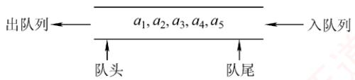  
图 3.5 队列示意图

规则符合日常排队“先到先服务”的原则，因此队列的操作特性为先进先出（First In First Out，FIFO），如图3.5所示。

队头（Front）：允许删除的一端，也称队首。

队尾（Rear）：允许插入的一端。

空队列：不含任何元素的队列。

## 2. 队列常见的基本操作

InitQueue(&Q)：初始化队列，构造一个空队列Q。

QueueEmpty(Q)：判队列空；若队列Q为空，返回 true，否则返回 false。

EnQueue(&Q,x)：入队操作；若队列Q未满，将x加入队尾。

DeQueue(&Q，&x)：出队操作；若队列Q非空，删除队首元素，并通过×返回其值。

GetHead(Q，&x)：读队首元素但不出队；若队列Q非空，将队首元素赋值给x。

需要注意的是，栈和队列均为操作受限的线性表，因此并非所有线性表的操作都适用于它们。例如，不允许直接访问或修改栈或队列中间的元素，这是由其逻辑特性所决定的。

## 3.2.2 队列的顺序存储结构

## 1. 队列的顺序存储

队列的顺序实现是指分配一块连续的存储单元存放队列元素，并附设两个指针：队首指针front指向队首元素，队尾指针rear指向队尾元素的下一个位置。不同教材对front和rear指针含义的约定可能不同（例如，rear可能指向队尾元素或其下一位置），这会导致入队和出队操作的具体实现不同。本节后附有相关习题，建议读者结合练习深入理解。

```c
#define MaxSize 50 //定义队列中元素的最大个数
typedef struct{
ElemType data[MaxSize]; //用数组存放队列元素
int front,rear; //队首指针和队尾指针
} SqQueue; 道
```

队列的顺序存储类型可定义为

初始状态：Q. $\mathtt { f r o n t } = \mathtt { Q } \: . \: \mathtt { r e a r } = 0$ o

入队操作：当队列未满时，先将元素存入队尾，再将队尾指针加1。

出队操作：当队列非空时，先取出队首元素，再将队首指针加1。

如图3.6(a)所示，初始时空队列满足Q.front==Q.rear==0，该条件可作为判空依据。

  
(a) 空队

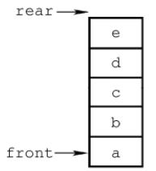  
(b)5个元素入队

  
(c) 出队 1 次

  
(d) 出队 3 次  
图 3.6 队列的操作

然而，能否以 $\mathtt { Q \_ r e a r } { = } \mathtt { M a x S i z e }$ 作为队满条件呢？显然不能。如图3.6(d)所示，队列中仅剩一个元素，但rear已达MaxSize，若此时继续入队，则会出现“上溢”。但这种溢出并非真正溢出，实际上数组中仍有空闲单元，因此称此现象为假溢出。

## 2. 循环队列

为了解决顺序队列的假溢出问题，引入循环队列：将顺序存储空间在逻辑上组织为环状结构。当指针到达数组末尾时，自动回到起始位置，这可通过取模运算（%）实现。

考点追踪特定条件下循环队列队头/队尾指针的初值（2011）

初始状态：Q.front=Q.rear=0。

队首指针进1：Q.front=(Q.front+1)%MaxSize。

队尾指针进1：Q.rear=(Q.rear+1)%MaxSize。

队列长度：(Q.rear+MaxSize-Q.front)%MaxSize。

出入队操作：指针均按顺时针方向移动（见图3.7）。

考点追踪循环队列判空/满的条件（2014）

那么，循环队列判空和判满的条件是什么呢？队空条件显然为Q.front==Q.rear。但当入队速度远快于出队时，rear会追上front，此时同样满足 $\mathrm{Q.~f.~cont}==\mathrm{Q.~r e a r}$ ，却表示队满。因此，仅凭 $\mathtt { f r o n t } { = } \mathtt { r e a r }$ 无法区分队空与队满。循环队列出入队的示意图如图3.7所示。

为解决这一问题，常用以下三种方法：

1）牺牲一个存储单元：入队时少用一个存储单元，这是一种较为普遍的做法，约定以“队尾指针的下一位置为队首”作为队满标志，如图3.7(d2)所示。

队满条件： $( \mathtt { Q } \mathtt { . r e a r } \mathtt { + 1 } ) \mathtt { \S { M a x S i z e } } { = = } \mathtt { Q } \mathtt { . f r o r i t } \mathtt { . }$

队空条件：Q.front==Q.rear。

队列中元素个数： $( \mathtt { Q } \mathtt { . r e a r } \mathtt { - Q } \mathtt { . f r o n t } \mathtt { + M a x S i z e } ) \mathtt { \S M a x S i z e } \mathtt { \circ }$

2）增设size成员：记录当前元素个数。若入队成功，则 $\scriptstyle \mathbf { S }   { \dot { \perp } }   z   \in + +$ ，若出队成功，则 $\mathrm { s i z e - - }$ 队空条件： $\mathtt { Q } . \mathtt { S i z e } { = } \mathtt { = } 0$ T

  
图3.7 循环队列出入队的示意图

队满条件： $\mathtt { Q . S i z e } = = \mathtt { M a x S i z e } \mathtt { \cdot }$

两种情形均有 $\mathtt { Q . f r o n t } { = } { = } \mathtt { Q . r e a r }$ ，由 $\mathrm { s i z e }$ 区分队空与队满。

## 3）增设tag标志位：

出队后置 $\tan g = 0$ ，若此时 $\mathbb { Q } . \mathtt { f r o n t } = = \mathbb { Q } . \mathtt { r e a r }$ ，则为队空。KUX入队后置tag=1，若此时 $\mathtt { Q . f r o n t } = = \mathtt { Q . r e a r }$ ，则为队满。

## 3. 循环队列的操作（基于牺牲一个单元法）

```javascript
（1）初始化
void InitQueue(SqQueue &Q) {
Q.rear=Q.front=0;
```

//初始化队首、队尾指针

(2) 判队空

bool QueueEmpty(SqQueue Q) {   
if(Q.rear==Q.front)   
return true;   
else   
return false;

```csv
bool EnQueue(SqQueue &Q,ElemType x) {
if((Q.rear+1)%MaxSize==Q.front)
return false;
Q.data[Q.rear]=x;
Q.rear=(Q.rear+1) %MaxSize;
return true;
1
```

//队满则报错//队尾指针加 1 取模

```javascript
bool DeQueue(SqQueue &Q,ElemType &x) {
if(Q.rear==Q.front)
return false;
x=Q.data[Q.front];
```

//队空则报错

Q.front=(Q.front+1) %MaxSize;   
return true;

## 3.2.3 队列的链式存储结构

## 1. 队列的链式存储

考点追踪链式队列的应用场景（2019）

队列的链式表示称为链式队列，本质上是一个同时带有队首指针和队尾指针的单链表，如图3.8所示。队首指针指向队头结点，队尾指针指向队尾结点，即单链表的最后一个结点。

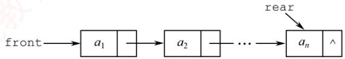  
图3.8 不带队头结点的链式队列

链式队列的类型可定义为

```c
typedef struct LinkNode{ //链式队列结点
ElemType data;
struct LinkNode *next;
}LinkNode;
typedef struct{ //链式队列
LinkNode *front,*rear; //队列的队头和队尾指针
}LinkQueue;
```

当不带头结点时，若Q.front==NULL且Q.rear==NULL，则链式队列为空队列。

考点追踪链式队列判空的条件（2019）

入队操作：创建一个新结点，将其插入链表尾部，并令Q.rear指向该结点；若原队列为空，则同时令Q.front也指向该结点。

出队操作：先判断队列是否为空；若非空，则取出队首元素，删除对应结点，并令Q.front指向下一个结点；若被删结点是最后一个元素，则将Q.front 和Q.rear均置为NULL。

不难发现，不带头结点的链式队列在边界处理上较为烦琐。因此，通常将链式队列设计为带头结点的单链表，从而使插入与删除操作逻辑统一，如图3.9所示。

链式队列特别适用于元素数量频繁变化的场景，且不存在队满或溢出问题。此外，若程序中需使用多个队列（如同多个栈的情形），优先选用链式队列可避免存储分配不合理或溢出等问题。

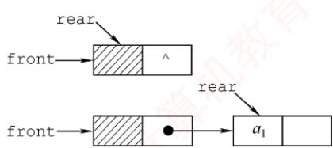  
图3.9 带队头结点的链式队列

## 2. 链式队列的基本操作

考点追踪链式队列出队/入队操作的基本过程（2019）

（1）初始化

```javascript
void InitQueue(LinkQueue &Q){ //初始化带头结点的链式队列
Q.front=Q.rear=(LinkNode*)malloc(sizeof(LinkNode));//建立头结点
Q.front->next=NULL; //初始为空
}
```

(2)判队空

bool QueueEmpty(LinkQueue Q) {

if(Q.front==Q.rear) //判空条件  
return true;  
else 算机  
return false;  
1  
(3)入队  
void EnQueue(LinkQueue &Q,ElemType x) {  
LinkNode \*s=(LinkNode \*)malloc(sizeof(LinkNode));//创建新结点  
s->data=x;  
s->next=NULL;  
Q.rear->next=s; //插入链尾  
Q.rear=s; //修改尾指针  
}  
（4）出队  
bool DeQueue(LinkQueue &Q,ElemType &x){ 王道计算机教育  
if(Q.front==Q.rear)  
return false; //空队  
LinkNode \*p=Q.front->next;  
王道 x=p->data;  
Q.front->next=p->next;  
if(Q.rear==p)  
Q.rear=Q.front; //若原队列中只有一个结点，删除后变空  
free(p) ;  
return true; 育  
1

## 3.2.4 双端队列

双端队列是一种允许在两端进行插入和删除操作的线性表，如图3.10所示。双端队列两端的地位是平等的，为便于理解，可将左端视为前端，右端视为后端。

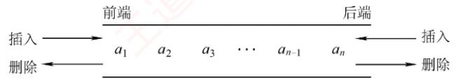  
图 3.10 双端队列

在双端队列入队时：前端插入的元素排列在队列中后端插入的元素之前；后端插入的元素排列在队列中前端插入的元素之后。在双端队列出队时：无论是从前端还是后端出队，先出的元素总是排列在后出的元素之前。思考：如何由入队序列 a, b, c, d得到出队序列d, c, a, b?

## 考点追踪双端队列出入队操作的分析（2010、2021）

输出受限的双端队列：允许在一端进行插入和删除，但在另一端仅允许插入的双端队列称为输出受限的双端队列，如图3.11所示。

  
图 3.11 输出受限的双端队列

输入受限的双端队列：允许在一端进行插入和删除，但在另一端仅允许删除的双端队列称为输入受限的双端队列，如图3.12所示。若限定双端队列从某个端点插入的元素只能从该端点删除，则该双端队列就蜕变为两个栈底相邻接的栈。

  
1,4,2,3 2,4, 1, 3 3,4,1,2 3, 1, 4, 2 3, 1, 2,4  
4,3, 1,2 4,1, 3,2 4, 2, 3, 1 4,2, 1, 3 4, 1, 2, 3

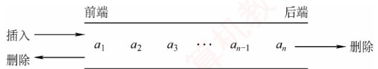  
图3.12 输入受限的双端队列  
例设有一个双端队列，输入序列为1,2,3,4，试分别求出以下条件的输出序列。  
（1）能由输入受限的双端队列得到，但不能由输出受限的双端队列得到的输出序列。  
（2）能由输出受限的双端队列得到，但不能由输入受限的双端队列得到的输出序列。  
（3）既不能由输入受限的双端队列得到，又不能由输出受限的双端队列得到的输出序列。

解：先看输入受限的双端队列，见图 3.13。假设 end1 端输入1,2,3,4，则 end2端的输出相当于普通队列的输出，即 1,2,3,4；而 end1 端的输出相当于栈的输出，n = 4 时仅通过 end1端有14种输出序列（由 Catalan公式得出），仅通过 end1 端不能得到的输出序列有4!-14=10种：

通过 end1和 end2端混合输出，可以输出这10种中的8种，参见下表。其中， $S _ { \mathrm { L } } , X _ { \mathrm { L } }$ 分別代表 end1 端的入队和出队， $X _ { \mathrm { R } }$ 代表 end2 端的出队。

<table><tr><td rowspan=1 colspan=1>输出序列</td><td rowspan=1 colspan=1>入队出队顺序</td><td rowspan=1 colspan=1>输出序列</td><td rowspan=1 colspan=1>入队出队顺序</td></tr><tr><td rowspan=1 colspan=1>1,4,2,3</td><td rowspan=1 colspan=1>SLXRSLSLSLXLXRXR</td><td rowspan=1 colspan=1>3,1,2,4</td><td rowspan=1 colspan=1>SLSLSLXLSLXRXRXR</td></tr><tr><td rowspan=1 colspan=1>2,4,1,3</td><td rowspan=1 colspan=1>SLSLXLSLSLXLXRXR</td><td rowspan=1 colspan=1>4,1,2,3</td><td rowspan=1 colspan=1>SLSLSLSLXLXRXRXR</td></tr><tr><td rowspan=1 colspan=1>3,4,1,2</td><td rowspan=1 colspan=1>SLSLSLXLSLXLXRXR</td><td rowspan=1 colspan=1>4,1, 3,2</td><td rowspan=1 colspan=1>SLSLSLSLXLXRXLXR</td></tr><tr><td rowspan=1 colspan=1>3,1,4,2</td><td rowspan=1 colspan=1>SLSLSLXLXRSLXLXR</td><td rowspan=1 colspan=1>4,3,1,2</td><td rowspan=1 colspan=1>SLSLSLSLXLXLXRXR</td></tr></table>

剩下的两种是不能通过输入受限的双端队列输出的，即4,2,3,1和4,2,1,3。

再看输出受限的双端队列，见图3.14。假设 end1和 end2端都能输入，仅 end2端可以输出。  
若都从end2端输入，则就是一个栈。当输入序列为1,2,3,4时，输出序列有14种。对于其余10  
种不能得到的输出序列，通过交替从end1和end2端输入，还可以输出其中8种。设 $S _ { \mathrm { L } }$ 代表 end1  
端的输入， $S _ { \mathrm { R } }  、  X _ { \mathrm { R } }$ 分别代表end2端的输入和输出，则可能的输出序列见下表。 育K

图3.13 例题中输入受限的双端队列 图 3.14 例题中输出受限的双端队列
<table><tr><td rowspan=1 colspan=1>输出序列</td><td rowspan=1 colspan=1>入队出队顺序</td><td rowspan=1 colspan=1>输出序列</td><td rowspan=1 colspan=1>入队出队顺序</td></tr><tr><td rowspan=1 colspan=1>1,4,2,3</td><td rowspan=1 colspan=1> $S _ { \mathrm { L } } X _ { \mathrm { R } } S _ { \mathrm { L } } S _ { \mathrm { L } } S _ { \mathrm { R } } X _ { \mathrm { R } } X _ { \mathrm { R } } X _ { \mathrm { R } }$ </td><td rowspan=1 colspan=1>3,1,2,4</td><td rowspan=1 colspan=1> $S _ { \mathrm { L } } S _ { \mathrm { L } } S _ { \mathrm { R } } X _ { \mathrm { R } } X _ { \mathrm { R } } S _ { \mathrm { L } } X _ { \mathrm { R } } X _ { \mathrm { R } }$ </td></tr><tr><td rowspan=1 colspan=1>2,4,1,3</td><td rowspan=1 colspan=1>SLSRXRSLSRXRXRXR</td><td rowspan=1 colspan=1>4,1,2,3</td><td rowspan=1 colspan=1>SLSLSLSRXRXRXRXR</td></tr><tr><td rowspan=1 colspan=1>3,4,1,2</td><td rowspan=1 colspan=1> $S _ { \mathrm { L } } S _ { \mathrm { L } } S _ { \mathrm { R } } X _ { \mathrm { R } } S _ { \mathrm { R } } X _ { \mathrm { R } } X _ { \mathrm { R } } X _ { \mathrm { R } }$ </td><td rowspan=1 colspan=1>4,2, 1,3</td><td rowspan=1 colspan=1> $S _ { \mathrm { L } } S _ { \mathrm { R } } S _ { \mathrm { L } } S _ { \mathrm { R } } X _ { \mathrm { R } } X _ { \mathrm { R } } X _ { \mathrm { R } } X _ { \mathrm { R } }$ </td></tr><tr><td rowspan=1 colspan=1>3,1,4,2</td><td rowspan=1 colspan=1> $S _ { \mathrm { L } } S _ { \mathrm { L } } S _ { \mathrm { R } } X _ { \mathrm { R } } X _ { \mathrm { R } } S _ { \mathrm { R } } X _ { \mathrm { R } } X _ { \mathrm { R } }$ </td><td rowspan=1 colspan=1>4,3,1,2</td><td rowspan=1 colspan=1> $S _ { \mathrm { L } } S _ { \mathrm { L } } S _ { \mathrm { R } } S _ { \mathrm { R } } X _ { \mathrm { R } } X _ { \mathrm { R } } X _ { \mathrm { R } } X _ { \mathrm { R } } X _ { \mathrm { R } }$ </td></tr></table>

通过输出受限的双端队列不能得到的两种输出序列是4,1,3,2和4,2,3,1。

综上所述：

1）能由输入受限的双端队列得到，但不能由输出受限的双端队列得到的是4,1,3,2。

2）能由输出受限的双端队列得到，但不能由输入受限的双端队列得到的是4,2,1,3。

3）既不能由输入受限的双端队列得到，又不能由输出受限的双端队列得到的是4,2,3,1。

## 提示

实际双端队列的考题不会如此复杂，通常只需判断序列是否满足题设条件，代入验证即可。

## 3.2.5 本节试题精选

## 一、单项选择题

01. 栈和队列的主要区别在于（）。A. 它们的逻辑结构不一样 B. 它们的存储结构不一样C. 所包含的元素不一样 D. 插入、删除操作的限定不一样

02.队列的“先进先出”特性是指（）。I. 最后插入队列中的元素总是最后被删除Ⅱ.当同时进行插入、删除操作时，总是插入操作优先Ⅲ.每当有删除操作时，总要先做一次插入操作IV. 每次从队列中删除的总是最早插入的元素 王道计A. I B. I和 IV C. II 和 ⅢII D. IV

03. 允许对队列进行的操作有（）。A. 对队列中的元素排序 B. 取出最近入队的元素C. 在队列元素之间插入元素 D. 删除队首元素

04. 一个队列的入队顺序是1,2,3,4，则出队的输出顺序是（）。A. 4, 3, 2, 1 B. 1, 2, 3, 4 C. 1, 4,3,2 D. 3, 2, 4, 1

05. 循环队列存储在数组A[0...n]中，入队时的操作为（）。A. $\mathtt { r e a r } { = } \mathtt { r e a r } { + } \mathtt { l }$ B. $\mathtt { r e a r } { = } \left( \mathtt { r e a r } { + } \mathtt { l } \right) \mod \left( \mathtt { n } { - } \mathtt { l } \right)$ C. rear=(rear+1) mod n D. $\mathtt { r e a r } = ( \mathtt { r e a r } + \mathtt { l } ) \mod ( \mathtt { n } + \mathtt { l } )$

06. 已知循环队列的存储空间为数组A[21]，front指向队首元素的前一个位置，rear指向队尾元素，假设当前front和rear的值分别为8和3，则该队列的长度为（）。A. 5 B. 6 C. 16 D. 17

07. 若用数组A[0...5]实现循环队列，且当前rear和front的值分别为1和5，当从队列中删除一个元素，再加入两个元素后，rear和front的值分别为（）。A. 3和4 B. 3和0 C. 5和0 D. 5和1

08. 假设用数组Q[MaxSize]实现循环队列，队首指针front指向队首元素的前一位置，队尾指针rear指向队尾元素，则判断该队列为空的条件是（）。A. $\mathtt { Q . r e a r } { = } \mathtt { ( Q . f r o n t { + } 1 ) \; \S { M a x S i z e } }$ 王道B. $( \mathtt { Q . r e a r { + } 1 } ) \; \mathtt { \S { M a x S i z e { = } = } Q . f r o n t { + } 1 }$ C. (Q.rear+1)%MaxSize==Q.frontD. $\mathtt { Q . r e a r } { = } \mathtt { Q . f r o n t }$

09. 假设循环队列Q[MaxSize]的队首指针为front，队尾指针为rear，队列的最大容量为MaxSize，此外，该队列再没有其他数据成员，则判断该队列已满的条件是（）。A. Q. $\mathtt { f r o n t } { = } { = } \mathtt { Q . r e a r }$ B. Q. $\mathtt { f r o n t } \mathtt { + Q } \mathtt { , r e a r } \mathtt { > = } \mathtt { M a x S i z e }$ C. Q.front==(Q.rear+1)%MaxSize D. $\mathtt { Q \_ r e a r } = \mathtt { ( Q \_ f r o n t + l ) \; \S M a x S i z e }$

10. 假设用A[0...n]实现循环队列，front、rear分别指向队首元素的前一个位置和队尾元素。若用 $( \mathtt { r e a r } + \mathtt { l } ) \; \mathtt { \hat { s } } \; ( \mathtt { n } + \mathtt { l } ) = = \mathtt { f r o n t }$ 作为队满标志，则（）。

A. 可用 $\mathtt { f r o n t } { = } \mathtt { r e a r }$ 作为队空标志B. 队列中最多可有n+1 个元素 算机字C. 可用 $\mathtt { f r o n t { > } r e a r }$ 作为队空标志D. 可用(front+1)%(n+1)==rear作为队空标志

11. 与顺序队列相比，链式队列的（）。A. 优点是队列的长度不受限制B. 优点是入队和出队时间效率更高C. 缺点是不能进行顺序访问D. 缺点是不能根据队首指针和队尾指针计算队列的长度

12.下列描述的几种链表中，最适合用作队列的是（）。A. 带队首指针和队尾指针的循环单链表B. 带队首指针和队尾指针的非循环单链表C. 只带队首指针的非循环单链表D.只带队首指针的循环单链表

13.下列描述的几种链表中，最不适合用作链式队列的是（）。A. 只带队首指针的非循环双链表 B. 只带队首指针的循环双链表C. 只带队尾指针的循环双链表 D. 只带队尾指针的循环单链表

14. 在用单链表实现队列时，队头设在链表的（）位置。A. 链头 B. 链尾 C. 链中 D. 以上都可以

15. 用链式存储方式的队列进行删除操作时需要（）。A. 仅修改头指针 B. 仅修改尾指针C. 头尾指针都要修改 D. 头尾指针可能都要修改

16. 在一个链式队列中，假设队首指针为front，队尾指针为rear，x所指向的元素需要入队，则需要执行的操作为（）。A. $\mathtt { f r o n t { = } x , \quad f r o n t { = } f r o n t { - } { > } n e x t }$ B. $\scriptstyle { \mathrm { x - > } } { \mathrm { n e x t = } } { \mathrm { f } } { \mathrm { x o n t - > } } { \mathrm { n e x t } } { \mathrm { , ~ } } { \mathrm { f } } { \mathrm { x o n t = } } { \mathrm { x } }$ C. $x \in \mathtt { a x } - > \mathtt { n e x t } = \mathtt { x } , x \in \mathtt { a x } = \mathtt { x }$ 教育D. $\mathtt { r e a r { - } { > } n e x t { = } x , \quad x { - } { > } n e x t { = } N U L L , \quad r e a r { = } x }$

17. 假设循环单链表表示的队列长度为n，队头固定在链表尾，若只设头指针，则入队操作的时间复杂度为（）。A. O(n) B. O(1) C. $O ( n ^ { 2 } )$ D. $O ( n \log _ { 2 } n )$

18. 假设输入序列为1,2,3,4,5，利用两个队列进行出入队操作，不可能输出的序列是（）。A. 1,2, 3, 4,5 B. 5, 2, 3, 4, 1 C. 1, 3, 2, 4, 5D. 4, 1, 5, 2, 3

19. 若以1,2,3,4作为双端队列的输入序列，则既不能由输入受限的双端队列得到，又不能由输出受限的双端队列得到的输出序列是（）。A. 1, 2, 3, 4 B. 4, 1, 3, 2 C. 4,2, 3, 1 D. 4, 2, 1, 3

20.【2010统考真题】某队列允许在其两端进行入队操作，但仅允许在一端进行出队操作。若元素 $a , b , c , d , e$ 依次入此队列后再进行出队操作，则不可能得到的出队序列是（）。A. $b , a , c , d , e$ B. $d , b , a , c , e$ KC. $d , b , c , a , e$ D. $e , c , b , a , d$

21.【2011统考真题】已知循环队列存储在一维数组 $\mathbb { A } \left[ 0 . . . n { - } 1 \right]$ 中，且队列非空时front和rear分别指向队首元素和队尾元素。若初始时队列为空，且要求第一个进入队列的元素存储在A[0]处，则初始时front和rear的值分别是（）。A. 0, 0 B. 0, n-1 C.n-1，0 D. n−1, n−1

22. 【2014 统考真题】循环队列放在一维数组A[0...M-1]中，end1 指向队首元素，end2指向队尾元素的后一个位置。假设队列两端均可进行入队和出队操作，队列中最多能容纳M-1个元素。初始时为空。下列判断队空和队满的条件中，正确的是（）。A. 队空： end1==end2; 土 队满： end1==(end2+1) mod MB. 队空： end1==end2; 队满：end2==(end1+1) mod (M-1)C. 队空： end2==(end1+1)mod M; 队满： end1==(end2+1) mod MD. 队空： end1==(end2+1)mod M; 队满： end2==(end1+1) mod (M-1)

23.【2018统考真题】现有队列Q与栈S，初始时Q中的元素依次是1,2,3,4,5,6（1在队头），S为空。若仅允许下列3种操作：①出队并输出出队元素；②出队并将出队元素入栈；③出栈并输出出栈元素，则不能得到的输出序列是（）。A. 1, 2, 5, 6, 4, 3 B. 2, 3, 4, 5, 6, 1  C. 3, 4, 5, 6, 1, 2 D. 6, 5, 4, 3, 2, 1

24.【2021统考真题】初始为空的队列Q的一端仅能进行入队操作，另外一端既能进行入H 队操作又能进行出队操作。若Q的入队序列是1,2,3,4,5，则不能得到的出队序列是()。A. 5,4, 3, 1, 2 B. 5, 3, 1, 2, 4 C. 4,2,1,3,5 D. 4, 1, 3,2, 5

## 二、综合应用题

01. 若希望循环队列中的元素都能得到利用，则需设置一个标志域tag，并以tag的值为0或1来区分队首指针front和队尾指针rear相同时的队列状态是“空”还是“满”。试编写与此结构相应的入队和出队算法。

02. Q是一个队列，S是一个空栈，实现将队列中的元素逆置的算法。

03. 利用两个栈S1和 S2 来模拟一个队列，已知栈的4 个运算定义如下：

如何利用栈的运算来实现该队列的3个运算（形参由读者根据要求自己设计）？  
Enqueue; //将元素x入队  
Dequeue; //出队，并将出队元素存储在×中  
QueueEmpty; //判断队列是否为空

04.【2019统考真题】请设计一个队列，要求满足：①初始时队列为空；②入队时，允许增加队列占用空间；③出队后，出队元素所占用的空间可重复使用，即整个队列所占用的空间只增不减；④入队操作和出队操作的时间复杂度始终保持为O(1)。请回答：

1）该队列是应选择链式存储结构，还是应选择顺序存储结构？

2）画出队列的初始状态，并给出判断队空和队满的条件。

3）画出第一个元素入队后的队列状态。

4）给出入队操作和出队操作的基本过程。

## 3.2.6 答案与解析

## 一、单项选择题

01. D

栈和队列的逻辑结构都是线性结构，都可以采用顺序存储或链式存储，选项A和B错误，

选项C显然也错误。只有选项D才是栈和队列的本质区别，限定表中插入和删除操作位置的不同。02. B K

队列“先进先出”的特性表现在：先入队列的元素先出队列，后入队列的元素后出队列，入队对应的是插入操作，出队对应的是删除操作。说法Ⅰ和IV均正确。

## 03. D

删除队首元素即出队，是队列的基本操作之一，所以选择选项D。

## 04. B

队列的入队顺序和出队顺序是一致的，这是和栈不同的。

## 05. D

数组下标范围为0～n，因此数组容量为n+1。循环队列中元素入队的操作是rear=(rear+1)mod maxsize，题中maxsize=n+1。因此入队操作应为 $x \mathrm{e} \mathrm{a} x = (x \mathrm{e} \mathrm{a} x + 1) \mod (n + 1)$

## 06. C

队列的长度为(rear-front+maxsize)%maxsize=(rear-front+21)%21=16。这种情况和front指向当前元素，rear指向队尾元素的下一个元素的计算是相同的。

## 注意

数组A[n]的下标范围为0\~n-1。若写成A[0...n]，则说明下标范围为0\~n。

## 07. B

循环队列中，每删除一个元素，队首指针front=(front+1)%6，每插入一个元素，队尾指针 rear=(rear+1)%6。上述操作后，front=0，rear=3。

## 08. D

当队列中只有一个元素时，front指向该元素的前一个位置，rear指向该元素，因此当队列为空时，队首指针等于队尾指针，这样第一个元素入队后，才能符合题目要求。

## 09. C

既然不能附加任何其他数据成员，只能采用牺牲一个存储单元的方法来区分是队空还是队满，约定以“队列头指针在队尾指针的下一位置作为队满的标志”，因此选择选项C。选项A是判断队列是否空的条件，选项B和D都是干扰项。 K

## 注意

对于这类具体问题，举一些特例判断往往比直接思考问题能更快得到答案。

## 10. A

若用(rear+1)%(n+1)==front作为队满标志，则说明题目采用了牺牲一个存储单元的方法来区分队空和队满，因此可用front==rear作为队空标志。

## 11. D

虽然链式队列采用动态分配方式，但其长度也受内存空间的限制，不能无限制增长。顺序队列和链式队列的入队和出队时间复杂度均为O(1)。顺序队列和链式队列都可以进行顺序访问。对于顺序队列，可通过队首指针和队尾指针计算队列中的元素个数，而链式队列则不能。

## 12. B

因为队列需在双端进行操作，所以选项C和D的链表显然不太适合链队。对于选项A，链表在完成入队和出队后还要修改为循环的，对于队列来讲这是多余的（画蛇添足）。对于选项B，

因为有首指针，所以适合删除首结点；因为有队尾指针，所以适合在其后插入结点。

## 13. A

因为非循环双链表只带队首指针，所以在执行入队操作时需要修改队尾结点的指针域，而查找队尾结点需要O(n)的时间。选项B、C和D均可在O(1)的时间内找到队首和队尾。

## 14. A

因为在队头做出队操作，为便于删除队首元素，所以总是选择链头作为队头。

## 15. D

队列采用链式存储时，删除元素要从表头删除，通常仅需修改头指针，但若队列中仅有一个元素，则队尾指针也需要被修改，仅有一个元素时，删除后队列为空，需要修改队尾指针为rear=front。

## 16. D

插入操作时，先将结点×插入到链表尾部，再让rear指向这个结点x。选项C的做法不够严密，因为是队尾，所以队尾x->next必须置为空。

## 17. A

依题意，入队操作是在队尾进行，即链表表头。题中已明确说明链表只设头指针，即没有头结点和尾指针，入队后，循环单链表必须保持循环的性质，在只带头指针的循环单链表中寻找表尾结点的时间复杂度为O(n)，所以入队的时间复杂度为O(n)。

## 18. B

此类题可对各选项进行模拟，假设队列为Q₁和 $ Q _{2},$ 。对于选项A，元素依次入队 $\mathrm { Q _ { 1 } }$ ，然后依次出队。对于选项B，5最先出队，只可能是1,2,3,4入队 $\mathrm { Q _ { 1 } }$ ，5入队 $\mathbf { Q } _ { 2 } ,$ ，然后5出队，只能得到5,1,2,3,4。对于选项C，1,2,5入队Q1，3,4入队 $\mathrm { Q } _ { 2 }$ ，然后按要求出队。选项D的分析同选项C。

## 19. C

使用排除法。先看可由输入受限的双端队列产生的序列：设右端输入受限，1,2,3,4依次左入，则依次左出可得4,3,2,1，排除选项A；左出、右出、左出、左出可得到4,1,3,2，排除选项B；再看可由输出受限的双端队列产生的序列：设右端输出受限，1,2,3,4依次左入、左入、右入、左入，依次左出可得到4,2,1,3，排除选项D。 XOT

## 20. C

本题的队列实际上是一个输出受限的双端队列，如图3.11所示。A操作：a左入（或右入）、b左入、c右入、d右入、e右入。B操作：a左入（或右入）、b左入、c右入、d左入、e右入。D操作：a左入（或右入）、b左入、c左入、d右入、e左入。C操作：a左入（或右入）、b右入、因d未出，此时只能入队，c怎么进都不可能在b和a之间。

【另解】初始时队列为空，第1个元素a左入（或右入）后，第2个元素b无论是左入还是右入都必与a相邻，而选项C中a与b不相邻，不合题意。

## 21. B

根据题意，第一个元素进入队列后存储在A[0]处，此时front和rear值都为0。入队时因为要执行(rear+1)%n操作，所以若入队后指针指向0，则rear初值为n-1，而因为第一个元素在A[0]中，插入操作只改变rear指针，所以front为0不变。

## 注意

①循环队列是指顺序存储的队列，而不是指逻辑上的循环，如循环单链表表示的队列不能称为循环队列。② front和rear的初值并不是固定的。

## 22. A

end1 指向队首元素，可知出队操作是先从 A[end1]读数，然后 end1 再加 1。end2 指向队  
尾元素的后一个位置，可知入队操作是先存数到Aend2]，然后end2 再加1。若用A01存储第  
一个元素，则队列初始时，入队操作先把数据放到A[0]中，然后 end2 自增，即可知 end2 初值  
为0；而 end1指向的是队首元素，队首元素在数组A中的下标为0，所以得知 end1的初值也为  
0，可知队空条件为end1==end2；然后考虑队列满时，因为队列最多能容纳M-1个元素，假设队  
列存储在下标为0到-2的-1个区域，队头为A[0]，队尾为A[-2]，此时队列满，考虑在这  
种情况下 end1 和 end2 的状态，end1 指向队首元素，可知 end1=0，end2 指向队尾元素的后一  
个位置，可知end2=M-2+1=M-1，所以队满条件为 $\mathrm{end1} = (\mathrm{end2} + \mathrm{1}) \mod \mathrm{M}$ K

## 23. C

选项A的操作顺序为①①②②①①③③。选项B的操作顺序为②①①①①①③。选项D的操作顺序为②②②②②①③③③③③。对于选项C：首先输出3，说明1和2必须先依次入栈，而此后2肯定比1先输出，因此无法得到1,2的输出顺序。 计

## 24. D

假设队列左端允许入队和出队，右端只能入队。对于选项A，依次从右端入队1，2，再从左端入队3,4,5。对于选项B，从右端入队1,2，然后从左端入队3，再从右端入队4，最后从左端入队5。对于选项C，从左端入队1，2，然后从右端入队3，再从左端入队4，最后从右端入队5。无法验证选项D的序列。 XIT

$$
\begin{array} { r } { \underbrace { \phantom { \underbrace { \underbrace { \underbrace { \underbrace { \underbrace { \underbrace { \cdots } } } } _ { \textsf { \scriptsize { \scriptsize { \scriptsize { \scriptsize { \scriptsize { \scriptsize { \scriptsize { \scriptsize { \scriptsize { \scriptsize { \scriptsize { \scriptsize { \scriptsize { \scriptsize { \scriptsize { \scriptsize { \scriptsize { \scriptsize { \scriptsize ~ ~ ~ ~ } ~ } { ~ } } ~ } } } } } } } } } } } } } } } } } } } } _ { \mathrm { ~ \scriptsize { ~ \scriptsize { \scriptsize { \scriptsize { \scriptsize { \scriptsize { \scriptsize { \scriptsize { \scriptsize { \scriptsize { \scriptsize { \scriptsize { \scriptsize { \scriptsize { ~ \scriptsize { \scriptsize { ~ \scriptsize { \scriptsize { ~ \scriptsize { ~ } } ~ } } ~ } } } } } } } } } } } } } } ~ } } } \qquad \underbrace { \phantom { \underbrace { \underbrace { \underbrace { \underbrace { \underbrace { \underbrace { \underbrace { \quad \cdots } } } _ { \textsf { \scriptsize { \scriptsize { \scriptsize { \scriptsize { \scriptsize { \scriptsize { \scriptsize { \scriptsize { \scriptsize { \scriptsize { ~ \scriptsize { \scriptsize { ~ } } ~ } } ~ } } } } } } } } } } } } } } } _ { \mathrm { ~ \scriptsize { ~ \scriptsize { \scriptsize { \scriptsize { \scriptsize { \scriptsize { \scriptsize { \scriptsize { \scriptsize { ~ \scriptsize { \scriptsize { ~ \scriptsize { \scriptsize { ~ } } ~ } } ~ } } } } } } } } } ~ } } } \qquad \underbrace { \phantom { \underbrace { \underbrace { \underbrace { \underbrace { \quad \cdots } } _ { \mathrm { ~ \scriptsize { \scriptsize { \scriptsize { \scriptsize { \scriptsize { \scriptsize { \scriptsize { \scriptsize { \scriptsize { \scriptsize { \scriptsize { ~ \scriptsize { \scriptsize { ~ } } ~ } } ~ } } } } } } } } } } } } } } } _ { \mathrm { ~ \scriptsize { \scriptsize { \scriptsize { \scriptsize { \scriptsize { \scriptsize { \scriptsize { \scriptsize { \scriptsize { \scriptsize { ~ \scriptsize { \scriptsize { \scriptsize { ~ \scriptsize { \scriptsize { \scriptsize { ~ } } ~ } } ~ } } } } } } } } } } } } } } } \qquad \underbrace { \phantom { \underbrace { \underbrace { \underbrace { \quad \cdots } } _ { \mathrm { ~ \scriptsize { \scriptsize { \scriptsize { \scriptsize { \scriptsize { \scriptsize { \scriptsize { \scriptsize { \scriptsize { \scriptsize { \scriptsize { \scriptsize { \scriptsize { \scriptsize { \scriptsize { \scriptsize { \scriptsize { \scriptsize { \scriptsize { ~ } } ~ } } } ~ } } } } } } } } } } } } } } } } } } } _ { \mathrm { ~ \scriptsize { \scriptsize { \scriptsize { \scriptsize { \scriptsize { \scriptsize { \scriptsize { \scriptsize { \scriptsize { \scriptsize { \scriptsize { \scriptsize { \scriptsize { \scriptsize { \scriptsize { \scriptsize { \scriptsize { \scriptsize { \scriptsize { \scriptsize { \scriptsize { \scriptsize { ~ } } } } ~ } } } } } } } } } } } } } } } } } } } } } \qquad \underbrace { \underbrace { \qquad \underbrace } } _ { \qquad \underbrace } } { \underbrace { \qquad \underbrace } } _ { } } { \qquad \underbrace } } \qquad \underbrace } { } \qquad \underbrace } \qquad \underbrace } { } \qquad \underbrace } \qquad \underbrace } { } \qquad \underbrace } \qquad \qquad \underbrace } \qquad \qquad \underbrace } \qquad \qquad \qquad \underbrace \end{array}
$$

## 二、综合应用题

## 01.【解答】

在循环队列的类型结构中，增设一个整型变量tag，入队时置tag为1，出队时置tag为0（因为只有入队操作可能导致队满，也只有出队操作可能导致队空）。队列Q初始时，置tag=0、front=rear=0。这样队列的4要素如下：

队空条件：Q. $\mathtt { f r o n t } { = } { = } \mathtt { Q . r e a r }$ 且 $\mathtt { Q . t a g { = } = } 0$ o

队满条件：Q.front==Q.rear且 $\mathtt { Q . t a g { = } = } \mathtt { 1 }$ 0

入队操作：Q. $\mathtt { d a t a } \left[ \mathtt { Q } \mathtt { . r e a r } \right] \mathtt { = } \mathtt { x } \mathtt { ; } \mathtt { Q } \mathtt { . r e a r } \mathtt { = } \left( \mathtt { Q } \mathtt { . r e a r } \mathtt { + } \mathtt { 1 } \right) \mathtt { \emptyset } \mathtt { M a x S i z e } \mathtt { ; } \mathtt { Q } \mathtt { . t a g } \mathtt { = } \mathtt { 1 } \mathtt {  。 }$

出队操作： $\mathtt { x } { = } \mathtt { Q } \mathtt { . d a t a } \left[ \mathtt { Q } \mathtt { . f r o n t } \right] \mathtt { ; ~ Q } \mathtt { . f r o n t } { = } \left( \mathtt { Q } \mathtt { . f r o n t } { + } \mathtt { l } \right) \mathtt { \emptyset } \mathtt { M a x S i z e } \mathtt { ; ~ Q } \mathtt { . t a g } { = } \mathtt { 0 } \mathtt {  。  }$

1）设“tag”法的循环队列入队算法：

```javascript
int EnQueue1(SqQueue &Q,ElemType x) {
if(Q.front==Q.rear&&Q.tag==1)
return 0; //两个条件都满足时则队满
Q.data[Q.rear]=x;
Q.rear=(Q.rear+1)%MaxSize;
Q.tag=1; //可能队满
return 1;
```

2）设“tag”法的循环队列出队算法：

int DeQueue1(SqQueue &Q,ElemType &x) {   
if(Q.front==Q.rear&&Q.tag==0)   
return 0; //两个条件都满足时则队空   
x=Q.data[Q.front];   
Q.front=(Q.front+1) %MaxSize;   
Q.tag=0; //可能队空

return 1;

## 02. 【解答】

本题主要考查大家对队列和栈的特性与操作的理解。因为对队列的一系列操作不可能将其中的元素逆置，而栈可以将入栈的元素逆序提取出来，所以我们可以让队列中的元素逐个地出队，入栈；全部入栈后再逐个出栈，入队。

算法的实现如下：

```javascript
void Inverser(Stack &S,Queue &Q) {
//本算法实现将队列中的元素逆置
while(!QueueEmpty(Q)){
x=DeQueue (Q) ; //队列中全部元素依次出队
Push (S,x) ; //元素依次入栈
while(!StackEmpty(S)){
Pop(S,x) ; //栈中全部元素依次出栈
EnQueue (Q,x) ; //再入队
```

## 03.【解答】

利用两个栈 S1和s2来模拟一个队列，当需要向队列中插入一个元素时，用s1来存放已输入的元素，即s1执行入栈操作。当需要出队时，则对s2执行出栈操作。因为从栈中取出元素的顺序是原顺序的逆序，所以必须先将S1中的所有元素全部出栈并入栈到S2中，再在S2中执行出栈操作，即可实现出队操作，而在执行此操作前必须判断s2是否为空，否则会导致顺序混乱。当栈 S1 和 S2 都为空时队列为空。

总结如下：

1）对S2的出栈操作用作出队，若S2为空，则先将S1中的所有元素送入S2。

2）对S1的入栈操作用作入队，若S1为满，则必须先保证S2为空，才能将S1中的元素全部插入 S2 中。 X

入队算法：

```c
int EnQueue(Stack &S1,Stack &S2,ElemType e){
if(!StackOverflow(S1)) {
Push (S1,e) ;
return 1;
if(StackOverflow(S1)&&!StackEmpty(S2)){
printf("队列为满")；
return 0;
if(StackOverflow(S1)&&StackEmpty(S2)) {
王道 while(!StackEmpty(S1)) {
Pop(S1,x) ;
Push (S2,x);
1
1
Push(S1,e);
return 1;
1
出队算法：
void DeQueue(Stack &S1,Stack &S2,ElemType &x) {
if(!StackEmpty(S2)){
Pop (S2,x) ;
1
else if(StackEmpty(S1)){
```

```csv
printf("队列为空")；
1
else{
while(!StackEmpty(S1)){
Pop(S1,x) ;
Push(S2,x);
Pop (S2,x) ; 王道
```

判断队列为空的算法：

```c
int QueueEmpty(Stack S1,Stack S2) {
if(StackEmpty(S1)&&StackEmpty(S2))
return 1;
else
return 0;
```

04. 【解答】

1）顺序存储无法满足要求②的队列占用空间随着入队操作而增加。根据要求来分析：要求①容易满足；链式存储方便开辟新空间，要求②容易满足；对于要求③，出队后的结点并不真正释放，用队首指针指向新的队头结点，新元素入队时，有空余结点则无须开辟新空间，赋值到队尾后的第一个空结点即可，然后用队尾指针指向新的队尾结点，这就需要设计成一个首尾相接的循环单链表，类似于循环队列的思想。设置队头、队尾指针后，链式队列的入队操作和出队操作的时间复杂度均为O(1)，要求④可以满足。

2）该循环链式队列的实现可以参考循环队列，不同之处在于循环链式队列可以方便地增加空间，出队的结点可以循环利用，入队时空间不够也可以动态增加。同样，循环链式队列也

要区分队满和队空的情况，这里参考循环队列牺牲一个单元来判断。

初始时，创建只有一个空结点的循环单链表，头指针front和尾指针rear均指向空结点，如右图所示。


队空的判定条件：front==rear。

队满的判定条件：front==rear->next。

3）插入第一个元素后的状态如下图所示。


4）操作的基本过程如下：

入队操作：  
若(front==rear->next) //队满  
则在rear后面插入一个新的空闲结点；  
入队元素保存到rear所指结点中；rear=rear->next；返回。  
出队操作：  
若(front==rear) 则出队失败，返回； 算机 //队空  
取front所指结点中的元素e；front=front->next；返回e。

## 3.3 栈和队列的应用

要熟练掌握栈和队列，必须深入理解其典型应用场景，把握其中的规律，做到举一反三。接下来将简要介绍栈和队列的一些常见应用。

## 3.3.1 栈在括号匹配中的应用

假设表达式中允许包含两种括号：圆括号（)和方括号[]，其嵌套顺序任意。例如，（[]（））或[（[][]）]均为合法格式，而[（]）、（[（））或（（）]均为非法格式。 uk

考虑如下括号序列：

$$
{ \begin{array} { r l r l r l r l r l r l r l r l r l r l r l r l r l r l r l r l r l r l s i g } & { { } } & { ( } & { { } } & { [ } & { { } } & { ] } & { { } } & { [ } & { { } } & { ] } & { { } } & { [ } & { { } } & { ] } & { { } } & { } & { { } } & { ) } & { { } } & { } & { { } } & { } & { { } } & { } & { { } } & { } & { { } } & { } & { { } } & { } & { { } } & { } & { { } } & { } & { { } } & { } & { { } } & { } & { { } } & { } & { { } } & { } & { { } } & { } & { { } } & { } & { { } } & { } & { { } } & { } & { { } } & { { } } & { } & { { } } & { { } } & { } & { { } } & { { } } & { } & { { } } & { { } } & { { } } & { { } } & { { } } & { { } } & { { } } & { { } } & { { } } & { { } } & { { } } & { { } } & { { } } & { { } } & { { } } & { { } } & { { } } & { { } } & { { } } & { { } } & { { } } & { { } } & { { } } & { { } } & { { } } & { { } } & { { } } & { { } } & { { } } & { { } & { } & { { } } & { { } } & { { } } & { { } } & { { } } & { { } } & { } & { { } } & { { } } & { { } } & { { } & { } & { { } } & { { } } & { } & { { } } & { { } } & { { } } & & { { } } & { { } } & { { } & { } & { { } } & { } & { { } } & { } & { { } } & { } & { { } & { } & { } & { { } } & { } & { { } } & & { { } } & { { } & { } & { } & { { } } & { } & { } & { } & { { } } & & { { } } & { } & { { } & { } & { } & { } & { } & { } & { } & { { } & { } & { } & { } & { } & { } & { } & { } & { { } & { } & { } & { } & { } & { } & { } & { } & { } & { } & { { } & { } & { } & { } & { } & & { { } } & & { { } & { } & { } & { } & { } & { } & { } & & { { } & { } & { } & { } & { } & { } & & { } & { } &  \end{array}
$$

分析过程如下：

1）读入第1个括号“”后，系统期待与之匹配的“]”（第8个）出现。

2）读入第2个括号“（”后，第1个括号“”的期待暂时搁置，转而优先期待与“（”匹配的“）”（第7个）出现。

3）读入第3个括号“「”，当前最急迫的期待变为与之匹配的“1”（第4个）。该期待满足后，先前被搁置的第2个括号“（”的匹配任务重新成为当前最急迫事项。

4）以此类推，可见整个处理过程完全符合后进先出的栈行为。

算法思想如下：

1）初始化一个空栈，顺序扫描输入的括号序列。

2）若遇到左括号，将其压入栈中，表示新增一个待匹配的期待，且其优先级最高。

3）若遇到右括号，则检查栈是否为空：若栈非空且栈顶左括号与当前右括号匹配，则弹出栈顶，完成一次匹配；否则，括号序列非法，算法终止。

4）扫描结束后，若栈为空，则括号序列合法；否则，存在未匹配的左括号，序列非法。

## 3.3.2 栈在表达式求值中的应用

表达式求值是程序设计语言编译中的一个基本问题，也是栈应用的典型范例。

## 1. 算术表达式

中缀表达式（如3+4）是人们常用的算术表达式，其运算符位于两个操作数之间。与前缀表达式（如+34）或后缀表达式（如34+）相比，中缀表达式虽然符合人类阅读习惯，但不便于计算机直接求值，因此许多编程语言在内部仍需要将其转换为后缀或前缀形式进行求值。

与前缀或后缀表达式不同，中缀表达式必须依赖括号来明确运算次序。而后缀表达式的运算符置于操作数之后，其结构已隐含了运算顺序，因此无须括号，仅由操作数和运算符构成。

## 考点追踪表达式树的定义（2025）

中缀表达式 $\mathrm{A}+\mathrm{B}^{\star}(\mathrm{C}-\mathrm{D})-\mathrm{E} / \mathrm{F}$ 对应的后缀表达式为 $\mathrm{ABCD}-\mathrm{^{米}}+\mathrm{EF}/-$ ，与该表达式对应的表达式树(见图3.15）的后序遍历序列一致，体现了后缀表达式与树结构的内在联系。

  
图 3.15 A+B\*(C-D)-E/F 对应的表达式树

## 2. 中缀表达式转后缀表达式

考点追踪中缀表达式转后缀表达式的方法（2024）

下面先介绍一种手算转换方法。

1）按运算优先级对整个表达式逐层加括号。

2）将每个运算符移到其所在括号的右括号之后，形成“左操作数右操作数运算符”的结构。

3）删除所有括号，即得后缀表达式。

以 $\mathrm{A}+\mathrm{B} \times(\mathrm{C}-\mathrm{D})-\mathrm{E} / \mathrm{F}$ 为例（下标表示运算顺序）：

1）加括号： $\left( \left( \mathbb{A} +_{\textcircled{3}} \left( \mathbb{B} +_{\textcircled{2}} \left( \mathbb{C} -_{\textcircled{1}} \mathbb{D} \right) \right) \right) -_{\textcircled{5}} \left( \mathbb{E} /_{\textcircled{4}} \mathbb{F} \right) \right)$

2）运算符后移： $( ( \mathbb{A} ( \mathbb{B} ( \mathbb{CD} ) -_{\textcircled{1}} ) \star_{\textcircled{2}} ) +_{\textcircled{3}} ( \mathbb{EF} ) /_{\textcircled{4}} ) -_{\textcircled{5} \circ}$

3）去括号后得到后缀表达式： $\mathrm{ABCD}-\mathrm{\textcircled{1}}^{\star}\mathrm{\textcircled{2}}+\mathrm{\textcircled{3} EF}/\mathrm{\textcircled{4} \textcircled{5} \circ }$

在计算机中，该转换过程需借助一个运算符栈，用于暂存尚未确定输出时机的运算符。从左至右依次扫描中缀表达式的每一项，具体规则如下：

1）遇到操作数：直接加入后缀表达式。

2）遇到界限符：若为“（”，直接入栈；若为“)”，不入栈，且不断弹出栈顶运算符并加入后缀表达式，直到遇到“（”，将其弹出并丢弃。

3）遇到运算符：①若其优先级高于栈顶运算符，或栈顶为“（”，则直接入栈；②若其优先级低于或等于栈顶运算符，则依次弹出栈中运算符并加入后缀表达式，直到栈空，或栈顶为“（”，或遇到优先级更低的运算符为止，再将当前运算符入栈。  
按上述方法扫描完所有字符后，将栈中剩余运算符依次弹出并加入后缀表达式。  
例如，中缀表达式 $\mathrm{A}+\mathrm{B}^{\star}(\mathrm{C}-\mathrm{D})-\mathrm{E} / \mathrm{F}$ 转后缀表达式的过程如表3.1所示。

表3.1 中缀表达式A+B\*(C-D)-E/F转后缀表达式的过程
<table><tr><td rowspan=1 colspan=1>步</td><td rowspan=1 colspan=1>待处理序列</td><td rowspan=1 colspan=1>栈内</td><td rowspan=1 colspan=1>后缀表达式</td><td rowspan=1 colspan=1>扫描项</td><td rowspan=1 colspan=1>说明</td></tr><tr><td rowspan=1 colspan=1>1</td><td rowspan=1 colspan=1>A+B*(C-D)-E/F</td><td rowspan=1 colspan=1></td><td rowspan=1 colspan=1></td><td rowspan=1 colspan=1>A</td><td rowspan=1 colspan=1>A加入后缀表达式</td></tr><tr><td rowspan=1 colspan=1>2</td><td rowspan=1 colspan=1>+B*(C-D)-E/F</td><td rowspan=1 colspan=1></td><td rowspan=1 colspan=1>A</td><td rowspan=1 colspan=1>+</td><td rowspan=1 colspan=1>+入栈</td></tr><tr><td rowspan=1 colspan=1>3</td><td rowspan=1 colspan=1>B*(C-D)-E/F</td><td rowspan=1 colspan=1>+</td><td rowspan=1 colspan=1>A</td><td rowspan=1 colspan=1>B</td><td rowspan=1 colspan=1>B加入后缀表达式</td></tr><tr><td rowspan=1 colspan=1>4</td><td rowspan=1 colspan=1>* (C-D) -E/F</td><td rowspan=1 colspan=1>+</td><td rowspan=1 colspan=1>AB</td><td rowspan=1 colspan=1>*</td><td rowspan=1 colspan=1>*优先级高于栈顶，*入栈</td></tr><tr><td rowspan=1 colspan=1>5</td><td rowspan=1 colspan=1>(C-D)-E/F</td><td rowspan=1 colspan=1>+*</td><td rowspan=1 colspan=1>AB</td><td rowspan=1 colspan=1>C</td><td rowspan=1 colspan=1>(直接入栈</td></tr><tr><td rowspan=1 colspan=1>6</td><td rowspan=1 colspan=1>C-D)-E/F</td><td rowspan=1 colspan=1>+*(</td><td rowspan=1 colspan=1>AB</td><td rowspan=1 colspan=1>C</td><td rowspan=1 colspan=1>C 加入后缀表达式</td></tr><tr><td rowspan=1 colspan=1>7</td><td rowspan=1 colspan=1>-D)-E/F</td><td rowspan=1 colspan=1>+*(</td><td rowspan=1 colspan=1>ABC</td><td rowspan=1 colspan=1>一</td><td rowspan=1 colspan=1>栈顶为(，-直接入栈</td></tr><tr><td rowspan=1 colspan=1>8</td><td rowspan=1 colspan=1>D)-E/F</td><td rowspan=1 colspan=1>+*(-</td><td rowspan=1 colspan=1>ABC</td><td rowspan=1 colspan=1>D</td><td rowspan=1 colspan=1>D加入后缀表达式</td></tr><tr><td rowspan=1 colspan=1>9</td><td rowspan=1 colspan=1>)-E/F</td><td rowspan=1 colspan=1>+*(-</td><td rowspan=1 colspan=1>ABCD</td><td rowspan=1 colspan=1>一</td><td rowspan=1 colspan=1>遇到)，弹出-，删除(</td></tr><tr><td rowspan=1 colspan=1>10</td><td rowspan=1 colspan=1>-E/F</td><td rowspan=1 colspan=1>+*</td><td rowspan=1 colspan=1>ABCD-</td><td rowspan=1 colspan=1>1</td><td rowspan=1 colspan=1>-优先级低于栈顶，依次弹出*、+，-入栈</td></tr><tr><td rowspan=1 colspan=1>11</td><td rowspan=1 colspan=1>E/F</td><td rowspan=1 colspan=1>一</td><td rowspan=1 colspan=1>ABCD-*+</td><td rowspan=1 colspan=1>E</td><td rowspan=1 colspan=1>E加入后缀表达式</td></tr><tr><td rowspan=1 colspan=1>12</td><td rowspan=1 colspan=1>/F</td><td rowspan=1 colspan=1>一</td><td rowspan=1 colspan=1>ABCD-*+E</td><td rowspan=1 colspan=1>/</td><td rowspan=1 colspan=1>/优先级高于栈顶，/入栈</td></tr><tr><td rowspan=1 colspan=1>13</td><td rowspan=1 colspan=1>F</td><td rowspan=1 colspan=1>-1</td><td rowspan=1 colspan=1>ABCD-*+E</td><td rowspan=1 colspan=1>F</td><td rowspan=1 colspan=1>F加入后缀表达式</td></tr><tr><td rowspan=1 colspan=1>14</td><td rowspan=1 colspan=1></td><td rowspan=1 colspan=1>-1</td><td rowspan=1 colspan=1>ABCD-*+EF</td><td rowspan=1 colspan=1></td><td rowspan=1 colspan=1>扫描结束，弹出剩余运算符</td></tr><tr><td rowspan=1 colspan=1>15</td><td rowspan=1 colspan=1></td><td rowspan=1 colspan=1></td><td rowspan=1 colspan=1>ABCD-*+EF/-</td><td rowspan=1 colspan=1></td><td rowspan=1 colspan=1>结束</td></tr></table>

考点追踪栈的深度分析（2009、2012、2025）

所谓栈的深度，是指栈中元素最大个数。通常题目会给出入栈和出栈序列，要求计算栈所需的最大容量（最大深度）。有时该信息以中缀与后缀表达式的形式间接提供。掌握栈“后进先出”的特性，并通过手工模拟转换或求值过程，是解决此类问题的有效方法。

## 3. 后缀表达式求值

## 考点追踪用栈实现表达式求值的分析（2018）

后缀表达式的求值过程：从左至右依次扫描表达式，若当前项为操作数，则将其压入栈中；若为操作符<op>，则从栈中弹出两个操作数，先弹出的是右操作数￥，后弹出的是左操作数×，执行运算x<op>Y，并将结果压回栈中。所有项处理完毕后，栈顶元素即为最终计算结果。

例如，后缀表达式ABCD-\*+EF/-的求值过程共需12步，如表3.2所示。

表 3.2 后缀表达式 ABCD-\*+EF/-的求值过程
<table><tr><td rowspan=1 colspan=1>步</td><td rowspan=1 colspan=1>扫描项</td><td rowspan=1 colspan=1>项类型</td><td rowspan=1 colspan=1>动作</td><td rowspan=1 colspan=1>栈中内容</td></tr><tr><td rowspan=1 colspan=1>1</td><td rowspan=1 colspan=1></td><td rowspan=1 colspan=1></td><td rowspan=1 colspan=1>置空栈</td><td rowspan=1 colspan=1>空</td></tr><tr><td rowspan=1 colspan=1>2</td><td rowspan=1 colspan=1>A</td><td rowspan=1 colspan=1>操作数</td><td rowspan=1 colspan=1>入栈</td><td rowspan=1 colspan=1>A</td></tr><tr><td rowspan=1 colspan=1>3</td><td rowspan=1 colspan=1>B</td><td rowspan=1 colspan=1>操作数</td><td rowspan=1 colspan=1>入栈</td><td rowspan=1 colspan=1>A B</td></tr><tr><td rowspan=1 colspan=1>4</td><td rowspan=1 colspan=1>C</td><td rowspan=1 colspan=1>操作数</td><td rowspan=1 colspan=1>入栈</td><td rowspan=1 colspan=1>A B C</td></tr><tr><td rowspan=1 colspan=1>5</td><td rowspan=1 colspan=1>D</td><td rowspan=1 colspan=1>操作数</td><td rowspan=1 colspan=1>入栈</td><td rowspan=1 colspan=1>A B C D</td></tr><tr><td rowspan=1 colspan=1>6</td><td rowspan=1 colspan=1>1</td><td rowspan=1 colspan=1>操作符</td><td rowspan=1 colspan=1> $\mathbb { D } _ { \mathfrak { N } }$ C出栈，计算C-D，结果R1入栈</td><td rowspan=1 colspan=1>A B R1</td></tr><tr><td rowspan=1 colspan=1>7</td><td rowspan=1 colspan=1>★</td><td rowspan=1 colspan=1>操作符</td><td rowspan=1 colspan=1> $\mathbb { R } _ { 1 } ,$ B出栈，计算 $\mathbb { B }   \times   \mathbb { R } _ { 1 } ,$ 结果R2入栈</td><td rowspan=1 colspan=1>A $\mathrm { R } _ { 2 }$ </td></tr><tr><td rowspan=1 colspan=1>8</td><td rowspan=1 colspan=1>+</td><td rowspan=1 colspan=1>操作符</td><td rowspan=1 colspan=1> $\mathbb { R } _ { 2 } \textrm { v }$ A出栈，计算 $\mathbb { A } + \mathbb { R } _ { 2 } ,$ 结果 $\mathrm { R } _ { 3 }$ 入栈</td><td rowspan=1 colspan=1> $\mathrm { R } _ { 3 }$ </td></tr><tr><td rowspan=1 colspan=1>9</td><td rowspan=1 colspan=1>E</td><td rowspan=1 colspan=1>操作数</td><td rowspan=1 colspan=1>入栈</td><td rowspan=1 colspan=1>R3 E</td></tr><tr><td rowspan=1 colspan=1>10</td><td rowspan=1 colspan=1>E</td><td rowspan=1 colspan=1>操作数</td><td rowspan=1 colspan=1>入栈N</td><td rowspan=1 colspan=1> $\mathrm { R } _ { 3 }$ E F</td></tr><tr><td rowspan=1 colspan=1>11</td><td rowspan=1 colspan=1>1</td><td rowspan=1 colspan=1>操作符</td><td rowspan=1 colspan=1>F、E出栈，计算E/F，结果 $\mathbb { R } _ { 4 }$ 入栈</td><td rowspan=1 colspan=1>R3 R₄</td></tr><tr><td rowspan=1 colspan=1>12</td><td rowspan=1 colspan=1>一</td><td rowspan=1 colspan=1>操作符</td><td rowspan=1 colspan=1> $\mathbb { R } _ { 4 } ,$  $\mathrm { R } _ { 3 }$ 出栈，计算 $\scriptstyle \mathbb { R } _ { 3 } - \mathbb { R } _ { 4 } ,$ 结果 $\mathrm { R } _ { 5 }$ 入栈</td><td rowspan=1 colspan=1> $\mathrm { R } _ { 5 }$ </td></tr></table>

## 3.3.3 栈在递归中的应用

递归是一种重要的程序设计方法。简单来说，若一个函数、过程或数据结构在其定义中直接或间接地引用了自身，则称其为递归定义，简称递归。递归通过将原问题逐层分解为规模更小但结构相同的子问题来求解。借助递归策略，仅需少量代码即可简洁地表达解题过程中反复出现的相同计算模式，显著减少程序代码量。然而，在一般情况下，递归的执行效率并不高。

以斐波那契数列为例，其数学定义为

$$
F(n)=\left\{\begin{aligned}&F(n-1)+F(n-2), \quad n>1, \\&1, \quad n=1, \\&0, \quad n=0.\end{aligned}\right.
$$

这是递归的典型范例，其程序实现如下：

```c
int F(int n) { //斐波那契数列的实现
if(n==0)
return 0; //边界条件
else if(n==1)
else return 1; 算机教 //边界条件
return F(n-1)+F(n-2); //递归表达式
```

必须注意，递归定义不能是循环或无终止的，必须满足以下两个条件：

● 递归体（递归表达式）：描述问题如何分解为更小规模的同类子问题。

● 边界条件（递归出口）：确保递归在有限步内终止。

递归的精髓在于能否将原问题转化为属性相同但规模更小的问题。

考点追踪栈在函数调用中的作用和工作原理（2015、2017）

在递归调用过程中，系统为每一层调用的返回地址、局部变量及形参等信息分配存储空间，这些信息被保存在递归工作栈中。因此，递归深度过大时容易导致栈溢出。此外，递归效率低下的主要原因是存在大量重复计算。以n=5为例，其递归调用过程如图3.16所示。

  
图 3.16 F(5) 的递归执行过程

显然，在该过程中，F(3)被计算2次，F(2)被计算3次。F(1)被调用5次，F(0)被调用3次。由此可见，递归虽然代码简洁、易于理解，但存在明显的性能缺陷。在第5章讨论树的遍历时，采用递归可使代码极为简洁，但初学者往往难以清晰理解其执行过程。若希望深入理解递归的底层实现机制，可参考《编译原理》教材中关于运行时栈与活动记录的相关内容。

任何递归算法均可转换为非递归算法，通常需借助显式栈来模拟递归调用过程。

## 3.3.4 队列在层次遍历中的应用

在信息处理中，有一类典型问题需要逐层或逐行处理。解决这类问题的常用策略是：在处理当前层的同时，将下一层的元素按序加入待处理队列。队列正适用于此类场景，因其先进先出的特性，能够自然地保存后续待处理元素的顺序。以二叉树的层次遍历为例（见图3.17），可清晰体现队列的应用价值。表3.3展示了该遍历过程的具体执行步骤。

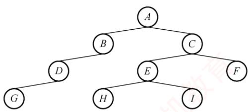  
图 3.17 二叉树

表3.3 层次遍历二叉树的过程
<table><tr><td rowspan=1 colspan=1>序号</td><td rowspan=1 colspan=1>说明</td><td rowspan=1 colspan=1>队内</td><td rowspan=1 colspan=1>队外</td></tr><tr><td rowspan=1 colspan=1>1</td><td rowspan=1 colspan=1>A入</td><td rowspan=1 colspan=1>A</td><td rowspan=1 colspan=1></td></tr><tr><td rowspan=1 colspan=1>2</td><td rowspan=1 colspan=1>A出，BC入</td><td rowspan=1 colspan=1>BC</td><td rowspan=1 colspan=1>A</td></tr><tr><td rowspan=1 colspan=1>3</td><td rowspan=1 colspan=1>B出，D入</td><td rowspan=1 colspan=1>CD</td><td rowspan=1 colspan=1>AB</td></tr><tr><td rowspan=1 colspan=1>4</td><td rowspan=1 colspan=1>C出，EF入</td><td rowspan=1 colspan=1>DEF</td><td rowspan=1 colspan=1>ABC</td></tr><tr><td rowspan=1 colspan=1>5</td><td rowspan=1 colspan=1>D出，G入</td><td rowspan=1 colspan=1>EFG</td><td rowspan=1 colspan=1>NABCD</td></tr><tr><td rowspan=1 colspan=1>6</td><td rowspan=1 colspan=1>E出，HI入</td><td rowspan=1 colspan=1>FGHI</td><td rowspan=1 colspan=1>ABCDE</td></tr><tr><td rowspan=1 colspan=1>7</td><td rowspan=1 colspan=1>F出</td><td rowspan=1 colspan=1>GHI</td><td rowspan=1 colspan=1>ABCDEF</td></tr><tr><td rowspan=1 colspan=1>8</td><td rowspan=1 colspan=1>GHI 出</td><td rowspan=1 colspan=1></td><td rowspan=1 colspan=1>ABCDEFGHI</td></tr></table>

该过程可简要描述如下：

①将根结点入队。

②若队列为空（表示所有结点均已处理），则遍历结束；否则执行③。

③取出队首结点并访问；若其存在左孩子，则将左孩子入队；若其存在右孩子，则将右孩子入队返回②继续执行。

## 3.3.5 队列在计算机系统中的应用

队列在计算机系统中的应用非常广泛，以下从两个主要方面进行阐述：第一个方面是解决主机与外部设备之间速度不匹配的问题，第二个方面是解决由多用户引起的资源竞争问题。

考点追踪缓冲区的逻辑结构（2009）

以主机和打印机之间的速度不匹配为例。主机输出数据的速度远快于打印机处理数据的速度。若直接将数据发送给打印机，会导致数据丢失或打印错误。为此，通常设置一个打印数据缓冲区来缓解这一问题。具体实现如下：主机将待打印的数据依次写入缓冲区，当缓冲区满时，主机暂停输出并转向其他任务；打印机则从缓冲区中按先进先出原则逐个取出数据进行打印；打印完成后，打印机向主机发出请求，主机再次向缓冲区写入新的打印数据。这种方法不仅保证了数据的正确性，还提高了主机的整体效率。因此，打印数据缓冲区实际上就是一个队列。

考点追踪多队列出队/入队操作的应用（2016）

在多用户环境下，CPU资源的竞争是一个典型场景。在一个多终端系统中，用户通过各自的终端向操作系统提出对CPU的请求。为公平分配CPU时间，操作系统通常按照请求的时间顺序，将这些请求排成一个队列。具体步骤如下：每次将 CPU分配给队首用户的程序运行：当该程序运行结束或用完规定的时间片后，操作系统使其出队：然后将CPU分配给新的队首用户。这种方式既保证了请求的公平处理，又提升了CPU利用率。此外，在某些复杂系统中，可能还会引入多队列机制，以便根据不同的优先级或调度策略动态调整资源分配。

## 3.3.6 本节试题精选

## 一、单项选择题

01. 栈的应用不包括（）。A. 递归 B. 表达式求值 C. 括号匹配 D. 缓冲区

02. 表达式a\*(b+c)-d 的后缀表达式是（）。A. abcd\*+- B. abc+\*d- C. abc\*+d- D. -+\*abcd

03. 下面（）用到了队列。A.括号匹配 B. 表达式求值 C. 递归 D. FIFO 页面替换算法

04. 利用栈求表达式的值时，设立运算数栈OPEN。假设OPEN只有两个存储单元，则在下列表达式中，不会发生溢出的是（）。A. A-B\*(C-D) B. (A-B)\*C-D C. (A-B\*C)-D D. (A-B)\*(C-D)

$$
\mathtt { r e t u r n } ( ( \mathtt { x } { > } 0 ) ? \mathtt { x } { \star } \mathtt { f } ( \mathtt { x } { - } 1 ) : 2 ) ;
$$

i=f(f(1));A. 2 B. 4 C. 8 D. 无限递归

06. 设有如下递归函数，则计算℉(8)需要调用该递归函数的次数为（）。int F(int n){if(n<=3) return 1;else return F(n-2)+F(n-4)+1;}A. 7 B. 8 C. 9 D. 10

07. 设有如下递归函数，在 func(func(5))的执行过程中，第 4 个被执行的func 函数是()。int func(int x){if(x<=3) return 2;else return func(x-2)+func(x-4); 机教育A. func(2) B. func(3) C. func(4) D. func(5)

08. 对于一个问题的递归算法求解和其相对应的非递归算法求解，（）。A. 递归算法通常效率高一些 B. 非递归算法通常效率高一些C. 两者相同 D. 无法比较

09.执行函数时，其局部变量一般采用（）进行存储。 1A. 树形结构 B. 静态链表 C. 栈结构 D. 队列结构

10. 执行（）操作时，需要使用队列作为辅助存储空间。A. 查找散列（哈希）表 B. 广度优先搜索图C. 前序（根）遍历二叉树 D. 深度优先搜索图

11.下列说法中，正确的是（）。 算A. 消除递归不一定需要使用栈B. 对同一输入序列进行两组不同的合法入栈和出栈组合操作，所得的输出序列也一定相同C. 通常使用队列来处理函数或过程调用D. 队列和栈都是运算受限的线性表，只允许在表的两端进行运算

12.【2009统考真题】为解决计算机主机与打印机之间速度不匹配的问题，通常设置一个打印数据缓冲区，主机将要输出的数据依次写入该缓冲区，而打印机则依次从该缓冲区中取出数据。该缓冲区的逻辑结构应该是（）。A. 栈 へ妆B.队列 C. 树 D. 图

13. 【2012 统考真题】已知操作符包括 $\alpha_{+} - \alpha_{-} - \alpha_{\times} - \alpha_{/} - \alpha_{\left( \right)}$ 和“)”。将中缀表达式a+b-a\*（(c+d)/e-f)+g 转换为等价的后缀表达式 ab+acd+e/f-\*-g+时，用栈来存放暂时还不能确定运算次序的操作符。栈初始时为空，转换过程中同时保存在栈中的操作符的最大个数是（）。  
王 A. 5 B. 7 C. 8 D. 11

14.【2014统考真题】假设栈初始为空，将中缀表达式 $a / b + ( c ^ { \star } d - e ^ { \star } t )$ /g 转换为等价的后缀表达式的过程中，当扫描到f时，栈中的元素依次是（）。A. + (\*− B. + (−\* C. /+(\*-\* D. /+-\*

15.【2015统考真题】已知程序如下： int S(int n) { return (n<=0)?0:S(n-1)+n;} void main() { cout<<S (1) ;}

程序运行时使用栈来保存调用过程的信息，自栈底到栈顶保存的信息依次对应的是()。

A. main ( ) →S (1)→S (0) B. S(0) →S (1) →main ( ) C. main () →S (0) →S (1) D. S(1) →S (0) →main ( )

16.【2016统考真题】设有如下图所示的火车车轨，入口和出口之间有n条轨道，列车的行进方向均为从左至右，列车可驶入任意一条轨道。现有编号为1\~9的9列列车，驶入的次序依次是8,4,2,5,3,9,1,6,7。若期望驶出的次序依次为1\~9，则n至少是（）。

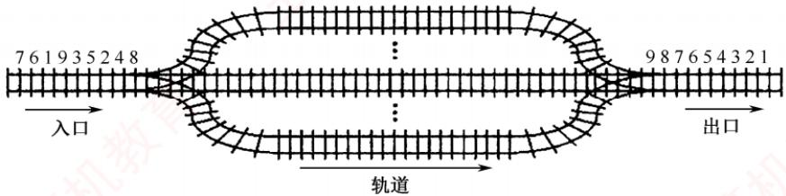

A. 2 B. 3 C. 4 D. 5

17.【2017统考真题】下列关于栈的叙述中，错误的是（）。I. 采用非递归方式重写递归程序时必须使用栈 王道ùⅡ. 函数调用时，系统要用栈保存必要的信息Ⅲ.只要确定了入栈次序，即可确定出栈次序IV. 栈是一种受限的线性表，允许在其两端进行操作A. 仅I B. 仅I、Ⅱ、ⅢIC.仅I、ⅢII、IVD.仅ⅡI、ⅢI、IV

18. 【2018 统考真题】若栈S1 中保存整数，栈 S2 中保存运算符，函数F()依次执行下述各步操作：1）从 S1中依次弹出两个操作数a和b。2）从 S2中弹出一个运算符op。3）执行相应的运算b op a。4）将运算结果压入S1中。

假定S1中的操作数依次是5,8,3,2（2在栈顶），S2中的运算符依次是\*、-、+（+在栈顶）。调用3次F（）后，S1栈顶保存的值是（）。A. -15 B. 15 C. -20 D. 20

19.【2024统考真题】与表达式 $x { + } y ^ { * } ( z { - } u ) / v$ 等价的后缀表达式是（）。A. $x y z u - * y / +$ B. $x y z u – v ^ { \prime * } +$ C. $+ x / ^ { * } y { - } z u v$ D. $+ x ^ { * } y / - z u v$

20.【2025统考真题】己知算法A用于检查字符串中各类括号是否匹配，A执行过程中使用初始为空的栈保存遇到的括号。若栈的容量是3，则下列选项中，A不能处理的是()。A. $(a+[b+(c+d)/e]+f)+g-h$ B. $\left[ a \times \left( (b+c) / (d-e) + f / g \right) - h \right]$ C. $\left[ a \star \left( b - ( c - d ) \star e / ( f + g ) \right) - h \right]$ D. $\left[a-\left(b+\left[c\times\left(\mathrm{d}+\mathrm{e}\right)-\mathrm{f}\right]+\mathrm{g}+\mathrm{h}\right)\right]$

## 二、综合应用题

01. 假设一个算术表达式中包含圆括号、方括号和花括号3种类型的括号，编写一个算法来判别表达式中的括号是否配对，以字符“\0”作为算术表达式的结束符。

## 3.3.7 答案与解析

## 一、单项选择题

01. D

缓冲区是用队列实现的，选项A、B、C都是栈的典型应用。

## 02. B

后缀表达式中，每个运算符均直接位于其两个操作数的后面，按照这样的方式逐步根据计算的优先级将每个计算式进行变换，即可得到后缀表达式。

【另解】将两个直接操作数用括号括起来，再将操作符提到括号后，最后去掉括号。例如，对于 $( \textcircled{i} ( a \times ( a + c ) ) - d )$ ，提出操作符并去掉括号后，可得后缀表达式为 $\mathrm{abc}+\mathrm{^{\star}d}-\mathrm{c}$

学完第5章后，可将表达式画成二叉树的形式，再用后序遍历即可求得后缀表达式。

## 03. D

FIFO页面替换算法用到了队列。其余的都只用到了栈。

## 04. B

利用栈求表达式的值时，可以分别设立运算符栈和运算数栈，其原理不变。选项B中A入栈，B入栈，计算得R1，C入栈，计算得R2，D入栈，计算得R3，由此得栈深为2。选项A、C、D依次计算得栈深为4、3、3。因此选择选项B。 7

## 技巧

根据运算符优先级，统计已依次入栈但还未参与计算的运算符数。以选项C为例，当“(”“A”“-”入栈时，“(”和“-”还未参与运算，此时运算符栈大小为2，“B”和“\*”入栈时运算符大小为3，“C”入栈时“B\*C”运算，运算符栈大小为2，以此类推。

## 05. B

栈与递归有着紧密的联系。递归模型包括递归出口和递归体两个方面。递归出口是递归算法的出口，即终止递归的条件。递归体是一个递推的关系式。根据题意有

f(0)=2;   
f(1)=1\*f(0)=2;   
f(f(1))=f(2)=2\*f(1)=4。 06. C

计算F(8)的递归调用树如右图所示：

由图可知，递归函数℉()调用的次数为9。

## 07. C


首先，执行内层参数 func(5) =func(3)+

func(1)=4，共执行 3 次 func 函数。然后，执行 func(func(5))=func(4)=func(2)+func(0)=4，因此第4个被执行的func函数是func(4)。也可以采用画出递归调用树的方式，即某个函数的执行次序等于其在递归调用树的先序遍历中的次序。

## 08. B

通常情况下，递归算法在计算机实际执行的过程中包含很多的重复计算，所以效率会低。

## 09. C

调用函数时，系统会为调用者构造一个由参数表和返回地址组成的活动记录，并将记录压入系统提供的栈中，若被调用函数有局部变量，也要压入栈中。

## 10. B

本题涉及第5章和第6章的内容，图的广度优先搜索类似于树的层序遍历，都要借助于队列。

## 11. A

使用栈可以模拟递归的过程，以此来消除递归，但对于单向递归和尾递归而言，可以用迭代的方式来消除递归，选项A正确。不同的入栈和出栈组合操作，会产生许多不同的输出序列，B

错误。通常使用栈来处理函数或过程调用，选项C错误。队列和栈都是操作受限的线性表，但只有队列允许在表的两端进行运算，而栈只允许在栈顶方向进行操作，选项D错误。

## 12. B

在提取数据时必须保持原来数据的顺序，所以缓冲区的特性是先进先出。

## 13. A

在中缀表达式转后缀表达式的过程中，扫描到操作数时直接输出，扫描到操作符时根据其优先级进行相应的出入栈操作。有几点需要注意：①若遇到界限符“（”，则直接入栈；②若遇到界限符“）”，则不入栈，且依次弹出栈顶运算符，直到遇到“（”为止，并删除“（”；③若当前运算符的优先级高于栈顶运算符或遇到栈顶为“（”，则直接入栈：④若当前运算符的优先级低于或等于栈顶运算符，则依次弹出栈中的运算符并加入后缀表达式，直到遇到一个优先级低于它的运算符或遇到“（”或栈空为止，之后将当前运算符入栈。

求栈中操作符的最大个数时，为简单起见，可省略对操作数的处理。
<table><tr><td rowspan=1 colspan=1>步</td><td rowspan=1 colspan=1>待处理运算符</td><td rowspan=1 colspan=1>栈</td><td rowspan=1 colspan=1>扫描运算符</td><td rowspan=1 colspan=1>动作</td></tr><tr><td rowspan=1 colspan=1>1</td><td rowspan=1 colspan=1>+b-a*((c+d)/e-f)+g</td><td rowspan=1 colspan=1></td><td rowspan=1 colspan=1>+</td><td rowspan=1 colspan=1>+入栈</td></tr><tr><td rowspan=1 colspan=1>2</td><td rowspan=1 colspan=1>-a*((c+d)/e-f)+g</td><td rowspan=1 colspan=1>+</td><td rowspan=1 colspan=1>一</td><td rowspan=1 colspan=1>-优先级等于栈顶+，弹出+，-入栈</td></tr><tr><td rowspan=1 colspan=1>3</td><td rowspan=1 colspan=1>*((c+d)/e-f)+g</td><td rowspan=1 colspan=1>一</td><td rowspan=1 colspan=1>*</td><td rowspan=1 colspan=1>*优先级高于栈顶-，*入栈</td></tr><tr><td rowspan=1 colspan=1>4</td><td rowspan=1 colspan=1>((c+d)/e-f)+g</td><td rowspan=1 colspan=1>- *</td><td rowspan=1 colspan=1>C</td><td rowspan=1 colspan=1>(直接入栈</td></tr><tr><td rowspan=1 colspan=1>5</td><td rowspan=1 colspan=1>(c+d) /e-f) +g</td><td rowspan=1 colspan=1>-*(</td><td rowspan=1 colspan=1>(</td><td rowspan=1 colspan=1>(直接入栈</td></tr><tr><td rowspan=1 colspan=1>6</td><td rowspan=1 colspan=1>+d) /e-f) +g</td><td rowspan=1 colspan=1>-*((</td><td rowspan=1 colspan=1>+</td><td rowspan=1 colspan=1>栈顶为(，+直接入栈</td></tr><tr><td rowspan=1 colspan=1>7</td><td rowspan=1 colspan=1>)/e-f) +g</td><td rowspan=1 colspan=1>-*((+</td><td rowspan=1 colspan=1>)</td><td rowspan=1 colspan=1>遇到)，弹出+，删除(</td></tr><tr><td rowspan=1 colspan=1>8</td><td rowspan=1 colspan=1>/e-f) +g</td><td rowspan=1 colspan=1>-*(</td><td rowspan=1 colspan=1>1</td><td rowspan=1 colspan=1>栈顶为(，/直接入栈</td></tr><tr><td rowspan=1 colspan=1>9</td><td rowspan=1 colspan=1>-f) +g</td><td rowspan=1 colspan=1>-*(1</td><td rowspan=1 colspan=1>-T</td><td rowspan=1 colspan=1>-优先级低于栈顶/，弹出/，-入栈</td></tr><tr><td rowspan=1 colspan=1>10</td><td rowspan=1 colspan=1>)+g</td><td rowspan=1 colspan=1>-*(-</td><td rowspan=1 colspan=1>へ</td><td rowspan=1 colspan=1>遇到)，弹出-，删除(</td></tr><tr><td rowspan=1 colspan=1>11</td><td rowspan=1 colspan=1>+g</td><td rowspan=1 colspan=1>- *</td><td rowspan=1 colspan=1>+</td><td rowspan=1 colspan=1>+优先级低于栈顶*，等于-，依次弹出*和-；+入栈</td></tr><tr><td rowspan=1 colspan=1>12</td><td rowspan=1 colspan=1></td><td rowspan=1 colspan=1>+</td><td rowspan=1 colspan=1></td><td rowspan=1 colspan=1></td></tr></table>

由上述过程可知，栈中操作符的最大个数为5。

## 14. B

中缀表达式 $a / b + (c^{\star} d - e^{\star} f)$ /g转换为后缀表达式的过程如下：

<table><tr><td rowspan=1 colspan=1>步</td><td rowspan=1 colspan=1>待处理序列</td><td rowspan=1 colspan=1>栈</td><td rowspan=1 colspan=1>后缀表达式</td><td rowspan=1 colspan=1>扫描项</td><td rowspan=1 colspan=1>动作</td></tr><tr><td rowspan=1 colspan=1>1</td><td rowspan=1 colspan=1>a/b+(c*d-e*f)/g</td><td rowspan=1 colspan=1></td><td rowspan=1 colspan=1></td><td rowspan=1 colspan=1>a</td><td rowspan=1 colspan=1>a 加入后缀表达式</td></tr><tr><td rowspan=1 colspan=1>2</td><td rowspan=1 colspan=1>/b+(c*d-e*f)/g</td><td rowspan=1 colspan=1></td><td rowspan=1 colspan=1>a</td><td rowspan=1 colspan=1>1</td><td rowspan=1 colspan=1>/入栈</td></tr><tr><td rowspan=1 colspan=1>3</td><td rowspan=1 colspan=1>b+(c*d-e*f)/g</td><td rowspan=1 colspan=1>/</td><td rowspan=1 colspan=1>a</td><td rowspan=1 colspan=1>b</td><td rowspan=1 colspan=1>b 加入后缀表达式</td></tr><tr><td rowspan=1 colspan=1>4</td><td rowspan=1 colspan=1>+(c*d-e*f)/g</td><td rowspan=1 colspan=1>/</td><td rowspan=1 colspan=1>ab</td><td rowspan=1 colspan=1>+</td><td rowspan=1 colspan=1>+优先级低于栈顶的/，弹出/，+入栈</td></tr><tr><td rowspan=1 colspan=1>5</td><td rowspan=1 colspan=1>(c*d-e*f)/g</td><td rowspan=1 colspan=1>+</td><td rowspan=1 colspan=1>ab/</td><td rowspan=1 colspan=1>(</td><td rowspan=1 colspan=1>(入栈</td></tr><tr><td rowspan=1 colspan=1>6</td><td rowspan=1 colspan=1>c*d-e*f)/g</td><td rowspan=1 colspan=1>+(</td><td rowspan=1 colspan=1>ab/</td><td rowspan=1 colspan=1>C</td><td rowspan=1 colspan=1>c 加入后缀表达式</td></tr><tr><td rowspan=1 colspan=1>7</td><td rowspan=1 colspan=1>*d-e*f)/g</td><td rowspan=1 colspan=1>+(</td><td rowspan=1 colspan=1>ab/c</td><td rowspan=1 colspan=1>★</td><td rowspan=1 colspan=1>栈顶为(，*入栈</td></tr><tr><td rowspan=1 colspan=1>8</td><td rowspan=1 colspan=1>d-e*f)/g</td><td rowspan=1 colspan=1>+(*</td><td rowspan=1 colspan=1>ab/c</td><td rowspan=1 colspan=1>d</td><td rowspan=1 colspan=1>α加入后缀表达式</td></tr><tr><td rowspan=1 colspan=1>9</td><td rowspan=1 colspan=1>-e*f)/g</td><td rowspan=1 colspan=1>+(*</td><td rowspan=1 colspan=1>ab/cd</td><td rowspan=1 colspan=1>-</td><td rowspan=1 colspan=1>-优先级低于栈顶的*，弹出*，-入栈</td></tr><tr><td rowspan=1 colspan=1>10</td><td rowspan=1 colspan=1>e*f)/g</td><td rowspan=1 colspan=1>+(-</td><td rowspan=1 colspan=1>ab/cd*</td><td rowspan=1 colspan=1>e</td><td rowspan=1 colspan=1>e 加入后缀表达式</td></tr><tr><td rowspan=1 colspan=1>11</td><td rowspan=1 colspan=1>*f)/g</td><td rowspan=1 colspan=1>+(-</td><td rowspan=1 colspan=1>ab/cd*e</td><td rowspan=1 colspan=1>★</td><td rowspan=1 colspan=1>*优先级高于栈顶的-，*入栈</td></tr><tr><td rowspan=1 colspan=1>12</td><td rowspan=1 colspan=1>f)/g</td><td rowspan=1 colspan=1>+(-*</td><td rowspan=1 colspan=1>ab/cd*e</td><td rowspan=1 colspan=1>f</td><td rowspan=1 colspan=1>f加入后缀表达式</td></tr><tr><td rowspan=1 colspan=1>13</td><td rowspan=1 colspan=1>)/g</td><td rowspan=1 colspan=1>+(-*</td><td rowspan=1 colspan=1>ab/cd*ef</td><td rowspan=1 colspan=1>)</td><td rowspan=1 colspan=1>遇到)，依次弹出*、-加入表达式，删除(</td></tr><tr><td rowspan=1 colspan=1>14</td><td rowspan=1 colspan=1>/g</td><td rowspan=1 colspan=1>+</td><td rowspan=1 colspan=1>ab/cd*ef*-</td><td rowspan=1 colspan=1>1</td><td rowspan=1 colspan=1>/优先级高于栈顶的+，/入栈</td></tr><tr><td rowspan=1 colspan=1>15</td><td rowspan=1 colspan=1>g</td><td rowspan=1 colspan=1>+1</td><td rowspan=1 colspan=1>ab/cd*ef*-</td><td rowspan=1 colspan=1>g</td><td rowspan=1 colspan=1>g加入后缀表达式</td></tr><tr><td rowspan=1 colspan=1>16</td><td rowspan=1 colspan=1></td><td rowspan=1 colspan=1>+1</td><td rowspan=1 colspan=1>ab/cd*ef*-g</td><td rowspan=1 colspan=1></td><td rowspan=1 colspan=1>扫描完毕，运算符依次弹出加入表达式</td></tr><tr><td rowspan=1 colspan=1>17</td><td rowspan=1 colspan=1></td><td rowspan=1 colspan=1></td><td rowspan=1 colspan=1>ab/cd*ef*-g/+</td><td rowspan=1 colspan=1></td><td rowspan=1 colspan=1>完成</td></tr></table>

由此可知，当扫描到f时，栈中的元素依次是+（-\*。

【另解】采用手算方法，得出中缀式 $a / b + ( c \times d - e \times t )$ /g 对应的后缀式为 $\mathrm { a b / c d ^ { \star } e f ^ { \star } \mathrm { - g / + } }$ 0中缀表达式转后缀表达式时，操作数都直接输出，因此操作数的顺序是固定的。扫描到f时，在后缀表达式f后面的运算符要么还未入栈，要么还在栈中，需要结合中缀式来判断，f后面依次出栈的运算符为\*-/+，/在中缀表达式f之后，此时还未入栈，因此栈中的运算符（从栈底到栈顶）为+-\*；此外，已入栈的界限符（此时还未消解，因此（也还在栈中，栈中的元素依次是+（-\*。

## 15. A

递归调用函数时，在系统栈中保存的函数信息需满足先进后出的特点，依次调用了main（），S(1)，S(0)，所以栈底到栈顶的信息依次是main（），S(1)，S(0)。

注意

在递归中，系统为每一层的返回点、局部变量、传入实参等开辟了递归工作栈来存储。

16. C

根据题意：入队顺序为8,4,2,5,3,9,1,6,7，出队顺序为1～9。入口和出口之间有多个队列（n条轨道），且每个队列（轨道）可容纳多个元素（多列列车），为便于区分，队列用字母编号。分析如下：显然先入队的元素必须小于后入队的元素（否则，若8和4入同一个队列，8在4前面，则出队时也只能8在4前面），这样8入队列A，4入队列B，2入队列C，5入队列B（按照前述原则“大的元素在小的元素后面”也可将5入队列C，但这时剩下的元素3就必须放入一个新的队列中，无法确保“至少”），3入队列C，9入队列A，这时共占了3个队列，后面还有元素1，直接再用一个新的队列D，1从队列D出队后，剩下的元素6和7或入队列B，或入队列C。综上，共占用了4个队列。当然还有其他的入队、出队情况，请读者自己推演，但要确保满足：①队列中后面的元素大于前面的元素；②确保占用最少（满足题意中“至少”）的队列。

17. C

说法Ⅰ的反例：计算斐波那契数列迭代实现只需要一个循环即可实现。说法Ⅲ的反例：入栈序列为 1, 2，进行 Push, Push, Pop, Pop 操作，出栈次序为 2、1；进行 Push, Pop, Push, Pop操作，出栈次序为1,2。说法IV，栈是一种受限的线性表，只允许在一端进行操作。说法Ⅱ正确。

18. B

第一次调用：① 从 s1 中弹出 2 和 3；② 从 s2 中弹出+；③ 执行 3+2=5；④ 将 5 压入S1中，第一次调用结束后s1中剩余5、8、5（5在栈顶），S2中剩余\*、-（-在栈顶）。第二

次调用：① 从 s1 中弹出 5 和 8；② 从 s2 中弹出一；③ 执行 8-5=3；④将 3压入S1中，第二次调用结束后S1中剩余5、3（3在栈顶），S2中剩余\*。第三次调用：①从S1 中弹出 3 和 5；② 从S2 中弹出\*；③执行5\*3=15；④将15压入S1中，第三次调用结束后S1中仅剩余15，S2为空。

19. A


根据中缀表达式画出对应的二叉树如右图所示，对该二叉树进行后序遍历即可得到后缀表达式为 $x y z u ^ { - * } v / +$ 。本题也可采用本书前面描述的手算方法。

20. D

该算法利用栈来检查括号匹配：遇到左括号时入栈，遇到右括号时出栈并与之匹配。由于栈的容量为3，因此最多只能容纳3个未匹配的左括号，即最多支持3层嵌套的括号结构。逐项分析各选项的括号嵌套深度：对于选项A，括号序列为([()])，最大嵌套深度为3，依次入栈([(，未超过栈容量。对于选项B，括号序列为(())]，最大深度为3，依次入栈[((，栈容量足够。对于选项C，括号序列为[(())]，同样最大深度为3,栈容量足够。对于选项D,括号序列为[([()])]，最大嵌套深度达到4。扫描至\*后的(时，栈中已存有([三个左括号，此时，需要将第四个左括号(入栈，但栈容量仅为3，无法继续入栈，因此该表达式无法被正确处理。

## 二、综合应用题

## 01. 【解答】

括号匹配是栈的一个典型应用，给出这道题是希望读者好好掌握栈的应用。算法的基本思想是扫描每个字符，遇到花、方、圆的左括号时入栈，遇到花、方、圆的右括号时检查栈顶元素是否为相应的左括号，若是，出栈，否则配对错误。最后栈若不为空也为错误。 X

bool BracketsCheck(char \*str) {  
InitStack(S) ; //初始化栈  
int i=0;  
while(str[i]!='\0') {  
switch(str[i]) {  
//左括号入栈  
王道 case '(': Push(S,'('); break;  
case '[': Push(S,'['); break;  
case '{': Push(S,'{'); break;  
//遇到右括号，检测栈顶  
case ')': Pop(S,e);  
if(e!='(') return false;  
break;  
case ']': Pop(S,e);  
if(e!='[') return false;  
break;  
case '}': Pop(S,e);  
if(e!='{') return false;  
break;  
default:  
break; 王道  
}//switch  
i++;  
}//while  
if(!StackEmpty(S)){  
printf("括号不匹配\n")；  
return false;  
else {  
printf("括号匹配\n")；  
return true;

## 3.4 数组和特殊矩阵

矩阵在图形学、工程计算等领域占有重要地位。在数据结构中，关注的重点并非矩阵本身的数学性质及其运算，而是如何以最小的内存空间高效存储矩阵，并支持对元素的便捷访问。

## 3.4.1 数组的定义

数组是由n（n≥1）个相同类型的数据元素组成的有限序列。每个元素称为数组元素，其在线性序列中的位置由下标标识，下标的取值范围称为维界。

数组与线性表的关系：数组是线性表的推广。一维数组可视为一个线性表：二维数组可视为其元素为定长一维数组的线性表：更高维数组以此类推。数组一旦定义，其维数与维界即固定不变。因此，除初始化和销毁外，数组仅支持存取元素和修改元素两种基本操作。

## 3.4.2 数组的存储结构

大多数编程语言提供数组类型，逻辑上的数组通常映射为内存中一段连续的存储空间。以一维数组 $\mathrm { A } [ 0 . . .   n   -   1 ]$ 为例，设每个元素占L个存储单元，则元素A[i]的地址为

$$
\mathrm{LOC}(a_{i}) = \mathrm{LOC}(a_{0}) + iL \quad (0 \leqslant i \leqslant n)
$$

考点追踪二维数组按行优先存储的下标对应关系（2021）

多维数组在内存中需按某种顺序展开为一维。常见方式有按行优先和按列优先。按行优先：先行后列，先存储行号较小的元素；同一行内，先存储列号较小的元素。设二维数组行下标与列下标范围分别为 $[0,h_1]  与  [0,h_2]$ ，则元素A[i]闭]的地址为

$$
\mathrm{LOC}(a_{i,j}) = \mathrm{LOC}(a_{0,0}) + [i(h_2 + 1) + j]L
$$

例如，数组 $\mathbf { A } _ { [ 2 ] [ 3 ] }$ 按行优先存储的形式如图3.18所示。

  
图3.18 二维数组按行优先顺序存放

按列优先：先列后行，先存储列号较小的元素；同一列内，先存储行号较小的元素。其对应的地址公式为 V

$$
\mathrm{LOC}(a_{i,j}) = \mathrm{LOC}(a_{0,0}) + [j(h_1 + 1) + i]L
$$

例如，数组 $\mathbf { A } _ { [ 2 ] [ 3 ] }$ 按列优先存储的形式如图3.19所示。

  
图3.19 二维数组按列优先顺序存放

## 3.4.3 特殊矩阵的压缩存储

压缩存储：为多个值相同的元素只分配一个存储空间，对零元素不分配存储空间。

特殊矩阵：指具有大量相同元素或零元素，且这些元素分布具有规律性的矩阵。常见的特殊矩阵有对称矩阵、上（下）三角矩阵、对角矩阵等。

特殊矩阵的压缩存储方法：通过分析矩阵中相同元素的分布规律，仅存储一份实际数据，其余的可通过下标映射访问，从而将原本冗余的数据压缩到一个共享的空间中，显著节省内存。

## 1. 对称矩阵

考点追踪对称矩阵压缩存储的下标对应关系（2018、2020）

若n阶矩阵A 中任意元素 $a _ { i , j }$ 均满足 $a_{ij}=a_{ji} (1 \leqslant i,j \leqslant n)$ ，则称其为对称矩阵。其元素可分为三部分：上三角区、主对角线和下三角区，如图3.20所示。

由于上三角区与下三角区完全对称，若仍用二维数组存储，将近一半空间被浪费。为此可将n阶对称矩阵A压缩存储于一维数组 $\mathrm{B}[n(n + 1)/2]$ 中，通常仅存放下三角部分（含主对角线）。

  
图 3.20 n阶矩阵的划分

对于元素 $a _ { i j } \left( i \geqslant j \right)$ ，其在数组B中的位置由其前方的元素个数决定

第1行：1个元素 $( a _ { \mathrm { 1 , 1 } } )$ 第2行：2个元素 $( a _ { 2 , 1 } , a _ { 2 , 2 } )$

第i-1行：i-1个元素 $(a_{i - 1,1}, a_{i - 1,2}, \cdots, a_{i - 1,i - 1})$ 第i行：j-1个元素 $( a _ { i , 1 } , a _ { i , 2 } , \cdots , a _ { i , j - 1 } )$ 0

因此，元素 $a _ { i , j }$ 在数组B中的下标

$k = 1 + 2 + \cdots + (i - 1) + j - 1 = i(i - 1) / 2 + j - 1$ （数组下标从0开始）。元素下标之间的对应关系如下：

$$
k = \left\{ \begin{aligned} \frac{i(i - 1)}{2} + j - 1, & \quad i \geq j  (下三角区和主对角线元素) \\ \frac{j(j - 1)}{2} + i - 1, & \quad i < j  (上三角区元素 a_{i,j} = a_{j,i}) \end{aligned} \right.
$$

若数组下标从1开始，则可采用类似的推导方法，请读者自行思考。

## 注意

二维数组 A[n][n]与 A[0...n− 1][0...n- 1]写法等价，表示下标从0开始。若写作A[1...n][1...n]，则表示下标从1开始。矩阵元素通常记为 $a _ { i , j } ,$ 其行号i和列号j通常从1开始。

## 2. 三角矩阵

在下三角矩阵[见图3.22(a)]中，上三角区的所有元素均为同一常量。其存储思想与对称矩阵的类似，但是需要额外存储该常量一次。因此，可以将n阶下三角矩阵A压缩存储在$\mathrm{B}[n(n + 1)/2 +$ 1]中。 道

对于元素 $a_{i,j} (i \geqslant j)$ ，其在数组B中的下标为

$$
k = \left\{ \begin{aligned} &\frac{i(i - 1)}{2} + j - 1, & \quad i \geq j & ( 下三角区和主对角线元素 ) \\ &\frac{n(n + 1)}{2}, & \quad i < j & ( 上三角区元素 ) \end{aligned} \right.
$$

下三角矩阵的压缩存储形式如图3.21所示。

<table><tr><td>0</td><td>1</td><td>2</td><td>3</td><td>4</td><td>5</td><td>…</td><td></td><td></td><td>…</td><td></td><td>n(n+1)/2</td></tr><tr><td>a1,1</td><td>a2,1</td><td>a2,2</td><td>a3,1</td><td>a3,2</td><td>a3,3</td><td>…</td><td>an,1</td><td>an,2</td><td>…</td><td>an,n</td><td>c</td></tr><tr><td>第1行</td><td>第2行</td><td></td><td></td><td>第3行</td><td></td><td></td><td></td><td>第n行</td><td></td><td></td><td>常数项</td></tr></table>

图3.21 下三角矩阵的压缩存储

考点追踪上三角矩阵采用行优先存储的应用（2011）

在上三角矩阵「见图3.22(b)中，下三角区所有元素均为同一常量。只需存储主对角线、上三角区上元素及该常量一次，同样将其压缩存储在 $\mathrm{B}[n(n + 1)/2 + 1]$ 中。

  
(a) 下三角矩阵  
(b) 上三角矩阵  
图 3.22 三角矩阵

对于元素 $a_{ij} (i \leqslant j)$ ，其在数组B中前方的元素个数为

第1行：n个元素

第2行：n-1个元素

第i−1行：n-i +2个元素

第i行：j-i个元素

故元素 $a _ { i j }$ 在数组B中的下标 $k = n + (n - 1) + \cdots + (n - i + 2) + (j - i + 1) - 1 = (i - 1)(2n - i + 2)/2 +$ (j-i)。元素下标之间的对应关系如下： XTA


上三角矩阵的压缩存储形式如图3.23所示。

  
图3.23 上三角矩阵的压缩存储

以上推导均假设数组下标从0开始。若下标指定从1开始，则要相应地调整映射关系。

## 3. 三对角矩阵

若n阶矩阵A 中的任意元素 $a _ { i j }$ ，当 $\lvert i   -   j \rvert \geq 1$ 时均有 $a_{ij} = 0 \quad (1 \leqslant i, j \leqslant n)$ ，则称为三对角矩阵，如图3.24所示。非零元素仅集中在以主对角线为中心的3条对角线的区域。

$$
\begin{bmatrix} a_{1,1} & a_{1,2} & & & \\ a_{2,1} & a_{2,2} & a_{2,3} & & 0 \\ & a_{3,2} & a_{3,3} & a_{3,4} & \\ & & \ddots & \ddots & \ddots \\ & 0 & & a_{n-1,n-2} & a_{n-1,n-1} & a_{n-1,n} \\ & & & & a_{n,n-1} & a_{n,n} \end{bmatrix}
$$

图 3.24 三对角矩阵A  
可将三对角上的元素按行优先顺序存入一维数组B，且 $a _ { 1 , 1 }$ 存于B[0]，如图3.25所示。
<table><tr><td rowspan=1 colspan=1> $a _ { 1 , 1 }$ </td><td rowspan=1 colspan=1> $a _ { 1 , 2 }$ </td><td rowspan=1 colspan=1> $a _ { 2 , 1 }$ </td><td rowspan=1 colspan=1> $a _ { 2 , 2 }$ </td><td rowspan=1 colspan=1> $a _ { 2 , 3 }$ </td><td rowspan=1 colspan=1></td><td rowspan=1 colspan=1> $a _ { n - 1 , n }$ </td><td rowspan=1 colspan=1> $a _ { n , n - 1 }$ </td><td rowspan=1 colspan=1> $a _ { n , n }$ </td></tr></table>

图3.25 三对角矩阵的压缩存储

## 考点追踪三对角矩阵压缩存储的下标对应关系（2016）

三对角上的元素 $a_{ij} (1 \leqslant i, j \leqslant n, |i - j| \leqslant 1)$ 在一维数组B中的下标 $k = 2 i + j - 3$ 0

反之，已知元素存于B[中时， $i = \left\lfloor (k + 1)/3 \right\rfloor + 1, j = k - 2i + 3$ 例如，当k=0时， $i = \lfloor (0 + 1)/3 + 1 \rfloor = 1$ $j = 0 - 2 \times 1 + 3 = 1$ ，存放的是 $a _ { 1 , 1 } ;$ 当k=2时， $i = \left\lfloor (2 + 1)/3 + 1 \right\rfloor = 2, j = 2 - 2 \times 2 + 3 = 1$ ，存放的是 $a _ { 2 , 1 } ;$ 当k=4时， $i = \left\lfloor (4 + 1)/3 + 1 \right\rfloor = 2, \quad j = 4 - 2 \times 2 + 3 = 3$ ，存放的是 $\boldsymbol { a } _ { 2 , 3 }$

## 3.4.4 稀疏矩阵

若矩阵中非零元素的个数t相对于总元素个数s来说非常少，即 $t \ll s ,$ 则称该矩阵为稀疏矩

阵。例如，一个100×100的矩阵中只有不到100个非零元素。

## 考点追踪存储稀疏矩阵需要保存的信息（2023）

为避免空间浪费，稀疏矩阵通常仅存储非零元素。然而，由于非零元素的分布通常是无规律的，仅存储其值是不够的，还需记录它们所在的行和列。为此，将每个非零元素及其对应的行列位置组合成一个三元组（行标i，列标i，值 $\overline { { a _ { i , j } } } )$ ，如图3.26所示。这些三元组可以按某种顺序排列成线性表进行存储。稀疏矩阵压缩存储后便失去了随机存取特性。

  
图3.26 稀疏矩阵及其对应的三元组

## 考点追踪稀疏矩阵压缩存储的方式（2017）

稀疏矩阵的三元组表可通过多种方式存储，常见的有：数组存储将所有三元组按某种顺序存储在一维数组中，这种方式简单直接，但插入和删除操作的效率较低；十字链表存储（见6.2节）通过链表的方式组织三元组，适用于频繁插入和删除操作的场景。无论采用哪种方式，都需要额外保存稀疏矩阵的行数、列数和非零元素的个数，以便支持后续的各种操作。

## 3.4.5 本节试题精选

## 单项选择题

01. 对特殊矩阵采用压缩存储的主要目的是（）。A. 表达变得简单 B. 对矩阵元素的存取变得简单C. 去掉矩阵中的多余元素 道 D. 减少不必要的存储空间

02.对n阶对称矩阵压缩存储时，需要表长为（）的顺序表。A. n/2 B. $n { \times } n / 2$ C. $n ( n + 1 ) / 2$ D. $n ( n - 1 ) / 2$

03. 有一个 n×n的对称矩阵A，将其下三角部分按行存放在一维数组 B 中，而 A[0][0]存放于B[0]中，则元素A[i][i]存放于B中的（）处。A. (i + 3)i/2 B. (i + 1)i/2 C. $( 2 n - i + 1 ) i / 2$ D. $(2n - i - 1)i / 2$

04. 在二维数组A中，假设每个数组元素的长度为3个存储单元，行下标i为0\~8，列下标j为0\~9，从首地址SA 开始连续存放。在这种情况下，元素A[8][5]的起始地址为（）。A. $\mathrm { S A } \pm 1 4 1$ B. SA + 144 C. SA+ 222 D. $\mathrm { S A } \pm 2 5 5$

05. 二维数组A按行优先存储，其中每个元素占1个存储单元。若A[1][1]的存储地址为420，A[3][3]的存储地址为446，则A[5][5]的存储地址为（）。A. 472 B. 471 C. 458 D. 457

06. 将三对角矩阵即数组 A[1...100][1...100]按行优先存入一维数组 B[1...298]中，数组 A中元素A[66][65]在数组 B 中的位置 k 为（）。A. 198 B. 195 C. 197 D. 196

07. 若将 n 阶上三角矩阵A 按列优先级压缩存放在一维数组 B[1.. $n ( n + 1 ) / 2 + 1 ]$ 中，则存放到 B[k中的非零元素 $a_{ij} (1 \leqslant i, j \leqslant n)$ 的下标i、j与 k的对应关系是（）。A. $i ( i + 1 ) / 2 + j$ B. $i(i - 1)/2 + j - 1$ C. $j ( j   -   1 ) / 2 + i$ D. $j ( j - 1 ) / 2 + i - 1$

08. 若将n阶下三角矩阵A按列优先顺序压缩存放在一维数组 $\mathrm { B } [ 1 \dots n ( n + 1 ) / 2 + 1 ]$ 中，则存放到B[k]中的非零元素 $a_{ij} (1 \leqslant i, j \leqslant n)$ 的下标i,j 与 k的对应关系是（）。A. $( j - 1 ) ( 2 n - j + 1 ) / 2 + i - j$ B. $( j - 1 ) ( 2 n - j + 2 ) / 2 + i - j + 1$ C. $( j - 1 ) ( 2 n - j + 2 ) / 2 + i - j$ 首计 D. $( j - 1 ) ( 2 n - j + 1 ) / 2 + i - j - 1$

09.稀疏矩阵采用压缩存储后的缺点主要是（）。A. 无法判断矩阵的行列数 B. 丧失随机存取的特性C. 无法由行、列值查找某个矩阵元素D. 使矩阵元素之间的逻辑关系更复杂

10. 下列关于矩阵的说法中，正确的是（）。I. 在 $n (n > 3)$ 阶三对角矩阵中，每行都有3个非零元素Ⅱ. 稀疏矩阵的特点是矩阵中的元素较少A. 仅IK B. 仅Ⅱ C. I和ⅡI D. 无正确项

11.【2016统考真题】有一个100阶的三对角矩阵M，其元素 $m_{i,j} (1 \leqslant i,j \leqslant 100)$ 按行优先依次压缩存入下标从0开始的一维数组N中。元素 $m _ { 3 0 , 3 0 }$ 在N中的下标是（）。A.86 B. 87 C. 88 D.89

12.2017统考真题】适用于压缩存储稀疏矩阵的两种存储结构是（）。A. 三元组表和十字链表 B. 三元组表和邻接矩阵C. 十字链表和二叉链表 D. 邻接矩阵和十字链表

13.【2018统考真题】设有一个12×12阶对称矩阵M，将其上三角部分的元素 $m_{i,j}(1 \leqslant i \leqslant j \leqslant 12)$ 按行优先存入C语言的一维数组N中，元素 $m _ { 6 ,   6 }$ 在N中的下标是（）。A. 50 B. 51 C. 55 D. 66

14.【2020统考真题】将一个10×10阶对称矩阵M的上三角部分的元素 $m_{i,j} (1 \leqslant i \leqslant j \leqslant 10)$ 按列优先存入C语言的一维数组N中，元素 $m _ { 7 , 2 }$ 在N中的下标是（）。A. 15 B. 16 C. 22 D. 23

15.【2021统考真题】二维数组A按行优先方式存储，每个元素占用1个存储单元。若元素 A[0][0]的存储地址是100,A[3][3]的存储地址是220,则元素A[5][5]的存储地址是( )。A. 295 NB. 300 C. 301 D. 306

16.【2023统考真题】若采用三元组表存储结构存储稀疏矩阵M，则除三元组表外，下列数据中还需要保存的是（）。I. M 的行数 II. M 中包含非零元素的行数III. M 的列数 IV. M 中包含非零元素的列数A.仅I、III B. 仅I、IV C. 仅ⅡI、IV D.I、II、ⅢII、IV

## 3.4.6 答案与解析

## 单项选择题

01. D

特殊矩阵中含有很多相同元素或零元素，所以可采用压缩存储，以节省存储空间。

02. C

只需存储其上三角或下三角部分（含对角线），元素个数为 $n+(n-1)+\cdots+1=n(n+1)/2$ 03. A

此题要注意3个细节：矩阵的最小下标为0；数组下标也是从0开始的；矩阵按行优先存在

数组中。注意到此三点，答案不难得到为选项A。此外，本类题建议采用特殊值代入法求解，例如，A[1][1]对应的下标应为2，代入后只有选项A满足条件。

## 技巧

对于特殊三角矩阵压缩存储的题，心中应有“平移”搬动的思想，并结合草图，这样会比较形象，在计算时再注意矩阵和数组的起始下标，就不容易出错。

## 04. D

二维数组计算地址（按行优先顺序）的公式为

$$
\mathrm{LOC}(i, j) = \mathrm{LOC}(0, 0) + (im + j)L
$$

其中， $\mathrm{LOC}(0,0)=\mathrm{SA}$ ，是数组存放的首地址；L=3是每个数组元素的长度： $m = 9 - 0 + 1 = 10$ 是数组的列数。因此有 $\mathrm{LOC}(8, 5) = \mathrm{SA} + (8 \times 10 + 5) \times 3 = \mathrm{SA} + 255$ ，所以选择选项D。

## 05. A

本题未直接给出数组A的行数和列数，因此需要根据题目中的信息来推理。因为该二维数组按行优先存储，且A[3][3]的存储地址为446，所以A[3][1]的存储地址为444，又A[1][1]的存储地址为420，显然A[1][1]和 A[3][1]正好相差2 行，所以该矩阵的列数为12。而A[5][3]和A[3][3]正好相差2行，A[5][5]和A[5][3]又相差2个元素，所以A[5][5]的存储地址是 $446 + 24 + 2 = 472$ 0

## 06. B

对于三对角矩阵，将A[1...n][1...n]压缩至B[1...3n-2]时 $a _ { i , j }$ 与 $b _ { k }$ 的对应关系为 $k = 2i + j - 2$ 0则 A 中的元素A[66][65]在数组B 中的位置 k为 $2 \times 66 + 65 - 2 = 195$

## 07. C

按列优先存储，所以元素 $a _ { i , j }$ 前面有j-1列，共有 $1 + 2 + 3 + \cdots + j - 1 = j ( j - 1 ) / 2$ 个元素，元素 $a _ { i j }$ 在第j列上是第i个元素，数组B的下标是从1开始，因此 $k = j ( j - 1 ) / 2 + i .$

## 08. B

按列优先存储，故元素 ${ } ^ { \cdot } a _ { i j }$ 前有j-1列，共有 $n+(n-1)+\cdots+(n-j+2)=(j-1)(2n-j+2)/2$ 个元素，元素 $a _ { i j }$ 是第j列上第 $i   -   j   +   1$ 个元素，数组B的下标从1开始， $k = ( j - 1 ) ( 2 n - j + 2 ) / 2 + i - j + 1$

## 09. B

稀疏矩阵通常采用三元组来压缩存储，存储矩阵元素的行列下标和相应的值，因此不能根据矩阵元素的行列下标快速定位矩阵元素，失去了随机存取的特性。

## 10. D

在三对角矩阵中，第1行和最后1行只有2个非零元，其余各行均有3个非零元。稀疏矩阵的特点是矩阵中非零元的个数较少。

## 11.B

三对角矩阵如下所示。

$$
\begin{bmatrix} a_{1,1} & a_{1,2} & & & \\ a_{2,1} & a_{2,2} & a_{2,3} & & \\ & a_{3,2} & a_{3,3} & a_{3,4} & \\ & & \ddots & \ddots & \ddots \\ & & & a_{n-1,n-2} & a_{n-1,n-1} & a_{n-1,n} \\ & & & & & a_{n,n-1} & a_{n,n} \end{bmatrix}
$$

采用压缩存储，将3条对角线上的元素按行优先方式存放在一维数组B中，且 $a _ { 1 , 1 }$ 存放于B[0]中，其存储形式如下所示：

<table><tr><td rowspan=1 colspan=1> $a _ { 1 , 1 }$ </td><td rowspan=1 colspan=1> $a _ { 1 , 2 }$ </td><td rowspan=1 colspan=1> $a _ { 2 , 1 }$ </td><td rowspan=1 colspan=1> $a _ { 2 , 2 }$ </td><td rowspan=1 colspan=1> $a _ { 2 , 3 }$ </td><td rowspan=1 colspan=1></td><td rowspan=1 colspan=1> $a _ { n - 1 , n }$ </td><td rowspan=1 colspan=1> $a _ { n , n - 1 }$ </td><td rowspan=1 colspan=1> $a _ { n , n }$ </td></tr></table>

可以计算矩阵A中3条对角线上的元素 $a_{i,j} \left( 1 \leqslant i, j \leqslant n, |i - j| \leqslant 1 \right)$ 在一维数组B中存放的下标为 $k = 2i + j - 3$ ，公式很难记忆，我们通常采用解法2。

解法1：针对该题，仅需将数字逐一代入公式 $k = 2 \times 30 + 30 - 3 = 87$ ，结果为 87。

解法2：观察上图的三对角矩阵不难发现，第一行有两个元素，剩下的在元素 $m _ { 3 0 , 3 0 }$ 所在行之前的28行（注意下标 $1 \leqslant i,j \leqslant 100$ 中，每行都有3个元素，而 $m _ { 3 0 , 3 0 }$ 之前仅有一个元素 $m _ { 3 0 , 2 9 }$ 不难发现元素 $m _ { 3 0 , 3 0 }$ 在数组N中的下标是 $2+28\times3+2-1=87$ 0

## 注意

矩阵和数组的下标从0或1开始（如矩阵可能从 $a _ { 0 , 0 }$ 或 $a _ { 1 , 1 }$ 开始，数组可能从B[0]或B[1]开始），这时就需要适时调整计算方法（方法无非是多计算1或少计算1的问题）。 K

## 12. A

三元组表的结点存储了行（row）、列（col）、值（value）三种信息，是主要用来存储稀疏矩阵的一种数据结构。十字链表将行单链表和列单链表结合起来存储稀疏矩阵。邻接矩阵空间复杂度达 $\mathcal { O } ( n ^ { 2 } )$ ，不适合存储稀疏矩阵。二叉链表又名左孩子右兄弟表示法，可用于表示树或森林。

## 13. A

在C语言中，数组N的下标从0开始。第一个元素 $m_{1,1}$ 对应存入 $n _ { 0 }$ ，矩阵M的第一行有12个元素，第二行有11个，第三行有10个，第四行有9个，第五行有8个，所以 $m _ { 6 , 6 }$ 是第$12+11+10+9+8+1=51$ 个元素，下标应为50。

## 14. C

上三角矩阵按列优先存储，先存储只有1个元素的第一列，再存储有2个元素的第二列，以此类推。 $m _ { 7 , 2 }$ 位于左下角，对应右上角的元素为 $m _ { 2 , 7 }$ ，在 $m _ { 2 , 7 }$ 之前存有

第1列：1

第2列：2

第6列：6

第7列：1

前面共存储有 $1+2+3+4+5+6+1=22$ 个元素（数组下标范围为0～21），注意数组下标从0开始，所以 $m_{2,7}$ 在数组N中的下标为22，即 $m _ { 7 , 2 }$ 在数组N 中的下标为 22。

## 15. B

二维数组A按行优先存储，每个元素占用1个存储单元，由A[0][0]和A[3][3]的存储地址可知，A[3][3]是二维数组A中的第121个元素，假设二维数组A的每行有n个元素，则 $n \times 3 + 4 = 121$ ，求得n=39，所以元素A[5][5]的存储地址为 $100+39\times5+6-1=300$

## 16. A

用三元组表存储结构存储稀疏矩阵M时，每个非零元素都由三元组（行标、列标、关键字

值）组成。但是，仅通过三元组表中的元素无法判断稀疏矩阵M的大小，因此还要保存M的行数和列数。此外，还可以保存M的非零元素个数。例如，右图所示的两个稀疏矩阵的三元组表是相同的，若不保存行数和列数，则无法判断两个稀疏矩阵的大小。 首

<table><tr><td rowspan=1 colspan=1>0</td><td rowspan=1 colspan=1>2</td><td rowspan=1 colspan=1>0</td><td rowspan=1 colspan=1>0</td></tr><tr><td rowspan=1 colspan=1>0</td><td rowspan=1 colspan=1>0</td><td rowspan=1 colspan=1>5</td><td rowspan=1 colspan=1>0</td></tr><tr><td rowspan=1 colspan=1>0</td><td rowspan=1 colspan=1>0</td><td rowspan=1 colspan=1>0</td><td rowspan=1 colspan=1>0</td></tr><tr><td rowspan=1 colspan=1>0</td><td rowspan=1 colspan=1>0</td><td rowspan=1 colspan=1>0</td><td rowspan=1 colspan=1>0</td></tr></table>

<table><tr><td rowspan=1 colspan=1>0</td><td rowspan=1 colspan=1>2</td><td rowspan=1 colspan=1>0</td></tr><tr><td rowspan=1 colspan=1>0</td><td rowspan=1 colspan=1>0</td><td rowspan=1 colspan=1>5</td></tr><tr><td rowspan=1 colspan=1>0</td><td rowspan=1 colspan=1>0</td><td rowspan=1 colspan=1>0</td></tr></table>

stack[++top]=x; ∥一句代码实现入栈操作

## 归纳总结

本章所介绍的几种数据结构是线性表的应用与推广，考试中主要以选择题形式考查，但栈和队列仍可能出现在算法设计题中。不少读者看到教材中列出大量操作函数时容易产生畏难情绪：如果考试中出现了栈或队列相关的算法大题，是否需要完整写出每个操作函数？

其实，在算法设计题中，栈和队列通常作为辅助工具用于解决其他问题，无须严格按照模块化方式分函数实现。我们完全可以将其声明和核心操作写得简洁明了。以顺序栈为例： YTA

（1）声明并初始化栈：

Elemtype stack[maxSize]； int top=-1； //两句代码用来声明和初始化

（2)入栈操作：

（3）出栈操作：

x=stack[top--]; ∥/单目运算符在变量之前表示“先运算后使用”，之后则相反

对于链式栈，同样只需定义一个结构体，然后根据需要从常规操作中摘取关键语句，直接嵌入到自己的解题代码中即可，无须完整实现所有接口。此外，在考研真题中，链式栈出现的概率远低于顺序栈，因此大家应有所侧重，多训练与顺序栈相关的题目。

## 思维拓展

设计一个栈，使它可以在 O(1)的时间复杂度内实现 Push、Pop和min操作。所谓min操作，是指得到栈中最小的元素。 X

## 提示

使用双栈，两个栈是同步关系。主栈是普通栈，用来实现栈的基本操作Push和Pop；辅助栈用来记录同步的最小值 min，例如元素x 入栈，则辅助栈 stack min[top++]=(x<min)?x:min;即在每次Push 中，都将当前最小元素放到 stack min 的栈顶。在主栈中 Pop 最小元素y时，stack min 栈中相同位置的最小元素 y 也会随着top--而出栈。因此 stack min 的栈顶元素必然是y之前入栈的最小元素。本题是典型的以空间换时间的算法。

购买王道书，就上

王道官方考研书店

wangdao.taobao.com


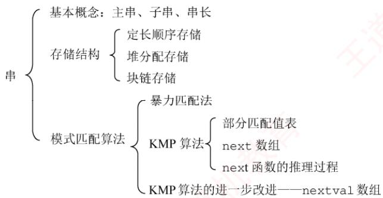  
视频讲解

【复习提示】

本章为统考大纲第6章内容，根据读者建议单独成章。大纲仅要求掌握字符串模式匹配，重点是理解KMP算法的原理、next数组和 nextval数组的推导过程。手工计算 next数组时，可先求出部分匹配值表再进行转换，也可直接依据递推公式求解。

## \*4.1 串的定义和实现①

字符串简称串，计算机中非数值处理的对象基本上都是字符串数据。常见的信息检索系统（如搜索引擎）、文本编辑程序（如Word）、问答系统、自然语言翻译系统等，均以字符串作为核心处理对象。本章将详细介绍字符串的存储结构及其相关操作。

## 4.1.1 串的定义

串（string）是由零个或多个字符组成的有限序列，通常记为

$$
S = a_{1}a_{2}\cdots a_{n} \quad (n \geqslant 0)
$$

其中，S是串名，单引号括起的字符序列是串的值；每个 $a _ { i }$ 可以是字母、数字或其他字符；串中字符的个数n称为串的长度。当n=0时，该串称为空串（用∅表示）。

串中任意多个连续字符组成的子序列称为该串的子串，而包含该子串的串称为主串。某个字符在串中的序号称为该字符在串中的位置；子串在主串中的位置以其第1个字符在主串中的位

置来标识。当两个串长度相等，且对应位置上的字符完全相同时，称这两个串相等。

例如，设串A='China Beijing'，B='Beijing'，C='China'，则它们的长度分别为13、7和5。其中，B和C都是A的子串，B在A中的位置为7，C在A中的位置为1。

需注意，由一个或多个空格（空格是一种特殊字符）组成的串称为空格串，空格串不是空串，其长度等于其中空格字符的个数。 道

串的逻辑结构与线性表极为相似，区别仅在于串的数据对象被限定为字符集。但在基本操作上，二者有显著差异：线性表的基本操作通常以单个元素为单位，如查找、插入或删除某个元素；而串的基本操作一般以子串为单位，如查找、插入或删除一个子串等。 XTA

## 4.1.2 串的基本操作

• StrAssign(&T,chars)：赋值操作。将串 T赋值为 chars。

● StrCopy(&T,S)：复制操作。将串 s 复制给串 T。

● StrEmpty(S)：判空操作。若S 为空串，则返回 TRUE，否则返回 FALSE。

StrCompare(S,T)：比较操作。若 S>T，返回值>0；若S=T，返回值=0；若S<T，返回值<0。

● StrLength(S)：求串长操作。返回串 s 中字符的个数。

• SubString(&Sub,S, pos, len)：求子串操作。用 sub 返回串 s 中从第 pos 个字符起、长度为len的子串。

● Concat(&T，S1，S2)：串联接操作。用T 返回由 S1 和 S2 联接而成的新串。

● Index(S,T)：定位操作。若主串 S 中存在与串 T 值相同的子串，则返回其在 S 中首次出现的位置；否则返回0。

● ClearString(&S)：清空操作。将串 s置为空串。

● DestroyString(&S)：销毁操作。将串 s 销毁。

不同的高级语言对串的基本操作集可能有不同的定义方式。在上述操作中，StrAssign（赋值）、StrCompare（比较）、StrLength（求长）、Concat（联接）和SubString（求子串）这五种操作构成了串类型的最小操作子集：它们无法通过其他串操作实现；而其余串操作（除ClearString和DestroyString外）均可基于该最小操作子集实现。 山育

## 4.1.3 串的存储结构

## 1. 定长顺序存储表示

类似于线性表的顺序存储结构，串的定长顺序存储使用一组地址连续的存储单元来存放串值的字符序列。系统为每个串变量预先分配一个固定长度的数组。

```c
#define MAXLEN 255 //预定义最大串长为255
typedef struct{
char ch[MAXLEN]; //每个分量存储一个字符
int length; //串的实际长度
}SString;
```

串的实际长度不得超过MAXLEN，若超出，则多余部分被舍弃，称为截断。串长有两种表示方式：一种是如上述结构所示，用一个独立的整型变量1en显式记录串的长度；另一种是在串值末尾添加一个不计入串长的结束标记符0'，此时串长为隐含值，需要通过遍历计算得出。

执行插入、联接等操作时，若结果串长度超过MAXLEN，则通常按“截断”处理。要从根本上避免这一限制，需要取消对串长上限的硬性规定，转而采用动态分配的存储方式。

## 2. 堆分配存储表示

堆分配存储仍以地址连续的存储单元存放串值字符序列，但其存储空间在程序运行过程中动态申请获得。

typedef struct{  
char \*ch; //按串长分配存储区，ch 指向串的基地址  
int length; //串的长度  
}HString;

在C语言中，存在一个称为堆的自由存储区。可通过调用ma11oc（）为新生成的串动态分配一块大小等于串长的连续存储空间：若分配成功，返回指向该空间起始地址的指针，作为串的基地址（由指针ch指示）；若分配失败，则返回NULL。已分配的空间可通过free（）释放。

上述两种存储方式被大多数高级程序设计语言所采用。块链存储表示仅做简单介绍。

## 3. 块链存储表示

类似于线性表的链式存储结构，串也可采用链表形式存储。考虑到串的特殊性（每个元素仅为单个字符），实际实现中，每个链表结点可存放一个或多个字符。每个结点称为一个块，整个链表称为块链结构。图4.1(a)显示了块大小为4的链表（每个结点存放4个字符），最后一块占不满时通常用“#”补齐；图4.1(b)则为块大小为1的链表（每个结点仅存1个字符）。

  
(b) 结点大小为1的链表  
图4.1 串值的链式存储方式

## 4.2 串的模式匹配

## 4.2.1 简单的模式匹配算法

模式匹配是指在主串中查找与模式串（待搜索的字符串）完全相同的子串，并返回其首次出现的位置。本节基于定长顺序存储结构，介绍一种不依赖其他串操作的暴力匹配算法。

```javascript
int Index(SString S,SString T) {
int i=1,j=1;
while(i<=S.length&&j<=T.length) { if(S.ch[i]==T.ch[j]){ 王道计
++i;++j; //继续比较后继字符
}
else{
i=i-j+2;j=1; //指针后退重新开始匹配
if(j>T.length) return i-T.length; //匹配成功，返回起始位置
else return 0; //匹配失败
```

在该算法中，计数指针i和j分别指示主串 s和模式串中当前待比较的字符位置。其基本思想是：从主串s的第一个字符开始，与模式串T的首字符比较。若相等，则继续比较后续字符；否则，将主串的比较起点后移一位，并重新从的首字符开始比较；重复此过程，直至模式串T的所有字符依次与主串S中某段连续字符完全匹配，则称匹配成功，函数返回该子串在主串中的起始位置；若遍历完主串仍未找到匹配，则返回0，表示匹配失败。

图 4.2 显示了模式串 $\mathrm{T}=\mathrm{^{ ' }a}\mathrm{b}\mathrm{c}\mathrm{a}\mathrm{c}$ 和主串 S 中的匹配过程。

  
图4.2 简单模式匹配算法举例

在简单模式匹配算法中，设主串和模式串的长度分别为n和 $m (n \gg m)$ ，则最多需进行 $n   -   m   +   1$ 趟匹配，每趟最多比较m次，因此最坏时间复杂度为O(nm)。例如，当模式串为 $\begin{array} { r } { \phantom { } \phantom { } \phantom { } \phantom { } \phantom { } \phantom { } \phantom { } \phantom { } \phantom { } \phantom { } \phantom { } \phantom { } \phantom { } \phantom { } \phantom { } \phantom { } \phantom { } \phantom { } \phantom { } \phantom { } \phantom { } \phantom { } \phantom { } \phantom { } \phantom { } \phantom { } \phantom { } \phantom { } \phantom { } \phantom { } \phantom { } \phantom { } \phantom { } \phantom { } \phantom { } \phantom { } \phantom { } \phantom { } \phantom { } \phantom { } \phantom { } \phantom { } \phantom { } \phantom { } \phantom { } \phantom { } \phantom { } \phantom { } \phantom { } \phantom { } \phantom { } \phantom { } \phantom { } \phantom { } \phantom { } \phantom { } \phantom { } \phantom { } \phantom { } \phantom { } \phantom { } \phantom { } \phantom { } \phantom { } \phantom { } \phantom { } \phantom { } \phantom { } \phantom { } \phantom { } \phantom { } \phantom { } \phantom { } \phantom { } \phantom { } \phantom { } \phantom { } \phantom { } \phantom { } \phantom { } \phantom { } \phantom { } \phantom { } \phantom { } \phantom { } \phantom { } \phantom { } \phantom { } \phantom { } \phantom { } \phantom { } \phantom { } \phantom { } \phantom { } \phantom { } \phantom { } \phantom { } \phantom { } \phantom { } \phantom { } \phantom { } \phantom { } \phantom { } \phantom { } \phantom { } \phantom { } \phantom { } \phantom { } \phantom { } \phantom { } \phantom { } \phantom { } \phantom { } \phantom { } \phantom { } \phantom { } \phantom { } \phantom { } \phantom { } \phantom { } \phantom { } \phantom { } \phantom { } \phantom { } \phantom { } \phantom { } \phantom { } \phantom { } \phantom { } \phantom { } \phantom { } \phantom { } \phantom { } \phantom { } \phantom { } \phantom { } \phantom { } \phantom { } \phantom { } \phantom { } \phantom { } \phantom { } \phantom { } \phantom { } \phantom { } \phantom { } \phantom { } \phantom { } \phantom { } \phantom { } \phantom { } \phantom { } \phantom { } \phantom { } \phantom { } \phantom { } \phantom { } \phantom { } \phantom { } \phantom { } \phantom { } \phantom { } \phantom { } \phantom { } \phantom { } \phantom { } \phantom { } \phantom { } \phantom { } \phantom { } \phantom { } \phantom { } \phantom { } \phantom { } \phantom { } \phantom { } \phantom { } \phantom { } \phantom { } \phantom { } \phantom { } \phantom { } \phantom { } \phantom { } \phantom { } \phantom { } \phantom { } \phantom { } \phantom { } \phantom { } \phantom { } \phantom { } \phantom { } \phantom { } \phantom { } \phantom { } \phantom { } \phantom { } \phantom { } \phantom { } \phantom { } \phantom { } \phantom { } \phantom { } \phantom { } \phantom { } \phantom { } \phantom { } \phantom { } \phantom { } \phantom { } \phantom { } \phantom { } \phantom { } \phantom { } \phantom { } \phantom { } \phantom  \end{array}$ ，而主串为'0000000000000000000000000000000000000000 000001'时，由于模式串前6个字符均为 $^ { \intercal } 0 ^ { \intercal }$ ，而主串前45个字符也全为 $\cdot \cdot _ { 0 } \cdot$ ，导致每趟匹配都直到模式串的最后一个字符才发现不匹配。整个过程中，主串指针i需回溯39次，总比较次数达 $40 \times 7 = 280$ 次。 KK

## 4.2.2 串的模式匹配算法——KMP 算法

在图4.2的第三趟匹配过程中，当i=7、j=5 位置字符不相等时，通常会从 $\downarrow = 4 , \downarrow = 1$ 重新开始比较。然而，观察发现，i=4和j=1、i=5和j=1 以及i=6和j=1 这三次比较都是不必要的。因为从第三趟部分匹配的结果可知，主串的第4、5、6个字符 $( 1 b ^ { \intercal } , 1 c ^ { \intercal } , 1 a ^ { \intercal } )$ ，与模式串的第2、3、4个字符相同，而模式串的首字符为 $ \text{" } a "$ ，故这些重复比较是多余的。只需将模式串向右滑动三个字符的位置，然后从 $i = 7 、 j = 2$ 继续比较即可。

在简单模式匹配中，每次匹配失败后都会将模式串向右滑动一位并从头开始比较。但是，某次已匹配成功的序列实际上是模式串的某个前缀，通过分析模式串本身的结构，若已匹配成功的序列中有后缀正好是模式串的前缀，则可直接将模式串右滑到与这些字符对齐的位置，而无须回溯主串指针i，从而提高效率。这种优化策略正是KMIP算法的核心。


## 1. KMP 算法的原理

要理解模式串的结构，首先需明确几个概念：前缀、后缀和部分匹配值。前缀是指除最后一个字符外，字符串的所有头部子串；后缀是指除第一个字符外，字符串的所有尾部子串；部分四配值则是指字符串的前缀和后缀的最长相等前后缀长度。下面以'ababa'为例进行说明：

● 'a'的前缀和后缀均为空集，最长相等前后缀长度为0。

● 'ab'的前缀为{a}，后缀为{b}，{a}∩{b}=∅，最长相等前后缀长度为0。

• 'aba'的前缀{a,ab}∩后缀{a,ba}={a}，最长相等前后缀长度为1。

• 'abab'的前缀{a,ab,aba}∩后缀 $\{ \mathrm{b}, \mathrm{ab}, \mathrm{ab} \} = \{ \mathrm{ab} \}$ ，最长相等前后缀长度为2。

• 'ababa'的前缀{a,ab,aba,abab}∩后缀 $\{ \mathtt { a } , \mathtt { b } \mathtt { a } , \mathtt { a } \mathtt { b } \mathtt { a } , \mathtt { b } \mathtt { a } \mathtt { b } \mathtt { a } \} { = } \{ \mathtt { a } , \mathtt { a } \mathtt { b } \mathtt { a } \}$ ，交集有两个，最长相等前后缀长度为3。

因此，模式串'ababa'的部分匹配值为00123。

那么，这个部分匹配值有何作用？

回到最初的问题，主串为'ababcabcacbab'，模式串为'abcac'。

利用上述方法容易求得模式串'abcac'的部分匹配值为00010，将部分匹配值组织成数组的形式，即构成部分匹配值表（Partial Match Table，PM表）。

<table><tr><td rowspan=1 colspan=1>编号</td><td rowspan=1 colspan=1>1</td><td rowspan=1 colspan=1>2</td><td rowspan=1 colspan=1>3</td><td rowspan=1 colspan=1>4</td><td rowspan=1 colspan=1>5</td></tr><tr><td rowspan=1 colspan=1>S</td><td rowspan=1 colspan=1>a</td><td rowspan=1 colspan=1>b</td><td rowspan=1 colspan=1>C</td><td rowspan=1 colspan=1>a</td><td rowspan=1 colspan=1>C</td></tr><tr><td rowspan=1 colspan=1>PM</td><td rowspan=1 colspan=1>0</td><td rowspan=1 colspan=1>0</td><td rowspan=1 colspan=1>0</td><td rowspan=1 colspan=1>1</td><td rowspan=1 colspan=1>0</td></tr></table>

下面利用PM表进行字符串匹配：

第一趟匹配：

在第3位发生失配（c≠a），此前已匹配2个字符'ab'。查表可知，最后一个匹配字符b对应的部分匹配值为0，按照下面的公式计算模式串需要右滑的位数：

右滑位数= 已匹配字符数 - 对应的部分匹配值

由于2-0=2，将模式串向右滑动2位，进行第二趟匹配。

<table><tr><td>主串</td><td>a</td><td>b</td><td>a</td><td>b</td><td>C</td><td>a</td><td>b</td><td>C</td><td>a</td><td></td><td>C b</td><td>a</td><td>b</td></tr><tr><td>模式串</td><td></td><td></td><td>a</td><td>b</td><td>C</td><td>a</td><td>C</td><td></td><td></td><td></td><td></td><td></td><td></td></tr></table>

第二趟匹配：

在第5位发生失配（c≠b），此前已匹配4个字符'abca'。查表可知，最后一个匹配字符a对应的部分匹配值为1，4-1=3，将模式串向右滑动3位，进行第三趟匹配。

模式串

第三趟匹配：

模式串全部字符匹配成功。

可见，部分匹配值的核心价值在于指导模式串在失配后的最优右移距离。整个过程中，主串指针始终未回溯，这使得 KMP算法的时间复杂度稳定为O(n+ m)。

某趟匹配失败时：若已匹配序列中不存在相等的前后缀（PM值为0），则滑动位数最大，直接将模式串首字符对齐到主串当前失配位置：若存在最长相等前后缀（可理解为首尾重合），则将模式串向右滑动至与主串中该相等后缀对齐的位置，从而跳过已知相等的部分，避免重复比较。两种情形下，模式串右滑位数均为“已匹配字符数-对应的部分匹配值”。

还有一种特殊情况：若模式串的第一个字符即与主串当前字符失配，则已匹配字符数为0，按规则将模式串整体右移一位，并从主串下一个位置开始新一轮匹配。

## 2. next 数组的手算方法

在实际匹配过程中，模式串在内存中的存储位置是固定的，并不会真正“滑动”：发生变化的只是指针。前文通过模拟滑动的方式，是为了直观地帮助读者理解KMP算法的匹配逻辑。

$$
 【基盖面瓣】卜  $\mathsf { K M P }$  算法中指针变化化较次数的分析  $\left( \mathtt { 2 0 1 5 }  、  \mathtt { 2 0 1 9 } \right)$
$$

KMP算法的核心特性是：每趟匹配失败时，主串指针i不回溯，仅模式串指针i调整。为此，可定义一个next数组，next[j]的含义是：当模式串的第j个字符失配时，下一轮应从模式串的第next[j]个位置继续与主串当前字符比较。

下面介绍一种手算next数组的方法，仍以模式串'abcac'为例。

第1个字符失配时：令next[1]=0，然后指针i加1，指针j重置为1，即下一轮将模式串的第1个位置与主串当前位置的下一位置进行比较（注意，图中下标为字符编号）。

$$
\begin{array}{ccc} \begin{array}{ccc}&  匹配失败。说明此元素不是  \; \mathsf{a} & \\ \downarrow & & \\ 模式串  & \begin{array}{c}\uparrow  主串  \\\uparrow \\\underline{\mathsf{a}}_{1}\end{array}\quad \begin{array}{c}\uparrow \\\boxdot \\\mathsf{b}_{2}\end{array}\quad \begin{array}{c}\boxdot \\\end{array}\quad \begin{array}{c}\boxdot \\\boxdot \\\mathsf{c}_{3}\end{array}\quad \begin{array}{c}\boxdot \\\mathsf{a}_{4}\end{array}\quad \begin{array}{c}\boxdot \\\mathsf{a}_{5}\end{array}\quad \begin{array}{c}\boxdot \\\end{array}\quad \begin{array}{c}\boxdot \\\end{array}\quad \begin{array}{c}\boxdot \\\end{array}\quad \begin{array}{c}\boxdot \\\end{array}\quad \begin{array}{c}\boxdot \\\end{array}\quad \begin{array}{c}\boxdot \\\end{array}\quad \begin{array}{c}\boxdot \\\end{array}\quad \begin{array}{c}\boxdot \\\end{array}\quad \begin{array}{c}\boxdot \\\end{array}\quad \begin{array}{c}\boxdot \\\end{array}\quad \begin{array}{c}\boxdot \\\end{array}\quad \begin{array}{c}\boxdot \\\end{array}\quad \begin{array}{c}\boxdot \\\end{array}\quad \begin{array}{c}\boxdot \\\end{array}\quad \begin{array}{c}\boxdot \\\end{array}\quad \begin{array}{c}\boxdot \\\end{array}\quad \begin{array}{c}\boxed{\text{array}{c}}\quad \begin{array}{c}\boxed{\text{array}{c}}\quad \begin{array{c}{c}\text{c}{c}}\end{array}\end{array}\quad \begin{array}{c}\text{array}{c}\text{a} \\\end{array}\end{array}\text{array}\text{1}\end{array}\text{array}\text{1}\text{1}\text{2}\text{2}\text{1}\text{2}\text{1}\text{1}\text{2}\text{2 2}\text{1}\text{1}\text{1}\text{1}\text{ 2 2 1}\text{ 2 1}\text{ 2 1}\text{ 2 1}\text{ 2 1 1}\text{ 2 1 1}\text{ 2 1 1 1 1 1 1 1 1 1 1 1 1 1 1 1 1 1 1 1 1 1 1 1 1 1 1 1 1 1 1 1 1 1 1 1 1 1 1 1 1 1 1 1 1 1 1 1 1 1 1 1 1 1 1 1 1 1 1 1 1 1 1 1 1 1 1 1 1 1 1 1 1 1 1 1 1 1 1 1 1 1 1 1 1 1 1 1 1 1 1 1 1 1 1 1 1 1 1 1 1 1 1 1 1 1 1 1 1 1 1 1 1 1 1 1 1 1 1 1 1 1 1 1 1 1 1 1 1 1 1 1 1 1 1 1 1 1 1 1 1 1 1 1 1 1 1 1 1 1 1 1 1 1 1 1 1 1 1 1 1 1 1 1 1 1 1 1 1 1 1 1 1 1 1 1 1 1 1 1 1 1 1 1 1 1 1 1 1 1 1 1 1 1 1 1 1 1 1 1 1 1 1 1 1 1 1 1 1 1 1 1 1 1 1 1 1 1 1 1 1 1 1 1 1 1 1 1 1 1 1 1 1 1 1 1 1 1 1 1 1 1 1 1 1 1 1 1 1 1 1 1 1 1 1 1 1 1 1 1 1 1 1 1 1 1 1 1 1 1 1 1 1 1 1 1 1 1 1 1 1 1 1 1 1 1 1 1 1 1 1 1 1 1 1 1 1 1 1 1 1 1 1 1 1 1 1 1 1 1 1 1 1 1 1 1 1 1 1 1 1 1 1 1 1 1 1 1 1 1 1 1 1 1 1
$$

第2个字符失配时：令next[2]=1，模式串下次的比较位置为1，相当于向右滑动1位(注，next[1]=0、next[2]=1 是固定规则）。 灿

$$
 模式串  $\begin{array}{l}\begin{array}{l}\begin{array}{l}\begin{array}{l}\begin{array}{l}\begin{array}{l}\begin{array}{l}\begin{array}{l}\begin{array}{l}\begin{array}{l}\begin{array}{l}\begin{array}{l}\begin{array}{l}\begin{array}{l}\begin{array}{l}\begin{array}{l}\begin{array}{l}\begin{array}{l}\begin{array}{l}\begin{array}{l}\begin{array}{l}\begin{array}{l}\begin{array}{l}\begin{array}{l}\begin{array}{l}\begin{array}{l}\begin{array}{l}\begin{array}{l}\begin{array}{l}\begin{array}{l}\begin{array}{l}\begin{array}{l}\begin{array}{l}\begin{array}{l}\begin{array}{l}\begin{array}{l}\begin{array}{l}\begin{array}{l}\begin{array}{l}\begin{array}{l}\begin{array}{l}\begin{array}{l}\begin{array}{l}\begin{array}{l}\begin{array}{l}\begin{array}{l}\begin{array}{l}\begin{array}{l}\begin{array}{l}\begin{array}{l}\begin{array}{l}\begin{array}{l}\begin{array}{l}\begin{array}{l}\begin{array}{l}\begin{array}{l}\begin{array}{l}\begin{array}{l}\begin{array}{l}\begin{array}{l}\begin{array}{l}\begin{array}{l}\begin{array}{l}\begin{array}{l}\begin{array}{l}\begin{array}{l}\begin{array}{l}\end{array}{l}\begin{array}{l}\begin{array}{l}\begin{array}{l}\begin{array}{l}\begin{array}{l}\begin{array}{l}{l}\begin{array}{l}\begin{array}{l}\end{array}{l}\begin{array}{l}\begin{array}{l}{l}\begin{array}{l}\begin{array}{l}\begin{array}{l}{l}\end{array}{l}\begin{array}{l}{l}\begin{array}{l}\begin{array}{l}{l}\begin{array}{l}\begin{array}{l}{l}\end{array}{l}\begin{array}{l}{l}\begin{array}{l}{l}\begin{array}{l}{l}\begin{array}{l}{l}\end{array}{l}\begin{array}{l}{l}\begin{array}{l}{l}\begin{array}{l}{l}\begin{array}{l}{l}\begin{array}{l}{l}\begin{array}{l}{l}\end{array}{l}{l}\begin{array}{l}{l}\begin{array}{l}{l}\begin{array}{l}{l}\begin{array}{l}{l}\begin{array}{l}{l}\begin{array}{l}{l}{l}\begin{array}{l}{l}\begin{array}{l}{l}{l}\begin{array}{l}{l}\begin{array}{l}{l}{l}\begin{array}{l}{l}\begin{array}{l}{l}{l}\begin{array}{l}{l}\begin{array}{l}{l}{l}\begin{array}{l}{l}{l}\begin{array}{l}{l}{l}\begin{array}{l}{l}{l}\begin{array}{l}{l}{l}\begin{array}{l}{l}{l}\begin{array}{l}{l}{l}\begin{array}{l}{l}{l}\begin{array}{l}{l}{l}\begin{array}{l}{l}{l}\begin{array}{l}{l}{l}\begin{array}{l}{l}{l}{l}\begin{array}{l}{l}{l}\begin{array}{l}{l}{l}{l}\begin{array}{l}{l}{l}\begin{array}{l}{l}{l}{l}\begin{array}{l}{l}{l}{l}\begin{array}{l}{l}{l}\begin{array}{l}{l}{l}{l}\begin{array}{l}{l}{l}{l}\begin{array}{l}{l}{l}{l}\begin{array}{l}{l}{l}{l}\begin{array}{l}{l}{l}{l}\begin{array}{l}{l}{l}{l}\begin{array}{l}{l}{l}{l}\begin{array}{l}{l}{l}{l}\begin{array}{l}{l}{l}{l}\begin{array}{l}{l}{l}{l}\begin{array}{l}{l}{l}{l}\begin{array}{l}{l}{l}{l}{l}\begin{array}{l}{l}{l}{l}\begin{array}{l}{l}{l}{l}\begin{array}{ \end{array} \end{array} \end{array} \end{array} \end{array} \end{array} \end{array} \end{array} \end{array} \end{array} \end{array} \end{array} \end{array} \end{array} \end{array} \end{array} \end{array} \end{array} \end{array} \end{array} \end{array} \end{array} \end{array} \end{array} \end{array} \end{array} \end{array} \end{array} \end{array} \end{array} \end{array} \end{array} \end{array} \end{array} \end{array} \end{array} \end{array} \end{array} \end{array} \end{array} \end{array} \end{array} \end{array} \end{array} \end{array} \end{array} \end{array} \end{array} \end{array} \end{array} \end{array} \end{array} \end{array} \end{array} \end{array} \end{array} \end{array} \end{array} \end{array} \end{array} \end{array} \end{array} \end{array} \end{array} \end{array} \end{array} \end{array} \end{array} \end{array} \end{array} \end{array} \end{array} \end{array} \end{array} \end{array} \end{array} \end{array} \end{array} \end{array} \end{array} \end{array} \end{array} \end{array} \end{array} \end{array} \end{array} \end{array} \end{array} \end{array} \end{array} \end{array} \end{array} \end{array} \end{array} \end{array} \end{array} \end{array} \end{array} \end{array} \end{array} \end{array} \end{array} \end{array} \end{array} \end{array} \end{array} \end{array} \end{array} \end{array} \end{array} \end{array} \end{array} \end{array} \end{array} \end{array} \end{array} \end{array} \end{array} \end{array} \end{array} \end{array} \end{array} \end{array} \end{array} \end{array} \end{array} \end{array} \end{array} \end{array} \end{array} \end{array} \end{array} \end{array} \end{array} \end{array}
$$

在后续的手算过程中，可在失配位置前画一条分界线，尝试将模式串向右移动，直到分界线左侧的部分能够首尾对齐（存在相等的前后缀），或模式串完全跨过分界线为止。

第3个字符失配时：模式串下次的比较位置为1，即 $\operatorname { n e x t } [ 3 ] = 1$ ，相当于向右滑动2位。

匹配失败，说明此元素不是c

$$
 模式串  $\begin{array}{l}\begin{array}{l}\begin{array}{l}\begin{array}{l}\begin{array}{l}\begin{array}{l}\begin{array}{l}\begin{array}{l}\begin{array}{l}\begin{array}{l}\begin{array}{l}\begin{array}{l}\begin{array}{l}\begin{array}{l}\begin{array}{l}\begin{array}{l}\begin{array}{l}\begin{array}{l}\begin{array}{l}\begin{array}{l}\begin{array}{l}\begin{array}{l}\begin{array}{l}\begin{array}{l}\begin{array}{l}\begin{array}{l}\begin{array}{l}\begin{array}{l}\begin{array}{l}\begin{array}{l}\begin{array}{l}\begin{array}{l}\begin{array}{l}\begin{array}{l}\begin{array}{l}\begin{array}{l}\begin{array}{l}\begin{array}{l}\begin{array}{l}\begin{array}{l}\begin{array}{l}\begin{array}{l}\begin{array}{l}\begin{array}{l}\begin{array}{l}\begin{array}{l}\begin{array}{l}\begin{array}{l}\begin{array}{l}\begin{array}{l}\begin{array}{l}\begin{array}{l}\begin{array}{l}\begin{array}{l}\begin{array}{l}\begin{array}{l}\begin{array}{l}\begin{array}{l}\begin{array}{l}\begin{array}{l}\begin{array}{l}\begin{array}{l}\begin{array}{l}\begin{array}{l}\begin{array}{l}\begin{array}{l}\begin{array}{l}\begin{array}{l}\begin{array}{l}\end{array}{l}\begin{array}{l}\begin{array}{l}\begin{array}{l}{l}\begin{array}{l}\begin{array}{l}\begin{array}{l}{l}\begin{array}{l}\begin{array}{l}\begin{array}{l}{l}\begin{array}{l}\end{array}{l}\begin{array}{l}{l}\begin{array}{l}\begin{array}{l}{l}\begin{array}{l}\begin{array}{l}{l}\begin{array}{l}{l}\end{array}{l}\begin{array}{l}{l}\begin{array}{l}\begin{array}{l}{l}\begin{array}{l}{l}\begin{array}{l}{l}\end{array}{l}\begin{array}{l}{l}\begin{array}{l}{l}\begin{array}{l}{l}\begin{array}{l}{l}\begin{array}{l}{l}\begin{array}{l}{l}\begin{array}{l}{l}\begin{array}{l}{l}\begin{array}{l}{l}\begin{array}{l}{l}\begin{array}{l}{l}\begin{array}{l}{l}\end{l}\end{array}{l}{l}\begin{array}{l}{l}\begin{array}{l}{l}{l}\begin{array}{l}{l}\begin{array}{l}{l}{l}\begin{array}{l}{l}\begin{array}{l}{l}{l}\begin{array}{l}{l}{l}\begin{array}{l}{l}\begin{array}{l}{l}{l}\begin{array}{l}{l}{l}\begin{array}{l}{l}{l}\begin{array}{l}{l}{l}\begin{array}{l}{l}{l}\begin{array}{l}{l}{l}\begin{array}{l}{l}{l}\begin{array}{l}{l}{l}\begin{array}{l}{l}{l}\begin{array}{l}{l}{l}{l}\begin{array}{l}{l}{l}\begin{array}{l}{l}{l}\begin{array}{l}{l}{l}\begin{array}{l}{l}{l}{l}\begin{array}{l}{l}{l}{l}\begin{array}{l}{l}{l}\begin{array}{l}{l}{l}{l}\begin{array}{l}{l}{l}\begin{array}{l}{l}{l}{l}\begin{array}{l}{l}{l}{l}\begin{array}{l}{l}{l}{l}\begin{array}{l}{l}{l}{l}\begin{array}{l}{l}{l}{l}\begin{array}{l}{l}{l}{l}\begin{array}{l}{l}{l}{l}\begin{array}{l}{l}{l}{l}\begin{array}{l}{l}{l}{l}\begin{array}{l}{l}{l}{l}\begin{array}{l}{l}{l}{l}\begin{array}{l}{l}{l}{l}\begin{array}{l}{l}{l}{l}\begin{array}{l \end{array} \end{array} \end{array} \end{array} \end{array} \end{array} \end{array} \end{array} \end{array} \end{array} \end{array} \end{array} \end{array} \end{array} \end{array} \end{array} \end{array} \end{array} \end{array} \end{array} \end{array} \end{array} \end{array} \end{array} \end{array} \end{array} \end{array} \end{array} \end{array} \end{array} \end{array} \end{array} \end{array} \end{array} \end{array} \end{array} \end{array} \end{array} \end{array} \end{array} \end{array} \end{array} \end{array} \end{array} \end{array} \end{array} \end{array} \end{array} \end{array} \end{array} \end{array} \end{array} \end{array} \end{array} \end{array} \end{array} \end{array} \end{array} \end{array} \end{array} \end{array} \end{array} \end{array} \end{array} \end{array} \end{array} \end{array} \end{array} \end{array} \end{array} \end{array} \end{array} \end{array} \end{array} \end{array} \end{array} \end{array} \end{array} \end{array} \end{array} \end{array} \end{array} \end{array} \end{array} \end{array} \end{array} \end{array} \end{array} \end{array} \end{array} \end{array} \end{array} \end{array} \end{array} \end{array} \end{array} \end{array} \end{array} \end{array} \end{array} \end{array} \end{array} \end{array} \end{array} \end{array} \end{array} \end{array} \end{array} \end{array} \end{array} \end{array} \end{array} \end{array} \end{array} \end{array} \end{array} \end{array} \end{array} \end{array} \end{array} \end{array} \end{array} \end{array} \end{array} \end{array} \end{array} \end{array} \end{array} \end{array} \end{array} \end{array} \end{array} \end{array} \end{array} \end{array} \end{array} \end{array}
$$

第4个字符失配时：模式串下次的比较位置为1，即 $\scriptstyle \mathbb { R e } \times \mathbb { t } \; [ \; 4 \; ] \; = \; \mathbb { 1 }$ ，相当于向右滑动3位。

匹配失败，说明此元素不是a

$$
\begin{array}{l} 四四四四四四四四四四四四四四四四四四四四四四四四四四四四四四四四四四四四四四四四四四四四四四四四四四四四四四四四四四四四四四四四四四四四四四四四四四四四四四四四四四四四四四四四四四四四四四四四四四四四四四四四四四四四四四四四四四四四四四四四四四四四四四四四四四四四四四四四四四四四四四四四四四四四四四四四四四四囉� \\ 在右滑 \\ 右滑 \\\end{array}
$$

第5个字符失配时：模式串下次的比较位置为2，即 $\scriptstyle \mathrm { n e x t }   [   5   ]   = 2$ ，相当于向右滑动3位。

匹配失败，说明此元素不是c

$$
\begin{array}{l} 主串  \\ 模式串  \\ 右滑  \\\end{array}\quad \begin{array}{l}\cdots \\\end{array}\quad \begin{array}{l} a  \\\end{array}\quad \begin{array}{l} b  \\\end{array}\quad \begin{array}{l} c  \\\end{array}\quad \begin{array}{l}\begin{array}{l}\begin{array}{l}\begin{array}{l}{l}\begin{array}{l}{l}\begin{array}{l}{l}\begin{array}{l}{l}\begin{array}{l}{l}\begin{array{l}{l}{l}\begin{array}{l}{l}{l}\begin{l}{l}\begin{array{l}{l}{l}\begin{l}{l}\begin{array{l}{l}{l}\begin{l}{l}\begin{array}{l}{l}\begin{l}{l}\begin{array}{l}{l}\begin{l}{l}\begin{array}{l}{l}\begin{l}{l}\begin{array}{l}{l}\begin{l}{l}\begin{array}{l}{l}\begin{l}{l}\end{l}\end{array}{l}\begin{array}{l}{l}\begin{array}{l}{l}\begin{array}{l}{l}{l}\begin{array}{l}{l}\begin{array}{l}{l}{l}\begin{array}{l}{l}\begin{array}{l}{l}\begin{array}{l}{l}\begin{array}{l}{l}\begin{array}{l}{l}\begin{array}{l}{l}\end{array}{l}{l}\begin{array}{l}{l}\begin{array}{l}{l}\begin{array}{l}{l}\begin{array}{l}{l}\begin{array}{l}{l}\end{array}{l}\begin{array}{l}{l}\begin{array}{l}{l}\begin{array}{l}{l}\end{array}{l}\begin{array}{l}{l}\begin{array}{l}{l}\end{array}{l}\begin{array}{l}{l}\begin{array}{l}{l}\end{array}{l}{l}\begin{array}{l}{l}\begin{array}{l}{l}\end{array}{l}{l}\begin{array}{l}{l}\begin{array}{l}{l}\begin{array}{l}{l}\end{array}{l}{l}\end{array}{l}{l}\begin{array}{l}{l}\begin{array}{l}{l}{l}\end{array}{l}{l}\begin{array}{l}{l}\begin{array}{l}{l}{l}\end{array}{l}{l}\end{array}{l}{l}\end{array}{l}{l}\end{array}{l}{l}\end{array}{l}{l}\begin{array}{l}{l}{l}\begin{array}{l}{l}{l}\end{array}{l}{l}{l}\end{array}{l}{l}\end{array}{l}{l}{l}\end{array}{l}{l}\end{array}{l}{l}\end{array}{l}{l}}\end{array}{l}{l}\end{array}{l}{l}\end{array}{l}{l}\end{array}{l}{l}\end{array}{l}{l}\end{array}{l}{l}\end{array}{l}{l}\end{array}{l}{l}\end{array}{l}{l}\end{array}{l}{l}\end{array}{l}{l}\end{array}{l}{l}\end{array}{l}{l}\end{array}{l}{l}\end{array}{l}{l}\end{array}{l}\end{array}{l}\end{array}{l}\end{array}{l}\end{array}\end{l} \end{array} \end{array} \end{array} \end{array} \end{array} \end{array} \end{array}
$$

next 数组和 PM 表的关系是怎样的？

通过上述举例，可推导出 next数组和 PM表之间的关系：

$$
\mathrm{next}[\mathrm{j}] = \mathrm{j}-\mathrm{布滑位数} = \mathrm{j}-(\mathrm{已匹配的字符数}^0-\mathrm{对应的部分匹配值})
$$

因此，next数组等于将PM表右移一位，再整体加1。经验证，该结论与手算结果一致。

<table><tr><td rowspan=1 colspan=1>编号</td><td rowspan=1 colspan=1>1</td><td rowspan=1 colspan=1>2</td><td rowspan=1 colspan=1>3</td><td rowspan=1 colspan=1>4</td><td rowspan=1 colspan=1>5</td></tr><tr><td rowspan=1 colspan=1>S</td><td rowspan=1 colspan=1>a</td><td rowspan=1 colspan=1>b</td><td rowspan=1 colspan=1>C</td><td rowspan=1 colspan=1>a</td><td rowspan=1 colspan=1>C</td></tr><tr><td rowspan=1 colspan=1>next</td><td rowspan=1 colspan=1>0</td><td rowspan=1 colspan=1>1</td><td rowspan=1 colspan=1>1</td><td rowspan=1 colspan=1>1</td><td rowspan=1 colspan=1>2</td></tr></table>

我们注意到：

1）PM表右移后空出的第一个位置补0，因为若模式串首字符失配，算法规定 $\mathrm{n}\mathrm{e}\mathrm{x}\mathrm{t}\left[\mathrm{j}\right]=0$ 表示将主串和模式串同步右移一位。 X

2）PM表最后一个元素右移后移出，因为原来的模式串中，最后一个字符的部分匹配值是供其下一个字符使用的，但显然其没有下一个字符，所以可以舍去。

## 注意

以上讨论均假设串的编号从1开始；若串的编号从0开始，则next数组需要整体减1。

## \*3. next 数组的推理公式

如何推理next数组的一般公式？设主串为 $\mathrm{S}_{1}\mathrm{S}_{2}\cdots\mathrm{S}_{n}$ ，模式串为 $p_{1}p_{2}\cdots p_{m}$ 。当主串的第i个字符与模式串的第j个字符失配时，应将主串当前位置与模式串的哪个字符进行比较？

假设此时应与模式串的第 $k (k < j)$ 个字符比较，则模式串的前k-1个字符的子串必须满足以下条件，且不存在更大的 $\mathrm { k ^ { \prime } { \geq } k }$ 满足条件：

$$
p_{1}p_{2}\cdots p_{k - 1} = p_{j - k + 1}p_{j - k + 2}\cdots p_{j - 1}
$$

若存在满足上述条件的子串，则发生失配时，仅需将模式串的第k个字符与主串的第i个字符对齐。此时，模式串的前k-1个字符必然与主串中第i个字符之前的k-1个字符相等，因此，可直接从模式串的第k个字符开始，与主串的第i个字符继续比较，如图4.3所示。 XON

<table><tr><td rowspan=1 colspan=1>主串</td><td rowspan=1 colspan=1>S1</td><td rowspan=1 colspan=1>….</td><td rowspan=1 colspan=1>.</td><td rowspan=1 colspan=1>…</td><td rowspan=1 colspan=1>…</td><td rowspan=1 colspan=1>..</td><td rowspan=1 colspan=1> $\mathbf { S } _ { \mathrm { \normalfont \downarrow - k + 1 } }$ </td><td rowspan=1 colspan=1>……</td><td rowspan=1 colspan=1> $\mathbf { S } _ { \mathtt { i } - 1 }$ </td><td rowspan=1 colspan=1> $\underline { { \mathbb { S } } } _ { \dot { \lambda } _ { \alpha } }$ </td><td rowspan=1 colspan=1>..</td><td rowspan=1 colspan=1>…</td><td rowspan=1 colspan=1>…</td><td rowspan=1 colspan=1></td><td rowspan=1 colspan=1>Sn</td></tr><tr><td rowspan=1 colspan=1>子串</td><td rowspan=1 colspan=1></td><td rowspan=1 colspan=1></td><td rowspan=1 colspan=1>p₁</td><td rowspan=1 colspan=1>..</td><td rowspan=1 colspan=1>Pk-1</td><td rowspan=1 colspan=1>…</td><td rowspan=1 colspan=1>Pj-k+1</td><td rowspan=1 colspan=1>….</td><td rowspan=1 colspan=1> $\mathrm { p } _ { \mathrm { j - 1 } }$ </td><td rowspan=1 colspan=1> $\mathbb { R i }$ </td><td rowspan=1 colspan=1>..</td><td rowspan=1 colspan=1>Pm</td><td rowspan=1 colspan=1></td><td rowspan=1 colspan=1></td><td rowspan=1 colspan=1></td></tr><tr><td rowspan=1 colspan=1>右滑</td><td rowspan=1 colspan=1></td><td rowspan=1 colspan=1></td><td rowspan=1 colspan=1></td><td rowspan=1 colspan=1></td><td rowspan=1 colspan=1></td><td rowspan=1 colspan=1></td><td rowspan=1 colspan=1>P₁</td><td rowspan=1 colspan=1>…</td><td rowspan=1 colspan=1> $\mathrm { p _ { k - 1 } }$ </td><td rowspan=1 colspan=1> $\mathrm { p _ { k } }$ </td><td rowspan=1 colspan=1>…</td><td rowspan=1 colspan=1>…</td><td rowspan=1 colspan=1> $\mathrm{p_m}$ </td><td rowspan=1 colspan=1></td><td rowspan=1 colspan=1></td></tr></table>

图4.3 模式串右滑到合适位置（阴影对齐部分表示上下字符相等）

若在已匹配的序列中不存在满足上述条件的相等前后缀（可视为 $k = 1$ ，则应让主串的第i个字符与模式串的第1个字符重新比较。 土

特别地，当模式串的第1个字符 $( \mathrm { {  ~ j = } 1 ~ } )$ 与主串失配时，规定 $\mathtt { n e x t [ 1 ] }   =   0$ 0

通过上述分析可得出 next函数的公式：

$$
\max\{ j \mid \max\{ j \mid \max\{ j \mid \max\{ j \mid \max\{ j \mid \max\{ j \mid \max\{ j \} , \ldots , \sum , \sum , \sum , \sum , \sum , \sum , \sum }\}\}} \}
$$

要用代码来实现，貌似难度不小，下面尝试推理求解的科学步骤。

首先由公式可知

$$
\mathrm{n}\mathrm{e}\times\mathrm{t}\left[1\right]=0
$$

设 $\mathrm { n e x t } [ \mathrm { j } ] = \mathrm { k }$ ，此时k应满足的条件在上文中已描述。

此时 $\mathrm{next} \left[ \mathrm{j} + 1 \right] = ?$ 可能有两种情况：

（1）若 $\mathtt { p _ { k } } { = } \mathtt { p _ { j } }$ ，则表明在模式串中

$$
{ \bf p } _ { 1 } \cdots { \bf p } _ { k - 1 } { \bf p } _ { k } { } ^ { \intercal } = { \bf p } _ { j - k + 1 } \cdots { \bf p } _ { j - 1 } { \bf p } _ { j } { } ^ { \intercal }
$$

且不可能存在 $\Bbbk ^ { \prime } \geq \Bbbk$ 满足上述条件，此时 $\mathrm{n}\mathrm{e}\times\mathrm{t}\left[\mathrm{j}+1\right]=\mathrm{k}+1$ ，即

$$
\mathrm{next} [\mathrm{j} + \mathrm{1}] = \mathrm{next} [\mathrm{j}] + \mathrm{1}
$$

(2)若 $\mathrm { p _ { k } } \neq \mathrm { p _ { j } }$ ，则表明在模式串中

$$
\mathtt { p _ { l } \cdots p _ { k - l } p _ { k } } \neq \mathtt { p _ { j - k + l } \cdots p _ { j - l } p _ { j } }
$$

此时可将求 next函数值的问题视为一个模式匹配问题。用前缀 $\mathtt { p _ { 1 } } \cdots \mathtt { p _ { k } }$ 去与后缀 $\mathbb { P } _ { \mathrm { j - k + 1 } } \cdots \mathbb { P } _ { \mathrm { j } }$ 匹配，当 $\mathrm{P_{k}} \neq \mathrm{P_{j}}$ 时，应将 $\mathtt { p _ { l } } \cdots \mathtt { p _ { k } }$ 向右滑动至用第next[k]个字符与 $\mathrm { p _ { j } }$ 进行比较，若 $\mathtt { p _ { n e x t \: [ k ] } }$ 与$\mathrm { p } _ { \mathrm { j } }$ 仍不匹配，则需寻找长度更短的相等前后缀，下一步继续用 $\mathbb { P } _ { \mathrm { n e x t }   [ \mathrm { n e x t }   [ \mathrm { k } ]   ] }$ 与 $\mathrm { p _ { j } }$ 进行较，以此类推，直到找到某个更小的 $\mathrm{k}' = \mathrm{next} \left[ \mathrm{next} \cdots \left[ \mathrm{k} \right] \right] \left( 1 < \mathrm{k}' < \mathrm{k} < \mathrm{j} \right)$ ，满足条件

$$
\mathrm{p}_{1} \cdots \mathrm{p}_{\mathrm{k}}, \mathrm{p}_{\mathrm{j}-\mathrm{k}}, \cdots \mathrm{p}_{\mathrm{j}}
$$

则 $\mathrm{n}\mathrm{e}\times\mathrm{t}\left[\mathrm{j}+1\right]=\mathrm{k}^{\prime}+1$

也可能不存在任何 $\mathrm { k ^ { \prime } }$ 满足上述条件，即不存在长度更短的相等前后缀，令 $\mathrm { n e x t } \left[ \mathrm { j } + 1 \right] = 1$ 0理解起来可能有点抽象？下面通过一个具体例子说明。

图 4.4 的模式串已求得 6 个字符的 next 值，现求 $\mathtt { n e x t } \left[ 7 \right]$ ，因为 $\mathrm { n e x t } [ 6 ] = 3$ ，又 $\mathbb { P } _ { 6 } \neq \mathbb { P } _ { 3 }$ 所以需比较 $\mathrm { p } _ { 6 }$ 与 $\mathrm { p _ { 1 } }$ (因 $\mathrm{n}\mathrm{e}\mathrm{x}\mathrm{t}\ [3]=1)\ ,\ \mathrm{p}_{6}\neq\mathrm{p}_{1}$ ，而 $\operatorname { \bar { n e x t } } \left[ 1 \right] = 0$ ，故 $\scriptstyle \operatorname { n e x t } [ 7 ] = 1$ ；求 $\mathtt { n e x t } \; [   8   ]$ 因为 $\mathtt { p _ { 7 } } \mathtt { = } \mathtt { p _ { 1 } }$ ，所以 $\mathrm{next} [8] = \mathrm{next} [7] + 1 = 2$ ；求 $\mathtt { n e x t } \; [   9   ]$ ，因为 $\mathtt { p _ { 8 } } \mathtt { = } \mathtt { p _ { 2 } }$ ，所以 $\mathtt { n e x t } [ 9 ] = 3$

<table><tr><td rowspan=1 colspan=1>j</td><td rowspan=1 colspan=1>1</td><td rowspan=1 colspan=1>2</td><td rowspan=1 colspan=1>3</td><td rowspan=1 colspan=1>4</td><td rowspan=1 colspan=1>5</td><td rowspan=1 colspan=1>6</td><td rowspan=1 colspan=1>7</td><td rowspan=1 colspan=1>8</td><td rowspan=1 colspan=1>9</td></tr><tr><td rowspan=1 colspan=1>模式串</td><td rowspan=1 colspan=1>a</td><td rowspan=1 colspan=1>b</td><td rowspan=1 colspan=1>a</td><td rowspan=1 colspan=1>a</td><td rowspan=1 colspan=1>b</td><td rowspan=1 colspan=1>C</td><td rowspan=1 colspan=1>a</td><td rowspan=1 colspan=1>b</td><td rowspan=1 colspan=1>a</td></tr><tr><td rowspan=1 colspan=1>next[j]</td><td rowspan=1 colspan=1>0</td><td rowspan=1 colspan=1>1</td><td rowspan=1 colspan=1>1</td><td rowspan=1 colspan=1>2</td><td rowspan=1 colspan=1>2</td><td rowspan=1 colspan=1>3</td><td rowspan=1 colspan=1>?</td><td rowspan=1 colspan=1>?</td><td rowspan=1 colspan=1>?</td></tr></table>

图 4.4 求模式串的 next 值

## 4. KMP 算法的实现

通过上述分析，可写出求解next数组的程序如下：

void get next(SString T,int next[]){  
int i=1,j=0;  
next[1]=0;  
while(i<T.length) {  
if(j==0l|T.ch[i]==T.ch[j]){  
++i; ++j;  
next[i]=j; //若p=pj,则 next[j+1]=next[j]+1  
}  
else  
j=next[j]； //否则令j=next[j]，循环继续  
育

计算机上执行的效率很高，但手工计算时，仍需采用前文介绍的直观方法。

与next数组的求解相比，KMP算法的匹配过程相对简洁，其结构与简单模式匹配极为相似。关键区别在于：当发生失配时，主串指针i保持不变，仅将模式串指针j回退至next[j]所指示的位置，并继续比较；特别地，当 $j   =   0$ 时，将i和 $\dot { \mathsf { J } }$ 同时加1。也就是说，若模式串首字符失配，则将模式串向右滑动一位，下一轮匹配从主串第i+1个位置开始。具体实现如下：