答下列问题：

1）对右侧的图G，从顶点A开始求G的MST，依次给出按算法选出的边。 V

2）图 G的 MST 是唯一的吗？

3）对任意的带权连通图，满足什么条件时，其MST是唯一的？


12. 【2018统考真题】拟建设一个光通信骨干网络连通BJ、CS、

XA、QD、JN、NJ、TL和WH等8个城市，右图中无向边上的权值表示两个城市之间备选光缆的铺设费用。请回答下列问题：

1）仅从铺设费用角度出发，给出所有可能的最经济的光缆铺设方案（用带权图表示），并计算相应方案的总费用。

2）该图可采用图的哪种存储结构？给出求解问题1）所用的算法名称。


3）假设每个城市采用一个路由器按1）中得到的最经济方案组网，主机H1直接连接TL 的路由器，主机 H2 直接连接 BJ 的路由器。若 H1 向 H2 发送一个 TTL = 5 的 IP分组，则H2是否可以收到该IP分组？

13.【2024统考真题】2023年10月26日，神舟十七号载人飞船发射取得圆满成功，再次彰显了中国航天事业的辉煌成就。载人航天工程是包含众多子工程的复杂系统工程，为了保证工程的有序开展，需要明确各子工程的前导子工程，以协调各子工程的实施。该问题可以简化、抽象为有向图的拓扑序列问题。已知有向图G采用邻接矩阵存储，类型定义如下。

typedef struct   
int numVertices, numEdges;   
char VerticesList[MAXV];   
int Edge[MAXV] [MAXV];

//图的顶点数和有向边数 //顶点表，MAXV 为已定义常量 //邻接矩阵

请设计算法：int uniquely(MGraqh G)，判定G 是否存在唯一的拓扑序列，若是，则返回1，否则返回0。要求如下。

1）给出算法的基本设计思想。

2）根据设计思想，采用C或C++语言描述算法，关键之处给出注释。

14.【2025统考真题】某工程包含12个活动，使用右图所示的AOE网描述，图中各边上标注了活动及其持续时间。


请回答下列问题（活动均用活动名表示）。

1）完成该工程的最短时间是多少？哪些活动是关键活动？

2）若以最短时间完成工程，则与活动e同时进行的活动可能有哪些？

3）时间余量最大的活动是哪个？其时间余量是多少？

4）假设工程从时刻0启动，因某种原因，活动b在时刻6开始。为了保证工程不延期，在其他活动持续时间均不变的情况下，b的持续时间最多是多少？若不改变b的持续时间，则压缩哪个活动的持续时间也能保证工程不延期？

## 6.4.7 答案与解析

## 一、单项选择题

## 01. A

当无向连通图存在权值相同的多条边时，最小生成树可能是不唯一的；另外，这是一个无向连通图，因此最小生成树必定存在，从而选择选项A。 姚

## 02. C

因为无向连通图的最小生成树不一定唯一，所以用不同算法生成的最小生成树可能不同，但当无向连通图的最小生成树唯一时，不同算法生成的最小生成树必定是相同的。

## 03. A

最小生成树算法是基于贪心策略的，每次总是选取权值最小且满足条件的边，若各边权值不同，则每次选择的新顶点也是唯一的，因此最小生成树唯一，选项A正确。对于选项B，若无向图本身就是一棵树，则最小生成树就是它本身，这时就是唯一的。对于选项C，选取的n-1条边可能构成回路。对于选项D，含有n个顶点、n-1条边的子图可能构成回路，也可能不连通。

## 04. A

若图的边数小于n-1，则图不存在最小生成树；若无向连通图的边数等于n-1，则最小生成树唯一，即图本身，所以图的边数一定大于n-1，选项A正确。若最小生成树不唯一，则一定存在权值相等的边，但未必是权值最小的边，如右图所示，

选项B错误。最小生成树可能不唯一，但代价一定相同，选项C错误。当图的各边的权值互不相等时，图的最小生成树是唯一的，选项D错误。


## 05. A

$U   = \{ 1 , 2 , 3 \}$ $V - U = \{ 4, 5, \cdots \}$ ，候选边只能是这两个顶点集之间的边，只有选项A符合题意。 育 K

## 06. C

若选取边(1,3)则会构成回路。

## 07. A

选项A正确，见严蔚敏老师的教材。Dijkstra算法适合求解有回路的带权图的最短路径，也可以求任意两个顶点的最短路径，不适合求带负权值的最短路径问题。

## 08. C

在负权图中，Diikstra算法既不能保证每次选出的顶点都是真正的最近顶点，又不能保证已确定的最短路径不再被改变，因此Dijkstra算法不允许边的权为负，说法Ⅰ正确。求每对顶点间的最短路径需要调用Dijkstra算法n次，时间复杂度为 $O ( n ^ { 3 } )$ ，说法Ⅱ错误。Flovd算法求每对顶点间的最短路径允许有负边的存在，但不允许包含总权值为负的回路，说法Ⅲ正确。

## 09. B

题目所描述的图 G 如下图所示。A, B, C,D 对应的路径长度分别为 18,13,15,24。应用Dijkstra算法不难求出最短路径为 $v_{1} \rightarrow v_{3} \rightarrow v_{4} \rightarrow v_{6} \rightarrow v_{7}$

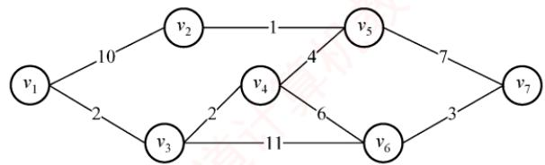

## 10. D

在Dijkstra算法的执行过程中，只可能修改从源点0到集合V-S中某个顶点的最短路径。

## 11. A

使用深度优先遍历，若从有向图上的某个顶点u出发，在DFS(u)结束之前出现一条从顶点ν到u的边，ν在生成树上是u的子孙，图中必定存在包含u和ν的环，因此深度优先遍历可以检测一个有向图是否有环。拓扑排序时，当某顶点不为任何边的头时才能加入序列，存在环时环中的顶点一直是某条边的头，不能加入拓扑序列。也就是说，还存在无法找到下一个可以加入拓扑序列的顶点，则说明此图存在回路。求最短路径是允许图有环的。广度优先遍历主要用于无权图求最短路径或层次遍历，不能直接用于判断有向图是否有环。

## 12. D

若图 $G$ 中存在一条从v到 $v _ { j }$ $v _ { i }$ 的路径，说明 $V _ { j }$ 是 $V _ { i }$ 的前驱，则要把 $V _ { j }$ 消去以后才能消去 $V _ { i } ,$ 从而拓扑序列中必然先输出v，再输出 $\nu _ { i } ,$ 这显然与题意矛盾。

## 13. D

对于说法Ⅰ，若有向图中存在环，运行拓扑排序算法后，肯定会剩下有环的子图，在此环中无法再找到入度为0的顶点，拓扑排序也就无法再运行。对于说法Ⅱ，若两个顶点之间不存在祖先或子孙关系，则它们在拓扑序列中的前后关系是任意的，因此使用栈和队列都可以，因为入

栈或队列的都是入度为0的顶点。说法Ⅲ是难点，若拓扑序列唯一，则很自然联想到一个线性的有向图，右图的拓扑序列也唯一，但却不满足该条件。对于说法IV，若入度为0的顶点不唯一，则这些顶点均可作为拓扑序列的起点；若出度为0的顶点不唯一，则这些顶点均可作为拓扑序列的终点。


## 14. C

强连通图是指有向图中任意顶点对之间都存在两条相反的路径，这意味着强连通图中一定存在环，因此不能进行拓扑排序，说法Ⅰ正确。假设顶点a和b的入度均为0，且分别有两条孤从 a和 b 指向同一顶点 c，则产生的拓扑序列可以是 abc，但是此时并无一条弧 $\leq a,$ b>，说法Ⅱ错误。如图1和2所示的有向图对应的拓扑序列都是abcd，且都是唯一的，说法Ⅲ错误。

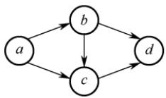  
图1

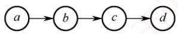  
图2

## 15. D

一个有向图中的顶点不能排成一个拓扑序列，表明其中存在一个顶点数目大于1的回路（环），该回路构成一个强连通分量，从而答案选择选项D。

## 16. C

本图的拓扑排序序列有 ABCFDEG, ABCDFEG, ABCDEFG, ABDCFEG 和 ABDCEFG。读者应能把这一类经典习题的拓扑序列全部写出来。

## 17. A

拓扑序列的过程：找到入度为0的顶点，删除该顶点及其所有出边，并将顶点加入拓扑序列，重复直至所有顶点都加入拓扑序列。选择入度为0的顶点 $v _ { 1 }$ ，删除与 $v _ { 1 }$ 有关的边；此时顶点 $v _ { 3 }$ 的入度为0，选择 $v _ { 3 }$ ，删除与 $v _ { 3 }$ 有关的边；以此类推，得出G的拓扑序列。

## 18. B

无向图的邻接矩阵存储中，每条边存储两次，且 $A [ i ] [ j ] = A [ j ] [ i ]$ o

## 19. C

此题一直以来争议较大，因为有些书中漏掉了“有序”二字。可以证明，对有向图中的顶点适当地编号，使其邻接矩阵为三角矩阵且主对角元素全为零的充分必要条件是，该有向图可以进行拓扑排序。若这个题目把“有序”二字去掉，显然应选择选项D。但此题题干中已经指出是“有序的拓扑序列”，因此应选选项C。需要注意的是，若一个有向图的邻接矩阵为三角矩阵（对角线以上或以下的元素为0），则图中必不存在环，因此其拓扑序列必然存在。

## 20. A

设图中有顶点 $\gamma _ { i } ,$ 它有后继顶点 $v _ { j }$ ，即存在边 ${ \scriptstyle \cdot } { \scriptstyle \leq } \boldsymbol { v } _ { i _ { 2 } }$ $v _ { j } \succ$ 。根据DFS的规则， $v _ { i }$ 入栈后，必先遍历完其后继顶点后 $v _ { i }$ 才会出栈，也就是说 $v _ { i }$ 会在 $v _ { j }$ 之后出栈，在如题所指的过程中， $v _ { i }$ 在 $v _ { j }$ 后打印。 $v _ { i }$ 和 $v _ { j }$ 具有任意性，因此由上面的规律看出，输出顶点的序列是逆拓扑有序序列。

对有向无环图利用深度优先搜索进行拓扑排序的例子如下：如右图所示，退出DFS栈的顺序为efgdcahb，此图的一个拓扑序列为bhacdgfe。该方法的每一步均是先输出当前无后继的顶点，即对每个顶点v，先递归地求出ν的每个后继的拓扑序列。


## 21. C

有向图邻接矩阵的第V行中1的个数是顶点V的出度，而有向图中顶点的度为入度与出度之和，说法Ⅰ错。无向图的邻接矩阵一定是对称矩阵，但当有向图中任意两个顶点之间有边相连，且是两条方向相反的有向边时，有向图的邻接矩阵也是一个对称矩阵，说法Ⅱ错。最小生成树中的n-1条边不能保证是图中权值最小的n-1条边，因为权值最小的n-1条边并不一定能使图连通。在下图中，左图的最小生成树如下图所示，权值为3的边不在其最小生成树中。


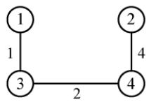

有向无环图的拓扑序列唯一并不能唯一确定该图。在下图所示的两个有向无环图中，拓扑序列都为 $V _ { 1 } , V _ { 2 } , V _ { 3 } , V _ { 4 }$ ，IⅣ错。注意，很多辅导书对该命题的判断是错误的。


## 22. C

观察题图，从 $V _ { 0 }$ 到 $V _ { 8 }$ 的最长路径为 $V_{0} \rightarrow V_{1} \rightarrow V_{4} \rightarrow V_{6} \rightarrow V_{8}$ ，长度为 $6+1+9+2=18$

## 23. C

题目描述的图如下，得到关键路径的长度为21，图中画出的两条路径都是关键路径。


## 24. C

一个事件的最迟发生时间=min{以该事件为尾的弧的活动的最迟开始时间}，或min{以该事件为尾的弧所指事件的最迟发生时间与该弧的活动的持续时间之差}。改变AOE网中任何一个活动的持续时间，需要重新计算关键活动，可能导致关键路径的改变。 育

## 25. C

若改变的是所有关键路径上的公共活动，则不一定会产生不同的关键路径（延长必然不会导致，只有缩短才有可能导致）。根据关键路径的定义，可知说法Ⅱ正确。关键路径是源点到终点的最长路径，只有所有关键路径的长度都缩短时，整个图的关键路径才能有效缩短，但也不能任意缩短，一旦缩短到一定程度，该关键活动就有可能变成非关键活动。

## 26. A

邻接矩阵第i列值全为∞，说明顶点i没有入边，为整个工程的开始，若关键路径存在，则该顶点一定是起点。不能确定关键路径是否存在，也不能确定其对应的无向图的连通分量个数。

## 27. B

拓扑排序的过程如下图所示。

  
可以得到 3 种不同的拓扑序列，即 abced, abecd 和 aebcd。

## 28. A

最小生成树的树形可能不唯一（因为可能存在权值相同的边），但代价一定是唯一的，说法Ⅰ正确。若权值最小的边有多条并且构成环状，则总有权值最小的边将不出现在某棵最小生成树中，说法Ⅱ错误。设N个顶点构成环，N条边的权值相等，从不同的顶点开始执行Prim算法，只要选取任意不同的N-1条边，就能得到不同的最小生成树，说法Ⅲ错误。当最小生成树唯一时（各边的权值不同），Prim算法和Kruskal算法得到的最小生成树相同，说法IV错误。

## 29. C

从a到各顶点的最短路径的求解过程下：

<table><tr><td rowspan=1 colspan=1>顶点</td><td rowspan=1 colspan=1>第1轮</td><td rowspan=1 colspan=1>第2轮</td><td rowspan=1 colspan=1>第3轮</td><td rowspan=1 colspan=1>第4轮</td><td rowspan=1 colspan=1>第5轮</td></tr><tr><td rowspan=1 colspan=1>b</td><td rowspan=1 colspan=1> $( a ,   b )   2$ </td><td rowspan=1 colspan=1></td><td rowspan=1 colspan=1></td><td rowspan=1 colspan=1></td><td rowspan=1 colspan=1></td></tr><tr><td rowspan=1 colspan=1> $c$ </td><td rowspan=1 colspan=1> $( a , c )   5$ </td><td rowspan=1 colspan=1> $( a , b , c )   3$ </td><td rowspan=1 colspan=1></td><td rowspan=1 colspan=1></td><td rowspan=1 colspan=1></td></tr><tr><td rowspan=1 colspan=1> $d$ </td><td rowspan=1 colspan=1> $\infty$ </td><td rowspan=1 colspan=1> $( a , b , d   )   5$ </td><td rowspan=1 colspan=1> $( a , b , d )   5$ </td><td rowspan=1 colspan=1> $( a , b , d   )   5$ </td><td rowspan=1 colspan=1></td></tr><tr><td rowspan=1 colspan=1> $e$ </td><td rowspan=1 colspan=1>8</td><td rowspan=1 colspan=1> $\infty$ </td><td rowspan=1 colspan=1> $( a , b , c , e )   7$ </td><td rowspan=1 colspan=1> $( a , b , c , e )   7$ </td><td rowspan=1 colspan=1> $( a , b , d , e )   6$ </td></tr><tr><td rowspan=1 colspan=1> $f$ </td><td rowspan=1 colspan=1> $\infty$ </td><td rowspan=1 colspan=1> $\infty$ </td><td rowspan=1 colspan=1> $\left( a , b , c , f \right) 4$ </td><td rowspan=1 colspan=1></td><td rowspan=1 colspan=1></td></tr><tr><td rowspan=1 colspan=1>集合S</td><td rowspan=1 colspan=1> $\{ a , b \}$ </td><td rowspan=1 colspan=1> $\{ a , b , c \}$ </td><td rowspan=1 colspan=1> $\{ a , b , c , f \}$ </td><td rowspan=1 colspan=1> $\{ a , b , c , f , d \}$ </td><td rowspan=1 colspan=1> $\{ a , b , c , f , d , e \}$ </td></tr></table>

后续目标顶点依次为f, d, e。

本题也可用排除法：对于选项A，若下一个顶点为d，路径 $a ,   b ,   d$ 的长度为5，而 $a, \; b, \; c,$ f的长度仅为4，显然错误。同理可排除选项B。将f加入集合S后，采用上述方法也可排除选项D。 X

## 30. C

对角线以下元素均为零，表明只有顶点i到 $j \; ( i < j )$ 可能有边，而顶点j到i一定没有边，即有向图是一个无环图，因此一定存在拓扑序列。对于拓扑序列是否唯一，试举一例：设有向图的邻接矩阵 $\begin{bmatrix} 0 & 1 & 1 \\ 0 & 0 & 0 \\ 0 & 0 & 0 \end{bmatrix}$ ，存在两个拓扑序列，因此该图存在可能不唯一的拓扑序列。

结论：对于任一有向图，若它的邻接矩阵中对角线以下（或以上）的元素均为零，则存在拓扑序列（可能不唯一）。反之，若图存在拓扑序列，却不一定能满足邻接矩阵中主对角线以下的元素均为零，但是可以通过适当地调整顶点编号，使其邻接矩阵满足前述性质。

## 31. C

找出 AOE网的全部关键路径为bdcg、bdeh和 $b f h$ 。根据性质，只有当所有关键路径的活动时间同时减少时，才能缩短工期。即正确选项中的路径必须能涵盖所有的关键路径。选项A和B不能涵盖 bfh这条路径，选项D不能涵盖 bdcg这条路径，只有选项 C能涵盖所有关键路径，因此只有加快f和d的进度才能缩短工期（建议在图中检验）。

## 32. D

按照拓扑排序的算法，每次都选择入度为0的顶点从图中删除，此图中一开始只有顶点3的入度为0；删除顶点3后，只有顶点1的入度为0；删除顶点1后，只有顶点4的入度为0；删除顶点4后，顶点2和顶点6的入度都为0，此时选择删除不同的顶点，会得出不同的拓扑序列，分别处理完毕后可知可能的拓扑序列为3,1,4,2,6,5和3,1,4,6,2,5。

## 33. C

从 $V _ { 4 }$ 开始，Kruskal算法选中的第一条边一定是权值最小的 $( V _ { 1 } ,   V _ { 4 } )$ ，B错误。 $V _ { 1 }$ 和 $V _ { 4 }$ 已经可达，因此含有 $V _ { 1 }$ 和 $V _ { 4 }$ 的权值为8的第二条边一定符合Prim算法，排除选项A和选项D。

## 34. C

第一个顶点和最后一个顶点相同的路径称为回路；序列中顶点不重复出现的路径称为简单路径：回路显然不是简单路径，说法Ⅰ错误。稀疏图是边比较少的情况，邻接矩阵存储的空间复杂度为 $O ( n ^ { 2 } )$ ，必将浪费大量的空间，而邻接表存储的空间复杂度为 $O ( n + e )$ ，所以应选用邻接表，说法Ⅱ错误。存在回路的有向图不存在拓扑序列，若拓扑排序输出结束后所余下的顶点都有前驱，则说明只得到了部分顶点的拓扑有序序列，图中存在回路，说法Ⅲ正确。

## 35. B

根据Dijkstra算法，从顶点1到其余各顶点的最短路径如下表所示。

<table><tr><td rowspan=1 colspan=1>顶点</td><td rowspan=1 colspan=1>第1轮</td><td rowspan=1 colspan=1>第2轮</td><td rowspan=1 colspan=1>第3轮</td><td rowspan=1 colspan=1>第4轮</td><td rowspan=1 colspan=1>第5轮</td></tr><tr><td rowspan=1 colspan=1>2</td><td rowspan=1 colspan=1>5 $v _ { 1 }   \rightarrow   v _ { 2 }$ </td><td rowspan=1 colspan=1>5 $v _ { 1 }   \rightarrow   v _ { 2 }$ </td><td rowspan=1 colspan=1></td><td rowspan=1 colspan=1></td><td rowspan=1 colspan=1></td></tr><tr><td rowspan=1 colspan=1>3</td><td rowspan=1 colspan=1>8</td><td rowspan=1 colspan=1> $\infty$ </td><td rowspan=1 colspan=1>7 $v _ { 1 } \rightarrow v _ { 2 } \rightarrow v _ { 3 }$ </td><td rowspan=1 colspan=1></td><td rowspan=1 colspan=1></td></tr><tr><td rowspan=1 colspan=1>4</td><td rowspan=1 colspan=1>8</td><td rowspan=1 colspan=1>11 $v _ { 1 } \rightarrow v _ { 5 } \rightarrow v _ { 4 }$ </td><td rowspan=1 colspan=1>11 $v _ { 1 } \rightarrow v _ { 5 } \rightarrow v _ { 4 }$ </td><td rowspan=1 colspan=1>11 $v _ { 1 } \rightarrow v _ { 5 } \rightarrow v _ { 4 }$ </td><td rowspan=1 colspan=1>11v1→V5→V4</td></tr><tr><td rowspan=1 colspan=1>5</td><td rowspan=1 colspan=1>4 $v _ { 1 }   \rightarrow   v _ { 5 }$ </td><td rowspan=1 colspan=1></td><td rowspan=1 colspan=1></td><td rowspan=1 colspan=1></td><td rowspan=1 colspan=1></td></tr><tr><td rowspan=1 colspan=1>6</td><td rowspan=1 colspan=1>8</td><td rowspan=1 colspan=1>9 $v _ { 1 } \rightarrow v _ { 5 } \rightarrow v _ { 6 }$ </td><td rowspan=1 colspan=1>9 $v _ { 1 } \rightarrow v _ { 5 } \rightarrow v _ { 6 }$ </td><td rowspan=1 colspan=1>9 $v _ { 1 } \rightarrow v _ { 5 } \rightarrow v _ { 6 }$ </td><td rowspan=1 colspan=1></td></tr><tr><td rowspan=1 colspan=1>集合S</td><td rowspan=1 colspan=1>{1, 5}</td><td rowspan=1 colspan=1>{1, 5, 2}</td><td rowspan=1 colspan=1>{1, 5, 2, 3}</td><td rowspan=1 colspan=1>{1, 5, 2, 3, 6}</td><td rowspan=1 colspan=1>{1, 5,2, 3, 6, 4}</td></tr></table>

快速解法。依次观察从顶点1到其他顶点的最短路径长度：顶点1到顶点2的最短路径长度为5；顶点1到顶点3的最短路径长度为 $5+2=7;$ 顶点1到顶点4的最短路径长度为11；顶点 1 到顶点 5的最短路径长度为 4；顶点1 到顶点 6 的最短路径长度为 $4   +   5   =   9$ ；最终$\mathrm{dist}[] = \{0, 5, 7, 11, 4, 9\}$ ，根据dist数组值从小到大选择顶点顺序为1,5,2,3,6,4。

## 36. B

采用邻接表作为AOV网的存储结构进行拓扑排序，需要对n个顶点做入栈、出栈、输出各一次，当处理e条边时，需要检测这n个顶点的边链表结点，共需要的时间为 $O ( n + e )$ 。若采用邻接矩阵作为AOV网的存储结构进行拓扑排序，在处理e条边时需对每个顶点检测相应矩阵中的某一行，寻找与它相关联的边，以便对这些顶点的入度减1，需要的时间代价为 $O ( n ^ { 2 } )$

【补充】有两种常用的拓扑排序算法：基于BFS的算法和基于DFS的算法。本题未指明采用哪种算法，因此只需验证一种算法即可（说明两种算法在对应条件下的时间复杂度相同）。

基于BFS的算法的思想：首先找到所有入度为0的顶点，将它们加入一个队列，并将它们作为拓扑序列的起始部分；然后依次从队列中取出顶点，并删除它们与后继顶点的所有边。若某个后继顶点的入度变为0，则将它也加入队列，并将它加入拓扑序列，重复这个过程。

基于 DFS 的算法的思想：在 DFS 调用过程中设定一个时间标记，当 DFS 调用结束时，对各顶点计时，进而按结束时间从大到小排序，可以得到一个拓扑序列。 育

## 37. D

拓扑排序每次选取入度为0的顶点输出，经观察不难发现拓扑序列前两位一定是1,5 或 5,1（因为只有1和5的入度均为0，且其他顶点都不满足仅有1或仅有5作为前驱）。

## 38. C

活动d的最早开始时间等于该活动弧的起点所表示的事件的最早发生时间，活动d的最早开始时间等于事件2的最早发生时间 $\max\{a,b+c\}=\max\{3,12\}=12$ 。活动d的最迟开始时间等于该活动弧的终点所表示的事件的最迟发生时间与该活动所需时间之差，先算出图中关键路径长度为27（对于不复杂的选择题，找出所有路径计算长度），那么事件4的最迟发生时间为$\min\{27 - g\} = \min\{27 - 6\} = 21$ ，活动d的最迟开始时间为 $21 - d = 21 - 7 = 14$

常规方法：按照关键路径算法算得到下表。

<table><tr><td rowspan=1 colspan=1></td><td rowspan=1 colspan=1> $v _ { 1 }$ </td><td rowspan=1 colspan=1> $v _ { 2 }$ </td><td rowspan=1 colspan=1> $v _ { 3 }$ </td><td rowspan=1 colspan=1>7   V $v _ { 4 }$ </td><td rowspan=1 colspan=1> $v _ { 5 }$ </td><td rowspan=1 colspan=1> $v _ { 6 }$ </td></tr><tr><td rowspan=1 colspan=1> $v _ { e } ( i )$ </td><td rowspan=1 colspan=1>0</td><td rowspan=1 colspan=1>12</td><td rowspan=1 colspan=1>8</td><td rowspan=1 colspan=1>19</td><td rowspan=1 colspan=1>18</td><td rowspan=1 colspan=1>27</td></tr><tr><td rowspan=1 colspan=1> $v _ { l } ( i )$ </td><td rowspan=1 colspan=1>0</td><td rowspan=1 colspan=1>12</td><td rowspan=1 colspan=1>8</td><td rowspan=1 colspan=1>21</td><td rowspan=1 colspan=1>18</td><td rowspan=1 colspan=1>27</td></tr></table>

<table><tr><td rowspan=1 colspan=1></td><td rowspan=1 colspan=1>a</td><td rowspan=1 colspan=1> $b$ </td><td rowspan=1 colspan=1> $c$ </td><td rowspan=1 colspan=1> $d$ C</td><td rowspan=1 colspan=1> $e$ </td><td rowspan=1 colspan=1> $f$ </td><td rowspan=1 colspan=1>g</td><td rowspan=1 colspan=1>h</td></tr><tr><td rowspan=1 colspan=1>e(i)</td><td rowspan=1 colspan=1>0</td><td rowspan=1 colspan=1>8</td><td rowspan=1 colspan=1>0</td><td rowspan=1 colspan=1>12</td><td rowspan=1 colspan=1>12</td><td rowspan=1 colspan=1>8</td><td rowspan=1 colspan=1>19</td><td rowspan=1 colspan=1>18</td></tr><tr><td rowspan=1 colspan=1>l(i)</td><td rowspan=1 colspan=1>9</td><td rowspan=1 colspan=1>8</td><td rowspan=1 colspan=1>0</td><td rowspan=1 colspan=1>14</td><td rowspan=1 colspan=1>12</td><td rowspan=1 colspan=1>8</td><td rowspan=1 colspan=1>21</td><td rowspan=1 colspan=1>18</td></tr><tr><td rowspan=1 colspan=1>l(i) − e(i)</td><td rowspan=1 colspan=1>9</td><td rowspan=1 colspan=1>0</td><td rowspan=1 colspan=1>0</td><td rowspan=1 colspan=1>2</td><td rowspan=1 colspan=1>0</td><td rowspan=1 colspan=1>0</td><td rowspan=1 colspan=1>2</td><td rowspan=1 colspan=1>0</td></tr></table>

从表中可知，活动d的最早开始时间和最迟开始时间分别为12和14，所以选择选项 $\mathrm { C } _ { \circ }$

## 39. A

先将该表达式转换成有向二叉树，该二叉树中有些顶点是重复的，为了节省存储空间，去除重复的顶点，将有向二叉树去重转换成有向无环图，如下图所示。 NITV


## 40. A

Kruskal算法：按权值递增顺序依次选取n-1条边，并保证这n-1条边不构成回路。初始构造一个仅含n个顶点的森林；第一步，选取权值最小的边(b,f)加入最小生成树；第二步，剩余边中权值最小的边为(b,d)，加入最小生成树，第二步操作后权值最小的边(d,f)不能选，因为会与之前已选取的边形成回路：接下来依次选取权值9、10、11对应的边加入最小生成树，此时6个顶点形成了一棵树，最小生成树构造完成。按照上述过程，加到最小生成树的边依次为(b,f)，(b, d), (a, e), (c, e), (b, e)。其生成过程如下所示。


## 41. B

根据题干所提供的信息可知：

①图G为有向无环图，因此一定存在拓扑序列和逆拓扑序列。

② DFS 的性质是顶点 $v _ { i }$ 的所有后继顶点 $v _ { j }$ 出栈后， $v _ { i }$ 才会出栈。

③本题要求执行输出语句后立刻退出递归，即执行完输出语句后立即出栈，因此后入栈的顶点先输出，结合②不难得出只有输出顶点 $v _ { i }$ 的所有后继顶点 $v _ { j }$ 后， $v _ { i }$ 才会输出。综合上述分析，输出的顶点序列是逆拓扑有序序列。

## 42. B

关键路径是指权值之和最大而非边数最多的路径，选项A错误。选项B是关键路径的概念。无论是存在一条还是存在多条关键路径，增加任意一个关键活动的时间都会延长工程的工期，因为关键路径始终是权值之和最大的那条路径，选项C错误。仅有一条关键路径时，减少关键活动的时间会缩短工程的工期；存在多条关键路径时，缩短一条关键活动的时间不一定会缩短工程的工期，缩短了路径长度的那条关键路径不一定还是关键路径，选项D错误。

## 43. A

求拓扑序列的过程：从图中选择无入边的顶点，输出该顶点并删除该顶点的所有出边，重复上述过程，直至全部顶点都已输出，这样求得的拓扑序列为ABCDEF。每次输出一个顶点并删除该顶点的所有出边后，都发现有且仅有一个顶点无入边，因此该拓扑序列唯一。

## 44. C

在执行Dijkstra算法时，首先初始化 dist[]，若顶点1到顶点i（i =2, 3,4, 5）有边，就初始化为边的权值；若无边，就初始化为∞；初始化顶点集S只含顶点1。Dijkstra算法每次选择一个到顶点1距离最近的顶点j加入顶点集 S，并判断由顶点1绕行顶点 j后到任意一个顶点 k是否距离更短，若距离更短 $\left( \mathrm{dist}[j] + \mathrm{arc}[j][k] < \mathrm{dist}[k] \right)$ ，则将 dist[x]更新为 $\mathrm { d i s t } [ j ] + \mathrm { a r c s } [ j ] [ k ]$ ；重复该过程，直至所有顶点都加入顶点集S。数组dist的变化过程如下图所示，可知将第二个顶点5加入顶点集S后，数组 dist 更新为 21,3,14,6。

$$
 dist \{26,3,\infty,6\} \xrightarrow{ 顶点 3 入 S} \{25,3,\infty,6\} \xrightarrow{ 顶点 5 入 S} \{21,3,14,6\}
$$

## 45. B

在AOE网中，活动的时间余量=结束顶点的最迟开始时间-开始顶点的最早开始时间-该活动的持续时间。根据关键路径算法得到下表：

<table><tr><td rowspan=1 colspan=1>顶点编号</td><td rowspan=1 colspan=1>1</td><td rowspan=1 colspan=1>2</td><td rowspan=1 colspan=1>3</td><td rowspan=1 colspan=1>4</td><td rowspan=1 colspan=1>5</td><td rowspan=1 colspan=1>6</td></tr><tr><td rowspan=1 colspan=1>最早开始时间 $v _ { e } ( i )$ </td><td rowspan=1 colspan=1>0</td><td rowspan=1 colspan=1>2</td><td rowspan=1 colspan=1>5</td><td rowspan=1 colspan=1>8</td><td rowspan=1 colspan=1>9</td><td rowspan=1 colspan=1>12</td></tr><tr><td rowspan=1 colspan=1>最迟开始时间 v(i)</td><td rowspan=1 colspan=1>0</td><td rowspan=1 colspan=1>4</td><td rowspan=1 colspan=1>5</td><td rowspan=1 colspan=1>8</td><td rowspan=1 colspan=1>11</td><td rowspan=1 colspan=1>12</td></tr></table>

c的时间余量 $v_{\mathrm{f}}(3)-v_{\mathrm{e}}(2)-1=5-2-1=2$ ，g的时间余量 $v_{\mathrm{f}}(6)-v_{\mathrm{e}}(3)-1=12-5-1=6$ , h的时间余量 $v_{1}(5)-v_{e}(4)-1=11-8-1=2,$ j的时间余量 $v_{1}(6)-v_{e}(5)-1=12-9-1=2$

## 46. B

Prim算法和 Kruskal 算法用于求解最小生成树，最小生成树中某顶点到其余各顶点的路径不一定具有最短路径的性质。例如，在右图求得的最小生成树中，a到c的路径长度为2，但原图中a到c的最短路径长度为1。


图的广度优先搜索算法总按距离由近到远来遍历图中的每个顶点，因此可用来求解非带权图（或各边权值均相同）的单源最短路径问题。

## 47. C

若一个有向图构成环，则每个顶点的入度均不为0。有向无环图一定存在拓扑序列，但当存在多个入度为0的顶点时，其拓扑序列不唯一。在无向图中，若每个顶点的度都大于或等于2，说明从任意点出发，总能“一直走下去”（因为每到一个点，至少还有另一条边可走），由于顶点有限，走着走着必定会重复访问某个顶点，从而形成回路，选项C正确。BFS算法仅适用于求解无权图（或所有边权相等）的单源最短路径，不适用于带权图（边权不等）。

## 二、综合应用题

## 01. 【解答】

这种方法是正确的。

经过“破圈法”之后，最终没有回路，因此一定可以构造出一棵生成树。下面证明这棵生成树是最小生成树。记“破圈法”生成的树为Z，假设T不是最小生成树，则必然存在最小生成树 $T _ { 0 } ,$ ，使得它与T的公共边尽可能多，则将 $T _ { 0 }$ 与T取并集，得到一个图，此图中必然存在回路，“破圈法”的定义就是从回路中去除权最大的边，因此此时生成的Γ的权必然是最小的，这与原假设矛盾，从而T是最小生成树。下图说明了“破圈法”的过程：


## 02.【解答】

1）该图的邻接矩阵为

$$
\boldsymbol{A} = \begin{aligned}1 & \quad 2 \quad 3 \quad 4 \quad 5 \quad 6 \quad 7 \\2 & \quad \left[ \begin{matrix}0 & 3 & 4 & \infty & \infty \\\infty & 0 & 4 & \infty & 5 & \infty \\\infty & \infty & 0 & \infty & 4 & \infty & \infty \\\end{matrix} \right] \\4 & \quad \left[ \begin{matrix}\infty & \infty & \infty & 0 & \infty & 5 & \infty \\\infty & \infty & \infty & \infty & 0 & \infty & 3 \\\end{matrix} \right] \\5 & \quad \infty & \quad \infty & \quad \infty & \quad 0 & \infty & \quad 3 \\6 & \quad \infty & \quad \infty & \quad 3 & \infty & \infty & \quad 0 & \quad 7 \\7 & \quad \infty & \quad \infty & \quad \infty & \quad \infty & \quad \infty & \quad 0 \\\end{aligned}
$$

得到的深度优先遍历序列为1,2,3,5,7,4,6。

2）解题思路：当某个顶点只有出弧而没有入弧时，其他顶点无法到达这个顶点，不可能与其他顶点和边构成强连通分量（这个单独的顶点构成一个强连通分量）。

①顶点1无入弧构成第一个强连通分量。删除顶点1及所有以之为尾的弧。

②顶点2无入弧构成一个强连通分量。删除顶点2及所有以之为尾的弧。

以此类推，最后得到每个顶点都是一个强连通分量，所以强连通分量数目为7。

3）该图的两个拓扑序列如下：

① 1, 2, 4, 6, 3, 5, 7

② 1, 4, 2, 6, 3, 5, 7

4）若视该图为无向图：

用Prim算法生成最小生成树的过程如下：

1-2，1-3，3-6，3-5，5-7，6-4（图略）。

用Kruskal算法生成最小生成树的过程如下图所示。


## 03.【解答】

根据Dijkstra算法，求从顶点1到其余各顶点的最短路径如下表所示。

<table><tr><td rowspan=2 colspan=1>顶点</td><td rowspan=1 colspan=5>从顶点 1 到各终点的 dist 值</td></tr><tr><td rowspan=1 colspan=1>第1轮</td><td rowspan=1 colspan=1>第2轮</td><td rowspan=1 colspan=1>第3轮</td><td rowspan=1 colspan=1>第4轮</td><td rowspan=1 colspan=1></td></tr><tr><td rowspan=1 colspan=1>2</td><td rowspan=1 colspan=1>7 $\mathbf { v _ { 1 } } , \mathbf { v _ { 2 } }$ </td><td rowspan=1 colspan=1></td><td rowspan=1 colspan=1></td><td rowspan=1 colspan=1></td><td rowspan=1 colspan=1></td></tr><tr><td rowspan=1 colspan=1>3</td><td rowspan=1 colspan=1>11 $v _ { 1 } , v _ { 3 }$ </td><td rowspan=1 colspan=1> $\mathbf { H }$  $v _ { 1 } , v _ { 3 }$ </td><td rowspan=1 colspan=1></td><td rowspan=1 colspan=1></td><td rowspan=1 colspan=1></td></tr><tr><td rowspan=1 colspan=1>4</td><td rowspan=1 colspan=1> $\infty$ </td><td rowspan=1 colspan=1> $1 6$  $\nu _ { 1 } , \nu _ { 2 } , \nu _ { 4 }$ </td><td rowspan=1 colspan=1> $\mathbf { 1 6 }$  $\nu _ { 1 } , \nu _ { 2 } , \nu _ { 4 }$ </td><td rowspan=1 colspan=1></td><td rowspan=1 colspan=1></td></tr><tr><td rowspan=1 colspan=1>5</td><td rowspan=1 colspan=1> $\infty$ </td><td rowspan=1 colspan=1> $\infty$ </td><td rowspan=1 colspan=1> $1 8$  $\boldsymbol { \mathscr { v } } _ { 1 } , \boldsymbol { \mathscr { v } } _ { 3 } , \boldsymbol { \mathscr { v } } _ { 5 }$ </td><td rowspan=1 colspan=1>18 $\nu _ { 1 } , \nu _ { 3 } , \nu _ { 5 }$ </td><td rowspan=1 colspan=1></td></tr><tr><td rowspan=1 colspan=1>6</td><td rowspan=1 colspan=1> $\infty$ </td><td rowspan=1 colspan=1> $\infty$ </td><td rowspan=1 colspan=1> $1 9$  $\nu _ { 1 } , \nu _ { 3 } , \nu _ { 6 }$ </td><td rowspan=1 colspan=1> $1 9$  $\nu _ { 1 } , \nu _ { 3 } , \nu _ { 6 }$ </td><td rowspan=1 colspan=1>19 $\nu _ { 1 } , \nu _ { 3 } , \nu _ { 6 }$ </td></tr><tr><td rowspan=1 colspan=1>集合S</td><td rowspan=1 colspan=1>{1, 2}</td><td rowspan=1 colspan=1>{1,2, 3}</td><td rowspan=1 colspan=1>{1, 2, 3, 4}</td><td rowspan=1 colspan=1>{1, 2, 3, 4, 5}</td><td rowspan=1 colspan=1>{1, 2, 3, 4, 5, 6}</td></tr></table>

## 04. 【解答】

1）该图的邻接表表示如下图所示。

$$
\boxed{V_{1}} \boxed{} \boxed{} \boxed{2} \boxed{2} \boxed{} \boxed{3} \boxed{5} \boxed{} \boxed{5} \boxed{}
$$

$$
\boxed{V_{2}} \boxed{\quad} \boxed{3} \boxed{2} \boxed{\quad} \boxed{4} \boxed{3} \boxed{\quad}
$$

$$
\boxed{V_{3}} \boxed{\quad} \boxed{\quad} \boxed{\quad} \boxed{\quad} \boxed{\quad} \boxed{\quad} \boxed{\quad} \boxed{\quad} \boxed{\quad}
$$

$$
\boxed{V_{4}} \boxed{\quad} \boxed{\quad} \boxed{\quad} \boxed{6 \quad} \boxed{\quad 2 \quad} \wedge \quad \boxed{\quad}
$$

$$
\boxed{V_{5}} \boxed{\quad} \boxed{\quad} \boxed{7} \boxed{6} \boxed{\quad}
$$

$$
\begin{array}{l|l|l|l|}\hline V_{6} & \hline & \hline & \hline & \hline & \hline & \hline & \hline & \hline & \hline & \hline & \hline & \hline & \hline & \hline & \hline & \hline & \hline & \hline & \hline & \hline & \hline & \hline & \hline & \hline & \hline & \hline & \hline & \hline & \hline & \hline & \hline & \hline & \hline & \hline & \hline & \hline & \hline & \hline & \hline & \triangledown & \triangledown & \triangledown & \triangledown & \triangledown & \triangledown & \triangledown & \triangledown & \triangledown & \triangledown & \triangledown & \triangledown & \triangledown & \triangledown & \triangledown & \triangledown & \triangledown & \triangledown & \triangledown & \nabla & \nabla & \nabla & \nabla \\[ \begin{array}{l|l|l|l|l|l|l|l|l|l|l|l|l|l|l|l|l|l|l|l|l|l|l|l|l|l|l|l|l|l|l|l|l|l|l|l|l|l|l|l|l|l|l|l|l|l|l|l|l|l|l|l|l|l|l|l|l|l|l|l|l|l|l|l|l|l|l|l|l|l|l|l|l|l|l|l|l|l|l|l|l|l|l|l|l|l|l|l|l|l|l|l|l|l|l|l|l|l|l|l|l|l|l|l|l|l|l|l|l|l|l|l|l|l|l|l|l|l|l|l|l|l|l|l|l|l|l|l|l|l|l|l|l|l|l|l|l|l|l|l|l|l|l|l|l|l|l|l|l|l|l|l|l|l|l|l|l|l|l|l|l|l|l|l|l|l|l|l|l|l|l|l|l|l|l|l|l|l|l|l|l|l|l|l|l|l|l|l|l|l|l|l|l|l|l|l|l|l|l|l|l|l|l|l|l|l|l|l|l|l|l|l|l|l|l|l|l|l|l|l|l|l|l|l|l|l|l|l|l|l|l|l|l|l|l|l|l|l|l|l|l|l|l|l|l|l|l|l|l|l|l|l|l|l|l|l|l|l|l|l|l|l|l|l|l|l|l|l|l|l|l|l|l|l|l|l|l|l|l|l|l|l|l|l|l|l|l|l|l|l|l|l|l|l|l|l|l|l|l|l|l|l|l|l|l|l|l|l|l|l|l|l|l|l|l|l|l|l|l|l|l|l|l|l|l|l|l|l|l|l|l|l|l|l|l|l|l|l|l|l|l|l|l|l|l|l|l|l|l|l|l|l|l|l|l|l|l|l|l|l|l|l|l|l|l|l|l|l|l|l|l|l|l|l|l|l|l|l|l|l|l|l|l|l|l|l|l|l|l|l|l|l|l|l|l|l|l|l|l|l|l|l|l|l|l|l|l|l|l|l|l|l|l|l|l|l|l|l|l|l|l|l|l|l|l|l|l|l|l|l|l|l|l|l|l|l|l|l|l|l|l|l|l|l|l|l|l|l|l|l|l|l|l|l|l|l|l|l|l|l|l|l|l|l|l|l|l|l|l|l|l|l|l|l|l|l|l|l|l|l|l|l|l|l|l|l|l|l|l|l|l|l|l|l|l|l|l|l|l|l|l|l|l|l|l|l|l|l|l|l|l|l|l|l|l|l|l|l|l|l|l|l|l|l|l|l|l|l|l|l|l|l|l|l|l|l|l|l|l|l|l|l|l|l|l|l|l|l|l|l|l|l|l|l|l|l|l|l|l|l|l|l|l|l|l|l|l|l|l|l|l|l|l|l|l|l|l \end{array} \end{array}
$$

$$
\boxed{V_{7}} \boxed{\quad} \boxed{\quad} \boxed{\quad} \boxed{\quad} \boxed{\quad} \boxed{\quad}
$$

$$
\boxed{V_{8}} \boxed{\quad} \boxed{\quad} \boxed{9} \boxed{2} \boxed{\quad}
$$

$$
\boxed{V_{9}} \land
$$

求关键路径的算法如下：

①输入e条弧 $\cdot \lnot j , k \rrangle$ ，建立 AOE网的存储结构。

②从源点 $v _ { 1 }$ 出发，令 $v _ { e } ( 1 )   =   0$ ，求 $v_{e}(j), 2 \leqslant j \leqslant n.$

③从汇点 $v _ { n }$ 出发，令 $v _ { \mathrm { l } } ( n ) = v _ { e } ( n )$ ，求 $v_{\mathrm{l}}(i), \ 1 \leqslant i \leqslant n-1$ o

④根据各顶点的 $v _ { e }$ 和 $v _ { 1 }$ 值，求每条弧s（活动）的最早开始时间e(s)和最晚开始时间l(s)，其中 $e ( s ) = l ( s )$ 为关键活动。

2）根据以上算法可以得到至少需要时间16。

3）关键路径为 $( V _ { 1 } , V _ { 3 } , V _ { 5 } , V _ { 7 } , V _ { 9 } ) .$

4）活动 $a _ { 2 } , a _ { 6 } , a _ { 9 } , a _ { 1 2 }$ 加速，可以缩短工程所需的时间。

## 05.【解答】

1）根据题表可以画出AOE网如下图所示。


求解各事件和活动的最早发生时间与最迟发生时间公式分别如下：

① ve(源点 $v_{e}(k) = \mathrm{Max}\{v_{e}(j) + \mathrm{Weight}(v_{j}, v_{k})\}$ $\mathrm{Weight}(v_j, v_k)$ 表示从v指向 $v _ { j }$ $v _ { k }$ 的弧的权值。 X

② vi(汇点) = ve(汇点), $v_{\mathrm{l}}(j) = \mathrm{Min}\{v_{\mathrm{l}}(k) - \mathrm{Weight}(v_{j}, v_{k})\}$ $\mathrm{weight}(v_{j}, v_{k})$ 表示从 $v _ { j }$ 指向 $v _ { k }$ 的弧的权值。

③若边 $< \scriptstyle { \mathcal { V } } _ { k } , \; { \mathcal { V } } _ { j } >$ 表示活动 $a _ { i } ,$ ，则有 $e ( i ) = v _ { e } ( k )$ 0

④若边 $< \scriptstyle { v _ { k } , \; v _ { j } > }$ 表示活动 $a _ { i } ,$ 则有 $l(i) = v_{\mathrm{l}}(j) - \mathrm{Weight}(v_{k}, v_{j})$ o

⑤ $d(i) = l(i) - e(i)$

关键路径即由 d(i) = 0的 i 构成。

2）根据上述公式，各事件的最早发生时间 $v _ { e }$ 和最迟发生时间 $v _ { l }$ 如下表所示。

<table><tr><td rowspan=1 colspan=1></td><td rowspan=1 colspan=1> $v _ { 1 }$ </td><td rowspan=1 colspan=1> $v _ { 2 }$ </td><td rowspan=1 colspan=1> $v _ { 3 }$ </td><td rowspan=1 colspan=1> $v _ { 4 }$ </td><td rowspan=1 colspan=1>V5</td><td rowspan=1 colspan=1>V6</td></tr><tr><td rowspan=1 colspan=1>ve(i)</td><td rowspan=1 colspan=1>0</td><td rowspan=1 colspan=1>3</td><td rowspan=1 colspan=1>2</td><td rowspan=1 colspan=1>6</td><td rowspan=1 colspan=1>6</td><td rowspan=1 colspan=1>8</td></tr><tr><td rowspan=1 colspan=1>v(i)</td><td rowspan=1 colspan=1>0</td><td rowspan=1 colspan=1>4</td><td rowspan=1 colspan=1>2</td><td rowspan=1 colspan=1>6</td><td rowspan=1 colspan=1>7</td><td rowspan=1 colspan=1>8</td></tr></table>

3）根据上述公式，各活动最早发生时间e、最迟发生时间l和时间余量 $d ( i ) = l ( i ) - e ( i )$ 如下表所示。

<table><tr><td rowspan=1 colspan=1></td><td rowspan=1 colspan=1>A</td><td rowspan=1 colspan=1>B</td><td rowspan=1 colspan=1>C</td><td rowspan=1 colspan=1>D</td><td rowspan=1 colspan=1>E</td><td rowspan=1 colspan=1>F</td><td rowspan=1 colspan=1>G</td><td rowspan=1 colspan=1>H</td></tr><tr><td rowspan=1 colspan=1>e(i)</td><td rowspan=1 colspan=1>0</td><td rowspan=1 colspan=1>0</td><td rowspan=1 colspan=1>3</td><td rowspan=1 colspan=1>3</td><td rowspan=1 colspan=1>2</td><td rowspan=1 colspan=1>3</td><td rowspan=1 colspan=1>6</td><td rowspan=1 colspan=1>6</td></tr><tr><td rowspan=1 colspan=1>l(i)</td><td rowspan=1 colspan=1>1</td><td rowspan=1 colspan=1>0</td><td rowspan=1 colspan=1>4</td><td rowspan=1 colspan=1>4</td><td rowspan=1 colspan=1>2</td><td rowspan=1 colspan=1>5</td><td rowspan=1 colspan=1>6</td><td rowspan=1 colspan=1>7</td></tr><tr><td rowspan=1 colspan=1>l(i)− e(i)</td><td rowspan=1 colspan=1>1</td><td rowspan=1 colspan=1>0</td><td rowspan=1 colspan=1>1</td><td rowspan=1 colspan=1>71</td><td rowspan=1 colspan=1>0</td><td rowspan=1 colspan=1>2</td><td rowspan=1 colspan=1>0</td><td rowspan=1 colspan=1>1</td></tr></table>

所以关键路径为B、E、G，完成该工程最少需要8（单位依题意而定）。

## 06.【解答】

Dijkstra算法每一步都会贪婪地选择与源点 $v _ { 0 }$ 最近的下一条边，直到 $v _ { 0 }$ 连接到图中所有顶点。Prim算法（已知是最小生成树算法）与Dijkstra算法高度相似，但是在每个阶段，它贪婪地选择与该阶段已加入MST中任意一个顶点最近的下一条边。显然，Dijkstra算法可以产生一棵生成树，但该树不一定是最小生成树，只需举出一个反例即可，以下图G为例（将a作为源点）。

(a) 图 G  
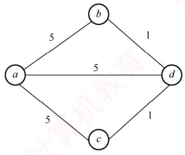

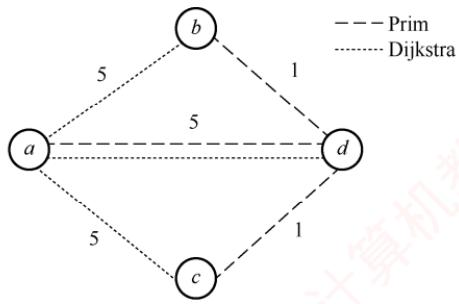  
(b) 两种算法产生的生成树

Dijkstra 算法得到的路径集合为{(a, b), (a, c), (a, d)}，该生成树的总权值为 5 + 5 + 5 = 15。  
Prim算法得到的边集合为 $\{ ( a , d ) , ( b , d ) , ( c , d ) \}$ ，该最小生成树的总权值为5 +1 +1= 7。  
显然，Dijkstra算法得到的生成树不一定是最小生成树。

## 07.【解答】

本节前面给出了DFS实现拓扑排序的思想，下面是利用DFS求各顶点结束时间的代码（在DFS的基础上加入了time变量）。将结束时间从大到小排序，即可得到拓扑序列。

```javascript
bool visited[MAX VERTEX NUM]; //访问标记数组
void DFSTraverse(Graph G) {
for(v=0;v<G.vexnum;++v)
visited[v]=FALSE; //初始化访问标记数组
time=0;
for(v=0;v<G.vexnum;++v) //本代码从 v=0 开始遍历
if(!visited[v]) DFS(G,v);
1
void DFS(Graph G,int v) {
visited[v]=TRUE;
visit(v);
for(w=FirstNeighbor(G,v);w>=0;w=NextNeighbor(G,v,w))
if(!visited[w]) { //w 为v的尚未访问的邻接点
DFS (G,w);
time=time+1;finishTime[v]=time;
```

## 08.【解答】

该方法不一定能（或不能）求得最短路径。

例如，对于右图所示的带权图，若按照题中的原则，从A到C的最短路径是A→B→C，事实上其最短路径是 $A \xrightarrow{} D \xrightarrow{} C$ XTA

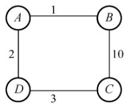

## 09. 【解答】

1）在上三角矩阵 $\mathbb { A }   [   6   ]   [   6   ]$ 中，第1行至第5行主对角线上方的元素个数分别为5,4,3,2,1，由此可以画出压缩存储数组中的元素所属行的情况，如下图所示。


可以用“平移”的思想，将前5个、后4个、后3个、后2个、后1个元素，分别移动到矩阵对角线（“0”）右边的行上。图G的邻接矩阵A为

$$
\boldsymbol{A} = \begin{bmatrix} 0 & 4 & 6 & \infty & \infty & \infty \\ \infty & 0 & 5 & \infty & \infty & \infty \\ \infty & \infty & 0 & 4 & 3 & \infty \\ \infty & \infty & \infty & 0 & \infty & 3 \\ \infty & \infty & \infty & \infty & 0 & 3 \\ \infty & \infty & \infty & \infty & \infty & 0 \end{bmatrix}
$$

2）有向带权图G如下图所示。


3）先计算各个事件的最早发生时间，得到 $v _ { e } ( )$ 和 $v ( )$ 数组如下表所示。

<table><tr><td rowspan=1 colspan=1>i</td><td rowspan=1 colspan=1>0</td><td rowspan=1 colspan=1>1</td><td rowspan=1 colspan=1>2</td><td rowspan=1 colspan=1>3</td><td rowspan=1 colspan=1>4</td><td rowspan=1 colspan=1>5</td></tr><tr><td rowspan=1 colspan=1>ve(i)</td><td rowspan=1 colspan=1>0</td><td rowspan=1 colspan=1>4</td><td rowspan=1 colspan=1>9</td><td rowspan=1 colspan=1>13</td><td rowspan=1 colspan=1>12</td><td rowspan=1 colspan=1>16</td></tr><tr><td rowspan=1 colspan=1>v(i)</td><td rowspan=1 colspan=1>0</td><td rowspan=1 colspan=1>4</td><td rowspan=1 colspan=1>9</td><td rowspan=1 colspan=1>13</td><td rowspan=1 colspan=1>13</td><td rowspan=1 colspan=1>16</td></tr></table>

接下来计算所有活动的最早和最迟发生时间 $e ( )$ 和I()，如下表所示。

<table><tr><td rowspan=1 colspan=1></td><td rowspan=1 colspan=1> $a _ { 0 ^ { - } 1 }$ </td><td rowspan=1 colspan=1> $a _ { 0 ^ { \rightarrow } 2 }$ </td><td rowspan=1 colspan=1> $a _ { 1 ^ { - 2 } }$ </td><td rowspan=1 colspan=1> $a_{2^{-}3}$ </td><td rowspan=1 colspan=1> $a _ { 2 ^ { - 4 } }$ </td><td rowspan=1 colspan=1> $a _ { 3 ^ { - 5 } }$ </td><td rowspan=1 colspan=1> $a _ { 4 ^ { \rightarrow } 5 }$ </td></tr><tr><td rowspan=1 colspan=1>e()</td><td rowspan=1 colspan=1>0</td><td rowspan=1 colspan=1>0</td><td rowspan=1 colspan=1>4</td><td rowspan=1 colspan=1>9C</td><td rowspan=1 colspan=1>9</td><td rowspan=1 colspan=1>13</td><td rowspan=1 colspan=1>12</td></tr><tr><td rowspan=1 colspan=1>10</td><td rowspan=1 colspan=1>0</td><td rowspan=1 colspan=1>3</td><td rowspan=1 colspan=1>4  K</td><td rowspan=1 colspan=1>9</td><td rowspan=1 colspan=1>10</td><td rowspan=1 colspan=1>13</td><td rowspan=1 colspan=1>13</td></tr><tr><td rowspan=1 colspan=1>l0)-e()</td><td rowspan=1 colspan=1>0</td><td rowspan=1 colspan=1>3</td><td rowspan=1 colspan=1>0</td><td rowspan=1 colspan=1>0</td><td rowspan=1 colspan=1>1</td><td rowspan=1 colspan=1>0</td><td rowspan=1 colspan=1>1</td></tr></table>

满足 $l ( ) - e ( ) = 0$ 的路径就是关键路径，所以关键路径为 $a_{0 \to 1}, \; a_{1 \to 2}, \; a_{2 \to 3}, \; a_{3 \to 5}$ ，如右图所示（双线箭头表示），长度为 $4+5+4+3=16$

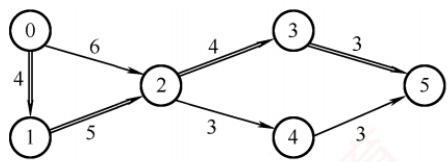

按求关键路径的公式计算较为复杂，建议考生面临此类题时直接穷举各条路径即可。

## 10. 【解答】

本题初看起来感觉难度较大，但仔细分析就可发现考查的其实是邻接表的数据结构。

1）图题中给出的是一个简单的网络拓扑图，可以抽象为无向图。

2）图的常用存储结构有邻接矩阵法和邻接表法，其中邻接表法属于链式存储结构，因此本题的基本思路就是写出邻接表的数据类型定义，并根据题意调整相应的边表结点和顶点表结点的成员变量。具体分析如下：邻接表由表头顶点和弧顶点组成。根据题目给出的图和表，可将顶点分为三类：路由器、网络和链路。路由器是连接网络和链路的载体，因此可将它作为表头顶点。网络和链路则是连接路由器的边，因此可将它们作为弧顶点。为了简化代码，可将网络和链路的结构合并为一个，用一个标志位来区分它们，这样就可用邻接表来实现图的存储。链式存储结构如下图所示。

弧结点的两种基本形态
<table><tr><td rowspan=1 colspan=1>Flag=1</td><td rowspan=1 colspan=1>Next</td><td rowspan=1 colspan=2></td><td rowspan=1 colspan=1>Flag=2</td><td rowspan=1 colspan=1>Next</td><td rowspan=4 colspan=1>表头结点结构示意</td></tr><tr><td rowspan=1 colspan=2>ID</td><td rowspan=1 colspan=1></td><td rowspan=1 colspan=1></td><td rowspan=1 colspan=2>Prefix</td><td rowspan=1 colspan=1>RouterID</td></tr><tr><td rowspan=1 colspan=2>IP</td><td rowspan=1 colspan=1></td><td rowspan=1 colspan=1></td><td rowspan=1 colspan=2>Mask</td><td rowspan=1 colspan=1>LN_link</td></tr><tr><td rowspan=1 colspan=2>Metric</td><td rowspan=1 colspan=2></td><td rowspan=1 colspan=2>Metric</td><td rowspan=1 colspan=1></td></tr></table>

其数据类型定义如下：

```c
typedef struct{
unsigned int ID, IP;
}LinkNode; //Link 的结构
typedef struct{
unsigned int Prefix, Mask;
}NetNode; //Net 的结构
typedef struct Node{
int Flag; //Flag=1 为Link;Flag=2 为Net
union{
LinkNode Lnode;
NetNode Nnode
}LinkORNet;
Unsigned int Metric;
struct Node *next;
}ArcNode; //弧结点
typedef struct hNode{
unsigned int RouterID;
ArcNode *LN link;
Struct hNode *next;
}HNODE; //表头结点
```

对应表的链式存储结构示意图如下所示。


3）计算结果如下表所示。

<table><tr><td rowspan=1 colspan=1></td><td rowspan=1 colspan=1>目的网络</td><td rowspan=1 colspan=1>路  径</td><td rowspan=1 colspan=1>代价（费用）</td></tr><tr><td rowspan=1 colspan=1>步骤1</td><td rowspan=1 colspan=1>192.1.1.0/24</td><td rowspan=1 colspan=1>直接到达</td><td rowspan=1 colspan=1>1</td></tr><tr><td rowspan=1 colspan=1>步骤2</td><td rowspan=1 colspan=1>192.1.5.0/24</td><td rowspan=1 colspan=1>R1→R3→192.1.5.0/24</td><td rowspan=1 colspan=1>3</td></tr><tr><td rowspan=1 colspan=1>步骤3</td><td rowspan=1 colspan=1>192.1.6.0/24</td><td rowspan=1 colspan=1>R1→R2→192.1.6.0/24</td><td rowspan=1 colspan=1>4</td></tr><tr><td rowspan=1 colspan=1>步骤4</td><td rowspan=1 colspan=1>192.1.7.0/24</td><td rowspan=1 colspan=1>R1→R2→R4→192.1.7.0/24</td><td rowspan=1 colspan=1>8</td></tr></table>

## 11. 【解答】

1）Prim算法属于贪心策略。算法从一个任意的顶点开始，一直长大到覆盖图中的所有顶点

为止。算法的每一步在连接树集合S的顶点和其他顶点的边中，选择一条使得树的总权重增加最小的边加入集合 $S _ { \circ }$ 当算法终止时，S就是最小生成树。

① S 中顶点为 A，候选边为(A, D), (A, B),(A, E)，选择(A, D)加入 $S _ { \circ }$

② S 中顶点为 A, D，候选边为(A, B), (A, E), (D, E), (C, D)，选择(D, E)，加入 S。

③ S 中顶点为 A, D, E，候选边为(A, B), (C, D), (C, E)，选择(C, E)加入 S。

④ S 中顶点为 A, D, E, C，候选边为(A, B), (B, C)，选择(B, C)加入 S。

⑤S就是最小生成树。

依次选出的边为

$$
( A , D ) , ( D , E ) , ( C , E ) , ( B , C )
$$

2）图G的MST是唯一的。第一小题的最小生成树包括了图中权值最小的4条边，其他边除(A,E)外都比这4条边大，但若用(A,E)替换同权值的(C,E)，A,D,E三个顶点构成了回路，因此不能替换，所以此图的MST唯一。

3）当带权连通图的任意一个环中所包含的边的权值均不相同时，其MST是唯一的。此题不要求回答充分必要条件，所以回答一个限制边权值的充分条件即可。

## 12.【解答】

1）为了求解最经济的方案，可把问题抽象为求无向带权图的最小生成树。可以采用手动Prim算法或Kruskal算法作图。注意本题的最小生成树有两种构造，如下图所示。

  
方案1

  
方案2

方案的总费用为16。

2）存储题中的图可采用邻接矩阵（或邻接表）。构造最小生成树采用Prim算法（或Kruskal 算法）。 XTI

3）TTL=5，即IP分组的生存时间（最大传递距离）为5，方案1中TL和BJ的距离过远，TTL=5不足以让IP分组从H1传送到H2，因此H2不能收到IP分组。而方案2中TL和BJ邻近，H2可以收到IP分组。 KO

## 13. 【解答】

1）算法的基本设计思想：建立图G 各顶点的入度表 degree[]。选择入度为0的顶点v，将ν的所有邻接点的入度减1，重复执行这个过程。若每次选中的入度为0的顶点有且仅有一个，且共进行了G.numVertices次，则意味着存在唯一的拓扑序列，返回1，否则不存在拓扑序列，或者存在多个拓扑序列，返回0。

2）用C语言描述的算法如下：

```javascript
int uniquely(MGraph G) {//判定有向图是否存在唯一的拓扑序列
int *degree,i,j,count=0,in0=-l,prev in0;
degree=(int*)malloc(G.numVertices*sizeof(int));
for(j=0;j<G.numVertices;j++){//计算各顶点的入度
degree[j]=0;
for(i=0;i<G.numVertices;i++)
degree[j]+=G.Edge[i][j];
if(degree[j]==0) {
```

```javascript
if(in0==_1) in0=j; //入度为0的顶点
else in0=_2; //有多个入度为0的顶点
while(in0>=0) { 王道计算机
count++;
prev_in0=in0;
in0=-1;
for(j=0;j<G.numVertices;j++)
if(G.Edge[prev in0][j]>0) {
if(--degree[j]==0){ //邻接点入度值减1
if(in0==-1) in0=j；//入度为0 的顶点
教 else in0=_2; //有多个入度为0的顶点
2
free(degree);
if(count==G.numVertices) return 1; 道计
else return 0;
```

## 14.【解答】

1）计算AOE网中各事件的最早发生时间 $v _ { e }$ 和最晚发生时间 $\boldsymbol { v } _ { l ^ { \bullet } }$ 以确定关键路径。

）求各事件的最早发生时间 $\nu _ { e } ;$ 从源点（事件1）出发，按拓扑顺序递推。 $v _ { e } ( 1 ) = 0 ;$ $v_{e}(3) = v_{e}(1) + a = 0 + 2 = 2; \quad v_{e}(6) = v_{e}(3) + c = 2 + 1 = 3; \quad v_{e}(4) = \max\{v_{e}(1) + d, v_{e}(3) +$ e, ve(6) + g} = max{0 + 3, 2 + 3, 3 + 1 } = 5; ve(2) = max{ve(1) + b, ve(4) + f} = max{0 + 5, 5 + 4} = 9; ve(7) = max{ve(6) + h, ve(4) + m} = max{5 + 4, 3 + 1} = 9; ve(5) = max{ve(2) + k, ve(4) + j, ve(7) + n} = max{9 + 2, 5 + 1, 9 + 3} = 12.

汇点(5)的值就是完成工程的最短时间，即12。

②求各事件的最晚发生时间 $v _ { l } ;$ 从汇点（事件5）开始，按逆拓扑顺序反向递推。 $v _ { l } ( 5 ) =$ $v_{c}(5)=12;\quad v_{f}(2)=v_{f}(5)-k=12-2=10;\quad v_{f}(7)=v_{f}(5)-n=12-3=9;\quad v_{f}(6)=v_{f}(7)-h=$ 9 − 1 = 8; vi(4) = min{vi(2) −f, vi(5) −j, vi(7) − m} = min{ 10 − 4, 12 − 1, 9 − 4} = 5; v(3) = min{vi(4) − e, v(6)− c} = min{5 − 3, 8 − 1} = 2; v(1) = min{vi(3) − a, vi(2) − b, v(4)− d} = min{2−2, 10−5, 5−3} = 0。 xK

③关键活动是满足 $v_{e}(i)=v_{l}(i), \quad v_{e}(j)=v_{l}(j)$ 且 $v _ { l } ( j ) - v _ { e } ( i ) = \mathrm { d u r a t i o n } ( i , j )$ 的活动。满足条件 的事件序列为1,3,4,7,5，对应的活动为 $a , e , m , n ,$ 它们构成了关键路径。

2）关键活动 $e(3 \rightarrow 4)$ 的最早开始时间 $v _ { e } ( 3 ) = 2$ ，最早结束时间 $v_{e}(3) + 3 = 5$ ，执行时间窗口为[2,5]，因此与它同时进行的活动是其时间窗口与[2,5]有重叠的活动。活动b开始的时间窗口为[0,5]，有重叠；活动c开始的时间窗口为[2,3]，完全被包含；活动d开始的时间窗口为[0,3]，有重叠。因此，与活动e同时进行的活动可能有 $b , c , d \circ$

3）活动的时间余量 $d(i) = v_{i}(j) - v_{e}(i) - w(i,j) \quad d(j) = v_{i}(5) - v_{e}(4) - 1 = 6; \quad d(b) = v_{i}(2) - v_{e}(1) - 5 =$ $d(c) = v_{1}(6) - v_{e}(3) - 1 = 5; d(h) = v_{1}(7) - v_{e}(6) - 1 = 5$ 。其他非关键活动的时间余量更小。故时间余量最大的活动是j，其时间余量是6。

4）活动b的最晚开始时间为 $v_{l}(2)-\mathrm{ duration}(b)=10-5=5$ 现于时刻6开始，已延迟1个单位时间，这将导致工程延期。为保证工程不延期，①调整b的持续时间：若b在时刻6开始，则事件2的最早发生时间变为 $6 + w(b)$ 。后续事件5的最早发生时间为 $6 + w(b) +$ $k = 6 + w(b) + 2$ 。要使工程不延期，需满足 $6+w(b)+2\le 12$ ，解得 $w(b) \leq 4$ 。因此 b的持续时间最多为4。② 不调整b的持续时间：若b的持续时间仍为5，它在时刻6开始，则事件2在时刻11发生，事件 5在时刻11+ k发生。要使工程不延期，需要满足11+w(k)≤12，解得w(k)≤1。因此，需压缩活动k的持续时间（从2压缩到1）。

## 归纳总结

## 1. 关于图的基本操作

本章中介绍的多数图算法均可适配邻接矩阵或邻接表存储结构，主要原因是在图的基本操作函数中保持了相同的参数和返回值，封装了内部实现细节。例如，函数 NextNeighbor(G,x,y)用于返回顶点×在邻接顶点y之后的下一个邻接顶点。

## 1）使用邻接矩阵作为存储结构

int NextNeighbor(MGraph& G,int x,int y) {   
if(x!=-1&&y!=-1) {   
for(int col=y+1;col<G.vexnum;col++)   
if(G.Edge[x][col]>0 && G.Edge[x][col]<maxWeight)   
return col; /maxWeight 代表∞   
return -1;

2）使用邻接表作为存储结构

```c
int NextNeighbor(ALGraph& G,int x,int y){
if(x!=-1) { //顶点× 存在
ArcNode *p=G.vertices[x].first;//对应边链表第一个边结点
while(p!=NULL && p->data!=y) //寻找邻接顶点 y
p=p->next;
if(p!=NULL && p->next!=NULL)
return p->next->data; //返回下一个邻接顶点
1
return -1;
```

2. 关于图的遍历、连通性、生成树、关键路径的几个要点

1）在执行图的遍历时，由于图中可能存在回路，且任意顶点都可能与其他顶点相连，访问完某个顶点后可能沿某些边回到已访问过的顶点。因此，需设置辅助数组 visited[]标记顶点是否已被访问，以避免重复访问。

2）深度优先搜索（DFS）采用回溯策略遍历图，通常通过递归实现。在递归访问某一邻接顶点前，必须先判断该顶点是否已被访问。此外，所有递归算法均可借助栈转换为非递归形式，DFS 也不例外，具体实现参见6.3.4 节综合应用题03。

3）广度优先搜索（BFS）是一种分层遍历过程，每向前推进一层可能访问一批顶点，不存在回退操作，因此它不是递归过程。

4）一个给定图的邻接矩阵表示是唯一的：但邻接表表示则依赖于边的输入顺序，若输入次序不同，生成的邻接表也可能不同。1

5）最小生成树针对带权连通无向图，是从图中选出n-1条边构成的连通无环子图，使得所有边的权值总和最小。

6）加速某一关键活动不一定能缩短整个工程的工期，因为AOE网中可能存在多条关键路径。只有那些出现在所有关键路径上的关键活动被加速时，才能有效缩短总工期。

## 思维拓展

【网易有道笔试题】求一个无向连通图的割点。割点的定义是，若除去此顶点和与其相关的边，无向图不再连通，描述算法。

## 提示

要判断一个点是否为割点，最简单直接的方法是，先把这个点和所有与它相关的边从图中去掉，再用深搜或广搜来判断剩下的图的连通性，这种方法适合判断给定顶点是否为割点：还有一种比较复杂的方法可以快速找出所有割点，有兴趣的读者可自行搜索相关资料。

购买王道书，就上

王道官方考研书店

wangdao.taobao.com


# 第 7 章

## 查找

## 【考纲内容】

（一）查找的基本概念

（二）顺序查找法

（三）分块查找法

（四）折半查找法

（五）树形查找二叉搜索树；平衡二叉树；红黑树

（六）B树及其基本操作、B+树的基本概念

（七）散列（Hash）表

（八）查找算法的分析及应用

  
视频讲解

## 【知识框架】


## 【复习提示】

本章是考研命题的重点。对于折半查找，应掌握折半查找的过程、构造判定树、分析平均查找长度等。对于二叉排序树、二叉平衡树和红黑树，要了解它们的概念、性质和相关操作等。B树和B+树是本章的难点。对于B树，考研大纲要求掌握插入、删除和查找的操作过程：对于B+树，仅要求了解其基本概念和性质。对于散列查找，应掌握散列表的构造、冲突处理方法（各种方法的处理过程）、查找成功和查找失败的平均查找长度、散列查找的特征和性能分析。

## 7.1 查找的基本概念

1）查找。在数据集合中寻找满足某种条件的数据元素的过程称为查找。查找的结果一般分为两种：一是查找成功，即在数据集合中找到了满足条件的数据元素；二是查找失败。

2）查找表。用于查找的数据集合称为查找表，它由同一类型的数据元素（或记录）组成。对查找表的常见操作有：①查询符合条件的数据元素；②插入或删除数据元素。

3）静态查找表。若一个查找表的操作仅涉及查找，无须动态修改，则称为静态查找表：反之，需要支持插入或删除操作的查找表称为动态查找表。适合静态查找表的查找方法包括顺序查找、折半查找等；适合动态查找表的查找方法包括二叉排序树查找等。散列查找既可用于静态表，也可用于动态表（取决于具体实现）。

4）关键字。数据元素中唯一标识该元素的某个数据项的值，基于关键字的查找应返回唯一结果。例如，在学生记录集合中，“学号”这一数据项可唯一标识一名学生。 XTA

5）平均查找长度。在查找过程中，一次查找的长度是指该次查找中关键字的比较次数，而平均查找长度则是所有查找操作中关键字比较次数的加权平均值，其数学定义为

$$
\mathrm{ASL} = \sum_{i=1}^{n} P_{i}C_{i}
$$

式中，n是查找表的长度； $P _ { i }$ 是查找第i个数据元素的概率，若为等概率则 $P_{i} = 1/n; C_{i}$ 是找到第i个数据元素所需进行的比较次数。ASL是衡量查找算法效率的核心指标。

## 7.2 顺序查找和折半查找

## 7.2.1 顺序查找

顺序查找（又称线性查找）适用于顺序表和链表：对于顺序表，可通过递增数组下标依次访问每个元素；对于链表，则通过指针next逐个遍历结点。顺序查找可用于一般的无序线性表，也可用于按关键字有序的线性表。下面分别讨论其在无序表和有序表中的应用。

## 1. 一般线性表的顺序查找

作为一种最直观的查找方法，顺序查找的基本思想：①从线性表的一端开始，逐个检查元素的关键字是否满足给定条件；②若查找到某个元素的关键字满足条件，则查找成功，返回该元素在线性表中的位置；③若已查至表的另一端仍未找到符合条件的元素，则返回查找失败的信息。下面给出其算法实现，后面说明其中“哨兵”的作用。

```c
typedef struct{ //查找表的数据结构（顺序表）
ElemType *elem; //动态数组基址
int TableLen; //表的长度
} SSTable;
int Search_Seq(SSTable ST,ElemType key){
ST.elem[0]=key; Ⅱ“哨兵”
for(int i=ST.TableLen;ST.elem[i]!=key;--i);//从后往前找
return i；//若查找成功，则返回元素下标；若查找失败，则返回0
```

上述算法中，将 ST.elem[0]称为哨兵。引入哨兵的目的是避免在循环中反复判断数组下标是否越界。算法从表尾（下标TableLen）向前查找，一旦 $\mathtt { S T . e l e m \left[ i \right] = = k e y }$ ，即返回i，表示查找成功；否则，否则，循环最终会在i=0时终止（因为 $\mathrm{ST} \cdot \mathrm{e}\mathrm{1em} \left[ 0 \right] == \mathrm{key}$ ，此时返回0，表示查找失败。通过设置哨兵，可以省去边界判断，从而提高程序效率。

对于含n个元素的表，若给定关键字key与表中第i个元素相等，即定位第i个元素时，需进行 $n   -   i   +   1$ 次关键字比较，即 $C _ { i }   =   n   -   i   +   1$ 。查找成功的平均查找长度为

$$
\mathrm{ASL}_{ 成功 } = \sum_{i = 1}^{n} P_{i}(n - i + 1)
$$

当每个元素的查找概率相等 $( P _ { i } = 1 / n )$ 时，有

$$
\mathrm{ASL}_{ 成功 } = \sum_{i = 1}^{n} P_{i}(n - i + 1) = \frac{n + 1}{2}
$$

查找不成功时，与表中各关键字的比较次数显然是n+1次，即 $\mathrm{ASL}_{ 不成功 } = n + 1$

通常，查找表中记录的查找概率并不相等。若能预先获知各记录的查找概率，则应将记录按查找概率由大到小重新排列，使高频元素靠近查找起点，从而降低平均查找长度。 XTA

综上所述，顺序查找的主要缺点是当n较大时，平均查找长度较大，效率较低；其优点是对存储结构无要求一一无论是顺序存储还是链式存储均可使用，且不要求表中记录按关键字有序。此外还需注意，链表只能采用顺序查找。

## 2. 有序线性表的顺序查找

若在查找之前已知表是关键字有序的，则在查找失败时，无须继续比较到表的另一端即可提前返回查找失败的信息，从而降低查找失败的平均查找长度。假设表L按关键字从小到大排列，查找顺序为从前往后，待查元素的关键字为key。当查找到第i个元素时，若发现该元素的关键字小于kev，而第i+1个元素的关键字大于kev，则可立即判定查找失败。因为表中第i个元素之后的所有元素关键字均大于key，故表中不存在关键字等于key的元素。

## 考点追踪有序线性表的顺序查找的应用（2013）

可以用如图7.1所示的判定树来描述有序线性表的查找过程。树中的圆形结点表示表中实际存在的元素；矩形结点称为失败结点（若有n个结点，则相应的有n+1个失败结点），它描述了那些不在表中的关键字范围的集合。若最终查找到某个矩形结点，则表示查找失败。

  
图7.1 有序顺序表上的顺序查找判定树

在有序线性表的顺序查找中，查找成功的平均查找长度和一般线性表的顺序查找相同。

而查找失败时，查找过程一定会走到某个失败结点。这些失败结点是虚构的空结点，实际并不存在。因此，到达某一失败结点时所经历的比较次数，等于其父结点（路径上最后一个真实元素结点）所在的层数。在等概率查找失败的情形下，查找失败的平均查找长度为：

$$
\mathrm{ASL}_{ 失败 } = \sum_{j = 1}^{n} q_{j}(l_{j} - 1) = \frac{1 + 2 + \cdots + n + n}{n + 1} = \frac{n}{2} + \frac{n}{n + 1}
$$

其中，q是到达第j个失败结点的概率，在等概率假设下为 $q _ { j }$ $1 / ( n + 1 )$ ； $l _ { j }$ 是第 $j$ 个失败结点所在的层数。例如，当 $n   =   6$ 时， $\mathrm{ASL}_{ 失败 } = 6/2 + 6/7 = 3.86$ ，比一般的顺序查找要好一些。

注意，有序线性表的顺序查找与后续介绍的折半查找在思想上有本质区别。此外，有序线性

表的顺序查找的线性表可以是链式存储结构，而折半查找的线性表只能是顺序存储结构。

## 7.2.2 折半查找

折半查找也称二分查找，它仅适用于关键字有序的顺序表。

## 考点追踪分析对比给定查找算法与折半查找的效率（2016)

折半查找的基本思想：①首先将给定值key与表中中间位置的元素进行比较，若相等，则查找成功，返回该元素的存储位置；②若不相等，则待查元素只能位于中间元素以外的前半部分或后半部分（例如，当表按升序排列时，若key大于中间元素，则待查元素只可能在后半部分），随后在缩小的范围内重复上述过程，直到找到目标元素，或确定表中不存在该元素为止。此时返回查找失败信息。算法实现如下：

int Binary Search(SSTable L,ElemType key) {  
int low=0,high=L.TableLen-1,mid;  
while(low<=high) {  
mid=(low+high) /2; //取中间位置  
道 if(L.elem[mid]==key) return mid; //查找成功则返回所在位置  
else if(L.elem[mid]>key)  
high=mid-1; //从前半部分继续查找  
else  
low=mid+1; //从后半部分继续查找  
return -1; //查找失败，返回-1

在选取中间结点时，既可以采用向下取整，也可以采用向上取整。但每次查找必须采用相同的取整方式。相关内容可结合本节习题进一步理解。

## 考点追踪折半查找的查找路径的判断（2015）

例如，已知11个元素的有序表{7,10,13,16,19,29,32,33,37,41,43}，要查找值为11和32的元素，指针 low 和 high 分别指向当前查找区间的下界和上界，mid 指向中间位置L(low+high)/2」。

下面说明查找11的过程（查找32的过程请读者自行分析）：

$$
\begin{aligned}&7\quad 10\quad 13\quad 16\quad 19\quad 29\quad 32\quad 33\quad 37\quad 41\quad 43 \\&\uparrow \downarrow \circ \vee \quad \uparrow \mathrm{m} \downarrow \mathrm{d} \quad \uparrow \mathrm{h} \downarrow \mathrm{g} \mathrm{h}\end{aligned}
$$

第一次查找时，将中间位置元素与 key 比较。因为 11 < 29，故待查元素若存在，必在区间[1ow,mid-1]内，令high=mid-1=5，mid=(1+5)/2=3，第二次查找区间为[1,5]。

$$
\begin{aligned}&7\quad 10\quad 13\quad 16\quad 19\quad 29\quad 32\quad 33\quad 37\quad 41\quad 43 \\&\uparrow \downarrow \circ \circ \circ \quad \uparrow \mathrm{m}\downarrow \mathrm{d}\quad \uparrow \mathrm{h}\downarrow \mathrm{q}\mathrm{h}\end{aligned}
$$

第二次查找时，将中间位置元素与 key 比较。因为 11 < 13，故待查元素若存在，必在区间[1ow,mid-1]内，令high=mid-1=2，mid=(1+2)/2=1，第三次查找区间为[1,2]。

$$
\begin{array}{ccc}7 & 10 \quad 13 \quad 16 \quad 19 \quad 29 \quad 32 \quad 33 \quad 37 \quad 41 \quad 43 \\\downarrow \multimap \uparrow & \uparrow \downarrow \downarrow \mathrm{gh} \\\texttt{m} \downarrow \downarrow \uparrow & & \end{array}
$$

第三次查找时，将中间位置元素与 key比较。因为11 > 7，故待查元素若存在，必在区间[mid+1，high]内。令1ow=mid+1=2，mid=(2+2)/2=2，第四次查找区间为[2，2]。

7 10 13 16 19 29 32 33 37 41 43   
low↑↑high   
↑mid

第四次查找，此时子表仅含一个元素，且 $1 0 \neq 1 1$ ，因此表中不存在待查元素，查找失败。

## 考点追踪分析给定二叉树树形能否构成折半查找判定树（2017）

折半查找的过程可用图7.2所示的判定树来描述，圆形结点表示表中存在的记录，结点值为其关键字：最底层的方形结点为失败结点，表示查找失败的区间。从判定树可以看出：查找成功时的查找长度等于从根结点到目的结点的路径上的结点数；查找失败时的查找长度等于从根结点到对应失败结点的父结点的路径上的结点数。该判定树满足性质：任一结点的值大于其左子树中所有结点的值，小于其右子树中所有结点的值。若有序表包含n个元素，则对应的判定树有n个圆形非叶结点和n+1个方形叶结点。显然，该判定树是一棵平衡二叉树（见7.3.2节）。

  
图7.2 描述折半查找过程的判定树  
考点追踪折半查找的最多比较次数的分析（2010、2023）

由上述分析可知，折半查找的比较次数最多不超过判定树的高度。在等概率查找的情况下，查找成功的平均查找长度为 -X

$$
\mathrm{ASL} = \frac{1}{n} \sum_{i=1}^{n} l_i = \frac{1}{n} (1 \times 1 + 2 \times 2 + \cdots + h \times 2^{h-1}) = \frac{n+1}{n} \log_2(n+1) - 1 \approx \log_2(n+1) - 1
$$

其中，h为树的高度。当元素个数为n时，树高 $h = \left\lceil \log_{2}(n + 1) \right\rceil$ 。因此，折半查找的时间复杂度为O(log2n)，平均效率显著高于顺序查找。

以图7.2所示的判定树为例（对应11个元素），查找成功的平均查找长度为 $\mathrm{ASL} = (1 \times 1 + 2 \times 2 +$ $3 \times 4 + 4 \times 4)/11 = 3$ ，查找失败的平均查找长度为 $\mathrm{ASL}=(3 \times 4+4 \times 8)/12=11/3$

## 考点追踪折半查找的适用场景（2024）

由于折半查找需要能够随机访问任意位置的元素，以便快速定位中间元素并缩小区间，因此它仅适用于顺序存储结构，不适用于链式存储结构，且要求表中元素按关键字有序排列。

## 7.2.3 分块查找

分块查找也称索引顺序查找，它吸取了顺序查找和折半查找各自的优点，既有良好的动态性，又支持较快的查找效率。 XTA

分块查找的基本思想是：将查找表划分为若干子块。块内元素可以无序，但块间必须有序，即任意前一块的最大关键字小于后一块中的所有关键字。同时，建立一个索引表，其中每个元素包含对应块的最大关键字和该块的起始地址，且索引表按最大关键字有序排列。

## 考点追踪分块查找的效率分析（2025）

分块查找过程分为两步：第一步在索引表中确定待查记录所在的块（可采用顺序查找或折半

查找）；第二步在目标块内进行顺序查找。

例如,关键码集合为{88,24,72,61,21,6,32,11,8,31,22,83,78,54},可按关键码值24,54,7888将其划分为4个块，并建立相应的索引表，如图7.3所示。

  
图7.3 分块查找示意图

分块查找的平均查找长度等于索引查找的平均长度与块内查找的平均长度之和。设索引查找和块内查找的平均查找长度分别为 $L _ { \mathrm { I } }$ 和 $L _ { \mathrm { S } } ,$ 则分块查找的平均查找长度为

$$
\mathrm { A S L } = L _ { \mathrm { I } } + L _ { \mathrm { S } }
$$

若将长度为n的查找表均匀地分为b块，每块包含s个记录 $( n = b s )$ ，并在等概率假设下对索引表和块内均采用顺序查找，则平均查找长度为

$$
\mathrm{ASL} = L_{1} + L_{\mathrm{S}} = \frac{b + 1}{2} + \frac{s + 1}{2} = \frac{s^{2} + 2s + n}{2s}
$$

此时，当块大小s取最优值 $( s   =   \sqrt { n } )$ ，则平均查找长度达到最小值 ${ \sqrt { n } } + 1$ 0

尽管索引表占用了额外的存储空间，且索引查找引入了一定的系统开销，但由于分块结构限制了块内查找的范围，分块查找的总体效率仍显著优于普通的顺序查找。

## 7.2.4 本节试题精选

## 一、单项选择题

01.顺序查找适合于存储结构为（）的线性表。A. 顺序存储结构或链式存储结构 B. 散列存储结构C. 索引存储结构 D. 压缩存储结构

02. 由n个数据元素组成的两个表：一个递增有序，一个无序。采用顺序查找算法，对有序表从头开始查找，发现当前元素已不小于待查元素时，停止查找，确定查找不成功，已知查找任意一个元素的概率是相同的，则在两种表中成功查找（）。A. 平均时间后者小 B. 平均时间两者相同 算机孝C. 平均时间前者小 D. 无法确定

03. 对长度为n的有序单链表，若查找每个元素的概率相等，则顺序查找表中任意一个元素的查找成功的平均查找长度为（）。王 A. $n / 2$ B. $( n + 1 ) / 2$ C. (n−1)/2 D. $n / 4$

04. 对长度为3的顺序表进行查找，若查找第一个元素的概率为1/2，查找第二个元素的概率为1/3，查找第三个元素的概率为1/6，则查找任意一个元素的平均查找长度为（）。A. 5/3 B. 2 C. 7/3 D. 4/3

05.下列关于二分查找的叙述中，正确的是（）。A. 表必须有序，表可以顺序方式存储，也可以链表方式存储B. 表必须有序且表中数据必须是整型、实型或字符型C. 表必须有序，而且只能从小到大排列D. 表必须有序，且表只能以顺序方式存储

06.在一个顺序存储的有序线性表上查找一个数据时，既可以采用折半查找，也可以采用顺序查找，但前者比后者的查找速度（）。A. 必然快 B. 取决于表是递增还是递减C. 在大部分情况下要快 D. 必然不快

07. 折半查找过程所对应的判定树是一棵（）。A. 最小生成树 B. 平衡二叉树C. 完全二叉树 D. 满二叉树

08. 折半查找和二叉排序树的时间性能（）。A. 相同 B. 有时不相同 C. 完全不同 D. 无法比较

09. 在有11个元素的有序表 $\mathbb { A } [ 1   ,   2   ,   \cdots   ,   1   1 ]$ 中进行折半查找 $( \lfloor ( \mathtt { l o w } + \mathtt { h i g h } ) / 2 \rfloor )$ 元素A[11]时，被比较的元素下标依次是（）。A. 6, 8, 10, 11 B. 6, 9, 10, 11 C. 6,7,9, 11 D. 6, 8, 9, 11

10. 已知有序表(13,18,24,35,47,50,62,83,90,115,134)，当二分查找值为90的元素时，查找成功的元素比较次数为（）。A. 1 B. 2 C. 4 D. 6

11. 若有序表的关键字序列为{b, c, d, e, f, g, q, r, s, t}，则在二分查找关键字 b 的过程中，进行比较的关键字依次为（）。A. $f , c , b$ B. $f , d , b$ C. $g , c , b$ D. $g , d , b$

12. 对表长为n的有序表进行折半查找，其判定树的高度为（）。A. $\lceil \log _ { 2 } ( n + 1 ) \rceil$ B. $\lfloor \log _ { 2 } ( n + 1 ) \rfloor - 1$ C. $\lceil \log _ { 2 } n \rceil$ D. $\lfloor \log _ { 2 } n \rfloor - 1$

13. 已知一个长度为16的顺序表，其元素按关键字有序排列，若采用折半查找算法查找一个不存在的元素，则比较的次数至少是（），至多是（）。A. 4 B. 5 C. 6 D. 7

14. 具有12个关键字的有序表中，对每个关键字的查找概率相同，折半查找算法查找成功的平均查找长度为（），折半查找查找失败的平均查找长度为（）。A. 37/12 B. 35/12 C. 39/13 D. 49/13

15.下列关于查找的说法中，正确的是（）。（注，涉及下节内容）A. 若数据元素保持有序，则查找时就可以采用折半查找法B. 折半查找与二叉查找树的时间性能在最坏情况下是相同的C. 折半查找法的平均查找长度一定小于顺序查找法D. 折半查找法查找一个元素大约需要 $O ( \log _ { 2 } n )$ 次关键字比较

16.采用分块查找时，数据的组织方式为（）。A. 数据分成若干块，每块内数据有序B. 数据分成若干块，每块内数据不必有序，但块间必须有序，每块内最大（或最小）的数据组成索引块C. 数据分成若干块，每块内数据有序，每块内最大（或最小）的数据组成索引块D. 数据分成若干块，每块（除最后一块外）中数据个数需相同

17. 对有2500个记录的索引顺序表（分块表）进行查找，最理想的块长为（）。A. 50 B. 125 C. 500 D. $\left[ \log_{2}2500 \right]$

18. 设顺序存储的某线性表共有123个元素，按分块查找的要求等分为3块。若对索引表采用顺序查找法来确定子块，且在确定的子块中也采用顺序查找法，则在等概率情况下，分块查找成功的平均查找长度为（）。

A. 21 B. 23 C. 41XT D. 62

19. 为提高查找效率，对有65025个元素的有序顺序表建立索引顺序结构，在最好情况下查找到表中已有元素最多需要执行（）次关键字比较。A. 10 B. 14 x～ C. 16 D. 21

20.【2010统考真题】已知一个长度为16的顺序表L，其元素按关键字有序排列，若采用折半查找法查找一个L中不存在的元素，则关键字的比较次数最多是（）。A. 4 B. 5 C. 6 D. 7

21.【2015统考真题】下列选项中，不能构成折半查找中关键字比较序列的是（）。A. 500, 200, 450, 180 B. 500, 450, 200, 180C. 180, 500, 200, 450 D. 180, 200, 500, 450

22.【2016统考真题】在有n（n>1000）个元素的升序数组A中查找关键字x。查找算法的伪代码如下所示。k=0;  
王道 while(k<n 且 A[k]<x) k=k+3; if(k<n 且 A[k]==x) 查找成功； 王道计else if(k-1<n 且 A[k-1]==x) 查找成功；else if(k-2<n 且 A[k-2]==x) 查找成功;else 查找失败；

本算法与折半查找算法相比，有可能具有更少比较次数的情形是（）。A. 当×不在数组中 B. 当×接近数组开头处C. 当x接近数组结尾处 D.当x位于数组中间位置

23.【2017统考真题】下列二叉树中，可能成为折半查找判定树（不含外部结点）的是（）。A. Ω B. Ω

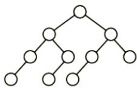

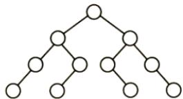

C.

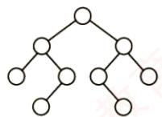

D.


24.【2023统考真题】对含600个元素的有序顺序表进行折半查找，关键字间的比较次数最 多是（）。 A. 9 B. 10 C. 30 D. 300

25.【2024统考真题】下列数据结构中，不适合直接使用折半查找的是（）。H I. 有序链表 Ⅱ. 无序数组 I. 有序静态链表 IV. 无序静态链表A. 仅I、ⅢI B. 仅ⅡI、IV C. 仅ⅡI、III、IVD. I、ⅡI、ⅢII、IV

26.【2025统考真题】已知查找表中有400个元素，查找每个元素的概率相同。采用分块查找法进行查找，且均匀分块。若采用顺序查找法确定元素所在的块，且块内也采用顺序查找法，为使查找效率最高，则每块包含的元素个数应为（）。A. 8 B. 10 C. 20 D. 25

## 二、综合应用题

01. 若对有n个元素的有序顺序表和无序顺序表进行顺序查找，试就下列三种情况分别讨论两者在相等查找概率时的平均查找长度是否相同。

1）查找失败。

2）查找成功，且表中只有一个关键字等于给定值k的元素。

3）查找成功，且表中有若干关键字等于给定值k的元素，要求一次查找能找出所有元素。  
02. 有序顺序表中的元素依次为 017,094,154,170,275,503,509,512,553,612,677,765,897,908。

1）试画出对其进行折半查找的判定树。

2）若查找275或684的元素，将依次与表中的哪些元素比较？

3）计算查找成功的平均查找长度和查找不成功的平均查找长度。

03. 已知一个有序顺序表A[0...8n-1]的表长为 8n，并且表中没有关键字相同的数据元素。假设按下述方法查找一个关键字值等于给定值X的数据元素：首先在A[7],A[15]，A[23]，…,A[8k-1]，…,A[8n-1]中进行顺序查找，若查找成功，则算法报告成功位置并返回；若不成功，则当 $\mathrm{A}\left[8\mathrm{k}-\mathrm{l}\right]<\mathrm{X}<\mathrm{A}\left[8\times(\mathrm{k}+\mathrm{l})-\mathrm{l}\right]$ 时，可确定一个缩小的查找范围 $\mathbb{A}[8\mathrm{k}]\sim\mathbb{A}[8\times(\mathrm{k}+1)-2]$ ，然后可在这个范围内执行折半查找。特殊情况：若X>A[8n-1]的关键字，则查找失败。 道

1）画出描述上述查找过程的判定树。

2）计算相等查找概率下查找成功的平均查找长度。

04. 写出折半查找的递归算法。初始调用时，low为1，high为 ST.length。

05. 线性表中各结点的检索概率不等时，可用如下策略提高顺序检索的效率：若找到指定的结点，则将该结点和其前驱结点（若存在）交换，使得经常被检索的结点尽量位于表的前端。试设计在顺序结构和链式结构的线性表上实现上述策略的顺序检索算法。

06. 已知一个n阶矩阵A和一个目标值k。该矩阵无重复元素，每行从左到右升序排列，每列从上到下升序排列。请设计一个在时间上尽可能高效的算法，判断矩阵中是否存在目$\begin{bmatrix} 1 & 4 & 7 \\ 2 & 5 & 8 \\ 3 & 6 & 9 \end{bmatrix}$ 1标值k。例如，矩阵为 ，目标值为8，判断存在。要求：

1）给出算法的基本设计思想。

2）根据设计思想，采用C或C++语言描述算法，关键之处给出注释。

3）说明你的算法的时间复杂度和空间复杂度。

07.【2013统考真题】设包含4个数据元素的集合 $S = \{ \mathrm { d o } , \mathrm { f o r } , \mathrm { r e p e a t } , \mathrm { w h i l e } \}$ ，各元素的查找概率依次为 $p_{1}=0.35, p_{2}=0.15, p_{3}=0.15, p_{4}=0.35.$ 将S保存在一个长度为4的顺序

1）若采用顺序存储结构保存S，且要求平均查找长度更短，则元素应如何排列？应使用何种查找方法？查找成功时的平均查找长度是多少？

2）若采用链式存储结构保存S，且要求平均查找长度更短，则元素应如何排列？应使用何种查找方法？查找成功时的平均查找长度是多少？

## 7.2.5 答案与解析

## 一、单项选择题

01. A

顺序查找是指从表的一端开始向另一端查找。它不要求查找表具有随机存取的特性，可以是顺序存储结构或链式存储结构。

## 02. B

对于顺序查找，不管线性表是有序的还是无序的，成功查找第一个元素的比较次数为1，成功查找第二个元素的比较次数为2，以此类推，即每个元素查找成功的比较次数只与其位置有关（与是否有序无关），因此查找成功的平均时间两者相同。

## 03. B

在有序单链表上做顺序查找，查找成功的平均查找长度与在无序顺序表或有序顺序表上做顺序查找的平均查找长度相同，都是(n+1)/2。

## 04. A

在长度为3的顺序表中，查找第一个元素的查找长度为1，查找第二个元素的查找长度为2，查找第三个元素的查找长度为3，所以有

$$
\mathrm{ASL}_{ 成功 } = \frac{1}{2} \times 1 + \frac{1}{3} \times 2 + \frac{1}{6} \times 3 = \frac{5}{3}
$$

## 05. D

二分查找通过下标来定位中间位置元素，所以应采用顺序存储，且二分查找能够进行的前提是查找表是有序的，但具体是从大到小还是从小到大的顺序则不做要求。

## 06. C

折半查找的快体现在一般情况下，在大部分情况下要快，但是对于某些特殊情况，顺序查找可能会快于折半查找。例如，查找一个含1000个元素的有序表中的第一个元素时，顺序查找的比较次数为1次，而折半查找的比较次数却将近10次。

## 07. B

A显然排除。对于选项C，考点精析示例中的判定树就不是完全二叉树。由选项C也可排除选项D，且满二叉树对结点数有要求。只可能选择选项B。事实上，由折半查找的定义不难看出，每次把一个数组从中间结点分割时，总是把数组分为结点数相差最多不超过1的两个子数组，从而使得对应的判定树的两棵子树高度差的绝对值不超过1，所以应是平衡二叉树。

## 08. B

折半查找的性能分析可以用二叉判定树来衡量，平均查找长度和最大查找长度都是O(log2n);二叉排序树的查找性能与数据的输入顺序有关，最好情况下的平均查找长度与折半查找相同，但最坏情况即形成单支树时，其查找长度为O(n)。

## 09. B

依据折半查找算法的思想，第一次 $\mathrm{mid}=\left\lfloor\left(1+11\right)/2\right\rfloor=6$ ，第二次 $\mathrm{mid}=\left\lfloor\left[(6+1)+11\right]/2\right\rfloor=9$ 第三次 $\mathrm{m}\bot\mathrm{d}=\left\lfloor\left[\left(9+1\right)+11\right]/2\right\rfloor=10$ ，第四次 mid=11。 七算

## 10. B

开始时 1ow指向 13，high 指向 134，mid 指向 50，比较第一次 90> 50，所以将1ow指向62，high 指向134，mid指向90，第二次比较找到90。

## 11. A

在折半查找算法中，miα取值的方式是确定的，要么采用向上取整，要么采用向下取整，而不能出现两种情况。对于选项A，第1次比较的元素是 $f ,$ 为向下取整；第2次比较的元素是c，为向下取整；第3次比较的元素是b，为向下取整，查找成功，符合二分查找。对于选项B，第1次比较的元素是 $f ,$ 为向下取整；第2次比较的元素是 $d ,$ 为向上取整，两次mid取值的方式不同，不符合二分查找。对于选项C，第1次比较的元素是 $g ,$ ，为向上取整；第2次比较的元素是c，为向下取整，不符合二分查找。对于选项D，第1次比较的元素是 $g ,$ ，为向上取整；第2次比较的元素是 $d ,$ 为正中间元素；第3次比较的元素为b，为向下取整，不符合二分查找。

## 12. A

对n个结点的判定树，设结点总数 $n = 2 ^ { h } - 1$ ，则 $\bar { h } = \lceil \log _ { 2 } ( n + 1 ) \rceil$ 0

【另解】特殊值代入法。直接将n=1和n=2的情况代入，仅有A满足要求。

## 13. A、B

对于此类题，有两种做法：一种方法是，画出查找过程中构成的判定树，让最小的分支高度对应于最少的比较次数，让最大的分支高度对应于最多的比较次数，出现类似于长度为15的顺序表时，判定树刚好是一棵满树，此时最多比较次数与最少比较次数相等；另一种方法是，直接用公式求出最小的分支高度和最大分支高度，从前面的讲解不难看出最大分支高度为 $H = \left\lceil \log_{2}(n + 1) \right\rceil = 5$ ，这对应的就是最多比较次数，然后因为判定树不是一棵满树，所以至少应该是4（由判定树的各分支高度最多相差1得出）。

注意，若求查找成功或查找失败的平均查找长度，则需要画出判定树来求解。此外，对长度为n的有序表，采用折半查找时，查找成功和查找失败的最多比较次数相同，均为 $\left[ \log_{2}(n + 1) \right]$

## 14. A、D

假设有序表中元素为A「0...111，不难画出对它进行折半查找的判定树如下图所示，圆圈是查找成功结点，方形是虚构的查找失败结点。从而可以求出查找成功的 $\mathrm{ASL} = (1 + 2 \times 2 + 3 \times 4 + 4 \times 5)/12 =$ 37/12，查找失败的 $\mathrm{ASL} = (3 \times 3 + 4 \times 10)/13$


## 注意

对于本类题目，应先根据所给n的值，画出如上图所示的折半查找判定树。另外，查找失败结点的ASL不是到图中的方形结点，而是到方形结点上一层的圆形结点。 XID

## 15. D

折半查找法不仅要求数据元素有序，而且要求必须为顺序存储，选项A错误。折半查找法在最坏情况下的时间性能为O(log₂n)，二叉查找树在最坏情况下的时间性能为O(n)，选项B错误。在每个元素查找概率不同的情况下，折半查找法的平均查找长度可能大于顺序查找法，选项C错误。

## 16. B

通常情况下，在分块查找的结构中，不要求每个索引块中的元素个数都相等。

## 17. A

设块长为b，索引表包含n/b项，索引表的 $\mathrm{ASL} = (n/b + 1)/2$ ，块内的 $\mathrm { A S L } = ( b + 1 ) / 2$ ，总 $\mathrm { A S L }   =$ 索引表的 ASL + 块内的 $\mathrm{ASL} = (b + n/b + 2)/2$ ，其中对于 $b + n / b$ ，由均值不等式可知， $b = n / b$ 时有最小值，此时 $b   =   \sqrt { n }$ 。则最理想块长为 $\sqrt{2500} = 50$

## 18. B

根据公式 $\mathrm{ASL} = L_{1} + L_{\mathrm{S}} = \frac{b + 1}{2} + \frac{s + 1}{2} = \frac{s^{2} + 2s + n}{2s}$ ，其中 $b = n / s , s = 1 2 3 / 3 , n = 1 2 3$ ，代入不难得出ASL为23。所以选择选项B。另一方面，可根据穷举法来一步步模拟。对于A块中的元素，查找过程的第一步是先找到A块，由于是顺序查找，找到A块只需一步，然后在A块中顺序查找，因此A块内各元素查找长度分别为 $2,3,4,\cdots,42 。$ 对于B块，采用类似的方法，但查找到B块要比查找到A块多一步，因此B块内各元素查找长度为3,4,5,…,43。同理，C块中各个元素查找长度为4,5,6,…，44。所以平均查找长度为 $( 2 + 3 + 4 + \cdots + 42 + 3 + 4 + 5 + \cdots + 43 + 4 + 5 + 6 + \cdots + 44 ) / 123 = 23$

## 19. C

为使查找效率最高，每个索引块的大小应是 $\sqrt{65025} = 255$ ，为每个块建立索引，则索引表中索引项的个数为255。若对索引项和索引块内部都采用折半查找，则查找效率最高，为 $\left[ \log_{2}(255 + 1) \right] +$ $\left[ \log_{2}(255 + 1) \right] = 16$ XTA XT

## 20. B

折半查找法在查找不成功时和给定值进行关键字的比较次数最多为树的高度，即 $\log_{2}n + 1$ 或 $\left[ \log _ { 2 } ( n + 1 ) \right]$ 。在本题中， $n   =   1 6$ ，所以比较次数最多为5。 KK

## 注意

在折半查找判定树中的方形结点是虚构的，它不计入比较的次数。

## 21. A

画出查找路径图，因为折半查找判定树是一棵二叉排序树，看其是否满足二叉排序树的要求。

  
显然，选项A的查找路径不满足。

## 22. B

本题为送分题。

该程序采用跳跃式的顺序查找法查找升序数组中的x。显然，×越靠前，比较次数越少。

## 23. A

对于给定的一个有序查找表，其对应的折半查找判定树是确定且唯一的。在折半查找算法  
中， $\mathrm{mi}   \mathrm{d}= \left\lfloor (10w + \mathrm{h} \mathrm{i}  \mathrm{g} \mathrm{h}) / 2 \right\rfloor$ ，因此若表中初始有 $2 n + 1$ 个元素，则mid分割后，左右子树各  
有n个元素；若表中初始有2n个元素，则mid分割后，左子树有n-1个元素，右子树有n个  
元素。即左子树的元素个数或者与右子树的元素个数相等，或者比右子树少一个。若令mid=  
$\left[ \left( 1 0 w + h i g h \right) / 2 \right]$ ，不难理解，左子树的元素个数或者与右子树的元素个数相等，或者比右子  
树多一个。对于选项A，树中每个左子树都与右子树的结点个数相等，或者多一个结点，符合  
向上取整的规则。对于选项B、C、D，存在有的左子树比右子树多一个结点，有的左子树比右  
子树少一个结点，不符合折半查找的规则。V

## 24. B

用折半查找法查找给定值的比较次数最多不超过折半查找判定树的高度。折半查找判定树的树高 $h = \lceil \log_2 (n + 1) \rceil$ ，将 $n   =   6 0 0$ 代入，结果为10。

## 25. D

折半查找必须满足两个条件：①数组（或顺序表），折半查找的上一次查找和本次查找可能相

隔很远的距离，如依次查找下标为 $n / 2 ,   n / 4 ,   n / 8 , \cdots$ 的元素，若采用链表（或静态链表），则会使得时间复杂度非常高。②有序，只有在有序的情况下才能根据上一次的比较情况舍弃一半的序列。

## 26. C

本题可直接套用书中的结论“每块记录数= $\sqrt { n }$ 时，平均查找长度最小”。解释如下：分块查找的平均查找长度（ASL）等于查找索引表的ASL与块内查找的ASL之和。设每块含s个元素，则块数为 $k   =   4 0 0 / s$ 。总 $\mathrm{ASL} = (k + 1)/2 + (s + 1)/2 = (k + s)/2 + 1$ 。要使ASL最小，需要最小化 $k   +   s   =$ $4 0 0 / s + s _ { \perp }$ 。根据均值不等式，当 $4 0 0 / s   =   s$ 时取最小值，解得 $s   =   2 0$

## 二、综合应用题

## 01.【解答】

1）平均查找长度不同。因为有序顺序表查找到其关键字值比要查找值大的元素时就停止查找，并报告失败信息，不必查找到表尾：而无序顺序表必须查找到表尾才能确定查找失败。

2）平均查找长度相同。两者查找到表中元素的关键字值等于给定值时就停止查找。

3）平均查找长度不同。有序顺序表中关键字相等的元素相继排列在一起，只要查找到第一个就可以连续查找到其他关键字相同的元素。而无序顺序表必须查找全部表中的元素才能找出相同关键字的元素，因此所需的时间不同。

## 02. 【解答】

1）判定树如下图所示。


2）若查找275，依次与表中元素509,154,275进行比较，共比较3次。若查找684，依次与表中元素509,677,897,765进行比较，共比较4次。 V

3）在查找成功时，会找到图中的某个圆形结点，其平均查找长度为

$$
\frac{1}{14}\sum_{i = 1}^{14}C_{i}=\frac{1}{14}\left( 1 + 2 \times 2 + 3 \times 4 + 4 \times 7 \right)=\frac{45}{14}
$$

在查找失败时，会找到图中的某个方形结点，但这个结点是虚构的，最后一次的比较元素为其父结点（圆形结点），所以其平均查找长度为

$$
\mathrm{ASL}_{不成功} = \frac{1}{15} \sum_{i=0}^{14} C_{i}^{\prime} = \frac{1}{15} (3 \times 1 + 4 \times 14) = \frac{59}{15}
$$

## 03.【解答】

1）先在 $\mathbb{A} \left[ 7 \right], \mathbb{A} \left[ 15 \right], \cdots, \mathbb{A} \left[ 8 \mathbb{n} - 1 \right]$ 内顺序查找，再在区间内折半查找。相应的判定树如下图所示。其中，每个关键字下的数字为其查找成功时的关键字比较次数。

2）等查找概率下，平均每个关键字查找成功的概率为1/8n；0～7之间的关键字，顺序比较1次后，进行折半查找，查找成功的平均查找长度为 $2+3\times2+4\times4; 8\sim15$ 之间的关键字，先顺序比较2次后，再进入折半查找；以此类推， $8(n - 1) \sim 8n - 1$ 之间的关键字，先顺序比较n次，再进入折半查找，如上图所示。因此，查找成功的平均查找长度为


```matlab
11 1 ∑ n+1 n+2 n+3
ASL成功 二 S Ci = i+∑i+2∑ i+4∑
8n0 8n( i=2 i=3 i=4
1 n
二 ∑(i+(i+1)+ 2(i + 2)+ 4(i + 3))
8n i=1
1 n 1 n 17 n+1 17
二 (8i + 17) = − i + 二 +
8ni=1 ni1 8 2 8
```

## 04.【解答】

算法的基本思想：根据查找的起始位置和终止位置，将查找序列一分为二，判断所查找的关键字在哪一部分，然后用新的序列的起始位置和终止位置递归求解。

算法代码如下：

```c
typedef struct{ //查找表的数据结构
ElemType *elem; //存储空间基址，建表时按实际长度分配，0号留空
int length; //表的长度
} SSTable;
int BinSearchRec(SSTable ST,ElemType key,int low,int high) {
if(low>high)
return 0;
mid=(low+high)/2; //取中间位置
if(key>ST.elem[mid]) //向后半部分查找
BinSearchRec(ST,key,mid+1,high);
else if(key<ST.elem[mid]) //向前半部分查找
BinSearchRec(ST,key,low,mid-1);
else //查找成功
return mid;
```

算法把规模为n的复杂问题经过多次递归调用转化为规模减半的子问题求解。时间复杂度为O(log2n)，算法中用到了一个递归工作栈，其规模与递归深度有关，也是O(log2n)。

## 05.【解答】

算法的基本思想：检索时可先从表头开始向后顺序扫描，若找到指定的结点，则将该结点和

```javascript
int SeqSrch(RcdType R[],ElemType k) {
//顺序查找线性表，找到后和其前面的元素交换
int i=0;
while((R[i].key!=k)&&(i<n))
i++; //从前向后顺序查找指定结点
if(i<n&&i>0) { //若找到，则交换
temp=R[i];R[i]=R[i-1];R[i-1]=temp;
return --i; //交换成功，返回交换后的位置
1
else return -1; //交换失败
```

链表的实现方式请读者自行思考。注意，链表方式实现的基本思想与上述思想相似，但要注

意用链表实现时，在交换两个结点之前需要保存指向前一结点的指针。

## 06.【解析】

1）算法的基本设计思想：

从矩阵A的右上角（最右列）开始比较，若当前元素小于目标值，则向下寻找下一个更大的元素；若当前元素大于目标值，则从右往左依次比较，若目标值存在，则只可能在该行中。

2）算法的实现：

bool findkey(int A[][],int n,int k){  
int i=0,j=n-1;  
while(i<n&&j>=0) { //离开边界时查找结束  
if(A[i][j]==k) return true; ∥查找成功  
else if(A[i][j]>k) j--; //向左移动，在该行内寻找目标值  
else i++; //向下移动，查找下一个更大的元素  
return false; //查找失败

3）比较次数不超过2n次，时间复杂度为O(n)；空间复杂度为O(1)。

## 07．【解答】

1）折半查找要求元素有序顺序存储，字符串默认按字典序排序（字典序是一种比较两个字符串大小的方法，它按字母顺序从左到右逐个比较对应的字符，若某一位可以比较出大小，则不再继续比较后面的字符，如 abd < acd、abc < abcd 等），对本题来说 do < for < repeat<while。若各个元素的查找概率不同，折半查找的性能不一定优于顺序查找。采用顺序查找时，元素按其查找概率的降序排列时查找长度最小。采用顺序存储结构，数据元素按其查找概率降序排列。采用顺序查找方法。查找成功时的平均查找长度 $0.35 \times 1 + 0.35 \times 2 + 0.15 \times 3 + 0.15 \times 4 = 2.1$ 此时，显然查找长度比折半查找的更短。

2）答案1：采用链式存储结构时，只能采用顺序查找，其性能和顺序表一样，类似于上题。数据元素按其查找概率降序排列，构成单链表。采用顺序查找方法。

$$
0.35 \times 1 + 0.35 \times 2 + 0.15 \times 3 + 0.15 \times 4 = 2.1
$$

答案2：还可以构造成二叉排序树的形式。采用二叉链表的存储结构，构造二叉排序树，元素的存储方式见下图。采用二叉排序树的查找方法。

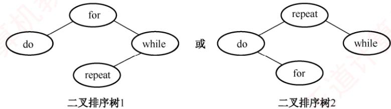  
查找成功时的平均查找长度 $0.15 \times 1 + 0.35 \times 2 + 0.35 \times 2 + 0.15 \times 3 = 2.0$

## 7.3 树形查找

## 7.3.1 二叉排序树（BST）

构造一棵二叉排序树的主要目的并非直接输出有序序列，而是利用其有序结构支持高效的动态查找、插入和删除操作。这种非线性结构有利于实现快速的数据访问。


## 1. 二叉排序树的定义

考点追踪二叉排序树的应用（2013）

二叉排序树（也称二叉查找树）或者是一棵空树，或者是具有下列特性的二叉树：

1）若左子树非空，则左子树上所有结点的关键字均小于根结点的关键字。

2）若右子树非空，则右子树上所有结点的关键字均大于根结点的关键字。

3）左右子树也分别是一棵二叉排序树。

考点追踪二叉排序树中结点值之间的关系（2015、2018、2024）

基于上述定义，对二叉排序树进行中序遍历可以得到一个递增的有序关键字序列。例如，图7.4所示二叉排序树的中序遍历序列为1,2,3,4,6,8。

## 2. 二叉排序树的查找

二叉排序树的查找是从根结点开始，逐层向下比较并选择左/右子树的搜索过程。若二叉排序树非空，先将给定关键字与根结点的关键字比较：若相等，则查找成功；若不等，小于根结点的关键字，则在根结点的左子树上查找，否则在根结点的右子树上查找。这一过程具有天然的递归结构，也可以用循环实现。以下是用循环实现二叉排序树查找的代码示例：

  
图 7.4 一棵二叉排序树

$$
\begin{aligned}& BSTno\_de  \quad *  BST \_5 e \_\_\_\_\_\_ (  BJ \_\_\_\_\_\_ (  EJ \_\_\_\_\_\_ (  EJ \_\_\_\_\_ ) / / / / / / / / / / / / / / / / / / / / / / / / / / / / / / / / / / / / / / / / / / / / / / / / / / / / / / / / / / / / / / / / / / / / / / / / / / / / / / / / / / / / / / / / / / / / / / / / / / / / / / / / / / / / / / / / / / / / / / / / / / / / / / / / / / / / / / / / / / / / / / / / / / / / / / / / / / / / / / / / / / / / / / / / / / / / / / / / / / / / / / / / / / / / / / / / / / / / / / / / / / / / / / / / / / / / / / / / / / / / / / / / / / / / / / / / / / / / / / / / / / / / / / / / / / / / / / / / / / / / / / / / / / / / / / / / / / / / / / / / / / / / / / / / / / / / / / / / / / / / / / / / / / / / / / / / / / / / / / / / / / / / / / / / / / / / / / / / / / / / / / / / / / / / / / / / / / / / / / / / / / / / / / / / / / / / / / / / / / / / / / / / / / / / / / / / / / / / / / / / / / / / / / / / / / / / / / / / / / / / / / / / / / / / / / / / / / / / / / / / / / / / / / / / / / / / / / / / / / / / / / / / / / / / / / / / / / / / / / / / / / / / / / / / / / / / / / / / / / / / / / / / / / / / / / / / / / / / / / / / / / / / / / / / / / / / / / / / / / / / / / / / / / / / / / / / / / / / / / / / / / / / / / / / / / / / / / / / / / / / / / / / / / / / / / / / / / / / / / / / / / / / / / / / / / / / / / / / / / / / / / / / / / / / / / / / / / / / / / / / / / / / / / / / / / / / / / / / / / / / / / / / / / / / / / / / / / / / / / / / / / / / / / / / / / / / / / / / / / / / / / / / / / / / / / / / / / / / / / / / /  \end{aligned}
$$

例如，在图7.4中查找关键字为4的结点。首先4与根结点6比较。因为4<6，所以在根结点6的左子树中继续查找。因为4>2，故在结点2的右子树中继续查找，该子树的根结点即为4，查找成功。 H

同样，二叉排序树的查找也可用递归算法实现，其实现较为简单，但由于递归可能导致较大的栈空间开销，执行效率较低。具体的代码实现留给读者思考。 XTA

## 3. 二叉排序树的插入

二叉排序树作为一种动态树表，其结构通常不是一次性生成的，而是在查找过程中动态构建：当查找失败（树中不存在关键字等于给定值的结点）时，才执行插入操作。 K

插入结点的过程如下：若原二叉排序树为空，则将新结点作为根结点直接插入；否则，从根结点开始比较，若关键字k小于当前结点的关键字，则在左子树中继续查找并插入：若k大于当前结点的关键字，则在右子树中继续查找并插入。新插入的结点在插入完成后一定是一个叶结点，且恰好是查找失败时所访问的最后一个结点的左孩子或右孩子。如图7.5所示，在一棵二叉排序树中依次插入结点28和58，虚线所示路径即为每次插入前的查找路径。

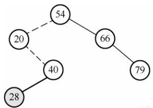  
(a) 插入28  
图7.5 向二叉排序树中插入结点  
(b) 插入58

(d) 插入53

二叉排序树插入操作的算法描述如下：

```c
int BST Insert(BiTree &T,KeyType k) {
if(T==NULL){ //原树为空，新插入的记录为根结点
T=(BiTree)malloc(sizeof(BSTNode));
T->data=k;
T->lchild=T->rchild=NULL;
return 1; //返回1，插入成功
else if(k==T->data) //树中存在相同关键字的结点，插入失败
return 0;
else if(k<T->data) //插入π 的左子树
return BST Insert(T->lchild,k);
else //插入 Τ 的右子树
return BST_Insert(T->rchild,k);
```

## 4. 二叉排序树的构造

考点追踪构造二叉排序树的过程（2020）

从一棵空树开始，依次将给定元素插入二叉排序树的合适位置（重复关键字将被忽略）。设插入的关键字序列为{45,24,53,45,12,24}，则生成的二叉排序树如图7.6所示。


  
(b) 插入45


(c) 插入24

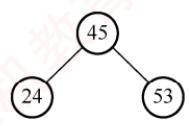

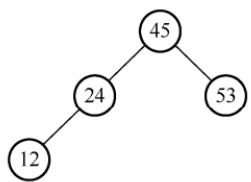  
(e) 插入12  
图7.6二叉排序树的构造过程

构造二叉排序树的算法描述如下：

```c
void Creat BST(BiTree &T,KeyType str[],int n) {
T=NULL; //初始时τ 为空树
int i=0;
while(i<n) { //依次将每个关键字插入二叉排序树
BST_Insert(T,str[i]);
i++;
```

## 5. 二叉排序树的删除

在二叉排序树中删除一个结点时，不能把以该结点为根的子树都删除，而必须将该结点从存储结构中摘下，并重新连接因删除操作而断裂的链表，同时确保整棵树仍满足二叉排序树的性质。删除操作需根据被删结点的不同情况分别处理，具体分为以下三种情形：

①若被删结点z是叶结点，则直接删除即可，不会破坏二叉排序树的性质。

②若结点z仅有一棵非空子树（左子树或右子树），则将其唯一的子树上移，作为z的父结点的新子树，从而替代z的位置。

③若结点z同时具有左右两棵子树，则可用z的直接后继或直接前驱（分别为中序遍历中的下一个或上一个结点）来替代z。替换完成后，再从树中删除该直接后继（或前驱）。由于直接后继（或前驱）至多只有一个子树，这样就转化为第①或第②种情况。

图7.7展示了分别删除结点45,78,78的过程。

  
图 7.7 3种情况下的删除过程

考点追踪二叉排序树中删除并插入某结点的分析（2013）

思考：若在二叉排序树中删除某结点，再重新插入，所得的二叉排序树是否与原树相同？

## 6. 二叉排序树的查找效率分析

二叉排序树的查找效率主要取决于树的高度。若左右子树高度之差的绝对值不超过1（见下一节的平衡二叉树），其平均查找长度为O(1og₂n)。在最坏情况下，若构造二叉排序树的输入序列是有序的，则会形成一个只有右孩子（或只有左孩子）的单支树，此时树的高度为n，性能显著下降，平均查找长度退化为(n+1)/2，如图7.8(b)所示。 X

  
图7.8 相同关键字组成的不同二叉排序树

在等概率情况下，图7.8(a)查找成功的平均查找长度为

$$
\mathrm{ASL}_{a}=(1+2 \times 2+3 \times 4+4 \times 3)/10=2.9
$$

而图7.8(b)查找成功的平均查找长度为

$$
\mathrm{ASL}_{\mathrm{b}}=(1+2+3+4+5+6+7+8+9+10)/10=5.5
$$

从查找过程来看，二叉排序树与二分查找相似。就平均时间性能而言，二者相近。但二分查找所对应的判定树是唯一的，而由相同关键字集合可能生成不同的二叉排序树一一其具体形态取决于关键字的插入顺序，如图7.8所示。

就维护表的有序性而言，二叉排序树无须移动结点，仅需修改指针即可完成插入和删除操作，平均时间复杂度为O(log₂n)。而二分查找的对象是有序顺序表，若需执行插入或删除操作，必须移动大量元素，时间复杂度为O(n)。因此，当表为静态查找表时，宜采用顺序表存储并使用二分查找；若表为动态查找表（需频繁插入或删除），则应选择二叉排序树作为其逻辑结构。

## 7.3.2 平衡二叉树

## 1. 平衡二叉树的定义

为了避免树的高度增长过快而导致二叉排序树性能下降，在插入和删除结点时，需保证任意结点的左右子树高度差的绝对值不超过1。满足这一条件的二叉树称为平衡二叉树（Balanced Binary Tree），也称 AVL树。定义结点左子树与右子树的高度差为该结点的平衡因子，则平衡二叉树中所有结点的平衡因子只能取-1、0或1。

## 考点追踪平衡二叉树的定义（2009）

因此，平衡二叉树可形式化定义为：它或者是一棵空树，或者是具有下列性质的二叉树一一其左子树和右子树均为平衡二叉树，且左右子树的高度差的绝对值不超过1。图7.9(a)是一棵平衡二叉树，图7.9(b)是一棵不平衡的二叉树。结点内的数字表示其平衡因子。

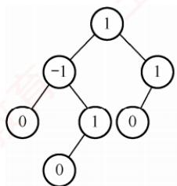  
(a) 平衡二叉树

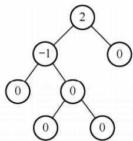  
(b)不平衡的二叉树  
图7.9 平衡二叉树和不平衡的二叉树

## 2. 平衡二叉树的插入

平衡二叉树维持平衡的基本思想如下：每当插入一个结点后，沿查找路径向上检查各祖先结点是否因该操作而失去平衡。若存在失衡结点，则定位插入路径上离新结点最近、且平衡因子绝对值大于1的结点A，以A为根的子树即为最小不平衡子树。随后，在保持二叉排序树特性的前提下，通过旋转调整该子树的结构，使其重新达到平衡。

## 考点追踪平衡二叉树中插入操作的特点（2015）

每次调整的对象都是最小不平衡子树，图7.10中的虚线框内所示即为最小不平衡子树。

  
图7.10 最小不平衡子树示意

考点追踪平衡二叉树的插入及调整操作的实例（2010、2019、2021）

平衡二叉树的插入过程前半部分与普通二叉排序树相同；但在新结点插入后，若导致查找路径上的某个结点失去平衡，则需执行相应的调整。可将调整的规律归纳为下列4种情况：

1）LL平衡旋转（右单旋转）。由于在结点A的左孩子（L）的左子树（L）上插入了新结点，A的平衡因子由1增至2，导致以A为根的子树失去平衡，需要一次向右的旋转操作。将A的左孩子B向右上旋转，使其代替A成为新的根结点；将A向右下旋转，成为B的右孩子；而B的原右子树则作为A的左子树。如图7.11所示，结点旁的数值代表结点的平衡因子，方块表示相应结点的子树，下方数值代表该子树的高度。

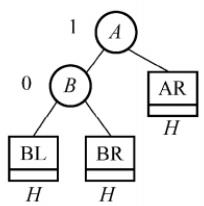  
(a) 插入结点前

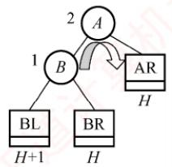  
(b) 插入结点导致不平衡

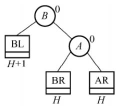  
(c)LL旋转(右单旋转)  
图 7.11 LL 平衡旋转

2）RR平衡旋转（左单旋转）。由于在结点A的右孩子（R）的右子树（R）上插入了新结点，A的平衡因子由-1减至-2，导致以A为根的子树失去平衡，需要一次向左的旋转操作。将A的右孩子B向左上旋转，使其替代A成为新的根结点；将A向左下旋转，成为B的左孩子；而B的原左子树则作为A的右子树，如图7.12所示。

  
(a) 插入结点前

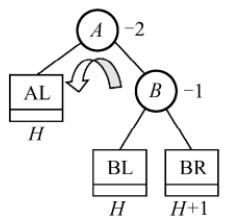  
(b)插入结点导致不平衡

  
(c) RR旋转(左单旋转)  
图 7.12 RR 平衡旋转

3）LR平衡旋转（先左后右双旋转）。由于在结点A的左孩子（L）的右子树（R）上插入新结点，A的平衡因子由1增至2，导致以A为根的子树失去平衡，需要进行两次旋转操作，先左旋转后右旋转。先将A的左孩子B的右子树的根结点C向左上旋转，使其取代


B的位置；然后将C向右上旋转，使其取代A的位置，如图7.13所示。

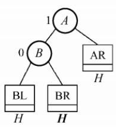  
(a)  
(a) 插入结点前

  
(b)插入结点导致不平衡

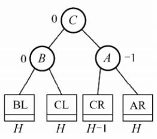  
(c)LR旋转(双旋转)  
图 7.13 LR 平衡旋转

4）RL平衡旋转（先右后左双旋转）。由于在结点A的右孩子（R）的左子树（L）上插入新结点，A的平衡因子由-1减至-2，导致以A为根的子树失去平衡，需要进行两次旋转操作，先右旋转后左旋转。先将A的右孩子B的左子树的根结点C向右上旋转，使其取

  
(a) 插入结点前

  
(b) 插入结点导致不平衡

  
(c) RL旋转(双旋转)  
图 7.14 RL 平衡旋转

## 注意

LR和 RL旋转时，新结点究竟是插入C的左子树还是右子树不影响旋转过程，而图7.13 和图7.14中以插入C的左子树为例。 ZTA

## 考点追踪构造平衡二叉树的过程（2013）

以关键字序列{15.3.7.10.9.8}构造一棵平衡二叉树的过程为例：图7.15(d)插入7后导致不平衡，最小不平衡子树的根为15，插入位置为其左孩子的右子树，因此需执行LR旋转，先左后右双旋转，调整后的结果如图7.15(e)所示。图7.15(g)插入9后导致不平衡，最小不平衡子树的根为15，插入位置为其左孩子的左子树，需执行LL旋转，右单旋转，调整后的结果如图7.15(h)所示。图7.15(i)插入8后导致不平衡，最小不平衡子树的根为7，插入位置为其右孩子的左子树，需执行RL旋转，先右后左双旋转，调整后的结果如图7.15(j)所示。

(a)空树  
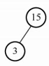  
(b)插入15  
(c)插入3

  
(d)插入7

  
(e)LR旋转  
图7.15 平衡二叉树的生成过程

  
(f)插入10

  
(g)插入9

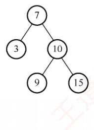  
(h)LL旋转


  
(j) RL旋转  
图7.15 平衡二叉树的生成过程（续）

## 3. 平衡二叉树的删除

与插入操作相似，以删除结点w为例说明平衡二叉树删除操作的步骤：

1）使用二叉排序树的方法删除结点w。

2）若导致不平衡，则从结点w开始向上回溯，找到第一个不平衡的结点z（最小不平衡子树 的根）。设y是z的较高子树的根结点，x是y的较高子树的根结点。

3）对以 z为根的子树进行平衡调整，其中x、y和 z的相对位置有以下四种情况：

• y是 z 的左孩子，x 是y的左孩子（LL，右单旋转）；

● y是 z 的左孩子，x 是y的右孩子（LR，先左后右双旋转）；

● y是 z 的右孩子，x 是y的右孩子（RR，左单旋转）；

● y是 z的右孩子，x是y的左孩子（RL，先右后左双旋转）。

这些调整方式与插入操作相同。不同之处在于：插入操作只需对以z为根的子树进行一次平衡调整，而删除操作则可能需要多次调整。若一次调整导致子树的高度减1，则可能还需对z的祖先结点进行平衡调整，甚至回溯到根结点（导致整棵树的高度减1）。

以删除图7.16(a)中的结点32为例，由于32是叶结点，直接删除即可。然后向上回溯，找到第一个不平衡结点44（z），z的较高子树的根为78（y），y的较高子树的根为50（x），满足RL情况，需执行先右后左的双旋转。调整后的结果如图7.16(c)所示。

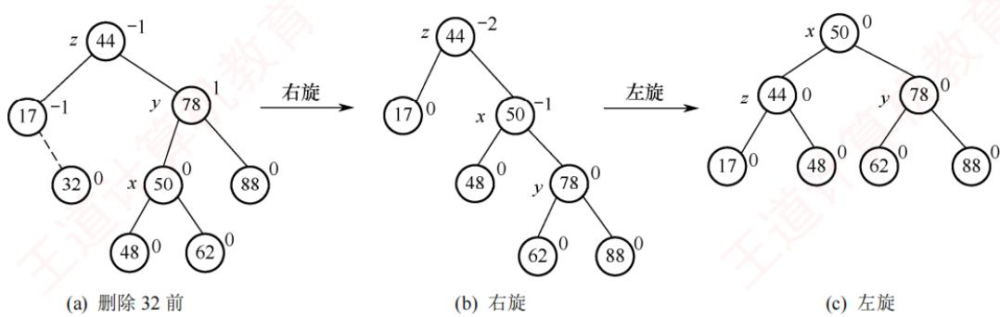  
图 7.16 平衡二叉树的删除

## 4. 平衡二叉树的查找

考点追踪指定条件下平衡二叉树的结点数的分析（2012）

在平衡二叉树上进行查找的过程与普通二叉排序树相同，因此关键字的比较次数最多等于树的深度。设 $n _ { h }$ 表示深度为h（根结点深度为1）的平衡二叉树中所含的最少结点数。显然有 $n _ { 0 }   =   0 _ { \mathrm { i } }$ $n _ { 1 } = 1 ,   n _ { 2 } = 2$ ，且满足 $n _ { h } = n _ { h - 2 } + n _ { h - 1 } + 1$ ，如图7.17所示，依次推出 $n_{3}=4, n_{4}=7, n_{5}=12, \cdots$ 。含

有 n 个结点的平衡二叉树的最大深度为 O(log₂n)，因此平均查找时间复杂度为 O(log2n)。

  
图7.17 结点个数n最少的平衡二叉树

## 注意

该结论可用于求解给定结点数的平衡二叉树在查找时所需的最多比较次数（树的最大深度）。例如，含有12个结点的平衡二叉树中查找某个结点的最多比较次数？ KON

深度为h的平衡二叉树中所含的最多结点数显然是满二叉树的情况。

## 7.3.3 红黑树

## 1. 红黑树的定义

为了保持AVL树的平衡性，在插入和删除操作后，会非常频繁地调整全树的整体拓扑结构，代价较大。为此，在AVL树的平衡标准基础上进一步放宽条件，引入了红黑树的结构。

一棵红黑树是满足如下红黑性质的二叉排序树：

①每个结点或是红色，或是黑色的。

②根结点是黑色的。

③叶结点（虚构的外部结点、NULL结点）都是黑色的。

④不存在两个相邻的红结点（红结点的父结点和孩子结点均是黑色的）。

⑤对每个结点，从该结点到任意一个叶结点的简单路径上，所含黑结点的数量相同。

与折半查找树和B树类似，为了便于对红黑树的实现和理解，引入了n+1个外部叶结点，这些结点被视为黑色，以保证每个内部结点的左右子树均非空。图7.18所示是一棵红黑树。

从某个结点出发（不含该结点）到达一个叶结点的任意一个简单路径上的黑结点总数称为该结点的黑高（记为bh），黑高的概念是由性质⑤确定的。根结点的黑高称为红黑树的黑高。

结论1：从根到叶结点的最长路径不大于最短路径的2倍。

根据性质⑤，从根到任意一个叶结点的最短路径必然全由黑结点构成。根据性质④，当某条路径最长时，这条路径必然是由黑结点和红结点交替构成的，此时黑结点的数量固定，红结点的数量最多等于黑结点的数量。图7.18中的6-2和6-15-18-20就是这样的两条路径。 XK

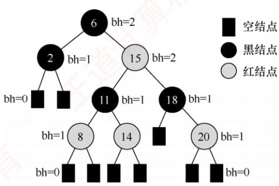

结论 2：有 n 个内部结点的红黑树的高度 $h { \leqslant }$ $2 \log _ { 2 } ( n + 1 )$

图 7.18 一棵红黑树

证明：根据结论1，从根到叶结点（不含叶结点）的任意一条简单路径上都至少有一半是黑结点，因此根的黑高至少为 $h / 2$ 。由此得出 $n \geqslant 2^{h/2} - 1$ ，从而得到结论。

由结论2也可推出，黑高为h的红黑树的内部结点数最少是 $2 ^ { h } { } ^ { - } 1$ ，最多是 $2 ^ { 2 h } { } ^ { } - 1$ 0

可见，红黑树采用“适度平衡”策略——相比AVL树的“高度平衡”（左右子树高度差≤1），允许左右子树高度相差最多达2倍，显著降低了插入/删除时结构调整的频率。因此，对于动态查找表：若查找操作远多于插入/删除，采用AVL树更优（查找更快）；若插入/删除频繁，则采用红黑树更合适（调整开销小）。由于红黑树在实际应用中综合性能更优，它被广泛采用，例如C++中的 map 和 set（Java 中的 TreeMap 和 $_ \mathrm { T r e e S e t } )$ 均基于红黑树实现。

## 2. 红黑树的插入

红黑树的插入过程与普通二叉查找树基本类似。不同之处在于，插入新结点后可能破坏红黑性质，因此需要通过重新着色或旋转操作进行调整，以恢复红黑树的基本性质。

## 结论3：新插入的结点初始应着为红色。

假设将其染为黑色，则该结点所在路径的黑结点数将比其他路径的多1，几乎必然违反性质⑤（所有路径的黑结点数相等），且调整代价较高。而若染为红色，则所有路径的黑结点数保持不变，仅当出现父子均为红色时才违反性质④，此时，局部调整即可高效恢复平衡。

设新插入的结点为z。插入与调整过程如下：

1）用二叉查找树规则插入z，并将其染为红色。若z的父结点为黑色，则红黑性质未被破坏，插入结束。

2）若z为根结点，则将其染为黑色（满足性质②），树的黑高加1，插入结束。

3）若z非根，且其父结点 $z . p$ 为红色，则违反性质④。由于原树合法，根据性质②和④，z的爷结点 $z . p . p$ 必然存在且为黑色。此时，需要根据叔结点 $y ( z . p$ 的兄弟）的颜色分三种情形处理（此处假设 $z . p$ 是 $z . p . p$ 的左孩子，右孩子情形对称，后面会说明）。

情形1（LR型，先左旋再右旋）：z的叔结点y是黑色的，且z是其父结点的右孩子。

即 z 是其爷结点的左孩子的右孩子。先对 $z . p$ 执行左旋，使z上升取代原父位置，转化为情形2。此操作不改变任何路径的黑结点数（因z与 $z . p$ 均为红色），故性质⑤不受影响。

情形2（LL型，右单旋）：z的叔结点y是黑色的， $ 且  \; z$ 是其父结点的左孩子。

即z是其爷结点的左孩子的左孩子。对 $z . p . p$ 执行右旋，并将原父结点染黑、原爷结点染红。此操作保持所有路径的黑结点数不变，同时消除连续红结点，恢复全部红黑性质，插入结束。

图7.19展示了情形1（LR型）和情形2（LL型）的调整过程。子树 $T _ { 1 }$ $T _ { 2 }$ $T _ { 3 }$ 和 $T _ { 4 }$ 均以黑色结点为根，且黑高相同，确保旋转前后性质⑤成立。 城

  
图 7.19 情况 1 和情况 2 的调整方式

对称情形：若 $z . p$ 是 $z . p . p$ 的右孩子，则对应RL型（先右旋后左旋）和RR型（左单旋），处理方式完全对称，此处不再赘述。可见，红黑树的调整方法与AVL树有异曲同工之妙。

情形 $\mathbf { 3 } ; z$ 的叔结点y是红色的。

无论z是左孩子还是右孩子，均无影响。将 $z . p$ 和y染为黑色，将 $z . p . p$ 染为红色，以在局部恢复性质④（无连续红结点）和性质⑤（所有路径的黑结点数相等）。但 $z . p . p$ 变红后，可能与其父结点再次形成红-红冲突。因此，将 $z . p . p$ 视为新的“待调整结点 $z ^ { \prime \prime }$ ，继续向上回溯检查。调整过程如图7.20所示。该过程可能多次重复，每次循环z都会上移两层，直至满足以下任何一个终止条件：z成为根结点（此时染黑，结束）；进入情形1或情形2（执行旋转后结束）。

  
图 7.20 情况 3的调整方式

补充说明：尽管新结点最初总是插入在某个叶结点位置，但在情形3的回溯过程中，指针z可能已上移至内部结点，从而拥有子树。因此，所有调整操作都必须考虑其子树的存在。

以图7.21(a)中的红黑树为例（虚线表示插入后的状态），依次插入5、4和12的过程如图7.21所示。插入5，属于情形3，将5的父结点3与叔结点10染黑，爷结点7染红；由于7是根结点，需将其重新染黑，树的黑高加1，结束。插入4，属于情形1的对称情形（RL型），先对以5为根的子树执行右旋，转为情形2的对称情形（RR型），交换3和4的颜色，再对以4为根的子树执行左旋，结束。插入12，其父结点为黑色，无须调整，直接结束。

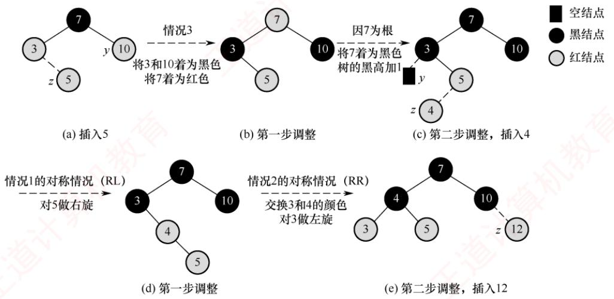  
图 7.21 红黑树的插入过程

## \*3. 红黑树的删除

## 注意

本节内容难度较大，考查概率较低，读者可根据自身情况决定是否学习或学习的时机。

红黑树的插入操作可能破坏性质④（无连续红结点）。而删除操作则更易破坏性质⑤（所有路径的黑结点数相等），特别是当被删结点为黑色时，会导致经过该结点的所有路径黑高减1。

删除过程首先执行二叉查找树的标准删除。若待删结点有两个非空子树，不能直接删除，需用其中序后继（或前驱）替代之，即右子树中的最小结点，并转为删除该后继结点。由于中序后继在其子树中是最小值，因此至多只有一个右孩子。由此，删除操作最终都可归结为以下两种情形：

● 待删结点有一个孩子（左或右孩子）。

● 待删结点是终端结点（无孩子）。

1）若待删结点有一个孩子，则只有两种情况，如图7.22所示。

  
图7.22 只有右子树或左子树的删除情况

且仅有这两种情况存在。则子树只有一个结点，且必然是红色，否则会破坏性质⑤。

2）待删结点无孩子，且该结点是红色的，此时可直接删除，而不需要做任何调整。

3）待删结点无孩子，且该结点是黑色的，此时设待删结点为γ，x是用来替换ν的结点（注意，当ν是终端结点时，x是黑色的NULL结点）。删除ν后将导致先前包含ν的任何路径上的黑结点数量减1，因此ν的任何祖先都不再满足性质⑤，简单的修正办法就是将替换y的结点x视为还有额外一重黑色，定义为双黑结点。也就是说，若将任何包含结点x的路径上的黑结点数量加1，则在此假设下，性质⑤得到满足，但破坏了性质①。于是，删除操作的任务就转化为将双黑结点恢复为普通结点。

分为以下四种情形，区别在于x的兄弟结点w及w的孩子结点的颜色不同。

情形1：x的兄弟结点w是红色的。

w必须有黑色左右孩子和父结点。交换w和父结点 x.p的颜色，然后对 x.p做一次左旋，而不会破坏红黑树的任何规则。现在，x的新兄弟结点是旋转之前w的某个孩子结点，其颜色为黑色，这样，就将情形1转换为情形2、3或4处理。调整方式如图7.23所示。

  
图 7.23 情形1 的调整方式

情形2（RR型，左单旋）：x的兄弟结点w是黑色的，且w的右孩子是红色的。

即这个红结点是其爷结点的右孩子的右孩子。交换w和父结点x.p的颜色，把w的右孩子着为黑色，并对x的父结点x.p做一次左旋，将x变为单重黑色，此时不再破坏红黑树的任何性质，结束。调整方式如图7.24所示。

  
图7.24 情形2的调整方式

情形3（RL型，先右旋再左旋）：x的兄弟结点w是黑色的，w的左孩子是红色的，w的右孩子是黑色的。

即这个红结点是其爷结点的右孩子的左孩子。交换w和其左孩子的颜色，然后对w做一次右旋，而不破坏红黑树的任何性质。现在，x的新兄弟结点w的右孩子是红色的，这样就将情形3转换为了情形2。调整方式如图7.25所示。

  
图7.25 情形3的调整方式

情形4：x的兄弟结点w是黑色的，且w的两个孩子结点都是黑色的。

因为w也是黑色的，所以可从x和w上去掉一重黑色，使得x只有一重黑色而w变为红色。为了补偿从 x和w中去掉的一重黑色，把 x的父结点 x.p额外着一层黑色，以保持局部的黑高不变。通过将xp作为新结点x来循环，x上升一层。若是通过情形1进入情形4的，因为原来的x.p是红色的，将新结点x变为黑色，终止循环，结束。调整方式如图7.26所示。

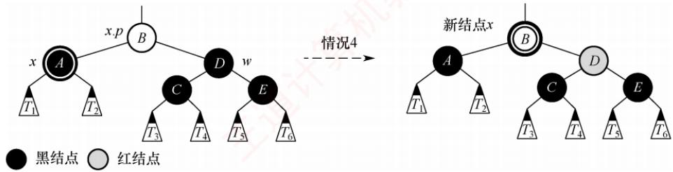  
图7.26 情形4的调整方式

若x是父结点x.p的右孩子，则还有四种对称的情形，处理方式类似，不再赘述。

归纳总结：在情形4中，因x的兄弟结点w及左右孩子都是黑色，可以从x和w中各提取一重黑色（以让x变为普通黑结点），不会破坏性质④，并把调整任务向上“推”给它们的父结点x.p。在情形1、2和3中，因为x的兄弟结点w或w左右孩子中有红结点，所以只能在x.p子树内用调整和重新着色的方式，且不能改变x原根结点的颜色（否则向上可能破坏性质④）。情形1虽可能会转为情形4，但因为新x的父结点xp是红色的，所以执行一次情形4就会结束。情形1、2和3在各执行常数次的颜色改变和至多3次旋转后便终止，情形4是可能重复执行的唯一情形，每执行一次指针x上升一层，至多O(log2n)次。

以图7.27(a)所示的红黑树为例（虚线表示删除前的状态），依次删除5和15的过程如图7.27所示。删除5，用虚构的黑色NULL结点（图中为N结点）替换，视为双黑NULL结点，属于情形1，交换兄弟结点12和父结点8的颜色，对8执行左旋；转变为情形4，从双黑NULL结点和10中各提取一重黑色（提取后，双黑NULL结点变为普通NULL结点，图中省略，10变为红色），因原父结点8是红色，所以将8变为黑色，结束。删除15，属于情形3的对称情形（LR型），交换8和10的颜色，对8执行左旋：转变为情形2的对称情形（LL型），交换10和12的颜色（两者颜色一样，无变化），将10的左孩子8着为黑色，对12执行右旋，结束。

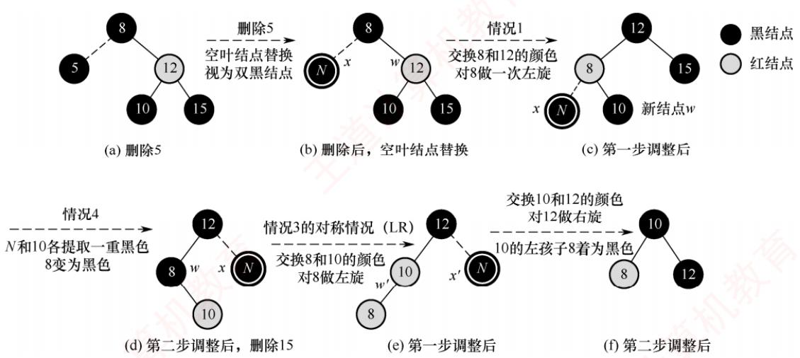  
图 7.27 红黑树的删除过程

## 7.3.4本节试题精选

## 一、单项选择题

01.对于二叉排序树，下面的说法中，（）是正确的。A.二叉排序树是动态树表，查找失败时插入新结点，会引起树的重新分裂和组合B. 对二叉排序树进行层序遍历可得到有序序列C. 用逐点插入法构造二叉排序树，若先后插入的关键字有序，二叉排序树的深度最大D. 在二叉排序树中进行查找，关键字的比较次数不超过结点数的1/2

02. 按（）遍历二叉排序树得到的序列是一个有序序列。A. 先序 B. 中序 C. 后序 D. 层次

03. 在二叉排序树中进行查找的效率与（）有关。A. 二叉排序树的深度 B. 二叉排序树的结点的个数C. 被查找结点的度 D. 二叉排序树的存储结构

04. 在常用的描述二叉排序树的存储结构中，关键字值最大的结点（）。A. 左指针一定为空 B. 右指针一定为空C. 左右指针均为空 D. 左右指针均不为空

05. 设二叉排序树中关键字由1到1000的整数构成，现要查找关键字为363的结点，下述关键字序列中，不可能是在二叉排序树上查找的序列是（）。  
H A. 2, 252, 401, 398, 330, 344, 397, 363 B. 924, 220, 911, 244, 898, 258, 362, 363C. 925, 202, 911, 240, 912, 245, 363 D. 2, 399, 387, 219, 266, 382, 381, 278, 363

06. 分别以下列序列构造二叉排序树，与用其他3个序列所构造的结果不同的是（）。A. (100, 80, 90, 60, 120, 110, 130) B. (100, 120, 110, 130, 80, 60, 90)C. (100, 60, 80, 90, 120, 110, 130) D. (100, 80, 60, 90, 120, 130, 110)

07. 从空树开始，依次插入元素52,26,14,32,71,60,93,58,24和41后构成了一棵二叉排序树。在该树查找60，要进行比较的次数为（）。A. 3 B. 4 XXC. 5 D. 6

08. 在含有n个结点的二叉排序树中查找某个关键字的结点时，最多进行（）次比较。

A. n/2 B. $\log _ { 2 }   n$ C. log2n + 1 D. n

09. 五个不同结点构造的二叉查找树的形态共有（）种。A. 20 B. 30 C. 32 D. 42

10. 构造一棵具有n个结点的二叉排序树时，最理想情况下的深度为（）。A. n/2 B. n C. $\left\lfloor \log _ { 2 } ( n + 1 ) \right\rfloor$ D. [log2(n + 1)]

11. 含有20个结点的平衡二叉树的最大深度为（）。A. 4 B. 5 C. 6 D. 7

12. 具有5层结点的平衡二叉树至少有（）个结点。A. 10 B. 12 C. 15 D. 17

13. 高度为3的平衡二叉排序树的形态共有（）种。A. 13 B. 14 C. 16 D. 15

14. 在平衡二叉树的基本操作中，可能发生两次旋转的操作是（）。A. 添加、删除结点 B. 仅删除结点C. 仅添加结点D. 都不会

15. 将关键字1,2,3,…，1024依次插入到初始为空的平衡二叉树中，假设只有一个根结点的二叉树的高度为0，则插入结束后的平衡二叉树的高度为（）。A. 8 B. 9 C. 10 D. 11

16. 下列关于红黑树和AVL树的说法中，不正确的是（）。I. 一棵含有n 个结点的红黑树的高度至多为 $2\log_{2}(n + 1)$ Ⅱ. 若一个结点是红色的，则它的父结点和孩子结点都是黑色的Ⅲ. 红黑树的查询效率一般要优于含有相同结点数的AVL树IV. 若AVL树的某结点的左右孩子的平衡因子都是零，则该结点的平衡因子也是零A. I、III B. ⅢII C. II、IV D. III、IV

17.下列关于红黑树和AVL树的描述中，不正确的是（）。A. 两者都属于自平衡的二叉树B. 两者查找、插入、删除的时间复杂度都相同C. 红黑树插入和删除过程至多有2次旋转操作D. 红黑树的任意一个结点的左右子树高度（含叶结点）之比不超过2

18.下列关于红黑树的说法中，正确的是（）。A. 红黑树的红结点的数目最多和黑结点的数目相同（不考虑虚构结点）B.若红黑树的所有结点都是黑色的，则它一定是一棵满二叉树C. 红黑树的任何一个分支结点都有两个非空孩子结点D. 红黑树的子树也一定是红黑树

19. 下列四个选项中，满足红黑树定义的是（）。A. B. C.


20. 将关键字1,2,3,4,5,6,7依次插入初始为空的红黑树 T，则 T 中红结点的个数是（）。A. 1 B. 2 C. 3 D. 4

21. 将关键字5,4,3,2,1依次插入初始为空的红黑树T，则 T的最终形态是（）。

A.


B.

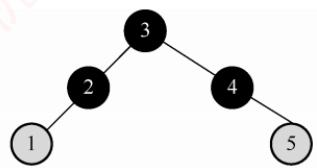

C.

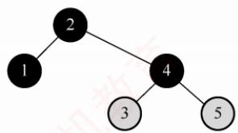

D.

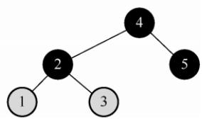

22. 在下图所示的红黑树中插入结点2且染成红色后，则下一步应进行的操作是（）。


A. 左旋

B. 右旋

C. 变色

D. 无须调整

23.【2009统考真题】下列二叉排序树中，满足平衡二叉树定义的是（）。


A.


B.


C.


D.

24.【2010统考真题】在下图所示的平衡二叉树中插入关键字48后得到一棵新平衡二叉树，在新平衡二叉树中，关键字37所在结点的左右子结点中保存的关键字分别是（）。

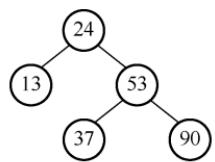

A. 13, 48 B. 24, 48 C. 24,53 D. 24, 90

25.【2011统考真题】对下列关键字序列，不可能构成某二叉排序树中一条查找路径的是（）。A. 95, 22, 91, 24, 94, 71 B. 92, 20, 91, 34, 88, 35C. 21, 89, 77, 29, 36, 38 D. 12, 25, 71, 68, 33, 34

26.【2012统考真题】若平衡二叉树的高度为6，且所有非叶结点的平衡因子均为1，则该平衡二叉树的结点总数为（）。A. 12 B. 20 C. 32 D. 33

27.【2013统考真题】在任意一棵非空二叉排序树 $T _ { 1 }$ 中，删除某结点ν之后形成二叉排序树 $T _ { 2 }$ ，再将ν插入 $T _ { 2 }$ 形成二叉排序树 $T _ { 3 }$ 。下列关于 $T _ { 1 }$ 与 $T _ { 3 }$ 的叙述中，正确的是（）。I. 若ν是 $T _ { 1 }$ 的叶结点，则 $T _ { 1 }$ 与 $T _ { 3 }$ 不同

II. 若ν是 $T _ { 1 }$ 的叶结点，则 $T _ { 1 }$ 与 $T _ { 3 }$ 相同  
III. 若ν不是 $T _ { 1 }$ 的叶结点，则 $T _ { 1 }$ 与 $T _ { 3 }$ 不同  
IV. 若ν不是 $T _ { 1 }$ 的叶结点，则 $T _ { 1 }$ 与 $T _ { 3 }$ 相同  
A. 仅I、II B. 仅I、IⅣ C. 仅Ⅱ、ⅢI D. 仅ⅡI、IV

28.【2013统考真题】若将关键字1,2,3,4,5,6,7依次插入初始为空的平衡二叉树T，则T中平衡因子为0的分支结点的个数是（）。A. 0 B. 1 C. 2 D. 3

29.【2015统考真题】现有一棵无重复关键字的平衡二叉树（AVL），对其进行中序遍历可得到一个降序序列。下列关于该平衡二叉树的叙述中，正确的是（）。A. 根结点的度一定为 2 B. 树中最小元素一定是叶结点C. 最后插入的元素一定是叶结点 D. 树中最大元素一定是无左子树

30.【2018统考真题】已知二叉排序树如右图所示，元素之间应满足的大小关系是（）。A. $x_{1} < x_{2} < x_{5}$ B. $x_{1} < x_{4} < x_{5}$ 王道C. $x_{3} < x_{5} < x_{4}$ D. $x_{4} < x_{3} < x_{5}$

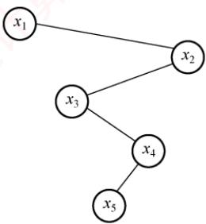

31.【2019统考真题】在任意一棵非空平衡二叉树（AVL树） $T _ { 1 }$ 中，删除某结点ν之后形成平衡二叉树 $T _ { 2 1 }$ ，再将ν插入 $T _ { 2 }$ 形成平衡二叉树 $T _ { 3 \circ }$ 下列关于 $T _ { 1 }$ 与 $T _ { 3 }$ 的叙述中，正确的是（）。I. 若ν是 $T _ { 1 }$ 的叶结点，则 $T _ { 1 }$ 与 $T _ { 3 }$ 可能不相同II. 若ν不是 $T _ { 1 }$ 的叶结点，则 $T _ { 1 }$ 与 $T _ { 3 } -$ 定不相同IⅢI. 若ν不是 $T _ { 1 }$ 的叶结点，则 $T _ { 1 }$ 与 $T_{3}  一$ 定相同A. 仅I 道计 B. 仅ⅡC. 仅I、ⅡI D. 仅I、ⅢI

32.【2020统考真题】下列给定的关键字输入序列中，不能生成右边二叉排序树的是（）。A. 4, 5, 2, 1, 3 B. 4,5,1,2, 3D. 4,2, 1, 3,5


33.【2021统考真题】给定平衡二叉树如右图所示，插入关键字23后，根中的关键字是（）。A. 16 B. 20C. 23 D. 25

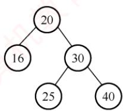

34.【2024统考真题】一棵二叉搜索树如右图所示， $k_{1} 、 k_{2} 、 k_{3}$ 分别是对应结点中保存的关键字。子树T的任一结点中保存的关键字x满足的是（）。A. $x   \le   k _ { 1 }$ B. $x \geq k _ { 2 }$ C. $k_{1} < x < k_{3}$ D. $k_{3} < x < k_{2}$

## 二、综合应用题


01.一棵二叉排序树按先序遍历得到的序列为(50,38,30,45,40,48,70,60,75,80)，试画出该二叉排序树，并求出等概率下查找成功和查找失败的平均查找长度。

02. 按照序列(40,72,38,35,67,51,90,8,55,21)建立一棵二叉排序树，画出该树，并求出在等概率的情况下，查找成功的平均查找长度。

03. 依次把结点(34,23,15,98,115,28,107)插入初始状态为空的平衡二叉排序树，使得在每次插入后保持该树仍然是平衡二叉树。请依次画出每次插入后所形成的平衡二叉排序树。

04. 给定一个关键字集合{25,18,34,9,14,27,42,51,38}，假定查找各关键字的概率相同，请画出其最佳二叉排序树。

05. 试编写一个算法，判断给定的二叉树是否是二叉排序树。

06. 设计一个算法，求出指定结点在给定二叉排序树中的层次。

07. 利用二叉树遍历的思想编写一个判断二叉树是否是平衡二叉树的算法。

08. 设计一个算法，求出给定二叉排序树中最小和最大的关键字。

09. 设计一个算法，从大到小输出二叉排序树中所有值不小于k的关键字。

10. 编写一个递归算法，在一棵有n个结点的、随机建立的二叉排序树上查找第k（1≤k≤n）小的元素，并返回指向该结点的指针。要求算法的平均时间复杂度为O(log2n)。二叉排序树的每个结点中除data、lchild、rchild等数据成员外，增加一个count成员，保存以该结点为根的子树上的结点个数。

## 7.3.5 答案与解析

## 一、单项选择题

## 01. C

二叉排序树插入新结点时不会引起树的分裂组合。对二叉排序树进行中序遍历可得到有序序列。当插入的关键字有序时，二叉排序树会形成一个长链，此时深度最大。在此种情况下进行查找，有可能需要比较每个结点的关键字，超过总结点数的1/2。

## 02. B

由二叉排序树的定义不难得出中序遍历二叉树得到的序列是一个有序序列。

## 03. A

二叉排序树的查找路径是自顶向下的，其平均查找长度主要取决于树的高度。

## 04. B

在二叉排序树的存储结构中，每个结点由三部分构成，其中左（或右）指针指向比该结点的关键字值小（或大）的结点。关键字值最大的结点位于二叉排序树的最右位置，因此它的右指针一定为空（有可能不是叶结点）。还可用反证法，若右指针不为空，则右指针上的关键字肯定比原关键字大，所以原关键字结点一定不是值最大的，与条件矛盾，所以右指针一定为空。

## 05. C

在二叉排序树上查找时，先与根结点值进行比较，若相同，则查找结束，否则根据比较结果，沿着左子树或右子树向下继续查找。根据二叉排序树的定义，有左子树结点值≤根结点值≤右子树结点值。C序列中，比较911关键字后，应转向其左子树比较240，左子树中不应出现比911更大的数值，但240竟有一个右孩子结点值为912，所以不可能是正确的序列。

## 06. C

按照二叉排序树的构造方法，不难得到A,B,D序列的构造结果相同。

## 07. A

以第一个元素为根结点，依次将元素插入树，生成的二叉排序树如右图所示。进行查找时，先与根结点比较，然后根据比较结果，继续在左子树或右子树上进行查找。比较的结点依次为52,71,60。


## 08. D

当输入序列是一个有序序列时，构造的二叉排序树是一个单支树，当查找一个不存在的关键字值或最后一个结点的关键字值时，需要n次比较。

## 09. D

五个不同结点构造的二叉查找树，中序序列是确定的。先序序列的个数为n=5的卡特兰数，加上中序序列和先序序列能唯一确定一棵二叉树，因此二叉排序树的形态共有Catalan(5)=42种。

## 10. D

当二叉排序树的叶结点全部都在相邻的两层内时，深度最小。理想情况是从第一层到倒数第二层为满二叉树。类比完全二叉树，可得深度为 $\left[ \log _ { 2 } ( n + 1 ) \right]$ o

## 11. C

平衡二叉树结点数的递推公式为 $n _ { 0 }   =   0$ $n _ { 1 } = 1$ $n _ { 2 } = 2$ $n _ { h } = 1 + n _ { h - 1 } + n _ { h - 2 }$ (h为平衡二叉树高度， $n _ { h }$ 为构造此高度的平衡二叉树所需的最少结点数）。通过递推公式可得，构造5层平衡二叉树至少需12个结点，构造6层至少需要20个结点。

## 12. B

设 $n _ { h }$ 表示高度为h的平衡二叉树中含有的最少结点数，则有 $n_{1} = 1, n_{2} =$ $n_{h}=n_{h-1}+n_{h-2}+1$ ，由此求出 $n _ { 5 }   =   1 2$ ，对应的AVL如右图所示。

## 13. D


高度为3的平衡二叉树的左右子树的高度共有三种情况：①左右子树都是高度为2的平衡二叉树；②左子树是高度为1的平衡二叉树，右

子树是高度为2的平衡二叉树；③左子树是高度为2的平衡二叉树，右子树是高度为1的平衡二叉树。高度为1的平衡二叉树只有1种形态，即单个结点，如图1所示；高度为2的平衡二叉树有3种形态，如图2所示。

  
图1

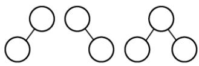  
图2

因此，对于情况①，共有3×3=9种树形态；对于情况②，共有1×3=3种树形态；情况③和情况②类似，也有3种树形态，所以共有 $9 + 3 + 3 = 15$ 种树形态。 机

## 14. A

插入和删除结点都有可能引起LR平衡旋转或者RL平衡旋转，发生两次旋转操作。

## 15. C

当按关键字有序的顺序插入初始为空的平衡二叉树时，若关键字个数 $n   =   2 ^ { k }   -   1$ 时，则该平衡二叉树一定是一棵满二叉树（可以用1～3、1～7手工验证）。当插入关键字1023时，平衡二叉树正好是一棵满二叉树，高度为9。因此，插入关键字1024后，平衡二叉树的高度为10。

## 16. D

说法Ⅰ和Ⅱ都是红黑树的性质。AVL是高度平衡的二叉查找树，红黑树是适度平衡的二叉查找树，从这一点也可以看出AVL的查询效率往往更优，说法Ⅲ错误。AVL的某结点的左右孩子的平衡因子都是零，并不能说明左右子树的高度相等，因此该结点的平衡因子不一定为零，说法IV错误。

## 17. C

自平衡的二叉排序树是指在插入和删除时能自动调整以保持其所定义的平衡性，两者都属于自平衡二叉树，选项A正确。两者的查找、插入、删除操作的时间复杂度都为O(logn)，选项B正确。在红黑树中删除结点时，情况1可能变为情况2、3或4，情况2会变为情况3，可能会出现旋转次数超过2次的情况，选项C错误。从任一结点到每个叶结点的所有路径都包含相同数目的黑结点，没有两个连续的红结点，且叶结点是黑色的，这意味着在任一结点到其左右子树中最远和最近的叶结点之间，红结点的数目小于或等于黑结点的数目，路径长度之比不超过2，选项D正确。


## 18. B

红黑树的红结点数目最大可以是黑结点数目的2倍（如一棵有3个结点的红黑树，第1层为黑色，第2层为红色），选项A错误。从根结点出发到所有叶结点的黑结点数是相同的，若所有结点都是黑色，则一定是满二叉树，选项B正确。考虑某个黑结点，它可以有一个空叶结点孩子和一个非空红结点孩子，选项C错误。红黑树中可能存在红结点，根结点为红色的子树不是红黑树，选项D错误。 KO

## 19. A

红黑树是一种特殊的二叉排序树，选项B不满足二叉排序树的性质。选项C中，结点2的左右黑结点数不同。在选项D中，结点3的左右黑结点数不同。只有选项A满足红黑树的定义。

## 20. C

关键字1,2,3,4,5,6,7依次插入红黑树后的形态变化如下：


## 21. D

关键字5,4,3,2,1依次插入红黑树后的形态变化如下：


## 22. B

插入结点2且将其染成红色后违反不红红原则，并且叔结点是黑色，应进行LL旋转，将结

点3右旋旋转到结点5的位置，结点2和结点5分别成为结点3的左右孩子，然后将结点3染成黑色，结点2和结点5染成红色。因此，下一步应进行右旋操作。

## 23. B

根据平衡二叉树的定义，任意结点的左右子树高度差的绝对值不超过1。而其余3个答案均可以找到不满足条件的结点。答题时可以把每个非叶结点的平衡因子都写出来。

## 24. C

插入48以后，该二叉树根结点的平衡因子由-1变为-2，在最小不平衡子树根结点的右子树（R）的左子树（L）中插入新结点引起的不平衡属于RL型平衡旋转（先右旋后左旋）。

  
调整后，关键字37所在结点的左右子结点中保存的关键字分别是24、53。

## 25. A

在二叉排序树中，左子树结点值小于根结点，右子树结点值大于根结点。在选项A中，当查找到91后再向24查找，说明这一条路径（左子树）之后查找的数都要比91小，而后面却查找到了94（解题过程中，建议配合画图），因此错误。

画图法：各选项对应的查找过如下图所示。选项B、C、D对应的查找树都是二叉排序树，选项A对应的查找树不是二叉排序树，因为在91为根的左子树中出现了比91大点的结点94。

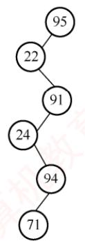  
(a) 选项A的查找过程

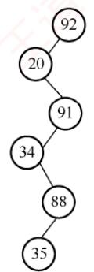  
(b)选项B的查找过程

  
(c) 选项C的查找过程

  
(d) 选项D的查找过程

## 26. B

所有非叶结点的平衡因子均为1，即平衡二叉树满足平衡的最少结点情况，如下图所示。对于高度为n、左右子树的高度分别为n-1和n-2、所有非叶结点的平衡因子均为1的平衡二叉树，计算总结点数的公式为 $C_{n}=C_{n - 1}+C_{n - 2}+1,C_{1}=1,C_{2}=2,C_{3}=2+1+1=4$ ，可推出 $C _ { 6 }   =   2 0$

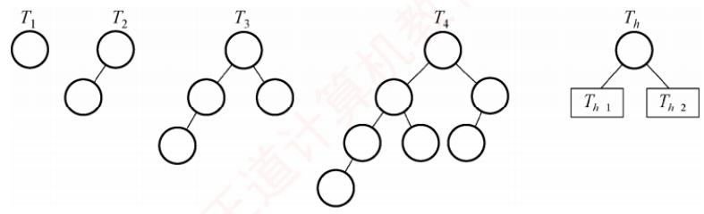

画图法：先画出 $T _ { 1 }$ 和 $T _ { 2 }$ ；然后新建一个根结点，连接 $T _ { 2 }$ 、 $T _ { 1 }$ 构成 $T _ { 3 }$ ；新建一个根结点，连接 $T _ { 3 }  、  T _ { 2 }$ 构成 $T _ { 4 } { \cdots } { \cdots }$ 直到画出 $T _ { 6 }$ ，可知 $T _ { 6 }$ 的结点数为20。

排除法：对于选项A，高度为6、结点数为12的树怎么也无法达到平衡。对于选项C，结点较多时，考虑较极端的情形，即第6层只有最左叶子的完全二叉树刚好有32个结点，虽然满足平衡的条件，但显然再删去部分结点依然不影响平衡，不是最少结点的情况。同理，选项D错误。

## 27. C

由于在二叉排序树中插入结点的位置是一个新的叶结点，若删除的是叶结点，则重新插入后得到的二叉排序树与原来的二叉排序树相同。若删除的是非叶结点，在删除过程中会找其他结点填补，重新插入后变成叶结点，则得到的二叉排序树与原来的二叉排序树不同。

## 28. D

利用7个关键字构建平衡二叉树T，平衡因子为0的分支结点个数为3，构建的平衡二叉树及构造与调整过程如下图所示。 X


## 29. D

大多数教材将平衡二叉树定义为一种高度平衡的二叉排序树，二叉排序树的中序序列是一个升序序列，而题意正好相反。由此可知，命题老师认为平衡二叉树仅为一棵满足高度平衡的二叉树，不一定是二叉排序树。只有两个结点的平衡二叉树的根结点的度为1，选项A错误。中序遍历后得到一个降序序列（与二叉排序树正好相反），树中最大元素一定无左子树（可能有右子树），这与二叉排序树也正好相反，也因此不一定是叶结点，选项B错误，选项D正确。最后插入的结点可能会导致平衡调整，而不一定是叶结点，选项C错误。

## 30. C

根据二叉排序树的特性：中序遍历（LNR）得到的是一个递增序列。图中二叉排序树的中序遍历序列为 $x _ { 1 } , x _ { 3 } , x _ { 5 } , x _ { 4 } , x _ { 2 }$ ，可知 $x_{3} < x_{5} < x_{4}$

## 31. A

在非空平衡二叉树中插入结点，在失去平衡调整前，一定插入在叶结点的位置。

若删除的是 $T _ { 1 }$ 的叶结点，则删除后平衡二叉树可能不会失去平衡，即不会发生调整，再插入此结点得到的二叉平衡树 $T _ { 1 }$ 与 $T _ { 3 }$ 相同；若删除后平衡二叉树失去平衡而发生调整，再插入结点得到的二叉平衡树 $T _ { 3 }$ 与 $T _ { 1 }$ 可能不同。说法Ⅰ正确。例如，如下图所示，删除结点0，平衡二叉树失衡调整，再插入结点0后，平衡二叉树和以前不同。

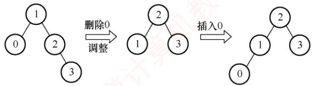

对于比较绝对的说法Ⅱ和Ⅲ，通常只需举出反例即可。

若删除的是 $T _ { 1 }$ 的非叶结点，且删除和插入操作均没有导致平衡二叉树的调整（这时可以首先想到删除的结点只有一个孩子的情况），则该结点从非叶结点变成了叶结点， $T _ { 1 }$ 与 $T _ { 3 }$ 显然不同。例如，如下图所示，删除结点2，用右孩子结点3填补，再插入结点2，平衡二叉树和以前不同。


若删除的是 $T _ { 1 }$ 的非叶结点，且删除和插入操作后导致了平衡二叉树的调整，则该结点有可能通过旋转后继续变成非叶结点， $T _ { 1 }$ 与 $T _ { 3 }$ 相同。例如，如下图所示，删除结点2，用右孩子结点3填补，再插入结点2，平衡二叉树失衡调整，调整后的平衡二叉树和以前相同。


## 32. B

每个选项都逐一验证，选项B生成二叉排序树的过程如下图所示，显然错误。

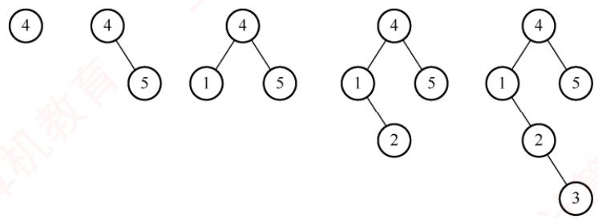

## 33.D

关键字23的插入位置为25的左孩子，此时破坏了平衡的性质，需要对平衡二叉树进行调整。最小不平衡子树就是该树本身，插入位置在根结点的右子树的左子树上，因此需要进行RL旋转RL旋转过程如下图所示，旋转完成后根结点的关键字为25，所以选择选项D。


## 34. D

在二叉搜索树中，每个结点的左子树中的所有关键字都小于该结点的关键字，右子树中的所有关键字都大于该结点的关键字。 $k _ { 2 }$ 、 $k _ { 3 }$ 所在结点都在 $k _ { 1 }$ 所在结点的右子树中，因此 $k _ { 2 } > k _ { 1 } , k _ { 3 } >$ $k _ { 1 } ; k _ { 3 }$ 所在结点在 $k _ { 2 }$ 所在结点的左子树中，因此 $k _ { 3 } < k _ { 2 }$ ；子树T是 $k _ { 3 }$ 所在结点的右子树，因此子树T中任意结点的关键字x满足 $x \geq k _ { 3 }$ 。综合可得， $k _ { 3 } < x < k _ { 2 }$ 0

## 二、综合应用题

01. 【解答】


先序序列为(50, 38, 30,45,40, 48, 70, 60, 75,80),二叉树的中序序列是一个有序序列，所以为(30,38,40，45,48,50,60,70,75,80)，由先序序列和中序序列可以构造出对应的二叉树，如左图所示。

查找成功的平均查找长度为

$$
\mathrm{ASL}=(1 \times 1+2 \times 2+3 \times 4+4 \times 3)/10=2.9
$$

图中的方块结点为虚构的查找失败结点，其查找路径为从根结点到其父结点（圆形结点）的结点序列，所以对应的查找失败平均长度为

$$
\mathrm{ASL}=(3 \times 5+4 \times 6)/11=39/11
$$

## 02. 【解答】

根据二叉排序树的定义，该序列所对应的二叉排序树如下图所示。


平均查找长度为 $\mathrm{ASL}=(1+2 \times 2+3 \times 3+4 \times 2+5 \times 2)/10=3.2$

## 03.【解答】


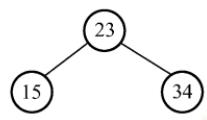

第一步：插入结点34,23,15后，需要根结点34的子树做LL调整。


第二步：插入结点98,115后，需要根结点34的子树做RR调整。


第三步：插入结点28后，需要根结点23的子树做RL调整。

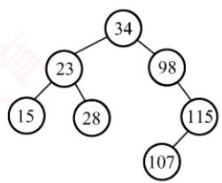


第四步：插入结点107后，需要根结点98的子树做RL调整。

## 04.【解答】

当各关键字的查找概率相等时，最佳二叉排序树应是高度最小的二叉排序树。构造过程分两步走：首先对各关键字按值从小到大排序，然后仿照折半查找的判定树的构造方法构造二叉排序树。这样得到的就是最佳二叉排序树，结果如右图所示。

## 05. 【解答】

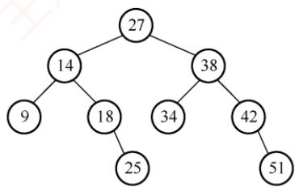

对二叉排序树来说，其中序遍历序列为一个递增有序序列。

因此，对给定的二叉树进行中序遍历，若始终能保持前一个值比后一个值小，则说明该二叉树是一棵二叉排序树。算法实现如下：

```c
KeyType predt=-32767;
int JudgeBST(BiTree bt){
int b1,b2;
if(bt==NULL)
return 1;
else{
b1=JudgeBST(bt->lchild) ;
if(b1==0llpredt>=bt->data)
return 0;
predt=bt->data;
b2=JudgeBST(bt->rchild);
return b2;
```

//predt为全局变量，保存当前结点中序前驱  
的值，初值为-∞  
//空树  
育  
//判断左子树是否是二叉排序树  
//若左子树返回值为0或前驱大于或等于当前结点  
//则不是二叉排序树  
//保存当前结点的关键字 //判断右子树 首计算  
//返回右子树的结果

## 06.【解答】

算法思想：设二叉树采用二叉链表存储结构。在二叉排序树中，查找一次就下降一层。因此，查找该结点所用的次数就是该结点在二叉排序树中的层次。采用二叉排序树非递归查找算法，用n保存查找层次，每查找一次，n就加1，直到找到相应的结点。算法如下：

```c
int level(BiTree bt,BSTNode *p){
int n=0; //统计查找次数
BiTree t=bt;
if(bt!=NULL) {
n++;
while(t->data!=p->data) {
```

if(p->data<t->data) //在左子树中查找   
t=t->lchild;   
else //在右子树中查找   
t=t->rchild;   
n++; //层次加1   
1   
} 王道   
return n;

## 07.【解答】

设置二叉树的平衡标记balance，以标记返回二叉树bt是否为平衡二叉树，若为平衡二叉树，则返回1，否则返回0；h为二叉树bt的高度。采用后序遍历的递归算法：

1）若bt为空，则高度为0，balance=1。

2）若bt仅有根结点，则高度为1，balance=1。

3）否则，对bt的左右子树执行递归运算，返回左右子树的高度和平衡标记，bt的高度为最高子树的高度加1。若左右子树的高度差大于1，则balance=0；若左右子树的高度差小于或等于1，且左右子树都平衡时，balance=1，否则balance=0。

```c
void Judge AVL(BiTree bt,int &balance,int &h){
int bl=0,br=0,hl=0,hr=0; //左右子树的平衡标记和高度
if (bt==NULL) { //空树，高度为0
h=0;
balance=1;
}
else if(bt->lchild==NULL&&bt->rchild==NULL){//仅有根结点，则高度为1
h=1;
balance=1;
}
else{
Judge_AVL(bt->lchild,bl,hl); //递归判断左子树
Judge AVL(bt->rchild,br,hr); //递归判断右子树
h=(hl>hr?hl:hr)+1;
if (abs (hl-hr) <2) //若子树高度差的绝对值<2，则看左右子树是否都平衡
balance=bl&&br；//&&为逻辑与，即左右子树都平衡时，二叉树平衡
else
1 balance=0; 算机考
```

## 08.【解答】

在一棵二叉排序树中，最左下结点即关键字最小的结点，最右下结点即关键字最大的结点，本算法只要找出这两个结点即可，而不需要比较关键字。算法如下：

```c
KeyType MinKey(BSTNode *bt) {
while(bt->lchild!=NULL)
bt=bt->lchild;
return bt->data;
1
KeyType MaxKey(BSTNode *bt) {
//求出二叉排序树中最大关键字结点
while (bt->rchild!=NULL)
bt=bt->rchild;
return bt->data;
1
```

1）t->lchild->count==k-1，\*t即第k小的元素，查找成功。  
2） t->lchild->count>k-1，第k 小的元素必在\*t 的左子树，继续到\*t 的左子树中查找。  
3)t->1child->count<k-1，第k小的元素必在右子树，继续搜索右子树，寻找第k-(t->  
1child->count+1）小的元素。

## 09.【解答】

由二叉排序树的性质可知，右子树中所有的结点值均大于根结点值，左子树中所有的结点值均小于根结点值。为了从大到小输出，先遍历右子树，再访问根结点，后遍历左子树。算法如下：

```c
void OutPut(BSTNode *bt,KeyType k)
{//本算法从大到小输出二叉排序树中所有值不小于k的关键字
if(bt==NULL)
return;
if(bt->rchild!=NULL)
OutPut(bt->rchild,k) ; //递归输出右子树结点
if(bt->data>=k)
printf("%d",bt->data); //只输出大于或等于k的结点值
if(bt->lchild!=NULL)
OutPut (bt->lchild,k) ; //递归输出左子树的结点
```

本题也可采用中序遍历加辅助栈的方法实现。

## 10.【解答】

设二叉排序树的根结点为\*t，根据结点存储的信息，有以下几种情况：

当t->lchild 为空时，情况如下：

1）若t->rchild非空且k==1，则\*t即第k小的元素，查找成功。

2）若t->rchild非空且k!=1，则第k小的元素必在\*t的右子树。

当t->lchild 非空时，情况如下：

对左右子树的搜索采用相同的规则，递归实现的算法描述如下：

```c
BSTNode *Search Small(BSTNode*t,int k) {
//在以 t 为根的子树上寻找第k小的元素，返回其所在结点的指针。k从11 开始计算
//在树结点中增加一个count 数据成员，存储以该结点为根的子树的结点个数
if(k<1||k>t->count) return NULL;
if(t->lchild==NULL){
if(k==1) return t;
else return Search Small(t->rchild,k-1);
1 算机教
else{
if(t->lchild->count==k-1) return t;
if(t->lchild->count>k-1) return Search Small(t->lchild,k);
if(t->lchild->count<k-1)
return Search Small(t->rchild, k-(t->lchild->count+1));
```

最大查找长度取决于树的高度。由于二叉排序树是随机生成的，其高度应是O(log2n)，算法的时间复杂度为 O(log2n)。

## 7.4 B 树①和 B+树

考研大纲对B树和B+树的要求各不相同：重点考查B树，不仅要求理解其基本特点，还要

求掌握其建立、插入和删除操作；而对B+树，仅考查基本概念。

## 7.4.1 B 树及其基本操作

m阶B树是一种自平衡的m路查找树，其所有叶结点都位于同一层次。

考点追踪B树的定义和特点（2009、2025）

具体而言，一棵m阶B树或为空树，或为满足以下特性的m叉树。

1）每个结点至多有m棵子树，即至多包含 $m - 1$ 个关键字。

2）若根结点不是叶结点，则至少有2棵子树，即至少包含1个关键字。

3）除根结点外，所有非叶结点至少有 $\lceil m / 2 \rceil$ 棵子树，即至少包含 $\lceil m / 2 \rceil - 1$ 个关键字。

4）每个非叶结点的结构如下

<table><tr><td rowspan=1 colspan=1>n</td><td rowspan=1 colspan=1> $P _ { 0 }$ </td><td rowspan=1 colspan=1> $K _ { 1 }$ </td><td rowspan=1 colspan=1> $P _ { 1 }$ </td><td rowspan=1 colspan=1> $K _ { 2 }$ </td><td rowspan=1 colspan=1> $P _ { 2 }$ </td><td rowspan=1 colspan=1></td><td rowspan=1 colspan=1> $K _ { n }$ </td><td rowspan=1 colspan=1> $P _ { n }$ </td></tr></table>

其中， $K_{i} \left( i = 1, 2, \cdots, n \right)$ 为关键字，且满足 $K_{1} < K_{2} < \cdots < K_{n}; \quad P_{i} \quad (i = 0, 1, \cdots, n)$ 为指向子树根结点的指针；指针 $P _ { i - 1 }$ 所指子树中所有关键字均小于 $K _ { i } ,$ 指针 $P _ { i }$ 所指子树中所有关键字均大于 $K _ { i }$ （更准确地说，介于 $K _ { i }$ 和 $K _ { i + 1 }$ 之间）；n为该结点中关键字的个数。

5）所有叶结点①都出现在同一层次上，且不实际存储数据（对应指针为空，可视为查找失败的外部结点，作用类似于折半查找判定树中的失败结点）。

考点追踪B树中关键字数和结点数的分析（2013、2014、2018、2021）

图7.28所示为一棵5阶B树，可借助该实例分析B树的性质。

  
图 7.28 一棵 5 阶 B 树的实例

1）任意结点的子树个数等于其关键字个数加1。

2）若B树为空，则无结点；若非空，则根结点至少包含1个关键字，因此至少有2棵子树。

3）除根结点外，所有非叶结点至少有 $\left [ m/2 \right ] = \left [ 5/2 \right ] = 3$ 棵子树（至少包含 $[m/2]-1=2$ 个关键字）；至多有5棵子树（至多包含 $m   -   1   =   4$ 个关键字）。

4）结点中的关键字从左到右严格递增。每个关键字两侧的指针指向其对应的子树：左侧指针所指子树中的所有关键字均小于该关键字，右侧指针所指子树中的所有关键字均大于该关键字。也可理解为，下层子树中的所有关键字均落在由上层结点关键字划分出的对应区间内。例如，第二层最左结点的关键字为5和11，可将关键字空间划分为三个区间$( - \infty , 5 ) , ( 5 , 1 1 ) , ( 1 1 , + \infty )$ ，其三个子树中的关键字分别落在这三个区间内。

5）所有叶结点（外部结点）均位于第4层，代表查找失败的位置。

## 1. B树的查找

在B树上进行查找与二叉排序树相似，只是每个结点都是多关键字的有序表。在每个结点上

所做的不是二路分支决定，而是基于该结点的多个子树进行多路分支决策。

B树的查找包含两个基本操作：①在B树中定位目标结点；②在结点内查找关键字。B树常存储在磁盘上，因此前一操作是在磁盘上进行的，而后一操作是在内存中进行的，即在磁盘上找到目标结点后，先将结点读入内存，再采用顺序查找法或折半查找法。因此，在磁盘上的查找次数（目标结点在B树中的层次数）是决定查找效率的关键因素。

在B树上查找到某结点后，先在该结点的有序表中查找。若找到，则查找成功；否则，根据对应的指针信息继续在所指子树中查找。例如，在图7.28中查找关键字42，先从根结点开始，根结点只有一个关键字22，且 $4 2 \geq 2 2$ ，因此42必定位于22的右边子树。右孩子结点包含两个关键字36和45，由于 $36 < 42 < 45$ ，因此42必定位于36与45之间的子树。最终在该子结点中找到42，查找成功。若查找到叶结点，则说明树中不存在该关键字，查找失败。

## 2. B树的高度（磁盘存取次数）

由上一节可知，B树中大多数操作所需的磁盘存取次数与树的高度成正比。

下面分析B树在不同情况下的高度范围。需要特别说明的是：B树的高度不包括最底层外部叶结点所处的那一层（部分教材将该层计入高度，定义略有不同）。

设 $n { \geqslant } 1$ ，对于任意一棵包含n个关键字、高度为h、阶数为m的B树：

1）最小高度情形：当每个结点的关键字数达到最大值时，B树的高度最小。因每个结点最多有m棵子树（最多含m-1个关键字），故高度为h的B树最多可容纳的关键字数为n$\leqslant (m - 1)(1 + m + m^{2} + \cdots + m^{h - 1}) = m^{h} - 1$ ，因此有 $h \geqslant \log_{m}(n + 1)$ 0

2）最大高度情形：当每个结点的关键字数达到最小值时，B树的高度最大。第1层（根）至少有1个结点；第2层至少有2个结点；除根结点外，每个非叶结点至少有 $\lceil m / 2 \rceil$ 棵子树，因此第3层至少有 $2 \lceil m / 2 \rceil$ 个结点……，第h+1层至少有 $2 ( \lceil m / 2 \rceil ) ^ { h - 1 }$ 个结点。注意到第h+1层为不存储数据的外部叶结点。对于包含n个关键字的B树，其外部叶结点数量恒为n+1，由此有 $n + 1 \geqslant 2( \left \lceil m/2 \right \rceil )^{h - 1}$ ，即 $h \leqslant \log_{\left \lceil m/2 \right \rceil}\left ( \left ( n+1 \right )/2 \right )+1$ 0

例如，假设一棵3阶B树共有8个关键字，则其高度范围为 $2 \leqslant h \leqslant 3.17$ 。由于高度h必为整数，故实际高度范围为 $2 \leq h \leq 3$ 0

## 3. B 树的插入

## 考点追踪通过插入操作构造一棵初始为空的B树（2020）

与二叉排序树的插入操作相比，B树的插入要复杂得多。在B树中找到插入位置后，不能简单地将关键字添加到终端结点中，因为这可能导致结点违反B树的定义约束。

将关键字key插入 B 树的过程如下：

1）定位。利用B树查找算法，沿着路径向下查找，最终指向一个外部叶结点（表示查找失败），但实际的插入位置一定是该叶结点的父结点，即最底层终端结点。

2）插入与分裂。每个非根结点的关键字个数必须维持在区间 $[ [ m / 2 ] - 1 , m - 1 ]$ 内。若该结点在插入 key 后关键字总数不超过 $m   -   1$ ，则可直接插入；若插入后关键字总数超过 $m   -   1$ （达到m个），则必须对该结点进行分裂。

分裂方法：创建一个新结点，并将插入key后的原结点中的关键字从中间位置（第 $\left[ m / 2 \right]$ 个关键字）处分成左右两部分：左半部分的关键字保留在原结点中：右半部分的关键字移至新结点中：中间的关键字（注意，是关键字而非结点）被提升并插入原结点的父结点。若父结点因接收该关键字而超出上限（关键字数大于 $m   -   1 )$ ，则对父结点递归执行分裂操作。这一过程可能向上传播，直至根结点。若根结点也被分裂，则B树高度增1。

对于 $m = 3$ 的B树，每个结点最多包含 $m - 1 = 2$ 个关键字。当某个结点已有两个关键字时[见图7.29(a)]，则已满。此时，插入60后，结点包含3个关键字[见图7.29(b)]，超过上限。分裂后，中间关键字52被提升至父结点，原结点与新结点各保留1个关键字见图7.29(c)]。

  
图7.29 结点的“分裂”示意

## 4. B树的删除

B树的删除比插入操作更复杂，因为删除后需保证每个结点的关键字数不少于下限 $( \lceil m/2 \rceil - 1 )$ 否则需通过“借位”或“合并”来恢复平衡。

考点追踪B树的删除操作的实例（2012、2022）

当被删关键字k不在终端结点中时，可以用k的前驱（或后继）k替代，即k左侧子树中“最右下”的元素（或右侧子树中“最左下”的元素），然后在相应的结点中删除k。关键字k必定落在某个终端结点中，从而转化为删除终端结点中关键字的情形。例如，在图7.30的4阶B树中，删除关键字80，用其前驱78替代，然后在终端结点中删除78。

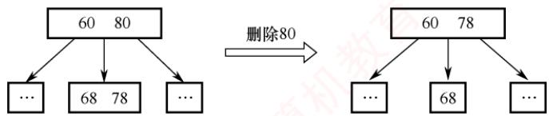  
图7.30 B树中删除非终端结点关键字的取代

因此只需讨论被删关键字在终端结点中的情形，有下列三种情况：

1）直接删除关键字。若被删关键字所在结点删除前的关键字个数≥ $\lceil m / 2 \rceil$ ，则删除该关键字后仍满足B树定义，可以直接删除该关键字。

2）兄弟够借。若被删关键字所在结点删除前的关键字个数 $\left \lceil m/2 \right \rceil -1$ ，且与该结点相邻的右（或左）兄弟结点的关键字个数 $\geqslant \lceil m / 2 \rceil$ ，则需要调整该结点、右（或左）兄弟结点及其父结点（父子换位法），以达到新的平衡。例如，在图7.31(a)中删除4阶B树的关键字65，右兄弟关键字个数≥ $\left[m/2\right]=2$ ，将父结点中的关键字71下移到当前结点替代65，再将右兄弟中的最小关键字74上移到父结点原71的位置。

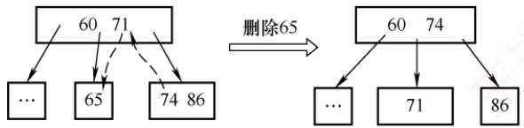  
(a) 兄弟够借

  
(b) 兄弟不够借  
图7.31 4阶B 树中删除终端结点关键字的示意图

3）兄弟不够借。若被删关键字所在结点删除前的关键字个数为 $\lceil m / 2 \rceil - 1$ ，且其左右兄弟结点的关键字个数也均为m/2-1，则删除该关键字后，需将该结点、其中一个兄弟结点以及父结点中分隔它们的关键字合并为一个新结点。例如，在图7.31(b)中删除4阶B树的关键字5，该结点与其右兄弟的关键字个数均为 $[m/2]-1=1$ ，因此在删除5后，将父结点中的关键字60与左右两个子结点（分别为空和含65）合并为一个新结点。

## 考点追踪非空B树的查找、插入、删除操作的特点（2023）

在合并过程中，父结点中的关键字个数会减1。若其父结点是根结点且关键字个数减少至0（根结点关键字个数为1时，有2棵子树），则直接将根结点删除，合并后的新结点成为根；若父结点不是根结点，且关键字个数减少到 $\lceil m / 2 \rceil - 2$ ，则需对其执行借位或合并操作，并可能向上递归，直至整棵树重新满足B树性质。

## 7.4.2 B+树的基本概念

## 考点追踪B+树的应用场合（2017）

B+树是为满足数据库系统高效检索需求而设计的一种B树变体。

一棵m阶B+树应满足下列条件。

1）每个分支结点最多有m棵子树。

2）非叶根结点至少有2棵子树；其余每个分支结点至少有m/2棵子树。

3）每个分支结点的关键字个数等于其子树个数。

4）所有关键字及其对应的记录指针均存储在叶结点中；叶结点内的关键字按升序排列，且相邻叶结点通过指针按关键字顺序链接，从而支持高效的顺序查找。

5）所有分支结点（可视为索引的索引）仅包含用于引导查找的关键字（通常为其对应子结点中关键字的最大值）以及指向各子结点的指针。

## 考点追踪B树和B+树的差异的分析（2016）

m阶 B+树与 m阶 B树的主要差异如下。

1）子树数量关系不同：在B+树中，具有n个关键字的结点恰好含有n棵子树，即每个关键字对应一棵子树；而在B树中，具有n个关键字的结点含有n+1棵子树。 XTA

2）关键字数量范围不同：在B+树中，每个非根内部结点的关键字个数n满足 $\left \lceil m/2 \right \rceil \leqslant n \leqslant$ m（非叶根结点满足 $2 \leqslant n \leqslant m$ ；而在B树中，每个非根内部结点的关键字个数n满 足 $\left \lceil m/2 \right \rceil -1\leqslant n\leqslant m-1$ (根结点满足 $1 \leqslant n \leqslant m - 1$

3）关键字存储位置不同：在B+树中，所有关键字均存储在叶结点中，非叶结点中的关键字是其对应子树中关键字的副本（通常为最大值），因此会重复出现在叶结点中；而在B树中，关键字仅出现一次，终端结点与其他结点的关键字互不重复。

4）结点功能不同：在B+树中，叶结点包含完整的数据信息，所有非叶结点仅起索引作用，其索引项只包含对应子树的最大关键字和指向该子树的指针。由于非叶结点结构更紧凑，一个磁盘块可容纳更多关键字，从而可减少磁盘I/O次数，提升查询效率。

5）支持顺序查找：B+树通常设置一个头指针，指向关键字最小的叶结点，并将所有叶结点通过指针按关键字顺序链接成一个线性链表，便于范围查询和顺序遍历。

图7.32所示为一棵4阶B+树。可以看出，分支结点中的关键字是其子树中最大关键字的副本。通常在B+树中有两个头指针：一个指向根结点，另一个指向关键字最小的叶结点。因此，B+树支持两种查找方式：一种是从最小关键字开始的顺序查找，另一种是从根结点开始的多路查找。

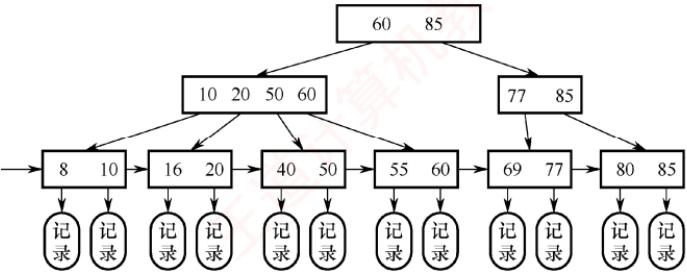  
图 7.32 B+树结构示意图

B+树的查找、插入和删除操作与B树基本类似。区别在于：在查找过程中，即使在非叶结点中遇到与给定关键字相等的值，也不会终止查找，而是继续向下，直到到达对应的叶结点为止。因此，无论查找成功与否，每次查找都对应一条从根结点到某个叶结点的路径。

## 7.4.3 本节试题精选

## 一、单项选择题

01.右图所示是一棵（）。 12 25A. 4阶B树 B. 3阶B树C. 4 阶 B+树 D. 无法确定 05 10 15 19 22 26 28

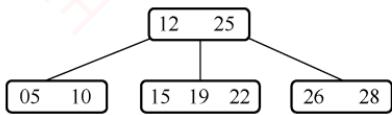

02. 下列关于m阶B树的说法中，错误的是（）。A. 根结点至多有 m棵子树B. 所有叶结点都在同一层次上C. 非叶结点至少有m/2（m为偶数）或(m+1)/2（m为奇数）棵子树D. 根结点中的数据是有序的

03.下列关于高度为3的3阶B树的说法中，正确的是（）。I. 每个内部结点至少有两棵非空子树Ⅱ. 树中每个结点至多有2个关键字Ⅲ. 树中最多能存储26个关键字IV. 插入一个元素引起B树结点分裂后，树的高度变为4A. I、ⅡI 1 B. I、ⅡI、III C. III、IV D. I、ⅡI、IV

04.在一棵m阶B树中做插入操作前，若一个结点中的关键字个数等于（），则插入操作后必须分裂成两个结点；在一棵m阶B树中做删除操作前，若一个结点中的关键字个数等于（），则删除操作后可能需要同它的左兄弟或右兄弟结点合并成一个结点。A. $m, \left \lceil m/2 \right \rceil -2$ B. $m - 1, \left\lceil m/2 \right\rceil - 1$ 王C. $m + 1, \left\lceil m/2 \right\rceil$ D. $m / 2, \left \lceil m / 2 \right \rceil + 1$

05. 具有 n个关键字的 m阶B 树，应有（）个叶结点。A. n + 1 B. n-1 C. mn D. $n m / 2$

06.高度为5的3阶B树至少有（）个结点，至多有（）个结点。A. 32 B. 31 C. 120 D. 121

07.含有n个非叶结点的m阶B树中至少包含（）个关键字。A. $n ( m + 1 )$ B. n C. $n ( \lceil m / 2 \rceil - 1 )$ D. $(n - 1)(\left \lceil m/2 \right \rceil - 1) + 1$

08. 已知一棵5阶B树中共有53个关键字，则树的最大高度为（），最小高度为（）。A. 2 B. 3 C. 4 D. 5

09.已知一棵3阶B树中共有2047个关键字，则树的最大高度为（），最小高度为（）。A. 11 B. 10 K C. 8 D. 7

10. 在7阶B树中，按从上往下、从左往右的顺序搜索第2016个关键字，若根结点已读入内存，则最多需启动（）次I/O。A. 4 B. 5 C. 6 D. 7

11. 在一棵高度为h的B树中插入一个新关键字，假设在插入过程中读入的结点一直在内存中，根结点的高度为1，且初始时未读入内存，则下列叙述中错误的是（）。（注意，本题中的新结点是指新产生的结点，如一次分裂才产生一个新结点。)育A. 若插入操作导致树的高度变为h+1，则本次插入一定导致了根结点的分裂B. 若插入操作导致旧结点的分裂，则树的高度一定会变为h+1C. 由于本次插入操作而产生的新结点的个数最多为h+1 +算机D. 由于本次插入操作而产生的读/写磁盘的次数最多为3h+1

12.下列关于B树和B+树的叙述中，错误的是（）。A. B树和B+树都能有效地支持顺序查找B. B树和B+树都能有效地支持随机查找C. B树和B+树都是平衡的多叉树D. B树和B+树都可以用于文件索引结构

13. 下列关于B树和B+树的查找操作的叙述中，错误的是（）。A. B树查找成功时，不一定需要查找到最后一层的内部结点B. B树查找失败时，一定需要查找到叶结点C. B+树查找成功时，不一定需要查找到叶结点D. B+树查找成功时，每次查找的长度都相等

14.【2009统考真题】下列叙述中，不符合m阶B树定义要求的是（）。A. 根结点至多有 m棵子树 B. 所有叶结点都在同一层上C. 各结点内关键字均升序或降序排列 D. 叶结点之间通过指针链接

15.【2012统考真题】已知一棵3阶B树，如右图所示。删除关键字78得到一棵新B树，其最右叶结点中的关键字是（）。A. 60 B. 60, 62C. 62,65 D. 65

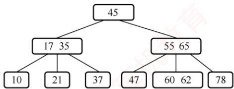

16.【2013统考真题】在一棵高度为2的5阶B树中，所含关键字的个数至少是（）。A. 5 B. 7 C. 8 D. 14

17.【2014统考真题】在一棵有15个关键字的4阶B树中，含关键字的结点个数最多是（）。A. 5 B. 6 C. 10 D. 15

18.【2016统考真题】B+树不同于B树的特点之一是（）。A. 能支持顺序查找 B. 结点中含有关键字C. 根结点至少有两个分支 D.所有叶结点都在同一层上

19.【2017统考真题】下列应用中，适合使用B+树的是（）。A. 编译器中的词法分析 B. 关系数据库系统中的索引C. 网络中的路由表快速查找 D. 操作系统的磁盘空闲块管理

20.【2018统考真题】高度为5的3阶B树含有的关键字个数至少是（）。

A. 15 B. 31 C. 62×T D. 242

21.【2020统考真题】依次将关键字5，6，9，13，8，2，12，15插入初始为空的4阶B树后，根结点中包含的关键字是（）。A. 8 B. 6, 9 C. 8, 13 D. 9, 12

22.【2021统考真题】在一棵高度为3的3阶B树中，根为第1层，若第2层中有4个关键字，则该树的结点数最多是（）。A. 11 B. 10 C. 9 D. 8

23.【2022统考真题】在下图所示的5阶B树T中，删除关键字260之后需要进行必要的调整，得到新的B树 $T _ { 1 \circ }$ 下列选项中，不可能是 $T _ { 1 }$ 根结点中关键字序列的是（）。


A. 60,90,280 B. 60,90, 350   
C. 60, 85, 110, 350 D. 60,90, 110, 350

24.【2023统考真题】下列关于非空B树的叙述中，正确的是（）。I. 插入操作可能增加树的高度 Ⅱ. 删除操作一定会导致叶结点的变化. 查找某关键字总是要查找到叶结点 IV. 插入的新关键字最终位于叶结点中A. 仅I B. 仅I、Ⅱ C. 仅ⅢI、IV D. 仅I、ⅡI、IV

25. 【2025统考真题】给定7个不同的关键字，能构造的不同4阶B树的个数最多是（）。A. 7 B. 8 KC.9 D. 10

## 二、综合应用题

01. 给定一组关键字{20,30,50,52,60,68,70}，给出创建一棵3阶B树的过程。

02. 对如右图所示的3阶B树，依次执行下列操作，画出各步操作的结果。1)插入90 2)插入25 3)插入454）删除605）删除80


03. 利用B树做文件索引时，若假设磁盘页块的大小是 8 20 35 40 60 1004000B(实际应是2的次幂，此处是为了计算方便)，指示磁盘地址的指针需要5B。现有 20000000个记录构成的文件，每个记录为 200B，其中包括关键字5B。试问在这个采用B树作索引的文件中，B树的阶数应为多少？假定文件数据部分未按关键字有序排列，则索引部分需要占用多少磁盘页块？

## 7.4.4 答案与解析

## 一、单项选择题

01. D

关键字数目比子树数目少1，首先可排除B+树。对于4阶B树，根结点至少有2棵子树（关键字数至少为1），其他非叶结点至少有 $\left[ n / 2 \right] = 2$ 棵子树（关键字数至少为1）、至多有4棵子树（关键字数至多为3）。5阶B树和6阶B树的分析也类似。题目所示的B树，同时满足4阶B树、5阶B树和6阶B树的要求，因此不能确定是哪种类型的B树。

## 02. C

除根结点外的所有非叶结点至少有 $[ m / 2 ]$ 棵子树。对于根结点，最多有m棵子树，若其不是叶结点，则至少有2棵子树。 X

## 03. B

每个非根的内部结点必须至少有 $\lceil m / 2 \rceil$ 棵子树，而本题中的根结点不是叶结点，也至少要有两棵子树，说法Ⅰ正确。每个结点至多有 $m   -   1   =   2$ 个关键字，说法Ⅱ正确。在高度为h的m阶B树中，关键字个数至多为 $(m - 1)(1 + m + m^2 + \cdots + m^{h-1}) = m^h - 1$ ，代入 $m = 3, \quad h = 3$ ，即树中最多能存储26个关键字，说法Ⅲ正确。对于说法IV，插入一个元素引起B树结点分裂后，只要从根结点到该元素插入位置的路径上至少有一个结点未满，B树就不会长高，如图1所示；只有当结点的分裂传到根结点，并使根结点也分裂时，才会导致树高增1，如图2所示，说法IV错误。

  
图1 结点分裂不导致树高增1（3阶B树）

  
图2 结点分裂导致树高增1（3阶B树）

## 04. B

因为B树每个结点内的关键字个数最多为m-1，所以当关键字个数大于m-1时，则应该分裂。每个结点内的关键字个数至少为 $[ m / 2 ] - 1$ 个，所以当关键字个数少于m/2]-1时，则可能与其他结点合并（除非只有根结点）。若将本题题于改为B+树，请读者思考上述问题的解答。

## 05. A

B树的叶结点对应查找失败的情况，对有n个关键字的查找集合进行查找，失败的可能性有$n + 1$ 种。 WO V WIT

## 06. B、D

由m阶B树的性质可知，根结点至少有2棵子树；根结点外的所有非终端结点至少有m/2棵子树，结点数最少时，3阶B树形状至少类似于一棵满二叉树，即高度为5的B树至少有 $2 ^ { 5 }   -   1   =$ 31个结点。因为每个结点最多有m棵子树，所以当结点数最多时，3阶B树形状类似于满三叉树，结点数为 $(3^{5} - 1)/2 = 121$ （注意，这里求的是结点数而非关键字数，若求的是关键字数，则还应把每个结点中关键字数的上下界确定出来）。 X

## 07. D

除根结点外，m阶B树中的每个非叶结点至少有 $\lceil m / 2 \rceil - 1$ 个关键字，根结点至少有一个关键字，所以总共包含的关键字最少个数 $(n - 1)(\left\lceil m/2 \right\rceil - 1) + 1$

## 注意

由以上题目可知B树和B+树的定义与性质尤为重要，需要熟练掌握。

## 08. C、B

5 阶B树中共有53个关键字，由最大高度公式 $H \leqslant \log_{\left \lceil m/2 \right \rceil } \left ( \left ( n+1 \right )/2 \right ) +1$ 得最大高度 $H { \leqslant }$

$\log _ { 3 } [ ( 5 3 + 1 ) / 2 ] + 1 = 4$ ，即最大高度为4；由最小高度公式 $h \geqslant \log_{m}(n + 1)$ 得最小高度 $h \geqslant \log_{5}54 \approx 2.5$ 从而最小高度为3。 KN

## 09. A、D

利用前面的公式即最小高度 $h \geqslant \log_{m}(n + 1)$ 和最大高度 $H \leqslant \log_{\left \lceil m/2 \right \rceil } \left [ (n+1)/2 \right ] + 1$ ，易算出最大高度 $H \leqslant \log_{2}[(2047 + 1)/2] + 1 = 11$ ，最小高度 $h \geqslant \log_{3}2048 = 6.9$ ，从而最小高度取7（注意，有些辅导书针对本题算出的高度要比这里给出的答案多1，因为它们在对B树的高度定义中，把最底层不包含任何关键字的叶结点也算进去了）。

## 10. B

本题要计算的是最坏情况下第2016个关键字在7阶B树中的最大深度，即考查B树结点中关键字数最少的情况。按照B树的定义，根结点至少有1个关键字，第二层至少有2个结点，即$2 { \times } 3$ 个关键字；第三层至少有2×4个结点，即 $2 \times 4 \times 3$ 个关键字；第四层至少有 $2   \times   4 ^ { 2 }$ 个结点，即 $2 \times 4 ^ { 2 } \times 3$ 个关键字；以此类推，第h层至少有 $2   \times   4 ^ { h - 2 }$ 个结点，即 $2 \times 4 ^ { h - 2 } \times 3$ 个关键字，故前h层的关键字总数 $n = 1 + 2 \times 3 \times ( 1 + 4 + \cdots + 4 ^ { h - 2 } ) = 1 + 2 \times ( 4 ^ { h - 1 } - 1 )$ 。故当 $h   =   5$ 时， $n   =   5 1 1$ ;当 $h = 6$ 时， $n   =   2 0 4 7$ 说明5层高的7阶B树最少有511个关键字，而6层高的7阶B树最少有2047个关键字，故最坏情况下第2016个关键字在7阶B树的第6层，需启动5次I/O操作。

## 11. B

考虑最坏情况，在待插入结点中插入一个关键码后，导致结点分裂，在该层分裂成2个结点，因此需要2次写磁盘操作：分裂操作逐层向上传导，导致每层都有结点分裂，因为结点分裂而导致的写磁盘操作共有2h次，加上最后一次结点分裂形成新根结点也需要1次写磁盘操作，写磁盘的总次数为2h+1，即由于本次插入而产生的新结点个数为h+1，加上寻找插入位置而引起的h次的读磁盘操作，整个过程中读/写磁盘的总次数为3h+1次，选项C、D正确。若插入操作导致了B树的高度增加，则分裂操作一定是从最底层传导至根结点的，即前面分析的最坏情况，选项A正确。若分裂操作没有传导至根结点，则B树的高度不变，选项B错误。

## 12. A

B树和B+树的差异主要体现在：（①1）结点关键字和子树的个数：②B+树非叶结点仅起索引作用：③B树叶结点关键字和其他结点包含的关键字是不重复的：④B+树支持顺序查找和随机查找，而B树仅支持随机查找。B+树的所有叶结点中包含了全部的关键字信息，且叶结点本身依关键字从小到大顺序链接，因此可以进行顺序查找，而B树不支持顺序查找。B树和B+树都可用于文件索引结构，但B+树更适合做数据库索引和文件索引，因为它的磁盘读/写代价更低。

## 13. C

在B树的查找操作中，若目标元素在某个内部结点中，则查找结束，不需要进入叶结点；查找失败时，叶结点是所有路径的终点，选项A、B正确。B+树中仅叶结点包含信息，非叶结点仅起到索引作用，查找成功时一定会找到相应的叶结点，所经过的路径长度都相等，选项C错误，选项D正确。

## 14. D

m阶B树不要求将各叶结点之间用指针链接。选项D描述的实际上是B+树。

## 15. D

对于图中所示的3阶B树，被删关键字78所在的结点在删除前的关键字个数 $1 = \left[ 3 / 2 \right] - 1$ 且其左兄弟结点的关键字个数 $= 2 \geq \left\lceil 3 / 2 \right\rceil$ ，属于“兄弟够借”的情况，因此要把该结点的左兄弟结点中的最大关键字上移到父结点中，同时把父结点中大于上移关键字的关键字下移到要删除关键字的结点中，这样就达到了新的平衡，如下图所示。


## 16. A

对于5阶B树，根结点的分支数最少为2（关键字数最少为1），其他非叶结点的分支数最少为 $\left[ n / 2 \right] = 3$ （关键字数最少为2），因此关键字个数最少的情况如右图所示（叶结点不计入高度）。


## 注意

一般来说，对于某个具体的B树图形，并不能确定是几阶B树。对于本题所述的5阶B树，不要误认为：“存在至少有一个含关键字结点中的关键字达到4”才符合5阶B树的要求，因为5阶B树中各个结点包含的关键字个数最少为 $2 \left( \left\lceil 5 / 2 \right\rceil - 1 = 2 \right)$ ，最多为4（5-1=4）。当5阶B树中各个结点包含的关键字个数为2时，也满足5阶B树的要求。

## 17. D

关键字数量不变，要求结点数量最多，即要求每个结点中含关键字的数量最少。根据4阶B树的定义，根结点最少含1个关键字，非根结点中最少含[4/2]-1=1个关键字，所以每个结点中关键字数量最少都为1个，即每个结点都有2个分支，类似于排序二叉树，而15个结点正好可以构造一个4层的4阶B树，使得终端结点全在第四层，符合B树的定义。

## 18. A

B+树的所有叶结点中包含了全部的关键字信息，且叶结点本身依关键字从小到大顺序链接，因此可以进行顺序查找，而B树不支持顺序查找（只支持多路查找）。

## 19. B

B+树是应文件系统所需而产生的B树的变形，前者比后者更加适用于实际应用中的操作系统的文件索引和数据库索引，因为前者的磁盘读/写代价更低，查询效率更加稳定。编译器中的词法分析使用有穷自动机和语法树。网络中的路由表快速查找主要靠高速缓存、路由表压缩技术和快速查找算法。系统一般使用空闲空间链表管理磁盘空闲块。

## 20. B

m阶B 树的基本性质：除根结点外的非叶结点最少含有「m/2]-1个关键字，代入 m= 3 得到每个非叶结点中最少包含1个关键字，而根结点含有1个关键字，因此所有非叶结点都有两个孩子。此时其树形与h=5的满二叉树相同，可求得关键字最少为31个。

## 21. B

一个4阶B树的任意非叶结点至多含有m-1=3个关键字，在关键字依次插入的过程中，会导致结点的不断分裂，插入过程如下图所示。得到根结点包含的关键字为6,9。


## 22. A

在阶为3的B树中，每个结点至多含有2个关键字（至少1个），至多有3棵子树。本题规定第二层有4个关键字，欲使B树的结点数达到最多，则这4个关键字包含在3个结点中，B树树形如下图所示，其中A,B,C,…,M表示关键字，最多有11个结点。


## 23. D

在5阶B树中，除根结点外的非叶结点的关键字数k需要满足 $2 \leq k \leq 4$ 。当被删关键字x不在终端结点（最底层非叶结点）时，可以用x的前驱（或后继）关键字v来替代x，然后在相应结点中删除v。情况①：删除260，将其前驱110放入260处，删除110后的结点<100>不满足5阶B树定义，从左兄弟中借85，将85放入根中，将根中的90移入结点<100>变为<90,100>。情况②：删除260，将其后继280放入260处，结点<300>不满足5阶B树定义且左右兄弟都不够借，结点<300>可以和左兄弟<100，110>以及关键字280合并成一个新的结点<100，110，280.300>。情况③：在情况②中，结点<300>也可以和右兄弟<400.500>以及关键字350合并成一个新的结点<300,350,400,500>。综上， $T _ { 1 }$ 根结点中的关键字序列可能是<60,85,110,350>或<60,90350>或<60,90,280>，仅选项D不可能。

快速解法：假如选项D的60,90,110,350作为根结点，则在90和110之间只有100这一个数据，显然不符合5阶B树的定义，因此选项D不可能。

## 24. B

B树的插入操作可能导致叶结点分裂，叶结点分裂可能导致父结点分裂，甚至会传导到根结点，从而导致B树高度增1，说法Ⅰ正确。若被删结点是叶结点，则显然会导致叶结点变化：若被删结点不是叶结点，则要先将被删结点和它的前驱或后继交换，最终转换为删除叶结点，还是导致叶结点变化，说法Ⅱ正确。若在非叶结点中查找到了给定的关键字，则不用向下继续查找，说法Ⅲ错误。插入关键字的初始位置是最底层叶结点，但可能因结点分裂而被转移到父结点中，说法IⅣ错误。

## 注意

由本题可知，与大多数教材不同，统考真题中称最底层终端结点为叶结点。

## 25. C

对于4阶B树，每个结点包含1～3个关键字（根结点可为1～3个，非根结点至少1个）。给定7个不同关键字，按树高分类讨论：①当树为2层时，若根含1个关键字，则其2个子结点需要分配6个关键字，唯一合法的分配为(3.3)，对应1种：若根含2个关键字，则3个子结点分配5个关键字，合法分配为(3,1,1)和(2,2,1)，考虑所有排列共6种；若根含3个关键字，则4个子结点各含1个关键字，对应1种；合计8种。②当树为3层时，仅当根及其两个子结点均含1个关键字时，剩余4个关键字恰好分配给4个叶子结点（各1个），满足最小关键字数要求，仅1种。综上，共可构造8+1=9种不同的4阶B树。

## 二、综合应用题

## 01.【解答】

m=3，因此除根结点外，非叶结点关键字个数为1～2。


如上图所示，首先插入20,30，结点内关键字个数不超过m-1=2，不会引起分裂；插入50，插入20,30所在的结点，引起分裂，结点内第「m/2个关键字30上升为父结点。


如上图所示，插入52，插入50所在的结点，不会引起分裂；继续插入60，插入50,52所在的结点，引起分裂，52上升到父结点中，不会引起父结点的分裂。 KKN


如上图所示，插入68，插入60所在的结点，不会引起分裂；继续插入70，插入60,68所在的结点，引起分裂，68上升为新的父结点，68上升到30,52所在的结点后，会继续引起该结点的分裂，所以52上升为新的根结点。最后得到的B树如右图所示。 K


## 02.【解答】

1）插入90：将90插入100所在的结点，插入90后该结点中的元素个数不超过「3/2=2，不会引起结点的分裂，插入后的B树如下图所示。


2）插入25：将25插入8.20所在的结点，插入后结点内的元素个数为3，引起分裂。所以将结点内的中间元素20上升到父结点中，此时父结点中的元素个数为2（元素20和30），不会引起继续分裂，插入25后的B树如右图所示。


3）插入45：将45插入35,40所在的结点，引起分裂，

中间元素40上升到父结点（20,30所在的结点）中，引起父结点分裂，中间元素30上升到父结点（50所在的结点）中，两次分裂后的B树如下图所示。


4）删除60：删除60后，其所在的结点元素为空，从而导致借用右兄弟结点的元素，调整后的B树如下图所示。


5）删除80：删除80后，导致80所在结点的父结点与其右兄弟结点合并，这时父结点元素个数为0，再次对父结点进行调整。将50与40合并成一个新结点，则90，100所在结点为这个结点的子结点。从而构造的B树如下图所示。注意，这次调整的过程实际上包含多次调整过程，希望读者对照考点讲解中的删除过程仔细思考。


## 注意

B树中结点的插入、删除操作（特别是插入、删除后的结点分裂与合并）是本节的重点，也是难点，请读者务必熟练掌握。

## 03.【解答】

根据B树的概念，一个索引结点应适应操作系统一次读/写的物理记录大小，其大小应取不超过但最接近一个磁盘页块的大小。假设B树为m阶，一个B树结点最多存放m-1个关键字（5B）和对应的记录地址（5B）、m个子树指针（5B）和1个指示结点中的实际关键字个数的整数（2B），则有

$$
(2 \times (m - 1) + m) \times 5 + 2 \leq 4000
$$

计算结果为 $m \leq 2 6 7$

一个索引结点最多可以存放 $m - 1 = 266$ 个索引项，最少可以存放 $\lceil m / 2 \rceil - 1 = 1 3 3$ 个索引项。全部有 $n = 2 0 0 0 0 0 0 0$ 个记录，每个记录占用空间200B，每个页块可以存放4000/200=20个记录，则全部记录分布在 $20000000 / 20 = 1000000$ 个页块中，最多需要占用 $1 0 0 0 0 0 0 / 1 3 3 = 7 5 1 9$ 个磁盘页块作为B树索引，最少需要占用 $1 0 0 0 0 0 0 / 2 6 6 = 3 7 6 0$ 个磁盘页块作为B树索引（注意B树与B+树的不同，B树所有对数据记录的索引项分布在各个层次的结点中，B+树所有对数据记录的索引项都在叶结点中）。

## 7.5散列（Hash）表

## 7.5.1 散列表的基本概念

在前面介绍的线性表和树表查找中，查找记录需要进行一系列关键字比较。由于记录在表中的位置与其关键字之间不存在映射关系，因此这些结构的查找效率取决于关键字比较的次数。

散列函数（也称哈希函数）是一种将关键字映射到其对应存储地址的函数，记为

$$
\mathrm{Hash(key) = Addr} \quad  或  \quad \mathrm{H(key) = Addr}
$$

其中，地址可以是数组下标、索引或内存地址等。

散列函数可能会将两个或两个以上不同的关键字映射到同一地址，这种现象称为冲突，这些发生冲突的不同关键字称为同义词。一方面，良好的散列函数应尽可能减少冲突的发生；另一方

面，由于冲突总是不可避免的，因此还需设计有效的冲突处理方法。

散列表（也称哈希表）：一种根据关键字直接进行访问的数据结构。它建立了关键字到存储地址的直接映射。 V

在理想情况下，对散列表进行查找的时间复杂度为O(1)，即与表中元素的个数无关。下面将分别介绍常用的散列函数和处理冲突的方法。

## 7.5.2 散列函数的构造方法

在构造散列函数时，必须注意以下几点：

1）散列函数的定义域必须包含全部关键字，而值域的范围则取决于散列表的大小。

2）散列函数计算出的地址应尽可能均匀地分布在整个地址空间，以有效减少冲突。

3）散列函数应尽量简单，能在较短时间内计算出任意关键字对应的散列地址。

## 1. 直接定址法

直接取关键字的某个线性函数值作为散列地址，其散列函数为

$$
H(\mathrm{key}) = \mathrm{key} \quad  或  \quad H(\mathrm{key}) = a \cdot \mathrm{key} + b
$$

其中，a和b是常数。该方法计算最简单，且不会产生冲突，适用于关键字分布基本连续的情形。  
若关键字分布稀疏、空位较多，则会造成存储空间的浪费。

## 2. 除留余数法

这是最简单且最常用的散列函数构造方法。设散列表长度为m，选取一个不超过m且尽可能接近 m的质数 $p ,$ ，通过以下公式将关键字映射为散列地址：

$$
H(\mathrm{key}) = \mathrm{key} \% p
$$

除留余数法的关键在于合理选择 $p ,$ 使得不同关键字经该函数映射后能近似等概率地落在散列空间的各个位置，从而尽可能减少冲突。

## 3. 数字分析法

设关键字是r进制数，其各位上的数码（共r种）出现的频率可能不同：某些数位上数码分布较为均匀，各种数码出现的机会接近均等；而另一些数位上分布不均，仅有少数几种数码频繁出现。此时应选取那些数码分布较为均匀的数位，以其组合构成散列地址。该方法适用于已知目固定的关键字集合，若关键字集合发生变化，则需重新构造新的散列函数。

## 4. 平方取中法

顾名思义，该方法取关键字平方值的中间几位作为散列地址。具体取多少位根据散列表大小和关键字范围确定。由于平方运算与关键字的每位都有关系，因此使得散列地址的分布较为均匀。该方法适用于关键字的各位取值分布不均或关键字本身位数较少的情形。

在不同应用场景下，各类散列函数的性能表现各异，因此不能笼统地说某种方法最优。实际选择时，应根据关键字集合的特性合理选用散列函数的构造方法。

## 7.5.3 处理冲突的方法

应当注意到，任何散列函数都无法绝对避免冲突。因此，必须设计有效的冲突处理机制，即为发生冲突的关键字寻找下一个可用的散列地址。设 $H _ { i }$ 表示第i次探测所得的散列地址。若初始地址 $H _ { 0 } = H ( \mathrm { k e y } )$ 发生冲突，则尝试 $H _ { 1 }$ ；若 $H _ { 1 }$ 仍冲突，则继续计算 $H _ { 2 }$ ，以此类推，直到找到首个不发生冲突的地址 $H _ { k }$ ，该地址即为关键字在散列表中的最终存储位置。

## 考点追踪冲突处理方法的特点（2025）

## 1. 开放定址法

开放定址法是指散列表中的所有空闲地址均可用于存放任意关键字（无论是否与其同义）。其地址探测序列由如下递推公式给出：

$$
H_{i} = (H(\mathrm{key}) + d_{i})\% m
$$

其中， $H ( \mathrm { k e y } )$ 为散列函数； $d _ { i }$ 为第i次探测的增量， $i = 1,2,\cdots,k (k \leqslant m-1)$ ；m为散列表表长。一旦选定增量序列，对应的冲突处理方法即被确定。常见的增量序列取法有以下四种。

## 考点追踪堆积现象导致的结果（2014）

1）线性探测法，也称线性探测再散列法。增量序列 $d _ { i } = 1 , 2 , \cdots , m - 1$ o

其特点是：冲突发生时，顺序查看表中下一个单元；若探测到表尾地址 $m - 1$ ，则下一个探测地址回绕至表首地址0，如此循环，直到找到一个空闲单元(只要表未满，必能找到）。然而，线性探测法容易引发“聚集（或称堆积）”现象：原本映射到地址i的同义词被存入i+1，而本应存入 i+1的元素则被迫占用i+2，以此类推。这会导致大量元素在相邻地址上堆积，显著降低查找效率。 H

2）平方探测法，也称二次探测法。增量序列 $d_{i}=1^{2},-1^{2},2^{2},-2^{2},\cdots,k^{2},-k^{2} \quad (k \leqslant m/2)$ 0

其中，散列表长度m必须是一个形如 $4 k + 3$ 的素数。

平方探测法能有效避免“堆积”问题，是一种较好的冲突处理方法。其缺点是无法探测散列表中的所有位置，但至少可以覆盖一半的地址空间。

3）双散列法。增量序列 $d _ { i } = i H _ { 2 } ( \mathrm { k e y } )$ 0

该方法需使用两个散列函数。当通过第一个散列函数 $H ( \mathrm { k e y } )$ 得到的地址发生冲突时，利用第二个散列函数 $H _ { 2 } ( \mathrm { k e y } )$ 计算地址增量。其探测序列为：

$$
H_{i} = \left( H(\mathrm{key}) + iH_{2}(\mathrm{key}) \right) \% m
$$

其中，初始探测位置 $H_{0}=H(\mathrm{key})\% m 。 i=0,1,2,\cdots$ 表示探测序号。

4）伪随机序列法。增量序列由一个伪随机数生成器产生，即 $d_{i} =  第  i$ 个伪随机数。

## 考点追踪散列表中删除部分元素后的查找效率分析（2023）

## 注意

采用开放定址法时，不能直接物理删除表中已有元素。否则，可能截断其他同义词的查找路径，导致查找失败。正确的做法是：对被删元素所在位置设置一个删除标记，实现逻辑删除。但该方法的副作用是：经过多次删除后，散列表看似已满，但实际上有许多位置未被利用。 V

## 2. 拉链法（链接法，chaining）

为了处理冲突，可将散列到同一地址的所有同义词组织成一个链表。每个链表由其对应的散列地址唯一确定。具体而言，若散列地址为i，则该同义词链表的头指针存放在散列表的第i个单元中。因此，查找、插入和删除操作主要在相应的同义词链表中进行。拉链法特别适用于需要频繁执行插入和删除操作的场景。例如，关键字序列{19, 14, 23, 01, 68, 20, 84, 27, 55, 11, 10, 79},散列函数 $H(\mathrm{key}) = \mathrm{key}\%13$ ，采用拉链法处理冲突，建立的表如图7.33所示。

  
图7.33 拉链法处理冲突的散列表

## 7.5.4 散列查找及性能分析的应用

考点追踪散列表的构造及查找效率的分析（2010、2018、2019、2024）

散列表的查找过程与构造过程基本一致。对于给定的关键字key，先通过散列函数计算其初始地址，然后按如下步骤执行

初始化： $\mathrm{Addx} = \mathrm{H}   (\mathrm{Key})$ ir

①检查散列表中地址Addr处是否有记录：若无记录，则查找失败；若有记录，则比较该记录与key的值，若相等，则查找成功，否则转到步骤②。 YTA

②按指定的冲突处理方法计算下一个探测地址，将Addr更新为此地址，返回步骤①。

例如，关键字序列{19,14,23,01,68,20,84,27,55,11,10,79}，散列函数 $H(\mathrm{key}) = \mathrm{key}\%13$ 采用线性探测法处理冲突，所得的散列表L如图7.34所示（表长为16）。 临村

<table><tr><td>0</td><td>1</td><td>2</td><td>3</td><td>4</td><td>5</td><td>6</td><td></td><td>7</td><td>8</td><td>9</td><td>10</td><td>11</td><td>12</td><td>13</td><td>14</td><td>15</td></tr><tr><td></td><td>14</td><td>01</td><td>68</td><td>27</td><td></td><td>55</td><td>19</td><td>20</td><td>84</td><td>79</td><td>23</td><td>11</td><td>10</td><td></td><td></td><td></td></tr></table>

图7.34 用线性探测法得到的散列表L

查找关键字84的过程：初始散列地址 $H ( 8 4 ) = 6$ 。因L[6]非空且 $\mathrm { L } [ 6 ] \neq 8 4$ ，冲突；第一次探测的地址 $H_{1} = (6 + 1)\% 16 = 7$ ，因L[7]非空且 $\mathrm { L } [ 7 ]   \neq   8 4$ ，冲突；第二次探测的地址 $H_{2} = (6 + 2)\% 16$ $= 8   , \mathrm { ~ L } [ 8 ]$ 非空且 $\mathrm { L } [ 8 ] = 8 4$ ，查找成功，返回其存储地址。

查找关键字38的过程：初始散列地址 $H(38) = 12$ 。因L[12]非空且 $\mathrm { L } [ 1 2 ] \neq 3 8$ ，冲突；第一次探测的地址 $H_{1}=(12+1)\%16=13$ ，因L[13]为空，查找失败。

各关键字的查找比较次数如图7.35所示。
<table><tr><td rowspan=1 colspan=1>关键字</td><td rowspan=1 colspan=1>14</td><td rowspan=1 colspan=1>01</td><td rowspan=1 colspan=1>68</td><td rowspan=1 colspan=1>27</td><td rowspan=1 colspan=1>55</td><td rowspan=1 colspan=1>19</td><td rowspan=1 colspan=1>20</td><td rowspan=1 colspan=1>84</td><td rowspan=1 colspan=1>79</td><td rowspan=1 colspan=1>23</td><td rowspan=1 colspan=1>11</td><td rowspan=1 colspan=1>10</td></tr><tr><td rowspan=1 colspan=1>比较次数</td><td rowspan=1 colspan=1>1</td><td rowspan=1 colspan=1>2</td><td rowspan=1 colspan=1>1</td><td rowspan=1 colspan=1>4</td><td rowspan=1 colspan=1>3</td><td rowspan=1 colspan=1>1</td><td rowspan=1 colspan=1>1</td><td rowspan=1 colspan=1>3</td><td rowspan=1 colspan=1>9</td><td rowspan=1 colspan=1>1</td><td rowspan=1 colspan=1>1</td><td rowspan=1 colspan=1>3</td></tr></table>

图7.35 查找各关键字的比较次数

平均查找长度（ASL）为

$$
\mathrm{ASL}=(1 \times 6+2+3 \times 3+4+9)/12=2.5
$$

对于同一关键字集合和相同的散列函数，不同的冲突处理方法会生成不同的散列表结构，从而导致不同的平均查找长度。本例的ASL与上节拉链法的结果不同，正好体现了这一特性。

从散列表的查找过程可见：

1）尽管散列表在关键字与其存储位置之间建立了直接映射，但由于冲突的存在，查找过程仍需将给定值与表中关键字进行比较。因此，ASL仍是衡量散列表查找效率的核心指标。

考点追踪影响散列表查找效率的因素（2011、2022）

2）散列表的查找效率主要取决于三个因素：散列函数、冲突处理方法和装填因子。

装填因子通常记为α，定义为散列表的填充程度，即

$$
\alpha = \frac{ 表中记录数 n}{ 散列表长度 m}
$$

散列表的平均查找长度主要依赖于装填因子α，而不直接依赖于n或m。直观地看，α越大，表示表越“满”，发生冲突的可能性越高；反之，越小，冲突越少。

读者应能根据给定的散列表长度、元素个数、散列函数及冲突处理方法，构造出相应的散列表，并进一步计算查找成功时的平均查找长度与查找失败时的平均查找长度。

## 7.5.5 本节试题精选

## 一、单项选择题

01. 只能在顺序存储结构上进行的查找方法是（）。A. 顺序查找法B. 折半查找法 C. 树形查找法 D. 散列查找法

02.散列查找一般适用于（）的情况下的查找。A. 查找表为链表B. 查找表为有序表C. 关键字集合比地址集合大得多D. 关键字集合与地址集合之间存在对应关系

03.下列关于散列表的说法中，正确的是（）。I. 若散列表的填装因子α<1，则可避免碰撞的产生I. 散列查找中不需要任何关键字的比较Ⅲ.散列表在查找成功时平均查找长度仅与表长有关 王道计IV. 若在散列表中删除一个元素，不能简单地将该元素删除A. I和 IV B. ⅡI和ⅢII C. III D. IV

04.在开放定址法中散列到同一个地址而引起的“堆积”问题是由（）引起的。A. 同义词之间发生冲突B. 非同义词之间发生冲突 机教育C. 同义词之间或非同义词之间发生冲突D. 散列表“溢出”

05.下列关于散列冲突处理方法的说法中，正确的有（）。I. 采用平方探测法处理冲突时不易产生聚集Ⅱ. 采用线性探测法处理冲突时，所有同义词在散列表中一定相邻Ⅲ. 采用链地址法处理冲突时，若限定在链首插入，则插入任意一个元素的时间相同IV. 采用链地址法处理冲突易引起聚集现象A. I和ⅢII B. I、II和III C. III 和 IV D. I和IV

06.设有一个含有200个元素的散列表，用线性探测法解决冲突，按关键字查询时找到一个表项的平均探测次数不超过1.5，则散列表应至少能够容纳（）个元素（设查找成功的平均查找长度为ASL= [1+1/(1- α)]/2，其中α为装填因子）。 算A.400 B. 526 C. 624 D. 676

07. 假定有K个关键字互为同义词，若用线性探测法把这K个关键字填入散列表，至少要进行（）次探测。A. K-1 B. K C. K+1 D. K(K + 1)/2

08. 对包含n个元素的散列表进行查找，平均查找长度（）。A. 为 O(log2n) B. 为 O(1) C. 不直接依赖于 n D. 直接依赖于表长 m

09. 采用开放定址法解决冲突的散列查找中，发生聚集的原因主要是（）。A. 数据元素过多 B. 负载因子过大C. 散列函数选择不当 K D. 解决冲突的方法选择不当

10. 当用线性探测再散列法解决冲突时，计算出的一系列“下一个空位”的要求是（）。A. 必须大于或等于原散列地址 B. 必须小于或等于原散列地址C. 可以大于或小于但不等于原散列地址D. 对地址在何处没有限制

11. 一组记录的关键字为{19,14,23,1,68,20,84,27,55,11,10,79}，用链地址法构造散列表，散列函数为 $H(\mathrm{key}) = \mathrm{key} \bmod 13$ ，散列地址为1的链中有（）个记录。A. 1 B. 2 C. 3 D. 4

12. 在采用链地址法处理冲突所构成的散列表上查找某一关键字，则在查找成功的情况下，所探测的这些位置上的关键字值（）；若采用线性探测法，则（）。A. 一定都是同义词 B. 不一定都是同义词C. 都相同 D. 一定都不是同义词

13. 若采用链地址法构造散列表，散列函数为H(key)=key mod17，则需（①）个链表。这些链的链首指针构成一个指针数组，数组的下标范围为（②）。① A. 17 B. 13 C. 16 D. 任意 机教育② A. 0\~17 B. 1\~17 C. 0\~16 D. 1\~16

14. 设散列表长 m= 14，散列函数为 $H(\mathrm{key}) = \mathrm{key}\%$ ，表中仅有4个结点 H(15)=4，H(38)=5，H(61)= 6，H(84)= 7，若采用线性探测法处理冲突，则关键字为49的结点地址是（）。  
A.8 B. 3 C. 5 XD.9

15. 现有长度为17、初始为空的散列表HT，散列函数 $H(\mathrm{key}) = \mathrm{key}\%17$ ，用线性探查法解决冲突。将关键字序列26,25,72,38,8,18,59依次插入HT后，查找59需探查（）次。A. 2 B. 3 C. 4N D. 5

16. 现有长度为17、初始为空的散列表HT，散列函数 $H(\mathrm{key}) = \mathrm{key}\%17$ ，用平方探测法解决冲突： $H_{i}( key ) = (H( key ) \pm i^{2})\%17$ 。将关键字序列6,22,7,26,9,23依次插入HT后，则关键字23存放在散列表中的位置是（）。A. 0 B. 2 C. 6 D. 15

17.将10个元素散列到100000个单元的散列表中，则（）产生冲突。A. 一定会 B. 一定不会 C. 仍可能会 D. 不确定

18.【2011统考真题】为提高散列表的查找效率，可以采取的正确措施是（）。I. 增大装填（载）因子I. 设计冲突（碰撞）少的散列函数Ⅲ.处理冲突（碰撞）时避免产生聚集（堆积）现象A. 仅I B. 仅Ⅱ C. 仅I、Ⅱ D. 仅ⅡI、ⅢI

19.【2014统考真题】用哈希（散列）方法处理冲突（碰撞）时可能出现堆积（聚集）现象，下列选项中，会受堆积现象直接影响的是（）。A. 存储效率 B. 散列函数 道计  
C C.装填（装载）因子 D. 平均查找长度

20. 【2018统考真题】现有长度为7、初始为空的散列表HT，散列函数 $H ( k ) = k \% 7$ ，用线性探测再散列法解决冲突。将关键字22，43，15依次插入HT后，查找成功的平均查找长度是（）。A. 1.5 B. 1.6 C. 2 D. 3

21.【2019统考真题】现有长度为11且初始为空的散列表HT，散列函数是 $H(\mathrm{key}) = \mathrm{key}\%7$ 采用线性探查（线性探测再散列）法解决冲突。将关键字序列87,40,30,6,11,22,98,20依次插入HT后，HT查找失败的平均查找长度是（）。A. 4 B. 5.25 x C. 6 D. 6.29

22.【2022统考真题】下列因素中，影响散列（哈希）方法平均查找长度的是（）。

I. 装填因子 ⅡI. 散列函数 III. 冲突解决策略A. 仅I、Ⅱ B. 仅I、III C. 仅ⅡI、III D. I、ⅡI、ⅢII

23.【2023统考真题】现有长度为5、初始为空的散列表HT，散列函数 $H(k) = (k + 4)\%5$ 用线性探查再散列法解决冲突。若将关键字序列2022,12,25依次插入HT，然后删除关键字25，则HT中查找失败的平均查找长度为（）。A. 1 B. 1.6 X C. 1.8 D. 2.2

24.【2025统考真题】下列关于散列方法处理冲突的叙述中，正确的是（）。A. 只要散列表不满，线性探查再散列一定能找到一个空闲位置B. 只要散列表不满，二次探查再散列一定能找到一个空闲位置C. 线性探查再散列处理的冲突，一定是发生在同义词之间的冲突D. 二次探查再散列处理的冲突，一定是发生在非同义词之间的冲突

## 二、综合应用题

01. 若要在散列表中删除一个记录，应如何操作？为什么？按照处理冲突的方法为开放地址法和拉链法分别说明。

02.假定把关键字key散列到有n个表项（从0到n-1编址）的散列表中。对于下面的每个函数H(key)（key为整数），这些函数能够当作散列函数吗？若能，它是一个好的散列函数吗？说明理由。设函数random(n)返回一个0到n-1之间的随机整数（包括0与n-1在内）。1) $H(\mathrm{key}) = \mathrm{key} / n$ 算机教育2) $H(\mathrm{key}) = 1$ 3) $H(\mathrm{key}) = (\mathrm{key} + \mathrm{random}(n))\%n$ 4) $H(\mathrm{key}) = \mathrm{key}\%p(n);$ 其中 p(n)是不大于 n的最大素数。

03. 使用散列函数H(key)=key%11，把一个整数值转换成散列表下标，散列表的长度为11，现在要把数据{1,13,12,34,38,33,27,22}依次插入散列表。1）使用线性探测法来构造散列表。2）使用链地址法构造散列表。试针对这两种情况，分别确定查找成功所需的平均查找长度，及查找不成功所需的平均查找长度。

04. 已知一组关键字为{26,36,41,38,44,15,68,12,6,51,25}，用链地址法解决冲突，假设装填因子 $\alpha = 0.73$ ，散列函数的形式为 $H(\mathrm{key}) = \mathrm{key}\%P$ ，P为不大于表长的最大素数，请回答以下问题：1）构造出散列函数。 道计2）分别计算出等概率情况下查找成功和查找失败的平均查找长度（查找失败的计算中  
王只将与关键字的比较次数计算在内即可）。

05. 设散列表为HT[0...12]，即表的大小为m=13。现采用双散列法解决冲突，散列函数和再散列函数分别为：$H_{0}(\mathrm{key}) = \mathrm{key}\%13$ 注：%是取模运算（=mod）$H_{i} = \left( H_{i - 1} +  REV ( key  + 1)\%11 + 1 \right)\%13; \quad i = 1,2,3,\cdots,m - 1$ 其中，函数REV(x)表示颠倒十进制数x的各位，如REV(37)=73、REV(7)=7等。若插入的关键码序列为(2,8,31,20,19,18,53,27)，请回答：1）画出插入这8个关键码后的散列表。

2）计算查找成功的平均查找长度ASL。

06.【2010统考真题】将关键字序列(7,8,30,11,18,9,14)散列存储到散列表中。散列表的存储空间是一个下标从0开始的一维数组，散列函数为 $H(\mathrm{key}) = (\mathrm{key} \times 3) \bmod 7$ ，处理冲突采用线性探测再散列法，要求装填（载）因子为0.7。

1）请画出所构造的散列表。

2）分别计算等概率情况下，查找成功和查找不成功的平均查找长度。

07.【2024统考真题】将关键字序列20,3,11,18,9,14,7依次存储到初始为空、长度为11的散列表HT中，散列函数 $H(\mathrm{key}) = (\mathrm{key} \times 3)\% 11$ 。H(key)计算出的初始散列地址为 $H _ { 0 }$ 发生冲突时探查地址序列是 $H _ { 1 } , H _ { 2 } , H _ { 3 } , \cdots$ ，其中 $H_{k} = (H_{0} + k^{2})\%$ $k = 1, 2, 3, \cdots$ 请回答下列问题： 教。

1）画出所构造的HT，并计算HT的装填因子。

2）给出在HT中查找关键字14的关键字比较序列。

3）在HT中查找关键字8，确认查找失败时的散列地址是多少？

## 7.5.6 答案与解析

## 一、单项选择题

## 01. B

顺序查找可以是顺序存储或链式存储：折半查找只能是顺序存储且要求关键字有序：树形查找法要求采用树的存储结构，既可以采用顺序存储也可以采用链式存储；散列查找中的链地址法解决冲突时，采用的是顺序存储与链式存储相结合的方式。

## 02. D

关键字集合与地址集合之间存在对应关系时，通过散列函数表示这种关系。这样，查找以计算散列函数而非比较的方式进行查找。 1

## 03. D

冲突（碰撞）是不可避免的，与装填因子无关，因此需要设计处理冲突的方法，说法Ⅰ错误。散列查找的思想是计算出散列地址来进行查找，然后比较关键字以确定是否查找成功，说法Ⅱ错误。散列查找成功的平均查找长度与装填因子有关，与表长无直接关系，说法Ⅲ错误。在开放定址的情形下，不能随便删除散列表中的某个元素，否则可能会导致搜索路径被中断（因此通常的做法是在要删除的地方做删除标记，而不是直接删除），说法IV正确。

## 04. C

在开放定址法中散列到同一个地址而产生的“堆积”问题，是同义词冲突的探查序列和非同义词之间不同的探查序列交织在一起，导致关键字查询需要经过较长的探测距离，降低了散列的效率。因此要选择好的处理冲突的方法来避免“堆积”。

## 05. A

平方探测法采用的增量序列是非线性的，它可以跳过一些已被占用的单元，而不是顺序地探测下一单元，这样能减小冲突的概率，说法Ⅰ正确。散列地址i的关键字，和为解决冲突形成的某次探测地址为i的关键字，都争夺地址 $i,   i + 1, \cdots$ ，因此不一定相邻，说法Ⅱ错误。说法Ⅲ正确。同义词冲突不等于聚集，链地址法处理冲突时将同义词放在同一个链表中，不会引起聚集现象，说法IV错误。

## 06. A

若有200个元素要放入散列表，采用线性探测法解决冲突，限定查找成功的平均查找长度不

超过1.5，则

$$
\mathrm{ASL}_{ 成功 } = \frac{1}{2}\left(1 + \frac{1}{1 - \alpha}\right) \leqslant 1.5 \Rightarrow \alpha = \frac{200}{m} \leqslant \frac{1}{2} \Rightarrow m \geqslant 400
$$

## 07. D

K个关键字在依次填入的过程中，只有第一个不会发生冲突，所以探测次数为 $1+2+3+\cdots+K=$ $K ( K + 1 ) / 2$ 0 X

## 08. C

散列表的平均查找长度与装填因子α直接相关，表的查找效率不直接依赖于表中已有表项个数n或表长 m。若表中存放的记录全是某个地址的同义词，则平均查找长度为 O(n)而非O(1)。

## 09. D

聚集是因选取不当的处理冲突的方法，而导致不同关键字的元素对同一散列地址进行争夺的现象。用线性探查法时，容易引发聚集现象。

## 10. C

“下一个空位”可以大于或小于但不等于原散列地址，等于原散列地址是没有意义的。

## 11. D

由散列函数计算可知，14,1,27,79散列后的地址都是1，所以有4个记录。

## 12. A, B

因为在链地址法中，映射到同一地址的关键字都会链到与此地址相对应的链表上，所以探测过程一定是在此链表上进行的，从而这些位置上的关键字均为同义词；但在线性探测法中出现两个同义关键字时，会把该关键字对应地址的下一个地址也占用掉，两个地址分别记为Addr、Addr+1，查找一个满足 $H(\mathrm{key}) = \mathrm{Addr} + 1$ 的关键字key时，显然首次探测到的不是key的同义词。

## 13. A, C

H的取值有17种可能，对应到不同的链表中，所以链表的个数应为17。因为H(key)的取值范围为0\~16，所以数组下标为0～16。

## 14. A

线性探测法的公式为 $H_{i} = (H(\mathrm{key}) + d_{i})\%m$ ，其中 $d_{i}=1,2,\cdots,m-1 。H(49)=49\%11=5,$ 有冲突；$H_{1}=(H(49)+1)\%14=6$ ，有冲突； $H_{2}=(H(49)+2)\%14=7$ ，有冲突； $H_{3}=(H(49)+3)\%14=8$ ，无冲突。15. C K xK

插入过程如下： $H(26) = 9$ ，不冲突； $H ( 2 5 ) = 8$ ，不冲突； $H ( 7 2 ) = 4$ ，不冲突； $H(38) = 4$ ，冲突，冲突处理后的地址为5；H(8)=8，冲突，冲突处理后的地址为10；H(18)=1，不冲突； $H ( 5 9 ) = 8$ 冲突，冲突处理后的地址为11。因此，在表中查找59需要探查4次。

## 16. B

插入过程如下： $6\%17 = 6; 22\%17 = 5; 7\%17 = 7; 26\%17 = 9; 9\%17 = 9$ ，冲突，平方探测法探测10（无冲突）；23%17=6，冲突，平方探测法探测7（冲突），探测5（冲突），探测10（冲突），探测2（无冲突）。因此，关键字23应放在位置2。构造的散列表如下表所示。

<table><tr><td rowspan=1 colspan=1>地址</td><td rowspan=1 colspan=1>0</td><td rowspan=1 colspan=1>1</td><td rowspan=1 colspan=1>2</td><td rowspan=1 colspan=1>3</td><td rowspan=1 colspan=1>4</td><td rowspan=1 colspan=1>5</td><td rowspan=1 colspan=1>6</td><td rowspan=1 colspan=1>7</td><td rowspan=1 colspan=1>8</td><td rowspan=1 colspan=1>9</td><td rowspan=1 colspan=1>10</td><td rowspan=1 colspan=1>11</td><td rowspan=1 colspan=1>12</td><td rowspan=1 colspan=1>13</td><td rowspan=1 colspan=1>14</td><td rowspan=1 colspan=1>15</td><td rowspan=1 colspan=1>16</td></tr><tr><td rowspan=1 colspan=1>元素</td><td rowspan=1 colspan=1></td><td rowspan=1 colspan=1></td><td rowspan=1 colspan=1>23</td><td rowspan=1 colspan=1></td><td rowspan=1 colspan=1></td><td rowspan=1 colspan=1>22</td><td rowspan=1 colspan=1>6</td><td rowspan=1 colspan=1>7</td><td rowspan=1 colspan=1></td><td rowspan=1 colspan=1>26</td><td rowspan=1 colspan=1>9</td><td rowspan=1 colspan=1></td><td rowspan=1 colspan=1></td><td rowspan=1 colspan=1></td><td rowspan=1 colspan=1></td><td rowspan=1 colspan=1></td><td rowspan=1 colspan=1></td></tr></table>

## 17. C

由于散列函数的选取，仍然有可能产生地址冲突，冲突不能绝对地避免。

## 18. D

散列表的查找效率取决于散列函数、处理冲突的方法和装填因子。显然，冲突的产生概率与

装填因子（表中记录数与表长之比）的大小成正比，说法Ⅰ与题意相反。说法Ⅱ显然正确。采用合适的冲突处理方法可避免聚集现象，也将提高查找效率，说法Ⅲ正确。例如，用链地址法处理冲突时不存在聚集现象，用线性探测法处理冲突时易引起聚集现象。

## 19. D

堆积现象因冲突而产生，它对存储效率、散列函数和装填因子均不会有影响，而平均查找长度会因为堆积现象而增大。散列函数是指将关键字映射到哈希地址的函数。存储效率和装填（装载）因子的定义相同，指哈希表中已存储的元素个数与哈希表长度的比值。这些因素都与堆积现象无关，而只与哈希表的结构和设计有关。 XTI

## 20. C

根据题意，得到的HT如下：

<table><tr><td rowspan=1 colspan=1>0气</td><td rowspan=1 colspan=1>1</td><td rowspan=1 colspan=1>2</td><td rowspan=1 colspan=1>3</td><td rowspan=1 colspan=1>4</td><td rowspan=1 colspan=1>5</td><td rowspan=1 colspan=1>6</td></tr><tr><td rowspan=1 colspan=1>7</td><td rowspan=1 colspan=1>22</td><td rowspan=1 colspan=1>43</td><td rowspan=1 colspan=1>15</td><td rowspan=1 colspan=1></td><td rowspan=1 colspan=1></td><td rowspan=1 colspan=1>7</td></tr></table>

ASL 成功 = (1 + 2 + 3)/3 = 2。

## 21. C

采用线性探查法计算每个关键字的存放情况如下表所示。

<table><tr><td rowspan=1 colspan=1>散列地址</td><td rowspan=1 colspan=1>0</td><td rowspan=1 colspan=1>1</td><td rowspan=1 colspan=1>2</td><td rowspan=1 colspan=1>3</td><td rowspan=1 colspan=1>4</td><td rowspan=1 colspan=1>5</td><td rowspan=1 colspan=1>6</td><td rowspan=1 colspan=1>7</td><td rowspan=1 colspan=1>8</td><td rowspan=1 colspan=1>9</td><td rowspan=1 colspan=1>10</td></tr><tr><td rowspan=1 colspan=1>关键字</td><td rowspan=1 colspan=1>98</td><td rowspan=1 colspan=1>22</td><td rowspan=1 colspan=1>30</td><td rowspan=1 colspan=1>87</td><td rowspan=1 colspan=1>11</td><td rowspan=1 colspan=1>40</td><td rowspan=1 colspan=1>6</td><td rowspan=1 colspan=1>20</td><td rowspan=1 colspan=1></td><td rowspan=1 colspan=1></td><td rowspan=1 colspan=1></td></tr></table>

由于 $H(\mathrm{key}) = 0 \sim 6$ ，查找失败时可能对应的地址有7个，对于计算出地址为0的关键字key0，只有比较完0～8号地址后才能确定该关键字不在表中，比较次数为9；对于计算出地址为1的关键字key1，只有比较完1～8号地址后才能确定该关键字不在表中，比较次数为8；以此类推。需要特别注意的是，散列函数不可能计算出地址7，因此有

$$
\mathrm{ASL}_{ 失敗 } = (9 + 8 + 7 + 6 + 5 + 4 + 3)/7 = 6
$$

## 22. D

原题再现。填装因子越大，说明哈希表中存储的元素越满，发生冲突的可能性就越高，导致平均查找长度越大。散列函数、冲突解决策略也会影响发生冲突的可能性。说法I、Ⅱ、Ⅲ都正确。

## 23. C

当采用开放定址法时，不能随便物理删除表中的已有元素，因为若删除元素，则可能截断其他具有相同散列地址的元素的查找地址。因此，当要删除一个元素时，可给它做一个删除标记。依次将2022,12,25插入散列表，然后删除25，得到的散列表如下：

<table><tr><td rowspan=1 colspan=1>地址</td><td rowspan=1 colspan=1>0</td><td rowspan=1 colspan=1>1</td><td rowspan=1 colspan=1>2</td><td rowspan=1 colspan=1>3</td><td rowspan=1 colspan=1>4</td></tr><tr><td rowspan=1 colspan=1>关键字</td><td rowspan=1 colspan=1></td><td rowspan=1 colspan=1>2022</td><td rowspan=1 colspan=1>12</td><td rowspan=1 colspan=1></td><td rowspan=1 colspan=1>25（删除）</td></tr><tr><td rowspan=1 colspan=1>查找失败次数</td><td rowspan=1 colspan=1>1</td><td rowspan=1 colspan=1>3</td><td rowspan=1 colspan=1>2</td><td rowspan=1 colspan=1>1</td><td rowspan=1 colspan=1>2</td></tr></table>

当查找位置是删除标记时，应继续往后查找。

查找失败的平均查找长度为 $(1 + 3 + 2 + 1 + 2)/5 = 1.8$

## 24. A

线性探查法按顺序依次探查下一个地址，其探查序列覆盖整个散列表，因此只要表中尚有空闲位置，该方法就一定能找到一个空位，选项A正确。二次探查法的探查序列仅访问部分地址（取决于表长是否为质数等条件），即使表未满，也可能无法遍历所有位置，从而找不到空位，选项B错误。线性探查处理的冲突不仅限于同义词（散列地址相同的关键词），非同义词因探查路径重叠也可能发生冲突，故选项C错误；同理，二次探查处理的冲突既可能来自同义词，又可能来自非同义词，选项D中“一定发生在非同义词之间”的说法同样错误。

## 二、综合应用题

## 01. 【解答】

在散列表中删除一个记录，在拉链法情况下可以物理地删除。但在开放定址法情况下，不能物理地删除，只能做删除标记。该地址可能是该记录的同义词查找路径上的地址，物理地删除就中断了查找路径，因为查找时碰到空地址就认为是查找失败。

## 02.【解答】

1）不能作为散列函数，因为key/n可能大于n，这样就无法找到适合的位置。

2）能够作为散列函数，但不是一个好的散列函数，因为所有关键字都映射到同一位置，造成大量的冲突机会。 KKN

3）不能当作散列函数，因为该函数的返回值不确定，这样无法进行正常的查找。

4）能够作为散列函数，是一个好的散列函数。

## 03.【解答】

由散列函数可知散列地址的范围为0～10。

采用线性探测法构造散列表时，首先应计算出关键字对应的散列地址，然后检查散列表中对应的地址是否已经有元素。若没有元素，则直接将该关键字放入散列表对应的地址中：若有元素则采用线性探测的方法查找下一个地址，从而决定该关键字的存放位置。

采用链地址法构造散列表时，在直接计算出关键字对应的散列地址后，将关键字结点插入此散列地址所在的链表。 顺村

具体解答如下。

1）线性探测法。

H(1)=1，无冲突，地址1存放关键字1。H(13)=2，无冲突，地址2存放关键字13。H(12)=1，发生冲突，根据线性探测法： $H _ { 1 }   = 2$ ，发生冲突，继续探测 $H _ { 2 }   = 3$ ，无冲突，于是12存放在地址为3的表项中。H(34)=1，发生冲突，根据线性探测法： $H _ { 1 }   =   2$ ，发生冲突， $H _ { 2 }   =   3$ ，发生冲突，$H _ { 3 }   =   4$ ，没有冲突，于是34存放在地址为4的表项中。

同理，可以计算其他的数据存放情况，最后结果如下表所示。

<table><tr><td rowspan=1 colspan=1>散列地址</td><td rowspan=1 colspan=1>0</td><td rowspan=1 colspan=1>1</td><td rowspan=1 colspan=1>2</td><td rowspan=1 colspan=1>3</td><td rowspan=1 colspan=1>4</td><td rowspan=1 colspan=1>5</td><td rowspan=1 colspan=1>6</td><td rowspan=1 colspan=1>7</td><td rowspan=1 colspan=1>8</td><td rowspan=1 colspan=1>9</td><td rowspan=1 colspan=1>10</td></tr><tr><td rowspan=1 colspan=1>关键字</td><td rowspan=1 colspan=1>33</td><td rowspan=1 colspan=1>1</td><td rowspan=1 colspan=1>13</td><td rowspan=1 colspan=1>12</td><td rowspan=1 colspan=1>34</td><td rowspan=1 colspan=1>38</td><td rowspan=1 colspan=1>27</td><td rowspan=1 colspan=1>22</td><td rowspan=1 colspan=1></td><td rowspan=1 colspan=1></td><td rowspan=1 colspan=1></td></tr><tr><td rowspan=1 colspan=1>冲突次数</td><td rowspan=1 colspan=1>0</td><td rowspan=1 colspan=1>0</td><td rowspan=1 colspan=1>0</td><td rowspan=1 colspan=1>2</td><td rowspan=1 colspan=1>3</td><td rowspan=1 colspan=1>0</td><td rowspan=1 colspan=1>1</td><td rowspan=1 colspan=1>7</td><td rowspan=1 colspan=1></td><td rowspan=1 colspan=1></td><td rowspan=1 colspan=1></td></tr></table>

下面计算平均查找长度：

查找成功时，显然查找每个元素的概率都是1/8。对于33，因为冲突次数为0，所以仅需1次比较便可查找成功；对于22，因为计算出的地址为0，但需要8次比较才能查找成功，所以22的查找长度为8；其他元素的分析类似。因此有

$$
\mathrm{ASL}_{ 成功 } = (1 + 1 + 1 + 3 + 4 + 1 + 2 + 8)/8 = 21/8
$$

查找失败时， $H(\mathrm{key}) = 0 \sim 10$ ，因此对每个位置查找的概率都是1/11，对于计算出的地址为0的关键字key0，只有探测完0～8号地址后才能确定该元素不在表中，比较次数为9；对于计算出的地址为1的关键字key1，只有探测完1～8号地址后，才能确定该元素不在表中，比较次数为8，以此类推。而对于计算出的地址为8,9,10的关键字，这些单元中没有存放元素，所以只需比较1次便可确定查找失败，因此有

$$
\mathrm{ASL}_{ 失败 } = (9 + 8 + 7 + 6 + 5 + 4 + 3 + 2 + 1 + 1 + 1)/11 = 47/11
$$

2）链地址法构造的表如下：

在链地址表中查找成功时，查找关键字为33的记录需进行1次比较，查找关键字为22的记录需进行2次比较，以此类推。因此有

$$
\mathrm{ASL}_{ 成功 } = (1 \times 4 + 2 \times 3 + 3)/8 = 13/8
$$


查找失败时，对于地址0，比较3次后确定元素不在表中（空指针算1次），所以其查找长度为3；对于地址1，其查找长度为4；对于地址2，查找长度为2；以此类推。因此有

$$
\mathrm{ASL}_{ 失败 } = (3 + 4 + 2 + 1 + 1 + 3 + 1 + 1 + 1 + 1)/11 = 19/11
$$

## 注意

求查找失败的平均查找长度时有两种观点：其一，认为比较到空结点才算失败，所以比较次数等于冲突次数加1；其二，认为只有与关键字的比较才算比较次数。

## 04. 【解答】

由装填因子的计算公式 $( \alpha   =   n / N$ （n为关键字个数，N为表长），不难得出表长，而根据散列函数的选择要求，P应该取不大于表长的最大素数，从而可以确定P的大小，也就构造出了散列函数。采用链地址法解决冲突。具体解答如下。

1）由 $\alpha   =   n / N$ 得 $N   =   n / \alpha$ ，即 $N = n / \alpha \approx 1 5$ ，从而 $P = 1 3$ 。因此散列函数为 $H(\mathrm{key}) = \mathrm{key}\%13$ 0

2）由1）求出的散列函数，计算各关键字对应的散列地址如下表所示。

<table><tr><td rowspan=1 colspan=1>关键字</td><td rowspan=1 colspan=1>26</td><td rowspan=1 colspan=1>36</td><td rowspan=1 colspan=1>41</td><td rowspan=1 colspan=1>38</td><td rowspan=1 colspan=1>44</td><td rowspan=1 colspan=1>15</td><td rowspan=1 colspan=1>68</td><td rowspan=1 colspan=1>12</td><td rowspan=1 colspan=1>6</td><td rowspan=1 colspan=1>51</td><td rowspan=1 colspan=1>25</td></tr><tr><td rowspan=1 colspan=1>散列地址</td><td rowspan=1 colspan=1>0</td><td rowspan=1 colspan=1>10</td><td rowspan=1 colspan=1>2</td><td rowspan=1 colspan=1>12</td><td rowspan=1 colspan=1>5</td><td rowspan=1 colspan=1>2</td><td rowspan=1 colspan=1>3</td><td rowspan=1 colspan=1>12</td><td rowspan=1 colspan=1>6</td><td rowspan=1 colspan=1>12</td><td rowspan=1 colspan=1>12</td></tr></table>

由此构造的链地址法处理冲突的散列表为


由上图不难计算出

$$
\mathrm{ASL}_{ 成功 } = (1 \times 7 + 2 \times 2 + 3 \times 1 + 4 \times 1)/11 = 18/11
$$

$$
\mathrm{ASL}_{ 矢敏 } = (1 + 0 + 2 + 1 + 0 + 1 + 1 + 0 + 0 + 0 + 1 + 0 + 4)/13 = 11/13
$$

## 05.【解答】

1) $H_{0}(2)=2,H_{0}(8)=8,H_{0}(31)=5,H_{0}(20)=7,H_{0}(19)=6,$ ，没有冲突。 $H_{0}(18) = 5$ ，发生冲突， $H _ { 1 } ( 1 8 )   =$ $(H_{0}(18)+REV (18+1)\% 11+1)\% 13=(5+3+1)\% 13=9$ ，没有冲突。 $H _ { 0 } ( 5 3 ) = 1$ ，没有冲突。$H _ { 0 } ( 2 7 ) = 1$ ，发生冲突， $H_{1}(27)=(H_{0}(27)+REV (27+1)\%11+1)\%13=(1+5+1)\%13=7$ ，发生冲突， $H_{2}(27)=(H_{1}(27)+REV (27+1)\%11+1)\%13=0$ ，没有冲突。构造的散列表如下：

<table><tr><td rowspan=1 colspan=1>散列地址</td><td rowspan=1 colspan=1>0</td><td rowspan=1 colspan=1>1</td><td rowspan=1 colspan=1>2</td><td rowspan=1 colspan=1>3</td><td rowspan=1 colspan=1>4</td><td rowspan=1 colspan=1>5</td><td rowspan=1 colspan=1>6</td><td rowspan=1 colspan=1>7</td><td rowspan=1 colspan=1>8</td><td rowspan=1 colspan=1>9</td><td rowspan=1 colspan=1>10</td><td rowspan=1 colspan=1>11</td><td rowspan=1 colspan=1>12</td></tr><tr><td rowspan=1 colspan=1>关键字</td><td rowspan=1 colspan=1>27</td><td rowspan=1 colspan=1>53</td><td rowspan=1 colspan=1>2</td><td rowspan=1 colspan=1></td><td rowspan=1 colspan=1></td><td rowspan=1 colspan=1>31</td><td rowspan=1 colspan=1>19</td><td rowspan=1 colspan=1>20</td><td rowspan=1 colspan=1>8</td><td rowspan=1 colspan=1>18</td><td rowspan=1 colspan=1></td><td rowspan=1 colspan=1></td><td rowspan=1 colspan=1></td></tr><tr><td rowspan=1 colspan=1>比较次数</td><td rowspan=1 colspan=1>3</td><td rowspan=1 colspan=1>1</td><td rowspan=1 colspan=1>1</td><td rowspan=1 colspan=1></td><td rowspan=1 colspan=1></td><td rowspan=1 colspan=1>1</td><td rowspan=1 colspan=1>1</td><td rowspan=1 colspan=1>1</td><td rowspan=1 colspan=1>1</td><td rowspan=1 colspan=1>2</td><td rowspan=1 colspan=1></td><td rowspan=1 colspan=1></td><td rowspan=1 colspan=1></td></tr></table>

2）由1）中散列表的构造过程，各个关键字查找成功的比较次数如上表所示，所以有

$$
\mathrm{ASL}_{ 成功 } = (3 + 1 + 1 + 1 + 1 + 1 + 1 + 2)/8 = 11/8
$$

## 06.【解答】

1）由装填因子0.7和数据总数7，得一维数组大小为 $7 / 0 . 7 = 1 0$ ，数组下标为0～9。所构造的散列函数值如下所示：

<table><tr><td rowspan=1 colspan=1>key</td><td rowspan=1 colspan=1>7</td><td rowspan=1 colspan=1>8</td><td rowspan=1 colspan=1>30</td><td rowspan=1 colspan=1>11</td><td rowspan=1 colspan=1>18</td><td rowspan=1 colspan=1>9</td><td rowspan=1 colspan=1>14</td></tr><tr><td rowspan=1 colspan=1>H(key)</td><td rowspan=1 colspan=1>0</td><td rowspan=1 colspan=1>3</td><td rowspan=1 colspan=1>6</td><td rowspan=1 colspan=1>5</td><td rowspan=1 colspan=1>5</td><td rowspan=1 colspan=1>6</td><td rowspan=1 colspan=1>0</td></tr></table>

采用线性探测再散列法处理冲突，所构造的散列表为

<table><tr><td rowspan=1 colspan=1>地址</td><td rowspan=1 colspan=1>0</td><td rowspan=1 colspan=1>1</td><td rowspan=1 colspan=1>2</td><td rowspan=1 colspan=1>3</td><td rowspan=1 colspan=1>4</td><td rowspan=1 colspan=1>5</td><td rowspan=1 colspan=1>6</td><td rowspan=1 colspan=1>7</td><td rowspan=1 colspan=1>8</td><td rowspan=1 colspan=1>9</td></tr><tr><td rowspan=1 colspan=1>关键字</td><td rowspan=1 colspan=1>7</td><td rowspan=1 colspan=1>14</td><td rowspan=1 colspan=1></td><td rowspan=1 colspan=1>8</td><td rowspan=1 colspan=1></td><td rowspan=1 colspan=1>11</td><td rowspan=1 colspan=1>30</td><td rowspan=1 colspan=1>18</td><td rowspan=1 colspan=1>9</td><td rowspan=1 colspan=1></td></tr></table>

2）查找成功时，在等概率情况下，查找每个表中元素的概率是相等的。因此，根据表中元素的个数来计算平均查找长度，各关键字的比较次数如下所示：

<table><tr><td rowspan=1 colspan=1>key</td><td rowspan=1 colspan=1>7</td><td rowspan=1 colspan=1>8</td><td rowspan=1 colspan=1>30</td><td rowspan=1 colspan=1>11</td><td rowspan=1 colspan=1>18</td><td rowspan=1 colspan=1>9</td><td rowspan=1 colspan=1>14</td></tr><tr><td rowspan=1 colspan=1>比较次数</td><td rowspan=1 colspan=1>1</td><td rowspan=1 colspan=1>1</td><td rowspan=1 colspan=1>1</td><td rowspan=1 colspan=1>1</td><td rowspan=1 colspan=1>3</td><td rowspan=1 colspan=1>3</td><td rowspan=1 colspan=1>2</td></tr></table>

所以 ASL 成功 = 查找次数/元素个数 $(1 + 2 + 1 + 1 + 1 + 3 + 3)/7 = 12/7$

在计算查找失败时的平均查找长度时，要特别注意防止思维定式，在查找失败的情况下既不是根据表中的元素个数，也不是根据表长来计算平均查找长度的。

查找失败时，在等概率情况下，经过散列函数计算后只可能映射到表中的0～6位置，且映射到0～6中任意一个位置的概率是相等的。因此，是根据散列函数（mod后面的数字）来计算平均查找长度的。在等概率情况下，查找失败的比较次数如下所示：

<table><tr><td rowspan=1 colspan=1>H(key)</td><td rowspan=1 colspan=1>0</td><td rowspan=1 colspan=1>1</td><td rowspan=1 colspan=1>2</td><td rowspan=1 colspan=1>3</td><td rowspan=1 colspan=1>4</td><td rowspan=1 colspan=1>5</td><td rowspan=1 colspan=1>6</td></tr><tr><td rowspan=1 colspan=1>比较次数</td><td rowspan=1 colspan=1>3</td><td rowspan=1 colspan=1>2</td><td rowspan=1 colspan=1>1</td><td rowspan=1 colspan=1>2</td><td rowspan=1 colspan=1>1</td><td rowspan=1 colspan=1>5</td><td rowspan=1 colspan=1>4</td></tr></table>

所以 $\mathrm{ASL_{ 不成功 }} =$ 查找次数/散列后的地址个数 $(3 + 2 + 1 + 2 + 1 + 5 + 4) / 7 = 18 / 7$

## 07.【解答】

1) ① $H ( 2 0 ) = 5$ ，装入地址 $\textcircled{2} H ( 3 ) = 9$ ，装入地址9；③H(11)=0，装入地址0；④ $H ( 1 8 ) =$ 10，装入地址10；⑤ $H ( 9 )   =   5$ ，冲突， $H_{\mathrm{l}}(9)=(5+1)\%11=6$ ，装入地址6；⑥ $H ( 1 4 )   =   9$ 冲突， $H_{1}(14)=(9+1)\%11=10$ ，冲突， $H_{2}(14)=(9+4)\%11=2$ ，装入地址2。散列表如下。

<table><tr><td>散列地址</td><td>0</td><td>1</td><td>2</td><td>3</td><td>4</td><td>5</td><td>6</td><td>7</td><td>8</td><td>9</td><td>10</td></tr><tr><td>关键字</td><td>11</td><td></td><td>14</td><td>7</td><td></td><td>20</td><td>9</td><td></td><td></td><td>3</td><td>18</td></tr></table>

装填因子 $\alpha   =   7 / 1 1$ 0

2) $H ( 1 4 ) = 9$ ，和关键字3比较，不命中； $H_{1}(14) = (9 + 1)\% 11 = 10$ ，和18比较，不命中；$H_{2}(14)=(9+4)\%11=2$ ，和14比较，命中。因此，关键字比较序列是3,18,14。

3) $H ( 8 ) = 2$ ，和关键字14比较，不命中； $H_{1}(8)=(2+1)\%11=3$ ，和7比较，不命中； $H _ { 2 } ( 8 ) =$ $(2 + 4)\% 11 = 6$ ，和9比较，不命中； $H_{3}(8)=(2+9)\%11=0$ ，和11比较，不命中； $H _ { 4 } ( 8 ) =$ $(2 + 16)\% 11 = 7$ ，是空位置，确认查找失败。因此，确认查找失败时的散列地址是7。

## 归纳总结

本章的核心考点是平均查找长度（ASL），以度量各种查找算法的性能。查找算法依赖于特定的查找结构，而查找结构由相同数据类型的记录构成，因此其性能差异最终源于数据结构类型的不同。虽然各类查找算法的ASL都采用加权平均的形式，但其具体取值因结构而异。

查找成功的平均查找长度 $\mathrm{ASL}_{ 成功 } = \sum_{i = 1}^{n} p_{i}c_{i}$ o

查找失败的平均查找长度 $\mathrm{ASL}_{ 不成功 } = \sum_{j = 0}^{n} q_{j} c_{j}$ 0

设一个查找集合中已有n个数据元素，每个元素的查找概率为 $p _ { i }$ ，查找成功的比较次数为 $c _ { i }$ $(i = 1,2,\cdots,n)$ ；不在此集合中的数据元素分布在由这n个元素划分出的n+1个失败区间内，每个区间的查找概率为 $q _ { j } ,$ ，查找失败的比较次数为 $c_{j} (j = 0, 1, \cdots, n)$ 。因此，对某一特定查找算法的查找成功的 $\mathrm{ASL_{  成功 - }}$ 与查找失败的 $\mathrm{ASL_{ 不成功 }}$ ，通常是综合考虑还是分开考虑呢？

若综合考虑，即 $\sum_{i = 1}^{n} p_{i} + \sum_{j = 0}^{n} q_{j} = 1$ ，若所有元素查找概率相等，则有 $p_{i} = q_{j} = \frac{1}{2n + 1}$ ；若分开考虑，即 $\sum_{i = 1}^{n} p_{i} = 1 , \quad \sum_{j = 0}^{n} q_{j} = 1$ ，若所有元素查找概率相等，则有 $p_{i} = \frac{1}{n}, \quad q_{j} = \frac{1}{n + 1}$ oXTA

虽然综合考虑更为全面，但在实际应用中大多是分开考虑的，通常分别计算 $\mathrm{ASL_{成功}}$ 或ASL不成功。这是因为查找失败的概率分布往往未被明确给出，容易被忽略。但读者仍需注意：两种计算方式的结果不同，考试中务必仔细审题，按要求作答，以免失误。 临村

## 思维拓展

本章介绍了几种基本的查找算法，在实际中又会碰到怎样的查找问题呢？

题目：数组中有一个数字出现的次数超过了数组长度的一半，请找出这个数字。读者也许会想到先进行排序，位于位置(n+1)/2的数即要找的数，这样最小时间复杂度就为O(nlog2n)；若进行散列查找，数字的范围又未知，则应如何将时间复杂度控制在 $O ( n )$ 内呢？

## 提示

出现的次数超过数组长度的一半，表明这个数字出现的次数比其他数字出现的次数的总和还多。所以我们可以考虑每次删除两个不同的数，则在剩下的数中，待查找数字出现的次数仍然超过总数的一半。通过不断重复这个过程，不断排除其他的数字，最终剩下的都为同一个数字，即要找的数字。

# 第8 章

## 排序

## 【考纲内容】

（一）排序的基本概念

（二）插入排序

直接插入排序；折半插入排序；希尔排序（shell sort）

（三）交换排序冒泡排序（bubble sort）；快速排序

（四）选择排序 简单选择排序；堆排序

（五）2路归并排序（merge sort）

  
视频讲解

（六）基数排序

（七）外部排序

（八）排序算法的分析和应用

## 【知识框架】


## 【复习提示】

堆排序、快速排序和归并排序是本章的重点与难点。读者应深入掌握各类算法的思想、排序过程（能动手模拟）及其特性，包括初始状态的影响、时空复杂度、稳定性和适用场景等。考试通常以选择题形式考查不同算法的对比。此外，应对常用排序算法的关键代码做到熟练编写，并能根据给定序列的特点，结合算法特性选择最合适的排序方法。

## 8.1 排序的基本概念

## 8.1.1 排序的定义

排序是指将表中的元素重新排列，使其按关键字有序的过程。在许多应用中，为了便于后续查找，通常会将表组织成有序形式。排序的确切定义如下。

输入：n个记录 $R _ { 1 } , R _ { 2 } , \cdots , R _ { n } ,$ 对应的关键字为 $k_{1},k_{2},\cdots,k_{n} 。$

输出：输入序列的一个重排 $R_{1}^{\prime},R_{2}^{\prime},\cdots,R_{n}^{\prime}$ ，使得 $k_{1}^{\prime} \leqslant k_{2}^{\prime} \leqslant \cdots \leqslant k_{n}^{\prime}$ (其中 $ \text{" } \leqslant  \text{" }$ 可根据需要替换为其他比较关系）。

算法的稳定性。若待排序表中有两个元素 $R _ { i }$ 和 $R _ { j }$ ，则其关键字相同 $\left( \mathrm{key}_{i} = \mathrm{key}_{j} \right)$ ，且排序前 $R _ { i }$ 位于 $R _ { j }$ 之前；若使用某一排序算法排序后， $R _ { i }$ 仍位于 $R _ { j }$ 之前，则称该排序算法是稳定的，否则，称为不稳定的。需要注意的是，稳定性并不能用来衡量算法的优劣，而只是描述其性质之一。当待排序关键字互不重复时，排序结果唯一，此时算法是否稳定就无关紧要了。

注意

对于不稳定的排序算法，只需举出一组关键字的实例，证明它的不稳定性即可。

在排序过程中，根据数据是否全部存放在内存中，可将排序算法分为两类：①内部排序，指排序期间所有元素都存放在内存中；②外部排序，指排序期间元素无法全部装入内存，需要在排序过程中频繁地在内、外存之间交换数据。

一般情况下，内部排序算法在执行过程中主要涉及两种基本操作：比较和移动。通过比较关键字的大小来确定元素的相对顺序，并通过移动元素使整个序列达到有序状态。当然，并非所有内部排序都基于比较操作一一例如，基数排序就是一种典型的非比较排序。

各类排序算法各有优缺点，适用于不同场景。通常可将排序算法分为五大类：插入排序、交换排序、选择排序、归并排序和基数排序，后续几节将分别介绍。内部排序算法的性能主要由其时间复杂度和空间复杂度决定，而时间复杂度通常取决于比较和移动操作的次数。

注意

大多数内部排序算法更适用于顺序存储的线性表。

## 8.1.2 本节试题精选

## 单项选择题

01. 下述排序算法中，不属于内部排序算法的是（）。A. 插入排序B. 选择排序 C. 拓扑排序 D. 冒泡排序

02. 排序算法的稳定性是指（）。A. 经过排序后，能使关键字相同的元素保持原顺序中的相对位置不变B. 经过排序后，能使关键字相同的元素保持原顺序中的绝对位置不变C.排序算法的性能与被排序元素个数关系不大D.排序算法的性能与被排序元素的个数关系密切

03.下列关于排序的叙述中，正确的是（）。 王A. 稳定的排序算法优于不稳定的排序算法B. 对同一线性表使用不同的排序算法进行排序，得到的排序结果可能不同C. 排序算法都是在顺序表上实现的，在链表上无法实现排序算法D. 在顺序表上实现的排序算法在链表上也可以实现

## 8.1.3 答案与解析

## 单项选择题

01. C

拓扑排序是将有向图中所有结点排成一个线性序列，虽然也是在内存中进行的，但它不属于

我们这里所提到的内部排序范畴，也不满足前面排序的定义。

## 02. A

注意，这里的绝对位置是指若在排序前元素R在位置i，则绝对位置就是i，即排序后R的位置不发生变化，显然选项B是不对的。选项C、D与题目要求无关。

## 03. B

算法的稳定性与算法优劣无关，选项A排除。使用链表也可以进行排序，只是有些排序算法不再适用，因为这时定位元素只能顺序逐链查找，如折半插入排序。

## 8.2 插入排序

插入排序是一种简单直观的排序算法，其基本思想是：每次将一个待排序的记录，按其关键字大小插入到前面已经排好序的子序列中，直到所有记录都插入完毕。基于这一思想，可以引申出三种重要的排序算法：直接插入排序、折半插入排序和希尔排序。

## 8.2.1 直接插入排序①

根据上述插入排序的思想，不难得出一种最简单也最直观的直接插入排序算法。假设在排序过程中，待排序表L「1...n1在某一时刻的状态如下： K NIT

<table><tr><td>有序序列L[1...i-1]</td><td>L (i)</td><td>无序序列L[i+1...n]</td></tr><tr><td></td><td></td><td></td></tr></table>

要将元素L(i)插入到已有序的子序列L[1...i-1]中，需执行以下操作（为避免混淆，下文中用L[]表示一个表，而用L（）表示一个元素）：

1）查找L(i)在L[1...i-1]中的插入位置k。

2）将L[k...i-1]中的所有元素依次后移一个位置。

3）将L(i)放入位置k。

为实现对整个表L[1...n]的排序，可从L(2)开始，依次将L(2)到L(n)插入其前面已排好序的子序列中。初始时，[11可视为一个长度为1的有序子序列。上述过程共执行n-1次，最终得到一个有序表。直接插入排序通常采用原地排序（空间复杂度为O(1)）。在从后往前的比较过程中，需要将已排序的元素逐个后移，为新元素腾出插入位置。

以下是直接插入排序的实现，其中再次使用了前面提到的“哨兵”（作用相同）。

$$
\begin{aligned}& void \ [  Inset \_  isset \_ [ [[[], ]\_ \_ \_ ] \_ ] \_ \\&\quad \{  int \_ ; ; ; \} \\&\quad\quad \{  for \ (  i=2;  i<=n; ; ; ++ ) \\&\quad\quad\quad \} \{ \&\ \& \& \& \& \& \& \& \& \& \& \& \& \& \& \& \& \& \& \& \& \& \& \& \& \& \& \& \& \& \& \& \& \& \& \& \& \& \& \& \& \& \& \& \& \& \& \& \& \& \& \& \& \& \& \& \& \& \& \& \& \& \& \& \& \& \& \& \& \& \& \& \& \& \& \& \& \& \& \& \& \& \& \& \& \& \& \& \& \& \& \& \& \& \& \& \& \& \& \& \& \& \& \& \& \& \& \& \& \& \& \& \& \& \& \& \& \& \& \& \& \& \& \& \& \& \& \& \& \& \& \& \& \& \& \& \& \& \& \& \& \& \& \& \& \& \& \& \& \& \& \& \& \& \& \& \& \& \& \& \& \& \& \& \& \& \& \& \& \& \& \& \& \& \& \& \& \& \& \& \& \& \& \& \& \& \& \& \& \& \& \& \& \& \& \& \& \& \& \& \& \& \& \& \& \& \& \& \& \& \& \& \& \& \& \& \& \& \& \& \& \& \& \& \& \& \& \& \& \& \& \& \& \& \& \& \& \& \& \& \& \& \& \& \& \& \& \& \& \& \& \& \& \& \& \& \& \& \& \& \& \& \& \& \& \& \& \& \& \& \& \& \& \& \& \& \& \& \& \& \& \& \& \& \& \& \& \& \& \& \& \& \& \& \& \& \& \& \& \& \& \& \& \& \& \& \& \& \& \& \& \& \& \& \& \& \& \& \& \& \& \& \& \& \& \& \& \& \& \& \& \& \& \& \& \& \& \& \& \& \& \& \& \& \& \& \& \& \& \& \& \& \& \& \& \& \& \& \& \& \& \& \& \& \& \& \& \& \& \& \& \& \& \& \& \& \& \& \& \& \& \& \& \& \& \& \& \& \& \& \& \& \& \& \& \& \& \& \& \& \& \& \& \& \& \& \& \& \& \& \& \& \& \& \& \& \& \& \& \& \& \& \& \& \& \& \& \& \& \& \& \& \& \& \& \& \& \& \& \& \& \& \& \& \& \& \& \& \& \& \& \& \& \& \& \& \& \& \& \& \& \& \& \& \& \& \& \& \& \&  \end{aligned}
$$

假定初始序列为49,38,65,97,76,13,27,49，初始时49可视为一个已排好序的子序列。按

照上述算法进行直接插入排序的过程如图8.1所示，括号内为当前已排好序的子序列。

<table><tr><td>[初始关键字]:</td><td></td><td>(49) V</td><td>38</td><td>65</td><td>97</td><td>76</td><td>13</td><td>27</td><td>49</td></tr><tr><td>i=2:</td><td>(38)</td><td>(38</td><td>49)</td><td>65 V</td><td>97</td><td>76</td><td>13</td><td>27</td><td>49</td></tr><tr><td>i=3:</td><td>(65)</td><td>(38</td><td>49</td><td>65)</td><td>97 V</td><td>76</td><td>13</td><td>27</td><td>49</td></tr><tr><td>i=4:</td><td>(97)</td><td>(38</td><td>49</td><td>65</td><td>97) V</td><td>76</td><td>13</td><td>27</td><td>49</td></tr><tr><td>i=5:</td><td>(76)</td><td>(38</td><td>49</td><td>65</td><td>76</td><td>97)</td><td>13</td><td>27</td><td>49</td></tr><tr><td>i=6:</td><td>(13)</td><td>(13 V</td><td>38 V</td><td>49</td><td>65</td><td>76</td><td>97)</td><td>27</td><td>49</td></tr><tr><td>育 i=7:</td><td>(27)</td><td>(13</td><td>27</td><td>38</td><td>49</td><td>65</td><td>76</td><td>97)</td><td>49</td></tr><tr><td>i=8：</td><td>(49)</td><td>(13</td><td>27</td><td>38</td><td>49</td><td>V 49</td><td>65</td><td>76</td><td>97)</td></tr><tr><td></td><td>监视哨L.R[0]</td><td></td><td></td><td></td><td></td><td></td><td></td><td></td><td></td></tr></table>

图8.1 直接插入排序示例

直接插入排序的性能分析如下。

空间效率：仅使用常数个辅助单元，空间复杂度为O(1)。

时间效率：整个排序过程共进行n-1趟插入操作，每趟包括关键字比较和元素移动，具体次数取决于初始序列的状态。最好情况下，表中元素已有序。每插入一个元素只需一次比较，无须移动，时间复杂度为 $O ( n )$ 。最坏情况下，表中元素完全逆序。此时每趟插入需比较i-1次并移动i-1个元素，总时间复杂度为 $O ( n ^ { 2 } )$ 。平均情况下，假设元素随机排列，平均比较次数和移动次数均约为 $n ^ { 2 } / 4$ ，故时间复杂度仍为 $O ( n ^ { 2 } )$ 。因此直接插入排序算法的时间复杂度为 $O ( n ^ { 2 } )$ 0

稳定性：由于插入时总是从后往前比较，并在找到插入位置后才移动元素，因此相同关键字的元素相对顺序不会改变。直接插入排序是稳定的排序算法。

适用性：该算法适用于顺序存储和链式存储的线性表，采用链式存储时无须移动元素。

## 8.2.2 折半插入排序

从直接插入排序算法可以看出，每趟插入过程包含两项操作：①在前面的有序子表中查找待插入元素的正确位置：②为该位置腾出空间，并将待插入元素放入其中。在直接插入排序中，总是边比较边移动元素。而折半插入排序则将二者分离：先通过折半查找确定插入位置，再统一移动元素。当排序表采用顺序存储时，可以在查找有序子表时使用折半查找来提高效率。一旦确定了插入位置，便可将该位置及其后的所有元素统一后移一位，从而空出插入位置。

折半插入排序的排序过程示例见本书配套视频，其代码实现如下：

void BInsertSort(ElemType A[],int n) {   
int i,j,low,high,mid;   
for(i=2;i<=n;i++) { ∥/依次将A[2]～A[n]插入前面的已排序序列   
A[0]=A[i]; //将A[i]暂存到A[0]   
low=1;high=i-1; //设置折半查找的范围   
while(low<=high) { //折半查找(默认递增有序)   
mid=(1ow+high) /2; //取中间点   
if(A[mid]>A[0]) high=mid-1；//查找左半子表   
else low=mid+1; //查找右半子表   
for(j=i-1;j>=high+1;--j)   
A[j+1]=A[j]; //统一后移元素，空出插入位置   
A[high+1]=A[0]; //插入操作   
道

考点追踪直接插入排序和折半插入排序的比較（2012）

空间效率：与直接插入排序相同，仅使用常数个辅助单元，空间复杂度为 $O ( 1 )$ o

时间效率：折半插入排序的主要改进在于减少了关键字的比较次数。由于采用折半查找，比较次数约为O(nlogn)，仅取决于元素个数n。然而，元素的移动次数并未减少，仍然依赖于初始序列的有序程度。因此，折半插入排序的时间复杂度仍为 $O ( n ^ { 2 } )$ o

稳定性：在插入过程中保持了相同关键字元素的相对顺序，因此是稳定的排序算法。

适用性：该算法仅适用于顺序存储的线性表。

## 8.2.3 希尔排序

由前文分析可知，直接插入排序的时间复杂度为 $O ( n ^ { 2 } )$ ，但在待排序列接近正序时，其时间效率可提升至 $O ( n )$ 。因此，该算法更适用于基本有序或数据量较小的排序场景。希尔排序正是基于这一特性对直接插入排序进行改进，也称为缩小增量排序。 X

考点追踪希尔排序的特性与分析（2014、2015、2018、2025）

希尔排序的基本思想是：通过逐步缩小增量的方式，对表中相隔一定距离的元素构成的子序列进行多次直接插入排序，使整个表逐渐趋于基本有序，最终通过一趟完整的直接插入排序完成全局排序。具体而言，算法首先选取一个小于n的初始增量 $d _ { 1 }$ ，将待排序表划分为 $d _ { 1 }$ 个子序列（每个子序列包含下标间隔为 $d _ { 1 }$ 的记录），并对各子序列分别进行直接插入排序；随后依次取更小的增量 $d _ { 2 } , d _ { 3 } , \cdots$ (满足 $d_{1} > d_{2} > \cdots > d_{t} = 1$ ，重复分组与排序操作。当增量减至1时，所有记录属于同一子序列，且序列已高度有序，此时执行最后一趟直接插入排序，即可快速获得最终结果。

注意，目前尚未找到理论上最优的增量序列。仍以8.2.1节的关键字为例，假定第一趟取 $d _ { 1 }   =   5$ 形成5个子序列（对应图中第2至第6行），排序后结果如第7行所示；第二趟取 $d _ { 2 }   =   3$ ，对3个子序列排序，结果见第11行：最后对整个序列进行一趟排序，完整过程如图8.2所示。

  
图 8.2 希尔排序示例

希尔排序的算法实现如下：

void ShellSort(ElemType A[],int n){

//A[0]只是暂存单元，不是哨兵，当 $j < = 0$ 时，插入位置已到int dk,i,j;

$$
\begin{aligned}& for   (\text{dk=n/2;dk>=1;dk=dk/2}) \quad // 增量变化  ( 无统一规定 ) \\& \quad  for   (\text{dk=dk+1;i<=n;+1}) \\& \quad \text { i f } (\text{h[ i <=0;i<=k;)}) \quad // 需将  h[ i ] 插入有序增量子表 \\& \quad \text { h[ 0]=h[ i ] ; } \quad // 借存在  \text{h[ 0] } \\& \quad  for   (j=i-dk;j>0;6 线 [ 0]<h[ j ; j==dk ) \\& \quad \text { h[ j+dk]=h[ j ] ; } \quad // 汇录后移 ,  查找插入的位置  \\& \quad \text { h[ j+dk]=h[ 0] ; } \quad // 插入  \\& \quad ) \end{aligned}
$$

希尔排序算法的性能分析如下：

空间效率：仅使用常数个辅助单元，空间复杂度为O(1)。

时间效率：时间复杂度依赖于所选增量序列，而最优增量序列仍是数学上的未解难题，因此精确分析较为困难。当n在常见范围内时，时间复杂度约为 $O ( n ^ { 1 . 3 } )$ ；最坏情况下退化为 $O ( n ^ { 2 } )$ 0

稳定性：当相同关键字的记录被划分到不同子表时，可能会改变它们的相对次序，因此希尔排序是不稳定的排序算法。例如，图8.2中49与49在排序过程中相对顺序发生了变化。

适用性：希尔排序仅适用于顺序存储的线性表。

## 8.2.4 本节试题精选

## 一、单项选择题

01. 对5个不同的数据元素进行直接插入排序，最多需要进行的比较次数是（）。注意，哨兵的比较不计入次数。A. 8 B. 10 C. 15 D. 25

02. 在待排序的元素序列基本有序的前提下，效率最高的排序算法是（）。A. 直接插入排序 B. 简单选择排序 C. 快速排序 D. 归并排序

03. 对有n个元素的顺序表采用直接插入排序算法进行排序，在最坏情况下所需的比较次数是（），在最好情况下所需的比较次数是（）。A. n-1 B. n + 1 C. n/2 D. n(n−1)/2

04. 数据序列{8,10,13,4,6,7,22,2,3}只能是（）两趟排序后的结果。A. 简单选择排序B. 冒泡排序 C. 直接插入排序 D. 堆排序

05. 用直接插入排序算法对下列4个表进行（从小到大）排序，比较次数最少的是（）。A. 94, 32, 40, 90, 80, 46, 21, 69 B. 21, 32, 46, 40, 80, 69, 90, 94 机C. 32, 40, 21, 46, 69, 94, 90, 80 D. 90, 69, 80, 46, 21, 32, 94, 40

06.在下列算法中，（）算法可能出现下列情况：在最后一趟开始之前，所有元素都不在最终位置上。A. 堆排序 B. 冒泡排序 C. 直接插入排序 D. 快速排序

07. 希尔排序属于（）。A. 插入排序 B. 交换排序 C. 选择排序 D. 归并排序

08. 对序列{15,9,7,8,20,-1,4}采用希尔排序，经一趟后序列变为{15,-1,4,8,20,9,7}，则该次采用的增量是（）。A. 1 B. 4 C. 3 D. 2

09. 若序列{15,9,7,8,20,-1,4}经一趟排序后变成{9,15,7,8,20,-1,4}，则采用的是（)方法。A. 选择排序 B. 快速排序 C. 直接插入排序 D. 冒泡排序

10. 对序列{98,36,-9,0,47,23,1,8,10,7}采用希尔排序，下列序列（）是增量为4的一趟排序结果。A. {10, 7, −9, 0, 47, 23, 1, 8, 98, 36} B. {−9, 0, 36, 98, 1, 8, 23, 47, 7, 10 }C. {36, 98, −9, 0, 23, 47, 1, 8, 7, 10} D. 以上都不对

11. 对序列{E, A, S, Y, Q, U, E, S, T, I, O,N}按照字典顺序排序，采用增量 d = 6, 3, 1 的希尔排序算法。则前两趟排序后，关键字的总比较次数为（）。A. 15 B. 17 C. 16 D. 18

12. 已知输入序列{13,24,7,1,8,9,11,56,34,51,2,77,5}，增量序列 d= 5,3,1，采用希尔排序算法进行排序，则两趟排序后的结果为（）。A. 1, 7, 8, 9, 13, 24, 11, 34, 51, 2, 5, 56, 77B. 1, 7, 5, 2, 8, 9, 24, 11, 34, 51, 13, 77, 56 首计算机教育C. 2, 11, 5, 1, 8, 9, 24, 7, 34, 51, 13, 77, 56D. 2, 5, 11, 1, 8, 9, 7, 24, 34, 13, 51, 77, 56

13. 折半插入排序算法的时间复杂度为（）。A. O(n) B. O(nlog₂n) C. $O ( n ^ { 2 } )$ D. $O ( n ^ { 3 } )$

14.有些排序算法在每趟排序过程中，都会有一个元素被放置到其最终位置上，（）算法不一定会出现此种情况。A. 希尔排序 B. 堆排序 C. 冒泡排序 D. 快速排序

15. 以下排序算法中，不稳定的是（）。A. 冒泡排序 B. 直接插入排序C. 希尔排序 D. 归并排序

16. 以下排序算法中，稳定的是（）。A. 快速排序 B. 堆排序 C. 直接插入排序 D. 简单选择排序

17.【2012统考真题】对同一待排序序列分别进行折半插入排序和直接插入排序，两者之间可能的不同之处是（）。A. 排序的总趟数 B. 元素的移动次数C. 使用辅助空间的数量 D. 元素之间的比较次数

18.【2014统考真题】用希尔排序算法对一个数据序列进行排序时，若第一趟排序结果为9,1,4,13,7,8,20,23,15，则该趟排序采用的增量（间隔）可能是（）。A. 2 K B. 3 C. 4 D. 5

19.【2015统考真题】希尔排序的组内排序采用的是（）。A.直接插入排序 B. 折半插入排序C. 快速排序 D.归并排序

20.【2018统考真题】对初始数据序列(8,3,9,11,2,1,4,7,5,10,6)进行希尔排序。若第一趟排序结果为(1,3,7,5,2,6,4,9,11,10,8)，第二趟排序结果为(1,2,6,4,3,7,5,8,11,10,9)，则两趟排序采用的增量（间隔）依次是（）。A. 3, 1 B. 3,2 C. 5,2 D. 5, 3

## 二、综合应用题

01. 给出关键字序列{4,5,1,2,6,3}的直接插入排序过程。

02. 给出关键字序列{50,26,38,80,70,90,8,30,40,20}的希尔排序过程（取增量序列为 $d   =$ {5,3,1}，排序结果为从小到大排列）。

## 8.2.5 答案与解析

## 一、单项选择题

## 01. B

直接插入排序在最坏的情况下要做n(n-1)/2次关键字的比较，当n=5时，关键字的比较次数为10。注意不考虑与哨兵的比较。

## 02. A

序列初始基本有序，因此使用直接插入排序算法的时间复杂度接近O(n)，而使用其他算法的时间复杂度均大于 O(n)。

## 03. D、A

待排序表为反序时，直接插入排序需要进行 n(n-1)/2次比较(从前往后依次需要比较1,2,…，n-1次）；待排序表为正序时，只需进行n-1次比较。注意本题不考虑与哨兵的比较。

## 04. C

冒泡排序和选择排序经过两趟排序后，应该有两个最大（或最小）元素放在其最终位置；插入排序经过两趟排序后，前三个元素应该是局部有序的。只可能是插入排序。

## 注意

在排序过程中，每趟都能确定一个元素在其最终位置的有冒泡排序、简单选择排序、堆排序、快速排序，其中前三者能形成全局有序的子序列，后者能确定枢轴元素的最终位置。

## 05. B

越接近正序的序列，直接插入排序的比较次数就越少。选项B和C是比较接近正序的，然后分别判断两个序列的比较次数，以选项B为例：第一趟，插入32，比较1次；第二趟，插入46，比较1次；第三趟，插入40，因为40比46小但比32大，所以比较2次；第四趟，插入80，比较1次；第五趟，插入69，比较2次；以此类推，共比较9次。同理求出选项C的比较次数为11次。所以选择选项B。

## 06. C

在直接插入排序中，若待排序列中的最后一个元素应插入表中的第一个位置，则前面的有序子序列中的所有元素都不在最终位置上。

## 07. A

希尔排序是对直接插入排序算法改进后提出来的，本质上仍属于插入排序的范畴。

## 08. B

希尔排序将序列分成若干组，记录只在组内进行交换。由观察可知，经过一趟后9和-1交换，7和4交换，可知增量为4。 X

## 09. C

前两个元素已经局部有序，很明显一趟直接插入排序算法有效。再排除其他算法即可。

## 10. A

增量为4意味着所有相距为4的记录构成一组，然后在组内进行直接插入排序，经观察，只有选项A满足要求。

## 11. B

第一趟：EE为一组，比较；AS为一组，比较；ST为一组，比较；YI为一组，比较后交换；QO为一组，比较后交换；UN为一组，比较后交换，结果为EASIONESTYQU。第二趟：EIEY为一组，用直接插入排序需要依次比较I和E、E和I、E和E、Y和I；AOSQ为一组，依次比较O和A、S

和O、Q和S、Q和O；SNTU为一组，依次比较N和S、T和S、U和T。第一趟比较次数为6，第二趟比较次数为11，总比较次数为17。

## 12. B

第一趟增量d=5，第一趟排序后，结果为2,11,5,1,8,9,24,7,34,51,13,77,56。第二趟增量d=3，第二趟排序后，结果为1,7,5,2,8,9,24,11,34,51,13,77,56。

## 13. C

虽然折半插入排序是对直接插入排序的改进，但它改进的只是比较的次数，而移动次数未发生变化，时间复杂度仍为O(n²)1

## 14. A

因为希尔排序是基于插入排序算法提出的，所以它不一定在每趟排序过程后将某一元素放置到最终位置上。

## 15. C

希尔排序是一种复杂的插入排序算法，它是一种不稳定的排序算法。

## 16. C

基于插入、交换、选择的三类排序算法中，通常简单方法是稳定的（直接插入、折半插入、冒泡），但有一个例外就是简单选择，复杂方法都是不稳定的（希尔排序、快速排序、堆排序）。

## 17. D

折半插入排序与直接插入排序都将待插入元素插入前面的有序子表，区别是：确定当前记录在前面有序子表中的位置时，直接插入排序采用顺序查找法，而折半插入排序采用折半查找法。排序的总趟数取决于元素个数n，两者都是n-1趟。元素的移动次数都取决于初始序列，两者相同。使用辅助空间的数量也都是O(1)。折半插入排序的比较次数与序列初态无关，时间复杂度为O(nlog2n)；而直接插入排序的比较次数与序列初态有关，时间复杂度为O(n)～O(n²)。

## 18. B

首先，第二个元素为1，是整个序列中的最小元素，可知该希尔排序为从小到大排序。然后考虑增量问题，若增量为2，则第1+2个元素4明显比第1个元素9要小，排除选项A。若增量为3，则第ii+3,i+6（i=1,2,3）个元素都为有序序列，符合希尔排序的特点。若增量为4，则第1个元素9比第1±4个元素7要大，排除选项C。若增量为5，则第1个元素9比第1±5个元素8要大，排除选项D。

## 19. A

希尔排序的思想是：先将待排元素序列分割成若于子序列（由相隔某个“增量”的元素组成），分别进行直接插入排序，然后依次缩减增量再进行排序，待整个序列中的元素基本有序（增量足够小）时，再对全体元素进行一次直接插入排序。

## 20. D

如下图所示。

初始序列： 8, 3, 9, 11,2, 1, 4,7, 5, 10, 6


第一趟分组：8,1,6；3,4；9,7；11,5；2,10；间隔为5，排序后组内递增。  
第二趟分组：1,5,4,10；3,2,9,8；7,6,11；间隔为3，排序后组内递增。  
因此，选择选项D。

## 二、综合应用题

## 01. 【解答】

直接插入排序过程如下。

<table><tr><td>初始序列：</td><td>4,5, 1, 2, 6, 3</td><td></td></tr><tr><td>第一趟：</td><td>4, 5, 1, 2, 6, 3</td><td>(将5插入{4})</td></tr><tr><td>第二趟：</td><td>1,4,5, 2, 6,3</td><td>(将1插入{4,5})</td></tr><tr><td>第三趟：</td><td>1,2,4, 5, 6, 3</td><td>(将2插入{1,4,5})</td></tr><tr><td>第四趟：</td><td>1,2,4, 5, 6, 3</td><td>(将6插入{1,2,4,5})</td></tr><tr><td>第五趟：</td><td>1,2,3, 4,5,6</td><td>(将3插入{1,2,4,5,6})</td></tr></table>

## 02. 【解答】

原始序列：第一趟（增量5）：第二趟（增量3）：第三趟（增量1）：

## 8.3 交换排序

所谓交换，是指根据序列中两个元素关键字的比较结果，互换它们在序列中的位置。基于交换思想的排序算法有很多，本书主要介绍冒泡排序与快速排序。其中，冒泡排序实现简单，一般较少直接考查；而快速排序则因效率高、应用广，通常是考查的重点。

## 8.3.1 冒泡排序

冒泡排序的基本思想是：从后往前（或从前往后）依次比较相邻元素的关键字，若为逆序（A「i-11>A「i1），则交换它们的位置。每一趟排序都会将当前未排序部分中的最小（或最大）元素放到其最终位置一一最小元素如气泡上浮至水面（或最大元素如石头下沉至水底）。具体而言，第一趟冒泡将最小元素移至序列首部（或最大元素移至尾部）；第二趟对剩余子序列重复此过程，已确定位置的元素不再参与比较。如此最多进行n-1趟冒泡，即可完成整个排序。

图8.3所示为冒泡排序的过程，第一趟冒泡时：27<49，不交换；13<27，不交换；76>13，交换；97>13，交换；65>13，交换；38>13，交换；49>13，交换。通过第一趟冒泡后，元素13被移至第一个位置，及其最终位置；第二趟对后续子序列采用同样方法进行排序，如此重复，到第五趟结束后，未发生任何交换，说明序列已有序，算法提前终止。

冒泡排序算法的代码如下：

void BubbleSort(ElemType A[],int n){  
for(int i=0;i<n-1;i++) {  
bool flaq=false; //表示本趟冒泡是否发生交换的标志  
for(int j=n-1;j>i;j--) //一趟冒泡过程  
if(A[j-1]>A[j]){ //若为逆序  
swap(A[j-1],A[j]); //使用封装的 swap 函数①交换  
flag=true;  
}  
if(flag==false)  
return; //本趟遍历后没有发生交换，说明表已经有序  
算机

  
图 8.3 冒泡排序示例

冒泡排序的性能分析如下。

空间效率：仅使用常数个辅助单元，空间复杂度为O(1)。

时间效率：最好情况下（初始序列有序），仅需第一趟冒泡，共n-1次比较，0次移动，时间复杂度为O(n)；最坏情况下（序列初始逆序），需n-1趟排序，第i趟进行n-i次比较，且每次比较后都需3次移动来完成交换元素位置。这种情况下，

总比较次数 $\sum_{i = 1}^{n - 1}(n - i) = \frac{n(n - 1)}{2}$ ，移动次数 $\sum_{i = 1}^{n - 1}3(n - i) = \frac{3n(n - 1)}{2}$

因此，最坏情况下的时间复杂度为 $O ( n ^ { 2 } )$ 。平均时间复杂度也为 $O ( n ^ { 2 } )$

稳定性：比较相邻元素时，相等元素不会被交换，因此冒泡排序是稳定的排序算法。

适用性：冒泡排序适用于顺序存储和链式存储的线性表。

注意

冒泡排序每趟产生的有序子序列具有全局有序性一一已排序部分的所有元素均小于（或大于）未排序部分的所有元素。与直接插入排序的局部有序不同，冒泡排序每趟能将一个元素精确放置到其最终位置

## 8.3.2 快速排序

## 考点追踪快速排序的思想（2024）

快速排序的基本思想是：在待排序表L[1...n]中任取一个元素作为枢轴（pivot，也称基准，通常取首元素），通过一趟排序将原表划分为两个独立的子表L「1...k-11和L[k+1...n1，使得左子表中所有元素的关键字均小于枢轴，右子表中所有元素的关键字均大于或等于枢轴。此时，枢轴元素被放在了其最终位置工（k）上，这个过程称为一次划分。随后，分别对两个子表递归地执行相同的划分操作，直至每个子表仅包含一个元素或为空，此时整个序列已完全有序。

一趟快速排序的划分过程本质上是一个双向交替扫描与元素移动的过程，下面通过实例来介绍，附设两个指针i和j，初值分别为low和 high，取第一个元素49为枢轴pivot。

j从右向左扫描，找到第一个小于枢轴的元素27，将其复制到i所指位置。


i 从左向右扫描，找到第一个大于枢轴的元素65，将其复制到j所指位置。


j继续向左扫描，找到小于枢轴的元素13，将其复制到i所指位置。


i继续向右扫描，找到大于枢轴的元素97，将其复制到j所指位置。


如此交替进行，直到i与j相遇（i==j）。


考点追踪快速排序的中间过程的分析（2014、2019、2023）

此时，i左侧的所有元素均小于49，右侧的所有元素均大于或等于49。将枢轴49放入i所指位置，即完成第一趟划分。原序列被分割为两个子序列，分别位于枢轴的左右两侧。

第一趟后： {27 38 13} 49 {76 97 65 49}

接下来，对这两个子序列分别递归地应用同样的快速排序过程。若某子序列仅包含一个元素，则该子序列自然有序，无须进一步处理。

第二趟后： {13} 27 {38} 49 {49 65} {97}

第三趟后： 13 2738 49 49 {65} 76 97

第四趟后： 13 27 38 49 49 65 76 97

整个递归调用的层次结构可以用一棵二叉树来表示，如图8.4所示。

第一层快排处理后：

第二层快排要处理的部分：


第一层快排处理后：

第二层快排处理后：

第三层快排要处理的部分：


(a)第一层快排处理后

(b)第二层快排处理后

第一层快排处理后：

第一层快排处理后：

第二层快排处理后：

第二层快排处理后：

第四层快排要处理的部分：

第四层快排处理后：

(c)第三层快排处理后

(d)第四层快排处理后：最终结果

图8.4 快速排序的递归执行过程

假设划分操作已封装为函数Partition()，其功能是对子表A[low...high]进行一趟划分，并返回枢轴元素的最终位置k。在此基础上，快速排序的递归实现如下：

```javascript
void QuickSort(ElemType A[],int low,int high) {
if(low<high) { //递归跳出的条件
//Partition()就是划分操作，将表A[low…high]划分为满足上述条件的两个子表
int pivotpos=Partition(A,low,high); //划分
QuickSort(A,low,pivotpos-1);//依次对两个子表进行递归排序
QuickSort (A,pivotpos+1,high) ;
```

## 考点追踪（算法题）快速排序中划分操作的应用（2016）

考研所考查的划分操作，通常以子表的第一个元素作为枢轴来对表进行划分，将比枢轴小的元素逐步移至左侧，比枢轴大的元素移至右侧，最终使枢轴归位。典型实现如下：

int Partition(ElemType A[],int low,int high){ ∥—趟划分  
ElemType pivot=A[low]； //将当前表中第一个元素设为枢轴，对表进行划分  
while(low<high){ //循环跳出条件  
while(low<high&&A[high]>=pivot) --high;  
A[low]=A[highl；//将比枢轴小的元素移动到左端  
while(low<high&&A[low]<=pivot) ++low;  
A[high]=A[low]； //将比枢轴大的元素移动到右端  
A[low]=pivot; //枢轴元素存放到最终位置  
return low; //返回存放枢轴的最终位置  
}

快速排序的性能高度依赖于划分的平衡性，其性能分析如下。

## 考点追踪快速排序中递归次数的影响因素分析（2010）

空间效率：由于采用递归实现，算法需借助系统栈保存每层递归的上下文信息，栈的容量等于递归调用的最大层数。最好情况下（每次划分均分）为O(log2n)；最坏情况下（划分极不平衡），需进行 n−1 次递归调用，栈的容量为 O(n)；平均情况下为 O(log2n)。

时间效率：最坏情况发生在初始序列基本有序或基本逆序时，每趟划分仅减少一个元素，总比较次数约为n(n-1)/2，时间复杂度为 $O ( n ^ { 2 } )$ 。最好情况是每次划分都将序列等分为两部分，此时时间复杂度为O(nlog₂n)。值得注意的是，快速排序的平均运行时间非常接近其最优情况，远优于最坏情况，因此它是所有内部排序算法中平均性能最优的排序方法。

有很多方法可以提高划分的平衡性：一种是三数取中法，从子序列的首、尾及中间三个位置各取一个元素，以其中位数作为枢轴；或者随机选取子序列中的某个元素作为枢轴。

稳定性：在划分过程中，若右侧区域有两个关键字相等，且均小于枢轴，则交换到左侧区域后，它们的相对位置会发生改变，因此快速排序是不稳定的排序算法。例如，表L={3,2,2}，经过一趟排序后L={2,2,3}，也是最终排序结果，显然，2与2的相对次序已发生了变化。

## 考点追踪快速排序适合采用的存储方式（2011）

适用性：快速排序要求能够随机访问元素，因此仅适用于顺序存储的线性表。

## 注意

快速排序在每趟划分后并不产生全局有序的子序列。然而，每趟划分都能确保当前所选的枢轴元素被精确放置到其在整个序列中的最终位置上。这一特性是快速排序高效性的关键所在。

## 8.3.3 本节试题精选

## 一、单项选择题

01. 对n个不同的元素利用冒泡法从小到大排序，在（）情况下元素交换的次数最多。A. 从大到小排列好的 B. 从小到大排列好的王道C. 元素无序 D. 元素基本有序

02. 若用冒泡排序算法对序列{10,14,26,29,41,52}从大到小排序，则需进行（）次比较。A. 3 B. 10 C. 15 D. 25

03. 用某种排序算法对线性表{25,84,21,47,15,27,68,35,20}进行排序时，元素序列的变化情况如下：1)25, 84, 21, 47, 15, 27, 68, 35, 202)20, 15, 21, 25, 47, 27, 68, 35, 84 王道计算机教3)15, 20, 21, 25, 35, 27, 47, 68, 844)15, 20, 21, 25, 27, 35, 47, 68, 84则所采用的排序算法是（）。A. 选择排序 B. 插入排序 C. 2 路归并排序 D. 快速排序

04. 一组记录的关键码为(46,79,56,38,40,84)，则利用快速排序算法，以第一个记录为基准，从小到大得到的一次划分结果为（）。A. (38, 40, 46, 56, 79, 84) B. (40, 38, 46, 79, 56, 84)C. (40, 38, 46, 56, 79, 84) D. (40, 38, 46, 84, 56, 79)

05. 快速排序算法在（）情况下最不利于发挥其长处。A. 要排序的数据量太大 B. 要排序的数据中含有多个相同值C. 要排序的数据个数为奇数 D. 要排序的数据已基本有序

06. 就平均性能而言，目前最好的内部排序算法是（）。A. 冒泡排序 B. 直接插入排序C. 希尔排序 D. 快速排序

07. 数据序列F= {2,1,4,9,8,10,6,20}只能是下列排序算法中的（）两趟排序后的结果。A. 快速排序B. 冒泡排序 C. 选择排序 D. 插入排序N

08. 对元素序列{8,9,10,4,5,6,20,1,2}采用冒泡排序（从后往前次序进行，要求升序），需要进行元素交换的趟数至少是（）（不考虑无元素交换的最后一趟）。A. 3 B. 4 C. 5 D. 8

09. 双向冒泡排序是指对一个序列在正反两个方向交替进行扫描，第一趟把最大值放在序列的最右端，第二趟把最小值放在序列的最左端，之后在缩小的范围内进行同样的扫描，放在次右端、次左端，直至序列有序。对数组{4,7,8,3,5,6,10,9,1,2}进行双向冒泡排序，则排序趟数是（）。（第一趟从左往右开始，从左往右或从右往左都称为一趟。）A. 7 B. 6 C. 8 D. 9

10. 对下列关键字序列用快速排序进行排序时，每次选取的基准元素都为待处理序列的第一个元素，速度最快的情形是（），速度最慢的情形是（）。A. {21, 25, 5, 17, 9, 23, 30} B. {25, 23, 30, 17, 21, 5, 9}C. {21, 9, 17, 30, 25, 23, 5} 算 D. {5, 9, 17, 21, 23, 25, 30}

11. 对下列4个序列，以第一个关键字为基准用快速排序算法进行排序，在第一趟过程中移动记录次数最多的是（）。）

A. 92, 96, 88, 42, 30, 35, 110, 100 B. 92, 96, 100, 110, 42, 35, 30, 88   
C. 100, 96, 92, 35, 30, 110, 88, 42 D. 42, 30, 35, 92, 100, 96, 88, 110

12. 下列序列中，（）可能是执行第一趟快速排序后所得到的序列（按从大到小排序和从小到大排序来分别讨论）。I. {68, 11, 18, 69, 23, 93, 73 } 王道计 II. {68, 11, 69, 23, 18, 93, 73}III. {93, 73, 68, 11, 69, 23, 18} IV. {68, 11, 69, 23, 18, 73, 93}A. I、IV B. II、III C. III、IV D. 只有 IV

13. 对n个关键字进行快速排序，最大递归深度为（），最小递归深度约为（）。A. 1 K B. n C. log2n D. nlog2n xX

14. 对8个元素的序列进行快速排序，在最好情况下的关键字比较次数是（）。A. 7N B. 8 C. 12 D. 13

15.【2010统考真题】采用递归方式对顺序表进行快速排序。下列关于递归次数的叙述中，正确的是（）。A.递归次数与初始数据的排列次序无关 王道计B. 每次划分后，先处理较长的分区可以减少递归次数C. 每次划分后，先处理较短的分区可以减少递归次数D. 递归次数与每次划分后得到的分区的处理顺序无关

16.【2011统考真题】为实现快速排序算法，待排序序列宜采用的存储方式是（）。A. 顺序存储 B. 散列存储 C. 链式存储 D. 索引存储

17.【2014统考真题】下列选项中，不可能是快速排序第二趟排序结果的是（）。A. 2, 3, 5, 4, 6, 7, 9 C. 3,2, 5,4, 7, 6,9 专计 B. 2, 7, 5, 6, 4, 3, 9 D. 4, 2, 3, 5, 7, 6,9

18. 【2019统考真题】排序过程中，对尚未确定最终位置的所有元素进行一遍处理称为一趟。下列序列中，不可能是快速排序第二趟结果的是（）。A. 5, 2, 16, 12, 28, 60, 32, 72 B. 2, 16, 5, 28, 12, 60, 32, 72C. 2, 12, 16, 5, 28, 32, 72, 60 D. 5, 2, 12, 28, 16, 32, 72, 60 XTA

19.【2023统考真题】使用快速排序算法对数据进行升序排序，若经过一次划分后得到的数据序列是68,11,70,23,80,77,48,81,93,88，则该次划分的枢轴是（）。A. 11K B. 70 C. 80 D. 81

20.【2024统考真题】使用快速排序算法对含n（n≥3）个元素的数组M进行排序，若第一趟排序将M中除枢轴外的n-1个元素划分为均不为空的P和Q两块，则下列叙述中，正确的是（）。A. P 与 Q 块间有序 B. P 与 Q 均块内有序C. P和O的元素个数大致相等 D. P 中和 Q 中均不存在相等的元素

## 二、综合应用题

01.已知线性表按顺序存储，且每个元素都是不相同的整数型元素，设计把所有奇数移动到所有偶数前边的算法（要求时间最短，辅助空间最小）。

02. 试编写一个算法，使之能够在数组L[1...n]中找出第k小的元素（从小到大排序后处于第k个位置的元素）。

03.荷兰国旗问题：设有一个仅由红、白、蓝三种颜色的条块组成的条块序列，存储在

一个顺序表中，请编写一个时间复杂度为 $\mathcal { O } ( n )$ 的算法，使得这些条块按红、白、蓝的顺序排好，即排成荷兰国旗图案。请完成算法实现：

typedef enum{RED, WHITE, BLUE} color; //设置枚举数组   
void Flag Arrange(color a[],int n) {  }

04.【2016统考真题】已知由 $n (n \geqslant 2)$ 个正整数构成的集合 $A = \{ a_{k} | 0 \leqslant k < n \}$ ，将其划分为两个不相交的子集 $A _ { 1 }$ 和 $A_{2};$ 元素个数分别是 $n _ { 1 }$ 和 $n _ { 2 }$ $A _ { 1 }$ 和 $A _ { 2 }$ 中的元素之和分别为 $S _ { 1 }$ 和 $S _ { 2 }$ 。设计一个尽可能高效的划分算法，满足 $| n _ { 1 }   -   n _ { 2 } |$ 最小且 $| S _ { 1 }   -   S _ { 2 } |$ 最大。要求：

1）给出算法的基本设计思想。

2）根据设计思想，采用C或C++语言描述算法，关键之处给出注释。

3）说明所设计算法的平均时间复杂度和空间复杂度。

## 8.3.4 答案与解析

## 一、单项选择题

## 01. A

冒泡排序最少进行1趟冒泡，最多进行n-1趟冒泡。初始序列为逆序时，需进行n-1趟冒泡，并且元素交换的次数最多。初始序列为正序时，进行1趟冒泡（无交换）就可结束算法。

## 02. C

冒泡排序始终在调整“逆序”，因此交换次数为排列中逆序的个数。对逆序序列进行冒泡排序，每个元素向后调整时都需要进行比较，因此共需要比较 $5+4+3+2+1=15$ 次。

## 03. D

选择排序在每趟结束后可以确定一个元素的最终位置，不对。插入排序，第i趟后前i+1个元素应该是有序的，不对。第二趟{20,15}和{21,25}是反序的，因此不是归并排序。快速排序每趟都将基准元素放在其最终位置，然后以它为基准将序列划分为两个子序列。观察题中的排序过程，可知是快速排序。

## 04. C

以46为基准元素，首先从后往前扫描比46小的元素，并与之进行交换，而后从前往后扫描比46大的元素并将46与该元素交换，得到(40.46.56.38.79.84)。此后，继续重复从后往前扫描与从前往后扫描的操作，直到46处于最终位置。

## 05. D

当待排序数据为基本有序时，每次选取第n个元素为基准，会导致划分区间分配不均匀，不利于发挥快速排序算法的优势。相反，当待排序数据分布较为随机时，基准元素能将序列划分为两个长度大致相等的序列，这时才能发挥快速排序的优势。

## 06. D

这里问的是平均性能，选项A、B的平均性能都会达到 $O ( n ^ { 2 } )$ ，而希尔排序虽然大大降低了直接插入排序的时间复杂度，但其平均性能不如快速排序。另外，虽然众多排序算法的平均时间复杂度也是O(nlog₂n)，但快速排序算法的常数因子是最小的。

## 07. A

若为插入排序，则前三个元素应该是有序的，显然不对。而冒泡排序和选择排序经过两趟排序后应该有两个元素处于最终位置（最左/右端），无论是按从小到大还是从大到小排序，数据序列中都没有两个满足这样的条件的元素，因此只可能选择选项A。

【另解】先写出排好序的序列，并和题中的序列进行对比。

题中序列：2 1 4 9 8 10 6 20

已排好序序列：1 2 4 6 8 9 10 20

在已排好序的序列中，与题中序列相同的元素有4、8和20，最左和最右两个元素与题中的序列不同，所以不可能是冒泡排序、选择排序或插入排序。

## 08. C

从后往前冒泡的过程为，第一趟{1,8,9,10,4,5,6,20,2}，第二趟{1,2,8,9,10,4,5,6,20}，第三趟{1,2,4,8,9,10,5, 6,20},第四趟{1, 2,4,5,8,9, 10,6,20},第五趟{1, 2, 4, 5,6,8,9, 10, 20},经过第五趟冒泡后，序列已经全局有序，因此选择选项C。实际每趟冒泡发生交换后可以判断是否会产生新的逆序对，若不会产生，则本趟冒泡之后序列全局有序，所以最少5趟即可。

## 09. B

第一趟从左往右的排序结果为4,7,3,5,6,8,9,1,2,10；第二趟从右往左的排序结果为1,4,7,3,5,6,8,9,2,10；第三趟从左往右的排序结果为1,4,3,5,6,7,8,2,9,10；第四趟从右往左的排序结果为1,2,4,3,5,6,7,8,9,10；第五趟从左往右的排序结果为1,2,3,4,5,6,7,8,9,10，此时序列已有序，但仍需进行一趟无交换的排序才能确定序列已有序，因此共需6趟排序。

## 10. A、D

当每趟的枢轴值都把表等分为长度相近的两个子表时，速度是最快的：当表本身已经有序或逆序时，速度最慢。选项D中的序列已按关键字排好序，因此它是最慢的，而选项A中第一趟枢轴值21将表划分为两个子表{9,17,5}和{25,23,30}，而后对两个子表划分时，枢轴值再次将它们等分，所以该序列是快速排序最优的情况，速度最快。针对其他选项，可以进行类似的分析。

## 11. B

对各序列分别执行一趟快速排序，可做如下分析（以选项A为例）：枢轴值为92，因此35移动到第一个位置，96移动到第六个位置，30移动到第二个位置，再将枢轴值移动到30所在的单元，即第五个位置，所以选项A中序列移动的次数为4。同样，可以分析出选项B中序列的移动次数为8，选项C中序列的移动次数为4，选项D中序列的移动次数为2。

## 12. C

显然，若按从小到大排序，则最终有序的序列是{11,18,23,68,69,73,93}；若按从大到小排序，则最终有序的序列是{93.73.69.68.23.18.11}。对比可知说法I、Ⅱ中没有处于最终位置的元素，所以说法I、Ⅱ都不可能。说法Ⅲ中73和93处于从大到小排序后的最终位置，而且73将序列分割成大于73和小于73的两部分，所以说法Ⅲ是有可能的。说法IV中73和93处于从小到大排列后的最终位置，73也将序列分割成大于73和小于73的两部分。 -X

## 13. B、C

快速排序过程构成一个递归树，递归深度即递归树的高度。枢轴值每次都将子表等分时，递归树的高为log₂n；枢轴值每次都是子表的最大值或最小值时，递归树退化为单链表，树高为n。

## 14. D

快速排序的最好情况是每次划分将待排序列划分为等长的两部分。因此，第一趟将第1个元素与后面的7个元素进行比较，将原序列划分为长度为3和4的两个子表，比较7次：第二趟对两个子表进行划分，将长度为3的子表划分为长度为1的两个子表（不用继续划分），比较2次，将长度为4的子表划分为长度为1和2的两个子表，比较3次：第三趟将长度为2的子表划分为长度为1的子表，比较1次。至此，排序结束，共进行的比较次数是7+2+3+1=13。

## 15. D

快速排序的递归次数与元素的初始排列有关。若每次划分后分区比较平衡，则递归次数少：若划分后分区不平衡，则递归次数多。递归次数与分区处理顺序无关。

## 16. A

对于绝大部分内部排序而言，只适用于顺序存储结构。快速排序在排序的过程中，既要从后往前查找，也要从前往后查找，因此宜采用顺序存储。

## 17. C

对n个元素进行第一趟快速排序后，会确定一个基准元素，根据这个基准元素在数组中的位置，有两种情况：①）基准元素在数组的首端或尾端，接下来对剩下的n-1个元素构成的子序列进行第二趟快速排序，再确定一个基准元素。这样，在两趟排序后就至少能确定两个元素的最终位置，其中至少有一个元素是在数组的首端或尾端。②基准元素不在数组的首端或尾端，第二趟快速排序对基准元素划分开的两个子序列分别进行一次划分，两个子序列各确定一个基准元素。这样，两趟排序后就至少能确定三个元素的最终位置。基于上述结论，观察题中的四个选项，选项A的2,3,6,7,9符合第一种或第二种情况；选项B中2,9符合第一种情况；选项D中5,9符合第一种情况；最后看选项C，只有9处于最终位置，因此不可能是快速排序第二趟的结果。

## 18. D

基于上题中分析得出的结论，观察题中的四个选项，选项A的28.72符合第一种情况：选项B的2,72符合第一种情况；选项C的2,28,32符合第一种或第二种情况；最后看选项D，只有12和32处于最终位置，既不符合第一种情况，又不符合第二种情况。

## 19. D

第一趟划分后得到的序列中只有一个枢轴，因此可将当前序列和最终排好序的序列进行比较如下表所示。枢轴会出现在两个序列的相同位置，可以看出枢轴只可能是77、81，选项只有81。在当前序列中，77左边有比它大的元素80，因此77不是枢轴；而81左边都是比它小的元素，右边都是比它大的元素，因此81是枢轴。

<table><tr><td rowspan=1 colspan=1>当前序列</td><td rowspan=1 colspan=1>68</td><td rowspan=1 colspan=1>11</td><td rowspan=1 colspan=1>70</td><td rowspan=1 colspan=1>23</td><td rowspan=1 colspan=1>80</td><td rowspan=1 colspan=1>77</td><td rowspan=1 colspan=1>48</td><td rowspan=1 colspan=1>81</td><td rowspan=1 colspan=1>93</td><td rowspan=1 colspan=1>88</td></tr><tr><td rowspan=1 colspan=1>最终序列</td><td rowspan=1 colspan=1>11</td><td rowspan=1 colspan=1>23</td><td rowspan=1 colspan=1>48</td><td rowspan=1 colspan=1>68</td><td rowspan=1 colspan=1>70</td><td rowspan=1 colspan=1>77</td><td rowspan=1 colspan=1>80</td><td rowspan=1 colspan=1>81</td><td rowspan=1 colspan=1>88</td><td rowspan=1 colspan=1>93</td></tr></table>

## 20. A

依题意，对数组M进行第一趟快速排序后，会将M划分为三部分：小于枢轴值的块P，枢轴元素，大于枢轴值的块Q。P和Q块内都是无序的，但是P块内的数据≤枢轴值，Q块内的数据≥枢轴值，因此P块内的数据≤Q块内的数据，即P与Q块间有序。 KN

## 二、综合应用题

## 01.【解答】

本题可采用基于快速排序的划分思想来设计算法，只需遍历一次即可，其时间复杂度为O(n)，空间复杂度为O(1)。假设表为L[1...n]，基本思想是：先从前往后找到一个偶数元素L(i)，再从后往前找到一个奇数元素L(j)，将二者交换；重复上述过程直到i大于j。

算法的实现如下：

```javascript
void move(ElemType A[],int len){
//对表A按奇偶进行一趟划分
int i=0,j=len-1; //i表示左端偶数元素的下标；表示右端奇数元素的下标
while(i<j) {
while(i<j&&A[i]%2!=0) i++； ∥从前往后找到一个偶数元素
while(i<j&&A[j]%2!=1) j--； ∥从后往前找到一个奇数元素
if (i<j){
```

```javascript
Swap(A[i],A[j]); //交换这两个元素
i++; j--;
} 十算机
}
1
```

## 02.【解答】

显然，本题最直接的做法是用排序算法对数组先进行从小到大的排序，然后直接提取L(k)便得到了第k小的元素，但其平均时间复杂度将达到O(nlog2n)以上。此外，还可采用小顶堆的方法，每次堆顶元素都是最小值元素，时间复杂度为O(n+klog2n)。下面介绍一个更精彩的算法，它基于快速排序的划分操作。 XTO

这个算法的主要思想如下：从数组L[1...n]中选择枢轴 pivot（随机或直接取第一个）进行和快速排序一样的划分操作后，表L[1...n]被划分为L[1...m-1]和L[m+1...n]，其中L(m)=pivot。

讨论 m 与 k的大小关系：

1）当m= k时，显然pivot就是所要寻找的元素，直接返回pivot即可。

2）当m<k时，所要寻找的元素一定落在L[m+1...n]中，因此可对L[m+1...n]递归地查找第k−m小的元素。

3）当m> k时，所要寻找的元素一定落在L[1...m-1]中，因此可对L[1...m-1]递归地查找第k小的元素。

该算法的时间复杂度在平均情况下可以达到 O(n)，而所占空间的复杂度则取决于划分的方法。算法的实现如下：

```c
int kth elem(int a[],int low,int high,int k){
int pivot=a[low];
int low temp=low; //由于下面会修改low 与 high，在递归时又要用到它们
int high temp=high;
while(low<high) {
while(low<high&&a[high]>=pivot)
--high;
a[low]=a[high];
while(low<high&&a[low]<=pivot)
++low;
a[high]=a[low];
}
a[low]=pivot; 算机教育
∥上面为快速排序中的划分算法
//以下是本算法思想中所述的内容
if(low==k) //由于与 k 相同，直接返回 pivot 元素
return a[low];
else if(low>k) //在前一部分表中递归寻找 王道
return kth_elem(a,low_temp,low-1,k);
else //在后一部分表中递归寻找
return kth_elem(a,low+1,high_temp,k);
1
```

## 03.【解答】

算法思想：顺序扫描线性表，将红色条块交换到线性表的最前面，蓝色条块交换到线性表的最后面。为此，设立三个指针，其中，i为工作指针，表示当前扫描的元素，i以前的元素全部为红色，k以后的元素全部为蓝色。根据j所指示元素的颜色，决定将其交换到序列的前部或尾部。初始时i =0，k=n-1，算法的实现如下：

typedef enum{RED,WHITE,BLUE} color; //设置枚举数组

```javascript
void Flag Arrange(color a[],int n){
int i=0,j=0,k=n-1;
while(j<=k)
switch(a[j]){//判断条块的颜色
case RED: Swap(a[i],a[j]);i++;j++;break;
//红色，则和i交换
case WHITE: j++;break;
case BLUE: Swap(a[j],a[k]);k--;
//蓝色，则和k交换
//这里没有j++语句，以防止交换后a[j]仍为蓝色
}
```

例如，将元素值正数、负数和零排序为前面都是负数，接着是0，最后是正数，也用同样的方法。思考：为什么case RED语句不用考虑交换后a[j]仍为红色，而case BLUE语句中却需要考虑交换后a[j]仍为蓝色？

## 04.【解答】

## 1）算法的基本设计思想

由题意可知，将最小的 $[ n / 2 ]$ 个元素放在 $A _ { 1 }$ 中，其余的元素放在 $A _ { 2 }$ 中，分组结果即可满足题目要求。仿照快速排序的思想，基于枢轴将n个整数划分为两个子集。根据划分后枢轴所处的位置i分别处理：

①若 $i   =   \lfloor n / 2 \rfloor ,$ 则分组完成，算法结束。

②若 $i   <   \lfloor n / 2 \rfloor$ ，则枢轴及之前的所有元素均属于 $A_{1}$ ，继续对i之后的元素进行划分。

③若 $i   >   \lfloor n / 2 \rfloor$ ，则枢轴及之后的所有元素均属于 $A _ { 2 }$ ，继续对i之前的元素进行划分。

基于该设计思想实现的算法，无须对全部元素进行全排序，其平均时间复杂度是 $O ( n )$ ，空间复杂度是 O(1)。

## 2）算法实现

int setPartition(int a[], int n){   
int pivotkey, low=0,low0=0,high=n-1,high0=n-1,flag=1,k=n/2,i;   
int s1=0,s2=0;   
while(flag) {   
pivotkey=a[low]; //选择枢轴   
while(low<high) { //基于枢轴对数据进行划分   
while(low<high && a[high]>=pivotkey) --high; 算机教育   
if(low!=high) a[low]=a[high];   
while(low<high && a[low]<=pivotkey) ++low;   
if(low!=high) a[high]=a[low];   
王道计算机 } ∥end of while(low<high)   
a[low]=pivotkey;   
if(1ow==k-1) //若枢轴是第 n/2 小的元素，划分成功   
flag=0;   
else{ //是否继续划分   
if(low<k−1) {   
low0=++low;   
high=high0;   
}   
else{   
high0=--high; 计算机教育   
low=low0;   
1   
}   
}   
for(i=0;i<k;i++) s1+=a[i];

```c
for(i=k;i<n;i++) s2+=a[i];
return s2-s1;
1
```

3）本算法的平均时间复杂度是O(n)，空间复杂度是O(1)。

## 8.4 选择排序

选择排序的基本思想是：每一趟（如第i趟）在后面 $n - i + 1 \quad (i = 1, 2, \cdots, n - 1)$ 个待排序元素中选取关键字最小的元素，作为有序子序列的第i个元素。直到第n-1趟排序完成，待排序元素只剩下1个，无须再选。选择排序中的堆排序是历年统考考查的重点。

## 8.4.1 简单选择排序

根据上述选择排序的思想，可直观得出简单选择排序的算法思想：假设排序表为L[1...n]，第i趟排序从L「i...n]中选出关键字最小的元素，并将其与L（i）交换。每一趟排序均可确定一个元素的最终位置，经过n-1趟排序后，整个表即有序。

简单选择排序的过程较为直观，具体示例可参考配套视频。其代码实现如下：

```javascript
void SelectSort(ElemType A[],int n) {
for(int i=0;i<n-1;i++){ //共进行 n-1 趟
int min=i; //记录最小元素位置
for(int j=i+1;j<n;j++) //在 A[i...n-1]中选择最小元素
if(A[j]<A[min]) min=j; //更新最小元素位置
if(min!=i) swap(A[i],A[min]); //swap()函数共移动元素3次
```

简单选择排序算法的性能分析如下。

空间效率：仅使用常数个辅助单元，空间复杂度为O(1)。

考点追踪简单选择排序的性能分析（2025）

时间效率：排序过程中，总移动次数很少，最多不超过3(n-1)次，最好情况下为0次，即序列初始有序；但总比较次数与序列初态无关，始终为 $n ( n   -   1 ) / 2$ 次，因此时间复杂度恒为 $\mathcal { O } ( n ^ { 2 } )$

稳定性：在交换过程中，若被选中的最小元素与当前位置元素之间存在相同关键字的记录，则会改变其相对顺序。例如，表L= {2,2,1}，经过一趟排序后 $L = \{ 1 , 2 , 2 \}$ ，也是最终排序结果，显然，2与2的相对次序已发生改变。因此，简单选择排序是不稳定的排序算法。

适用性：简单选择排序适用于顺序存储和链式存储的线性表，尤其适合关键字较少的情况。

## 8.4.2 堆排序

堆的定义如下，n个关键字序列L[1...n]称为堆，当且仅当该序列满足以下条件之一：

① L(i) ≥L(2i) 且 $\mathrm{L}(\mathrm{i}) \geqslant \mathrm{L}(2 \mathrm{i}+1)$ 或

② L (i) ≤L(2i) 且 $\mathrm{L}\left(\mathrm{i}\right) \leqslant \mathrm{L}\left(2 \mathrm{i}+1\right) \quad(1 \leqslant i \leqslant\left\lfloor n / 2\right\rfloor)$

考点追踪堆的性质与特点（2020）

可将堆视为一棵完全二叉树。满足条件①的堆称为大根堆（大顶堆），其最大元素位于根结点，且任意非根结点的值均不大于其双亲结点。满足条件②的堆称为小根堆（小顶堆），其最小元素位于根结点，性质与大根堆恰好相反。图8.5所示为一个大根堆。

  
图 8.5 一个大根堆示意图

最新统考大纲新增了“堆的应用”考点，堆的主要应用包括堆排序、Top-K问题和优先队列（见本节综合题7），Top-K问题和优先队列均利用了堆的结构特性，本节主要介绍堆排序。

堆排序的基本思路是：首先将待排序序列「1...n1构建成初始堆（以大顶堆为例），此时堆顶即为最大值。随后，交换堆顶元素与堆底元素，使最大值归位；接着将剩余n-1个元素重新调整为堆，再取出新的堆顶。重复此过程，直至堆中仅剩一个元素。因此，堆排序需解决两个问题：①如何将无序序列构造成初始堆？②输出堆顶后，如何高效调整剩余元素为新堆？

考点追踪初始建堆的操作（2018、2021）

堆排序的关键在于初始堆的构建。建堆的基本策略是：按自底向上的顺序（从最后一个分支结点到根结点），依次对每个分支结点执行自上而下的筛选操作：若其不满足堆的性质，则调整其对应的子树。对于含n个结点的完全二叉树，最后一个分支结点的编号为n/2」。因此，建堆过程从 $i   =   \lfloor n / 2 \rfloor$ 开始，依次向前处理至i=1。具体而言：对每个结点i，若其关键字小于左右子结点中的较大者（大根堆情形），则将其与该较大的子结点交换：交换后可能破坏下层子树的堆性质，因此需要继续沿该路径向下调整，直至当前子树重新满足堆的定义。通过依次对各分支结点执行上述的向下调整操作，最终可将整个无序序列构建成一个完整的堆。

如图8.6所示，初始时调整L(4)子树，09<32，交换后满足堆定义；接着调整L(3)子树，78<左右孩子中的较大者87，交换后满足堆定义；再调整L(2)子树，17 <左右孩子中的较大者45，交换后满足堆定义；继续调整根结点L(1)，53 <左右孩子中的较大者87，交换后破坏了L(3)子树的堆，于是对L(3)重新调整，53<左右孩子中的较大者78，交换后，该完全二叉树满足堆定义。

  
图8.6 自下往上逐步调整为大根堆

## 考点追踪堆的删除操作及调整分析（2015、2024）

每次输出堆顶后，将堆底元素移至堆顶，此时堆的性质可能被破坏，需要自上而下地进行筛选：将新堆顶与其左右孩子中的较大者比较，若小于该子结点，则交换；重复此过程，直至恢复堆性质。例如，当09移至堆顶后，先与左右孩子中的较大者78交换，交换后破坏了L(3)子树的堆；继续对L(3)子树向下筛选，将09与65交换，最终得到新堆，调整过程如图8.7所示。


  
图8.7 输出堆顶后再将剩余元素调整成新堆

建立大根堆的算法如下：

void BuildMaxHeap(ElemType A[],int len) {  
for(int i=len/2;i>0;i--) //从最后一个分支结点到根结点  
HeapAdjust(A,i,len); //反复调整子树  
1  
void HeapAdjust(ElemType A[],int k,int len) {  
//对以k为根的子树进行调整  
A[0]=A[k]; //A[0]暂存子树的根结点  
for(int i=2\*k;i<=len;i\*=2) { //沿关键字较大的子结点向下筛选  
if(i<len&&A[i]<A[i+1])  
i++; //取关键字较大的子结点的下标  
if(A[0]>=A[i]) break; //筛选结束  
else {  
A[k]=A[i]; //将较大结点上移  
k=i; //修改k值，以便继续向下筛选  
A[k]=A[0]; //被筛选结点的值放入最终位置  
}

堆调整的时间复杂度与树高成正比，为O(h)。构建含n个元素的堆时，关键字的总比较次数不超过4n，故建堆时间复杂度为O(n)，即可以在线性时间内将无序数组建成堆。

堆排序的完整算法如下：

```javascript
void HeapSort(ElemType A[],int len){
BuildMaxHeap(A,len); //初始建堆
for(int i=len;i>1;i--){ //执行 n-1 趟排序
Swap(A[i],A[1]); //输出堆顶元素（与堆底元素交换）
HeapAdjust(A,1,i-1); //把剩余i-1个元素重新整理为堆
1
}
```

## 考点追踪堆的插入操作及调整操作分析（2009、2011）

同时，堆也支持插入操作。插入时，先将新元素置于堆末端，然后自下而上地与其父结点比较：若违反堆性质，则交换，直至满足堆定义。图8.8展示了大根堆的插入操作示例。

  
(a)初始，尾部插入63


  
图8.8 大根堆的插入操作示例


## 考点追踪堆在海量数据中选出最小k个数的应用及效率分析（2022）

堆排序适用于大规模数据的排序场景，还常用于解决Top-K问题。例如，在1亿个数中选出最大的100个数。首先使用一个大小为100的数组，读入前100个数，构建小顶堆，而后依次读入后续数字，若小于堆顶则舍弃，否则用该数替换堆顶并向下调整，待数据读取完毕，堆中100个数为所求。此方法的时间复杂度为O(nlog2k)，空间复杂度为O(k)，效率远高于全排序。

堆排序算法的性能分析如下。

空间效率：仅使用了常数个辅助单元，空间复杂度为O(1)。

时间效率：建堆的时间复杂度为O(n)，随后需进行n-1次堆顶输出与调整操作，每次调整的时间复杂度为O(log2n)。因此，堆排序在最好、最坏和平均情况下的时间复杂度均为O(nlog2n)。

稳定性：在堆调整过程中，相等关键字的元素可能因交换而改变其原始相对位置，因此堆排序是不稳定的排序算法。例如，表L = {1,2,2}，建堆时可能将2 交换到堆顶，此时L = {2,1,2}最终排序序列为L= {1,2,2}，显然，2与2的相对次序已发生变化。

适用性：堆排序依赖完全二叉树的随机访问特性，因此仅适用于顺序存储的线性表。

## 8.4.3 本节试题精选

## 一、单项选择题

01. 在以下排序算法中，每趟从待排序记录中选出关键字最小的记录，并将其与当前待排序部分的首记录交换，从而使有序区从前向后逐步扩大的是（）。 育A. 简单选择排序 B. 冒泡排序 C. 堆排序 D. 直接插入排序

02. 简单选择排序算法的比较次数和移动次数分别为（）。A. O(n), O(log2n) B. $O ( \log _ { 2 } n ) , O ( n ^ { 2 } )$ C. $O(n^{2}), \; O(n)$ D. O(nlog2n), O(n)

03. 若只想得到100000个元素组成的序列中第10个最小元素之前的部分排序的序列，用（）方法最快。A. 冒泡排序 B. 快速排序 C. 归并排序 D. 堆排序

04.下列（）是一个堆。A. 19, 75, 34, 26, 97, 56 B. 97, 26, 34, 75, 19, 56C. 19, 56, 26, 97, 34, 75 D. 19, 34, 26, 97, 56, 75

05.在含有n个元素的小根堆中（下标从1开始），关键字最大的元素可能存储在（）位置。A. n/2 B. n/2 + 2 K C. 1 D. n/2−1

06. 向具有n个结点的堆中插入一个新元素的时间复杂度为（），删除一个元素的时间复杂度为（）。 道计A. O(1) B. O(n) C. O(log₂n) D. $O ( n \log _ { 2 } n )$

07. 构建n个记录的初始堆，其时间复杂度为（）；对n个记录进行堆排序，最坏情况下其时间复杂度为（）。A. O(n) B. $O ( n ^ { 2 } )$ C. $O ( \log _ { 2 }   n )$ D. $O ( n \log _ { 2 } n )$

08.下列4种排序算法中，排序过程中的比较次数与序列初始状态无关的是（）。A. 简单选择排序 B. 直接插入排序C. 快速排序 D. 冒泡排序

09. 对由相同的n个整数构成的二叉排序树和小根堆，下列说法中不正确的是（）。A. 二叉排序树的高度大于或等于小根堆的高度B. 对二叉排序树进行中序遍历可以得到从小到大的序列C. 从小根堆的根结点到任意叶结点的路径构成从小到大的序列D. 对小根堆进行层序遍历可以得到从小到大的序列

10. 有一组数据(15,9,7,8,20,-1,7,4)，用堆排序的筛选方法建立的初始小根堆为（）。A. −1, 4, 8, 9, 20, 7, 15, 7 B. −1, 7, 15, 7, 4, 8, 20, 9C. –1, 4, 7, 8, 20, 15, 7, 9 D. A、B、C均不对

11. 对关键字序列{23,17,72,60,25,8,68,71,52}进行堆排序，输出两个最小关键字后的剩余堆为（）。A. {23, 72, 60, 25, 68, 71, 52} B. {23, 25, 52, 60, 71, 72, 68}C. {71, 25, 23, 52, 60, 72, 68} D. {23, 25, 68, 52, 60, 72, 71}

12. 堆排序分为两个阶段：第一阶段将给定的序列构造成一个初始堆，第二阶段逐次输出堆顶元素，并调整使其保持堆的性质。设有给定序列{48,62,35,77,55,14,35,98}，若在堆排序的第一阶段将该序列构造成一个大根堆，则交换元素的次数为（）。A. 5 B. 6 V C. 7 D. 8

13. 已知大根堆{62,34,53,12,8,46,22}，删除堆顶元素后需要重新调整堆，则在此过程中关键字的比较次数为（） 王道A. 2 B. 3 C. 4 D. 5

14. 从根结点到任意叶结点的路径都是有序的数据结构是（）。A. 红黑树 B. 二叉查找树 C. 哈夫曼树 D. 堆

15.【2009统考真题】已知关键字序列{5,8,12,19,28,20,15,22}是小根堆，插入关键字3， 调整好后得到的小根堆为（）。 A. 3, 5, 12, 8, 28, 20, 15, 22, 19 B. 3, 5, 12, 19, 20, 15, 22, 8, 28 机 C. 3, 8, 12, 5, 20, 15, 22, 28, 19 D. 3, 12, 5, 8, 28, 20, 15, 22, 19

16. 【2011统考真题】已知序列{25,13,10,12,9}是大根堆，在序列尾部插入新元素18，再将其调整为大根堆，调整过程中元素之间进行的比较次数是（）。王 A. 1 B. 2 C. 4 D. 5

17.【2015统考真题】已知小根堆为8,15,10,21,34,16,12，删除关键字8之后需重建堆，在此过程中，关键字之间的比较次数是（）。A. 1 B. 2 C. 3 D. 4

18. 【2018统考真题】在将序列(6,1,5,9,8,4,7)建成大根堆时，正确的序列变化过程是（）。A. $6 , 1 , 7 , 9 , 8 , 4 , 5 \rightarrow 6 , 9 , 7 , 1 , 8 , 4 , 5 \rightarrow 9 , 6 , 7 , 1 , 8 , 4 , 5 \rightarrow 9 , 8 , 7 , 1 , 6 , 4 , 5$ B. $6 , 9 , 5 , 1 , 8 , 4 , 7 \rightarrow 6 , 9 , 7 , 1 , 8 , 4 , 5 \rightarrow 9 , 6 , 7 , 1 , 8 , 4 , 5 \rightarrow 9 , 8 , 7 , 1 , 6 , 4 , 5$ C. $6 , 9 , 5 , 1 , 8 , 4 , 7 \rightarrow 9 , 6 , 5 , 1 , 8 , 4 , 7 \rightarrow 9 , 6 , 7 , 1 , 8 , 4 , 5 \rightarrow 9 , 8 , 7 , 1 , 6 , 4 , 5$ D. 6, 1, 7, 9, 8, 4, 5 → 7, 1, 6, 9, 8, 4, 5 → 7, 9, 6, 1, 8, 4, 5 → 9, 7, 6, 1, 8, 4, 5 → 9, 8, 6, 1, 7, 4, 5

19.【2020统考真题】下列关于大根堆（至少含2个元素）的叙述中，正确的是（）。I. 可以将堆视为一棵完全二叉树Ⅱ. 可以采用顺序存储方式保存堆Ⅲ. 可以将堆视为一棵二叉排序树IV. 堆中的次大值一定在根的下一层A. 仅I、Ⅱ B. 仅Ⅱ、ⅢI C. 仅I、ⅡI和IV D. I、ⅢII和 IV

20. 【2021 统考真题】将关键字 6,9,1,5,8,4,7依次插入初始为空的大根堆 H，得到的 H是( )。A. 9,8,7,6,5,4,1 B. 9,8,7,5,6,1,4 C. 9,8,7,5,6,4,1 D. 9,6,7,5,8,4,1

21.【2024统考真题】已知关键字序列28,22,20,19,8,12,15,5是大根堆（最大堆），对该堆进行两次删除操作后，得到的新堆为（）。A. 20, 19, 15, 12, 8, 5 B. 20, 19, 15, 5, 8, 12 算机教C. 20, 19, 12, 15, 8, 5 D. 20, 19, 8, 12, 15, 5

## 二、综合应用题

01. 指出堆和二叉排序树的区别？

02.画出一棵二叉树，使得它既满足大根堆的要求又满足二叉排序树的要求。

03. 若只想得到一个序列中第k（k≥5）个最小元素之前的部分的排序序列，则最好采用什么排序算法？

04. 通常使用的堆也称二叉堆，因为它是用完全二叉树来实现的，树中结点最多只有两个孩子。同理可以有m叉堆，即用完全m叉树来实现的堆。

1）下图是一个m叉小根堆，问m值是多少？向这个堆插入一个元素65后，堆中的元素如何变化？再删除堆顶元素呢？请画出变化后的树形。


2）从0开始对完全4叉树中的结点从左到右、从上到下进行编号。若给定一个结点k，其父结点的编号是多少？（若存在），其第i（i=1,2,3,4）个孩子的编号是多少？

3）在m叉堆中进行插入和删除操作的时间复杂度是多少？

05. 编写一个算法，在基于单链表表示的待排序关键字序列上进行简单选择排序。

06. 试设计一个算法，判断一个数据序列是否构成一个小根堆。

07.优先队列（PriorityQueue）是一种数据结构，它类似于普通队列，但每个元素都有一个优先级。元素在入队时会根据其优先级来排序，而不按照先入先出的顺序来排序。每次从优先队列中出队时，出队的是优先级最高的元素，而不是最早进入队列的元素。队列中的元素的数据结构的定义如下： XTA

typedef struct{   
int value; //元素的值   
int priority; ∥/元素的优先级，priority越大，优先级越高 }PriorityQueueElement;

请设计一个优先队列，要求满足：①初始时队列为空；②入队时，不允许增加队列的占用空间；③出队后，出队元素所占用的空间可重复使用，即整个队列所占用的空间不变；④入队操作和出队操作的时间复杂度始终保持为O(log2n)。请回答：

1）该队列是应选择链式存储结构，还是选择顺序存储结构？

2）给出优先队列的数据结构的定义。

3）用伪代码给出入队操作和出队操作的基本过程（关键之处可用文字描述）。

08.【2022统考真题】现有n（n>100000）个数保存在一维数组M中，需要查找M中最小的10个数。请回答下列问题。

1）设计一个完成上述查找任务的算法，要求平均情况下的比较次数尽可能少，简述其算法思想（不需要编程实现）。

2）说明你所设计的算法平均情况下的时间复杂度和空间复杂度。

## 8.4.4 答案与解析

## 一、单项选择题

## 01. A

该算法描述的是简单选择排序：每趟从待排序部分顺序扫描，选出最小关键字记录，与首元素交换，使有序区从前向后扩展。这一过程强调“选择最小”和“一次定位”。

## 02. C

注意，读者应熟练掌握各种排序算法的思想、过程和特点。

## 03. D

采用堆排序时，读入前10个元素，建立含10个元素的大根堆，而后依次扫描剩余元素，若大于堆顶，则舍弃，否则用该元素取代堆顶并重新调整堆，当元素全部扫描完毕，堆中保存的即是最小的10个元素。冒泡排序需要从后往前执行10趟冒泡才能得到10个最小的元素。两者的时间复杂度都和数据规模n线性相关，但显然堆排序的常系数更小。而快速排序、归并排序的每一趟都不能保证得到当前序列的最小值，也无法达到线性时间复杂度。

## 04. D

可将每个选项中的序列表示成完全二叉树，再看父结点与子结点的关系是否全部满足堆的定义。例如，选项A中序列对应的完全二叉树如右图所示。显然，最小元素19在根结点，因此可能是小根堆，但75与26的关系却不满足小根堆的定义，所以选项A中的序列不是一个堆。其他选项采用类似的过程分析。


## 05. B

在小根堆中，关键字最大的元素一定存储在该堆所对应的完全二叉树的叶结点中（位于最底层或次底层）。又因为二叉树中的最后一个非叶结点存储在n/2中，所以关键字最大的元素的存储范围为 $n / 2 \rfloor + 1 \sim n 。$ 注意，读者可类比在大根堆中求关键字最小的元素的存储范围。

## 06. C、C

在向有n个元素的堆中插入一个新元素时，需要调用一个向上调整的算法，比较次数最多等于树的高度减1，因为树的高度为log₂n+1，所以堆的向上调整算法的比较次数最多等于log2n。此处需要注意，调整堆和建初始堆的时间复杂度是不一样的，读者可以仔细分析两个算法的具体执行过程。

## 07. A、D

建堆过程中，向下调整的时间与树高h有关，为O(h)。每次向下调整时，大部分结点的高度都较小。因此，可以证明在元素个数为n的序列上建堆，其时间复杂度为O(n)。无论是在最好情况下还是在最坏情况下，堆排序的时间复杂度均为O(nlog2n)。

## 08. A

简单选择排序的比较次数始终为n(n-1)/2，与序列状态无关。

## 09. D

堆是顺序存储的完全二叉树，因此其高度小于或等干结点数相同的二叉排序树，选项A正确。选项B显然正确。根据小根堆的定义，其根结点到任意叶结点的路径构成从小到大的序列，选项C正确。堆的各层结点之间没有大小要求，因此层序遍历不能保证得到有序序列，选项D错误。

## 10. C

从 $\lfloor n / 2 \rfloor   \sim   1$ 依次筛选堆的过程如下图所示，显然选择选项C。


## 11. D

筛选法初始建堆为{8,17,23,52,25,72,68,71,60},输出8后重建的堆为{17,25,23,52,60,72, 68,71}，输出17后重建的堆为{23,25,68,52,60,72,71}。 XTA

## 12. B

初始序列是一棵顺序存储的完全二叉树，然后根据大根堆的要求，按照从下到上、从右到左的顺序进行调整。98和77比较，98和77交换（交换1次）；14和35比较，35和35比较，不交换；98和55比较，98和62比较，98和62交换（交换1次）；62和77比较，77和62交换（交换1次）；98和35比较，98和48比较，98和48交换（交换1次）；77和55比较，77和48比较，77和48交换（交换1次）；48和62比较，62和48交换（交换1次），共交换6次。

## 13. B

删除堆顶62后，将堆尾22放入堆顶，然后自上而下调整。首先34与53比较(第一次比较），较大者53与根22比较（第二次比较），53被换至堆顶；22只有一个孩子，直接与其左孩子46比较（第3次比较），22与46交换，至此大根堆调整结束，具体过程如下图所示。


## 14. D

红黑树和二叉查找树的中序序列是有序序列，从根结点到任意叶结点的路径不能保证是有序的。哈夫曼树是根据权值按一定规则构造的树，和关键字次序无关。若是小根堆，则从根结点到任意叶结点的路径是升序序列；若是大根堆，则从根结点到叶结点的路径是降序序列。

## 15. A

插入关键字3后，堆的变化过程如下图所示。

  
(a) 原始堆

  
(b)插入3

  
(c) 调整结束

## 16. B

首先18与10比较，交换；18与25比较，不交换。共比较2次，调整过程如下图所示。


## 17. C

删除8后，将12移动到堆顶，第一次是15和10比较，第二次是10和12比较并交换，第三次还需比较12和16，所以比较次数为3。


## 18. A

要熟练掌握建堆和调整堆的方法，从序列末尾开始向前遍历，变换过程如下图所示。


## 19. C

简单概念题。堆是一棵完全树，采用一维数组存储，说法Ⅰ正确，说法Ⅱ正确。大根堆只要求根结点值大于左右孩子值，并不要求左右孩子值有序，说法Ⅲ错误。堆的定义是递归的，所以其左右子树也是大根堆，所以堆的次大值一定是其左孩子或右孩子，说法IV正确。

## 20. B

要熟练掌握调整堆的方法，建堆的过程如下图所示，所以选择选项B。


注意，给定序列依次插入空堆的结果与给定序列直接调整成堆的结果是不同的，最终得到的堆的形式也不同。若对序列6,9,1,5,8,4,7直接调整成堆，则会误选选项C。

## 21. B

该序列已调整成大根堆，接下来进行第一次删除操作：删除28后，将5放入堆顶；然后自上而下调整。22和20比较，较大者22与5比较，交换；19和8比较，较大者19与5比较，交换。


接下来进行第二次删除操作：删除22后，将15放入堆顶；然后自上而下调整。19和20比较，较大者20与15比较，交换；15直接与其仅有的左孩子12比较，不交换。

  
因此，进行两次删除操作后，得到的新堆是20,19,15,5,8,12。

## 二、综合应用题

## 01. 【解答】

以小根堆为例，堆的特点是双亲结点的关键字必然小于或等于该孩子结点的关键字，而两个孩子结点的关键字没有次序规定。在二叉排序树中，每个双亲结点的关键字均大于左子树结点的关键字，均小于右子树结点的关键字，也就是说，每个双亲结点的左右孩子的关键字有次序关系。这样，当对两种树执行中序遍历后，二叉排序树会得到一个有序的序列，而堆则不一定能得到一个有序的序列。

## 02. 【解答】

大根堆要求根结点的关键字值既大于或等于左孩子的关键字值，又大于或等于右孩子的关键字值。二叉排序树要求根结点的关键字值大于左孩子的关键字值，同时小于右孩子的关键字值。两者的交集是：根结点的关键字值大于左孩子的关键字值。这意味着它是一棵左斜单支树，但大根堆要求是完全二叉树，因此最后得到的只能是如右图所示的两个结点的二叉树。


读者也可能会注意到，当只有一个结点时，显然是满足题意的，但我们不举一个结点的例子是为了体现出排序树与大根堆的区别。

## 03. 【解答】

在基于比较的排序算法中，插入排序、快速排序和归并排序只有在将元素全部排完序后，才能得到前k个最小的元素序列，算法的效率不高。 K

冒泡排序、堆排序和简单选择排序可以，因为它们在每一趟中都可以确定一个最小的元素。采用堆排序最合适，对于n个元素的序列，建立初始堆的时间不超过4n，取得第k个最小元素之前的排序序列所花的时间为log₂n，总时间为 $4 n + k \log _ { 2 } n$ ；冒泡和简单选择排序完成此功能所花的时间为kn，当k≥5时，通过比较可以得出堆排序最优。

## 注意

求前k个最小元素的顺序排列可采用的排序算法有冒泡排序、堆排序和简单选择排序。

## 04.【解析】

1）除最后一个分支结点外，其余每个分支结点都有4个孩子，所以该树是完全4叉树。插入元素65后，再删除堆顶元素的树形分别如下图1和图2所示。

  
图1 插入 65后的树形

  
图2 删除堆顶元素后的树形

2）父结点的编号为(k-1)/4，第i个孩子的编号为 $4k + i, \quad i = 1, 2, 3, 4 。$

3）与二叉堆类似，插入和删除操作都有向上、向下调整的过程，操作时间都与树的高度有关。因此，插入和删除操作的时间复杂度都为 $O ( \log _ { m } n )$ ，其中n为元素个数。

## 05.【解答】

算法的思想是：每趟在原始链表中摘下关键字最大的结点，把它插入结果链表的最前端。在原始链表中摘下的关键字越来越小，在结果链表前端插入的关键字也越来越小，因此最后形成的结果链表中的结点将按关键字非递减的顺序有序链接。

单链表的定义如第2章所述，假设它不带表头结点。

```javascript
void selectSort(LinkedList& L){
//对不带表头结点的单链表工执行简单选择排序
LinkNode *h=L,*p,*q,*r,*s;
L=NULL;
while(h!=NULL){ //持续扫描原链表
p=s=h;q=r=NULL;
//指针 s 和r记忆最大结点和其前驱；p为工作指针，g 为其前驱
while(p!=NULL) { //扫描原链表寻找最大结点s
if(p->data>s->data) {s=p;r=q;} //找到更大的，记忆它和它的前驱
q=p;p=p->1ink; //继续寻找
}
if(s==h)
h=h->link; //最大结点在原链表前端 教育
else
r->link=s->link; //最大结点在原链表表内
s->link=L;L=s; //结点 s 插入结果链前端
```

## 06.【解答】

将顺序表L「1...n1视为一个完全二叉树，扫描所有分支结点，遇到孩子结点的关键字小于根结点的关键字时返回false，扫描完后返回true。算法的实现如下：

```javascript
bool IsMinHeap(ElemType A[],int len) {
if(1en%2==0){ //1en为偶数，有一个单分支结点
if(A[len/2]>A[len]) //判断单分支结点
return false;
for(i=len/2-1;i>=1;i--) //判断所有双分支结点
if(A[i]>A[2*i]l|A[i]>A[2*i+1])
return false;
else { //1en为奇数时，没有单分支结点
for(i=len/2;i>=1;i--) ∥/判断所有双分支结点
if(A[i]>A[2*i]||A[i]>A[2*i+1])
return false;
1
return true;
```

## 07.【解答】

1）题目要求整个队列所占用的空间不变，入队操作和出队操作的时间复杂度始终保持为O(log2n)，则应采用顺序存储结构，即用数组实现大根堆。 X

## 2）优先队列的数据结构定义如下：

typedef struct{   
PriorityQueueElement heap[MAX SIZE]; //用数组实现堆   
int size; //当前堆中元素的数量   
}PriorityQueue

## 3）入队操作：

void enqueue(PriorityQueue \*pq,int value,int priority) {  
if(pq->size>=MAX SIZE) {  
队列已满，无法入队；  
return;  
将新元素添加到堆的末尾; 机教育  
向上调整堆；  
}

出队操作：

PriorityQueueElement dequeue(PriorityQueue \*pq) {   
if(pq->size==0) {

队列为空时直接退出；  
1  
获取堆顶元素（优先级最高的元素）；  
将堆的最后一个元素放到堆顶；  
向下调整堆；  
返回出队元素； 道

## 08.【解答】

## 1）算法思想。

【方法1】定义含10个元素的数组A，初始时元素值均为该数组类型能表示的最大数MAX。for M中的每个元素s

if (s<A[9]) 丢弃A[9]并将s 按升序插入 A；

当数据全部扫描完毕，数组A[0]～A[9]保存的就是最小的10个数。

【方法2】定义含10个元素的大根堆H，元素值均为该堆元素类型能表示的最大数MAX。

for 中的每个元素s

if (s<H 的堆顶元素） 删除堆顶元素并将 s 插入H；

当数据全部扫描完毕，堆H中保存的就是最小的10个数。

2）算法平均情况下的时间复杂度是O(n)，空间复杂度是O(1)。

## 8.5 归并排序、基数排序和计数排序

## 8.5.1 归并排序

## 考点追踪2路归并操作的功能（2022）

归并排序不同于基于交换或选择的排序方法，其核心思想是“归并”一一即将两个或多个有序序列合并为一个更长的有序序列。具体地，对于含有n个记录的待排序表，可将其视为n个长度为1的有序子表；然后两两归并，得到n/2个长度为2（或1）的有序子表；继续两两归并……

图8.9展示了一个2路归并排序的示例，经过三趟归并后合并为一个完整的有序序列。

  
图 8.9 2 路归并排序示例

## 考点追踪（算法题）归并排序思想的应用（2011）

归并操作由函数Merge()实现，其功能是将同一顺序表中前后相邻的两个有序子表合并为一个有序表。首先将这两个子表的所有元素复制到辅助数组B中。随后，设置两个指针分别指向B中两段的起始位置，依次比较当前元素的关键字，将较小者放入原数组A的对应位置。其中一段的所有元素均已复制完毕后，将另一段的剩余部分直接复制到A中。具体实现如下：

```javascript
ElemType *B=(ElemType *)malloc((n+1)*sizeof(ElemType)); ∥/辅助数组B
void Merge(ElemType A[l,int low,int mid,int high) {
//表 A 的两段A[low...mid]和A[mid+1...high]各自有序，将它们合并成一个有序表
int i,j,k;
for(k=low;k<=high;k++)
B[k]=A[k]; //将 A 中所有元素复制到B 中
for(i=low,j=mid+1,k=i;i<=mid&&j<=high;k++) {
if(B[i]<=B[j]) //比较B 的两个段中的元素
A[k]=B[i++]; //将较小值复制到A中
else
A[k]=B[j++];
1
while(i<=mid) A[k++]=B[i++1； //若第一个表未检测完，复制
while(j<=high) A[k++]=B[j++]； ∥/若第二个表未检测完，复制
```

## 注意

在上述代码中，最后两个while循环仅有一个会执行。

在非递归的归并排序中，一趟归并操作是指：将当前序列划分为若干长度为h的有序段，然后两两归并，形成长度为2h的有序段。若序列总长度为n，则每趟需调用 $\left[ n / ( 2 h ) \right]$ l次 Merge()函数。整个排序过程共需进行[1og2n趟归并。 V

递归形式的2路归并排序基于分治策略，其过程如下。

分解：将含n个元素的待排序表从中间分为两个子表，每个子表含约n/2个元素。

递归求解：对两个子表分别递归地进行归并排序。

合并：合并两个已排序的子表得到排序结果。

2路归并排序的递归实现如下：

```javascript
void MergeSort(ElemType A[],int low,int high) {
if (low<high) {
int mid=(low+high)/2; //从中间划分两个子序列
MergeSort(A,low,mid); //对左侧子序列进行递归排序
MergeSort (A,mid+1,high); //对右侧子序列进行递归排序
Merge(A,low,mid,high); //归并
}
```

## 考点追踪2路归并比较次数的分析（2024）

2路归并排序算法的性能分析如下：

空间效率：归并操作需要一个与待排序表等长的辅助数组，因此空间复杂度为O(n)。

时间效率：每趟归并需要遍历所有n个元素，时间复杂度为O(n)；共需进行「1og2n趟，总时间复杂度为 O(nlog2n)。

稳定性：在归并过程中，当两个元素关键字相等时，优先取自前一段，从而保持了相同关键字元素的相对次序。因此2路归并排序是稳定的排序算法。

适用性：归并排序仅需顺序访问元素，因此适用于顺序存储和链式存储的线性表。

## 注意

一般而言，对N个元素进行k路归并排序时，排序的趟数m满足kⁿ=N，从而m=logkN，又考虑到m为整数，因此 $m = \lceil \log _ { k } N \rceil .$ 这与前述的2路归并排序算法是一致的。

## 8.5.2 基数排序

基数排序是一种很特别的排序算法，它不依赖于元素间的比较，而基于关键字各位的大小进行排序。基数排序是一种借助多关键字排序的思想对单逻辑关键字进行排序的方法。

假设长度为n的线性表中，每个结点 a的关键字由 $a _ { j }$ $d$ 个分量 $(k_{j}^{d - 1},k_{j}^{d - 2},\cdots,k_{j}^{1},k_{j}^{0})$ 组成，满足 $0 \leqslant k_{j}^{i} \leqslant r - 1 \quad (0 \leqslant j < n, 0 \leqslant i \leqslant d - 1)$ 。其中 $k _ { j } ^ { d - 1 }$ 为最高位关键字， $k _ { j } ^ { 0 }$ 为最低位关键字。

为实现多关键字排序，通常有两种方法：第一种是最高位优先（MSD）法，按关键字位权重递减依次逐层划分成若干更小的子序列，最后将所有子序列依次连接成一个有序序列；第二种是最低位优先（LSD）法，按关键字位权重递增依次进行排序，最后形成一个有序序列。

以下描述以基数r进行的最低位优先基数排序过程。算法使用r个队列 $Q_{0},Q_{1},\cdots,Q_{r-1}$ 对每一位 $i = 0 , 1 , \cdots , d - 1$ ，依次执行一次分配和收集操作（每轮本质上是一次稳定的排序）：

①分配：初始化所有队列为空，然后依次扫描线性表中的每个结点 $a_{j} (j = 0, 1, \cdots, n-1)$ 若 $a _ { j }$ 在当前位上的关键字值为 $k ,$ 则将其加入队列 $Q _ { k }$ 七字

②收集：按 $Q _ { 0 } ,$ 到 $\mathcal { Q } _ { r - 1 }$ 的顺序，依次将各队列中的结点连接起来，形成新的线性表。

## 考点追踪基数排序的中间过程的分析（2013、2021）

通常采用链式基数排序。例如，对以下10个记录进行排序：

$$
\begin{array}{l}一 一 \boxed{278} 一 一 \boxed{109} 一 一 \boxed{063} 一 一 \boxed{930} 一 一 \boxed{589} 一 一 \boxed{184} 一 一 \boxed{505} 一 \boxed{269} 一 \boxed{008} 一 \boxed{083}\end{array}
$$

假设所有关键字均为小于1000的正整数，基数 $r = 1 0$ ，在排序过程中需借助10个链队列，关键字由3位子关键字构成： $\mathrm { K } ^ { 1 } \mathrm { K } ^ { 2 } \mathrm { K } ^ { 3 }$ ，分别代表百位、十位和个位，共需进行三趟分配与收集操作。第一趟分配用最低位子关键字 $\mathrm { K } ^ { 3 }$ （个位）进行，将所有记录按个位数字分配到 $Q _ { 0 }$ 到 $Q _ { 9 }$ 中，如图8.10(a)所示，随后按队列顺序收集，结果如图8.10(b)所示。

  
(a) 第一趟分配后

  
图8.10 第一趟链式基数排序操作

第二趟分配用次低位子关键字 $\mathrm { K } ^ { 2 }$ （十位）进行，将所有十位相等的记录分配到同一个队列，如图8.11(a)所示。第二趟收集后的结果如图8.11(b)所示。

  
(a) 第二趟分配后

  
(b) 第二趟收集后  
图8.11 第二趟链式基数排序操作

第三趟分配用最高位子关键字 $\mathrm { K } ^ { 1 }$ （百位）进行，将所有百位相等的记录分配到同一个队列，如图8.12(a)所示，第三趟收集后的结果如图8.12(b)所示，至此整个排序结束。

  
图8.12 第三趟链式基数排序操作

基数排序算法的性能分析如下。

空间效率：一趟排序需要的辅助空间为r（r个队列：r个队头指针和r个队尾指针），但这些结构在后续各趟排序中可重复使用，因此空间复杂度为O(r)。

## 考点追踪元素的移动次数与序列初态无关的排序算法（2015）

时间效率：共需进行d趟分配与收集。每趟分配需遍历n个元素，所需时间为O(n)；每趟收集需处理r个队列，所需时间为 $O ( r )$ 。总时间复杂度为O(d(n+ r))，它与序列的初始状态无关。

稳定性：由于每趟分配按原序列顺序入队，收集按队列编号顺序出队，相同关键字的元素相对次序不会改变，因此基数排序是稳定的排序算法。

适用性：基数排序适用于顺序存储和链式存储的线性表，链式结构尤其适合。

## \*8.5.3 计数排序

考点追踪（算法题）计数排序思想的应用（2013、2015、2018）

计数排序也是一种不依赖于比较的排序算法。其核心思想是：对每个待排序元素x，统计小于x的元素个数，从而确定x在有序序列中的位置。例如，若有8个元素小于x，则x应排在第9位。当存在重复元素时，需对算法稍做调整，以保证排序的稳定性。

## 注意

计数排序并不在统考大纲的范围内，但其排序思想在历年真题中多次涉及。

在计数排序的实现中，假设输入是一个数组An]，序列长度为n。算法还需两个辅助数组：B[n]用于存放排序结果，C[k]用于存储计数值。具体做法是：以A中的元素值作为C的下标（索引），而C「×1保存的是值为×的元素出现的次数。算法实现如下：

## 考点追踪计数排序相关的思想和代码的分析（2021）

```javascript
void CountSort(ElemType A[],ElemType B[],int n,int k){
int i,C[k];
for(i=0;i<k;i++)
C[i]=0; //初始化计数数组
for(i=0;i<n;i++) //遍历输入数组，统计每个元素出现的次数
C[A[i]]=C[A[i]]+1; //C[A[i]]保存的是等于 A[i]的元素个数
for(i=1;i<k;i++)
C[i]=C[i]+C[i-1]; //C[x]保存的是小于或等于x的元素总数
for(i=n-1;i>=0;i--){ //从后往前遍历输入数组
B[C[A[i]]-1]=A[i]; //将元素A[i]放置到输出数组B[]的正确位置
```


第一个for循环将计数数组c初始化为0。第二个for循环遍历输入数组A，对每个元素$\mathbf { x } \mathbf { = } \mathbb { A } \left[ \mathbf { \Delta } \mathbf { i } \right]$ ，将C[x]加1；循环结束后，C[x]保存的是值等于×的元素个数。第三个for循环通过累加计算后，使C×]变为小于或等于×的元素总数，即×在最终有序序列中的最后可能出现的位置（从1开始计数）。第四个for循环从后往前遍历A：对于每个A[i]，将其放入输出数组B的 $\mathbb { C } \left[ \mathbb { A } \left[ \mathbb { \partial } \mathbb { \partial } \mathbb { \partial } \right] \right] - \mathbb { 1 }$ 位置（下标从0开始），然后将C[A[i]]减1。若A中无重复元素，则C[A[i]]-1即为A[i]在B 中的唯一正确位置；若存在重复元素，“从后往前遍历+计数递减”的策略确保在A中先出现的相同元素，在B中仍排在前面，从而保证排序的稳定性。

假设输入数组A[]={2,4,3,0,2,3}，第二个for循环结束后，辅助数组c的状态如图8.13(a)所示；第三个for循环结束后，C的状态如图8.13(b)所示。图8.13(c)至图8.13(h)分别展示了第四个for循环每次迭代后，输出数组B和辅助数组C的变化情况。

  
图 8.13 计数排序的过程

由上述过程可知，计数排序利用了数组下标天然有序的特性：将元素值映射为辅助数组的下标，通过统计频次并累加，再反向填充输出数组，从而完成排序。 uK

计数排序算法的性能分析如下。

空间效率：计数排序是一种以空间换时间的算法。输出数组B的长度为n；计数数组C的长度为k，空间复杂度为 $O ( n + k )$ 。若不将输出数组视为辅助空间，则空间复杂度为O(k)。算法要求待排序元素为非负整数，取值范围（如0\~k-1）不宜过大，否则会导致辅助空间浪费。

时间效率：上述代码的第1和第3个for循环耗时O(k)，第2和第4个 $\mathbb { E O r }$ 循环耗时 O(n),总时间复杂度为 $O ( n + k )$ 。因此，当 $k   =   O ( n )$ 时，计数排序可达线性时间 $\mathcal { O } ( n )$ ；但当 $k \gg O(n \log_2 n)$ 时，其效率反而不如基于比较的排序算法（如快速排序、堆排序等）。

稳定性：上述代码的第4个for循环从后往前遍历输入数组，相同元素在输出数组中的相对次序得以保持，因此计数排序是稳定的排序算法。

适用性：计数排序适用于顺序存储的线性表。

## 8.5.4 本节试题精选

## 一、单项选择题

01. 以下排序算法中，（）在一趟结束后不一定能选出一个元素放在其最终位置上。

A. 简单选择排序 B. 冒泡排序 C. 归并排序 D. 堆排序

02. 以下排序算法中，（）不需要进行关键字的比较。A. 快速排序 B. 归并排序 C. 基数排序 D. 堆排序

03. 在下列排序算法中，平均情况下空间复杂度为O(n)的是（），最坏情况下空间复杂度为O(n)的是（）。I. 希尔排序 ⅡI. 堆排序 III. 冒泡排序IV. 归并排序 V. 快速排序 VI. 基数排序A. I、IV、VI B. ⅡI、V C. IV、 V D. IV XTA

04.下列排序算法中，排序过程中比较次数的数量级与序列初始状态无关的是（）。A. 归并排序 B. 插入排序 C. 快速排序 D. 冒泡排序

05. 2路归并排序中，归并趟数的数量级是（）。A. O(n) B. O(log2n) C. $O ( n \log _ { 2 } n )$ D. $O(n^{2})$

06. 若对27个元素只进行三趟多路归并排序，则选取的归并路数最少为（）。A. 2 B. 3 C. 4 D. 5

07.将两个各有N个元素的有序表合并成一个有序表，最少的比较次数是（），最多的比较次数是（）。A. N B. 2N-1 C. 2N D. N-1

08. 用归并排序算法对序列{1,2,6,4,5,3,8,7}进行排序，共需要进行（）次比较。A. 12 B. 13 C. 14 D. 15

09. 一组经过第一趟2 路归并排序后的记录的关键字为{25,50, 15,35,80,85,20,40,36,70}，其中包含5个长度为2的有序表，用2路归并排序算法对该序列进行第二趟归并后的结果为（）。A. 15, 25, 35, 50, 80, 20, 85, 40, 70, 36 B. 15, 25, 35, 50, 20, 40, 80, 85, 36, 70C. 15, 25, 50, 35, 80, 85, 20, 36, 40, 70 D. 15, 25, 35, 50, 80, 20, 36, 40, 70, 85

10.若将中国人按照生日（不考虑年份，只考虑月、日）来排序，则使用下列排序算法时，最快的是（）。A. 归并排序 育 B. 希尔排序 C. 快速排序 D. 基数排序

11. 设线性表中每个元素有两个数据项 $k _ { 1 }$ 和 $k _ { 2 }$ ，现对线性表按以下规则进行排序：先看数据项 $k_{1},\ k_{1}$ 值小的元素在前，大的元素在后；在 $k _ { 1 }$ 值相同的情况下，再看 $k_{2}, k_{2}$ 值小的元素在前，大的元素在后。满足这种要求的排序算法是（）。A. 先按 $k _ { 1 }$ 进行直接插入排序，再按 $k _ { 2 }$ 进行简单选择排序 王道计算B. 先按 $k _ { 2 }$ 进行直接插入排序，再按 $k _ { 1 }$ 进行简单选择排序C. 先按 $k _ { 1 }$ 进行简单选择排序，再按 $k _ { 2 }$ 进行直接插入排序D. 先按 $k _ { 2 }$ 进行简单选择排序，再按 $k _ { 1 }$ 进行直接插入排序

12. 对{05,46,13,55,94,17,42}进行基数排序，一趟排序的结果是（）。A. 05, 46, 13, 55, 94, 17, 42 B. 05, 13, 17, 42, 46, 55, 94C. 42, 13, 94, 05, 55, 46, 17 D. 05, 13, 46, 55, 17, 42, 94

13. 有n个十进制整数进行基数排序，其中最大的整数为5位，则基数排序过程中临时建立的队列个数是（）。A. n B. 2 计 C. 5 D. 10

14.下列各种排序算法中，（）需要的附加存储空间最大。

A. 快速排序 B. 堆排序 C. 归并排序 D. 插入排序

15.【2013统考真题】已知两个长度分别为m和n的升序链表，若将它们合并为长度为 $m +$ n的一个降序链表，则最坏情况下的时间复杂度为（）。A. O(n) B. O(mn)  C. O(min(m, n)) D. O(max(m, n))

16. 【2013统考真题】对给定的关键字序列110,119,007,911,114,120,122进行基数排序，第二趟分配、收集后得到的关键字序列为（）。A. 007, 110, 119, 114, 911, 120, 122 B. 007, 110, 119, 114, 911, 122, 120C. 007, 110, 911, 114, 119, 120, 122 D. 110, 120, 911, 122, 114, 007, 119 YTA

17.【2015统考真题】下列排序算法中，元素的移动次数与关键字的初始状态无关的是（）。A. 直接插入排序 B. 冒泡排序 C. 基数排序 D. 快速排序

18. 【2021 统考真题】设数组S[]={93,946,372,9,146,151,301,485,236,327,43,892}，采用最低位优先（LSD）基数排序将S排列成升序序列。第一趟分配、收集后，元素372之前、之后紧邻的元素分别为（）。A. 43, 892 B. 236, 301 C. 301, 892 D. 485, 301

19. 【2022统考真题】使用2路归并排序对含n个元素的数组M进行排序时，2路归并排序的功能是（）。A. 将两个有序表合并为一个新的有序表B. 将划分为两部分，两部分的元素个数大致相等C. 将划分为n个部分，每个部分中仅含有一个元素D. 将Μ划分为两部分，一部分元素的值均小于另一部分元素的值

20. 【2024统考真题】现有由关键字组成的3个有序序列(3,5)、(7,9)和(6)，若按从左至右的次序选择有序序列进行2路归并排序，则关键字之间的总比较次数是（）。A. 3 B. 4 道 C. 5 D. 6

## 二、综合应用题

01. 已知序列{503,87,512,61,908,170,897,275,653,462}，采用非递归的 2路归并排序算法对该序列做升序排序时需要几趟排序？给出每一趟的结果。 V

02. 设待排序的关键字序列为{12,2,16,30,28,10,16\*,20,6,18}，试写出使用最低位优先(LSD）基数排序算法每趟排序后的结果。 1

03.【2021统考真题】已知某排序算法如下：

```javascript
void cmpCountSort(int a[],int b[],int n){
int i,j,*count;
count=(int *)malloc(sizeof(int)*n);
//C++语言： count=new int[n];
for(i=0;i<n;i++) count[i]=0;
for(i=0;i<n-1;i++)
for(j=i+1;j<n;j++)
if(a[i]<a[j]) count[j]++;
else count[i]++;
for(i=0;i<n;i++) b[count[i]]= a[i];
free(count); //C++语言： delete count;
```

请回答下列问题。

1) 若有 int a[]={25,-10,25,10,11,19},b[6];, 则调用 cmpCountSort(a,b,6)后数组b中的内容是什么？

2）若a中含有n个元素，则算法执行过程中，元素之间的比较次数是多少？

3）该算法是稳定的吗？若是，阐述理由；否则，修改为稳定排序算法。

## 8.5.5 答案与解析

## 一、单项选择题

## 01. C

我们知道插入排序不能保证在一趟排序结束后一定有元素放在最终位置上。事实上，归并排序也不能保证。例如，序列{6,5,7,8,2,1,4,3}进行一趟2路归并排序（从小到大）后为{5,6,7,8,1,2,3,4}，显然它们都未被放在最终位置上。 XTI

## 02. C

基数排序是基于关键字各位的大小进行排序的，而不是基于关键字的比较进行的。

## 03. D、C

归并排序在平均情况和最坏情况下的空间复杂度都是O(n)，快速排序只在最坏情况下才是O(n)，平均情况是O(log2n)。因此，归并排序是本章所有排序算法中占用辅助空间最多的。

## 04. A

前面已讲过选择排序的比较次数与序列初始状态无关，归并排序的比较次数的数量级也与序列的初始状态无关。读者应能从算法的原理方面来考虑为什么和初始状态无关。

## 05. B

N个元素进行k路归并排序的趟数m满足 $k ^ { m }   =   N$ 即 $m = \left\lceil \log_{k}N \right\rceil$ ，本题中为 $\lceil \log _ { 2 } n \rceil _ { \circ }$

## 06. B

N个元素进行 k路归并排序的趟数m满足 $k^{m} = N,$ ，这里要求的是k，代入可得k=3。

## 07. A、B

注意，当一个表中的最小元素比另一个表中的最大元素还大时，比较的次数是最少的，仅比较N次；而当两个表中的元素依次间隔地比较时，即 $a_{1} < b_{1} < a_{2} < b_{2} < \cdots < a_{n} < b_{n}$ 时，比较的次数是最多的，为2N-1次。

建议读者对此举一反三：若将本题中的两个有序表的长度分别设为M和N，则最多（或最少）的比较次数是多少？时间复杂度又是多少？ XTA

## 08. C

第一趟归并后{1,2}, {4,6}, {3,5}, {7,8}，共比较4 次；第二趟归并后{1,2,4,6}, {3,5,7,8}，共比较4次；第三趟归并后{1,2,3,4,5,6,7,8}，共比较6次。三趟归并共需进行14次比较。

## 09. B

这里采用2路归并排序算法，且是第二趟排序，因此每4个元素放在一起归并，可将序列划分为{25,50,15,35},{80,85,20,40}和{36,70}，分别对它们进行排序后有{15,25,35,50},{20,40,80, 85}和{36, 70}。

## 10. D

按照所有中国人的生日排序，一方面N是非常大的，另一方面关键字所含的排序码数为2，且一个排序码的基数为12，另一个排序码的基数为31，都是较小的常数值，因此采用基数排序可以在O(M)内完成排序过程。

## 11. D

本题思路来自基数排序的LSD，首先应确定 $k _ { 1 }$ 、 $k _ { 2 }$ 的排序顺序，若先排 $k _ { 1 }$ 再排 $k _ { 2 } ,$ ，则排序结果不符合题意，排除选项A和C。再考虑排序的稳定性，当 $k _ { 2 }$ 排好序后，再对 $k _ { 1 }$ 排序，若对 $k _ { 1 }$ 排序采

用的方法是不稳定的，则对于 $k _ { 1 }$ 相同而 $k _ { 2 }$ 不同的元素可能会改变相对次序，从而不一定能满足题设要求。直接插入排序是稳定的，而简单选择排序是不稳定的，只能选择选项D。

## 12. C

基数排序有MSD和LSD两种，基数排序是稳定的。对于选项A，不符合LSD和MSD；对于选项B，符合MSD，但关键字42、46的相对位置发生了变化；对于选项D，不符合LSD和MSD。

## 13. D

基数排序中建立的队列个数等于进制数。

## 14. C

快速排序的平均空间复杂度是O(log2n)，归并排序的空间复杂度是O(n)，其他都是O(1)。

## 15. D

考虑两个升序链表合并，两两比较表中元素，每比较一次，确定一个元素的链接位置（取较小元素，头插法）。当一个链表比较结束后，将另一个链表的剩余元素插入即可。最坏的情况是两个链表中的元素依次进行比较，因为2max(m, n)≥m+n，所以时间复杂度为O(max(m, n))。此外，每次比较把两个链表中的较小结点插入新链表的表头，直到一个链表为空，因为原链表是升序排列的，要求合并后为降序排列的，因此还要把另一个链表剩下的结点一一插入新链表的表头，不论是最好情况还是最坏情况，都需要遍历两个链表中的所有结点。

## 16. C

基数排序的第一趟排序是按照个位数字的大小来进行的，第二趟排序是按照十位数字的大小来进行的，排序的过程如下图所示。


## 17. C

基数排序的元素移动次数与序列初态无关，而其他三种排序算法都与序列初态有关。

## 18. C

基数排序是一种稳定的排序算法。因为采用最低位优先（LSD）的基数排序，即第一趟对个位进行分配和收集操作，所以第一趟分配和收集后的结果是{151,301,372,892,93,43,485,946.146,236,327,9}，元素372之前、之后紧邻的元素分别为301和892。

## 19. A。

送分题。本书对归并的定义原话是“归并的含义是将两个或两个以上的有序表合并成一个新的有序表”，而2路归并是将两个有序表合并为一个新的有序表。

20. C

从左至右对这三个有序序列进行2路归并排序的过程如下。

①合并(3,5)和(7,9)：比较3和7（1次），选择3；比较5和7（1次），选择5；剩余元素7和9直接加入。②合并(3,5,7,9)和(6)：比较3和6（1次），选择3；比较5和6（1次），选择5；比较7和6（1次），选择6；剩余元素7和9直接加入。总共比较5次。

## 二、综合应用题

## 01. 【解答】

n= 10，需要排序的趟数 =「1og₂10= 4，各趟的排序结果如下：

初始序列：503,87,512,61,908,170,897,275,653,462

第一趟：87,503,61,512,170,908,275,897,462,653（长度为2）

第二趟：61,87,503,512,170,275,897,908,462,653（长度为4)

第三趟：61,87,170,275,503,512,897,908,462,653（长度为8)

第四趟：61,87,170,275,462,503,512,653,897,908（长度为10）

## 02.【解答】

使用链式队列的基数排序的排序过程如下图所示。


需要通过2次分配和收集完成排序。

## 03.【解答】

cmpCountSort算法基于计数排序的思想，对序列进行排序。cmpCountSort算法遍历数组中的元素，count数组记录比对应待排序数组元素下标大的元素个数，例如，count[1]=3的意思是数组a中有三个元素比a[1]小，即a[1]是第四大元素，a[1]的正确位置应是b[3]。

1）排序结果为b[6]={-10,10,11,19,25,25}。