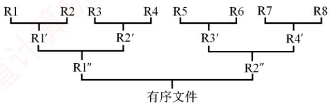
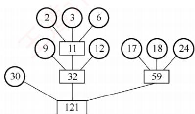
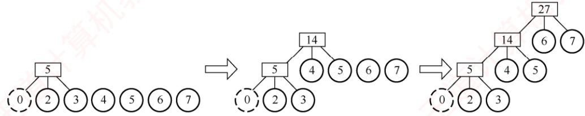

2）由代码 $\mathrm{f}\circ\mathrm{r}(\mathrm{i}=0;\mathrm{i}<\mathrm{n}-1;\mathrm{i}++)$ 和 $\mathrm{f} \circ \mathrm{r} (\mathrm{j}=\mathrm{i}+1 ; \mathrm{j}<\mathrm{n} ; \mathrm{j}++)$ 可知，在循环过程中，每个元素都与它后面的所有元素比较一次（所有元素都两两比较一次），比较次数之和为$(n - 1) + (n - 2) + \cdots + 1$ ，所以总比较次数为n(n-1)/2。

3）不是。需要将程序中的if语句修改如下：

$$
\begin{array} { l } { \mathtt { i i f } \; ( \mathtt { a } \; [ \; \mathtt { i } \; ] < = \mathtt { a } \; [ \; \mathtt { j } \; ] \; ) \quad \mathtt { c o u n t } \; [ \; \mathtt { j } \; ] + + ; } \\ { \mathtt { e l s e } \quad \mathtt { c o u n t } \; [ \; \mathtt { i } \; ] + + ; } \end{array}
$$

若不加等号，两个相等的元素比较时，前面元素的count值会加1，则导致原序列中靠 前的元素在排序后的序列中处于靠后的位置。

## 8.6 各种内部排序算法的比较及应用

## 8.6.1 内部排序算法的比较

前面讨论的排序算法很多，各种排序算法的对比是考研常考的内容。通常从五个方面进行对比：时间复杂度、空间复杂度、稳定性、适用性和过程特征。 X

## 考点追踪各种排序算法的特点和对比（2009、2010、2017、2020、2022、2025）

从时间复杂度看：简单选择排序、直接插入排序和冒泡排序在平均情况下的时间复杂度均为${ \cal O } ( n ^ { 2 } )$ ，且实现较为简单。其中，直接插入排序和冒泡排序在最好情况下可达O(n)，而简单选择排序的时间复杂度与序列初始状态无关。希尔排序作为插入排序的改进，对较大规模的数据通常具有较高效率，但目前未知其精确的渐近时间。堆排序利用堆这种数据结构，可在O(n)时间内完成建堆，整个排序过程的时间复杂度为O(nlog₂n)。快速排序基于分治思想，最坏情况下的时间复杂度为 $O ( n ^ { 2 } )$ ，但平均性能可达O(nlog2n)，在实际应用中快速排序通常表现优异。归并排序同样基于分治思想，其分割过程与初始序列无关，因此最好、最坏和平均时间复杂度均为O(nlog₂n)。

从空间复杂度看：简单选择排序、插入排序、冒泡排序、希尔排序和堆排序仅需常数级辅助空间，空间复杂度为O(1)。快速排序需要递归工作栈，平均空间复杂度为O(log₂n)，最坏情况下可能达到O(n)。2路归并排序在合并操作中需要额外的辅助数组用于元素复制，空间复杂度为O(n)。虽有方法可减少辅助空间，但通常会导致算法复杂度显著增加，甚至影响时间效率。

## 考点追踪各种排序算法的稳定性及分析（2021、2023）

从稳定性看：插入排序、冒泡排序、归并排序和基数排序是稳定的排序算法，而简单选择排序、快速排序、希尔排序和堆排序都是不稳定的。在平均时间复杂度为O(nlog2n)的排序算法中，只有归并排序是稳定的。判断排序算法是否稳定，关键在于分析其操作是否会改变相等元素的相对次序；对于不稳定的算法，通常可通过构造一个反例加以验证。

## 考点追踪各种排序算法的适用性（2017）

从适用性看：折半插入排序、希尔排序、快速排序和堆排序适用于顺序存储。直接插入排序、冒泡排序、简单选择排序、归并排序和基数排序既适用于顺序存储，也适用于链式存储。

## 考点追踪各种排序算法的过程特征（2012）

从过程特征看：不同排序算法在一趟或几趟处理后的中间结果通常是不同的。考研题目常给出初始序列和部分排序后的结果，要求判断所用的排序方法。这就要求考生熟练掌握各类算法的过程特征。如冒泡排序、简单选择排序和堆排序在每趟处理后都能确定当前最大（或最小）元素的最终位置，而快速排序在一趟划分后，至少能确定一个元素（枢轴）的最终位置等。

表8.1列出了各种排序算法的时空复杂度和稳定性情况。其中，空间复杂度仅列出平均情况：由于希尔排序的时间复杂度依赖于所选的增量序列，因此无法给出精确表达式。

表8.1 各种排序算法的性质
<table><tr><td rowspan=1 colspan=1>算法种类</td><td rowspan=1 colspan=3>时间复杂度</td><td rowspan=2 colspan=1>空间复杂度</td><td rowspan=2 colspan=1>是否稳定</td></tr><tr><td rowspan=1 colspan=1></td><td rowspan=1 colspan=1>最好情况</td><td rowspan=1 colspan=1>平均情况</td><td rowspan=1 colspan=1>最坏情况</td></tr><tr><td rowspan=1 colspan=1>直接插入排序</td><td rowspan=1 colspan=1>O(n)</td><td rowspan=1 colspan=1> $\boxed { \mathcal { O } ( n ^ { 2 } ) }$ </td><td rowspan=1 colspan=1> $\overline { { \mathcal { O } ( n ^ { 2 } ) } }$ </td><td rowspan=1 colspan=1>0(1)</td><td rowspan=1 colspan=1>是</td></tr><tr><td rowspan=1 colspan=1>冒泡排序</td><td rowspan=1 colspan=1>O(n)</td><td rowspan=1 colspan=1>O(n2)</td><td rowspan=1 colspan=1>O(n2)</td><td rowspan=1 colspan=1>0(1)</td><td rowspan=1 colspan=1>是</td></tr><tr><td rowspan=1 colspan=1>简单选择排序</td><td rowspan=1 colspan=1>O(n2)</td><td rowspan=1 colspan=1>O(n2)</td><td rowspan=1 colspan=1>O(n2)</td><td rowspan=1 colspan=1>0(1)</td><td rowspan=1 colspan=1>否</td></tr><tr><td rowspan=1 colspan=1>希尔排序</td><td rowspan=1 colspan=3></td><td rowspan=1 colspan=1>O(1)</td><td rowspan=1 colspan=1>否</td></tr><tr><td rowspan=1 colspan=1>快速排序</td><td rowspan=1 colspan=1>O(nlog2n)</td><td rowspan=1 colspan=1>O(nlog2n)</td><td rowspan=1 colspan=1>O(n2)</td><td rowspan=1 colspan=1>O(log2n)</td><td rowspan=1 colspan=1>否</td></tr><tr><td rowspan=1 colspan=1>堆排序</td><td rowspan=1 colspan=1>O(nlog2n)</td><td rowspan=1 colspan=1>O(nlog2n)</td><td rowspan=1 colspan=1>O(nlog2n)</td><td rowspan=1 colspan=1>0(1)</td><td rowspan=1 colspan=1>否</td></tr><tr><td rowspan=1 colspan=1>2路归并排序</td><td rowspan=1 colspan=1>O(nlog2n)</td><td rowspan=1 colspan=1>O(nlog2n)</td><td rowspan=1 colspan=1>O(nlog2n)</td><td rowspan=1 colspan=1>O(n)</td><td rowspan=1 colspan=1>是</td></tr><tr><td rowspan=1 colspan=1>基数排序</td><td rowspan=1 colspan=1>O(d(n + r))</td><td rowspan=1 colspan=1>O(d(n + r))</td><td rowspan=1 colspan=1>O(d(n + r))</td><td rowspan=1 colspan=1>O(r)</td><td rowspan=1 colspan=1>是</td></tr></table>

## 8.6.2 内部排序算法的应用

通常情况，对排序算法的比较和应用应考虑以下情况。

考点追踪选取排序算法时需要考虑的因素（2019）

## 1. 选取排序算法需要考虑的因素

1）待排序元素的个数n。

2）待排序序列的初始状态（如是否基本有序）。

3）关键字的结构及其分布情况。

4）对稳定性的要求。

5）存储结构类型及辅助空间的限制等。

## 2. 排序算法选型小结

1）若n较小，可采用直接插入排序或简单选择排序。直接插入排序的记录移动次数通常多于简单选择排序，因此当记录本身信息量较大时，简单选择排序更为合适。

2）若n较大，应采用时间复杂度为O(nlog₂n)的排序算法，如快速排序、堆排序或归并排序。当关键字随机分布时，快速排序通常被认为是最高效的基于比较的内部排序算法。堆排序所需辅助空间少于快速排序，且不会退化到最坏情况，但两者均为不稳定排序。若既要求稳定性，又希望达到O(nlog2n)的时间复杂度，则应选用归并排序。

3）若初始序列已基本有序，则直接插入或冒泡排序更为高效，因其最好时间复杂度为O(n)。

4）在基于比较的排序算法中，每次比较两个关键字仅有两种可能的结果，因此其执行过程可用一棵判定树来描述。由此可证明：对于n个关键字的随机排列，任何基于比较的排序算法，在最坏情况下至少需要O(nlog2n)的时间。

5）若n很大，且关键字位数较少、可分解为多个子关键字（如整数、字符串），则基数排序是更优选择，因其时间复杂度可接近线性。

6）当记录本身信息量较大（如包含大量字段或大对象）时，为避免因频繁移动记录而产生高昂开销，宜采用链表作为存储结构，此时插入类或归并类排序更具优势。

## 8.6.3 本节试题精选

## 一、单项选择题

01. 若要求排序是稳定的，且关键字为实数，则在下列排序算法中应选（）。

A. 直接插入排序 B. 选择排序 C. 基数排序 D. 快速排序

02. 以下排序算法中时间复杂度为O(nlog2n)且稳定的是（）。A. 堆排序 B. 快速排序 C. 归并排序 D. 直接插入排序

03. 设被排序的结点序列共有n个结点，在该序列中的结点已十分接近有序的情况下，用直接插入排序、归并排序和快速排序对其进行排序，这些算法的时间复杂度应为（）。A. O(n), O(n), O(n) B. $O ( n ) , O ( n \log _ { 2 } n ) , O ( n \log _ { 2 } n )$ C. $O(n),O(n\log_{2}n),O(n^{2})$ D. $O(n^{2}),O(n\log_{2}n),O(n^{2})$

04. 下列排序算法中属于稳定排序的是（①），平均时间复杂度为O(nlog2n)的是（②），在最好的情况下，时间复杂度可以达到线性时间的有（③）。（注：多选题）I. 冒泡排序 Ⅱ. 堆排序 I. 选择排序 IV. 直接插入排序 直机教育V. 希尔排序 VI. 归并排序 VI. 快速排序

05.就排序算法所用的辅助空间而言，堆排序、快速排序和归并排序的关系是（）。A. 堆排序<快速排序<归并排序 B. 堆排序<归并排序<快速排序C.堆排序>归并排序>快速排序 D. 堆排序>快速排序>归并排序

06.排序趟数与序列的初始状态无关的排序算法是（）。I. 快速排序 I. 简单选择排序 I. 冒泡排序 IV. 基数排序A. I、III B. II、IV C. I、II、IV D. I、 IV

07. 排序趟数与序列的初始状态有关的排序算法是（）。A. 直接插入排序 B. 2 路归并排序 C. 快速排序 D. 堆排序

08. 对n个元素进行排序，其排序趟数肯定为n-1趟的排序算法是（）。A. 直接插入排序和快速排序 B. 冒泡排序和快速排序C. 简单选择排序和直接插入排序 D. 简单选择排序和冒泡排序

09. 若序列的初始状态为{1,2,3,4,5,10,6,7,8,9}，要想使得排序过程中的元素比较次数最少，则应该采用（）方法。A. 插入排序 B. 选择排序 C. 希尔排序 D. 冒泡排序

10. 对于元素个数相同的不同初始序列，总比较次数大致相同的排序算法是（）。A. 折半插入排序和简单选择排序 B. 基数排序和归并排序C. 冒泡排序和快速排序 D. 堆排序 老

11.一般情况下，以下查找效率最低的数据结构是（）。 KNA. 有序顺序表 B. 二叉排序树C. 堆 D. 平衡二叉树

12. 一台计算机具有多核CPU，可以同时执行相互独立的任务。归并排序的各个归并段可以并行执行，在下列排序算法中，不可以并行执行的有（）。I. 基数排序 II. 快速排序 III. 冒泡排序 IV. 堆排序A. I、ⅢII B. I、Ⅱ C. I、III、IV D. II、IV

13.【2009统考真题】若数据元素序列{11,12,13,7,8,9,23,4,5}是采用下列排序算法之一得到的第二趟排序后的结果，则该排序算法只能是（）。A. 冒泡排序 B. 插入排序 C. 选择排序 D. 2 路归并排序

14.【2010统考真题】对一组数据(2,12,16,88,5,10)进行排序，若前3趟排序结果如下：第一趟排序结果：2,12,16,5,10,88第二趟排序结果：2,12,5,10,16,88第三趟排序结果：2,5,10,12,16,88

则采用的排序算法可能是（）。A. 冒泡排序 B. 希尔排序 C. 归并排序 D. 基数排序

15.【2012统考真题】在内部排序过程中，对尚未确定最终位置的所有元素进行一遍处理称为一趟排序。下列排序算法中，每趟排序结束都至少能够确定一个元素最终位置的方法是（）。I. 简单选择排序 Ⅱ. 希尔排序 I. 快速排序 IV. 堆排序 V. 2 路归并排序A. 仅I、ⅢII、IV B.仅I、ⅢI、VC. 仅Ⅱ、ⅢI、IV D. 仅ⅢII、IV、V

16.【2017统考真题】在内部排序时，若选择了归并排序而未选择插入排序，则可能的理由是（）。I. 归并排序的程序代码更短 I. 归并排序的占用空间更少 机教I. 归并排序的运行效率更高A. 仅ⅡI B. 仅I C. 仅I、ⅡI D. 仅I、III

17.【2017统考真题】下列排序算法中，若将顺序存储更换为链式存储，则算法的时间效率会降低的是（）。王I. 插入排序 Ⅱ. 选择排序 . 冒泡排序 IV. 希尔排序 V. 堆排序A. 仅I、Ⅱ B. 仅ⅡI、ⅢII C. 仅Ⅲ、IV D. 仅IV、V

18.【2019统考真题】选择一个排序算法时，除算法的时空效率外，下列因素中，还需要考虑的是（）。I. 数据的规模 Ⅱ. 数据的存储方式 I. 算法的稳定性 IV. 数据的初始状态A. 仅ⅢII B. 仅I、Ⅱ C.仅ⅡI、ⅢII、IV D. I、ⅡI、ⅢII、IV

19.【2020统考真题】对大部分元素已有序的数组排序时，直接插入排序比简单选择排序效率更高，其原因是（）。I. 直接插入排序过程中元素之间的比较次数更少Ⅱ. 直接插入排序过程中所需的辅助空间更少Ⅲ. 直接插入排序过程中元素的移动次数更少A. 仅I B.仅Ⅲ C. 仅I、ⅡI D. I、ⅡI和ⅢII

20.【2022统考真题】对数据进行排序时，若采用直接插入排序而不采用快速排序，则可能的原因是（）。I. 大部分元素已有序 Ⅱ. 待排序元素数量很少 算机II. 要求空间复杂度为 O(1) IV. 要求排序算法是稳定的A.仅I、Ⅱ B. 仅ⅢII、IV C.仅I、II、IVD.I、ⅡI、III、IV

21：【2023统考真题】下列排序算法中，不稳定的是（）。I. 希尔排序 II. 归并排序 III. 快速排序 IV. 堆排序 V. 基数排序A. 仅I、Ⅱ B. 仅Ⅱ、V C. 仅I、III、IVD. 仅ⅢII、IV、V

22.【2025统考真题】在下列排序算法中，最坏情况下元素移动次数最少的是（）。A. 起泡排序 B. 直接插入排序C. 快速排序 D. 简单选择排序

23.【2025统考真题】对含9个关键字的初始序列进行排序，若序列的变化情况如下表所示，则下列排序算法中，采用的是（）。

<table><tr><td rowspan=1 colspan=1>初始序列</td><td rowspan=1 colspan=1>5,25,40, 30, 10, 20,45, 15, 35</td></tr><tr><td rowspan=1 colspan=1>第1趟排序后的序列</td><td rowspan=1 colspan=1>5, 10, 20, 30, 15, 35, 45, 25, 40</td></tr><tr><td rowspan=1 colspan=1>第2趟排序后的序列</td><td rowspan=1 colspan=1>5, 10, 15, 25, 20, 30, 40, 35, 45</td></tr></table>

A. 希尔排序 B. 基数排序 C. 归并排序 D. 折半插入排序

## 二、综合应用题

01. 设关键字序列为{3,7,6,9,7,1,4,5,20}，对其进行排序的最小交换次数是多少？

02. 设顺序表用数组A[]表示，表中元素存储在数组下标1～m+n的范围内，前m个元素递增有序，后n个元素递增有序，设计一个算法，使得整个顺序表有序。

1）给出算法的基本设计思想。

2）根据设计思想，采用C/C++描述算法，关键之处给出注释。

3）说明你所设计算法的时间复杂度与空间复杂度。

03. 设有一个数组中存放了一个无序的关键序列 $K_{1},K_{2},\cdots,K_{n} 。$ 现要求将 $K _ { n }$ 放在将元素排序后的正确位置上，试编写实现该功能的算法，要求比较关键字的次数不超过n。

## 8.6.4 答案与解析

## 一、单项选择题

01. A

采用排除法。题目要求是稳定排序，因此排除选项B和D，又基数排序不能对float型和double型的实数进行排序，因此排除选项C。

02. C

堆排序和快速排序不是稳定排序算法，而直接插入排序算法的时间复杂度为 $O ( n ^ { 2 } )$ o

## 03. C

各种排序算法的时间和空间复杂度、稳定性等见表8.1。

04. ①I、IV、VI ② ⅡI、VI、VII ③ I、IV

读者应能从算法的原理上理解算法的稳定性情况。堆排序和归并排序在最坏情况下的时间复杂度与最好情况下的时间复杂度是同一数量级的，都是O(nlog2n)。

## 05. A

堆排序的空间复杂度为O(1)，因此快速排序的空间复杂度在最坏情况下为O(n)，平均空间复杂度为 O(log2n)，归并排序的空间复杂度为O(n)。

06. B

冒泡排序的趟数为1～n-1，和序列初态有关。简单选择排序每趟都选出一个最小（或最大）的元素，排序趟数固定为n-1。基数排序每趟都要进行分配和收集，排序趟数固定为d。快速排序的趟数和枢轴的选取有关，即和划分是否对称有关，当划分的两个区域分别包含0个元素和n-1个元素时，这种最大限度的不对称性发生在序列初态基本有序时。

07. C

直接插入排序的趟数始终为n-1，而与序列的初始状态无关。2路归并排序的趟数始终为「1og₂n，而与序列的初始状态无关。堆排序每趟选出一个最大元素或最小元素，然后调整堆，初始建好堆后，需要n-1趟输出和调整堆的操作，而与序列的初始状态无关。

08. C

简单选择排序和直接插入排序的趟数始终为n-1。冒泡排序的趟数为1～n-1，快速排序的趟数为log2n\~n-1，具体取决于序列的初始状态（快速排序还取决于划分方法）。

09. A

选择排序和序列初态无关，直接排除。初始序列基本有序时，插入排序比较次数较少。本题中，插入排序仅需比较n-1+4次，而希尔排序和冒泡排序的比较次数均远大于此。

## 10. A

简单选择排序的总比较次数显然是确定的。折半插入排序每趟的比较次数都为O(1og2m)（m为当前已排好序的子序列的长度），因此总比较次数也是确定的。基数排序不是基于比较的排序算法。其他几种排序算法的比较次数显然和序列的初始状态有关。

## 11. C

堆是用于排序的，在查找时它是无序的，所以效率没有其他查找结构的高。

## 12. A

基数排序每趟需要利用前一趟已排好的序列，无法并行执行。快速排序每趟划分的子序列互不影响，可以并行执行。冒泡排序每趟对未排序的所有元素进行一趟处理，无法并行执行。堆排序可以并行执行，因为根结点的左右子树构成的子堆在执行过程中是互不影响的。

## 13. B

每趟冒泡和选择排序后，总会有一个元素被放置在最终位置上。显然，这里{11,12}和{4,5}所处的位置并不是最终位置，因此不可能是冒泡和选择排序。2路归并算法经过第二趟后应该是每4个元素有序的，但{11,12,13,7}并非有序，因此也不可能是2路归并排序。

## 14. A

题中给出的排序过程，每一趟都是从前往后依次比较使最大值沉底，符合冒泡排序的特点。分别用其他3种排序算法尝试，归并排序第一趟后的结果为(2,12,16,88,5,10)，基数排序第一趟

## 15. A

对于说法Ⅰ，简单选择排序每次选择未排序序列中的最小元素放入其最终位置。对于说法Ⅱ，希尔排序每次对划分的子表进行排序，得到局部有序的结果，所以不能保证每趟结束都能确定一个元素的最终位置。对于说法Ⅲ，快速排序每趟结束后都将枢轴元素放到最终位置。对于说法IV，堆排序属于选择排序，每次都将大根堆的根结点与表尾结点交换，确定其最终位置。对于选项V，2路归并排序每趟对子表进行两两归并，从而得到若于局部有序的结果，但无法确定最终位置。

## 16. B

归并排序的代码比插入排序的代码更为复杂，前者的空间复杂度为 $O ( n )$ ，后者为O(1)。但是前者的时间复杂度为O(nlog2n)，后者为 $O ( n ^ { 2 } )$ IKNIT

## 17. D

在顺序存储的条件下，插入排序、选择排序、冒泡排序的时间复杂度都是 $O(n^{2})$ ，更换为链式存储后的时间复杂度还是 $O ( n ^ { 2 } )$ 。希尔排序和堆排序都利用了顺序存储的随机访问特性，而链式存储不支持这种性质，所以时间复杂度会增加。

## 18. D

当数据规模较小时可选择复杂度为 $O ( n ^ { 2 } )$ 的简单排序算法，当数据规模较大时应选择复杂度为 $O ( n \log _ { 2 } n )$ 的排序算法，当数据规模大到内存无法放下时需选择外部排序算法，说法Ⅰ正确。数据的存储方式主要分为顺序存储和链式存储，有些排序算法（如堆排序）只能用于顺序存储方式，说法Ⅱ正确。若对数据稳定性有要求，则不能选择不稳定的排序算法，说法Ⅲ显然正确。当数据初始基本有序时，直接插入排序的效率最高，冒泡排序和直接插入排序的时间复杂度都为$O ( n )$ ，而归并排序的时间复杂度仍然为 $O ( n \log _ { 2 } n )$ ，说法IV正确。

## 19. A

考虑比较极端的情况，对于有序数组，直接插入排序的比较次数为n-1，简单选择排序的比较次数始终为 $1+2+\cdots+n-1=n(n-1)/2$ ，说法Ⅰ正确。两种排序算法的辅助空间都为O(1)，无

差别，说法Ⅱ错误。初始有序时，移动次数均为0；对于通常情况，直接插入排序每趟插入都需要依次向后挪位，而简单选择排序只需与找到的最小元素交换位置，后者的移动次数少很多，说法Ⅲ错误。

## 20. D

直接插入排序和快速排序的特点如下表所示。

<table><tr><td rowspan=1 colspan=1></td><td rowspan=1 colspan=1>适合初始序列情况</td><td rowspan=1 colspan=1>适合元素数量</td><td rowspan=1 colspan=1>空间复杂度</td><td rowspan=1 colspan=1>稳定性</td></tr><tr><td rowspan=1 colspan=1>直接插入排序</td><td rowspan=1 colspan=1>大部分元素有序</td><td rowspan=1 colspan=1>较少</td><td rowspan=1 colspan=1>0(1)</td><td rowspan=1 colspan=1>稳定</td></tr><tr><td rowspan=1 colspan=1>快速排序</td><td rowspan=1 colspan=1>基本无序</td><td rowspan=1 colspan=1>较多</td><td rowspan=1 colspan=1>O(log2n)</td><td rowspan=1 colspan=1>不稳定</td></tr></table>

可见，说法I、Ⅱ、Ⅲ、IV都是采用直接插入排序而不采用快速排序的可能原因。

## 21. C

稳定的内部排序算法：插入排序、冒泡排序、归并排序和基数排序。不稳定的内部排序算法： 简单选择排序、快速排序、希尔排序和堆排序。 V

## 22. D

简单选择排序每趟从未排序部分选出最小（或最大）元素，与未排序部分的首元素交换。无论输入如何，最多执行n-1次交换，总移动次数为O(n)，是所有选项中最少的。而起泡排序、直接插入排序和快速排序在最坏情况下均需O(n²)次移动（如逆序时起泡和插入需要大量移位，快排递归分割导致频繁交换）。因此，简单选择排序在最坏情况下的元素移动次数最少。

## 23. A

第1趟排序后，序列呈现出以间隔3分组的局部有序特征：下标模3相同的元素各自有序（如位置1,4,7上的25,10,15变为10,15,25；位置2,5,8上的40,20,35变为20,35,40），这是希尔排序在增量d=3时对各子序列进行插入排序的典型特征。第2趟进一步调整，符合增量缩小至1的结果。而其他三种排序方法均无法产生这种跨距离分组、局部有序的中间状态。

## 二、综合应用题

## 01.【解答】

直接插入排序的交换次数更多，因此应当采用简单选择排序。

初始序列：3,7,6,9,7,1,4,5,20

第一次：1,7,6,9,7,3,4,5,20 交换1,3

第二次：1,3,6,9,7,7,4,5,20 交换3,7

第三次：1,3,4,9,7,7,6,5,20 交换4,6

第四次：1,3,4,5,7,7,6,9,20 交换5,9

第五次：1,3,4,5,6,7,7,9,20 交换6,7

所以最小交换次数为5（注意这里求的是交换次数，而不是移动次数或比较次数）。

## 02.【解答】

1）算法的基本设计思想如下：将数组A[1...m+n]视为一个已经过m趟插入排序的表，则从m+1趟开始，将后n个元素依次插入前面的有序表中。

2）算法的实现如下：

```javascript
void Insert Sort(ElemType A[],int m,int n){
int i,j;
for(i=m+1;i<=m+n;i++){ //依次将A[m+1...m+n]插入有序表
A[0]=A[i]; //复制为哨兵
for(j=i-1;A[j]>A[0];j--) //从后往前插入
A[j+1]=A[j]; //元素后移
A[j+1]=A[0]; //插入
```

3）时间复杂度由m和n共同决定，从上面的算法不难看出，在最坏情况下元素的比较次数为O(mn)，而元素移动的次数为O(mn)，所以时间复杂度为 O(mn)。

因为算法只用到了常数个辅助空间，所以空间复杂度为O(1)。

此外，本题也可采用归并排序，将A[1...m]和A[m+1...m+n]视为两个待归并的有序子序列，算法的时间复杂度为 O(m + n)，空间复杂度为 O(m + n)。

## 03. 【解答】

基本思想：以 $K _ { n }$ 为枢轴进行一趟快速排序。将快速排序算法改为以最后一个元素为枢轴，先从前往后，再从后往前。算法的代码如下：

int Partition(ElemType K[],int n) {  
//交换序列κ[1..n]中的记录，使枢轴到位，并返回其所在位置  
int i=1,j=n; //设置两个交替变量初值分别为1和n  
ElemType pivot=K[j]; //枢轴  
while(i<j){ while(i<j&&K[i]<=pivot) //循环跳出条件 道  
i++; //从前往后找比枢轴大的元素  
if (i<j)  
K[j]=K[i]; //移动到右端  
while(i<j&&K[j]>=pivot)  
j--; //从后往前找比枢轴小的元素  
if (i<j)  
K[i]=K[j]; //移动到左端  
} ∥while  
K[i]=pivot; //枢轴存放在最终位置  
return i; //返回存放枢轴的位置

## 8.7 外部排序

外部排序可能会考查相关概念、方法及排序过程。本节的主要内容包括：

①外部排序是指对大文件进行排序，即待排序记录存储在外存中，且无法一次性全部装入内存，需在内存与外存之间多次交换数据，以完成整个文件的排序。

②为减少多路平衡归并中外存读/写次数可采取的方法：增大归并路数和减少归并段数。

③利用败者树可高效实现多路归并，从而增大归并路数。

④利用置换-选择排序可生成更长的初始归并段，从而减少归并段个数。

⑤由长度不等的归并段进行多路平衡归并时，需要构造最佳归并树。

## 8.7.1 外部排序的基本概念

此前介绍的排序算法均假设所有数据可一次性载入内存（称为内部排序）。而在许多应用中，常需对大规模文件进行排序；由于记录数量庞大，无法将整个文件一次性装入内存。此时，待排序记录必须存储在外存中，排序时仅能将部分数据调入内存处理，并通过多次内外存之间的数据交换，逐步完成整体排序。这类依赖内外存协同操作的排序算法，称为外部排序。

## 8.7.2 外部排序的方法

文件通常以块为单位存储在磁盘上，操作系统也按块对磁盘信息进行读/写操作。由于磁盘读/写的机械动作耗时远高于内存运算时间（相比而言后者可忽略不计），因此外部排序的时间代价主要取决于访问磁盘的次数，即I/O 次数。

## 考点追踪对大文件排序时使用的排序算法（2016）

外部排序通常采用归并排序策略，包含两个阶段：①生成初始归并段。根据内存缓冲区大小，将外存上的文件划分为若干子文件，依次读入内存，利用内部排序算法对每个子文件排序后写回外存，形成多个有序的初始归并段（也称顺串）；②多路归并。对这些初始归并段进行逐趟多路归并，每趟将多个有序段合并为更长的有序段，逐步减少段数，最终得到整个有序文件。

例如，一个包含2000个记录的文件，每个磁盘块可容纳125个记录。首先通过8次内部排序，得到8个初始归并段R1～R8，每段包含250条记录。随后，对该文件执行如图8.15所示的2路归并，直至获得一个有序文件。具体实现时，可将内存工作区划分为三个缓冲区（见图8.14）：两个输入缓冲区和一个输出缓冲区。首先，从归并段R1和R2中各读入一个磁盘块，分别存入两个输入缓冲区：然后在内存中进行2路归并，将归并结果依次写入输出缓冲区：若输出缓冲区已满，则将其内容写入新的归并段R1'，清空后继续接收后续归并结果：若某个输入缓冲区取空，则从对应的归并段中读入下一块数据，继续参与归并。如此反复，直至R1与R2的所有记录均被归并完毕。接着归并R3与R4、R5与R6、R7与R8，完成第一趟归并。第二趟归并R1′与R2'、R3'与R4′。第三趟归并R1"与R2”，最终得到完整的有序文件，整个过程共进行3趟归并。

  
图 8.14 2 路归并

  
图 8.15 2 路归并的排序过程

在外部排序中实现两两归并时，通常无法将两个输入有序段及归并结果同时驻留于内存中，因此必须频繁地将数据从外存读入、再将结果写回磁盘，这会消耗大量时间。一般而言，有

$$
 外部排序总时间  =  内部排序时间  +  外存读 / 写时间  +  内部归并时间
$$

显然，外存读/写时间远大于内部排序与内部归并所需的时间，因此应着力减少I/O次数。由于外存的读/写操作以磁盘块为单位进行，结合前例可知，每趟归并需进行16次读和16次写，共32次I/O；3趟归并加上初始内部排序阶段的32次I/O，总计32×3+32=128次I/O操作。

若改用4路归并，则仅需2趟归并，总I/O次数降至32×2+32=96次。由此可见，增大归并路数可有效减少归并趟数，从而显著降低总的磁盘I/0次数，如图8.16所示。

  
图8.16 4 路归并的排序过程

一般地，对r个初始归并段进行k路归并（每趟将k个或更少的有序子文件合并为一个）。第一趟可将r个归并段合并为「r/k]个，后续每趟归并将m个归并段合并为「m/k]个，直至只剩一个

  
图8.17 实现 5 路归并的败者树

归并段。树的高度-1 =「1ogkr]= 归并趟数 $S _ { \circ }$ 因此，增大归并路数k，或减少初始归并段个数r，均可减少归并趟数S，进而减少磁盘I/O次数，有效提升外部排序效率。

## 8.7.3 多路平衡归并与败者树

增大归并路数k可减少归并趟数S，从而降低I/O次数。然而，随着k的增大，内部归并的时间开销也会显著增加。这是因为在k个元素中选出关键字最小者，每次选择需要进行k-1次比较；每趟归并n个元素，共需 $( n   -   1 ) ( k   -   1 )$ 次比较。S趟归并的总比较次数为①

$$
S(n - 1)(k - 1) = \left\lceil \log_{k}r \right\rceil(n - 1)(k - 1) = \left\lceil \log_{2}r \right\rceil(n - 1)(k - 1) / \left\lceil \log_{2}k \right\rceil
$$

式中，（k-1)1og₂k随k增大而增大，因此内部归并时间也随之增长，这将部分抵消因减少I/O次数带来的性能收益。因此，不能直接使用普通的多路归并方法。

为使内部归并的时间复杂度不受k增大的影响，引入了败者树。败者树是树形选择排序的一种变体，可视为一棵完全二叉树。其k个叶结点分别存放k个归并段当前参与比较的元素，内部结点用于记录左右子树比较中的“败者”（关键字较大者），而“胜者”（较小者）继续向上参与比较，最终胜者的段号存于s[0]，其对应的关键字即为当前最小值。 道

## 考点追踪败者树的实现原理（2024）

如图8.17(a)所示，考虑5路归并，叶结点为b0,b1,b2,b3,b4：b3与b4比较，b4为败者，将其段号4写入父结点1s[4]；b1与b2比较，b2为败者，将段号2写入1s[3]；胜者b3与b0比较，b0为败者，将段号0写入1s[2]；最后，两个子树的胜者b3与b1比较，b1为败者，将段号1写入ls[1];而将胜者b3的段号3写入1s[0]，表明当前最小关键字来自第3段。输出b3中的关键字后，从第3段读入下一个关键字，更新b3，并沿路径向上重新调整败者树。

由于k路归并的败者树深度为 $\lceil \log _ { 2 } k \rceil + 1$ ，因此从k个记录中选出最小关键字，仅需 $\left[ \log _ { 2 } \vec { k } \right]$ 次比较。此时，总的比较次数约为 uK VI

$$
S(n - 1)\left[ \log_{2}k \right] = \left[ \log_{k}r \right](n - 1)\left[ \log_{2}k \right] = (n - 1)\left[ \log_{2}r \right]
$$

可见，使用败者树后，内部归并的比较次数与归并路数k无关。因此，在内存空间允许的前提下，增大k可有效降低归并树高度，减少I/O次数，从而提高外部排序的效率。

值得注意的是，归并路数k并非越大越好。增大k需要增加输入缓冲区的数量。若总内存容量固定，则每个缓冲区的容量将相应减小，导致每趟归并中外存读/写的次数增加。当k过大时，尽管归并趟数减少，但总体I/O次数反而可能增加，从而抵消性能增益。

## 8.7.4 置换-选择排序（生成初始归并段）

由8.7.2节可知，减少初始归并段个数r同样可减少归并趟数S。若待排序记录总数为n，每个归并段的平均长度为l，则归并段个数 $r = \lceil n / \ell \rceil$ 。采用普通内部排序方法生成的初始归并段长度通常固定（除最后一段外），其长度受限于内存工作区的大小。因此，有必要探索新方法以生成更长的初始归并段，从而减少r，这就是本节要介绍的置换-选择算法。

## 考点追踪置换-选择排序生成初始归并段的实例（2023）

设初始待排文件为FI，归并段输出文件为FO，内存工作区为WA，其中 WA可容纳w个记录，初始时FO与WA均为空。置换-选择算法的执行步骤如下： X

1）从 FI读入 w个记录至工作区WA。

2）从WA中选出当前关键字最小的记录，记为MINIMAX记录。

3）将该 MINIMAX记录写入FO。

4）若FI非空，则从FI读入下一个记录至WA。

5）从WA中所有关键字不小于当前MINIMAX关键字的记录中，选出关键字最小者，作为新的 MINIMAX记录。 长

6）重复步骤3）～5），直至WA中不存在关键字不小于当前MINIMAX的记录为止，此时完成一个初始归并段的输出。 KK

7）重复步骤2）～6），直至FI与WA均为空，从而生成全部初始归并段。

通过该方法，初始归并段长度不再受限于内存大小w，而取决于输入数据的分布。理想情况下（如输入基本有序），可生成长度远超w的归并段，显著减少归并段总数。

设待排文件 FI = {17,21,05,44,10,12,56,32,29}，WA 容量为3，排序过程如表8.2所示。

表8.2 置换-选择排序过程示例
<table><tr><td rowspan=1 colspan=1>输出文件FO</td><td rowspan=1 colspan=1>工作区</td><td rowspan=1 colspan=3>WA</td><td rowspan=1 colspan=1></td><td rowspan=1 colspan=1>输入文件FI</td></tr><tr><td rowspan=1 colspan=1></td><td rowspan=1 colspan=5></td><td rowspan=1 colspan=1>17,21,05, 44, 10, 12,56,32,29</td></tr><tr><td rowspan=1 colspan=1></td><td rowspan=1 colspan=3>17 2105</td><td rowspan=1 colspan=2></td><td rowspan=1 colspan=1>44, 10, 12, 56, 32, 29</td></tr><tr><td rowspan=1 colspan=1>05</td><td rowspan=1 colspan=5>1721 44</td><td rowspan=1 colspan=1>10, 12, 56, 32, 29</td></tr><tr><td rowspan=1 colspan=1>05 17</td><td rowspan=1 colspan=2>10214</td><td rowspan=1 colspan=3>4</td><td rowspan=1 colspan=1>12, 56, 32, 29</td></tr><tr><td rowspan=1 colspan=1>05 17 21</td><td rowspan=1 colspan=5>10 124</td><td rowspan=1 colspan=1>56, 32,29</td></tr><tr><td rowspan=1 colspan=1>05 17 21 44</td><td rowspan=1 colspan=5>10 12 56</td><td rowspan=1 colspan=1>32,29</td></tr><tr><td rowspan=1 colspan=1>05 17 21 44 56</td><td rowspan=1 colspan=5>10 12 32</td><td rowspan=1 colspan=1>29</td></tr><tr><td rowspan=1 colspan=1>05 17 21 44 56 #</td><td rowspan=1 colspan=5>1012 32</td><td rowspan=1 colspan=1>29</td></tr><tr><td rowspan=1 colspan=1>10</td><td rowspan=1 colspan=2>29123</td><td rowspan=1 colspan=3>2</td><td rowspan=1 colspan=1></td></tr><tr><td rowspan=1 colspan=1>10 12</td><td rowspan=1 colspan=5>29  32</td><td rowspan=1 colspan=1></td></tr><tr><td rowspan=1 colspan=1>10 12 29</td><td rowspan=1 colspan=2>32</td><td rowspan=1 colspan=3></td><td rowspan=1 colspan=1>xy</td></tr><tr><td rowspan=1 colspan=1>10 12 29 32</td><td rowspan=1 colspan=5>-</td><td rowspan=1 colspan=1></td></tr><tr><td rowspan=1 colspan=1>10 12 29 32 #</td><td rowspan=1 colspan=5></td><td rowspan=1 colspan=1></td></tr></table>

上述算法，在WA中选择MINIMAX记录的过程需利用败者树来实现。

## 8.7.5 最佳归并树

文件经过置换-选择排序后，得到长度不等的初始归并段。下面讨论如何安排这些长度不等

的归并段的归并顺序，使得I/O次数最少。假设通过置换-选择排序得到9个初始归并段，其长度依次为9,30,12,18,3,17,2,6,24。若采用3路平衡归并，一种可能的归并树如图8.18所示。


在图8.18中，各叶结点表示一个初始归并段，其上的权值表示该段的长度；叶结点到根的路径长度表示该图8.18 3 路平衡归并的归并树

段参与归并的趟数；非叶结点表示归并生成的新段；根结点对应最终有序文件。树的带权路径长度WPL等于归并过程中读取的总记录数，因此总的I/O次数 $2 \times  WPL = 484$

## 考点追踪构造三叉哈夫曼树及相关的分析和计算（2013）

显然，不同的归并方案对应不同的归并树，其WPL（I/O次数）也不同。为最小化I/O开销，可将哈夫曼编码的思想推广至k叉树情形：优先归并长度较小的段，延后归并长度较大的段，从而构造出I/O次数最少的最佳归并树。对上述9个归并段，按此原则构造的最佳3路归并树如图8.19所示，按此方案归并，总I/O次数仅为446，显著优于普通方案。



图8.19所示的归并树是一棵严格三叉树，即树中只有度为3或0的结点。然而，当初始归并段的数量不足以构成严格图8.19 3路平衡归并的最佳归并树

k叉树（也称正则k叉树）时，直接进行k路归并会导致某些归并轮次不足k路，从而降低效率。例如，若只有8个初始归并段（如删除上例中长度为30的段），如果强行在最后一次归并时降

为2路，其余仍为3路，则I/O次数将高达386，这并非最优方案。更优的做法是：引入若干长度为0的“虚段”（不包含实际数据的空归并段），使每趟归并都能满路（每次归并都处理3个段）。这些虚段不会产生实际的I/O开销，但能让归并树的结构更接近哈夫曼最优形态一一权值较小的段（包括虚段）被安排在更深的位置，避免过早参与归并。按照这一思路构造的最佳归并树如图8.20所示，其I/O次数显著降低至326。

  
图8.20 8个归并段的最佳归并树

如何判定添加虚段的数目？

设度为0的结点有 $n _ { 0 }$ 个，度为k的结点有 $n _ { k }$ 个，归并树的结点总数为n，则有：

$n = n_{k} + n_{0}$ (总结点数 = 度为 k的结点数 + 度为 0的结点数)

$n = k n _ { k } + 1$ （总结点数 = 所有结点的度数之和 +1)

因此，对严格k叉树有 $n _ { 0 } = ( k - 1 ) n _ { k } + 1$ ，由此可得 $n _ { k } = ( n _ { 0 } - 1 ) / ( k - 1 )$ o

接下来，根据 $n _ { 0 }$ 和k的关系，判断是否需要添加虚段：

若 $(n_{0}-1)\%(k-1)=0$ （%为取模运算），则说明这 $n _ { 0 }$ 个叶结点（初始归并段）正好可以构成一棵严格的k叉归并树。此时，内结点有 $n _ { k }$ 个。

若 $(n_{0}-1)\%(k-1)=u\neq0$ ，则说明对于这 $n _ { 0 }$ 个叶结点，其中有u个多余，不能直接纳入k叉归并树。为构造包含所有 $n _ { 0 }$ 个初始归并段的k叉归并树，应在原有 $n _ { k }$ 个内结点的基础上再增加1个内结点。该内结点将代替一个叶结点的位置，被代替的叶结点连同多出的u个叶结点，再加上k-u-1个空归并段，即可构建完整的归并树。

考点追踪实现最佳归并时需补充的虚段数量的分析（2019）

以图8.20为例，用8个归并段构造三叉树时， $(n_{0}-1)\%(k-1)=(8-1)\%(3-1)=1\ne0$ ，表明当前叶结点数无法构成严格的三叉树。因此，需要添加3-1-1=1个虚段，使叶结点总数增至9，满足 $(9 - 1)\%(3 - 1) = 0$ ，这样就可以构建一棵完整的严格三叉树。

## 8.7.6 本节试题精选

## 一、单项选择题

01. 外部排序和内部排序的主要区别是（）。A. 内部排序的数据量小，而外部排序的数据量大B.内部排序不涉及内、外存数据交换，而外部排序涉及内、外存数据交换C. 内部排序的速度快，而外部排序的速度慢D. 内部排序所需的内存小，而外部排序所需的内存大 +算

02. 下列关于外部排序的说法中，正确的是（）。A.置换选择排序得到的初始归并段的长度一定相等B. 内外存交换数据的时间只占总排序时间的一小部分C. 败者树是一棵完全二叉树D. 外部排序不涉及对文件的读/写操作

03.多路平衡归并的作用是（）。A. 减少归并趟数 B. 减少初始归并段的个数C. 便于实现败者树 D. 以上都对

04. 设在磁盘上存放有375000个记录，进行5路平衡归并排序，内存工作区能容纳600个记录，为把所有记录排好序，需要进行（）趟归并排序。A. 3 B. 4 C. 5 D. 6

05. 在下列关于外部排序过程输入/输出缓冲区作用的叙述中，不正确的是（）。A. 暂存输入/输出记录 B. 内部归并的工作区C. 产生初始归并段的工作区 D. 传送用户界面的消息

06. 若只需3趟排序就可完成64个元素的多路归并排序，则选取的归并路数最少是（）。A. 2 妆B. 3 C. 4 D. 5

07.置换-选择排序的作用是（）。A. 用于生成外部排序的初始归并段B.完成将一个磁盘文件排序成有序文件的有效的外部排序算法C.生成的初始归并段的长度是内存工作区的2倍D. 对外部排序中输入/归并/输出的并行处理 王

08. 一个无序文件的n个记录采用置换选择排序产生 m 个有序段，则 m和 n的关系是（）。A. m 与 n 成正比 B. $m = \log _ { 2 } n$ C. m 与 n 成反比 D. 以上都不对

09. 在由k路归并构建的败者树中选取一个关键字最小的记录，则所需时间为（）。A. O(1) B. O(k) C. O(log2k) D. 以上都不对

10.下列关于小顶堆和败者树的说法中，正确的是（）。I. 败者树从下往上维护，每上一层，只需和失败结点比较1次Ⅱ. 败者树的每次维护，必定要从叶结点一直走到根结点，不可能从中间停止Ⅲ.堆从上往下维护，每下一层，若其左右孩子均不为空，则需比较2次

IV. 堆的每次维护，必定要从根结点一直走到叶结点，不可能从中间停止A. I、III B. II、III K C.I、ⅡI、III D. I、III、IV

11. 最佳归并树在外部排序中的作用是（）。A. 完成 m 路归并排序 B. 设计m路归并排序的优化方案C. 产生初始归并段 D. 与锦标赛树的作用类似

12. 在由m个初始归并段构建的k阶最佳归并树中，不需要补充虚段，则度为k的结点个数是（）。A. (m − 1)/k B. m/k C. (m−1)/(k−1) D. 无法确定

13. 【2013统考真题】已知三叉树T中6个叶结点的权分别是2,3,4,5,6,7，T的带权（外部）路径长度最小是（）。A. 27 B. 46 C. 54 D. 56

14.【2016统考真题】对10TB的数据文件进行排序，应使用的方法是（）。A. 希尔排序 B. 堆排序 C. 快速排序 D. 归并排序

15.【2019统考真题】设外存上有120个初始归并段，进行12路归并时，为实现最佳归并，需要补充的虚段个数是（）。HA. 1 B. 2 C. 3 D. 4

16.【2024统考真题】在外排序中，利用败者树对初始为升序的归并段进行多路归并，败者树中记录“冠军”的结点保存的是（）。TA. 最大关键字 B. 最小关键字C. 最大关键字所在的归并段号 D. 最小关键字所在的归并段号

## 二、综合应用题

01.若某个文件经内部排序得到80个初始归并段，试问：1）若使用多路平衡归并执行3趟完成排序，则应取得的归并路数至少应为多少？2)若操作系统要求一个程序同时可用的输入/输出文件的总数不超过15个，则按多路归并至少需要几趟可以完成排序？若限定这个趟数，可取的最低路数是多少？

02. 假设文件有4500个记录，在磁盘上每个块可放75个记录。计算机中用于排序的内存区可容纳450个记录。试问：1）可以建立多少个初始归并段？每个初始归并段有多少记录？存放于多少个块中？2）应采用几路归并？请写出归并过程及每趟需要读/写磁盘的块数。

03. 设初始归并段为(10, 15, 31), (9, 20), (22, 34, 37), (6, 15, 42),(12, 37), (84, 95)。试利用败者 树进行m路归并，手工执行选择最小的5个关键字的过程。 FD

04. 给出12个初始归并段，其长度分别为30,44,8,6,3,20,60,18,9,62,68,85。现要做4路外归并排序，试画出表示归并过程的最佳归并树，并计算该归并树的带权路径长度WPL。

05.【2023统考真题】对含有n（n>0）个记录的文件进行外部排序，采用置换-选择排序生成初始归并段时需要使用一个工作区，工作区中能保存m个记录。请回答：1)若文件中含有19 个记录,其关键字依次是51,94,37,92, 14,63,15,99,48, 56,23,60, 31,17,43,8,90,166,100，则当m=4时，可生成几个初始归并段？各是什么？

2)对任意的 $m \left( n \gg m > 0 \right)$ ，生成的第一个初始归并段的长度最大值和最小值分别是多少？

## 8.7.7 答案与解析

## 一、单项选择题

01. B

外部排序和内部排序最主要的区别是是否涉及内存、外存的数据交换。

## 02. C

置换选择排序得到的是长度不一定相等的归并段，选项A错误。外部排序的主要时间消耗在内外存之间的数据交换上，选项B错误。败者树是一棵完全二叉树，选项C正确。外部排序包括两个阶段：生成初始归并段和对初始归并段进行归并，这两个阶段都涉及对文件的读/写操作，选项D错误。

## 03. A

多路平衡归并的目的是减少归并趟数，因为当m个初始归并段采用k路平衡归并时，所需趟数 $s = \lceil \log _ { k } m \rceil ,$ ，若不采用多路平衡归并，则其归并趟数大于s。

## 04. B

初始归并段的个数 $r=375000/600=625$ ，因此，归并趟数 $S = \lceil \log_{m} r \rceil = \lceil \log_{5} 625 \rceil = 4$ 。第一趟把625个归并段归并成625/5=125个；第二趟把125个归并段归并成125/5=25个；第三趟把25个归并段归并成25/5=5个；第四趟把5个归并段归并成5/5=1个。

## 05. D

在外部排序过程中输入/输出缓冲区就是排序的内存工作区，例如进行m路平衡归并需要m个输入缓冲区和1个输出缓冲区，用以存放参加归并的和归并完成的记录。在产生初始归并段时也可用作内部排序的工作区。它没有传送用户界面的消息的任务。

## 06. C

归并趟数= 「1ogkn]，其中 k 表示归并的路数，n表示元素个数，当 k = 4、n = 64 时，归并趟数恰好等于3，因此选取的归并路数至少是4。

## 07. A

置换-选择排序是外部排序中生成初始归并段的方法，用此方法得到的初始归并段的长度是不等长的，其长度平均是传统等长初始归并段的2倍，从而使得初始归并段数减少到原来的近二分之一。但是，置换-选择排序不是一种完整的生成有序文件的外部排序算法。

## 08. D

设内存工作区w=1，则文件{1,2,3,4,5}产生1个有序段，而文件{5,4,3,2,1}产生5个有序段，因此m与待排文件、内存工作区大小 w和 n都有关，但不是选项A、B、C 描述的直接关系。

## 09. C

在败者树中选取最小关键字的时间复杂度取决于败者树的高度，所需时间为 $O ( \log _ { 2 } k )$

## 10. C

说法Ⅰ正确，是败者树的性质。在败者树的维护过程中，会让胜利者一直调整到根结点，说法Ⅱ正确。以小根堆为例，每次调整时，先比较下一层的两个元素（1次），找出较小值，然后比较当前元素和下一层的较小元素（1次），以决定是否向下交换位置，说法Ⅲ正确。堆在维护时，可能会在中间某层停止（若此处无须调整），而不一定要走到叶结点，说法IV错误。

## 11. B

最佳归并树在外部排序中的作用是设计m路归并排序的优化方案，仿照构造哈夫曼树的方法，以初始归并段的长度为权值，构造具有最小带权路径长度的m叉哈夫曼树，可以有效地减少归并过程中的读/写记录数，加快外部排序的速度。 长

## 12. C

k阶最佳归并树中只有度为0和k的结点。设结点总数为n，度为0的结点数为 $n _ { 0 }$ ，度为k的结点数为 $n _ { k }$ ，则 $n_{0}=m、n-1=kn_{k},n=n_{0}+n_{k},$ 因此 $k n _ { k } = m + n _ { k } - 1$ ，求得 $n _ { k }   =   ( m   -   1 ) / ( k   -   1 )$

## 13. B

题中的三叉树为使WPL最小，必须构造三叉哈夫曼树，应满足 $(n_{0}-1)\%(3-1)=0$ 的条件，因

14. D

此需添加1个权值为0的虚叶结点，说明7个叶结点刚好可构成一棵严格的三叉树。按照哈夫曼树的原则，权为0的叶结点应离树根最远，构造三叉哈夫曼树的过程如下：

① 合并权值最小的三个结点 0,2,3，得到新结点的权值 = 5，剩下 5,4,5,6,7。

②合并权值最小的三个结点4,5,5，得到新结点的权值 = 14，剩下14,6,7。

③合并权值最小的三个结点6,7,14，得到新结点的权值=27，仅有27，建树完成。

$$
\mathrm{WPL}=\sum_{i=1}^{n} \mathrm{K}_{i} \left(W_{叶结点 i} \times \mathrm{ 深度 } D_{叶结点 i}=(2+3) \times 3+(4+5) \times 2+(6+7) \times 1=46\right)
$$

或

$$
\mathrm{WPL}=\sum_{1}^{m}\mathrm{权值}W_{ 分支结点 j}=27+14+5=46
$$

每个分支结点的权值都累加了其下面所有分支结点的权值，因此采用第二种方法更方便。



外部排序指的是大文件的排序，即待排序的记录存储在外存中，待排序的文件无法一次性装入内存，需要在内存和外存之间进行多次数据交换，以达到排序整个文件的目的。外部排序通常采用归并排序算法。选项A、B、C都是内部排序的方法。

## 15. B

在12路归并树中只存在度为0和度为12的结点，设度为0的结点数、度为12的结点数和要补充的结点数分别为 $n _ { 0 }  、 n _ { 1 2 }$ 和n，则有 $n_{ 补 }$ $n_{0}=120+n_{补}, \quad n_{0}=(12-1)n_{12}+1$ ，可得 $n_{12} = (120 - 1 + n_{补}) / (12 - 1)$ 因为结点数 $n _ { 1 2 }$ 为整数，所以 $n_{ 补 }$ 是使上式整除的最小整数，求得 $n_{ 补 } = 2$ 0

此外，题中为实现最佳归并，应满足12叉哈夫曼树， $n = 120, m = 12$ ，不满足 $(n - 1)\%(m - 1) = 0$ 的条件，因此需要添加两个权值为0的叶结点，使得 $n   =   1 2 2$ ，才能满足条件。

## 16. D

利用败者树归并升序归并段，每次需要得到当前的最小关键字，因此记录“冠军”的结点保存的只能是最小关键字或最小关键字所在的归并段号。通过败者树找出最小关键字后，还需要找到该关键字所在的归并段，并移动段内元素，以继续比较下一个元素，下面分别进行讨论：①假设记录“冠军”的结点保存的是最小关键字所在的归并段号，则能直接得到最小关键字及其所在的段，时间复杂度低。②假设记录“冠军”的结点保存的是最小关键字，则查找其所在的段需要检索所有段的首元素是否与该最小关键字相等，时间复杂度高。为了提高效率，记录“冠军”的结点保存的是最小关键字所在的归并段号，而不是最小关键字。 X

## 二、综合应用题

## 01. 【解答】

1）设归并路数为m，初始归并段个数 $r   = 8 0$ ，根据归并趟数计算公式 $S = \left\lceil \log_{m}r \right\rceil = \left\lceil \log_{m}80 \right\rceil =$ 3，得 $\log _ { m } 8 0 \leqslant 3 , m ^ { 3 } \geqslant 8 0$ 。由此解得 $m   \geq   5$ ，即应取的归并路数至少为5。

2）设多路归并的归并路数为m，需要m个输入缓冲区和1个输出缓冲区。一个缓冲区对应一个文件，有 $m + 1 = 1 5$ ，因此 $m = 1 4$ ，可做14路归并。由 $S = \lceil \log_{m} r \rceil = \lceil \log_{14} 80 \rceil = 2$ 即至少需要2趟归并可完成排序。若限定趟数为2，由 $S = \left\lceil \log_{m}80 \right\rceil = 2$ ，有 $8 0 { \leqslant } m ^ { 2 }$ ，可取的最低路数为9。即要在2趟内完成排序，进行9路归并排序即可。

## 02. 【解答】

1）文件有4500个记录，用于排序的内存区可容纳450个记录，可建立的初始归并段有4500/450=10个。每个初始归并段中有450个记录，存于450/75=6个块中。

2）内存区可容纳6个块，可建立6个缓冲区，其中5个缓冲区用于输入，1个缓冲区用于输出，因此可采用5路归并，归并过程如下图所示。


共进行了2趟归并，每趟需要读60块、写60块。

03.【解答】

进行6路归并排序，选择最小的5个关键字的败者树如下图所示。


04. 【解答】

设初始归并段个数 n =12，外归并路数 k = 4，计算(n−1)%(k −1)=11%3 =2≠0，说明不能做完全的4路归并，因为多出了两个初始归并段，必须添加k-2-1=1个长度为0的空归并段，才能构成严格的4路归并树，即每次归并都有k个归并段参加归并。 V

此时，归并树的内结点应有(n−1+1)/(k−1)=12/3=4个，如下图所示。


$$
\mathrm{WPL}=(3+6+8)\times3+(9+18+20+30+44+60+62)\times2+(68+85)\times1=51+486+153=690。
$$

## 05.【解答】

1）当文件中的n个记录升序排列时，只生成一个归并段，长度达到最大，为n。若初始工作区内的m个元素都大于输入文件中剩下的所有记录，则第一个归并段的长度就为m，此时为第一个归并段长度最小的情况。排序过程如下表所示。

<table><tr><td rowspan=1 colspan=1>输出文件FO</td><td rowspan=1 colspan=1>工作区WA</td><td rowspan=1 colspan=1>输入文件FI</td></tr><tr><td rowspan=1 colspan=1></td><td rowspan=1 colspan=1></td><td rowspan=1 colspan=1>51, 94, 37, 92, 14, 63, 15, 99, 48, 56, 23, 60, 31, 17, 43, 8, 90, 166, 100</td></tr><tr><td rowspan=1 colspan=1></td><td rowspan=1 colspan=1>51,94,37,92</td><td rowspan=1 colspan=1>14,63,15,99,48,56,23,60,31,17,43,8,90,166,100</td></tr><tr><td rowspan=1 colspan=1>37</td><td rowspan=1 colspan=1>51,94, 14,92</td><td rowspan=1 colspan=1>63, 15, 99, 48, 56, 23, 60, 31, 17, 43, 8, 90, 166, 100</td></tr><tr><td rowspan=1 colspan=1>37,51</td><td rowspan=1 colspan=1>94, 14, 92,63</td><td rowspan=1 colspan=1>15,99, 48, 56,23,60, 31, 17,43, 8,90, 166, 100</td></tr><tr><td rowspan=1 colspan=1>37,51,63</td><td rowspan=1 colspan=1>15,94,14,92</td><td rowspan=1 colspan=1>99, 48, 56, 23, 60, 31, 17, 43, 8, 90, 166, 100</td></tr><tr><td rowspan=1 colspan=1>37,51,63,92</td><td rowspan=1 colspan=1>15,94, 14,99</td><td rowspan=1 colspan=1>48, 56, 23, 60, 31, 17, 43, 8, 90, 166, 100</td></tr><tr><td rowspan=1 colspan=1>37,51, 63,92, 94</td><td rowspan=1 colspan=1>15,14,99,48</td><td rowspan=1 colspan=1>56, 23, 60, 31, 17, 43, 8, 90, 166, 100</td></tr><tr><td rowspan=1 colspan=1>37,51,63,92,94,99</td><td rowspan=1 colspan=1>15, 14, 56,48</td><td rowspan=1 colspan=1>23, 60, 31, 17, 43, 8, 90, 166, 100</td></tr><tr><td rowspan=1 colspan=1>37,51,63,92,94,99#</td><td rowspan=1 colspan=1>15, 14, 56,48</td><td rowspan=1 colspan=1>23, 60, 31, 17, 43, 8, 90, 166, 100</td></tr><tr><td rowspan=1 colspan=1>14</td><td rowspan=1 colspan=1>15,23,56,48</td><td rowspan=1 colspan=1>60, 31, 17, 43, 8, 90, 166, 100</td></tr><tr><td rowspan=1 colspan=1>14,15</td><td rowspan=1 colspan=1>60,23,56,48</td><td rowspan=1 colspan=1>31, 17, 43, 8, 90, 166, 100</td></tr><tr><td rowspan=1 colspan=1>14, 15,23</td><td rowspan=1 colspan=1>60,31,56,48</td><td rowspan=1 colspan=1>17, 43, 8, 90, 166, 100</td></tr><tr><td rowspan=1 colspan=1>14,15,23,31</td><td rowspan=1 colspan=1>60, 17,56,48</td><td rowspan=1 colspan=1>43, 8, 90, 166, 100</td></tr><tr><td rowspan=1 colspan=1>14,15,23,31,48</td><td rowspan=1 colspan=1>60, 17,56,43</td><td rowspan=1 colspan=1>8,90, 166, 100</td></tr><tr><td rowspan=1 colspan=1>14,15,23,31,48,56</td><td rowspan=1 colspan=1>60,17,8,43</td><td rowspan=1 colspan=1>90, 166, 100</td></tr><tr><td rowspan=1 colspan=1>14, 15, 23,31,48,56, 60</td><td rowspan=1 colspan=1>90, 17,8, 43</td><td rowspan=1 colspan=1>166, 100</td></tr><tr><td rowspan=1 colspan=1>14, 15, 23, 31,48, 56,60, 90</td><td rowspan=1 colspan=1>166,17,8,43</td><td rowspan=1 colspan=1>100</td></tr><tr><td rowspan=1 colspan=1>14, 15, 23, 31, 48, 56, 60, 90, 166</td><td rowspan=1 colspan=1>100,17,8,43</td><td rowspan=1 colspan=1></td></tr><tr><td rowspan=1 colspan=1>14, 15, 23, 31,48, 56, 60, 90, 166#</td><td rowspan=1 colspan=1>100,17,8,43</td><td rowspan=1 colspan=1></td></tr><tr><td rowspan=1 colspan=1>8</td><td rowspan=1 colspan=1>100, 17,43</td><td rowspan=1 colspan=1></td></tr><tr><td rowspan=1 colspan=1>8,17</td><td rowspan=1 colspan=1>100,43</td><td rowspan=1 colspan=1></td></tr><tr><td rowspan=1 colspan=1>8,17,43</td><td rowspan=1 colspan=1>100</td><td rowspan=1 colspan=1></td></tr><tr><td rowspan=1 colspan=1>8,17,43, 100</td><td rowspan=1 colspan=1></td><td rowspan=1 colspan=1></td></tr><tr><td rowspan=1 colspan=1>8,17,43, 100#</td><td rowspan=1 colspan=1></td><td rowspan=1 colspan=1></td></tr></table>

生成三个初始归并段,分别是37,51,63,92,94,99;14,15,23,31,48,56,60,90,166;8,17,43,100。2）最大值为n，最小值为m。 V

## 归纳总结

下面对本章所介绍的排序算法进行一次系统的比较与复习。

## 1.基本排序算法：适用于元素个数n不是很大（n<10000）的情形。

直接插入排序、冒泡排序和简单选择排序均属于此类，平均时间复杂度均为 $O ( n ^ { 2 } )$ ，实现简单。直接插入排序在小规模数据 $(n \leq 25)$ 时效率较高：在最好情况下，仅需n-1次比较。冒泡排序在最好情况下只需1趟扫描和n-1次比较。简单选择排序的比较次数恒为 $O ( n ^ { 2 } )$ ，与初始排列无关，但移动次数受初始状态影响，最多不超过 $3(n - 1)$ 次。这三类算法的空间复杂度均为O(1)，仅需一个辅助变量。其中，直接插入排序和冒泡排序是稳定的，而简单选择排序不稳定。

2. 对于中等规模数据 $(n \leqslant 1000)$ ，希尔排序是一种很好的选择。

它通过逐步缩小增量对子序列进行插入排序，初期移动距离大，后期接近有序，从而显著减

少总的比较与移动次数。希尔排序代码简洁，空间开销小（开销为O(1)），但属于不稳定排序。

## 3. 大规模高效排序算法：当 n很大时，应选用时间复杂度为O(nlog2n)的算法。

快速排序是最通用的高效内部排序方法，平均时间复杂度为O(nlog2n)，平均空间复杂度为O(log2n)，虽然在最坏情况下（如输入已有序）退化为O(n²)，但可通过“三者取中”等策略有效规避。堆排序的时间复杂度稳定为O(nlog₂n)，无性能退化问题，且仅需O(1)的额外空间，但平均性能通常略逊于快速排序。归并排序的时间复杂度始终为O(nlog2n)，与输入无关，稳定性好，但需要O(n)的额外存储空间。基数排序具有线性时间复杂度O(d(n+ r))，但其实际效率受限于关键字结构和平台支持，通用性较弱，应用不如比较类排序广泛。

## 4. 混合策略：

实际系统常结合多种算法以扬长避短。例如，在归并排序或快速排序的递归底层切换为直接插入排序，可减少函数调用开销并提升局部效率。 V

综上，排序算法的选择应综合考虑数据规模、内存限制、稳定性要求及输入特性。深入理解各类算法的优劣，有助于在实际应用中做出更合理、高效的决策。

## 思维拓展

一道看似吓人的题目：对n个整数进行排序，要求时间复杂度为O(n)，空间复杂度为O(1)。

## 提示

设待排序整数的范围为0\~65535，设定一个数组intcount[65535]并初始化为0，则所需空间与n无关，为O(1)。扫描一遍待排序列X[]，count[X[i]]++，时间复杂度为O(n);再扫描一次count[]，当count[i]>0时，输出count[i]个i，排序完毕所需的时间复杂度也为O(n);所以总时间复杂度为O(n)，空间复杂度为O(1)。另外，读者可能会问假如有负整数怎么办，这种情况下可以给所有整数都加上一个偏移量，使之都变成正整数，再使用上述方法。

购买王道书，就上王道官方考研书店wangdao.taobao.com


## 参考文献

[1] 严蔚敏，吴伟民． 数据结构（C语言版）[M]. 北京：清华大学出版社，2018.

[2] 科尔曼，雷瑟尔森，李维斯特，等．算法导论[M]．3版．殷建平，徐云，刘晓光，等译．北京：机械工业出版社，2013. TA XTA

[3]李春葆，陈良臣，尹为民，等．数据结构教程（C++语言描述）[M]． 北京：清华大学出版社，2009.

[4]陈守孔，胡潇琨，李玲．算法与数据结构考研试题精析[M]. 北京：机械工业出版社，2007.

[5]夏清国． 数据结构考研教案[M]. 西安：西北工业大学出版社，2006.

[6]全国考研计算机大纲配套教材专家委员会．全国硕士研究生入学统一考试计算机专业基础综合考试大纲解析[M].北京：高等教育出版社，2023.

[7]李春葆，尹为民，陈良臣．数据结构联考辅导教程[M].北京：清华大学出版社，2010.