的Cache结构。统一Cache的优点在于其设计和实现相对简单，但在流水线执行中，取指部件和执行部件同时访问同一Cache时容易产生冲突。通过采用分离Cache结构，不仅可以消除这类冲突，还能针对指令和数据的不同局部性特征进行优化，从而提升整体性能。

## (2) 多级 Cache

现代计算机普遍采用多级Cache结构。以两级为例，按距离CPU的远近分别称为L1Cache和L2 Cache：L1离CPU最近，速度最快、容量较小；L2则较远，速度较慢、容量较大。通常情况下，L1 级会采用分离的指令 Cache 和数据 Cache 设计，其中 L1 数据 Cache 在写操作中采用写分配法（写不命中时加载块）与回写法（写命中时不立即写主存）相结合的策略。图3.25展示了一个典型的两级Cache系统。通常，L1和L2 Cache均采用回写法，当L1发生写命中时，仅更新L1；当L1块被替换时，若为脏块，则写回L2；L2同理，在替换时写回主存。由于L2 Cache的访问速度远高于主存，L1无须在写命中时访问主存，仅更新本地Cache即可快速完成写操作；后续的脏块写回由L2高效承接，从而有效避免因频繁写操作导致的写缓冲饱和或溢出问题。

  
图 3.25 一个含有两级 Cache 的系统

## 3.5.8 本节习题精选

## 一、单项选择题

01. 在高速缓存系统中，主存容量为12MB，Cache容量为400KB，则该存储系统的容量为（）。A. 12MB + 400KB 道计 B. 12MBC. 12MB-12MB + 400KB D. 12MB-400KB

02. 访问 Cache 系统失效时，通常不仅主存向 CPU 传送信息，同时还需要将信息写入 Cache，在此过程中传送和写入信息的数据宽度各为（）。A. 块、页 B. 字、字C. 字、块 D. 块、块 uiK 育

03. 假定用作 Cache 的 SRAM 的存取时间为 2ns，用作主存的 SDRAM 的存取时间为40ns。为使存储系统的平均存取时间达到3ns，则Cache命中率应达到（）左右。A. 92.5% B. 85% C. 97.5% D. 99.9%

04.关于Cache的更新策略，下列说法中正确的是（）。A.读操作时，全写法和回写法在命中时应用B. 写操作时，回写法和写分配法在命中时应用C. 读操作时，全写法和写分配法在失效时应用D. 写操作时，写分配法、非写分配法在失效时应用

05. 在不同的情况下，需要采用适合的 Cache写策略。对于下面两种情况：① 主要运行访问密集型应用，其中包含写操作；②安全性要求很高，不允许有任何数据不一致的情况发生。适合它们的写策略分别是（）。A. 回写法，全写法C. 回写法，回写法 D. 全写法，全写法

06. 局部性通常有两种不同的形式：时间局部性和空间局部性。程序员是否能编写出高速缓

存友好的代码，就取决于这两方面的问题。对于下面这个函数，说法正确的是（）。  
int sumvec(int v[N]) {int i,sum=0;for(i=0;i<N;i++) 道计算机sum+=v[i];return sum;  
A. 对于变量i和sum，循环体具有良好的空间局部性  
B. 对于变量i、sum 和v[N]，循环体具有良好的空间局部性  
C. 对于变量i和 sum，循环体具有良好的时间局部性  
D. 对于变量i、sum和v[N]，循环体具有良好的时间局部性 收育

07. 对于下列代码，以下哪种变化将使其具有更好的空间局部性（）。① int i,j,k,sum=0;② for(i=0;i<n;i++) ③ for(j=0;j<n;j++) 道计算机④ for(k=0;k<n;k++)⑤ sum+=a[k][j][i];A. 将第 2行与第 3 行互换 B. 将第 2行与第 4行互换C. 将第 5 行改为 sum+=a[i][k][i]; D. 将第 5 行改为 sum+=a[j][i][k];

08.下列关于高速缓存Cache的描述中，正确的是（）。A. Cache 的功能全部由硬件实现 教育B. Cache替换时的单位为字C. Cache与主存统一编址，即主存地址空间的某一部分属于 CacheD. 无论何时，Cache中的信息一定与主存中的信息一致

09.下列关于Cache的描述中，比较合理的是（）。I. 指令 Cache 通常比数据 Cache 具有更好的空间局部性I. 由于空间局部性，适当增加Cache块大小通常会提高命中率Ⅲ. 回写法的写主存操作次数少于直写法A. III B.Ⅰ和Ⅱ C.Ⅱ和ⅢI D.I和Ⅱ和Ⅲ

10. 假设Cache采用2路组相联映射方式，Cache 共有4行（分为2组，每组 2行），Cache每行可存放一个主存块。组内采用LRU算法进行替换。给定主存块访问序列为若Cache初始为空，则该访问序列的 Cache缺失率为（）。 1, 8, 1, 7, 8, 2, 7, 2, 1, 8, 3, 8, 2, 1, 3, 1, 7, 1, 3, 7 算机A. 30% B. 50% C. 40% D. 45%

11.已知某程序运行期间，L1 Cache 的命中率为 94%，而 L2 Cache 的局部命中率（在L1 不命中情况下的命中率）为85%。请问该存储系统的全局命中率（CPU的访存请求最终在L1或L2中得到满足的比例）是多少？A. 97.9% B.98.5% C. 99.1% D.99.4%

12. 假设一个Cache中共有M块，每K块组成一个组，则下列描述中正确的是（）。A. 若 K= 1，则该 Cache 是直接映射 CacheB. 若 K= 1，则该 Cache 是全相联映射 CacheC. 若 K= M， 则该 Cache 是直接映射 CacheD. 若 K> 1 且 K < M， 则该 Cache 是 M/K 路组相联映射 Cache

13. 在Cache中，常用的替换策略有随机（RAND）算法、先进先出（FIFO）算法、近期最少使用（LRU）算法，其中与局部性原理有关的是（）。

A. 随机（RAND）算法 B.先进先出（FIFO）算法C.近期最少使用（LRU）算法 D.都不是

14. 某存储系统中，主存容量是Cache容量的 4096倍，Cache被分为 64 个块，采用直接映射方式、随机替换算法和全写法，则标记阵列（所有标记信息）的大小应为（）。A. 6×4097bit B. 64×12bit C. 6×4096bit D. 64×13bit

15. 有效容量为 128KB 的 Cache，每块 16B，采用 8 路组相联。字节地址为 1234567H 的单元调入该Cache，则其标记位字段应为（）。A. 1234H B. 2468H C. 048DH D. 12345H

16. 某个主存-Cache层的存储器，按字节编址，主存容量为 1MB，Cache容量为 16KB，每块有8个字，每字32位，采用直接映射方式，Cache起始字块为第0块，若主存地址为35301H，且CPU访问Cache命中，则在Cache的第（）（十进制表示）字块中。A. 152 B. 153 C. 154 D. 151

17. 对于由高速缓存、主存、硬盘构成的三级存储系统，CPU直接根据（）进行访问。A.高速缓存地址 B. 虚拟地址 C. 主存物理地址 D. 磁盘地址

18. 设有8页的逻辑空间，每页有1024B，它们被映射到32个物理块中，则按字节编址逻辑地址的有效位是（），物理地址至少是（）位。A. 10, 12 B. 10, 15 C. 13, 15 D. 13, 12

19. 对于 n路组相联映射 Cache，在保持n 及主存和 Cache 总容量不变的前提下，将主存块大小和Cache块大小都增加一倍，则下列描述中正确的是（）。A. 字块内地址的位数增加1位，主存标记字段的位数增加1位B. 字块内地址的位数增加1位，主存标记字段的位数不变C. 字块内地址的位数减少1位，主存标记字段的位数增加1位D. 字块内地址的位数增加1倍，主存标记字段的位数减少一半

20. 某计算机的 Cache有16 行，块大小为 16B，其映射方式可配置为直接映射或 2 路组相联映射，主存按字节编址，主存单元从0开始编号。若依次访问下列主存单元，则不论采取上述哪种映射方式都可能引起Cache 冲突的是（）。A. 52 号和 102 号单元 B. 48号和 308号单元C. 60号和160号单元 D. 46号和236号单元 教育

21. 假设主存地址位数为 32位，按字节编址，主存和Cache之间采用全相联映射方式，主存块大小为1个字，每字32位，采用回写法（WriteBack）方式和随机替换策略，则能存放 32K字数据的 Cache的总容量至少应有（）位。A. 1536K B. 1568K C. 2016K D. 2048K

22. 假设主存按字节编址，Cache共有64行，采用4路组相联映射方式，主存块大小为32字节，所有编号都从0开始。则第2593号存储单元所在主存块的Cache组号是（）。A. 1 B. 15 C. 14 D. 4

23. 假定CPU通过存储器总线读取数据的过程为：发送地址和读命令需1个时钟周期，存储器准备一个数据需8个时钟周期，总线上每传送1个数据需1个时钟周期。若主存和Cache之间交换的主存块大小为64B，存取宽度和总线宽度都为8B，则Cache的一次缺失损失至少为（）个时钟周期。A. 64 B. 72 C. 80 D. 160

24. 假定8个存储器模块采用交叉方式组织，存储芯片和总线支持突发传送，CPU通过存储器总线读取数据的过程为：发送首地址和读命令需1个时钟周期，存储器准备第一个数据需8个时钟周期，随后每个时钟周期总线上传送1个数据，可连续传送8个数据（突发长度为8）。若主存和Cache之间交换的主存块大小为64B，存取宽度和总线宽度都为8B，则Cache的一次缺失损失至少为（）个时钟周期。A. 17 B. 20 C. 33 D. 80

25.下列关于Cache替换算法的叙述中，错误的是（）。A. 组相联映射和全相联映射都必须考虑如何进行替换B. 先进先出算法无须对每个 Cache行记录替换信息C. 直接映射是多对一的映射，无须考虑替换问题D. LRU 算法需要对每个 Cache 行记录替换信息

26. 下列关于Cache大小、主存块大小和Cache缺失率之间关系的叙述中，错误的是（）。A. 主存块大小和 Cache 容量无直接关系B. Cache 容量越大，Cache 缺失率越低 道计算机C. 主存块大小通常为几十到上百字节D. 主存块越大，Cache 缺失率越低

27. 若计算机按字编址，Cache数据区容量为 8K字，主存块大小为 512字，主存地址空间为1M字，采用2路组相联映射方式。每次根据主存地址访问Cache时，需要同时进行（）次标记位的比较，每次需要比较的位数是（）。A. 2,8 B. 2, 16 C. 4,8 D. 4, 16

28.【2009统考真题】假设某计算机的存储系统由Cache和主存组成，某程序执行过程中访存1000次，其中访问Cache缺失（未命中）50次，则Cache的命中率是（）。A. 5% B. 9.5% lIXC. 50% D. 95%

29. 【2009统考真题】某计算机的Cache共有16块，采用2路组相联映射方式（每组2块）。每个主存块大小为32B，按字节编址，主存129号单元所在主存块应装入的Cache组号是（）。A. 0 B. 2 C. 4 D. 6

30.【2012统考真题】假设某计算机按字编址，Cache有4行，Cache和主存之间交换的块大小为1个字。若Cache的内容初始为空，采用2路组相联映射方式和LRU算法，则访问的主存地址依次为0,4,8,2,0,6,8,6,4,8时，命中Cache的次数是（）。【提示，本题的映射方式与本书所讲的映射方式不同，具体见解析部分的“注意”】A. 1 B. 2 C. 3 D. 4

31.【2015统考真题】假定主存地址为32位，按字节编址，主存和Cache之间采用直接映射方式，主存块大小为4个字，每字32位，采用回写方式，则能存放4K字数据的Cache王 的总容量的位数至少是（）。 王A. 146K B. 147K C. 148K D. 158K

32.【2016统考真题】有如下C语言程序段：$\begin{aligned} &\texttt{子 } \texttt{子 } (\texttt{k}=0 \text { ; } \texttt{k}<1000 \text { ; } \texttt{k}++) \texttt{子 } \texttt{a}[\texttt{k}]=\texttt{a}[\texttt{k}]+32 \texttt{; }\\ \end{aligned}$

若数组 a 和变量k均为 int型，int 型数据占 4B，数据 Cache采用直接映射方式，数据区大小为1KB、块大小为16B，该程序段执行前Cache为空，则该程序段执行过程中访问数组 a 的 Cache 缺失率约为（）。A. 1.25% C. 12.5% D. 25%

33.【2017统考真题】某C语言程序段如下：

for(i=0;i<=9;i++){   
temp=1;   
for(j=0;j<=i;j++)temp\*=a[j]; sum += temp;   
}

下列关于数组a的访问局部性的描述中，正确的是（）。A. 时间局部性和空间局部性皆有 B. 无时间局部性，有空间局部性C. 有时间局部性，无空间局部性 D. 时间局部性和空间局部性皆无

34.【2021统考真题】若计算机主存地址为32位，按字节编址，Cache数据区大小为32KB，主存块大小为 32B，采用直接映射方式和回写法（Write Back），则 Cache 行的位数至少是（）。A. 275 xKB. 274 C. 258 D. 257

35.【2022统考真题】若计算机主存地址为32位，按字节编址，某Cache的数据区容量为32KB，主存块大小为64B，采用8路组相联映射方式，该Cache中比较器的个数和位数分别为（）。A. 8, 20 B. 8, 23 C. 64,20 D. 64, 23

## 二、综合应用题

01. 某计算机的主存地址位数为32位，按字节编址。假定数据Cache中最多存放128个主存块，采用4路组相联映射方式，块大小为64B，每块设置了1位有效位。采用随机替换算法，写磁盘采用回写法，为此每块设置了1位脏位。要求：1）分别指出主存地址中标记（Tag）、组号（Index）和块内地址（Offset）三部分的位置与位数。 算机2）计算该数据Cache的总位数。

02. 某个 Cache 的容量大小为 64KB，行长为 128B，且是 4 路组相联 Cache，主存使用 32位地址，按字节编址。 道

2）该Cache的标记阵列中需要有多少标记项？每个标记项中标记位长度是多少？

3）该 Cache采用 LRU 算法，若当该 Cache 为全写法 Cache时，标记阵列总共需要多大的存储容量？回写法又该如何？（提示：4 路组相联 Cache 使用 LRU 算法的替换控制位为2位。）

03. 某计算机有容量为 256B 的数据 Cache，主存块大小为 32B。现有如下 C语言程序段：int i,j,c,s,a[128];$\mathrm{Cov}(\mathrm{i}=0;\mathrm{i}<10000;\mathrm{i}++) \quad \mathrm{Cov}(\mathrm{j}=0;\mathrm{j}<128;\mathrm{j}=\mathrm{j}+\mathrm{s}) \quad \mathrm{c}=\mathrm{a}[\mathrm{j}];$ 道计算

int型数据用32 位补码表示，编译器将变量i,j, c, s都分配在通用寄存器中，因此，只需考虑数组元素的访存情况，假定数组起始地址正好在一个主存块的开始。请回答：

1）若Cache采用直接映射方式，则当s= 64和s=63时，缺失率分别为多少？

2）若Cache采用2路组相联映射方式，则当s=64和s= 63时，缺失率分别为多少？

04.【2010统考真题】某计算机的主存地址空间大小为256MB，按字节编址。指令Cache和数据 Cache 分离，均有 8 个 Cache 行，每个 Cache 行大小为 64B，数据 Cache 采用直接映射方式。现有两个功能相同的程序A和B，其伪代码如下所示：

程序B：int a[256][256];

```c
int sum array1() int sum array2()
int i, j, sum=0; int i, j, sum=0;
for(i=0;i<256;i++) 计算 for(j=0;j<256;j++)
for(j=0;j<256;j++) for(i=0;i<256;i++)
sum += a[i][j]; sum += a[i][j];
return sum; return sum;
1
```

假定 int型数据用 32 位补码表示，程序编译时，i、j 和 sum 均分配在寄存器中，数组 a按行优先方式存放，其首地址为320（十进制数）。请回答下列问题，要求说明理由或给出计算过程。

1）不考虑用于Cache一致性维护和替换算法的控制位，数据Cache的总容量为多少？

2）数组元素a[0][31]和 a[1][1]各自所在的主存块对应的 Cache行号是多少（Cache 行号从0开始）？

3）程序A和B的数据访问命中率各是多少？哪个程序的执行时间更短？

05.【2013 统考真题】某 32 位计算机，CPU 主频为 800MHz，Cache命中时的 CPI 为 4，Cache王 块大小为32B；主存采用8体交叉存储方式，每个体的存储字长为32位、存取周期为40ns；存储器总线宽度为32位，总线时钟频率为200MHz，支持突发传送总线事务。每次读突发传送总线事务的过程包括：传送首地址和命令、存储器准备数据、传送数据。每次突发传送32B，传送地址或32位数据均需要一个总线时钟周期。请回答下列问题，要求给出理由或计算过程。 K 月

1）CPU和总线的时钟周期各为多少？总线的带宽（最大数据传输速率）为多少？

2）Cache缺失时，需要用几个读突发传送总线事务来完成一个主存块的读取？

3）存储器总线完成一次读突发传送总线事务所需的时间是多少？

4）若程序 BP执行过程中共执行了100条指令，平均每条指令需进行1.2次访存，Cache缺失率为5%，不考虑替换等开销，则 BP的 CPU执行时间是多少？

06.【2020统考真题】假定主存地址为 32位，按字节编址，指令Cache和数据Cache与主存之间均采用8路组相联映射方式，直写法（Write Through）和LRU算法，主存块大小为64B，数据区容量各为 32KB。开始时Cache均为空。请回答下列问题。 T

1）Cache每一行中标记、LRU位各占几位？是否有修改位？

2）有如下C语言程序段：

for (k = 0; k < 1024; k++)

s[k] = 2 \* s[k];

若数组 s 及其变量k均为 int 型，int 型数据占 4B，变量k分配在寄存器中，数组 s在主存中的起始地址为0080 00C0H，则在该程序段执行过程中，访问数组s的数据Cache缺失次数为多少? X

3）若CPU最先开始的访问操作是读取主存单元0001 0003H中的指令，简要说明从Cache中访问该指令的过程，包括 Cache 缺失处理过程。

## 3.5.9 答案与解析

## 一、单项选择题

01. B

选项A为于扰项。各层次的存储系统不是孤立工作的，三级结构的存储系统是围绕主存储器来组织、管理和调度的存储器系统，它们既是一个整体，又要遵循系统运行的原理，其中包括包

含性原则。因为Cache中存放的是主存中某一部分信息的副本，所以不能认为总容量为两个层次容量的简单相加。 临村

## 02. C

一个块通常由若干字组成，CPU与Cache（或主存）间信息交互的单位是字，而Cache与主存间信息交互的单位是块。当 CPU访问的某个字不在 Cache 中时，将该字所在的主存块调入Cache，这样 CPU 下次要访问的字才有可能在 Cache 中。

## 03. C

Cache命中时的存取时间为2ns；Cache不命中时先访问Cache，再访问主存，总存取时间为42ns。设 Cache 命中率为 x，则平均存取时间为 2x + 42(1- x) = 3，解得x = 97.5%。 KNIT

## 04. D

在写不命中时，加载相应的低一层中的块到Cache中，然后更新这个高速缓存块，称为写分配法；而避开Cache，直接把这个字写到主存中，则称为非写分配法。这两种方法都是在不命中Cache的情况下使用的，而回写法和全写法是在命中 Cache的情况下使用的。在写 Cache时，写分配法和回写法搭配使用，非写分配法和全写法搭配使用。

## 05. A

写操作比较密集，采用回写法速度快，更适合访问密集型的应用。全写法每次均写入主存和Cache，能够随时保持主存数据的一致性，适合安全性要求很高的应用。

## 06. C

时间局部性是指一个内存位置被重复引用，循环体中的变量i和sum具有良好的时间局部性。空间局部性是指若一个内存位置被引用，则它附近的位置很快也会被引用，因为指令通常是顺序存放、顺序执行的，数据一般也是以向量、数组等形式存储的，vN]具有良好的空间局部性。

## 07. B

空间局部性是指程序在一段时间内所访问的存储空间的集中度。为了提高空间局部性，应尽量按照数组在内存中的存储顺序依次访问数组元素。根据C语言的规定，数组a在内存中是按最右下标变化最快的方式存储的，即a[0][0][0]，a[0][0][1],…，a[0][0][n-1]，a[0][1][0],…，a[0][n-1][n-1],a[1][0][0],…,a[n-1][n-1][n-1]。因此，若将代码的第2行与第4行互换，则可使得对数组a的访问变成顺序访问，从而提高其空间局部性。 XIT

## 08. A

Cache的功能完全由硬件实现，选项A正确。Cache替换时的单位是块，而不是字或字节，因为Cache和主存是以块为单位进行数据交换的。Cache地址空间和主存地址空间相互独立，通过地址映射把主存地址空间映射到Cache地址空间。Cache中的信息不一定与主存中的信息一致，因为Cache可能采用回写策略，只有当被修改的块被换出时才写回主存。

## 09. D

指令Cache通常比数据Cache具有更好的空间局部性，这是因为指令流通常是顺序执行的，而数据流转移或随机访问的概率较高，说法Ⅰ正确。因为空间局部性，同一主存块中的数据的访问概率较高，所以增加Cache块大小会提高命中率，说法Ⅱ正确。写回法只有在被修改的块被换出时才写回主存，而直写法每次写操作都会同时写回主存，说法Ⅲ正确。

## 10. C

Cache 为 2 路组相联，组号 = 块号 mod 2，组内采用 LRU 算法。对 20 次主存块访问序列模拟，缺失发生在第1、2、4、6、11、17、19、20次，共8次。缺失率=8/20=40%。

## 11. C

L1 命中率为 94%，故 L1 未命中率为 6%。L2 在L1 未命中时的局部命中率为 85%，因此 L2命

中的比例为 $6\% \times 85\% = 5.1\%$ 。全局命中率 = L1命中率+L2命中比例 $= 94\% + 5.1\% = 99.1\%$

## 12. A

当K=1时，每组仅含1块，主存块只能映射到唯一Cache位置，属于直接映射，选项A正确，选项B错误。当 $K = M$ 时所有块组成一组，即全相联映射，选项C错误。若Cache共M块、每组K块，则组数为M/K，应称为K路组相联，而非“M/K路”，故选项D错误。

## 13. C

LRU算法根据程序访问局部性原理选择近期使用得最少的存储块作为替换的块。

## 14. D

Cache采用随机替换算法和全写法，因此无须脏位和替换算法控制位，每行仅需标记字段和1 位有效位。Cache共64块，直接映射下每块对应一组，故有64个标记项。主存容量是Cache容量的4096倍，即 $2 ^ { 1 2 }$ 倍，说明主存地址比Cache地址多12位，这12位即为标记字段长度。因此每个标记项含12 位标记 +1位有效位=13 位，标记阵列总大小为64×13bit。

## 15. C

块大小为16B，所以块内地址字段为4位；Cache容量为128KB，采用8路组相联，共有$128\mathrm{KB} \div (16\mathrm{B} \times 8) = 1024$ 组，组号字段为10位：剩下的为标记字段。1234567H转换为二进制数0001001000110100010101100111，标记字段对应高14位，即048DH。

## 16. A

先写出主存地址的二进制形式，然后分析Cache块内地址、Cache字块地址和主存字块标记。主存地址的二进制数00110101001100000001，根据直接映射的地址结构，字块内地址为低5位（每个字块32B， $2 ^ { 5 }   =   3 2$ ，因此为5位），主存字块标记为高6位（1MB/16KB=64， $2 ^ { 6 }   =   6 4$ ，因此为6位），其余01 0011000即为Cache字块地址，转换为十进制数152。

## 17. C

当CPU访存时，先要到Cache中查看该主存地址是否在 Cache中，所以发送的是主存物理地址。只有在虚拟存储器中，CPU发出的才是虚拟地址，这里并未指出是虚拟存储系统。磁盘地址是外存地址，外存中的程序由操作系统调入主存中，然后在主存中执行，因此CPU不可能直接访问磁盘。

## 18. C

对于逻辑地址，因为 $\widehat { 8 = 2 ^ { 3 } }$ 页，所以表示页号的地址有3位，又因为每页有 $1024 = 2^{10}\mathbf{B}$ ，所以页内地址有10位，因此逻辑地址共13位。 一机子

对于物理地址，块内地址和页内地址一样有10位，内存至少有 $3 2 = 2 ^ { 5 }$ 个物理块，所以表示块号的地址至少有5位，因此物理地址至少有15位。 -X

## 19. B

组相联映射的主存地址结构为：标记+ Cache组号 +块内地址。Cache块大小增加一倍，则字块内地址的位数增加 1 位。Cache 组数 = (Cache 总容量/Cache 块大小)/n，所以 Cache 组数减少一半；Cache 组号 = 主存块号 MOD Cache 组数，所以 Cache 组号也减少 1 位。主存总容量不变，则主存地址总长度不变，字块内地址和Cache组号一个增1位，一个减1位，因此标记字段的位数不变。

## 20. B

块大小为 $1 6 \mathbf { B } = 2 ^ { 4 } \mathbf { B }$ ，所以块内地址占4位。若采用直接映射方式，Cache共16行，主存地址的第 5～8 位为 Cache 行号，Cache 行号 = 主存块号%Cache 总行数 = （主存地址/16)%16，选项B的地址48和308的Cache行号均为3，产生冲突。若采用2路组相联映射方式，共有 $1 6 / 2 =$

8 组，主存地址中块内地址的前 3 位为 Cache 组号，Cache 组号 = 主存块号%Cache 组数 = (主存地址/16)%8，选项B的地址48和308的Cache组号均为3，可能产生冲突。

## 21. D

主存块大小为1个字，即32位，按字节编址，所以块内地址占2位。在全相联映射方式下，主存地址只有两个字段，所以标志占32-2=30位。因为采用回写法，所以需1位修改位；因为采用随机替换算法，所以无须替换控制位。每个Cache行的总位数为32bit（数据位）+30bit（标记位）+1bit（修改位）+1bit（有效位）=64bit。综上，Cache总容量至少应有32K×64bit=2048Kbit。

## 22. A

主存块大小为32字节，按字节编址，所以块内地址占5位。采用4路组相联映射方式，共64行，分64/4=16组，所以组号占4位。因为2593=00101000100001，根据主存地址划分的结果，可以看出第2593号存储单元所在主存块的Cache组号为0001。

## 23. C

一次缺失损失需要从主存读出一个主存块（64B），每个总线事务读取8B，因此需要8个总线事务。每个总线事务所用的时间为1+8+1=10个时钟周期，共需要80个时钟周期。

## 24. A

一次缺失损失需要从主存读出一个主存块(64B），每个突发传送总线事务可读取8B×8=64B，因此只需要一个突发传送总线事务。首先，发送首地址和读命令需要一个时钟周期，然后轮流启动每个存储器模块，每隔一个时钟周期启动一个存储器模块，采用流水线工作方式，所以每个突发传送总线事务所用的时间为1+8+8=17个时钟周期，因此共需17个时钟周期。

## 25. B

对于直接映射，主存中的每一块只能装入Cache中的唯一位置，若产生块冲突，原来的块将被无条件换出，因此无须考虑替换问题，而组相联映射和全相联映射都需要考虑替换问题。先进先出算法需要对每个Cache行打一个时间戳，记录何时装入了一个新主存块。

## 26. D

主存块太小，不能很好地利用空间局部性，从而导致缺失率变高；但主存块太大也会使得Cache行数变少，即Cache中可以存放主存块的位置变少，从而也会降低命中率。因此，主存块大小应该适中，既不能太大，又不能太小，通常为几十字节到上百字节。

## 27. A

Cache中比较器的个数取决于Cache的关联度（这个名词不常见，了解即可），即一个主存块可能映射到Cache中的几个行。在2路组相联映射方式中，关联度是2，因此Cache中有2个比较器，每次根据主存地址访问Cache时，需要同时进行2次比较。比较器的作用是比较主存地址中的标记字段和Cache中的标记位，因此比较器的位数取决于主存地址中标记位占多少位。主存地址空间是1M字，主存地址的位数是20，其中块内地址占9位，Cache共有8K/1K=8组，组号占3位，因此标记位的位数是20-9-3=8，即每次需要比较的位数是8。

## 28. D

命中率 =Cache命中次数/总访问次数。注意看清题目，题中说明的是缺失50次，而不是命中50次，仔细审题是做对题的第一步。

## 29. C

因为Cache共有16块，采用2路组相联映射方式，共分为8组，组号为0,1,2,…，7，组号占3位。主存块大小为32B，按字节编址，块内地址占5位。主存单元地址129=0…010000001，后5位是块内地址，块内地址的前3位是组号，所以将映射到组号4的任意一个Cache块中。

## 30. C

地址映射采用2路组相联，主存字地址为0～1、4～5、8～9可映射到第0组Cache中，主存地址为2～3、6～7可映射到第1组Cache中。Cache置换过程如下表所示。

<table><tr><td rowspan=1 colspan=2>走向</td><td rowspan=1 colspan=1>0</td><td rowspan=1 colspan=1>4</td><td rowspan=1 colspan=1>8</td><td rowspan=1 colspan=1>2</td><td rowspan=1 colspan=1>0</td><td rowspan=1 colspan=1>6</td><td rowspan=1 colspan=1>8</td><td rowspan=1 colspan=1>6</td><td rowspan=1 colspan=1>4</td><td rowspan=1 colspan=1>8</td></tr><tr><td rowspan=2 colspan=1>第0组</td><td rowspan=1 colspan=1>块0</td><td rowspan=1 colspan=1></td><td rowspan=1 colspan=1>0</td><td rowspan=1 colspan=1>4</td><td rowspan=1 colspan=1>4</td><td rowspan=1 colspan=1>8</td><td rowspan=1 colspan=1>8</td><td rowspan=1 colspan=1>0</td><td rowspan=1 colspan=1>0</td><td rowspan=1 colspan=1>8</td><td rowspan=1 colspan=1>4</td></tr><tr><td rowspan=1 colspan=1>块1</td><td rowspan=1 colspan=1>0</td><td rowspan=1 colspan=1>4</td><td rowspan=1 colspan=1>8</td><td rowspan=1 colspan=1>8</td><td rowspan=1 colspan=1>0</td><td rowspan=1 colspan=1>0</td><td rowspan=1 colspan=1>8*</td><td rowspan=1 colspan=1>8</td><td rowspan=1 colspan=1>4</td><td rowspan=1 colspan=1>8*</td></tr><tr><td rowspan=2 colspan=1>第1组</td><td rowspan=1 colspan=1>块2</td><td rowspan=1 colspan=1></td><td rowspan=1 colspan=1></td><td rowspan=1 colspan=1></td><td rowspan=1 colspan=1></td><td rowspan=1 colspan=1></td><td rowspan=1 colspan=1>2</td><td rowspan=1 colspan=1>2</td><td rowspan=1 colspan=1>2</td><td rowspan=1 colspan=1>2</td><td rowspan=1 colspan=1>2</td></tr><tr><td rowspan=1 colspan=1>块3</td><td rowspan=1 colspan=1></td><td rowspan=1 colspan=1></td><td rowspan=1 colspan=1></td><td rowspan=1 colspan=1>2</td><td rowspan=1 colspan=1>2</td><td rowspan=1 colspan=1>6</td><td rowspan=1 colspan=1>6</td><td rowspan=1 colspan=1>6*</td><td rowspan=1 colspan=1>6</td><td rowspan=1 colspan=1>6</td></tr></table>

注：“\_”表示当前访问块，“\*”表示本次访问命中。

## 注意

在不同的计算机组成原理教材中，关于组相联映射的介绍并不相同。通常是采用上题中的方式，也是本书及唐朔飞所编教材中的方式，但本题中采用的是蒋本珊所编教材中的方式。可以推断两次命题的老师应该不是同一老师，这也给考生答题带来了困扰。 古计

## 31. C

直接映射的地址结构为

<table><tr><td>主存字块标记</td><td>Cache字块标记</td><td>字块内地址</td></tr><tr><td></td><td></td><td></td></tr></table>

按字节编址，块大小为4×32位 $16\mathbf{B} = 2^4\mathbf{B}$ ，则“字块内地址”占4位；“能存放4K字数据的 Cache”即 Cache的存储容量为 4K字（注意单位），则 Cache 共有 $1 \mathrm { K }   =   2 ^ { 1 0 }$ 个 Cache 行，Cache字块标记占10位；主存字块标记占 $32-10-4=18$ 位。

Cache总容量包括：存储容量和标记阵列容量（有效位、标记位、脏位和替换算法控制位）。标记阵列中的有效位和标记位一定存在，而脏位和替换算法控制位的取舍需要看题意，题目中明确说明了采用回写法，则一定包含一致性维护位，而关于替换算法的词眼题目中未提及，所以不予考虑。因此，每个Cache行标记项包含 $1 8 \pm 1 \pm 1 = 2 0$ 位，标记阵列容量为 $2 ^ { 1 0 } { \times } 2 0$ 位=20K位，存储容量为4K×32位 =128K位，总容量为 $128\mathrm{K}+20\mathrm{K}=148\mathrm{K}$ 位。

## 32. C

分析语句 $ a [ k ] =  a [ k ] + 32$ ：首先读取a[k]需要访问一次 a[k]，之后将结果赋值给 a[k]需要访问一次，共访问两次。第一次访问a[k]未命中，并将该字所在的主存块调入Cache对应的块中，对该主存块中的4个整数的两次访问中，只在访问第一次的第一个元素时发生缺失，其他的7次访问中全部命中，因此该程序段执行过程中访问数组a的Cache缺失率约为12.5%。

## 33. A

时间局部性是指最近的未来要用到的信息，很可能是现在正在使用的信息，本题的外层循环每次都会访问一次数组a，体现了时间局部性。空间局部性是指最近的未来要用到的信息，很可能与现在正在使用的信息在存储空间上是邻近的，本题在访问数组a的过程中是顺序访问的，体现了空间局部性。

## 34. A

Cache数据区大小为 32KB，主存块的大小为 32B，于是 Cache 中共有 1K个 Cache 行，物理地址中偏移量部分的长度为5bit。因为采用直接映射方式，所以1K个Cache行映射到1K个分组，物理地址中组号部分的长度为10bit。32bit的主存地址除去5bit的偏移量和10bit的组号后，还剩17bit的标记部分。又因为Cache采用回写法，所以Cache行的总位数应为32B（数据位）+17bit（标记位）+1bit（脏位）+1bit（有效位）=275bit。

## 35. A

Cache采用组相联映射，主存地址结构应分为标记、组号、块内地址三部分。主存块大小=Cache 块大小 $= 6 4 \mathbf { B } = 2 ^ { 6 } \mathbf { B }$ ，因此块内地址占6位。Cache数据区容量为32KB，每个Cache块大小为 64B，则 Cache 总块数 $32\mathrm{KB}/64\mathrm{B}=2^{9}$ ，因为采用8路组相联映射，即每8个Cache块为一个分组，所以共被分为 $2 ^ { 9 } / 8 = 2 ^ { 6 }$ 组，因此，组号占6位。除了块内地址和组号，剩余的位为标记位，占 $32 - 6 - 6 = 20$ 位。地址结构如下所示。

<table><tr><td rowspan=1 colspan=1>标记</td><td rowspan=1 colspan=1>组号</td><td rowspan=1 colspan=1>块内地址</td></tr><tr><td rowspan=1 colspan=1>20位</td><td rowspan=1 colspan=1>6位</td><td rowspan=1 colspan=1>6位</td></tr></table>

Cache采用8路组相联映射，因此在访问一个物理地址时，要先根据组号定位到某一分组，然后用物理地址的高20位(标记)与分组中8个Cache行的标记做并行比较(用8个20位“比较器”实现），若某个Cache行的标记与物理地址的高20位完全一致，则选中该Cache行。综上所述，在组相联映射的Cache中，“比较器”用于并行地比较分组中所有Cache行的标记位与要访问物理地址的标记位，因此比较器的个数就是分组中的Cache行数8，比较器的位数就是标记位数20。

## 二、综合应用题

## 01.【解答】

块大小为64B，因此块内地址字段占6位；Cache中有128个主存块，采用4路组相联，所以 Cache 分为 32 组 $( 1 2 8 / 4 = 3 2 )$ ，因此组号字段占5位；标记字段为剩余的 $32 - 5 - 6 = 21$ 位。

数据Cache的总位数应包括标记项的总位数和数据块的位数。每个Cache块对应一个标记项，标记项中应包括标记字段、有效位和“脏”位（仅适用于回写法）。

1）主存地址中标记为21位，位于主存地址前部；Index为5位，位于主存地址中部；Offset为6位，位于主存地址后部。 -X

2）标记项的总位数 $128 \times (21 + 1 + 1) = 128 \times 23 = 2944$ 位，数据块位数 $128 \times 64 \times 8 = 65536$ V位，所以数据Cache的总位数 $2944 + 65536 = 68480$ 位。

## 02.【解答】

1）64KB/128B=512，因此有512行。而该Cache是4路组相联，所以512/4=128组。

2）每行有一个标记项，因此有512个标记项。主存字块标记长度就是标记位的长度，因为该 Cache 有 128 组 $( = 2^{7} )$ ，所以7位为组地址。而行长 $1 2 8 \mathrm { B } \left( = 2 ^ { 7 } \right)$ ，7位为字块内地址，因此该标记项中的标记位长度为 $32 - 7 - 7 = 18$ 位。

3）LRU算法要记录每个Cache行的生存时间，故每个标记项有两位替换控制位。而全写法没有脏位（一致性控制位），再加一个有效位即可。因此每个标记项位数是 $18 + 2 + 1 =$ 21位，因此总大小为 $512 \times 21 = 10752$ 位。

回写法则是每个标记项加一个一致性控制位，因此为512×22=11264位。

## 03.【解答】

块大小为32B，数组起始地址正好是一个主存块的开始，因此每8个数组元素占一个主存块：Cache 共有 $256\mathrm{B}/32\mathrm{B}=8$ 行，采用2路组相联映射方式时，Cache有4组。下面分析两种情况。

1）直接映射。当s=64时：访存顺序为a[0],a[64]; a[0],a[64],…；循环10000次。因为a[0]所在主存块和a[64]所在主存块正好相差8个主存块，在直接映射方式下，除以8同余，这两个主存块会映射到同一个Cache行，每次都会发生冲突，缺失率为100%。当s=63时：访存顺序为 a[0], a[63], a[126]; a[0], a[63], a[126],…；循环10000 次。因为 a[63]所在主存块和a[126]所在主存块正好相差8个主存块，在直接映射方式下，这两个主存块会映射到同一个Cache行，每次都会发生冲突，而a[0]不会发生冲突，缺失率约为67%。

2）2路组相联映射。当s=64时：访存顺序为a[0],a[64];a[0], a[64]，…；循环10000次。因为a[0]所在主存块和a[64]所在主存块正好相差8个主存块，在2路组相联映射方式下，除以4同余，这两个主存块会映射到同一组，可放在同一组的不同Cache行中，不会发生冲突，总缺失次数仅为2次，缺失率近似为0。当 $s   =   6 3$ 时:访存顺序为 a[0], a[63], a[126];a[0], a[63], a[126],…；循环 10000 次。因为 a[63]所在主存块和 a[126]所在主存块正好相差8个主存块，这两个主存块会映射到同一组，可放在同一组的不同Cache行中，而a[0]不会发生冲突，总缺失次数仅为3次，缺失率近似为0。

## 04. 【解答】

1）每个Cache行对应一个标记项，如下图所示。

<table><tr><td>有效位</td><td>脏位</td><td>替换控制位</td><td>标记位</td></tr><tr><td></td><td></td><td></td></tr></table>

不考虑用于Cache一致性维护和替换算法的控制位。地址总长度为28位 $2^{28} = 256    M$ ，块内地址为6位 $( 2 ^ { 6 }   =   6 4 )$ ，Cache 块号为3位 $( 2 ^ { 3 }   =   8 )$ ，因此标记的位数为 $28 - 6 - 3 = 19$ 位，还需使用一个有效位，因此题中数据Cache行的结构如下图所示。

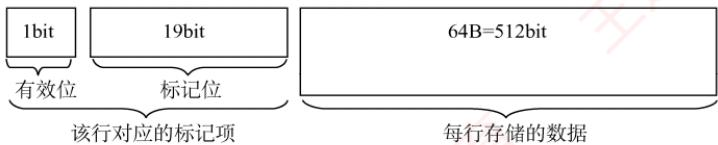

数据 Cache 共有8 行，因此数据 Cache 的总容量为 $8 \times ( 64 + 20 / 8 ) \mathrm{B} = 532 \mathrm{B}$ o

2）数组a在主存的存放位置及其与Cache之间的映射关系如下图所示。


数组按行优先方式存放，首地址为320，数组元素占4B。a[0][31]所在的主存块对应的Cache 行号为| $\left[ \left( 320 + (0 \times 256 + 31) \times 4 \right) \mathrm{div} 2^6 \right] \bmod 2^3 = 6$ ；a[1][1]所在的主存块对应的 Cache行号为 $\left[ \left( 320 + (1 \times 256 + 1) \times 4 \right) \mathrm{div} 2^6 \right] \bmod 2^3 = 5$

【另解】由1）可知主存和Cache的地址格式如下图所示。

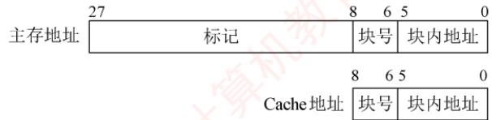

数组按行优先方式存放，首地址为320，数组元素占4B。a[0][31]的地址为 $320 + 31 \times 4 =$ $1 1 0 1 1 1 1 0 0 _ { \mathrm { B } }$ ，因此其对应的 Cache行号为 $1 1 0 _ { \mathrm { B } } = 6$ ；a[1][1]的地址为 $320 + 256 \times 4 + 1 \times 4 =$

$1 3 4 8 = 1 0 1 0 1 0 0 0 1 0 0 _ { \mathrm { B } }$ ，因此其对应的 Cache 行号为 $1 0 1 _ { \mathrm { B } }   { = }   5$

3）编译时i,j, sum均分配在寄存器中，所以数据访问命中率仅考虑数组a的情况。数组a的大小为 $256 \times 256 \times 4\mathrm{B} = 2^{18}\mathrm{B}$ ，占用 $2 ^ { 1 8 } / 6 4 = 2 ^ { 1 2 }$ 个主存块，按行优先存放，程序A逐行访问数组a，共需访问的次数为 $2^{16}$ 次，未命中次数为 $2 ^ { 1 2 }$ 次（每个字块的第一个数未命中），因此程序A的命中率为 $(2^{16} - 2^{12})/2^{16} \times 100\% = 93.75\%$ 【另解】数组a按行存放，程序A按行存取。每个字块中存放16个int型数据，除访问的第一个不命中外，随后的15个全都命中，访问全部字块都符合这一规律，且数组大小为字块大小的整数倍，因此程序A的命中率为 $15/16 = 93.75\%$ 0程序B逐列访问数组 a，Cache总数据容量为 $64\mathrm{B} \times 8 = 512\mathrm{B}$ ，数组a一行的大小为1KB，正好是Cache容量的2倍，可知不同行的同一列数组元素使用的是同一个Cache单元，因此逐列访问每个数据时，都会将之前的字块置换出，即每次访问都不会命中，命中率为0。因为从Cache读数据比从主存读数据快很多，所以程序A的执行比程序B快得多。

## 05.【解答】

1）CPU的时钟周期是主频的倒数，即 $1/800 MHz =1.25 ns$ 王道总线的时钟周期是总线频率的倒数，即 $1/200 MHz  = 5 ns$ 总线宽度为32位，因此总线带宽为 $4\mathrm{B} \times 200\mathrm{MHz}=800\mathrm{MB/s} 或 4\mathrm{B/5ns}=800\mathrm{MB/s} 。$   
2）Cache块大小是32B，因此Cache缺失时需要一个读突发传送总线事务读取一个主存块。

3）一次读突发传送总线事务包括一次地址传送、32B数据准备和传送：用一个总线时钟周期传输地址；之后每隔40ns/8=5ns启动一个存储体（各进行一次读操作），第一个体准备数据花费40ns，之后这个字的传送操作与下一个字的准备操作重叠；用8个总线时钟周期传送数据。读突发传送总线事务时间为 $5 ns + 40 ns + 8 \times 5 ns = 85 ns$ 另解：首先5ns的传送地址和命令，然后把存储体准备数据的时间视为流水线，因为总线周期是5ns，存储体的存取周期是40ns，所以相当于准备数据是一个8段流水线，因此准备8个数据的时间是 $40 + 5 \times 7$ 最后再花5ns传输最后一个数据，因为之前的7个存储体的数据的传输时间和其下一个存储体准备数据的时间是并行的，所以共需要 $5+40+5\times7+$ 5=85ns。也可以这样理解，将从数据准备到传输结束视为一个完整的流水线，也就是共视为9个流水段，每个流水段的时间是5ns，这样总共花费的时间就是 $5+45+7\times5=85\mathrm{n}$ 0只要是有关于流水线思想的，最关键的就是分清楚流水段，剩下的就是简单计算，不同的算法不是关键，本质上都是一样的。 机教

4）CPU执行时间= Cache 命中时的指令执行时间 + Cache 未命中时的额外访存开销×缺失率。一条指令在 Cache 命中时的执行时间 = Cache 命中时的 CPI×时钟周期 $4 \times 1.25  ns  = 5  ns$ 一条指令因Cache 缺失而导致的平均访存开销 = 平均访存次数×一次突发传送总线事务时间 $1.2 \times 85 \mathrm{ns} = 102 \mathrm{ns}$ 。因此BP的CPU执行时间 $(5 ns  + 102 ns  \times 5\%) \times 100 = 1010 ns$ 100  
条指令中，平均有 95%的指令 Cache 命中，只需要 5ns；平均有 5%的指令 Cache 缺失，需要 $5 ns  + 102 ns  = 107 ns$ 。本题说明了408真题采用先访问Cache再访问主存的方式。

## 06.【解答】

1）主存块大小为 $6 4 \mathrm { B }   =   2 ^ { 6 }$ 字节，故主存地址低6位为块内地址，Cache组数为 $32\mathrm{KB} \div (64\mathrm{B} \times 8)=$ $6 4   =   2 ^ { 6 }$ ，所以主存地址中间6位为Cache组号，主存地址中高 $32 - 6 - 6 = 20$ 位为标记，采用8路组相联映射，所以每行中的LRU位占3位，采用直写方式，所以没有修改位。

$2 ) 0 0 8 0 0 0 0 0 0 \mathrm { H } = 0 0 0 0 0 0 0 0 0 1 0 0 0 0 0 0 0 0 0 0 0 0 0 0 0 0 1 1 0 0 0 0 0 0 \mathrm { B }$ ，主存地址的低6位为块内地址，为全0，所以s位于一个主存块的开始处，占 $1024 \times 4B / 64B = 64$ 个主存块；在执行程序段的过程中，每个主存块中的 $64\mathrm{B}/4\mathrm{B}=16$ 个数组元素依次读、写1次，因此对每个主存块，总是第一次访问缺失，此时会将整个主存块调入Cache，之后每次都命中。综上，数组 s的数据 Cache 访问缺失次数为 64 次。

3）00010003H=00000000000000010000000000000011B，根据主存地址划分可知，组索引为0，所以该地址所在主存块被映射到指令Cache的第0组；因为Cache初始为空，所有Cache行的有效位均为0，所以Cache访问缺失。此时，将该主存块取出后存入指令Cache的第0组的任意一行，并将主存地址高20位（00010H）填入该行标记字段，设置有效位，修改LRU位，最后根据块内地址000011B从该行中取出相应的内容。

## 3.6 虚拟存储器

虚拟存储器是一种由硬件与系统软件协同实现的存储管理机制，它利用主存和辅存（如磁盘)构建一个逻辑上连续且容量巨大的地址空间。对于应用程序员而言，该机制是透明的：程序可按此虚拟地址空间编写，无须关心实际主存容量或数据在主存中的物理位置。

## 3.6.1 虚拟存储器的基本概念

虚拟存储器将程序的地址空间（称为虚拟地址空间或逻辑地址空间）与主存的物理地址空间分离。用户程序使用的地址称为虚地址（或逻辑地址），而实际主存单元的地址称为实地址（或物理地址）。通常，虚地址空间远大于实地址空间，如图3.26所示。

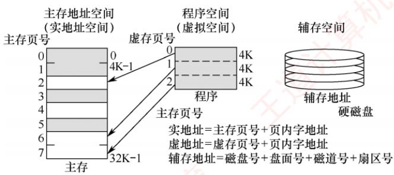  
图3.26 虚拟存储器的地址空间

当CPU使用虚地址访问内存时，系统首先判断该虚地址对应的数据是否已驻留在主存中。若已驻留，则通过地址变换机制将其转换为实地址，CPU即可直接访问对应的主存单元；若未驻留，则触发缺页（或缺段）异常，由操作系统将包含该地址的整个页（或段）从辅存调入主存，之后CPU再进行访问。若主存已满，则需根据替换算法选择一个页面进行置换。

## 考点追踪虚拟存储器只能采用回写法的原因（2016）

虚拟存储器借鉴了Cache的思想，将辅存中频繁访问的数据缓存在主存中。由于辅存（如磁盘）访问延迟极高，每次写操作都同步更新辅存是不可行的。因此，系统采用类似回写的策略：当页面被修改时，标记为脏页；仅在该页被置换出主存时，若为脏页，才将其写回辅存。这显著降低了I/O开销。此外，虚拟存储器的分页机制允许任一虚页装入主存中任意可用的物理页框（类似于全相联映射），从而提高主存利用率，并支持高效的地址重定位。

## 3.6.2 页式虚拟存储器①

页式虚拟存储器以页为基本单位。主存空间和虚拟地址空间均被划分为大小相同的页。主存中的页称为物理页（或实页、页框），虚拟地址空间中的页称为虚拟页（或虚页）。页表记录了每个虚页在主存中的映射位置，通常常驻内存。

## 1. 页表

图3.27是一个页表示例。有效位（也称装入位），表示对应虚页是否已调入主存，若为1，表示该页已在主存，页表项中存放其物理页号；若为0，表示未调入，页表项通常存放该页在外存（如磁盘）中的地址。脏位（也称修改位），表示页面是否被修改过，在采用回写策略的虚拟存储系统中，置换页面时根据脏位决定是否需将其写回磁盘。引用位（也称使用位），记录页面是否被访问过，主要用于实现基于使用历史的页面替换算法（如Clock或LRU算法）。

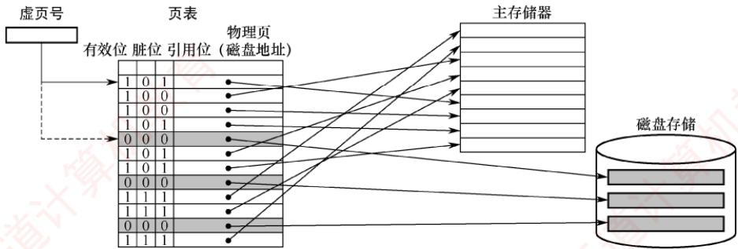  
图3.27 主存中的页表示例  
考点追踪数组的分页存放、缺页分析与处理过程（2014、2019、2023、2025）

以图3.27的页表为例，若CPU访问第1页，有效位为1，说明该页已驻留主存。地址转换部件将虚拟地址转换为物理地址，CPU即可访问对应的物理页中的数据。若访问第5页，有效位为0，则发生缺页异常，系统调用缺页处理程序。该程序根据页表项中的外存地址，将该页从磁盘调入一个空闲的物理页框。若主存已满，则需选择一个页面进行置换：由于系统采用回写策略，换出页面时根据脏位决定是否写回磁盘。缺页处理完成后，更新页表中的相应项。

页式虚拟存储器的优点是：页面大小固定，页表结构简单，调入操作方便。缺点是：程序大小通常不是页长的整数倍，导致最后一页产生内部碎片；此外，页是物理划分单位，缺乏逻辑意义，因此在程序模块化、保护和共享方面不如段式虚拟存储器灵活。

## 2. 地址转换

考点追踪虚拟地址结构的分析（2011、2019、2021、2024）

程序生成的地址为虚拟地址，CPU执行指令时，必须先将其转换为物理地址，才能访问主存中的指令或数据。虚拟地址分为两部分：高位为虚页号，低位为页内偏移：物理地址同样分为高位物理页号和低位页内偏移。由于页面大小相同，两者的页内偏移完全一致。虚拟地址到物理地址的转换通过页表实现，页表是一张存放在主存中的虚页号与物理页号的映射表。

## 考点追踪虚拟地址与物理地址的转换（2011、2013、2018、2022）

系统通过页表基址寄存器指向当前进程的页表起始地址（对应①）。地址转换时，首先从虚拟地址中提取虚页号（对应②），以此作为索引查找页表项；若该页表项的有效位为1，则从中取出物理页号（对应③），并与虚拟地址中的页内偏移拼接，形成最终的物理地址（对应④）。若有效位为0，则发生缺页异常，需由操作系统进行缺页处理。页式虚拟存储器的地址变换过程如图3.28所示。

  
图3.28 页式虚拟存储器的地址变换过程

## 3. 快表（TLB）

由地址转换过程可知，每次访存需先访问主存中的页表以获取物理页号，再访问主存取得实际数据，因此采用虚拟存储机制后，平均访存次数增加，性能下降。

考点追踪TLB的硬件实现（2018），TLB和Cache

的比较（2020）

根据程序访问的局部性原理，在一段时间内CPU往往集中访问少数页面。若将这些页面对应的页表项缓存在由高速SRAM构成的快表（TLB）中，则可在地址转换时避免访问主存中的页表，从而显著提升效率。相应地，主存中的页表常被称为慢表（Page）。

## 考点追踪TLB映射方式、地址划分与标记字段的分析（2016、2021）

TLB的工作原理类似于Cache，通常采用全相联或组相联映射。TLB表项包含虚拟页号（作为标记）和对应的物理页号及控制位（如有效位、脏位等）。在全相联映射下，TLB标记即为完整的虚拟页号；在组相联映射下，虚拟页号的高位作为标记，低位作为组索引。

## 4. 具有 TLB 和 Cache 的多级存储系统

## 考点追踪具有TLB的虚拟存储系统的地址变换过程（2024）

图3.29为一个具有TLB 和 Cache的多级存储系统，其中 Cache采用2路组相联映射方式。CPU给出一个32位的虚拟地址，TLB采用全相联结构，每项均配备一个比较器。地址转换时，将虚拟地址中的虚页号与所有TLB项的标记字段并行比较；若某一项匹配且有效位为1，则TLB命中，直接从中获取实页号，完成地址转换。若TLB未命中，则需访问主存中的页表（慢表）以获取对应的页表项，完成地址转换后将其装入TLB；若TLB已满，则需执行替换算法。

获得物理地址后，Cache根据映射方式将其划分为标记、组号和块内地址三个字段。首先利用组号定位到对应的Cache组，再将该组中各Cache行的标记与物理地址的标记字段进行比较；若某一行匹配且有效位为1，则Cache命中，再根据块内地址取出对应的数据送至CPU。

  
图 3.29 TLB 和 Cache 的访问过程

通过TLB缓存频繁访问的页表项，系统避免了每次地址转换都访问主存页表，从而在引入虚拟存储器的同时，几乎不降低访存性能。

## 考点追踪TLB、Cache和 Page 缺失组合的分析（2010）

CPU一次访存操作可能涉及TLB、页表、Cache、主存和磁盘的访问，访问过程如图3.30所示。可见，CPU访存过程中存在三种缺失情况：

① TLB 缺失：要访问的虚页号不在 TLB 中：

② Cache 缺失：要访问的主存块不在 Cache 中：

③ Page 缺失：要访问的页面不在主存中。

TLB是页表项的缓存，因此Page缺失时，TLB也必然缺失。同理，Cache是主存的副本，因此Page缺失时，Cache中也不可能有对应的数据。这三种缺失的组合情况见表3.3。

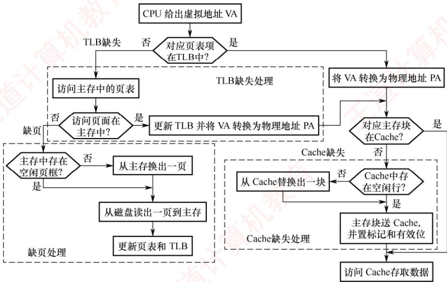  
图3.30 带 TLB虚拟存储器的CPU访存过程

表3.3TLB、Page、Cache三种缺失的可能组合情况
<table><tr><td rowspan=1 colspan=1>序号</td><td rowspan=1 colspan=1>TLB</td><td rowspan=1 colspan=1>Page</td><td rowspan=1 colspan=1>Cache</td><td rowspan=1 colspan=1>说明</td></tr><tr><td rowspan=1 colspan=1>1</td><td rowspan=1 colspan=1>命中</td><td rowspan=1 colspan=1>命中</td><td rowspan=1 colspan=1>命中</td><td rowspan=1 colspan=1>TLB命中则 Page一定命中，信息在主存，就可能在 Cache中</td></tr><tr><td rowspan=1 colspan=1>2</td><td rowspan=1 colspan=1>命中</td><td rowspan=1 colspan=1>命中</td><td rowspan=1 colspan=1>缺失</td><td rowspan=1 colspan=1>TLB 命中则Page一定命中，信息在主存，也可能不在 Cache 中</td></tr><tr><td rowspan=1 colspan=1>3</td><td rowspan=1 colspan=1>缺失</td><td rowspan=1 colspan=1>命中</td><td rowspan=1 colspan=1>命中</td><td rowspan=1 colspan=1>TLB 缺失但 Page 可能命中，信息在主存，就可能在 Cache中</td></tr><tr><td rowspan=1 colspan=1>4</td><td rowspan=1 colspan=1>缺失</td><td rowspan=1 colspan=1>命中</td><td rowspan=1 colspan=1>缺失</td><td rowspan=1 colspan=1>TLB缺失但 Page可能命中，信息在主存，也可能不在 Cache中</td></tr><tr><td rowspan=1 colspan=1>5</td><td rowspan=1 colspan=1>缺失</td><td rowspan=1 colspan=1>缺失</td><td rowspan=1 colspan=1>缺失</td><td rowspan=1 colspan=1>TLB缺失则 Page也可能缺失，信息不在主存，也一定不在 Cache</td></tr></table>

最好的情况是第1种组合，此时无须访问主存；第2种和第3种组合需要访问一次主存；第4种组合需要访问两次主存；第5种组合发生“缺页异常”，需要访问磁盘，并至少访问两次主存。Cache缺失处理由硬件自动完成；缺页处理由操作系统通过“缺页异常处理程序”实现，具体步骤包括调入所需页面、更新页表等；TLB缺失既可用硬件处理，也可用软件处理。

## 注意

在《操作系统考研复习指导》的第3章中，介绍了在同时具有TLB和Cache的存储系统中虚实地址转

## 3.6.3 段式虚拟存储器①

段式虚拟存储器中的段是按程序的逻辑结构划分的，各个段的长度因程序而异。虚拟地址分为两部分：段号和段内地址。虚拟地址到物理地址的变换由段表实现。段表是程序的逻辑段与其在主存中存放位置的对照表，每行记录某个段的段号、有效位、段起点和段长等信息。由于段的长度可变，段表中必须给出各段的起始地址与段长。

  
图3.31 段式虚拟存储器的地址变换过程

CPU根据虚拟地址访存时，首先从虚拟地址中提取段号，并根据段表基地址找到对应的段表项。然后检查该段表项的有效位：若为1，表示该段已调入主存；若为0，表示该段不在主存中。当该段已调入主存时，从段表读出其在主存中的起始地址，与段内地址相加，得到对应的物理地址。段式虚拟存储器的地址变换过程如图3.31所示。

由于段是程序逻辑结构所决定的独立部分，因此分段对程序员来说是不透明的；而分页对程序员是透明的，程序员编写程序时无须关心程序如何分页。

段式虚拟存储器的优点是：段的边界与程序的自然逻辑边界一致，具有良好的逻辑独立性，便于程序的编译、管理、修改和保护，也易于实现多道程序间的段共享。缺点是：段长度可变，主存分配困难，段间容易产生外部碎片，难以有效利用，造成存储空间浪费。

## 3.6.4 段页式虚拟存储器

在段页式虚拟存储器中，程序先按逻辑结构分段，每段再划分为固定大小的页，主存空间也划分为大小相等的页，程序对主存的调入和调出仍以页为基本交换单位。每个程序对应一个段表，每段对应一个页表。虚拟地址由段号、段内页号和页内地址三部分组成。CPU根据虚地址访存时，首先用段号查找段表，获得该段对应的页表起始地址；接着以段内页号为索引访问页表，取出实页号；最后将实页号与页内地址拼接，形成物理地址。

段页式虚拟存储器的优点是兼具页式和段式的优点，既支持按段进行共享和保护，又避免了段式存储的外部碎片问题。缺点是在地址变换过程中需要两次查表，系统开销较大。

## 3.6.5 虚拟存储器与 Cache 的比较

## 考点追踪虚拟存储器与Cache的比较（2024）

虚拟存储器与Cache既有相同之处，又有不同之处。

## 1. 相同之处

1）最终目标都是提高系统性能，两者都体现了容量、速度、价格的梯度。

2）都把数据划分为小信息块作为基本交换单位，虚拟存储器的页通常比Cache块大得多。

3）都涉及地址映射、替换算法和更新策略等问题。

4）都基于局部性原理，采用“快速缓存”思想，将活跃数据放在高速部件中。

## 2. 不同之处

1）Cache主要解决CPU与主存之间的速度差异，而虚拟存储器为了解决主存容量。

2）Cache完全由硬件实现，对所有程序员透明；虚拟存储器由操作系统和硬件共同实现，对应用程序员透明，但其管理机制对操作系统开发者不透明。

考点追踪Cache缺失和缺页的处理开销对比（2016）

3）不命中时的性能影响不同：Cache不命中需访问主存，延迟增加数十倍；而虚拟存储系统缺页需访问磁盘，延迟增加可达十万倍，对系统性能影响更为严重。1

4）CPU可直接访问 Cache和主存，Cache不命中时，硬件自动从主存取数据并装入Cache。辅存与CPU无直接通路，缺页时必须先将数据从辅存调入主存，之后CPU才能访问。

## 3.6.6 本节习题精选

## 一、单项选择题

01.为使虚拟存储系统有效地发挥其预期的作用，所运行程序应具有的特性是（）。A. 不应含有过多的I/O操作 B. 大小不应小于实际的内存容量C. 应具有较好的局部性 D. 顺序执行的指令不应过多

02. 虚拟存储管理系统的基础是程序访问的局部性原理，此理论的基本含义是（）。A. 在程序的执行过程中，程序对主存的访问是不均匀的B. 空间局部性C. 时间局部性 算机教D. 代码的顺序执行

03. 虚拟存储器的常用管理方式有段式、页式、段页式，对于它们在与主存交换信息时的单位，以下表述正确的是（）A. 段式采用“页” 王道 B. 页式采用“块”C. 段页式采用“段”和 D. 页式和段页式均仅采用“页”

04.下列关于虚拟存储器的叙述中，正确的是（）。A. 对应用程序员透明，对系统程序员不透明B. 对应用程序员不透明，对系统程序员透明C. 对应用程序员、系统程序员都不透明D. 对应用程序员、系统程序员都透明

05.在虚拟存储器中，当程序正在执行时，由（）完成地址映射。 7A. 程序员 B. 编译器 C. 装入程序 D.操作系统

06.采用虚拟存储器的主要目的是（）。A. 提高主存储器的存取速度 B. 扩大主存储器的存储空间C. 提高外存储器的存取速度 D. 扩大外存储器的存储空间

07.下列有关虚拟存储管理机制中地址转换的叙述，错误的是（）。A. 地址转换是指把逻辑地址转换为物理地址B. 通常逻辑地址的位数比物理地址的位数少C. 地址转换过程中会发现是否“缺页”D. 内存管理单元（MMU）在地址转换过程中要访问页表项

08. 下列有关虚拟存储管理机制的页表的叙述中，错误的是（）。

A. 系统中每个进程有一个页表B. 页表中每个表项与一个虚页对应C. 每个页表项中都包含装入位（有效位）D. 所有进程都可以访问页表

09.下列有关缺页处理的叙述中，错误的是（）。A. 若对应页表项中的有效位为0，则发生缺页B. 缺页是一种外部中断，需要调用操作系统提供的中断服务程序来处理C. 缺页处理过程中需根据页表中给出的磁盘地址去读磁盘数据D. 缺页处理完后要重新执行发生缺页的指令

10.下列关于段式虚拟存储管理的叙述中，错误的是（）。A. 段是逻辑结构上相对独立的程序块，因此段是可变长的B. 按程序中实际的段来分配主存，所以分配后的存储块是可变长的C.每个段表项必须记录对应段在主存的起始位置和段的长度 道D. 分段方式对低级语言程序员和编译器来说是透明的

11.虚拟存储器中的页表有快表和慢表之分，下面关于页表的叙述中正确的是（）。A. 快表与慢表都存储在主存中，但快表比慢表容量小B. 快表采用了优化的搜索算法，因此查找速度快C. 快表比慢表的命中率高，因此快表可以得到更多的搜索结果D. 快表采用相联存储器件组成，按照查找内容访问，因此比慢表查找速度快

12.【2010统考真题】下列命令组合的一次访存过程中，不可能发生的是（）。A. TLB 未命中，Cache 未命中，Page 未命中B. TLB 未命中，Cache 命中，Page 命中C. TLB 命中，Cache 未命中，Page 命中D. TLB 命中，Cache 命中，Page 未命中

13.【2013统考真题】某计算机主存地址空间大小为256MB，按字节编址。虚拟地址空间大小为4GB，采用页式存储管理，页面大小为4KB，TLB（快表）采用全相联映射，有4个页表项，内容如下表所示。 V

<table><tr><td rowspan=1 colspan=1>有效位</td><td rowspan=1 colspan=1>标记</td><td rowspan=1 colspan=1>页框号</td><td rowspan=1 colspan=1>1</td></tr><tr><td rowspan=1 colspan=1>0</td><td rowspan=1 colspan=1>FF180H</td><td rowspan=1 colspan=1>0002H</td><td rowspan=1 colspan=1>.</td></tr><tr><td rowspan=1 colspan=1>1</td><td rowspan=1 colspan=1>3FFF1H</td><td rowspan=1 colspan=1>0035H</td><td rowspan=1 colspan=1></td></tr><tr><td rowspan=1 colspan=1>0</td><td rowspan=1 colspan=1>02FF3H</td><td rowspan=1 colspan=1>0351H</td><td rowspan=1 colspan=1></td></tr><tr><td rowspan=1 colspan=1>1</td><td rowspan=1 colspan=1>03FFFH</td><td rowspan=1 colspan=1>0153H</td><td rowspan=1 colspan=1></td></tr></table>

则对虚拟地址 03FF F180H进行虚实地址变换的结果是（）。A. 015 3180H B. 003 5180H C. TLB 缺失 D. 缺页

14.【2015统考真题】假定编译器将赋值语句“x=x+3;”转换为指令“add xaddr,3”，其中xaddr是x对应的存储单元地址。若执行该指令的计算机采用页式虚拟存储管理方式，并配有相应的TLB，且Cache使用直写方式，则完成该指令功能需要访问主存的A. 0 次数至少是（）。 B. 1 算机 C. 2 D. 3

15.【2019统考真题】下列关于缺页处理的叙述中，错误的是（）。A. 缺页是在地址转换时 CPU检测到的一种异常

B. 缺页处理由操作系统提供的缺页处理程序来完成C. 缺页处理程序根据页故障地址从外存读入所缺失的页D. 缺页处理完成后回到发生缺页的指令的下一条指令执行

16.【2020统考真题】下列关于TLB和Cache的叙述中，错误的是（）。A. 命中率都与程序局部性有关 B. 缺失后都需要去访问主存C. 缺失处理都可以由硬件实现 D. 都由 DRAM 存储器组成

17.【2022统考真题】某计算机主存地址为24位，采用分页虚拟存储管理方式，虚拟地址空间大小为4GB，页大小为4KB，按字节编址。某个进程的页表部分内容如下表所示。

<table><tr><td>虚页号</td><td>实页号（页框号）</td><td>存在位</td></tr><tr><td>82</td><td>024H</td><td>0</td></tr><tr><td>…</td><td>…</td><td>…</td></tr><tr><td>129</td><td>180H</td><td>1</td></tr><tr><td>130</td><td>018H</td><td>1</td></tr></table>

当CPU访问虚拟地址00082840H时，虚-实地址转换的结果是（）。A. 得到主存地址 02 4840H B. 得到主存地址 18 0840HC. 得到主存地址 01 8840H D. 检测到缺页异常

18.【2024统考真题】对于页式虚拟存储管理系统，下列关于存储器层次结构的叙述中，错误的是（）。A. Cache-主存层次的交换单位为主存块，主存-外存层次的交换单位为页B. Cache-主存层次替换算法由硬件实现，主存-外存层次替换算法由软件实现C. Cache-主存层次可采用回写法，主存-外存层次通常采用回写法D. Cache-主存层次可采用直接映射方式，主存-外存层次通常采用直接映射方式

19.【2024统考真题】某计算机按字节编址，采用页式虚拟存储管理方式，虚拟地址为32位，主存地址为30位，页大小为1KB。若TLB共有32个表项，采用4路组相联映射方式，则TLB表项中标记字段的位数至少是（）。A. 17 B. 18 C. 19 D. 20

20.【2024统考真题】下列事件中，不是在MMU地址转换过程中检测的是（）。A. 访问越权B. Cache 缺失 C. 页面缺失 D. TLB 缺失

## 二、综合应用题

01. 某计算机系统采用虚拟页式存储管理，某个进程的页表见下表，每项的起始编号是0，所有的地址均按字节编址，每页大小为1024B。分别将逻辑地址0793,1197,2099,3320,4188,5332，转换为物理地址，写出计算过程，对不能计算的说明为什么。

<table><tr><td rowspan=1 colspan=1>逻辑页号</td><td rowspan=1 colspan=1>存在位</td><td rowspan=1 colspan=1>引用位</td><td rowspan=1 colspan=1>修改位</td><td rowspan=1 colspan=1>页框号</td></tr><tr><td rowspan=1 colspan=1>0</td><td rowspan=1 colspan=1>1</td><td rowspan=1 colspan=1>1</td><td rowspan=1 colspan=1>0</td><td rowspan=1 colspan=1>4</td></tr><tr><td rowspan=1 colspan=1>1</td><td rowspan=1 colspan=1>1</td><td rowspan=1 colspan=1>1</td><td rowspan=1 colspan=1>1</td><td rowspan=1 colspan=1>3</td></tr><tr><td rowspan=1 colspan=1>2</td><td rowspan=1 colspan=1>0</td><td rowspan=1 colspan=1>0</td><td rowspan=1 colspan=1>0</td><td rowspan=1 colspan=1></td></tr><tr><td rowspan=1 colspan=1>3</td><td rowspan=1 colspan=1>1</td><td rowspan=1 colspan=1>0</td><td rowspan=1 colspan=1>0</td><td rowspan=1 colspan=1>1</td></tr><tr><td rowspan=1 colspan=1>4</td><td rowspan=1 colspan=1>0</td><td rowspan=1 colspan=1>0</td><td rowspan=1 colspan=1>0</td><td rowspan=1 colspan=1></td></tr><tr><td rowspan=1 colspan=1>5</td><td rowspan=1 colspan=1>1</td><td rowspan=1 colspan=1>0</td><td rowspan=1 colspan=1>1</td><td rowspan=1 colspan=1>5</td></tr></table>

02.下图表示使用快表（页表）的虚实地址转换条件，快表存放在相联存储器中，其容量为8个存储单元。

<table><tr><td rowspan=1 colspan=1>页号</td><td rowspan=1 colspan=1>该页在主存中的起始位置</td></tr><tr><td rowspan=1 colspan=1>32</td><td rowspan=1 colspan=1>42000</td></tr><tr><td rowspan=1 colspan=1>25</td><td rowspan=1 colspan=1>38000</td></tr><tr><td rowspan=1 colspan=1>7</td><td rowspan=1 colspan=1>96000</td></tr><tr><td rowspan=1 colspan=1>6</td><td rowspan=1 colspan=1>60000</td></tr><tr><td rowspan=1 colspan=1>4</td><td rowspan=1 colspan=1>40000</td></tr><tr><td rowspan=1 colspan=1>15</td><td rowspan=1 colspan=1>80000</td></tr><tr><td rowspan=1 colspan=1>5</td><td rowspan=1 colspan=1>50000</td></tr><tr><td rowspan=1 colspan=1>34</td><td rowspan=1 colspan=1>70000</td></tr></table>

<table><tr><td rowspan=1 colspan=1>虚拟地址</td><td rowspan=1 colspan=1>页号</td><td rowspan=1 colspan=1>页内地址</td></tr><tr><td rowspan=1 colspan=1>1</td><td rowspan=1 colspan=1>15</td><td rowspan=1 colspan=1>0324</td></tr><tr><td rowspan=1 colspan=1>2</td><td rowspan=1 colspan=1>7</td><td rowspan=1 colspan=1>0128</td></tr><tr><td rowspan=1 colspan=1>3</td><td rowspan=1 colspan=1>48</td><td rowspan=1 colspan=1>0516</td></tr></table>

1）当CPU按虚拟地址1去访问主存时，主存的实地址码是多少？

2）当CPU按虚拟地址2去访问主存时，主存的实地址码是多少？

3）当CPU按虚拟地址3去访问主存时，主存的实地址码是多少？

03. 一个两级存储器系统有8个磁盘上的虚拟页面需要映像到主存中的4个页中。某程序生成以下访存页面序列：1,0,2,2,1,7,6,7,0,1,2,0,3,0,4,5,1,5,2,4,5,6,7,6,7,2,4,2,7,3。采用LRU算法，设初始时主存为空。 XIAN

1）画出每个页号访问请求之后存放在主存中的位置。

2）计算主存的命中率。

04.【2011统考真题】某计算机存储器按字节编址，虚拟（逻辑）地址空间大小为16MB，主存（物理）地址空间大小为1MB，页面大小为4KB；Cache采用直接映射方式，共8行；主存与Cache之间交换的块大小为32B。系统运行到某一时刻时，页表的部分内容和Cache的部分内容分别如下的左图和右图所示，图中页框号及标记字段的内容为十六进制形式。回答下列问题：

1）虚拟地址共有几位，哪几位表示虚页号？物理地址共有几位，哪几位表示页框号（物理页号）？

2）使用物理地址访问Cache时，物理地址应划分成哪几个字段？要求说明每个字段的位数及在物理地址中的位置。

<table><tr><td rowspan=1 colspan=1>1</td><td rowspan=1 colspan=1>06</td><td rowspan=1 colspan=1>• • </td></tr><tr><td rowspan=1 colspan=1>1</td><td rowspan=1 colspan=1>04</td><td rowspan=1 colspan=1>...</td></tr><tr><td rowspan=1 colspan=1>1</td><td rowspan=1 colspan=1>15</td><td rowspan=1 colspan=1>::</td></tr><tr><td rowspan=1 colspan=1>1S</td><td rowspan=1 colspan=1>02</td><td rowspan=1 colspan=1>•.</td></tr><tr><td rowspan=1 colspan=1>0</td><td rowspan=1 colspan=1></td><td rowspan=1 colspan=1>.</td></tr><tr><td rowspan=1 colspan=1>1</td><td rowspan=1 colspan=1>2B</td><td rowspan=1 colspan=1>1:</td></tr><tr><td rowspan=1 colspan=1>0</td><td rowspan=1 colspan=1></td><td rowspan=1 colspan=1>..</td></tr><tr><td rowspan=1 colspan=1>1</td><td rowspan=1 colspan=1>32</td><td rowspan=1 colspan=1>...</td></tr></table>

<table><tr><td>行号</td><td>有效位</td><td>标记</td><td></td></tr><tr><td>0</td><td>1</td><td>020</td><td></td></tr><tr><td>1</td><td>0</td><td></td><td></td></tr><tr><td>2</td><td>1</td><td>01D</td><td></td></tr><tr><td>3</td><td>1</td><td>105</td><td></td></tr><tr><td>4</td><td>1</td><td>064</td><td></td></tr><tr><td>5</td><td>1</td><td>14D</td><td></td></tr><tr><td>6</td><td>0</td><td></td><td></td></tr><tr><td>7</td><td>1</td><td>27A</td><td></td></tr></table>

3）虚拟地址001C60H所在的页面是否在主存中？若在主存中，则该虚拟地址对应的物理地址是什么？访问该地址时是否Cache命中？要求说明理由。

4）假定为该机配置一个4路组相联的TLB，共可存放8个页表项，若其当前内容（十六进制)如下图所示，则此时虚拟地址024BACH所在的页面是否存在主存中？要求说明理由。

组号 有效位 标记 页框号 有效位 标记 页框号 有效位 标记 页框号 有效位 标记 页框号

<table><tr><td rowspan=1 colspan=1>0</td><td rowspan=1 colspan=1></td><td rowspan=1 colspan=1></td><td></td><td rowspan=1 colspan=1>1</td><td rowspan=1 colspan=1>001</td><td rowspan=1 colspan=1>15</td><td rowspan=1 colspan=1></td><td rowspan=1 colspan=1>0</td><td rowspan=1 colspan=1></td><td rowspan=1 colspan=1></td><td rowspan=1 colspan=1></td><td rowspan=1 colspan=1>1</td><td rowspan=1 colspan=1>012</td><td rowspan=1 colspan=1>1F</td></tr><tr><td rowspan=1 colspan=1>1</td><td rowspan=1 colspan=1>013</td><td rowspan=1 colspan=1>2D</td><td></td><td rowspan=1 colspan=1>0</td><td rowspan=1 colspan=1></td><td rowspan=1 colspan=1></td><td rowspan=1 colspan=1></td><td rowspan=1 colspan=1>1</td><td rowspan=1 colspan=1>008</td><td rowspan=1 colspan=1>7E</td><td rowspan=1 colspan=1></td><td rowspan=1 colspan=1>0</td><td rowspan=1 colspan=1></td><td rowspan=1 colspan=1></td></tr></table>

05.【2016统考真题】某计算机采用页式虚拟存储管理方式，按字节编址，虚拟地址为32位，物理地址为24位，页大小为8KB；TLB采用全相联映射；Cache数据区大小为64KB，按2路组相联映射方式组织，主存块大小为64B。存储访问过程的示意图如下。

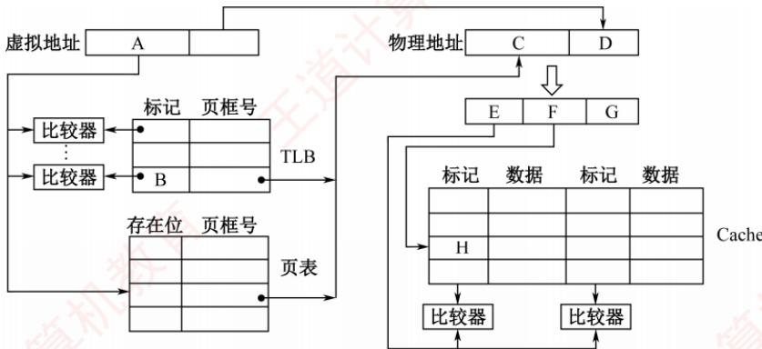  
回答下列问题：

1）图中字段A\~G的位数各是多少？TLB 标记字段B中存放的是什么信息？

2）将块号为 4099 的主存块装入 Cache 时，所映射的 Cache组号是多少？对应的 H字段内容是什么？

3）是Cache缺失处理的时间开销大还是缺页处理的时间开销大？为什么？

4）为什么Cache可以采用直写法，而修改页面内容时总是采用回写法？

06.【2018统考真题】某计算机采用页式虚拟存储管理方式，按字节编址。CPU进行存储访问的过程如下图所示。根据该图回答下列问题。

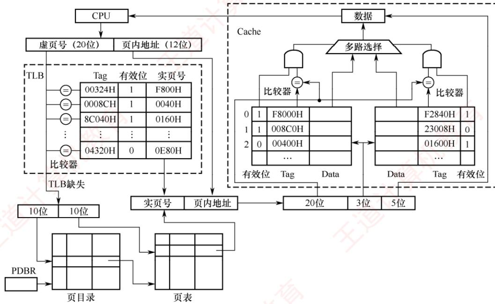

1）主存物理地址占多少位？

2） TLB 采用什么映射方式？TLB 是用 SRAM 还是用 DRAM 实现？

3）Cache采用什么映射方式？若Cache采用 LRU 算法和回写法，则 Cache 每行中除数据（Data）、标记和有效位外，还应有哪些附加位？Cache总容量是多少？Cache中有效位的作用是什么？

4）若CPU 给出的虚拟地址为0008C040H，则对应的物理地址是多少？是否在Cache中命中？说明理由。若CPU给出的虚拟地址为0007C260H，则该地址所在主存块映射到的 Cache 组号是多少？

07.【2021统考真题】假设计算机M的主存地址为24位，按字节编址；采用分页存储管理方式，虚拟地址为30位，页大小为4KB；TLB采用2路组相联映射方式和LRU算法，共8组。请回答下列问题。

1）虚拟地址中哪几位表示虚页号？哪几位表示页内地址？

2）已知访问TLB时虚页号高位部分用作TLB标记，低位部分用作TLB组号，M的虚拟地址中哪几位是TLB 标记？哪几位是TLB 组号？

3）假设TLB 初始时为空，访问的虚页号依次为10,12,16,7,26,4,12和20，在此过程中，哪一个虚页号对应的TLB表项被替换？说明理由。

4）若将M中的虚拟地址位数增加到32位，则TLB表项的位数增加几位？

08.【2023统考真题】已知计算机M的字长为32位，按字节编址，采用请求调页策略的虚王 拟存储管理方式，虚拟地址为32 位，页大小为4KB；数据Cache采用4路组相联映射方式，数据区大小为8KB，主存块大小为32B。现有C语言程序段如下：

```javascript
int a[24][64];
for(i=0;i<24;i++)
for(j=0;j<64;j++) a[i][j]=10;
```

已知二维数组a按行优先存放，在虚拟地址空间中分配的起始地址为00422000H,sizeof(int)=4，假定在M上执行上述程序段之前数组a不在主存，且在该程序段执行过程中不会发生页面置换。请回答下列问题： X

1）数组a分布在几个页面中？对于数组a的访问，会发生几次缺页异常？页故障地址各是什么？

2）不考虑变量i和j，该程序段的数据访问是否具有时间局部性？为什么？

3）计算机M的虚拟地址（A31\~A0）中哪几位用作块内地址？哪几位用作Cache组号？a[1][0]的虚拟地址是多少？其所在主存块对应的 Cache 组号是多少？

4)数组a占用多少主存块？假设上述程序段执行过程中数组a的访问不会和其他数据发生 Cache 访问冲突，则数组 a的 Cache 命中率是多少？若将循环中 i和 j的次序按如下方式调换： KKNN

```javascript
for(j=0;j<64;j++)
for(i=0;i<24;i++) a[i][j]=10;
```

则数组 a 的 Cache 命中率又是多少？

09. 【2025统考真题】现有C语言程序P的部分代码如下所示。假定运行程序P的计算机M字长为32位，按字节编址，数据Cache的数据区大小为32KB，采用8路组相联映射方式，主存块大小为64B，Cache的命中时间为2个时钟周期，缺失损失为200个时钟周期；采用页式虚拟存储管理方式，页大小为4KB。数组d的起始虚拟地址 $\mathrm { V A } _ { 3 1 }   \sim   \mathrm { V A } _ { 0 }$ 为0180 0020H。请回答下列问题。 A

```javascript
int x,d[2048],i;
for(i=0;i<2048;i++)
d[i]=d[i]/x;
```

1）主存地址中Cache组号字段和块内地址字段分别占几位？虚拟地址中哪些位可作

为 Cache 索引?

2）d[100]的虚拟地址为多少？d[100]所在主存块对应的Cache组号是多少？

3）假定执行for语句时对应代码已在Cache中，变量i和x已装入寄存器，数组d已调入主存但不在Cache中，则d[0]在其所在主存块内的偏移量是多少（用十六进制数表示）？在for语句的执行过程中，访问数组d的Cache缺失率和数组元素的平均访问时间分别是多少（Cache缺失率的计算结果要求用百分比表示，保留两位小数）？

4)数组d分布在几个页中？若执行for语句时对应代码已在主存中，但数组d还未调入主存，则在执行for语句的过程中，访问数组d所引起的缺页次数是多少？

## 3.6.7 答案与解析

## 一、单项选择题

## 01. C

虚拟存储系统利用的是局部性原理，程序应当具有较好的局部性，选项C正确。而含有输入、输出操作产生中断，与虚拟存储器无关，选项A错误。大小较小但可以多个程序并发执行，也可以发挥虚拟存储器的作用，选项B错误。顺序执行的指令应当占较大比重为宜，这样可增强程序的局部性，选项D错误。 XTA

## 02. A

局部性原理的含义是在一个程序的执行过程中，其大部分情况下是顺序执行的，某条指令或数据使用后，在最近一段时间内有较大的可能再次被访问（时间局部性）；某条指令或数据使用后，其邻近的指令或数据可能在近期被使用（空间局部性）。在虚拟存储管理系统中，程序只能访问主存获得指令和数据，选项A正确。选项B、C、D均是局部性原理的一个方面而已。

## 03. D

页式虚拟存储方式对程序分页，采用页进行交互；段页式则先按照逻辑分段，然后分页，以页为单位和主存交互，选项D正确。

## 04. A

虚拟存储器需要通过对操作系统实现地址映射，因此对操作系统的设计者即系统程序员是不透明的。而应用程序员写的程序所使用的是逻辑地址（虚地址），因此对其是透明的。

## 05. D

虚拟存储器中，地址映射由操作系统来完成，但需要一部分硬件基础的支持，如快表、地址映射系统等。

## 06. B

引入虚拟存储器的目的是解决内存容量不够大的问题。

## 07. B

虚拟存储管理的目的是让程序员可以在一个比主存地址空间大得多的虚拟地址空间中编程，显然逻辑地址空间比主存空间大，因此逻辑地址的位数比物理地址的位数多，选项B错误。在执行程序时，由CPU中的MMU进行逻辑地址到物理地址的转换。在转换过程中，MMU需要查找对应的页表项，根据页表项中的装入（有效）位是否为1来确定是否发生缺页。

## 08. D

选项A、B和C都正确。页表中的每个表项反映的是对应虚拟页面的位置和使用等信息，通常只能由操作系统和硬件进行访问，虚拟存储管理机制对用户进程来说是透明的，选项D错误。

## 09. B

缺页是CPU在执行指令过程中进行取指令或读/写数据时发生的一种故障，属于内部异常。

## 10. D

选项A、B和C都正确。分段方式对低级语言程序员和编译器来说是不透明的，因为低级语言程序员需要使用段号来编程，编译器需要使用段号来链接，选项D错误。

## 11. D

快表采用高速相联存储器，它的速度快来源于硬件本身，而不是依赖搜索算法来查找的；慢表存储在内存中，通常是依赖于查找算法，所以选项A和B错误。快表与慢表的命中率没有必然联系，快表仅是慢表的一个部分拷贝，不能够得到比慢表更多的结果，选项C错误。

## 12. D

Cache的内容是主存的一部分副本，TLB的内容是Page（页表）的一部分副本。在同时具有TLB 和 Cache的虚拟存储系统中，CPU 发出访存命令，先查找对应的 Cache 块。

1）若Cache命中，则说明所需内容在Cache内，其所在页面必然已调入主存，因此 Page必然命中，但TLB不一定命中。 人

2）若Cache未命中，则并不能说明所需内容未调入主存，和TLB、Page命中与否没有联系。但若TLB 命中，Page也必然命中；而当 Page命中，TLB则未必命中，因此D不可能发生。

## 13. A

按字节编址，页面大小为4KB，页内地址共12位。地址空间大小为4GB，虚拟地址共32位，前20位为页号。虚拟地址为03FFF180H，因此页号为03FFFH，页内地址为180H。查找页标记03FFFH所对应的页表项，页框号为0153H，页框号与页内地址拼接即为物理地址0153180H。

## 14. B

上述指令的执行过程可划分为取数、运算和写回过程，取数时读取xaddr可能不需要访问主存而直接访问Cache，而直写方式需要把数据同时写入Cache和主存，因此至少访问1次。

## 15. D

在请求分页系统中，每当要访问的页面不在内存中时，CPU检测到异常，便会产生缺页中断，请求操作系统将所缺的页调入内存。缺页处理由缺页中断处理程序完成，根据发生缺页故障的地址从外存读入所缺失的页，缺页处理完成后回到发生缺页的指令继续执行。选项D中描述回到发生缺页的指令的下一条指令执行，明显错误。 教

## 16. D

Cache 由 SRAM组成；TLB 也由 SRAM 组成。DRAM需要不断刷新，性能偏低，不适合组成 TLB 和 Cache。选项 A、B 和 C 都是 TLB 和 Cache 的特点。 法计

## 17.C

页大小为 $4\mathrm{KB}=2^{12}\mathrm{B}$ ，按字节编址，因此页内地址为12位。虚拟地址空间大小为 $4 \mathrm { G B } = 2 ^ { 3 2 } \mathrm { B }$ 因此虚拟地址共32位，其中低12位为页内地址，高20位为虚页号。题中给出的虚拟地址为00082840H，虚页号为高20位即00082H（页内地址为低12位即840H），82H对应的十进制数为130（注意题中页表的虚页号部分末尾未写H，所以是十进制数，因此查找时要先将虚页号转换为十进制数），查页表命中，并且存在位为1，对应页框号为018H。将查找到的页框号018H和页内

## 18. D

Cache与主存之间交换的是主存块，主存与外存之间交换的是页。Cache-主存层次和主存-外存层次的区别在于前者主要解决速度不匹配问题，用软件实现会影响速度，因此Cache-主存层次替换算法由硬件实现：而主存-外存层次替换算法由软件实现。Cache-主存层次可采用回写法或全写法；主存-外存层次通常采用回写法，即页面被修改后，仅当被换出时才写回外存，访问外存的代价很大，采用全写法的开销过高。访问外存的代价很大，提高命中率是关键，因此主存-外存层次通常采用全相联映射；而Cache-主存层次可采用直接映射、组相联或全相联，选项D错误。

## 19. C

按字节编址，页大小为 $2 ^ { 1 0 } \mathbf { B }$ ，因此页内地址占10位；TLB有32个表项，采用4路组相联映射，被分为 $2 ^ { 3 }   = 8$ 组，因此TLB组号占3位；于是，标记字段的位数至少是32-3-10=19。

## 20. B

在地址转换的过程中，MMU会检查页表项的访问权限，以确保进程有权访问某个页面，否则就会访问越权。为了获得对应的页表项，先查找TLB，若找不到，则TLB缺失，然后查找页表，若找不到，则页面缺失。访问Cache是在获得物理地址后使用物理地址存取数据的过程中才执行的操作，而MMU地址转换过程是在获得物理地址之前进行的，选项B错误。

## 二、综合应用题

## 01.【解答】

所有地址均可转换为页号和页内偏移量。地址转换时，先取出逻辑页号，然后查找页表，得到页框号，再将页框号与页内偏移量拼接，即可获得物理地址。根据题意，计算逻辑地址的页号和页内偏移量，拼接的物理地址如下表所示。

<table><tr><td rowspan=1 colspan=1>逻辑地址</td><td rowspan=1 colspan=1>逻辑页号</td><td rowspan=1 colspan=1>页内偏移量 X</td><td rowspan=1 colspan=1>平 页框号</td><td rowspan=1 colspan=1>物理地址</td></tr><tr><td rowspan=1 colspan=1>0793</td><td rowspan=1 colspan=1>0</td><td rowspan=1 colspan=1>793</td><td rowspan=1 colspan=1>4</td><td rowspan=1 colspan=1>4889</td></tr><tr><td rowspan=1 colspan=1>1197</td><td rowspan=1 colspan=1>1</td><td rowspan=1 colspan=1>173</td><td rowspan=1 colspan=1>3</td><td rowspan=1 colspan=1>3245</td></tr><tr><td rowspan=1 colspan=1>2099</td><td rowspan=1 colspan=1>2</td><td rowspan=1 colspan=1>51</td><td rowspan=1 colspan=1>一</td><td rowspan=1 colspan=1>缺页中断</td></tr><tr><td rowspan=1 colspan=1>3320</td><td rowspan=1 colspan=1>3</td><td rowspan=1 colspan=1>248</td><td rowspan=1 colspan=1>1</td><td rowspan=1 colspan=1>1272</td></tr><tr><td rowspan=1 colspan=1>4188</td><td rowspan=1 colspan=1>4</td><td rowspan=1 colspan=1>92</td><td rowspan=1 colspan=1>一</td><td rowspan=1 colspan=1>缺页中断</td></tr><tr><td rowspan=1 colspan=1>5332</td><td rowspan=1 colspan=1>5</td><td rowspan=1 colspan=1>212</td><td rowspan=1 colspan=1>5</td><td rowspan=1 colspan=1>5332</td></tr></table>

注：在本题中，物理地址 =页框号×1024B+页内偏移量，页内偏移量=逻辑地址-逻辑页号×1024B，逻辑页号=逻辑地址/1024B（结果向下取整）。

## 02. 【解答】

1）虚拟地址1的页号为15，页内地址为0324，在左表中页号15对应的主存起始位置为80000，则主存的实地址码为0324+80000= 80324。 KKK

2）按1）中的方法易知，主存的实地址码为 $0128+96000=96128$ o

3）虚拟地址3的页号为48，在左表中无对应项，因此该页面在快表（页表）中无记录。

## 03.【解答】

1）LRU算法是换出最近最久未使用的页面，因此每个页号访问请求之后存放在主存中的位置如下图所示。

<table><tr><td rowspan=1 colspan=1>页框号</td><td rowspan=1 colspan=30>虚拟页号</td></tr><tr><td rowspan=1 colspan=1>4</td><td rowspan=1 colspan=1></td><td rowspan=1 colspan=1></td><td rowspan=1 colspan=1></td><td rowspan=1 colspan=1></td><td rowspan=1 colspan=1></td><td rowspan=1 colspan=1>7</td><td rowspan=1 colspan=1>7</td><td rowspan=1 colspan=1>7</td><td rowspan=1 colspan=1>7</td><td rowspan=1 colspan=1>7</td><td rowspan=1 colspan=1>7</td><td rowspan=1 colspan=1>7</td><td rowspan=1 colspan=1>3</td><td rowspan=1 colspan=1>3</td><td rowspan=1 colspan=1>3</td><td rowspan=1 colspan=1>3</td><td rowspan=1 colspan=1>1</td><td rowspan=1 colspan=1>1</td><td rowspan=1 colspan=1>1</td><td rowspan=1 colspan=1>1</td><td rowspan=1 colspan=1>1</td><td rowspan=1 colspan=1>6</td><td rowspan=1 colspan=1>6</td><td rowspan=1 colspan=1>6</td><td rowspan=1 colspan=1>6</td><td rowspan=1 colspan=1>6</td><td rowspan=1 colspan=1>6</td><td rowspan=1 colspan=1>6</td><td rowspan=1 colspan=1>6</td><td rowspan=1 colspan=1>3</td></tr><tr><td rowspan=1 colspan=1>3</td><td rowspan=1 colspan=1></td><td rowspan=1 colspan=1></td><td rowspan=1 colspan=1>2</td><td rowspan=1 colspan=1>2</td><td rowspan=1 colspan=1>2</td><td rowspan=1 colspan=1>2</td><td rowspan=1 colspan=1>2</td><td rowspan=1 colspan=1>2</td><td rowspan=1 colspan=1>0</td><td rowspan=1 colspan=1>0</td><td rowspan=1 colspan=1>0</td><td rowspan=1 colspan=1>0</td><td rowspan=1 colspan=1>0</td><td rowspan=1 colspan=1>0</td><td rowspan=1 colspan=1>0</td><td rowspan=1 colspan=1>0</td><td rowspan=1 colspan=1>0</td><td rowspan=1 colspan=1>0</td><td rowspan=1 colspan=1>2</td><td rowspan=1 colspan=1>2</td><td rowspan=1 colspan=1>2</td><td rowspan=1 colspan=1>2</td><td rowspan=1 colspan=1>7</td><td rowspan=1 colspan=1>7</td><td rowspan=1 colspan=1>7</td><td rowspan=1 colspan=1>7</td><td rowspan=1 colspan=1>7</td><td rowspan=1 colspan=1>7</td><td rowspan=1 colspan=1>7</td><td rowspan=1 colspan=1>7</td></tr><tr><td rowspan=1 colspan=1>2</td><td rowspan=1 colspan=1></td><td rowspan=1 colspan=1>0</td><td rowspan=1 colspan=1>0</td><td rowspan=1 colspan=1>0</td><td rowspan=1 colspan=1>0</td><td rowspan=1 colspan=1>0</td><td rowspan=1 colspan=1>6</td><td rowspan=1 colspan=1>6</td><td rowspan=1 colspan=1>6</td><td rowspan=1 colspan=1>6</td><td rowspan=1 colspan=1>2</td><td rowspan=1 colspan=1>2</td><td rowspan=1 colspan=1>2</td><td rowspan=1 colspan=1>2</td><td rowspan=1 colspan=1>2</td><td rowspan=1 colspan=1>5</td><td rowspan=1 colspan=1>5</td><td rowspan=1 colspan=1>5</td><td rowspan=1 colspan=1>5</td><td rowspan=1 colspan=1>5</td><td rowspan=1 colspan=1>5</td><td rowspan=1 colspan=1>5</td><td rowspan=1 colspan=1>5</td><td rowspan=1 colspan=1>5</td><td rowspan=1 colspan=1>5</td><td rowspan=1 colspan=1>5</td><td rowspan=1 colspan=1>4</td><td rowspan=1 colspan=1>4</td><td rowspan=1 colspan=1>4</td><td rowspan=1 colspan=1>4</td></tr><tr><td rowspan=1 colspan=1>1</td><td rowspan=1 colspan=1>1</td><td rowspan=1 colspan=1>1</td><td rowspan=1 colspan=1>1</td><td rowspan=1 colspan=1>1</td><td rowspan=1 colspan=1>1</td><td rowspan=1 colspan=1>1</td><td rowspan=1 colspan=1>1</td><td rowspan=1 colspan=1>1</td><td rowspan=1 colspan=1>1</td><td rowspan=1 colspan=1>1</td><td rowspan=1 colspan=1>1</td><td rowspan=1 colspan=1>1</td><td rowspan=1 colspan=1>1</td><td rowspan=1 colspan=1>1</td><td rowspan=1 colspan=1>4</td><td rowspan=1 colspan=1>4</td><td rowspan=1 colspan=1>4</td><td rowspan=1 colspan=1>4</td><td rowspan=1 colspan=1>4</td><td rowspan=1 colspan=1>4</td><td rowspan=1 colspan=1>4</td><td rowspan=1 colspan=1>4</td><td rowspan=1 colspan=1>4</td><td rowspan=1 colspan=1>4</td><td rowspan=1 colspan=1>4</td><td rowspan=1 colspan=1>2</td><td rowspan=1 colspan=1>2</td><td rowspan=1 colspan=1>2</td><td rowspan=1 colspan=1>2</td><td rowspan=1 colspan=1>2</td></tr><tr><td rowspan=1 colspan=1>命中</td><td rowspan=1 colspan=1></td><td rowspan=1 colspan=1></td><td rowspan=1 colspan=1></td><td rowspan=1 colspan=1>*</td><td rowspan=1 colspan=1>*</td><td rowspan=1 colspan=1></td><td rowspan=1 colspan=1></td><td rowspan=1 colspan=1>*</td><td rowspan=1 colspan=1></td><td rowspan=1 colspan=1>*</td><td rowspan=1 colspan=1></td><td rowspan=1 colspan=1>*</td><td rowspan=1 colspan=1>K</td><td rowspan=1 colspan=1>普</td><td rowspan=1 colspan=1></td><td rowspan=1 colspan=1></td><td rowspan=1 colspan=1></td><td rowspan=1 colspan=1>*</td><td rowspan=1 colspan=1></td><td rowspan=1 colspan=1>*</td><td rowspan=1 colspan=1>*</td><td rowspan=1 colspan=1></td><td rowspan=1 colspan=1></td><td rowspan=1 colspan=1>*</td><td rowspan=1 colspan=1>*</td><td rowspan=1 colspan=1></td><td rowspan=1 colspan=1></td><td rowspan=1 colspan=1>*</td><td rowspan=1 colspan=1>*</td><td rowspan=1 colspan=1></td></tr></table>

2）共30次访存，有13次命中，因此主存的命中率为 $13/30 = 43\%$ 0

## 04.【解答】

1）存储器按字节编址，虚拟地址空间大小为 $16MB = 2^{24}B$ ，因此虚拟地址为24位；页面大小为 $4\mathrm{KB}=2^{12}\mathrm{B}$ ，因此高12位为虚页号。主存地址空间大小为 $1 \mathrm { M B } = 2 ^ { 2 0 } \mathrm { B }$ ，因此物理地址为20位；页内地址为12位，因此高8位为物理页号。

2）因为Cache采用直接映射方式，所以物理地址各字段的划分如下：

<table><tr><td>主存字块标记</td><td>Cache字块标记</td><td>字块内地址</td></tr><tr><td></td><td></td><td></td></tr></table>

块大小为32B，因此字块内地址占5位；Cache共8行，因此Cache字块标记占3位；主存字块标记占 $20-5-3=12$ 位。

3）虚拟地址001C60H的前12位为虚页号，即001H，查看001H处的页表项，其对应的有效位为1，因此虚拟地址001C60H所在的页面在主存中。页表001H处的页框号为04H，与页内偏移（虚拟地址后12位）拼接成物理地址04C60H。物理地址04C60H=0000010011000110 0000B，主存块只能映射到Cache的第3行（第011B行），该行的有效  
位=1，标记（值为105H）≠04CH（物理地址高12位），因此未命中。

4）TLB采用4路组相联，TLB被分为8/4=2个组，因此虚页号中高11位为TLB标记、最低1位为TLB组号。虚拟地址 $0 2 4 \mathrm { B A C H } = 0 0 0 0 0 0 1 0 0 1 0 0 1 0 1 1 1 0 1 0 1 1 0 0 \mathrm { B }$ ，虚页号为000000100100B，TLB标记为0000 0010 010B（012H），TLB组号为0B，因此该虚拟地址所对应的物理页面只能映射到TLB的第0组。组0中存在有效位=1、标记=012H的项，因此访问TLB命中，即虚拟地址024BACH所在的页面在主存中。

## 05.【解答】

1）页大小为8KB，页内偏移地址为13位，因此 $\mathrm{A}=\mathrm{B}=32-13=19;\mathrm{D}=13;\mathrm{C}=24-13=$ 11；主存块大小为64B，因此G=6。2路组相联，每组数据区容量有 $64\mathrm{B} \times 2 = 128\mathrm{B}$ ，共有 $64\mathrm{KB}/128\mathrm{B}=512$ 组，因此 $\mathrm{F}=9;\quad \mathrm{E}=24-\mathrm{G}-\mathrm{F}=24-6-9=9$ 0因此 A = 19， B = 19， C = 11， D = 13， E = 9， F = 9, G = 6。

TLB中标记字段B的内容是虚页号，表示该TLB项对应哪个虚页的页表项。

2）块号 4099 = 00 0001 0000 0000 0011B，因此所映射的 Cache组号为 $000000011B = 3$ ，对应的H字段内容为0 00001000B。

3）Cache缺失带来的开销小，而处理缺页的开销大。因为缺页处理需要访问磁盘，而Cache缺失只要访问主存。 V

4）因为采用直写法时需要同时写快速存储器和慢速存储器，而写磁盘比写主存慢很多，所以在Cache-主存层次，Cache可以采用直写法，而在主存-外存（磁盘）层次，修改页面王 内容时总是采用回写法。

## 06. 【解答】

1）物理地址由实页号和页内地址拼接，因此其位数为 $16+12=28;$ 或直接得 $20+3+5=28$ 0

2）TLB采用全相联映射，可把页表内容调入任意一块空TLB项中，TLB中的每项都有一个比较器，没有映射规则，只要空闲就行。TLB采用静态存储器（SRAM），读/写速度快，但成本高，多用于容量较小的高速缓冲存储器。

3）图中可看到，Cache中每组有两行，因此采用2路组相联映射方式。因为是2路组相联并采用LRU算法，所以每行需要1位LRU位；因为采用回写法，所以每行有1位修改位（脏位），根据脏位判断数据是否被更新，若脏位为1，则需要写回内存。28位物理地址中标记字段占20位，组索引字段占3位，块内偏移地址占5位，因此Cache共有 $2 ^ { 3 } = 8$ 组，每组2行，每行有 $2 ^ { 5 }   =   3 2 \mathrm { B }$ ；Cache的总容量为 $8 \times 2 \times (20 + 1 + 1 + 1 + 32 \times 8) = 4464 \times 6 = 558$ 0Cache 中有效位用来指出所在 Cache 行中的信息是否有效。

4）虚拟地址分为两部分：虚页号、页内地址；物理地址分为两部分：实页号、页内地址。利用虚拟地址的虚页号部分去查找TLB表（缺失时从页表调入），将实页号取出后和虚拟地址的页内地址拼接，形成物理地址。虚页号 0008CH恰好在 TLB表中对应实页号0040H（有效位为1，说明存在），虚拟地址的后3位为页内地址040H，对应的物理地址是0040040H。物理地址为0040040H，其中高20位00400H为标志字段，低5位00000B为块内偏移量，中间3位010B 为组号2，因此将00400H与 Cache中的第2组两行中的标志字段同时比较，可以看出，虽然有一个Cache行中的标志字段与00400H相等，但对应的有效位为0，而另一 Cache行的标志字段与 00400H不相等，因此访问Cache不命中。因为物理地址的低12位与虚拟地址的低12位相同，即为001001100000B。根据物理地址的结构，物理地址的后八位01100000B的前三位011B是组号，因此该地址所在的主存映射到 Cache 组号为 3。

## 07.【解答】

注意：对于本题的TLB，需要采用处理Cache的方式求解。

1）按字节编址，页面大小为 $4   \mathrm { K B } = 2 ^ { 1 2 } \mathrm { B }$ ，页内地址为12位。虚拟地址中高30-12=18位表示虚页号，虚拟地址中低12位表示页内地址。

2）TLB采用2路组相联映射方式，共 $8 = 2 ^ { 3 }$ 组，用3位来标记组号。虚拟地址（或虚页号）中高 $1 8 - 3 = 1 5$ 位为TLB标记，虚拟地址中随后3位（或虚页号中低3位）为TLB组号。

3）虚页号4对应的TLB表项被替换。因为虚页号与TLB组号的映射关系为TLB组号=虚页号 mod TLB 组数 = 虚页号 mod 8，因此，虚页号 10, 12, 16, 7, 26, 4, 12, 20 映射到的 TLB组号依次为2,4,0,7,2,4,4,4。TLB采用2路组相联映射方式，从上述映射到的TLB组号序列可以看出，只有映射到4号组的虚页号数量大于2，相应虚页号依次是12,4,12和20。根据LRU算法，当访问第20页时，虚页号4对应的TLB表项被替换出来。 XTA

4）虚拟地址位数增加到32位时，虚页号增加了 $32 - 30 = 2$ 位，使得每个TLB表项中的标记字段增加2位，因此，每个TLB表项的位数增加2位。

## 08. 【解答】

1）数组a的起始地址为00422000H，页大小为4KB，所以页内偏移量占12位，数组a共有$24 \times 64 = 1536$ 个元素，每个int型数据占4字节，因此数组a共占 $1536 \times 4B = 6KB$ ，的怪分布在2个相邻的页面中。页号分别为00422H和00423H，当访问这两个页面的第一个数组元素的地址时，因为页面尚未调入内存，所以会发生2次缺页异常，两个页故障地址分别是00422000H和 00423000H。

2）若不考虑变量i和j，该程序段的数据访问只涉及对数组元素的访问，每个数组元素只访问一次，因此该程序段的数据访问没有时间局部性。

3）在组相联映射方式下，物理地址结构为标记+Cache组号+块内地址，主存块大小为32B，因此块内地址占5位：Cache数据区共有8KB÷32B=256行，采用4路组相联，共有64组，所以Cache组号占6位，因此虚拟地址中低5位（A4～A0）用作块内地址；低11位虚拟地址中高6位（A10\~A5）用作Cache组号。a[1][0]的虚拟地址为 $00422000\mathrm{H}+1\times64\times4+0\times4=$ 00422100H。虚拟地址为32位，页框大小为4KB，虚拟地址的低12位表示页内偏移量因此物理地址的低12 位和虚拟地址的低 12 位相同，因此 a[1][0]所在主存块对应的 Cache组号为 001000B= 8。 临村

4）数组a占 $24 \times 64 \times 4 \mathrm{B} \div 32 \mathrm{B} = 192$ 个主存块。每个主存块存放32B÷4B=8个数组元素，访问数组 a 的 Cache 命中率为 $(8 - 1)/8 = 87.5\%$ 行数组元素占 $8 \times 64 \times 4 \mathrm{B} \div 32 \mathrm{B} = 64$ 个主存块，分别映射到 64 个 Cache 组的某 Cache 行，数组 a 共有 24 行，因此每个 Cache 组中只有$2 4 / 8 = 3$ 个 Cache行存放数组 a中的数据，而每个Cache组有4行，因此不会发生替换，访问数组 a 的 Cache 命中率为 $7/8 = 87.5\%$ 0

## 09.【解答】

1）Cache地址字段划分如下。

块内地址：主存块大小为 $64\mathrm{B}=2^{6}\mathrm{B}$ ，因此块内地址字段需要6位。组号：Cache数据区大小为32KB，采用8路组相联，每组大小为8×64B=512B，总组数为 $32\mathrm{KB}/512\mathrm{B}=215/29=2^{6}=64$ 。因此组号字段需要6位。Cache索引：地址的低6位是块内地址，紧接着的6位是组号（索引），即物理地址的第6位到第11位（从0开始计数），而又因为页大小为4KB，说明页内地址占12位，因此物理地址与虚拟地址的低12位 $( \mathrm{VA}_{11} \sim \mathrm{VA}_{0} )$ 相同。因此索引是 $\mathrm{VA_{11}} \sim \mathrm{VA_{6}}$

2）数组d是int型，每个元素占4字节。d[100]相对于首地址的偏移量为 $100 \times 4 = 400 = 190  H$ 字节。因此，d[100]的虚拟地址为 $0180\;0020\mathrm{H}+190\mathrm{H}=0180\;01\mathrm{B}0\mathrm{H}$ 00180 01B0H 的二进制表示为 0000 0001 1000 0000 0001 1011 0000，Cache 组号为该地址的 $\mathrm{VA_{11} \sim VA_{6}}$ 位，即000110，转换成十进制数为6。

3）块内偏移量：d[0]的地址为01800020H，块内偏移量即为地址的低6位，即20H。

Cache缺失率：每次循环对数组元素di]执行一次读和一次写操作，共4096 次访存（2048×2）。每个 Cache块大小为 64B，可容纳 $64\mathrm{B}/4\mathrm{B}=16$ 个 int 元素。由于数组在内存中连续存放，访问某块中的第一个元素缺失时，该块全部数据将被调入Cache，后续15个元素的访问均可命中。因此，若数组起始地址按64B（Cache块大小）对齐，则总共刚好需要访问 $2048/16 = 128$ 个内存块，缺失次数为128；但d[0]的地址为0180 0020H，其块内偏移为20H（32B），未按Cache块边界对齐，导致实际访问跨越 $128+1=129$ 个内存块，因此总缺失次数为129次。故Cache缺失率 $129/4096 \approx 3.15\%$ 教育平均访问时间=命中时间+缺失率×缺失代价 $2+0.0315\times200=2+6.3=8.3$ 个时钟周期。

3）数组总大小 $2048 \times 4B = 8KB$ ，页大小=4KB。貌似刚好占2个页，但需要看起始地址是否处在页边界。数组d的虚拟地址范围为 0180 0020H\~0180 201FH，页号范围为 01800H～01802H，共3个页。

初始时数组不在主存中，顺序访问将依次触发这3个页的缺页异常。因此缺页次数为3。

## 3.7 本章小结

本章开头提出的问题的参考答案如下。

## 1）存储器系统为何要分这些层次？计算机如何管理这些层次？

存储系统采用多级层次结构，旨在兼顾存储速度、存储容量与单位成本：Cache-主存层主要用于加速CPU访存，使平均访问速度接近Cache，而寻址空间和单位价格接近主存；主存-辅存层主要用于扩展可用存储容量，使程序员看到的地址空间和单位价格接近辅存，而访问速度接近主存。

Cache与主存之间的信息调度由硬件自动完成，对程序员透明；而主存与辅存之间的信息调度通过虚拟存储技术实现，该技术结合软件与硬件。程序员使用远大于物理内存的虚拟地址空间编程；程序运行时，由硬件和操作系统协同完成虚拟地址到物理地址的转换。

2）影响Cache 性能的因素有哪些？

Cache系统的访存效率主要由命中率决定，而命中率受多种因素影响：

①映射方式：全相联映射命中率最高，直接映射最低，组相联介于两者之间。

②Cache容量：容量越大，可缓存的数据越多，命中率通常越高。

③块大小（Cache行大小）：块过小难以利用空间局部性，过大则可能降低有效容量并增加缺失损失，因此需取适中值。 KN

此外，Cache级数（单级或多级）、指令/数据Cache是否分离、以及主存-总线-Cache-CPU的架构等，也会显著影响Cache的总体性能。

3）虚拟存储系统的页面是设置得大一些好还是设置得小一些好？

页面大小应适中，过大或过小均会带来问题。页面过小：页表项数量剧增，导致页表庞大；同时难以有效利用空间局部性，降低命中率。页面过大：虽可减小页表规模，但会增加页内碎片，浪费内存空间，且页面调入/调出时传输开销更大，延长缺页处理时间。因此，实际系统通常选择4KB～几MB的页面大小，在页表开销、局部性利用与I/O效率之间取得平衡。

## 3.8 常见问题和易混淆知识点

## 1. Cache 行的大小和命中率之间有什么关系？

当Cache行较大时，能更好利用空间局部性，将更多的相邻数据一次性调入Cache，从而提高命中率。但行长不宜过大，主要原因有两个：

①行长过大会增加缺失损失，即未命中时需从主存读取更多数据，传输时间更长。

②在Cache总容量固定的情况下，行长增大会导致行数减少，降低地址映射的灵活性，反而可能降低命中率。

反之，行长过小虽使缺失代价较小，但难以有效利用空间局部性，命中率通常偏低。

2. 发生取指令 Cache 缺失的处理过程是什么？

当发生取指令Cache缺失时，系统按以下步骤处理：

1）保持程序计数器不变，确保缺失处理完成后能重新获取同一条指令。

2）根据PC指向的地址，从主存读取该指令。

3）将该指令所在主存块调入Cache，并更新对应Cache行的有效位和标记位。

4）重新从Cache中取指并继续执行。

# 第 4 章

# 指令系统

## 【考纲内容】

（一）指令格式的基本概念

（二）指令格式

（三）寻址方式

（四）数据的对齐和大/小端存放方式①

  
视频讲解

（五）CISC 和 RISC 的基本概念

（六）高级语言程序与机器级代码之间的对应 1编译器、汇编器与链接器的基本概念®；选择结构语句的机器级表示循环结构语句的机器级表示；过程（函数）调用对应的机器级表示

## 【复习提示】

指令系统是表征一台计算机性能的重要因素。应掌握各种寻址方式的特点及有效地址的计算，三种偏移寻址（相对寻址、基址寻址和变址寻址）的地址计算方法，以及CISC与RISC的特点与区别。2022年大纲新增机器级表示相关内容，而机器级代码题型在历年统考中多次出现，需具备读懂汇编代码的能力。本章知识点既可能出选择题，也可能结合其他章节出有关指令的综合题。指令格式、机器指令、寻址方式与CPU指令执行过程密切相关，需重点掌握。

在学习本章时，建议读者思考以下问题：

1）什么是指令？什么是指令系统？为什么要引入指令系统？

2）一般来说，指令由哪些部分组成？各部分的作用是什么？

3）对一个指令系统而言，寻址方式多或少会带来什么影响？

建议读者在学习过程中尝试回答这些问题，本章末尾将提供参考答案。

## 4.1 指令系统

## 4.1.1 指令集体系结构

考点追踪指令集体系结构（ISA）的内容（2022、2025）

机器指令（简称指令）是指示计算机执行某种操作的命令。一台计算机的所有指令的集合构成该机的指令系统，也称指令集。指令系统是指令集体系结构（ISA）中最核心的部分。ISA完整定义了软件与硬件之间的接口，是机器语言或汇编语言程序员必须掌握的基础。

ISA规定的内容主要包括：

1）指令格式、寻址方式、操作类型，以及各操作所需操作数的个数、类型和寻址约束。

2）操作数的数据类型，以及是按大端还是小端方式存放。

3）程序可访问的寄存器编号、数量和位数，存储空间的大小及编址方式。

4）程序员可见的控制状态，如程序计数器、条件码的定义与行为等。

ISA规定了机器级程序的格式，因此机器语言或汇编语言程序员必须熟悉所用机器的ISA。然而，大多数程序员使用高级语言（如C/C++/Jaya）编程，因其开发效率高且不易出错。但高级语言的抽象层较高，隐藏了许多机器级细节，导致程序员难以利用与硬件结构相关的优化手段提升性能。若能充分理解ISA及底层硬件特性，则能开发出性能更优的程序。

## 4.1.2 指令的基本格式

一条指令是机器语言的一个语句，由一组有意义的二进制代码组成。其基本格式如下：

<table><tr><td>操作码字段</td><td>地址码字段</td></tr></table>

其中，操作码指明指令应执行的操作及功能，是识别指令、理解其作用以及确定地址码含义的关键，例如指示算术加法或减法、程序转移或返回等。地址码给出被操作信息（指令或数据）的地址，包括源操作数地址、目的操作数地址、转移目标地址或子程序入口地址等。

指令字长是指一条指令所包含的二进制位数，取决于操作码长度、地址码长度及地址码个数。在一个指令系统中，若所有指令字长相等，则称为定长指令字结构。定长指令取指和译码简单，有利于流水线实现。若指令字长随功能而异，则称为变长指令字结构。由于主存通常按字节编址，指令字长通常为字节的整数倍。 V

根据指令中操作数地址码数目的不同，可将指令分为以下几种格式。

考点追踪根据指令格式及相关编码条件组合成机器代码（2015）

## 1. 零地址指令

零地址：

仅包含操作码，无显式地址。此类指令有两种情况：

1）无须操作数的指令，如空操作、停机、关中断等。

2）用于堆栈计算机的运算指令，其操作数隐含从栈顶和次栈顶弹出，运算结果压回栈顶。

## 2. 一地址指令

<table><tr><td>一地址：</td><td>OP</td><td>Al</td></tr><tr><td></td><td></td><td></td></tr></table>

其具体形式由操作码决定，常见有两种：

1）单操作数指令：按 $\mathrm { A _ { 1 } }$ 地址读取操作数，进执行OP操作后结果存回 $\mathrm { A _ { 1 } }$

指令含义： $\mathrm{OP}(\mathrm{A}_{1}) \rightarrow \mathrm{A}_{1}$

如加1、减1、求反、求补、移位等。

2）累加器型双操作数指令： $\mathrm { A _ { 1 } }$ 为源操作数地址，另一操作数隐含在ACC，结果存入ACC。指令含义： $(ACC)OP(A_{1}) \rightarrow ACC$ 一机

若地址码为主存地址，完成一条一地址指令需3次访存（取指1次，取数1次，存结果1次）。

## 3. 二地址指令

<table><tr><td>二地址：</td><td>OP</td><td> $\mathrm { A _ { 1 } }$ </td><td> $\mathrm { A } _ { 2 }$ </td></tr><tr><td></td><td></td><td></td><td></td></tr></table>

指令含义： $(A_{1})\mathrm{OP}(A_{2}) \rightarrow \mathrm{A}_{1}$

二地址指令中， $\mathrm { A } _ { 1 }$ 为目的操作数地址（兼结果地址）， $\mathrm { A } _ { 2 }$ 为源操作数地址。若地址码均为主存地址，完成一条二地址指令需4次访存（取指1次，取两个操作数2次，存结果1次）。

## 4. 三地址指令

<table><tr><td rowspan=1 colspan=1>三地址：</td><td rowspan=1 colspan=1>OP</td><td rowspan=1 colspan=1> $\mathrm { A _ { l } }$ </td><td rowspan=1 colspan=1> $\mathrm { A } _ { 2 }$ </td><td rowspan=1 colspan=1> $\mathrm { A } _ { 3 }$ (结果)</td></tr></table>

指令含义： $(A_{1})\mathrm{OP}(A_{2}) \rightarrow A_{3}$

在三地址指令中， $\mathrm { A _ { 1 } }$ 和 $\mathrm { A } _ { 2 }$ 为两个源操作数地址， $\mathrm { A } _ { 3 }$ 为结果地址。若地址码均为主存地址，完成一条三地址指令需4次访存（取指1次，取两个操作数2次，存结果1次）。 KIT

## 4.1.3 定长操作码指令格式

## 考点追踪定长操作码的指令条数（2015）

定长操作码指令在指令字的最高位部分分配固定位数表示操作码。一个n位操作码字段的指令系统最多可表示 $2 ^ { n }$ 条指令。定长操作码有利于简化硬件设计并提高译码速度。在字长为32位或更长的系统中，这种格式是常规用法。 H

## 4.1.4 扩展操作码指令格式

## 考点追踪扩展操作码的设计与分析（2017、2021、2022）

为在有限的指令字长内支持丰富的指令种类，常采用可变长度操作码，即指令的操作码字段位数不固定，且分散在指令的不同位置。这增加了指令译码和分析的难度，使控制器设计更加复杂。最常见的变长操作码方法是扩展操作码（见图4.1），它使操作码长度随地址码减少而增

<table><tr><td></td><td> $\mathrm { O P }$ </td><td> $\mathrm { A } _ { 1 }$ </td><td> $\mathrm { A } _ { 2 }$   $\mathrm { A } _ { 3 }$ </td><td>王道</td></tr><tr><td rowspan="6">4位操作码</td><td>0000 0001</td><td>A1 A1</td><td> $\mathrm { A } _ { 2 }$   $\begin{aligned} A _{2} \\\vdots\end{aligned}$ </td><td>A3 A3</td></tr><tr><td></td><td></td><td></td><td>15条三地址指令</td></tr><tr><td>1110</td><td>:</td><td></td><td>  </td></tr><tr><td></td><td>A1</td><td> $\mathrm{A}_{2}$ </td><td> $\mathrm { A } _ { 3 }$ </td></tr><tr><td>1111</td><td>0000</td><td> $\mathrm { A } _ { 2 }$ </td><td> $\mathrm { A } _ { 3 }$ </td></tr><tr><td>1111</td><td>0001</td><td> $ A _{2}$ </td><td>A3</td></tr><tr><td rowspan="5">8位操作码</td><td></td><td></td><td></td><td>…</td></tr><tr><td>1111</td><td>1110</td><td> $\mathrm { A } _ { 2 }$ </td><td> $\mathrm { A } _ { 3 }$ </td></tr><tr><td></td><td></td><td></td><td></td></tr><tr><td>1111 1111</td><td>1111 1111</td><td>0000 0001</td><td>A3 A3</td></tr><tr><td></td><td></td><td></td><td></td></tr><tr><td rowspan="5"></td><td>1111</td><td></td><td>1110</td><td> $\mathrm { A } _ { 3 }$ </td></tr><tr><td></td><td>1111</td><td></td><td></td></tr><tr><td>1111</td><td>1111</td><td>1111</td><td>0000</td></tr><tr><td>1111</td><td>1111</td><td>1111</td><td>0001</td></tr><tr><td>1111</td><td>1111</td><td>1111</td><td>1111</td></tr></table>

图4.1 一种扩展操作码的安排方式

加，不同地址数的指令有不同长度的操作码，从而有效缩短指令字长。

指令字长为16位，其中4位为基本操作码字段OP，另有3个4位长的地址字段 $ A _{1} 、  A _{2}$ 和 $\mathrm { A } _ { 3 } \mathrm { _ { \circ } }$ 若4位基本操作码全部用于三地址指令，则最多支持16条指令。实际使用了15条三地址指令，保留1111作为扩展操作码；对于二地址指令，保留1111 1111作为扩展操作码，共15条；对于一地址指令，保留111111111111作为扩展操作码，共15条；零地址指令共16条。

除这种安排外，还有其他多种扩展方法，例如形成15条三地址指令、12条二地址指令、63条一地址指令和16条零地址指令，共106条指令，请读者自行分析。

在设计扩展操作码指令格式时，必须注意以下两点：

1）不允许短操作码成为长操作码的前缀，即短操作码不能与长操作码的前面部分相同。

2）各指令的操作码一定不能重复。

通常情况下，对使用频率较高的指令分配较短的操作码，对使用频率较低的指令分配较长的操作码，从而尽可能减少指令译码和分析的时间。

## 4.1.5 指令的类型

设计指令系统时必须考虑应提供哪些操作类型，指令按功能可分为以下几种。

## 1. 数据传送指令

传送指令主要有寄存器之间的传送（MOV）、从内存单元读取数据到CPU寄存器（LOAD）、从CPU寄存器写数据到内存单元（STORE）、进栈操作（PUSH）、出栈操作（POP）等。

## 2. 算术和逻辑运算指令

算术和逻辑运算指令主要有加（ADD）、减（SUB）、乘（MUL）、除（DIV）、加1（INC）、减1（DEC）、与（AND）、或（OR）、取反（NOT）、异或（XOR）等。

## 3. 移位操作指令

移位指令主要有算术移位、逻辑移位、循环移位等。

## 4. 顺序控制指令

考点追踪转移指令、调用和返回指令、条件转移指令的区分（2019）

顺序控制指令主要有无条件转移（JMP）、条件转移（BRANCH）、调用（CALL）、返回（RET）、陷阱（TRAP）等。无条件转移指令在任何情况下都执行转移操作，而条件转移指令仅在特定条件满足时执行转移操作，转移条件通常是某个标志位的值或多个标志位的组合。

调用指令与转移指令的区别在于：调用指令会保存下一条指令的地址（返回地址），以便子程序执行结束后能返回到主程序继续执行；而转移指令则不返回。

## 5. 输入输出指令

输入输出指令用于完成CPU与外部设备交换数据或传送控制命令及状态信息。

## 6. CPU 控制指令

CPU控制指令主要有停机、开中断、关中断、系统模式切换以及进入特殊处理程序等。这类指令只能在操作系统内核代码中使用，以防止用户误用，对系统运行造成危害。

## 4.1.6 本节习题精选

## 一、单项选择题

01.下列关于指令集体系结构和指令系统的说法中，错误的是（）。A. 指令集体系结构位于计算机软/硬件的交界面上B. 指令集体系结构是指低级语言程序员所看到的概念结构和功能特性C. 任何程序运行前都要先转换为机器语言程序 王道D. 指令系统和机器语言是无关的

02.下列有关指令集体系结构（ISA）的叙述中，错误的是（）。A. ISA规定了执行每条指令时所包含的控制信号B. ISA规定了指令获取操作数的方式，即寻址方式C. ISA规定了所有指令的集合，包括指令格式和操作类型D. ISA规定了程序可访问的寄存器个数、存储空间大小、编址方式和大端/

03. 运算型指令的寻址与转移型指令的寻址的不同点在于（）。A. 前者取操作数，后者决定程序转移地址B. 后者取操作数，前者决定程序转移地址

C. 前者是短指令，后者是长指令D. 前者是长指令，后者是短指令

04.程序控制类指令的功能是（）A. 进行算术运算和逻辑运算B. 进行主存与CPU之间的数据传送C. 进行CPU 和I/O 设备之间的数据传送D. 改变程序执行的顺序

05.下列指令中不属于程序控制类指令的是（）。A. 无条件转移指令 B. 条件转移指令C. 中断隐指令 D. 循环指令

06.以下叙述错误的是（）。A. 为了便于取指令，指令的长度通常为存储字长的整数倍B. 单地址指令是固定长度的指令C. 单字长指令可加快取指令的速度D. 单地址指令可能有一个操作数，也可能有两个操作数

07. 某指令系统有200条指令，对操作码采用固定长度二进制编码，最少需要用（）位。A. 4 B. 8 C. 16 D. 32

08. 在指令格式中，采用扩展操作码设计方案的目的是（）。A. 减少指令字长度 机教B. 增加指令字长度C. 保持指令字长度不变而增加指令的数量D. 保持指令字长度不变而增加寻址空间

09. 一个计算机系统采用32位单字长指令，地址码为12位，若定义了250条二地址指令，则还可以有（）条单地址指令。A. $2 ^ { 1 2 }$ B. $2 ^ { 1 3 }$ C. $2 ^ { 1 4 }$ D. $3   \times   2 ^ { 1 3 }$

10. 假设系统采用16位定长指令字格式，操作码使用扩展编码方式，地址码为4位，三地A. 15B. 16 C. 31 D. 32 教

11. 某指令系统的指令字长为16位，地址码长度为6位。若已定义二地址指令15条、一地址指令48条，则零地址指令最多可定义（）条。A. 255 B. 256 C. 1023 D. 1024

12.某机器的指令字长为12位，采用扩展操作码技术，支持零地址、一地址和二地址3种指令格式，地址码长度均为4位。若一地址和二地址指令均取最大可能条数，则该机器最多可定义的指令总数为（）。A. 16 B. 46 C. 48 D. 4366

13.【2017统考真题】某计算机按字节编址，指令字长固定且只有两种指令格式，其中三地址指令29条、二地址指令107条，每个地址字段为6位，则指令字长至少应该是（）。A. 24 位 B. 26 位 C. 28位 D. 32 位

14.【2022统考真题】下列选项中，属于指令集体系结构（ISA）规定的内容是（）。I. 指令字格式和指令类型 II. CPU 的时钟周期

I. 通用寄存器个数和位数 IV. 加法器的进位方式A. 仅I、ⅡI B. 仅I、ⅢI C.仅ⅡI、IV D. 仅I、ⅢII、IV

15.【2022统考真题】设计某指令系统时，假设采用16位定长指令字格式，操作码使用扩展编码方式，地址码为6位，包含零地址、一地址和二地址3种格式的指令。若二地址指令有12条，一地址指令有254条，则零地址指令的条数最多为（）。A. 0 B. 2 HH C. 64 D. 128

16.【2025统考真题】在下列选项中，由指令集体系结构（ISA）规定的是（）。A. 是否采用阵列乘法器 B. 是否采用定长指令字格式C. 是否采用微程序控制器 D. 是否采用单总线数据通路 K

## 二、综合应用题

01.一个处理器中共有32个寄存器，使用16位立即数，其指令系统结构中共有142条指令。在某个给定的程序中，20%的指令带有一个输入寄存器和一个输出寄存器；30%的指令带有两个输入寄存器和一个输出寄存器；25%的指令带有一个输入寄存器、一个输出寄存器、  
一个立即数寄存器；其余25%的指令带有一个立即数输入寄存器和一个输出寄存器。

1）对于以上4种指令类型中的任意一种指令类型来说，共需要多少位？假定指令系统结构要求所有指令长度必须是8的整数倍。

2）与使用定长指令集编码相比，当采用变长指令集编码时，该程序能够少占用多少存储器空间？

02.假设指令字长为16位，操作数的地址码为6位，指令有零地址、一地址、二地址3种格式。1）设操作码固定，若零地址指令有M种，一地址指令有N种，则二地址指令最多有几种？2）采用扩展操作码技术，二地址指令最多有几种？3）采用扩展操作码技术，若二地址指令有P条，零地址指令有Q条，则一地址指令最多有几种？

03. 在一个36位长的指令系统中，设计一个扩展操作码，使之能表示下列指令：

1）7条具有两个15位地址和一个3位地址的指令。

2）500条具有一个15位地址和一个3位地址的指令。

3）50条无地址指令。

## 4.1.7 答案与解析

## 一、单项选择题

## 01. D

指令集体系结构（ISA）完整定义了软件和硬件之间的接口，是机器语言或汇编语言程序员所应熟悉的。指令系统是计算机硬件的语言系统，这显然和机器语言有关。

## 02. A

指令集体系结构（ISA）是软件和硬件之间接口的一个完整定义，包含了基本数据类型、指令集、寄存器、寻址模式、存储体系、中断和异常处理及外部I/O。ISA规定了执行每条指令时所需要的操作码、操作数、寻址方式等信息，以及指令的功能和效果。控制信号是由控制单元根据ISA生成的，它属于微架构层面的实现细节，而不是ISA层面的抽象定义。

## 03. A

运算型指令寻址的是操作数，而转移型指令寻址的是下次欲执行的指令的地址。

## 04. D

程序控制类指令用于改变程序执行的顺序，并使程序具有测试、分析、判断和循环执行的能力。

## 05. C

程序控制类指令主要包括无条件转移、条件转移、子程序调用和返回指令、循环指令等。中断隐指令是由硬件实现的，并不是指令系统中存在的指令，更不可能属于程序控制类指令。

## 06. B

指令的地址个数与指令的长度是否固定没有必然联系，即使是单地址指令，也可能由于单地址的寻址方式不同而导致指令长度不同。 YT

## 07. B

因 $128 = 2^{7} < 200 < 2^{8} = 256$ ，因此采用定长操作码时，至少需要8位。

## 08. C

扩展操作码并未改变指令的长度，而是使操作码长度随地址码的减少而增加。

## 09. D

地址码为12位，二地址指令的操作码长度为 $32 - 12 - 12 = 8$ 位，已定义了250条二地址指令， $2^{8}-250=6$ ，即可以设计出单地址指令 $6 \times 2^{12} = 3 \times 2^{13}$ 条。 X

## 10. B

指令长16位，地址码各4位。三地址指令：操作码4位，最多16种，用15种，剩1种（1111）用于扩展，所有非三地址指令的操作码的高4位均为1111，共 $2 ^ { 1 2 }   =   4 0 9 6$ 个编码。二地址指令：8条，每条占 $2 ^ { 8 }   =   2 5 6$ 个编码（因有8位地址），共占 $8 \times 256 = 2048$ 个，剩余编码为4096-2048=2048个。一地址指令：127条，每条占 $2 ^ { 4 }   =   1 6$ 个编码，共占 $127 \times 16 = 2032$ 个，剩余编码为 $2048 - 2032 =$ 16个。这些编码无地址字段，每条对应一条零地址指令，故最多16条。

## 11. D

操作码按从短到长进行扩展编码。指令字长16位，地址码占6位。二地址指令含两个地址码（共12位），操作码为高4位，可编码 $2 ^ { 4 } = 1 6$ 种：15条指令可使用编码 $0000 \sim 1110$ ，剩余1111用作扩展。一地址指令的高4位固定为1111，中间6位用作扩展操作码，共 $2 ^ { 6 } = 6 4$ 种组合；实际使用48条，剩余 $64 - 48 = 16$ 个编码可用作零地址扩展。零地址指令无地址字段，其高10位由1111拼接上述16个空闲扩展码构成，低6位自由取值，故最多可定义 $16 \times 2^{6} = 16 \times 64 = 1024$ 条。

## 12. B

二地址指令的操作码占4位，共 $2 ^ { 4 }   = 1 6$ 种编码，保留1个用于扩展，最多定义15条。一地址指令利用该保留编码，将第二个4位地址字段作为扩展操作码，得到 $2 ^ { 4 }   = 1 6$ 种组合，再保留其中1个用于零地址扩展，最多可定义15条。零地址指令则使用这一保留编码，将剩余的4位全部作为操作码，可定义24=16条。因此，指令总数最多为 $15+15+16=46$ 条

## 13. A

三地址指令有29条，所以其操作码至少为5位。以5位进行计算，它剩余 $3 2   -   2 9 = 3$ 种操作码给二地址。而二地址额外多了6位给操作码，因此其数量最大达 $3 \times 64 = 192$ 。所以指令字长最少为23位，因为计算机按字节编址，需要是8的倍数，所以指令字长至少应该是24位。

## 14. B

指令集体系结构处于软/硬件的交界面上。指令字和指令格式、通用寄存器个数和位数都与机器指令有关，由ISA规定。两个CPU可以有不同的时钟周期，但指令集可以相同；加法器的进位方式涉及电路设计，这两项都属于计算机的硬件部分，不由ISA规定。

## 15. D

地址码为6位，一条二地址指令会占用 $2 ^ { 6 }$ 条一地址指令的空间，一条一地址指令会占用 $2 ^ { 6 }$

条零地址指令的空间。若全都是零地址指令，则最多有 $2^{16}$ 条，减去一地址指令和二地址指令所占用的零地址指令空间，即 $2^{16}-254\times 2^{6}-12\times 2^{6}\times 2^{6}=(2^{10}-254-12\times 2^{6})\times 2^{6}=2\times 2^{6}=128$

【另解】二地址指令有12条，则剩余 $16 - 12 = 4$ 种操作码给一地址指令，一地址指令有254条，剩余 $4 \times 64 - 254 = 2$ 种操作码给0地址指令，所以0地址一共有 $2 \times 2^{6} = 128$ 条。

## 16. B

指令集体系结构（ISA）是软件和硬件之间的抽象接口，定义了机器语言程序员可见的处理器行为，包括指令集、数据类型、寄存器、寻址方式及指令编码格式等。指令字是否定长属于编码格式的一部分，直接影响机器代码解析与程序设计，由ISA明确规定。而阵列乘法器、微程序控制器和单总线数据通路均属于微架构实现细节，对程序员不可见，不在ISA范畴内。

## 二、综合应用题

## 01.【解答】

1）因为有142条指令，所以至少需要8位才能确定各条指令的操作码 $( 2 ^ { 8 } = 2 5 6 )$ 。因为该处理器有32个寄存器，也就是说要用5位对寄存器ID编码，而每个立即数需要16位，所以有：20%的一个输入寄存器和一个输出寄存器指令需要 $8+5+5=18$ 位，长度对齐到8的倍Y数，便是24位。

30%的两个输入寄存器和一个输出寄存器指令需要 $8+5+5+5=23$ 位，对齐到24位。25%的一个输入寄存器、一个输出寄存器、一个立即数寄存器指令需要 $8+5+5+16=34$ 位，对齐到40位。

25%的一个立即数输入寄存器和一个输出寄存器指令需要 $8+16+5=29$ 位，对齐到32位。

2）因为变长指令最长的长度为40位，所以定长指令编码每条指令的长度均为40位。而采用变长编码，将各个指令长度和其概率相乘，得出平均长度为30位。所以该程序中，变长编码比定长编码少占用25%的存储空间。

## 02.【解答】

1）根据操作数地址码为6位，得到二地址指令中操作码的位数为 $16 - 6 - 6 = 4$ ，这4位操作码可有16种操作。操作码固定，因此除了零地址指令有M种，一地址指令有N种，剩下的二地址指令最多有 $1 6 - M   -   N$ 种。

2）采用扩展操作码技术，操作码位数可随地址数的减少而增加。对于二地址指令，指令字长16位，减去两个地址码共12位，剩下4位操作码，共16种编码，去掉一种编码（如1111）用于一地址指令扩展，二地址指令最多可有15种操作。 KM村

3）采用扩展操作码技术，操作码位数可变，二地址、一地址和零地址的操作码长度分别为4位、10位和16位。这样，二地址指令操作码每减少一个，就可以多构成 $2 ^ { 6 }$ 条一地址指令操作码；一地址指令操作码每减少一个，就可以多构成 $2 ^ { 6 }$ 条零地址指令操作码。设一地址  
人指令有R条，则一地址指令最多有 $(2^{4} - P) \times 2^{6}$ 条，零地址指令最多有 $[ ( 2 ^ { 4 } - P ) \times 2 ^ { 6 } - R ] \times 2 ^ { 6 }$ 条。题中给出零地址指令为Q条，即 $Q = [ ( 2 ^ { 4 } - P ) \times 2 ^ { 6 } - R ] \times 2 ^ { 6 }$ ，得 $R = (2^4 - P) \times 2^6 - \left[ Q \times 2^{-6} \right]$

## 03.【解答】

1)

<table><tr><td>3</td><td>15</td><td>A 15</td><td>3</td><td></td></tr><tr><td>OP</td><td>addr1</td><td>addr2</td><td>addr3</td><td></td></tr><tr><td>000</td><td></td><td>首计算八</td><td></td><td></td></tr><tr><td>1</td><td></td><td></td><td></td><td></td></tr><tr><td>110</td><td></td><td></td><td></td><td></td></tr></table>

2)  
3)  
000000111110011
<table><tr><td>3</td><td>15</td><td>15</td><td>3</td></tr><tr><td>OP1</td><td>OP2</td><td>addr1</td><td>addr2</td></tr><tr><td></td><td>000000000000000</td><td></td><td></td></tr><tr><td>111</td><td></td><td></td><td></td></tr></table>

<table><tr><td>3</td><td>15</td><td>18</td></tr><tr><td>OP1</td><td>OP2</td><td></td></tr><tr><td>致孩</td><td>000000111110100</td><td>0000...00000 (18个0)</td></tr><tr><td></td><td></td><td></td></tr><tr><td></td><td>000001000100101</td><td>0000...00000 （18个0)</td></tr></table>

## 4.2 寻址方式

寻址方式是指确定指令或操作数有效地址的方法，包括确定下一条待执行指令的地址以及本条指令所需操作数的地址。寻址方式分为指令寻址和数据寻址两大类。

## 4.2.1 指令寻址和数据寻址

确定下一条将要执行的指令地址称为指令寻址；确定本条指令操作数地址称为数据寻址。

## 1. 指令寻址

指令寻址有两种方式：顺序寻址和跳跃寻址。

## （1）顺序寻址

通过程序计数器（PC）加上当前指令的字节长度，自动形成下一条指令地址。

考点追踪PC自增大小与编址方式、指令字长的关系（2013、2014、2019、2023）

## 注意

PC自增的大小与编址方式和指令字长有关。现代计算机通常按字节编址，若指令字长为16位（2字节），则 PC自增为(PC)+2；若指令字长为32位（4字节），则 PC自增为(PC)+4。

## (2)跳跃寻址

通过转移类指令实现。是否发生转移通常由状态寄存器中的条件码决定，转移目标地址由指令给出。转移方式分为：①绝对转移，地址码直接给出目标地址；②相对转移，地址码给出相对于当前PC值的偏移量。无论何种方式，转移指令的执行结果都是修改PC的值，CPU随后根据新的PC从主存取出下一条指令。

## 2. 数据寻址

考点追踪指令格式字段位数的分析（2020）

数据寻址指如何在指令中表示或计算操作数的地址。为区分不同寻址方式，指令字中通常设有寻址特征字段，其位数决定了可支持的寻址方式种类。典型指令格式如下：

考点追踪指令格式中寻址特征字段的作用（2023）

<table><tr><td>操作码</td><td>寻址特征</td><td>形式地址 A</td></tr><tr><td></td><td></td><td></td></tr></table>

指令中的地址码字段所包含的地址称为形式地址（A），它不代表操作数的真实地址；真实地址需通过寻址方式由形式地址计算得出，称为有效地址（EA）。

● 若为立即寻址，则形式地址的位数决定了操作数的取值范围。

● 若为直接寻址，则形式地址的位数决定了可寻址的存储空间大小。

● 若为寄存器寻址，则形式地址的位数决定了通用寄存器的最大数量。

● 若为寄存器间接寻址，则寄存器的位数决定了可寻址空间大小。

## 注意

(A)表示地址A处所存放的内容，A可以是寄存器编号或内存地址。

## 4.2.2 常见的数据寻址方式

## 1. 隐含寻址

隐含寻址是指指令中不显式给出操作数地址，而将操作数地址隐含在特定寄存器中。例如，在累加器型结构中，单地址指令仅显式指定一个操作数地址，另一个操作数默认来自累加器（ACC），运算结果也通常存回ACC，如图4.2所示。

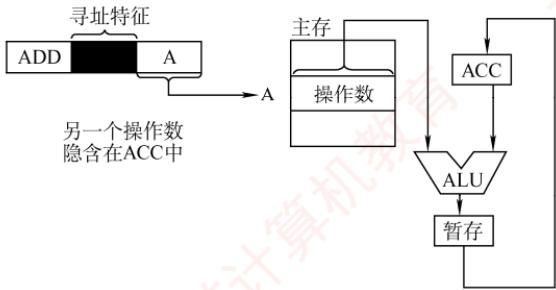  
图 4.2 隐含寻址

优点是可有效缩短指令字长；缺点是依赖存储隐含操作数的硬件（如ACC）。

## 2. 立即（数）寻址

## 考点追踪立即寻址的概念（2023）

在立即寻址中，指令的形式地址字段并不表示操作数的地址，而是直接存放操作数本身，称为立即数，通常以补码形式表示。如图4.3所示，#表示立即寻址特征，A即为立即数。

优点是操作数已包含在指令中，执行阶段无须访问存储器，指令执行速度最快；缺点是立即数的大小受限于形式地址字段的位数，寻址范围非常有限。 计

## 3. 直接寻址

## 考点追踪地址位数与直接寻址范围的关系（2010、2021）

直接寻址是指指令中的形式地址A就是操作数的真实地址EA，即EA=A，如图4.4所示。

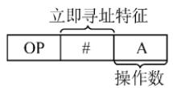  
图4.3 立即寻址示意图

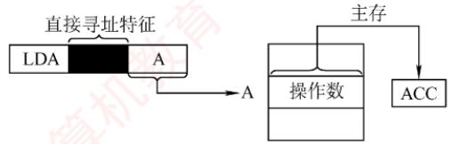  
图4.4 直接寻址示意图

优点是实现简单，无须额外计算操作数地址，执行阶段只需访存一次；缺点是形式地址A的

位数限制了寻址范围，且地址固定，难以动态修改。

例如，若形式地址字段占24位，则直接寻址范围为 $2 ^ { 2 4 }   = 1 6 \mathrm { M } ,$

## 4. 间接寻址

考点追踪间接寻址EA的分析（2016）

间接寻址是相对于直接寻址而言的，指令中的形式地址A并不直接给出操作数的有效地址，

  
图4.5 间接寻址示意图

而是指向一个主存单元，该单元中存放操作数的有效地址，即$\mathrm { E A }   =   ( \mathrm { A } )$ ，如图4.5所示。

优点是可扩大寻址范围（有效地址EA的位数通常大于形式地址A的位数，由存储字长决定），并支持地址动态生成（如实现指针和转移表）；缺点是指令执行阶段需多次访存（一次间址需2次访存）。由于访存开销较大，若需兼顾寻址范围与执行效率，通常采用寄存器间接寻址。

## 5. 寄存器寻址

考点追踪寄存器编号位数与寄存器数量的关系（2022、2024）

与直接寻址类似，寄存器寻址将操作数存放在寄存器中，指令的地址字段给出的是操作数所在寄存器的编号，即 $\mathrm { E A } = \mathrm { R } _ { i }$ ，操作数位于由 $\mathrm { R } _ { i }$ 指定的寄存器内，如图4.6所示。例如，若CPU有32个通用寄存器，则寄存器编号需5位，形式地址字段仅需5位即可寻址全部寄存器。

优点是执行阶段无须访存，仅访问寄存器，执行速度快；且因寄存器数量远少于内存单元，地址码位数较少，有助于缩短指令字长；缺点是寄存器成本高，CPU中可用寄存器数量有限。

## 6. 寄存器间接寻址

考点追踪寄存器间接寻址的取数操作（2010）

寄存器间接寻址结合了间接寻址和寄存器寻址的特点，指令中的 $\mathtt { R } _ { i }$ 所指寄存器中存放的不是一个操作数，而是操作数所在主存单元的地址，即 $\mathrm { E A } = ( \mathrm { R } _ { i } )$ ，如图4.7所示。

  
图4.6 寄存器寻址示意图

  
图4.7 寄存器间接寻址示意图

相比间接寻址，寄存器间接寻址在执行阶段只需一次访存，减少了访存开销：同时，由于该方式使用寄存器来存储有效地址，其寻址范围不受形式地址字段位数限制，从而扩大了寻址范围。相比寄存器寻址，这种方式在执行阶段需要从主存获取操作数，增加了访存需求。

## 7. 相对寻址

考点追踪相对寻址的相关分析与计算（2009、2010、2013、2014、2019、2023）

相对寻址是指将程序计数器（PC）的内容与指令中的形式地址A相加，形成转移目标地址，

即 $\mathrm{EA} = (\mathrm{PC}) + \mathrm{A}$ ，如图4.8所示。其中，PC为取指完成后自动更新的值，指向下一条指令的地址；A是相对于该PC值的偏移量，可正可负，通常以补码表示。

  
图4.8 相对寻址示意图

相对寻址主要用于转移类指令，形式地址A的位数决定了转移范围。例如，假设某机器按字节编址，指令长度为2B。一条相对转移指令（JMP A）位于地址1000H，其形式地址 $\mathrm{A} = 0005\mathrm{H}$ （补码表示），则取指完成后 $\mathrm{PC} = 1002\mathrm{H}$ ，实际转移目标地址为 $1002\mathrm{H}+0005\mathrm{H}=1007\mathrm{H}$

优点是目标地址不固定，而是相对于当前指令位置偏移，因此程序可在内存中任意浮动而不影响转移正确性，便于实现重定位和共享代码。

## 8. 基址寻址

考点追踪基址寻址的EA的计算（2019）

基址寻址是指将基址寄存器（BR）的内容与指令中的形式地址A相加，形成操作数的有效地址，即 $\mathrm{EA} = (\mathrm{BR}) + \mathrm{A}$ ，如图4.9所示。BR可以是专用基址寄存器或指定的通用寄存器。

  
(a)采用专用寄存器BR作为基址寄存器

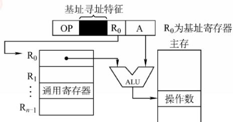  
(b)采用通用寄存器 $\mathtt { R _ { 0 } } ^ { \prime }$ 作为基址寄存器  
图 4.9 基址寻址

在多道程序环境下，基址寄存器的内容由操作系统设定，在程序执行期间保持不变（作为基地址），而形式地址A作为偏移量，由用户程序指定并可根据需要变化。当使用通用寄存器作为基址寄存器时，尽管用户可选择哪个寄存器扮演此角色，但其内容仍由操作系统控制。

优点是：可扩大寻址范围（因基址寄存器位数通常大于形式地址A），能访问更大的地址空

间；简化编程，用户无须关注程序在主存的具体位置，有利于多道程序设计和浮动程序的实现。缺点是：形式地址A的位数较短，限制了偏移量的范围。

## 9. 变址寻址

## 考点追踪变址寻址EA的相关计算（2013、2016、2024）

变址寻址是指将变址寄存器（IX）的内容与指令中的形式地址A相加，形成操作数的有效地址，即 $\mathrm{EA} = (\mathrm{IX}) + \mathrm{A}$ 如图4.10所示。IX可以是专用变址寄存器或指定的通用寄存器。

  
图4.10 变址寻址

考点追踪变址寻址的特点与应用（2017、2018、2024）

变址寄存器面向用户，其内容（作为偏移量）可以在程序执行中由用户动态修改，而形式地址A（作为基地址）保持不变。该方式不仅扩大了寻址范围，还特别适用于数组等数据结构的处理一通过调整X的值，可高效访问数组中任意元素，非常适合编写循环程序。例如，假设数组B首地址为1000H，存储在形式地址A中；变址寄存器IX初始为0。要访问B[3]元素（每个元素占4B），可将IX置为0CH（3×4=12），则该元素 $\mathrm{EA}=(\mathrm{IX})+\mathrm{A}=0\mathrm{CH}+1000\mathrm{H}=100\mathrm{CH}。$

尽管变址寻址与基址寻址均通过“寄存器内容+形式地址”生成有效地址，但二者本质不同：基址寻址面向系统，基址寄存器（BR）的内容由操作系统设定且运行时不可变，用于支持多道程序和存储分配；而变址寻址面向用户，IX的值可由程序动态调整，用于灵活的数据访问。

## 考点追踪偏移寻址的范畴（2011）

相对寻址、基址寻址和变址寻址均属于偏移寻址，其共同特点是通过某个寄存器的值与形式地址相加来确定操作数的有效地址，便于统一理解和应用。 计

## 10. 堆栈寻址

堆栈是存储器（或寄存器组）中一块按后进先出原则管理的特定存储区，其读/写单元的地址由一个称为堆栈指针（SP）的特定寄存器给出。堆栈可分为两类：硬堆栈由高速寄存器构成，成本较高，容量较小；软堆栈则是从主存中划分一段区域实现，更为经济实用。

在采用堆栈结构的计算机中，多数指令表面上表现为无操作数形式，因为其操作数地址由SP隐含指定。在访问堆栈时，SP会自动更新以指向新的栈顶位置。

上述各寻址方式的有效地址计算方法及访存次数（不含取本条指令）的总结见表4.1。

表4.1 寻址方式、有效地址及访存次数
<table><tr><td rowspan=1 colspan=1>寻址方式</td><td rowspan=1 colspan=1>有效地址</td><td rowspan=1 colspan=1>访存次数</td></tr><tr><td rowspan=1 colspan=1>立即寻址</td><td rowspan=1 colspan=1>A即是操作数</td><td rowspan=1 colspan=1>0</td></tr><tr><td rowspan=1 colspan=1>直接寻址</td><td rowspan=1 colspan=1>EA = A</td><td rowspan=1 colspan=1>1</td></tr><tr><td rowspan=1 colspan=1>一次间接寻址</td><td rowspan=1 colspan=1>EA=(A)</td><td rowspan=1 colspan=1>2</td></tr><tr><td rowspan=1 colspan=1>寄存器寻址</td><td rowspan=1 colspan=1>EA = R</td><td rowspan=1 colspan=1>0</td></tr><tr><td rowspan=1 colspan=1></td><td rowspan=1 colspan=1>EA = (Rj)</td><td rowspan=1 colspan=1>1</td></tr><tr><td rowspan=1 colspan=1>相对寻址</td><td rowspan=1 colspan=1>EA = (PC) + A</td><td rowspan=1 colspan=1>1</td></tr><tr><td rowspan=1 colspan=1>基址寻址</td><td rowspan=1 colspan=1>EA = (BR) + A</td><td rowspan=1 colspan=1></td></tr><tr><td rowspan=1 colspan=1>变址寻址</td><td rowspan=1 colspan=1>EA = (IX) + A</td><td rowspan=1 colspan=1>r</td></tr></table>

## 4.2.3 本节习题精选

## 一、单项选择题

01. 指令系统中采用不同寻址方式的目的是（）。A. 提供扩展操作码的可能并降低指令译码难度B. 可缩短指令字长，扩大寻址空间，提高编程的灵活性C. 实现程序控制 D. 三者都正确 机教

02. 采用直接转移的无条件转移指令的功能是将指令中的地址码送入（）。A. 程序计数器（PC） B. 指令译码器（ID）C. 指令寄存器（IR） 一道计 D. 地址寄存器（MAR）

03. 为了缩短指令中某个地址段的位数，有效的方法是采取（）。A. 立即寻址 B. 变址寻址 C.间接寻址 D. 寄存器寻址

04. 简化地址结构的基本方法是尽量采用（）。A. 寄存器寻址B. 隐含寻址C. 直接寻址 D. 间接寻址

05. 在指令寻址的各种方式中，获取操作数最快的方式是（）。A. 直接寻址 B. 立即寻址 C. 寄存器寻址D. 间接寻址

06. 假定指令中地址码所给出的是操作数的有效地址，则该指令采用（）。A. 直接寻址B. 立即寻址 C. 寄存器寻址D. 间接寻址

07. 设指令中的地址码为A，变址寄存器为X，程序计数器为PC，则变址间址寻址方式的操作数的有效地址 EA 是（）。A. ((PC) + A) B. ((X) + A) C. (X) + (A)

08.（）便于处理数组问题。A. 间接寻址 B. 变址寻址 C. 相对寻址 D. 基址寻址

09. 相对寻址方式中，指令所提供的相对地址实质上是一种（）。A. 立即数B. 内存地址C. 以本条指令在内存中首地址为基准位置的偏移量D. 以下条指令在内存中首地址为基准位置的偏移量

10. 指令寻址方式有顺序和跳跃两种，采用跳跃寻址方式可以实现（）。A. 程序浮动 B. 程序的无条件浮动和条件浮动C. 程序的无条件转移和条件转移 Y D. 程序的调用

11. 寄存器 R1、R2 均为 16 位，指令MOV R1,[R2]的功能是把内存数据传送至寄存器 R1，寻址方式为寄存器间接寻址。R2的值为 1234H，内存单元 1234H存放数据56H，内存单元1235H存放数据78H，采用小端方式存储。则执行指令后R1的值为（）。A. 5678H B. 7856H C. 8765H D. 6587H

12. 某计算机的字长为16位，主存按字编址。转移指令由两个字节组成，采用相对寻址，第一个字节为操作码字段，第二个字节为相对偏移量字段。若某转移指令所在的主存地址为4000H，相对偏移量字段的内容为06H，则该转移指令执行后的PC值为（）。A. 4002H B. 4004H C. 4007H D. 4008H

13. 某计算机的指令字长为16位，由低到高第0\~7位是形式地址D，第8\~9位为寻址特征位X，第10\~15位为操作码。当X= 00时为直接寻址；当X=01时使用 X1进行变址寻址；当 X= 10 时使用 X2 进行变址寻址；当 X= 11时为相对寻址。设(PC)= 1234H，  
王(X1)=0005H，(X2)=1188H，则指令2222H的有效地址是（）。A. 1256H B. 0027H C. 2222H D. 11AAH

14. 某机器指令字长为16位，主存按字节编址，取指令时，每取一字节，PC自动加1。当前指令地址为2000H，指令内容为相对寻址的无条件转移指令，指令中的形式地址为40H。则取指令后及指令执行后PC的内容为（）。A. 2000H, 2042H B. 2002H，2040HC. 2002H, 2042H

15. 某计算机的主存容量为4M×16位，且存储字长等于指令字长，若该机能完成97种操作，操作码位数固定，且有直接、间接、基址、变址、相对、立即六种寻址方式，则相对寻址的偏移量范围为（）。A. (−32, +31) B. (−64, +63)  C. (−128, +127) D. (−256, +255)

16. 假设寄存器R 中的数值为200，主存地址为200和300的地址单元中存放的内容分别是300和400，则（）方式下访问到的操作数为200。A. 直接寻址 200 王道 B. 寄存器间接寻址（R）C. 存储器间接寻址（200） D. 寄存器寻址 R

17.假设某条指令的第一个操作数采用寄存器间接寻址方式，指令中给出的寄存器编号为8，8号寄存器的内容为1200H，地址为1200H 的单元中的内容为12FCH，地址为 12FCH的单元中的内容为38D8H，而地址为38D8H的单元中的内容为88F9H，则该操作数的有效地址为（）。A. 1200H B. 12FCH C. 38D8H

18. 设相对寻址的转移指令占3B，第1字节为操作码，第2、3字节为相对位移量（补码表示），数据在存储器中采用以低字节为字地址的存放方式。每当CPU从存储器取出一王 字节时，即自动完成(PC)+1→PC。若PC的当前值为240（十进制），要求转移到290（十进制），则转移指令的第2、3字节的机器代码是（）；若PC的当前值为240（十进制），要求转移到200（十进制），则转移指令的第2、3字节的机器代码是（）。A. 2FH、FFH B. D5H、00H C. D5H、FFH D. 2FH、00H

19. 某计算机按字节编址，采用大端方式，某指令的一个操作数的机器数为ABCD 00FFH，该操作数采用基址寻址方式，指令中形式地址（用补码表示）为FF00H，当前基址寄存器的内容为C000 0000H，则该操作数的LSB（FFH）存放的地址是（）。A. CO0O FFOOH B. C000 FF03HC. BFFF FF00H D. BFFF FF03H

20.下列关于指令的功能及分类的叙述中，正确的是（）。A. 算术与逻辑运算指令，通常完成算术运算或逻辑运算，都需要两个数据B. 移位操作指令，通常用于把指定的两个操作数左移或右移一位C. 转移指令、子程序调用与返回指令，用于解决数据调用次序的需求D. 特权指令，通常仅用于实现系统软件，这类指令一般不提供给用户

21. 某计算机字长为16位，标志寄存器中存在ZF、SF、OF和CF标志位，采用双字节字长指令字。假定bgt（大于零转移）指令的第一个字节指明操作码和寻址方式，第二个字节为立即数Imm8，用补码表示。指令功能是：若转移条件成立，则PC=PC+2+Imm8×2;否则，PC=PC+2。则下列叙述中错误的是（）。直计集A. 该计算机按字节编址B. 若 bgt指令是无符号整数的比较，则转移条件可以是ZF + CF= 0C. 若bgt指令是有符号整数的比较，则转移条件可以是SF⊕OF= 0D. 转移目标地址的范围是相对于bgt指令的前127 条指令到后 128 条指令之间

22.下列关于指令寻址与数据寻址的描述中，错误的是（）。A. 中断响应时，中断隐指令的执行不属于指令寻址的范畴B. 指令格式中，每个操作数字段均需通过显式编码或隐含约定确定其寻址方式C. 在含Cache的系统中，指令访存遵循“Cache优先”原则，未命中时再访问主存D. 数据寻址方式不属于指令集体系结构（ISA）规定的内容

23.【2009统考真题】某机器字长为16位，主存按字节编址，转移指令采用相对寻址，由  
2字节组成，第一字节为操作码字段，第二字节为相对位移量字段。假定取指令时，每

取一字节，PC自动加1。若某转移指令所在主存地址为2000H，相对位移量字段的内容为06H，则该转移指令成功转移后的目标地址是（）。A. 2006H B. 2007H V C. 2008H D. 2009H

24.【2011统考真题】偏移寻址通过将某个寄存器的内容与一个形式地址相加来生成有效地址。下列寻址方式中，不属于偏移寻址方式的是（）。A. 间接寻址 B. 基址寻址 C. 相对寻址 D. 变址寻址

25.【2011 统考真题】某机器有一个标志寄存器，其中有进位/借位标志CF、零标志ZF、符号标志SF和溢出标志OF，条件转移指令bgt（无符号整数比较大于时转移）的转移条件是（）。 A. CF + OF = 1 B. $\overline { { \mathrm { S F } } } + \mathrm { Z F } = 1$ C. CF+ZF=1 D. $\overline{CF+SF}=1$ 教

26.【2013 统考真题】假设变址寄存器R的内容为1000H，指令中的形式地址为2000H;地址1000H中的内容为 2000H，地址 2000H中的内容为 3000H，地址3000H中的内容为4000H，则变址寻址方式下访问到的操作数是（）。A.1000H B. 2000H C. 3000H D. 4000H

27.【2014统考真题】某计算机有16个通用寄存器，采用32位定长指令字，操作码字段（含寻址方式位）为8位，STORE指令的源操作数和目的操作数分别采用寄存器直接寻址和基址寻址方式。若基址寄存器可使用任意一个通用寄存器，且偏移量用补码表示，则STORE指令中偏移量的取值范围是（）。A. -32768\~+32767 B.-32767～+32768C. -65536\~+65535 D.-65535～+65536

28. 【2016统考真题】某指令格式如下所示。

<table><tr><td>OP</td><td>M</td><td>I</td><td>D</td></tr><tr><td></td><td></td><td></td><td></td></tr></table>

其中M为寻址方式，Ⅰ为变址寄存器编号，D为形式地址。若采用先变址后间址的寻址方式，则操作数的有效地址是（）。A. I + D B. (I) + D C. ((I) + D) D. ((I)) + D V

29. 【2017统考真题】下列寻址方式中，最适合按下标顺序访问一维数组元素的是（）。A. 相对寻址B. 寄存器寻址C. 直接寻址 D. 变址寻址物

30.【2018统考真题】按字节编址的计算机中，某double型数组A的首地址为2000H，使用变址寻址和循环结构访问数组A，保存数组下标的变址寄存器的初值为0，每次循环取一个数组元素，其偏移地址为变址值乘以 sizeof(double)，取完后变址寄存器的内容自动加1。若某次循环所取元素的地址为2100H，则进入该次循环时变址寄存器的内容是（）。  
A. 25 B. 32 C. 64 D. 100

31.【2019统考真题】某计算机采用大端方式，按字节编址。某指令中操作数的机器数为1234FF00H，该操作数采用基址寻址方式，形式地址（用补码表示）为FF12H，基址寄存器的内容为F000 0000H，则该操作数的LSB（最低有效字节）所在的地址是（）。A. F000 FF12H B. F000 FF15H C. EFFF FF12H D. EFFF FF15H

32.【2020统考真题】某计算机采用16位定长指令字格式，操作码位数和寻址方式位数固定，指令系统有48条指令，支持直接、间接、立即、相对4种寻址方式。在单地址指令中，直接寻址方式的可寻址范围是（）。A. 0\~255 B. 0\~1023 C. -128\~127 D. -512\~511

33.【2023统考真题】某运算类指令中有一个地址码为通用寄存器编号，对应通用寄存器中存放的是操作数或操作数的地址，CPU区分两者的依据是（）。A. 操作数的寻址方式 B. 操作数的编码方式C. 通用寄存器的编号 D. 通用寄存器的内容

## 二、综合应用题

01. 某机的机器字长为16位，主存按字编址，指令格式如下：

<table><tr><td>15</td><td>9 8</td><td>7 0</td></tr><tr><td>操作码</td><td>X</td><td>D</td></tr></table>

其中，D为位移量；X为寻址特征位。

设(PC)=1234H，(X1)=0037H，(X2)=1122H（H代表十六位进制数），请确定下列指令的有效地址：① 4420H ② 2244H ③1322H④3521H⑤6723H

02.某计算机字长16位，标志寄存器FILAGS中的ZF、SF和OF分别是零标志、符号标志和溢出标志，采用双字节字长指令字。假定bgt（大于零转移）指令的第一个字节指明操作码和寻址方式，第二个字节为偏移地址Imm8，用补码表示。指令功能是：若（ZF +(SF⊕ OF)= 0），则 $ PC  =  PC  + 2 +  Imm 8 \times 2$ ；否则，PC=PC + 2。请回答下列问题： 计异1）该计算机的编址单位是多少？2）bgt指令执行的是有符号整数比较，还是无符号整数比较？3）偏移地址Imm8的含义是什么？转移目标地址的范围是什么？

03.【2010统考真题】某计算机字长为16位，主存地址空间大小为128KB，按字编址，采用单字长指令格式，指令各字段定义如下：

<table><tr><td>15</td><td>12 11</td><td>6</td><td>5</td><td>0</td></tr><tr><td>OP</td><td>Ms</td><td>Rs</td><td>Md</td><td>Rd</td></tr><tr><td></td><td colspan="4">源操作数 目的操作数</td></tr></table>

转移指令采用相对寻址方式，相对偏移量用补码表示，寻址方式定义见下表。

<table><tr><td>Ms/Md</td><td>寻址方式</td><td>助记符</td><td>含 义</td></tr><tr><td>000B</td><td>寄存器直接</td><td>Rn</td><td>操作数 = (Rn)</td></tr><tr><td>001B</td><td>寄存器间接</td><td>(Rn)</td><td>操作数 =((Rn))</td></tr><tr><td>010B</td><td>寄存器间接、自增</td><td>(Rn) +</td><td>操作数 = ((Rn))，(Rn) + 1→Rn</td></tr><tr><td>011B</td><td>相对</td><td>D(Rn)</td><td>转移目标地址 = (PC) + (Rn)</td></tr></table>

注：(X)表示存储器地址X或寄存器X的内容。

回答下列问题：

1）该指令系统最多可有多少条指令？该计算机最多有多少个通用寄存器？存储器地址寄存器（MAR）和存储器数据寄存器（MDR）至少各需要多少位？

2）转移指令的目标地址范围是多少？

3)若操作码 0010B 表示加法操作(助记符为 add)，寄存器 R4和 R5 的编号分别为100B和 101B，R4 的内容为 1234H，R5 的内容为 5678H，地址 1234H 中的内容为 5678H，5678H 中的内容为1234H，则汇编语句“add (R4)， (R5)+”（逗号前为源操作数，逗号后为目的操作数）对应的机器码是什么（用十六进制表示）？该指令执行后，哪些寄存器和存储单元的内容会改变？改变后的内容是什么？

04.【2013统考真题】某计算机采用16位定长指令字格式，其CPU中有一个标志寄存器，其中包含进位/借位标志CF、零标志ZF和符号标志NF。假定为该机设计了条件转移指令，其格式如下： XTA

<table><tr><td>15 11 10 9 8 7</td><td></td><td></td><td></td><td>0</td></tr><tr><td>00000</td><td>C</td><td></td><td>ZN</td><td>OFFSET</td></tr></table>

其中，00000为操作码 OP；C、Z和N分别为CF、ZF和NF的对应检测位，某检测位为1时表示需检测对应标志，需检测的标志位中只要有一个为1就转移，否则不转移。例如，若C = 1，Z = 0，N = 1，则需检测CF和 NF的值，当 CF =1 或 NF = 1时发生转移；OFFSET是相对偏移量，用补码表示。转移执行时，转移目标地址为(PC)+2+2×OFFSET；顺序执行时，下一条指令地址为(PC)+2。请回答下列问题：

1）该计算机存储器是按字节编址还是按字编址？该条件转移指令向后（反向）最多可转移多少条指令？

2）某条件转移指令的地址为200CH，指令内容如下图所示，若该指令执行时CF=0，ZF = 0，NF = 1，则该指令执行后 PC 的值是多少？若该指令执行时 CF = 1，ZF = 0，NF=0，则该指令执行后PC的值又是多少？请给出计算过程。

<table><tr><td>15</td><td>1110</td><td>9</td><td>87</td><td>0</td></tr><tr><td>00000</td><td>0</td><td>1</td><td>1</td><td>1110 0 0 11</td></tr></table>

3）实现“无符号数比较小于或等于时转移”功能的指令中，C、Z和N应各是什么？  
4）以下是该指令对应的数据通路示意图，要求给出图中部件①\~③的名称或功能说明。

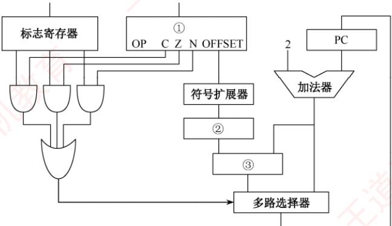

05.【2021统考真题】假定计算机M字长为16位，按字节编址，连接CPU和主存的系统总线中地址线为20位、数据线为8位，采用16位定长指令字，指令格式及说明如下：

格式 6位 2位 2位 2位 4位指令功能或指令类型说明

<table><tr><td rowspan=4 colspan=1>R型I型J型</td><td></td><td></td><td></td><td></td><td></td></tr><tr><td rowspan=1 colspan=1>000000</td><td rowspan=1 colspan=1>rs</td><td rowspan=1 colspan=1>rt</td><td rowspan=1 colspan=1>rd</td><td rowspan=1 colspan=1>opl</td></tr><tr><td rowspan=1 colspan=1>op2</td><td rowspan=1 colspan=1>rs</td><td rowspan=1 colspan=1>rt</td><td rowspan=1 colspan=2>imm</td></tr><tr><td rowspan=1 colspan=1>op3</td><td rowspan=1 colspan=4>target</td></tr></table>

R[rd] ← R[rs] op1 R[rt]

含ALU运算、条件转移和访存操作3类指令

PC 的低 10位← target

其中，op1\~ op3 为操作码，rs, rt和 rd 为通用寄存器编号，R[r]表示寄存器 r的内容，imm为立即数，target为转移目标的形式地址。请回答下列问题。

1）ALU的宽度是多少位？可寻址主存空间大小为多少字节？指令寄存器、主存地址寄存器（MAR）和主存数据寄存器（MDR）分别应有多少位？

2）R型格式最多可定义多少种操作？I型和J型格式总共最多可定义多少种操作？通用寄存器最多有多少个？

3）假定op1为0010和0011时，分别表示有符号整数减法和有符号整数乘法指令，则指令01B2H的功能是什么（参考上述指令功能说明的格式进行描述）？若1,2,3号通用寄存器当前内容分别为 B052H，0008H，0020H，则分别执行指令01B2H和 01B3H后，3号通用寄存器内容各是什么？各自结果是否溢出？

4）若采用Ⅰ型格式的访存指令中imm（偏移量）为有符号整数，则地址计算时应对imm进行零扩展还是符号扩展？ X

5）无条件转移指令可以采用上述哪种指令格式？

## 4.2.4 答案与解析

## 一、单项选择题

## 01. B

采用不同寻址方式的目的是为了缩短指令字长，扩大寻址空间，提高编程的灵活性，但这也提高了指令译码的复杂度。程序控制是靠转移指令而非寻址方式实现的。

## 02. A

转移指令有条件/无条件、直接/间接、相对/绝对三种属性。条件转移是指需要先判断条件是否成立，才决定是否转移：无条件转移是指不用判断条件就可以转移，典型的是函数调用和返回。直接转移是指转移目标地址直接放在指令中，执行时直接将地址码送入PC；间接转移是指转移目标地址存放在寄存器或内存单元中。相对转移是指转移目标地址为当前PC值加上偏移量，偏移量一般在指令中；绝对转移是指转移目标地址直接由指令或寄存器给出。

## 03. D

CPU中寄存器的数量都不会太多，用很短的编码就可以指定寄存器，寄存器寻址需要的地址段位数为log(通用寄存器个数)，因此能有效地缩短地址段的位数。立即寻址，操作数直接保存在指令中，若地址段位数太小，则操作数表示的范围会很小；变址寻址，EA=变址寄存器IX的内容+形式地址A，A与主存寻址空间有关；间接寻址中存放的仍然是主存地址。

## 04. B

隐含寻址不明显给出操作数地址，而在指令中隐含操作数的地址，因此可以简化地址结构。05. B

立即寻址最快，指令直接给出操作数；寄存器寻址次之，只需访问一次寄存器；直接寻址再次之，访问一次内存；间接寻址最慢，要访问内存两次或以上。

## 06. A

指令字中的形式地址为操作数的有效地址，这种方式为直接寻址。

## 07. B

变址寻址的有效地址是(X)+A，再进行变址间址寻址，即把(X)+A中取出的内容作为真实地址 EA，即 EA = ((X) + A)。

寄存器中的内容和指令地址码相加得到的是操作数的地址码。

## 08. B

变址寻址便于处理数组问题。基址寻址与变址寻址的区别见下表。

<table><tr><td rowspan=1 colspan=1></td><td rowspan=1 colspan=1>基址寻址</td><td rowspan=1 colspan=1>变址寻址</td></tr><tr><td rowspan=1 colspan=1>有效地址</td><td rowspan=1 colspan=1> $\mathrm{EA} = (\mathrm{BR}) + \mathrm{A}$ 1</td><td rowspan=1 colspan=1> $\mathrm{EA} = (\mathrm{IX}) + \mathrm{A}$ </td></tr><tr><td rowspan=1 colspan=1>访存次数</td><td rowspan=1 colspan=1>_  1</td><td rowspan=1 colspan=1>1</td></tr><tr><td rowspan=1 colspan=1>寄存器内容</td><td rowspan=1 colspan=1>由操作系统或管理程序确定</td><td rowspan=1 colspan=1>由用户设定</td></tr><tr><td rowspan=1 colspan=1>程序执行过程中值可变否</td><td rowspan=1 colspan=1>O            不可变</td><td rowspan=1 colspan=1>可变</td></tr><tr><td rowspan=1 colspan=1>特点  妙</td><td rowspan=1 colspan=1>有利于多道程序设计和编制浮动程序</td><td rowspan=1 colspan=1>有利于处理数组问题和编制循环程序</td></tr></table>

## 09. D

相对寻址中，有效地址 $\mathrm{EA} = (\mathrm{PC}) + \mathrm{A}$ （A为形式地址），执行本条指令时，PC已完成加1操作，PC中保存的是下一条指令的地址，因此以下一条指令的地址为基准位置的偏移量。

## 10. C

跳跃寻址通过转移类指令（如相对寻址）来实现，可用来实现程序的条件或无条件转移。

## 11. B

寄存器R2中的值是1234H，内存单元1234H中的值是56H，1235H中的值是78H，因为采用小端方式，所以实际存储的数据为7856H，取出后存放到R1，因此R1的值为7856H。

## 12. C

主存按字编址，指令字长为1个字（2字节），因此取出该指令后，PC自动加1，相对偏移量为06H，所以该转移指令执行后的PC值为 $4000\mathrm{H}+06\mathrm{H}+1\mathrm{H}=4007\mathrm{H}$

## 13. D

将指令2222H展开成二进制为0010 0010 0010 0010B，因此寻址特征位X=10，即使用X2进行变址寻址，其有效地址为 $1188\mathrm{H}+22\mathrm{H}=11\mathrm{AAH}$

## 14. C

指令字长为16位，2字节，因此取指令后PC的内容为(PC)+2=2002H；无条件转移指令将下一条指令的地址送至PC，形式地址为40H，指令执行后 $\mathrm{PC}=2002\mathrm{H}+0040\mathrm{H}=2042\mathrm{H}$

## 15. A

操作码位数固定，且能完成97种操作，则操作码位数是 $\left[ \log_{2}97 \right] = 7$ 位；具有六种寻址方式，则寻址特征位数是 $\left[ \log_{2}6 \right] = 3$ 位；指令字长为16位，因此地址码位数是 $1 6 - 3 - 7 = 6$ 位，6位补码的表示范围为-32～+31，即为相对寻址的偏移量范围。 计身

## 16. D

直接寻址200访问的操作数是300，选项A错误。寄存器间接寻址（R）的访问结果与Ⅰ一样，选项B错误。存储器间接寻址（200）表示主存地址200中的内容为有效地址，有效地址为300，访问的操作数是400，选项C错误。寄存器寻址R表示寄存器R的内容为操作数，只有选项D正确。

## 17. A

寄存器间接寻址中操作数的有效地址 $\mathrm { E A }   =   ( \mathrm { R } _ { i } )$ ，8号寄存器内容为1200H，因此 $\mathrm{EA} = 1200\mathrm{H}$ 0

## 18. D、C

首先需要讲解一下补码扩充的问题。补码的扩充只需使用符号位补足即可，也就是说正数补码的扩充只要补0，负数补码的扩充只需补1（这是由补码的性质决定的）。理解了该性质，这道题就变成了十进制数转换为十六进制数的简单问题。

1）PC的当前值为240，该指令取出后PC的值为243，要求转移到290，即相对位移量为290-243=47，转换成补码为2FH。因为数据在存储器中采用以低字节地址为字地址的存放方式，所以该转移指令的第二字节为2FH，而由于47是正数，只需在高位补0，所以第三字节为00H。 古计

2）PC的当前值为240，该指令取出后PC的值为243，要求转移到200，即相对位移量为200-243=-43，转换成补码为D5H。数据在存储器中采用以低字节地址为字地址的存放方式，因此该转移指令的第二字节为D5H，因为-43是负数，所以只需在高位补1，所以第三字节为FFH。 XTA

## 19. D

基址寻址的操作数的有效地址为基址寄存器内容加上形式地址，即 $\mathrm{C000~0000H}+\mathrm{FF00H}=\mathrm{C000}$ 0000H+FFFFFF00H=BFFFFF00H。因为是大端方式，所以LSB的存放地址为BFFFFF03H。

## 20. D

算术与逻辑运算指令用于完成对一个（如自增、取反等）或两个数据的算术运算或逻辑运算，选项A错误。移位操作用于把一个操作数左移或右移一位或多位，选项B错误。转移指令、子程序调用与返回指令用于解决变动程序中指令执行次序的需求，而不是数据调用次序的需求，选项C错误。

## 21. C

PC的增量是2，每条指令占2字节，可知编址单位为字节。若bgt指令是无符号整数的比较，则大于零时，ZF一定为0，且CF也一定为0。若bgt指令是有符号整数的比较，则转移条件成立时，要么未发生溢出， $\mathrm { S F } = \mathrm { O F } = 0$ ，要么发生溢出， $\mathrm{SF} = \mathrm{OF} = 1$ ，但前提是ZF一定为0，故正确的转移条件是 $( \mathrm { Z F } + ( \mathrm { S F } \oplus \mathrm { O F } ) = 0 )$ 。Imm8的范围为-128～127，因此转移目标地址的范围是PC+$2+(-128\times2)\sim PC+2+127\times2$ ，即相对于bgt指令的前127条指令到后128条指令之间。

## 22. D

中断隐指令由硬件自动完成（如保存PC、转移至中断向量），不涉及程序控制流中的指令地址生成，故不属于指令寻址。操作数要通过显式字段或隐含规则（如堆栈使用SP）确定来源，是寻址机制的基本要求。在现代存储体系中，指令与数据访存优先经Cache，缺失时才访问主存以提升性能。数据寻址方式是ISA的核心内容，必须明确定义，选项D错误。

## 23. C

相对寻址EA=(PC)+A，首先计算取指令后的PC值。转移指令由2字节组成，每取一字节PC加1，取指令后的PC值为2002H，因此 $\mathrm{EA}=(\mathrm{PC})+\mathrm{A}=2002\mathrm{H}+06\mathrm{H}=2008\mathrm{H}$ 。本题易误选选项A或B，选项A未考虑PC 值的自动更新，选项B虽然考虑了PC值的自动更新，但未注意到该转移指令是一条2字节指令，PC值应是“+2”而不是“+1”。

## 24. A

间接寻址不需要寄存器，EA=(A)。基址寻址EA=A+基址寄存器BR的内容；相对寻址EA=A+程序计数器（PC）的内容；变址寻址EA=A+变址寄存器IX的内容。后三者都是将某个寄存器的内容与一个形式地址相加而形成有效地址，所以统称偏移寻址。

## 25. C

假设两个无符号整数A和B，bgt指令会将A和B进行比较，也就是将A和B相减。若 $A \geq B ,$ 则A－B肯定无进位/借位，也不为0（为0时表示两数相等），因此CF和ZF均为0，选C。其余选项中用到了符号标志SF和溢出标志OF，SF表示结果的符号，OF是有符号整数的溢出标志

位，对于无符号数运算，SF和OF没有意义，显然应当排除。

## 26. D

根据变址寻址的方法，变址寄存器的内容（1000H）与形式地址的内容（2000H）相加，得到操作数的实际地址（3000H），根据实际地址访问内存，获取操作数4000H，如下图所示。


## 27. A

采用32位定长指令字，其中操作码为8位，两个地址码共占用32-8 =24位，而 STORE指令的源操作数和目的操作数分别采用寄存器直接寻址和基址寻址，机器中共有16个通用寄存器，因此寻址一个寄存器需要 $\log _ { 2 } 1 6 = 4$ 位，源操作数中的寄存器直接寻址用掉4位，而目的操作数采用基址寻址也要指定一个寄存器，同样用掉4位，则留给偏移量的位数为24-4-4=16位，而偏移量用补码表示，因此16位补码的表示范围为-32768～+32767。

## 28. C

在变址寻址中，有效地址（EA）等于指令字中的形式地址D与变址寄存器Ⅰ的内容之和，即EA=(1)+D。间接寻址是相对于直接寻址而言的，指令的地址字段给出的形式地址不是操作数的真正地址，而是操作数地址的地址，即 $\mathrm { E A }   =   ( \mathrm { D } )$ 。从而该操作数的有效地址是((I)+D)。

## 29. D

变址操作时，将计算机指令中的地址与变址寄存器中的地址相加，得到有效地址，指令提供数组首地址，由变址寄存器来定位数据中的各元素。所以它最适合按下标顺序访问一维数组元素，选择选项D。相对寻址以PC为基地址，以指令中的地址为偏移量确定有效地址。寄存器寻址则在指令中指出需要使用的寄存器。直接寻址在指令的地址字段直接指出操作数的有效地址。

## 30. B

根据变址寻址的公式 EA = (IX) + A，有 $(IX)=2100H-2000H=100H=256$ , sizeof(double) = 8（双精度浮点数用8位字节表示），因此数组的下标为256/8=32。

## 31. D

注意，内存地址是无符号数。

操作数采用基址寻址方式，EA=(BR)+A，基址寄存器BR的内容为F000 0000H，形式地址用补码表示为FF12H即111111110001 0010B，因此有效地址为 $\mathrm{F000~0000H}+(-00\mathrm{EEH})=\mathrm{EFFF}$ FF12H。计算机采用大端方式编址，所以低位字节存放在字的高地址处，机器数一共占4字节，该操作数的 LSB 所在的地址是 EFFF FF12H + 3 = EFFF FF15H。

## 32. A

48条指令需要6位操作码字段 $( 2 ^ { 5 } < 4 8 < 2 ^ { 6 } )$ ，4种寻址方式需要2位寻址特征位 $( 4   =   2 ^ { 2 } )$ 还剩 $16 - 6 - 2 = 8$ 位作为地址码，所以直接寻址范围为0～255。注意，主存地址不能为负。

## 33. A

指令字由操作码、寻址特征和地址码三个字段组成，寻址特征字段用来指明指令属于哪种寻址方式。若寻址方式是寄存器直接寻址，则地址码所指的通用寄存器中存放的是操作数，若寻址方式是寄存器间接寻址，则对应通用寄存器中存放的是操作数的地址。

## 二、综合应用题

## 01. 【解答】

取指令后，PC=1235H（注意，不是1236H，因主存按字编址）。

① $\mathrm{X}=00,\ \mathrm{D}=20\mathrm{H}$ ，有效地址 $\mathrm{EA} = 20\mathrm{H} 。$

② X = 10，D = 44H，有效地址 $ EA =1122 H +44 H =1166 H  。$

③ $\mathrm{X}=11,\ \mathrm{D}=22\mathrm{H}$ ，有效地址 $\mathrm{EA}=1235\mathrm{H}+22\mathrm{H}=1257\mathrm{H}$

④ $\mathrm{X}=01,\ \mathrm{D}=21\mathrm{H}$ ，有效地址 $\mathrm{EA}=0037\mathrm{H}+21\mathrm{H}=0058\mathrm{H}$

⑤ $\mathrm{X}=11,\ \mathrm{D}=23\mathrm{H}$ ，有效地址 $\mathrm{EA} = 1235\mathrm{H} + 23\mathrm{H} = 1258\mathrm{H}$ 0

## 02.【解答】

1）因为PC的增量是2，且每条指令占2字节，所以编址单位是字节。

2）根据“大于”条件判断表达式，可以看出该bgt指令实现的是有符号整数比较。因为无符号数比较时，其判断表达式中没有溢出标志 $\mathrm { O F _ { \circ } }$ 继续分析该逻辑表达式，bgt指令的含义是当两数相减的结果大于0时，执行转移操作。因此，要满足bgt指令的条件，必须保证如下两个条件：一是结果不为0，即零标志位ZF为 $0 ;$ 二是结果的符号位与溢出标志王 位OF相同，即 SF⊕OF为0（两数相减结果大于0，有两种情况：第一种情况是结果没有溢出，此时OF位和 SF位都为0；第二种情况是结果发生了溢出，此时OF和SF位都为1）。综上所述，逻辑表达式可表示为 $\mathrm{ZF} + (\mathrm{SF} \oplus \mathrm{OF}) = 0$

3）偏移地址Imm8为补码表示，说明转移目标地址可能在bgt指令之后。计算转移目标地址时，偏移量为Imm8×2，说明Imm8不是相对地址，而是相对指令数。Imm8的范围为-128～127，所以转移目标地址的范围是 $PC+2+(-128\times2)\sim PC+2+127\times2$ ，也即转移目标地址的范围是相对于bgt指令的前127条指令到后128条指令之间。

## 03.【解答】

1）操作码占4位，则该指令系统最多可有 $2 ^ { 4 }   = 1 6$ 条指令。操作数占6位，其中寻址方式占3位、寄存器编号占3位，因此该机最多有 $2 ^ { 3 } \: = \: 8$ 个通用寄存器。主存地址空间大小为128KB，按字编址，字长为16位，共有 $1 2 8 \mathrm { K B } / 2 \mathrm { B } = 2 ^ { 1 6 }$ 个存储单元，因此MAR至少为16位；本题已说明了存储字长为16位，因此MDR至少为16位。

2）寄存器字长为16位，PC可以表示的地址范围为 $0 { \sim } 2 ^ { 1 6 } { - } 1$ ，Rn可表示的相对偏移量 $-2^{15}$ $2 ^ { 1 5 }   -   1$ ，而主存地址空间为216，因此转移指令的目标地址范围为0000H～FFFFH $( 0 \sim 2^{16} - 1 )$ 0

3）汇编语句“add(R4),(R5)+”对应的机器码为

<table><tr><td rowspan=1 colspan=1>字段</td><td rowspan=1 colspan=1>OP</td><td rowspan=1 colspan=1>Ms</td><td rowspan=1 colspan=1> $\mathrm { R s }$ </td><td rowspan=1 colspan=1>Md</td><td rowspan=1 colspan=1>XRd</td></tr><tr><td rowspan=1 colspan=1>内容</td><td rowspan=1 colspan=1>0010</td><td rowspan=1 colspan=1>001</td><td rowspan=1 colspan=1>100</td><td rowspan=1 colspan=1>010</td><td rowspan=1 colspan=1>101</td></tr><tr><td rowspan=1 colspan=1>说明</td><td rowspan=1 colspan=1>add</td><td rowspan=1 colspan=1>寄存器间接</td><td rowspan=1 colspan=1>R4</td><td rowspan=1 colspan=1>寄存器间接、自增</td><td rowspan=1 colspan=1>R5</td></tr></table>

将对应的机器码写成十六进制数形式为 $0010\;0011\;0001\;0101\;\mathrm{B}=2315\mathrm{H}$

该指令的功能是将R4的内容所指的存储单元的数据与R5的内容所指的存储单元的数据相加，并将结果送入R5的内容所指的存储单元中。(R4)=1234H，(1234H)=5678H；(R5)=5678H，$(5678\mathrm{H}) = 1234\mathrm{H};$ ；执行加法操作 $5678\mathrm{H}+1234\mathrm{H}=68\mathrm{ACH}$ 之后 R5 自增。

该指令执行后，R5和存储单元 5678H的内容会改变，R5的内容从 5678H变为5679H，存储单元 5678H 中的内容变为该指令的计算结果 68ACH。

## 04.【解答】

1）因为指令长度为16位，且下一条指令地址为(PC)+2，因此编址单位是字节。

相对偏移量OFFSET为8位补码，表示范围为-128～127，根据转移目标地址为 $(PC) + 2 +$ $2 \times  OFFSET$ ，若要向后转移，则要求OFFSET必须为负数，OFFSET的最小值为-128，但在执行转移指令之前，PC进行了自增+2的操作，所以向后最多可转移127条指令。

2）指令中 $C = 0, \; Z = 1, \; N = 1$ ，因此应根据ZF和NF的值来判断是否转移。 $\mathrm{CF}=0,\ \mathrm{ZF}=0$ $\mathrm { N F } = 1$ 时，需转移。已知指令中的偏移量为 $1110\;0011\mathrm{B}=\mathrm{E}3\mathrm{H}$ ，符号扩展后为FFE3H，左移一位（乘以2）后为FFC6H，因此PC的值（转移目标地址）为 $200CH+2+FFC6H=$ 1FD4H。CF = 1，ZF = 0，NF = 0时不转移。PC 的值为 $200CH+2=200EH$ 0

3）指令中的C、Z和N应分别设置为 $C = Z = 1,\ N = 0$ 。两个数之间的大小比较通常是对两个数做减法运算，即两个数相减当结果为0或为负时转移，若为0，则ZF标志应当是1，若为负，则借位标志应该是1，而无符号数并不涉及符号标志 $\mathrm { N F } _ { \circ }$

4）部件①用于存放当前指令，不难得出为指令寄存器；多路选择器根据符号标志C/亿/N来决定下一条指令的地址是PC+2还是 $\mathrm{PC}+2+2\times \mathrm{OFFSET}$ ，因此多路选择器左边线上的结果应是 $ PC  + 2 + 2 \times  OFFSET$ 。根据运算的先后顺序及与 $\mathrm{PC} + 2$ 的连接，部件②用于左移一位实现乘以2，为移位寄存器。部件③用于PC+2和 $2 \times  OFFSET$ 相加，为  
加法器。 X

部件②：移位寄存器（用于左移一位）；部件③：加法器（地址相加）。

## 05. 【解答】

1）ALU的宽度为16位，ALU的宽度即ALU运算对象的宽度，通常与字长相同。地址线为20位，按字节编址，可寻址主存空间大小为 $2 ^ { 2 0 }$ 字节（或1MB）。指令寄存器有16位，和单条指令长度相同。MAR有20位，和地址线位数相同。MDR有8位，和数据线宽度相同。

2）R型格式的操作码有4位，最多有 $2 ^ { 4 }$ （或16）种操作。Ⅰ型和J型格式的操作码有6位，因为它们的操作码部分重叠，所以共享这6位的操作码空间，且前6位全为0的编码已被R型格式占用，因此I和J型格式最多有 $2 ^ { 6 }   -   1   =   6 3$ 种操作。从R型和I型格式的寄存器编号部分可知，只用2位对寄存器编码，因此通用寄存器最多有4个。

3）指令 $01 B 2 H =000000\ 01\ 10\ 11\ 0010 B$ 为一条R型指令，操作码0010表示有符号整数减法指令，其功能为R[3]←R[1]-R[2]。执行指令01B2H后， $\mathrm{R}[3]=\mathrm{B}052\mathrm{H}-0008\mathrm{H}=\mathrm{B}04\mathrm{AH}$ ，结果未溢出。指令 $01 B 3 H =00000001\ 10\ 11\ 0011 B ,$ 操作码0011表示有符号整数乘法指令，执行指令01B3H后， $\mathrm{R}[3]=\mathrm{R}[1] \times \mathrm{R}[2]=\mathrm{B}052\mathrm{H} \times 0008\mathrm{H}=8290\mathrm{H}, \mathrm{B}052\mathrm{H}$ 乘以8相当于将B052H算术左移3位，B052H是一个负数，符号位为1，在算术左移的过程中移出了101，不全为1，由此可以判断结果溢出。 KKH

4）在进行指令的转移时，既可能向前转移，又可能向后转移，偏移量是一个有符号整数，因此在地址计算时，应对imm进行符号扩展。

5）无条件转移指令可以采用J型格式，将target部分写入PC的低10位，完成转移。

## 4.3 程序的机器级代码表示

## 考点追踪涉及汇编代码的年份（2012、2014、2015、2017、2019、2023、2024）

本节是2022年新增考点，但相关知识早已多次以综合题形式出现在历年真题中，难度较大，不少跨考生感到无从下手。通过本节学习后，考生应能从容应对此类问题。统考大纲未指定具体指令集，但历年真题主要考查x86和MIPS汇编指令。其中，MIPS指令通常会在试题中附带功能

说明，而x86指令则更常作为默认考查对象。因此，本节重点介绍x86汇编指令。

## 4.3.1 常用汇编指令介绍

## 1. 相关寄存器

x86处理器中有8个32位通用寄存器，主要寄存器及说明如图4.11所示。为向后兼容早期的16位和8位架构，EAX、EBX、ECX和EDX的低16位可作为独立寄存器使用（分别记为AX、BX、CX、DX），而每个16位寄存器又可进一步拆分为两个8位寄存器（如AX分为AH和AL）。其中，E表示Extended，用于标识32位寄存器。

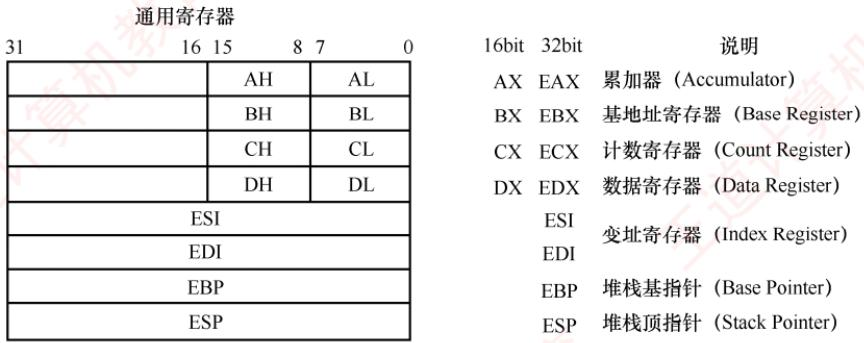  
图4.11 x86处理器中的主要寄存器及说明

除EBP（基址指针）和ESP（栈指针）外，其余通用寄存器的用途是比较灵活的。

## 2. 常用指令

汇编指令通常可分为数据传送指令、算术与逻辑运算指令和控制流指令，下面以Intel格式为例，介绍一些常用指令。以下用于操作数的标记分别表示寄存器、内存和常数。

● <reg>: 表示任意寄存器，若其后带有数字，则指定其位数，如<reg32>表示 32 位寄存器(eax,ebx, ecx, edx, esi, edi, esp 或 ebp）；<reg16>表示 16 位寄存器（ax, bx, cx 或 dx）；<reg8>表示 8 位寄存器（ah, al, bh, bl, ch, cl, dh, dl）。

• <mem>：表示内存地址（如[eax]、[var + 4]或 dword ptr [eax + ebx]）。

● <con>：表示 8位、16 位或32 位常数。<con8>表示 8位常数；<con16>表示 16 位常数；<con32>表示 32 位常数。 机

## 考点追踪分析汇编指令对应的二进制代码（2010）

x86指令采用变长编码，其操作码通常为1字节，但整条指令长度可变。同一指令（如mov）因操作数类型或寄存器不同，可能对应多种机器码编码，例如，

```rust
mov ax, <con16> #机器码为 B8H
mov al, <con8> #机器码为 BOH
mov <reg16>, <reg16>/<mem16> #机器码为 89H
mov <reg8>/<mem8>, <reg8> #机器码为 8AH
mov <reg16>/<mem16>, <reg16> #机器码为 8BH
```

## 考点追踪模仿写出简单语句的机器级指令（2012）

## （1）数据传送指令

1）mov指令。将第二个操作数（寄存器内容、内存内容或常数值）复制到第一个操作数（寄存器或内存）。其语法如下：

mov <reg>,<reg>

mov eax, ebx #将 ebx 寄存器的值复制到 eax  
mov byte ptr [var], 5 #将常数 5 存入地址 var 处的 1 字节内存单元

```rust
mov <reg>,<mem>
mov <mem>,<reg>
mov <reg>,<con>
mov <mem>,<con>
```

举例：

双操作数指令的两个操作数不能同时为内存，即mov指令不能用于直接从内存复制到内存。若需在内存之间复制，可先将源内存内容加载到寄存器，再从该寄存器写入目标内存。

2）push指令。将操作数压入栈中，常用于函数调用和现场保护。ESP是栈顶，入栈前先将ESP减4（栈向低地址方向增长），再将操作数压入ESP所指地址。其语法如下：

push <reg32>   
push <mem>   
push <con32>

举例（注意，栈中元素固定为32位）：

push eax #将 eax 的值压入栈  
push [var] #将地址 var 处的 4 字节内容压入栈

3）pop指令。与push指令相反，从栈中弹出数据。出栈前先将ESP所指地址的内容读出，再将ESP加4。其语法如下：

pop eax #弹出栈顶元素并存入 eax  
pop [ebx] #弹出栈顶元素并存入 ebx所指的4字节内存地址

(2)算术和逻辑运算指令

1）add/sub指令。add指令将两个操作数相加，sub指令将第一个操作数减去第二个操作数，结果均保存在第一个操作数中。其语法如下：

add <reg>,<reg> / sub <reg>,<reg>   
add <reg>,<mem> / sub <reg>,<mem>   
add <mem>,<reg> / sub <mem>,<reg>   
add <reg>,<con> / sub <reg>,<con>   
add <mem>,<con> / sub <mem>,<con>

举例：

sub eax, 10 #eax ← eax-10  
add byte ptr [var], 10 #将地址 var 处的 1 字节内容与 10 相加，结果存回该地址

2）inc/dec指令。分别对操作数执行自增1或自减1操作。其语法如下：

inc <reg> / dec <reg>   
inc <mem>/ dec <mem>

举例：

dec eax #eax值自减1  
inc dword ptr [var] #将地址 var 处的 4 字节内容自增1

3）imu指令。有符号整数乘法指令，支持两种格式：①双操作数，将第二、第三操作数相乘，结果存入第一个操作数（必须为寄存器）；②三操作数，将第二、第三操作数相乘，结果存入第一个操作数（必须为寄存器）。其语法如下：

imul <reg32>,<reg32>   
imul <reg32>,<mem>   
imul <reg32>,<reg32>,<con>   
imul <reg32>,<mem>,<con>

举例：

imul eax, [var] #eax eax \* [var]   
imul esi, edi, 25 #esi ← edi \* 25

无符号整数乘法由mul指令实现，仅支持单操作数格式，被乘数隐含在eax中，乘积结果存放在 edx:eax 中。当 edx≠ 0时，表示结果无法用 32位无符号数表示，CPU置 CF =1和 OF = 1。imul

在结果溢出时，同样置CF=1和OF=1。无符号乘法以CF判断溢出，有符号乘法则以OF为准。

4）idiv指令。有符号整数除法指令，仅指定除数。被除数为 edx:eax组成的64位有符号数

（edx为高32位，eax为低32位）。执行后，商存入eax，余数存入edx。其语法如下：

idiv <reg32>   
idiv <mem>

举例：

idiv ebx   
idiv dword ptr [var]

无符号整数除法指令div的格式与idiv的完全一致，仅对操作数的解释不同。

5）and/or/xor指令。分别执行按位与、或、异或操作，结果存入第一个操作数。其语法如下：

```html
and <reg>,<reg> / or <reg>,<reg> / xor <reg>,<reg>
and <reg>,<mem> / or <reg>,<mem> / xor <reg>,<mem>
and <mem>,<reg> / or <mem>,<reg> / xor <mem>,<reg>
and <reg>,<con> / or <reg>,<con> / xor <reg>,<con>
and <mem>,<con> / or <mem>,<con> / xor <mem>,<con>
```

举例：

and eax, 0fH #将 eax 的高 28 位置 0，低 4 位保持不变  
xor edx, edx #将 edx 清零

6）not指令。按位取反指令，将操作数的每一位0变1、1变0。其语法如下：

not <reg>   
not <mem>

举例：

not byte ptr [var] #将地址 var 处的 1 字节内容按位取反

7）neg指令。取负指令，计算操作数的二进制补码（-x）。其语法如下：

neg <reg>   
neg <mem>

举例：

neg eax

```markdown
#eax ← -eax
```

8）shl/shr指令。逻辑移位指令：shl为逻辑左移，shr为逻辑右移，第一个操作数为被移位数，第二个操作数为移位位数。其语法如下：

shl <reg>,<con8> / shr <reg>,<con8>   
shl <mem>,<con8> / shr <mem>,<con8>   
shl <reg>,<cl>/ shr <reg>,<cl>   
shl <mem>,<cl> / shr <mem>,<cl>

举例：

shl eax, 1 #eax逻辑左移1 位  
shr ebx, cl #eb×逻辑右移n 位（n 为 cl 中的值）

## （3）控制流指令

x86处理器通过指令指针寄存器EIP（相当于程序计数器即PC）指示当前执行指令的地址。每条指令执行后，EIP自动指向下一条指令。EIP不能直接访问，但可通过控制流指令修改。程序中常用标签（1abel）标记指令地址，例如：

指令①  
begin： 指令②  
指令③

此处标签begin指向第二条指令，控制流指令通过标签实现转移。

考点追踪无条件转移指令的指令格式（2021）

1）jmp指令。无条件转移到label标签所指示的地址继续执行。其语法如下：jmp <label>

jmp begin #转移到 begin 标记处执行

举例：

考点追踪条件转移指令与标志位的结合（2013）

2）jcondition指令。条件转移指令，根据程序状态字寄存器中的状态标志（如零标志ZF、符号标志SF等）决定是否转移。常见指令包括：

je <label> #相等时转移（jump when equal）   
jz <label> #结果为零时转移(jump when last result was zero)   
jne <label> #不相等时转移（jump when not equal）   
jg <label> #大于时转移(jump when greater than)   
jge <label> #大于等于时转移(jump when greater than or equal to)   
jl <label> #小于时转移(jump when less than)   
jle <label> #小于等于时转移(jump when less than or equal to)

举例：

cmp eax, ebx  
jle done #若 eax≤ebx，则转移到 done；否则顺序执行下一条指令

3）cmp/test指令。cmp指令执行减法运算但不保存结果，仅根据结果设置标志位；test指令执行按位与运算但不保存结果，仅更新标志位（特别是ZF）。其语法如下：

cmp <reg>,<reg> / test <reg>,<reg>   
cmp <reg>,<mem> / test <reg>,<mem>   
cmp <mem>,<reg> / test <mem>,<reg>   
cmp <reg>,<con> / test <reg>,<con>

cmp 和 test 指令通常与 jcondition 指令配合使用。cmp指令举例：

cmp dword ptr [var], 10 #将 var 处的 4 字节内容，与 10 比较  
jne loop #若相等则顺序执行；否则转移到1oop

test 指令举例：

test eax, eax #测试 eax 是否为零  
jz xxxx #若 eax 为零（ZF=1），则转移到 xxxx

考点追踪call指令的功能（2019）

4）cal/ret指令。分别用于实现子程序调用与返回。其语法如下：

call <label>   
ret

call指令将下一条指令的地址（返回地址）压入栈，然后转移到label处执行；ret指令从栈顶弹出返回地址，并转移到该地址继续执行。call和 ret是函数调用机制的核心指令。

掌握上述指令的语法与功能，有助于解答相关考题。建议读者在学习C语言程序时，结合调试工具（如GDB）查看其对应的汇编代码，以加深对机器级指令的理解。

## 3. 汇编指令格式

使用不同的编程工具开发程序时，所用的汇编器也不同，主要有 AT&T 格式和 Intel 格式两种（统考常涉及的是Intel格式）。它们的主要区别如下：

①AT&T格式的指令名必须使用小写字母，Intel格式对大小写不敏感。

②操作数顺序不同：AT&T格式为“源，目的”，Intel格式为“目的，源”。

③AT&T格式中，寄存器前加“%”，立即数前加“\$”；Intel格式中，两者均无前缀。

④内存寻址符号不同：AT&T使用圆括号“()”，Intel 使用方括号“[]”。

⑤复杂寻址方式表示不同：AT&T格式的内存操作数“disp(base, index, scale)”分别表示偏移量、基址寄存器、变址寄存器和比例因子，如“8(%edx,%eax,2)”表示操作数地址为R[edx] + R[eax]\*2 + 8；对应的 Intel 格式为“[edx + eax\*2 + 8]”。

⑥操作数长度指定方式不同：AT&T格式在指令助记符后加后缀，表明操作数大小，“b”表示byte（字节）、“w”表示 word（字）或“1”表示long（双字）；Intel格式则在内存操作数前使用“byte ptr”、“word ptr”或“dword ptr”显式指定长度。

注意 道  
在x86体系结构中，32或64位都是由16位扩展来的，因此word（字）始终表示16位。

表4.2 所示为 AT&T 格式与 Intel 格式的指令对比。其中，mov指令用于在寄存器与内存之间或寄存器之间传送数据；1ea指令用于将有效地址（而非内存内容）加载到寄存器。

表 4.2 AT&T 格式指令和 Intel 格式指令的对比
<table><tr><td rowspan=1 colspan=1>AT&amp;T 格式</td><td rowspan=1 colspan=1>Intel 格式</td><td rowspan=1 colspan=1>含义</td></tr><tr><td rowspan=1 colspan=1>mov $100, %eax</td><td rowspan=1 colspan=1>mov eax, 100</td><td rowspan=1 colspan=1>100→R[eax]</td></tr><tr><td rowspan=1 colspan=1>mov %eax, %ebx</td><td rowspan=1 colspan=1>mov ebx, eax</td><td rowspan=1 colspan=1>R[eax]→R[ebx]</td></tr><tr><td rowspan=1 colspan=1>mov %eax, (%ebx)</td><td rowspan=1 colspan=1>mov [ebx], eax</td><td rowspan=1 colspan=1>R[eax]→M[R[ebx]]</td></tr><tr><td rowspan=1 colspan=1>mov %eax, -8(%ebp)</td><td rowspan=1 colspan=1>mov [ebp-8], eax</td><td rowspan=1 colspan=1>R[eax]→M[R[ebp]-8]</td></tr><tr><td rowspan=1 colspan=1>lea 8(%edx,%eax,2), %eax</td><td rowspan=1 colspan=1>lea eax, [edx+eax*2+8]</td><td rowspan=1 colspan=1>R[edx]+R[eax]*2+8→R[eax]</td></tr><tr><td rowspan=1 colspan=1>movl %eax, %ebx</td><td rowspan=1 colspan=1>mov dword ptr [ebx], eax</td><td rowspan=1 colspan=1>32 位 R[eax]→M[R[ebx]]</td></tr></table>

注：R[r]表示寄存器r的内容，M[addr]表示主存单元addr的内容，→或←表示信息传送方向。

两种汇编格式的相互转换并不复杂，历年统考真题通常采用Intel格式。

## 4.3.2 选择语句的机器级表示

常见的选择结构语句有if-then、if-then-else等。编译器通过条件码（标志位）设置指令和各类条件转移指令来实现程序中的选择结构。条件码描述了最近算术或逻辑运算操作的结果属性，程序通过检测这些标志位来决定是否执行条件分支。常用的条件码有CF、ZF、SF和OF。

常见的算术逻辑运算指令（add, sub, imul, or, and, shl, inc, dec, not, sal 等）在执行时会自动设置条件码。此外，cmp和 test指令专门用于设置条件码，它们执行相应的运算（cmp相当于 sub，test相当于and），但不保存结果，仅根据运算结果更新标志位。 XTA

之前介绍的jcondition条件转移指令，就是根据条件码ZF、OF或 SF来实现转移的。

if-else语句的通用形式如下：

if(test expr) //test expr 为条件测试表达式  
then statement //当test expr 为真时，执行then statement 语句  
else  
Nelse\_statement //当test\_expr 为假时，执行else\_statement 语句

在C语言中，test\_expr是一个整数表达式，其值为0时表示“假”，非0（包括负数）时表示“真”。  
两个分支语句（then\_statement或 else\_statement）中只会执行其中一个。

这种通用形式可以被翻译成如下等价的goto语句形式：

```javascript
t=test_expr; //暂存测试表达式的结果
if (!t) //若条件为假（t=0）
goto false; //转移至false标签，进入假分支
then statement //真分支：仅当t≠0时执行
goto done; //执行完真分支后，跳过假分支，转移至结束点
false: //假分支入口标签
else statement //假分支：仅当t=0时执行
done : //整个 if-else 结构的结束点
```

下面以一个具体的C语言函数为例：

```c
int get_cont(int *p1,int *p2) {
if(p1>p2)
return *p2;
else
return *p1;
```

已知p1 和p2对应的实参已被压入调用函数的栈帧，它们对应的存储地址分别为R[ebp]+8、R[ebp]+12（EBP指向当前栈帧底部），函数返回值需存放在 eax中。对应的汇编代码为

mov eax,dword ptr [ebp+8] #R[eax]←M[R[ebp]+8]，即加载参数 p1 到 eax  
mov edx,dword ptr [ebp+12] #R[edx]←M[R[ebp]+12]，即加载参数p2 到 edx  
cmp eax,edx #比较 p1 和 p2，根据结果设置条件码  
jbe .L1 #若p1<=p2，则转移到L1  
mov eax,dword ptr [edx] #R[eax]←M[R[edx]]，即取\*p2 作为返回值  
jmp .L2 #无条件转移到 L2，跳过 else 分支  
.L1:  
mov eax,dword ptr [eax] #R[eax]←M[R[eax]]，即取\*p1 作为返回值  
.L2:

p1 和 p2 是指针型参数，在 32 位机器中占4字节（一个 dword），比较指令 cmp 的两个操作数都应来自寄存器，因此需先将p1和p2对应的实参从栈中加载到寄存器。指针比较在C语言中按无符号整数处理，故使用jbe（无符号“小于等于”）进行条件转移。

## 4.3.3 循环语句的机器级表示

## 考点追踪循环语句的机器级代码分析（2014、2017、2019、2023）

常见的循环结构语句有 while、for 和 do-while。x86 指令集中没有直接对应这些高级循环结构的指令，编译器通过条件测试（如cmp、test）和条件转移（如 je、jne、jg、jle等）指令的组合来实现循环逻辑。实际上，大多数编译器会将这三种循环统一转换为类似于do-while形式。

## （1）do-while 循环

do-while语句是一种“后测试”型循环，其通用形式如下：

do //先执行循环体，再判断循环条件  
body\_statement //body statement 为循环体执行语句  
while(test expr); //test expr 为循环继续的条件表达式

这种结构可以直接翻译成如下所示的条件和goto语句组合：

```javascript
loop: //循环入口标签
body_statement //执行循环体语句（首次进入时必然执行）
t=test_expr; //计算循环条件
if(t) //若条件为真（t≠0）
goto loop; //跳回loop标签，继续下一轮迭代
```

由于循环体在条件判断之前执行，因此无论 test\_expr的初始值是什么，body\_statement 至少会被执行一次。每次执行结束时，程序会重新计算test\_expr的值；如果结果为真（非零），就跳回循环开头继续执行；否则，顺序执行后续代码，退出循环。

## (2) while 循环

while语句是一种“前测试”型循环，其通用形式如下：

while(test\_expr) //test expr 为循环判断的条件表达式  
body\_statement //当 test\_expr 为真时重复执行 body\_statement 语句

与 do-while 不同，while 循环在第一次执行 body\_statement 之前就会测试 test\_expr 的值。如果初始条件为假（test\_expr=0），那么循环体一次都不会执行。

为了用转移指令实现这一语义，编译器通常采用“先判断、再进入循环体”的策略。具体来

说，可以将while循环转换为一个带前置判断的do-while式结构，如下所示

```javascript
t=test_expr; //计算初始循环条件
if(!t) //若初始条件为假（t=0）
goto done; //跳过循环体，直接转至结束点
do body_statement 王道计 //执行循环体
while(test_expr); //重新测试条件
done : //循环结构的结束点
```

进一步展开为纯 goto 语句的形式：

```c
t=test_expr; //计算初始循环条件
if(!t) 育 //若为假
goto done; //跳过循环
loop:
body_statement //执行循环体
t=test_expr; //重新计算条件
if (t) //若仍为真
goto loop; //继续下一轮
done: //循环结束
```

这种转换确保了while循环“先判断、后执行”的语义，同时复用了do-while的结构。

## (3) for 循环

for循环是一种语法更紧凑的循环形式，其通用形式如下：

for(init\_expr; test\_expr; update\_expr)   
body statement //body\_statement 为循环体执行语句

init\_expr为初始化表达式，用于初始化循环计数器（如i = 0）；test\_expr为条件判断表达式，每次执行循环体前测试（如i <10)；update\_expr为更新表达式，每次循环体执行完后执行（如i++）。

从执行逻辑上看，for循环完全等价于下面这段 while循环代码：

init\_expr; //初始化（只执行一次）  
while(test expr) { 王道 //每次循环前判断条件  
body\_statement //执行循环体  
update\_expr; //更新循环变量  
}

因此，可以先将 for 循环转换为 while形式，再按照前述方法转换为 goto语句：

init\_expr; //执行初始化   
t=test\_expr; //测试初始条件   
if(!t) //若初始条件为假   
goto done; //跳过循环   
loop:   
body\_statement //执行循环体   
update\_expr; //执行更新操作   
t=test\_expr; //重新测试条件   
if (t) //若条件仍为真   
goto loop; //跳回循环体   
done:

下面以一个具体的C语言函数为例，展示for循环如何被转换为汇编代码：

```c
int nsum for(int n) {
int i;
int result = 0;
for(i=1;i<=n;i++)
result +=i;
return result;
```

在这段代码中，for循环的各个组成部分如下：

init\_expr i=1   
test\_expr i<=n   
update\_expr i++   
body statement result +=i

通过替换前面给出的模板中的相应位置，很容易将 for 循环转换为 while或 do-while循环。将这个函数翻译为goto语句代码后，不难得出其过程体的汇编代码：

```asm
mov ecx,dword ptr [ebp+8] #R[ecx]←M[R[ebp]+8]，即加载参数n 到 ecx
mov eax,0 #R[eax]←0，即初始化result=0
mov edx,1 #R[edx]←1，即初始化i=1
cmp edx,ecx #比较i与n（R[edx]与 R[ecx]）并设置标志位
jg .L2 几教育 #If greater，则转移到L2
.L1: #循环体入口
add eax,edx #R[eax]←R[eax]+R[edx]，即 result +=i
add edx,1 #R[edx]←R[edx]+1，即 i++
cmp edx,ecx #再次比较i:n
jle .L1 #If less or equal，则转移到L1
.L2: #循环结束点
```

已知实参n已被压入调用函数的栈帧，其对应的存储地址为R[ebp]+8。编译器将频繁使用的局部变量优化到寄存器中：此处，result被分配到 eax（同时也是返回值寄存器），i被分配到 edx。由于i和 n均为int型，判断条件i≤n属于有符号比较，因此使用 jle和jg等有符号转移指令。

## 4.3.4 过程调用的机器级表示

在程序执行过程中，当一个过程（函数）调用另一个过程时，需要完成参数传递、控制转移、现场保护与返回等一系列操作。x86架构通过 caⅡ和 ret指令支持这一机制，它们都属于无条件转移指令，但配合栈的使用，实现了完整的“调用-返回”语义。

假定过程P（调用者）调用过程Q（被调用者），整个调用过程的执行步骤如下：

1）P将入口参数（实参）放到Q能访问的位置。

2）P执行call指令，将返回地址（call的下一条指令地址）压入栈中，并转移到Q。

3）Q建立自己的栈帧，为局部变量分配空间，并在必要时保存某些寄存器。

4）Q执行其主体代码。

5）Q将返回结果放到约定位置，释放局部变量空间，并恢复之前保存的寄存器。

6）Q执行ret指令，从栈顶弹出返回地址，并转移回P继续执行。

上述过程中，入口参数、返回地址、局部变量、返回结果以及需保护的寄存器内容，都需要在内存中找到合适的存放位置。由于寄存器数量有限，且调用双方共享寄存器资源，若不加保护直接覆盖，将导致程序出错。因此，调用约定和栈的配合至关重要。规定：寄存器EAX、ECX和EDX是调用者保存寄存器：若P希望在调用后仍使用这些寄存器的值，则P必须在调用前自行保存（如压栈），并在返回后恢复。寄存器EBX、ESI、EDI是被调用者保存寄存器：若O需要使用这些寄存器，则Q必须在使用前将其保存到栈中，并在返回前恢复。

每个过程在执行时，都会在运行时栈中分配一块专属区域，称为栈帧。整个运行时栈由多个连续的栈帧组成。EBP（基址指针）指向当前栈帧的基址（保存旧EBP的位置），ESP（栈指针）始终指向当前栈顶。栈从高地址向低地址增长；过程执行时，ESP会随数据入栈/出栈动态变化，而EBP在当前过程执行期间保持不变，便于通过固定偏移访问参数和局部变量。

下面用一个简单的C语言程序来说明过程调用的机器级实现。

int caller() {   
int temp1=125;   
int temp2=80;   
int sum=add(temp1,temp2);   
return sum;   
1

经 GCC 编译后，caller 对应的汇编代码如下：

```csv
caller:
push ebp #保存调用者P的 EBP
mov ebp,esp #建立新栈帧：EBP←当前栈顶
sub esp,24 #为局部变量和参数区分配24字节空间
mov [ebp-8],80 mov [ebp-12],125 #M[R[ebp]-12]←125，即 temp1=125 #M[R[ebp]-8]←80，即 temp2=80 几教育
mov eax,dword ptr [ebp-8] #R[eax]←M[R[ebp]-8], 加载 temp2
mov[esp+4],eax #M[R[esp]+4]←R[eax]，将 temp2 放入参数区高地址
moveax,dword_ptr [ebp-12] #R[eax]←M[R[ebp]-12],加载 temp1
mov[esp],eax #M[R[esp]]←R[eax]，将 temp1 放入参数区高地址
call add #调用 add，返回值保存于 eax
mov [ebp-4],eax #M[R[ebp]-4]←R[eax]，将返回值存入 sum
mov eax,dword ptr [ebp-4] #R[eax]←M[R[ebp]-4]，将 sum 作为返回值
leave #等价于 mov esp,ebp 和 pop ebp
ret #弹出返回地址并跳回
```

假设 caller 被过程P调用。在执行完“sub esp, 24”后，caller 的栈帧已建立（见图 4.12），ESP指向新栈顶。GCC为 caller分配了24 字节的空间。从代码可见：

● caller仅使用了EAX（属于调用者保存寄存器），没有使用任何被调用者保存寄存器。因此其栈帧中除了通过“push ebp”保存调用者P的旧EBP外，无须保存其他寄存器。

• caller的三个局部变量 temp1、temp2 和 sum皆被分配在栈帧中，占 12 字节。

●在 call 指令调用 add 之前，caller 依次将入口参数 temp2 和 temp1的值（80 和 125）保存到栈中（左参数位于较低地址，右参数位于较高地址），占8字节。

● 执行 call指令时再把返回地址压入栈中，占4字节。

包括最初压入栈中的旧EBP值（4字节）在内，caller栈帧实际使用的空间是4+12+8+4=28字节。然而，由于GCC为了保证数据的严格对齐，规定每个函数的栈帧大小必须是16字节的倍数，最终分配的栈帧大小为32字节，这意味着有4字节（未使用）作为对齐填充。

call指令执行后，add函数的返回值存放在EAX中。因此，call指令后面的两条指令分别完成：指令“mov[ebp-4], eax”将 add 的结果存入变量 sum 的存储位置，该变量位于地址 R[ebp]-4；指令“mov eax，dword ptr[ebp-4]”再将 sum 的值加载到EAX，作为 caller 的返回值。

在执行ret指令之前，必须释放当前栈帧并恢复调用者（P）的基址指针。上述第14行leave指令正是用于完成这一任务，其功能等价于以下两条指令：

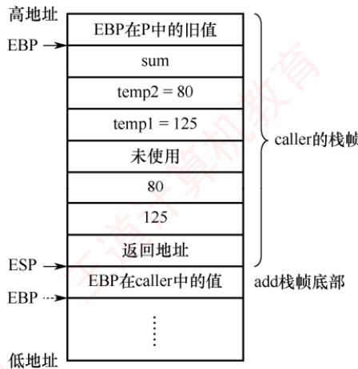  
图 4.12 caller 和 add 的栈帧

mov esp, ebp #将栈指针 ESP设置为当前 EBP的值，即指向保存旧 EBP的位置  
pop ebp #从栈中弹出旧EBP值，恢复过程P的基址指针

执行完这两条指令后，EBP已恢复为过程P中的原始值，而ESP则指向栈顶的返回地址。此时，ret指令便可从ESP所指位置取出该返回地址，并转移回过程P继续执行。当然，编译器也可以不使用leave指令，而是通过显式的pop操作配合对ESP的调整来实现栈帧的回收。

add过程经GCC编译并链接后，对应的机器代码如下：

8048469:55 push ebp   
804846a:89 e5 mov ebp,esp   
804846c:8b 45 0c mov eax,dword ptr [ebp+12]   
804846f:8b 55 08 mov edx,dword ptr [ebp+8]   
8048472:8d 04 02 lea eax,[edx+eax]   
8048475:5d pop ebp   
8048476:c3 ret

通常，一个过程的机器级代码可分为三个部分：准备阶段、过程体和结束阶段。

准备阶段（第 1、2行）：“push ebp”将 caller 的 EBP 值保存到栈中，随后“mov ebp, esp”使EBP指向当前栈帧的基址。如图4.12所示，EBP指向 add 栈帧底部。这里 add的入口参数x和y对应的值（125和 80）分别在地址为R[ebp]+8、R[ebp]+12的存储单元中。 KV

过程体（第3、4、5行）：第3行将y（[ebp+12]）加载到EAX，第4行将x（[ebp+8]）加载到EDX。第5行使用lea指令计算edx+eax，并将结果存回EAX，作为函数的返回值。这里好像没有加法指令，实际上lea指令执行的是加法运算 $\mathrm{R}[\mathrm{edx}]+\mathrm{R}[\mathrm{eax}]=\mathrm{x}+\mathrm{y}$ m

结束阶段（第6、7行）：“pop ebp”恢复 caller的EBP值，使栈帧指针回到调用前的状态；随后 ret 指令从栈顶弹出返回地址，并转移回调用点。此时栈顶正是 call 指令执行时压入的返回地址，对应 caller中紧接在“call add”之后的那条指令（mov [ebp-4], eax）。

由于add过程不包含局部变量、未使用任何被调用者保存的寄存器，且不再调用其他过程(没有入口参数和返回地址要保存）。因此，其栈帧结构极为简洁：仅需保存EBP以维持调用链的完整性，无须额外空间用于寄存器保存、局部变量或嵌套调用。

## 4.3.5 本节习题精选

## 一、单项选择题

01. 假设 R[ax] = FFE8H，R[bx] = 7FE6H，执行指令“add ax, bx”后，寄存器的内容和各标 志的变化为（）。 A. R[ax] = 7FCEH, OF = 1, SF = 0, CF = 0, ZF = 0 B. R[bx] = 7FCEH, OF = 1, SF = 0, CF = 0, ZF = 0 C. R[ax] = 7FCEH, OF = 0, SF = 0, CF = 1, ZF = 0 机教育 D. R[bx] = 7FCEH, OF = 0, SF = 0, CF = 1, ZF = 0

02. 假设 R[ax]= 7FE6H，R[bx] = FFE8H，执行指令“sub bx, ax”后，寄存器的内存和各标 志的变化为（）。 A. R[ax] = 8002H, OF = 0, SF = 1, CF = 1, ZF = 0 王道计 王 B. R[bx] = 8002H, OF = 0, SF = 1, CF = 0, ZF = 0 C. R[ax] = 8002H, OF = 1, SF = 1, CF = 0, ZF = 0 D. R[bx] = 8002H, OF = 1, SF = 1, CF = 0, ZF = 0

03. 某计算机的数据采用小端方式存储，减法指令“sub ax, imm”的功能为(ax)- imm→ax，imm表示立即数，该指令对应的十六进制机器码为2dxxxx（从左到右以字节为单位由低地址到高地址），其中 xxxx对应 imm的机器码，若 imm=-3，(ax)= 7，则该指令对应的机器码和执行后OF标志位的值分别为（）。A. 2DFFFDH, 0 B. 2DFFFDH, 1 C. 2DFDFFH, 0 D. 2DFDFFH, 1

04. 某C 语言程序中对数组变量 b 的声明为“int b[10][5];”，有一条 for语句如下：

for(i=0;i<10;i++) for(j=0;j<5;j++) sum+=b[i][j];

假设执行到“sum+=b[i][j];”时，sum的值在 eax中，b[i][0]所在的地址在 edx中，j 在esi中，则“sum+=b[i][i];”所对应的指令（Intel格式）可以是（）。A. add dword ptr eax, [edx+esi\*4] B. add dword ptr eax, [esi+edx\*4]C. add dword ptr eax, [edx+esi\*2] D. add dword ptr eax, [esi+edx\*2]

05. 假设 R[eax] = 080480B4H，R[ebx] = 00000011H，M[080480F8H] = 000000B0H，执行指 令“imul eax,[eax+ebx\*4],-16”后，寄存器或存储单元的内容变为（）。 A. R[eax] = 00000B00H B. M[080480F8H] = 00000B00H 教育 C. R[eax]= FFFFF500H D. M[080480F8H] = FFFFF500H

06. 程序 P 中有两个变量 i 和 j，被分别分配在寄存器 eax 和 edx 中，P 中语句“if(i<j) {...}”对应的指令序列如下（左边为指令地址，中间为机器代码，右边为汇编指令），其中jle指令的偏移量为 0d:804846a 39 c2 cmp dword ptr edx,eax804846c 7e 0d jle xxxxxxxx

若执行到 804846aH 处的 cmp 指令时，i = 105，j = 100，则 jle 指令执行后将转到（）处的指令执行。A. 8048461H B. 804846eH C. 8048479H D. 804847bH

07. 假定全局数组 a 的声明为 double a[8]，a的首地址为 80498c0H，变量i被分配在寄存器ecx中，现要将a[i]取到eax相应宽度的寄存器中，则所用的汇编指令是（）。A. mov eax, [ecx\*4+80498c0H] B. mov eax, ecx\*4+80498c0HC. mov eax, [ecx\*8+80498c0H]

08. 子程序调用指令执行时，必须完成的操作是（）。A. 仅将子程序入口地址送入程序计数器（PC）B. 将返回地址存入主存，并将子程序入口地址送入程序计数器（PC）C.将程序计数器（PC）当前值存入通用寄存器D. 修改数据通路中的控制信号以实现转移

09. 下列关于选择结构语句“if(comp\_A) then statement\_B; else statement\_C”对应的机器级代码表示的叙述中，错误的是（）。A. 一定包含一条无条件转移指令B. 一定包含一条条件转移指令(分支指令) 计算机教C. 计算 comp\_A 的代码段一定在条件转移指令之前D. 对应 statement\_B 的代码一定在对应 statement\_C 的代码之前

10.下列关于循环结构语句的机器级代码表示的叙述中，错误的是（）。A. 一定至少包含一条条件转移指令B. 不一定包含无条件转移指令C. 循环结束条件可以用一条比较指令CMP来实现D. 循环体内执行的指令不包含条件转移指令

11.下列有关调用指令（转子指令）的叙述中，错误的是（）。A. 与高级语言源程序中的过程调用相对应，一次过程调用对应一条调用指令B. 指令执行时必须保留返回地址，调用指令随后一条指令的地址是返回地址C. 嵌套调用时返回地址通常保存在栈中，非嵌套调用时可保存在特定寄存器中D. 指令执行时将无条件转移到目标地址处，转移目标地址无须在指令中明显给出

12. 假设P为调用过程，Q为被调用过程，程序在32位x86处理器上执行，以下是C语言程序中过程调用所涉及的操作：①过程Q保存P的现场，并为非静态局部变量分配空间②过程P将实参存放到Q能访问到的地方③过程P将返回地址存放到特定处，并转移到Q执行④过程Q取出返回地址，并转移回到过程P执行⑤过程Q恢复P的现场，并释放局部变量所占空间⑥ 执行过程Q 的函数体过程调用的正确执行步骤是（）。A. ②→③→④→①→⑤→⑥ B. ②→③→①→④→⑥→⑤ 机教育C. ②→③→①→⑥→⑤→④ D. ②→③→①→⑤→⑥→④

## 二、综合应用题

01.【2017统考真题】在按字节编址的计算机M上，f1的部分源程序（阴影部分）如下。  
将f1 中的 int都改成 float，可得到计算 f(n)的另一个函数f2。

```lisp
int f1(unsigned n) {
int sum=1, power=1;
for(unsignedi=0;i<=n-1;i++){
power *=2;
sum += power;
}
return sum;
}
```

对应的机器级代码（包括指令的虚拟地址）如下：

int f1( unsigned n)   
1 00401020 5 push ebp   
..   
for(unsigned i=0; i<= n −1; i++)   
20 0040105E 39 4D F4 cmp dword ptr [ebp-0Ch] ,ecx   
...   
教育 . 一 power \* = 2; …   
00401066 D1 E2 shl edx,1   
… .   
return sum ;   
. …   
35 0040107F C3 ret

其中，机器级代码行包括行号、虚拟地址、机器指令和汇编指令。

1）计算机 M是 RISC 还是 CISC？为什么？

2）f1的机器指令代码共占多少字节？要求给出计算过程。

3）第 20 条指令 cmp 通过 i 减n-1 实现对 i 和 n-1 的比较。执行 f1(0)的过程中，当 i = 0时，cmp指令执行后，进位/借位标志CF的内容是什么？要求给出计算过程。

4）第 23 条指令 shl 通过左移操作实现了 power \*2运算，在 f2 中能否用 shl 指令实现power\*2？为什么？

02.【2019统考真题】已知 $f(n)=n!=n\times(n-1)\times(n-2)\times\cdots\times2\times1$ ，计算f(n)的C 语言函数f1的源程序（阴影部分）及其在32位计算机 M上的部分机器级代码如下：

```asm
int f1(int n){
1 00401000 55
if(n>1)
11 00401018 83 7D 08 01 cmp dword ptr [ebp+8],1
12 0040101C 7E 17 jle f1+35h (00401035)
return n*f1(n-1);
13 0040101E 8B 45 08 mov eax, dword ptr [ebp+8]
14 00401021 83 E8 01 sub eax, 1
15 00401024 50 push eax
16 00401025 E8 D6 FF FF FF call f1 ( 00401000)
19 00401030 OF AF C1 imul eax, ecx
20 00401033 EB 05 jmp f1+3Ah (0040103a)
else return 1;
21 00401035 B8 01 00 00 00 mov eax,1
道计算机考
26 00401040 3B EC cmp ebp, esp
30 0040104A C3 ret
```

其中，机器级代码行包括行号、虚拟地址、机器指令和汇编指令，计算机M按字节编址，int型数据占32位。请回答下列问题：

1）计算f(10)需要调用函数f1多少次？执行哪条指令会递归调用f1？

2）上述代码中，哪条指令是条件转移指令？哪几条指令一定会使程序转移执行？

3）根据第16行的 call指令，第17 行指令的虚拟地址应是多少？已知第16 行的 call 指令采用相对寻址方式，该指令中的偏移量应是多少（给出计算过程）？已知第16行的call指令的后4字节为偏移量，M是采用大端方式还是采用小端方式？

4）f(13)= 6227020800，但f1(13)的返回值为1932053504，为什么两者不相等？要使f1(13)能返回正确的结果，应如何修改f1的源程序？

5）第19行的 imul 指令（有符号整数乘）的功能是R[eax]←R[eax]×R[ecx]，当乘法器输出的高、低32位乘积之间满足什么条件时，溢出标志OF=1？要使CPU在发生溢出时转异常处理，编译器应在imul指令后加一条什么指令？ YTA

03.【2019统考真题】对于题02，若计算机M的主存地址为32位，采用分页存储管理方式，页大小为4KB，则第1行的 push指令和第 30 行的 ret指令是否在同一页中（说明理由）？若指令Cache有64行，采用4路组相联映射方式，主存块大小为64B，则32位主存地址中，哪几位表示块内地址？哪几位表示Cache组号？哪几位表示标记（tag）信息？读取第16行的 call指令时，只可能在指令Cache的哪一组中命中（说明理由）？

04.【2023统考真题】已知计算机M的字长为32位，按字节编址，采用请求调页策略的虚拟存储管理方式，虚拟地址为32位，页大小为4KB。某C语言程序段在计算机M上的部分机器级代码如下，数组a的定义为“inta[24][64];”，每个机器级代码行中依次包含指令序号、虚拟地址、机器指令和汇编指令。1

for ( i = 0; i < 24; i++ )   
1 00401072 C7 45 F8 00 00 00 00 mov [ebp-8], 0   
2 00401079 EB 09 jmp 00401084h   
3 0040107B 8B 55 F8 首计算机 mov eax, [ebp-8]   
7 00401088 7D 32 jge 004010bch

for ( j = 0; j < 64; j++ )   
8 0040108A C7 45 FC 00 00 00 00 mov [ebp-4], 0   
a[i][j] = 10;   
19 004010AE C7 84 82 00 20 42 00 0A 00 00 00 mov [ecx+edx\*4+00422000h], 0Ah   
20

请回答下列问题。

1）第20条指令的虚拟地址是多少？

2）已知第2条jmp和第7条ige都是转移指令，其操作码分别是EBH和7DH，转移目标地址分别为00401084H、004010BCH，这两条指令都采用什么寻址方式？给出第2 条指令jmp的转移目标地址计算过程。

3）已知第19条mov指令的功能为“a[i][i]←10”，其中 ecx和 edx为寄存器名，0042 2000H是数组a的首地址，指令中源操作数采用什么寻址方式？已知edx中存放的是变量j，ecx中存放的是什么？根据该指令的机器码判断M采用的是大端还是小端方式。

4）第一次执行第19条指令时，取指令过程中是否会发生缺页异常？为什么？

05.【2024统考真题】假定计算机M字长为32位，按字节编址，采用32位定长指令字，指令 add、slli 和lw 的格式、编码和功能说明如图(a)所示。

<table><tr><td rowspan=1 colspan=1>0000000</td><td rowspan=1 colspan=1>rs2</td><td rowspan=1 colspan=1>rs1</td><td rowspan=1 colspan=1>000</td><td rowspan=1 colspan=1>rd</td><td rowspan=1 colspan=2>0110011</td><td rowspan=1 colspan=1>R[rd]←R</td><td rowspan=1 colspan=1>R[rd]←R[rs1] + R[rs2]</td></tr><tr><td rowspan=2 colspan=1>0000000</td><td rowspan=2 colspan=1>shamt</td><td rowspan=2 colspan=1>rs1</td><td rowspan=2 colspan=1>010</td><td rowspan=2 colspan=1>rd</td><td rowspan=2 colspan=2>0010011</td><td></td><td></td></tr><tr><td rowspan=1 colspan=2></td><td></td></tr><tr><td rowspan=1 colspan=2>imm</td><td rowspan=1 colspan=1>rs1</td><td rowspan=1 colspan=1>010</td><td rowspan=1 colspan=1>rd</td><td rowspan=1 colspan=2>0000011</td><td></td><td></td></tr></table>

图(a)

其中，R[x]表示通用寄存器x的内容，M[x]表示地址为x的存储单元内容，shamt为移位位数，imm为补码表示的偏移量。图(b)给出了计算机M的部分数据通路及其控制信号（用带箭头虚线表示），其中 A 和 B 分别表示从通用寄存器 rs1 和 rs2 中读出的内容；IR[31:20]表示指令寄存器中的高12位；控制信号Ext为0、1时扩展器分别实现零扩展、符号扩展，ALUctr为000、001、010时ALU分别实现加、减、逻辑左移运算。请回答下列问题。

  
图(b)

1）计算机 M最多有多少个通用寄存器？为什么 shamt字段占 5位？

2）执行 add 指令时，控制信号 ALUBsrc 的取值应是什么？若rsl和 rs2 寄存器内容分别是 8765 4321H 和 9876 5432H，则 add 指令执行后，ALU 输出端 F、OF 和 CF 的结果分别是什么？若该add指令处理的是无符号整数，则应根据哪个标志判断是否溢出？

3）执行slli指令时，控制信号Ext的取值可以是0也可以是1，为什么？

4）执行lw指令时，控制信号Ext、ALUctr的取值分别是什么？

  
(b)

5）若一条指令的机器码是A040A103H，则该指令一定是lw指令，为什么？若执行该指令时，R[01H]=FFFFA2D0H，则所读取数据的存储地址是什么？

06. 【2024 统考真题】对于题05 中的计算机M，C 语言程序P包含的语句“sum+=a[i];”在M中对应的指令序列S如下。

slli r4, r2, 2 //R[r4]←R[r2]<<2   
add r4, r3, r4 //R[r4]←R[r3]+R[r4]   
lw r5, 0(r4) //R[r5]←M[R[r4]+0]   
add rl, rl, r5 //R[r1]←R[r1]+R[r5]

已知变量 i、sum 和数组 a 都为 int 型，通用寄存器 rl \~ r5 的编号为 01H\~ 05H。请回答下列问题。 K ULK

1）根据指令序列S中每条指令的功能，写出存放数组a的首地址、变量i和sum的通用寄存器编号。 临村

2）已知M为小端方式计算机，采用页式存储管理方式，页大小为4KB。若执行到指令序列 S 中第 1 条指令时，i=5 且 rl 和 r3 的内容分别为 0000 1332H 和 0013 DFF0H，从地址 0013 DFF0H开始的存储单元内容如下图所示，则执行“sum+=a[i];”语句后，a[i]的地址、a[i]和sum的机器数分别是什么（用十六进制表示）？a[i]所在页的页号是多少？此次执行中，数组a至少存放在几页中？

<table><tr><td>地址</td><td>0</td><td>1</td><td>2</td><td>3</td><td>4</td><td>5</td><td>6</td><td>7</td></tr><tr><td>0013 DFF0</td><td>FF</td><td>FF</td><td>FF</td><td>7C</td><td>70</td><td>FE</td><td>FF</td><td>FF</td></tr><tr><td>0013 DFF8</td><td>00</td><td>00</td><td>00</td><td>0C</td><td>3C</td><td>02</td><td>01</td><td>FF</td></tr><tr><td>0013 E000</td><td>FO</td><td>F1</td><td>00</td><td>00</td><td>DC</td><td>EC</td><td>FF</td><td>FF</td></tr><tr><td>0013 E008</td><td>FF</td><td>FF</td><td>01</td><td>02</td><td>00</td><td>00</td><td>01</td><td>02</td></tr></table>

3）指令“slli r4,r2,2”的机器码是什么（用十六进制表示）？若数组a改为 short类型，则指令序列 S中 slli指令的汇编形式应是什么？

09.【2025统考真题】现有C语言程序P的部分代码如下所示。假定运行程序P的计算机M字长为32位，按字节编址。假定P的部分机器级代码如图(a)所示，其中，R0\~R4为通用寄存器，SEXT表示按符号扩展；M中补码除法器逻辑结构如图(b)所示。

请回答下列问题。

1）若执行图(a)中idiv指令的除运算时， $\mathrm{d}[\mathrm{i}] = 0 \mathrm{x}87654321, \mathrm{x} = 0 \mathrm{x} \mathrm{ff},$ 则补码除法器中寄存器R、Q和Y的初始内容分别是什么(用十六进制表示)？图(b)中哪个部件包含计数器？在补码除法器执行过程中，由ALUop所控制的ALU运算有哪几种？

2）假设idiv指令执行过程中会检测并触发除法异常，则执行idiv指令时，哪些情况下会发生除法异常(要求给出此时d[i]和x的十六进制表示机器数)？发生除法异常时，在异常响应过程中CPU需要完成哪些操作？

## 4.3.6 答案与解析

## 一、单项选择题

## 01. C

该指令是Intel 格式，add指令的目的寄存器为ax。add指令的补码加法过程为1111 1111 1110$1000+0111\ 1111\ 1110\ 0110=(1)0111\ 1111\ 1100\ 1110\ (7FCH)$ ，两个操作数的符号不同，必然不会溢出， $\mathrm{OF} \equiv 0;$ 结果的符号位为0，SF=0；有进位， $\mathrm{CF}=\mathrm{C} \oplus \mathrm{Sub}=1 \oplus 0=1$ 非 $0,\  ZF = 0$

## 注意

无论是无符号数还是有符号数，都以二进制代码形式无差别地存放在计算机内。即便两个有符号数相加，也会导致CF的变动，只是CF值对有符号数运算是没有意义的。同理，两个无符号数相加，也会导致 OF和 SF的变动，只是OF 值和 SF 值仅对有符号数运算有意义。

## 02. B

该指令是Intel格式，sub指令的目的寄存器为bx。sub 减法运算用补码加法实现，被减数+减数逐位取反 $+ 1 = 1 1 1 1 1 1 1 1 1 1 1 1 0 1 0 0 0 + 1 0 0 0 0 0 0 0 0 0 0 1 1 0 0 1 + 1 = ( 1 ) 1 0 0 0 0 0 0 0 0 0 0 0 1 0$ （8002H），两个操作数的符号位都是1，结果的符号位也是1，无溢出，OF=0；结果为负数， $\mathrm { S F } = 1$ 进位输出 $C _ { \mathrm { o u t } }   = 1$ ，低位进位 $\mathrm{Sub}=1,\ \mathrm{CF}=C_{\mathrm{out}} \oplus \mathrm{Sub}=1 \oplus 1=0;$ ；非O，ZF=0。

## 03. C

imm的值为-3，转换成二进制为1111111111111101B，即FFFDH，因为该计算机采用小端存储，先存储低位字节，所以该指令对应的机器码为2DFDFFH，OF是有符号数运算的溢出标志位，7-(-3)显然没有溢出，因此OF标志位为0。

## 04. A

b[i][0]所在的地址在 edx 中，j在 esi 中，一个数组元素占4 字节，所以 b[i][j]的地址为 R[edx]+R[esi]\*4，指令格式为Intel格式，第一个为目的操作数，第二个为源操作数，于是选项A正确。

## 05. C

指令的一个源操作数在内存单元中，地址为 $\mathrm{R}[\mathrm{exx}]+\mathrm{R}[\mathrm{ebx}]^{*}4=080480\mathrm{B}4\mathrm{H}+00000011\mathrm{H}^{*}4=$ 080480F8H。指令的功能是 $\mathrm{R}[\mathrm{exx}]\leftarrow\mathrm{M}[080480\mathrm{F}8\mathrm{H}]*(-16)=(-000000\mathrm{B}0\mathrm{H})<<4=\mathrm{FFFFFF}50\mathrm{H}<<4=$ FFFFF500H。目的操作数保存在 eax中，所以主存单元080480F8H中的内容不会改变。

## 06. D

$\mathrm{i}=105,\ \mathrm{j}=100$ ，即 edx的内容为100，eax的内容为105，cmp指令就是对这两个数做减法，显然 $1 0 0 \leq 1 0 5$ ，满足jle指令小于或等于的条件，jle指令长度为2字节，所以jle指令执行后将转移到当前PC值 + 偏移量 $804846\mathrm{cH}+2+0\mathrm{dH}=804847\mathrm{bH}$ 处执行。

## 07. C

每个 double 型的数组元素占 8 字节，数组 a的首地址为 80498c0H， i 存储在 ecx 中，所以 a[i]在主存中的地址可表示为 $\mathrm{[ecx^{*}8+80498c0H]}$ ，因此汇编指令可以是 $\mathrm{mv\;ex,\;[ecx*8+80498c0H]}$

## 08. B

子程序调用指令属于控制转移类指令，其执行时必须完成两个关键操作：一是保存返回地址（调用指令的下一条指令地址），通常压入主存中的栈；二是将子程序的入口地址送入PC，以实现转移。选项A仅完成转移，缺失返回地址保存，无法正确返回。选项C和D的描述不准确或不完整。因此，选项B正确且完整地描述了子程序调用的本质功能。

## 09. D

在 if语句的机器级代码中，comp A后面紧接着有一个条件转移指令，条件成立则转移到statement B，statement B 中有一个无条件转移指令，会转移到 if-else的下一条语句，选项 A、B和 C正确。statement\_B不一定在 statement\_C之前，这取决于条件转移指令的类型和方向，选项D错误。

## 10. D

循环结构循环体内最后会有一条条件转移指令，判断是否跳出循环，可以用比较指令（CMP）来实现，选项A和C正确，选项D错误。循环结构不一定包含无条件转移指令，选项B正确。

## 11. D

为了能保证从被调用过程返回到调用过程继续执行，必须确定并保存返回地址，这个地址是调用指令随后的指令的地址，返回地址只能由调用指令来计算并保存，因为执行调用指令后就转移到了被调用过程，因此无法获取返回地址。为了保证嵌套调用时能够返回到调用过程，必须将返回地址压栈，若不压栈而保存在特定寄存器中，则后面执行的调用指令会将前面调用指令保存的返回地址覆盖掉。调用指令执行时将无条件转移到目标地址处，这个目标地址就是被调用过程第一条指令的地址，它一定在调用指令中明显给出，因此选项D错误。

## 12. C

过程调用的具体过程已在4.3.4节中介绍。

## 二、综合应用题

## 01. 【解答】

1）M为CISC。M的指令长短不一，不符合RISC指令系统的特点。

2）f1的机器代码占96B。因为f1的第一条指令“push ebp”所在的虚拟地址为 00401020H，最后一条指令“ret”所在的虚拟地址为0040 107FH，所以f1的机器指令代码长度为0040$107\mathrm{FH}-0040\ 1020\mathrm{H}+1=60\mathrm{H}=96\mathrm{B}$

3）CF=1。cmp指令实现i与n−1的比较功能，进行的是减法运算。在执行f1(0)的过程中，n=0，当i=0时， $\mathrm{i}=0000\ 0000\mathrm{H}$ ，并且n -1=FFFFFFFFH。因此，执行第20条指令时，在补码加/减运算器中执行“0减FFFF FFFFH”操作，即 $0000\;0000\mathrm{H}+0000000\mathrm{H}+1=0000$ M  
0001H，此时进位输出 $C _ { \mathrm { o u t } }   =   0$ ，低位进位 $\mathrm{Sub}=1,\quad \mathrm{CF}=C_{\mathrm{out}} \oplus \mathrm{Sub}=0 \oplus 1=1$

4）f2中不能用 shl指令实现 power\*2。因为 shl指令把一个整数的所有有效数位整体左移，而f2中的变量power是float型，其机器数中不包含最高有效数位，但包含了阶码部分，将其作为一个整体左移时并不能实现“乘以2”的功能，因此f2中不能用shl指令实现power\*2。浮点数运算比整型运算要复杂，耗时也较长。

## 02. 【解答】

1）计算f(10)需要调用函数f1共10次，执行第16行的call指令会递归调用f1。

2）第12行的jle指令是条件转移指令，其含义为小于或等于时转移，本行代码的意义为：当 n≤1时，转移至地址00401035H。第16 行的 call指令为函数调用指令，第20行的 jmp指令为无条件转移指令，第30行的 ret指令为子程序的返回指令，这三条指令一定会使

程序转移执行。

3）在计算机M上按字节编址，第16行的call指令的虚拟地址为00401025H，长度为5字节，因此第17行的指令的虚拟地址为 $0040\ 1025\mathrm{H}+5=0040\ 102\mathrm{AH}$ 。第 16 行的 call 指令采用相对寻址方式，即目标地址 =(PC)+偏移量，call指令的目标地址为00401000H，所以偏移量=目标地址 $- (PC) = 0040\ 1000\  H  - 0040\ 102\  AH  =  FFFF\  FFD6\  H .$ 。根据第16行的 call指令的偏移量字段为D6 FF FF FF，可以确定M采用小端方式。

4）因为f(13)= 6227020800，其结果超出了32位 int型数据可表示的最大范围，因此 f(13)的返回值是一个发生了溢出的错误结果。为使f1(13)能返回正确结果，可将函数f1的返回值类型改为 double（或 long long，或long double，或 float）类型。 灿

5）若乘积的高33位不全为0或不全为1，则 $\mathrm { O F }   =   1$ 。编译器应在 imul指令后加一条“溢出自陷指令”，使得CPU自动查询溢出标志OF，当OF =1时调出“溢出异常处理程序”。

## 03. 【解答】

因为页大小为4KB，所以虚拟地址的高20位为虚拟页号。第1行的push指令和第30行的ret 指令的虚拟地址的高20位都是00401H，因此两条指令在同一页中。

指令 Cache 有 64 块，采用 4 路组相联映射方式，因此指令 Cache 共有 64/4 =16 组，Cache组号共4位。主存块大小为64B，因此块内地址为低6位。综上所述，在32位主存地址中，低6位为块内地址，中间4位为组号，高22位为标记。

因为页大小为4KB，所以虚拟地址和物理地址的最低12位完全相同，因此call指令虚拟地址00401025H中的025H=000000100101B为物理地址的低12位，对应的7\~10位为组号，因此对应的 Cache 组号为 0。

## 04. 【解答】

1）第19条指令的虚拟地址为004010AEH，且第19条指令占11字节，因此第20条指令的虚拟地址为 004010AEH+11（十进制）= 0040 10B9H。

2）第2条指令的虚拟地址为00401079H，占2字节，取该指令后，PC+2，变为0040107BH，转移指令的目标地址为00401084H，因此偏移量为00401084H-0040107BH=09H，根据第2条指令的机器码可知，09H恰好是第2条指令给出的偏移量。第7条指令的分析同理。因此，第2条jmp和第7条jge指令都采用相对寻址方式。第2条指令jmp的转移目标地址= 0040 1079H+2（十进制）+ 09H= 00401084H。

3）第19条指令的源操作数为0AH，直接在机器指令中（0A000000）给出，因此采用立即（数）寻址方式。数组a的一行有64个元素，每个元素占4字节，因此a[ii]的地址应为$00422000\mathrm{h}+\mathrm{i}\times64\times4+\mathrm{j}\times4=00422000\mathrm{h}+\mathrm{i}\times256$ +j×4，根据汇编指令中给出的计算公式 ecx +$\mathrm{e}\mathrm{d}x^{*}4+00422000\mathrm{h}$ 可知，ecx中存放的是i×256。M采用小端方式。

4）第一次执行第19条指令时，取指令过程中不会发生缺页异常。因为第19条指令所在的该程序段都在页号为00401H的同一个页面中，执行第19条指令时，该页已在主存，因此取指令过程中不会发生缺页异常。 YTA

## 05.【解答】

1）最多有 $2 ^ { 5 }   =   3 2$ 个通用寄存器。M字长为32位，因此通用寄存器宽度为32位，于是shamt字段占 $\log _ { 2 } 3 2 = 5$ 位。 临村

2）add指令的两个源操作数均来自通用寄存器，因此控制信号 $\mathrm{ALUBsc} = 0 。 \mathrm{rs1} = 8765$ 4321H, $\mathrm{rs}2 = 9876\ 5432\mathrm{H}$ ，则 $rs1+rs2=8765\;4321\mathrm{H}+9876\;5432\mathrm{H}=1\mathrm{FDB}\;9753\mathrm{H}$ ，在计算过程中，次高位向最高位的进位为0，最高位产生的进位为1，因此 $\mathrm{OF} = 0 \oplus 1 = 1$ 。add做的是加法操作， $\mathrm { s u b   =   0 }$ ，因此 $\mathrm{CF} = 0 \oplus 1 = 1$ 。无符号数根据CF判断是否溢出。

3）因为 slli指令的移位位数只使用IR[31:20]中的低5位，与高位IR[31:25]及扩展出来的位无关，所以Ext取值可以是0，也可以是1。

4）lw指令的功能是将主存地址为 $\mathrm{R[rs1]+imm}$ 的数据加载到目标寄存器中，需要首先通过ALU计算访存有效地址，imm是补码表示的12位有符号数，在和R[rs1]中的32 位数相加时，需要进行符号扩展，R[rs1]中的数和imm符号扩展后的数做的是加法。因此， $\operatorname { E x t } =$ 1; $\mathrm{ALUcr} = 000$

5）因为A040A103H=101000000100 00001010 00010 0000011B，根据指令格式中 $\mathrm{IR}[6:0]=$ 0000011B，IR[14:12]=010B，可以判定该指令是1w指令。1w指令的高12位 =A04H，经过符号扩展后，得到 32 位机器码为 FFFF FA04H，所读取数据的存储地址为 FFFFA2D0H + FFFF FA04H = FFFF 9CD4H。

## 06.【解答】

1）变量i 存放在 r2中。R[r4]←R[r2]<<2 的功能是将i 左移两位，即将 i×4 的值送到 r4。数组a的首地址(a[0]的地址)存放在r3中 $\mathrm{R}[\mathrm{r}4] \leftarrow \mathrm{R}[\mathrm{r}3] + \mathrm{R}[\mathrm{r}4]$ 的功能是计算 $\mathrm{addr}(\mathrm{a}[0]) + \mathrm{i} \times 4$ X 即将 a[i]的地址送到 r4。R[r5]←M[R[r4]+0]的功能是将 a[i]送到 r5。变量 sum 存放在 r1中。 $\mathrm{R[rl]} \leftarrow \mathrm{R[rl]} + \mathrm{R[rl]}$ 的功能是将 $\mathrm { s u m } + \mathrm { a [ i ] }$ 的结果送回 r1。

2）数组a的首地址为0013DFF0H，从表中可以看出，a[5]的地址为0013E004H。M为小端方式计算机，根据表格可知，a[5]的机器数为FFFFECDCH。页大小为4KB，因此页内偏移量为低12位，页号为地址高20位，即 0013EH。sum的初值为00001332H，执行 sum+=a[i]后，sum的机器数更新为00001332H+FFFFECDCH= 0000 000EH。表格中的数据包含了页号为0013DH和0013EH两个不同页面的数据，所以数组a至少存放在2页中。

3）指令机器码 = 0000000 00010 00010 010 00100 0010011 = 0021 2213H。若数组 a 改为 short型，则每个元素占 2 字节，a[i]的地址为 addr(a[0]) + i×2，因此汇编形式是 slli r4, r2, 1。

## 07.【解答】

1）scov R1指令对di]做符号扩展（符号位为1），得到64位的被除数，高32位FFFF FFFFH存入R0，低32位87654321H存入R1。在除法器中，被除数加载到{R,Q}中，因此R的初始内容是FFFFFFFFH，O的初始内容是87654321H；除数x加载到Y中，因此Y的初始内容是000000FFH。补码除法需要执行固定次数的迭代，因此控制逻辑部件中包含计数器。在补码除法过程中，每一步根据当前余数与除数的符号关系，决定是执行加法还是执行减法，因此由ALUop控制的ALU运算有加法运算和减法运算。

2）idiv指令可能发生以下两种异常：当x为00000000H时，发生除数为零异常；当d[i]为8000 0000H且x为FFFFFFFFH时（用最小负数除以-1），发生除运算溢出异常。CPU检测到除法异常后，需将断点和程序状态保存到内核栈或特定寄存器中，关中断，最后转移到内核中的除法异常处理程序执行。

## 4.4 CISC 和 RISC 的基本概念

指令系统朝着两个截然不同的方向发展：一是通过增强原有指令功能、引入更复杂的指令将部分软件功能固化到硬件中，这类机器称为复杂指令系统计算机（CISC），典型代表包括采用x86架构的处理器；二是通过精简指令集、简化指令功能，以提升指令执行效率，这类机器称为精简指令系统计算机（RISC），典型代表包括ARM、MIPS等架构的处理器。

## 4.4.1 复杂指令系统计算机（CISC）

随着集成电路技术的发展，软件开发成本不断上升，促使设计者在指令系统中加入更多、更复杂的指令，以适应多样化的应用需求，从而形成了CISC架构。

考点追踪CISC的特点（2017）

CISC的主要特点如下：

1）指令系统庞大复杂，指令数量通常超过200条。

2）指令长度不固定，指令格式和寻址方式种类繁多。

3）多数指令均可直接访问内存。

4）各类指令的使用频率差异显著。

5）指令执行时间相差较大，大多数指令需多个时钟周期才能完成。

6）控制器多采用微程序控制，部分复杂指令难以用硬连线逻辑实现。

7）难以通过优化编译生成高效的目标代码。

如此庞大的指令系统，对设计提出了极高要求，导致研制周期变得很长。后续研究发现，一味追求指令系统的复杂和完备程度并非提升性能的有效途径。对传统CISC指令系统的统计分析表明：各种指令的使用频率相差悬殊，约80%的程序执行仅依赖于20%的简单指令，而其余80%的复杂指令使用频率极低。基于这一观察，设计者开始尝试仅保留高频使用的简单指令，并通过它们组合实现不常用的复杂指令功能，由此催生了RISC架构。

## 4.4.2 精简指令系统计算机（RISC）

RISC的核心思想是简化指令系统，强调“寄存器-寄存器”操作，并力求指令格式统一。

考点追踪RISC的特点（2009、2025）

RISC的主要特点如下：

1）仅选取使用频率最高的简单指令，复杂功能由多条简单指令组合实现。

2）指令长度固定，指令格式和寻址方式种类较少。

3）仅LOAD/STORE（取数/存数）指令可访问内存，其余运算均在寄存器之间进行。

4）CPU中配备大量通用寄存器。

5）普遍采用指令流水线技术，绝大多数指令在一个时钟周期内完成。

6）以硬布线控制为主，极少或完全不使用微程序控制。

7）高度依赖编译器优化，以缩短程序执行时间。

此外，在指令系统兼容性方面，CISC架构通常支持向后兼容，即新机型包含旧机型的全部指令并加以扩展。而RISC由于大幅简化指令集、改变指令格式，通常无法与老机型兼容。

历史上，RISC因其高效性和简洁性曾被视为未来处理器的发展方向。然而在现实中，x86架构凭借庞大的软件生态占据主流地位，早期大量软件均基于CISC设计，纯RISC系统难以满足兼容性需求。此外，现代CISC处理器已在内部融合了大量RISC思想，使得两者在性能上的差距日益缩小。与此同时，CISC能提供更丰富的指令功能，这是很多程序设计所需要的。

## 4.4.3 CISC 和 RISC 的比较

与 CISC 相比，RISC 的优势主要体现在以下几个方面：

1）更高效利用芯片面积。CISC采用微程序控制，其控制存储器占CPU芯片面积的50%以上，而RISC采用硬布线控制，逻辑电路仅占约10%，节省了宝贵的硅片资源。

2）更高的运算速度。RISC指令数量少、格式统一、寻址方式简单，配合大量通用寄存器和流水线技术，使大多数指令可在单周期内完成，显著提升执行效率。

3）更易设计与维护。RISC指令系统结构简单，设计周期短：其逻辑清晰，出错概率低，目便于调试和验证，从而提高了系统可靠性。

4）更利于编译优化。由于指令类型和寻址方式有限，编译器更容易选择最优指令序列、调整指令调度，生成高效的目标代码。

CISC 与 RISC 的对比如表 4.3 所示。

表 4.3 CISC 与 RISC 的对比
<table><tr><td rowspan=2 colspan=1>对比项目</td><td rowspan=1 colspan=2>类别</td></tr><tr><td rowspan=1 colspan=1>CISC</td><td rowspan=1 colspan=1>RISC</td></tr><tr><td rowspan=1 colspan=1>指令系统</td><td rowspan=1 colspan=1>复杂，庞大</td><td rowspan=1 colspan=1>简单，精简</td></tr><tr><td rowspan=1 colspan=1>指令数目</td><td rowspan=1 colspan=1>一般大于200条</td><td rowspan=1 colspan=1>一般小于100条         I</td></tr><tr><td rowspan=1 colspan=1>指令字长</td><td rowspan=1 colspan=1>不固定</td><td rowspan=1 colspan=1>定长</td></tr><tr><td rowspan=1 colspan=1>可访存指令</td><td rowspan=1 colspan=1>不加限制</td><td rowspan=1 colspan=1>只有LOAD/STORE指令</td></tr><tr><td rowspan=1 colspan=1>各种指令执行时间</td><td rowspan=1 colspan=1>相差较大</td><td rowspan=1 colspan=1>绝大多数在一个周期内完成</td></tr><tr><td rowspan=1 colspan=1>各种指令使用频度</td><td rowspan=1 colspan=1>相差很大</td><td rowspan=1 colspan=1>都比较常用</td></tr><tr><td rowspan=1 colspan=1>通用寄存器数量</td><td rowspan=1 colspan=1>较少</td><td rowspan=1 colspan=1>多</td></tr><tr><td rowspan=1 colspan=1>目标代码</td><td rowspan=1 colspan=1>难以用优化编译生成高效的目标代码程序</td><td rowspan=1 colspan=1>采用优化的编译程序，生成代码较为高效</td></tr><tr><td rowspan=1 colspan=1>控制方式</td><td rowspan=1 colspan=1>绝大多数为微程序控制</td><td rowspan=1 colspan=1>绝大多数为组合逻辑控制</td></tr><tr><td rowspan=1 colspan=1>指令流水线</td><td rowspan=1 colspan=1>可以通过一定方式实现</td><td rowspan=1 colspan=1>必须实现</td></tr></table>

## 4.4.4 本节习题精选

## 单项选择题

01.下列关于RISC的叙述中，正确的是（）。A. RISC 机一定采用流水技术 B. 采用流水技术的机器一定是RISC机C. RISC 机的兼容性优于 CISC 机 D. CPU配备很少的通用寄存器

02. 下列描述中，不符合RISC指令系统特点的是（）。A. 指令长度固定，指令种类少B. 寻址方式种类尽量减少，指令功能尽可能强C. 增加寄存器的数目，以尽量减少访存次数D. 选取使用频率最高的一些简单指令，以及很有用但不复杂的指令

03.以下有关RISC的描述中，正确的是（）。 XA.为了实现兼容，新设计的RISC是从原来CISC系统的指令系统中挑选一部分实现的B. 采用RISC技术后，计算机的体系结构又恢复到了早期的情况王C. RISC的主要目标是减少指令数，因此允许以增加每条指令的功能的方法来减少指令系统所包含的指令数D. 以上说法都不对

04.下列关于RISC和CISC的说法中，不正确的是（）。A. RISC指令格式种类少，寻址方式少，指令长度固定，更容易用硬布线电路实现B. CISC指令功能强大，寻址方式多，便于汇编程序员编程C. CISC指令格式种类多，所以更有利于编译优化D. RISC多数指令能够在一个时钟周期内完成，特别适合流水线工作

05.【2009统考真题】下列关于RISC的说法中，错误的是（）。

A. RISC 普遍采用微程序控制器 机教入B. RISC 大多数指令在一个时钟周期内完成C. RISC 的内部通用寄存器数量相对CISC 多D. RISC的指令数、寻址方式和指令格式种类相对CISC少

06.【2025统考真题】下列关于RISC的叙述中，错误的是（）。A. 多采用硬连线方式实现控制器 B. 通常采用 LOAD/STORE指令设计风格C. 难以采用流水线数据通路实现微架构 D. 多采用寄存器传递过程调用时的参数

## 4.4.5 答案与解析

## 单项选择题

## 01. A

RISC必然采用流水线技术，这也是由其指令的特点决定的。而CISC则无此强制要求，但为了提高指令执行速度，CISC也往往采用流水线技术，因此流水线技术并非RISC的专利。CISC机可以兼容很多不同的高级语言和软件，而RISC机的指令系统简单精简，只包含一些基本的指令，这些指令需要通过组合来实现复杂的功能，从而增加了编译器的设计难度和程序员的编程难度，因此CISC机的兼容性更好。CPU配备很多通用寄存器是RISC机的主要特点。

## 02. B

A、C和D都是RISC的特点。对于B，寻址方式种类尽量减少是RISC的特点，而增强指令的功能则是CISC的特点。RISC指令功能简单，复杂指令的功能由简单指令的组合来实现。

## 03. D

RISC选择一些常用的寄存器型指令，并不是为了兼容CISC，RISC也不可能兼容CISC，选项A错误。RISC只是CPU的结构发生变化，基本不影响整个计算机的结构，并且即使是采用RISC技术的 CPU，其架构也不可能像早期一样简单，选项B错误。RISC的指令功能简单，通过简单指令的组合来实现复杂指令的功能，选项C错误，但RISC的主要目标是减少指令数是正确的。

## 04. C

CISC指令格式种类多，增大了编译优化的复杂性，因此不利于编译优化。

## 05. A

相对于CISC，RISC的特点是：指令条数少；指令长度固定，指令格式和寻址种类少；只有取数/存数指令访问存储器，其余指令的操作均在寄存器之间进行：CPU中通用寄存器多：大部分指令在一个时钟周期内完成；以硬布线逻辑为主，不用或少用微程序控制。B、C和D都是RISC的特点。RISC的速度快，因此普遍采用硬布线控制器，选项A错误。 七界

## 06. C

RISC指令集具有格式规整、数量少、寻址简单、采用LOAD/STOR访存、通用寄存器数量多及硬连线控制器等特点，指令执行周期均匀，非常适合流水线实现。相反，CISC因指令复杂、长度可变而难以采用流水线。因此，选项C错误，其余选项均符合RISC特征。

## 4.5 本章小结

本章开头提出的问题的参考答案如下。

1）什么是指令？什么是指令系统？为什么要引入指令系统？

指令是控制计算机完成某种基本操作的命令。一台计算机所能执行的全部机器指令的集合，

称为该机的指令系统。引入指令系统具有双重意义：对软件层面，它为程序员提供了统一的硬件抽象接口，无须直接操作物理电路或二进制编码，显著提升了编程效率；对硬件层面，指令系统的格式、功能和寻址能力直接决定了处理器的微架构设计、性能潜力和适用领域。

## 2）一般来说，指令由哪些部分组成？各部分的作用是什么？

一条典型指令由操作码和地址码两部分构成：操作码指明指令的功能类型（如加法、转移、加载等），是CPU识别和执行指令的核心依据；地址码提供操作所需的地址信息，包括操作数的存储位置、运算结果的保存地址、程序转移的目标地址或子程序的入口地址等。通过操作码与地址码的组合，指令能够精确描述一次完整的计算或控制操作。

## 3）对一个指令系统而言，寻址方式多或少会带来什么影响？

寻址方式的设计需权衡编程灵活性与硬件效率。寻址方式丰富（如立即数、寄存器、直接、间接、变址、相对等）可使程序更简洁高效，便于表达复杂的数据访问模式；但会增加指令译码逻辑的复杂度，不利于流水线调度，并可能增大控制单元面积。寻址方式过少虽能简化硬件、提升执行速度，却会限制程序表达能力，迫使程序员用多条指令模拟复杂访问，降低代码效率。

## 4.6 常见问题和易混淆知识点

1. 简述各常见指令寻址方式的特点和适用情况。

● 立即寻址：操作数直接嵌入指令，无须访存，常用于赋初值或常量。

直接寻址：指令中给出操作数的内存地址，访存一次，适用于固定地址访问。

● 间接寻址：指令给出地址的地址，需两次访存，扩大了寻址范围，易于完成子程序返回。

● 寄存器寻址：操作数在寄存器中，指令短、速度快，适合高频运算。

· 寄存器间接寻址：寄存器存放操作数地址，兼具灵活性与较大寻址范围。

● 基址寻址：EA=基址寄存器+偏移量，基址由系统设定，适用于多道程序的地址重定位。

● 变址寻址：EA=变址寄存器+偏移量，变址寄存器由用户控制，适合数组遍历和循环。

● 相对寻址：EA= PC + 偏移量，主要用于转移指令。

基址寻址和变址寻址的区别：形成相同，都是EA=寄存器内容+偏移量。但基址寄存器由操作系统管理，偏移量可变；变址寄存器由程序员控制，偏移量固定。

## 2. 一个操作数在内存可能占多个单元，怎样在指令中给出操作数的地址？

现代计算机普遍采用字节编址，即每个内存单元存储1字节（8位）。当操作数为多字节数据（如int占4字节，double占8字节）时，指令中仅给出该操作数的起始地址（第一个字节的地址），CPU根据操作数类型自动读取连续的多个字节。

3. 装入/存储（LOAD/STORE）型指令有什么特点？

LOAD/STORE是RISC指令系统的核心设计原则之一，其主要特点包括：

●访存与计算分离：只有LOAD（从内存读入寄存器）和 STORE（从寄存器写入内存）指令能访问主存；所有运算指令（如加、减、移位）仅操作寄存器中的数据。

● 指令格式规整：由于寄存器编号位数远少于内存地址，通过固定字段分配，可实现定长指令，极大简化译码逻辑。

● 利于流水线执行：统一的指令长度和访存边界，使取指、译码、执行等阶段易于并行化。

● 潜在缺点：频繁的数据搬移可能导致程序中LOAD/STORE指令比例较高，增加指令条数：但现代编译器优化和高速缓存机制可有效缓解此问题。

（四）控制器的功能和工作原理

（五）异常和中断机制

异常和中断的基本概念；异常和中断的分类；异常和中断的检测与响应

（六）指令流水线

指令流水线的基本概念；指令流水线的基本实现；

结构冒险、数据冒险和控制冒险的处理；超标量和动态流水线的基本概念

（七）多处理器的基本概念

SISD、SIMD、MIMD、向量处理器的基本概念；硬件多线程的基本概念；

多核（multi-core）处理器的基本概念；共享内存多处理器（SMP）的基本概念

## 【复习提示】

中央处理器是计算机的核心，也是本书的难点。其中，数据通路的分析、指令执行阶段的节拍与控制信号的安排、流水线技术与性能分析易出综合题。而关于各种寄存器的特点、各种指令执行的周期与特点、控制器的相关概念、流水线的相关概念易出选择题。 YTA

在学习本章时，建议读者思考以下问题：

1）指令和数据均存放在内存中，计算机如何从时间和空间上区分它们是指令还是数据？

2）什么是指令周期和时钟周期？它们之间有何关系？

3）什么是微指令？它和第4章谈到的指令有什么关系？

4）什么是指令流水线？指令流水线相对于传统体系结构的优势是什么？

建议读者在学习过程中尝试回答这些问题，本章末尾将提供参考答案。

## 5.1 CPU 的功能和基本结构

## 5.1.1 CPU 的功能

CPU的核心功能是执行程序。在程序运行过程中，可能会遇到各类异常或外中断事件，如译码阶段发现非法操作码、外部设备发出中断请求等。因此，CPU不仅需要高效执行指令，还要具备检测并响应各类异常与中断的能力。其基本功能包括：

视频讲解

1）取指令并译码：从主存中取出指令，解析操作码，并生成相应的控制信号。

2）更新程序计数器（PC）：确定下一条指令地址，以支持顺序执行或程序转移。

3）执行算术与逻辑运算：通过ALU对操作数进行算术或逻辑运算。

4）取操作数或写结果：访问主存或I/O接口，读取操作数或将运算结果写回。

5）处理异常或中断：检测异常或中断请求，并在必要时转入相应的处理程序。

6）时序控制：通过时钟信号协调各操作的执行顺序和持续时间，确保指令按序执行。

## 5.1.2 CPU 的基本结构

上述功能需求决定了CPU的内部结构组成。为实现完整的指令执行流程，CPU必须包含若于关键功能部件：为支持指令控制，需要设置程序计数器（PC），用于存放即将执行指令的地址：为完成指令译码，需要配备指令寄存器（IR）暂存当前指令，并由指令译码器（ID）解析操作码；控制单元（CU）综合译码结果、时序信号与状态标志，生成微操作控制信号序列，驱动各部件协同工作：算术逻辑单元（ALU）和通用寄存器组（GPRs）共同构成数据通路，负责操作数的暂存与运算；中断机构用于响应异常与外部中断请求；此外，为协调CPU与主存之间的数据交换，还需要设置存储器地址寄存器（MAR）和存储器数据寄存器（MDR）

图 5.1 展示了 CPU的基本组成框图，其主要部件说明如下。

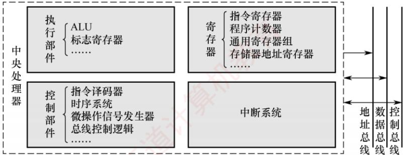  
图 5.1 CPU 的基本组成框图

考点追踪CPU中各种寄存器的作用与特点（2013、2016、2021）

1）程序计数器（PC）。存放即将执行的指令地址。顺序执行时自动递增（增量为当前指令所占的字节数）：遇到转移类指令时，更新为目标地址。程序启动前，首条指令地址被装入PC。其位数由地址总线宽度决定，反映了CPU可直接寻址的内存空间大小。

2）指令寄存器（IR）。暂存当前正在执行的指令。指令从主存取出后首先送入IR，供指令译码器使用。其位数等于指令字长。 -X宇

3）通用寄存器组（GPRs）。供用户程序灵活使用，用于暂存操作数、中间结果或地址指针，减少对主存的频繁访问，提升执行效率。

4）标志寄存器（FR），也称程序状态字寄存器（PSWR）。保存ALU运算产生的状态信息，用于条件判断与转移控制。这些标志位通常由触发器实现，整体构成程序状态字。

5）存储器地址寄存器（MAR）。存放当前要访问的主存地址。取指或数据读/写时，地址先送入MAR，再通过地址总线传至存储器。其位数同样由地址总线宽度决定。

6）存储器数据寄存器（MDR）。暂存从主存读出的数据或将要写入主存的数据，起到缓冲与同步作用，缓解CPU与主存之间的速度差异。

7）指令译码器（ID）。对IR中的操作码进行分析，识别指令类型，并输出对应的译码信号。

8）算术逻辑单元（ALU）。执行数据运算的核心部件，完成算术与逻辑运算。运算结果送回寄存器，状态标志则写入标志寄存器，供后续条件转移指令使用。

9）时序信号产生部件。以系统时钟为基础，生成指令执行所需的周期、节拍和工作脉冲，为整个CPU提供时序基准。 村

10）操作控制信号形成部件。综合译码信号、时序信号和状态标志，生成微操作控制信号。

11）总线控制逻辑。实现对总线传输的控制，包括对数据和地址信息的缓冲与控制。

12）中断机构。实现对异常情况和外部中断请求的处理。

## 5.1.3 CPU 中的寄存器

考点追踪用户可见寄存器（2010、2015、2021）

CPU中的寄存器可根据汇编语言（或机器语言）程序是否能够直接访问，分为两类。

## 1. 用户可见寄存器

这类寄存器可被用户程序直接读取或修改，用于暂存数据、地址或状态信息，从而减少对主存的访问次数，提高程序执行效率。这类寄存器主要包括通用寄存器组（GPRs）、专用地址寄存器（如基址寄存器、变址寄存器、堆栈指针等）、程序计数器（PC）。

此外，还有一类只读型用户可见寄存器，即标志寄存器（FR），其内容由ALU运算结果自动生成，用户程序不能直接修改其值。

## 2. 用户不可见寄存器

这类寄存器对用户程序完全透明，既不能被读取，又不能被修改，仅由CPU硬件或操作系统内核在特权模式下使用，如指令寄存器（IR）、存储器地址寄存器（MAR）、存储器数据寄存器（MDR）、页表基址寄存器等。 临村

## 5.1.4 本节习题精选

## 单项选择题

01. CPU的核心功能是执行程序，下列不属于CPU的基本功能的是（）。A. 时序控制 B. 异常与中断处理C. 执行算术和逻辑运算 D. 数据存储

02. 通用寄存器是（）。A. 可存放指令的寄存器B. 可存放程序状态字的寄存器C. 本身具有计数逻辑与移位逻辑的寄存器D. 可编程指定多种功能的寄存器

03. CPU中保存当前正在执行指令的寄存器是（）。A. 指令寄存器B. 指令译码器 C. 数据寄存器

04. 在CPU中，跟踪后继指令地址的寄存器是（）。A. 指令寄存器 B. 程序计数器 C. 地址寄存器 D. 状态寄存器

05. 条件转移指令执行时所依据的条件来自（）。A. 指令寄存器 B. 标志寄存器 C. 程序计数器 D. 地址寄存器

06. 在CPU的寄存器中，（）对汇编语言程序员是完全透明的。A. 程序计数器B. 状态寄存器C. 指令寄存器 D. 通用寄存器

07.指令（）从主存储器中读出。A. 总是根据程序计数器

B. 有时根据程序计数器，有时根据转移指令C. 根据地址寄存器D. 有时根据程序计数器，有时根据地址寄存器

08.程序计数器（PC）属于（）的部件。A. 运算器 B. 控制器 C. 存储器 D. ALU

09.下面有关程序计数器（PC）的叙述中，错误的是（）。A. PC 中总是存放指令地址B. PC 的值由 CPU 在执行指令过程中进行修改C. 执行转移指令时，PC的值总是修改为转移指令的目标地址D. PC的位数一般和存储器地址寄存器（MAR）的位数一样

10. 若指令按字边界对齐存放，程序计数器（PC）可以使用字地址，其位数取决于（）。I. 存储器的容量 Ⅱ. 机器字长 Ⅲ. 指令字长A. Ⅰ B. I和ⅢI C. II和ⅢII D. I、ⅡI和ⅢII

11.下列关于程序计数器（PC）的叙述中，错误的是（）。王 A. 机器指令中不能显式地使用 PCB. 指令顺序执行时，PC值总是自动加1C. 调用指令执行后，PC值一定是被调用过程的入口地址D. 无条件转移指令执行后，PC值一定是转移目标地址

12. 指令寄存器（IR）的位数取决于（）。A. 存储器的容量 B. 机器字长 C. 指令字长 D. 存储字长

13. CPU中通用寄存器的位数取决于（）。A. 存储器的容量 B. 指令的长度C. 机器字长 D. 都不对

14. CPU中的通用寄存器，（）。A. 只能存放数据，不能存放地址B. 可以存放数据和地址C. 既不能存放数据，又不能存放地址D. 可以存放数据和地址，还可以替代指令寄存器

15. 在计算机系统中表示程序和机器运行状态的部件是（）。A. 程序计数器 B. 指令寄存器 C. 中断寄存器 D. 程序状态字寄存器

16. 状态寄存器用来存放（）。 算机A. 算术运算结果 B. 逻辑运算结果C. 运算类型 D. 算术、逻辑运算及测试指令的结果状态

17.下列关于标志寄存器（EFLAGS寄存器或 PSW寄存器）的叙述中，错误的是（）。A. 不需要像通用寄存器那样，对标志寄存器进行编号B. 条件转移指令根据其中的一些的标志位来确定PC的值C. 可以通过指令直接访问标志寄存器并修改它的值D. 可以用它来存放执行指令得到的各种标志信息

18. 下列表述中，对CPU中控制器功能描述最完整的是（）。A. 产生 CPU 工作所需的时序信号B. 控制从主存取出一条指令 十算机C. 完成指令操作码的译码D. 完成指令操作码译码，并产生相应的操作控制信号

19. CPU 中不包括（）。

A. 存储器地址寄存器 B. 指令寄存器C. 地址译码器 D. 程序计数器

20. 以下关于计算机系统的概念中，正确的是（）。I. CPU 不包括地址译码器I. CPU的程序计数器中存放的是操作数地址Ⅲ. CPU 中决定指令执行顺序的是程序计数器IV. CPU 的状态寄存器对用户是完全透明的A. I、III B. III、IV C. II、III、IV D. I、III、IV

21. 间址周期结束后，CPU内寄存器MDR中的内容为（）。A. 指令B. 操作数地址 C. 操作数 D. 无法确定

22.【2010统考真题】下列寄存器中，汇编语言程序员可见的是（）。A. 存储器地址寄存器（MAR） B. 程序计数器（PC）C. 存储器数据寄存器（MDR） D. 指令寄存器（IR）

23. 【2016统考真题】某计算机的主存储器空间为4GB，字长为32位，按字节编址，采用32位字长指令字格式。若指令按字边界对齐存放，则程序计数器（PC）和指令寄存器（IR）的位数至少分别是（）。A. 30, 30 B. 30, 32 C. 32,30 D. 32, 32

24.【2020统考真题】下列给出的部件中，其位数（宽度）一定与机器字长相同的是（）。I. ALU II. 指令寄存器 II. 通用寄存器 IV. 浮点寄存器A. 仅I、Ⅱ B. 仅I、ⅢII C. 仅ⅡI、III D. 仅ⅡI、III、IV

## 5.1.5 答案与解析

## 单项选择题

## 01. D

CPU的基本功能包括：通过时序控制协调指令执行节奏，响应并处理异常与中断事件，以及利用ALU执行算术与逻辑运算。数据存储由主存、Cache等存储器承担；CPU仅包含少量寄存器用于临时暂存，不负责持久性或主体数据存储，因此不属于其基本功能，选项D错误。

## 02. D

存放指令的寄存器是指令寄存器，选项A错误。存放程序状态字的寄存器是程序状态字寄存器，选项B错误。通用寄存器本身并不一定具有计数逻辑和移位逻辑功能，选项C错误。

## 03. A

指令寄存器用于存放当前正在执行的指令。

## 04. B

程序计数器用于存放下一条指令在主存储器中的地址，具有地址自增功能。

## 05. B

指令寄存器用于存放当前正在执行的指令；程序计数器用于存放下一条指令的地址；地址寄存器用于暂存指令或数据的地址；程序状态字寄存器用于保存系统的运行状态。条件转移指令执行时，需要对标志寄存器的内容进行测试，判断是否满足转移条件。

## 06. C

对汇编语言程序员透明是指无法通过汇编指令直接访问或修改。指令寄存器由硬件自动加载，程序员不可读/写，故完全透明，选项C正确。程序计数器可通过转移/调用间接控制，通用寄存器可直接使用，二者均不透明。状态寄存器部分标志位可被条件指令使用或读取，是半透明的。

## 07. A

CPU根据程序计数器（PC）中的内容从主存储器中取指令。读者可能想到无条件转移指令或中断返回指令，认为不一定总是根据PC读出。实际上，当前指令正在执行时，PC已经是下一条指令的地址。若遇到无条件转移指令，则只需简单地用转移地址覆盖原PC的内容即可，最终的结果还是根据PC从主存储器中读出。地址寄存器用来指出所取数据在主存储器中的地址。

## 08. B

控制器是计算机中处理指令的部件，包含程序计数器。

## 09. C

PC中存放下一条要执行的指令的地址，选项A正确。PC的值会根据CPU在执行指令的过程中修改（确切地说是在取指周期），或自增，或转移到程序的某处，选项B正确。转移指令时，需要判别转移是否成功，若成功则PC修改为转移指令的目标地址，否则下一条指令的地址仍然为PC

## 10. B

当指令按字边界对齐且PC采用字地址时，PC的值表示下一条指令所在“字”的地址。设主存容量为M字节，指令字长为W字节，则主存最多容纳M/W个指令字，PC至少需要log₂(M/W)位。因此，PC的位数取决于存储器容量和指令字长，而与机器字长无直接关系。

## 11. B

机器指令中不能显式地使用PC，PC的值是自增的，或者是由转移类指令设置的。指令顺序执行时，PC自动加1，这里的“1”是指一条指令的长度，PC的值不一定总是自动加1，而是根据指令长度来确定的，具体取决于指令长度占几个编址单位。其余说法均正确。

## 12. C

指令寄存器中保存当前正在执行的指令，所以其位数取决于指令字长。

## 13. C

通用寄存器用于存放操作数和各种地址信息等，其位数与机器字长相等，因此便于操作控制。

## 14. B

通用寄存器供用户自由编程，可以存放数据和地址。而指令寄存器是专门用于存放指令的专用寄存器，不能由通用寄存器代替。

## 15. D

程序状态字寄存器用于存放程序状态字，而程序状态字的各位表征程序和机器的运行状态，如含有进位标志（CF）、结果为零标志（ZF）等。 X

## 16. D

程序状态字寄存器用于保留算术、逻辑运算及测试指令的结果状态。

## 17. C

标志寄存器是专用寄存器，不需要编号，也不能在指令中直接指定编号来访问；标志寄存器中的内容是执行指令的过程中，CPU根据指令执行的结果生成的各种标志信息，用户不能直接修改它的值。标志寄存器中的标志位主要用于条件转移或条件设置类指令的条件判断。

## 18. D

控制器的核心功能是在时序驱动下完成取指、译码，并根据操作码生成相应的控制信号，协调各部件工作。选项A仅描述其子功能（时序生成），选项B和C均只涉及单一环节；而选项D抓住了控制器“分析指令并发出控制命令”的本质，因此是对其功能最完整的描述。

## 19. C

地址译码器是主存等存储器的组成部分，其作用是根据输入的地址码唯一选定一个存储单元，它不是CPU的组成部分。而MAR、IR、PC都是CPU的组成部分。

## 20. A

地址译码器位于存储器，说法Ⅰ正确；程序计数器中存放的是欲执行指令的地址，它决定程序的执行顺序，说法Ⅱ错误、说法Ⅲ正确；程序状态字寄存器对用户不完全透明，说法IV错误。

## 21. B

间址周期的作用是取操作数的有效地址，因此，间址周期结束后，MDR中的内容为操作数地址。 X

## 22. B

汇编语言程序员可见的是程序计数器（PC），即汇编语言程序员通过汇编程序可以对某个寄存器进行访问。汇编语言程序员可以通过指定待执行指令的地址来设置PC的值，如转移指令、子程序调用指令等。而IR、MAR、MDR是CPU的内部工作寄存器，对程序员不可见。

## 23. B

PC用于指出下一条指令的主存地址，虽然可以用32位的地址来表示指令地址，但实际上内存中最多只能存放4GB/32位=230条指令，所以可以用30位的字地址来表示指令地址，这种情况下指令必须采用按边界对齐的方式存放，所以PC的位数至少是30位，即PC给出的地址是字地址。题于已说明指令按字边界对齐的方式存放，也就是说，指令地址都是4字节的整数倍，因此为了让PC的位数最少，可以采用字地址，取指令时将PC值左移2位到主存中取指令。指令寄存器（IR）用于存放从内存中取出的指令，它取决于指令字长，所以IR的位数至少是32位。

## 24. B

机器字长是指CPU内部用于整数运算的数据通路的宽度。数据通路是指数据在指令执行过程中所经过的路径及路径上的部件，主要是CPU内部进行数据运算、存储和传送的部件，这些部件的宽度基本上要一致才能相互匹配。因此，机器字长等于ALU位数和通用寄存器宽度。

## 5.2 指令执行过程

## 5.2.1 指令执行的一般流程

## 考点追踪指令执行的过程（2011）

计算机执行程序的本质，是控制器依据指令序列协调各功能部件协同工作的过程。CPU启动后，将持续循环执行“取指令”与“执行指令”两个基本操作。每条指令执行完毕后，还要进行中断与异常检测，以确保系统能够及时响应外部事件或内部异常。指令执行的一般流程如图5.2所示。

指令执行的基本流程如下：

首先，CPU以程序计数器（PC）的当前值为地址，从主存中取出下一条指令；与此同时，PC通常被自动更新为下一条顺序指令的地址（增量等于当前指令的长度），为后续取指做准备。

随后，进入译码与执行阶段：CPU对指令进行译码，识别其类型，并据此确定执行路径。为简化分析，可将指令分为分支指令与非分支指令两类：

● 为分支指令时，在执行阶段判断分支条件；条件满足时，PC将被更新为分支目标地址。

·为非分支指令时，依次完成取操作数、执行运算、写回结果等基本操作。

无论执行哪类指令，执行完成后，CPU均需要进行中断与异常检测：

● 未检测到中断或异常时，继续以更新后的PC地址取指，进入下一条指令的执行阶段。

● 检测到中断或异常时，进入中断响应阶段：屏蔽可屏蔽中断，保存返回地址（通常为下一条指令地址或当前指令地址，具体取决于中断/异常的类型），并将PC设置为对应中断服务程序的入口地址，随后转移执行该服务程序。关于中断机制的介绍，见5.5节。

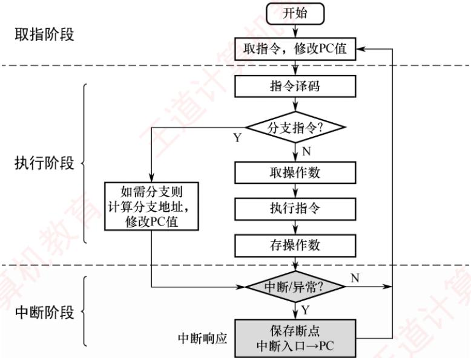  
图5.2 指令执行的一般流程

## 5.2.2 CPU 的时序控制

计算机的时序控制用于协调指令执行过程中各操作的先后顺序。CPU必须按照精确的时序产生控制信号，以适应不同指令在操作步骤和执行时间上的差异。

时钟信号是时序控制的基础，通常由机器内部的脉冲源（如晶振）产生，经整形和分频后形成供全机同步使用的节拍信号。时钟周期的长度由数据通路中相邻状态单元之间组合逻辑的最大传播延迟决定，以确保信号在下一个时钟边沿到来前稳定。关于数据通路的介绍，见5.3节。 不道

早期计算机采用“机器周期一节拍一脉冲”三级时序系统：一个指令周期被划分为若于机器周期（如取指、取操作数、执行、中断响应等），每个机器周期又细分为多个节拍，必要时在节拍内插入工作脉冲，以实现更精细的时序控制。由于不同指令的功能复杂度各异，其所需的机器周期数及各周期内的节拍数均可不同，从而支持多样化的需求。

随着高速缓存的广泛应用和芯片集成度的显著提升，现代处理器已大幅简化时序结构，“机器周期”这一概念逐渐淡化。CPU内部由统一的系统时钟直接驱动，一个时钟周期即对应一个节拍，绝大多数指令可在若于时钟周期内高效完成。

## 5.2.3 指令周期的基本概念

指令周期是指一条指令从主存读出到执行完成所经历的全部时间。为便于分析，可将其划分为若于阶段。最简单的划分方法是将指令周期分为取指和执行两个阶段；更细致的划分则可将其细分为取指、译码/读寄存器、执行/计算地址、访存和写回五个阶段，如图5.3所示。

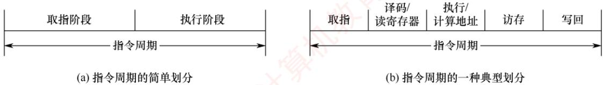  
图5.3 指令周期的常见划分方法

## 1. 取指（IF）

CPU根据PC的值，从主存（或指令Cache）中读取下一条指令，并将其送入IR。同时，PC被更新为下一条指令的地址：顺序执行时，PC增加当前指令的长度；若为变长指令，则需要在取指阶段初步解析其格式，以确定长度；若发生分支，则其目标地址将在后续阶段计算，并据此更新PC。

## 2. 译码/读寄存器（ID）

对IR中的指令进行译码，识别操作码和寻址方式，并从寄存器堆中读取所需的操作数。此阶段还可能组合基址寄存器与偏移量，为后续地址计算做准备。立即数也在本阶段提取。

## 3. 执行/计算地址（EX）

根据指令类型执行相应的操作：算术或逻辑指令，由ALU完成运算；访存类指令（如LOAD/STORE），计算操作数在主存中的有效地址；分支指令，计算目标地址并判断是否转移。此外，运算结果的状态（如零标志、进位等）通常在此阶段生成并暂存。

## 4. 访存（MEM）

若指令需要访问主存储器（如加载数据或存储结果），则在此阶段通过数据Cache或主存完成读/写操作。寄存器-寄存器类指令不涉及此阶段。

## 5. 写回(WB）

将最终结果写回寄存器堆。结果可能来自ALU的运算输出（执行阶段）或从存储器读取的数据（访存阶段）。写回完成后，该指令的执行即告结束。

需要注意的是，指令周期的具体划分因处理器架构而异，上述划分仅为一种典型示例。实际系统还可能包含中断响应等阶段，此时CPU会保存断点并转移至服务程序。

由于指令功能和寻址方式的不同，不同指令的指令周期长度并不固定。根据实现方式，可分为定长指令周期(所有指令的周期长度相同)和变长指令周期(不同指令包含的时钟周期数可变）。现代计算机普遍采用基于时钟信号定时的变长指令周期，以提高执行效率。

## 5.2.4 处理器指令执行模型

考点追踪单周期和多周期CPU的CPI（2016、2020、2025）

一个指令周期通常由若干依次执行的步骤组成，各步骤协同完成指令的全部功能。不同处理器对这些步骤的组织方式存在显著差异，主要可分为以下三类模型。 X

## 1. 单周期处理器

单周期处理器为所有指令分配相同的执行时间，每条指令在一个时钟周期内完成（CPI=1）。指令之间严格串行执行，即下一条指令必须等待前一条指令完全结束后才能启动。因此，时钟周期的长度由执行时间最长的指令决定。对于原本可在更短时间内完成的指令，也要占用整个周期，导致硬件资源在部分时间内空闲，限制了系统的整体性能。

## 2. 多周期处理器

多周期处理器根据指令类型动态分配执行周期数，不同指令可占用不同数量的时钟周期（各指令的CPI不同，平均CPI通常大于1）。该方案不再要求所有指令具有相同的执行时间，从而提高了时钟频率和资源利用效率。但是，指令之间仍是串行执行的，无法实现重叠处理。

## 3. 流水线处理器

流水线处理器采用指令级并行策略，目标是在每个时钟周期完成一条指令的吞吐（理想情况下CPI=1）。其实现机制是：每个时钟周期启动一条新指令，使多条指令在流水线中重叠执行，

各自处于不同的执行阶段（如取指、译码、执行、写回等）。尽管单条指令从开始到完成仍需要多个周期（执行延迟未减少），但整体吞吐率显著提高，大幅提升了处理器效率。

## 5.2.5 本节习题精选

## 单项选择题

01. 计算机工作的最小时间周期是（）。A. 时钟周期 B. 指令周期 C. 存取周期 D. 总线周期

02.指令周期是指（）。A. CPU从主存取出一条指令的时间B. CPU 执行一条指令的时间C. CPU从主存取出一条指令加上执行这条指令的时间D. 时钟周期时间

03.在一条无条件转移指令的指令周期内（不含中断），程序计数器的值被修改了（）次。A.1 B. 2 C. 3 D. 不能确定

04.取指操作后，程序计数器中存放的是（）。A. 当前指令的地址 B. 程序中指令的数量C. 已执行的指令数量 D. 下一条指令的地址

05. 下列关于指令执行的叙述中，错误的是（）。A. 指令周期的第一个操作是取指令B. 为了进行取指操作，控制器需要得到相应的指令C. 取指操作是控制器自动进行的D. 指令执行时有些操作是相同或相似的

06.下列关于指令执行过程的叙述中，错误的是（）。A. 取指操作是控制器固有的功能，不需要在操作码控制下完成B. 所有指令的取指操作是相同的C. 在指令长度相同的情况下，所有指令的取指操作是相同的D. 中断周期是在指令执行完成后出现的

07.下列关于指令周期的叙述中，错误的是（）。A. 指令周期的第一个阶段一定是取指令阶段B. 乘法指令和加法指令的指令周期总是一样长C.一个指令周期可由若干时钟周期组成D.单周期CPU 中的指令周期就是一个时钟周期

08.下列关于多周期CPU的说法中，合理的是（）。A. 执行各条指令的时钟周期数相同，各时钟周期的长度均匀B. 执行各条指令的时钟周期数相同，各时钟周期的长度可变C. 执行各条指令的时钟周期数可变，各时钟周期的长度均匀D. 执行各条指令的时钟周期数可变，各时钟周期的长度可变

09. 关于指令执行过程，下列叙述中正确的是（）。A. 取指令和取操作数阶段都一定需要通过总线访问主存B. 指令译码阶段需要计算操作数在内存中的地址C. 所有指令在执行阶段必然包含访问主存或I/O 端口的操作D. 取指令和译码是每条指令必须执行的操作，但取数或写结果不一定要访问主存

10.【2009统考真题】冯·诺依曼机中指令和数据均以二进制形式存放在存储器中，CPU区分它们的依据是（）。A. 指令操作码的译码结果 B. 指令和数据的寻址方式C. 指令周期的不同阶段 D. 指令和数据所在的存储单元

11.【2011统考真题】假定不采用Cache和指令预取技术，且机器处于“开中断”状态，则在下列有关指令执行的叙述中，错误的是（）。A. 每个指令周期中 CPU 都至少访存一次B. 每个指令周期一定大于或等于一个CPU时钟周期D. 当前程序在每条指令执行结束时都可能被外部中断打断 C. 空操作指令的指令周期中任何寄存器的内容都不会被改变 7教育

## 5.2.6 答案与解析

## 单项选择题

01. A

时钟周期是计算机内部最基本、最小的时间单位。指令周期是指完成一条指令所需的时间，可以包含多个时钟周期。存取周期是指访问一次存储器（读或写）的时间，通常也需要多个时钟周期。总线周期是指总线进行数据传输所需的时间，也可包含多个时钟周期。

## 02. C

指令周期是指CPU从主存取出一条指令加上执行这条指令的时间，间址周期不是必需的。03. B

首先在取指周期结束后，PC值自动加1；在执行周期中，PC值修改为要转移到的地址。综上，在一条无条件转移指令的指令周期内，程序计数器（PC）的值被修改了2次。

## 04. D

在取指操作后，程序计数器中的内容将被修改为下一条指令的地址，而不是当前指令的地址。05. B

取指操作是自动进行的，控制器不需要得到相应的指令。

## 06. B

不同长度的指令，其取指操作可能是不同的。例如，双字指令、三字指令与单字指令的取指操作是不同的。

## 07. B

无论哪种指令，指令周期的第一个阶段都是取指令（从主存中获得指令）。乘法指令通常比加法指令复杂，若是多周期CPU，则乘法指令通常需要更多的时钟周期，选项B错误。多周期CPU的指令周期由若干时钟周期组成。在单周期CPU中，指令执行的所有阶段（取指令、译码、执行等）都在一个时钟周期内完成，因此其指令周期就是一个时钟周期。

## 08. C

多周期CPU把指令的执行分为多个阶段来实现，每个阶段在一个时钟周期内完成，时钟周期以最复杂的阶段所花的时间为准，阶段的划分原则是：将一条指令的执行过程尽量分成大致相等的若干阶段。不同的指令（根据指令的复杂程度）所含的时钟周期数可以不同。

## 09. D

指令执行的基本步骤通常包括取指令、译码、地址计算、取操作数、执行和写回结果，其中取指令和译码是所有指令执行的必经阶段，而后续操作因指令而异：操作数和结果可能仅涉及寄

存器，无须访问主存或I/O。因此选项D正确。选项A错在取操作数不一定访存；选项B错在地址计算属于执行阶段，而非译码阶段；选项C错在并非所有指令都需要访问主存或I/O。

## 10. C

虽然指令和数据都以二进制形式存放在存储器中，但CPU可以根据指令周期的不同阶段来区分是指令还是数据，通常在取指阶段取出的是指令，在执行阶段取出的是数据。本题容易误选选项A，需要清楚的是，CPU只有在确定取出的是指令后，才会将其操作码送去译码，因此不可能依据译码的结果来区分指令和数据。

## 11. C

因为不采用指令预取技术，每个指令周期都需要取指令，而不采用Cache技术，所以每次取指令都至少要访存一次（当指令字长与存储字长相等且按边界对齐时），选项A正确。时钟周期是CPU的最小时间单位，每个指令周期一定大于或等于一个CPU时钟周期，选项B正确。即使是空操作指令，在取指操作结束后，PC也会自动加1，选项C错误。因为机器处于“开中断”状态，所以在每条指令执行结束时都可能被外部中断打断。

## 5.3 数据通路的功能和基本结构

## 5.3.1 数据通路的功能

随着技术的发展，越来越多的功能逻辑被集成到CPU芯片中，但不论CPU的内部结构多么复杂，它都可视为由数据通路（Data Path）和控制部件（Control Unit）两大部分组成。

数据在指令执行过程中所经过的路径，以及路径上涉及的硬件部件，称为数据通路。ALU、通用寄存器、状态寄存器等，都是指令执行时数据流经的部件，属于数据通路的一部分。数据通路描述了数据从何处开始，中间经过哪些部件，最终被传送到哪里。整个数据通路由控制部件控制，后者根据每条指令的功能，生成相应的控制信号，以驱动数据通路完成指定操作。

## 5.3.2 数据通路的组成

数据通路的基本构成元件可分为组合逻辑元件和时序逻辑元件两大类。

考点追踪数据通路的组成部件（2017、2021、2025）

## 1. 组合逻辑元件（操作元件）

组合逻辑元件主要用于执行数据运算与路径选择，也称操作元件。其特征是：任意时刻的输出仅由当前输入决定，不依赖历史状态；内部不含记忆单元，不受时钟控制，且无输出到输入的反馈通路，因而具有确定性和即时响应性。数据通路中常用的组合逻辑元件包括加法器、算术逻辑单元（ALU）、译码器、多路选择器（MUX）和三态门等，如图5.4所示。

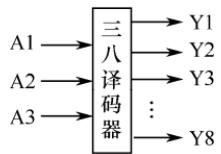  
(a) 译码器

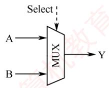  
(b) 多路选择器

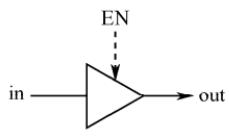  
(c) 三态门  
图5.4 数据通路中的几种常用组合逻辑元件

## 考点追踪三态门、多路选择器的应用（2015、2023、2024）

图中虚线表示控制信号，译码器常用于操作码译码或地址码译码，对于n位输入，可产生 $2 ^ { n }$ 个互斥输出。多路选择器（MUX）根据控制信号 Select从多路输入中选择一路输出，若输入路数为N，则需 $\left[ \log _ { 2 } N \right]$ 位控制信号。三态门可视为一种受控的总线开关，由控制信号EN决定信号线的通断，当EN=1时，三态门被打开，输出（out）信号等于输入（in）信号；当EN=0时，输出端呈高阻态（隔断态），所连寄存器与总线断开。

## 2. 时序逻辑元件（状态元件）

时序逻辑元件的输出不仅取决于当前输入，还依赖于电路的历史状态，因此其内部必然包含用于存储信息的记忆单元。此外，这类元件必须在时钟的同步控制下工作。常见的时序逻辑元件包括各类寄存器和存储器，例如通用寄存器组、程序计数器（PC）、状态/暂存寄存器等。

数据通路的基本结构可抽象为时序逻辑元件与组合逻辑元件交替连接的形式，即“……-状态元件-操作元件-状态元件-……”，如图5.5所示。为简化分析，假设寄存器A和B的写使能信号一直有效，当时钟上升沿到来时，两个寄存器同时锁存各自的新值。从时钟上升沿开始到寄存器A输出稳定的时间称为寄存器延迟 $T _ { \mathrm { c l k \_ t o \_ q } } ,$ 随后，其输出数据经组合逻辑电路处理，经历一个关键路径延迟 $T _ { \mathrm { m a x } }$ （所有输出信号达到稳定所需的最长时间）。为确保寄存器B能在下一个时钟上升沿正确采样该数据，其输入必须在时钟沿到来前至少提前 $T _ { \mathrm { s e t u p } }$ （寄存器建立时间）保持稳定。因此，数据通路的最小时钟周期必须不小于 $T_{\mathrm{clk\_to\_q}} + T_{\mathrm{max}} + T_{\mathrm{ setup}}$ ，其中组合逻辑延迟 $T _ { \mathrm { m a x } }$ 是关键因素。可见，在CPU设计中，缩短组合逻辑的关键路径延迟是提升系统频率的关键手段。

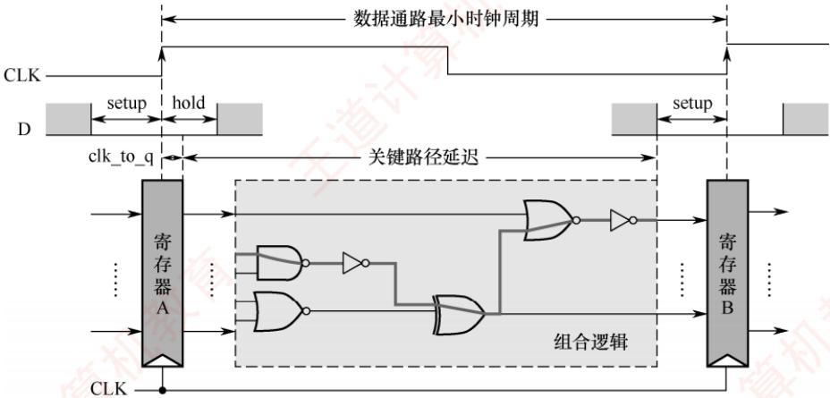  
图 5.5 数据通路与时钟周期

## 5.3.3 数据通路的组织与分类

数据通路可根据其内部部件的连接方式和指令执行的时序组织方式进行分类。

## 1. 按部件连接方式划分

## （1）总线式数据通路

总线式数据通路将通用寄存器、ALU和内部寄存器等主要部件连接至一条或多条CPU内部总线（注意，此总线为片内总线，不同于系统总线）。根据总线数量的不同，可分为如下两类：

● 单总线结构：所有数据传输共享一条内部总线，ALU的输入与输出均通过该总线分时传送。

● 多总线结构（如双总线、三总线）：提供多条独立总线，例如分别用于两个源操作数和结果写回，以支持更高的并行度。

优点是硬件简洁、易于扩展；缺点是同一时刻仅能传输一组数据，存在总线竞争问题。

## (2)专用数据通路

专用数据通路采用点对点专用连线连接寄存器、ALU等部件，而非共享总线。各数据通路可并行传输，避免了总线冲突。

优点是数据传输效率高、延迟低；缺点是布线复杂、扩展性差、成本较高。

总线式与专用数据通路的特点对比如表5.1所示。

表5.1 总线式与专用数据通路的特点对比
<table><tr><td rowspan=1 colspan=1>对比维度</td><td rowspan=1 colspan=1>总线式数据通路</td><td rowspan=1 colspan=1>专用数据通路</td></tr><tr><td rowspan=1 colspan=1>结构复杂度</td><td rowspan=1 colspan=1>简单，部件共享总线，连线少</td><td rowspan=1 colspan=1>复杂，需要大量点对点专用连线</td></tr><tr><td rowspan=1 colspan=1>扩展灵活性</td><td rowspan=1 colspan=1>强，新增部件只需要挂接总线</td><td rowspan=1 colspan=1>弱，新增部件需要重新布线</td></tr><tr><td rowspan=1 colspan=1>数据传输效率</td><td rowspan=1 colspan=1>低，同一时刻仅支持一组数据传输</td><td rowspan=1 colspan=1>高，多组数据可并行传输</td></tr><tr><td rowspan=1 colspan=1>硬件成本</td><td rowspan=1 colspan=1>低</td><td rowspan=1 colspan=1>高X</td></tr><tr><td rowspan=1 colspan=1>性能瓶颈</td><td rowspan=1 colspan=1>总线带宽受限，部件增多时延迟增加</td><td rowspan=1 colspan=1>无总线瓶颈，性能随并行度提升</td></tr><tr><td rowspan=1 colspan=1>典型应用场景</td><td rowspan=1 colspan=1>教学模型、嵌入式微控制器</td><td rowspan=1 colspan=1>高性能通用处理器（如RISC）</td></tr></table>

## 2. 按时序组织方式划分

## （1）单周期数据通路

在单周期数据通路中，每条指令的所有操作（取指、译码、执行、访存、写回等）都在一个时钟周期内完成。时钟周期长度由最慢的指令（通常是访存指令）决定。

特点是控制简单，资源利用率低，可基于总线式或专用通路实现。

## 注意

单周期处理器（CPI=1）不能采用单总线结构的数据通路，因为单总线将所有寄存器都连接到一条公共总线上，一个时钟周期内只允许一次操作，无法完成一条指令的所有操作。

## （2）多周期数据通路

多周期数据通路将一条指令的执行划分为多个阶段，每个阶段在一个时钟周期内完成。典型阶段包括取指、译码与读寄存器、执行/地址计算、访存、写回等。 K NIC

特点是各阶段的结果在时钟边沿被锁存到寄存器中；时钟周期长度通常以一次存储器访问时间为基准；相比单周期设计，提高了硬件复用率，缩短了时钟周期。

## (3）流水线数据通路

流水线数据通路将指令执行过程分解为若干独立、可重叠的阶段，不同指令在不同阶段并发推进。每个阶段由专用功能部件完成，并通过流水段寄存器隔离和传递中间结果。

特点是时钟周期长度由最长阶段决定；理想情况下，每个周期可以完成一条指令。

## 5.3.4 单总线结构的数据通路

单总线数据通路结构简洁，所有数据传输共享同一条内部总线，同一时刻仅允许一个部件向总线输出数据，导致操作需要分步进行。图5.6所示为一种典型的单总线数据通路结构。

## 考点追踪数据通路中的部件及连接方式（2013、2015、2022）

在图 5.6中，GPRs为通用寄存器组，rs 和 rd分别是源寄存器和目的寄存器的编号，各占4位，可寻址 $2 ^ { 4 }   = 1 6$ 个通用寄存器：Y和Z为暂存寄存器（简称暂存器），用于暂存从总线读取的操作数；FR为标志寄存器，用于保存ALU运算产生的状态标志。所有可向内部总线输出数据的部件（如寄存器、MDR、PC等）均通过各自的三态门与总线相连，以控制其与总线之间的通断，避免多个输出同时驱动总线造成冲突。图中带箭头的虚线表示控制信号，控制信号的命名采用“部件名+in/out”的方式：in表示允许向该部件写入（如PCin表示将内部总线上的数据写入PC），out表示允许该部件输出到总线（如PCout表示将PC的内容送至内部总线）。

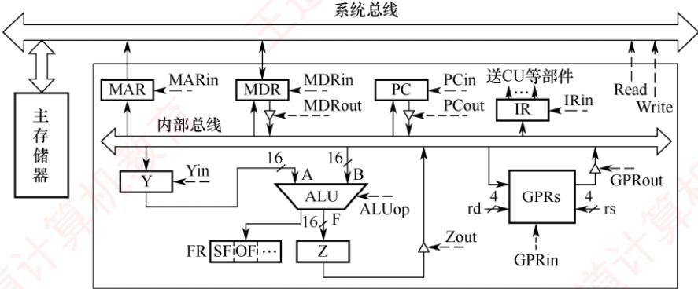  
图5.6 一种典型的单总线数据通路结构

ALU的操作类型由控制信号 ALUop 决定。若 ALUop为 n位，则最多支持2ⁿ种操作。在以下分析中，假设 ALUop为3位，且约定执行加法操作时 ALUop= 000。

总线是一组共享的传输信号线，不能存储信息，任一时刻只能有一个部件将信息发送到总线上。下面以图5.6所示的单总线数据通路为例，介绍两条常见指令的指令周期数据流。数据流是指令执行过程中，根据操作要求依次访问的数据序列。该序列因指令执行的不同阶段而异，也随指令类型的不同而变化。为简化分析，此处将指令周期分为取指和执行两个阶段。

## （1）加法指令

考点追踪指令执行阶段的操作控制分析（2009、2015、2019）

指令功能：将rs和 rd寄存器中的值相加，并将结果写入 rd 寄存器。

1）取指阶段：根据PC中的内容从主存储器中取出指令代码并存放在IR中。假设从发出主存读命令到主存读出数据并传输到MDR共需5个时钟周期，则取指阶段的数据流如下(不考虑PC增量操作）：

<table><tr><td rowspan=1 colspan=1>时钟X</td><td rowspan=1 colspan=1>功能</td><td rowspan=1 colspan=1>有效控制信号</td></tr><tr><td rowspan=1 colspan=1>cX</td><td rowspan=1 colspan=1>(PC) → MAR</td><td rowspan=1 colspan=1>PCout, MARin</td></tr><tr><td rowspan=1 colspan=1>C2~C6</td><td rowspan=1 colspan=1>MEM(MAR) → MDR</td><td rowspan=1 colspan=1>MDRin, read</td></tr><tr><td rowspan=1 colspan=1>直 C7</td><td rowspan=1 colspan=1>(MDR) → IR</td><td rowspan=1 colspan=1>MDRout，IRin</td></tr></table>

解释：①将PC的内容写入MAR（1个时钟周期）；②读主存并将读出的数据写入MDR（5个时钟周期）；③将MDR的内容写入IR（1个时钟周期）。

2）执行阶段：根据rs和rd寄存器的编号（假设分别为0001和0010），将两个操作数取出，送入ALU进行加法运算，并将运算结果送回rd寄存器。执行阶段的数据流如下：

<table><tr><td rowspan=1 colspan=1>时钟</td><td rowspan=1 colspan=1>功能</td><td rowspan=1 colspan=1>有效控制信号</td></tr><tr><td rowspan=1 colspan=1>C8</td><td rowspan=1 colspan=1>(rs) → Y</td><td rowspan=1 colspan=1>rs = 0001, GPRout, Yin</td></tr><tr><td rowspan=1 colspan=1>C9</td><td rowspan=1 colspan=1></td><td rowspan=1 colspan=1>rd = 0010, GPRout, ALUop = 000</td></tr><tr><td rowspan=1 colspan=1>C10</td><td rowspan=1 colspan=1>(Z) → rd</td><td rowspan=1 colspan=1>Zout, rd = 0010, GPRin</td></tr></table>

解释：①将rs寄存器的内容写入暂存寄存器Y（1个时钟周期）；②将rd寄存器中的值取出并与Y暂存寄存器中的值相加，结果送入Z暂存寄存器（1个时钟周期）；③将暂存寄存器Z中的加法结果送回 rd寄存器（1个时钟周期）。

## 注意

在单总线数据通路中，任一时刻总线上仅允许一个数据传输。由于ALU是无存储能力的组合逻辑电路，运算时需要两个输入同时有效，因此需要先将一个操作数经总线送入暂存寄存器Y：下一周期再将另一个操作数送至ALU的另一个输入端，Y的输出即作为其第一个操作数。此外，ALU输出不能直接连到总线，否则可能通过总线反馈至输入端，干扰运算结果，故需要暂存于暂存寄存器Z中。

## (2) 取数指令

指令功能：将主存地址为 rs寄存器中的值的主存单元内容取出送回 rd寄存器。

1）取指阶段：所有指令取指阶段的数据流都是相同的，此处不再赘述。

2）执行阶段：假设rs和rd寄存器的编号分别为0001和0010，从发出主存读命令到主存读出数据并传输到MDR共需5个时钟周期，则执行阶段的数据流如下：

<table><tr><td rowspan=1 colspan=1>时钟</td><td rowspan=1 colspan=1>功能</td><td rowspan=1 colspan=1>有效控制信号</td></tr><tr><td rowspan=1 colspan=1>C8</td><td rowspan=1 colspan=1>(rs) → MAR</td><td rowspan=1 colspan=1>rs = 0001, GPRout, MARin</td></tr><tr><td rowspan=1 colspan=1>C9~C13</td><td rowspan=1 colspan=1>MEM(MAR) → MDR</td><td rowspan=1 colspan=1>MDRin, read</td></tr><tr><td rowspan=1 colspan=1>C14</td><td rowspan=1 colspan=1>(MDR) → rd</td><td rowspan=1 colspan=1>MDRout, rd = 0010, GPRin</td></tr></table>

解释：①将rs的内容写入MAR（1个时钟周期）；②读主存并将读出的数据写入MDR（5个时钟周期）；③将MDR的内容写入 rd寄存器（1个时钟周期）。

## 5.3.4 专用结构的数据通路

本节以单周期数据通路为例，介绍专用数据通路的设计原理。在单周期数据通路中，每条指令的取指与执行均在一个时钟周期内完成，CPU的时钟周期必须以最耗时的指令为准。此外，由于资源无法复用，系统需要为频繁使用的功能单元（如加法器）配置多组独立的实例。同时，为避免指令获取与数据访问冲突，指令和数据被分别存储在独立的存储器中，确保两者可在同一时钟周期内并行处理。鉴于完整单周期数据通路结构较为复杂，以下将结合具体指令执行过程，逐步拆解其关键设计要点。尽管基于单周期模型，但其中的控制逻辑与数据通路设计思想同样适用于多周期、流水线等更复杂的结构。考生应在夯实基础的前提下，灵活运用所学知识。

## 1. 取指令部件的设计

每条指令的第一步都是完成取指令并计算下一条指令地址的过程。图5.7展示了取指令部件

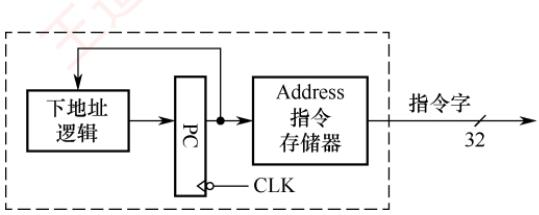  
图5.7 取指令部件的结构示意图

的结构示意图。指令存储在指令存储器中，仅支持读操作。读取指令时，只需提供指令地址，经过固定的延迟后即可输出对应的32位指令字。指令地址由程序计数器（PC）提供。

取指令部件包含专用的下地址逻辑电路，用于计算并更新PC值，以确定下一条指令的地址。下地址逻辑根据当前指令类型区分不同的执行路径：

顺序执行：当指令为普通顺序指令时，直接计算PC+4得到下一条指令的地址。

● 转移执行：对于分支或转移指令，需要根据指令类型计算转移目标地址。例如，beq指令（相等转移）通过比较两个寄存器的内容决定是否转移，并根据偏移量计算新的PC值。

## 2. R 型运算类指令数据通路

R型指令指的是操作数全部来自通用寄存器、运算结果也写回通用寄存器的算术/逻辑运算指令。以加法指令为例：

图 5.8 展示了 R 型指令相关的数据通路示意图。该数据通路能够对两个寄存器Rs 和 Rt 的内容进行运算，并将结果写回Rd 寄存器。例如，add 和 sub 等指令还需判断运算结果是否溢出，仅当不溢出时才将结果写回Rd寄存器；发生溢出时，会触发异常处理。

指令中的 Rs 和 Rt 是两个源操作数寄存器的编号，Rd是目的寄存器的编号。因此

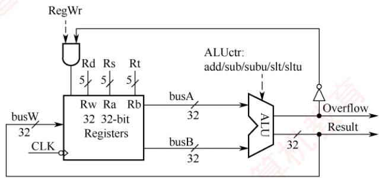  
图 5.8 R 型指令相关的数据通路示意图

· 寄存器堆的两个读地址端 Ra 和 Rb应分别与 Rs 和 Rt 相连。

● 写地址端 Rw 应与 Rd 相连。

● ALU的运算结果通过总线busW 连至寄存器堆的写数据端。

控制信号RegWr作为寄存器堆的写使能信号，在RegWr为1 且无溢出的情况下，运算结果才被写入寄存器堆。具体来说，RegWr信号和溢出标志位Overflow通过“与”门组合后，决定是否允许写入寄存器堆。显然，在R型指令执行期间，RegWr信号应始终为1。

此外，ALU 的操作类型由控制信号 ALUctr 决定。假设 ALU 支持 N种不同的运算，则 ALUctr至少需要 $\left[ \log _ { 2 }   N \right] ^ { - }$ 位来选择具体的运算类型。

由于单周期处理器必须在一个时钟周期内完成指令，其数据通路中不设置指令寄存器（IR），而直接从指令存储器中取指令并解析执行，否则仅取指令到IR就需一个时钟周期。

## 3.Ⅰ型运算指令的数据通路

I型运算指令（立即数运算类指令）的核心执行逻辑是，先将指令中的16位立即数扩展为32位，再将寄存器Rs的内容送入ALU运算，结果写回目的寄存器Rt。以有符号加法指令为例：addi rt, rs,imm16 #R[rs]+SignExt[imm16]→R[rt]其中，SignExt[imm16]表示对16位立即数进行符号扩展。 教

图5.9是在R型指令数据通路（见图5.8）基础上，增加支持Ⅰ型指令的功能模块（如立即数扩展器和多路选择器）后形成的通用数据通路。该通路可同时执行R型和I型运算指令。

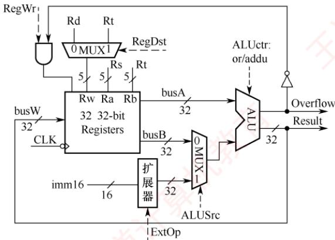  
图5.9 Ⅰ型指令相关的数据通路示意图

与图5.8相比，数据通路主要有以下三处改动，以同时兼容R型和I型运算指令的执行。

1）目的寄存器选择：R型指令使用目的寄存器Rd，而I型指令使用目的寄存器Rt。因此，在寄存器堆的写地址端Rw处增设多路选择器，由控制信号RegDst控制：

● RegDst = 1（执行 R 型指令）时，选择 Rd 为目的寄存器。

●RegDst= 0（执行I型指令）时，选择Rt为目的寄存器。

2）立即数扩展：Ⅰ型指令的16位立即数需扩展为32位才能送入ALU。数据通路中新增一个立即数扩展器，其输入为指令的imm16字段。由控制信号ExtOp决定扩展方式：● 对于算术类指令，采用符号扩展。

● 对于按位逻辑操作指令，采用零扩展。

3）ALU第二操作数选择：R型指令的第二操作数来自寄存器Rt，Ⅰ型指令则使用扩展后的立即数。因此，在ALU的第二输入端增设多路选择器，由控制信号ALUSrc控制：

$\mathrm{ALUSrc} = 0$ （执行R型指令）时，选择寄存器Rt的数据。

$\mathrm { A L U S r c } = 1$ （执行Ⅰ型指令）时，选择扩展后的立即数。

4. 访存指令的数据通路

MIPS访存指令属于Ⅰ型指令（需要进行立即数运算），包括以下两类：

lw rt, imm16(rs) #M[R[rs]+SignExt(imm16)]→R[rt]   
sw rt, imm16(rs) #R[rt]→M[R[rs]+SignExt(imm16)]

LOAD 和 STORE指令的访存地址计算逻辑完全一致：首先对指令中的 16 位立即数 imm16进行符号扩展，然后将其与寄存器Rs的内容相加，得到访存地址。二者区别在于数据传输方向：● LOAD指令从该地址读取32 位数据，并将数据写入寄存器Rt。

● STORE指令则将寄存器Rt 中的32 位数据写入该地址对应的存储单元。

图5.10是在图5.9的基础上增加支持LOAD/STORE指令功能模块后的数据通路示意图。该数据通路不仅能够执行LOAD/STORE指令，还能兼容R型和I型运算指令。

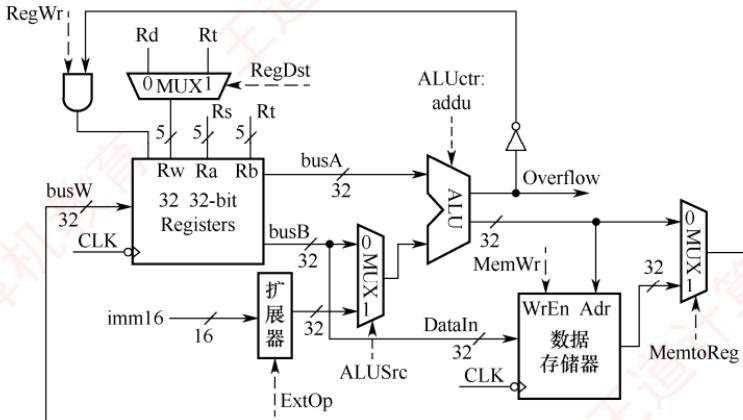  
图5.10 支持LOAD/STORE指令功能的数据通路

与图5.9相比，数据通路主要有以下两处改动，以支持LOAD/STORE指令的执行：

1）写回寄存器的数据选择：为了处理运算类指令与LOAD指令写回寄存器的不同数据来源，在寄存器堆的写端口 busW处增设一个多路选择器，由控制信号MemtoReg控制：

$\mathrm{MemtoReg} = 0$ （运算类指令）时，选择ALU的运算结果。

● MemtoReg=1（LOAD指令）时，选择数据存储器读出的数据。

2）新增数据存储器模块：以满足LOAD/STORE指令对数据存储器的读/写需求。

●数据存储器的地址端Adr直接连接到ALU的输出端（访存地址由ALU计算得出）。

● STORE 指令需要将寄存器 Rt 的内容写入存储器，因此将寄存器堆的第二读端口 busB（对应寄存器Rt）连接到数据存储器的输入端DataIn。

● 数据存储器的输出端接入busW 处的多路选择器，用于LOAD指令的结果写回。

·控制信号MemWr作为数据存储器的写使能信号（控制数据存储器的读/写操作）。

● LOAD/STORE指令计算访存地址时，需要对 16 位立即数 imm16 进行符号扩展，并通过ALU执行不判溢出的加法（addu），此时控制信号ALUctr被配置为对应的操作码。

## 5. 完整的单周期数据通路结构图

综合前述各功能模块，可构建如图5.11所示的完整单周期数据通路。图中所有加下划线的信号均为控制信号，以虚线表示。 uK

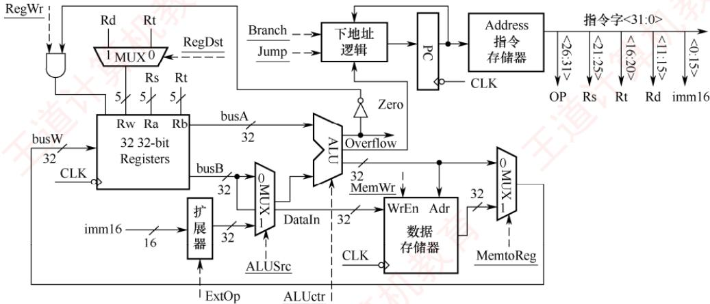  
图5.11 完整的单周期数据通路

其中，取指令部件在图5.7的基础上，还需接收三类关键外部控制信号：

● 控制信号 Branch 在执行分支指令时置1。

● 控制信号 Jump 在执行无条件转移指令时置1。

● 标志位 Zero用于判断分支条件是否成立，该信号由 ALU输出。例如，执行 beq指令（相等转移）时，ALU执行减法操作，若结果为0，则Zero置1，表示满足转移条件。

基于以上分析，单周期处理器具有以下重要特点：

1）存储器分离设计：指令存储器与数据存储器相互独立，使得取指令与数据访存操作可并行进行，避免冲突，确保在一个时钟周期内同时完成指令读取与数据读/写。

2）无指令寄存器（IR）：指令从存储器取出后，其各字段（如rs、rt、rd、imm）直接用于生成控制信号或地址输入，指令解析与执行在同一个时钟周期内同步完成。

3）时钟周期由最慢指令决定：时钟周期必须满足执行时间最长的指令（如访存指令），导致简单指令（如R型加法）的执行效率受限。

4）数据通路资源专用：由于所有操作需要在一个周期内并发完成，关键功能单元（如用于PC更新和地址计算的加法器）需要配置多个独立的实例，硬件无法复用，开销较大。

5）控制信号单周期有效：所有控制信号（如RegWr、MemWr等）在一个时钟周期内保持有效，指令“取指、执行、写回”的完整流程在单个时钟脉冲内完成，无流水线分段。

## 5.3.5 本节习题精选

## 一、单项选择题

01. 下列不属于CPU数据通路结构的是（）。A. 单总线结构 B. 多总线结构

C. 部件内总线结构 D. 专用数据通路结构

02.下列有关数据通路的叙述中，错误的是（）。A. 数据通路由若干组合逻辑元件和时序逻辑元件连接而成B. 数据通路的功能由控制部件送出的控制信号决定C. ALU属于操作元件，包含在数据通路中D. 通用寄存器属于状态元件，但不包含在数据通路中

03. 数据通路是由操作元件和状态元件通过总线或分散方式连接而成的进行数据存储、处理和传送的路径，下列部件中属于状态元件的是（）。I. 算术逻辑部件Ⅱ. 译码器 I. 移位寄存器 IV. 存储器数据寄存器A. I、IIIB. II、III、V C. III、IV D. I、 IV A

04.下列关于采用单总线方式的CPU的说法中，正确的是（）。A. ALU的两个输入端及输出端都可与总线相连B. ALU的两个输入端可以与总线相连，但输出端需通过暂存器与总线相连C. ALU的一个输入端可以与总线相连，其输出端也可与总线相连D. ALU只能有一个输入端可以与总线相连，另一输入端需通过暂存器与总线相连

05. CPU内部若多个部件共享一条总线，则每个部件与总线之间需设置一个常用的器件，CPU控制该器件的状态，实现某个部件与总线的连接或断开。该器件是（）。A. 触发器 B. 多路选择器 C. 三态门 D. 与非门

06. CPU内部电路通常采用总线连接方式，总线上信号流动的原则是（）。I. 每个时刻只有一个器件发出信息 Ⅱ.每个时刻有一个或多个器件发出信息Ⅲ. 每个时刻只有一个器件接收信息IV. 每个时刻有一个或多个器件接收信息A. I、III B. I、 IV - C. II、ⅢII D. II、IV

07.下列关于CPU时钟信号的叙述中，错误的是（）。A. 处理器总是每来一个时钟信号就开始执行一条新的指令B. 边沿触发指状态单元总在时钟上升沿或下降沿开始改变状态C. 时钟周期以相邻状态单元之间最长组合逻辑延迟为基准确定D. 每个时钟周期称为一个节拍，机器的主频就是时钟周期的倒数

08. 下列操作中，从开始到完成所持续的时间不一定等于一个时钟周期的是（）。I. 单总线数据通路中完成一次主存读操作I. 单周期CPU 中执行一条完整指令 算机Ⅲ. 单总线数据通路中，寄存器R1 经内部总线传至寄存器R2IV.流水线数据通路中，数据从一个流水段寄存器传入下一个流水段寄存器V. 单周期 CPU 中完成一次 ALU 运算 王A. I, V B. I, III, V C. II, III, IV D. IV, V

09. 下列关于单周期CPU和多周期CPU的描述中，错误的是（）。A. 单周期CPU更容易支持复杂指令（如乘法、除法）B. 单周期CPU部件冗余大、利用率低，多周期CPU则刚好相反C. 单周期CPU在1 个时钟周期内执行一条指令，CPI=1D. 多周期CPU至少需要2 个时钟周期才能执行一条指令，CPI>1

10.下列关于单周期数据通路和多周期数据通路的说法中，正确的是（）。A. 单周期 CPU 的 CPI 总比多周期 CPU 的 CPI 大B. 单周期 CPU 的时钟周期通常比多周期CPU 的时钟周期短

C. 在一条指令执行过程中，单周期CPU中的每个控制信号取值一直不变，而多周期CPU中的控制信号可能发生改变D. 在一条指令执行过程中，单周期数据通路和多周期数据通路中的每个部件都可使用多次

11. 下列关于单周期CPU与采用单总线结构的多周期CPU的说法中，正确的是（）。A. 单周期 CPU 可基于单总线结构实现B. 运行相同程序时，单周期CPU的总执行时间一定更短C. 多周期CPU可将指令和数据存放在同一单端口存储器中，而单周期CPU不行D. 单周期 CPU 的硬件实现成本通常低于多周期 CPU Y

12. 与专用通路结构的数据通路相比，单总线结构的数据通路（）。A. 性能更高妆 B. 数据冲突更严重C. 硬件规模更大、实现更复杂 D. 控制逻辑更复杂

13. CPU的读/写控制信号的作用是（）。A. 决定数据总线上的数据流方向 B. 控制存储器操作的读/写类型C. 控制流入、流出存储器信息的方向 D. 以上都是

14.下列有关取指令操作部件的叙述中，错误的是（）。 XA. 取指令操作的时延主要由存储器的访问时间决定B. 取指令操作可与下条指令地址的计算并行进行C.在单周期数据通路中，需设置指令寄存器（IR）暂存取出的指令D.在单周期数据通路中，程序计数器（PC）无须“写使能”控制信号

15.【2016统考真题】单周期处理器中所有指令的指令周期为一个时钟周期。下列关于单周期处理器的叙述中，错误的是（）。A. 可以采用单总线结构数据通路 B. 处理器时钟频率较低C. 在指令执行过程中控制信号不变 D. 每条指令的 CPI 为1

16.【2019统考真题】下列有关处理器时钟信号的叙述中，错误的是（）。A. 时钟信号由机器脉冲源发出的脉冲信号经整形和分频后形成B. 时钟信号的宽度称为时钟周期，时钟周期的倒数为机器主频C. 时钟周期以相邻状态单元间组合逻辑电路的最大延迟为基准确定D. 处理器总是在每来一个时钟信号时就开始执行一条新的指令

17.【2021统考真题】下列关于数据通路的叙述中，错误的是（）。A. 数据通路包含ALU等组合逻辑（操作）元件B.数据通路包含寄存器等时序逻辑（状态）元件C.数据通路不包含用于异常事件检测及响应的电路 王道D. 数据通路中的数据流动路径由控制信号进行控制

18.【2023统考真题】数据通路由组合逻辑元件（操作元件）和时序逻辑元件（状态元件）组成。下列给出的元件中，属于操作元件的是（）。I. 算术逻辑单元（ALU） II. 程序计数器（PC）III. 通用寄存器组（GPRs） IV.多路选择器（MUX）A. 仅I、Ⅱ B. 仅I、IV C. 仅ⅡI、III D. 仅I、ⅡI、IV

## 二、综合应用题

01. 某计算机的数据通路结构如下图所示，写出实现 ADD R1,(R2)的微操作序列（取指令及指令执行的过程，包括PC自增的过程）。

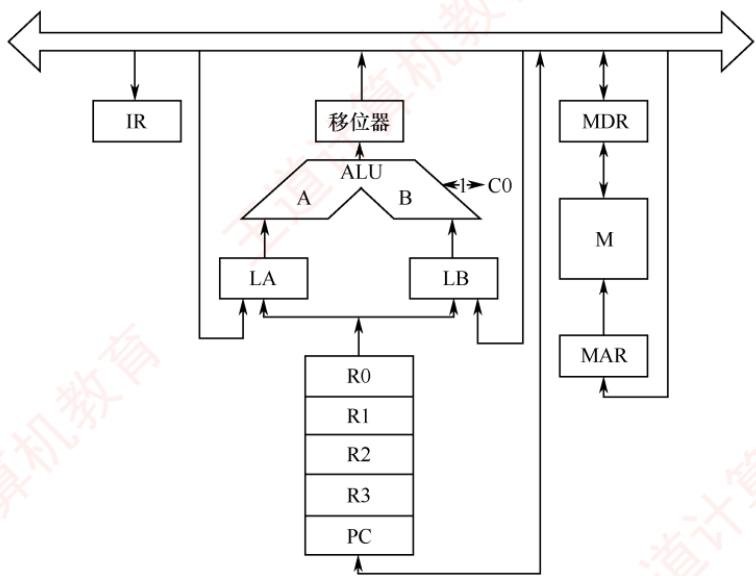

02.设CPU内部结构如下图所示，此外还设有B、C、D、E、H、L六个寄存器（图中未画出），它们各自的输入端和输出端都与内部总线相通，并分别受控制信号控制（如Bin受寄存器B的输入控制；Bout受寄存器B的输出控制），假设ALU的结果直接送入寄存器Z。要求从取指令开始，写出完成下列指令的微操作序列及所需的控制信号。

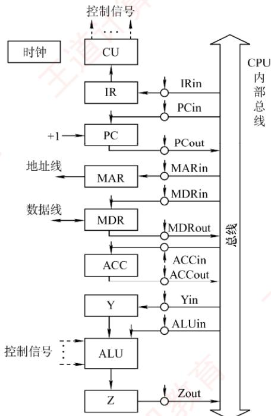

03. 设有如下图所示的单总线结构，分析指令 ADD (R0), R1 [即实现((R0))+(R1)→(R0)] 的指令流程和控制信号。 X

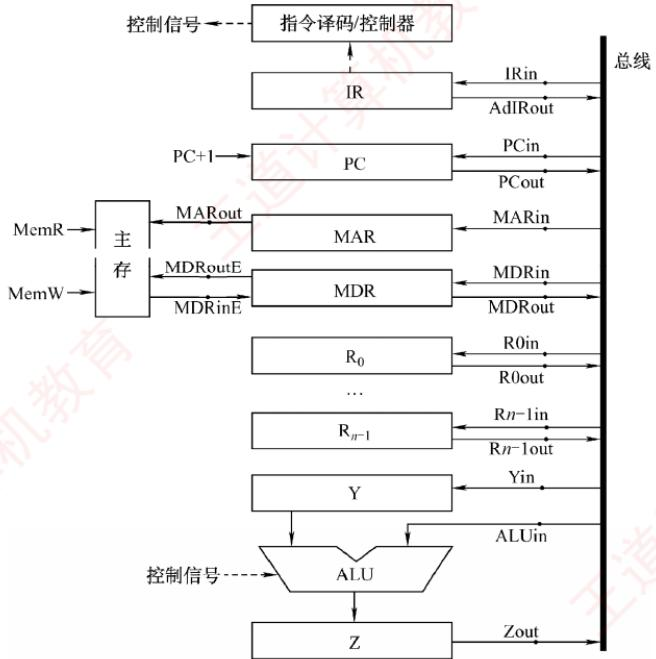

04. 右图是一个简化的 CPU与主存连接结构示意图（图中省略了所有的多路选择器）。其中有一个累加寄存器（ACC）、一个状态寄存器和其他4个寄存器：存储器地址寄存器（MAR）、存储器数据寄存器（MDR）、程序计数器（PC）和指令寄存器（IR），各部件及其之间的连线表示数据通路，箭头表示信息传递方向。

要求：

1)请写出图中a、b、c、d四个寄存器的名称。

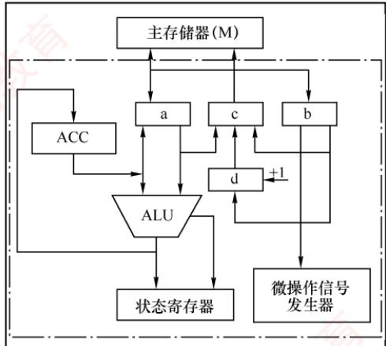

2）简述图中取指令的数据通路。

3）简述数据在运算器和主存之间进行存/取访问的数据通路（假设地址已在MAR中）。

4）简述完成指令LDA X的数据通路（X为主存地址，LDA的功能为(X)→ACC）

5）简述完成指令ADD Y 的数据通路（Y 为主存地址，ADD 的功能为(ACC)+(Y)→ACC)。

6）简述完成指令 STAZ 的数据通路（Z 为主存地址，STA 的功能为(ACC)→Z）。

05. 某机主要功能部件如下图所示，其中M 为主存，MDR为存储器数据寄存器，MAR为存储器地址寄存器，IR为指令寄存器，PC为程序计数器（并假设当前指令地址在PC中），R0\~R3为通用寄存器，C、D为暂存器。

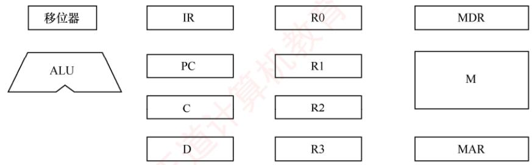

1）请补充各部件之间的主要连接线（总线自己画），并注明数据流动方向。

2）画出“ADD(R1),(R2)+”指令周期流程图，该指令的含义是进行求和运算，源操作数地址在R1中，目的操作数寻址方式为自增型寄存器间接寻址方式（先取地址后加1），并将相加结果写回R2寄存器。

06. 已知单总线计算机结构如下图所示，其中M为主存，XR为变址寄存器，EAR为有效地址寄存器，LATCH 为暂存器。假设指令地址已存在于 PC 中，请给出 ADD X, D 指令周期信息流程和相应的控制信号。说明：

1）ADDX，D指令字中，X为变址寄存器XR，D为形式地址，指令的功能是将变址寻址得到的操作数和ACC中的操作数相加，结果送回ACC。 灿

2）寄存器的输入/输出均采用控制信号控制，如 $\mathrm { P C _ { i } }$ 表示 PC 的输入控制信号， $\mathrm { M D R _ { o } }$ 表示MDR的输出控制信号。 省村

3）凡需要经过总线的传送，都需要注明，如(PC)→MAR，相应的控制信号为 $\mathrm { P C _ { o } }$ 和 $\mathrm { M A R _ { i } }$

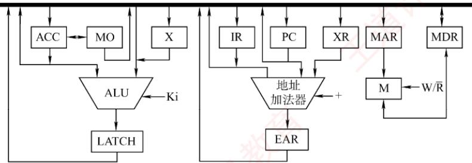

07.【2009统考真题】某计算机字长16位，采用16位定长指令字结构，部分数据通路结构如下图所示。图中所有控制信号为1时表示有效，为0时表示无效。例如，控制信号MDRinE 为1表示允许数据从 DB 打入MDR，MDRin 为1表示允许数据从总线打入MDR。假设 MAR 的输出一直处于使能状态。加法指令“ADD (R1)， $\mathrm { R 0 ^ { \circ } }$ 的功能为(R0)+((R1))→(R1)，即将R0 中的数据与 R1 的内容所指主存单元的数据相加，并将结果送入 R1 的内容所指主存单元中保存。

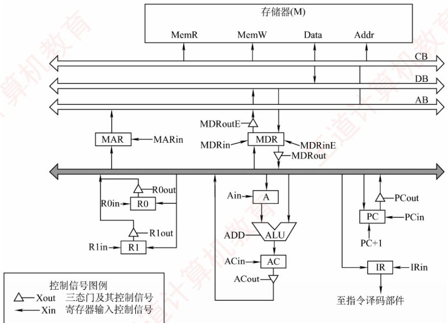

下表给出了上述指令取指和译码阶段每个节拍（时钟周期）的功能和有效控制信号，请按表中描述方式用表格列出指令执行阶段每个节拍的功能和有效控制信号。

<table><tr><td rowspan=1 colspan=1>时钟</td><td rowspan=1 colspan=1>功 能    7</td><td rowspan=1 colspan=1>有效控制信号</td></tr><tr><td rowspan=1 colspan=1>Cl</td><td rowspan=1 colspan=1>MAR←(PC)</td><td rowspan=1 colspan=1>PCout, MARin</td></tr><tr><td rowspan=1 colspan=1>C2</td><td rowspan=1 colspan=1>MDR←M(MAR)PC←(PC) + 1</td><td rowspan=1 colspan=1>MemR, MDRinEPC + 1</td></tr><tr><td rowspan=1 colspan=1>C3</td><td rowspan=1 colspan=1>IR←(MDR)</td><td rowspan=1 colspan=1>MDRout, IRin</td></tr><tr><td rowspan=1 colspan=1>C4</td><td rowspan=1 colspan=1>指令译码</td><td rowspan=1 colspan=1>无</td></tr></table>

08.【2015统考真题】某16位计算机的主存按字节编码，存取单位为16位；采用16位定长指令字格式；CPU采用单总线结构，主要部分如下图所示。图中R0\~R3为通用寄存器；T为暂存器；SR为移位寄存器，可实现直送（mov）、左移一位（left）和右移一位（right）三种操作，控制信号为SRop，SR的输出由信号SRout控制；ALU可实现直送A（mova）、A加B（add）、A减B（sub）、A与B（and）、A或B（or）、非A（not）、A加1（inc）七种操作，控制信号为ALUop。 下道

回答下列问题:

1）图中哪些寄存器是程序员可见的？为何要设置暂存器T？  
2）控制信号ALUop和 SRop 的位数至少各是多少？  
3）控制信号SRout所控制部件的名称或作用是什么？  
4）端点①\~⑨中，哪些端点须连接到控制部件的输出端？

5）为完善单总线数据通路，需要在端点①\~⑨中相应的端点之间添加必要的连线。写出连线的起点和终点，以正确表示数据的流动方向。

6）为什么二路选择器MUX的一个输入端是2？

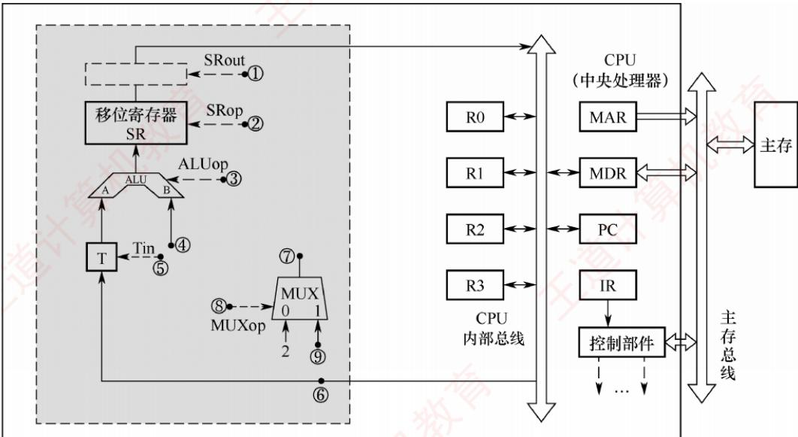  
09.【2015统考真题】上题中描述的计算机，某部分指令执行过程的控制信号如下所示。

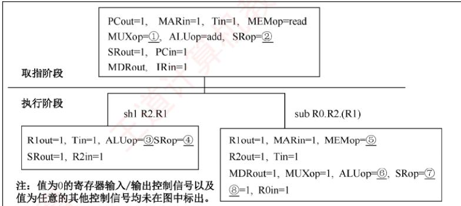

该机指令格式如下图所示，支持寄存器直接和寄存器间接两种寻址方式，寻址方式位分别为0和1，通用寄存器R0\~R3的编号分别为0,1,2和3。

<table><tr><td>指令操作码</td><td colspan="2">目的操作数</td><td colspan="2">源操作数1</td><td colspan="2">源操作数2</td></tr><tr><td>OP</td><td>Md</td><td>Rd</td><td>Ms1</td><td>Rs1</td><td>Ms2</td><td></td></tr><tr><td colspan="7">三地址指令： 源操作数1 OP 源操作数2→ 目的操作数地址</td></tr><tr><td colspan="7"></td></tr><tr><td colspan="2">二地址指令（末3位均为0）：</td><td></td><td colspan="2"></td><td colspan="2">OP 源操作数1 → 目的操作数地址</td></tr><tr><td colspan="2">单地址指令（末6位均为0）：</td><td></td><td></td><td>OP 目的操作数→目的操作数地址</td><td></td></tr><tr><td colspan="2"></td><td colspan="2"></td><td colspan="2"></td></tr></table>

回答下列问题：

1）该机的指令系统最多可定义多少条指令？

2）假定inc、shl 和 sub 指令的操作码分别为01H、02H和 03H，则以下指令对应的机器代码各是什么？① inc R1 ; (R1)+1→R1② shl R2, R1 ;(R1) << 1→R2③ sub R3, (R1), R2 ; ((R1)) − (R2)→R3

3）假设寄存器X的输入和输出控制信号分别为Xin和Xout，其值为1表示有效，为0表示无效（如PCout=1表示PC 内容送总线）；存储器控制信号为MEMop，用于控制存储器的读（read）和写（write）操作。写出本题第一幅图中标号①\~⑧处的控制信号或控制信号的取值。

4）指令“sub R1,R3,(R2)”和“inc R1”的执行阶段至少各需要多少个时钟周期？

10.【2022统考真题】某CPU中部分数据通路如下图所示，其中，GPRs为通用寄存器组;FR为标志寄存器，用于存放ALU产生的标志信息；带箭头虚线表示控制信号，如控制信号Read、Write分别表示主存读、主存写，MDRin表示内部总线上的数据写入MDR，MDRout表示MDR的内容送给内部总线。

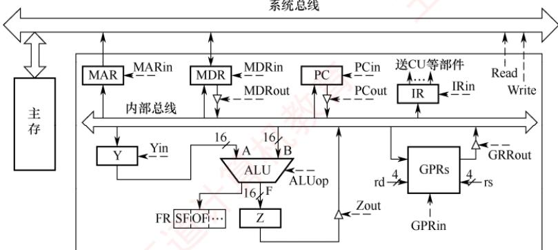

请回答下列问题。

1）设ALU 的输入端A、B 及输出端F的最高位分别为 $\mathrm { A } _ { 1 5 }$ $\mathbf { B } _ { 1 5 }$ 及 $\mathrm { F } _ { 1 5 }$ ，FR中的符号标志和溢出标志分别为 SF 和 OF，则 SF 的逻辑表达式是什么？A 加 B、A 减 B 时 OF 的逻辑表达式分别是什么？要求逻辑表达式的输入变量为 $\mathrm { A } _ { 1 5 }$ $\mathbf { B } _ { 1 5 }$ 及 $\mathrm { F } _ { 1 5 }$

2）为什么要设置暂存器Y和Z?

3）若 GPRs 的输入端 rs、rd 分别为所读、写的通用寄存器的编号，则 GPRs 中最多有多少个通用寄存器？rs 和 rd 来自图中的哪个寄存器？已知 GPRs 内部有一个地址译码器和一个多路选择器，rd应连接地址译码器还是多路选择器？ XTA

4）取指令阶段（不考虑PC增量操作）的控制信号序列是什么？若从发出主存读指令到主存读出数据并传送到MDR共需5个时钟周期，则取指令阶段至少需要几个时钟周期？

5）图中控制信号由什么部件产生？图中哪些寄存器的输出信号会连到该部件的输入端？

## 5.3.6 答案与解析

## 一、单项选择题

## 01. C

对CPU而言，数据通路的基本结构分为总线结构和专用数据通路结构，其中总线结构又分为单总线结构、双总线结构、多总线结构。

## 02. D

数据通路中的部件包括组合逻辑元件和时序逻辑元件。数据通路的功能由控制部件送出的控制信号决定。数据通路中一个重要的组合逻辑元件为ALU，用于执行各类算术和逻辑运算；另一个重要的元件为通用寄存器，属于时序逻辑元件。

## 03. C

操作元件的输出仅取决于当前的输入，不受时钟信号的控制，也没有存储数据的功能。状态元件的最大特点是具有存储数据的功能。算术逻辑部件和译码器都不具有存储功能，属于操作元件；移位寄存器和存储器数据寄存器属于不同功能的寄存器，具有存储功能，属于状态元件。

## 04. D

因为ALU是一个组合逻辑元件，所以其运算过程中必须保持两个输入端的内容不变。又因为CPU内部采用单总线结构，所以为了得到两个不同的操作数，ALU的一个输入端与总线相连，另一个输入端需通过一个寄存器与总线相连。此外，ALU的输出端也不能直接与内部总线相连，否则其输出又会通过总线反馈到输入端，影响运算结果，因此输出端需通过一个暂存器（用来暂存结果的寄存器）与总线相连。 道

## 05. C

三态门可视为一种控制开关，由控制端决定信号线的通断，能输出到内部总线的部件均通过一个三态门与内部总线相连，用于控制该部件与内部总线之间数据通路的连接与断开。

## 06. B

当CPU内部电路采用总线连接方式时，总线上信号流动的原则如下：每个时刻只有一个器件发出信息（否则会导致总线冲突），每个时刻可以有一个或多个器件接收信息。

## 07. A

CPU通过时钟信号定时执行指令，但并非每个时钟周期都会执行一条新指令。在多周期CPU中，指令的执行被划分为多个阶段，每个时钟周期开始执行一个阶段，选项A错误。每个阶段的操

作通常由时钟信号的上升沿或下降沿触发，称为边沿触发，并且决定了状态元件（如寄存器）的状态改变。为确保每个阶段都在一个时钟周期内完成，时钟周期必须足够长，以便数据能在最慢的组合逻辑电路中传输，因此时钟周期通常根据相邻状态单元之间最长的组合逻辑延迟来确定。

## 08. A

说法Ⅰ不一定：主存访问受存储器速度限制，通常需要多个时钟周期。说法Ⅱ一定：单周期CPU的每条指令在一个时钟周期内完成。说法Ⅲ一定：在CPU内部数据通路中，数据从一个状态元件传送到另一个状态元件的操作由时钟同步，耗时等于一个时钟周期。说法IV一定：流水段寄存器之间的数据传递由时钟边沿触发，严格对应一个时钟周期。说法V不一定：ALU运算由组合逻辑实现，其延迟由电路决定，在单周期CPU中必须小于一个时钟周期，以满足单周期设计约束。

## 09. A

单周期CPU要求所有指令在一个时钟周期内完成，其时钟周期由最慢指令决定；加入复杂指令会显著延长时钟周期，拖累整体性能。而多周期CPU可将复杂指令分解为多个节拍，每节拍使用标准周期，不影响主频，更易支持复杂操作。单周期CPU需大量专用通路实现并行，硬件冗余高、利用率低；多周期CPU通过部件复用，资源利用更高效。

## 10. C

多周期CPU中的指令通常需要多个时钟周期才能完成，CPI>1；单周期CPU的每条指令在一个时钟周期内完成，CPI=1。单周期CPU的时钟周期取决于最复杂指令的耗时，通常比多周期CPU的时钟周期长。在一条指令的执行过程中，单周期CPU的每个控制信号保持不变，每个部件只能使用一次；多周期CPU的控制信号可能发生改变，同一个部件可使用多次。

## 11. C

单周期CPU需要在一个时钟周期内并行完成取指、运算和访存，而单总线结构无法同时传输多路数据：其时钟周期由最慢指令决定，通常远大于多周期CPU，总执行时间未必更短。多周期CPU通过分时复用，在不同节拍访问同一存储器，实现指令与数据共存；而单周期CPU需要在同一时钟周期内取指和访存，必须采用分离的指令/数据存储器，选项C正确。由于需要专用通路和冗余硬件以支持并行操作，单周期CPU的芯片面积与成本通常高于采用部件复用的多周期CPU。

## 12. B

单总线结构通过一条共享总线分时串行传输数据，硬件简单、状态少、控制逻辑简洁；但因同一时刻仅能传输一次数据，性能较低，且容易引发总线冲突。相比之下，专用通路结构采用独立连线支持并行操作，性能更高、冲突更少，也相应带来了更大的硬件规模。

## 13. D

读/写控制信号线决定了是从存储器读还是向存储器写，显然选项A、B、C都正确。

## 14. C

单周期CPU在一个时钟周期内完成整条指令的执行：指令从存储器读出后，其各字段（如opcode、rs、rt、imm）通过组合逻辑直接驱动控制单元、寄存器堆和ALU等部件，解析与执行同步进行，无须经由R暂存；若设置IR，则取指到IR至少需要一个时钟周期，违背单周期设计原则。此外，PC每周期无条件更新为下一条指令地址，始终写入，无须“写使能”信号。

## 15. A

单周期处理器中所有指令的指令周期为一个时钟周期，选项D正确。因为每条指令的CPI为1，要考虑比较慢的指令，所以处理器的时钟频率较低，选项B正确。单总线数据通路将所有寄存器的输入输出端都连接在一条公共通路上，一个时钟内只允许一次操作，无法完成指令的所有操作，选项A错误。控制信号是CU根据指令操作码发出的信号，对于单周期处理器来说，每条指令的执行只有一个时钟周期，而在一个时钟周期内控制信号并不会变化；若是多周期处理器，则指令的执行需要多个时钟周期，在每个时钟周期控制器会发出不同信号，选项C正确。

## 16. D

时钟信号的宽度称为时钟周期，时钟周期的倒数为机器主频。时钟信号由机器脉冲源发出的脉冲信号经整形和分频后形成，时钟周期以相邻状态单元间组合逻辑电路的最大延迟为基准确定。对于单周期CPU，一个指令周期就是一个时钟周期，每个时钟周期执行一条新指令；对于多周期CPU，每个指令周期（包含若于时钟周期）执行一条新指令；对于流水线CPU，只有在理想情况下才能实现每个时钟周期执行一条新指令，选项D的描述有误。

## 17. C

指令执行过程中数据所经过的路径，包括路径上的部件，称为数据通路。ALU、通用寄存器、状态寄存器、Cache、MMU、浮点运算逻辑、异常和中断处理逻辑等，都是指令执行过程中数据流经的部件，都属于数据通路的一部分。数据通路中的数据流动路径由控制部件控制，控制部件根据每条指令功能的不同，生成对数据通路的控制信号。选项C错误。 x

## 18. B

组合逻辑元件（操作元件）不含存储信号的记忆单元，任何时刻产生的输出仅取决于当前的输入，加法器、算术逻辑单元（ALU）、译码器、多路选择器、三态门等都属于操作元件。时序逻辑元件（状态元件）包含存储信号的记忆单元，各类寄存器和存储器，如通用寄存器组、程序计数器、状态/移位/暂存/锁存寄存器等，都属于状态元件。

## 二、综合应用题

## 01.【解答】

实现ADDR1,(R2)的微操作序列如下：

```csv
微操作
(PC)→MAR
M→MDR
(PC) +1→PC
(MDR) →IR
(R1) →LA
(R2) →MAR
M→MDR
(MDR) →LB
(LA) +(LB) →R1
```

## 02.【解答】

两条指令的微操作序列和控制信号如下。

（1） ADD B, C 指令。

微操作 控制信号   
(PC)→MAR PCout, MARin   
(PC) +1→PC +1   
M (MAR) →MDR MDRin   
MDR→IR MDRout, IRin   
(B) →Y Bout, Yin   
(Y) + (C) →Z Cout, ALUin,   
(Z)→B Zout, Bin

(2) SUB ACC, H 指令。

<table><tr><td>微操作</td><td>控制信号</td></tr><tr><td>(PC)→MAR</td><td>PCout，MARin</td></tr><tr><td>(PC) +1→PC</td><td>+1</td></tr><tr><td>M (MAR) →MDR</td><td>MDRin</td></tr></table>

<table><tr><td>MDR→IR</td><td>MDRout, IRin</td></tr><tr><td>(ACC) →Y</td><td>ACCout,Yin</td></tr><tr><td></td><td>“_”</td></tr><tr><td>(Y) -(H) →Z (Z) →ACC</td><td>Hout, ALUin, Zout, ACCin</td></tr></table>

注：Y是与ALU的一个输入端相连接的暂存器。

## 03.【解答】

指令 ADD (R0), R1 的功能是把 R0 的内容作为地址送到主存中取得一个操作数，再与 R1 中的内容相加，最后将结果送回主存，即实现((R0))+(R1)→(R0)。其流程和控制信号如下。

## 1）取指周期：公共操作。

<table><tr><td rowspan=1 colspan=1>时序</td><td rowspan=1 colspan=1>微操作</td><td rowspan=1 colspan=1>有效控制信号</td><td rowspan=1 colspan=1>具体功能</td></tr><tr><td rowspan=1 colspan=1>1</td><td rowspan=1 colspan=1>(PC)→MAR</td><td rowspan=1 colspan=1>PCout, MARin</td><td rowspan=1 colspan=1>将PC 经内部总线送至 MAR</td></tr><tr><td rowspan=1 colspan=1>2</td><td rowspan=1 colspan=1>M(MAR)→MDR, Read</td><td rowspan=1 colspan=1>MemR, MARout, MDRinE</td><td rowspan=1 colspan=1>主存通过数据总线将MAR所指单元的内容送至MDR</td></tr><tr><td rowspan=1 colspan=1>3</td><td rowspan=1 colspan=1>(MDR)→IR</td><td rowspan=1 colspan=1>MDRout, IRin</td><td rowspan=1 colspan=1>将 MDR 的内容送至 IR</td></tr><tr><td rowspan=1 colspan=1>4</td><td rowspan=1 colspan=1>指令译码</td><td rowspan=1 colspan=1></td><td rowspan=1 colspan=1>操作字开始控制 CU</td></tr><tr><td rowspan=1 colspan=1>5</td><td rowspan=1 colspan=1>(PC) +1→PC</td><td rowspan=1 colspan=1>1</td><td rowspan=1 colspan=1>当PC加1有效时，使PC内容加1</td></tr></table>

2）取数周期：完成取数操作，被加数在主存中，加数已经放在寄存器R1中。

<table><tr><td rowspan=1 colspan=1>时序</td><td rowspan=1 colspan=1>微操作</td><td rowspan=1 colspan=1>有效控制信号</td><td rowspan=1 colspan=1>具体功能</td></tr><tr><td rowspan=1 colspan=1>1</td><td rowspan=1 colspan=1>(R0)→MAR</td><td rowspan=1 colspan=1>R0out, MARin</td><td rowspan=1 colspan=1>将R0中的地址（形式地址）送至存储器地址寄存器</td></tr><tr><td rowspan=1 colspan=1>2</td><td rowspan=1 colspan=1>M(MAR)→MDR</td><td rowspan=1 colspan=1>MemR, MARout, MDRinE</td><td rowspan=1 colspan=1>主存通过数据总线将MAR所指单元的内容（有效地址）送至MDR 中</td></tr><tr><td rowspan=1 colspan=1>3</td><td rowspan=1 colspan=1>(MDR)→Y</td><td rowspan=1 colspan=1>MDRout, Yin</td><td rowspan=1 colspan=1>将 MDR 中数据通过数据总线送至 Y</td></tr></table>

3）执行周期：完成加法运算，并将结果返回主存。

<table><tr><td rowspan=1 colspan=1>时序</td><td rowspan=1 colspan=1>微操作</td><td rowspan=1 colspan=1>有效控制信号</td><td rowspan=1 colspan=1>具体功能</td></tr><tr><td rowspan=1 colspan=1>1</td><td rowspan=1 colspan=1>(R1) + (Y)→Z</td><td rowspan=1 colspan=1>R1out, ALUin，CU 向 ALU发 ADD 控制信号</td><td rowspan=1 colspan=1>R1的内容和Y的内容相加，结果送至寄存器Z</td></tr><tr><td rowspan=1 colspan=1>2</td><td rowspan=1 colspan=1>(Z)→MDR</td><td rowspan=1 colspan=1>Zout, MDRin</td><td rowspan=1 colspan=1>将运算结果送至MDR</td></tr><tr><td rowspan=1 colspan=1>3</td><td rowspan=1 colspan=1>(MDR)→M(MAR)</td><td rowspan=1 colspan=1>MemW, MDRoutE,MARout</td><td rowspan=1 colspan=1>向主存写入数据</td></tr></table>

## 04.【解答】

1）b单向连接微控制器，由微控制器的作用可以推出b是IR；a和c直接连接主存，只可能是MDR和MAR，c到主存是单向连接，a和主存双向连接，根据指令执行的特点，MAR只单向给主存传送地址，而MDR既存放从主存中取出的数据，又存放将要写入主存的数据，因此c为MAR，a为MDR。d具有自动加1的功能，且单向连接MAR，为PC。因此，a为MDR，b为IR，c为MAR，d为PC。

2）将指令地址从 PC 送入MAR，在相关的控制下从主存中取出指令送至 MDR，然后将MDR中的指令送至IR，最后流向微控制器。取指令的数据通路为

$$
 PC  \rightarrow  MAR  \rightarrow  主存  \rightarrow  MDR  \rightarrow  IR
$$

3）根据MAR中的地址从主存取数据，将取出的数据送至MDR，然后将MDR中的数据送至ALU进行运算，运算的结果送至ACC。存储器读的数据通路为MAR（先置数据地址），主存→MDR→ALU→ACC将ACC中的结果送至MDR，再将MDR中的数据写入主存。存储器写的数据通路为MAR（先置数据地址），ACC→MDR→主存

## 4）指令LDAX的数据通路为

$$
\mathrm{X} \rightarrow \mathrm{MAR} \rightarrow  主存  \rightarrow \mathrm{MDR} \rightarrow \mathrm{ALU} \rightarrow \mathrm{ACC}
$$

5）指令ADDY的数据通路为

$$
\begin{aligned} Y  \rightarrow  MAR  \rightarrow  主存  \rightarrow  MDR  \quad & \quad \rightarrow \quad  ALU  \rightarrow  ACC  \\ ACC  \quad & \longrightarrow \quad  ALU  \rightarrow  ACC \end{aligned}
$$

6）指令 STAZ的数据通路为（ACC中的数据需放在主存中）

$$
Z \to  MAR ,  ACC  \to  MDR  \to  主存
$$

## 05.【解答】

1）各功能部件的连接关系及数据通路如下图所示。

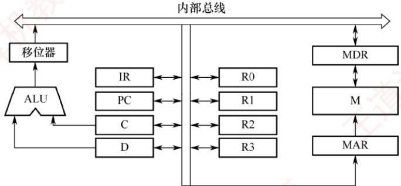

2）分析过程如下：

● 取指令地址送到IR并译码。

● 取源操作数和目的操作数。

● 将源操作数和目的操作数相加送到MAR，随之送到以前目的操作数所在内存的地址。

● 将寄存器 R2 的内容加 1。

取指周期流程如下图所示。

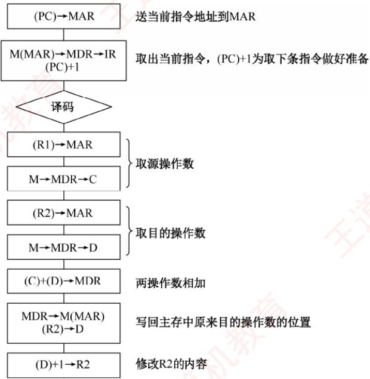

## 06.【解答】

ADDX,D指令周期信息流程和相应的控制信号见下表。

<table><tr><td rowspan=1 colspan=1>周期</td><td rowspan=1 colspan=1>微操作</td><td rowspan=1 colspan=1>1         有效控制信号</td></tr><tr><td rowspan=3 colspan=1>取指周期</td><td rowspan=1 colspan=1>(PC)→MAR</td><td rowspan=1 colspan=1>PCo, MAR</td></tr><tr><td rowspan=1 colspan=1>M(MAR)→MDR(PC) + 1→PC</td><td rowspan=1 colspan=1>MAR0, R/W, MDR+1</td></tr><tr><td rowspan=1 colspan=1>(MDR)→IR</td><td rowspan=1 colspan=1>MDR{0, IR</td></tr><tr><td rowspan=6 colspan=1>执行周期</td><td rowspan=1 colspan=1>(XR) + Ad(IR)→EAR</td><td rowspan=1 colspan=1>XR0, IR0, +, EAR</td></tr><tr><td rowspan=1 colspan=1>(EAR)→MAR</td><td rowspan=1 colspan=1>EAR0, MAR</td></tr><tr><td rowspan=1 colspan=1>M(MAR)→MDR</td><td rowspan=1 colspan=1>MAR0, R/W, MDR</td></tr><tr><td rowspan=1 colspan=1>(MDR)→X</td><td rowspan=1 colspan=1>MDR0, X</td></tr><tr><td rowspan=1 colspan=1>N(ACC) + (X)→LATCH</td><td rowspan=1 colspan=1>ACC0, X0, K = +, LATCHj</td></tr><tr><td rowspan=1 colspan=1>北   (LATCH)→ACC</td><td rowspan=1 colspan=1>LATCH0, ACC         XWN</td></tr></table>

注：题目中的D即为Ad(IR)。

## 07.【解答】

题于已给出取值和译码阶段每个节拍的功能和有效控制信号，我们应以了解取指阶段中数据通路的信息流动为突破口，读懂每个节拍的功能和有效控制信号，然后应用到解题思路中，包括划分执行步骤、确定完成的功能、需要的控制信号。 H

先分析题干中提供的示例（本部分解题时不做要求）：

取指令的功能是根据PC的内容所指的主存地址，取出指令代码，经过MDR，最终送至IR。这部分和后面的指令执行阶段的取操作数、存运算结果的方法是相通的。

## C1：(PC)→MAR

在读/写存储器前，必须先将地址（这里为(PC)）送至MAR。

C2: M(MAR)→MDR, (PC) + 1→PC

读/写的数据必须经过MDR，指令取出后PC自增1。

C3：(MDR)→IR

然后将读到的MDR中的指令代码送至IR进行后续操作。

指令“ADD(R1),R0”的操作数一个在主存中，一个在寄存器中，运算结果在主存中。根据指令功能，要读出 R1 的内容所指的主存单元，必须先将 R1 的内容送至 MAR，即(R1)→MAR。而读出的数据必须经过MDR，即 M(MAR)→MDR。

因此，将R1的内容所指的主存单元的数据读出到MDR的节拍安排如下：

C5：(R1)→MAR

C6： M(MAR)→MDR

ALU一端是寄存器A，MDR或RO 中必须有一个先写入A中，如 MDR。

## C7：(MDR)→A

然后执行加法操作，并将结果送入寄存器AC。

C8：(A)+(R0)→AC

之后将加法结果写回到R1的内容所指的主存单元，注意MAR中的内容没有改变。

C9：(AC)→MDR

C10：(MDR)→M(MAR)

有效控制信号的安排并不难，只需看数据是流入还是流出，如流入寄存器X就是Xin，流出寄存器X就是Xout。还需注意其他特殊控制信号，如PC+1、Add等。

于是得到参考答案如下表所示。

<table><tr><td rowspan=1 colspan=1>时钟</td><td rowspan=1 colspan=1>功能1</td><td rowspan=1 colspan=1>有效控制信号</td></tr><tr><td rowspan=1 colspan=1>C5</td><td rowspan=1 colspan=1>MAR←(R1)</td><td rowspan=1 colspan=1>R1out, MARin</td></tr><tr><td rowspan=1 colspan=1>C6</td><td rowspan=1 colspan=1>MDR←M(MAR)</td><td rowspan=1 colspan=1>MemR, MDRinE</td></tr><tr><td rowspan=1 colspan=1>C7</td><td rowspan=1 colspan=1>A←(MDR)</td><td rowspan=1 colspan=1>MDRout, Ain</td></tr><tr><td rowspan=1 colspan=1>C8</td><td rowspan=1 colspan=1>AC←(A) + (R0)</td><td rowspan=1 colspan=1>R0out, ADD, ACin</td></tr><tr><td rowspan=1 colspan=1>C9</td><td rowspan=1 colspan=1>V    MDR←(AC)</td><td rowspan=1 colspan=1>ACout, MDRin</td></tr><tr><td rowspan=1 colspan=1>C10</td><td rowspan=1 colspan=1>M(MAR)←(MDR)</td><td rowspan=1 colspan=1>MDRoutE, MemW</td></tr></table>

本题答案不唯一，若在C6 执行M(MAR)→MDR的同时，完成(R0)→A[选择将(R0)写入A]，并不会发生总线冲突，这种方案可节省1个节拍，见下表。 育

<table><tr><td rowspan=1 colspan=1>时钟妆</td><td rowspan=1 colspan=1>功能</td><td rowspan=1 colspan=1>有效控制信号     M</td></tr><tr><td rowspan=1 colspan=1>C5</td><td rowspan=1 colspan=1>MAR←(R1)</td><td rowspan=1 colspan=1>R1out, MARin</td></tr><tr><td rowspan=1 colspan=1>C6</td><td rowspan=1 colspan=1>MDR←M(MAR), A←(R0)</td><td rowspan=1 colspan=1>MemR, MDRinE, R0out, Ain</td></tr><tr><td rowspan=1 colspan=1>C7</td><td rowspan=1 colspan=1>AC←(MDR) + (A)</td><td rowspan=1 colspan=1>MDRout, ADD, ACin</td></tr><tr><td rowspan=1 colspan=1>C8</td><td rowspan=1 colspan=1>MDR←(AC)</td><td rowspan=1 colspan=1>ACout, MDRin</td></tr><tr><td rowspan=1 colspan=1>C9</td><td rowspan=1 colspan=1>M(MAR)←(MDR)</td><td rowspan=1 colspan=1>MDRoutE, MemW</td></tr></table>

## 08.【解答】

1）程序员可见寄存器为通用寄存器（R0～R3）和PC。因为采用了单总线结构，因此若无暂存器T，则ALU的A、B端口会同时获得两个相同的数据，使数据通路不能正常工作。

2）ALU共有7种操作，其操作控制信号 ALUop至少需要3位；移位寄存器有3种操作，其操作控制信号 SRop 至少需要2 位。 七手

3）信号SRout所控制的部件是一个三态门，用于控制移位器与总线之间数据通路的连接与断开。 -X

4）端口①、②、③、⑤、⑧须连接到控制部件输出端。

5）连线1，⑥→⑨；连线2，⑦→④。

6）因为每条指令的长度为16位，按字节编址，所以每条指令占用2个内存单元，顺序执行时，下条指令地址为(PC)+2。MUX的一个输入端为2，可便于执行(PC)+2操作。

## 09.【解答】

1）指令操作码有7位，因此最多可定义 $2 ^ { 7 }   =   1 2 8$ 条指令。

2）各条指令的机器代码如下：

①“inc R1”的机器码为 0000001 0 01 0 00 0 00，即 0240H。

②“shl R2,R1”的机器码为 0000010 0 10 0 01 0 00，即 0488H。

③“sub R3,(R1),R2”的机器码为 0000011 011 1 01 0 10，即 06EAH。

3）各标号处的控制信号或控制信号取值如下：

①0; ②mov; ③mova; ④left；⑤read; ⑥sub; ⑦mov； ⑧SRout。

4）指令“sub R1,R3,(R2)”的执行阶段至少包含4个时钟周期；指令“inc R1”的执行阶段至少包含2个时钟周期。 √

## 10.【解析】

1）符号标志SF表示运算结果的正负性，因此 $\mathrm{SF} = \mathrm{F}_{15}$

对于加法运算A+B→F，若A、B为负，且F为正，则说明发生溢出；或者，若A、B为正，且F为负，也说明发生溢出。因此，加运算时，溢出标志 $\mathrm{OF} = \overline{\mathrm{A}_{15}} \cdot \overline{\mathrm{B}_{15}} \cdot \mathrm{F}_{15} + \mathrm{A}_{15} \cdot \mathrm{B}_{15} \cdot \overline{\mathrm{F}_{15}}$ 0对于减法运算A-B→F，若A为负、B为正，且F为正，则说明发生溢出；或者，若A为正、B为负，且F为负，也说明发生溢出。因此，减运算时，溢出标志 $\mathrm{OF} = \overline{\mathrm{A}_{15}} \cdot \mathrm{B}_{15} \cdot \mathrm{F}_{15} +$

$$
\mathrm { A } _ { 1 5 } \cdot \overline { { \mathrm { B } _ { 1 5 } } } \cdot \overline { { \mathrm { F } _ { 1 5 } } } \mathrm { ~  。  ~ }
$$

2）因为在单总线结构中，每一时刻总线上只有一个数据有效，而ALU有两个输入端和一个输出端。因此，当ALU运算时，需要先用暂存器Y缓存其中一个输入端的数据，再通过总线传送另一个输入端的数据。与此同时，ALU的输出端产生运算结果，但总线正被占用，因此需要暂存器Z，以缓存ALU的输出端数据。

3）由图可知，rs和 rd都是 4bit，因此 GPRs 中最多有 $2 ^ { 4 }   =   1 6$ 个通用寄存器；rs 和 rd 来自指令寄存器（IR）；rd表示寄存器编号，应连接地址译码器。

4）取指阶段需要根据程序计数器（PC）取出主存中的指令，并将指令写入指令寄存器（IR）中。控制信号序列如下： uK

$$
\begin{aligned}&\textcircled{i}  \texttt{PCout}, \texttt{MRkin} \quad & // 将指令的地址写入  \texttt{MR} \\&\textcircled{2}  \texttt{Read} \quad & // 读主存 , \texttt{并将读出的数据写入 } \texttt{MDR} \\&\textcircled{3}  \texttt{MDRout}, \texttt{TRin} \quad & // 将  \texttt{MDR}  的内容写入指令寄存器  (\texttt{LR})\end{aligned}
$$

步骤①需要1个时钟周期，步骤②需要5个时钟周期，步骤③需要1个时钟周期，因此取指令阶段至少需要7个时钟周期。 X

5）图中控制信号由控制部件（CU）产生。指令寄存器（IR）和标志寄存器（FR）的输出信号会连到控制部件的输入端。

## 5.4 控制器的功能和工作原理

## 5.4.1 控制器的结构和功能

在计算机硬件系统中（见图5.12），主要由执行部件、主存储器、输入/输出设备及控制器组成。各组件通过数据总线、地址总线和控制总线相互连接，其中虚线框内为控制器。

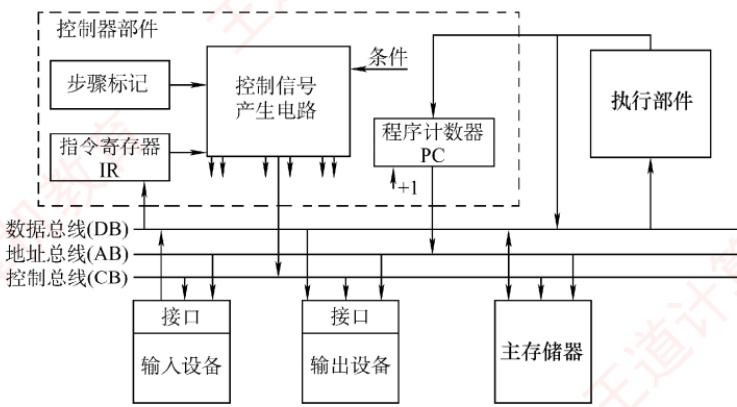  
图5.12 计算机硬件系统和控制器部件的组成

各部件的主要连接关系如下：

1）执行部件经由数据总线与主存及I/O设备交换数据。

2）输入/输出设备通过接口电路接入系统总线。

3）主存及I/O设备根据地址总线上的地址信号判断是否被选中，并依据控制总线上的读/写等控制信号，通过数据总线完成数据传输。

4）控制器通过地址总线发送指令地址（PC的值）访问主存，并将获取的指令通过数据总线送入指令寄存器（IR），由控制器解析并控制执行。

控制器是计算机的指挥中心，其主要职责包括：

1）取出待执行的指令并计算下一条指令的位置（更新PC）。

2）对指令的操作码进行解码，产生对应的时序信号和控制信号，以协调各部件工作。

3）管理CPU、主存和I/O设备间的数据流向及时序，确保指令正确执行。

依据微操作控制信号的生成方式不同，控制器可分为硬布线控制器和微程序控制器。尽管两者都包含PC和IR，但在指令执行步骤的表现形式以及控制信号的生成机制上有着本质区别。

## 5.4.2 硬布线控制器

硬布线控制器由复杂的组合逻辑电路和触发器构成，也称组合逻辑控制器。它根据指令需求、

当前时序和内部状态，按时间顺序生成一系列微操作控制信号，以完成指令的执行。指令的操作码是决定控制单元（CU）行为的关键：CU作为处理器的“指挥中心”，依据操作码生成相应的控制信号，协调寄存器、ALU、存储器等硬件组件的工作。

为简化CU的设计，通常将指令寄存器(IR)中的 n位操作码通过译码电路转换为 2ⁿ个输出信号。每种操作码经译码后，会唯一地激活一条输出信号线，用于触发对应的控制逻辑。若将操作译码器和节拍发生器从CU中分离，则可得到如图5.13所示的简化控制单元结构。

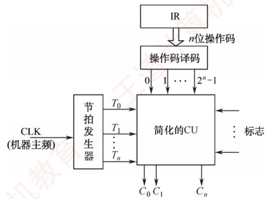  
图 5.13 带指令译码器和节拍输入的简化的控制单元框图

CU的输入主要包括三类信号：

1）操作译码器输出的指令信息，与节拍信号共同用于生成相应的微操作控制信号。

2）时钟脉冲，其频率即机器主频，用于划分节拍，确保控制信号按时发出。

3）执行单元反馈的状态标志，使CU能根据CPU当前状态动态调整控制逻辑。

在图5.13中，节拍发生器在每个时钟周期内产生节拍信号，使不同的微操作控制信号C能够按序发出。由于某些指令（如条件转移）的执行不仅取决于操作码，还受状态标志影响，CU必须综合操作码译码结果、节拍信号和状态标志，生成相应的控制信号，并发送至CPU内部数据通路或外部控制总线。 饰村

硬布线控制器通过组合逻辑电路实现，其性能主要受限于电路延迟。设计时，先用逻辑表达式描述各控制信号，经化简后实现为硬件电路。该方法虽响应速度快，但灵活性差：修改或新增指令需重新设计电路，复杂且耗时。同时，随着指令系统功能增强，微操作控制信号的数量急剧增加，导致电路规模庞大、调试困难。为克服这些缺点，微程序设计方法应运而生。

## 5.4.3 微程序控制器

微程序控制器采用存储逻辑实现，其核心思想是：将控制器所需的微操作控制信号组织为微指令，并将执行每条机器指令所需的微指令序列（微程序）预先存入一个专用的高速存储器中。运行时，控制器通过依次读取微指令，生成相应的微操作控制信号，从而完成指令的执行。

## 1. 微程序控制的基本概念

微程序的设计思想是将每条机器指令编写为一段微程序。该微程序由若干条微指令组成，每条

微指令可产生一个或多个微命令。因此，执行一条机器指令的过程，实质上就是顺序执行其对应微程序的过程。这些微程序预先存放在专用的控制存储器（ControlMemory，CM）中。

微程序设计涉及以下基本术语：

## （1）微命令与微操作

在微程序控制的计算机中，控制部件向执行部件发出的最基本控制信号称为微命令，它是构成控制序列的最小单位。例如，使能某个寄存器的写入信号、打开数据通路中的控制门等。执行部件接收到微命令后所执行的具体动作称为微操作，二者一一对应。

微命令可分为两类：相容性微命令是指可同时有效、协同完成某一功能的微命令；互斥性微命令是指在同一时刻不允许同时有效的微命令。 妙育

## 注意

硬布线控制器中同样存在微命令与微操作的概念，只是其实现方式不同。

## (2）微指令与微周期

微指令是若干微命令的集合，通常包含两个字段：

①操作控制字段（又称微操作码字段）：用于生成当前步骤所需的微操作控制信号。

②顺序控制字段（又称下址字段）：用于确定下一条微指令的地址。

微周期是执行一条微指令所需的基本时间单位，通常为一个时钟周期。

综上，机器指令、微程序、微指令、微命令与微操作之间的层次关系如图5.14所示。

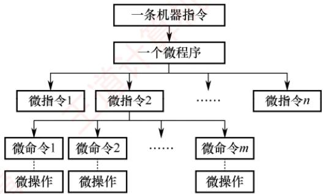  
图5.14机器指令、微程序、微指令、微命令与微操作之间的层次关系

## （3）主存储器与控制存储器

## 考点追踪主存储器和控制存储器的区别（2017）

主存储器用于存放程序和数据，位于CPU外部，通常用RAM实现。控制存储器用于存放微程序，位于CPU内部，通常用ROM实现。控制存储器中每个存储单元的地址称为微地址。

## （4）程序与微程序

微程序和程序是两个不同的概念。程序是指令的有序集合，由软件开发者编写，用于完成特定功能，最终存放在主存或辅存中；微程序是微指令的有序集合，由计算机体系结构设计者编写，用于解释和执行机器指令，固化于控制存储器中。微程序本质上是机器指令的硬件级解释逻辑。对程序员而言，微程序的存在完全透明，无须了解其内部结构。

为准确理解微程序控制器的工作机制，需要区分以下关键寄存器：

①地址寄存器（MAR），存放主存读/写地址。

②微地址寄存器（μPC或CMAR），存放待执行微指令在控制存储器中的微地址。

③指令寄存器（IR），存放从主存读出的当前机器指令。

④微指令寄存器（μIR或CMDR），存放从控制存储器读出的当前微指令。

## 2. 微程序控制器的组成和工作过程

## （1）微程序控制器的基本组成

图5.15展示了微程序控制器的基本结构，其主要由以下部件构成：

①微地址形成部件，根据机器指令的操作码生成对应微程序的入口地址，并依据当前微指令的顺序控制字段及状态条件，产生后续微地址，确保微指令有序执行。

②微指令地址寄存器，接收微地址形成部件提供的微地址，作为CM的读地址。

③控制存储器，微程序控制器的核心部件，用于存放所有机器指令对应的微程序。

④微指令寄存器，暂存从CM中读出的微指令，并将其操作控制字段和顺序控制字段分别送至执行单元和微地址形成部件。

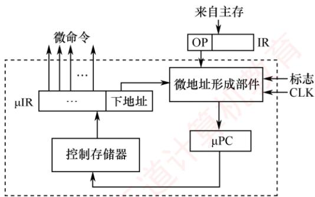  
图 5.15 微程序控制器的基本结构

（2）微程序控制器的工作过程

微程序控制器的工作过程是指计算机在微程序控制下执行机器指令的流程，具体如下：

①执行取指令公共操作。系统启动或每条指令执行完毕后，将取指微程序的入口地址（通常为CM的0号单元）送入 $\mu \mathrm { P C }$ 。随后，从CM中读取首条取指微指令并送入μIR。完成取指微程序后，从主存中取出的机器指令即被存入指令寄存器（IR）中。

②生成当前指令的微程序入口地址：根据IR中机器指令的操作码，通过微地址形成部件产生对应微程序的起始微地址，并送入 $\mu \mathrm { P C }$

③顺序执行微程序：从CM逐条读取微指令，送入μIR并执行，直至该微程序执行完毕。

④返回循环：当前机器指令对应的微程序执行结束后，控制器自动转移回取指微程序的入口（步骤①），重新开始处理下一条机器指令。

整个流程不断循环，直至整个程序执行完毕。

## （3）微程序和机器指令

一般而言，一条机器指令对应一个微程序。由于所有指令的取指操作相同，可将取指操作的微命令统一编写为一个公共的取指微程序，专门负责从主存读取指令并送入IR。此外，还可以为间址、中断处理等公共操作分别编写独立的微程序。因此，控制存储器中存储的微程序总数=机器指令条数+公共微程序数（如取指、间址、中断等）。

## 3． 微指令的编码方式

微指令的编码方式也称微指令的控制方式，是指对微指令操作控制字段进行组织和表示的方法，其目标是在保证执行速度的前提下，尽可能缩短微指令字长，从而节省控制存储器空间。

## （1）直接编码（直接控制）方式

如图5.16所示，直接编码方式无须译码。微指令的操作控制字段中，每一位直接对应一个微命令。设计微指令时，若需发出某个微命令，只需将对应位设为1，否则设为0。每个微命令独立控制数据通路中的一个微操作。 X

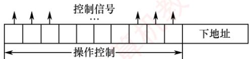  
图 5.16 直接编码方式

该方式的优点是结构简单、直观，微命令可并行发出，执行速度快；缺点是微指令字长过长，若有n个微命令，则操作控制字段需要n位，导致控制存储器容量急剧膨胀。

## (2)字段直接编码方式

## 考点追踪字段直接控制的编码方式（2012）

如图5.17所示，字段直接编码将操作控制字段划分为若于互斥段。互斥性微命令被归入同一字段，相容性微命令则分配到不同字段。每个字段独立编码，经译码后在其所属的互斥微命令集中激活一个微命令。各字段之间相互独立，编码含义互不影响。 KI

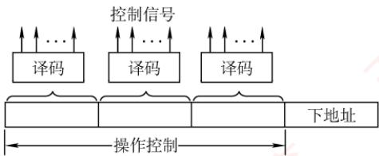  
图 5.17 字段直接编码方式

微命令字段分段需遵循以下原则：

①互斥性微命令应分配在同一字段，而相容性微命令应分布在不同字段。

②每个字段的位数不宜过多，以避免译码电路过于复杂或引入较大延迟。

③每个字段通常还需预留一个编码表示“本字段无操作”。例如，当字段长度为3位时，最多只能表示7个互斥的微命令，通常用000表示无操作。

该方式显著缩短了微指令字长，但因需要译码，执行速度略低于直接编码。

## （3）字段间接编码方式

字段间接编码进一步压缩微指令长度。其基本思想是：某个微命令字段的实际含义，由另一个字段的编码共同决定。例如，字段A的编码001本身无固定意义，只有结合字段B的值（如B=0表示ALU操作，B=1表示存储器操作），才能确定001究竟代表加法还是写内存。

这种方法可以进一步缩短微指令字长，减少控制存储器的容量需求。然而，由于译码线路更为复杂，时间开销较大，因此仅适用于特定场合。 X

现举例说明。假设有两类互斥操作：ALU操作（加、减、与、或，共4种）和存储器操作（读、写、取指、间址，共4种）。在这8个微命令中，ALU操作彼此互斥，存储器操作彼此互斥，但ALU与存储器操作相容（可同时发生，如“加法+写内存”）。直接编码需8位，每位对应一个微命令；字段直接编码将其分为两个字段，每个字段3位（含无操作状态），共需6位；而字段间接编码仅用一个3位的操作字段，再加一个1位的类型字段指示其类别（例如，操作字段=001、类型字段=0表示ALU加法，操作字段=001、类型字段=1表示主存读），总共仅需4位。

## 4. 微指令的地址形成方式

为保证微指令流的连续执行，每条微指令必须指明其下一条微指令的地址。该地址通常在当前微指令从控制存储器中取出后立即生成，可通过以下两种基本方式形成：

①增量方式（计数器方式），下条微地址由微程序计数器 $( \mu \mathrm { P C } )$ 自动加1生成，适用于微程序中的顺序执行段。 临村

②断定方式（下址字段方式），在当前微指令中显式指定下条微地址。图5.15所示的微程序控制器即采用断定方式，其微指令包含下址字段，可直接给出下条微地址。

在实际运行中，下条微地址的确定取决于以下三种典型情形：

①微程序入口地址的形成，一条机器指令从主存取出并送入指令寄存器（IR）后，其操作码经微地址形成部件生成对应微程序的首条微指令地址，并送入 $\mu \mathrm { P C }$

②顺序执行，在无转移的微程序段中，通常采用增量方式，由 $\mu \mathrm { P C } + 1$ 自动生成下条微地址：若采用断定方式，则需在每条微指令的下址字段中显式填入顺序地址。

③条件分支，当需要根据状态标志或外部条件选择不同执行路径时，微地址形成部件结合当前微指令的下址字段指定的转移目标地址与条件信号来确定下条微地址。

## 5. 微指令的格式

微指令格式与其编码方式密切相关，通常分为水平型微指令和垂直型微指令两类。

考点追踪微指令后继地址字段位数与微指令条数的关系（2014）

## （1）水平型微指令

从编码方式看，直接编码、字段直接编码和字段间接编码都属于水平型微指令。水平型微指令的基本格式如图5.18所示，其操作控制字段中，每一位（或每一字段）直接对应一个微命令，置1表示有效，置0表示无效。一条水平型微指令可同时定义并执行多个并行的微操作。

<table><tr><td rowspan=1 colspan=1> $\mathrm { A _ { 1 } }$ </td><td rowspan=1 colspan=1> $\mathrm { A } _ { 2 }$ </td><td rowspan=1 colspan=1>…</td><td rowspan=1 colspan=1> $\mathrm { A } _ { n - 1 }$ </td><td rowspan=1 colspan=1> $ A _{n}$ </td><td rowspan=1 colspan=1>判断测试字段</td><td rowspan=1 colspan=1>后继地址字段</td></tr><tr><td rowspan=1 colspan=5>操作控制</td><td rowspan=1 colspan=2>顺序控制</td></tr></table>

图 5.18 水平型微指令的基本格式  
其优点是并行能力强、执行效率高、微程序短；缺点是微指令字长长，编写微程序困难。

## (2)垂直型微指令

采用类似机器指令的结构，在微指令中设置微操作码字段，通过译码产生控制信号。垂直型微指令的基本格式如图5.19所示。一条垂直型微指令通常显式定义一个基本微操作。

<table><tr><td rowspan=1 colspan=1>181       $\mu \mathrm { O P }$ </td><td rowspan=1 colspan=1>Rd</td><td rowspan=1 colspan=1>Rs</td></tr><tr><td rowspan=1 colspan=1>微操作码</td><td rowspan=1 colspan=1>目的地址</td><td rowspan=1 colspan=1>源地址</td></tr></table>

图5.19 垂直型微指令的基本格式

其优点是微指令短、格式规整，编写微程序简单；缺点是微程序长，执行速度慢，效率低。水平型微指令与垂直型微指令的比较：

①水平型微指令并行能力强、灵活性强、效率高；垂直型在这些方面则表现较差。

②单条水平型微指令完成更多工作；垂直型需要多条微指令完成同等任务，耗时更长。

③水平型微指令字长长但编写的微程序短；垂直型则微指令字长短而微程序长。

④水平型微指令编写微程序的难度大；而垂直型类似于机器指令，更易于理解和编写。

## 6. 硬布线控制器和微程序控制器的特点

考点追踪硬布线控制器和微程序控制器的特点（2009）

（1）硬布线控制器的特点

硬布线控制器的优点在于其运行速度主要取决于电路延迟，因此执行速度快。然而，由于控

制部件被实现为专门生成固定时序控制信号的组合逻辑电路，设计时以使用最少硬件资源并实现最高速度为目标。一旦设计完成，通常难以通过软件手段扩展或修改功能。

## （2）微程序控制器的特点

与硬布线控制器相比，微程序控制器具有结构规整、灵活性强和易于维护的优势。其设计基于存储程序原理，便于对微程序进行修改与扩展。不过，由于每条微指令均需从控制存储器中读取，导致指令执行所需的微周期数增加，从而影响整体运行速度。

为便于比较，下面以表格的形式对比二者的不同，见表5.2。

表5.2 微程序控制器与硬布线控制器的对比
<table><tr><td rowspan=2 colspan=1>对比项</td><td rowspan=1 colspan=2>类别                           K</td></tr><tr><td rowspan=1 colspan=1>微程序控制器</td><td rowspan=1 colspan=1>硬布线控制器</td></tr><tr><td rowspan=1 colspan=1>工作原理</td><td rowspan=1 colspan=1>微操作控制信号以微程序的形式存放在控制存储器中，执行指令时读出即可</td><td rowspan=1 colspan=1>微操作控制信号由组合逻辑电路根据当前的指令码、状态和时序即时产生</td></tr><tr><td rowspan=1 colspan=1>执行速度</td><td rowspan=1 colspan=1>慢</td><td rowspan=1 colspan=1>快</td></tr><tr><td rowspan=1 colspan=1>规整性</td><td rowspan=1 colspan=1>较规整</td><td rowspan=1 colspan=1>烦琐、不规整</td></tr><tr><td rowspan=1 colspan=1>应用场合</td><td rowspan=1 colspan=1>CISC CPU</td><td rowspan=1 colspan=1>RISC CPU</td></tr><tr><td rowspan=1 colspan=1>易扩充性</td><td rowspan=1 colspan=1>易扩充修改</td><td rowspan=1 colspan=1>扩充修改困难</td></tr></table>

## 5.4.4 本节习题精选

## 一、单项选择题

01.取指令操作（）。A. 受到上一条指令的操作码控制 计算机B. 受到当前指令的操作码控制C. 受到下一条指令的操作码控制D. 是控制器固有的功能，不需要在操作码控制下进行

02.在组合逻辑控制器中，微操作控制信号的形成主要与（）信号有关。A. 指令操作码和地址码 B. 指令译码信号和时钟C. 操作码和条件码 D. 状态信息和条件

03.在微程序控制器中，形成微程序入口地址的是（）。A. 机器指令的地址码字段 B. 微指令的微地址码字段C. 机器指令的操作码字段 D. 微指令的微操作码字段

04.下列不属于微指令结构设计所追求目标的是（）。A.提高微程序的执行速度 B. 提高微程序设计的灵活性C C. 缩短微指令的长度 D. 增大控制存储器的容量

05. 微程序控制器的执行速度比硬布线控制器慢，主要是因为（）。A. 增加了从磁盘存储器读取微指令的时间B. 增加了从主存读取微指令的时间C. 增加了从指令寄存器读取微指令的时间 教育D. 增加了从控制存储器读取微指令的时间

06.下列关于微指令的说法中，错误的是（）。I. 字段直接编码方式可用较少的二进制位数表示较多的微操作命令。若有两组互斥的微命令，每组微命令的个数分别为4和9，则分别只需要2位和4位即可

Ⅱ.直接编码方式不用进行译码操作，微指令字段中的每一位都代表一个微命令Ⅲ. 垂直型微指令用较长的微程序结构换取较短的微指令结构，所以在执行效率和灵活性两方面都高于水平型微指令

IV. 在字段间接编码方式中，某个字段的译码输出需要依靠另外某个字段的输出A. ⅡI B. I、ⅡI C. I、III D. II、III、IV

07. 微程序控制存储器属于（）的一部分。A. 主存 B. 外存 C. CPU D. 缓存

08.下列说法中，正确的是（）。A. 采用微程序控制器是为了提高速度B. 控制存储器由高速 RAM 电路组成C. 微指令计数器决定指令执行顺序D. 一条微指令存放在控制器的一个控制存储器单元中

09. 假设计算机A要求应用在实时性要求较高的场合，计算机B要求有较好的灵活性和可修改性，则两台计算机的控制器应采用的设计方式分别是（）A. 计算机 A和B 都应采用硬布线控制器B. 计算机 A 和B 都应采用微程序控制器C. 计算机A应采用硬布线控制器，计算机B应采用微程序控制器D. 计算机A应采用微程序控制器，计算机B应采用硬布线控制器

10. 在微程序控制器中，控制部件向执行部件发出的某个控制信号称为（）。A. 微程序 B. 微指令 C.微操作 D. 微命令

11.在微程序控制器中，机器指令与微指令的关系是（）。A. 每条机器指令由一条微指令来执行B. 每条机器指令由若干微指令组成的微程序来执行C. 若干机器指令组成的程序可由一个微程序来执行D. 每条机器指令由若干微程序来执行

12. 水平型微指令与垂直型微指令相比，（）。A. 前者一次只能完成一个基本操作B. 后者一次只能完成一个基本操作C. 两者都是一次只能完成一个基本操作D. 两者都能一次完成多个基本操作

13. 垂直型微指令的特点是（）。A.控制信号经过编码产生 B. 强调并行控制功能C. 采用微操作码 D. 微指令格式垂直表示

14.下列关于微命令的描述中，正确的是（）。A. 同一个时钟周期中，可以同时出现的微命令叫相容性微命令B. 同一个时钟周期中，可以同时出现的微命令叫互斥性微命令C. 在执行过程中可能引起总线冲突的微命令叫互斥性微命令D. 同一个时钟周期中，不允许同时出现的微命令叫相容性微命令

15. 在微程序控制方式中，以下说法正确的是（）。I. 采用微程序控制器的处理器称为微处理器Ⅱ. 每条机器指令由一段微程序来执行

Ⅲ.在微指令的编码中，效率最低的是直接编码方式  
IV. 水平型微指令能充分利用数据通路的并行结构  
A. I、 ⅡI B. II、IV √C. I、ⅢII D. III、IV

16. 下列说法中，正确的是（）。I. 微程序控制方式和硬布线控制方式相比较，前者可以使指令的执行速度更快Ⅱ. 若采用微程序控制方式，则可用 $\mu \mathrm { P C }$ 取代 PCI. 控制存储器可以用 ROM元件实现IV. 指令周期也称 CPU 时钟周期A. I、III B.ⅡI、III C. 只有Ⅲ D. I、III、IV

17. 通常一条指令对应一个微程序，一个微程序的周期对应一个（）。A. 指令周期 B. 主频周期 C. 时钟周期 D. 工作周期

18. 下列部件中属于控制部件的是（）。 XYI. 指令寄存器 Ⅱ. 操作控制器 IⅢ. 程序计数器 IV. 状态条件寄存器A.I、III、IV B. I、II、III C. I、II、IV D.I、II、III、IV

19.为了确定下一条微指令的地址，通常采用断定方式，其基本思想是（）。A.用程序计数器（PC）来产生后继微指令地址B. 用微程序计数器（μPC）来产生后继微指令地址C. 通过后继微指令地址字段由设计者指定或转移控制字段控制产生后继微指令地址D. 通过指令中指定一个专门字段来控制产生后继微指令地址

20. 下图是某微程序控制器的基本结构，μPC是一个8位寄存器，μIR是一个32 位寄存器，一条机器指令平均由4条不同的微指令组成（不含取指部分），则下列描述中错误的是（）。

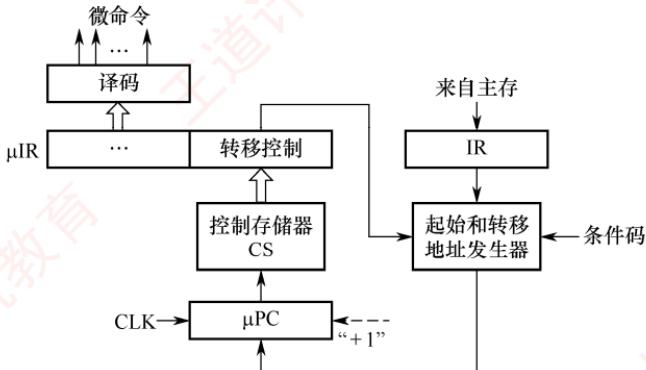

A. 微指令的地址形成方式是增量法 B. 条件码来自标志寄存器C. 最多有 64 条不同的机器指令 D. 控制存储器的容量为 1KB

21.【2009统考真题】相对于微程序控制器，硬布线控制器的特点是（）。A. 指令执行速度慢，指令功能的修改和扩展容易B. 指令执行速度慢，指令功能的修改和扩展难C. 指令执行速度快，指令功能的修改和扩展容易D. 指令执行速度快，指令功能的修改和扩展难

22.【2012统考真题】某计算机的控制器采用微程序控制方式，微指令中的操作控制字段采用字段直接编码法，共有33个微命令，构成5个互斥类，分别包含7、3、12、5和6个微命令，则操作控制字段至少有（）。A. 5位 C. 15位 D. 33位

23.【2014统考真题】某计算机采用微程序控制器，共有32条指令，公共的取指令微程序包含2条微指令，各指令对应的微程序平均由4条微指令组成，采用断定法（后继地址字段法）确定下条微指令地址，则微指令中后继地址字段的位数至少是（）。A. 5 B. 6 x～ C. 8 D. 9

24.【2017统考真题】下列关于主存储器（MM）和控制存储器（CS）的叙述，错误的是（）。A. MM 在 CPU 外，CS 在 CPU 内B. MM按地址访问，CS按内容访问C. MM 存储指令和数据，CS 存储微指令D. MM 用 RAM 和 ROM 实现，CS 用 ROM 实现 收育

25. 【2019 统考真题】某指令的功能为 R[r2]←R[r1]+ M[R[r0]]，其两个源操作数分别采用寄存器、寄存器间接寻址方式。对于下列给定部件，该指令在取数及执行过程中需要用到的是（）。I. 通用寄存器组（GPRs） II.算术逻辑单元（ALU）III.存储器（Memory） IV.指令译码器（ID）A. 仅I、ⅡI B. 仅I、Ⅱ、Ⅲ C. 仅ⅡI、II、IVD. 仅I、III、IV

26.【2021统考真题】下列寄存器中，汇编语言程序员可见的是（）。I. 指令寄存器 I. 微指令寄存器II. 基址寄存器 IV. 标志/状态寄存器A. 仅I、Ⅱ B. 仅I、IV C. 仅ⅡI、IV D. 仅ⅢII、IV

27. 【2021统考真题】通常情况下，将汇编语言程序中实现特定功能的指令序列定义成一条伪指令（pseudoinstruction）。在下列选项中，CPU能理解并直接执行的是（）。I. 伪指令 Ⅱ. 微指令 I. 机器指令 IV. 汇编指令A. 仅I、IV B. 仅ⅡI、II C. 仅ⅢII、IV D. 仅I、III、IV

## 二、综合应用题

01. 若某机主频为 200MHz，每个指令周期平均为 2.5 个 CPU 周期，每个 CPU 周期平均包括2个主频周期，问：1）该机平均指令执行速度为多少MIPS？ 教育2）若主频不变，但每条指令平均包括5个CPU周期，每个CPU周期又包含4个主频3）由此可得出什么结论？ 周期，平均指令执行速度又为多少MIPS？ 计算

02. 某机有80条指令，平均每条指令由4条微指令组成（包含取指微指令），其中有一条取指微指令是所有指令公用的。已知微指令长度为32位，请估算控制存储器CM容量。

03.某微程序控制器中，采用水平型直接控制（编码）方式的微指令格式，后续微指令地址由微指令的后继地址字段给出。已知机器共有28个微命令，6个互斥的可判定的外部条件，控制存储器的容量为512×40位。试设计其微指令的格式，并说明理由。

04. 某机共有52个微操作控制信号，构成5个相斥类的微命令组，各组分别包含5、8、2、15、22个微命令。已知可判定的外部条件有两个，微指令字长28位。

1）按水平型微指令格式设计微指令，要求微指令的后继地址字段直接给出后继微指令地址。

2）指出控制存储器的容量。

05. 设CPU中各部件及其相互连接关系如下图所示，其中 W是写控制标志；R是读控制标志；R1、R2 是暂存器。 临村

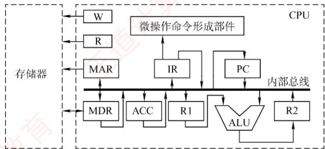

1）写出指令ADD#a（#为立即寻址特征，隐含的操作数在ACC寄存器中）在执行阶段所完成的微操作命令及节拍安排。

2）假设要求在取指周期实现(PC)+1→PC，且由ALU完成此操作（ALU能对它的一个源X 操作数完成加1运算）。以最少的节拍写出取指周期全部微操作命令及节拍安排。

## 5.4.5 答案与解析

## 一、单项选择题

## 01. D

取指令阶段完成的任务是将现行指令从主存中取出并送至指令寄存器，这个操作是公共的操作，是每条指令都要进行的，与具体的指令无关，所以不需要操作码的控制。

## 02. B

CU的输入信号来源如下：①经指令译码器译码产生的指令信息；②时序系统产生的节拍信号；③来自执行单元的反馈信息即标志。前两者是主要因素。

## 03. C

执行公用的取指微程序从主存中取出机器指令后，由机器指令的操作码字段指出各个微程序的入口地址（初始微地址）。

## 04. D

微指令的设计目标和指令结构的设计目标类似，都是基于执行速度、灵活性和指令长度这三个主要方面考虑的。而控制存储器容量的大小与微指令的设计目标无关。 LST

## 05. D

在微程序控制中，控制存储器中存放有微指令，在执行时需要从中读出相应的微指令，从而增加了时间消耗。

## 06. C

字段直接编码方式为了缩短微指令字长而牺牲了速度，当微命令个数为4时需要3位，2位会导致每个编码都输出一个微命令，而不能表示不输出，说法Ⅰ错误。说法Ⅱ正确。垂直型微指令的缺点是微程序长、执行速度慢、工作效率低，说法Ⅲ错误。在字段间接编码方式中，一个字段的某些微命令要由另一个字段的某些微命令来解释，即依赖另一个字段的译码输出，说法IV正确。

## 07. C

微程序控制存储器用来存放微程序，是微程序控制器的核心部件，属于CPU的一部分，而不属于主存。

## 08. D

硬布线控制器采用硬件电路，速度较快，但设计难度大、成本高。微程序控制器的速度较慢，

但灵活性高。通常控制存储器采用ROM元件实现。微指令计数器决定了微指令执行的顺序。

## 09. C

实时性要求较高的场合通常需要能快速地响应和执行，硬布线控制器由硬件直接实现控制逻辑，速度较快，非常适用于实时性要求较高的场合。灵活性和可修改性要求高时，适合采用微程序控制器，因为微程序控制器可很方便地通过修改微程序来灵活调整控制逻辑。

## 10. D

在微程序控制器中，控制部件向执行部件发出的控制信号称为微命令，微命令执行的操作称为微操作。微指令则是若干微命令的集合，若干微指令的有序集合称为微程序。 XTA

## 11. B

在一个CPU周期中，一组实现一定功能的微命令的组合构成一条微指令，有序的微指令序列构成一段微程序，微程序的作用是实现一条对应的机器指令。 顺村

## 12. B

一条水平型微指令能定义并执行几种并行的基本操作；一条垂直型微指令只能定义并执行一种基本操作。 人

## 13. C

垂直型微指令是一种微指令格式，相比于水平型微指令而言的，并不是指令格式垂直表示，在微指令中设置了微操作码字段，结构类似于机器指令格式。控制信号经过编码产生是一种控制字段的编码方式，属于水平型微指令，强调并行控制功能是一种控制字段的设计目标，适合水平型微指令而不适合垂直型微指令。

## 14. A

在同一个CPU周期中，可以同时出现的微命令叫相容性微命令，不允许同时出现的微命令叫互斥性微命令。不允许同时出现的原因有可能是会引起总线冲突，也有可能是其他原因。

## 15. B

微处理器是相对于一些大型处理器而言的，与微程序控制器没有必然联系。不管是采用微程序控制器，还是采用硬布线控制器，微机的CPU都是微处理器，说法Ⅰ错误。微程序的设计思想就是将每条机器指令编写成一个微程序，每个微程序包含若于微指令，每条微指令对应一个或几个微操作命令，说法Ⅱ正确。直接编码方式中每位代表一个微命令，不需要译码，因此执行效率最高，只是这种方式会使得微指令的位数大大增加，说法Ⅲ错误。一条水平型微指令能定义并执行几种并行的基本操作，因此能够更充分利用数据通路的并行结构，说法IV正确。

## 16. C

微程序控制方式采用编程方式来执行指令，而硬布线控制方式则采用硬件方式来执行指令，因此硬布线控制方式速度较快，说法Ⅰ错误。 $\mu \mathrm { P C }$ 无法取代PC，因为它只在微程序中指向下一条微指令地址的寄存器。因此它也必然不可能知道这段微程序执行完毕后下一条是什么指令，说法Ⅱ错误。每条微指令执行时所发出的控制信号是事先设计好的，不需要改变，因此存放所有控制信号的存储器应为RQM，说法Ⅲ正确。指令周期是丛一条指令启动到下一条指令启动的间隔时间，而时钟周期是计算机内部最基本、最小的时间单位，说法IV错误。

## 17. A

一条指令对应一个微程序，所以一个微程序的周期对应一个指令周期。

## 18. B

CPU控制器主要由三个部件组成：指令寄存器、程序计数器和操作控制器。状态条件寄存器通常属于运算器的部件，保存由算术指令和逻辑指令运行或测试的结果建立的各种条件码内容，

如运算结果进位标志（CF）、运算结果溢出标志（OF）等。

## 19. C

断定法是指在微指令（后继地址字段）中直接明确指出下一条微指令的地址，这样相当于每条都是转移微指令，此外，还有一些其他方法如条件测试和转移控制字段，也用于控制微指令的寻址。因此，后继微指令地址可由微程序设计者指定，或者根据微指令所规定的转移控制字段控制产生。

## 20. C

图中 $\mu \mathrm { P C }$ 根据时钟信号进行自增“+1”操作，因此微指令的地址形成方式是增量（计数器）法。转移微指令根据标志寄存器中的标志位来决定下一条微指令的地址。 $\mu \mathrm { P C }$ 的位数是8位，能够指向256条微指令，其中包括若干取指微指令，因此机器指令的条数小于 $256/4 = 64$ ，选项C错误。控制存储器的容量为微指令所占用的存储空间，即 $256 \times 32b = 1  KB$ 机

## 21. D

微程序控制器采用了“存储程序”的原理，每条机器指令对应一个微程序，因此修改和扩充容易，灵活性好，但每条指令的执行都要访问控制存储器，所以速度慢。硬布线控制器采用专门的逻辑电路实现，其速度主要取决于逻辑电路的延迟，因此速度快，但修改和扩展困难，灵活性差。

## 22. C

字段直接编码法将微命令字段分成若于小字段，互斥性微命令组合在同一字段中，相容性微命令分在不同字段中，每个字段还要留出一个状态，表示本字段不发出任何微命令。5个互斥类，分别包含7、3、12、5和6个微命令，需要3、2、4、3和3位，共15位。

## 23. C

计算机共有32条指令，各个指令对应的微程序平均为4条，则指令对应的微指令为 $32 \times 4 = 128$ 条，而公共微指令还有2条，整个系统中微指令的条数共为128+2=130条，所以需要 $\left[ \log_{2}130 \right] =$ 8位才能寻址到130条微指令。

## 24. B

主存储器（MM）在CPU外，用于存储指令和数据，由RAM和ROM实现（主要是RAM）。控制存储器（CS）用来存放构成指令系统的所有微指令，是一种只读型存储器，机器运行时只读不写，在CPU的控制器内。控制存储器按照微指令的地址访问。

## 25. B

该指令的两个源操作数分别采用寄存器、寄存器间接寻址方式，因此在取数阶段需要用到通用寄存器组（GPRs）和存储器（Memory）；在执行阶段，两个源操作数相加需要用到算术逻辑单元（ALU）。而指令译码器（ID）用于对操作码字段进行译码，向控制器提供特定的操作信号，在取数及执行阶段用不到。

## 26. D

汇编语言程序员可见的寄存器有基址寄存器（用于实现多道程序设计或者编制浮动程序）和状态/标志寄存器、程序计数器（PC）及通用寄存器组：而MAR、MIDR、IR是CPU的内部工作寄存器，对汇编语言程序员不可见。微指令寄存器属于微程序控制器的组成部分，它是硬件设计者的任务，对汇编语言程序员是透明的（不可见的）。

## 27. B

高级语言程序、汇编语言程序都需要通过翻译程序来处理，生成机器语言程序后才能被CPU执行。机器指令能被CPU理解并直接执行。微指令是CPU控制单元用于实现机器指令的更低层次的指令。在微程序控制的CPU中，一条机器指令对应一个微程序，微程序是微指令的有序序列，

用来控制CPU实现机器指令的过程，因此微指令也能被CPU理解并直接执行。

## 二、综合应用题

## 01.【解答】

1）主频为200MHz，所以主频周期 $1/200 MHz  = 0.005\mu s$

每个指令周期平均为2.5个CPU周期，每个CPU周期平均包括2个主频周期，所以一条  
指令的执行时间 $2 \times 2.5 \times 0.005\mu  s  = 0.025\mu  s$   
该机平均指令执行速度 $1/0.025 = 40  MIPS$ 1

2）每条指令平均包括5个CPU周期，每个CPU周期又包含4个主频周期，所以一条指令的执行时间 $4 \times 5 \times 0.005 \mu  s  = 0.1 \mu  s$

该机平均指令执行速度 $1/0.1 = 10  MIPS$

3）由此可见，指令的复杂程度会影响平均指令执行速度。

## 02. 【解答】

总的微指令条数 $(4 - 1) \times 80 + 1 = 241$ 条，每条微指令占一个控制存储器单元，控制存储器CM 的容量为 2 的 n 次幂，而 241 刚好小于 256，所以 CM的容量 = 256×32 位 = 1KB。

## 03.【解答】

水平型微指令由操作控制字段、判别测试字段和后继地址字段三部分构成。因为微指令采用直接控制（编码）方式，所以其操作控制字段的位数等于微命令数，为28位。又因为后继微指令地址由后继地址字段给出，所以其后继地址字段的位数可根据控制存储器的容量（512×40位）确定为9位 $(512 = 2^{9})$ 。当微程序出现分支时，后续微指令地址的形成取决于状态条件一一6个互斥的可判定外部条件，因此状态位应编码成3位。非分支时的后续微指令地址由微指令的后继

<table><tr><td>操作控制字段</td><td>判别测试字段</td><td>后继地址字段</td></tr><tr><td>28 位</td><td>3位</td><td>9位</td></tr></table>

## 04. 【解答】

1）根据5个互斥类的微命令组，各组分别包含5、8、2、15、22个微命令，考虑到每组必须增加一种不发送命令的情况，条件测试字段应包含一种不转移的情况，则5个控制字段分别需给出6、9、3、16、23种状态，对应3、4、2、4、5位（共18位），条件测试字段取2位。根据微指令字长为28位，后继地址字段取 $28-18-2=8$ 位，则其微指令格式如下图所示。

<table><tr><td>微命令</td><td>8个 微命令</td><td>2个 微命令</td><td>15个 微命令</td><td>22 个 微命令</td><td>2个 判断条件</td><td></td></tr><tr><td></td><td></td><td></td><td></td><td></td><td>条件测试</td><td>后继地址</td></tr><tr><td>3位</td><td>4位</td><td>2位</td><td>4位</td><td>5位</td><td>2位</td><td>8位</td></tr></table>

2）根据后继地址字段为8位，微指令字长为28位，得出控制存储器的容量为 $2 ^ { 8 } { \times } 2 8$ 位。

## 05. 【解答】

1）含有ACC的立即寻址，一个操作数隐藏在ACC中，立即寻址的加法指令执行周期的微操作命令及节拍安排如下： 临村

<table><tr><td> $T _ { 0 } \mathrm { \quad } \mathrm { A d } \left( \mathbb { T R } \right) \rightarrow \mathbb { R } \mathbb { 1 }$ </td><td>立即数→R1</td></tr><tr><td> $T_{1} \quad (\mathbb{R}1) \quad + \quad (\mathbb{A}\mathbb{C}\mathbb{C}) \xrightarrow{} \mathbb{R}2$  首计算</td><td>ACC 通过总线送 ALU</td></tr><tr><td> $T_{2} \quad (\mathbb{R}2) \rightarrow \mathbb{A}\mathbb{C}$ </td><td>结果→ACC</td></tr></table>

2）因为(PC)+1→PC 需要由ALU 完成，所以PC的值可作为ALU的一个源操作数，在 ALU做加1运算得到(PC)+1后，结果送至与 ALU输出端相连的R2，然后送至PC。此题的关键是要考虑总线冲突的问题，因此，取指周期的微操作命令及节拍安排如下：

<table><tr><td> $T _ { 0 }$  (PC)→MAR，1→R  $T _ { 1 }$  M(MAR)→MDR, (PC) + 1→R2  $T _ { 2 }$  (MDR)→IR，OP(IR)→微操作命令形成部件</td><td>PC 通过总线送 MAR PC 通过总线送 ALU 完成加 1</td></tr></table>

## 5.5 异常和中断机制

现代计算机配备了完善的异常和中断处理系统。CPU内部设有异常检测和响应逻辑，外部设备接口则包含中断请求和控制逻辑，操作系统中集成了相应的异常/中断服务程序。这些硬件电路与软件程序紧密结合，共同完成异常和中断的处理过程。

## 5.5.1 异常和中断的基本概念

## 考点追踪异常事件的性质（2015）

异常（也称内中断）是指CPU在执行指令过程中，由其内部检测到的同步事件，例如除零错误、非法操作码、页缺失等。这类事件由当前指令直接引发，具有确定性和可重现性。

中断（也称外中断）则是由外部设备（如I/O控制器）发起的异步事件，用于通知CPU外设状态发生变化（如数据就绪或传输完成）。中断的发生与当前指令无关，具有随机性。

## 考点追踪异常响应的时机（2023）

两者的处理流程大致如下：当CPU执行用户程序的第i条指令时，若该指令触发异常，CPU通常会在其执行过程中或完成时立即响应；而外部中断则仅在第i条指令完整执行结束后才被检测（指令执行期间不会采样中断信号）。响应发生后，CPU暂停当前程序，保存现场，并转移至相应的服务程序。处理完成后，若事件可恢复，系统将通过执行异常或中断返回指令，恢复上下文并继续原程序：异常通常需重新执行第i条指令（例如缺页异常需在页面调入后重试访存操作），而中断则从第i+1条指令开始继续执行；若异常属于不可恢复的致命错误（如非法指令），操作系统将终止该用户进程。

异常和中断的处理流程大致相同，这也是为什么有些教材将它们统称为中断的原因。

## 5.5.2 异常和中断的分类

## 1. 异常的分类

异常是由CPU内部产生的意外事件，可分为硬故障中断和程序性异常。硬故障中断是由硬件逻辑功能出现异常引起的，如存储器校验错、总线错误等。程序性异常也称软件中断，是指在CPU内部因执行指令而引起的异常事件。如除零、溢出、断点、单步跟踪、非法指令、栈溢出、地址越界、缺页等。按异常发生原因和返回方式的不同，可分为故障、自陷和终止。

## （1）故障（Fault）

## 考点追踪异常或中断处理后指令重新执行的断点（2021）

故障是指在指令启动之后、执行完成之前被检测到的异常事件。CPU在尚未提交该指令结果时即响应故障，并通常尝试在处理后重新执行同一条指令。典型的故障包括：指令译码时遇到非

法操作码、访存时发生缺页、执行除法指令时发现除数为零等。对于可恢复的故障（如缺页），操作系统在处理完毕后（如将页面调入内存），然后返回并重新执行引发故障的指令：而对于不可恢复的故障（如非法指令、除零），则无法继续执行，通常会终止当前进程。

## （2）自陷（Trap）

## 考点追踪自陷的原理和性质（2020）

自陷是一种预先安排的、用于主动转入操作系统内核的同步事件，也称陷阱或陷入。与故障不同，陷阱是在指令正常执行完毕之后才被触发的，因此CPU能够完整提交该指令的结果。典型应用包括：x86计算机架构中的断点调试与单步跟踪机制、系统调用指令（如syscall），以及MIPS架构中的条件自陷指令（如teq）。它就像程序中预先布设的一个“陷阱”：通过特殊指令（如断点指令）或特定控制标志（如单步跟踪标志）显式设置。当执行到此类指令时，CPU会根据其类型自动转移至相应的处理程序。处理完成后，CPU总是从自陷指令的下一条指令继续执行。

故障异常和自陷异常属于程序性异常（软件中断）。

## （3）终止（Abort）

终止是指在指令执行过程中发生严重的硬件故障（如控制器出错、存储器校验错、总线错误等），导致系统无法继续正常运行，程序因此被迫终止。此时，CPU会转移至相应的异常服务程序，通常用于记录错误信息或重启系统。与故障和自陷不同，终止异常并非由某条特定指令明确引发，其发生具有不可预测性，往往反映底层硬件或系统状态的严重损坏。

终止异常和外中断属于硬件中断。

## 2. 中断的分类

## 考点追踪对中断和异常事件的判断（2009、2016、2020、2025）

中断是指由外部设备或事件发起的异步请求，典型的中断源包括I/O设备（如键盘输入）、定时器（如周期性时钟中断）等。这些设备通过专用的中断请求信号线向CPU发出中断请求。CPUJ在每条指令执行结束后检查中断请求线：若检测到有效请求，则进入中断响应周期。

中断可分为可屏蔽中断和不可屏蔽中断。

## （1）可屏蔽中断

此类中断通过可屏蔽中断请求线INTR发送。CPU可通过中断控制器中的中断屏蔽寄存器选择性地屏蔽或允许特定中断源，被屏蔽的中断请求将不会传递至CPU。 K

## (2)不可屏蔽中断

此类中断通过专用的不可屏蔽中断请求线NM发送，无法被软件屏蔽，用于处理高优先级事件，如电源掉电、内存校验错等。NMI确保CPU能及时响应这些关键故障。

尽管中断和异常的处理流程相似，但二者存在以下两个重要差异：

1）触发时机：异常（如缺页、除零等）由当前执行的指令直接引发，具有同步性；而中断由外部事件异步触发，与任何特定指令无关，且不会打断当前指令的执行。

2）检测机制：异常由CPU内部逻辑在指令执行过程中自动检测或由软件显式触发；中断则依赖外部硬件通过中断请求线通知CPU，再进一步确定中断源及类型。

此外，中断还可按其他维度分类：按服务程序入口地址的获取方式，分为向量中断（硬件直接提供服务程序入口地址）和非向量中断（通过软件轮询确定中断源）：按是否允许嵌套处理，分为单重中断（服务期间禁止新中断）和多重中断（允许高优先级中断嵌套）。

## 5.5.3 异常和中断响应过程

当CPU在执行指令过程中检测到异常，或在指令边界处采样到中断请求时，将启动异常或

中断响应过程。该过程指从事件发生到转移至相应处理程序之间的硬件自动操作序列，主要包括关中断、保存断点和程序状态、以及识别事件类型并转移至处理程序三个阶段。

## （1）关中断

为确保上下文保存的原子性，在响应异常或中断的初始阶段，CPU会自动屏蔽可屏蔽中断(通常通过清零标志寄存器中的F位）。IF=0表示关中断，F=1表示开中断。需要注意的是，不可屏蔽中断和部分高优先级异常仍可能在此期间发生，具体行为取决于体系结构设计。

## （2）保存断点和程序状态

为支持处理完成后正确返回原程序，CPU必须保存两类关键上下文信息：①断点（返回地址），对于异常通常为当前指令地址，对于中断则为指令执行完毕后的下一条指令地址；②程序状态字（PSW），包含条件码、中断允许标志、特权级等运行状态。这些信息通常被压入内核栈，既保障了上下文的安全性，又天然支持中断与异常的嵌套处理。

## （3）识别事件类型并转移至处理程序

现代处理器普遍采用硬件向量机制（称为向量中断）来识别和响应异常与中断：每类事件都被分配唯一的类型号：系统初始化时，将对应服务程序的入口地址（称为中断向量）按类型号顺序填入中断向量表；当事件发生时，CPU自动获取类型号，并以此为索引直接访问向量表，获取目标地址并转移至相应处理程序，全程无须软件介入。

相比之下，早期系统常采用软件轮询方式（称为非向量中断）：CPU响应请求后转移至统一入口，操作系统需要依次读取各设备的状态寄存器，通过查询确定中断源。该方式依赖软件判别、效率较低，现代系统已极少使用。 XK

整个响应过程由硬件自动完成，具有高度原子性。响应结束后，CPU开始执行对应服务程序的第一条指令。后续处理逻辑（如缺页页面调入、系统调用分发等）由操作系统内核的软件实现，因此，完整的异常与中断处理是软硬件紧密协同的结果。

## 5.5.4 本节习题精选

## 单项选择题

01.以下关于“自陷”（Trap）异常的叙述中，错误的是（）。A.“自陷”是人为预先设定的一种特定处理事件B. 可由访管指令或自陷指令的执行进入“自陷”C. 一定是出现某种异常情况才会发生“自陷”D.“自陷”发生后CPU将进入操作系统内核程序并执行

02. 指令执行结果出现异常而引起的中断是（）。 rAA. I/O 中断 B. 机器校验中断 C. 故障 D. 外部中断

03.访问主存时发生的校验错误属于（）。 C. 终止 FD. 外中断

04.下列关于异常和中断响应的叙述中，错误的是（）。A. 异常事件检测由CPU在执行每一条指令的过程中进行B. 中断请求检测由CPU在每条指令执行结束、取下条指令之前进行C. CPU检测到异常事件后所做的处理和检测到中断请求后所做的处理完全相同D. CPU在中断响应时会关中断、保存断点和程序状态并转到相应的中断服务程序

05.下列给出的事件中，无须异常处理程序进行处理的是（）。A. 缺页故障 B. Cache 缺失C. 地址越界 D. 除数为0

06. CPU响应中断的时间是（）。道A. 一条指令执行结束 B. I/O 设备提出中断