<!--
Generated by 数学文档OCR_v3.py 3.0.0
Source: 27王道《计算机网络》高清带书签【公众号：研料库，料最全】.pdf
MinerU: mineru, version 3.4.5
Do not treat automated OCR as proof of mathematical correctness.
-->

# 27王道《计算机网络》高清带书签【公众号：研料库，料最全】

<!-- PDF pages 1-128; chunk 0001_p000001-000128 -->

2027年

# 计算机网络考研复习指导

王道论坛 组编

购买王道书，就上

王道官方考研书店

wangdao.taobao.com

電子工業出版社

Publishing House of Electronics Industry

北京·BEIJING

官方开源，高清带书签PDF

最新配套视频请上bilibili.com 搜索“王道”

## 内容简介

本书是计算机专业硕士研究生入学考试“计算机网络”课程的复习用书，内容包括计算机网络体系结构、物理层、数据链路层、网络层、传输层、应用层等。本书严格按照最新计算机考研大纲的计算机网络部分的要求编写，对大纲所涉及的知识点进行集中梳理，力求内容精练、重点突出、深入浅出。本书精选部分名校的历年考研真题，并给出详细的解题思路，力求实现讲练结合、灵活掌握、举一反三的功效。

本书可作为考生参加计算机专业硕士研究生入学考试的复习用书，也可作为计算机专业学生学习“计算机网络”课程的辅导用书。

未经许可，不得以任何方式复制或抄袭本书之部分或全部内容。

版权所有，侵权必究。

## 图书在版编目（CIP）数据

2027年计算机网络考研复习指导/王道论坛组编.

北京：电子工业出版社，2026. 1. -- ISBN 978-7-121-51786-0 XAV

I. TP393

中国国家版本馆CIP数据核字第2025Y3S740号

责任编辑：谭海平

印 刷：

装订：

出版发行：电子工业出版社北京市海淀区万寿路173信箱 邮编：100036

开 本：787×1092 1/16 印张：19.75 字数：556 千字

版次：2026年1月第1版

印次：2026年1月第1次印刷

定价：71.00元

凡所购买电子工业出版社图书有缺损问题，请向购买书店调换。若书店售缺，请与本社发行部联系，联系及邮购电话：（010）88254888，88258888。

质量投诉请发邮件至zlts@phei.com.cn，盗版侵权举报请发邮件至 dbqq@phei.com.cn。

本书咨询联系方式：（010）88254552，tan02@phei.com.cn。

购买王道书请上王道考研书店：wangdao.taobao.com

  
iiii 首页 备剧 直播 游戏中心 会员购 漫画 赛事  下载睿户端  
王道计算机教育

## B站搜索“王道计算机教育”

代表作

  
王道计算机考研操作系统1461.1万 15.7万

  
王道计算机考研计算机网络1073.7万 12万

  
王道计算机考研数据结构1801.6万 26.1万

直播预约：26考研408如何做三轮规.. 预约12-06 15:00直播55人已预约

直播预约：鸿蒙会给程序员带来哪些...预约12-10 19:00直播

扫码关注 “王道在线”

进入菜单“兑换中心”兑换配套课件等资源

王道计算机考研题库

开通题库小程序VIP权限

遇到问题请加微信

盗版书无兑换码请勿购买配套视频不包含答疑服务

# 本书配套资源介绍

## 【关于配套视频的说明】

1. 配套的考点精讲视频与习题视频均为最新版本，已免费发布在B站，无须兑换，内容持续更新，可放心使用！

2.【王道计算机刷题库】小程序面向所有读者免费开放，它将纸质习题数字化，可智能刷题，靶向提分，高效备考！

3. 兑换码用于获取课件资源，以及开通小程序VIP权限。

4. 兑换码位于封面右下角，区分大小写，不含空格，且一经兑换即失效。

## 前 言

“王道考研系列”的定位是考试类辅导书。本书主要分为考点讲解部分和习题讲解部分，前者的篇幅约占40%，后者的篇幅约占60%。考点讲解部分按照统考大纲梳理考点，主要参考了一些权威教材，如谢希仁老师的《计算机网络》、国外经典教材《计算机网络：自顶向下方法》等，并且融合了作者的总结与理解，在此对这些老师表示致敬和感谢！习题讲解部分主要精选自多所名校的自命题考研真题、教材配套习题册、同类辅导书，或者改编自统考真题。

由于篇幅限制，考点讲解部分较为精炼，对学科基础较为薄弱的读者来说，可能难以理解。为此，我们提供了配套的考点精讲视频和习题讲解视频。考点精讲视频有形象丰富的动画演示、由浅入深的考点分析，相信能打通读者复习过程中的“任督二脉”。往年有不少读者反馈视频和王道书不太匹配，这是因为王道书的出版时间远早于课程制作时间，而咸鱼老师录制课程时会参考众多的优秀教材（不限于王道书）；后面，我们将逐步解决这个问题。此外，早期的习题讲解视频主要由高分学长录制，因为质量参差不齐，现已全部下架。目前，仅提供由王道老师重新录制的最新版本，该版本已覆盖全部选择题；综合题的重新录制工作会适时启动并及时发布。

考点精讲视频和习题讲解视频免费发布在B站账号“王道计算机教育”上。

“王道考研系列”是计算机考研学子口碑相传的辅导书，自2011版首次推出以来，就始终占据同类书销量的榜首位置，这就是口碑的力量。有这么多学长的成功经验，相信读者只要合理地利用本套书，并采用科学的复习方法，就一定能收获属于自己的那份回报。

针对考研学子的需求，我们还开发了除本书配套视频外的一系列计算机考研课程，包括C语言督学课、408基础课、408暑期强化课、408冲刺课、机试课、模拟面试、调剂，以及复习规划、伴学督学、一对一指导、全程实时答疑和择校服务等。王道的课程同样是市面上领先的计算机考研课程，对学科基础较为薄弱的读者来说，相信这些课程和服务定能助你一臂之力。

“不包就业、不包推荐，培养有态度的码农。”王道训练营是王道团队打造的线下魔鬼式编程训练营。打好编程功底，增强项目经验，彻底转行入行，不再迷茫，期待有梦想的你！

参与本书编写的人员主要有赵霖、罗乐、徐秀瑛、赵淑芬、范佳玉、严汉、喻云珍、余勇、赵淑芳、刘政学、罗庆学、赵晓宇等。予人玫瑰，手有余香，王道论坛伴你一路同行！

对本书的任何建议，或发现有错误，欢迎扫码与我们联系，以便及时优化或纠错。

风华漫舞

## 致读者

关于王道单科辅导书使用方法的道友建议

我是“二战考生”，2012年第一次考研成绩为333分（专业代码408，成绩为81分），痛定思痛后决心再战。潜心复习了半年后，终于以392分（专业代码408，成绩为124分）考入上海交通大学计算机科学与技术专业，这半年里我的专业课成绩提高了43分，成了提分主力。从未达到录取线到考出比较满意的成绩，从蒙头乱撞到有了自己明确的复习思路，我想这也是风华哥从诸多高分选手中选择我给大家介绍经验的一个原因吧。

整个专业课的复习是围绕王道辅导书展开的，从一遍、两遍、三遍看单科辅导书的积累提升，到做8套模拟题时的强化巩固，再到看思路分析时的醍醐灌顶。王道辅导书能两次押中算法原题固然有运气成分，但这也从侧面说明编者的编写思路和选题方向与真题很接近。

下面说一说我的具体复习过程。

每天划给专业课的时间是3～4小时。第一遍仔细看课本，看完一章做一章单科辅导书上的习题（红笔标注错题），这一遍共持续2个月。第二遍主攻单科辅导书（红笔标注重难点），辅看课本。第二遍看单科辅导书和课本的速度快了很多，但感觉收获更多，常有温故知新的感觉，理解更深刻。（风华注：建议这里再速看第三遍，特别针对错题和重难点。模拟题做完后再跳看第四遍。) X

以上是打基础阶段，注意：我仔细精读了两遍单科辅导书和课本，以便尽量弄懂每个知识点和习题。大概11月上旬开始做模拟题和思路分析，其间遇到不熟悉的地方不断回头查阅单科辅导书和课本。8套模拟题的考点覆盖得很全面，所以大家做题时如果忘记了某个知识点，千万不要慌张，赶紧回去看这个知识点，最后的模拟就是查漏补缺。模拟题一定要严格按考试时间（3小时）去做，注意应试技巧，做完试题后再回头研究错题。算法题的最优解法不太好想，如果实在没思路，建议直接“暴力”解决，结果正确也能有10分，总比苦拼出15分来而将后面比较好拿分的题耽误了好（这是我第一次考研的切身教训）。最后剩了几天看标注的错题，第三遍跳看单科辅导书，考前一夜浏览完网络，踏实地睡着了…… -X字

考完专业课，走出考场终于长舒一口气，考试情况也心中有数。回想这半年的复习，耐住了寂寞和诱惑，雨雪风霜从未间断地跑去自习，考研这人生一站终归没有辜负我的良苦用心。佛教徒说世间万物生来平等，都要落入春华秋实的代谢中去：辩证唯物主义认为事物作为过程存在，凡是存在的终归要结束。你不去为活得多姿多彩而拼搏，真到了和青春说再见时，你是否会可惜虚度了青春？风华哥说过，我们都是有梦想的青年，我们正在逆袭，你呢？

感谢风华哥的信任，给我这个机会为大家分享专业课复习经验，作为一个铁杆道友在王道受益匪浅，也借此机会回报王道论坛。祝大家金榜题名！

ccg1990@SJTU

## 王道训练营

王道是道友考研路上值得信赖的伙伴。十多年来，我们陪伴了数百万计算机考研学子，从考研图书，到辅导课程、编程训练，始终助力大家提升真实能力。

我们都清楚，计算机是个靠实力说话的专业。王道团队中的许多人，也曾和你一样：本科迷茫、基础薄弱，把考研当作改变命运的出路。但后来明白学历只是入场券。同样是名校硕士，有人早就拿下了心仪的Offer，也有人毕业即失业，再次陷入焦虑。

如今，虽然AI让编写代码变得简单了，但却抬高了能力门槛：会写语法已远远不够，系统设计与工程落地才是核心竞争力。如果你只会调API，但无法思考架构、解决实际问题，那么读研可能只是把竞争往后推迟了几年。我们真心希望，王道能帮你少走弯路。我们教的不只是“怎么用AI”，更有“怎么用好AI”—成为能主导项目、把控技术方向的人。

考研结束后的空档期，是你补编程、练实战的黄金窗口。趁生活尚未被新任务填满，抓紧补齐本科阶段落下的核心能力，别等到入学或入职才惊觉差距。参加王道训练营，说到底，就是对自己的一次认真投资，而投资自己永远最值得。 XTA

## 王道训练营简介

## 1. 面向就业

适合希望转行但编程基础薄弱的你。

考研不是人生的唯一出路。无论结果如何，这段拼搏都值得铭记，但不必让它成为遗憾的终点。不少在考研路上暂时受挫的道友，在王道找到了技术成长的新起点。我们始终相信：肯努力、肯坚持的人，终会走出属于自己的路。

在高度竞争的技术领域，你当下的编程能力决定了你能拿到什么Offer；而你的学习态度与潜力，才决定你能走多远。再不行动，机会只会悄然溜走。 XTA

王道训练营，为有梦想、敢奋斗的你铺就通往高质量就业的坚实通道。

## 2. 面向硕士

适合刚上岸的准硕士，希望赢在研一起跑线。

考上研究生是重要转折，但硕士学历早已不是“保险箱”。考研高分不等于高薪Offer，同是名校硕士，有人手握字节跳动、腾讯等大厂的Offer，有人却“屡面屡败”——差距，往往在入学前就已拉开。

王道训练营相当于“硕士先修班”：开学前啃下企业级代码，带着完整项目进组。当同门还在熟悉环境，你已用“大模型+微服务”跑通实验室课题；导师自然更愿意把核心项目、论文一作等机会优先给你。抓住这个隐形的转折点，三年后你的简历上不止有学历，更有扎实的工程能力、可落地的项目和发表的文章—高薪Offer，水到渠成。

## 3. 报名要求

• 具有本科学历，愿以“高三式”的专注全力投入。

· 须认真完成开课前的作业不看基础，只看态度，合格方可入营，宁缺毋滥。

作业是最重要的筛选标准。我们从不看轻跨专业或双非背景的你—坚定转行者往往更

拼、更踏实。学校和专业是过去的标签，能力靠持续努力重塑。一段高强度训练，完全可能让你逆袭，这已被无数的往期学员用结果证明。 KK

## 4. 学习成效

我们以“动手编程+实战项目”为核心，帮你补齐当下的能力短板，指明后续的学习方向。你收获的不只是方法，更是工程师的思维方式一真正推开职场大门。

自2020年起，王道坚持公开每期真实就业数据，承诺100%真实！学员从零起步，成长为能解决问题的开发者。部分学员成功入职字节跳动、腾讯、阿里、拼多多、京东、华为、百度、小米等互联网大厂；也有不少学员进入东方财富交易组、大疆飞控、比亚迪车规芯片、深信服防火墙引擎、招商银行风控等部门，岗位覆盖后端、算法、嵌入式、金融量化、信息安全等方向。我们不信“神秘高薪”，只信真实结果。 机

## 王道训练营优势

这里聚集的都是道友彼此信任，乐于分享，氛围纯粹而温暖。经历过考研的你，深知转行路上的孤独与压力，因此更容易成为并肩作战的战友：互相答疑、一起debug、共同成长。在技术转型的路上，这样的圈子是最宝贵的资源。正如一位学员所说：“来了你就发现，这里无关学历、背景或过往，只关乎一件事——对自己认真，对自己负责。”

我们的授课老师平均拥有8年以上的开发与教学经验，编程功底扎实，教学经验丰富。上课时，授课老师不会照本宣科地念PPT，而会展示真正上线运行过的代码，分享实际工作中遇到的“坑”、提升系统性能的方法，以及处理突发线上问题的经验。用真实的实战经验引导大家，以严谨的技术态度陪伴每位学员一既是对道友信任的回应，又是我们坚守的责任。

## 王道训练营课程

王道训练营目前开设5种班型：

复试冲刺/春招（Python/LinuxC/Java/C++）项目班（40～45天，初试结束后开班）

●AI应用开发（Java）方向（四个半月，武汉校区，掌握AI应用开发，抢占技术高地）

微服务开发C++方向（四个半月，武汉校区，深入后端架构，进入核心开发岗）

● 嵌入式开发C++方向（四个半月，武汉校区，紧跟硬科技趋势，切入芯片/物联网）

● Python 大模型方向（三个半月，直播授课或深圳校区，紧跟前沿算法，AI算法工程师）

项目班的作用是利用初试后的时间和寒假期间，快速提升编程能力和项目经验，为复试和春招面试加分。其余4种班型既适合想就业的你，又适合已上岸想提升能力或计划继续考研的你。

想了解课程、获取就业数据或就业咨询吗？扫码添加王道老师的微信，一对一为你解答。

## 目 录

第1章 计算机网络体系结构  
1.1 计算机网络概述  
1.1.1 计算机网络的概念  
1.1.2 计算机网络的组成  
1.1.3计算机网络的功能  
1.1.4 电路交换、报文交换与分组交换  
1.1.5 计算机网络的分类  
1.1.6 计算机网络的性能指标  
1.1.7 本节习题精选  
1.1.8 答案与解析. 12  
1.2 计算机网络体系结构与参考模型 15  
1.2.1 计算机网络分层结构 15  
1.2.2 计算机网络协议、服务、接口的概念 ·16  
1.2.3 OSI 参考模型和 TCP/IP 模型 17  
1.2.4 本节习题精选 22  
1.2.5 答案与解析· 25  
1.3 本章小结及疑难点· ·28  
第 2章 物理层 30  
2.1 通信基础 ·30  
2.1.1 基本概念 ·30  
2.1.2 信道的极限容量 ·31  
2.1.3编码与调制 33  
2.1.4本节习题精选 35  
2.1.5 答案与解析 ·38  
2.2 传输介质……… ·42  
2.2.1 双绞线、同轴电缆、光纤与无线传输介质… ·42  
2.2.2 物理层接口的特性 ·44  
2.2.3 本节习题精选 44  
2.2.4 答案与解析 45  
2.3 物理层设备 46  
2.3.1 中继器 46  
2.3.2 集线器 46  
2.3.3 本节习题精选 47  
2.3.4 答案与解析 48  
2.4 本章小结及疑难点 48  
3章 数据链路层 50  
3.1 数据链路层的功能 50  
3.1.1 数据链路层所处的地位· 51  
3.1.2 链路管理… ·51  
3.1.3 封装成帧与透明传输 52  
3.1.4 流量控制 52  
3.1.5 差错检测与可靠传输 52  
3.1.6 本节习题精选 52  
3.1.7 答案与解析… 53  
3.2 组帧……… 54  
3.2.1 字符计数法· 54  
3.2.2 字节填充法· 54  
3.2.3 零比特填充法 55  
3.2.4 违规编码法… 55  
3.2.5 本节习题精选 55  
3.2.6 答案与解析 55  
3.3 差错控制… ·56  
3.3.1 检错编码· 57  
3.3.2 纠错编码… 58  
3.3.3 本节习题精选 59  
3.3.4 答案与解析…… ·60  
3.4 流量控制与可靠传输机制· 61  
3.4.1 流量控制与滑动窗口机制 61  
3.4.2 可靠传输机制· 63  
3.4.3 本节习题精选 67  
3.4.4 答案与解析… 72  
3.5 介质访问控制… 77  
3.5.1 信道划分介质访问控制 78  
3.5.2 随机访问介质访问控制 ·80  
3.5.3 轮询访问：令牌传递协议 82  
3.5.4 本节习题精选… ·83  
3.5.5 答案与解析. 85  
3.6 局域网…… ·87  
3.6.1 局域网的基本概念和体系结构 87  
3.6.2 以太网与 IEEE 802.3 ·88  
3.6.3 IEEE 802.11 无线局域网 .93  
3.6.4 VLAN 基本概念与基本原理 .99  
3.6.5 本节习题精选… 100  
3.6.6 答案与解析· 106  
3.7 广域网· 113  
3.7.1 广域网的基本概念 113  
3.7.2 点对点协议 114  
3.7.3 本节习题精选 115  
3.7.4 答案与解析 … 116  
3.8 数据链路层设备 117  
\*3.8.1 网桥的基本概念 117  
3.8.2 以太网交换机 118  
3.8.3 共享式以太网 · 120  
3.8.4 本节习题精选 120  
3.8.5 答案与解析 123  
3.9 本章小结及疑难点 126  
4章网络层 127  
4.1网络层的功能· 127  
4.1.1 异构网络互连 128  
4.1.2 路由与转发…… 128  
4.1.3 网络层提供的两种服务 129  
4.1.4 SDN 的基本概念 131  
4.1.5 拥塞控制… 132  
4.1.6 本节习题精选 132  
4.1.7 答案与解析 135  
4.2 IPv4 ·137  
4.2.1 IPv4 分组… ·137  
4.2.2 IPv4 地址 139  
4.2.3 网络地址转换 NAT · 144  
4.2.4 网络层转发分组的过程 146  
4.2.5 地址解析协议（ARP） 147  
4.2.6 动态主机配置协议 DHCP · 149  
4.2.7 网际控制报文协议 ICMP 150  
4.2.8本节习题精选 151  
4.2.9 答案与解析 165  
4.3 IPv6 181  
4.3.1 IPv6 的特点 181  
4.3.2 IPv6 数据报的基本首部 182  
4.3.3 IPv6 地址… 183  
4.3.4 从 IPv4 向 IPv6 过渡 184  
4.3.5 本节习题精选 ·184  
4.3.6 答案与解析 … 185  
4.4 路由算法与路由协议 ·186  
4.4.1 路由算法…… ·186  
4.4.2 分层次的路由选择协议 188  
4.4.3 路由信息协议· ·188  
4.4.4 开放最短路径优先协议 191  
4.4.5 边界网关协议 ·193  
4.4.6 本节习题精选 196  
4.4.7 答案与解析… 203  
4.5 IP多播… ·208  
4.5.1 多播的概念… 208  
4.5.2 IP多播地址 209  
4.5.3 在局域网上进行硬件多播 209  
4.5.4 IGMP 与多播路由协议 210  
4.5.5 本节习题精选 210  
4.5.6 答案与解析… …211  
4.6 移动 IP… 212  
4.6.1 移动IP的概念 212  
4.6.2 移动IP通信过程· 212  
4.6.3 本节习题精选 213  
4.6.4 答案与解析. …213  
4.7 网络层设备… 214  
4.7.1 冲突域和广播域… …214  
4.7.2 路由器的组成和功能 214  
4.7.3 路由表与分组转发 215  
4.7.4 本节习题精选… …216  
4.7.5 答案与解析 219  
4.8 本章小结及疑难点 ·223  
5章传输层 ·224  
5.1 传输层提供的服务· ·224  
5.1.1 传输层的功能 ·224  
5.1.2 传输层的寻址与端口 ·225  
5.1.3 无连接服务与面向连接服务 ·226  
5.1.4 本节习题精选 ·227  
5.1.5 答案与解析 ·228  
5.2 UDP… ·229  
5.2.1 UDP 数据报 ·229  
5.2.2 UDP 检验 ·230  
5.2.3 本节习题精选 ·231  
5.2.4 答案与解析· ·233  
5.3 TCP……… ·236  
5.3.1 TCP 的特点 ·236  
5.3.2 TCP 报文段· ·236  
5.3.3 TCP 连接管理… 238  
5.3.4 TCP 可靠传输 ·240  
5.3.5 TCP 流量控制 242  
5.3.6 TCP 拥塞控制 243  
5.3.7 本节习题精选 246  
5.3.8 答案与解析 256  
5.4 本章小结及疑难点· 265  
第6章 应用层 267  
6.1 网络应用模型 267  
6.1.1 客户/服务器模型 267  
6.1.2 P2P 模型… 268  
6.1.3 本节习题精选 268  
6.1.4 答案与解析 269  
6.2 域名系统 270  
6.2.1 层次域名空间 270  
6.2.2 域名服务器 271  
6.2.3 域名解析过程 272  
6.2.4 本节习题精选 273  
6.2.5 答案与解析 275  
6.3 文件传输协议· 277  
6.3.1 FTP 的工作原理 277  
6.3.2 控制连接与数据连接 277  
6.3.3 本节习题精选 278  
6.3.4 答案与解析 280  
6.4 电子邮件… 283  
6.4.1 电子邮件系统的组成结构 283  
6.4.2 电子邮件格式与 MIME 284  
6.4.3 SMTP 和 POP3 285  
6.4.4 本节习题精选 286  
6.4.5 答案与解析 288  
6.5 万维网…… 289  
6.5.1万维网的概念与组成结构 289  
6.5.2 超文本传输协议 290  
6.5.3 本节习题精选 295  
6.5.4 答案与解析 298  
6.6 本章小结及疑难点 303  
参考文献 304

购买王道书请上王道考研书店：wangdao.taobao.com

## 第 1 章

# 计算机网络体系结构

## 【考纲内容】

（一）计算机网络概述

计算机网络的概念、组成与功能；计算机网络的分类；

计算机网络的性能指标

（二）计算机网络体系结构与参考模型

  
视频讲解

计算机网络分层结构；计算机网络协议、接口、服务的概念；

ISO/OSI 参考模型和 TCP/IP 模型

## 【复习提示】

本章主要介绍计算机网络体系结构的基本概念，读者要在理解的基础上适当记忆。重点掌握三种数据交换方式的特点及相关的计算，协议、接口和服务的概念，ISO/OSI参考模型和TCP/IP模型各层的基本功能。熟悉有关网络的性能指标，特别是时延、带宽、速率等的计算。

## 1.1 计算机网络概述

## 1.1.1 计算机网络的概念

一般认为，计算机网络是将众多分散的、自治的计算机系统，通过通信设备与线路连接起来，并由功能完善的软件实现资源共享和信息传递的系统。

计算机网络（简称网络）由若干节点（Node，或译为结点）和连接这些节点的链路（Link）组成。网络中的节点可以是计算机、集线器、交换机或路由器等。多个网络还可通过路由器互连，构成覆盖范围更广的计算机网络，这种网络称为互连网（internet）。由此可理解为：网络将多台计算机连接在一起，而互连网则将多个网络通过路由器连接在一起。

请读者注意两个含义相差很大的名词：internet与Internet。

internet（互连网）是一个通用名词，泛指由多个计算机网络互连而成的网络。这些网络之间可以使用任意通信协议进行通信，并不要求必须采用TCP/IP。

Internet（互联网或因特网）则是一个专用名词，特指当前全球最大的、开放的、由众多网络和路由器互连而成的特定计算机网络，它必须采用TCP/IP协议族作为通信规则。

网络的最终用户通过互联网服务提供商（Internet Service Provider，ISP）接入互联网，例如中国电信、中国移动等。所谓上网，是指通过某ISP分配的IP地址接入互联网。ISP可从互联网管理机构申请大量P地址（互联网上的主机都必须拥有P地址才能接入互联网，这一点将在第4章中讨论），并拥有通信线路及路由器等连网设备。因此，任何机构或个人只要向ISP缴纳费用，就可获得所需IP地址的使用权，并通过该ISP接入互联网。

## 1.1.2 计算机网络的组成

从不同角度看，计算机网络的组成可分为以下几类。

1）从组成部分看，计算机网络主要由硬件、软件、协议三大部分组成。硬件包括主机（如台式机、笔记本电脑、平板电脑、智能手机等）、通信链路（如双绞线、光纤）以及交换设备（如路由器、交换机等）。软件主要包括实现资源共享的系统软件和便于用户使用的应用工具（如E-mail程序、FTP程序、聊天程序等）。协议是计算机网络的核心，如同交通规则规范车辆行驶一样，它规定了数据在网络中传输时必须遵循的规则。

2）从工作方式看，计算机网络（此处主要指Internet，即互联网）可分为边缘部分和核心部分。边缘部分由所有连接到互联网、供用户直接使用的主机组成，用于通信（如数据传输）和资源共享；核心部分由大量网络及互连这些网络的路由器组成，为边缘部分提供连通性与交换服务。图1.1 展示了互联网核心部分与边缘部分的示意图。

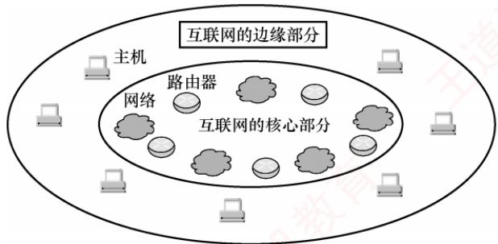  
图1.1 互联网核心部分与边缘部分的示意图

3）从功能组成看，计算机网络由通信子网和资源子网组成。通信子网由传输介质、通信设备及相关网络协议组成，负责数据的传输、交换、控制与存储，实现联网计算机之间的通信。资源子网则是实现资源共享功能的设备及其软件的集合，向用户提供共享其他计算机上的硬件资源、软件资源和数据资源的服务。

## 1.1.3 计算机网络的功能

计算机网络具有多种功能，现今许多应用都依赖于网络的支持。主要有以下五大功能。

## 1. 数据通信

数据通信是计算机网络最基本且最重要的功能，用来实现联网计算机之间各种信息的传输。例如，文件传输、电子邮件等应用，离开了计算机网络将无法实现。

## 2. 资源共享

资源共享可以是软件、数据或硬件的共享。它使得网络中的资源能够互通有无、分工协作，从而显著提高硬件资源、软件资源和数据资源的利用率。

## 3. 分布式处理

当网络中的某个计算机系统负荷过重时，可将其处理的某个复杂任务分配给网络中的其他计算机系统，利用空闲资源来提高整个系统的利用率。

## 4. 提高可靠性

计算机网络中的各台计算机可以通过网络互为备份。

## 5. 负载均衡

将工作任务均衡地分配给网络中的各台计算机，避免某些计算机过载而其他计算机闲置。

除了上述主要功能外，计算机网络还支持电子化办公与服务、远程教育、娱乐等功能，满足了社会的多样化需求，方便了人们的学习、工作和生活，并带来了巨大的经济效益。

## 1.1.4 电路交换、报文交换与分组交换

在网络核心部分起关键作用的是路由器（Router），其通过对接收到的分组进行存储转发来实现分组交换。要理解分组交换的原理，需先了解电路交换和报文交换的基本概念。 XTIT

## 1. 电路交换

## 考点追踪电路交换的时延分析（2025）

最典型的电路交换网络是传统电话网。从通信资源分配的角度看，交换是指按照某种方式动态分配传输线路资源。电路交换分为三个阶段：建立连接（占用通信资源）、传输数据（持续占用通信资源）和释放连接（归还通信资源）。在数据传输前，通信双方必须先建立一条专用的端到端物理通路，该通路由沿途的交换设备和链路逐段连接而成。在通信过程中，这条通路始终被双方独占，直至通信结束才释放。图1.2是电路交换的示意图。

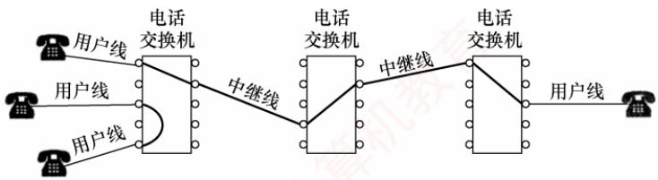  
图1.2 电路交换示意图

电路建立后，除源节点和目的节点外，中间节点仅提供端到端物理通路，比特流连续地从源端直达目的端，如同通过管道传输。因此，电路交换适用于低频次、连续且大量的数据传输。

电路交换技术的优点：

1）通信时延小。通信线路为双方专用，数据直达，传输效率高。

2）有序传输。数据按发送顺序传送，不存在失序问题。

3）没有冲突。不同通信对使用独立信道，不会争用物理信道。

4）实时性强。物理通路一旦建立，双方即可随时通信。

电路交换技术的缺点：

1）建立连接时间长。平均建立连接的时间对计算机通信而言过长。

2）线路利用率低。物理通路被通信双方独占，即使空闲也无法供其他用户使用。

3）灵活性差。通路中任一节点或链路发生故障，都需重新建立新连接。

4）难以实现差错控制。中间节点不具备存储和检错能力，无法发现或纠正传输错误。

由于计算机之间的通信通常是突发式（高频、少量）的，若采用电路交换，已被占用的通信线路在大部分时间内处于空闲状态，其利用率往往不足10%，甚至低于1%。

## 2. 报文交换

考点追踪报文交换的时延分析（2013、2025）

用户数据附加源地址、目的地址等控制信息后，被封装成报文（Message）。报文交换采用存储转发技术：整个报文先传送到相邻节点，被完整接收并存储后，节点根据转发表将其转发至下

一跳，如此逐跳转发，直至到达目的端。每个报文可独立选择通往目的端的路径。

报文交换技术的优点：

1）无建立和释放连接的时延。通信前无须建立连接，用户可随时发送报文。

2）线路分配灵活。交换节点在存储完整报文后，可选择当前最优空闲链路进行转发；若某条路径发生故障，该节点可动态切换至其他路径。

3）线路利用率高。报文仅在一段链路上传输时才占用这段链路的资源。

4）支持差错控制。交换节点可对缓存中的报文进行差错检验。

报文交换技术的缺点：

1）存储转发时延高。节点必须完整接收整个报文后，才能开始转发。

2）缓存开销大。由于报文大小没有限制，这就要求交换节点配备大容量缓存。

3）错误处理低效。报文越长，出错概率相对更大，重传整个报文的代价较大。

## 3. 分组交换

考点追踪分组交换的时延分析（2010、2013、2023、2025）

分组交换同样采用存储转发技术，但有效解决了报文交换中因报文过长带来的问题。报文过长时，不仅对交换节点的缓存容量要求较高，差错处理的效率也会降低。源主机在发送前，先将较长的报文划分为若于较小的等长数据段，并在每个数据段前面添加由必要控制信息（如源地址、目的地址、分组编号等）组成的首部，构成分组（Packet），如图1.3所示。

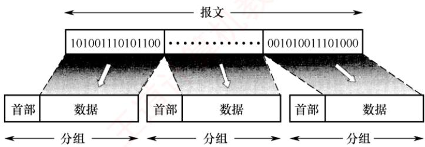  
图1.3 构成分组的过程

源主机将分组发送到分组交换网，网络中的分组交换机（如路由器）收到一个分组后，先将其缓存，然后从首部提取目的地址，据此查找转发表，并将分组转发给下一个分组交换机。经过多个分组交换机的存储转发，分组最终到达目的主机。

分组交换不仅继承了报文交换的诸多优点，还具有以下优势：

1）便于存储管理，转发开销小。由于分组长度固定，缓冲区大小可预设，管理更高效。

2）传输效率高。分组可逐个发送，实现流水线操作，即后一个分组的接收可与前一个分组的转发并行，从而减少整体传输时间。

3）降低出错概率与重传代价。由于分组较短，出错概率也必然减小，重传数据量大幅减少，既提高了可靠性，又降低了传输时延。

分组交换技术的缺点：

1）存在存储转发时延。尽管比报文交换的传输时延小，但相比于电路交换仍存在存储转发时延，且要求节点交换机具备更强的处理能力。

2）需要传输额外的信息量。每个数据段都需附加控制信息以构成分组，使得传送的信息量增大约5%～10%，从而增加了控制复杂度，降低了通信效率。

3）分组可能失序、丢失或重复。当采用数据报服务①时，分组可能经不同路径到达，需在目的主机按编号重排序，处理较为复杂。若采用虚电路服务，虽可避免失序，但需经历建立连接、数据传输和释放连接三个阶段。

图1.4给出了三种交换方式的比较。当需连续传输大量数据，并且传输时间远大于连接建立时间时，采用电路交换更为合适。但从提升网络整体信道利用率角度看，报文交换和分组交换优于电路交换。其中，分组交换时延更小、更灵活，尤其适合突发式数据通信。

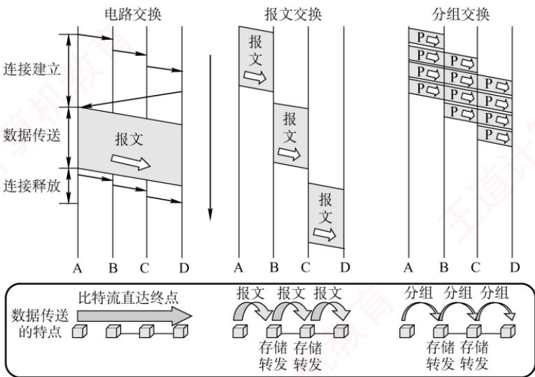  
图1.4 三种交换方式的比较

本书配套视频对三种交换方式的性能进行了详尽分析，其中分组交换网的性能分析是统考高频考点，强烈建议结合视频学习。表1.1总结了三种交换方式的特性对比。

表1.1 三种交换方式的特性对比
<table><tr><td rowspan=1 colspan=1>特性</td><td rowspan=1 colspan=1>电路交换</td><td rowspan=1 colspan=1>报文交换</td><td rowspan=1 colspan=1>分组交换</td></tr><tr><td rowspan=1 colspan=1>完成传输所需的时间    WO</td><td rowspan=1 colspan=1>最少</td><td rowspan=1 colspan=1>最多</td><td rowspan=1 colspan=1>较少</td></tr><tr><td rowspan=1 colspan=1>存储转发时延</td><td rowspan=1 colspan=1>无</td><td rowspan=1 colspan=1>高</td><td rowspan=1 colspan=1>较低</td></tr><tr><td rowspan=1 colspan=1>通信前是否需要建立连接?</td><td rowspan=1 colspan=1>是</td><td rowspan=1 colspan=1>否</td><td rowspan=1 colspan=1>否</td></tr><tr><td rowspan=1 colspan=1>节点的缓存开销</td><td rowspan=1 colspan=1>无</td><td rowspan=1 colspan=1>高</td><td rowspan=1 colspan=1>低</td></tr><tr><td rowspan=1 colspan=1>是否支持差错控制?</td><td rowspan=1 colspan=1>不支持</td><td rowspan=1 colspan=1>支持</td><td rowspan=1 colspan=1>支持</td></tr><tr><td rowspan=1 colspan=1>数据是否有序到达?</td><td rowspan=1 colspan=1>是</td><td rowspan=1 colspan=1>是</td><td rowspan=1 colspan=1>否</td></tr><tr><td rowspan=1 colspan=1>是否需要额外的控制信息?</td><td rowspan=1 colspan=1>否</td><td rowspan=1 colspan=1>是</td><td rowspan=1 colspan=1>是（且占比较大）</td></tr><tr><td rowspan=1 colspan=1>线路分配的灵活性</td><td rowspan=1 colspan=1>不灵活</td><td rowspan=1 colspan=1>灵活</td><td rowspan=1 colspan=1>非常灵活</td></tr><tr><td rowspan=1 colspan=1>线路利用率</td><td rowspan=1 colspan=1>低</td><td rowspan=1 colspan=1>高</td><td rowspan=1 colspan=1>非常高</td></tr></table>

## 1.1.5 计算机网络的分类

## 1. 按分布范围分类

1）广域网（WAN）。广域网用于长距离通信，覆盖范围通常为几十至数千千米，常用于构建互联网的骨干部分，其节点交换机间通过高速链路互联，通信容量大。

2）城域网（MAN）。城域网的覆盖范围可跨越几个街区乃至整个城市，直径约为5～50km。目前城域网大多采用以太网技术，因此有时也被归入局域网的讨论范畴。

3）局域网（LAN）。局域网通常将主机通过高速线路互连，覆盖范围较小，一般为几十米到几千米。传统上，局域网采用广播技术，而广域网则采用交换技术。

4）个人区域网（PAN）。个人区域网是指在个人工作或活动区域内，利用无线技术将消费电子设备（如平板电脑、智能手机等）互联而成的网络，也称无线个人区域网（WPAN）。

## 2. 按传输技术分类

1）广播式网络。所有联网计算机共享一个公共通信信道。当一台计算机通过该信道发送报文分组时，所有其他计算机都能“收听”到该分组，并通过检查目的地址决定是否接收。局域网普遍采用广播式通信；此外，广域网中的无线和卫星通信网络也属于广播式网络。

2）点对点网络。每条物理线路连接一对计算机。若两台主机之间无直接连接，则分组需通过中间节点进行存储转发，直至到达目的主机。

## 3. 按拓扑结构分类

网络拓扑结构是指网络中节点（如路由器、主机等）与通信线路之间的几何排列关系，主要描述通信子网的结构。常见的拓扑结构包括总线形、星形、环形和网状网络，如图1.5所示。其中，总线形、星形和环形多用于局域网，网状结构则多用于广域网。

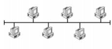  
(a) 总线形

  
(b) 星形

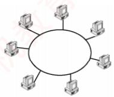  
(c) 环形

  
(d) 网状  
图1.5 几种不同的网络拓扑结构

1）总线形网络。使用单根传输线连接所有计算机。优点是建网容易、增减节点方便、节省线路；缺点是重负载下通信效率低，并且总线任意一处故障都会影响全网。

2）星形网络。各终端或计算机通过独立线路连接到中央设备（通常为交换机或路由器）。优点是便于集中控制与管理；缺点是成本较高，且中央设备对故障敏感。

3）环形网络。所有计算机接口设备连接成一个闭合环路，信号沿路环单向传输。典型的例子是令牌环局域网。环可以是单环或双环，以提高可靠性。 KON

4）网状网络。一般情况下，每个节点至少有两条路径与其他节点相连，广泛应用于广域网。

上述四种基本拓扑结构可相互组合，构成更复杂的混合网络。

## 4. 按使用者分类

1）公用网（PublicNetwork）。由电信运营商出资建设，面向公众开放。任何愿意遵守规定并缴纳费用的用户均可接入使用。

2）专用网（PrivateNetwork）。由特定单位为满足自身业务需求而建设，仅限内部使用，不对外提供服务。例如铁路、电力、军队等部门的专用网络。

## 5. 按传输介质分类

传输介质分为有线和无线两大类，相应地，网络可分为有线网络和无线网络。有线网络包括双绞线网络、同轴电缆网络、光纤网络等；无线网络包括蓝牙、Wi-Fi、微波、无线电等类型。

## 1.1.6 计算机网络的性能指标

性能指标从不同方面度量计算机网络的性能。常用的性能指标如下。

1）速率（Speed）。连接到网络上的节点在数字信道上传送数据的速率，也称数据传输速率、数据率或比特率，单位为bit/s（比特/秒）或b/s（有时也写作 bps）。当数据率较高时，常用 kb/s $( k = 1 0 ^ { 3 } )$ 、Mb/s $(M = 10^{6})$ 或 $\mathrm{Gb/s} (\mathrm{G} = 10^9)$ 表示。

## 注意

在描述数据量时，K、M、G常用2的幂次表示，如 $1 \mathrm{Kb} = 2^{10} \mathrm{b};$ 在描述速率时，k、M、G常用10的幂次表示，如 $1\mathrm{kb/s}=10^{3}\mathrm{b/s}$ 。通常，前者使用大写K，后者使用小写k，但其他前缀均为大写。

2）带宽（Bandwidth）。在通信领域，带宽是指通信线路允许通过的信号频率范围，单位是赫兹（Hz）。但在计算机网络中，带宽表示网络通信线路所能传送数据的能力，指数字信道所能支持的最高数据传输速率，单位为b/s（比特/秒）。注意，节点间的实际可用带宽由双方网卡的性能、各段链路的带宽以及交换设备速率中的最小值决定。

考点追踪分组交换的吞吐量分析（2024）

3）吞吐量（Throughput）。指单位时间内通过某个网络（或信道、接口）的实际数据量。吞吐量常用于对实际网络进行测量，以评估真实可达到的数据传输能力。

4）时延（Delav）。指数据（一个报文或分组）从网络（或链路）的一端传送到另一端所需的总时间，它由四部分构成：发送时延、传播时延、处理时延和排队时延。

## 考点追踪网络时延的分析（2010、2013、2023、2025）

●发送时延（也称传输时延）。节点将分组的所有比特推入链路所需的时间，即从发送分组的第一个比特开始，到最后一个比特发送完毕为止的时间。

$$
 发送时延  =  分组长度/发送速率
$$

●传播时延。电磁波在信道（传输介质）中传播一定距离所需的时间，即一个比特从链路一端传播到另一端所需的时间。

$$
 传播时延  =  信道长度/电磁波在信道上的传播速率
$$

## 注意

区分传输时延和传播时延：前者取决于分组长度和发送速率，后者取决于链路距离和传输介质。

● 处理时延。分组在交换节点为存储转发而进行必要处理所花费的时间。例如，解析分组的首部、进行差错检验或查找路由等。

● 排队时延。分组在路由器的输入队列或输出队列中等待处理或转发所花费的时间。

因此，数据在网络中经历的总时延为上述四部分之和：

$$
 总时延  =  发送时延  +  传播时延  +  处理时延  +  排队时延
$$

以图1.6所示的分组交换网为例，该网络包含两段链路，其最大传输速率已在图中标注。假设主机A向主机B发送一个长度为1000B的分组，总时延在三种典型场景的分析如下。

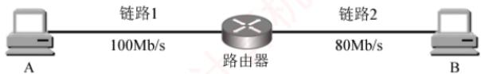  
图 1.6 一个简单的分组交换网

①若忽略传播时延、处理时延和排队时延，则

“A→链路1”的分组发送时延 = 1000B÷100Mb/s = 0.08ms;“路由器→链路 $2 ^ { \prime \prime }$ 的分组发送时延 $1000\mathrm{B} \div 80\mathrm{M} \mathrm{b} / \mathrm{s} = 0.1\mathrm{ms};$ 总时延 $0.08 ms  + 0.1 ms  = 0.18 ms$ ，如图1.7(a)所示。

②若需考虑传播时延，假设链路1和链路2的传播时延分别为0.01ms和0.05ms，则总时延 $0.01 ms  + 0.08 ms  + 0.05 ms  + 0.1 ms  = 0.24 ms$ ，如图1.7(b)所示。

③若还需考虑路由器的处理时延和排队时延，假设这两项时延合计为0.04ms，则总时延 $0.01 ms  + 0.08 ms  + 0.04 ms  + 0.05 ms  + 0.1 ms  = 0.28 ms$ ，如图1.7(c)所示。

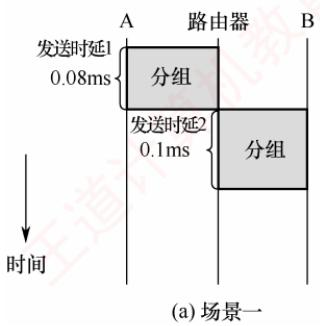

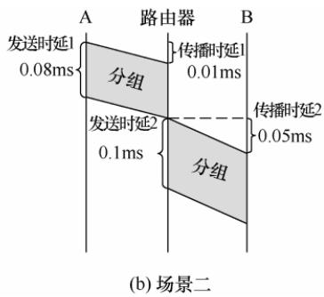

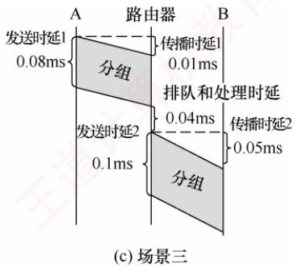  
图1.7 三种典型场景下总时延的分析

在考试中，通常无须考虑处理时延和排队时延（除非题目另有说明）。

5）时延带宽积。指发送端发送的第一个比特即将到达接收端时，发送端已发出的比特总数，即已发出但尚未到达接收端的最大比特数，也称以比特为单位的链路长度。

$$
 时延带宽积 = 传播时延 \times  信道带宽
$$

如图1.8所示，可将链路想象为一条圆柱形管道：其长度表示传播时延，横截面积表示链路带宽，则时延带宽积表示该管道可容纳的比特数量。

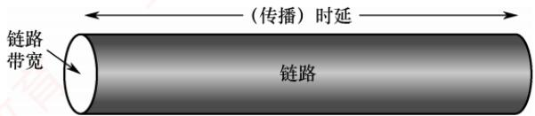  
图1.8 链路就像一条空心管道

6）往返时延（Round-TripTime，RTT）。指从发送端发出一个短分组，到收到接收端返回的确认信号所经历的总时间。往返时延包括：发送端与接收端之间的往返传播时延；接收端的处理时延；在互联网环境中，还包括各中间节点的处理时延和排队时延。注意，往  
X 返时延不包括数据分组本身的发送时延，如图1.9所示。 X

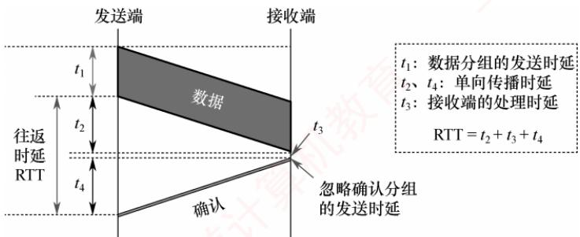  
图 1.9 往返时延 RTT 的分析

7）信道利用率。指信道有数据通过的时间占总时间的百分比。

信道利用率=有数据通过的时间/(有数据通过的时间+无数据通过的时间)信道利用率并非越高越好：过低会浪费网络资源；过高则会导致排队时延显著增加，引发网络拥塞。这就好比当公路上的车流量很大时，容易出现拥堵。

## 1.1.7 本节习题精选

## 一、单项选择题

01. 计算机网络可被理解为（）。A. 执行计算机数据处理的软件模块B. 由自治的计算机互连起来的集合体C. 多个处理器通过共享内存实现的紧耦合系统D. 用于共同完成一项任务的分布式系统

02. 下列不属于计算机网络功能的是（）。A. 提高系统可靠性 B. 提高工作效率C. 分散数据的综合处理 D. 使各计算机相对独立

03. 下列关于网络中的计算机的描述，正确的是（）。A. 各自独立，没有联系 B. 拥有独立的操作系统C. 互相干扰 D. 拥有共同的操作系统

04. 分组交换相比报文交换的主要改进是（）。A. 差错控制更加完善 B. 路由算法更加简单C. 传输单位更小且有固定的最大长度D. 传输单位更大且有固定的最大长度

A. 信道利用率低 B. 附加信息开销大C. 传播时延大 D. 不同规格的终端很难相互通信

06.不同的数据交换方式有不同的性能。为了使数据在传输期间的时延最小，首选的交换方式是（①）；为保证数据无差错地传送，不应选用的交换方式是（②）；分组交换对报文交换的主要改进是（③），这种改进产生的直接结果是（④）。① A. 电路交换 B. 报文交换 C. 分组交换 算机教②A. 电路交换 B. 报文交换 C. 分组交换

③A. 传输单位更小且有固定的最大长度B. 传输单位更大且有固定的最大长度C. 差错控制更完善 王道D. 路由算法更简单  
④ A. 降低了误码率 B. 提高了数据传输速率C. 减少传输时延 D. 增加传输时延

07.下列说法中，（）是数据报方式的特点。A. 同一报文的不同分组可以经过不同的传输路径通过通信子网B. 同一报文的不同分组到达目的节点时顺序是确定的C. 适合于短报文的通信D.同一报文的不同分组在路由选择时只需要进行一次

08. 计算机网络分为广域网、城域网和局域网，其划分的主要依据是（）。A. 网络的作用范围 B. 网络的拓扑结构C. 网络的通信方式 D. 网络的传输介质

09. 假设主机 A 和 B之间的链路带宽为100Mb/s，主机 A 的网卡速率为1Gb/s，主机 B 的网卡速率为10Mb/s，主机 A给主机 B 发送数据的最高理论速率为（）。A. 1Mb/s B. 10Mb/s C. 100Mb/s D. 1Gb/s

10. 某点对点链路的长度为 100km，若数据在该链路上的传输速率为 10⁸m/s，链路带宽为20Mb/s，已知一个已发送的分组的发送时延和传播时延相等，则该分组的大小为（）。A. 20Kb K B. 30Kb C. 40Kb D. 50Kb

11. 在下图所示的采用存储转发方式的分组交换网中，主机A向B发送两个长度为1000B的分组，路由器处理单个分组的时延为10ms（假设路由器同时最多只能处理一个分组，若在处理某个分组时有新的分组到达，则存入缓存区)，忽略链路的传播时延，所有链路的数据传输速率为1Mb/s，则分组从A发送开始到B接收完为止，需要的时间至少是（）。

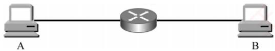

A. 34ms B. 36ms C. 38ms D. 52ms

12. 如下图所示，主机H1和H2之间有三种可选的交换方式一一电路交换、报文交换和分组交换，其中电路交换建立电路连接的时间为2s，报文交换和分组交换都要经过由一个路由器连接的链路，分组大小为5kb。三种交换方式的数据传输速率均为2.5kb/s，忽略所有的传播时延、分组开销和不可预料的线路延迟，下列说法中正确的是（）。

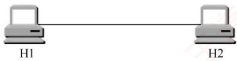  
电路交换

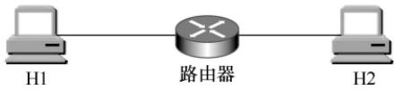  
报文交换和分组交换

A. 若H1向H2发送5kb的数据，则电路交换最节省时间B. 若H1向H2 发送500kb的数据，则电路交换和分组交换的时间相同C. 若H1向H2发送10kb的数据，则报文交换比分组交换更节省时间D. 若H1向H2发送15kb的数据，则报文交换比电路交换更节省时间

13.【2010统考真题】在下图所示的采用“存储-转发”方式的分组交换网络中，所有链路的数据传输速率为100Mb/s，分组大小为1000B，其中分组头大小为20B。若主机H1向主机H2发送一个大小为980000B的文件，则在不考虑分组拆装时间和传播延迟的情况下，从H1发送开始到H2接收完为止，需要的时间至少是（）。

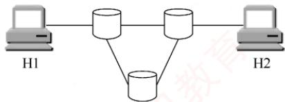

A. 80ms B. 80.08ms C. 80.16ms D. 80.24ms

14.【2013统考真题】主机甲通过一个路由器（存储转发方式）与主机乙互连，两段链路的数据传输速率均为10Mb/s，主机甲分别采用报文交换和分组大小为10kb的分组交换向主机乙发送一个大小为8Mb $( 1 M =10^{6} )$ 的报文。若忽略链路传播延迟、分组头开销和分组拆装时间，则两种交换方式完成该报文传输所需的总时间分别为（）。A. 800ms、1600ms B. 801ms、1600msC. 1600ms、800ms V D. 1600ms、801ms

15.【2023统考真题】在下图所示的分组交换网络中，主机H1和H2通过路由器互连，2段链路的带宽均为100Mb/s，时延带宽积（单向传播时延×带宽）均为1000b。若H1向H2发送一个大小为1MB的文件，分组长度为1000B，则从H1开始发送的时刻起到H2收到文件全部数据时刻止，所需的时间至少是（）。（注： $1 \mathrm { M } = 1 0 ^ { 6 } .$ )

A. 80.02ms B. 80.08ms C. 80.09ms D. 80.10ms

16.【2024 统考真题】某分组交换网络及每段链路的带宽如下图所示，H1 到H2的最大吞吐量约为（）。T A. 1Mb/s B. 10Mb/s C. 100Mb/s D.1000Mb/s

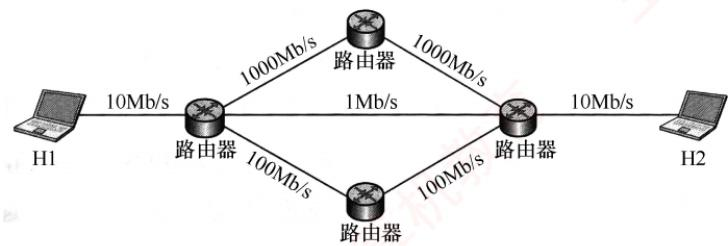

17.【2025统考真题】某网络拓扑及各链路带宽如下图所示。网络按电路交换方式运行时，主机 H1 与 H2 建立一条带宽为10Mb/s 的电路，建立电路时间为 32μs；按分组交换方式运行时，分组长度为400B，忽略分组首部开销。现H1向H2发送一个2MB（1M=10⁶）的文件，分别采用电路交换、报文交换、分组交换方式时，H2至少需要 $T _ { \mathrm { C S } }$ $T _ { \mathrm { M S } }$ 、TPS时间才能接收到全部文件内容，则Tcs、 $T _ { \mathrm { M S } }$ 、Tps满足的关系是（）。

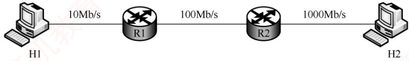

A. $T_{ CS } > T_{ MS } > T_{ PS }$ B. $T _ { \mathrm { M S } }   >   T _ { \mathrm { P S } }   >   T _ { \mathrm { C S } }$ C. $T _ { \mathrm { M S } }   >   T _ { \mathrm { C S } }   >   T _ { \mathrm { P S } }$ D. $T_{\mathrm{PS}} > T_{\mathrm{MS}} > T_{\mathrm{CS}}$

## 二、综合应用题

01.假定有一个通信协议，每个分组都引入100B的开销，用于首部和组帧。现在使用这个协议发送 $1 0 ^ { 6 } \mathbf { B }$ 的数据，但在传送过程中有1B被破坏，因而包含该字节的那个分组被丢弃。对1000B和20000B的分组的有效数据大小，分别计算“开销+丢失”字节的总数量。为使“开销+丢失”字节的总数量最小，分组数据大小的最佳值是多少？

02. 考虑一个最大距离为2km的局域网，当带宽多大时，传播时延（传播速率为 $2 \times 10^{8}  m/s$ 等于100B分组的发送时延？对于512B分组，结果又如何？

03. 在两台计算机之间传输一个文件有两种可行的确认策略。第一种策略将文件截成分组，接收方逐个确认分组，但就整体而言，文件没有得到确认。第二种策略不确认单个分组，但当文件全部收到后，对整个文件予以确认。讨论这两种方式的优缺点。

## 1.1.8 答案与解析

## 一、单项选择题

## 01. B

计算机网络是由自治计算机互连起来的集合体，其中包含三个关键点：自治计算机、互连、集合体。自治计算机由软件和硬件两部分组成，能完整地实现计算机的各种功能；互连是指计算机之间能实现相互通信：集合体是指所有使用通信线路及互联设备连接起来的自治计算机的集合。选项C和D分别指多机系统和分布式系统。

## 02. D

计算机网络的三大主要功能是数据通信、资源共享和分布式处理。计算机网络使各计算机之间的联系更加紧密而非相对独立。

## 03. B

计算机网络是一些互连的、自治的计算机系统的集合。各计算机拥有独立的操作系统和硬件资源，它们之间是有联系的，通过网络协议和通信介质进行数据交换和资源共享。

## 04. C

相对于报文交换而言，分组交换将报文划分为一个个具有固定最大长度的分组，以分组为单位进行传输。

## 05. B

分组交换要求将数据分成等长的小数据段，每段都要加上控制信息（如目的地址），因此传送数据的总开销较大。相比其他交换方式，分组交换信道利用率高。传播时延取决于传播介质及收发双方的距离。对各种交换方式，不同规格的终端都很难相互通信，因此不是分组交换的缺点。 ..XX

## 06.A、A、A、C

本题综合考查几种数据交换方式的特点。电路交换虽然建立连接的时延较大，但在数据传输  
期间一直占据链路，优点是传输时延小、通信实时性强，适用于交互式会话类通信。缺点是建立  
连接时间长，系统效率低，不具备存储数据的能力，不具备差错控制的能力。1

报文交换和分组交换都采用存储转发，传送的数据都要经过中间节点的若于存储、转发才能到达目的地，因此传输时延较大。报文交换传送数据的长度不固定且较长，分组交换要将传送的长报文分割为多个固定且长度有限的分组，因此传输时延较报文交换的小。 XV

## 07. A

数据报方式是一种无连接的分组交换技术，它先将报文拆分成若干较小的数据段，加上地址等控制信息后构成分组，这样做虽然会增加一些控制开销，但并不意味着数据报方式只适合于短报文的通信。数据报方式尽最大努力交付，不保证可靠性，分组可能出错或丢失，网络为每个分组独立地选择路由，转发的路径可能不同，因此分组不一定按序到达目的节点。

## 08. A

按分布范围分类：广域网、城域网、局域网、个人区域网。

按拓扑结构分类：星形网络、总线形网络、环形网络、网状网络。

按传输技术分类：广播式网络、点对点网络。

按使用者分类：公用网、专用网。

按数据交换技术分类：电路交换网、报文交换网、分组交换网。

因此，根据网络的覆盖范围可将网络主要分为广域网、城域网和局域网。

## 09. B

主机A给主机B发送数据的最高理论速率取决于链路带宽及主机A、主机B的网卡速率中最小者，因为它是数据传输的瓶颈。因此，最高理论速率为10Mb/s。

## 10. A

链路的传播时延 $100km \div 10^{8}m/s = 1ms$ ，发送时延等于传播时延，因此发送时延也为1ms，所以分组的大小应为 $20\mathrm{Mb/s} \times 1\mathrm{ms}=20\mathrm{Kb}$

## 11. B

分组长度为1000B，所有链路的数据传输速率为1Mb/s，因此，每段链路的发送时延为$1000\mathrm{B} \div 1\mathrm{M}\mathrm{b} / \mathrm{s}=8\mathrm{ms}$ ，第一个分组从A到达B的时间为 $8+10+8=26$ ，此后又经过10ms，第二个分组才到达B，所以总时间为 $26+10=36 ms$ ，下图是传送过程的时空图。

注意，此题还可扩展为发送更多分组的情况，请读者自行分析。

<table><tr><td rowspan="5">分组2 分组1</td><td colspan="4">在缓冲区排队等待处理的时间</td></tr><tr><td></td><td>8ms</td><td>10ms</td><td>8ms</td></tr><tr><td>8ms</td><td>10ms</td><td>8ms</td><td>H</td></tr></table>

## 12. B

若 H1 向 H2 发送 5kb 的数据，电路交换的时间为 $2+5\mathrm{kb} \div 2.5\mathrm{kb} / \mathrm{s}=4\mathrm{s}$ ，分组交换和报文交换的时间均为 $5\mathrm{kb} \div 2.5\mathrm{kb} / \mathrm{s} + 5\mathrm{kb} \div 2.5\mathrm{kb} / \mathrm{s} = 4\mathrm{s}$ ，选项A 错误。若H1向 H2 发送500kb的数据，电路交换的时间为 $2+500\mathrm{kb} \div 2.5\mathrm{kb} / \mathrm{s}=202\mathrm{s}$ ，分组交换的时间为 $500kb \div 2.5kb/s + 5kb \div 2.5kb/s = 202s$ 选项B正确。若H1向H2发送10kb的数据，报文交换的时间为 $10kb{\div}2.5kb/s+10kb{\div}2.5kb/s=8s$ 分组交换的时间为 $10kb \div 2.5kb/s + 5kb \div 2.5kb/s = 6s$ ，选项 C 错误。若 H1向 H2发送15kb 的数据，电路交换的时间为 $2+15\mathrm{kb} \div 2.5\mathrm{kb} / \mathrm{s}=8\mathrm{s}$ ，报文交换的时间为 $15kb{\div}2.5kb/s+15kb{\div}2.5kb/s=12s$ 选项D错误。

## 13. C

分组大小为1000B，其中首部占20B，故每个分组携带的有效数据为980B。文件总长为980000B，需划分为1000个分组；每个分组含首部共1000B，因此共需传输的数据量为 $1 0 ^ { 6 } \mathbf { B } .$ 。由于所有链路的传输速率相同，沿最短路径传输时延最小，而最短路径经过2个交换机（共3段链路）。H1 发送完所有分组的时间为 $10^{6} \times 8b \div 100 \mathrm{M} \mathrm{b} / \mathrm{s} = 80 \mathrm{ms}$ ，此时最后一个分组刚离开H1，该分组还需依次经过2个交换机（再通过2段链路）才能到达H2，每段链路的传输时延为 $r=1000\times8b\div100\mathrm{Mb/s}=$ 0.08ms。因此，H2接收完全部数据的时间为 $80 ms + 2r = 80.16 ms$

【另解】分组交换的传输过程类似于流水线。在连续传输过程中，各存储转发设备可同时处理不同的分组，就如同流水线中的各段并行工作。由于所有链路的速率相同，每段链路的传输时延 $r=1000\times8b\div100\mathrm{Mb/s}=0.08\mathrm{ms}$ ，最短路径有3段链路。H2接收完全部数据的时间为 $3r + (m - 1)r =$ $3 \times 0.08  ms  + (1000 - 1) \times 0.08  ms  = 80.16  ms$ 。也就是说，第一个分组从流水线中流出所需的时间为3r，此后每隔r时间就有一个分组流出。 TI

## 14. D

传输路径为：甲—路由器一乙。

在题中未明确说明的情况下，不考虑排队时延和处理时延，只考虑发送时延和传播时延；本题已忽略传播时延，因此只需计算报文交换和分组交换的发送时延。

报文交换：采用整报文传输，报文大小为 $8\mathrm{Mb} (1\mathrm{M}=10^{6})$ 。每个节点（包括主机甲和路由器）

在转发该报文前需要完整接收，因此需经历两次发送过程：甲向路由器发送报文，发送时延 $T =$ $8Mb \div 10Mb/s = 0.8s;$ ；路由器向乙转发该报文，同样需0.8s。总时延为1.6s，即1600ms。

分组交换：分组大小为10kb $( 1 \mathrm { k } = 1 0 ^ { 3 } )$ ，忽略分组头开销，每个分组携带10kb数据。报文总长为8Mb，分组数 $m=8Mb÷10kb=800$ 。参考2010年真题的流水线思路：甲与乙通过一个路由器相连，构成2段链路（2个流水段），每段链路的发送时延 $r = 10 \mathrm{kb} \div 10 \mathrm{Mb} / \mathrm{s} = 1 \mathrm{ms}$ 。第一个分组从甲发出后，需经过2段链路才能到达乙，耗时 $2 r ;$ 此后，流水线满载，每隔r时间就有一个分组到达乙。因此，传输 $m   =   8 0 0$ 个分组所需的总时间为 $t = 2r + (m - 1)r = 2 + (800 - 1) \times 1 = 801  ms$

## 15. D

文件大小为1MB，分组长度为1000B，分组数量为 $1MB{\div}1000B=1000$ 。一个分组从H1到H2 所需的时间 =H1 的发送时延 $t _ { 1 } + \mathrm { H 1 }$ 到路由器的传播时延 $t _ { 2 } +$ 路由器的发送时延 $t_{3} +$ 路由器到 H2 的传播时延 $t _ { 4 } ,$ 其中 $t_{1}=t_{3}=1000\mathrm{B} \div 100\mathrm{M} \mathrm{b} / \mathrm{s}=0.08\mathrm{ms}$ $t_{2}=t_{4}=1000b\div100Mb/s=0.01ms 。$ 因此，一个分组从 H1 到H2 的端到端时延为 $(0.08 + 0.01) \times 2 = 0.18  ms$ H1 发送前 999 个分组所需的时间为 $999t_{1} = 79.92\mathrm{ms}$ ，此时，第1000个分组刚刚开始发送，它还需0.18ms才能到达H2。因此，从H1开始发送到H2收到全部数据所需的最短时间为 $79.92 + 0.18 = 80.10  ms$

读者可以思考：若H1和H2之间有2个路由器，则所需的时间至少是多少？

## 16. B

H1到H2有三条路径。H1和H2各自连接路由器的链路带宽均为10Mb/s，这是所有路径共有的端侧链路。现在假设每个数据段为10Mb，分别分析各路径的吞吐量。

路径一：中间两段链路带宽均为1000Mb/s，受限于H1、H2直连路由器的链路带宽10Mb/s，无论中间链路有多快，数据从H1发出需1s（10Mb÷10Mb/s，受限于自身的10Mb/s出口），到达H2前最后一跳也需1s。吞吐量约为10Mb/s。

路径二：中间一段链路带宽为1Mb/s，H1发送一个数据段需1s，但经过中间1Mb/s链路时，转发时延为 $10\mathrm{Mb} \div 1\mathrm{Mb} / \mathrm{s}=10\mathrm{s}$ 成为瓶颈)，因此H2每隔10s收到一个数据段，吞吐量约为1Mb/s。

路径三：中间两段链路带宽均为100Mb/s，与路径一的分析类似，吞吐量约为10Mb/s。由此可见，端到端的吞吐量由路径中带宽最小的链路（瓶颈）决定。

## 17. B

采用电路交换时， $T_{ CS } =$ 电路建立时间 $3 2 \mu \mathrm { s } +$ 文件传输时间 $2MB{\div}10Mb/s=32\mu s+1.6s$ 。采用报文交换时，整个报文需要逐跳存储转发， $T_{MS}=2MB\div10Mb/s+2MB\div100Mb/s+2MB\div1000Mb/s=$ 1.776s。采用分组交换时，分组数为 $2MB/400B = 5000$ ，第一个分组从 H1 到 H2 的传输时延 =$400\mathrm{B} \div 10\mathrm{Mb/s}+400\mathrm{B} \div 100\mathrm{Mb/s}+400\mathrm{B} \div 1000\mathrm{Mb/s}=355.2\mu\mathrm{s};$ 之后，每 $\underline { { 3 2 0 } } \mu \mathrm { { s } }$ 到达一个分组，故$T_{\mathrm{PS}} = 355.2\mu \mathrm{s} + 320 \times 4999\mu \mathrm{s} = 1.6\mathrm{s} + 35.2\mu \mathrm{s}$ 。因此 $T _ { \mathrm { M S } }   >   T _ { \mathrm { P S } }   >   T _ { \mathrm { C S } }$

## 二、综合应用题

## 01. 【解答】

设D是分组数据的大小，需要的分组数量 $= 1 0 ^ { 6 } { \div } D$ ，开销=100N（被丢弃分组的首部也已计入开销），因此“开销+丢失 $100 \times 10^{6} \div D + D$ 育

当 $D   =   1 0 0 0$ 时，“开销+丢失 $100 \times 10^{6} \div 1000 + 1000 = 101000B$

当 $D = 20000$ 时，“开销+丢失 $100 \times 10^{6} \div 20000 + 20000 = 25000B$

设“开销+丢失”字节总数量为y， $y = 10^{8} \div D + D$ ，求微分有 $\mathrm{d}y \div \mathrm{d}D = 1 - 10^{8} \div D^{2}$ 0

## 02. 【解答】

$D   =   1 0 ^ { 4 }$ 时， $\mathrm{d}y \div \mathrm{d}D = 0$ ，所以分组数据大小的最佳值是10000B。

传播时延 $2 \times 10^{3}  m  \div (2 \times 10^{8}  m/s ) = 10^{-5}  s  = 10 \mu  s$

## 1）分组大小为100B:

假设带宽大小为x，要使传播时延等于发送时延，带宽如下：

$$
x=100\mathrm{B} \div 10\mu\mathrm{s}=10\mathrm{MB} / \mathrm{s}=80\mathrm{Mb} / \mathrm{s}
$$

2）分组大小为512B:

假设带宽大小为y，要使传播时延等于发送时延，带宽如下：

$$
y=512\mathrm{B} \div 10\mu\mathrm{s}=51.2\mathrm{MB} / \mathrm{s}=409.6\mathrm{Mb} / \mathrm{s}
$$

因此，带宽应分别等于 80Mb/s 和409.6Mb/s。

## 03. 【解答】

若网络容易丢失分组，则对每个分组逐一进行确认较好，此时仅重传丢失的分组。另一方面，若网络高度可靠，则在不发生差错的情况下，仅在整个文件传送的结尾发送一次确认，以减少确认次数，进而节省带宽。不过，即使只有单个分组丢失，也要重传整个文件。

## 1.2 计算机网络体系结构与参考模型

## 1.2.1 计算机网络分层结构

计算机网络是一个非常复杂的系统，因此在早期就采用了分层的设计思想。分层可将庞大而复杂的问题转换为若干较小的局部问题，而这些局部问题更易于研究和处理。

## 考点追踪网络体系结构的概念（2010）

计算机网络的各层及其协议的集合称为网络的体系结构（Architecture）。换言之，计算机网络的体系结构是对该网络及其所应完成功能的精确定义。需要强调的是，这些功能究竟由何种硬件或软件实现，属于实现（Implementation）问题。体系结构是抽象的，而实现是具体的，体现在实际运行的计算机硬件和软件中。计算机网络体系结构通常具有可分层的特性，能将复杂的大系统分解为若干较易实现的层次。 XTA

## 分层的基本原则如下：

1）每层实现一种相对独立的功能，以降低整个系统的复杂度。

2）各层之间的接口清晰、简洁，相互依赖尽可能少，便于理解与维护。

3）各层功能的定义独立于具体实现方法，可采用最合适的技术来实现。

4）保持下层对上层的独立性，上层单向使用下层提供的服务。

5）整个分层结构应有利于标准化工作。

在网络分层结构中，第n层的活动元素通常称为第n层实体。具体而言，实体指任何可发送或接收信息的硬件或软件进程，通常是某个特定的软件模块。不同机器上的同一层称为对等层，同一层的实体互为对等实体。第n层向第n+1层提供的服务，实际上是其自身及以下所有层所提供服务的总和。第n层的实体称为服务提供者，第n+1层的实体称为服务用户。

协议数据单元（PDU）：对等层之间传送的数据单位。第n层的PDU记为n-PDU。各层的PDU均由服务数据单元和协议控制信息两部分组成。

● 服务数据单元（SDU）：相邻层之间交换的数据单位。第n层的 SDU记为n-SDU。

●协议控制信息（PCI）：用于控制协议操作的信息。第n层的PCI记为 $n \mathrm { { - } P C I }$

每层的 PDU都有其通俗的名称：物理层的 PDU称为比特流，数据链路层的 PDU称为帧，

网络层的 PDU称为IP分组，传输层的 PDU称为 TCP报文段或UDP数据报。

当数据在各层之间传递时，将从第n+1层接收到的 PDU 作为第n 层的 SDU，加上第 n层的PCI后封装成第n层的PDU，再交由第n-1层作为其SDU发送。接收方收到后做相反的处理。

因此，三者的关系可表示为 $n-SDU+n-PCI=n-PDU=(n-1)-SDU$ ，如图1.10所示。

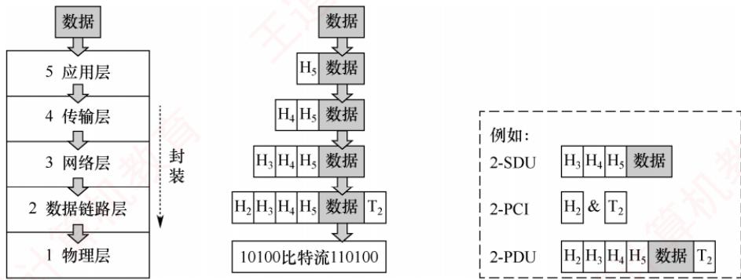  
图1.10网络各层数据单元之间的关系

具体而言，分层结构的含义包括以下几个方面：

1）第n层的实体不仅要利用第n-1层的服务来实现自身功能，还向第n+1层提供本层的服务，该服务是第n层及其下面各层所提供服务的总和。

2）最低层只提供服务，是整个层次结构的基础；最高层面向用户提供服务。

3）上层只能通过相邻层的接口使用下层的服务，不能跨层调用。

4）通信时，对等层在逻辑上如同存在一条直接信道，表现为能够直接交换信息。

## 1.2.2 计算机网络协议、服务、接口的概念

## 1. 协议

要有条不紊地在网络中实现数据交换，就必须遵循一些事先约定好的规则，这些规则规定了所交换数据的格式以及相关的同步问题。为在网络中进行数据交换而建立的这些规则、标准或约定称为网络协议（NetworkProtocol）。协议是控制对等实体之间通信的规则集合，是水平的。不对等实体之间不存在协议，例如，在使用TCP/IP协议栈通信的两个节点A和B，节点A的传输层与节点B的传输层之间存在协议，但节点A的传输层与节点B的网络层之间则没有协议。

协议由语法、语义和同步三部分组成。

## 考点追踪同步的概念（2020）

1）语法。规定数据与控制信息的格式。例如，TCP报文段的结构由其语法定义。

2）语义。规定需要发出何种控制信息、完成何种动作以及做出何种应答。例如，TCP连接建立过程中每次握手所执行的操作由其语义定义。

3）同步（或时序）。规定执行各种操作的条件及事件发生的先后顺序。例如，TCP连接建立过程中三次握手的时序关系由其同步机制定义。

## 2. 接口

同一节点内相邻两层实体交换信息的逻辑接口称为服务访问点（Service Access Point，SAP)。每层只能与紧邻的上下层定义接口，不允许跨层定义接口。服务是通过SAP提供给上层的，第n层的 SAP即为第n+1层访问第n层服务的入口。

## 3. 服务

服务是指下层为紧邻的上层提供的功能调用，是垂直的。对等实体在协议的控制下协同工作，使得本层能够向上层提供服务；但要实现本层协议，又必须依赖下层所提供的服务。

需注意，协议与服务在概念上有本质区别。首先，只有本层协议的正确实现，才能保证向上一层提供服务。上层的服务用户只能感知到服务本身，而无法看到底层协议的细节，即下层协议对上层是透明的。其次，协议是水平的，用于规范对等实体之间的通信；服务是垂直的，由下层通过层间接口向上层提供。此外，并非某一层完成的全部功能都能称为服务，只有那些能被上层实体感知并调用的功能，才构成服务。 XT

协议、接口、服务三者之间的关系如图1.11所示。

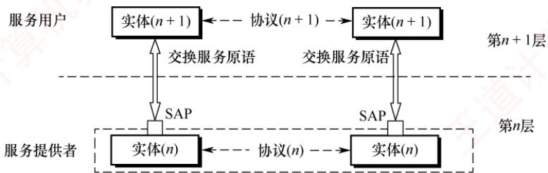  
图1.11协议、接口、服务三者之间的关系

计算机网络提供的服务可按以下三种方式分类。

## （1）面向连接服务与无连接服务

面向连接服务要求通信双方在传输前先建立连接并分配资源（如缓冲区），传输结束后，释放连接与资源，全过程包括连接建立、数据传输和连接释放三个阶段，以保障通信可靠性。

无连接服务无须预先建立连接，发送方可直接发送包含目的地址的分组，由网络动态选择路径，各分组独立传输。该服务通常称为“尽最大努力交付”，属于不可靠服务。

## (2)可靠服务和不可靠服务

可靠服务是指网络具备检错、纠错和应答机制，能确保数据正确、完整、有序地送达目的地。不可靠服务是指网络仅提供“尽最大努力交付”，不保证可靠性。

对于提供不可靠服务的网络，数据的可靠性需由高层保障。例如，接收方校验数据完整性，出错时通知发送方重传，从而通过高层机制将不可靠服务转化为可靠服务。

## （3）有应答服务和无应答服务

有应答服务是指接收方在收到数据后，由传输系统自动向发送方返回应答（肯定或否定）。例如，文件传输通常采用有应答服务，以确保数据完整。 道

无应答服务是指接收方不自动返回应答；若需确认，须由高层协议或应用实现。例如，在WWW服务中，客户端收到网页后通常不向服务器发送应答。

## 1.2.3 OSI 参考模型和 TCP/IP 模型

## 1. OSI 参考模型

## 考点追踪OSI低三层的网络设备及其功能（2016）

国际标准化组织（ISO）提出的网络体系结构模型称为开放系统互连参考模型（OSI/RM），简称OSI参考模型。该模型包含7层，自下而上（第1～7层）依次为：物理层、数据链路层、网络层、传输层、会话层、表示层、应用层。其层次结构如图1.12所示。

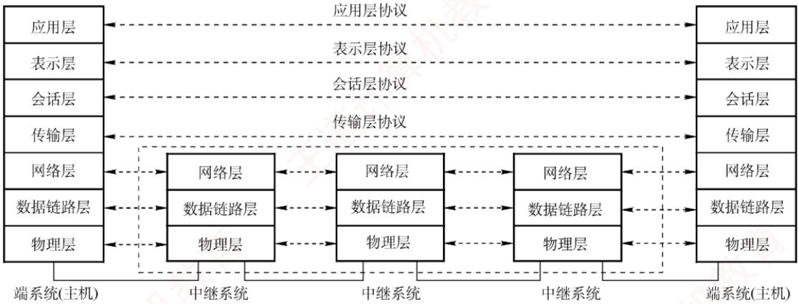  
图1.12 OSI参考模型的层次结构  
下面详述各层功能。

## 考点追踪OSI参考模型的层次结构（2013、2014、2017、2019）

## （1）物理层（Physical Layer）

物理层的传输单位是比特。其功能是在物理介质上为数据端设备透明地传输原始比特流。图1.13展示的是两个通信节点及它们之间的一段通信链路。物理层主要研究以下内容：

  
图1.13 两个通信节点及它们之间的一段通信链路

①通信链路与节点的连接需通过电路接口，物理层规定了接口的机械特性（如形状、尺寸等）和电气特性（如引脚数量与排列等），例如笔记本电脑上的网线接口。

②物理层还规定了通信链路上的编码意义与电气特征。例如，若约定信号X表示比特0，则发送方发出X代表0，接收方收到X即解读为0。

注意，传输所用的物理介质（如双绞线、光缆、无线信道等）不属于物理层协议范畴，而是位于其下方。因此，有人将物理介质视为“第0层”。 XTA

## （2）数据链路层（Data Link Layer）

## 考点追踪OSI参考模型中数据链路层的功能（2022）

数据链路层的传输单位是帧。主机间的数据传输总是在一段段链路上进行的，数据链路层的主要作用是：将物理层提供的可能出错的物理连接，改造为逻辑上无差错的数据链路，将网络层交来的分组封装成帧，并可靠地传送到相邻节点的网络层，实现节点间的差错控制与流量控制。

●差错控制：因噪声干扰，传输比特流时可能出错（例如，图1.13中，节点A向B发送的信号由X变为Y，导致比特0被误判为1）。差错控制机制可检测差错并丢弃错误帧。

● 流量控制：若发送方的发送速率高于接收方的接收速率，如果不加以控制，将导致接收方丢弃来不及接收的帧。流量控制可协调双方的速率，从而提升链路效率。

在广播式网络的数据链路层中，还需解决对共享信道的访问控制问题。

## （3）网络层（Network Layer)

网络层的传输单位是数据报（或分组）。其主要任务是将分组从源主机传送到目的主机，为不同主机提供通信服务。核心功能包括：路由选择、拥塞控制、差错控制、流量控制、网际互联等。网络层既提供有连接的虚电路服务，又提供无连接的数据报服务。

## 注意

无论哪一层的协议数据单元，均可笼统称为“分组”。

如图1.14所示的网络中，当节点A向B发送分组时，可能存在多条路径（如a-c-g、b-h等）。网络层利用路由算法选择合适路径，确保分组顺利到达目的节点。

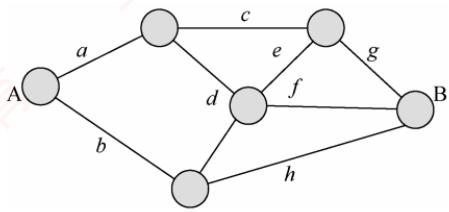  
图1.14 某网络结构图

流量控制：协调源主机与目的主机的收发速率（与数据链路层的流量控制类似）。

●拥塞控制：当网络节点因过载而大量丢弃分组时，网络处于拥塞状态，需采取措施缓解。

● 差错控制：通过检错机制确保向上层提交的都是无差错的分组，无法纠正则丢弃。

（4）传输层（Transport Layer）

考点追踪OSI参考模型中传输层的功能（2009）

传输层（又称运输层）负责不同主机中进程之间的端到端通信，提供连接管理、可靠传输、流量控制、差错控制等服务。OSI参考模型的传输层仅提供面向连接的可靠服务。

需要注意的是，数据链路层实现节点到节点通信（基于MAC地址），网络层实现主机到主机通信（基于IP地址），而传输层实现端到端通信（基于端口号）。

由于一台主机可同时运行多个进程，传输层需具备复用与分用的功能：复用是指多个应用进程可同时使用传输层的服务，分用是指传输层能将接收到的数据准确交付给对应的上层进程。 V XTA

## （5）会话层（Session Layer）

## 考点追踪OSI参考模型中会话层的功能（2019）

会话层管理不同主机上进程之间的会话（Session），包括建立、维护和终止会话连接。它为表示层或用户进程提供同步机制（SYN），支持在连接上有序地传输数据，并引入检查点功能，即当通信中断时，可从最近的检查点恢复会话，实现类似“断点续传”的可靠性。

（6）表示层（Presentation Layer）

考点追踪OSI参考模型中表示层的功能（2013）

表示层解决异构系统间信息表示不一致的问题。它采用标准抽象语法定义数据结构，并通过标准编码（如ASN.1）实现跨平台数据交换。此外，数据压缩、加密与解密也由该层处理。

（7）应用层（Application Layer）

应用层是OSI参考模型的最高层，作为用户与网络的接口，为各类网络应用（如文件传输、邮件、浏览）提供访问网络环境的手段。由于应用类型多样，应用层协议最为丰富且复杂。 X

OSI参考模型各层次的功能是统考高频考点，表1.2给出了其各层的任务和功能对比。

表1.2 OSI参考模型各层的任务和功能对比
<table><tr><td rowspan=1 colspan=1>层</td><td rowspan=1 colspan=1>功能</td></tr><tr><td rowspan=1 colspan=1>应用层</td><td rowspan=1 colspan=1>提供应用与网络的接口</td></tr><tr><td rowspan=1 colspan=1>表示层</td><td rowspan=1 colspan=1>数据格式转换</td></tr><tr><td rowspan=1 colspan=1>会话层</td><td rowspan=1 colspan=1>会话管理</td></tr><tr><td rowspan=1 colspan=1>传输层</td><td rowspan=1 colspan=1>复用和分用、差错控制、流量控制、连接管理、可靠传输管理</td></tr><tr><td rowspan=1 colspan=1>网络层</td><td rowspan=1 colspan=1>路由选择、拥塞控制、网际互联、差错控制、流量控制、连接管理、可靠传输管理</td></tr><tr><td rowspan=1 colspan=1>数据链路层</td><td rowspan=1 colspan=1>差错控制、流量控制                                                                 冷</td></tr><tr><td rowspan=1 colspan=1>物理层</td><td rowspan=1 colspan=1>定义电路接口参数、信号的含义/电气特性等</td></tr></table>

## 2. TCP/IP 模型

考点追踪TCP/IP模型的层次结构（2021）

TCP/IP模型从低到高依次为：网络接口层（对应OSI参考模型的物理层和数据链路层）、

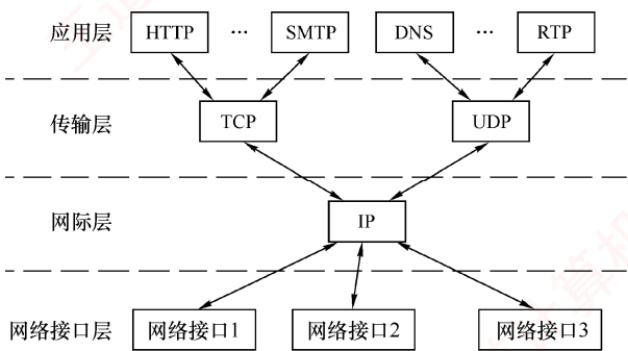  
图1.15 TCP/IP模型的层次结构及各层的主要协议

网际层、传输层和应用层（对应OSI参考模型的会话层、表示层和应用层）。因其广泛应用，TCP/IP模型已成为事实上的国际标准。其层次结构及各层的主要协议如图1.15所示。

网络接口层的功能类似于OSI参考模型的物理层和数据链路层，其作用是从主机或节点接收P分组，并将其发送到指定的物理网络上。TCP/IP模型并未规定该层的具体功能或协议细节，仅要求主机能通过某种底层协议接入网络以传送IP分组。实际使用的物理网络可以是各类局域网（如以太网、无线局域网等），也可以是电话网、广域网等。

考点追踪TCP/IP模型中网际层的功能（2011、2021）

网际层是TCP/IP体系结构的核心部分，功能上与OSI参考模型的网络层非常相似。它负责将分组发往任意网络，并为每个分组独立选择路由，但不保证分组有序到达，分组的有序性和可靠性由高层（如传输层）负责。网际层的核心协议是网际协议（IP），提供无连接、不可靠的服务，其传输单位为IP数据报。当前广泛使用的版本是IPv4，其下一个版本是IPv6。网际层还包括地址解析协议（ARP）、网际控制报文协议（ICMP）和网际组管理协议（IGMP）等辅助协议。

传输层的功能同样与OSI参考模型的传输层类似，旨在实现发送端与接收端主机上对等进程之间的逻辑通信。传输层主要采用两种协议：

1）传输控制协议（Transmission Control Protocol，TCP）。它是面向连接的，传输之前需先建立连接，提供可靠交付，数据传输的单位为报文段。

2）用户数据报协议（UserDatagramProtocol，UDP）。它是无连接的，不保证可靠性，仅提供“尽最大努力交付”，数据传输的单位为用户数据报。

应用层（用户-用户）集成了OSI参考模型中会话层、表示层和应用层的功能，包含所有高层协议，例如，文件传输协议（FTP）、域名解析服务（DNS）和超文本传输协议（HTTP）等。

由图 1.15 可见，IP是互联网的核心协议。TCP/IP体系体现了两大设计哲学：Everything over

IP，即各种应用均可构建于IP之上；IPoverEverything，即IP可运行于任意底层网络之上。正是这种高度的通用性与灵活性，推动了互联网发展至今日的规模。

## 3. TCP/IP 模型与 OSI 参考模型的比较

TCP/IP模型与 OSI参考模型有许多相似之处。

首先，二者均采用分层体系结构，且各层功能大体相似。

其次，二者均基于独立协议栈的概念。

最后，二者均可解决异构网络互联问题，实现不同厂商生产的计算机之间的通信。

TCP/IP模型与 OSI参考模型的层次对应关系如图1.16 所示。

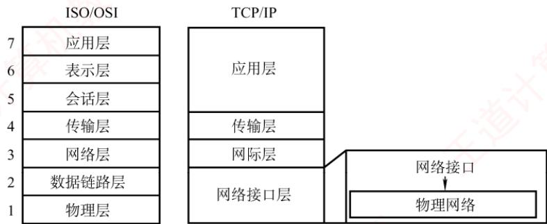  
图1.16 TCP/IP 模型与 OSI 参考模型的层次对应关系

尽管有这些相似之处，两个模型在设计理念与结构上仍有显著差异。

第一，OSI参考模型的最大贡献在于精确定义了“服务”“协议”“接口”这三个核心概念，其分层思想与现代面向对象程序设计高度契合；而TCP/IP模型对这三者未做明确区分。

第二，OSI参考模型是一个7层模型，而TCP/IP模型采用4层结构：它将OSI参考模型中的表示层和会话层功能合并为应用层，同时将物理层与数据链路层合并为网络接口层。

第三，OSI参考模型先有模型，后制定具体协议，通用性良好，适合描述各类网络。TCP/IP模型正好相反，即先有协议栈，后归纳出模型，因此不适用于任何其他的非TCP/IP模型。

第四，OSI参考模型在网络层同时支持无连接和面向连接的通信模式，但在传输层仅提供面向连接的服务；而TCP/IP模型认为可靠性应由端到端机制保障，因此其网际层仅提供无连接服务，而传输层则同时支持无连接（UDP）和面向连接（TCP）两种模式。

OSI参考模型与TCP/IP模型均非完美，二者都曾受到诸多批评。OSI参考模型的设计者从一开始就致力于构建一个全球统一的计算机网络标准。从技术角度看，这种对理想化架构

的追求，导致其软件实现结构复杂、运行效率低下。加之缺乏市场与商业驱动力，最终使其未能实现预期目标。相比之下，TCP/IP模型凭借简洁高效的设计，在实际应用中占据了主导地位。

为了兼顾理论与实践，学习计算机网络时，通常采用一种5层协议体系结构，如图1.17所示，该结构融合了OSI参考模型和TCP/IP模型的优点。本书也将采用此结构进行讨论。

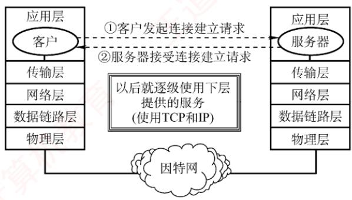  
图1.17 网络 5 层协议的体系结构模型

## 考点追踪应用层数据的逐层封装过程（2021）

最后，简单介绍使用协议栈进行通信的过程，如图1.18所示。每个协议栈的顶端是一个面向用户的接口。用户首先将数据交给本主机的应用层，应用层加上必要的控制信息，组成应用层的PDU；然后下放到传输层，作为传输层的SDU，加上传输层的PCI，组成传输层的PDU；接着下放到网络层，组成网络层的SDU，加上网络层的PCI，再次组成网络层的PDU：继续下放到数据链路层……如此层层下放，层层封装，最终形成的数据帧（或数据包）经过物理链路传输。到达接收方节点后，协议栈逆向逐层拆开“包裹”，并将收到的数据递交给用户。

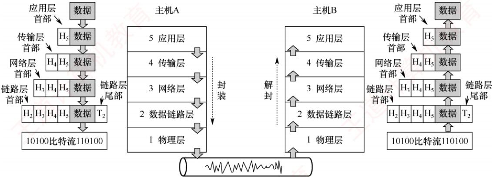  
图1.18 协议栈的通信过程示例

## 1.2.4 本节习题精选

## 单项选择题

01.下列选项中，不属于对网络模型进行分层的目标的是（）。A. 提供标准语言 王大 B. 定义功能执行的方法C. 定义标准界面 D. 增加功能之间的独立性

02. 将用户数据分成一个个数据块传输的优点不包括（）。A. 减少延迟时间B. 提高错误控制效率C. 使得多个应用更公平地使用共享通信介质D. 有效数据在协议数据单元（PDU）中所占比例更大

03. 协议是指在（）之间进行通信的规则或约定。A. 同一节点的上下层 B. 不同节点C. 相邻实体 D. 不同节点对等实体

04. OSI参考模型中的实体指的是（）。 1A. 实现各层功能的规则 B. 上下层之间进行交互时所要的信息C. 各层中实现该层功能的软件或硬件 D. 同一节点中相邻两层相互作用的地方

05. 在 OSI参考模型中，第 n层与它之上的第 n+1层的关系是（）。A. 第 n 层为第 n+1层提供服务B. 第 n+1层为从第 n 层接收的报文添加一个报头C. 第 n 层使用第 n+1层提供的服务D. 第 n 层和第 n+1层相互没有影响

06. 下列关于计算机网络及其结构模型的说法中，错误的是（）。A. 世界上第一个计算机网络是 ARPAnetB. Internet 最早起源于 ARPAnetC. 国际标准化组织（ISO）设计出了OSI/RM参考模型，即实际执行的标准D. TCP/IP 模型分为 4 个层次

07.（）是计算机网络中OSI参考模型的3个主要概念。A. 服务、接口、协议 B. 结构、模型、交换C. 子网、层次、端口 D. 广域网、城域网、局域网

08. 下列关于网络协议三要素的描述中，正确的是（）。A. 数据格式、编码、信号电平 B. 数据格式、控制信息、速度匹配C. 语法、语义、同步 D. 编码、控制信息、同步

09. 释放TCP连接的四次挥手报文的先后关系，属于网络协议三要素中的（）。A. 语法 B. 时序 C. 语义 D. 服务

10. 下图是TCP报文段的首部格式，它描述的是网络协议三要素中的（）。

<table><tr><td rowspan=1 colspan=9>-32位位0              8             16             24           31</td></tr><tr><td rowspan=6 colspan=1>TCP首部</td><td rowspan=1 colspan=7>源端口</td><td rowspan=1 colspan=1>目的端口</td></tr><tr><td rowspan=1 colspan=8>序号</td></tr><tr><td rowspan=1 colspan=8>确认号</td></tr><tr><td rowspan=1 colspan=1>数据偏移</td><td rowspan=1 colspan=1>保留</td><td rowspan=1 colspan=1>URG</td><td rowspan=1 colspan=1>ACK</td><td rowspan=1 colspan=1>PSH</td><td rowspan=1 colspan=1>RSTS&gt;Z</td><td rowspan=1 colspan=1>FIN</td><td rowspan=1 colspan=1>窗口</td></tr><tr><td rowspan=1 colspan=7>检验和</td><td rowspan=1 colspan=1>紧急指针</td></tr><tr><td rowspan=1 colspan=7>选项(长度可变)</td><td rowspan=1 colspan=1></td></tr></table>

I. 语法 ⅡI. 语义 王道 II. 时序（同步） A. 仅I B. 仅Ⅱ C. 仅 D.I、II和III

11.下列关于OSI参考模型的描述中，错误的是（）。A. OSI参考模型定义了开放系统的层次结构B. OSI参考模型定义了各层所包括的可能的服务C. OSI参考模型作为一个框架协调组织各层协议的制定D. OSI参考模型定义了各层接口的实现方法

12. 负责将比特转换成电信号进行传输的层是（）。A. 应用层 B. 网络层 C. 数据链路层 D. 物理层

13. 下列关于OSI参考模型的物理层功能的描述中，错误的是（）。A. 比特0和1使用何种电信号表示B. 传输能否在两个方向上同时进行C. 1个比特持续多长时间D. 避免快速发送方“淹没”慢速接收方

14. OSI参考模型中的数据链路层不具有（）功能。A. 物理寻址 B. 流量控制 K C. 差错检验 D. 拥塞控制

15. 下列能够最好地描述OSI参考模型的数据链路层功能的是（）。A. 提供用户和网络的接口 B. 处理信号通过介质的传输C. 控制报文通过网络的路由选择 D. 保证数据正确的顺序和完整性

16. 当数据由端系统 A 传送至端系统 B时，不参与数据封装工作的是（)。A. 物理层 B. 数据链路层C. 网络层 D. 表示层

17. 在OSI参考模型中，实现端到端的应答、分组排序和流量控制功能的协议层是（）。A. 会话层 B. 网络层 C. 传输层 D. 数据链路层

18. 在ISO/OSI参考模型中，可同时提供无连接服务和面向连接服务的是（）。A. 物理层 B. 数据链路层 C. 网络层 D. 传输层

19. 在OSI参考模型中，当两台计算机进行文件传输时，为防止中间出现网络故障而重传整个文件的情况，可通过在文件中插入同步点来解决，这个动作发生在（）。A. 表示层 K B. 会话层 C. 网络层 D. 应用层 XK

20. 数据的格式转换及压缩属于OSI参考模型中（）的功能。A. 应用层 B. 表示层 C. 会话层 D. 传输层

21.OSI参考模型中（）通过设置检验点，使通信双方在通信失效时可从检验点恢复通信。A. 传输层 B. 网络层 C. 表示层 D. 会话层

22. 下列说法中正确描述了OSI参考模型中数据的封装过程的是（）。A. 数据链路层在分组上仅增加了源物理地址和目的物理地址B. 网络层将高层协议产生的数据封装成分组，并增加第三层的地址和控制信息C. 传输层将数据流封装成数据帧，并增加可靠性和流控制信息D. 表示层将高层协议产生的数据分割成数据段，并增加相应的源和目的端口信息

23.在OSI参考模型中，提供流量控制功能的层是第（①）层；提供建立、维护和拆除端到端的连接的层是（②)；为数据分组提供在网络中路由功能的是（③)；传输层提供(④）的数据传送；为网络层实体提供数据发送和接收功能及过程的是（⑤）。①A.1、2、3 B. 2、3、4 C. 3、4、5 D. 4、5、6② A. 物理层 B. 数据链路层 C. 会话层 D. 传输层③ A. 物理层 B. 数据链路层 C. 网络层 D. 传输层④A. 主机进程之间 B. 网络之间C. 数据链路之间 D. 物理线路之间⑤ A. 物理层 B. 数据链路层 C. 会话层 D. 传输层 收育

24.在OSI参考模型中，（）利用通信子网提供的服务实现两个进程之间的端到端通信。A. 网络层 B. 传输层 C. 会话层 D. 表示层

25. 互联网采用的核心技术是（）。A.TCP/IP B. 局域网技术 C. 远程通信技术 D. 光纤技术

26.在TCP/IP模型中，（）处理关于可靠性、流量控制和错误校正等问题。A. 网络接口层B. 网际层 C. 传输层 D. 应用层

27.上下相邻层实体之间的接口称为服务访问点，应用层的服务访问点也称（）。A. 用户接口 B. 网卡接口 C. IP地址 D. MAC 地址

28. 在OSI参考模型中，各层都有差错控制过程，指出以下每种差错发生在哪些层中：噪声使传输链路上的一个0变成1或一个1变成0（①)。收到一个序号错误的目的帧（②)。一台打印机正在打印，突然收到一个错误指令要打印头回到本行的开始位置（③）。①A. 物理层 B. 网络层 C. 数据链路层 D. 会话层②A. 物理层 B. 网络层 C. 数据链路层 D. 会话层③A. 物理层 B. 网络层 C. 应用层 D. 会话层

29.【2009统考真题】在OSI参考模型中，自下而上第一个提供端到端服务的层是（）。A. 数据链路层 B. 传输层 C. 会话层 D. 应用层

30.【2010统考真题】下列选项中不属于网络体系结构所描述的内容是（）。A. 网络的层次 B. 每层使用的协议C. 协议的内部实现细节 D. 每层必须完成的功能

31.【2013统考真题】在OSI参考模型中，功能需由应用层的相邻层实现的是（）。A. 对话管理 B. 数据格式转换 C. 路由选择 D. 可靠数据传输

32.【2014统考真题】在OSI参考模型中，直接为会话层提供服务的是（）。A. 应用层 B. 表示层 C. 传输层 D. 网络层

33.【2016统考真题】在OSI参考模型中，路由器、交换机（Switch）、集线器（Hub）实现的最高功能层分别是（）。A. 2、2、1 B. 2、2、2 C. 3、2、1 D. 3、2、2

34.【2017统考真题】假设OSI参考模型的应用层欲发送400B的数据（无拆分），除物理层和应用层外，其他各层在封装PDU时均引入20B的额外开销，则应用层的数据H 传输效率约为（）。A. 80% B. 83% C. 87% D. 91%

35.【2019统考真题】OSI参考模型的第5层（自下而上）完成的主要功能是（）。A. 差错控制 B. 路由选择 C. 会话管理 D. 数据表示转换

36.【2020统考真题】右图描述的协议要素是（）。I. 语法 II. 语义 III.时序A. 仅I B. 仅ⅡI 计算C. 仅ⅢI D. I、ⅡI和ⅢII

37.【2021统考真题】在TCP/IP模型中，由传输层相邻的下一层实现的主要功能是（）。时间A. 对话管理 B. 路由选择C. 端到端报文段传输 D. 节点到节点流量控制

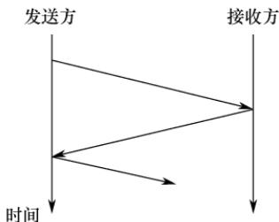

38.【2022统考真题】在ISO/OSI参考模型中，实现两个相邻节点间流量控制功能的是（）。A. 物理层B. 数据链路层 C. 网络层 D. 传输层

## 1.2.5 答案与解析

## 单项选择题

01. B

分层属于计算机网络体系结构的范畴，选项A、C和D均是网络模型分层的目的，而分层的目的不包括定义功能执行的具体方法。

02. D

将用户数据分成一个个数据块传输，因为每块均需加入控制信息，所以实际上会使有效数据在PDU中所占的比例更小。其他各项均为其优点。 。へ啦

03. D

协议是为对等层实体之间进行逻辑通信而定义的规则的集合。

04. C

实体是指每层中实现该层功能的软件或硬件，可以是程序、模块、子程序或设备。

## 05. A

服务是指下层为紧邻的上层提供的功能调用，每层只能调用紧邻下层提供的服务（通过服务访问点），而不能跨层调用。V

## 06. C

ISO设计了开放系统互连参考模型（OSI/RM），但实际执行的通用标准是TCP/IP标准。

## 07. A

计算机网络要做到有条不紊地交换数据，就必须遵守一些事先约定的原则，这些原则就是协议。在协议的控制下，两个对等实体之间的通信使得本层能够向上一层提供服务。要实现本层协议，还要使用下一层提供的服务，而提供服务就是交换信息，交换信息就需要通过接口，所以说服务、接口、协议是OSI参考模型的3个主要概念。

## 08. C

描述网络协议的三要素是语法、语义和同步。

## 09. B

网络协议三要素中的时序（或称同步）定义了通信双方的时序关系，TCP通信双方通过“四次挥手”释放连接，它规定发送FIN、ACK、FIN和ACK报文的先后顺序。

## 10. A

网络协议三要素中的语法定义所交换信息的格式，因此TCP首部格式体现了语法的要素。

## 11. D

OSI参考模型不仅划分了层次结构，还定义了各层可能提供的服务，但并未规定协议的具体实现，而是描述了一些概念和原则，用来协调和组织各层所用的协议。OSI参考模型并未定义各层接口的实现方法，而把具体的实现细节留给了各个协议和标准，选项D错误。

## 12. D

物理层为数据链路层提供二进制流的传输服务，涉及信号的编码、解码和同步等，选项D正确。

## 13. D

避免快速发送方“淹没”慢速接收方，描述的是流量控制的作用，属于数据链路层或传输层的功能。物理层只负责透明地传送比特流，不涉及流量控制的功能，选项D错误。

## 14. D

数据链路层在不可靠的物理介质上提供可靠的传输，作用包括物理寻址、组帧、流量控制、差错检验、数据重发等。网络层和传输层才具有拥塞控制的功能。 X

## 15. D

OSI参考模型的数据链路层向上提供可靠的传输服务，在差错检测的基础上，增加了帧编号、确认和重传机制，因此保证了数据正确的顺序和完整性。选项A是应用层的功能，选项B是物理层的功能，选项C是网络层的功能。学习3.1节后，对本题的理解将更深刻。

## 16. A

物理层以0、1比特流的形式透明地传输数据链路层提交的帧。网络层和表示层都为上层提交的数据加上首部，数据链路层为上层提交的数据加上首部和尾部，然后提交给下一层。物理层不存在下一层，自然也就不用封装。

## 17. C

只有传输层及以上各层的通信才能称为端到端，选项B、D错。会话层管理不同主机间进程的对话，而传输层实现应答、分组排序和流量控制功能。

## 18. C

本题容易误选选项D。ISO/OSI参考模型在网络层支持无连接和面向连接的通信，但在传输

层仅支持面向连接的通信；TCP/IP模型在网络层仅有无连接的通信，而在传输层支持无连接和面向连接的通信。两类协议栈的区别是联考的考点，而这个区别是常考点。

## 19. B

在OSI参考模型中，会话层的两个主要服务是会话管理和同步。会话层使用检验点使通信会话在通信失效时从检验点继续恢复通信，实现数据同步。

## 20. B

OSI参考模型表示层的功能有数据解密与加密、压缩、格式转换等。

## 21. D

会话层的主要功能是建立、管理和终止进程间的会话，以及使用检查点（或称检验点）使会话在通信失效时从检验点继续恢复通信，实现数据同步。

## 22. B

数据链路层在分组上除增加源和目的物理地址外，也增加控制信息：传输层的PDU不称为帧：表示层不负责将高层协议产生的数据分割成数据段，负责增加相应源和目的端口信息的应是传输层。选项B正确描述了OSI参考模型中数据的封装过程，数据经过网络层后，只是增加了第三层PCI。

## 23.① B、② D、③ C、④ A、⑤B

在计算机网络中，流量控制指的是通过限制发送方发出的数据流量，使得其发送速率不超过接收方接收速率的一种技术。流量控制功能可存在于数据链路层及其之上的各层中。目前提供流量控制功能的主要是数据链路层、网络层和传输层。不过，各层的流量控制对象不一样，各层的流量控制功能是在各层实体之间进行的。 1

在OSI参考模型中，物理层实现比特流在传输介质上的透明传输：数据链路层将有差错的物理线路变成无差错的数据链路，实现相邻节点之间即点到点的数据传输。网络层的主要功能是路由选择、拥塞控制和网际互联等，实现主机到主机的通信；传输层实现主机的进程之间即端到端的数据传输。

下一层为上一层提供服务，而网络层的下一层是数据链路层，所以为网络层实体提供数据发送和接收功能及过程的是数据链路层。

## 24. B

在OSI参考模型中，数据链路层提供链路上相邻节点之间的逻辑通信，网络层提供主机之间的逻辑通信，传输层在运行于不同主机上的进程之间（端到端）提供逻辑通信。

## 25. A

协议是网络上计算机之间进行信息交换和资源共享时共同遵守的约定，没有协议的存在，网络的作用也就无从谈起。在互联网中应用的网络协议是采用分组交换技术的TCP/IP，它是互联网的核心技术。

## 26. C

TCP/IP模型的传输层提供端到端的通信，并且负责差错控制和流量控制，可以提供可靠的面向连接服务或不可靠的无连接服务。1

## 27. A

在同一系统中，相邻两层的实体交换信息的逻辑接口称为服务访问点（SAP），N层的SAP是N+1层可以访问N层服务的地方。SAP用于区分不同的服务类型。在5层体系结构中，数据链路层的服务访问点为帧的“类型”字段，网络层的服务访问点为IP数据报的“协议”字段，传输层的服务访问点为“端口号”字段，应用层的服务访问点为“用户接口”。

## 28. A、C、C

1）物理层。物理层负责正确、透明地传输比特流（0,1）。

2）数据链路层。数据链路层的PDU称为帧，帧的差错检测是数据链路层的功能。

3）应用层。打印机是向用户提供服务的，运行的是应用层的程序。

## 29. B

在OSI参考模型中，传输层是自下而上第一个提供端到端服务的层，通过端口号实现应用进程间的逻辑通信。数据链路层仅负责相邻节点（如交换机、路由器等中间设备）之间的通信，而网络层提供主机到主机的通信，不提供面向应用进程的服务。

## 30. C

网络体系结构是指各层及其协议的集合，涵盖网络的层次划分、每层的功能及所用的协议，因此选项A、B、D均属于描述内容。而协议的内部实现细节属于实现问题，不由体系结构规定。

## 31. B

在OSI参考模型中，应用层的相邻下层是表示层（第6层），负责处理与数据表示相关的问题。其主要功能包括数据字符集转换、数据格式转换、文本压缩以及加密与解密等。

## 32. C

在OSI参考模型中，各层直接为其上一层提供服务，而会话层的下一层是传输层。

## 33. C

集线器（Hub）是多端口中继器，工作在物理层（第1层）：以太网交换机（Switch）是多端口网桥，工作在数据链路层（第2层）；路由器是网络层设备，最高工作在第3层。因此，三者实现的最高功能层分别为网络层、数据链路层和物理层。

## 34. A

OSI参考模型共7层，除了物理层和应用层，中间5层每层引入20B开销，共增加100B开销。原始数据为400B，总传输量为500B，故传输效率为400B÷500B=80%。

## 35. C

OSI参考模型自下而上的第5层为会话层，主要功能是管理和协调不同主机上各种进程之间的通信（对话），即负责建立、管理和终止应用程序间的会话。

## 36. C

协议由语法、语义和时序三要素组成：语法规定数据格式，语义定义控制信息含义，时序规定交互顺序。题图中发送方与接收方按特定顺序交互，体现了协议的时序要素。 妆

## 37. B

在TCP/IP模型中，传输层的下一层是网际层，其主要功能是为分组选择路由并转发，即实现路由选择；它提供无连接、不可靠的尽力而为的服务，不保证有序交付。端到端报文段传输属于传输层功能，对话管理由应用层处理。TCP/IP网际层不提供节点到节点的流量控制功能。

## 38. B

在OSI参考模型中，流量控制功能在多个层次存在：数据链路层实现相邻节点之间的流量控制，网络层关注整个网络中的拥塞与流量调节，传输层则提供端到端的流量控制。本题明确要求“两个相邻节点间”的流量控制，因此由数据链路层实现。

## 1.3 本章小结及疑难点

1. 互联网使用的IP是无连接的，因此其传输是不可靠的。这容易让人觉得互联网很不可靠。

## 为什么当初不把互联网的传输设计为可靠的呢？

传统电信网主要用于电话通信，而普通电话机是“哑终端”（不具备智能处理能力），因此电信公司必须将网络本身设计得高度可靠，以保障通信质量。

数据传输显然需要可靠性。但在设计ARPAnet（互联网的前身）时，一个关键争论是“谁应该负责保证传输的可靠性？”一种观点认为，应像电信网那样，由通信网络本身确保可靠传输毕竟当时的技术已能构建高可靠的网络。另一种观点则主张，由用户主机（端系统）来负责可靠性，理由是这样可以让网络结构更简单、成本更低、扩展性更强。

计算机网络的先驱们注意到，计算机与电话机有本质区别：计算机是智能终端，具备强大的处理能力。因此，他们最终采纳了端到端可靠传输的设计哲学：在网络层使用简单、无连接、不可靠的IP协议，而在传输层通过面向连接的TCP协议实现端到端的可靠性。

这样既降低了网络基础设施的复杂性和成本，又确保了应用所需的可靠通信。

## 2. 端到端通信和点到点通信有什么区别？

本质上，由物理层、数据链路层和网络层构成的通信子网负责提供主机到主机的通信服务，而传输层则负责为主机上的应用进程提供端到端的通信服务。

点到点通信指的是主机到主机之间的数据传递，不涉及具体的应用进程。它只负责将数据从一台主机传送到另一台主机，但无法识别是哪两个进程在通信一一这一任务由更高层完成。

端到端通信建立在点到点通信的基础之上，通过多段点到点链路串联，最终实现不同主机上应用进程之间的通信。这里的“端”指的是应用进程的端口，而端口号用于标识应用层中的不同进程。因此，端到端通信真正面向的是用户程序之间的交互，而非仅仅是机器之间的连接。

## 3. 如何理解传输速率和传播速率？

传输速率是指主机或路由器在数字信道上发送数据的速率，单位是比特/秒（b/s）。

传播速率是指电磁波在物理介质中向前传播的速度，单位是米/秒（m/s）。

例如，在图1.19中，假定链路的传播速率为 $2 \times 10^{8}  m/s$ ，即电磁波1μs可向前传播200m。若链路带宽为1Mb/s，则主机1μs可向链路发送1 比特数据。

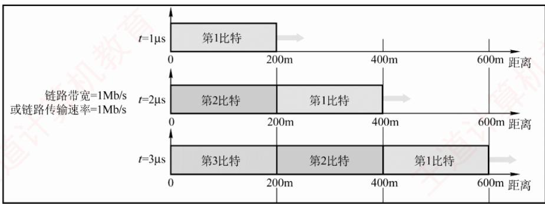  
图1.19 传输速率与传播速率的区别

在t=0时，开始发送数据；

到 $t   =   1 \mu \mathrm { s }$ 时，第一个比特已沿链路传播约200m;

到 $t   =   2 \mu \mathrm { s }$ 时，第二个比特发出，第一个比特到达400m处；

到 $t   =   3 \mu \mathrm { s }$ 时，第三个比特发出，第一个比特到达600m处。

由此可见：链路上同时存在多少比特，取决于传输速率（带宽）；而每个比特在某一时刻位于何处，取决于传播速率。 道

# 第 2 章

## 物理层

## 【考纲内容】

（一）通信基础

信道、信号、带宽、码元、波特、速率、信源与信宿等基本概念；奈奎斯特定理与香农定理；编码与调制：

电路交换、报文交换与分组交换；数据报与虚电路①

  
视频讲解

## （二）传输介质

双绞线、同轴电缆、光纤与无线传输介质；物理层接口的特性

（三）物理层设备

中继器；集线器

## 【复习提示】

物理层考虑的是怎样才能在连接各台计算机的传输介质上传输数据比特流，而不是具体的传输介质。本章概念较多，易出选择题，复习时应抓住重点，如奈奎斯特定理和香农定理的应用、编码与调制技术、物理层接口的特性、物理层设备的功能和特点等。

## 2.1 通信基础

## 2.1.1 基本概念

## 1. 数据、信号与码元

通信的目的是传输信息，如文字、图像和视频等。数据是信息的载体，即用于传送信息的实体。信号则是数据的电气或电磁表现，是数据在传输过程中的存在形式。数据和信号均可分为模拟和数字两类：模拟信号的取值是连续的；数字信号的取值是离散的。

在通信系统中，通常用一个固定时长的信号波形表示一个k进制符号，该波形称为码元（也称k进制码元），而该时长称为码元宽度（或信号周期）。每个码元能够承载的信息量与其所表示的信号状态数量直接相关，1码元可以携带若于比特的信息量。例如，若一个信号周期内可能出现2种信号，则每种信号可表示1位二进制数，意味着1码元可携带1比特信息；若可能出现4种信号，则每种信号可表示2位二进制数，意味着1码元携带2比特信息。

## 2. 信源、信道与信宿

图2.1所示为一个单向通信系统的模型，实际的通信系统大多数是双向的，可进行双向通信。数据通信系统主要划分为信源、信道和信宿三部分。信源是产生和发送数据的源头，信宿是接收数据的终点，它们通常都是计算机或其他数字终端装置。信道是信号的传输介质，一条双向通信的线路包含一个发送信道和一个接收信道。信源发出信息后，需经发送变换器转换为适合在信道传输的信号；该信号经信道传至接收端后，由接收变换器还原为原始信息，再交付给信宿。噪声源是信道上的噪声及分散在通信系统其他各处的噪声的集中表示。

  
图2.1 一个单向通信系统的模型

按传输信号形式的不同，信道分为传送模拟信号的模拟信道和传送数字信号的数字信道；按传输介质的不同，分为无线信道和有线信道。

信道上传送的信号有基带信号和宽带信号之分。基带信号是由信源发出的未经过调制的原始电信号，当在信道中直接传送基带信号时，称为基带传输：宽带信号是将基带信号调制到高频载波上形成的信号，然后其在信道上传输，这种方式称为宽带传输。 X

数据传输方式分为串行传输和并行传输。串行传输是指逐比特地按序依次传输，并行传输是指若于比特通过多个通信信道同时传输。串行传输适用于长距离通信，如计算机网络。并行传输适用于短距离通信，常用于计算机内部，如CPU与主存之间。

从通信双方信息的交互方式看，可分为三种基本方式：

1）单向通信。只有一个方向的通信而没有反方向的交互，如无线电广播、电视广播等。

2）半双工通信。通信双方都可发送或接收信息，但任何一方都不能同时发送和接收。

3）全双工通信。通信双方可同时发送和接收信息。

单向通信只需一个信道；全双工通信需要两个独立信道（每个方向一个）；而半双工通信可在同一信道上分时双向传输，无须两个物理信道。

## 3. 速率、波特与带宽

速率是指数据传输速率，表示单位时间内传输的数据量，常有两种描述形式。

考点追踪比特率与波特率的关系（2011、2014、2022）

1）码元传输速率。也称波特率或调制速率，表示数字通信系统每秒传输的码元数，单位是波特（Baud）。码元既可以是多进制的，也可以是二进制的，码元速率与进制无关。

2）信息传输速率。也称比特率，表示数字通信系统每秒传输的比特数，单位是b/s。

## 注意

波特和比特是两个不同的概念，但波特率与比特率在数量上又有一定的关系。若一个码元携带n比特的信息量，则波特率 MBaud 对应的比特率为 M×n b/s。

在模拟通信中，带宽（也称频率带宽）表示信道所能传输信号的频率范围，即最高频率与最低频率之差，单位是赫兹（Hz）。而在数字通信或计算机网络中，带宽用来表示通信线路所能传输数据的能力，即最大数据传输速率，此时带宽的单位不再是Hz，而是b/s。

## 2.1.2 信道的极限容量

任何实际的信道都不是理想的，信号在信道上传输时会不可避免地产生失真。只要接收端

能够从失真的信号波形中识别出原始信号，这种失真对通信质量就没有影响；然而，若信号失真严重，则接收端就无法正确识别每个码元。码元传输速率越高、传输距离越远、噪声干扰越大或传输介质质量越差，接收端波形的失真就越严重。

## 1. 奈奎斯特定理（奈氏准则）

## 考点追踪奈氏准则的应用（2009、2014、2022、2023）

实际信道所能通过的频率范围总是有限的。信号中的许多高频分量往往无法通过信道，会在传输中衰减，导致接收端收到的信号波形失去码元之间的清晰界限，这种现象称为码间串扰。奈奎斯特定理指出：在理想低通信道（无噪声、带宽有限）中，为避免码间串扰，极限码元传输速率为2W波特，其中W是信道的频率带宽（单位为Hz）。若用V表示每个码元的离散电平数量（不同码元的种类数；例如，若有16种不同的码元，则需用4个二进制位来表示，此时数据传输速率是码元传输速率的4倍），则有 Kl

$$
 理想低通信道的极限数据传输速率  = 2W\log_2V \quad ( 单位为  \;  b/s)
$$

对于奈氏准则，有以下结论：

1）在任何信道中，码元传输速率存在上限。若超过该上限，则会产生严重码间串扰，导致接收端无法正确识别码元。

2）信道带宽越大，其传输码元的能力越强。

3）奈氏准则仅限制码元传输速率，并未限制每个码元所能承载的信息量（比特数），因此信息传输速率仍可采用多元调制（如QAM-16、QAM-64）来提升。

## 2. 香农定理

## 考点追踪香农定理的应用（2014、2016）

实际信道存在高斯白噪声。香农定理给出了带宽受限且有高斯噪声干扰的信道的极限数据传输速率。当速率不超过该极限值时，理论上可以实现任意低的误码率。香农定理定义为

$$
 信道的极限数据传输速率 =W\log_{2}(1+S/N)
$$

式中，W为信道的频率带宽（单位为Hz），S为信号的平均功率，N为噪声功率。S/N为信噪比，即信号的平均功率与噪声的平均功率之比。 KNIT

信噪比有两种表示形式：无单位记法和分贝（dB）记法。当采用无单位记法时，信噪比 $= S / N ;$ 当采用分贝记法时，信噪比 $= 1 0 \log _ { 1 0 } ( S / N )$ (单位为dB)，例如，当 $S / N = 1 0 0 0$ 时，信噪比为30dB。注意，使用香农定理计算信道的极限数据传输速率时，信噪比应采用无单位记法。

## 考点追踪信道带宽的影响因素（2014）

对于香农定理，有以下结论：

1）信道带宽或信噪比越大，信息的极限传输速率越高。

2）对于给定的带宽和信噪比，信息传输速率的上限是确定的。

3）只要实际信息传输速率低于该极限值，就能找到某种方法实现近似无差错传输。

4）香农定理得出的是理论极限，实际信道能达到的传输速率要比它低不少。

## 考点追踪奈氏准则与香农定理的对比（2017）

奈氏准则仅考虑带宽对码元速率的限制，适用于无噪声的理想信道：而香农定理同时考虑了带宽和信噪比，适用于有噪声的实际信道。香农定理表明，在给定带宽和信噪比下，信息传输速率存在上限，即每个码元所能可靠携带的比特数是有限的。

## 2.1.3 编码与调制

信号是数据的具体表示形式，数据无论是数字的还是模拟的，为了传输的目的，都要转换成信号。将数据转换为数字信号的过程称为编码，将数据转换为模拟信号的过程称为调制。

数字数据可以通过数字发送器转换为数字信号进行传输，也可以通过调制器转换为模拟信号进行传输；同样，模拟数据既可通过PCM编码器转换为数字信号进行传输，也可直接以模拟信号形式传输（例如传统电话中的语音信号）。由此形成了以下四种编码与调制方式。

## 1. 数字数据编码为数字信号

数字数据编码用于基带传输，即在基本不改变信号频率的情况下直接传输数字信号。编码的核心在于如何用电平或跳变来表示二进制数0和1。常用编码方式有以下几种，如图2.2所示。

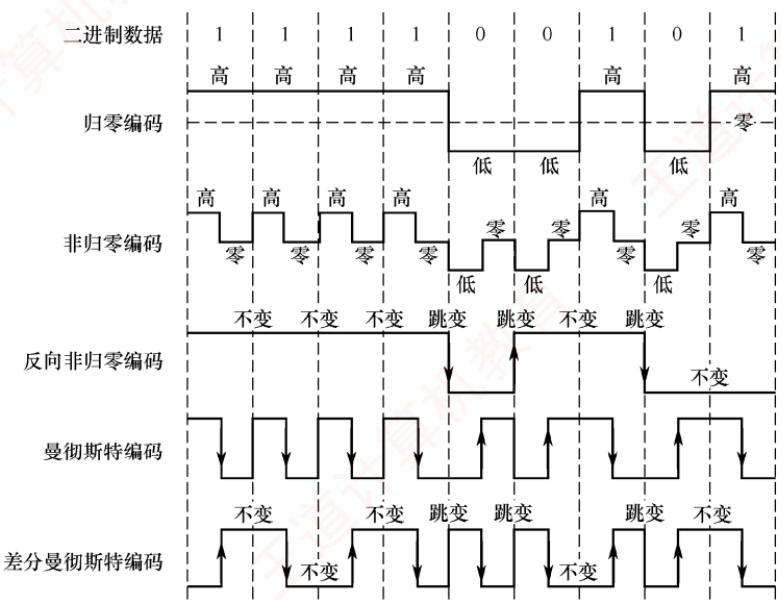  
图2.2 常用的数字数据编码

1）归零（RZ）编码。用高电平表示1，低电平表示0（或相反），每个码元中间都会跳变回零电平（“归零”）。接收方可利用这一跳变来调整自身的时钟基准，从而实现收发双方的自同步。但由于归零过程占用了一部分带宽，传输效率会受到一定影响。

## 考点追踪NRZ与NRZI编码的波形特性（2015）

2）非归零（NRZ）编码。与RZ编码的区别是不进行归零，整个周期都可用于传输数据，因此编码效率最高。但由于缺乏内在时钟信息，收发双方需额外时钟线来实现同步。

3）反向非归零（NRZI）编码。以码元起始处是否有跳变来表示数据：无跳变表示1（或依协议约定），有跳变表示0。跳变本身可用于辅助时钟恢复，兼顾了NRZ的高效率与一定的自同步能力，并且避免了RZ的带宽浪费。USB2.0等标准采用此编码。

## 考点追踪曼彻斯特编码的波形特性（2013、2015）

4）曼彻斯特编码。每个码元中间都有一次电平跳变，该跳变同时承担时钟同步与数据表示功能。常用下降沿（高→低）表示1，上升沿（低→高）表示0，或采用相反的约定。

## 考点追踪差分曼彻斯特编码的波形特性（2021）

5）差分曼彻斯特编码。同样，每个码元中间都有电平跳变，与曼彻斯特编码不同的是，该跳变仅用于时钟同步，而不表示数据。数据由码元起始处是否有跳变决定：无跳变表示1，

有跳变表示0。这种方式具有更强的抗干扰能力。

传统以太网采用的就是曼彻斯特编码，而差分曼彻斯特编码常用于令牌环网等高速网络。  
常见数字编码方式的特性对比如表2.1所示。

表2.1 常见数字编码方式的特性对比
<table><tr><td rowspan=1 colspan=1>特性</td><td rowspan=1 colspan=1>归零编码</td><td rowspan=1 colspan=1>非归零编码</td><td rowspan=1 colspan=1>反向非归零编码</td><td rowspan=1 colspan=1>曼彻斯特编码</td><td rowspan=1 colspan=1>差分曼彻斯特编码</td></tr><tr><td rowspan=1 colspan=1>自同步能力</td><td rowspan=1 colspan=1>有</td><td rowspan=1 colspan=1>无</td><td rowspan=1 colspan=1>需增加冗余位</td><td rowspan=1 colspan=1>有</td><td rowspan=1 colspan=1>有</td></tr><tr><td rowspan=1 colspan=1>浪费带宽</td><td rowspan=1 colspan=1>浪费</td><td rowspan=1 colspan=1>无</td><td rowspan=1 colspan=1>不太浪费</td><td rowspan=1 colspan=1>浪费</td><td rowspan=1 colspan=1>浪费</td></tr><tr><td rowspan=1 colspan=1>抗干扰能力</td><td rowspan=1 colspan=1>弱</td><td rowspan=1 colspan=1>弱</td><td rowspan=1 colspan=1>弱</td><td rowspan=1 colspan=1>强</td><td rowspan=1 colspan=1>强</td></tr></table>

## 2. 模拟数据编码为数字信号

该过程通常采用PCM（脉冲编码调制），包含三个步骤。

1）采样：对模拟信号进行周期性采样，将其从时间连续变为时间离散。根据奈奎斯特定理，采样频率不得低于信号最高频率的两倍。

2）量化：将采样所得的幅值按预设分级取整，将连续的模拟电平转换为离散的数值。

3）编码：将量化后的整数转换为对应的二进制码。

## 3. 数字数据调制为模拟信号

数字数据调制技术在发送端将数字信号转换为模拟信号，在接收端则将模拟信号还原为数字信号，分别对应于调制解调器的调制和解调过程。图2.3显示了数字调制的三种方式。

  
图2.3 数字调制的三种方式

## 考点追踪数字调制技术的分类与特点（2024）

## 考点追踪调制阶数与码元比特数的关系（2011、2022）

1）幅移键控（Amplitude Shift Keying，ASK）。通过改变载波的振幅来表示数字信号1和0。例如，用有载波和无载波输出分别表示1和0。这种方式容易实现，但抗干扰能力差。

2）频移键控（Frequency Shift Keying，FSK）。通过改变载波的频率来表示数字信号1和0。例如，用频率f和频率f分别表示1和0。这种方式容易实现，并且抗干扰能力强。

3）相移键控（Phase Shift Keying，PSK）。通过改变载波的相位来表示数字信号1和0。例如，用相位0和π分别表示1和0，它是一种绝对调相方式。

## 注意

与PSK不同，DPSK（差分相移键控）是一种相对调相方式，它通过检测当前码元与前一个码元的载波相位差来传输数字信息。例如，用相位是否发生变化分别表示1和0。

考点追踪QAM调制阶数与码元比特数的关系（2009、2023）

4）正交幅度调制（Quadrature Amplitude Modulation，QAM）。在载波频率相同的前提下，通过同时调制振幅和相位，形成复合信号，从而在有限带宽内实现更高的数据传输速率。

OAM基于正交载波，通常使用两路载波，分别对应正弦波和余弦波。两路载波的频率相同，但相位相差 $9 0 ^ { \circ } ,$ 因此可在同一频带上独立传输而不会相互干扰。以 $ QAM-16 ^{\textcircled{1}}$ 为例，常用如图2.4(a)所示的星座图表示：每路载波均有4种不同的振幅，其中横轴表示余弦波的幅度，纵轴表示正弦波的幅度。两路信号组合后可形成16种不同的信号状态，每个状态对应星座图上的一个点，并且代表一个4位二进制数。接收端收到信号后，通过判断该信号最接近哪个星座点，即可恢复出原始数据。若将每路载波的振幅调制成8种，则可组合成64种不同的信号状态（QAM-64），每个状态对应一个6位二进制数，如图2.4(b)所示。

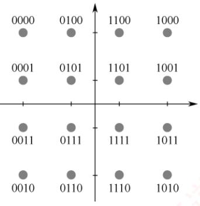  
(a) QAM-16

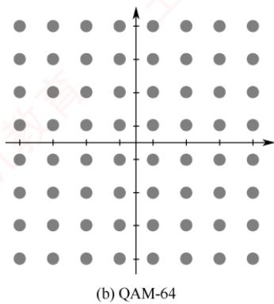  
图 2.4 QAM-16 和 QAM-64 的星座图

假设波特率为B，采用m个相位，每个相位有n种振幅，则该QAM的数据传输速率R为育 $R = B \log_{2}(m \times n)$ (单位为b/s) K

## 4. 模拟数据直接传输为模拟信号

在某些场景下，模拟数据直接以模拟信号形式传输，无须数字化。例如，传统电话系统中，语音信号通过双绞线直接传送到本地交换机。此外，若需通过高频信道（如无线电波）传输，则可采用调幅（AM）、调频（FM）或调相（PM）等模拟调制技术，将信号加载到高频载波上。

## 2.1.4 本节习题精选

## 一、单项选择题

01.下列关于通信基础的基本概念的说法中，正确的是（）。A. 信道与通信电路类似，一条可通信的电路往往包含一个信道B. 调制是指把模拟数据转换为数字信号的过程C. 信息传输速率是指通信信道上每秒传输的码元数D. 在数值上，波特率等于比特率与每符号所含的比特数的比值

02. 影响信道最大传输速率的因素主要有（）。A. 信道带宽和信噪比 B. 码元传输速率和噪声功率C. 频率特性和带宽 D. 发送功率和噪声功率

03.（）被用于计算机内部的数据传输。A. 串行传输 B. 并行传输 C. 同步传输 D. 异步传输

04.下列有关曼彻斯特编码的叙述中，正确的是（）。A. 每个信号起始边界作为时钟信号有利于同步B. 将时钟与数据取值都包含在信号中C. 这种编码机制特别适合传输模拟数据D. 每位的中间不跳变表示信号的取值为0

05. 在数据通信中使用曼彻斯特编码的主要原因是（）。 KNA. 实现对通信过程中传输错误的恢复 B. 实现对通信过程中收发双方的数据同步C. 提高对数据的有效传输速率 D. 提高传输信号的抗干扰能力

06. 不含同步信息的编码是（）。I. 非归零编码 I. 曼彻斯特编码 IⅢ. 差分曼彻斯特编码A. 仅I B. 仅Ⅱ C. 仅ⅡI、ⅢI D. I、ⅡI、ⅢII

07. 某信道的波特率为1000Baud，若令其数据传输速率达到4kb/s，则一个信号码元所取的有效离散值个数为（）。A. 2 B. 4 C. 8 D. 16

08. 下图是某比特串的曼彻斯特编码信号波形，则该比特串为（）。

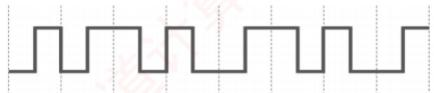

A. 0011 0110 B. 1010 1101 C. 0101 0010 D. 1100 0101

09. 已知某信道的信息传输速率为64kb/s，一个载波信号码元有4个有效离散值，则该信道的波特率为（）。A. 16kBaudB. 32kBaud C. 64kBaud D. 128kBaud

10. 有一个无噪声的8kHz信道，每个信号包含8级，每秒采样24k次，那么可以获得的最大传输速率是（）。A. 24kb/s B. 32kb/s C. 48kb/s D. 72kb/s

11. 对于某带宽为4000Hz的低通信道，采用16种不同的物理状态来表示数据。按照奈奎斯特定理，信道的最大传输速率是（）。A. 4kb/s B. 8kb/s C. 16kb/s D. 32kb/s

12. 二进制信号在信噪比为127:1的 4kHz信道上传输，最大数据传输速率可以达到（）。A. 28000b/s B. 8000b/s C. 4000b/s D. 无限大

13. 电话系统的典型参数是信道带宽为 3000Hz，信噪比为30dB，该系统的最大数据传输速率为（）。A. 3kb/s B. 6kb/s D. 64kb/s

14. 一个信道的信号功率是0.14W，噪声功率是0.02W，频率范围为3.5\~3.9MHz，则该信A. 1.2Mb/s B. 2.4Mb/s C. 11.7Mb/s D. 23.4Mb/s

15. 采用 8种相位，每种相位各有两种幅度的QAM调制方法，在 1200Baud 的信息传输速率下能达到的数据传输速率为（）。A. 2400b/s B. 3600b/s C. 9600b/s D. 4800b/s

16. 一个信道每1/8s采样一次，传输信号共有16种变化状态，最大数据传输速率是（）。A. 16b/s B. 32b/s C. 48b/s D. 64b/s

17. 某信道的带宽为 10MHz，信噪比为 30dB，采用 QAM-32 调制方案。若将带宽提高到20MHz，信噪比提高到40dB，则信道的极限数据传输速率大约提高到原来的（）倍。A. 2 B. 2.2 C. 2.4 D. 2.6 XTA

18.【2009统考真题】在无噪声的情况下，若某个通信链路的带宽为3kHz，采用4个相位，每个相位具有4种幅度的QAM调制技术，则该通信链路的最大数据传输速率是（）。A. 12kb/s K B. 24kb/s C. 48kb/s D. 96kb/s

19.【2011统考真题】若某个通信链路的数据传输速率为2400b/s，采用4个相位调制，则该链路的波特率是（）。A. 600Baud B. 1200Baud C. 4800Baud D. 9600Baud

20.【2013统考真题】下图为10Base-T网卡接收到的信号波形，则该网卡收到的比特串是（）。

A. 0011 0110 B. 1010 1101   
C. 0101 0010 D. 1100 0101

21.【2014统考真题】在下列因素中，不影响信道数据传输速率的是（）。A. 信噪比 B. 频率带宽C. 调制速率 D. 信号传播速度

22.【2015统考真题】使用两种编码方案对比特流01100111进行编码的结果如下图所示，编码1和编码2分别是（）。

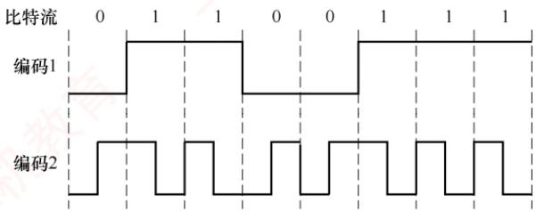

A. NRZ 编码和曼彻斯特编码 B. NRZ 编码和差分曼彻斯特编码C.NRZI编码和曼彻斯特编码 D. NRZI编码和差分曼彻斯特编码

23.【2016 统考真题】如下图所示，若连接R2和R3 链路的频带宽度为 8kHz，信噪比为30dB，该链路实际数据传输速率约为理论最大数据传输速率的50%，则该链路的实际数据传输速率约为（）。

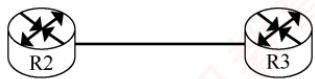

A. 8kb/s B. 20kb/s C.40kb/s D. 80kb/s

24.【2017统考真题】若信道在无噪声情况下的极限数据传输速率不小于信噪比为30dB条件下的极限数据传输速率，则信号状态数至少是（）。A. 4 B. 8 C. 16 D. 32

25. 【2021统考真题】下图为一段差分曼彻斯特编码信号波形，该编码的二进制串是（）。A. 1011 1001 B. 1101 0001 C. 0010 1110 D. 1011 0110

26. 【2022 统考真题】在一条带宽为200kHz的无噪声信道上，若采用4 个幅值的 ASK调制，则该信道的最大数据传输速率是（）。A. 200kb/s B. 400kb/s C. 800kb/s D. 1600kb/s

27.【2023统考真题】某个无噪声理想信道带宽为4MHz，采用QAM调制，若该信道的最大数据传输速率是48Mb/s，则该信道采用的 QAM 调制方案是（）。A. QAM-16厂 B. QAM-32 C. QAM-64 D. QAM-128

28.【2024统考真题】在下列二进制数字调制方法中，需要2个不同频率载波的是（）。A. ASK B. PSK C. FSK D. DPSK

## 二、综合应用题

01. 如下图所示，主机 A 和 B 都通过10Mb/s 的链路连接到交换机S。

每条链路上的传播时延都是20μs。S是一个存储转发设备，它在接收完一个分组 35μs后开始转发收到的分组。试计算将10000比特从A发送到B所需的总时间。

1）作为单个分组。

2）作为两个5000比特的分组一个紧接着另一个发送。

02. 一个分组交换网采用虚电路方式转发分组，分组的首部和数据部分分别为h位和p位。现有L（L>p且 L为p的倍数）位的报文通过该网络传送，源点和终点之间的线路数为k，每条线路上的传播时延为d秒，数据传输速率为b b/s，虚电路建立连接的时间为s秒，每个中间节点有m秒的平均处理时延。求源点开始发送数据直至终点收到全部数据所需的时间。

## 2.1.5 答案与解析

## 一、单项选择题

01. D

信道不等于通信电路，一条可双向通信的电路往往包含两个信道：一个是发送信道，一个是接收信道。另外，多个通信用户共用通信电路时，每个用户在该通信电路都有一个信道，因此选项A错误。调制是将数据转换为模拟信号的过程，选项B错误。选项C明显错误。“比特率”在数值上和“波特率”的关系如下：波特率=比特率/每符号所含的比特数，选项D正确。

## 02. A

根据香农定理，影响信道最大传输速率的因素主要有信道带宽和信噪比，而信噪比与信道内所传输的平均信号功率和噪声功率有关，数值上等于二者之比。

## 03. B

并行传输的特点：距离短、速度快。串行传输的特点：距离长、速度慢。因此，在计算机内部（距离短）传输时应选择并行传输。同步、异步传输是通信方式，而不是传输方式。

04. B

曼彻斯特编码将时钟和数据包含在信号中，在传输数据的同时，也将时钟一起传输给对方，码

元中间的跳变作为时钟信号，不同的跳变方式作为数据信号，选项A错误、选项B正确。每个码元的中间都发生电平跳变，选项D错误。曼彻斯特编码最适合传输二进制数字信号，选项C错误。

## 05. B

曼彻斯特编码用码元中间的电平跳变来表示每个比特，可方便收发双方根据跳变来同步时钟，而不需要额外的时钟信号，选项B正确。

## 06. A

非归零编码是最简单的一种编码方式，它用低电平表示0，用高电平表示1，或者采用相反的表示方式。因为各个码元之间并没有间隔标志，所以不包含同步信息。曼彻斯特编码和差分曼彻斯特编码都将每个码元分成两个相等的时间间隔，码元的中间跳变也作为收发双方的同步信息，因此不需要额外的同步信息，实际应用较多，但它们所占的频带宽度是原始基带宽度的2倍。

## 07. D

比特率=波特率×log₂n，若一个码元含有k比特的信息量，则表示该码元所需的不同离散值为$n   =   2 ^ { k }$ 个。波特率数值上等于比特率/每符号所含的比特数，因此每码元所含比特数 $4000/1000=4$ 有效离散值的个数为 $2 ^ { 4 }   =   1 6$ o

## 08.A

在曼彻斯特编码中，可用向下跳变表示1，向上跳变表示0，或者采用相反的表示。因此，该比特串可能是0011 0110或11001001，因此选择选项A。

## 09. B

一个码元若取 $2 ^ { n }$ 个不同的离散值，则含有n比特的信息量。本题中，一个码元所含的信息量为2比特，因为数值上波特率=比特率/每符号所含的比特数，所以波特率为 $(64/2)\mathrm{k}=32\mathrm{k}\mathrm{B}\mathrm{a}\mathrm{u}$

## 10. C

无噪声的信号应该满足奈奎斯特定理，即最大数据传输速率 $= 2 W \log _ { 2 } V$ 比特/秒。将题中的数据代入，得到答案是48kb/s。注意题中给出的每秒采样24kHz是无意义的，因为超过了波特率的上限 $2W = 16  kBand$ ，所以选项D是错误答案。

## 11. D

根据奈奎斯特定理，题中 $W = 4000\mathrm{Hz}$ ，最大码元传输速率 $2W=8000\mathrm{Bud}$ ，16种不同的物理状态可以表示 $\log_{2}16 = 4$ 比特的数据，因此信道的最大传输速率 $8000 \times 4 = 32 \mathrm{k} \mathrm{b} / \mathrm{s}$

## 12. B

根据香农定理，最大数据率 $W\log_{2}(1 + S/N) = 4000 \times \log_{2}(1 + 127) = 28000  b/s$ ，容易误选A。注意题中“二进制信号”的限制后，依据奈奎斯特定理，最大数据传输速率 $2H\log_{2}V = 2 \times 4000 \times \log_{2}2 =$ 8000b/s，两个上限中取小者，因此答案为B。 当

## 注意

若给出了码元与比特数之间的关系，则需受两个公式的共同限制。关于香农定理和奈奎斯特定理的比较，请参考本章中的疑难点。

## 13. C

信噪比S/N常用分贝（dB）表示，数值上等于 $10\log_{10}(S/N)\mathrm{dB}$ 。依题意有 $3 0 = 1 0 \log _ { 1 0 } ( S / N )$ 解出 $S / N = 1 0 0 0$ 。根据香农定理，最大数据传输速率 $3000\log_{2}(1 + S/N) \approx 30kb/s$

## 14. A

带宽受限且有噪声的信道应使用香农定理。最高数据传输速率= $W \mathrm { l o g } _ { 2 } ( 1 + S / N )$ ，其中，信道带

宽 $W = 3.9 - 3.5 = 0.4  MHz$ ，信号功率 $S = 0.14 W$ ，噪声功率 $N = 0.02W$ ，代入得1.2Mb/s。

## 15. D

每个信号有 $8   \times   2   =   1 6$ 种变化，每个码元携带 $\log_{2}16 = 4$ 比特信息，则信息传输速率为1200×$4 = 4800\mathrm{b/s}$

## 16. B

由题意知采样率为8Hz。有16种变化状态的信号可携带4比特的数据，因此最大数据传输速率为 $8 \times 4 = 32b/s$

## 17. A

本题给出了信道带宽、信噪比和编码方式，需要综合奈氏准则与香农定理的限制。在原始条件下：香农定理的极限速率为 $10 \times \log_{2}1001 \approx 100  Mb/s$ （注意，这里的信噪比应使用无单位记法），奈式准则的极限速率为 $2 \times 10 \times \log_{2}32 = 100  M   b/s$ 。带宽和信噪比提升后：香农定理的极限速率为$20 \times \log_{2}10001 \approx 260  Mb/s$ ，奈式准则的极限速率为 $2 \times 20 \times \log_{2}32 = 200 \mathrm{Mb/s}$ 。由于实际速率受限于二者中的较小值，故提升后的极限速率为200Mb/s，约为原来的2倍。

## 18. B

采用4个相位，每个相位有4种幅度的QAM调制，共有16种信号状态，每个码元可携带$\log_{2}16 = 4$ 比特信息。根据奈奎斯特定理，最大传输速率为 $2W \times \log_2 V = 2 \times 3 \mathrm{k} \times 4 = 24 \mathrm{k} \mathrm{b} / \mathrm{s}$

## 19. B

波特率（B）与数据传输速率（C）的关系为 $C = B \times \log_2 V$ ，其中V为码元可取的离散值个数。采用4种相位调制，即 $V = 4$ ，每个码元携带 $\log_{2}V = \log_{2}4 = 2$ 比特信息。因此，波特率 =数据传输速率/每个码元所含的比特数 $2400/2 = 1200$ 波特。

## 20. A

10Base-T以太网采用曼彻斯特编码：每个码元中间有一次跳变，从低到高表示0，从高到低表示1（或采用相反的约定，但需保持一致）。图示波形对应的比特串可为00110110或11001001。

## 21. D

由香农定理可知，信道极限数据传输速率受信噪比和频率带宽限制：调制速率（波特率）也直接影响数据速率。而信号传播速率仅决定传播时延，与传输速率无关，不影响信道数据传输速率。

## 22. A

编码1为典型的NRZ编码：高电平表示1，低电平表示0，无跳变。编码2.在每个比特周期中间均有跳变，高-低表示1，低-高表示0，符合曼彻斯特编码特征。差分曼彻斯特编码在比特周期起始处有跳变表示0，无跳变表示1，与图不符。因此，编码1和编码2分别为NRZ编码和曼彻斯特编码。

## 23. C

采用分贝（dB）记法时，信噪比 $1 0 \log _ { 1 0 } ( S / N ) = 3 0$ ，解得 $S/N = 1000$ 。由香农定理可知，理论极限速率 $W \times \log_{2}(1 + S/N) = 8k \times \log_{2}(1 + 1000)$ 。由于 $2 ^ { 1 0 } = 1 0 2 4 \approx 1 0 0 1$ ，故 $\log _ { 2 } ( 1 0 0 1 ) \approx 1 0$ 理论速率 $8 \times 10 = 80 \mathrm{kb/s}$ 。实际速率为理论值的50%，即 $80 \times 50\% = 40 \mathrm{kb/s}$

## 24. D

设信号状态数为V。无噪声信道的极限速率（奈奎斯特定理）为 $2 { \mathsf { \bar { } } } W { \mathsf { l o g } } _ { 2 } V ;$ 有噪声信道的极限速率（香农定理）为 $W \mathrm { l o g } _ { 2 } ( 1 + S / N )$ 。已知信噪比为30dB，可得 $S / N = 1 0 0 0$ ，要求： $2 { \cal { W } } { \log _ { 2 } } V ^ { 2 }$ ≥$W \log_{2}(1001) \approx W \times 10$ ，化简得 $\log _ { 2 } V \geq 5$ ，求得 $V \geqslant 32$ 。因此，信号状态数至少为32。

## 25. A

差分曼彻斯特编码规则：每个比特周期起始处有电平跳变表示0，无电平跳变表示1。第1

<table><tr><td rowspan=3 colspan=1>分组2分组1</td><td></td><td></td><td></td><td></td><td></td><td></td><td></td><td></td></tr><tr><td></td><td rowspan=1 colspan=3>500</td><td rowspan=1 colspan=1>20</td><td rowspan=1 colspan=1>35</td><td rowspan=1 colspan=2>500</td><td rowspan=1 colspan=1>20</td></tr><tr><td rowspan=1 colspan=1>500</td><td rowspan=1 colspan=1>20</td><td rowspan=1 colspan=1>35</td><td rowspan=1 colspan=3>500</td><td rowspan=1 colspan=1>20</td><td rowspan=1 colspan=1></td></tr></table>

位无跳变（1），第2位有跳变（0），第3位无跳变（1），第4位无跳变（1），第5位有跳变（0），第6位有跳变（0），第7位有跳变（0），第8位无跳变（1），得到比特串为10111001。26. C

在ASK调制中，4个幅值表示4种信号状态（V=4），每个码元携带 $\log _ { 2 } 4 = 2$ 比特。根据奈奎斯特定理，最大数据传输速率 $= 2 W \log_2 V$ ，已知带宽 $W = 200  kHz$ ，代入得800kb/s。

## 27. C

由奈奎斯特定理：最大数据传输速率 $= 2  { \mathsf { { W l o g } } } _ { 2 } V ,$ V表示码元的信号状态数。已知带宽 $W   =$ 4MHz，最大速率为48Mb/s，代入得 $\log _ { 2 } V = 6$ ，求得 $V = 2 ^ { 6 } = 6 4$ ，即采用 QAM-64 调制。 XTA

## 28. C

FSK（Frequency Shift Keying，频移键控）使用两个不同频率的载波分别表示0和1，是唯一需要两个载波频率的二进制调制方式。ASK（Amplitude ShiftKeying，幅移键控）改变幅度，PSK（Phase Shift Keying，相移键控）和DPSK（差分相移键控）改变相位，均使用单一频率载波。

## 二、综合应用题

## 01.【解答】

1）每条链路的发送时延是 $10000/(10\mathrm{Mb/s})=1000\mu\mathrm{s}。$

总传送时间等于 $2 \times 1000 + 2 \times 20 + 35 = 2075 \mu  s$

2）解法一：作为两个分组发送时，下面列出了各种事件发生的时间表。

T=0 开始

T=500A完成分组1的发送，开始发送分组2

T=520 分组 1完全到达 S

T=555 分组1从S起程前往B

T= 1000 A 结束分组 2 的发送

T= 1055 分组 2 从 S 起程前往 B

T= 1075 分组 2 的第1位开始到达 B

T= 1575 分组 2 的最后 1 位到达 B

解法二：此题属于分组交换各个过程中时间不等长的情况，类似于流水段不等长的情况，为避免出错，建议画出对应的时空图。

根据题意可分为5个流水段，各流水段的时间分别为500μs、20μs、35μs、500μs、20μs，共有2个分组，注意不同分组的相同流水段不能重叠，画出的时空图如下图所示。本题只有2个分组，不用流水线的方法也可求得结果，但当分组数量更多时，采用流水线的方法并画出时空图得出计算规律，才不容易出错。

## 02. 【解答】

整个传输过程的总时延=连接建立时延+源点发送时延+中间节点的发送时延+中间节点的处理时延+传播时延。

虚电路的建立时延已给出，为s秒。

源点要将L位报文分割成分组，分组数=L/p，每个分组的长度为(h+p)，源点要发送的数据

量 $(h + p)L / p$ ，因此源点的发送时延 $( h + p ) L / ( p b )$ 秒。

每个中间节点的发送时延 $=(h+p)/b$ 秒，源点和终点之间的线路数为k，有k-1个中间节点，因此中间节点的发送时延 $(h + p)(k - 1) / b$ 秒。

中间节点的处理时延=m(k-1)秒，传播时延=kd秒。因此，源节点开始发送数据直至终点收到全部数据所需的时间 $s+(h+p)L/(pb)+(h+p)(k-1)/b+m(k-1)+kd$ 秒。

## 2.2 传输介质

## 2.2.1双绞线、同轴电缆、光纤与无线传输介质

传输介质也称传输媒体，是数据传输系统中发送器和接收器之间的物理通路。传输介质可分为两类：（①）导向传输介质，如铜线或光纤等，电磁波被约束沿固体介质传播：②非导向传输介质，如自由空间（空气、真空或海水），电磁波在其中的传播称为无线传输。

## 1. 双绞线

双绞线是最常用的传输介质，在局域网和传统电话网中广泛使用。它由两根相互绝缘、按一定规则绞合在一起的铜导线组成。绞合结构可有效减少相邻导线间的电磁于扰。为进一步提升抗干扰能力，可在双绞线外加一层金属丝编织的屏蔽层，称为屏蔽双绞线（STP）；无屏蔽层的则称为非屏蔽双绞线（UTP）。双绞线的结构如图2.5所示。

双绞线价格低廉，既可用于模拟传输，也可用于数字传输，通信距离通常为几千米至数十千米。其带宽取决于铜线的粗细和传输的距离。距离太远时，对于模拟传输，要用放大器放大衰减的信号；对于数字传输，要用中继器来对失真的信号进行整形。

  
(a) 非屏蔽双绞线

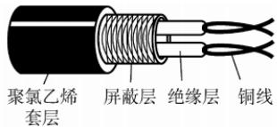  
(b) 屏蔽双绞线  
图 2.5 双绞线的结构

## 2. 同轴电缆

同轴电缆由内导体、绝缘层、外导体屏蔽层和绝缘保护套层构成，如图2.6所示。通常分为两类：①50Ω同轴电缆，主要用于基带数字信号传输，曾广泛应用于早期局域网；②75Ω同轴电缆，主要用于宽带信号传输，广泛应用于有线电视系统。得益于外导体的屏蔽作用，同轴电缆具有良好的抗干扰性能，适合较高速率的数据传输。

随着交换技术和集线器的普及，局域网领域已基本采用双绞线作为主流传输介质。

  
图 2.6 同轴电缆的结构

## 3. 光纤

光纤通信利用光导纤维（简称光纤）传输光脉冲来传递通信：有光脉冲表示1，无光脉冲表

示0。可见光的频率约为 $1 0 ^ { 1 4 } \mathrm { M H z }$ ，因此光纤系统具有极大的带宽潜力。

光纤主要由纤芯和包层构成（见图2.7）。纤芯直径极细，通常为 $8   \sim   1 0 0 \mu \mathrm { m }$ ；包层的折射率略低于纤芯，光波通过纤芯进行传导。当光从高折射率介质射向低折射率介质时，若入射角大于临界角，将会发生全反射，使光线在纤芯与包层界面反复反射而向前传播。

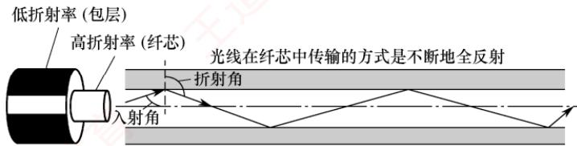  
图2.7 光波在纤芯中的传播

利用全反射原理，允许多条不同角度入射的光线在同一根光纤中传输的类型称为多模光纤（见图2.8）。光脉冲在多模光纤中的损耗较大，因此更适合短距离通信。

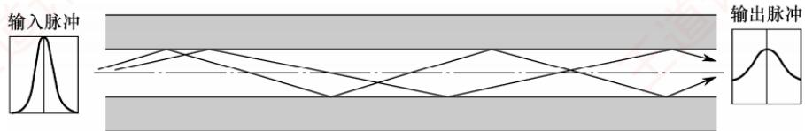  
图 2.8 多模光纤

当光纤直径减小至接近光波波长时，仅允许单一模式的光传播，几乎无反射，此类光纤称为单模光纤（见图2.9）。其纤芯极细，需使用定向性优良的半导体激光器作为光源。单模光纤衰减小，可实现数千米乃至数十千米的无中继传输，适用于远距离通信。

  
图 2.9 单模光纤

光纤不仅通信容量极大，还具备以下优势：

1）传输损耗小，中继距离长，对远距离传输特别经济。

2）抗雷电和电磁干扰性能强，在有大电流脉冲干扰的环境下，这尤为重要。

3）无串音干扰，保密性好，不易被窃听或截取数据。

4）体积小，重量轻，在现有电缆管道已拥塞不堪的情况下，这特别有利。

## 4. 无线传输介质

无线通信已广泛应用于蜂窝移动通信。随着便携式计算机的普及，以及军事、野外等特殊场景对移动联网的需求不断增长，无线局域网（WLAN）得到了迅速发展。

## （1)无线电波

无线电波具有较强的穿透能力，传播距离远，被广泛用于移动通信和WLAN。其信号以全向方式扩散，接收端无须对准发射源即可建立连接，这是无线电波通信的重要优势。

## （2）微波、红外线和激光

高带宽无线通信主要采用微波、红外线和激光三种技术，它们均需视距，具有强指向性。

微波通信工作在较高频段，带宽大、通信容量高。例如，一个2MHz带宽的信道可容纳约500路语音信号。但由于微波沿直线传播，在地面传输时距离受限，通常需要中继站进行接力。

卫星通信利用地球同步卫星作为中继节点，有效突破了地面微波传输的距离限制。其优点是通信容量大、覆盖范围广、传输距离远；缺点是保密性较差，并且端到端传播时延较大。

红外线与激光通信将电信号转换为相应的光信号，在自由空间中直接传播，常用于短距离点对点链路（如遥控器）或室内通信。但这类通信极易受障碍物阻挡，且无法穿透墙壁。

## 2.2.2 物理层接口的特性

物理层关注的是如何在各种传输介质上传输比特流，而非介质本身。由于网络中的硬件设备和传输介质种类繁多，通信方式也各不相同，物理层应尽可能屏蔽底层差异，使数据链路层感知不到这些差异，从而专注于本层协议与服务的实现。

考点追踪物理层接口的特性（2012、2018）

物理层的主要任务是定义与传输介质接口相关的一些特性：

1）机械特性。规定接口所用接线器的形状和尺寸、引脚数目和排列、固定和锁定装置等。

2）电气特性。规定接口电缆中各线路应遵循的电压范围、传输速率和距离限制等。

3）功能特性。定义每条线路上特定电平所代表的意义，并定义各线路的具体功能。

4）过程特性，也称规程特性。描述各种功能事件发生的顺序和时序关系。

## 2.2.3 本节习题精选

## 单项选择题

01. 双绞线是用两根绝缘导线绞合而成的，绞合的目的是（）。A. 减少干扰 B. 提高传输速度C. 增大传输距离D. 增大抗拉强度

02. 在电缆中采用屏蔽技术带来的好处主要是（）。A. 减少信号衰减 B. 减少电磁干扰辐射C. 减少物理损坏 道 D. 减少电缆的阻抗

03. 利用一根同轴电缆互连主机构成以太网，则主机间的通信方式为（）。A. 全双工 B. 半双工 C. 单工 D. 不确定

04. 同轴电缆比双绞线的传输速率更快，得益于（）。A. 同轴电缆的铜芯比双绞线的粗，能通过更大的电流B. 同轴电缆的阻抗比较标准，减少了信号的衰减C. 同轴电缆具有更高的屏蔽性，同时有更好的抗噪声性D. 以上都正确

05. 不受电磁干扰和噪声影响的传输介质是（）。A. 屏蔽双绞线B. 非屏蔽双绞线C. 光纤 D. 同轴电缆

06. 多模光纤传输光信号的原理是（）。A. 光的折射特性 B. 光的发射特性C. 光的全反射特性 D. 光的绕射特性

07. 以下关于单模光纤的说法中，正确的是（）。A. 光纤越粗，数据传输速率越高B. 光纤的直径减小到只有光的一个波长大小时，光沿直线传播C. 光源是发光二极管或激光D. 光纤是中空的

08.下列关于卫星通信的说法中，错误的是（）。

A. 卫星通信的距离长，覆盖的范围广B. 使用卫星通信易于实现广播通信和多址通信C. 卫星通信的好处在于不受气候的影响，误码率很低D. 通信费用高、延时较大是卫星通信的不足之处

09. 某网络在物理层规定，信号的电平用+10V\~+15V表示二进制0，用-10V\~-15V表示二进制1，电线长度限于15m以内，这体现了物理层接口的（）。A. 机械特性 B. 功能特性 C. 电气特性 D. 规程特性

10. 当描述一个物理层接口引脚处于高电平时的含义时，该描述属于（）。A. 机械特性B. 电气特性 C. 功能特性 D. 规程特性

11.【2012统考真题】在物理层接口特性中，用于描述完成每种功能的事件发生顺序的是（）。A. 机械特性 B. 功能特性 C. 过程特性 D. 电气特性

12.【2018统考真题】下列选项中，不属于物理层接口规范定义范畴的是（）。A. 接口形状 B. 引脚功能 C. 物理地址 D. 信号电平

## 2.2.4 答案与解析

## 单项选择题

01. A

绞合可以减少两根导线相互的电磁干扰。

02. B

屏蔽层的主要作用是提高电缆的抗干扰能力。

## 03. B

传统以太网采用广播的方式发送信息，同一时间只允许一台主机发送信息，否则各主机之间就形成冲突，因此主机间的通信方式是半双工。全双工是指通信双方可同时发送和接收信息。单工是指只有一个方向的通信而没有反方向的交互。

## 04. C

同轴电缆以硬铜线为芯，外面包一层绝缘材料，绝缘材料的外面再包一层密织的网状导体，导体的外面又覆盖一层保护性的塑料外壳。这种结构使得它具有更高的屏蔽性，从而既有很高的带宽，又有很好的抗噪性。因此，同轴电缆的带宽更高，得益于它的高屏蔽性。

## 05. C

光纤的抗雷电和电磁干扰性能好，无串音干扰，保密性好。

06. C

多模光纤传输光信号的原理是光的全反射特性。

光纤的直径减小到与光线的一个波长相同时，光纤就如同一个波导，光在其中没有反射，而沿直线传播，这就是单模光纤。

卫星通信有成本高、传播时延长、受气候影响大、保密性差、误码率较高的特点。

## 09. C

本题易误选功能特性。规定各条线上的电压范围，以及电缆长度的限制，属于电气特性。而功能特性指明某条线上出现的某一电平的电压表示何种意义，以及每条线的功能（数据线、控制线、时钟线）。例如，数据线上的电压+11V表示二进制1，就属于功能特性。

## 10. C

物理层的功能特性指明某条线上出现的某一电平的电压表示何种意义，以及每条线的功能。

## 11. C

物理层的接口特性包括机械、电气、功能和过程四类。其中，过程特性用于描述完成各种功能时事件发生的先后顺序，即规定各操作（如建立连接、传输数据、释放线路等）的时序关系。

## 12. C

物理层接口规范涵盖四类特性：机械特性（如接口形状、尺寸）、电气特性（如信号电平、电压范围）、功能特性（如引脚功能、电平含义）和过程特性（事件发生顺序）。而物理地址（MAC地址）用于标识数据链路层的设备，属于数据链路层的范畴，不在物理层定义范围内。 XTA

## 2.3 物理层设备

## 2.3.1 中继器

中继器的主要功能是整形、放大并转发信号，以消除信号经过一长段电缆后产生的失真和衰减，使信号的波形和强度达到所需的要求，从而扩大网络的传输距离。其原理是信号再生（而非简单放大衰减的信号）。中继器有两个端口，数据从一个端口输入，从另一个端口输出。

中继器连接的两端属于同一局域网中的不同网段（而非不同子网），因此所连网段仍构成一个局域网。如果中继器发生故障，将影响相邻两个网段的正常工作。

从理论上讲，中继器的使用数量是无限的，网络因而也可无限延长。但事实上这是不可能的，因为网络标准中对信号的传播延迟范围有明确规定，中继器只能在此范围内有效工作，否则会引起网络故障。例如，在采用粗同轴电缆的10Base-5以太网规范中，互相串联的中继器数量不能超过4个，而且由4个中继器串联的5段电缆中，仅有3段可挂接主机，其余2段只能用作扩展通信范围的链路段，不能挂接主机。这就是所谓的“5-4-3规则”。

## 2.3.2 集线器

集线器（Hub）实质上是一个多端口的中继器。当集线器工作时，一个端口接收到数据信号后，由于信号在传输过程中已有衰减，集线器便对该信号进行整形和放大，将其再生为接近原始发送时的信号，紧接着转发到其他所有（除输入端口外）处于工作状态的端口。若两个或多个端口所连节点同时发送信号，则会发生冲突，导致所有相关帧传输失败。由此可见，集线器在网络中只起信号放大和转发作用，目的是扩大网络的传输范围，而不具备信号的定向传送能力，即信息广播至所有端口，是标准的共享式设备。

## 注意

中继器和集线器不具备缓存能力，当其连接两个不同链路层协议的网段时可能会出问题①。若两个网段的速率分别为10Mb/s和10/100Mb/s，采用集线器连接后，则整个网络只能以速率10Mb/s工作。

使用集线器组网灵活，它将所有节点的通信集中在以其为中心的节点上，由集线器组成的网络在物理上是星形网络，但逻辑上仍是总线形网络。集线器的每个端口连接的是同一网络的不同网段。此外，集线器只能工作在半双工模式，网络的吞吐率因而受到限制。

考点追踪物理层设备对冲突域和广播域的影响（2010、2020）

## 注意

集线器不熊分割冲突域，其所有端口都属于同一个冲突域。集线器在一个时钟周期内只能传输一组信息。当一台集线器连接的主机数量较多且多台主机频繁同时通信时，将导致大量冲突，使得集线器的工作效率很差。例如，一个带宽为10Mb/s的集线器上连接了8台计算机，当它们同时工作时，每台计算机平均可用的带宽仅为10/8Mb/s=1.25Mb/s。

## 2.3.3 本节习题精选

## 单项选择题

01.下列关于物理层设备的叙述中，错误的是（）。A. 中继器仅作用于信号的电气部分B. 利用中继器来扩大网络传输距离的原理是将衰减的信号进行放大D. 物理层设备连接的几个网段仍是一个局域网 C.集线器实质上相当于一个多端口的中继器 王道

02. 为了使数字信号传输得更远，可采用的设备是（）。A. 中继器 B. 放大器 C. 网桥 D. 路由器

03. 以太网遵循 IEEE 802.3 标准，用粗缆组网时每段的长度不能大于 500m，超过 500m 时就要分段，段间相连利用的是（）。A. 网络适配器 B. 中继器 C. 调制解调器 D. 网关

04.由集线器连接多台设备构成的网络在物理上和逻辑上的结构分别是（）。A. 总线形、环形B. 网状、星形C. 总线形、星形D. 星形、总线形

05.用集线器连接的工作站集合（）。A. 同属一个冲突域，也同属一个广播域B. 不同属一个冲突域，但同属一个广播域C. 不同属一个冲突域，也不同属一个广播域D. 同属一个冲突域，但不同属一个广播域

06. 中继器可以用来连接（）。A. 不同类型的局域网 B. 广域网和局域网C. 不同介质的局域网 D. 不同协议的局域网

07. 若有5台计算机连接到10Mb/s的集线器上，则每台计算机分得的平均带宽至多为（）。A. 2Mb/s B. 5Mb/s C. 10Mb/s D. 50Mb/s

08.当集线器的一个端口收到数据后，将其（）。A. 从所有端口广播出去 B. 从除输入端口外的所有端口广播出去C. 根据目的地址从合适的端口转发出去 D. 随机选择一个端口转发出去

09. 下列关于中继器和集线器的说法中，不正确的是（）。A. 二者都工作在OSI参考模型的物理层B. 二者都可以对信号进行放大和整形C. 通过中继器或集线器互连的网段数量不受限制D. 中继器通常只有2个端口，而集线器通常有4个或更多端口

## 2.3.4 答案与解析

## 单项选择题

## 01. B

中继器的原理是将衰减的信号再生（再生=放大+整形），而不是简单地放大。

## 02. A

放大器通常用于远距离地传输模拟信号，但它同时会放大噪声，引发失真。中继器用于数字信号的传输，其工作原理是信号再生，因此会减少失真。网桥用来连接两个网段以扩展物理网络的覆盖范围。路由器是网络层的互连设备，可以实现不同网络的互联。 TO

## 03. B

中继器的主要功能是将信号复制、整形和放大再转发出去，以消除信号经过一长段电缆而造成的失真和衰减，使信号的波形和强度达到所需的要求，进而扩大网络传输的距离，原理是信号再生，因此选择选项B，其他三项显然有点大材小用。

## 04. D

集线器将多个设备连接在以它为中心的节点上，因此使用它的网络在物理拓扑上属于星形结构。当集线器工作时，一个端口接收到数据信号后，集线器将该信号整形放大，紧接着转发到其他所有处于工作状态的端口。因为集线器不具备交换机所具有的交换表，所以它发送数据时是没有针对性的，而采用广播方式发送。因此，使用集线器的星形以太网逻辑上仍然是总线网。

## 05. A

集线器的功能是将从一个端口收到的数据通过所有其他端口转发出去。集线器在物理层上扩大了网络的覆盖范围，但无法解决冲突域（第二层交换机可解决）与广播域（第三层交换机可解决）的问题，而且增大了冲突的范围。注意，冲突域和广播域的概念涉及后面章节的内容。

## 06. C

中继器工作在物理层，无法对帧进行解封与重新封装（无法实现协议转换），其功能仅限于对接收到的帧对应的二进制串进行无差别转发，因此无法连接不同链路层协议的网段。中继器可以连接不同介质的局域网，如光纤和双绞线，只要它们具有相同协议。

## 07. A

集线器以广播的方式将信号从除输入端口外的所有端口输出，因此任意时刻只能有一个端口的有效数据输入。理想情况（无冲突）下，每秒通过集线器的数据量都是10Mb，假设5台计算机占用相同大小的时间片来收发数据，则平均带宽的上限为10Mb/s÷5=2Mb/s。若有多台计算机同时发送数据，则会导致每台计算机实际获得的平均带宽低于2Mb/s。

## 08. B

集线器没有寻址功能，一个端口接收到数据信号后，从其他所有端口转发出去。

## 09. C

中继器和集线器均工作在物理层，集线器本质上是一个多端口中继器，它们都能对信号进行放大和整形（再生=放大+整形）。因为中继器不仅传送有用信号，还传送噪声和冲突信号，因此互相串联的个数只能在规定的范围内进行，否则网络将不可用。注意“5-4-3规则”。

## 2.4 本章小结及疑难点

1. 传输介质属于物理层吗？它与物理层有何区别？

传输介质不属于物理层。尽管与物理层紧密相关，但从网络体系结构看，它位于物理层之下，常被非正式称为“第0层”。区别在于：传输介质只承载电信号或光信号，无法区分信号所代表的比特值一一即无法判断某一电平对应的是1还是0；物理层通过定义电气、机械、功能和过程特性（如电压、时序、接口规范等），将原始信号解释为有意义的比特流，供上层使用。图2.10直观展示了这一关系：传输介质是信号的“通道”，物理层是赋予其语义的“规则制定者”。

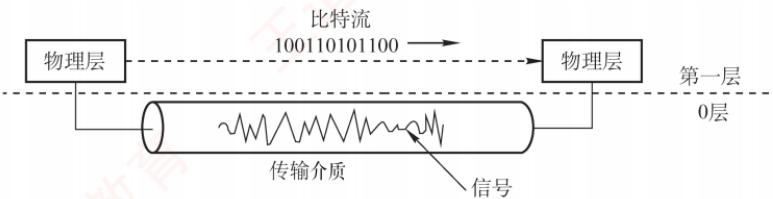  
图2.10 传输介质与物理层

## 2. 什么是基带传输、频带传输和宽带传输？它们有什么区别？

基带传输：直接发送原始的数字信号（如高、低电平），不经过调制。它占用整个信道带宽，通常用于短距离通信，比如局域网或计算机内部连接。常用的编码方法包括不归零编码和曼彻斯特编码。不归零编码的做法是用高电平表示1、低电平表示0。例如，要传输“1010”，若高电平代表1、低电平代表0，则线路上依次传送（高、低、高、低）这一电平序列。

频带传输：当需要远距离或无线传输时，必须把数字信号“搭载”到一个高频载波上，这个过程叫调制，转换后的信号更适合在模拟信道（如电话线）上传输，称为频带传输。它不仅让数字信号能在传统电话系统中传输，还支持多路复用，提高信道利用率。例如，仍然传输“1010”，经过调制后，一个码元可能代表4位二进制数据；若码元A对应“1010”，则在模拟信道上只需发送码元A，就相当于完成了该数据的传输。电话线上网、Wi-Fi等都属于频带传输。

宽带传输：在传统通信语境中，宽带传输指利用频分复用等技术，将一条物理线路划分为多个频带信道，每个信道可独立进行频带传输，互不干扰。这样，多个信号可以并行传送，显著提升链路容量。例如，有线电视网络能一边上网、一边看电视，正是利用了宽带传输技术。

3. 奈氏准则和香农定理的主要区别是什么？它们对数据通信的意义是什么？

奈氏准则与香农定理从不同角度揭示了信道传输能力的极限。

奈氏准则仅考虑信道带宽限制，指出在给定带宽下，码元传输速率存在上限（与噪声无关），超过该上限将因码间串扰而无法正确识别信号：但它不限制每个码元所携带的比特数，因此可通过高阶调制（如一个码元表示多位）提升信息传输速率。香农定理则适用于有噪声的实际信道，指出对于确定的带宽和信噪比，信息传输速率存在一个不可逾越的理论上限，无论采用何种技术都无法突破。这意味着，要提高通信速率，只能通过增加带宽或改善信噪比，但二者在现实中均有物理限制。它们共同构成了数据通信系统设计的理论基础。 工

## 4. 信噪比明明是S/N，为什么还要用 $1 0 \log _ { 1 0 } ( S / N )$ 表示？

信噪比可以用两种方式表示：

1）线性比值（无单位）：如信号功率为100，噪声功率为1，则信噪比 $S / N   =   1 0 0$

2）分贝形式（单位dB）：此时信噪比为 $10\log_{10}(S/N)=10\log_{10}100=20 dB$

两者在数学上等价，但分贝形式更实用。因为在通信中，信号与噪声的功率差异往往极大，例如信号可能是噪声的10亿倍。若用线性值表示，则1后面有9个0，不仅冗长，还容易数错；而用分贝表示仅为90dB，简洁且不易出错。因此，分贝能高效、清晰地表达极大或极小的比值。

检错编码；纠错编码

（四）流量控制与可靠传输机制

流量控制、可靠传输与滑动窗口机制；停止-等待协议；

后退N帧协议（GBN）；选择重传协议（SR）

（五）介质访问控制

1. 信道划分：频分复用、时分复用、波分复用、码分复用

2. 随机访问：ALOHA 协议；CSMA 协议；CSMA/CD 协议；CSMA/CA 协议

3. 轮询访问：令牌传递协议

（六）局域网

局域网的基本概念与体系结构；以太网与IEEE802.3;

IEEE 802.11无线局域网；VLAN的基本概念与基本原理

（七）广域网

广域网的基本概念；点对点协议（PPP）

（八）数据链路层设备

以太网交换机及其工作原理

## 【复习提示】

本章是历年考试中考查的重点。要求在了解数据链路层基本概念和功能的基础上，重点掌握滑动窗口机制、三种可靠传输协议、各种MAC协议，特别是CSMA/CD协议、CSMA/CA协议和以太网帧格式，以及局域网的争用期和最小帧长的概念、二进制指数退避算法。此外，中继器、网卡、集线器、网桥和局域网交换机的原理及区别也要重点掌握。 X

## 3.1 数据链路层的功能

数据链路层的主要任务是让帧在一段链路或一个网络中传输。尽管数据链路层协议种类繁多，但它们都需解决三个基本问题：封装成帧、透明传输和差错检测。

数据链路层使用的信道主要有两种：

1）点对点信道：一对一通信，通常通过一条专用物理链路连接两个节点。

视频讲解

2）广播信道：一对多通信，单个节点发送的数据可被连接在同信道上的所有节点接收。

## 3.1.1 数据链路层所处的地位

以两台主机通过互联网通信为例（见图3.1）：局域网1中的主机H1经路由器R1、广域网及路由器R2，连接到局域网2中的主机H2。

主机H1和H2均具备完整的五层协议栈；路由器在转发分组时仅使用协议栈的下三层。当H1向H2发送数据时，数据在各节点的协议栈中多次上下流动（见图3.2）：进入路由器后，先从物理层上至网络层，在转发表中确定下一跳地址，再下至物理层转发出去。 XTA

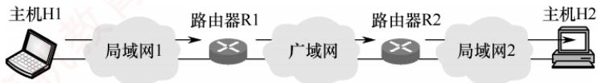

图 3.1 主机 H1 向 H2 发送数据  
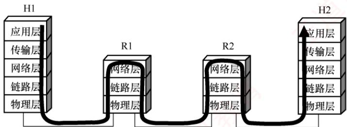  
图3.2 从协议的层次上看数据的流动

然而，在学习数据链路层时，我们通常聚焦于水平方向的数据链路层交互。此时可将通信过程简化为：H1的链路层→R1的链路层→R2的链路层→H2的链路层（见图3.3）。这三段链路可能采用不同的数据链路层协议，但每一段都独立完成帧的传输任务。

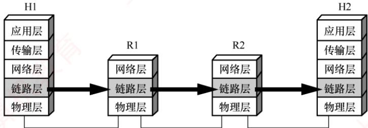  
图3.3 只考虑数据在数据链路层的流动

下面介绍点对点信道的基本概念，其中部分也适用于广播信道。

1）链路。指从一个节点到相邻节点的一段物理线路，是通信路径的组成部分。

2）数据链路。在物理链路上添加实现通信协议的软硬件后所形成的逻辑通信通道。

3）帧。数据链路层对等实体间通信的协议数据单元。发送方将网络层交下的数据封装为帧发送；接收方从帧中提取数据并上交网络层。

## 3.1.2 链路管理

链路管理是指数据链路层连接的建立、维持和释放过程，主要用于面向连接的服务。

通信双方必须首先确认对方处于就绪状态，并交换必要信息（如初始化帧序号），才能建立

连接；传输过程中需维持连接状态；通信结束后则释放连接。

## 3.1.3 封装成帧与透明传输

封装成帧是指在数据前后分别添加首部和尾部，构成一个完整的帧。帧长等于帧的数据部分长度加上首部和尾部的长度。首部和尾部包含控制信息，其核心作用是帧定界一一帮助接收方从比特流中准确识别帧的起始与结束。例如，在HDLC协议中，使用标识字段F（01111110）标识帧的开始和结束。接收方将第一个F视为帧的开始，下一个F标志该帧的结束，如图3.4所示。为提高传输效率，应使数据部分尽可能长，但帧过长会增加差错概率和重传开销。因此，各类链路层协议均规定了最大传送单元（MTU），即帧数据部分的长度上限。 灿育

<table><tr><td>标志</td><td>地址</td><td>控制</td><td>数据</td><td>帧检验序列</td><td>标志</td></tr><tr><td>F</td><td>A</td><td>C</td><td>I</td><td>FCS</td><td>F</td></tr><tr><td>01111110</td><td>8位</td><td>8位</td><td>N位(可变)</td><td>16位</td><td>01111110</td></tr></table>

图 3.4 HDLC 帧格式

透明是计算机领域的一个重要概念，意指某事物虽存在，但对上层不可见。

透明传输是数据链路层的重要特性。“透明”在此意为：即使数据中恰好出现与帧定界符相同的比特组合，也不会被误判为帧边界。若不处理此问题，接收方可能提前结束帧解析，导致后续数据丢失。实现透明传输后，接收方能将帧完整恢复为原始SDU（服务数据单元），使网络层“感知不到”底层的帧封装过程即数据链路层对上层是透明的。

## 3.1.4 流量控制

由于链路两端节点的处理速率或缓存能力存在差异，若发送方速率过高，接收方可能因来不及处理而导致帧丢失。因此，流量控制旨在限制发送方的发送速率，使其不超过接收方的接收能力。该过程通常依赖反馈机制：发送方根据接收方的确认或窗口信息，决定是否继续发送。

在OSI模型中，流量控制由数据链路层实现，用于调节相邻节点间的流量；而在TCP/IP模型中，该功能主要由传输层（如TCP）承担，负责端到端的流量控制。

## 3.1.5 差错检测与可靠传输

由于信道噪声等因素，帧在传输过程中可能出现两类错误。

1）位错：帧中某些比特发生翻转，通常通过循环冗余检验检测。

2）帧错：包括帧丢失、重复或失序等，属于更高层的传输差错。

早期OSI模型认为，数据链路层必须向上提供可靠传输服务。因此，在CRC检错基础上，引入了帧编号、确认与重传机制：接收方收到正确帧后需发送确认；发送方若在规定时间内未收到确认，则判定为出错并重传，直至收到确认为止。

如今，是否采用可靠传输机制取决于信道质量：在通信质量较差的无线链路中，数据链路层仍使用确认与重传机制，以提供可靠服务：而在高质量的有线链路中，数据链路层仅进行CRC检错，将出错帧直接丢弃，不再负责重传。此时，重传任务由高层协议（如传输层TCP）完成。核心原则是，数据链路层确保上交的帧无差错，但不保证所有帧都被成功交付。

## 3.1.6 本节习题精选

## 单项选择题

01. 下列选项中，不属于数据链路层功能的是（）。

A. 帧定界 B. 电路管理 C. 差错控制 D. 流量控制

02. 下列选项中，不属于数据链路层功能的是（）。A. 透明传输 B. 差错检测 C. 可靠传输 D. 拥塞控制

03.下列选项中，不属于数据链路层协议功能的是（）。A. 定义数据格式 B. 提供节点之间的可靠传输C. 控制对物理传输介质的访问 D. 为终端节点隐蔽物理传输的细节

04.为了避免传输过程中帧的丢失，数据链路层采用的方法是（）。A. 帧编号机制 B. 循环冗余检验码C. 海明码 育 D. 计时器超时重发

05.对于信道比较可靠且对实时性要求高的网络，数据链路层采用（）比较合适。A. 无确认的无连接服务 B. 有确认的无连接服务C. 无确认的面向连接服务 D. 有确认的面向连接服务

06. 流量控制实际上是对（）的控制。 道A.发送方的数据流量 B. 接收方的数据流量C. 发送、接收方的数据流量 D. 链路上任意两节点间的数据流量

## 3.1.7 答案与解析

## 单项选择题

## 01. B

数据链路层的主要功能包括：如何将二进制比特流组织成数据链路层的帧：如何控制帧在物理信道上的传输，包括如何处理传输差错；在两个网络实体之间提供数据链路的建立、维护和释放：控制链路上帧的传输速率，以使接收方有足够的缓存来接收每个帧。这些功能对应头帧定界、差错检测、链路管理和流量控制。电路管理功能由物理层提供。

## 02. D

拥塞控制是网络层或传输层的功能，用于防止过多的分组注入网络而导致网络性能下降。03. D XTA

数据链路层的主要功能包括组帧，组帧即定义数据格式，选项A正确。数据链路层在物理层提供的不可靠的物理连接上实现节点到节点的可靠性传输，选项B正确。控制对物理传输介质的访问由数据链路层的介质访问控制（MAC）子层完成，选项C正确。为终端节点隐蔽物理传输的细节是物理层的功能，数据链路层不必考虑如何实现无差别的比特传输，选项D错误。

## 04. D

为防止在传输过程中丢失帧，在可靠的数据链路层协议中，发送方为发送的每个数据帧设计一个计时器，当计时器到期而该帧的确认帧仍未到达时，发送方将重发该帧。为保证接收方不会接收到重复帧，需要对每个发送的帧进行编号：海明码和循环冗余检验码都用于差错控制。

## 05. A

无确认的无连接服务是指源主机发送帧时不需要先建立逻辑连接，目的主机收到帧时不需要发回确认。若因线路上有噪声而造成某一帧丢失，则数据链路层并不检测这样的丢帧现象，也不回复。当错误率很低时，这类服务非常合适，此时恢复任务可由上面的高层来负责。这类服务对实时通信也非常合适，因为实时通信中数据迟到比数据损坏更不好。

## 06. A

流量控制是通过限制发送方的数据流量而使发送方的发送速率不超过接收方接收速率的一

种技术。流量控制功能并不是数据链路层独有的，其他层上也有相应的控制策略，只是各层的流量控制对象是在相应层的实体之间进行的。

## 3.2 组帧

发送方依据特定规则，将网络层递交的分组封装成帧（也称组帧）。数据链路层以帧为单位传输数据，主要目的是：一旦出错，只需重发出错的帧，而不必重传全部数据，从而提高传输效率。组帧需解决帧定界、帧同步和透明传输等问题。常见的组帧方法主要有以下四种。

注意

组帧时通常既要添加首部，也要添加尾部。原因在于，网络中信息以帧为最小传输单位，接收方必

## 3.2.1 字符计数法

字符计数法在帧首部设置一个计数字段，用于记录该帧包含的总字节数（包括计数字段自身占用的1B），如图3.5所示。接收方读取该计数值后，即可确定后续数据的长度，从而定位帧的结束位置；由于帧是连续传输的，下一帧的起始位置也随之确定。

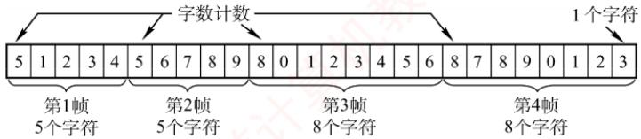  
图3.5字符计数的过程示例

字符计数法的主要缺陷是：当计数字段在传输过程中出错时，接收方将无法正确识别帧的边界，导致收发双方失去同步，可能引发灾难性后果。

## 3.2.2 字节填充法

字节填充法通过特定控制字符实现帧定界。在图3.6中，控制字符SOH表示帧的起始，EOT表示帧的结束。为避免数据中出现的SOH或EOT被误判为帧的定界符，发送方会在这些特殊字符前插入一个ESC字符（注意，ESC是ASCⅡ码中的一个单字节控制字符），以实现透明传输。若数据中原本就包含ESC，则同样在其前再插入一个ESC。接收方收到ESC后，会将其丢弃，并将紧随其后的字符视为普通数据（而非控制字符），从而还原出原始数据。

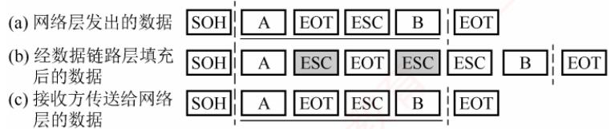  
图3.6 字节填充的过程示例

当帧的数据部分中出现 ESC、EOT或 SOH时[见图3.6(a)]，发送方在每个ESC、EOT或SOH之前插入一个ESC字符[见图3.6(b)]，接收方处理后恢复原数据[见图3.6(c)]。

## 3.2.3 零比特填充法

考点追踪HDLC的比特填充规则（2013）

零比特填充法允许数据帧包含任意数量的比特，并用固定比特串01111110作为帧的起始和结束标志，如图3.7所示。为防止数据字段中出现与标志相同的比特序列，发送方在扫描数据时，每遇到5个连续的“1”，就在其后自动插入一个“0”，确保数据字段中不会出现6个连续的“1”，避免与帧标志混淆。接收方执行逆操作：每收到5个连续的“1”，就自动删除其后的“0”，以恢复原始数据。早期的HDLC协议正是采用这种方法来实现透明传输。

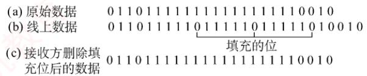  
图 3.7 比特填充过程示例

零比特填充法易于硬件实现，性能优于字节填充法。

## 3.2.4 违规编码法

违规编码法利用物理层编码的冗余特性实现帧定界。例如，在曼彻斯特编码中：比特“1”编码为“高-低”电平对，比特“0”编码为“低-高”电平对。而“高-高”或“低-低”电平对在数据比特中是违规的（未被采用），因此可借用这些违规编码序列来标识帧的起始或终止。局域网IEEE802标准采用了这种方法（更多介绍见3.6.2节）。违规编码法无须任何填充技术即可实现透明传输，但仅适用于采用冗余编码的特殊编码环境。

由于字符计数法对计数字段错误极为敏感，而字节填充法在实现上较为复杂且存在兼容性问题，因此目前更常用的组帧方法是零比特填充法和违规编码法。

## 3.2.5 本节习题精选

## 一、单项选择题

01. 【2013统考真题】HDLC协议对01111100 01111110组帧后，对应的比特串为（）。(注：HDLC协议已从最新大纲中删除。）A. 01111100 00111110 10 B. 01111100 01111101 01111110 机教育C. 01111100 01111101 0 D. 01111100 01111110 01111101

## 二、综合应用题

01. 在一个数据链路协议中使用下列字符编码：A01000111; B 11100011; ESC 11100000; FLAG 01111110在使用下列组帧方法的情况下，说明为传送4个字符A、B、ESC、FLAG所组织的帧而实际发送的二进制位序列（使用FLAG作为首尾标志，ESC作为转义字符）。1）使用字符计数法。2）使用字节填充法。 机教育3）使用零比特填充法。

## 3.2.6 答案与解析

## 一、单项选择题

01. A

HDLC协议对比特串组帧时，HDLC数据帧以比特模式01111110标识每个帧的起始和结束，因此在帧数据中只要出现5个连续的位“1”，就在输出的位流中填充一个“0”。因此，组帧后的比特串为011111000011111010（下划线部分为新增的0）。

## 二、综合应用题

## 01. 【解答】

1）第一字节为所传输的字符计数5，转换为二进制为00000101，后面依次为A、B、ESC、FLAG 的二进制编码：

$$
0 0 0 0 0 1 0 1 \quad 0 1 0 0 0 1 1 1 \quad 1 1 1 0 0 0 1 1 \quad 1 1 1 0 0 0 0 0 \quad 0 1 1 1 1 1 1 0
$$

2）首尾标志位FLAG（01111110），在所传输的数据中，若出现控制字符，则在该字符前插入转义字符ESC（11100000）：

$$
0 1 1 1 1 1 1 0 \; 0 1 0 0 0 1 1 1 \; 1 1 1 0 0 0 1 1 \; 1 1 1 0 0 0 0 0 \; 1 1 1 0 0 0 0 0 \; 1 1 1 0 0 0 0 0 \; 0 1 1 1 1 1 1 1 0 \; 0 1 1 1 1 1 1 0
$$

3）首尾标志位FLAG（01111110），在所传输的数据中，若连续出现5个“1”，则在其后插入“0”： 道首

01111110 01000111 110100011 111000000 011111010 01111110

## 3.3 差错控制

实际的通信链路并非理想，比特在传输过程中可能产生差错：1可能变为0，0也可能变成1，这种现象称为比特差错。比特差错是传输差错的一种，本节仅讨论此类差错。

通常采用编码技术进行差错控制，主要分为两类：检错编码和纠错编码。采用检错编码时，接收方若检测到差错，会设法通知发送方重传，直到收到正确的数据为止：采用纠错编码时，接收方不仅能发现差错，还能确定错误位置并加以纠正。在探讨具体的编码技术之前，需先引入码距（也称海明距离）的概念一—它是衡量编码检错能力与纠错能力的重要参数。

考点追踪码距的计算与特性（2025）

码距是指两个码字在对应位上取值不同的比特数量。计算码距的一种方法是对两个位串进行异或（xor）运算，结果中1的个数即为码距。例如，0110⊕0011=0101，结果中有两个1，说明这两个码字有2位不同，因此其码距为2。在一个编码集中，任意两个有效码字之间码距的最小值称为该编码集的码距。例如，对于编码集{10011,01011,11110,00001}，虽然11110与00001的码距为5，但10011与01011的码距仅为2，取各码距中的最小值，求得该编码集的码距为2。

根据差错控制理论，编码方案的检错能力和纠错能力与码距l的关系如下：

$$
l = d + c + 1,\quad  且  \quad d \geq c
$$

即码距l越大，其检错的位数就越大，纠错的位数c也越大，且纠错能力恒不超过检错能力（能纠错必然能检错）。例如，当码距l=3时，该编码最多可检测2位错误，或纠正1位错误。此外，进一步考虑 $c   = 0$ 或 $d   =   c$ 的两种边界情况，还可得出以下两个重要结论：

1）为检测d位错误，编码方案的码距至少应为d+1。任何发生d位错误的有效码字不可能变成另一个有效码字，以确保差错可被发现。例如，码距为1的编码无法检测任何错误。

2）为纠正c位错误，编码方案的码距至少应为2c+1。即使一个有效码字发生c位错误，其仍然离原始码字最近，接收方可据此唯一确定原始码字，实现纠错。

## 3.3.1 检错编码

检错编码均采用冗余编码技术，其核心思想是：在有效数据（信息位）发送前，按照特定规则附加若于冗余位（检验位），构成一个符合预设编码规则的码字后再发送。当信息位发生变化时，冗余位也会相应调整，以确保整个码字始终满足该编码规则。接收方通过校验收到的码字是否仍符合这一规则，来判断是否发生了差错。若某些比特在传输中出错，则可能违反原有的编码规则，进而使差错被有效检测出来。常见的检错编码包括奇偶检验码和循环冗余码。

## 1. 奇偶检验码

奇偶检验码是奇检验码和偶检验码的统称，是最基本的检错码。它由n位数据和1位检验位组成，检验位的取值（0或1）使得整个码字中“1”的个数为奇数（奇校验）或偶数（偶校验）。

1）奇检验码：附加检验位后，码字中“1”的总数为奇数。

2）偶检验码：附加检验位后，码字中“1”的总数为偶数。

例如，7位数据1001101中有4个“1”（偶数），因此：对应的奇检验码为10011011（加1使“1”的总数为奇数），对应的偶检验码为10011010（加0使“1”的总数保持为偶数）。

奇偶检验码只能检测奇数位错误，无法发现偶数位错误，也无法定位错误位置。由于任意两个合法码字之间至少有2位不同，其码距为2。根据码距理论，此类编码最多可检测1位错误。而实际上，只要发生奇数位错误，“1”的总数奇偶性必然改变，因此能检测所有奇数位错误。

## 2. 循环冗余码

循环冗余码（Cyclic Redundancy Code，CRC）是数据链路层广泛采用的一种高效检错技术，具有检错能力强、实现简单、硬件支持成熟等显著优势，其基本原理如下。

CRC的核心思想:将待发送的数据视为一个二进制多项式，通过与一个预定义的生成多项式G(x)进行特定运算，生成一段冗余校验信息（称为帧检验序列，FCS），并将其附加在原始数据之后。接收方则使用相同的G(x)对整个接收到的帧进行验证，从而判断传输过程中是否出现差错。

CRC校验过程的具体描述如下。

## ● 约定生成多项式 G(x)

收发双方事先约定一个 r +1 阶的生成多项式G(x)，其对应的二进制系数串长度为 r +1 位，且最高位和最低位必须为1。例如，位串1101对应多项式 $x ^ { 3 } + x ^ { 2 } + 1$ ，其阶数r=3。

## • 发送方生成 FCS

假设待发送数据为m位，记作位串M；在M后面添加r个0，得到长度为m+r的扩展串（相当于将M左移r位，即乘以2'）；用G(x)对应的位串对该扩展串进行模2除法（不进位的二进制除法，其减法操作由异或实现）；所得余数（共r位，不足时补前导0）即为FCS；将原扩展串末尾的r个0替换为FCS，形成最终发送帧 $( 2 ^ { r } M + \mathrm { F C S } )$ ，总长度为m+r位。

## • 接收方校验

接收方收到整个帧（可能出错）后，用相同的G(x)对其进行模2除法：若余数为0，则认为传输无差错，接受该帧；若余数非0，则认为存在差错，丢弃该帧。

## 考点追踪CRC校验码的计算规则（2023）

以数据 $M = 101001 (m = 6)$ 生成多项式 $G(x) = 1101$ （对应r = 3）为例。

CRC校验码的计算步骤如下：

1）左移补零：在M后加3个0，即101001000。

2）模2除法：用1101去除101001000，如图3.8所示。模2除法规则：减法不借位，等价

于按位异或；从最高位开始，每次对齐除数进行异或，直到处理完所有位。

3）取余数：最终余数为001（必须保留为3位）。

4）构造发送帧：将余数作为FCS附加到原始数据后，即101001001（共9位）。

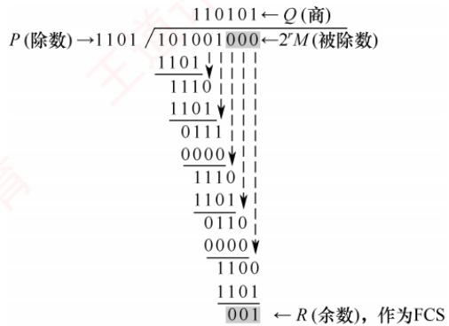  
图3.8 循环冗余码的运算过程

CRC的生成与校验通常由专用硬件电路实现，速度极快，几乎不会引入额外的延迟。若传输过程中无差错，则CRC检验所得余数必定为 $0 ;$ 若出现误码，余数仍为0的概率极低。因此，在工程实践中通常认为“凡是被数据链路层接受的帧，几乎可以确定在传输过程中未发生差错”。而那些被丢弃的帧，尽管物理上曾被收到，却因CRC校验失败而未被上层接受。

## 3.3.2 纠错编码

最常见的纠错编码是海明码。其基本原理是在原始信息位中插入若于检验位，构成具有检错与纠错能力的海明码。每个检验位对应一个校验组（通常采用偶校验），用于校验海明码中的若于信息位。通过将每个信息位分配到多个检验组中，当某一位出错时，会引发其所属的多个检验组同时出现校验错误，从而不仅能检测出错误，还能确定错误位置，实现单比特纠错。

下面以信息位1010为例，详细介绍海明码的构造与纠错过程。

## （1）确定海明码的总位数

设信息位有n位，检验位有k位。k个检验位可表示 $2 ^ { k }$ 种状态：信息位和检验位共有 $n \mathrm { ~ + ~ } k$ 种单比特出错的位置，此外还需1种表示无错状态。因此，n与k需满足

$$
2^{k} \geqslant n + k + 1
$$

本例中 $n = 4$ ，尝试 $k = 3 : 2^{3} \geqslant 4 + 3 + 1$ 成立。故取 $k = 3$ ，海明码共 $n + k = 7$ 位。记信息位为 $D_{4}D_{3}D_{2}D_{1} = 1010$ ，检验位为 $P _ { 3 } P _ { 2 } P _ { 1 }$ ，海明码位号从右至左依次为 $H_{7}H_{6}H_{5}H_{4}H_{3}H_{2}H_{1}$

## （2）确定检验位的分布

规定：检验位 $P _ { i }$ 放在海明位号为 $2 ^ { i - 1 }$ 的位置上，其余各位放置信息位，因此：

$P _ { 1 }$ 的海明码位号为 $2 ^ { i - 1 } = 2 ^ { 0 } = 1$ ，即 $H _ { 1 }$ 为 $P _ { 1 }$ 8

$P _ { 2 }$ 的海明码位号为 $2 ^ { i - 1 } = 2 ^ { 1 } = 2$ ，即 $H _ { 2 }$ 为 $P _ { 2 } ,$

$P _ { 3 }$ 的海明码位号为 $2^{i - 1} = 2^2 = 4$ ，即 $H _ { 4 }$ 为 $P _ { 3 } ,$

将信息位按原顺序放在剩余位置，得到海明码的分布如下：

$$
\begin{aligned}H_{7} \quad & H_{6} \quad & H_{5} \quad & H_{4} \quad & H_{3} \quad & H_{2} \quad & H_{1} \\D_{4} \quad & D_{3} \quad & D_{2} \quad & P_{3} \quad & D_{1} \quad & P_{2} \quad & P_{1}\end{aligned}
$$

## （3）分组以形成检验关系

每个信息位由多个检验位共同校验，需满足条件：信息位所在位号=其所参与的所有检验

位位号之和。另外，检验位不需要再被检验。分组形成的检验关系如下。

$$
\begin{aligned}D_{1}  位于  H_{3} 。由  H_{2} H_{1}(P_{2} P_{3})  检验:  \quad & \begin{array}{l} 因为  3(011) = \left[ \begin{array}{c} H_{d}(P_{3}) \\ \end{array} \right] = \\ 因为  6(110) = \left[ \begin{array}{c} 4 \\ \end{array} \right] \\ D_{1}  位于  H_{5} 。由  H_{4} H_{5} H_{6} (P_{3} P_{5} P_{6})  检验:  \end{array} \\D_{1}  位于  H_{6} 。由  H_{4} H_{6} H_{1}(P_{3} P_{5} P_{2})  检验:  \quad & \begin{array}{l} 因为  3(011) = \left[ \begin{array}{c} H_{d}(P_{3}) \\ \end{array} \right] \\ 因为  6(110) = \left[ \begin{array}{c} 4 \\ 4 \\ 4 \\ \end{array} \right] \\ 因为  7(111) = \left[ \begin{array}{c} 4 \\ \end{array} \right] \\ 第  3  组 \end{array}\end{aligned}\begin{aligned} 因为  3(011) = \left[ \begin{array}{c} H_{d}(P_{3}) \\ \end{array} \right] = \left[ \begin{array}{c} H_{d}(P_{3}) \\ \end{array} \right] \\ 因为  6(110) = \left[ \begin{array}{c} 4 \\ 4 \\ 4 \\ \end{array} \right] \\+ \left[ \begin{array}{c} 2 \\ 2 \\ 2 \\ 2 \\ 2 \\ \end{array} \right] \\+ \left[ \begin{array}{c} 4 \\ + \\ 1 \\ 1 \\ \end{array} \right] \\ 第  1  组 \end{aligned}
$$

## （4）检验位取值

检验位 $P _ { i }$ 的值为其对应校验组中所有位（含信息位）求异或（偶校验结果）。

根据（3）中的分组有

$$
P_{1}校验D_{1},D_{2},D_{4}\rightarrow P_{1}=D_{1}\oplus D_{2}\oplus D_{4}=0\oplus1\oplus1=0
$$

$$
P_{2}校验D_{1},D_{3},D_{4} \quad \rightarrow \quad P_{2}=D_{1} \oplus D_{3} \oplus D_{4}=0 \oplus 0 \oplus 1=1
$$

$$
P_{3}校验D_{2},D_{3},D_{4} \quad \rightarrow \quad P_{3}=D_{2} \oplus D_{3} \oplus D_{4}=1 \oplus 0 \oplus 1=0
$$

因此，1010对应的海明码为1010010（下划线为检验位，其余为信息位）。

## （5）海明码的检验原理

每个检验组分别利用检验位和参与形成该检验位的信息位进行奇偶检验检查，构成k个检验方程：

$$
S _ { 1 } = P _ { 1 } \oplus D _ { 1 } \oplus D _ { 2 } \oplus D _ { 4 }
$$

$$
S_{2}=P_{2}\oplus D_{1}\oplus D_{3}\oplus D_{4}
$$

$$
S_{3}=P_{3} \oplus D_{2} \oplus D_{3} \oplus D_{4}
$$

若 $S _ { 3 } S _ { 2 } S _ { 1 }$ 的值为“000”，表示无错误；否则表示出错，且这个数就是错误位的位号，如 $S_{3}S_{2}S_{1}=001$ 表示第1位出错，即 $H _ { 1 }$ 出错，直接将其取反即可达到纠错的目的。

海明码的优势在于：通过少量冗余检验位，可实现单比特错误的自动定位与纠正。

## 3.3.3 本节习题精选

## 一、单项选择题

01.下列有关数据链路层差错控制的叙述中，错误的是（）。A. 数据链路层只能提供差错检测，而不提供对差错的纠正B. 奇偶检验码只能检测出错误而无法对其进行修正，也无法检测出双位错误C. CRC检验码可以检测出所有的单比特错误 算机D. 海明码可以纠正一位差错

02. 下列关于奇偶检验码特征的描述中，正确的是（）。A.只能检查出奇数个比特的错误 B. 能检查出任意比特的错误C. 比 CRC 检验更可靠 D. 只能检查出偶数个比特的错误

03. 字符S的ASCI编码从低到高依次为1100101，采用奇检验，在下述收到的传输后字符中，错误（）不能检测。A. 11000011 B. 11001010 C. 11001100 D. 11010011

04. 为纠正2比特错误，编码的码距至少应为（）。A. 2 B. 3 C. 4 D. 5

05. 对于10位要传输的数据，若采用海明码检验，则需要增加的冗余信息位数是（）。A. 3 B. 4 C. 5 D. 6

06.下列关于循环冗余检验的说法中，错误的是（）。

A. 带r个检验位的多项式编码可以检测到所有长度小于或等于r的突发性错误  
B. 通信双方可以无须商定就直接使用多项式编码  
C. CRC 检验可以使用硬件来完成  
D. 有一些特殊的多项式，因为有很好的特性，而成了国际标准

07. 要发送的数据是1101011011，采用CRC检验，生成多项式是10011，那么最终发送的数据应是（）。A. 1101 0110 1110 10 B. 1101 0110 1101 10C. 1101 0110 1111 10 D. 1111 0011 0111 00 YTA

08. 【2023统考真题】若甲向乙发送数据时采用CRC检验，生成多项式为 $G(X) = X^4 + X +$ 1 $G = 10011$ ，则乙方接收到比特串（）时，可以断定其在传输过程中未发生错误。A. 10111 0000 B. 10111 0100 C. 10111 1000 D. 10111 1100

09.【2025统考真题】某差错编码的编码集为{10011010,01011100,1111 0000,00001111}，该差错编码的检错和纠错能力是（）。A. 不超过2 位错的100%检错、不超过1位错的纠错 王道计B. 不超过2 位错的 100%检错、不超过2 位错的纠错C. 不超过3 位错的100%检错、不超过1位错的纠错D. 不超过3 位错的100%检错、不超过2 位错的纠错

## 二、综合应用题

01. 在数据传输过程中，若接收方收到的比特序列为10110011010，收发双方采用的生成多项式为 $G(x)=x^{4}+x^{3}+1$ ，则该比特序列在传输中是否出错？若未出错，则发送数据的比特序列和CRC检验码的比特序列分别是什么？

## 3.3.4 答案与解析

## 一、单项选择题

01. A

链路层的差错控制有两种基本策略：检错编码和纠错编码。常见的纠错编码有海明码，它可

02. A

奇偶检验的原理是通过增加冗余位来使得码字中“1”的个数保持为奇数或偶数的编码方法，它只能检查出奇数个比特的错误。 X

03. D

既然采用奇检验，那么传输的数据中1的个数若是偶数则可检测出错误，若1的个数是奇数则检测不出错误。

04. D

要纠正d位错误，编码的码距需满足2d+1。当d=2时，所需码距为2×2+1=5。

05. B

在k比特信息位上附加r比特冗余信息，构成k+ r 比特的码字，必须满足 $2^{r} \geqslant k + r + 1$ 。若k的取值小于或等于11且大于4，则r=4。

06. B

在使用多项式编码时，发送方和接收方必须预先商定一个生成多项式。发送方按照模2除法，得到检验码，在发送数据时将该检验码加到数据后面。接收方收到数据后，也需要根据该生成多

项式来验证数据的正确性。选项A是正确结论，了解即可，无须掌握证明过程。

## 07. C

假设一个帧有m位，其对应的多项式为G(x)，则计算冗余码的步骤如下：

①加 $0 _ { \circ }$ 假设 G(x)的阶为 r，在帧的低位端加上 r个 0。

②模2除。利用模2除法，用G(x)对应的数据串除①中计算出的数据串，得到的余数即为冗余码（共r位，前面的0不可省略）。

多项式以2为模运算。按照模2运算规则，加法不进位，减法不借位，它刚好是异或操作。乘除法类似于二进制运算，只是在做加减法时按模2规则进行。 XTA

## 08. D

观察选项：除后4位外，前5位都为10111，可知发送方发送的数据部分为10111，列式求得余数部分为1100，因此发送方发送的帧串为101111100。

$$
\begin{aligned}&\overbrace{1\ 0\ 0\ 1\ 1\ \ 1\ 0\ 0\ 0\ 0}^{1\ 0\ 1\ 0\ 0\ 0} \\= \underbrace{1\ 0\ 0\ 1\ 1}_{1\ 0\ 0\ 0\ 0} \\\ \ \ \underbrace{1\ 0\ 0\ 1\ 1}_{1\ 1\ 1\ 0\ 0} & --- --- 余数 \end{aligned}
$$

## 09. C

首先计算该编码集的码距：对四个码字两两比较，任意两个码字的码距至少为4，故该编码集的码距 $d _ { \mathrm { m i n } }   =   4$ 。根据差错控制理论，若编码集的码距为d，则可检测不超过d-1位错误，能纠正不超过 $( d - 1 ) / 2 .$ 位错误。因此该编码集最多能检测3位错误、纠正1位错误。

## 二、综合应用题

## 01. 【解答】

根据题意，生成多项式G(x)对应的比特序列为11001。进行如下的二进制模2除法，被除数为10110011010，除数为11001： X

$$
\begin{aligned} 1 \quad 1 \quad 0 \quad 1 \quad 0 \quad 1 \quad 0 \quad 1 \quad 0 \quad 1 \quad 0 \quad 1 \quad 0 \quad 1 \quad 0 \quad 1 \quad 0 \quad 1 \quad 0 \quad 1 \quad 0 \quad 1 \quad 0 \quad 1 \quad 0 \quad 1 \quad 0 \quad 1 \quad 0 \quad 1 \quad 0 \quad 1 \quad 0 \quad 1 \quad 0 \quad 1 \quad 0 \quad 1 \quad 0 \quad 1 \quad 0 \quad 1 \quad 0 \quad 1 \quad 0 \quad 1 \quad 0 \quad 1 \quad 0 \quad 1 \quad 0 \quad 1 \quad 0 \quad 1 \quad 0 \quad 1 \quad 0 \quad 1 \quad 0 \quad 1 \quad 0 \quad 1 \quad 0 \quad 1 \quad 0 \quad 1 \quad 0 \quad 1 \quad 0 \quad 1 \quad 0 \quad 1 \quad 0 \quad 1 \quad 0 \quad 1 \quad 0 \quad 1 \quad 0 \quad 1 \quad 0 \quad 1 \quad 0 \quad 1 \quad 0 \quad 1 \quad 0 \quad 1 \quad 0 \quad 1 \quad 0 \quad 1 \quad 0 \quad 1 \quad 0 \quad 1 \quad 0 \quad 1 \quad 0 \quad 1 \quad 0 \quad 1 \quad 0 \quad 1 \quad 0 \quad 1 \quad 0 \quad 1 \quad 0 \quad 1 \quad 0 \quad 1 \quad 0 \quad 1 \quad 0 \quad 1 \quad 0 \quad 1 \quad 0 \quad 1 \quad 0 \quad 1 \quad 0 \quad 1 \quad 0 \quad 1 \quad 0 \quad 1 \quad 0 \quad 1 \quad 0 \quad 1 \quad 0 \quad 1 \quad 0 \quad 1 \quad 0 \quad 1 \quad 0 \quad 1 \quad 0 \quad 1 \quad 0 \quad 1 \quad 0 \quad 1 \quad 0 \quad 1 \quad 0 \quad 1 \quad 0 \quad 1 \quad 0 \quad 1 \quad 0 \quad 1 \quad 0 \quad 1 \quad 0 \quad 1 \quad 0 \quad 1 \quad 0 \quad 1 \quad 0 \quad 1 \quad 0 \quad 1 \quad 0 \quad 1 \quad 0 \quad 1 \quad 0 \quad 1 \quad 0 \quad 1 \quad 0 \quad 1 \quad 0 \quad 1 \quad 0 \quad 1 \quad 0 \quad 1 \quad 0 \quad 1 \quad 1 \quad 0 \quad 1 \quad 0 \quad 1 \quad 1 \quad 0 \quad 1 \quad 1 \quad 0 \quad 1 \quad 1 \quad 0 \quad 1 \quad 1 \quad 1 \quad 0 \quad 1 \quad 1 \quad 1 \quad 1 \quad \quad 1 \quad 1 \quad 1 \quad 1 \quad \quad 1 \quad 1 \quad 1 \quad \quad 1 \quad 1 \quad 1 \quad \quad 1 \quad 1 \quad 1 \quad \quad 1 \quad 1 \quad \quad 1 \quad 1 \quad \quad 1 \quad 1 \quad \quad 1 \quad 1 \quad \quad 1 \quad 1 \quad \quad 1 \quad 1 \quad \quad 1 \quad 1 \quad \quad 1 \quad 1 \quad \quad 1 \quad 1 \quad \quad 1 \quad \quad 1 \quad 1 \quad \quad 1 \quad \quad 1 \quad \quad 1 \quad 1 \quad \quad 1 \quad \quad 1 \quad \quad 1 \quad 1 \quad \quad 1 \quad \quad 1 \quad \quad 1 \quad \quad 1 \quad \quad 1 \quad \quad 1 \quad \quad 1 \quad \quad 1 \quad \quad 1 \quad \quad 1 \quad \quad 1 \quad \quad 1 \quad \quad 1 \quad \quad 1 \quad \quad 1 \quad \quad 1 \quad \quad 1 \quad \quad 1 \quad \quad 1 \quad \quad \quad 1 \quad \quad 1 \quad \quad 1 \quad \quad 1 \quad \quad 1 \quad \quad \quad 1 \quad \quad 1 \quad \quad \quad \end{aligned}
$$

所得余数为0，因此该比特序列在传输过程中未出现差错。发送数据的比特序列是1011001，CRC检验码的比特序列是1010。注，CRC检验码的位数等于生成多项式G(x)的最高次幂。

## 3.4 流量控制与可靠传输机制

在数据链路层中，流量控制机制和可靠传输机制是紧密交织的。

## 3.4.1 流量控制与滑动窗口机制

流量控制是指由接收方控制发送方的发送速率，确保接收方有足够的缓存空间来接收每一个

帧。常见的流量控制方法有两种：停止-等待协议和滑动窗口协议。数据链路层和传输层均具备流量控制的功能，且都采用了滑动窗口的思想，但二者存在明显区别，主要体现在以下两方面。

1）数据链路层控制的是相邻节点之间的流量，而传输层控制的是端到端的流量。

2）数据链路层的控制手段是：当接收方无法接收时，不返回确认帧：而传输层的控制手段是：接收方在确认报文段中携带窗口字段值，动态调整发送方的发送窗口大小。

## 1. 停止-等待流量控制基本原理

停止-等待流量控制是一种最简单的流量控制方法。发送方每次仅允许发送一个帧，接收方每成功接收一个帧后，需返回一个确认帧，表示可以接收下一帧：发送方只有收到确认帧后，才能发送后续帧。若未收到确认帧，发送方将一直等待。由于发送方在发送完一个帧后必须等待确认，因此信道利用率较低，传输效率不高。

## 2. 滑动窗口流量控制基本原理

滑动窗口流量控制是一种更高效的流量控制方法。在任意时刻，发送方维持一组连续的、允许发送的帧序号，称为发送窗口：接收方也维持一组连续的、允许接收的帧序号，称为接收窗口。发送窗口的大小决定了在未收到对方确认的情况下，发送方最多还能发送多少帧以及哪些帧。接收窗口则用于控制接收方可以接收哪些帧，超出窗口范围的帧将被丢弃。

图3.9展示了发送窗口的工作原理，图3.10展示了接收窗口 $( W _ { \mathrm { R } } = 1 )$ 的工作原理。

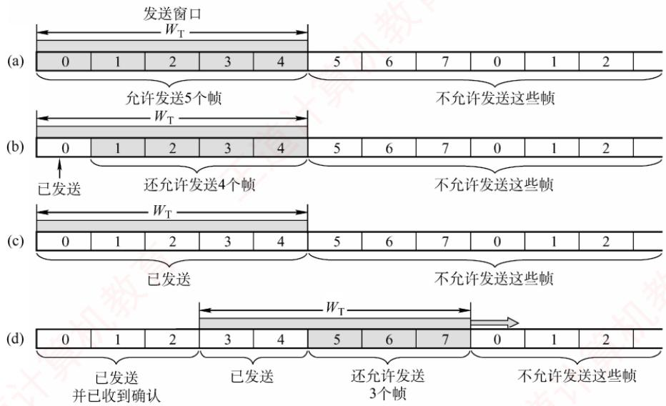  
图3.9 发送窗口的工作原理：(a)允许发送0～4号共5个帧；(b)允许发送1\~4号共  
4个帧；(c)不允许发送任何帧；(d)允许发送5\~7号共3个帧

发送方每收到一个按序到达的确认帧，就将发送窗口向前滑动一个位置，从而允许发送一个新的帧。当窗口内所有帧均已发送但尚未收到确认时，发送方暂停发送。

接收方每收到一个序号落在接收窗口内的帧，便接收该帧，随后将接收窗口向前滑动一个位置，并返回确认。若收到的帧序号落在接收窗口之外，则一律丢弃。

滑动窗口具有以下重要特性：

1）发送窗口的滑动依赖于确认信息：仅当发送方收到对某帧的确认后，其发送窗口才能向前滑动。而接收方仅在成功接收期望帧后，才会发送确认并滑动其接收窗口。

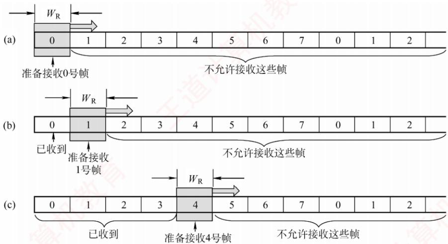  
图3.10 接收窗口的工作原理

考点追踪滑动窗口协议的窗口机制（2019、2025）

2）从滑动窗口的角度看，停止-等待协议与后面将要介绍的后退N帧协议和选择重传协议的主要区别在于发送窗口和接收窗口的大小：

停止-等待协议：发送窗口 $W _ { \mathrm { T } }   =   1$ ，接收窗口 $W _ { \mathrm { R } }   =   1$

后退N帧协议：发送窗口 $W _ { \mathrm { T } }   >   1$ ，接收窗口 $W_{\mathrm{R}} = 1$

选择重传协议：发送窗口 $W _ { \mathrm { T } }   >   1$ ，接收窗口 $W_{\mathrm{R}}>1$

若采用 $n (n \geqslant 2)$ 比特对帧编号，则后两种滑动窗口协议还需满足 $W _ { \mathrm { T } } + W _ { \mathrm { R } } \leqslant 2 ^ { n }$ o

3）当接收窗口大小为1时，只有收到该帧后才允许接收下一帧，因此可保证帧的有序接收。

4）在数据链路层的滑动窗口协议中，窗口大小在传输过程中是固定的（与传输层不同）。

## 3.4.2 可靠传输机制

可靠传输是指发送方发出的数据能够被接收方正确且完整地接收，为实现这一目标，通常采用确认（ACK）和超时重传两种机制。 XIT

1）确认：接收方每成功接收到一个数据帧，就向发送方返回一个确认帧，表明该数据帧已被正确接收。 X

2）超时重传：发送方在发送一个数据帧后启动一个计时器，若在规定时间内未收到对应的确认帧，则认为该帧可能丢失或出错，从而自动重传该帧，直至成功收到确认为止。

结合这两种机制的可靠传输协议称为自动重传请求（AutomaticRepeat reQuest，ARQ），它意味着：重传由发送方自主触发，无须接收方显式请求重传。在ARO协议中，数据帧和确认帧都必须编号，以便发送方和接收方能够准确识别确认帧对应的是哪个数据帧，以及判断哪些帧尚未被确认，从而决定是否需要重传。ARO协议主要包括三种类型：停止-等待（Stop-and-Wait）协议、后退N帧（Go-Back-N）协议和选择重传（SelectiveRepeat）协议。这三种协议的基本原理不仅适用于数据链路层，也可应用于更高层的可靠传输设计。

在实际网络中，是否在数据链路层提供可靠传输服务取决于链路特性：有线网络的误码率较低，为降低开销，一般不要求数据链路层提供可靠传输服务；即使出现少量误码，也可由上层（如传输层）通过端到端机制处理。无线网络的链路易受干扰，误码率较高，因此要求数据链路层必须向上层提供可靠传输服务，以避免大量错误帧传递至上层，提升整体效率。

## 1. 单帧滑动窗口与停止-等待协议（S-W）

在停止-等待协议中，发送方每次只能发送一个数据帧，只有在收到接收方对该帧的确认帧后，才能发送下一个帧。从滑动窗口的角度看，该协议的发送窗口和接收窗口大小均为1。

在实际传输过程中，可能出现以下两类差错：

1）数据帧出错或丢失。接收方检测到数据帧存在差错时，直接丢弃该帧；数据帧在传输途中丢失时，接收方不会收到任何信息。为应对这两种情况，发送方需要配备一个计时器。每发送完一个数据帧，发送方即启动该计时器；计时器超时仍未收到对应的确认帧时，认为该帧可能已丢失或出错，于是自动重传该帧。该过程重复进行，直至该帧被正确接收并返回确认帧为止。 x

2）确认帧出错或丢失。即使接收方已成功收到正确的数据帧，若其返回的确认帧在传输中出错或丢失，则发送方仍将因未收到确认而触发超时重传。这时，接收方会再次收到一个重复的数据帧。为避免重复处理，接收方会丢弃该重复帧，并重新发送对应的确认帧。

停止-等待协议每次仅发送一帧并等待确认，因此只需确保相邻发送的帧具有不同的序号即可区分新帧与重传帧。因此，仅需1比特序号空间就已足够：数据帧交替使用序号0和1，对应的确认帧分别记为ACK0和ACK1。若接收方连续收到相同序号的数据帧，则说明发送方进行了超时重传；若发送方连续收到相同序号的确认帧，则说明接收方收到了重复帧且重发了确认帧。

此外，为支持超时重传和重复帧识别，发送方和接收方均需设置帧缓冲区。发送方发送数据帧后，必须在发送缓存中保留该帧的副本，以便需要时重传；仅在收到对应的确认帧后，方可清除该副本。接收方也需记录最近成功接收的帧序号，以判断新到的帧是否是重复的帧。

停止-等待协议的信道利用率很低。为提高传输效率，后续发展出了连续ARQ协议（后退N帧协议和选择重传协议），允许发送方连续发送多个数据帧，而无须逐帧等待确认。

## 2. 多帧滑动窗口与后退N帧协议（GBN）

## 考点追踪GBN协议的工作原理（2009）

在后退N帧协议中，发送方可在未收到确认帧的情况下，连续发送多个序号落在发送窗口内的数据帧。后退N帧的含义是：若某个已发送的数据帧因超时未收到确认而被判定为丢失或出错，则发送方不仅需要重传该帧，还需重传其后所有已发送但未被确认的帧。这一机制的前提是：接收方仅按序接收数据帧，任何失序到达的帧都将被丢弃。

## 考点追踪GBN协议的累积确认机制（2017）

如图3.11所示，发送方向接收方连续发送数据帧，发送完0号帧后，可继续发送1号、2号等后续帧。其通常仅为最早未确认的帧维护一个超时计时器，当该帧被确认后，计时器移至下一个未确认帧。由于连续发送了多个帧，确认帧必须明确指示所确认的帧序号。为降低开销，GBN协议采用累积确认机制：接收方无须对每个正确接收的帧立即返回确认，而可在连续收到多个正确帧后，仅对其中序号最大的帧发送一个确认。具体而言，ACKn表示接收方已正确收到n号帧及之前的所有帧，下一次期望接收的是n+1号帧（若序号回绕，则可能是0号帧）。

由于接收方仅按序接收帧，当某帧出错或丢失时，其后所有正确到达的帧即使无误，也会被丢弃。例如，在图3.11中，尽管在出错的2号帧之后又收到了6个正确的数据帧，接收方仍必须将它们全部丢弃。此外，为了防止确认帧丢失，接收方可以重复发送最近一次的确认帧(如ACK1)，促使发送方尽快感知当前的接收状态。2号帧的计时器超时后，发送方将从该帧开始，重传窗口内所有未被确认的帧（2号及之后的帧）。

## 考点追踪GBN协议的超时重传机制（2017）

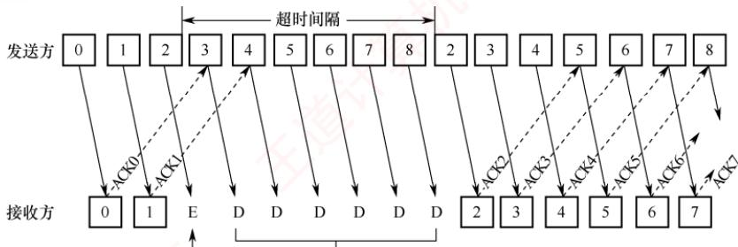  
出错 被数据链路层丢弃的帧  
图3.11 GBN协议的工作原理：对出错数据帧的处理

## 考点追踪GBN协议的滑动窗口机制（2012、2015、2017）

若采用n比特对帧编号，则发送窗口 $W _ { \mathrm { T } }$ 应满足 $1 < W_{\mathrm{T}} \leqslant 2^{n} - 1$ 。若 $W_{\mathrm{T}} > 2^{n} - 1$ ，而这可能导致接收方无法区分新发送的帧与因序号回绕而重复出现的旧帧（参见章末的疑难点1）。

GBN协议的接收窗口大小固定为 $W _ { \mathrm { R } }   =   1$ ，这保证了帧的严格按序接收。

不难看出，GBN协议一方面通过连续发送多个帧显著提高了信道利用率；另一方面，在发生差错时却必须重传大量已正确到达的帧（仅因这些帧前面有一帧出错），从而造成带宽浪费。因此，当信道误码率较高时，GBN协议的性能可能反而不如停止-等待协议。

## 3. 多帧滑动窗口与选择重传协议（SR）

为了进一步提高信道的利用率，可以设法仅重传出错或超时的数据帧，而不影响其他已正确传输的帧。为此，接收方必须能够暂存失序但正确到达、且序号仍落在接收窗口内的数据帧，待缺失序号的帧收齐后，再按序交付给上层。这种机制即为选择重传协议。

## 考点追踪SR协议的工作原理（2011、2024）

为实现仅重传出错帧的目标，接收方不能再采用累积确认，而需对每个正确接收的数据帧逐一发送确认。显然，选择重传协议比后退N帧协议更为复杂：

●接收方需设置足够大的帧缓冲区（其数量等于接收窗口大小），用于暂存正确的失序帧；

● 发送方为每个未确认的帧维护独立的计时器，当某帧的计时器超时时，仅重传该帧；

● 若接收方收到重复的数据帧（表示确认帧丢失），则丢弃该帧，并重传对应的确认帧。

此外，选择重传协议还引入了更高效的差错处理策略：一旦接收方检测到某个数据帧出错，可立即向发送方发送否定帧（NAK），请求重传NAK指定的帧，从而避免等待超时。

在图3.12中，2号帧丢失后，接收方仍可正常接收并缓存后续到达的数据帧（如3～9号帧）；发送方超时重传2号帧并被成功接收后，接收窗口即可向前滑动。在某个时刻，若接收方检测到10号帧出错，则会立即发送否定帧NAK10；在此期间，接收方仍可继续接收并缓存后续帧；发送方收到NAK10后，立即重传10号帧，无须等待超时。

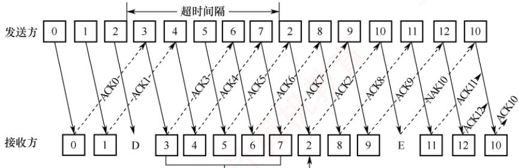  
由数据链路层缓冲的帧 将分组2\~7传给网络层  
图3.12 SR协议的工作原理：对超时和出错数据帧的处理

## 考点追踪SR协议的滑动窗口机制（2023）

选择重传协议的接收窗口 $W _ { \mathbf { R } }$ 和发送窗口 $W _ { \mathbf { T } }$ 均大于1，允许一次发送或接收多个数据帧。若采用n比特对帧编号，需满足两个条件：① $W_{\mathrm{R}} + W_{\mathrm{T}} \leqslant 2^{n}$ （不满足此条件时，接收窗口向前滑动后，部分确认帧丢失，发送方可能重传旧序号的帧；由于序号空间不足，这些重传帧的序号可能与新帧重叠，导致接收方无法区分新帧与旧帧）。② $W_{\mathrm{R}} \leqslant W_{\mathrm{T}}$ （若接收窗口大于发送窗口，则接收窗口中超出发送窗口范围的部分永远无法被填满，造成资源浪费）。由①和②不难推出$W _ { \mathrm { R } } \leqslant 2 ^ { n - 1 }$ 。在实际应用中，常取 $W _ { \mathrm { R } }   =   W _ { \mathrm { T } }   =   2 ^ { n - 1 }$ ，以充分利用序号空间。

## 注意

为使内容精炼，本文未对三种ARQ协议的滑动窗口动态变化过程展开具体示例。此部分内容在配套视频中有丰富、形象的过程演示，强烈建议读者结合学习。

## 4. 信道利用率的分析

信道利用率用于衡量信道的使用效率。从时间角度看，信道效率是针对发送方而言的，是指发送方在一个发送周期（从发送方开始发送一个分组，到收到对该分组的确认所需的时间）内，有效发送数据的时间与整个发送周期之比。本节使用分组而非帧，是为增强表述的通用性。

## （1）停止-等待协议的信道利用率

## 考点追踪停止-等待协议的信道利用率分析（2018、2020）

停止-等待协议的优点是实现简单，但缺点是信道利用率极低。图3.13显示了停止-等待协议中数据帧和确认帧的发送时间关系。假定在发送方和接收方之间有一个直通的信道来传送分组。

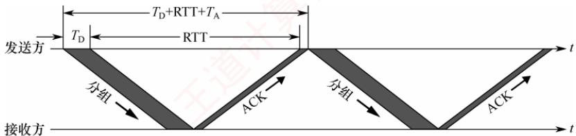  
图3.13 停止-等待协议中数据帧和确认帧的发送时间关系

发送方发送一个分组的发送时延为 $T _ { \mathrm { D } } \mathrm { { _ \circ } }$ 显然， $T _ { \mathrm { D } }$ 等于分组长度除以数据传输速率。假定分组正确到达接收方后，其处理时间可忽略不计，接收方立即返回确认。接收方发送确认分组的发送时延为 $T _ { \mathrm { A } }$ （通常可忽略不计）。再假设发送方处理确认分组的时间也可忽略不计，则发送方经过时间 $T_{\mathrm{D}} + \mathrm{RTT} + T_{\mathrm{A}}$ 后就可再发送下一个分组，其中RTT是往返时延。由于仅有 $T _ { \mathbf { D } }$ 时间用于有效发送数据，因此停止-等待协议的信道利用率U为

$$
U = \frac{T_{\mathrm{D}}}{T_{\mathrm{D}} + \mathrm{RTT} + T_{\mathrm{A}}}
$$

假定某信道的RTT= 20ms。分组长度为1200 比特，数据传输速率为1Mb/s。若忽略处理时延和 $T _ { \mathrm { A } }$ ，则可算出信道利用率 $U = 5.66\%$ 。若将数据传输速率提高至10Mb/s，则 $U = 0.596\%$ 。由此可见，当RTT远大于 $T _ { \mathbf { D } }$ 时，停止-等待协议的信道利用率会非常低。

## （2）连续ARQ协议的信道利用率

## 考点追踪停止-等待、GBN与SR协议的信道利用率对比分析（2023）

连续ARQ协议采用流水线传输（见图3.14），允许发送方连续发送多个分组，从而在信道上维持持续的数据流动。只要发送窗口足够大，即可显著提升信道利用率。

  
图3.14 连续ARQ协议的流水线传输可提高信道利用率

考点追踪GBN协议的信道利用率分析（2012、2015、2017）

设连续ARQ协议的发送窗口大小为N（最多可连续发送N个分组），分为两种情况：

1）若 $N T _ { \mathrm { D } } < T _ { \mathrm { D } } + \mathrm { R T T } + T _ { \mathrm { A } }$ ：即在一个发送周期内可发送完N个分组，此时，信道无法被完全占满，信道利用率为

$$
U = \frac{NT_{\mathrm{D}}}{T_{\mathrm{D}} + \mathrm{RTT} + T_{\mathrm{A}}}
$$

2）若 $\mathrm{NT_D} \geqslant \mathrm{T_D} + \mathrm{RTT} + \mathrm{T_A}$ 即在一个发送周期内发不完（或刚好发完）N个分组，只要无差错发生，发送方可持续不间断地发送，信道被完全利用，此时信道利用率U=1。

在相同帧序号比特数下，GBN的发送窗口大于停止-等待协议，因此理想条件下信道利用率更高。但是，当信道误码率较高时，其实际信道利用率甚至可能低于停止等待协议。

考点追踪滑动窗口协议的数据传输速率分析（2009、2010、2014）

此外，“信道平均（实际）数据传输速率=信道利用率×信道带宽（最大数据传输速率）”，或“信道平均（实际）数据传输速率=发送周期内发送的数据量/发送周期”。

本节习题包含大量关于信道利用率与传输速率的习题，建议读者结合练习深入掌握。

## 3.4.3 本节习题精选

## 一、单项选择题

01.下列关于停止-等待协议的描述中，正确的是（）。A. 发送窗口和接收窗口的尺寸都为1 B. 最大的信道利用率有可能达到100%C. 适合于往返时间比较长的信道 D. 接收方可以不按序接收

02.下列情况中，会使停止-等待协议的效率变得很低的是（）。A. 当源主机和目的主机之间的距离很近而且数据传输速率很高时B. 当源主机和目的主机之间的距离很远而且数据传输速率很高时C.当源主机和目的主机之间的距离很近而且数据传输速率很低时D.当源主机和目的主机之间的距离很远而且数据传输速率很低时

03. 在简单的停止-等待协议中，当帧出现丢失时，发送方会永远等待下去，解决这种死锁现象的办法是（）。A. 差错检验 B. 帧序号 C. NAK 机制 D. 超时机制

04. 在停止-等待协议中，为了让接收方能判断所收到的数据帧是否重复，采用（）的方法。A. 帧编号 B. 检错码 C. 重传计时器 D. NAK 帧

05. 一个信道的数据传输速率为 4kb/s，单向传播时延为 30ms，若使停止-等待协议的信道最大利用率达到80%，则要求的数据帧长至少为（）。A. 160 比特 B. 320 比特C. 560 比特 D. 960 比特

06. 主机甲采用停止-等待协议向主机乙发送数据，数据传输速率是6kb/s，单向传播时延是

100ms，忽略确认帧的发送时延。信道的利用率为40%时，数据帧的长度为（）。A. 240 比特 B. 320 比特 C. 600比特 D. 800 比特

07.在停止-等待协议中，若发送方发送的数据帧中途丢失，则可能发生的情况是（）。A. 接收方发送NAK帧，请求重发此帧B. 发送方在经过超时时间后未收到ACK帧，自动重发此帧C. 接收方在经过超时时间后，向发送方发送ACK帧，请求重发此帧D. 发送方继续发送后续帧，直到经过超时时间后未收到ACK帧，重发此帧

08.下列关于连续ARQ的说法中，错误的是（）。A. 发送方可以连续发送若干数据帧，而不是发完一个数据帧就停下来等待确认帧B. 发送方收到了接收方发来的确认帧，还可以接着发送数据帧C. 相比停止-等待协议，连续ARQ因为减少了等待时间，所以提高了信道利用率D. 接收方可以不按序接收数据帧 X

09. 数据链路层采用后退N帧协议进行流量控制，发送方已发送编号为0\~6的帧，之后收到5号数据帧的确认，发送方的滑动窗口向后移动后，发送方可发送的数据帧数量为6王个，假设整个过程未发生超时，则应采用（）位给数据帧编号。A. 3 B. 4 C. 5 D. 6

10. 数据链路层采用后退N帧协议，发送方已经发送了编号从0到6的帧。当计时器超时的时候，只收到对1、2、4号帧的确认，发送方需要重传的帧的数量是（）。A. 1 B. 2 C. 5 D. 6

11. 数据链路层采用了后退N帧协议（GBN），若发送窗口的大小是32，则至少需要（）位的序列号才能保证协议不出错。A. 4 B. 5 C. 6 D. 7

12. 若采用后退N帧的ARQ协议进行流量控制，帧编号字段为7位，则发送窗口的最大长度为（）。A. 7 B. 8 C. 127 D. 128

13. 一个使用选择重传协议的数据链路层，若采用5位的帧序列号，则可以选用的最大接收窗口是（）。A. 15 B. 16 C. 31 D. 32 教

14. 对于窗口总大小为n的滑动窗口，最多可以有（）帧已发送但没有确认。A. 0 B. n−1 C. n D. $n / 2$

15. 数据链路层采用选择重传协议（SR）传输数据，若帧序号采用4比特编号，接收窗口大小为7，则发送窗口最大是（）。HA. 17 B. 8 C. 9 D. 10

16. 对无序接收的滑动窗口协议，若序号位数为n，则接收窗口最大尺寸为（）。A. $2 ^ { n }   -   1$ B. 2n C. $2n - 1$ D. $2 ^ { n - 1 }$

17. 采用滑动窗口机制对两个相邻节点A和B的通信过程进行流量控制。A和B之间的数据传输速率为20kb/s，数据帧和确认帧的长度都为 2000B，往返传播时延为1400ms，采用3比特给数据帧编号，测得在A和B的通信过程中信道利用率大于80%，则（）。(注：在SR协议中，默认发送窗口大小等于接收窗口大小。）A. 节点A、B之间只能采用停止等待协议B. 节点A、B之间只能采用 GBN 协议

C. 节点 A、B之间只能采用 SR协议D. 节点 A、B之间可以采用 GBN 协议或 SR 协议

18.流量控制是实现发送方和接收方速度一致的机制，实现这种机制所采取的措施是（）。A. 增大接收方接收速度 B. 减小发送方发送速度王道计C. 接收方向发送方反馈信息 D. 增加双方的缓冲区

19. 假设两台主机之间采用后退N帧协议传输数据，数据传输速率为16kb/s，单向传播时延为250ms，数据帧的长度是128B，确认帧的长度也是128B，为使信道利用率达到最高，A. 2 则帧序号的比特数至少为（）。 B. 3 C. 4 D. 5 教

20. 在下列滑动窗口机制中，理论上可以达到100%信道利用率的是（）。I. 停止-等待协议 Ⅱ. 后退 N帧协议 II. 选择重传协议A. Ⅰ B. II C. III D. ⅡI和ⅢI

21.数据链路层采用选择重传协议进行流量控制，发送方在收到0\~3号帧的确认后，又收到了5号帧的确认，发送窗口内还有其他帧未发送，且未发生超时，则发送方将（）。A. 重传4号帧 B. 重传5号帧C. 接收该确认帧并继续发送剩下的帧 D. 停止发送并等待超时

22.【2009统考真题】数据链路层采用了后退N帧（GBN）协议，发送方已经发送了编号为0\~7的帧。当计时器超时的时候，若发送方只收到0、2、3号帧的确认，则发送方需要重发的帧数是（）。A. 2 B. 3 C. 4 D. 5

23.【2011统考真题】数据链路层采用选择重传协议（SR）传输数据，发送方已发送0\~3号数据帧，现已收到1号帧的确认，而0、2号帧依次超时，则此时需要重传的帧数是（）。A. 1 B. 2 C. 3 D. 4

24.【2012统考真题】两台主机之间的数据链路层采用后退N帧协议（GBN）传输数据，数据传输速率为16kb/s，单向传播时延为270ms，数据帧长范围是128\~512B，接收方总是以与数据帧等长的帧进行确认。为使信道利用率达到最高，帧序号的比特数至少为（）。A. 5 B. 4 C. 3 D. 2

25.【2014统考真题】主机甲与主机乙之间使用后退N帧协议（GBN）传输数据，主机甲的发送窗口尺寸为1000，数据帧长为1000B，信道带宽为100Mb/s，主机乙每收到一个数据帧，就立即利用一个短帧（忽略其传输延迟）进行确认，若主机甲和主机乙之间的单向传播时延是50ms，则主机甲可以达到的最大平均数据传输速率约为（）。A. 10Mb/s B. 20Mb/s C. 80Mb/s D. 100Mb/s

26.【2015统考真题】主机甲通过128kb/s卫星链路，采用滑动窗口协议向主机乙发送数据，链路单向传播时延为250ms，帧长为1000B。不考虑确认帧的开销，为使链路利用率不小于80%，帧序号的比特数至少是（）。A. 3 B. 4 D. 8

27.【2018统考真题】主机甲采用停止-等待协议向主机乙发送数据，数据传输速率是3kb/s，单向传播时延是200ms，忽略确认帧的传输时延。当信道利用率等于40%时，数据帧的长度为（）。A. 240 比特 C. 480 比特 D. 800 比特

28.【2019统考真题】对于滑动窗口协议，若分组序号采用3比特编号，发送窗口大小为5，则接收窗口最大是（）。A. 2 B. 3 C. 4 D. 5

29.【2020统考真题】假设主机甲采用停止-等待协议向主机乙发送数据帧，数据帧长与确认帧长均为1000B，数据传输速率是10kb/s，单向传播时延是200ms。则主机甲的最大信道利用率为（）。A. 80% B. 66.7% C. 44.4% D. 40%

30.【2023统考真题】假设通过同一条信道，数据链路层分别采用停止-等待协议、GBN协议和SR协议（发送窗口和接收窗口相等）传输数据，三个协议的数据帧长相同，忽略确认帧长，帧序号位数为3比特。若对应三个协议的发送方最大信道利用率分别是 $U _ { 1 }$ $U _ { 2 }$ 和 $U_{3},$ 则 $U_{1} 、 U_{2}$ 和 $U _ { 3 }$ 满足的关系是（）。A. $U_{1} \leqslant U_{2} \leqslant U_{3}$ B. $U_{1} \leqslant U_{3} \leqslant U_{2}$ C. $U_{2} \leqslant U_{3} \leqslant U_{1}$ D. $U_{3} \leqslant U_{2} \leqslant U_{1}$

31.【2024统考真题】主机甲通过选择重传（SR）滑动窗口协议向主机乙发送帧的部分过程如下图所示，Fx为数据帧，ACKx为确认帧，x是位数为3比特的序号。主机乙只对X 正确接收的数据帧进行独立确认，发送窗口与接收窗口大小相同且均为最大值。主机甲在 $t _ { 1 }$ 时刻和 $t _ { 2 }$ 时刻发送的数据帧分别是（）。

A. F1， F3B. F1， F4 C. F3, F1 D. F4, F1

## 二、综合应用题

01. 在选择重传协议中，设序号用3比特编号，发送窗口 $W _ { \mathrm { T } }   =   6$ ，接收窗口 $W _ { \mathrm { R } }   =   3$ 。试找出一种情况，使得在此情况下协议不能正确工作。

02.假设一个信道的数据传输速率为5kb/s，单向传播时延为30ms，帧长在什么范围内时，X 才能使用于差错控制的停止-等待协议的效率至少为50%？（忽略确认帧的发送时延。）

03. 假定信道的数据传输速率为 100kb/s，单程传播时延为 250ms，每个数据帧的长度均为2000位，且不考虑确认帧长、首部和处理时间等开销，为了达到最大的传输效率，试问帧的序号应为多少位？此时的信道利用率是多少？

04. 在数据传输速率为 50kb/s的信道上传送长度为1kbit的帧，总是采用捎带确认，帧序号长度为3bit，单向传播延迟为270ms。对于下面三种协议，信道的最大利用率是多少？1）停止-等待协议。

3）选择重传协议（假设发送窗口和接收窗口相等）。

05. 对于下列给定条件，不考虑差错重传，停止-等待协议的实际数据传输速率是多少？R=传输速率（16Mb/s）S=信号传播速率（200m/μs）D=接收主机和发送主机之间传播距离（200m）T=创建帧的时间（2μs） 王F=每帧的长度（500bit）N=每帧中的数据长度（450bit）A=确认帧 ACK的帧长（80bit）

06. 在数据传输速率为64kb/s的卫星信道上，甲方发送长度为512B的数据帧，乙方返回一个很短的确认帧（忽略确认帧的发送时延）。信道的单向传播时延为270ms，对于发送窗口大小分别为1、7、17和117的情况，甲方的实际数据传输速率分别为多少？

07.【2017统考真题】甲乙双方均采用后退N帧协议（GBN）进行持续的双向数据传输，且双方始终采用捎带确认，帧长均为1000B。 $S _ { x , y }$ 和 $R _ { x , y }$ 分别表示甲方和乙方发送的数据帧，其中x是发送序号，ν是确认序号（表示希望接收对方的下一帧序号），数据帧的发送序号和确认序号字段均为3 比特。信道传输速率为 100Mb/s，RTT=0.96ms。下图给出了甲方发送数据帧和接收数据帧的两种场景，其中 $t _ { 0 }$ 为初始时刻，此时甲方的发送和确认序号均为0， $t _ { 1 }$ 时刻甲方有足够多的数据待发送。请回答下列问题。

1)对于图(a)， $t _ { 0 }$ 时刻到 $t _ { 1 }$ 时刻期间，甲方可以断定乙方已正确接收的数据帧数是多少？正确接收的是哪几个帧（请用 $S _ { x , y }$ 形式给出）？

2）对于图(a)，从 $t _ { 1 }$ 时刻起，甲方在不出现超时且未收到乙方新的数据帧之前，最多还可以发送多少数据帧？其中第一个帧和最后一个帧分别是哪个（请用 $S _ { x , y }$ 形式给出）？ X

3）对于图(b)，从 $t _ { 1 }$ 时刻起，甲方在不出现新的超时且未收到乙方新的数据帧之前，需要重发多少数据帧？重发的第一个帧是哪个帧（请用 $S _ { x , y }$ 形式给出）？ V

4）甲方可以达到的最大信道利用率是多少？

  
(a)

  
(b)

## 3.4.4 答案与解析

## 一、单项选择题

## 01. A

停止-等待协议采用1比特给数据帧编号，发送窗口和接收窗口的尺寸都为1，选项A正确。仅在收到当前窗口内的数据帧后，接收窗口才能向后移动，因此一定是按序接收的。停止-等待协议的信道利用率 = 一个数据帧的发送时延÷(一个数据帧的发送时延 +RTT+ 一个确认帧的发送时延)，其中分子一定是小于分母的，所以信道利用率不可能达到100%，当RTT较大时，会降低信道利用率，因此停止-等待协议适合RTT较小的信道。 姚

## 02. B

根据信道利用率的计算公式，当数据传输速率很高时，数据帧的发送时间很短；当源主机和目的主机的距离很远时，往返时延很大，此时的信道利用率很低。 X

## 03. D

在停止-等待协议中，发送方设置了计时器，在发送一个帧后，发送方等待确认，若在计时器计满时仍未收到确认，则再次发送相同的帧，以免陷入永久的等待。

## 04. A

在停止-等待协议中，使用1位来编号即可。若连续出现相同序号的数据帧，则表明发送方进行了超时重传：若连续出现相同序号的确认帧，则表明接收方收到了重复帧。

## 05. D

设C为数据传输速率，L为帧长，R为单程传播时延。停止-等待协议的信道最大利用率为(L/C)/$(L/C+2R)=L/(L+2RC)=L/(L+2\times30 ms \times4 kb/s )=80\%$ ，得出L =960bit。

## 06. D

本题忽略确认帧的发送时延，所以信道利用率=数据帧的发送时延/(数据帧的发送时延+往返时延)=0.4，解得数据帧的发送时延为4/30s，所以数据帧的长度为6kb/s×4/30s=800bit。

## 07. B

停止-等待协议使用确认和重传机制，发送方每发送一个帧，就要停下来等待接收方发回的确认帧，收到确认帧后才能发送下一帧，经过超时时间后未收到ACK帧则自动重传。

## 08. D

连续ARQ协议分为GBN协议和 SR协议。SR的接收窗口大于1，接收方可以先收下失序但序号仍落在接收窗口内的那些数据帧。GBN的接收窗口等于1，接收方必须按序接收数据帧。

## 09. A

发送方收到5号帧的确认后，表示5号帧及之前的所有帧都被接收方正确接收，因此滑动窗口右移后，新窗口内的第一个帧就是6号帧，又因为此时可发送的数据帧数为6，因此发送窗口的总大小为7。在GBN协议中，若采用n位给帧编号，则发送窗口大小为2ⁿ-1，因此n=3。

## 10. B

后退N帧协议采用累积确认，确认的最后一个帧是4号帧，表示4号帧及4号帧之前的数据帧都已被正确接收，所以只需重传5号帧和6号帧这两个数据帧。

## 11. C

对于滑动窗口协议，序列号个数要大于或等于窗口数（发送窗口大小+接收窗口大小），所以在后退N帧的协议中，序列号个数不小于“发送窗口大小+1”，题中发送窗口大小是32，

那么序列号个数最少应该是33个。所以最少需要6位的序列号才能达到要求。

## 12. C

接收窗口整体向前移动时，新窗口中的序列号和旧窗口的序列号产生重叠，致使接收方无法区别发送方发送的帧是重发帧还是新帧，因此在后退N帧的ARQ协议中，发送窗口 $W_{\mathrm{T}} \leqslant 2^{n} - 1$ 0本题中n=7，因此发送窗口的最大长度是127。

## 13. B

在选择重传协议中，若用n比特对帧编号，则发送窗口和接收窗口的大小关系为 $1 < W_{\mathrm{R}} \leqslant W_{\mathrm{T}}$ 还需满足 $W_{\mathrm{R}} + W_{\mathrm{T}} \leqslant 2^{n}$ ，所以接收窗口的最大尺寸不超过序号范围的一半，即 $W _ { \mathrm { R } } \leqslant 2 ^ { n - 1 }$ 。TA

## 14. B

在连续ARQ协议中，发送窗口大小≤窗口总数-1。例如，窗口总数为8，编号为0～7，假设这8个帧都已发出，下一轮又发出编号0～7的8个帧，接收方将无法判断第二轮发的8个帧到底是重传帧还是新帧，因为它们的序号完全相同。另一方面，对于后退N帧协议，发送窗口大小可以等于窗口总数-1，因为它的接收窗口大小为1，所有的帧保证按序接收。因此对于窗口大小为n的滑动窗口，其发送窗口大小最大为n-1，即最多可以有n-1帧已发送但没有确认。

## 15. C

在选择重传协议中，若用n比特对帧编号，则发送窗口和接收窗口的大小关系为 $1 < W_{\mathrm{R}} \leqslant W_{\mathrm{T}}$ 此外，还要满足 $W _ { \mathrm { R } } + W _ { \mathrm { T } } \leqslant 2 ^ { n }$ ，因此发送窗口的最大尺寸为 $2^{4}-7=16-7=9$

## 16. D

本题未直接告知使用的是选择重传协议，而是通过间接方式给出的。题目称无序接收的滑动窗口协议，表示接收窗口大于1，所以使用的是选择重传协议，接收窗口最大尺寸为 $2 ^ { n - 1 }$

## 17. D

无论采用哪种滑动窗口协议，信道利用率的计算方法都是：发送窗口内所有数据帧的发送时延/（一个数据帧的发送时延+RTT+一个确认帧的发送时延）。分母记为T= 一个数据帧的发送时延+RTT+一个确认帧的发送时延，其中数据帧或确认帧的发送时延 $2000\mathrm{B} / (20\mathrm{kb} / \mathrm{s})$ 800ms，RTT= 1400ms，即 $T = 800 + 800 + 1400 = 3000   ms$ 。假设发送窗口大小为x，则 $800x/3000>$ 0.8，即发送窗口大小x要大于3，GBN协议的发送窗口为 $2 ^ { 3 }   -   1 = 7$ ，满足要求：SR协议的发送窗口为 $2 ^ { 2 }   =   4$ ，也满足要求。因此，A和B之间可以采用GBN协议或SR协议。

## 18. C

实现流量控制的常用方法是滑动窗口协议，它让接收方把自己的接收窗口大小反馈给发送方，以调节发送方的发送窗口大小，避免发送方因发送速度过快而导致接收方来不及接收。

## 19. C

为使信道利用率最高（100%），要让发送方在一个发送周期内持续发送帧，不能出现发送窗口内的帧发完但还未收到第一个帧的确认帧的情况。发送周期=发送一个数据帧的时间+往返时延+发送一个确认帧的时间，发送一个数据帧或确认帧的时间均为 $128\mathrm{B} \div 16\mathrm{kb/s} = 64\mathrm{ms}$ ，发送周期 $64ms+250ms\times 2+64ms=628ms$ 。为保证发送方持续发送帧，在一个发送周期内至少要发送的帧数为628ms/64ms≈10，即发送窗口大小至少为10，所以帧序号至少采用4比特。

## 20. D

信道利用率=发送周期内用于发送数据帧的时间/发送周期，其中发送周期=发送一个数据帧的时间+往返时延+发送一个确认帧的时间。停止-等待协议的发送窗口为1，不可能达到100%的信道利用率；只要发送窗口够大，后退N帧协议和选择重传协议都有可能达到100%的信道利用率。

## 21. C

在选择重传协议中，接收方对正确收到的每个数据帧单独进行确认，不要求收到的数据帧是有序的。依题意，接收方已正确收到0～3号和5号数据帧，但不确定4号数据帧是否收到。因为没有发生超时，发送方不进行重传，所以接收该确认帧并继续发送剩下的数据帧。

## 22. C

在GBN协议中，当接收方检测到某帧出错时，会简单地丢弃该帧及所有的后续帧，发送方超时后需重传该数据帧及所有的后续帧。注意，在GBN协议中，接收方一般采用累积确认的方式，即接收方对按序到达的最后一个分组发送确认，因此本题中收到3号帧的确认就表示编号为0、1、2、3的帧已接收，而此时发送方未收到1号帧的确认只能代表确认帧在返回的过程中丢失，而不代表1号帧未到达接收方。因此需要重传的帧为编号是4、5、6、7的帧。

## 23. B

在选择重传协议中，接收方逐个确认正确接收的分组，不管接收到的分组是否有序，只要正确接收就发送选择ACK分组进行确认，因此ACK分组不再具有累积确认的作用。对于这一点，要特别注意与GBN协议的区别。此题中只收到1号帧的确认，0、2号帧超时，因为对1号帧的确认不具有累积确认的作用，所以发送方认为接收方未收到0、2号帧，于是重传这两帧。

## 24. B

连续ARQ的信道利用率：

$$
\frac{ 发送窗口大小  \times  数据帧长/数据传输速率 }{ 数据帧长/数据传输速率 } = \frac{ 发送窗口大小/数据传输速率 }{2/ 数据传输速率  +  RTT/数据帧长}
$$

从上述公式可知，数据帧长越大，信道利用率就越高。数据帧长是不确定的，范围为128～512B，在计算最小窗口数时，为了保证无论数据帧长如何变化，信道利用率都能达到100%，应以128B的帧长计算。因此，当最短的帧长都能达到100%的信道利用率时，发送更长的数据帧也都能达到100%的信道利用率。若以512B的帧长计算，则求得的最小窗口数在128B的帧长下，达不到100%的信道利用率。首先计算出发送一个帧的时间： $128 \times 8 / (16 \times 10^3) = 64 \mathrm{ms}$ ；发送一个帧到收到确认帧为止的总时间： $64+270\times2+64=668  ms$ 这段时间总共可发送 $668/64 = 10.4$ 帧，即发送窗口≥11，而接收窗口=1，所以至少需要用4位比特进行编号。

## 25. C

考虑制约甲方的数据传输速率的因素。首先，信道带宽能直接制约数据的传输速率，传输速率一定是小于或等于信道带宽的。其次，因为甲方和乙方之间采用后退N帧协议传输数据，要考虑发送一个数据到接收到它的确认之前，最多能发送多少数据，甲方的最大传输速率受这两个条件的约束，所以甲方的最大传输速率是这两个值中的小者。甲方的发送窗口尺寸为1000，即收到第一个数据的确认前，最多能发送1000个数据帧，即 $1000 \times 1000 = 1MB$ 的内容，而从发送第一个帧到接收到它的确认的时间是一个帧的发送时间加上往返时间，即 $1000\mathrm{B} \div 100\mathrm{M}\mathrm{b} / \mathrm{s} \pm 50\mathrm{ms} + 50\mathrm{ms} = 0.10008\mathrm{s}$ ，此时的最大传输速率为 $1  MB /0.10008  s  \approx 10  MB / s  = 80  M  b / s$ 。信道带宽为100Mb/s，因此答案为min(80Mb/s$100\mathrm{Mb/s}=80\mathrm{Mb/s}$

## 26. B

按发送周期思考，从开始发送帧到收到第一个确认帧为止，用时为T=第一个帧的发送时延+第一个帧的传播时延+确认帧的发送时延+确认帧的传播时延，这里忽略确认帧的发送时延。因此 $T=1000\mathrm{B} \div 128\mathrm{kb/s}+\mathrm{RTT}=0.5625\mathrm{s}$ ，接着计算在T内需要发送多少数据才能满足利用率不小于80%。设数据大小为L字节，则 $(L \div 128\mathrm{kb/s})/T \geqslant 0.8$ ，得到 $L \geq 7200\mathrm{B}$ ，即在一个发送周期内至少要发7.2个帧才能满足要求，设需要编号的比特数为n，则 $2^{n}-1\geqslant7.2,\ n$ 至少为4。

## 27. D

信道利用率=传输帧的有效时间/传输帧的周期。假设帧的长度为x比特。对于有效时间，应该用帧的大小除以数据传输速率，即x÷3kb/s。对于帧的传输周期，应包含4部分：帧在发送方的发送时延、帧从发送方到接收方的单程传播时延、确认帧在接收方的发送时延、确认帧从接收方到发送方的单程传播时延。这4个时延中，因为题目中说“忽略确认帧的传输时延”，所以不计算确认帧的传输时延（传输时延也称发送时延，注意与传播时延区分）。所以帧的传输周期由三部分组成：首先是帧在发送方的发送时延 $x{\div}3\mathrm{kb/s}$ ，其次是帧从发送方到接收方的单程传播时延200ms，最后是确认帧从接收方到发送方的单程传播时延200ms，三者相加得周期为 $x \div 3\mathrm{kb/s} + 400\mathrm{ms}$ 。代入信道利用率的公式得 $x = 800  b i t$ 姚

## 28. B

从滑动窗口的概念来看，停止-等待协议：发送窗口大小=1，接收窗口大小=1；后退N帧协议：发送窗口大小>1，接收窗口大小=1；选择重传协议：发送窗口大小>1，接收窗口大小>1。在选择重传协议中，还需满足：接收窗口大小≤发送窗口大小；发送窗口大小+接收窗口大小≤2”。根据以上规则，采用3比特编号，发送窗口大小为5，接收窗口大小≤3。

## 29.D

发送数据帧和确认帧的时间均为 $t = 1000 \times 8b \div 10kb/s = 800 ms$ 0

发送周期为 $T = 800 ms  + 200 ms  + 800 ms  + 200 ms  = 2000 ms$

信道利用率为 $t/T \times 100\% = 800/2000 = 40\%$

## 30. B

信道利用率 $U = n T _ { \mathrm { D } } / T$ ，其中n是发送窗口的大小， $T _ { \mathrm { D } }$ 是发送一个数据帧的时间，T是一个数据帧的发送周期。在 $T _ { \mathrm { D } }$ 和Γ确定的情况下，n越大，信道利用率就越大。设帧序号的比特数为k，则停止-等待协议的发送窗口 $W _ { \mathrm { T 1 } }   = 1$ ；GBN协议的发送窗口 $W _ { \mathrm { T } 2 }   =   2 ^ { k }   -   1$ ；SR协议的发送窗口$W _ { \mathrm { T } 3 } \leqslant 2 ^ { k } - 1$ ，通常取 $2 ^ { k - 1 }$ $W_{\mathrm{T}1} \leqslant W_{\mathrm{T}3} \leqslant W_{\mathrm{T}2}$ ，因此 $U_{1} \leqslant U_{3} \leqslant U_{2}$

## 31. D

数据帧编号的范围是0～7，发送窗口与接收窗口大小相等且均为最大值，因此发送窗口大小=接收窗口大小 $2 ^ { 3 - 1 } = 4$ 。甲发送FO、F1、F2和F3四个数据帧后，收到FO的确认，因此在 $t _ { 1 }$ 时刻，发送窗口向右滑动，可以继续发送F4，之后收到F2的确认，但由于F1丢失，甲无法收到F1的确认，发送窗口无法继续向右滑动，直到 $t _ { 2 }$ 时刻，F1超时，重传F1，选项D正确。

## 二、综合应用题

## 01.【解答】

对于选择重传协议，接收窗口和发送窗口的尺寸需满足：接收窗口尺寸 $W _ { \mathrm { R } } +$ 发送窗口尺寸$W _ { \mathrm { T } } \leqslant 2 ^ { n }$ ，而题中给出的数据是 $W_{\mathrm{R}} + W_{\mathrm{T}} = 9 \geqslant 2^{3}$ ，所以是无法正常工作的。举例如下：

发送方：01234567012345670

接收方：01234567012345670

发送方发送0～5号共6个数据帧时，因发送窗口已满，发送暂停。接收方收到所有数据帧，对每个帧都发送确认帧，并期待后面的6、7、0号帧。若所有的确认帧都未到达发送方，经过发送方计时器控制的超时时间后，发送方再次发送之前的6个数据帧，而接收方收到0号帧后，无法判断是新的数据帧还是重传的旧的数据帧。

## 02. 【解答】

设数据帧长为L。在停止-等待协议中，发送数据帧的时间为L/B，发送完数据帧后等待确认的时间为2R。要使协议的效率至少为50%，要求信道利用率U至少为50%，则 姚

$$
\frac{ 偏据发送时延 }{ 数据发送时延 }=\frac{L/B}{L/B+2R}\geqslant50\%
$$

解得 $L \geqslant 2RB = 2 \times 5000 \times 0.03bit = 300bit$

因此，当帧长大于或等于300bit时，停止-等待协议的效率至少为50%。

## 03.【解答】

RTT=250×2 =500ms= 0.5s。

一个帧的发送时间等于 $2000\mathrm{bit} \div 100\mathrm{kb/s} = 20 \times 10^{-3}\mathrm{s} = 0.02\mathrm{s}$

一个帧发送完后经过一个单程时延到达接收方，再经过一个单程时延发送方收到确认帧，从而可以继续发送，因此要使传输效率最大，就要让发送方继续地发送帧。设发送窗口等于x，则

$$
0.02\mathrm{s} \times x = 0.02\mathrm{s} + \mathrm{RTT} = 0.52\mathrm{s}
$$

解得 $x   =   2 6$ ，即发送窗口取26即可。因为 $16 \leq 26 \leq 32$ ，所以帧序号应为5位。在使用连续ARQ的情况下，发送窗口的最大值是31，大于26，可以不间断地发送帧，此时信道利用率是100%。

## 04. 【解答】

最大信道利用率即每个传输周期内每个协议可发送的最大帧数。由题意，数据帧的长度为1kbit，信道的数据传输速率为50kb/s，因此信道的发送时延为 $1/50\mathrm{s}=0.02\mathrm{s}$ ，另外信道端到端的传播时延=0.27s。本题中的确认帧是捎带的（通过数据帧来传送），因此每个数据帧的传输周期为$(0.02 + 0.27 + 0.02 + 0.27) \mathrm{s} = 0.58 \mathrm{s}$ XTA

1）在停止-等待协议中，发送方每发送一帧，都要等待接收方的应答信号，之后才能发送下一帧；接收方每接收一帧，都要反馈一个应答信号，表示可接收下一帧。其中用于发送数据帧的时间为0.02s。因此，信道的最大利用率为 $0.02/0.58=3.4\%$

2）在后退N帧协议中，接收窗口尺寸为1，若采用n比特对帧编号，则其发送窗口的尺寸W满足 $1 < W \leqslant 2^{n} - 1$ 。发送方可以连续再发送若干数据帧，直到发送窗口内的数据帧都发送完毕。若收到接收方的确认帧，则可以继续发送。若某个帧出错，则接收方只是简单地丢弃该帧及所有的后续帧，发送方超时后，需要重传该数据帧及所有的后续数据帧。根据题目条件，在达到最大传输速率的情况下，发送窗口的大小应为 $2 ^ { n }   -   1   =   7$ ，此时在第一帧的数据传输周期0.58s内，实际连续发送了7帧（考虑极限情况，0.58s后接收方只收到0号帧的确认，此时又可以发出一个新帧，这样依次下去，取极限即是每个传输周期0.58s内发送了7帧），因此此时的最大信道利用率为 $7 \times 0.02 / 0.58 = 24.1\%$ 0

3）选择重传协议的接收窗口尺寸和发送窗口尺寸都大于1，可以一次发送或接收多个帧。若采用n比特对帧编号，则窗口尺寸应满足：接收窗口尺寸+发送窗口尺寸≤2″，当发送窗口与接收窗口尺寸相等时，应有接收窗口尺寸 $\mathopen { | } \leqslant 2 ^ { n - 1 }$ 且发送窗口尺寸 $\leqslant 2 ^ { n - 1 }$ 。发送方可以连续发送若干数据帧，直到发送窗口内的数据帧都发送完毕。若收到接收方的确认帧，则可以继续发送。若某帧出错，则接收方只是简单地丢弃该帧，发送方超时后需重传该数据帧

和2）问中的情况类似，唯一不同的是为达到最大信道利用率，发送窗口大小应为 $2 ^ { n - 1 }   =   4$ 因此，此时的最大信道利用率为 $4 \times 0.02 / 0.58 = 13.8\%$

## 05. 【解答】

对于停止-等待协议，有

$$
\frac{N}{2 \times (T + D / S) + \frac{F + A}{R}} = \frac{450bit}{2 \times \left(2\mu s + \frac{200m}{200m / \mu s}\right) + \frac{500bit + 80bit}{16bit / \mu s}} = \frac{10.65bit}{10.65bit / \mu s}
$$

## 06.【解答】

要注意题中的单位。数据帧的长度为512B，即512×8bit=4.096kbit，一个数据帧的发送时延为 $4.096/64=0.064s$ 。因此一个发送周期为 $0.064 + 2 \times 0.27 = 0.604$

当发送窗口为1时，甲方的实际数据传输速率为 $1 \times 4.096 / 0.604 = 6.8 \mathrm{k} \mathrm{b} / \mathrm{s}$

当发送窗口为7时，甲方的实际数据传输速率为 $7 \times 4.096 / 0.604 = 47.5 \mathrm{k} \overline{\mathrm{b}} / \mathrm{s}$

当发送窗口大于0.604/0.064，即大于或等于10时，就能保证甲方在信道上持续发送数据。因此发送窗口为17和117时，信道的利用率达到100%，甲方的实际数据传输速率为64kb/s。

## 07.【解答】

1） $t _ { 0 }$ 时刻到 $t _ { 1 }$ 时刻期间，甲方可以断定乙方已正确接收3个数据帧，分别是 $S_{0,   0} 、 S_{1,   0} 、 S_{2,   0} 。$ $R _ { 3 ,   3 }$ 说明乙方发送的数据帧序号是3，即希望甲方发送序号3的数据帧，说明乙方已经接收序号为0～2的数据帧（注意，这个确认序号是期望接收对方的下一帧的序号）。

2）从 $t _ { 1 }$ 时刻起，甲方最多还可以发送5个数据帧，其中第一帧是 $S _ { 5 ,   2 }$ ，最后一帧是 $S _ { 1 ,   2 ^ { \circ } }$ 发送序号3位，有8个序号，在GBN协议中，发送窗 $\boxdot + 1 \leqslant$ 序号总数，所以这里发送窗口取最大值7。此时已发送 $S _ { 3 , 0 }$ 和 $S_{4,}$ 1,所以最多还可以发送5帧(数据帧以序号01234567,$0 1 2 3 4 5 6 7 , \cdots$ 的规律发送，但初始时只有0123456落在发送窗口内，之后随着发送方不断收到确认，发送窗口也不断向前滑动）。

3）甲方需要重发3个数据帧，重发的第一个帧是 $S _ { 2 , 1 }$ 3。在GBN协议中，发送方发送N帧后，检测出错，则需要发送出错帧及其之后的帧。 $S _ { 2 , 0 }$ 超时，所以重发的第一帧是 $S _ { 2 }$ 。已收到乙方的 $R _ { 2 }$ 帧，所以帧号应为3。

4）甲方可以达到的最大信道利用率U是

$$
\frac{ 发送窗口大小  \times  数据传输速率 }{ RTT  + \frac{ 帧长 }{ 数据传输速率 } \times 2} = \frac{7 \times \frac{8 \times 1000}{100 \times 10^6}}{0.96 \times 10^{-3} + \frac{8 \times 1000}{100 \times 10^6} \times 2} \times 100\% = 50\%
$$

信道利用率 U=发送数据帧的时间/从开始发送第一个数据帧到收到第一个确认帧的时间=$N T _ { \mathrm { d } } / ( T _ { \mathrm { d } } + \mathrm { R T T } + T _ { \mathrm { a } } )$ 。其中，N取发送窗口的最大值， $T _ { \mathrm { d } }$ 是发送一个数据帧的时间，RTT是往返时间， $T _ { \mathrm { a } }$ 是发送一个确认帧的时间。这里采用捎带确认， $T_{\mathrm{d}} = T_{\mathrm{a}}$

## 3.5 介质访问控制

介质访问控制的主要任务是协调共享同一信道的各节点的传输行为，以避免彼此之间的信号

冲突。如图3.15所示，在广播信道中，节点A、B、C、D和E共享同一信道。若A与C、B与D同时通信且未加控制，则可能因信号于扰而通信失败。用于决定广播信道资源分配的协议属于数据链路层的介质访问控制（Medium Access Control，MAC）子层。

常见的介质访问控制方法包括：信道划分介质访问控制、随机访问介质访问控制和轮询访问介质访问控制。其中，前者采用静态划分信道的方式，后两者则属于动态分配信道的方法。

  
图3.15 广播信道的通信方式

## 3.5.1 信道划分介质访问控制

信道划分介质访问控制通过复用技术，将同一传输介质上的多个设备通信隔离开来，合理分配时域或频域资源。所谓复用，是指在发送端将多个发送方的信号组合到一条物理信道上传输，在接收端再将复用信号分离，并交付给对应的接收方，如图3.16所示。当传输介质的带宽超过单个信号所需带宽时，复用技术还能有效提高传输系统的利用率。

  
图 3.16 复用原理示意图

信道划分的实质是通过分时、分频、分码等方式，将一个广播信道在逻辑上划分为若干互不干扰的子信道，从而实现多个点对点通信。信道划分介质访问控制主要包括以下四种方式。

## 1.时分复用（TDM）

## 考点追踪时分复用的概念（2013）

时分复用（TimeDivisionMultiplexing，TDM）将信道的传输时间划分为等长的时间片，构成一个TDM帧。每个用户在每个TDM帧中占用固定序号的时隙，且该时隙周期性出现（周期即为TDM帧长度）。所有用户在不同时间共享相同的信道资源，如图3.17所示。需注意，TDM帧是一段固定长度的时间间隔，与数据链路层的“帧”概念不同。

  
图3.17 时分复用的原理示意图

从某一时刻看，信道上传送的是某对用户之间的信号；从一段时间看，则是按时间分割的复用信号。由于TDM按固定次序分配时隙，当某用户暂无数据发送时，其分配的时隙仍被保留，无法被其他用户利用，因此信道利用率较低。统计时分复用（StatisticTDM，STDM）也称异步时分复用，是对TDM的改进。STDM不固定分配时隙，而是按需动态分配：仅当用户有数据要发送时，才为其分配STDM帧中的时隙，从而显著提高线路利用率。例如，假设线路数据速率为6000b/s，3个用户的平均速率均为2000b/s。采用TDM时，每个用户固定分配2000b/s的带宽；而在STDM下，各用户可动态共享全部带宽。当其他用户无数据发送时，某一用户可利用接近线路总速率（此处为6000b/s）的带宽进行突发传输，进而显著提高线路的平均利用率。

## 2. 频分复用（FDM）

## 考点追踪频分复用的概念（2013）

频分复用（Frequency Division Multiplexing，FDM）将信道的总频带划分为多个子频带，每个子频带作为一个独立子信道，供一对用户通信使用，如图3.18所示。所有用户在同一时间占用不同的频带资源。各子信道分配的带宽可以不同，但总和不得超过信道的总带宽。为防止相邻子信道间相互于扰，实际应用中通常还需在它们之间设置“隔离频带”。

  
图3.18 频分复用的原理示意图

频分复用的优点在于能充分利用传输介质的带宽，系统效率较高，且实现相对简单。

## 3. 波分复用（WDM）

波分复用（Wavelength Division Multiplexing，WDM）即光的频分复用。它在一根光纤中同时传输多种不同波长的光信号。由于波长不同，各路光信号互不于扰，接收端通过光分用器将各波长分离出来。由于光波位于电磁频谱的高频段，具有极大的带宽，因此可支持多路的波分复用。

## 4. 码分复用（CDM）

## 考点追踪码分复用的概念（2013）

码分复用（CodeDivisionMultiplexing，CDM）是一种采用不同编码来区分各路原始信号的复用方式。与FDM和TDM不同，CDM既共享信道的频率，又共享时间。 KK

实际上，更常用的名词是码分多址（Code Division Multiple Access，CDMA），其原理是将每个比特时间进一步划分为m个短的时间槽，称为码片（Chip），通常m的值为64或128，为了简化说明，下例中设m=8。每个站点指派一个唯一的m位码片序列。发送1时，站点发送其码片序列；发送0时，站点发送该码片序列的反码。当两个或多个站点同时发送时，各路数据在信道中线性相加。为了从信道中分离出各路信号，各个站点的码片序列应相互正交。

简单理解就是，A站向C站发出的信号用一个向量表示，B站向C站发出的信号用另一个向量表示，这两个向量要求相互正交。向量中的分量即所谓的码片。

## 下面举例说明CDMA 的原理。

令向量S表示 A 站的码片向量，T表示 B 站的码片向量。假设A 站的码片序列被指派为00011011，则A站发送00011011表示发送比特1，发送11100100表示发送比特0。为便于计算，将码片中的0写为-1，1写为+1，因此A站的码片序列是（-1-1-1+1+1-1+1+1）。

不同站点的码片序列相互正交，即向量S和T的规格化内积为0：

$$
S \cdot T = \frac{1}{m} \sum_{i = 1}^{m} S_{i} T_{i} = 0
$$

任何站点的码片向量和该码片向量自身的规格化内积都是1：

$$
S \cdot S = \frac{1}{m} \sum_{i = 1}^{m} S_{i} S_{i} = \frac{1}{m} \sum_{i = 1}^{m} S_{i}^{2} = \frac{1}{m} \sum_{i = 1}^{m} (\pm 1)^{2} = 1
$$

任何站点的码片向量和该码片反码的向量的规格化内积都是-1：

$$
S \cdot \overline{S} = \frac{1}{m} \sum_{i = 1}^{m} S_{i} \overline{S_{i}} = - \frac{1}{m} \sum_{i = 1}^{m} S_{i}^{2} = - 1
$$

令向量T为 $(-1-1+1-1+1+1+1-1)$

当A站向C站发送数据1时，就发送了向量（-1-1-1+1 +1-1 +1+1）。

当B站向C站发送数据0时，就发送了向量 $( + 1 + 1 - 1 + 1 - 1 - 1 - 1 + 1 )$

两个向量在公共信道上叠加，实际上是线性相加，得到

$$
\boldsymbol{S}+\overline{\boldsymbol{T}}=\begin{pmatrix}0&0&-2&2&0&-2&0&2\end{pmatrix}
$$

## 考点追踪CDMA中的数据恢复计算（2014）

到达C站后，进行数据分离。若要提取来自A站的数据，则C站需知道A站的码片向量S，并计算S与 $S + { \overline { { T } } }$ 的规格化内积。根据叠加原理，其他站点的信号都在内积结果中被过滤掉，内积的相关项都是0，而保留A站发送的信号，得到

$$
S \bullet (S + \overline{T}) = 1
$$

因此，A站发出的数据是1。同理，若要提取来自B站的数据，则

$$
T \cdot (S + \overline{T}) = -1
$$

因此，从B站发送过来的信号向量是一个反码向量，代表0。

规格化内积是线性代数的内容，它在计算两个向量的内积后，再除以向量的分量个数。

下面举一个直观的例子来理解频分复用、时分复用和码分复用。

假设A站要向C站运送黄豆，B站要向C站运送绿豆，A站、B站与C站之间有一条公共道路，可类比为广播信道。在频分复用方式下，公共道路被划分为两个车道，分别供A站到C站、B站到C站的车通行，两类车可以同时通行，但都只使用了一半的道路，因此频分复用（波分复用也类似）共享时间而不共享空间。在时分复用方式下，先让A站到C站的车走一趟，再让B站到C站的车走一趟，两类车交替使用道路，因此时分复用共享空间，但不共享时间。码分复用与另外两种信道划分方式极为不同，在这种方式下，黄豆与绿豆放在同一辆车上运送，到达C站后，由C站负责把车上的黄豆和绿豆分开，因此码分复用既共享空间，又共享时间。

码分复用技术具有频谱利用率高、抗干扰能力强、保密性好、语音质量好等优点，还可以减少投资及降低运行成本，广泛应用于无线通信系统，特别是移动通信系统。

## 3.5.2 随机访问介质访问控制

## 考点追踪信道划分与随机访问介质访问控制的特点（2014）

在随机访问协议中，不采用集中控制方式来协调各站点的发送次序，而是允许所有用户根据自身意愿随机发送信息，并可占用信道的全部带宽。在总线形网络中，当两个或多个用户同时发送信息时，就会产生冲突（也称碰撞），导致所有冲突用户的发送均以失败告终。为解决此类冲突，每个用户需按照特定规则反复重传帧，直至该帧无冲突地成功传输。随机访问介质访问控制的核心思想是：通过争用获得信道使用权，胜者方可发送数据。

可见，若采用信道划分机制，节点之间的通信要么共享时间，要么共享空间，要么两者兼有；而若采用随机访问控制机制，则节点在发送时既不预留时间，也不独占频段。因此，随机介质访问控制实质上是将广播信道动态地转化为点到点信道的机制。

## 1. ALOHA 协议

ALOHA 协议分为纯 ALOHA 协议和时隙 ALOHA 协议两种。

## (1) 纯 ALOHA 协议

纯ALOHA协议的基本思想：当总线形网络中的任一站点需要发送数据时，可立即发送，无须事先检测信道状态。若在一段时间内未收到确认，则认为传输过程中发生了冲突。此时，该站点需等待一段随机时间后重传，直至发送成功。

图3.19展示了纯ALOHA协议的工作原理。假设所有帧长度固定，帧长不用比特数表示，而用发送该帧所需的时间表示，图中以 $T _ { 0 }$ 表示这一时间。

  
图 3.19 一个纯 ALOHA 协议的工作原理

在图3.19的示例中，站1发送帧1时，其他站点均未发送数据，因此帧1成功传输。但随后站2和站N-1发送的帧2与帧3在时间上部分重叠，发生冲突。发生冲突的各站必须重传，但不能立即重传（否则会再次冲突），而是等待一段随机时间后再尝试。若重传仍冲突，则重复此过程，直至成功。图中其他帧的发送情况为：帧4成功，帧5与帧6发生冲突。 YTA

由于冲突概率较高，该协议的吞吐量很低。为克服这一缺点，提出了时隙ALOHA协议。

## (2) 时隙 ALOHA 协议

时隙ALOHA协议将时间划分为等长的时隙（Slot），并要求所有站点同步时钟。站点只能在每个时隙的起始时刻发送帧，且一帧的发送时间必须小于或等于一个时隙长度。这种约束减少了发送的随意性，从而降低了冲突概率，提高了信道利用率。

图3.20展示了两个站点的时隙ALOHA协议工作原理。每个帧到达后，通常需在缓存中等待不足一个时隙的时间，才能在下一个时隙开始时发送。若在一个时隙内有两个或更多帧待发，则它们将在下一可用时隙同时发送，导致冲突。冲突后的重传策略与纯ALOHA协议类似。

  
图 3.20 两个站的时隙 ALOHA 协议的工作原理

## 2. CSMA 协议

## 考点追踪基本CSMA协议的概念（2013）

ALOHA协议网络的冲突概率较高。若每个站点在发送前先监听信道，仅在信道空闲时才发送，则可显著降低冲突概率，提高信道利用率。载波监听多路访问（Carrier Sense Multiple Access，CSMA）协议正是基于这一思想，在ALOHA协议基础上引入了载波监听机制。

根据监听策略及信道忙时的处理方式不同，CSMA协议可分为以下三种类型。

## （1）1-坚持 CSMA 协议

1-坚持CSMA协议的基本思想：站点欲发送数据时，先监听信道；若信道空闲，则立即发送；若信道忙，则持续监听，直至信道变为空闲。“1-坚持”中的“1”表示信道空闲时，以概率1立即发送，“坚持”指信道忙时持续监听。

## (2) 非坚持 CSMA 协议

非坚持CSMA协议的基本思想：站点欲发送数据时，先监听信道；若信道空闲，则立即发送；若信道忙，则不再监听，而是等待一段随机时间后重新尝试监听。该策略避免了多个站点在信道刚空闲时同时发送而导致的冲突，但因随机等待增加了平均传输时延。

## （3）p-坚持 CSMA 协议

p-坚持CSMA协议适用于时隙化信道，基本思想：站点在时隙开始时监听信道；若信道忙，则等到下一时隙再监听；若信道空闲，则以概率p发送数据，以概率1-p推迟到下一时隙再尝试。

该机制通过概率延迟，降低了多个站点同时发送的冲突概率；通过持续监听(而非随机退避)，又避免了非坚持 CSMA 协议的过长延迟。因此，p-坚持 CSMA 协议是1-坚持与非坚持 CSMA 协议的折中。

三种不同类型的 CSMA协议比较如表3.1 所示。

表3.1 三种不同类型的 CSMA 协议比较
<table><tr><td rowspan=1 colspan=1>信道状态</td><td rowspan=1 colspan=1>1-坚持</td><td rowspan=1 colspan=1>非坚持</td><td rowspan=1 colspan=1>p-坚持</td></tr><tr><td rowspan=1 colspan=1>空闲</td><td rowspan=1 colspan=1>立即发送</td><td rowspan=1 colspan=1>立即发送    1</td><td rowspan=1 colspan=1>以概率p发送，以概率1-p推迟到下一个时隙</td></tr><tr><td rowspan=1 colspan=1>忙</td><td rowspan=1 colspan=1>持续监听</td><td rowspan=1 colspan=1>放弃监听，等待随机时间后再监听</td><td rowspan=1 colspan=1>持续监听（等到下一时隙）</td></tr></table>

介绍ALOHA协议和基本CSMA协议后，自然会引出两种重要的改进方案：CSMA/CD（载波监听多路访问/冲突检测）协议和CSMA/CA（载波监听多路访问/冲突避免）协议。二者均在CSMA协议的基础上引入了冲突处理机制，但针对不同物理介质的特点采用了差异化策略：CSMA/CD协议适用于有线总线形以太网，通过实时检测冲突并在发生后立即中止发送、执行退避重传，有效提升了通信效率；而CSMA/CA协议则专为无线局域网设计，由于无线环境难以有效检测冲突，因此转而采用主动避免机制来降低冲突概率。这两种协议将分别在3.6.2节和3.6.3节中展开介绍。 H

## 3.5.3 轮询访问：令牌传递协议

在轮询访问机制中，各站点不能随机发送信息，而是通过一个集中控制的监控站，以循环方式轮询每个节点，来决定信道的分配。典型的轮询访问控制协议是令牌传递协议。

在令牌传递协议中，一个令牌（Token）沿着环形网络在各站点之间依次传递。令牌是一个特殊的控制帧，本身并不包含数据，仅用于控制信道的使用，确保同一时刻只有一个站点独占信道。当环上的某个站点希望发送帧时，必须等待令牌。只有取得令牌后，该站点才能发送帧，因此令牌环网络不会发生冲突（因为令牌只有一个）。站点发送完一帧后，应释放令牌，以便其他站点使用。由于令牌按顺序依次传递，所有联网计算机对信道的访问权是公平的。

IEEE802.5令牌环网络中令牌和数据的传递过程如下：

1）当网络空闲时，环路中只有令牌帧在循环传递。

2）当令牌传递到有数据要发送的站点时，该站点修改令牌中的一个标志位，并在令牌中附加需要传输的数据，从而将令牌转换为一个数据帧，并将其发送出去。

3）数据帧沿着环路传输，各中间站点一边转发该帧，一边检查其目的地址。若目的地址与本站地址相同，则复制该数据帧用于本地处理，但仍继续转发。

4）数据帧沿环路继续传输，直至返回源站。源站识别出这是自己发出的帧后，便不再转发，并通过检验返回的帧判断传输过程中是否出错；若出错，则安排重传。

5）源站完成数据发送后，重新生成一个令牌，并传递给下一站点，交出信道控制权。

令牌传递协议非常适合高负载的广播信道（多个节点在同一时刻发送数据的概率较大），若采用随机介质访问控制，则冲突概率显著升高。令牌传递协议既不依赖时间分割，也不依赖空间隔离；它通过严格限制同一时刻仅有一个站点拥有发送权限，从根本上避免了冲突。

即使是广播信道，也可通过介质访问控制机制，将其转换为逻辑上的点对点信道。

## 3.5.4 本节习题精选

## 单项选择题

01.信道划分介质访问控制的核心思想是（）。A. 通过分时、分频、分码等方法，将广播信道变为若干点对点信道B. 胜利者通过争用获得信道，从而获得信息的发送权C. 通过集中控制方式解决发送信息的次序问题D. 通过轮询方式依次询问每个站点是否有数据要发送

02. 介质访问控制（MAC）子层的主要功能是（）。A. 提供可靠的数据传输 B. 控制和协调所有站点对共享介质的访问C. 实现数据链路层和物理层之间的接口 D. 为上层协议提供服务

03. 将物理信道的总频带宽分割成若干子信道，每个子信道传输一路信号，这种信道复用技术是（）。 教B. 频分复用 C. 时分复用 D. 空分复用

04.TDM所用传输介质的性质是（）。（注，本题选项中的带宽是指信号的频率范围。）A. 介质的带宽大于结合信号的位速率 B. 介质的带宽小于单个信号的带宽C. 介质的位速率小于最小信号的带宽 D. 介质的位速率大于单个信号的位速率

05. 从表面上看，FDM 比 TDM 能更好地利用信道的传输能力，但现在计算机网络更多地使用 TDM 而非 FDM，其原因是（）。A. FDM 实际能力更差 B. TDM 可用于数字传输而 FDM 不行C. FDM技术不成熟 D. TDM 能更充分地利用带宽

06.在下列复用技术中，（）具有动态分配时隙的功能。A. 同步时分复用 B. 统计时分复用 C. 频分复用 D. 码分复用

07.在下列协议中，不会发生冲突的是（）。A. TDM B. ALOHA C. CSMA D. CSMA/CD

08. 在纯 ALOHA 协议中，一个站点想要发送数据时（）。A. 必须等待信道空闲 B. 必须等待下一个时间槽开始

C. 可以立即发送 D. 必须先发送 RTS 帧

09. 下列几种CSMA协议中，（）协议在监听到信道空闲时仍可能不发送。A. 1-坚持 CSMA B. 非坚持 CSMA C. p-坚持 CSMA D. 以上都不是

10.在CSMA的非坚持协议中，当信号忙时，则（）直到介质空闲。A. 延迟一个固定的时间单位再监听B. 继续监听C. 延迟一个随机的时间单位再监听D. 放弃监听

11. 在CSMA的非坚持协议中，当站点监听到总线信道空闲时，它（）。A. 以概率 p 传送 B. 马上传送C. 以概率1-p传送 D. 以概率p延迟一个时间单位后传送

12. 与采用 CSMA/CD协议的网络相比，令牌环网络更适合的环境是（）。A. 负载轻 B. 负载重 C. 距离远 D. 距离近

13. 下列关于令牌环网络的描述中，错误的是（）。A. 令牌环网络存在冲突的可能B. 同一时刻，环上只有一个节点的数据在传输C. 网上所有节点共享网络带宽D. 数据从一个节点到另一节点的时间可以计算

14. 下列关于令牌环网络的说法中，错误的是（）。I. 信道的利用率比较公平Ⅱ. 重负载下信道利用率高Ⅲ. 节点可以一直持有令牌，直至所要发送的数据传输完毕IV. 节点只能持有令牌一段固定的时间，对于没有数据要发送的节点也是如此A. I、Ⅱ和ⅢII B. ⅢIX C. III 和 IV D. IV

15.在令牌环网络中，当网络空闲时，环路中（）。A. 只有令牌帧在循环传递 B. 只有数据帧在循环传递C. 令牌帧和数据帧都在循环传递 D. 令牌帧和数据帧都不在循环传递

16.在令牌环网络中，当一个站点收到自己发出去的数据帧后，它将（）。A. 不再转发该帧，并重新产生一个令牌B. 不再转发该帧，并等待下一个令牌C. 继续转发该帧，并重新产生一个令牌D. 继续转发该帧，并等待下一个令牌 +算

17.在令牌环网络中，当所有站点都有数据帧要发送时，一个站点在最坏情况下等待获得令牌和发送数据帧的时间等于（）。 王A. 所有站点传送令牌的时间总和B. 所有站点传送令牌和发送帧的时间总和C. 所有站点传送令牌的时间总和的一半D. 所有站点传送令牌和发送帧的时间总和的一半

18. 一条广播信道上连有4个站点a、b、c、d，采用码分复用技术，当a、b、c要向d发送数据时，设a的码片序列为（1,-1,1,-1），则b和c的码片序列可以为（）。A.（-1,1,1,1）和（−1,−1,-1,1）B.（−1,−1,1,1）和（-1,1,-1,1）C.（-1,1,1,-1）和（1,1,−1,-1) D.（−1,−1,−1,-1）和（1,1,1,1)

19. 站A、B、C、D通过CDMA共享链路，A、B、C要向D发送数据，A、B、C的码片序列分别是（+1,-1,-1,+1）、（-1,+1,-1,+1）和（+1,+1,+1,+1）。若D从链路上收到的序列是（3,-1,1,1），则A、B、C发送的数据分别是（）。A. 1, 0, 1 B. 0, 0, 1 C. 1,0,0 D. 0, 1,0

20.【2013统考真题】下列介质访问控制方法中，可能发生冲突的是（）。A. CDMA B. CSMA C. TDMA D. FDMA

21. 【2014 统考真题】站 A、B、C通过CDMA 共享链路，A、B、C的码片序列分别是(1,1,1, 1)、(1,−1,1,−1)和(1, 1,−1,−1)。若 C 从链路上收到的序列是(2, 0,2,0,0,-2, 0,-2,0,2,0,2)，则C收到A发送的数据是（）。A. 000 K B. 101 C. 110 D. 111 故育

## 3.5.5 答案与解析

## 单项选择题

01. A

选项B是随机访问介质访问控制的特点，如CSMA/CD协议。选项C是集中式介质访问控制的特点，如主从式协议，它由一个主站控制所有从站的发送顺序，从站只能在主站允许时才能发送数据。选项D是轮询访问介质访问控制的特点，如令牌传递协议。

## 02. B

介质访问控制（MAC）子层的主要功能是控制和协调所有站点对共享介质的访问。能否实现带确认的可靠传输服务与介质访问控制子层无关。

## 03. B

在物理信道的可用带宽超过单个原始信号所需带宽的情况下，可将该物理信道的总带宽分割成若干与传输单个信号带宽相同（或略宽）的子信道，每个子信道传输一种信号，这就是频分复用。

## 04. D

本题的关键是理解TDM（时分复用）的原理和特点。TDM在发送端将不同用户的信号相互交织在不同的时间片内，沿同一个信道传输，在接收端再将各个时间片内的信号提取出来，还原成原始信号。为了实现TDM，必须满足如下条件：①介质的位速率（每秒传输的二进制位数）大于单个信号的位速率；②介质的带宽（所能传输信号的最高频率与最低频率之差）大于结合信号的带宽（所有信号经过调制后形成的复合信号的带宽）。

## 05. B

TDM与FDM相比，抗干扰能力强，可以逐级再生整形，能避免干扰的积累，而且数字信号比较容易实现自动转换，所以根据FDM和TDM的工作原理，FDM适合传输模拟信号，TDM适合传输数字信号。 C

## 06. B

时分复用（TDM）分为同步时分复用和异步时分复用（也称统计时分复用）。同步时分复用是一种静态时分复用技术，它预先分配时间片（时隙），而异步时分复用则是一种动态时分复用技术，它动态地分配时间片（时隙）。

## 07. A

TDM属于静态划分信道的方法，各节点分时使用信道，不发生冲突。而ALOHA协议、CSMA协议和CSMA/CD协议都属于动态分配信道的方法，都采用检测冲突的策略来应对冲突，因此都可能发生冲突。注意，随机访问介质访问控制和轮询访问介质访问控制，都属于动态分配信道的方法，但是随机访问介质访问控制可能发生冲突，而轮询访问介质访问控制不发生冲突。

## 08. C

在纯ALOHA协议中，一个站点想要发送数据时可以立即发送，而不需要等待信道空闲或下一个时间槽开始，也不需要先发送RTS帧。

## 09. C

p-坚持 CSMA 协议是 1-坚持 CSMA 协议和非坚持 CSMA 协议的折中。p-坚持 CSMA 协议检测到信道空闲后，以概率p发送数据，以概率1-p推迟到下一个时隙，目的是降低1-坚持CSMA协议中多个节点检测到信道空闲后同时发送数据的冲突概率；采用坚持“监听”的目的，是克服非坚持CSMA协议中因随机等待造成延迟时间较长的缺点。 XTA

## 10. C

非坚持CSMA协议：站点在发送数据前先监听信道，若信道忙则放弃监听，等待一个随机时间后再监听，若信道空闲，则发送数据。

## 11. B

解析同上。

## 12. B

CSMA/CD协议网络中各站随机发送数据，有冲突产生。当负载很多时，冲突加剧。而令牌环网络各站轮流使用令牌发送数据，无论网络负载如何，都无冲突产生，这是它的突出优点。

## 13. A

令牌环网络的拓扑结构为环状，有一个令牌不停地在环中流动，只有获得了令牌的节点才能发送数据，因此不存在冲突，选项A错误。令牌环网络是一种半双工通信方式，同一时刻只能有一个节点发送数据，其他节点只能接收或转发数据，选项B正确。令牌环网络中的所有节点都连接到同一个信道上，共享整个信道的带宽，选项C正确。在令牌环网络中，数据从一个节点到另一节点的时间可根据环上经过的节点数、传输速率和数据帧长来计算，选项D正确。

## 14. C

令牌环网络使用令牌在各个节点之间传递来分配信道的使用权，每个节点都可在一定的时间内（令牌持有时间）获得发送数据的权限，而并非无限制地持有令牌。在令牌传递过程中，没有数据要发送的节点收到令牌后将立刻传递下去而不能持有。选项Ⅰ和Ⅱ均为令牌环网络的特点。

## 15. A

在令牌环网络中，当网络空闲时，环路中只有令牌帧在循环传递。当某个站点要发送数据时，必须等待令牌到达，然后修改令牌中的标志位，并附加数据，将令牌变成一个数据帧。

## 16. A

在令牌环网络中，一个站点收到自己发出去的数据帧后，不再转发该帧，而重新产生一个令牌，然后将该令牌发送给下一个站点。这样可以回收数据帧，避免环路上的冗余，并释放传输权限。

## 17. B

令牌环网络在逻辑上采用环状控制结构。因为令牌总沿逻辑环单向逐站传送，所以节点总可在确定的时间内获得令牌并发送数据。在最坏情况下，即在所有节点都要发送数据的情况下，一个节点获得令牌的等待时间等于逻辑环上所有其他节点依次获得令牌，并在令牌持有时间内发送数据的时间之和。 发

## 18. C

要实现码分复用，a、b、c三个站点的码片序列必须满足正交性，即两两之间的规格化内积等于0，分别计算各选项与（1,-1,1,-1）两两之间的规格化内积，只有选项C满足要求。

## 19. A

将收到的序列和各站点的码片序列进行规格化内积，得到A站的规格化内积为1，B站的规格化内积为-1，C站的规格化内积为1，故A站、B站、C站发送的数据分别是1,0,1。

## 20. B

选项A、C和D都是信道划分协议，信道划分协议是静态划分信道的方法，肯定不会发生冲突。CSMA协议的全称是载波监听多路访问协议，其原理是站点在发送数据前先监听信道，发现信道空闲后再发送数据，但在发送过程中可能会发生冲突。

## 21. B

将收到的序列每4个数分成一组，即(2,0,2,0),(0,-2,0,-2),(0,2,0,2)，因为题目求的是A站发送的数据，因此将这三组数据与 A站的码片序列(1,1,1,1)做内积运算，结果分别是(2,0,$2,0)\bullet (1,1,1,1)/4=1,\quad (0,-2,0,-2)\bullet (1,1,1,1)/4=-1,\quad (0,2,0,2)\bullet (1,1,1,1)/4=1$ ，所以C站接收到的A站发送的数据是101。

## 3.6 局域网

## 3.6.1 局域网的基本概念和体系结构

局域网（LocalAreaNetwork，LAN）是指在一个较小的地理范围（如一所学校）内，将各种计算机、外部设备和数据库系统等通过双绞线、同轴电缆或光纤等传输介质互连起来，构成一个可实现资源与信息共享的计算机网络。其主要特点如下：

1）通常为一个单位所拥有，地理范围和站点数量均有限。

2）所有站点共享较高的总带宽（较高的数据传输速率）。

3）具有较低的传输时延和较低的误码率。

4）各站点地位平等，不存在主从关系。

5）支持广播和多播通信。

局域网的特性主要由三个要素决定：拓扑结构、传输介质和介质访问控制方式，其中介质访问控制方式最为关键，它直接决定局域网的技术特性。常见的局域网拓扑结构主要有四类：①星形结构；②环形结构；③总线形结构；④星形和总线形结合的复合型结构。局域网可采用铜缆、双绞线、同轴电缆和光纤等多种传输介质，其中双绞线是目前的主流选择。局域网的介质访问控制方法主要包括：CSMA/CD协议、令牌总线协议和令牌环协议。其中，CSMA/CD协议和令牌总线协议主要用于总线形局域网，而令牌环协议则主要用于环形局域网。

三种典型的局域网实现及其逻辑与物理拓扑如下：

以太网（目前使用范围最广）。逻辑拓扑为总线形结构，物理拓扑为星形结构。

●令牌环（TokenRing，IEEE802.5）。逻辑拓扑为环形结构，物理拓扑为星形结构。

● 光纤分布数字接口（FDDI，IEEE802.8）。逻辑拓扑为环形结构，物理拓扑为双环结构。

IEEE802标准定义的局域网参考模型仅对应于OSI参考模型的数据链路层和物理层，并将数据链路层进一步拆分为两个子层：逻辑链路控制（LLC）子层和介质访问控制（MAC）子层。与接入传输介质有关的内容都放在MAC子层，它向上层屏蔽对物理层访问的各种差异，主要功能包括：组帧和拆卸帧、比特传输差错检测、透明传输。LLC子层与传输介质无关，它向网络层提供无确认无连接服务、面向连接服务、带确认无连接服务等多种服务类型。

由于以太网在局域网市场中的主导地位，它几乎成为局域网的代名词。与此同时，IEEE802委员会定义的LLC子层在实际应用中作用已显著弱化，因此现代许多网卡仅实现MAC协议，而不包含LLC协议。IEEE 802协议层与OSI参考模型的对比关系如图3.21所示。

  
图 3.21 IEEE 802 协议层与 OSI参考模型的比较

## 3.6.2 以太网与 IEEE 802.3

以太网是目前最流行的有线局域网技术。

以太网规约的第一个版本是DIX V1，由 DEC、Intel和 Xerox联合提出。随后，它被修订为第二版规约 DIX Ethernet V2，成为世界上首个局域网产品的规范。在此基础上，IEEE 802委员会的 IEEE 802.3 工作组制定了第一个 IEEE 以太网标准——IEEE 802.3。

严格来说，以太网指符合 DIX Ethernet V2 标准的局域网。但由于 DIX Ethernet V2 与 IEEE802.3标准差异极小，因此也常将IEEE 802.3局域网简称为以太网。

## 考点追踪以太网MAC协议的服务模型（2012）

以太网采用两项措施来简化通信：①)采用无连接的工作方式，既不对发送的数据帧编号，也不要求接收方返回确认。因此，以太网提供的是不可靠的尽最大努力交付服务，差错纠正由高层协议（如TCP）完成；②所有发送的数据均使用曼彻斯特编码，每个码元中间有一次电压跳变，接收方可利用该跳变方便地提取位同步信号。

## 1. 以太网的传输介质与网卡

以太网常用的传输介质有四种：粗缆、细缆、双绞线和光纤，其适用情况见表3.2。

表3.2 各种传输介质的适用情况
<table><tr><td rowspan=1 colspan=1>标准名称</td><td rowspan=1 colspan=1>10Base-5</td><td rowspan=1 colspan=1>10Base-2</td><td rowspan=1 colspan=1>10Base-T</td><td rowspan=1 colspan=1>10Base-F</td></tr><tr><td rowspan=1 colspan=1>传输介质</td><td rowspan=1 colspan=1>同轴电缆（粗缆）</td><td rowspan=1 colspan=1>同轴电缆（细缆）</td><td rowspan=1 colspan=1>非屏蔽双绞线</td><td rowspan=1 colspan=1>光纤对（850nm）</td></tr><tr><td rowspan=1 colspan=1>编码</td><td rowspan=1 colspan=1>曼彻斯特编码</td><td rowspan=1 colspan=1>曼彻斯特编码</td><td rowspan=1 colspan=1>曼彻斯特编码</td><td rowspan=1 colspan=1>曼彻斯特编码</td></tr><tr><td rowspan=1 colspan=1>拓扑结构</td><td rowspan=1 colspan=1>总线形</td><td rowspan=1 colspan=1>总线形</td><td rowspan=1 colspan=1>星形</td><td rowspan=1 colspan=1>点对点</td></tr><tr><td rowspan=1 colspan=1>最大段长</td><td rowspan=1 colspan=1>500m</td><td rowspan=1 colspan=1>185m</td><td rowspan=1 colspan=1>100m</td><td rowspan=1 colspan=1>2000m</td></tr><tr><td rowspan=1 colspan=1>最多节点数量</td><td rowspan=1 colspan=1>100</td><td rowspan=1 colspan=1>30</td><td rowspan=1 colspan=1>2</td><td rowspan=1 colspan=1>2</td></tr></table>

## 注意

在上述标准中，“10”表示速率为10Mb/s;“Base”表示基带以太网；早期标准中，“Base”后的“5”或“2”分别表示单段最大传输距离约为500m或185m，“T”代表双绞线，“F”代表光纤。

计算机与外界局域网的连接通过主板上嵌入的网络适配器（Adapter）实现，也称网络接口卡（NIC）。适配器内置处理器和存储器，工作在数据链路层。适配器与局域网之间通过电缆或双绞线以串行方式通信：适配器与计算机之间则通过V/O总线以并行方式通信。因此，适配器的重要功能之一是进行串行与并行数据的转换。此外，适配器还负责：物理连接与电信号匹配、帧的发送与接收、帧的封装与拆封、介质访问控制、数据的编码与解码，以及数据缓存等。当适配器收到正确的帧时，会通过中断通知主机，并将数据交付给协议栈的网络层：当主机要发送IP数据报时，协议栈将其向下传递给适配器，由适配器封装成帧后发送至局域网。

## 2. 以太网 MAC 地址

IEEE 802标准为局域网规定了一种48位的全球唯一地址，固化在网络适配器的ROM中，称为物理地址或MAC地址，用于控制主机在网络上的数据通信。全球所有局域网适配器的MAC地址均不重复；一台计算机只要未更换适配器，无论地理位置如何变化，其MAC地址保持不变。

## 考点追踪MAC 地址的特性（2013）

MAC地址长6B（48位），通常用12个十六进制数字表示，以连字符或冒号分隔，例如02-60-8c-e4-b1-21。高24位为厂商代码，低24位为厂商自行分配的适配器序列号。

当路由器通过适配器接入局域网时，该适配器的MAC地址用于标识路由器的对应接口。若路由器连接多个网络，则需配备多个适配器，每个接口拥有独立的MAC地址。

适配器从网络上每收到一个MAC帧，首先用硬件检查其目的地址。若为发往本站的帧，则接收；否则丢弃。这里“发往本站的帧”包括以下三种帧：

1）单播帧（一对一），目的地址与本站MAC地址相同。

2）广播帧（一对全体），目的地址为全1（FF-FF-FF-FF-FF-FF）。

3）多播帧（一对多），目的地址为某个多播组地址，发送给局域网中部分站点。

## 3. CSMA/CD 协议

由于总线在同一时间只允许一个站点发送数据，否则各站之间会互相干扰，导致所发送的数据被破坏。因此，如何协调总线上各站点的发送行为，是以太网必须解决的关键问题。

## 考点追踪CSMA/CD协议的特性（2015）

载波监听多路访问/冲突检测（CSMA/CD）协议是CSMA协议的重要改进，适用于总线形网络或半双工网络环境。对于全双工网络，由于其采用两条独立信道分别用于发送和接收，通信双方可同时收发数据，不会产生冲突，因此无须使用CSMA/CD协议。

载波监听是指每个站点在发送前和发送过程中都必须持续检测信道：发送前监听是为了确认信道空闲以获取发送权：发送中监听则是为了及时发现是否发生冲突。具体而言，站点在发送数据前先监听信道，只有当信道空闲时才开始发送。冲突检测（CollisionDetection）即边发送边检测，适配器在发送数据的同时监测信道上的电压变化；当检测到电压变化幅度超过特定门限值时，即判定发生冲突，立即停止发送，并等待一段随机时间后重试。

CSMA/CD协议的工作流程可简单概括为“先听后发，边听边发，冲突停发，随机重发”。

## 考点追踪CSMA/CD协议中的冲突时间分析（2010）

电磁波在总线上的传播速率是有限的。因此，某时刻发送站检测到信道空闲，并不意味着信道真正空闲。如图3.22所示，设τ为单程传播时延。在t=0时，A站开始发送数据。在 $t   =   \tau   -   \delta$ 时，A站的数据尚未到达B站，B站因检测到信道空闲也开始发送。经过δ/2时间 $( t = \tau - \delta / 2$ 时），A站和B站的数据在信道上发生冲突，但此时两个站点均未察觉。直到t=τ时，B站检测到冲突并停止发送。在 $t   =   2 \tau   -   \delta$ 时，A站也检测到冲突并停止发送。至此，两个站点的发送均失败，都需推迟一段时间后重传。 有订

  
图3.22 传播时延对载波监听的影响

从图3.22可见，A站在开始发送后最多经过2τ（端到端往返传播时延）即可确认是否发生冲突（当δ→0时）。因此，将以太网的端到端往返传播时延2τ称为争用期（也称冲突窗口）。每个站点在发送数据后的一小段时间内，存在冲突的可能：只有在争用期结束仍未检测到冲突，才能确定本次发送成功。

考点追踪CSMA/CD协议中最短帧长的原理与计算（2009、2016、2019、2022）

现在考虑一种情况：某站发送一个很短的帧，在发送完成前未检测到冲突。但该帧在传播途中与其他帧发生冲突，导致目的站收到错误帧（并丢弃），而发送站却不知情，也不会重传。为避免此类问题，以太网规定了最短帧长，即争用期内可发送的数据量。若在争用期内检测到冲突，发送将中止，此时已发送的数据长度必小于最短帧长：因此，任何长度小于最短帧长的帧均为因冲突而异常中止的无效帧，应被丢弃。最短帧长的计算公式为

$$
 最短帧长 =2 \times  最大单向传播时延  \times  数据传输速率
$$

例如，以太网规定争用期为51.2μs。对于10Mb/s的以太网，争用期内可发送512bit（64B）。这意味着：若某站点在发送前64B未发生冲突，则后续数据也不会冲突（表示已成功抢占信道）：反之，若发生冲突，必定发生在前64B内。由于检测到冲突后立即停止发送，实际发出的数据量必然小于64B。因此，以太网规定最短帧长为64B。若实际要发送的帧小于64B（如仅40B），则需在数据字段后添加若干整数字节的填充字段，确保整个MAC帧长度不小于64B。

$$
 基盡道题  $\mathsf { \beta } \mathsf { \beta } \mathsf { \beta } \mathsf { \beta } \mathsf { \beta } \mathsf { \beta } \mathsf { \beta } \mathsf { \beta } \mathsf { \beta }$ $\mathsf { C S M A C D }$  协议中的退避算法机制  $\mathsf { \beta } ( \mathtt { 2 0 2 3 } )$
$$

一旦发生冲突，若站点立即重传，极易再次冲突。CSMA/CD采用截断二进制指数退避算法来确定重传时机：冲突站点在停止发送后，推迟一个随机时间再重试。算法要点如下：

1）确定基本退避时间为一个争议期（端到端往返传播时延2τ）。

2）从整数集合 $[ 0 , 1 , \cdots , ( 2 ^ { k }   -   1 ) ]$ 中随机选取一个数r，推迟时间为r倍争用期，即 $2 r \tau _ { \circ }$ 其中k=min[重传次数，10]，即重传次数≤10时，k等于重传次数；超过10次后，k不再增大，恒为10。

3）若重传达16次仍失败，则判定网络过于拥塞，放弃该帧并向高层报告错误。

例如，首次冲突后（第1次重传），k=1，随机数r从集合{0，1}中选取，推迟时间为0或$2   \tau ;$ 若再次冲突（第2次重传），k=2，r从集合{0,1,2,3}中选取，推迟时间为0,2τ,4τ或6τ，以此类推。该机制使重传平均等待时间随冲突次数增加而动态增长（称为动态退避），有效降低

再次冲突概率，提升系统稳定性。

此外，以太网规定：一旦检测到冲突，站点除立即停止发送数据外，还需继续发送32比特或48比特的人为千扰信号，以确保所有站点都能感知到冲突，这被称为强化碰撞机制。

以太网还规定帧间最小间隔为9.6us（相当于96比特的发送时间）。以便接收站有足够时间清空缓存，为接收下一帧做好准备。

CSMA/CD协议的归纳如下：

①准备发送：适配器从网络层获取分组，封装成帧，放入适配器的缓存。

②检测信道：若信道忙，则持续监听直至空闲；若信道在9.6us时间内保持空闲（满足帧间最小间隔），则开始发送该帧。 K

③发送过程中持续检测信道，可能出现两种情况：

● 发送成功：争用期内未检测到冲突，帧发送成功。

●发送失败：争用期内检测到冲突，立即停止发送，执行退避算法，等待随机时间后返 回步骤②；若重传16次仍未成功，则放弃发送并向高层报告出错。 V

## 4. 以太网的 MAC 帧

以太网 MAC 帧格式有两种标准：DIX Ethernet V2 标准（以太网 V2）和 IEEE 802.3 标准。此处仅介绍最常用的以太网V2标准的帧格式，如图3.23所示。

  
图 3.23 以太网 V2 标准的 MAC 帧格式

考点追踪以太网MAC帧的格式（2010、2011）

1）帧前插入的8B前导码分为两个字段：第一个字段是7B的前同步码，用于实现比特同步；第二个字段是1B的帧开始定界符，标志MAC帧的开始。

## 注意

以太网帧不需要帧结束定界符。因为当以太网传送帧时，各帧之间必须保持至少96比特时间的间隙，因此，接收方只要找到帧开始定界符，其后连续到达的比特流即属于同一帧。此外，以太网采用了违规编码法的思想，这种编码（曼彻斯特编码）的特点是在每个码元中间都有一次电压跳变。当发送方把一个帧发送完毕后，就不再发送其他码元，因此发送方网络接口上的电压也不再变化，这样接收方就能很容易地找到帧的结束位置，这个位置往前数4B就是FCS字段，从而确定数据字段的结束位置。

## 考点追踪以太网帧中地址字段的功能（2018）

2）目的地址：6B，帧在局域网中的目的适配器的MAC地址。

3）源地址：6B，发送该帧的源适配器的MAC地址。

4）类型：2B，标识上一层使用的是什么协议，以便将收到的MAC帧的数据交给相应的上层协议。例如，当类型字段的值是0x0800时，表示上层使用的是IP。

## 考点追踪以太网帧填充与最小帧长的关系（2012）

5）数据：46～1500B，承载上层的协议数据单元（如IP数据报）。以太网的最大传输单元为1500B，若IP数据报超过此长度，则需在网络层进行分片。此外，由于CSMA/CD协议算法限制，以太网帧必须满足最小长度为64B，当IP数据报不足46B时，MAC子层会在数据字段后面添加整数字节的填充字段，以确保帧长达到64B。

## 注意

“46是怎么来的？”——由 CSMA/CD 协议可知，以太网帧的最短帧长为 64B，而MAC 帧的首部和尾部的长度为18B，因此数据字段最少为64-18=46B。

6）检验码（FCS）：4B，采用32位CRC码，检验范围从目的地址到数据字段（含目的地址、源地址、类型和数据），但不检验前导码。 X

IEEE802.3帧格式与以太网 V2帧格式的区别在于：用长度字段替代了 V2帧中的类型字段，指示数据字段的长度。在实践中，这两种机制可以并存，由于EEE802.3数据字段的最大长度为1500B，故长度字段的值≤1500；从而1501到65535的值则被解释为类型标识符。

## 5. 高速以太网

速率达到或超过100Mb/s的以太网称为高速以太网，其主要类型如表3.3所示。

表3.3 几种高速以太网技术
<table><tr><td rowspan=1 colspan=1>标准名称</td><td rowspan=1 colspan=1>100Base-T 以太网</td><td rowspan=1 colspan=1>吉比特以太网</td><td rowspan=1 colspan=1>10吉比特以太网</td></tr><tr><td rowspan=1 colspan=1>传输速率</td><td rowspan=1 colspan=1>100Mb/s</td><td rowspan=1 colspan=1>1Gb/s</td><td rowspan=1 colspan=1>10Gb/s</td></tr><tr><td rowspan=1 colspan=1>传输介质</td><td rowspan=1 colspan=1>双绞线</td><td rowspan=1 colspan=1>双绞线或光纤</td><td rowspan=1 colspan=1>双绞线或光纤</td></tr><tr><td rowspan=1 colspan=1>通信方式</td><td rowspan=1 colspan=2>支持半双工和全双工</td><td rowspan=1 colspan=1>只支持全双工</td></tr><tr><td rowspan=1 colspan=1>介质访问控制协议</td><td rowspan=1 colspan=2>半双工模式下使用 CSMA/CD 协议</td><td rowspan=1 colspan=1>无</td></tr></table>

## （1）100Base-T以太网（快速以太网）

## 考点追踪100Base-T的传输介质类型（2019）

100Base-T以太网是在双绞线上以100Mb/s速率传输基带信号的星形以太网，支持全双工和半双工两种工作模式。当使用以太网交换机组网时，通常运行在全双工模式而无冲突发生，因此无须使用 CSMA/CD协议。但在半双工模式下，仍需依赖CSMA/CD协议来处理冲突。

其帧格式仍遵循IEEE802.3标准，保持最小帧长为64B不变，但将单个网段的最大长度缩短至100m。同时，帧间最小间隔从9.6μs减为0.96μs，以适应更高的传输速率。

## （2）吉比特以太网（千兆以太网）

吉比特以太网支持1Gb/s的传输速率，兼容全双工和半双工模式。它使用IEEE802.3标准的帧格式。使用双绞线或光纤作为传输介质。在半双工模式下使用CSMA/CD协议（很少部署）；而在全双工模式下不使用 CSMA/CD协议。与10Base-T和 100Base-T技术向后兼容。

## （3)10吉比特以太网

10 吉比特以太网的帧格式与 10Mb/s、100Mb/s 和 1Gb/s 以太网完全相同，并保留 IEEE 802.3规定的最小和最大帧长。仅工作在全双工模式，无争用问题，因此无须使用CSMA/CD协议。

以太网从10Mb/s到10Gb/s的演进充分证明了其可扩展性（速率从10Mb/s到10Gb/s）、灵活性（多种介质、全/半双工模式、共享/交换构架）、易部署性和稳健性。

## 3.6.3 IEEE 802.11 无线局域网

## 1. 无线局域网的组成

无线局域网可分为两大类：有固定基础设施的无线局域网和无固定基础设施的移动自组织网络。所谓“固定基础设施”，是指预先部署、能覆盖一定地理范围的固定基站。

## （1）有固定基础设施无线局域网

对于有固定基础设施的无线局域网，IEEE制定了802.11系列协议标准，包括802.11a/b/g/n等。802.11协议采用星形拓扑，其中心节点称为接入点（Access Point，AP），在MAC层使用CSMA/CA 协议。采用 802.11 系列协议的局域网通常也称 Wi-Fi。 KK

802.11协议规定，无线局域网的最小构件是基本服务集（Basic ServiceSet，BSS）。一个BSS包含一个AP和若干移动站。站内通信或与外部站点的通信都必须通过该BSS的AP。此处的AP即为BSS中的基站（base station）。配置AP时，需要为其分配一个不超过32B的服务集标识符（Service Set IDentifier，SSID）和一个工作信道。SSID即为该无线局域网的名称。BSS覆盖的地理范围称为基本服务区（Basic ServiceArea，BSA），其直径一般不超过100米。

一个BSS可以是孤立的，也可通过AP连接到分配系统（Distribution System，DS），再与其他BSS 互连，从而构成扩展的服务集（Extended Service Set，ESS）。分配系统的作用是使整个ESS对上层呈现为一个单一的BSS。ESS还可通过一种称为Portal（门户）的设备，为无线用户提供接入有线以太网的能力。Portal的功能相当于网桥。在图3.24中，若移动站A要与另一BSS中的移动站B通信，则数据流动路径为 A→AP1→AP2→B，其中 AP1 与AP2的通信通过有线链路完成。

  
图3.24 基本服务集和扩展服务集

当移动站A从一个BSS 漫游到另一个 BSS 时（图3.24中的 A'），仍可保持与 B的通信。但所使用的AP会发生改变。 X

## （2）无固定基础设施的移动自组织网络

另一种无线局域网是无固定基础设施的自组织网络，也称自组网络（adhoc network）。此类网络不包含AP，而是由若干处于平等地位的移动站临时组成的对等网络（见图3.25）。各节点地位平等，中间节点需转发其他节点的数据，因此兼具终端与路由器的功能。

自组网络通常这样形成：若干可移动设备彼此邻近且存在通信需求时，会自发组建一个网络。在此类网络中，每个移动站都需主动参与路由的发现与维护。由于节点位置不断变化，网络拓扑可能频繁且快速地改变，因此传统在固定网络中有效的路由协议往往难以适用于自组网络，必须采用专门为其设计的路由机制。

  
图3.25 由若干处于平等地位的移动站临时组成的对等网络

需要注意的是，自组网络与移动IP有本质区别：移动IP旨在支持主机在不同网络间漫游并接入互联网，其底层仍依赖固定网络的路由基础设施；而自组网络是一种分布式的无线自治系统，不仅拥有专用的路由协议，还能独立于互联网运行，无须依赖任何预设的固定基础设施。

## 2. CSMA/CA 协议

CSMA/CD协议已成功用于有线局域网，但无线局域网不能简单照搬CSMA/CD协议。无线局域网仍使用CSMA协议，但无法实现冲突检测，主要有两个原因： X

1）适配器接收到的信号强度通常远小于其发送信号的强度，且无线信道中信号强度的动态范围极大，若要实现冲突检测，硬件上的成本将会过高。

2）在无线通信中，并非所有站点都能互相侦听到对方（却可能产生冲突），即存在隐蔽站问题，导致冲突检测机制无法发现所有冲突。

在图3.26中，A站和B站均在AP的覆盖范围内，但彼此距离较远，无法侦听到对方。当A站和B站同时检测到信道空闲时，都向AP发送数据，导致发生冲突，而双方均无法察觉，这就是隐蔽站问题。这里A站和B站互为隐蔽站，它们检测不到彼此的信号，却能产生冲突。

  
图3.26 A站和 B站同时向 AP发送数据，发生冲突

为此，802.11协议定义了广泛应用于无线局域网的CSMA/CA协议。它对CSMA/CD协议进行改进，将“冲突检测”改为“冲突避免”（CollisionAvoidance，CA）。“冲突避免”并不是指协议可以完全避免冲突，而是要尽量降低冲突发生的概率。由于802.11协议不支持冲突检测，一旦站点开始发送帧，就必须完整发送该帧：若在冲突存在时，仍发送整个帧（尤其是长数据帧），将严重降低网络效率，因此必须采用冲突避免技术来降低冲突概率。

## 考点追踪CSMA/CA协议的确认机制（2011）

鉴于无线信道的通信质量远不如有线信道，802.11协议在数据链路层引入确认/重传（ARQ）机制：站点每发送完一帧后，必须收到接收方的确认帧（ACK），才能继续发送下一帧。因此，802.11无线局域网采用的是一种停止-等待式可靠传输协议。

802.11 协议在MAC子层定义了两种介质访问控制方式。

1）分布式协调功能（DCF）。不采用任何中心控制，各站通过争用信道获得发送权。这是802.11协议必须实现的方式，也是目前广泛使用的方式。

2）点协调功能（PCF）。使用AP集中控制，用类似于探询的方法将发送权轮流分配给各站，从而避免冲突。它是802.11协议的可选方式，实际很少使用。

802.11协议规定，各站在发送数据前必须检测信道，若信道忙，则禁止发送。为进一步减少冲突，802.11协议还要求：即使检测到信道空闲，也需再等待一段短暂时间（确保信道持续空闲），方可发送帧。该时间称为帧间间隔（InterFrameSpace,IFS），其长度取决于帧的类型。

考点追踪CSMA/CA协议的帧间间隔类型与功能（2020）

1）DIFS（分布式协调IFS）：最长的IFS，在DCF方式下用来发送数据帧和管理帧。

2）PIFS（点协调IFS）：中等长度的IFS，在PCF方式中使用。

3）SIFS（短IFS）：最短的IFS，用于分隔同一对话中的连续帧，如ACK帧、CTS帧、分片后的数据帧，以及对AP探询的响应帧等。

当信道由忙变为空闲时，在有多个站点同时等待发送的情况下，若它们都在时间DIFS后立即发送数据，则必然导致冲突。因此，CSMA/CA协议规定：当检测到信道从忙变为空闲时，任何站点要发送数据，必须先等待时间DIFS，再进入争用期，并执行随机退避，即随机选择一个退避时隙数，并在每个空闲时隙将其减1，直至减为0后才发送。当且仅当检测到信道空闲且这个数据帧是要发送的第一个数据帧时，才不使用退避算法，其他所有情况都必须使用退避算法，具体为：①要发送第一个数据帧之前检测到信道忙；②未收到确认，要重传数据帧；③每次确认成功后要发送下一个数据帧。CSMA/CA协议的退避算法与 CSMA/CD协议类似，第i次退避在[0,…,(24+k-1)]个时隙中随机选择一个，当时隙范围最大达到1023时（对应第6次重传），就不再增加。

CSMA/CA协议算法归纳如下：

1）若站点首次尝试发送数据（非因重传而发送），且检测到信道空闲，则在等待时间DIFS后（信道持续空闲），立即发送整个数据帧。否则执行步骤2）。

2）站点选取一个随机数，设置退避计时器。计时器运行的规则是：若信道忙，则冻结计时器（暂停递减），并继续等待，直至信道变为空闲（称为推迟接入）：若信道空闲，目在时间DIFS内持续空闲，则开始争用信道，进行倒计时。当计时器减至0时（仅可能发生在信道持续空闲期间），站点立即发送整个数据帧并等待确认。 XTIT

3）发送站收到确认后，若仍有后续帧待发送，则转到步骤2）。若在规定时间（由重传计时器控制）内未收到确认，则按二进制指数退避规则增大竞争窗口，再转到步骤2）重新尝试。

## 注意

推迟接入和退避的区别。推迟接入发生在信道忙时，为的是等待争用期的到来，此时退避计时器处于冻结状态。而退避是争用期各站点执行的算法，此时信道是空闲的，退避总出现在DIFS之后。

802.11协议还规定各站采用虚拟载波监听机制：源站在发送数据前，通过帧首部的持续期字段，向所有能接收到该帧的站点通告其将占用信道的总时长（包括目的站回复ACK所需的时间）。其他站点收到后，将据此设置自身的网络分配向量（NetworkAllocationVector，NAV），并在NAV计时期间暂停发送，进而显著降低冲突概率。所谓虚拟载波监听，是指这些站点并未实际监听物理信道，而基于接收到的通知主动避让，效果等同于持续监听信道。

## 考点追踪CSMA/CA协议的信道预约机制（2018）

为了缓解隐蔽站的问题，802.11协议允许发送站对信道进行预约。在图3.26中，A站和 B站互为隐蔽站，下面以A站和AP通信为例，介绍信道预约的方法（见图3.27）。

1）在A站向AP发送数据帧DATA前，先检测信道。若信道空闲，则等待时间DIFS后，广播一个请求发送 RTS（Request To Send）控制帧，目的是告诉所有能够收到 RTS 帧的站：“我要占用信道一段时间[SIFS+ CTS+ SIFS+ DATA + SIFS+ACK]”，即从成功收到 RTS帧起，到AP完成ACK发送为止的时间。这个时间被写入RTS帧首部。

2）若AP正确收到RTS帧且信道空闲，则等待时间 SIFS后，广播一个允许发送CTS（ClearToSend）控制帧。目的不仅是告诉源站“可以发送数据了”，同时也是告诉所有能收到CTS 帧的站“我要占用信道一段时间[SIFS+DATA + SIFS+ACK]”，即从成功收到 CTS帧起，到AP完成ACK发送为止的时间。该时间同样被写入CTS帧首部。 XTA

3）A站收到CTS 帧后，再等待时间 SIFS，即可发送数据帧。其首部写入时间[DATA+SIFS+ACK]，即从开始接收数据帧起①，到AP完成ACK发送为止的时间。

考点追踪NAV的工作原理（2024）

任何站点只要收到RTS帧、CTS帧或数据帧之一，就会根据其首部的持续期字段设置自己的NAV，如图3.27所示。虽然B站收不到A站发送给AP的RTS帧，但能收到AP广播的CTS帧，B站根据CTS帧首部的内容设置自己的NAV，因此在这段时间内不会发送数据、干扰信道。因此，虚拟载波监听机制能够有效减少由隐蔽站引发的冲突问题。

  
图 3.27 使用 RTS 和 CTS 帧的冲突避免

显然，使用RTS/CTS帧会使网络的通信效率有所下降，但这两种控制帧都很短，与数据帧相比开销不算大。相反，若不使用这种控制帧，则一旦发生冲突而导致数据帧重传，浪费的时间往往更多。信道预约并非强制要求，各站点可自行决定是否启用。或仅当待发送的数据帧长度超过某一阈值时才使用RTS/CTS帧，从而在可靠与效率之间取得平衡。

CSMA/CD 协议与 CSMA/CA 协议的主要区别如下：

1）冲突处理机制不同。CSMA/CD协议能在发送过程中检测冲突，但无法避免冲突；CSMA/CAL 协议无法在发送时检测冲突（尤其是发生在接收端的冲突），因此只能尽量避免冲突。

2）传输介质不同。CSMA/CD协议用于总线形有线以太网，CSMA/CA协议则用于无线局域网。

3）检测方式不同。CSMA/CD协议通过检测线路中的电压变化来判断是否冲突；而CSMA/CA协议只能在发送前通过能量检测、载波侦听或两者的混合方式，综合判断信道是否空闲。

总结：CSMA/CA协议的思想是“先打招呼，再发数据”，发送前先广播通知其他站点，在其指定的时段内暂时发送，以预防冲突；而CSMA/CD协议则是“边发边听，撞了就停”，发送前先监听信道，发送过程中持续检测信号，一旦发现冲突，就立即停发，并启动退避重传机制。

## 3. 802.11 局域网的 MAC 帧

802.11局域网的帧共有三种类型：数据帧、控制帧和管理帧。其中，数据帧以及三种常用的控制帧（RTS帧、CTS帧和ACK帧）的格式如图3.28所示。

802.11帧由以下三部分组成：

1）MAC首部，共30B。帧的复杂性主要体现在MAC首部。

2）帧主体，即数据部分，最大长度不超过2312B，远大于以太网帧的数据载荷。

3）帧检验序列（FCS），作为MAC尾部，共4B。

  
(a)数据帧格式(帧控制字段中的子类型为0000)

  
(c)CTS和ACK帧格式(帧控制字段中的子类型分别为1100和1101)  
图3.28 数据帧以及三种常用的控制帧（RTS帧、CTS帧和ACK帧）的格式

考点追踪802.11帧前三地址字段的作用（2017、2022）

802.11帧首部中最关键的部分是四个地址字段（均为MAC地址），此处仅讨论前三个（地址4用于自组网络）。这三个地址的具体含义由帧控制字段中的两个标志位“去往AP”和“来自 $\mathrm{AP}_{2}^{ 叩 }$ 共同决定。表3.4列出了802.11帧的地址字段最常用的两种情况。

表3.4 802.11 帧的地址字段最常用的两种情况
<table><tr><td rowspan=1 colspan=1>去往AP</td><td rowspan=1 colspan=1>来自AP</td><td rowspan=1 colspan=1>地址1</td><td rowspan=1 colspan=1>地址2</td><td rowspan=1 colspan=1>地址3</td><td rowspan=1 colspan=1>地址4</td></tr><tr><td rowspan=1 colspan=1>0</td><td rowspan=1 colspan=1>1</td><td rowspan=1 colspan=1>接收地址 = 目的地址</td><td rowspan=1 colspan=1>发送地址 = AP地址</td><td rowspan=1 colspan=1>源地址</td><td rowspan=1 colspan=1></td></tr><tr><td rowspan=1 colspan=1>1</td><td rowspan=1 colspan=1>0</td><td rowspan=1 colspan=1>接收地址 = AP 地址</td><td rowspan=1 colspan=1>发送地址 = 源地址</td><td rowspan=1 colspan=1>目的地址</td><td rowspan=1 colspan=1></td></tr></table>

其中，地址1是直接接收该帧的节点地址，地址2是实际发送该帧的节点地址。

现假定在同一个BSS中，A站向B站发送数据，该过程分可为两个阶段。

第一阶段：A站→AP

A站构造一个802.11帧发送给AP。该帧首部字段设置如下：

“去往 $\mathrm{AP} = 1$ 而“来自 $\mathrm{AP}=0$

地址1为AP的MAC地址。地址2为A站的MAC地址。地址3为B站的MAC地址。

## 第二阶段：AP→B站

AP收到该帧后，将其转发给B站。此时构造的新802.11帧首部字段设置如下：

“去往 $\mathrm{AP}=0$ 而“来自 $\mathrm{AP}=1$

地址 1为 B 站的 MAC 地址，地址 2 为 AP的 MAC 地址，地址 3 为 A 站的 MAC 地址。

理解这三个地址的关键：地址1和地址2始终表示当前无线传输的两端，即直接接收方和直接发送方。当主机发往AP时，接收方是AP，但最终目的不是AP，因此用地址3存放实际目的地址；当AP发往主机时，发送方是AP，但原始源不是AP，因此用地址3存放实际源地址。

下面讨论一种更复杂的情况。如图3.29所示，两个AP通过有线链路连接到同一个路由器R，A站和B站分别位于两个不同的子网中。现分析A站向B站发送数据的完整过程。由于A站与B站不在同一个子网内，该通信需经由路由器R转发，整个过程也可分为两个阶段。

  
图 3.29 链路上的 802.11 帧和 802.3 帧

## 第一阶段：A站→路由器R

A站先判断B站的目的IP地址不在本地子网内，因此将数据发送给默认网关，即R的接口L1。为此，A 站通过ARP获取接口 L1的 MAC 地址，随后构造一个 802.11 帧发送给AP1。

该802.11帧的首部字段设置如下：

“去往 $\mathrm{AP}=1$ 而“来自 $\mathrm{AP}=0$ ；

地址 1 为 AP1 的 MAC 地址，地址 2 为 A 站的 MAC 地址，地址 3 为接口 L1 的 MAC 地址。AP1收到该帧后，将其转换为802.3帧（仅包含源和目的两个MAC地址），其中源地址为A 站的 MAC 地址，目的地址为接口 L1 的 MAC地址，并通过有线链路传送给路由器R。

## 第二阶段：路由器R→B站

路由器R收到802.3帧后，解封装并提取出IP数据报。根据其中的目的IP地址，路由器R查询转发表，确定下一跳出口为连接B站所在子网的接口L2。接着，路由器R通过ARP获取B站的MAC地址，并将该IP数据报重新封装为一个新的802.3帧，其中源地址为接口L2的MAC地址，目的地址为B站的MAC地址。AP2收到此802.3帧后，将其转换为802.11帧并发往B站。

该802.11帧的首部字段设置如下：

“去往 $\mathrm{AP}=0$ 而“来自 $\mathrm { A P }   =   1   ^ { \prime \prime }$

地址 1 为 B 站的 MAC 地址，地址 2 为 AP2 的 MAC 地址，地址 3 为接口 L2的 MAC 地址。

上述两个阶段共同构成A站向B站发送数据的完整路径。从网络层视角看，P数据报从子网1经路由器R转发至子网2；而链路层则通过802.11帧中的地址3字段，在无线与有线介质转换过程中保留了原始源或目的MAC地址，确保了通信语义正确。这一机制涉及网络层的路由器转发功能，学完相关内容后，读者将能更深入理解本例所述的跨网通信过程。

下面介绍802.11帧中的持续期字段和帧控制字段。

1）持续期字段。在前面的CSMA/CA协议中提到，发送站点可对信道预约一段时间，并将该时间写入持续期字段，用于虚拟载波监听。

2）帧控制字段。其中较重要的是类型和子类型字段，用于区分帧的功能。802.11帧分为三大类型，每种类型又分为若干子类型，如控制帧包括RTS、CTS、ACK等子类型。

## 3.6.4 VLAN 基本概念与基本原理

一个以太网构成一个广播域。当网络中包含的计算机数量过多时，往往会导致：

● 网络中出现大量广播帧，尤其是频繁使用的ARP和DHCP报文（见第4章）。

● 同一单位的不同部门共享一个局域网，不利于信息保密与安全隔离。

通过虚拟局域网（VirtualLAN，VLAN），可将一个大型局域网划分为若干与地理位置无关的逻辑上的 VLAN，每个 VLAN 构成一个独立且较小的广播域。同一 VLAN内的主机可以直接通信，而不同VLAN之间的主机则无法直接通信。

目前主要有以下三种 VLAN划分方式：

1）基于端口（接口）。将交换机的若干物理接口划归同一个逻辑组。该方法最简单、最常用。若主机更换了接入端口，则可能被划分到新的VLAN（新子网）。

2）基于MAC地址。根据主机的MAC地址划分VLAN。当主机从一个交换机移动到另一个交换机时，它仍属于原VLAN。

3）基于IP地址。根据网络层地址或协议类型划分VLAN。此类VLAN可跨越路由器进行扩展，将多个物理局域网中的主机纳入同一逻辑VLAN。

IEEE802.1O标准定义了支持VLAN的以太网帧格式扩展。它在标准以太网帧的源地址字段与类型字段之间插入一个4B 的 VLAN标签，用于标识该帧所属的 VLAN。插入标签后的帧称为 802.1Q帧，如图3.30所示。由于帧首部增加了4B，为保持最小帧长64B不变，数据字段的最小长度由46B减少为42B，最大长度仍为1500B，因此最大帧长从1518B增至1522B。

  
图 3.30 插入 VLAN 标签后变成了 802.1Q 帧

VLAN标签的前两个字节固定为 0x8100，表示这是一个802.1Q帧。后两个字节中，前4位保留未用，后12位为 VLAN标识符（VID），用于唯一标识该帧所属的 VLAN。12位 VID最多可支持4096个 VLAN。插入 VLAN标签后，帧尾的FCS 必须重新计算。

如图3.31所示，交换机1连接7台计算机，被划分为两个VLAN：VLAN-10和 VLAN-20（10和20即VID值，由管理员配置）。各主机并不知道自身的VID（但交换机必须知道），主机与交换机之间交互的仍是标准以太网帧。VLAN的范围可跨越多个交换机，前提是这些交换机均支持 VIAN功能。交换机2连接5台计算机，并与交换机1相连，其中2 台属于VLAN-10，3台属于VLAN-20。尽管这两个VLAN跨越了两台交换机，但各自仍保持为独立的广播域。 -X

连接两台交换机的链路称为汇聚链路（TrunkLink），也称干线链路。

  
图3.31 利用以太网交换机构成虚拟局域网

## 考点追踪虚拟局域网的特性（2024）

假定A站向 B站发送帧，交换机1根据目的 MAC地址，识别出B 属于本交换机管理的VLAN-10，于是将该帧当作普通以太网帧直接转发。若A站向E站发送帧，交换机1必须将帧转发到交换机2，此时必须先插入VLAN标签，再通过于线链路传输。否则，交换机2无法判断该帧应归属哪个VLAN。因此，干线链路上传输的是802.1O帧。交换机2在向E站转发前，会剥离VLAN标签，确保E站收到的是标准以太网帧。若A站向C站发送帧（虽同属交换机1，但分属VLAN-10与VLAN-20），则因二者处于不同的广播域，无法直接通信。此时需借助上层路由器实现跨VLAN通信，或通过支持三层功能的交换机完成第3层转发。

虚拟局域网只是局域网为用户提供的一种逻辑服务，并不是一种新型局域网。

## 3.6.5 本节习题精选

## 一、单项选择题

01. 下列以太网中，采用双绞线作为传输介质的是（）。A. 10Base-2 B. 10Base-5 C. 10Base-T D. 10Base-F

02. 10Base-T以太网采用的传输介质是（）。A. 双绞线 B. 同轴电缆 C. 光纤 D. 微波

03. 就交换技术而言，以太网采用的是（）。A. 分组交换技术 B. 电路交换技术C. 报文交换技术 D. 混合交换技术

04.网卡实现的主要功能在（）。A. 物理层和数据链路层 B. 数据链路层和网络层C. 物理层和网络层 D. 数据链路层和应用层

05. 每个以太网卡都有自己的时钟，每个网卡在互相通信时为了知道什么时候一位结束、下一位开始，即具有同样的频率，它们采用了（）。A. 量化机制 B. 曼彻斯特机制C. 奇偶检验机制 D. 定时令牌机制

06.以下关于以太网地址的描述，错误的是（）。A. 以太网地址就是通常所说的 MAC 地址B. MAC 地址也称局域网硬件地址C. MAC 地址是通过域名解析查得的D. 以太网地址通常存储在网卡中

07.下列关于用光纤连接的以太网和用双绞线连接的以太网的说法中，错误的是（）。A. 用集线器连接的双绞线以太网一定工作在半双工状态B. 用交换机连接的双绞线以太网可以工作在全双工状态C. 光纤以太网主要用于支持点对点通信，目的是扩大以太网的覆盖范围D. 光纤以太网也可以选用CSMA/CD 协议

08. 一个长度为 40B 的 IP 数据报需要封装成 802.1Q 帧进行传输，则此 802.1Q 帧的数据载荷部分需要填充的字节数是（）。A. 2 B. 4 C. 6 D. 8

09.在以太网中，若网卡发现某个帧的目的MAC地址不是自己的，则（）。A. 它将该帧递交给网络层，由网络层决定如何处理B. 它将丢弃该帧，并向网络层报告错误消息C. 它将丢弃该帧，不向网络层报告错误消息D. 它将向发送主机发回一个NAK帧

10.在CSMA/CD以太网中，站点（）进行全双工通信，（）进行半双工通信。A. 可以，不可以B. 可以，可以C. 不可以，可以D. 不可以，不可以

11. 在CSMA/CD协议的定义中，“争用期”指的是（）。A. 信号在最远两个端点之间往返传输的时间B. 信号从线路一端传输到另一端的时间C.从发送开始到收到应答的时间D. 从发送完毕到收到应答的时间

12. 在CSMA/CD协议中，若不对帧的长度加以限制，当一个站在发送完毕之前没有检测到冲突，则该站所发送的帧（）和其他站发送的帧发生冲突。A. 肯定不会 B. 可能会 C. 肯定会 D. 无法判断

13.在以太网中，当数据传输速率提高时，帧的发送时间相应地缩短，这样可能会影响到冲突的检测。为了能有效地检测冲突，可以使用的解决方案有（）。A. 减少电缆介质的长度或减少最短帧长B. 减少电缆介质的长度或增加最短帧长C. 增加电缆介质的长度或减少最短帧长 D. 增加电缆介质的长度或增加最短帧长

14. 长度为 10km、数据传输速率为 10Mb/s 的 CSMA/CD 以太网，信号传播速率为 200m/μs。那么该网络的最小帧长为（）。A. 20bit B. 200bit C. 100bit D. 1000bit

15. 以太网中若发生信道访问冲突，则按照二进制指数退避算法决定下一次重发的时间。使用二进制指数退避算法的理由是（）。A. 这种算法简单 B. 这种算法执行速度快C. 这种算法考虑了网络负载对冲突的影响 D. 这种算法与网络的规模大小无关

16. 以太网中采用二进制指数退避算法处理冲突问题。下列数据帧重传时再次发生冲突的概率最低的是（）。A.首次重传的帧 B. 发生两次冲突的帧C. 发生三次重传的帧 D. 发生四次重传的帧

17. 某100Mb/s以太网使用 CSMA/CD协议，该以太网中的某个站在发送帧时检测到冲突，并准备进行第二次重传，则所需等待的最大退避时间是（）。A. 5.12μs B. 15.36μs C. 25.6μs D. 51.2μs

18.在以太网的二进制指数退避算法中，在11次冲突之后，站点会在0\~（）之间选择一个随机数。A. 255 B. 511 C. 1023 D. 2047

19. 根据CSMA/CD协议的工作原理，需要提高最短帧长的是（）。A.网络传输速率不变，冲突域的最大距离变短

B. 冲突域的最大距离不变，网络传输速率提高C. 上层协议使用 TCP 的概率增加D. 在冲突域不变的情况下减少线路中的中继器数量

20. 在某 CSMA/CD 局域网中，使用一个Hub 连接所有站点，且限定站点到 Hub 的最长距离为100m，信号的传播速率为200000km/s，则站点的最长冲突检测时间是（）。A. 2μs B. 2ms C. 1μs D. 1ms

21. IEEE802.3标准规定，若采用同轴电缆作为传输介质，在无中继的情况下，传输介质的最大长度不能超过（）。A. 500m B. 200m C. 100m D. 50m 育

22. 下列几种以太网中，只能工作在全双工模式下的是（）。A. 10Base-T 以太网 B. 100Base-T 以太网C. 吉比特以太网 D. 10 吉比特以太网

23. IEEE 802 局域网标准对应 OSI 参考模型的（）。A. 数据链路层和网络层 B. 物理层和数据链路层C. 物理层 D. 数据链路层

24. 高速以太网使用的MAC帧格式与标准以太网的帧格式（）。A. 完全相同 B. 完全不同 C. 部分相同 D. 不确定

25.下列关于吉比特以太网的说法中，错误的是（）。A. 支持流量控制机制B. 采用曼彻斯特编码，利用光纤进行数据传输C. 数据的传输时间主要受线路传输延迟的制约D. 同时支持全双工模式和半双工模式

26. 无线局域网不使用 CSMA/CD 协议而使用 CSMA/CA 协议的原因是，无线局域网（）。A. 不能同时收发，无法在发送时接收信号B. 难以实现冲突检测，存在隐蔽站和暴露站问题C. 由于广播特性，不会出现冲突D. 覆盖范围很小，不进行冲突检测，不影响正确性 育

27.下列关于CSMA/CA协议的叙述中，正确的是（）。A. 接收方收到数据帧后，需要向发送方返回确认帧B. CA表示Collision Avoidance，即冲突避免，因而此类网络中不会出现冲突C.按照载波监听的工作原理，发送站点在检测到信道空闲后立即启动发送D. CSMA/CA 协议和 CSMA/CD 协议的区别之一是前者不需要使用退避算法

28.CSMA/CA协议的主要特点是（）。A. 发送前先检测信道，信道空闲就立即发送，信道忙就随机推迟发送B. 边发送边检测信道，一旦发现冲突就立即停止发送C. 发送前先预约信道，获得信道授权后再发送D. 发送后等待确认帧，在规定时间内未收到确认帧就重传

29. 在CSMA/CA 协议中，有三种不同的时间参数：短帧间间隔SIFS、分布式协调帧间间隔DIFS和点协调帧间间隔PIFS。它们之间的长度关系是（）。C. PIFS < SIFS < DIFS A. SIFS < PIFS < DIFS 道计 B. SIFS < DIFS < PIFS D. PIFS < DIFS < SIFS

30. 在802.11协议中，MAC帧首部中的地址字段的含义和作用取决于（）。A. 帧的类型和子类型 B.帧的源和目的站点C. 帧的去往 AP和来自 AP位 V D. 帧的 BSSID 和 SSID 位

31. 在下图所示的网络中，假定主机 A 给主机 B 发送数据，在 MAC 帧从接入点 AP2 转发到目的主机 B的这段链路上，MAC帧的地址1、地址2和地址3分别是（）。

地址M $\mathrm { I A C _ { A } }$ 地址BSSID1 地址BSSID2 地址MACEA. BSSID2, BSSID1, $\mathrm { M A C _ { B } }$ B. $\mathrm { M A C _ { B } }$ , BSSID2, BSSID1C. BSSID2, $ MAC _{ B }$ $\mathrm { M A C _ { A } }$ D. $\mathrm { M A C _ { B } } ,$ BSSID2, $\mathrm { M A C } _ { 2 }$ V

32. 下列关于802.1Q帧的描述中，错误的是（）。A. 在原始的以太网帧中加入一个4B的标签字段，就构成802.1Q帧B. 插入VLAN标签后，以太网的最大帧长也需要保持不变C. VLAN 标签中有标识符字段，称为 VID，标志该帧属于哪个 VLAND. 设置 VLAN后，两台主机之间通信也不一定使用 802.1Q 帧

33.下列关于虚拟局域网的叙述中，错误的是（）。A. VLAN 使用的 802.1Q 帧的最大长度为 1522B 何B. 属于不同VLAN的主机，若连在同一台交换机上，则可进行数据链路层的通信C. VLAN是为局域网用户提供的一种服务，而不是一种新型的局域网D. 同一个 VLAN 的主机可以处于不同的局域网中

34.下列关于虚拟局域网（VLAN）的说法中，错误的是（）。A. 虚拟局域网建立在交换技术的基础上B. 虚拟局域网通过硬件方式实现逻辑分组与管理C. 虚拟网的划分与计算机的实际物理位置无关D. 不同虚拟局域网的主机之间无法直接进行数据链路层的通信

35.划分虚拟局域网（VLAN）有多种方式，（）不是正确的划分方式。A. 基于交换机接口划分 B. 基于网卡地址划分C. 基于用户名划分 D. 基于网络层地址划分

36.下列选项中，（）不是虚拟局域网（VLAN）的优点。A. 有效共享网络资源 B. 简化网络管理C. 链路聚合 D. 提高网络安全性

37.【2009统考真题】在一个采用CSMA/CD协议的网络中，传输介质是一根完整的电缆，传输速率为1Gb/s，电缆中的信号传播速率是200000km/s。若最小数据帧长减少800比特，则最远的两个站点之间的距离至少需要（）。A. 增加 160m B. 增加 80m C. 减少 160m D. 减少 80m

38.【2011统考真题】下列选项中，对正确接收到的数据帧进行确认的MAC协议是（）。A. CSMA B. CDMA C. CSMA/CD D. CSMA/CA

39.【2012统考真题】以太网的MAC协议提供的是（）。A. 无连接的不可靠服务 B. 无连接的可靠服务C. 有连接的可靠服务 D. 有连接的不可靠服务

40.【2015统考真题】下列关于CSMA/CD协议的叙述中，错误的是（）。A. 边发送数据帧，边检测是否发生冲突B. 适用于无线网络，以实现无线链路共享C. 需要根据网络跨距和数据传输速率限定最小帧长D. 当信号传播延迟趋近0时，信道利用率趋近100%

41.【2016统考真题】如下图所示，在Hub再生比特流的过程中会产生1.535μs的时延(Switch和Hub均为100Base-T设备），信号传播速率为200m/μs，不考虑以太网帧的前导码，则H3和H4之间理论上可以相距的最远距离是（）。A. 200m K B. 205m C. 359m D. 512m 故育

42. 【2017 统考真题】在下图所示的网络中，若主机 H发送一个封装访问 Internet 的 IP分组的IEEE 802.11帧F，则帧F的地址1、地址2和地址3分别是（）。

A. 00-12-34-56-78-9a, 00-12-34-56-78-9b, 00-12-34-56-78-9c B. 00-12-34-56-78-9b, 00-12-34-56-78-9a, 00-12-34-56-78-9c C. 00-12-34-56-78-9b，00-12-34-56-78-9c, 00-12-34-56-78-9a D. 00-12-34-56-78-9a, 00-12-34-56-78-9c, 00-12-34-56-78-9b

43. 【2018 统考真题】IEEE 802.11 无线局域网的 MAC 协议 CSMA/CA 进行信道预约的方法是（）。A. 发送确认帧B. 采用二进制指数退避 王道计算机C. 使用多个 MAC 地址D. 交换 RTS 与 CTS 帧

44. 【2019 统考真题】假设一个采用CSMA/CD 协议的100Mb/s局域网，最小帧长是128B，则在一个冲突域内，两个站点之间的单向传播时延最多是（）。A. 2.56μs B. 5.12μs C. 10.24μs D. 20.48μs

45.【2019统考真题】100Base-T快速以太网使用的导向传输介质是（）。A. 双绞线 B. 单模光纤C. 多模光纤 D. 同轴电缆

46.【2020 统考真题】在某个 IEEE 802.11无线局域网中，主机 H 与 AP之间发送或接收CSMA/CA帧的过程如下图所示。在H或AP发送帧前等待的帧间间隔时间（IFS）中，最长的是（）。

A. IFS1 B. IFS2 C. IFS3 D. IFS4

47.【2023统考真题】已知10Base-T以太网的争用时间片为51.2μs。若网卡在发送某帧时  
X 发生了连续4次冲突，则基于二进制指数退避算法确定的再次尝试重发该帧前等待的最长时间是（）。A. 51.2μs B. 204.8μs C. 768μs D. 819.2μs

48. 【2024 统考真题】在采用 CSMA/CA 协议的 802.11 无线局域网中，DIFS = 128μs，SIFS= 28μs，RTS 帧、CTS 帧和 ACK 帧的传输时延分别是 3μs、2μs 和 2μs，忽略信号传播时延。若主机 A 要向 AP 发送一个总长度为1998B 的数据帧，无线链路带宽为 54Mb/s，则隐藏站B 收到 AP发送的CTS 帧时，设置的网络分配向量NAV 的值是（）。A. 326μs B. 354μs -X C. 385μs D. 513μs

49.【2025统考真题】在某个10Base-T以太网的冲突域内，若主机甲向主机乙发送数据帧时发生了连续11次冲突，则甲再次尝试发送该数据帧的最大间隔时间是（）。A. 0.512ms B. 0.5632ms C. 52.3776ms D. 104.8064ms

## 二、综合应用题

01. 以太网使用的 CSMA/CD协议是以争用方式接入共享信道的，与传统的时分复用（TDM）相比，其优缺点如何？

02. 长度为1km、数据传输速率为10Mb/s 的 CSMA/CD 协议以太网，信号在电缆中的传播速率为200000km/s。试求能够使该网络正常运行的最小帧长。V

03. 考虑建立一个 CSMA/CD 协议网络，电缆长 1km，运行速率为\_1Gb/s，电缆中的信号速率是200000km/s，最小帧长是多少？

04. 构造一个 CSMA/CD 协议总线网，速率为 100Mb/s，信号在电缆中的传播速率为 $2 \times 10^{5}  km/s$ 数据帧的最小长度为125B。试求总线电缆的最大长度（假设总线电缆中无中继器）。

05.【2010统考真题】某局域网采用CSMA/CD协议实现介质访问控制，数据传输速率为10Mb/s，主机甲和主机乙之间的距离是2km，信号传播速率是200000km/s。请回答下列问题，要求说明理由或写出计算过程。

1）若主机甲和主机乙发送数据时发生冲突，则从开始发送数据的时刻起，到两台主机均检测到冲突为止，最短需要经过多长时间？最长需要经过多长时间（假设在主机甲和主机乙发送数据的过程中，其他主机不发送数据）？

2）若网络不存在任何冲突与差错，主机甲总以标准的最长以太网数据帧（1518B）向主

机乙发送数据，主机乙成功收到一个数据帧后，就立即向主机甲发送一个64B的确认帧，主机甲收到确认帧后方可发送下一个数据帧。此时主机甲的有效数据传输速率是多少（不考虑以太网的前导码）？

## 3.6.6 答案与解析

## 一、单项选择题

## 01. C

这里Base前面的数字代表数据率，单位为Mb/s；Base指介质上的信号为基带信号（基带传输，采用曼彻斯特编码）；后面的5或2表示每段电缆的最长长度为500m或200m（实际上为185m），T表示双绞线，F表示光纤。

## 02. A

局域网通常采用类似10Base-T的方式来表示，其中第1 部分的数字表示数据传输速率，如10表示10Mb/s、100表示100Mb/s；第2部分的Base表示基带传输。第3部分若是字母，则表示传输介质，如T表示双绞线、F表示光纤；若是数字，则表示所支持的最大传输距离。

## 03. A

在以太网中，数据以帧的形式传输。源端用户的较长报文需要分为若于数据块，这些数据块在各层中还要加上相应的控制信息，在网络层中是分组，在数据链路层中是以太网的帧。

## 04. A

通常情况下，网卡是用来实现以太网协议的。网卡不仅能实现与局域网传输介质之间的物理连接和电信号匹配，还涉及帧的发送与接收、帧的封装与拆封、介质访问控制、数据的编码与解码及数据缓存等功能，因此实现的功能主要在物理层和数据链路层。

## 05. B

10Base-T以太网使用曼彻斯特编码。曼彻斯特编码提取每个比特中间的电平跳变作为收发双方的同步信号，不需要额外的同步信号，是一种“自含时钟编码”的编码方式。

## 06. C

域名解析用于将主机名解析成对应的IP地址，它不涉及MAC地址。实际上，MAC地址通常是通过ARP查得的。

## 07. D

用集线器连接的以太网一定工作在半双工状态，用交换机连接的以太网既可以工作在半双工状态，又可以工作在全双工状态，选项A、B正确。光纤主要是为了扩大以太网的覆盖范围，用于支持点对点通信（中继设备之间的传输），通常不会直接连接终端设备，选项C正确。一根光纤线内部至少包含两条光纤，用以实现全双工通信，因此用光纤连接的以太网不采用 CSMA/CD协议，选项D错误。

## 08. A

以太网MAC帧的最小帧长为64B，数据字段的长度至少为46B，但802.1Q帧会额外插入4B的 VLAN标签，所以802.1Q帧的数据字段的长度至少为42B，因此需要额外填充2字节。

## 09. C

当网卡收到一个帧时，首先检查该帧的目的MAC地址是否与当前网卡的物理地址相同，若相同，则做下一步处理；若不同，则直接丢弃，并不需要向网络层报告错误消息。

## 10. C

CSMA/CD协议是一种用于解决共享介质上的冲突问题的方法，它在半双工通信中使用，而在全双工通信中无须用到CSMA/CD协议。因此站点可以进行半双工通信，不可以进行全双工通信。

## 11. A

CSMA/CD协议中定义的争用期是指信号在最远两个端点之间往返传输的时间。

## 12. B

即使一个站在发送完帧之前没有检测到冲突，也不能肯定该站所发送的帧不会和其他站发送的帧发生冲突。因为存在这样的可能：当一个站发送完后，另一个站刚好开始发送，而两个站之间的往返传播时延大于帧的发送时间，使得第一个站无法及时检测到冲突。 XTA

## 13. B

CSMA/CD协议要求：发送帧的时间≥争用期的时间（信号在最远两个端点之间往返传输的时间）。因此，当数据传输速率提高时，发送帧的时间就缩短，此时可通过增加最短帧长来增加发送帧的时间，或缩短电缆的长度来减少争用期的时间，以便仍然满足“发送帧的时间≥争用期的时间”这个要求。掌握CSMA/CD协议最短帧长的原理是解决这类问题的关键。

## 14. D

来回路程 $\mathrm{t}=10000\times2\mathrm{m},\quad \mathrm{RTT}=10000\times2\div(200\times10^{6})=10^{-4}\mathrm{s},\quad \mathrm{最小帧长}=\mathrm{WRTT}=1000\mathrm{bit}。$

## 15. C

以太网采用CSMA/CD协议技术，网络上的流量越大、负载越多时，发生冲突的概率也越大。当工作站发送的数据帧因冲突而传输失败时，将采用二进制指数退避算法后退一段时间再重新发送数据帧。二进制指数退避算法可以动态地适应发送站点的数量，后退时延的取值范围与重发次数n形成二进制指数关系。当网络负载小时，后退时延的取值范围也小：当网络负载大时，后退时延的取值范围也随着增大。二进制指数退避算法的优点是，它将后退时延的平均取值与负载的大小联系起来了。因此，二进制指数退避算法考虑了负载对冲突的影响。

## 16. D

根据EEE802.3标准的规定，以太网采用二进制指数退避算法处理冲突问题。当检测到冲突而停止发送后，一个站必须等待一个随机时间段才能重新尝试发送。这一随机等待时间的目的是减少再次发生冲突的可能性。等待的时间长度按下列步骤计算： XTA

1）取均匀分布在0至 $2 ^ { \operatorname* { m i n } ( k , 1 0 ) } - 1$ 之间的一个随机整数r，k是冲突发生的次数。

2）发送站等待r×2t长度的时间后才能尝试重新发送，其中t为以太网的端到端延迟。

从这个计算步骤可以看出，k越大，帧重传时再次发生冲突的概率越低。

## 17. B

与10Mb/s以太网相同，100Mb/s 以太网的争用期仍是 512bit的发送时间，即 $512b \div 100 \mathrm{M}b/\mathrm{s}=$ 5.12μs。根据CSMA/CD协议的退避算法，第k次重传需要退避的时间为：从整数集合 $\{ 0 , 1 , \cdots , 2 ^ { k }   -   1 \}$ 中随机取出一个数r，退避时间就是r倍的争用期。当重传次数大于10时，k不再增大，而是一直等于10。本题中k=2，问的是最大退避时间，所以取r=3，最大退避时间为15.36μs。

## 18. C

一般来说，在第i（i<10）次冲突后，站点会在0到2-1之间随机选择一个数M，然后等待M倍的争用期再发送数据。达到10次冲突后，随机数的区间固定在最大值1023上，以后不再增加。若连续超过16次冲突，则丢弃相应的数据帧。

## 19. B

CSMA/CD协议要求：发送帧的时间≥争用期的时间，当等号成立时，即最短帧长=数据传输速率×争用期。对于选项A，最大距离变短会使争用期（最大距离的往返时间）变短，最短帧长

变短。对于选项B，数据传输速率提高，最短帧长变长。选项C对最短帧长没有影响。对于选项D，在冲突域不变的情况下减少线路中的中继器数量会降低传播时延，争用期变短，最短帧长变短。

## 20. A

限定站点到集线器（Hub）的最长距离为100m，则两个站点之间的最长距离为200m，最长冲突检测时间等于信号在两个最远站点之间的往返传输时间，即 $2 \times 200m \div 200000  km/s  = 2 \mu s$

## 21. A

以太网常用的传输介质有4种：粗缆、细缆、双绞线和光纤。同轴电缆分为50Ω基带电缆和 75Ω宽带电缆两类。基带电缆又分细同轴电缆和粗同轴电缆。 XTA

10Base-5：粗缆以太网，数据率为10Mb/s，每段电缆最大长度为500m；使用特殊的收发器连接到电缆上，收发器完成载波监听和冲突检测的功能。

10Base-2：细缆以太网，数据率为10Mb/s，每段电缆最大长度为185m；使用BNC连接器形成T形连接，无源部件。

## 22. D

10Base-T以太网、100Base-T以太网、吉比特以太网都使用CSMA/CD协议，因此可以工作在半双工模式。10吉比特以太网只工作在全双工方式，没有争用问题，也不使用CSMA/CD协议，使用光纤或双绞线作为传输介质。

## 23. B

IEEE802为局域网制定的标准相当于OSI参考模型的数据链路层和物理层，其中的数据链路层又被进一步分为逻辑链路控制（LLC）和介质访问控制（MAC）两个子层。

## 24. A

高速以太网的MAC帧格式与标准以太网的帧格式完全相同，以便升级和向后兼容。

## 25. B

吉比特以太网的物理层有两个标准：IEEE802.3z和IEEE802.3ab，前者采用光纤通道，后者采用4对UTP5类线。

## 26. B

无线局域网不能简单地使用CSMA/CD协议，特别是冲突检测部分，原因如下：第一，在无线局域网的适配器上，接收信号的强度往往远小干发送信号的强度，因此要实现冲突检测，硬件费用就会过大；第二，在无线局域网中，并非所有站点都能听见对方，即存在隐蔽站和暴露站问题（暴露站问题举例：在下图中，假设B站向A站发送数据，而C站又想和D站通信，但C站检测到信道忙，于是就不向D站发送数据，其实B站向A站发送数据并不影响C站向D站发送数据。在无线局域网中，在不发生干扰的情况下，允许同时有多个移动站进行通信，这一点与有线局域网有很大的差别）。而“所有站点都能听见对方”正是实现CSMA/CD协议的前提。选项A是 CSMA/CD协议和 CSMA/CA协议的特点，但不是无线局域网使用 CSMA/CA协议的原因。

## 27. A

CSMA/CA协议只能尽量降低冲突发生的概率，在无线信道中冲突是无法完全避免的。检测到信道空闲后，CSMA/CA协议规定还必须等待DIFS的时间才能开始发送。无线信道中可能发生冲突，所以CSMA/CA协议也需要退避算法，但是和CSMA/CD协议的退避算法有一定的区别。

## 28. D

若检测到信道空闲，则CSMA/CA协议规定还必须等待DIFS的时间才能开始发送。CSMA/CA协议不会进行冲突检测。预约信道并不是CSMA/CA协议的强制规定，在普通模式下不进行预约信道。

## 29. A

SIFS最短，网络中的控制帧和确认帧都采用SIFS作为发送之前的等待时延。DIFS最长，所有的数据帧都采用DIFS作为等待时延。PIFS中等，用于AP发送管理帧或探测帧的等待时延。当源站要发送数据时，先检测信道，在持续检测到信道空闲达到DIFS时间后就开始发送。目的站正确收到数据帧后，等待SIFS时间后发出对应的确认帧。若源站在规定时间内未收到确认帧，就必须重传此帧，直到收到确认帧为止，或经过若于重传失败后，放弃发送。

## 30. C

802.11帧首部中的地址字段的含义和作用取决于帧的去往DS位和来自DS位。

## 31. D

MAC 帧是从 AP发送到主机 B 的，即“去往 $\mathrm{AP}=0$ 而“来自 $\mathrm{AP}=1$ 。因此，地址1是B的 MAC 地址，即 $ MAC _{ B };$ 地址2 是AP2的 BSSID，即 $\mathrm { B S S I D } _ { 2 }$ ；地址3是源地址，是路由器的接口2的MAC地址，即 $\mathrm { M A C } _ { 2 }$

## 32. B

A 和 C 是 VLAN 的规定。插入 VLAN 标签后，以太网的最大帧长变为 1522 字节。802.1Q帧用于干线链路，若同一个交换机下的同一个VLAN的两台主机通信，则不使用802.1Q帧。

## 33. B

802.1O帧在以太网帧的基础上增加了4B的VLAN标签，因此最大长度也增加了4B。属于同一VLAN的主机无论是否连接到同一台交换机上，都能互相通信。而属于不同VLAN的主机即使连接到同一台交换机上，也不能直接在数据链路层进行通信。交换机会使用VLAN标签来区分不同的 VLAN。同一个VLAN的主机不一定连接到相同的局域网，它们可以连接到相同的交换机，也可以连接到不同的交换机，只要这些交换机互连即可。

## 34. B

VLAN建立在交换技术的基础上，以软件方式实现逻辑分组与管理，VLAN中的计算机不受物理位置的限制。当计算机从一个VLAN转移到另一个VLAN时，只需简单地通过软件设定，而无须改变它在网络中的物理位置。要进行跨VLAN的通信，必须通过上层的路由器解决，不同VLAN的主机处于不同的广播域，因此不能直接在数据链路层进行通信。

## 35. C

一般有三种划分VLAN的方法：①基于接口；②基于MAC地址；③基于IP地址。

## 36. C

带“虚拟”两个字的基本上都有一个优点，即有效共享资源。通过虚拟局域网，可将一个较大的局域网分割成一些较小的与地理位置无关的逻辑上的虚拟局域网，而每个虚拟局域网都是一个较小的局域网，因此简化了网络管理，提高了信息的保密性和网络的安全性。链路聚合是解决交换机之间的宽带瓶颈问题的技术，而不是虚拟局域网的技术。

## 37. D

有关最短帧长的题要抓住两个公式来分析：①发送帧的时间≥争用期的时间；②最短帧长=数据传输速率×争用期的时间。题中，最短帧长减少800比特，则发送帧的时间减少0.8μs，要使①和②依然成立，就需要至少将争用期（信号的往返时间）的时间减少0.8μs，所以往返传播的总距离至少需要減少 $200000\mathrm{km/s} \times 0.8\mu\mathrm{s} = 160\mathrm{m}$ ，即单程距离至少需要减少80m。

## 38. D

CSMA/CA协议是无线局域网标准802.11 中的协议，它在CSMA协议的基础上增加了冲突避免的功能。ACK帧是CSMA/CA协议避免冲突的机制之一，也就是说，只有当发送方收到接收方发回的ACK帧时，才确认发出的数据帧已正确到达目的地。 XTA

## 39. A

考虑到局域网信道质量好，以太网采取了两项重要的措施来使通信更简单：①采用无连接的工作方式；②不对发送的数据帧进行编号，也不要求对方发回确认。因此，以太网提供的服务是不可靠的服务，即尽最大努力的交付。差错的纠正由高层完成。

## 40. B

CSMA/CD协议适用于有线网络，CSMA/CA协议广泛应用于无线局域网。选项A、C关于CSMA/CD协议专业词库的描述都是正确的。对于选项D，因为在CSMA/CD协议中，信号传播时延会影响冲突检测的效率，若信号传播时延趋于零，则冲突检测就会非常及时，从而减少重传的时间和次数，提高信道利用率。当信号传播时延趋于零时，信道利用率也趋于100%。

## 41. B

有关最短帧长的题，要抓住两个公式来分析：①发送帧的时间≥争用期的时间；②最短帧长=数据传输速率×争用期时间。要使公式①恒成立，就要考虑在最短帧长的情况下公式①仍成立。对于本题，发送最短帧的时间为 $64B÷100M/s=5.12\mu s$ ，根据公式①可知，该时间即为争用期时间（往返时延）的最大值。本题的特点在于往返时延由两部分组成，即传播时延和Hub产生的转发时延。单程总时延为 $2.56\mu s , \mathrm{Hub}$ 产生的转发时延为 $1 . 5 3 5 \mu \mathrm { s }$ ，所以传播时延为 $2.56 - 1.535 = 1.025 \mu  s$ 从而H3与H4之间理论上可以相距的最大距离为 $200\mathrm{m/us} \times 1.025\mathrm{ps} = 205\mathrm{m}$

## 42. B

802.11帧首部的地址字段最常用的两种情况如下表所示。

<table><tr><td rowspan=1 colspan=1>去往AP</td><td rowspan=1 colspan=1>来自 AP</td><td rowspan=1 colspan=1>地址1</td><td rowspan=1 colspan=1>地址 2</td><td rowspan=1 colspan=1>地址 3</td><td rowspan=1 colspan=1>地址4</td></tr><tr><td rowspan=1 colspan=1>0</td><td rowspan=1 colspan=1>1</td><td rowspan=1 colspan=1>接收地址 = 目的地址</td><td rowspan=1 colspan=1>发送地址 = AP 地址</td><td rowspan=1 colspan=1>源地址</td><td rowspan=1 colspan=1></td></tr><tr><td rowspan=1 colspan=1>1</td><td rowspan=1 colspan=1>0</td><td rowspan=1 colspan=1>接收地址 = AP 地址</td><td rowspan=1 colspan=1>发送地址 = 源地址</td><td rowspan=1 colspan=1>目的地址</td><td rowspan=1 colspan=1></td></tr></table>

帧F是由H站发送到AP的，即“去往 $\mathrm{AP}=1$ 而“来自 $\mathrm{AP}=0$ 。因此，地址1是AP的MAC 地址，地址 2 是 H 站的 MAC 地址，地址 3 是 R 站的 MAC 地址。

## 43. D

当CSMA/CA协议进行信道预约时，主要使用的是请求发送RTS 帧和清除发送 CTS 帧。当一台主机想要发送信息时，先向无线站点发送一个RTS帧，说明要传输的数据及相应的时间。无线站点收到RTS帧后，将广播一个CTS帧作为对此的响应，既给发送方发送许可，又指示其他主机不要在这个时间内发送数据，从而预约信道，避免冲突。发送确认帧的目的主要是保证信息的可靠传输。二进制指数退避算法是CSMA/CD协议中的一种冲突处理方法。选项C与预约信道无关。

## 44. B

有关最短帧长的题，要抓住两个公式来分析：①发送帧的时间≥争用期的时间；②最短帧

长=数据传输速率×争用期时间。对于本题，数据传输速率为100Mb/s，最短帧长为128B，根据公式②可得争用期时间（往返时延）为 $128\mathrm{B} \div 100\mathrm{Mb/s}=10.24 \times 10^{-6}\mathrm{s}$ ，所以单向传播时延为5.12μs。

## 45. A

100Base-T是一种以速率100Mb/s工作的快速以太网标准，且使用UTP（非屏蔽双绞线）铜质电缆。100Base-T：100标识传输速率为100Mb/s；Base标识采用基带传输；T表示传输介质为双绞线（包括5类UTP或1类STP），为F时表示光纤。

## 46. A

为了尽量避免冲突，IEEE802.11规定，所有站完成发送后，必须再等待一段很短的时间（继续监听）才能发送下一帧，该时间称为帧间间隔（IFS），有三种IFS：DIFS、PIFS和SIFS。帧间间隔的长短取决于该站要发送的帧的类型。网络中的控制帧以及对所接收数据的确认帧都采用SIFS作为发送之前的等待时延。当站点要发送数据时，若载波监听到信道空闲，则需等待DIFS后发送RTS预约信道，图中IFS1对应DIFS，时间最长，图中IFS2、IFS3、IFS4对应SIFS。

## 47. C

10Base-T以太网采用 CSMA/CD协议，CSMA/CD协议采用截断二进制指数退避算法来确定冲突后重传的时机。从整数集合 $[ 0 , 1 , \cdots , 2 ^ { k } - 1 ]$ 中随机取出一个数r，参数k=min[重传次数,10]，站点重传所需等待的时间=r×争用期，因此等待的最长时间为 $(2^{4}-1) \times 51.2 \mu  s  \approx 768 \mu  s$

## 48. B

数据帧的长度为1998B，链路带宽为54Mb/s，因此数据帧的发送时延为 $1998\mathrm{B} \div 54\mathrm{M}\mathrm{b} / \mathrm{s}=$ $2 9 6 \mu \mathrm { s }$ 。网络分配向量（NAV）指出了信道忙的持续时间，含义是“正在通信的两个站点以外的站点都不能在这段时间内发送数据”。CSMA/CA协议中的RTS帧、CTS帧和数据帧都携带占用信道的持续时间，当A站广播一个RTS帧时，将占用信道的持续时间 $( \mathrm { S I F S } + \mathrm { C T S } + \mathrm { S I F S } +$ $\mathrm { D A T A + S I F S + A C K ) }$ 写入RTS帧的首部；当AP收到RTS帧后，广播一个CTS帧，将占用信道的持续时间 $\left( \mathrm{SIFS} + \mathrm{DATA} + \mathrm{SIFS} + \mathrm{ACK} \right)$ 写入CTS帧的首部；之后传送的数据帧的首部也携带本次通信所需的持续时间。其他站收到这些帧后，根据帧中的持续时间设置自己的NAV值，因此隐蔽站B收到AP发送的CTS帧时，设置自己的NAV值为 $\mathrm{SIFS}+\mathrm{DATA}+\mathrm{SIFS}+\mathrm{ACK}=$ $28\mu s + 296\mu s + 28\mu s + 2\mu s = 354\mu s$ XTIA

## 49. C

以太网采用二进制指数退避算法：在前10次冲突（第1～10次重传）中，第i次冲突后在$[ 0 , 2 ^ { i }   -   1 ]$ 个争用期（51.2μs）内随机退避；在第11次冲突后，退避窗口上限固定为1023。因此，第11次冲突后可能的最大退避时间为 $1023 \times 51.2\mu s = 52.3776m$ X

## 二、综合应用题

## 01.【解答】

CSMA/CD协议是一种动态的介质随机接入共享信道方式，而TDM是一种静态的信道划分方式，从对信道的利用率来说，CSMA/CD协议用户共享信道，更灵活，信道利用率更高。

TIDM不同，它为用户按时隙固定分配信道，当用户没有数据传送时，信道在用户时隙就浪费了：因为CSMA/CD协议让用户共享信道，所以当同时有多个用户需要使用信道时，就会发生冲突，从而降低信道的利用率：而在TDM中，用户在分配的时隙中不与其他用户发生冲突。对局域网来说，连入信道的是相距较近的用户，通常信道带宽较大。当使用TDM方式时，用户在自己的时隙中没有发送的情况更多，不利于信道的充分利用。

对于计算机通信来讲，突发式的数据更不利于使用TDM方式。

## 02. 【解答】

对于1km长的电缆，单程传播时间为 $1/200000=5\mu s$ ，来回路程传播时间为 $1 0 \mu \mathrm { s } = 1 0 ^ { - 5 } \mathrm { s }$ 0

为了使该网络能按照CSMA/CD协议工作，最小的发送时间不能小于 $1 0 \mu \mathrm { s }$ 。当以 10Mb/s 速率工作时， $1 0 ^ { - 5 } \mathrm { s }$ 内可发送的比特数为 $(10 \times 10^{6} \mathrm{~b/s}) \times 10^{-5} \mathrm{s} = 100 \mathrm{b} \mathrm{i}$ ，因此最小帧长为100bit。

## 03. 【解答】

对于1km的电缆，单程传播时延是 $1/200000=5\times10^{-6} s$ ，即 $5 \mu \mathrm { s }$ ，往返传播时延是10μs。要能按照 CSMA/CD协议工作，最小帧的发送时间不能小于10μs。当以1Gb/s速率工作时，10μs 内可以发送的比特数为 $( 1 0 \times 1 0 ^ { - 6 } ) / ( 1 \times 1 0 ^ { - 9 } ) = 1 0 0 0 0$ ，因此最小帧长为10000bit。 XTA

## 注意

假设现在传了一个帧，还未到往返时延就发送完毕，而且在中途出现冲突，这样就检测不出错误；若中途发生冲突，且这个帧还未发送完，则可检测出错误。因此，要保证CSMA/CD协议正常工作，就必须使发送时间大于或等于来回往返时延（争用期）。

## 04.【解答】

设总线电缆的长度为L，则

$$
\frac{125 \times 8}{100 \times 10^{6}} = 2 \times \frac{L}{2 \times 10^{8}}, \quad L = \frac{125 \times 8 \times 10^{8}}{100 \times 10^{6}}  m  = 1000  m
$$

## 05.【解答】

1）题目问的是当两台主机均检测到冲突时的最短时间和最长时间。首先要理解一个概念，即什么叫“主机检测到冲突”。假设主机甲和主机乙通信，双方发送的数据帧在中途相遇，此时发生了冲突，但甲方要检测到此次冲突，就必须收到乙方发送来的数据帧：同理，乙方要检测到此次冲突，就必须收到甲方发送来的数据帧。若仅考虑一方，则最短时间显然趋于0（一方在发送数据时，对方的数据即将到达），最长时间显然是往返时延（争用期）。若同时考虑两台主机，则不难发现，从开始发送数据的时刻起，假设甲方检测到冲突发生的时间为 $T _ { 1 }$ ，乙方检测到冲突发生的时间为 $T _ { 2 }$ ，则 $T _ { 1 }   + T _ { 2 }   =$ 往返时延。显然，当甲方和 $ 乙$ 方同时向对方发送数据时，信号在信道中间发生冲突后，冲突信号继续向两个方向传播。这种情况下两台主机均检测到冲突的时间最短：

$$
T_{(A)}=1  km /200000  km /s \times 2=0.01  ms = 单程传播时延  t_{0}
$$

设甲方（或乙方）先发送数据，当数据即将到达乙方（或甲方）时，乙方（或甲方）才开始发送数据。此时，乙方（或甲方）将立即检测到冲突，而甲方（或乙方）要检测到冲突，还需等待冲突信号从 $ 乙$ 方（或甲方）传播到甲方（或乙方）。两台主机均检测到冲突的时间最长：

$$
T_{(B)}=2km/200000km/s\times2=0.02ms=双程传播时延2t_{0}
$$

  
(a) 时间最短的情况

  
(b) 时间最长的情况

2）甲方发送一个数据帧的时间即发送时延 $t_{1}=1518 \times 8 \mathrm{bit} \div 10 \mathrm{Mb} / \mathrm{s}=1.2144 \mathrm{ms}$ ；乙方每成功收到一个数据帧，就向甲方发送一个确认帧，确认帧的发送时延 $t_{2}=64 \times 8 \mathrm{bit} \div 10 \mathrm{Mb/s}=$

0.0512ms；甲方收到确认帧后，即发送下一数据帧，因此甲方的发送周期T=数据帧发送时延+确认帧发送时延+双程传播时延 $t_{1} + t_{2} + 2t_{0} = 1.2856  ms$

有效数据传输速率=信道利用率×信道带宽（最大数据传输速率），或有效数据传输速率=发送周期内发送的数据量/发送周期。因此，甲方的有效数据传输速率为 $1500 \times 8 / T =$ $12000\mathrm{bit}/1.2856\mathrm{ms}\approx9.33\mathrm{Mb/s}$ （以太网帧的数据部分为1500B）。

## 3.7 广域网

## 3.7.1 广域网的基本概念

广域网（WideAreaNetwork，WAN）通常指覆盖范围很广（远超一个城市）的长距离网络，其主要任务是长距离运送主机所发送的数据。连接广域网中各节点交换机的链路均为高速链路，因此广域网首要考虑的问题是通信容量是否足够大，以支持日益增长的通信需求。

广域网不等于互联网。互联网可以连接不同类型的网络，通常通过路由器实现互联。如图3.32所示，多个相距较远的局域网可通过路由器接入广域网，从而构成一个覆盖范围广泛的互联网。因此，一个局域网可通过广域网与另一个远程局域网通信。

  
图3.32由相距较远的局域网通过路由器与广域网相连而成的互联网

广域网由若于节点交换机（注意不是路由器）及连接这些交换机的链路组成。节点交换机与路由器都用于转发分组，工作原理相似；但节点交换机工作在单个网络内部，而路由器用于连接多个网络构成的互联网。节点交换机的核心功能是存储并转发分组。广域网中节点之间采用点到点连接，但为提高网络可靠性，一个节点交换机通常与多个其他交换机相连。

广域网和局域网的区别与联系见表3.5。

表3.5 广域网和局域网的区别与联系
<table><tr><td rowspan=1 colspan=1>项目</td><td rowspan=1 colspan=1>广域网</td><td rowspan=1 colspan=1>局域网</td></tr><tr><td rowspan=1 colspan=1>覆盖范围</td><td rowspan=1 colspan=1>很广，通常跨区域</td><td rowspan=1 colspan=1>较小，通常在一个区域内</td></tr><tr><td rowspan=1 colspan=1>连接方式</td><td rowspan=1 colspan=1>通常采用点对点连接</td><td rowspan=1 colspan=1>普遍使用广播信道</td></tr><tr><td rowspan=1 colspan=1>OSI 层次</td><td rowspan=1 colspan=1>三层：物理层，数据链路层，网络层</td><td rowspan=1 colspan=1>两层：物理层，数据链路层</td></tr><tr><td rowspan=1 colspan=1>联系与相似点</td><td rowspan=1 colspan=2>1. 广域网和局域网都是互联网的重要构件，从互联网角度看，两者地位平等（不存在包含关系）2. 当主机在所属广域网或局域网的内部通信时，仅需使用该网络的物理地址</td></tr><tr><td rowspan=1 colspan=1>着重点</td><td rowspan=1 colspan=1>强调资源共享              V</td><td rowspan=1 colspan=1>强调数据传输</td></tr></table>

在通信线路质量较差的年代，高级数据链路控制（HDLC）因其可靠的传输机制而成为主流的数据链路层协议。如今，在误码率极低的点对点有线链路上，更简单的点对点协议（PPP）则成为使用最广泛的数据链路层协议。最新大纲已将HDLC删除，故本书不再介绍。

## 3.7.2 点对点协议

点对点协议（Point-to-PointProtocol，PPP）是目前最流行的点对点链路控制协议。主要有两种应用场景：用户接入互联网时与ISP之间的通信；两台网络设备之间通过直连专线通信。

在以太网中运行的 PPP 称为 PPPoE（PPP over Ethernet），它是对 PPP的扩展。PPPoE将 PPP帧封装在以太网帧中，用户通过ADSL宽带上网时使用的就是PPPoE。 灿

## PPP由以下三个部分组成：

1）一个链路控制协议（LCP）。用来建立、配置、测试数据链路连接，及协商一些选项。

2）一套网络控制协议（NCP）。PPP支持多种网络层协议（如IP、IPX等），每种网络层协议需通过对应的NCP进行配置，以建立和管理其逻辑连接。

3）一种将IP数据报封装到串行链路的方法。IP数据报作为PPP帧的信息部分被封装在PPP帧中传输，其长度受最大传送单元（MTU）限制。 王

PPP帧的格式如图3.33所示，首部包含4个字段，尾部包含2个字段。

  
图 3.33 PPP 帧的格式

1）标志字段（F）。首部和尾部各有一个，占1B，规定为0x7E（01111110），用作帧的定界符，标识帧的开始与结束。为实现透明传输，当信息段中出现与标志字段相同的比特模式时，需要采取填充措施：当PPP使用异步传输时，采用字节填充法，使用的转义字符为0x7D（01111101）；当PPP使用同步传输时，采用零比特填充法。 K

2）地址字段（A）。占1B，规定为0xFF，其意义暂未定义。

3）控制字段（C）。占1B，规定为0x03，其意义也暂未定义。

4）协议字段。占2B，用于标识信息字段所承载的分组类型。若为0x0021，表示信息字段为IP数据报；若为0xC021，表示信息字段为LCP分组。

5）信息字段。长度可变，范围为0～1500B。

## 注意

由于PPP是点对点链路上（而非总线形网络），无须使用CSMA/CD协议，因此不存在最短帧长的限制，其信息字段最小可为0B（相比之下，以太网帧的数据部分至少需46B）。

6）帧检验序列（FCS）。占2B，采用CRC校验生成的冗余码，用于差错检测。

以用户拨号接入ISP的过程为例：用户拨号后，首先建立一条从用户到ISP的物理层连接：随后，用户向ISP发送一系列LCP分组（封装为PPP帧），协商链路参数并建立LCP连接；接着通过NCP配置网络层，ISP为用户分配一个临时IP地址；通信结束后，依次释放网络层、数

据链路层和物理层连接。PPP的状态转换如图3.34所示。

  
图 3.34 PPP 的状态图

具体解释如下：

1）PPP链路的起始和终止均为链路静止状态，此时用户与ISP之间无物理层连接。

2）当检测到调制解调器的载波信号并成功建立物理层连接后，PPP进入链路建立状态。

3）在链路建立状态下，LCP开始协商配置选项（如最大帧长、鉴别协议等）。若协商成功，则LCP链路建立完成，PPP进入鉴别状态。若协商失败，则退回到链路静止状态。

4）在鉴别状态下，若通信双方无须鉴别或身份鉴别成功，则进入网络层协议状态。若鉴别失败，则直接进入链路终止状态。 X

5）在网络层协议状态下，双方通过NCP配置网络层参数（如分配P地址），配置完成后，PPP进入链路打开状态，双方即可开始数据通信。

6）数据通信结束后，若一方发送终止请求并在收到确认后，或链路发生故障，PPP将进入链路终止状态；待调制解调器的载波信号停止后，最终返回链路静止状态。

PPP的主要特点如下：

1）PPP在链路建立阶段使用确认机制，但在数据传输阶段仅提供无差错接收（通过CRC检验），不使用序号与确认机制，因此提供的是不可靠服务。

2）PPP仅支持全双工的点对点链路，不支持多点线路。

3）PPP链路两端可运行不同的网络层协议，但仍能通过同一PPP链路进行通信。

4）PPP是面向字节的协议，所有PPP帧的长度均为整数个字节。

## 3.7.3 本节习题精选

## 单项选择题

01.局域网和广域网的差异不仅在于它们所覆盖的范围不同，还主要在于它们（）。A. 所使用的介质不同 B. 所使用的协议不同C. 所能支持的通信量不同 D. 所提供的服务不同

02.广域网覆盖的地理范围从几十千米到几千千米，它的通信子网主要使用（）。A. 报文交换技术 B. 分组交换技术 C. 文件交换技术 D. 电路交换技术

03.广域网所使用的传输方式是（）。A. 广播式 B. 存储转发式 C. 集中控制式D. 分布控制式

04. 广域网的拓扑结构通常采用（）。

A. 星形 B. 总线形 C. 网状 D. 环形

05. 现在大量的计算机是通过诸如以太网这样的局域网连入广域网的，而局域网与广域网的互联是通过（）实现的。 XA. 路由器 B. 资源子网 C. 桥接器 D. 中继器

06. 下列协议中不属于TCP/IP族的是（）。A. ICMP B. TCP C. FTP D. HDLC

07.为实现透明传输（默认为异步线路），PPP使用的填充方法是（）。A. 位填充B. 字符填充C. 对字符数据使用字符填充，对非字符数据使用位填充D. 对字符数据使用位填充，对非字符数据使用字符填充

08. 以下对PPP的描述中，错误的是（）。A. 具有差错控制能力 B. 仅支持IPC. 支持动态分配 IP地址 D. 支持身份验证

09.PPP提供的功能有（）。A. 一种组帧方法 B. 链路控制协议（LCP）C. 网络控制协议（NCP） D. A、B和C 都是

10.PPP中的LCP帧的作用是（）。A. 在建立状态阶段协商数据链路协议的选项B. 配置网络层协议C. 检查数据链路层的错误，并通知错误信息D. 安全控制，保护通信双方的数据安全

11. 下列关于PPP的叙述中，正确的是（）。A. PPP 是网络层协议B. PPP支持半双工或全双工通信C. PPP两端的网络层必须运行相同的网络层协议D. PPP是面向字节的协议

12. PPP提供的是（）。A. 无连接的不可靠服务B. 无连接的可靠服务C. 有连接的不可靠服务D. 有连接的可靠服务

## 3.7.4 答案与解析

## 单项选择题

## 01. B

广域网和局域网之间的差异不仅在于它们所覆盖的范围不同，还在于它们所采用的协议和网络技术不同，广域网使用点对点等技术，局域网使用广播技术。

02. B

广域网的通信子网主要使用分组交换技术，将分布在不同地区的局域网或计算机系统互连起来，达到资源共享的目的。

<!-- PDF pages 129-256; chunk 0002_p000129-000256 -->

## 03. B

广域网通常指覆盖范围很广的长距离网络，它由一些节点交换机及连接这些交换机的链路组成，其中节点交换机执行分组存储、转发功能。

## 04. C

广域网覆盖范围较广、节点较多，为了保证可靠性和可扩展性，通常需采用网状结构。

## 05. A

中继器和桥接器通常是指用于局域网的物理层和数据链路层的联网设备。目前局域网接入广域网主要是通过称为路由器的互联设备实现的。 XTA

## 06. D

TCP/IP族主要包括TCP、IP、ICMP、IGMP、ARP、RARP、UDP、DNS、FTP、HTTP等。

## 07. B

PPP是一种面向字节的协议，所有的帧长都是整数个字节。在异步线路中，PPP采用字节填充法实现透明传输；在同步线路中，PPP采用零比特填充法实现透明传输。

## 08. B

PPP提供差错检测功能，但不提供纠错功能。PPP两端的网络层可以运行不同的网络层协议，但仍能使用同一个PPP进行通信。PPP可用于拨号连接，因此支持动态分配IP地址。PPP双方建立LCP链路后，接着进入身份鉴别状态（可选）。

## 09. D

PPP协议主要由三部分组成：①链路控制协议（LCP）；②网络控制协议（NCP）；③一个将IP数据报封装到串行链路的方法。因此，选项A、B、C都正确。

## 10. A

PPP帧在默认配置下，地址和控制域总是常量，所以LCP提供了必要的机制，允许双方协商一个选项。在建立状态阶段，LCP协商数据链路协议中的选项，它并不关心这些选项本身，只提供一个协商选择的机制。

## 11. D

PPP是数据链路层协议，A错误。根据PPP的特点可知B、C错误，D正确。

## 12. C

PPP是一种面向连接的点对点数据链路层协议，虽然它在连接建立的过程中使用了确认机制，但在数据帧的发送过程中只保证无差错接收（CRC检验），检验正确就接收这个帧，否则丢弃这个帧，其他什么也不做。因此PPP提供的是有连接的不可靠服务。 X

## 3.8 数据链路层设备

## \*3.8.1 网桥的基本概念

使用集线器在物理层扩展以太网会形成更大的冲突域①。为避免这一问题，早期采用网桥在数据链路层扩展以太网，此时原来的每个以太网称为一个网段。使用网桥扩展时，不会将原本独立的两个冲突域合并成一个更大的冲突域。这是因为网桥具有识别帧和转发帧的能力：

它根据帧首部的目的地址及自身的帧转发表，决定是转发还是丢弃所收到的帧，从而有效过滤通信量。网桥是早期的数据链路层设备，现已被以太网交换机取代，最新大纲中已将其删除。

## 3.8.2 以太网交换机

## 1. 交换机的原理和特点

以太网交换机也称二层交换机，其中“二层”指其工作在数据链路层。从实质上讲，它是一个多端口的网桥，能够将网络划分为多个较小的冲突域，从而为每个用户提供更高的带宽。

在使用集线器构建的传统共享式以太网中，所有用户共享同一传输介质。例如，在10Mb/s网络中，若有N个用户，则每个用户的平均可用带宽仅为总带宽的1/N，且在通信过程中极易发生冲突。而使用以太网交换机构建的交换式以太网则完全不同：每个端口提供独立的信道，主机通信时独占端口带宽（如10Mb/s），无须与其他用户竞争介质。因此，一台有N个端口的交换机的总吞吐容量可达N×10Mb/s，这正是交换机的最大优势所在。 道

## 考点追踪以太网交换机的特点（2015）

以太网交换机的特点：

1）当交换机端口直接连接主机或其他交换机时，通常工作在全双工方式。

2）交换机具有并行性，可同时连通多对端口，使每对通信主机都能无冲突地传输数据，因此无须使用 CSMA/CD协议。

3）当交换机端口连接集线器时，由于集线器连接的所有设备均处于同一冲突域中，必须使用CSMA/CD协议，且只能工作在半双工方式。

4）交换机是一种即插即用设备，其内部的帧转发表是通过自学习算法，基于网络中各主机间的实际通信自动建立和更新。

5）交换机采用专用交换结构芯片，因此交换速率较高。

## 考点追踪直通交换的转发时延分析（2013）

以太网交换机主要采用两种交换模式：

1）直通交换方式。接收到帧的目的MAC地址后，立即决定转发端口，无须等待整个帧接收完毕。该方式的转发时延非常小，缺点是不进行差错检测，因此可能将一些无效帧转发给其他站。因此，直通交换不适用于需要速率匹配、协议转换或差错检测的场景。

2）存储转发交换方式。先完整接收并缓存整个帧，然后检查帧是否正确（可能还需要进行速率匹配或协议转换），若帧正确，则根据目的MAC地址转发；若帧出错，则直接丢弃。其优点是可靠性高，且支持不同速率端口之间的通信；缺点是转发时延较大。

交换机通常配备多种速率的端口，如10Mb/s、100Mb/s端口，以及多速率自适应端口。

## 2. 交换机的自学习功能

## 考点追踪以太网交换机基于MAC 地址的转发机制（2009）

以太网交换机的转发和过滤决策基于帧的MAC地址。其中，过滤是指决定是否丢弃一个帧，而转发则是指决定将帧从哪个端口送出。这两项功能依赖于交换机的交换表。每个表项至少包含两个字段：主机的MAC地址：该主机所连接的交换机端口号。例如，在图3.35中，一台4端口的交换机分别连接四台计算机，其MAC地址分别为A、B、C和D。交换表初始为空。

(a) 交换表一开始是空的  

  
图3.35 以太网交换机中的交换表

考点追踪交换机的MAC地址学习过程（2014、2016、2021）

交换机通过自学习算法动态构建并维护转发表，收到数据帧后，执行以下步骤。

1）学习源MAC地址：交换机读取帧的源MAC地址，并将{MAC地址，入端口}写入或更新到交换表。这一过程称为自学习，可使交换机动态掌握各主机的连接位置。

2）查看目的MAC地址：交换机解析帧的目的MAC地址，并根据其类型（单播、广播或组播）采取相应的转发策略。

3）决策与转发：

●为单播帧（目的MAC地址为普通主机地址）时，交换机在交换表中查找该目的地址：若找到对应表项（已知目的地址），则仅从该表项所指端口转发，实现精准交付；若未找到对应表项（未知目的地址），则执行未知单播帧泛洪（或称洪泛），即将帧从除接收端口外的所有其他活动端口转发出去，确保目标主机能收到。

●为广播帧（目的MAC地址为FF:FF:FF:FF:FF:FF）时，交换机不查询转发表，直接将帧泛洪到除接收端口外的所有其他活动端口。

为组播帧（目的地址为组播MAC地址）时，交换机通常也默认执行泛洪处理。

假设主机A从端口1向主机B发送帧。交换机收到后，学习源地址：将{A.1}写入交换表，此后任何发往主机A的帧都将从端口1转发。执行未知目的地址泛洪：未找到主机B的对应表项，将帧发送至端口2、3、4（除端口1外）。主机C和D收到帧后，发现目的地址非自身，丢弃该帧；仅主机B接收。

随后，假设主机B从端口3向主机A回复帧。交换机收到后，学习源地址：将{B,3}写入交换表。执行已知目的地址精准交付：查表发现主机A对应端口1，于是直接从端口1单播转发该帧。

至此，交换机已通过“A→B”和“B→A”的通信，完整学习了主机A与B的位置信息。随着时间的推移，只要主机C和D也主动发送帧，交换机便会逐步学习其MAC地址与端口的映射关系。最终，交换表将包含所有活跃主机的信息，实现高效、精准的转发。

由于网络中的主机会动态变化，交换表必须具备自动更新的能力。为此，每个表项均设有老化时间，超时未更新的表项会被自动删除，以确保表项始终反映当前网络的实际连接状态。

为了提高可靠性，以太网交换机组网中常引入冗余链路，但可能形成环路，导致广播风暴和帧无限循环。为此，交换机采用生成树协议（STP），在不改变物理拓扑的前提下，通过逻辑阻塞部分冗余端口，构建一棵覆盖所有交换机的无环生成树，确保任意两台主机间仅有一条有效路径，进而消除环路。同时，当主链路出现故障时，STP可重新激活被阻塞端口，恢复连通性，实现自动容错。

## 3.8.3 共享式以太网

## 1. 共享式以太网的基本特点

考点追踪共享式与交换式以太网的区别（2016）

共享式以太网是指以集线器（Hub）为中心连接设备构建的局域网。所有主机通过双绞线接入集线器，共享同一物理传输介质和总带宽。从逻辑上看，整个网络构成单一的局域网段，所有通信均发生在同一个冲突域和广播域中。共享式以太网的主要特点如下。

1）工作在物理层：集线器仅对电信号进行放大和再生，不具备帧解析能力，无法识别MAC地址，也无任何智能转发或过滤功能。V

2）采用半双工通信和CSMA/CD协议：由于介质共享，任意时刻只能有一对主机成功通信，其他发送尝试将引发冲突，必须依赖CSMA/CD协议进行冲突检测与退避。

3）单一冲突域与广播域：所有主机处于同一个冲突域和同一个广播域内。

4）带宽共享，效率低下：若网络中有N台主机，则每台主机的平均带宽仅为总带宽的1/N。

5）盲目广播所有帧：集线器将收到的帧无差别地转发至所有其他端口，各主机需自行判断是否接收，不仅浪费带宽，还存在通信隐私泄露的风险。 X

正由于上述缺陷，共享式以太网早已于20世纪末退出历史舞台，现代网络不再部署。

## 2. 共享式与交换式以太网的转发行为对比

假设交换机已建立完整的转发表，以下从三种典型场景分析两类网络的处理差异：

1）主机发送普通帧。对于共享式以太网，集线器将帧转发到除接收端口外的所有端口，各主机网卡根据帧的目的MAC地址决定是否接收。对于交换式以太网，交换机查询转发表后，仅将帧从目标主机所在的端口转发，其他主机完全无感知。

2）主机发送广播帧。对于共享式以太网，集线器将帧转发到除接收端口外的所有端口，各主机网卡识别目的MAC地址为广播地址后接收该帧。对于交换式以太网，交换机识别目的MAC地址为广播地址，执行泛洪处理，各主机收到该广播帧后予以接收。两种情况效果相同，但原理不同：前者是物理层盲目复制，后者是数据链路层有意识洪泛。

3）多对主机同时通信。对于共享式以太网，必然发生冲突，需执行CSMA/CD协议的退避重传机制。对于交换式以太网，支持多对端口并行交互，各对通信互不干扰。

## 考点追踪各类网络设备对冲突域和广播域的影响（2020、2022）

可见，集线器既不隔离广播域，也不隔离冲突域，而交换机不隔离广播域，但隔离冲突域。共享式以太网与交换式以太网的特性对比如表3.6所示。 X

表3.6 共享式以太网与交换式以太网的特性对比
<table><tr><td rowspan=1 colspan=1>网络类型</td><td rowspan=1 colspan=1>工作层次</td><td rowspan=1 colspan=1>通信模式</td><td rowspan=1 colspan=1>带宽分配</td><td rowspan=1 colspan=1>使用 CSMA/CD 协议？</td><td rowspan=1 colspan=1>安全性</td></tr><tr><td rowspan=1 colspan=1>共享式以太网</td><td rowspan=1 colspan=1>物理层</td><td rowspan=1 colspan=1>半双工</td><td rowspan=1 colspan=1>共享</td><td rowspan=1 colspan=1>是</td><td rowspan=1 colspan=1>低</td></tr><tr><td rowspan=1 colspan=1>交换式以太网</td><td rowspan=1 colspan=1>数据链路层</td><td rowspan=1 colspan=1>全双工（默认）</td><td rowspan=1 colspan=1>独占</td><td rowspan=1 colspan=1>否（全双工下）</td><td rowspan=1 colspan=1>较高</td></tr></table>

## 3.8.4 本节习题精选

## 单项选择题

01. 下列网络连接设备都工作在数据链路层的是（）。A. 中继器和集线器 B. 集线器和网桥C. 网桥和局域网交换机 首计 D. 集线器和局域网交换机

02.下列关于数据链路层设备的叙述中，错误的是（）。A. 交换机将网络划分成多个网段，一个网段的故障不会影响到另一个网段的运行B. 交换机可互连不同的物理层、不同的MAC子层及不同速率的以太网C. 交换机的每个接口节点所占用的带宽不会因为接口节点数量的增加而减少，且整个交换机的总带宽会随着接口节点的增加而增加D. 利用交换机可以实现虚拟局域网（VLAN），VLAN可以隔离冲突域，但不能隔离广播域

03.下列（）不是使用交换机分割网络所带来的好处。A. 减少冲突域的范围 B. 在一定条件下增加了网络的带宽C. 过滤网段之间的数据 D. 缩小了广播域的范围

04. 下列不能分割冲突域的设备是（）。A. 集线器 B. 交换机 C. 路由器 D. 网桥

05.局域网交换机实现的主要功能在（）。A. 物理层和数据链路层 B. 数据链路层和网络层C. 物理层和网络层 D. 数据链路层和应用层

06.交换机能比集线器提供更好的网络性能的原因是（）。 1A. 交换机支持多对用户同时通信 B. 交换机使用差错控制减少出错率C. 交换机使网络的覆盖范围更大 D. 交换机无须设置，使用更方便

07. 通过交换机连接的一组工作站（）。A. 组成一个冲突域，但不是一个广播域B. 组成一个广播域，但不是一个冲突域C. 既是一个冲突域，又是一个广播域D. 既不是冲突域，又不是广播域

08.一个16接口的集线器的冲突域和广播域的个数分别是（）。A. 16, 1 B. 16, 16 C. 1, 1 D. 1, 16

09.一个16个接口的以太网交换机，冲突域和广播域的个数分别是（）。A. 1, 1 B. 16, 16 C. 1, 16 D. 16, 1

10.下列关于用集线器连接的共享式以太网的说法中，正确的是（）。A. 以太网的物理拓扑是总线形结构B. 以太网提供有确认的无连接服务C. 以太网参考模型一般只包括物理层和数据链路层D. 以太网不一定使用 CSMA/CD 协议 首

11.下列关于广播式网络的说法中，错误的是（）。 上A. 共享广播信道 B. 不存在路由选择问题C. 可以不要网络层 D. 不需要服务接入点

12. 对于由交换机连接的10Mb/s以太网，若有10个用户，则每个用户能占有的带宽为（）。A. 1Mb/s B. 2Mb/s C. 10Mb/s D. 100Mb/s

13. 如下图所示，某学院的以太网交换机有3个接口分别和3个系的以太网相连，另外3个接口分别和万维网服务器、电子邮件服务器以及一个连接互联网的路由器相连，A、B和C都是100Mb/s以太网交换机。假设所有链路的速率都是100Mb/s，且图中9台主机中的任何一台都可以与任何一台服务器或主机通信。这9台主机和2台服务器产生的总吞吐量最大为（）。若把3个系的以太网交换机都换成100Mb/s集线器，则这9台主机和2台服务器产生的总吞吐量最大为（）。若把所有以太网交换机都换成100Mb/s集线器，则这9台主机和2台服务器产生的总吞吐量最大为（）。

A. 1100Mb/s, 500Mb/s, 100Mb/s B. 500Mb/s, 500Mb/s, 100Mb/s C. 1100Mb/s, 1100Mb/s, 500Mb/s D. 500Mb/s, 1100Mb/s, 500Mb/s

14. 假设以太网A中80%的通信量在本局域网内进行，其余20%在本局域网与因特网之间进行，而以太网B正好相反。在这两个局域网中，一个使用集线器，另一个使用交换机，则交换机应放置的局域网是（）。A.以太网A B. 以太网 B C. 任意以太网 D. 都不合适

15.在使用以太网交换机的局域网中，以下（）是正确的。A. 局域网中只包含一个冲突域 B. 交换机的多个接口可以并行传输C. 交换机可以隔离广播域 D. 交换机根据 LLC 目的地址转发

16. 以太网交换机的自学习功能是指（）。A. 记录帧的源MAC地址与该帧进入交换机的接口号B. 记录帧的目的MAC地址与该帧进入交换机的接口号C. 记录分组的源IP地址与该分组进入交换机的接口号D. 记录分组的目的IP地址与该分组进入交换机的接口号

17.当以太网交换机某接口收到帧时，若在交换表中未找到目的MAC地址，则（）。A. 将帧发送到特定接口进行ARP查询 B. 丢弃该帧C. 将帧发送到除本接口外的所有接口 D. 将帧发送给DHCP服务器

18. 某以太网如下图所示，假设交换机1和交换机2的交换表初始为空，各主机之间依次进行以下通信：A→B、H→A、E→X、X→E，则关于上述通信过程叙述错误的是（）。

A. 当 A→B 时，除 A 外的全部主机都能收到 A 发送的帧  
B. 当H→A时，仅 A 能收到 H发送的帧  
C. 当E→X时，仅X能收到E发送的帧  
D. 当 X→E时，交换机 2 收不到 X发送的帧

19.【2009统考真题】以太网交换机进行转发决策时使用的PDU地址是（）。A. 目的物理地址 B. 目的IP地址C. 源物理地址 D. 源 IP 地址

20.【2013统考真题】对于100Mb/s的以太网交换机，当输出端口无排队，以直通交换方式转发一个以太网帧（不包括前导码）时，引入的转发时延至少是（）。A. 0μs B. 0.48μs C. 5.12μs D. 121.44μs

21. 【2014统考真题】某以太网拓扑及交换机的当前转发表如下图所示，主机00-e1-d5-00-23-a1向主机 00-e1-d5-00-23-c1 发送一个数据帧，主机 00-e1-d5-00-23-c1 收到该帧后，向主机00-e1-d5-00-23-a1发送一个确认帧，交换机对这两个帧的转发端口分别是（）。

<table><tr><td>目的地址</td><td>端口</td></tr><tr><td>00-e1-d5-00-23-b1</td><td>2</td></tr></table>

A. {3}和{1} B. {2, 3}和{1} C. {2,3}和{1,2} D. {1, 2, 3}和{1}

22.【2015统考真题】下列关于交换机的叙述中，正确的是（）。A.以太网交换机本质上是一种多端口网桥B. 通过交换机互连的一组工作站构成一个冲突域C. 交换机每个接口所连的网络构成一个独立的广播域D. 以太网交换机可实现采用不同网络层协议的网络互连

23.【2016 统考真题】若主机 H2 向主机 H4 发送一个数据帧，主机 H4 向主机 H2 立即发送一个确认帧，则除H4外，从物理层上能够收到该确认帧的主机还有（）。

A. 仅H2 B. 仅H3 C. 仅H1、H2 D. 仅H2、H3

## 3.8.5 答案与解析

## 单项选择题

01. C

中继器和集线器都属于物理层设备，网桥和局域网交换机属于数据链路层设备。02. D 首

交换机的优点是每个接口节点所占用的带宽不会因为接口节点数量的增加而减少，且整个交换机的总带宽会随着接口节点的增加而增加。另外，利用交换机可以实现虚拟局域网（VLAN），VLAN不仅可以隔离冲突域，还可以隔离广播域。因此选项C正确，选项D错误。

03. D

交换机可以隔离信息，将网络划分成多个网段，隔离出安全网段，防止其他网段内的用户非法访问。因为网络分段，各网段相对独立，所以一个网段的故障不影响另一个网段的运行。因此B、C正确。根据交换机的特点可知A正确，D错误。

04. A

冲突域是指共享同一信道的各个站点可能发生冲突的范围。物理层设备集线器不能分割冲突

域，数据链路层设备交换机和网桥可以分割冲突域，但不能分割广播域，而网络层设备路由器既可分割冲突域，又可分割广播域。 海村

## 05. A

局域网交换机是数据链路层设备，能实现数据链路层和物理层的功能。

## 06. A

交换机能隔离冲突域，在全双工方式下支持多对节点同时通信，从而提高了网络的效率。

## 07. B

交换机是数据链路层的设备，数据链路层的设备可以隔离冲突域，但不能隔离广播域，因此本题选B。另外，物理层设备（集线器等）既不能隔离冲突域，又不能隔离广播域；网络层设备（路由器）既可以隔离冲突域，又可以隔离广播域。

## 08. C

物理层设备（中继器和集线器）既不能分割冲突域，又不能分割广播域。

## 09. D

以太网交换机的各接口之间都是冲突域的终止点，但LAN交换机不隔离广播，所以冲突域的个数是16，广播域的个数是1。

## 10. C

用集线器连接的以太网逻辑上是总线形结构，物理上是星形结构，选项A错误。以太网设计的原则是简化通信，因此采用的是无确认、无连接的服务，选项B错误。以太网属于局域网的一种设计标准，只包括物理层和数据链路层，比如在物理层以太网规定采用曼彻斯特编码，在数据链路层规定采用CSMA/CD协议，选项C正确。用集线器连接的以太网一定工作在半双工方式下，因此一定要采用CSMA/CD协议，选项D错误。

## 11. D

广播式网络使用共享的广播信道进行通信，通常是局域网的一种通信方式（局域网工作在数据链路层），因此可以不需要网络层，也就不存在路由选择问题。但数据链路层使用物理层的服务必须通过服务接入点，数据链路层向高层提供服务也必须通过服务接入点。

## 12. C

对于集线器连接的10Mb/s共享式以太网，若有N个用户，则每个用户的平均带宽仅为总带宽的1/N。当采用交换机连接时，虽然从每个接口到主机的带宽还是10Mb/s，但因为一个用户通信时是独占带宽的，而不是和其他用户共享带宽的，所以每个用户仍可得到10Mb/s的带宽。

## 13. A

9台主机和2台服务器都全速工作时的总吞吐量为900+200=1100Mb/s。若把3个系的以太网交换机都换成100Mb/s集线器，则每个系是一个碰撞域，最大吞吐量为100Mb/s，加上每台服务器100Mb/s的吞吐量，得出总吞吐量最大为500Mb/s。若把所有的以太网交换机都换成100Mb/s集线器，则整个网络是一个碰撞域，因此吞吐量最大为100Mb/s。

## 14. A

交换机能将网络分成较小的冲突域，而集线器连接的设备属于同一个冲突域。当一个局域网中80%的通信量在本局域网内进行时，若使用集线器，则会增加冲突和延迟，降低整个网络的效率，而若使用交换机将不同网段的通信隔开，则可以提高网络性能。

## 15. B

交换机可以隔离冲突域，因此它的每个接口所连接的网段都属于不同的冲突域，选项A错误。交换机可在同一时段内支持多个接口之间的并行通信，而不会相互于扰，这是因为交换机内部有一条高带宽的背部总线和一个内部交换矩阵，可以根据帧的目的MAC地址快速地将帧转发到相应的接口。交换机不能隔离广播域，选项C错误。LLC是逻辑链路控制，它在MAC层上，用于向网络提供一个接口，以隐藏各种802网络之间的差异，交换机是按MAC地址转发的，选项D错误。

## 16. A

以太网交换机的自学习功能是指记录帧的源MAC地址与该帧进入交换机的接口号，并将这些信息存储在交换机的交换表中，以便于后续的转发决策。

## 17. C

当以太网交换机的某个接口收到帧时，若在交换表中未找到目的MAC地址，则将该帧从除本接口外的所有接口发送出去，这种发送方法也称洪泛法。

## 18. C

当A→B时，交换表都为空，交换机1和交换机2都进行洪泛发送，因此除A外的全部主机都能收到A发送的帧。当H→A时，因为交换机2已登记A所在的接口为3，所以只向接口3转发，交换机1收到帧后，因为交换机1已登记A所在的接口为1，所以只向接口1转发，因此仅A能收到H发送的帧。当E一X时，集线器向除输入接口外的所有接口转发该帧，交换机1和交换机2也进行洪泛发送，因此除E外的全部主机都能收到A发送的帧。当X→E时，因为交换机1已登记E所在的接口为2，所以仅登记X所在的接口，并丢弃该帧。

## 19. A

交换机实质上是一个多接口网桥，工作在数据链路层，数据链路层使用物理地址进行转发，而转发到目的地需要使用目的地址。因此PDU地址是目的物理地址。

## 20. B。

直通交换方式的输入接口接收到一个帧时，只检查帧的目的MAC地址决定输出接口，引入的转发时延至少为读取目的MAC地址所需的时间。目的MAC地址共6B，引入的转发时延至少为6×8bit÷100Mb/s=0.48μs。存储转发方式引入的转发时延则至少为读取整个帧的时间。

## 21. B

当 00-e1-d5-00-23-a1 向 00-e1-d5-00-23-c1 发送数据帧时，交换机转发表中没有 00-e1-d5-00-23-c1 这一项，所以向除接口1外的所有接口广播这个帧，即接口2、3会转发这个帧，同时交换机会把（目的地址00-e1-d5-00-23-a1，接口1）这一项加入转发表。而当00-e1-d5-00-23-c1向00-e1-d5-00-23-a1发送确认帧时，因为转发表中已有00-e1-d5-00-23-a1这一项，所以交换机只向接口1转发。 KKN

## 22. A

本质上说，交换机就是一个多接口的网桥（选项A正确），工作在数据链路层（因此不能实现不同网络层协议的网络互连，选项D错误），交换机能经济地将网络分成小的冲突域（选项B错误）。广播域属于网络层概念，只有网络层设备（如路由器）才能分割广播域（选项C错误）。

## 23. D

交换机（Switch）可以隔离冲突域。若H2向H4发送数据帧，则H2及其对应接口就写入交换表。当H4向H2发送确认帧时，交换机查找交换表后，将该确认帧从H2对应的接口转发出去。集线器（Hub）无法隔离冲突域，因此Hub会向所有接口（除输入接口外）广播该确认帧的数据信号。因此，从物理层上能够收到该确认帧的主机有H2和H3。

## 3.9 本章小结及疑难点

1. 为何连续ARQ在接收窗口为1、用n比特编号时，发送窗口最多只能是 $2 ^ { n }   -   1 ?$

在连续ARQ协议中，若接收窗口大小为1，则发送窗口大小不得超过2”-1，否则将导致新帧与重传帧无法区分，造成数据错误。假设用3比特进行编号，可表示0～7共8个不同序号。

具体来看：设发送窗口为8，发送方一次性发出0～7号帧后暂停。

● 若所有确认都成功返回，发送方将接着发送下一轮序号为0～7的新帧；

● 若所有确认都丢失，发送方超时后会重传原来的0～7号旧帧。

由于接收窗口为1，接收方只根据序号判断是否接收，无法区分收到的0～7是新帧还是重传帧。若把重传帧误认为新数据，就会造成重复或错误。因此，发送窗口不能等于8。只要将其限制为7，就能保证已发送未确认的帧和未来新帧的序号不会完全重叠，从而避免歧义。

2. 为什么PPP不采用帧编号和确认机制来实现可靠传输？

PPP不使用帧序号和确认机制主要有两方面原因：

首先，在因特网中，PPP承载的是IP数据报。即使链路层实现可靠传输，数据在路由器的网络层仍可能因拥塞被丢弃，因此链路层的可靠性无法保证端到端可靠交付。

其次，现代物理链路误码率很低，若引入重传和确认机制，只会增加开销和延迟，得不偿失。实际上，PPP通过FCS字段对每帧做CRC校验：发现差错立即丢弃，绝不向上层传递错误数据。而真正的差错恢复由高层协议（如TCP）在端到端基础上完成。

因此，PPP采用“有错即弃、可靠由上层负责”的设计，既轻量高效，又符合端到端原则。

3. 在以太网中，为什么说：若一个帧在冲突窗口内未发生冲突，则后续不会再发生冲突？

在CSMA/CD协议机制下，节点发送前先侦听信道，仅在空闲时开始发送。冲突窗口是检测冲突的最晚时限：若存在冲突，最迟会在该时间内被发送方感知。具体而言，假设节点A开始发送帧。若在帧的前2r（r为信号从A到最远节点的传播时延）内未检测到冲突，说明：

● 此时帧的首部已到达所有其他节点；

● 其他节点在侦听到信道忙后，不会启动新发送。

因此，只要在冲突窗口内未发生冲突，此后信道已被该帧“占据”，其他节点将持续侦听到载波而保持沉默，不可能再产生新冲突。V

4. 将以太网速率从 10Mb/s 提升到 100Mb/s 时，为满足 CSMA/CD 协议的冲突检测要求，需做哪些调整？

由于CSMA/CD协议要求最短帧的发送时间不小于冲突窗口（2r），当速率提高10倍后，若网段长度不变，信号传播时延r不变，但发送同样长度帧的时间缩短为原来的1/10，则无法保证在冲突窗口内完成发送，导致冲突无法被检测。为此，100Base-T以太网做了两项关键调整：

● 将网段最大长度从 500m 减小到100m，以缩短传播时延 r。

● 将帧间最小间隔从 9.6μs 缩减为 $0 . 9 6 \mu \mathrm { s }$ ，以匹配更高传输速率。

这两项调整使最短帧（64B）的发送时间不小于冲突窗口，以维持CSMA/CD协议正常工作。

静态路由与动态路由；距离-向量算法；链路状态算法；层次路由

视频讲解

IPv4分组；IPv4 地址与NAT；划分子网与子网掩码、CIDR、路由聚合、ARP、DHCP 与ICMP

（四）IPv6IPv6的主要特点；IPv6 地址

（五）路由协议自治系统；域内路由与域间路由；RIP路由协议；OSPF路由协议；BGP路由协议

（六）IP多播多播的概念；IP多播地址

移动IP的概念；移动IP通信过程

（八）网络层设备路由器的组成和功能；路由表与分组转发

## 【复习提示】

本章是历年考查的重中之重，尤其是结合第3章、第5章、第6章出综合题的概率很大。其中IPv4和路由的相关知识点是核心，历年真题都有涉及，因此必须牢固掌握其原理，还要多做题，以便灵活应用。本章的其他知识点，如IPv6、IP多播、移动IP也要有所了解。

## 4.1 网络层的功能

网络层提供主机到主机的通信服务，主要任务是将分组从源主机经过多个网络和多段链路传输到目的主机。该任务可划分为分组转发和路由选择两种重要功能。

OSI参考模型曾主张在网络层使用面向连接的虚电路服务，认为应由网络自身来保证通信的可靠性。而TCP/IP体系结构的网络层提供的是无连接的数据报服务，其核心思想是应由用户主机来保证通信的可靠性。虚电路和数据报服务将在4.1.3节中介绍。

在互联网采用的TCP/IP体系结构中，网络层向上只提供简单灵活的、无连接的、尽最大努

力交付的数据报服务。也就是说，所传送的分组可能出错、丢失、重复或失序，这就使得网络中的路由器可以做得比较简单，且价格低廉。通信的可靠性可由更高层的传输层来负责。

## 4.1.1 异构网络互连

互联网是由全球范围内数以百万计的异构网络互连起来的。这些网络的拓扑结构、寻址方案、差错处理方法、路由选择机制等都不尽相同。网络层所要完成的任务之一就是实现这些异构网络的互连。网络互连是指将两个以上的计算机网络，通过一定的方法，用一些中继系统相互连接起来，以构成更大的网络系统。根据所在的层次，中继系统分为以下4种： XTA

1）物理层中继系统：转发器，集线器。

2）数据链路层中继系统：网桥或交换机。

3）网络层中继系统：路由器。

4）网络层以上的中继系统：网关。

当使用物理层或数据链路层的中继系统时，只是把一个网络扩大了，而从网络层的角度看，它仍然是同一个网络，一般并不称为网络互连。因此，网络互连通常是指用路由器进行网络连接和路由选择。路由器是一台专用计算机，用于在互联网中进行路由选择。

## 注意

由于历史原因，许多有关TCP/IP的文献也将网络层的路由器称为网关。

TCP/IP在网络互连方面的做法是在网络层采用标准化协议，但相互连接的网络可以是异构的。图4.1(a)表示许多计算机网络通过一些路由器进行互连。因为参与互连的计算机网络都使用相同的网际协议IP，通过IP协议就可使这些性能各异的网络在网络层上看起来像是一个统一的网络，所以可以把互连后的网络视为如图4.1(b)所示的一个虚拟互连网络，简称IP网络。

  
(a) 实际互连网络

  
(b) 虚拟互连网络  
图 4.1 IP 网络的概念

使用IP网络的好处是：当IP网络上的主机进行通信时，就好像在单个网络上通信一样，而看不见互连的各个网络的具体异构细节（如具体的编址方案、路由选择协议等）。

## 4.1.2 路由与转发

路由器的核心功能包括路由选择与分组转发：

1）路由选择。路由器运行路由协议，通过定期与相邻路由器交换信息，获取网络拓扑变化，动态生成并维护路由表，从而计算到达目的网络的最优路径。

2）分组转发。路由器根据转发表将到达的分组从合适的输出端口转发出去。

路由表由路由选择算法生成，侧重于拓扑计算。转发表则由路由表导出，其结构应使查找最优化。在讨论路由选择的原理时，往往不区分转发表和路由表，而笼统地使用路由表一词。

## 4.1.3 网络层提供的两种服务

分组交换网根据其通信子网向端点系统提供的服务，还可进一步分为面向连接的虚电路服务和无连接的数据报服务。这两种服务方式都是由网络层提供的。

## 1. 虚电路

## 考点追踪虚电路的特点（2020）

在虚电路方式中，两台主机进行通信前，必须首先在网络层建立一条逻辑连接，即虚电路（Virtual Circuit，VC）。该连接一旦建立，其对应的端到端传输路径即被固定。与电路交换类似整个通信过程可分为三个阶段：虚电路建立、数据传输与虚电路释放。

每次建立虚电路时，系统为其分配一个未使用过的虚电路号（VCID），以区别于同一节点上的其他虚电路。此后，双方就沿着已建立的虚电路传送分组。值得注意的是，仅在连接建立阶段使用完整的源和目的地址，后续分组的首部仅需携带虚电路号。每个中间节点都维护一个虚电路表，其中记录了每条虚电路的VCID及下一跳信息，这些内容在连接建立过程中确定。

下面以图4.2为例说明虚电路服务的工作原理，假设主机A向主机B发送分组。

  
图4.2 虚电路方式的工作原理

1）数据传输前，主机A与主机B需先建立虚电路连接：A发送“呼叫请求”分组，经由中间节点转发至B；若B同意建立连接，则返回“呼叫应答”分组予以确认。

2）虚电路建立后，双方即可相互传输数据分组。

3）传输结束后，主机A发送“释放请求”分组，逐段拆除虚电路。

注意，图4.2所示的数据传输是有确认的，接收方收到分组后需返回确认。

通过上述例子，可总结出虚电路服务具有以下特点：

1）建立与释放连接开销大。不适合交互应用或少量数据交换，适合长时间或大量数据交换。

2）路由选择在连接建立阶段完成。建立完成后，就固定了传输路径。

3）提供可靠、有序的分组交付，并支持端到端的流量控制。

4）对节点或链路的故障敏感。任一故障都会导致所有经过该节点或链路的虚电路中断。

5）分组首部开销小。因为其无须携带完整的目的地址，而只需携带虚电路号。

虚电路之所以是虚的，是因为这条链路并非专用的，而是可被多条虚电路共享。

## 2. 数据报

在数据报方式中，发送分组前无须建立连接。源主机将应用层报文分割为若干数据段，并封装成携带完整源地址和目的地址的独立分组。中间节点对分组短暂缓存，独立选路后随即转发。网络层不提供服务质量保证，也不确保可靠传输，因此分组可能丢失、重复、失序或出错。这就使得网络中的路由器比较简单，且造价低廉（与电话网络相比）。 道

下面以图4.3为例说明数据报服务的工作原理，假设主机A向主机B发送分组。

  
图4.3 数据报方式转发分组

1）主机A将分组逐个发送至与其直连的节点A，该节点对分组进行短暂缓存。

2）随后，节点A查询其转发表。网络状态动态变化，导致转发表随之更新，各分组独立进行路由选择，可能经由不同路径转发（例如部分发往节点C，部分发往节点D）。

3）后续节点以相同的方式转发分组，直至其最终抵达主机B。

在传输过程中，分组仅占用当前链路的资源。得益于存储转发机制和资源共享，多个主机可以同时通信—例如主机A在发送分组的同时，主机B也可向其他主机发送数据。

通过上述例子，可总结出数据报服务具有以下特点：

1）无须建立连接。发送方可随时发送分组，交换节点也可随时接收并处理。

2）尽最大努力交付。网络不保证可靠性，分组可能丢失、出错或失序：由于每个分组独立选路，转发路径可能不同，可能导致失序到达。

3）分组携带完整地址。每个分组均包含完整的源地址和目的地址，以支持独立路由。

4）存在排队时延与丢包风险。分组在交换节点中需排队处理；网络拥塞时，时延显著增加，还可能被主动丢弃。 -X

5）故障适应能力强。当某节点或链路失效时，可通过更新转发表动态选择绕行路径。

6）资源利用率高。通信双方不独占链路，带宽等资源由多个会话共享。

采用这种设计思想的好处是：网络的造价大大降低、运行方式灵活、能够适应多种应用。互联网能够发展到今天的规模，充分证明了当初采用这种设计思想的正确性。

数据报服务和虚电路服务的比较见表4.1。

表4.1 数据报服务和虚电路服务的比较
<table><tr><td rowspan=1 colspan=1></td><td rowspan=1 colspan=1>数据报服务</td><td rowspan=1 colspan=1>虚电路服务</td></tr><tr><td rowspan=1 colspan=1>连接的建立</td><td rowspan=1 colspan=1>不需要</td><td rowspan=1 colspan=1>必须有</td></tr><tr><td rowspan=1 colspan=1>目的地址</td><td rowspan=1 colspan=1>每个分组都有完整的目的地址</td><td rowspan=1 colspan=1>仅在建立连接阶段使用，之后每个分组使用长度较短的虚电路号</td></tr><tr><td rowspan=1 colspan=1>路由选择</td><td rowspan=1 colspan=1>每个分组独立地进行路由选择和转发</td><td rowspan=1 colspan=1>属于同一条虚电路的分组按照同一路由转发</td></tr><tr><td rowspan=1 colspan=1>分组顺序</td><td rowspan=1 colspan=1>不保证分组的有序到达</td><td rowspan=1 colspan=1>保证分组的有序到达</td></tr><tr><td rowspan=1 colspan=1>可靠性</td><td rowspan=1 colspan=1>不保证可靠通信，可靠性由用户来保证</td><td rowspan=1 colspan=1>可靠性由网络自身来保证</td></tr><tr><td rowspan=1 colspan=1>对网络故障的适应性</td><td rowspan=1 colspan=1>可寻找新的路径转发分组，对故障的适应能力强</td><td rowspan=1 colspan=1>所有经过故障节点的虚电路均不能正常工作</td></tr><tr><td rowspan=1 colspan=1>差错处理和流量控制</td><td rowspan=1 colspan=1>由用户主机进行流量控制，不保证数据报的可靠性</td><td rowspan=1 colspan=1>可由分组交换网负责，也可由用户主机负责</td></tr></table>

## 4.1.4 SDN 的基本概念

网络层的核心任务是分组转发与路由选择。从功能架构上看，网络层可抽象地划分为两个逻辑平面：数据平面（也称转发平面）和控制平面，其中，数据平面负责执行分组转发，而控制平面负责实现路由选择，生成并维护路由信息。

软件定义网络（SoftwareDefinedNetwork，SDN）是一种近年来广泛采用的创新网络架构，其核心在于控制平面与数据平面的解耦：控制平面集中化，数据平面分布式部署。在传统网络中，每台路由器同时承担控制与转发功能，既运行路由协议，又维护转发表。而在SDN架构中（见图4.4），路由器仅保留数据平面功能，不再运行路由选择软件，因此彼此之间无须交换路由信息。网络的控制功能由一个逻辑集中式的远程控制器（通常由多个服务器协同实现）统一承担。该控制器掌握全网拓扑及主机状态，能为每个分组计算最优转发路径，并通过OpenFlow等协议将相应的流表（SDN中的转发表）下发至各路由器。路由器的工作因此变得极为简洁：接收分组、匹配流表、执行转发。

  
图 4.4 SDN 结构

如此一来，网络构架又变为集中控制模式，而互联网本质上是分布式的。SDN并非要把整个互联网改造为如图4.4所示的集中控制模式，这显然不具有可行性。然而，在某些特定条件下，例如像一些大型数据中心互联的广域网，采用SDN架构能够显著提升网络的运行效率。

$$
 居盖菌病  \triangleright \triangleright \triangleright \triangleright \triangleright \triangleright \triangleright \triangleright \triangleright \triangleright
$$

SDN通过提供标准化的编程接口，赋予网络高度的可编程性，使开发者能够以软件方式灵活定义、动态调整并高效控制网络行为。SDN架构主要包含三类接口。..

1）北向接口。面向上层应用提供标准化API，支持开发者高效构建定制化网络应用，而无须关注底层转发设备的具体实现细节。 XTA

2）南向接口。实现控制器与转发设备之间的双向通信，通过OpenFlow等协议，控制器可统一管理异构硬件，并将上层应用逻辑动态下发至数据平面。

3）东西向接口。用于控制器集群内部通信，提升控制平面的可靠性和可拓展性。

SDN的优势：①集中控制与分布转发，控制平面具备全局视图，便于统一优化；数据平面分布式高速转发，保障性能。②灵活可编程性，通过标准化接口，开发者能以软件方式动态定义网络行为。③降低成本，控制与转发分离使硬件设备简化（仅需基础转发能力），能有效降低成本。

SDN的挑战：①安全风险，集中化的控制器易受攻击，一旦崩溃，就会影响整个网络。②性能瓶颈，控制功能集中化后，随着网络规模的扩大，控制器可能成为网络性能的瓶颈。

## 4.1.5 拥塞控制

网络中出现过量分组，超过其处理能力时所引发的性能下降现象，称为拥塞。判断网络是否进入拥塞状态，通常依据的是吞吐量与网络负载之间的关系：

● 若负载增大但吞吐量增长甚微，则表明网络可能已处于轻度拥塞状态。

● 若负载增大但吞吐量反而下降，则表明网络很可能已进入拥塞状态。

拥塞控制的核心在于及时感知拥塞并采取措施，避免因缓冲区溢出导致分组丢失。拥塞控制的目标是确保网络能有效承载当前流量，这是一个全局性过程，涉及所有主机、路由器及影响网络传输能力的各类因素。仅靠增加资源无法根本解决拥塞。

需要特别区分拥塞控制与流量控制：流量控制用于管理发送方与接收方之间的点对点通信，其核心是抑制发送方的发送速率，以确保接收方能够及时接收和处理数据。

拥塞控制主要有两种方法：

1）开环控制。在系统设计时，预先考虑可能导致拥塞的因素，通过静态策略防止拥塞发生。一旦系统投入运行，控制机制就不再依赖实时反馈。典型手段包括：确定何时接收新流量、确定何时及丢弃哪些分组、确定何种调度策略等。其特点是不依赖当前网络状态。

2）闭环控制。通过监测网络运行状态，动态检测拥塞的发生位置与程度，然后反馈至控制节点，进而调整网络的运行以缓解拥塞。该方法基于反馈机制，是一种动态的方法。

## 4.1.6 本节习题精选

## 单项选择题

01. 路由器连接的异构网络是指（）。A. 网络的拓扑结构不同 十算机孝B. 网络中计算机操作系统不同C. 数据链路层协议和物理层协议至少有一个不同D. 数据链路层协议相同，物理层协议不同

02. 网络中发生了拥塞，根据是（）。A. 随着通信子网负载的增加，吞吐量也增加B. 网络节点接收和发出的分组越来越少C. 网络节点接收和发出的分组越来越多D. 随着通信子网负载的增加，吞吐量反而降低

03. 在路由器互连的多个局域网的结构中，要求每个局域网（）。A. 物理层协议可以不同，而数据链路层及其以上的高层协议必须相同B. 物理层、数据链路层协议可以不同，而数据链路层以上的高层协议必须相同C. 物理层、数据链路层、网络层协议可以不同，而网络层以上的高层协议必须相同D. 物理层、数据链路层、网络层及高层协议都可以不同

04. 在互联网中，一个路由器的路由表通常包含（）。A. 目的网络和到达目的网络的完整路径B. 所有目的主机和到达该目的主机的完整路径C.目的网络和到达该目的网络路径上的下一个路由器的IP地址D. 目的网络和到达该目的网络路径上的下一个路由器的MAC地址

05. 路由器转发分组的根据是报文的（）。A. 端口号 B. MAC 地址 C. IP地址 D. 域名

06. 路由器在能够开始向输出链路传输分组的第一位之前，必须先接收到整个分组，这种机制称为（）。A. 存储转发机制 B. 直通交换机制C. 分组交换机制D. 分组检测机制

07.在互联网中，IP分组的传输需要经过源主机和中间路由器到达目的主机，通常（）。A.源主机和中间路由器都知道IP分组到达目的主机需要经过的完整路径B. 源主机和中间路由器都不知道IP分组到达目的主机需要经过的完整路径C. 源主机知道IP分组到达目的主机需要经过的完整路径，而中间路由器不知道D. 源主机不知道IP分组到达目的主机需要经过的完整路径，而中间路由器知道

08. 下列协议中，属于网络层协议的是（）。I. IP II. TCP III. FTP IV. ICMPB. Ⅱ和ⅢI C. III 和IV D. I和IV

09.下列关于各种数据交换方式的叙述中，错误的是（）。A. 电路交换不提供差错控制功能B. 分组交换的分组有最大长度的限制C.虚电路是面向连接的，它提供的是一种可靠的服务D. 在故障率很高的传输系统中，选择虚电路方式更合适

10. 下列关于虚电路服务和数据报服务的叙述中，正确的是（）。A. 虚电路服务和数据报服务都是无连接的服务B. 数据报服务中，分组在网络中沿同一条路径传输，并且按发出顺序到达C. 虚电路在建立连接后，分组中需携带虚电路标识D. 虚电路中的分组到达顺序可能与发出顺序不同

11. 同一报文中的分组可以由不同的传输路径通过通信子网的方法是（）。A. 分组交换 B. 电路交换C. 虚电路方式D. 数据报方式

12.下列有关数据报和虚电路的叙述中，错误的是（）。A. 数据报方式中，若某个节点因故障而丢失分组，则其他分组仍可正常传输B. 数据报方式中，每个分组独立地进行路由选择和转发，不同分组之间没有必然联系C. 虚电路方式中，属于同一条虚电路的分组按照同一路由转发D. 尽管虚电路方式是面向连接的，但它并不保证分组的有序到达

13.下列关于虚电路和数据报的叙述中，正确的是（）。A. 虚电路是一种分组交换技术，但不能按照存储转发的方式工作B. 虚电路的连接是临时性连接，当会话结束时就释放这种连接C. 数据报服务不提供可靠传输，但可以保证分组的有序到达D. 数据报服务中，每个分组都必须携带源地址和目的地址

14. 下列关于虚电路的说法中，正确的是（）。A. 虚电路依赖其他协议实现差错控制 计算B. 采用虚电路方式发送分组时，分组首部都必须包含目的地址C. 虚电路结合了电路交换的思想，适合对实时性要求较高的长时间通信D. 多站点同时使用一段物理链路实行虚电路交换会产生冲突，无法正常通信

15.下列关于虚电路的说法中，正确的是（）。A. 虚电路和电路交换一样，在数据传输前要建立物理连接B. 虚电路中间节点发生故障后，可沿其他路径继续通信，无须重新建立连接C. 虚电路中只有建立连接的分组需要携带源地址和目的地址D. 在虚电路上传送的同一个会话的数据分组可以走不同的路径

16.下列4种传输方式中，由网络负责差错控制和流量控制，分组按顺序被递交的是（）。A. 电路交换 B. 报文交换C. 虚电路分组交换 D. 数据报分组交换

17.下列各种描述中，（）不是软件定义网络（SDN）的特点。A. 控制与转发功能分离 B. 控制平面集中化C. 接口开放可编程 D. Openflow 取代了路由协议

18. 下列关于SDN（软件定义网络）的描述中，错误的是（）。I. SDN 是近年来出现的一种新型物理网络结构II. OpenFlow交换机基于“流表”来转发分组 计算机教III. SDN 远程控制器位于 OpenFlow 交换机中IV. OpenFlow可视为 SDN 的控制层面与数据层面的通信接口A. I和ⅢII B. I和 IV C. II和 IV T D. I、III和 IV

19.【2011统考真题】TCP/IP模型的网络层提供的是（）。 YA. 无连接、不可靠的数据报服务 B. 无连接、可靠的数据报服务C. 有连接、不可靠的虚电路服务 D. 有连接、可靠的虚电路服务

20.【2020统考真题】下列关于虚电路网络的叙述中，错误的是（）。A. 可以确保数据分组传输顺序B. 需要为每条虚电路预分配带宽 算机C. 建立虚电路时需要进行路由选择D. 依据虚电路号（VCID）进行数据分组转发

21. 【2022 统考真题】在 SDN 网络体系结构中，SDN控制器向数据平面的 SDN 交换机下发流表时所使用的接口是（）。A. 东向接口 B. 南向接口 C. 西向接口 D. 北向接口

## 4.1.7 答案与解析

## 单项选择题

## 01. C

网络的异构性是指传输介质、数据编码方式、链路控制协议及不同的数据单元格式和转发机制，这些特点分别在物理层协议和数据链路层协议中定义。 XTA

## 02. D

拥塞现象是指到达通信子网中某一部分的分组数量过多，使得该部分网络来不及处理，以致这部分乃至整个网络性能下降的现象，严重时甚至导致网络通信业务陷入停顿，即出现死锁现象。选项A的网络性能显然是提高的，选项B、C中网络节点接收和发出的分组多少与网络的吞吐量不成正比，不能确定网络是否拥塞。

## 03. C

路由器是第三层设备，向传输层及以上层隐藏下层的具体实现，所以物理层、数据链路层、网络层协议可以不同。而网络层之上的协议数据是路由器所不能处理的，因此网络层以上的高层协议必须相同。本题容易误选B，主要原因是在目前的互联网中广泛使用的是TCP/IP族，在网络层多用IPv4，所以误认为网络层协议必须相同。实际上，使用特定的路由器连接IPv4与IPv6网络，就是典型的网络层协议不同而实现互连的例子。

## 04. C

路由器是网络层设备，其任务是转发分组。每个路由器都维护一个路由表以决定分组的转发。为了提高路由器的查询效率并减少路由表维护的内容，路由表只保留到达目的地址的下一个路由器的地址，而不保留整个传输路径的信息。另外，采用目的网络可使每个路由表项包含很多目的主机P地址，这样可减少路由表中的项目。因此，路由表通常包含目的网络和到达该目的网络路径上的下一个路由器的IP地址。

## 05. C

路由器是网络层设备，网络层通过IP地址标识主机，所以路由器根据IP地址转发分组。

## 06. A

路由器转发一个分组的过程如下：先接收整个分组，然后对分组进行错误检查，若出错，则丢弃错误的分组：否则存储这个正确的分组。最后根据路由选择协议，将正确的分组转发到合适的端口，这种机制称为存储转发机制。

## 07.B

每个路由器都根据路由表来选择IP分组的下一跳地址，只有到了下一跳路由器，才知道再下一跳应当怎样走。主机仅知道到达本地网络的路径，到达其他网络的P分组均转发到路由器。而源主机也只把IP分组发给网关，所以路由器和源主机都不知道IP分组要经过的完整路径。

## 08. D

TCP属于传输层协议，FTP属于应用层协议，只有IP和ICMP属于网络层协议。

## 09. D

电路交换不具备差错控制能力，选项A正确。分组交换对每个分组的最大长度有规定，超过此长度的分组都被分割成几个长度较小的分组后再发送，选项B正确。

分组交换又分为数据报和虚电路两种方式。数据报是无连接的，它提供的是不可靠的服务，分组有可能丢失、失序，也不保证到达的时间，但因每个分组独立选择传送路径，当某个节点发生故障时，后续的分组可另选路径。另外，通过高层协议如TCP也可保证其传输的可靠性和有序性。虚电路是面向连接的，它提供的是可靠的服务，能保证数据的可靠性和有序性，但是一旦虚电路中的某个节点出现故障，就必须重新建立一条虚电路，对于故障率高的传输系统，易出现节点故障，这项任务就显得相当艰巨，因此采用数据报方式更合适。选项C正确、选项D错误。

## 10. C

虚电路服务是有连接的，属于同一条虚电路的分组，根据该分组的相同虚电路标识，按照同一路由转发，保证分组的有序到达。在数据报服务中，网络为每个分组独立地选择路由，传输既不保证可靠性，又不保证分组的按序到达。 XK

## 11. D

分组交换有两种方式：虚电路和数据报。在虚电路服务中，属于同一条虚电路的分组按照同一路由转发；在数据报服务中，网络为每个分组独立地选择路由，传输既不保证可靠性，又不保证分组的按序到达。 浙订

## 12. D

关于虚电路和数据报的比较，请参考表4.1。

## 13. D

虚电路是一种分组交换技术，它可以采用存储转发的方式工作，选项A错误。虚电路不只是临时性的，它提供的服务包括永久性虚电路（PVC）和交换型虚电路（SVC），其中前者是一种提前定义好的、基本上不需要任何建立时间的端点之间的连接，而后者是端点之间的一种临时性连接，这些连接只持续所需的时间，且在会话结束时就取消这种连接，选项B错误。数据报服务是无连接的，既不提供可靠性保障，又不保证分组的有序到达，选项C错误。在数据报服务中，每个分组都必须携带源地址和目的地址：而虚电路服务中，建立连接后，分组只需携带虚电路标识。

## 14. C

虚电路提供的是可靠的通信服务，本身就可实现差错控制。分组仅在连接建立时才需要使用完整的目的地址，之后每个分组只需携带这条虚电路的编号即可。多站点同时使用一段物理链路实现虚电路交换不会产生冲突，因为每个分组都有一个虚电路号来标识所属的虚电路。 。T

## 15. C

虚电路是一种分组交换技术，它在数据传输前要建立逻辑连接而非物理连接，选项A错误。虚电路的中间节点发生故障后，会导致整条虚电路失效，需要重新建立连接，选项B错误。虚电路只有建立连接的分组需要携带目的地址，以进行路由选择，之后传送的分组只需携带虚电路号即可。一个会话的虚电路是事先建立好的，因此它的数据分组所走的路径也是固定的，选项D错误。

## 16. C

电路交换和报文交换不采用分组交换技术。数据报传输方式没有差错控制和流量控制机制，也不保证分组按序交付。虚电路方式提供面向连接的、可靠的、保证分组按序到达的网络服务。

## 17. D

选项A、B 和C 都是 SDN的特点。Openflow协议是控制平面和数据平面之间的接口。在 SDN中，路由器之间不再相互交换路由信息，由远程控制器计算最佳路由。

## 18. A

SDN是一种新型网络体系结构，是一种设计、构建和管理网络的新方法，不是一种新型物理网络结构。在SDN中，完成“匹配+动作”的设备通常也称OpenFlow交换机。相应地，在SDN中取代传统路由器中转发表的是流表。SDN远程控制器是一种控制平面的实现方式，它由一个远

程的服务器来计算和分发流表给网络设备，SDN远程控制器不在OpenFlow交换机中。

## 19. A

TCP/IP的网络层向上只提供简单灵活的、无连接的、尽最大努力交付的数据报服务。考察IP首部，若是面向连接的，则应有用于建立连接的字段，但是首部中没有：若提供可靠的服务，则至少应有序号和检验和两个字段，但是IP分组头中也没有（IP首部中只有首部检验和）。通常，有连接、可靠的应用是由传输层的TCP实现的。

## 20. B

在建立虚电路的阶段，分组才需要携带完整的目的地址，以进行路由器选择。之后，每个分组只需携带短的虚电路号即可，属于同一条虚电路的分组按照同一路由进行转发，分组到达终点的顺序与发送顺序相同，可以保证有序传输。虚电路只是一条逻辑上的连接，并不是一条物理上的连接，因此不需要为每条虚电路预分配带宽。

## 21. B

SDN对上层开发者提供的编程接口称为北向接口，而南向接口则负责控制平面和数据平面间的通信，所以SDN控制器向数据平面的SDN交换机下发流表时使用南向接口。

## 4.2 IPv4

## 4.2.1 IPv4 分组

IPv4（版本4）即现在普遍使用的网际协议（InternetProtocol，IP）。IP定义数据传送的基本单元一一IP分组及其确切的数据格式。P也包括一套规则，指明分组如何处理、错误怎样控制。特别是IP还包含非可靠投递的思想，以及与此关联的路由选择的思想。

## 1. IPv4 分组的格式

考点追踪IP首部格式及字段含义（2011、2012）

一个IP分组（或称IP数据报）由首部和数据部分组成。首部前一部分的长度固定，共20B，是所有P分组必须具有的。在首部固定部分的后面是一些可选字段，用来提供错误检测及安全等机制，其长度可变，从1B到40B不等。IP数据报的格式如图4.5所示。

  
图4.5IP数据报的格式

IPv4首部的部分重要字段含义如下：

1）版本。占4位。表示IP协议的版本，IPv4中该字段的值为4。

2）首部长度。占4位。以4B为单位，可表示的最大首部长度为60B（15×4B）。最常用的首部长度是20B（5×4B），该字段的值是5，表示不使用可选字段。IP首部长度必须是4B的整数倍，若可选字段导致长度不足，则通过填充字段加以填充。

## 注意

IP首部前两个字节往往以0x45开头，解题时可用于定位IP数据报的开始位置。

3）总长度。占16位，表示首部和数据之和的长度，以1B为单位，因此IP数据报的最大长度为 $2^{16} - 1 = 65535$ 。由于以太网MTU为1500B，因此当一个数据报封装成帧时，数据报的总长度（首部加数据）一定不能超过当前链路的MTU。

4）标识。占16位。源主机用一个递增计数器，为每个数据报设置标识字段。它并不是“序号”（因为IP是无连接服务）。分片时，所有分片复制原始数据报的标识字段值，以便目的主机据此正确重组为原数据报。

5）标志（Flag）。占3位，目前只有低2位有意义。MF（MoreFragment，更多分片），MF=1表示后面还有分片，MF=0表示这是最后一个分片。DF（Don'tFragment，不能分片），仅当 DF= 0时允许分片，若DF = 1，则禁止分片。

6）片偏移。占13位，以8B为单位，指出该分片数据部分起始位置相对于原始数据报数据部分开头的偏移量。除最后一个分片外，其他分片的数据长度必须是8B的整数倍。

## 考点追踪TTL机制的分析（2014、2024）

7）生存时间（TTL）。占8位，表示数据报在网络中允许经过的路由器数的最大值，防止其在网络中无限循环。每经过一个路由器，TTL减1。若TTL被减为0，则丢弃该数据报。若TTL的初值设为1，则该数据报仅限在本局域网内传输。

8）协议。占8位，指出此数据报携带的数据使用何种协议，即指示数据应交付给哪个上层协议（如 TCP、UDP）。其中值为6表示TCP，值为17表示UDP。

9）首部检验和。占16位，只检验首部（不含数据部分），不检验数据部分可减少计算的工作量。数据报每经过一个路由器，首部中的某些字段（如生存时间、总长度、标志、片偏移、源/目的地址）都可能发生变化，因此路由器都要重新计算检验和。首部检验和的计算方法与UDP和TCP检验和的计算方法类似，具体见5.2.2节。 KX

10）源地址字段。占4B，标识发送方的IP地址。

11）目的地址字段。占4B，标识接收方的IP地址。

## 注意

①IP数据报首部包含3个与长度相关的字段：首部长度、总长度、片偏移，它们的基本单位分别为4B、1B、8B，计算时要注意换算。读者应理解IP首部各字段的意义和功能，但无须死记首部格式，若题目需要，通常会直接给出。这一原则同样适用于第5章对TCP和UDP首部的学习。

②在分析IP首部的十六进制原始数据时，IP地址以连续4B的十六进制形式呈现。将其转换为点分十进制形式时要格外小心，极易因字节顺序或进制转换错误而导致结果偏差。

## 2. IP数据报分片

一个链路层数据帧能承载的最大数据量称为最大传送单元（MTU）。由于IP数据报被封装在链路层帧中，其长度受到MTU的严格限制。此外，从源主机到目的主机的路径上可能会经过多段链路，各段链路的MTU可能不同——例如，以太网的MTU通常为1500B，而很多广域网的MTU不超过576B。当IP数据报的总长度超过某段链路的MTU时，就必须将IP数据报中的数据分装在多个较小的IP数据报中，这些较小的数据报称为分片（或片）。

## 考点追踪IP分片相关首部字段（2011）

分片只能发生在源主机或中间路由器上，而重组仅在目的主机上进行。目的主机利用P首部中的标识、标志和片偏移三个字段完成分片的重组。源主机在创建IP数据报时，会为其分配唯一的标识号。当该数据报被分片时，所有分片均继承原始数据报的标识号。目的主机收到来自同一源主机的多个数据报后，通过比对标识号，即可判断哪些分片属于同一个原始数据报。分片行为受标志字段控制：仅当DF=0时，数据报才被允许分片：若DF=1，则禁止分片。此外，MF=1表示还有后续分片：MF=0表示这是最后一个分片。在重组过程中，依据片偏移字段确定每个分片在原始数据报中的起始位置，从而正确还原原始数据。 X

## 考点追踪IP分片的原理及分析（2021）

IP分片涉及一定的计算。例如，一个总长4000B的IP数据报（首部20B，数据部分3980B）到达路由器，需转发到MTU为1500B的链路上。每个分片都是一个独立的IP数据报，均包含20B的IP首部，每片最多携带1480B数据，因此需划分为3个分片，数据部分依次为1480B、1480B和1020B。假定原始数据报标识号为777，则各分片如图4.6所示。由于片偏移以8B为单位，为保证偏移值为整数，除最后一个分片外，其余分片的数据长度必须是8B的整数倍。

  
图 4.6 IP 分片的例子

## 4.2.2 IPv4 地址

## 1. IPv4 地址

IP地址是为连接到互联网上的每台主机（或路由器）的每个接口，分配的一个全球唯一的32位标识符。IP地址的分配由互联网名字与数字分配机构（ICANN）统一管理。为方便书写和记忆，通常将32位IP地址分为4段，每段8位，转换为等效的十进制数，并用小数点分隔，即一个IP地址用4段十进制数表示，这种表示方法称为点分十进制记法。

## 2. 分类的IP地址

互联网早期采用的是分类的IP地址，如图4.7所示。

无论哪类IP地址，都由网络号和主机号两部分组成。即IP地址::={<网络号>,<主机号>}。其中网络号标志主机（或路由器）的接口所连接到的网络，一个网络号在整个互联网范围内必须唯一。主机号标志该主机（或路由器）的接口，一个主机号在其网络号所指的网络范围内必须唯一。由此可见，每个P地址在整个互联网中是唯一的。

  
图 4.7 分类的 IP 地址

## 考点追踪0.0.0.0地址的作用（2017）

A类、B类和C类地址均为单播地址（用于一对一通信），可分配给主机或路由器的接口。但以下特殊IP地址不能用作普通主机的地址： -X

● 主机号全为0：表示本网络本身（网络地址），例如202.98.174.0。

● 主机号全为1：表示本网络的广播地址，也称直接广播地址，例如202.98.174.255。

127.×.×.×：保留用于本地环回测试（LoopbackTest），仅用于本机进程间的通信，目的地址为环回地址的IP数据报不会被发送到任何物理网络。

● 32 位全为0，即 0.0.0.0：表示本网络上的本主机（常用于DHCP，见4.2.6节）。

● 32位全为1，即255.255.255.255：表示受限广播地址，仅在本网络内广播。  
常用的三种类别IP地址的使用范围见表4.2。

表4.2 常用的三种类别IP地址的使用范围①
<table><tr><td rowspan=1 colspan=1>网络类别</td><td rowspan=1 colspan=1>最大可用网络数</td><td rowspan=1 colspan=1>第一个可用的网络号</td><td rowspan=1 colspan=1>最后一个可用的网络号</td><td rowspan=1 colspan=1>每个网络中的最大主机数</td></tr><tr><td rowspan=1 colspan=1>A</td><td rowspan=1 colspan=1> $2 ^ { 7 }   - 2$ </td><td rowspan=1 colspan=1></td><td rowspan=1 colspan=1>126</td><td rowspan=1 colspan=1> $2 ^ { 2 4 }   - 2$ </td></tr><tr><td rowspan=1 colspan=1>B</td><td rowspan=1 colspan=1> $2 ^ { 1 4 }$ </td><td rowspan=1 colspan=1>T128.0</td><td rowspan=1 colspan=1>191.255</td><td rowspan=1 colspan=1> $2 ^ { 1 6 }   - 2$ </td></tr><tr><td rowspan=1 colspan=1>C</td><td rowspan=1 colspan=1> $2 ^ { 2 1 }$ </td><td rowspan=1 colspan=1>192.0.0</td><td rowspan=1 colspan=1>223.255.255</td><td rowspan=1 colspan=1>2⁸-2</td></tr></table>

在表4.2中，A类地址可用的网络数为 $2 ^ { 7 }   -   2$ ，减2的原因如下：①网络号为0（0.××.×），保留用于特殊用途；②网络号为127（127.×.×.×），保留作为环回测试地址。每个网络中的最大主机数减2的原因是：①主机号全为0的地址用作网络地址（标识本网络）；②主机号全为1的地址用作直接广播地址（向本网络所有主机广播），这两个地址不能分配给主机使用。

IP地址具有以下重要特点：

1）IP地址由网络号和主机号两部分组成，是一种分等级的地址结构。这种设计带来了两大优势：：)地管机发分配，主机号获得网的自行分，。地

2）P地址标识的是网络接口，而非主机本身。当一台主机同时连接到多个网络时，必须为每个接口配置一个IP地址，且各地址的网络号必须不同。因此，路由器至少拥有两个或更多的IP地址，每个接口对应一个不同网络号的IP地址。

3）通过集线器或交换机连接的多个网段在逻辑上仍然属于同一个网络（同一个广播域），因此，其中所有主机的P地址必须具有相同的网络号，但主机号必须唯一。

4）IP地址是逻辑地址，与底层物理硬件（如MAC地址）无关。这使得网络层能够屏蔽链

路层的异构性，支持跨不同物理网络的统一通信。

近年来，随着无分类编址的广泛应用，这种传统分类的P地址已逐渐退出历史舞台。

## 3. 划分子网

## （1）划分子网

传统的两级IP地址结构（仅含网络号和主机号）存在以下主要缺点。

● 地址空间利用率低：为每个物理网络分配一个完整网络号，导致大量主机号未被使用。

● 路由表规模过大：网络数量增长使路由表膨胀，从而影响转发性能。

● 地址分配缺乏灵活性：无法根据实际需求，对网络进行更细粒度的划分。

为克服上述问题，从1985年起，在IP地址中增加“子网号”字段，形成三级结构：

$$
 IP   地址  ::= \{<  网络号  >,<  子网号  >,<  主机号  >\}
$$

这一机制称为划分子网，现已成为互联网的正式标准。

划分子网的基本思想如下。

1）对外透明：单位对外仍表现为单一网络，外部路由器无须感知其内部子网结构。

2）内部灵活划分：从原主机号中借用若于位作为子网号，主机号位数相应减少。

3）分层转发：外部路由器根据网络号转发数据报至该单位边界路由器；边界路由器再结合子网号，将数据报交付至具体子网，最终送到目的主机。

例如，将一个C类网络208.115.21.0划分为4个子网，需借用2位作为子网号（因为 $2 ^ { 2 }   =   4   )$ 主机号剩余6位，每个子网中的最大主机数为 $2 ^ { 6 } { - } 2 { = } 6 2$ （扣除网络地址和广播地址），各子网的网络地址为：208.115.21.0、208.115.21.64、208.115.21.128、208.115.21.192。

## 注意

①划分子网仅对IP地址的主机号部分再划分，不改变原网络号，因此无法从IP地址本身判断是否划分子网。②划分子网提升了地址分配的灵活性，但也使特定网络的可分配主机总数略有减少。

## (2) 子网掩码

## 考点追踪网络地址的确定方法（2022）

子网掩码是一个与IP地址对应的32位二进制串，由一串1后跟一串0组成。其中，1对应IP地址中的网络号和子网号，而0对应主机号。主机或路由器通过将IP地址与其子网掩码进行逐位“与”（AND)运算，即可得出该地址所在子网的子网地址。 KKN

现在的互联网标准规定：每个网络都需配置子网掩码。对于未划分子网的传统分类网络，应使用其默认子网掩码。A、B、C类地址的默认子网掩码分别为255.0.0.0、255.255.0.0、255.255.255.0。例如，某主机的IP地址为192.168.5.56，子网掩码为255.255.255.0，通过逐位“与”运算，可得出其所在子网的子网地址为192.168.5.0。

子网掩码是网络的关键属性。路由器交换路由信息时，必须同时通告目的网络地址和子网掩码。转发分组时，路由器将分组的目的IP地址与某条路由的子网掩码进行逐位“与”运算，若结果等于该路由的目的网络地址，则匹配成功，并将分组转发至对应的下一跳。

在使用子网掩码时，需遵循以下原则：

1）主机在配置P地址时，必须同时设置子网掩码。

2）同一子网内的所有主机及路由器接口，必须配置相同的子网掩码。

3）路由器的路由表中通常包含三项核心信息：目的网络地址、子网掩码、下一跳地址。

## (3)默认网关

## 考点追踪默认网关与子网掩码的配置（2015、2016、2019、2022）

默认网关是指本子网所连路由器接口的IP地址，用于将数据转发至外部网络。主机发送数据时，会将目的IP地址与自身IP地址及子网掩码比较，以判断目的主机是否在同一子网。

● 若在同一子网内，则执行直接交付：通过ARP（见4.2.5节）获取目的主机的MAC地址，并将数据报封装成数据链路层帧（如以太网帧），直接发送至该MAC地址。

● 若不在同一子网内，则执行间接交付：将数据报发往默认网关，并通过ARP获取其MAC地址，再将数据报封装成帧并发送至该MAC 地址，由路由器在网络层进行转发。

## 4. 无分类编址 CIDR

无分类域间路由选择（Classless Inter-Domain Routing，CIDR）是一种基于可变长子网掩码的地址分配与路由聚合机制，旨在消除传统A、B、C类地址的限制，并提升IP地址空间的利用效率。其核心思想是：不再区分网络类别，而使用“网络前缀”来标识网络部分。网络前缀的长度（掩码中连续1的数量）可根据实际需求灵活指定，不再局限于8位、16位或24位。

例如，若某单位需要约2000个IP地址，则为其分配一个包含2048个地址的连续块（如/21），而非浪费一个完整的B类网络（65534个地址），进而大幅提高地址分配的灵活性和利用率。

CIDR采用如下结构表示IP地址：

$$
 IP   地址 : = \{ <  网络前缀  >, <  主机号  > \} 。
$$

$$
 、基硫面跟》卜  $\mathsf { C I D R }$  地址块的分析  $( \mathtt { 2 0 1 1  、  2 0 1 5  、  2 0 1 6  、  2 0 1 9  、  2 0 2 3 } )$
$$

CIDR还使用斜线记法（也称CIDR表示法），格式为“IP地址/前缀长度”，其中前缀长度表示网络前缀所占的位数，它等效于子网掩码中连续1的数量。例如，128.14.32.5/20表示其子网掩码由20个连续的1和12个连续的0组成（255.255.240.0）。将该IP地址与掩码进行逐位“与”运算，即可得到其网络前缀（子网地址），它等价于直接截取IP地址的前20位。

$$
 逐位"与"  $\begin{array}{l} \{ \begin{array}{l} \text { IP }  地址  \stackrel{\frown}{\underset{\text {I}}{leftharpoons}} \underline{\underline{\underline{100000000}}} . \underline{\underline{000001110}} . \underline{0010000} . \underline{000000101} \\  掩码  \quad \stackrel{\frown}{\underset{\text {II }}{leftharpoons}} \underline{\underline{\underline{111111111}}} . \underline{\underline{1111111111}} . \underline{11111} . \underline{0000} . \underline{00000000} \end{array}$ \end{array}
$$

$$
 网络前缀  = \underline{10000000.00001110.00100000.00000000} \quad (128.14.32.0)
$$

斜线记法不仅标识了具体的IP地址，还明确了其所属地址块的网络前缀长度。在CIDR环境下，“/前缀长度”不可省略——若仅给出IP地址（如128.14.32.5），则无法确定其网络地址。

## 考点追踪地址块的范围分析（2023）

CIDR将网络前缀相同的连续P地址组成一个CIDR地址块。只要知道该地址块中的任意一个地址及其前缀长度，即可确定其最小地址、最大地址和地址总数。

以地址128.14.32.5/20为例，其所在地址块的地址范围为

最小地址：10000000.00001110.00100000.00000000（128.14.32.0）

$$
 最大地址:  \underline{10000000} \underline{0000} \underline{1110.0010} \underline{1111.1111111} \underline{( 128.14.47.255 )}
$$

主机号全0或全1的地址一般不分配给主机使用，实际可用地址为两者之间的地址。

需要强调的是，“CIDR不使用子网”是指其不在全局地址结构中预设固定的子网字段。但这并不妨碍获得CIDR地址块的单位在其内部继续划分子网。例如，某单位获得一个/20的地址块后，可从主机号部分借用3位划分为8个子网，此时每个子网的网络前缀长度变为/23。

## 考点追踪子网地址与子网广播地址的分析（2011、2012、2018、2019)

CIDR地址块的地址总数一定是2的整数次幂。若主机号部分占N位，则该地址块包含2个地址，实际可分配给主机的地址数通常为 $2 ^ { N }   - 2$ （扣除网络地址和广播地址）。网络前缀越短，

主机号位数越大，地址块包含的总地址就越多；反之，前缀越长，地址块越小。

## 5. 路由聚合

一个大的 CIDR地址块中包含多个较小的地址块，因此在路由表中可以用这个较大的CIDR地址块来代替多个较小的地址块。这种方法称为路由聚合，它使得路由表中的一个项目能够代表原来基于传统分类地址的多条路由，从而压缩路由表规模，提升网络性能。

考点追踪路由聚合的原理（2009、2011、2013、2014、2018）

例如，在如图4.8所示的网络中，若不使用路由聚合，则R1的路由表中需要分别为网络1和网络2配置两条独立的路由项。观察可知，这两个网络的地址前缀在二进制表示下的前16位完全相同，第17位分别为0和1，且R1到这两个网络的下一跳均为R2。在此情况下，R1可将这两个网络聚合成一个更大的地址块206.1.0.0/16，从而用一条聚合路由替代原有的两条路由。

  
图4.8 路由聚合的例子

## 考点追踪最长前缀匹配机制（2013、2015）

最长前缀匹配（也称最佳匹配）：使用CIDR时，路由表项由“网络前缀”和“下一跳地址”组成。当查找路由表时，目的地址可能匹配多个路由项。此时，应选择网络前缀最长（前缀位数最多）的那条路由，因为前缀越长，对应的地址块越小，路由信息就越具体、越精确。

CIDR 查找路由表的方法：为高效实现最长前缀匹配，路由器通常将CIDR路由表组织成层次式数据结构（如Trie树），通过自上而下的方式快速定位最优匹配项。

CIDR的主要优势在于网络前缀长度的灵活性：在网络外部，可通过较短前缀进行路由聚合，显著减少全局路由表项；在网络内部，可延长前缀以灵活划分子网，满足不同规模的需求。这种“外部聚合、内部细分”的机制，兼顾了路由可扩展性与地址分配的精细化控制。

## 6. 子网划分的应用举例

通常有两类划分子网的方法：采用定长子网掩码和变长子网掩码。

## （1）采用定长子网掩码划分子网

当采用定长子网掩码时，所划分的每个子网使用相同的子网掩码，并且每个子网所分配的IP地址数量也相同，因此容易造成地址资源的浪费。 X

## 考点追踪定长掩码子网划分的应用（2009、2010、2017、2018）

假设某单位拥有一个CIDR地址块208.115.21.0/24，该单位有三个部门，各部门的主机数量分别为50、20、5台，采用定长子网掩码给各部门分配P地址。

各部门（含一个路由器接口）实际所需P地址数分别为51个、21个、6个。接下来，从/24地址块的主机号部分借用2位作为子网号，可划分为2²=4个子网，每个子网可用地址数为28-22=62，满足各部门需求。各子网划分如下（为书写方便，仅将IP地址的后8位用二进制展开）：

208.115.21.00000000\~208.115.21.00111111，地址块208.115.21.0/26，分配给部门1。

208.115.21.01000000\~208.115.21.01111111，地址块208.115.21.64/26，分配给部门2。

208.115.21.10000000\~208.115.21.10111111，地址块208.115.21.128/26，分配给部门3。

208.115.21.11000000\~208.115.21.11111111，地址块208.115.21.192/26，留作备用。

子网掩码：255.255.255.11000000，即255.255.255.192。

## (2)采用变长子网掩码划分子网

考点追踪变长掩码子网划分的应用（2019、2021、2025）

采用变长子网掩码时，所划分的每个子网可使用不同的子网掩码，并且每个子网所分配的IP地址数量也可不同，从而更高效地利用地址资源，减少浪费。

假设条件与上一节相同，下面采用变长子网掩码给各部门分配IP地址。

部门1的主机号需6位，剩余26位（32-6=26）作为网络前缀；部门2的主机号需5位，剩余27位（32-5=27）作为网络前缀；部门3的主机号需3位，剩余29位（32-3=29）作为网络前缀。接下来，从地址块208.115.21.0/24中按需划分出3个子网（1个“/26”，1个“/27”，1个“/29”），分配给三个部门。每个子网的网络地址（最小地址）为主机号全0的地址。划分方案不唯一，建议从最大的子网开始划分（以避免地址碎片），例如： K

$$
\left. \begin{array} { l } { \underbrace { 2 0 8 . 1 1 5 . 2 1 . 0 0 } _ { } 0 0 0 0 0 0 } \\ { \cdots \cdots } \\ { \underbrace { 2 0 8 . 1 1 5 . 2 1 . 0 0 } _ { } 1 1 1 1 1 1 } \\ { \underbrace { 2 0 8 . 1 1 5 . 2 1 . 0 1 0 } _ { } 0 0 0 0 0 } \\ { \cdots \cdots } \\ { \underbrace { 2 0 8 . 1 1 5 . 2 1 . 0 1 0 } _ { } 1 1 1 1 1 } \\ { \vdots } \\ \end{array} \right\}
$$

地址块208.115.21.0/26，子网掩码255.255.255.192

208.115.21.01100000   
208.115.21.01100111   
208.115.21.01101000   
208.115.21.11111111

可分配地址62个，分配给部门1。

地址块208.115.21.64/27，子网掩码255.255.255.224

可分配地址30个，分配给部门2。

地址块208.115.21.96/29，子网掩码255.255.255.248可分配地址6个，分配给部门3。

剩余256-64-32-8=152个地址，留作备用。

划分方案不唯一，还可借助二叉树模型（参考本节习题2021年统考真题解析图）辅助分配，但要确保各子网地址范围互不重叠，且起始地址对齐到其网络前缀对应的地址边界。

对于连接两个路由器接口的点对点链路，传统做法是分配一个“/30”地址块：主机号部分占2位，包含4个地址，可分配地址有2个，恰好可分配给链路两端的接口。 X

## 注意

根据最新标准①，为节省IP地址资源，这类链路的两端接口可不分配IP地址。若需分配，则该链路被视为仅含两个节点的特殊“网络”，此时应使用“/31”地址块：主机号部分仅1位，包含2个地址，无须保留网络地址和广播地址，2个地址均可直接分配给链路两端接口，实现IP地址的零浪费。

## 4.2.3 网络地址转换 NAT

网络地址转换（Network Address Translation，NAT）是指将专用网络中的私有IP地址转换为公网IP地址，从而实现与互联网的通信，并对外隐藏内部网络的结构。它使得整个专用网通常只需一个全球IP地址即可与互联网连通；由于私有IP地址可在不同专用网络中重复使用，NAT有效地缓解了IP地址短缺的问题。此外，NAT还在一定程度上降低了内部网络受攻击的风险。

<table><tr><td rowspan=1 colspan=2>NAT转换表</td></tr><tr><td rowspan=1 colspan=1>WAN端</td><td rowspan=1 colspan=1>LAN端</td></tr><tr><td rowspan=1 colspan=1>138.76.29.7, 5001…</td><td rowspan=1 colspan=1>10.0.0.1, 3345</td></tr></table>

考点追踪私有IP地址连网处理机制（2011）

IANA保留了三个私有IP地址块。这些地址仅用于LAN内部，不得直接用于WAN，若需访问互联网，则必须通过网关采用NAT技术，将私有地址映射为合法的公网IP地址。

这三个私有IP地址块如下：

1）10.0.0.0/8，即10.0.0.0～10.255.255.255，相当于1个A类网络。

2）172.16.0.0/12，即172.16.0.0～172.31.255.255，相当于16个连续的B类网络。

3）192.168.0.0/16，即192.168.0.0～192.168.255.255，相当于256个连续的C类网络。

互联网中的所有路由器对目的地址为私有地址的数据报一律不予转发。采用私有P地址组建的网络称为专用网络（或私有网络）。私有IP地址也称可重用地址。 姚

使用NAT时，需在专用网连接到互联网的路由器上安装NAT软件，该NAT路由器至少应拥有一个有效的全球IP地址。当使用私有IP地址的主机与外部通信时，NAT路由器通过NAT转换表实现私有IP地址与全球IP地址之间的映射。该表中保存{私有IP地址：端口}到{全球IP地址端口}的对应关系。借助该映射机制，多个私有P地址可共享同一个全球IP地址访问互联网。

考点追踪NAT的工作原理（2016、2019、2020、2023）

如图4.9所示，假设某家庭办理了一条10Mb/s的电信宽带，则会获得一个全球IP地址（如138.76.29.7）。家庭内部的3台主机使用私有地址（如10.0.0.0网段），此时家庭网关路由器需启用NAT 功能。下面以主机访问外部 Web服务器为例，介绍NAT路由器的工作原理。

  
图 4.9 NAT路由器的工作原理

1）假设主机10.0.0.1（源端口3345）向Web服务器128.119.40.186（端口80）发送请求。

2）NAT路由器收到IP分组后，将分组的源地址替换为自身的全球IP地址138.76.29.7，将源端口替换为新分配的端口5001，同时在NAT转换表中新增一条映射记录。

3）Web服务器并不知晓该分组的源地址已被路由器转换，也无法获知用户的私有地址，因此其响应分组的目的地址是路由器的全球IP地址138.76.29.7，目的端口是5001。

4）响应分组到达路由器后，路由器根据NAT转换表，将目的地址还原为10.0.0.1，目的端口还原为3345，再将分组转发给对应主机。

上述过程属于动态NAT，路由器在内网主机发起连接时自动创建映射关系，并在一段时间后自动清除。然而，在某些场景中，内网中的服务器需要向公网用户提供服务，例如部署在内网内的 Web服务器、FTP服务器等。此时，可由管理员在NAT转换表中手工配置{公网IP地址+端口}到{内网IP地址+端口}的静态映射，使公网用户能够通过该映射访问内网服务器。

## 注意

普通路由器在转发IP分组时，不会改变其源IP地址和目的IP地址。而NAT路由器在转发IP分组时，会修改其源IP地址（出站）或目的IP地址（入站）。普通路由器仅工作在网络层，而NAT路由器在转发IP分组时，通常还需查看并转换传输层的端口号，因此其功能还涉及传输层。

## 4.2.4 网络层转发分组的过程

4.2.2节介绍过，主机发送数据时，会先将待发送分组的目的IP地址与本网络的子网掩码进行逐位与运算。若结果等于本网络的网络前缀，则执行直接交付，无须路由器参与。否则，必须将分组发送至默认网关，由路由器在网络层进行转发（间接交付）。由此可见，同一网络内的通信无须路由器参与，而跨网络通信必须依赖路由器转发。

分组的转发始终基于目的主机所在网络，这是因为互联网中的网络数量远小于主机数量，从而可以显著压缩转发表的规模。当分组到达路由器后，路由器根据目的IP地址的网络前缀查找转发表，确定下一跳应发往哪个路由器。因此，转发表中的每条路由至少包含以下两项信息：

(目的网络地址，下一跳地址)

借助这一机制，分组最终总能抵达目的主机所在网络的边缘路由器（可能需经过多次间接交付），并在最后一跳由该路由器向目的主机执行直接交付。

采用CIDR编址时，若转发表中存在多个匹配的前缀，则应使用最长前缀匹配。为提高查找效率，可将转发表按前缀长度降序排列（前缀最长的条目排在最前）。这样，从第一行开始顺序查找，一旦找到匹配项，就可立即停止，无须继续查找。

此外，路由表中还可以包含两种特殊路由：

考点追踪特定主机路由的应用（2009）

1）特定主机路由：为某个特定目的主机的P地址单独设置一条路由，便于网络管理员进行控制和测试。若该主机的IP地址为a.b.c.d，则转发表中对应项的目的网络表示为a.b.c.d/32。尽管“/32”的子网掩码在子网划分中无实际意义，但在转发表中可作为标识单个主机的特殊前缀。 ZTA

考点追踪默认路由的应用（2009、2014）

2）默认路由：用特殊前缀0.0.0.0/0表示，由于全0掩码与任何目的地址进行按位与运算的结果均为0.0.0.0，因此该前缀必然匹配所有未被其他路由项覆盖的目的地址。只要目的网络不在转发表中明确列出，就一律使用默认路由。默认路由常用于连接到互联网的路由，互联网包含海量网络，无法在转发表中一一列出，只能通过默认路由的方式。

匹配时，特定主机路由的优先级最高（因其前缀最长，为/32），默认路由的优先级最低（因其前缀最短，为/0）。

综上所述，路由器执行的分组转发算法如下：

1）从收到的IP分组的首部提取目的IP地址D（目的地址），从转发表第一项开始检查（按前缀长度降序排列）。 LK

2）若存在特定主机路由（目的网络为D/32），则按其下一跳转发；否则从转发表中下一项开始检查，执行步骤3）。

3）将当前路由项的子网掩码与目的地址D进行逐位“与”运算。

若结果等于该路由项的网络前缀，则匹配成功，按“下一跳”处理（直接交付给本网络上的目的主机，或通过指定接口转发至下一跳路由器）。

否则，若转发表还有后续项，则继续检查下一项，重复步骤3）。

4）若遍历完所有路由项仍未匹配，但存在默认路由（0.0.0.0/0），则将分组发送至默认路由；否则，报告“目的不可达”错误。 V

需要说明的是，上述特定主机路由和默认路由的匹配过程，本质上已包含在步骤3）的匹配过程中；此处单独列出，是为了强调其优先级和典型应用场景。

此外，转发表（或路由表）不提供到目的网络的完整路径，仅指明“下一跳路由器”。分组每经过一个路由器，都会根据其转发表决定下一步去向，逐跳转发，直至抵达目的网络。

## 注意

从转发表得到下一跳路由器的IP地址后，并不会将该地址填入待转发分组的首部，而是通过ARP(见4.2.5节）解析出对应的MAC地址，填入链路层帧首部作为目的地址。随后，该帧通过数据链路层发送至下一跳路由器。路由器收到后，剥离帧首部，取出IP分组，再交给网络层处理。

## 4.2.5地址解析协议（ARP）

## 1. IP地址与硬件地址

IP地址是网络层及以上使用的分层式地址，而硬件地址（MAC地址）是数据链路层使用的平面式地址。IP地址置于IP数据报的首部，而MAC地址则置于MAC帧的首部。当IP数据报被封装为MAC帧后，数据链路层无法感知其中的IP地址。

由于路由器隔离了广播域，无法通过广播MAC地址实现跨网络通信，因此网络层仅依赖IP地址进行寻址。每个路由器根据其路由表，选择通往目的网络的下一跳（通常为下一跳路由器的接口IP地址)。IP数据报经过多次路由转发抵达目的网络后，在局域网内通过ARP获取目的主机的MAC地址，将IP数据报封装为MAC帧并直接交付给目的主机。

以下几点体现了分层抽象的精髓，值得特别强调：

1）在IP层抽象的互联网上，只能看到IP数据报。

2）尽管IP数据报首部包含源IP地址，但路由器仅依据目的IP地址进行转发。

3）在局域网的链路层，只能看到MAC帧，IP数据报被封装其中；每当经过路由器转发时，都会被解封装并重新封装，MAC帧的源地址和目的地址都随之改变，这决定了MAC地址无法用于跨网络通信。

4）尽管底层网络的硬件地址体系各异，P层的抽象屏蔽了这些差异。只要在网络层讨论问题，就能使用统一的IP地址研究主机与主机、主机与路由器之间的通信。

## 注意

路由器因互连多个网络，每个接口都配置有一个IP地址和一个对应的MAC地址。

## 2. 地址解析协议

考点追踪ARP的工作原理（2011、2012、2021）

无论网络层使用何种协议，在实际链路上传送数据帧时，最终都必须使用MAC地址。因此，需要一种将IP地址映射到MAC 地址的机制，这就是地址解析协议（Address Resolution Protocol，ARP）。每台主机和路由器都维护一个ARP高速缓存（ARPCache），用于存放本局域网内各主机和路由器接口的IP地址与MAC地址的映射表，称为ARP表。ARP通过动态更新维护该表，并为每个表项设置生存时间（例如20分钟），超时的条目将被自动删除。

考点追踪ARP的解析过程（2011、2015）

ARP工作在网络层，其核心功能是解析同一个局域网内IP地址对应的MAC地址。以主机A向本局域网中的主机B发送IP数据报为例：主机A首先在其ARP高速缓存中查找主机B的IP地址。若存在对应表项，则直接获取其MAC地址，填入MAC帧的目的地址字段，并发送该帧。若未找到，则自动发起ARP请求，按以下步骤获取主机B的MAC地址，如图4.10所示。

  
图 4.10 ARP 的工作原理

1）主机 A 构造 ARP 请求分组，封装在目的 MAC 地址为 FF-FF-FF-FF-FF-FF 的帧中并广播发送，本局域网内所有主机均会收到。请求内容为“我的IP地址是166.1.128.2，MAC 地址是 AA-BB-CC-DD-EE-33，我想知道 IP 地址为 166.1.150.1 的主机的 MAC地址”。

2）主机B收到广播帧后，发现请求解析的IP地址正是自己的地址，便向主机A单播发送ARP响应分组，其中包含自身的MAC地址。响应内容为“我的IP地址是166.1.150.1，MAC 地址是 AA-BB-CC-DD-EE-66”。同时，主机 B 将主机 A 的 IP 地址和 MAC 地址的映射写入自己的ARP缓存，以便后续通信。

3）主机 A 收到 ARP 响应分组后，将主机 B 的 IP 地址和 MAC 地址的映射写入其 ARP 缓存，随后即可使用该MAC地址封装并发送数据帧。

之所以将ARP归为网络层协议，是因为它处理的是IP地址。一般而言，可根据某协议是否使用或依赖某一层的地址或端口信息来判断其所属的协议层次。

注意

ARP仅作用于同一局域网（广播域），无法跨网络工作。

跨网通信时，ARP解析的是下一跳路由器接口的MAC地址，而非最终目的主机，

使用ARP的4种典型情况总结如下（见图4.11）。

  
图 4.11 使用 ARP的 4 种典型情况

1）发送方是主机（如H1），要把IP分组发送到本网络上的另一台主机（如H2）。这时H1在网 1 上通过 ARP 解析出目的主机 H2 的 MAC 地址。

2）发送方是主机（如H1），要把IP分组发送到其他网络上的主机（如H4）。这时H1通过ARP找到本网络中默认网关（路由器R1的接口L1）的MAC地址，并将分组发给R1，后续工作由R1 完成。

考点追踪跨局域网的ARP解析过程（2015）

## 注意

起初，H1 向 R1 发送数据时，MAC 帧首部的源/目的地址分别为 H1 和 L1 的 MAC 地址。R1 收到该帧后，在数据链路层将其解封装并重新封装，源/目的地址分别更新为L2和L3的MAC地址。随后，R2收到该帧，同样进行解封装与重新封装，源/目的地址再次更新为L4和H4的MAC地址。可见，IP分组每经过一个路由器，其外层MAC帧的源/目的地址都会更新为当前链路两端设备的接口MAC地址。

3）发送方是路由器（如R1），要把IP分组转发到与其直连的网络（网2）上的主机（如H3）。这时 R1 在网 2 上通过 ARP 解析出 H3 的 MAC 地址。 X

4）发送方是路由器（如R1），要把IP分组转发到非直连网络（网3）上的主机（如H4）。这时 R1在其出接口所在网络（网2）上，通过ARP找到下一跳路由器R2的接口 L3的MAC地址，并将分组发给R2，后续工作由R2完成。

整个ARP过程对用户完全透明。只要需要与本局域网内的设备通信，系统便会自动完成IP地址到MAC地址的解析，并封装成帧发送，用户无须也无法干预这一过程。

## 4.2.6 动态主机配置协议 DHCP

动态主机配置协议（Dynamic Host Configuration Protocol，DHCP）常用于给主机动态地分配IP地址，它提供了即插即用的联网机制，这种机制允许一台计算机加入新的网络和自动获取IP地址，而不用手工参与。DHCP是应用层协议，它是基于UDP的。

## 注意

连接到互联网的计算机需要配置的项目包括：①IP地址，②子网掩码，③默认路由器的IP地址(默认网关)，④域名服务器的IP地址。

考点追踪DHCP发现报文的作用（2022）

DHCP使用客户/服务器模型。其工作原理是：需要IP地址的主机在启动时就向DHCP服务器广播发送发现报文，这时该主机就成为DHCP客户。本地网络上的所有主机都能收到这个广播报文，但只有DHCP服务器才能回答该广播报文。DHCP服务器先在其数据库中查找该计算机的配置信息。若找到，则返回找到的信息；若找不到，则从服务器的IP地址池中取一个地址分配给该主机。DHCP服务器的回答报文称为提供报文，包含提供的IP地址等配置信息。

## 考点追踪DHCP报文的地址分析（2015、2022、2025）

DHCP客户与DHCP服务器的交换过程如下：

1）DHCP客户广播“DHCP Discover”发现报文，试图找到网络中的DHCP服务器，以便从DHCP服务器获得一个IP地址。此时，DHCP客户未分配IP地址，也不知道DHCP服务器的IP地址，因此源地址为0.0.0.0，目的地址为255.255.255.255。网络中的所有主机都能收到该广播报文，但只有DHCP服务器才对DHCP发现报文进行响应。

2）DHCP服务器收到“DHCP发现”报文后，广播“DHCPOffer”提供报文，其中包含提供给DHCP客户的IP地址等配置信息（还包括子网掩码、默认网关、DNS服务器、租用期等）。源地址为DHCP服务器地址，目的地址为255.255.255.255。网络中的DHCP服务器可能有多台，凡收到DHCP发现报文的DHCP服务器都要发出DHCP提供报文。

3）DHCP客户收到“DHCP提供”报文，若接受该IP地址，则广播“DHCP Request”请求报文向DHCP服务器请求提供IP地址。源地址为0.0.0.0，目的地址为255.255.255.255。DHCP客户可能收到多个DHCP提供报文，只能从其中选择一个，因此仍用广播方式发送，以让未选中的DHCP服务器释放自己为该DHCP客户预留的IP地址等资源。

4）被选中的DHCP服务器广播“DHCPACK”确认报文，将IP地址分配给DHCP客户。源地址为DHCP服务器地址，目的地址为255.255.255.255。DHCP客户收到后配置生效。

DHCP服务器分配给DHCP客户的IP地址是临时的，DHCP客户只能在一段有限的时间内使用这个IP地址，这段时间被称为租用期，其数值应由DHCP服务器决定。

租用期过50%时，DHCP客户发送DHCP请求报文（源地址为客户当前的IP地址，目的地址是为其分配地址的DHCP服务器地址），请求更新租用期。若DHCP服务器同意，则发回DHCP确认报文（单播发送）；若DHCP服务器不同意，则发回DHCP否认报文（单播发送）。此时，DHCP客户必须停止使用当前的IP地址，然后重新申请。

租用期过87.5%时，若DHCP服务器未响应上次的续租请求，则DHCP客户广播DHCP请求报文（源地址为客户当前的IP地址，目的地址为255.255.255.255），以提高续租的成功率，若仍无响应，则在租用期到后，DHCP客户必须停止使用当前的IP地址，然后重新申请。

DHCP客户也可以随时提前终止租用期，只需向DHCP服务器发送DHCP释放报文（源地址为客户当前的IP地址，目的地址是为其分配地址的DHCP服务器地址）。

DHCP之所以采用UDP而非TCP，是因为DHCP客户在初始阶段既无IP地址，又不知道DHCP服务器地址，无法建立TCP连接；而UDP无须连接，且支持广播，满足DHCP的通信需求。

## 4.2.7 网际控制报文协议 ICMP

## 考点追踪ICMP使用的下层协议（2012）

为了更有效地转发IP数据报并提高交付成功率，网络层使用了网际控制报文协议（InternetControl Message Protocol，ICMP)，使主机或路由器能够向源点报告网络中的差错或异常情况。ICMP报文被封装在IP数据报中传送，但它不是高层协议，而是网络层协议。

ICMP报文分为两类：ICMP差错报告报文和ICMP询问报文。

## 考点追踪ICMP差错报告报文的类型与语义（2022）

ICMP差错报告报文用于目标主机或路径上的路由器向源主机报告差错。有5种常用类型：1）终点不可达。当路由器或主机无法交付数据报时，向源点发送终点不可达报文。

2）时间超过。路由器每转发一个数据报，就会将其首部的生存时间（TTL）减1；若TTL减为0，则丢弃该数据报，并向源点发送时间超过报文。此外，若目的主机在规定时间内未能收齐某个数据报的所有分片，则也会丢弃已收到的分片，并向源点发送时间超过报文。

3）参数问题。当路由器或目的主机发现数据报首部中某些字段的值不正确（注意并非任意字段）时，丢弃该数据报，并向源点发送参数问题报文。

4）改变路由（重定向）。路由器通过改变路由报文通知源点，下次应将数据报发送给另外的路由器（可通过更好的路由），使得路径更短。

5）源点抑制。当路由器或主机因拥塞而丢弃数据报时，通过此报文请求源点降低发送速率。为了避免无限循环或无意义反馈，以下几种情形不应发送ICMP差错报告报文：

1）对ICMP差错报告报文本身，不再发送ICMP差错报告报文。

2）对第一个数据报片之后的所有后续分片，不发送ICMP差错报告报文。

3）对目的地址为多播或广播地址的数据报，不发送ICMP差错报告报文。

4）对具有特殊地址（如127.0.0.0或0.0.0.0）的数据报，不发送ICMP差错报告报文。

常用的ICMP询问报文有两种类型：

1）回送请求和回答报文。用来测试目的主机是否可达，并获取其状态信息。

2）时间戳请求和回答报文。通过报文中记录的时间戳，发送方可估算当前的往返时延。

ICMP的两个典型应用是：分组网间探测PING，利用ICMP回送请求与回答报文，测试两台主机之间的连通性；路由跟踪Traceroute（UNIX）/Tracert（Windows），通过逐步增大TTL值，触发沿途路由器返回ICMP时间超过报文，从而追踪分组经过的路由路径。

## 4.2.8本节习题精选

## 一、单项选择题

01. Internet的网络层含有4个重要的协议，分别为（）。A. IP, ICMP, ARP, UDP B. TCP, ICMP, UDP, ARPC. IP, ICMP, ARP, RARP D. UDP, IP, ICMP, RARP

02. 下列关于IPv4分组结构的描述中，错误的是（）。A. IP分组头的长度是可变的B. 协议字段表示IP的版本，值为4表示IPv4C. IP分组首部长度字段以4B为单位，总长度字段以字节为单位D. 生存时间字段值表示一个分组可以经过的最多的跳数

03. IPv4分组首部中有两个有关长度的字段：首部长度和总长度，其中（）。A. 首部长度字段和总长度字段都以8比特为计数单位B. 首部长度字段以8比特为计数单位，总长度字段以32比特为计数单位C. 首部长度字段以32比特为计数单位，总长度字段以8比特为计数单位D. 首部长度字段和总长度字段都以 32 比特为计数单位

04.下列关于IP分组的首部检验和字段的说法中，正确的是（）。A. 检验和字段检查的范围是整个IP分组B.计算检验和的方法是对首部的每个16比特按反码运算求和再取反码C. 若网络层发现检验和错误，则丢弃该IP分组并发送ICMP差错报文D. IP分组检验和的计算需要加入一个伪首部

05. 当数据报到达目的网络后，要传送到目的主机，需要知道IP地址对应的（）。A. 逻辑地址 B. 动态地址 C. 域名 D. 物理地址

06. 若IPv4的分组太大，会在传输中被分片，则在（）处将对分片后的数据报重组。A. 中间路由器B. 下一跳路由器C. 核心路由器D. 目的主机

07. 在IP首部的字段中，与分片和重组无关的字段是（）。

A. 总长度 B. 标识 C. 标志 D. 片偏移

08.下列关于IP分组的分片与组装的描述中，错误的是（）。A. IP分组头中与分片和组装相关的字段是：标识、标志与片偏移B. IP 分组规定的最大长度为 65535BC. 以太网的 MTU 为 1500BD. 片偏移的单位是4B

09. 若一个IP分组的片偏移字段的值为100，则意味着（）。A. 该IP分组没有分片B. 该IP 分组的长度为 100BC. 该IP分组的第一个字节是分片前的第100个字节D. 该IP分组的第一个字节是分片前的第800个字节

10. 下列关于IP分组分片基本方法的描述中，错误的是（）。A.IP分组长度大于MTU时，就必须对其进行分片B. DF=1，分组的长度又超过MTU时，则丢弃该分组，不需要向源主机报告C. 分片的 MF值为1表示接收到的分片不是最后一个分片D. 属于同一原始IP分组的分片具有相同的标识

11. 某IP分组的片偏移字段值为100，首部长度字段值为5，总长度字段值为100，则该IP分组的数据部分的第一个字节的编号与最后一个字节的编号是（）。A. 100,200 B. 100, 500 C. 800,879 D. 800, 900

12. 路由器R0的路由表见下表。若进入路由器R0的分组的目的地址为132.19.237.5，则该分组应该被转发到（）下一跳路由器。A. R1 B. R2 X C. R3 D. R4

<table><tr><td rowspan=1 colspan=1>目的网络</td><td rowspan=1 colspan=1>下一跳路由器</td></tr><tr><td rowspan=1 colspan=1>132.0.0.0/8</td><td rowspan=1 colspan=1>R1</td></tr><tr><td rowspan=1 colspan=1>132.0.0.0/11</td><td rowspan=1 colspan=1>R2</td></tr><tr><td rowspan=1 colspan=1>132.19.232.0/22</td><td rowspan=1 colspan=1>R3</td></tr><tr><td rowspan=1 colspan=1>0.0.0.0/0</td><td rowspan=1 colspan=1>R4</td></tr></table>

13. IP规定每个C类网络最多可以有（）台主机或路由器。A. 254 B. 256 C. 32 D. 1024

14. 在下列4个地址中，属于子网86.32.0.0/12的地址是（）。A. 86.33.224.123 B. 86.79.65.126 C. 86.79.65.216 D.86.68.206.154

15.在下列4个地址中，属于单播地址的是（）。A. 172.31.128.255/18 B. 10.255.255.255C. 192.168.24.59/30 D. 224.105.5.211

16. 在下列4个地址中，属于本地回路地址的是（）。A. 10.10.10.1 B. 255.255.255.0 C. 192.0.0.1 D. 127.0.0.1

17. 访问互联网的每台主机都需要分配IP地址（假定采用默认子网掩码)，下列可以分配给主机的 IP 地址是（）。A. 192.46.10.0 D. 211.60.256.21

18. IP规定，一些特殊的IP地址一般是不会被指派的，下列说法错误的是（）。A. 0.0.0.0 可以作为 DHCP客户的源 IP 地址

B. 路由器不会转发目的IP地址是255.255.255.255 的 IP数据报C. 127.0.0.1可以作为目的IP地址，但不能作为源IP地址D. 路由器可以转发目的IP地址的主机号为全1的IP数据报

19. 为了提供更多的子网，为一个B类地址指定了子网掩码255.255.240.0，则每个子网最多可以有的主机数是（）。 王道A. 16 B. 256 C. 4094 D. 4096

20. 不考虑NAT，在Internet中，IP数据报从源节点到目的节点可能需要经过多个网络和路由器。在整个传输过程中，IP数据报首部中的（）。A. 源地址和目的地址都不会发生变化B. 源地址有可能发生变化而目的地址不会发生变化 +算机教育C. 源地址不会发生变化而目的地址有可能发生变化D. 源地址和目的地址都有可能发生变化

21. 把IP网络划分成子网，这样做的好处是（）。A. 增加冲突域的大小 B. 增加主机的数量C. 减少广播域的大小 D. 增加网络的数量

22.一个网段的网络号为198.90.10.0/27，最多可以分成（）个子网；此网段划分成若干子网后，每个子网最多具有（）个可分配给主机的IP地址。A. 8, 30 B. 4, 62 C. 16, 14 D. 32, 6

23. 一台主机有两个IP地址，一个地址是192.168.11.25，另一个地址可能是（）。A. 192.168.11.0 B. 192.168.11.26C. 192.168.13.25 D. 192.168.11.24

24. CIDR技术的主要作用是（）。A. 有效分配IP地址空间，并减少路由表的数量B. 把大的网络划分成小的子网C. 彻底解决IP地址资源不足的问题D. 由多台主机共享同一个网络地址

25. 某个 CIDR表示的 IPv4 地址为 126.166.66.99/22，则下面的描述中错误的是（）。育A. 网络前缀占用 22 比特 B. 主机编号占用 10 比特C. 所在地址块包含的地址数为210 D. 126.166.66.99 是所在地址块的第一个地址

26. 某网络的一台主机的 IP地址是 200.15.10.6/29，其配置的默认网关地址是200.15.10.7，这样配置后发现主机无法PING通任何远程设备，原因是（）。A. 默认网关的地址不属于这个子网 王道计集B.默认网关的地址是子网中的广播地址  
王C. 路由器接口的地址是子网的广播地址D. 路由器接口的地址是多播地址

27. CIDR 地址块 192.168.10.0/20 所包含的 IP 地址范围是（①）。与地址 192.16.0.19/28 同属于一个子网的主机地址是（②）。① A. 192.168.0.0\~192.168.12.255 B. 192.168.10.0\~192.168.13.255C. 192.168.10.0\~192.168.14.255 D. 192.168.0.0\~192.168.15.255②A. 192.16.0.17 B. 192.16.0.31 C. 192.16.0.15 D. 192.16.0.14

28. 路由表错误和软件故障都可能使得网络中的数据形成传输环路而无限转发环路的分组，IPv4 协议解决该问题的方法是（）。

A. 报文分片 B. 设定生命期 C. 增加检验和 D. 增加选项字段

29. 当下列IP地址作为IP数据报的目的地址时，互联网上的路由器不会正常转发的是（)。A. 192.172.56.23 B. 172.15.34.128C. 192.168.32.17 D. 172.128.45.34

30. 为了解决IP地址耗尽的问题，可以采用以下措施，其中治本的是（）。A. 划分子网 B. 采用无类比编址 CIDRC. 采用网络地址转换NAT D. 采用 IPv6

31.下列对IP分组的分片和重组的描述中，正确的是（）。A. IP分组可以被源主机分片，并在中间路由器进行重组B. IP分组可以被路径中的路由器分片，并在目的主机进行重组C. IP分组可以被路径中的路由器分片，并在中间路由器上进行重组D. IP分组可以被路径中的路由器分片，并在最后一跳的路由器上进行重组

32. 一个网络中有几个子网，其中一个已分配了子网号74.178.247.96/29，则下列网络前缀中不能再分配给其他子网的是（）。A. 74.178.247.120/29 B. 74.178.247.64/29王C. 74.178.247.96/28 D. 74.178.247.104/29

33. 主机 A 和主机 B 的 IP 地址分别为 216.12.31.20 和 216.13.32.21，要想让 A 和 B 工作在同一个IP子网内，应该给它们分配的子网掩码是（）。A. 255.255.255.0 B. 255.255.0.0 C. 255.255.255.255 D. 255.0.0.0

34. 某单位分配了1个B类地址，计划将内部网络划分成35个子网，将来可能增加16个子网，每个子网的主机数量接近800台，则可行的掩码方案是（）。A. 255.255.248.0 B. 255.255.252.0C. 255.255.254.0 D. 255.255.255.0

35. 设有4 条路由172.18.129.0/24、172.18.130.0/24、172.18.132.0/24 和172.18.133.0/24，若进行路由聚合，则能覆盖这4条路由的地址是（）。A. 172.18.128.0/21 B. 172.18.128.0/22C. 172.18.130.0/22 D. 172.18.132.0/23 XTA

36. 下列 4 个地址块中，与地址块192.168.6.192/26 不重叠且与192.168.6.192/26 聚合后的地址块不会引入多余地址的是（）。A. 192.168.6.0/25 B. 192.168.6.0/26 +算机C. 192.168.6.128/26 D. 192.168.6.192/27

37.在一条点对点链路上，为了减少IP地址的浪费，子网掩码应指定为（）。A. 255.255.255.252 B. 255.255.255.248C. 255.255.255.240 D. 255.255.255.196

38. 某子网的子网掩码为 255.255.255.224，共给4台主机分配了IP地址，其中一台因IP地址分配不当而存在通信故障。这一台主机的IP地址是（）。A. 202.3.1.33 B. 202.3.1.65 C. 202.3.1.44 D. 202.3.1.55

39. 某主机的 IP地址是166.66.66.66，子网掩码为 255.255.192.0，若该主机向其所在子网发送广播分组，则目的IP地址应该是（）。A. 166.66.66.255 B. 166.66.255.255 C. 166.255.255.255 D. 166.66.127.255

40. 现将一个IP网络划分为4 个子网，若其中一个子网是192.168.1.130/26，则下列网络中不可能是另外3个子网之一的是（）。

A. 192.168.1.0/25 B. 192.168.1.64/26 C. 192.168.1.96/27 D. 192.168.1.224/27

41.位于不同子网的主机之间相互通信时，下列说法中正确的是（）。A. 路由器在转发IP数据报时，重新封装源硬件地址和目的硬件地址B. 路由器在转发IP数据报时，重新封装源IP地址和目的IP地址C. 路由器在转发IP数据报时，重新封装目的硬件地址和目的IP地址D. 源站点可以直接进行ARP广播得到目的站点的硬件地址

42. 路由器收到目的IP地址为 255.255.255.255 的分组，则路由器的操作是（)。A. 丢弃该IP分组B. 从所有其他接口转发该IP分组C. 通过路由表中的默认路由转发该IP分组D. 通过路由表中的特定主机路由转发该IP分组 气机

43. 某以太网中，甲的 IP地址为 211.71.136.23，子网掩码为 255.255.240.0，已知网关地址为211.71.136.1。若甲向乙（IP地址为211.71.130.25）发送一个IP分组，则（）。  
X B. 该分组封装成后直接发乙，中目的MAC地为 的C地C. 该分组封装成帧后交由网关转发，帧中目的MAC地址为网关的MAC地址D. 该分组封装成帧后交由网关转发，帧中目的 MAC地址为乙的MAC地址

44. 下列情况需要启动 ARP请求的是（)。A. 主机需要接收信息，但ARP表中没有源IP地址与MAC 地址的映射关系B. 主机需要接收信息，但 ARP表中已有源IP地址与 MAC 地址的映射关系C. 主机需要发送信息，但ARP表中没有目的IP地址与MAC地址的映射关系D. 主机需要发送信息，但ARP表中已有目的IP地址与MAC 地址的映射关系

45. 某网络拓扑如下图所示，H1与H2的默认网关和子网掩码都分别配置为192.168.3.1和255.255.255.0，H3 和H4 的默认网关和子网掩码都分别配置为 192.168.3.254和 255.255.255.128，初始时所有设备的ARP缓存均为空。则下列说法中错误的是（）。

A. 若 H1 向 H3 发送数据，则 H2、H3、H4 都能收到 H1 发来的 ARP 请求报文B. 若 H3 向 H1 发送数据，则 H3 能收到 H1 发来的 ARP 响应报文C. 若 H1 向 H2 发送数据，则 H2、H3、H4 都能收到 H1 发来的 ARP 请求报文D. 若 H3 向 H4 发送数据，则 H3 能收到 H4 发来的 ARP 响应报文

46. 可以动态为主机配置IP地址的协议是（）。A. ARP B. RARP C. DHCP D. NAT

47. 若某路由器收到一个TTL值为1 的 IP数据报，则路由器的操作是（)。A. 转发该IP数据报B. 仅仅丢弃该IP数据报C. 丢弃该IP数据报并向源主机发送类型为终点不可达的ICMP差错报告报文D. 丢弃该IP数据报并向源主机发送类型为时间超过的ICMP差错报告报文

48. 下列关于ICMP报文的说法中，错误的是（）。A. ICMP报文封装在数据链路层帧中发送B. ICMP报文可以用于报告IP数据报发送错误C. ICMP报文封装在IP数据报中发送D. 对于已经携带ICMP差错报文的分组，不再产生ICMP差错报文

49. 下列关于ICMP差错报文的描述中，错误的是（）。A. ICMP报文分为差错报告报文和询问报文两类B. 对于已经分片的分组，只对第一个分片产生ICMP差错报文C. PING 使用了ICMP 差错报文D. 对于多播的分组，不产生ICMP差错报文

50. 【2010统考真题】某网络的IP地址空间为192.168.5.0/24，采用定长子网划分，子网掩码为255.255.255.248，则该网络中的最大子网个数、每个子网内的最大可分配地址个数分别是（）。A. 32,8 B. 32, 6 C. 8, 32 D. 8，30

51. 【2010统考真题】若路由器R因为拥塞丢弃IP分组，则此时R可向发出该IP分组的源主机发送的ICMP报文类型是（）。A. 路由重定向B. 目的不可达 C. 源点抑制 D. 超时

52. 【2011 统考真题】在子网192.168.4.0/30中，能接收目的地址为192.168.4.3的IP分组的最大主机数是（）。A. 0 B. 1 C. 2 D. 4

53. 【2011 统考真题】某网络拓扑如下图所示，路由器R1 只有到达子网192.168.1.0/24 的路由。为使R1可以将IP分组正确地路由到图中的所有子网，在R1中需要增加的一条路由（目的网络，子网掩码，下一跳）是（）。

A. 192.168.2.0 255.255.255.128 192.168.1.1   
B. 192.168.2.0 255.255.255.0 192.168.1.1   
C. 192.168.2.0 255.255.255.128 192.168.1.2   
D. 192.168.2.0 255.255.255.0 192.168.1.2

54.【2012统考真题】某主机的IP地址为180.80.77.55，子网掩码为 255.255.252.0。若该主机向其所在子网发送广播分组，则目的地址可以是（）。A. 180.80.76.0 B. 180.80.76.255 C. 180.80.77.255 D. 180.80.79.255

55.【2012统考真题】ARP的功能是（）。A. 根据 IP 地址查询 MAC 地址 B. 根据 MAC 地址查询 IP 地址C. 根据域名查询IP地址 D. 根据 IP 地址查询域名

56.【2012统考真题】在TCP/IP体系结构中，直接为ICMP提供服务的协议是（）。A. PPP B. IP心 C. UDP D. TCP

57.【2015统考真题】某路由器的路由表如下所示：

<table><tr><td>目的网络</td><td>下 一 跳</td><td>接 口</td></tr><tr><td>169.96.40.0/23</td><td>176.1.1.1</td><td>S1</td></tr><tr><td>169.96.40.0/25</td><td>176.2.2.2</td><td>S2</td></tr><tr><td>169.96.40.0/27</td><td>176.3.3.3 道</td><td>S3</td></tr><tr><td>0.0.0.0/0</td><td>176.4.4.4</td><td>S4</td></tr></table>

若路由器收到一个目的地址为169.96.40.5的IP分组，则转发该IP分组的接口是（）。A. S1 B. S2 C. S3 D. S4 XTIA

58. 【2016统考真题】如下图所示，假设H1与H2的默认网关和子网掩码均分别配置为192.168.3.1 和 255.255.255.128,H3 和H4 的默认网关和子网掩码均分别配置为192.168.3.254和255.255.255.128，则下列现象中可能发生的是（）。 KKN

A. H1 不能与 H2 进行正常 IP 通信 B. H2 与 H4 均不能访问 InternetC. H1 不能与 H3 进行正常 IP 通信 D. H3 不能与 H4 进行正常 IP 通信

59.【2016统考真题】在上题的图中，假设连接R1、R2和R3之间的点对点链路使用地址 201.1.3.x/30，当 H3 访问 Web 服务器 S 时，R2 转发出去的封装 HTTP 请求报文的IP分组是源IP地址和目的IP地址，它们分别是（）。A. 192.168.3.251, 130.18.10.1 B. 192.168.3.251, 201.1.3.9 有机教育C. 201.1.3.8，130.18.10.1 D. 201.1.3.10, 130.18.10.1

60. 【2017统考真题】若将网络21.3.0.0/16 划分为128个规模相同的子网，则每个子网可分配的最大IP地址个数是（）。A. 254 B. 256 C. 510 D. 512

61.【2017统考真题】下列IP地址中，只能作为IP分组的源IP地址但不能作为目的IP地址的是（）。A. 0.0.0.0 B. 127.0.0.1 C. 200.10.10.3 D. 255.255.255.255

62. 【2018统考真题】某路由表中有转发接口相同的4条路由表项，其目的网络地址分别为35.230.32.0/21、35.230.40.0/21、35.230.48.0/21和35.230.56.0/21，将该4条路由聚合后的目的网络地址为（）。A. 35.230.0.0/19 B. 35.230.0.0/20C. 35.230.32.0/19 D. 35.230.32.0/20

63. 【2018 统考真题】路由器 R通过以太网交换机 S1 和 S2 连接两个网络，R 的接口、主机 H1 和 H2 的 IP 地址与 MAC 地址如下图所示。若 H1 向 H2 发送一个 IP 分组 P，则

00-1a-2b-3c-4d-52

H1发出的封装P的以太网帧的目的MAC地址、H2收到的封装P的以太网帧的源MAC地址分别是（）。 临村

  
00-a1-b2-c3-d4-62

A. 00-a1-b2-c3-d4-62, 00-1a-2b-3c-4d-52 B. 00-a1-b2-c3-d4-62, 00-a1-b2-c3-d4-61   
C. 00-1a-2b-3c-4d-51, 00-1a-2b-3c-4d-52 D. 00-1a-2b-3c-4d-51, 00-a1-b2-c3-d4-61

64. 【2019统考真题】若将101.200.16.0/20划分为5 个子网，则可能的最小子网的可分配IP地址数是（）。A. 126 B. 254 C. 510 D. 1022

65.【2021统考真题】现将一个IP网络划分为3个子网，若其中一个子网是192.168.9.128/26，则下列网络中不可能是另外两个子网之一的是（）。A. 192.168.9.0/25 B. 192.168.9.0/26C. 192.168.9.192/26 D. 192.168.9.192/27

66. 【2021 统考真题】若路由器向 MTU= 800B 的链路转发一个总长度为1580B 的 IP 数据报（首部长度为20B）时进行了分片，且每个分片尽可能大，则第2个分片的总长度字段和MF标志位的值分别是（）。A. 796, 0 B. 796, 1 C. 800, 0 D. 800, 1

67.【2022统考真题】若某主机的IP地址是183.80.72.48，子网掩码是255.255.192.0，则该主机所在网络的网络地址是（）。A. 183.80.0.0 B. 183.80.64.0 C. 183.80.72.0 D. 183.80.192.0

68.【2022统考真题】下图所示网络中的主机H的子网掩码与默认网关分别是（）。

A. 255.255.255.192,192.168.1.1 B. 255.255.255.192,192.168.1.62   
C. 255.255.255.224,192.168.1.1 D. 255.255.255.224,192.168.1.62

69. 【2023 统考真题】某网络拓扑如下图所示，其中路由器 R2 实现 NAT 功能。若主机 H向 Internet发送1个IP 分组，则经过 R2转发后，该IP 分组的源 IP地址是（）。

A. 195.123.0.33 B. 195.123.0.35C. 192.168.0.1 D. 192.168.0.3

70.【2023统考真题】主机 168.16.84.24/20所在子网的最小可分配IP地址和最大可分配IP地址分别是（）。

A. 168.16.80.1, 168.16.84.254 B. 168.16.80.1，168.16.95.254  
C. 168.16.84.1, 168.16.84.254 D. 168.16.84.1，168.16.95.254

71. 【2024统考真题】如下图所示的支持VLAN划分的交换机，已按端口划分了3个VLAN，部分端口连接主机的 IP地址和MAC地址如图中所示，ARP表结构为<IP地址，MAC地址，TTL>。下列选项中，不会出现在 H4的 ARP表中的是（）。

72.【2025统考真题】一台新接入网络的主机H在通过DHCP服务器动态请求IP地址的过程中，与DHCP服务器交换 DHCP报文的部分过程如下图所示。封装 DHCPREQUEST报文的IP数据报的目的IP地址和源IP地址分别是（）。

## 二、综合应用题

01.一个数据报长度为4000B（首部长度固定为20B）。现经过一个网络传送，但此网络能够传送的最大数据长度为1500B。IP分片时，首部长度不变。试问应当划分为几个短一些的数据报片？各数据报片的数据字段长度、片段偏移字段和MF标志应为何值？

02.某网络的一台主机产生了一个IP数据报，首部长度为20B，数据部分长度为2000B。该数据报需要经过两个网络到达目的主机，这两个网络所允许的数据链路层的最大传输单位（MTU）分别为1500B和576B。问原IP数据报到达目的主机时分成了几个IP小报文？每个报文的数据部分长度分别是多少？

03. 到达的分组的片偏移值为100，分组首部中的首部长度字段值为5，总长度字段值为  
100，数据部分第一个字节的编号是多少？能确定数据部分最后一个字节的编号吗？

04.在4个“/24”地址块中进行最大可能的聚合：212.56.132.0/24、212.56.133.0/24、212.56.134.0/24、212.56.135.0/24.

05. 现有一公司需要创建内部网络，该公司包括工程技术部、市场部、售后部、财务部和办公室5个部门，每个部门有20\~30台计算机。试问：

1）若要将几个部门从网络上分开，且分配给该公司使用的地址为一个C类地址，网络地址为192.168.161.0，则如何划分网络？可以将几个部门分开？

2）确定各部门的网络地址和子网掩码，并写出分配给每个部门网络中的主机IP地址范围。06. 某路由器具有右表所示的路由表项。 XTA

1）假设路由器收到两个分组：分组A的目的地址为131.128.55.33，分组B的目的地址

为131.128.55.38。确定路由器为这两个分组选择的下一跳，并加以说明。

2）在路由表中增加一个路由表项，它使以131.128.55.33为目的地址的IP分组选择“A”作为下一跳，而不影响其他目的地址的IP分组的转发。

<table><tr><td rowspan=1 colspan=1>网络前缀</td><td rowspan=1 colspan=1>下一跳</td></tr><tr><td rowspan=1 colspan=1>131.128.56.0/24</td><td rowspan=1 colspan=1>A</td></tr><tr><td rowspan=1 colspan=1>131.128.55.32/28</td><td rowspan=1 colspan=1>B</td></tr><tr><td rowspan=1 colspan=1>131.128.55.32/30</td><td rowspan=1 colspan=1>C</td></tr><tr><td rowspan=1 colspan=1>131.128.0.0/16</td><td rowspan=1 colspan=1>D</td></tr></table>

3）在路由表中增加一个路由表项，使所有目的地址与该路由表中任何路由表项都不匹配的IP分组被转发到下一跳“E”。

4）将131.128.56.0/24划分为4个规模尽可能大的等长子网，给出子网掩码及每个子网的可分配地址范围。 XK

07.下表是使用无类别域间路由选择（CIDR）的路由选择表，地址字段是用十六进制表示的，试指出具有下列目标地址的IP分组将被投递到哪个下一站？

<table><tr><td rowspan=1 colspan=1>网络/掩码长度</td><td rowspan=1 colspan=1>下一站地</td></tr><tr><td rowspan=1 colspan=1>C4.50.0.0/12</td><td rowspan=1 colspan=1>A</td></tr><tr><td rowspan=1 colspan=1>C4.5E.10.0/20</td><td rowspan=1 colspan=1>B</td></tr><tr><td rowspan=1 colspan=1>C4.60.0.0/12</td><td rowspan=1 colspan=1>C</td></tr></table>

<table><tr><td rowspan=1 colspan=1>C4.68.0.0/14</td><td rowspan=1 colspan=1>D</td></tr><tr><td rowspan=1 colspan=1>80.0.0.0/1</td><td rowspan=1 colspan=1>E</td></tr><tr><td rowspan=1 colspan=1>40.0.0.0/2</td><td rowspan=1 colspan=1>F</td></tr><tr><td rowspan=1 colspan=1>00.0.0.0/2</td><td rowspan=1 colspan=1>G</td></tr></table>

1）C4.5E.13.872）C4.5E.22.09 3）C3.41.80.02 4）5E.43.91.12

08. 一个自治系统有5个局域网，如下图所示，LAN2至LAN5上的主机数分别为91、150、3和15，该自治系统分配到的IP地址块为30.138.118.0/23，试给出每个局域网的地址块(包括前缀)。

09. 某个网络地址块192.168.75.0中有 5 台主机 A、B、C、D 和 E，主机 A 的 IP 地址为192.168.75.18，主机 B 的 IP 地址为 192.168.75.146，主机 C 的 IP 地址为 192.168.75.158，主机D的IP地址为 192.168.75.161，主机E的 IP地址为192.168.75.173，共同的子网掩码是255.255.255.240。请回答：

1）5台主机A、B、C、D、E分属几个网段？哪些主机位于同一网段？主机D的网络地址为多少？

2）若要加入第6台主机F，使它能与主机A属于同一网段，则其IP地址范围是多少？

3）若在网络中另加入一台主机，其IP地址为192.168.75.164，则它的广播地址是多少？

哪些主机能够收到？

10.一个IPv4分组到达一个节点时，其首部信息（以十六进制表示）为：0x45 00 00 54 00 0358 50 20 06 FF F0 7C 4E 03 02 B4 0E 0F 02。IP 分组的首部格式见图 4.5。请回答：

1）分组的源IP地址和目的IP地址各是什么（点分十进制表示法）？

2）该分组数据部分的长度是多少？

3）该分组是否已经分片？若有分片，则偏移量是多少？

11. 主机 A 的 IP地址为 218.207.61.211，MAC 地址为 00:1d:72:98:1d:fc。A 收到一个帧，该帧的前64 个字节的十六进制形式和ASCI形式如下图所示。 XTA

0000 00 1d 72 98 1d fc 00 00 5e 00 01 01 88 64 11 00 .r. ^.d..   
0010 75 89 01 92 00 21 45 00 01 90 f9 bf 40 00 33 06 u....!E. ....@.3.   
0020 f3 15 da c7 66 28 da cf 3d d3 00 50 c4 8f dc a6 .f(..=.P..   
0030 a2 96 23 4c 44 69 50 18 00 0f 76 3d 00 00 90 b5 ..#LDiP. ..V=....

IP分组的首部格式见图4.5，以太网帧的格式参见3.6.2节。问：

1）主机A所在网络的网关路由器的相应端口的MAC地址是多少？

2）该IP分组所携带的数据量为多少字节？

3）若该分组需要被路由器转发到一条MTU为380B的链路上，则路由器将做何种操作？

12. 某网络拓扑见下图，R1 和R2 为路由器，R2实现了NAT 功能，Switch为交换机，Hub 为集线器，Web 服务器 S、主机 H1\~H4 和路由器各接口的 IP 地址配置见图中标注。

  
回答下列问题：

1）R2的E1接口的IP地址是什么？H1配置的默认网关是什么？

2）假设H1和R2的 ARP缓存初始均为空，交换机的交换表初始也为空，H1向H3发送一个IP 分组 A，H3收到A 后向 H1发送一个响应 IP分组 B，则能收到封装A的以太网帧的主机有哪些？能收到封装B的以太网帧的主机有哪些？

3）H1发出的封装有 HTTP请求报文的 IP分组C，首部中的源 IP地址和目的 IP地址分别是什么？当C从R2转发出去时，首部中的源IP地址和目的IP地址分别是什么？

13.【2009统考真题】某网络拓扑图如下图所示，路由器R1通过接口E1、E2分别连接局域网1、局域网2，通过接口L0连接路由器R2，并通过路由器R2连接域名服务器与互联网。R1的L0 接口的IP地址是202.118.2.1；R2的L0接口的IP地址是202.118.2.2，L1 接口的 IP 地址是 130.11.120.1，E0 接口的 IP地址是202.118.3.1；域名服务器的 IP地址是202.118.3.2。 首

R1 和 R2 的路由表结构如下：
<table><tr><td>目的网络IP地址</td><td>子网掩码</td><td>下一跳IP地址</td><td>接口</td></tr></table>

1）将IP地址空间202.118.1.0/24划分为两个子网，分别分配给局域网1和局域网2，每个局域网需分配的IP地址数不少于120个。请给出子网划分结果，说明理由或给出必要的计算过程。 1

2）请给出R1的路由表，使其明确包括到局域网1的路由、到局域网2的路由、域名服务器的主机路由和互联网的路由。

3）请采用路由聚合技术，给出R2到局域网1和局域网2的路由。

14. 【2015统考真题】某网络拓扑如下图所示，其中路由器内网接口、DHCP服务器、WWW服务器与主机1均采用静态IP地址配置，相关地址信息见图中标注；主机2\~主机N通

  
回答下列问题：

1）DHCP服务器可为主机 2\~N动态分配 IP地址的最大范围是什么？主机 2 使用 DHCP获取 IP地址的过程中，发送的封装 DHCP Discover报文的IP分组的源 IP地址和目的IP地址分别是多少？

2）若主机2的ARP表为空，则该主机访问 Internet时，发出的第一个以太网帧的目的MAC地址是什么？封装主机 2发往Internet的IP分组的以太网帧的目的MAC地址是什么？

3）若主机1的子网掩码和默认网关分别配置为255.255.255.0和111.123.15.2，则该主机是否能访问 WWW 服务器？是否能访问 Internet？请说明理由。

15.【2018统考真题】某公司的网络如下图所示。IP地址空间192.168.1.0/24均分给销售部和技术部两个子网，并已分别为部分主机和路由器接口分配了IP地址，销售部子网的MTU=1500B，技术部子网的 MTU= 800B。

回答下列问题：

1)销售部子网的广播地址是什么？技术部子网的子网地址是什么？若每台主机仅分配一个IP地址，则技术部子网还可以连接多少台主机？ XTT

2）假设主机192.168.1.1向主机192.168.1.208发送一个总长度为1500B的IP分组，IP分组的首部长度为20B，路由器在通过接口F1转发该IP分组时进行了分片。若分片时尽可能分为最大片，则一个最大IP分片封装数据的字节数是多少？至少需要分为几个分片？每个分片的片偏移量是多少？

16. 【2020统考真题】某校园网有两个局域网，通过路由器R1、R2 和R3 互连后接入Internet,X S1和S2为以太网交换机。局域网采用静态IP地址配置，路由器部分接口以及各主机的IP地址如下图所示。

  
假设NAT转换表结构为

<table><tr><td rowspan=1 colspan=2>外网</td><td rowspan=1 colspan=2>内网</td></tr><tr><td rowspan=1 colspan=1>IP地址</td><td rowspan=1 colspan=1>端口号</td><td rowspan=1 colspan=1>IP地址</td><td rowspan=1 colspan=1>端口号</td></tr><tr><td rowspan=1 colspan=1></td><td rowspan=1 colspan=1></td><td rowspan=1 colspan=1></td><td rowspan=1 colspan=1></td></tr></table>

请回答下列问题：

1）为使H2和H3能够访问Web服务器（使用默认端口号），需要进行什么配置？

2）若H2主动访问 Web服务器时，将HTTP请求报文封装到IP数据报P中发送，则H2发送的P的源IP地址和目的IP地址分别是什么？经过R3转发后，P的源IP地址和目的IP地址分别是什么？经过R2转发后，P的源IP地址和目的IP地址分别是什么？

17. 【2022统考真题】某网络拓扑如下图所示，R为路由器，S为以太网交换机，AP是802.11接入点，路由器的E0接口和DHCP服务器的IP地址配置如图中所示；H1与 H2 属于同一个广播域，但不属于同一个冲突域；H2和H3属于同一个冲突域；H4和H5已经接入网络，并通过DHCP动态获取了IP地址。现有路由器、100Base-T以太网交换机和100Base-T集线器（Hub）三类设备各若干。

  
请回答下列问题。

1）设备1和设备2应该分别选择哪类设备？

2）若信号传播速度为2×10⁸m/s，以太网最小帧长为64B，信号通过设备2时会产生额外的1.51μs的时延，则H2与H3之间可以相距的最远距离是多少？

3）在 H4通过DHCP 动态获取 IP 地址过程中，H4 首先发送了DHCP报文M，M是哪种 DHCP 报文？路由器 EO 接口能否收到封装 M 的以太网帧？S 向 DHCP 服务器转发的封装M的以太网帧的目的MAC地址是什么？

4）若H4 向 H5 发送一个 IP 分组 P，则 H5 收到的封装 P的 802.11 帧的地址 1、地址 2和地址3分别是什么？ XTA

18.【2025统考真题】某公司在承建国家重大工程项目时，工程部需要较长时间驻扎在偏远山区，工程部网络需要连接公司总部网络。假设综合考虑方案的技术可行性、安全性与经济成本等因素后，决定租用我国自主建设的天通一号卫星通信链路，连接工程部网络的路由器R1和公司总部网络的路由器R2，如下图所示。S1和S2为千兆以太网交换机;TR1和TR2是卫星信号地面收发设备，实现全双工调制解调。天通一号卫星轨道高度是36000km，电磁波信号传播速度为300000km/s。租用的卫星链路为R1和R2之间提供对称全双工信道，每个方向的数据传输速率为200kb/s。

  
请回答下列问题。

1）若忽略卫星信号中继以及TR1和TR2调制解调的时间开销，则R1到R2之间卫星链路的单向传播时延是多少？主机H向总部服务器传输数据时可以达到的最大吞吐量是多少？若忽略各层协议数据包的首部开销以及以太网内的传播时延，则主机H向总部服务器上传一个4000B大小的工程进度报告文件，至少需要多长时间？

2）现需要基于GBN滑动窗口协议为卫星链路设计单向可靠的数据链路层协议SLP，支持 R1 向 R2 发送数据，SLP 数据帧长为 1500B，忽略 ACK 帧长度。若要求 SLP 的单向信道利用率不低于80%，则 SLP的发送窗口至少为多少？SLP帧的序号字段至少需要多少位?

3）若公司总部为工程部网络分配的IP地址空间是10.10.10.0/24，工程部进一步将该IP地址空间分配给3个子网，其中生活区子网可分配IP地址数不少于120个，作业区子网和管理区子网可分配IP地址数均不少于60个，且主机H已正确配置了IP地址，则作业区子网、管理区子网和生活区子网的子网地址分别是什么(给出CIDR形式)?

## 4.2.9 答案与解析

## 一、单项选择题

## 01. C

TCP和UDP是传输层协议，IP、ICMP、ARP、RARP（逆地址解析协议）是网络层协议。

## 02. B

协议字段表示使用IP的上层协议，如值为6表示TCP，值为17表示UDP。版本字段表示IP的版本，值为4表示IPv4，值为6表示IPv6。 X

## 03. C

在首部中有三个关于长度的标记：首部长度、总长度和片偏移，基本单位分别为4B、1B和8B。IP分组的首部长度必须是4B的整数倍，取值范围是5～15（默认值是5）。因为P分组的首部长度是可变的，所以首部长度字段必不可少。总长度字段给出IP分组的总长度，单位是字节，包括分组首部和数据部分的长度。数据部分的长度可以从总长度减去分组首部长度计算。

## 04. B

检验和字段只检查IP数据报的首部，不包括数据部分，选项A错误。计算检验和的方法是：先把IP数据报的首部划分为许多16比特的序列，用反码算术运算把所有16比特相加后，将得到的和的反码写入检验和字段，选项B正确。IP并不要求源主机重传有差错的IP数据报，保证无差错传输是由TCP完成的。另一方面，首部检验和只能检验IP数据报的首部是否出错，但不知道首部中的源地址字段是否出错，若源地址出现差错，则将差错报文传送到错误的地址是没有任何意义的，因此接收方的网络层发现检验和出错后，就丢弃该数据报，但不会发送差错报文，选项C错误。IP数据报的检验和的计算不需要加入伪首部，伪首部用于计算UDP或TCP检验和，选项D错误。 XTA

## 05. D

在数据链路层，MAC地址用来标识主机或路由器，数据报到达具体的目的网络后，需要知道目的主机的MAC地址才能成功送达，因此需要将P地址转换成对应的MAC地址，即物理地址。

## 06. D

数据报被分片后，每个分片都将独立地传输到目的地，其间有可能会经过不同的路径，而最后在目的端主机分组才能被重组。

## 07. A

在P首部中，标识字段的用途是让目标机器确认一个新到达的分片是否属于同一个数据报，用于重组分片后的IP数据报。标志字段中的DF表示是否允许分片，MF表示后面是否还有分片。片偏移则指出分组在分片后某片在原分组中的相对位置。

## 08. D

片偏移标识该分片所携带数据在原始分组所携带数据中的相对位置，以8B为单位。

## 09. D

片偏移以8B为偏移单位，它指出数据报在分片后，某片在原数据报中的相对位置。若片偏

移值为0，则表示该数据报片是原数据报的第1片，或者该数据报没有分片。若片偏移值为100，则表示该数据报片的第1个字节是原数据报的第800个字节。

## 10. B

若分组长度超过 MTU，则当 DF=1时，丢弃该分组，并且要用ICMP（终点不可达报文）向源主机报告差错；当DF=0时，进行分片，MF=1表示后面还有分片。

## 11. C

片偏移、首部长度、总长度的单位分别为8B、4B、1B。片偏移值为100，表示该分片的数据部分的第1个字节的编号是800。分组的总长度为100B，首部长度为 $4\mathbf{B} \times 5 = 20\mathbf{B}$ ，所以数据部分的长度为80B。因此，该分片的数据部分的最后一个字节的编号是879。 姚

## 12. B

对于选项A，132.19.237.5的前8位与132.0.0.0/8匹配。而B选项中，132.19.237.5的前11位与132.0.0.0/11匹配。C选项中，132.19.237.5的前22位与132.19.232.0/22不匹配。根据“最长前缀匹配原则”，该分组应该被转发到R2。选项D为默认路由，只有当前面的所有目的网络都不能和分组的目的P地址匹配时才使用。

## 13. A

在分类的P网络中，C类地址的前24位为网络位，后8位为主机位，主机位全“0”表示网络号，主机位全“1”表示广播地址，因此最多可以有 $2^{8}-2=254$ 台主机或路由器。

## 14. A

CIDR地址块86.32.0.0/12的网络前缀为12位，说明第2个字节的前4位在前缀中，第2个字节32的二进制形式为00100000。给出的4个地址的前8位均相同，而第2个字节的前4位分别是0010,0100,0100,0100，所以本题答案为选项A。

## 15. A

10.255.255.255为A类地址，主机号全1，代表网络广播，为广播地址。192.168.24.59/30为CIDR地址，只有后面2位为主机号，而59用二进制表示为00111011，可知主机号全1，代表网络广播，为广播地址。224.105.5.211为D类多播地址。

## 16. D

所有形如127.xx.yy.zz的IP地址，都作为保留地址，用于回路测试。

## 17. B

选项A是C类地址，掩码为255.255.255.0，由此得知A地址的主机号为全0（未使用 CIDR)，因此不能作为主机地址。选项C是为回环测试保留的地址。选项D是语法错误的地址，不允许有256。选项B为A类地址，其网络号是110，主机号是47.10.0。 XV

## 18. C

127xxx用于本地软件的环回测试，既可作为源P地址，又可作为目的IP地址，选项C错误。0.0.0.0可作为源IP地址，表示本网络上的本主机，通常作为DHCP客户的源IP地址。255.255.255.255可作为目的IP地址，表示在本网络上进行广播（各路由器均不转发）。网络号为特定网络，主机号为全1的目的IP地址表示直接广播地址，可对特定网络上的所有主机进行广播。

## 19. C

因为 $240_{10}=11110000_{2}$ ，所以共有12比特位用于主机地址，且主机位全0和全1不能使用，所以最多可以有的主机数为 $2^{12}-2=4094$

## 20. A

在Internet中，IP数据报从源节点到目的节点可能需要经过多个网络和路由器。当一个路由器

接收到一个P数据报时，路由器根据P数据报首部的目的IP地址进行路由选择，并不改变源IP地址的取值。即使IP数据报被分片，原IP数据报的源IP地址和目的IP地址也将复制到每个分片的首部，因此在整个传输过程中，IP数据报首部的源IP地址和目的P地址都不发生变化。

## 21. C

划分子网可以增加子网的数量(把一个大的网络划分成许多小的网络，这是子网划分的结果，并不是目的），子网之间的数据传输需要通过路由器进行，因此减少了广播域的大小，提高了网络的效率和安全性。划分子网后，因为各子网中主机号全0和全1的地址不能使用，所以会减少总的主机数量，但划分子网提高了P地址的利用率。 XTA

## 22. A

由题可知，主机号有5位，若主机号只占1位，则没有有效的IP地址可供分配（除去0和1），因此最少2位表示主机号，还剩3位表示子网号，所以最多可以分成8个子网。而当5位都表示主机数，即只有1个子网时，每个子网最多具有30个有效的IP地址（除去全0和全1）。

## 23. C

在网络中，允许一台主机有两个或两个以上的IP地址，若一台主机有两个或两个以上IP地址，则说明这台主机属于两个或两个以上的网络。IP地址192.168.11.25属于C类IP地址，所以与A、B和D属于同一个网络；只有C的网络号不同，表明它属于不同的网络。

## 24. A

CIDR可以更合理地分配IP地址空间，缓解IP地址消耗的速度，但无法彻底解决IP地址耗尽的问题。CIDR通过路由聚合可减少路由表数量，从而减少路由器之间的信息交换，提高了网络性能。把大的网络划分成小的子网，这是CIDR划分子网的结果，并不是作用。

## 25. D

CIDR表示法是一种用斜线“/”后面加上网络前缀所占的位数来表示IP地址的方法。网络前缀所占的位数是网络号部分，剩下的位数是主机号部分。所在地址块包含的地址数是 $2 ^ { 1 0 }   = 1 0 2 4$ 令主机号全为0，所以126.166.66.99/22所在地址块的第一个地址是126.166.64.0。

## 26. B

200.15.10.7的最后一个字节展开成二进制为00000111，该地址是200.15.10.6/29所在地址块的广播地址，不能使用。若将默认网关设置为广播地址，则导致无法识别网关，而被当作一个广播目标，导致分组无法正确地转发给其他网络，而被分发给本网络上的所有主机。

## 27. D、A

CIDR 地址由网络前缀和主机号两部分组成，CIDR 将网络前缀都相同的连续 IP地址组成“CIDR地址块”。网络前缀的长度为20位，主机号为12位，因此192.168.0.0/20地址块中的地址数为21²个。其中，当主机号为全0时，取最小地址192.168.0.0。当主机号全为1时，取最大地址192.168.15.255。注意，这里并不是指可分配的主机地址。

对于 192.16.0.19/28，表示子网掩码为 255.255.255.240。IP 地址 192.16.0.19 与 IP 地址192.16.0.17 所对应的前 28 位数相同，都是 11000000 00010000 00000000 0001，所以 IP 地址192.16.0.17是子网192.16.0.19/28的一台主机地址。注意，主机号全0和全1的地址不使用。

## 28. B

为每个IP分组设定生存时间（TTL），每经过一个路由器，TTL减1，TTL为0时，路由器就不再转发该分组。因此可以避免分组在网络中无限循环下去。

## 29. C

互联网的路由器对目的地址是私有地址的IP数据报一律不进行转发。有3个私有地址段：

10.0.0.0/8，即10.0.0.0～10.255.255.255，相当于1个A类网络。

172.16.0.0/12，即172.16.0.0～172.31.255.255，相当于16个连续的B类网络。

192.168.0.0/16，即192.168.0.0～192.168.255.255，相当于256个连续的C类网络。

所以只有选项C是内部地址，不允许出现在互联网（公网）上。

## 30. D

最初设计的分类P地址，因为每类地址所能连接的主机数大大超过一般单位的需求量，所以造成了IP地址的浪费。划分子网通过从网络的主机号借用若干比特作为子网号，从而使原来较大规模的网络细分为几个规模较小的网络，提高了IP地址的利用率。 XTA

与划分子网相比，CIDR是一种更灵活的手段，它消除了A、B、C类地址及划分子网的概念。使用各种长度的网络前缀来代替分类地址中的网络号和子网号，将网络前缀都相同的P地址组成“CIDR地址块”。网络前缀越短，地址块越大。互联网服务提供者再根据客户的具体情况，分配合适大小的CIDR地址块，从而更加有效地利用IPv4的地址空间。

采用网络地址转换（NAT），可以使一些使用本地地址的专用网连接到互联网上，进而使得一些机构的内部主机可以使用专用地址，只需给该机构分配一个P地址即可，并且这些专用地址是可重用的一一其他机构也可使用，所以大大节省了P地址的消耗。

尽管以上三种方法可以在一定阶段内有效缓解P地址耗尽的危机，但无论是从计算机本身发展来看还是从互联网的规模和传输速率来看，现在的IPv4地址已很不适用，所以治本的方法还是使用128比特编址的IPv6地址。 灿A

## 31. B

当路由器准备将P分组发送到网络上，而该网络又无法将整个分组一次发送时，路由器必须将该分组分片，使其长度能满足这一网络对分组长度的限制。P分片可以独立地通过各个路径发送，而且在传输过程中仍然存在分片的可能（不同网络的MTU可能不同），因此不能由中间路由器进行重组。分片后的IP分组直至到达目的主机后才能汇集在一起，并且甚至不一定以原先的次序到达。这样，进行接收的主机都要求支持重组能力。

## 32. C

“/29”表明前29位是网络号，4个选项的前3个字节均相同。A中第4个字节120为01111000，前5位为01111;B中第4个字节64为01000000,前5位为01000;C中第4个字节96为01100000，前4 位为 0110；D 中第 4 个字节 104 为 01101000，前 5 位为 01101。因为已经分配的子网74.178.247.96/29的第4个字节的前5位为01100，这与C中第4个字节的前4位重叠，所以C中的网络前缀不能再分配给其他子网。 -X字

## 33. D

本题实际上就是要求找一个子网掩码，使得A和B的IP地址与该子网掩码逐位“与”之后得到相同的结果。选项D与A、B相“与”的结果均为216.0.0.0。

## 34. B

未进行子网划分时，B类地址有16位作为主机位。因为共需要划分51个子网， $2 ^ { 5 } < 5 1 < 2 ^ { 6 }$ 所以需要从主机位划出6位作为子网号，剩下的10位可容纳的主机数为1022 $( 2 ^ { 1 0 }   -   2 )$ 台主机，满足题目要求。因此子网掩码为255.255.252.0。

## 35. A

4条路由的前24位（3个字节）为网络前缀，前2个字节都一样，因此只需要比较第3个字节即可， $129=10000001,\quad 130=10000010,\quad 132=10000100,\quad 133=10000101$ 。前5 位是完全相同的，因此聚合后的网络的掩码中，1的数量应该是8+8+5=21，聚合后的网络的第3个字节应该

是10000000=128，因此答案为172.18.128.0/21。

## 36. C

选项A与192.168.6.192/26不重叠，聚合后的地址块为192.168.6.0/24，聚合后的地址块会引入多余地址。选项B与192.168.6.192/26不重叠，聚合后的地址块为192.168.6.0/24，聚合后的地址块会引入多余地址；选项C与192.168.6.192/26不重叠，聚合后的地址块为192.168.6.128/25，聚合后的地址块未引入多余地址；选项D在192.168.6.192/26内，有重叠。

## 37. A

在一条点对点链路中，只需要两个主机P地址、一个网络地址和一个广播地址的4种组合，主机号只需2位，因此子网掩码应指定为255.255.255.252或用CIDR表示为“/30”。

注意，在新标准中，该题设的子网掩码可指定为255.255.255.254，或用CIDR表示为“/31”

## 38. B

本题中，某主机不能正常通信意味着它与其他三台主机不在同一个子网，只需判断哪个选项和其他选项不在同一个子网即可。子网掩码为255.255.255.224表示前27位是网络号，可以看出选项B属于子网202.3.1.64/27，其他三项属于子网202.3.1.32/27。或者，后5位是主机号，前3个子网的地址范围为202.3.1.1～30,33～62,65～94（排除全0或全1），据此也能选出答案。

## 39. D

由子网掩码255.255.192.0，可知网络号占18位，主机号占14位，置166.66.66.66的后14位主机号为全1，目的IP地址为166.66.127.255。

## 40. C

类似于哈夫曼编码的思想，可用高度为32的满二叉树来表示整个IP地址空间，因此每个分支节点都可表示成一个地址块，该分支节点下的所有叶节点的编码都是属于该地址块的P地址。下图是以地址块“/24”为根的二叉树表示，为了简洁，图中省略了共同前缀192.168.1。

本题要求找出3个子网与题中的子网构成一个更大的网络，对应到二叉树中，需满足两个条件：①4个子网的地址空间互不重叠，即4个分支节点不存在任何祖先或双亲关系；②4个子网刚好能构成一个新的地址空间，即存在一个节点刚好能覆盖这4个节点下的所有子孙。现结合选项分析：选项A、D和110/27可与题中子网聚合成/24网络；选项B、00/26、11/26可与题中子网聚合成/24网络；选项C若要与题中子网聚合成一个更大的网络，则至少还需要00/26、010/27、11/26，共5个子网，与题意不符。注意，上述对子网号的分析都是用二进制表示的。

## 41. A

IP数据报的首部既有源IP地址，又有目的IP地址，但在通信中，路由器只会根据目的IP地址进行路由选择。IP数据报在通信过程中，首部的源IP地址和目的IP地址在经过路由器时不会发生改变。ARP广播只在子网中传播，因为相互通信的主机不在同一个子网内，所以不可以直接通过ARP广播得到目的站的硬件地址。硬件地址只具有本地意义，因此每当路由器将IP数据报转发到一个具体的网络时，都需要重新封装源硬件地址和目的硬件地址。

## 注意

路由器接收到分组后，剥离该分组的数据链路层协议头，然后在分组被转发之前，给分组加上一个新的链路层协议头。

## 42. A

255.255.255.255是受限的广播地址，仅用于主机配置过程中P分组的目的地址。在任何情况下，路由器都不转发目的地址为受限广播地址的IP分组，这种IP分组仅出现在本地网络中。

## 43. B

先判断乙和甲是否在同一个子网内，用IP地址和子网掩码进行按位“与”运算，然后检查它们的网络前缀是否相同。若乙和甲在同一个子网内，则直接交付，无须经过网关，因此将乙的MAC地址作为帧的目的MAC地址。若乙和甲不在同一个子网内，则要通过网关转发，因此将网关的MAC地址作为帧的目的MAC地址。经计算，甲的网络前缀为211.71.128.0/20，乙的网络前缀为211.71.128.0/20，乙和甲在同一个子网内，因此帧的目的MAC地址为乙的MAC 地址。

## 44. C

当源主机向本地局域网上的某主机发送IP数据报时，先在其ARP高速缓存中查看有无目的IP地址与MAC地址的映射。若有，就把这个硬件地址写入MAC帧，然后通过局域网把该MAC帧发往此硬件地址；若没有，则先通过广播ARP请求分组，在获得目的主机的ARP响应分组后，将目的主机的IP地址与硬件地址的映射写入ARP高速缓存。若目的主机不在本局域网上，则将IP分组发送给本局域网上的路由器，当然要先通过同样的方法获得路由器的IP地址和硬件地址的映射关系。 -X

## 45. B

H3向H1发送数据：①H3用目的IP地址、子网掩码逐位“与”，192.168.3.2&255.255.255.128=192.168.3.0，因为与H3自身的网络前缀不同，所以判定H3和H1不属于同一个网络。②H3使用 ARP获得默认网关E1的MAC地址，并将发往H1的IP数据报封装成MAC帧（H3 判定和H1不属于同一个网络，因此目的MAC地址是默认网关E1），该帧经过集线器、交换机的转发，最终被默认网关E1接收（H1收不到这个帧），路由器不再向入口E1转发IP数据报。综上，H3不会向H1发送ARP响应报文，选项B错误。读者可尝试分析其他选项的通信过程。

## 46. C

DHCP提供了一种机制，使得使用DHCP可自动获得IP的配置信息而无须手工干预。

## 47.D

若路由器收到一个TTL值为1的IP数据报，则它先将TTL值减1，然后判断是否为0。若为0，则丢弃该IP数据报并向源主机发送类型为时间超过的ICMP差错报告报文。

## 48. A

ICMP属于网络层协议，ICMP报文被封装在IP数据报中发送，但ICMP不是高层协议。

## 49. C

PING命令使用了ICMP的询问报文中的回送请求和回答报文。

## 50. B

因为该网络的IP地址为192.168.5.0/24，所以网络号为前24位，后8位为子网号+主机号。子网掩码为255.255.255.248，第4个字节248转换成二进制为11111000，因此后8位中，前5位

用于子网号，在CIDR中可以表示 $2 ^ { 5 }   =   3 2$ 个子网；后3位用于主机号，除去全0和全1的情况，可以表示 $2 ^ { 3 }   -   2   =   6$ 台主机地址。

## 51. C

ICMP差错报告报文有5种：终点不可达、源点抑制、时间超过、参数问题、改变路由。其中源点抑制是指当路由器或主机因拥塞而丢弃数据报时，向源点发送源点抑制报文，使源点知道应当把数据报的发送速率放慢。注意，最新的ICMP标准已不再使用源点抑制报文。

## 52. C

首先分析192.168.4.0/30这个网络，主机号占2位，地址范围为192.168.4.0～192.168.4.3，主机号全1时是广播地址、全0时是本网络地址，因此可容纳4-2=2台主机。

## 53. D

要使 R1 能正确地将分组路由到所有子网，R1 中需要有到192.168.2.0/25 和 192.168.2.128/25的路由，分别转换成二进制如下：

192.168.2.0：11000000 10101000 00000010 00000000

192.168.2.128： 11000000 10101000 00000010 10000000

前24位都相同，于是可以聚合成超网192.168.2.0/24，子网掩码为前24位，即255.255.255.0。下一跳是与R1 直接相连的R2的地址，因此是192.168.1.2。

## 54. D

子网掩码的第3个字节为11111100，可知前22位为子网号、后10位为主机号。IP地址的第3个字节为01001101（下划线为子网号的一部分），将主机号（后10位）全置为1，可以得到广播地址为180.80.79.255。

## 55. A

在实际网络的数据链路层上传送数据时，最终必须使用硬件地址，ARP将网络层的IP地址解析为数据链路层的MAC 地址。

## 56. B

ICMP报文作为数据字段封装在IP分组中，因此IP直接为ICMP提供服务。UDP和TCP都是传输层协议，为应用层提供服务。PPP是数据链路层协议，为网络层提供服务。 XTA

## 57. C

根据“最长前缀匹配原则”，169.96.40.5与169.96.40.0的前27位匹配最长，因此选C。选项D为默认路由，只有当前面的所有目的网络都不能和分组的目的IP地址匹配时才使用。

## 58. C

从子网掩码可知 H1 和 H2处于同一网络，H3 和 H4 处于同一网络，因此 H1 和 H2、H3 和H4分别可以进行正常的P通信。H1和H2、H3和H4处于不同的网络，因此需要通过路由器才能进行正常的IP通信，当H1向H3发送IP分组时，H1用目的IP地址、子网掩码逐位“与”H1自身的网络前缀不同，于是判定H3与H1属于不同的网络，需要将该IP分组发送到默认网关，而H1配置的默认网关为192.168.3.1，但R2的E1接口的IP地址为192.168.3.254，因此H1不能与H3进行正常的IP通信。注意，即使H1的默认网关配置正确，但因为路由器不会从分组入口进行转发，所以H1和H3也无法进行正常的IP通信。H2的默认网关为192.168.3.1，因此H2也不能访问 Internet；H4 的默认网关为 192.168.3.254，因此 H4可以正常访问 Internet。

## 59. D

当内网用户向公网发送IP分组时，NAT路由器会更改IP分组的源地址，因此下一步就是求R1的公网IP地址。连接R1、R2和R3之间的点对点链路使用201.1.3.x/30地址，可知该地址块的IP地址的后两位为主机号，而主机号全0和全1的IP地址不能分配，因此若已知路由器之间的点对点链路中的一个路由器接口的IP地址，就可求出另一路由器接口的IP地址。在R1和R2相连的链路中，已知R1端接口的IP地址为201.1.3.9/30，将其后8位展开成二进制为00001001，所以可分配给R2的L0接口的IP地址为201.1.3.10。同理，也可求出R2的L1接口的IP地址为201.1.3.2。访问 Web服务器，只能通过R2的接口L0或L1转发，所以经过R2转发后，IP分组的源地址可能为 201.1.3.10或201.1.3.2，目的地址为 Web服务器的IP地址130.18.10.1。

## 60. C

这个网络有16位的主机号，平均分成128个规模相同的子网，每个子网有7位的子网号，9位的主机号。除去一个网络地址和广播地址，可分配的最大P地址个数是 $2^{9}-2=512-2=510$

## 61. A

0.0.0.0/32可以作为本主机在本网络上的源地址。127.0.0.1是回送地址，以它为目的IP地址的数据将被立即返回本机。200.10.10.3是C类IP地址。255.255.255.255是广播地址。

## 62. C

对于此类题目，先分析需要聚合的P地址。观察发现，题中的4个路由地址，前16位完全相同，不同之处在于第3段的8位中，将这8位展开写成二进制，分别如下：

<table><tr><td rowspan=1 colspan=1></td><td rowspan=1 colspan=1>7</td><td rowspan=1 colspan=1>6</td><td rowspan=1 colspan=1>5</td><td rowspan=1 colspan=1>4</td><td rowspan=1 colspan=1>3</td><td rowspan=1 colspan=1>2</td><td rowspan=1 colspan=1>1</td><td rowspan=1 colspan=1>0</td></tr><tr><td rowspan=1 colspan=1>32</td><td rowspan=1 colspan=1>0</td><td rowspan=1 colspan=1>0</td><td rowspan=1 colspan=1>1</td><td rowspan=1 colspan=1>0</td><td rowspan=1 colspan=1>0</td><td rowspan=1 colspan=1>0</td><td rowspan=1 colspan=1>0</td><td rowspan=1 colspan=1>0</td></tr><tr><td rowspan=1 colspan=1>40</td><td rowspan=1 colspan=1>0</td><td rowspan=1 colspan=1>0</td><td rowspan=1 colspan=1>1</td><td rowspan=1 colspan=1>0</td><td rowspan=1 colspan=1>1</td><td rowspan=1 colspan=1>0</td><td rowspan=1 colspan=1>0</td><td rowspan=1 colspan=1>0</td></tr><tr><td rowspan=1 colspan=1>48</td><td rowspan=1 colspan=1>0</td><td rowspan=1 colspan=1>0</td><td rowspan=1 colspan=1>1</td><td rowspan=1 colspan=1>1</td><td rowspan=1 colspan=1>0</td><td rowspan=1 colspan=1>0</td><td rowspan=1 colspan=1>0</td><td rowspan=1 colspan=1>0</td></tr><tr><td rowspan=1 colspan=1>56</td><td rowspan=1 colspan=1>0</td><td rowspan=1 colspan=1>0</td><td rowspan=1 colspan=1>1</td><td rowspan=1 colspan=1></td><td rowspan=1 colspan=1>1</td><td rowspan=1 colspan=1>0</td><td rowspan=1 colspan=1>0</td><td rowspan=1 colspan=1>0</td></tr></table>

观察发现，在4个地址的第3段中，从前向后最多有3位相同，因此这3位是能聚合的最大位数。将这些相同的位都保留，将第3段第3位后的所有位都置0，就得到了聚合后的IP地址：35.230.32.0，其网络前缀为16+3，即前19位，因此聚合后的网络地址为35.230.32.0/19。

## 63. D

在网络的数据传送中，会经常用到两个地址：MAC地址和IP地址。其中，MAC地址会随着数据被发往不同的网络而改变，但IP地址当且仅当数据在私有网络与外部网络之间传递时才会改变。分组P在如题图所示的网络中传递时，首先由主机H1将分组发往路由器R，这时源MAC地址为H1 主机本身的MAC地址，即 00-1a-2b-3c-4d-52，目的MAC地址为路由器R的MAC地址，即00-1a-2b-3c-4d-51。路由器R收到分组P后，根据分组P的目的P地址，得知应将分组从另一个端口转发出去，于是会给分组P更换新的MAC地址，此时因为从另外的端口转发出去，所以P的新MAC地址变为负责转发的端口MAC地址，即 00-a1-b2-c3-d4-61，目的MAC地址应为主机H2的MAC地址，即 00-a1-b2-c3-d4-62。根据分析过程，题目所问的MAC地址应为路由器R两个端口的MAC地址，因此选D。

## 64. B

网络前缀为20位，将101.200.16.0/20划分为5个子网，为了保证有子网的可分配IP地址数尽可能小，即要让其他子网的可分配IP地址数尽可能大，不能采用平均划分的方法，而要采用变长的子网划分方法，也就是最大子网用1位子网号，第二大子网用2位子网号，以此类推。

子网1：101.200.00010000.00000001\~101.200.00010111.11111110；地址范围为101.200.16.1/21～101.200.23.254/21；可分配的IP地址数为2046个。

子网2：101.200.00011000.00000001～101.200.00011011.11111110；地址范围为101.200.24.1/22\~

101.200.27.254/22；可分配的IP地址数为1022个。

子网3：101.200.00011100.00000001\~101.200.00011101.11111110；地址范围为101.200.28.1/23～101.200.29.254/23；可分配的IP地址数为510个。

子网4：101.200.00011110.00000001～101.200.00011110.11111110；地址范围为101.200.30.1/24～101.200.30.254/24；可分配的IP地址数为254个。

子网5：101.200.00011111.00000001\~101.200.00011111.11111110；地址范围为101.200.31.1/24～101.200.31.254/24；可分配的IP地址数为254个。

综上所述，可能的最小子网的可分配IP地址数是254个。

## 65. B

划分子网的原则是要求划分出来的子网的P地址空间互不重叠，且原来的P地址空间不遗漏，求解本题最好的方法是代入选项，观察是否可将原P地址空间分割为3个互不重叠的子网。根据题意，将IP网络划分为3个子网。其中一个是192.168.9.128/26。可简写成10/26（省略前面相同的24位前缀，其中10是128的二进制10000000的前两位，因为26-24=2）。同理，A可简写成0/25；B可简写成0/26；C可简写成11/26；D可以简写成110/27。采用二叉树形式画出这些子网的地址空间如下图所示。

对于A和C，可以组成0/25、10/26、11/26这3个互不重叠的子网。对于D，可以组成10/26、110/27、111/27这3个互不重叠的子网。但对于B，要想将一个IP网络划分为几个互不重叠的子网，3个是不够的，至少需要划分为4个子网：00/26、01/26、10/26、11/26。

## 66. B

链路层MTU=800B。IP分组首部长20B。片偏移以8个字节为偏移单位，因此除了最后一个分片，其他每个分片的数据部分长度都是8B的整数倍。所以，最大IP分片的数据部分长度为776B。在总长度为1580B的IP数据报中，数据部分占1560B，1560B/776B=2.01…，需要分成3片。所以第2个分片的总长度字段为796，MF为1（表示还有后续的分片）。 KX

## 67. B

主机所在网络的网络地址可以通过主机的IP地址和子网掩码逐位“与”得到。子网掩码255.255.192.0的二进制前18位为1、后14位为0，把主机IP地址的后14位变为0，得到的结果为183.80.64.0，即为主机所在网络的网络地址。

## 68. D

默认网关可以理解为到当前主机最近的路由器的端口地址，所以是192.168.1.62，而该主机的子网掩码和网关的子网掩码也相同，/27即为255.255.255.224。

## 69. A

H向 Internet发送IP分组，初始的源IP地址为192.168.0.3，经过NAT路由器的转发后，将源 IP 地址从私有 IP 地址改成全球 IP 地址（R2 外部接口的 IP地址），因为 R2 外部接口和195.123.0.34/30处于同一子网，该子网可分配的IP地址范围是195.123.0.33～195.123.0.34，所以

R2外部接口的IP地址是195.123.0.33，也就是经过R2转发后的源IP地址。

## 70. B

网络号位数为 $20 = 8 \times 2 + 4$ ，子网掩码为11111111111111111111000000000000，将它与主机地址168.16.84.24进行逐位“与”，得到网络地址为168.16.80.0/20，该网段共有 $2 ^ { 1 2 } { - } 2$ 个可供分配的IP地址，地址范围是168.16.80.1～168.16.95.254。

## 71. D

ARP用于解决局域网上的主机或路由器的IP地址和MAC地址的映射问题。因此H4的ARP表中只有和 H4处于同一虚拟局域网上的主机的IP地址和 MAC 地址的映射，H4位于 VLAN1，H6 位于 VLAN3，因此 D表示的H6的IP 地址与 MAC 地址的映射不应出现在 H4的 ARP表中。

## 72. C

在DHCP交互中，主机收到 DHCP Offer报文后若接受该配置，则会广播DHCP REQUEST报文，通知所有DHCP服务器：选中的服务器确认分配，未选中的服务器释放预留资源。此时，主机尚未正式获得IP地址，因此IP数据报的源地址为0.0.0.0，目的地址为255.255.255.255。

## 二、综合应用题

## 01. 【解答】

数据报长度为4000B，有效载荷为 $4000-20=3980\mathrm{B}$ 。网络能传送的最大有效载荷为$1500-20=1480$ ，因此应分为3个短些的片，各片的数据字段长度分别为1480B、1480B和1020B。片段偏移字段的单位为8B，1480/8=185， $(1480 \times 2) / 8 = 370$ ，因此片段偏移字段的值分别为0、185、370。MF=1时，代表后面还有分片； $\mathrm { M F   =   0 }$ 时，代表后面没有分片，因此MF字段的值分别为1、1和0（注意， $\mathrm { M F   =   0 }$ 不能确定是独立的数据报，还是分片得来的，只有当 $\mathrm { M F   =   0 }$ 且片段偏移字段>0时，才能确定是分片的最后一个分片）。

## 02.【解答】

在P层下面的每种数据链路层都有自己的帧格式，其中包括帧格式中的数据字段的最大长度，这称为最大传输单位（MTU）。1500-20=1480，2000-1480=520，所以原IP数据报经过第一个网络后分成了两个IP小报文，第一个报文的数据部分长度是1480B，第二个报文的数据部分长度是520B。

（除最后一个报片外的）所有报片的有效载荷都是8B的倍数。 $576 - 20 = 556$ ，但556不能被8整除，所以分片时的数据部分最大只能取552。第1个报文经过第2个网络后， $1480-552\times 2=376<$ 576，变成数据长度分别为552B、552B、376B的3个IP小报文；第2个报文 $5 2 0 < 5 5 2$ ，因此不用分片。因此到达目的主机时，原2000B的数据被分成数据长度分别为552B、552B、376B、520B的4个小报文。

## 03.【解答】

分片的片偏移值表示其数据部分首字节在原始分组的数据部分中的相对位置，单位为8B。首部长度字段以4B为单位，总长度字段以字节为单位。题目中，分组的片偏移值为100，因此其数据部分第一个字节的编号是800。因为分组的总长度为100B，首部长度为 $4 \times 5 = 20B$ ，所以数据部分长度为80B。因此该分组的数据部分的最后一个字节的编号是879。

## 04.【解答】

因为一个CIDR地址块中可以包含很多地址，所以路由表中就利用CIDR地址块来查找目的网络，这种地址的聚合常称为路由聚合。

本题已知有212.56.132.0/24、212.56.133.0/24、212.56.134.0/24、212.56.135.0/24地址块，可知第

3个字节前6位相同，因此共同前缀为 $8+8+6=22$ 位，因为这4个地址块的第1、2个字节相同，考虑它们的第3个字节： $132=(10000100)_{2},\ 133=(10000101)_{2},\ 134=(10000110)_{2},\ 135=(10000111)_{2}$ 所以共同的前缀有22位，即1101010000111000100001，聚合的CIDR地址块是212.56.132.0/22。

## 05.【解答】

1）可以采用划分子网的方法对该公司的网络进行划分。因为该公司包括5个部门，所以共需要划分为5个子网。

2）已知网络地址192.168.161.0是一个C类地址，所需的子网数为5，每个子网的主机数为20～30。子网号的比特数为3，即最多有 $2 ^ { 3 }   =   8$ 个可分配的子网，主机号的比特数为5，因为主机号不能为全0或全1，所以每个子网最多有 $2 ^ { 5 } - 2 = 3 0$ 个可分配的IP地址。5 个部门子网的子网掩码均为255.255.255.224，各部门的网络地址与部门主机的IP地址范围可分配加下.

<table><tr><td rowspan=1 colspan=1>部门</td><td rowspan=1 colspan=1>部门网络地址</td><td rowspan=1 colspan=1>主机 IP 地址范围</td></tr><tr><td rowspan=1 colspan=1>工程技术部</td><td rowspan=1 colspan=1>192.168.161.0</td><td rowspan=1 colspan=1>192.168.161.1~192.168.161.30</td></tr><tr><td rowspan=1 colspan=1>市场部</td><td rowspan=1 colspan=1>192.168.161.32</td><td rowspan=1 colspan=1>192.168.161.33~192.168.161.62</td></tr><tr><td rowspan=1 colspan=1>客服部</td><td rowspan=1 colspan=1>192.168.161.64</td><td rowspan=1 colspan=1>192.168.161.65~192.168.161.94</td></tr><tr><td rowspan=1 colspan=1>财务部</td><td rowspan=1 colspan=1>192.168.161.96</td><td rowspan=1 colspan=1>192.168.161.97~192.168.161.126</td></tr><tr><td rowspan=1 colspan=1>办公室</td><td rowspan=1 colspan=1>192.168.161.128</td><td rowspan=1 colspan=1>192.168.161.129~192.168.161.158</td></tr></table>

## 06.【解答】

1）使用CIDR时，可能会导致有多个匹配结果，应当从当前匹配结果中选择具有最长网络前缀的路由。下面来一一分析分组A与表中这四项的匹配性：

①131.128.56.0/24与131.128.55.33不匹配，因为前24 位不同。

②131.128.55.32/28与131.128.55.33的前24位匹配，只需看后面4位是否匹配，32转换为二进制为00100000，33转换为二进制为00100001，匹配，且匹配了28位。

③131.128.55.32/30与131.128.55.33的前24位匹配，只需要看后面6位是否匹配，32转换为二进制为00100000，33转换为二进制为00100001，匹配，且匹配了30位。

④131.128.0.0/16与131.128.55.33匹配，且匹配了16位。

综上，对于分组A，第2、3、4项都能与之匹配，但根据最长网络前缀匹配原则，应该选择网络前缀为131.128.55.32/30的表项进行转发，下一跳路由器为C。 X

同理，对于分组B，路由表中第2、4项都能与之匹配，但是根据最长网络前缀匹配原则，应该选择第2个路由表项转发，下一跳路由器为B。

2）即增加1条特定主机路由：网络前缀131.128.55.33/32；下一跳A。

3）即增加1条默认路由：网络前缀0.0.0.0/0；下一跳E。

4）要划分成4个规模尽可能大的子网，需要从主机位中划出2位作为子网位 $( 2 ^ { 2 }   =   4$ , CIDR广泛使用之后允许子网位可以全0 和全1）。子网掩码均为11111111 11111111 1111111111000000，即255.255.255.192。而地址范围中不能包含主机位全0或全1的地址。

<table><tr><td rowspan=1 colspan=1>子   网</td><td rowspan=1 colspan=1>子网掩码</td><td rowspan=1 colspan=1>地址范围</td></tr><tr><td rowspan=1 colspan=1>131.128.56.0/26</td><td rowspan=1 colspan=1>255.255.255.192</td><td rowspan=1 colspan=1>131.128.56.1~131.128.56.62</td></tr><tr><td rowspan=1 colspan=1>131.128.56.64/26</td><td rowspan=1 colspan=1>255.255.255.192</td><td rowspan=1 colspan=1>131.128.56.65~131.128.56.126</td></tr><tr><td rowspan=1 colspan=1>131.128.56.128/26</td><td rowspan=1 colspan=1>255.255.255.192</td><td rowspan=1 colspan=1>131.128.56.129~131.128.56.190</td></tr><tr><td rowspan=1 colspan=1>131.128.56.192/26</td><td rowspan=1 colspan=1>255.255.255.192</td><td rowspan=1 colspan=1>131.128.56.193~131.128.56.254</td></tr></table>

## 07.【解答】

1）网络号C4.5E.10.0/20（下一站地是B）的第3个字节可以用二进制表示成00010000。目标地址C4.5E.13.87的第3个字节可以用二进制表示成0001 0011，显然取20位掩码与网络号C4.5E.10.0/20相匹配，所以具有该目标地址的IP分组将被投递到下一站地B。

2）网络号C4.50.0.0/12（下一站地是A）的第2个字节可以用二进制表示成0101 0000。目标地址C4.5E.22.09的第2个字节可以用二进制表示成01011110，显然取12位掩码与网络号C4.50.0.0/12相匹配，所以具有该目的地址的IP分组将被投递到下一站地A。

3）网络号80.0.0.0/1（下一站地是E）的第1个字节可以用二进制表示成10000000。目标地址 C3.41.80.02 的第1个字节可以用二进制表示成1100 0011，显然取1 位掩码与网络号80.0.0.0/1相匹配，所以具有该目标地址的IP分组将被投递到下一站地E。

4）网络号40.0.0.0/2（下一站地是F）的第1个字节可以用二进制表示成01000000。目标地址 5E.43.91.12的第1个字节可以用二进制表示成0101 1110，显然取2位掩码与网络号40.0.0.0/2相匹配，所以具有该目标地址的IP分组将被投递到下一站地F。

## 08.【解答】

分配网络前缀应先分配地址数较多的前缀。已知该自治系统分配到的IP地址块为30.138118/23（注意：①一个路由器端口也需要占用一个IP地址；②子网划分的答案不唯一）。

LAN3：主机数为150，因为 $( 2 ^ { 7 } - 2 ) < 1 5 0 + 1 < ( 2 ^ { 8 } - 2 )$ ，所以主机号为8比特，网络前缀为24。取第24位为0，分配地址块30.138.118.0/24。 灿育

LAN2：主机数91，因为 $( 2 ^ { 6 } - 2 ) < 9 1 + 1 < ( 2 ^ { 7 } - 2 )$ ，所以主机号为7比特，网络前缀为25。

LAN5：主机数为15，因为 $(2^{4} - 2) < 15 + 1 < (2^{5} - 2)$ ，所以主机号为5比特，网络前缀27。取第24、25、26、27位为1110，分配地址块30.138.119.192/27。

LAN1：共有3个路由器，再加上一个网关地址，至少需要4个IP地址。因为 $(2^{2} - 2) < 3 + 1 <$ $( 2 ^ { 3 }   -   2 )$ ，所以主机号为3比特，网络前缀为29。取第24、25、26、27、28、29位为111101，分配地址块30.138.119.232/29。

LAN4：主机数为3，因为 $(2^{2} - 2) < 3 + 1 < (2^{3} - 2)$ ，所以主机号为3比特，网络前缀29。取第24、25、26、27、28、29位为111110，分配地址块30.138.119.240/29。

## 09.【解答】

1）共同的子网掩码为255.255.255.240，表示前28位为网络号，同一网段内的IP地址具有相同的网络号。主机 A 的网络号为 192.168.75.16；主机 B 的网络号为192.168.75.144;主机C的网络号为192.168.75.144；主机D的网络号为192.168.75.160；主机E的网络号为192.168.75.160。因此5台主机A、B、C、D、E分属3个网段，主机B和C在一个网段，主机D和E在一个网段，主机A在一个网段。主机D的网络号为192.168.75.160。

2）主机F与主机A同在一个网段，所以主机F所在的网段为192.168.75.16，第4个字节16的二进制表示为00010000，最后边的4位为主机位，去掉全0和全1。则其IP地址范围为192.168.75.17～192.168.75.30，并且不能为192.168.75.18。

3）因为164的二进制为10100100，将最右边的4位全置1，即10101111，则广播地址为192.168.75.175。主机D和主机E可以收到。

## 10.【解答】

IPv4的首部格式如下，根据首部格式来解析首部各个字段的含义。

<table><tr><td rowspan="7">位 0 固定部分 首部</td><td>4 版本</td><td>8 首部长度</td><td>16 区分服务</td><td colspan="2">19 24</td></tr><tr><td></td><td>标识</td><td>标志</td><td>V</td><td>总长度</td></tr><tr><td colspan="2">生存时间 协议</td><td colspan="2">首部检验和</td><td colspan="2">片偏移</td></tr><tr><td colspan="2"></td><td colspan="3">源地址</td></tr><tr><td colspan="5">目的地址</td></tr><tr><td colspan="5">可变 可选字段(长度可变） 填充 部分</td></tr></table>

1）由上图可知，源IP地址为IP首部的第13、14、15、16个字节，即7C4E0302，转换为点分十进制表示可得源IP地址为124.78.3.2。目的IP地址为IP首部的第17、18、19、20个字节，即 B4 0E 0F 02，转换为点分十进制表示可以得到目的IP地址为180.14.15.2。

2）分组总长度是IP首部的第3、4个字节，即0054，转换为十进制得该分组总长度为84，单位为字节。而首部长度是IP首部的第5～8位，值为5,单位为4B，因此首部长度为4B×5=20B。数据部分长度=总长度-首部长度=84-20=64B。

3）该分组首部的片偏移字段为第7、8个字节（除去第7个字节的前3位），不等于0，而是二进制值1100001010000，即十进制数6224，单位是8B。

另外，分组的标志字段为第7个字节的前3位，即010，中间位DF=1表示不可分片，最后位 MF = 0 表示后面没有分片。 V

## 11.【解答】

1）根据收到的帧，找出源IP地址为dac76628，表示成十进制为218.199.102.40，是一个C类IP地址，与A的IP地址218.207.61.211不在同一个网络中，所以需经过路由器转发。MAC地址只具有本地意义（ARP也只能工作在同一局域网中）。该帧为A收到的帧，因此目的MAC地址为A的MAC地址，源MAC地址为网关路由器端口的MAC地址（若为A发出的帧，则目的MAC地址为默认网关的MAC地址）。首先找到目的MAC地址00:1d:72:98:1d:fc的位置（在下图中的位置1标出），根据以太网帧的结构，目的MAC地址后面紧邻的是源MAC 地址，因此源MAC 地址为 00:00:5e:00:01:01。

0000100 1d 72 98 1d fc 00 00 5e 00 01 01 88 64 11 00 …r.…… ^.….d..   
0010  75 89 01 92 00 21 45 00 01 90 f9 bf 40 00 33 06 u....!E. ....@.3.   
0020 f3 15 da c7 66 28 da cf 3d d3 00 50 c4 8f dc a6 .f(.. =..P..   
0030 a296 23 4c 44 69250 18 00 0f 76 3d 00 00 90 b5 ..#LDiP. ..V=....

2）要求得P分组所携带的数据量，需要知道首部长度和总长度。218.207.61.211表示成十六进制是da.cf.3d.d3，并且作为分组中的目的IP地址。在图中确定目的IP地址的位置（位置2），再根据P首部的结构，分别从目的P的位置向前数14和16个字节，即可找到总长度和首部长度字段的位置。但首部长度字段所在的字节值为0x45，首部长度字段只有4位，前4位是版本号。因此首部字段的值为5，单位为4B，所以首部长度为20B。总长度字段  
工值为0x0190，十进制为400B。因此分组携带的数据长度为380B。

3）因为整个IP分组的长度是400B，大于输出链路MTU（380B）。这时需要考虑分片，但是否能够分片还得看IP首部中的标志位。IP首部中的标志字段占3位，从前到后依次为保留位、DF、MF。根据P首部结构找到标志字段所在的字节，其值为0x40，二进制表示为01000000，于是DF=1，不能对该IP分组进行分片。此时，路由器应进行的操作是丢弃该分组，并用ICMP差错报文向源主机报告。

## 12. 【解答】

1）网络前缀/30，主机号不能为全0或全1，可求出R2接口E1的IP地址为203.10.2.1。H1

配置的默认网关应是 R2 接口 E0的 IP 地址 172.18.1.126。

2）在H1→R2→H3传送IP分组的过程中，分别使用了两次ARP，交换机进行了相关的自学习，还需要考虑Hub的广播特性。H1给H3发送一个IP分组A，能收到封装A的以太网帧的主机有H3和H4，其中H4发现帧的目的MAC地址与自身的不同且不是广播地址，于是丢弃该帧，而H3发现帧的目的MAC地址与自身的相同，于是接收该帧。H3给H1发送一个IP分组B，能收到封装B的以太网帧的主机有H4和H1，其中H4发现帧的目的MAC地址与自身的不同且不是广播地址，于是丢弃该帧，而H1接收该帧。

3）当H1发出C时，首部中的源 IP地址为H1的 IP 地址172.18.1.33，目的IP地址为 Web服务器S的IP地址213.48.226.31。当C从R2转发出去时，首部中的源IP地址为R2接口 E1的IP地址203.10.2.1，目的IP地址为 Web服务器S的IP地址 213.48.226.31。

## 13. 【解答】

1）子网号可以全0或全1，但主机号不能全0或全1。因此，若将IP地址空间202.118.1.0/24划分为2个子网，且每个局域网需分配的IP地址个数不少于120个，则子网号至少要占用1位。 王由 $2^{6}-2<120<2^{7}-2$ 可知，主机号至少要占用7位。因为源IP地址空间的网络前缀为24位，所以主机号位数+子网号位数=8。综上可得主机号位数为7，子网号位数为1。因此子网的划分结果为子网1：子网地址为202.118.1.0，子网掩码为255.255.255.128（或子网1：202.118.1.0/25）；子网2：子网地址为202.118.1.128，子网掩码为255.255.255.128（或子网2：202.118.1.128/25）。地址分配方案：子网1分配给局域网1，子网2分配给局域网2；或者子网1分配给局域网2，子网2分配给局域网1。

2）因为局域网1和局域网2分别与路由器R1的E1、E2接口直接相连，所以在R1 的路由表中，目的网络为局域网1的转发路径是直接通过接口E1转发的，目的网络为局域网2的转发路径是直接通过接口E2转发的。因为局域网1、2的网络前缀均为25位，所以它们的子网掩码均为255.255.255.128。域名服务器是一台特定的主机，它指明了其IP地址，因此设定1条特定主机路由，该表项的子网掩码为255.255.255.255（只有和全1的子网掩码相与时，才能保证和目的IP地址一样，从而选择该特定路由）。对应的下一跳地址是202.118.2.2，转发接口是L0。R1到互联网的路由实质上相当于一个默认路由(当某一目的IP地址与路由表中其他任何表项都不匹配时，则匹配该默认路由。互联网包括了无数的网络集合，不可能在路由表项中一一列出，因此只能采用默认路由的方式），默认路由一般写为0/0，即目的地址为0.0.0.0，子网掩码为0.0.0.0。对应的下一跳地址是202.118.2.2，转发接口是L0。综上可得到路由器R1的路由表如下：

(子网1分配给局域网1，子网2分配给局域网2)

<table><tr><td rowspan=1 colspan=1>目的网络IP地址</td><td rowspan=1 colspan=1>子网掩码</td><td rowspan=1 colspan=1>下一跳IP地址</td><td rowspan=1 colspan=1>接口</td></tr><tr><td rowspan=1 colspan=1>202.118.1.0</td><td rowspan=1 colspan=1>255.255.255.128</td><td rowspan=1 colspan=1></td><td rowspan=1 colspan=1>El</td></tr><tr><td rowspan=1 colspan=1>202.118.1.128</td><td rowspan=1 colspan=1>255.255.255.128</td><td rowspan=1 colspan=1></td><td rowspan=1 colspan=1>E2</td></tr><tr><td rowspan=1 colspan=1>202.118.3.2</td><td rowspan=1 colspan=1>255.255.255.255</td><td rowspan=1 colspan=1>202.118.2.2</td><td rowspan=1 colspan=1>LO</td></tr><tr><td rowspan=1 colspan=1>0.0.0.0</td><td rowspan=1 colspan=1>0.0.0.0</td><td rowspan=1 colspan=1>202.118.2.2</td><td rowspan=1 colspan=1>L0</td></tr></table>

（子网1分配给局域网2，子网2分配给局域网1）

<table><tr><td rowspan=1 colspan=1>目的网络IP地址</td><td rowspan=1 colspan=1>子网掩码</td><td rowspan=1 colspan=1>下一跳IP地址</td><td rowspan=1 colspan=1>接口</td></tr><tr><td rowspan=1 colspan=1>202.118.1.128</td><td rowspan=1 colspan=1>255.255.255.128</td><td rowspan=1 colspan=1></td><td rowspan=1 colspan=1>E1</td></tr><tr><td rowspan=1 colspan=1>202.118.1.0</td><td rowspan=1 colspan=1>255.255.255.128</td><td rowspan=1 colspan=1></td><td rowspan=1 colspan=1>E2</td></tr><tr><td rowspan=1 colspan=1>202.118.3.2</td><td rowspan=1 colspan=1>255.255.255.255</td><td rowspan=1 colspan=1>202.118.2.2</td><td rowspan=1 colspan=1>L0</td></tr><tr><td rowspan=1 colspan=1>0.0.0.0</td><td rowspan=1 colspan=1>0.0.0.0</td><td rowspan=1 colspan=1>202.118.2.2</td><td rowspan=1 colspan=1>L0</td></tr></table>

3）局域网1和局域网2的地址可以聚合为202.118.1.0/24，而对于路由器R2来说，通往局域网1和局域网2的转发路径都是从L0接口转发的，因此采用路由聚合技术后，路由器R2到局域网1和局域网2的路由如下：1

<table><tr><td rowspan=1 colspan=1>目的网络IP地址</td><td rowspan=1 colspan=1>子网掩码</td><td rowspan=1 colspan=1>下一跳IP地址</td><td rowspan=1 colspan=1>接口</td></tr><tr><td rowspan=1 colspan=1>202.118.1.0</td><td rowspan=1 colspan=1>255.255.255.0</td><td rowspan=1 colspan=1>202.118.2.1</td><td rowspan=1 colspan=1>L0</td></tr></table>

## 14. 【解答】

1）DHCP服务器可为主机2\~N动态分配IP地址的最大范围是111.123.15.5～111.123.15.254;主机 2 发送的封装 DHCP Discover 报文的 IP 分组的源 IP 地址和目的 IP 地址分别是 0.0.0.0和 255.255.255.255。

2）主机2发出的第一个以太网帧的目的 MAC 地址是 ff-ff-ff-ff-ff-ff；封装主机2 发往Internet的IP分组的以太网帧的目的 MAC 地址是 00-a1-a1-a1-a1-a1。

3）主机1能访问WWW服务器，但不能访问Internet。因为主机1的子网掩码配置正确而默认网关IP地址被错误地配置为111.123.15.2（正确IP地址是111.123.15.1），所以主机1可以访问在同一个子网内的 WWW服务器，但当主机1 访问 Internet时，主机 1 发出的IP分组会被路由到错误的默认网关（111.123.15.2），从而无法到达目的主机。

## 15.【解答】

1）广播地址是网络地址中主机号全1的地址（主机号全0的地址代表网络本身）。销售部和技术部均被分配了192.168.1.0/24的IP地址空间，IP地址的前24位为网络号。于是在后8位中划分部门的子网，选择前1位作为部门子网的网络号。根据已分配的P地址，销售部子网的网络号为0，技术部子网的网络号为1，则技术部的子网地址为192.168.1.128;销售部的子网地址为192.168.1.0，广播地址为192.168.1.127。每台主机仅分配一个IP地址，计算目前还可以分配的主机数，用技术部可以分配的主机数减去已分配的主机数，技术部总共可以分配的计算机主机数为 $2^{7}-2=126$ （减去全0和全1的主机号）。已经分配了208-129+1=80台，此外还有1个IP地址（192.168.1.254）分配给了路由器的端口，因此还可以分配 $126-80-1=45$ 台。

2）判断分片的大小，需要考虑各个网段的MTU，而且注意分片的数据长度必须是8B的整数倍。由题可知，在技术部子网内，MTU=800B，IP分组首部长20B，最大IP分片封装数据的字节数为L(800-20)/8×8=776。至少需要的分片数为 $\left[ (1500 - 20) / 776 \right] = 2$ 。第1个分片的偏移量为0；第2个分片的偏移量为 $776/8 = 97$

## 16. 【解答】

1）H2 和 H3 与 Web 服务器处于不同的局域网，路由器 R2、R3 具有 NAT 功能。当 R2 从WAN 口收到来自 H2或H3 发来的 HTTP 请求时，根据NAT表发送给 Web 服务器的对应端口。为使外部主机能正常访问 Web服务器，应在R2的NAT表中增加一项，外网的IP地址配置为路由器的外端IP地址，内网的IP地址配置为 Web服务器的IP地址，HTTP的服务器端的默认端口号为80，因此外网和内网的端口号都需配置为80。只需在R2中配置Web服务器的NAT表项，而不用在R3中配置H2和H3的NAT表项，原因在于H2和 H3 是主动访问 Web服务器，若不提前配置好 Web服务器的 NAT映射，则当IP分组到达R2时，就不知道应当把目的IP地址转换成专用网中的哪个本地IP地址。而R3会自动记录H2和H3所对应的IP地址和端口号，且客户端的端口号是随机分配的，无法做静态配置，只能通过自动动态配置实现。R2的NAT表配置如下：

<table><tr><td rowspan=1 colspan=2>外  网</td><td rowspan=1 colspan=2>内   网</td></tr><tr><td rowspan=1 colspan=1>IP地址</td><td rowspan=1 colspan=1>端口号</td><td rowspan=1 colspan=1>P地址</td><td rowspan=1 colspan=1>端口号</td></tr><tr><td rowspan=1 colspan=1>203.10.2.2</td><td rowspan=1 colspan=1>80</td><td rowspan=1 colspan=1>192.168.1.2</td><td rowspan=1 colspan=1>80</td></tr></table>

2）因为启用了NAT服务，H2发送的P的源IP地址应该是H2的内网地址，目的地址应该是R2的外网IP地址，源IP地址是192.168.1.2，目的IP地址是203.10.2.2。R3转发后，将P的源IP地址改为R3的外网IP地址，目的IP地址仍然不变，源IP地址是203.10.2.6，目的IP地址是203.10.2.2。R2转发后，将P的目的IP地址改为Web服务器的内网地址，源地址仍然不变，源IP地址是203.10.2.6，目的IP地址是192.168.1.2。

## 17. 【解答】

1）设备1选择100Base-T以太网交换机，设备2选择100Base-T集线器。因为物理层设备既不能隔离冲突域，又不能隔离广播域，链路层设备可以隔离冲突域但不能隔离广播域。

2）本题与2016年真题第36题几乎相同，仅修改了几个数字。有关最短帧长的题要抓住两个公式来分析：①发送帧的时间≥争用期的时间；②最短帧长=数据传输速率×争用期时间。要使公式①恒成立，就要考虑在最短帧长的情况下公式①仍成立。发送最短帧的时间为 $64B \div 100M \times 5 = 5.12\mu s$ ，根据公式①可知，该时间即为争用期时间（往返时延）的最大值。本题的特点在于往返时延由两部分组成，即传播时延和Hub产生的转发时延。单程总时延为2.56μs，Hub产生的转发时延为1.51μs，所以传播时延为 $2.56 - 1.51 = 1.05\mu s$ ，从而H2与H3之间理论上可以相距的最大距离为 $200\mathrm{m/\mu s} \times 1.05\mu\mathrm{s} = 210\mathrm{m}$ 0

3）M是DHCP发现报文（DISCOVER报文）。路由器EO接口能收到封装M的以太网帧，因为H4发送的DHCP发现报文是广播的形式，所以同一个广播域内的所有设备和接口都可以收到该以太网帧。因为是广播帧，所以目的MAC地址是全1，S向DHCP服务器转发的封装M的以太网帧的目的MAC 地址是FF-FF-FF-FF-FF-FF。

4）在H5收到的帧中，地址1、地址2和地址3分别是00-11-11-11-11-E1、00-11-11-11-11-C1和 00-11-11-11-11-D1。该帧来自 AP，地址 1 是接收方 H5 的 MAC 地址，地址 2 是 AP的 MAC 地址，地址 3 是发送方H4的 MAC 地址。

## 18. 【解答】

1）R1 到 R2的卫星链路传播时延由 TR1→卫星→TR2 路径决定。每段距离为 36000km，电磁波速度为300000km/s，单段时延 $36000/300000=120 ms$ ，总单向传播时延 $2 \times 120  ms$ 240ms。卫星链路宽带为200kb/s。忽略各层协议首部和以太网时延，上传4000B文件的总时间 = 传输时延 + 传播时延。传输时延为 $(4000 \times 8b)/(200kb/s)=160 ms$ ，传播时延为240ms，因此最少需 $160 ms  + 240 ms  = 400 ms$ 。文件上传过程如下图所示。

2）令 $W _ { s }$ 为发送窗口，k为序号字段位数。采用GBN协议时，理想情况下，发送窗口内的所有数据帧均可被接收方成功接收并立即返回ACK。一个数据帧的传输时延为$(1500 \times 8b) / (200 \mathrm{kb/s}) = 60 \mathrm{ms}$ ；从发送方发出数据帧的最后一比特到收到ACK，需经历2倍单向传播时延，即 $2 \times 240  ms$ 。过程示意如下图所示。

理想情况下，发送方可以连续发出 $W _ { s }$ 个帧，总耗时 $W_{\mathrm{s}} \times 60 \mathrm{ms}$ 。从发出第一个帧起，最多经过 $60 ms  + 2 \times 240 ms$ 即可开始下一轮发送。依题意可知，信道利用率为 $(W_{\mathrm{s}} \times 60\mathrm{ms}) / (60\mathrm{ms} +$ $2 \times 240 ms  \geq 0.8$ 。解得 $W_{\mathrm{s}} \geq 7.2$ ，向上取整得 $W _ { s }$ 至少为8。对于GBN协议，接收窗口为1，需满足 $2 ^ { k }$ ≥发送窗口+接收窗口，即 $2^{k} \geqslant 8 + 1$ ，故序号字段至少需要4位。

3）由题图可知，主机H的IP地址为10.10.10.33/26，属于管理区子网，故管理区的子网地址为10.10.10.0/26，主机号范围0～63，其中62个可分配，满足 ${ \geqslant } 6 0$ 的要求。作业区也需≥60个可分配地址，故同样也需一个/26子网。在10.10.10.0/24主网段中，紧接管理区之后的/26块是10.10.10.64/26，主机号范围64～127，符合要求。生活区需≥120个可分配地址，故需一个/25子网（包含128个IP地址，可分配126个）。剩余地址空间为128～255，对应子网10.10.10.128/25，满足要求且与其他子网无重叠。

## 4.3 IPv6

## 4.3.1 IPv6 的特点

目前广泛使用的IPv4是在20世纪70年代设计的，互联网经过几十年的飞速发展，到2011年2月，IPv4地址已经耗尽，为解决“IP地址耗尽”问题，采取了以下三种措施。

1）无类别编址CIDR：使IP地址分配更加合理。

2）网络地址转换（NAT）：节省全球唯一的公网IP地址。

3) $\mathrm { I P v 6 } \colon$ 采用更大地址空间的新版本IP协议。

前两种方法只是延缓了Py4使用寿命，只有第三种方法能从根本上解决IP地址耗尽问题。考点追踪IPv6的特点（2023）

IPv6的主要特点如下：

1）更大的地址空间。这是最重要的。IPv6将地址长度从IPv4的32位增大到128位，地址空间是IPv4 的 $2 ^ { 1 2 8 } / 2 ^ { 3 2 } = 2 ^ { 9 6 }$ 倍。从长远来看，这些地址是绝对够用的。

2）扩展的地址层次结构。由于IPv6地址空间很大，因此可以划分出更多的层次。

3）灵活的首部格式。IPv6定义了许多可选的扩展首部，不仅可提供比IPv4更多的功能，还能提高路由器的处理效率，这是因为路由器通常不对扩展首部进行处理。

4）改进的选项。IPv6首部长度是固定的，其选项放在有效载荷中，可根据需要灵活配置。而IPv4预先定义好了一套标准的选项，其选项放在首部的可变部分。

5）允许协议继续扩充。IPv6允许不断扩充功能，而IPv4的功能是固定不变的。

6）支持即插即用（自动配置IPv6地址）。因此通常不需要使用DHCP，简化了网络管理。

7）支持资源的预分配。IPv6支持实时音频/视频等要求保证一定带宽和时延的应用。

8）IPv6只有源主机才能分片，只支持端到端的分片，不允许中间路由器进行分片。

9）IPv6首部长度是固定的40B，而IPv4的首部长度是可变的（必须是4B的整数倍）。

10）增大了安全性。身份鉴别和保密功能由IPv6的扩展首部提供。

虽然IPv6与IPv4不兼容，但它与所有其他互联网协议（如 TCP、UDP、ICMP、IGMP和DNS等）总体上是兼容的，仅在少数地方做了必要的修改，主要是为了处理更长的地址。

## 4.3.2 IPv6 数据报的基本首部

IPv6数据报由两部分组成：基本首部和有效载荷（也称净负荷）。有效载荷由零个或多个扩展首部（扩展首部不属于基本首部）及其后面的数据部分构成，如图4.12所示。

  
图4.12 具有多个可选扩展首部的IPv6数据报的一般形式

与IPv4相比，IPv6对首部中的某些字段进行了如下调整：

● 取消了首部长度字段，因为基本首部长度固定为40B。

● 取消了服务类型字段，其功能由优先级和流标号字段实现。

● 取消了总长度字段，改用有效载荷长度字段。

● 取消了标识、标志和片偏移字段，相关功能已移至分片扩展首部。

● 把TTL字段更名为跳数限制字段，作用不变，但名称更贴合实际含义。

● 取消了协议字段，改用下一个首部字段。

● 取消了首部检验和字段，因传输层已提供差错检测，此举可加快路由器处理速度。

● 取消了选项字段，其功能由灵活的扩展首部实现。

尽管取消了IPv4首部中多项冗余功能，使IPv6基本首部的字段数减少至仅8个，但由于地址长度从32位扩展到128位，其基本首部长度反而增至40B。

IPv6数据报的基本首部格式如图4.13所示。

  
图 4.13 IPv6 数据报的基本首部的格式

## 考点追踪IPv6首部格式及字段含义（2023）

下面简要介绍IPv6基本首部中各字段的含义：

1）版本。占4位，指明IP协议的版本。对于IPv6，该字段的值为6。

2）通信量类。占8位，用于区分不同IPv6数据报的类别或优先级。

3）流标号。占20位，IPv6提出了流的抽象概念。流是指互联网上从特定源点到特定终点（单播或多播）的一系列数据报（如实时音频/视频传输），路径上的路由器可据此提供特定的服务质量保证。所有属于同一个流的数据报都具有相同的流标号。

4）有效载荷长度。占16位，表示IPv6数据报中基本首部之后的字节数，包括所有扩展首部和上层数据。最大值为65535（单位为字节）。 K

5）下一个首部。占8位，功能类似于IPv4的协议字段。若无扩展首部，则标识上层协议类型；若存在扩展首部，则标识紧随其后的第一个扩展首部的类型。 KKN

6）跳数限制。占8位，作用等同于IPv4的TTL字段。源主机在发送数据报时设定初始值（最大为255），每经过一个路由器，其值减1，减至0时丢弃该数据报。

7）源地址和目的地址。占128位，分别表示数据报的发送方/接收方的IPv6地址。

## 4.3.3 IPv6 地址

IPv6数据报的目的地址有以下三种基本类型：

1）单播。即传统的点对点通信，数据报发送给唯一指定的接收方。

2）多播。一点对多点的通信，数据报发送给所有加入该多播组的接口。

3）任播。是IPv6新增的一种地址类型，其特点可概括为“一址多用、就近交付”。任播地址标识一组接口，但网络会将数据报仅交付给其中路由距离最近的一个。

IPv4地址通常采用点分十进制表示法。若IPv6也沿用此方式，其128位地址将显得冗长。因此，IPv6标准采用冒号十六进制记法：将地址划分为8组，每组16位（4个十六进制数），各组之间用冒号分隔。例如，4BF5:AA12:0216:FEBC:BA5F:039A:BE9A:2170。

为了书写简便，还规定了如下两种缩写规则。

省略前导零。每组中前面连续的十六进制零可以省略，但至少要保留一个数字。例如，可以把地址4BF5:0000:0000:0000:BA5F:039A:000A:2176 缩写为4BF5:0:0:0:BA5F:39A:A:2176。

双冒号替换连续全零组。当地址中出现一个或多个连续的全零组时，可用双冒号（:）替代。但“”在一个地址中只能使用一次，否则无法确定省略了多少个全零组（因总组数需恢复为8）。因此，上述地址可被更紧凑地缩写为4BF5::BA5F:39A:A:2176。 X

IPv6地址的分类如表4.3所示。

表 4.3 IPv6 地址的分类
<table><tr><td rowspan=1 colspan=1>地址类型</td><td rowspan=1 colspan=1>二进制前缀</td><td rowspan=1 colspan=1>CIDR 记法</td></tr><tr><td rowspan=1 colspan=1>未指明地址</td><td rowspan=1 colspan=1>00...0(128 位)</td><td rowspan=1 colspan=1>::/128</td></tr><tr><td rowspan=1 colspan=1>环回地址</td><td rowspan=1 colspan=1>00...01 (128 位)</td><td rowspan=1 colspan=1>::1/128</td></tr><tr><td rowspan=1 colspan=1>多播地址</td><td rowspan=1 colspan=1>11111111(8位)</td><td rowspan=1 colspan=1>FF00::/8</td></tr><tr><td rowspan=1 colspan=1>本地链路单播地址</td><td rowspan=1 colspan=1>1111111010 (10位)</td><td rowspan=1 colspan=1>FE80::/10</td></tr><tr><td rowspan=1 colspan=1>全球单播地址</td><td rowspan=1 colspan=2>见图4.14</td></tr></table>

对表4.3给出的五类地址简单解释如下：

1）未指明地址：不能用作目的地址，仅用于尚未配置IPv6地址的主机作为源地址。

2）环回地址：作用与IPv4的环回地址相同，但IPv6中仅定义这一个环回地址。

3）多播地址：作用与IPv4多播类似。这类地址占IPv6地址空间的1/256。

4）本地链路单播地址：仅用于本地链路内的通信，不能被路由器转发。

5）全球单播地址：使用得最多的地址。IPv6单播地址的划分方法非常灵活，如图4.14所示。可以把整个128位都作为一个节点的地址。也可用n位作为子网前缀，剩下的(128-n)位作为接口标识符（相当于IPv4的主机号）。还可以划分为三级：用n位作为全球路由选择前缀，用m位作为子网前缀，而剩下的128-n-m位则作为接口标识符。

  
图4.14 IPv6 全球单播地址的几种划分方法

## 4.3.4 从 IPv4 向 IPv6 过渡

IPv4向IPv6的过渡只能采用逐步演进的办法，并确保新部署的IPv6系统具备向后兼容的能力：能够接收、转发Pv4数据报，并为其选择路由。

考点追踪IPv4向IPv6过渡的策略（2023）

目前主要采用以下两种过渡策略：

1）双协议栈，是指在一台主机上同时安装IPv4和IPv6两个协议栈，分别配置一个IPv4地址和一个IPv6地址，因此既能与IPv4网络通信，也能与IPv6网络通信。双协议栈主机通过应用层的域名系统（DNS）获知目的主机使用的地址类型：若DNS返回的是IPv4 地址，则使用IPv4；若返回的是IPv6地址，则使用IPv6。

2）隧道技术，是指当IPv6数据报需要进入IPv4网络时，将其整个封装为IPv4数据报的数据部分，使原IPv6数据报如同在IPv4网络的隧道中传输；当该IPv4数据报离开IPv4网络后，再将其数据部分交由主机的IPv6协议处理。

## 4.3.5 本节习题精选

## 单项选择题

01. 下一代互联网核心协议 IPv6 的地址长度是（）。A. 32 比特 B. 48 比特 C. 64 比特 D. 128 比特

02.与 IPv4 相比，IPv6（）。 道A. 采用 32 位 IP 地址 B. 增加了首部字段数量C. 不提供 QoS 保障 D. 没有提供检验和字段

03. 下列关于IPv6地址1A22:120D:0000:0000:72A2:0000:0000:00C0的表示中，错误的是（）。A. 1A22:120D::72A2:0000:0000:00C0 B. 1A22:120D::72A2:0:0:C0C. 1A22::120D::72A2::00C0 D.1A22:120D:0:0:72A2::C0

04. 一个IPv6 地址的简化写法为 8::D0:123:CDEF:89A，则其完整地址应该是（）。A. 8000:0000:0000:0000:00D0:1230:CDEF:89A0B. 0008:0000:0000:0000:00D0:0123:CDEF:89A0C. 8000:0000:0000:0000:D000:1230:CDEF:89A0

D. 0008:0000:0000:0000:00D0:0123:CDEF:089A

05. 下列关于IPv6 的描述中，错误的是（）。A. IPv6 的首部长度是不可变的B. IPv6 不允许在中间路由器进行分片C. IPv6 采用了16B 的地址，在可预见的将来不会用完D. IPv6使用了首部检验和来保证传输的正确性

06. 若一个路由器收到的IPv6数据报因太大而不能转发到链路上，则路由器将把该数据报（）。A. 丢弃 教育 B. 暂存 教育C. 分片 D. 转发至能支持该数据报的链路上

07.【2023统考真题】下列关于IPv4和IPv6的叙述中，正确的是（）。I. IPv6 地址空间是 IPv4 地址空间的 96 倍II. IPv4 首部和IPv6 基本首部的长度均可变Ⅲ. IPv4 向 IPv6 过渡可以采用双协议栈和隧道技术A. 仅I、Ⅱ B. 仅I、IV C. 仅ⅡI、ⅢII D. 仅ⅢII、IV

## 4.3.6 答案与解析

## 单项选择题

## 01. D

IPv6的地址用16B（128比特）表示，比IPv4长得多，地址空间是IPv4的29倍。

## 02. D

IPv6采用128位地址。IPv6减少了首部字段数量，仅包含8个字段。IPv6支持QoS（指在有限的带宽资源下，为业务提供端到端的服务质量保证），以满足实时、多媒体通信的需要。因为目前网络传输介质的可靠性较高，所以出现比特错误的可能性很低，且数据链路层和传输层有自己的检验，为了效率，IPv6没有检验和字段。 XTT

## 03. C

使用零压缩法时，双冒号“”（表示零压缩）在一个地址中只能出现一次。也就是说，当有多处不相邻的0时，只能用“”代表其中的一处。 KKN

## 04. D

冒号十六进制记法表示IPv6地址的规则：①多个连续区域为0，可进行零压缩，但一个地址仅可出现一次零压缩。②每个区域开头的0可省略，结尾的0不可省略。按照规则先将题中零压缩的部分展开，得到8:0000:0000:0000:D0:123:CDEF:89A；每个区域应该有4位十六进制数，不足4位则表示开头的0被省略，补充后得到0008:0000:0000:0000:00D0:0123:CDEF:089A。

## 05. D

IPv6的首部长度是固定的，因此不需要首部长度字段。IPv6取消了检验和字段，这样就加快了路由器处理数据报的速度。我们知道，数据链路层会丢弃检测出差错的帧，传输层也有相应的差错处理机制，因此网络层的差错检测可以精简掉。

## 06. A

IPv6中不允许在中间路由器进行分片。因此，若路由器发现到来的数据报太大而不能转发到

链路上，则丢弃该数据报，并向发送方发送一个指示分组太大的ICMP报文。

## 07. D

IPv4地址占32位，地址空间为 $2 ^ { 3 2 }$ ；IPv6地址占128位，地址空间为 $2 ^ { 1 2 8 }$ ，IPv6地址空间是IPv4 地址空间的 $2 ^ { 9 6 }$ 倍，说法Ⅰ错误。IPv4首部长度是4B的倍数，长度可变；IPv6基本首部长度是40B，不可变，说法Ⅱ错误。IPv4向IPv6过渡可以采用双协议栈(设备同时支持IPv4和IPv6)和隧道技术（IPv6数据报封装IPv4的数据部分），说法II正确。IPv6首部的 Hop Limit 字段和IPv4首部的TTL字段都用于限制数据报在网络中经过的路由器数量，说法IV正确。

## 4.4 路由算法与路由协议

## 4.4.1 路由算法

路由选择协议的核心是路由算法，即用于生成路由表中各项条目的计算方法。其目的很明确：给定一组路由器及其互连链路，路由算法要找到一条从源路由器到目的路由器的最佳路径。通常，“最佳”路径是指费用最低的路径，该费用可根据跳数、带宽、延迟等因素定义。

## 1. 静态路由与动态路由

路由器转发分组是通过路由表进行的，而路由表是通过各种算法生成的。从能否随网络状态自适应调整的角度，路由算法可分为如下两大类。

1）静态路由算法。由网络管理员手工配置每一条路由。

2）动态路由算法。根据网络状态的变化（如链路故障或新增）来动态调整自身的路由表。

静态路由算法的特点是实现简单、开销小，但不能及时适应网络状态的变化，适用于简单的小型网络。动态路由算法能较好地适应网络状态的变化，但实现复杂、开销也大，适用于较复杂的大型网络。常用的动态路由算法可分为两类：距离-向量算法和链路状态算法。

## 2. 距离-向量算法

距离-向量（Distance-Vector，DV）算法基于Bellman-Ford算法，它不要求每个节点掌握完整的网络拓扑，而只需知道：与相邻节点之间的距离；各邻居节点到目的节点的最短距离。每个节点以自身为源点，独立运行Bellman-Ford算法，通过迭代交换信息，最终可收敛到全网一致的最短路径解。下面讨论Bellman-Ford算法的基本思想。 KKN

假设 $d_{x}(y)$ 表示从节点x到节点 $y$ 的最短路径费用，则有

$$
d_{x}(y) = \min \left\{ c(x,y) + d_{v}(y) \right\}, \quad y  是  x  的所有邻居
$$

式中， $c(x,v)$ 是从x到其邻居ν的链路费用。已知x的所有邻居到ν的最短路径费用后，x到ν的最短路径费用即为所有 $c ( x , y ) + d _ { y } ( y )$ 中的最小值，如图4.15所示。所有最短路径算法都依赖于一个基本性质：“两点之间的最短路径，必然包含路径上任意子路径的最短路径”。

  
图 4.15 Bellman-Ford 算法的基本思想

在距离-向量算法中，每个节点x维护以下路由信息：

1）从 x 到每个直接相连邻居ν的链路费用 c(x, v)。

2）节点x的距离向量，即x到网络中其他节点的费用。这是一组距离，因此称为距离向量。  
3）从每个邻居接收到的距离向量副本，即x的各邻居到所有其他节点的费用。

算法运行时，每个节点定期向所有邻居发送自己的距离向量。当节点x从邻居ν接收到新的距离向量后，会更新本地保存的ν的距离向量副本，并利用上述公式重新计算自身的距离向量。若计算结果导致自身的距离向量发生变化，则立即向所有邻居发送更新后的距离向量。

下面以图4.16顶部所示的三节点简单网络为例，说明距离-向量算法的实现过程。

  
图4.16 距离-向量算法实现的举例

## 考点追踪距离-向量算法的实现原理（2021）

图4.16(a)中的各列依次是三个节点的初始化距离向量，此时各节点之间尚未交换过任何路由信息，因此每个节点的距离向量仅包含到每个直连邻居的链路费用。

初始化完成后，各节点首次向邻居发送自己的距离向量。收到更新后，每个节点重新计算自己的距离向量。例如，节点x计算的过程为： $d_{x}(x)=0;\;d_{x}(y)=\min\{c(x,y)+d_{y}(y),c(x,z)+d_{z}(y)\}=\min\{2+$ $0,7+1\}=2;d_{s}(z)=\min\{c(x,y)+d_{s}(z),c(x,z)+d_{s}(z)\}=\min\{2+1,7+0\}=3,$ ，可见，x到z的最低费用由7变成了3，z到x的最低费用也由7变成了3，如图4.16(b)所示。由于距离向量发生变化，x和z要再次向邻居发送更新报文，而未变化的y则无须发送。这一轮交换后，各节点又重新计算，发现距离向量不再变化，算法收敛并进入静止状态，如图4.16(c)所示。

显然，更新报文的大小与网络节点数成正比，大型网络中可能产生较大的通信开销。

最常见的距离-向量路由协议是RIP，它采用跳数作为路径费用的度量标准。

## 3. 链路状态算法

链路状态（Link State，LS）指的是：本路由器与哪些邻居相连，以及对应链路的代价。链路状态算法要求每个节点都掌握完整的全网拓扑结构图。为此，每个节点执行以下两项任务：

● 主动探测所有相邻节点的状态；

● 定期将自身的链路状态信息，通过洪泛法传播给全网所有节点。

因此，每个节点都知道全网拓扑、连接关系及各链路代价，并可基于此使用Dijkstra最短路径算法，独立计算到其他所有节点的最短路径；每当收到链路状态报文时，节点会更新本地的拓扑视图，并在链路状态发生变化时，立即重新运行Dijkstra算法以更新最短路径。

链路状态算法的主要优点是：①所有节点基于相同的链路状态数据库独立计算最优路径，不依赖邻居的路由决策，避免了距离-向量算法中的无穷计数等问题；②每个节点获得完整拓扑

后，可本地计算全局最优路径，收敛过程通常较快且无环：③链路状态报文仅包含本节点的直连链路信息，单个报文大小与网络总规模无关，因此在大型网络中具有更好的可扩展性。

两种路由算法的比较：（1）在距离-向量算法中，每个节点仅与直接邻居交换信息，发送的是完整的距离向量（大小与节点数成正比），通信开销较大；②在链路状态算法中，每个节点通过洪泛方式向全网广播自身直连链路的状态，但每条报文仅包含局部信息，总体扩展性更好。

典型的链路状态算法是 OSPF 算法。

## 4.4.2 分层次的路由选择协议

互联网采用的是自适应的分布式路由选择协议。由于互联网规模非常庞大，且许多联网单位不愿对外暴露其内部网络细节，因此采用了分层次的路由选择协议。

为此，整个互联网被划分为多个较小的自治系统（Autonomous System，AS）。每个自治系统在对外通信时，表现为一个单一且一致的路由选择策略。自治系统的管理者有权自主决定在其内部使用何种路由选择协议（如RIP或OSPF）。 浙订

基于此，互联网的路由选择协议被划分为两大类。

## 1. 内部网关协议（Interior Gateway Protocol，IGP）

内部网关协议用于自治系统内部的路由选择，与其他自治系统所采用的协议无关。目前这类路由选择协议使用得最多，如RIP和OSPF。

## 2. 外部网关协议（External Gateway Protocol，EGP）

当源主机和目的主机位于不同的自治系统中（这两个自治系统可能使用不同的IGP），数据报在到达某一自治系统边界时，就需要借助一种协议将路由信息传递到另一个自治系统。这类协议称为外部网关协议。当前广泛使用的外部网关协议是BGP-4。

自治系统之间的路由选择也称域间路由选择，自治系统内部的路由选择也称域内路由选择。

图4.17是两个自治系统互连的示意图。每个自治系统可以自行选择内部使用的网关协议（如RIP或OSPF）。但每个自治系统都至少有一个或多个边界路由器（图中的R1和R2），这些路由器除运行本系统的内部网关协议外，还需运行外部网关协议（如BGP-4）。

  
图4.17 两个自治系统互连的示意图

## 4.4.3 路由信息协议

路由信息协议（RoutingInformation Protocol，RIP）是内部网关协议（IGP）中最早得到广泛应用的协议之一。RIP是一种分布式的、基于距离向量的路由选择协议。

## 1. RIP 的规定

1）RIP使用跳数（HopCount，也称距离）来衡量到达目的网络的远近。规定从一个路由器到其直连网络的距离为1；每经过一个路由器，跳数加1。

2）RIP认为“好”的路由就是所经路由器数量最少的路径，即跳数最少。

## 考点追踪RIP中跳数为16的含义（2010）

3）RIP规定一条路径最多包含15个路由器，因此跳数为16表示目的网络不可达。由此可见，RIP仅适用于小型自治系统。 V

4）每个路由表项包含三个关键字段：<目的网络N，距离d，下一跳路由器地址X>，其含义是“我通过下一跳路由器X到达目的网络N的距离为 $d ^ { \pmb { \mathscr { P } } }$

5）网络中的每个路由器都需维护一个距离向量，即其到所有目的网络的距离记录。

## 2. RIP 的特点

RIP要求每个路由器持续与其他路由器交换信息，其工作特点主要体现在以下三个方面。

1）和谁交换信息：仅和直接相邻的路由器交换信息。

2）交换什么信息：交换的是本路由器当前的完整路由表，即全部路由信息。

3）何时交换信息：按固定的时间间隔（默认为30秒）交换路由信息，路由器据此更新自己的路由表。当网络拓扑发生变化时，路由器也及时向相邻路由器通告最新路由信息。

路由器刚开始工作时，它的路由器表是空的。然后，路由器得知到几个直连网络的距离为1。接着，它周期性地与邻居交换并更新路由信息。经过若于轮的交换和更新后，所有路由器最终都会获知到达本自治系统内任意网络的最少跳数和对应的下一跳地址，这一过程称为收敛。

## 考点追踪RIP使用的下层协议（2017）

RIP是应用层协议，它使用 UDP传送数据（端口 520）。需要注意的是，RIP选择的路径不一定是时延最短，但一定是跳数最少的路径，因为它仅依据跳数进行路径选择。

## 3. RIP的基本工作原理

对于每个相邻路由器发来的RIP报文，执行以下步骤：

1）对来自地址为X的相邻路由器的RIP报文，首先修改其中所有项目：将所有“下一跳”字段都置为X，并将所有“距离”字段的值加1。

2）对修改后的每个项目，按如下规则处理：

IF (若原路由表中没有目的网络 N)

则将该项目加入路由表（表示发现新网络）。

ELSE IF(若原路由表中已有目的网络N，且原下一跳地址是X)

用新收到的项目替换原表项（要以最新的消息为准）。

ELSEIF(若原路由表中已有目的网络N，但原下一跳地址不是X)

若新收到的项目中的距离d小于当前记录的距离，则替换原表项(表示找到更优路径)。ELSE什么也不做。

3）若连续180秒（RIP默认超时时间）未收到某相邻路由器的更新报文，则将其标记为不可达，即将对应路由项的距离置为16（表示不可达）。

4）处理完毕，返回。

考点追踪RIP路由收敛机制（2024）

下面举例说明RIP路由表项的更新过程。已知路由器R6和R4互为相邻路由器，表4.4(a)所示为R6的路由表。现在收到相邻路由器R4发来的路由表，如表4.4(b)所示。

表 4.4(a) R6 的路由表
<table><tr><td rowspan=1 colspan=1>目的网络</td><td rowspan=1 colspan=1>距离</td><td rowspan=1 colspan=1>下一跳路由器</td></tr><tr><td rowspan=1 colspan=1>Net2</td><td rowspan=1 colspan=1>3</td><td rowspan=1 colspan=1>R4</td></tr><tr><td rowspan=1 colspan=1>Net3</td><td rowspan=1 colspan=1>4</td><td rowspan=1 colspan=1>R5</td></tr><tr><td rowspan=1 colspan=1>…</td><td rowspan=1 colspan=1>…</td><td rowspan=1 colspan=1></td></tr></table>

表 4.4(b) R4 发来的路由表
<table><tr><td rowspan=1 colspan=1>目的网络</td><td rowspan=1 colspan=1>距离</td><td rowspan=1 colspan=1>下一跳路由器</td></tr><tr><td rowspan=1 colspan=1>Netl</td><td rowspan=1 colspan=1>3</td><td rowspan=1 colspan=1>R1</td></tr><tr><td rowspan=1 colspan=1>Net2</td><td rowspan=1 colspan=1>4</td><td rowspan=1 colspan=1>R2</td></tr><tr><td rowspan=1 colspan=1>Net3</td><td rowspan=1 colspan=1>1</td><td rowspan=1 colspan=1>直接交付</td></tr></table>

现对R6的路由表进行更新。先把R4发来的路由表[表4.4(b)]中各项的距离都加1，并把下一跳路由器都改为R4，得到表4.5(a)。这么做的意义是：R4是R6的相邻路由器，R6 可通过R4到达这些网络，但距离比R4到达这些网络的距离大1。将该表与R6的原路由表逐项比较。

表 4.5(a) 修改 R4 发来的路由表
<table><tr><td rowspan=1 colspan=1>目的网络</td><td rowspan=1 colspan=1>距离</td><td rowspan=1 colspan=1>下一跳路由器</td></tr><tr><td rowspan=1 colspan=1>Net1</td><td rowspan=1 colspan=1>4</td><td rowspan=1 colspan=1>R4</td></tr><tr><td rowspan=1 colspan=1>Net2</td><td rowspan=1 colspan=1>5</td><td rowspan=1 colspan=1>R4</td></tr><tr><td rowspan=1 colspan=1>Net3</td><td rowspan=1 colspan=1>2</td><td rowspan=1 colspan=1>R4</td></tr></table>

表 4.5(b) 更新后 R6 的路由表
<table><tr><td rowspan=1 colspan=1>目的网络</td><td rowspan=1 colspan=1>距离</td><td rowspan=1 colspan=1>下一跳路由器</td></tr><tr><td rowspan=1 colspan=1>Net1</td><td rowspan=1 colspan=1>4</td><td rowspan=1 colspan=1>R4</td></tr><tr><td rowspan=1 colspan=1>Net2</td><td rowspan=1 colspan=1>5</td><td rowspan=1 colspan=1>R4</td></tr><tr><td rowspan=1 colspan=1>Net3</td><td rowspan=1 colspan=1>2</td><td rowspan=1 colspan=1>R4</td></tr><tr><td rowspan=1 colspan=1>…</td><td rowspan=1 colspan=1>…</td><td rowspan=1 colspan=1>…     K</td></tr></table>

第一行的Net1在表4.4(a)中没有。这表明：R6 此前没有到达Net1的路由，现在知道可通过R4 到达Net1。因此，要把这条Net1 的路由表项添加到 R6 的路由表中。

第二行的Net2在表4.4(a)中已有，且下一跳路由器也是R4。这表明：R6到达Net2的最佳路由仍然是通过R4，但距离发生了变化（通常由网络拓扑变化引起）。因此，要更新目的网络Net2的路由表项（无论距离是变大还是变小，都需要更新）。

第三行的Net3在表4.4(a)中已有，但下一跳路由器不同。此时比较距离，新路由信息的距离为2，小于原表中的4。这表明：R6通过R4到达Net3的路径比原来经由R5的更短，因此应更新Net3的路由表项（新路由的距离更大时，不更新）。

更新后的 R6的路由表如表 4.5(b)所示。

## 4. RIP 的优缺点

考点追踪RIP的优缺点（2024）

RIP的优点：

1）实现简单、开销小、收敛过程较快。

2）若一个路由器发现更短的路由，该更新信息会迅速传播，在较短时间内即可传至所有路由器，俗称“好消息传播得快”。

RIP的缺点：

1）RIP限制了网络的规模，其最大有效距离为15（距离16表示不可达）。

2）路由器之间交换的是完整的路由表，因此网络规模越大，通信开销也越大。

3）当网络出现故障时，路由器需反复多次交换信息才能完成收敛，故障信息传递缓慢，导致慢收敛现象，俗称“坏消息传播得慢”。 KN

下面举例说明RIP“好消息传播得快，坏消息传播得慢”的特点。假设图4.18中的路由器均采用RIP交换路由信息，初始时R1到网络N的距离为4，且R1和R2均已收敛。为简化讨论，此处仅考虑到达网络N的路由条目：R1 中为<N,4, 直接>，R2 中为<N,5,R1>。

  
图 4.18 RIP 举例：链路开销改变

在图4.18(a)中，某时刻，R1检测到一条“到N更短的链路”（距离由4变为1），于是将到N的距离更新为1，并通知R2（即便R1先收到R2发来的更新报文，也不会修改自身到N的路由）。R2收到后，将到N的距离更新为2，并通知R1；R1收到后，不再修改自己的路由，算法进入静止状态。可见，R2到N的距离减少的好消息通过RIP得到了迅速传播。

考点追踪RIP“坏消息传播得慢”的分析（2016）

在图4.18(b)中，某时刻，R1检测到“N不可达”（距离由4变为16），于是将到N的距离置为16，但可能需等到下一次周期性更新（默认30s）才会通知R2。而在此期间，R2可能已先将自己的更新报文发给了R1，其中包含<N.5.R1>。R1收到后，误认为可通过R2到达N，于是将路由信息更新为<N,6,R2>。随后R1 通知R2，R2 又据此将路由信息更新为<N,7,R1>，误认为可通过R1到达N……如此往复，直到两者最终都将距离增至16，才知道原来N是不可达的。可见，RIP对链路故障或距离增加这类“坏消息”的传播非常缓慢。若无跳数上限（15）的限制，路由器将无限循环转发无效路由信息，因此“坏消息传播得慢”也称无穷计数问题。

## 4.4.4 开放最短路径优先协议

虽然名称中含有“最短路径优先”，但这并不意味着其他路由协议不采用最短路径原则。实际上，自治系统内使用的所有路由协议都旨在寻找一条最短路径，只是最短的度量标准不同。

## 1. 开放最短路径优先（OSPF）的基本特点

考点追踪OSPF与RIP特性对比（2024）

OSPF协议是分布式链路状态算法的典型代表，它采用了Dijkstra提出的最短路径算法。与RIP相比，OSPF具有以下四个主要特点：

1）OSPF使用洪泛法向本自治系统中所有路由器发送信息：路由器通过所有输出端口向相邻路由器发送信息，每个相邻路由器再将该信息转发给其所有邻居（但不再回传给刚刚发送信息的路由器）。最终，整个区域内的所有路由器都会收到该信息的一个副本。而RIP仅向直接相邻的几个路由器发送信息。

2）OSPF发送的信息是本路由器与其相邻路由器之间的链路状态（局部拓扑信息），而非全局路由表。而RIP发送的是本路由器所知的全部路由信息（完整的路由表）。

3）OSPF仅在链路状态发生变化时才触发洪泛更新，收敛速度快，不会出现RIP中“坏消息传得慢”的问题。而RIP不论网络拓扑是否变化，都需定期交换路由信息。

## 考点追踪OSPF使用的下层协议（2017）

4）OSPF是网络层协议，不使用UDP或TCP，而是直接封装在IP数据报中（IP首部的协议字段为89）。而RIP是应用层协议，使用UDP传输（端口520）。

## 注意

“用 UDP传送”是指将协议数据作为UDP报文的数据部分；“直接使用IP数据报传送”则是指将协议数据直接作为IP数据报的数据部分。RIP报文属于前者。

除上述区别外，OSPF还具有以下优势：

1）OSPF支持对每条路由设置不同的代价，可针对不同业务类型计算差异化路径。

2）存在多条到同一目的网络且代价相同的路径时，可实现负载分担（或称负载均衡）。

3）OSPF分组具备鉴别功能，确保仅在可信路由器之间交换链路状态信息。

4）OSPF支持可变长子网掩码和无分类编址。

5）每条链路状态通告均携带一个32位序号，序号越大，表示状态越新。

由于各路由器频繁交换链路状态信息，最终所有路由器都能构建出一致的链路状态数据库（LSDB）。随后，每个路由器基于LSDB，利用Dijkstra算法计算到达各目的网络的最优路径，并生成自己的路由表。当链路状态发生变化时，路由器会重新计算并更新路由表。

## 注意

尽管Dijkstra算法能计算完整的最优路径，但路由表中不会存储完整路径，而仅存储“下一跳”，只有到了下一跳后，才能确定再下一跳应当怎样走。

为支持大规模网络，OSPF将一个自治系统划分为若于更小的区域（Area）。划分区域的好处是：将洪泛法交换链路状态信息的范围限制在各区域内，而非整个AS，从而显著减少网络通信开销。每个区域由一个或多个区域边界路由器负责为进出该区域的分组提供路由。AS内必须有一个区域配置成主干区域，它包含AS内的所有区域边界路由器（可能还包含部分非边界路由器），用于连通其他区域。当分组需在不同区域之间传送时，其转发路径为：源区域→本地区域边界路由器→主于区域→目的区域边界路由器→目的地。在图4.19中，R3、R4和R7均为区域边界路由器，每个区域至少包含一个区域边界路由器。此外，主于区域中还需指定一个自治系统边界路由器（如R6），专门负责与本AS外的其他AS交换路由信息。

  
图 4.19 OSPF 划分区域举例

## 2. OSPF的五种分组类型

OSPF定义了以下五种分组类型：

1）问候（Hello）分组，用来发现邻居并维持邻接关系，确认链路双向连通性。

2）数据库描述（DatabaseDescription，DD)分组，向邻居发送自己的链路状态数据库（LSDB）中的所有链路状态项目的摘要信息。 V 育

3）链路状态请求（Link-State Request，LSR）分组，向邻居请求发送某些链路状态项目的详细信息。

4）链路状态更新（Link-State Update，LSU）分组，通过洪泛法向全网发送链路状态通告（LSA），它是OSPF最核心的部分。路由器使用这种分组将其链路状态通知给邻居。

5）链路状态确认（Link-State Acknowledgment，LSAck）分组，对链路更新分组的确认。  
这五种分组共同支撑了OSPF的邻居发现、数据库同步、拓扑更新、可靠确认的全过程。

## 3. OSPF的基本工作原理

（1）邻居发现与可达性维护

OSPF规定，相邻路由器之间需每隔10s周期性地交换问候分组，以确认邻接关系并维持彼此的可达性。若某路由器在40s内未收到邻居的问候分组，则判定该邻居已不可达，并立即触发链路状态数据库（LSDB）的更新，随后重新运行Dijkstra算法以生成新的路由表。

通常，网络中传送的大多数OSPF分组都是问候分组。

## （2）链路状态数据库的初始同步

路由器刚启动时，仅能通过问候分组发现其直连邻居，并获知本地链路的基本信息（如接口状态和链路开销)。然而，要构建完整的LSDB，若采用全网广播所有路由器的完整链路状态信息，则会带来巨大的通信开销。为此，OSPF采用了一种高效且可靠的同步机制。

首先，相邻路由器通过数据库描述分组交换各自LSDB中链路状态通告（LSA）的摘要信息：随后，路由器根据摘要对比，使用链路状态请求分组向邻居请求自身缺失或过期的LSA详细内容；对方则通过链路状态更新分组发送所请求的LSA，接收方成功接收后需返回链路状态确认分组以确保可靠传输。通过这一系列交互，相邻路由器最终实现LSDB的完全同步。

## （3）链路状态变更的实时传播

在网络运行过程中，一旦路由器检测到自己的链路状态发生变化（如接口故障或邻居失效等），就会立即生成新的LSA，并通过链路状态更新分组以可靠的泛洪方式向整个区域传播。其他路由器收到后，同样必须返回确认，随后更新自己的LSDB，重新运行Dijkstra算法计算路由。

## (4）链路状态通告的定期更新

每条LSA的最大生存时间为60分钟，为防止LSA丢失或异常，最初生成该LSA的路由器需定期（通常是每隔30分钟）刷新该LSA，从而确保LSDB与实际网络拓扑始终保持一致。

由于每个路由器的链路状态信息仅描述其与直连邻居的连接关系及链路代价，与全网规模无直接关联。因此，当网络规模很大时，OSPF要显著优于基于跳数且收敛缓慢的RIP。

## 4.4.5 边界网关协议

## 1. BGP 的基本特点

考点追踪BGP的功能（2013）

边界网关协议（Border Gateway Protocol，BGP）是不同自治系统的路由器之间交换路由信息的协议，是一种外部网关协议。BGP常用于互联网的AS之间。而RIP和OSPF都只能在一个AS内工作；若没有BGP，则全世界数以万计的AS都将是一个个彼此孤立的“孤岛”。

内部网关协议主要是设法使分组在一个AS内尽可能有效地从源站传送到目的站。在一个AS内部通常不需要考虑其他方面的策略。然而BGP使用的环境却不同，主要原因如下：

1）互联网的规模太大，使得AS之间的路由选择非常困难，每个主干网路由器表中的项目数都非常庞大。对于AS之间的路由选择，要寻找最佳路由是很不现实的。

2）AS之间的路由选择必须考虑政治、安全或经济等有关因素。

考点追踪BGP使用的下层协议（2013、2017）

因此，BGP只能力求寻找一条能够到达目的网络且比较好的路由（不能兜圈子），而并非要寻找一条最佳路由。BGP采用了路径向量路由选择协议，它与距离向量协议（如RIP）和链路状态协议（如OSPF）都有很大的区别。BGP是应用层协议，基于TCP实现。

## 2. BGP路由

BGP路由的一般格式如下：

BGP 路由 = <前缀, BGP 属性> = <前缀, AS-PATH, NEXT-HOP>

BGP属性有多种类型。当一个路由器通过BGP会话向对等方通告一条BGP路由时，最重要的两个属性是AS-PATH（自治系统路径）和NEXT-HOP（下一跳）。

AS-PATH记录了该BGP路由所经过的自治系统序列。在BGP中，每个自治系统由一个全局唯一的自治系统号（ASN）标识。BGP路由每经过一个AS，就向其ASN加入AS-PATH。可见，BGP路由明确指出了所经过的AS路径，但不指明具体经过哪些路由器。

NEXT-HOP表示接收该BGP路由的路由器去往目的网络时应使用的下一跳地址。具体而言，

从本 AS 出发时，需将分组发给NEXT-HOP，其通常是通告此路由的邻居 AS 的边界路由器上与本 AS 直连的接口 IP地址，即 AS-PATH中第一个 AS（邻居 AS）对应的入口点。

## 考点追踪BGP会话类型（2024）

在一个AS中有两类功能不同的路由器：边界路由器和内部路由器。在这些边界路由器之间，以及在 AS 内部的 BGP路由器之间，均通过端口号为179的半永久 TCP连接（交换信息后仍保持连接）来交换BGP路由信息。每对通过TCP连接交换BGP报文的路由器称为BGP对等方，该TCP连接称为 BGP会话。其中，跨越两个AS的 BGP会话称为外部 BGP（eBGP，external）会话，而位于同一AS内的BGP会话称为内部BGP（iBGP，internal）会话。可见，BGP不仅用于AS之间的路由交换，还运行于AS 内部，以确保外部路由信息在整个AS 中正确传播。

为避免路由信息丢失，BGP要求在 AS 内的任意两台路由器之间都要建立 iBGP会话，但不要求物理直连（如图4.20中R2与R4、R2与R5之间的BGP会话）。 KKNK

下面通过一个简单的例子来说明。

在图 4.20 中，位于 AS2 的 R4 收到一条 BGP 路由“X, AS-PATH = AS1,NEXT-HOP = R1”，表示“从R1出发，经过AS1，可到达网络X”，即“R1→X”。R4为了构造自己的路由表，需要解析该路由的NEXT-HOP。由于R1位于AS1，AS2的内部路由器无法直接将分组发往R1，因此 R4 必须通过 AS2 中的某个边界路由器来抵达 NEXT-HOP。具体地，R4 知道 R1 是其 eBGP 对等方 R2 的邻居，因此通往 R1 的流量必须先发给 R2，形成的路径为“R2→R1→X”。由于R2在AS2 中，AS2 内的所有路由器都能将分组转发到R2，再经过R1，最终到达X。

  
图 4.20 BGP路由的举例

接着，R4利用内部网关协议（IGP），找到从自身到R2的最优路径，假设查得下一跳为R3。于是，R4在路由表中添加表项<X,R3>。此后，R4收到目的网络为X的分组时，将按路径R4→R3→R2→R1→X转发。类似地，R3也会在其路由表中添加表项<X,R2>。每个路由器在收到新的BGP路由通告后，都需要执行NEXT-HOP解析和IGP查找，才能将路由正确写入本地路由表。

## 3. BGP 路由选择

## 考点追踪BGP路由选择的策略（2024）

若从一个 AS 到另一个 AS 中的网络 X 只有一条 BGP 路由，则无须进行 BGP 路由选择，该路由即为唯一路径。然而，如果存在两条或更多的BGP路由可供选择，则应根据以下原则，并按下面给定的优先顺序，选择一条较好的BGP路由。

## （1）首先选择本地偏好值最高的路由

在BGP路由的属性中，有一个称为本地偏好（LOCAL-PREF）的选项，其值可由管理员根据政治或经济上的策略来设置。以图4.21为例，从AS1到AS4共有两条BGP路由，管理员设置LOCAL-PREF值后，根据该原则，所有发往AS4的流量都选择从R1离开。然而，即使高速链路过载，BGP也无法自动将部分流量切换到较空闲的低速链路。

  
图4.21 本地偏好值较高的路由优先  
若在几条BGP路由中找不出本地偏好值最高的路由，则采用下面的方法。

## （2）选择AS 跳数最少（AS-PATH最短）的路由

假设到达目的AS的多条BGP路由的本地偏好值都相同，则BGP选择AS跳数最少的路由。以图4.22为例，从AS1到AS5共有两条BGP路由，根据该原则，应选择仅通过1个AS的BGP路由，即AS1→AS4→AS5。然而，由于AS4是个很大的AS，分组在AS4中反而要经过更多次的转发，可能要花费更长的时间。可见，AS跳数最少的路由未必是最好的。

  
图4.22 根据经过 AS 跳数的多少选择BGP路由

## （3）使用热土豆路由选择算法

假设按前两种方法都无法确定最好的路由。以图4.23为例，从AS1到AS3共有两条BGP路由，假设这两条路由的本地偏好都相同，所经过的AS个数也相同。此时，AS1中的每个路由器执行热土豆路由选择算法（比喻成烫手的热土豆），使分组经过最少的转发次数离开本AS。这时要使用内部网关协议（如RIP或OSPF），对于不同的路由器，得出的选择结果是不同的。对于R1，要使分组尽快离开AS1，应选择R4作为下一跳，因此应选择BGP路由2，最终的转发路径为R1→R4→BGP路由2。同理，对于R2，要使分组尽快离开AS1，应选择R3作为其下一跳，因此应选择BGP 路由1，最终的转发路径为 R2→R3→BGP路由1。

  
图4.23 热土豆路由选择算法的举例

## (4）选择BGP标识符数值最小的路由

在 BGP报文的首部有一个称为 BGP标识符的字段，该字段是运行 BGP路由器的唯一标识符。当以上三种方法都无法找出最好的BGP路由时，可使用BGP标识符来选择路由。

## 4. BGP 的四种报文

当BGP刚启动时，BGP会话的两端需要交换完整的BGP路由表；此后，仅在路由发生变化时发送更新部分。这种方式有助于节省网络带宽并降低路由器的处理开销。

考点追踪BGP报文类型及作用（2024）

BGP-4定义了以下四种报文类型。

1）Open（打开）报文。用来与BGP会话的对等方建立关系，使通信初始化。

2）Update（更新）报文。用来通告某一路由的信息，以及列出要撤销的多条路由。

3）Keepalive（保活）报文。用来周期性地证实与对等方的连通性。

4）Notification（通知）报文。用来发送检测到的差错。

两个路由器在建立TCP连接后，必须首先交换Open报文，以相互识别对方，并协商一些协议参数。收到Open报文的路由器若接受BGP连接请求，则返回 Keepalive报文。BGP会话建立后，对等方需要周期性地交换Keepalive报文（默认间隔为60秒），以维持连接活跃状态。

Update报文是BGP的核心，用于撤销它之前通告过的路由，或者宣布增加一条新的路由。撤销路由可以一次撤销多条，但新增路由时，每个更新报文只能增加一条。

为检测对等方是否失效，每个BGP路由器都维护一个保持时间计时器。每当收到任意BGP报文，计时器就重置为0并开始计时，若在约定的保持时间内未收到任何BGP报文，则认为对等方已失效，BGP连接将被关闭。保持时间默认为180s，而Keepalive报文的发送间隔为其1/3。

RIP、OSPF 与 BGP 的比较如表 4.6 所示。

表4.6 三种路由协议的比较
<table><tr><td rowspan=1 colspan=1>协议</td><td rowspan=1 colspan=1>RIP</td><td rowspan=1 colspan=1>OSPF</td><td rowspan=1 colspan=2>BGP</td></tr><tr><td rowspan=1 colspan=1>类型</td><td rowspan=1 colspan=1>内部</td><td rowspan=1 colspan=1>内部</td><td rowspan=1 colspan=2>外部</td></tr><tr><td rowspan=1 colspan=1>路由算法</td><td rowspan=1 colspan=1>距离向量</td><td rowspan=1 colspan=1>链路状态</td><td rowspan=1 colspan=2>路径向量</td></tr><tr><td rowspan=1 colspan=1>传递协议</td><td rowspan=1 colspan=1>UDP</td><td rowspan=1 colspan=1>IP</td><td rowspan=1 colspan=2>TCP</td></tr><tr><td rowspan=1 colspan=1>路径选择</td><td rowspan=1 colspan=1>跳数最少</td><td rowspan=1 colspan=1>代价最低</td><td rowspan=1 colspan=2>较好，非最佳</td></tr><tr><td rowspan=1 colspan=1>交换节点</td><td rowspan=1 colspan=1>和本节点相邻的路由器</td><td rowspan=1 colspan=1>网络中的所有路由器</td><td rowspan=1 colspan=2>和本节点相邻的路由器</td></tr><tr><td rowspan=2 colspan=1>交换内容</td><td rowspan=2 colspan=1>当前本路由器知道的全部信息，即自己的路由表</td><td rowspan=2 colspan=1>与本路由器相邻的所有路由器的链路状态</td><td rowspan=1 colspan=1>首次</td><td rowspan=1 colspan=1>整个路由表</td></tr><tr><td rowspan=1 colspan=1>非首次</td><td rowspan=1 colspan=1>有变化的部分</td></tr></table>

## 4.4.6 本节习题精选

## 一、单项选择题

01.下列关于动态路由选择和静态路由选择的主要区别的描述中，正确是（）。A. 动态路由选择需要维护整个网络的拓扑结构信息，而静态路由选择只需要维护部分拓扑结构信息B. 动态路由选择可随网络的通信量或拓扑变化而自适应地调整，而静态路由选择则需要手工去调整相关的路由信息C. 动态路由选择简单且开销小，静态路由选择复杂且开销大D. 动态路由选择使用路由表，静态路由选择不使用路由表

02.下列关于路由算法的描述中，错误的是（）。A. 静态路由有时也被称为非自适应算法B. 静态路由所使用的路由选择一旦启动就不能修改C. 动态路由也称自适应算法，会根据网络的拓扑变化和流量变化改变路由决策

D. 动态路由算法需要实时获得网络的状态

03. 下列关于链路状态协议的描述中，错误的是（）。A. 仅相邻路由器需要交换各自的路由表 B. 全网路由器的拓扑数据库是一致的C. 采用洪泛技术更新链路变化信息D. 具有快速收敛的优点

04. 在链路状态算法中，每个路由器都得到网络的完整拓扑结构后，使用（）算法来找出它到其他路由器的路径长度。A. Prim 最小生成树算法 B. Dijkstra 最短路径算法C. Kruskal 最小生成树算法 D. 拓扑排序 XTA

05. 下列关于分层路由的描述中，错误的是（）。A. 采用分层路由后，路由器被划分成区域B. 每个路由器不仅知道如何将分组路由到自己区域的目标地址，还知道如何路由到其他区域C. 采用分层路由后，可以将不同的网络连接起来 道计算D.对于大型网络，可能需要多级的分层路由来管理

06.以下关于自治系统的描述中，错误的是（）。 YA.自治系统划分区域的好处是，将利用洪泛法交换链路状态信息的范围局限在每个区域内，而不是整个自治系统B. 采用分层划分区域的方法使交换信息的种类增多，同时也使OSPF协议更加简单C. OSPF协议将一个自治系统再划分为若干更小的范围，称为区域D. 在一个区域内部的路由器只知道本区域的网络拓扑，而不知道其他区域的网络拓扑的情况

07. 在计算机网络中，路由选择协议的功能不包括（）。A. 交换网络状态或通路信息 B. 选择到达目的地的最佳路径C. 更新路由表 道 D. 发现下一跳的物理地址

08. 用于域间路由的协议是（）。A. RIP B. BGP C. OSPF D. ARP

09. 在RIP中，到某个网络的距离值为16，其意义是（）。A. 该网络不可达 V B. 存在循环路由C. 该网络为直接连接网络 D. 到达该网络要经过 15 次转发

10. 在RIP中，假设路由器X和路由器K是两个相邻的路由器，X向K说“我到目的网络Y的距离为N”，则收到此信息的K就知道“若将到网络Y的下一个路由器选为X，则我到网络Y的距离为（)”。（假设N小于15） VA. N B. N-1 C. 1 D. N+1

11.以下关于RIP的描述中，错误的是（）。A. RIP是基于距离-向量路由选择算法的B. RIP要求内部路由器将它关于整个 AS 的路由信息发布出去C. RIP要求内部路由器向整个 AS 的路由器发布路由信息D. RIP要求内部路由器按照一定的时间间隔发布路由信息

12. 在RIP中，当路由器收到相邻路由器发来的路由更新信息时，若发现有更优的路由，则（）。A. 直接更新自己的路由表B. 向相邻路由器发送确认信息后再更新自己的路由表C. 向所有相邻路由器发送确认信息后再更新自己的路由表

D. 不更新自己的路由表

13. 对路由选择协议的一个要求是必须能够快速收敛，所谓“路由收敛”是指（）。A. 路由器能把分组发送到预定的目标B. 路由器处理分组的速度足够快 VC. 网络设备的路由表与网络拓扑结构保持一致D. 能把多个子网聚合成一个超网

14. 下列关于RIP和OSPF协议的叙述中，错误的是（）。A. RIP和 OSPF协议都是网络层协议B. 在进行路由信息交换时，RIP中的路由器仅向自己相邻的路由器发送信息，OSPF协议中的路由器向本自治系统中的所有路由器发送信息C. 在进行路由信息交换时，RIP中的路由器发送的信息是整个路由表，OSPF协议中的路由器发送的信息只是路由表的一部分D. RIP的路由器不知道全网的拓扑结构，OSPF协议的任何一个路由器都知道自己所在区域的拓扑结构

15.OSPF协议使用（）分组来保持与其邻居的连接。 1A. Hello B. KeepaliveC. SPF（最短路径优先） D. LSU（链路状态更新）

16. 以下关于OSPF协议的描述中，最准确的是（）。A. OSPF协议根据链路状态法计算最佳路由B. OSPF协议是用于自治系统之间的外部网关协议C. OSPF协议不能根据网络通信情况动态地改变路由D. OSPF协议只适用于小型网络

17. 在OSPF协议中，划分区域的最主要目的是（）。A. 减少路由表的大小 B. 减少洪泛法交换的通信量C. 增加路由选择的灵活性 D. 增加网络的安全性

18.下列关于OSPF协议特征的描述中，错误的是（）。A. OSPF协议将一个自治域划分成若干域，有一种特殊的域称为主干区域B. 域之间通过区域边界路由器互连C. 在自治系统中有4类路由器：区域内部路由器、主干路由器、区域边界路由器和自治域边界路由器D. 主干路由器不能兼作区域边界路由器 首计

19. BGP交换的网络可达性信息是（）。A. 到达某个网络所经过的路径 B. 到达某个网络的下一跳路由器C. 到达某个网络的链路状态摘要信息D. 到达某个网络的最短距离及下一跳路由器

20. RIP、OSPF协议、BGP的路由选择过程分别使用（）。A. 路径向量协议、链路状态协议、距离向量协议B. 距离向量协议、路径向量协议、链路状态协议C. 路径向量协议、距离向量协议、链路状态协议D. 距离向量协议、链路状态协议、路径向量协议

21.从数据封装的角度看，下列（）协议属于TCP/IP模型的应用层。I. OSPF II. RIP E III. BGP IV. ICMP

A. I、II B. II、III C. I、IV D. I、II、ⅢII、IV

22. 考虑如下图所示的子网，该子网使用了距离-向量算法，下面的向量刚刚到达路由器C:来自B的向量为(5,0,8,12,6,2)；来自D的向量为(16,12,6,0,9,10)；来自E的向量为(7,6,3,9,0,4)。经过测量，C到B、D和E的延迟分别为6、3和5，则C到达所有节点的最短路径是（）。

A. (5, 6, 0, 9, 6, 2) B. (11, 6, 0, 3, 5,8) C. (5, 11, 0, 12, 8,9) D. (11, 8, 0, 7, 4, 9)

23. 某分组交换网络的拓扑如下图所示，各路由器使用OSPF协议且均已收敛，各链路的度量已在图中标注。假设各段链路的带宽均为100Mb/s，分组长度为1000B，其中分组的首部长度为20B。若主机 A 向主机 B 发送一个大小为 980000B的文件，忽略分组的传播时延和封装/解封时间，从A发送开始到B接收完毕为止，需要的时间是（）。A. 80.08ms B. 80.16ms C. 80.32ms D. 80.64ms

24.【2010统考真题】某自治系统内采用 RIP，若该自治系统内的路由器R1收到其邻居路由器R2的距离向量，距离向量中包含信息<Net1，16>，则能得出的结论是（)。A. R2 可以经过 R1 到达 Net1，跳数为 17B. R2 可以到达 Net1，跳数为 16C. R1 可以经过 R2 到达 Net1，跳数为 17D. R1 不能经过 R2 到达 Net1 XIT

25.【2016统考真题】假设下图中的R1、R2、R3采用RIP交换路由信息，且均已收敛。若R3 检测到网络201.1.2.0/25 不可达，并向 R2通告一次新的距离向量，则 R2 更新后，其到达该网络的距离是（)。A.2 B. 3 C. 16 D. 17

26.【2017统考真题】直接封装RIP、OSPF、BGP报文的协议分别是（）。A. TCP、UDP、IP B. TCP、IP、UDPC. UDP、TCP、IP D. UDP、IP、TCP

27.【2021统考真题】某网络中的所有路由器均采用距离-向量算法计算路由。若路由器E与邻居路由器A、B、C和D之间的直接链路距离分别是8、10、12和6，且E收到邻居路由器的距离向量如下表所示，则路由器E更新后，到达目的网络Net1\~Net4的距离分别是（）。

表1
<table><tr><td rowspan=1 colspan=1>目的网络</td><td rowspan=1 colspan=1>A的距离向量</td><td rowspan=1 colspan=1>B的距离向量</td><td rowspan=1 colspan=1>C的距离向量D</td><td rowspan=1 colspan=1>的距离向量</td></tr><tr><td rowspan=1 colspan=1>Net1</td><td rowspan=1 colspan=1>1</td><td rowspan=1 colspan=1>23</td><td rowspan=1 colspan=1>20</td><td rowspan=1 colspan=1>22</td></tr><tr><td rowspan=1 colspan=1>Net2</td><td rowspan=1 colspan=1>12</td><td rowspan=1 colspan=1>35</td><td rowspan=1 colspan=1>30</td><td rowspan=1 colspan=1>28</td></tr><tr><td rowspan=1 colspan=1>Net3</td><td rowspan=1 colspan=1>24</td><td rowspan=1 colspan=1>18</td><td rowspan=1 colspan=1>16</td><td rowspan=1 colspan=1>36</td></tr><tr><td rowspan=1 colspan=1>Net4</td><td rowspan=1 colspan=1>36</td><td rowspan=1 colspan=1>30</td><td rowspan=1 colspan=1>8</td><td rowspan=1 colspan=1>24</td></tr></table>

A. 9, 10, 12, 6 B. 9, 10, 28, 20 C. 9,20, 12, 20 D. 9,20,28,20

## 二、综合应用题

01. RIP 使用 UDP，OSPF 使用 IP，而 BGP 使用 TCP。这样做有何优点？为什么 RIP 周期性地和邻站交换路由信息而BGP却不这样做？

02. 在某个使用 RIP的网络中，B 和 C 互为相邻路由器，其中表 1 为 B 的原路由表，表 2为C广播的距离向量报文<目的网络，距离>。

<table><tr><td rowspan=1 colspan=1>目的网络</td><td rowspan=1 colspan=1>距   离</td><td rowspan=1 colspan=1>下     跳</td></tr><tr><td rowspan=1 colspan=1>N1</td><td rowspan=1 colspan=1>7</td><td rowspan=1 colspan=1>A</td></tr><tr><td rowspan=1 colspan=1>N2</td><td rowspan=1 colspan=1>2</td><td rowspan=1 colspan=1>C</td></tr><tr><td rowspan=1 colspan=1>N6</td><td rowspan=1 colspan=1>8</td><td rowspan=1 colspan=1>F</td></tr><tr><td rowspan=1 colspan=1>N8</td><td rowspan=1 colspan=1>4</td><td rowspan=1 colspan=1>E</td></tr><tr><td rowspan=1 colspan=1>N9</td><td rowspan=1 colspan=1>4</td><td rowspan=1 colspan=1>D</td></tr></table>

<table><tr><td rowspan=1 colspan=2>表2</td></tr><tr><td rowspan=1 colspan=1>目的网络</td><td rowspan=1 colspan=1>距   离</td></tr><tr><td rowspan=1 colspan=1>N2</td><td rowspan=1 colspan=1>15</td></tr><tr><td rowspan=1 colspan=1>N3</td><td rowspan=1 colspan=1>2</td></tr><tr><td rowspan=1 colspan=1>N4</td><td rowspan=1 colspan=1>8</td></tr><tr><td rowspan=1 colspan=1>N8</td><td rowspan=1 colspan=1>2</td></tr><tr><td rowspan=1 colspan=1>N7</td><td rowspan=1 colspan=1>4</td></tr></table>

1）试求路由器B更新后的路由表并说明主要步骤。

2）当路由器B收到发往网络N2的IP分组时，应该做何处理？

03. 互联网中的一个自治系统的内部结构如下图所示。路由选择协议采用OSPF协议时，计算R6的关于网络N1、N2、N3、N4的路由表

  
注：端口处的数字是该路由器向该链路转发分组的代价。

04. 【2013统考真题】假设 Internet的两个自治系统构成的网络如下图所示，自治系统 AS1由路由器R1连接两个子网构成；自治系统 AS2 由路由器R2、R3 互连并连接3 个子网构成。各子网地址、R2的接口名、R1与R3的部分接口IP地址如下图所示。

请回答下列问题：

1）假设路由表结构如下表所示。利用路由聚合技术，给出R2的路由表，要求包括到达图中所有子网的路由，且路由表中的路由项尽可能少。

<table><tr><td>目的网络</td><td>下一跳</td><td>接口</td></tr><tr><td></td><td></td><td></td></tr></table>

2）若 R2 收到一个目的IP地址为194.17.20.200的IP分组，R2 会通过哪个接口转发该IP分组？

3）R1与R2之间利用哪个路由协议交换路由信息？该路由协议的报文被封装到哪个协议的分组中进行传输？ xK

05. 【2014 统考真题】某网络中的路由器运行OSPF路由协议，下表是路由器 R1 维护的主要链路状态信息（LSI），下图是根据该表及R1的接口名构造的网络拓扑。

<table><tr><td rowspan=1 colspan=2></td><td rowspan=1 colspan=1>R1 的 LSI</td><td rowspan=1 colspan=1>R2 的 LSI</td><td rowspan=1 colspan=1>R3 的 LSI</td><td rowspan=1 colspan=1>R4的 LSI</td><td rowspan=1 colspan=1>备注</td></tr><tr><td rowspan=1 colspan=2>Router ID</td><td rowspan=1 colspan=1>10.1.1.1</td><td rowspan=1 colspan=1>10.1.1.2</td><td rowspan=1 colspan=1>10.1.1.5</td><td rowspan=1 colspan=1>10.1.1.6</td><td rowspan=1 colspan=1>标识路由器的IP地址</td></tr><tr><td rowspan=3 colspan=1>Link1</td><td rowspan=1 colspan=1>ID</td><td rowspan=1 colspan=1>10.1.1.2</td><td rowspan=1 colspan=1>10.1.1.1</td><td rowspan=1 colspan=1>10.1.1.6</td><td rowspan=1 colspan=1>10.1.1.5</td><td rowspan=1 colspan=1>所连路由器的 Router ID</td></tr><tr><td rowspan=1 colspan=1>IP</td><td rowspan=1 colspan=1>10.1.1.1</td><td rowspan=1 colspan=1>10.1.1.2</td><td rowspan=1 colspan=1>10.1.1.5</td><td rowspan=1 colspan=1>10.1.1.6</td><td rowspan=1 colspan=1>Link1 的本地 IP 地址</td></tr><tr><td rowspan=1 colspan=1>Metric</td><td rowspan=1 colspan=1>3</td><td rowspan=1 colspan=1>3</td><td rowspan=1 colspan=1>6</td><td rowspan=1 colspan=1>6</td><td rowspan=1 colspan=1>Link1 的费用</td></tr><tr><td rowspan=3 colspan=1>Link2</td><td rowspan=1 colspan=1>ID</td><td rowspan=1 colspan=1>10.1.1.5</td><td rowspan=1 colspan=1>10.1.1.6</td><td rowspan=1 colspan=1>10.1.1.1</td><td rowspan=1 colspan=1>10.1.1.2</td><td rowspan=1 colspan=1>所连路由器的 Router ID</td></tr><tr><td rowspan=1 colspan=1>IP</td><td rowspan=1 colspan=1>10.1.1.9</td><td rowspan=1 colspan=1>10.1.1.13</td><td rowspan=1 colspan=1>10.1.1.10</td><td rowspan=1 colspan=1>10.1.1.14</td><td rowspan=1 colspan=1>Link2 的本地 IP 地址</td></tr><tr><td rowspan=1 colspan=1>Metric</td><td rowspan=1 colspan=1>2</td><td rowspan=1 colspan=1>4</td><td rowspan=1 colspan=1>2</td><td rowspan=1 colspan=1>4</td><td rowspan=1 colspan=1>Link2的费用</td></tr><tr><td rowspan=2 colspan=1>Net1</td><td rowspan=1 colspan=1>Prefix</td><td rowspan=1 colspan=1>192.1.1.0/24</td><td rowspan=1 colspan=1>192.1.6.0/24</td><td rowspan=1 colspan=1>192.1.5.0/24</td><td rowspan=1 colspan=1>192.1.7.0/24</td><td rowspan=1 colspan=1>直连网络 Net1 的网络前缀</td></tr><tr><td rowspan=1 colspan=1>Metric</td><td rowspan=1 colspan=1>1</td><td rowspan=1 colspan=1>1</td><td rowspan=1 colspan=1>1</td><td rowspan=1 colspan=1>1</td><td rowspan=1 colspan=1>到达直连网络 Net1 的费用</td></tr></table>

请回答下列问题：

1)假设路由表结构如下表所示，给出图中 R1 的路由表，要求包括到达图中子网192.1.x.x的路由，且路由表中的路由项尽可能少（注意，本题是数据结构和计算机网络的组合题，数据结构的问题中已要求计算R1到达每个子网的最短路径及费用）。

<table><tr><td>目的网络</td><td>下一跳</td><td>接口</td></tr><tr><td></td><td></td><td></td></tr></table>

2）当主机 192.1.1.130 向主机 192.1.7.211 发送一个 TTL = 64 的 IP 分组时，R1 通过哪个接口转发该 IP 分组？主机 192.1.7.211 收到的 IP 分组的 TTL 是多少？

3）若 R1 增加一条 Metric 为 10 的链路连接 Internet，则表中 R1 的 LSI 需要增加哪些信息？

06.【2024统考真题】网络空间是继陆海空天之后的“第五疆域”，网络技术是网络疆域建设与治理的基础。路由算法与协议是网络核心技术之一，对其准确认知、合理选择与应用，对于网络建设十分重要。假设现有互联网中的4个自治系统互连拓扑示意图如下图所示。其中，AS1运行内部网关协议RIP；AS3规模较小，自治系统内任意两个主机间通信，经过路由器的数量不超过15个；AS4规模较大，自治系统内任意两个主机间通信，经过路由器的数量可能超过20个。请回答下列问题。 道

  
1）若仅有RIP和OSPF内部网关协议供选择，则AS4应该选择哪个协议？

2）若AS3中的某主机向本自治系统内的另一主机发送1个IP分组，为确保该IP分组能够被正常接收，则该IP分组的初始TTL值应该至少设置为多少？

3）假设AS1中的路由器同一时刻启动，启动后立即构建并交换初始距离向量，之后每隔30s交换一次最新的距离向量，则从交换初始距离向量时刻算起，R11\~R16路由器均获得到达网络210.2.3.0/24的正确路由至少需要多长时间？均获得到达网络210.2.4.0/24的正确路由至少需要多长时间？ 有订

4）R44 向 R13通告到达网络136.5.16.0/20 路由时，由 BGP哪类会话完成？通过哪个BGP 报文通告？R13 通过 BGP 的哪类会话将该网络可达性信息通告给 R14 和R15?

5）若R14 和 R15 均收到分别由 R11、R12、R13 通告的到达网络 136.5.16.0/20 的可达性信息如下。 K

目的网络：136.5.16.0/20，AS路径：AS2 AS8 AS19，下一跳：R11

目的网络：136.5.16.0/20，AS路径：AS3AS7 AS11 AS19，下一跳：R12

目的网络：136.5.16.0/20，AS路径：AS4AS10AS19，下一跳：R13

则在无策略约束情况下，R14和R15更新路由表后，各自路由表中到达网络136.5.16.0/20路由的下一跳分别是什么（用路由器名称表示）？

## 4.4.7 答案与解析

## 一、单项选择题

## 01. B

静态路由选择使用手动配置的路由信息，实现简单且开销小，需要维护整个网络的拓扑结构信息，但不能及时适应网络状态的变化。动态路由选择通过路由选择协议，自动发现并维护路由信息能及时适应网络状态的变化，实现复杂且开销大。动态路由选择和静态路由选择都使用路由表。

## 02. B

静态路由也称非自适应算法，它不会估计流量和结构来调整其路由决策。但是，这并不说明路由选择是不能改变的，事实上用户可以随时配置路由表。而动态路由也称自适应算法，需要实时获取网络的状态，并根据网络的状态适时地改变路由决策。 KKK

## 03. A

在链路状态算法中，每个路由器在自己的链路状态变化时，将链路状态信息用洪泛法发送给网络中的其他路由器。发送的链路状态信息包括该路由器的相邻路由器及所有相邻链路的状态。链路状态算法具有快速收敛的优点，它能在网络拓扑发生变化时，立即进行路由的重新计算，并及时向其他路由器发送最新的链路状态信息，使得各路由器的链路状态表能够尽量保持一致。

## 04. B

在链路状态算法中，路由器通过交换每个节点到邻居节点的代价来构建一个完整的网络拓扑结构。然后，路由器使用Dijkstra最短路径算法来计算到所有节点的最短路径。

## 05. B

采用分层路由后，路由器被划分为区域，每个路由器知道如何将分组路由到自己所在区域内的目标地址，但对于其他区域内的结构毫不知情。当不同的网络相互连接时，可将每个网络当作一个独立的区域，这样做的好处是一个网络中的路由器不必知道其他网络的拓扑结构。

## 06. B

划分区域的好处是，将利用洪泛法交换链路状态信息的范围局限在每个区域内，而不是整个自治系统。因此，在一个区域内部的路由器只知道本区域的网络拓扑情况，而不知道其他区域的网络拓扑情况。采用分层次划分区域的方法虽然使交换信息的种类增多了，同时也使OSPF协议更加复杂了，但是，这样做却能使每个区域内部交换路由信息的通信量大大减少，进而使OSPF协议能够用于规模很大的自治系统中。 KKN

## 07. D

路由选择协议的功能通常包括：获取网络拓扑信息、构建路由表、在网络中更新路由信息、选择到达每个目的网络的最优路径、识别一个网络的无环通路等。发现下一跳的物理地址一般是通过其他方式（如ARP）来实现的，不属于路由选择协议的功能。

## 08. B

BGP（边界网关协议）是域间路由协议。RIP和OSPF是域内路由协议，ARP不是路由协议。

09. A

RIP规定的最大跳数为15，16表示网络不可达。

10. D

RIP规定，每经过一个路由器，距离（跳数）加1。

## 11. C

RIP规定一个路由器只向相邻路由器发布路由信息，而不像OSPF那样向整个域洪泛。

## 12. A

在RIP中，当路由器收到相邻路由器发来的路由更新信息时，若发现有更优的路由（跳数更小的路由），则直接更新自己的路由表，并向其他相邻路由器广播自己的新路由。

## 13. C

所谓收敛，是指当路由环境发生变化后，各路由器调整自己的路由表以适应网络拓扑结构的变化，最终达到稳定状态（路由表与网络拓扑状态保持一致）。收敛越快，路由器就能越快适应网络拓扑结构的变化。 TA XTA

## 14. A

RIP是应用层协议，它使用UDP传送数据，OSPF才是网络层协议。选项A错误。

## 15. A

此题属于记忆性题目，OSPF协议使用Hello分组来保持与其邻居的连接。

## 16. A

OSPF协议是一种用于自治系统内的路由协议，选项B错误。它是一种基于链路状态路由选择算法的协议，能适用大型全局IP网络的扩展，支持可变长子网掩码，所以OSPF协议可用于管理一个受限地址域的中大型网络，选项D错误。OSPF协议维护一张它所连接的所有链路状态信息的邻居表和拓扑数据库，使用多播链路状态更新报文实现路由更新，并且只有当网络发生变化时才传送链路状态更新报文，选项C错误。OSPF协议不传送整个路由表，而传送受影响的路由更新报文。 K

## 17. B

链路状态算法让每个路由器都知道整个自治系统的完整拓扑，从而计算最短路径。若不划分区域，则会导致链路状态数据包的个数和占用空间非常大，占用大量的网络带宽资源，影响网络效率和稳定性。划分区域后，每个路由器只需要知道自己所在区域内的完整拓扑，把交换链路状态信息的范围局限在每个区域，这样就大大减少了链路状态数据包的数量和大小。

## 18. D

主于区域中，用于连接主干区域和其他下层区域的路由器称为区域边界路由器。只要是在主干区域中的路由器，就都称为主千路由器，因此主干路由器可以兼作区域边界路由器。

## 19. A

因为BGP仅力求寻找一条能够到达目的网络且较好的路由（不能兜圈子），而并非寻找一条最佳路由，所以选项D错误。BGP交换的路由信息是到达某个目的网络所要经过的各个自治系统序列，而不仅仅是下一跳，因此选项A正确。 X

## 20. D

RIP是一种分布式的基于距离向量的路由选择协议，它使用跳数来度量距离。RIP选择的路径不一定是时间最短的，但一定是具有最小距离（最少跳数）的路径。

OSPF协议使用分布式的链路状态协议，通过与相邻路由器频繁交流链路状态信息，来建立全网的拓扑结构图，然后使用Dijkstra算法计算从自己到各个目的网络的最优路径。

因为BGP仅力求寻找一条能够到达目的网络且较好的路由（不能兜圈子），而并非寻找一条最佳路由，所以它采用的是路径向量路由选择协议。在BGP中，每个自治系统选出一个BGP发言人，这些发言人通过相互交换自己的路径向量（网络可达性信息）后，就可找出到达各自治系统的较好路由。

## 21. B

RIP 和 BGP 属于应用层，OSPF 和ICMP 属于网络层。

## 22. B

距离-向量算法要求每个路由器维护一张路由表，该表给出了到达每个目的地址的已知最佳距离（最小代价）和下一步的转发地址。算法要求每个路由器定期与所有相邻路由器交换整个路由表，并更新自己的路由表项。注意，从邻接节点接收到路由表不能直接进行比较，而要加上相邻节点传输消耗后再进行计算。C到B的距离是6，于是从C开始通过B到达各节点的最短距离向量是(11,6,14,18,12,8)。同理，通过D和E的最短距离向量分别是(19,15,9,3,12,13)和(12,11,8,14,5,9)。于是，C到所有节点的最短路径应该是(11,6,0,3,5,8)。 XTIA

## 23. C

根据OSPF算法，从A到B转发经过的链路代价依次为2、3、1、1、2，一共经过4个路由器。分组长度为1000B，首部长度为20B，数据长度为980B，所以共有980000/980=1000个分组，每次存储转发时延为 $1000\mathrm{B} \div 100\mathrm{M} \mathrm{b} / \mathrm{s}=0.08\mathrm{ms}$ ，第一个分组从A到B的时间为 $0.08 \times 5 = 0.4  ms$ 剩下的999个分组每经过0.08ms就到达一个，所以总时间为 $0.4 + 0.08 \times 999 = 80.32  ms$

## 24. D

R1 在收到信息并更新路由表后，若需要经过R2到达Net1，则其跳数为17，因为距离为16表示不可达，所以 R1 不能经过 R2 到达Net1，R2也不可能到达Net1。选项B、C 错误，选项D正确。而题目中并未给出R1向R2发送的信息，因此选项A也不正确。

## 25. B

初始收敛时，R3到网络（201.1.2.0/25）的距离为1，R2到网络的距离为2，R1到网络的距离为2。当R3检测到网络不可达时，因为R3存有其他邻居到网络的路由信息，所以它利用所有邻居的距离向量，用Bellman-Ford公式更新自己的距离向量（易错点：误以为R3检测到网络不可达时，就把其到网络的距离设置为16)，R3重新计算到网络的距离 = min{16. R1到网络的距离 + 1.R2 到网络的距离 $\{ 1 \} = \{ 1 6 , 2 + 1 , 2 + 1 \} = 3$ 。然后，R3向其所有邻居发送更新报文，“告诉它到网络的距离为3”。R2（及R1）收到R3发来的更新报文后，会利用它保存的所有邻居的距离向量，重新计算自己到网络的距离 = min{R1 到网络的距离 + 1, R3 到网络的距离 + 1} = {2 + 1,3+1}=3，因此答案为3。与此同时，R1也重新计算自己到网络的距离 =min{R2到网络的距离+1，R3 到网络的距离 $+ 1 \} = \{ 2 + 1, 3 + 1 \} = 3$ 。如此反复，直至重新收敛。因为RIP的特点“坏消息传得慢”，所以一旦网络出现故障，就要经过较长时间才能将故障消息传送到所有路由器。

## 26. D

RIP是一种分布式的基于距离向量的路由选择协议，它通过广播UDP报文来交换路由信息。OSPF是一个内部网关协议，要交换的信息量较大，应使报文的长度尽量短，所以不使用传输层协议（如UDP或TCP），而直接采用IP。BGP是一个外部网关协议，在不同的自治系统之间交换路由信息，因为网络环境复杂，需要保证可靠传输，所以采用TCP。因此，答案为选项D。

## 27. D

根据距离-向量算法，E收到相邻路由器的距离向量后，更新它的路由表：

①当原路由表中没有目的网络时，把该项目添加到路由表中。

②发来的路由信息中有一条到达某个目的网络的路由，该路由与当前使用的路由相比，有较短的距离，就用经过发送路由信息的节点的新路由替换。

分析题意可知，E与邻居路由器A、B、C和D之间的直接链路距离分别是8、10、12和6。到达Net1～Net4没有直接链路，需要通过邻居路由器。从上述算法可知，E到达目的网络一定是经过A、B、C和D中距离最小的。根据题中所给的距离信息，计算E经过邻居路由器到达目的

网络Net1～Net4的距离，如下表所示，选择到达每个目的网络距离的最短值。

<table><tr><td rowspan=1 colspan=1>目的网络</td><td rowspan=1 colspan=1>经过A 需要的距离</td><td rowspan=1 colspan=1>经过B需要的距离</td><td rowspan=1 colspan=1>经过 C 需要的距离</td><td rowspan=1 colspan=1>经过D需要的距离</td></tr><tr><td rowspan=1 colspan=1>Netl</td><td rowspan=1 colspan=1>2</td><td rowspan=1 colspan=1>733</td><td rowspan=1 colspan=1>32</td><td rowspan=1 colspan=1>28</td></tr><tr><td rowspan=1 colspan=1>Net2</td><td rowspan=1 colspan=1>20</td><td rowspan=1 colspan=1>45</td><td rowspan=1 colspan=1>42</td><td rowspan=1 colspan=1>34</td></tr><tr><td rowspan=1 colspan=1>Net3</td><td rowspan=1 colspan=1>32</td><td rowspan=1 colspan=1>28</td><td rowspan=1 colspan=1>28</td><td rowspan=1 colspan=1>42</td></tr><tr><td rowspan=1 colspan=1>Net4</td><td rowspan=1 colspan=1>44</td><td rowspan=1 colspan=1>40</td><td rowspan=1 colspan=1>20</td><td rowspan=1 colspan=1>30</td></tr></table>

所以距离分别是9、20、28、20。

## 二、综合应用题

## 01.【解答】

RIP处于UDP的上层，RIP所接收的路由信息都封装在UDP的数据报中；OSPF的位置位于网络层，因为要交换的信息量较大，所以应使报文的长度尽量短，因此采用IP；BGP要在不同的自治系统之间交换路由信息，因为网络环境复杂，需要保证可靠的传输，所以选择TCP。

内部网关协议主要设法使数据报在一个自治系统中尽可能有效地从源站传送到目的站，在一个自治系统内部并不需要考虑其他方面的策略，然而BGP使用的环境却不同。主要有以下三个原因：第一，互联网规模太大，使得自治系统之间的路由选择非常困难：第二，对于自治系统之间的路由选择，要寻找最佳路由是不现实的；第三，自治系统之间的路由选择必须考虑有关策略。因为上述情况，BGP只能力求寻找一条能够到达目的网络且较好的路由，而并非寻找一条最佳路由，所以BGP不需要像RIP那样周期性地和邻站交换路由信息。

## 02.【解答】

1）根据RIP算法，首先将从C收到的路由信息的下一跳改为C，并且将每个距离都加1，得到右表。将题中表2与原路由表项进行比较，根据以下规则更新路由表项：①若目的网络相同，且下一跳路由器相同，则直接更新；②若是新的目的网络地址，则增加表项；③若目的网络相同，且下一跳路由器不同，而距离更短，则更新；④否则，无操作。更新后的路由表见下表。

<table><tr><td rowspan=1 colspan=1>目的网络</td><td rowspan=1 colspan=1>距   离</td><td rowspan=1 colspan=1>下     跳</td></tr><tr><td rowspan=1 colspan=1>N2</td><td rowspan=1 colspan=1>16</td><td rowspan=1 colspan=1>C</td></tr><tr><td rowspan=1 colspan=1>N3</td><td rowspan=1 colspan=1>3</td><td rowspan=1 colspan=1>C</td></tr><tr><td rowspan=1 colspan=1>N4</td><td rowspan=1 colspan=1>9</td><td rowspan=1 colspan=1>C</td></tr><tr><td rowspan=1 colspan=1>N8</td><td rowspan=1 colspan=1>3</td><td rowspan=1 colspan=1>C</td></tr><tr><td rowspan=1 colspan=1>N7</td><td rowspan=1 colspan=1>5</td><td rowspan=1 colspan=1>C</td></tr></table>

<table><tr><td rowspan=1 colspan=1>目的网络</td><td rowspan=1 colspan=1>距离</td><td rowspan=1 colspan=1>下一跳路由器</td><td rowspan=1 colspan=1>目的网络</td><td rowspan=1 colspan=1>距离</td><td rowspan=1 colspan=1>下一跳路由器</td></tr><tr><td rowspan=1 colspan=1>N1</td><td rowspan=1 colspan=1>7</td><td rowspan=1 colspan=1>A</td><td rowspan=1 colspan=1>N6</td><td rowspan=1 colspan=1>8</td><td rowspan=1 colspan=1>F</td></tr><tr><td rowspan=1 colspan=1>N2</td><td rowspan=1 colspan=1>16</td><td rowspan=1 colspan=1>C</td><td rowspan=1 colspan=1>N7</td><td rowspan=1 colspan=1>5</td><td rowspan=1 colspan=1>C</td></tr><tr><td rowspan=1 colspan=1>N3</td><td rowspan=1 colspan=1>3</td><td rowspan=1 colspan=1>C</td><td rowspan=1 colspan=1>N8</td><td rowspan=1 colspan=1>3</td><td rowspan=1 colspan=1>C</td></tr><tr><td rowspan=1 colspan=1>N4</td><td rowspan=1 colspan=1>9</td><td rowspan=1 colspan=1>C</td><td rowspan=1 colspan=1>N9</td><td rowspan=1 colspan=1>4</td><td rowspan=1 colspan=1>D</td></tr></table>

2）在更新后的路由表中，路由器B到N2的距离为16（网络拓扑结构变化导致），这意味着N2网络不可达，这时路由器B应该丢弃该IP分组并向源主机报告目的不可达。

## 03. 【解答】

首先，要明白路由器端口旁的数字的含义一一路由器向该链路转发分组的代价，即便是同一段链路的两个不同端点的路由器，转发分组的代价也可能不同。其次，要明白一个网络所连接的几个路由器之间转发分组并不需要经过任何其他中间路由器。例如，R6到网络N1经过的路径和

代价计算如下：R6到R3经过的代价是6，R3到R1经过的代价是1，R1到网络N1经过的代价是3，所以R6到网络N1经过的代价是10。根据Dijkstra最短路径算法，加入节点的次序之一为(R6, R5, R3, N3, R4, R1, R2, N4, N1, N2)，可以得到 R6 的路由表如下表所示。

<table><tr><td rowspan=1 colspan=1>目的网络</td><td rowspan=1 colspan=1>距离</td><td rowspan=1 colspan=1>下一跳路由器</td><td rowspan=1 colspan=1>目的网络</td><td rowspan=1 colspan=1>距离</td><td rowspan=1 colspan=1>下一跳路由器</td></tr><tr><td rowspan=1 colspan=1>N1</td><td rowspan=1 colspan=1>10</td><td rowspan=1 colspan=1>R3</td><td rowspan=1 colspan=1>N3</td><td rowspan=1 colspan=1>7</td><td rowspan=1 colspan=1>R3</td></tr><tr><td rowspan=1 colspan=1>N2</td><td rowspan=1 colspan=1>10</td><td rowspan=1 colspan=1>R3</td><td rowspan=1 colspan=1>N4</td><td rowspan=1 colspan=1>8</td><td rowspan=1 colspan=1>R3</td></tr></table>

## 04.【解答】

1）要求R2的路由表能到达图中的所有子网，且路由项尽可能少，则应对每个路由接口的子网进行聚合。在AS1中，子网153.14.5.0/25和子网153.14.5.128/25可聚合为子网153.14.5.0/24;在AS2中，子网194.17.20.0/25 和子网194.17.21.0/24 可聚合为子网194.17.20.0/23；子网194.17.20.128/25 单独连接到R2的接口E0。

于是可以得到R2的路由表如下：

<table><tr><td rowspan=1 colspan=1>目的网络</td><td rowspan=1 colspan=1>下一跳</td><td rowspan=1 colspan=1>接口</td></tr><tr><td rowspan=1 colspan=1>153.14.5.0/24</td><td rowspan=1 colspan=1>153.14.3.2</td><td rowspan=1 colspan=1>S0</td></tr><tr><td rowspan=1 colspan=1>194.17.20.0/23</td><td rowspan=1 colspan=1>194.17.24.2</td><td rowspan=1 colspan=1>S1</td></tr><tr><td rowspan=1 colspan=1>194.17.20.128/25</td><td rowspan=1 colspan=1>V</td><td rowspan=1 colspan=1>E0</td></tr></table>

2）该IP分组的目的IP地址194.17.20.200与路由表中194.17.20.0/23和194.17.20.128/25两个路由表项均匹配，根据最长匹配原则，R2将通过E0接口转发该IP分组。

3）R1和R2属于不同的自治系统，因此应使用边界网关协议（BGP或BGP4）交换路由信息；BGP是应用层协议，它的报文被封装到TCP段中进行传输。

## 05.【解答】

1）因为题目要求路由表中的路由项尽可能少，所以对从同一接口转发的目的网络进行路由聚合，可以求出子网192.1.6.0/24和192.1.7.0/24都是通过接口L0转发，因此可将这两个子网聚合为子网192.1.6.0/23，其他子网照常，可得到路由表如下：

<table><tr><td rowspan=1 colspan=1>目的网络</td><td rowspan=1 colspan=1>下一跳</td><td rowspan=1 colspan=1>接   口</td></tr><tr><td rowspan=1 colspan=1>192.1.1.0/24</td><td rowspan=1 colspan=1></td><td rowspan=1 colspan=1>E0           X</td></tr><tr><td rowspan=1 colspan=1>192.1.6.0/23</td><td rowspan=1 colspan=1>10.1.1.2</td><td rowspan=1 colspan=1>L0</td></tr><tr><td rowspan=1 colspan=1>192.1.5.0/24</td><td rowspan=1 colspan=1>10.1.1.10</td><td rowspan=1 colspan=1>L1</td></tr></table>

2）通过查路由表可知：R1通过L0接口转发该IP分组。因为该分组要经过3个路由器（R1、R2、R4)，所以主机192.1.7.211 收到的IP 分组的 TTL = 64-3 =61。

3）互联网（Internet）包括无数的网络集合，不可能在路由表项中一一列出，因此R1到互联网的路由只能采用默认路由的方式，默认路由的网络前缀为 0.0.0.0/0。因此，R1 的 LSI需要增加一条特殊的直连网络，网络前缀Prefix为“0.0.0.0/0”，Metric为10。

## 06.【解答】

1）RIP限制了网络规模，其最大跳数为15；且RIP路由器周期性交换完整的路由表，随着网络规模扩大，开销会显著增大。因此，AS4应该选择OSPF协议。

2）IP分组每经过一个路由器，TTL值减1，当TTL减为0时被丢弃。依题意，AS3中任意两主机间通信最多经过15个路由器，为确保分组能被正常接收，初始TTL值至少应设为16，这样在经过第15个路由器后，TTL值变为1，可成功交付。

3）对于网络210.2.3.0/24：R14直连该网络，启动后立即构建初始距离向量。首次交换（t=0）时，R14 将路由信息通告给R11和R15，因此R11、R14、R15均立即获得正确的路由，如图1所示。经过30s后（第二次交换），R11通告给R12，R15通告给R13和R16，至此R11～R16均获得正确的路由，如图2所示，故至少需要30s。

  
图1

  
图2

对于网络210.2.4.0/24：R16直连该网络。首次交换（t=0）时，R16将路由信息通告给R15，R15 获知路由，如图3所示。30s后，R15 通告给 R13和 R14，此时 R16、R15、R13、R14全部获知路由，如图4所示；再经过30s（共60s），R14通告给R11，R13通告给R12，此时R11～R16全部获知路由，如图5所示，故至少需要60s。

  
图3

  
图4

  
图5

4）R44属于AS4，R13属于AS1，二者位于不同的自治系统中，因此R44向R13通告路由通过eBGP（外部 BGP）会话完成。使用 UPDATE报文通告路由信息。R13向同属 AS1的R14和R15通告该路由，通过iBGP（内部 BGP）会话完成。

5）BGP在无策略约束时，优先选择跳数最少的路由。依题意，从R11和R13离开都会经过3个AS，从R12离开会经过4个AS。从R11与R13离开的跳数相等。此时，应采用热土豆路由选择算法，让分组经过最少的转发次数离开AS1。由于AS1采用的是RIP，因此R14 会选择距离最近的R11转发；类似地，R15 会选择距离最近的R13 转发。

## 4.5 IP多播

## 4.5.1 多播的概念

多播（也称组播）是让源主机一次发送的单个分组可以抵达用一个组地址标识的若干目的主机，即一对多的通信。在互联网上进行的多播，称为P多播。与单播相比，多播在一对多通信中能显著节省网络资源。例如，当视频服务器向90台主机发送相同的视频分组时（见图4.24），单播需要为每台主机单独发送一份分组，共90份；而多播仅发送一份分组。该分组在传输路径上仅当遇到分岔节点时才被复制并转发。到达目的局域网后，已加入该多播组的主机均可收到该分组。因此，多播大幅减轻了服务器的负担和网络负载。

多播的实现依赖于路由器的支持，支持多播路由协议的路由器称为多播路由器。

  
图4.24 单播与多播的比较

## 4.5.2 IP 多播地址

多播数据报的源地址是源主机的IP地址，目的地址是IP多播地址。IP多播地址就是IPv4中的D类地址。D类地址的前四位是1110，因此地址范围是224.0.0.0～239.255.255.255，每个地址标志一个多播组，可支持228个多播组，主机可随时加入或离开一个多播组。

多播数据报是指目的地址为D类IP地址的数据报，其协议字段值由其携带的上层协议决定（若携带的是UDP数据，则为17；若携带的是IGMP报文，则为2）。注意事项如下：

1）多播数据报也是“尽最大努力交付”，不提供可靠交付。

2）多播地址只能用于目的地址，而不能用于源地址。

3）对多播数据报不产生ICMP差错报文。

IP多播可分为两种：（①）只在本局域网上进行硬件多播：②在互联网的范围内进行多播。目前大部分主机都是通过局域网接入互联网的。因此，在互联网上进行多播的最后阶段，仍需要把多播数据报在局域网上用硬件多播交付给多播组的所有成员[见图4.24(b)]。

多播机制仅适用于UDP，因为它能将同一报文同时发送给多个接收者；而TCP是面向连接的协议，建立的是一对一的端到端连接，无法支持一对多的多播通信。

## 4.5.3 在局域网上进行硬件多播

由于局域网支持硬件多播，只需将IP多播地址映射为对应的多播MAC地址，并将IP多播数据报封装在以太网帧中，其MAC帧首部的目的地址字段设为该映射所得的多播MAC地址。这样，即可借助局域网的硬件多播能力，高效实现P多播在本地网络中的传输。

IANA（互联网地址指派机构）保留的以太网多播地址的范围是01-00-5E-00-00-00到01-00-5E-7F-FF-FF，在这48位中，前25位保持不变，只有后23位可用作多播。而D类IP地址共有28位可用于标志多播组，这28位中的高5位无法映射，导致32（即2⁵）个不同的IP多播地址会映射

到同一个多播MAC地址。因此两者是多对一的映射关系，如图4.25所示。

例如，IP多播地址224.128.64.32（E0-80-40-20）与224.0.64.32（E0-00-40-20）映射到以太网多播MAC地址时，均得到01-00-5E-00-40-20。因此，主机在收到多播数据帧后，还需在IP层利用数据报首部中的目的IP地址进行过滤，仅保留本机所属多播组的数据报，其余则予以丢弃。

  
图4.25 D类IP地址与以太网多播地址的映射关系

## 4.5.4 IGMP 与多播路由协议

路由器要获得多播组的成员信息，需要利用网际组管理协议（Internet GroupManagementProtocol，IGMP）。连接到局域网上的多播路由器还必须和互联网上的其他多播路由器协同工作，以便用最小代价将多播数据报分发至所有组成员，这就需要使用多播路由选择协议。

IGMP用于使连接到本地局域网上的多播路由器，能够获知本局域网上是否有主机加入或退出了某个多播组。IGMIP仅作用于本地子网，并非用于在互联网范围内管理所有多播组成员，它既不知道某个多播组的总成员数量，也不了解这些成员分布在哪些网络。

IGMP报文封装在IP数据报（协议字段值为2）中传送。IGMP作为IP的配套协议，用于协助IP实现多播功能，因此不将其视为一个单独的协议，而是整个IP协议的一个组成部分。

IGMP的工作可分为两个阶段：

第一阶段：当主机加入一个新的多播组时，会向该多播组的多播IP地址发送一个IGMP报文，声明自己要成为该组的成员。本地多播路由器收到IGMP报文后，将利用多播路由选择协议，把这种组成员关系通告给互联网上的其他多播路由器。

第二阶段：组成员关系是动态的。本地多播路由器会周期性地查询本地局域网上的主机，以探测各多播组是否仍有活跃成员。只要某个组至少有一台主机响应，路由器即认为该组在本网络仍处于活跃状态。若某个组在经过连续多次查询后仍无任何主机响应，则路由器判定该组在本网络已无成员，并停止向其他多播路由器通告该组的成员关系。

多播路由选择实际上就是要构造一棵以源主机为根节点的多播转发树。在这棵树上，每个分组在每条链路上仅被传送一次，且参与转发的路由器不会收到重复的多播数据报。值得注意的是，不同的多播组对应不同的转发树：同一个多播组，若源主机不同，则对应的转发树也不同。

## 4.5.5 本节习题精选

## 一、单项选择题

01.下列关于多播概念的描述中，错误的是（）。

A. 在单播路由选择中，路由器只能从它的一个接口转发收到的分组B. 在多播路由选择中，路由器可以从它的多个接口转发收到的分组

C. 用多个单播仿真一个多播时需要更多的带宽D. 用多个单播仿真一个多播时时延基本上是相同的

02. 在设计多播路由时，为了避免路由环路，（)。A. 采用了水平分割技术 B. 构造多播转发树C. 采用了 IGMP 道计 D. 通过生存时间（TTL）字段

03. 以太网多播IP地址 224.215.145.230 应该映射到的多播MAC 地址是（）。A. 01-00-5E-57-91-E6 B. 01-00-5E-D7-91-E6C. 01-00-5E-5B-91-E6 D. 01-00-5E-55-91-E6

04. 在下列4个地址中，（）只能用于IP数据报的目的地址而不能用于源地址。A. 11.255.255.100 B. 192.168.1.100C. 228.1.1.100 D. 0.0.0.0 笔机

## 二、综合应用题

01. 互联网的多播是怎样实现的？为什么互联网上的多播比以太网上的多播复杂得多？

## 4.5.6 答案与解析

## 一、单项选择题

## 01. D

多个单播可以仿真多播，但是一个多播所需的带宽要小于多个单播带宽之和；用多个单播仿真一个多播时，路由器的时延将很大，而处理一个多播分组的时延是很小的。

## 02. B

因为树具有不存在环路的特性，所以构造一个多播转发树，通过该转发树，既能将多播分组传送到组内的每台主机，又能避免环路「见图4.24(b)]。水平分割用于避免距离-向量算法中的无穷计数问题。TTL字段用于防止P分组因为环路而在网络中无限循环。

## 03. A

以太网多播地址块的范围是01-00-5E-00-00-00～01-00-5E-7F-FF-FF，而且在每个地址中，只有后23位可用多播。这样，只能和D类IP地址中的后23位有一一对应关系。D类IP地址可供分配的有28位，可见这28位中的前5位不能用来构成以太网硬件地址。215的二进制为11010111，其中，在映射过程中最高位为0，因此215.145.230映射的二进制为01010111.10010001.11100110，对应的十六进制数是57-91-E6。

## 04. C

选项A是一个A类地址，既可用于目的地址，又可用于源地址。选项B是一个私有地址，既可用于目的地址，又可用于源地址。选项D表示本网络上的本主机，只能用于源地址。选项C是一个多播地址，多播地址的范围是224.0.0.0\~239.255.255.255，只能用于目的地址。

## 二、综合应用题

## 01.【解答】

互联网的多播是靠路由器来实现的，这些路由器必须增加一些能够识别多播的软件。能够运行多播协议的路由器可以是一个单独的路由器，也可以是运行多播软件的普通路由器。互联网上的多播比以太网上的多播复杂得多，因为以太网本身支持广播和多播，而互联网上当前的路由器和许多物理网络都不支持广播和多播。

## 4.6 移动 IP

## 4.6.1 移动 IP 的概念

移动IP是一种允许移动主机在切换网络接入点时，仍能保持其永久IP地址不变的网络协议机制。其目标是：无论移动主机当前位于哪个网络，都能确保发往该站的数据分组被自动、透明地正确投递。该机制对上层应用（如TCP连接）完全透明，从而保障了会话的连续性。

移动IP定义了三种功能实体：移动节点、归属代理和外地代理。

1）移动节点。拥有永久IP地址、可在不同网络间移动的主机。

2）归属代理（也称本地代理）。连接在归属网络（初始接入的网络）上的路由器，负责截获并转发发往移动节点的数据。

3）外地代理。连接在被访网络（当前接入的网络）上的路由器，协助移动节点接收数据。

值得注意的是，若用户将笔记本电脑关机后从家中移至办公室，并通过DHCP自动获取新的IP地址重新接入网络。尽管设备的物理位置和接入网络发生了变化，但由于其P地址已改变，因此不属于移动IP的范畴。然而，若需在移动过程中维持TCP传输，则要确保该TCP连接在漫游期间持续有效：否则，TCP连接将因地址变化而中断。由此可见，实现移动中TCP连接不中断的关键，在于保持移动节点的IP地址不变一一这正是移动IP所要研究的问题。

## 4.6.2 移动 IP 通信过程

要类比移动IP通信的原理，可借助一个生活化的例子：过去大学毕业离校时，尚不确定未来的工作地点和通信地址，但仍希望与同学保持联系。解决方法很简单一一彼此交换家庭地址（永久地址）。日后，若想联系某位同学，只需将信件寄往其家庭地址，再由其家人代为转交即可。

在移动IP中，每个移动站都有一个初始IP地址称为永久地址（或归属地址），移动站初始所在的网络称为归属网络。永久地址和归属网络的关联是固定不变的。在图4.26中，移动站A的永久地址是131.8.6.7/16，其归属网络是131.8.0.0/16。归属网络中的归属代理通常是连接到该网络上的路由器，负责截获发往移动站的分组，并将其转发至移动站当前所在的位置。

移动站离开归属网络后，所接入的外地网络也称被访网络。在图4.26中，当移动站A漫游到被访网络15.0.0.0/8，被访网络中的代理称为外地代理，它通常是连接在被访网络上的路由器。外地代理有两个重要功能：①为移动站分配一个临时的转交地址（站A的转交地址为15.5.6.7/8），该地址属于被访网络，用于标识移动站的当前位置。②将此转交地址及时通知给其归属代理，以便后者建立从归属网络到当前位置的转发路径。

  
图4.26 移动IP的基本通信过程

注意两点：转交地址仅用于移动站、归属代理和外地代理之间的通信，应用程序不会使用该地址。外地代理向被访网络中的移动站发送IP分组时，直接通过其MAC地址进行链路层交付。

在图4.26中，当通信者B希望与移动站A通信时，B无须知晓A的当前位置，只需将A的永久地址作为发送的分组的目的地址即可。移动P的基本通信流程如下：

1）本地通信。移动站A位于其归属网络时，按传统的TCP/IP方式直接通信。

2）漫游与注册。当移动站A漫游到被访网络时，先向该网络中的外地代理登记，并获得一个临时的转交地址。随后外地代理将该转交地址注册至A的归属代理，完成位置更新。

3）移动站接收数据（B→A）。归属代理截获所有发往移动站A的IP分组后，构建一条通往转交地址的P隧道，将原始分组封装在新的P包中，并通过该隧道转发至外地代理。外地代理收到后，解封装并还原出原始分组，并直接交付给A。

4）移动站发送数据（A→B）。移动站A在被访网络向外发送IP分组时，仍使用其永久地址作为源地址。此时，可直接通过被访网络的外地代理转发，而无须通过归属代理。

5）移动与返回。移动站A再次漫游至另一被访网络时，新外地代理会将其新的转交地址注册给A的归属代理。无论A如何移动，所有发往A的IP分组均由归属代理统一截获并转发。A返回归属网络后，向归属代理注销转交地址，恢复本地直连通信。

为支持移动IP机制，网络层需增加一些新功能：①移动站到外地代理的登记协议；②外地代理到归属代理的注册协议；③归属代理的隧道封装协议；④外地代理的隧道拆封协议。

## 4.6.3 本节习题精选

## 单项选择题

01. 以下关于移动IP工作原理的描述中，错误的是（）。A. 移动IP的基本工作过程可以分为代理发现、注册、分组路由与注销4个阶段B. 节点在使用移动IP进行通信时，归属代理和外部代理之间需要建立一条隧道C. 移动节点到达新的网络后，通过注册过程把自己新的可达信息通知外部代理D. 移动IP的分组路由可以分为单播、广播与多播

02. 移动IP为移动主机设置了两个IP地址：归属地址和转交地址，（）。A. 这两个地址都是固定的 B. 这两个地址随主机的移动而动态改变C. 归属地址固定，转交地址动态改变D. 归属地址动态改变，转交地址固定

03. 一台主机的IP地址为 160.80.40.20/16，当它移动到另一个不属于160.80/16子网的网络时，它将（）。（能否通过被访网络的路由器直接发送/接收数据报）A. 可以直接接收和直接发送数据报，没有任何影响B. 既不可以直接接收数据报，又不可以直接发送数据报 王道C. 不可以直接发送数据报，但可以直接接收数据报D. 可以直接发送数据报，但不可以直接接收数据报

## 4.6.4 答案与解析

## 单项选择题

01. C

选项C向归属代理通知移动节点的新可达信息（转交地址）。这样，归属代理就可将发往移动节点的分组通过隧道转到转交地址（外部代理），再由外部代理交付给移动节点。

## 02. C

移动主机在原始本地网时，获得的是主地址，当它移动到一个外地网络时，需获得一个新的临时辅地址，主地址保持不变：当它移动到另一个外地网络或返回本地网络时，辅地址改变或撤销，而主地址仍然保持不变。选项C正确。

## 03. D

当其他主机向该主机发送数据报时，使用永久地址160.80.40.20/16作为数据报的目的地址，因此会发往该主机的归属代理，归属代理知道该主机的转交地址，然后通过隧道技术将数据报发送到该主机的外地代理，由外地代理转交给该主机。当该主机向其他主机发送数据报时，使用永久地址160.80.40.20/16作为数据报的源地址，使用其他主机的IP地址作为数据报的目的地址，这个数据报显然没必然再通过该主机的归属代理进行转发，而直接通过外地代理转发。

## 4.7 网络层设备

## 4.7.1 冲突域和广播域

考点追踪网络设备对冲突域和广播域的影响（2010、2020）

这里的“域”表示冲突或广播在其中发生并传播的区域。

## 1. 冲突域

冲突域是指连接到同一物理介质上的所有节点的集合，这些节点之间存在介质争用的现象。在QSI参考模型中，冲突域属于第1层（物理层）的概念。第1层设备（如集线器、中继器）仅复制和转发信号，不能划分冲突域，其所有端口属于同一个冲突域。第2层设备（如网桥、交换机）和第3层设备（如路由器）均可划分冲突域。

## 2. 广播域

广播域是指能够接收同一广播帧的所有节点的集合。也就是说，该集合中任一节点发送广播帧，其他能收到该帧的节点均属于此广播域。在OSI参考模型中，广播域属于第2层（数据链路层）的概念。第1层设备（如集线器）和第2层设备（如交换机）所连接的节点通常处于同一个广播域。路由器作为第3层设备，可以划分广播域，即连接不同的广播域。 X

通常所说的局域网（LAN）在逻辑上等同于一个广播域。路由器用于连接不同的LAN，即分隔不同的广播域。 -X

## 4.7.2 路由器的组成和功能

考点追踪路由器的功能（2010）

路由器是一种具有多个输入/输出端口的专用计算机，其任务是互连不同的网络（异构网络）并转发分组。在多个逻辑网络（多个广播域）互连时必须使用路由器，可用于连接不同的LAN，不同的VLAN，不同的 WAN，或实现LAN与WAN的互连。

从结构上看，路由器由路由选择（控制平面）和分组转发（数据平面）两部分构成，如图4.27所示。而从模型角度看，路由器是工作在网络层的设备，其转发决策基于IP地址；为完成此功能，其端口还要具备物理层和数据链路层的处理能力。

路由选择部分的核心是路由选择处理机，其任务是根据所选路由选择协议（如RIP、OSPF）构建路由表，并周期性地与相邻路由器交换路由信息，以更新和维护路由表。

  
图4.27 路由器体系结构

分组转发部分由三部分组成：交换结构、一组输入端口和一组输出端口。

交换结构是路由器内部连接输入与输出端口的高速通路，负责根据转发表将输入端口的分组快速转发至合适的输出端口。交换结构本身就是一个“在路由器中的网络”。

路由器的每个端口都包含物理层、数据链路层和网络层的处理模块。输入端口在物理层接收比特流，在数据链路层提取帧并剥离帧头和帧尾后，将分组送入网络层的处理模块。若收到的分组为普通数据分组，则根据目的IP地址查找转发表，经交换结构送至相应的输出端口。若为路由协议分组（如RIP、OSPF报文），则交由路由选择处理机处理。

路由器在端口处设有缓冲区，用于暂存待处理或待发送的分组，并可进行差错检测。若分组到达速率超过处理能力，则缓冲区可能溢出，导致后续分组被丢弃。需要说明的是，路由器的物理端口通常兼具输入和输出功能，图4.27中将输入/输出端口分开绘制，仅为方便理解。

## 4.7.3 路由表与分组转发

## 考点追踪路由聚合与路由表构造（2009、2013）

路由表是根据路由选择算法得出的，主要用于路由选择。根据历年统考真题可知，标准的路由表通常包含四个字段：目的网络P地址、子网掩码、下一跳IP地址、接口。在图4.28所示的网络拓扑中，R1的路由表如表4.7所示，其中包含一条指向互联网的默认路由。

  
图 4.28 一个简单的网络拓扑

考点追踪路由表分组转发匹配过程（2014）

表 4.7 R1 的路由表
<table><tr><td rowspan=1 colspan=1>目的网络IP地址</td><td rowspan=1 colspan=1>子网掩码</td><td rowspan=1 colspan=1>下一跳IP地址</td><td rowspan=1 colspan=1>接口</td></tr><tr><td rowspan=1 colspan=1>202.114.1.0</td><td rowspan=1 colspan=1>255.255.255.0</td><td rowspan=1 colspan=1>直连</td><td rowspan=1 colspan=1>El</td></tr><tr><td rowspan=1 colspan=1>202.114.2.0</td><td rowspan=1 colspan=1>255.255.255.0</td><td rowspan=1 colspan=1>直连</td><td rowspan=1 colspan=1>L0</td></tr><tr><td rowspan=1 colspan=1>202.114.3.0</td><td rowspan=1 colspan=1>255.255.255.0</td><td rowspan=1 colspan=1>202.114.2.2</td><td rowspan=1 colspan=1>L0</td></tr><tr><td rowspan=1 colspan=1>0.0.0.0</td><td rowspan=1 colspan=1>0.0.0.0</td><td rowspan=1 colspan=1>202.114.2.2</td><td rowspan=1 colspan=1>L0</td></tr></table>

转发表由路由表得出，其表项与路由表项有直接的对应关系。但两者的设计目标不同：路由表应使路由计算优化，便于动态更新和拓扑变化处理；转发表应使高速查找优化，用于实际的数据转发过程。转发表通常包含目的网络前缀和对应的下一跳信息。转发表中可配置一条默认路由，当目的地址无法匹配任何明确表项时，分组将按默认路由转发。在实现方式上，路由表通常由软件维护；而转发表既可用软件实现，又可通过专用硬件。

注意转发和路由选择的区别：“转发”是单个路由器根据转发表，将收到的IP数据报从合适端口送出的过程，属于数据平面操作：而“路由选择”是多个路由器协同工作，通过路由协议交换拓扑信息，运行路由算法动态生成路由表的过程，属于控制平面操作。 XTA

## 4.7.4 本节习题精选

## 一、单项选择题

01. 要控制网络上的广播风暴，可以采用的方法是（）。 十子A. 用交换机将网络分段 B. 用路由器将网络分段1 C. 将网络转接成 10Base-T D. 用网络分析仪跟踪正在发送广播信息的计算机

02. 下列关于冲突域的叙述中，正确的是（）。A. 能接收到同一广播帧的所有设备的集合B. 能发送同一广播帧的所有设备的集合C. 能产生冲突的所有设备的集合D. 能隔离冲突的所有设备的集合

03. 下列设备中，能够分隔广播域的是（）。A. 集线器 B. 交换机 C.路由器 D. 中继器

04.一个局域网与在远处的另一个局域网互连，则需要用到（）。A. 物理通信介质和集线器 B. 网间连接器和集线器C. 路由器和广域网技术 D. 广域网技术

05. 路由器主要实现（）的功能。A. 数据链路层、网络层与应用层 B. 网络层与传输层C. 物理层、数据链路层与网络层 D. 物理层与网络层

06.下列关于路由器和路由表的说法中，正确的是（）。A. 路由器处理的信息量比交换机少，因而转发速度比交换机快 计算机B. 对于同一目标，路由器只提供延迟最小的最佳路由C.当路由表中的所有表项都不匹配时，按照默认路由进行转发D. 路由器不但能够根据IP地址进行转发，而且可以根据物理地址进行转发

07.（未使用CIDR）当一个IP分组进行直接交付时，要求发送方和目的站具有相同的（）。A. IP 地址 B. 主机号 C. 端口号 D. 子网地址

08.一个路由器的路由表通常包含（）。A. 需要包含到达所有主机的完整路径信息B. 需要包含所有到达目的网络的完整路径信息C. 需要包含到达目的网络的下一跳路径信息D. 需要包含到达所有主机的下一跳路径信息

09. 决定路由器的转发表中的内容的算法是（)。

A. 指数回退算法 B. 分组调度算法 C. 路由算法 D. 拥塞控制算法

10. 路由器中计算路由信息的是（）。A. 输入队列 B. 输出队列 C. 交换结构 D. 路由选择处理机

11. 路由表的分组转发部分由（）组成。A. 交换结构 B. 输入端口 C. 输出端口 D. 以上都是

12. 路由器转发分组时，需要进行（）。A. 网络层处理和数据链路层处理B. 网络层处理和物理层处理C. 数据链路层处理和物理层处理D. 网络层处理、数据链路层处理和物理层处理

13. 路由器的路由选择部分包括（）。A. 路由选择处理机 B. 路由选择协议C. 路由表 D. 以上都是

14.不同网络设备传输数据的延迟时间是不同的，下列设备中传输时延最大的是（）。A. 局域网交换机 B. 网桥 C. 路由器 D. 集线器

15. 在路由表中设置一条默认路由，则其目的地址和子网掩码应分别置为（）。A. 192.168.1.1、255.255.255.0 B. 127.0.0.0、255.0.0.0C. 0.0.0.0、0.0.0.0 D. 0.0.0.0、255.255.255.255

16. 路由器转发分组（在路由表中已找到匹配的条目）时，会根据路由表中的（）字段来确定输出端口。A. 目的网络地址 B. 下一跳地址C. 距离度量值 D. 接口标识符

17. 路由器能够分割广播域的原因是（）。A. 路由器工作在网络层，不转发广播帧B. 路由器工作在数据链路层，不转发广播帧C. 路由器工作在物理层，不转发广播帧D. 路由器工作在传输层，不转发广播帧

18.如下图所示，用7个相同的路由器与8台主机相连。链路带宽分为三种，最上层的最快，最下层的最慢，都是全双工方式，图中标注了各层链路带宽的数值。所有路由器的处理速度都很快，远超链路带宽。下列关于网络拥塞分析的说法中，正确的是（）。

A. R1-R2 链路和 R2-R4 链路都不可能发生拥塞B. R1-R2 链路可能发生拥塞，R2-R4 链路不可能发生拥塞C. R1-R2 链路不可能发生拥塞，R2-R4 链路可能发生拥塞D. R1-R2 链路和 R2-R4 链路都可能发生拥塞

19.【2010统考真题】下列网络设备中，能够抑制广播风暴的是（）。I 中继器 Ⅱ集线器 Ⅲ 网桥 IV路由器

A. 仅I和Ⅱ B. 仅III C. 仅Ⅲ和IV D. 仅IV

20.【2012统考真题】下列关于IP路由器功能的描述中，正确的是（）。I. 运行路由协议，设置路由表I. 监测到拥塞时，合理丢弃IP分组Ⅲ. 对收到的IP分组头进行差错检验，确保传输的IP分组不丢失IV. 根据收到的IP分组的目的IP地址，将其转发到合适的输出线路上A. 仅ⅢII、IV B. 仅I、ⅡI、ⅢIIC. 仅I、II、IV D. I、II、ⅢII、IV

21.【2020统考真题】下图所示的网络中，冲突域和广播域的个数分别是（）。

A. 2, 2 B. 2, 4 C. 4, 2V D. 4, 4

## 二、综合应用题

01.某个单位的网点由4个子网组成，结构如下图所示，其中主机H1、H2、H3和H4的IP地址和子网掩码见下表。

<table><tr><td rowspan=1 colspan=1>主机</td><td rowspan=1 colspan=1>IP地址</td><td rowspan=1 colspan=1>子网掩码</td></tr><tr><td rowspan=1 colspan=1>H1</td><td rowspan=1 colspan=1>202.99.98.18</td><td rowspan=1 colspan=1>255.255.255.240</td></tr><tr><td rowspan=1 colspan=1>H2</td><td rowspan=1 colspan=1>202.99.98.35</td><td rowspan=1 colspan=1>255.255.255.240</td></tr><tr><td rowspan=1 colspan=1>H3</td><td rowspan=1 colspan=1>202.99.98.51</td><td rowspan=1 colspan=1>255.255.255.240</td></tr><tr><td rowspan=1 colspan=1>H4</td><td rowspan=1 colspan=1>202.99.98.66</td><td rowspan=1 colspan=1>NOT       255.255.255.240</td></tr></table>

1）请写出路由器R1到4 个子网的路由表。

2）描述主机H1发送一个IP数据报到主机H2的过程（包括物理地址解析过程）。

02. 试简述路由器的路由功能和转发功能。

03.【2019统考真题】某网络拓扑如下图所示，其中R为路由器，主机H1\~H4的IP地址配置以及R的各接口IP地址配置如图中所示。现有若干以太网交换机(无 VLAN功能）

和路由器这两类网络互连设备可供选择。

  
IP地址：192.168.1.2./26 IP地址：192.168.1.3./26IP地址：192.168.1.66./26 IP地址：192.168.1.67./26默认网关：192.168.1.1 默认网关：192.168.1.1 默认网关：192.168.1.65 默认网关：192.168.1.65

请回答下列问题：

1）设备1、设备2和设备3分别应选择什么类型的网络设备？

2）设备1、设备2和设备3中，哪几个设备的接口需要配置IP地址？为对应的接口配置正确的IP地址。

3）为确保主机 H1\~H4 能够访问 Internet，R需要提供什么服务？

4）若主机H3发送一个目的地址为192.168.1.127的IP数据报，网络中哪几个主机会接收该数据报? K

## 4.7.5 答案与解析

## 一、单项选择题

## 01. B

网桥和交换机是第二层设备，能够分割冲突域，但不能分割广播域。路由器是第三层设备，不转发全网广播（目的地255.255.255.255），因此可以分割广播域。 K

## 02. C

冲突域是指能产生冲突的所有设备的集合，也就是说，若这些设备同时发送数据，则会发生信号干扰和冲突。冲突域的大小取决于网络拓扑和设备类型。 V

## 03. C

路由器工作在网络层，不转发广播包（目的地址为255.255.255.255的IP包），因此能够分隔广播域，抑制网络风暴。交换机工作在数据链路层，能够分隔冲突域，但不能分隔广播域。集线器和中继器是物理层设备，既不能分隔广播域，又不能分隔冲突域。

## 04. C

局域网的互连需要路由器作为连接设备，同时是远程的局域网，因此要用到广域网技术。

## 05. C

路由器是网络层设备，所以它也必须处理网络层以下的功能，即物理层和数据链路层。而传输层和应用层是网络层之上的，它们使用网络层的接口，路由器不实现它们的功能。

## 06. C

路由器是第三层设备，要处理的内容比第二层设备交换机更多，因而转发速度比交换机慢，选项A错误。虽然一些路由协议也将延迟等指标作为参数进行路由选择，但路由协议使用得最多的参数是传输距离，此外还有一些其他参数，选项B错误。默认路由的匹配优先级最低，只要目的网络不在转发表中，就一律选择默认路由转发，选项C正确。路由器只能根据P地址进行转发，选项D错误。

## 07. D

判断一个IP分组的交付方式是直接交付还是间接交付，路由器需要根据分组的目的IP地址和该路由器接收端口的IP地址是否属于同一个子网来判断。具体来说，将该分组的源P地址和目的IP地址分别与子网掩码进行“与”操作，若得到的子网地址相同，则该分组就采用直接交付方式，否则采用间接交付方式。

## 08. C

路由表中包含到目的网络的下一跳路径信息。由路由表表项的组成也不难得出正确答案为选项C。路由表也不可能包含到达所有主机的下一跳信息，否则路由转发将是不可想象的。

## 09. C

转发表是根据路由表生成的，路由表又是由路由算法得到的，因此路由算法决定了转发表中的内容。

## 10. D

路由选择处理机的任务是根据所选定的路由选择协议构造路由表，同时经常或定期地与相邻路由器交换路由信息而不断地更新和维护路由表。

## 11. D

分组转发部分包括3部分：①交换结构，根据转发表对分组进行处理，将某个输入端口进入的分组从一个合适的输出端口转发出去。②输入端口，包括物理层、数据链路层和网络层的处理模块。③输出端口，负责从交换结构接收分组，再将其发送到路由器外面的线路上。

## 12. D

路由器的端口中有物理层、数据链路层和网络层的处理模块。输入端口在物理层接收比特流，在数据链路层提取出帧，剥去帧的首部和尾部后，分组就被送入网络层的处理模块：输出端口执行相反的操作。网络层处理模块根据分组的目的地址，查找转发表，决定输出端口。 XTA

## 13. D

路由器的路由选择部分包括3部分：①路由选择处理机，它根据所选定的路由选择协议构造路由表，同时和相邻路由器交换路由信息。②路由选择协议，用来更新路由表的算法。③路由表，它是根据路由算法得出的，一般包括从目的网络到下一跳的映射。

## 14. C

路由器具有较大的传输时延，因为它需要根据所接收的每个分组首部中的IP地址决定是否转发分组，处理分组首部的任务一般由软件完成，将带来较长的处理时间。因为局域网交换机由硬件进行帧的转发，而且不关心数据链路层以上的数据，所以具有比路由器要小得多的传输时延。从数量级上看，若局域网交换机的传输时延为几十微秒，则路由器的传输时延为几千微秒。集线器的每个接口都具有收发功能，当某个接口收到信号时，立即向所有其他接口转发，因此其传输时延最小。

## 15. C

路由表中默认路由的目的地址和子网掩码都是0.0.0.0。

## 16. D

输出端口就是路由器的接口，每个接口都有一个标识符，如G0/0等。路由表中的每个条目都会指定一个接口标识符，路由器转发分组时，根据路由表中的接口标识符来确定输出端口。

## 17. A

交换机会转发广播帧，所以同一台交换机下的所有设备都在一个广播域中。路由器不会转发广播帧，因为路由器工作在网络层，它只关心IP地址，而不关心MAC地址。

## 18. C

R1-R2链路上的数据率在任何时候都不可能超过4Mb/s，因此不可能发生拥塞。对于R2-R4链路，考虑这种情况：H5和H6同时以1Mb/s的速率向H1 发送数据，H7和H8同时以1Mb/s的速率向H2发送数据。此时，R1右边的所有链路都正常工作，R1-R2链路也正常工作，都没有超过这些链路的带宽。但是，若这些数据全部都通过R2转发，再通过带宽为2Mb/s的R2-R4链路分别发送给主机H1和H2，则显然是不可能的，于是在R2的输入缓存中，进来的数据比出去的要多，数据堆积得越来越多，发送不出去，产生拥塞。选项C正确。

## 19. D

中继器和集线器工作在物理层，既不隔离冲突域也不隔离广播域。为了解决冲突域的问题，人们利用网桥和交换机来分隔各个网段中的通信量，建立多个分离的冲突域，但当网桥和交换机接收到一个未知转发信息的数据帧时，为了保证该帧能被目的节点正确接收，将该帧从所有的端口广播出去，可以看出网桥和交换机的冲突域等于端口个数，广播域为1。路由器可以隔离广播域和冲突域，要屏蔽数据链路层的广播帧，当然应该是网络层设备路由器。在此题的选项中，路由器是其中最高层的网络设备，其他设备能隔离的，路由器一定能隔离。

## 20. C

说法Ⅰ和IV显然是路由器的功能。对于说法Ⅱ，当路由器监测到拥塞时，可合理丢弃P分组，并向发出该IP分组的源主机发送一个源点抑制的ICMP报文（最新标准已不再使用）。对于说法Ⅲ，路由器对收到的IP分组首部进行差错检验，丢弃有差错首部的报文，但不保证P分组不丢失。

## 21. C

网络层设备路由器可以隔离广播域和冲突域：数据链路层设备交换机只能隔离冲突域：物理层设备集线器、中继器既不隔离冲突域也不隔离广播域。因此共有2个广播域，4个冲突域。

## 二、综合应用题

## 01.【解答】

1）将H1、H2、H3、H4的IP地址分别与它们的子网掩码进行“与”操作，可得到4个子网的网络地址，分别为202.99.98.16、202.99.98.32、202.99.98.48、202.99.98.64，因此路由器R1到4个子网的路由表见下表。 I

<table><tr><td rowspan=1 colspan=1>目的网络</td><td rowspan=1 colspan=1>子网掩码</td><td rowspan=1 colspan=1>下一跳</td></tr><tr><td rowspan=1 colspan=1>202.99.98.16</td><td rowspan=1 colspan=1>255.255.255.240</td><td rowspan=1 colspan=1>直接</td></tr><tr><td rowspan=1 colspan=1>202.99.98.32</td><td rowspan=1 colspan=1>255.255.255.240</td><td rowspan=1 colspan=1>直接</td></tr><tr><td rowspan=1 colspan=1>202.99.98.48</td><td rowspan=1 colspan=1>255.255.255.240</td><td rowspan=1 colspan=1>202.99.98.33</td></tr><tr><td rowspan=1 colspan=1>202.99.98.64</td><td rowspan=1 colspan=1>255.255.255.240</td><td rowspan=1 colspan=1>202.99.98.33</td></tr></table>

2）主机H1向主机H2发送一个IP数据报的过程如下：

①主机H1首先构造一个源IP地址为202.99.98.18、目的IP地址为202.99.98.35的IP数据报，主机H1先把本子网的子网掩码与H2的IP地址逐位“与”，所得结果不等于H1的网络地址，因此H1与H2不在同一子网，无法直接交付，然后将该数据报传送给数据链路层。 C

②主机H1通过ARP获得路由器R1（202.99.98.17）对应的MAC地址，并将其作为目的 MAC 地址，将H1 的 MAC 地址作为源 MAC 地址填入封装有 IP数据报的帧，然后将该帧发送出去。 XTA

③路由器R1收到该帧后，去掉帧头与帧尾，得到P数据报，然后根据IP数据报中的目的IP地址（202.99.98.35）去查找路由表，得到下一跳地址为直接相连。

④路由器R1通过ARP得到主机 H2的MAC地址，并将其作为目的 MAC地址，将R1的 MAC 地址作为源 MAC 地址填入封装有 IP数据报的帧，然后将该帧发送到子网X Net2 上。

⑤主机H2将收到的帧，去除帧头与帧尾，并最终得到从主机H1发来的IP数据报。

## 注意

在②（发出的帧)中，帧的目的MAC地址为默认网关的MAC地址；在④（接收的帧)中，帧的源MAC 地址为默认网关的 MAC 地址。 育1

## 02.【解答】

转发即当一个分组到达时所采取的动作。在路由器中，每个分组到达时对它进行处理，它在路由表中查找分组所对应的输出线路。通过查得的结果，将分组发送到正确的线路上。

路由算法是网络层软件的一部分，它负责确定一个进来的分组应该被传送到哪条输出线路上。路由算法负责填充和更新路由表，转发功能则根据路由表的内容来确定当每个分组到来时应该采取什么动作（如从哪个端口转发出去）。

## 03. 【解答】

1）以太网交换机（无VLAN功能）连接的若于LAN仍然是一个网络（同一个广播域），路由器可以连接不同的LAN、不同的 WAN或把 WAN和LAN 互连起来，隔离了广播域。IP地址192.168.1.2/26与192.168.1.3/26的网络前缀均为192.168.1.0，视为LAN1。IP地址192.168.1.66/26与192.168.1.67/26的网络前缀均为192.168.1.64，视为LAN2。所以设备1为路由器，设备2、3为以太网交换机。

2）设备1为路由器，其接口应配置IP地址。IF1接口与路由器R相连，其相连接口的IP地址为192.168.1.253/30，253的二进制表示形式为11111101，因此IF1接口的网络前缀也应为192.168.1.111111，已分配192.168.1.253，去除全0和全1，IF1接口的IP地址应为192.168.1.254。LAN1的默认网关为192.168.1.1，LAN2 的默认网关为 192.168.1.65，网关的IP地址是具有路由功能的设备的IP地址，通常默认网关地址就是路由器中的LAN端口地址，设备1的IF2、IF3接口的IP地址分别设置为192.168.1.1和192.168.1.65。

3）私有地址段：C类192.168.0.0～192.168.255.255，即H1～H4均为私有IP地址，若要能够访问Internet，R需要提供NAT服务，即网络地址转换服务。

4）主机H3发送一个目的地址为192.168.1.127的IP数据报，主机号全为1，为本网络的广播地址，因为路由器可以隔离广播域，所以只有主机H4会接收到数据报。

## 4.8 本章小结及疑难点

1. “尽最大努力交付”有哪些含义？

1）不保证IP数据报无差错地到达目的主机；

2）不保证在规定时间内交付；

3）不保证按发送顺序交付；

4）不保证不重复交付；

5）不主动丢弃数据报。仅在以下情况丢弃：首部检验和出错，或因缓存满而无法处理。

IP首部包含“首部检验和”字段。凡交付给目的主机的IP数据报，其首部均未检出差错（有错即被丢弃）。因此，IP层可确保首部完整性，但不保证数据部分正确性或传输可靠性。目前互联网绝大多数流量基于此模型。若应用需要可靠传输，则由高层协议（如TCP）实现。

2. 假定在一个局域网中，计算机A广播ARP请求以获取计算机B的硬件地址，此时由谁发送ARP响应？返回的是谁的硬件地址？

● 若A与B在同一局域网：计算机B 收到 ARP请求后，直接向 A 单播ARP响应，返回 B自身的硬件地址。 XOT

● 若B不在A所在局域网：A的ARP请求无法到达B。此时，连接该局域网的路由器（A的默认网关）会代理响应，向A返回路由器在该局域网接口的硬件地址。

3. 数据报首部只有源和目的IP地址，未指明下一跳路由器，如何确定转发路径？

路由器收到数据报后，根据路由表查出下一跳的IP地址，但不会修改IP数据报内容。该IP地址随后交由数据链路层处理：通过ARP将下一跳IP地址解析为对应的MAC地址，并填入MAC帧首部，从而在物理网络中正确送达下一跳。此过程对每个数据报重复执行。

那么，能否在路由表中直接使用硬件地址以避免ARP查询？

答案是不能。IP地址的抽象性屏蔽了底层网络差异，是互联网可扩展性的基础。若路由表直接使用平面化的硬件地址，将导致表项数量剧增、管理复杂，反而得不偿失。 K

4.“路由器实现了物理层、数据链路层、网络层”的含义是什么？

这句话是指：路由器具备处理物理层、数据链路层和网络层协议的能力。具体而言：

●在物理层，路由器能接收和发送比特流；

● 在数据链路层，它能识别帧结构、解析MAC地址，并完成帧的解封装与重新封装

在网络层，它能读取IP数据报首部，根据目的IP地址查询路由表，做出转发决策。

因此，当路由器转发数据时，会先解封装输入帧，提取出IP数据报，再根据下一跳接口重新封装成适合输出链路的新帧。正是这种能力，使路由器可以互连底层技术不同的网络（例如以太网与PPP链路）。这与仅工作在物理层的中继器或仅在数据链路层的交换机有本质区别。

UDP数据报；UDP检验

视频讲解

（三）TCP

TCP报文段；TCP连接管理；TCP可靠传输；TCP流量控制与拥塞控制

## 【复习提示】

传输层是整个网络体系结构中的关键层次。要求掌握传输层在计算机网络中的功能、工作方式及原理等，掌握UIDP及TCP（如首部格式、可靠传输、流量控制、拥塞控制、连接管理等）。其中，TCP报文分析、连接管理、流量控制与拥塞控制机制，出选择题、综合题的概率均较大，因此要将其工作原理透彻掌握，以便能在具体的题目中灵活运用。

## 5.1 传输层提供的服务

## 5.1.1 传输层的功能

数据链路层提供链路上相邻节点之间的逻辑通信，网络层提供主机之间的逻辑通信。传输层位于网络层之上、应用层之下，为运行在不同主机上的进程之间提供逻辑通信①。传输层是面向通信部分的最高层，同时也是用户功能中的最低层。即使网络层协议不可靠（例如，导致分组丢失、失序或重复），传输层仍能为应用程序提供可靠的服务。

以图5.1为例说明传输层的作用。假设局域网LAN1上的主机A和局域网LAN2上的主机B通过互连的广域网WAN进行通信。一台主机中常有多个应用进程同时与另一台主机中的多个应用进程通信，其中APx表示主机中参与通信的应用进程。传输层的主要功能如下。

## 1. 应用进程之间的逻辑通信

从网络层角度看，通信的两端是两台主机，IP数据报首部指明了这两台主机的IP地址。但“主机之间的通信”的实质是主机中应用进程之间的通信，也称为端到端的逻辑通信。IP虽能将分组送达目的主机，但该分组仅停留在主机的网络层，并未交付给具体的应用进程。而从传输层视角看，通信的真正端点并非主机，而是主机中的进程。

  
图5.1 传输层为相互通信的进程提供逻辑通信

## 2. 复用和分用

复用是指发送方的多个应用进程可使用同一个传输层协议传送数据。分用是指接收方的传输层在剥去报文首部后，能将数据正确交付给对应的目的应用进程。

注意

网络层也具备复用和分用的功能，但其复用是指将不同传输层协议的数据封装成IP数据报发送；分用则是指接收方网络层根据首部的协议字段，将数据交付给相应的传输层协议。

## 3. 差错检测

传输层对收到的整个报文（包括首部和数据部分）进行差错检测。对于TCP，若接收方发现报文段出错，则要求发送方重传。对于UDP，若发现数据报出错，则直接丢弃。相比之下，网络层的IP数据报仅对其首部进行校验，不检查数据部分。

## 4. 提供面向连接和无连接的传输服务

传输层向上层屏蔽了底层网络的复杂性（如拓扑结构、路由协议等），使应用进程感知到的是一条端到端的逻辑通信信道。该信道的特性取决于所采用的传输层协议：使用TCP（面向连接)时，尽管底层网络仅提供“尽最大努力”的服务，逻辑信道仍表现为一条全双工的可靠信道；使用UDP（无连接）时，逻辑信道则仍为不可靠信道。 道

## 5.1.2 传输层的寻址与端口

## 1. 端口的作用

端口是传输层与应用层交互的接口：应用进程通过端口将数据向下交付给传输层：传输层则通过端口将收到的数据向上交付给正确的应用进程。发送时，应用进程将数据送至指定端口，传输层读取后封装并发送；接收时，传输层将数据送至对应端口，应用进程从中读取。TCP和UDP通过首部中的源端口和目的端口两个字段，实现传输层与应用层之间的服务访问。

## 注意

数据链路层的服务访问点是帧的“类型”字段，网络层的服务访问点是IP数据报的“协议”字段，传输层的服务访问点是“端口号”字段，应用层的服务访问点是“用户界面”。

## 2. 端口号

应用进程通过端口号标识，端口号长度为16比特，可表示65536（即216）个不同的端口号。  
端口号仅具有本地意义，即只用于标识本机应用层中的进程；不同主机的相同端口号是没有关联  
的，且UDP和TCP的端口号彼此也是独立的。V

根据用途，可将端口分为两类。

1）服务器端使用的端口号。又分为两类：①熟知端口号（0～1023），由IANA分配给最重要的TCP/IP应用程序，供所有用户熟知；②登记端口号（1024～49151），供未获熟知端口号的应用程序使用，需在IANA登记以避免冲突。常见熟知端口号如下：

<table><tr><td rowspan=1 colspan=1>应用程序</td><td rowspan=1 colspan=1>FTP</td><td rowspan=1 colspan=1>TELNET</td><td rowspan=1 colspan=1>SMTP</td><td rowspan=1 colspan=1>DNS</td><td rowspan=1 colspan=1>TFTP</td><td rowspan=1 colspan=1>HTTP</td><td rowspan=1 colspan=1>SNMP</td></tr><tr><td rowspan=1 colspan=1>熟知端口号</td><td rowspan=1 colspan=1>21</td><td rowspan=1 colspan=1>23</td><td rowspan=1 colspan=1>25</td><td rowspan=1 colspan=1>53</td><td rowspan=1 colspan=1>69</td><td rowspan=1 colspan=1>80</td><td rowspan=1 colspan=1>161</td></tr></table>

2）客户端使用的端口号（49152～65535）。此类端口号在客户进程运行时动态分配，故又称短暂端口号。服务器从客户报文中提取源端口号，并将其作为回送数据的目的端口。通信结束后，该临时端口号被系统回收，可供其他客户进程复用。

## 3. 套接字

在网络中，通过P地址区分不同的主机，通过端口号区分同一主机中的不同应用进程，将端口号与IP地址拼接，即构成套接字（Socket）：

$$
 套接字 ( Sckt ) = ( IP   地址:端口号 )
$$

套接字唯一标识网络中某台主机上的一个应用进程，是通信的端点。

在通信过程中，主机A发往主机B的报文包含目的端口和源端口。其中，源端口构成“返回地址”的一部分；当B回复A时，其报文的目的端口即为A原报文中的源端口。注意：同一IP地址可参与多个TCP连接，同一端口号也可出现在多个不同的TCP连接中。 WIT

## 5.1.3 无连接服务与面向连接服务

TCP/IP协议族在IP层之上定义了两个主要的传输协议：

●TCP（传输控制协议）：面向连接，提供可靠的全双工逻辑信道。

●UDP（用户数据报协议）：无连接，提供不可靠的逻辑信道。

TCP要求通信双方在数据传输前先建立连接，传输结束后释放连接。TCP不提供广播或多播服务。TCP通过确认、流量控制、计时器和连接管理等机制保障可靠传输，但代价是首部开销大、处理资源消耗高。因此，TCP适用于对可靠性要求高的场景，如FTP、HTTP、SMTP等。

UDP无须建立连接，接收方收到数据报后，也不发送确认。它在P层之上仅提供两项服务：多路复用与分用、数据差错检测。由于结构简单、开销小，UDP执行效率高、实时性好，适用于对时延敏感、可容忍少量丢包的应用，如TFTP、DNS、DHCP和RIP等。

表5.1列出了一些典型互联网应用及其对应的传输层协议。

表5.1 一些典型互联网应用及其对应的传输层协议
<table><tr><td rowspan=1 colspan=1>互联网应用</td><td rowspan=1 colspan=1>TCP/IP 应用层协议</td><td rowspan=1 colspan=1>TCP/IP 传输层协议</td></tr><tr><td rowspan=1 colspan=1>域名解析</td><td rowspan=1 colspan=1>域名系统（DNS）     7</td><td rowspan=1 colspan=1>UDP</td></tr><tr><td rowspan=1 colspan=1>文件传送</td><td rowspan=1 colspan=1>简单文件传送协议（TFTP）</td><td rowspan=1 colspan=1>UDP</td></tr><tr><td rowspan=1 colspan=1>路由选择</td><td rowspan=1 colspan=1>路由信息协议（RIP）</td><td rowspan=1 colspan=1>UDP</td></tr><tr><td rowspan=1 colspan=1>IP地址分配</td><td rowspan=1 colspan=1>动态主机配置协议（DHCP）</td><td rowspan=1 colspan=1>UDP</td></tr><tr><td rowspan=1 colspan=1>网络管理</td><td rowspan=1 colspan=1>简单网络管理协议（SNMP）</td><td rowspan=1 colspan=1>UDP</td></tr><tr><td rowspan=1 colspan=1>电子邮件</td><td rowspan=1 colspan=1>简单邮件传送协议（SMTP）</td><td rowspan=1 colspan=1>TCP</td></tr><tr><td rowspan=1 colspan=1>远程终端接入</td><td rowspan=1 colspan=1>远程终端协议（TELNET）</td><td rowspan=1 colspan=1>TCP</td></tr><tr><td rowspan=1 colspan=1>万维网</td><td rowspan=1 colspan=1>超文本传送协议（HTTP）</td><td rowspan=1 colspan=1>TCP</td></tr><tr><td rowspan=1 colspan=1>文件传送</td><td rowspan=1 colspan=1>文件传送协议（FTP）</td><td rowspan=1 colspan=1>TCP</td></tr></table>

## 注意

IP数据报和 UDP数据报的区别：IP数据报在网络层需经路由器存储转发；而 UDP数据报作为 IP数据报的载荷，在网络层传输时，其内容对路由器不可见。

## 5.1.4 本节习题精选

## 单项选择题

01. 在OSI参考模型中，提供端到端的透明传输服务、差错控制和流量控制的层是（）。A. 物理层 B. 网络层 C. 传输层 D. 会话层

02.传输层为（）之间提供逻辑通信。A. 主机 B. 进程 C. 路由器 D. 操作系统

03.下列关于传输层的面向连接服务特性的说法中，正确的是（）。A. 不保证可靠和顺序交付 B. 不保证可靠但保证顺序交付C. 保证可靠但不保证顺序交付 D. 保证可靠和顺序交付

04. 在TCP/IP模型中，传输层的主要作用是在互联网的源主机和目的主机对等实体之间建立用于会话的（）。A. 操作连接 B. 点到点连接 C. 控制连接 D. 端到端连接

05.可靠传输协议中的“可靠”指的是（）。A. 使用面向连接的会话 B. 使用尽力而为的传输C. 使用滑动窗口来维持可靠性 D. 使用确认机制来确保传输的数据不丢失

06.下列选项中，（）能够唯一确定一个在互联网上通信的进程。A. 主机名 B. IP 地址及 MAC 地址C. MAC 地址及端口号 D. IP地址及端口号

07.在（）范围内的端口号被称为熟知端口号并限制使用，这些端口号是为常用的应用层协议如FTP、HTTP等保留的。A. 0\~127 B. 0\~255 C. 0\~511 D. 0\~1023

08.下列哪个TCP熟知端口号是错误的？（）A. TELNET:23 B. SMTP:25 C. HTTP:80 D. FTP:24

09. 下列关于TCP和UDP端口的说法中，正确的是（）。A. TCP和UDP分别拥有自己的端口号，它们互不干扰，可以共存于同一台主机

B. TCP和UDP分别拥有自己的端口号，但它们不能共存于同一台主机C. TCP和UDP的端口没有本质区别，但它们不能共存于同一台主机D. 当一个TCP连接建立时，它们互不干扰，不能共存于同一台主机

10.下列关于传输层及相关协议的说法中，错误的是（）。A. 传输层是OSI参考模型的第四层B. 传输层提供的是主机间的点到点数据传输C. TCP是面向连接的，UDP是无连接的D. TCP进行流量控制和拥塞控制，而UDP既不进行流量控制，又不进行拥塞控制

## 5.1.5 答案与解析

## 单项选择题

## 01. C

端到端即进程到进程，物理层只提供节点之间的比特流传输服务，网络层提供主机到主机的通信服务，主要功能是路由选择。本题条件若换成TCP/IP模型，答案依然是选项C。

## 02. B

传输层提供的是端到端服务，为进程之间提供逻辑通信。

## 03. D

面向连接服务是指通信双方在进行通信之前，要先建立一个完整的连接，在通信过程中，整个连接一直可以被实时地监控和管理。通信完毕后释放连接。面向连接的服务可以保证数据的可靠和顺序交付。 KMK

## 04. D

传输层的主要作用是在源主机进程和目的主机进程之间提供端到端的数据传输。一般来说，端到端通信是由一段段的点到点信道构成的，端到端协议建立在点到点协议的基础之上。

## 05. D

若一个协议使用确认机制对传输的数据进行确认，则可以认为它是一个可靠的协议；若一个协议采用“尽力而为”的传输方式，则是不可靠的。例如，TCP对传输的报文段提供确认，因此是可靠的传输协议；而UDP不提供确认，因此是不可靠的传输协议。

## 06. D

要在互联网上唯一确定一个进程，就要使用P地址和端口号的组合，通常称为套接字（Socket），IP地址确定某主机，端口号确定该主机上的某进程。 X

## 07. D

熟知端口号的数值为0～1023，登记端口号的数值是1024～49151，客户端使用的端口号的数值是49152\~65535。

## 08. D

FTP控制连接的端口是21，数据连接的端口是20。

## 09. A

端口号只具有本地意义，即端口号只标识本计算机应用层中的各个进程。同一台计算机中的TCP和UDP分别拥有自己的端口号，它们互不干扰，因此UDP和TCP可以使用相同的端口号。

## 10. B

传输层是OSI参考模型中的第4层，TCP是面向连接的，它提供流量控制和拥塞控制，保证

服务可靠；UDP是无连接的，不提供流量控制和拥塞控制，只能做出尽最大努力的交付。传输层提供的是进程到进程间的传输服务，也称端到端服务。

## 5.2 UDP

## 5.2.1 UDP 数据报

## 1. UDP 概述

UDP仅在IP层的数据报服务之上增加了复用、分用和差错检测的功能。若应用开发者选择UDP而非TCP，则应用程序几乎直接与IP打交道。尽管TCP提供可靠服务，而UDP不提供，但TCP并非总是首选。许多应用更适合采用UDP，主要原因如下。 KX

考点追踪UDP协议的优点（2014、2024）

1）UDP是无连接的，没有建立连接的时延。TCP需要在主机中维护连接状态（包括发送和接收缓存、拥塞控制参数、序号和确认序号等），而UDP无须维护这些状态。

2）UDP是面向报文的。发送方UDP对应用层交下的报文，在添加首部后即向下交付给IP层，一次发送一个完整的报文（不可分割），既不合并也不拆分，而是保留报文的边界。因此，应用程序必须选择合适大小的报文，若报文太长，则交付给IP层后，可能导致分片：若报文太短，则会使IP首部的开销占比过大。两者均会降低传输效率。相比之下，TCP是面向字节流的，每个字节都有编号，支持自动拆分与重组，对报文长度无限制。

3）UDP的首部开销小，仅有8B；而TCP首部至少20B。

4）UDP支持一对一、一对多和多对多的通信。TCP仅支持一对一的通信。

5）UDP没有拥塞控制，因此网络拥塞不会影响源主机的发送速率。某些实时应用要求以稳定的速率发送数据，可以容忍少量丢包，但无法接受较大的传输时延。

UDP常用于一次性传输少量数据的应用（如DNS、DHCP等），因为TCP的连接建立、维护和释放会带来显著开销。UDP也广泛用于多媒体应用（如视频会议、流媒体等），因为这些应用更关注低时延而非可靠性，而TCP的拥塞控制会引入不可接受的延迟。

UDP不保证可靠交付，但这并不意味着应用不要求可靠性—所有可靠性机制可由应用层自行实现，开发者可根据需求灵活设计。

## 2. UDP 的首部格式

UDP数据报包含两部分：首部字段和数据字段。UDP首部有8B，由4个字段组成，每个字段的长度都是2B，如图5.2所示。各个字段的意义如下： 自

考点追踪UDP的首部格式及字段含义（2018）

1）源端口号。发送进程的端口号。需要对方回复时选用，不需要回复时可置为全0。

2）目的端口号。接收进程的端口号。该字段在所有UDP报文中都必须有效。

考点追踪UDP首部的长度（2021）

3）长度。UDP数据报的长度（包括首部和数据），其最小值是8（仅有首部）。

4）检验和。由发送方的传输层计算并写入，接收方的传输层检测是否有差错，有错就丢弃。

在IPv4中，该字段可置为全0表示未使用（但不建议），在IPv6中则强制启用。

当传输层从IP层收到UDP数据报时，就根据首部中的目的端口，把UDP数据报通过相应的端口，上交给最后的终点——应用进程，如图5.3所示。

  
图 5.2 UDP 数据报格式

  
图 5.3 UDP 基于端口的分用

若接收方UDP发现收到的报文中的目的端口号不正确（不存在对应于端口号的应用进程），则丢弃该报文，并由ICMP发送“端口不可达”差错报文给发送方。

## 5.2.2 UDP 检验

## 考点追踪UDP检验的原理（2025）

在计算检验和时，要在UDP数据报之前增加12B的伪首部，伪首部并不是UDP的真正首部。只是在计算检验和时，临时添加在UDP数据报的前面，得到一个临时的UDP数据报。检验和就是按照这个临时的UDP数据报来计算的。伪首部既不向下传递给网络层，也不向上递交给应用层，而只是为了计算检验和。图5.4给出了UDP数据报的首部和伪首部。

  
图 5.4 UDP数据报的首部和伪首部

UDP检验和的计算方法与IP首部检验和基本类似。不同之处在于：IP检验和只检验P数据报的首部，而UDP检验和把首部和数据部分一起检验。 x

UDP计算检验和的过程：在发送方，首先将检验和字段置为全0，然后将伪首部与UDP数据报视为一连串16.位字。若UDP数据部分的长度为奇数个字节，则在计算时末尾补一个全0B（该填充字节仅在计算检验和时临时添加，不影响实际发送的数据内容）。随后，按二进制反码规则对所有16位字求和，并将结果的反码填入检验和字段后发送。在接收方，将收到的UDP数据报与伪首部重新组合（同样在必要时补全字节），再按二进制反码求和。若无差错，则结果应为全1（16位全为1）；否则说明有差错，接收方应丢弃该UDP数据报。

## 考点追踪UDP检验和的计算（2024）

二进制反码求和的运算规则：①从低位到高位逐列进行计算， $0+0=0,\quad 0+1=1,\quad 1+1=0$ 并产生进位1：②若最高位相加后产生进位，则需将该进位加到结果的最低位，该过程称为回卷。以下通过一个简单示例说明，假设有以下3个16位字：

先将前两个字相加，得

$$
\begin{aligned} { } & { { } 0 1 1 0 0 1 1 0 0 1 1 0 0 0 0 0 } \\ { } & { { } \frac { 0 1 0 1 0 1 0 1 0 1 0 1 0 1 0 1 } { 1 0 1 1 1 0 1 1 1 0 1 1 0 1 0 1 } . } \\ \end{aligned}
$$

再将结果与第三个字相加（最高位产生进位，需加至最低位），得

$$
\begin{aligned} { } & { { } 1 1 0 1 1 1 0 1 1 \; 1 0 1 1 0 1 0 1 } \\ { } & { { } \frac { 1 0 0 0 1 1 1 1 \; 0 0 0 0 1 1 0 0 } { 0 1 0 0 1 0 1 0 \; 1 1 0 0 0 0 0 1 } . } \\ \end{aligned}
$$

$$
+ \frac{1}{\left. 01001010 \right. 11000010}
$$

←进位加至最低位

最后对上述相加结果取反码，就得到检验和：

$$
1 0 1 1 0 1 0 1 \; 0 0 1 1 1 1 0 1
$$

在接收方，将包括检验和在内的4个16位字相加，若结果为1111111111111111，则判定无差错；若结果中的某些位是0，则说明有差错。 1

注意

①若UDP检验和检验出数据报错误，通常应丢弃该报文；尽管RFC允许将其交付上层并附带错误指示，但实际实现中极少采用。

②通过伪首部，UDP不仅能校验源端口、目的端口和数据内容，还能检测IP首部中的源地址和目的地址是否在传输过程中因错误而改变。

这种差错检验机制虽然检错能力有限，但其优势在于计算简单、处理速度快。

## 5.2.3 本节习题精选

## 一、单项选择题

01. 使用UDP的网络应用，其数据传输的可靠性由（）协议负责。A. 传输层 B. 应用层 C. 数据链路层 D. 网络层

02. 下列关于UDP的描述中，错误的是（）。A. UDP报头主要包括端口号、长度、检验和等字段B. UDP长度字段是UDP数据报的长度，包括伪首部的长度C. UDP检验和对伪首部、UDP报文头及应用层数据进行检验D.伪首部包括IP分组报头的一部分

03. UDP数据报首部不包含（）。A. UDP 源端口号 B. UDP 检验和C. UDP目的端口号 D. UDP 数据报首部长度

04.UDP数据报中的长度字段（）。A. 不记录数据的长度 B. 只记录首部的长度C. 只记录数据部分的长度 D. 包括首部和数据部分的长度

05. UDP数据报比 IP数据报多提供了（）服务。A. 流量控制 B. 拥塞控制C. 端口功能 D. 路由转发

06. 下列关于UDP的描述，正确的是（）。

A. 给出数据的按序投递 B. 不允许多路复用C. 拥有流量控制机制 D. 是无连接的

07. 接收方收到有差错的UDP数据报时的处理方式是（）。A. 丢弃 B. 请求重传 C. 差错校正 D. 忽略差错

08.下列关于UDP检验和的说法中，错误的是（）。A. 计算检验和时需按2B对齐，若数据部分不足，则需用一个全0B填充B. 若UDP检验和计算结果为0，则在检验和字段填充0C. UDP检验和字段的计算包括一个伪首部、UDP首部和携带的用户数据D. UDP检验和的计算方法是二进制反码运算求和再取反

09.下列关于UDP检验的描述中，错误的是（）。A. UDP检验和字段是可选的，若源主机不想计算检验和，则应置其为全0B.在计算检验和的过程中，需要生成一个伪首部，源主机需要把该伪首部发送给目的主机C. 检验出UDP数据报出错时，可以丢弃或交付给上层D. UDP检验和还能检验IP数据报的源IP 地址和目的 IP地址

10.下列网络应用中，不适合使用UDP的是（）。A. 客户/服务器领域 B. 远程调用C. 实时多媒体应用 D. 远程登录

11. 一个UDP数据报的数据字段长度为 9192B，如在数据链路层要采用以太网来传送，则应当将其划分为IP数据报片的片数是（）。A. 6 B. 7 C. 8 D. 9

12.某应用层数据大小为200B，传输层使用UDP，网际层使用IP（采用最大首部长度），使用以太网进行传输（不考虑前导码和VLAN），则该应用层数据的传输效率是（）。A. 82.6% B. 77.5% C. 69.9% D. 67.1%

13. 在进行跨网络的IP通信时，不考虑NAT，传输层使用UDP进行封装，数据链路层采用以太网MAC帧进行封装，则下列字段中一定保持不变的是（）。I. UDP 总长度 II. UDP 检验和 III. FCS 帧检验序列IV. 目的 MAC 地址 V. 目的 IP地址 VI. IP 检验和A. V B. I、Ⅱ、V C. IV、VI

14.【2014统考真题】下列关于UDP的叙述中，正确的是（）。 NI. 提供无连接服务 Ⅱ. 提供复用/分用服务 II. 通过差错检验，保障可靠数据传输A.仅I B. 仅I、Ⅱ C. 仅Ⅱ、ⅢII D.I、II、III

15.【2018统考真题】UDP实现分用时所依据的首部字段是（）。A. 源端口号 B. 目的端口号C. 长度 D. 检验和

16.【2024统考真题】UDP在计算检验和的过程中，计算得到中间结果为101110011011 0110时，还需要加上最后一个16位数0110 010111000101，最终计算得到的检验和是（）。A. 0001 1111 0111 1011 B. 0001 1111 0111 1100C. 1110 0000 1000 0011 D.1110 0000 1000 0100

17.【2025统考真题】假设路由器实现NAT功能，内网中主机H的IP地址为192.168.1.5/24。若H运行某应用向Internet发送了一个UDP报文段，则路由器在转发封装该UDP报文段的IP数据报的过程中，UDP报文段的首部字段会被修改的是（）。I. 源端口号 Ⅱ. 目的端口号 III. 总长度 IV. 检验和

A. 仅I、ⅢII B. 仅I、IV C. 仅Ⅱ、III D. 仅Ⅱ、IV

## 二、综合应用题

01. 为什么要使用UDP？让用户进程直接发送原始的IP分组不就足够了吗？

02. 使用 TCP对实时语音数据的传输是否有问题？使用UDP传送数据文件时有什么问题？

03. 一个应用程序用UDP，到了IP层将数据报再划分为4个数据报片发送出去。结果前两个数据报片丢失，后两个到达目的站。过了一段时间应用程序重传UDP，而IP层仍然划分为4个数据报片来传送。结果这次前两个到达目的站而后两个丢失。试问：在目的站能否将这两次传输的4个数据报片组装成为完整的数据报？假定目的站第一次收到的后两个数据片仍然保存在目的站的缓存中。

04. 一个 UDP 首部的信息（十六进制表示）为 0xF7 21 00 45 00 2C E8 27。UDP 数据报的格式如下图所示。试问：

<table><tr><td colspan="2">0 15 16</td><td rowspan="2">31</td></tr><tr><td>16位源端口号</td><td>16位目的端口号</td></tr><tr><td>16位UDP长度</td><td>H 16位UDP检验和</td><td rowspan="2">8B</td></tr><tr><td>数据(如果有）</td><td></td></tr></table>

1）源端口、目的端口、数据报总长度、数据部分长度分别是什么？

2）该UDP数据报是从客户发送给服务器还是从服务器发送给客户？使用该UDP服务的程序使用的是哪个应用层协议？

05.一个UDP用户数据报的数据字段为8192B，要使用以太网来传送。假定IP数据报无选项。试问应当划分为几个IP数据报片？说明每个IP数据报片的数据字段长度和片段偏移字段的值。 交

## 5.2.4 答案与解析

## 一、单项选择题

## 01. B

UDP在网络层的IP基础之上增加了复用分用和有限的差错控制，IP的特点是尽最大努力交付。UDP在传送数据时没有流量控制机制，也没有确认机制，是一个不可靠的传输层协议。若网络应用使用UDP传输数据，则必须在传输层的上层即应用层提供可靠性的工作。

## 02. B

伪首部只是在计算检验和时临时添加的，不计入UDP的长度。对于选项D，伪首部包括源IP和目的IP，这是IP分组报头的一部分。

## 03. D

UDP数据报的格式包括UDP源端口号、UDP目的端口号、UDP报文长度和检验和，但不包括UDP数据报首部长度。因为UDP数据报首部长度是固定的8B，所以没有必要再设置首部长度字段。

## 04. D

长度字段记录UDP数据报的长度（包括首部和数据部分），以字节为单位。

## 05. C

虽然UDP和IP都是数据报协议，但是它们之间还是存在差别。其中，最大的差别是IP数据

报只能找到目的主机而无法找到目的进程，UDP提供端口功能及复用和分用功能，可以将数据报投递给对应的进程。

## 06. D

UDP是不可靠的，所以没有数据的按序投递，排除选项A；UDP只在IP层的数据报服务上增加了很少的一点功能，即复用和分用功能及差错检测功能，排除选项B；显然UDP没有流量控制，排除选项C；UDP是传输层的无连接协议，答案为选项D。

## 07. A

接收端通过检验发现数据有差错，就直接丢弃该数据报，仅此而已。

## 08. B

UDP检验和不是必需的，若不使用检验和，则将检验和字段设置为0。而若检验和的计算结果恰好为0，则将检验和字段置为全1（这个结论了解即可）。

## 09. B

UDP数据报的伪首部包含了IP地址信息，目的是通过数据检验保证UDP数据报正确到达目的主机。伪首部是临时添加的，只是为了计算检验和，既不向下传送，又不向上递交。若检验出UDP数据报出错，则可以丢弃，也可以交付给上层，但是需要告诉上层这是错误的数据报。

## 10. D

UDP的特点是开销小，时间性能好且易于实现。在客户/服务器模型中，它们之间的请求报文都很短，使用UDP不但编码简单，而且只需要很少的消息。远程调用使用UDP的理由和客户/服务器模型的类似。对于实时多媒体应用，需要保证数据及时传送，而比例不大的错误是可以容忍的，所以使用UDP也是合适的，而且使用UDP可以实现多播，为多个客户端服务。而远程登录需要依靠一个客户端到服务器的可靠连接，必须保证数据传输的安全性，使用UDP是不合适的。

## 11. B

UDP数据字段长度为9192B，UDP首部长度为8B，共9200B。每个IP数据报片的最大长度为1500B，减去IP首部20B，剩下1480B用来存放UDP数据报。因此需要将UDP数据报划分为「9200/1480=7个IP数据报片。每个IP数据报片的数据字段长度为1480B，除了最后一个为320B。每个IP数据报片的偏移字段的值依次为0,185,370,555,740,925,1110。 XTA

## 12. C

以太网 MAC帧首部和尾部为18B，网际层IP首部为60B（采用最大首部长度），传输层UDP 首部为 8B，所以该应用层数据的传输效率为200÷(200 + 18 + 60 + 8)= 69.9%。

## 13. B

UDP总长度等于应用层数据加UDP首部长度，传输过程中保持不变。UDP检验和覆盖伪首部（含源/目的IP）、UDP首部及数据内容；由于中间节点不修改这些字段，检验和无须更新。FCS是以太网帧的校验码，每经过一跳都需要重新封装帧，因此必须重新计算。MAC地址是链路层地址，路由器转发时会将其更新为下一跳的MAC地址。路由器依据目的IP地址转发分组，不改变IP地址，但每转发一次会将TTL减1，并重新计算IP首部检验和。

## 14. B

UDP提供无连接服务（说法Ⅰ正确），并在发送/接收时通过端口号实现复用与分用功能（说法Ⅱ正确）。虽然UDP首部包含检验和字段用于差错检测，但其仅能发现传输错误并丢弃出错报文，不具备重传、确认等机制，无法保障可靠数据传输，可靠性需由应用层实现。因此，说法Ⅲ错误。

## 15. B

传输层的分用是指接收方根据报文首部信息将数据交付给正确的应用进程。UDP使用目的端

口号标识目标进程，是分用的关键依据。源端口号主要用于回信，非分用所必需；长度和检验和字段不参与进程寻址。

## 16. C

UDP检验和的计算方法是二进制反码求和再取反，二进制反码求和的运算规则：（1）从低位到高位逐列进行加法运算，0和0相加得0，0和1相加得1，1和1相加得0并产生进位1；②若最高位相加后产生进位，则将该进位加到结果的最低位，该过程也称回卷。计算过程如下：

$$
\begin{aligned}&\begin{aligned}&\quad\quad\quad\quad\quad\quad\quad\quad\quad\quad\quad\quad\quad\quad\quad\quad\quad\quad\quad\quad\quad\quad\quad\quad\quad\quad\quad\quad\quad\quad\quad\quad\quad\quad\quad\quad\quad\quad\quad\quad\quad\quad\quad\quad\quad\quad\quad\quad\quad\quad\quad\quad\quad\quad\quad\quad\quad\quad\quad\quad\quad\quad\quad\quad\quad\quad\quad\quad\quad\quad\quad\quad\quad\quad\quad\quad\quad\quad\quad\quad\quad\quad\quad\quad\quad\quad\quad\quad\quad\quad\quad\quad\quad\quad\quad\quad\quad\quad\quad\quad\quad\quad\quad\quad\quad\quad\quad\quad\quad\quad\quad\quad\quad\quad\quad\quad\quad\quad\quad\quad\quad\quad\quad\quad\quad\quad\quad\quad\quad\quad\quad\quad\quad\quad\quad\quad\quad\quad\quad\quad\quad\quad\quad\quad\quad\quad\quad\quad\quad\quad\quad\quad\quad\quad\quad\quad\quad\quad\quad\quad\quad\quad\quad\quad\quad\quad\quad\quad\quad\quad\quad\quad\quad\quad\quad\quad\quad\quad\quad\quad\quad\quad\quad\quad\quad\quad\quad\quad\quad\quad\quad\quad\quad\quad\quad\quad\quad\quad\quad\quad\quad\quad\quad\quad\quad\quad\quad\quad\quad\quad\quad\quad\quad\quad\quad\quad\quad\quad\quad\quad\quad\quad\quad\quad\quad\quad\quad\quad\quad\quad\quad\quad\quad\quad\quad\quad\quad\quad\quad\quad\quad\quad\quad\quad\quad\quad\quad\quad\quad\quad\quad\quad\quad\quad\quad\quad\quad\quad\quad\quad\quad\quad\quad\quad\quad\quad\quad\quad\quad\quad\quad\quad\quad\quad\quad\quad\quad\quad\quad\quad\quad\quad\quad\quad\quad\quad\quad\quad\quad\quad\quad\quad\quad\quad\quad\quad\quad\quad\quad\quad\quad\quad\quad\quad\quad\quad\quad\quad\quad\quad\quad\quad\quad\quad\quad\quad\quad\quad\quad\quad\quad\quad\quad\quad\quad\quad\quad\quad\quad\quad\quad\quad\quad\quad\quad\quad\quad\quad\quad\quad\quad\quad\quad\quad\quad\quad\quad\quad\quad\quad\quad\quad\quad\quad\quad\quad\quad\quad\quad\quad\quad\quad\quad\quad\quad\quad\quad\quad\quad\quad\quad\quad\quad\quad\quad\quad\quad\quad\quad\quad\quad\quad\quad\quad\quad\quad\quad\quad\quad\quad\quad\quad\quad\quad\quad\quad\quad\quad\quad\quad\quad\quad\quad\quad\quad\quad\quad\quad\quad\quad\quad\quad\quad\quad\quad\quad\quad\quad\quad\quad\quad\quad\quad\quad\quad\quad\quad\quad\quad\quad\quad\quad\quad\quad\quad\quad\quad\quad\quad\quad\quad\quad\quad\quad\quad\quad\quad\quad\quad\quad\quad\quad\quad\quad\quad\quad\quad\quad\quad\quad\quad\quad\quad\quad\quad\quad\quad\quad\quad\quad\quad\quad\quad\quad\quad\quad\quad\quad\quad\quad\quad\quad\quad\quad\quad\quad\quad\quad\quad\quad\quad\quad\quad\quad\quad\quad\quad\quad\quad\quad\quad\quad\quad\quad\quad\quad\quad\quad\quad\quad\quad\quad\quad\quad\quad\quad\quad\quad\quad\quad\quad\quad\quad\quad\quad\quad\quad\quad\quad\quad\quad\quad\quad\quad\quad\quad\quad\quad\quad\quad\quad\quad\quad\quad\quad\quad\quad\quad\quad\quad\quad\quad\quad\quad\quad\quad\quad\quad\quad\quad\quad\quad\quad\quad\quad\quad\quad\quad\quad\quad\quad\quad\quad\quad\quad\quad\quad\quad\quad\quad\quad\quad\quad\quad\quad\quad\quad\quad\quad\quad\quad\quad\quad\quad\quad\quad\quad\quad\quad\quad\quad\quad\quad\quad\quad\quad\quad\quad\quad\quad\quad\quad\quad\quad\quad\quad\quad\quad\quad\quad\quad\quad\quad\quad\quad\quad\quad\quad\quad\quad\quad\quad\quad\quad\quad\quad\quad\quad\quad\quad\quad\quad\quad\quad\quad\quad\quad\quad\quad\quad\quad\quad\quad\quad\quad\quad\quad\quad\quad\quad\quad\quad\quad\quad\quad\quad\quad\quad\quad\quad\quad\quad\quad\quad\quad\quad\quad\quad\quad\quad\quad\quad\quad\quad\quad\quad\quad\quad\quad\quad\quad\quad\quad\quad\quad\quad\quad\quad\quad\quad\quad\quad\quad\quad\quad\quad\quad\quad\quad\quad\quad\quad\quad\quad\quad\quad\quad\quad\quad\quad\quad\quad\quad\quad\quad\quad\quad\quad\quad\quad\quad\quad\quad\quad\quad\quad\quad\quad\quad\quad\quad\quad\quad\quad\quad\quad\quad\quad\quad\quad\quad\quad\quad\quad\quad\quad\quad\quad\quad\quad\quad\ \end{aligned} \end{aligned}
$$

## 17. B

NAT在转发内网主机H的UDP报文时，会修改IP数据报的源IP地址和UDP首部的源端口号（I被修改），而目的端口号（II）保持不变。UDP首部中的总长度（II）仅由UDP数据自身决定，未发生变化。但由于UDP检验和（IV）的计算包含伪首部（含源IP地址），当源IP被NAT替换后，必须重新计算检验和，因此IV被修改。综上，仅I和IⅣ被修改。

## 二、综合应用题

## 01.【解答】

仅仅使用IP分组还不够。IP分组包含IP地址，该地址指定一个目的机器。一旦这样的分组到达目的机器，网络控制程序如何知道把它交给哪个进程呢？UDP分组包含一个目的端口，这一信息是必需的，因为有了它，分组才能被投递给正确的进程。此外，UDP可以对数据报做包括数据段在内的差错检测，而P只对其首部做差错检测。

## 02.【解答】

TCP需要建立连接和维护状态，提供了确认、重传、拥塞控制等机制，虽然保证了传输的可靠性，但也增加了网络延迟和开销，还会导致报文的失序、重复等现象，影响实时语音数据的实时性、连贯性和清晰度。实时音频/视频传输，不宜重传，可容忍少量数据的丢失或出错，但不允许有太大的时延，因此适合使用UIDP。UIDP不需要建立连接，没有重传机制，不保证可靠交付，因此不适合可靠性要求高的应用，在传送数据文件时可能会丢失数据。对于可靠性要求高但实时性要求低的应用，如文件传输、电子邮件等，适合使用TCP。 KONK

## 03.【解答】

不行。重传时，IP数据报的标识字段会有另一个标识符。仅当标识符相同的IP数据报片才能组装成一个IP数据报。前两个IP数据报片的标识符与后两个IP数据报片的标识符不同，因此不能组装成一个IP数据报。

## 04.【解答】

1）第1、2个字节为源端口，即F721，转换成十进制数为63265。第3、4个字节为目的端口，即0045，转换成十进制数为69。第5、6个字节为UDP长度（包含首部和数据部分），即002C，转换成十进制数为44，数据报总长度为44B，数据部分长度为44-8=36B。

2）由1）可知，该UDP数据报的源端口号为63265，目的端口号为69，前一个为客户端使用的端口号，后一个为熟知的TFTP的端口，可知该数据报是客户发给服务器的。

## 05.【解答】

以太网帧的数据段的最大长度是1500B，UDP用户数据报的首部是8B。假定IP数据报无选项，首部长度都是20B。IP数据报的片段偏移指一个片段在原IP分组中的相对位置，偏移的单位是8B。UDP用户数据报的数据字段为8192B，加上8B的首部，总长度是8200B。应当划分为6个IP报片。各IP报片总长度、数据长度和片偏移如下表所示。

<table><tr><td rowspan=1 colspan=1>IP报片</td><td rowspan=1 colspan=1>1</td><td rowspan=1 colspan=1>2</td><td rowspan=1 colspan=1>3</td><td rowspan=1 colspan=1>4</td><td rowspan=1 colspan=1>5</td><td rowspan=1 colspan=1>6</td></tr><tr><td rowspan=1 colspan=1>总长度</td><td rowspan=1 colspan=1>1500B</td><td rowspan=1 colspan=1>1500B</td><td rowspan=1 colspan=1>1500B</td><td rowspan=1 colspan=1>1500B</td><td rowspan=1 colspan=1>1500B</td><td rowspan=1 colspan=1>820B</td></tr><tr><td rowspan=1 colspan=1>数据长度</td><td rowspan=1 colspan=1>1480B</td><td rowspan=1 colspan=1>1480B</td><td rowspan=1 colspan=1>1480B</td><td rowspan=1 colspan=1>1480B</td><td rowspan=1 colspan=1>1480B</td><td rowspan=1 colspan=1>800B</td></tr><tr><td rowspan=1 colspan=1>片偏移</td><td rowspan=1 colspan=1>0</td><td rowspan=1 colspan=1>185</td><td rowspan=1 colspan=1>370</td><td rowspan=1 colspan=1>555</td><td rowspan=1 colspan=1>740</td><td rowspan=1 colspan=1>925</td></tr></table>

## 5.3 TCP

## 5.3.1 TCP 的特点

TCP是在不可靠的IP层之上实现的可靠数据传输协议，主要解决传输过程中可能出现的分组丢失、失序、重复和差错等问题。其主要特点如下：

1）TCP是面向连接的传输层协议，因此引入了建立连接和释放连接的开销。

2）每一条TCP连接只能有两个端点，且仅支持一对一通信。

3）TCP提供可靠交付服务，保证所传数据无差错、不丢失、不重复且按序到达。

4）TCP支持全双工通信，允许通信双方的应用进程在任何时候发送数据。为此，TCP连接的两端均设有发送缓存和接收缓存，用来临时存放双向通信的数据。

5）TCP是面向字节流的。尽管应用程序与TCP的交互是以一个个数据块（大小不等）进行的，但TCP将这些数据视为一连串无结构的字节流，并不保留应用层数据块的边界。

TCP与UDP在发送报文的方式上存在本质区别。TCP并不关心应用进程一次向其缓存发送多长的数据，而是根据对方通告的窗口大小和当前网络的拥塞程度，动态决定一个报文段应包含多少字节（而UDP报文的长度由应用进程直接指定）。若应用进程传送到TCP缓存的数据块过长，TCP会将其划分为较短的数据块再传送：若数据块过短，TCP也可暂存数据，待积累到合适长度后再封装成报文段发送。关于TCP报文段长度的控制机制，将在后续章节详细讨论。

## 5.3.2 TCP报文段

TCP传送的数据单元称为报文段。一个TCP报文段分为首部和数据两部分，整个TCP报文段作为IP数据报的数据部分进行封装，如图5.5所示。TCP的全部功能都体现在其首部的各个字段中，因此只有弄清各个字段的作用，才能掌握TCP的工作原理。TCP首部的前20个字节是固定的，后面有4N字节是根据需要而增加的选项。因此，TCP首部的最小长度为20B。

各个字段的意义如下：

考点追踪 $\triangleright \mathsf { T C P }$ 首部格式及字段含义（2012）

1）源端口和目的端口。各占2B。分别表示发送方和接收方所使用的端口号。

考点追踪TCP序号与确认序号机制（2009、2016）

2）序号。占4B，范围为 $0 { \sim } 2 ^ { 3 2 }   - 1$ ，共 $2 ^ { 3 2 }$ 个序号。当序号达到 $2 ^ { 3 2 } - 1$ 后，下一个序号将回绕到0，即采用模 $2 ^ { 3 2 }$ 运算。TCP连接中传送的字节流中的每个字节都按顺序编号，序号字段的值指明了本报文段所发送数据的第一个字节的序号。

例如，若某报文段的序号为301，携带的数据长度为100B，则该报文段的最后一个数据字节的序号为400，因此下一个报文段的数据应从序号401开始。

  
图 5.5 TCP 报文段

3）确认序号。占4B，表示期望收到对方下一个报文段中第一个数据字节的序号。若确认序号为N，则表明到序号N-1为止的所有数据均已正确接收。例如，B正确收到了A发送的一个报文段，其序号为501，数据长度为200B（对应序号501～700），说明B已完整接收到了到序号700为止的数据。因此，B期望接收的下一个数据字节的序号为701，于是在发给A的确认报文段中将确认序号置为701。

## 考点追踪TCP首部的最小长度（2021）

4）数据偏移（首部长度）。占4位，用于指出TCP首部的长度。由于首部可能包含长度可变的选项字段，该字段用于指示TCP报文段中数据部分的起始位置距离报文段起始处的偏移量。偏移单位为4B，因此该字段的值乘以4就等于首部长度。TCP首部最小长度为20B，对应数据偏移字段的最小值为5；4位二进制数最大可表示15，因此TCP首部的最大长度为60B（选项长度最多40B）。

5）保留。占6位，保留为今后使用，但目前须置为0。

下面有6个控制位，各占1位，用来说明本报文段的性质。

6）紧急位URG。当URG=1时，表明紧急指针字段有效，通知系统本报文段中包含紧急数据，应优先处理。紧急数据被放置在报文段数据的最前面，后续的仍为普通数据，因此需配合紧急指针字段使用。 C 1

7）确认位ACK。仅当ACK=1时，确认序号字段才有效；当ACK= 0时，确认序号无效。TCP规定，在连接建立后，所有传送的报文段都必须将ACK置为1。

8）推送位PSH（Push）。在交互式通信中，应用进程希望输入命令后能立即收到响应。此时发送方将PSH置为1，接收方收到PSH=1的报文段后，会立即将数据交付给应用进程，而不必等到整个缓存填满后才向上交付。

9）复位位RST（Reset）。当RST=1时，表示TCP连接出现严重差错（如主机崩溃），必须释放连接并重新建立连接。此外，RST也可用于拒绝非法的报文段或连接请求。

10）同步位SYN。当SYN=1时，表示这是一个连接请求或连接接受报文。

当SYN=1，ACK=0时，表明这是一个连接请求报文，若对方同意建立连接，则在响应报

文中设置SYN=1且 $\mathrm { A C K }   =   1$ 。关于连接的建立和释放，将在下一节详细讨论。

11）终止位FIN（Finish）。用于释放连接。当 $\mathrm { F I N }   { = }   1$ 时，表示此报文段的发送方已无更多数据要发送，并请求释放连接。

12）窗口。占2B，范围为 $0 { \sim } 2 ^ { 1 6 }   -   1$ ，以字节为单位，该字段由本报文段的发送方填写，表示其作为接收方时当前还能接收的最大数据量。它告诉对方（作为发送方）“从本报文段的确认序号所指示的字节序号开始，你最多可以连续发送这么多字节的数据”。例如，若确认序号为701，窗口字段值为1000，这表示发送方可以从序号701开始，连续发送最多1000B的数据（字节序号为701～1700）。 ZTA

13）检验和。占2B。检验范围包括首部和数据部分。计算时需在TCP报文段前添加一个12B的伪首部（与UDP类似，只需将协议字段由17改成6，长度字段改成TCP长度）。

14）紧急指针。占2B。仅在URG=1时有效，指出本报文段中紧急数据的字节数（紧急数据位于数据部分的开头）。即使接收窗口为零，仍可发送紧急数据。

15）选项。长度可变，最长可达40B。若不使用选项，TCP首部长度即为20B。TCP最初只定义了一种选项，即最大报文段长度（Maximum Segment Size，MSS），它表示TCP报文段中数  
X 据字段的最大长度。后续又增加了窗口扩大、时间戳等选项，具体内容请参见教材。注意，与MSS类似，数据链路层的MTU指的是帧中数据部分的最大长度。

16）填充。用于确保整个首部长度为4B的整数倍，这是由于选项字段的长度是可变的。

## 5.3.3 TCP 连接管理

TCP是面向连接的协议，因此每条TCP连接都包含三个阶段：连接建立、数据传送和连接释放。TCP连接管理的目标是确保连接的建立与释放能够正常、可靠地进行。

在TCP连接建立过程中，需解决以下三个问题：

1）使通信双方确知对方的存在。

2）允许双方协商相关参数（如最大窗口值、是否使用窗口扩大选项、时间戳选项等）。

3）为传输实体分配必要的资源（如缓存空间、连接表项等）。

TCP将连接作为最基本的抽象。每条TCP连接有两个端点，这些端点既不是主机、IP地址，也不是应用进程或传输层端口，而是套接字（Socket）。一条TCP连接由通信双方的两个套接字唯一确定。需要注意的是：同一个IP地址可以参与多个不同的TCP连接，同一个端口号也可以出现在多个不同的TCP连接中。

TCP连接的建立采用客户/服务器模式。主动发起连接建立的应用进程称为客户（Client），被动等待连接请求的应用进程称为服务器（Server）。

## 1. TCP连接的建立

连接建立需经历三个步骤，通常称为三次握手，如图5.6所示。假设主机A和B分别运行TCP客户和服务器程序，最初两端的TCP进程均处于CLOSED（关闭）状态。在连接建立前，服务器完成一些准备工作后进入LISTEN（收听）状态，等待客户的连接请求。

第一步：客户向服务器发送连接请求报文段。该报文段的 $\mathbf { S Y N } \; = \; 1$ ，同时选择一个初始序号$\mathbf { s e q } = \mathbf { x } \circ$ TCP规定，SYN报文段（SYN=1的报文段）不能携带数据，但仍消耗一个序号，因此客户下一次发送的报文段序号 $\mathrm{seq}=x+1$ 。此时，客户进入SYN-SENT（同步已发送）状态。

第二步：服务器收到连接请求后，若同意建立连接，则向客户返回确认报文段。该报文段的$\mathbf{SYN} = 1, \mathbf{ACK} = 1$ ，确认序号 $\mathbf{a}\mathbf{c}\mathbf{k} = \mathbf{x} + \mathbf{1}$ ，同时选择自己的初始序号 $\mathbf { s e q } = \mathbf { y } \circ$ ，确认报文段同样不能携带数据，但也消耗一个序号。此时，服务器进入SYN-RCVD（同步已收到）状态。

  
图5.6 用“三次握手”建立TCP连接

考点追踪TCP三次握手的字段解析（2011、2012、2016、2019、2023）

第三步：客户收到确认后，再向服务器发送最终确认。该确认报文段的ACK=1，确认序号$\mathbf{a}\mathbf{c}\mathbf{k} = \mathbf{y} + \mathbf{1}$ ，序号 $\mathbf{s}\mathbf{e}\mathbf{q} = \mathbf{x} + \mathbf{1}$ 。此报文段可以携带数据。若不携带数据，则不消耗序号，下一个数据报文段的序号仍为x+1。此时，客户进入ESTABLISHED（已建立连接）状态。

当服务器收到该最终确认后，也进入ESTABLISHED状态，连接正式建立。

## 注意

①仅在前两次握手的报文段中，SYN=1。TCP规定：SYN报文段不能携带数据，但仍消耗一个序号，因此下次发送的报文段序号为其SYN报文段序号加1。

②仅在第一次握手的报文段中，ACK=0，因为此时尚未收到任何报文段。

③第三次握手的报文段可携带数据；若不携带，则不消耗序号。

从客户发出SYN报文段（第一次握手的连接请求报文段）时刻起算，客户最早可在1RTT后开始发送数据，而服务器最早在1.5RTT后才能发送数据。

## 2. TCP连接的释放

“天下没有不散的筵席”，TCP连接亦如此。通信双方中的任意一方均可主动终止连接。TCP连接的释放过程通常称为四次挥手，如图5.7所示。 机

  
图5.7 用“四次挥手”释放TCP连接

## 考点追踪TCP四次挥手的字段解析（2020、2023）

第一步：客户决定关闭连接时，向服务器发送连接释放报文段，并停止发送数据（主动关闭）。该报文段的FIN=1，序号 seq=u，其值等于此前已发送数据的最后一个字节序号加1。TCP规定，FIN报文段（FIN=1的报文段）即使不携带数据，也消耗一个序号。此时，客户进入FIN-WAIT-1（终止等待1）状态。由于TCP是全双工的，可视为连接包含两条独立的数据通路；发送FIN的一端关闭了其发送方向，但对方仍可继续发送数据。

第二步：服务器收到连接释放报文段后，立即发送确认报文段。该报文段的ACK=1，确认序号ack=u+1，序号seq=ν（ν为服务器此前已发送数据的最后一个字节序号加1）。随后，服务器进入CLOSE-WAIT（关闭等待）状态。此时，从客户到服务器方向的连接已释放，但从服务器到客户方向的连接并未释放，TCP连接处于半关闭状态。客户收到确认后，进入FIN-WAIT-2（终止等待2）状态，等待服务器发出的连接释放报文段。 村

## 考点追踪TCP四次挥手状态变化（2021）

第三步：若服务器已经没有要向客户发送的数据，就向其发送连接释放报文段。该报文段的FIN= 1、ACK=1，序号seq=w（w可能大于ν，因服务器在半关闭期间可能又发送了数据），还需重复此前已发送的确认序号ack=u+1。此时，服务器进入LAST-ACK（最后确认）状态。

考点追踪TCP连接释放的时间分析（2016、2022、2024）

第四步：客户收到连接释放报文段后，必须发送最终确认，并进入TIME-WAIT（时间等待）状态。该确认报文段的ACK=1，确认序号 $\mathbf{a}\mathbf{c}\mathbf{k} = \mathbf{w} + \mathbf{1}$ ，序号 seq= u +1。服务器收到此确认后，即进入CLOSED（连接关闭）状态。客户在TIME-WAIT状态下，还需等待时间等待计时器设置的时间 2MSL（Maximum Segment Lifetime，最长报文段寿命）后，才进入 CLOSED 状态。

设置2MSL的主要目的是：①确保客户发送的最后一个 ACK报文段能够到达服务器；②使本连接中所有可能滞留的旧报文段从网络中自然消失，避免影响新连接。

若服务器在收到客户的连接释放请求后不再发送数据，则从客户发出FIN报文段时刻起算，客户释放连接的最短时间为 $\mathbf { I R T T + 2 M S L }$ ，服务器释放连接的最短时间为1.5RTT。

## 注意

①仅在第一次和第三次挥手的报文段中（请求主动关闭），FIN=1。

②后三次挥手的报文段中，ACK=1，因为每次都需要对之前收到的报文段进行确认。

③尽管协议并未禁止FIN段携带数据，但主流的操作系统一般不允许其携带数据

除时间等待计时器外，TCP还使用一个保活计时器，以防止客户突发故障导致服务器长期无效等待。服务器每收到一次数据，就会重置该计时器；若计时器超时仍未收到数据，则每隔75秒发送一个探测报文段。若连续10次探测均无响应，则判定客户已故障，并关闭该连接。

## 5.3.4 TCP 可靠传输

TCP在不可靠的IP层之上提供可靠传输服务，确保接收方从缓存中读取的字节流与发送方发出的字节流完全一致。TCP通过检验、序号、确认和重传等机制实现这一目的。其中，TCP的检验机制与UDP类似，这里不再赘述。

考点追踪TCP序号与确认机制（2011、2012、2013、2025）

## 1. 序号

TCP首部的序号字段用于保证数据按序提交给应用层。TCP将数据视为一个无结构但有序的

字节流，其序号是对字节流中的每个字节依次编号，而非对报文段整体编号。

TCP将每个字节都编上一个序号，序号字段值指明本报文段所发送的第一个数据字节的序号。如图5.8所示，假设A和B之间建立了一条TCP连接，A的发送缓存区中有10B的数据，序号从0开始编号。第一个报文段包含0～2号数据字节，则该TCP报文段的序号是0；第二个报文段的序号是3；第三个报文段的序号是6；第四个报文段的序号是8。

<table><tr><td colspan="4">第一个报文段的数据</td><td colspan="3">第二个</td><td colspan="2">第三个</td><td colspan="2">第四个</td></tr><tr><td></td><td></td><td></td><td></td><td></td><td></td><td></td><td>人</td><td></td><td></td><td>人</td></tr><tr><td>0</td><td>1</td><td>2</td><td>3</td><td>4</td><td>5</td><td>6</td><td></td><td>7</td><td>8</td><td>9</td></tr></table>

图5.8 A的发送缓存区中的数据划分成 TCP 段

## 2. 确认

TCP首部的确认序号字段表示期望收到对方下一个报文段的第一个数据字节的序号。在图5.8中，若接收方B已收到第一个和第二个报文段，此时B希望收到的下一个报文段的数据是从6号字节开始的，因此B向A发送的下一个报文段中的确认序号字段应置为6。

发送方缓存区会继续存储那些已发送但未收到确认的报文段，以便在需要时重传。TCP默认使用累积确认，即确认按序到达的连续字节，确认序号为第一个未收到字节的序号。接收方可以在合适时机发送确认，也可以在有数据要发送时将确认信息顺便捎带上（捎带确认）。例如，在图5.8中，接收方B收到了A发送的第一个和第三个报文段，尚未收到第二个报文段，此时B仍在等待从3号字节开始的连续数据，因此B向A发送的下一个报文段将确认序号字段置为3。

## 3. 重传

有两种事件会导致TCP对报文段进行重传：超时和冗余ACK。

## （1）超时

TCP每发送一个报文段，就会对该报文段设置一个超时计时器。当计时器到期仍未收到确认时，TCP将重传该报文段。

由于TCP下层是互联网环境，IP数据报所选的路由变化很大，因此传输层的往返时延波动也较大。为了计算超时计时器的重传时间，TCP采用一种自适应算法。它记录报文段发出的时间及收到相应确认的时间，两者之差称为报文段的往返时间（Round-TripTime，RTT）。TCP维护了一个加权平均往返时间RTTS，并根据新测量的RTT样本值动态调整RTTS。显然，超时计时器设置的超时重传时间（RetransmissionTime-Out，RTO）应略大于RTTS，但也不能大太多，否则当报文段丢失时，TCP无法迅速重传，导致数据传输延迟增大。 X

## （2）冗余ACK（冗余确认）

超时触发重传的一个问题是超时周期往往太长。幸运的是，发送方通常可以在超时发生之前，通过注意所谓的冗余ACK来较好地检测丢包情况。冗余ACK是再次确认某个报文段的ACK，而发送方先前已收到过该报文段的确认。例如，发送方A发送了编号为1、2、3、4、5的TCP报文段，其中2号报文段在链路中丢失，未能到达接收方B。因此，3、4、5号报文段对于B来说成为失序报文段。TCP规定，每当比期望序号大的失序报文段到达时，立即发送一个冗余ACK，指明下一个期待字节的序号。在本例中，3、4、5号报文段到达B，但它们不是B期望收到的下一个报文段，于是B立即发送3个对1号报文段的冗余ACK，表示自己期望接收2号报文段。

TCP规定，当发送方收到对同一个报文段的3个冗余ACK时，可以认为紧跟在这个被确认报文段之后的报文段已丢失。就前面的例子而言，当A收到对1号报文段的3个冗余ACK时，它可以判断2号报文段已经丢失，并立即对2号报文段执行重传，这种技术称为快速重传。当然，冗余ACK也被用于拥塞控制，相关内容将在后续章节讨论。

## 注意

在上述示例中，对1号报文段的正常确认不能称为冗余ACK，只有在收到失序的3、4、5号报文段后，发回的确认才被称为冗余ACK。也就是说，触发快重传时，发送方共收到4个对1号报文段的确认。

## 5.3.5 TCP 流量控制

流量控制的功能是确保发送方的发送速率不会过快，以便让接收方能够及时处理。因此，可以说流量控制是一种速度匹配服务，它匹配发送方的发送速率与接收方的读取速率。

TCP利用滑动窗口机制来实现流量控制。滑动窗口的基本原理已在第3章介绍过，这里重点讨论TCP如何使用窗口机制进行流量控制。TCP要求接收方维持一个接收窗口（rwnd），该窗口大小根据当前接收缓存的大小动态调整，反映了接收方的容量。接收方将此窗口值写入TCP首部的“窗口”字段，以通知发送方。发送方的发送窗口不能超过接收方给出的接收窗口值，从而限制发送方向网络注入报文的速率。

## 考点追踪基于滑动窗口的流量控制机制（2016、2021）

图5.9说明了如何利用滑动窗口进行流量控制。假设数据仅从A发往B，而B仅向A发送确认报文段，则B可通过设置确认报文段首部中的窗口字段来通知A当前的rwnd值。rwnd表示接收方允许连续接收的最大字节数。发送方A总是根据最新收到的rwnd值来限制自己发送窗口的大小，从而将未确认的数据量控制在rwnd大小之内，确保A不会使B的接收缓存溢出。

假设在连接建立时，B告诉A：“我的接收窗口 $\mathrm{round}=400$ 。我们注意到，接收方B进行了三次流量控制，这三个报文段都设置了ACK=1，只有当ACK=1时，确认序号字段才有意义。第一次将窗口减至 rwnd=300，第二次减至rwnd=100，最后减至rwnd=0，即不允许发送方再发送数据。这使得发送方暂停发送的状态将持续到B重新发出一个新的窗口值为止。

  
图5.9 利用滑动窗口进行流量控制

假设B向A发送了零窗口通知后不久，B的接收缓存又有了一些存储空间，于是B向A发送非零窗口通知，然而这个报文段在传输过程中丢失了。若不采取其他措施，则B和A会陷入相互等待的死锁状态。为此，TCP为每个连接设有一个持续计时器。只要发送方收到对方的零窗口通知，就启动持续计时器。若计时器超时，则发送方发送一个零窗口探测报文段，而对方会在确认该探测报文段时给出当前的窗口值。若窗口仍然是零，则发送方收到确认报文段后重新设置持续计时器；若窗口不是零，则死锁状态就可以打破了。

传输层和数据链路层的流量控制的区别是：传输层实现的是端到端，即两个进程之间的流量控制：数据链路层实现的是相邻节点之间的流量控制。此外，数据链路层的滑动窗口协议的窗口大小一般为固定值，而传输层的窗口大小可以根据接收方的缓存情况动态变化。

## 5.3.6 TCP 拥塞控制

拥塞控制是指防止过多的数据注入网络，以保证网络中的路由器或链路不致过载。出现拥塞时，通信端点通常无法直接获知拥塞的具体细节，只能通过表现（如时延增加）间接感知。

拥塞控制与流量控制的区别：拥塞控制的目标是使网络能够承受当前的负载，是一个全局性过程，涉及所有主机、路由器及影响网络性能的各种因素。而流量控制则关注点对点通信中接收方的处理能力，是一个端到端的问题，由接收方通过窗口机制抑制发送方的发送速率，以确保自身能及时接收数据。尽管二者目标不同，但都是通过调节发送方的发送速率来实现控制效果的。

例如，某链路的传输速率为10Gb/s，当一台大型机以1Gb/s的速率向一台PC传送文件时，显然网络带宽充足，不存在拥塞问题：但由于PC的处理能力有限，可能来不及接收如此高速的数据流，因此必须进行流量控制。反之，若有100万台PC同时以1Mb/s的速率通过该链路传输文件，则问题就转变为网络总负载是否超出了其承载能力，这时需要依赖拥塞控制。

TCP采用四种算法进行拥塞控制：慢开始、拥塞避免、快重传和快恢复。

发送方在确定数据的发送速率时，既要考虑接收方的接收能力，也要从全局角度避免引发网络拥塞。因此，除了上节介绍的接收窗口，TCP还要求发送方维护一个拥塞窗口（cwnd），其大小取决于当前网络的拥塞状况，并动态调整。其控制原则是：

● 若网络未出现拥塞，则适当增大cwnd，以便把更多分组发送出去，提高网络利用率。

● 若检测到网络拥塞，则适当减少cwnd，以减少注入网络的分组数量，缓解网络拥塞。

通常，只要发送方未按时收到确认（发生了超时），即可认为网络出现了拥塞。

考点追踪TCP的滑动窗口机制（2010、2014-2016、2025）

发送窗口的上限值应取接收窗口（rwnd）和拥塞窗口（cwnd）中较小的一个，即

$$
 发送窗口的上限值  = \min[ round ,  cwind ]
$$

接收窗口的大小可通过TCP首部中的“窗口”字段由接收方通知发送方。那么，发送方如何维护拥塞窗口呢？这正是下面要介绍的慢开始和拥塞避免算法所解决的问题。为便于分析，这里假设：数据仅单向传输，接收方只发送确认报文：接收方拥有足够大的缓存空间，因此发送窗口的大小仅受拥塞窗口的限制；并且以最大报文段长度MSS作为拥塞窗口大小的单位。

## 1. 慢开始和拥塞避免

## （1）慢开始算法

慢开始的基本思想：在连接刚建立时，发送方并不了解网络的负载情况，若立即向网络注入大量数据，可能会引发拥塞。因此，应先发送少量数据进行试探；若未发生拥塞，则逐步增大发送量，即从小到大逐渐增大拥塞窗口。

## 考点追踪慢开始算法的原理（2014、2015、2025）

初始拥塞窗口cwnd通常设为1MSS（最新的RFC允许设置更多MSS），慢开始算法规定：每收到一个对新报文段的确认，就将cwnd加1。这样，每经过一个传输轮次（一个往返时延RTT)，cwnd就会加倍，从而随传输轮次呈指数增长。请注意：慢开始的“慢”并非指增长速度慢，而是指从较小的cwnd（如1）开始，谨慎试探网络状态，从而有效预防拥塞。例如，A向B发送数据，初始cwnd=1，A发送第1个报文段；收到确认后，cwnd增至2，接着发送2个报文段；收到这2个确认后，cwnd增至4，下一轮便可发送4个报文段，依此类推。

为防止 cwnd 无限制增长，还需设置一个慢开始门限 ssthresh（阈值）。当 cwnd 增长至 ssthresh时，停止慢开始算法，转而采用拥塞避免算法。

## (2)拥塞避免算法

考点追踪拥塞避免算法的原理（2009、2017、2020、2022、2023）

拥塞避免的目标是让cwnd缓慢增长，以降低拥塞风险。其策略是：每经过一个传输轮次（收到本轮所有报文段的确认），就将cwnd加1，而不是加倍，从而使cwnd按线性规律缓慢增长（加法增大），防止网络过早出现拥塞。这种增长速率比慢开始阶段要慢得多。 KKNK

两种算法的切换规则如下：

● 当 cwnd < ssthresh 时，使用慢开始算法。

●当 cwnd > ssthresh 时，使用拥塞避免算法。

●当cwnd = ssthresh时，既可使用慢开始算法，又可使用拥塞避免算法（常规做法）。

## (3)网络拥塞的处理

无论处于慢开始阶段还是拥塞避免阶段，只要发送方判断网络出现拥塞（如发生超时），就执行以下操作：①将慢开始门限 ssthresh调整为当前cwnd的一半（但不得小于2）；②将cwnd重置为1；③重新执行慢开始算法。这样做的目的是迅速减少注入网络的分组数量，使得发生拥塞的路由器有足够时间把队列中积压的分组处理完。

## 考点追踪TCP拥塞控制与传输效率分析（2016、2023）

慢开始和拥塞避免算法的实现过程如图5.10所示。

  
图5.10 慢开始和拥塞避免算法的实现过程

● 初始时，拥塞窗口设为 1，即 cwnd = 1；慢开始门限设为 16，即 ssthresh= 16。

## 考点追踪TCP拥塞窗口演化分析（2016、2023）

● 在慢开始阶段，发送方每收到一个对新报文段的确认，就将 cwnd 加 1。当 cwnd 增长到ssthresh（cwnd=16）时，停止慢开始算法，转而采用拥塞避免算法。

当 cwnd =24 时，若网络出现拥塞，则将 ssthresh 调整为当前 cwnd 的一半（12），同时将 cwnd重置为1，并重新执行慢开始算法；此后，当 cwnd再次增长到12时，改为执行拥塞避免算法。

<!-- PDF pages 257-316; chunk 0003_p000257-000316 -->

## 注意

在慢开始阶段，若 2cwnd > ssthresh，则下一个传输轮次后的 cwnd 应等于 ssthresh，而不是 2cwnd。例如，第 16 个轮次时 cwnd = 8、ssthresh = 12，则第 17 个轮次后 cwnd = 12，而不是 16。

在慢开始和拥塞避免算法中采用了“乘法减小”策略：当网络发生超时（通常意味着很可能出现了拥塞），将慢开始门限 ssthresh调整为当前cwnd的一半，并重新进入慢开始阶段。如果网络频繁发生拥塞，ssthresh会下降得很快，从而大幅减少注入网络的分组数量。

拥塞避免并不能完全避免拥塞。事实上，依靠上述机制彻底避免拥塞是不可能的。所谓拥塞避免，是指在该阶段将拥塞窗口按线性规律增长，从而使网络较不容易发生拥塞。

## 2. 快重传和快恢复

有时，个别报文段因偶然原因丢失，但网络并未真正拥塞。若发送方等待超时才重传，则会误判为拥塞并启动慢开始算法，导致传输效率下降。为此，TCP引入了快重传和快恢复机制。

## （1）快重传

## 考点追踪快重传算法的原理（2019）

快重传算法的核心是让发送方在超时前尽早重传丢失的报文段。为此，接收方不应等到有数据要发送时才捎带确认，而应在收到报文段后立即确认：特别是收到失序报文段时，要立即对最后一个按序到达的报文段发送重复确认（冗余ACK）。发送方连续收到3个相同的冗余ACK时，即可判定对应报文段已丢失，并立即重传，而无须等待超时计时器到期。

## (2) 快恢复

快恢复算法的思路：当发送方连续收到3个冗余ACK时，表明后续多个报文段已成功抵达接收方，说明网络很可能并未发生严重拥塞。此时，发送方执行“乘法减小”策略，将ssthresh调整为当前cwnd的一半，以预防潜在的拥塞。与慢开始算法的不同之处是：它不将cwnd重置为1，而是将 cwnd 也调整为当前 cwnd 的一半（等于ssthresh），然后直接进入拥塞避免阶段，使cwnd缓慢线性增长。由于跳过了从cwnd=1开始的慢开始过程，因此称为快恢复。

TCP拥塞控制算法的实现过程如图5.11所示，其中前20个轮次与图5.10中的相同。在第21轮次（cwnd=16），发送方连续收到3个冗余ACK，此时不启动慢开始算法，而执行快恢复算法：设置 ssthresh = cwnd/2 = 8，cwnd = ssthresh = 8，并开始执行拥塞避免算法。

  
图 5.11 TCP 拥塞控制算法的实现过程

TCP拥塞控制可归纳为图5.12所示的流程图。四种算法的使用总结：当TCP连接建立或网络出现超时现象时，采用慢开始和拥塞避免算法（ssthresh=cwnd/2，cwnd=1）；当发送方收到3个冗余ACK时，采用快重传和快恢复算法（ssthresh=cwnd/2，cwnd= ssthresh）。

在流量控制中，发送方发送数据的量由接收方通过接收窗口（rwnd）决定；而在拥塞控制中，发送方则根据网络反馈自主调整拥塞窗口（cwnd）。接收方的缓存空间总是有限的。因此，发送方实际的发送窗口大小由流量控制和拥塞控制共同决定。当题目中同时出现接收窗口（rwnd）和拥塞窗口（cwnd）时，发送窗口的上限值应取两者中的较小者，即min[rwnd, cwnd]。

  
图 5.12 TCP 拥塞控制的流程图

## 5.3.7 本节习题精选

## 一、单项选择题

01.下列关于传输层协议的面向连接服务的描述中，错误的是（）。A. 面向连接的服务需要经历3个阶段：连接建立、数据传输及连接释放B. 当链路不发生错误时，面向连接的服务可以保证数据到达的顺序是正确的C. 面向连接的服务有很高的效率和时间性能D. 面向连接的服务提供了一个可靠的数据流

02. TCP规定HTTP（）进程的端口号为 80。A. 客户 B. 解析 C. 服务器 D. 主机

03.下列关于TCP的端口的叙述中，错误的是（）。 育A. 客户端使用的端口号是动态规定的 B. 端口号长度为16位C. 端口号用于在通信中识别进程 D. 局域网内的计算机不能使用相同端口号

04. 下列几种描述中，（）不是TCP服务的特点。A. 字节流 B. 全双工 C. 可靠 D. 支持广播

05.下列几种描述中，（）不是TCP的特性。A. 比 UDP 开销大 B. 强制重传错误分组C. 在TCP首部中有目标主机IP地址D. 把消息分成段并在目标主机中进行重组

06. 下列几种字段中，包含在TCP首部中而不包含在UDP首部中的是（）。A. 目的端口号 B. 序号C. 检验和 D.目的IP地址

07. 下列关于TCP报头格式的描述中，错误的是（）。A. 报头长度为 20\~60B，其中固定部分为 20BB. 端口号字段依次表示源端口号与目的端口号C. 报头长度总是4的倍数个字节

D. TCP检验和伪首部中 IP分组头的协议字段为 17

08. 当TCP报文段标志字段中的（）为1时，表示必须释放连接，然后重新建立连接。A. URG B. RST V C. ACK D. FIN

09. TCP报文段首部中窗口字段的值的含义是（）。A. 指明自己的拥塞窗口的尺寸 B. 指明对方的发送窗口的尺寸C. 指明自己的接收窗口的尺寸 D. 指明对方的拥塞窗口的尺寸

10. 在采用TCP连接的数据传输阶段，若发送端的发送窗口值由1000变为2000，则发送端在收到一个确认之前可以发送（）。C. 1000B A. 2000 个 TCP 报文段 B. 2000B D. 1000 个 TCP 报文段 教育

11. A和B建立了TCP连接，当A收到确认序号为100的确认报文段时，表示（）。A. 报文段 99 已收到B. 报文段100 已收到 王道计集C. 末字节序号为99的报文段已收到D. 末字节序号为100 的报文段已收到

12. 当TCP在传送大量数据时，是以（）的大小将数据进行分割发送的，进行重发时同样也是以此为单位的。育A. MSS B. 字节 C. 比特 D. MTU

13.在TCP中，发送方的窗口大小取决于（）。A. 仅接收方允许的窗口B. 接收方允许的窗口和发送方允许的窗口C. 接收方允许的窗口和拥塞窗口D. 发送方允许的窗口和拥塞窗口

14. TCP利用滑动窗口来实现流量控制，只要发送方收到对方的零窗口通知，就启动（）计时器。若计时器超时，则发送一个零窗口探测报文段，以试图获得对方的窗口值。A. 重传 B. 保活 C. 时间等待 D. 持续 XTA

15. TCP在40Gb/s的线路上传送数据，若TCP充分利用了线路的带宽，则经过（）后，TCP会发生序号绕回（使用了之前用过的字节序号，已知 $2^{32}/5 \times 10^{9} = 0.859$ A. 859ms B. 85.9ms C. 8.59ms D. 0.859ms

16. 下列关于TCP窗口与拥塞控制概念的描述中，错误的是（）。A.接收窗口（rwnd）通过TCP首部中的窗口字段通知数据的发送方B. 发送窗口确定的依据是：发送窗口=min[接收端窗口，拥塞窗口]C. 拥塞窗口是接收端根据网络拥塞情况确定的窗口值D. 拥塞窗口大小在开始时可以按指数规律增长

17.下列关于TCP工作原理与过程的描述中，错误的是（）。A. TCP连接建立过程需要经过“三次握手”的过程B. TCP传输连接建立后，客户端与服务器端的应用进程进行全双工的字节流传输C. TCP传输连接的释放过程很复杂，只有客户端可以主动提出释放连接的请求D. TCP连接的释放需要经过“四次挥手”的过程

18. TCP使用三次握手协议来建立连接，设A、B 双方发送报文的初始序号分别为 X和Y，A发送（①）的报文给B，B接收到报文后发送（②）的报文给A，然后A发送一个确认报文给B便建立了连接（注意，ACK的下标为捎带的序号）。①A. SYN=1，序号=X B. SYN=1，序号=X+1，ACKx=1C. SYN=1，序号=Y D. SYN=1，序号=Y, $\mathrm { A C K } _ { Y + 1 }   =   1$ ②A.SYN=1，序号=X+1 B. SYN=1，序号=X+1，ACKx=1C. SYN=1，序号=Y， $\mathrm{ACK}_{X+1}=1$ D. SYN=1，序号=Y, $\mathrm { A C K } _ { Y + 1 }   =   1$

19. TCP“三次握手”过程中，第二次“握手”时，发送的报文段中（）标志位被置为1。A. SYN B. ACKC. ACK 和 RST D. SYN 和 ACK XTA

20. TCP采用三报文握手建立连接，其中第三个报文是（）。A. TCP 连接请求 B. 对 TCP 连接请求的确认C. 对 TCP连接请求确认的确认 D. TCP 普通数据 KK

21. 主机 A 和 B 之间建立了一个 TCP 连接，A 向 B 发送的第一个 SYN 报文段中的序号值（seq）等于 211，数据传输结束在释放连接时，A 向 B 发送的第 4 次挥手报文段的 seq等于985，则在本次通信过程中，A向B总共发送了（）字节的数据。王A. 771 B. 772 C. 773 D. 774

22. A 和 B 之间建立了 TCP 连接，A 向 B 发送了一个报文段，其中序号字段 seq=200，确认序号字段ack=201，数据部分有2B，那么在B对该报文的确认报文段中（）。A. seq=202, ack=200 B. seq=201， ack=201C. seq=201, ack=202 D. seq=202, ack =201

23.TCP的通信双方，有一方发送了带有FIN标志的数据段后，表示（）。A. 将断开通信双方的 TCP连接B. 单方面释放连接，表示本方已经无数据发送，但可以接收对方的数据C. 中止数据发送，双方都不能发送数据D. 连接被重新建立

24. 某客户与服务器建立TCP连接，当连接断开时，客户先向服务器发送一个标志FIN=1的报文段A，此报文段中 seq值为 x，ack值为y。一段时间后，客户收到了服务器发来的一个标志FIN=1的报文段B，则下列关于报文段B的说法中，正确的是（）。A. B 中的 seq 值一定为 y B. B 中的 seq 值一定为 y + 1C. B 中的 ack 值一定为 x D. B 中的 ack 值一定为 x + 1

25. 某应用程序每秒产生一个60B的数据块，每个数据块被封装在一个TCP报文中，然后封装在一个IP数据报中，则最后每个数据报所包含的应用数据所占的百分比是（）。（注意：TCP报文和IP数据报文的首部没有附加字段。）王A. 20% B. 40% C. 60% D. 80%

26. 假设 TCP 客户与 TCP 服务器的通信已结束，端到端的往返时间为 RTT。t 时刻 TCP 客户请求断开连接，则从t时刻起TCP服务器释放该连接的最短时间是（）。A. 0.5RTT B. 1RTT C. 1.5RTT D. 2RTT

27.甲发起与乙的TCP连接，甲选择的初始序号为200，若甲和乙建立连接过程中最后一个报文段不携带数据，则TCP连接建立后，甲给乙发送的数据报文段的序号为（）。A. 203 B. 202 C. 201 D. 200

28. A发起与 B的 TCP连接，A 选择的初始序号为1666，连接建立过程中未发送任何数据，TCP连接建立后，A给B 发送了1000B 数据，B 正确接收后发送给 A 的确认序号是( )。

A. 1667 B. 2666 C. 2667 D. 2668

29. 一个TCP连接的数据传输阶段，若发送端的发送窗口值由2000变为3000，则意味着发送端可以（）。A. 在收到一个确认之前可以发送3000个TCP报文段B. 在收到一个确认之前可以发送1000BC. 在收到一个确认之前可以发送3000BD. 在收到一个确认之前可以发送 2000 个TCP报文段

30. 甲和乙建立了TCP连接，甲向乙发送了3个连续的TCP段，分别包含200B、300B、400B的有效载荷，第3个段的序号为1000。若乙仅正确接收到第1个和第3个段，则乙发送给甲的确认序号是（）。A. 500kK B. 600 C. 700 D. 800 笔机

31. 在一个TCP连接中，MSS为1KB，当拥塞窗口为34KB时发生了超时事件。若在接下来的4RTT内报文段传输都是成功的，则当这些报文段均得到确认后，拥塞窗口的大小是（）。工A. 8KB B. 9KB C. 16KB D. 17KB

32. 若甲向乙发起了一条TCP连接，最大段长为1KB，乙每收到一个数据段都会发出一个接收窗口为10KB的确认段，若甲在t时刻发生超时，此时拥塞窗口为16KB。则从t时刻起，在不再发生超时的情况下，经过10RTT后，甲的发送窗口的大小为（）。A. 10KB B. 12KB C. 14KB D. 15KB

33.设TCP的拥塞窗口的慢开始门限值初始为8（单位为报文段），当拥塞窗口上升到12时发生超时，TCP开始慢开始和拥塞避免，则第13次传输时拥塞窗口的大小为（）。A. 4 B. 6 C. 7 D. 8

34.甲和乙刚建立TCP连接，并约定最大段长为2KB，假设乙总是及时清空缓存，保证接收窗口始终为 20KB，ssthresh为16KB，若双向传输时间为10ms，发送时延忽略不计，且没有发生拥塞的情况，则经过（），甲的发送窗口第一次达到20KB。A. 40ms B. 50ms C. 60ms D. 70ms XTA

35. 假设一个 TCP 连接的传输过程在慢开始阶段，在 tRTT 时刻到(t + 1)RTT 时刻之间发送了 k 个数据段，假设仍然保持在慢开始阶段，预期在(t + 1)RTT 时刻到(t + 2)RTT 时刻之间将发送（）个数据段（假设接收方有足够的缓存）。A. k B. k + 1 C. 2k D. 2k

36. 下列关于TCP的拥塞控制机制的描述中，错误的是（）。A. TCP 刚建立连接进入慢开始阶段 王道B. 慢开始阶段拥塞窗口指数级增加C. 超时发生时，新门限值（慢开始和拥塞避免阶段的分界点）等于旧门限值的一半D. 拥塞避免阶段拥塞窗口线性增加 XTA

37. 在一个TCP连接中，MSS 为1KB，当拥塞窗口为34KB时收到了3个冗余ACK报文。若在接下来的4RTT内报文段传输都是成功的，则当这些报文段均得到确认后，拥塞窗口的大小是（）。A. 8KB B. 16KB V C. 20KB D. 21KB

38. A和 B 建立 TCP 连接，MSS 为 1KB。某时，慢开始门限值为 2KB，A 的拥塞窗口为4KB，在接下来的1RTT内，A向B发送了4KB 的数据（TCP的数据部分），并且得到了B的确认，确认报文中的窗口字段的值为2KB。在下一个RTT中，A最多能向B发送（）数据。A. 2KB B. 8KB C. 5KB D. 4KB

39. 假设在没有发生拥塞的情况下，在一条往返时延RTT为10ms的线路上采用慢开始控制策略。若接收窗口的大小为24KB，最大报文段MSS为2KB，则发送方能发送出第一个完全窗口（也就是发送窗口达到24KB）需要的时间是（）。A. 30ms B. 40ms C. 50ms D. 60ms

40. 甲向乙发起一个TCP连接，最大段长 MSS =1KB，RTT=3ms，乙的接收缓存为16KB，且乙的接收缓存仅有数据存入而无数据取出，则甲从连接建立成功至发送窗口达到8KB，需经过的最小时间以及此时乙的接收缓存的可用空间分别为（）。A. 3ms, 15KB B. 9ms, 9KB C. 6ms, 13KB D. 12ms, 8KB

41.【2009统考真题】主机甲与主机乙之间已建立一个TCP连接，主机甲向主机乙发送了两个连续的 TCP段，分别包含300B和 500B 的有效载荷，第一个段的序号为 200，主机乙正确接收到这两个数据段后，发送给主机甲的确认序号是（）。王A. 500 B. 700 C. 800 D. 1000

42.【2009统考真题】一个TCP连接总以1KB的最大段长发送TCP段，发送方有足够多的数据要发送，当拥塞窗口为16KB时发生了超时，若接下来的4RTT时间内的TCP段的传输都是成功的，则当第4个RTT时间内发送的所有TCP段都得到肯定应答时，拥塞窗口大小是（）。A. 7KB B. 8KB D. 16KB

43.【2010统考真题】主机甲和主机乙之间已建立一个TCP连接，TCP最大段长为1000B。若主机甲的当前拥塞窗口为4000B，在主机甲向主机乙连续发送两个最大段后，成功收到主机乙发送的第一个段的确认段，确认段中通告的接收窗口大小为2000B，则此时主机甲还可以向主机乙发送的最大字节数是（）。A. 1000 B. 2000 C. 3000 D. 4000

44.【2011统考真题】主机甲向主机乙发送一个（SYN=1，seq=11220）的TCP段，期望与主机乙建立TCP连接，若主机乙接受该连接请求，则主机乙向主机甲发送的正确的TCP段可能是（）。A. (SYN=0, ACK=0, seq=11221, ack=11221) B. (SYN=1, ACK=1, seq=11220, ack=11221) C. (SYN=1, ACK=1, seq=11221, ack=11221) D. (SYN=0, ACK=0, seq=11220, ack=11220)

45.【2011统考真题】主机甲与主机乙之间已建立一个TCP连接，主机甲向主机乙发送了3个连续的TCP段，分别包含300B、400B和500B的有效载荷，第3个段的序号为900。若主机乙仅正确接收到第1个段和第3个段，则主机乙发送给主机甲的确认序号是（）。A. 300 B. 500 C.1200 D. 1400

46.【2013统考真题】主机甲与主机乙之间已建立一个TCP连接，双方持续有数据传输，且数据无差错与丢失。若甲收到一个来自乙的TCP段，该段的序号为1913、确认序号为2046、有效载荷为100B，则甲立即发送给乙的TCP段的序号和确认序号分别是（）。A. 2046、2012 B. 2046、2013 C. 2047、2012 D. 2047、2013

47.【2014统考真题】主机甲和乙建立了TCP连接，甲始终以MSS=1KB大小的段发送数据，并一直有数据发送；乙每收到一个数据段都会发出一个接收窗口为10KB的确认段。若甲在t时刻发生超时的时候拥塞窗口为8KB，则从t时刻起，不再发生超时的情况下，经过10RTT后，甲的发送窗口的大小为（）。A. 10KB B. 12KB C. 14KB D. 15KB

48.【2015统考真题】主机甲和主机乙新建一个TCP连接，甲的拥塞控制初始阈值为32KB，甲始终向乙以MSS=1KB大小的段发送数据，并一直有数据发送；乙为该连接分配16KB接收缓存，并对每个数据段进行确认，忽略段传输延迟。若乙收到的数据全部存入缓存，不被取走，则甲从连接建立成功时刻起，未出现发送超时的情况下，经过4RTT后，甲的发送窗口是（）。 A. 1KB X B. 8KB C. 16KB D. 32KB 机

49.【2017统考真题】若甲向乙发起一个TCP连接，最大段长MSS=1KB，RTT=5ms，乙开辟的接收缓存为64KB，则甲从连接建立成功至发送窗口达到32KB，需经过的时间至少是（）。H A. 25ms B. 30ms C. 160ms D. 165ms

50.【2019统考真题】某客户通过一个TCP连接向服务器发送数据的部分过程如下图所示。客户在 $t _ { 0 }$ 时刻第一次收到确认序号 ack\_seq=100的段，并发送序号 seq=100的段，但发生丢失。若TCP支持快速重传，则客户重新发送seq=100段的时刻是（）。A. $t _ { 1 }$ B. $t _ { 2 }$ C. 58 $t _ { 3 }$ D. $t _ { 4 }$

51.【2019统考真题】若主机甲主动发起一个与主机乙的TCP连接，甲、乙选择的初始序号分别为2018和2046，则第三次握手TCP段的确认序号是（）。A. 2018 B. 2019C. 2046 D. 2047

52.【2020统考真题】若主机甲与主机乙已建立一条TCP连接，最大段长（MSS）为1KB，往返时间（RTT）为2ms，则在不出现拥塞的前提下，拥塞窗口从8KB增长到32KB所需的最长时间是（）。 NA. 4ms B. 8ms C. 24ms D. 48ms

53. 【2020统考真题】若主机甲与主机乙建立TCP连接时，发送的 SYN段中的序号为1000，在断开连接时，主机甲发送给主机乙的FIN段中的序号为5001，则在无任何重传的情况下，甲向乙已经发送的应用层数据的字节数为（）。A. 4002 B. 4001 ℃.4000 D. 3999

54. 【2021 统考真题】若客户首先向服务器发送FIN段请求断开TCP连接，则当客户收到服务器发送的FIN段并向服务器发送ACK段后，客户的TCP状态转换为（）。A. CLOSE\_WAIT B. TIME\_WAIT C. FIN\_WAIT\_1 D. FIN\_WAIT\_2

55. 【2021 统考真题】若大小为12B 的应用层数据分别通过1个 UDP数据报和1个 TCP段传输，则该UDP数据报和TCP段实现的有效载荷（应用层数据）最大传输效率分别是（）。A. 37.5%, 16.7% B. 37.5%, 37.5% C. 60.0%, 16.7% D. 60.0%, 37.5%

56.【2021统考真题】设主机甲通过TCP向主机乙发送数据，部分过程如下图所示。甲在$t _ { 0 }$ 时刻发送一个序号 $\mathrm { s e q } = 5 0 1$ 、封装200B数据的段，在 $t _ { 1 }$ 时刻收到乙发送的序号seq=601、确认序号ack\_seq=501、接收窗口rcvwnd=500B的段，则甲在未收到新的确认段之前，可以继续向乙发送的数据序号范围是（）。

57.【2022统考真题】假设主机甲和主机乙已建立一个TCP连接，最大段长MSS=1KB，甲一直向乙发送数据，当甲的拥塞窗口为16KB时，计时器发生了超时，则甲的拥塞窗口再次增长到16KB所需要的时间至少是（）。A. 4 RTT B. 5 RTT C. 11 RTT D. 16 RTT

58. 【2022 统考真题】假设客户C 和服务器S 已建立一个TCP连接，通信往返时间 RTT=50ms，最长报文段寿命 $\mathrm{MSL} = 800\mathrm{ms}$ ，数据传输结束后，C主动请求断开连接。若从C主动向S 发出 FIN段时刻算起，则C和 S进入 CLOSED 状态所需的时间至少分别是（）。A. 850 ms, 50 ms B. 1650 ms, 50 ms 算机C. 850 ms, 75 ms D. 1650 ms, 75 ms

59. 【2024统考真题】假设主机H通过TCP向服务器发送长度为 3000B的报文，往返时间 RTT=10ms，最长报文段寿命MSL=30s，最大报文段长度MSS= 1000B，忽略TCP段的传输时延，报文传输结束后H首先请求断开连接，则从H请求建立TCP连接时刻起，到H进入CLOSED状态为止，所需的时间至少是（）。A. 30.03s B. 30.04s C. 60.03s D. 60.04s

60. 【2025 统考真题】主机甲通过TCP向主机乙发送数据的部分过程如下图所示，seq为序号，ack seq 为确认序号，rcvwnd 为接收窗口。甲在 $t _ { 0 }$ 时刻的拥塞窗口和发送窗口均为2000B，拥塞控制阈值为 8000B， $\mathrm{MSS} = 1000\mathrm{B}$ ，甲始终以MSS发送TCP段。若甲在 $t _ { 1 }$ 时刻收到如图所示的确认段，则甲在未收到新的确认段之前，还可继续向乙发送的TCP段数是（）。 X

A. 2 x B. 3 C. 4 D. 5

61.【2025统考真题】Time是一个提供时间查询服务的 C/S 架构网络应用，支持客户通过UDP或TCP向Time服务器请求时间服务。若某客户与某Time服务器通信的往返时间RTT= 8ms，则该客户分别通过UDP和TCP向该服务器请求服务，所需的最少时间分别是（）。A. 8ms, 8ms B. 8ms, 16ms C. 16ms, 8ms D. 16ms, 16ms

## 二、综合应用题

01. 在使用TCP传输数据时，若有一个确认报文段丢失，则也不一定会引起与该确认报文段对应的数据的重传。试说明理由。 V 育

02. 若收到的报文段无差错，只是报文段失序，则TCP对此未做明确规定，而是让TCP的实现者自行确定。试讨论两种可能的方法的优劣：1）将失序报文段丢弃。2）先将失序报文段暂存于接收缓存内，待所缺序号的报文段收齐后再一起上交应用层。

03. 一个TCP连接要发送3200B 的数据。第一个字节的编号为10010。若前两个报文段各携带1000B的数据，最后一个报文段携带剩下的数据，写出每个报文段的序号。

04. 设TCP发送窗口的最大尺寸为 64KB，网络的平均往返时间为 20ms，问 TCP所能得到的最大数据传输速率是多少？（只考虑单向传输，且假设信道带宽不受限）

05. 在一个TCP连接中，信道带宽为100Mb/s，单个报文大小为1000B，发送窗口固定为60，端到端时延为20ms。TCP最多能达到的平均数据传输速率是多少？信道利用率是多少？(只考虑单向传输，确认报文的发送时延、各层协议的首部开销均忽略不计。)

06. 主机 A 基于 TCP向主机 B 连续发送3 个 TCP报文段。第一个报文段的序号为 90，第二个报文段的序号为120，第三个报文段的序号为150。

1）第一、二个报文段中有多少数据？

2）假设第二个报文段丢失而其他两个报文段到达主机B，在主机B发往主机A的确认报文中，确认序号应是多少？

07. 考虑在一条TCP连接上采用慢开始拥塞控制而不发生网络拥塞的情况下，接收窗口为24KB，RTT为10ms，最大段长为2KB，则需要多长时间才能发送第一个完全窗口？

08. 设TCP拥塞窗口的慢开始门限值初始为12MSS，当拥塞窗口达到16时出现超时，再次进入慢开始阶段，则从此时起恢复到超时的拥塞窗口大小，需要多少个往返时延？

09. 假定 TCP报文段载荷是1500B，最大分组存活时间是120s，要使得TCP报文段的序号不会循环回来而重叠，线路允许的最快速度是多大？（不考虑帧长限制）

10. 一个 TCP 连接使用 256kb/s 的链路，其端到端时延为 128ms。经测试发现吞吐率只有

128kb/s。问窗口是多少？忽略PDU封装的协议开销及接收方应答分组的发送时间（假定应答分组长度很小）。

11. 假定TCP最大报文段的长度是1KB，拥塞窗口被置为18KB，并且发生了超时事件。若接着的4次迸发量传输都是成功的，则该窗口将是多大？

12. 一个 TCP 首部的数据信息（十六进制表示）为 0x0D 28 00 15 50 5F A9 06 00 00 00 00 7002 40 00 C0 29 00 00。TCP 首部的格式如下图所示。请回答：

1）源端口号和目的端口号各是多少？

2）发送的序号是多少？确认序号是多少？

3）TCP首部的长度是多少？

4）这是一个使用什么协议的TCP连接？该TCP连接的状态是什么？

13. 【2012 统考真题】主机 H通过快速以太网连接Internet，IP地址为192.168.0.8，服务器S 的 IP 地址为 211.68.71.80。H 与 S 使用 TCP通信时，在 H 上捕获的其中 5 个 IP 分组如表1所示。

表1
<table><tr><td>编 号</td><td colspan="5">IP分组的前40B 内容（十六进制）</td></tr><tr><td rowspan="2">1</td><td>45 00 00 30</td><td>01 9b 40 00</td><td>80 06 1d e8</td><td>c0 a8 00 08</td><td>d3 44 47 50</td></tr><tr><td>0b d9 13 88</td><td>84 6b 41 c5</td><td>00 00 00 00</td><td>70 02 43 80</td><td>5d b0 00 00</td></tr><tr><td rowspan="2">2</td><td>45 00 00 30</td><td>00 00 40 00</td><td>31 06 6e 83</td><td>d3 44 47 50</td><td>c0 a8 00 08</td></tr><tr><td>13 88 0b d9</td><td>e0 59 9f ef</td><td>84 6b 41 c6</td><td>70 12 16 d0</td><td>37 e1 00 00</td></tr><tr><td rowspan="2">3</td><td>45 00 00 28</td><td>01 9c 40 00</td><td>80 06 1d ef</td><td>c0 a8 00 08</td><td>d3 44 47 50</td></tr><tr><td>0b d9 13 88</td><td>84 6b 41 c6</td><td>e0 59 9f f0</td><td>50 10 43 80</td><td>2b 32 00 00</td></tr><tr><td rowspan="2">4</td><td>45 00 00 38</td><td>01 9d 40 00</td><td>80 06 1d de</td><td>c0 a8 00 08</td><td>d3 44 47 50</td></tr><tr><td>0b d9 13 88</td><td>84 6b 41 c6</td><td>e0 59 9f f0</td><td>50 18 43 80</td><td>e6 55 00 00</td></tr><tr><td rowspan="2">5</td><td>45 00 00 28</td><td>68 11 40 00</td><td>31 06 06 7a</td><td>d3 44 47 50</td><td>c0 a8 00 08</td></tr><tr><td>13 88 0b d9</td><td>e0 59 9f f0</td><td>84 6b 41 d6</td><td>50 10 16 d0</td><td>57 d2 00 00</td></tr></table>

## 回答下列问题：

1）表1中的IP分组中，哪几个是由H发送的？哪几个完成了TCP连接建立过程？哪几个在通过快速以太网传输时进行了填充？

2）根据表1中的IP分组，分析S已经收到的应用层数据字节数是多少。

3）若表1中的某个IP分组在S发出时的前40B如表2所示，则该IP分组到达H时经过了多少个路由器？ X

表2
<table><tr><td>来自S的分组</td><td>45 00 00 28</td><td>68 11 40 00</td><td>40 06 ec ad</td><td>d3 44 47 50</td><td>ca 76 01 06</td></tr><tr><td></td><td>13 88 a1 08</td><td>e0 59 9f f0</td><td>84 6b 41 d6</td><td>50 10 16 d0</td><td>b7 d6 00 00</td></tr></table>

IP分组头结构和TCP段头结构分别如图1和图2所示。

图1 IP分组头结构  
  
图 2 TCP 段头结构

14.【2016 统考真题】假设下图中的H3访问 Web服务器S时，S为新建的 TCP连接分配了20KB（K=1024）的接收缓存，最大段长MSS =1KB，平均往返时间 RTT=200ms。H3建立连接时的初始序号为100，且持续以MSS 大小的段向S发送数据，拥塞窗口初始阈值为32KB；S对收到的每个段进行确认，并通告新的接收窗口。假定TCP连接建立完成后，S端的TCP接收缓存仅有数据存入而无数据取出。请回答下列问题：

1）在 TCP 连接建立过程中，H3 收到的 S 发送过来的第二次握手 TCP 段的 SYN 和 ACK标志位的值分别是多少？确认序号是多少？

2）H3收到的第8个确认段所通告的接收窗口是多少？此时H3的拥塞窗口变为多少？

H3的发送窗口变为多少？

3）H3的发送窗口等于0时，下一个待发送的数据段序号是多少？H3从发送第1个数据段到发送窗口等于0时刻为止，平均数据传输速率是多少？（忽略段的传输时延。）

4）若H3与S之间的通信已经结束，在t时刻H3请求断开该连接，则从t时刻起，S释放该连接的最短时间是多少？

## 5.3.8 答案与解析

## 一、单项选择题

## 01. C

因为面向连接的服务需要建立连接，且需要保证数据的有序性和正确性，所以它比无连接的服务开销大，而速度和效率方面也要比无连接的服务差一些。 X

## 02. C

TCP中端口号 80标识 Web服务器端的HTTP进程，客户端访问 Web服务器的HTTP进程的端口号由客户端的操作系统动态分配。因此答案为选项C。

## 03. D

客户端使用的端口号仅在客户进程运行时才动态地选择。应用进程通过端口号进行标识，端口号长度为16位。不同计算机的相同端口号是没有联系的，因此选项D错误。

## 04. D

TCP提供的是一对一全双工可靠的字节流服务，所以TCP并不支持广播。

## 05. C

在TCP首部中没有目标主机IP地址，这是IP首部的字段。TCP采用确认机制，并对错误或超时的分组进行重传，以保证数据的可靠性。TCP会根据网络的最大传输单元MTU和最大报文段长度MSS将消息分成适当大小的段（参考本章疑难点），并在目标主机中进行重组。

## 06. B

TCP报文段和UIDP数据报都包含源端口、目的端口、检验号。因为UDP提供不可靠的传输服务，不需要对报文编号，所以不会有序号字段，而TCP提供可靠的传输服务，因此需要设置序号字段。目的IP地址属于IP数据报中的内容。 X

## 07. D

TCP伪首部与UDP伪首部一样，包括IP分组首部的一部分。IP首部中有一个协议字段，用于指明上层协议是TCP还是UDP。17代表UDP，6代表TCP，所以选项D错误。对于选项A，因为数据偏移字段的单位是4B，所以当偏移取最大值时TCP首部长度为15×4=60B。由于使用填充，所以长度总是4B的倍数，选项C正确。

## 08. B

URG是紧急位，其为1时表示报文段中有紧急数据，需要尽快发送。RST是复位位，其为1时表示出现严重错误，必须释放连接，然后重新建立连接。ACK是确认位，其为1时表示确认序号（ack）字段有效。FIN为终止位，其为1时代表发送方请求释放单向连接，此时并没有完全释放连接，只有当接收方发送完数据并同样将FIN位置为1时才会释放连接。

## 09. C

TCP报文段首部中窗口字段的值指的是自己接收窗口的尺寸。

## 10. B

TCP使用滑动窗口机制来进行流量控制。在ACK应答信息中，TCP在接收端用 ACK加上接收方允许接收数据范围的最大值回送给发送方，发送方把这个最大值当作发送窗口值，表明发送端在未收到确认之前可以发送的最大字节数，即2000B。

## 11. C

TCP的确认序号是指明接收方下一次希望收到的报文段的数据部分第一个字节的编号，可以看出，前一个已收到的报文段的最后一个字节的编号为99，所以选项C正确。报文段的序号是其数据部分第一个字节的编号。选项A、B不正确，因为有可能已收到的这个报文段的数据部分不止一个字节，则报文段的编号就不为99，但可以说编号为99的字节已收到。

## 12. A

两端主机在发出建立TCP连接的请求时，会在TCP首部写入MSS（最大报文段长度）选项，告诉对方自己的接口能够适应的MSS的大小，然后在二者之间选择一个较小的值投入使用，此后TCP将以MSS的大小对数据进行分割发送。MSS是在三次握手时计算得出的。

## 13. C

TCP让每个发送方仅发送正确数量的数据，保持网络资源被利用但又不会过载。为了避免网络拥塞和接收方缓冲区溢出，TCP发送方在任意时刻可以发送的最大数据流是接收方允许的窗口和拥塞窗口中的最小值。 XTA

## 14. D

TCP为每个连接设有一个持续计时器，只要发送方收到对方的零窗口通知，就启动持续计时器。若计时器超时，则发送一个零窗口探测报文段，而对方就在确认这个探测报文段时给出现在的窗口值。若窗口值仍然为零，则发送方收到确认报文段后就重新设置持续计时器。

## 15. A

在40Gb/s的线路上传送数据，每秒可传送 $5   \times   1 0 ^ { 9 } \mathrm { B }$ 的数据，TCP的序号字段有32位，共有232个不同的序号，则可发送的时间是 $2^{32}/(5 \times 10^{9}) = 0.859\mathrm{s} = 859\mathrm{ms}$ 0

## 16. C

拥塞窗口是发送端根据网络拥塞情况确定的窗口值。

## 17. C

参与TCP连接的两个进程中的任何一个都能提出释放连接的请求。

## 18. A、C

TCP 使用三次握手来建立连接，第一次握手时，A 发给B的TCP报文中应置其首部 SYN位为1，并选择序号 seq=X，表明传送数据时的第一个数据字节的序号是X；在第二次握手中，即B接收到报文后，发给A的确认报文段中应使SYN=1、ACK =1，且序号 $\mathrm { A C K } _ { X + 1 }   =   1$ (ACK 的下标为捎带的序号），同时告诉自己选择的序号 $\mathbf { s e q }   =   Y _ { \circ }$

## 19. D

在TCP的“三次握手”中，第二次握手时，SYN和ACK均被置为1。

## 20. C

TCP采用三报文握手建立连接，其中第一个报文是TCP连接请求，第二个报文是对TCP连接请求的确认，第三个报文是对TCP连接请求确认的确认。

## 21. B

A向B发送的第一个SYN段虽然不携带数据，但仍会消耗一个序号211，A向B发送的第4次挥手报文段的 seq等于985，说明之前发送的数据的序号为212～984，因为在断开连接时发送

的第一个FIN段会消耗一个序号，因此发送的总数据量为984-212=772B。

## 22. C

在A发向B的报文中，seq表示发送的报文段中数据部分的第一个字节在A的发送缓存区中的编号，ack表示A期望收到的下一个报文段的数据部分的第一个字节在B的发送缓存区中的编号。因此，同一个报文段中的seq和ack的值是没有联系的。在B发给A的报文（捎带确认）中，seq 值应和 A发向 B 的报文中的 ack 值相同，即 201；ack 值表示 B 期望下次收到 A 发出的报文段的第一个字节的编号，应是200+2=202。

## 23. B

FIN位用来释放一个连接，它表示本方已没有数据要传输。然而，在关闭一个连接后，对方还可以继续发送数据，所以还有可能接收到数据。

## 24. D

客户向服务器发送FN报文段A，表示客户不再通过本连接向服务器发送数据，但服务器仍有可能继续向客户发送数据，假设服务器在发送FIN报文段B之前已向客户发送了k字节的数据，则报文段B中的seq值为ν+k，选项A、B错误。报文段A是客户通过本连接发给服务器的最后一个报文段，会消耗一个序号（注意，尽管协议未禁止FIN段携带数据，但主流的操作系统一般不允许其携带数据），因此报文段B中的ack值一定为x+1，选项C错误，选项D正确。

## 25. C

本题中，一个TCP报文的首部长度是20B，一个IP数据报的首部长度也是20B，再加上60B的数据，一个IP数据报的总长度为100B，可知数据占60%。

## 26. C

t时刻TCP客户请求断开连接，发出连接释放FIN报文段；题目问的是最短时间，所以当TCP服务器收到TCP客户发来的FIN报文段后不再发送数据，因此同时发出确认ACK报文段和连接释放FIN报文段，即直接跳过CLOSE-WAIT状态；TCP客户收到FIN报文段后必须发出确认；TCP服务器收到确认后就进入CLOSED状态，共经历1.5RTT。

## 27. C

甲选择的初始序号为200，建立TCP连接的第一个报文段不能携带数据，但要消耗一个序号。甲给乙发送的第二个报文段（第三次握手）的序号是201，该报文段可以携带数据，若不携带数据，则不消耗序号，题中该报文段不携带数据，因此下一个数据报文段的序号仍是201。

## 28. C

A的初始序号为1666，建立连接的第一个报文段不携带数据，但要消耗一个序号。A给B发送的第二个报文段的序号是1667，该报文段不携带数据，因此不消耗序号。下一个数据报文段的序号仍是1667，1000B的序号范围是1667～2666，所以B接收后发送给A的确认序号是2667。

## 29. C

TCP提供的是可靠的字节流传输服务，使用窗口机制进行流量控制与拥塞控制。TCP的滑动窗口机制是面向字节的，因此窗口大小的单位为字节。假设发送窗口的大小为N，这意味着发送端可以在没有收到确认的情况下连续发送N字节。

## 30. C

乙仅正确接收到第1个和第3个段，所以乙下次期望收到第2个段，乙发送给甲的确认序号即第2个段的序号。第3个段的序号为1000，则第2个段的序号为1000-300=700，所以确认序号为700。 人

## 31. C

若在拥塞窗口为34KB时发生了超时事件，则慢开始门限值就被设定为17KB，且cwnd重新设为1KB。按照慢开始算法，第1个 RTT后，cwnd=2KB，第2个 RTT后，cwnd=4KB，第3个 RTT 后，cwnd = 8KB。当第4 个 RTT 发出去的8 个报文段的确认都收到后，cwnd = 16KB（此时还未超过慢开始门限值）。注意，题中“这些报文段均得到确认后”这句话很重要。

## 32. A

接收窗口等于10KB。发生超时后，拥塞窗口重设为1，经过10RTT后，拥塞窗口一定大于10KB。但甲的发送窗口取拥塞窗口和接收窗口中的较小值，即10KB。 XTA

## 33. C

在慢开始和拥塞避免算法中，拥塞窗口初始为1，窗口大小开始按指数增长。当拥塞窗口大于慢开始门限后停止慢开始算法，改用拥塞避免算法。此处慢开始的门限值初始为8，当拥塞窗口增大到8时改用拥塞避免算法，窗口大小按线性增长，每次增加1个报文段，当增加到12时，出现超时，重新设门限值为6（12的一半），拥塞窗口再重新设为1，执行慢开始算法，到门限值6时执行拥塞避免算法。因此,拥塞窗口大小的变化为1,2,4,8,9,10,11,12,1,2,4,6,7,8,9,…，其中第13次传输时（第12个传输轮次后）拥塞窗口的大小为7。

## 34. B

当拥塞窗口小于 ssthresh时，拥塞窗口以指数方式增长，拥塞窗口从2KB到16KB需经过3RTT，超过16KB后，每经过1RTT，拥塞窗口加 1MSS，所以从16KB到20KB经过了2RTT，共经过5RTT，RTT=10ms，故经过50ms后甲的发送窗口第一次为20KB。

## 35. D

在慢开始阶段，每收到一个对新报文段的确认，拥塞窗口就加1，因此每经过1RTT，拥塞窗口就加倍。在tRTT时刻到(t +1)RTT时刻之间发送了k个数据段，因此在这个RTT后，拥塞窗口由k变为2k，所以在下一个RTT内预期将发送2k个数据段。

## 36. C

超时发生时，新门限值通常设置为此时拥塞窗口值的一半，而不是旧门限值的一半。

## 37. D

条件“收到了3个冗余ACK报文”说明此时应执行快恢复算法，因此慢开始门限值设为17KB，并且此时 cwnd 也被设为17KB，第1个RTT后，cwnd=18KB，第2个 RTT后，cwnd=19KB，第3个RTT后，cwnd=20KB，第4个RTT后，发出的报文全部得到确认，cwnd再增加1KB，变为21KB。注意cwnd的增加都发生在收到确认报文后。 X

## 38. A

本题中出现了拥塞窗口和接收端窗口，为了保证B的接收缓存不发生溢出，发送窗口应该取两者的最小值。先看拥塞窗口，由于慢开始门限值为2KB，第1个RTT中A拥塞窗口为4KB，按照拥塞避免算法，收到B的确认报文后，拥塞窗口增长为5KB。再看接收端窗口，B通过确认报文中窗口字段向A通知接收端窗口，则接收端窗口为2KB。因此在下一次发送数据时，A的发送窗口应该为2KB，即1RTT内最多发送2KB。所以选项A正确。

## 39. B

按照慢开始算法，发送窗口的初始值为拥塞窗口的初始值，即MSS的大小2KB，然后依次增大为4KB、8KB、16KB，然后是接收窗口的大小24KB，即达到第一个完全窗口。因此达到第一个完全窗口所需要的时间为4RTT=40ms。

## 40. B

本题要求的是最小时间，且题目未给出拥塞窗口的门限值，所以拥塞窗口一直按指数增长是最快的。拥塞窗口从1KB增长到8KB需要3个RTT，即9ms，并在第1个RTT内发送1KB，在第2 个 RTT 内发送2KB，在第3 个 RTT 内发送4KB，累积发送 $1+2+4=7\mathrm{KB}$ ，这时乙的接收缓存还剩 $16 - 7 = 9\mathrm{KB}$ ，此时的发送窗口=min{拥塞窗口，接收窗口}=8KB，所以选B。

## 41. D

确认序号表示接收方期望收到的下一个字节的序号。第一个段起始序号为200，包含300B数据，序号范围200～499；第二个段起始序号为500，包含500B数据，序号范围500～999。因此，乙正确接收后，期望的下一个字节序号为1000，故返回的确认序号为1000。 XTA

## 42. C

超时发生时，将慢开始门限 ssthresh 设为当前拥塞窗口 cwnd 的一半，即 8KB，并将 cwnd 重置为1KB。此后进入慢开始阶段：第1个 RTT后 cwnd = 2KB，第2 个RTT后 cwnd= 4KB，第3个RTT后 cwnd=8KB（达到 ssthresh）。从第4个RTT开始转为拥塞避免算法，窗口线性增长，即每个RTT增加1个MSS（1KB），因此第4个RTT结束时 $\mathrm{cmnd}=8+1=9\mathrm{KB}$ 0

## 43. A

发送窗口的大小由接收窗口和拥塞窗口中的较小值决定。主机甲的拥塞窗口为4000B，乙确认段通告的接收窗口为2000B，因此发送窗 $\mathrm{m}=\min\{4000,2000\}=2000\mathrm{B}$ 。甲已连续发送两个最大段（共2000B），但仅第一个段被确认，说明第二个段（1000B）仍处于已发送未确认状态。因此，甲已使用的窗口为1000B，还可发送的最大字节数=2000-1000=1000B。

## 44. C

在TCP三次握手中，当主机乙接受连接请求时，必须发送 SYN= 1 且ACK= 1的报文段。确认序号ack应为甲初始序号 $\mathrm { s e q }   =   1 1 2 2 0$ 加1，即 11221。乙的序号 seq由其自行选择，与甲的序号无关，可为任意值。因此选项C（SYN =1, ACK = 1, seq= 11221, ack = 11221）符合要求。

## 45. B

TCP段的序号字段表示该段数据部分第一个字节的序号。已知第3个段序号为900，则第2个段的结束序号为899，起始序号 $900-400=500$ 。主机乙仅收到第1段和第3段，未收到第2段（500～899），因此期望收到的下一个字节序号为500，即确认序号为500。 XTA

## 46. B

乙发送给甲的TCP段中，序号 seq=1913表示其数据从字节编号1913开始，有效载荷为100B，故覆盖1913～2012；确认序号ack=2046表示乙已成功接收甲发送的序号至2045的所有数据，期望下个字节为2046。甲成功收到后，在立即回复的TCP段中，seq应置为2046（发送的第一个字节序号），ack应置为2013（期待乙发送的下一个字节序号，即2012+1=2013）。

## 47.A

t 时刻发生超时，将慢开始门限 ssthresh 设为 8KB/2 = 4KB，并将拥塞窗口 cwnd 重置为 1KB。接收窗口恒为10KB，因此发送窗口=min{cwnd,10KB}。经历10RTT后，拥塞窗口的大小（单位为KB）依次为2,4,5,6,7,8,9,10,11,12。由于接收窗口限制为10KB，最终发送窗口为10KB。实际上，由于发送窗口必然总小于或等于10KB，四个选项中只有选项A符合条件。

## 48. A

发送窗口=min{接收窗口，拥塞窗口}。乙的接收缓存为16KB且不取走数据，因此接收窗口随接收数据递减。甲按慢开始发送：第1RTT发1KB，累计1KB；第2RTT发2KB，累计3KB;第3RTT发4KB，累计 7KB；第4RTT 发8KB，累计15KB。此时乙的缓存剩余1KB，接收窗口 =1KB。拥塞窗口此时为 16KB，故发送窗口 = min{16KB, 1KB} = 1KB。

## 49. A

接收缓存为64KB，远大于目标窗口 32KB，因此发送窗口由拥塞窗口决定。TCP慢开始阶段，初始拥塞窗口 cwnd = 1KB（1MSS），每经过 1RTT，cwnd 翻倍：1KB→2KB→4KB→8KB→16KB→32KB，共需 5RTT。每个 RTT = 5ms，总时间 = 5×5ms = 25ms。

## 50. C

TCP快速重传机制规定：当发送方收到对同一报文段的3个重复确认（冗余ACK）时，立即重传丢失段。 $t _ { 0 }$ 时刻首次收到 ack\_seq=100的确认段，不计入冗余； $t _ { 1 } .$ $t _ { 2 } \cdot$ 1 $t _ { 3 }$ 连续收到三个相同的ack\_seq = 100，构成 3 个重复ACK，因此在 $t _ { 3 }$ 时刻触发快速重传，重新发送 seq=100的段。

## 51. D

三次握手过程：甲发SYN(seq =2018)； 乙回 $\mathrm{SYN}+\mathrm{ACK}(\mathrm{seq}=2046,\mathrm{ack}=2019)$ ；甲再发ACK。第三次握手的确认序号应为乙的初始序号加1，即2046+1=2047。

## 52. D

由于慢开始门限 ssthresh 可按需设置，为求拥塞窗口 cwnd 从 8KB 增长到 32KB 所需的最长时间，可将 ssthresh 设置小于或等于 8KB。即始终处于拥塞避免阶段，cwnd 从 8KB 增至 32KB，需增加24KB，每经过一个RTT，cwnd加1，故需24个RTT，总时间为 $24 \times 2  ms  = 48  ms$ 0

## 53. C

TCP规定：SYN段虽不携带数据，但要消耗一个序号，因此数据传输阶段所用的起始序号为$1000+1=1001$ 。FIN段也要消耗一个序号，因此已发送数据的最后一个字节序号为5001-1=5000。因此已发送应用层数据字节数为5000-1001+1=4000B。

## 54. B

TCP 客户主动关闭连接：发 FIN 后进入 FIN\_WAIT\_1 状态；收到服务器 ACK 后进入FIN WAIT 2 状态；收到服务器 FIN 后，客户发 ACK后进入 TIME WAIT 状态；经过 2MSL 时间后才进入CLOSED状态。因此，当客户收到服务器 FIN 并发送ACK后，其状态为TIME\_WAIT。

## 55. D

UDP首部固定为 8B，传输12B 应用数据时总长度 = 12 + 8 = 20B，有效载荷传输效率 = 12/20=60%。TCP首部最短为20B，总长度=12+20=32B，有效载荷传输效率为12/32=37.5%。

## 56. C

甲在 $t _ { 0 }$ 发送 seq= 501、200B数据的段，覆盖501～700。 $t _ { 1 }$ 收到乙的确认段：ack\_seq=501（表示序号501之前已接收），rcvwnd=500B（表示从501起可接收500B数据）。甲已发送200B（501～700），故在未收到新的确认前，甲还可继续发送500-200=300B，对应序号701～1000。

## 57. C

时刻 0 发生超时，将慢开始门限值 ssthresh 设为 16KB/2 = 8KB，拥塞窗口 cwnd 重置为 1KB。执行慢开始算法：cwnd指数增长，经过 3RTT，达到 ssthresh；随后执行拥塞避免算法：cwnd线性增长，再经过8RTT，达到16KB。共需11RTT。拥塞窗口的变化如下表所示。

<table><tr><td rowspan=1 colspan=1>时刻</td><td rowspan=1 colspan=1>0</td><td rowspan=1 colspan=1>1</td><td rowspan=1 colspan=1>2</td><td rowspan=1 colspan=1>3</td><td rowspan=1 colspan=1>4</td><td rowspan=1 colspan=1>5</td><td rowspan=1 colspan=1>6</td><td rowspan=1 colspan=1>7</td><td rowspan=1 colspan=1>8</td><td rowspan=1 colspan=1>9</td><td rowspan=1 colspan=1>10</td><td rowspan=1 colspan=1>11</td></tr><tr><td rowspan=1 colspan=1>拥塞窗口</td><td rowspan=1 colspan=1>1</td><td rowspan=1 colspan=1>2</td><td rowspan=1 colspan=1>4</td><td rowspan=1 colspan=1>8</td><td rowspan=1 colspan=1>9</td><td rowspan=1 colspan=1>10</td><td rowspan=1 colspan=1>11</td><td rowspan=1 colspan=1>12</td><td rowspan=1 colspan=1>13</td><td rowspan=1 colspan=1>14</td><td rowspan=1 colspan=1>15</td><td rowspan=1 colspan=1>16</td></tr></table>

## 58. D

题目问的是最少时间，因此当服务器S收到客户C发的FIN后不再传输数据，而立即返回ACK和FIN。客户C主动关闭：C发FIN（0ms）→S在0.5RTT（25ms）收到后立即返回 ACK+FIN（因无数据待发）→C在1RTT（50ms）收到S的 ACK + FIN后，发送 ACK并启动 2MSL 计

时器。C 进入 CLOSED 状态至少需 $50 ms  + 2 \times 800 ms  = 1650 ms$ S 在收到 C 对 FIN 的 ACK 后即进入 CLOSED 状态，该 ACK 在 C 发 FIN 后 $1.5RTT = 75ms$ 到达S，故S至少需75ms。

## 59. D

TCP连接建立的前两次握手耗时1RTT。第三次握手段可携带1000B数据（或与数据段合并发送）。H收到确认后，拥塞窗口增长至2000B。因此第3个RTT内，可发送剩余2000B数据，至此数据传输完毕。第4个RTT开始时，H向服务器发送FIN请求断开连接。题目问的是最少时间，因此服务器收到FIN后不再发送数据，并立即回复ACK+FIN。第4个RTT结束时，H收到服务器的FIN，等待2MSL时间（60s）后进入CLOSED状态，总时间为 $40 ms  + 60 s  = 60.04 s$

## 60. A

甲收到确认段 $(  ack\_seq  = 3001 )$ ，表明序号2001～3000的1000B数据已接收。由于当前拥塞窗口小于阈值，处于慢启动阶段，每收到一个ACK，拥塞窗口加1MSS，故由2000B增至3000B。接收窗口为4000B。因此发送窗口 $\min \{ 3000, 4000 \} = 3000$ 。此时甲已发送但尚未确认的数据为序号3001～4000（1000B），故可用窗口为3000-1000=2000B，还可发送2个TCP段。

## 61. B

UDP是无连接的，客户发送请求后服务器直接返回应答，整个过程需约1RTT，因此 UDP的最少时间为8ms。TCP需先通过三次握手建立连接：客户发送SYN，服务器回复SYN-ACK，客户再发送ACK（可携带应用请求）。从客户发送SYN起，到服务器收到请求共经历1.5RTT，服务器响应后，再经0.5RTT返回客户，总计2RTT。因此TCP的最少时间为16ms。

## 二、综合应用题

## 01. 【解答】

这是因为发送方可能还未重传时，就收到了对更高序号的确认。例如主机A连续发送两个报文段（SEQ=92，DATA共8B）和（SEQ=100，DATA共20B），均正确到达主机B。B连续发送两个确认（ACK=100和ACK=120），但前一个确认在传送时丢失。例如A在第一个报文段$(SEQ = 92$ ，DATA共8B）超时之前收到了对第二个报文段的确认 $(ACK = 120)$ ，此时A知道，119号和在119号之前的所有字节均已被B正确接收，因此A不会再重传第一个报文段。

## 02. 【解答】

第一种方法将失序报文段丢弃，会引起被丢弃报文段的重复传送，增加对网络带宽的消耗，但由于用不着将该报文段暂存，可避免对接收方缓冲区的占用。

第二种方法先将失序报文段暂存于接收缓存，待所缺序号的报文段收齐后再一起上交应用层；这样可以减少发送方的重传次数，减少对网络带宽的消耗，但增加了接收方缓冲区的开销。

## 03. 【解答】

TCP报文段的序号是指其数据部分的第一个字节的序号。因此第一个报文段的序号是10010，序号范围10010～11009；第二个报文段的序号是 $10010+1000=11010$ ，序号范围11010～12009;

第三个报文段的序号为11010+1000=12010，序号范围12010～13209。

## 04. 【解答】

最大数据传输速率表明在1RTT内将窗口中的字节全部发送完毕。在平均往返时间20ms内，发送的最大数据量为最大窗口值，即64×1024B，

$$
64 \times 1024 \times 8 \div (20 \times 10^{-3}) \approx 26.2 \mathrm{M} \mathrm{b} / \mathrm{s}
$$

因此，所能得到的最大数据传输速率是26.2Mb/s。

## 05. 【解答】

发送方发出一个报文所需的时间=报文长度/信道带宽 $1000 \times 8 \div (100 \times 10^6) = 0.08  ms$ (注意单位转换）。发送方发出一个窗口的第一个报文到收到该报文的确认报文所需的时间 $0.08 + RTT$ $= 0.08 \div 2 \times$ 端到端时延=40.08ms。发出一个窗口的所有报文所需的时间 $60 \times 0.08  ms  = 4.8  ms$ 。在40.08ms时间内，发送方可以连续发出一个窗口的所有报文，若所有报文都正确到达接收方，则所能达到的平均数据传输速率为 $1000 \times 60 \times 8 \div (40.08 \times 10^{-3}) \approx 11.98 \mathrm{M} \mathrm{b} / \mathrm{s}$

信道利用率=平均数据传输速率/信道带宽（最大数据传输速率） $11.98/100=11.98\%$

## 06.【解答】

1）TCP报文段的序号是指其数据部分的第一个字节的编号。因此第一个报文段中的数据有120-90=30B，第二个报文段中的数据有 $150 - 120 = 30  B$

2）因为TCP使用累积确认策略，所以当第二个报文段丢失后，第三个报文段就成了失序报文，B期望收到的下一个报文段是序号为120的报文段，所以确认序号为120。

## 07.【解答】

最大段长是2KB，初始的拥塞窗口是2KB，经过前3个RTT后拥塞窗口依次变为4KB,8KB和16KB，经过第4个RTT后拥塞窗口变为32KB（大于接收窗口24KB），所以此时发送窗口取24KB，即第一个完全窗口。10ms×4=40ms，因此需要40ms才能发送第一个完全窗口。

## 08.【解答】

在慢开始和拥塞避免算法中，拥塞窗口初始为1，窗口大小开始按指数增长。当拥塞窗口大于慢开始门限后停止慢开始算法，改用拥塞避免算法。此处慢开始的门限值初始为12，当拥塞窗口增大到12时改用拥塞避免算法，窗口大小按线性增长，每次增加1个报文段，当增加到16时，出现超时，重新设门限值为8（16的一半），拥塞窗口再重新设为1，执行慢开始算法，到门限值8时执行拥塞避免算法。

这样，拥塞窗口的变化就为 1, 2, 4, 8, 12, 13, 14, 15, 16, 1, 2, 4, 8, 9, 10, 11, 12, 13, 14, 15,16,…。可见从出现超时时拥塞窗口为16到恢复拥塞窗口大小为16，需要的往返时间次数是11。注意，发现超时时，拥塞窗口从16变为1是立即进行的，不会间隔1RTT。

## 09.【解答】

目标在120s内最多发送232B（序号为32位），即35791394B/s的载荷。TCP报文段载荷是1500B，因此可以发送23861个报文段。TCP开销是20B，IP开销是20B，以太网开销是26B（18B的首部和尾部，7B的前同步码，1B的帧开始定界符）。这就意味着对于1500B的载荷，必须发送1566B。1566×8×23861≈299Mb/s，因此允许的最快线路速率是299Mb/s。当比这一速度更快时，就存在同一时段内不同TCP报文段具有相同序号的风险。

## 10.【解答】

来回路程的时延128ms×2=256ms。设窗口值为X（注意：单位为字节）。

假定一次最大发送量等于窗口值，且发送时间等于256ms，则每发送一次都得停下来期待再次得到下一个窗口的确认，以得到新的发送许可。这样，发送时间等于停止等待应答的时间，结

果测到的平均吞吐率就等于发送速率的一半，即128kb/s，

$$
8X \div (128 \times 2 \times 1000) = 256 \times 0.001 \quad \Rightarrow \quad X = 256 \times 1000 \times 256 \times 0.001 / 8 = 256 \times 32 = 8192
$$

所以，窗口值为8192。

## 11.【解答】

在TCP的拥塞控制算法中，除使用慢开始的接收窗口和拥塞窗口外，还使用第3个参数，即门槛值。发生超时的时候，该门槛值被设置成当前拥塞窗口值的一半即9KB，而拥塞窗口则重置成一个最大报文段长。然后使用慢开始的算法决定网络可以接受的迸发量，一直增长到门槛值为止。从这一点开始，成功的传输线性地增加拥塞窗口，即每次迸发传输后只增加一个最大报文段，而不是每个报文段传输后都增加一个最大报文段的窗口值。现在由于发生了超时，下一次传输将是1个最大报文段，然后是2个、4个和8个最大报文段，第四次发送成功，且门限为9KB，所以在4次迸发量传输后，拥塞窗口将增加为9KB。 KKI

## 12. 【解答】

1）源端口号为第1、2个字节，即0D28，转换为十进制数为3368。目的端口号为第3、4个字节，即0015，转换为十进制数为21。

2）第5～8个字节为序号，即505FA906。第9～12个字节为确认序号，即00000000，也即十进制数0。

3）第13个字节的前4位为TCP首部的长度，这里的值是7（以4B为单位），因此乘以4后得到TCP首部的长度为28B，说明该TCP首部还有8B的选项数据。

4）根据目的端口是21可知这是一条FTP连接，而TCP的状态则需要分析第14个字节。第14个字节的值为02，即SYN置为1，而且ACK=0表示该数据段没有捎带的确认，这说明是第一次握手时发出的TCP连接。

## 13.【解答】

1）由图1看出，源IP地址为IP分组头的第13～16个字节。在表1中，1、3、4号分组的源IP地址均为192.168.0.8（c0a80008H），所以1、3、4号分组是由H发送的。再观察1,3,4号分组的标识字段，分别是9b,9c,9d，标识字段是一个计数器，每产生一个数据报就加1，这也说明主机H先后发送了1,3,4号分组。 XTA

在表1中，1号分组封装的 TCP 段的 SYN=1，ACK=0，seq= 846b 41c5H；2号分组封装的 TCP 段的 SYN= 1，ACK= 1，seq = e059 9fefH，ack= 846b 41c6H；3 号分组封装的TCP段的 ACK=1，seq= 846b 41c6H，ack= e059 9ff0H，所以1、2、3号分组完成了 TCP连接的建立过程。 X

由于快速以太网数据帧有效载荷的最小长度为46B，表1中3、5号分组的总长度为40（28H）字节，小于46B，其余分组总长度均大于46B。所以3、5号分组通过快速以太网传输时需要填充。

2）由3号分组封装的TCP段可知，发送应用层数据初始序号为 $\mathrm{seq}=846\mathrm{b}41\mathrm{c6H}$ ，由5号分组封装的 TCP段可知，ack为 $\mathrm{seq}=846\mathrm{b}\;41\mathrm{d}6\mathrm{H}$ ，所以S已经收到的应用层数据的字节数为 $846b 41d6H - 846b 41c6H = 10H = 16B$

3）因为S发出的IP分组的标识=6811H，所以该分组所对应的是表1中的5号分组。S发出的IP分组的 $\mathrm{TTL}=40\mathrm{H}=64,\ 5$ 号分组的 $\mathrm{TTL}=31\mathrm{H}=49$ ，64-49=15，所以可以推断该IP分组到达H时经过了15个路由器。

## 14.【解答】

1）第二次握手报文段的 SYN=1，ACK=1。确认序号是第一次握手报文段的序号 +1=101。

2）因为S的TCP接收缓存仅有数据存入而无数据取出，当S收到第8个段时接收缓存还剩12KB，所以H3收到的第8个确认段所通告的接收窗口是12KB。在慢开始阶段，每收到一个对新报文段的确认，拥塞窗口就加1，当收到对第8个报文段的确认后，H3的拥塞窗口变为9KB。H3的发送窗口取接收窗口和拥塞窗口的最小值，即9KB。

3）H3的发送窗口等于0时，下一个待发送段的序号是 $20K+101=20\times1024+101=20581$ H3从发送第1个段到发送窗口等于0时刻为止，共耗费了5RTT（每个RTT传输的数据量依次为1KB、2KB、4KB、8KB、5KB），平均数据传输速率是 $20KB \div (5 \times 200ms)$ $20 \times 1024 \times 8b/s = 163.84 \mathrm{kb/s}$ XTA

## 注意

K表示文件大小或描述存储空间时等于1024，这里通常用大写的K；k表示传输速率或描述网络通信时等于1000，这里通常用小写的k。注意区分和转换。

4）t时刻H3请求断开连接，发出连接释放FIN报文段；S收到后，最短时间的情况是S已没有要发送的数据，所以同时发出确认ACK报文段和连接释放FIN报文段，即S直接跳  
7过 CLOSE-WAIT 状态；H3 收到FIN报文段后必须发出确认，S 收到确认后进入 CLOSED状态，共经历1.5RTT，因此S释放该连接的最短时间是 $1.5 \times 200 ms  = 300 ms$

## 5.4 本章小结及疑难点

## 1. MSS（最大报文段长度）设置得过大或过小会有什么影响？

MSS的设定与接收方的缓存大小或接收窗口无关，其主要目的是避免IP分片。若MSS设置得太小，网络利用率会显著降低。因为每个TCP报文段至少要加上40B的首部（TCP首部20B+IP首部20B）才能形成一个P数据报。极端情况下，若数据部分仅1B，则有效载荷占比仅为1/41；若再考虑数据链路层的帧头尾开销，实际利用率还会更低。若MSS设置得太大，在P层传输时可能因超过路径中某段链路的MTU而被分片。接收端需将所有分片重新组装成原始TCP报文段；一旦任一分片丢失，整个报文段都必须重传，反而增加传输开销和延迟。

因此，MSS应尽可能大，但以在IP层不发生分片为前提。然而，由于互联网路径是动态变化的，某条路径上无须分片的MSS，在另一条路径上可能仍需分片，故最佳MSS难以确定。为此，TCP规定默认MSS为536B，这意味着所有互联网主机都应能接收长度为536B（数据）+20B（TCP首部）=556B的TCP报文段。 道

## 2.TCP使用的是后退N帧（GBN）还是选择重传（SR）？

表面上看，TCP使用累积确认，类似于GBN。但区别在于：接收方不会丢弃正确到达但失序的报文段，而是将其缓存，并反复发送冗余ACK，指明期望收到的下一个按序报文段的序号。例如，假设发送方A连续发送N个报文段，其中第k（k<N）个丢失，其余均正确到达接收方B。在GBN中，接收方会丢弃所有失序的报文段（第灶+1个至N个），发送方需重传从第k个开始的所有未确认报文段。而TCP仅重传丢失的第k个报文段，后续已缓存的报文段无须重传。此外，TCP还支持SACK（SelectiveACK）选项。启用SACK后，接收方可明确告知发送方哪些非连续的数据块已成功接收，使重传行为更接近SR协议。

因此，TCP的重传机制可视为GBN与 SR的混合体：基础行为基于累积确认和冗余ACK

实现高效单点重传，SACK则进一步增强了选择性确认能力。

## 3. 为什么超时事件发生时 cwnd 被置为 1，而收到 3 个冗余 ACK 时 cwnd 减半？

两种事件反映的网络拥塞严重程度不同。收到3个冗余ACK，表明后续部分报文段已成功到达接收方（否则无法触发重复确认），说明网络仍具备一定传输能力，拥塞相对较轻。此时TCP采用快速重传机制，将cwnd减半（乘法减小），适度降低发送速率。超时事件发生，意味着连ACK都未能及时返回，很可能网络已严重拥塞甚至局部瘫痪。为最大限度缓解拥塞，TCP将cwnd重置为1MSS，进入慢启动阶段，极其谨慎地重新探测网络容量。因此，超时代表更严重的拥塞，故采取更强的抑制措施；而冗余ACK表明网络尚可通信，只需适度退让。 XTI

## 4. 为什么不采用“两次握手”建立连接呢？

主要是为了防止已失效的连接请求报文段突然传送到服务器，导致错误建立连接

考虑如下情况：客户A向服务器B发送TCP连接请求（SYN），该报文在网络中长时间滞留。A超时后重传SYN，B收到后正常建立连接，完成数据传输并断开。

此后，先前滞留的旧SYN报文（失效请求）才到达B。

若采用三次握手：B收到旧 SYN后，会向A发送SYN-ACK；但A发现该确认序号无效（非当前请求），直接丢弃，不回复ACK，连接无法建立。

若采用两次握手：B收到旧SYN后，立即认为连接已建立，并等待A发送数据；而A并无此连接意图，不会响应，导致B长期占用资源，造成浪费。

因此，三次握手能有效避免因网络延迟的旧请求引发的资源误分配，而两次握手无法做到。

## 5. 为什么TCP在建立连接时不能每次都选择相同的、固定的初始序号？

假设主机A与B频繁建立连接、传输数据后释放。若每次A都使用相同的初始序号（如1），具体场景：A发送的某些TCP报文段在网络中滞留较久，A超时后重传并完成后续通信。但这些I旧报文段在连接早已释放后才到达B，而此时A与B已建立一条新的TCP连接。

由于新连接仍使用相同的初始序号，旧报文段的序号可能落在新连接的有效窗口内，导致B误将其当作新数据接收，造成数据混乱或协议错误。为防止此类问题，新连接的初始序号必须与之前连接使用过的序号不同，确保迟到的旧报文段序号不会被新连接接受。因此，TCP不能使用固定初始序号，而应采用随时间递增的随机化初始序号。

6. 假定在一个互联网中，所有链路的传输都不出现差错，所有节点也都不会发生故障。试问在这种情况下，TCP的“可靠交付”功能是否就是多余的？

不是多余的。即使底层无差错、无故障，IP层本身是无连接且不可靠的，仍可能导致数据丢失、失序或重复，因此TCP的可靠交付依然必不可少。典型情况包括：

1）IP数据报独立选路，可能到达时失序；

2）路由异常可能导致数据报在网中循环，TTL减至0后被丢弃；

3）路由器突发拥塞时，来不及处理的数据报会被丢弃。

以上问题均发生在网络层，与链路差错或节点故障无关。只有依靠TCP的可靠交付机制，才能确保目的进程收到完整、有序且无重复的数据。

层次域名空间；域名服务器；域名解析过程

（三）文件传输协议（FTP）FTP的工作原理：控制连接与数据连接

（四）电子邮件（E-mail）电子邮件系统的组成结构；电子邮件格式与MIME；SMTP与POP3

（五）万维网（WWW）

WWW的概念与组成结构；HTTP

## 【复习提示】

本章内容既可按选择题的形式考查，又可结合其他章节的内容出综合题。因此，牢固掌握本章的几个典型应用层协议是关键。我们生活中的很多网络应用都是建立在这些协议的基础上的，因此在学习时要注意联系实际，提高学习的兴趣，才会获得更好的学习效果。

## 6.1 网络应用模型

网络应用模型是计算机网络中用于描述应用程序之间通信方式和结构的框架，主要包括客户/服务器模型（C/S）和对等模型（P2P）两种。

## 6.1.1 客户/服务器模型

考点追踪C/S 模型和 P2P 模型的特点（2019）

在客户/服务器（Client/Server，C/S）模型中，存在一个始终处于开启状态的主机，称为服务器，它负责响应来自多个称为客户的主机的服务请求，如图6.1所示。其工作流程如下：

1）服务器持续处于接收请求的状态。

2）客户主动发起服务请求，并等待接收处理结果。

3）服务器收到请求后，解析并处理该请求，将结果返回给客户。

服务器上运行着专门提供某种服务的程序，能够同时处理多个来自远程或本地客户程序的请求。客户程序必须事先知道服务器程序的地址：而服务器程序启动后便一直不断运行着，被动等待并接收来自各地客户程序的请求。因此，服务器程序无须知道客户程序的地址。

视频讲解

客户/服务器模型的主要特征：客户是服务请求方，服务器是服务提供方。例如，在Web应用中，始终运行的Web服务器响应运行在客户上的浏览器所发出的请求。当Web服务器收到来自客户对某一对象的请求时，会将该对象发送回客户作为响应。采用C/S模型的常见应用包括Web、文件传输协议（FTP）和电子邮件（SMTP/POP3/IMAP）等。

客户/服务器模型的主要特点还包括：

1）网络中各计算机的地位不平等。服务器可通过用户权限控制来管理客户，整个网络的管理工作由少数服务器集中承担，因此管理更加集中和便捷。

2）客户之间通常不直接通信。例如，在Web应用中，两个浏览器不会直接交换数据。

3）可扩展性不佳。受服务器性能和网络带宽的制约，单个服务器支持的客户数量有限。

## 6.1.2 P2P 模型

在C/S模型中，服务器的性能决定了整个系统的吞吐能力，当面临大量用户请求时，服务器极易成为系统瓶颈。对等（Peer-to-Peer，P2P）模型的思想是：网络中的内容不再集中存储于中心服务器；每个节点同时具备下载和上传的能力，其权利与义务大体是对等的，如图6.2所示。

  
图 6.1 C/S 模型

  
图 6.2 P2P 模型

在P2P模型中，各计算机没有固定的客户和服务器角色划分。任意两台计算机称为对等方（Peer），均可直接相互通信。从实现机制上看，P2P模型本质上仍基于客户/服务器模式：每个节点访问其他节点资源时扮演客户角色，为其他节点提供资源时又充当服务器角色。

与C/S模型相比，P2P模型的优点主要体现如下：

1）减轻了中心服务器的计算和带宽压力，消除了对单一服务器的依赖，可将任务分散到众多节点上，从而大幅提升系统的整体效率和资源利用率。

2）多个节点之间可直接通信，无须通过中心服务器中转。

3）可扩展性好。传统服务器受限于处理能力和带宽，只能响应有限数量的并发请求，而P2P网络的容量随节点数量的增加而自然增长 C

4）网络健壮性强。单个节点的失效通常不会影响其他节点的正常运行。

P2P模型也存在缺点。节点在获取服务的同时，还需为其他节点提供服务，这会占用较多的系统资源（如CPU、内存和磁盘I/O），可能影响本机性能。例如，频繁进行P2P下载会对硬盘造成较大负担。据某些互联网调研机构统计，在某些年份，P2P应用曾占互联网流量的50%～90%，导致网络严重拥塞。因此，各互联网服务提供商（ISP）通常对P2P应用持限制或反对态度。

## 6.1.3 本节习题精选

## 单项选择题

01. 在客户/服务器模型中，客户指的是（）。

A. 请求方 B. 响应方 C. 硬件 D. 软件

02.用户提出服务请求，网络将用户请求传送到服务器；服务器执行用户请求，完成所要求的操作并将结果送回用户，这种工作模型称为（）。A. C/S 模型 C. CSMA/CD 模型 道计 B. P2P 模型 D. 令牌环模型

03.下面关于客户/服务器模型的描述，（）存在错误。I. 客户端必须提前知道服务器的地址，而服务器则不需要提前知道客户端的地址Ⅱ. 客户端主要实现如何显示信息与收集用户的输入，而服务器主要实现数据的处理Ⅲ. 浏览器显示的内容来自服务器IV. 客户端是请求方，即使连接建立后，服务器也不能主动发送数据 直机教A. I、IV K B. III、IV C. 仅IV D. 仅ⅢII

04.下列关于客户/服务器模型的说法中，不正确的是（）。A. 服务器专用于完成某些服务，而客户则作为这些服务的使用者B.客户通常位于前端，服务器通常位于后端 王C. 客户和服务器通过网络实现协同计算任务D. 客户是面向任务的，服务器是面向用户的

05.以下关于P2P概念的描述中，错误的是（）。A. P2P是网络节点之间采取对等方式直接交换信息的工作模型B. P2P通信模式是指P2P网络中对等节点之间的直接通信能力C. P2P网络是指与互联网并行建设的、由对等节点组成的物理网络D. P2P实现技术是指为实现对等节点之间直接通信的功能所需要设计的协议、软件等

06.【2019统考真题】下列关于网络应用模型的叙述中，错误的是（）。A. 在P2P模型中，节点之间具有对等关系B. 在客户/服务器（C/S）模型中，客户与客户之间可以直接通信C. 在C/S模型中，主动发起通信的是客户，被动通信的是服务器D. 在向多用户分发一个文件时，P2P模型通常比C/S模型所需的时间短

## 6.1.4 答案与解析

## 单项选择题

01. A

客户既不是硬件，又不是软件，只是服务的请求方，服务器才是响应方。

02. A

用户提出服务请求，网络将用户请求传送到服务器；服务器执行用户请求，完成所要求的操作并将结果送回用户，这种工作模型称为客户/服务器模型，即C/S模型。

03. C

在连接未建立前，服务器在某一个端口上监听。客户端是连接的请求方，客户端必须事先知道服务器的地址才能发出连接请求，而服务器则从客户端发来的数据包中获取客户端的地址。一旦连接建立，服务器就能响应客户端请求的内容，服务器也能主动发送数据给客户端，用于一些消息的通知，如一些错误的通知。所以只有说法I错误。

04. D

客户的作用是根据用户需求向服务器发出服务请求，并将服务器返回的结果呈现给用户，因

此客户是面向用户的，服务器是面向任务的。

## 05. C

P2P可以理解为一种通信模型、一种逻辑网络模型。物理网络是指在网络中由各种设备（主机、交换机等）和介质（双绞线等）连接而形成的网络，它看得见摸得着。而这个网络中所使用的协议，或网络结构，都是靠逻辑网络来划分的。P2P网络是一个构建在IP网络上的覆盖网络，是一种动态的逻辑网络。对等节点之间具有直接通信的能力是P2P的显著特点。

## 06. B

在P2P模型中，每个节点的权利和义务对等，彼此可直接通信。而在C/S模型中，客户是服务发起方，服务器被动接受来自客户的请求，客户之间不能直接通信，例如Web应用中的两个浏览器之间不能直接通信。P2P模型通过将文件分发任务分散到多个节点，允许用户从多个对等方并行下载，从而减轻服务器负担，在向多用户分发文件时，通常比C/S模型所需的时间更短。

## 6.2 域名系统

## 考点追踪DNS使用的传输层及以下协议（2018、2021）

域名系统（DomainNameSystem，DNS）是互联网使用的命名系统，用于将便于人们记忆、具有特定含义的主机名（如 www.cskaoyan.com）转换为便于机器处理的IP地址。相比难记的数字形式，人们更倾向于使用具有特定含义的字符串来标识互联网上的计算机。DNS采用客户/服务器模型，其协议运行在UDP之上，使用53号端口。

从概念上，DNS可分为三部分：层次域名空间、域名服务器和解析器。

## 6.2.1 层次域名空间

互联网采用层次树状结构的命名方法。按照这种命名方法，任何连接到互联网的主机或路由器都拥有唯一的层次结构名称，即域名（DomainName）。域（Domain）是名字空间中一个可被管理的划分。域可以进一步划分为子域，子域还可以继续细分，从而形成顶级域、二级域、三级域等层次结构。每个域名由一系列标号组成，各标号之间用点（“.”）分隔。 灿育

如图6.3所示是王道论坛提供WWW服务的服务器域名，它由三个标号组成，其中标号com是顶级域名，标号 cskaoyan 是二级域名，标号 www是三级域名。 临村

  
图 6.3 一个域名的例子

关于域名中的标号，有以下几点需要注意：

1）标号中的英文字母不区分大小写。

2）标号中除连字符（-）外，不得使用其他标点符号。

3）每个标号不超过63个字符，整个域名（含分隔点）的总长度不得超过255个字符。

4）级别最低的域名写在最左边，级别最高的顶级域名写在最右边。

顶级域名（Top Level Domain，TLD）主要分为以下三大类：

1）国家顶级域名（ccTLD）。代表国家的域名，如“.cn”表示中国，“.us”表示美国。

2）通用顶级域名（gTLD）。常见的包括“.com”（公司）、“.net”（网络服务机构）、“.org”（非营利性组织）、“.edu”（教育机构）和“.gov”（国家或政府机构）等。

3）基础结构域名（arpa）。用于反向域名解析，即将IP地址转换为对应的域名。

图6.4展示了域名空间的树状结构。

  
图6.4 域名空间的树状结构

在域名系统中，各级域名由其上一级的域名管理机构管理。顶级域名由互联网名称与数字地址分配机构（ICANN）管理。国家顶级域名下的二级域名由相应国家自行规定和管理。每个组织还可以将其所辖的域进一步划分为若干子域，并将这些子域委托给其他组织管理。例如，负责管理cn域的中国将edu.cn子域授权给中国教育和科研计算机网（CERNET）进行管理。

## 6.2.2 域名服务器

域名到IP地址的解析是由运行在域名服务器上的程序完成的。一个服务器负责管辖（或具有管理权限）的范围称为区，其范围小于或等于域。一个区内的所有节点必须是连通的，每个区都设有相应的权限域名服务器（也称授权域名服务器），用于保存该区中所有主机的域名到IP地址的映射信息。每个域名服务器不仅要能解析部分域名到IP地址的映射，还要能维护指向其他域名服务器的信息；当自身无法完成解析时，要能知道向哪个服务器进一步查询。

DNS使用大量的域名服务器，它们按层次结构组织。没有任何一台域名服务器包含互联网上所有主机的映射，相反，这些映射分布在所有域名服务器上。有四种类型的域名服务器。

## 1. 根域名服务器

根域名服务器是DNS层次结构中的最高层级。所有根域名服务器都知道全部顶级域名服务器的域名和IP地址。无论哪个本地域名服务器需要解析任意域名，只要自身无法解析，就首先向根域名服务器发起查询。全球共有13个根域名服务器，每个根域名服务器实际上都是由多个冗余服务器组成的集群，以提高可靠性和性能。根域名服务器用来管辖顶级域（如.com），它通常并不直接将待查询的域名解析为IP地址，而是返回下一步应查询的顶级域名服务器的地址。

## 2. 顶级域名服务器

顶级域名服务器负责管理在其下注册的所有二级域名。例如，.com顶级域名服务器管理所有以.com结尾的域名。当收到DNS查询请求时，它会返回相应的响应（可能是最终的解析结果，

即目标IP地址；也可能是下一步应当查找的域名服务器的IP地址）。

## 3. 权限域名服务器（授权域名服务器）

权限域名服务器负责管理特定区的域名信息。每个主机必须在所属区的权限服务器处登记，该服务器总能将其管辖的主机名解析为对应的IP地址。为提高可靠性，通常建议每个区配置至少两个权限域名服务器。实际上，许多本地域名服务器也同时承担权限域名服务器的角色。

## 4. 本地域名服务器

本地域名服务器在域名系统中扮演关键角色。每家互联网服务提供商（ISP）、一所大学其至大学中的各个院系，通常都会部署自己的本地域名服务器。当主机发起DNS查询请求时，该请求首先被发送给其配置的本地域名服务器。事实上，在Windows系统中配置“本地连接”时所填写的DNS服务器地址，就是该主机所用的本地域名服务器地址。

DNS 的层次结构如图 6.5 所示。

  
图 6.5 DNS 的层次结构

## 6.2.3 域名解析过程

## 考点追踪DNS协议的功能与意义（2021）

域名解析是指将域名转换为IP地址的过程。当客户端需要进行域名解析时，会通过本机的DNS客户端构造一个DNS请求报文，并以UDP数据报的形式发送给本地域名服务器。

域名解析有两种方式：递归查询和迭代查询。

## （1）主机向本地域名服务器的查询都采用递归查询

在递归查询中，若本地域名服务器不知道被查询域名的P地址，则它会以DNS客户的身份，代替主机向其他根域名服务器继续发出查询请求，而不是让主机自行进行后续查询。无论后续采用何种查询方式，主机向本地域名服务器的查询都采用递归查询。

## （2）本地域名服务器向其他域名服务器可采用递归查询或迭代查询

## 考点追踪DNS递归查询机制（2010）

递归查询的过程如图6.6(a)所示，本地域名服务器只需向根域名服务器发起一次查询，后续的查询过程由各级域名服务器之间递归完成步骤③～⑥]。最终，根域名服务器将请求的IP地址返回给本地域名服务器（步骤(7），再由本地域名服务器将结果返回给原始主机（步骤⑧）。由于这种方式会给根域名服务器带来过重负载，实际中几乎不被采用。

## 考点追踪DNS迭代查询机制（2016、2020）

本地域名服务器向根域名服务器的查询通常采用迭代查询。当根域名服务器收到本地域名服务器的迭代查询请求时，要么直接给出所查询的IP地址，要么告诉本地域名服务器：“你下一步应向哪个顶级域名服务器查询”。随后，由本地域名服务器向该顶级域名服务器发起新的查询请求。同样，顶级域名服务器收到请求后，要么直接给出所查询的P地址，要么告诉本地域名服务器下一步应当向哪个权限域名服务器查询。如此逐级查询，直到获得目标P地址，最后由本地域名服务器将结果返回给发起查询的主机，如图6.6(b)所示。

  
(b)本地域名服务器采用迭代查询  
图6.6 两种域名解析方式工作原理

下面举例说明域名解析的过程。假设某客户希望获取主机y.abc.com的IP地址，整个域名解析过程（最多涉及8个UDP报文：4个查询报文和4个回答报文）如下：

①客户向其本地域名服务器发送DNS请求报文（递归查询）。

②本地域名服务器收到请求后，先查询本地缓存：若未命中，则以DNS客户身份向根域名服务器发送解析请求报文（迭代查询）。

③根域名服务器收到请求后，识别该域名属于.com顶级域，返回.com 顶级域名服务器dns.com 的 IP地址。 X

④本地域名服务器向顶级域名服务器dns.com发送解析请求报文（迭代查询）。

⑤顶级域名服务器dns.com收到请求后，识别该域名属于abc.com区，返回其权限域名服务器 dns.abc.com 的 IP 地址。 K

⑥本地域名服务器向权限域名服务器dns.abc.com发送解析请求报文（迭代查询）。

⑦权限域名服务器 dns.abc.com收到请求后，返回 y.abc.com 对应的 IP地址。

⑧本地域名服务器将结果保存到本地缓存，并返回给客户。

为提高DNS查询效率并减少互联网上的查询流量，域名服务器广泛使用DNS高速缓存，用于存储近期查询过的域名与P地址的映射。当后续收到相同域名的查询时，服务器可直接从缓存返回结果，无须再次发起完整的解析流程。由于主机名与P地址的映射关系并非永久有效，DNS缓存中的记录会设置生存时间（TTL），到期后自动失效并被清除。此外，主机端也常维护本地DNS缓存，在运行过程中缓存最近访问过的域名。只有当本地缓存未命中时，才会向DNS服务器发起查询，从而进一步提升解析速度并减轻网络负载。 I

## 6.2.4 本节习题精选

## 一、单项选择题

01. 域名与（）具有一一对应的关系。A. IP地址 B. MAC 地址 C. 主机 D. 以上都不是

02.下列说法错误的是（）。A. Internet上提供客户访问的主机一定要有域名B. 同一域名在不同时间可能解析出不同的IP地址C. 多个域名可以指向同一台主机的IP地址D. IP子网中的主机可以由不同的域名服务器来维护其映射

03.DNS是基于（）模型的分布式系统。A. C/S B. B/S C. P2P D. 以上均不正确

04.域名系统（DNS）的组成不包括（）。A. 域名空间 B. 分布式数据库C. 域名服务器 D. 从内部IP地址到外部IP地址的翻译程序

05. 互联网中域名解析依赖于由域名服务器组成的逻辑树。在域名解析过程中，主机上请求域名解析的软件不需要知道（）信息。I. 本地域名服务器的 IP 王道计Ⅱ. 本地域名服务器父节点的IP王 I. 域名服务器树根节点的IPA. I和Ⅱ B. I和ⅢII C. ⅡI和ⅢII D. I、ⅡI和ⅢII

06.在DNS的递归查询中，由（）给客户端返回地址。A. 最开始连接的服务器 B. 最后连接的服务器C. 目的地址所在服务器 D. 不确定

07. 当本地域名服务器向根域名服务器查询一个域名时，根域名服务器返回一个负责该域名的顶级域名服务器的IP地址，让本地域名服务器再向该域名服务器查询，这种查询方式称为（）。 直计A. 递归查询 B. 迭代查询 C. 重定向查询 D. 广播查询

08. 一台主机要解析 www.cskaoyan.com 的 IP地址，若这台主机配置的域名服务器为202.120.66.68，互联网顶级域名服务器为 11.2.8.6，而存储 www.cskaoyan.com 的 IP 地址对应关系的域名服务器为202.113.16.10，则这台主机解析该域名通常首先查询（）。A. 202.120.66.68 域名服务器B. 11.2.8.6 域名服务器 C. 202.113.16.10 域名服务器 +算机教育D. 可以从这3个域名服务器中任选一个

09.（）可以将其管辖的主机名转换为主机的IP地址。A. 本地域名服务器 B. 根域名服务器C. 权限域名服务器 D. 代理域名服务器

10. 若本地域名服务器无缓存，用户主机采用递归查询向本地域名服务器查询另一网络某主机域名对应的IP地址，而本地域名服务器采用迭代查询向其他域名服务器进行查询，则用户主机和本地域名服务器发送的域名请求条数分别为（）。A. 1条，1条 B. 1条，多条 C. 多条,1条 D. 多条，多条

11.【2010统考真题】若本地域名服务器无缓存，则在采用递归方法解析另一网络某主机域名时，用户主机和本地域名服务器发送的域名请求条数分别为（）。A. 1条，1条 B. 1条，多条 C. 多条，1条D. 多条，多条

12.【2016统考真题】假设所有域名服务器均采用迭代查询方式进行域名解析。当主机访问规范域名为 www.abc.xyz.com的网站时，本地域名服务器在完成该域名解析的过程中，可能发出DNS查询的最少和最多次数分别是（）。A. 0, 3 B. 1, 3 X C. 0,4 D. 1, 4

13. 【2018统考真题】下列TCP/IP应用层协议中，可以使用传输层无连接服务的是（）。A. FTP B. DNS C. SMTP D. HTTP

14.【2020统考真题】假设下图所示网络中的本地域名服务器只提供递归查询服务，其他域名服务器都只提供迭代查询服务；局域网内主机访问Internet上各服务器的往返时间(RTT）均为 10ms，忽略其他各种时延。若主机 H通过超链接 http://www.abc.com/index.html请求浏览纯文本Web 页 index.html,则从单击超链接开始到浏览器接收到index.html页面为止，所需的最短时间与最长时间分别是（）。 LK

A. 10ms, 40ms B. 10ms, 50ms C. 20ms, 40ms D. 20ms, 50ms

## 二、综合应用题

01. DNS 使用 UDP 而非 TCP，若一个 DNS 分组丢失，没有自动恢复，则这会引起问题吗？若会，则应如何解决？

02. 为何要引入域名的概念？举例说明域名转换过程。域名服务器中的高速缓存有何作用？

## 6.2.5 答案与解析

## 一、单项选择题

01. D

若一台主机通过两块网卡连接到两个网络（如服务器双线接入），则就具有两个P地址，每个网卡对应一个MAC地址，显然这两个IP地址可以映射到同一个域名上。此外，多台主机也可以映射到同一个域名上（如负载均衡），一台主机也可以映射到多个域名上（如虚拟主机）。因此，选项A、B和C和域名均不具有一一对应的关系。

02. A

Internet上提供访问的主机一定要有IP地址，而不一定要有域名，选项A错误。域名在不同的时间可以解析出不同的P地址，因此可以用多台服务器来分担负载，选项B正确。可以把多个域名指向同一台主机的IP地址，选项C正确。IP子网中主机也可以由不同的域名服务器来维护其映射，选项D正确。 K

03. A

DNS是一个基于C/S模型的分布式数据库系统，主要用于域名和P地址的映射。

04. D

DNS提供从域名到IP地址或从P地址到域名的映射服务。它被设计成为一个联机分布式数据库系统，并采用客户/服务器模式。域名的解析是由若于域名服务器程序完成的。从内部IP地址到外部IP地址的映射是由NAT实现的，用于缓解IPv4地址紧缺的问题，与域名系统无关。

## 05. C

正常情况下，客户只需把域名解析请求发往本地域名服务器，其他事情都由本地域名服务器完成，并把最后结果返回给客户。所以主机只需要知道本地域名服务器的IP。

## 06. A

在递归查询中，每台不包含被请求信息的服务器都转到其他地方去查找，然后它再往回发送结果，所以客户端最开始连接的服务器最终将返回正确的信息。

## 07. B

迭代查询是指当一个域名服务器收到本地域名服务器发出的查询请求报文时，要么给出所要查询的IP地址，要么告诉本地服务器：“你下一步应当向哪个DNS服务器进行查询。”然后让本地域名服务器进行后续的查询（而不替本地域名服务器进行后续的查询）。

## 08. A

当这台主机发出对 www. cskaoyan.com的 DNS 查询报文时，这个查询报文首先被送往该主机的本地域名服务器202.120.66.68。本地域名服务器不能立即回答该查询时，就以DNS客户的身份向某一根域名服务器查询。但不管采用何种查询方式，首先都要查询本地域名服务器。

## 09. C

每台主机都必须在权限域名服务器处注册登记，权限域名服务器一定能够将其管辖的主机名 转换为该主机的IP地址。 灿

## 10. B

用户主机向本地域名服务器采用递归查询，只需发送1条查询请求。本地域名服务器无缓存，因此还要进行后续的查询。本地域名服务器向其他域名服务器采用迭代查询，本地域名服务器分别向根域名服务器、顶级域名服务器、权限域名服务器发送多条查询请求。

## 11. A

用户主机向本地域名服务器采用递归查询，只需发送1条请求。本地域名服务器无缓存，但因其向其他域名服务器也采用递归查询方式，故只需向根域名服务器发送1条请求，后续查询由被询问的服务器代为完成。因此，用户主机和本地域名服务器各自发送的域名请求条数均为1。

## 12. C

最少情况：若本地域名服务器已缓存该域名的解析结果，则无须发出任何DNS查询，最少为0次。最多情况：因所有服务器均采用迭代查询，在最坏情况下，本地域名服务器需要依次向根域名服务器、顶级域名服务器（.com）、权限域名服务器（xyz.com）和次级权限域名服务器（abc.xyz.com）发起查询，共4次，因此最多为4次。

## 13. B

FTP用于文件传输，SMTP用于电子邮件发送，HTTP用于网页传输，三者均要求可靠传输，故在传输层使用有连接的TCP服务。DNS对可靠性的要求相对较低，且追求效率与低开销，因此在传输层通常使用无连接的UDP服务。 XTA

## 14. D

题中RTT指局域网内主机或本地域名服务器访问Internet上各服务器的往返时间，H与本地域名服务器间的通信时延忽略不计。最短时间：若H本地有域名缓存，则无须DNS查询，直接与 www.abc.com 建立 TCP 连接并请求资源。TCP 三次握手需1.5RTT，第三次握手可捎带 HTTP请求，服务器返回页面需0.5RTT，共2RTT=20ms。最长时间：H向本地域名服务器发起递归查询（时延忽略），本地域名服务器依次迭代查询根域名服务器、顶级域名服务器（com）、域名服务器（abc.com），共3RTT；随后H建立TCP连接并获取页面，需2RTT；总计 $5RTT = 50 ms$

## 二、综合应用题

## 01.【解答】

DNS使用传输层的UDP而非TCP，因为它不需要使用TCP在发生传输错误时执行的自动重  
传功能。实际上，对于DNS服务器的访问，多次DNS请求都返回相同的结果，即做多次和做一  
次的效果一样。因此DNS操作可以重复执行。当一个进程做一次DNS请求时，它启动一个定时  
器。若定时器计满而未收到回复，则它就再请求一次，这样做不会有害处。1

## 02. 【解答】

IP地址很难记忆，引入域名是为了便于人们记忆和识别。

域名解析可以把域名转换成IP地址。域名转换过程是向本地域名服务器申请解析，若本地域名服务器查不到，则向根域名服务器进行查询。若根域名服务器中也查不到，则向根域名服务器中保存的顶级域名服务器和相应权限域名服务器进行查询，一定可以查找到。

域名服务器中高速缓存的作用：将近期访问过的域名信息保存在高速缓存，再次访问时会从缓存中读取，不需要重新解析，这样就可以加快域名解析的响应速度。

## 6.3 文件传输协议

## 6.3.1 FTP 的工作原理

文件传输协议（File TransferProtocol，FTP）是互联网上使用最广泛的文件传输协议。FTP提供交互式访问，允许用户指定文件的类型与格式，并支持对文件设置存取权限。它屏蔽了不同计算机系统的底层细节，因此适用于在异构网络中的任意两台计算机之间可靠地传送文件。

FTP主要提供以下功能：

①支持不同类型主机系统（硬件、操作系统等均可不同）之间的文件传输。

②通过用户权限管理，提供对远程FTP服务器上文件的管理能力。

③通过匿名（anonymous）FTP方式，实现公用文件的共享。

考点追踪FTP在传输层使用的协议（2009、2018）

FTP采用客户/服务器工作模式，基于TCP提供可靠的传输服务。一个FTP服务器进程可同时为多个客户进程提供服务。服务器进程由两部分组成：一个主进程，负责接收新请求；另外有若干从属进程，分别处理单个客户的请求。其工作步骤如下：

①打开熟知端口21（控制端口），供客户进程连接。

②等待客户进程发起连接请求。

③启动从属进程处理该请求，处理完毕后从属进程终止。

④主进程返回等待状态，继续接收其他客户请求。主进程与从属进程并发执行。

FTP是有状态协议，服务器需在整个会话期间维护用户的状态信息。例如，必须将用户账户与控制连接相关联，并跟踪用户在远程目录树中的当前位置。

## 6.3.2 控制连接与数据连接

考点追踪FTP控制连接和数据连接的特点（2017、2023）

FTP在工作时使用两个并行的TCP连接（见图6.7）：控制连接（服务器端口21）和数据连

接（服务器端口20）。采用两个独立端口有助于协议的清晰实现。

  
图6.7 控制连接和数据连接

## 1. 控制连接

考点追踪FTP控制连接的功能（2009）

服务器监听21号端口，等待客户连接。建立在此端口上的连接称为控制连接，用于传输控制命令（如登录、目录操作、传送命令等）。FTP客户通过控制连接向服务器发送文件传送请求，但控制连接本身不用于传输文件数据。在文件传输过程中，仍可通过控制连接发送中断等指令，因此控制连接在整个会话期间保持打开状态。

## 2. 数据连接

当服务器的控制进程收到客户发来的文件传输请求后，会创建一个数据传送进程并建立数据连接。该连接用于客户端与服务器端的数据传送进程之间的通信，实际完成文件内容的传输。传输结束后，数据连接关闭，数据传送进程随之终止。

数据连接支持两种传输模式：主动模式（PORT）和被动模式（PASV）。

PORT模式：客户端首先连接服务器的21号端口，并完成登录。需要传输数据时，客户端随机选择一个本地端口，并通过PORT命令将该端口号告知服务器。随后，服务器通过20号端口主动连接到客户端指定的端口以传输数据。

PASV模式：客户端登录后发送PASV命令。服务器收到后，在本地随机开放一个端口，并通过控制连接将该端口号返回给客户端。客户端再主动连接到该端口以传输数据。

可见，两种模式的区别在于：是服务器主动连接客户端（主动模式）还是服务器被动响应客户端的连接（被动模式），由客户端决定。

## 注意

许多教材未详细介绍这两种模式。若无特别说明，可默认采用主动模式。

由于FTP使用独立的控制连接传输命令，其控制信息属于带外（Out-of-band）传送。使用FTP修改远程文件时，需先将文件下载到本地，修改后再传回服务器，整个过程涉及两次完整传输，效率较低。网络文件系统（NFS）采用不同的思路：它允许进程直接打开远程文件，并在指定位置进行读/写操作。这样，用户只需传输大文件中的特定片段，而无须复制整个文件。

## 6.3.3 本节习题精选

## 一、单项选择题

01. 文件传输协议（FTP）的一个主要特征是（）。

A. 允许客户指明文件的类型但不允许指明文件的格式B. 不允许客户指明文件的类型但允许指明文件的格式C. 允许客户指明文件的类型与格式  
D. 不允许客户指明文件的类型与格式

02. 以下关于FTP工作模型的描述中，错误的是（）。A. FTP使用控制连接、数据连接来完成文件的传输B. 用于控制连接的TCP连接在服务器端使用的熟知端口号为21C. 用于控制连接的TCP连接在客户端使用的端口号为20D. 服务器端由控制进程、数据进程两部分组成

03. 控制信息是带外传送的协议是（）。A. HTTP B. SMTP C. FTP D. POP

04.下列关于FTP连接的叙述中，正确的是（）。A. 控制连接先于数据连接被建立，并先于数据连接被释放B.数据连接先于控制连接被建立，并先于控制连接被释放C. 控制连接先于数据连接被建立，并晚于数据连接被释放D. 数据连接先于控制连接被建立，并晚于控制连接被释放

05. FTP客户发起对FTP服务器连接的第一阶段是建立（）。A. 传输连接 B. 数据连接 C. 会话连接 D. 控制连接

06.FTP中作为服务器一方的进程，通过监听（）端口得知有无服务请求。A. 53 B. 80 C. 20 D. 21

07.下列关于FTP的叙述中，错误的是（）。A. FTP可以实现异构网络中计算机之间的文件传送B. 在进行文件传输时，FTP客户端和服务器之间需建立两个连接C. FTP服务器主进程在20端口上监听客户端的连接请求D. FTP 使用 TCP 进行可靠传输

08. 一个FTP用户发送了一个LIST命令来获取服务器的文件列表，这时服务器应通过（）端口来传输该列表。A. 21 B. 20 C. 22 D. 19 教

09.下列关于FTP的叙述中，错误的是（）。A. FTP可以在不同类型的操作系统之间传送文件B. FTP并不适合用在两个计算机之间共享读写文件C. 控制连接在整个FTP会话期间一直保持D. 客户端默认使用端口20与服务器建立数据传输连接

10. 当一台计算机从 FTP服务器下载文件时，在该 FTP服务器上对数据进行封装的 5 个转换步骤是（）。A. 比特，数据帧，数据报，数据段，数据 儿教育B. 数据，数据段，数据报，数据帧，比特C. 数据报，数据段，数据，比特，数据帧D. 数据段，数据报，数据帧，比特，数据

11. FTP支持两种方式的传输：ASCI方式和 Binary（二进制）方式。通常文本文件的传输采用（）方式，而图像、声音等非文本文件采用（）方式传输。

A. ASCII, Binary B. Binary, ASCII C. ASCII, ASCII D. Binary, Binary

12. 直接封装 FTP、DNS、DHCP报文的协议分别是（）。A. TCP、UDP、UDP C. TCP、UDP、IP 发计算 B. UDP、TCP、TCP D. UDP、UDP、UDP

13.【2009统考真题】FTP客户和服务器间传递FTP命令时，使用的连接是（）。A. 建立在 TCP之上的控制连接 B. 建立在 TCP之上的数据连接C. 建立在UDP之上的控制连接 D. 建立在UDP之上的数据连接

14.【2017统考真题】下列关于FTP的叙述中，错误的是（）。A. 数据连接在每次数据传输完毕后就关闭B. 控制连接在整个会话期间保持打开状态C. 服务器与客户端的TCP20端口建立数据连接D. 客户端与服务器的TCP21端口建立控制连接

## 二、综合应用题

01. 文件传输协议的主要工作过程是怎样的？主进程和从属进程各起什么作用？

02. 为什么FTP要使用两个独立的连接，即控制连接和数据连接？

03. 主机A想下载文件ftp://ftp.abc.edu.cn/file，大致描述下载过程中主机和服务器的交互过程。

04.【2023统考真题】某网络拓扑如下图所示，主机H登录FTP服务器后，向服务器上传一个大小为18000B的文件F。假设H为传输F建立数据连接时，选择的初始序号为100，MSS = 1000B，拥塞控制初始阈值为 4MSS，RTT= 10ms，忽略 TCP段的传输时延；在F的传输过程中，H均以MSS段向服务器发送数据，且未发生差错、丢包和失序现象。 XX

请回答下列问题。

1）FTP的控制连接是持久的还是非持久的？FTP的数据连接是持久的还是非持久的？当H登录FTP服务器时，建立的TCP连接是控制连接还是数据连接？

2）当H通过数据连接发送F时，F的第一个字节的序号是多少？在断开数据连接过程中，FTP服务器发送的第二次挥手ACK段的确认序号是多少？

3）在H通过数据连接发送F的过程中，当H收到确认序号为2101的确认段时，H的拥塞窗口调整为多少？收到确认序号为7101的确认段时，H的拥塞窗口调整为多少？

4)H从请求建立数据连接开始，到确认F已被服务器全部接收为止，至少需要多长时间？期间应用层数据平均发送速率是多少？

## 6.3.4 答案与解析

## 一、单项选择题

01. C

FTP提供交互式访问，允许客户指明文件的类型与格式，并允许文件具有存取权限。

02. C

在服务器端，控制连接使用TCP的21号端口，数据连接使用TCP的20号端口；而在客户端，控制连接和数据连接的TCP端口号都是由客户端系统自动分配的。需要注意的是，当我们说FTP使用20、21号端口，HTTP使用80号端口，SMTP使用25号端口时，都是指相应协议的服务器端所使用的端口号，而客户端使用系统自动分配的端口号向这些服务的熟知端口发起连接。

## 03. C

带外传送是指控制信息与数据信息通过不同的逻辑信道传送。例如，FTP使用一个单独的控制连接来传输控制信息，而数据连接用于传送文件。带内传送是指控制信息与数据信息通过同一个逻辑信道传送。例如，HTTP的请求和响应报文都是在同一个TCP连接上进行的。

## 04. C

FTP客户首先连接服务器的21号端口，建立控制连接（控制连接在整个会话期间一直保持打开），然后建立数据连接，在数据传送完毕后，数据连接最先释放，控制连接最后释放。

## 05. D

FTP工作时使用两个连接：控制连接和数据连接。FTP客户对FTP服务器发起连接时，首先建立控制连接，即向服务器的21号TCP端口发起连接；然后建立数据连接（20号TCP端口）。FTP并没有传输连接和会话连接的说法。

## 06. D

FTP服务器通过监听熟知端口21（控制端口）得知有无服务请求。

## 07. C

因为FTP屏蔽了各计算机系统的细节，所以FTP适用于异构网络中计算机之间的文件传送。当进行文件传输时，FTP客户端和服务器之间需建立两个并行的控制连接和数据连接。FTP服务器主进程在熟知端口21上监听客户端的服务请求。FTP在传输层使用TCP进行可靠传输。

## 08. B

FTP中数据连接的端口是20，而文件的列表是通过数据连接来传输的。

## 09. D

控制连接建立后，服务器进程用自己传送数据的熟知端口20与客户进程所提供的端口号建立数据传输连接（默认为PORT模式），即客户进程的端口号是客户进程自己提供的。

## 10. B

FTP服务器的数据要经过应用层、传输层、网络层、数据链路层及物理层。因此，对应的封装是数据、数据段、数据报、数据帧，最后是比特。 K村

## 11. A

FTP 支持 ASCII和 Binary 两种方式的传输，非加密文本文件通常采用 ASCII 方式传输，而图像、声音等非文本文件采用Binary方式传输。本题可能有所超纲，了解即可。

## 12. A

FTP需要保证数据传输的可靠性，因此采用TCP作为传输层协议。在DHCP的应用中，客户在分配到IP地址前无法使用TCP建立连接，因此只能利用UDP进行无连接的交互。UDP具有简化通信、更高效、低延迟的特性，能满足DNS查询对快速响应和高并发的需求。

## 13. A

对于 FTP 文件传输，为了保证可靠性，选择TCP，排除C 和 D。FTP 的控制信息是带外传送的，即FTP使用了一个分离的控制连接来传送命令，因此答案为选项A。

## 14. C

FTP使用控制连接和数据连接，控制连接存在于整个FTP会话过程中，数据连接在每次文件传输时才建立，传输结束就关闭，选项A和B正确。默认情况（PORT模式）下FTP服务器使用TCP20端口进行数据连接，使用TCP21端口进行控制连接，这里的端口号是指FTP服务器的端口号，因此选项C错误、选项D正确。此外还需要注意的是，FTP服务器是否使用TCP20端口建立数据连接与传输模式有关，PORT模式使用TCP20端口，PASV模式由服务器随机选定。

## 二、综合应用题

## 01. 【解答】

FTP的主要工作过程如下：在进行文件传输时，FTP客户所发出的传送请求通过控制连接发送给服务器端的控制进程，并在整个会话期间一直保持打开，但控制连接不用来传送文件。服务器端的控制进程在接收到FTP客户发送来的文件传输请求后，就创建数据传送进程和数据连接，数据连接用来连接客户端和服务器端的数据传送进程，数据传送进程实际完成对文件的传送，在传送完毕后关闭“数据传送连接”，并结束运行。

FTP的服务器进程由两大部分组成：一个主进程，负责接收新的请求；若干从属进程，负责处理单个请求。 道

## 02.【解答】

在FTP的实现中，客户与服务器之间采用了两条传输连接，其中控制连接用于传输各种FTP命令，而数据连接用于文件的传送。之所以这样设计，是因为使用两条独立的连接可使FTP变得更加简单、更容易实现、更有效率。同时在文件传输过程中，还可以利用控制连接控制传输过程，如客户可以请求终止、暂停传输等。

## 03.【解答】

大致过程如下：

①建立一个TCP连接到服务器 ftp.abc.edu.cn的21号端口，然后发送登录账号和密码。

②服务器返回登录成功信息后，主机A打开一个随机端口，并将该端口号发送给服务器。

③主机 A发送读取文件命令，内容为 get file，服务器使用20号端口建立一个 TCP连接到主机A的随机打开的端口。

④服务器把文件内容通过第二个连接发送给主机A，传输完毕后连接关闭。

## 04. 【解答】

1）在FTP会话期间，控制连接一直处于保持状态，是持久的。当每次需要传输文件时，FTP客户和服务器之间会建立一个临时的数据连接，用于传输文件数据，是非持久的。控制连接用于传输命令和控制信息，登录操作涉及身份验证、发送命令等控制信息，因此H登录FTP服务器时建立的TCP连接是控制连接。 レX

2）建立连接时，FTP客户发送的第一次握手SYN段要消耗一个序号，选择的初始序号为100，因此发送文件F时，第一个字节的序号为101。文件F共有18000个字节，需占用18000个序号，释放连接时，FTP客户发送的第一次挥手FIN段也要消耗一个序号，所以该FIN段的序号为18101，因此TCP服务器发送的第二次挥手ACK段的确认序号是18102。

3）拥塞窗口在每个传输轮次后的变化如下表所示。前两个传输轮次，拥塞窗口小于阈值，拥塞窗口按指数增长；第2个传输轮次结束后，拥塞窗口增长到4MSS，此后每经过一个传输轮次，拥塞窗口增加1MSS。当H收到确认序号为2101的确认段时，表示服务器已收到2000B数据，即2个报文段，此时还处在第2个传输轮次（慢开始阶段），拥塞窗口还未达到阈值，发送端每收到一个确认，拥塞窗口就加1，所以此时拥塞窗口为2+1=3MSS。当H收到确认序号为7101的确认段时，表示服务器已收到7个报文段，第3轮传输结束后，发送端共发送了 $1 + 2 + 4 = 7 \mathrm { M S S }$ 数据，所以拥塞窗口大小为5MSS。

<table><tr><td rowspan=1 colspan=1>N个传输轮次后</td><td rowspan=1 colspan=1>初始时</td><td rowspan=1 colspan=1>N=1</td><td rowspan=1 colspan=1>N=2</td><td rowspan=1 colspan=1>N=3</td></tr><tr><td rowspan=1 colspan=1>拥塞窗口大小</td><td rowspan=1 colspan=1>1MSS</td><td rowspan=1 colspan=1>2MSS</td><td rowspan=1 colspan=1>4MSS</td><td rowspan=1 colspan=1>5MSS</td></tr></table>

4）每个传输轮次传输的数据量如下表所示，文件F的大小 $18000\mathrm{B}=18\mathrm{MSS}$ ，则发送完F要经过5RTT，此外还要1个额外的RTT用来建立TCP连接。因此，H从请求建立数据连接开始，到确认F已被服务器全部接收为止，至少需要 $6RTT = 6 \times 10 ms  = 60 ms$ ；期间应用层的数据平均发送速率是 $18000\mathrm{B} \div 60\mathrm{ms}=300 \times 10^{3}\mathrm{B} / \mathrm{s}=0.3\mathrm{MB} / \mathrm{s}=2.4\mathrm{Mb} / \mathrm{s}$

<table><tr><td rowspan=1 colspan=1>k</td><td rowspan=1 colspan=1>k = 1</td><td rowspan=1 colspan=1>k=2</td><td rowspan=1 colspan=1>k= 3</td><td rowspan=1 colspan=1>k=4</td><td rowspan=1 colspan=1>k= 5</td></tr><tr><td rowspan=1 colspan=1>第k轮最大数据传输量</td><td rowspan=1 colspan=1>1MSS</td><td rowspan=1 colspan=1>2MSS</td><td rowspan=1 colspan=1>4MSS</td><td rowspan=1 colspan=1>5MSS</td><td rowspan=1 colspan=1>6MSS</td></tr></table>

## 6.4 电子邮件

## 6.4.1 电子邮件系统的组成结构

自从互联网普及以来，电子邮件便迅速流行起来。作为一种异步通信方式，电子邮件不要求通信双方同时在线。发送端将邮件发送至收件人所用的邮件服务器，并存入其邮箱，收件人可随时登录自己的邮件服务器读取邮件。

完整的电子邮件系统应包含如图6.8所示的三个主要组成部分：用户代理（User Agent）、邮件服务器，以及电子邮件所依赖的协议（如 SMTP、POP3或IMAP等）。

  
图6.8 电子邮件系统的主要组成部分

用户代理（UA）：这是用户与电子邮件系统之间的接口。用户代理为用户提供友好的操作界面，用于发送和接收邮件，至少应具备撰写、显示和处理邮件等基本功能。通常，用户代理是运行在个人计算机上的电子邮件客户端软件，如Outlook、Foxmail等。

邮件服务器：负责邮件的发送与接收，并向发件人反馈邮件传送状态（如已投递、被拒收或丢失等）。邮件服务器采用客户/服务器模式工作，但需具备双重角色：既能作为服务器接收邮件，又能作为客户发送邮件。例如，当邮件服务器A向邮件服务器B发送邮件时，A扮演SMTP客户，B则作为SMTP服务器；反之亦然。 V

## 考点追踪邮件发送和读取协议的功能（2012）

邮件发送协议和读取协议：用户代理使用邮件发送协议向邮件服务器发送邮件，或在邮件服务器之间传递邮件，典型代表是SMTP：用户代理使用邮件读取协议从邮件服务器获取邮件，如POP3或IMAP。注意，SMTP采用推（Push）的方式，即用户代理或发送端邮件服务器主动将邮件推送至目标服务器；而POP3采用拉（Pull）的方式，即用户代理读取邮件时，主动向服务器发起请求，拉取邮箱中的邮件。

电子邮件的发送与接收过程可简化为如图6.9所示。

  
图6.9 电子邮件的发送、接收过程

下面简单介绍电子邮件的收发过程。

①发件人通过用户代理撰写和编辑待发送的邮件。

②邮件撰写完后，发件人点击“发送”按钮，后续发送工作由用户代理自动完成。用户代理使用 SMTP协议将邮件传送给发送端的邮件服务器。

③发送端邮件服务器将邮件暂存在邮件缓存队列中，等待发送。

④发送端邮件服务器的 SMTP客户端与接收端邮件服务器的 SMTP服务器建立TCP连接，并依次将缓存队列中的邮件直接发送至接收端邮件服务器。

⑤接收端邮件服务器中的 SMTP服务器进程收到邮件后，将其存入对应收件人的邮箱，等待收件人读取。 妆

⑥当收件人准备查收邮件时，启动用户代理，通过POP3（或IMAP）协议从接收端邮件服务器的邮箱中下载邮件（前提是邮箱中有新邮件）。

## 6.4.2 电子邮件格式与 MIME

## 1. 电子邮件格式

一封电子邮件由信封和内容两大部分组成，其中邮件内容又分为首部和主体两部分。RFC822规定了邮件首部的格式，而主体部分则由用户自由撰写。用户只需填写首部信息，邮件系统便会自动从中提取所需信息并生成信封，无须用户手动填写信封内容。 K

邮件内容的首部由若干首部行构成，每行由一个关键字、冒号及对应的值组成。其中有些关键字是必需的，有些则是可选的。最重要的关键字包括To和 Subject。

To是必填关键字，用于指定一个或多个收件人的电子邮件地址。电子邮件地址的格式为：收件人邮箱名@邮箱所在主机的域名，例如 abc@cskaoyan.com。其中，邮箱名 abc 在 cskaoyan.com所对应的邮件服务器上必须是唯一的，从而确保该地址在整个互联网范围内是唯一的。

Subject是可选关键字，用于标明邮件的主题，简要反映邮件的主要内容。

此外，还有一个必填的关键字是From，但通常由邮件系统自动填充，用户一般无须手动输入。首部与主体之间以一个空行分隔。典型的邮件内容示例如下：

From: fh@hit.edu.cn   
To: abc@cskaoyan.com 首部   
Subject: Say hello to Internet   
blahblah… }主体

## 2.多用途互联网邮件扩展（MIME）

## 考点追踪SMTP协议的特点（2018）

由于SMTP协议仅支持传输7位ASCⅡ码文本邮件，因此无法直接传送非英语字符（如中文、俄文，甚至带重音符号的法文或德文），也无法传输可执行文件或其他二进制对象。为解决这一限制，提出了多用途互联网邮件扩展（Multipurpose Internet Mail Extensions，MIME）。

MIME并未修改或取代 SMTP，而是在其基础上进行扩展。当发送端需要传输包含非ASCI数据的邮件时，不能直接通过 SMTP发送，而要先用MIME将非ASCII数据编码为ASCⅡ格式，再交由 SMTP传输。接收端收到邮件后，再通过MIME对ASCI数据进行解码还原，进而恢复原始的非 ASCII内容。MIME与 SMTP的关系如图6.10所示。

  
图 6.10 SMTP 与 MIME 的关系

MIME主要包括以下三部分内容：

①定义了5个新的首部字段：MIME版本、内容描述、内容标识、传送编码和内容类型。

②标准化了多种邮件内容的格式，为多媒体电子邮件的表示方法提供了统一规范。

③定义了传送编码机制，能够对任意类型的内容进行编码转换，而不会被邮件系统改变。

## 6.4.3 SMTP 和 POP3

## 1. SMTP

## 考点追踪SMTP协议的功能与特点（2013-2015、2025）

简单邮件传输协议（Simple Mail Transfer Protocol，SMTP）是一种用于提供可靠且高效电子邮件传输的协议，它规范了两个相互通信的SMTP进程之间如何交换信息。SMTP采用客户/服务器模式：负责发送邮件的进程作为SMTP客户，而负责接收邮件的进程则作为SMTP服务器。SMTP基于TCP连接，使用熟知端口号25。其通信过程可分为以下三个阶段。

## （1）连接建立

当发件人的邮件被送入发送端邮件服务器的缓存队列后，SMTP客户会定期扫描该队列。一旦发现待发邮件，便主动与接收端邮件服务器的SMTP服务器建立TCP连接（目标端口为25）。连接成功后，接收端SMTP服务器首先发送220 Service ready（服务就绪）。随后，SMTP客户向服务器发送HELO命令，并附上发送端的主机名，以标识自身身份。

要注意的是，SMTP不使用中间邮件服务器进行中转。TCP连接始终在发送端与接收端的邮件服务器之间直接建立，不论二者的地理位置相距多远，也不论数据需要经过多少个路由器。若接收端邮件服务器因故障暂时无法响应，则发送端邮件服务器将等待一段时间后重新尝试连接。

## (2) 邮件传送

连接建立后，即可开始邮件传输。该过程以MAIL命令开始，其后跟随发件人地址。例如，

MAIL FROM: <fh@hit.edu.cn>。若 SMTP服务器已准备好接收邮件，则返回 250 OK。随后，客户端发送一个或多个 RCPT命令，格式为 RCPT TO: <收件人地址>。每个 RCPT命令都会触发服务器的响应，如 250 OK（连接成功）或 550 No such user here（无此用户）。

RCPT命令的作用是预先验证收件人地址的有效性，确保接收端系统已做好接收准备，进而避免在发送长篇邮件后才发现地址错误，造成通信资源浪费。

收到所有RCPT命令的肯定响应后，客户端发送DATA命令，表示即将传送邮件内容。服务器正常情况下会回复：354 Start mail input; end with <CRLF>.<CRLF>。<CRLF>表示回车换行符。此后，SMTP客户开始逐行发送邮件内容，并用<CRLF>.<CRLF>作为邮件内容的结束标志。

## （3）连接释放

邮件发送完成后，SMTP客户应发送QUIT命令。SMTP服务器返回的信息是221（服务关闭），表示同意释放TCP连接。至此，本次邮件传送过程全部结束。

## 2. POP3 和 IMAP

考点追踪POP3协议的功能与特点（2015、2018、2025）

邮局协议（Post Office Protocol，POP）是一种结构简单但功能有限的邮件读取协议，目前使用的是POP3版。POP3同样采用客户/服务器模式，在传输层基于TCP，使用端口号110。

用户代理需运行POP3客户程序，对应的邮件服务器则运行POP3服务器程序。POP3支持两种工作模式：①下载并保留，用户从服务器读取邮件后，邮件仍保留在服务器上，可供后续再次访问；②下载并删除，邮件一旦被成功读取，即从服务器上删除。

另一种邮件读取协议是互联网报文存取协议（IMAP）。与POP3相比，IMAP的功能更强大：它支持用户在服务器端创建文件夹、在不同文件夹之间移动邮件，以及对远程邮箱中的邮件进行搜索等在线操作。为此，IMAP服务器需要维护用户的会话状态信息。

此外，IMAP还支持选择性获取邮件内容，即用户代理可以只下载邮件的特定部分。例如只获取其首部，或只提取多部分MIME邮件中的某部分。这一特性在低带宽环境下尤为实用：用户无须下载整封包含音频、视频等大附件的邮件，即可快速浏览或筛选内容。

此外，随着万维网（WWW）的普及，出现了大量基于Web的电子邮件服务，如Hotmail、Gmail等。这类服务的特点是，用户浏览器与邮件服务器之间的交互（包括发送和读取邮件）均通过HTTP完成，而仅在不同邮件服务器之间传递邮件时才使用SMTP。

## 6.4.4 本节习题精选

## 一、单项选择题

01.互联网用户的电子邮件地址格式必须是（）。A. 用户名@单位网络名 B. 单位网络名@用户名C. 邮箱所在主机的域名@用户名 D. 用户名@邮箱所在主机的域名

02.SMTP基于传输层的（）协议，POP3基于传输层的（）协议。A. TCP, TCP B. TCP, UDP C. UDP, UDP D. UDP, UDP

03. SMTP服务器使用的端口号是（）。A. 21 B. 25 C. 80 D. 110

04.用Firefox（浏览器）在Gmail中向邮件服务器发送邮件时，使用的是（）协议。A. HTTP B. POP3.-X C. P2P D. SMTP

05.用户代理只能发送而不能接收电子邮件时，可能是（）地址错误。

A. POP3 B. SMTP C. HTTP D. Mail

06.不能用于用户从邮件服务器接收电子邮件的协议是（）。A. HTTP B. POP3 C. SMTP D. IMAP

07.下列关于电子邮件格式的说法中，错误的是（）。A. 电子邮件内容包括邮件头与邮件体两部分B. 邮件头中发信人地址（From：）、发送时间、收信人地址（To：）及邮件主题（Subject:）是由系统自动生成的C. 邮件体是实际要传送的信函内容D. MIME允许电子邮件系统传输文字、图像、语音与视频等多种信息 收育

08. 【2012统考真题】若用户1与用户2之间发送和接收电子邮件的过程如下图所示，则图中①、②、③阶段分别使用的应用层协议可以是（）。

A. SMTP、SMTP、SMTP B. POP3、SMTP、POP3  
C. POP3、SMTP、SMTP D. SMTP、SMTP、POP3

09.【2013统考真题】下列关于SMTP的叙述中，正确的是（）。I. 只支持传输 7 比特 ASCII 码内容Ⅱ. 支持在邮件服务器之间发送邮件 机教. 支持从用户代理向邮件服务器发送邮件IV. 支持从邮件服务器向用户代理发送邮件A. 仅I、ⅡI和ⅢIB. 仅I、ⅡI和IV C. 仅I、ⅢII和IVD. 仅ⅡI、ⅢI和IV

10.【2015统考真题】通过POP3协议接收邮件时，使用的传输层服务类型是（）。A. 无连接不可靠的数据传输服务B. 无连接可靠的数据传输服务C. 有连接不可靠的数据传输服务D. 有连接可靠的数据传输服务

11.【2018统考真题】无须转换即可由SMTP直接传输的内容是（）。 ナA. JPEG 图像 B. MPEG 视频 C. EXE 文件 D. ASCII 文本

12.【2025统考真题】下列关于POP3协议的叙述中，正确的是（）。I.支持用户代理从邮件服务器读取邮件Ⅱ. 支持用户代理向邮件服务器发送邮件Ⅲ. 支持邮件服务器之间发送与接收邮件 IV. 支持通过一条TCP连接收取多封邮件A. 仅I、IV B. 仅II、ⅢII C. 仅I、ⅡI、ⅢIID.仅I、ⅢII、IV

## 二、综合应用题

01. 电子邮件系统使用TCP传送邮件，为什么有时会遇到邮件发送失败的情况？ 为什么有时对方会收不到发送的邮件？

02. MIME 与 SMTP 的关系是怎样的？

03. 用户主机上的电子邮件用户代理与邮件服务器建立了连接，现截获一个TCP报文段，如下图所示。图中显示了该报文段的前126个字节的十六进制数及ASCI码内容。TCP

首部长度为20B。请回答：

....0....P. ..Q...Me ssage-ID : <4DCE9 2BA.2010 902@163. com>..Da te: Sat, 14 May 2011 22: 33:30 +0 800..Fro m: cskao yan2012@ 163.com.

1）用户代理和服务器之间使用的应用层协议是什么？

2）用户代理使用的端口号是多少？

3）该邮件的发件人邮箱是什么？

## 6.4.5 答案与解析

## 一、单项选择题

## 01. D

电子邮件是互联网最基本、最常用的服务功能。要使用电子邮件服务，首先要拥有自己的电子邮件地址，其格式为：用户名@邮箱所在主机的域名。 HH

## 02. A

SMTP和POP3都是基于TCP的协议，提供可靠的邮件通信。

## 03. B

SMTP服务器使用的熟知端口号是25。

## 04. A

在基于万维网的电子邮件中，用户浏览器与 Hotmail或 Gmail 的邮件服务器之间的邮件发送或接收使用的是HTTP，而仅在不同邮件服务器之间传送邮件时才使用 SMTP。

## 05. A

用户代理使用POP3协议接收邮件。通常用户在配置电子邮件用户代理时需要设置邮件服务器的 POP3地址（如pop3.gmail.com），若这个地址设置错误，则会导致用户无法接收邮件。用户代理中的SMTP地址错误时会导致无法发送邮件。收件人E-mail地址错误时，可能会发错人，也可能会导致投递失败（不存在的地址）。

## 06. C

SMTP是一种“推”协议，用于发送端用户代理与发送端服务器之间及发送端服务器与接收端服务器之间，不能用于接收端用户从服务器上读取邮件。常用的邮件读取协议有POP3、HTTP和IMAP。大家平时通过浏览器登录163邮箱、Gmail邮箱时，使用的邮件读取协议就是HTTP。IMAP是另一个专用于读取邮件的协议，它要比POP3复杂得多，功能也更为强大。

## 07. B

邮件头是由多项内容构成的，其中一部分是由系统自动生成的，如发信人地址（From:）、发送时间；另一部分是由发件人输入的，如收信人地址（To:）、邮件主题（Subject:）等。

## 08. D

SMTP采用推的通信方式，即用户代理向邮件服务器及邮件服务器之间发送邮件时，SMTP客户主动将邮件推送到SMTP服务器。而POP3采用拉的通信方式，即用户读取邮件时，用户代理向邮件服务器发出请求，拉取用户邮箱中的邮件。

## 09. A

根据6.4.1 节可知，SMTP用于用户代理向邮件服务器发送邮件，或在邮件服务器之间发送

邮件。SMTP只支持传输7比特的ASCⅡ码内容。

## 10. D

POP3建立在TCP连接上，使用的是有连接可靠的数据传输服务。

## 11. D

电子邮件出现得较早，当时的数据传输能力较弱，使用者往往也不需要传输较大的图片、视频等，因此SMTP具有一些目前来看较为老旧的性质，如限制所有邮件报文的体部分只能采用7位ASCⅡ码来表示。在如今的传输过程中，传输了非文本文件时，往往需要将这些多媒体文件重新编码为ASCⅡ码再传输。因此无须转换即可传输的是ASCI文本，答案为选项D。 XTA

## 12. A

POP3用于用户代理从邮件服务器读取邮件，说法Ⅰ正确。用户代理向邮件服务器发送邮件使用的是SMTP，而非POP3。邮件服务器之间的邮件传输也由 SMTP实现，与POP3无关。POP3支持在一条TCP连接中收取多封邮件，无须为每封邮件单独建立连接，说法IV正确。

## 二、综合应用题

## 01.【解答】

有时对方的邮件服务器不工作，邮件就发送不出去。对方的邮件服务器出故障也会使邮件丢失。有时网络非常拥塞，路由器丢弃大量的P数据报，导致通信中断。

## 02.【解答】

因为 SMTP存在一些缺点和不足，所以通过MIME并非改变或取代 SMTP。MIME继续使用RFC822格式，但增加了邮件主体的结构，并定义了传送非ASCⅡ码的编码规则。也就是说，MIME邮件可在已有的电子邮件和协议下传送。

## 03.【解答】

1）本题中并未明确告诉这个报文段是从用户代理发往服务器还是从服务器发往用户代理。分析TCP首部格式可知，源端口为49382（0xc0e6），目的端口为25（0x0019），因此该应用层协议为 SMTP。

2）因为使用的是SMTP，且服务器端口25作为目的端口，所以源端口49382为用户代理所使用的端口。

3）因为 SMTP的协议字段都是用ASCII码表示的，所以发件人的关键字是FROM，从截图右侧的 ASCII 码形式中直接找到答案 FROM: cskaoyan2012@163.com。

## 6.5 万维网

## 6.5.1 万维网的概念与组成结构

万维网（WorldWideWeb，WWW）是一个分布式、联机式的信息存储空间。在这个空间中，任何有用的事物都被称为资源，并由一个统一资源定位符（URL）唯一标识。这些资源通过超文本传输协议（HTTP）传送给用户，用户只需单击超链接即可获取所需内容。

万维网通过超链接的方式，能够非常便捷地从互联网上的一个站点跳转到另一个站点，从而主动、按需地获取丰富的信息。超文本标记语言（HTML）使网页设计者能够方便地通过超链接从本页面的某处指向互联网上的任何其他页面，并在用户的计算机屏幕上显示这些内容。

## 考点追踪HTTP使用的传输层协议（2018）

万维网的核心由以下三个标准构成：

1）统一资源定位符（URL）。用于标识万维网上的各类文档，确保每个文档在整个万维网范围内拥有唯一的URL 标识符。

2）超文本传输协议（HTTP）。一种应用层协议，基于TCP连接提供可靠的数据传输。HTTP是万维网客户程序与服务器程序之间交互时必须严格遵循的通信协议。

3）超文本标记语言（HTML）。一种用于描述文档结构的标记语言，通过预定义的标记对页面中的各种信息（包括文字、声音、图像、视频等）及其格式进行组织和呈现。

URL是对互联网上可获取资源的位置及访问方式的一种简洁表示，可视为传统文件名在网络范围内的扩展。URL的一般形式为

$$
< 协议 >://< 主机 >:< 端口 >//< 路径 > 。
$$

<协议>指明获取资源所用的协议，常见的有http、https、ftp等；<主机>是存放资源的主机在互联网中的域名或IP地址；<端口>和<路径>在某些情况下可以省略（如HTTP默认端口为80，路径默认为根目录）。URL中的字符通常不区分大小写。

万维网是由无数网络站点和网页组成的集合，构成了互联网最主要的应用部分（互联网还包括电子邮件、Usenet和新闻组等）。万维网采用客户/服务器模式工作：用户主机上运行的浏览器作为万维网客户程序，而存放万维网文档的主机则运行服务器程序，该主机被称为方维网服务器。客户程序向服务器发起请求，服务器则将用户请求的网页文档返回给客户端。

## 6.5.2 超文本传输协议

超文本传输协议（HTTP）定义了浏览器（万维网客户进程）如何向万维网服务器请求文档，以及服务器如何将文档传送给浏览器。从协议层次来看，HTTP是一种面向事务（transaction-oriented）的应用层协议，规定了浏览器与服务器之间请求与响应的格式和交互规则，是万维网上可靠交换各类文件（包括文本、声音、图像等多媒体内容）的重要基础。

## 1. HTTP 的操作过程

从协议执行流程来看，当浏览器要访问某个WWW服务器时，首先需完成对该服务器域名的解析。一旦获得其IP地址，浏览器便通过TCP向该服务器发起连接建立请求。

万维网的大致工作过程如图6.11所示。

  
图6.11 万维网的工作过程

每个万维网站点都运行一个服务器进程，持续监听TCP端口80（默认）。当监听到连接请求时，服务器便与浏览器建立TCP连接。随后，浏览器向服务器发送HTTP请求，以获取指定的Web页面。服务器收到请求后，组装所请求页面所需的资源，并通过HTTP响应返回给浏览器。浏览器对收到的内容进行解析，并将最终的Web页面呈现给用户。最后，TCP连接被释放。

## 考点追踪Web浏览涉及的核心协议栈（2014、2021）

用户单击鼠标后所发生的事件顺序如下（以访问清华大学网站为例）：

1）用户在浏览器地址栏中输入URL：http://www.tsinghua.edu.cn/index.htm。

2）浏览器向 DNS 服务器请求解析 www.tsinghua.edu.cn的 IP 地址。

3）DNS系统返回清华大学服务器的IP地址。

4）浏览器与该服务器建立TCP连接（默认端口号为80）。

5）浏览器发出 HTTP 请求：GET/index.htm。

6）服务器通过HTTP响应把文件 index.htm发送给浏览器。

7）释放TCP连接。

8）浏览器解析 index.htm文件，并将Web页面显示给用户。

上述过程仅为简化描述。实际上，整个通信可能涉及TCP/IP体系结构中的多种协议：应用层的 DHCP、DNS 和 HTTP，传输层的 UDP 与 TCP，网际层的 IP 和 ARP，以及数据链路层的CSMA/CD协议或PPP（涉及ISP接入或广域网传输时）等。本节主要聚焦于HTTP。

## 2. HTTP 的特点

HTTP使用TCP作为传输层协议，从而保证了数据的可靠传输。因此，HTTP无须关心数据在传输过程中是否丢失或如何重传。但需特别注意：HTTP本身是无连接的。也就是说，尽管底层使用了TCP连接，但在交换HTTP报文之前，并不需要建立专门的“HTTP连接”。

此外，HTTP是无状态的。这意味着，当同一客户第二次访问服务器上的某个页面时，服务器的响应与第一次完全相同，因为它并不记录此前与该客户的交互历史。

## 考点追踪Cookie的工作原理（2015）

HTTP的无状态特性简化了服务器设计，使其更易于支持大量并发请求。在实际应用中，通常结合Cookie与数据库来实现用户行为跟踪（如记录用户最近浏览的商品等）。 TIT

Cookie的工作原理：当用户首次访问某个启用Cookie的网站时，服务器会为其生成唯一的Cookie识别码，如“12345”，并以此为索引在后端数据库中创建一个记录，用于存储该用户的访问信息。随后，服务器在HTTP响应报文中添加一个Set-cookie首部行：“Set-cookie: 12345”。用户代理（浏览器）收到响应后，会将Cookie识别码连同服务器域名一起保存在其本地的Cookie文件中。当用户再次访问该网站时，浏览器会在HTTP请求报文中自动附加一个Cookie首部行：“Cookie:12345”。服务器根据Cookie识别码即可从数据库中检索出该用户的活动记录，从而提供一些个性化服务，例如基于历史浏览记录向用户推荐新商品等。

HTTP/1.0仅支持非持续连接，而其升级版本HTTP/1.1支持持续连接（默认启用）。

## 考点追踪HTTP/1.0页面加载时延分析（2020、2024）

在非持续连接模式下，每个网页元素（如JPEG图像、Flash动画等）的传输都需要单独建立一个TCP连接，如图6.12所示（客户端通常在TCP第三次握手的ACK报文中捎带HTTP请求：若未捎带，则会紧随其后立即发送，其间的时间间隔可以忽略不计）。请求一个Web文档所需的时间=文档传输时间（与文档大小成正比）+2×RTT（一个RTT用于完成建立TCP连接的前两次握手，另一个RTT用于发送请求并接收响应）。每个对象的获取都需承担2RTT的开销，为

HTTP/1.1的持续连接又分为非流水线和流水线两种工作方式。

减小时延，现代浏览器通常创建多个并行TCP连接，以同时请求多个对象。

所谓持续连接，是指服务器在发送响应后仍保持该TCP连接，使得同一客户可继续通过该连接发送后续的HTTP请求并接收响应，如图6.13所示。在实际应用中，浏览器先通过该连接请求并接收Web页面（通常是HTML文档），解析后发现其中引用的图像等资源，即可复用该连接请求这些资源，从而避免为每个资源重新建连接的开销。

  
图6.12 请求一个万维网文档所需的时间

  
图6.13 使用持续连接（非流水线）

## 考点追踪HTTP/1.1页面加载时延分析（2011、2022）

在非流水线方式中，客户端必须等待前一个响应到达后才能发送下一个请求，导致服务器发送完一个对象后，TCP连接处于空闲状态，造成资源浪费。而在流水线方式中，客户可连续发送多个对象的请求，服务器也能连续发送响应。若所有请求与响应均能连续传输，则获取全部引用对象仅需1RTT，而不像非流水线方式下那样，每个对象均需1RTT。这种方式显著减少了连接空闲时间，提升了效率。需要注意的是，由于HTTP基于TCP，实际传输时间还受TCP发送窗口和拥塞控制机制的影响①。

## 3. HTTP 的报文结构

## 考点追踪HTTP常用请求方法及功能（2015）

HTTP是面向文本的（Text-Oriented），其报文中的每个字段均为ASCII字符串，且字段长度不固定。HTTP报文分为两类：

● 请求报文：从客户向服务器发送的请求报文，如图6.14(a)所示。

● 响应报文：从服务器到客户的回答，如图6.14(b)所示。

如图6.14所示，两类报文均由三部分组成，区别仅在于开始行的不同。

● 开始行：请求报文中的开始行称为请求行，响应报文中的开始行称为状态行。开始行的三个字段之间以空格分隔，行末以回车换行符（CRLF）结束。

● 首部行：用于传递关于浏览器、服务器或报文主体的附加信息。首部可包含多行，也可为空。每行由“字段名：值”构成，行末同样以CRLF结束。所有首部行结束后，还需

下面是一个典型的 HTTP 请求报文:

要用一个空行（仅含CRLF）分隔首部行与后面的实体主体。

● 实体主体：请求报文中通常没有这个字段；响应报文中也可能没有这个字段。

  
图 6.14 HTTP 的报文结构

请求行包含三个字段：方法、请求资源的 URL 和 HTTP 版本。其中，“方法”指明对目标资源的操作类型，本质上是一条命令。表6.1 列出了常用的几种方法。 道

表 6.1 HTTP 请求报文中常用的几个方法
<table><tr><td rowspan=1 colspan=1>方法（操作）</td><td rowspan=1 colspan=1>意义</td></tr><tr><td rowspan=1 colspan=1>GET</td><td rowspan=1 colspan=1>请求读取由URL标识的信息</td></tr><tr><td rowspan=1 colspan=1>HEAD</td><td rowspan=1 colspan=1>请求读取由URL标识的信息的首部</td></tr><tr><td rowspan=1 colspan=1>POST</td><td rowspan=1 colspan=1>给服务器添加信息（如注释）</td></tr><tr><td rowspan=1 colspan=1>PUT</td><td rowspan=1 colspan=1>在指定URL处存储一个文档</td></tr><tr><td rowspan=1 colspan=1>DELETE</td><td rowspan=1 colspan=1>删除由URL标识的资源</td></tr><tr><td rowspan=1 colspan=1>CONNECT</td><td rowspan=1 colspan=1>用于代理服务器</td></tr></table>

GET /bbs/index.htm HTTP/1.1 {指明方法“GET”、相对URL、HTTP版本}  
Host: www.cskaoyan.com {指明服务器的域名}  
Connection: Keep-Alive {要求服务器在发送完被请求的文档后保持这条连接}  
User-Agent: Mozilla/5.0 {表明用户代理是浏览器Mozilla/5.0}  
Accept-Language: cn {表示用户希望优先得到中文版本的文档}  
{请求报文的最后还有一个空行}

第1行是请求行，其中使用的是相对URL，因为下面的Host首部行已指明服务器域名。第3 行“Connection:Keep-Alive”告诉服务器使用持续连接，即要求其在发送完文档后保持该TCP连接；若需使用非持续连接，则应将该首部行设为“Connection: close”。

HTTP响应报文的第1行是状态行，包含三个内容：HTTP版本、状态码和解释状态码的短语。以下是HTTP响应报文中常见的三种状态行：

HTTP/1.1 202 Accepted {接受请求}  
HTTP/1.1 400 Bad Request {错误的请求}  
HTTP/1.1 404 Not Found {找不到页面}

## 4. 代理服务器

代理服务器（proxy server）将近期的一些请求与响应暂存在本地磁盘上，也称为万维网高速缓存（Webcache）。新请求到达时，若代理服务器发现该请求与暂存的请求相同，便直接返回缓

存的响应，而无须再次通过互联网访问原始服务器。代理服务器可部署在客户端、服务器端或网络中间节点上。在内网中设置代理服务器后，就能将相当大一部分的通信流量限制在内网内部，从而显著减少内网通往互联网的链路负载，降低访问互联网的延迟。

## 5. HTTP 请求报文举例

图 6.15 展示了使用 Wireshark 软件捕获的一个 HTTP 请求报文。

  
图 6.15 用 Wireshark 捕获的一个 HTTP 请求报文

根据帧的结构定义，在图6.15的以太网数据帧中，第1～6字节为目的MAC地址（默认网关地址），值为00-0f-e2-3f-27-3f；第7～12字节为源 MAC地址（本机地址），值为 00-27-13-67-73-8d；第13～14字节为类型字段，值为0800，表示上层协议为IP。第15\~34字节（共20B）为IP数据报首部，其中第27～30字节为源P地址，十六进制数为dbdfd270，转换成十进制数为219.223.210.112；第31～34字节为目的IP地址，十六进制为71694e0a，转换成十进制数为113.105.78.10。第35～54字节（共20B）为TCP报文段首部。

从第55字节开始为TCP数据部分（图中阴影区域），即应用层传递下来的数据（本例中为HTTP请求报文）。其中，GET对应请求行的方法，/face/20.gif为请求的URL，HTTP/1.1为协议版本。左侧数字为对应字符的 ASCI码值，例如：'G′=0x47、 $\mathrm{E}' = 0 \times 45$ 、'T′=0x54等。建议读者自行了解图6.15中的请求报文各首部字段的含义，或动手抓包实践分析。

常见应用层协议小结如表6.2所示。

表6.2 常见应用层协议小结
<table><tr><td rowspan=1 colspan=1>应用程序</td><td rowspan=1 colspan=1>FTP 数据连接</td><td rowspan=1 colspan=1>FTP 控制连接</td><td rowspan=1 colspan=1>TELNET</td><td rowspan=1 colspan=1>SMTP</td><td rowspan=1 colspan=1>DNS</td><td rowspan=1 colspan=1>TFTP</td><td rowspan=1 colspan=1>HTTP</td><td rowspan=1 colspan=1>POP3</td><td rowspan=1 colspan=1>SNMP</td></tr><tr><td rowspan=1 colspan=1>使用协议</td><td rowspan=1 colspan=1>TCP</td><td rowspan=1 colspan=1>TCP</td><td rowspan=1 colspan=1>TCP</td><td rowspan=1 colspan=1>TCP</td><td rowspan=1 colspan=1>UDP</td><td rowspan=1 colspan=1>UDP</td><td rowspan=1 colspan=1>TCP</td><td rowspan=1 colspan=1>TCP</td><td rowspan=1 colspan=1>UDP</td></tr><tr><td rowspan=1 colspan=1>熟知端口号</td><td rowspan=1 colspan=1>20</td><td rowspan=1 colspan=1>21</td><td rowspan=1 colspan=1>23</td><td rowspan=1 colspan=1>25</td><td rowspan=1 colspan=1>53</td><td rowspan=1 colspan=1>69</td><td rowspan=1 colspan=1>80</td><td rowspan=1 colspan=1>110</td><td rowspan=1 colspan=1>161</td></tr></table>

## 6.5.3 本节习题精选

## 一、单项选择题

01.下面的（）协议中，客户与服务器之间采用面向无连接的协议进行通信。A. FTP B. SMTP C. DNS D. HTTP

02. 从协议分析的角度，WWW服务的第一步操作是浏览器对服务器的（）。A. 请求地址解析 B. 传输连接建立C. 请求域名解析 D. 会话连接建立

03. TCP和UDP的一些端口保留给一些特定的应用使用。为HTTP保留的端口号为（）。A. TCP 的 80 端口 C. TCP 的 25 端口 B. UDP 的 80 端口 D. UDP 的 25 端口 机教

04. 从某个已知的URL获得一个万维网文档时，若该万维网服务器的IP地址开始时并不知道，则需要用到的应用层协议有（），需要用到的传输层协议有（）。① A. FTP、HTTP B. DNS、FTP C. DNS、HTTP D. TELNET、HTTP② A. UDP B. TCP C. UDP、TCP D. TCP、IP

05.万维网上的每个页面都有唯一的地址，这些地址统称（）。A. IP 地址 B. 域名地址C. 统一资源定位符 D. WWW 地址

06. 使用鼠标单击一个万维网文档时，若该文档除有文本外，还有三幅gif图像，则在HTTP/1.0中需要建立（）次TCP连接。A. 4 B. 3 C. 2 D. 1

07. 仅需 Web 服务器对 HTTP 报文进行响应，但不需要返回请求对象时，HTTP 请求报文应该使用的方法是（）。A. GET C. POST D. HEAD

08. HTTP是一个无状态协议，然而Web站点经常希望能够识别用户，这时需要用到（）。A. Web 缓存 B. Cookie C. 条件 GET D. 持续连接 1

09. 下列关于Cookie的说法中，错误的是（）。A. Cookie 仅存储在服务器端 B. Cookie 是服务器产生的C. Cookie会威胁客户的隐私 D. Cookie的作用是跟踪用户的访问和状态

10. 以下关于非持续连接HTTP特点的描述中，错误的是（）。A. HTTP 支持非持续连接与持续连接 直计算B.HTTP/1.0 使用非持续连接，而 HTTP/1.1 默认使用持续连接  
王 C. 非持续连接中对每次请求/响应都要建立一次TCP连接D. 非持续连接中读取一个包含100 个图片对象的 Web 页面，需要打开和关闭 100 次TCP 连接

11. 若浏览器支持并行TCP连接，使用非持久的 HTTP/1.0 协议请求浏览 1 个 Web 页，该页中引用同一网站上的7个小图像文件，则从浏览器为传输Web页请求建立TCP连接开始，到接收完所有内容为止，所需的往返时间RTT数至少是（）。A. 3 B. 4 C. 8 D. 9

12. 假设主机通过 HTTP/1.1（流水线方式）请求浏览某个 Web 服务器S 上的 Web 页 rfc.html，rfc.html 引用了同目录下的3个JPEG小图像(假设只有在收到rfc.html后才能发送对其引用图像的请求），一次请求响应的时间为RTT，忽略其他各种时延，不考虑拥塞控制和流量控制，则从发出HTTP请求报文开始到收到全部内容为止，所耗费的时间是（）。A. 2RTT B. 2.5RTT V C. 4RTT D. 4.5RTT

13. 主机通过超链接 http://www.cskaovan.com/index.html 请求浏览Web 页 index.html，浏览器使用流水线方式的HTTP/1.1协议，该Web页引用了同一网站上的7个小图像文件，假设主机到本地域名服务器和互联网上各服务器的往返时延均为1RTT。本地域名服务器只提供递归查询服务，其他域名服务器只提供迭代查询服务，忽略其他所有时延，则从点击超链接开始到浏览器接收到所有内容为止，所需的往返时间RTT数最多是（）。A. 5 B. 6 C. 7 D. 8 收育

14. 主机 H通过持久的 HTTP/1.1 协议请求服务器 S 上的 5KB 数据，最大段长 MSS=1KB，往返时间RTT=50ms，最长报文段寿命MSL=800ms，假设双方的接收窗口都足够大，当H收到来自S的第一个携带数据的报文段后，立即向S发送连接释放报文段（注：连接释放报文段可以携带数据信息或确认信息）。从H请求与S建立TCP连接时刻起，到H进入王 A. 1000ms CLOSED状态为止，所需的时间至少是（）。 B. 1200ms C. 1600ms 王 D. 1800ms

15. 假定一个NAT路由器的公网地址为205.56.79.35，并且有如下表项：

<table><tr><td rowspan=1 colspan=1>转换端口</td><td rowspan=1 colspan=1>源IP地址</td><td rowspan=1 colspan=1>源端口</td></tr><tr><td rowspan=1 colspan=1>2056</td><td rowspan=1 colspan=1>192.168.32.56</td><td rowspan=1 colspan=1>21</td></tr><tr><td rowspan=1 colspan=1>2057</td><td rowspan=1 colspan=1>192.168.32.56</td><td rowspan=1 colspan=1>20</td></tr><tr><td rowspan=1 colspan=1>1892</td><td rowspan=1 colspan=1>192.168.48.26</td><td rowspan=1 colspan=1>80</td></tr><tr><td rowspan=1 colspan=1>2256</td><td rowspan=1 colspan=1>192.168.55.106</td><td rowspan=1 colspan=1>80</td></tr></table>

它收到一个源IP地址为192.168.32.56、源端口为80的分组，其动作是（）。A. 转换地址，将源IP变为205.56.79.35，端口变为2056，然后发送到公网B. 添加一个新的条目，转换IP地址及端口然后发送到公网  
C. 不转发，丢弃该分组  
D. 直接将分组转发到公网

16. 【2014统考真题】使用浏览器访问某大学的Web网站主页时，不可能使用到的协议是（）。A. PPP B. ARP C. UDP D. SMTP.

17.【2015统考真题】某浏览器发出的HTTP请求报文如下：

<table><tr><td></td><td>GET /index.html HTTP/1.1</td></tr><tr><td>Host: www.test.edu.cn</td><td></td></tr><tr><td>Connection: Close</td><td></td></tr><tr><td>Cookie: 123456</td><td></td></tr></table>

下列叙述中，错误的是（）。A. 该浏览器请求浏览 index.htmlB. index.html 存放在 www.test.edu.cn 上C. 该浏览器请求使用持续连接D. 该浏览器曾经浏览过 www.test.edu.cn

18.【2022 统考真题】假设主机 H 通过 HTTP/1.1 请求浏览某 Web 服务器 S 上的 Web 页news408.html，news408.html 引用了同目录下的1幅图像，news408.html文件大小为1MSS（最大段长），图像文件大小为 3MSS，H访问 S的往返时间 RTT=10 ms，忽略 HTTP响应报文的首部开销和TCP段传输时延。若H已完成域名解析，则从H请求与S建立TCP连接时刻起，到接收到全部内容止，所需的时间至少是（）。A. 30ms B. 40ms C. 50ms D. 60ms

19. 【2024 统考真题】若浏览器不支持并行TCP连接，使用非持久的HTTP/1.0协议请求浏览1个Web页，该页中引用同一网站上的7个小图像文件，则从浏览器为传输Web页请求建立TCP连接开始，到接收完所有内容为止，所需要的往返时间RTT数至少是()。A. 4 B. 9 C. 14 D. 16 XTA

## 二、综合应用题

01. 在浏览器中输入 http://cskaoyan.com 并按回车，直到王道论坛的首页显示在浏览器中，请问在此过程中，按照TCP/IP模型，从应用层到网络层都用到了哪些协议？

02. 在如下条件下，计算使用非持续方式和持续方式请求一个Web页面所需的时间：

1）测试的 RTT的平均值为150ms，一个gif对象的平均发送时延为35ms。

2）一个 Web 页面中有 10 幅 gif 图片，Web 页面的基本 HTML 文件、HTTP 请求报文、TCP握手报文大小忽略不计。

3）TCP三次握手的第三步中捎带一个HTTP请求。

4）使用非流水线方式。

03. 【2011 统考真题】某主机的 MAC 地址为 00-15-C5-C1-5E-28，IP 地址为 10.2.128.100（私有地址）。图1 是网络拓扑，图 2 是该主机进行 Web 请求的一个以太网数据帧前 80B的十六进制数及ASCI码内容。

图1 网络拓扑  
  
图2 以太网数据帧（前80B）

请参考图中的数据回答以下问题。

1）Web服务器的IP地址是什么？该主机的默认网关的MAC地址是什么？

2）该主机在构造图2的数据帧时，使用什么协议确定目的MAC地址？封装该协议请求报文的以太网帧的目的MAC地址是什么？

3）假设 HTTP/1.1 协议以持续的非流水线方式工作，一次请求-响应时间为 RTT，rfc.html页面引用了 5 幅 JPEG小图像。问从发出图 2 中的 Web 请求开始到浏览器收到全部内容为止，需要多少RTT?

4）该帧封装的IP分组经过路由器R转发时，需修改IP分组头中的哪些字段？注：以太网数据帧结构和IP分组头结构分别如图3和图4所示。

<table><tr><td>6B</td><td>6B</td><td>2B</td><td>46~1500B</td><td>4B</td></tr><tr><td>目的 MAC 地址</td><td>源 MAC 地址</td><td>类型</td><td>数据</td><td>CRC</td></tr></table>

图3 以太网帧结构
<table><tr><td>比特0</td><td colspan="3">8</td><td colspan="2">16 24</td></tr><tr><td>版本</td><td>首部 长度</td><td>服务类型</td><td></td><td>总长度</td></tr><tr><td colspan="3">标识 生存时间(TTL)</td><td>标志</td><td>片偏移</td></tr><tr><td colspan="2"></td><td>协议</td><td></td><td>首部检验和</td></tr><tr><td colspan="5">源IP地址</td></tr><tr><td colspan="5">目的IP地址</td></tr></table>

图4 IP 分组头结构

04.【2021统考真题】某网络拓扑如下图所示，以太网交换机S通过路由器R与Internet 互连。路由器部分接口、本地域名服务器、H1、H2的IP地址和MAC地址如图中所示。王 在 $t _ { 0 }$ 时刻 H1 的 ARP表和 S 的交换表均为空，H1 在此刻利用浏览器通过域名www.abc.com 请求访问 Web 服务器，在 $t _ { 1 }$ 时刻 $( t _ { 1 } > t _ { 0 } ) \mathrm { ~ S ~ }$ 第一次收到了封装HTTP请求报文的以太网帧，假设从 $t _ { 0 }$ 到 $t _ { 1 }$ 期间网络未发生任何与此次Web访问无关的网络通信。

请回答下列问题。

1）从 $t _ { 0 }$ 到 $t _ { 1 }$ 期间，H1除了HTTP，还运行了哪个应用层协议？从应用层到数据链路层，该应用层协议报文是通过哪些协议进行逐层封装的？

2）若S的交换表结构为<MAC地址，端口>，则 $t _ { 1 }$ 时刻S交换表的内容是什么？

3）从 $t _ { 0 }$ 到 $t _ { 1 }$ 期间，H2至少接收到几个与此次Web访问相关的帧？接收的是什么帧？帧的目的MAC地址是什么？

## 6.5.4 答案与解析

## 一、单项选择题

## 01. C

DNS采用UDP来传送数据，UDP是一种面向无连接的协议。

## 02. C

建立浏览器与服务器之间的连接需要知道服务器的IP地址和端口号（80端口是熟知端口），而访问站点时浏览器从用户那里得到的是WWW站点的域名，所以浏览器必须首先向DNS请求

域名解析，获得服务器的IP地址后，才能请求建立TCP连接。

## 03. A

HTTP在传输层使用TCP，端口号为80。TCP的25号端口是为SMTP保留的。

## 04. ① C， ② C

因为不知道服务器的IP地址，所以先要用DNS进行域名解析，然后使用HTTP进行客户和服务器之间的交互。需要用到的传输层协议是UDP（DNS使用）和TCP（HTTP使用）。

## 05. C

统一资源定位符负责标识万维网上的各种文档，并使每个文档在整个万维网的范围内具有唯一的标识符URL。 iK xK

## 06. A

HTTP在传输层用的是TCP。HTTP/1.0只支持非持续连接，所以每请求一个对象需要建立一次 TCP 连接，传输 1 个基本 html 对象和 3 个 gif 对象，共需建立 4 次 TCP 连接。

## 07. D

使用HEAD方法时服务器可对HTTP报文进行响应，但不会返回请求对象，其作用主要是调试。另外三个选项中的方法的作用请查看本章中的表6.1。

## 08. B

可以在HTTP中使用Cookie保存HTTP服务器和客户之间传递的状态信息。

## 09. A

Cookie是一个存储在用户主机中的文本文件。它由服务器产生，作为识别用户的手段。服务器的后端数据库记录了用户在Web站点上的活动，因此这些信息（如用户的个人信息及购物的偏好等）有可能被出卖给第三方，从而威胁到用户的隐私。

## 10. D

非持续连接对每次请求/响应都建立一次TCP连接。在浏览器请求一个包含100个图片对象的Web页面时，服务器需要传输1个基本HTML文件和100个图片对象，因此共有101个对象，需要打开和关闭TCP连接101次。

## 11. B

建立第一个 TCP 连接需要1RTT，请求并接收 Web页需要1RTT。浏览器支持并行TCP连接，因此在收到Web页后可同时建立7个并行的TCP连接，以请求和接收7个小图像文件。因此，总往返时间 RTT数 =1RTT（建立第一个 TCP 连接）+ 1RTT（请求 Web 页）+ 1RTT（建立 7 个并行的TCP连接）+1RTT（请求7个小图像文件）=4RTT。 X界

## 12. A

从发出HTTP请求报文开始，所以此时TCP连接已经建立。本题采用了流水线的持续连接。第1个 RTT 请求并收到 html 页面，收到 html 页面后才能发送对其引用小图像的请求，所以第2个RTT请求并收到3幅小图像，合计耗费2RTT。

## 13. C

主机点击超链接获取html页面，大致分为以下过程：1）向本地域名服务器发送递归查询请求，若本地域名服务器中有相应的IP地址缓存，则直接向主机返回相应的IP地址，只需1RTT。否则，本地域名服务器还需要依次向根域名服务器、com顶级域名服务器、cskaoyan.com域名服务器发送迭代查询请求，查询到相应的IP地址最多需要4RTT。②建立初始TCP连接需要1RTT，请求并接收Web页需要1RTT，支持流水线传输方式，因此在收到Web页后可以同时发送7个小图像文件的请求，第②步的总往返时间是1RTT（建立连接）+1RTT（请求Web页）+1RTT（请求7个小图像文件）=3RTT。综上所述，所需的RTT数最多是4+3=7。

## 14. D

主机H在建立TCP连接的第3个握手报文段中向服务器S请求数据，初始时S的发送窗口 =拥塞窗口 =1MSS=1KB。H收到1KB数据后，向S 请求释放TCP连接，但 S 还有 4KB数据要发送。因此，S收到H发来的FIN段和确认后，拥塞窗口变为2KB，发送窗口也随之变化，再用1RTT时间S给H发送2KB数据。最后 S向H发送FIN段，这个FIN段携带了最后的2KB数据，H收到FIN段后，向 S 发送ACK段，并启动时间等待计时器，等待 2MSL的时间进入 CLOSED状态，整个过程如下图所示，共耗时 $4RTT+2MSL=200+1600=1800 ms$ XTA

## 15. C

熟知端口号80是HTTP的服务器端口号，因此说明IP地址为192.168.32.56（私有地址）的主机是 Web服务器，源端口号为80说明该分组是Web服务器发出的 HTTP响应分组。若该HTTP响应分组是对外网主机发出的HTTP请求的响应，则NAT表中一定存在相应的表项（否则HTTP请求分组不可能到达Web服务器），但在NAT表中找不到。所以只可能是对内网主机发出的HTTP请求的响应，该分组不需要通过路由器转发，因此路由器丢弃该分组。

## 16. D

接入网络时可能会用到PPP，选项A可能用到；计算机不知道某主机的MAC地址时，用IP  
地址查询相应的MAC地址会用到ARP，选项B 可能用到；访问 Web网站时，若DNS缓冲没有  
存储相应域名的IP地址，用域名查询相应的IP地址时要使用DNS，而DNS是基于UDP的，所  
以选项C可能用到；SMTP只有使用邮件客户端发送邮件，或邮件服务器向其他邮件服务器发送  
邮件时才会用到，单纯地访问Web网页不可能用到，答案为选项D。1

## 17. C

Connection:连接方式，Close表示非持续连接方式，keep-alive表示持续连接方式。Cookie值由服务器产生，HTTP 请求报文中有 Cookie 方法表示曾访问过 www.test.edu.cn 服务器。

## 18. B

HTTP/1.1默认使用持续连接，所有请求都是连续发送的。要求最少时间，理想的情况是TCP在第3次握手的报文段中捎带了HTTP请求，以及传输过程中的慢开始阶段不考虑拥塞。假设接收端有足够大的缓存空间，即发送窗口等同于拥塞窗口，共需要经过：第1个RTT，进行TCP连接建立的前两次握手：第2个RTT，主机C发送第3次握手报文并捎带了对html文件的HTTP请求，TCP连接刚建立时服务器S的发送窗口=1MSS，服务器S发送大小为1MSS的html文件；第3个RTT，主机C 发送对html 文件的确认并捎带了对图形文件的HTTP请求，服务器S 收到确认后发送窗口变为2MSS，然后服务器S发送大小为2MSS的图像文件：第4个RTT，主机C向服务器S发送对收到的部分图像文件的确认，服务器S收到确认后发送窗口变为4MSS，然后服务器S发送剩下的1MSS图像文件，完成传输，共需要4RTT，即40ms。整个传输过程如下图所示。

## 19. D

浏览器不支持并行TCP连接，使用非持续的HTTP/1.0协议，因此每传输一个Web页和小图像文件都要建立一次TCP连接。第一次建立TCP连接时，前两次握手花1RTT，第三次握手报文段中可以携带HTTP请求，服务器收到请求后返回Web页，共花2RTT。之后，每传输一个图像文件都要花2RTT。因此，到接收完所有内容，需要的总时间至少是 $2 \times 8 = 16  RTT$ 。注意，若浏览器支持并行 TCP连接，则请求 Web页仍要花 2RTT，但收到 Web页后，可建立7个并行的 TCP连接请求图像文件，传输图像的过程仅花2RTT，总时间为4RTT。

## 二、综合应用题

01. 【解答】

1）应用层。HTTP：WWW访问协议；DNS：域名解析服务。

2）传输层。TCP：HTTP提供可靠的数据传输；UDP：DNS 使用UDP传输。

3）网络层。IP：IP包传输和路由选择；ICMP：提供网络传输中的差错检测；ARP：将本机的默认网关IP地址映射成物理MAC地址。

## 02. 【解答】

每次进行 TCP 三次握手时，前两次握手消耗1RTT=150ms，第3 次握手的报文段捎带客户对HTML 文件的请求，因此请求和接收基本HTML 文件耗时1RTT=150ms（其大小忽略不计时，发送时延为 0ms）。

在非持续连接方式下：

第一次建立 TCP连接并传送html 文件所需的时间为 $t_{h t m l}=150+150=300 \mathrm{ms}$ X

每次建立 TCP连接并传送一个 gif文件所需的时间为 $t_{\mathrm{gif}} = 150 + 150 + 35 = 335\mathrm{ms}$

所以总时间 $t_{总} = t_{hHD} + t_{gif} \times 10 = 300 + 335 \times 10 = 3650 ms$

在持续连接方式下：

只需要建立一次 TCP 连接，然后传送 html 文件和 10 个 gif 文件。

总时间 $I_{总} = I_{建立 TCP} + I_{hHD} + I_{gid} \times 10 = 150 + 150 + (150 + 35) \times 10 = 2150 ms$

## 03.【解答】

1）以太网帧的数据部分是IP数据报，只要数出相应字段所在的字节即可。由图3可知以太网帧首部有 $6+6+2=14$ ，由图4可知IP数据报首部的目的IP地址字段前有4×4=16B，从图2的帧第1字节开始数 $14 + 16 = 30$ ，得到目的IP地址为40.aa.62.20（十六进制数），转换成十进制数为64.170.98.32。由图2可知以太网帧的前6字节00-21-27-21-51-ee是目的MAC地址，即为主机的默认网关10.2.128.1端口的MAC地址。

2）ARP用于解决IP地址到MAC地址的映射问题。主机的ARP进程在本以太网以广播形式发送ARP请求分组，在以太网上广播时，以太网帧的目的地址为全1，即FF-FF-FF-FF-FF-FF。

3）HTTP/1.1协议以持续的非流水线方式工作时，服务器发送响应后仍在一段时间内保持这段连接，客户在收到前一个请求的响应后才能发出下一个请求。注意题目说的是从发出Web请求开始，所以此时TCP连接已经建立。第1个RTT用于请求Web页面，客户收到第一个请求的响应后（还有5个请求未发送），每访问一次对象就用去1RTT。因此共需1+5=6RTT后浏览器收到全部内容。

4）私有地址和Internet上的主机通信时，须由NAT路由器进行网络地址转换，把IP数据报的源IP地址（本题为私有地址10.2.128.100）转换为NAT路由器的一个全球IP地址（本题为101.12.123.15）。因此，源IP地址字段0a 0280 64变为65 0c7b 0f。IP数据报每经过一个路由器，TTL值就减1，并重新计算首部检验和。若IP分组的长度超过输出链路的MTU，则总长度字段、标志字段、片偏移字段也会发生变化。 V

## 04.x【解答】

1）从 $t _ { 0 }$ 到 $t _ { 1 }$ 期间，除了HTTP，H1还运行了DNS应用层协议，以将域名转换为IP地址。DNS运行在UDP之上，UDP将应用层交付的DNS报文添加首部后，向下交付给IP层，IP层使用IP数据报进行封装，封装好后，向下交付给数据链路层，数据链路层使用CSMA/CD帧进行封装。因此，逐层封装关系如下：DNS报文→UDP数据报→IP数据报→CSMA/CD帧。传统以太网在数据链路层采用CSMA/CD协议，因此使用 CSMA/CD帧进行封装。提示：在数据链路层对该报文的封装解释为以太网V2帧（或以太网帧）会更合适，标准答案给出的CSMA/CD帧相对而言并不算特别合适。CSMA/CD协议更多地用在以传统集线器互连的以太网中。交换机可工作于全双工方式，通常不采用CSMA/CD协议。

2) $t _ { 0 }$ 时刻，H1的ARP表和 S 的交换表为空。H1 利用浏览器通过域名请求访问 Web服务器。因为要先解析域名，查询该域名对应的IP地址，所以要先向本地域名服务器发送DNS查询报文。ARP表为空，因此需要先发送ARP请求分组，查询本地域名服务器对应的MAC地址，这个帧的目的MAC地址是FF-FF-FF-FF-FF-FF。S接收到这个帧，在交换表中记录MAC地址为00-11-22-33-44-cc，位于端口4，然后广播该帧。当本地域名服务器收到ARP请求后，向 H1 发送 ARP响应分组。S接收到这个帧，在交换表中记录MAC 地址为00-11-22-33-44-bb，位于端口1，然后将该帧从端口4发送出去。 1

H1 的ARP表中没有路由器对应的MAC地址，因此需要先发送ARP请求分组，查询路由器对应的MAC地址，这个帧的目的MAC地址是FF-FF-FF-FF-FF-FF。S接收到这个帧广播该帧。当路由器收到ARP请求后，向H1发送ARP响应分组。S接收到这个帧，在交换表中记录MAC地址为00-11-22-33-44-aa，位于端口2，然后将该帧从端口4发送出去。现在，H1就能发送HTTP请求。在整个过程中，并没有涉及H2，H2没有主动发送数据，因此S不会记录H2的MAC地址和端口， $t _ { 1 }$ 时刻S的交换表如下所示。

<table><tr><td rowspan=1 colspan=1>MAC 地址</td><td rowspan=1 colspan=1>端口</td></tr><tr><td rowspan=1 colspan=1>00-11-22-33-44-cc</td><td rowspan=1 colspan=1>4</td></tr><tr><td rowspan=1 colspan=1>00-11-22-33-44-bb</td><td rowspan=1 colspan=1>1</td></tr><tr><td rowspan=1 colspan=1>00-11-22-33-44-aa</td><td rowspan=1 colspan=1>2</td></tr></table>

3）由步骤2）的分析可知，H2至少会接收到2个和此次Web访问相关的帧。接收到的均是封装ARP查询报文的以太网帧；这些帧的目的MAC地址均是FF-FF-FF-FF-FF-FF。

## 6.6 本章小结及疑难点

1. 如何理解客户进程端口号与服务器进程端口号？

服务器进程使用熟知端口号，这些端口号是固定且公开的，便于客户找到对应的服务。客户进程则使用临时端口号，由操作系统在连接发起时自动分配，仅在本次通信中有效。当客户向服务器发起连接时：会连接到服务器的熟知端口；并将自己的临时端口号告知服务器。服务器随后通过这一对端口号（自身的熟知端口+客户的临时端口）建立唯一的端到端连接。

## 2. 互联网和万维网的区别是什么？

互联网（Internet）是一个全球性的计算机网络互联系统，起源于ARPAnet，采用TCP/IP协议族作为通信基础，提供主机之间的连通性。

万维网（World Wide Web，WWW）则是构建在互联网之上的一套应用层生态，由相互链接的网页和网站组成，通过HTTP协议和浏览器访问。 道

简言之：互联网是“路”，万维网是“路上跑的一种车”。

3. HTTP/1.1 使用持续连接，为何下载一个网页及其图片仍可能需更多RTT？

因为TCP连接初始的拥塞窗口通常仅为1MSS，即使HTTP/1.1支持在同一个连接上连续发送请求，服务器也不能一次性发送全部数据。例如，网页文件为1MSS，图片为3MSS。

第1个RTT：完成TCP建立连接的前两次握手。

第 2个 RTT：第三次握手捎带 HTML 请求，服务器发送1MSS（cwnd =1）。

第3个RTT：客户端确认网页并捎带图片请求，cwnd增至2MSS，发送2MSS图片。

第4个RTT：客户端确认已收图片数据，cwnd增至4 MSS，发送剩余1MSS 图片。

因此，总耗时由数据大小和拥塞窗口增长节奏共同决定，即使带宽充足，至少也需要4RTT。若忽略传输层拥塞控制，仅从应用层交互估算时间，则极易得出错误结论。

4. 以太网主机刚开机后访问某Web站点，需经历哪些通信过程？

主机刚开机时，尚未配置任何网络参数，通过有线方式接入本地局域网。在发送任何数据前，传统共享式以太网需遵循CSMA/CD机制以避免冲突（注意，现代交换式以太网普遍采用全双工模式，不再使用CSMA/CD）。以访问 http://www.abc.com/index.html为例，完整通信过程如下。

DHCP获取网络配置。主机启动后，先通过DHCP自动获取IP地址、子网掩码、默认网关、DNS服务器地址等参数。DHCP属于应用层协议，其报文封装在UDP数据报中，UDP数据报再封装在IP数据报中，最终由数据链路层将该IP数据报封装为以太网MAC帧进行传输。

DNS解析域名。用户在浏览器中输入上述URL后，浏览器从中提取域名 www.abc.com，并向本地DNS服务器发起解析请求。DNS属于应用层协议，在传输层中使用UDP，查询报文被封装在IP数据报中。若DNS服务器与主机位于同一子网内，则主机先通过ARP将DNS服务器的IP地址解析为对应的MAC地址，再将IP数据报封装为单播帧发送给DNS服务器。若DNS服务器位于其他子网中，则主机先通过ARP获取默认网关的MAC地址，再将单播帧发送给默认网关，由其负责转发。最终，DNS服务器返回响应，将域名对应的IP地址告知主机。

HTTP获取网页。获得目标IP地址后，浏览器向该Web服务器的80端口发起TCP连接请求。连接建立后，浏览器立即发送GET/index.html的HTTP请求。服务器收到请求后，返回包含index.html内容的HTTP响应。浏览器解析HTML页面，若其中引用了其他资源（如图片、视频等），则对每个资源分别发起新的HTTP请求（根据HTTP版本的不同，可能复用或新建连接）。所有资源传输完成后，TCP通过四次挥手释放连接。浏览器解析HTML，完成网页展示。

## 参考文献

[1]谢希仁. 计算机网络[M]. 8版. 北京：电子工业出版社，2021.

[2]库罗斯，罗斯．计算机网络：自顶向下方法[M].6版．陈鸣，译．北京：机械工业出版社，2018.

[3]全国考研计算机大纲配套教材专家委员会．全国硕士研究生入学统一考试计算机专业基础综合考试大纲解析[M]. 北京：高等教育出版社，2023.

[4]高军，陈君，唐秀明，等．深入浅出计算机网络[M]. 北京：清华大学出版社，2022.

[5] 黄传河. 计算机网络考研指导[M]. 北京：机械工业出版社，2009.

[6]鲁士文. 计算机网络习题与解析[M]. 北京：清华大学出版社，2005.

[7]张沪寅，黄传河，吴黎兵，等．计算机网络联考辅导教程[M].北京：清华大学出版社，2010.

[8]翔高教育．计算机学科专业基础综合复习指南[M].上海：复旦大学出版社，2010.

[9] 崔巍.2011全国硕士研究生入学统考计算机学科专业基础综合辅导讲义[M].北京：原子能出版社，2009.

购买王道书，就上王道官方考研书店wangdao.taobao.com
