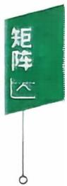

$$
\begin{bmatrix} a_{11} & a_{12} & \cdots & a_{1n} \\ a_{21} & a_{22} & \cdots & a_{2n} \\ \vdots & \vdots & & \vdots \\ a_{m1} & a_{m2} & \cdots & a_{mn} \end{bmatrix},
$$

称为一个 $m \times n$ 矩阵，当 $m = n$ 时，矩阵A称为n阶矩阵或叫n阶方阵.

如果一个矩阵的所有元素都是0，即

$$
\begin{bmatrix} 0 & 0 & \cdots & 0 \\ 0 & 0 & \cdots & 0 \\ \vdots & \vdots & & \vdots \\ 0 & 0 & \cdots & 0 \end{bmatrix},
$$

则称这个矩阵是零矩阵，可简记为0.

两个矩阵 $\boldsymbol{A} = \left[ a_{ij} \right]_{m \times n}, \boldsymbol{B} = \left[ b_{ij} \right]_{s \times v}$ ,如果 $m = s , n = t$ ，则称A与 B是同型矩阵.

两个同型矩阵 $\boldsymbol{A} = \left[ a_{ij} \right]_{m \times n}, \boldsymbol{B} = \left[ b_{ij} \right]_{m \times n}$ ，如果对应的元素都相等，即

$$
a_{ij} = b_{ij} \left( i = 1,2,\cdots,m; j = 1,2,\cdots,n \right),
$$

则称矩阵A与B相等，记作 $\boldsymbol{A} = \boldsymbol{B}.$

n阶方阵 $\boldsymbol{A} = \left[ a_{ij} \right]_{n \times n}$ 的元素所构成的行列式

$$
\begin{bmatrix} a_{11} & a_{12} & \cdots & a_{1n} \\ a_{21} & a_{22} & \cdots & a_{2n} \\ \vdots & \vdots & & \vdots \\ a_{n1} & a_{n2} & \cdots & a_{nn} \end{bmatrix}
$$

称为n阶矩阵A的行列式，记成 $\left| A \right|$ 或 detA.

【注】矩阵A是一个表格，而行列式A是一个数，这里的概念与符号不要混淆. $A = \boldsymbol{O}$ 与 $\left| \textbf{A} \right| = 0$ 是不同的，不能搞错.当 $A \ne 0$ 时可能有 $\left| \textbf{A} \right| = 0$ ，当然也可能有 $\left| \boldsymbol{A} \right| \neq 0$ .这些基本常识要想清楚.

## 2. 矩阵的运算

定义（加法）两个同型矩阵(行数与列数分别相等）可以相加，且

$$
\boldsymbol{A} + \boldsymbol{B} = \left[ a_{ij} \right]_{m \times n} + \left[ b_{ij} \right]_{m \times n} = \left[ a_{ij} + b_{ij} \right]_{m \times n}
$$

定义（数量乘法，简称数乘）设k是数 $\boldsymbol{A} = \left[ a_{ij} \right]_{m \times n}$ 是矩阵，则定义数与矩阵的乘法为

$$
k \boldsymbol{A} = k \left[ a_{ij} \right]_{m \times n} = \left[ k a_{ij} \right]_{m \times n}
$$

例如 $\begin{aligned}, \boldsymbol{A} = \begin{bmatrix} 1 & 3 & - 2 \\ & & \\ 0 & - 4 & 5 \end{bmatrix}, \boldsymbol{B} = \begin{bmatrix} 8 & 3 & 5 \\ & & \\ 1 & 2 & - 6 \end{bmatrix}\end{aligned}$ ,则

$$
\boldsymbol{A} + \boldsymbol{B} = \begin{bmatrix} 1 + 8 & 3 + 3 & - 2 + 5 \\ 0 + 1 & - 4 + 2 & 5 + ( - 6 ) \end{bmatrix} = \begin{bmatrix} 9 & 6 & 3 \\ 1 & - 2 & - 1 \end{bmatrix},
$$