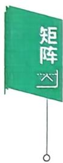

如由 $A \xrightarrow{ 行 } B$ ,即 $P_{1} \cdots P_{2} P_{1} A = B.$ 记 $P = P_{1} \cdots P_{2}P_{1}$ 有 $PA = B,$ $P_{1} \cdots P_{2} P_{1} A = B$ 和 $P_{1} \cdots P_{2} P_{1} E = P$ 表明当A經行变换得到B时，E在同样的行变换下得到P，即 $(A \mid E) \to (B \mid P)$

例 14（1995，数一）设 $\boldsymbol{A} = \begin{bmatrix} a_{11} & a_{12} & a_{13} \\ & & \\ a_{21} & a_{22} & a_{23} \\ & & \\ a_{31} & a_{32} & a_{33} \end{bmatrix}$

$$
\boldsymbol{B} = \begin{bmatrix} a_{21} & a_{22} & a_{23} \\ & & \\ a_{11} & a_{12} & a_{13} \\ & & \\ a_{31} + a_{11} & a_{32} + a_{12} & a_{33} + a_{13} \end{bmatrix}, \boldsymbol{P}_{1} = \begin{bmatrix} 0 & 1 & 0 \\ 1 & 0 & 0 \\ & & \\ 0 & 0 & 1 \end{bmatrix}, \boldsymbol{P}_{2} = \begin{bmatrix} 1 & 0 & 0 \\ 0 & 1 & 0 \\ & & \\ 1 & 0 & 1 \end{bmatrix}
$$

必有

$$
\boldsymbol{A} \boldsymbol{P}_{1} \boldsymbol{P}_{2} = \boldsymbol{B}.
$$

(B) $\boldsymbol{A} \boldsymbol{P}_{2} \boldsymbol{P}_{1} = \boldsymbol{B}.$

(C) $\boldsymbol{P}_{1} \boldsymbol{P}_{2} \boldsymbol{A} = \boldsymbol{B}.$

(D) $P_{2}P_{1}A = B.$

例15 已知A是三阶矩阵，将矩阵A的第1，3两行互换得到B，

答案见 50 页

再将B的第2列的一1倍加到第3列，得到 $\boldsymbol{C} = \begin{bmatrix} 7 & 8 & 1 \\ 4 & 5 & 1 \\ 1 & 2 & 1 \end{bmatrix}$ ,则 $A =$

答案见 51 页