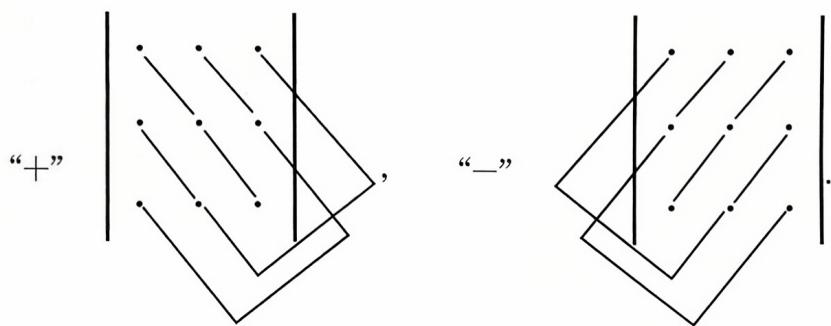
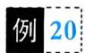

<!--
Generated by 数学文档OCR_v3.py 3.0.0
Source: 线代（基础）.pdf
MinerU: mineru, version 3.4.5
Do not treat automated OCR as proof of mathematical correctness.
-->

# 线代（基础）

<!-- PDF pages 17-17; chunk 0001_p000017-000017 -->

学习笔记

## 知识梳理与例题

## 一、行列式的概念

行列式是一个数，它是不同行不同列元素乘积的代数和.

例如，大家所熟悉的三阶行列式

$$
\begin{vmatrix} a_{1} & a_{2} & a_{3} \\ b_{1} & b_{2} & b_{3} \\ c_{1} & c_{2} & c_{3} \end{vmatrix} = a_{1}b_{2}c_{3} + a_{2}b_{3}c_{1} + a_{3}b_{1}c_{2} - a_{3}b_{2}c_{1} - a_{2}b_{1}c_{3} - a_{1}b_{3}c_{2}
$$

其每一项都是3个数的乘积，从字母看a，b，c各有1个，说明这3个数一个在第1行，一个在第2行，一个在第3行；而从下标看数字1,2，3各有1个，说明这3个数分别来自第1列、第2列和第3列.

在这6项中，有3项带“+”号，3项带“”号，大家可以用对角线方法来记忆：

当三阶行列式的元素中有较多的 $ \text{" }0 "$ 时，用对角线法来计算行列式的值是简便的.例如，

$$
\begin{aligned}\left| \begin{matrix}0 & 1 & 2 \\3 & 0 & 4 \\5 & 6 & 0\end{matrix} \right|&= 0 \times 0 \times 0 + 1 \times 4 \times 5 + 2 \times 3 \times 6 - 2 \times 0 \times 5 - 1 \times 3 \times 6 \\&= 0 - 0 \times 4 \times 6 = 56,\end{aligned}
$$

$$
\begin{aligned} &\begin{vmatrix}\\ &1 & 0 & - 1 \\&2 & - 2 & 1 \\&0 & - 3 & 4\\ &\end{vmatrix}=-8+0+6-0-0-(-3)=1.\\ \end{aligned}
$$

一般地，我们应当用行列式的性质将其恒等变形化简，再通过展开公式（用降阶法）来计算行列式的值.

对于n阶行列式的概念，大家要有一个简单的了解.

<!-- PDF pages 22-22; chunk 0002_p000022-000022 -->

## 三、行列式按行(或列）展开公式

在n阶行列式

$$
\begin{aligned} &D = \begin{vmatrix}\\ &a_{11} & a_{12} & \cdots & a_{1n} \\&a_{21} & a_{22} & \cdots & a_{2n} \\&\vdots & \vdots & & \vdots \\&a_{n1} & a_{n2} & \cdots & a_{nn}\\ &\end{vmatrix}\\ \end{aligned}
$$

中划去 $\alpha_{ij}$ 所在的第i行、第j列的元素，由剩下的元素按原来的位置排法构成的一个n一1阶的行列式

$$
\begin{aligned}\left| \begin{array}{ccccc}\alpha_{11} & \cdots & \alpha_{1,j-1} & \alpha_{1,j+1} & \cdots & \alpha_{1n} \\\vdots &  & \vdots & \vdots &  & \vdots \\\alpha_{i-1,1} & \cdots & \alpha_{i-1,j-1} & \alpha_{i-1,j+1} & \cdots & \alpha_{i-1,n} \\\alpha_{i+1,1} & \cdots & \alpha_{i+1,j-1} & \alpha_{i+1,j+1} & \cdots & \alpha_{i+1,n} \\\vdots &  & \vdots & \vdots &  & \vdots \\\alpha_{n1} & \cdots & \alpha_{n,j-1} & \alpha_{n,j+1} & \cdots & \alpha_{nn} \\\end{array} \right|,\end{aligned}
$$

称其为 $a_{ij}$ 的余子式，记为 $M_{ij}$ ;称 $(-1)^{i+j}M_{ij}$ 为 $\alpha_{ij}$ 的代数余子式，记 为 $A_{ij}$ ,即

$$
A _ { i j } = ( - 1 ) ^ { i + j } M _ { i j }   .
$$

定理1.1 n阶行列式等于它的任何一行(列)元素与其对应的代数余子式乘积之和，即

$$
\left| \boldsymbol{A} \right| = a_{i1}A_{i1} + a_{i2}A_{i2} + \cdots + a_{in}A_{in} = \sum_{k = 1}^{n}a_{ik}A_{ik}, i = 1,2,\cdots,n.
$$

$$
\left| \boldsymbol { A } \right| = a _ { 1 j } A _ { 1 j } + a _ { 2 j } A _ { 2 j } + \cdots + a _ { n j } A _ { n j } = \sum _ { k = 1 } ^ { n } a _ { k j } A _ { k j } , j = 1 , 2 , \cdots , n.
$$

前一个公式称|A|是按第i行展开的展开式，后一个公式称|A|是按第j列展开的展开式.

定理1.2 行列式的任一行(列）元素与另一行(列）元素的代数余子式乘积之和为0,即

$$
\sum_{k = 1}^{n}a_{ik}A_{jk} = a_{i1}A_{j1} + a_{i2}A_{j2} + \cdots + a_{in}A_{jn} = 0, i \neq j.
$$

$$
\sum_{k = 1}^{n}a_{ki}A_{kj} = a_{1i}A_{1j} + a_{2i}A_{2j} + \cdots + a_{ni}A_{nj} = 0, i \neq j.
$$

在用展开公式的时候，还要注意下面几个特殊情况的配合.

（1）上（下）三角形行列式的值等于主对角线元素的乘积.

$$
\begin{vmatrix}a_{_{11}} & a_{_{12}} \cdots a_{_{1n}} \\a_{_{22}} \cdots a_{_{2n}} \\\bigvee & \ddots & \vdots \\a_{_{nn}}\end{vmatrix}=\begin{vmatrix}a_{_{11}} &  &  \\a_{_{21}} & a_{_{22}} \\\vdots & \vdots & \ddots \\a_{_{n1}} & a_{_{n2}} \cdots a_{_{nn}}\end{vmatrix}= a_{_{11}} a_{_{22}} \cdots a_{_{nn}} .
$$

<!-- PDF pages 26-26; chunk 0003_p000026-000026 -->

例11 (2023,经联)已知 $\left| \textbf{\em A} \right| = \left| \begin{matrix} 1 & 2 & - 1 & 1 \\ 0 & 2 & t & 1 \\ 3 & - 1 & 2 & 2 \\ - 1 & 3 & 2 & 1 \end{matrix} \right|$ $,A_{ij}$ 为元 素 $a_{ij}$ 的代数余子式，若 $A_{31} - A_{32} + 2A_{33} - A_{34} = 0$ ,则t =

练习区域

答案见 19 页

$$
\begin{aligned} &\begin{vmatrix}\\ &x & -m & -1 & 0 \\&0 & -x & m & 1 \\&-1 & 0 & x & -m \\&m & 1 & 0 & -x\\ &\end{vmatrix}= a_{4}x^{4} + a_{3}x^{3} + a_{2}x^{2} + a_{1}x + a_{0},\\ \end{aligned}
$$

练习区域

$$
a_{4} + a_{3} + a_{2} + a_{1} + a_{0} =
$$

答案见 20 页

<!-- PDF pages 38-38; chunk 0004_p000038-000038 -->

$$
\begin{bmatrix} a_{11} & a_{12} & \cdots & a_{1n} \\ a_{21} & a_{22} & \cdots & a_{2n} \\ \vdots & \vdots & & \vdots \\ a_{m1} & a_{m2} & \cdots & a_{mn} \end{bmatrix},
$$

称为一个 $m \times n$ 矩阵，当 $m = n$ 时，矩阵A称为n阶矩阵或叫n阶方阵.

如果一个矩阵的所有元素都是0，即

$$
\begin{bmatrix} 0 & 0 & \cdots & 0 \\ 0 & 0 & \cdots & 0 \\ \vdots & \vdots & & \vdots \\ 0 & 0 & \cdots & 0 \end{bmatrix},
$$

则称这个矩阵是零矩阵，可简记为0.

两个矩阵 $\boldsymbol{A} = \left[ a_{ij} \right]_{m \times n}, \boldsymbol{B} = \left[ b_{ij} \right]_{s \times v}$ ,如果 $m = s , n = t$ ，则称A与 B是同型矩阵.

两个同型矩阵 $\boldsymbol{A} = \left[ a_{ij} \right]_{m \times n}, \boldsymbol{B} = \left[ b_{ij} \right]_{m \times n}$ ，如果对应的元素都相等，即

$$
a_{ij} = b_{ij} \left( i = 1,2,\cdots,m; j = 1,2,\cdots,n \right),
$$

则称矩阵A与B相等，记作 $\boldsymbol{A} = \boldsymbol{B}.$

n阶方阵 $\boldsymbol{A} = \left[ a_{ij} \right]_{n \times n}$ 的元素所构成的行列式

$$
\begin{bmatrix} a_{11} & a_{12} & \cdots & a_{1n} \\ a_{21} & a_{22} & \cdots & a_{2n} \\ \vdots & \vdots & & \vdots \\ a_{n1} & a_{n2} & \cdots & a_{nn} \end{bmatrix}
$$

称为n阶矩阵A的行列式，记成 $\left| A \right|$ 或 detA.

【注】矩阵A是一个表格，而行列式A是一个数，这里的概念与符号不要混淆. $A = \boldsymbol{O}$ 与 $\left| \textbf{A} \right| = 0$ 是不同的，不能搞错.当 $A \ne 0$ 时可能有 $\left| \textbf{A} \right| = 0$ ，当然也可能有 $\left| \boldsymbol{A} \right| \neq 0$ .这些基本常识要想清楚.

## 2. 矩阵的运算

定义（加法）两个同型矩阵(行数与列数分别相等）可以相加，且

$$
\boldsymbol{A} + \boldsymbol{B} = \left[ a_{ij} \right]_{m \times n} + \left[ b_{ij} \right]_{m \times n} = \left[ a_{ij} + b_{ij} \right]_{m \times n}
$$

定义（数量乘法，简称数乘）设k是数 $\boldsymbol{A} = \left[ a_{ij} \right]_{m \times n}$ 是矩阵，则定义数与矩阵的乘法为

$$
k \boldsymbol{A} = k \left[ a_{ij} \right]_{m \times n} = \left[ k a_{ij} \right]_{m \times n}
$$

例如 $\begin{aligned}, \boldsymbol{A} = \begin{bmatrix} 1 & 3 & - 2 \\ & & \\ 0 & - 4 & 5 \end{bmatrix}, \boldsymbol{B} = \begin{bmatrix} 8 & 3 & 5 \\ & & \\ 1 & 2 & - 6 \end{bmatrix}\end{aligned}$ ,则

$$
\boldsymbol{A} + \boldsymbol{B} = \begin{bmatrix} 1 + 8 & 3 + 3 & - 2 + 5 \\ 0 + 1 & - 4 + 2 & 5 + ( - 6 ) \end{bmatrix} = \begin{bmatrix} 9 & 6 & 3 \\ 1 & - 2 & - 1 \end{bmatrix},
$$

<!-- PDF pages 45-45; chunk 0005_p000045-000045 -->

## 二、伴随矩阵、可逆矩阵

## 1. 伴随矩阵的概念与公式

伴随矩阵：由矩阵A的行列式|A所有的代数余子式所构成的形如

$$
\begin{bmatrix} A_{11} & A_{21} & \cdots & A_{n1} \\ A_{12} & A_{22} & \cdots & A_{n2} \\ \vdots & \vdots & & \vdots \\ A_{1n} & A_{2n} & \cdots & A_{nn} \end{bmatrix}
$$

的矩阵称为矩阵A的伴随矩阵，记为 $A^{*}$

例如 $\mathbf{0}\boldsymbol{A} = \begin{bmatrix} 2 & 1 & 2 \\ -1 & 0 & 3 \\ 1 & -2 & 1 \end{bmatrix}$ ,计算代数余子式，得

$$
A_{11} = \begin{vmatrix} 0 & 3 \\ -2 & 1 \end{vmatrix} = 6, A_{12} = - \begin{vmatrix} -1 & 3 \\ 1 & 1 \end{vmatrix} = 4,
$$

$$
A_{13} = \begin{vmatrix} -1 & 0 \\ 1 & -2 \end{vmatrix} = 2  ,
$$

$$
A_{21} = - \begin{vmatrix} 1 & 2 \\ - 2 & 1 \end{vmatrix} = - 5, A_{22} = \begin{vmatrix} 2 & 2 \\ 1 & 1 \end{vmatrix} = 0,
$$

$$
A_{^{23}} = - \begin{vmatrix} 2 & 1 \\ 1 & - 2 \end{vmatrix} = 5 ,
$$

$$
A_{31} = \begin{vmatrix} 1 & 2 \\ 0 & 3 \end{vmatrix} = 3, A_{32} = - \begin{vmatrix} 2 & 2 \\ -1 & 3 \end{vmatrix} = - 8,
$$

$$
A_{33} = \begin{vmatrix} 2 & 1 \\ -1 & 0 \end{vmatrix} = 1  ,
$$

按定义 $\boldsymbol{A}^{*} = \begin{bmatrix} 6 & -5 & 3 \\ 4 & 0 & -8 \\ 2 & 5 & 1 \end{bmatrix}$

伴随矩阵的公式：

$$
\boldsymbol{A}\boldsymbol{A}^{*} = \boldsymbol{A}^{*} \boldsymbol{A} = \left| \boldsymbol{A} \right| \boldsymbol{E}.
$$

$$
\left( \boldsymbol{A}^{*} \right)^{-1} = \left( \boldsymbol{A}^{-1} \right)^{*} = \frac{1}{\left| \boldsymbol{A} \right|} \boldsymbol{A} \quad \left( \left| \boldsymbol{A} \right| \neq 0 \right).
$$

$$
(k\boldsymbol{A})^{*} = k^{n - 1}\boldsymbol{A}^{*}
$$

$$
\left( \boldsymbol{A}^{*} \right)^{\mathrm{T}} = \left( \boldsymbol{A}^{\mathrm{T}} \right)^{*}
$$

$$
\left| \boldsymbol{A}^{*} \right| = \left| \boldsymbol{A} \right|^{n - 1}
$$

<!-- PDF pages 53-53; chunk 0006_p000053-000053 -->

如由 $A \xrightarrow{ 行 } B$ ,即 $P_{1} \cdots P_{2} P_{1} A = B.$ 记 $P = P_{1} \cdots P_{2}P_{1}$ 有 $PA = B,$ $P_{1} \cdots P_{2} P_{1} A = B$ 和 $P_{1} \cdots P_{2} P_{1} E = P$ 表明当A經行变换得到B时，E在同样的行变换下得到P，即 $(A \mid E) \to (B \mid P)$

例 14（1995，数一）设 $\boldsymbol{A} = \begin{bmatrix} a_{11} & a_{12} & a_{13} \\ & & \\ a_{21} & a_{22} & a_{23} \\ & & \\ a_{31} & a_{32} & a_{33} \end{bmatrix}$

$$
\boldsymbol{B} = \begin{bmatrix} a_{21} & a_{22} & a_{23} \\ & & \\ a_{11} & a_{12} & a_{13} \\ & & \\ a_{31} + a_{11} & a_{32} + a_{12} & a_{33} + a_{13} \end{bmatrix}, \boldsymbol{P}_{1} = \begin{bmatrix} 0 & 1 & 0 \\ 1 & 0 & 0 \\ & & \\ 0 & 0 & 1 \end{bmatrix}, \boldsymbol{P}_{2} = \begin{bmatrix} 1 & 0 & 0 \\ 0 & 1 & 0 \\ & & \\ 1 & 0 & 1 \end{bmatrix}
$$

必有

$$
\boldsymbol{A} \boldsymbol{P}_{1} \boldsymbol{P}_{2} = \boldsymbol{B}.
$$

(B) $\boldsymbol{A} \boldsymbol{P}_{2} \boldsymbol{P}_{1} = \boldsymbol{B}.$

(C) $\boldsymbol{P}_{1} \boldsymbol{P}_{2} \boldsymbol{A} = \boldsymbol{B}.$

(D) $P_{2}P_{1}A = B.$

例15 已知A是三阶矩阵，将矩阵A的第1，3两行互换得到B，

答案见 50 页

再将B的第2列的一1倍加到第3列，得到 $\boldsymbol{C} = \begin{bmatrix} 7 & 8 & 1 \\ 4 & 5 & 1 \\ 1 & 2 & 1 \end{bmatrix}$ ,则 $A =$

答案见 51 页

<!-- PDF pages 58-58; chunk 0007_p000058-000058 -->

例 20设 A,B 均为 n 阶矩阵， $\left| \boldsymbol{A} \right| = 2, \left| \boldsymbol{B} \right| = - 3$ ，则一 $2\boldsymbol{A}^{\prime} \boldsymbol{B}^{-1} \mid =$

例21 设A是四阶矩阵，如果 $\left| \boldsymbol{A} \right| = - \frac{2}{3}$ ,则 $\left| 3 \boldsymbol{A}^{*} + 4 \boldsymbol{A}^{-1} \right| =$

答案见 53 页

<!-- PDF pages 71-71; chunk 0008_p000071-000071 -->

## 知识梳理与例题

## 一、向量的概念、向量组的概念

定义n个数 $a_{1},a_{2},\cdots,a_{n}$ 所组成的有序数组

$$
\boldsymbol{\alpha} = (a_{1}, a_{2}, \cdots, a_{n})^{\mathrm{T}}  或  \boldsymbol{\alpha} = (a_{1}, a_{2}, \cdots, a_{n})
$$

叫做n维向量，其中 $a_{1}, a_{2}, \cdots, a_{n}$ 叫做向量α的分量(或坐标)，前一个表示式称为列向量，后者称为行向量.

相等 $\alpha = \beta \Leftrightarrow \alpha,\beta$ 同维，且对应分量 $a_{i}=b_{i},i=1,2,\cdots,n$

向量的基本运算

加法 $\boldsymbol{\alpha} + \boldsymbol{\beta} = (a_{1} + b_{1}, a_{2} + b_{2}, \cdots, a_{n} + b_{n})$

数乘 $k \boldsymbol{\alpha} = (k a_{1}, k a_{2}, \cdots, k a_{n})$

若干个同维数的行向量(或同维数的列向量）所组成的集合叫做 向量组.

$\alpha_{1}, \alpha_{2}, \cdots, \alpha_{r}$ 及 $\alpha_{1}, \alpha_{2}, \cdots, \alpha_{r}, \cdots, \alpha_{s}$ (其中 $s \geqslant r )$ ,称 $\alpha_{1}, \alpha_{2}, \cdots, \alpha_{r}$ 是 $\alpha_{1}, \alpha_{2}, \cdots, \alpha_{s}$ 的部分组， $\alpha_{1}, \alpha_{2}, \cdots, \alpha_{s}$ 是整体组.

向量组

$$
\boldsymbol { \alpha } _ { 1 } = \left[ a _ { 1 1 } , a _ { 2 1 } , \cdots , a _ { r 1 } \right] ^ { \mathrm { T } } , \boldsymbol { \alpha } _ { 2 } = \left[ a _ { 1 2 } , a _ { 2 2 } , \cdots , a _ { r 2 } \right] ^ { \mathrm { T } } , \cdots ,
$$

$$
\boldsymbol{a}_{m}=[a_{1m}, a_{2m}, \cdots, a_{m}]^{\mathrm{T}}
$$

及

$$
\tilde { \boldsymbol { \alpha } } _ { 1 } = [ a _ { 1 1 } , a _ { 2 1 } , \cdots , a _ { r 1 } , \cdots , a _ { r 1 } ] ^ { \mathrm { T } } , \tilde { \boldsymbol { \alpha } } _ { 2 } = [ a _ { 1 2 } , a _ { 2 2 } , \cdots , a _ { r 2 } , \cdots , a _ { r 2 } ] ^ { \mathrm { T } } ,
$$

$$
\cdots , \boldsymbol { \alpha } _ { m } = [ a _ { 1 m } , a _ { 2 m } , \cdots , a _ { m } , \cdots , a _ { m } ] ^ { \mathrm { T } } ,
$$

其中 $s \geqslant r ,$ 则称 $\widetilde{\boldsymbol{\alpha}}_{1}, \widetilde{\boldsymbol{\alpha}}_{2}, \cdots, \widetilde{\boldsymbol{\alpha}}_{m}$ 为向量组 $\alpha_{1}, \alpha_{2}, \cdots, \alpha_{m}$ 的延伸组(或称$\alpha_{1}, \alpha_{2}, \cdots, \alpha_{m}$ 是 $\tilde{\alpha}_{1}, \tilde{\alpha}_{2}, \cdots, \tilde{\alpha}_{m}$ 的缩短组).

## 二、线性表出、线性相关

定义m个n维向量 $\alpha_{1}, \alpha_{2}, \cdots, \alpha_{m}$ 及m个数 $k_{1},k_{2},\cdots,k_{m}$ ,则向量

$$
k_{1} \boldsymbol{\alpha}_{1} + k_{2} \boldsymbol{\alpha}_{2} + \cdots + k_{m} \boldsymbol{\alpha}_{m}
$$

称为向量 $\alpha_{1}, \alpha_{2}, \cdots, \alpha_{m}$ 的一个线性组合 $k_{1},k_{2},\cdots,k_{m}$ 称为这个线性组合的系数.

若 $\pmb { \beta }$ 能表示成 $\alpha_{1}, \alpha_{2}, \cdots, \alpha_{m}$ 的线性组合，即

$$
\boldsymbol { \beta } = k _ { 1 } \boldsymbol { \alpha } _ { 1 } + k _ { 2 } \boldsymbol { \alpha } _ { 2 } + \cdots + k _ { m } \boldsymbol { \alpha } _ { m }   ,
$$

则称 $\beta$ 能由 $\alpha_{1}, \alpha_{2}, \cdots, \alpha_{m}$ 线性表出.

定义对m个n维向量 $\alpha_{1}, \alpha_{2}, \cdots, \alpha_{m}$ ，若存在不全为零的数 $k_{1}$ $k_{2},\cdots,k_{m}$ ,使得

$$
k_{1} \boldsymbol{\alpha}_{1} + k_{2} \boldsymbol{\alpha}_{2} + \cdots + k_{m} \boldsymbol{\alpha}_{m} = \boldsymbol{0}
$$

<!-- PDF pages 85-85; chunk 0009_p000085-000085 -->

例19 (2003,数三）设三阶矩阵 $\boldsymbol{A} = \begin{bmatrix} a & b & b \\ b & a & b \\ b & b & a \end{bmatrix}$ ,若A的伴随矩阵A”的秩为1,则必有(A)a = b 或 $a + 2b = 0.$ (B) $a = b$ 或 $a + 2b \ne 0.$ (C) $a \ne b$ 且 $a + 2b = 0.$ (D) $a \ne b$ 且 $a + 2b \ne 0.$

答案见 81 页

(I $\alpha_{1}, \alpha_{2}, \cdots, \alpha_{s}$ 和(Ⅱ $\boldsymbol{\beta}_{1}, \boldsymbol{\beta}_{2}, \cdots, \boldsymbol{\beta}_{t}$ 若（I）可由（Ⅱ）线性表示.证明(1) $r(\mathbb{I}) \leqslant r(\mathbb{I})$ (2) 若 $s \geq t ,$ 则（Ⅰ）必线性相关.

答案见 82 页

<!-- PDF pages 97-97; chunk 0010_p000097-000097 -->

必有 $a \neq b$ ，此时 A 中 $\begin{vmatrix} a & b \\ b & a \end{vmatrix} \neq 0$ ,而

$$
\left| \boldsymbol{A} \right| = \left| \begin{aligned} \boldsymbol{a} \quad \boldsymbol{b} \quad \boldsymbol{b} \\ \boldsymbol{b} \quad \boldsymbol{a} \quad \boldsymbol{b} \\ \boldsymbol{b} \quad \boldsymbol{b} \quad \boldsymbol{a} \end{aligned} \right| = (\boldsymbol{a} + 2\boldsymbol{b})(\boldsymbol{a} - \boldsymbol{b})^{2} = 0,
$$

故应选(C).

例20【证】（1）因（I）可由（Ⅱ）线性表出，设

$$
\boldsymbol { \alpha } _ { 1 } = c _ { 1 1 } \boldsymbol { \beta } _ { 1 } + c _ { 2 1 } \boldsymbol { \beta } _ { 2 } + \cdots + c _ { t 1 } \boldsymbol { \beta } _ { t } ,
$$

$$
\boldsymbol { \alpha } _ { s } = c _ { 1 s } \boldsymbol { \beta } _ { 1 } + c _ { 2 s } \boldsymbol { \beta } _ { 2 } + \cdots + c _ { s } \boldsymbol { \beta } _ { t } ,
$$

即存在矩阵 $C = \left[ c_{ij} \right]$ ,使

那么

$$
\begin{aligned}\left( \boldsymbol { \alpha } _ { 1 } , \boldsymbol { \alpha } _ { 2 } , \cdots , \boldsymbol { \alpha } _ { s } \right) &= \left( \boldsymbol { \beta } _ { 1 } , \boldsymbol { \beta } _ { 2 } , \cdots , \boldsymbol { \beta } _ { t } \right) \boldsymbol { C } , \\r \left( \boldsymbol { \alpha } _ { 1 } , \boldsymbol { \alpha } _ { 2 } , \cdots , \boldsymbol { \alpha } _ { s } \right) &= r \left[ \left( \boldsymbol { \beta } _ { 1 } , \boldsymbol { \beta } _ { 2 } , \cdots , \boldsymbol { \beta } _ { t } \right) \boldsymbol { C } \right] \\& \leqslant r \left( \boldsymbol { \beta } _ { 1 } , \boldsymbol { \beta } _ { 2 } , \cdots , \boldsymbol { \beta } _ { t } \right) ,\end{aligned}
$$

即 $r(\mathbb{I}) \leqslant r(\mathbb{I})$

(2) 若 $s \geq t$ ,则

$$
r ( \mathrm { I } ) \leqslant r ( \mathrm { I I } ) = r ( \beta _ { 1 } , \beta _ { 2 } , \cdots , \beta _ { t } ) \leqslant t < s ,
$$

所以 $\alpha_{1}, \alpha_{2}, \cdots, \alpha_{s}$ 必线性相关.

## 四、正交规范化、正交矩阵

例21【分析】设 $\boldsymbol{\alpha} = (x_{1}, x_{2}, x_{3})^{\mathrm{T}}$ 与 $\boldsymbol{\alpha}_{1}, \boldsymbol{\alpha}_{2}$ 都正交，则

$$
\left\{ \begin{aligned} \left( \boldsymbol{\alpha}, \boldsymbol{\alpha}_{1} \right) &= x_{1} + 3x_{2} + 2x_{3} = 0, \\ \left( \boldsymbol{\alpha}, \boldsymbol{\alpha}_{2} \right) &= x_{1} + x_{2} - 2x_{3} = 0, \end{aligned} \right.
$$

$$
{ 1 \quad 3 \quad 2 \atop 1 \quad 1 \quad -   2 } { \Big ] } { \rightarrow } { 1 \quad 3 \quad 2 \atop 0 \quad 1 \quad 2 } { \Big ] } { \rightarrow } { 1 \quad 0 \quad -   4 \quad \Big ] } ,
$$

得 $\boldsymbol{\alpha} = (4, -2, 1)^{\mathrm{T}}$ ,再单位化有 $\pm \frac{1}{\sqrt{21}}(4, -2, 1)^{\mathrm{T}}$ 为所求.

例22【解】先正交化

$$
\pmb { \beta } _ { 1 } = \pmb { \alpha } _ { 1 } = \begin{bmatrix} 1 \\ 1 \\ 1 \end{bmatrix},
$$

<!-- PDF pages 100-100; chunk 0011_p000100-000100 -->

## 知识梳理与例题

学习笔记

## 一、基本概念

我们称

$$
\begin{aligned}\left\{ \begin{aligned}a_{11}x_{1} + a_{12}x_{2} + \cdots + a_{1n}x_{n} = b_{1}, \\a_{21}x_{1} + a_{22}x_{2} + \cdots + a_{2n}x_{n} = b_{2}, \\\cdots \\a_{m1}x_{1} + a_{m2}x_{2} + \cdots + a_{mn}x_{n} = b_{m}\end{aligned} \right.\end{aligned}\tag{I}
$$

是n个未知数m个方程的非齐次线性方程组，其中 $x_{1},x_{2},\cdots,x_{n}$ 代表$n$ 个未知数，而 $b_{1},b_{2},\cdots,b_{m}$ 是不全为0的常数.

利用矩阵乘法，方程组（Ⅰ）可表示为：

$$
\begin{bmatrix} a_{11} & a_{12} & \cdots & a_{1n} \\ a_{21} & a_{22} & \cdots & a_{2n} \\ \vdots & \vdots & & \vdots \\ a_{m1} & a_{m2} & \cdots & a_{mn} \end{bmatrix} \begin{bmatrix} x_1 \\ x_2 \\ \vdots \\ x_n \end{bmatrix} = \begin{bmatrix} b_1 \\ b_2 \\ \vdots \\ b_m \end{bmatrix}.
$$

于是方程组（Ⅰ）的矩阵形式为：

$$
Ax = b,
$$

称A为方程组（I）的系数矩阵.

对矩阵A按列分块，记 $\boldsymbol{A} = ( \boldsymbol{\alpha}_{1} , \boldsymbol{\alpha}_{2} , \cdots , \boldsymbol{\alpha}_{n} )$ ，则方程组（Ⅰ）有向量形式

$$
x_{1}\boldsymbol{\alpha}_{1} + x_{2}\boldsymbol{\alpha}_{2} + \cdots + x_{n}\boldsymbol{\alpha}_{n} = \boldsymbol{\beta},
$$

其中 $\boldsymbol{\alpha}_{j}=(a_{1j},a_{2j},\cdots,a_{nj})^{\mathrm{T}},j=1,2,\cdots,n,\boldsymbol{\beta}=(b_{1},b_{2},\cdots,b_{m})^{\mathrm{T}}.$

如果 $\forall j = 1,2,\cdots,m$ 恒有 $b_{j} = 0$ ,则称

$$
\left\{ \begin{aligned} a_{11}x_{1} + a_{12}x_{2} + \cdots + a_{1n}x_{n} = 0, \\ a_{21}x_{1} + a_{22}x_{2} + \cdots + a_{2n}x_{n} = 0, \\ \cdots \\ a_{m1}x_{1} + a_{m2}x_{2} + \cdots + a_{mn}x_{n} = 0. \end{aligned} \right.\tag{Ⅱ}
$$

为齐次线性方程组(也称(Ⅱ）是(Ⅰ）的导出组).其矩阵形式为：

$$
Ax = 0.
$$

而齐次方程组（Ⅱ）的向量形式,则是

$$
x_{1}\boldsymbol{\alpha}_{1} + x_{2}\boldsymbol{\alpha}_{2} + \cdots + x_{n}\boldsymbol{\alpha}_{n} = \boldsymbol{0}.
$$

若用一组数 $c_{1},c_{2},\cdots,c_{n}$ 分别代替方程组(Ⅰ)(或(Ⅱ))中的 $x_{1}$ $x_{2},\cdots,x_{n}$ ,使(Ⅰ)(或(Ⅱ))中m个等式都成立，则称 $(c_1, c_2, \cdots, c_n)^{\mathrm{T}}$ 是方程组(Ⅰ)(或(Ⅱ))的一个解.

解方程组就是要求出方程组的所有解.

<!-- PDF pages 114-114; chunk 0012_p000114-000114 -->

得同解方程组

$$
\begin{aligned}\left\{ \begin{aligned}x_{1} + 2x_{3} + 12x_{5} &= 10, \\x_{2} - x_{3} \quad - 8x_{5} &= - 6, \\x_{4} - 3x_{5} &= - 2.\end{aligned} \right.\end{aligned}\tag{*}
$$

令 $x_{3} = 0 , x_{5} = 0$ ,得方程组 $Ax = \boldsymbol{b}$ 的一个特解

$$
\boldsymbol{\alpha} = (10, -6, 0, -2, 0)^{\mathrm{T}},
$$

对应的齐次方程组为

$$
\left\{ \begin{aligned} x_{1} + 2x_{3} + 12x_{5} &= 0, \\ x_{2} - x_{3} &= 8x_{5} = 0, \\ x_{4} - 3x_{5} &= 0, \end{aligned} \right.
$$

得 $Ax = \mathbf{0}$ 的同解方程组

$$
\begin{cases}x_{1} = - 2x_{3} - 12x_{5}, \\x_{2} = \quad x_{3} + 8x_{5}, \\x_{4} = \quad 3x_{5},\end{cases}
$$

分别令 $x_{3} = 1 , x_{5} = 0$ 和 $x_{3} = 0 , x_{5} = 1$ ,得 $Ax = \mathbf{0}$ 的基础解系

$$
\eta_{1} = (-2,1,1,0,0)^{\mathrm{T}}, \eta_{2} = (-12,8,0,3,1)^{\mathrm{T}}.
$$

所以方程组的通解为：

$$
(10,-6,0,-2,0)^{\mathrm{T}} + k_{1}(-2,1,1,0,0)^{\mathrm{T}} + k_{2}(-12,8,0,3,1)^{\mathrm{T}}
$$

$k_{1},k_{2}$ 为任意常数.

或对同解方程组(\*)，令 $x_{3} = t, x_{5} = u$ ,解出

$$
\begin{cases}x_{1} = 10 - 2t - 12u, \\x_{2} = -6 + t + 8u, \\x_{3} = t, \\x_{4} = -2 + 3u, \\x_{5} = u.\end{cases}
$$

亦得通解 $x = ( 1 0 , - 6 , 0 , - 2 , 0 ) ^ { \mathrm { T } } + t ( - 2 , 1 , 1 , 0 , 0 ) ^ { \mathrm { T } } + u ( - 1 2 , 8 , 0 ,$ $3,1)^{\mathrm{T}},t,u$ 为任意常数.

例9【解】对增广矩阵作初等行变换，有

$$
\overline{\boldsymbol{A}} = \begin{bmatrix} \lambda & 1 & 1 \vdots \lambda - 3 \\ 1 & \lambda & 1 \vdots - 2 \\ 1 & 1 & \lambda \vdots - 2 \end{bmatrix} \rightarrow \begin{bmatrix} 1 & 1 & \lambda \vdots - 2 \\ 1 & \lambda & 1 \vdots - 2 \\ \lambda & 1 & 1 \vdots \lambda - 3 \end{bmatrix}
$$

$$
\rightarrow \begin{bmatrix} 1 & 1 & \lambda & \vdots & - 2 \\ 0 & \lambda - 1 & 1 - \lambda & \vdots & 0 \\ 0 & 0 & (\lambda + 2)(\lambda - 1) \vdots & 3(1 - \lambda) \end{bmatrix}.
$$

当 $\lambda = - 2$ 时 $r(\boldsymbol{A}) = 2, r(\overline{\boldsymbol{A}}) = 3$ ,方程组无解.

<!-- PDF pages 121-121; chunk 0013_p000121-000121 -->

$$
A\boldsymbol{\alpha} = \lambda\boldsymbol{\alpha}
$$

成立，则称λ是矩阵A的一个特征值，称非零向量α是矩阵A属于特征值λ的一个特征向量.

由定义 $A\boldsymbol{\alpha} = \lambda\boldsymbol{\alpha} , \boldsymbol{\alpha} \neq \boldsymbol{0}$ ,即 $\left( \lambda \boldsymbol{E} - \boldsymbol{A} \right) \boldsymbol{\alpha} = \boldsymbol{0}, \boldsymbol{\alpha} \neq \boldsymbol{0}$ 可知特征向量$\pmb { \alpha }$ 是齐次方程组 $\left( \lambda \boldsymbol{E} - \boldsymbol{A} \right) \boldsymbol{x} = \boldsymbol{0}$ 的非零解.

定义设 $A = \left[ a_{ij} \right]$ 为一个n阶矩阵，则行列式

$$
\left| \lambda \boldsymbol{E} - \boldsymbol{A} \right| = \left| \begin{matrix} \lambda - a_{11} & - a_{12} & \cdots & - a_{1n} \\ - a_{21} & \lambda - a_{22} & \cdots & - a_{2n} \\ \vdots & \vdots & & \vdots \\ - a_{n1} & - a_{n2} & \cdots & \lambda - a_{nn} \end{matrix} \right|
$$

称为矩阵A的特征多项式， $\left| \lambda \boldsymbol{E} - \boldsymbol{A} \right| = 0$ 称为A的特征方程.

求特征值，特征向量的方法：

(1）先利用 $\left| \lambda \boldsymbol{E} - \boldsymbol{A} \right| = 0$ 求矩阵A的特征值 $\lambda_{i}$ (共n个). 再利用 $\lambda_{1}E$ $-A)x = 0$ 求基础解系，即矩阵A属于特征值 $\lambda_{i}$ 的线性无关的特征向量.

(2) 用定义 $A\boldsymbol{\alpha} = \lambda\boldsymbol{\alpha}$ 推理分析.

定理 5.1 如果 $\lambda_{1}, \lambda_{2}, \cdots, \lambda_{m}$ 是矩阵A的互不相同的特征值： $, \boldsymbol{a}_{1}$ ，$\alpha_{2},\cdots,\alpha_{m}$ 分别是与之对应的特征向量，则 $\alpha_{1}, \alpha_{2}, \cdots, \alpha_{m}$ 线性无关.

定理 5.2 设A 是 n 阶矩阵 $\lambda_{1}, \lambda_{2}, \cdots, \lambda_{n}$ 是矩阵A的特征值，则

(1) $\sum \lambda_{i} = \sum a_{i i}$

(2) $\mid \boldsymbol{A} \mid = \prod \lambda_{i}.$

【注】如果 $\alpha_{1}, \alpha_{2}, \cdots, \alpha_{t}$ 都是矩阵A属于特征值λ的特征向量，那么当 $k_{1}\boldsymbol{\alpha}_{1} + k_{2}\boldsymbol{\alpha}_{2} + \cdots + k_{l}\boldsymbol{\alpha}_{l}$ 非零时， $k_{1}\boldsymbol{\alpha}_{1} + k_{2}\boldsymbol{\alpha}_{2} + \cdots + k_{t}\boldsymbol{\alpha}_{t}$ 仍是矩阵A属于特征值λ的特征向量.

如 $A\boldsymbol{\alpha} = \lambda\boldsymbol{\alpha} , \boldsymbol{\alpha} \neq \boldsymbol{0} , \forall k \neq 0 ,  有  k\boldsymbol{\alpha} \neq \boldsymbol{0}$ ,则

$$
A \left( k \boldsymbol { \alpha } \right) = k A \boldsymbol { \alpha } = k \left( \lambda \boldsymbol { \alpha } \right) = \lambda \left( k \boldsymbol { \alpha } \right) .
$$

即若α是矩阵A对应于特征值入的特征向量，那么 $k\boldsymbol{\alpha} (k \neq 0$ 时）仍是 A对应于λ的特征向量.

类似地，如 $A\boldsymbol{\alpha}_{1} = \lambda\boldsymbol{\alpha}_{1}, A\boldsymbol{\alpha}_{2} = \lambda\boldsymbol{\alpha}_{2}$ 且 $\boldsymbol{\alpha}_{1} \neq \boldsymbol{0}, \boldsymbol{\alpha}_{2} \neq \boldsymbol{0}$ ,那么 $\forall   k_{1}$ $k_{2}$ ,若 $k_{1} \boldsymbol{\alpha}_{1} + k_{2} \boldsymbol{\alpha}_{2} \neq \boldsymbol{0}$ ,有

$$
\begin{aligned}\boldsymbol{A}(k_{1} \boldsymbol{\alpha}_{1} + k_{2} \boldsymbol{\alpha}_{2}) &= \boldsymbol{A}(k_{1} \boldsymbol{\alpha}_{1}) + \boldsymbol{A}(k_{2} \boldsymbol{\alpha}_{2}) \\&= k_{1} \boldsymbol{A} \boldsymbol{\alpha}_{1} + k_{2} \boldsymbol{A} \boldsymbol{\alpha}_{2} \\&= k_{1}(\lambda \boldsymbol{\alpha}_{1}) + k_{2}(\lambda \boldsymbol{\alpha}_{2}) \\&= \lambda (k_{1} \boldsymbol{\alpha}_{1} + k_{2} \boldsymbol{\alpha}_{2}) ,\end{aligned}
$$

即 $k_{1} \boldsymbol{\alpha}_{1} + k_{2} \boldsymbol{\alpha}_{2}$ 仍是A对应于λ的特征向量.

<!-- PDF pages 144-144; chunk 0014_p000144-000144 -->

【注】注意和例8的区别.例8中不能求出A的具体特征值.

例20【解】（1）因A中有二阶子式非零，于是

$$
r(\boldsymbol{A}) = 2 \Leftrightarrow \left| \boldsymbol{A} \right| = 0,
$$

而 $\begin{vmatrix} 1 & a & - 1 \\ a & 3 & 1 \\ - 1 & 1 & 1 \end{vmatrix} = - (a + 1)^{2}$ ,所以 $a = -1$

(2)由A的特征多项式

$$
\left| \lambda \boldsymbol{E} - \boldsymbol{A} \right| = \left| \begin{matrix} \lambda - 1 & 1 & 1 \\ 1 & \lambda - 3 & - 1 \\ 1 & - 1 & \lambda - 1 \end{matrix} \right| = \lambda (\lambda - 1) (\lambda - 4)   ,
$$

得到A的特征值：1,4,0.

对 $\lambda_{1} = 1$ ,由 $(E - A)x = 0$ 得特征向量 $\boldsymbol{a}_{1} = (-1, -1, 1)^{\mathrm{T}}$

对 $\lambda_{2} = 4$ ,由 $(4E - A)x = 0$ 得特征向量 $\boldsymbol{a}_{2}=(-1,2,1)^{\mathrm{T}}$

对 $\lambda_{3} = 0$ ,由 $\left( 0 \boldsymbol{E} - \boldsymbol{A} \right) \boldsymbol{x} = \boldsymbol{0}$ 得特征向量 $\boldsymbol{\alpha}_{3} = (1,0,1)^{\mathrm{T}}$

因实对称矩阵的特征值不同，特征向量已相互正交，单位化后有

$$
\gamma_{1}=\frac{1}{\sqrt{3}}\left[\begin{aligned}-1 \\ -1 \\ 1\end{aligned}\right], \gamma_{2}=\frac{1}{\sqrt{6}}\left[\begin{aligned}-1 \\ 2 \\ 1\end{aligned}\right], \gamma_{3}=\frac{1}{\sqrt{2}}\left[\begin{aligned}1 \\ 0 \\ 1\end{aligned}\right].
$$

$\boldsymbol{Q}=\left(\boldsymbol{\gamma}_{1}, \boldsymbol{\gamma}_{2}, \boldsymbol{\gamma}_{3}\right)=\left[\begin{aligned}&-\frac{1}{\sqrt{3}} & -\frac{1}{\sqrt{6}} & \frac{1}{\sqrt{2}} \\&-\frac{1}{\sqrt{3}} & \frac{2}{\sqrt{6}} & 0 \\&\frac{1}{\sqrt{3}} & \frac{1}{\sqrt{6}} & \frac{1}{\sqrt{2}}\end{aligned}\right]$ ,则 $Q^{-1}AQ = \boldsymbol{\Lambda} = \begin{bmatrix} 1 & & \\ & 4 & \\ & & 0 \end{bmatrix}.$

## 本章作业超链接 《基础过关660题》优选

<table><tr><td>数学一</td><td>405</td><td>407</td><td>410</td><td>412</td><td>413</td><td>414</td><td>417</td><td>489</td><td>490</td><td>492</td><td>495</td></tr><tr><td>数学二</td><td>498</td><td>500</td><td></td><td></td><td></td><td></td><td></td><td></td><td></td><td></td><td></td></tr><tr><td></td><td>522</td><td>524</td><td>527</td><td>529</td><td>530</td><td>531</td><td>534</td><td>632</td><td>633</td><td>635</td><td>638</td></tr><tr><td>数学三</td><td>641 405</td><td>643</td><td>410</td><td></td><td>413</td><td></td><td>414417</td><td></td><td>490</td><td>492</td><td></td></tr><tr><td></td><td></td><td>407</td><td></td><td>412</td><td></td><td></td><td></td><td>489</td><td></td><td></td><td>495</td></tr><tr><td></td><td>498</td><td>500</td><td></td><td></td><td></td><td></td><td></td><td></td><td></td><td></td><td></td></tr></table>

<!-- PDF pages 146-148; chunk 0015_p000146-000148 -->

## 知识梳理与例题

学习笔记

## 一、二次型及其标准形

定义含有n个变量的一个二次齐次多项式

$$
\begin{aligned}f\left( x_{1},x_{2},\cdots,x_{n} \right) = a_{11}x_{1}^{2} + 2a_{12}x_{1}x_{2} + 2a_{13}x_{1}x_{3} + \cdots + 2a_{1n}x_{1}x_{n} \\+ a_{22}x_{2}^{2} + 2a_{23}x_{2}x_{3} + \cdots + 2a_{2n}x_{2}x_{n} \\+ \cdots + a_{m}x_{n}^{2}\end{aligned}\tag{①}
$$

称为n个变量的二次型，系数均为实数时，称为n元实二次型.

若令 $a_{ij} = a_{ji}, i < j$ ,则 $2a_{ij}x_{i}x_{j}=a_{ij}x_{i}x_{j}+a_{ji}x_{j}x$ ，那么二次型①可以写成矩阵形式：

$$
\begin{aligned}f(x_{1},x_{2},\cdots,x_{n}) &= \sum_{i=1}^{n} \sum_{j=1}^{n} a_{ij}x_{i}x_{j} \\&= \left[ x_{1},x_{2},\cdots,x_{n} \right] \begin{bmatrix} a_{11} & a_{12} & \cdots & a_{1n} \\ a_{21} & a_{22} & \cdots & a_{2n} \\ \vdots & \vdots & & \vdots \\ a_{n1} & a_{n2} & \cdots & a_{nn} \end{bmatrix} \begin{bmatrix} x_{1} \\ x_{2} \\ \vdots \\ x_{n} \end{bmatrix} \\&= x^{\mathrm{T}}Ax   ,\end{aligned}
$$

其中A是对称矩阵，称为二次型f的对应矩阵.

例如： $f\left(x_{1},x_{2},x_{3}\right)=x_{1}^{2}+2x_{2}^{2}+x_{3}^{2}+2x_{1}x_{2}+4x_{1}x_{3}+6x_{2}x_{3}$

$$
\left[ \begin{aligned} x_{1} &, x_{2} , x_{3} \end{aligned} \right] \left[ \begin{aligned} 1 & \quad 1 \quad 2 \\ 1 & \quad 2 \quad 3 \\ 2 & \quad 3 \quad 1 \end{aligned} \right] \left[ \begin{aligned} x_{1} \\ x_{2} \\ x_{3} \end{aligned} \right] = \boldsymbol{x}^{\mathrm{T}} \boldsymbol{A} \boldsymbol{x}.
$$

其中 $\boldsymbol{A} = \begin{bmatrix} 1 & 1 & 2 \\ 1 & 2 & 3 \\ 2 & 3 & 1 \end{bmatrix}, \boldsymbol{A}^{\mathrm{T}} = \boldsymbol{A}, \boldsymbol{x} = \begin{bmatrix} x_{1} \\ x_{2} \\ x_{3} \end{bmatrix}.$

注意当A是对称阵时，二次型 $f(x_{1},x_{2},\cdots,x_{n}) = \boldsymbol{x}^{\mathrm{T}} \boldsymbol{A} \boldsymbol{x}$ 和A一一对应.

定义若二次型 $f(x_{1},x_{2},\cdots,x_{n})$ 只有平方项，没有混合项(即混合项的系数全为零)，即

$$
f\left(x_{1}, x_{2}, \cdots, x_{n}\right)=\boldsymbol{x}^{\mathrm{T}} \boldsymbol{A} \boldsymbol{x}=a_{1} x_{1}^{2}+a_{2} x_{2}^{2}+\cdots+a_{n} x_{n}^{2},
$$

则称二次型为标准形(又称平方和).

在二次型的标准形中，若平方项的系数 $a_{i}$ 只是1，一1,0，即

$$
f\left( x_{1},x_{2},\cdots,x_{n} \right) = \boldsymbol{x}^{\mathrm{T}}\boldsymbol{A}\boldsymbol{x} = x_{1}^{2} + x_{2}^{2} + \cdots + x_{p}^{2} - x_{p + 1}^{2} - \cdots - x_{p + q}^{2},
$$

则称为二次型的规范形(系数中1的个数是 $p,-1$ 的个数是 $q , 0$ 的个数 是 $n - (p + q)$

定义在二次型 $\boldsymbol{x}^{\mathrm{T}} \boldsymbol{A} \boldsymbol{x}$ 的标准形中，正平方项的个数p称为二次型的正惯性指数，负平方项的个数q称为二次型的负惯性指数.

定义二次型 $x^{\mathrm{T}} A x$ 矩阵A的秩称为二次型的秩.

【注】对于 $f = (x_{1},x_{2},x_{3}) \begin{bmatrix} 1 & 3 & 0 \\ 1 & 0 & 0 \\ 0 & 4 & -1 \end{bmatrix} \begin{bmatrix} x_{1} \\ x_{2} \\ x_{3} \end{bmatrix}$ ,有

$$
\begin{aligned}f &= (x_{1} + x_{2}, 3x_{1} + 4x_{3}, - x_{3}) \begin{bmatrix} x_{1} \\ x_{2} \\ x_{3} \end{bmatrix} \\&= (x_{1} + x_{2})x_{1} + (3x_{1} + 4x_{3})x_{2} - x_{3}^{2},\end{aligned}
$$

故 $f = x_{1}^{2} - x_{3}^{2} + 4x_{1}x_{2} + 4x_{2}x_{3}$ ，为三元二次型，其二次型矩阵 $A =$ $\begin{bmatrix} 1 & 2 & 0 \\ 2 & 0 & 2 \\ 0 & 2 & - 1 \end{bmatrix}$ ,秩 $r(f) = r(\boldsymbol{A}) = 2.$

虽 $\boldsymbol{x}^{\mathrm{T}}\begin{bmatrix}1&3&0\\1&0&0\\0&4&-1\end{bmatrix}\boldsymbol{x}$ 是二次型，但矩阵 $\begin{bmatrix} 1 & 3 & 0 \\ 1 & 0 & 0 \\ 0 & 4 & - 1 \end{bmatrix}$ 不是二次型

矩阵，其秩也不是二次型的秩.

定义（合同）设A,B是两个n阶方阵，若存在可逆阵C，使得$C^{\mathrm{T}} A C = B$ ，则称A合同于B，记成 $A \simeq \mathbf { \bar { B } } .$

合同矩阵有如下性质：

①反身性. $A \simeq A .$

②对称性.若 $A \simeq \pmb { B }$ ,则 $\mathbf { \mathit { B } } \simeq \mathbf { \mathit { A } } ,$

③传递性.若 $A \simeq B, B \simeq C$ ,则 $A \simeq \mathbf { C } .$

对于三元二次型 $f(x_{1},x_{2},x_{3}) = \boldsymbol{x}^{\mathrm{T}} \boldsymbol{A} \boldsymbol{x}$ ,如果

$$
\begin{cases}x_{1} = c_{11}y_{1} + c_{12}y_{2} + c_{13}y_{3}, \\x_{2} = c_{21}y_{1} + c_{22}y_{2} + c_{23}y_{3}, \\x_{3} = c_{31}y_{1} + c_{32}y_{2} + c_{33}y_{3},\end{cases}
$$

(\*)

满足

$$
\left| \textbf{\em C} \right| = \left| \begin{matrix} c_{11} & c_{12} & c_{13} \\ c_{21} & c_{22} & c_{23} \\ c_{31} & c_{32} & c_{33} \end{matrix} \right| \neq 0   ,
$$

则称(\*）是由 $\boldsymbol{x} = (x_{1}, x_{2}, x_{3})^{\mathrm{T}}$ 到 $\boldsymbol{y} = (y_1, y_2, y_3)^{\mathrm{T}}$ 的坐标变换.

用矩阵描述为： $x = Cy$

注意以 $\boldsymbol{x} = (x_{1}, x_{2}, x_{3})^{\mathrm{T}}$ 为自变量的二次型 $x^{\top}Ax$ ，经坐标变换$x = C y$ 后将成为以 $\boldsymbol{y} = (y_1, y_2, y_3)^{\mathrm{T}}$ 为自变量的二次型 $y^{\mathrm{T}} \boldsymbol{B} y$ ,其中 B$= C^{\mathrm{T}} A C$ 可见经坐标变换二次型矩阵A和B 是合同的.

定理6.1 对任意一个n元二次型 $f\left(x_{1}, x_{2}, \cdots, x_{n}\right) = \boldsymbol{x}^{\mathrm{T}} \boldsymbol{A} \boldsymbol{x}$ ,必存在正交变换 $x = Qy$ ，其中Q是正交阵.化二次型为标准形，即

$$
f\left( x_{1},x_{2},\cdots,x_{n} \right) = \boldsymbol{x}^{\mathrm{T}}\boldsymbol{A}\boldsymbol{x} \xlongequal{x = Qy} \boldsymbol{y}^{\mathrm{T}}\boldsymbol{Q}^{\mathrm{T}}\boldsymbol{A}Q\boldsymbol{y} \\= \lambda_{1}y_{1}^{2} + \lambda_{2}y_{2}^{2} + \cdots + \lambda_{n}y_{n}^{2},
$$

其中 $\lambda_{1}, \lambda_{2}, \cdots, \lambda_{n}$ 是A的n 个特征值.

用矩阵的语言表达，即对任意一个n阶实对称阵A，必存在正交阵Q,使得

$$
Q^{-1}AQ = Q^{\mathrm{T}}AQ = \Lambda,
$$

其中 $\boldsymbol{A} = \begin{bmatrix} \lambda_{1} & 0 & \cdots & 0 \\ 0 & \lambda_{2} & \cdots & 0 \\ \vdots & \vdots & & \vdots \\ 0 & 0 & \cdots & \lambda_{n} \end{bmatrix}, \lambda_{i} (i = 1,2,\cdots,n)$ 是A的特征值，即A必

既相似又合同于对角阵。

【注】正交变换法只能化二次型为标准形，平方项的系数即是特征值.

定理6.2 对任一个 n元二次型 $f\left(x_{1}, x_{2}, \cdots, x_{n}\right) = \boldsymbol{x}^{\mathrm{T}} \boldsymbol{A} \boldsymbol{x}$ ,都可以通过（配方法）可逆线性变换 $x = Cy$ ，其中C是可逆阵.化成标准形，即

$$
f\left(x_{1}, x_{2}, \cdots, x_{n}\right)=x^{\mathrm{T}} A x \xlongequal{x=C y} y^{\mathrm{T}} C^{\mathrm{T}} A C y \\=d_{1} y_{1}^{2}+d_{2} y_{2}^{2}+\cdots+d_{n} y_{n}^{2}.
$$

用矩阵的语言表达，即对任意一个n阶实对称阵A，一定存在可逆阵C,使得 $C^{\mathrm{T}} A C = \Lambda$ . 其中

$$
\boldsymbol{\varLambda} = \begin{bmatrix} d_{1} & 0 & \cdots & 0 \\ 0 & d_{2} & \cdots & 0 \\ \vdots & \vdots & & \vdots \\ 0 & 0 & \cdots & d_{n} \end{bmatrix}.
$$

定理6.3（惯性定理）对一个二次型 $x^{\mathrm{T}} A x$ 经坐标变换化为标准形，其正惯性指数和负惯性指数都是唯一确定的.

<!-- PDF pages 153-155; chunk 0016_p000153-000155 -->

$$
f(x_{1},x_{2},x_{3})=5x_{1}^{2}+5x_{2}^{2}+cx_{3}^{2}-2x_{1}x_{2}+6x_{1}x_{3}-6x_{2}x_{3}
$$

的秩为2.

(1) 求 c 的值.

（2）求该二次型的正惯性指数、负惯性指数.

例10 二次型 $\boldsymbol{x}^{\mathrm{T}} \boldsymbol{A} \boldsymbol{x} = x_{1}^{2} - 4 x_{2} x_{3}$ 的规范形是

答案见 150 页

例11 与矩阵 $\boldsymbol{A} = \begin{bmatrix} 1 & 2 & 0 \\ 2 & 1 & 0 \\ 0 & 0 & 2 \end{bmatrix}$ 合同的矩阵是

(A) $\left[ \begin{matrix} { 1 } & { } & { } \\ { } & { 1 } & { } \\ { } & { } & { 0 } \\ \end{matrix} \right] .$

(B) $\begin{bmatrix} 1 & & \\ & 1 & \\ & & -1 \end{bmatrix}.$

(C) $\begin{bmatrix} 1 & & \\ & -1 & \\ & & -1 \end{bmatrix}.$

练习区域

(D) $\begin{bmatrix} 1 & & \\ & -1 & \\ & & 0 \end{bmatrix}$

练习区域

例12 已知 $\boldsymbol{A} = \begin{bmatrix} 1 & - 2 & 0 \\ - 2 & 2 & 2 \\ 0 & 2 & - 2 \end{bmatrix}$ ，C是三阶可逆矩阵，且 $C^{\mathrm{T}}AC$ = A,则C =

答案见 151 页

## 二、正定二次型

定义（正定）若对于任意的非零向量 $\boldsymbol{x} = (x_{1}, x_{2}, \cdots, x_{n})^{\mathrm{T}}$ ,恒有

$$
f\left( x_{1},x_{2},\cdots,x_{n} \right) = \sum_{i = 1}^{n}{\sum_{j = 1}^{n}{a_{ij}x_{i}x_{j}}} = \boldsymbol{x}^{\mathrm{T}}\boldsymbol{A}\boldsymbol{x} > 0,
$$

则称二次型f为正定二次型，对应矩阵为正定矩阵.

例如：三元二次型 $f\left(x_{1},x_{2},x_{3}\right)=x_{1}^{2}+3x_{2}^{2}+5x_{3}^{2}$

$\forall   x = \begin{bmatrix} t \\ u \\ v \end{bmatrix} \neq \mathbf{0}$ ,恒有 $f(t,u,v)=t^{2}+3u^{2}+5v^{2}>0$

所以二次型f正定，矩阵 $\boldsymbol{A} = \begin{bmatrix} 1 &  \\  & 3 \\  &  & 5 \end{bmatrix}$ 是正定矩阵.

又如三元二次型 $f(x_{1},x_{2},x_{3})=x_{1}^{2}+4x_{3}^{2}+5x_{1}x_{2}$ 不是正定二次型，因为当 $\boldsymbol{x} = (0,1,0)^{\mathrm{T}}$ 时， $f(0,1,0) = 0$ 不满足 $\forall x \ne 0, f > 0$ 的要求.

定理6.4 可逆线性变换不改变二次型的正定性.

由定理可知，对一般的二次型（或对称阵）应设法作可逆线性变换化成标准形(或规范形)，根据 $d_{i}$ 是否均大于零来判别其正定性.

定理6.5f正定的充要条件

$f\left(x_{1}, x_{2}, \cdots, x_{n}\right) = \boldsymbol{x}^{\mathrm{T}} \boldsymbol{A} \boldsymbol{x}$ 正定

⇒A的正惯性指数 $p = n$

$\Leftrightarrow \boldsymbol{A} \simeq \boldsymbol{E}$ ，即存在可逆阵C,使得 $C^{\mathrm{T}} A C = E$

$\Leftrightarrow \boldsymbol{A} = \boldsymbol{D}^{\mathrm{T}} \boldsymbol{D}$ ,其中 D是可逆阵

⇔A的全部特征值 $\lambda_{i} > 0, i = 1, 2, \cdots, n$

$\Leftrightarrow \boldsymbol{A}$ 的全部顺序主子式大于零，即

若 $\boldsymbol{A} = \begin{bmatrix}a_{11} & a_{12} & \cdots & a_{1n} \\a_{21} & a_{22} & \cdots & a_{2n} \\\vdots & \vdots & & \vdots \\a_{n1} & a_{n2} & \cdots & a_{nn}\end{bmatrix}$ 正定 $\Leftrightarrow a_{11} > 0,\left| \begin{matrix} a_{11} & a_{12} \\ a_{21} & a_{22} \end{matrix} \right| > 0,\cdots,\left| \begin{matrix} A \\  \end{matrix} \right| > 0.$

定理6.6 $f = \boldsymbol{x}^{\mathrm{T}} \boldsymbol{A} \boldsymbol{x}$ 正定的必要条件

若二次型 $f(x_{1},x_{2},\cdots,x_{n}) = \boldsymbol{x}^{\mathrm{T}} \boldsymbol{A} \boldsymbol{x}$ 正定，则

(1)A的主对角元素 $a_{\ddot{a}} > 0$

(2)A 的行列式 $\mid \boldsymbol{A} \mid > 0.$

<!-- PDF pages 168-168; chunk 0017_p000168-000168 -->

正定的充分必要条件是顺序主子式全大于0，故

$$
\left\{ \begin{aligned} 4 - t ^ { 2 } = ( 2 - t ) ( 2 + t ) > 0 , \quad t \in ( - 2 , 2 ) , \\ - 4 t ^ { 2 } - 4 t + 8 = - 4 ( t - 1 ) ( t + 2 ) > 0 , \quad t \in ( - 2 , 1 ) , \end{aligned} \right.
$$

故 $t \in (-2,1)$ 时，二次型f正定.

例16【分析】A正定⇔A的特征值 $\lambda > 0.$

$$
\begin{aligned}\left| \lambda \boldsymbol{E} - \boldsymbol{A} \right| &=\left| \begin{matrix}\lambda & -1 & -1 \\-1 & \lambda - 2 & -1 \\-1 & -1 & \lambda\end{matrix} \right|= \left| \begin{matrix}\lambda + 1 & 0 & -\lambda - 1 \\-1 & \lambda - 2 & -1 \\-1 & -1 & \lambda\end{matrix} \right| \\&= \lambda (\lambda + 1) (\lambda - 3)  .\end{aligned}
$$

A 的特征值为 $;0,-1,3$

A+E的特征值为 $k,k-1,k+3.$

$\boldsymbol{A} + k\boldsymbol{E}$ 正定 $\Leftrightarrow \begin{cases} k > 0   , \\ k - 1 > 0   , \\ k + 3 > 0 \end{cases} \Leftrightarrow     k > 1.$

例17【证】因A正定 $\Rightarrow A^{\mathrm{T}} = A, A$ 可逆且 $\mid \boldsymbol{A} \mid > 0.$

由 $\left( \boldsymbol{A}^{*} \right)^{\mathrm{T}} = \left( \boldsymbol{A}^{\mathrm{T}} \right)^{*} = \boldsymbol{A}^{*} \Rightarrow \boldsymbol{A}^{*}$ 是对称矩阵.

方法一用定义.因A可逆,故 $x = A y$ 是坐标变换，且 $\forall x \neq 0$ 必有 $y \ne \mathbf{0}$ ,那么 $\forall x \neq 0$

$$
x^{\mathrm{T}} A^{*} x = \left( A y \right)^{\mathrm{T}} A^{*} \left( A y \right) = y^{\mathrm{T}} \left( \left| A \right| A \right) y = \left| A \right| y^{\mathrm{T}} A y,
$$

因A正定， $\left| \boldsymbol{A} \right| > 0, \boldsymbol{y}^{\mathrm{T}} \boldsymbol{A} \boldsymbol{y} > 0$ ,从而 $\forall x \ne 0, x^{\mathrm{T}} A^{*} x = | A | y^{\mathrm{T}} A y >$ 0,故 $A^{\bullet}$ 正定.

方法二 用特征值.设 $A^{*} \boldsymbol{\alpha} = \lambda \boldsymbol{\alpha} , \boldsymbol{\alpha} \neq \mathbf{0}$ ,于是

$$
\boldsymbol{A}\boldsymbol{A}^{*} \boldsymbol{\alpha} = \lambda \boldsymbol{A}\boldsymbol{\alpha} ,  即  \lambda \boldsymbol{A}\boldsymbol{\alpha} = \left| \boldsymbol{A} \right|\boldsymbol{\alpha}.
$$

由A可逆知 $A^{*}$ 必可逆，那么 $A^{*}$ 的特征值 $\lambda \ne 0$

从而有 $A\boldsymbol{\alpha} = \frac{\left |  A\right | }{\lambda }\boldsymbol{\alpha}$ ,即 $\frac{\left| \begin{array}{c}  A  \end{array} \right|}{\lambda}$ 是A的特征值.

因A正定，得 $\frac{1}{\lambda} \left| \boldsymbol{A} \right| > 0$ ,而 $|A|>0$ ,故必有 $\lambda > 0$ ,故 $A^{*}$ 正定.

