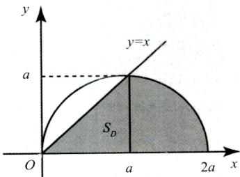
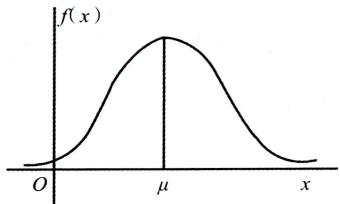
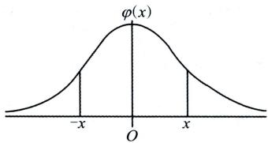
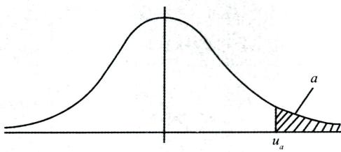
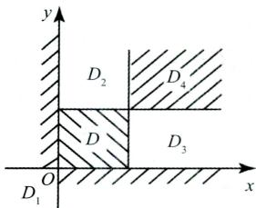
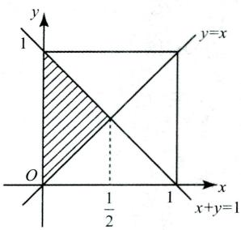
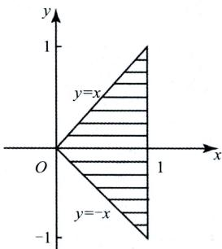
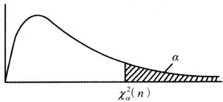
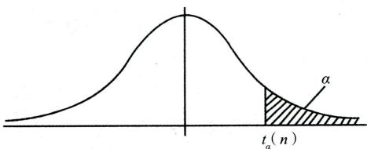
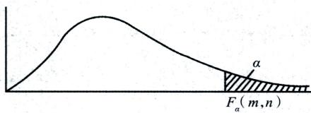

# 概率论与数理统计 辅导 讲义

# 基础强化一本通

李良编著

精选例题分类详解知识要点契合大纲要求

提炼总结每章重点新增良哥解读通俗易懂

后续更新公众号【有机研关本大学出版社永久联系微信4550060 PES

## 经验超市考研数学系列

## 基础阶段官方推荐习题搭配

B站/抖音/小红书： 李良考研数学 微信公众号： 李良讲数学

## 《考研数学基础700题》

数一数二数三通用

精准定位基础练手题

难度适中 题量适中

考研数学夯实 基础的好搭档

## 27考研概率论与数理统计复习系列

后续更新公最[【有机研】永久联素应企程正训配套课程

扫描700题内页二维码领取李良逐题配套讲解

经验超市考研数学系列

# 概率论与数理统计辅导讲义

后续更新公众号【有机研】永久联系微信4550060

## 图书在版编目(CIP)数据

概率论与数理统计辅导讲义:基础强化一本通/李

良编著.--天津：天津大学出版社，2024.3（2026.1重印）

经验超市考研数学系列

ISBN 978-7-5618-7684-8

I. ①概…Ⅱ. ①李… Ⅲ. ①概率论一研究生一入学考试一自学参考资料②数理统计一研究生一入学考试一自学参考资料 Ⅳ.①O21

中国国家版本馆CIP数据核字(2024)第055130号

GAILÜLUN YU SHULI TONGJI FUDAO JIANGYI:

JICHU QIANGHUA YIBENTONG

出版发行 天津大学出版社

地址天津市卫津路92号天津大学内（邮编：300072）

电话发行部：022-27403647

网址 www.tjupress.com.cn

印刷清淞永业（天津）印刷有限公司

经销全国各地新华书店

开本 787mm×1092mm 1/16

印张 16.75

字数 343千

版次 2024年3月第1版

印次 2026年1月第1次

定价 70.00元

凡购本书，如有缺页、倒页、脱页等质量问题，烦请与我社发行部门联系调换版权所有侵权必究

后续更新公众号[有机研】

永久联系微信4550060

# 序 言

“概率论与数理统计”相较于“高等数学”“线性代数”来说，更好掌握也更容易拿满分。而这本书，笔者也是抱着能够带大家从概率论入门到精通的心态来编写的。

接下来对本书的特点进行几点说明。

(1)本书的编写在基础篇的每章开头都加入了“大纲要求”，同学们可以明确对这部分知识的掌握程度，在后续的学习中做到心中有数。

(2)每一章的学习重点也在章节开头进行了说明，同学们在每章的学习后如果把这些重点都掌握了，那这章的学习就达到了要求。

(3)在一些不好理解的定理或者容易混淆出错的知识下面，都有加注一个“良哥解读”，这部分解读都是在良哥这么多年的日常教学中，从学生实际学习反馈中用更浅显易懂的话术总结出来的精华。

(4)对于“数学一”专属考点内容，这部分知识点后面都有标注“数学一”，“数学三”的同学就不用学习了，没有特别标注的知识都是“数学一”和“数学三”考生都需要掌握的。

本书的强化篇主要以“概率论与数理统计”考察的典型题型为主线编写。首先是对每章的基础知识进行回顾，然后是一些强化难度的例题及对例题的解析。针对强化篇每章的考点及方法小结，也希望同学们学到后期了然于心。

由于强化篇对基础知识的回顾比较完善，所以如果你是一个有概率论基础的考生，可以直接从强化篇开始学习，若对强化篇回顾的知识点有遗忘，可以再回归基础篇对应章节进行学习。

另外，从最新一年的考研数学真题情况来看，概率论部分的考察难度有所增加，主要体现在对同学们计算能力的考察要求更高了，很多同学可以想出一个题目的思路和方法，但无法正确计算出最后的答案。因此提醒新一届的考研学子们，在使用本书时，面对例题不能只用眼睛算，要动笔去把每个答案算出来，在日常的复习中锻炼计算能力。

李良2025年3月于成都

后续更新公众号[有机研】永久联系微信4550060

## 目 录

## 概率论与数理统计讲义基础篇

第章 随机事件和概率………………………………………003  
一、两个基本原理……… 003  
二、排列、组合 ……………………………………………………………………… 003  
三随机试验E……………………………………………………005  
四、样本空间005  
五、随机事件…………………………………………………………………………………………………005  
六、随机事件的关系…………………005  
七、随机事件的运算律 ……………………………………………………………………………… 007  
八、古典概型与几何概型…………………………007  
九、概率的公理化定义及性质……010  
十、条件概率及其性质……………………………………………………013  
十一、全概率公式与贝叶斯公式………………………………………………………………015  
十二、事件的独立性 ……… 017  
十三、n重伯努利概型及概率计算 …………021  
第二章 一维随机变量及其分布…………………………………………………………………………………023  
、随机变量的概念 ……………………………………………………023  
二、随机变量的分布函数…… ………………… 024  
三、一维离散型随机变量及其概率分布 ……………………… 026  
四、一维连续型随机变量及其概率分布 ………………………………………………… 032  
五、一维随机变量函数的分布…… ……………………………………………… 041  
第三章 多维随机变量及其分布………………………………………………………………………… 044  
二维随机变量的概念……………………………………………044  
二、二维随机变量的分布函数及其性质 …………………… 044  
三、二维随机变量的边缘分布函数……………045  
四、随机变量X和Y的独立性 ……………………………………………………………………………… 045  
五、二维离散型随机变量及其概率分布……047  
二、随机事件的运算律  
【题型二概率的性质】…………………124  
一概率的性质……………………………………………………………………………………………124  
【题型三 计算事件的概率】……………………………126  
一、古典概型…… ………………………………………………… 126  
二、几何概型…… …………………………………………………………… 126  
三、计算概率的五大公式……………………………………………………………………………………126  
四、条件概率…127  
五、事件的独立性…………………………………………………………………128  
【题型四 伯努利概型】…………………………………………………………136  
一、伯努利试验与n重伯努利试验…………136  
二、二项概率公式………………136  
第二章 一维随机变量及其分布……………………………………………………… 138  
【题型分布函数的概念与性质】…138  
一、随机变量分布函数的定义…… ………………………………………… 138  
和用分布函数求各种随机事件的概率 ……………………… 138  
CL1E  
………………… 138  
【题型维离散型随机变量及其分布】. ………………………………………………… 140  
一型量的定义 …………… 140  
六、二维连续型随机变量及其分布…………053  
七、两个常见的二维连续型分布…… …………………………………………………………… 060  
八、两个连续型随机变量函数的分布  
九、一个离散型与一个连续型随机变量函数的分布……068  
第四章 数字特征…070  
离散型随机変量的数学期望…… 070  
二、连续型随机变量的数学期望…………………072  
三、随机变量数学期望的性质………………………………073  
四、随机变量的方差 ………………………………………………………………… 074  
五、随机变量的矩……………………………………………………080  
六协方差…………………………………………………………………… 080  
七相关系数……………………………………………………………………………083  
第五章 大数定律和中心极限定理………………………………………………………………………………089  
一、切比雪夫不等式 ……………………………… 089  
二、依概率收敛……………………………………………………………………………………………………………090  
三、大数定律…… ……………………………… 090  
四、中心极限定理………………091  
第六章 数理统计的基本概念 ………………………………………………………………………………094  
、样本的联合分布  
二、统计量…… …………………………………………………………………………………… 096  
三、三大分布………………………………………………………………………………………100  
四、正态总体抽样分布 104  
第七章 参数估计与假设检验……………………………………………………………………………………109  
一、点估计的概念 109  
二、点估计的方法  
三、估计量的评选标准(数一)………………………………………………………………114  
四、置信间(数)…… 116  
五假设检验(数)………………………………………………………………………………………118  
概率论与数理统计讲义强化篇  
概率论与数理统计辅导讲义  
【题型二 二维连续型随机变量及其分布】………166  
一二维连续型随机变量的定义………………166  
二概率密度函数的性质…………166  
三、边缘密度函数 ………………………………………………………………………………… 166  
四、条件密度函数 …………………………… 167  
五、两个连续型随机变量的独立性……167  
六、两个常见的二维连续型分布……167  
【题型三 两个连续型随机变量函数的分布】……173  
一、分布函数法………………………………………173  
一、卷积公式…… ……………………………………… 173  
三、最大、最小分布（M = max(X,Y)及N = min(X,Y)的分布） ………………………………………174  
【题型四一个离散型与一个连续型随机变量函数的分布】……181  
第四章数字特征……………………………………………………………………………………………………………………185  
【题型一 计算随机变量的期望与方差】 185  
一、离散型随机变量的数学期望 ……………………… 185  
二、连续型随机变量的数学期望 ……………………………… 186  
……………………… 186  
更 ………………………………… 186  
联最最分信幼電場0060 …………………… 187  
【题型二计算协方差与相关系数】… 197  
三、总体容量…………………………………………………………………………………………………213  
四、简単随机样本…………………………………………………………………………213  
五、统计量…………………………………………………………………………………………………………………213  
六、三大分布………………………………………………………………………………………………………… 215  
七、正态总体抽样分布…………………………………………………………217  
【题型 计算统计量数字特征】…………………………………………………………218  
【题型二 三大分布】…… …………………………………………………………… 223  
七章 参数估计与假设检验 … 227  
【题型一 矩计与最大似然估计】………………………………………227  
一、矩估计法…… …………………………………………………… 227  
二、最大似然估计法……………227  
【题型二 估计量的评选标准】(数一)…………………233  
一、无偏性…… ………………………………… 233  
二、有效性………………………… 233  
三、一致性(相合性)…………………………………………………………………234  
【题型三 区间估计】(数)………………………236  
一、置信区间的定义…… …………………………………… 236  
二、一个正态总体参数的区间估计…………236  
三、两个正态总体参数的区间估计………………237  
【题型四 假设检验】数一)…………………………………………………………………………………238  
假设……………………………………………………………………………………………………… 238  
二、假设检验………………………………… 238  
三、假设检验的原理(实际推断原理)……239  
四、两类错误…… ……………………… 239  
五、显著性检验……239  
六、显著性检验的般步骤……239  
七、正态总体参数的假设检验……239  
【题型四假设检验】(数)……238  
假设………… 238  
二假设检验………………………………………………………………………………………………238  
三、假设检验的原理(实际推断原理）………239  
四、两类错误………………………………………………………………………………………………………………239  
五、显著性检验……………………………………………239  
六、显著性检验的一般步骤……239  
七、正态总体参数的假设检验……… …………………………… 239  
续更新公众号[有机研】  
久联系微信4550060 V

# 概率论与数理统计讲义基础篇

李良概率基础课程

官方配套扫码了解

后续更新公众号[有机研】永久联系微信4550060

# 第一章 随机事件和概率

本章配套习题《基础700题》P3-P6

## 【大纲要求】

(1)了解样本空间(基本事件空间)的概念，理解随机事件的概念，掌握事件的关系及运算

(2)理解概率、条件概率的概念，掌握概率的基本性质，会计算古典概率和几何型概率，掌握概率的加法公式、减法公式、乘法公式、全概率公式及贝叶斯公式

(3)理解事件独立性的概念，掌握用事件独立性进行概率计算，理解独立重复试验的概念，掌握计算有关事件概率的方法.

## 【本章重点】

(1)计算概率的五大公式(加法、减法、乘法、全概率及贝叶斯公式).

(2)条件概率及事件的独立性.

(3)计算概率的三种概型(古典概型、几何概型、伯努利概型).

## 【基础知识】

## 一、两个基本原理

## (一)乘法原理

完成某事需要k个步骤，每一步分别有 $n_{1},n_{2},\cdots,n_{k}$ 种方法，则完成此事共有 $n_{1}n_{2}\cdots n_{k}$ 种方法.

## (二)加法原理

完成某事有k类方法，每一类分别对应有 $n_{1},n_{2},\cdots,n_{k}$ 种方法，则完成此事共有 $n_{1} + n_{2} + \cdots + n_{k}$ 种方法.

## 二、排列、组合

## (一)排列

1. 排列的定义

从n个不同的元素中任取r个(0 < r ≤n),按照一定顺序排成一列，则称为从 n个元素中取出r个元素

## 的一个排列，其个数记为 $\mathbf{P}_{n}^{r}$ 或 $\boldsymbol{A}_{n}^{r}.$

## 2. 排列的种类及计算公式

## 1)不放回抽样

选排列 从n个不同的元素中一次取一个不放回地取r次，一共的方法数：

若 $0 < r < n$ ,则 $\mathbf{A}_{n}^{r}=n(n-1)\cdots(n-r+1)$

若 $r = n$ ,则 $\mathbf{A}_{n}^{n} = n!$ ,此时也称为全排列.

## 2)有放回抽样

有重复的排列 从n个不同的元素中一次取一个有放回地取r次，一共的方法数：

$$
\mathbf{U}_{n}^{r}=n^{r}.
$$

## 良哥解读

从n个不同的元素中一次取一个,无论是放回(或不放回)取r次,都对应排列,数数时需考虑元素间的顺序.

【例】共有20件产品，其中有3件次品：

(1)若一次取一件不放回取3次，问有两件正品一件次品的取法有多少种?

(2)若一次取一件有放回取3次，问有两件正品一件次品的取法有多少种？

【解析】两件正品一件次品有三种顺序：{正、正、次}、{正、次、正}、{次、正、正}.

(1)不放回抽样：

若第一次取正品，第二次取正品，第三次取次品共有 $17 \times 16 \times 3$ 种取法，从而两件正品一件次品的取法共有 $17 \times 16 \times 3 \times 3 = 2448$ 种.

## (2)放回抽样：

若第一次取正品，第二次取正品，第三次取次品共有 $1 7   \times   1 7   \times   3$ 种取法，从而两件正品一件次品的取法共有 $17 \times 17 \times 3 \times 3 = 2601$ 种.

## (二)组合

## 1. 组合的定义

从 n个不同的元素中任取r个 $( 0 \leqslant r \leqslant n )$ ,不计顺序拼成一组，称为从n个元素中取出r个元素的组合,记为 $\mathbf { C } _ { n ^ { * } } ^ { r }$

## 2. 组合的计算公式

$$
C_{n}^{r}=\frac{A_{n}^{r}}{r!}.
$$

3. 组合的性质

$$
C_{n}^{r}=C_{n}^{n-r}.
$$

## 良哥解读

从n个不同的元素中一次取出r个(俗称一把抓),对应的是组合,数数时不用考虑元素间的顺序.其计算公式相当于用排列 $\mathbf{A}_{n}^{r}$ 除以 r个元素的 r！种顺序.

【例】共有20件产品，其中有3件次品，现从中任取3件，问：后续更新公众号[有机研】永久联系微信4550060

(1)共有多少种不同的取法?

(2)恰有一件次品的取法?

(3)至少有一件次品的取法？

【解析】 $1 $) \mathbf { C } _ { 2 0 } ^ { 3 }$$ 种.

(2)恰有一件次品，表示取到两件正品一件次品，则共有 $\mathbf{C}_{17}^{2}\mathbf{C}_{3}^{1}$ 种.

(3)至少有一件次品，表示有一件次品或两件次品或三件次品，故共有 $\mathrm{C}_{17}^{2} \mathrm{C}_{3}^{1}+\mathrm{C}_{17}^{1} \mathrm{C}_{3}^{2}+\mathrm{C}_{17}^{0} \mathrm{C}_{3}^{3}$ 种取法.也可以用下面方法：

由于至少一件次品的逆事件表示都为正品，故可以用总的取法减去都为正品的取法，即 $\mathrm{C}_{20}^{3}-\mathrm{C}_{17}^{3}$ 种.

## 三、随机试验E

定义：满足如下三个条件的试验称为随机试验：

(1)可以在相同的条件下重复地进行；

(2)进行一次试验之前不能确定哪一个结果会出现；

(3)每次试验的可能结果不止一个，并且能事先明确试验的所有可能结果.

## 四、样本空间

(1)样本点w:随机试验的每一个可能的结果称为一个样本点.

(2)样本空间Ω:所有样本点组成的集合称为样本空间.

## 五、随机事件

(1)随机事件:样本空间Ω的子集称为随机事件，通常用大写字母A,B,C等表示.

(2)基本事件:由一个样本点组成的单点集.

(3)事件发生：在每次试验中，当且仅当事件中有一个样本点出现时，称这一事件发生(出现).

(4)必然事件:样本空间Ω包含所有样本点，它是Ω自身的子集，在每次试验中总发生，称其为必然事件，记为Ω.

(5)不可能事件：空集∅不包含任何样本点，它也是样本空间的子集，在每次试验中都不发生，称其为不可能事件，记为∅.

## 六、随机事件的关系

(1)包含关系： $A \subset B$ 它表示事件A发生一定导致B发生.

(2)事件相等:若 $A \subset B$ 且 $B \subset A$ .则称事件A与B相等，即 $A = B.$

(3)A和B的和事件:称事件 $A \cup B = \left\{ x \mid x \in A  或  x \in B \right\}$ 为A 和 B的和事件.它表示A,B两个事件至少有一个发生时事件AUB发生，A∪B也记为A+B.

类似地，称 $\bigcup_{k = 1}^{n} A_{k}$ 为 n个事件 $A_{1},A_{2},\cdots,A_{n}$ 的和事件.

## 良哥解读

(1)若出现几个事件至少一个发生时,表示这几个事件的和事件.比如事件A,B,C至少一个发生，可表示为 $A + B + C.$

(2)隐含的包含关系 $:A \subset A + B; B \subset A + B.$

(4)A 和 B的积事件:称事件 $A \cap B = \left\{ x \mid x \in A  且  x \in B \right\}$ 为A和 B的积事件.它表示A,B 两个事件同时发生时事件A∩B发生，A∩B也记为AB.

类似地，称 $\bigcap_{k = 1}^{n} A_{k}$ 为n个事件 $A_{1},A_{2},\cdots,A_{n}$ 的积事件.

## 良哥解读

隐含的包含关系 $AB \subset A;AB \subset B.$

(5)A 和 B的差事件:事件 $A-B=\left\{x\mid x\in A 且 x\notin B\right\}$ 称为事件A和B的差事件.它表示A发生且B不发生时事件A-B发生.A-B也可记为AB

(6)互斥事件(互不相容):当AB=∅时，称事件A和B互不相容(或互斥).它表示事件A和B不能同时发生.

(7)对立事件(逆事件):若A∪B = Ω且 $A \cap B = \varnothing$ ,则称A和B互为逆事件，也称互为对立事件.A的对 立事件记为A.

## 良哥解读

互斥事件与对立事件的关系:两个事件对立则一定互斥,但互斥不一定对立.

(8)完全(备)事件组:若事件组 $A_{1},A_{2},\cdots,A_{n}$ 满足：

$A_{1} \cup A_{2} \cup \cdots \cup A_{n} = \Omega, A_{i}A_{j} = \varnothing, 1 \leq i \neq j \leq n$ ,则称事件 $A_{1},A_{2},\cdots,A_{n}$ 是一个完全(备)事件组，也称为样本空间的一个划分.

【例】设A,B,C是三个随机事件，试用A,B,C表示下列事件：

(1)A,B,C 中只有A发生； (2)A,B都发生，而C不发生；

(3)A,B,C同时发生； (4)A,B,C至少有一个发生；

(5)A,B,C至少有两个发生；(6)A,B,C只有一个发生；

(7)A,B,C不多于一个发生.

【解析】(1)A,B,C中只有A发生，表示A发生但B,C都不能发生，即 $\overline{ABC}$

(2 $)AB\overline{C}$

(3 $)ABC;$

(4)A,B,C至少有一个发生，表示A,B,C的和事件，即 $A + B + C;$

(5)A,B,C至少有两个发生,表示A,B,C中两个事件发生的和事件，即

$$
AB + AC + BC;
$$

(6)A,B,C只有一个发生,表示只有A发生或只有B发生或只有C发生，即

$$
A\overline{B}\overline{C}+B\overline{A}\overline{C}+C\overline{A}\overline{B};
$$

(7)A,B,C不多于一个发生，表示A,B,C中只有一个发生或者一个都不发生，即$A\overline{B}\overline{C}+B\overline{A}\overline{C}+C\overline{A}\overline{B}+\overline{A}\overline{B}\overline{C}$ 也可以表示为A,B,C中至少有两个不发生，即

$$
\overline{AB}+\overline{AC}+\overline{BC}
$$

## 七、随机事件的运算律

(1)交换律： $A \cup B = B \cup A; A \cap B = B \cap A.$

(2)结合律： $A \cup (B \cup C) = (A \cup B) \cup C; A \cap (B \cap C) = (A \cap B) \cap C.$

(3)分配律 $A \cup (B \cap C) = (A \cup B) \cap (A \cup C); A \cap (B \cup C) = (A \cap B) \cup (A \cap C).$

(4)对偶律(德摩根律 $\overline{A \cup B} = \overline{A} \cap \overline{B}, \overline{A \cap B} = \overline{A} \cup \overline{B}.$

【例】设A,B为两个事件，且 $A \ne \varnothing, B \ne \varnothing$ ,则 $(A + B)(\overline{A} + \overline{B})$ 表示( ).(A)必然事件 (B)不可能事件(C)A与B不能同时发生 (D)A与B中恰有一个发生

【解析】因 $(A + B)(\overline{A} + \overline{B}) = A\overline{A} + A\overline{B} + B\overline{A} + B\overline{B} = A\overline{B} + B\overline{A}$ ,故表示A与B中恰有一个发生，应选(D).

## 八、古典概型与几何概型

## (一)古典概型

(1)定义：具有以下两个特点的试验称为古典概型：

①样本空间有限： $\Omega = \left\{ e_{1}, e_{2} \cdots e_{n} \right\}$

②等可能性： $P(e_{1}) = P(e_{2}) = \cdots = P(e_{n})$

(2)计算方法：

$$
P(A)=\frac{A 中基本事件的个数 k}{\Omega 中基本事件总数 n}
$$

(3)古典概型的性质：

①非负性： $\forall A \in \Omega, 0 \leq P(A) \leq 1$ .

②规范性： $P(\varnothing)=0,P(\Omega)=1$

③有限可加性：设 $A_{1},A_{2},\cdots,A_{n}$ 是两两互不相容的事件，即对于 $i \ne j, A_i A_j = \varnothing, i, j = 1, 2, \cdots, n$ ,则

$$
P(A_{1} \cup A_{2} \cdots \cup A_{n}) = P(A_{1}) + P(A_{2}) + \cdots + P(A_{n}).
$$

【例】设100件产品中，有60件正品，40件次品，令A={三件均为次品}，B={两正品一次品}.

(1)从100件产品中一次取一件，任取三件,按照放回与不放回抽样,求P(A),P(B).(保留小数点后两位)

(2)从100件产品中一次取三件,求P(A),P(B).(保留小数点后两位)

【解析】

(1)放回抽样：

$$
\frac{40 \times 40 \times 40}{100 \times 100 \times 100} \approx 0.06, P(B)=\frac{60 \times 60 \times 40 \times 3}{100 \times 100 \times 100} \approx 0.43.
$$

不放回抽样：

$$
P(A)=\frac{40 \times 39 \times 38}{100 \times 99 \times 98} \approx 0.06, P(B)=\frac{60 \times 59 \times 40 \times 3}{100 \times 99 \times 98} \approx 0.44.
$$

(2)一次取三件的情况

$$
P(A)=\frac{C_{40}^{3}}{C_{100}^{3}}=\frac{40\times39\times38}{100\times99\times98}\approx0.06,P(B)=\frac{C_{40}^{2}C_{40}^{1}}{C_{100}^{3}}=\frac{60\times59\times40\times3}{100\times99\times98}\approx0.44.
$$

## 良哥解读

古典概率计算中,往往要用到排列与组合数数.若是一次取一件无论是放回还是不放回抽样,我们都将其当成排列来计算,此时最易犯错误的是漏掉产品间的顺序.从上面这个例子,我们容易看到：一次取一件不放回取三次与一次取三件计算事件的概率时结果一样.这不是巧合,适用于一般情况,以后如果遇到一次取一件不放回取几次计算事件的概率,我们可以将其当成一次取几件,此时我们可用组合计算，这样也可避免漏掉产品间的顺序

【例】将n个球随机地放入 $N(N \geq n)$ 个盒子中去，试求每个盒子至多有一个球的概率(设盒子数有限).【解析】因每个球都可以放入N个盒子中的任一个盒子，故共有 $N ^ { n }$ 种不同的放法，而每个盒子至多有一个球共有 $N(N-1)(N-2)\cdots[N-(n-1)]$ 种不同的方法，从而所求概率为

$$
\frac{N(N - 1)(N - 2)\cdots(N - n + 1)}{N^n} = \frac{\mathbf{A}_N^n}{N^n}.
$$

## (二)几何概型

如果试验E是从某一线段(或平面、空间中有界区域)Ω上任取一点，并且所取得点位于Ω中任意两个长度(或面积、体积)相等的子区间(或子区域)内的可能性相同,则所取得点位于Ω中任意子区间(或子 $\textcircled { 2 }$ 区域)A内这一事件(仍记作A)的概率为

$$
P(A)=\frac{A 的长度(或面积、体积) }{\Omega 的长度(或面积、体积) }
$$

## 良哥解读

## 几何概型的两个要点

(1)何时用几何概型？

以后遇到试验满足如下条件的某一个时,立即想到是考查几何概型：

①在某个区间(区域)内随机取数或者任意取点；

②在某个时间段内随机到达某个地方；

③在某个区间(区域)内任意子区间(区域)上取值概率与该区间(区域)的长度(面积)成正比.

(2)何时用长度比？何时用面积比?

①通过实验条件若只产生一个变量时用长度比,产生两个变量时用面积比.例如:在一个区间随机取一个数,求该数落在某个区间的概率,用长度比;在一个区间随机取两个数,求两数之差小于多少的概率,用面积比.

②若条件是在某个区间内任何子区间上取值概率与该区间长度成正比,则用长度比;若条件为在某个区域内任何子区域上取值概率与该区域面积成正比,用面积比.

【例】在区间(0,1)中随机地取两个数，则事件“两数之和小于”的概率为 $\frac{6}{5} ''$

【解析】将在(0,1)区间中随机取的两个数分别记为 $x , y .$ “两数之和小于 $\frac{6}{5},$ 即 $x + y < \frac{6}{5}$ 后续更新公众号[有机研】

如图所示，求 $P(x + y < \frac{6}{5})$ 即用 $(x + y < \frac{6}{5})$ 所在区域阴影部分面积除以总面积即可，即

$$
P(x+y<\frac{6}{5})=\frac{1-\frac{1}{2}\times\frac{4}{5}\times\frac{4}{5}}{1}=\frac{17}{25}=0.68.
$$

【例】星期天，甲乙约定上午09：00—10：00在某地见面，先到者等15分钟便离开，求两人能会面的概率?

【解析】设甲在09:00—10:00的第x分钟到达,乙在第y分钟到达，由于09：00—10:00共有60分钟，相当于x和y是在区间[0,60]上随机取值.由于先到者等15分钟便离开，故两人能会面即两人到达时刻相差不超过15分钟，所求概率为 $P\left( \left| x - y \right| \leqslant 15 \right) = \frac{60 \times 60 - 45 \times 45}{60 \times 60} = \frac{7}{16}.$

【例】随机地向半圆 $0 < y < \sqrt{2ax - x^{2}}$ 为正常数)内掷一点，点落在半圆内任何区域的概率与该区域的面积成正比.则原点与该点的连线与x轴的夹角小于的概率为 $\frac{\pi}{4}$

【解析】“在一个区域内任何子区域上取值概率与该区域的面积成正比”，说明是考查几何概型

设A表示事件“掷的点和原点连线与x轴的夹角小于”，如图所示，要求概率只需用图中阴影部分面 $\frac{\pi}{4}  \text{" }$ 积除以半圆的面积即可.

$$
\frac{\frac{1}{2}a^{2}+\frac{1}{4}\pi a^{2}}{\frac{1}{2}\pi a^{2}}=\frac{1}{\pi}+\frac{1}{2}
$$

后续更新公众号[有机研】永久联系微信4550060

【例】将长为1的木棒任意地折成三段，求：三段的长度都不超过0.5的概率.

【解析】设三段的长度分别为 $x,y,1-x-y$ ，如下图所示，样本空间为

$$
S = \left\{ (x,y) \mid 0 < x < 1, 0 < y < 1, 0 < x + y < 1 \right\} ,
$$

则样本空间的面积为 $\frac{1}{2}.$ 记A={三段的长度都不超过0.5}，则

$$
A=\left\{(x,y)\mid 0<x<0.5,0<y<0.5,0<1-x-y<0.5\right\}
$$

则A的面积为 $\frac{1}{8}.$ 故

$$
P(A)=\frac{\frac{1}{8}}{\frac{1}{2}}=\frac{1}{4}
$$

因此三段的长度都不超过0.5的概率为 $\frac{1}{4}.$

九、概率的公理化定义及性质

## (一)概率的公理化定义

设E是随机试验，Ω是它的样本空间，对于E上的每一个事件A赋予一个实数，记为 $P(A)$ ,称 $P(A)$ 为事件A的概率，如果集合函数 $P ( \bullet )$ 满足下列条件：

(1)非负性：对于每一个事件A,有 $P(A) \geq 0$ ;

(2)规范性：对于必然事件Ω,有 $P(\bar{\Omega}) = 1$ .

(3)可列可加性：设 $A_{1},A_{2},\cdots$ 是两两互不相容的事件,即对于 $i \ne j,A_{i}A_{j} = \varnothing,i,j = 1,2,\cdots$ ,则有 $P(A_{1} \cup A_{2} \cup \cdots) =$ $P(A_{1}) + P(A_{2}) + \cdots$

## (二)概率的性质

非负性：设A为随机事件，则 $0 \leqslant P(A) \leqslant 1$

规范性： $P(\varnothing)=0,P(\Omega)=1$

后续更新公众号[有机研】永久联系微信4550060

## 良哥解读

不可能事件的概率为0,必然事件的概率为1,但概率为0的事件不一定是不可能事件,概率为1的事件不一定是必然事件.例如,在 [0,1] 区间上随机取一个数记为 x,事件 $\{ x = \frac{1}{2} \}$ 的概率为 0,但 $\{ x = \frac{1}{2} \}$ 不是不可能事件.同理 $P\{x \neq \frac{1}{2}\} = 1$ ,但 $\{ x \neq \frac{1}{2} \}$ 不是必然事件.

有限可加性:设 $A_{1},A_{2},\cdots,A_{n}$ 是两两互不相容的事件，即对于 $i \ne j, A_i A_j = \varnothing, i, j = 1, 2, \cdots, n,$ 则有 $P(A_1 \cup A_2 \cdots \cup$ $A_{n}) = P(A_{1}) + P(A_{2}) + \cdots + P(A_{n})$

逆事件的概率：对于任一事件A，有 $P(\bar{A}) = 1 - P(A)$

## 良哥解读

逆事件概率公式是概率论中计算复杂事件概率的一个重要思维.若计算某事件的概率遇到困难,首先考虑其逆事件的概率是否容易解决

可比性：设A,B是两个事件，若 $A \subset B$ ,则有 $P(A) \leq P(B)$ 且 $P(B - A) = P(B) - P(A)$

一般地，设A,B是两个事件，则 $P(B - A) = P(B\overline{A}) = P(B) - P(AB)$ 称为减法公式

## 良哥解读

前面出现概率不等式的性质有:① $0 \leq P(A) \leq 1$ ;②若 $A \subset B$ ,则有 $P(A) \leq P(B)$ .若题目是解决事件 概率的不等式问题先考虑从这两个性质入手.

加法公式：对于任意两个随机事件A与B，有

$$
P(A+B)=P(A)+P(B)-P(AB).
$$

对于任意三个事件A,B,C,有

$$
P(A+B+C)=P(A)+P(B)+P(C)-P(AB)-P(BC)-P(AC)+P(ABC).
$$

【例】若两事件A,B满足 $P(\overline{A} + \overline{B}) = 1$ ,则().(A)A,B互不相容(互斥) $\overline{A} + \overline{B}$ 是必然事件(C)AB未必是不可能事件 $P(A)=0$ 或 $P(B)=0$

【解析】由 $1 = P(\overline{A} + \overline{B}) = P(\overline{A}\overline{B})$ ,故有 $P(AB) = 0.$

因概率为0的事件不一定是不可能事件，故应选(C).

对于(D)选项，由于P(AB)不一定等于 $P(A)P(B)$ ，从而得不到 $P(A)=0$ 或 $P(B) = 0$

【例】设一袋中装有9个红球.1个白球，现随机地从中摸出一球，并放入一红球，这样连续进行m-1次$(m \geq 2)$ ,求此时再从袋中摸出一球为红球的概率.

【解析】设事件B表示第m-1次摸球后再从袋中取出一球为红球，B表示第m-1次摸球后再从袋中 $\overline{B}$ 取出一球为白球. $\overline{P(\overline{B})}$ 表示前m-1次都取红球，第m次取白球的概率，故

$$
P(\overline{B}) = \left( \frac{9}{10} \right)^{m - 1} \times \frac{1}{10}
$$

所以 $P(B)=1-P(\overline{B})=1-\left(\frac{9}{10}\right)^{m-1}\times\frac{1}{10}.$

【例】若A,B为任意两个随机事件，则（ )$(A)P(AB) \leq P(A)P(B)$ (B $P(AB) \geqslant P(A)P(B)$ 后续更新公众号[有机研】永久联系微信4550060

(C) $P(AB) \leqslant \frac{P(A) + P(B)}{2}$ (D $P(AB) \geq \frac{P(A) + P(B)}{2}$

【解析】由于 $AB \subset A,AB \subset B$ ,故由概率的比较性质，有

$$
P(AB) \leqslant P(A),P(AB) \leqslant P(B),
$$

从而 $2P(AB) \leqslant P(A) + P(B)$ ,即 $P(AB) \leqslant \frac{P(A) + P(B)}{2}$ .故应选(C).

若取 $B \subset A,0 < P(A) < 1,0 < P(B) < 1,$ 则 $P(AB)=P(B)>P(A)\cdot P(B)$ ,排除(A).

若取 $P(A)>0,P(B)>0,$ 且 $P(AB) = 0,$ 排除(B)(D).

【例】已知 $P(A)=0.8,P(A-B)=0.1$ ,则 $P(\overline{AB}) =$

【解析】因 $0.1 = P(A - B) = P(A) - P(AB)$ ,又 $P(A)=0.8$ ,故 $P(AB) = 0.7$ ,从而

$$
P(\overline{AB}) = 1 - P(AB) = 0.3
$$

【例】已知A,B两个随机事件满足 $P(AB) = P(\overline{A}\overline{B})$ ,且 $P(A)=p.$ 则 P(B) =【解析】因为

$$
\begin{aligned}P(\overline{A}\overline{B}) &= P(\overline{A + B}) = 1 - P(A + B) \\&= 1 - [P(A) + P(B) - P(AB)] \\&= 1 - P(A) - P(B) + P(AB),\end{aligned}
$$

又 $P(AB) = P(\overline{A}\overline{B})$ ,故有 $1 - P(A) - P(B) = 0,P(B) = 1 - P(A) = 1 - p.$

【例】已知 $P(A)=P(B)=P(C)=\frac{1}{4},P(AB)=0,P(AC)=P(BC)=\frac{1}{12}$ ,则事件A,B,C都不发生的概率为

【解析】由题意即求概率 $P(\overline{A} \overline{B} \overline{C}) = P(\overline{A + B + C}) = 1 - P(A + B + C)$

由加法公式

$$
P(A+B+C)=P(A)+P(B)+P(C)-P(AB)-P(AC)-P(BC)+P(ABC)
$$

因为 $P(AB) = 0$ ,可知 $P(ABC)=0$

又因为 $P(A)=P(B)=P(C)=\frac{1}{4},P(AC)=P(BC)=\frac{1}{12}$ ,故

$$
P(A+B+C)=\frac{3}{4}-0-\frac{1}{12}-\frac{1}{12}=\frac{7}{12},
$$

则 $P(\overline{A} \overline{B} \overline{C}) = 1 - \frac{7}{12} = \frac{5}{12}.$

【例】在1\~300的整数中随机地取一个数，问取到的整数既不能被3整除也不能被5整除的概率

【解析】设事件A为“取到的数能被3整除”，事件B为“取到的数能被5整除”，则所求概率为

$$
P\left( \overline{A} \overline{B} \right) = P\left( \overline{A \cup B} \right) = 1 - P\left( A \cup B \right) = 1 - \left[ P\left( A \right) + P\left( B \right) - P\left( AB \right) \right],
$$

因为1\~300的整数中能被3整除的数有 $\frac{300}{3} = 100$ 个，能被5整除的数有 $\frac{300}{5} = 60$ 个,故

$$
P(A)=\frac{100}{300}=\frac{1}{3},P(B)=\frac{60}{300}=\frac{1}{5}.
$$

一个数既能被3整除又能被5整除，相当于能被15整除，能被15整除的数有 $\frac{300}{15} = 20$ 个,则

$$
P(AB)=\frac{20}{300}=\frac{1}{15}.
$$

后续更新公众号【有机研】

永久聯系微信4550060

于是 $P\left(\overline{A}\overline{B}\right)=1-\left(\frac{1}{3}+\frac{1}{5}-\frac{1}{15}\right)=\frac{8}{15}$

## 十、条件概率及其性质

## (一)条件概率的定义

设A,B是两个随机事件，且 $P(A)>0$ ,称 $P(B \mid A) = \frac{P(AB)}{P(A)}$ 为在事件A发生的条件下事件B发生的条件概率.

## (二)条件概率的性质

若 $P(A)>0$ ,则有

①非负性： $P(B \mid A) \geq 0.$

②规范性： $P(\Omega \mid A) = 1$

③可列可加性：设 $B_{1},B_{2},\cdots$ 是两两互不相容的事件，则有

$$
P(\bigcup_{i = 1}^{\infty} B_i \mid A) = \sum_{i = 1}^{\infty} P(B_i \mid A).
$$

④逆事件的概率： $P(\overline{B} \mid A) = 1 - P(B \mid A)$

⑤加法公式： $P \left[ \left( B _ { 1 } + B _ { 2 } \right) \mid A \right] = P \left( B _ { 1 } \mid A \right) + P \left( B _ { 2 } \mid A \right) - P \left( B _ { 1 } B _ { 2 } \mid A \right) .$

## 良哥解读

条件概率也是概率,它与概率有相类似的性质与公式.只要熟记概率的性质与公式,则条件概率的性质与公式可类似写出.

【例】在 $1,2,\cdots,9$ 中任取一数，令 $A = \left\{ \begin{aligned} \end{aligned} \right.$ 是3的倍数}， $B_{1} = \left\{ \begin{aligned} \end{aligned} \right.$ 偶数}， $B_{2} = \left\{  大于  8 \right\}$ ,求 $P(A),P(A \mid B_{1}),P(A \mid B_{2})$ 【解析】(1)在 $1,2,\cdots,9$ 中是3的倍数的共有3个，故 $P(A)=\frac{3}{9}=\frac{1}{3}.$

(2)在 $1,2,\cdots,9$ 中偶数共有4个，在偶数中是3的倍数的只有1个，从而

$$
P(A \mid B_{1}) = \frac{1}{4}
$$

(3)在 $1,2,\cdots,9$ 中大于8的个数只有1个，在大于8的数中是3的倍数的只有1个，从而 $P(A \mid B_{2}) = 1$

## 良哥解读

事件A发生的概率与在某个事件的条件下事件A发生的条件概率没有明确的大小关系.例如本题中 $P(A \mid B_{1}) = \frac{1}{4} < P(A) = \frac{1}{3},P(A \mid B_{2}) = 1 > P(A) = \frac{1}{3}$ ,在一定条件下两个概率也能相等(比如事件A,B相互独立),有 $P(A \mid B) = P(A)(P(B) > 0)$ .若要比较事件概率与在某条件下该事件发生的条件概率的大小,需要视具体情况而定.

【例】已知 $P(B)=0.4,P(A+B)=0.5$ ,求 $P(A \mid \overline{B})$

后续更新公众号【有机研】永久联系微信4550060

【解析】因

$$
P(A \mid \overline{B}) = \frac{P(A\overline{B})}{P(\overline{B})} = \frac{P(A) - P(AB)}{1 - P(B)},
$$

又 $P(B)=0.4,0.5=P(A+B)=P(A)+P(B)-P(AB)$ ,则 $P(A)-P(AB)=0.1$ ,故 $P(A \mid \overline{B}) = \frac{0.1}{0.6} = \frac{1}{6}.$

## (三)乘法公式

设A,B为两个随机事件,若 $P(A)>0$ ,则有 $P(AB)=P(B|A)P(A)$

设A,B,C为三个随机事件，若 $P(AB)>0$ ,则有 $P(ABC)=P(C|AB)P(B|A)P(A)$

## 良哥解读

乘法公式本质是条件概率公式变形.当 $P(A)>0$ 时,由 $P(B \mid A) = \frac{P(AB)}{P(A)}$ ,得 $P(AB)=P(B|A)P(A)$ ;当$P(B)>0$ 时，由 $P(A|B)=\frac{P(AB)}{P(B)}$ 得 $P(AB)=P(A|B)P(B)$ ，故 $P(AB)=P(B|A)P(A)=P(A|B)P(B)$ 则$P(B|A),P(A),P(A|B),P(B)$ 四个概率中只要知道其中三个,另一个即可计算出.

【例】已知 $P(A)=0.4,P(B|A)=0.5,P(A|B)=0.25$ ,则 P(B) =

【解析】因 $P(B|A)P(A)=P(A|B)P(B)$ ,又 $P(A)=0.4,P(B|A)=0.5,P(A|B)=0.25$ ,故 $P(B)=0.8$

【例】判断下列命题是否正确,为什么?

(1)三人排队抓阄，只一阄有物，则抓中物的概率与抓阄的先后次序有关，先抓者抓中物的概率大

(2)三人排队抓阄，只一阄有物，若第一人未抓中，则第二人抓中物的概率将增大

【解析】(1)命题错误,理由如下.

设 $A _ { i }$ 表示“第i人抓阄有物 $\left( i = 1,2,3 \right)$ ,则：

第一人抓阄有物的概率为 $P(A_{1}) = \frac{1}{3};$

第二人抓阄有物，表示第一人没抓中且第二人抓中，即

$$
P\left(A_{2}\right)=P\left(\overline{A_{1}}A_{2}\right)=P\left(A_{2}\mid\overline{A_{1}}\right)P\left(\overline{A_{1}}\right)=\frac{1}{2}\times\frac{2}{3}=\frac{1}{3};
$$

第三人抓阄有物，表示第一、二人都没抓中且第三人抓中，即

$$
P\left(A_{3}\right)=P\left(\overline{A_{1}}\overline{A_{2}}A_{3}\right)=P\left(A_{3}\mid\overline{A_{1}}\overline{A_{2}}\right)P\left(\overline{A_{1}}\overline{A_{2}}\right)=P\left(A_{3}\mid\overline{A_{1}}\overline{A_{2}}\right)P\left(\overline{A_{2}}\mid\overline{A_{1}}\right)P\left(\overline{A_{1}}\right)=1\times\frac{1}{2}\times\frac{2}{3}=\frac{1}{3}.
$$

综上知，三人抓中物的概率相等，而与三人抓阄的先后次序无关，这就是我们所说的“抽签原理”或“抓阄原理”，无论先抓还是后抓每个人抓中物的概率一样大，所以无论计算第几次(或第几人)取到某物品的概率,我们均可以只计算第一次(或第一人)取到的概率.

(2)由(1)知， $P(A_{2}) = \frac{1}{3}$ ,而在第一人未抓中的条件下第二人抓中的概率为 $P\left(A_{2} \mid \overline{A_{1}}\right)=\frac{1}{2}$ ,从而有$P\left(A_{2} \mid \overline{A_{1}}\right) > P\left(A_{2}\right)$ ,故命题(2)正确.

【例】一批产品有10个正品和2个次品，任意抽取两次，每次抽一个，抽出后不放回，则第二次抽出的是次品的概率为后续更新公众号[有机研】永久联系微信4550060

【解析】由“抽签原理”知，第二次取次品的概率与第一次取次品的概率相等，故第二次取次品的概率为 $\frac{2}{12} = \frac{1}{6}.$

## 十一、全概率公式与贝叶斯公式

## (一)全概率公式

设 $A_{1},A_{2},\cdots,A_{n}$ 是一组完全事件组，且 $P(A_i)>0,i=1,2,\cdots,n$ ,则

$$
P(B)=\sum_{i = 1}^{n}P(A_{i})P(B|A_{i}).
$$

## 良哥解读

## (1)全概率公式的推导

因 $A_{1},A_{2},\cdots,A_{n}$ 是一组完全事件组,故 $\sum_{i = 1}^{n} A_{i} = \Omega$ 且 $A_{1},A_{2},\cdots,A_{n}$ 两两互不相容.因 $P(B)=P(B \cup 2)=P(B \sum_{i=1}^{n} A_{i})=P(\sum_{i=1}^{n} BA_{i})$ ,而事件 $BA_{1},BA_{2},\cdots,BA_{n}$ 两两互不相容,故 $P(\sum_{i = 1}^{n}BA_{i}) =$ $\sum_{i = 1}^{n} P(BA_{i}) = \sum_{i = 1}^{n} P(A_{i})P(B|A_{i})$ ,进而有 $P(B)=\sum_{i = 1}^{n}P(A_{i})P(B|A_{i})$

## (2)全概率公式的本质

全概率公式本质是通过样本空间上的一组完全事件组将一个复杂事件分解成若干个简单事件,通过解决简单事件的概率,进而解决复杂事件的概率问题,所以它是我们解决复杂事件概率的又一重要思维.

## (3)何时想到用全概率公式?

思维层面:计算事件的概率若出现困难,立即启动两个重要思维:①逆事件思维;②全概率思维.先考虑该事件的逆事件概率是否容易计算,若逆事件的概率容易解决则该事件概率即可求出;当逆事件的概率也不好计算时,立即结合已知条件将复杂事件分解成若干个简单的事件用全概率公式解决.

具体试验:若一个试验可以看成分两个阶段完成,第一个阶段的具体结果未知,但所有可能结果已知,求第二个阶段某个结果发生的概率,用全概率公式.全概率公式的关键是找到完全事件组,而第一个阶段的所有可能结果即为完全事件组

【例】从数1.2.3.4中任取一个数，记为X,再从1,2,…，X中任取一个整数，记为Y,则 $P\left\{Y=2\right\}$ =【解析】由全概率公式，有

$$
P\left\{Y=2\right\}=\sum_{i=1}^{4}P\left\{Y=2\mid X=i\right\}P\left\{X=i\right\}=\frac{1}{4}\left(0+\frac{1}{2}+\frac{1}{3}+\frac{1}{4}\right)=\frac{13}{48}.
$$

## 良哥解读

此题的试验可以看成分两个阶段完成,第一个阶段是从数1,2,3,4 中取到X,第二个阶段是从$1 , 2 , \cdots , X$ 中取到一个整数Y,求事件 $\{ Y = 2 \}$ 的概率,故用全概率公式,完全事件组为第一个阶段的所有可能结果,即 $\left\{ X = i \right\} \left( i = 1,2,3,4 \right)$

后续更新公众号[有机研】永久联系微信4550060

【例】已知甲、乙两箱中装有同种产品，其中甲箱中装有3件合格品和3件次品，乙箱中仅装有3件合格品.从甲箱中任取3件产品放入乙箱后，求从乙箱中任取一件产品是次品的概率.

【解析】设 $A _ { i }$ 表示从甲箱中取 $i(i = 0,1,2,3)$ 件次品到乙箱，B表示从乙箱中任取一件产品是次品，由题意有

$$
P(A_{0})=\frac{C_{3}^{0}C_{3}^{3}}{C_{6}^{3}}=\frac{1}{20},P(A_{1})=\frac{C_{3}^{1}C_{3}^{2}}{C_{6}^{3}}=\frac{9}{20},P(A_{2})=\frac{C_{3}^{2}C_{3}^{1}}{C_{6}^{3}}=\frac{9}{20},
$$

$$
P(A_{3})=\frac{C_{3}^{3}C_{3}^{0}}{C_{6}^{3}}=\frac{1}{20},P(B|A_{0})=0,P(B|A_{1})=\frac{1}{6},
$$

$$
P(B \mid A_{2}) = \frac{2}{6} = \frac{1}{3}, P(B \mid A_{3}) = \frac{3}{6} = \frac{1}{2},
$$

故由全概率公式得

$$
P(B)=\sum_{i=0}^{3}P(A_{i})P(B|A_{i})=\frac{1}{20}\times0+\frac{9}{20}\times\frac{1}{6}+\frac{9}{20}\times\frac{1}{3}+\frac{1}{20}\times\frac{1}{2}=\frac{1}{4}.
$$

## 良哥解读

本题中两个阶段的意思也很明确,先从甲箱取三件产品到乙箱,再从乙箱取一件产品为次品,故考虑用全概率公式解决

## (二)贝叶斯公式

设 $A_{1},A_{2},\cdots,A_{n}$ 是一组完全事件组， $P(B)>0,P(A_{i})>0,i=1,2,\cdots,n$ ,则

$$
P(A_{i}|B)=\frac{P(A_{i})P(B|A_{i})}{\sum\limits_{i=1}^{n}P(A_{i})P(B|A_{i})},i=1,2,\cdots,n.
$$

## 良哥解读

## (1)贝叶斯公式的推导

因 $P(A_{i} \mid B) = \frac{P(A_{i}B)}{P(B)}$ 而 $P(A_{i}B)=P(A_{i})P(B|A_{i})$ ,由全概率公式 $P(B)=\sum_{i = 1}^{n}P(A_{i})P(B|A_{i})$ 故 $P(A_{i}|B)=$ $\frac{P(A_{i})P(B|A_{i})}{\sum\limits_{i = 1}^{n}P(A_{i})P(B|A_{i})},i = 1,2,\cdots,n.$

(2)何时用贝叶斯公式

若一个试验可以看成分两个阶段完成,第一个阶段的具体结果未知,但所有可能结果已知.已知第二个阶段某结果发生的概率,现计算其受第一个阶段某结果影响的概率,用贝叶斯公式.贝叶斯公式本质是求一个条件概率.

【例】玻璃杯成箱出售，每箱20只.假设各箱含0,1,2只残次品的概率相应为0.8,0.1和0.1.一顾客欲购一箱玻璃杯，在购买时，售货员随意取一箱，而顾客随机地察看4只，若无残次品，则买下该箱玻璃杯，否则退回.试求：

(1)顾客买下该箱的概率 α;(保留小数点后两位)

(2)在顾客买下的一箱中，确实没有残次品的概率β.(保留小数点后两位)后续更新公众号[有机研】永久联系微信4550060

【解析】设事件A表示顾客买下所察看的一箱， $,B_{i}$ 表示箱中恰好有i件残次品 $(i = 0,1,2)$ 由题意可知，

$$
P(B_{0}) = 0.8, P(B_{1}) = 0.1, P(B_{2}) = 0.1,
$$

$$
P(A|B_{0})=1,P(A|B_{1})=\frac{C_{19}^{4}}{C_{20}^{4}}=\frac{4}{5},P(A|B_{2})=\frac{C_{18}^{4}}{C_{20}^{4}}=\frac{12}{19}.
$$

(1)由全概率公式 $\alpha = P(A)=\sum_{i = 0}^{2}P(A|B_{i})P(B_{i})=0.8 \times 1 + 0.1 \times \frac{4}{5} + \frac{12}{19} \times 0.1 \approx 0.94.$

(2)由贝叶斯公式 $\beta = P(B_{0} \mid A) = \frac{P(B_{0})P(A \mid B_{0})}{P(A)} \approx \frac{0.8}{0.94} \approx 0.85.$

【例】在一个生产线上，当机器无故障工作时，产品的合格率为0.95，而当机器发生某故障时，产品合格率为0.45.每天机器刚开动时，机器无故障的概率为0.94.试求已知某天生成的第一件产品是合格品时，机器是无故障工作的概率(保留小数点后两位)

【解析】设A表示“机器无故障工作”，B表示“产品合格”.由题意有 $P(A)=0.94,P(B|A)=0.95$ $P(B \mid \overline{A}) = 0.45$ ,所求概率为 $P(A|B)$

由贝叶斯公式

$$
P(A|B)=\frac{P(B|A)P(A)}{P(A)P(B|A)+P(A)P(B|A)}=\frac{0.94 \times 0.95}{0.94 \times 0.95+0.06 \times 0.45} \approx 0.97.
$$

十二、事件的独立性

## (一)两个事件的独立性

## 1. 独立的定义

设A,B是两个随机事件，若满足等式 $P(AB)=P(A)P(B)$ ,则称事件A,B相互独立，简称事件A,B独立良哥解读

(1)事件独立性的本质:表示一个事件发生或不发生不影响另外一个事件发生的概率,即若$0 < P(A) < 1$ 时， $P(B)=P(B \mid A),P(B)=P(B \mid \overline{A})$

$P(B)=P(B \mid A)$ ,有 $P(B)=\frac{P(AB)}{P(A)}$ ,进而有 $P(AB)=P(A)P(B)$

由 $P(B)=P(B \mid \overline{A})$ 有 $P(B)=\frac{P(B\overline{A})}{P(\overline{A})}=\frac{P(B)-P(AB)}{1-P(A)}$ ,进而有 $P(AB)=P(A)P(B)$

两种情况都得到相同结论 $P(AB)=P(A)P(B)$ ,故将其作为两个事件独立的定义.

(2)事件独立与事件互斥(互不相容)的关系.

独立与互斥(互不相容)是考生在学习中容易混淆的概念,抓住二者的本质就容易将其区分.事件独立表示两个事件互相不影响彼此发生的可能性大小;互斥(互不相容)表示两个事件没有交集,二者根本是两件不同的事情,所以它们之间没关系,独立推不出互斥,互斥也推不出独立.

若对于非零概率事件,独立一定不互斥(互不相容),互斥一定不独立.事实上,若 $P(A)>0,P(B)>0$ 当两个事件A,B 相互独立时,有 $P(AB)=P(A)P(B)>0$ ,故事件A,B 不互斥；反之事件A,B 互斥时,有$P(AB)=0$ ,但 $P(A)P(B)>0$ ,故 $P(AB) \ne P(A)P(B)$ ,从而事件 A,B 不相互独立.

## 良哥解读

(3)概率为0或者概率为1的事件与任何事件都独立.

事实上,若 $P(A)=0$ ,则 $P(AB) = 0$ ,从而有 $P(AB)=P(A)P(B)$ ,故事件 A, B 独立.若 $P(A)=1$ ，则 $P(A + B) = 1$ ，而 $P(A+B)=P(A)+P(B)-P(AB)$ ，从而有 $P(AB) = P(B)$ ，进而得$P(AB)=P(A)P(B)$ ,故事件 A, B 独立.

## 2. 独立的性质

若事件A,B相互独立，则下列各对事件也相互独立：A与 $\overline{B}, \overline{A}$ 与 $B , \overline { { A } }$ 与 $\overline { { B } } .$

## 良哥解读

四对事件 $A  与  B, A$ 与 $\overline{B}, \overline{A}$ 与 $B,\overline{A}$ 与 $\overline{B}$ 中，只要其中一对事件相互独立则其余三对事件也独立.简言之在事件的独立问题上,是否取对立事件不影响其独立性.如果事件独立,则取对立事件也独立,如果事件不独立,取对立事件也不独立.

## 3.独立的等价说法

若 $0 < P(A) < 1$ ,则事件A,B独立 $\Leftrightarrow P(B)=P(B \mid A) \Leftrightarrow P(B)=P(B \mid \overline{A}) \Leftrightarrow P(B \mid \overline{A})=P(B \mid \overline{A}).$

## 良哥解读

判断两个事件是否独立时,除了用定义 $P(AB)=P(A)P(B)$ 判定以外,也可以用等价说法中的某个来判定.

【例】设A和B是任意两个概率不为零的不相容事件,则下列结论中肯定正确的是((A $) \overline { { A } }$ 与 $\overline { { B } }$ 不相容 (B)A与 $\overline{B}$ 相容(C $P(AB)=P(A)P(B)$ (D $P(A - B) = P(A)$

【解析】因 $\widehat{AB} = \overline{A \cup B}$ ,若 $A \cup B = \Omega$ ,则 $\overline{AB} = \varnothing$ ,即 $\overline { { A } }$ 与 $\overline { { B } }$ 互不相容.  
若 $A \cup B \neq \Omega$ ,则 $\overline{AB} \ne \varnothing$ ,即 $\overline { { A } }$ 与 $\overline { { B } }$ 相容.

由于A,B的任意性，故选项(A)(B)均不正确.

因 $AB = \varnothing$ ,故 $P(AB) = 0$ ,又 $P(A)>0,P(B)>0$ ,故 $P(AB) \ne P(A)P(B)$ ,所以(C)不正确,故应选(D).事实上，对于(D)选项：由题意可知 $P(A - B) = P(A) - P(AB) = P(A)$

【例】设 $0 < P(A) < 1, 0 < P(B) < 1$ 且 $P(A \mid B) + P(\overline{A} \mid \overline{B}) = 1$ 则().(A)A与B互不相容 (B)A与B 互逆(C)A与B相互独立 (D)A与B不独立

【解析】当 $0 < P(B) < 1$ 时，A与B相互独立的等价说法有$\begin{aligned}P(AB) = P(A)P(B) & \Leftrightarrow P(A \mid B) = P(A) \\& \Leftrightarrow P(A \mid \overline{B}) = P(A) \\& \Leftrightarrow P(A \mid B) = P(A \mid \overline{B}).\end{aligned}$

由 $P(\bar{A} \mid B) + P(\bar{A} \mid \bar{B}) = 1$ ,有 $P(A \mid B) = 1 - P(\overline{A} \mid \overline{B}) = P(A \mid \overline{B})$ ,故得A和 B相互独立. 应选(C).

## (二)三个事件的独立性

设A,B,C是三个事件,如果满足等式

$$
\begin{cases}P(AB) = P(A)P(B), \\P(AC) = P(A)P(C), \\P(BC) = P(B)P(C),\end{cases}
$$

则称三个事件A,B,C两两独立.

如果满足等式

$$
\begin{cases}P(AB) = P(A)P(B), \\P(AC) = P(A)P(C), \\P(BC) = P(B)P(C), \\P(ABC) = P(A)P(B)P(C),\end{cases}
$$

则称三个事件A,B,C相互独立.

## 良哥解读

## (1)三个事件两两独立与相互独立的关系

三个事件两两独立是指三个事件A,B,C任意两个都独立,而三个事件相互独立是在两两独立的基础上还需满足 $P(ABC)=P(A)P(B)P(C)$ ,故三个事件相互独立一定两两独立,但两两独立不一定相互独立.

## (2)多个事件相互独立的结论

设 $A_{1},A_{2},\cdots,A_{n},B_{1},B_{2},\cdots,B_{m}$ 相互独立,则 $f(A_{1},A_{2},\cdots,A_{n})$ 与 $g(B_1, B_2, \cdots, B_m)$ 也相互独立,其中f(·)与 $g(\cdot)$ 表示事件的运算.例如 A,B,C,D 相互独立,则 A+ B 与 C- D 相互独立,但 $A + B + C$ 与C-D独立与否不确定.

【例】袋中有红，白，黑，绿四种颜色的球各一个，从中任选一个，以A表示“取到红球或白球”，B表示“取到红球或黑球”，C表示“取到红球或绿球”，问A,B，C是否两两独立？是否相互独立？

【解析】依题意知 $P(A)=P(B)=P(C)=\frac{C_{2}^{1}}{C_{4}^{1}}=\frac{1}{2}.$

又AB表示“取到的球为红球”，从而 $P(AB)=\frac{C_{1}^{1}}{C_{4}^{1}}=\frac{1}{4}$ ,故 $P(AB)=P(A)P(B)$ ，即A与B独立.同理可证A与C独立,B与C独立,因此A,B,C两两独立.

因为ABC表示“取到的球为红球”，从而 $P(ABC)=\frac{1}{4} \neq P(A)P(B)P(C)=\frac{1}{8}$ ,因此A,B,C不相互独立.

【例】将一枚硬币独立地掷两次，引进事件： $A_{1} = \left\{ \begin{aligned} \end{aligned} \right.$ 掷第一次出现正面}， $A_{2} = \left\{ \begin{aligned} \end{aligned} \right.$ 掷第二次出现正面}，$A_{3} = \left\{  正  \right.$ 反面各出现一次} $,A_{4} = \left\{ \begin{aligned} \end{aligned} \right.$ 正面出现两次}，则事件((A $A_{1},A_{2},A_{3}$ 相互独立 (B $A_{2},A_{3},A_{4}$ 相互独立(C $A_{1},A_{2},A_{3}$ 两两独立 (D $A_{2},A_{3},A_{4}$ 两两独立

【解析】因三个事件相互独立一定两两独立，但两两独立不一定相互独立，故排除(A)(B)选项，只需检验(C)(D)选项即可.

又因

$$
P(A_{3}A_{4}) = P(\varnothing) = 0 \neq P(A_{3})P(A_{4}) = \frac{1}{2} \times \frac{1}{4} = \frac{1}{8},
$$

故 $A_{3}$ 与 $A_{4}$ 不独立,排除(D)选项.故应选(C).

事实上对 $ 于 ( \mathbf{C}$ )选项，因为

$$
P(A_{1})=\frac{1}{2},P(A_{2})=\frac{1}{2},P(A_{3})=\frac{2}{4}=\frac{1}{2},P(A_{1}A_{2})=\frac{1}{4},P(A_{1}A_{3})=\frac{1}{4},P(A_{2}A_{3})=\frac{1}{4},
$$

故

$$
P(A_{1}A_{2})=P(A_{1})P(A_{2}),P(A_{1}A_{3})=P(A_{1})P(A_{3}),P(A_{2}A_{3})=P(A_{2})P(A_{3}),
$$

但 $0 = P(A_{1}A_{2}A_{3}) \neq P(A_{1})P(A_{2})P(A_{3}) = \frac{1}{8}$ ,从而 $A_{1},A_{2},A_{3}$ 只是两两独立而不相互独立.

【例】设A,B,C是三个相互独立的随机事件，且 $0 < P(C) < 1$ ,则下列给定的四对事件中可能不相互独立的是( ).(A $) \overline{A \cup B}$ 与C (B $) \overline{AC}$ 与 $\overline { { C } }$ (C) $\overline{A - B}$ 与 $\overline { { c } }$ (D $) \overline{AB}$ 与 $\overline { { c } }$

【解析】若随机事件 $A_{1},A_{2},\cdots,A_{n},B_{1},B_{2},\cdots,B_{m}$ 相互独立，则 $f(A_{1},A_{2},\cdots,A_{n}),g(B_{1},B_{2},\cdots,B_{m})$ 也相互独立，其中 $f(\cdot),g(\cdot)$ 表示事件的运算.所以 $(A)(C)(D$ )选项均相互独立.(B)选项中， $\overline{AC}$ 与 $\overline { { c } }$ 中均含有事件C，故是否独立不确定，应选(B).

【例】设 $A , B , C$ 为任意三个事件，则下列事件中一定独立的是((A $(A + B)(\overline{A} + B)(A + \overline{B})(\overline{A} + \overline{B})$ 与 $A B$ (B)A-B与C(C $) \overline{AC}$ 与 $\overline { { C } }$ (D $) \overline{AB}$ 与 $B + C$

【解析】因 $P\left[ \left( A + B \right) \left( \overline{A} + B \right) \left( A + \overline{B} \right) \left( \overline{A} + \overline{B} \right) \right] = P(\varnothing) = 0$ ，由于概率为0的事件与任何事件都独立，故(A)选项正确.应选(A).

## 良哥解读

此题很多同学容易误选( B),若前提条件为 A,B,C 相互独立,则(B)选项 A− B 与 C 独立,但前提为 A,B,C 是任意三个事件,故独立与否不确定.若涉及任意事件一定独立,我们需要想到概率为 0或概率为1的事件与任何事件都独立这个知识点,进而判定选项中是否有概率为0或者概率为1的事件即可.

【例】设两两相互独立的三个事件A,B和C满足条件 $ABC = \varnothing,P(A) = P(B) = P(C) < \frac{1}{2}$ ，且已知 $P(A \cup B \cup C) = \frac{9}{16}$ ,则 P(A) =

【解析】设 $P(A)=P(B)=P(C)=p$ ,由于A,B,C两两相互独立，故

$$
P(AB)=P(A)P(B)=p^{2},P(AC)=P(A)P(C)=p^{2},P(BC)=P(B)P(C)=p^{2}.
$$

又 $ABC = \varnothing$ ,故 $P(ABC)=0$

由加法公式，得

$$
\begin{aligned}P(A \cup B \cup C) &= P(A) + P(B) + P(C) - P(AC) - P(AB) - P(BC) + P(ABC) \\&= 3p - 3p^2 + 0 = 3p - 3p^2,\end{aligned}
$$

又 $P(A \cup B \cup C) = \frac{9}{16}$ ,故有 $3p - 3p^{2} = \frac{9}{16}$ ,整理有 $p^{2}-p+\frac{3}{16}=0$ ,解之得 $p = \frac{3}{4}$ 或 $p = { \frac { 1 } { 4 } } .$ 因 $P(A)<\frac{1}{2}$ ,故 $p = \frac{1}{4}$ 即 $P(A)=\frac{1}{4}.$

【例】设A,B,C为三个随机事件，且A与B相互独立，B与C相互独立，A与C互不相容，若后续更新公众号[有机研】永久戰系微信4550060

$P(A)=P(C)=\frac{1}{4},P(B)=\frac{1}{2}$ ,则在事件A,B,C至少有一个发生的条件下，三个事件A,B,C中恰有一个发生的概率为

【解析】由题意可得，所求概率为

$$
\begin{aligned}p = P(A\bar{B}\bar{C} + \bar{A}B\bar{C} + \bar{A}\bar{B}C|A + B + C) = \frac{P[(A\bar{B}\bar{C} + \bar{A}B\bar{C} + \bar{A}\bar{B}C)(A + B + C)]}{P(A + B + C)} \\= \frac{P(A\bar{B}\bar{C} + \bar{A}B\bar{C} + \bar{A}\bar{B}C)}{P(A + B + C)} = \frac{P(A + B + C) - P(AB + AC + BC)}{P(A + B + C)}\end{aligned}
$$

$$
P(AB+AC+BC)=P(AB)+P(BC)+P(AC)-3P(ABC)+P(ABC)
$$

$$
P\left(A+B+C\right)=P\left(A\right)+P\left(B\right)+P\left(C\right)-P\left(AB\right)-P\left(BC\right)-P\left(AC\right)+P\left(ABC\right),
$$

而 $P(AB)=P(A)P(B)=\frac{1}{8},P(BC)=P(B)P(C)=\frac{1}{8},P(AC)=0,P(ABC)=0$ ,故

$P\left(AB+AC+BC\right)=\frac{1}{8}+\frac{1}{8}=\frac{1}{4},P\left(A+B+C\right)=\frac{1}{4}+\frac{1}{2}+\frac{1}{4}-\frac{1}{8}-\frac{1}{8}-0+0=\frac{3}{4},$ 从而 $\frac{\frac{3}{4}-\frac{1}{4}}{\frac{3}{4}}=\frac{2}{3}$

## 良哥解读

本题中,我们在计算三个事件恰有一个发生的概率时,直接计算相对复杂,我们可以用三个事件至少一个发生的概率减去三个事件至少发生两个的概率得到,这样可以直接套用三个事件和事件的概率公式计算.

## 十三、n重伯努利概型及概率计算

## (一)定义

只有两个结果A和A的试验称为伯努利试验.若将伯努利试验独立重复地进行n次，称为n重伯努利 $\overline { { A } }$ 试验，也称为n次独立重复试验

## (二)二项概率公式

设在每次试验中，事件A发生的概率 $P(A)=p(0<p<1)$ ,在n重伯努利试验中，事件A发生k次记为$A_{k}$ ,则事件A发生k次的概率为

$$
P ( A _ { k } ) = C _ { n } ^ { k } p ^ { k } ( 1 - p ) ^ { n - k } , k = 0 , 1 , 2 , \cdots , n ,
$$

此公式称为二项概率公式.

【例】一射手对同一目标独立重复地进行4次射击，若至少命中一次的概率为，则该射手至少命中 $\frac{80}{81}$ 两次的概率为

【解析】设射手的命中率为p，由题意有

1−C0p0(1−p)4 80 后续更新公众号[有机研】 81 永久联系微信4550060

即 $(1 - p)^{4} = \frac{1}{81}$ ,得 $p = \frac{2}{3}$ ,则射手至少命中两次的概率为 $1 - C_{4}^{0}p^{0}(1 - p)^{4} - C_{4}^{1}p^{1}(1 - p)^{3} = \frac{8}{9}.$

## 良哥解读

在题干中只要看到做n次独立重复试验,且要计算某个事件发生或不发生多少次的概率问题,立即想到用二项概率公式解决.应用二项概率公式的关键是找到两个参数：①一共做的试验次数 $n ; \textcircled { 2 }$ 每次事件发生的概率 $p .$ 只要n 和p确定,代入二项概率公式即可计算.

【例】某人向同一目标独立重复射击，每次射击命中目标的概率为 $p(0 < p < 1)$ ,则此人第4次射击恰好第2次命中目标的概率为((A $3p(1 - p)^{2}$ (B $6p(1 - p)^{2}$ (C)3 $p^{2}(1 - p)^{2}$ (D $6p^{2}(1 - p)^{2}$

【解析】“第4次射击恰好是第2次命中”表示：4次射击，前三次只命中1次，第4次命中，其概率为

$$
C_{3}^{1}p(1 - p)^{2} \cdot p = 3p^{2}(1 - p)^{2}.
$$

故应选(C).

【例】袋中有3个黑球和若干个红球，现在有放回地取球4次，若至少取到一个红球的概率是 $\frac{80}{81}$ ,则袋中红球的个数是

【解析】设袋中红球的个数为a，则4次取球中没有取到红球的概率为

$$
\left( \frac{3}{3 + a} \right)^{4} = 1 - \frac{80}{81} = \frac{1}{81},
$$

由此解得 $a = 6$

# 第二章 一维随机变量及其分布

本章配套习题《基础700题》P7-P12

## 【大纲要求】

(1)理解随机变量的概念，理解分布函数 $F(x)=P\left\{X\leqslant x\right\}\ (-\infty<x<+\infty)$ 的概念及性质，会计算与随机变量相联系的事件的概率

(2)理解离散型随机变量及其概率分布的概念，掌握0-1分布、二项分布 $B(n,p)$ 、几何分布、超几何分布、泊松(Poisson)分布P(λ)及其应用.

(3)了解泊松定理的结论和应用条件，会用泊松分布近似表示二项分布

(4)理解连续型随机变量及其概率密度的概念，掌握均匀分布 $U(a,b)$ 、正态分布 $N ( \mu , \sigma ^ { 2 } )$ 、指数分布及其应用，其中参数为 $\lambda ( \lambda > 0 )$ 的指数分布E(λ)的概率密度为

$$
f(x)=\begin{cases}\lambda \mathrm{e}^{-\lambda x},&x>0,\\0,&x\leq0.\end{cases}
$$

5.会求随机变量函数的分布.

## 【本章重点】

(1)一维离散型随机变量的分布律.

(2)一维连续型随机变量的概率密度函数，分布函数及其性质

(3)几个常见的分布：0-1分布、二项分布、几何分布、泊松分布、均匀分布、指数分布、正态分布

(4)一维随机变量函数的分布.

## 【基础知识】

## 一、随机变量的概念

## (一)随机变量的定义

在样本空间 $\Omega = \left\{ e \right\}$ 上定义的一个实值单值函数 $X = X(e) (e \in \mathcal{O})$ ,称为随机变量.随机变量常用大写字母X,Y,Z等表示,其取值通常用小写字母x,y,z等表示

## 良哥解读

随机变量本质是样本空间的样本点到实数建立的一种函数关系.这种函数通常用大写字母表示,而用小写字母表示其取值. 习惯上随机变量 X的取值用 x,Y的取值用 y,但 X的取值也可用 y,z,t等.随机变量只要取值就表示随机事件，比如 $\left\{ X \leq x \right\},\left\{ X > x \right\},\left\{ X = y \right\}$ 等均表示随机事件.

## (二)随机变量的分类

随机变量有以下三种：

(1)离散型随机变量；

(2)连续型随机变量；

(3)既非离散型也非连续型随机变量

## 二、随机变量的分布函数

## (一)随机变量分布函数的定义

设X是一个随机变量，对于任意实数x，令 $F(x)=P\left\{X\leqslant x\right\}(-\infty<x<+\infty)$ ,称 F(x) 为随机变量X的概率分布函数，简称为分布函数

## (二)利用分布函数求各种随机事件的概率

已知随机变量X的分布函数 $F(x) = P\{X \leq x\}$ ,则有：  
(1 $P\left\{X\leqslant a\right\}=F\left(a\right)$ (2 $P\left\{X>a\right\}=1-F\left(a\right);$   
(3 $P\left\{X<a\right\}=\lim_{x\to a^{-}}F(x)=F(a-0)$ (4) $P\left\{X\geq a\right\}=1-F\left(a-0\right)$   
(5 $P\left\{X=a\right\}=F(a)-F(a-0);$ (6) $P\left\{ a < X \leq b \right\} = F(b) - F(a)$   
(7 $P\left\{a\leqslant X<b\right\}=F(b-0)-F(a-0)$ (8 $P\left\{a<X<b\right\}=F(b-0)-F(a);$   
(9 $P\left\{a\leqslant X\leqslant b\right\}=F(b)-F(a-0).$

## 良哥解读

概率论中的核心问题之一是解决随机事件发生的可能性大小.引入随机变量这个概念,可以将随机事件量化,因为任何一个随机事件均可由随机变量在某个范围上的取值表示.在随机变量基础上引入分布函数的概念,只要分布函数已知,所有随机事件的概率均可通过分布函数计算(比如上面9种情况的概率均可由分布函数表示),因此分布是随机变量理论的灵魂,在研究随机变量时,只要找到其分布,其他问题就可迎刃而解.

【例】设随机变量X的分布函数为 $F(x)=\left\{\begin{aligned} & 0, & x < 0, \\ & \frac{1}{2}, & 0 \leq x < 1, \\ & 1 - \mathrm{e}^{-x}, & x \geq 1, \end{aligned}\right.$ 则 $P\left\{X=1\right\}=\left(\begin{array}{ccc}& \\& \end{array}\right).$ (A)0 (B $0 \frac{1}{2}$ (C $\frac{1}{2} - \mathrm{e}^{-1}$ (D $1 - \mathrm{e}^{-1}$

【解析】因 $P\left\{X=1\right\}=F(1)-F(1-0)=1-\mathrm{e}^{-1}-\lim_{x \to 1^{-}}F(x)=1-\mathrm{e}^{-1}-\lim_{x \to 1^{-}}\frac{1}{2}=\frac{1}{2}-\mathrm{e}^{-1}$ 故应选(C).后续更新公众号[有机研】永久联系微信4550060

【例】设随机变量X的分布函数为 $F(x)=\left\{\begin{aligned}&\frac{1}{2}\mathrm{e}^{x}, \quad x<0, \\&1-\frac{1}{2}\mathrm{e}^{-x}, \quad x \geq 0.\end{aligned}\right.$ 则 $P\left\{X^{2} \leq 1\right\}$ 【解析 $P\left\{X^{2} \leq 1\right\}=P\left\{-1 \leq X \leq 1\right\}=F(1)-F(-1-0)=1-\frac{1}{2} \mathrm{e}^{-1}-\frac{1}{2} \mathrm{e}^{-1}=1-\mathrm{e}^{-1} .$

## (三)分布函数的性质

设随机变量X的分布函数为 $F(x) = P\{ X \leq x\}$ ,则 F(x) 满足

①非负性： $0 \leqslant F(x) \leqslant 1$

②规范性： $F(-\infty)=\lim_{x \to -\infty}F(x)=0,F(+\infty)=\lim_{x \to +\infty}F(x)=1.$

③单调不减性：对于任意 $x_{1} < x_{2}$ ,有 $F(x_{1}) \leqslant F(x_{2})$

④右连续性： $F(x_{0}) = F(x_{0} + 0)$

## 良哥解读

(1)分布函数的四条性质是一个函数能否成为某个随机变量分布函数的充要条件.若要判定一个函数是否为分布函数，只需逐一验证这四条性质.若四条皆满足，则一定是分布函数,四条性质只要有-条不满足,则一定不是分布函数

(2)当分布函数中含有未知参数时,通常用性质②④计算未知参数.

【例】下列函数中能够作为分布函数的是( ).$\begin{aligned} &F(x)F(x)=\left\{\begin{aligned}\\ &0, &x < 0, \\&\frac{1}{2}, &0 \leq x \leq 2, \\&1, &x > 2.\\ &\end{aligned}\right.\\ \end{aligned}$ (B $\begin{aligned}\left( \begin{array}{l}0, & x \leq 0, \\\frac{1 + \sin x}{x}, & x > 0.\end{array} \right)\end{aligned}$ (C $\begin{aligned}D F(x)=\begin{cases}0, & x<0, \\\dfrac{x+1}{3}, & 0 \leq x<2, \\1, & x \geq 2.\end{cases}\end{aligned}$ (D $\begin{aligned}D F(x) = \begin{cases}0, & x < 0, \\\cos x, & 0 \leq x < \pi, \\1, & x \geq \pi.\end{cases}\end{aligned}$

【解析对于(A)选项:因为 $F(2)=\frac{1}{2} \neq F(2+0)=1$ ,不满足右连续性，故排除(A).对于(B)选项：因为 $F(+\infty)=\lim_{x \to +\infty} \frac{1+\sin x}{x}=0 \neq 1$ ,故排除(B).  
对于(D)选项：因为当 $0 \leq x < \pi$ 时， $F(x) = \cos x$ 是单调递减函数，故排除(D).对于(C)选项：由于分布函数的四条性质均满足，故一定是分布函数.应选(C).【例】设 $X_{1}$ 和 $X_{2}$ 的分布函数分别为 $F_{1}(x)$ 和 $F_{2}(x)$ ,则( ).  
(A $F_{1}(x) + F_{2}(x)$ 必为某一随机变量的分布函数  
(B $F_{1}(x) - F_{2}(x)$ 必为某一随机变量的分布函数  
(C $F_{1}(x)F_{2}(x)$ 必为某一随机变量的分布函数  
/n) 以斗甘随却亦量的分布函数

(D) $-\frac{1}{3}F_{1}(x)+\frac{4}{3}F_{2}(x)$ 必为某一随机变量的分布函数后续更新公众号[有机研)永久联系微信4550060

【解析】对于(A)选项：因为 $\lim_{x \to +\infty} \left[ F_1(x) + F_2(x) \right] = 2 \neq 1$ ,故 $F_{1}(x) + F_{2}(x)$ 不是分布函数.  
对于(B)选项：因为 $\lim_{x \to +\infty} \left[ F_1(x) - F_2(x) \right] = 1 - 1 = 0 \neq 1$ ,故 $F_{1}(x) - F_{2}(x)$ 不是分布函数.

对于(D)选项：因为函数 $F_{1}(x)$ 与 $F_{2}(x)$ 单调不减，故函数 $-\frac{1}{3}F_{1}(x)$ 单调不增，函数 $\frac{4}{3}F_{2}(x)$ 单调不减，但函数 $-\frac{1}{3}F_{1}(x)+\frac{4}{3}F_{2}(x)$ 单调性不定，故不确定 $-\frac{1}{3}F_{1}(x)+\frac{4}{3}F_{2}(x)$ 是否为分布函数，从而排除(D).

对于(C)选项：函数 $F_{1}(x)F_{2}(x)$ 满足分布函数的四条性质，故一定是分布函数.应选(C).

【例】设随机变量的分布函数为 $F(x)=\left\{\begin{aligned}&0, &x < 0, \\&A\sin x, &0 \leq x \leq \frac{\pi}{2}, \\&1, &x > \frac{\pi}{2}.\end{aligned}\right.$ 则A=， $P\left\{ \left| X \right| < \frac{\pi}{6} \right\}$

【解析】由分布函数的右连续性有 $F\left(\frac{\pi}{2} + 0\right) = F\left(\frac{\pi}{2}\right)$ ,即

$$
\lim_{x \to \frac{\pi}{2}^{+}} F(x) = \lim_{x \to \frac{\pi}{2}^{+}} 1 = 1 = A \sin \frac{\pi}{2},
$$

得A=1.

$$
P\left\{ \left| X \right| < \frac{\pi}{6} \right\} = P\left\{ - \frac{\pi}{6} < X < \frac{\pi}{6} \right\} = F\left( \frac{\pi}{6} - 0 \right) - F\left( - \frac{\pi}{6} \right) = \sin\frac{\pi}{6} - 0 = \frac{1}{2}.
$$

## 三、一维离散型随机变量及其概率分布

## (一)离散型随机变量的定义

若随机变量X的取值是有限个或者可列无穷多个，则称X为离散型随机变量

## (二)离散型随机变量的分布律

设X为离散型随机变量，其所有可能取值为 $x_{1},x_{2},\cdots,x_{k},\cdots$ ，且X取各个值x的概率为 $x _ { k }$ $P\left\{X=x_{k}\right\}=p_{k}$ 其中 $p_{k} \geqslant 0, k = 1, 2, \cdots, \sum_{k = 1}^{\infty} p_{k} = 1$ ,则称 $P\left\{X=x_{k}\right\}=p_{k},k=1,2,$ …为随机变量X的概率分布或分布律，也可记为

<table><tr><td rowspan=1 colspan=1> $X$ </td><td rowspan=1 colspan=1> $x _ { \mathrm { i } }$ </td><td rowspan=1 colspan=1> $x _ { 2 }$ </td><td rowspan=1 colspan=1> $x _ { 3 }$ </td><td rowspan=1 colspan=1></td><td rowspan=1 colspan=1> $x _ { k }$ </td><td rowspan=1 colspan=1></td></tr><tr><td rowspan=1 colspan=1> $P$ </td><td rowspan=1 colspan=1> $p_{1}$ </td><td rowspan=1 colspan=1> $p_{2}$ </td><td rowspan=1 colspan=1> $p_{3}$ </td><td rowspan=1 colspan=1></td><td rowspan=1 colspan=1> $p_{k}$ </td><td rowspan=1 colspan=1></td></tr></table>

## 良哥解读

若已知离散型随机变量的分布律,就容易解决与之相关的问题,因此对于离散型随机变量最核心的是找到其分布律.计算分布律的三个步骤:①定取值(找到随机变量的所有可能取值);②算概率(计算随机变量对应的每个取值的概率);③验证1(将所有取值概率加起来看是否为1).

后续更新公众号[有机研】永久联系微信4550060

【例】设10件产品中有2件次品，现任取3件，以X表示取到的次品数，求X的概率分布

【解析】由题意可知,X的所有可能取值为0,1,2,其对应概率分别为

$$
P\left\{X=0\right\}=\frac{C_{8}^{3}}{C_{10}^{3}}=\frac{7}{15};P\left\{X=1\right\}=\frac{C_{8}^{2}C_{2}^{1}}{C_{10}^{3}}=\frac{7}{15};P\left\{X=2\right\}=\frac{C_{8}^{1}C_{2}^{2}}{C_{10}^{3}}=\frac{1}{15},
$$

故X的概率分布为
<table><tr><td rowspan=1 colspan=1>X</td><td rowspan=1 colspan=1>0</td><td rowspan=1 colspan=1>1</td><td rowspan=1 colspan=1>2</td></tr><tr><td rowspan=1 colspan=1>P</td><td rowspan=1 colspan=1> $\frac{7}{15}$ </td><td rowspan=1 colspan=1> $\frac{7}{15}$ </td><td rowspan=1 colspan=1> $\frac{1}{15}$ </td></tr></table>

【例】一袋中装有5只球，编号为1，2,3,4,5,在袋中同时取3只，以X表示取出的3只球中的最大号码，写出随机变量X的分布律.

【解析】由题意可知,X的所有可能取值为3,4,5.

因{X=3}表示最大号码球为3，即取到的球只能为1,2,3,故 $P\left\{X=3\right\}=\frac{1}{C_{5}^{3}}=\frac{1}{10}.$

因 $\{ X = 4 \}$ 表示最大号码球为4.即取到的球有一个球为4号，其余的两个球只能在1，2，3号球中取，故 $P\left\{X=4\right\}=\frac{C_{3}^{2}}{C_{5}^{3}}=\frac{3}{10}.$

因{X=5}表示最大号码球为5,即取到的球有一个球为5号,其余的两个球只能在1,2,3,4号球中取,故 $P\left\{X=5\right\}=\frac{C_{4}^{2}}{C_{5}^{3}}=\frac{6}{10}=\frac{3}{5}.$

故X的概率分布为
<table><tr><td rowspan=1 colspan=1>X</td><td rowspan=1 colspan=1>3</td><td rowspan=1 colspan=1>4</td><td rowspan=1 colspan=1>5</td></tr><tr><td rowspan=1 colspan=1>P</td><td rowspan=1 colspan=1> $\frac{1}{10}$ </td><td rowspan=1 colspan=1> $\frac{3}{10}$ </td><td rowspan=1 colspan=1>3-5</td></tr></table>

【例】一汽车沿一街道行驶，需要通过三个均设有红绿信号灯的路口，每个信号灯为红或绿与其他信号灯为红或绿相互独立，且红绿两种信号显示的时间相等.以X表示该汽车首次遇到红灯前已通过的路口的个数.求X的概率分布.

【解析】设事件 $A_{i} =$ 汽车在第i个路口首次遇到红灯”,i=1,2,3,由题意， $A_{1},A_{2},A_{3}$ 相互独立.

随机变量X的所有可能取值为0,1,2,3,则

$$
\begin{align*}P\{ X = 0\} &= P(A_1) = \frac{1}{2}, \\P\{ X = 1\} &= P(\overline{A_1}A_2) = P(\overline{A_1})P(A_2) = \frac{1}{2} \times \frac{1}{2} = \frac{1}{4}, \\P\{ X = 2\} &= P(\overline{A_1}\overline{A_2}A_3) = P(\overline{A_1})P(\overline{A_2})P(A_3) = \frac{1}{2} \times \frac{1}{2} \times \frac{1}{2} = \frac{1}{8}, \\P\{ X = 3\} &= P(\overline{A_1}\overline{A_2}\overline{A_3}) = P(\overline{A_1})P(\overline{A_2})P(\overline{A_3}) = \frac{1}{2} \times \frac{1}{2} \times \frac{1}{2} = \frac{1}{8}.\end{align*}
$$

故X的概率分布为
<table><tr><td rowspan=1 colspan=1>3</td><td rowspan=1 colspan=1>11∞</td></tr><tr><td rowspan=1 colspan=1>2</td><td rowspan=1 colspan=1>1-∞</td></tr><tr><td rowspan=1 colspan=1>1</td><td rowspan=1 colspan=1>114</td></tr><tr><td rowspan=1 colspan=1>0</td><td rowspan=1 colspan=1>1-2</td></tr><tr><td rowspan=1 colspan=1>X</td><td rowspan=1 colspan=1>P</td></tr></table>

后续更新公众号【有机研】永久联系微信4550060

## 良哥解读

本题中,大家容易漏掉X的取值3,若按照定取值、算概率、验证1三步来求分布律,则能检查出问题.由于汽车在通过路口时,有可能一路绿灯,故 X可以取到 3.

## (三)离散型随机变量的分布函数

定义:若X的分布律为 $P\left\{X=x_{k}\right\}=p_{k},k=1,2,\cdots n$ ,不妨设 $x_{1} < x_{2} < \cdots < x_{k} < \cdots < x_{n}$ ,则

$$
\begin{aligned}F(x) = \begin{cases}0, & x < x_{1}, \\p_{1}, & x_{1} \leq x < x_{2}, \\p_{1} + p_{2}, & x_{2} \leq x < x_{3}, \\& \vdots \\1, & x \geq x_{n}.\end{cases}\end{aligned}
$$

## 良哥解读

离散型随机变量的分布律与分布函数是一一对应的,已知分布律我们就能求出分布函数,反之已知分布函数我们也能求分布律.若已知离散型随机变量的分布律求分布函数,可将离散型随机变量的取值点作为分布函数的分段点,为保证分布函数的右连续性,区间范围需要左闭右开;若已知分布函数求分布律,则离散型的所有取值点即为分布函数的分段点.

【例】已知随机变量X的概率分布为： $P\{ X = 1\} = 0.2,P\{ X = 2\} = 0.3,P\{ X = 3\} = 0.5.$ 试写出其分布函数F(x).

【解析】X的分布函数为

$$
F(x)=P\{X \leq x\}=\begin{cases}0, & x<1, \\0.2, & 1 \leq x<2, \\0.5, & 2 \leq x<3, \\1, & x \geq 3.\end{cases}
$$

【例】设随机变量X的分布函数为 $F(x)=\begin{cases}0, & x<-1, \\0.4, & -1 \leq x<1, \\0.8, & 1 \leq x<3, \\1, & 3 \leq x.\end{cases}$ 则X的分布律为

【解析】由题意易得，X的所有可能取值为-1,1,3.

$$
\begin{aligned} &P\{ X = - 1\} = F( - 1) - F( - 1 - 0) = 0.4 - 0 = 0.4, \\&P\{ X = 1\} = F( 1) - F( 1 - 0) = 0.8 - 0.4 = 0.4, \\&P\{ X = 3\} = F( 3) - F( 3 - 0) = 1 - 0.8 = 0.2.\\ \end{aligned}
$$

故X的分布律为

<table><tr><td rowspan=1 colspan=1>X</td><td rowspan=1 colspan=1>-1</td><td rowspan=1 colspan=1>1</td><td rowspan=1 colspan=1>3</td></tr><tr><td rowspan=1 colspan=1>P</td><td rowspan=1 colspan=1>0.4</td><td rowspan=1 colspan=1>0.4</td><td rowspan=1 colspan=1>0.2</td></tr></table>

## 后续更新公众号【有机研】永久戰系微信4550060

## (四)常见的离散型分布

## 1. 二项分布

设事件A在任意一次试验中出现的概率都是 $p(0 < p < 1)$ .X表示n重伯努利试验中事件A发生的次数，其所有可能的取值为 $0,1,2,\cdots,n$ ,且相应的概率为

$$
P\left\{X=k\right\}=C_{n}^{k}p^{k}\left(1-p\right)^{n-k},k=0,1,\cdots,n,
$$

则称X服从二项分布，记为 $X \sim B(n, p)$

二项分布的期望 $E(X) = np$ ,方差 $D(X)=np(1-p)$

## 良哥解读

(1)二项分布 $X \sim B(n, p)$ 的背景:做n次独立重复试验(或n重伯努利试验),每次试验成功的概率为 p,成功的次数 X服从二项分布.

(2)若随机变量 $\bar{X} \sim B(n, p)$ ,则 $n - X$ 也服从二项分布.其背景意义为:做n次独立重复试验,每次试验失败的概率为 $1 - p$ ,试验失败的次数 $n - X$ 服从二项分布，即

$$
n - X \sim B(n,1 - p).
$$

## (3)二项分布的两种考查方式.

①直接考:题目条件已知X服从二项分布,往往参数n和p有未知的情况,通过已知条件将未知参数求出,再结合二项分布的分布律或数字特征的结论解决即可.

②间接考:题目条件中若是在做n次独立重复试验,求与某个事件发生次数相关的问题,立即想到结合二项分布解决.先找到二项分布的两个参数n和p,其中 n表示所做独立重复试验的次数，p表示每 $p$ $,p$ 次试验该事件发生的概率，然后再结合二项分布的分布律或数字特征的结论解决即可.

【例】设随机变量X服从于参数为 $(2,p)$ 的二项分布，随机变量Y服从于参数为 $(3,p)$ 的二项分布，若$P\left\{X\geq1\right\}=\frac{5}{9}$ ,则 $P\left\{Y \geq 1\right\} =$

【解析】因 $X \sim B(2, p)$ ,故

$$
P\left\{X\geq1\right\}=1-P\left\{X=0\right\}=1-C_{2}^{0}p^{0}\left(1-p\right)^{2}=1-\left(1-p\right)^{2}.
$$

又 $P\{ X \geq 1\} = \frac{5}{9}$ ,故有 $1 - (1 - p)^{2} = \frac{5}{9}$ ,解之得 $\stackrel{\frown}{p}=\frac{1}{3}.$

因此 $Y \sim B\left(3, \frac{1}{3}\right)$ ,故

$$
P\left\{Y\geq1\right\}=1-P\left\{Y=0\right\}=1-C_{3}^{0}\left(\frac{1}{3}\right)^{0}\left(\frac{2}{3}\right)^{3}=\frac{19}{27}.
$$

【例】设X的分布律为
<table><tr><td rowspan=1 colspan=1>2</td><td rowspan=1 colspan=1>1-2</td></tr><tr><td rowspan=1 colspan=1>1</td><td rowspan=1 colspan=1>1-6</td></tr><tr><td rowspan=1 colspan=1>0</td><td rowspan=1 colspan=1>1-3</td></tr><tr><td rowspan=1 colspan=1>X</td><td rowspan=1 colspan=1>P</td></tr></table>

现对随机变量X进行3次独立观测，求至少有两次观测值大于1的概率.

【解析】对随机变量X进行3次独立观测，每次观测随机变量X的值是否大于1,而每次X大于1的概后续更新公众号[有机研】029永久联系微信4550060

率为 $p = P\{ X > 1\} = P\{ X = 2\} = \frac{1}{2}$ ,故可将条件看成做了3次独立重复试验，每次试验成功的概率为 $p = \frac{1}{2}$ ,记Y表示观测值大于1的次数(即成功的次数)，则Y服从二项分布，即 $Y \sim B(3,\frac{1}{2})$ 所求概率为

$$
P\{ Y \geqslant 2\} =1-P\{ Y = 0\}-P\{ Y = 1\}=1-C_{3}^{0}\left(\frac{1}{2}\right)^{0}\left(\frac{1}{2}\right)^{3}-C_{3}^{1}\left(\frac{1}{2}\right)^{1}\left(\frac{1}{2}\right)^{2}=\frac{1}{2}.
$$

【例】如果用X,Y分别表示将一枚硬币独立的掷8次正反面出现的次数，则t的一元二次方程$t^{2} + Xt + Y = 0$ 没有实根的概率是

【解析】因方程 $t^{2} + Xt + Y = 0$ 无实根,故 $X^{2} - 4Y < 0$ ,即 $X^{2} < 4Y.$

由题意知， $X \sim B\left( 8,\frac{1}{2} \right),Y = 8 - X$ ,故所求的概率为

$$
\begin{aligned}P\left\{ X^{2} < 4Y \right\} &= P\left\{ X^{2} < 4(8 - X) \right\} = P\left\{ X^{2} + 4X - 32 < 0 \right\} \\&= P\left\{ (X + 8)(X - 4) < 0 \right\} \\&= P\left\{ - 8 < X < 4 \right\} = P\left\{ 0 \leqslant X \leqslant 3 \right\} \\&= P\left\{ X = 0 \right\} + P\left\{ X = 1 \right\} + P\left\{ X = 2 \right\} + P\left\{ X = 3 \right\} \\&= \mathbf{C}_{8}^{0}\left( \frac{1}{2} \right)^{8} + \mathbf{C}_{8}^{1}\left( \frac{1}{2} \right)^{8} + \mathbf{C}_{8}^{2}\left( \frac{1}{2} \right)^{8} + \mathbf{C}_{8}^{3}\left( \frac{1}{2} \right)^{8} = \frac{93}{256}.\end{aligned}
$$

2.0-1分布

若随机变量X的概率分布为

$$
P\left\{X=k\right\}=p^{k}\left(1-p\right)^{1-k} \quad k=0,1,0<p<1,
$$

则称X服从0-1分布.

0-1分布X的期望 $E(X) = p$ ,方差 $D(X)=p(1-p)$

## 良哥解读

0-1 分布是一个特殊的二项分布,当 n=1 时的二项分布为 0-1 分布,即 $X \sim B(1, p)$

3. 泊松分布

设随机变量X的概率分布为

$$
P\left\{X=k\right\}=\frac{\lambda^{k}\mathrm{e}^{-\lambda}}{k!}, \quad k=0,1,2,\cdots,
$$

其中参数 $\lambda > 0$ ，则称X服从参数为λ的泊松分布，记为 $X \sim P(\lambda)$

泊松分布的期望 $E ( X ) = \lambda$ ,方差 $D(X) = \lambda$

## 良哥解读

对于泊松分布的考查通常比较直接,考生需要熟记泊松分布的分布律、期望和方差.若题目中泊松分布的参数λ已知,则直接利用泊松分布的分布律、期望和方差的结论解决即可;若参数λ未知,需根据已知条件先求出未知参数 λ,再利用泊松分布的结论解决.

【例】设某段时间内通过路口车流量服从泊松分布，已知该时段内没有车通过的概率为-，则这段时间 $\frac{1}{\mathrm{e}}$ 内至少有两辆车通过的概率为

【解析】设X表示路口车流量，则 $X \sim P(\lambda)$ ,由题意 $P\left\{X=0\right\}=\frac{\lambda^{0}\mathrm{e}^{-\lambda}}{0!}=\mathrm{e}^{-1}$ ,故λ=1.则至少有两辆车通后续更新公众号[有机研】永久戦系微信4550060

过的概率为

$$
\begin{aligned}P\left\{ X \geqslant 2 \right\} &= 1 - P\left\{ X < 2 \right\} = 1 - P\left\{ X = 0 \right\} - P\left\{ X = 1 \right\} \\&= 1 - \mathrm{e}^{- 1} - \frac{1^{1}\mathrm{e}^{- 1}}{1!} = 1 - 2\mathrm{e}^{- 1}.\end{aligned}
$$

## 4. 几何分布

设随机变量X的概率分布为

$$
P\left\{X=k\right\}=\left(1-p\right)^{k-1}p,0<p<1,k=1,2,\cdots,
$$

则称X服从几何分布.

几何分布的期望 $E(X)=\frac{1}{p}$ ,方差 $D(X)=\frac{1-p}{p^{2}}$

## 良哥解读

(1)几何分布的背景：做独立重复试验,每次试验成功的概率为p,直到试验成功为止一共做的试验次数服从几何分布.

(2)事件 $\{ X = k \}$ 表示直到成功为止，一共做了k次试验,则前k-1 次都失败,第k次成功.试验成功的概率为 p,失败的概率为 1- p,故 $P\left\{X=k\right\}=\left(1-p\right)^{k-1}p$ ,若要成功至少做一次试验,所以k的取值为 $k = 1, 2, \cdots$

## 5. 超几何分布

设随机变量X的概率分布为

$$
P \left\{ X = k \right\} = \frac{C_{M}^{k}C_{N - M}^{n - k}}{C_{N}^{n}}, \quad k = 0,1,2,\cdots n,
$$

其中,M,N,n都是正整数，且 $n \leq M \leq N.$ 则称X服从参数为M,N和n的超几何分布，记为 $X \sim H(n, M, N)$

## 良哥解读

超几何分布背景:共有 N件产品,其中 M 件次品,从 N件产品中取出 n件产品,其中所含有的次品数服从超几何分布.

## (五)泊松定理

设 $\lambda > 0$ 是一个常数，n是任意正整数，设 $\lambda = np_{n}$ ,则对于任一固定的非负整数k,有

$$
\lim_{n \to +\infty} C_n^k p_n^k \left(1 - p_n\right)^{n-k} = \frac{\lambda^k}{k!} \mathrm{e}^{-\lambda}, \quad k = 0, 1, 2, \cdots.
$$

## 良哥解读

(1)泊松定理的本质：当二项分布序列中的参数n比较大,参数 p相对较小时,可以用泊松分布的 $p_{n}$ 分布律近似代替二项分布的分布律做近似计算.在用泊松分布近似代替时,需要找到泊松分布的参数λ,λ近似为 $n p_{n}$

(2)若考查泊松定理,题干通常会提示用泊松定理,所以我们只需找到二项分布中的n与 $p_{n}$ ,这样就能求出泊松分布的参数 $\lambda \approx np_{n}$ ,再带入泊松分布的分布律近似计算即可.

【例】设一条生产线生产的产品，次品率为0.001.试用泊松定理计算在某段时间段内生产的1000件产后续更新公众号【有机研】永久联系微信4550060 031

品中至少有两件次品的概率.(保留小数点后3位)

【附表】

<table><tr><td rowspan=1 colspan=1> $\lambda$ </td><td rowspan=1 colspan=1>1</td><td rowspan=1 colspan=1>2</td><td rowspan=1 colspan=1>3</td><td rowspan=1 colspan=1>4</td><td rowspan=1 colspan=1>5</td><td rowspan=1 colspan=1>6</td><td rowspan=1 colspan=1>7</td><td rowspan=1 colspan=1>..</td></tr><tr><td rowspan=1 colspan=1> $\mathbf{e}^{-\lambda}$ </td><td rowspan=1 colspan=1>0.368</td><td rowspan=1 colspan=1>0.135</td><td rowspan=1 colspan=1>0.050</td><td rowspan=1 colspan=1>0.018</td><td rowspan=1 colspan=1>0.007</td><td rowspan=1 colspan=1>0.002</td><td rowspan=1 colspan=1>0.001</td><td rowspan=1 colspan=1>..</td></tr></table>

【解析】设随机变量X表示1000件产品中所含的次品数，由题意易得

$$
X \sim B ( 1 0 0 0 , 0 . 0 0 1 ) .
$$

由泊松定理知X近似服从泊松分布，其中参数 $\lambda = 1000 \times 0.001 = 1$

故1000件产品中至少两件次品的概率近似为

$$
P\left\{X\geq2\right\}=1-P\left\{X=0\right\}-P\left\{X=1\right\}=1-\frac{1^{0}e^{-1}}{0!}-\frac{1^{1}e^{-1}}{1!}=1-2e^{-1}\approx0.264.
$$

## 四、一维连续型随机变量及其概率分布

## (一)连续型随机变量的定义

如果对于随机变量X的分布函数F(x)，存在非负可积函数f(x)，使得对于任意实数x,有$F(x) = \int_{-\infty}^{x} f(t)   dt$ ,则称X为连续型随机变量，函数f(x)称为X的概率密度函数(简称密度函数).

## 良哥解读

(1)概率密度函数f(x)的定义域是 $( - \infty , + \infty )$ ,若求概率密度函数时,需将 $(-\infty, +\infty)$ 的表达式都 求出.

(2)若已知 X的概率密度函数 f(x),求其分布函数 F(x),用 $F(x) = \int_{-\infty}^{x} f(t)   dt$

(3)当被积函数可积时,变上限积分函数 $F(x) = \int_{-\infty}^{x} f(t)   dt$ 连续,故连续型随机变量的分布函数是连续函数.

(4)设X为连续型随机变量,则其分布函数 F(x) 连续,从而对任意的 $x_{0} \in \mathbf{R}, P\{X = x_{0}\} = F(x_{0}) -$ $F(x_{0} - 0) = 0$ ,即连续型随机变量在任何一点取值概率为0.因此计算连续型随机变量在某个区间取值概率时,增加、去掉或改变有限个点不影响其概率大小.

(5)当被积函数连续时,变上限积分函数 $F(x) = \int_{-\infty}^{x} f(t)   dt$ 可导,且 $F^{\prime}(x) = f(x)$ .在f(x) 的连续点处,有

$$
f(x)=\lim_{\Delta x \to 0^{+}}\frac{F(x+\Delta x)-F(x)}{\Delta x}=\lim_{\Delta x \to 0^{+}}\frac{P\{x<X\leq x+\Delta x\}}{\Delta x}
$$

由极限与无穷小的关系知 $\frac{P\{x < X \leq x + \Delta x\}}{\Delta x} = f(x) + \alpha.$ 其中α为 $\Delta x \rightarrow 0^{+}$ 时的无穷小量,故在x附近近似有 $f(x) \approx \frac{P\{x < X \leq x + \Delta x\}}{\Delta x}$ 由此可见f(x) 近似表示在区间 $\left\{ x < X \leq x + \Delta x \right\}$ 上取值的概率除以区间长度,所以f(x) 称为概率密度函数.

## 良哥解读

概率密度函数与概率的关系好比密度和质量的关系.物体的密度不是质量,但若体积相同时密度越大，质量就越大;相应的概率密度函数不是概率，但概率密度函数的大小可以反映随机变量在该点附近取值概率的大小,概率密度函数越大,在该点附近的取值概率就越大.

【例】已知连续型随机变量X的密度函数为

$$
f(x)=\begin{cases}x,&x\in[0,1),\\2-x,&x\in[1,2),\\0,& 其他 .\end{cases}
$$

求分布函数 $F(x)$

【解析】由 $F(x) = \int_{-\infty}^{x} f(t)   dt$ ,故

当 $x < 0$ 时 $F(x) = 0$

当 $0 \le x < 1$ 时， $F(x) = \int_{0}^{x} t \mathrm{d}t = \frac{x^{2}}{2}$

当 $1 \leq x < 2$ 时， $F(x)=\int_{0}^{1}t\mathrm{d}t+\int_{1}^{x}(2-t)\mathrm{d}t=-\frac{x^{2}}{2}+2x-1$

当 $x \geqslant 2$ 时， $F(x) = 1$ .故

$$
F(x)=\left\{\begin{aligned}&0, &x&<0, \\&\frac{x^{2}}{2}, &0&\leq x<1, \\&-\frac{x^{2}}{2}+2x-1, &1&\leq x<2, \\&1, &x&\geq 2.\end{aligned}\right.
$$

## 良哥解读

由于连续型随机变量的分布函数是连续函数,故可以通过验证其分布函数在分段点处是否连续来判定计算是否正确

## (二)概率密度的性质

①非负性 $f(x) \geqslant 0, -\infty < x < +\infty$

②规范性： $\int_{-\infty}^{+\infty} f(x) \mathrm{d}x = 1$

③对于任意实数a和 $b(a < b)$ ,有

$$
P\left\{ a < X \leq b \right\} = P\left\{ a \leq X < b \right\} = P\left\{ a < X < b \right\} = P\left\{ a \leq X \leq b \right\} = \int_{a}^{b}f(x)\mathrm{d}x.
$$

④在f(x)的连续点处,有 $F^{\prime}(x) = f(x)$

## 良哥解读

(1)概率密度函数的性质①②是一个函数成为某个随机变量密度函数的充要条件,若要判定一个函数是否为概率密度函数只需验证这两条性质.若两条性质都满足就一定是密度函数,只要有一条不满足就一定不是密度函数.

后续更新公众号[有机研】永久联系微信4550060

## 良哥解读

(2)若随机变量 Ⅹ的概率密度f(x)含有未知参数,可利用 $\int_{-\infty}^{+\infty} f(x) \mathrm{d}x = 1$ 来计算.

(3)若已知随机变量X的概率密度f(x),求某个随机事件的概率,利用性质③计算.随机变量在一个区间上取值的概率转化为在该区间上对密度函数算定积分求得.

(4)若要计算某随机变量的概率密度函数,利用 $F^{\prime}(x) = f(x)$ 计算.我们根据条件先求出该随机变量的分布函数,再对其求导得到概率密度函数

【例】设随机变量X具有概率密度

$$
\begin{aligned} &f(x) = \left\{ \begin{aligned}\\ &kx, & &x \in [0, 3), \\&2 - \frac{x}{2}, & &x \in [3, 4], \\&0, & & 其他 .\\ &\end{aligned} \right.\\ \end{aligned}
$$

(1)确定常数 $k ; (   2$ )求 $P\left\{ 2 < X \leq \frac{7}{2} \right\}$

【解析】(1)由 $\int_{-\infty}^{+\infty} f(x) \mathrm{d}x = 1$ ,有 $1 = \int_{0}^{3}kx\mathrm{d}x + \int_{3}^{4}2 - \frac{x}{2}\mathrm{d}x = \frac{9}{2}k + \frac{1}{4}$ ,解之得 $k = \frac{1}{6}.$

$$
P\left\{ 2 < X \leq \frac{7}{2} \right\} = \int_{2}^{\frac{7}{2}} f(x) \mathrm{d}x = \frac{1}{6} \int_{2}^{3} x \mathrm{d}x + \int_{3}^{\frac{7}{2}} 2 - \frac{x}{2} \mathrm{d}x = \frac{5}{12} + \frac{3}{16} = \frac{29}{48}.
$$

【例】设 $X_{1},X_{2}$ 为任意两个连续型随机变量，它们的密度函数分别为 $f_{1}(x)$ 和 $f_{2}(x)$ ,则().

(A $f_{1}(x) + f_{2}(x)$ 必为某随机变量的密度函数

(B $f_{1}(x) - f_{2}(x)$ 必为某随机变量的密度函数

(C) $-\frac{1}{3}f_{1}(x)+\frac{4}{3}f_{2}(x)$ 必为某随机变量的密度函数

(D $\frac{1}{3}f_{1}(x)+\frac{2}{3}f_{2}(x)$ 必为某随机变量的密度函数

【解析】对于(A)选项：

$$
\int _ { - \infty } ^ { + \infty } f _ { 1 } ( x ) + f _ { 2 } ( x ) \mathrm { d } x = \int _ { - \infty } ^ { + \infty } f _ { 1 } ( x ) \mathrm { d } x + \int _ { - \infty } ^ { + \infty } f _ { 2 } ( x ) \mathrm { d } x = 1 + 1 = 2 \neq 1 ,
$$

故 $f_{1}(x) + f_{2}(x)$ 一定不是密度函数.

对于(B)选项：因为

$$
\int _ { - \infty } ^ { + \infty } f _ { 1 } ( x ) - f _ { 2 } ( x ) \mathrm { d } x = \int _ { - \infty } ^ { + \infty } f _ { 1 } ( x ) \mathrm { d } x - \int _ { - \infty } ^ { + \infty } f _ { 2 } ( x ) \mathrm { d } x = 1 - 1 = 0 \neq 1 ,
$$

故 $f_{1}(x) - f_{2}(x)$ 定不是密度函数.

对于(C)选项：虽然

$$
\int _ { - \infty } ^ { + \infty } - \frac { 1 } { 3 } f _ { 1 } ( x ) + \frac { 4 } { 3 } f _ { 2 } ( x ) \mathrm { d } x = - \frac { 1 } { 3 } \int _ { - \infty } ^ { + \infty } f _ { 1 } ( x ) \mathrm { d } x + \frac { 4 } { 3 } \int _ { - \infty } ^ { + \infty } f _ { 2 } ( x ) \mathrm { d } x = 1 ,
$$

但 $-\frac{1}{3}f_{1}(x)+\frac{4}{3}f_{2}(x)$ 有可能小于0，非负性不一定满足，故 $-\frac{1}{3}f_{1}(x)+\frac{4}{3}f_{2}(x)$ 不一定是密度函数.比如取

后续更新公众号[有机研】永久联系微信4550060

$$
f_{1}(x)=\left\{\begin{aligned}&\frac{1}{2}, & 0 \leq x \leq 2, \\ &0, &  其他 ,\end{aligned}\right. \quad f_{2}(x)=\left\{\begin{aligned}&\frac{1}{2}, & 4 \leq x \leq 6, \\ &0, &  其他 .\end{aligned}\right.
$$

当 $0 \leq x \leq 2$ 时， $-\frac{1}{3}f_{1}(x)+\frac{4}{3}f_{2}(x)=-\frac{1}{3}\times\frac{1}{2}+\frac{4}{3}\times0=-\frac{1}{6}<0$ 从而不是密度函数.应选(D).事实上，对于(D)选项，因为 $\frac{1}{3} f_1(x) + \frac{2}{3} f_2(x) \geqslant 0$ ,且

$$
\int _ { - \infty } ^ { + \infty } \frac { 1 } { 3 } f _ { 1 } ( x ) + \frac { 2 } { 3 } f _ { 2 } ( x ) \mathrm { d } x = \frac { 1 } { 3 } \int _ { - \infty } ^ { + \infty } f _ { 1 } ( x ) \mathrm { d } x + \frac { 2 } { 3 } \int _ { - \infty } ^ { + \infty } f _ { 2 } ( x ) \mathrm { d } x = 1 ,
$$

故 $\frac{1}{3}f_{1}(x) + \frac{2}{3}f_{2}(x)$ 一定是密度函数

一般地，若 $f_{1}(x)$ 和 $f_{2}(x)$ 均为密度函数，则 $a_{1}f_{1}(x)+a_{2}f_{2}(x)(a_{1}\geqslant 0,a_{2}\geqslant 0,a_{1}+a_{2}=1)$ 一定是某个随机变量的密度函数.

【例】随机变量X的概率密度为 $f(x)=\left\{\begin{aligned}&\frac{1}{3}, \quad x \in [0,1], \\&\frac{2}{9}, \quad x \in [3,6], \\&0, \quad  其他 .\end{aligned}\right.$ 若k使得 $P\left\{X\geq k\right\}=\frac{2}{3}$ ,则k的取值范围是

【解析】当 $k < 0$ 时， $P\left\{X\geq k\right\}=1\neq\frac{2}{3}.$

当 $0 \leq k < 1$ 时， $P\left\{ X \geq k \right\} = \int_{k}^{+\infty} f(x) \mathrm{d}x = \int_{k}^{1} \frac{1}{3} \mathrm{d}x + \int_{3}^{6} \frac{2}{9} \mathrm{d}x = \frac{1 - k}{3} + \frac{2}{3} \neq \frac{2}{3}.$

当 $1 \leq k \leq 3$ 时 $P\left\{ X \geq k \right\} = \int_{k}^{+ \infty}f(x)\mathrm{d}x = \int_{k}^{3}0\mathrm{d}x + \int_{3}^{6}\frac{2}{9}\mathrm{d}x = \frac{2}{3}.$

当 $3 < k < 6$ 时 $P\left\{X\geq k\right\}=\int_{k}^{+\infty}f(x)\mathrm{d}x=\int_{k}^{6}\frac{2}{9}\mathrm{d}x=\frac{2}{9}(6-k)\neq\frac{2}{3}.$

当 $k \geqslant 6$ 时， $P\left\{X\geq k\right\}=0\neq\frac{2}{3}.$

综上有，要使 $P\left\{X\geq k\right\}=\frac{2}{3}$ ,则 $k \in [1,3]$

## (三)常见的连续型分布

## 1. 均匀分布

如果随机变量X的密度函数为

$$
f(x)=\left\{\begin{aligned}&\frac{1}{b-a},&a\leqslant x\leqslant b,\\&0,& 其他 .\end{aligned}\right.
$$

则称X服从[a,b]上的均匀分布，记作 $X \sim U(a,b)$ 其中 $a , b$ 是分布的参数.X的分布函数为

0, x < a, F(x) = x−a a ≤ x < b, 后续更新公众号[有机研 b−a x≥b. 永久联系微信4550065

均匀分布的期望 $E(X)=\frac{a+b}{2}$ ,方差 $D(X)=\frac{(b-a)^2}{12}$

## 良哥解读

均匀分布对应的是几何概型,当计算均匀分布在某个区间取值概率时,可以用此区间的有效长度除以总长度解决.

【例】若随机变量 $\xi$ 在(1,6)上服从均匀分布，则方程 $x^{2} + \xi x + 1 = 0$ 有实根的概率是

【解析】设事件A表示方程有实根，而方程 $x^{2} + \xi x + 1 = 0$ 有实根的充要条件为 $\Delta = \xi^{2} - 4 \geq 0$ 即 $A = \left\{ \xi^{2} \geqslant 4 \right\}$ 故

$$
P(A)=P\left\{\xi^{2} \geqslant 4\right\}=P\left\{\xi \geqslant 2 \cup \xi \leqslant -2\right\}=P\left\{\xi \geqslant 2\right\}=\frac{6-2}{6-1}=\frac{4}{5}.
$$

2. 指数分布

如果随机变量X的概率密度为

$$
f(x)=\begin{cases}\lambda \mathrm{e}^{-\lambda x},&x>0,\\0,&x\leqslant0,\end{cases}
$$

其中 $\lambda > 0$ 为参数，则称X服从参数为λ的指数分布，记作 $X { \sim } E ( \lambda )$

X的分布函数为

$$
F(x)=\begin{cases}1-\mathrm{e}^{-\lambda x},&x>0,\\0,&x\leq0.\end{cases}
$$

指数分布的期望 $E(X)=\frac{1}{\lambda}$ ,方差 $D(X)=\frac{1}{\lambda^{2}}$

## 良哥解读

(1)需要熟记指数分布的密度函数或分布函数,二者选其一记住即可,良哥推荐记分布函数.若熟记分布函数,在计算事件概率时可用分布函数取值计算,且当需要用到密度函数时,只需对分布函数求导即可.

(2)由 $\int_{-\infty}^{+\infty} f(x) \mathrm{d}x = 1$ ,有 $\int_{0}^{+\infty} \lambda \mathrm{e}^{-\lambda x} \mathrm{d}x = 1$ 借助此结论以后遇到计算类似 $\int_{0}^{+\infty} \mathrm{e}^{-\lambda x}  \mathrm{d}x$ 积分时,可将被积函数凑成指数分布的密度函数,然后直接得出积分值,不必再用牛-莱公式

例如计算 $\int_{0}^{+\infty} \mathrm{e}^{-3x}   \mathrm{d}x$ 则 $\int_{0}^{+ \infty}\mathrm{e}^{- 3x}\mathrm{d}x = \frac{1}{3}\int_{0}^{+ \infty}3\mathrm{e}^{- 3x}\mathrm{d}x = \frac{1}{3}$

(3)指数分布具有无记忆性,即若 $X \sim E(\lambda)$ ,则当 $s > 0, t > 0$ 时,有

$$
P\left\{X>t+s|X>t\right\}=P\left\{X>s\right\}.
$$

这里可用条件概率公式简单推导：

$$
\begin{aligned}P\left\{ X > t + s \mid X > t \right\} &= \frac{P\left\{ X > t + s, X > t \right\}}{P\left\{ X > t \right\}} = \frac{P\left\{ X > t + s \right\}}{P\left\{ X > t \right\}} \\&= \frac{1 - F(t + s)}{1 - F(t)} = \frac{\mathrm{e}^{-\lambda(t + s)}}{\mathrm{e}^{-\lambda t}} = \mathrm{e}^{-\lambda s} = P\left\{ X > s \right\}.\end{aligned}
$$

注:指数分布的无记忆性,考生可根据自身情况选择性掌握,如果不掌握,考试中借助条件概率公式计算即可.

后续更新公众号[有机研】永久联系微信4550060

【例】设随机变量Y服从参数为1的指数分布，a为常数且大于零，则 $P\left\{ Y \leqslant a + 1 \mid Y > a \right\} =$

【解析】法一:因随机变量Y服从参数为1的指数分布，故Y的分布函数

$$
F_{Y}(y)=\begin{cases}1-\mathrm{e}^{-y},&y\geq0,\\0,& 其他 .\end{cases}
$$

于是

$$
\begin{aligned}P\left\{ Y \leqslant a + 1 \mid Y > a \right\} = \frac{P\left\{ a < Y \leqslant a + 1 \right\}}{P\left\{ Y > a \right\}} = \frac{F(a + 1) - F(a)}{1 - F(a)} \\= \frac{1 - \mathrm{e}^{-(a + 1)} - 1 + \mathrm{e}^{- a}}{1 - (1 - \mathrm{e}^{- a})} = 1 - \mathrm{e}^{- 1}.\end{aligned}
$$

法二：用指数分布的“无记忆性”

$$
P\left\{ Y \leqslant a + 1 \mid Y > a \right\} = 1 - P\left\{ Y > a + 1 \mid Y > a \right\} = 1 - P\left\{ Y > 1 \right\} \\= P\left\{ Y \leqslant 1 \right\} = 1 - \mathrm{e}^{- 1}.
$$

【例】假设随机变量X服从参数为λ的指数分布，且X落入区间(1,2)内的概率为 $\mathbf{e}^{-1} - \mathbf{e}^{-2}$ ,则 $P\{ X > 5\} =$

【解析】因X服从参数为λ的指数分布，故其分布函数为

$$
F(x)=\begin{cases}1-\mathrm{e}^{-\lambda x},&x>0,\\0,&x\leq0.\end{cases}
$$

则X落入(1,2)内的概率为

$$
P\left\{1<X<2\right\}=F(2-0)-F(1)=1-\mathrm{e}^{-2\lambda}-1+\mathrm{e}^{-\lambda}=\mathrm{e}^{-\lambda}-\mathrm{e}^{-2\lambda}=\mathrm{e}^{-1}-\mathrm{e}^{-2}
$$

从而得λ=1.

故 $P\left\{X>5\right\}=1-F\left(5\right)=1-\left(1-\mathrm{e}^{-5}\right)=\mathrm{e}^{-5}.$

3. 正态分布

1)正态分布的定义

如果随机变量X的密度函数为

$$
f(x)=\frac{1}{\sqrt{2\pi}\sigma}\mathrm{e}^{-\frac{(x-\mu)^2}{2\sigma^2}},-\infty<x<+\infty,
$$

其中 $, \mu , \sigma$ 为常数， $-\infty < \mu < +\infty, \sigma > 0$ ,则称X服从参数为 $\mu$ 和 $\sigma ^ { 2 }$ 的正态分布，记作 $X \sim N(\mu, \sigma^2)$

  
正态分布密度函数

正态分布的期望 $E(X) = \mu,$ 方差 $D(X) = \sigma^{2}$

后续更新公众号[有机研】永久联系微信4550060

## 良哥解读

(1)正态分布的密度函数图像关于其期望 $x = \mu$ 对称,故有

$$
P\{ X \leqslant \mu \} = P\{ X > \mu \} = P\{ X \geqslant \mu \} = P\{ X < \mu \} = \frac{1}{2}.
$$

(2)由 $\int_{-\infty}^{+\infty} f(x) \mathrm{d}x = 1$ ,故 $\int_{-\infty}^{+\infty} \frac{1}{\sqrt{2\pi}\sigma} \mathrm{e}^{-\frac{(x-\mu)^2}{2\sigma^2}} \mathrm{d}x = 1$ 若遇到计算类似 $\int_{-\infty}^{+\infty} \mathrm{e}^{-x^2}   dx$ 的积分,由于 $e ^ { - x ^ { 2 } }$ 的原函数存在但用初等函数无法表示,所以反常积分 $\int_{-\infty}^{+\infty} \mathrm{e}^{-x^2}   \mathrm{d}x$ 用牛-莱公式无法计算，而函数 $e ^ { - x ^ { 2 } }$ 与正态分布的密度函数接近,故可考虑将 $\mathbf{e}^{-x^{2}}$ 凑成正态密度函数的形式,借助 $\int_{-\infty}^{+\infty} \frac{1}{\sqrt{2\pi}\sigma} \mathrm{e}^{-\frac{(x-\mu)^2}{2\sigma^2}} \mathrm{d}x = 1$ 计算,即

$$
\int_{-\infty}^{+\infty} \mathrm{e}^{-x^2}   dx = \sqrt{\pi} \int_{-\infty}^{+\infty} \frac{1}{\sqrt{2\pi}\frac{1}{\sqrt{2}}} \mathrm{e}^{-\frac{(x-0)^2}{2\left(\frac{1}{\sqrt{2}}\right)^2}}   dx = \sqrt{\pi}
$$

这个积分也叫泊松积分,可以作为一个常用结论直接写结果.

若遇到类似 $\int_{0}^{+\infty} \mathrm{e}^{-x^2}   dx$ 积分,由于 $e^{-x^{2}}$ 为偶函数,故 $\int_{0}^{+ \infty}\mathrm{e}^{- x^{2}}\mathrm{d}x = \frac{1}{2}\int_{- \infty}^{+ \infty}\mathrm{e}^{- x^{2}}\mathrm{d}x = \frac{\sqrt{\pi}}{2}$

借助正态分布密度函数的结论,可以简化概率论中的一些复杂积分计算,大家需要重点掌握.

【例】设随机变量X服从正态分布 $N(\mu,\sigma^{2})(\sigma>0)$ ，且二次方程 $y^{2}+4y+X=0$ 无实根的概率为 $\frac{1}{2}$ ,则$\mu = \underline{\hspace{1cm}}$

【解析】二次方程 $y^{2}+4y+X=0$ 无实根，即判别式 $\Delta = 16 - 4X < 0$ ,也即 $X > 4$

由题意有 $P\left\{X>4\right\}=\frac{1}{2}.$ 又 $X \sim N(\mu, \sigma^2) (\sigma > 0)$ ，因正态分布密度函数图像关于期望 $\mu$ 对称，故有$P\left\{X>\mu\right\}=\frac{1}{2}$ ,从而 $\mu = 4$

【例】利用正态分布概率密度的结论计算积分 $\int_{-\infty}^{+\infty} \mathrm{e}^{-x^2 + 2x}   dx$

【解析 $\int_{-\infty}^{+\infty} \mathrm{e}^{-x^2 + 2x}   dx = \int_{-\infty}^{+\infty} \mathrm{e}^{-(x-1)^2 + 1}   dx = \int_{-\infty}^{+\infty} \mathrm{e}^{-(x-1)^2}   dx = \sqrt{\pi} \mathrm{e} \int_{-\infty}^{+\infty} \frac{1}{\sqrt{2\pi} \sqrt{2}} \mathrm{e}^{-\frac{(x-1)^2}{2\sqrt{2}}}   dx = \sqrt{\pi} \mathrm{e}.$

2)标准正态分布

当正态分布中的参数 $\mu = 0 , \sigma = 1$ 时，称为标准正态分布，记作N(0,1),其密度函数用φ(x)表示,分布函数用φ(x)表示,其中 $\varphi(x)=\frac{1}{\sqrt{2\pi}}\mathrm{e}^{-\frac{x^2}{2}},-\infty<x<+\infty$

  
标准正态分布密度函数

后续更新公众号[有机研】永久戰系微信4550060

## 3)标准正态的性质

① $\varphi(-x)=\varphi(x).$

② $\Phi(0)=\frac{1}{2}.$

③ $\Phi ( - x ) = 1 - \Phi ( x ) .$

4 $P\left\{ \left| X \right| \le a \right\} = 2\Phi(a) - 1.$

## 良哥解读

标准正态的性质本质是密度函数图像关于y轴对称,故结合图像及分布函数的定义容易得到以上几条性质.

## 4)上α分位点

设 $\bar{X} \sim N(0,1)$ ,对于给定的 $\alpha (0 < \alpha < 1)$ ,如果 $u _ { \alpha }$ 满足 $P\left\{X>u_{\alpha}\right\}=\alpha$ ,则称 $u _ { \alpha }$ 为标准正态分布的上α分位点.

  
标准正态分布上α分位点

## 良哥解读

上α分位点本质描述了 $u _ { \alpha }$ 与α的一一对应关系,其中 $u _ { \alpha }$ 是一个实数,α是随机变量X大于 $u _ { \alpha }$ 的概率.上α分位点主要有两种考察方式：

(1)已知标准正态在某个范围上取值的概率,求对应某点x的值.若要计算数值x,则根据条件将随机变量大于x的概率求得,比如求出其概率为 $P\{ X > x\} = \frac{\alpha}{2}$ ,则 $x = u_{\alpha}$

(2)已知数值 $u _ { \alpha }$ 求概率,比如计算 $P\{ X \leqslant u_{1} \} = 1 - P\{ X > u_{1} \} = 1 - \frac{1}{3} = \frac{2}{3}.$

【例】设随机变量X服从正态分布N(0,1)，对给定的 $\alpha (0 < \alpha < 1)$ ，数 $u _ { \alpha }$ 满足 $P\left\{X>u_{\alpha}\right\}=\alpha$ 若$P\left\{ \left| X \right| < x \right\} = \alpha$ ,则x等于().(A $\frac{0u_{\alpha}}{2}$ (B $) u _ { _ { 1 - \frac { \alpha } { 2 } } }$ (C $) u _ { \frac { 1 - \alpha } { 2 } }$ (D $) u _ { _ { 1 - \alpha } }$

【解析】因X服从标准正态分布，故由标准正态的对称性有

$$
P\left\{ \left| X \right| < x \right\} = 2\Phi(x) - 1 = 2P\left\{ X \leq x \right\} - 1 = \alpha,
$$

从而 $P\left\{X\leqslant x\right\}=\frac{1+\alpha}{2}$ ,即

$$
P\left\{X>x\right\}=1-P\left\{X\leqslant x\right\}=1-\frac{1+\alpha}{2}=\frac{1-\alpha}{2},
$$

则 $x = u_{\frac{1 - \alpha}{2}}$ 故应选(C).

【例】设随机变量X服从正态分布N(0,1)，对给定的 $\alpha (0 < \alpha < 1)$ ，数 $u _ { \alpha }$ 满足 $P\left\{X>u_{\alpha}\right\}=\alpha$ ，则后续更新公众号[有机研】永久联系微信4550060 039

$P\{ u_{\frac{1}{3}} < X < u_{\frac{1}{6}} \} =$

【解析】因

$$
P\{ u_{\frac{1}{3}} < X < u_{\frac{1}{6}} \} = P\{ X < u_{\frac{1}{6}} \} - P\{ X < u_{\frac{1}{3}} \} = 1 - P\{ X > u_{\frac{1}{6}} \} - [1 - P\{ X > u_{\frac{1}{3}} \}]
$$

则由上α分位点定义知

$$
P\{ u_{\frac{1}{3}} < X < u_{\frac{1}{6}} \} = 1 - \frac{1}{6} - 1 + \frac{1}{3} = \frac{1}{6}.
$$

## 5)标准化

若随机变量 $X \sim N(\mu, \sigma^2)$ ,则 $Z = \frac{\overline{X} - \mu}{\sigma} \sim N(0, 1)$

## 良哥解读

正态分布中研究最透彻的是标准正态分布,若遇到一般的正态分布不会解决时,不妨先将其通过标准化化为标准正态分布,再借助标准正态分布解决,这是解决一般正态分布问题的固有思维.

【例】随机变量 $\bar{X} \sim N(10, 0.02^2)$ 已知 $\Phi(x)=\int_{-\infty}^{x}\frac{1}{\sqrt{2\pi}}\mathrm{e}^{-\frac{u^{2}}{2}}\mathrm{d}u,\Phi(2.5)=0.9938$ ,则X落在区间(9.95,10.05)内的概率为

【解析】因 $X \sim N(10,0.02^{2})$ ,则

$$
P\left\{9.95 < X < 10.05\right\} = P\left\{\frac{9.95 - 10}{0.02} < \frac{X - 10}{0.02} < \frac{10.05 - 10}{0.02}\right\} \\= P\left\{-2.5 < \frac{X - 10}{0.02} < 2.5\right\} = 2\Phi(2.5) - 1 \\= 2 \times 0.9938 - 1 = 0.9876.
$$

【例】设随机变量X与Y均服从正态分布， $X \sim N(\mu, 4^2), Y \sim N(\mu, 5^2)$ 记 $p_{1}=P\left \{ X \leq \mu -4 \right \},p_{2}=$ $P\left\{Y \geq \mu + 5\right\}$ ,则( ).(A)对任何实数 $\mu ,$ 都有 $p_{1} = p_{2}$ (B)对任何实数 $\mu ,$ 都有 $p_{1} < p_{2}$ (C)只对 $\mu$ 的个别值，都有 $p_{1} = p_{2}$ (D)对任何实数 $\mu ;$ 都有 $p_{1} > p_{2}$

【解析】因 $X \sim N(\mu, 4^2), Y \sim N(\mu, 5^2)$ ,分别将X与Y标准化有

$$
\frac{X - \mu}{4} \sim N(0,1), \frac{Y - \mu}{5} \sim N(0,1).
$$

又

$$
\begin{aligned}p_{1} &= P\left\{ X \leqslant \mu - 4 \right\} = P\left\{ \frac{X - \mu}{4} \leqslant \frac{\mu - 4 - \mu}{4} \right\} \\&= P\left\{ \frac{X - \mu}{4} \leqslant - 1 \right\} = \Phi(-1) = 1 - \Phi(1). \\p_{2} &= P\left\{ Y \geqslant \mu + 5 \right\} = P\left\{ \frac{Y - \mu}{5} \geqslant \frac{\mu + 5 - \mu}{5} \right\} = P\left\{ \frac{Y - \mu}{5} \geqslant 1 \right\} \\&= 1 - P\left\{ \frac{Y - \mu}{5} < 1 \right\} = 1 - \Phi(1).\end{aligned}
$$

故对任何实数 $\mu ;$ 都有 $p_{1} = p_{2}$ 故应选(A).

【例】设随机变量 $X \sim N(\mu, \sigma^2), \sigma > 0$ ,记 $p = P \left\{ X \leq \mu + \sigma^{2} \right\}$ ,则().后续更新公众号[有机研】永久戰系微信4550060

(A)p随着 μ的增加而增加 (B)p随着σ的增加而增加(C)p随着μ的增加而减少 (D)p随着σ的增加而减少

【解析】因 $X \sim N(\mu, \sigma^2)$ ,故

$$
p = P \left\{ X \leqslant \mu + \sigma ^ { 2 } \right\} = P \left\{ \frac { X - \mu } { \sigma } \leqslant \frac { \mu + \sigma ^ { 2 } - \mu } { \sigma } \right\} = \varPhi \left( \sigma \right) ,
$$

其中，Φ(x)为标准正态分布函数，且单调增加，故p随着σ增加而增加.故应选(B).

【例】设 $f_{1}(x)$ 为标准正态分布的概率密度 $f_{2}(x)$ 为[-1,3]上均匀分布的概率密度,若 $f(x)=\begin{cases}af_{1}(x),&x\leq0,\\bf_{2}(x),&x>0,\end{cases}$ $a>0,b>0$ 为概率密度，则 a,b应满足((A $2a + 3b = 4$ (B $3a + 2b = 4$ (C)a+b=1 (D $a + b = 2$

【解析】因f(x)为概率密度,故

$$
1 = \int_{-\infty}^{+\infty} f(x) \mathrm{d}x = a \int_{-\infty}^{0} f_1(x) \mathrm{d}x + b \int_{0}^{+\infty} f_2(x) \mathrm{d}x = \frac{1}{2} a + b \times \int_{0}^{1} \frac{1}{4} \mathrm{d}x = \frac{1}{2} a + \frac{3}{4} b.
$$

即有 $2a + 3b = 4$ 故应选(A).

## 五、一维随机变量函数的分布

## 1.一维离散型随机变量函数的分布

设X是离散型随机变量，其概率分布为 $P\left\{X=x_{k}\right\}=p_{k},k=1,2,\cdots$ ，则随机变量X的函数 $Y = g(X)$ 般 $y = g(x)$ 为连续函数)取值为 $g(x_k)$ 的概率为

$$
P\left\{ Y = g(x_k) \right\} = p_k, \quad k = 1, 2, \cdots.
$$

如果 $g(x_k)$ 中出现相同的函数值，则将它们相应的概率之和作为随机变量 $Y = g(X)$ 取该值的概率，即可得到 $Y = g(X)$ 的概率分布.

【例】随机变量X的分布律为

<table><tr><td rowspan=1 colspan=1>X</td><td rowspan=1 colspan=1>-1</td><td rowspan=1 colspan=1>0</td><td rowspan=1 colspan=1>1</td><td rowspan=1 colspan=1>2</td></tr><tr><td rowspan=1 colspan=1>P</td><td rowspan=1 colspan=1>1-3</td><td rowspan=1 colspan=1>1-4</td><td rowspan=1 colspan=1>114</td><td rowspan=1 colspan=1>1-6</td></tr></table>

则 $Y = X^{2}$ 的分布律为

【解析】随机变量Y的所有可能取值为0,1,4,故Y的分布律为

<table><tr><td rowspan=1 colspan=1>4</td><td rowspan=1 colspan=1>1-6</td></tr><tr><td rowspan=1 colspan=1>1</td><td rowspan=1 colspan=1>712</td></tr><tr><td rowspan=1 colspan=1>0</td><td rowspan=1 colspan=1>114</td></tr><tr><td rowspan=1 colspan=1>Y</td><td rowspan=1 colspan=1>P</td></tr></table>

## 2.一维连续型随机变量函数的分布

随机变量X的概率密度为 $f_{X}(x)$ ,随机变量Y由X的某函数构成，即 $Y = g(X)$ 般 $y = g(x)$ 为连续函数),求随机变量Y的概率分布

分布函数法 $F_{Y}(y)=P(Y \leq y)=P\left\{g(X) \leq y\right\}=\int_{g(X) \leq y} f_{X}(x) \mathrm{d} x.$ 若要计算 $f_{Y}(y)$ ,再用 $f_{Y}(y) = F_{Y}^{\prime}(y)$ 即可.

后续更新公众号[有机研】永久联系微信4550060

## 良哥解读

一维连续型随机变量函数的分布是一个难点，主要难在计算积分 $\int_{g(X) \leq y} f_{X}(x) \mathrm{d}x.$ 因为被积函数$f_{X}(x)$ 已知,所以关键在于找到积分上下限,然后再进行积分计算.由于分布函数的定义域是 $( - \infty , + \infty )$ 所以y要取遍 $(-\infty, +\infty)$ ,但y只要变化,积分区间就会随之发生改变,故需要先讨论y的范围.

如何讨论γ的范围成为关键点,在此给大家介绍一个小窍门.由于y要取遍 $( - \infty , + \infty )$ ,则我们需要找几个点将整个数轴分开.我们可以通过找两类点将其分开:第一类点,将X密度函数 $f_{X}(x)$ 的分段点带入函数 $y = g(x)$ 算出函数值;第二类点,算出函数 $y = g(x)$ 在密度函数 $f_{X}(x) > 0$ 的区间内的最大值和最小值,最后确定一共找到几个不同的点,用这些点将数轴分开,每段分别计算分布函数即可.

例如:随机变量X的密度函数为 $f(x)=\left\{\begin{aligned}&\frac{1}{2}, & & 0 \leq x \leq 2, \\&0, & &  其他 \end{aligned}\right.$ 随机变量 $Y = X^{2}$ ,求 Y的分布函数 $F_{Y}(y)$ 时，y 范围的讨论. 将 f(x) 的分段点 $x = 0, x = 2$ 带入函数 $y = x ^ { 2 }$ 中,算出 $y = 0, y = 4$ ,再找函数 $y = x ^ { 2 }$ 在$f(x) > 0$ 的区间[0,2]上的最值,显然最大值 $y = 4$ ,最小值 $y = 0$ ,最后一共找到两个不同的点 $y = 0$ y = 4,所以 y范围分成三段 $y < 0, 0 \le y < 4$ 及 $y \geqslant 4 .$

【例】设随机变量X服从指数分布，则随机变量 $Y = \min \{ X, 2 \}$ 的分布函数( ).(A)是连续函数 (B)至少有两个间断点(C)是阶梯函数 (D)恰好有一个间断点

【解析】因X服从指数分布，设参数为 $\lambda ( \lambda > 0 )$ ,则X的分布函数为

$$
F_{X}(x)=\begin{cases}1-\mathrm{e}^{-\lambda x},&x>0,\\0,& 其他 .\end{cases}
$$

因 $\hat{Y} = \min\{X, 2\}$ ，故Y的分布函数 $F_{Y}(y)=P\left\{Y \leq y\right\}=P\left\{\min (X, 2) \leq y\right\}=1-P\left\{\min (X, 2)>y\right\}=1-P$ $\left\{ X > y, 2 > y \right\}$ ，则：当 $y < 0$ 时 $F_{Y}(y)=1-P\left\{X>y\right\}=P\left\{X\leqslant y\right\}=0$ 当 $y \geqslant 2$ 时， $F_{Y}(y) = 1$ 当故 $0 \leq y < 2$ 时， $F(y)=1-P\left\{X>y,2>y\right\}=1-P\left\{X>y\right\}=P\left\{X\leqslant y\right\}=1-\mathrm{e}^{-\lambda y}.$

$$
F_{Y}(y)=\begin{cases}0, & y < 0, \\1 - \mathrm{e}^{-\lambda y}, & 0 \leqslant y < 2, \\1, & y \geqslant 2.\end{cases}
$$

因 $\lim_{y \to 0^{-}} F_{Y}(y) = 0, \lim_{y \to 0^{+}} F_{Y}(y) = \lim_{y \to 0^{+}} (1 - \mathrm{e}^{-\lambda y}) = 0$ ,且 $F_{Y}(0) = 0$ ,故 $F_{Y}(y)$ 在 $y = 0$ 处连续.

又因 $\lim_{y \to 2^{-}} F_{Y}(y) = \lim_{y \to 2^{-}} (1 - \mathrm{e}^{-\lambda y}) = 1 - \mathrm{e}^{-2\lambda}, \lim_{y \to 2^{+}} F_{Y}(y) = 1$ ，则 $F_{Y}(2 - 0) \neq F_{Y}(2 + 0)$ ，所以 $F_{Y}(y)$ 在 $y = 2$ 处不连续.故 $F_{Y}(y)$ 恰有一个间断点，应选(D)

【例】设随机变量X的概率密度为 $f(x)=\begin{cases}1+x, & -1 \leq x \leq 0, \\1-x, & 0<x \leq 1, \\0, &  其他 ,\end{cases}$ 令 $Y = \left| X \right|$ ,求Y的概率密度函数 $f_{Y}(y)$ 后续更新公众号[有机研】永久联系微信4550060

【解析】由 $F_{Y}(y)=P\left\{Y \leq y\right\}=P\left\{|X| \leq y\right\}$ ，则：

当 $y < 0$ 时， $F_{Y}(y) = 0$

当 $0 \le y < 1$ 时 $F_{Y}(y)=P\left\{-y \leq X \leq y\right\}=\int_{-y}^{0} 1+x \mathrm{d} x+\int_{0}^{y} 1-x \mathrm{d} x=\frac{2 y-y^{2}}{2}+\frac{2 y-y^{2}}{2}=2 y-y^{2};$

当 $y \geqslant 1$ 时， $F_{Y}(y) = 1$ ,故

$$
f_{Y}(y)=F_{Y}^{\prime}(y)=\begin{cases}2-2y,&0<y<1,\\0,& 其他 .\end{cases}
$$

【例】设随机变量X在区间(1,2)上服从均匀分布.试求随机变量 $Y = \mathbf{e}^{2X}$ 的概率密度 $f(y)$

【解析】由题意有 $f_{X}(x)=\begin{cases}1,&1<x<2,\\0,& 其他 .\end{cases}$

记 $F_{Y}(y) = P\{ Y \leq y\} = P\{ e^{2X} \leq y\}$ ，则：

当 $y < \mathrm{e}^{2}$ 时， $F_{Y}(y) = 0$

当 $\mathrm{e}^{2} \leqslant y < \mathrm{e}^{4}$ 时 $F_{Y}(y)=P\left\{2X \leq \ln y\right\}=P\left\{X \leq \frac{\ln y}{2}\right\}=\frac{\ln y}{2}-1;$

当 $y \geqslant \mathrm{e}^{4}$ 时， $F_{Y}(y) = 1$

故 $f_{Y}(y) = F_{Y}^{\prime}(y) = \left\{ \begin{aligned} &\frac{1}{2y}, & & e^{2} < y <  e ^{4}, \\ &0, & & 其他 . \end{aligned} \right.$

【例】设X为连续型随机变量，其分布函数F(x)单调增加，随机变量 $Y = F(X)$ ,求Y的分布函数.【解析】因X的分布函数F(x)单调增加，故F(x)具有反函数.又因 $0 \leqslant F(x) \leqslant 1$ ,则：

当 $y < 0$ 时 $F_{Y}(y)=P\{Y \leq y\}=P\{F(X) \leq y\}=0;$

当 $y \geqslant 1$ 时 $F_{Y}(y)=P\{Y \leq y\}=P\{F(X) \leq y\}=1$

当 $0 \leq y < 1$ 时 $F_{Y}(y)=P\{Y \leq y\}=P\{F(X) \leq y\}=P\{X \leq F^{-1}(y)\}=F\left[F^{-1}(y)\right]=y.$

综上，得 $F_{Y}(y)=\begin{cases}0, & y<0, \\y, & 0 \leq y<1, \\1, & y \geq 1.\end{cases}$

## 良哥解读

由上题我们可以得到一个结论:若将连续型随机变量X的分布函数F(x) 作用在自己身上,得到的随机变量 $Y = F(X)$ 服从[0,1] 区间上的均匀分布.这个结论以后在解决选择或填空题时可以直接应用.

# 第三章 多维随机变量及其分布

本章配套习题《基础700题》P13-P19

## 【大纲要求】

(1)理解多维随机变量的概念，理解多维随机变量的分布的概念和性质.理解二维离散型随机变量的概率分布、边缘分布和条件分布，理解二维连续型随机变量的概率密度、边缘密度和条件密度，会求与二维随机变量相关事件的概率.

(2)理解随机变量的独立性及不相关性的概念，掌握随机变量相互独立的条件.

(3)掌握二维均匀分布，了解二维正态分布 $N(\mu_{1},\mu_{2};\sigma_{1}^{2},\sigma_{2}^{2};\rho)$ 的概率密度，理解其中参数的概率意义.

(4)会求两个随机变量简单函数的分布，会求多个相互独立随机变量简单函数的分布.

## 【本章重点】

(1)两个随机变量独立性的判定.

(2)二维离散型随机变量的分布律、边缘分布律、条件分布律的求法.

(3)二维连续型随机变量的概率密度函数、边缘密度函数、条件密度函数的求法.

(4)两个离散型(连续型)随机变量函数的分布及一个离散型与一个连续型随机变量函数的分布

(5)二维均匀分布的概率密度函数，二维正态分布的性质及其参数的意义

## 【基础知识】

## 一、二维随机变量的概念

设 $X = X(e), Y = Y(e)$ 是定义在样本空间 $\Omega = \left\{ e \right\}$ 上的两个随机变量，则称向量(X,Y)为二维随机变量或二维随机向量

## 二、二维随机变量的分布函数及其性质

## (一)分布函数定义

设(X,Y)为二维随机变量，对于任意实数x,y,二元函数

$$
F(x,y)=P\left\{X\leqslant x,Y\leqslant y\right\},
$$

称为二维随机变量(X,Y)的分布函数,或称为随机变量X和Y的联合分布函数.

后续更新公众号【有机研】永久联系微信4550060

【例】设随机变量X的概率密度为 $f_{X}(x)=\left\{\begin{aligned}&\frac{1}{2}, & -1<x<0, \\ &\frac{1}{4}, & 0 \leq x<2, \\ &0, &  其他 .\end{aligned}\right.$ 令 $Y = X^{2},F(x,y)$ 为二维随机变量(X,Y)的

分布函数，求 $F\left( -\frac{1}{2}, 4 \right)$

【解析】由 $F(x,y)=P(X \leq x,Y \leq y)$ ,得

$$
\begin{aligned}F\left( -\frac{1}{2},4 \right) &= P\left\{ X \leq -\frac{1}{2},Y \leq 4 \right\} = P\left\{ X \leq -\frac{1}{2},X^2 \leq 4 \right\} \\&= P\left\{ X \leq -\frac{1}{2},-2 \leq X \leq 2 \right\} = P\left\{ -2 \leq X \leq -\frac{1}{2} \right\} \\&= \int_{-2}^{-\frac{1}{2}}f_{X}(x)dx = \int_{-1}^{-\frac{1}{2}}\frac{1}{2}dx = \frac{1}{4}.\end{aligned}
$$

## (二)分布函数的性质

①非负性：对于任意实数 $x,y \in \mathbf{R}$ ,有 $0 \leqslant F(x,y) \leqslant 1$

②规范性：

$$
\begin{aligned} &F(-\infty,y)=\lim_{x \to -\infty}F(x,y)=0;\;F(x,-\infty)=\lim_{y \to -\infty}F(x,y)=0;\\ &F(-\infty,-\infty)=\lim_{x \to -\infty}F(x,y)=0;\;F(+\infty,+\infty)=\lim_{x \to +\infty \atop y \to +\infty}F(x,y)=1.\\ \end{aligned}
$$

③单调不减性： $F(x,y)$ 分别关于x和y单调不减

④右连续性： $F(x,y)$ 分别关于x和y具有右连续性，即

$$
F(x,y)=F(x+0,y),F(x,y)=F(x,y+0),x,y\in \mathbf{R}.
$$

## 三、二维随机变量的边缘分布函数

若已知 $F(x,y)=P\{X \leq x,Y \leq y\}$ ,则称

$$
F_{X}(x) = F(x, +\infty) = \lim_{y \to +\infty} F(x, y),
$$

$$
F_{Y}(y) = F(+\infty, y) = \lim_{x \to +\infty} F(x, y)
$$

分别为二维随机变量(X,Y)关于X和关于Y的边缘分布函数.

## 四、随机变量X和Y的独立性

设二维随机变量(X,Y)的分布函数为 $F(x,y)$ ,关于X与Y的分布函数分别为 $F_{X}(x)$ 和 $F_{Y}(y)$ ,如果对于所有的 $x , y$ ,有

$$
P\left\{X\leqslant x,Y\leqslant y\right\}=P\left\{X\leqslant x\right\}P\left\{Y\leqslant y\right\},
$$

即 $F(x,y)=F_{X}(x)F_{Y}(y)$ ,则称随机变量X和Y相互独立.

## 良哥解读

(1)若已知(X,Y)的分布函数 $F(x,y)$ ,判定随机变量X和Y是否独立,只需先找到两个边缘分布函数 $F_{X}(x)$ 和 $F_{Y}(y)$ ,再判定等式 $F(x,y)=F_{X}(x)F_{Y}(y)$ 是否成立即可.

(2)若(X,Y)的分布函数 $F(x,y)$ 未知,判定随机变量X和 Y是否独立,通常先判定X和Y是否不独立.由于随机变量的独立需对所有的 $x , y$ ,使得 $P\left\{X\leqslant x,Y\leqslant y\right\}=P\left\{X\leqslant x\right\}P\left\{Y\leqslant y\right\}$ 均成立,故若能找到一对特殊的 $x_{0},y_{0},$ 使得 $P\left\{X\leqslant x_{0},Y\leqslant y_{0}\right\}\neq P\left\{X\leqslant x_{0}\right\}P\left\{Y\leqslant y_{0}\right\}$ ,则 X和 Y不独立.

(3)若随机变量 $X_{1},X_{2},\cdots,X_{n},Y_{1},Y_{2},\cdots,Y_{m}$ 相互独立,则 $f(X_1, X_2, \cdots, X_n)$ 与 $g(Y_1, Y_2, \cdots, Y_m)$ 也相互独立,其中 $f(.)$ 与 $g(\cdot)$ 分别为 n 元和 m 元连续函数 $(n \geq 1, m \geq 1)$

【例】一电子仪器由两个部件构成,以X和Y分别表示两个部件的寿命(单位:千小时),已知X和Y的联合分布函数为

$$
F(x,y)=\begin{cases}1-\mathrm{e}^{-0.5x}-\mathrm{e}^{-0.5y}+\mathrm{e}^{-0.5(x+y)},&x\geq0,y\geq0,\\0,& 其他 .\end{cases}
$$

(1)问X和 Y是否独立?

(2)求两个部件的寿命都超过100小时的概率 α.

【解析】(1)X和Y的边缘分布函数分别为

$$
\begin{aligned}F_{X}(x) &= \lim_{y \to +\infty} F(x, y) = \begin{cases}1 - \mathrm{e}^{-0.5x}, & x \geq 0, \\0, &  其他 .\end{cases} \\F_{Y}(y) &= \lim_{x \to +\infty} F(x, y) = \begin{cases}1 - \mathrm{e}^{-0.5y}, & y \geq 0, \\0, &  其他 .\end{cases}\end{aligned}
$$

因为 $F(x,y)=F_{X}(x)F_{Y}(y)$ ,对任意 $x , y$ 成立，故X和Y相互独立.

(2)

$$
\alpha = P\{ X > 0.1, Y > 0.1 \} = P\{ X > 0.1 \} P\{ Y > 0.1 \} \\= [1 - F_X(0.1)][1 - F_Y(0.1)] \\= \mathrm{e}^{-0.05} \cdot \mathrm{e}^{-0.05} = \mathrm{e}^{-0.1}.
$$

## 良哥解读

由于题干中指出(单位:千小时),故两个部件的寿命都超过100小时的事件不是 $\left\{ X > 100, Y > 100 \right\}$ 而是 $\left\{ X > 0.1, Y > 0.1 \right\}$ .这是很多考生犯错误的一个地方,同时也告诉我们,做题时审题一定要细心.

【例】设随机变量X的概率密度为 $f_{X}(x)=\left\{\begin{aligned}&\frac{1}{2}, & -1<x<0, \\ &\frac{1}{4}, & 0 \leq x<2, \\ &0, &  其他 .\end{aligned}\right.$ 随机变量 $Y = X^{2}$ ,试判断X与Y是否独立？

为什么？

【解析】因为

$$
P\left\{X<1,Y<1\right\}=P\left\{X<1,X^{2}<1\right\}=P\left\{-1<X<1\right\}=\int_{-1}^{0}\frac{1}{2}\mathrm{d}x+\int_{0}^{1}\frac{1}{4}\mathrm{d}x=\frac{3}{4}, \quad P\left\{X<1\right\}=\int_{-1}^{0}\frac{1}{2}\mathrm{d}x+\int_{0}^{1}\frac{1}{4}\mathrm{d}x=\frac{3}{4},
$$

后续更新公众号[有机研】永久联系微信4550060

$$
P\left\{ Y < 1 \right\} = P\left\{ X^{2} < 1 \right\} = P\left\{ - 1 < X < 1 \right\} = \int_{- 1}^{0}\frac{1}{2}\mathrm{d}x + \int_{0}^{1}\frac{1}{4}\mathrm{d}x = \frac{3}{4},
$$

故 $P\left\{X<1,Y<1\right\}\ne P\left\{X<1\right\}P\left\{Y<1\right\}$ ,从而随机变量X与Y不独立

## 五、二维离散型随机变量及其概率分布

## (一)二维离散型随机变量的定义

若二维随机变量(X,Y)可能的取值为有限对或可列无穷多对实数，则称(X,Y)为二维离散型随机变量.

## (二)二维离散型随机变量的分布律

设二维离散型随机量(X，Y)所有可能的取值为 $(x_{i},y_{j}),i,j = 1,2,\cdots$ ，且对应的概率为 $P\{ X = x_{i},Y = y_{j}\} = p_{ij}$ $i, j = 1, 2, \cdots$ ,其中， $p_{ij} \geq 0, i,j = 1,2,\cdots ; \textcircled{2} \sum_{i = 1}^{+ \infty}\sum_{j = 1}^{+ \infty}p_{ij} = 1$ ;则称 $P\{ X = x_{i},Y = y_{j} \} = p_{ij},i,j = 1,2,$ …为二维离散型随机变量(X,Y)的分布律或随机变量X和Y的联合分布律.通常也用如下表格形式表示.

<table><tr><td rowspan=1 colspan=1>YX</td><td rowspan=1 colspan=1> $y _ { 1 }$ </td><td rowspan=1 colspan=1> $y _ { 2 }$ </td><td rowspan=1 colspan=1></td><td rowspan=1 colspan=1> $y_{j}$ </td><td rowspan=1 colspan=1></td></tr><tr><td rowspan=1 colspan=1> $x _ { 1 }$ </td><td rowspan=1 colspan=1> $p_{11}$ </td><td rowspan=1 colspan=1> $p_{12}$ </td><td rowspan=1 colspan=1></td><td rowspan=1 colspan=1> $p_{1j}$ </td><td rowspan=1 colspan=1></td></tr><tr><td rowspan=1 colspan=1> $x _ { 2 }$ </td><td rowspan=1 colspan=1> $p_{21}$ </td><td rowspan=1 colspan=1> $p_{22}$ </td><td rowspan=1 colspan=1></td><td rowspan=1 colspan=1> $p_{2j}$ </td><td rowspan=1 colspan=1></td></tr><tr><td rowspan=1 colspan=1>…</td><td rowspan=1 colspan=1>·</td><td rowspan=1 colspan=1>…</td><td rowspan=1 colspan=1></td><td rowspan=1 colspan=1>…</td><td rowspan=1 colspan=1>…</td></tr><tr><td rowspan=1 colspan=1> $x _ { i }$ </td><td rowspan=1 colspan=1> $:p_{i1}$ </td><td rowspan=1 colspan=1> $p_{i2}$ </td><td rowspan=1 colspan=1></td><td rowspan=1 colspan=1> $p_{ij}$ </td><td rowspan=1 colspan=1></td></tr><tr><td rowspan=1 colspan=1>...</td><td rowspan=1 colspan=1>...</td><td rowspan=1 colspan=1>...</td><td rowspan=1 colspan=1></td><td rowspan=1 colspan=1>.</td><td rowspan=1 colspan=1>…</td></tr></table>

【例】已知(X,Y)的分布律为 $(X,Y) \sim \begin{pmatrix}(0,0) & (0,1) & (1,1) \\\dfrac{1}{4} & \dfrac{1}{4} & \dfrac{2}{4}\end{pmatrix}$ ,(X,Y)的分布函数为 $F(x,y)$ ,则 $F(\frac{1}{2},1)=$ $P\{ X \geq 0,Y > \frac{1}{2} \} = \underline{\underline{\underline{}}}$

【解析】(1)由分布函数定义得

$$
\begin{aligned}F\left(\frac{1}{2}, 1\right) &= P\{X \leq \frac{1}{2}, Y \leq 1\} = \sum_{x_i \in \frac{1}{2}, y_j \leq 1} P\{X = x_i, Y = y_j\} \\&= P\{X = 0, Y = 0\} + P\{X = 0, Y = 1\} = \frac{1}{2}.\end{aligned}
$$

$$
P\left\{X\geq0,Y>\frac{1}{2}\right\}=P\left\{X=0,Y=1\right\}+P\left\{X=1,Y=1\right\}=\frac{3}{4}.
$$

【例】将两封信随意地投入3个邮筒，设X,Y分别表示投入第1，2号邮筒中信的数目，求(X,Y)的分布律.

【解析】由题意，随机变量X,Y的所有可能取值均为0,1,2.又后续更新公众号【有机研】永久联系微信4550060

$$
P\{ X = 0,Y = 0\} = \frac{1}{3 \times 3} = \frac{1}{9},P\{ X = 0,Y = 1\} = \frac{2 \times 1}{3 \times 3} = \frac{2}{9},
$$

$$
P\{ X = 0,Y = 2\} = \frac{1}{3 \times 3} = \frac{1}{9},P\{ X = 1,Y = 0\} = \frac{2 \times 1}{3 \times 3} = \frac{2}{9},
$$

$$
P\{ X = 1,Y = 1\} = \frac{2 \times 1}{3 \times 3} = \frac{2}{9},P\{ X = 1,Y = 2\} = 0,
$$

$$
\begin{aligned}P\{ X = 2,Y = 0\} = \frac{1}{3 \times 3} = \frac{1}{9},P\{ X = 2,Y = 1\} = 0, \\P\{ X = 2,Y = 2\} = 0,\end{aligned}
$$

从而(X,Y)的分布律为

<table><tr><td rowspan=1 colspan=1>2</td><td rowspan=1 colspan=1>119</td><td rowspan=1 colspan=1>0</td><td rowspan=1 colspan=1>0</td></tr><tr><td rowspan=1 colspan=1></td><td rowspan=1 colspan=1>2-9</td><td rowspan=1 colspan=1>2-9</td><td rowspan=1 colspan=1>0</td></tr><tr><td rowspan=1 colspan=1>0</td><td rowspan=1 colspan=1>1-9</td><td rowspan=1 colspan=1>2-9</td><td rowspan=1 colspan=1>1-9</td></tr><tr><td rowspan=1 colspan=1>YX</td><td rowspan=1 colspan=1>0</td><td rowspan=1 colspan=1>1</td><td rowspan=1 colspan=1>2</td></tr></table>

## (三)边缘分布律

设二维离散型随机变量(X,Y)的分布律为

$$
P\{ X = x_{i},Y = y_{j} \} = p_{ij}, \quad i,j = 1,2,\cdots,
$$

称 $P\{ X = x_{i} \} = P\{ X = x_{i},Y < + \infty \} = \sum_{j = 1}^{+ \infty}P\{ X = x_{i},Y = y_{j} \} = \sum_{j = 1}^{+ \infty}p_{ij},i = 1,2,\cdots$ ·为X的边缘分布律，记为p;称 $p_{i \cdot };$ $P\{ Y = y_j \} = P\{ X < +\infty, Y = y_j \} = \sum_{i=1}^{+\infty} P\{ X = x_i, Y = y_j \} = \sum_{i=1}^{+\infty} p_{ij}, j = 1,2,\cdots$ 为Y的边缘分布律，记为 $p_{.j^{*}}$

## (四)条件分布律

设二维离散型随机变量(X,Y)的分布律为

$$
P\{ X = x_{i},Y = y_{j} \} = p_{ij}, \quad i,j = 1,2,\cdots,
$$

对于给定的j,若 $P\{ Y = y_j \} > 0,j = 1,2,\cdots$ ,称

$$
P\{ X = x_i | Y = y_j \} = \frac{P\{ X = x_i, Y = y_j \}}{P\{ Y = y_j \}} = \frac{p_{ij}}{p_{.j}}, \quad i = 1,2,\cdots
$$

为在 $Y = y_{j}$ 的条件下随机变量X的条件分布律.

对于给定的i,如果 $P\{ X = x_{i} \} > 0,\quad i = 1,2,\cdots$ ,称

$$
P\{ Y = y_j \mid X = x_i \} = \frac{P\{ X = x_i, Y = y_j \}}{P\{ X = x_i \}} = \frac{p_{ij}}{p_{ij}}, \quad j = 1, 2, \cdots
$$

为在 $X = x_{i}$ 的条件下随机变量Y的条件分布律

后续更新公众号[有机研】永久聯系微信4550060

## 良哥解读

若已知在 $X = x_{i}, i = 1, 2, \cdots$ 的条件下随机变量Y的条件分布律和X的分布律,计算 $(X,Y)$ 的分布律,可用X的分布律乘以在 $X = x_{i}, \quad i = 1, 2, \cdot$ …条件下 Y的条件分布律,即

$$
P\{ X = x_{i},Y = y_{j}\} = P\{ Y = y_{j} \mid X = x_{i}\} P\{ X = x_{i}\}, \quad i,j = 1,2,\cdots.
$$

若已知 $\overline{Y} = y_{j}, \quad j = 1, 2, \cdots$ 的条件下随机变量X的条件分布律和Y的分布律,则

$$
P\{ X = x_{i},Y = y_{j}\} = P\{ X = x_{i}|Y = y_{j}\} P\{ Y = y_{j}\}, \quad i,j = 1,2,\cdots.
$$

【例】设某班车起点站上客人数X服从参数 $\lambda ( \lambda > 0 )$ 的泊松分布，每位乘客在中途下车的概率为$p(0 < p < 1)$ ，且中途下车与否相互独立，以Y表示在中途下车的人数，求：

(1)在发车时有n个乘客的条件下，中途有m人下车的概率；

(2)二维随机变量(X,Y)的概率分布.

【解析】(1)由题意，当发车时有n个乘客的条件下，中途下车人数服从参数为n,p的二项分布，故所求概率为

$$
P\left\{ Y=m \mid X=n \right\}=C_{n}^{m}p^{m}(1-p)^{n-m}, \quad m=0,1,2\cdots,n;n=0,1,2\cdots.
$$

(2)因X服从参数为 $\lambda ( \lambda > 0 )$ 的泊松分布，故X的分布律为

$$
P\{ X = n \} = \frac{\lambda^{n} \mathrm{e}^{-\lambda}}{n!}, \quad n = 0, 1, 2 \cdots.
$$

故(X,Y)的概率分布为

$$
P\left\{X=n,Y=m\right\}=P\left\{Y=m\mid X=n\right\}P\left\{X=n\right\}=C_{n}^{m}p^{m}(1-p)^{n-m}\cdot\frac{\lambda^{n}\mathrm{e}^{-\lambda}}{n!},
$$

其中， $m = 0,1,2 \cdots ,n; n = 0,1,2 \cdots$

## 良哥解读

当发车有n个乘客时,观察一位乘客是否下车相当于做了一次试验,观察n个乘客是否下车相当于做了n次试验，由于每位乘客下车与否相互独立，故可看成做了n次独立重复试验,从而在发车有n个乘客的条件下，中途下车人数服从二项分布

## (五)两个离散型随机变量的独立性

设二维离散型随机变量(X,Y)的分布律为

$$
P\{ X = x_{i},Y = y_{j}\} = p_{ij}, \quad i,j = 1,2,\cdots,
$$

若对于任意 $i, j = 1, 2, \cdots$ ,有 $P\{ X = x_{i},Y = y_{j}\} = P\{ X = x_{i}\} P\{ Y = y_{j}\}$ ,则称两个离散型随机变量X和Y相互独立.

## 良哥解读

(1)若已知(X,Y)的分布律 $P\{ X = x_{i},Y = y_{j} \} = p_{ij},i,j = 1,2,\cdots$ ,判定随机变量X和Y是否独立,则先求出两个边缘分布律 $P\{ X = x_{i} \} = p_{i}$ 和 $P\{ Y = y_j \} = p_{.j}$ ,再判定等式 $P\{ X = x_{i},Y = y_{j}\} = P\{ X = x_{i}\} P\{ Y = y_{j}\}$ 是否成立.若对所有的i,j均成立,则随机变量 X和 Y独立,若有一对 i,j使得等式不成立,则 X和 Y不独立.

## 良哥解读

(2)若已知两个离散型随机变量X和Y相互独立,求X和Y的联合分布律,只需分别找到两个随机变量 X和 Y的分布律 $P\{ X = x_i \} = p_i$ 和 $P\{ Y = y_j \} = p_{.j}$ ,则有

$$
P\{ X = x_{i},Y = y_{j}\} = P\{ X = x_{i}\} P\{ Y = y_{j}\}
$$

【例】已知随机变量 $X_{1}$ 和 $X_{2}$ 的概率分布

$$
X_{1} \sim \begin{pmatrix} -1 & 0 & 1 \\ \dfrac{1}{4} & \dfrac{1}{2} & \dfrac{1}{4} \end{pmatrix}, X_{2} \sim \begin{pmatrix} 0 & 1 \\ \dfrac{1}{2} & \dfrac{1}{2} \end{pmatrix},
$$

而且 $P\left\{X_{1}X_{2}=0\right\}=1$

(1)求 $X _ { 1 }$ 和 $X_{z}$ 的联合分布.

(2)问 $X_{1}$ 和 $X_{2}$ 是否独立？为什么？

【解析】(1)因 $P\left\{X_{1}X_{2}=0\right\}=1$ ,故

$$
P\left\{X_{1}X_{2}\neq0\right\}=1-P\left\{X_{1}X_{2}=0\right\}=0.
$$

即有 $P\left\{X_{1}=-1,X_{2}=1\right\}+P\left\{X_{1}=1,X_{2}=1\right\}=0$ ，由概率的非负性知

$$
P\left\{X_{1}=-1,X_{2}=1\right\}=P\left\{X_{1}=1,X_{2}=1\right\}=0,
$$

从而容易得到 $X _ { 1 }$ 与 $X_{2}$ 的联合分布律为

<table><tr><td rowspan=1 colspan=1>P.</td><td rowspan=1 colspan=1>112</td><td rowspan=1 colspan=1>1-2</td><td rowspan=1 colspan=1></td></tr><tr><td rowspan=1 colspan=1>1</td><td rowspan=1 colspan=1>114</td><td rowspan=1 colspan=1>0</td><td rowspan=1 colspan=1>114</td></tr><tr><td rowspan=1 colspan=1>0</td><td rowspan=1 colspan=1>0</td><td rowspan=1 colspan=1>1-2</td><td rowspan=1 colspan=1>1-2</td></tr><tr><td rowspan=1 colspan=1>1</td><td rowspan=1 colspan=1>114</td><td rowspan=1 colspan=1>0</td><td rowspan=1 colspan=1>114</td></tr><tr><td rowspan=1 colspan=1>XX</td><td rowspan=1 colspan=1>0</td><td rowspan=1 colspan=1>1</td><td rowspan=1 colspan=1>p</td></tr></table>

(2)因为

$$
P\left\{X_{1}=-1,X_{2}=0\right\}=\frac{1}{4},P\left\{X_{1}=-1\right\}=\frac{1}{4},P\left\{X_{2}=0\right\}=\frac{1}{2},
$$

故 $P\left\{X_{1}=-1,X_{2}=0\right\}\neq P\left\{X_{1}=-1\right\}P\left\{X_{2}=0\right\}$ ,因此 $X_{1}$ 和 $X_{2}$ 不独立.

【例】设随机变量X与Y相互独立，其概率分布为

<table><tr><td rowspan=1 colspan=1>1</td><td rowspan=1 colspan=1>112</td><td rowspan=1 colspan=1></td><td rowspan=1 colspan=1>1</td><td rowspan=1 colspan=1>1-2</td></tr><tr><td rowspan=1 colspan=1>7</td><td rowspan=1 colspan=1>1-2</td><td rowspan=1 colspan=1></td><td rowspan=1 colspan=1>1</td><td rowspan=1 colspan=1>1-2</td></tr><tr><td rowspan=1 colspan=1>X</td><td rowspan=1 colspan=1>P</td><td rowspan=1 colspan=1></td><td rowspan=1 colspan=1>Y</td><td rowspan=1 colspan=1>P</td></tr></table>

则下列式子正确的是(

(A $)X = Y$

(B $P\{ X = Y\} = 0$

(C $P\{ X = Y\} = \frac{1}{2}$

后续更新公众号[有机研】永久戰系微信4550060

(D $P\{ X = Y\} = 1$

【解析】因为X和Y相互独立，故

$$
\begin{aligned}P\{ X = Y\} &= P\{ X = - 1,Y = - 1\} + P\{ X = 1,Y = 1\} \\&= P\{ X = - 1\} P\{ Y = - 1\} + P\{ X = 1\} P\{ Y = 1\} \\&= \frac{1}{2} \times \frac{1}{2} + \frac{1}{2} \times \frac{1}{2} = \frac{1}{2}.\end{aligned}
$$

应选(C).

## 良哥解读

两个随机变量同分布只是说明分布相同,并不表示同一个随机变量,如此题中虽然X与Y的分布相同,但 $P\{ X = Y\} = \frac{1}{2}$

【例】设二维随机变量(X,Y)的概率分布为

<table><tr><td rowspan=1 colspan=1>YX</td><td rowspan=1 colspan=1>0</td><td rowspan=1 colspan=1>1</td></tr><tr><td rowspan=1 colspan=1>0</td><td rowspan=1 colspan=1>0.4</td><td rowspan=1 colspan=1>a</td></tr><tr><td rowspan=1 colspan=1>1</td><td rowspan=1 colspan=1>b</td><td rowspan=1 colspan=1>0.1</td></tr></table>

已知随机事件 {X = 0}与 $\left\{ X + Y = 1 \right\}$ 相互独立，则( ). (A)a =0.2,b= 0.3 (B )a = 0.4, b = 0.1 (C )a = 0.3 , b = 0.2 (D )a = 0.1 , b = 0.4

【解析】由(X,Y)的概率分布得 $0.4 + a + b + 0.1 = 1$ ,即有 $a+b=0.5$

因为 {X = 0} 与 {X + Y = 1} 相互独立,则有

$$
P\{ X = 0,X + Y = 1\} = P\{ X = 0\} P\{ X + Y = 1\} ,
$$

又

$$
\begin{align*}P\{ X = 0,X + Y = 1\} &= P\{ X = 0,Y = 1\} = a, \\P\{ X = 0\} &= a + 0.4, \\P\{ X + Y = 1\} &= a + b = 0.5,\end{align*}
$$

故有 $a = (a + 0.4) \times 0.5$ ,解之得 a = 0.4,从而 b = 0.1. 故应选(B).

【例】甲乙两人独立地各进行两次射击，假设甲的命中率为0.2,乙的命中率为0.5,以X和Y分别表示甲和乙的命中次数，试求X和Y的联合分布律.

【解析】由题意知X和Y都服从二项分布，且X～B(2,0.2),Y～B(2,0.5). 由于X和Y相互独立，则它们的联合分布律为

$$
P\left\{X=i,Y=j\right\}=P\left\{X=i\right\}\cdot P\left\{Y=j\right\}\\=C_{2}^{i}\times0.2^{i}\times0.8^{2-i}\times C_{2}^{j}\times0.5^{j}\times0.5^{2-j}\\=0.25\times C_{2}^{i}\times C_{2}^{j}\times0.2^{i}\times0.8^{2-i}\quad(i,j=0,1,2),
$$

概率分布表如下

后续更新公众号[有机研】永久联系微信4550060

<table><tr><td rowspan=1 colspan=1>YX</td><td rowspan=1 colspan=1>0</td><td rowspan=1 colspan=1>1</td><td rowspan=1 colspan=1>2</td></tr><tr><td rowspan=1 colspan=1>0</td><td rowspan=1 colspan=1>0.16</td><td rowspan=1 colspan=1>0.32</td><td rowspan=1 colspan=1>0.16</td></tr><tr><td rowspan=1 colspan=1>1</td><td rowspan=1 colspan=1>0.08</td><td rowspan=1 colspan=1>0.16</td><td rowspan=1 colspan=1>0.08</td></tr><tr><td rowspan=1 colspan=1>2</td><td rowspan=1 colspan=1>0.01</td><td rowspan=1 colspan=1>0.02</td><td rowspan=1 colspan=1>0.01</td></tr></table>

## (六)两个离散型随机变量函数的分布

设二维离散型随机变量(X,Y)的分布律为

$$
P\{ X = x_{i},Y = y_{j} \} = p_{ij},(i,j = 1,2,\cdots),
$$

随机变量 $Z = g(X,Y)$ ,则z的分布律为

$$
P\{ Z = z_k \} = P\{ g(X,Y) = z_k \} = \sum_{g(x_i,y_j) = z_k} P(X = x_i,Y = y_j).
$$

【例】设相互独立的两个随机变量X、Y服从同一分布，且X的分布律为

<table><tr><td rowspan=1 colspan=1></td><td rowspan=1 colspan=1>1-2</td></tr><tr><td rowspan=1 colspan=1>0</td><td rowspan=1 colspan=1>1-2</td></tr><tr><td rowspan=1 colspan=1>X</td><td rowspan=1 colspan=1>P</td></tr></table>

则随机变量 $Z = \max \left\{ X, Y \right\}$ 的分布律为

【解析】由于X与Y相互独立且均服从0-1分布，故 $Z = \max \left\{ X, Y \right\}$ 的所有可能取值为0,1,且

$$
P\left\{Z=0\right\}=P\left\{\max\left\{X,Y\right\}=0\right\}=P\left\{X=0,Y=0\right\}=P\left\{X=0\right\}\cdot P\left\{Y=0\right\}=\frac{1}{4},
$$

$$
P\left\{Z=1\right\}=1-P\left\{Z=0\right\}=\frac{3}{4}.
$$

所以 $Z = \max \left\{ X, Y \right\}$ 的分布律为

<table><tr><td rowspan=1 colspan=1>Z</td><td rowspan=1 colspan=1>0</td><td rowspan=1 colspan=1>1</td></tr><tr><td rowspan=1 colspan=1>P</td><td rowspan=1 colspan=1> $\left[ \frac{1}{4} \right]$ </td><td rowspan=1 colspan=1> $\frac{3}{4}$ </td></tr></table>

【例】假设随机变量 $X_{1},X_{2},X_{3},X_{4}$ 相互独立，且同分布， $P\left\{X_{i}=0\right\}=0.6,P\left\{X_{i}=1\right\}=0.4,i=1,2,3,4.$ 求行列式 $X = \begin{vmatrix} X_{1} & X_{2} \\ X_{3} & X_{4} \end{vmatrix}$ 的概率分布.

【解析】记 $Y_{1} = X_{1}X_{4}, Y_{2} = X_{2}X_{3}$ ,则 $X = Y_{1} - Y_{2}$ .因 $X_{1},X_{2},X_{3},X_{4}$ 相互独立且同分布，故有 $Y _ { 1 }$ 与 $Y_{2}$ 相互独立且同分布. $Y _ { \mathrm { i } }$ 的所有可能取值为0,1,且

$$
\begin{aligned}P\left\{ Y_{1} = 1 \right\} &= P\left\{ X_{1}X_{4} = 1 \right\} = P\left\{ X_{1} = 1,X_{4} = 1 \right\} \\&= P\left\{ X_{1} = 1 \right\} \cdot P\left\{ X_{4} = 1 \right\} = 0.4 \times 0.4 = 0.16, \\P\left\{ Y_{1} = 0 \right\} &= 1 - P\left\{ Y_{1} = 1 \right\} = 0.84.\end{aligned}
$$

随机变量 $X = Y_{1} - Y_{2}$ 的所有可能取值为-1,0,1.

$$
P\left\{X=-1\right\}=P\left\{Y_{1}=0,Y_{2}=1\right\}=P\left\{Y_{1}=0\right\}\cdot P\left\{Y_{2}=1\right\}=0.84\times0.16=0.1344,
$$

后续更新公众号[有机研]永久聯系微信4550060

$$
P\left\{X=1\right\}=P\left\{Y_{1}=1,Y_{2}=0\right\}=P\left\{Y_{1}=1\right\}\cdot P\left\{Y_{2}=0\right\}=0.1344,
$$

$$
P\left\{X=0\right\}=1-P\left\{X=-1\right\}-P\left\{X=1\right\}=0.7312.
$$

故X的分布律为

<table><tr><td rowspan=1 colspan=1>X</td><td rowspan=1 colspan=1>-1</td><td rowspan=1 colspan=1>0</td><td rowspan=1 colspan=1>1</td></tr><tr><td rowspan=1 colspan=1>P</td><td rowspan=1 colspan=1>0.1344</td><td rowspan=1 colspan=1>0.7312</td><td rowspan=1 colspan=1>0.1344</td></tr></table>

## 六、二维连续型随机变量及其分布

## (一)定义

设二维随机变量(X,Y)的分布函数为 $F(x,y)$ ，如果存在非负可积的二元函数 $f(x,y)$ ,使得对任意实数$x , y ,$ 有

$$
F ( x , y ) = \int _ { - \infty } ^ { x } \int _ { - \infty } ^ { y } f ( u , \nu ) \mathrm { d } u \mathrm { d } \nu ,
$$

则称(X,Y)为二维连续型随机变量，函数 $f(x,y)$ 称为二维随机变量(X,Y)的概率密度，或称为X与Y的联合概率密度.

## 良哥解读

定义中揭示了二维连续型随机变量(X,Y)的概率密度与分布函数的关系：

(1)若已知(X,Y)概率密度求(X,Y)的分布函数,用 $F(x,y)=\int_{-\infty}^{x}\int_{-\infty}^{y}f(u,v)\mathrm{d}u\mathrm{d}v$ 解决；

(2)若已知(X,Y)的分布函数 $F(x,y)$ ,求(X,Y)的概率密度,用 $f(x,y)=\frac{\partial^{2}F(x,y)}{\partial x\partial y}$ 解决.

【例】已知随机变量X和Y的联合概率密度为

$$
f(x,y)=\begin{cases}4xy, & 0 \leq x \leq 1, 0 \leq y \leq 1, \\0, &  其他 ,\end{cases}
$$

求X和Y联合分布函数 $F(x,y)$

【解析】如图，将整个平面分为五个区域，由 $F(x,y)=\int_{-\infty}^{x}\int_{-\infty}^{y}f(u,v)dudv$ ,可得：

当 $(x,y) \in D_1$ ,即 $x < 0$ 或 $y < 0$ 时， $F ( x , y ) = 0$

当 $(x,y) \in D_{4}$ ,即 $x \geqslant 1$ 且 $y \geqslant 1$ 时， $F(x,y)=1$

当 $(x,y) \in D_{2}$ ,即 $0 \leqslant x < 1, y \geqslant 1$ 时， $F(x,y)=\int_{0}^{x}\mathrm{d}u\int_{0}^{1}4uv\mathrm{d}v=x^{2}$

当 $(x,y) \in D$ 时，即 $0 \leqslant x < 1, 0 \leqslant y < 1$ 时 $F(x,y)=\int_{0}^{x}\mathrm{d}u\int_{0}^{y}4uv\mathrm{d}v=x^{2}y^{2}$

当 $(x,y) \in D_{3}$ ,即 $x \geqslant 1,0 \leqslant y < 1$ 时， $F(x,y)=\int_{0}^{1}\mathrm{d}u\int_{0}^{y}4uv\mathrm{d}v=y^{2}$

综上,有 $F(x,y)=\begin{cases}0, & x<0  或  y<0, \\x^2, & 0 \leq x < 1, y \geq 1, \\x^2 y^2, & 0 \leq x < 1, 0 \leq y < 1, \\y^2, & x \geq 1, 0 \leq y < 1, \\1, & x \geq 1, y \geq 1.\end{cases}$ 1.

【例】设二维随机变量(X,Y)的分布函数为

$$
F(x,y)=\begin{cases}1-\mathrm{e}^{-x}-\mathrm{e}^{-y}+\mathrm{e}^{-x-y},&x>0,y>0,\\0,& 其他 ,\end{cases}
$$

求(X,Y)的概率密度函数 $f(x,y)$

【解析】因 $f(x,y)=\frac{\partial^{2}F(x,y)}{\partial x\partial y}$ ,故

$$
f(x,y)=\frac{\partial ^{2}F(x,y)}{\partial x\partial y}=\left\{\begin{aligned}& e ^{-x-y},&x>0,y>0,\\&0,& 其他 .\end{aligned}\right.
$$

## (二)概率密度函数的性质

①非负性 $f(x,y) \geqslant 0,(-\infty < x < +\infty,-\infty < y < +\infty).$

②规范性： $\int _ { - \infty } ^ { + \infty } \int _ { - \infty } ^ { + \infty } f ( x , y ) \mathrm{d}x \mathrm{d}y = 1.$

③设D是 $x O y$ 平面上任一区域，则点(x,y)落在D内的概率为

$$
P\{(X,Y) \in D\} = \iint_{D} f(x,y) \mathrm{d}x\mathrm{d}y.
$$

④若f(x,y)在点(x,y)处连续,则有 $f(x,y)=\frac{\partial^{2}F(x,y)}{\partial x\partial y}.$

## 良哥解读

(X,Y)的概率密度性质中包含两种类型题目的考查方式：

(1 )求 $f(x,y)$ 中的未知参数,用 $\int_{-\infty}^{+\infty} \int_{-\infty}^{+\infty} f(x,y) \mathrm{d}x \mathrm{d}y = 1$ 解决；

(2)已知概率密度 $f(x,y)$ 计算事件的概率,用 $P\{(X,Y) \in D\} = \iint_{D} f(x,y) \mathrm{d}x\mathrm{d}y$ 解决.

【例】设二维随机向量(X,Y)的概率密度函数为

$$
f(x,y)=\left\{\begin{aligned}&ky(2-x), & 0 \leq x \leq 1, 0 \leq y \leq x, \\&0, &  其他 .\end{aligned}\right.
$$

求常数k.

【解析】由概率密度的性质有

$$
\begin{aligned}1 = \int_{-\infty}^{+\infty} \int_{-\infty}^{+\infty} f(x, y)   dx   dy = \iint_{0 \leq x \leq 1 \atop 0 \leq y \leq x} k y(2-x)   dx   dy \\= k \int_{0}^{1} \mathrm{d}x \int_{0}^{x} (2-x) y   dy = k \int_{0}^{1} (2-x) \times \frac{x^2}{2}   dx = \frac{5k}{24},\end{aligned}
$$

从而 $k = \frac{24}{5}.$ 后续更新公众号[有机研】永久联系微信4550060

【例】设二维随机变量(X,Y)的概率密度为

$$
f(x,y)=\begin{cases}6x, & 0 \leq x \leq y \leq 1, \\0, &  其他 .\end{cases}
$$

则 $P\{ X + Y \leq 1\}$

【解析】由概率密度函数的性质 $P\{(X,Y) \in D\} = \iint_{D} f(x,y) \mathrm{d}x\mathrm{d}y$ ,得

$$
\begin{aligned}P\{ X + Y \leq 1\} &= \iint_{x + y \leq 1} f(x,y) \mathrm{d}x\mathrm{d}y = \int_{0}^{\frac{1}{2}} \mathrm{d}x \int_{x}^{1 - x} 6x\mathrm{d}y \\&= \int_{0}^{\frac{1}{2}} 6x(1 - 2x) \mathrm{d}x = \frac{1}{4}.\end{aligned}
$$

其中，二重积分的积分区域为如图所示的阴影部分.

【例】设二维随机变量(X,Y)的概率密度为

$$
f(x,y)=\begin{cases}2e^{-(2x+y)},&x>0,y>0,\\0,& 其他 .\end{cases}
$$

求 $P\{ Y \leqslant X\}$

【解析】由概率密度的性质，得

$$
\begin{aligned}P\{ Y \leqslant X\} = \iint_{y \leqslant x} f(x,y) \mathrm{d}x\mathrm{d}y = \int_{0}^{+ \infty} \mathrm{d}x \int_{0}^{x} 2\mathrm{e}^{- (2x + y)} \mathrm{d}y = \int_{0}^{+ \infty} 2\mathrm{e}^{- 2x} \mathrm{d}x \int_{0}^{x} \mathrm{e}^{- y} \mathrm{d}y \\= - \int_{0}^{+ \infty} 2\mathrm{e}^{- 2x} \mathrm{e}^{- y} \bigg|_{0}^{x} \mathrm{d}x = \int_{0}^{+ \infty} 2\mathrm{e}^{- 2x} (1 - \mathrm{e}^{- x}) \mathrm{d}x \\= \int_{0}^{+ \infty} 2\mathrm{e}^{- 2x} \mathrm{d}x - \int_{0}^{+ \infty} 2\mathrm{e}^{- 3x} \mathrm{d}x = 1 - \frac{2}{3} = \frac{1}{3}.\end{aligned}
$$

## (三)边缘密度函数

若已知二维随机变量(X,Y)的概率密度函数为 $f(x,y)$ ,则称 $f_{X}(x) = \int_{-\infty}^{+\infty} f(x, y) \mathrm{d}y$ 为关于随机变量X的边缘密度函数，称 $f_{Y}(y) = \int_{-\infty}^{+\infty} f(x, y) \mathrm{d}x$ 为关于随机变量Y的边缘密度函数.

【例】设二维随机变量(X,Y)的概率密度为

$$
f(x,y)=\begin{cases}1,&0<x<1,0<y<2x,\\0,& 其他 .\end{cases}
$$

求(X,Y)的边缘概率密度 $f_{X}(x),f_{Y}(y)$

【解析】因X的边缘概率密度函数为 $f_{X}(x) = \int_{-\infty}^{+\infty} f(x, y) \mathrm{d}y$ ，则：

后续更新公众号[有机研】永久联系微信4550060

当 $0<x<1$ 时 $f_{X}(x) = \int_{0}^{2x} 1 \mathrm{d}y = 2x;$

当x≤0或 $x \geqslant 1$ 时 $f_{X}(x) = 0$

故

$$
f_{X}(x)=\begin{cases}2x,&0<x<1,\\0,& 其他 .\end{cases}
$$

因Y的边缘密度函数为 $f_{Y}(y) = \int_{-\infty}^{+\infty} f(x,y) \mathrm{d}x$ ，则：

当 $0 < y < 2$ 时 $f_{Y}(y)=\int_{\frac{y}{2}}^{1}\mathrm{d}x=1-\frac{y}{2};$

当 $y \leq 0$ 或 $y \geqslant 2$ 时 $f_{Y}(y) = 0$

故

$$
f_{Y}(y)=\left\{\begin{aligned}&1-\frac{y}{2}, & 0<y<2, \\ &0, &  其他 .\end{aligned}\right.
$$

## 良哥解读

已知二维随机变量的概率密度,求边缘密度函数时,可以按照如下步骤操作.

(1)先写出边缘密度函数的计算公式,例如要计算X的边缘密度函数,则有

$$
f_{X}(x) = \int_{-\infty}^{+\infty} f(x, y) \mathrm{d}y.
$$

(2)画出(X,Y)的概率密度不为零的区域.

(3)求 X的边缘密度函数时,将(X,Y) 的概率密度不为零的区域往x轴投影,投影的范围即为 X的边缘密度函数不为 0 的范围,其他范围上 X的概率密度为 0;求 Y的边缘密度函数,将(X,Y) 的概率密度不为零的区域往y轴投影,投影的范围即为 Y的边缘密度函数不为0的范围,其他范围上 Y的概率密度为 0.

（4)计算 $f_{X}(x) = \int_{-\infty}^{+\infty} f(x, y) \mathrm{d}y$ 中需要确定y 的上下限,只需在(X,Y) 的概率密度不为零的区域内从下往上穿条线,与该区域先交的为积分下限,后交的为积分上限,最后算出此积分;计算$f_{Y}(y) = \int_{-\infty}^{+\infty} f(x,y) \mathrm{d}x$ 中需要确定x的上下限,只需在(X,Y)的概率密度不为零的区域内从左往右穿条线,与该区域先交的为积分下限,后交的为积分上限,最后算出此积分.

【例】设二维随机变量(X,Y)的概率密度函数为 $f(x,y)=\begin{cases}1, & 0<x<1, \mid y \mid <x, \\ 0, &  其他 .\end{cases}$ 分别求关于XY的边缘概率密度函数

后续更新公众号[有机研】永久联系微信4550060【解析】由边缘密度函数的计算公式有

$$
f_{X}(x)=\int_{-\infty}^{+\infty}f(x,y)dy=\left\{\begin{aligned}&\int_{-x}^{x}1dy=2x,\quad 0<x<1,\\&0,\quad  其他 .\end{aligned}\right.
$$

$$
f_{Y}(y)=\int_{-\infty}^{+\infty}f(x,y)\mathrm{d}x=\left\{\begin{aligned}&\int_{-y}^{1}1\mathrm{d}x=1+y,\quad -1<y<0,\\&\int_{y}^{1}1\mathrm{d}x=1-y,\quad 0\leqslant y<1,\\&0,\quad  其他 .\end{aligned}\right.
$$

## (四)条件密度函数

当 $f_{Y}(y) > 0$ 时,称 $f_{X \mid Y}(x \mid y) = \frac{f(x, y)}{f_Y(y)}$ 为在 $Y = y$ 的条件下X的条件密度函数.  
当 $f_{X}(x) > 0$ 时,称 $f_{Y \mid X}(y \mid x)=\frac{f(x, y)}{f_{X}(x)}$ 为在X = x的条件下 Y的条件密度函数.

## 良哥解读

(1)已知X与Y的联合密度函数,求条件密度函数时,关键是求出边缘密度函数,用联合密度函数除以边缘密度函数即可

(2)求X与Y的联合密度时,若已知一个边缘密度函数 $f_{X}(x)$ 或 $f_{Y}(y)$ 及在 $X = x$ 或 $Y = y$ 的条件下 Y(或 X)的条件密度函数 $f_{Y|X}(y|x)$ 或 $f_{X \mid Y}(x \mid y)$ ,则

$$
f(x,y)=f_{X}(x)f_{Y|X}(y|x) \quad 或 f(x,y)=f_{Y}(y)f_{X|Y}(x|y)).
$$

【例】设二维随机变量(X,Y)的概率密度为 $f(x,y)=\begin{cases} \mathrm{e}^{-x}, & 0<y<x, \\ 0, &  其他 , \end{cases}$ 求条件概率密度 $f_{Y \mid X}(y \mid x)$

【解析】因X的密度函数为 $f_{X}(x) = \int_{-\infty}^{+\infty} f(x, y) \mathrm{d}y$ ,则：

当 $x > 0$ 时 $f_{X}(x) = \int_{0}^{x} \mathrm{e}^{-x} \mathrm{d}y = x\mathrm{e}^{-x};$

当 $x \leq 0$ 时 $f_{X}(x) = 0$

故

$$
f_{X}(x)=\begin{cases} x\mathrm{e}^{-x}, & x>0, \\ 0, & x \leq 0. \end{cases}
$$

当 $f_{X}(x) > 0$ ,即x>0时，Y的条件密度函数为

$$
f_{Y \mid X}(y \mid x)=\frac{f(x,y)}{f_{X}(x)}=\left\{\begin{aligned} \frac{1}{x}, & \quad 0<y<x, \\ 0, & \quad  其他 . \end{aligned}\right.
$$

【例】设(X,Y)的概率密度函数为 $f(x,y)=\left\{ \begin{aligned} &2x e ^{-xy}, & &0<x<\frac{1}{2},y>0, \\ &0, & & 其他 . \end{aligned} \right.$ 则在已知 $X = \frac{1}{4}$ 的条件下Y的条件概率密度函数的表达式为

【解析】因X的密度函数为 $f_{X}(x) = \int_{-\infty}^{+\infty} f(x, y) \mathrm{d}y$ ,则：

当 $0 < x < \frac{1}{2}$ 时 $f_{X}(x) = \int_{0}^{+ \infty}2xe^{- xy}\mathrm{d}y = 2$

当 $x \leqslant 0$ 或 $x \geqslant \frac{1}{2}$ 时 $f_{X}(x) = 0.$

故

$$
f_{X}(x)=\left\{\begin{aligned}&2, & &0<x<\frac{1}{2}, \\ &0, & & 其他 .\end{aligned}\right.
$$

当 $f_{X}(x) > 0$ ,即 $0<x<\frac{1}{2}$ 时，Y的条件密度函数为

$$
f_{Y \mid X}(y \mid x)=\frac{f(x, y)}{f_{X}(x)}=\left\{\begin{aligned} x \mathrm{e}^{-x y}, \quad y>0, \\ 0, \quad  其他 .\end{aligned}\right.
$$

从而在已知 $X = \frac{1}{4}$ 的条件下，Y的条件概率密度函数的表达式为

$$
f_{Y \mid X}(y \mid x=\frac{1}{4})=\left\{\begin{aligned} \frac{1}{4} \mathrm{e}^{-\frac{1}{4} y}, \quad y>0, \\ 0, \quad  其他 . \end{aligned}\right.
$$

【例】设随机变量X在区间(0,1)内服从均匀分布，在 $X = x \left( 0 < x < 1 \right)$ 的条件下，随机变量Y在区间$(0,x)$ 上服从均匀分布，求：

(1)随机变量X和Y的联合概率密度；

(2)Y的概率密度.

【解析】由题意知X的密度函数为 $f_{X}(x)=\begin{cases}1,&0<x<1,\\0,& 其他 ,\end{cases}$ 可得：

当 $0 \leq x \leq 1$ 时,在 $X = x$ 的条件下，Y的条件密度函数为

$$
f_{Y \mid X}(y \mid x)=\left\{\begin{aligned} \frac{1}{x}, & \quad 0<y<x, \\ 0, & \quad  其他 . \end{aligned}\right.
$$

(1)当 $0 < x < 1$ 时 $f(x,y)=f_{X}(x)f_{Y|X}(y|x)=\begin{cases}\dfrac{1}{x},&0<y<x<1,\\0,& 其他 .\end{cases}$

当 $x \leq 0$ 或 $x \geqslant 1$ 时 $f_{Y \mid X}(y \mid x)$ 无定义.

由于当 $0 \leq x \leq 1$ 时， $\int_{0}^{1} \mathrm{d}x \int_{-\infty}^{+\infty} f(x, y) \mathrm{d}y = \int_{0}^{1} \mathrm{d}x \int_{0}^{x} \frac{1}{x} \mathrm{d}y = 1$ ,又 $\int_{-\infty}^{+\infty} \int_{-\infty}^{+\infty} f(x,y) \mathrm{d}x \mathrm{d}y = 1$ ，故可以认为 $x \leq 0$ 或$x \geqslant 1$ 时 $f(x,y)=0$

综上有 $f(x,y)=\begin{cases}\dfrac{1}{x},&0<y<x<1,\\0,& 其他 .\end{cases}$

(2)由 $f_{Y}(y) = \int_{-\infty}^{+\infty} f(x,y) \mathrm{d}x$ 可得：

当 $0 < y < 1$ 时 $f_{Y}(y)=\int_{y}^{1}\frac{1}{x}\mathrm{d}x=\ln x\Big|_{y}^{1}=-\ln y;$

当 $y \leq 0$ 或 $y   \geqslant   1$ 时 $f_{Y}(y) = 0$

故Y的概率密度为

后续更新公众号[有机研】

永久联系微信4550060

$$
f_{Y}(y)=\begin{cases}-\ln y,&0<y<1,\\0,& 其他 .\end{cases}
$$

## (五)两个连续型随机变量的独立性

设(X,Y)为二维连续型随机变量 $f(x,y),f_{X}(x),f_{Y}(y)$ 分别为(X,Y)的概率密度和边缘概率密度，若对 于任意实数x与y均满足等式

$$
f(x,y)=f_{X}(x)f_{Y}(y),
$$

则称两个连续型随机变量X与Y相互独立

## 良哥解读

(1)若已知 X与 Y的联合密度函数 $f(x,y)$ ,判定X与 Y是否相互独立,关键是求出两个边缘密度函数 $f_{X}(x)$ 与 $f_{Y}(y)$ ,再验证等式 $f(x,y)=f_{X}(x)f_{Y}(y)$ 是否成立即可.

(2)若已知X与Y相互独立,求X与Y的联合密度函数,往往根据已知条件找到两个边缘密度$f_{X}(x)$ 与 $f_{Y}(y)$ ,由 $f(x,y)=f_{X}(x)f_{Y}(y)$ 求出即可.

【例】设二维随机变量(X,Y)的概率密度为

$$
f(x,y)=\left\{\begin{aligned}&\frac{1}{2}(x+y)e^{-(x+y)},&x>0,y>0,\\&0,& 其他 .\end{aligned}\right.
$$

问随机变量X与Y是否相互独立？

【解析】因 $f_{X}(x) = \int_{-\infty}^{+\infty} f(x, y)   dy$ ,则

当 $x > 0$ 时，

$$
f_{X}(x)=\int_{0}^{+\infty}\frac{1}{2}(x+y)e^{-(x+y)}dy=\frac{1}{2}\int_{x}^{+\infty}te^{-t}dt
$$

当 $x \leq 0$ 时 $f_{X}(x) = 0$

从而 $f_{X}(x)=\left\{\begin{aligned}&\frac{1}{2}(x + 1)e^{- x}, & x > 0, \\&0, &  其他 .\end{aligned}\right.$

又因 $f_{Y}(y) = \int_{-\infty}^{+\infty} f(x, y)   dx$ ，由对称性知，

$$
f_{Y}(y)=\left\{\begin{aligned}&\frac{1}{2}(y+1)\mathrm{e}^{-y},&y>0,\\&0,& 其他 .\end{aligned}\right.
$$

因为 $f(x,y) \ne f_{X}(x)f_{Y}(y)$ ,故X与 Y不独立.

【例】设X和Y是两个相互独立的随机变量，X在(0,1)区间上服从均匀分布，Y的密度函数为后续更新公众号【有机研】

$f_{Y}(y)=\left\{\begin{aligned}&\frac{1}{2}\mathrm{e}^{-\frac{y}{2}}, \quad y>0, \\&0, \quad  其他 ,\end{aligned}\right.$ 求：

(1)(X,Y)的概率密度函数；

(2)设含有a的二次方程 $a^{2} + 2Xa + Y = 0$ ,求a没有实根的概率(用标准正态的分布函数Φ(x)来表示).

$f_{X}(x) = \begin{cases} 1, \\ 0, \end{cases}$ 0 < x < 1,【解析】(1)因 $X \sim U(0,1)$ ,故其他.

又因X与Y相互独立，故

$$
f\left( x,y \right) = f_{X}\left( x \right)f_{Y}\left( y \right) = \left\{ \begin{aligned} &\frac{1}{2} e ^{- \frac{y}{2}}, & & 0 < x < 1,y > 0, \\ &0, & &  其他 . \end{aligned} \right.
$$

(2)二次方程 $a^{2} + 2Xa + Y = 0$ 无实根的概率为

$$
\begin{aligned}P\left\{ A < 0 \right\} &= P\left\{ 4X^{2} - 4Y < 0 \right\} = P\left\{ Y > X^{2} \right\} \\&= \iint_{y > x^{2}} f(x,y) \mathrm{d}x\mathrm{d}y = \int_{0}^{1} \mathrm{d}x \int_{x^{2}}^{+\infty} \frac{1}{2} \mathrm{e}^{-\frac{x^{2}}{2}} \mathrm{d}y \\&= \int_{0}^{1} \mathrm{e}^{-\frac{x^{2}}{2}} \mathrm{d}x = \sqrt{2\pi} \int_{0}^{1} \frac{1}{\sqrt{2\pi}} \mathrm{e}^{-\frac{x^{2}}{2}} \mathrm{d}x \\&= \sqrt{2\pi} \left[ \Phi(1) - \Phi(0) \right] = \sqrt{2\pi} \left[ \Phi(1) - \frac{1}{2} \right].\end{aligned}
$$

## 七、两个常见的二维连续型分布

## (一)二维均匀分布

1. 定义

设G是平面上有界可求面积的区域，其面积为G,若二维随机变量(X,Y)具有密度函数

$$
f(x,y)=\left\{\begin{aligned}&\frac{1}{|G|}, & (x,y)\in G, \\&0, & (x,y)\notin G.\end{aligned}\right.
$$

则称(X,Y)服从区域G上的二维均匀分布.

2. 性质

若二维随机变量(X,Y)在矩形区域 $D = \left\{ (x,y) \mid a \leq x \leq b, c \leq y \leq d \right\}$ 上服从二维均匀分布，则随机变量X和Y相互独立，并且X和Y分别服从区间 $[ a , b ] , [ c , d ]$ 上的一维均匀分布.

【例】设平面区域D由曲线 $y = \frac{1}{x}$ 及直线 $y = 0 , x = 1 , x = \mathrm{e}^{2}$ 所围成，二维随机变量(X,Y)在区域D上服从均匀分布，则(X,Y)关于X的边缘概率密度在x=2处的值为

【解析】由题意，(X,Y)在区域 $\left\{ (x,y) \mid 1 \leqslant x \leqslant \mathrm{e}^{2}, 0 \leqslant y \leqslant \frac{1}{x} \right\}$ 上服从二维均匀分布，区域D的面积$S_{D} = \int_{1}^{e^{2}} \frac{1}{x} \mathrm{d}x = \ln x \Big|_{1}^{e^{2}} = 2$ ,故(X,Y)的概率密度函数为

$$
f(x,y)=\begin{cases}\dfrac{1}{2},& (x,y)\in D,\\0,&  其他 .\end{cases}
$$

则X的边缘密度函数为

$$
f_{X}(x)=\int_{-\infty}^{+\infty}f(x,y)\mathrm{d}y=\left\{\begin{aligned}&\int_{0}^{\frac{1}{x}}\frac{1}{2}\mathrm{d}y=\frac{1}{2x},&1\leqslant x\leqslant\mathrm{e}^{2},\\&0,& 其他 .\end{aligned}\right.
$$

所以 $f_{X}(2)=\frac{1}{4}$

## (二)二维正态分布

## 1. 定义

如果二维连续型随机变量(X,Y)的概率密度为

$f(x,y)=\frac{1}{2\pi\sigma_{1}\sigma_{2}\sqrt{1-\rho^{2}}}\exp\left\{-\frac{1}{2(1-\rho^{2})}\left[\frac{(x-\mu_{1})^{2}}{\sigma_{1}^{2}}-\frac{2\rho(x-\mu_{1})(y-\mu_{2})}{\sigma_{1}\sigma_{2}}+\frac{(y-\mu_{2})^{2}}{\sigma_{2}^{2}}\right]\right\},x,y\in\mathbf{R},$ 其中 $\mu _ { 1 } , \mu _ { 2 }$ $\sigma_{1} > 0, \sigma_{2} > 0, -1 < \rho < 1$ 均为常数，则称(X,Y)服从参数为 $\mu_{1}, \mu_{2}, \sigma_{1}, \sigma_{2}$ 和 $\rho$ 的二维正态分布，记作 $(X,Y) \sim$ $N(\mu_{1},\mu_{2};\sigma_{1}^{2},\sigma_{2}^{2};\rho)$ ,也称(X,Y)为二维正态随机变量.

2. 性质

若(X $Y) \sim N(\mu_{1},\mu_{2};\sigma_{1}^{2},\sigma_{2}^{2};\rho)$ ,则

(1)X和Y分别服从一维正态分布，即 $X \sim N(\mu_{1},\sigma_{1}^{2}), Y \sim N(\mu_{2},\sigma_{2}^{2})$

(2)X和 Y不相关(或 $\rho = 0$ 与X和Y相互独立等价；

(3)X与Y的非零线性组合仍服从一维正态分布，即 $k_{1}X + k_{2}Y \sim N(\mu,\sigma^{2})$ ,其中 $k_{1},k_{2}$ 不全为零；

(4)若(X,Y)服从二维正态分布，记 $X_{1}=a_{1}X+b_{1}Y,Y_{1}=a_{2}X+b_{2}Y$ ,则 $(X_{1},Y_{1})$ 也服从二维正态分布，其中 $\begin{vmatrix} a_{1} & b_{1} \\ a_{2} & b_{2} \end{vmatrix} \neq 0.$

## 良哥解读

二维正态分布(X,Y)有五个参数 $\mu_{1}, \mu_{2}, \sigma_{1}^{2}, \sigma_{2}^{2}, \rho;$ 其中 $\mu_{1}, \sigma_{1}^{2}$ 表示随机变量X的期望和方差， $\mu_{2}, \sigma_{2}^{2}$ 表示随机变量Y的期望和方差 $\cdot \rho$ 表示随机变量X与Y的相关系数.

对于二维正态分布的性质需要把握如下几点.

(1)由性质(2),若在题干中看到(X,Y) 服从二维正态分布,并且 X和 Y不相关(或 $\rho = 0$ ,则相当于已知 X和 Y相互独立,接下来用独立这个条件进一步解决问题.

(2)由性质(3),若在题干中看到(X,Y) 服从二维正态分布,并且出现 X和 Y的线性组合,立即将线性组合部分当成一维正态分布,再结合一维正态分布的知识进一步解决问题

## 良哥解读

(3)由性质(4),若在题干中看到(X,Y) 服从二维正态分布,且 $X_{1},Y_{1}$ 均为 X和 Y的非零线性组合，则 $(X_{1},Y_{1})$ 服从二维正态分布.若要判定 $X_{1}$ 和 $Y_{1}$ 是否独立,只需再结合性质(2),判断 $X_{1}$ 与 $Y_{\mathrm{i}}$ 的相关系数 $\rho$ 是否为0.若 $\rho = 0$ ,则 $X_{1}$ 与 $Y_{1}$ 相互独立;若 $\rho \neq 0$ ,则 $X_{1}$ 与 $Y_{1}$ 不独立.

【例】设二维随机变量 $(X,Y) \sim N(0,0;1,1;0)$ ,则概率 $P\left\{ \frac{X}{Y} < 0 \right\}$ 为().(A $) \frac{1}{4}$ (B $0 \frac{1}{2}$ (C $) \frac{1}{3}$ (D) $0 \frac{1}{2\pi}$

【解析】因 $(X,Y) \sim N(0,0;1,1;0)$ ,故 $X \sim N(0,1), Y \sim N(0,1)$ ,且X与Y相互独立.

而 $\frac{X}{Y} < 0$ ,即X与Y取值异号，从而

$$
\begin{aligned}P\left\{\frac{X}{Y} < 0\right\} &= P\{X < 0,Y > 0\} + P\{X > 0,Y < 0\} \\&= P\{X < 0\}P\{Y > 0\} + P\{X > 0\}P\{Y < 0\} \\&= \frac{1}{2} \times \frac{1}{2} + \frac{1}{2} \times \frac{1}{2} = \frac{1}{2}.\end{aligned}
$$

故应选(B).

【例】设随机变量(X,Y)服从二维正态分布，且X与Y不相关 $f_{X}(x),f_{Y}(y)$ 分别表示X,Y的概率密度，则在 $Y = y$ 条件下,X的条件概率密度 $f_{X \mid Y}(x \mid y)$ 为( ).(A $) f _ { X } ( x )$ (B $\mathcal{H}_{Y}(y)$ (C $f_{X}(x)f_{Y}(y)$ (D) $\frac{f_{X}(x)}{f_{Y}(y)}$

【解析】因（X,Y)服从二维正态分布，且不相关，则X与Y相互独立，于是

$$
f_{X \mid Y}(x \mid y)=\frac{f(x, y)}{f_{Y}(y)}=\frac{f_{X}(x) f_{Y}(y)}{f_{Y}(y)}=f_{X}(x).
$$

故应选(A).

## 八、两个连续型随机变量函数的分布

## (一)分布函数法

设二维连续型随机变量(X,Y)的概率密度为 $f(x,y)$ ,则随机变量 $Z = g(X,Y)$ 的分布函数为

$$
F_{Z}(z) = P\{ Z \leq z\} = P\{ g(X,Y) \leq z\} = \iint_{g(x,y) \leq z} f(x,y) \mathrm{d}x\mathrm{d}y,
$$

若要计算Z的概率密度，有 $f_{Z}(z) = F_{Z}^{\prime}(z)$

## (二)卷积公式

1. 两个连续型随机变量和的卷积公式

设二维连续型随机变量(X,Y)的概率密度为 $f(x,y)$ ,则随机变量 $Z = X + Y$ 的密度函数为

$f_{z}(z)=\int_{-\infty}^{+\infty} f(x, z-x) \mathrm{d} x 或 f_{z}(z)=\int_{-\infty}^{+\infty} f(z-y, y) \mathrm{d} y,$ 后续更新公众号[有机研】永久聯系微信4550060

这个公式称为卷积公式.

若X与Y相互独立,设(X,Y)关于X与Y的边缘密度分别为 $f_{X}(x),f_{Y}(y)$ ，则上式公式可化为

$$
f_{z}(z)=\int_{-\infty}^{+\infty} f_{X}(x) f_{Y}(z-x) \mathrm{d} x 或 f_{z}(z)=\int_{-\infty}^{+\infty} f_{X}(z-y) f_{Y}(y) \mathrm{d} y,
$$

此公式也称为独立和卷积公式

2. 两个连续型随机变量一般线性组合的卷积公式

设二维连续型随机变量(X,Y)的概率密度为 $f(x,y)$ ,则随机变量 $Z = aX + bY$ 其中 $a \ne 0,b \ne 0$ 的密度函数为

$$
f_{z}(z)=\frac{1}{\left|b\right|}\int_{-\infty}^{+\infty}f(x,\frac{z-ax}{b})\mathrm{d}x \mathrm{或} f_{z}(z)=\frac{1}{\left|a\right|}\int_{-\infty}^{+\infty}f\left(\frac{z-by}{a},y\right)\mathrm{d}y.
$$

3.两个连续型随机变量乘积(商)的卷积公式

设二维连续型随机变量(X,Y)的概率密度为 $f(x,y)$ ,则随机变量 $Z = XY$ 或 $Z = \frac{Y}{X}$ )的密度函数为：

当 $Z = XY$ 时 $f_{z}(z)=\int_{-\infty}^{+\infty}f\left(x,\frac{z}{x}\right)\frac{1}{\left|x\right|}\mathrm{d}x$ dx或 $f_{Z}(z) = \int_{-\infty}^{+\infty} f\left(\frac{z}{y}, y\right) \frac{1}{|y|} \mathrm{d}y$

当 $Z = \frac { Y } { X }$ 时 $f_{z}(z)=\int_{-\infty}^{+\infty}|x|f(x,zx)dx.$

【例】设二维随机变量(X,Y)在矩形 $\begin{aligned}G = \left\{ (x,y) \mid 0 \leqslant x \leqslant 2, 0 \leqslant y \leqslant 1 \right\}\end{aligned}$ 上服从均匀分布，试求边长为X和Y的矩形面积S的概率密度 $f(s)$

【解析】法一(分布函数法):因(X,Y)在区域G上服从均匀分布，故(X,Y)的概率密度为

$$
f(x,y)=\left\{\begin{aligned}&\frac{1}{2}, & & 0 \leqslant x \leqslant 2, & & 0 \leqslant y \leqslant 1, \\&0, & &  其他 .\end{aligned}\right.
$$

由题意矩形面积 $S = XY$ ,则S的分布函数为 $F_{S}(s) = P\{S \leq s\} = P\{XY \leq s\} = \iint_{xy \leq s} f(x,y) \mathrm{d}x\mathrm{d}y$ ，故：

当 $s \leq 0$ 时，

$$
F_{S}(s) = 0;
$$

当 $s \geqslant 2$ 时，

$$
F_{S}(s) = 1;
$$

当 $0 < s < 2$ 时，

$$
\begin{aligned}F_{s}(s) &= \iint_{xy \leq s} f(x, y) \mathrm{d}x \mathrm{d}y = 1 - \iint_{xy > s} f(x, y) \mathrm{d}x \mathrm{d}y \\&= 1 - \int_{s}^{2} \mathrm{d}x \int_{\frac{s}{x}}^{1} \frac{1}{2} \mathrm{d}y = 1 - \frac{1}{2} \int_{s}^{2} \left( 1 - \frac{s}{x} \right) \mathrm{d}x \\&= \frac{s}{2} \left( 1 + \ln 2 - \ln s \right).\end{aligned}
$$

故S的概率密度为

$$
f(s) = F_{s}^{\prime}(s) = \left\{ \begin{aligned} &\frac{1}{2}(\ln 2 - \ln s), & & 0 < s < 2, \\ &0, & &  其他 . \end{aligned} \right.
$$

法二(卷积公式):由题意有，(X,Y)的概率密度为

$$
f(x,y)=\begin{cases}\dfrac{1}{2},&0\leqslant x\leqslant2,0\leqslant y\leqslant1,\\0,& 其他 ,\end{cases}
$$

且 $S = X Y .$

由卷积公式 $f(s) = \int_{-\infty}^{+\infty} f\left(x, \frac{s}{x}\right) \frac{1}{\left|x\right|} \mathrm{d}x$ ,其中 $f\left(x,\frac{s}{x}\right)=\left\{\begin{aligned}&\frac{1}{2},\quad 0<x\leq 2,0\leq s\leq x,\\&0,\quad  其他 ,\end{aligned}\right.$ 故：

当 $s \leqslant 0$ 时 $f(s) = 0$

当 $0 < s < 2$ 时 $f(s)=\int_{s}^{2}\frac{1}{2}\cdot\frac{1}{x}\mathrm{d}x=\frac{1}{2}(\ln 2-\ln s)$

当 $s \geqslant 2$ 时 $f(s) = 0.$

故S的概率密度为

$$
f(s)=\left\{\begin{aligned}&\frac{1}{2}(\ln 2-\ln s),& & 0<s<2, \\ & 0, & &  其他 .\end{aligned}\right.
$$

## 良哥解读

两个连续型随机变量函数的分布,关键在于计算积分 $\iint_{g(x,y) \leq z} f(x,y) \mathrm{d}x\mathrm{d}y.$ 由于z的范围是 $( - \infty , + \infty )$ 所以当z变化时，区域 $g(x,y) \leq z$ 也在随之变化,故我们需要讨论z的范围.在此给大家介绍一个讨论z范围的小技巧,我们先画出(X,Y)的概率密度不为零的区域,将区域的顶点坐标代入函数 $z = g(x,y)$ ,算出z的值,再看函数 $z = g(x,y)$ 在(X,Y)的概率密度不为零的区域内是否存在最大值与最小值,若有，算出其值,最后用所有找到的值将数轴分开,即为z的范围. 比如上题中(X,Y)的概率密度函数不为零的区域有四个顶点(0,0),(0,1),(2,0),(2,1),将其代入函数 $s = xy$ ,算得s的值为 0，2,又函数 $s = xy$ 在(X,Y)的概率密度函数不为零的区域内最大值为 2,最小值为 0,所以一共找到两个点,进而得s的范围为 $s \leq 0, 0 < s < 2, s \geq 2$

【例】设二维随机变量(X,Y)的概率密度为

$$
f(x,y)=\begin{cases}1,&0<x<1,0<y<2x,\\0,& 其他 .\end{cases}
$$

求：(1) $Z = 2X - Y$ 的概率密度 $f_{z}(z)$

(2 $P\left\{ Y \leqslant \frac{1}{2} \mid X \leqslant \frac{1}{2} \right\}$

【解析】1)法一(分布函数法):由分布函数的定义 $F_{z}(z) = P\{ Z \leq z\} = P\{ 2X - Y \leq z\} = \iint_{2x - y \leq z} f(x,y) \mathrm{d}x\mathrm{d}y,$ 则：当 $z < 0$ 时，

$$
F_{Z}(z) = 0;
$$

当 $z \geqslant 2$ 时，

$$
F_{Z}(z) = 1;
$$

当 $0 \leqslant z < 2$ 时，

## 后续更新公众号[有机研】永久联系微信4550060

$$
\begin{aligned}F_{z}(z) &= \iint_{2x - y \leq z} f(x,y) \mathrm{d}x\mathrm{d}y = 1 - \iint_{2x - y > z} f(x,y) \mathrm{d}x\mathrm{d}y \\&= 1 - \int_{\frac{z}{2}}^{1} \mathrm{d}x \int_{0}^{2x - z} 1\mathrm{d}y = 1 - \int_{\frac{z}{2}}^{1} (2x - z) \mathrm{d}x \\&= 1 - \left(1 - z + \frac{z^{2}}{4}\right) = z - \frac{z^{2}}{4}.\end{aligned}
$$

故Z的密度函数 $f_{z}(z)=F_{z}^{'}(z)=\begin{cases}1-\frac{z}{2},&0<z<2,\\0,& 其他 .\end{cases}$

法二(卷积公式):由公式 $f_{Z}(z) = \int_{-\infty}^{+\infty} f(x, 2x - z) \mathrm{d}x$ ,又 $f(x,2x-z)=\begin{cases}1, & x>\frac{z}{2}>0,0<x<1, \\ 0, &  其他 ,\end{cases}$ 故：当 $z \leq 0$ 时 $f_{Z}(z) = 0$

当 $0 < z < 2$ 时 $f_{Z}(z)=\int_{\frac{z}{2}}^{1}1\mathrm{d}x=1-\frac{z}{2}$

当 $z \geqslant 2$ 时 $f_{Z}(z) = 0.$

故Z的密度函数为 $f_{z}(z)=\left\{\begin{aligned} & 1-\frac{z}{2}, & & 0<z<2, \\ & 0, & &  其他 . \end{aligned}\right.$

(2)

$$
P\left\{ Y \leq \frac{1}{2} \mid X \leq \frac{1}{2} \right\} = \frac{P\left\{ X \leq \frac{1}{2}, Y \leq \frac{1}{2} \right\}}{P\left\{ X \leq \frac{1}{2} \right\}} = \frac{\iint\limits_{x \leq \frac{1}{2}} f(x,y) \mathrm{d}x \mathrm{d}y}{\iint\limits_{x \leq \frac{1}{2}} f(x,y) \mathrm{d}x \mathrm{d}y} = \frac{\int_{0}^{\frac{1}{2}} \mathrm{d}y \int_{\frac{1}{2}}^{\frac{1}{2}} 1 \mathrm{d}x}{\int_{0}^{\frac{1}{2}} \mathrm{d}x \int_{0}^{2x} 1 \mathrm{d}y} = \frac{\frac{3}{16}}{\frac{1}{4}} = \frac{3}{4}.
$$

例设随机变量X和Y相互独立，且具有相同的分布，它们的概率密度均为

$$
f(x)=\begin{cases}\mathrm{e}^{1-x},&x>1,\\0,& 其他 .\end{cases}
$$

随机变量 $Z = X + Y$ ,求 Z的概率密度.

【解析】因X与Y相互独立且同分布,故(X,Y)的概率密度为

$$
f(x,y)=f_{X}(x)f_{Y}(y)=\begin{cases}e^{2-x-y},&x>1,y>1,\\0,& 其他 .\end{cases}
$$

又 $Z = X + Y$ 由卷积公式，得

$$
f_{z}(z) = \int_{-\infty}^{+\infty} f(x, z - x)   dx.
$$

而 $f(x,z - x) = \left\{ \begin{aligned} & e ^{2 - x - (z - x)} =  e ^{2 - z}, & x > 1,z - x > 1, \\ &0, &  其他  \end{aligned} \right. = \left\{ \begin{aligned} & e ^{2 - z}, & x > 1,x < z - 1, \\ &0, &  其他 , \end{aligned} \right.$ 则：

当 $z - 1 > 1$ ,即 $z > 2$ 时 $f_{z}(z)=\int_{1}^{z-1} \mathrm{e}^{2-z} \mathrm{d}x=(z-2)\mathrm{e}^{2-z}$

后续更新公众号[有机研】永久联系微信4550060

当 $z - 1 \leq 1$ ,即 $z \leq 2$ 时 $f_{Z}(z) = 0$

综上，有 $f_{z}(z)=\begin{cases}(z - 2)\mathrm{e}^{2 - z},&z > 2,\\0,& 其他 .\end{cases}$

【例】随机变量X与Y相互独立，且 $X \sim N(0,1), Y \sim N(0,1)$ ,随机变量 $Z = X + Y$ ,证明Z服从 $N(0,2)$ 【解析】因 $X \sim N(0,1), Y \sim N(0,1)$ ,故

$$
f_{X}(x) = \frac{1}{\sqrt{2\pi}}\mathrm{e}^{-\frac{x^{2}}{2}}, \quad -\infty < x < +\infty,
$$

$$
f_{Y}(y)=\frac{1}{\sqrt{2\pi}}\mathrm{e}^{-\frac{y^{2}}{2}}, \quad -\infty<y<+\infty.
$$

由独立和卷积公式有

$$
f_{Z}(z)=\int_{-\infty}^{+\infty}f_{X}(x)f_{Y}(z-x)dx=\frac{1}{2\pi}\int_{-\infty}^{+\infty}e^{-\frac{x^{2}}{2}}\cdot e^{-\frac{(z-x)^{2}}{2}}dx=\frac{1}{2\pi}e^{-\frac{z^{2}}{4}}\int_{-\infty}^{+\infty}e^{-(x-\frac{z}{2})^{2}}dx
$$

区 $t = x - \frac{z}{2}$ ,得

$$
f_{z}(z)=\frac{1}{2\pi}\mathrm{e}^{-\frac{z^{2}}{4}}\int_{-\infty}^{+\infty}\mathrm{e}^{-t^{2}}\mathrm{d}t=\frac{1}{2\pi}\mathrm{e}^{-\frac{z^{2}}{4}}\sqrt{\pi}=\frac{1}{2\sqrt{\pi}}\mathrm{e}^{-\frac{z^{2}}{4}}=\frac{1}{\sqrt{2\pi}\sqrt{2}}\mathrm{e}^{-\frac{z^{2}}{2\left(\sqrt{2}\right)^{2}}}
$$

故 Z服从 N(0,2).

## 良哥解读

般地,如果两个随机变量X与Y相互独立，且 $X \sim N(\mu_{1},\sigma_{1}^{2}), Y \sim N(\mu_{2},\sigma_{2}^{2})$ ,对于不全为零的常数 $k_{1},k_{2}$ ,随机变量 $Z = k_{1}X \pm k_{2}Y$ 也服从一维正态分布,即 $\tilde { Z } \sim N ( \mu , \sigma ^ { 2 } )$ ,其中 $\mu = k_{1} \mu_{1} \pm k_{2} \mu_{2}, \sigma^{2} = k_{1}^{2} \sigma_{1}^{2} +$ $k_{2}^{2} \sigma_{2}^{2}$ 此结论还可推广到有限个独立的正态分布,即有限个独立正态分布的非零线性组合服从一维正态分布.

思维定势:只要遇到独立正态分布的线性组合,立即将其当成一维正态分布,然后用一维正态分布的结论进一步解决.

【例】设两个相互独立的随机变量X和Y分别服从正态分布N(0,1)和N(1,1),则().(A $P\{ X + Y \leq 0\} = \frac{1}{2}$ (B $P\{ X + Y \leq 1\} = \frac{1}{2}$ (C) $P\{ X - Y \leq 0\} = \frac{1}{2}$ (D $P\{ X - Y \leq 1\} = \frac{1}{2}$

【解析】因 $X \sim N(0,1), Y \sim N(1,1)$ ，且X与Y相互独立，故

$$
X + Y \sim N(1,2), X - Y \sim N(-1,2).
$$

由于正态分布的密度函数图像关于期望 $x = \mu$ 对称，故

$$
P\left\{X+Y\leqslant1\right\}=\frac{1}{2},P\left\{X-Y\leqslant-1\right\}=\frac{1}{2}.
$$

故应选(B).

【例】设随机变量X和Y相互独立,且X服从均值为1,标准差(均方差)为 $\sqrt { 2 }$ 的正态分布，而Y服从标准正态分布.试求随机变量 $Z = 2X - Y$ 的概率密度函数

【解析】由题意有， $X \sim N(1,2), Y \sim N(0,1)$ ,且X与Y独立.

由独立正态分布的线性组合仍服从正态分布，有 $Z = 2X - Y \sim N(\mu, \sigma^2)$ ,其中后续更新公众号[有机研】永久联系微信4550060

$$
\mu = E(Z) = E(2X - Y) = 2E(X) - E(Y) = 2,
$$

$$
\sigma^{2}=D(Z)=D(2X-Y)=4D(X)+D(Y)=8+1=9,
$$

故 $Z \sim N(2,9)$ .所以Z的密度函数为

$$
f_{z}(z)=\frac{1}{\sqrt{2\pi}\times3}\mathrm{e}^{-\frac{(z-2)^{2}}{2\times9}}=\frac{1}{3\sqrt{2\pi}}\mathrm{e}^{-\frac{(z-2)^{2}}{18}}, \quad -\infty<z<+\infty.
$$

## (三)最大、最小分布( $M = \max \left\{ X, Y \right\}$ 及 $N = \min \left\{ X, Y \right\}$ 的分布）

设X,Y是两个相互独立的随机变量，它们的分布函数分别为 $F_{X}(x),F_{Y}(y)$ ,求 $M = \max \{ X, Y \}$ 及$N = \min \left\{ X, Y \right\}$ 的分布函数.

由 $F_{M}(z) = P\{\max(X,Y) \leq z\} = P\{X \leq z, Y \leq z\}$ ,又X和Y相互独立，故

$$
F_{M}(z) = P\{ X \leq z, Y \leq z \} = P\{ X \leq z \} P\{ Y \leq z \} ,
$$

即有 $F_{M}(z) = F_{X}(z)F_{Y}(z)$

由 $F_{N}(z)=P\left\{\min (X, Y) \leq z\right\}=1-P\left\{\min (X, Y)>z\right\}=1-P\left\{X>z, Y>z\right\}$ ,又X和Y相互独立，故

$$
F_{N}(z)=1-P\left\{X>z,Y>z\right\}=1-P\left\{X>z\right\}P\left\{Y>z\right\},
$$

即 $F_{N}(z)=1-\left[1-F_{X}(z)\right]\left[1-F_{Y}(z)\right]$

以上结果可推广到n个相互独立的随机变量的情况.设 $X_{1},X_{2},\cdots,X_{n}$ 相互独立，其分布函数分别为$F_{X_i}(x_i), i = 1, 2, \cdots, n,$ 则 $M = \max \left\{ X_{1}, X_{2}, \cdots, X_{n} \right\}, N = \min \left\{ X_{1}, X_{2}, \cdots, X_{n} \right\}$ 的分布函数分别为

$$
F_{M}(z) = F_{X_{1}}(z)F_{X_{2}}(z)\cdots F_{X_{n}}(z), \quad F_{N}(z) = 1 - \left[1 - F_{X_{1}}(z)\right]\left[1 - F_{X_{2}}(z)\right]\cdots\left[1 - F_{X_{n}}(z)\right].
$$

特别地，当 $X_{1},X_{2},\cdots,X_{n}$ 相互独立且具有相同的分布函数F(x)时有

$$
F_{M}(z) = \left[ F(z) \right]^{n}, \quad F_{N}(z) = 1 - \left[ 1 - F(z) \right]^{n}.
$$

【例】设随机变量X与Y独立，且均服从[0,3]上的均匀分布，则 $P\left\{ \max(X,Y) \leq 1 \right\}$ $P\left\{ \min(X,Y) \leq 1 \right\} =$

【解析】因X与Y相互独立，且均服从U(0,3),故

$$
P\left\{\min(X,Y)\leqslant 1\right\}=P\left\{X\leqslant 1,Y\leqslant 1\right\}=P\left\{X\leqslant 1\right\}P\left\{Y\leqslant 1\right\}=\frac{1}{3}\times \frac{1}{3}=\frac{1}{9}, \quad P\left\{\min(X,Y)\leqslant 1\right\}=1-P\left\{\min(X,Y)>1\right\}=1-P\left\{X>1,Y>1\right\} \\=1-P\left\{X>1\right\}P\left\{Y>1\right\}=1-\frac{2}{3}\times \frac{2}{3}=\frac{5}{9}.
$$

【例】随机变量X,Y独立同分布，且X的分布函数为F(x),则 $Z = \max \{ X, Y \}$ 的分布函数为().(A $)F^{2}(x)$ (B $F(x)F(y)$ (C) $1 - \left[1 - F(x)\right]^{2}$ (D $\left[1-F(x)\right]\left[1-F(y)\right]$

【解析】因X与Y独立同分布，且分布函数为F(x)，则由分布函数的定义有

$$
\begin{aligned}F_{Z}(x) &= P\{Z \leq x\} = P\{\max(X, Y) \leq x\} = P\{X \leq x, Y \leq x\} \\&= P\{X \leq x\}P\{Y \leq x\} = F^{2}(x).\end{aligned}
$$

后续更新公众号【有机研】永久联系微信4550060

故应选(A).

## 良哥解读

函数只要定义域和对应法则一样,就表示同一个函数,至于自变量用哪个字母表示没有关系,所以在Ζ的分布函数中,自变量用 $z , x , y , t$ 等均可以.

【例】设随机变量X和Y相互独立，且均服从参数为λ=1的指数分布， $V = \min(X,Y), U = \max(X,Y)$ 分别求随机变量U,V的概率密度函数.

【解析】因X,Y均服从 $E(1)$ ，故其分布函数均为

$$
F(x)=\begin{cases}1-\mathrm{e}^{-x},&x>0,\\0,& 其他 .\end{cases}
$$

又X与Y相互独立，则

$$
\begin{aligned} F_{U}(u)&=P\{U \leqslant u\}=P\{\max (X, Y) \leqslant u\} \\&=P\{X \leqslant u, Y \leqslant u\}=P\{X \leqslant u\} P\{Y \leqslant u\} \\&=F(u) F(u)=F^{2}(u).\\ \end{aligned}
$$

当 $u > 0$ 时 $F_{U}(u) = \left( 1 - \mathrm{e}^{- u} \right)^{2}$

当 $u \leqslant 0$ 时 $F_{U}(u) = 0.$

从而 $f_{U}(u)=F_{U}^{\prime}(u)=\left\{\begin{aligned}&2\left(1-\mathrm{e}^{-u}\right)\mathrm{e}^{-u},&u>0,\\&0,& 其他 .\end{aligned}\right.$

$$
\begin{aligned}F_{V}\left( \nu \right) &= P\left\{ V \leqslant \nu \right\} = P\left\{ \min\left( X,Y \right) \leqslant \nu \right\} = 1 - P\left\{ \min\left( X,Y \right) > \nu \right\} \\&= 1 - P\left\{ X > \nu,Y > \nu \right\} = 1 - P\left\{ X > \nu \right\} P\left\{ Y > \nu \right\} \\&= 1 - \left\lbrack 1 - F\left( \nu \right) \right\rbrack^{2}.\end{aligned}
$$

当 $\nu > 0$ 时 $F_{V}(v) = 1 - \mathrm{e}^{- 2 v}$

当 $\nu \leqslant 0$ 时 $F_{V}(v) = 0$

从而 $f_{V}(v)=F_{V}^{\prime}(v)=\begin{cases}2\mathrm{e}^{-2v},&v>0,\\0,& 其他 .\end{cases}$

## 九、一个离散型与一个连续型随机变量函数的分布

设随机变量X的分布律为 $P\{ X = x_{i} \} = p_{i},i = 1,2,\cdots,n$ ,随机变量Y的概率密度为 $f(y)$ ,求 $Z = g(X,Y)$ 的分布.

随机变量Z的分布函数

$$
F_{Z}(z) = P\{ Z \leq z \} = P\{ g(X,Y) \leq z \} = \sum_{i = 1}^{n}P\{ g(X,Y) \leq z,X = x_{i} \}.
$$

## 良哥解读

离散型与连续型随机变量的函数分布,关键在于计算概率 $P\{ g(X,Y) \leq z\}$ .我们只需将离散型随机变量的所有可能取值看成完全事件组,用全概率公式计算即可.

【例】设随机变量X与Y独立，其中X的概率分布为 $X \sim \begin{pmatrix} 1 & 2 \\ 0.3 & 0.7 \end{pmatrix}$ ，而Y的概率密度为 $f(y)$ ,求随机变后续更新公众号[有机研】永久联系微信4550060

量 U = X + Y的概率密度 $g(u)$

【解析】由分布函数的定义，

$$
F_{U}(u)=P\{U \leq u\}=P\{X+Y \leq u\} \\ =P\{X+Y \leq u,X=1\}+P\{X+Y \leq u,X=2\} \\ =P\{Y \leq u-1,X=1\}+P\{Y \leq u-2,X=2\},
$$

因X与Y相互独立，故

$$
F_{U}(u)=P\{X=1\}P\{Y \leq u-1\}+P\{X=2\}P\{Y \leq u-2\}\\=0.3P\{Y \leq u-1\}+0.7P\{Y \leq u-2\}\\=0.3F_{Y}(u-1)+0.7F_{Y}(u-2),
$$

从而，U的概率密度为

$$
g(u) = F_U^{\prime}(u) = 0.3f(u - 1) + 0.7f(u - 2).
$$

【例】设随机变量X与Y相互独立，且X服从标准正态分布N(0,1),Y的概率分布为 $P\{ Y = 0\} = P\{ Y = 1\} = \frac{1}{2}$ 记 $F_{z}(z)$ 为随机变量 $Z = XY$ 的分布函数，则函数 $F_{z}(z)$ 的间断点个数为( ).(A)0 (B)1 (C)2 (D)3

【解析】法一:根据分布函数的定义，有

$$
F_{z}(z)=P\left\{Z \leq z\right\}=P\left\{XY \leq z\right\}=P\left\{XY \leq z, Y=0\right\}+P\left\{XY \leq z, Y=1\right\}
$$

因为X,Y相互独立，所以

$$
F_{z}(z)=P\left\{0 \leq z, Y=0\right\}+P\left\{X \leq z\right\} P\left\{Y=1\right\}=P\left\{0 \leq z, Y=0\right\}+\frac{1}{2} \Phi(z).
$$

当 $z < 0$ 时， $F_{Z}(z) = \frac{1}{2} \Phi(z)$

当z≥0时， $F_{z}(z)=P\left\{Y=0\right\}+\frac{1}{2}\Phi(z)=\frac{1}{2}+\frac{1}{2}\Phi(z).$

可见 z = 0为唯一的间断点.故应选(B).

法二：分布函数 $F_{z}(z)$ 在 $z = z _ { 0 }$ 处连续的充要条件是 $P\left\{Z=z_{0}\right\}=0$

当z=0时，

$$
\begin{aligned}P\left\{ Z = 0 \right\} &= P\left\{ XY = 0 \right\} = P\left\{ X = 0 \cup Y = 0 \right\} \\&= P\left\{ X = 0 \right\} + P\left\{ Y = 0 \right\} - P\left\{ X = 0,Y = 0 \right\} = 0 + \frac{1}{2} - 0 = \frac{1}{2},\end{aligned}
$$

可知 $F_{z}(z)$ 在z=0处不连续.

当 $z = z_{0} \neq 0$ 时，

$$
P\left\{Z=z_{0}\right\}=P\left\{XY=z_{0}\right\}=P\left\{X=z_{0},Y=1\right\}=P\left\{X=z_{0}\right\}\cdot P\left\{Y=1\right\}=0,
$$

可知 $F_{z}(z)$ 在 $z = z_{0} \neq 0$ 处连续.

综上，z =0是唯一的间断点. 故应选(B).

# 第四章 数字特征

本章配套习题《基础700题》P20-P25

## 【大纲要求】

(1)理解随机变量数字特征(数学期望、方差、标准差、矩、协方差、相关系数)的概念，会运用数字特征的基本性质，并掌握常用分布的数字特征

(2)会求随机变量函数的数学期望

## 【本章重点】

(1)随机变量期望的计算公式及性质;随机变量函数期望的计算公式

(2)随机变量方差的计算公式及性质

(3)两个随机变量协方差的计算公式及性质.

(4)两个随机变量相关系数的计算公式及性质

(5)常见分布的期望与方差(二项分布、泊松分布、几何分布、均匀分布、指数分布、正态分布).

## 【基础知识】

## 一、离散型随机变量的数学期望

## (一)定义

设离散型随机变量X的分布律为 $P\{ X = x_{i} \} = p_{i},i = 1,2,\cdots$ ,若级数 $\sum_{i = 1}^{\infty}x_{i}p_{i}$ 绝对收敛，则称级数 $\sum_{i = 1}^{\infty}x_{i}p_{i}$ 的和为随机变量X的数学期望，记为E(X)，即 $E(X)=\sum_{i = 1}^{\infty}x_{i}p_{i};$ 如果级数 $\sum_{i = 1}^{\infty}\left| x_{i} \right|p_{i}$ 发散，则称X的数学期望不存在.

## 良哥解读

随机变量的期望也叫均值,就是一种平均的概念.

对于离散型随机变量,期望的本质是加权平均值,用随机变量的取值 $x _ { i }$ 乘以取值的权重(概率 $) p_{i}$ 即 $x_{i}p_{i};$ 然后将所有的都加起来 $\sum_{i = 1}^{\infty}x_{i}p_{i}$ ,若此无穷级数绝对收敛则期望存在,否则发散.由于期望存在是有前提的,所以不是所有的离散型随机变量都有期望

## 后续更新公众号[有机研】永久联系微信4550060

## (二)离散型随机变量函数的数学期望

若X是离散型随机变量，其概率分布为 $P\{ X = x_{i} \} = p_{i},i = 1,2,\cdots$ ,设 $g(x)$ 为连续实函数，令 $Y = g(X)$ 若级数 $\sum_{i = 1}^{\infty} g(x_i) p_i$ 绝对收敛，则称随机变量 $Y = g(X)$ 的期望存在，且 $E(Y) = \sum_{i = 1}^{\infty} g(x_i) p_i$

## (三)二维离散型随机变量函数的数学期望

若(X,Y)是二维离散型随机变量，其分布律为 $P\{ X = x_{i},Y = y_{j}\} = p_{ij},i,j = 1,2,\cdots$ ,设 $g(x,y)$ 为二元连续实函数，令 $Z = g(X,Y)$ ,若 $\sum_{i = 1}^{\infty} \sum_{j = 1}^{\infty} g(x_i, y_j) p_{ij}$ 绝对收敛，则称随机变量 $Z = g(X,Y)$ 的期望存在，且$E(Z) = E g(X, Y) = \sum_{i = 1}^{\infty} \sum_{j = 1}^{\infty} g(x_i, y_j) p_{ij}.$

【例】二维离散型随机变量(X,Y)的分布律为
<table><tr><td rowspan=1 colspan=1>YX</td><td rowspan=1 colspan=1>-1</td><td rowspan=1 colspan=1>0</td><td rowspan=1 colspan=1>1</td></tr><tr><td rowspan=1 colspan=1>1</td><td rowspan=1 colspan=1>0.2</td><td rowspan=1 colspan=1>0.1</td><td rowspan=1 colspan=1>0.1</td></tr><tr><td rowspan=1 colspan=1>2</td><td rowspan=1 colspan=1>0.1</td><td rowspan=1 colspan=1>0</td><td rowspan=1 colspan=1>0.1</td></tr><tr><td rowspan=1 colspan=1>3</td><td rowspan=1 colspan=1>0</td><td rowspan=1 colspan=1>0.3</td><td rowspan=1 colspan=1>0.1</td></tr></table>

求 $E(X),E(Y),E(XY),E(X - Y)^{2}$

【解析】由(X,Y)的分布律容易得到 $X,Y,XY,(X - Y)^{2}$ 的分布律分别为
<table><tr><td rowspan=1 colspan=1>X</td><td rowspan=1 colspan=1>1</td><td rowspan=1 colspan=1>2</td><td rowspan=1 colspan=1>3</td></tr><tr><td rowspan=1 colspan=1>P</td><td rowspan=1 colspan=1>0.4</td><td rowspan=1 colspan=1>0.2</td><td rowspan=1 colspan=1>0.4</td></tr></table>

<table><tr><td rowspan=1 colspan=1>Y</td><td rowspan=1 colspan=1>-1</td><td rowspan=1 colspan=1>0</td><td rowspan=1 colspan=1>1</td></tr><tr><td rowspan=1 colspan=1>P</td><td rowspan=1 colspan=1>0.3</td><td rowspan=1 colspan=1>0.4</td><td rowspan=1 colspan=1>0.3</td></tr></table>

<table><tr><td rowspan=1 colspan=1>XY</td><td rowspan=1 colspan=1>-3</td><td rowspan=1 colspan=1>-2</td><td rowspan=1 colspan=1>-1</td><td rowspan=1 colspan=1>0</td><td rowspan=1 colspan=1>1</td><td rowspan=1 colspan=1>2</td><td rowspan=1 colspan=1>3</td></tr><tr><td rowspan=1 colspan=1>P</td><td rowspan=1 colspan=1>0</td><td rowspan=1 colspan=1>0.1</td><td rowspan=1 colspan=1>0.2</td><td rowspan=1 colspan=1>0.4</td><td rowspan=1 colspan=1>0.1</td><td rowspan=1 colspan=1>0.1</td><td rowspan=1 colspan=1>0.1</td></tr></table>

<table><tr><td rowspan=1 colspan=1> $\left(X-Y\right)^{2}$ </td><td rowspan=1 colspan=1>0</td><td rowspan=1 colspan=1>1</td><td rowspan=1 colspan=1>4</td><td rowspan=1 colspan=1>9</td><td rowspan=1 colspan=1>16</td></tr><tr><td rowspan=1 colspan=1>P</td><td rowspan=1 colspan=1>0.1</td><td rowspan=1 colspan=1>0.2</td><td rowspan=1 colspan=1>0.3</td><td rowspan=1 colspan=1>0.4</td><td rowspan=1 colspan=1>0</td></tr></table>

故

$$
E(X)=1 \times 0.4+2 \times 0.2+3 \times 0.4=2, \quad E(Y)=-1 \times 0.3+1 \times 0.3=0,
$$

后续更新公众号【有机研】永久联系微信4550060

$$
E(XY)=-2\times0.1+(-1)\times0.2+1\times0.1+2\times0.1+3\times0.1=0.2, \quad E(X-Y)^{2}=1\times0.2+4\times0.3+9\times0.4=5.
$$

## 良哥解读

离散型随机变量函数的分布比较容易计算,故在求离散型随机变量函数的期望时,也可以不用函数期望的计算公式,而先求出随机变量函数的分布,再计算其期望.

## 二、连续型随机变量的数学期望

## (一)定义

设连续型随机变量X的概率密度为f(x),若积分 $\int_{-\infty}^{+\infty} x f(x) \mathrm{d}x$ 绝对收敛，则称积分 $\int_{-\infty}^{+\infty} x f(x) \mathrm{d}x$ 为随机变量X的数学期望，记为E(X)，即 $E(X) = \int_{-\infty}^{+\infty} x f(x) \mathrm{d}x;$ 若积分 $\int_{-\infty}^{+\infty} \left| x \right| f(x) \mathrm{d}x$ 发散，则称随机变量X的数学期望不存在.

## 良哥解读

(1)连续型随机变量期望的计算公式可以类似离散型随机变量期望公式记忆.我们用x近似代表在 x附近的取值 $f(x) \mathrm{d}x$ 近似表示在x附近取值的概率,取值乘以取值的概率,即 $xf(x)\mathrm{d}x$ ,由于积分表示求和,故用积分 $\int_{-\infty}^{+\infty} x f_{X}(x) \mathrm{d}x$ 表示将所有的 $xf(x)\mathrm{d}x$ 相加,即得连续型随机变量期望的计算公式

(2)由于连续型随机变量X的数学期望存在需要积分 $\int_{-\infty}^{+\infty} x f(x) \mathrm{d}x$ 绝对收敛,故不是所有的连续型随机变量都有期望,如果任意给一个连续型随机变量,其期望是否存在是不确定的.

## (二)一维连续型随机变量函数的数学期望

若X是连续型随机变量，其概率密度为 $f_{X}(x)$ ，设 $g(x)$ 为连续实函数，令 $Y = g(X)$ .若积分$\int_{-\infty}^{+\infty} g(x) f_X(x) \mathrm{d}x$ 绝对收敛，则称随机变量 $Y = g(X)$ 的期望存在，且 $E(Y) = \int_{-\infty}^{+\infty} g(x) f_X(x)   dx.$

## 良哥解读

计算连续型随机变量函数的期望时，若先算Y的分布，再算其期望,计算量会比较大,故求连续型随机变量函数的期望时直接带公式 $E(Y) = \int_{-\infty}^{+\infty} g(x) f_X(x)   dx$ 计算.

【例】设X是一个随机变量，其概率密度为

$$
f(x)=\begin{cases}1+x, & -1 \leq x \leq 0, \\1-x, & 0<x \leq 1, \\0, &  其他 ,\end{cases}
$$

求 $E(X^{2})$

【解析】由连续型随机变量函数的期望计算公式有

$$
E\left( X^{2} \right) = \int_{- \infty}^{+ \infty}x^{2}f(x)dx = \int_{- 1}^{0}x^{2}(1 + x)dx + \int_{0}^{1}x^{2}(1 - x)dx = \frac{1}{6}
$$

后续更新公众号【有机研】永久联系微信4550060

## (三)二维连续型随机变量函数的数学期望

若(X,Y)是二维连续型随机变量，其概率密度为 $f(x,y)$ ,设 $g(x,y)$ 为二元连续实函数，令 $Z = g(X,Y)$ 当 $\int _ { - \infty } ^ { + \infty } \int _ { - \infty } ^ { + \infty } g ( x , y ) f ( x , y ) \mathrm { d } x \mathrm { d } y$ 绝对收敛时，称随机变量 $Z = g(X,Y)$ 的期望存在，且

$$
E ( Z ) = E g ( X , Y ) = \int _ { - \infty } ^ { + \infty } \int _ { - \infty } ^ { + \infty } g ( x , y ) f ( x , y ) \mathrm { d } x \mathrm { d } y.
$$

【例】已知随机变量X和Y的联合概率密度为

$$
f(x,y)=\begin{cases}\mathrm{e}^{-(x+y)},&0<x<+\infty,0<y<+\infty,\\0,& 其他 ,\end{cases}
$$

试求 E(XY).

【解析】由二维连续型随机变量函数期望的计算公式有

$$
E(XY)=\int_{-\infty}^{+\infty}\int_{-\infty}^{+\infty}xyf(x,y)dxdy=\int_{0}^{+\infty}xe^{-x}dx\int_{0}^{+\infty}ye^{-y}dy=1.
$$

## 三、随机变量数学期望的性质

①设C为常数，则有 $E(C) = C.$

②设X为一随机变量，且E(X)存在，C为常数，则有 $E(CX)=CE(X)$

③设X与Y是两个随机变量，则有 $E(k_{1}X \pm k_{2}Y) = k_{1}E(X) \pm k_{2}E(Y)$

④设X与Y相互独立，则有 $E(XY)=E(X)E(Y)$

## 良哥解读

(1)计算随机变量期望的步骤:先考虑用期望的性质将其化简,若不能化简再利用期望的公式计算.

(2)对于期望的性质④， $E(XY) = E(X)E(Y)$ 只是两个随机变量相互独立的必要条件,而非充分条件.即若两个随机变量X与Y相互独立,则有 $E(XY) = E(X)E(Y)$ ;反之若 $E(XY)=E(X)E(Y)$ 成立,随机变量X与Y不一定相互独立.但若 $E(XY) \neq E(X)E(Y)$ ,则随机变量 X与 Y一定不独立.

【例】设在一次长跑中共有n个人，每个人随机分配到了一个号码布，现每人都将这些号码布放入同一个箱子，充分混合后，每人再从中随机选取一个，试求选中自己原来号码布人数的数学期望

【解析】设随机变量

$$
X_{i}=\begin{cases}1, &  第  i  个人恰好选到自己的号码布 , \\0, &  第  i  个人取到别人的号码布 ,\end{cases}
$$

其中 $i = 1, 2, \cdots, n.$ 由题意知， $X_{i}(i = 1,2,\cdots,n)$ 的分布律为

<table><tr><td rowspan=1 colspan=1> $X_{i}$ </td><td rowspan=1 colspan=1>0</td><td rowspan=1 colspan=1>1</td></tr><tr><td rowspan=1 colspan=1> $P$ </td><td rowspan=1 colspan=1> $\overline{\left[ \frac{1 - \frac{1}{n}}{} \right]}$ </td><td rowspan=1 colspan=1> $\left[ \frac{1}{\underline{n}} \right]$ </td></tr></table>

其期望为

$$
E(X_i)=\frac{1}{n}, \quad i=1,2,\cdots,n.
$$

设n个人中选中自己原来号码的人数为X,则 $X = X_{1} + X_{2} + \cdots + X_{n}$ .由期望的性质有后续更新公众号[有机研】永久联系微信4550060

$$
E\left(X\right)=E\left(X_{1}+X_{2}+\cdots+X_{n}\right)=E\left(X_{1}\right)+E\left(X_{2}\right)+\cdots+E\left(X_{n}\right)=n\cdot\frac{1}{n}=1.
$$

## 四、随机变量的方差

## (一)方差的定义

设X是一个随机变量，如果 $E\{[X - E(X)]^2\}$ 存在，则称 $E\left\{ \left[ X - E(X) \right]^2 \right\}$ 为X的方差，记作 $D(\bar{X})$ ,即$D(X) = E\{[X - E(X)]^2\}$ ,称 $\sqrt { D ( X ) }$ 为标准差或均方差.

## (二)方差的计算公式

1.可利用随机变量函数期望的公式计算

(1)若X为离散型随机变量，其分布律为 $P\{ X = x_{i} \} = p_{i}, \quad i = 1,2,\cdots$ ,则

$$
D(X)=\sum_{i = 1}^{\infty}\left [ x_{i}-E(X) \right ] ^{2}p_{i}.
$$

(2)若X为连续型随机变量,其概率密度为 $f(x)$ ,则

$$
D(X)=\int_{-\infty}^{+\infty} \left[ x - E(X) \right]^2 f(x)   dx.
$$

2.随机变量X的方差也可按下面的公式计算

$$
D(X) = E(X^2) - [E(X)]^2.
$$

## 良哥解读

在历年考试中,计算 $E(X^{2})$ 的频率非常高.若已知随机变量X的期望 E(X)和方差 D(X),求 $E(X^{2})$ 可将 $D(X) = E(X^2) - [E(X)]^2$ 变形为 $E(X^{2}) = D(X) + \left[E(X)\right]^{2}$ 计算.

## (三)方差的性质

①设C为常数，则 $D(\bar{C}) = 0.$

②如果X为随机变量，C为常数，则 $D(CX)=C^{2}D(X)$

③如果X为随机变量，C为常数，则有 $D(X + C) = D(X)$

④设X,Y是两个随机变量，则有 $D(X \pm Y) = D(X) + D(Y) \pm 2E\{[X - E(X)][Y - E(Y)]\}$

特别地，若X,Y相互独立，则 $D(X \pm Y) = D(X) + D(Y)$

这一性质还可推广，对于任意有限个相互独立随机变量和(差)的方差等于方差的和

## 良哥解读

(1)注意期望性质与方差性质的区别,尤其对于性质②和性质④容易混淆.对于期望的性质$E(CX)=CE(X)$ ,但方差的性质 $D(CX)=C^{2}D(X)$ ;期望具有线性性质,但方差没有线性性质.

(2)X,Y相互独立时,有 $D(X \pm Y) = D(X) + D(Y)$ ,但反之不一定.

【例】设随机变量X服从参数为λ的泊松分布，计算 $E(X),D(X)$

【解析】因X服从参数为λ的泊松分布，故X的分布律为后续更新公众号[有机研]永久联系微信4550060

$$
P\{ X = k \} = \frac{\lambda^{k} \mathrm{e}^{-\lambda}}{k!}, \quad k = 0, 1, 2, \cdots,
$$

从而

$$
\begin{aligned}E(X) &= \sum_{k = 0}^{+ \infty}k \cdot \frac{\lambda^{k}\mathrm{e}^{- \lambda}}{k!} = \sum_{k = 1}^{+ \infty}k \cdot \frac{\lambda^{k}\mathrm{e}^{- \lambda}}{k!} = \sum_{k = 1}^{+ \infty}\frac{\lambda^{k}\mathrm{e}^{- \lambda}}{(k - 1)!} \\&= \sum_{k = 0}^{+ \infty}\frac{\lambda^{k + 1}\mathrm{e}^{- \lambda}}{k!} = \lambda\sum_{k = 0}^{+ \infty}\frac{\lambda^{k}\mathrm{e}^{- \lambda}}{k!} = \lambda.\end{aligned}
$$

又

$$
E\left(X^{2}\right)=E\left[X\left(X-1\right)+X\right]=E\left[X\left(X-1\right)\right]+E\left(X\right)
$$

而

$$
\begin{aligned}E\left[ X(X - 1) \right] &= \sum_{k = 0}^{+ \infty}k(k - 1) \cdot \frac{\lambda^{k}\mathrm{e}^{- \lambda}}{k!} = \sum_{k = 2}^{+ \infty}k(k - 1) \cdot \frac{\lambda^{k}\mathrm{e}^{- \lambda}}{k!} \\&= \sum_{k = 2}^{+ \infty}\frac{\lambda^{k}\mathrm{e}^{- \lambda}}{(k - 2)!} = \sum_{k = 0}^{+ \infty}\frac{\lambda^{k + 2}\mathrm{e}^{- \lambda}}{k!} \\&= \lambda^{2}\sum_{k = 0}^{+ \infty}\frac{\lambda^{k}\mathrm{e}^{- \lambda}}{k!} = \lambda^{2},\end{aligned}
$$

故 $E\left(X^{2}\right)=\lambda^{2}+\lambda$ ,从而

$$
D\left(X\right)=E\left(X^{2}\right)-\left[E\left(X\right)\right]^{2}=\lambda^{2}+\lambda-\lambda^{2}=\lambda.
$$

【例】设随机变量 $X \sim B(n, p)$ ,计算 $E(X) , D(X)$

【解析】由二项分布的背景知，随机变量X表示n次独立重复试验中A发生的次数，且A在每次试验中发生的概率为 $p .$

设 $X_{i} = \begin{cases} 1, \\ 0, \end{cases}$ A在第i次试验中发生， 其中 $i = 1,2,\cdots,n,$ 故 $X = X_{1} + X_{2} + \cdots + X_{n}.$ 又 $X_{i},i = 1,2,\cdots,n$ 均服A在第i次试验中不发生，从0-1 分布.

<table><tr><td rowspan=1 colspan=1> $X_{i}$ </td><td rowspan=1 colspan=1>0</td><td rowspan=1 colspan=1>1</td></tr><tr><td rowspan=1 colspan=1> $P$ </td><td rowspan=1 colspan=1> $1 - p$ </td><td rowspan=1 colspan=1> $p$ </td></tr></table>

故 $E(X_i) = p$ ,从而

$$
E\left(X\right)=E\left(X_{1}+X_{2}+\cdots+X_{n}\right)=E\left(X_{1}\right)+E\left(X_{2}\right)+\cdots+E\left(X_{n}\right)=np.
$$

因做n次独立重复试验，故随机变量 $X_{1},X_{2},\cdots,X_{n}$ 相互独立，则由方差的性质有

$$
D\left(X\right)=D\left(X_{1}+X_{2}+\cdots+X_{n}\right)=D\left(X_{1}\right)+D\left(X_{2}\right)+\cdots+D\left(X_{n}\right).
$$

由于 $D\left(X_{i}\right)=E\left(X_{i}^{2}\right)-\left[E\left(X_{i}\right)\right]^{2}=p-p^{2}=p(1-p)$ ，从而

$$
D(X)=np(1-p).
$$

【例】设随机变量X服从几何分布，其分布律为 $P\{ X = k \} = p(1 - p)^{k - 1},k = 1,2,\cdots$ ,其中 $0 < p < 1$ 是常数，计算 $E(X),D(X)$

【解析】因X的分布律为 $P\left\{X=k\right\}=\left(1-p\right)^{k-1}p,k=1,2,\cdots$ ,则

$$
E(X)=\sum_{k = 1}^{\infty}kP\{X = k\}=\sum_{k = 1}^{\infty}k(1 - p)^{k - 1}p=p\sum_{k = 1}^{\infty}k(1 - p)^{k - 1}.
$$

后续更新公众号[有机研】永久联系微信4550060

设 $S(x) = \sum_{k = 1}^{\infty}kx^{k - 1}$ ,则

$$
S(x)=\left(\sum_{k = 1}^{\infty}x^{k}\right)^{\prime}=\left(\frac{x}{1 - x}\right)^{\prime}=\frac{1}{(1 - x)^{2}},|x|<1.
$$

因 $0 < p < 1$ ,故 $0 < 1 - p < 1$ ,所以

$$
E(X)=p\cdot S(1-p)=p\cdot \frac{1}{\left [ 1-(1-p) \right ] ^{2} }=\frac{1}{p}.
$$

又

$$
E ( X ^ { 2 } ) = \sum _ { k = 1 } ^ { \infty } k ^ { 2 } P \{ X = k \} = \sum _ { k = 1 } ^ { \infty } k ^ { 2 } ( 1 - p ) ^ { k - 1 } p = p \sum _ { k = 1 } ^ { \infty } k ^ { 2 } ( 1 - p ) ^ { k - 1 } ,
$$

设 $S_{1}(x) = \sum_{k = 1}^{\infty}k^{2}x^{k - 1}$ ,则

$$
\begin{aligned}S_{1}(x) = & \sum_{k = 1}^{\infty}k^{2}x^{k - 1} = \sum_{k = 1}^{\infty}k(k + 1 - 1)x^{k - 1} = \sum_{k = 1}^{\infty}k(k + 1)x^{k - 1} - \sum_{k = 1}^{\infty}kx^{k - 1} \\= & \left( \sum_{k = 1}^{\infty}x^{k + 1} \right)^{\prime\prime} - \left( \sum_{k = 1}^{\infty}x^{k} \right)^{\prime} = \left( \frac{x^{2}}{1 - x} \right)^{\prime\prime} - \left( \frac{x}{1 - x} \right)^{\prime} \\= & \left( \frac{x^{2} - 1 + 1}{1 - x} \right)^{\prime\prime} - \frac{1}{(1 - x)^{2}} = \left[ - (1 + x) + \frac{1}{1 - x} \right]^{\prime\prime} - \frac{1}{(1 - x)^{2}} \\= & \left( \frac{1}{1 - x} \right)^{\prime\prime} - \frac{1}{(1 - x)^{2}} = \frac{2}{(1 - x)^{3}} - \frac{1}{(1 - x)^{2}}, |x| < 1.\end{aligned}
$$

所以 $E(X^{2}) = p \cdot S_{1}(1 - p) = p \cdot \left( \frac{2}{p^{3}} - \frac{1}{p^{2}} \right) = \frac{2}{p^{2}} - \frac{1}{p}.$

故 D(X) = E(X²)-[E(X)]² 2 1 1 1-p 0 p p 02

【例】设随机变量 $X \sim U(a,b)$ ,计算 $E(X),D(X)$

【解析】因 $X \sim U(a,b)$ ,故X的概率密度为

$$
f(x)=\left\{\begin{aligned}&\frac{1}{b-a},&a<x<b,\\&0,& 其他 ,\end{aligned}\right.
$$

则

$$
E\left( X \right) = \int_{ - \infty }^{ + \infty } {xf\left( x \right)dx} = \int_{a}^{b} {x \cdot \frac{1}{b - a}dx} = \left. \frac{1}{b - a} \cdot \frac{x^{2}}{2} \right|_{a}^{b} = \frac{a + b}{2},
$$

又

$$
E\left( X^{2} \right) = \int_{- \infty}^{+ \infty}x^{2}f(x)dx = \int_{a}^{b}x^{2} \cdot \frac{1}{b - a}dx = \left. \frac{1}{b - a} \cdot \frac{x^{3}}{3} \right|_{a = - \infty}^{b} = \frac{a^{2} + ab + b^{2}}{3},
$$

故

$$
D\left(X\right)=E\left(X^{2}\right)-\left[E\left(X\right)\right]^{2}=\frac{a^{2}+ab+b^{2}}{3}-\frac{\left(a+b\right)^{2}}{4}=\frac{\left(b-a\right)^{2}}{12}.
$$

【例】设随机变量 $X \sim E(\lambda)$ ,计算 $E(X),D(X)$

后续更新公众号[有机研】永久联系微信4550060

【解析】因 $X \sim E(\lambda)$ ,故X的概率密度为

$$
f(x)=\begin{cases} \lambda \mathrm{e}^{-\lambda x}, & x>0, \\ 0, &  其他 , \end{cases}
$$

则

$$
\begin{aligned}E\left( X \right) &= \int_{-\infty}^{+\infty} x f\left( x \right) \mathrm{d}x = \int_{0}^{+\infty} x \cdot \lambda \mathrm{e}^{-\lambda x} \mathrm{d}x = -\int_{0}^{+\infty} x \mathrm{d}\mathrm{e}^{-\lambda x} \\&= -x \mathrm{e}^{-\lambda x} \Big|_{0}^{+\infty} + \int_{0}^{+\infty} \mathrm{e}^{-\lambda x} \mathrm{d}x = 0 - \frac{1}{\lambda} \mathrm{e}^{-\lambda x} \Big|_{0}^{+\infty} = \frac{1}{\lambda},\end{aligned}
$$

又

$$
E\left( X^{2} \right) = \int_{- \infty}^{+ \infty}x^{2}f(x)dx = \int_{0}^{+ \infty}x^{2} \cdot \lambda e^{- \lambda x}dx = - x^{2}e^{- \lambda x}\bigg|_{0}^{+ \infty} + 2\int_{0}^{+ \infty}x \cdot e^{- \lambda x}dx = \frac{2}{\lambda^{2}}
$$

故

$$
D\left(X\right)=E\left(X^{2}\right)-\left[E\left(X\right)\right]^{2}=\frac{2}{\lambda^{2}}-\frac{1}{\lambda^{2}}=\frac{1}{\lambda^{2}}.
$$

【例】设随机变量 $X \sim N(\mu, \sigma^2)$ ,计算 $E(X) , D(X)$

【解析】因 $X \sim N\left( \mu, \sigma^{2} \right)$ ,令 $Z = \frac{X - \mu}{\sigma}$ ,则 $Z \sim N(0,1)$ ,其概率密度为

$$
f_{z}(z)=\frac{1}{\sqrt{2\pi}}\mathrm{e}^{-\frac{z^{2}}{2}}, \quad -\infty<z<+\infty.
$$

则

$$
\begin{aligned}E(Z) &= \int_{-\infty}^{+\infty} z f_z(z) \mathrm{d}z = \int_{-\infty}^{+\infty} z \cdot \frac{1}{\sqrt{2\pi}} \mathrm{e}^{-\frac{z^2}{2}} \mathrm{d}z = 0, \\D(Z) &= E(Z^2) - \left[ E(Z) \right]^2 = E(Z^2) \\&= \int_{-\infty}^{+\infty} z^2 \cdot \frac{1}{\sqrt{2\pi}} \mathrm{e}^{-\frac{z^2}{2}} \mathrm{d}z = - \frac{1}{\sqrt{2\pi}} \int_{-\infty}^{+\infty} z \mathrm{d}\mathrm{e}^{-\frac{z^2}{2}} \\&= - \frac{1}{\sqrt{2\pi}} z \cdot \mathrm{e}^{-\frac{z^2}{2}} \bigg|_{-\infty}^{+\infty} + \int_{-\infty}^{+\infty} \frac{1}{\sqrt{2\pi}} \mathrm{e}^{-\frac{z^2}{2}} \mathrm{d}z \\&= 0 + 1 = 1.\end{aligned}
$$

因 $X = \sigma Z + \mu,$ 故

$$
\begin{aligned}E(X) &= E(\sigma Z + \mu) = \sigma E(Z) + \mu = \mu, \\D(X) &= D(\sigma Z + \mu) = \sigma^2 D(Z) = \sigma^2.\end{aligned}
$$

## 良哥解读

(1)考研数学每年都会涉及考查常见分布,通常会把分布与数字特征结合起来考查,考生一定要熟记这几种分布的分布律(或概率密度)及其数字特征.

(2)概率论中相对复杂的积分计算经常用常见分布的结论:

①若 $X \sim E(\lambda)(\lambda > 0)$ ,则 X的概率密度为 $f(x)=\begin{cases} \lambda \mathrm{e}^{-\lambda x}, & x>0, \\ 0, &  其他 , \end{cases}$ 从而有

$$
E(X)=\int_{0}^{+\infty}xf(x)\mathrm{d}x=\int_{0}^{+\infty}x\lambda\mathrm{e}^{-\lambda x}\mathrm{d}x=\frac{1}{\lambda},
$$

$$
E(X^{2}) = \int_{0}^{+ \infty}x^{2}f(x)dx = \int_{0}^{+ \infty}x^{2}\lambda e^{- \lambda x}dx = D(X) + \left[ E(X) \right]^{2} = \frac{1}{\lambda^{2}} + \left( \frac{1}{\lambda} \right)^{2} = \frac{2}{\lambda^{2}}.
$$

后续更新公众号[有机研】永久联系微信4550060

## 良哥解读

若遇到形如 $\int_{0}^{+\infty} x \mathrm{e}^{-\lambda x} \mathrm{d}x (\lambda > 0), \int_{0}^{+\infty} x^2 \mathrm{e}^{-\lambda x} \mathrm{d}x (\lambda > 0)$ 积分计算,我们可以将其凑成指数分布,利用结论计算.比如

$$
\int_{0}^{+\infty} x \mathrm{e}^{-\lambda x} \mathrm{d}x = \frac{1}{\lambda} \int_{0}^{+\infty} x \lambda \mathrm{e}^{-\lambda x} \mathrm{d}x = \frac{1}{\lambda^2}.
$$

$$
\int_{0}^{+ \infty}x^{2}\mathrm{e}^{- \lambda x}\mathrm{d}x = \frac{1}{\lambda}\int_{0}^{+ \infty}x^{2}\lambda\mathrm{e}^{- \lambda x}\mathrm{d}x = \frac{1}{\lambda}\left\lbrack \frac{1}{\lambda^{2}} + \left( \frac{1}{\lambda} \right)^{2} \right\rbrack = \frac{2}{\lambda^{3}}.
$$

②若 $X \sim N(\mu, \sigma^2)$ ,则X的概率密度为 $f(x)=\frac{1}{\sqrt{2\pi}\sigma}\mathrm{e}^{-\frac{(x-\mu)^2}{2\sigma^2}},-\infty<x<+\infty.$ ,从而有

$$
E ( X ) = \int _ { - \infty } ^ { + \infty } x f ( x ) \mathrm { d } x = \int _ { - \infty } ^ { + \infty } x \frac { 1 } { \sqrt { 2 \pi } \sigma } \mathrm { e } ^ { - \frac { ( x - \mu ) ^ { 2 } } { 2 \sigma ^ { 2 } } } \mathrm { d } x = \mu ,
$$

$$
E(X^{2}) = \int_{-\infty}^{+\infty} x^{2} f(x) \mathrm{d}x = \int_{-\infty}^{+\infty} x^{2} \frac{1}{\sqrt{2\pi}\sigma} \mathrm{e}^{-\frac{(x-\mu)^{2}}{2\sigma^{2}}} \mathrm{d}x = D(X) + \left[E(X)\right]^{2} = \sigma^{2} + \mu^{2}.
$$

若遇到形如 $\int_{-\infty}^{+\infty} x \mathrm{e}^{-(x-\mu)^2}   dx , \int_{-\infty}^{+\infty} x^2 \mathrm{e}^{-(x-\mu)^2}   dx$ 的积分计算问题,我们可以将其凑成正态分布形式,利用上面的结论计算.比如

$$
\int_{-\infty}^{+\infty} x \mathrm{e}^{-(x-\mu)^2}   dx = \sqrt{\pi} \int_{-\infty}^{+\infty} x \frac{1}{\sqrt{2\pi} \frac{1}{\sqrt{2}}} \mathrm{e}^{-\frac{(x-\mu)^2}{2\left(\frac{1}{\sqrt{2}}\right)^2}}   dx = \sqrt{\pi} \mu,
$$

$$
\int_{-\infty}^{+\infty} x^2 \mathrm{e}^{-(x-\mu)^2} \mathrm{d}x = \sqrt{\pi} \int_{-\infty}^{+\infty} x^2 \frac{1}{\sqrt{2\pi} \sqrt{2}} \mathrm{e}^{-\frac{(x-\mu)^2}{2\left(\frac{1}{\sqrt{2}}\right)^2}} \mathrm{d}x = \sqrt{\pi} \left[ \left( \frac{1}{\sqrt{2}} \right)^2 + \mu^2 \right] = \left( \frac{1}{2} + \mu^2 \right) \sqrt{\pi}.
$$

(3)如果不是考察常见分布的数字特征,若离散型随机变量求数字特征,往往先找其分布律,连续型随机变量先找其概率密度函数,再结合数字特征的性质和公式计算.

【例】假设随机变量X在区间[-1,2]上服从均匀分布，随机变量

$$
Y = \begin{cases} 1, & X > 0, \\ 0, & X = 0, \\ -1, & X < 0, \end{cases}
$$

则方差 $D(2Y + 1) =$

【解析】由题意有

$$
P\left\{ Y=1 \right\} =P\left\{ X>0 \right\} =\frac{2}{3},P\left\{ Y=0 \right\} =P\left\{ X=0 \right\} =0,P\left\{ Y=-1 \right\} =P\left\{ X<0 \right\} =\frac{1}{3};
$$

故Y的概率分布为

<table><tr><td rowspan=1 colspan=1>Y</td><td rowspan=1 colspan=1>-1</td><td rowspan=1 colspan=1>0</td><td rowspan=1 colspan=1>1</td></tr><tr><td rowspan=1 colspan=1> $P$ </td><td rowspan=1 colspan=1> $\overline{\left[ \frac{1}{3} \right]}$ </td><td rowspan=1 colspan=1>0</td><td rowspan=1 colspan=1> $\frac{2}{3}$ </td></tr></table>

$Y ^ { 2 }$ 的概率分布为

<table><tr><td rowspan=1 colspan=1> $Y ^ { 2 }$ </td><td rowspan=1 colspan=1>0</td><td rowspan=1 colspan=1>1</td></tr><tr><td rowspan=1 colspan=1></td><td rowspan=1 colspan=1>0</td><td rowspan=1 colspan=1>1</td></tr></table>

后续更新公众号[有机研】永久联系微信4550060

所以 $E(Y)=(-1)\times \frac{1}{3}+1\times \frac{2}{3}=\frac{1}{3},E(Y^{2})=1$ ，从而 $D(Y)=E(Y^{2})-[E(Y)]^{2}=1-\left(\frac{1}{3}\right)^{2}=\frac{8}{9}.$ 从而有 $D(2Y + 1)$ $4D(Y)=\frac{32}{9}.$

【例】设随机变量X的概率分布为 $P\left\{X=k\right\}=\frac{1}{2^{k}},k=1,2,\cdots,$ Y表示X除以3的余数，则E(Y)=【解析】Y的全部可能取值为0,1,2,即

当 $X = 3k, k = 1, 2, \cdots$ 时， $Y = 0$

当 $X = 3k + 1,  k = 0, 1, 2, \cdots$ 时,Y=1;

当 $X = 3k + 2, k = 0, 1, 2, \cdots$ 时， $Y = 2$

故 $P\left\{ Y=0 \right\}=\sum_{k=1}^{+\infty}\frac{1}{2^{3k}}=\frac{1}{7},P\left\{ Y=1 \right\}=\sum_{k=0}^{+\infty}\frac{1}{2^{3k+1}}=\frac{4}{7},P\left\{ Y=2 \right\}=\sum_{k=0}^{+\infty}\frac{1}{2^{3k+2}}=\frac{2}{7}$ ，从而 $E(Y)=0\times\frac{1}{7}+1\times\frac{4}{7}+2\times$ ${ \frac { 2 } { 7 } } = { \frac { 8 } { 7 } } .$

【例】设X是一个随机变量，其概率密度为

$$
f(x)=\begin{cases}1+x,&-1\le x\le0,\\1-x,&0<x\le1,\\0,& 其他 ,\end{cases}
$$

则方差D(1-2X)=

【解析】因为

$$
E(X)=\int_{-\infty}^{+\infty}xf(x)\mathrm{d}x=\int_{-1}^{0}x(1+x)\mathrm{d}x+\int_{0}^{1}x(1-x)\mathrm{d}x=0,
$$

$$
E\left( X^{2} \right) = \int_{- \infty}^{+ \infty}x^{2}f(x)dx = \int_{- 1}^{0}x^{2}(1 + x)dx + \int_{0}^{1}x^{2}(1 - x)dx = \frac{1}{6},
$$

故 $D(1 - 2X) = 4D(X) = 4\{E(X^2) - [E(X)]^2\} = \frac{2}{3}.$

【例】设随机变量X的密度函数 $f(x)=\begin{cases}x,&a<x<b,\\0,& 其他 \end{cases}0<a<b.$ ,且 $E ( X ^ { 2 } ) = 2$ ,则 $P\left\{ \left| X \right| < \frac{3}{2} \right\}$   
【解析】首先求出f(x)中的未知参数a,b,然后再计算 $P\left\{ \left| X \right| < \frac{3}{2} \right\}$   
因为

$$
\int_{-\infty}^{+\infty} f(x) \mathrm{d}x = \int_{a}^{b} x \mathrm{d}x = \frac{b^2 - a^2}{2}\tag{①}
$$

又

$$
2 = E(X^{2}) = \int_{a}^{b}x^{3}\mathrm{d}x = \frac{b^{4} - a^{4}}{4} = \frac{b^{2} + a^{2}}{2} \cdot \frac{b^{2} - a^{2}}{2} = \frac{b^{2} + a^{2}}{2}\tag{②}
$$

由式①和式②容易得到 $a = 1 , b = \sqrt{3} .$ 故

$$
f(x)=\begin{cases}x,&1<x<\sqrt{3},\\0,& 其他 .\end{cases}
$$

从而 $P\left\{ \left| X \right| < \frac{3}{2} \right\} = P\left\{ -\frac{3}{2} < X < \frac{3}{2} \right\} = \int_{1}^{\frac{3}{2}} x \mathrm{d}x = \left. \frac{x^2}{2} \right|_{1}^{\frac{3}{2}} = \frac{5}{8}.$

【例】设随机变量(X,Y)在以点(0,1),(1,0),(1,1)为顶点的三角形区域上服从二维均匀分布，试求随机变后续更新公众号[有机研】永久联系微信4550060 079

量 $U = X + Y$ 的方差.

【解析】设三角形区域为 $G = \left\{ (x,y) \mid 0 \leq y \leq 1, 1 - y \leq x \leq 1 \right\}$ ,因区域G的面积为 $\frac{1}{2}$ 故(X,Y)的概率密度为

$$
f(x,y)=\begin{cases}2, & (x,y)\in G, \\ 0, &  其他 .\end{cases}
$$

因

$$
\begin{aligned}E(U) &= E(X + Y) = \int_{-\infty}^{+\infty} \int_{-\infty}^{+\infty} (x + y) f(x, y) \mathrm{d}x \mathrm{d}y = 2\iint_{G} (x + y) \mathrm{d}x \mathrm{d}y \\&= 2\int_{0}^{1} \mathrm{d}y \int_{1-y}^{1} (x + y) \mathrm{d}x = 2\int_{0}^{1} \left( \frac{y^2}{2} + y \right) \mathrm{d}y = \frac{4}{3}, \\E(U^2) &= E(X + Y)^2 = \int_{-\infty}^{+\infty} \int_{-\infty}^{+\infty} (x + y)^2 f(x, y) \mathrm{d}x \mathrm{d}y = 2\iint_{G} (x + y)^2 \mathrm{d}x \mathrm{d}y \\&= 2\int_{0}^{1} \mathrm{d}y \int_{1-y}^{1} (x + y)^2 \mathrm{d}x = 2\int_{0}^{1} \left( y^2 + y + \frac{y^3}{3} \right) \mathrm{d}y = \frac{11}{6},\end{aligned}
$$

故 $D(U)=E(U^{2})-\left[E(U)\right]^{2}=\frac{11}{6}-\left(\frac{4}{3}\right)^{2}=\frac{1}{18}$

## 五、随机变量的矩

## (一 )k 阶原点矩定义

设X为随机变量，如果 $E(X^{k}),k = 1,2,\cdots$ .存在，则称 $E(X^{k})$ 为X的k阶原点矩.随机变量X的数学期望E(X)也称为X的一阶原点矩

## (二 )k 阶中心矩

设X为随机变量，如果 $E\{ \left[ X - E(X) \right]^k \}, k = 2, 3.$ …存在，则称 $E\{[X - E(X)]^k\}$ 为X的k阶中心矩.随机变量X的方差D(X)也称为X的二阶中心矩

## (三)k +l阶混合中心矩

设(X,Y)是二维随机变量，如果 $E\{[X - E(X)]^k[Y - E(Y)]^l\}, k,l = 1,2,\cdots$ .存在，则称 $E\left\{ \left[ X - E(X) \right]^k \right\}$ $\left[ Y - E(Y) \right]^l \}$ 为X与Y的k +l阶混合中心矩

## 六、协方差

## (一)协方差的定义

设(X,Y)是二维随机变量，且E(X)和E(Y)都存在，如果 $E\left\{ \left[ X - E(X) \right] \left[ Y - E(Y) \right] \right\}$ 存在，则称其为随机变量 X与 Y的协方差,记作 cov(X,Y),即后续更新公众号[有机研】永久戰系微信4550060

$$
\mathrm{cov}(X, Y) = E\{[X - E(X)][Y - E(Y)]\}.
$$

## (二)协方差的计算公式

$$
\mathrm{cov}(X, Y) = E(XY) - E(X)E(Y).
$$

## (三)协方差的性质

① $\mathrm{cov}(X, Y) = \mathrm{cov}(Y, X).$

② $\mathrm{cov}(X, X) = D(X).$

③ $\mathrm{cov}(C, X) = 0$ ,其中 C 为任意常数.

④ $\mathrm{cov}(aX,bY)=ab\mathrm{cov}(X,Y)$ ,其中 a,b 为任意常数.

⑤ $\mathrm{cov}(k_{1}X_{1} \pm k_{2}X_{2},Y)=k_{1}\mathrm{cov}(X_{1},Y) \pm k_{2}\mathrm{cov}(X_{2},Y).$

⑥ $D(X \pm Y) = D(X) + D(Y) \pm 2\mathrm{cov}(X,Y).$

⑦如果X与Y相互独立，则 $\mathrm{cov}(X,Y)=0.$

## 良哥解读

(1)计算协方差的步骤:先用协方差的性质进行化简,不能化简再借助协方差的公式计算.

(2)对于协方差的性质⑦， $\mathrm{cov}(X,Y)=0$ 只是两个随机变量相互独立的必要条件,而非充分条件.即若两个随机变量X与Y相互独立,则 $\mathrm{cov}(X,Y)=0$ 反之若 $\mathrm{cov}(X,Y)=0$ ,随机变量X与Y不一定独立.但若 $\mathrm{cov}(X,Y) \neq 0$ ,则随机变量X与 Y一定不独立.

【例】设随机变量X和Y的联合分布律为

<table><tr><td rowspan=1 colspan=1>YX</td><td rowspan=1 colspan=1>-1</td><td rowspan=1 colspan=1>0</td><td rowspan=1 colspan=1>1</td></tr><tr><td rowspan=1 colspan=1>0</td><td rowspan=1 colspan=1>0.07</td><td rowspan=1 colspan=1>0.18</td><td rowspan=1 colspan=1>0.15</td></tr><tr><td rowspan=1 colspan=1>1</td><td rowspan=1 colspan=1>0.08</td><td rowspan=1 colspan=1>0.32</td><td rowspan=1 colspan=1>0.20</td></tr></table>

则 $X^{2}$ 和 $Y ^ { 2 }$ 的协方差 $\mathrm{cov}(X^{2},Y^{2}) =$

【解析】由X和Y的联合分布律容易得到 $X^{2},Y^{2},X^{2}Y^{2}$ 的分布律分别为

<table><tr><td rowspan=1 colspan=1> $X ^ { 2 }$ </td><td rowspan=1 colspan=1>0</td><td rowspan=1 colspan=1>1</td></tr><tr><td rowspan=1 colspan=1> $P$ </td><td rowspan=1 colspan=1>0.4</td><td rowspan=1 colspan=1>0.6</td></tr></table>

<table><tr><td rowspan=1 colspan=1> $Y ^ { 2 }$ </td><td rowspan=1 colspan=1>0</td><td rowspan=1 colspan=1>1</td></tr><tr><td rowspan=1 colspan=1> $P$ </td><td rowspan=1 colspan=1>0.5</td><td rowspan=1 colspan=1>0.5</td></tr></table>

<table><tr><td rowspan=1 colspan=1> $X ^ { 2 } Y ^ { 2 }$ </td><td rowspan=1 colspan=1>0</td><td rowspan=1 colspan=1>1</td></tr><tr><td rowspan=1 colspan=1> $P$ </td><td rowspan=1 colspan=1>0.72</td><td rowspan=1 colspan=1>0.28</td></tr></table>

后续更新公众号[有机研】永久联系微信4550060

则有

$$
E(X^{2}) = 0.6, E(Y^{2}) = 0.5, E(\bar{X}^{2}Y^{2}) = 0.28,
$$

$$
\mathrm{cov}(X^{2},Y^{2}) = E(X^{2}Y^{2}) - E(X^{2})E(Y^{2}) = 0.28 - 0.6 \times 0.5 = -0.02.
$$

【例】设二维离散型随机变量X,Y的概率分布为
<table><tr><td rowspan=1 colspan=1>YX</td><td rowspan=1 colspan=1>0</td><td rowspan=1 colspan=1>1</td><td rowspan=1 colspan=1>2</td></tr><tr><td rowspan=1 colspan=1>0</td><td rowspan=1 colspan=1> $\frac{1}{4}$ </td><td rowspan=1 colspan=1>0</td><td rowspan=1 colspan=1> $\frac{1}{4}$ </td></tr><tr><td rowspan=1 colspan=1>1</td><td rowspan=1 colspan=1>0</td><td rowspan=1 colspan=1> $\frac{1}{3}$ </td><td rowspan=1 colspan=1>0</td></tr><tr><td rowspan=1 colspan=1>2</td><td rowspan=1 colspan=1> $\frac{1}{12}$ </td><td rowspan=1 colspan=1>0</td><td rowspan=1 colspan=1> $\frac{1}{12}$ </td></tr></table>

(1)求 $P\left\{X=2Y\right\}$

(2)求 $\mathrm{cov}(X - Y, Y)$

【解析】( $P\left\{X=2Y\right\}=P\left\{X=0,Y=0\right\}+P\left\{X=2,Y=1\right\}=\frac{1}{4}+0=\frac{1}{4}.$

(2)由(X,Y)的概率分布知,X,Y,XY的概率分布分别为

<table><tr><td rowspan=1 colspan=1>2</td><td rowspan=1 colspan=1>1-6</td></tr><tr><td rowspan=1 colspan=1>1</td><td rowspan=1 colspan=1>1-3</td></tr><tr><td rowspan=1 colspan=1>0</td><td rowspan=1 colspan=1>112</td></tr><tr><td rowspan=1 colspan=1>X</td><td rowspan=1 colspan=1>P</td></tr></table>

<table><tr><td rowspan=1 colspan=1>2</td><td rowspan=1 colspan=1>1-3</td></tr><tr><td rowspan=1 colspan=1></td><td rowspan=1 colspan=1>1-3</td></tr><tr><td rowspan=1 colspan=1>0</td><td rowspan=1 colspan=1>1-3</td></tr><tr><td rowspan=1 colspan=1>Y</td><td rowspan=1 colspan=1>P</td></tr></table>

<table><tr><td rowspan=1 colspan=1> $X Y$ </td><td rowspan=1 colspan=1>0</td><td rowspan=1 colspan=1>1</td><td rowspan=1 colspan=1></td><td rowspan=1 colspan=1>4</td></tr><tr><td rowspan=1 colspan=1> $P$ </td><td rowspan=1 colspan=1> $\overline{\frac{7}{12}}$ </td><td rowspan=1 colspan=1>1-3</td><td rowspan=1 colspan=1></td><td rowspan=1 colspan=1>12</td></tr></table>

因为 $\mathrm{cov}(X - Y, Y) = \mathrm{cov}(X, Y) - \mathrm{cov}(Y, Y) = E(XY) - E(X) \cdot E(Y) - D(Y)$

$$
E(X)=\frac{2}{3},\ E(Y)=1,\ E(Y^2)=\frac{5}{3},\ E(XY)=\frac{2}{3},
$$

$$
D(Y)=E(Y^{2})-[E(Y)]^{2}=\frac{5}{3}-1=\frac{2}{3}.
$$

所以 $\mathrm{cov}(X - Y,Y) = \frac{2}{3} - \frac{2}{3} \times 1 - \frac{2}{3} = - \frac{2}{3}.$

例设随机变量(X,Y)的概率密度为 $f(x,y)=\begin{cases}3x, & 0<y<x<1, \\ 0, &  其他 ,\end{cases}$ 求 $\mathrm{cov}(X,Y)$

【解析】因

$$
E\left(XY\right)=\int_{-\infty}^{+\infty}\int_{-\infty}^{+\infty}xyf\left(x,y\right)dxdy=\int_{0}^{1}dx\int_{0}^{x}xy\cdot 3xdy=3\int_{0}^{1}x^{2}\cdot \frac{y^{2}}{2}\bigg|_{0}^{x}dx=\frac{3}{2}\int_{0}^{1}x^{4}dx=\frac{3}{10}
$$

后续更新公众号【有机研】永久戰系微信4550060

$$
E\left( X \right) = \int_{ - \infty }^{ + \infty } {\int_{ - \infty }^{ + \infty } {xf\left( x,y \right)dxdy} } = \int_{0}^{1} {dx\int_{0}^{x} {x \cdot 3xdy} } = 3\int_{0}^{1} {x^{3}} \mathrm{d}x = \frac{3}{4}
$$

$$
E\left( Y \right) = \int_{- \infty}^{+ \infty} {\int_{- \infty}^{+ \infty} {yf\left( x,y \right)dxdy} } = \int_{0}^{1} {\mathrm{d}x} \int_{0}^{x} {y \cdot 3x} {\mathrm{d}y} = 3\int_{0}^{1} {x \cdot \frac{{y^2}}{2}} \bigg|_{0}^{x} {\mathrm{d}x} = \frac{3}{2}\int_{0}^{1} {x^3} {\mathrm{d}x} = \frac{3}{8}
$$

$$
\mathrm{cov}(X,Y)=E(XY)-E(X)E(Y)=\frac{3}{10}-\frac{3}{4}\times\frac{3}{8}=\frac{3}{160}.
$$

【例】设X服从区间 $\left( - \frac{\pi}{2}, \frac{\pi}{2} \right)$ 上的均匀分布， $Y = \sin X$ 则 $\mathrm{cov}(X,Y)=$

【解析】由题意X的概率密度为 $f(x)=\left\{\begin{aligned}&\frac{1}{\pi}, & -\frac{\pi}{2}<x<\frac{\pi}{2}, \\ &0, &  其他 ,\end{aligned}\right.$ 又 $\mathbf{cov}(X, Y) = E(XY) - E(X)E(Y), Y = \sin X,$

而 $E(X) = 0$

$$
\begin{aligned} &E(XY) = E(X\sin X) = \int_{-\frac{\pi}{2}}^{\frac{\pi}{2}}x\sin x \cdot \frac{1}{\pi}\mathrm{d}x = \frac{2}{\pi}\int_{0}^{\frac{\pi}{2}}x\sin x\mathrm{d}x \\&= -\frac{2}{\pi}\int_{0}^{\frac{\pi}{2}}x\mathrm{d}\cos x = -\frac{2}{\pi}\left[x\cos x\Big|_{0}^{\frac{\pi}{2}} - \int_{0}^{\frac{\pi}{2}}\cos x\mathrm{d}x\right] \\&= \frac{2}{\pi}\sin x\Big|_{0}^{\frac{\pi}{2}} = \frac{2}{\pi},\\ \end{aligned}
$$

故 $\mathrm{cov}(X,Y)=\frac{2}{\pi}-0=\frac{2}{\pi}$

## 七、相关系数

## (一)相关系数的定义

设(X,Y)是二维随机变量，且X和Y的方差均存在，且都不为零，则称 $\rho_{XY} = \frac{\mathrm{cov}(X, Y)}{\sqrt{D(X)} \sqrt{D(Y)}}$ 为X与Y的相关系数.

## 良哥解读

(1)计算随机变量X和Y的相关系数时,通常先计算其协方差,再分别计算X与Y的标准差.若协方差为0,相关系数即为0,此时不必计算标准差.

(2)若已知随机变量X和 Y的相关系数,求X和 Y的协方差,有 $\mathrm{cov}(X, Y) = \rho_{XY} \sqrt{D(X)} \sqrt{D(Y)}$

【例】设 $X \sim N(0,1), Y = X^{2}$ ,求 $\rho _ { X Y ^ { * } }$

【解析】因 $X \sim N(0,1)$ ,故 $E(X)=0,E(XY)=E(X^{3})=\int_{-\infty}^{+\infty}x^{3}\frac{1}{\sqrt{2\pi}}\mathrm{e}^{-\frac{x^{2}}{2}}\mathrm{d}x=0$ ,则 $\mathrm{cov}(X, Y) = E(XY) - E(X)$ $E(Y) = 0$ ,从而 $\rho_{XY} = 0.$

## 良哥解读

相关系数 $\rho_{XY}$ 是反映两个随机变量之间具有某种线性关系程度的量,相关系数等于0,称为不相关,但并不代表这两个随机变量没有关系.此题中 $\rho_{XY} = 0$ ,但X与Y是有关系的,其关系为 $Y = X ^ { 2 } .$

【例】某箱装有100件产品，其中一、二和三等品分别为80、10和10件，现在从中随机抽取一件，记

$$
X_{i}=\begin{cases}1, &  若取到  i  等品 , \\ 0, &  其他 ,\end{cases}  i=1,2,3.
$$

试求：(1)随机变量 $X_{1}$ 与 $X_{z}$ 的联合分布；

(2)随机变量 $X_{\mathrm{i}}$ 和 $l X _ { z }$ 的相关系数 $\rho .$

【解析】(1)由题意有 $(X_{1},X_{2})$ 的所有可能取值为(0,0),(0,1),(1,0),(1,1),又

$$
P\left\{X_{1}=0,X_{2}=0\right\}=P\left\{X_{3}=1\right\}=\frac{10}{100}=0.1,
$$

$$
P\left\{X_{1}=0,X_{2}=1\right\}=P\left\{X_{2}=1\right\}=\frac{10}{100}=0.1,
$$

$$
\begin{aligned}P\left\{ X_{1} = 1,X_{2} = 0 \right\} &= P\left\{ X_{1} = 1 \right\} = \frac{80}{100} = 0.8, \\P\left\{ X_{1} = 1,X_{2} = 1 \right\} &= 0.\end{aligned}
$$

故 $(X_{1},X_{2})$ 的联合分布为

<table><tr><td rowspan=1 colspan=1> $X_{2}$  $X_{1}$ </td><td rowspan=1 colspan=1>0</td><td rowspan=1 colspan=1>1</td><td rowspan=1 colspan=1> $p _ { i }$ </td></tr><tr><td rowspan=1 colspan=1>0</td><td rowspan=1 colspan=1>0.1</td><td rowspan=1 colspan=1>0.1</td><td rowspan=1 colspan=1>0.2</td></tr><tr><td rowspan=1 colspan=1>1</td><td rowspan=1 colspan=1>0.8</td><td rowspan=1 colspan=1>0</td><td rowspan=1 colspan=1>0.8</td></tr><tr><td rowspan=1 colspan=1> $p_{j}$ </td><td rowspan=1 colspan=1>0.9</td><td rowspan=1 colspan=1>0.1</td><td rowspan=1 colspan=1></td></tr></table>

(2)由(1)容易得到 $,X_{1}$ 与 $X_{2}$ 的分布律分别为

<table><tr><td rowspan=1 colspan=1> $X_{1}$ </td><td rowspan=1 colspan=1>0</td><td rowspan=1 colspan=1>1</td></tr><tr><td rowspan=1 colspan=1> $P$ </td><td rowspan=1 colspan=1>0.2</td><td rowspan=1 colspan=1>0.8</td></tr></table>

<table><tr><td rowspan=1 colspan=1> $X_{z}$ </td><td rowspan=1 colspan=1>0</td><td rowspan=1 colspan=1>1</td></tr><tr><td rowspan=1 colspan=1> $P$ </td><td rowspan=1 colspan=1>0.9</td><td rowspan=1 colspan=1>0.1</td></tr></table>

$X_{1}X_{2}$ 的分布律为

<table><tr><td rowspan=1 colspan=1> $X_{1}X_{2}$ </td><td rowspan=1 colspan=1>0</td><td rowspan=1 colspan=1>1</td></tr><tr><td rowspan=1 colspan=1> $P$ </td><td rowspan=1 colspan=1>1</td><td rowspan=1 colspan=1>0</td></tr></table>

所以

$$
\begin{aligned} &E(X_{1}) = 0.8, E(X_{2}) = 0.1, \\&D(X_{1}) = 0.8 \times 0.2 = 0.16, D(X_{2}) = 0.1 \times 0.9 = 0.09, \\&E(X_{1}X_{2}) = 0,\\ \end{aligned}
$$

则 $X_{\mathrm{i}}$ 与 $X_{2}$ 的相关系数为

$$
\rho=\frac{\mathrm{cov}(X_{1}, X_{2})}{\sqrt{D(X_{1})} \cdot \sqrt{D(X_{2})}}=\frac{E(X_{1} X_{2})-E(X_{1}) E(X_{2})}{\sqrt{D(X_{1})} \cdot \sqrt{D(X_{2})}}=\frac{0-0.8 \times 0.1}{0.4 \times 0.3}=-\frac{2}{3}.
$$

【例】设随机变量X和Y的相关系数为 $0.5,E(X)=E(Y)=0,E(X^{2})=E(Y^{2})=2,$ 则 $E(X + Y)^{2} =$ 后续更新公众号[有机研]永久联系微信4550060

【解析】因为 $E(X + Y)^{2} = D(X + Y) + \left[E(X + Y)\right]^{2}$ ,又

$$
\begin{aligned}E(X + Y) &= E(X) + E(Y) = 0, \\D(X + Y) &= D(X) + D(Y) + 2\operatorname{cov}(X, Y) \\&= E(X^2) - \left[E(X)\right]^2 + E(Y^2) - \left[E(Y)\right]^2 + 2\rho_{XY} \cdot \sqrt{D(X)} \cdot \sqrt{D(Y)} \\&= 2 + 2 + 2 \times 0.5 \times \sqrt{2} \times \sqrt{2} = 6,\end{aligned}
$$

故 $E(X + Y)^{2} = 6 + 0 = 6$

## (二)相关系数的性质

① $\left| \rho_{XY} \right| \leq 1$

② $\left| \rho _ { X Y } \right| = 1$ 的充分必要条件是，存在常数a和b,其中 $a \ne 0$ ,使得 $P\{ Y = aX + b\} = 1$ 当 $a > 0$ 时， $\rho_{XY} = 1$ .当 $a < 0$ 时 $\rho _ { X Y } = - 1$

## 良哥解读

(1)相关系数 $\rho_{XY}$ 是描述X和Y之间线性关系紧密程度的量,它是属于[-1,1]区间的一个数.当$\left| \rho_{XY} \right|$ 较大时,表示X,Y之间的线性关系程度较大;当 $\left| \rho_{XY} \right|$ 较小时,表示X,Y之间的线性关系的程度较小.

(2)计算相关系数时,若随机变量X和Y已经是线性关系,即 $Y = aX + b$ 时,则利用性质②得$\left| \rho_{XY} \right| = 1$ ,进一步通过a的正负号判定相关系数的具体值.若 $a > 0,\rho_{XY} = 1$ ;若 $a < 0 , \rho _ { X Y } = - 1$ 例如随机选一个班级,其中男生人数记为 X,女生人数记为 Y,求随机变量 X和 Y的相关系数 $\rho_{XY}$ 由于班级人数是固定的,设为 n,则有 $X + Y = n$ ,从而得X和Y的相关系数 $\rho_{XY} = -1$

【例】将一枚硬币重复掷n次，以X和Y分别表示正面向上和反面向上的次数，则X和Y的相关系数等于().(A)-1 (B)0 (C $) \frac{1}{2}$ (D)1

【解析】由题意有 $X + Y = n$ ,则 $Y = n - X$ ,即有 $P\left\{Y=-X+n\right\}=1$

由相关系数的性质， $\left| \rho_{XY} \right| = 1$ 等价于 $P\left\{Y=aX+b\right\}=1$ ,其中 $a \neq 0 .$ 当 $a > 0$ 时， $\rho _ { \chi \chi } = 1$ ;当 $a < 0$ 时，$\rho_{XY} = -1$ .从而得X和 Y的相关系数为-1. 故应选(A).

## (三)随机变量X和 Y不相关

1. 定义

当X和Y的相关系数 $\rho_{XY} = 0$ 时，称X和Y不相关.

2. 不相关的等价说法

当 $D(X) \neq 0, D(Y) \neq 0$ 时，随机变量X和Y不相关的等价说法有

$$
\begin{aligned}\rho_{XY} = 0 & \Leftrightarrow  cov (X, Y) = 0 \\& \Leftrightarrow E(XY) = E(X)E(Y) \\& \Leftrightarrow D(X \pm Y) = D(X) + D(Y).\end{aligned}
$$

## 后续更新公众号[有机研]永久联系微信4550060

## 3.随机变量X和Y不相关与相互独立的关系

(1)若随机变量X和Y相互独立，则X和Y不相关，但不相关不一定相互独立

(2)若(X,Y)服从二维正态分布，则X和Y不相关与相互独立等价.

【例】假设随机变量X和Y在圆域 $D:x^{2}+y^{2}\leqslant r^{2}$ 上服从二维均匀分布.

(1)求X和 Y的相关系数.

(2)问 X和 Y是否独立?

【解析】因X和Y在圆域 $D:x^{2}+y^{2}\leqslant r^{2}$ 上服从二维均匀分布，故

$$
f(x,y)=\left\{\begin{aligned}&\frac{1}{\pi r^{2}}, & &x^{2}+y^{2} \leqslant r^{2}, \\&0, & & 其他 .\end{aligned}\right.
$$

(1)因为

$$
E ( X Y ) = \int _ { - \infty } ^ { + \infty } \int _ { - \infty } ^ { + \infty } x y f ( x , y ) \mathrm { d } x \mathrm { d } y = \frac { 1 } { \pi r ^ { 2 } } \iint _ { x ^ { 2 } + y ^ { 2 } \leq r ^ { 2 } } x y \mathrm { d } x \mathrm { d } y = 0 ,
$$

$$
E ( X ) = \int _ { - \infty } ^ { + \infty } \int _ { - \infty } ^ { + \infty } x f ( x , y ) \mathrm { d } x \mathrm { d } y = \frac { 1 } { \pi r ^ { 2 } } \iint _ { x ^ { 2 } + y ^ { 2 } \leq r ^ { 2 } } x \mathrm { d } x \mathrm { d } y = 0 ,
$$

故 $\mathrm{cov}(X, Y) = E(XY) - E(X) \cdot E(Y) = 0$ ,则

$$
\rho_{XY} = \frac{\mathrm{cov}(X, Y)}{\sqrt{D(X)} \cdot \sqrt{D(Y)}} = 0.
$$

(2)因X的概率密度

$$
f_{X}(x)=\int_{-\infty}^{+\infty} f(x, y) \mathrm{d} y=\left\{\begin{aligned}&\int_{-\sqrt{r^{2}-x^{2}}}^{\sqrt{r^{2}-x^{2}}} \frac{1}{\pi r^{2}} \mathrm{d} y, & -r<x<r, \\&0, &  其他 ,\end{aligned}\right.
$$

Y的概率密度

$$
f_{Y}(y)=\int_{-\infty}^{+\infty}f(x,y)\mathrm{d}x=\left\{\begin{aligned}&\int_{-\sqrt{r^{2}-y^{2}}}^{\sqrt{r^{2}-y^{2}}}\frac{1}{\pi r^{2}}\mathrm{d}x,&-r<y<r,\\&0,& 其他 ,\end{aligned}\right.
$$

故 $f(x,y) \neq f_{X}(x)f_{Y}(y)$ ，从而X和Y不独立.

## 良哥解读

此题可以作为两个随机变量不相关但不相互独立的例子.

【例】设二维随机变量(X,Y)服从二维正态分布，则随机变量 $\xi = X + Y$ 与 $\eta = X - Y$ 独立的充分必要条件为( ).

(A $E(X) = E(Y)$

$$
E(X^{2}) - \left[E(X)\right]^{2} = E(Y^{2}) - \left[E(Y)\right]^{2}
$$

(C) $E(X^{2}) = E(Y^{2})$

后续更新公众号[有机研】永久联系微信4550060

$$
E(X^{2}) + \left[E(X)\right]^{2} = E(Y^{2}) + \left[E(Y)\right]^{2}
$$

【解析】因为(X,Y)服从二维正态分布,故由二维正态分布的性质知(ξ,η)也服从二维正态分布，从而随机变量ξ和η独立的充要条件为 $\xi$ 和η不相关,即协方差 $\mathrm{cov}(\xi,\eta)=0$

因

$$
\begin{aligned}\operatorname{cov}(\xi, \eta) &= \operatorname{cov}(X + Y, X - Y) \\&= \operatorname{cov}(X, X) - \operatorname{cov}(X, Y) + \operatorname{cov}(X, Y) - \operatorname{cov}(Y, Y) \\&= D(X) - D(Y),\end{aligned}
$$

故要使 $\mathrm{cov}(\xi,\eta)=0$ ,只需 $D(X) = D(Y)$ ,即 $E(X^{2}) - \left[E(X)\right]^{2} = E(Y^{2}) - \left[E(Y)\right]^{2}$ . 故应选(B).

【例】设随机变量X,Y不相关，且 $E(X)=2,E(Y)=1,D(X)=3$ ,则 $E[X(X + Y - 2)] = ( \quad ).$ (A)-3 (B)3 (C)-5 (D)5

【解析】因X与Y不相关，故 $E(XY) = E(X)E(Y)$ ,则

$$
\begin{aligned}E[X(X + Y - 2)] &= E(X^2 + XY - 2X) = E(X^2) + E(XY) - 2E(X) \\&= D(X) + [E(X)]^2 + E(X)E(Y) - 2E(X) \\&= 3 + 2^2 + 2 \times 1 - 2 \times 2 = 5.\end{aligned}
$$

故应选(D).

【例】对于任意两个随机事件A和 $B,0<P(A)<1,0<P(B)<1,\rho=\frac{P(AB)-P(A)P(B)}{\sqrt{P(A)P(B)P(\overline{A})P(\overline{B})}}$ 称作事件A 和 B的相关系数.

(1)证明事件A和B独立的充分必要条件是其相关系数等于零.

(2)利用随机变量相关系数的基本性质，证明 $\left| \rho \right| \leqslant 1$

【证明】(1)若A和B相互独立,则 $P(AB)=P(A)P(B)$ ,从而

$$
\rho = \frac{P(AB) - P(A)P(B)}{\sqrt{P(A)P(B)P(\overline{A})P(\overline{B})}} = 0;
$$

反之,若 $\rho = 0$ ,则有

$$
\frac{P(AB) - P(A)P(B)}{\sqrt{P(A)P(B)P(\overline{A})P(\overline{B})}} = 0,
$$

于是 $P(AB)=P(A)P(B)$

故A和B相互独立的充要条件为其相关系数 $\rho = 0$

(2)令随机变量

$$
X = \left\{ \begin{aligned} 1, & \quad A  发生 , \\ 0, & \quad A  不发生 , \end{aligned} \right.Y = \left\{ \begin{aligned} 1, & \quad B  发生 , \\ 0, & \quad B  不发生 , \end{aligned} \right.
$$

则X,Y,XY的分布律分别为
<table><tr><td rowspan=1 colspan=1> $X$ </td><td rowspan=1 colspan=1>0</td><td rowspan=1 colspan=1>1</td></tr><tr><td rowspan=1 colspan=1> $P$ </td><td rowspan=1 colspan=1> $\dot{P}(\overline{A})$ </td><td rowspan=1 colspan=1> $P(A)$ </td></tr></table>

<table><tr><td rowspan=1 colspan=1> $Y$ </td><td rowspan=1 colspan=1>0</td><td rowspan=1 colspan=1>1</td></tr><tr><td rowspan=1 colspan=1> $P$ </td><td rowspan=1 colspan=1> $P(\overline{B})$ </td><td rowspan=1 colspan=1> $P(B)$ </td></tr></table>

## 后续更新公众号[有机研】永久联系微信4550060

<table><tr><td rowspan=1 colspan=1>XY</td><td rowspan=1 colspan=1>0</td><td rowspan=1 colspan=1>1</td></tr><tr><td rowspan=1 colspan=1>P</td><td rowspan=1 colspan=1> $1 - P(AB)$ </td><td rowspan=1 colspan=1>P(AB)</td></tr></table>

故

$$
\begin{aligned}E(X) &= P(A), \quad D(X) = P(A)P(\overline{A}), \\E(Y) &= P(B), \quad D(Y) = P(B)P(\overline{B}), \\& \quad E(XY) = P(AB),\end{aligned}
$$

从而

$$
\rho_{XY} = \frac{\mathrm{cov}(X,Y)}{\sqrt{D(X)} \cdot \sqrt{D(Y)}} = \frac{E(XY) - E(X)E(Y)}{\sqrt{D(X)} \cdot \sqrt{D(Y)}} = \frac{P(AB) - P(A)P(B)}{\sqrt{P(A)P(B)P(A)P(B)}} = \rho,
$$

由随机变量相关系数的性质有 $\left| \rho_{XY} \right| \leq 1$ ,从而得 $\left| \rho \right| \leqslant 1$

# 第五章 大数定律和中心极限定理

本章配套习题《基础700题》P26-P27

## 【大纲要求】

(1)了解切比雪夫不等式.

(2)了解切比雪夫大数定律、伯努利大数定律和辛钦大数定律(独立同分布随机变量序列的大数定律).

(3)了解棣莫弗-拉普拉斯定理(二项分布以正态分布为极限分布)和列维-林德伯格定理(独立同分布随机变量序列的中心极限定理)

## 【本章重点】

(1)切比雪夫不等式.

(2)大数定律的条件与结论.

(3)中心极限定理的条件与结论

## 【基础知识】

## 一、切比雪夫不等式

设随机变量X具有数学期望 $E(X) = \mu,$ 方差 $D(X) = \sigma^{2}$ ,则对任意 $\varepsilon > 0$ ,均有

$$
P\left\{ \left| X - E(X) \right| \geqslant \varepsilon \right\} \leqslant \frac{D(X)}{\varepsilon^{2}} \quad  或  \quad P\left\{ \left| X - E(X) \right| < \varepsilon \right\} \geqslant 1 - \frac{D(X)}{\varepsilon^{2}}.
$$

## 良哥解读

切比雪夫不等式本质是在随机变量分布未知,但 $E(X),D(X)$ 已知时,估计概率 $P\left\{ \left| X - E(X) \right| < \varepsilon \right\}$ 或 $P\left\{ \left| X - E(X) \right| \geqslant \varepsilon \right\}$ 的范围.切比雪夫不等式有两种形式,大家只需熟记其中一种,另外一种可按照逆事件概率形式写出.例如若熟记 $P\left\{ \left| X - E(X) \right| \geqslant \varepsilon \right\} \leqslant \frac{D(X)}{\varepsilon^{2}}$ ,则 $P\left\{ \left| X - E(X) \right| \geqslant \varepsilon \right\} = 1 - P\left\{ \left| X - E(X) \right| < \varepsilon \right\}$ $\leqslant \frac{D(\bar{X})}{\varepsilon^{2}}$ ,从而有 $P\left\{ \left| X - E(X) \right| < \varepsilon \right\} \geqslant 1 - \frac{D(X)}{\varepsilon^{2}}$

【例】设X为随机变量且 $E(X)=\mu,D(X)=\sigma^{2}$ ，则由切比雪夫不等式，有 $P\left\{ \left| X - \mu \right| \geqslant 3\sigma \right| \} \leqslant$

【解析】由切比雪夫不等式 $P\left\{ \left| X - E(X) \right| \geqslant \varepsilon \right\} \leqslant \frac{D(X)}{\varepsilon^{2}}$ ,有 $P\left\{ \left| X-\mu \right| \geqslant 3\sigma \right\} \leqslant \frac{\sigma ^{2}}{\left( 3\sigma \right) ^{2}}=\frac{1}{9}.$

【例】设随机变量X的数学期望为11,方差是9,则根据切比雪夫不等式估计 $P\left\{2<X<20\right\}$ ≥

【解析】因X的数学期望为11,方差是9,故

$$
P\left\{2<X<20\right\}=P\left\{-9<X-11<9\right\}=P\left\{|X-11|<9\right\}\geqslant1-\frac{9}{9^{2}}=\frac{8}{9}.
$$

## 二、依概率收敛

设 $X_{1},X_{2},\cdots,X_{n},\cdots$ 是一个随机变量序列，a是一个常数.如果对于任意给定的正数 $\varepsilon ,$ 有

$$
\lim_{n \to \infty} P \left\{ \left| X_n - a \right| < \varepsilon \right\} = 1,
$$

则称随机变量序列 $X_{1},X_{2},\cdots,X_{n},\cdots$ 依概率收敛于a,记为 $X_{n} \xrightarrow{P} a.$

## 良哥解读

(1)依概率收敛与高等数学中数列收敛定义类似,数列 $\left\{ x_{n} \right\}$ 收敛于 a,描述的是当 n 充分大时 $,x_{n}$ 与a的距离 $\left| x_{n} - a \right|$ 任意小;随机变量序列 $\left\{ X_{n} \right\}$ 依概率收敛于 a,描述的是当n 充分大时 $,X_{n}$ 与 $a$ 的距离 $\left| X_{n} - a \right|$ 任意小的概率为1.

(2)依概率收敛还可以用 $\lim_{n \to \infty} P \left\{ \left| X_n - a \right| < \varepsilon \right\} = 1$ 的逆事件形式表示： $\lim _ { n \rightarrow \infty } P \left\{ \left| X _ { n } - a \right| \geq \varepsilon \right\} = 0 ;$

## 三、大数定律

## (一)切比雪夫大数定律(一般情形)

设 $X_{1},X_{2},\cdots,X_{n},\cdots$ 是由两两不相关(或两两独立)的随机变量所构成的序列，分别具有数学期望$E(X_1),E(X_2),\cdots,E(X_n),\cdots$ · 和方差 $D(X_{1}),D(X_{2}),\cdots,D(X_{n}),\cdots$ .并且方差有公共上界，即存在正数M，使得$D(X_n) \leqslant M, n = 1, 2 \cdots$ ，则对于任意给定的正数 $\varepsilon ,$ 总有

$$
\lim_{n \to \infty} P \left\{ \left| \frac{1}{n} \sum_{k=1}^{n} X_k - \frac{1}{n} \sum_{k=1}^{n} E(X_k) \right| < \varepsilon \right\} = 1.
$$

## (二)独立同分布的切比雪夫大数定律

设随机变量 $X_{1},X_{2},\cdots,X_{n},\cdots$ 相互独立，服从相同的分布，具有数学期望 $E(X_n) = \mu$ 和方差 $D(X_{n}) = \sigma^{2}$ $n = 1, 2 \cdots$ ,对于任意给定的正数ε,总有 $\lim_{n \to \infty} P \left\{ \left| \frac{1}{n} \sum_{k=1}^{n} X_k - \mu \right| < \varepsilon \right\} = 1$ ,即随机变量序列 $\overline{X_{n}}=\frac{1}{n}\sum_{k = 1}^{n}X_{k}\xrightarrow{P}\mu.$

## (三)辛钦大数定律

设随机变量 $X_{1},X_{2},\cdots,X_{n},\cdots$ 相互独立，服从相同的分布，具有数学期望 $E(X_n)=\mu,n=1,2.$ ，则对于任意给定的正数ε,总有

$$
\lim_{n \to \infty} P \left\{ \left| \frac{1}{n} \sum_{k=1}^n X_k - \mu \right| < \varepsilon \right\} = 1   或   \lim_{n \to \infty} P \left\{ \left| \frac{1}{n} \sum_{k=1}^n X_k - \mu \right| \geq \varepsilon \right\} = 0.
$$

## 后续更新公众号[有机研】永久联系微信4550060

## (四)伯努利大数定律

设在每次试验中事件A发生的概率 $P(A)=p$ ,在n次独立重复试验中，事件A发生的频率为 $f_{n}(A)$ ,则对于任意正数ε,总有

$$
\lim _ { n \rightarrow \infty } P \left\{ \left| f _ { n } ( A ) - p \right| < \varepsilon \right\} = 1 或 \lim _ { n \rightarrow \infty } P \left\{ \left| f _ { n } ( A ) - p \right| \geq \varepsilon \right\} = 0.
$$

## 良哥解读

大数定律的本质:在一定条件下(通常指随机变量序列相互独立、同分布、期望存在),若干个随机变量的均值 $\frac{1}{n}\sum_{k = 1}^{n}X_{k}$ 依概率收敛到均值的期望 $E(\frac{1}{n} \sum_{k=1}^{n} X_k)$

大数定律的考法有两种:①考条件(需满足独立、同分布、期望存在);②考结论(在条件满足的前提下,若干个随机变量均值依概率收敛到均值的期望).

【例】设 $X_{1},X_{2},\cdots,X_{n}$ 相互独立且均服从参数为2的指数分布，则当 $n \to \infty$ 时， $Y_{n} = \frac{1}{n} \sum_{i = 1}^{n} X_{i}^{2}$ 依概率收敛于

【解析】因 $X_{1},X_{2},\cdots,X_{n}$ 相互独立且均服从参数为2的指数分布，则 $X_{1}^{2},X_{2}^{2},\cdots,X_{n}^{2}$ 也相互独立，且服从相同的分布，又

$$
E(X_{i}^{2}) = D(X_{i}) + \left[E(X_{i})\right]^{2} = \frac{1}{4} + \left(\frac{1}{2}\right)^{2} = \frac{1}{2}, \quad i = 1, 2, \cdots, n.
$$

故由辛钦大数定律知， $Y_{n} = \frac{1}{n} \sum_{i = 1}^{n} X_{i}^{2}$ 依概率收敛于

$$
E(\frac{1}{n} \sum_{i = 1}^{n} X_{i}^{2}) = \frac{1}{n} \sum_{i = 1}^{n} E(X_{i}^{2}) = \frac{1}{2}.
$$

## 四、中心极限定理

## (一)列维-林德伯格中心极限定理

设随机变量 $X_{1},X_{2},\cdots,X_{n},\cdots$ 相互独立，服从相同的分布，具有数学期望 $E(X_n) = \mu$ 和方差 $D(X_{n}) = \sigma^{2}$ $n = 1, 2, \cdots$ ,则对于任意实数x,有 $\lim_{n \to \infty} P \left\{ \frac{\sum\limits_{k=1}^n X_k - n\mu}{\sqrt{n}\sigma} \leq x \right\} = \Phi(x).$

## (二)棣莫弗-拉普拉斯中心极限定理

设随机变量 $X_{n}$ 服从参数为n,p的二项分布，即 $X_{n} \sim B(n,p),0 < p < 1,n = 1,2,\cdots$ ，则对于任意实数x，有 $\lim_{n \to \infty} P \left\{ \frac{X_n - np}{\sqrt{np(1-p)}} \leq x \right\} = \Phi(x)$

## 后续更新公众号[有机研】永久联系微信4550060

## 良哥解读

(1)列维-林德伯格中心极限定理的本质:在一定条件下(通常指随机变量序列相互独立、同分布、期望、方差均存在),足够多的随机变量的和( $\left| \sum_{k = 1}^{n} X_{k} \right|$ )近似服从正态分布,再将其标准化,按照标准正态分布进一步解决问题.

(2)棣莫弗-拉普拉斯中心极限定理是列维-林德伯格的一种特殊情况.因为二项分布 $B(n,p)$ 可以看成是n个独立同分布的0-1分布的和,从而满足独立、同分布、期望、方差存在的条件,所以当二项分布的参数n充分大时，二项分布近似服从正态分布,则我们可以利用正态分布近似代替二项分布计算事件的概率.

(3)中心极限定理的考法主要有两种：①考条件(随机变量序列相互独立、同分布、期望、方差均存在);②考结论(足够多的随机变量的和近似服从正态分布).

【例】设随机变量 $X_{1},X_{2},\cdots,X_{n}$ 相互独立， $S_{n}=X_{1}+X_{2}+\cdots+X_{n}$ ,则根据列维-林德伯格(Levy-Lindberg)中心极限定理，当n充分大时 $, S _ { n }$ 近似服从正态分布，只要 $\tilde{X}_{1}, \tilde{X}_{2}, \cdots, \tilde{X}_{n}$ ).(A)有相同的数学期望 (B)有相同的方差(C)服从同一指数分布 (D)服从同一离散型分布

【解析】列维-林德伯格中心极限定理的前提条件是：(1)随机变量 $X_{1}, \cdots, X_{n}$ 相互独立，且服从相同的分布；(2 $)E(X_{i})$ 与 $D(X_{i}),i = 1,2,\cdots,n$ 均存在.

对于(A)选项，有相同的数学期望不能保证同分布，排除(A).  
对于(B)选项，有相同的方差不能保证同分布，排除(B).

对于(D)选项，由于离散型随机变量的期望存在是有前提的，需要级数 $\sum_{i = 1}^{\infty}x_{i}p_{i}$ 绝对收敛，故不是所有离散型随机变量均有期望，从而(D)选项不能保证期望存在，排除(D).

对于(C)选项，服从同一指数分布，则随机变量 $X_{1},X_{2},\cdots,X_{n}$ 同分布，期望和方差均存在，又$X_{1},X_{2},\cdots,X_{n}$ 相互独立，故满足列维-林德伯格中心极限定理条件，应选(C).

【例】设 $X_{1},X_{2},\cdots,X_{n},\cdots$ 为独立同分布的随机变量序列，且均服从参数为λ(λ>1)的指数分布，记$\Phi(x)$ 为标准正态分布函数,则().(A) $\lim_{n \to \infty} P \left\{ \frac{\sum_{i=1}^{n} X_i - n\lambda}{\lambda \sqrt{n}} \leq x \right\} = \Phi(x).$ (B $\lim_{n \to \infty} P \left\{ \frac{\sum\limits_{i = 1}^{n} X_{i} - n\lambda}{\sqrt{n\lambda}} \leq x \right\} = \Phi(x)$ (C) $\lim_{n \to \infty} P \left\{ \frac{\lambda \sum_{i=1}^n X_i - n}{\sqrt{n}} \leq x \right\} = \Phi(x)$ (D $\lim_{n \to \infty} P \left\{ \frac{\sum_{i=1}^n X_i - \lambda}{\sqrt{n}\lambda} \leq x \right\} = \Phi(x).$

【解析】因 $X_{1},X_{2},\cdots,X_{n},\cdots$ 相互独立，且均服从参数为λ(λ>1)的指数分布，则 $E(X_{i}) = \frac{1}{\lambda}, D(X_{i}) = \frac{1}{\lambda^{2}}$ ,从而$E(\sum_{i = 1}^{n}X_{i}) = \frac{n}{\lambda},D(\sum_{i = 1}^{n}X_{i}) = \frac{n}{\lambda^{2}}$ ,故由中心极限定理有 $\lim_{n \to \infty} P \left\{ \frac{\sum\limits_{i = 1}^{n} X_{i} - \frac{n}{\lambda}}{\sqrt{n^{2}}} \leq x \right\} = \Phi(x)$ ,化简有 $\lim_{n \to \infty} P \left\{ \frac{\lambda \sum_{i=1}^{n} X_i - n}{\sqrt{n}} \leq x \right\} =$ 后续更新公众号【有机研】永久聯系微信4550060

## φ(x),故应选(C).

【例】设 $X_{1},X_{2},\cdots,X_{100}$ 相互独立，且服从同一分布，其中 $P\{ X_{1} = 0\} = P\{ X_{1} = 1\} = \frac{1}{2}, \Phi(x)$ 表示标准正态分布的分布函数，则利用中心极限定理可得 $P\left\{ \sum_{i = 1}^{100} X_{i} \leq 55 \right\}$ 的近似值为( ).(A)1-Φ(1) (B)Φ(1) (C)1-Φ(0.2) (D)Φ(0.2)

【解析】由中心极限定理知， $\sum_{i = 1}^{100} X_{i}$ 近似服从 $N(\mu,\sigma^{2})$ ,其中 $\mu = E(\sum_{i = 1}^{100} X_{i}) = 50, \sigma^{2} = D(\sum_{i = 1}^{100} X_{i}) = 100 \cdot \frac{1}{2}$ $\frac{1}{2} = 25$ ,故

$$
P\left\{ \sum_{i = 1}^{100} X_{i} \leq 55 \right\} = P\left\{ \frac{\sum_{i = 1}^{100} X_{i} - 50}{5} \leq \frac{55 - 50}{5} \right\} \approx \Phi(1).
$$

故应选(B).

# 第六章 数理统计的基本概念

本章配套习题《基础700题》P28-P32

## 【大纲要求】

(1)理解总体、简单随机样本、统计量、样本均值、样本方差及样本矩的概念，其中样本方差定义为 $S^{2} = \frac{1}{n - 1}\sum_{i = 1}^{n}(X_{i} - \overline{X})^{2}$

(2)了解 $\chi ^ { 2 }$ 分布、t分布和F分布的概念及性质，了解上侧α分位数的概念并会查表计算

(3)了解正态总体的常用抽样分布.

(4)掌握正态总体的样本均值、样本方差、样本矩的抽样分布

(5)了解经验分布函数的概念和性质.(数三)

## 【本章重点】

(1)样本均值、样本方差的形式及其数字特征.

(2 $) \chi ^ { 2 }$ 分布、t分布和F分布的构成模式

(3)正态总体的抽样分布.

## 【基础知识】

(1)总体:在数理统计中研究对象的某项数量指标X取值的全体称为总体.X是一个随机变量，X的分布函数和数字特征分别称为总体的分布函数和数字特征

(2)个体:总体中的每个元素称为个体.

(3)总体容量：总体中个体的数量称为总体的容量.容量为有限的总体称为有限总体，容量为无限的总 体称为无限总体.

(4)简单随机样本：与总体X具有相同的分布，并且每个个体 $X_{1},X_{2},\cdots,X_{n}$ 之间是相互独立，则称$X_{1},X_{2},\cdots,X_{n}$ 为来自总体X的简单随机样本，简称样本，n称为样本容量.它们的观测值 $x_{1},x_{2},\cdots,x_{n}$ 称为样本观测值，简称为样本值

## 良哥解读

设 $X, X_1, X_2, \cdots, X_n$ 为来自总体X的简单随机样本,对这个条件我们需要有两层理解：

（1 $X_{1},X_{2},\cdots,X_{n}$ 相互独立且同总体X分布；

(2)从总体 X中抽出 n 个简单随机样本,相当于对总体进行 n次独立重复观测,即做了 n次独立重复试验,此时可考虑结合二项分布进一步解决问题.

## 一、样本的联合分布

## (一)联合分布函数

设总体X的分布函数为 $F(x),X_{1},X_{2},\cdots,X_{n}$ 是来自总体X的简单随机样本，则随机变量 $X_{1},X_{2},\cdots,X_{n}$ 的联合分布函数为

$$
F(t_{1},t_{2},\cdots,t_{n})=\prod_{i = 1}^{n}F(t_{i}), \quad t_{i} \in \mathbf{R},i = 1,2,\cdots,n.
$$

## (二)联合概率密度函数

设总体X的概率密度函数为f(x),则 $X_{1},X_{2},\cdots,X_{n}$ 的联合概率密度为

$$
f(t_{1},t_{2},\cdots,t_{n})=\prod_{i=1}^{n}f(t_{i}),\ t_{i}\in\mathbf{R},i=1,2,\cdots,n.
$$

## (三)样本的经验分布函数(数三)

设 $X_{1},X_{2},\cdots,X_{n}$ 是来自总体X的简单随机样本，函数

$$
F_{n}(x)=\frac{1}{n}\left\{X_{1},X_{2},\cdots,X_{n} 中小于或等于 x 的个数 \right\},-\infty<x<+\infty
$$

称为样本的经验分布函数.当样本观测值 $x_{1},x_{2},\cdots,x_{n}$ 取定时，

$$
F_{n}(x)=\frac{1}{n}\left\{x_{1},x_{2},\cdots,x_{n} 中小于或等于 x 的个数 \right\},-\infty<x<+\infty
$$

称为经验分布函数的观测值

【例】(数三)设 $X_{1},X_{2},\cdots,X_{8}$ 是来自总体X的样本,其样本值为：1,1,2,1,3,1,2,3. 求样本的经验分布函数的观测值.

【解析】由经验分布函数的定义有

$$
\begin{aligned} &F_{8}(x)=\left\{\begin{aligned}\\ &0, &x < 1, \\&\frac{4}{8}, &1 \leq x < 2, \\&\frac{6}{8}, &2 \leq x < 3, \\&1, &x \geq 3,\\ &\end{aligned}\right.\\ \end{aligned}
$$

即

$$
\begin{aligned} &F_{8}(x)=\left\{\begin{aligned}\\ &0, &x < &1, \\&\frac{1}{2}, &1 \leq x < 2, \\&\frac{3}{4}, &2 \leq x < 3, \\&1, &x \geq 3.\\ &\end{aligned}\right.\\ \end{aligned}
$$

## 良哥解读

计算经验分布函数时,可根据样本的不同取值将数轴分成若干个区间,然后在每个区间上计算经验分布函数值.此题中样本值有1,2,3,故将经验分布函数分成 $x < 1, 1 \le x < 2, 2 \le x < 3, x \ge 3$ 四段,为保证写出的函数具有右连续性,区间范围需左闭右开.计算经验分布函数的值时,用样本值中小于等于x的个数除以样本的总个数，比如当 $1 \leq x < 2$ 时,小于等于x的样本值为 1,且有 4 个,故 $F_{8}(x)=\frac{4}{8}=\frac{1}{2}$ 当$2 \leq x < 3$ 时,小于等于x的样本值有1和 2,共有6个,故 $F_{8}(x)=\frac{6}{8}=\frac{3}{4}$ ,其他区间可类似计算.

【例】(数三)总体X的分布函数为 $F ( x ) ,$ 设 $X_{1},X_{2},\cdots,X_{n}$ 为来自总体X的简单随机样本，样本的经验分布函数为 $F_{n}(x)$ ，对于给定的 $x(0 < F(x) < 1)$ ,则 $D(F_{n}(x))$ 为().(A $F(x)(1 - F(x))$ (B $\partial F^{2}(x)$ (C $\frac{1}{n}F(x)(1 - F(x))$ (D $) \frac{1}{n} F^2(x).$

【解析】由经验分布函数的定义知，对于任意实数x，

$$
F_{n}(x)=\frac{X_{1},X_{2},\cdots,X_{n} 中小于等于 x 的个数 }{n}.
$$

记N为 $X_{1},X_{2},\cdots,X_{n}$ 中小于等于x的个数，则 $N \sim B(n, F(x))$ ,从而 $F_{n}(x)=\frac{N}{n}$

$$
\begin{aligned}D(F_{n}(x)) &= D(\frac{N}{n}) = \frac{1}{n^{2}}D(N) = \frac{1}{n^{2}} \cdot nF(x)(1 - F(x)) \\&= \frac{1}{n}F(x)(1 - F(x)).\end{aligned}
$$

应选(C).

## 良哥解读

从总体X抽了n个简单随机样本,相当于对总体X进行了n次独立重复观测,每次观测样本是否小于等于 x,而小于等于 x 的概率 $P\left\{X_{i} \leq x\right\}=P\left\{X \leq x\right\}=F(x)$ ,N表示样本中小于等于x的个数,由二项分布的背景得 $N \sim B(n, F(x))$

## 二、统计量

## (一)定义

设 $X_{1},X_{2},\cdots,X_{n}$ 是来自总体X的样本， $g(t_1, t_2, \cdots, t_n)$ 是一个不含未知数的n元函数，则称随机变量$X_{1},X_{2},\cdots,X_{n}$ 的函数 $T = g(X_1, X_2, \cdots, X_n)$ 为一个统计量.设 $x_{1},x_{2},\cdots,x_{n}$ 是相应于 $X_{1},X_{2},\cdots,X_{n}$ 的样本值，则称 $g(x_1, x_2, \cdots, x_n)$ 为统计量 $T = g(X_1, X_2, \cdots, X_n)$ 的观测值.

## (二)几种常见的统计量

设 $X_{1},X_{2},\cdots,X_{n}$ 是来自总体X的简单随机样本 $x_{1},x_{2},\cdots,x_{n}$ 是相应于 $X_{1},X_{2},\cdots,X_{n}$ 的观测值.若总体的期望、方差都存在，记 $E(X)=\mu,D(X)=\sigma^{2}$

1. 样本均值

称统计量 $\overline{X} = \frac{1}{n} \sum_{i = 1}^{n} X_{i}$ 为样本均值，其观测值为 $\overline{x} = \frac{1}{n} \sum_{i = 1}^{n} x_{i}$

样本均值的数字特征： $E(\overline{X}) = E(X) = \mu, D(\overline{X}) = \frac{D(X)}{n} = \frac{\sigma^2}{n}.$

2. 样本方差

称统计量 $S^{2} = \frac{1}{n - 1}\sum_{i = 1}^{n}(X_{i} - \overline{X})^{2}$ 为样本方差，其观测值为 $s^{2} = \frac{1}{n - 1}\sum_{i = 1}^{n}(x_{i} - \overline{x})^{2}$

## 后续更新公众号[有机研】永久戰系微信4550060

统计量 $S = \sqrt{\frac{1}{n - 1}\sum_{i = 1}^{n}\left( X_{i} - \overline{X} \right)^{2}}$ 为样本标准差，其观测值为 $s = \sqrt{\frac{1}{n - 1}\sum_{i = 1}^{n}(x_{i} - \overline{x})^{2}}$

样本方差的期望： $E(S^{2}) = D(X) = \sigma^{2}$

## 良哥解读

(1)考生需要掌握 $E(S^{2}) = D(X) = \sigma^{2}$ 推导过程.

因 $E(S^{2}) = E[\frac{1}{n - 1}\sum_{i = 1}^{n}(X_{i} - \overline{X})^{2}] = \frac{1}{n - 1}\sum_{i = 1}^{n}E(X_{i} - \overline{X})^{2}$ 而

$$
E(X_{i}-\overline{X})^{2}=D(X_{i}-\overline{X})+[E(X_{i}-\overline{X})]^{2}
$$

又

$$
E(X_{i}-\overline{X})=E(X_{i})-E(\overline{X})=0
$$

$$
D(X_{i}-\overline{X})=D(X_{i})+D(\overline{X})-2\operatorname{cov}(X_{i},\overline{X})=\sigma^{2}+\frac{\sigma^{2}}{n}-2\operatorname{cov}(X_{i},\overline{X}),
$$

又

$$
\begin{aligned}\operatorname{cov}(X_{i}, \overline{X}) &= \operatorname{cov}(X_{i}, \frac{1}{n} \sum_{i=1}^{n} X_{i}) = \operatorname{cov}(X_{i}, \frac{X_{i}}{n} + \frac{1}{n} \sum_{j=1}^{n} X_{j}) \\&= \operatorname{cov}(X_{i}, \frac{X_{i}}{n}) + \operatorname{cov}(X_{i}, \frac{1}{n} \sum_{j=1 \atop j \neq i}^{n} X_{j}) \\&= \frac{1}{n} \operatorname{cov}(X_{i}, X_{i}) + \operatorname{cov}(X_{i}, \frac{1}{n} \sum_{j=1 \atop j \neq i}^{n} X_{j}) \\&= \frac{1}{n} D(X_{i}) + \operatorname{cov}(X_{i}, \frac{1}{n} \sum_{j=1 \atop j \neq i}^{n} X_{j}),\end{aligned}
$$

由于 $X_{i}$ 与 $\frac{1}{n}\sum_{ \substack{ j = 1 \\ j \neq i } }^{n}X_{j}$ 相互独立,故 $\mathrm{cov}(X_{i}, \frac{1}{n} \sum_{j=1 \atop j \neq i}^{n} X_{j}) = 0$ ,所以 $\mathrm{cov}(X_{i},\overline{X})=\frac{\sigma^{2}}{n}+0=\frac{\sigma^{2}}{n}$ ,从而 $D(X_{i} - \overline{X}) =$ $\sigma^{2}+\frac{\sigma^{2}}{n}-\frac{2\sigma^{2}}{n}=\frac{(n-1)\sigma^{2}}{n}$ ,进而得

$$
E(S^{2}) = \frac{1}{n - 1}\sum_{i = 1}^{n}\frac{(n - 1)\sigma^{2}}{n} = \sigma^{2}.
$$

(2)考生需熟记 $E(S^{2}) = D(X) = \sigma^{2}$ 这个结论并灵活应用.若题目直接考查计算 $E(S^{2})$ ,则有$E(S^{2}) = \sigma^{2}$ ;若计算类似 $E[\sum_{i = 1}^{n}(X_{i} - \overline{X})^{2}]$ ,则考虑将其凑成样本方差的形式,再用结论,即

$$
E[\sum_{i = 1}^{n}(X_{i} - \overline{X})^{2}] = (n - 1)E[\frac{1}{n - 1}\sum_{i = 1}^{n}(X_{i} - \overline{X})^{2}] = (n - 1)\sigma^{2}.
$$

【例】设总体X的概率密度为 $f(x)=\frac{1}{2}\mathrm{e}^{-|x|},-\infty<x<+\infty,X_{1},X_{2},\cdots,X_{n}$ 为总体的简单随机样本，其样本方差 $S^{2}$ ,则 $E(S^{2}) =$

【解析】因 $E(S^{2}) = D(X)$ ,又

$$
E(X)=\int_{-\infty}^{+\infty}x\cdot f(x)\mathrm{d}x=\int_{-\infty}^{+\infty}x\cdot\frac{1}{2}\mathrm{e}^{-|x|}\mathrm{d}x=0,
$$

$$
E(X^{2}) = \int_{-\infty}^{+\infty} x^{2} \cdot f(x) \mathrm{d}x = \int_{-\infty}^{+\infty} x^{2} \cdot \frac{1}{2} \mathrm{e}^{-|x|} \mathrm{d}x = \int_{0}^{+\infty} x^{2} \mathrm{e}^{-x} \mathrm{d}x = 2,
$$

后续更新公众号【有机研】

永久联系微信4550060

故 $E(S^{2}) = D(X) = E(X^{2}) - [E(X)]^{2} = 2.$

【例】设 $X_{1},X_{2},\cdots,X_{n}$ 是来自二项分布总体 $B(n,p)$ 的简单随机样本， $\overline { { X } }$ 和 $s ^ { 2 }$ 分别为样本均值和样本方差，记统计量 $T = \overline{X} - S^{2}$ ,则 $E(T) =$

【解析】因总体服从二项分布 $B(n,p)$ ,故 $E(\overline{X}) = np, E(S^2) = np(1 - p)$ ,则

$$
E(T)=E(\overline{X}-S^{2})=E(\overline{X})-E(S^{2})=np-np(1-p)=np^{2}.
$$

【例】设 $X_{1},X_{2},\cdots,X_{n}$ 是来自指数分布总体E(2)的简单随机样本， $\overline { { X } }$ 和 $S ^ { 2 }$ 分别为样本均值和样本方差，记统计量 $T = 2\overline{X}^{2} - S^{2}$ ,则 E(T) =

【解析】因总体服从指数分布E(2),故 $\begin{aligned}E(\overline{X}) = \frac{1}{2}, D(\overline{X}) = \frac{D(X)}{n} = \frac{1}{4n}, E(S^2) = \frac{1}{4}\end{aligned}$ ,则

$$
E(T)=E(2\overline{X}^2-S^2)=2E(\overline{X}^2)-E(S^2)=2\{D(\overline{X})+[E(\overline{X})]^2\}-E(S^2)
$$

【例】设总体X服从正态分布 $N(\mu_{1},\sigma^{2})$ ，总体Y服从正态分布 $N(\mu_{2},\sigma^{2}),X_{1},X_{2},\cdots,X_{n_{1}}$ 和 $Y_{1},Y_{2},\cdots,Y_{n_{2}}$ 分别是来自总体X和Y的简单随机样本，则 $E\left[ \frac{\sum\limits_{i = 1}^{n_{1}} (X_{i} - \overline{X})^{2} + \sum\limits_{j = 1}^{n_{2}} (Y_{j} - \overline{Y})^{2}}{n_{1} + n_{2} - 2} \right] =$

【解析】因

$$
E \left[ \sum_{i = 1}^{n_1} (X_i - \overline{X})^2 \right] = (n_1 - 1) E \left[ \frac{1}{n_1 - 1} \sum_{i = 1}^{n_1} (X_i - \overline{X})^2 \right] = (n_1 - 1) \sigma^2,
$$

$$
E \left[ \sum_{j = 1}^{n_2} (Y_j - \overline{Y})^2 \right] = (n_2 - 1) E \left[ \frac{1}{n_2 - 1} \sum_{j = 1}^{n_2} (Y_j - \overline{Y})^2 \right] = (n_2 - 1) \sigma^2,
$$

故

$$
\begin{align*}E\left[\frac{\sum\limits_{i=1}^{n}(X_{i}-\overline{X})^{2}+\sum\limits_{j=1}^{n}(Y_{j}-\overline{Y})^{2}}{n_{1}+n_{2}-2}\right]&=\frac{1}{n_{1}+n_{2}-2}\left\{E\left[\sum\limits_{i=1}^{n}(X_{i}-\overline{X})^{2}\right]+E\left[\sum\limits_{j=1}^{n}(Y_{j}-\overline{Y})^{2}\right]\right\}\\&=\frac{1}{n_{1}+n_{2}-2}\left\{(n_{1}-1)E\left[\frac{1}{n_{1}-1}\sum\limits_{i=1}^{n}(X_{i}-\overline{X})^{2}\right]+(n_{2}-1)E\left[\frac{1}{n_{2}-1}\sum\limits_{j=1}^{n}(Y_{j}-\overline{Y})^{2}\right]\right\}\\&=\frac{1}{n_{1}+n_{2}-2}\left[(n_{1}-1)\sigma^{2}+(n_{2}-1)\sigma^{2}\right]=\sigma^{2}.\end{align*}
$$

【例】设 $X_{1},X_{2},\cdots,X_{n}(n > 2)$ 为来自总体 $N(0,\sigma^{2})$ 的简单随机样本，其样本均值为 $\overline{X}$ ,记 $Y_{i} = X_{i} - \overline{X}$ $i = 1, 2, \cdots, n.$ 求 $D(Y_{i}),i = 1,2,\cdots,n.$

【解析】法一:由题设知 $X_{1},X_{2},\cdots,X_{n}(n > 2)$ 相互独立，且均服从 $N(0,\sigma^{2})$ ,故

$$
D(X_{i}) = \sigma^{2} (i = 1,2,\cdots,n),D(\overline{X}) = \frac{\sigma^{2}}{n},
$$

因为 $D(Y_{i}) = D(X_{i} - \bar{X}) = D(X_{i}) + D(\bar{X}) - 2\mathrm{cov}(X_{i},\bar{X}),$ 又

## 后续更新公众号[有机研】永久戰系微信4550060

$$
\begin{aligned}\operatorname{cov}(X_{i}, \overline{X}) = & \operatorname{cov}(X_{i}, \frac{1}{n} X_{i} + \frac{1}{n} \sum_{j=1 \atop j \neq i}^{n} X_{j}) \\= & \frac{1}{n} \operatorname{cov}(X_{i}, X_{i}) + \operatorname{cov}(X_{i}, \frac{1}{n} \sum_{j=1 \atop j \neq i}^{n} X_{j}) \\= & \frac{1}{n} D(X_{i}) + 0 = \frac{\sigma^{2}}{n},\end{aligned}
$$

所以 $D(Y_{i}) = \sigma^{2} + \frac{\sigma^{2}}{n} - \frac{2\sigma^{2}}{n} = \frac{n - 1}{n}\sigma^{2}.$

法二：可借助 $E(S^{2}) = \sigma^{2}$ 这个结论解决.

$$
\begin{aligned}D(Y_{i}) &= D(X_{i} - \overline{X}) = E(X_{i} - \overline{X})^{2} - [E(X_{i} - \overline{X})]^{2} \\&= \frac{1}{n}\sum_{i = 1}^{n}E(X_{i} - \overline{X})^{2} - [E(X_{i}) - E(\overline{X})]^{2} \\&= \frac{1}{n}\sum_{i = 1}^{n}E(X_{i} - \overline{X})^{2} - 0 = \frac{1}{n}E[\sum_{i = 1}^{n}(X_{i} - \overline{X})^{2}] \\&= \frac{n - 1}{n}E[\frac{1}{n - 1}\sum_{i = 1}^{n}(X_{i} - \overline{X})^{2}] = \frac{n - 1}{n}\sigma^{2}.\end{aligned}
$$

## 良哥解读

由于 $E(X_{1}-\overline{X})^{2}=E(X_{2}-\overline{X})^{2}=\cdots=E(X_{n}-\overline{X})^{2}$ ,故 $E(X_{i}-\overline{X})^{2}=\frac{1}{n}\sum_{i=1}^{n}E(X_{i}-\overline{X})^{2}$

## 3. 样本的k阶原点矩

称统计量 $A_{k} = \frac{1}{n} \sum_{i = 1}^{n} X_{i}^{k}$ 为样本的k阶原点矩，其观测值为 $a_{k} = \frac{1}{n} \sum_{i = 1}^{n} x_{i}^{k}, k = 1, 2, \cdots$

如果总体的X的k阶原点矩 $E(X^{k}) = \mu_{k}, k = 1, 2 \cdots$ .存在，则当 $n \to \infty$ 时，有 $A_{k} = \frac{1}{n} \sum_{i = 1}^{n} X_{i}^{k} \xrightarrow{P} \mu_{k}$ $k = 1, 2, \cdots$ 即样本的k阶原点矩依概率收敛到总体的k阶原点矩，这也是参数估计中矩估计的理论依据

## 4. 样本的k阶中心矩

称统计量 $B_{k} = \frac{1}{n} \sum_{i = 1}^{n} (X_{i} - \overline{X})^{k}$ 为样本的k阶中心矩，其观测值为 $b_{k} = \frac{1}{n} \sum_{i = 1}^{n} \left( x_{i} - \bar{x} \right)^{k}, k = 2, 3, \cdots$

5. 顺序统计量

称统计量 $X_{(1)} = \min(X_1, X_2, \cdots, X_n)$ 为最小顺序统计量， $X_{(n)} = \max(X_1, X_2, \cdots, X_n)$ 为最大顺序统计量

## 良哥解读

最大(最小)顺序统计量主要涉及两方面的考查.

(1)求最大(最小)顺序统计量的分布.设总体X的分布函数为 $F(x),X_{1},X_{2},\cdots,X_{n}$ 是来自总体X的简单随机样本,则统计量 $\hat{X}_{(n)} = \max(X_1, X_2, \cdots, X_n)$ 和 $X_{(1)} = \min(X_1, X_2, \cdots, X_n)$ 的分布函数分别为

$$
F_{X_{(n)}}(x)=P\left\{\max (X_{1}, X_{2}, \cdots, X_{n}) \leq x\right\}=\left[F(x)\right]^{n},
$$

$$
F_{X_{(1)}}(x)=P\left\{\min \left(X_{1}, X_{2}, \cdots, X_{n}\right) \leq x\right\}=1-\left[1-F(x)\right]^{n}.
$$

(2)求最大(最小)顺序统计量的期望、方差.若总体为连续型总体，由(1)可得其分布函数 $F_{X_{(n)}}(x)$ $F_{X_{(1)}}(x)$ ,进而可得概率密度为 $f_{X_{(n)}}(x)=F'_{X_{(n)}}(x),f_{X_{(1)}}(x)=F'_{X_{(1)}}(x)$ ,再借助期望、方差的计算公式即可.

【例】设总体X的概率密度为

$$
f(x)=\begin{cases}2\mathrm{e}^{-2(x-\theta)},&x>\theta,\\0,&x\leqslant\theta,\end{cases}
$$

其中 θ>0是未知参数.从总体X中抽取简单随机样本 $X_{1},X_{2},\cdots,X_{n}$ ,记 $\hat { \theta } = \min ( X _ { 1 } , X _ { 2 } , \cdots , X _ { n } )$

(1)求总体X的分布函数 $F(x)$

(2)求统计量 $\hat { \theta }$ 的分布函数 $F_{\hat{\theta}}(x)$

(3)求 $E ( \hat { \theta } )$

【解析】(1)因 $F(x) = \int_{-\infty}^{x} f(t)   dt$ ,则：

当 $x < \theta$ 时， $F(x) = 0$

当 $x \geqslant \theta$ 时， $F(x)=\int_{-\infty}^{x}f(t)dt=\int_{\theta}^{x}2\mathrm{e}^{-2(t-\theta)}dt=1-\mathrm{e}^{-2(x-\theta)}.$

故 $F(x)=\begin{cases}1-\mathrm{e}^{-2(x-\theta)},&x\geq\theta,\\0,&x<\theta.\end{cases}$

(2)由分布函数的定义有

$$
\begin{aligned}F_{\hat{\theta}}(x) &= P\{\hat{\theta} \leq x\} = P\{\min(X_1, X_2, \cdots, X_n) \leq x\} \\&= 1 - P\{\min(X_1, X_2, \cdots, X_n) > x\} \\&= 1 - P\{X_1 > x, X_2 > x, \cdots, X_n > x\} \\&= 1 - P\{X_1 > x\}P\{X_2 > x\} \cdots P\{X_n > x\} \\&= 1 - [1 - F(x)]^n,\end{aligned}
$$

当 $x < \theta$ 时， $F_{\hat{\theta}}(x) = 0$

当 $x \geqslant \theta$ 时 $F _ { \hat { \theta } } ( x ) = 1 - \left\{ 1 - \left[ 1 - \mathrm { e } ^ { - 2 ( x - \theta ) } \right] \right\} ^ { n } = 1 - \mathrm { e } ^ { - 2 n ( x - \theta ) }$

故 $F_{\hat{\theta}}(x)=\begin{cases}1-\mathrm{e}^{-2n(x-\theta)},&x\geq\theta,\\0,&x<\theta.\end{cases}$

(3)由(2)得 $\hat { \theta }$ 的密度函数

$$
f_{\hat{\theta}}(x) = F'_{\hat{\theta}}(x) = \begin{cases} 2n\mathrm{e}^{-2n(x-\theta)}, & x \geq \theta, \\ 0, &  其他 . \end{cases}
$$

故

$$
\begin{aligned}E(\hat{\theta}) = & \int_{-\infty}^{+\infty} x f_{\hat{\theta}}(x) \mathrm{d}x = \int_{\theta}^{+\infty} x \cdot 2n \mathrm{e}^{-2n(x-\theta)} \mathrm{d}x = \int_{0}^{+\infty} \int_{0}^{+\infty} (t + \theta) \cdot 2n \cdot \mathrm{e}^{-2nt} \mathrm{d}t \\= & \int_{0}^{+\infty} t \cdot 2n \cdot \mathrm{e}^{-2nt} \mathrm{d}t + \theta \int_{0}^{+\infty} 2n \cdot \mathrm{e}^{-2nt} \mathrm{d}t = \frac{1}{2n} + \theta.\end{aligned}
$$

## 三、三大分布

## (一 $) \chi ^ { 2 }$ 分布

## 1. 典型模式

设随机变量 $X_{1},X_{2},\cdots,X_{n}$ 相互独立，都服从标准正态分布 $N(0,1)$ ,称随机变量 $\chi^{2}=X_{1}^{2}+X_{2}^{2}+\cdots+X_{n}^{2}$ 为服从自由度是n的 $\chi ^ { 2 }$ 分布，记作 $\chi^{2} \sim \chi^{2}(n)$

后续更新公众号[有机研】永久联系微信4550060

## 2 $\cdot \chi ^ { 2 }$ 分布的性质

设 $X \sim \chi^{2}(m), Y \sim \chi^{2}(n)$ ，且X和Y相互独立，则 $X + Y \sim \chi^{2}(m + n)$

3. 上α分位点 $\chi _ { a } ^ { 2 } ( n )$

设 $X{\sim}\chi^{2}(n)$ ,对于任给定的 $\alpha (0 < \alpha < 1)$ ,称满足条件 $P\left\{X>\chi_{a}^{2}(n)\right\}=\alpha$ 的点 $\chi_{a}^{2}(n)$ 为X的上α分位点.

  
x²分布上α分位点

## 4 $\cdot \chi ^ { 2 }$ 分布的数字特征

设 $X{\sim}\chi^{2}(n)$ ,则有 $E(X)=n,D(X)=2n$

## 良哥解读

(1)若 $\hat { X } \sim N ( 0 , 1 )$ ,则 $X^{2} \sim \chi^{2}(1)$

(2)若 $X \sim N(\mu, \sigma^2)$ ,求 $D[(X - \mu)^2]$

因 $\frac{X - \mu}{\sigma} \sim N(0, 1)$ ,故 $\frac{(X - \mu)^2}{\sigma^2} \sim \chi^2(1).$ 又 $D[\chi^{2}(1)] = 2$ ,故有 $D[\frac{(X - \mu)^2}{\sigma^2}] = 2$ ,从而得 $D[(X - \mu)^2] = 2\sigma^4.$ 思维定势:若遇到正态分布的平方求方差,考虑用 $\chi^{2}$ 分布方差的结论计算.

## (二 )t 分布

## 1. 典型模式

设随机变量 $X \sim N(0,1), Y \sim \chi^{2}(n)$ ,且X和Y相互独立，则随机变量 $t = { \frac { X } { \sqrt { Y   /   n } } }$ 服从自由度为n的t分布(学生氏 t分布),记作t\~t(n)

## 2.t 分布的性质

t(n) 分布的概率密度f(x) 是偶函数且有 $\lim_{n \to \infty} f(x) = \frac{1}{\sqrt{2\pi}} \mathrm{e}^{-\frac{x^2}{2}}$ ,即当n充分大时,t(n)分布近似N(0,1)分布.

3. 上α分位点 $t_{\alpha}(n)$

设X\~t(n),对于任给定的 $\alpha (0 < \alpha < 1)$ ,称满足条件 $P\left\{X>t_{\alpha}(n)\right\}=\alpha$ 的点 $t_{\alpha}(n)$ 为t分布的上 α分位点. 由于t(n) 分布的概率密度是偶函数，因此 $t_{1 - \alpha}(n) = - t_{\alpha}(n)$

  
t 分布上α分位点

后续更新公众号[有机研】永久联系微信4550060

## (三)F分布

## 1. 典型模式

设 $X \sim \chi^{2}(m), Y \sim \chi^{2}(n)$ ，且随机变量X.Y相互独立，则随机变量 $F = \frac{X / m}{Y / n}$ 服从自由度为(m,n)的F分布，记作 $F \sim F(m, n)$

## 2. F的分布性质

设 $F \sim F(m, n)$ ,则 $\frac{1}{F} \sim F(n,m).$

【注】若 $F \sim F(n, n)$ ,则 $\frac{1}{F} \sim F(n, n)$ ,即F与 $\frac { 1 } { F }$ 同分布.

3. 上α分位点 $F_{\alpha}(m,n)$

设 $F \sim F(m, n)$ ,对于任给定的 $\alpha ( 0 < \alpha < 1 )$ ,称满足条件 $P\left\{F>F_{a}(m,n)\right\}=\alpha$ 的点 $F_{\alpha}(m,n)$ 为 $F(m,n)$ 的 上α分位点，且有 $F_{1-\alpha}(m,n)=\frac{1}{F_{\alpha}(n,m)}$

  
F分布上α分位点

## 4.t分布与F分布的关系

若 T\~t(n),则 $T^{2} \sim F(1,n)$

因 $T \sim t(n)$ ,则存在 $X \sim N(0,1), Y \sim \chi^{2}(n)$ ，且X和Y相互独立，有 $T = \frac{\bar{X}}{\sqrt{\bar{Y} / n}}$

又 $T^{2} = \frac{X^{2}}{Y / n}$ ,而 $X^{2} \sim \chi^{2}(1)$ ,且 $X^{2}$ 和Y相互独立，故由F分布的典型模式有 $T^{2} = \frac{X^{2}/1}{Y/n} \sim F(1,n)$

【例】设随机变量X和【都服从标准正态分布,则().(A)X + Y服从正态分布 (B $X^{2} + Y^{2}$ 服从 $\chi^{2}(2)$ (C $) X ^ { 2 }$ 和 $Y ^ { 2 }$ 都服从 $\chi^{2}(1)$ (D $X^{2} / Y^{2}$ 服从 $F(1,1)$

【解析】因 $X \sim N(0,1), Y \sim N(0,1)$ ,故由 $\chi ^ { 2 }$ 的典型模式知 $\dot{X}^{2}$ 与 $Y ^ { 2 }$ 均服从 $\chi^{2}(1)$ ,所以选项(C)正确.

对于(A)选项：若X与Y相互独立或者(X,Y)服从二维正态分布，则 $X + Y$ 服从正态分布，但这两个前提都没有，故X+Y是否服从正态分布不确定，所以(A)选项错误

对于(B)、(D)选项：若X与Y相互独立，则 $X^{2} + Y^{2}$ 服从 $\chi^{2}(2),X^{2}/Y^{2}\sim F(1,1)$ ,但条件没有X与Y相互独立，所以(B)(D)选项均错误.

【例】设 $X_{1},X_{2},X_{3},X_{4}$ 是来自正态总体N(0,2²)的简单随机样本， $X = a(X_{1} - 2X_{2})^{2} + b(3X_{3} - 4X_{4})^{2}$ ,则当a=，b=时，统计量X服从 $\chi ^ { 2 }$ 分布,其自由度为

【解析】因 $X_{1},X_{2},X_{3},X_{4}$ 为来自总体 $N(0,2^{2})$ 的简单随机样本，故 $X_{i} \sim N(0,2^{2}), \quad (i = 1,2,3,4)$ ，且后续更新公众号【有机研】永久联系微信4550060

$X_{1},X_{2},X_{3},X_{4}$ 相互独立，进而有 $X_{1}-2X_{2}\sim N(0,20),3X_{3}-4X_{4}\sim N(0,100)$ ,且 $X_{1} - 2X_{2}$ 与 $3X_{3} - 4X_{4}$ 相互独立.

又 $\frac{X_{1}-2X_{2}-0}{\sqrt{20}}\sim N(0,1),\frac{3X_{3}-4X_{4}-0}{\sqrt{100}}\sim N(0,1)$ ,由 $\chi^{2}$ 分布的构成形式，有

$$
\frac{\left(X_{1}-2 X_{2}\right)^{2}}{20}+\frac{\left(3 X_{3}-4 X_{4}\right)^{2}}{100} \sim \chi^{2}(2).
$$

所以当 $a=\frac{1}{20},b=\frac{1}{100}$ 时,X服从 $\chi ^ { 2 }$ 分布，自由度为2.

【注】事实上,此题当 $a=\frac{1}{20},b=0$ 时,X服从自由度为1的 $\chi^{2}$ 分布;当 $a=0,b=\frac{1}{100}$ 时,X也服从自由度为1的 $\chi^{2}$ 分布.

【例】设随机变量X和Y相互独立且都服从于 $N(0,3^{2})$ ,而 $X_{1},X_{2},\cdots,X_{9}$ 和 $Y_{1},Y_{2},\cdots,Y_{9}$ 分别是来自总体X和Y的简单随机样本，则统计量 $U = \frac{X_{1} + X_{2} + \cdots + X_{9}}{\sqrt{Y_{1}^{2} + Y_{2}^{2} + \cdots + Y_{9}^{2}}}$ 服从 分布，参数为

【解析】由题意易得到 $X_{1},\cdots,X_{9}$ 相互独立，且均服从 $N(0,3^{2}).Y_{1},\cdots,Y_{9}$ 相互独立，且均服从 $N ( 0 , 3 ^ { 2 } )$ 由相互独立的正态分布的线性组合服从一维正态分布，则

$$
X_{1} + \cdots + X_{9} \sim N(0, 81).
$$

将其标准化得

$$
\frac{X_{1}+\cdots+X_{9}-0}{\sqrt{81}}=\frac{X_{1}+\cdots+X_{9}}{9}\sim N(0,1).
$$

将 $Y _ { i }$ 标准化有

$$
\frac{Y_{i}-0}{3}=\frac{Y_{i}}{3}\sim N(0,1),\quad i=1,2,\cdots,9.
$$

由 $\chi^{2}$ 的构成形式知

$$
\frac{Y_{1}^{2}+Y_{2}^{2}+\cdots+Y_{9}^{2}}{9}\sim\chi^{2}(9).
$$

因总体X与Y相互独立，故 $\frac{X_{1}+\cdots+X_{9}}{9}  与  \frac{Y_{1}^{2}+Y_{2}^{2}+\cdots Y_{9}^{2}}{9}$ 也相互独立，由t分布的构成形式，有

$$
\frac{\frac{X_{1}+\cdots+X_{9}}{9}}{\sqrt{\frac{\left(Y_{1}^{2}+\cdots+Y_{9}^{2}\right)}{9}}}\sim t(9),
$$

化简有

$$
\frac{X_{1}+\cdots+X_{9}}{\sqrt{Y_{1}^{2}+\cdots+Y_{9}^{2}}}\sim t(9).
$$

所以U服从参数为9的t分布.

【例】设总体X服从正态分布 $N(0,2^{2})$ ,而 $X_{1},X_{2},\cdots,X_{15}$ 是来自总体X的简单随机样本，则随机变量$\frac{X_{1}^{2}+X_{2}^{2}+\cdots+X_{10}^{2}}{2(X_{11}^{2}+X_{12}^{2}+\cdots+X_{15}^{2})}$ 服从\_分布，参数为

【解析】由题意有 $X_{1},X_{2},\cdots,X_{15}$ 相互独立，且均服从 $N(0,2^{2})$ ,将其标准化有后续更新公众号[有机研】永久联系微信4550060

$$
\frac{X_{i}-0}{2} \sim N(0,1), \quad i=1,2,\cdots,15.
$$

由 $\chi ^ { 2 }$ 分布的构成形式有

$$
\sum_{i = 1}^{10} \left( \frac{X_{i}}{2} \right)^{2} = \frac{X_{1}^{2} + \cdots + X_{10}^{2}}{4} \sim \chi^{2}(10), \quad \sum_{i = 1}^{15} \left( \frac{X_{i}}{2} \right)^{2} = \frac{X_{11}^{2} + \cdots + X_{15}^{2}}{4} \sim \chi^{2}(5),
$$

因 $X_{1},X_{2},\cdots,X_{15}$ 相互独立，故有 $\frac{X_{1}^{2}+\cdots+X_{10}^{2}}{4}$ 与 $\frac{X_{11}^{2}+\cdots+X_{15}^{2}}{4}$ 相互独立，由F分布的构成形式，有

$$
\frac{\frac{X_{1}^{2}+\cdots+X_{10}^{2}}{4}\bigg/10}{\frac{X_{11}^{2}+\cdots+X_{15}^{2}}{4}\bigg/5}=\frac{X_{1}^{2}+\cdots+X_{10}^{2}}{2(X_{11}^{2}+\cdots+X_{15}^{2})}\sim F(10,5).
$$

所以Y服从第一自由度为10,第二自由度为5的F分布.

【例】设随机变量 $X \sim t(n)(n > 1),Y = \frac{1}{X^{2}}$ ,则( ).(A $\chi \sim \chi^{2}(n)$ (B) $Y \sim \chi^{2}(n - 1)$ (C) $Y \sim F(n,1)$ (D) $Y \sim F(1,n)$

【解析】因 $X \sim t(n)$ ，则由t分布的构成形式知，存在 $X_{1} \sim N(0,1), X_{2} \sim \chi^{2}(n)$ ，且 $X_{1}$ 与 $X_{2}$ 相互独立，$X = \frac{X_{1}}{\sqrt{X_{2}/n}}$ ,故 $X^{2}=\frac{X_{1}^{2}}{X_{2}/n}$ ,则

$$
Y = \frac{1}{X^{2}} = \frac{X_{2} / n}{X_{1}^{2}} = \frac{X_{2} / n}{X_{1}^{2} / 1},
$$

因 $X _ { 1 }$ 与 $X _ { z }$ 相互独立， $X_{1}^{2}$ 与 $X_{z}$ 也相互独立，由F分布的构成形式有 $Y \sim F(n,1)$ .故应选(C).

## 四、正态总体抽样分布

## (一)一个正态总体的抽样分布

设 $X_{1},X_{2},\cdots,X_{n}$ 是来自正态总体 $X \sim N ( \mu , \sigma ^ { 2 } )$ 的简单随机样本， $\overline{X}$ 是样本均值， $S ^ { 2 }$ 是样本方差，则有：(1 $\overline{X} \sim N\left( \mu,\frac{\sigma^{2}}{n} \right),U = \frac{\overline{X} - \mu}{\sigma/\sqrt{n}} \sim N(0,1);$

(2 $) \overline { { X } }$ 与 $S ^ { 2 }$ 相互独立，且 $\frac{(n - 1)S^{2}}{\sigma^{2}} \sim \chi^{2}(n - 1)$

(3 $t = \frac{\overline{X} - \mu}{S / \sqrt{n}} \sim t(n - 1);$

(4 $\chi^{2}=\frac{1}{\sigma^{2}}\sum_{i=1}^{n}(X_{i}-\mu)^{2}\sim\chi^{2}(n).$

## 良哥解读

(1)因 $\overline{X} = \frac{1}{n} \sum_{i = 1}^{n} X_{i}$ 是由n个独立正态分布的线性组合构成,故 $\overline{X}$ 服从一维正态分布,期望$E(\overline{X}) = \mu$ ,方差 $D(\overline{X}) = \frac{\sigma^{2}}{n}$ ,从而 $\overline{X} \sim N(\mu, \frac{\sigma^2}{n})$ ,将其标准化有 $\frac{\overline{X}-\mu}{\sigma / \sqrt{n}} \sim N(0,1)$

## 后续更新公众号[有机研】永久聯系微信4550060

## 良哥解读

(2)X与 $S^{2}$ 相互独立,且 $\frac{(n - 1)S^{2}}{\sigma^{2}} \sim \chi^{2}(n - 1)$ 的证明考生不需要掌握,只需熟记结论,会用这两个结论解决问题即可.这两个结论常用于计算一个正态总体抽样的数字特征问题.

例如：设 $X_{1},X_{2},\cdots,X_{n}$ 是来自正态总体 $X \sim N(\mu, \sigma^2)$ 的简单随机样本， $\overline{X}$ 是样本均值， $S^{2}$ 是样本方差,求 $\textcircled{1}  E ( X S ^ { 2 } ) ; \textcircled{2} D(S^{2})$

①由于 $\overline{X}$ 与 $S^{2}$ 相互独立,故 $E(\overline{X}S^{2}) = E(\overline{X})E(S^{2}) = \mu\sigma^{2}$ i

②由于 $\frac{(n - 1)S^{2}}{\sigma^{2}} \sim \chi^{2}(n - 1)$ 故 $D\left[\frac{(n - 1)S^{2}}{\sigma^{2}}\right] = 2(n - 1)$ ,利用方差的性质得 $\frac{(n - 1)^2}{\sigma^4} D(S^2) = 2(n - 1)$ 从而有 $D(S^{2}) = \frac{2\sigma^{4}}{n - 1}$

思维定势:若题目是从一个正态总体抽样,计算样本方差的方差(或计算类似样本方差形式的统计量,比如 $\sum_{i = 1}^{n} (X_i - \overline{X})^2$ 的方差),用 $\chi^{2}$ 分布的方差结论计算.

(3)因 $\overline{X}$ 与 $\bar{S}^{2}$ 相互独立,故 $\frac{\overline{X}-\mu}{\sigma / \sqrt{n}}$ 与 $\frac{(n - 1)S^{2}}{\sigma^{2}}$ 也相互独立,又 $\frac{\overline{X}-\mu}{\sigma / \sqrt{n}} \sim N(0,1), \frac{(n-1) S^{2}}{\sigma^{2}} \sim \chi^{2}(n-1)$ 则由t分布的典型模式有

$$
\frac{\overline{X}-\mu}{\sigma / \sqrt{n}} / \sqrt{\frac{(n-1) S^{2}}{\sigma^{2}} / n-1}=\frac{\overline{X}-\mu}{S / \sqrt{n}} \sim t(n-1) .
$$

(4)因 $X_{1},X_{2},\cdots,X_{n}$ 相互独立,且均服从 $N(\mu,\sigma^{2})$ ,故 $\frac{X_{i}-\mu}{\sigma} \sim N(0,1),i=1,2 \cdots ,n$ ,由 $\chi^{2}$ 分布的典型模式得 $\sum_{i = 1}^{n} \left( \frac{X_{i} - \mu}{\sigma} \right)^{2} = \frac{1}{\sigma^{2}} \sum_{i = 1}^{n} \left( X_{i} - \mu \right)^{2} \sim \chi^{2}(n)$

【例】设 $X_{1},X_{2},\cdots,X_{n}(n \geqslant 2)$ 为来自总体 $N ( 0 , 1 )$ 的简单随机样本， $, \bar { X }$ 为样本均值， $S ^ { 2 }$ 为样本方差，则  
).(A $n\bar{X} \sim N(0,1)$ (B $n S ^ { 2 } \sim \chi ^ { 2 } ( n )$ (C $\frac{(n - 1)\bar{X}}{S} \sim t(n - 1)$ (D) $\frac{(n - 1)X_{1}^{2}}{\sum_{i = 2}^{n}X_{i}^{2}} \sim F(1,n - 1)$

【解析】因 $X_{1},X_{2},\cdots,X_{n}$ 为来自N(0,1)的简单随机样本，故由一个正态总体抽样分布的结论知，$\frac{\overline{X}-\mu}{\sigma / \sqrt{n}} \sim N(0,1)$ ,即 $\frac{\overline{X}-0}{1 / \sqrt{n}}=\sqrt{n} \overline{X} \sim N(0,1)$ ,排除(A).

由 $\frac{(n - 1)S^{2}}{\sigma^{2}} \sim \chi^{2}(n - 1)$ ,得 $(n - 1)S^{2} \sim \chi^{2}(n - 1)$ ,排除(B).

由 $\frac{\overline{X}-\mu}{S / \sqrt{n}} \sim t(n-1)$ ,即 $\frac{\overline{X}-0}{S / \sqrt{n}}=\frac{\sqrt{n} \overline{X}}{S} \sim t(n-1)$ ,排除(C).

故应选(D).

## 后续更新公众号[有机研】永久联系微信4550060

事实上，对于(D)选项：因 $X_{1}^{2} \sim \chi^{2}(1), \sum_{i = 2}^{n}X_{i}^{2} \sim \chi^{2}(n - 1)$ 又 $X_{1}^{2}$ 与 $\sum_{i = 2}^{n}X_{i}^{2}$ 相互独立，由F分布的构成形式有 $\frac{X_{1}^{2} / 1}{\sum\limits_{i = 2}^{n} X_{i}^{2} / (n - 1)} \sim F(1, n - 1)$ ,化简有 $\frac{(n - 1)X_{1}^{2}}{\sum\limits_{i = 2}^{n}X_{i}^{2}} \sim F(1,n - 1)$

【例】设 $X_{1},X_{2},\cdots,X_{n}$ 是来自正态总体 $N ( \mu , \sigma ^ { 2 } )$ 的简单随机样本 $, \overline { { X } }$ 是样本均值，记

$$
S_{1}^{2}=\frac{1}{n-1}\sum_{i=1}^{n}(X_{i}-\overline{X})^{2}, \quad S_{2}^{2}=\frac{1}{n}\sum_{i=1}^{n}(X_{i}-\overline{X})^{2},
$$

$$
S _ { 3 } ^ { 2 } = \frac { 1 } { n - 1 } \sum _ { i = 1 } ^ { n } \left( X _ { i } - \mu \right) ^ { 2 } , \quad S _ { 4 } ^ { 2 } = \frac { 1 } { n } \sum _ { i = 1 } ^ { n } \left( X _ { i } - \mu \right) ^ { 2 } ,
$$

则服从自由度为 n-1 的 t 分布的随机变量是().(A $t = \frac{\overline{X} - \mu}{S_1 / \sqrt{n - 1}}$ (B $t = \frac{\overline{X} - \mu}{S_{2} / \sqrt{n - 1}}$ (C $t = \frac{\overline{X} - \mu}{S_{3} / \sqrt{n}}$ (D $t = \frac{\overline{X} - \mu}{S_{4} / \sqrt{n}}$

【解析】由一个正态总体的抽样分布有 $\frac{\overline{X}-\mu}{S\sqrt{n}}\sim t(n-1)$ ,其中 $S^{2} = \frac{1}{n - 1}\sum_{i = 1}^{n}(X_{i} - \overline{X})^{2}$ 此题中 $S_{1}^{~2} = S^{2}$ ,故排除(A).对于(B)选项，虽然 $S_{2}^{2} = \frac{1}{n} \sum_{i = 1}^{n} (X_{i} - \overline{X})^{2}$ 不是 $S ^ { 2 }$ ,但有 $\frac{nS_{2}^{2}}{n - 1} = \frac{1}{n - 1}\sum_{i = 1}^{n}(X_{i} - \overline{X})^{2} = S^{2}$ 故有 $\frac{\overline{X}-\mu}{\sqrt{n}}=\frac{\overline{X}-\mu}{\sqrt{\frac{nS_{2}^{2}}{n-1}}\sqrt{n}}\sim t(n-1)$ ,化简得 $\frac{\overline{X}-\mu}{S_{2}}\sim t(n-1)$

从而(B)选项正确，故应选(B).

## 良哥解读

(C)(D)选项对考生有一定的干扰性.根据一个正态总体抽样分布知,若要得到 $t(n - 1)$ ,需要用到样本方差 $S^{2} = \frac{1}{n - 1}\sum_{i = 1}^{n}(X_{i} - \overline{X})^{2}$ ,但 $S_{3}^{2} = \frac{1}{n - 1}\sum_{i = 1}^{n}(X_{i} - \mu)^{2}$ 与 $S_{4}^{2} = \frac{1}{n} \sum_{i = 1}^{n} (X_{i} - \mu)^{2}$ 都不能化为样本方差形式,故可直接排除.

【例】已知总体X服从正态分布 $N(\mu,\sigma^{2}),X_{1},X_{2},\cdots,X_{n}$ 是来自总体的简单随机样本， $\overline{X} = \frac{1}{n} \sum_{i = 1}^{n} X_{i},$ $S_{n}^{2}=\frac{1}{n}\sum_{i = 1}^{n}(X_{i}-\overline{X})^{2}$ ,则 $E(\overline{X}S_{n}^{2}) =$

【解析】因样本均值 $\overline { { X } }$ 与样本方差 $S ^ { 2 }$ 相互独立，虽然 $S_{n}^{2}=\frac{1}{n}\sum_{i = 1}^{n}(X_{i}-\overline{X})^{2}$ 不是样本方差 $S ^ { 2 }$ ，但$\frac{nS_{n}^{2}}{n - 1} = \frac{1}{n - 1}\sum_{i = 1}^{n}(X_{i} - \overline{X})^{2} = S^{2},  故  E(\overline{X}S_{n}^{2}) = \frac{n - 1}{n}E(\overline{X}\frac{nS_{n}^{2}}{n - 1}) = \frac{n - 1}{n}E(\overline{X}S^{2}) = \frac{n - 1}{n}E(\overline{X})E(S^{2}) = \frac{n - 1}{n}\mu\sigma^{2}.$

【例】设总体X服从 $N(0,1),X_{1},X_{2},X_{3},X_{4}$ 是取自总体的简单随机样本 $,\overline{X},S^{2}$ 分别为样本均值和样本方差， $T = 5\overline{X}^{2} + \frac{1}{4}S^{2}$ ,求 $E ( T ) , D ( T )$

后续更[新析因为多-磨机[研】 $\frac{1}{4} + 0^{2} = \frac{1}{4}, E(S^{2}) = D(X) = 1$ ,所以永久联系微信4550060

$$
E(T)=5E(\overline{X}^2)+\frac{1}{4}E(S^2)=\frac{5}{4}+\frac{1}{4}=\frac{3}{2}.
$$

又X与 $S ^ { 2 }$ 相互独立，故 $D(T)=5^{2}D(\overline{X}^{2})+\frac{1}{4^{2}}D(S^{2})$

因为 $\frac{(4 - 1)S^{2}}{1} \sim \chi^{2}(3)$ ,所以 $D(3S^{2}) = 2 \times 3 = 6$ ,从而得 $D(S^{2}) = \frac{6}{9} = \frac{2}{3}.$   
因为 $\frac{\bar{X} - 0}{1 / \sqrt{4}} = 2\bar{X} \sim N(0,1)$ ,从而 $4(\overline{X})^{2} \sim \chi^{2}(1)$ ,则 $D[4(\overline{X})^2] = 2$ ,从而有 $16D(\overline{X})^{2}=2 \Rightarrow D(\overline{X})^{2}=\frac{1}{8}.$   
所以 $D(T)=5^{2}\times \frac{1}{8}+\frac{1}{4^{2}}\times \frac{2}{3}=\frac{19}{6}.$

## (二)两个正态总体的抽样分布

设 $X \sim N(\mu_{1},\sigma_{1}^{2}),Y \sim N(\mu_{2},\sigma_{2}^{2}),X_{1},X_{2},\cdots,X_{n_{1}}$ 和 $Y_{1},Y_{2},\cdots,Y_{n_{2}}$ 为分别来自总体X和Y的样本，且两个总体相互独立，则有：

$$
\begin{aligned}(1)U = \frac{\left( \overline{X} - \overline{Y} \right) - \left( \mu_{1} - \mu_{2} \right)}{\sqrt{\frac{\sigma_{1}^{2}}{n_{1}} + \frac{\sigma_{2}^{2}}{n_{2}}}} \sim N(0,1);\end{aligned}
$$

(2)如果 $\sigma_{1}^{2} = \sigma_{2}^{2}$ 则 $\frac{\left( \overline{X} - \overline{Y} \right) - \left( \mu_{1} - \mu_{2} \right)}{S_{w} \sqrt{\frac{1}{n_{1}} + \frac{1}{n_{2}}}} \sim t(n_{1} + n_{2} - 2)$ ,其中 $S_{w}^{2}=\frac{(n_{1}-1)S_{1}^{2}+(n_{2}-1)S_{2}^{2}}{n_{1}+n_{2}-2}$

$$
\frac{n_{2}\sigma_{2}^{2}}{n_{1}\sigma_{1}^{2}}\frac{\sum\limits_{i = 1}^{n_{1}}(X_{i} - \mu_{1})^{2}}{\sum\limits_{j = 1}^{n_{2}}(Y_{j} - \mu_{2})^{2}} \sim F(n_{1},n_{2});
$$

$$
(4)F = \frac{\sigma_{2}^{2}}{\sigma_{1}^{2}} \cdot \frac{S_{1}^{2}}{S_{2}^{2}} \sim F(n_{1} - 1,n_{2} - 1).
$$

## 良哥解读

可通过下列推导过程记以上几个结论.

(1)因 $\overline{X} \sim N(\mu_{1},\frac{\sigma_{1}^{2}}{n_{1}}), \overline{Y} \sim N(\mu_{2},\frac{\sigma_{2}^{2}}{n_{2}})$ ,且两个总体X,Y相互独立,故 $\overline{X}$ 与 $\overline { { Y } }$ 相互独立,从而有$\overline{X}-\overline{Y}\sim N\left(\mu_{1}-\mu_{2},\frac{\sigma_{1}^{2}}{n_{1}}+\frac{\sigma_{2}^{2}}{n_{2}}\right)$ ,将其标准化有 $\frac{\left( \overline{X} - \overline{Y} \right) - \left( \mu_{1} - \mu_{2} \right)}{\sqrt{\frac{\sigma_{1}^{2}}{n_{1}} + \frac{\sigma_{2}^{2}}{n_{2}}}} \sim N(0,1).$

(2)因 $\frac{(n_{1}-1)S_{1}^{2}}{\sigma_{1}^{2}}\sim\chi^{2}(n_{1}-1),\frac{(n_{2}-1)S_{2}^{2}}{\sigma_{2}^{2}}\sim\chi^{2}(n_{2}-1)$ ,且两个总体X, Y 相互独立,故 $\frac{(n_1 - 1)S_1^2}{\sigma_1^2}$ 与$\frac{(n_{2}-1)S_{2}^{2}}{\sigma_{2}^{2}}$ 相互独立,从而有 $\frac{(n_{1}-1)S_{1}^{2}}{\sigma_{1}^{2}}+\frac{(n_{2}-1)S_{2}^{2}}{\sigma_{2}^{2}}\sim\chi^{2}(n_{1}+n_{2}-2)$

如果 $\sigma_{1}^{2} = \sigma_{2}^{2}$ ,则有 $\frac{(n_{1}-1)S_{1}^{2}+(n_{2}-1)S_{2}^{2}}{\sigma_{1}^{2}}\sim\chi^{2}(n_{1}+n_{2}-2),\frac{(\overline{X}-\overline{Y})-(\mu_{1}-\mu_{2})}{\sqrt{\frac{\sigma_{1}^{2}}{n_{1}}+\frac{\sigma_{2}^{2}}{n_{2}}}}\sim N(0,1).$

## 良哥解读

因样本均值与样本方差独立,则 $\frac{\left( \overline{X} - \overline{Y} \right) - \left( \mu_{1} - \mu_{2} \right)}{\sqrt{\frac{\sigma_{1}^{2}}{n_{1}} + \frac{\sigma_{1}^{2}}{n_{2}}}}  与  \frac{\left( n_{1} - 1 \right)S_{1}^{2} + \left( n_{2} - 1 \right)S_{2}^{2}}{\sigma_{1}^{2}}$ 相互独立,故由t分布的典型模式有 $\frac{\left( \overline{X} - \overline{Y} \right) - \left( \mu_{1} - \mu_{2} \right)}{\sqrt{\frac{\sigma_{1}^{2}}{n_{1}} + \frac{\sigma_{2}^{2}}{n_{2}}}} \Bigg/ \sqrt{\frac{\left( n_{1} - 1 \right) S_{1}^{2} + \left( n_{2} - 1 \right) S_{2}^{2}}{\sigma_{1}^{2}} \Bigg/ n_{1} + n_{2} - 2} \sim t(n_{1} + n_{2} - 2)$ ,记 $S_{w}^{2}=\frac{(n_{1}-1)S_{1}^{2}+(n_{2}-1)S_{2}^{2}}{n_{1}+n_{2}-2}$ 将上式化简有 $\frac{\left( \overline{X} - \overline{Y} \right) - \left( \mu_{1} - \mu_{2} \right)}{S_{w} \sqrt{\frac{1}{n_{1}} + \frac{1}{n_{2}}}} \sim t(n_{1} + n_{2} - 2).$   
(3)因 $\frac{1}{\sigma_{1}^{2}}\sum_{i = 1}^{n_{1}}\left( X_{i} - \mu_{1} \right)^{2} \sim \chi^{2}(n_{1}), \quad \frac{1}{\sigma_{2}^{2}}\sum_{j = 1}^{n_{2}}\left( Y_{j} - \mu_{2} \right)^{2} \sim \chi^{2}(n_{2})$ 且两个总体X，Y相互独立，故$\frac{1}{\sigma_{1}^{2}}\sum_{i = 1}^{n_{1}}(X_{i} - \mu_{1})^{2}$ 与 $\frac{1}{\sigma_{2}^{2}}\sum_{j = 1}^{n_{2}}(Y_{j} - \mu_{2})^{2}$ 相互独立,则由F分布的典型模式有 $\frac{\frac{1}{\sigma_{1}^{2}}\sum_{i = 1}^{n_{1}}\left( X_{i} - \mu_{1} \right)^{2}\bigg/n_{1}}{\frac{1}{\sigma_{2}^{2}}\sum_{j = 1}^{n_{2}}\left( Y_{j} - \mu_{2} \right)^{2}\bigg/n_{2}} \sim F(n_{1},n_{2})$ 整理得 $\frac{n_{2}\sigma_{2}^{2}}{n_{1}\sigma_{1}^{2}}\frac{\sum\limits_{i = 1}^{n_{1}}(X_{i} - \mu_{1})^{2}}{\sum\limits_{j = 1}^{n_{2}}(Y_{j} - \mu_{2})^{2}} \sim F(n_{1},n_{2}).$   
(4)因 $\frac{(n_{1}-1)S_{1}^{2}}{\sigma_{1}^{2}}\sim\chi^{2}(n_{1}-1),\frac{(n_{2}-1)S_{2}^{2}}{\sigma_{2}^{2}}\sim\chi^{2}(n_{2}-1)$ ,且两个总体X,Y相互独立,故 $\frac{(n_1 - 1)S_1^2}{\sigma_1^2}$ 与$\frac{(n_{2}-1)S_{2}^{2}}{\sigma_{2}^{2}}$ 相互独立,则由F分布的典型模式有 $\frac{\left(n_{1}-1\right)S_{1}^{2}}{\sigma_{1}^{2}}\bigg/n_{1}-1 \sim F\left(n_{1}-1,n_{2}-1\right)$ ,整理得 $F = \frac{\sigma_{2}^{2}}{\sigma_{1}^{2}} \cdot \frac{S_{1}^{2}}{S_{2}^{2}} \sim$ $F(n_1 - 1, n_2 - 1)$

# 第七章 参数估计与假设检验

本章配套习题《基础700题》P33-P37

## 【大纲要求】

(1)理解参数的点估计、估计量与估计值的概念

(2)掌握矩估计法(一阶矩、二阶矩)和最大似然估计法.

(3)了解估计量的无偏性、有效性(最小方差性)和一致性(相合性)的概念，并会验证估计量的无偏性.(数一)

(4)理解区间估计的概念，会求单个正态总体的均值和方差的置信区间，会求两个正态总体的均值差 和方差比的置信区间.(数一)

(5)理解显著性检验的基本思想，掌握假设检验的基本步骤，了解假设检验可能产生的两类错误(数一)

(6)掌握单个及两个正态总体的均值和方差的假设检验.(数一)

## 【本章重点】

(1)矩估计和最大似然估计

(2)估计量的无偏性.(数一)

(3)区间估计.(数一)

## 【基础知识】

## 一、点估计的概念

设总体X的分布函数 $F ( x ; \theta )$ 的形式已知，θ是待估参数， $X_{1},X_{2},\cdots,X_{n}$ 是来自总体X的简单随机样本.所谓的点估计就是构造一个适当的统计量 $\hat { \theta } ( X _ { 1 } , X _ { 2 } , \cdots , X _ { n } )$ ,用 $\hat { \theta }$ 估计相应的参数θ,这个统计量 $\hat { \theta }$ 就称为θ的估计量.若 $x_{1},x_{2},\cdots,x_{n}$ 为样本的一组观察值，则称 $\hat { \theta } ( x _ { 1 } , x _ { 2 } , \cdots , x _ { n } )$ 为θ的一个估计值.

## 二、点估计的方法

## (一)矩估计法

矩估计法思想：1900年英国统计学家KPearson提出了一个替换原则——用样本矩去替换总体矩.如果总体X的k(k为正整数)阶原点矩存在，则对任意给定的 $\varepsilon > 0$ ，当样本容量n趋于无穷大时，有  
后续更新公众号[有机研】  
永久联系微信4550060 109A

$\lim_{n \to \infty} P \left\{ \left| \frac{1}{n} \sum_{i=1}^{n} X_i^k - E(X^k) \right| < \varepsilon \right\} = 1$ ,即样本的k阶原点矩依概率收敛于总体的k阶原点矩，故用样本的k阶原点矩 $A_{k} = \frac{1}{n} \sum_{i = 1}^{n} X_{i}^{k}$ 作为总体k阶原点矩 $\mu _ { k } = E ( X ^ { k } )$ 的估计，令 $A_{k} = \mu_{k}$ ,即 $\frac{1}{n} \sum_{i = 1}^{n} X_{i}^{k} = E(X^{k}), k = 1, 2, \cdots$ ,对于不同的k值，可以得到若干个等式，从中求得参数θ的估计量 $\hat { \theta }$ 是样本 $X_{1},X_{2},\cdots,X_{n}$ 的函数，称为参数的矩估计量.若 $x_{1},x_{2},\cdots,x_{n}$ 为样本的一组观察值，则称 $\hat { \theta } ( x _ { 1 } , x _ { 2 } , \cdots , x _ { n } )$ 为θ的一个矩估计值

## 良哥解读

根据大数定律,样本的k阶原点矩 $A_{k} = \frac{1}{n} \sum_{i = 1}^{n} X_{i}^{k}$ 依概率收敛到总体的k阶原点矩 $E(\frac{1}{n} \sum_{i=1}^{n} X_i^k) =$ $E(X^{k}),k = 1,2,\cdots$ ,故我们用样本的k阶原点矩近似代替总体的k阶原点矩,解出未知参数 $\hat{\theta}^{\mathrm{j}}$ 作为θ的矩估计,从一阶矩开始建立方程.

如果只有一个未知参数 θ,则需建立一个方程:令 $\frac{1}{n} \sum_{i = 1}^{n} X_{i} = E(X)$ 若一阶原点矩不能解决问题,则需用二阶原点矩建立方程:令 $\frac{1}{n} \sum_{i = 1}^{n} X_{i}^{2} = E(X^{2})$ ,解出未知参数 $\hat { \theta }$ 作为 θ的矩估计.

如果含有两个未知参数 $\theta_{1}, \theta_{2}$ ,则需建立方程组:令 $\left\{ \begin{aligned} \frac{1}{n} \sum_{i = 1}^{n} X_{i} = E(X), \\ \frac{1}{n} \sum_{i = 1}^{n} X_{i}^{2} = E(X^{2}). \end{aligned} \right.$ 解出 $\hat { \theta } _ { 1 } , \hat { \theta } _ { 2 }$ 作为未知参数 $\theta _ { 1 }$ $\theta_{2}$ 的矩估计.

【例】设总体X的概率分布为

<table><tr><td rowspan=1 colspan=1>X</td><td rowspan=1 colspan=1>0</td><td rowspan=1 colspan=1>1</td><td rowspan=1 colspan=1>2</td><td rowspan=1 colspan=1>3</td></tr><tr><td rowspan=1 colspan=1> $P$ </td><td rowspan=1 colspan=1> $\theta ^ { 2 }$ </td><td rowspan=1 colspan=1>2θ(1-θ)</td><td rowspan=1 colspan=1> $\theta ^ { 2 }$ </td><td rowspan=1 colspan=1>1-2θ</td></tr></table>

其中 $\theta(0 < \theta < \frac{1}{2})$ 是未知参数，利用总体X的样本值3,1,3,0,3,1,2,3.求θ的矩估计值

【解析】因为 $E(X)=0\times\theta^{2}+1\times2\theta(1-\theta)+2\times\theta^{2}+3\times(1-2\theta)=3-4\theta.$ 样本均值的观测值$\bar{x} = \frac{3 + 1 + 3 + 0 + 3 + 1 + 2 + 3}{8} = 2$

$E(X) = \overline{x}$ ,有 $3 - 4\theta = 2$ ,解之得θ的矩估计值为 $\hat{\theta} = \frac{1}{4}$

【例】设总体X的概率密度为 $\begin{aligned} &f(x ; \theta) = \left\{ \begin{aligned}\\ &\frac{1}{2\theta}, & & 0 < x < \theta, \\&\frac{1}{2(1 - \theta)}, & & \theta \leq x < 1, \\&0, & &  其他 ,\\ &\end{aligned} \right.\\ \end{aligned}$ 其中参数 $\theta ( 0 < \theta < 1 )$ 未知， $X_{1},X_{2},\cdots,X_{n}$ 是

来自总体X的简单随机样本，X是样本均值.求参数θ的矩估计量θ. $, \overline { { X } }$ $\hat { \theta } .$

【解析】因为 $E(X)=\int_{-\infty}^{+\infty}xf(x;\theta)\mathrm{d}x=\int_{0}^{\theta}\frac{x}{2\theta}\mathrm{d}x+\int_{\theta}^{1}\frac{x}{2(1-\theta)}\mathrm{d}x=\frac{1}{4}+\frac{1}{2}\theta,$ 样本均值 $\overline{X}=\frac{1}{n}\sum_{i = 1}^{n}X_{i}$ ,令 $E(X) = \overline{X}$ 后续更新公众号[有机研】永久联系微信4550060

则有 $\frac{1}{4} + \frac{1}{2} \theta = \overline{X}$ 解之得 $\hat{\theta} = 2\overline{X} - \frac{1}{2}$ 为 θ的矩估计量.

【例】设随机变量X的分布函数为 $F(x;\beta)=\left\{\begin{aligned}1-\frac{1}{x^{\beta}}, \quad x>1, \\ 0, \quad x \leq 1,\end{aligned}\right.$ 其中未知参数 $\beta > 1$ 设 $X_{1},X_{2},\cdots,X_{n}$ 为来自总体X的简单随机样本，求β的矩估计量

【解析】因X的密度函数为 $f(x;\beta)=F^{\prime}(x;\beta)=\left\{\begin{aligned}&\frac{\beta}{x^{\beta+1}},&x>1,\\&0,&x\leq1,\end{aligned}\right.$ 故 $E(X)=\int_{-\infty}^{+\infty}xf(x;\beta)\mathrm{d}x=\int_{1}^{+\infty}x\cdot\frac{\beta}{x^{\beta+1}}\mathrm{d}x$ $= \frac { \beta } { \beta - 1 }$ ,又 $\overline{X} = \frac{1}{n} \sum_{i = 1}^{n} X_{i}$ ,令 $E(X) = \overline{X}$ ,即 $\frac{\beta}{\beta - 1} = \overline{X}$ ,解之得β的矩估计量 $\widehat{\beta} = \frac{\overline{X}}{\overline{X} - 1}$

【例】设总体X服从区间 $( - \theta , \theta ) ( \theta   >   0 )$ 上的均匀分布 $X_{1},X_{2},\cdots,X_{n}$ 是来自总体X的简单随机样本，求未知参数θ的矩估计量.

【解析】因为X服从区间 $( - \theta , \theta ) ( \theta   >   0 )$ 上的均匀分布，故X的概率密度为 $f(x;\theta)=\begin{cases}\dfrac{1}{2\theta},& -\theta<x<\theta,\\0,&  其他 .\end{cases}$ 因 $E(X^{2}) = \int_{-\infty}^{+\infty} x^{2} f(x;\theta) \mathrm{d}x = \int_{-\theta}^{\theta} \frac{x^{2}}{2\theta} \mathrm{d}x = \frac{\theta^{2}}{3}$ ,故令 $\frac{1}{n}\sum_{i = 1}^{n}X_{i}^{2} = E\left( X^{2} \right)$ ,即 $\frac{1}{n} \sum_{i = 1}^{n} X_{i}^{2} = \frac{\theta^{2}}{3}$ ,解之得 $\hat{\theta} = \sqrt{\frac{3}{n} \sum_{i=1}^{n} X_{i}^{2}}$ 为θ的矩估计量.

## 良哥解读

由于 $E(X)=\frac{-\theta+\theta}{2}=0$ ,故一阶原点矩中并未含有未知参数 θ,从而用一阶矩无法解出未知参数,进而用二阶原点矩解决

【例】设总体X服从 $N(\mu,\sigma^{2}),X_{1},X_{2},\cdots,X_{n}$ 是来自总体X的简单随机样本，求未知参数 $\mu , \sigma ^ { 2 }$ 的矩估计量.【解析】因X服从 $N ( \mu , \sigma ^ { 2 } )$ ,故 $E(X)=\mu,E(X^{2})=\left[E(X)\right]^{2}+D(X)=\mu^{2}+\sigma^{2}$

$\begin{cases}\dfrac{1}{n}\sum_{i = 1}^{n}X_{i} = \mu, \\\dfrac{1}{n}\sum_{i = 1}^{n}X_{i}^{2} = \mu^{2} + \sigma^{2}.\end{cases}$ 解之得 $\widehat{\mu} = \overline{X}, \widehat{\sigma}^2 = \frac{1}{n} \sum_{i=1}^{n} X_i^2 - (\overline{X})^2 = \frac{1}{n} \sum_{i=1}^{n} (X_i - \overline{X})^2$ 分别为 $\mu , \sigma ^ { 2 }$ 的矩估计量.

## 良哥解读

因

$$
\begin{aligned}\frac{1}{n} \sum_{i = 1}^{n} X_{i}^{2} - \overline{X}^{2} = & \frac{1}{n} \sum_{i = 1}^{n} X_{i}^{2} - 2\overline{X}^{2} + \overline{X}^{2} \\= & \frac{1}{n} \sum_{i = 1}^{n} X_{i}^{2} - 2\overline{X} \frac{1}{n} \sum_{i = 1}^{n} X_{i} + \overline{X}^{2} \\= & \frac{1}{n} \sum_{i = 1}^{n} X_{i}^{2} - \frac{1}{n} \sum_{i = 1}^{n} 2X_{i}\overline{X} + \frac{1}{n} \sum_{i = 1}^{n} \overline{X}^{2} \\= & \frac{1}{n} \sum_{i = 1}^{n} \left( X_{i}^{2} - 2X_{i}\overline{X} + \overline{X}^{2} \right) = \frac{1}{n} \sum_{i = 1}^{n} \left( X_{i} - \overline{X} \right)^{2},\end{aligned}
$$

故 $\widehat { \sigma } ^ { 2 } = \frac { 1 } { n } \sum _ { i = 1 } ^ { n } X _ { i } ^ { 2 } - ( \overline { X } ) ^ { 2 } = \frac { 1 } { n } \sum _ { i = 1 } ^ { n } ( X _ { i } - \overline { X } ) ^ { 2 } .$

后续更新公众号[有机研】永久联系微信4550060

## (二)最大似然估计法

## 1. 离散型总体的最大似然估计

设总体X是离散型随机变量，概率分布为 $P(X = t_{i}) = p(t_{i};\theta),i = 1,2,\cdots$ ,其中 $\theta \in \mathcal { O }$ 为待估参数，设$X_{1},X_{2},\cdots,X_{n}$ 是来自总体X的样本， $x_{1},x_{2},\cdots,x_{n}$ 是样本值，函数 $L(\theta) = L(x_1, x_2, \cdots, x_n; \theta) = \prod_{i=1}^{n} p(x_i; \theta)$ 为样本$x_{1},x_{2},\cdots,x_{n}$ 的似然函数.

如果 $\hat { \theta } \in \mathcal { O } ,$ 使得 $L(\hat{\theta}) = \max_{\theta \in \Theta} L(\theta)$ ,这样的 $\hat { \theta }$ 与 $x_{1},x_{2},\cdots,x_{n}$ 有关,记作 $\hat { \theta } ( x _ { 1 } , x _ { 2 } , \cdots , x _ { n } )$ ,称为未知参数θ的最大似然估计值，相应的统计量 $\hat { \theta } ( X _ { 1 } , X _ { 2 } , \cdots , X _ { n } )$ 称为θ的最大似然估计量

## 2.连续型总体的最大似然估计

设总体X具有概率密度函数 $f(x;\theta)$ ,其中 $\theta \in \mathcal{O}$ 为待估参数，设 $X_{1},X_{2},\cdots,X_{n}$ 是来自总体X的样本，$x_{1},x_{2},\cdots,x_{n}$ 是样本值，称函数 $L(\theta) = L(x_1, x_2, \cdots, x_n; \theta) = \prod_{i=1}^{n} f(x_i; \theta)$ 为样本 $x_{1},x_{2},\cdots,x_{n}$ 的似然函数.

如果 $\hat { \theta } \in \mathcal { O }$ 使得 $L(\hat{\theta}) = \max_{\theta \in \Theta} L(\theta)$ ,这样的 $\hat { \theta }$ 与 $x_{1},x_{2},\cdots,x_{n}$ 有关,记作 $\hat { \theta } ( x _ { 1 } , x _ { 2 } , \cdots , x _ { n } )$ ,称为未知参数θ的最大似然估计值，相应的统计量 $\hat { \theta } ( X _ { 1 } , X _ { 2 } , \cdots , X _ { n } )$ 称为θ的最大似然估计量

最大似然估计的解题步骤如下。

(1)写出似然函数

$$
L(\theta) = L(x_1, x_2, \cdots, x_n; \theta) = \prod_{i=1}^{n} p(x_i; \theta)  (离散型) ;
$$

(2)取对数 ln L(θ);

(3)将 ln L(θ) 对 θ求导 $\frac{\mathrm{d}\ln L(\theta)}{\mathrm{d}\theta}$ .

(4)判断方程组 $\frac{\mathrm{d}\ln L}{\mathrm{d}\theta} = 0$ 是否有解.若有唯一的解，则其解即为所求最大似然估计;若有不同的解，则根据题干条件取舍；若无解，则最大似然估计常在θ取值的端点上取得

【例】设总体X的概率分布为

<table><tr><td rowspan=1 colspan=1>X</td><td rowspan=1 colspan=1>0</td><td rowspan=1 colspan=1>1</td><td rowspan=1 colspan=1>2</td><td rowspan=1 colspan=1>3</td></tr><tr><td rowspan=1 colspan=1> $P$ </td><td rowspan=1 colspan=1> $\theta ^ { 2 }$ </td><td rowspan=1 colspan=1>2θ(1-θ)</td><td rowspan=1 colspan=1> $\theta ^ { 2 }$ </td><td rowspan=1 colspan=1>1-2θ</td></tr></table>

其中 $\theta(0 < \theta < \frac{1}{2})$ 是未知参数，利用总体X的样本值3,1,3,0,3,1,2,3,求θ的最大似然估计值

【解析】设似然函数为L(θ),则

$$
L(\theta) = \theta^{2} \cdot \left[ 2\theta(1 - \theta) \right]^{2} \cdot \theta^{2} \cdot (1 - 2\theta)^{4} = 4\theta^{6}(1 - \theta)^{2}(1 - 2\theta)^{4}, \quad 0 < \theta < \frac{1}{2}.
$$

两边取对数有

$$
\ln L(\theta) = \ln 4 + 6\ln \theta + 2\ln(1 - \theta) + 4\ln(1 - 2\theta)
$$

两边对 θ求导有

后续更新公众号[有机研】永久联系微信4550060

$$
\frac{\mathrm{d}\ln L(\theta)}{\mathrm{d}\theta}=\frac{6}{\theta}-\frac{2}{1-\theta}-\frac{8}{1-2\theta}=\frac{6-28\theta+24\theta^{2}}{\theta(1-\theta)(1-2\theta)}
$$

$\frac{\mathrm{d}\ln L(\theta)}{\mathrm{d}\theta} = 0$ ，解得 $\theta_{1,2} = \frac{7 \pm \sqrt{13}}{12}$ 因 $\frac{7+\sqrt{13}}{12}>\frac{1}{2}$ 与 $0 < \theta < \frac{1}{2}$ 矛盾，所以θ的最大似然估计值为 $\hat{\theta} = \frac{7 - \sqrt{13}}{12}$

## 良哥解读

离散型的似然函数,本质是取到这组样本值的概率.由于样本是相互独立的,故似然函数是取到的每个样本点概率的乘积.此题中样本点0取了一次则其对应的概率 $\theta^{2}$ 乘一次,样本点1取了两次则其对应的概率2θ(1-θ) 乘两次,样本点2取了一次则其对应的概率 $\theta ^ { 2 }$ 乘一次,样本点3取了4次则其对应的概率1-2θ乘4次,所以似然函数 $L(\theta) = \theta^{2} \cdot \left[ 2\theta(1 - \theta) \right]^{2} \cdot \theta^{2} \cdot (1 - 2\theta)^{4}$

【例】设总体X的概率密度为 $f(x)=\begin{cases} \lambda^{2} x \mathrm{e}^{-\lambda x}, & x>0, \\ 0, &  其他 . \end{cases}$ 其中参数 $\lambda ( \lambda > 0 )$ 未知， $X_{1},X_{2},\cdots,X_{n}$ 是来自总体X的简单随机样本，求参数λ的最大似然估计量

【解析】设 $x_{1},x_{2},\cdots,x_{n}$ 为样本的观测值，则似然函数为

$$
L(\lambda) = \prod_{i = 1}^{n} f(x_{i};\lambda) = \left\{ \begin{aligned} & \lambda^{2n} \cdot \prod_{i = 1}^{n} x_{i} \cdot  e ^{-\lambda \sum_{i = 1}^{n} x_{i}}, & & x_{i} > 0, i = 1,2,\cdots,n, \\ & 0, & &  其他 . \end{aligned} \right.
$$

当 $x_{i} > 0, i = 1, 2, \cdots, n$ 时， $L(\lambda) = \lambda^{2n} \prod_{i=1}^{n} x_i \mathrm{e}^{-\lambda \sum_{i=1}^{n} x_i}$ 两边取对数得

$$
\ln L(\lambda) = 2n\ln \lambda + \sum_{i = 1}^{n}\ln x_{i} - \lambda\sum_{i = 1}^{n}x_{i}.
$$

$\frac{\mathrm{d}\ln L(\lambda)}{\mathrm{d}\lambda} = \frac{2n}{\lambda} - \sum_{i = 1}^{n}x_{i} = 0,$ ,解得 $\lambda = \frac{2}{\frac{1}{n}\sum_{i = 1}^{n}x_{i}}$ ,则 $\hat{\lambda} = \frac{2}{\overline{X}}$ 为λ的最大似然估计量.

## 良哥解读

连续型总体的似然函数,本质是取到这组样本的联合密度函数.由于样本是相互独立的,故似然函数为每个样本的边缘密度函数的乘积.

此题中样本的边缘密度函数为 $f(x_{i};\lambda)=\begin{cases}\lambda^{2}x_{i}\mathrm{e}^{-\lambda x_{i}},&x_{i}>0,i=1,2,\cdots,n,\\0,& 其他 ,\end{cases}$ 只有当 $x_{i} > 0 (i = 1,2,\cdots,n)$ 时 $f(x_{i};\lambda) \neq 0$ ,故似然函数为

$$
L(\lambda) = \prod_{i = 1}^{n} f(x_{i};\lambda) = \left\{ \begin{aligned} & \lambda^{2n} \cdot \prod_{i = 1}^{n} x_{i} \cdot  e ^{-\lambda \sum_{i = 1}^{n} x_{i}}, & & x_{i} > 0,i = 1,2,\cdots,n, \\ & 0, & &  其他 , \end{aligned} \right.
$$

【例】设某种元件的使用寿命X的概率密度为 $f(x;\theta)=\begin{cases}2\mathrm{e}^{-2(x-\theta)},&x\geq\theta,\\0,&x<\theta,\end{cases}$ 其中 $\theta > 0$ 为未知参数，又设$x_{1},x_{2},\cdots,x_{n}$ 是X的一组样本观测值，求参数θ的最大似然估计值

【解析】似然函数为

后续更新公众号[有机研】永久联系微信4550060

$$
L(\theta) = \prod_{i = 1}^{n} f(x_i;\theta) = \left\{ \begin{aligned} & 2^n \mathrm{e}^{-2 \sum_{i = 1}^{n}(x_i - \theta)}, & x_i \geq \theta, i = 1,2,\cdots,n, \\ & 0, &  其他 . \end{aligned} \right.
$$

当 $x_{i} \geqslant \theta(i = 1,2,\cdots,n)$ 时 $L(\theta) = 2^{n} \mathrm{e}^{- 2\sum_{i = 1}^{n}(x_{i} - \theta)} = 2^{n} \mathrm{e}^{- 2\sum_{i = 1}^{n}x_{i} + 2n\theta}$ ,两边取对数有 $\ln L(\theta) = n \ln 2 - 2 \sum_{i = 1}^{n} x_{i} + 2n\theta.$ 又 $\frac{\mathrm{d}\ln L(\theta)}{\mathrm{d}\theta} = 2n > 0$ .故L(θ)为单调递增的函数，所以要使L(θ)取最大，只要θ取最大即可.由于$x_{i} \geqslant \theta(i = 1,2,\cdots,n)$ ，即有 $\min(x_{1},x_{2},\cdots,x_{n}) \geqslant \theta,$ 故θ最大取 $\min(x_{1},x_{2},\cdots,x_{n})$ ，所以θ的最大似然估计值为 $\hat{\theta} = \min(x_1, x_2, \cdots, x_n)$

【例】设总体X服从 $N(\mu,\sigma^{2}),X_{1},X_{2},\cdots,X_{n}$ 是来自总体X的简单随机样本，求未知参数 $\mu , \sigma ^ { 2 }$ 的最大似然估计量.

【解析】因X服从 $N ( \mu , \sigma ^ { 2 } )$ ,故概率密度为

$$
f(x)=\frac{1}{\sqrt{2\pi}\sigma}\mathrm{e}^{-\frac{(x-\mu)^2}{2\sigma^2}}, \quad -\infty<x<+\infty.
$$

设 $x_{1},x_{2},\cdots,x_{n}$ 为样本的观测值，则似然函数为

$$
L(\mu,\sigma^{2}) = \prod_{i = 1}^{n}f(x_{i}) = \prod_{i = 1}^{n}\left[ \frac{1}{\sqrt{2\pi}\sigma}e^{- \frac{(x_{i} - \mu)^{2}}{2\sigma^{2}}} \right] \\ = \left( \frac{1}{\sqrt{2\pi}\sigma} \right)e^{- \frac{\sum_{i = 1}^{n}(x_{i} - \mu)^{2}}{2\sigma^{2}}}, \quad - \infty < x_{i} < + \infty.
$$

两边取对数得

$$
\ln L \left( \mu , \sigma ^ { 2 } \right) = - \frac { n } { 2 } \ln ( 2 \pi ) - \frac { n } { 2 } \ln \sigma ^ { 2 } - \frac { 1 } { 2 \sigma ^ { 2 } } \sum _ { i = 1 } ^ { n } \left( x _ { i } - \mu \right) ^ { 2 } ,
$$

$\left\{ \begin{aligned} \frac{\partial \ln L}{\partial \mu} = \frac{1}{\sigma^{2}} \left( \sum_{i = 1}^{n} x_{i} - n \mu \right) = 0, \\ \frac{\partial \ln L}{\partial \sigma^{2}} = - \frac{n}{2 \sigma^{2}} + \frac{1}{2 \left( \sigma^{2} \right)^{2}} \sum_{i = 1}^{n} \left( x_{i} - \mu \right)^{2} = 0, \end{aligned} \right.$ 解之得 $\hat{\mu} = \frac{1}{n} \sum_{i=1}^{n} x_i = x, \hat{\sigma}^2 = \frac{1}{n} \sum_{i=1}^{n} (x_i - \bar{x})^2$ .因此 $\mu , \sigma ^ { 2 }$ 的最大似然估计量分别为 $\widehat{\mu} = \overline{X}, \widehat{\sigma}^2 = \frac{1}{n} \sum_{i=1}^{n} (X_i - \overline{X})^2$

## 良哥解读

若有两个未知参数时，似然函数的构造与一个未知参数类似.一个未知参数的似然函数是一元函数,求最大值点需求导找驻点,而两个未知参数的似然函数是二元函数,找最大值点通过求偏导找驻点即可.

## 三、估计量的评选标准(数一)

## (一)无偏性

如果估计量 $\hat { \theta } ( X _ { 1 } , X _ { 2 } , \cdots , X _ { n } )$ 的数学期望 $E ( \hat { \theta } )$ 存在，且对于任意 $\theta \in \Theta$ ,有 $E(\hat{\theta}) = \theta,$ 则称 $\hat { \theta }$ 是未知参数θ的无偏估计量后续更新公众号[有机研】永久联系微信4550060

【例】设 $X_{1},X_{2},\cdots,X_{m}$ 为来自二项分布总体 $B(n,p)$ 的简单随机样本 $, \overline { { X } }$ 和 $S ^ { 2 }$ 分别为样本均值和样本方差.若 $\overline{X} + kS^{2}$ 为 $n p^{2}$ 的无偏估计量，则 k =

【解析】因为 $\overline{X} + kS^{2}$ 为 $n p ^ { 2 }$ 的无偏估计量，所以 $E(\overline{X} + kS^{2}) = np^{2}$ ,又

$$
E ( \overline { X } + k S ^ { 2 } ) = E ( \overline { X } ) + k E ( S ^ { 2 } ) = n p + k n p ( 1 - p ) ,
$$

故有 $np + knp(1 - p) = np^2$ ,解得 $k = - 1$

【例】设总体X的概率密度为 $f(x;\theta)=\left\{\begin{aligned}&\frac{2x}{3\theta^{2}}, & \theta < x < 2\theta, \\&0, &  其他 ,\end{aligned}\right.$ 其中θ是未知参数， $X_{1},X_{2},\cdots,X_{n}$ 为来自总体X的简单随机样本，若 $c\sum_{i = 1}^{n}X_{i}^{2}$ 是 $\theta ^ { 2 }$ 的无偏估计，则c =

【解析】因 $c\sum_{i = 1}^{n}X_{i}^{2}$ 是 $\theta ^ { 2 }$ 的无偏估计，故有 $E(c\sum_{i = 1}^{n}X_{i}^{2}) = \theta^{2}$ 又 $E(X_{i}^{2}) = E(X^{2}) = \int_{-\infty}^{\infty} x^{2} f(x;\theta)   dx = \int_{\theta}^{2\theta} x^{2}$ $\frac{2x}{3\theta^{2}}\mathrm{d}x = \frac{5\theta^{2}}{2}$ ,则有 $E(c\sum_{i = 1}^{n}X_{i}^{2}) = c\sum_{i = 1}^{n}E(X_{i}^{2}) = c \cdot \frac{5n}{2}\theta^{2} = \theta^{2}$ ,得 $c = \frac{2}{5n}$

【例】设总体X的概率密度为 $f(x;\theta)=\left\{\begin{aligned}&\frac{1}{2\theta},&0<x<\theta,\\&\frac{1}{2(1-\theta)},&\theta<x<1,\\&0,& 其他 ,\end{aligned}\right.$ 其中参数 $\theta ( 0 < \theta < 1 )$ 未知 $X_{1},X_{2},\cdots,X_{n}$ 是

来自总体X的简单随机样本 $, \overline { { X } }$ 是样本均值.判断 $4\overline{X}^{2}$ 是否为 $\theta ^ { 2 }$ 的无偏估计量，并说明理由.

【解析】因 $E(X)=\int_{-\infty}^{+\infty}xf(x;\theta)\mathrm{d}x=\int_{0}^{\theta}\frac{x}{2\theta}\mathrm{d}x+\int_{\theta}^{1}\frac{x}{2(1-\theta)}\mathrm{d}x=\frac{1}{4}+\frac{1}{2}\theta, \quad E(X^2)=\int_{-\infty}^{+\infty}x^2f(x;\theta)\mathrm{d}x=\int_{0}^{\theta}\frac{x^2}{2\theta}\mathrm{d}x+$ $\int_{\theta}^{1} \frac{x^2}{2(1-\theta)}   dx = \frac{1}{6}(2\theta^2 + \theta + 1)$ ,故 $D(X)=E(X^{2})-[E(X)]^{2}=\frac{2\theta^{2}+\theta+1}{6}-\left(\frac{1}{4}+\frac{\theta}{2}\right)^{2}=\frac{5}{48}-\frac{\theta}{12}+\frac{\theta^{2}}{12}.$

因 $E(4\overline{X}^{2}) = 4E(\overline{X}^{2}) = 4\left\{ D(\overline{X}) + \left[ E(\overline{X}) \right]^{2} \right\}$ ,而 $E(\overline{X}) = E(X), D(\overline{X}) = \frac{D(X)}{n}$ ,故 $E(4\overline{X}^2)=4\left\{\frac{1}{n}D(X)+\left[E(X)\right]^2\right\}$ $\frac{5 + 3n}{12n} + \frac{3n - 1}{3n}\theta + \frac{3n + 1}{3n}\theta^2 \neq \theta^2$ ,因此 $4\overline{X}^{2}$ 不是 $\theta^{2}$ 的无偏估计量.

## (二)有效性

设 $\hat { \theta } _ { 1 } ( X _ { 1 } , X _ { 2 } , \cdots , X _ { n } )$ 和 $\hat { \theta } _ { 2 } ( X _ { 1 } , X _ { 2 } , \cdots , X _ { n } )$ 都是未知参数θ的无偏估计量，如果对于任意 $\theta \in \mathcal { O } .$ 有$D(\hat{\theta}_{1}) \leq D(\hat{\theta}_{2})$ ,则称 $\widehat{\theta}_{1}(X_{1},X_{2},\cdots,X_{n})$ 比 $\hat { \theta } _ { 2 } ( X _ { 1 } , X _ { 2 } , \cdots , X _ { n } )$ 更有效.

【例】设 $X_{1},X_{2},X_{3},X_{4}$ 是来自正态总体 $N(\mu,\sigma^{2})$ 的简单随机样本，其中 $\mu , \sigma ^ { 2 }$ 为未知参数.设有 $\mu$ 的两个估计量 $\widehat{\mu }_{1}=\frac{1}{5}(X_{1}+X_{2})+\frac{3}{10}(X_{3}+X_{4}),\widehat{\mu }_{2}=\frac{X_{1}+X_{2}+X_{3}+X_{4}}{4}$ ,试比较 $\hat { \mu } _ { 1 }$ 与 $\hat { \mu } _ { 2 }$ 哪个更有效

【解析】因 $E(\widehat{\mu}_{1}) = E[\frac{1}{5}(X_{1} + X_{2}) + \frac{3}{10}(X_{3} + X_{4})] = \frac{1}{5}[E(X_{1}) + E(X_{2})] + \frac{3}{10}[E(X_{3}) + E(X_{4})] = \frac{2}{5}\mu + \frac{3}{5}\mu = \mu,$ $E(\hat{\mu}_{2}) = E(\frac{X_{1} + X_{2} + X_{3} + X_{4}}{4}) = \mu,$

故 $\hat { \mu } _ { 1 }$ 与 $\hat { \mu } _ { 2 }$ 均为μ的无偏估计.

## 后续更新公众号[有机研]

$$
D(\widehat{\mu}_{1}) = D(\frac{1}{5}(X_{1} + X_{2}) + \frac{3}{10}(X_{3} + X_{4})) = \frac{1}{25}[D(X_{1}) + D(X_{2})] + \frac{9}{100}[D(X_{3}) + D(X_{4})] = \frac{2}{25}\sigma^{2} + \frac{9}{50}\sigma^{2} = \frac{13}{50}\sigma^{2}
$$

因 $D(\widehat{\mu}_{2}) < D(\widehat{\mu}_{1})$ ,故 $\hat { \mu } _ { 2 }$ 比 $\hat { \mu } _ { 1 }$ 更有效.

## (三)一致性(相合性)

设 $\hat { \theta } ( X _ { 1 } , X _ { 2 } , \cdots , X _ { n } )$ 为未知参数θ的估计量，如果对于任意 $\theta \in \mathcal{O},$ 当 $n \to \infty$ 时， $\hat { \theta } ( X _ { 1 } , X _ { 2 } , \cdots , X _ { n } )$ 依概率收敛于θ,则称 $\hat { \theta } ( X _ { 1 } , X _ { 2 } , \cdots , X _ { n } )$ 为未知参数θ的一致估计量或相合估计量.

## 良哥解读

因矩估计是由样本的k阶原点矩依概率收敛到总体的k阶原点矩建立方程得到,故若 $\hat { \theta }$ 为未知参数θ的矩估计量,则其一定为一致估计量.

## 四、置信区间(数一)

## (一)定义

设总体X的分布函数为 $F(x;\theta)$ ,其中θ为未知参数，从总体X中抽取样本 $X_{1},X_{2},\cdots,X_{n}$ ,对于给定的$\alpha (0 < \alpha < 1)$ ,如果两个统计量 $\hat { \theta } _ { 1 } = \theta _ { 1 } ( X _ { 1 } , X _ { 2 } , \cdots , X _ { n } ) , \hat { \theta } _ { 2 } = \theta _ { 2 } ( X _ { 1 } , X _ { 2 } , \cdots , X _ { n } )$ ,满足 $P(\hat{\theta}_1 < \theta < \theta_2) = 1 - \alpha$ ,则称随机区间 $( \hat { \theta } _ { 1 } , \hat { \theta } _ { 2 } )$ 为参数θ的置信水平(或置信度)是1-α的置信区间(或区间估计),简称为θ的1-α的置信区间， $\hat { \theta } _ { 1 }$ 和 $\hat { \theta } _ { 2 }$ 分别称为置信下限和置信上限.

## (二)一个正态总体的区间估计

设 $\dot{X} \sim N(\mu, \sigma^2)$ ，从总体X中抽取样本 $X_{1},X_{2},\cdots,X_{n}$ ,样本均值为 $\overline { { X } }$ ,样本方差为 $\dot{S}^{2}_{ }$

<table><tr><td rowspan=1 colspan=2>未知参数</td><td rowspan=1 colspan=1> $1 - \alpha$ 置信区间</td></tr><tr><td rowspan=2 colspan=1> $\mu$ </td><td rowspan=1 colspan=1> $\sigma ^ { 2 }$ 已知</td><td rowspan=1 colspan=1> $( \overline { X } - U _ { \alpha / 2 } \frac { \sigma } { \sqrt { n } } , \overline { X } + U _ { \alpha / 2 } \frac { \sigma } { \sqrt { n } } )$ </td></tr><tr><td rowspan=1 colspan=1> $\sigma ^ { 2 }$ 未知</td><td rowspan=1 colspan=1> $( \overline { X } - t _ { \alpha / 2 } ( n - 1 ) \frac { S } { \sqrt { n } } , \overline { X } + t _ { \alpha / 2 } ( n - 1 ) \frac { S } { \sqrt { n } } )$ </td></tr><tr><td rowspan=2 colspan=1> $\sigma ^ { 2 }$ </td><td rowspan=1 colspan=1> $\mu  已知$ </td><td rowspan=1 colspan=1> $\left( \frac{\sum_{i = 1}^{n}(X_{i} - \mu)^{2}}{\chi_{\alpha/2}^{2}(n)}, \frac{\sum_{i = 1}^{n}(X_{i} - \mu)^{2}}{\chi_{1 - \alpha/2}^{2}(n)} \right)$ </td></tr><tr><td rowspan=1 colspan=1> $\mu$ 未知</td><td rowspan=1 colspan=1> $\left( \frac{(n - 1)S^{2}}{\chi^{2}_{\alpha/2}(n - 1)}, \frac{(n - 1)S^{2}}{\chi^{2}_{1 - \alpha/2}(n - 1)} \right)$ </td></tr></table>

后续更新公众号[有机研】永久联系微信4550060

## 良哥解读

容易看出一个正态总体的区间估计中,参数 $\mu$ 的置信区间是关于样本均值 $\overline{X}$ 对称的,若知道样本均值和置信上限(或下限),我们就能找到 $\mu$ 的置信区间.

【例】设 $x_{1},x_{2},\cdots,x_{n}$ 为来自总体 $N(\mu,\sigma^{2})$ 的简单随机样本，样本均值 $x = 9.5$ ,参数 $\mu$ 的置信度为 0.95的双侧置信区间的置信上限为10.8,则 $\mu$ 的置信度为0.95的双侧置信区间为

【解析】因为参数 $\mu$ 的双侧置信区间关于样本均值 $\bar{x} = 9.5$ 对称，又置信上限为10.8,设置信下限为 $x   ,$ 则有 $\frac{x + 10.8}{2} = 9.5$ ,解之得 $x = 8.2$ ,从而 $\mu$ 的置信度为0.95的双侧置信区间为(8.2,10.8).

【例】设一批零件的长度服从正态分布 $N(\mu,\sigma^{2})$ ,其中 $\mu , \sigma ^ { 2 }$ 均未知.现从中随机抽取16个零件，测得样本均值 $x = 20 \left(  cm  \right)$ ,样本标准差 $s = 1   (cm)$ ,则 $\mu$ 的置信度为0.9的置信区间是( ).(A $20-\frac{1}{4}t_{0.05}(16),20+\frac{1}{4}t_{0.05}(16)$ (B $20 - \frac{1}{4}t_{0.1}(16), 20 + \frac{1}{4}t_{0.1}(16)$ (C $20-\frac{1}{4}t_{0.05}(15),20+\frac{1}{4}t_{0.05}(15)$ (D $20 - \frac{1}{4}t_{0.1}(15), 20 + \frac{1}{4}t_{0.1}(15)$

【解析】因估计 $\mu$ 的置信区间，而 $\sigma ^ { 2 }$ 未知，故构造统计量 $\frac{\overline{X}-\mu}{\sqrt[S]{n}}\sim t(n-1)$ .又置信度 $1 - \alpha = 0.9$ ,则$\alpha = 0.1$ ,从而有 $P\left\{ \left| \frac{\overline{X} - \mu}{\sqrt{n}} \right| < t_{\alpha/2}(n - 1) \right\} = 0.9$ 代入 $\bar{x}=20,s=1,n=16$ ,有 $P\left\{ \left| \frac{20 - \mu}{\sqrt{4}} \right| < t_{0.05}(15) \right\} = 0.9$ ,即 $P\left\{20-\frac{1}{4}t_{0.05}(15)<\mu<20+\frac{1}{4}t_{0.05}(15)\right\}=0.9$ 所以 $\mu$ 的置信度为0.9的置信区间为 $( 2 0 - \frac { 1 } { 4 } t _ { 0 . 0 5 } ( 1 5 ) , 2 0 + \frac { 1 } { 4 } t _ { 0 . 0 5 } ( 1 5 ) )$ ,故应选(C).

【例】已知一批零件的长度X(单位：cm)服从正态分布 $N(\mu,1)$ ，从中随机地抽取16个零件，得到长度的平均值为 40 cm,则 $\mu$ 的置信度为0.95的置信区间是.(注:标准正态分布函数值 $\Phi(1.96) = 0.975.$ $\Phi(1.645) = 0.95$

【解析】因估计 $\mu$ 的置信区间，而 $\sigma ^ { 2 } = 1$ 已知，故构造统计量 $\frac{\bar{X} - \mu}{\sigma / \sqrt{n}} \sim N(0,1)$ .又置信度为0.95,即$1 - \alpha = 0.95$ ，则 $\alpha = 0.05$ 由上 $\alpha$ 分位点定义有， $P\left\{U>U_{0.025}\right\}=0.025$ ，则有 $P\left\{U \leqslant U_{0.025}\right\}=0.975$ ，又$\Phi(1.96) = 0.975$ ,故 $U_{0.025} = 1.96$

因 $P\left\{ \left| \frac{\bar{X} - \mu}{\sigma / \sqrt{n}} \right| < U_{0.025} \right\} = 0.95$ ,将 $\overline{x}=40,n=16,\sigma=1$ 代入有 $P\left\{ \left| \frac{40 - \mu}{V} \right| < 1.96 \right\} = 0.95$ ，解之得P{39.51$< \mu < 40.49 \} = 0.95$ ,从而得 $\mu$ 的置信度为0.95的置信区间是(39.51,40.49).

【例】当 $\sigma ^ { 2 }$ 未知时，正态总体均值 $\mu$ 的置信度为1-a的置信区间的长度为( ).(A $)2t_{_a}(n)$ (B $\frac{2S}{\sqrt{n}}t_{\alpha/2}(n - 1)$ (C) $\frac{S}{\sqrt{n}}t_{\alpha/2}(n-1)$ (D) $\frac{S}{\sqrt{n}}$

【解析】当 $\sigma ^ { 2 }$ 未知时，正态总体均值 $\mu$ 的置信度为1-a的置信区间为 $\left( \overline{X} - \frac{S}{\sqrt{n}} t_{\alpha / 2}(n - 1), \overline{X} + \frac{S}{\sqrt{n}} t_{\alpha / 2}(n - 1) \right)$ 所以其长度为 $\frac{2S}{\sqrt{n}}t_{\alpha/2}(n-1)$ ,故应选(B).

## (三)两个正态总体参数的区间估计

设两个总体 $X \sim N(\mu_{1},\sigma_{1}^{2}), Y \sim N(\mu_{2},\sigma_{2}^{2})$ 相互独立，从总体X中抽取样本 $X_{1},X_{2},\cdots,X_{n_{1}}$ ,样本均值为 $\overline{X}$ 样本方差为 $S_{1}^{2}$ ,从总体Y中抽取样本 $Y_{1},Y_{2},\cdots,Y_{n_{2}}$ ,样本均值为 $\overline { { Y } } ,$ 样本方差为 $S _ { 2 } ^ { 2 }$

<table><tr><td rowspan=1 colspan=2>未知参数</td><td rowspan=1 colspan=1>1-α置信区间</td></tr><tr><td rowspan=2 colspan=1> $\mu_{1} - \mu_{2}$ </td><td rowspan=1 colspan=1> $\sigma _ { 1 } ^ { 2 } , \sigma _ { 2 } ^ { 2 }$ 已知</td><td rowspan=1 colspan=1> $\left( \overline{X} - \overline{Y} - U_{\alpha / 2} \sqrt{\frac{\sigma_1^2}{n_1} + \frac{\sigma_2^2}{n_2}}, \overline{X} - \overline{Y} + U_{\alpha / 2} \sqrt{\frac{\sigma_1^2}{n_1} + \frac{\sigma_2^2}{n_2}} \right)$ </td></tr><tr><td rowspan=1 colspan=1> $\sigma_{1}^{2}, \sigma_{2}^{2}$ 未知， $\sigma_{1}^{2} = \sigma_{2}^{2}$ </td><td rowspan=1 colspan=1> $\left( \overline{X} - \overline{Y} - t_{\alpha/2}(n_1 + n_2 - 2)S_w \sqrt{\frac{1}{n_1} + \frac{1}{n_2}}, \overline{X} - \overline{Y} + t_{\alpha/2}(n_1 + n_2 - 2)S_w \sqrt{\frac{1}{n_1} + \frac{1}{n_2}} \right)$ </td></tr><tr><td rowspan=2 colspan=1> $\frac{\sigma_{1}^{2}}{\sigma_{2}^{2}}$ </td><td rowspan=1 colspan=1> $\mu _ { 1 } , \mu _ { 2 }$ 已知</td><td rowspan=1 colspan=1> $\left( \frac{n_{2} \sum_{i = 1}^{n_{1}} \left( X_{i} - \mu_{1} \right)^{2}}{n_{1} \sum_{j = 1}^{n_{2}} \left( Y_{j} - \mu_{2} \right)^{2}} \cdot \frac{1}{F_{\alpha / 2}(n_{1}, n_{2})}, \frac{n_{2} \sum_{i = 1}^{n_{1}} \left( X_{i} - \mu_{1} \right)^{2}}{n_{1} \sum_{j = 1}^{n_{2}} \left( Y_{j} - \mu_{2} \right)^{2}} \cdot \frac{1}{F_{1 - \alpha / 2}(n_{1}, n_{2})} \right)$ </td></tr><tr><td rowspan=1 colspan=1> $\mu _ { 1 } , \mu _ { 2 }$ 未知</td><td rowspan=1 colspan=1> $\left( \frac{S_{1}^{2}}{S_{2}^{2}} \frac{1}{F_{\alpha / 2}(n_{1}-1, n_{2}-1)}, \frac{S_{1}^{2}}{S_{2}^{2}} \frac{1}{F_{1-\alpha / 2}(n_{1}-1, n_{2}-1)} \right)$ </td></tr></table>

其中 $S_{w}=\sqrt{\frac{(n_{1}-1)S_{1}^{2}+(n_{2}-1)S_{2}^{2}}{n_{1}+n_{2}-2}}$

## 五、假设检验(数一)

(1)假设：关于总体分布的未知参数的假设，所提出的假设称为零假设或原假设，记为 $H _ { \mathrm { 0 } }$ ,对立于零假设的假设称为对立假设或备择假设，记为 $H _ { 1 ^ { \prime } }$

(2)假设检验：根据样本，按照一定规则判断所做假设 $H _ { 0 }$ 的真伪，并作出接受还是拒绝接受 $H_{0}$ 的决定.

(3)假设检验的原理(实际推断原理):小概率事件在一次试验中几乎是不可能发生的

## ( 一 )两类错误

1. 第一类错误(弃真错误)

当 $H _ { 0 }$ 为真时，样本值却落入了拒绝域，选择拒绝原假设 $H _ { 0 }$ ,记犯此类错误的概率 $\alpha ,$ 即

$$
P\left\{  拒绝  H_{0} \mid H_{0}  为真  \right\} = \alpha.
$$

## 2. 第二类错误(纳伪错误)

当 $H _ { 0 }$ 不真时，样本值却没有落入拒绝域，选择接受原假设 $H_{0}$ ,记犯此类错误的概率 $\beta ,$ 即

$$
P\left\{  接受  H_{0} \mid H_{0}  为假  \right\} = \beta.
$$

## 后续更新公众号[有机研】永久联系微信4550060

## (二)显著性检验

在确定检验法则时，应尽可能地使犯两类错误的概率都小些，但是一般来说，当样本容量取定后，如果要减少犯某一类错误的概率，则犯另一类错误的概率往往要增大.要使犯两类错误的概率都减少，只好加大样本容量.在给定样本容量的情况下，我们总是控制犯第一类错误的概率，使它不大于给定的 $\alpha (0 < \alpha < 1)$ 这种检验问题称为显著性检验问题，给定的α称为显著性水平，通常取 $\alpha = 0 . 1 , 0 . 0 5 , 0 . 0 1 , 0 . 0 0 1$

在对假设 $H _ { 0 }$ 进行检验时，常使用某个统计量T，称为检验统计量.当检验统计量在某个区域W取值时，我们就拒绝假设 $H_{0},$ 称区域W为拒绝域

## (三)显著性检验的一般步骤

(1)根据问题要求提出原假设 $H_{0}$ 和对立假设 $H _ { \mathrm { { 1 } } } .$

(2)给出显著性水平 $\alpha (0 < \alpha < 1)$ 及样本容量n.

(3)确定检验统计量及拒绝域形式

(4)按犯第一类错误的概率等于α,求出拒绝域W.

(5)根据样本值计算检验统计量T的观测值t,当 $t \in W$ 时，拒绝原假设 $H _ { 0 }$ ,否则接受原假设 $H_{0^{\circ}}$

## (四)正态总体参数的假设检验

设显著性水平为 $\alpha ,$ 单正态总体为 $N(\mu,\sigma^{2})$ 的参数的假设检验列表如下
<table><tr><td rowspan=2 colspan=1>检验参数</td><td rowspan=2 colspan=1>情形</td><td rowspan=1 colspan=2>假设</td><td rowspan=2 colspan=1>检验统计量</td><td rowspan=2 colspan=1>为真时检验统计量的分布</td><td rowspan=2 colspan=1>拒绝域</td></tr><tr><td rowspan=1 colspan=1> $H _ { 0 }$ </td><td rowspan=1 colspan=1> $H _ { \mathrm { i } }$ </td></tr><tr><td rowspan=2 colspan=1> $\mu$ </td><td rowspan=1 colspan=1> $\sigma ^ { 2 }$ 已知</td><td rowspan=1 colspan=1> $\mu = \mu_{0}$  $\mu \leqslant \mu_{0}$  $\mu \geq \mu_{0}$ </td><td rowspan=1 colspan=1> $\mu \neq \mu_{_0}$  $\mu > \mu_{0}$  $\mu < \mu_{0}$ </td><td rowspan=1 colspan=1> $U = \frac{\overline{X} - \mu_{0}}{\sigma / \sqrt{n}}$ </td><td rowspan=1 colspan=1> $N ( 0 , 1 )$ </td><td rowspan=1 colspan=1> $\left| U \right| \geqslant u_{\alpha / 2}$  $U   \geqslant   u _ { \alpha }$  $U \leq - u _ { \alpha }$ </td></tr><tr><td rowspan=1 colspan=1> $\sigma ^ { 2 }$ 未知</td><td rowspan=1 colspan=1> $\mu = \mu_{0}$  $\mu \leq \mu_{0}$  $\mu \geq \mu_{0}$ </td><td rowspan=1 colspan=1> $\mu \ne \mu_{0}$  $\mu > \mu_{0}$  $\mu < \mu_{0}$ </td><td rowspan=1 colspan=1> $t = \frac { \overline { { X } } - \mu _ { _ 0 } } { S / \sqrt { n } }$ </td><td rowspan=1 colspan=1> $t ( n   -   1 )$ </td><td rowspan=1 colspan=1> $\left| t \right| \geq t_{\alpha / 2}(n - 1)$  $t \geqslant t _ { \alpha } ( n - 1 )$  $t \leqslant - t_{\alpha}(n - 1)$ </td></tr><tr><td rowspan=2 colspan=1> $\sigma ^ { 2 }$ </td><td rowspan=1 colspan=1> $\mu$ 已知</td><td rowspan=1 colspan=1> $\sigma^{2} \leq \sigma_{0}^{2}$  $\sigma^{2} \geqslant \sigma_{0}^{2}$  $\sigma^{2} = \sigma_{0}^{2}$ </td><td rowspan=1 colspan=1> $\sigma^{2} > \sigma_{0}^{2}$  $\sigma ^ { 2 } < \sigma _ { 0 } ^ { 2 }$  $\sigma ^ { 2 } \neq \sigma _ { 0 } ^ { 2 }$ </td><td rowspan=1 colspan=1> $\chi^{2}=\frac{1}{\sigma_{0}^{2}}\sum_{i=1}^{n}(X_{i}-\mu)^{2}$ </td><td rowspan=1 colspan=1> $\chi^{2}(n)$ </td><td rowspan=1 colspan=1> $\chi^{2} \geq \chi^{2}_{\alpha}(n)$  $\chi^{2} \leqslant \chi^{2}_{1-\alpha}(n)$  $\chi^{2} \leq \chi^{2}_{1-\alpha/2}(n)$ 或 $\chi^{2} \geq \chi^{2}_{\alpha / 2}(n)$ </td></tr><tr><td rowspan=1 colspan=1> $\mu$ 未知</td><td rowspan=1 colspan=1> $\sigma^{2} \leqslant \sigma_{0}^{2}$  $\sigma^{2} \geqslant \sigma_{0}^{2}$  $\sigma^{2} = \sigma_{0}^{2}$ </td><td rowspan=1 colspan=1> $\sigma^{2} > \sigma_{0}^{2}$  $\sigma^{2} < \sigma_{0}^{2}$  $\sigma^{2} \neq \sigma_{0}^{2}$ </td><td rowspan=1 colspan=1> $\chi^{2}=\frac{(n-1)S^{2}}{\sigma_{0}^{2}}$ </td><td rowspan=1 colspan=1> $\chi^{2}(n - 1)$ </td><td rowspan=1 colspan=1> $\chi^{2} \geqslant \chi^{2}_{\alpha}(n - 1)$  $\chi^{2} \leqslant \chi^{2}_{1-\alpha}(n-1)$  $\chi^{2} \leqslant \chi^{2}_{1-\alpha/2}(n-1)   或$  $\chi^{2} \geqslant \chi^{2}_{\alpha / 2}(n-1)$ </td></tr></table>

后续更新公众号[有机研】

【例】设总体X服从正态分布 $N(\mu,\sigma^{2})X_{1},X_{2},\cdots,X_{n}$ 为来自总体X的简单随机样本，据此样本检测：假设 $H_{0}:\mu = \mu_{0},H_{1}:\mu \neq \mu_{0}$ ,则().

(A)如果在检验水平 α = 0.05 下拒绝 $H _ { 0 }$ ,那么在检验水平 $\alpha = 0.01$ 下必拒绝 $H _ { 0 }$

(B)如果在检验水平 $\alpha = 0 . 0 5$ 下拒绝 $H _ { 0 }$ ,那么在检验水平 α = 0.01 下必接受 $H _ { 0 }$

(C)如果在检验水平 $\alpha = 0.05$ 下接受 $H _ { 0 }$ ,那么在检验水平 α = 0.01下必拒绝 $H_{0}$

(D)如果在检验水平 α = 0.05下接受 $H _ { 0 }$ ,那么在检验水平 $\alpha = 0.01$ 下必接受 $H_{0}$

【解析】在 $H _ { 0 }$ 成立时，若 $\sigma ^ { 2 }$ 已知，构造统计量 $U = \frac{\overline{X} - \mu_{0}}{\sigma \sqrt{n}}$ 当显著性水平为α时，拒绝域为$\left\{ \left| \frac{\overline{X} - \mu_{0}}{\sigma \sqrt{n}} \right| \geq U_{\alpha/2} \right\}$ 若在 $\alpha = 0.05$ 时，接受 $H _ { 0 }$ ,即有 $\left\{ \left| \frac{\overline{X} - \mu_{0}}{\sigma \sqrt{n}} \right| < U_{0.025} \right\}$   
当 $\alpha = 0.01$ 时,接受 $H _ { 0 }$ 的区域为 $\sqrt{\left| \frac{\overline{X} - \mu_{0}}{\sigma \sqrt{n}} \right|} < U_{0.005}$   
因 $\left\{ \left| \frac{\overline{X} - \mu_{0}}{\sigma / \sqrt{n}} \right| < U_{0.025} \right\} \subset \left\{ \left| \frac{\overline{X} - \mu_{0}}{\sigma / \sqrt{n}} \right| < U_{0.005} \right\}$ ,故若在 $\alpha = 0.05$ 时，接受 $H _ { 0 }$ ,则在 $\alpha = 0.01$ 时也接受 $H_{0^{\circ}}$ 若$\sigma ^ { 2 }$ 未知，则构造统计量 $\frac{\overline{X}-\mu_{0}}{S\sqrt{n}}\sim t(n-1)$ ，可得相同的结论.

故应选(D).

【例】设某次考试的学生成绩服从正态分布，从中随机地抽取36位考生地成绩，算得平均成绩为66.5分，标准差为15分，问在显著性水平0.05下，是否可以认为这次考试全体考生的平均成绩为70分？并给出检验过程.

附表：t分布表

$$
P\left\{t(n) \leqslant t_{p}(n)\right\}=p.
$$

<table><tr><td rowspan=1 colspan=1>tp(n)                     Pn</td><td rowspan=1 colspan=1>0.95</td><td rowspan=1 colspan=1>0.975</td></tr><tr><td rowspan=1 colspan=1>35</td><td rowspan=1 colspan=1>1.6896</td><td rowspan=1 colspan=1>2.0301</td></tr><tr><td rowspan=1 colspan=1>36</td><td rowspan=1 colspan=1>1.6883</td><td rowspan=1 colspan=1>2.0281</td></tr></table>

【解析】由题意需要检验 $H_{0}:\mu = \mu_{0} = 70,H_{1}:\mu \neq \mu_{0} = 70$

由于 $\sigma ^ { 2 }$ 未知，故选择检验统计量为 $T = \frac{\overline{X} - \mu}{S / \sqrt{n}} \sim t(n - 1)$ ，显著性水平 $\alpha = 0.05$

此检验问题的拒绝域为

$$
\left| t \right| = \left| \frac{\overline{x} - \mu_{0}}{s / \sqrt{n}} \right| \geqslant t_{0.975}(n - 1).
$$

现在 $n = 36, t_{0.975} = 2.0301$ ,又 $\overline{x}=66.5,\mu_{0}=70,s=15$ ,故有 $\left|t\right|=\frac{\left|66.5-70\right|}{15/6}=1.4<2.0301$ .因没有落在拒绝域中，故接受 $H _ { \theta ^ { * } }$ 即在显著性水平为0.05下，可以认为这次考试全体考生的平均成绩为70分.

# 概率论与数理统计讲义强化篇

李良概率强化课程

官方配套扫码了解

后续更新公众号[有机研】永久联系微信4550060