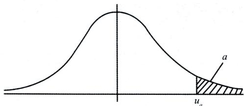
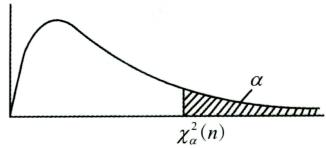
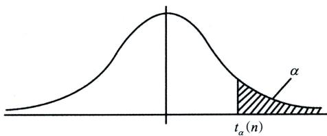
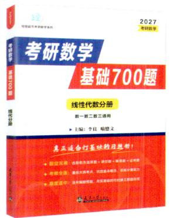
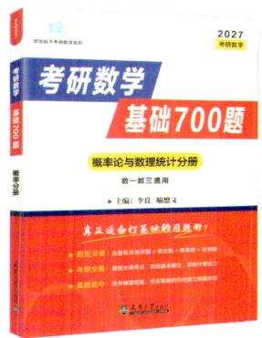
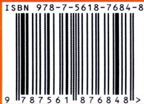

# 第一章 随机事件和概率

# 【题型一事件的关系与运算】

<基础知识回顾>

## 一、事件的关系

(1)包含关系： $A \subset B$ ,它表示事件A发生一定导致B发生.

(2)事件相等:若 $A \subset B$ 且 $B \subset A$ ,则称事件A与B相等，即 $A = B .$

(3)A和B的和事件：称事件 $A \cup B = \left\{ x \mid x \in A  或  x \in B \right\}$ 为A和 B的和事件.它表示A,B 两个事件至少有一个发生时事件A∪B发生，A∪B也记为A+B.

类似地，称 $\bigcup_{k = 1}^{n} A_{k}$ 为n个事件 $A_{1},A_{2},\cdots,A_{n}$ 的和事件.

(4)A和B的积事件：称事件 $A \cap B = \left\{ x \mid x \in A  且  x \in B \right\}$ 为A和 B的积事件.它表示A,B 两个事件同时发生时事件A∩B发生，A∩B也记为AB.

类似地，称 $\bigcap_{k = 1}^{n} A_{k}$ 为n个事件 $A_{1},A_{2},\cdots,A_{n}$ 的积事件.

(5)A和B的差事件：事件 $A-B=\left\{x\mid x\in A 且 x\notin B\right\}$ 称为事件A 和 B 的差事件.它表示 A发生且 B 不发生时事件A-B发生.A-B也可记为AB

(6)互斥事件(互不相容):当 $AB = \varnothing$ 时，称事件A与B互不相容(或互斥).它表示事件A与B不能同时发生.

(7)对立事件(逆事件):若 $A \cup B = O$ 且 $A \bigcap B = \varnothing$ ,则称A与B互为逆事件，也称互为对立事件.A的对 立事件记为A.

(8)完全(备)事件组:若事件组 $A_{1},A_{2},\cdots,A_{n}$ 满足： $A_{1} \cup A_{2} \cup \cdots \cup A_{n} = \Omega, A_{i}A_{j} = \varnothing, 1 \leq i \neq j \leq n$ ,则称事件$A_{1},A_{2},\cdots,A_{n}$ 是一个完全(备)事件组，也称为样本空间的一个划分

## 二、随机事件的运算律

(1)交换律： $A \cup B = B \cup A; A \cap B = B \cap A.$

(2)结合律： $A \cup (B \cup C) = (A \cup B) \cup C; A \cap (B \cap C) = (A \cap B) \cap C.$

(3)分配律： $A \cup (B \cap C) = (A \cup B) \cap (A \cup C); \quad A \cap (B \cup C) = (A \cap B) \cup (A \cap C).$

(4)对偶律(德摩根律): $\overline{A \cup B} = \overline{A} \cap \overline{B}, \overline{A \cap B} = \overline{A} \cup \overline{B}.$

## <精选例题>

【例1.1】以A表示事件“甲种产品畅销，乙种产品滞销”，则其对立事件À为().(A)“甲种产品滞销，乙种产品畅销” (B)“甲、乙两种产品均畅销”(C)“甲种产品滞销” (D)“甲种产品滞销或乙种产品畅销”

【解析】设事件B表示“甲种产品畅销”，事件C表示“乙种产品滞销”，故 $A = BC, \overline{A} = \overline{BC} = \overline{B} \cup \overline{C}$ ,所以A表示“甲种产品滞销或乙种产品畅销”.故应选(D).

【例1.2】对任意两事件A和B,与 $A \cup B = B$ 不等价的是( ).(A $) A \subset B$ (B $) \overline{B} \subset \overline{A}$ $A\overline{B} = \varnothing$ (D $\bar{A}B = \varnothing$

【解析 $A \cup B = B$ 等价于 $A \subset B$ 或 ${ \bar { \overline { { B } } } } \subset { \overline { { A } } }$ ,也说明A与 $\overline { { B } }$ 没有公共部分，即 $A\bar{B} = \varnothing.$ 故 $A \cup B = B$ 与(A)、(B)、(C)选项都等价.应选(D).

## 【题型二概率的性质】

## <基础知识回顾>

## 一、概率的性质

①非负性：设A为随机事件，则 $0 \leq P(A) \leq 1$

②规范性： $P(\varnothing)=0,P(\Omega)=1$

③有限可加性：设 $A_{1},A_{2},\cdots,A_{n}$ 是两两互不相容的事件，即对于 $i \ne j, A_i A_j = \varnothing, i, j = 1, 2, \cdots, n,$ 则有$P(A_{1} \cup A_{2} \cdots \cup A_{n}) = P(A_{1}) + P(A_{2}) + \cdots + P(A_{n})$

④逆事件的概率：对于任一事件A，有 $P(\overline{A}) = 1 - P(A)$

⑤设A,B是两个事件，若 $A \subset B$ ,则有 $P(A) \leq P(B)$ 且 $P(B - A) = P(B) - P(A)$

## 考点及方法小结

(1)互斥事件与对立事件的关系:对立一定互斥,但互斥不一定对立.

(2 $P(\varnothing)=0,P(\varnothing)=1$ .但概率为0的事件不一定是不可能事件,概率为1的事件不一定是必然事件(3)概率的不等式问题常涉及的知识点：

①0≤ P(A)≤1;

②若 $A \subset B$ ,则 $P(A) \leq P(B)$ i

③因 $AB \subset A \subset A + B$ ,故 $P(AB) \leqslant P(A) \leqslant P(A + B)$

(4)逆事件概率是解决复杂事件概率的一个重要思维： $P(\overline{A}) = 1 - P(A)$

## 后续更新公众号[有机研】永久联系微信4550060

## <精选例题>

【例1.3】设当事件A与B同时发生时，事件C必发生，则().(A $P(C) \leqslant P(A) + P(B) - 1$ (B $P(C) \geqslant P(A) + P(B) - 1$ (C )P(C) = P(AB) (D)P(C) = P(A∪B)

【解析】由A与B同时发生时，C一定发生得 $AB \subset C.$ 故 $P(AB) \leq P(C)$

又由 $P(A+B)=P(A)+P(B)-P(AB)$ ,得 $P(AB)=P(A)+P(B)-P(A+B)$

故有 $P(C) \geqslant P(A) + P(B) - P(A + B).$

又 $P(A + B) \leq 1$ ,故得 $P(C) \geqslant P(A) + P(B) - P(A + B) \geqslant P(A) + P(B) - 1$

## 良哥解读

事件A 发生一定导致事件 B 发生,表示事件A 与 B 具有包含关系,即 $A \subset B .$ 由概率的性质，事件有包含关系,进而得到事件概率的不等式关系.

【例1.4】设A,B为随机事件， $P(B)>0$ ,则().(A $P(A \cup B) \geq P(A) + P(B)$ (B $P(A - B) \geqslant P(A) - P(B)$ (C )P(AB)≥ P(A) P(B) (D $P(A \mid B) \geq \frac{P(A)}{P(B)}$

【解析 $P(A \cup B) = P(A) + P(B) - P(AB) \leq P(A) + P(B)$ ,选项(A)不成立.

因 $A B \subset B$ ,故 $P(AB) \leq P(B)$ ,从而有 $P(A - B) = P(A) - P(AB) \geqslant P(A) - P(B)$ ,故正确选项为(B).【例1.5】随机事件A,B,满足 $P(A)=P(B)=\frac{1}{2}$ 和 $P(A \cup B) = 1$ 则有( ).  
(A)A∪B=Ω (B)AB =∅  
(C $P(\overline{A} \cup \overline{B}) = 1$ (D $P(A - B) = 0$

$$
P(A \cup B) = 1, P(A) = P(B) = \frac{1}{2}
$$

$$
P(AB)=P(A)+P(B)-P(A\cup B)=0.
$$

$$
P(\overline{A} \cup \overline{B}) = P(\overline{A \cap B}) = 1 - P(AB) = 1
$$

## 良哥解读

概率为0的事件不一定是不可能事件,概率为1的事件不一定是必然事件,故(A)与(B)选项均不正确.

【例1.6】设事件A与事件B互不相容,则().(A $P(\overline{A}\overline{B}) = 0$ (B $P(AB)=P(A)P(B)$ (C) $P(A)=1-P(B)$ (D $P(\overline{A} \cup \overline{B}) = 1$

【解析】因为事件A与B互不相容，即 $AB = \varnothing$ ,则 $P(\overline{A} \cup \overline{B}) = P(\overline{A \cap B}) = 1 - P(AB) = 1$ 故应选(D).

## 良哥解读

此题主要考查三个概念:互不相容(互斥)、对立、独立的关系.事件对立则一定互斥，但互斥不一定对立,故(A)(C)选项可排除.事件互不相容(互斥)与事件独立没关系,它们互相都不能推出,故排除( B).

## 【题型三计算事件的概率】

## <基础知识回顾>

## 一、古典概型

## (一)定义

具有以下两个特点的试验称为古典概型：

(1)样本空间有限 $\Omega = \left\{ e_{1}, e_{2} \cdots e_{n} \right\}$

(2)等可能性 $P(e_{1}) = P(e_{2}) = \cdots = P(e_{n})$

## (二)计算方法

$$
P(A)=\frac{A 中基本事件的个数 k}{\Omega 中基本事件总数 n}
$$

## 二、几何概型

如果试验E是从某一线段(或平面、空间中有界区域)Ω上任取一点，并且所取得点位于Ω中任意两个长度(或平面、体积)相等的子区间(或子区域)内的可能性相同，则所取得点位于Ω中任意子区间(或子区域)A内这一事件(仍记作A)的概率为

$$
P(A)=\frac{A 的长度(或面积、体积) }{\Omega 的长度(或面积、体积) }
$$

## 三、计算概率的五大公式

## (一)加法公式

对于任意两个随机事件A与B,有

$$
P(A+B)=P(A)+P(B)-P(AB).
$$

对于任意三个事件A,B,C,有

后续更新公众号[有机研】永久聯系微信4550060

$$
P(A+B+C)=P(A)+P(B)+P(C)-P(AB)-P(BC)-P(AC)+P(ABC).
$$

## (二)减法公式

设A,B是两个事件，则

$$
P(A - B) = P(A\overline{B}) = P(A) - P(AB).
$$

## (三)乘法公式

设A,B是两个随机事件，若 $P(A)>0$ ,则有

$$
P(AB)=P(B|A)P(A).
$$

设A,B,C为三个随机事件,若P(AB)> 0,则有

$$
P(ABC)=P(C|AB)P(B|A)P(A).
$$

## (四)全概率公式

设 $A_{1},A_{2},\cdots,A_{n}$ 是一组完全事件组，且 $P(A_i)>0,i=1,2,\cdots,n$ ,则

$$
P(B)=\sum_{i = 1}^{n}P(A_{i})P(B|A_{i}).
$$

## (五)贝叶斯公式

设 $A_{1},A_{2},\cdots,A_{n}$ 是一组完全事件组， $P(B)>0,P(A_{i})>0,i=1,2,\cdots,n$ ,则

$$
P(A_i|B)=\frac{P(A_i)P(B|A_i)}{\sum\limits_{i=1}^{n}P(A_i)P(B|A_i)} \quad (i=1,2,\cdots,n).
$$

## 四、条件概率

## (一)条件概率的定义

设A,B是两个随机事件，且 $P(A)>0$ ,称 $P(B \mid A) = \frac{P(AB)}{P(A)}$ 为在事件A发生的条件下事件B发生的条件概率.

## (二)条件概率的性质

若 $P(A)>0$ ,则有

①非负性： $P(B \mid A) \geq 0$

②规范性： $P(\Omega \mid A) = 1$

③可列可加性：设 $B_{1},B_{2},\cdots$ 是两两互不相容的事件，则有

$$
P(\bigcup_{i = 1}^{\infty} B_i \mid A) = \sum_{i = 1}^{\infty} P(B_i \mid A).
$$

## (三)条件概率的逆事件概率公式

$$
P(\overline{B} \mid A) = 1 - P(B \mid A).
$$

(四)条件概率的加法公式

$$
P \left[ \left( B _ { 1 } + B _ { 2 } \right) \mid A \right] = P \left( B _ { 1 } \mid A \right) + P \left( B _ { 2 } \mid A \right) - P \left( B _ { 1 } B _ { 2 } \mid A \right) .
$$

五、事件的独立性

## (一)两个事件独立的定义

设A,B是两个随机事件，若满足等式 $P(AB)=P(A)P(B)$ ,则称事件A,B相互独立，简称事件A,B独立.

## (二)两个事件独立的性质

若事件A,B相互独立，则下列各对事件也相互独立：A与 $\overline{B}, \overline{A}$ 与 $B , \overline { { A } }$ $\overline{B}.$

## (三)两个事件独立的等价说法

若 $0 < P(A) < 1$ ,则事件A,B独立 $\Leftrightarrow P(B)=P(B \mid A) \Leftrightarrow P(B)=P(B \mid \overline{A}) \Leftrightarrow P(B \mid A)=P(B \mid \overline{A}).$

## (四)三个事件的两两独立性

设A,B,C是三个事件，如果满足等式

$$
\begin{cases}P(AB) = P(A)P(B), \\P(AC) = P(A)P(C), \\P(BC) = P(B)P(C),\end{cases}
$$

则称三个事件A,B,C两两独立.

## (五)三个事件的相互独立性

如果满足等式

$$
\begin{cases}P(AB) = P(A)P(B), \\P(AC) = P(A)P(C), \\P(BC) = P(B)P(C), \\P(ABC) = P(A)P(B)P(C),\end{cases}
$$

则称三个事件A,B,C相互独立.

后续更新公众号[有机研】永久联系微信4550060

## 考点及方法小结

(1)考生需熟记计算事件概率的五大公式(加法、减法、乘法、全概率和贝叶斯公式).

(2)全概率公式的适用场景.

①计算复杂事件概率的两个重要思维:逆事件思维与全概率思维.若计算复杂事件概率时,逆事件不能解决,则想到用全概率公式解决.

②若一个试验可以看成分两个阶段完成,第一个阶段的具体结果未知,但所有可能结果已知,求第二个阶段某个结果发生的概率,用全概率公式.全概率公式的关键是完全事件组,第一个阶段的所有可能结果即为完全事件组

## (3)事件独立性涉及的几个考点.

①独立和互斥的关系:独立不一定互斥,互斥也不一定独立.对于非0概率事件,独立一定不互斥,互斥一定不独立.

②概率为0或概率为1的事件与任何事件都独立.特殊地,不可能事件与任何事件既独立又互斥.

③判定事件独立性.

两个事件独立： $P(AB)=P(A)P(B)$

三个事件两两独立 $\begin{aligned}:\left\{\begin{aligned}P(AB) &= P(A)P(B), \\P(AC) &= P(A)P(C), \\P(BC) &= P(B)P(C).\end{aligned}\right.\end{aligned}$

三个事件相互独立 $\begin{aligned}&\therefore \left\{\begin{aligned}P(AB) &= P(A)P(B), \\P(AC) &= P(A)P(C), \\P(BC) &= P(B)P(C), \\P(ABC) &= P(A)P(B)P\end{aligned}\right.\end{aligned}$

④三个事件两两独立与相互独立的关系.

三个事件相互独立一定两两独立，但两两独立不一定相互独立.

(4)几何概型的应用场景.

①在某个区间(区域)内随机取数或者任意取点.

②在某段时间内随机到达某个地方.

③在某个区间(区域)内任意子区间(子区域)上取值概率与该区间(区域)的长度(面积)成正比.

## <精选例题>

【例1.7】设两个相互独立的事件A和B都不发生的概率为 $\frac{1}{9}, \dot{A}$ 发生B不发生的概率与B发生A不发生的概率相等,则P(A)=

【解析】由题意知 $P(\overline{A}\overline{B})=\frac{1}{9},P(A\overline{B})=P(B\overline{A})$ ,由减法公式有

$$
P(A\overline{B})=P(A)-P(AB),P(B\overline{A})=P(B)-P(AB),
$$

故有 $P(A)=P(B)$ ,因A,B相互独立,则 $\overline { { A } }$ 与 $\overline{B}$ 相互独立，所以

$$
P(\overline{A}\overline{B}) = P(\overline{A})P(\overline{B}) = \left[P(\overline{A})\right]^2 = \frac{1}{9},
$$

解之有得 $P(\overline{A}) = \frac{1}{3}$ ,故 $P(A)=1-P(\overline{A})=\frac{2}{3}.$

【例1.8】设随机事件A与B相互独立，A与C相互独立， $BC = \varnothing$ 若 $P(A)=P(B)=\frac{1}{2}$ $P(AC|AB\cup C)=\frac{1}{4}$ ,则 P(C) =

【解析】

$$
\begin{aligned}P(AC \mid AB \cup C) = \frac{P\left[AC(AB \cup C)\right]}{P(AB \cup C)} = \frac{P(ABC \cup AC)}{P(AB) + P(C) - P(ABC)} \\= \frac{P(AC)}{P(AB) + P(C) - P(ABC)},\end{aligned}
$$

又 $BC = \varnothing$ 则P(ABC)= 0.因随机事件A与 B相互独立，A与C相互独立,所以

$$
P(AC \mid AB \cup C) = \frac{P(AC)}{P(AB) + P(C)} = \frac{P(A)P(C)}{P(A)P(B) + P(C)} = \frac{\frac{1}{2}P(C)}{\frac{1}{4} + P(C)} = \frac{1}{4}
$$

解之得 $P(C)=\frac{1}{4}.$

【例1.9】设A,B,C为三个随机事件，A与B互不相容，A与C互不相容，B与C相互独立，且$P(A)=P(B)=P(C)=\frac{1}{3}$ ,则 $P(B \cup C \mid A \cup B \cup C) =$

【解析】因 $P(B \cup C \mid A \cup B \cup C) = \frac{P[(B \cup C)(A \cup B \cup C)]}{P(A \cup B \cup C)} = \frac{P(B \cup C)}{P(A \cup B \cup C)}$ ,而

$$
P(B \cup C) = P(B) + P(C) - P(BC) = \frac{1}{3} + \frac{1}{3} - \frac{1}{3} \times \frac{1}{3} = \frac{5}{9},
$$

$$
\begin{aligned}P(A \cup B \cup C) &= P(A) + P(B) + P(C) - P(AB) - P(AC) - P(BC) + P(ABC) \\&= 1 - 0 - 0 - \frac{1}{3} \times \frac{1}{3} + 0 = \frac{8}{9},\end{aligned}
$$

故 $P(B \cup C \mid A \cup B \cup C) = \frac{\frac{5}{9}}{\frac{8}{9}} = \frac{5}{8}.$

【例1.10】设A,B,C为三个随机事件，且$P(A)=P(B)=P(C)=\frac{1}{4},P(AB)=0,P(AC)=P(BC)=\frac{1}{12},$

则A,B,C恰有一个事件发生的概率为().(A $) \frac{3}{4}.$ (B $) \frac{2}{3}.$ (C $ ) \frac{1}{2}.$ (D) $0 \frac { 5 } { 1 2 } .$

【解析】事件A,B,C中恰有一个发生的概率可用至少一个发生的概率减去至少两个发生的概率表示，即 $P(A\bar{B}\bar{C}+\bar{A}B\bar{C}+\bar{A}\bar{B}C)=P(A+B+C)-P(AB+AC+BC)$

而 $P(A+B+C)=P(A)+P(B)+P(C)-P(AB)-P(AC)-P(BC)+P(ABC)$ ,因 $P(AB)=0$ ,故 $P(ABC)=0$ 从而

$$
P(A+B+C)=\frac{3}{4}-0-\frac{1}{12}-\frac{1}{12}+0=\frac{7}{12}
$$

## 后续更新公众号【有机研】永久取系微信4550060

$$
P(AB + AC + BC) = P(AB) + P(AC) + P(BC) - P(ABC) - P(ABC) - P(ABC) + P(ABC) = 0 + \frac{1}{12} + \frac{1}{12} - 0 = \frac{1}{6},
$$

故 $P(A\bar{B}\bar{C}+\bar{A}B\bar{C}+\bar{A}\bar{B}C)=\frac{7}{12}-\frac{1}{6}=\frac{5}{12}.$ 故应选(D).

【例1.11】设A,B为两个随机事件，且A与B相互独立.已知 $P(A)=2P(B),P(A \cup B)=\frac{5}{8}$ ,则在A,B至少有一个发生的条件下A,B中恰有一个发生的概率为

【解析】设 $P(B) = p$ ，则 $P(A)=2p.$ 因 $P(A \cup B) = P(A) + P(B) - P(AB) = \frac{5}{8},$ 且A与B相互独立，即$P(AB)=P(A)P(B)$ ,故有 $3p - 2p^{2} = \frac{5}{8},$ 解得 $p = \frac{1}{4}$ 或 $p = \frac{5}{4} ($ 舍去)，从而得 $P(B)=\frac{1}{4},P(A)=\frac{1}{2},P(AB)=\frac{1}{8}.$ 则A,B至少有一个发生的条件下A,B中恰有一个发生的概率为

$$
\begin{aligned}P(A\overline{B} \cup \overline{A}B \mid A \cup B) &= \frac{P[(A\overline{B} \cup \overline{A}B)(A \cup B)]}{P(A \cup B)} = \frac{P(A\overline{B} \cup \overline{A}B)}{P(A \cup B)} \\&= \frac{P(A\overline{B}) + P(\overline{A}B)}{P(A \cup B)} = \frac{P(A) - P(AB) + P(B) - P(AB)}{P(A \cup B)} \\&= \frac{P(A) + P(B) - 2P(AB)}{P(A \cup B)} = \frac{\frac{1}{2} + \frac{1}{4} - \frac{1}{4}}{\frac{5}{8}} = \frac{4}{5}.\end{aligned}
$$

【例1.12】从0,1,2,…,9这十个数字中任意选出三个不同数字，试求下列事件的概率 $:A_{1} = \left\{ \begin{aligned} \end{aligned} \right.$ 三个数字中不含0和5} $A_{2} = \{  三$ 个数字中不含0或 $\{ 5 \} ; A_{3} = \{$ 三个数字中含0但不含5}.

【解析】设事件 $B_{1} = \left\{  三  \right.$ 个数字中不含0}， $B_{2} = \left\{  三  \right.$ 个数字中不含5}，则

$$
\begin{aligned}P(A_{1}) &= \frac{C_{8}^{3}}{C_{10}^{3}} = \frac{7}{15}, \\P(A_{2}) &= P(B_{1} \cup B_{2}) = 1 - P(\overline{B_{1}} \cup \overline{B_{2}}) = 1 - P(\overline{B_{1}} \overline{B_{2}}) = 1 - \frac{C_{8}^{1}}{C_{10}^{3}} = \frac{14}{15}, \\P(A_{3}) &= P(\overline{B_{1}}B_{2}) = P(B_{2}) - P(B_{1}B_{2}) = \frac{C_{9}^{3}}{C_{10}^{3}} - \frac{C_{8}^{3}}{C_{10}^{3}} = \frac{7}{30}.\end{aligned}
$$

【例1.13】10个同规格的零件中混入3个次品，现进行逐个检查，则查完第5个零件时正好查出第3个次品的概率为

【解析】记 $A = \mathbf{\Omega}$ 查完第5个零件正好查出第3个次品”.事件A由两个事件组成： $B = \begin{aligned} \cdots \end{aligned}$ 前4次检查，查出2个次品”和 $C = \mathrm { { } ^ { \circ } }$ 第5次检查，查出的零件为次品”，即 $A = BC$ ，由乘法公式， $P(A)=P(BC)=P(B)P(C \mid B)$

事件B是前4次检查中有2个正品2个次品所组合，故 $P(B)=\frac{C_{3}^{2}\cdot C_{7}^{2}}{C_{10}^{4}}=\frac{3}{10}.$

已知B发生的条件下，也就是已检查了2正2次，剩下6个零件，其中5正1次，再要抽检一个恰是次品的概率 $P(C|B)=\frac{1}{6}$ ,则 $P(A)=\frac{3}{10}\cdot\frac{1}{6}=\frac{1}{20}.$

【例1.14】已知甲袋有3个白球，6个黑球，乙袋有5个白球，4个黑球.先从甲袋中任取一球放入乙袋，然后再从乙袋中任取一球放回甲袋，则甲袋中白球数不变的概率为

【解析】记 $A = \begin{aligned} \cdots \end{aligned}$ 经过两次交换，甲袋中白球数不变”， $B = \frac{\alpha}{}$ 从甲袋中取出一个白球放入乙袋”， $C = \mathrm{ " }$ 从乙

袋中取出一个白球放入甲袋”，则 $A = BC \cup \overline{B} \overline{C}$ ,那么，

$$
P(A)=P(BC)+P(\bar{B}\bar{C})=P(B)P(C\mid B)+P(\bar{B})P(\bar{C}\mid \bar{B})=\frac{3}{9}\cdot \frac{6}{10}+\frac{6}{9}\cdot \frac{5}{10}=\frac{8}{15}
$$

【例1.15】设袋中有红、白、黑球各1个，从中有放回地取球，每次取1个，直到三种颜色的球都取到时停止，则取球次数恰好为4的概率为

【解析】法一:设所求事件为A，则 $A = 4$ 第四次出现1种颜色的球，前三次出现另外两种颜色的球”，从袋中有放回地取4次球，共有 $3^{4}$ 个基本结果，事件A包含的基本结果数为 $3 \times 3 \times 2$ ,所以

$$
P(A)=\frac{3\times3\times2\times1}{3^{4}}=\frac{2}{9}.
$$

法二:设A表示事件“直到三种颜色的球都取到时停止，取球次数恰好为 $4 , A_{1}$ 表示事件“第4次取到红球”， $A _ { 2 }$ 表示事件“第4次取到白球”， $A _ { 3 }$ 表示事件“第4次取到黑球”，则

$$
P(A_{1}) = P(A_{2}) = P(A_{3}) = \frac{1}{3}.
$$

在 $A _ { 1 }$ 发生的条件下，A发生当且仅当前3次取到2个白球1个黑球或1个白球2个黑球，从而$P(A|A_{1}) = 2 \times \frac{3}{3^{3}} = \frac{2}{9}$ 同理， $P(A|A_{2})=P(A|A_{3})=\frac{2}{9}$ ,则

$$
P(A)=P(A_{1})P(A|A_{1})+P(A_{2})P(A|A_{2})+P(A_{3})P(A|A_{3})=\frac{2}{9}.
$$

## 良哥解读

法一中分子事件个数 $3 \times 3 \times 2 \times 1$ 的由来：因为第一次是在三种颜色中任意取一种,故有三种取法；第二次也是在三种颜色中任意取一种,也是有三种取法;第三次取球时,若前两次取到的是不同的颜色，则需在前两次不同颜色中取一种,有两种取法,若前两次取到的颜色相同,则需要在剩下的两种颜色中取一种,同样也是两种取法;第四次取时,只能是取到前三次没有取到的颜色,正好三种颜色取完,故第四次是一种取法.从而分子中事件个数为 $3 \times 3 \times 2 \times 1$

【例1.16】三个箱子，第一个箱子中有4个黑球1个白球，第二个箱子中有3个黑球3个白球，第三个箱子中有3个黑球5个白球.现随机地取一个箱子，再从这个箱子中取出1个球，这个球为白球的概率等于.已知取出的球是白球，此球属于第二个箱子的概率为

【解析】设 $A _ { i }$ 表示球取自第i个箱子 $(i = 1,2,3);B$ 表示取出的为白球.

(1)由全概率公式： $P(B)=\sum_{i=1}^{3}P(B|A_{i})P(A_{i})=\frac{1}{3}\times\frac{1}{5}+\frac{1}{3}\times\frac{1}{2}+\frac{1}{3}\times\frac{5}{8}=\frac{53}{120}.$

(2)由贝叶斯公式： $P(A_{2}|B)=\frac{P(A_{2}B)}{P(B)}=\frac{P(A_{2})P(B|A_{2})}{P(B)}=\frac{\frac{1}{3}\times\frac{1}{2}}{\frac{53}{120}}=\frac{20}{53}.$

【例1.17】在区间(0,1)中随机地取两个数，则这两数之差的绝对值小于 $\frac{1}{2}$ 的概率为

【解析】在区间内随机取数问题对应的是几何概型.设 $x , y$ 表示所取的两个数，则样本空间$\Omega=\left\{(x,y)|0<x<1,0<y<1\right\}$ ,记 $A =$ 两数之差的绝对值小于 $\frac{1}{2} ''$ ,则 $A = \left\{ (x,y) \mid (x,y) \in \Omega, |x - y| < \frac{1}{2} \right\}$

如图，由几何概型计算概率公式有

后续更新公众号[有机研】永久联系微信4550060

$$
P(A)=\frac{S_{_A}}{S_{_{\mathcal{Q}}}}=\frac{\displaystyle\frac{3}{4}}{1}=\frac{3}{4},
$$

其中， $,S_{_A},S_{_{\mathcal{Q}}}$ 分别表示A与 $\mathcal { Q }$ 的面积.

【例1.18】将一根长为L的木棒随机折成三段，记事件 $A = { } ^ { \leftarrow } \left[ \right.$ 中间一段为三段中长度最大的”，则 $P(A)=$ ().(A) $0 \frac { 1 } { 2 }$ (B $) \frac{1}{3}$ (C $) \frac{1}{4}$ (D $2 \frac { 2 } { 3 }$

【解析】设折得的三段长度依次为 $x , L - x - y , y$ ,则样本空间为

$$
\Omega=\left\{(x,y)\mid 0<x<L,0<y<L,0<x+y<L\right\}.
$$

随机事件A相应的区域 $\mathcal { Q }$ 应满足 $0<x<L-x-y,0<y<L-x-y,$ 即

$$
\left\{ (x,y) \mid x > 0, 0 < y < L - 2x, 0 < y < \frac{L - x}{2} \right\}.
$$

如图所示，容易计算Ω的面积为 $\frac{1}{2}L^{2},Q$ 的面积为 $\frac{1}{6}L^{2}$ ,故

$$
P(A)=\frac{\frac{1}{6}L^{2}}{\frac{1}{2}L^{2}}=\frac{1}{3}
$$

故正确答案为(B).

【例1.19】甲、乙两人独立地对同一目标各射击一次，其命中率分别为0.6和0.5,现已知目标被命中，则它是甲射中的概率为

【解析】设事件A表示甲命中，B表示乙命中.由题意，A与B相互独立.又 $P(A)=0.6,P(B)=0.5$ ,则

$$
P(AB)=P(A)\cdot P(B)=0.6\times0.5=0.3.
$$

目标命中即甲命中或者乙命中可用事件 $ \text{" }A \cup B \text{" }$ 表示，因此要求概率为

$$
P(A \mid A \cup B) = \frac{P[A(A \cup B)]}{P(A \cup B)} = \frac{P(A)}{P(A) + P(B) - P(AB)} = \frac{0.6}{0.6 + 0.5 - 0.3} = \frac{3}{4}.
$$

【例1.20】某人打靶的命中率为，当他连续独立射击三次后检查目标，发现靶已命中，则他在第1次 $\frac{1}{2}.$ 射击时就命中目标的概率为().(A $0 \frac{3}{8}$ (B $) \frac{1}{2}$ (C $0 \frac{3}{7}$ (D $) \frac{4}{7}$

【解析】设A表示“第i次命中 $(i = 1,2,3)$ ，由题意知， $A_{1},A_{2},A_{3}$ 相互独立，且 $P(A_{i}) = \frac{1}{2}$ ,故

$$
p = P\left(A_{1} \mid A_{1} + A_{2} + A_{3}\right) = \frac{P\left(A_{1}\right)}{P\left(A_{1} + A_{2} + A_{3}\right)} = \frac{\frac{1}{2}}{1 - P\left(\overline{A_{1}} \overline{A_{2}} \overline{A_{3}}\right)} = \frac{\frac{1}{2}}{1 - \frac{1}{2} \times \frac{1}{2} \times \frac{1}{2}} = \frac{4}{7}.
$$

故应选(D).

【例1.21】假设一批产品中一、二、三等品各占 $60\%,30\%,10\%,$ 从中随意取出一件，结果不是三等品，则取到的是一等品的概率为

【解析】设事件 $A_{i} =  \text{" }$ 取到的是第i等品 $i = 1,2,3$ ,则由题意有

$$
P(A_{1}) = 0.6, P(A_{3}) = 0.1, P(A_{1}A_{3}) = 0.
$$

由条件概率公式有

$$
P(A_{1} \mid A_{3}) = \frac{P(A_{1} \overline{A_{3}})}{P(A_{3})} = \frac{P(A_{1}) - P(A_{1}A_{3})}{1 - P(A_{3})} = \frac{P(A_{1})}{1 - P(A_{3})} = \frac{0.6}{0.9} = \frac{2}{3}.
$$

【例1.22】设A,B为随机事件，且 $0 < P(B) < 1$ ,下列命题中为假命题的是( ).(A)若 $P(A \mid B) = P(A)$ ,则 $P(A \mid \overline{B}) = P(A)$   
(B)若 $P(A \mid B) > P(A)$ ,则 $P(\overline{A} \mid \overline{B}) > P(\overline{A})$   
(C)若 $P(A \mid B) > P(A \mid \overline{B})$ ,则 $P(A \mid B) > P(A)$   
(D)若 $P(A \mid A \cup B) > P(\overline{A} \mid A \cup B)$ ,则 $P(A) > P(B)$

【解析】对于（A）选项：由 $P(A \mid B) = P(A)$ ，知A,B相互独立，故A与 $\overline{B}$ 相互独立，从而有$P(A \mid \overline{B}) = P(A)$ 故(A)正确.

对于(B)选项：由 $P(A \mid B) > P(A)$ ,得 $P(AB) > P(A)P(B)$

$$
\frac{P(\overline{A} \mid \overline{B}) = P(\overline{A} \mid \overline{B}) = P(\overline{A} + \overline{B})}{P(\overline{B})} = \frac{1 - P(A + B)}{1 - P(B)} = \frac{1 - P(A) - P(B) + P(AB)}{1 - P(B)}.
$$

$\frac{1 - P(A) - P(B) + P(A)P(B)}{1 - P(B)} = 1 - P(A) = P(\overline{A})$ 故(B)正确.

对于(C)选项：由 $P(A \mid B) > P(A \mid \overline{B})$ ,得 $P(AB) > P(A)P(B)$ ,而

$P(A \mid B)=\frac{P(AB)}{P(B)}>\frac{P(A)P(B)}{P(B)}=P(A)$ ,故(C)正确，由排除法知应选(D).

事实上对于(D)选项：由 $P(A \mid A \cup B) > P(\overline{A} \mid A \cup B)$ ,得

$P[A(A \cup B)] > P[\overline{A}(A \cup B)]$ ,即 $P(A)>P(\overline{A}B)=P(B)-P(AB)$

后续更新公众号[有机研】永久联系微信4550060此时无法比较P(A)与P(B)的大小. 故应选(D).

【例1.23】设A,B为随机事件，若 $0 < P(A) < 1, 0 < P(B) < 1$ ,则 $P(A \mid B) > P(A \mid \overline{B})$ 的充分必要条件是().(A $P(B \mid A) > P(B \mid \overline{A})$ (B $P(B \mid A) < P(B \mid \overline{A})$ (C $P(\overline{B} \mid A) > P(B \mid \overline{A})$ (D $P(\overline{B} \mid A) < P(B \mid \overline{A})$

【解析】因 $P(A \mid B) > P(A \mid \bar{B})$ 等价于 $\frac{P(AB)}{P(B)} > \frac{P(AB)}{P(\overline{B})}$ ,又

$$
P(A\bar{B}) = P(A) - P(AB),P(\bar{B}) = 1 - P(B),
$$

可得 $P(A \mid B) > P(A \mid \bar{B})$ 等价于 $P(AB) > P(A)P(B)$

对于(A)选项:因 $P(B \mid A) > P(B \mid \bar{A})$ 等价于 $\frac{P(AB)}{P(A)} > \frac{P(\overline{B} \overline{A})}{P(\overline{A})}$ ,又$P(B\overline{A}) = P(B) - P(AB),P(\overline{A}) = 1 - P(A).$

整理得 $P(B \mid A) > P(B \mid \bar{A})$ 等价于 $P(AB) > P(A)P(B)$ .故应选(A).

【例1.24】设A,B,C为随机事件，A与B相互独立，P(C)=1.则可能不相互独立的事件组为().(A)A,B,A∪C (B) $A,B,A-C$   
(C)a,b,ac (D $A,B,\overline{A}\overline{C}$

【解析】由于P(C)=1,故 $P(\overline{C}) = 0$ ,所以

$$
P(A \cup C) = 1, P(A - C) = 0, P(\overline{A} \overline{C}) = 0.
$$

由“概率为0或1的事件与任意事件相互独立”且A与B相互独立，故(A)(B)(D)中的事件组相互独立,应选(C).

事实上对于(C)选项，由于P(C)=1,若 $0 < P(A) < 1$ ,则

$$
P(AAC)=P(AC)=P(A)\ne P(A)P(AC)=P(A)\cdot P(A),
$$

故A与AC不独立，因此(C)中的事件组A,B,AC不相互独立.

【例1.25】设A,B,C三个事件两两独立，则A,B,C相互独立的充分必要条件是().(A)A与BC独立 (B)AB与A∪C独立(C)AB 与AC独立 (D)A∪B与A∪C独立

【解析】A,B,C相互独立的充要条件是A,B,C事件两两独立且满足 $P(ABC)=P(A)P(B)P(C)$ 因A,B,C两两独立,故只需验证 $P(ABC)=P(A)P(B)P(C)$ 即可.  
对于(A)选项:若A与BC独立，则 $P(ABC)=P(A)P(BC)=P(A)P(B)P(C)$   
故应选(A).

【例1.26】设A,B,C为三个随机事件，且A与C相互独立，B与C相互独立，则A∪B与C相互独立的充分必要条件是( ).(A)A与B相互独立 (B)A与B互不相容(C)AB 与C相互独立 (D)AB与C互不相容

【解析 $\mathcal{M} \cup B$ 与C相互独立的充分必要条件是 $P[(A \cup B)C] = P(A \cup B)P(C)$ 因为

$$
P[(A \cup B)C] = P(AC \cup BC) = P(AC) + P(BC) - P(ABC),
$$

## 后续更新公众号[有机研】永久联系微信4550060

又A与C相互独立，B与C相互独立，故

$$
P [ ( A \bigcup B ) C ] = P ( A ) P ( C ) + P ( B ) P ( C ) - P ( A B C ) .
$$

而

$$
\begin{aligned}P(A \cup B)P(C) = & \left[P(A) + P(B) - P(AB)\right]P(C) \\= & P(A)P(C) + P(B)P(C) - P(AB)P(C),\end{aligned}
$$

因此等式 $P[(A \cup B)C] = P(A \cup B)P(C)$ 成立的充分必要条件为 $P(ABC)=P(AB)P(C)$ ,即AB 与C相互独立.  
故应选(C).【例1.27】袋中有4个球，1个红色球，1个蓝色球，1个绿色球，1个红、蓝、绿兼色球.从中随机地取出  
一个球，设事件 $A_{1} = 1$ 取出的球上有红色} $,A_{_2} = \left\{ \begin{array}{l}  \\  \end{array} \right.$ 取出的球上有蓝色} $A_{3} = \left\{ \begin{aligned} \end{aligned} \right.$ 取出的球上有绿色} $,A_{4} = \left\{ \begin{aligned} \end{aligned} \right.$ 取出的  
球上红、蓝、绿色都有}，则事件().(A $A_{1},A_{2},A_{3}$ 相互独立 (B $A_{2},A_{3},A_{4}$ 相互独立(C $A_{1},A_{2},A_{3}$ 两两独立 (D $A_{2},A_{3},A_{4}$ 两两独立

【解析】由已知条件知，

$$
P(A_{1}) = P(A_{2}) = P(A_{3}) = \frac{1}{2},P(A_{4}) = \frac{1}{4},
$$

$$
P(A_{1}A_{2}) = P(A_{1}A_{3}) = P(A_{1}A_{4}) = P(A_{2}A_{3}) = P(A_{2}A_{4}) = P(A_{3}A_{4}) = \frac{1}{4},
$$

$$
P(A_{1}A_{2}A_{3})=\frac{1}{4}\ne P(A_{1})P(A_{2})P(A_{3}),
$$

显然 $A_{1},A_{2},A_{3}$ 两两独立，但并不相互独立，故应选(C).

## 【题型四伯努利概型】

## <基础知识回顾>

## 一、伯努利试验与n重伯努利试验

只有两个结果A和 $\overline { { A } }$ 的试验称为伯努利试验.若将伯努利试验独立重复地进行n次，称为n重伯努利试验.

## 二、二项概率公式

设在每次试验中，事件A发生的概率 $P(A)=p(0<p<1)$ ,在n重伯努利试验中，事件A发生k次记为$A _ { k }$ ,则事件A 发生k次的概率为

$$
P ( A _ { k } ) = C _ { n } ^ { k } p ^ { k } ( 1 - p ) ^ { n - k } , k = 0 , 1 , 2 , \cdots , n ,
$$

此公式称为二项概率公式

## 后续更新公众号[有机研】永久聯系微信4550060

## <精选例题>

【例1.28】设在一次试验中A发生的概率为p,现进行n次独立试验,则A至少发生一次的概率为;事件A至多发生一次的概率为

【解析】遇到做n次独立重复试验，求事件发生或不发生多少次的概率问题，通常用二项概率公式$P(A_{k}) = C_{n}^{k}p^{k}(1 - p)^{n - k},k = 0,1,2,\cdots,n$ 来计算 $(A_{k})$ 表示事件A发生的次数).

设 $A_{k}$ 表示A发生的次数 $(k = 0,1,2,\cdots,n).A$ 至少发生一次的概率为：

$$
1 - P(A_{0}) = 1 - C_{n}^{0}p^{0}(1 - p)^{n - 0} = 1 - (1 - p)^{n}.
$$

A至多发生一次的概率为：

$$
\begin{aligned}P(A_{0}) + P(A_{1}) &= C_{n}^{0}p^{0}(1 - p)^{n} + C_{n}^{1}p^{1}(1 - p)^{n - 1} \\&= (1 - p)^{n} + np(1 - p)^{n - 1}.\end{aligned}
$$

【例129】随机试验每次成功的概率为n.现进行三次独立重复实验，已知至少成功一次的条件下全部 $p$ 成功的概率为 $\frac{4}{13}$ ,则 $p =$

【解析】设 $A _ { i }$ 表示第i次成功(i =1,2,3). 由题意有

$$
P(A_{1}A_{2}A_{3}|A_{1}+A_{2}+A_{3})=\frac{4}{13},
$$

则

$$
\frac{P\left[A_{1}A_{2}A_{3}\left(A_{1}+A_{2}+A_{3}\right)\right]}{P\left(A_{1}+A_{2}+A_{3}\right)}=\frac{P\left(A_{1}A_{2}A_{3}\right)}{P\left(A_{1}+A_{2}+A_{3}\right)}=\frac{4}{13},
$$

即有 $\frac{p^{3}}{1 - (1 - p)^{3}} = \frac{4}{13}$ ,解之得 $p = \frac{2}{3}.$

【例1.30】假设一厂家生产的每台仪器，以概率0.70可以直接出厂；以概率0.30需进一步调试,经调试后以概率0.80可以出厂:以概率0.20定为不合格品不能出厂.现该厂新生产了 $n(n \geq 2)$ 台仪器(假设各台仪器的生产过程相互独立）.求：

(1)全部能出厂的概率 $\alpha ;$

(2)其中恰好有两台不能出厂的概率 $\beta ;$

(3)其中至少有两台不能出厂的概率θ.

【解析】设事件A表示“仪器需进一步调试”，B表示“仪器能出厂”，令 $p = P(B)$ ，由全概率公式有

$$
p = P(B) = P(A)P(B \mid A) + P(\overline{A})P(B \mid \overline{A}) = 0.8 \times 0.3 + 1 \times 0.7 = 0.94.
$$

设X表示 $a_{n}$ 台仪器中能出厂的台数”，故：

(1) $\alpha = P\{ X = n \} = C_{n}^{n} \cdot 0.94^{n} \cdot 0.06^{n - n} = 0.94^{n}$

(2)恰好两台不能出厂,说明有n-2台能出厂,故

$$
\beta = P\{ X = n - 2\} = C_{n}^{2} \cdot 0.94^{n - 2} \cdot 0.06^{2} = \frac{n(n - 1)}{2}0.94^{n - 2} \cdot 0.06^{2};
$$

(3)至少有两台不能出厂,说明能出厂的台数最多有n-2台,故

$$
\theta = P\{ X \leq n - 2\} = 1 - P\{ X = n - 1\} - P\{ X = n\} \\= 1 - \mathrm{C}_{n}^{n - 1} \cdot 0.94^{n - 1} \cdot 0.06 - 0.94^{n} \\= 1 - n \times 0.06 \times 0.94^{n - 1} - 0.94^{n}
$$

后续更新公众号[有机研）永久联系微信4550060

# 第二章 一维随机变量及其分布

# 【题型一分布函数的概念与性质】

<基础知识回顾>

## 一、随机变量分布函数的定义

设X是一个随机变量，对于任意实数x，令 $F(x)=P\left\{X\leqslant x\right\},-\infty<x<+\infty$ ,称 F(x) 为随机变量 X的概率分布函数，简称为分布函数

## 二、利用分布函数求各种随机事件的概率

已知随机变量X的分布函数 $F(x) = P\{ X \leq x\}$ ,则有

(1 $P\{ X \leqslant a\} = F(a);$

(3 $P\{ X < a\} = \lim_{x \to a^{-}} F(x) = F(a - 0);$

(5 $P\{ X = a\} = F(a) - F(a - 0);$

(7 $P\{ a \leqslant X < b\} = F(b - 0) - F(a - 0);$

(9 $P\{ a \leqslant X \leqslant b\} = F(b) - F(a - 0).$

(2 $P\{ X > a\} = 1 - F(a);$   
(4 $P\{ X \geq a\} = 1 - F(a - 0);$   
(6 $P\{ a < X \leq b\} = F(b) - F(a);$   
(8 $P\{ a < X < b\} = F(b - 0) - F(a);$

## 三、分布函数的性质

设随机变量X的分布函数为 $F(x) = P\{ X \leq x\}$ ,则 F(x) 满足

①非负性： $0 \leqslant F(x) \leqslant 1$

②规范性： $F(-\infty)=\lim_{x \to -\infty} F(x)=0,F(+\infty)=\lim_{x \to +\infty} F(x)=1$

③单调不减性：对于任意 $\overline{x_{1}} < \overline{x_{2}}$ ,有 $F(x_{1}) \leqslant F(x_{2})$

④右连续性： $F(x_{0}) = F(x_{0} + 0)$

## 考点及方法小结

(1)已知分布函数求某事件的概率,用知识二解决.

(2)求分布函数的未知参数,用知识三中的性质②或④解决.

(3)判定函数是否为分布函数,验证知识三中的四条性质,四条性质均满足即为分布函数,若有某一条后续不满是肯定不是分任函数，若有某不确定是否满足，则不确定是否为分布函数.

## <精选例题>

【例2.1】假设F(x)是随机变量X的分布函数，则不正确的是().(A)如果 $F(a) = 0$ ,则当 $x \leqslant a$ 时,有 $F(x) = 0$   
(B)如果 $F(a) = 1$ ,则当 $x \geqslant a$ 时,有 $F(x) = 1$   
(C)如果 $F(a)=\frac{1}{2}$ ,则 $P\left\{X\leqslant a\right\}=\frac{1}{2}$   
(D)如果 $F(a)=\frac{1}{2}$ ,则 $P\left\{X\geq a\right\}=\frac{1}{2}$

【解析】对于(A)选项,因为 $F(a) = 0$ ,即 $P\left\{X\leqslant a\right\}=0$ ,而当 $x \leq a$ 时， $\{ X \leqslant x \} \subset \{ X \leqslant a \}$ ,故 $P\left\{X\leqslant x\right\}=0$ 即 $F(x) = 0$ ,从而(A)正确.

对于(B)选项，因为 $F(a) = 1$ ,即 $P\left\{X\leqslant a\right\}=1$ ,而当 $x \geqslant a$ 时， $\{ X \leqslant a \} \subset \{ X \leqslant x \}$ ,故 $P\left\{X\leqslant x\right\}=1$ ,即$F(x) = 1$ ,从而(B)正确.

对于(C)选项,因 $F(a) = P\{X \leq a\}$ ,故(C)正确，从而应选(D).

事实上对于(D)选项，由 $F(a)=P\{X \leq a\}=\frac{1}{2}$ ,有 $P\left\{X\geq a\right\}=1-P\left\{X<a\right\}=1-F\left(a-0\right)$ ,但分布函数不一定左连续，即 $F(a - 0)$ 与F(a)不一定相等,从而 $P\left\{X\geq a\right\}=\frac{1}{2}$ 不一定成立.

【例2.2】设 $F_{1}(x)$ 与 $F_{2}(x)$ 为随机变量 $X _ { 1 }$ 与 $X_{2}$ 的分布函数.若 $F(x) = aF_1(x) - bF_2(x)$ 是某一变量的分布函数,在下列给定的各组数值中应取().(A $a=\frac{3}{5},b=-\frac{2}{5}$ (B $a = \frac{3}{5}, b = \frac{2}{3}$ (C $a=-\frac{1}{2},b=\frac{3}{2}$ (D $a=\frac{1}{2},b=-\frac{3}{2}$

【解析】若F(x)为分布函数，则 $\lim_{x \to +\infty} F(x) = 1$ ,故 $\lim_{x \to +\infty} \left[ aF_1(x) - bF_2(x) \right] = a - b = 1$ ，由于四个选项中只有(A)满足此条件.故应选(A).

## 良哥解读

设 $F_{1}(x)$ 与 $\bar{F}_{2}(x)$ 均为分布函数， $F(x)=aF_{1}(x)+bF_{2}(x)$ ,若 $a \geqslant 0,b \geqslant 0$ ,且 $a+b=1$ ,则 $F(x) -$ 定为某个随机变量的分布函数.

【例2.3】设随机变量X的分布函数为 $F(x)$ ,则下列可作为某个随机变量分布函数的是().(A $\lambda F(ax)$ (B $F(x^{2} + 1)$ (C $F(x^{3} - 1)$ (D $\textcircled{y} F ( \left| x \right| )$

【解析】对于(A)选项，当 $a < 0$ 时 $\lim_{x \to -\infty} F(ax) = 1$ ,故 F(ax)不一定是分布函数.

对于(B)选项，因 $\lim_{x \to -\infty} F(x^2 + 1) = 1$ ,故 $F(x^{2} + 1)$ 一定不是分布函数.

对于(C)选项，因 $0 \leqslant F(x^{3} - 1) \leqslant 1$ $\lim_{x \to -\infty} F(x^3 - 1) = 0, \lim_{x \to +\infty} F(x^3 - 1) = 1$ ，且满足单调不减性和右连续性，故$F(x^{3} - 1)$ 一定是分布函数,应选(C).

对于(D)选项，因 $\lim_{x \to -\infty} F(|x|) = 1$ ,故 $F ( \left| x \right| )$ 一定不是分布函数.

【例2.4】设随机变量X的分布函数为 $\frac{F(x)}{\left ( \frac{5x + 7}{16} \right ) }=\left\{\begin{aligned}&\frac{5x + 7}{16}, & -1 \leq x < 1, \\&1, & x \geq 1,\end{aligned}\right.$ 则 $P\left\{X^{2}=1\right\}=$ 后续更新公众号[有机永久联系微信4550060

【解析】因 $P\left\{X^{2}=1\right\}=P\left\{X=1\right\}+P\left\{X=-1\right\}$ ,而

$$
P\left\{X=1\right\}=F(1)-F(1-0)=1-\frac{3}{4}=\frac{1}{4},
$$

$$
P\left\{X=-1\right\}=F(-1)-F(-1-0)=\frac{1}{8}-0=\frac{1}{8},
$$

故 $P\left\{X^{2}=1\right\}=\frac{3}{8}.$

## 【题型二一维离散型随机变量及其分布】

# <基础知识回顾>

## 一、离散型随机变量的定义

若随机变量X的取值是有限个或者可列无穷多个，则称X为离散型随机变量

## 二、离散型随机变量的分布律

设X为离散型随机变量，其所有可能取值为 $x_{1},x_{2},\cdots,x_{k},\cdots$ ，且X取各个值x,的概率为 $x _ { k }$ $P\left\{X=x_{k}\right\}=p_{k}$ 其中 $p_{k} \geqslant 0, k = 1, 2, \cdots, \sum_{k = 1}^{\infty} p_{k} = 1$ ,则称 $P\left\{X=x_{k}\right\}=p_{k},k=1,2,$ ..为随机变量X的概率分布或分布律，也可记为

<table><tr><td rowspan=1 colspan=1>X</td><td rowspan=1 colspan=1> $x _ { \parallel }$ </td><td rowspan=1 colspan=1> $x _ { 2 }$ </td><td rowspan=1 colspan=1> $x _ { 3 }$ </td><td rowspan=1 colspan=1></td><td rowspan=1 colspan=1> $x _ { k }$ </td><td rowspan=1 colspan=1></td></tr><tr><td rowspan=1 colspan=1>P</td><td rowspan=1 colspan=1> $p_{1}$ </td><td rowspan=1 colspan=1> $p_{2}$ </td><td rowspan=1 colspan=1> $p_{3}$ </td><td rowspan=1 colspan=1></td><td rowspan=1 colspan=1> $p_{k}$ </td><td rowspan=1 colspan=1></td></tr></table>

## 三、常见的离散型分布

## (一)二项分布

设事件A在任意一次试验中出现的概率均为 $p(0 < p < 1)$ .X表示n重伯努利试验中事件A发生的次数，其所有可能的取值为 $0,1,2,\cdots,n$ ,且相应的概率为

$$
P\left\{X=k\right\}=C_{n}^{k}p^{k}\left(1-p\right)^{n-k} \quad k=0,1,\cdots,n,
$$

则称X服从二项分布，记为 $X \sim B(n, p)$

二项分布的期望 $E(X) = np$ ,方差 $D(X)=np(1-p)$

## 后续更新公众号[有机研】永久聯系微信4550060

## (二 )0-1 分布

若随机变量X的概率分布为

$$
P\{ X = k \} = p^{k}(1 - p)^{1 - k} \quad k = 0,1,0 < p < 1,
$$

则称X服从0-1分布.

0-1分布X的期望 $E(X) = p$ ,方差 $D(X)=p(1-p).$

## (三)泊松分布

设随机变量X的概率分布为

$$
P\{ X = k \} = \frac{\lambda^{k} \mathrm{e}^{-\lambda}}{k!} \quad k = 0, 1, 2, \cdots,
$$

其中参数 $\lambda > 0$ ,则称X服从参数为λ的泊松分布，记为 $X \sim P(\lambda)$

泊松分布的期望 $E(X) = \lambda$ ,方差 $D(X) = \lambda.$

## (四)几何分布

设随机变量X的概率分布为

$$
P\left\{X=k\right\}=\left(1-p\right)^{k-1}p\quad0<p<1,k=1,2,\cdots,
$$

则称X服从几何分布，记为 $X \sim G(p)$

几何分布的期望 $E(X)=\frac{1}{p}$ ,方差 $D(X)=\frac{1-p}{p^{2}}$

## (五)超几何分布

设随机变量X的概率分布为

$$
P\left\{X=k\right\}=\frac{\mathrm{C}_{M}^{k}\mathrm{C}_{N-M}^{n-k}}{\mathrm{C}_{N}^{n}} \quad k=0,1,2,\cdots,n,
$$

其中,M,N,n 都是正整数,且 $n \leq M \leq N$ ,则称X服从参数为M,N和n的超几何分布，记为 $X \sim H(n, M, N)$

## 四、泊松定理

设 $\lambda > 0$ 是一个常数,n 是任意正整数,设 $\lambda = np_{n}$ ,则对于任一固定的非负整数k,有

$$
\lim_{n \to +\infty} C_n^k p_n^k (1 - p_n)^{n-k} = \frac{\lambda^k}{k!} \mathrm{e}^{-\lambda} \quad k = 0, 1, 2, \cdots.
$$

## 考点及方法小结

(1)计算离散型随机变量分布律的三部曲:定取值,算概率,验证1.

(2)计算分布律中的未知参数可用 $\sum_{k = 1}^{\infty}p_{k} = 1$ 解决.

(3)计算离散型随机变量的概率分布,若没要求计算分布函数,则算出其分布律即可.

(4)二项分布的背景:做n次独立重复试验，每次试验成功的概率为p,成功的次数服从二项分布.解题 $p$ 过程中,通过背景辨别题目在考查二项分布,找到其参数n和 $p$ ,再结合二项分布的分布律和数字特征解决问题.

(5)泊松分布的关键是熟记其分布律和数字特征,根据题目条件找到泊松分布的参数λ,再结合分布律或数字特征的结论解决问题

(6)几何分布的背景:做独立重复试验,每次试验成功的概率为p,直到成功为止一共做的试验次数服从几何分布.解题过程中,通过背景辨别题目是考查几何分布,找到其参数p,再结合几何分布的分布律和数字特征解决问题.

(7)泊松定理的本质:用泊松分布近似代替二项分布近似计算,其中 $\lambda \approx np_{n}$

## <精选例题>

【例2.5】设X是离散型随机变量，其分布律为 $P\{ X = k \} = b\lambda^{k},k = 1,2,\cdots$ ·且 $b > 0$ 为常数，则λ为().$(A) \lambda > 0$ 的任意实数 (B)λ=b+1  
(C) $\lambda = \frac{1}{b + 1}$ (D $\lambda = \frac{1}{b - 1}$

【解析】因 $1 = \sum_{k = 1}^{\infty}P\{ X = k\} = \sum_{k = 1}^{\infty}b\lambda^{k}$ ,故级数 $\sum_{k = 1}^{\infty}\lambda^{k}$ 收敛且 $\sum_{k = 1}^{\infty}\lambda^{k} = \frac{1}{b}.$ 又 $b \lambda ^ { k }$ 是概率且 $b > 0$ ,则有 $0 < \lambda < 1$ 因 $\sum_{k = 1}^{\infty}\lambda^{k} = \frac{\lambda}{1 - \lambda}$ ,故有 $\frac{\lambda}{1 - \lambda} = \frac{1}{b}$ ,解得 $\lambda = \frac{1}{b + 1}$

故应选(C).

【例2.6】设离散型随机变量X服从分布律 $P\left\{X=k\right\}=\frac{C}{k!},k=0,1,2,\cdots$ ,则常数C必为().(A)1 (B)e (C $) \mathrm{e}^{-1}$ (D $) \mathbf{e}^{-2}$

【解析】由 $\sum_{k = 0}^{\infty}P\left\{ X = k \right\} = 1$ ,即 $1 = \sum_{k = 0}^{\infty}\frac{C}{k!} = C\sum_{k = 0}^{\infty}\frac{1}{k!} = C \cdot \mathrm{e}$ ,所以 $C = \mathrm{e}^{-1}$

故应选(C).

## 良哥解读

这里用到了公式 $e^{x} = \sum_{k = 0}^{\infty}\frac{x^{k}}{k!}, - \infty < x < + \infty$ ,本题也可对比泊松分布的分布律

$$
P\{ X = k \} = \frac{\lambda^{k}}{k!} \mathrm{e}^{-\lambda}, \quad k = 0, 1, 2, \cdots,
$$

可以看出当λ=1时,有 $P\left\{X=k\right\}=\frac{1}{k!}\mathrm{e}^{-1},k=0,1,2,\cdots$ ,得 $C = e^{-1}$

【例2.7】假设随机变量X的概率密度为 $f(x)=\begin{cases}2x,&0<x<1,\\0,& 其他 .\end{cases}$ 现在对 X进行n次独立重复观测，以 $V_{n}$ 表示观测值不大于0.1的次数，试求随机变量 $V _ { n }$ 的概率分布.

【解析】设每次观测值不大于0.1的概率为 $p$ ,则

$$
p = P\{ X \leq 0.1\} = \int_{-\infty}^{0.1} f(x) \mathrm{d}x = \int_{0}^{0.1} 2x \mathrm{d}x = 0.01.
$$

由题意知 $V _ { n }$ 服从参数为 $n , p$ 的二项分布，即 $V_{n} \sim B(n, 0.01)$ .故 $V _ { n }$ 的概率分布为后续更新公众号[有机研】永久联系微信4550060

$$
P\{ V_n = k \} = C_n^k (0.01)^k (0.99)^{n-k}, k = 0, 1 \cdots , n.
$$

【例2.8】设随机变量X的分布律为 $P\left\{X=1\right\}=0.2,P\left\{X=2\right\}=0.3,P\left\{X=3\right\}=0.5$ 现对X进行独立重复观测，随机变量Y表示直到第三次观测值大于2出现为止一共观测的次数，求Y的概率分布.

【解析】设每次观测值大于2的概率为 $p$ ,则

$$
p = P\{ X > 2\} = P\{ X = 3\} = 0.5.
$$

由题意随机变量Y的所有可能取值为 $3,4,\cdots$ ,且事件 $\left\{ Y = k \right\} , k = 3 , 4 , \cdots$ 表示“在观测随机变量X时，第k次观察值大于2,前k-1次观察值有两次大于 $2 ^ { \circ }$ ,则Y的概率分布为

$$
P\{ Y = k\} = C_{k - 1}^{2}p^{2}(1 - p)^{k - 3}p = \frac{(k - 1)(k - 2)}{2}\left( \frac{1}{2} \right)^{k},k = 3,4,\cdots.
$$

【例2.9】袋中有8个球，其中3个白球5个黑球，现随意从中取出4个球，如果4个球中有2个白球2个黑球，试验停止.否则将4个球放回袋中，重新抽取4个球，直到出现2个白球2个黑球为止.用X表示抽取次数，则 $P\{ X = k \} = \underline{\hspace{2cm}},k = 1,2,\cdots$

【解析】若记 $A_{i} =$ 第i次取出4个球为2白2黑”，由于是有放回取球，所以 $A_{i}(i = 1,2,\cdots)$ 相互独立，而$P(A_{i}) = \frac{C_{3}^{2}C_{5}^{2}}{C_{8}^{4}} = \frac{3}{7}$ ,所以

$$
P\left\{X=k\right\}=P\left(\bar{A}_{1}\cdots\bar{A}_{k-1}\bar{A}_{k}\right)=\left(1-\frac{3}{7}\right)^{k-1}\cdot\frac{3}{7}=\frac{3}{7}\cdot\left(\frac{4}{7}\right)^{k-1},k=1,2,\cdots.
$$

【例2.10】在独立重复试验中，已知第4次试验恰好第2次成功的概率为 $\frac{3}{16}$ ,以X表示首次成功所需要的试验的次数，则X取偶数的概率为

【解析】设每次试验成功的概率为 $p$ ,由题意有

$$
C_{3}^{1}p(1 - p)^{2} \cdot p = \frac{3}{16},
$$

解得 $p = \frac{1}{2}.$

由题意知 $X \sim G\left(\frac{1}{2}\right)$ ,则所求的概率为

$$
\begin{aligned}\sum_{m = 1}^{\infty}P\{ X = 2m\} &= \sum_{m = 1}^{\infty}(1 - p)^{2m - 1}p = \sum_{m = 1}^{\infty}\left( \frac{1}{2} \right)^{2m} \\&= \sum_{m = 1}^{\infty}\left( \frac{1}{4} \right)^{m} = \frac{\frac{1}{4}}{1 - \frac{1}{4}} = \frac{1}{3}.\end{aligned}
$$

【例2.11】设 $X_{1},X_{2},\cdots,X_{20}$ 为来自总体 B(1,0.1)的简单随机样本，令 $T = \sum _ { i = 1 } ^ { 2 0 } X _ { i }$ ,利用泊松分布近似二项分布的方法可得 $P\left\{T\leqslant1\right\}\approx($ (A) $\frac{1}{\mathrm{e}^{2}}.$ (B) $\left| \frac{2}{\mathrm{e}^{2}} \right|$ (C) $0 \frac{3}{\mathbf{e}^2}.$ (D) $\textcircled{9}  \frac { 4 } { \mathbf { e } ^ { 2 } } .$

【解析】由题意知 $X_{1},X_{2},\cdots,X_{20}$ 相互独立，且均服从参数为0.1的0-1分布，故 $T = \sum_{i = 1}^{20} X_{i} \sim B(20, 0.1)$ 由泊松定理知，T近似服从泊松分布，参数 $\lambda = 20 \times 0.1 = 2$ ,即 T近似服从 P(2),则 $P\left\{T=k\right\}\approx\frac{2^{k}\mathrm{e}^{-2}}{k!}\left(k=0,1,2\cdots\right)$ 后续更新公众号[有机研】永久联系微信4550060 143

从而有

$P\left\{T\leqslant1\right\}=P\left\{T=0\right\}+P\left\{T=1\right\}\approx3\mathrm{e}^{-2}=\frac{3}{\mathrm{e}^{2}}$ ,应选(C).

## 良哥解读

① 0-1 分布是一个特殊的二项分布. 当 n =1 时的二项分布,即为 0-1 分布；

②二项分布 $B(n,p)$ 可以看成是n个独立同分布的 0-1 分布的和；

③二项分布的可加性:若 $X \sim B(n, p), Y \sim B(m, p)$ ,且X与 Y独立,则$X + Y \sim B(m + n,p);$

## 【题型三一维连续型随机变量及其分布】

## <基础知识回顾>

## 一、连续型随机变量的定义

如果对于随机变量X的分布函数 $F(x)$ ,存在非负可积函数f(x),使得对于任意实数x,有 $F(x) = \int_{-\infty}^{x} f(t)   dt$ 则称X为连续型随机变量，函数f(x)称为X的概率密度函数(简称密度函数).

## 二、概率密度的性质

①非负性 $f(x) \geqslant 0, -\infty < x < +\infty.$

②规范性： $\int_{-\infty}^{+\infty} f(x) \mathrm{d}x = 1$

③对于任意实数a 和 $b(a<b)$ ,有

$$
P\left\{ a < X \leq b \right\} = P\left\{ a \leq X < b \right\} = P\left\{ a < X < b \right\} = P\left\{ a \leq X \leq b \right\} = \int_{a}^{b} f(x) \mathrm{d}x.
$$

④在f(x)的连续点处,有 $F^{\prime}(x) = f(x)$

## 三、常见的连续型分布

## (一 )均匀分布

如果随机变量X的密度函数为

$$
f(x)=\left\{\begin{aligned}&\frac{1}{b-a},&a\leqslant x\leqslant b,\\&0,& 其他 .\end{aligned}\right.
$$

则称X服从[a,b]上的均匀分布，记作 $X { \sim } U ( a , b )$ .其中 $^ { a , b }$ 是分布的参数.

X的分布函数为

$$
\begin{aligned} &F(x) = \left\{ \begin{aligned}\\ &0, & &x < a, \\&\frac{x - a}{b - a}, & &a \leq x < b, \\&1, & &x \geq b.\\ &\end{aligned} \right.\\ \end{aligned}
$$

均匀分布的期望 $E(X)=\frac{a+b}{2}$ ,方差 $D(X)=\frac{(b-a)^{2}}{12}.$

## (二)指数分布

如果随机变量X的概率密度为

$$
f(x)=\begin{cases}\lambda \mathrm{e}^{-\lambda x},&x>0,\\0,&x\leqslant0,\end{cases}
$$

其中， $\lambda > 0$ 为参数,则称X服从参数为λ的指数分布，记作 $X \sim E(\lambda)$

X的分布函数为

$$
F(x)=\begin{cases}1-\mathrm{e}^{-\lambda x},&x>0,\\0,&x\leq0.\end{cases}
$$

指数分布的期望 $E(X)=\frac{1}{\lambda}$ ,方差 $D(X)=\frac{1}{\lambda^{2}}$

【注】指数分布具有“无记忆性”，即 $P\{ X > s + t \mid X > s \} = P\{ X > t \}, \forall s,t > 0,$

## (三)正态分布

1. 正态分布的定义

如果随机变量X的密度函数为

$$
f(x) = \frac{1}{\sqrt{2\pi}\sigma} \mathrm{e}^{-\frac{(x-\mu)^2}{2\sigma^2}}, \quad -\infty < x < +\infty,
$$

其中， $\mu , \sigma$ 为常数 $- \infty < \mu < + \infty, \sigma > 0$ ,则称X服从参数为 $\mu$ 和 $\sigma ^ { 2 }$ 的正态分布，记作 $X \sim N(\mu, \sigma^2)$

  
正态分布密度函数

正态分布的期望 $E(X) = \mu$ ,方差 $D(X) = \sigma^{2}$

后续更新公众号【有机研）永久联系微信4550060

## 2. 标准正态分布

当正态分布中的参数 $\mu = 0 , \sigma = 1$ 时，称为标准正态分布，记作N(0,1),其密度函数用φ(x)表示，分布函数用φ(x)表示,其中 $\varphi(x)=\frac{1}{\sqrt{2\pi}}\mathrm{e}^{-\frac{x^{2}}{2}},-\infty<x<+\infty$

  
标准正态分布密度函数

3. 标准正态的性质 (1 $\varphi ( - x ) = \varphi ( x ) .$ (2 $\Phi(0)=\frac{1}{2}.$ (3 $\Phi ( - x ) = 1 - \Phi ( x )$ (4 $P\left\{ \left| X \right| \le a \right\} = 2\Phi(a) - 1.$

## 4. 上 α分位点

设 $X \sim N ( 0 , 1 )$ ,对于给定的 $\alpha (0 < \alpha < 1)$ ,如果 $u _ { \alpha }$ 满足 $P\left\{X>u_{\alpha}\right\}=\alpha$ ,则称 $u _ { \alpha }$ 为标准正态分布的上α分位点.

  
标准正态分布上α分位点

## 5. 标准化

若随机变量 $X \sim N(\mu, \sigma^2)$ ,则 $Z = \frac{\overline{X} - \mu}{\sigma} \sim N(0,1)$

## 考点及方法小结

(1)已知概率密度函数计算分布函数,用 $F(x) = \int_{-\infty}^{x} f(t)   dt$ 解决.

(2)计算概率密度函数中的未知参数可用 $\int_{-\infty}^{+\infty} f(x)   dx = 1$ 解决.

（3)判定函数是否为概率密度函数验证知识二中的性质①与性质②,两条性质都满足即为密度函数；  
若某一条不满足,则一定不是密度函数;若有某条不确定是否满足,则不确定函数是否为密度函数.

(4)已知概率密度函数计算事件的概率,用知识二中的性质③解决.由于连续型随机变量在一点取值概率为0,故计算其在某区间上取值概率时,区间端点的等号是否取到不影响概率大小.

$F^{\prime}(x) = f(x)$ 求得密度函数.后续更新公众号[有机研] 更新公众号有机研】

(6)常见连续型分布中的均匀分布、指数分布、正态分布均为考试的重点，考生需熟记其分布和数字特征.

(7)正态分布的一般解题步骤:标准化,利用对称性,若给表再查表计算.

## <精选例题>

【例2.12】设随机变量X的分布函数为 $F(x)$ ，其密度函数为 $f(x)=\begin{cases}Ax(1-x),&0\leq x\leq1,\\0,& 其他 ,\end{cases}$ 其中 A 为常数,则 $F(\frac{1}{2})$ 的值为().(A $) \frac{1}{2}$ (B $) \frac{1}{3}$ (C $ ) \frac{1}{4}$ (D $) \frac{1}{5}$

【解析】由规范性知，

$$
\int_{-\infty}^{+\infty} f(x) \mathrm{d}x = \int_{0}^{1} A x (1-x) \mathrm{d}x = A \int_{0}^{1} (x-x^2) \mathrm{d}x = \frac{A}{6} \Rightarrow A = 6.
$$

则

$$
F\left(\frac{1}{2}\right)=\int_{-\infty}^{\frac{1}{2}}f(x)\mathrm{d}x=\int_{0}^{\frac{1}{2}}6x(1-x)\mathrm{d}x=6\int_{0}^{\frac{1}{2}}(x-x^{2})\mathrm{d}x=6\left(\frac{1}{8}-\frac{1}{24}\right)=\frac{1}{2}.
$$

故应选(A).

【例2.13】已知随机变量X的概率密度函数 $f(x) = \frac{1}{2} \mathrm{e}^{-|x|}, -\infty < x < +\infty$ ,则 X的分布函数 F(x) =【解析】由 $F(x) = \int_{-\infty}^{x} f(t)   dt = \int_{-\infty}^{x} \frac{1}{2} e^{-|t|}   dt$ 得：  
当 $x < 0$ 时 $F(x) = \int_{-\infty}^{x} \frac{1}{2} \mathrm{e}^{t} \mathrm{d}t = \frac{1}{2} \mathrm{e}^{x};$   
当x≥0时， $F(x)=\int_{-\infty}^{x}\frac{1}{2}\mathrm{e}^{-|t|}\mathrm{d}t=\int_{-\infty}^{0}\frac{1}{2}\mathrm{e}^{t}\mathrm{d}t+\int_{0}^{x}\frac{1}{2}\mathrm{e}^{-t}\mathrm{d}t=1-\frac{1}{2}\mathrm{e}^{-x}.$   
因此 $F(x)=\left\{\begin{aligned}&\frac{1}{2}\mathrm{e}^{x}, \quad x<0, \\&1-\frac{1}{2}\mathrm{e}^{-x}, \quad x \geq 0,\end{aligned}\right.$   
【例2.14】设随机变量X的概率密度为f(x),则可以作为某随机变量密度的是().  
(A)f(2x) (B $f(2 - x)$ (C $) f ^ { 2 } ( x )$ (D $) f ( x ^ { 2 } )$

【解析】某函数可以作为概率密度的充要条件为： $f(x) \geqslant 0; \int_{-\infty}^{+\infty} f(x)   dx = 1$

对于(A)选项:因 $\int_{-\infty}^{+\infty} f(2x) \mathrm{d}x = \frac{1}{2} \int_{-\infty}^{+\infty} f(2x) \mathrm{d}(2x) = \frac{1}{2} \neq 1$ ,故f(2x) 不是概率密度.

对于(B)选项：因 $f(2 - x) \geqslant 0$ ,且 $\int_{-\infty}^{+\infty} f(2-x) \mathrm{d}x = -\int_{-\infty}^{+\infty} f(2-x) \mathrm{d}(2-x) = \int_{-\infty}^{+\infty} f(t) \mathrm{d}t = 1$ ,故 $f(2 - x)$ 是概率密度，应选(B).

$f(x)=\left\{\begin{aligned}&\frac{1}{8}, & -4<x<4, \\ &0, &  其他 ,\end{aligned}\right.$ 1 1对于(C)(D)选项,若取 则f²(x) = 64 −4 < x < 4, ,f(x2) = 8 −2 < x < 2,0, 其他 0, 其他.

因 $\int_{-\infty}^{+\infty} f^2(x) \mathrm{d}x = \int_{-4}^{4} \frac{1}{64} \mathrm{d}x = \frac{1}{8} \neq 1, \int_{-\infty}^{+\infty} f(x^2) \mathrm{d}x = \int_{-2}^{2} \frac{1}{8} \mathrm{d}x = \frac{1}{2} \neq 1$ ,故 $f^{2}_{\cdot}(x)$ 与 $f(x^{2})$ 都不一定是概率密度

【例2.15】设两个连续型随机变量的分布函数分别为 $F_{1}(x),F_{2}(x)$ ,其相应的概率密度 $\tilde{f}_{1}(x)$ 与 $f_{2}(x)$ 是连续函数，则必为概率密度的是().(A $\overline{{ ) f_1(x) }} f_2(x)$ (B $2f_{2}(x)F_{1}(x)$ (C $f_{1}(x)F_{2}(x)$ (D $f_{1}(x)F_{2}(x) + f_{2}(x)F_{1}(x)$

【解析】函数f(x)为某随机变量密度函数的充要条件是： $f(x) \geqslant 0; \int_{-\infty}^{+\infty} f(x)   dx = 1$

由于(A)(B)(C)(D)四个选项函数均非负，但只有(D)选项有

$$
\int _ { - \infty } ^ { + \infty } \left[ f _ { 1 } ( x ) F _ { 2 } ( x ) + f _ { 2 } ( x ) F _ { 1 } ( x ) \right] \mathrm { d } x = \left[ F _ { 1 } ( x ) F _ { 2 } ( x ) \right] _ { - \infty } ^ { + \infty } = 1 ,
$$

其他选项无法验证②，故应选(D).

【例2.16】设随机变量X的概率密度f(x)满足 $f(1 + x) = f(1 - x)$ ,且 $\int_{0}^{2} f(x) \mathrm{d}x = 0.6$ ,则 $P\{ X < 0\} = ($ (A)0.2 (B)0.3 (C )0.4 (D)0.5

【解析】由 $f(1 + x) = f(1 - x)$ 知,密度函数f(x)关于x=1对称，故 $\int_{-\infty}^{1} f(x) \mathrm{d}x = 0.5.$ 又 $\int_{0}^{2} f(x) \mathrm{d}x = 0.6$ ,故$\int_{0}^{1} f(x) \mathrm{d}x = 0.3$ .因此 $P\{ X < 0\} = \int_{-\infty}^{0} f(x) \mathrm{d}x = \int_{-\infty}^{1} f(x) \mathrm{d}x - \int_{0}^{1} f(x) \mathrm{d}x = 0.2$

故应选(A).

【例2.17】设随机变量X服从参数为λ的指数分布，对X进行三次独立重复观察，至少有一次观测值大于2的概率为 $\frac{7}{8}$ ,则 λ =

【解析】由题意有，X的密度函数为

$$
f(x)=\begin{cases}\lambda \mathrm{e}^{-\lambda x},&x>0,\\0,&x\leqslant0,\end{cases}
$$

记事件 $A = \left\{ X > 2 \right\}$ ，随机变量Y表示三次独立重复观察中，事件A发生的次数，则 $Y \sim B(3, p)$ ,其中$p = P\{ X > 2\} = \int_{2}^{+\infty} \lambda \mathrm{e}^{-\lambda x} \mathrm{d}x = \mathrm{e}^{-2\lambda}$ .又 $P\left\{Y \geqslant 1\right\}=1-P\left(Y=0\right)=1-\left(1-p\right)^{3}=\frac{7}{8}$ ,解之得 $p = \frac{1}{2}$ ,即有 $\mathrm{e}^{-2\lambda} = \frac{1}{2}$ ,从而得 $\lambda = \frac{1}{2} \ln 2$

【例2.18】假设随机变量X的分布函数为F(x),概率密度函数 $f(x) = af_1(x) + bf_2(x)$ ,其中 $f_{1}(x)$ 是正态分布 $N(0,\sigma^{2})$ 的密度函数 $f_{_2}(x)$ 是参数为λ的指数分布的密度函数，已知 $F(0)=\frac{1}{8}$ ,则().(A $a = 1, b = 0$ (B $a=\frac{3}{4},b=\frac{1}{4}$ (C $a=\frac{1}{2},b=\frac{1}{2}$ (D $a=\frac{1}{4},b=\frac{3}{4}$

【解析】由 $\int_{-\infty}^{+\infty} f(x) \mathrm{d}x = a \int_{-\infty}^{+\infty} f_1(x) \mathrm{d}x + b \int_{-\infty}^{+\infty} f_2(x) \mathrm{d}x = a + b = 1$ 知，四个选项均符合这个要求，因此只好通过 $F(0)=\frac{1}{8}$ ,确定正确选项.因为

$$
\begin{aligned}F(0) &= \int_{-\infty}^{0} f(x) \mathrm{d}x = a \int_{-\infty}^{0} f_1(x) \mathrm{d}x + b \int_{-\infty}^{0} f_2(x) \mathrm{d}x \\&= \frac{a}{2} = \frac{1}{8} \Rightarrow a = \frac{1}{4}.\end{aligned}
$$

则 $b = 1 - \frac { 1 } { 4 } = \frac { 3 } { 4 }$

故应选(D).

【例2.19】设随机变量X服从正态分布 $N(\mu_{1},\sigma_{1}^{2})$ ,随机变量Y服从正态分布 $N(\mu_{2},\sigma_{2}^{2})$ ,且 $P\left\{ \left| X - \mu_{1} \right| < 1 \right\} >$ $P\left\{ \left| Y - \mu_{2} \right| < 1 \right\}$ ,则必有().(A $\sigma_{1} < \sigma_{2}$ (B) $\sigma_{1} > \sigma_{2}$ (C $\lambda_{1} < \lambda_{2}$ (D $\mu_{1} > \mu_{2}$

【解析】因 $X \sim N(\mu_{1},\sigma_{1}^{2}), Y \sim N(\mu_{2},\sigma_{2}^{2})$ ,故将其标准化有

$$
\frac{X - \mu_{1}}{\sigma_{1}} \sim N(0,1), \frac{Y - \mu_{2}}{\sigma_{2}} \sim N(0,1).
$$

由 $P\left\{ \left| X - \mu_{1} \right| < 1 \right\} > P\left\{ \left| Y - \mu_{2} \right| < 1 \right\}$ ,则有

$$
P\left\{ \left| \frac{X - \mu_1}{\sigma_1} \right| < \frac{1}{\sigma_1} \right\} > P\left\{ \left| \frac{Y - \mu_2}{\sigma_2} \right| < \frac{1}{\sigma_2} \right\}.
$$

于是得 $2\Phi\left(\frac{1}{\sigma_{1}}\right)-1>2\Phi\left(\frac{1}{\sigma_{2}}\right)-1$ ,进而有 $\Phi \left( \frac{1}{\sigma_{1}} \right) > \Phi \left( \frac{1}{\sigma_{2}} \right)$ ,其中 $\phi(x)$ 为标准正态的分布函数.因Φ(x)单调增加,故有 $\frac{1}{\sigma_{1}} > \frac{1}{\sigma_{2}}$ ,即 $\sigma_{1} < \sigma_{2}$ 故应选(A).

【例2.20】设 $X_{1},X_{2},X_{3}$ 是随机变量，且 $X_{1} \sim N(0,1), X_{2} \sim N(0,2^{2}), X_{3} \sim N(5,3^{2}), p_{i} = P\{-2 \leq X_{i} \leq 2\}$ i =1,2,3,则(). (A $p_{1} > p_{2} > p_{3}$ (B $p_{2} > p_{1} > p_{3}$ (C $p_{3} > p_{1} > p_{2}$ (D $p_{1} > p_{3} > p_{2}$

【解析】因 $X_{1} \sim N(0,1)$ ,故 $p_{1}=P\left\{-2 \leqslant X_{1} \leqslant 2\right\}=2 \Phi(2)-1$

$X_{2} \sim N(0, 2^{2})$ ,故 $p_{2}=P\left\{-2 \leqslant X_{2} \leqslant 2\right\}=P\left\{-1 \leqslant \frac{X_{2}-0}{2} \leqslant 1\right\}=2 \Phi(1)-1.$

$X_{3} \sim N(5,3^{2})$ ,故 $p_{3}=P\left\{-2\leqslant X_{3}\leqslant2\right\}=P\left\{-\frac{7}{3}\leqslant\frac{X_{3}-5}{3}\leqslant-1\right\}=\Phi(-1)-\Phi\left(-\frac{7}{3}\right)=\Phi\left(\frac{7}{3}\right)-\Phi(1).$

容易得到 $p_{1} > p_{2} > p_{3}$ 故应选(A).

【例2.21】在电源电压不超过200伏,200～240伏和超过240伏三种情况下，某种电子元件损坏的概率分别为0.1,0.001和0.2.假设电源电压X服从正态分布N(220,252).试求：

(1)该电子元件损坏的概率α;(保留小数点后三位有效数字)

(2)该电子元件损坏时,电源电压在200～240伏的概率β(保留小数点后三位有效数字)

【附表】(表中 $\Phi(x)$ 是标准正态分布函数)

<table><tr><td rowspan=1 colspan=1>x</td><td rowspan=1 colspan=1>0.10</td><td rowspan=1 colspan=1>0.20</td><td rowspan=1 colspan=1>0.40</td><td rowspan=1 colspan=1>0.60</td><td rowspan=1 colspan=1>0.80</td><td rowspan=1 colspan=1>1.00</td><td rowspan=1 colspan=1>1.20</td><td rowspan=1 colspan=1>1.40</td></tr><tr><td rowspan=1 colspan=1> $\phi(x)$ </td><td rowspan=1 colspan=1>0.530</td><td rowspan=1 colspan=1>0.579</td><td rowspan=1 colspan=1>0.655</td><td rowspan=1 colspan=1>0.726</td><td rowspan=1 colspan=1>0.788</td><td rowspan=1 colspan=1>0.841</td><td rowspan=1 colspan=1>0.885</td><td rowspan=1 colspan=1>0.919</td></tr></table>

【解析】设事件 $A_{1}=\left\{X \leq 200\right\}, A_{2}=\left\{200<X \leq 240\right\}, A_{3}=\left\{X>240\right\}, B=$ 电子元件损坏”，显然 $A_{1},A_{2},A_{3}$ 可以构成一个完备事件组，且

后续更新公众号[有机研】永久联系微信4550060

$$
\begin{aligned}P(A_{1}) &= P\{X \leq 200\} = P\left\{\frac{X - 220}{25} \leq \frac{200 - 220}{25}\right\} \\&= \Phi\left(\frac{200 - 220}{25}\right) = \Phi(-0.8) = 1 - \Phi(0.8) = 0.212, \\P(A_{2}) &= P\{200 < X \leq 240\} = P\left\{\frac{200 - 220}{25} < \frac{X - 220}{25} \leq \frac{240 - 220}{25}\right\} \\&= \Phi(0.8) - \Phi(-0.8) = 2\Phi(0.8) - 1 = 0.576, \\P(A_{3}) &= P\{X > 240\} = 1 - P(A_{1}) - P(A_{2}) = 0.212. \\&\quad P(B \mid A_{1}) = 0.1; P(B \mid A_{2}) = 0.001; P(B \mid A_{3}) = 0.2.\end{aligned}
$$

(1)由全概率公式，得

$$
\alpha = P(B)=\sum_{i = 1}^{3}P(A_{i})P(B \mid A_{i})=0.1 \times 0.212+0.001 \times 0.576+0.2 \times 0.212 \approx 0.064.
$$

(2)由条件概率定义，有

$$
\beta = P(A_{2} \mid B) = \frac{P(A_{2})P(B \mid A_{2})}{P(B)} \approx 0.009.
$$

【例2.22】假设测量的随机误差 $X \sim N(0,10^{2})$ ,试求100次独立重复测量中，至少有三次测量误差的绝对值大于19.6的概率 $\alpha ,$ 并利用泊松分布求出α的近似值(结果保留小数点后三位).

【附表】

<table><tr><td rowspan=1 colspan=1>λ</td><td rowspan=1 colspan=1>1</td><td rowspan=1 colspan=1>2</td><td rowspan=1 colspan=1>3</td><td rowspan=1 colspan=1>4</td><td rowspan=1 colspan=1>5</td><td rowspan=1 colspan=1>6</td><td rowspan=1 colspan=1>7</td><td rowspan=1 colspan=1>…</td></tr><tr><td rowspan=1 colspan=1> $\mathbf { e } ^ { - \lambda }$ </td><td rowspan=1 colspan=1>0.368</td><td rowspan=1 colspan=1>0.135</td><td rowspan=1 colspan=1>0.050</td><td rowspan=1 colspan=1>0.018</td><td rowspan=1 colspan=1>0.007</td><td rowspan=1 colspan=1>0.002</td><td rowspan=1 colspan=1>0.001</td><td rowspan=1 colspan=1>.</td></tr></table>

【解析】设事件 $A = \mathbf { \Omega } ^ { \mathrm { { e q } } }$ 每次测量中测量误差的绝对值大于 $19.6$ .因 $X \sim N(0,10^{2})$ ,故

$$
\begin{aligned}p &= P(A) = P\left\{ \left| X \right| > 19.6 \right\} = P\left\{ \frac{\left| X - 0 \right|}{10} > \frac{19.6 - 0}{10} \right\} \\&= P\left\{ \frac{\left| X \right|}{10} > 1.96 \right\} = 1 - P\left\{ \left| \frac{X}{10} \right| \leqslant 1.96 \right\} \\&= 1 - \left[ 2\Phi(1.96) - 1 \right] = 1 - (2 \times 0.975 - 1) = 0.05.\end{aligned}
$$

设Y为100次独立重复观测中事件A出现的次数，则Y服从参数 $n = 100, p = 0.05$ 的二项分布.故

$$
\alpha = P\{ Y \geq 3\} = 1 - P\{ Y < 3\} = 1 - P\{ Y = 0\} - P\{ Y = 1\} - P\{ Y = 2\} \\= 1 - C_{100}^{0}0.05^{0}(1 - 0.05)^{100} - C_{100}^{1}0.05^{1}(1 - 0.05)^{99} - C_{100}^{2}0.05^{2}(1 - 0.05)^{98} \\= 1 - 0.95^{100} - 5 \times 0.95^{99} - 50 \times 99 \times 0.05^{2} \times 0.95^{98}.
$$

由泊松定理知，Y近似服从 $\lambda = np = 5$ 的泊松分布，故

$$
\begin{aligned}\alpha &= P\{ Y \geq 3\} = 1 - P\{ Y < 3\} = 1 - P\{ Y = 0\} - P\{ Y = 1\} - P\{ Y = 2\} \\&\approx 1 - \frac{\lambda^{0}}{0!}\mathrm{e}^{-\lambda} - \frac{\lambda^{1}}{1!}\mathrm{e}^{-\lambda} - \frac{\lambda^{2}}{2!}\mathrm{e}^{-\lambda} \\&= 1 - \mathrm{e}^{-5}\left(1 + 5 + \frac{25}{2}\right) \approx 0.871.\end{aligned}
$$

后续更新公众号[有机研】永久聯系微信4550060

# 【题型四一维随机变量函数的分布】

# <基础知识回顾>

## 一、一维连续型随机变量函数的分布

随机变量X的概率密度为 $f_{X}(x)$ ，随机变量Y由X的某函数构成，即 $Y = g(X)$ 通常 $y = g(x)$ 为连续函数),求随机变量Y的概率分布.

求随机变量Y的概率分布方法分布函数法

(1)求出Y的分布函数： $F_{Y}(y) = P\{ Y \leq y\} = P\{ g(X) \leq y\} = \int_{g(X) \leq y} f_{X}(x) \mathrm{d}x.$

( $2 ) F _ { Y } ( y )$ 对y求导，可得Y的概率密度为 $f_{Y}(y) = \frac{\mathrm{d}\left[ F_{Y}(y) \right]}{\mathrm{d}y}$

## <精选例题>

【例2.23】设随机变量X的概率密度为 $f(x)=\begin{cases}\dfrac{1}{3\sqrt[3]{x^{2}}}, & x\in[1,8], \\0, &  其他 .\end{cases}$ F(x)是X的分布函数. 求随机变量$Y = F(X)$ 的分布函数.

【解析】由 $F(x) = \int_{-\infty}^{x} f(t)   dt$ ,则

当 $x < 1$ 时， $F(x) = 0$

当 $x \geqslant 8$ 时 $F(x) = 1$

当 $1 \leq x < 8$ 时， $F(x)=\int_{-\infty}^{x}f(t)dt=\int_{1}^{x}\frac{1}{3\sqrt[3]{t^{2}}}dt=\sqrt[3]{x}-1.$

由分布函数的定义有， $F_{Y}(y)=P\left\{Y \leq y\right\}=P\left\{F(X) \leq y\right\}$ ,则：

当 $y < 0$ 时， $F_{Y}(y) = 0$

当 $y \geqslant 1$ 时 $F_{Y}(y) = 1$

当 $0 \leq y < 1$ 时，

$$
F_{Y}(y)=P\left\{F(X) \leqslant y\right\}=P\left\{\sqrt[3]{X}-1 \leqslant y\right\} \\=P\left\{X \leqslant(y+1)^{3}\right\} \\=F\left[(y+1)^{3}\right]=\sqrt[3]{(y+1)^{3}}-1=y,
$$

于是，Y的分布函数为

$$
F_{Y}(y)=\begin{cases}0, & y<0, \\y, & 0 \leq y<1, \\1, & y \geq 1.\end{cases}
$$

后续更新公众号[有机研】永久联系微信4550060

【例2.24】设随机变量X的概率密度为 $f_{X}(x)=\left\{\begin{aligned}&\frac{1}{2}, & -1<x<0, \\ &\frac{1}{4}, & 0 \leq x<2, \\ &0, &  其他 .\end{aligned}\right.$ $Y = X^{2}$ ,求Y的概率密度 $f_{Y}(y)$

【解析】由分布函数的定义 $F_{Y}(y)=P\left\{Y \leq y\right\}=P\left\{X^{2} \leq y\right\}$ ,则当 $y < 0$ 时， $F_{Y}(y) = 0$

当 $y \geqslant 4$ 时， $F_{Y}(y) = 1$

当 $0 \le y < 1$ 时，

$$
F_{Y}(y)=P\left\{X^{2} \leqslant y\right\}=P\left\{-\sqrt{y} \leqslant X \leqslant \sqrt{y}\right\}=\int_{-\sqrt{y}}^{\sqrt{y}} f_{X}(x) \mathrm{d} x \\=\int_{-\sqrt{y}}^{0} \frac{1}{2} \mathrm{d} x+\int_{0}^{\sqrt{y}} \frac{1}{4} \mathrm{d} x=\frac{3 \sqrt{y}}{4};
$$

$1 \leq y < 4$ 时，

$$
F_{Y}(y)=P\left\{X^{2} \leqslant y\right\}=P\left\{-\sqrt{y} \leqslant X \leqslant \sqrt{y}\right\}=\int_{-\sqrt{y}}^{\sqrt{y}} f_{X}(x) \mathrm{d} x \\=\int_{-1}^{0} \frac{1}{2} \mathrm{d} x+\int_{0}^{\sqrt{y}} \frac{1}{4} \mathrm{d} x=\frac{1}{2}+\frac{\sqrt{y}}{4},
$$

故Y的密度函数为

$$
f_{Y}(y) = F_{Y}^{'}(y) = \left\{ \begin{aligned} &\frac{3}{8\sqrt{y}}, & &0 < y < 1, \\ &\frac{1}{8\sqrt{y}}, & &1 \leq y < 4, \\ &0, & & 其他 . \end{aligned} \right.
$$

【例2.25】设随机变量X的概率密度为 $f(x)=\frac{\mathrm{e}^{x}}{\left(1+\mathrm{e}^{x}\right)^{2}}(-\infty<x<+\infty),$ 令 $Y = \mathbf{e}^{X}$

(1)求X的分布函数；

(2)求Y的概率密度函数

【解析】(1)

$$
\begin{aligned}F(x) = \int_{-\infty}^{x} f(t)   dt = \int_{-\infty}^{x} \frac{e^{t}}{\left(1 + e^{t}\right)^{2}}   dt \\= \int_{-\infty}^{x} \frac{d\left(1 + e^{t}\right)}{\left(1 + e^{t}\right)^{2}} = -\frac{1}{1 + e^{t}} \bigg|_{-\infty}^{x} \\= 1 - \frac{1}{1 + e^{x}} (-\infty < x < +\infty).\end{aligned}
$$

(2)Y的分布函数为 $F_{Y}(y) = P\{ Y \leq y\} = P\{ \mathrm{e}^{X} \leq y\}$ ,则当 $y \leq 0$ 时， $F_{Y}(y) = 0$

当 $y > 0$ 时， $F_{Y}(y)=P\left\{X \leq \ln y\right\}=1-\frac{1}{1+\mathrm{e}^{\ln y}}=1-\frac{1}{1+y},$

后续更新公众号[有机研】永久聯系微信4550060

故 $f_{Y}(y) = F_{Y}^{\prime}(y) = \left\{ \begin{aligned} &\frac{1}{\left( 1 + y \right)^{2}}, & y > 0, \\ &0, &  其他 . \end{aligned} \right.$

【例2.26】假设一设备开机后无故障工作的时间X服从参数 $\lambda = \frac{1}{5}$ 的指数分布.设备定时开机，出现故障时自动关机，而在无故障的情况下工作2小时便关机.试求该设备每次开机无故障工作的时间Y的分布函数 $F(y)$

【解析】由题意有，X的分布函数为

$$
F_{X}(x)=\left\{\begin{aligned}&1-\mathrm{e}^{-\frac{x}{5}},&x>0,\\&0,& 其他 .\end{aligned}\right.
$$

随机变量 $Y = \min(X,2)$ ，由分布函数的定义有

$$
\begin{aligned}F(y) &= P\{Y \leq y\} = P\{\min(X, 2) \leq y\} \\&= 1 - P\{\min(X, 2) > y\} \\&= 1 - P\{X > y, 2 > y\}.\end{aligned}
$$

当 $y < 0$ 时， $F(y)=1-P\left\{X>y,2>y\right\}=1-P\left\{X>y\right\}=P\left\{X\leq y\right\}=0$

当 $y \geqslant 2$ 时， $F(y)=1-P\left\{X>y,2>y\right\}=1$

当 $0 \leq y < 2$ 时 $F(y)=1-P\{X>y,2>y\}=1-P\{X>y\}=P\{X \leq y\}=1-\mathrm{e}^{-\frac{y}{5}}.$

故Y的分布函数为

$$
F(y)=\left\{\begin{aligned}&0, &y<0, \\&1-\mathrm{e}^{-\frac{y}{5}}, &0 \leq y<2, \\&1, &y \geq 2.\end{aligned}\right.
$$

【例2.27】设随机变量X的概率密度为 $f(x)=\begin{cases}\dfrac{1}{9}x^{2},&0<x<3,\\0,& 其他 ,\end{cases}$ 令随机变量 $\begin{aligned}Y = \begin{cases}2, & X \leq 1, \\X, & 1 < X < 2, \\1, & X \geq 2,\end{cases}\end{aligned}$

(1)求Y的分布函数；

(2)求概率 $P\left\{X\leqslant Y\right\}$

【解析】(1)由分布函数的定义有 $F_{Y}(y) = P\{ Y \leq y\}$ ,则

当 $y < 1$ 时， $F_{Y}(y) = 0$

当 $y \geqslant 2$ 时， $F_{Y}(y) = 1$

当 $1 \leq y < 2$ 时，

$$
\begin{aligned}F_{Y}(y) &= P\{ Y \leq y\} = P\{ 1 \leq Y \leq y\} = P\{ Y = 1\} + P\{ 1 < Y \leq y\} \\&= P\{ X \geq 2\} + P\{ 1 < X \leq y\} \\&= \int_{2}^{3}\frac{1}{9}x^{2}\mathrm{d}x + \int_{1}^{y}\frac{1}{9}x^{2}\mathrm{d}x = \frac{y^{3} + 18}{27}.\end{aligned}
$$

所以Y的分布函数为

$$
F_{Y}(y)=\left\{\begin{aligned}&0, &y < 1, \\&\frac{y^{3}+18}{27}, &1 \leq y < 2, \\&1, &y \geq 2.\end{aligned}\right.
$$

后续更新公众号[有机研】

永久联系微信4550060

$$
P\left\{X\leqslant Y\right\}=P\left\{X<2\right\}=\int_{0}^{2}\frac{1}{9}x^{2}\mathrm{d}x=\frac{8}{27}.
$$

【例2.28】在区间(0.2)上随机取一点，将该区间分成两段，较短一段的长度记为X,较长一段的长度记为Y,令 $Z = \frac{Y}{X}$

(1)求X的概率密度；

(2)求 Z的概率密度.

【解析】设(0,2)区间上随机取一数记为W,则由题意W\~U(0,2),且

$$
X = \min(W, 2 - W), Y = 2 - X.
$$

(1)由分布函数的定义有

$$
\begin{aligned}F_{X}(x) &= P\{ X \leq x\} = P\{\min(W, 2 - W) \leq x\} \\&= P\{\min(W, 2 - W) \leq x, 0 < W < 1\} + P\{\min(W, 2 - W) \leq x, 1 \leq W < 2\} \\&= P\{ W \leq x, 0 < W < 1\} + P\{ 2 - W \leq x, 1 \leq W < 2\},\end{aligned}
$$

则

当 $x < 0$ 时 $F_{X}(x) = 0$

当 $0 \le x < 1$ 时 $F_{X}(x)=P\{0<W \leq x\}+P\{2-x \leq W<2\}=\frac{x}{2}+\frac{x}{2}=x;$

当 $x \geqslant 1$ 时 $F_{X}(x) = 1$

故 $f_{X}(x) = F'_{X}(x) = \begin{cases} 1, & 0 < x < 1, \\ 0, &  其他 . \end{cases}$

(2)由分布函数的定义有

$$
\begin{aligned}F_{z}(z) &= P\{ Z \leq z\} = P\left\{ \frac{Y}{X} \leq z \right\} = P\left\{ \frac{2 - X}{X} \leq z \right\} \\&= P\left\{ \frac{2}{X} - 1 \leq z \right\} = P\left\{ \frac{2}{X} \leq z + 1 \right\},\end{aligned}
$$

则

当 $z < 1$ 时， $F_{Z}(z) = 0$

当z≥1时 $F_{z}(z)=P\left\{\frac{2}{X} \leq z+1\right\}=P\left\{X \geq \frac{2}{z+1}\right\}=1-P\left\{X < \frac{2}{z+1}\right\}=1-\frac{2}{z+1}.$

故 $f_{z}(z)=F_{z}^{\prime}(z)=\left\{\begin{aligned}&\frac{2}{(z+1)^{2}}, &z>1, \\ &0, &  其他 .\end{aligned}\right.$

## 【题型五 计算随机变量的分布】

【例2.29】假设随机变量X的绝对值不大于1 $P\{ X = - 1\} = \frac{1}{8},P\{ X = 1\} = \frac{1}{4}$ ;在事件 $\left\{ -1 < X < 1 \right\}$ 出现的条件下，X在(-1,1)内的任一子区间上取值的条件概率与该子区间长度成正比.试求X的分布函数 $F(x) = P\{ X \leq x\}$

【解析】因随机变量X的绝对值不大于1,即有 $P\left\{ \left| X \right| \le 1 \right\} = 1$ ,则： 后续更新公众号[有机研】 永久联系微信4550060

当 $x < -1$ 时 $F(x) = P\{X \leq x\} = 0$

当 $x \geqslant 1$ 时， $F(x) = P\{ X \leq x\} = 1$

当 $-1 \le x < 1$ 时，

$$
\begin{aligned}F(x) &= P\{ X \leq x\} = P\{ -1 \leq X \leq x\} \\&= P\{ X = -1\} + P\{ -1 < X \leq x\} \\&= P\{ X = -1\} + P\{ -1 < X \leq x, -1 < X < 1\} \\&= \frac{1}{8} + P\{ -1 < X \leq x \mid -1 < X < 1\}P\{ -1 < X < 1\}.\end{aligned}
$$

因在 $\left\{ -1 < X < 1 \right\}$ 的条件下，X在(-1,1)内任何一子区间上取值的条件概率与该子区间的长度成正比，故此条件概率可用几何概型计算，有 $P\{-1 < X \leq x \mid -1 < X < 1\} = \frac{x + 1}{2}.$

又 $P\left\{-1<X<1\right\}=1-P\left\{X=-1\right\}-P\left\{X=1\right\}=1-\frac{1}{8}-\frac{1}{4}=\frac{5}{8},$ 从而当 $-1 \leq x < 1$ 时，

$$
F(x)=\frac{1}{8}+\frac{x+1}{2}\times\frac{5}{8}=\frac{5x+7}{16}.
$$

综上，得 $F(x)=\left\{\begin{aligned}&0, &x<-1, \\&\frac{5x+7}{16}, &-1 \leq x<1, \\&1, &x \geq 1.\end{aligned}\right.$

【例2.30】设随机变量X的概率分布为 $P\{ X = 1\} = P\{ X = 2\} = \frac{1}{2}.$ 在给定X=i的条件下，随机变量Y服从均匀分布 $U(0,i)(i=1,2)$ .求Y的分布函数 $F_{Y}(y)$

【解析】(1)由分布函数的定义有，

$$
\begin{aligned}F_{Y}(y) &= P\{ Y \leq y\} = P\{ Y \leq y \mid X = 1\} P\{ X = 1\} + P\{ Y \leq y \mid X = 2\} P\{ X = 2\} \\&= \frac{1}{2}P\{ Y \leq y \mid X = 1\} + \frac{1}{2}P\{ Y \leq y \mid X = 2\},\end{aligned}
$$

则

当 $y < 0$ 时， $F_{Y}(y) = 0$

当 $0 \leq y < 1$ 时 $F_{Y}(y)=\frac{1}{2}y+\frac{1}{2}\times\frac{1}{2}y=\frac{3}{4}y;$

当 $1 \leq y < 2$ 时， $F_{Y}(y)=\frac{1}{2}+\frac{1}{2}\times\frac{1}{2}y=\frac{1}{2}+\frac{y}{4};$

当 $y \geqslant 2$ 时， $F_{Y}(y) = 1$

故Y的分布函数为 $F_{Y}(y)=\left\{\begin{aligned}&0, &y < 0, \\&\frac{3}{4}y, &0 \leq y < 1, \\&\frac{1}{2}+\frac{y}{4}, &1 \leq y < 2, \\&1, &y \geq 2.\end{aligned}\right.$

## 良哥解读

计算复杂事件概率时，须具备的两个重要思维:①逆事件思维；②全概率思维.此题中计算$F_{Y}(y) = P\{ Y \leq y\}$ 时，逆事件不能解决，进而我们考虑用全概率公式解决，这里将离散型随机变量X的所有可能取值 {X = 1}, {X = 2} 看成完全事件组,用全概率公式计算 $F_{Y}(y) = P\{ Y \leq y\}$ ,问题就迎刃而解了.

【例2.31】假设一大型设备在任何长为t的时间内发生故障的次数N(t)服从参数为 λt的泊松分布.

(1)求相继两次故障之间时间间隔T的概率分布；

(2)求在设备已经无故障工作8小时的情形下，再无故障运行8小时的概率.

【解析】因 $N(t) \sim P(\lambda t)$ ,故 $P\{ N(t) = k \} = \frac{(\lambda t)^k \mathrm{e}^{-\lambda t}}{k!}, k = 0, 1, 2 \cdots$

(1)因 $F_{T}(t) = P\{T \leq t\}$ ,则：

当t < 0时， $F_{T}(t) = 0$

当t≥0时 $F_{T}(t)=P\left\{T \leqslant t\right\}=1-P\left\{T>t\right\}=1-P\left\{N(t)=0\right\}=1-\frac{(\lambda t)^{0} \mathrm{e}^{-\lambda t}}{0!}=1-\mathrm{e}^{-\lambda t}.$

故 $F_{T}(t)=\begin{cases}1-\mathrm{e}^{-\lambda t},&t\geq0,\\0,&t<0.\end{cases}$

(2)由题意即求概率 $P\left\{T \geq 16 \mid T \geq 8\right\}$ ，由条件概率公式，得

$$
\begin{aligned}P\left\{ T \geqslant 16 \mid T \geqslant 8 \right\} = \frac{P\left\{ T \geqslant 16,T \geqslant 8 \right\}}{P\left\{ T \geqslant 8 \right\}} = \frac{P\left\{ T \geqslant 16 \right\}}{P\left\{ T \geqslant 8 \right\}} \\= \frac{1 - P\left\{ T \leqslant 16 \right\}}{1 - P\left\{ T \leqslant 8 \right\}} = \frac{1 - F(16)}{1 - F(8)} \\= \frac{1 - \left( 1 - \mathrm{e}^{- 16\lambda} \right)}{1 - \left( 1 - \mathrm{e}^{- 8\lambda} \right)} = \frac{\mathrm{e}^{- 16\lambda}}{\mathrm{e}^{- 8\lambda}} = \mathrm{e}^{- 8\lambda}.\end{aligned}
$$

## 良哥解读

事件 {T >t} 表示相继两次故障之间的时间间隔超过t,而 N(t) 表示任何长为t 的时间内发生故障的次数,故事件 $\{ T > t \}$ 即表示在长为t的时间内无故障,即事件 $\left\{ N(t) = 0 \right\}$

# 第三章 多维随机变量及其分布

# 【题型一二维离散型随机变量及其分布】

<基础知识回顾>

## 一、二维随机变量的概念及性质

## (一)二维随机变量的概念

设 $X = X(e), Y = Y(e)$ 是定义在样本空间 $\Omega = \left\{ e \right\}$ 上的两个随机变量，则称向量(X,Y)为二维随机变量或二维随机向量.

## (二)二维随机变量的分布函数及其性质

## 1.分布函数定义

设(X,Y)为二维随机变量，对于任意实数 $x _ { \Im }   y   ,$ 二元函数

$$
F(x,y)=P\left\{X\leqslant x,Y\leqslant y\right\},
$$

称为二维随机变量(X,Y)的分布函数，或称为随机变量X和Y的联合分布函数.

## 2.分布函数的性质

①非负性：对于任意实数 $x,y \in \mathbf{R}$ ,有 $0 \leqslant F(x,y) \leqslant 1$

②规范性：

$$
F(-\infty,y)=\lim_{x \to -\infty}F(x,y)=0;F(x,-\infty)=\lim_{y \to -\infty}F(x,y)=0;
$$

$$
F(-\infty,-\infty)=\lim_{x \to -\infty \atop y \to -\infty}F(x,y)=0;F(+\infty,+\infty)=\lim_{x \to +\infty \atop y \to +\infty}F(x,y)=1.
$$

③单调不减性： $F(x,y)$ 分别关于 x 和 $y$ 单调不减.

④右连续性： $F(x,y)$ 分别关于x和y具有右连续性，即

$$
F(x,y)=F(x+0,y),F(x,y)=F(x,y+0), \quad x,y \in \mathbf{R}.
$$

## (三)二维随机变量的边缘分布函数

若已知 $F(x,y)=P\left\{X \leq x,Y \leq y\right\}$ ,则称

永久联系微信4550060

$$
F_{X}(x) = F(x, +\infty) = \lim_{y \to +\infty} F(x, y),
$$

$$
F_{Y}(y) = F(+\infty, y) = \lim_{x \to +\infty} F(x, y)
$$

分别为二维随机变量(X,Y)关于X和Y的边缘分布函数.

## (四)随机变量X和 Y的独立性

设二维随机变量(X,Y)的分布函数为 $F(x,y)$ ,关于X和Y的分布函数分别为 $F_{X}(x)$ 和 $F_{Y}(y)$ ,如果对于所有的x和y,都有

$$
P\left\{X\leqslant x,Y\leqslant y\right\}=P\left\{X\leqslant x\right\}P\left\{Y\leqslant y\right\},
$$

即 $F(x,y)=F_{X}(x)F_{Y}(y)$ ,则称随机变量X和Y相互独立.

## 考点及方法小结

(1)若已知(X,Y)的分布函数判定X和 Y是否独立,只需先计算两个边缘分布函数,再验证联合分布函数是否等于两个边缘分布函数乘积即可.

(2)若(X,Y)的分布函数未知,判定X和 Y是否独立,通常判定其不独立.我们只需找到特殊的点 $x_{0},$ $y_{0}$ 使得 $P\left\{X\leqslant x_{0},Y\leqslant y_{0}\right\}\neq P\left\{X\leqslant x_{0}\right\}P\left\{Y\leqslant y_{0}\right\}$ 即可判定不独立.

(3)若随机变量X,Y相互独立,则f(X)与 $g(Y)$ 也相互独立,其中f(·)与 $g(\cdot)$ 均为连续函数.比如当随机变量X,Y相互独立时,有 $X^{2}$ 与Y独立， $X^{2}$ 与 $Y ^ { 3 }$ 独立.

(4)若随机变量 $X_{1},X_{2},\cdots,X_{n},Y_{1},Y_{2},\cdots,Y_{m}$ 相互独立,则 $f(X_1, X_2, \cdots, X_n)$ 与 $g(Y_1, Y_2, \cdots, Y_m)$ 也相互独立，其中 f(·)与 $g(\cdot)$ 分别为 n 元和 m 元连续函数 $(n \geqslant 1, m \geqslant 1)$

比如当随机变量 $X_{1},X_{2},X_{3},X_{4}$ 相互独立时,有 $2X_{1} + X_{2}$ 与 $3X_{3} - 4X_{4}$ 独立.

## (二、二维离散型随机变量及其概率分布)·

## (一)二维离散型随机变量的定义

若二维随机变量(X,Y)可能的取值为有限对或可列无穷多对实数，则称(X,Y)为二维离散型随机变量.

## (二)二维离散型随机变量的分布律

设二维离散型随机变量(X,Y)所有可能的取值为 $(x_{i},y_{j}),i,j = 1,2,\cdots$ ，且对应的概率为$P\{ X = x_{i},Y = y_{j}\} = p_{ij},i,j = 1,2,\cdots$ ,其中 $p_{ij} \geq 0,\ \sum_{i = 1}^{+ \infty}\sum_{j = 1}^{+ \infty}p_{ij} = 1.$ ,则称 $P\{ X = x_{i},Y = y_{j}\} = p_{ij},i,j = 1,2,$ …为二维离散型随机变量(X,Y)的分布律或随机变量X和Y的联合分布律.通常也用如下表格形式表示：

## 后续更新公众号[有机研】永久聯系微信4550060

<table><tr><td rowspan=1 colspan=1>YX</td><td rowspan=1 colspan=1> $y _ { 1 }$ </td><td rowspan=1 colspan=1> $y _ { 2 }$ </td><td rowspan=1 colspan=1></td><td rowspan=1 colspan=1> $y _ { j }$ </td><td rowspan=1 colspan=1></td></tr><tr><td rowspan=1 colspan=1> $x _ { 1 }$ </td><td rowspan=1 colspan=1> $p_{11}$ </td><td rowspan=1 colspan=1> $p _ { 1 2 }$ </td><td rowspan=1 colspan=1></td><td rowspan=1 colspan=1> $p_{1j}$ </td><td rowspan=1 colspan=1></td></tr><tr><td rowspan=1 colspan=1> $x_{2}$ </td><td rowspan=1 colspan=1> $p_{21}$ </td><td rowspan=1 colspan=1> $p_{22}$ </td><td rowspan=1 colspan=1></td><td rowspan=1 colspan=1> $p_{2j}$ </td><td rowspan=1 colspan=1></td></tr><tr><td rowspan=1 colspan=1>...</td><td rowspan=1 colspan=1>...</td><td rowspan=1 colspan=1>...</td><td rowspan=1 colspan=1></td><td rowspan=1 colspan=1>…</td><td rowspan=1 colspan=1>…</td></tr><tr><td rowspan=1 colspan=1> $x _ { i }$ </td><td rowspan=1 colspan=1> $p _ { i 1 }$ </td><td rowspan=1 colspan=1> $p_{i2}$ </td><td rowspan=1 colspan=1></td><td rowspan=1 colspan=1> $p_{ij}$ </td><td rowspan=1 colspan=1></td></tr><tr><td rowspan=1 colspan=1>.</td><td rowspan=1 colspan=1>...</td><td rowspan=1 colspan=1>*</td><td rowspan=1 colspan=1></td><td rowspan=1 colspan=1>…</td><td rowspan=1 colspan=1>…</td></tr></table>

## (三)边缘分布律

设二维离散型随机变量(X,Y)的分布律为

$$
P\{ X = x_{i},Y = y_{j}\} = p_{ij}, \quad i,j = 1,2,\cdots,
$$

称 $P\{ X = x_{i} \} = P\{ X = x_{i},Y < + \infty \} = \sum_{j = 1}^{+ \infty}P\{ X = x_{i},Y = y_{j} \} = \sum_{j = 1}^{+ \infty}p_{ij},i = 1,2,\cdots$ 为X的边缘分布律，记为p；称 $p_{i}.$ $P\{ Y = y_j \} = P\{ X < +\infty, Y = y_j \} = \sum_{i=1}^{+\infty} P\{ X = x_i, Y = y_j \} = \sum_{i=1}^{+\infty} p_{ij}, j = 1, 2, \cdots$ ·为Y的边缘分布律，记为 $p_{.j^*}$

## (四)条件分布律

设二维离散型随机变量(X,Y)的分布律为

$$
P\{ X = x_{i},Y = y_{j}\} = p_{ij}, \quad i,j = 1,2,\cdots,
$$

对于给定的j,若 $P\{ Y = y_j \} > 0 (j = 1,2,\cdots)$ ,称

$$
P\{ X = x_i | Y = y_j \} = \frac{P\{ X = x_i, Y = y_j \}}{P\{ Y = y_j \}} = \frac{p_{ij}}{p_{.j}}, \quad i = 1,2,\cdots
$$

为在 $Y = y_{j}$ 的条件下随机变量X的条件分布律

对于给定的i,如果 $P\{ X = x_i \} > 0(i = 1,2,\cdots)$ ,称

$$
P\{ Y = y_j \mid X = x_i \} = \frac{P\{ X = x_i, Y = y_j \}}{P\{ X = x_i \}} = \frac{p_{ij}}{p_{ij}}, \quad j = 1, 2, \cdots
$$

为在 $X = x_{i}$ 的条件下随机变量Y的条件分布律

## (五)两个离散型随机变量的独立性

设二维离散型随机变量(X,Y)的分布律为

$$
P\{ X = x_{i},Y = y_{j} \} = p_{ij}, \quad i,j = 1,2,\cdots,
$$

若对于任意 $i, j = 1, 2, \cdots$ ,有 $P\{ X = x_{i},Y = y_{j}\} = P\{ X = x_{i}\} P\{ Y = y_{j}\}$ .则称两个离散型随机变量X和Y相互独立.

## (六)两个离散型随机变量函数的分布

设二维离散型随机变量(X,Y)的分布律为

$$
P\{ X = x_{i},Y = y_{j}\} = p_{ij}, \quad i,j = 1,2,\cdots,
$$

随机变量 $Z = g(X,Y)$ ,则Z的分布律为

$$
P\{ Z = z_k \} = P\{ g(X,Y) = z_k \} = \sum_{g(x_i,y_j) = z_k} P\{ X = x_i,Y = y_j \}.
$$

## 考点及方法小结

1. 计算(X,Y) 分布律

(1)若已知 X和 Y相互独立,则 $P\{ X = x_{i},Y = y_{j}\} = P\{ X = x_{i}\} P\{ Y = y_{j}\}.$

(2)若已知一个边缘分布律和一个条件分布律,则联合分布律

$$
P\{ X = x_{i},Y = y_{j}\} = P\{ Y = y_{j} \mid X = x_{i}\} P\{ X = x_{i}\}, \quad i,j = 1,2,\cdots
$$

或

$$
P\{ X = x_{i},Y = y_{j} \} = P\{ X = x_{i} \mid Y = y_{j} \} P\{ Y = y_{j} \}, \quad i,j = 1,2,\cdots,
$$

(3)若是应用问题,通常步骤为:定取值、算概率、验证1.

2. 若已知(X,Y) 的分布律,需会解决如下问题

(1)计算事件的概率.

(2)计算 Ⅹ和 Y各自的分布律：

$$
P\{ X = x_{i} \} = \sum_{j = 1}^{+ \infty}P\{ X = x_{i},Y = y_{j} \}, \quad i = 1,2,\cdots,
$$

$$
P\{ Y = y_j \} = \sum_{i = 1}^{+ \infty} P\{ X = x_i, Y = y_j \}, \quad j = 1, 2, \cdots.
$$

(3)计算条件分布律：

$$
P\{ X = x_i | Y = y_j \} = \frac{P\{ X = x_i, Y = y_j \}}{P\{ Y = y_j \}}, \quad i,j = 1,2,\cdots,
$$

$$
P\{ Y = y_j \mid X = x_i \} = \frac{P\{ X = x_i, Y = y_j \}}{P\{ X = x_i \}}, i, j = 1, 2, \cdots.
$$

(4)判定X和Y的独立性:若 $P\{ X = x_{i},Y = y_{j}\} = P\{ X = x_{i}\} P\{ Y = y_{j}\}$ 对任意的 i, j 成立,则 X 和 Y 独立,否则不独立.

(5)计算函数的分布： $P\{ Z = z_k \} = P\{ g(X,Y) = z_k \} = \sum_{g(x_i,y_j) = z_k} P\{ X = x_i,Y = y_j \}.$

## <精选例题>

【例3.1】设随机变量X在1,2,3三个数字中等可能取值，随机变量Y在1与X之间等可能取一整数值.

(1)求(X,Y)的概率分布.

(2)求随机变量Y的概率分布.

(3)判断随机变量X和Y是否独立？为什么？

(4)设 $Z = XY$ ,求随机变量Z的概率分布.

【解析】(1)由题意知，X的分布律为

$$
P\left\{X=i\right\}=\frac{1}{3},\quad i=1,2,3.
$$

在事件{X=i}(i=1,2,3)的条件下 $\left\{ Y = j \right\}$ 的条件概率为

$$
P\left\{ Y = j \mid X = i \right\} = \left\{ \begin{aligned} \frac{1}{i}, \quad i,j = 1,2,3,j \leq i, \\ 0, \quad i,j = 1,2,3,j > i. \end{aligned} \right.
$$

从而

$$
P\left\{X=i,Y=j\right\}=P\left\{Y=j|X=i\right\}P\left\{X=i\right\}=\left\{\begin{aligned}&\frac{1}{3i}, & i,j=1,2,3,j\leq i,\\&0, & i,j=1,2,3,j>i.\end{aligned}\right.
$$

即(X,Y)的分布律为

<table><tr><td rowspan=1 colspan=1>YX</td><td rowspan=1 colspan=1>1</td><td rowspan=1 colspan=1>2</td><td rowspan=1 colspan=1>3</td></tr><tr><td rowspan=1 colspan=1>1</td><td rowspan=1 colspan=1> $\frac{1}{3}$ </td><td rowspan=1 colspan=1>0</td><td rowspan=1 colspan=1>0</td></tr><tr><td rowspan=1 colspan=1>2</td><td rowspan=1 colspan=1> $\frac{1}{6}$ </td><td rowspan=1 colspan=1> $\frac{1}{6}$ </td><td rowspan=1 colspan=1>0</td></tr><tr><td rowspan=1 colspan=1>3</td><td rowspan=1 colspan=1> $\frac{1}{9}$ </td><td rowspan=1 colspan=1> $\frac{1}{9}$ </td><td rowspan=1 colspan=1>1-9</td></tr></table>

(2)由(1)易知,Y的分布律为

<table><tr><td rowspan=1 colspan=1>Y</td><td rowspan=1 colspan=1>1</td><td rowspan=1 colspan=1>2</td><td rowspan=1 colspan=1>3</td></tr><tr><td rowspan=1 colspan=1>P</td><td rowspan=1 colspan=1>1118</td><td rowspan=1 colspan=1> $\frac{5}{18}$ </td><td rowspan=1 colspan=1> $\frac{1}{9}$ </td></tr></table>

(3)因为

$$
P\left\{X=1,Y=1\right\}=\frac{1}{3}\ne P\left\{X=1\right\}P\left\{Y=1\right\}=\frac{1}{3}\times\frac{11}{18},
$$

故X和Y不独立.

(4)由(1)易知 $Z = XY$ 的分布律为

<table><tr><td rowspan=1 colspan=1> $Z = XY$ </td><td rowspan=1 colspan=1>1</td><td rowspan=1 colspan=1>2</td><td rowspan=1 colspan=1>3</td><td rowspan=1 colspan=1>4</td><td rowspan=1 colspan=1>6</td><td rowspan=1 colspan=1>9</td></tr><tr><td rowspan=1 colspan=1>P</td><td rowspan=1 colspan=1>1-3</td><td rowspan=1 colspan=1> $\frac{1}{6}$ </td><td rowspan=1 colspan=1>1-9</td><td rowspan=1 colspan=1> $\frac{1}{6}$ </td><td rowspan=1 colspan=1> $\frac{1}{9}$ </td><td rowspan=1 colspan=1> $\frac{1}{9}$ </td></tr></table>

【例3.2】设相互独立的两随机变量X和Y均服从分布 $B(1,\frac{1}{3})$ ,则 $P\left\{X\leq2Y\right\}=($ ).(A $) \frac{1}{9}$ (B $) \frac{4}{9}$ (C $) \frac{5}{9}$ (D $) \frac{7}{9}$

后续更新公众号[有机研】永久联系微信4550060

【解析】

$$
\begin{aligned}P\{ X \leqslant 2Y\} &= P\{ X = 0,Y = 0\} + P\{ X = 0,Y = 1\} + P\{ X = 1,Y = 1\} \\&= P\{ X = 0\} + P\{ X = 1,Y = 1\} \\&= \frac{2}{3} + P\{ X = 1\}P\{ Y = 1\} = \frac{2}{3} + \frac{1}{3} \cdot \frac{1}{3} = \frac{7}{9}.\end{aligned}
$$

故应选(D).

【例3.3】设随机变量X和Y相互独立同分布.已知 $P\{ X = k \} = pq^{k - 1},k = 1,2,3,\cdots$ ，其中 $0 < p < 1$ $q = 1 - p$ ,则 $P\{ X = Y\}$ 等于( ).(A) $\frac{p}{2 - p}$ (B $\frac{1 - p}{2 - p}$ (C) $\frac { p } { 1 - p }$ (D) $\frac{2p}{1 - p}$

【解析】

$$
\begin{aligned}P\{ X = Y\} &= \sum_{k = 1}^{\infty}P\{ X = Y = k\} = \sum_{k = 1}^{\infty}P\{ X = k,Y = k\} \\&= \sum_{k = 1}^{\infty}P\{ X = k\} P\{ Y = k\} = \sum_{k = 1}^{\infty}p^{2}q^{2(k - 1)} = p^{2}\sum_{k = 1}^{\infty}(q^{2})^{(k - 1)} \\&= p^{2} \cdot \frac{1}{1 - q^{2}} = \frac{p^{2}}{(1 + q)(1 - q)} = \frac{p}{1 + q} = \frac{p}{2 - p}.\end{aligned}
$$

故应选(A).

【例3.4】设随机变量X与Y的概率分布分别为

<table><tr><td rowspan=1 colspan=1>X</td><td rowspan=1 colspan=1>0</td><td rowspan=1 colspan=1>1</td></tr><tr><td rowspan=1 colspan=1>P</td><td rowspan=1 colspan=1> $\frac{1}{3}$ </td><td rowspan=1 colspan=1> $\frac{2}{3}$ </td></tr></table>

<table><tr><td rowspan=1 colspan=1>Y</td><td rowspan=1 colspan=1>-1</td><td rowspan=1 colspan=1>0</td><td rowspan=1 colspan=1>1</td></tr><tr><td rowspan=1 colspan=1>P</td><td rowspan=1 colspan=1> $\frac{1}{3}$ </td><td rowspan=1 colspan=1> $\frac{1}{3}$ </td><td rowspan=1 colspan=1> $\frac{1}{3}$ </td></tr></table>

且 $P\left\{X^{2}=Y^{2}\right\}=1$

(1)求二维随机变量(X,Y)的概率分布.

(2)求 Z = XY 的概率分布.

【解析】(1)由 $P\left\{X^{2}=Y^{2}\right\}=1$ ,有 $P\left\{X^{2} \neq Y^{2}\right\}=0$ ,所以

$$
P\left\{X=0,Y=-1\right\}=P\left\{X=0,Y=1\right\}=P\left\{X=1,Y=0\right\}=0.
$$

再结合X和Y的边缘概率分布即得(X,Y)的联合概率分布为

<table><tr><td rowspan=1 colspan=1>YX</td><td rowspan=1 colspan=1>-1</td><td rowspan=1 colspan=1>0</td><td rowspan=1 colspan=1>1</td></tr><tr><td rowspan=1 colspan=1>0</td><td rowspan=1 colspan=1>0</td><td rowspan=1 colspan=1> $\frac{1}{3}$ </td><td rowspan=1 colspan=1>0</td></tr><tr><td rowspan=1 colspan=1>1</td><td rowspan=1 colspan=1> $\frac{1}{3}$ </td><td rowspan=1 colspan=1>0</td><td rowspan=1 colspan=1> $\frac{1}{3}$ </td></tr></table>

后续更新公众号[有机研】永久聯系微信4550060

(2 $\begin{aligned} \text{1 } \quad \text{2 } \quad \text{3 } \quad \text{4 } \quad \text{5 } \quad \text{6 } \quad \text{7 } \quad \text{6 } \quad \text{7 } \quad \text{8 } \quad \text{7 } \quad \text{8 } \quad \text{1 } \quad \text{1 } \quad \text{1 } \quad \text{1 } \quad \text{1 } \quad \text{1 } \quad \text{1 } \quad \text{1 } \quad \text{1 } \quad \text{1 } \quad \text{1 } \quad \text{1 } \quad \text{1 } \quad \text{1 } \quad \text{1 } \quad \text{1 } \quad \text{1 } \quad \text{1 } \quad \text{1 } \quad \text{1 } \quad \text{1 } \quad \text{1 } \quad \text{1 } \quad \text{1 } \quad \text{1 } \quad \text{1 } \quad \text{1 } \quad \text{1 } \quad \text{1 } \quad \text{1 } \quad \text{1 } \quad \text{1 } \quad \text{1 } \quad \text{1 } \quad \text{1 } \quad \text{1 } \quad \text{1 } \quad \text{2 } \quad \quad \text{2 } \quad \quad \text{1 } \quad \text{2 } \quad \quad \text{1 } \quad \text{2 } \quad \quad \text{1 } \quad \text{2 } \quad \quad \text{1 } \quad \text{2 } \quad \quad \text{1 } \quad \text{2 } \quad \quad \text{1 } \quad \text{2 } \quad \quad \text{1 } \quad \text{2 } \quad \quad \text{1 } \quad \text{1 } \quad \text{2 \quad \quad \text{2 } \quad \quad \text{1 } \quad \text{2 } \quad \quad \text{1 } \quad \text{2 \quad \quad \text{1 } \quad \text{2 } \quad \quad \text{1 } \quad \text{2 } \quad \quad \text{1 } \quad \text{1 } \quad \text{2 \quad \quad \text{1 } \quad \text{2 } \quad \quad \text{1 } \quad \text{2 \quad \quad \text{1 } \quad \text{2 } \quad \quad \text{1 } \quad \text{2 \quad \quad \text{ 1 } \quad \text{ 2 } \quad \quad \text{ 1 \text{ 2 } \quad \quad \text{ 1 } \quad \text{ 2 \quad \quad \text{ } \text{ 1 } \quad \text{ 2 \quad \quad \text{ } \text{ 1 } \text{ \text{ 2 } \quad \text{ \text{ 1 } \text{ } \text{ 1 \text{ } \text{ 2 \text{ } \text{ } \text{ 1 } \text{ \text{ } \text{ 1 } \text{ \text{ 2 } \text{ \text{ } \text{ 1 } \text{ } \text{ \text{ 1 } \text{ } \text{ 1 \text{ } \text{ \text{ } \text{ 1 } \text{ 1 } \text{ \text{ } \text{ } \text{ 1 } \text{ \text{ } \text{ 1 } \text{ \text{ } \text{ } \text{ 1 \text{ } \text{ 1 } \text{ \text } \text{ \text 1 } \text{ \text 1 } \text{ \text{ } \text { } \text \text { 1 } \text { \text \text { 1 } \text { } \text { \text \text 1 { } \text \text { 1 } \text { \text \text { } \text { \text 1 } \text { \text { 1 } \text \text { \text 1 } \text { \text } \text { \text \text { 1 } \text \text { \text { } \text { \text 1 \text \text {  \end{aligned}$ 的所有可能取值为-1,0,1,由(X,Y)的概率分布可得 $Z = XY$ 的概率分布为

<table><tr><td rowspan=1 colspan=1> $Z = XY$ </td><td rowspan=1 colspan=1>-1</td><td rowspan=1 colspan=1>0</td><td rowspan=1 colspan=1>1</td></tr><tr><td rowspan=1 colspan=1> $P$ </td><td rowspan=1 colspan=1> $\frac{1}{3}$ </td><td rowspan=1 colspan=1>113</td><td rowspan=1 colspan=1> $\frac{1}{3}$ </td></tr></table>

【例3.5】设二维随机变量（X,Y）在区域 $D=\left\{ (x,y) \mid 0<y<\sqrt{1-x^{2}} \right\}$ 上服从均匀分布，令

$$
Z_{1}=\left\{\begin{aligned}1, & \quad X-Y>0, \\ 0, & \quad X-Y \leq 0,\end{aligned}\right. \quad Z_{2}=\left\{\begin{aligned}1, & \quad X+Y>0, \\ 0, & \quad X+Y \leq 0.\end{aligned}\right.
$$

求：(1)二维随机变量 $(Z_{1},Z_{2})$ 的概率分布；

( $2 ) Z _ { 1 }$ 与 $Z _ { 2 }$ 的相关系数.

【解析】(1)因（X,Y）在区域 $D=\left\{ (x,y) \mid 0<y<\sqrt{1-x^{2}} \right\}$ 上服从均匀分布，故

$$
P\{Z_1=0,Z_2=0\}=P\{X-Y\leq 0,X+Y\leq 0\}=\frac{1}{4},
$$

$$
P\{Z_1=0,Z_2=1\}=P\{X-Y\leq 0,X+Y>0\}=\frac{1}{2},
$$

$$
P\{Z_1=1,Z_2=0\}=P\{X-Y>0,X+Y\leq0\}=0,
$$

$$
P\{Z_1=1,Z_2=1\}=P\{X-Y>0,X+Y>0\}=\frac{1}{4}.
$$

从而 $(Z_{1},Z_{2})$ 的概率分布为

<table><tr><td rowspan=1 colspan=1>Z2 $Z _ { 1 }$ </td><td rowspan=1 colspan=1>0</td><td rowspan=1 colspan=1>1</td></tr><tr><td rowspan=1 colspan=1>0</td><td rowspan=1 colspan=1>-14</td><td rowspan=1 colspan=1> $\frac{1}{2}$ </td></tr><tr><td rowspan=1 colspan=1>1</td><td rowspan=1 colspan=1>0</td><td rowspan=1 colspan=1> $\frac{1}{4}$ </td></tr></table>

(2)由(1)知，

<table><tr><td rowspan=1 colspan=1> $Z _ { 1 } Z _ { 2 }$ </td><td rowspan=1 colspan=1>0</td><td rowspan=1 colspan=1>1</td></tr><tr><td rowspan=1 colspan=1> $P$ </td><td rowspan=1 colspan=1> $\frac{3}{4}$ </td><td rowspan=1 colspan=1> $\frac{1}{4}$ </td></tr></table>

<table><tr><td rowspan=1 colspan=1> $Z _ { 1 }$ </td><td rowspan=1 colspan=1>0</td><td rowspan=1 colspan=1>1</td></tr><tr><td rowspan=1 colspan=1> $P$ </td><td rowspan=1 colspan=1> $\frac{3}{4}$ </td><td rowspan=1 colspan=1> $\frac{1}{4}$ </td></tr></table>

<table><tr><td rowspan=1 colspan=1> $Z _ { 2 }$ </td><td rowspan=1 colspan=1>0</td><td rowspan=1 colspan=1>1</td></tr><tr><td rowspan=1 colspan=1> $P$ </td><td rowspan=1 colspan=1> $\frac{1}{4}$ </td><td rowspan=1 colspan=1> $\frac{3}{4}$ </td></tr></table>

$$
E(Z_{1}Z_{2})=\frac{1}{4},E(Z_{1})=\frac{1}{4},E(Z_{2})=\frac{3}{4},D(Z_{1})=\frac{3}{16},D(Z_{2})=\frac{3}{16}.
$$

从而得 $Z_{1}$ 与 $Z _ { 2 }$ 的相关系数

后续更新公众号[有机研】

永久联系微信4550060

$$
\rho=\frac{\mathrm{cov}(Z_{1},Z_{2})}{\sqrt{D(Z_{1})}\sqrt{D(Z_{2})}}=\frac{E(Z_{1}Z_{2})-E(Z_{1})E(Z_{2})}{\sqrt{D(Z_{1})}\sqrt{D(Z_{2})}}=\frac{\frac{1}{4}-\frac{1}{4}\cdot\frac{3}{4}}{\frac{\sqrt{3}}{4}\cdot\frac{\sqrt{3}}{4}}=\frac{1}{3}
$$

【例3.6】袋中有1个红色球，2个黑色球与3个白球，现有回放地从袋中取两次，每次取一球，以X,Y,Z分别表示两次取球所取得的红球.黑球与白球的个数.

(1)求 $P\{ X = 1 \mid Z = 0 \}$

(2)求二维随机变量(X,Y)概率分布.

(3)求在X =1的条件下 Y的条件分布律.

【解析】(1)

$$
P\left\{X=1|Z=0\right\}=\frac{P\left\{X=1,Z=0\right\}}{P\left\{Z=0\right\}}=\frac{\frac{1\times2\times2}{6\times6}}{\frac{3\times3}{6\times6}}=\frac{4}{9}.
$$

(2)由题意知X与Y的所有可能取值均为0,1,2,且

$$
P\{ X = 0,Y = 0\} = \frac{3 \times 3}{6 \times 6} = \frac{1}{4},P\{ X = 0,Y = 1\} = \frac{2 \times 3 \times 2}{6 \times 6} = \frac{1}{3},
$$

$$
P\{ X = 0,Y = 2\} = \frac{2 \times 2}{6 \times 6} = \frac{1}{9},P\{ X = 1,Y = 0\} = \frac{1 \times 3 \times 2}{6 \times 6} = \frac{1}{6},
$$

$$
P\{ X = 1,Y = 1\} = \frac{1 \times 2 \times 2}{6 \times 6} = \frac{1}{9},P\{ X = 1,Y = 2\} = 0,
$$

$$
P\{ X = 2,Y = 0\} = \frac{1 \times 1}{6 \times 6} = \frac{1}{36},P\{ X = 2,Y = 1\} = P\{ X = 2,Y = 2\} = 0.
$$

则(X,Y)的概率分布为

<table><tr><td rowspan=1 colspan=1>YX</td><td rowspan=1 colspan=1>0</td><td rowspan=1 colspan=1>1</td><td rowspan=1 colspan=1>2</td></tr><tr><td rowspan=1 colspan=1>0</td><td rowspan=1 colspan=1> $\frac{1}{4}$ </td><td rowspan=1 colspan=1> $\frac{1}{3}$ </td><td rowspan=1 colspan=1> $\frac{1}{9}$ </td></tr><tr><td rowspan=1 colspan=1>1</td><td rowspan=1 colspan=1> $\frac{1}{6}$ </td><td rowspan=1 colspan=1> $\frac{1}{9}$ </td><td rowspan=1 colspan=1>0</td></tr><tr><td rowspan=1 colspan=1>2</td><td rowspan=1 colspan=1> $\frac{1}{36}$ </td><td rowspan=1 colspan=1>0</td><td rowspan=1 colspan=1>0</td></tr></table>

(3)由(2)有 $P\{ X = 1\} = \frac{5}{18}$ ,故在X=1的条件下Y的条件分布律为

$$
P\{ Y = 0 \mid X = 1\} = \frac{P\{ X = 1,Y = 0\}}{P\{ X = 1\}} = \frac{6}{5} = \frac{3}{5},
$$

$$
P\{ Y = 1 \mid X = 1\} = \frac{P\{ X = 1,Y = 1\}}{P\{ X = 1\}} = \frac{\frac{1}{5}}{\frac{1}{5}} = \frac{2}{5},P\{ Y = 2 \mid X = 1\} = \frac{P\{ X = 1,Y = 2\}}{P\{ X = 1\}} = \frac{0}{\frac{1}{5}} = 0.
$$

【例3.7】投保人的损失事件发生时，保险公司的赔付额Y与投保人损失额X的关系为：$Y=\left\{\begin{aligned}0, \quad & X \leqslant 100, \\X-100, & X>100.\end{aligned}\right.$ 设损失事件发生时，投保人的损失额X的概率密度为：

$$
f(x)=\left\{\begin{aligned}&\frac{2 \times 100^{2}}{(100+x)^{3}}, x>0, \\ &0, \quad x \leqslant 0.\end{aligned}\right.
$$

(1)求 $P\{ Y > 0\}$ 及 E(Y);

(2)这种损失事件在一年内发生的次数记为N,保险公司在一年内就这种损失事件产生的理赔次数记为M.假设N服从参数8的泊松分布，在 $N = n (n \geqslant 1)$ 的条件下，M服从二项分布 $B(n,p)$ ,其中 $p = P\{ Y > 0\}$ 求 M的概率分布.

$$
\begin{aligned}P\left\{ 1 \right\} P\left\{ Y > 0 \right\} &= P\left\{ X - 100 > 0 \right\} = P\left\{ X > 100 \right\} \\&= \int_{100}^{+ \infty}\frac{2 \times 100^{2}}{\left( 100 + x \right)^{3}}\mathrm{d}x = - \left. \frac{100^{2}}{\left( 100 + x \right)^{2}} \right|_{100}^{+ \infty} = \frac{1}{4}. \\E\left( Y \right) &= \int_{100}^{+ \infty}\left\lbrack \left( x - 100 \right) \cdot \frac{2 \times 100^{2}}{\left( 100 + x \right)^{3}} \right\rbrack\mathrm{d}x \\&= 2 \times 100^{2} \cdot \left\lbrack \int_{100}^{+ \infty}\frac{x}{\left( 100 + x \right)^{3}}\mathrm{d}x - \int_{100}^{+ \infty}\frac{100}{\left( 100 + x \right)^{3}}\mathrm{d}x \right\rbrack \\&= 2 \times 100^{2} \cdot \left\lbrack - \frac{1}{2}\int_{100}^{+ \infty}x\mathrm{d}(100 + x)^{- 2} + 100 \times \frac{1}{2}(100 + x)^{- 2}\Big|_{100}^{+ \infty} \right\rbrack \\&= 2 \times 100^{2} \cdot \left\lbrack - \frac{1}{2}x(100 + x)^{- 2}\Big|_{100}^{+ \infty} + \frac{1}{2}\int_{100}^{+ \infty}(100 + x)^{- 2}\mathrm{d}x - \frac{1}{800} \right\rbrack \\&= 2 \times 100^{2} \cdot \left\lbrack \frac{1}{800} - \frac{1}{2}\times\frac{1}{100 + x}\Big|_{100}^{+ \infty} - \frac{1}{800} \right\rbrack \\&= 2 \times 100^{2} \times \frac{1}{400} = 50.\end{aligned}
$$

(2)由题意有，随机变量M的所有可能取值为0,1,2，…，

$$
P\{N = n\} = \frac{8^n}{n!} \cdot \mathrm{e}^{-8}, n = 0, 1, 2, \cdots,
$$

$P\left\{M=m|N=n\right\}=C_{n}^{m}\left(\frac{1}{4}\right)^{m}\left(\frac{3}{4}\right)^{n-1}$ m当 $n { \geqslant } 1$ 时n! 114 3-4 n(0≤m≤n).m!(n − m)!

对于非负整数m，由全概率公式有

$$
\begin{align*}P\{ M = m \} = & \sum_{n = 0}^{\infty} P\{ N = n \} P\{ M = m | N = n \} . \\= & P\{ N = 0 \} P\{ M = m | N = 0 \} + \sum_{n = 1}^{\infty} P\{ N = n \} P\{ M = m | N = n \} ,\end{align*}
$$

当 $m = 0$ 时 $P\left\{M=0\right\}=P\left\{N=0\right\}P\left\{M=0\mid N=0\right\}+\sum_{n=1}^{\infty}P\left\{N=n\right\}P\left\{M=0\mid N=n\right\}$

因 $P\left\{M=0\left|N=0\right.\right\}=1$ ,故

$$
\begin{aligned}P\{ M = 0\} &= \mathrm{e}^{- 8} + \sum_{n = 1}^{\infty}\left( \frac{3}{4} \right)^{n} \cdot \frac{8^{n}\mathrm{e}^{- 8}}{n!} = \mathrm{e}^{- 8}\left( 1 + \sum_{n = 1}^{\infty}\frac{6^{n}}{n!} \right) \\&= \mathrm{e}^{- 8} \cdot \sum_{n = 0}^{\infty}\frac{6^{n}}{n!} = \mathrm{e}^{- 8} \cdot \mathrm{e}^{6} = \mathrm{e}^{- 2};\end{aligned}
$$

后续更新公众号[有机研]

当 $m = 1, 2, \cdots$ 时，

$$
P\left\{M=m\right\}=P\left\{N=0\right\}P\left\{M=m|N=0\right\}+\sum_{n=1}^{\infty}P\left\{N=n\right\}P\left\{M=m|N=n\right\}
$$

因 $P\left\{M=m\left|N=n\right.\right\}=0\left(n=0,1,2,\cdots,m\geqslant n+1\right)$ ,故

$$
\begin{aligned}P\{ M = m\} = & \sum_{n = 1}^{\infty}P\{ N = n\} P\{ M = m\} N = n\} \\= & \sum_{n = m}^{\infty}C_{n}^{m}\left( \frac{1}{4} \right)^{m}\left( \frac{3}{4} \right)^{n - m} \cdot \frac{8^{n}}{n!} \cdot \mathrm{e}^{- 8} \\= & \left( \frac{1}{4} \right)^{m} \cdot \mathrm{e}^{- 8} \cdot \sum_{n = m}^{\infty}\frac{n!}{m!(n - m)!}\left( \frac{3}{4} \right)^{n - m} \cdot \frac{8^{n}}{n!} \\= & \left( \frac{1}{4} \right)^{m} \cdot \frac{1}{m!} \cdot \mathrm{e}^{- 8} \cdot \sum_{n = m}^{\infty}\frac{1}{(n - m)!}\left( \frac{3}{4} \right)^{n - m} \cdot 8^{n} \\= & \left( \frac{1}{4} \right)^{m} \cdot \frac{1}{m!} \cdot \mathrm{e}^{- 8} \cdot 8^{m} \cdot \sum_{n = m}^{\infty}\frac{1}{(n - m)!}\left( \frac{3}{4} \right)^{n - m} \cdot 8^{n - m} \\= & \frac{1}{m!} \cdot 2^{m} \cdot \mathrm{e}^{- 8} \cdot \sum_{k = 0}^{\infty}\frac{8^{k}}{k!} \cdot \left( \frac{3}{4} \right)^{k} = \frac{1}{m!} \cdot 2^{m} \cdot \mathrm{e}^{- 8} \cdot \sum_{k = 0}^{\infty}\frac{6^{k}}{k!} \\= & \frac{1}{m!} \cdot 2^{m} \cdot \mathrm{e}^{- 8} \cdot \mathrm{e}^{6} = \frac{2^{m}}{m!}\mathrm{e}^{- 2}.\end{aligned}
$$

综上得M的概率分布为 $P\left\{M=m\right\}=\frac{2^{m}}{m!}\mathrm{e}^{-2},m=0,1,2,\cdots$

## 【题型二二维连续型随机变量及其分布】

## <基础知识回顾>

## 一、二维连续型随机变量的定义

设二维随机变量(X,Y)的分布函数为 $F(x,y)$ ，如果存在非负可积的二元函数 $f(x,y)$ ,使得对任意实数$x , y ,$ 有

$$
F ( x , y ) = \int _ { - \infty } ^ { x } \int _ { - \infty } ^ { y } f ( u , v ) \mathrm { d } u \mathrm { d } v ,
$$

则称(X,Y)为二维连续型随机变量，函数 $f(x,y)$ 称为二维随机变量(X,Y)的概率密度，或称为X与Y的联合概率密度.

## 二、概率密度函数的性质

①非负性 $f(x,y) \geqslant 0, -\infty < x < +\infty, -\infty < y < +\infty.$

②规范性： $\int_{-\infty}^{+\infty} \int_{-\infty}^{+\infty} f(x,y) \mathrm{d}x \mathrm{d}y = 1$

③设D是 $x O y$ 平面上任一区域，则点 $(x,y)$ 落在D内的概率为 后续更新公众号[有机研] 永久联系微信4550060

$$
P\{(X,Y) \in D\} = \iint_{D} f(x,y) \mathrm{d}\sigma.
$$

④若f(x,y)在点(x,y)处连续,则有 $f(x,y)=\frac{\partial^{2}F(x,y)}{\partial x\partial y}$

## 三、边缘密度函数

若已知二维随机变量(X,Y)的概率密度函数为 $f(x,y)$ ,则称 $f_{X}(x) = \int_{-\infty}^{+\infty} f(x, y) \mathrm{d}y$ 为关于随机变量X的边缘密度函数，称 $f_{Y}(y) = \int_{-\infty}^{+\infty} f(x,y) \mathrm{d}x$ 为关于随机变量Y的边缘密度函数

## 四、条件密度函数

当 $f _ { Y } ( y ) > 0$ 时,称 $f_{X \mid Y}(x \mid y) = \frac{f(x, y)}{f_Y(y)}$ 为在Y=y的条件下X的条件密度函数

当 $f_{X}(x) > 0$ 时,称 $f_{Y \mid X}(y \mid x)=\frac{f(x, y)}{f_{X}(x)}$ 为在 X = x的条件下 Y的条件密度函数.

## 五、两个连续型随机变量的独立性

设(X,Y)为二维连续型随机变量 $f(x,y),f_{X}(x),f_{Y}(y)$ 分别为(X,Y)的概率密度和边缘概率密度，若对 于任意实数x与γ均满足等式 $f(x,y)=f_{X}(x)f_{Y}(y)$ ,则称两个连续型随机变量X与Y相互独立.

## 六、两个常见的二维连续型分布

## (一)二维均匀分布

## 1. 定义

设G是平面上有界可求面积的区域，其面积为G,若二维随机变量(X,Y)具有密度函数

$$
f(x,y)=\begin{cases}\dfrac{1}{\left | G \right | },& (x,y)\in G,\\ &\\ 0,& (x,y)\notin G,\end{cases}
$$

则称(X,Y)服从区域G上的二维均匀分布.

## 2. 性质

若二维随机变量(X,Y)在矩形区域 $D = \left\{ (x,y) \mid a \leq x \leq b, c \leq y \leq d \right\}$ 上服从二维均匀分布，则随机变量X和Y相互独立，并且X和Y分别服从区间 $[ a , b ] , [ c , d ]$ 上的一维均匀分布

## (二)二维正态分布

## 1. 定义

如果二维连续型随机变量(X,Y)的概率密度为后续更新公众号[有机研】永久联系微信4550060

$$
f(x,y) = \frac{1}{2 \pi \sigma_1 \sigma_2 \sqrt{1 - \rho^2}} \exp \left\{ \frac{-1}{2(1 - \rho^2)} \left[ \frac{(x - \mu_1)^2}{\sigma_1^2} - \frac{2 \rho (x - \mu_1)(y - \mu_2)}{\sigma_1 \sigma_2} + \frac{(y - \mu_2)^2}{\sigma_2^2} \right] \right\}, \quad x,y \in \mathbf{R},
$$

其中 $\mu_{1}, \mu_{2}, \sigma_{1} > 0, \sigma_{2} > 0, -1 < \rho < 1$ 均为常数，则称(X,Y)服从参数为 $\mu_{1}, \mu_{2}, \sigma_{1}, \sigma_{2}$ 和 $\rho$ 的二维正态分布，记作 $(X,Y) \sim N(\mu_{1},\mu_{2};\sigma_{1}^{2},\sigma_{2}^{2};\rho)$ ,也称(X,Y)为二维正态随机变量.

## 2. 性质

若 $(X,Y) \sim N(\mu_{1},\mu_{2};\sigma_{1}^{2},\sigma_{2}^{2};\rho)$ ,则

①X和Y分别服从一维正态分布，即 $X \sim N(\mu_{1},\sigma_{1}^{2}), Y \sim N(\mu_{2},\sigma_{2}^{2})$

②X和 Y不相关(或 $\rho = 0$ 与X和Y相互独立等价；

③X与Y的非零线性组合仍服从一维正态分布，即 $k_{1}X + k_{2}Y \sim N(\mu,\sigma^{2})$ ,其中 $k_{1},k_{2}$ 不全为零；

④若(X，Y)服从二维正态分布，记 $X_{1}=a_{1}X+b_{1}Y,Y_{1}=a_{2}X+b_{2}Y$ ,则 $( X _ { 1 } , Y _ { 1 } )$ 也服从二维正态分布，其$ 中  \begin{vmatrix} a_{_1} & b_{_1} \\ a_{_2} & b_{_2} \end{vmatrix} \neq 0.$

## 考点及方法小结

(1)计算(X,Y)的概率密度函数.

①若已知 X与 Y相互独立,则 $f(x,y)=f_{X}(x)f_{Y}(y)$

②若已知一个边缘密度函数和一个条件密度函数,则联合密度函数 $f(x,y)=f_{X|Y}(x|y)f_Y(y)$ 或

$$
f(x,y)=f_{X}(x)f_{Y|X}(y|x).
$$

③若已知X与Y的联合分布函数 $F(x,y)$ ,则 $f(x,y)=\frac{\partial^{2}F(x,y)}{\partial x\partial y}$

④若已知(X,Y)服从区域G上的二维均匀分布,则 $f(x,y)=\begin{cases}\dfrac{1}{\left | G \right | },& (x,y)\in G,\\&\\0,& (x,y)\notin G.\end{cases}$

(2)若联合密度函数 $f(x,y)$ 含有未知参数,通常利用 $\int_{-\infty}^{+\infty} \int_{-\infty}^{+\infty} f(x,y) \mathrm{d}x \mathrm{d}y = 1$ 解决.

(3)若已知(X,Y)的密度函数f(x,y),需会解决如下问题.

①计算事件的概率 $P\{(X,Y) \in D\} = \iint_{D} f(x,y) \mathrm{d}\sigma.$

②计算 X与 Y的联合分布函数 $F(x,y)=\int_{-\infty}^{x}\int_{-\infty}^{y}f(u,v)\mathrm{d}u\mathrm{d}v.$

③计算边缘密度函数 $f_{X}(x)=\int_{-\infty}^{+\infty} f(x,y) \mathrm{d} y, f_{Y}(y)=\int_{-\infty}^{+\infty} f(x,y) \mathrm{d} x.$

④计算条件密度函数 $f_{X \mid Y}(x \mid y)=\frac{f(x, y)}{f_{Y}(y)}, f_{Y \mid X}(y \mid x)=\frac{f(x, y)}{f_{X}(x)}.$

⑤判定X与Y的独立性:先求出两个边缘密度函数 $f_{X}(x), f_{Y}(y)$ ,再判断等式 $f(x,y)=f_{X}(x)f_{Y}(y)$ 是否成立. 若成立,则 Ⅹ与 Y独立,否则不独立.

## <精选例题>

【例3.8】设(X,Y)的分布函数为 $F(x,y)=A\left(B+\arctan\frac{x}{2}\right)\left(C+\arctan\frac{y}{3}\right),-\infty<x<+\infty,-\infty<y<+\infty.$ 后续更新公众号(有机研)永久联系微信4550060

求：

(1)系数A,B和C;

(2)(X,Y)的概率密度;

(3)边缘分布函数及边缘概率密度,并判断X和Y是否相互独立?

(4) $P\left\{ 0 < X \leq 2\sqrt{3}, 0 < Y \leq 3\sqrt{3} \right\}$

【解析】(1)由分布函数的性质知

$$
F(+\infty,+\infty)=A\left(B+\frac{\pi}{2}\right)\left(C+\frac{\pi}{2}\right)=1;
$$

$$
F(x,-\infty)=A\left(B+\arctan\frac{x}{2}\right)\left(C-\frac{\pi}{2}\right)=0;
$$

$$
F(-\infty,y)=A\left(B-\frac{\pi}{2}\right)\left(C+\arctan\frac{y}{3}\right)=0.
$$

由上面三式可得 $A = \frac{1}{\pi^{2}}, B = C = \frac{\pi}{2}$ ,从而

$$
F(x,y)=\frac{1}{\pi^{2}}\left(\frac{\pi}{2}+\arctan\frac{x}{2}\right)\left(\frac{\pi}{2}+\arctan\frac{y}{3}\right), \quad -\infty<x<+\infty,-\infty<y<+\infty.
$$

(2)由密度函数的性质，得(X,Y)的概率密度为

$$
f(x,y)=\frac{\partial^{2}F(x,y)}{\partial x\partial y}=\frac{6}{\pi^{2}(x^{2}+4)(y^{2}+9)}, \quad -\infty<x<+\infty, -\infty<y<+\infty.
$$

(3)X,Y的边缘分布函数分别为

$$
F_{x}(x)=F(x,+\infty)=\frac{1}{2}+\frac{1}{\pi}\arctan\frac{x}{2}, \quad -\infty<x<+\infty,
$$

$$
F_{Y}(y)=F(+\infty,y)=\frac{1}{2}+\frac{1}{\pi}\arctan\frac{y}{3}, \quad -\infty<y<+\infty.
$$

边缘密度函数分别为

$$
f_{X}(x) = F_{X}^{\prime}(x) = \frac{2}{\pi(4 + x^{2})}, \quad -\infty < x < +\infty,
$$

$$
f_{Y}(y)=F_{Y}^{\prime}(y)=\frac{3}{\pi(9+y^{2})}, \quad -\infty<y<+\infty.
$$

因为 $f(x,y)=f_{X}(x)f_{Y}(y)$ ,故X和Y是相互独立的

(4)由(3)知X和Y是相互独立,故

$$
P\left\{0<X\leqslant2\sqrt{3},0<Y\leqslant3\sqrt{3}\right\}=P\left\{0<X\leqslant2\sqrt{3}\right\}P\left\{0<Y\leqslant3\sqrt{3}\right\}=[F_{x}(2\sqrt{3})-F_{x}(0)][F_{y}(3\sqrt{3})-F_{y}(0)]\\=[\frac{1}{2}+\frac{1}{\pi}\arctan\sqrt{3}-\frac{1}{2}][\frac{1}{2}+\frac{1}{\pi}\arctan\sqrt{3}-\frac{1}{2}]\\=\frac{1}{3}\cdot\frac{1}{3}=\frac{1}{9}.
$$

【例3.9】设二维连续型随机变量(X,Y)的概率密度为

$$
f(x,y)=\begin{cases}ke^{-(2x+y)},&x>0,y>0,\\0,& 其他 .\end{cases}
$$

(1)求未知参数k.

后续更新公众号[有机研】永久联系微信4550060

(2)判断随机变量X,Y是否独立？为什么？

(3)计算条件概率 $P\{ X \leq 2 \mid Y \leq 1\}$

【解析】(1)由 $\int_{-\infty}^{+\infty} \int_{-\infty}^{+\infty} f(x,y)   dx   dy = 1$ ,有

$$
\begin{aligned}1 = k \int_{0}^{+ \infty} \mathrm{d}x \int_{0}^{+ \infty} \mathrm{e}^{- (2x + y)} \mathrm{d}y = k \int_{0}^{+ \infty} \mathrm{e}^{- 2x} \mathrm{d}x \int_{0}^{+ \infty} \mathrm{e}^{- y} \mathrm{d}y = \frac{k}{2},\end{aligned}
$$

得 $k = 2$

(2)因为

$$
f_{X}(x)=\int_{-\infty}^{+\infty} f(x,y) \mathrm{d} y=\left\{\begin{aligned}&\int_{0}^{+\infty} 2 \mathrm{e}^{-(2 x+y)} \mathrm{d} y=2 \mathrm{e}^{-2 x}, & x>0, \\&0, &  其他 ,\end{aligned}\right.
$$

$$
f_{Y}(y)=\int_{-\infty}^{+\infty} f(x,y) \mathrm{d} x=\left\{\begin{aligned}&\int_{0}^{+\infty} 2 \mathrm{e}^{-(2 x+y)} \mathrm{d} x=\mathrm{e}^{-y}, & y>0, \\&0, &  其他 ,\end{aligned}\right.
$$

则 $f(x,y)=f_{X}(x)f_{Y}(y)$ ,从而得X与Y相互独立.

(3)由(2)知,X与Y相互独立,故

$$
P\left\{ X \leqslant 2 \mid Y \leqslant 1 \right\} = P\left\{ X \leqslant 2 \right\} = \int_{- \infty}^{2}f_{X}(x)\mathrm{d}x = \int_{0}^{2}2\mathrm{e}^{- 2x}\mathrm{d}x = 1 - \mathrm{e}^{- 4}.
$$

【例3.10】设二维随机变量(X,Y)服从区域G上的均匀分布，其中G是由 $x - y = 0, \\ x + y = 2$ 与 $y = 0$ 所围成的三角形区域

(1)求X的概率密度 $f_{X}(x)$

(2)求条件概率密度 $f _ { \scriptstyle X \mid Y } ( x   \mid   y )$

【解析】(1)因为(X,)在区域G上服从二维均匀分布，故(X,Y)的概率密度函数为

$$
f(x,y)=\left\{\begin{aligned}&1,\quad &(x,y)\in G,\\&0,\quad & 其他 .\end{aligned}\right.
$$

X的边缘概率密度为

$$
\begin{aligned}f_{X}(x) = & \int_{-\infty}^{+\infty} f(x, y) \mathrm{d}y \\= & \begin{cases}\int_{0}^{x} 1 \mathrm{d}y, & 0 \leq x \leq 1, \\\int_{0}^{2-x} 1 \mathrm{d}y, & 1 < x \leq 2, \\0, &  其他 .\end{cases}= \begin{cases}x, & \quad 0 \leq x \leq 1, \\2-x, & \quad 1 < x \leq 2, \\0, & \quad  其他 .\end{cases}\end{aligned}
$$

(2)因为Y的边缘概率密度

$$
f_{Y}(y)=\int_{-\infty}^{+\infty}f(x,y)\mathrm{d}x=\left\{\begin{aligned}&\int_{y}^{2-y}1\mathrm{d}x,&0\leqslant y\leqslant1,\\&0,& 其他 .\end{aligned}\right.=\left\{\begin{aligned}&2-2y,&0\leqslant y\leqslant1,\\&0,& 其他 .\end{aligned}\right.
$$

当 $f _ { Y } ( y ) > 0$ 时,即 $0 \leq y < 1$ 时,在 $Y = y$ 的条件下X的条件概率密度为

$$
f_{X \mid Y}(x \mid y)=\frac{f(x,y)}{f_{Y}(y)}=\left\{\begin{aligned} &\frac{1}{2-2y}, & y<x<2-y, \\ &0, &  其他 . \end{aligned}\right.
$$

【例3.11】设二维随机变量(X,Y)的概率密度为 $f(x,y)=A\mathrm{e}^{-2x^{2}+2xy-y^{2}},-\infty<x<+\infty,-\infty<y<+\infty$ ,求常后续更新公众号[有机研】永久联系微信4550060

数A以及条件概率密度 $f_{Y \mid X}(y \mid x)$

【解析】X的密度函数为

$$
f_{X}(x)=\int_{-\infty}^{+\infty}f(x,y)dy=A\int_{-\infty}^{+\infty}e^{-2x^{2}+2xy-y^{2}}dy=Ae^{-x^{2}}\int_{-\infty}^{+\infty}e^{-(y-x)^{2}}dy,\quad-\infty<x<+\infty.
$$

因为 $\int_{-\infty}^{+\infty} \mathrm{e}^{-(y-x)^2}   dy = \int_{-\infty}^{+\infty} \mathrm{e}^{-t^2}   dt = \sqrt{\pi}$ ,故

$$
f_{X}(x) = A \sqrt{\pi} \mathrm{e}^{-x^{2}}, \quad -\infty < x < +\infty.
$$

由 $\int_{-\infty}^{+\infty} f_X(x)   dx = 1$ ,有 $A\sqrt{\pi}\int_{-\infty}^{+\infty} \mathrm{e}^{-x^2}   dx = 1$ ,从而有 $A\pi = 1$ ,解之得 $A = \frac{1}{\pi}.$

当 $f_{X}(x) > 0$ ,即 $- \infty < x < + \infty$ 时,有

$$
f_{Y \mid X}(y \mid x)=\frac{f(x, y)}{f_{X}(x)}=\frac{\frac{1}{\pi} e^{-2 x^{2}+2 x y-y^{2}}}{\frac{1}{\pi} \sqrt{\pi} \cdot e^{-x^{2}}}=\frac{1}{\sqrt{\pi}} e^{-(y-x)^{2}}, \quad-\infty<y<+\infty.
$$

## 良哥解读

此题在求常数A时，也可用性质 $\int_{-\infty}^{+\infty} \int_{-\infty}^{+\infty} f(x,y) \mathrm{d}x \mathrm{d}y = 1.$ 解决.由于被积函数 $f(x,y)=A\mathrm{e}^{-2x^{2}+2xy-y^{2}}$ 比较复杂,直接算二重积分容易出错,考虑到求条件概率密度 $f_{\eta_{X}}(y \mid x)$ 时需要找到随机变量X的概率密度，故此题的解法中先通过求X的概率密度，再利用一维连续型随机变量概率密度的性质$\int_{-\infty}^{+\infty} f_{X}(x) \mathrm{d}x = 1$ ,求出常数A,相当于把直接算二重积分分解成两步，在计算中不易出错.在计算过程中，泊松积分 $\int_{-\infty}^{+\infty} \mathrm{e}^{-x^2}   dx = \sqrt{\pi}$ 这个结论可以直接用.

【例3.12】设(X,Y)是二维随机变量,X的边缘概率密度为 $f_{X}(x)=\begin{cases}3x^{2},&0<x<1,\\0,& 其他 .\end{cases}$ 在给定 $X = x (0 < x < 1)$ 的条件下Y的条件概率密度为

$$
f_{Y \mid X}(y \mid x)=\left\{\begin{aligned} &\frac{3 y^{2}}{x^{3}}, & & 0<y<x, \\ & 0, & &  其他 . \end{aligned}\right.
$$

(1)求(X,Y)的概率密度 $f(x,y)$

(2)求 Y的边缘概率密度为 $f_{Y}(y)$

(3)求 $P\left\{X>2Y\right\}$

【解析】(1)由题意知,当 $0<x<1$ 时,(X,Y)的概率密度

$$
f(x,y)=f_{X}(x)f_{Y|X}(y|x)=\left\{\begin{aligned}&\frac{9y^{2}}{x},&0<y<x,\\&0,& 其他 .\end{aligned}\right.
$$

当 $x \leq 0$ 或x≥1时 $f_{Y|X}(y|x)$ 无定义.由于当 $0<x<1$ 时，

$$
\int _ { 0 } ^ { 1 } \mathrm { d } x \int _ { - \infty } ^ { + \infty } f ( x , y ) \mathrm { d } y = \int _ { 0 } ^ { 1 } \mathrm { d } x \int _ { 0 } ^ { x } \frac { 9 y ^ { 2 } } { x } \mathrm { d } y = \int _ { 0 } ^ { 1 } 3 x ^ { 2 } \mathrm { d } x = 1 ,
$$

又 $\int_{-\infty}^{+\infty} \int_{-\infty}^{+\infty} f(x,y) \mathrm{d}x \mathrm{d}y = 1$ ,所以可以认为当 $x \leq 0$ 或 $x \geqslant 1$ 时 $f(x,y)=0.$

综上得,(X,Y)的概率密度为 $f(x,y)=\left\{\begin{aligned}&\frac{9y^{2}}{x},&0<y<x<1,\\&0,& 其他 .\end{aligned}\right.$ 后续更新公众号[有机研】 永久联系微信4550060

(2)Y的边缘概率密度为

$$
\begin{aligned}f_{Y}(y) &= \int_{-\infty}^{+\infty} f(x, y) \mathrm{d}x = \left\{ \begin{aligned} &\int_{y}^{1} \frac{9y^{2}}{x} \mathrm{d}x, & &0 < y < 1, \\ &0, & & 其他 . \end{aligned} \right. \\&= \left\{ \begin{aligned} &-9y^{2} \ln y, & &0 < y < 1, \\ &0, & & 其他 . \end{aligned} \right.\end{aligned}
$$

(3 $P\left\{ X > 2Y \right\} = \iint_{x > 2y} f(x,y) \mathrm{d}x\mathrm{d}y = \int_{0}^{1} \mathrm{d}x \int_{0}^{\frac{x}{2}} \frac{9y^2}{x} \mathrm{d}y = \frac{1}{8}.$

【例3.13】设随机变量X与Y相互独立，且分别服从参数为1与参数4的指数分布.

(1)求X与Y的联合密度函数 $f(x,y)$

(2)求 $P \{ X < Y \}$

【解析】(1)因 $X \sim E(1), Y \sim E(4)$ ,故

$$
f_{X}(x)=\begin{cases} e ^{-x},&x>0,\\0,& 其他 ,\end{cases}f_{Y}(y)=\begin{cases}4 e ^{-4y},&y>0,\\0,& 其他 .\end{cases}
$$

又X与Y相互独立，故(X,Y)的概率密度为

$$
f(x,y)=f_{X}(x)f_{Y}(y)=\begin{cases}4\mathrm{e}^{-x-4y},&x>0,y>0,\\0,& 其他 .\end{cases}
$$

(2 $P\{ X < Y\} = \iint_{x < y} f(x,y) \mathrm{d}x\mathrm{d}y = \int_{0}^{+ \infty} \mathrm{d}x \int_{x}^{+ \infty} 4\mathrm{e}^{- x - 4y} \mathrm{d}y = \int_{0}^{+ \infty} \mathrm{e}^{- 5x} \mathrm{d}x = \frac{1}{5}.$

【例3.14】设随机变量X与Y相互独立，且都服从区间(0,1)上的均匀分布，则 $P\{ X^{2} + Y^{2} \leq 1\} = ( )$ (A $) \frac{1}{4}$ (B $) \frac{1}{2}$ (C $) \frac{\pi}{8}$ (D $) \frac{\pi}{4}$

【解析】因X与Y相互独立，且均服从区间(0,1)上的均匀分布,故(X,Y)在区域 $D = \left\{ (x,y) \mid 0 < x < 1, 0 < y < 1 \right\}$ 上服从二维均匀分布，则

$$
P\left\{ X^{2} + Y^{2} \leq 1 \right\} = \iint_{x^{2} + y^{2} \leq 1} f(x,y) \mathrm{d}x\mathrm{d}y = \frac{S_{\left\{ (x,y) \mid x^{2} + y^{2} \leq 1 \right\} \cap D}}{S_{D}} = \frac{\pi}{4} = \frac{\pi}{4},
$$

其中 $S _ { p }$ 表示所涉及区域的面积.故应选(D).

【例3.15】设二维随机变量（X,Y)服从正态分布N(1,0;1,1;0),则 $P\{XY - Y < 0\} =$

【解析】因为 $(X,Y) \sim N(1,0;1,1;0)$ ，故由二维正态分布的性质知， $X \sim N(1,1), Y \sim N(0,1)$ ,且X,Y相互独立，于是

$$
\begin{aligned}P\left\{ XY - Y < 0 \right\} &= P\left\{ (X - 1)Y < 0 \right\} \\&= P\left\{ X - 1 > 0,Y < 0 \right\} + P\left\{ X - 1 < 0,Y > 0 \right\} \\&= P\left\{ X > 1 \right\} P\left\{ Y < 0 \right\} + P\left\{ X < 1 \right\} P\left\{ Y > 0 \right\} \\&= \frac{1}{2} \times \frac{1}{2} + \frac{1}{2} \times \frac{1}{2} = \frac{1}{2}.\end{aligned}
$$

【例3.16】设随机变量(X,Y)服从二维正态分布 $N\left(0,0;1,4;-\frac{1}{2}\right)$ ，下列随机变量中服从标准正态分布且与X独立的是( ).$ 压线更新全点 =\left[ 在扭出 \right]$ (B $\frac{\sqrt{5}}{5}(X - Y)$ 永久联系微信4550060

(C $\frac{\sqrt{3}}{3}(X + Y)$

(D $\frac{\sqrt{3}}{3}(X - Y)$

【解析】由二维正态的性质知 $X + Y \sim N(\mu, \sigma^2)$ ,因

$$
\begin{aligned}\mu &= E(X + Y) = E(X) + E(Y) = 0, \\\sigma^{2} &= D(X + Y) = D(X) + D(Y) + 2\operatorname{cov}(X, Y) \\&= 1 + 4 + 2 \cdot \rho_{XY} \cdot \sqrt{D(X)} \cdot \sqrt{D(Y)} \\&= 1 + 4 + 2 \cdot (-\frac{1}{2}) \cdot 1 \cdot 2 = 3,\end{aligned}
$$

故 $\frac{X + Y - 0}{\sqrt{3}} = \frac{\sqrt{3}}{3}(X + Y) \sim N(0,1).$

由二维正态分布的性质知， $\left( \frac{\sqrt{3}(X + Y)}{3}, X \right)$ 服从二维正态分布，又

$$
\begin{aligned}\operatorname{cov}\left[\frac{\sqrt{3}(X + Y)}{3}, X\right] = & \frac{\sqrt{3}}{3}\left[\operatorname{cov}(X, X) + \operatorname{cov}(X, Y)\right] \\= & \frac{\sqrt{3}}{3}\left[D(X) + \rho_{XY} \cdot \sqrt{D(X)} \cdot \sqrt{D(Y)}\right] \\= & \frac{\sqrt{3}}{3}\left[1 + (-\frac{1}{2}) \cdot 1 \cdot 2\right] \\= & 0,\end{aligned}
$$

故 $\frac{\sqrt{3}(X + Y)}{3}$ 与X不相关，则由二维正态分布的性质得， $\frac{\sqrt{3}(X + Y)}{3}$ 与X独立. 故应选(C).

## 【题型三两个连续型随机变量函数的分布】

## <基础知识回顾>

## 一、分布函数法

设二维连续型随机变量(X,Y)的概率密度为 $f(x,y)$ ,则随机变量 $Z = g ( X , Y )$ 的分布函数为

$$
F_{z}(z) = P\{ Z \leq z\} = P\{ g(X,Y) \leq z\} = \iint_{g(x,y) \leq z} f(x,y) \mathrm{d}x\mathrm{d}y,
$$

若要计算Z的概率密度，有 $f_{Z}(z) = F_{Z}^{\prime}(z)$

## 二、卷积公式

## (一)两个连续型随机变量和的卷积公式

设二维连续型随机变量(X,Y)的概率密度为 $f(x,y)$ ,则随机变量 $Z = X + Y$ 的密度函数为后续更新公众号【有机研】永久联系微信4550060

$$
f_{z}(z)=\int_{-\infty}^{+\infty} f(x, z-x) \mathrm{d} x 或 f_{z}(z)=\int_{-\infty}^{+\infty} f(z-y, y) \mathrm{d} y,
$$

这个公式称为卷积公式.

若X与Y相互独立,设(X,Y)关于X与Y的边缘密度分别为 $f_{X}(x),f_{Y}(y)$ ,则上式公式可化为

$$
f _ { z } ( z ) = \int _ { - \infty } ^ { + \infty } f _ { X } ( x ) f _ { Y } ( z - x ) \mathrm { d } x \mathrm { 或 } f _ { z } ( z ) = \int _ { - \infty } ^ { + \infty } f _ { X } ( z - y ) f _ { Y } ( y ) \mathrm { d } y ,
$$

此公式也称为独立和卷积公式

## (二)两个连续型随机变量一般线性组合的卷积公式

设二维连续型随机变量(X,Y)的概率密度为 $f(x,y)$ ,则随机变量 $Z = aX + bY.$ 其中 $a \ne 0,b \ne 0$ 的密度函数为

$$
f_{z}(z)=\frac{1}{\left|b\right|}\int_{-\infty}^{+\infty}f(x,\frac{z-ax}{b})\mathrm{d}x\mathrm{或}f_{z}(z)=\frac{1}{\left|a\right|}\int_{-\infty}^{+\infty}f(\frac{z-by}{a},y)\mathrm{d}y.
$$

## (三)两个连续型随机变量乘积(商)的卷积公式

设二维连续型随机变量(X,Y)的概率密度为 $f(x,y)$ ,则随机变量 $Z = XY$ 或 $Z = \frac{Y}{X}$ )的密度函数为：  
当 $Z = XY$ 时 $f_{Z}(z) = \int_{-\infty}^{+\infty} f(x, \frac{z}{x}) \frac{1}{\left| x \right|} \mathrm{d}x.$ 或 $f_{Z}(z) = \int_{-\infty}^{+\infty} f(\frac{z}{y}, y) \frac{1}{\left| y \right|} \mathrm{d}y;$   
当 $Z = { \frac { Y } { X } }$ 时 $f_{Z}(z) = \int_{-\infty}^{+\infty} \left| x \right| f(x,zx) \mathrm{d}x.$

## 三、最大、最小分布 $M = \max(X, Y)$ 及 $N = \min(X, Y)$ 的分布）

设X,Y是两个相互独立的随机变量，它们的分布函数分别为 $F_{X}(x),F_{Y}(y)$ ,求 $M = \max(X, Y)$ 及$N = \min(X, Y)$ 的分布函数.

由 $F_{M}(z) = P\{\max(X,Y) \leq z\} = P\{X \leq z, Y \leq z\}$ ,又X和Y相互独立，故

$$
F_{M}(z) = P\{ X \leq z, Y \leq z \} = P\{ X \leq z \} P\{ Y \leq z \} ,
$$

即有 $F_{M}(z) = F_{X}(z)F_{Y}(z)$

由 $F_{N}(z)=P\left\{\min (X, Y) \leq z\right\}=1-P\left\{\min (X, Y)>z\right\}=1-P\left\{X>z, Y>z\right\}$ ,又X和Y相互独立，故

$$
F_{N}(z)=1-P\left\{X>z,Y>z\right\}=1-P\left\{X>z\right\}P\left\{Y>z\right\},
$$

即 $F_{N}(z)=1-\left[1-F_{X}(z)\right]\left[1-F_{Y}(z)\right]$

以上结果可推广到n个相互独立的随机变量的情况.设 $X_{1},X_{2},\cdots,X_{n}$ 相互独立，其分布函数分别为$F_{X_i}(x)(i = 1,2,\cdots,n)$ ,则 $M = \max(X_1, X_2, \cdots, X_n), N = \min(X_1, X_2, \cdots, X_n)$ 的分布函数分别为

$$
F_{M}(z) = F_{X_{1}}(z)F_{X_{2}}(z)\cdots F_{X_{n}}(z),
$$

$$
F _ { N } ( z ) = 1 - \left[ 1 - F _ { X _ { 1 } } ( z ) \right] \left[ 1 - F _ { X _ { 2 } } ( z ) \right] \cdots \left[ 1 - F _ { X _ { n } } ( z ) \right].
$$

特别地，当 $X_{1},X_{2},\cdots,X_{n}$ 相互独立且具有相同的分布函数F(x)时有

$$
F _ { M } ( z ) = [ F ( z ) ] ^ { n } ,
$$

后续更新公众号【有机研】 $F_{N}(z)=1-\left[1-F(z)\right]^{n}$ 永久联系微信4550060

# <精选例题>

【例3.17】设随机变量X和Y相互独立，且都服从正态分布 $N(\mu,\sigma^{2})$ ,则 $P\left\{ \left| X - Y \right| < 1 \right\}$ (A)与μ无关，而与 $\sigma ^ { 2 }$ 有关 (B)与μ有关，而与 $\sigma ^ { 2 }$ 无关(C)与 $\mu , \sigma ^ { 2 }$ 都有关 (D)与 $\mu , \sigma ^ { 2 }$ 都无关

【解析】因X与Y相互独立，且均服从正态分布 $N(\mu,\sigma^{2})$ ,故 $X - Y \sim N(0, 2\sigma^2)$ .则

$$
P\left\{ \left| X-Y \right| < 1 \right\} =P\left\{ \left| \frac{X-Y-0}{\sqrt{2}\sigma} \right| < \frac{1}{\sqrt{2}\sigma} \right\} =2\Phi\left( \frac{1}{\sqrt{2}\sigma} \right)-1,
$$

故 $P\left\{ \left| X - Y \right| < 1 \right\}$ 与μ无关，只与 $\sigma ^ { 2 }$ 有关. 故应选(A).

## 良哥解读

思维定势:只要看到独立正态分布的线性组合，立即将线性组合部分当成一维正态分布,再借助一维正态分布的做题思维解决

【例3.18】设随机变量X与Y相互独立,X是服从N(0,2)的正态分布，Y是服从N(-2,2)的正态分布，若 $P\left\{2X+Y<a\right\}=P\left\{X>Y\right\}$ ,则 a =( ).(A)-2-√10. (B) $-2+\sqrt{10}.$ (C) $- 2 - \sqrt { 6 } .$ (D $-2+\sqrt{6}.$

【解析】因 $E(2X+Y)=2E(X)+E(Y)=-2,D(2X+Y)=4D(X)+D(Y)=10,$ $E(Y - X) = E(Y) - E(X) = -2, D(Y - X) = D(X) + D(Y) = 4$   
故由独立正态分布的性质得$2X + Y \sim N(-2,10),Y - X \sim N(-2,4).$   
又 $P\left\{ 2X + Y < a \right\} = P\left\{ \frac{2X + Y + 2}{\sqrt{10}} < \frac{a + 2}{\sqrt{10}} \right\} = \Phi\left( \frac{a + 2}{\sqrt{10}} \right),$   
$P\left\{X>Y\right\}=P\left\{Y-X<0\right\}=P\left\{\frac{Y-X-(-2)}{2}<\frac{0-(-2)}{2}\right\}=\Phi(1)$ ,则有  
$\Phi\left(\frac{a + 2}{\sqrt{10}}\right) = \Phi(1)$ ,即有 $\frac{a + 2}{\sqrt{10}} = 1$ ,从而得 $a = - 2 + \sqrt{10}$ ,应选(B).

【例3.19】设随机变量X和Y相互独立，且都服从参数为λ的指数分布，令 $Z = \left| X - Y \right|$ ,则下列随机变量与 Z同分布的是( ).(A $) X + Y.$ (B) $\frac{X + Y}{2}.$ (C )2X. (D)X.

【解析】因X和Y相互独立，故 $f(x,y)=f_{X}(x)f_{Y}(y)=\left\{\begin{aligned}&\lambda^{2}e^{-\lambda(x+y)},x>0,y>0,\\&0,\quad 其他 .\end{aligned}\right.$ 由分布函数的定义有 $F_{Z}(z)=P\left\{Z \leqslant z\right\}=P\left\{\left|X-Y\right| \leqslant z\right\}$

当 $z < 0$ 时,有 $F_{Z}(z) = 0$

当 $z \geqslant 0$ 时,有

$$
\begin{aligned}F_{Z}(z) &= P\{Z \leqslant z\} = P\{|X - Y| \leqslant z\} = 1 - P\{|X - Y| > z\} \\&= 1 - \iint\limits_{|x - y| > z} f(x,y) \mathrm{d}x\mathrm{d}y\end{aligned}
$$

后续更新公众号[有机研】永久联系微信4550060

$$
\begin{aligned}= & 1 - \iint\limits_{x - y > z \atop x \geq 0, y \geq 0} \lambda^{2} \mathrm{e}^{- \lambda(x + y)} \mathrm{d}x\mathrm{d}y \\= & 1 - 2\iint\limits_{x - y > z \atop x \geq 0, y \geq 0} \lambda^{2} \mathrm{e}^{- \lambda(x + y)} \mathrm{d}x\mathrm{d}y \\= & 1 - 2\int_{0}^{+ \infty} \lambda \mathrm{e}^{- \lambda y} \mathrm{d}y \int_{y + z}^{+ \infty} \lambda \mathrm{e}^{- \lambda x} \mathrm{d}x \\= & 1 - 2\int_{0}^{+ \infty} \lambda \mathrm{e}^{- \lambda y} \mathrm{e}^{- \lambda(y + z)} \mathrm{d}y \\= & 1 - 2\mathrm{e}^{- \lambda z} \int_{0}^{+ \infty} \lambda \mathrm{e}^{- 2\lambda y} \mathrm{d}y \\= & 1 - \mathrm{e}^{- \lambda z} \int_{0}^{+ \infty} 2\lambda \mathrm{e}^{- 2\lambda y} \mathrm{d}y = 1 - \mathrm{e}^{- \lambda z},\end{aligned}
$$

则 $F_{Z}(z)=\left\{\begin{aligned} & 0, & z < 0, \\ & 1-\mathrm{e}^{-\lambda z}, & z \geqslant 0. \end{aligned}\right.$ 故Z与X都服从参数为 λ的指数分布.应选(D).

## 良哥解读

因积分区域 $\left | x-y \right | > z,x\geqslant 0,y\geqslant 0$ 与被积函数 $\lambda^{2}e^{-\lambda(x+y)}$ 均具有轮换对称性，故 $\iint_{\substack{|x - y| > z \\ x \geq 0, y \geq 0}} \lambda^{2} \mathrm{e}^{-\lambda(x + y)} \mathrm{d}x\mathrm{d}y = 2\iint_{\substack{x - y > z \\ x \geq 0, y \geq 0}} \lambda^{2} \mathrm{e}^{-\lambda(x + y)} \mathrm{d}x\mathrm{d}y$

【例3.20】设随机变量X和Y的联合概率密度为 $f(x,y)=\begin{cases}\mathrm{e}^{-(x+y)},&x>0,y>0,\\0,& 其他 \end{cases}$ 则 $Z = \frac{X + Y}{2}$ 的概率密度为().(A $f_{Z}(z)=\left\{\begin{aligned}&\frac{1}{2}\mathrm{e}^{-(x+y)},&x>0,y>0,\\&0,& 其他 .\end{aligned}\right.$ (B $f_{Z}(z)=\begin{cases}\mathrm{e}^{-\frac{x+y}{2}},&x>0,y>0,\\0,& 其他 .\end{cases}$ (C $f_{Z}(z)=\begin{cases}4ze^{-2z},&z>0,\\0,&z\leqslant0.\end{cases}$ (D $f_{z}(z)=\left\{\begin{aligned}&\frac{1}{2}\mathrm{e}^{-z}, \quad z>0, \\&0, \quad z \neq 0.\end{aligned}\right.$

【解析】法一:分布函数法

$$
F_{Z}(z) = P\{ Z \leqslant z\} = P\{ \frac{X + Y}{2} \leqslant z\}
$$

当 $z { \leqslant } 0$ 时， $F_{z}(z) = 0$

当 $z > 0$ 时，

$$
\begin{aligned}F_{Z}(z) &= P(X + Y \leqslant 2z) \\&= \iint\limits_{x + y \leqslant 2z} f(x,y) \mathrm{d}x\mathrm{d}y = \int_{0}^{2z} \mathrm{d}x \int_{0}^{2z - x} \mathrm{e}^{- (x + y)} \mathrm{d}y \\&= 1 - \mathrm{e}^{- 2z} - 2z\mathrm{e}^{- 2z}\end{aligned}
$$

则Z的概率密度为 $f_{Z}(z) = F_{Z}^{\prime}(z) = \left\{ \begin{aligned} & 4ze^{- 2z}, & z > 0, \\ & 0, & z \leqslant 0. \end{aligned} \right.$ 故应选(C).

法二：卷积公式

由卷积公式 $f_{Z}(z) = 2\int_{-\infty}^{+\infty} f(x, 2z - x) \mathrm{d}x$ ,而

$$
f(x,2z - x)=\begin{cases} \mathrm{e}^{-2z}, & x > 0, x < 2z, \\ 0, &  其他 . \end{cases}
$$

后续更新公众号[有机研】永久联系微信4550060

当 $z { \leqslant } 0$ 时 $f_{Z}(z) = 0$

当 $z > 0$ 时 $f_{Z}(z) = 2\int_{0}^{2z} \mathrm{e}^{-2z} \mathrm{d}x = 4z\mathrm{e}^{-2z}$

故Z的密度函数为

$$
f_{Z}(z)=\begin{cases}4ze^{-2z},&z>0,\\0,&z\leqslant0.\end{cases}
$$

应选(C).

【例3.21】设随机变量X,Y相互独立，其概率密度函数分别为

$$
f_{X}(x)=\begin{cases} 1, & 0 \leq x \leq 1, \\ 0, &  其他 , \end{cases} f_{Y}(y)=\begin{cases} \mathrm{e}^{-y}, & y > 0, \\ 0, & y \leq 0. \end{cases}
$$

求随机变量 $Z = 2X + Y$ 的概率密度函数

【解析】因为X与Y独立，所以

$$
f(x,y)=f_{X}(x)\cdot f_{Y}(y)=\begin{cases}\mathrm{e}^{-y},&0\leqslant x\leqslant1,y>0,\\0,& 其他 .\end{cases}
$$

法一(分布函数法) $F_{Z}(z) = P\{ Z \leq z\} = P\{ 2X + Y \leq z\} = \iint_{2x + y \leq z} f(x,y) \mathrm{d}x\mathrm{d}y.$ 则

当 $z < 0$ 时， $F_{Z}(z) = 0$

当 $0 \leqslant z < 2$ 时 $F_{Z}(z)=\int_{0}^{\frac{z}{2}}\mathrm{d}x\int_{0}^{z-2x}\mathrm{e}^{-y}\mathrm{d}y=\frac{1}{2}\left(z+\mathrm{e}^{-z}-1\right)$

$z \geqslant 2$ 时 $F_{Z}(z) = \int_{0}^{1} \mathrm{d}x \int_{0}^{z - 2x} \mathrm{e}^{- y} \mathrm{d}y = 1 - \frac{1}{2}(\mathrm{e}^{2} - 1)\mathrm{e}^{- z}$

$$
f_{z}(z) = F_{z}^{\prime}(z) = \left\{ \begin{aligned} &\frac{1}{2}(1 - \mathrm{e}^{- z}), & 0 < z < 2, \\ &\frac{1}{2}(\mathrm{e}^{z} - 1)\mathrm{e}^{- z}, & z \geq 2, \\ &0, &  其他 . \end{aligned} \right.
$$

法二(卷积公式):因为 $Z = 2X + Y.$ 所以 $f_{z}(z) = \int_{-\infty}^{+\infty} f(x, z - 2x) \mathrm{d}x.$

又 $f(x,z - 2x) = \left\{ \begin{aligned} & e ^{2x - z}, & & 0 \leqslant x \leqslant 1, x < \frac{z}{2}, \\ &0, & &  其他 . \end{aligned} \right.$ 则

当 $z \leqslant 0$ 时 $f_{Z}(z) = 0$

当 $0 < z < 2$ 时 $f_{z}(z) = \int_{0}^{\frac{z}{2}} \mathrm{e}^{2x - z}   \mathrm{d}x = \frac{1}{2}(1 - \mathrm{e}^{-z})$

当 $z \geqslant 2$ 时 $f_{z}(z) = \int_{0}^{1} \mathrm{e}^{2x - z}   \mathrm{d}x = \frac{1}{2}(\mathrm{e}^{2} - 1)\mathrm{e}^{- z}.$

故 $f_{z}(z)=\left\{\begin{aligned}&\frac{1}{2}(1-\mathrm{e}^{-z}), & & 0<z<2, \\&\frac{1}{2}(\mathrm{e}^{z}-1)\mathrm{e}^{-z}, & & z\geq2, \\&0, & &  其他 .\end{aligned}\right.$

【例3.22】设二维随机变量(X,Y)的概率密度为后续更新公众号[有机研】永久联系微信4550060

$$
f(x,y)=\begin{cases}2-x-y,&0<x<1,0<y<1,\\0,& 其他 .\end{cases}
$$

(1)求 $P\left\{X>2Y\right\}$

(2)求 $Z = X + Y$ 的概率密度 $f_{z}(z)$

【解析】(1)

$$
P\left\{ X>2Y \right\}=\iint_{x>2y}f(x,y)dxdy=\int_{0}^{1}dx\int_{0}^{\frac{x}{2}}(2-x-y)dy=\int_{0}^{1}\left( x-\frac{x^{2}}{2}-\frac{x^{2}}{8} \right)dx=\frac{7}{24}
$$

(2)法一(分布函数法):由分布函数的定义

$$
F_{z}(z)=P\left\{Z \leq z\right\}=P\left\{X+Y \leq z\right\}=\iint_{x+y \leq z} f(x,y) \mathrm{d} x \mathrm{d} y
$$

当 $z < 0$ 时， $F_{Z}(z) = 0$

当 $z \geqslant 2$ 时， $F_{Z}(z) = 1$

当 $0 \leq z < 1$ 时 $F_{Z}(z)=\iint_{x+y\leq z}f(x,y)dxdy=\int_{0}^{z}dx\int_{0}^{z-x}(2-x-y)dy=z^{2}-\frac{1}{3}z^{3};$

当 $1 \leq z < 2$ 时 $F_{Z}(z)=\iint_{x+y\leq z}f(x,y)dxdy=1-\iint_{x+y>z}f(x,y)dxdy=1-\int_{z-1}^{1}dx\int_{z-x}^{1}(2-x-y)dy=1-\frac{(2-z)^{3}}{3}$

故Z的密度函数为 $f_{Z}(z)=F_{Z}^{\prime}(z)=\begin{cases}2z-z^{2},&0<z<1,\\(2-z)^{2},&1\leq z<2,\\0,& 其他 .\end{cases}$

法二(卷积公式):由卷积公式 $f_{Z}(z) = \int_{-\infty}^{+\infty} f(x, z - x) \mathrm{d}x$ ,其中，

$$
f(x,z-x)=\begin{cases}2-x-(z-x)=2-z, & 0<x<1,z-1<x<z, \\ 0, &  其他 .\end{cases}
$$

当 $z \leqslant 0$ 时 $f_{Z}(z) = 0$

当 $0 < z < 1$ 时 $f_{z}(z)=\int_{0}^{z}(2-z)\mathrm{d}x=2z-z^{2};$

当 $1 \leqslant z < 2$ 时 $f_{z}(z)=\int_{z-1}^{1}(2-z)\mathrm{d}x=(2-z)^{2}$

当 $z \geqslant 2$ 时 $f_{Z}(z) = 0$

故Z的密度函数为

$$
f_{z}(z)=\begin{cases}2z-z^{2},&0<z<1,\\(2-z)^{2},&1\leq z<2,\\0,& 其他 .\end{cases}
$$

【例3.23】设二维随机变量(X,Y)的概率密度为

$$
f(x,y)=\begin{cases}Axy, & 0<x\leq 1,0<y\leq 1, \\0, &  其他 ,\end{cases}
$$

随机变量 $Z = XY.$

(1)求参数A的值.

(2)求 Z的概率密度函数.

【解析】(1)由 $\int_{-\infty}^{+\infty} \int_{-\infty}^{+\infty} f(x,y) \mathrm{d}x \mathrm{d}y = 1$ ,有 $\int_{0}^{1} \mathrm{d}x \int_{0}^{1} A x y \mathrm{d}y = \frac{A}{4}$ ,故 $A = 4 .$ 后续更新公众号[有机研】永久联系微信4550060

(2)法一(分布函数法):由分布函数的定义 $F_{z}(z) = P\{ Z \leq z\} = P\{ XY \leq z\} = \iint_{xy \leq z} f(x,y) \mathrm{d}x\mathrm{d}y$ ,则当 $z \leqslant 0$ 时， $F_{Z}(z) = 0$

当 $0 < z < 1$ 时， $F_{z}(z)=1-4\int_{z}^{1}\mathrm{d}x\int_{\frac{z}{x}}^{1}xy\mathrm{d}y=1-2\int_{z}^{1}x-\frac{z^{2}}{x}\mathrm{d}x=z^{2}-2z^{2}\ln z;$

当z≥1时， $F_{Z}(z) = 1$

$f_{Z}(z) = F_{Z}^{\prime}(z) = \left\{ \begin{aligned} - 4z\ln z, \\ 0, \end{aligned} \right.$ $0 < z < 1,$ 故Z的密度函数为其他.

法二(卷积公式):由卷积公式 $f_{Z}(z) = \int_{-\infty}^{+\infty} \frac{1}{\left| x \right|} f(x, \frac{z}{x}) \mathrm{d}x$ ,其中

$$
f(x,\frac{z}{x})=\begin{cases}4z, & 0<x\leq 1,0<z\leq x, \\ 0, &  其他 .\end{cases}
$$

当 $z \leqslant 0$ 时 $f_{Z}(z) = 0$

当 $0 < z < 1$ 时 $f_{z}(z)=4z\int_{z}^{1}\frac{1}{x}\mathrm{d}x=-4z\ln z$

当z≥1时 $f_{Z}(z) = 0$

故Z的密度函数为

$$
f_{Z}(z)=\left\{\begin{aligned}-4z\ln z, & \quad 0<z<1, \\ 0, & \quad  其他 .\end{aligned}\right.
$$

【例3.24】设随机变量（X,Y)服从正方形 $G = \left\{ (x,y) \mid 1 \leq x \leq 3, 1 \leq y \leq 3 \right\}$ 区域上的均匀分布，试求随机变量 $U = \left| X - Y \right|$ 的概率密度 $p(u)$

【解析】因随机变量(X,Y)服从正方形 $G = \left\{ (x,y) \mid 1 \leq x \leq 3, 1 \leq y \leq 3 \right\}$ 区域上的均匀分布，故在计算(X,Y)在某区域上取值概率时，可当成几何概型，用面积比计算.

由分布函数的定义 $F_{U}(u)=P\left\{U \leqslant u\right\}=P\left\{\left|X-Y\right| \leqslant u\right\}$ ,则：

当 $u < 0$ 时 $F_{U}(u) = 0$

当 $u \geqslant 2$ 时 $F_{U}(u) = 1$

当 $0 \leq u < 2$ 时， $F_{U}(u)=P\left\{ \left| X-Y \right| \le u \right\}=\frac{S_{阴影面积}}{S_{总面积}}=\frac{4-(2-u)^{2}}{4}=1-\frac{1}{4}(2-u)^{2}.$

故U的密度函数为

$$
p(u)=F_{U}^{\prime}(u)=\left\{\begin{aligned}&\frac{1}{2}(2-u),& & 0<u<2, \\ & 二千环半径 ,& &  其他 .\end{aligned}\right.
$$

后续更新公众号【有机研】永久联系微信4550060

【例3.25】设二维随机变量(X,Y)的概率密度为 $f(x,y)=\left\{ \begin{aligned} & 2x e ^{-y}, & 0 \leqslant x \leqslant 1,y \geqslant 0, \\ & 0, &  其他 . \end{aligned} \right.$ 求 $U = \max(X,Y)$ 与$V = \min(X,Y)$ 的密度函数.

【解析】(1)由 $F_{U}(u)=P\{U \leq u\}=P\{\max (X, Y) \leq u\}=P\{X \leq u, Y \leq u\}$ ,则：

$$
u \leqslant 0
$$

$$
F_{U}(u) = 0
$$

当 $0 < u \leq 1$ 时， $F_{U}(u)=\iint_{x \leq u, y \leq u} f(x, y) \mathrm{d} x \mathrm{d} y=\int_{0}^{u} \mathrm{d} x \int_{0}^{u} 2 x \mathrm{e}^{-y} \mathrm{d} y=u^{2}\left(1-\mathrm{e}^{-u}\right);$

当u>1时， $F_{U}(u)=\iint_{x \leq u, y \leq u} f(x, y) \mathrm{d} x \mathrm{d} y=\int_{0}^{1} \mathrm{d} x \int_{0}^{u} 2 x \mathrm{e}^{-y} \mathrm{d} y=1-\mathrm{e}^{-u}.$

综上可知概率密度函数 $f_{U}(u)=F_{U}^{\prime}(u)=\left\{\begin{aligned}&2u\left(1-\mathrm{e}^{-u}\right)+u^{2}\mathrm{e}^{-u},&0<u<1,\\&\mathrm{e}^{-u},&u>1,\\&0,& 其他 .\end{aligned}\right.$

(2)由 $F_{V}(v)=P\{V \leq v\}=P\{\min (X, Y) \leq v\}=1-P\{\min (X, Y)>v\}=1-P\{X>v, Y>v\}$ ,则：当 $\nu   \leqslant   0$ 时， $F_{V}(v) = 0$

当ν≥1时， $F_{V}(v) = 1$

当 $0 < \nu < 1$ 时,Fv (ν)=1− ∬ f(x, y)dxdy =1−∫µdxʃ+ 2xe−y dy =1−(1−v²)e−v. x>ν,y>ν

综上可知概率密度函数 $f_{V}(v)=F_{V}^{\prime}(v)=\left\{\begin{aligned}&\left(1-v^{2}+2v\right)\mathrm{e}^{-v},&0<v<1,\\&0,& 其他 .\end{aligned}\right.$

【例3.26】假设一电路装有三个同种电器元件，其工作状态相互独立，且无故障工作时间都服从参数为$\lambda > 0$ 的指数分布.当三个元件都无故障工作时，电路正常工作，否则整个电路不能正常工作.试求电路正常工作的时间T的概率分布

【解析】设 $X_{i}$ 表示第i个电气元件无故障工作时间 $(i = 1,2,3)$ ,由题意有 $X_{1},X_{2},X_{3}$ 相互独立，且均服从参数为λ的指数分布.其分布函数为

$$
F(x)=\begin{cases}1-\mathrm{e}^{-\lambda x},&x\geqslant0,\\0,&x<0.\end{cases}
$$

由题意知，电路正常工作的时间为 $T = \min(X_1, X_2, X_3)$ ,则

$$
\begin{aligned}F_{T}(t) &= P\{T \leq t\} = P\{\min(X_{1}, X_{2}, X_{3}) \leq t\} \\&= 1 - P\{\min(X_{1}, X_{2}, X_{3}) > t\} \\&= 1 - P\{X_{1} > t, X_{2} > t, X_{3} > t\} \\&= 1 - P\{X_{1} > t\} \cdot P\{X_{2} > t\} \cdot P\{X_{3} > t\} \\&= 1 - [1 - F(t)]^{3},\end{aligned}
$$

当 t < 0 时， $F_{T}(t) = 0$

当 $t \geqslant 0$ 时， $F_{T}(t)=1-\left[1-\left(1-\mathrm{e}^{-\lambda t}\right)\right]^{3}=1-\mathrm{e}^{-3\lambda t}.$

故T的分布函数为 $F_{T}(t)=\begin{cases}1-\mathrm{e}^{-3\lambda t}, & t \geq 0, \\ 0, & t < 0.\end{cases}$ 即电路正常工作的时间T服从参数为3λ的指数分布

## 后续更新公众号[有机研】永久联系微信4550060

# 【题型四一个离散型与一个连续型随机变量函数的分布】

## <基础知识回顾>

设随机变量X的分布律为 $P\{ X = x_{i} \} = p_{i},i = 1,2,\cdots,n$ 随机变量Y的概率密度为f(y),求 $Z = g(X,Y)$ 的分布.

随机变量Z的分布函数 $F_{z}(z) = P\{ Z \leq z \} = P\{ g(X,Y) \leq z \} = \sum_{i = 1}^{n}P\{ g(X,Y) \leq z,X = x_{i} \}.$

## 良哥解读

离散型与连续型随机变量相结合的函数分布问题,用分布函数法解决,求概率时往往将离散型随机变量的所有可能取值当成完全事件组用全概率公式计算.

## <精选例题>

【例3.27】设随机变量X与Y相互独立，X的概率分布为 $P\{ X = i \} = \frac{1}{3} (i = - 1,0,1)$ ，Y的概率密度为$f_{Y}(y)=\left\{\begin{aligned} & 1, & 0 \leq y < 1, \\ & 0, &  其他  \end{aligned}\right.$ 记 $Z = X + Y .$

(1)求 $P\left\{ Z \leq \frac{1}{2} \mid X = 0 \right\}$

(2)求 Z的概率密度 $f_{z}(z)$

【解析】 $P\left\{ Z \leqslant \frac{1}{2}|X = 0 \right\} = P\left\{ X + Y \leqslant \frac{1}{2}|X = 0 \right\} = P\left\{ Y \leqslant \frac{1}{2}|X = 0 \right\},$

因X与Y相互独立，故 $P\left\{ Y \leqslant \frac{1}{2} \mid X = 0 \right\} = P\left\{ Y \leqslant \frac{1}{2} \right\} = \int_{0}^{\frac{1}{2}} 1 \mathrm{d}y = \frac{1}{2}$ 从而 $P\left\{ Z \leqslant \frac{1}{2} \mid X = 0 \right\} = \frac{1}{2}.$

(2)由分布函数的定义，

$$
\begin{aligned}F_{Z}(z) &= P\{ Z \leqslant z\} = P\{ X + Y \leqslant z\} \\&= P\{ X + Y \leqslant z, X = - 1\} + P\{ X + Y \leqslant z, X = 0\} + P\{ X + Y \leqslant z, X = 1\} \\&= P\{ Y \leqslant z + 1, X = - 1\} + P\{ Y \leqslant z, X = 0\} + P\{ Y \leqslant z - 1, X = 1\} \\&= P\{ Y \leqslant z + 1\}P\{ X = - 1\} + P\{ Y \leqslant z\}P\{ X = 0\} + P\{ Y \leqslant z - 1\}P\{ X = 1\} \\&= \frac{1}{3}\big[P\{ Y \leqslant z + 1\} + P\{ Y \leqslant z\} + P\{ Y \leqslant z - 1\}\big],\end{aligned}
$$

当z<-1时， $F_{Z}(z) = 0$

当 $-1 \le z < 0$ 时， $F_{z}(z)=\frac{1}{3}(z+1+0+0)=\frac{1}{3}(z+1)$

当 $0 \leq z < 1$ 时， $F_{z}(z)=\frac{1}{3}(1+z+0)=\frac{1}{3}(z+1)$

当 $1 \leq z < 2$ 时 $F_{z}(z)=\frac{1}{3}(1+1+z-1)=\frac{1}{3}(z+1)$

当 $z \geqslant 2$ 时 $F_{Z}(z) = \frac{1}{3}(1 + 1 + 1) = 1$

故Z的密度函数为 $f_{Z}(z)=F_{Z}^{\prime}(z)=\left\{\begin{aligned}&\frac{1}{3}, & -1 \leq z < 2, \\ &0, &  其他 .\end{aligned}\right.$

## 良哥解读

一个离散型和一个连续型随机变量相结合的函数分布问题,在求其分布函数时需要讨论z的范围，这个也是历年考生的一个痛点.在此给大家介绍一个行之有效的小技巧:我们将离散型随机变量的所有可能取值点和连续型随机变量密度函数的分段点进行组合,将组合的点代入作用函数算出函数值,用这些函数值将数轴分成若干段就是我们讨论的范围.例如本题中离散型随机变量X的取值点有-1,0,1,连续型随机变量 Y的密度函数分段点有 0,1,将它们进行组合得到(-1,0),(-1,1),(0,0),(0,1),(1,0),(1,1),再将这些点代入作用函数 $z = x + y$ ，算出函数值有 $z = - 1,z = 0,z = 1,z = 2.$ ,这样就得到 z的范围是 $z < - 1, - 1 \le z < 0, 0 \le z < 1, 1 \le z < 2, z \ge 2.$

【例3.28】设二维随机变量(X,Y)在区域 $\left\{ (x,y) \mid 0 < x < 1, x^2 < y < \sqrt{x} \right\}$ 上服从均匀分布，令 $U = \left\{ \begin{aligned} 1, & \quad X \leqslant Y, \\ 0, & \quad X > Y. \end{aligned} \right.$

(1)写出(X,Y)的概率密度.

(2)问U与X是否相互独立？并说明理由.

(3)求 $Z = U + X$ 的分布函数F(z).

【解析】(1)记区域D的面积为 $S _ { p }$ ,则

$$
S_{D}=\int_{0}^{1}\left(\sqrt{x}-x^{2}\right)dx=\left.\left(\frac{2}{3}x^{\frac{3}{2}}-\frac{1}{3}x^{3}\right)\right|_{0}^{1}=\frac{1}{3}.
$$

因(X,Y)在区域D上服从均匀分布，所以(X,Y)的概率密度为

$$
f(x,y)=\begin{cases}3, & 0<x<1,x^2<y<\sqrt{x}, \\0, &  其他 .\end{cases}
$$

(2)因

$$
P\left\{U \leqslant \frac{1}{2},X \leqslant \frac{1}{2}\right\}=P\left\{U = 0,X \leqslant \frac{1}{2}\right\}=P\left\{X > Y,X \leqslant \frac{1}{2}\right\}=\int_{0}^{\frac{1}{2}}\mathrm{d}x\int_{x^{2}}^{x}3\mathrm{d}y=\frac{1}{4}
$$

$$
P\left\{U\leqslant\frac{1}{2}\right\}=P\left\{U=0\right\}=P\left\{X>Y\right\}=\frac{1}{2},
$$

$$
P\left\{ X \leqslant \frac{1}{2} \right\} = \int_{0}^{\frac{1}{2}} \mathrm{d}x \int_{x^2}^{\sqrt{x}} 3\mathrm{d}y = \frac{\sqrt{2}}{2} - \frac{1}{8},
$$

故 $P\left\{U \leqslant \frac{1}{2},X \leqslant \frac{1}{2}\right\} \neq P\left\{U \leqslant \frac{1}{2}\right\} \cdot P\left\{X \leqslant \frac{1}{2}\right\}$ ,从而得U与X不独立.

(3)由分布函数的定义有

$$
F(z)=P\left\{Z \leqslant z\right\}=P\left\{U+X \leqslant z\right\}=P\left\{U+X \leqslant z, U=0\right\}+P\left\{U+X \leqslant z, U=1\right\} \\=P\left\{X \leqslant z, U=0\right\}+P\left\{X \leqslant z-1, U=1\right\}
$$

后续更新公众号有机研) $P\left\{X\leqslant z-1,X\leqslant Y\right\}$ 永久联系微信4550060

当 $z < 0$ 时 $F(z) = 0$

当 $0 \le z < 1$ 时， $F(z)=\int_{0}^{z}\mathrm{d}x\int_{x^{2}}^{x}3\mathrm{d}y+0=3\int_{0}^{z}(x-x^{2})\mathrm{d}x=\frac{3}{2}z^{2}-z^{3};$

当 $1 \leqslant z < 2$ 时 $F(z)=\frac{1}{2}+\int_{0}^{z-1}\mathrm{d}x\int_{x}^{\sqrt{x}}3\mathrm{d}y=\frac{1}{2}+3\int_{0}^{z-1}(\sqrt{x}-x)\mathrm{d}x=\frac{1}{2}+2(z-1)^{\frac{3}{2}}-\frac{3}{2}(z-1)^{2};$

$$
z \geqslant 2
$$

$$
F(z) = 1
$$

故Z的分布函数为

$$
F(z)=\left\{\begin{aligned}&0, &z &< 0, \\&\frac{3}{2}z^{2}-z^{3}, &0 &\leq z < 1, \\&\frac{1}{2}+2(z-1)^{\frac{3}{2}}-\frac{3}{2}(z-1)^{2}, &1 &\leq z < 2, \\&1, &z &\geq 2.\end{aligned}\right.
$$

【例3.29】设随机变量 $X \sim U(0,2), Y = [X] + X, [\cdot]$ 表示取整函数.求随机变量Y的概率密度函数 $f_{Y}(y)$

【解析】令 $Z = \left[ X \right] = \left\{ \begin{aligned} 0, \quad 0 < X < 1, \\ 1, \quad 1 \leq X < 2. \end{aligned} \right.$ ,则 $P\left\{Z=0\right\}=P\left\{0<X<1\right\}=\frac{1}{2},\ P\left\{Z=1\right\}=P\left\{1\leq X<2\right\}=\frac{1}{2},$

$$
\begin{aligned}F_{Y}(y) &= P\{ Y \leq y\} = P\{ Z + X \leq y\} \\&= P\{ Z + X \leq y \mid Z = 0\} P\{ Z = 0\} + P\{ Z + X \leq y \mid Z = 1\} P\{ Z = 1\} \\&= \frac{1}{2} \left[ P\{ X \leq y \mid Z = 0\} + P\{ X \leq y - 1 \mid Z = 1\} \right] \\&= \frac{1}{2} \left[ P\{ X \leq y \mid 0 < X < 1\} + P\{ X \leq y - 1 \mid 1 \leq X < 2\} \right],\end{aligned}
$$

当 $y < 0$ 时， $F_{Y}(y) = 0$

当 $0 \leq y < 1$ 时 $F_{Y}(y)=\frac{1}{2}\left[\frac{P\{0<X\leqslant y\}}{P\{0<X<1\}}+0\right]=\frac{1}{2}y;$

当 $1 \leq y < 2$ 时 $F_{Y}(y)=\frac{1}{2}(1+0)=\frac{1}{2}$

当 $2 \leq y < 3$ 时 $F_{Y}(y)=\frac{1}{2}\left[1+\frac{P\left\{1\leq X\leq y-1\right\}}{P\left\{1\leq X\leq2\right\}}\right]=\frac{1}{2}(1+y-2)=\frac{1}{2}(y-1);$

当 $y \geqslant 3$ 时， $F_{Y}(y) = 1$

$$
f_{Y}(y) = F_{Y}^{\prime}(y) = \left\{ \begin{aligned} \frac{1}{2}, & \quad 0 < y < 1, \\ \frac{1}{2}, & \quad 2 < y < 3, \\ 0, & \quad  其他 . \end{aligned} \right.
$$

## 良哥解读

对一个随机变量取整，得到的一定是一个离散型随机变量，本题的问题即转化为离散型与连续型随机变量相结合的函数分布问题，再按照步骤解决即可.

【例3.30】设随机变量 $X_{1},X_{2},X_{3}$ 相互独立，其中 $X_{1}$ 和 $X_{2}$ 均服从标准正态分布， $X_{3}$ 的概率分布为$P\{ X_{3} = 0\} = P\{ X_{3} = 1\} = \frac{1}{2},Y = X_{3}X_{1} + (1 - X_{3})X_{2}.$

后续更新公众号[有机研】永久联系微信4550060

(1)求二维随机变量 $( X _ { 1 } , Y )$ 的分布函数，结果用标准正态分布函数 $\phi \left( x \right)$ 表示；

(2)证明随机变量Y服从标准正态分布.

【解析】(1)由

$$
\begin{aligned}F(x, y) &= P\{X_1 \leq x, Y \leq y\} = P\{X_1 \leq x, [X_3X_1 + (1 - X_3)X_2] \leq y\} \\&= P\{X_1 \leq x, [X_3X_1 + (1 - X_3)X_2] \leq y, X_3 = 0\} \\&\quad + P\{X_1 \leq x, [X_3X_1 + (1 - X_3)X_2] \leq y, X_3 = 1\} \\&= P\{X_1 \leq x, X_2 \leq y, X_3 = 0\} + P\{X_1 \leq x, X_1 \leq y, X_3 = 1\},\end{aligned}
$$

又 $X_{1},X_{2},X_{3}$ 相互独立，故 $F(x,y)=\frac{1}{2}\Phi(x)\cdot\Phi(y)+\frac{1}{2}P\{X_1\leq x,X_1\leq y\}$

当 $x \geqslant y$ 时 $F(x,y)=\frac{1}{2}\boldsymbol{\Phi}(x)\cdot\boldsymbol{\Phi}(y)+\frac{1}{2}\boldsymbol{\Phi}(y)=\frac{1}{2}\boldsymbol{\Phi}(y)[\boldsymbol{\Phi}(x)+1];$

当 x < y 时 $F(x,y)=\frac{1}{2}\boldsymbol{\varPhi}(x)\cdot\boldsymbol{\varPhi}(y)+\frac{1}{2}\boldsymbol{\varPhi}(x)=\frac{1}{2}\boldsymbol{\varPhi}(x)[\boldsymbol{\varPhi}(y)+1].$

综上 $F(x,y)=\left\{\begin{aligned}&\frac{1}{2}\Phi(y)[\Phi(x)+1], &x\geq y,\\&\frac{1}{2}\Phi(x)[\Phi(y)+1], &x<y.\end{aligned}\right.$

(2)由(1)有，

$$
\begin{aligned}F_{Y}(y) = \lim_{x \rightarrow + \infty}F(x,y) = \lim_{x \rightarrow + \infty}\left[\frac{1}{2}\Phi(x) \cdot \Phi(y) + \frac{1}{2}\Phi(y)\right] \\= \frac{1}{2}\Phi(y) + \frac{1}{2}\Phi(y) = \Phi(y), - \infty < y < + \infty,\end{aligned}
$$

故Y服从标准正态分布.

# 第四章 数字特征

# 【题型一计算随机变量的期望与方差】

# <基础知识回顾>

## 一、离散型随机变量的数学期望

## (一)定义

设离散型随机变量X的分布律为 $P\{ X = x_{i} \} = p_{i},i = 1,2,\cdots$ ,若级数 $\sum_{i = 1}^{\infty}x_{i}p_{i}$ 绝对收敛，则称级数 $\sum_{i = 1}^{\infty}x_{i}p_{i}$ 的和为随机变量X的数学期望，记为E(X)，即 $E(X)=\sum_{i = 1}^{\infty}x_{i}p_{i}$ ;如果级数 $\sum_{i = 1}^{\infty}\left| x_{i} \right|p_{i}$ 发散，则称X的数学期望不存在.

## (二)离散型随机变量函数的数学期望

若X是离散型随机变量，其概率分布为 $P\{ X = x_{i} \} = p_{i},i = 1,2,\cdots$ ,设 $g(x)$ 为连续实函数，令 $Y = g(X)$ 若级数 $\sum_{i = 1}^{\infty} g(x_i) p_i$ 绝对收敛，则称随机变量 $Y = g ( X )$ 的期望存在，且 $E ( Y ) = \sum _ { i = 1 } ^ { \infty } g ( x _ { i } ) p _ { i }$

## (三)二维离散型随机变量函数的数学期望

若(X,Y)是二维离散型随机变量，其分布律为 $P\{ X = x_{i},Y = y_{j}\} = p_{ij},i,j = 1,2,\cdots$ ,设 $g(x,y)$ 为二元连续实函数，令 $Z = g(X,Y)$ ，若 $\sum_{i = 1}^{\infty} \sum_{j = 1}^{\infty} g(x_i, y_j) p_{ij}$ 绝对收敛，则称随机变量 $Z = g ( X , Y )$ 的期望存在，且$E(Z) = E[g(X,Y)] = \sum_{i = 1}^{\infty} \sum_{j = 1}^{\infty} g(x_i, y_j) p_{ij}.$

## 后续更新公众号[有机研】永久联系微信4550060

## 二、连续型随机变量的数学期望

## (一)定义

设连续型随机变量X的概率密度为f(x),若积分 $\int_{-\infty}^{+\infty} x f(x) \mathrm{d}x$ 绝对收敛，则称积分 $\int_{-\infty}^{+\infty} x f(x) \mathrm{d}x$ 为随机变 量X的数学期望，记为E(X),即 $E(X) = \int_{-\infty}^{+\infty} x f(x) \mathrm{d}x;$ 若积分 $\int _ { - \infty } ^ { + \infty }$ x|f(x)dx 发散,则称随机变量X的数学期 望不存在.

## (二)一维连续型随机变量函数的数学期望

若X是连续型随机变量,其概率密度为 $f_{X}(x)$ ,设 $g(x)$ 为连续实函数，令 $Y = g(X).$ 若积分 $\int_{-\infty}^{+\infty} g(x) f_X(x) \mathrm{d}x$ 绝对收敛，则称随机变量 $Y = g(X)$ 的期望存在，且

$$
E(Y) = \int_{-\infty}^{+\infty} g(x) f_X(x)   dx.
$$

## (三)二维连续型随机变量函数的数学期望

若(X,Y)是二维连续型随机变量，其概率密度为 $f(x,y)$ ,设 $g ( x , y )$ 为二元连续实函数，令 $Z = g(X,Y)$ 当 $\int _ { - \infty } ^ { + \infty } \int _ { - \infty } ^ { + \infty } g ( x , y ) f ( x , y ) \mathrm { d } x \mathrm { d } y$ 绝对收敛时，称随机变量 $Z = g ( X , Y )$ 的期望存在，且

$$
E ( Z ) = E g ( X , Y ) = \int _ { - \infty } ^ { + \infty } \int _ { - \infty } ^ { + \infty } g ( x , y ) f ( x , y ) \mathrm { d } x \mathrm { d } y.
$$

## 三、随机变量数学期望的性质

①设C为常数，则有 $E(C) = C.$

②设X为一随机变量，且E(X)存在，C为常数，则有 $E(CX)=CE(X)$

③设X与Y是两个随机变量，则有 $E(k_{1}X \pm k_{2}Y) = k_{1}E(X) \pm k_{2}E(Y)$

④设X与Y相互独立，则有 $E(XY)=E(X)E(Y)$

## 四、随机变量的方差

## (一)方差的定义

设X是一个随机变量，如果 $E\{[X - E(X)]^2\}$ 存在，则称 $E\{[X - E(X)]^2\}$ 为X的方差，记作D(X),即$D(X) = E\{[X - E(X)]^2\}$ ,称 ${ \sqrt { D ( X ) } }$ 为标准差或均方差.

## (二)方差的计算公式

1. 可利用随机变量函数期望的公式计算

后续更新艺为高散型随空机基分布律为 $P\{ X = x_{i} \} = p_{i},i = 1,2,\cdots$ ,则永久联系微信4550060

$$
D(X)=\sum_{i = 1}^{\infty}\left[x_{i}-E(X)\right]^{2}p_{i}.
$$

(2)若X为连续型随机变量，其概率密度为 $f(x)$ ,则

$$
D(X) = \int_{-\infty}^{+\infty} \left[ x - E(X) \right]^2 f(x)   dx.
$$

2. 随机变量X的方差也可按下面的公式计算

$$
D(X) = E(X^2) - [E(X)]^2.
$$

## (三)方差的性质

①设C为常数，则 $D ( C ) = 0$

②如果X为随机变量，C为常数，则 $D(CX)=C^{2}D(X)$

③如果X为随机变量，C为常数，则有 $D(X + C) = D(X)$

④设X,Y是两个随机变量，则有 $D(X \pm Y) = D(X) + D(Y) \pm 2\mathrm{cov}(X,Y).$

特别地，若X,Y相互独立，则 $D(X \pm Y) = D(X) + D(Y)$

这一性质还可推广，对于任意有限个相互独立随机变量和(差)的方差等于方差的和

## 五、常见分布的期望与方差

(1)二项分布 $X \sim B(n, p) ; E(X) = np, \quad D(X) = np(1 - p).$

(2)0-1 分布 $X \sim B(1, p) : E(X) = p, \quad D(X) = p(1 - p).$

(3)泊松分布 $X \sim P(\lambda)(\lambda > 0);E(X) = \lambda, \quad D(X) = \lambda.$

(4)几何分布 $X \sim G(p) : E(X) = \frac{1}{p}, \quad D(X) = \frac{1 - p}{p^2}.$

(5)均匀分布 $X \sim U(a,b) ; E(X) = \frac{a + b}{2}, \quad D(X) = \frac{(b - a)^2}{12}.$

(6)指数分布 $X \sim E(\lambda)(\lambda > 0);E(X) = \frac{1}{\lambda}, \quad D(X) = \frac{1}{\lambda^{2}}.$

(7)正态分布 $X \sim N(\mu, \sigma^2) ; E(X) = \mu, \quad D(X) = \sigma^2$

## 考点及方法小结

(1)若已知随机变量X的期望和方差时,往往通过方差计算公式的变形来计算 $E(X^{2})$ ,即 $E(X^{2}) = D(X) +$ [E(X)].

(2)可利用指数分布与正态分布的结论来计算一些复杂的积分.

①若 $X \sim E(\lambda)(\lambda > 0)$ ,其概率密度为 $f(x)=\begin{cases} \lambda \mathrm{e}^{-\lambda x}, & x>0, \\ 0, &  其他 . \end{cases}$

因 $\int_{0}^{+\infty} f(x) \mathrm{d}x = \int_{0}^{+\infty} \lambda \mathrm{e}^{-\lambda x} \mathrm{d}x = 1$

$$
E(X)=\int_{0}^{+\infty}xf(x)\mathrm{d}x=\int_{0}^{+\infty}x\lambda\mathrm{e}^{-\lambda x}\mathrm{d}x=\frac{1}{\lambda},
$$

$$
E(X^{2}) = \int_{0}^{+ \infty}x^{2}f(x)\mathrm{d}x = \int_{0}^{+ \infty}x^{2}\lambda\mathrm{e}^{- \lambda x}\mathrm{d}x = D(X) + \left\lbrack E(X) \right\rbrack^{2} = \frac{1}{\lambda^{2}} + \left( \frac{1}{\lambda} \right)^{2} = \frac{2}{\lambda^{2}},
$$

故若遇到形如 $\int_{0}^{+\infty} \mathrm{e}^{-\lambda x} \mathrm{d}x \int_{0}^{+\infty} x \mathrm{e}^{-\lambda x} \mathrm{d}x (\lambda > 0) \int_{0}^{+\infty} x^2 \mathrm{e}^{-\lambda x} \mathrm{d}x (\lambda > 0)$ 的积分计算，我们可以在被积函数中凑

出指数分布的密度函数,利用结论计算.比如

$$
\int_{0}^{+\infty} \mathrm{e}^{-\lambda x} \mathrm{d}x = \frac{1}{\lambda} \int_{0}^{+\infty} \lambda \mathrm{e}^{-\lambda x} \mathrm{d}x = \frac{1}{\lambda},
$$

$$
\int_{0}^{+\infty} x \mathrm{e}^{-\lambda x} \mathrm{d}x = \frac{1}{\lambda} \int_{0}^{+\infty} x \lambda \mathrm{e}^{-\lambda x} \mathrm{d}x = \frac{1}{\lambda^2}.
$$

$$
\int_{0}^{+ \infty}x^{2}\mathrm{e}^{- \lambda x}\mathrm{d}x = \frac{1}{\lambda}\int_{0}^{+ \infty}x^{2}\lambda\mathrm{e}^{- \lambda x}\mathrm{d}x = \frac{1}{\lambda}\left\lbrack \frac{1}{\lambda^{2}} + \left( \frac{1}{\lambda} \right)^{2} \right\rbrack = \frac{2}{\lambda^{3}}.
$$

②若 $X \sim N(\mu, \sigma^2)$ ,其概率密度为 $f(x)=\frac{1}{\sqrt{2\pi}\sigma}\mathrm{e}^{-\frac{(x-\mu)^2}{2\sigma^2}},-\infty<x<+\infty.$

因 $\int_{-\infty}^{+\infty} f(x) \mathrm{d}x = \int_{-\infty}^{+\infty} \frac{1}{\sqrt{2\pi}\sigma} \mathrm{e}^{-\frac{(x-\mu)^2}{2\sigma^2}} \mathrm{d}x = 1$

$$
E ( X ) = \int _ { - \infty } ^ { + \infty } x f ( x ) \mathrm { d } x = \int _ { - \infty } ^ { + \infty } x \frac { 1 } { \sqrt { 2 \pi } \sigma } \mathrm { e } ^ { \frac { ( x - \mu ) ^ { 2 } } { 2 \sigma ^ { 2 } } } \mathrm { d } x = \mu ,
$$

$$
E(X^{2}) = \int_{-\infty}^{+\infty} x^{2} f(x) \mathrm{d}x = \int_{-\infty}^{+\infty} x^{2} \frac{1}{\sqrt{2\pi}\sigma} \mathrm{e}^{-\frac{(x-\mu)^{2}}{2\sigma^{2}}} \mathrm{d}x = D(X) + \left[E(X)\right]^{2} = \sigma^{2} + \mu^{2}.
$$

故若遇到形如 $\int_{-\infty}^{+\infty} \mathrm{e}^{-(x-\mu)^2}   dx, \int_{-\infty}^{+\infty} x \mathrm{e}^{-(x-\mu)^2}   dx, \int_{-\infty}^{+\infty} x^2 \mathrm{e}^{-(x-\mu)^2}   dx$ 的积分计算,我们可以在被积函数中凑出正态分布的密度函数,利用上面的结论计算.比如

$$
\int _ { - \infty } ^ { + \infty } \mathrm { e } ^ { - ( x - \mu ) ^ { 2 } } \mathrm { d } x = \sqrt { \pi } \int _ { - \infty } ^ { + \infty } \frac { 1 } { \sqrt { 2 \pi } \frac { 1 } { \sqrt { 2 } } } \mathrm { e } ^ { - \frac { ( x - \mu ) ^ { 2 } } { 2 \left( \frac { 1 } { \sqrt { 2 } } \right) ^ { 2 } } } \mathrm { d } x = \sqrt { \pi } ,
$$

$$
\int_{-\infty}^{+\infty} x \mathrm{e}^{-(x-\mu)^2} \mathrm{d}x = \sqrt{\pi} \int_{-\infty}^{+\infty} x \frac{1}{\sqrt{2\pi} \frac{1}{\sqrt{2}}} \mathrm{e}^{-\frac{(x-\mu)^2}{2\left(\frac{1}{\sqrt{2}}\right)^2}} \mathrm{d}x = \sqrt{\pi} \mu.
$$

$$
\int_{-\infty}^{+\infty} x^2 \mathrm{e}^{-(x-\mu)^2} \mathrm{d}x = \sqrt{\pi} \int_{-\infty}^{+\infty} x^2 \frac{1}{\sqrt{2\pi}\sqrt{2}} \mathrm{e}^{-\frac{(x-\mu)^2}{2\sqrt{2}}} \mathrm{d}x = \sqrt{\pi} \left[ \left( \frac{1}{\sqrt{2}} \right)^2 + \mu^2 \right] = \left( \frac{1}{2} + \mu^2 \right) \sqrt{\pi}.
$$

(3)当随机变量 X与 Y相互独立时,有 $E(XY)=E(X)E(Y),D(X \pm Y)=D(X)+D(Y)$ ,但反之不一定.

## <精选例题>

【例4.1】设随机变量X的概率密度为 $f(x)=\left\{\begin{aligned}&\frac{1}{2}\cos\frac{x}{2},&0\leqslant x\leqslant\pi,\\&0,& 其他 .\end{aligned}\right.$ 对X独立地重复观察4次，用Y表示观察值大于 $\frac{\pi}{3}$ 的次数,求 $Y ^ { 2 }$ 的数学期望.

【解析】由题意有Y服从二项分布 $B(4,p)$ ,其中

$$
p = P \left\{ X > \frac{\pi}{3} \right\} = \int_{\frac{\pi}{3}}^{\pi} \frac{1}{2} \cos \frac{x}{2}   dx = \sin \frac{x}{2} \bigg|_{\frac{\pi}{3}}^{\pi} = \frac{1}{2},
$$

所以 $Y \sim B\left(4, \frac{1}{2}\right)$ ,则 $Y ^ { 2 }$ 的数学期望为

后续更新公众号[有机研】永久联系微信4550060

$$
E(Y^{2}) = D(Y) + \left[E(Y)\right]^{2} = 4 \times \frac{1}{2} \times \frac{1}{2} + \left(4 \times \frac{1}{2}\right)^{2} = 1 + 4 = 5.
$$

【例4.2】已知编号为1,2,3,4的4个袋中各有3个白球，2个黑球.现从1,2,3袋中各取一球放入第4号袋中，则4号袋中白球数X的期望E(X)=\_\_；方差 $D(X)=$

【解析】由于1,2,3袋中白球与黑球个数相同，从每个袋中取一球相当做了一次试验，每次试验“取到白球”的概率 $p = \frac{3}{5}$ ，而在每个袋取球是相互独立，故可看成做了三次独立重复试验，用Y表示放入第4袋中的白球数，则 $Y \sim B(3,\frac{3}{5}).X$ 表示此时4号袋中白球数，故 $X = 3 + Y$ 从而

$$
E(X)=3+E(Y)=3+3\times\frac{3}{5}=\frac{24}{5},
$$

$$
D(X)=D(Y+3)=D(Y)=3\times\frac{3}{5}\times\frac{2}{5}=\frac{18}{25}.
$$

【例4.3】设X服从参数为1的泊松分布，则 $E\left( \left| X - EX \right| \right) = ( \quad )$ (A $0 \frac{1}{\mathrm{e}}.$ (B $) \frac{1}{2}.$ (C $) \frac{2}{\mathrm{e}} .$ (D)1.

【解析】由已知，得X的分布律为 $P\left\{X=k\right\}=\frac{\mathrm{e}^{-1}}{k!}\left(k=0,1,2,\cdots\right)$ ,且 $E X = 1$ ,故

$$
E\left( \left| X - EX \right| \right) = E\left( \left| X - 1 \right| \right) = P\left\{ X = 0 \right\} + \sum_{k = 2}^{\infty} \left( k - 1 \right)P\left\{ X = k \right\}
$$

$$
\mathrm{e}^{-1}+\mathrm{e}^{-1}\sum_{k=2}^{\infty}\frac{k-1}{k!}=\mathrm{e}^{-1}+\mathrm{e}^{-1}\sum_{k=2}^{\infty}\left(\frac{1}{(k-1)!}-\frac{1}{k!}\right)=\frac{2}{\mathrm{e}}.
$$

故应选(C).

【例4.4】随机变量X概率分布为 $P\{ X = k \} = \frac{C}{k!},k = 0,1,2,\cdots$ .则 $E(X^{2}) =$

【解析】因为 $\sum_{k = 0}^{\infty}P\{ X = k\} = \sum_{k = 0}^{\infty}\frac{C}{k!} = C\sum_{k = 0}^{\infty}\frac{1}{k!} = C\mathrm{e} = 1$ ,所以 $C = \mathbf{e}^{-1}$ .由此可知随机变量X服从参数为1的泊松分布，于是

$$
E(X^{2}) = D(X) + \left[E(X)\right]^{2} = 1 + 1 = 2.
$$

【例4.5】设随机变量X服从参数为1的指数分布，则 $E(X^{2} + X\mathrm{e}^{-2X})$

【解析】随机变量X服从参数为1的指数分布，故X的概率密度为 $f(x)=\begin{cases}\mathrm{e}^{-x},&x>0,\\0,&x\leqslant0,\end{cases}$ 且 $E(X)=1,D(X)=1$ 因

$$
E(X^{2}+X\mathrm{e}^{-2X})=E(X^{2})+E(X\mathrm{e}^{-2X})=D(X)+[E(X)]^{2}+E(X\mathrm{e}^{-2X})
$$

又

$$
E\left( X\mathrm{e}^{- 2X} \right) = \int_{- \infty}^{+ \infty}x\mathrm{e}^{- 2x}f(x)\mathrm{d}x = \int_{0}^{+ \infty}x\mathrm{e}^{- 2x} \cdot \mathrm{e}^{- x}\mathrm{d}x = \frac{1}{3}\int_{0}^{+ \infty}x \cdot 3\mathrm{e}^{- 3x}\mathrm{d}x = \frac{1}{9},
$$

所以 $E(X^{2}+X\mathrm{e}^{-2X})=1+1+\frac{1}{9}=\frac{19}{9}.$

【例4.6】设随机变量X服从参数为λ的指数分布，则 $P\{ X > \sqrt{D(X)} \}$ 二

【解析】因X服从参数为λ的指数分布，故X的分布函数为

## 后续更新公众号[有机研】永久联系微信4550060

$$
F_{X}(x)=\begin{cases}1-\mathrm{e}^{-\lambda x},&x>0,\\0,& 其他 ,\end{cases}
$$

且 $D(X)=\frac{1}{\lambda^{2}}$ ,所以

$$
P\left\{ X > \sqrt{D(X)} \right\} = P\left\{ X > \frac{1}{\lambda} \right\} = 1 - P\left\{ X \leq \frac{1}{\lambda} \right\} = 1 - F_{X}\left( \frac{1}{\lambda} \right) = 1 - \left( 1 - \mathrm{e}^{-\frac{1}{\lambda}\frac{1}{\lambda}} \right) = \frac{1}{\mathrm{e}}.
$$

【例4.7】设随机变量X服从标准正态分布N(0,1),则 $E(X^{2}\mathrm{e}^{2X}) =$

【解析】因X服从标准正态分布，故X的概率密度为 $f_{X}(x)=\frac{1}{\sqrt{2\pi}}\mathrm{e}^{-\frac{x^{2}}{2}},-\infty<x<+\infty$ ,则

$$
E(X^{2}\mathrm{e}^{2X}) = \int_{-\infty}^{+\infty} x^{2}\mathrm{e}^{2x} \frac{1}{\sqrt{2\pi}}\mathrm{e}^{-\frac{x^{2}}{2}}\mathrm{d}x = \int_{-\infty}^{+\infty} x^{2}\frac{1}{\sqrt{2\pi}}\mathrm{e}^{-\frac{x^{2}-4x}{2}}\mathrm{d}x \\= \mathrm{e}^{2}\int_{-\infty}^{+\infty} x^{2}\frac{1}{\sqrt{2\pi}}\mathrm{e}^{-\frac{(x-2)^{2}}{2}}\mathrm{d}x \\= (1 + 2^{2})\mathrm{e}^{2} = 5\mathrm{e}^{2}.
$$

## 良哥解读

记随机变量Y的密度函数为 $g(x)=\frac{1}{\sqrt{2\pi}}\mathrm{e}^{-\frac{(x-2)^2}{2}},-\infty<x<+\infty$ ,则 $Y \sim N(2,1).$ 又 $E(Y^{2}) = \int_{-\infty}^{+\infty} x^{2} \frac{1}{\sqrt{2\pi}}$ $e^{-\frac{(x - 2)^2}{2}} \mathrm{d}x$ 而 $E(Y^{2}) = D(Y) + \left[E(Y)\right]^{2} = 1 + 2^{2} = 5$ ,故

$$
\int_{-\infty}^{+\infty} x^2 \frac{1}{\sqrt{2\pi}} \mathrm{e}^{-\frac{(x-2)^2}{2}} \mathrm{d}x = 5.
$$

【例4.8】设随机变量X的分布函数为 $F(x)=0.3\Phi(x)+0.7\Phi\left(\frac{x-1}{2}\right)$ ,其中 Φ(x) 为标准正态分布函数，则 E(X) =().(A)0 (B)0.3 (C )0.7 (D)1

【解析】法一:随机变量X的概率密度为 $f(x)=F^{\prime}(x)=0.3\varphi(x)+\frac{0.7}{2}\varphi\left(\frac{x-1}{2}\right)$ ,则

$$
E(X)=\int_{-\infty}^{+\infty}xf(x)\mathrm{d}x=\int_{-\infty}^{+\infty}x\left[0.3\varphi(x)+\frac{0.7}{2}\varphi\left(\frac{x-1}{2}\right)\right]\mathrm{d}x.
$$

因为

$$
\int _ { - \infty } ^ { + \infty } x \varphi ( x ) \mathrm { d } x = 0 ,
$$

$$
\int_{-\infty}^{+\infty} x \varphi\left(\frac{x-1}{2}\right) \mathrm{d}x = 2\int_{-\infty}^{+\infty} (2u + 1)\varphi(u) \mathrm{d}u = 4\int_{-\infty}^{+\infty} u\varphi(u) \mathrm{d}u + 2\int_{-\infty}^{+\infty} \varphi(u) \mathrm{d}u = 0 + 2 \times 1 = 2,
$$

所以 $E(X)=0.3 \times 0+\frac{0.7}{2} \times 2=0.7.$ 故应选(C).

法二:设随机变量 Y服从N(1,4),则 Y的分布函数为 $F_{Y}(x)=P\{Y \leq x\}=P\{\frac{Y-1}{2} \leq \frac{x-1}{2}\}=\Phi\left(\frac{x-1}{2}\right)$ ,故随机变量X的分布函数是由正态分布N(0,1)和N(1,4)的分布函数组合而成，组合系数为0.3和0.7.而后续更新公众号[有机研】永久联系微信4550060

$N(0,1)$ 和 $N(1,4)$ 的期望分别为0,1,故 $E(X)=0.3 \times 0+0.7 \times 1=0.7$

## 良哥解读

设随机变量X的分布函数为 $F(x)=a_{1}F_{1}(x)+a_{2}F_{2}(x)$ ,其中 $F_{1}(x),F_{2}(x)$ 分别为随机变量 $X_{1},X_{2}$ 的分布函数 $f_{1}(x),f_{2}(x)$ 为其对应的概率密度,常数 $a_{1},a_{2}$ 满足 $a_{1} > 0, a_{2} > 0, a_{1} + a_{2} = 1$ ,则 X的概率密度为

$$
f(x) = F^{\prime}(x) = a_{1}f_{1}(x) + a_{2}f_{2}(x).
$$

从而X的数学期望

$$
E\left( X \right) = \int_{ - \infty }^{ + \infty } xf(x)dx = a_{1}\int_{ - \infty }^{ + \infty } xf_{1}(x)dx + a_{2}\int_{ - \infty }^{ + \infty } xf_{2}(x)dx = a_{1}E\left( X_{1} \right) + a_{2}E\left( X_{2} \right),
$$

即某个随机变量的分布函数是由两个随机变量分布函数的线性组合组成,则其期望为两个随机变量期望的线性组合，但方差没有这个结论.

【例4.9】设随机变量X与Y相互独立，且 $X \sim N(1,2), Y \sim N(1,4)$ ,则 $D(XY)=( \quad )$ (A)6 (B)8 (C)14 (D)15

【解析】由 $D(XY)=E(X^{2}Y^{2})-[E(XY)]^{2}$ ,又X与Y相互独立，故有$E(X^{2}Y^{2}) = E(X^{2})E(Y^{2}),E(XY) = E(X)E(Y),$

其中，

$$
\begin{align*}E(X^{2}) &= D(X) + [E(X)]^{2} = 2 + 1 = 3, \\E(Y^{2}) &= D(Y) + [E(Y)]^{2} = 4 + 1 = 5,\end{align*}
$$

故 $D(XY)=3\times5-1=14$ 故应选(C).

## 良哥解读

当随机变量X与Y相互独立时,有 $E(XY) = E(X)E(Y)$ ,但没有 $D(XY)=D(X)D(Y)$ ,很多考生混淆性质,最后得到错误结果 $D(XY)=2\times4=8$ ,从而选择(B),这也是命题人挖的坑,所以大家一定要熟记数字特征的性质.

【例4.10】设二维随机变量(X,Y)服从正态分布 $N(\mu,\mu;\sigma^{2},\sigma^{2};0)$ ,则 $E(XY^{2}) =$

【解析】由已知得 $E(X)=E(Y)=\mu,D(Y)=\sigma^{2}.$ 又因为（X,Y)服从二维正态分布，且X与Y的相关系数$\rho = 0$ ,根据二维正态分布的性质，知X与Y相互独立，从而X与 $Y ^ { 2 }$ 相互独立.故

$$
E(XY^{2}) = E(X)E(Y^{2}) = E(X)\left[D(Y) + E^{2}(Y)\right] = \mu(\mu^{2} + \sigma^{2}).
$$

【例4.11】设随机变量X服从参数为1的指数分布，记 $Y = \min \left\{ \left| X \right|, 1 \right\}$ ,则 Y的数学期望E(Y)= 【解析】

$$
\begin{aligned}E(Y) &= E\left( \min\left\{ |X|,1 \right\} \right) = \int_{-\infty}^{+\infty} \min\left\{ |x|,1 \right\} f(x) \mathrm{d}x \\&= \int_{0}^{+\infty} \min\left\{ |x|,1 \right\} \mathrm{e}^{-x} \mathrm{d}x = \int_{0}^{1} x \mathrm{e}^{-x} \mathrm{d}x + \int_{1}^{+\infty} 1 \cdot \mathrm{e}^{-x} \mathrm{d}x \\&= 1 - 2\mathrm{e}^{-1} + \mathrm{e}^{-1} = 1 - \mathrm{e}^{-1}.\end{aligned}
$$

【例4.12】已知随机变量Y的概率密度为 $f(y)=\left\{\begin{aligned}&\frac{y}{a^{2}}\mathrm{e}^{-\frac{y^{2}}{2a^{2}}}, & y>0, \\&0, & y \leq 0,\end{aligned}\right.$ 求随机变量 $Z = \frac{1}{Y}$ 的数学期望E(Z).

【解析】由随机变量函数期望的计算公式有

$$
\begin{aligned}E(Z) &= E(\frac{1}{Y}) = \int_{-\infty}^{+\infty} \frac{1}{y} \cdot f(y) \mathrm{d}y = \int_{0}^{+\infty} \frac{1}{y} \frac{y}{a^2} \mathrm{e}^{-\frac{y^2}{2a^2}} \mathrm{d}y \\&= \int_{0}^{+\infty} \frac{1}{a^2} \mathrm{e}^{-\frac{y^2}{2a^2}} \mathrm{d}y = \frac{1}{2} \int_{-\infty}^{+\infty} \frac{1}{a^2} \mathrm{e}^{-\frac{y^2}{2a^2}} \mathrm{d}y \\&= \frac{\sqrt{2\pi} |a|}{2a^2} \int_{-\infty}^{+\infty} \frac{1}{\sqrt{2\pi} |a|} \mathrm{e}^{-\frac{y^2}{2a^2}} \mathrm{d}y = \frac{\sqrt{2\pi}}{2|a|}.\end{aligned}
$$

## 良哥解读

此题在凑正态分布的密度函数时 $,a^{2}$ 为正态分布的方差,但由于a的正负号未知,所以标准差为 $\vert a \vert .$

【例4.13】设随机变量X的概率密度为 $f(x)=\left\{\begin{aligned}&\frac{x}{2},&0<x<2,\\&0,& 其他 ,\end{aligned}\right.F(x)$ 为X的分布函数，E(X)为X的数学期望,则 $P\left\{F(X)>E(X)-1\right\}=$

【解析】因 $X \sim f(x)=\left\{\begin{aligned}&\frac{x}{2}, \quad 0 < x < 2, \\&0, \quad  其他 ,\end{aligned}\right.$ 且F(x)为X的分布函数，故 $Y = F(X)$ 服从(0,1)区间上的均匀分布.又 $E(X)=\int_{-\infty}^{+\infty}xf(x)\mathrm{d}x=\int_{0}^{2}x\cdot\frac{x}{2}\mathrm{d}x=\left.\frac{1}{2}\cdot\frac{x^{3}}{3}\right|_{0}^{2}=\frac{4}{3}$ ，从而 $P\left\{F(X)>E(X)-1\right\}=P\left\{Y>\frac{1}{3}\right\}=\frac{2}{3}.$

## 良哥解读

若X为连续型随机变量 $,F(x)$ 为其分布函数,则 F(X) 服从 U(0,1).

【例4.14】设随机变量 $X_{ij}(i,j=1,2,\cdots,n;n\geq2)$ 独立同分布， $E(X_{ij}) = 2$ ,则行列式

$$
\begin{aligned}\boldsymbol{Y} = \begin{vmatrix}X_{_{11}} & X_{_{12}} & \cdots & X_{_{1n}} \\X_{_{21}} & X_{_{22}} & \cdots & X_{_{2n}} \\\vdots & \vdots & & \vdots \\X_{_{n1}} & X_{_{n2}} & \cdots & X_{_{nn}}\end{vmatrix}\end{aligned}
$$

的数学期望 E(Y)=

【解析】由行列式的定义有 $Y = \sum ( - 1 ) ^ { \tau ( j _ { 1 } \cdots j _ { n } ) } X _ { 1 j _ { 1 } } X _ { 2 j _ { 2 } } \cdots X _ { n j _ { n } }$ ,故

$$
E ( Y ) = E \left[ \sum ( - 1 ) ^ { \tau ( j _ { 1 } \cdots j _ { n } ) } X _ { 1 j _ { 1 } } X _ { 2 j _ { 2 } } \cdots X _ { n j _ { n } } \right] = \sum ( - 1 ) ^ { \tau ( j _ { 1 } \cdots j _ { n } ) } E ( X _ { 1 j _ { 1 } } X _ { 2 j _ { 2 } } \cdots X _ { n j _ { n } } ) .
$$

因 $X_{ij}(i,j=1,2,\cdots,n;n\geq2)$ 独立同分布,故

$$
E(X_{1j_1}X_{2j_2}\cdots X_{nj_n}) = E(X_{1j_1})E(X_{2j_2})\cdots E(X_{nj_n}),
$$

所以

$$
\begin{aligned}E(Y) = & \sum (-1)^{\tau(j_1 \cdots j_n)} E(X_{1_{j_1}}) E(X_{2_{j_2}}) \cdots E(X_{n_{n_n}}) \\= & \begin{vmatrix}E(X_{1_1}) & E(X_{1_2}) & \cdots & E(X_{1_n}) \\E(X_{2_1}) & E(X_{2_2}) & \cdots & E(X_{2_n}) \\\vdots & \vdots & \ddots & \vdots \\E(X_{n_1}) & E(X_{n_2}) & \cdots & E(X_{nn})\end{vmatrix}\end{aligned}
$$

后续更新公众号[有机研】永久联系微信4550060

$$
\begin{aligned}=\begin{vmatrix}2 & 2 & \cdots & 2 \\2 & 2 & \cdots & 2 \\\vdots & \vdots & & \vdots \\2 & 2 & \cdots & 2\end{vmatrix}= 0.\end{aligned}
$$

【例4.15】设连续型随机变量 $X_{1}$ 与 $X_{z}$ 相互独立且方差均存在， $X_{1}$ 与 $X_{z}$ 的概率密度分别为 $f_{1}(x)$ 与$f_{2}(x)$ ,随机变量 $Y _ { 1 }$ 的概率密度为 $f_{Y_{1}}(y)=\frac{1}{2}[f_{1}(y)+f_{2}(y)]$ ,随机变量 $Y_{2} = \frac{1}{2}(X_{1} + X_{2})$ ,则().(A $E(Y_{1}) > E(Y_{2}),D(Y_{1}) > D(Y_{2})$ (B $E(Y_{1}) = E(Y_{2}),D(Y_{1}) = D(Y_{2})$ (C $E(Y_{1}) = E(Y_{2}),D(Y_{1}) < D(Y_{2})$ (D $E(Y_{1}) = E(Y_{2}),D(Y_{1}) > D(Y_{2})$

【解析】因 $X_{1}$ 与 $X_{2}$ 为连续型随机变量且方差均存在，故 $D(X_{1})>0,D(X_{2})>0$

特殊地，若取 $X_{1}$ 与 $X_{2}$ 同分布，即 $f_{1}(x) = f_{2}(x)$ ,则

$$
\begin{aligned}f_{Y_{1}}(y) &= \frac{1}{2}[f_{1}(y) + f_{2}(y)] = f_{1}(y), \\E(Y_{1}) &= E(X_{1}) = E(X_{2}), D(Y_{1}) = D(X_{1}) = D(X_{2}). \\E(Y_{2}) &= E\left[\frac{1}{2}(X_{1} + X_{2})\right] = \frac{1}{2}[E(X_{1}) + E(X_{2})] = E(Y_{1}),\end{aligned}
$$

又 $X_{1}$ 与 $X_{2}$ 相互独立，则

$$
D(Y_{2}) = D\left[\frac{1}{2}(X_{1} + X_{2})\right] = \frac{1}{4}\left[D(X_{1}) + D(X_{2})\right] = \frac{1}{2}D(Y_{1}) < D(Y_{1}),
$$

故应选(D).

## 良哥解读

(1)此题若严格计算 $Y_{1},Y_{2}$ 的期望、方差,再比较大小,会非常烦琐,具体计算如下因 $Y_{2} = \frac{1}{2}(X_{1} + X_{2})$ ,故

$$
E ( Y _ { 2 } ) = E [ \frac { 1 } { 2 } ( X _ { 1 } + X _ { 2 } ) ] = \frac { 1 } { 2 } [ E ( X _ { 1 } ) + E ( X _ { 2 } ) ] ,
$$

又因 $X_{1}$ 与 $X_{2}$ 相互独立,故

$$
D(Y_{2}) = D[\frac{1}{2}(X_{1} + X_{2})] = \frac{1}{4}[D(X_{1}) + D(X_{2})].
$$

因 $f_{Y_1}(y)=\frac{1}{2}[f_1(y)+f_2(y)]$ 故

$$
\begin{aligned}E(Y_{1}) = & \int_{-\infty}^{+\infty} \frac{y}{2}[f_{1}(y) + f_{2}(y)]dy = \frac{1}{2}[E(X_{1}) + E(X_{2})] = E(Y_{2}), \\E(Y_{1}^{2}) = & \int_{-\infty}^{+\infty} \frac{y^{2}}{2}[f_{1}(y) + f_{2}(y)]dy = \frac{1}{2}[E(X_{1}^{2}) + E(X_{2}^{2})], \\D(Y_{1}) = & E(Y_{1}^{2}) - [E(Y_{1})]^{2} = \frac{1}{2}[(E(X_{1}^{2}) + E(X_{2}^{2})] - \frac{1}{4}[E(X_{1}) + E(X_{2})]^{2} \\= & \frac{1}{4}[2E(X_{1}^{2}) + 2E(X_{2}^{2}) - [E(X_{1})]^{2} - [E(X_{2})]^{2} - 2E(X_{1}) \cdot E(X_{2})] \\= & \frac{1}{4}[D(X_{1}) + D(X_{2}) + E(X_{1}^{2}) + E(X_{2}^{2}) - 2E(X_{1}) \cdot E(X_{2})]\end{aligned}
$$

因 $D(X_{1})>0,D(X_{2})>0$ ,故 $E(X_{1}^{2})>[E(X_{1})]^{2},E(X_{2}^{2})>[E(X_{2})]^{2}$ ,从而有

## 良哥解读

$$
\begin{align*}D(Y_1) > \frac{1}{4}\{D(X_1) + D(X_2) + [E(X_1)]^2 + [E(X_2)]^2 - 2E(X_1) \cdot E(X_2)\} \\= \frac{1}{4}\{D(X_1) + D(X_2) + [E(X_1) - E(X_2)]^2\} \\\geq \frac{1}{4}[D(X_1) + D(X_2)] = D(Y_2).\end{align*}
$$

在考场上若是以此法求解,我们会消耗很多时间,所以遇到抽象问题的小题时，若直接推算不好解决,往往通过找满足条件的特殊值解题会事半功倍

(2)通过此题,考生还需要注意到,如果连续随机变量的密度函数是由两个随机变量的密度函数线性组合构成的,则其期望是这两个随机变量期望的线性组合,但方差没有这个结论.

【例4.16】设 $\xi , \eta$ 是两个相互独立且均服从正态分布 $N\left(0,\frac{1}{2}\right)$ 的随机变量，则 $E(|\xi - \eta|) =$

【解析】因 $\xi , \eta$ 相互独立且均服从 $N\left(0,\frac{1}{2}\right)$ ,故 $\xi - \eta \sim N(0,1)$ ,令 $U = \xi - \eta$ ,则

$$
\begin{aligned}E(| \xi - \eta |) &= E(| U |) = \int_{-\infty}^{+\infty} | u | \frac{1}{\sqrt{2\pi}} \mathrm{e}^{-\frac{u^2}{2}} \mathrm{d}u \\&= 2\int_{0}^{+\infty} u \frac{1}{\sqrt{2\pi}} \mathrm{e}^{-\frac{u^2}{2}} \mathrm{d}u = -\frac{2}{\sqrt{2\pi}} \mathrm{e}^{-\frac{u^2}{2}} \bigg|_{0}^{+\infty} \\&= \frac{2}{\sqrt{2\pi}} = \sqrt{\frac{2}{\pi}}.\end{aligned}
$$

## 良哥解读

遇到独立正态分布的线性组合,立即将线性组合部分当成一维正态分布.

【例4.17】一台设备由三大部分构成，在设备运转中部件需要调整的概率相应为0.10,0.20和0.30.假设各部件的状态相互独立.以X表示同时需要调整的部件数，试求X的数学期望E(X)和方差D(X).

$X_{i} = \begin{cases} 1, \\ 0, \end{cases}$ 第i个部件需调整，【解析】令随机变量 i = 1,2,3.第i个部件不需调整，

依题意 $X_{1},X_{2},X_{3}$ 相互独立，且 $X_{1} \sim B(1,0.1), X_{2} \sim B(1,0.2), X_{3} \sim B(1,0.3), X = X_{1} + X_{2} + X_{3}.$ 因

$$
\begin{aligned}E(X_{1}) &= 0.1, D(X_{1}) = 0.1 \times 0.9 = 0.09, \\E(X_{2}) &= 0.2, D(X_{2}) = 0.2 \times 0.8 = 0.16, \\E(X_{3}) &= 0.3, D(X_{3}) = 0.3 \times 0.7 = 0.21,\end{aligned}
$$

故

$$
E(X)=E(X_{1}+X_{2}+X_{3})=E(X_{1})+E(X_{2})+E(X_{3})=0.1+0.2+0.3=0.6.
$$

【例4.18】设随机变量X的概率密度为 $f(x)=\begin{cases}2^{-x}\ln2, & x>0, \\ 0, & x\leq0,\end{cases}$ 对X进行独立重复的观测，直到第2个大于3的观察值出现时停止，记Y为观测次数后续更新公众号[有机研】永久聯系微信4550060

(1)求 Y的概率分布.

(2)求 E(Y).

【解析】(1)设 $p = P\{ X > 3\}$ ,则 $p = P\{ X > 3\} = \int_{3}^{+\infty} 2^{-x} \ln 2 \mathrm{d}x = \frac{1}{8}.$

由题意知Y的所有可能取值为2,3,4,…，且事件 $\{ Y = n \} ( n = 2,3,4,\cdots )$ 等价于“第n次观测X时观察值大于3,且前n-1次观测X时观察值只有一次大于 $3^{\circ}$ ,则Y的概率分布为

$$
P\{ Y = n \} = C_{n - 1}^{1}p(1 - p)^{n - 2}p = (n - 1)\left( \frac{1}{8} \right)^{2}\left( \frac{7}{8} \right)^{n - 2}, \quad n = 2,3,4,\cdots.
$$

(2)法一： $E(Y)=\sum_{n = 2}^{\infty}n\cdot P\{Y=n\}=\frac{1}{64}\sum_{n = 2}^{\infty}n(n - 1)\left(\frac{7}{8}\right)^{n - 2}$ ，设 $S(x)=\sum_{n = 2}^{\infty}n(n - 1)x^{n - 2}$ ，则 $S(x) = \left( \sum_{n = 2}^{\infty} x^n \right)^n =$ $\left( \frac{x^{2}}{1 - x} \right)^{\prime\prime} = \frac{2}{(1 - x)^{3}}, \left| x \right| < 1$ ，所以

$$
E(Y)=\frac{1}{64}\cdot S\left(\frac{7}{8}\right)=\frac{1}{64}\cdot\frac{2}{\left(1-\frac{7}{8}\right)^{3}}=16.
$$

法二:设 $X _ { 1 }$ 表示直到第一个观测值大于3出现为止，一共观测的次数， $X_{2}$ 表示从第一个观测值大于3出现后开始观测，直到第二个观测值大于3出现为止，一共观测的次数，则 $X_{1},X_{2}$ 均服从参数 $p = { \frac { 1 } { 8 } }$ 的几何分布，且 $Y = X_{1} + X_{2}$

因几何分布的数学期望为 $\frac{1}{p}$ ,故 $E(Y)=E(X_{1}+X_{2})=E(X_{1})+E(X_{2})=\frac{1}{1}+\frac{1}{1}=16.$

【例4.19】假设一电路装有三个同种电器元件，其工作状态相互独立，且无故障工作时间都服从参数为2的指数分布，三个元件只要有一个无故障工作时，电路正常工作，否则整个电路不能正常工作.试求电路正常工作的时间X的概率密度函数及其数学期望

【解析】设 $X_{i}$ 表示第i个元件无故障工作时间，由题意易得 $X_{i} \sim E(2)(i = 1,2,3)$ ,且 $X_{1},X_{2},X_{3}$ 相互独立 $X = \max(X_1, X_2, X_3)$

$$
\begin{aligned}F_{X}(x) &= P\{ X \leq x \} = P\{ \max(X_{1},X_{2},X_{3}) \leq x \} \\&= P\{ X_{1} \leq x,X_{2} \leq x,X_{3} \leq x \} \\&= P\{ X_{1} \leq x \}P\{ X_{2} \leq x \}P\{ X_{3} \leq x \} = F^{3}(x),\end{aligned}
$$

因为 $X_{i} \sim E(2)$ ,所以 $F(x)=\begin{cases}1-\mathrm{e}^{-2x},&x>0,\\0,& 其他 ,\end{cases}$ 故

当 $x \leq 0$ 时， $F_{X}(x) = 0$

当 $x > 0$ 时 $F_{x}(x) = (1 - \mathrm{e}^{- 2x})^{3}$

从而有 $f_{X}(x) = F_{X}^{\prime}(x) = \begin{cases} 6e^{-2x} - 12e^{-4x} + 6e^{-6x}, & x > 0, \\ 0, &  其他 . \end{cases}$ 则

$$
\begin{aligned}EX &= \int_{-\infty}^{+\infty} x f_{X}(x) \mathrm{d}x = \int_{0}^{+\infty} x \left(6\mathrm{e}^{-2x} - 12\mathrm{e}^{-4x} + 6\mathrm{e}^{-6x}\right) \mathrm{d}x \\&= 3\int_{0}^{+\infty} x 2\mathrm{e}^{-2x} \mathrm{d}x - 3\int_{0}^{+\infty} x \cdot 4\mathrm{e}^{-4x} \mathrm{d}x + \int_{0}^{+\infty} x \cdot 6\mathrm{e}^{-6x} \mathrm{d}x \\&= 3 \times \frac{1}{2} - 3 \times \frac{1}{4} + \frac{1}{6} = \frac{3}{2} - \frac{3}{4} + \frac{1}{6} = \frac{11}{12}.\end{aligned}
$$

## 后续更新公众号[有机研]

## 永久联系微信4550060

【例4.20】游客乘电梯从底层到电视塔顶层观光，电梯于每个整点的第5分钟、25分钟和55分钟从底层起行.假设一游客在早晨八点的第X分钟到达底层候梯处，且X在[0,60]上均匀分布，求该游客等候时间的数学期望.(结果保留小数点后两位)

【解析】因X在[0,60]上服从均匀分布，故其密度函数为

$$
f(x)=\begin{cases}\dfrac{1}{60},&0\leq x\leq60,\\0,& 其他 .\end{cases}
$$

设Y表示游客等候电梯的时间(单位：分钟)，由题意有

$$
\begin{aligned}Y = g(X) = \begin{cases}5 - X, & 0 \leq X \leq 5, \\25 - X, & 5 < X \leq 25, \\55 - X, & 25 < X \leq 55, \\60 - X + 5, & 55 < X \leq 60.\end{cases}\end{aligned}
$$

由随机变量函数期望的计算公式，有

$$
\begin{aligned}E(Y) &= \int_{-\infty}^{+\infty} g(x) f(x) \mathrm{d}x = \frac{1}{60} \int_{0}^{60} g(x) \mathrm{d}x \\&= \frac{1}{60} \left[ \int_{0}^{5} (5-x) \mathrm{d}x + \int_{5}^{25} (25-x) \mathrm{d}x + \int_{25}^{55} (55-x) \mathrm{d}x + \int_{55}^{60} (65-x) \mathrm{d}x \right] \\&= \frac{1}{60} \left[ \int_{0}^{5} 5 \mathrm{d}x + \int_{5}^{25} 25 \mathrm{d}x + \int_{25}^{55} 5 \mathrm{d}x + \int_{55}^{60} 65 \mathrm{d}x - \int_{0}^{60} x \mathrm{d}x \right] \\&= \frac{1}{60} (2500-1800) = \frac{35}{3} \approx 11.67 (分钟) .\end{aligned}
$$

所以游客等候时间的数学期望近似为11.67分钟.

【例4.21】一商店经销某种商品，每周进货的数量X与顾客对该种商品的需求量Y是相互独立的随机变量，且都服从区间[10,20]上的均匀分布.商店每售出一单位商品可得利润1000元;若需求量超过了进货量，商店可从其他商店调剂供应，这时每单位商品获利润为500元.试计算此商店经销该种商品每周所得利润的期望值.(结果保留小数点后两位)

【解析】设Z表示商店每周所得利润.由题意有

$$
Z = g(X,Y) = \left\{ \begin{aligned} & 1000Y, & Y \leq X, \\ & 1000X + 500(Y - X), & Y > X, \end{aligned} \right.
$$

即 $Z = g(X,Y) = \begin{cases} 1000Y, & Y \leq X, \\ 500(X + Y), & Y > X. \end{cases}$

又X与Y均服从[10,20]的均匀分布，且X与Y相互独立，故(X,Y)的概率密度函数为

$$
f(x,y)=f_{X}(x)f_{Y}(y)=\begin{cases}\dfrac{1}{100},&10\leqslant x\leqslant20,10\leqslant y\leqslant20,\\0,& 其他 .\end{cases}
$$

由连续型随机变量函数期望的计算公式，有

$$
\begin{aligned}E(Z) &= E\left[g(X,Y)\right] = \int_{-\infty}^{+\infty} \int_{-\infty}^{+\infty} g(x,y)f(x,y)dxdy = \frac{1}{100} \iint_{100x < x \leq 20 \atop 100x \leq y \leq 20} g(x,y)dxdy \\&= \frac{1}{100} \int_{10}^{20} \mathrm{d}x \int_{x}^{20} 500(x + y) \mathrm{d}y + \frac{1}{100} \int_{10}^{20} \mathrm{d}x \int_{10}^{x} 1000y \mathrm{d}y \\&= 5 \int_{10}^{20} \left(-\frac{3}{2}x^2 + 20x + 200\right) \mathrm{d}x + 5 \int_{10}^{20} (x^2 - 100) \mathrm{d}x\end{aligned}
$$

后续更新公众号 $\frac{20000}{2} \approx 14166.67$ 永久联系微信 $4 5 5 0 0 0 0$

所以此商品每周所得利润的期望值约为14166.67元.

## 良哥解读

概率论中随机变量相关的应用问题,根本考查的是随机变量函数的分布或随机变量函数的数字特征.考法相对比较固定,题干一定会告知某个随机变量的分布或某两个随机变量的联合分布,然后计算另一个随机变量的分布或数字特征.我们只需结合已知条件找到要计算的随机变量与已知分布随机变量之间的函数关系，再利用随机变量函数的分布或随机变量函数的期望解决即可.

## 【题型二计算协方差与相关系数】

## <基础知识回顾>

## 一、协方差

## (一)协方差的定义

设(X,Y)是二维随机变量，且E(X)和E(Y)都存在，如果 $E\{[X - E(X)][Y - E(Y)]\}$ 存在，则称其为随机变量X与Y的协方差，记作 $\mathbf{cov}(X,Y)$ ,即 $\mathrm{cov}(X, Y) = E\{[X - E(X)][Y - E(Y)]\}$

## (二)协方差的计算公式

$$
\mathrm{cov}(X, Y) = E(XY) - E(X)E(Y).
$$

## (三)协方差的性质

① $\mathrm{cov}(X, Y) = \mathrm{cov}(Y, X).$

② $\mathrm{cov}(X, X) = D(X).$

③ $\mathrm{cov}(C, X) = 0$ ,其中 C为任意常数.

④ $\mathrm{cov}(aX,bY)=ab\mathrm{cov}(X,Y)$ ,其中 $^ { a , b }$ 为任意常数.

⑤ $\mathrm{cov}(k_{1}X_{1} \pm k_{2}X_{2},Y)=k_{1}\mathrm{cov}(X_{1},Y) \pm k_{2}\mathrm{cov}(X_{2},Y).$

⑥ $D(X \pm Y) = D(X) + D(Y) \pm 2\mathrm{cov}(X,Y).$

⑦如果X与Y相互独立，则 $\mathrm{cov}(X,Y)=0$

## 二、相关系数

## (一)相关系数的定义

设(X，Y)是二维随机变量，且X和Y的方差均存在，且都不为零，则称 $\rho_{XY} = \frac{\mathrm{cov}(X, Y)}{\sqrt{D(X)} \sqrt{D(Y)}}$ 为X与Y的相关系数.

## (二)相关系数的性质

① $\left| \rho_{XY} \right| \leq 1.$

② $\left| \rho_{XY} \right| = 1$ 的充分必要条件是，存在常数a和 b,其中 $a \ne 0$ ,使得 $P\{ Y = aX + b\} = 1$ 当 $a>0$ 时 $\rho_{XY} = 1$ 当 $a < 0$ 时， $\rho_{XY} = -1$

## (三)随机变量X和 Y不相关

## 1. 定义

当X和Y的相关系数 $\rho _ { \chi \chi } = 0$ 时，称X和Y不相关.

## 2.不相关的等价说法

当 $D(X) \neq 0, D(Y) \neq 0$ 时，随机变量X和Y不相关的等价说法有

$$
\begin{aligned}\rho_{XY} = 0 & \Leftrightarrow  cov (X,Y) = 0 \\& \Leftrightarrow E(XY) = E(X)E(Y) \\& \Leftrightarrow D(X \pm Y) = D(X) + D(Y).\end{aligned}
$$

3. 随机变量X和Y不相关与相互独立的关系

(1)若随机变量X和Y相互独立，则X和Y不相关，但不相关不一定相互独立.

(2)若(X,Y)服从二维正态分布，则X和Y不相关与相互独立等价.

## 考点及方法小结

(1)计算 X和 Y的协方差 cov(X,Y) 的三种方法：

① $\mathrm{cov}(X, Y) = E(XY) - E(X)E(Y);$

② 若随机变量的方差 D(X),D(Y) 及 $D(X \pm Y)$ 容易得到时,则

$$
\mathrm{cov}(X, Y) = \frac{D(X + Y) - D(X) - D(Y)}{2} \quad  或  \quad \mathrm{cov}(X, Y) = \frac{D(X - Y) - D(X) - D(Y)}{2}
$$

③若已知 Ⅹ和 Y的相关系数时,则

$$
\mathrm{cov}(X, Y) = \rho_{XY} \sqrt{D(X)} \sqrt{D(Y)}
$$

(2)当随机变量X与 Y相互独立时,有 $\mathrm{cov}(X,Y)=0,\rho_{XY}=0$ ,但反之不一定.

(3)计算相关系数时,若两个随机变量已经是线性关系,比如 $Y = kX + b(k \neq 0)$ ,则其相关系数的绝对值一定为1.当 $k > 0$ 时 $\rho_{XY} = 1$ ,当 $k < 0$ 时 $\rho_{XY} = -1$

## <精选例题>

【例4.22】设随机变量 $X_{1},X_{2},\cdots,X_{n}(n > 1)$ 独立同分布，且其方差为 $\sigma ^ { 2 } > 0 .$ 区 $Y   =   \frac { 1 } { n }   \sum _ { i = 1 } ^ { n } X _ { i }$ ,则( ).(A $\mathrm{cov}(X_{1},Y)=\frac{\sigma^{2}}{n}$ (B $\mathrm{cov}(X_{1},Y)=\sigma^{2}$ (C) $D(X_{1}+Y)=\frac{n+2}{n}\sigma^{2}$ (D $D(X_{1}-Y)=\frac{n+1}{n}\sigma^{2}$

【解析】由于随机变量 $X_{1},X_{2},\cdots,X_{n}(n > 1)$ 独立同分布，且方差为 $\sigma ^ { 2 }$ ,故

$$
\begin{aligned}\operatorname{cov}(X_{1}, Y) &= \operatorname{cov}\left(X_{1}, \frac{1}{n} \sum_{i=1}^{n} X_{i}\right) = \operatorname{cov}\left(X_{1}, \frac{1}{n} X_{1}\right) + \operatorname{cov}\left(X_{1}, \frac{1}{n} \sum_{i=2}^{n} X_{i}\right) \\&= \frac{1}{n} \operatorname{cov}(X_{1}, X_{1}) + 0 = \frac{1}{n} D(X_{1}) = \frac{\sigma^{2}}{n},\end{aligned}
$$

故(A)选项正确，应选(A).

对于(C)选项，因 $D(X_{1}+Y)=D(X)+D(Y)+2\mathrm{cov}(X_{1},Y)$ ，而 $D(Y)=D(\frac{1}{n}\sum_{i=1}^{n}X_{i})=\frac{1}{n^{2}}\sum_{i=1}^{n}D(X_{i})=\frac{\sigma^{2}}{n}$ $\mathrm{cov}(X_{1},Y)=\frac{\sigma^{2}}{n}$ ,则 $D(X_{1}+Y)=\sigma^{2}+\frac{\sigma^{2}}{n}+\frac{2\sigma^{2}}{n}=\frac{n+3}{n}\sigma^{2}$ ,故(C)不正确.

对于(D)选项,因 $D(X_{1}-Y)=D(X)+D(Y)-2\operatorname{cov}(X_{1},Y)=\sigma^{2}+\frac{\sigma^{2}}{n}-\frac{2\sigma^{2}}{n}=\frac{n-1}{n}\sigma^{2}$ ,故(D)不正确.

## 良哥解读

当随机变量 $X_{1},X_{2},\cdots,X_{n}(n > 1)$ 相互独立时，由两组不同的随机变量通过函数作用而得到的新的随机变量也相互独立,但两组中若含有相同的随机变量则独立与否不确定.本题中 $X_{1}$ 与 $\frac{1}{n}\sum_{i = 1}^{n}X_{i}$ 含有相同的随机变量 $X_{1}$ ,故独立性不定,但若将 $\frac{1}{n}\sum_{i = 1}^{n}X_{i}$ 中的 $X_{1}$ 剔除，则 $X_{1}$ 与 $\frac{1}{n}\sum_{i = 2}^{n}X_{i}$ 相互独立,从而有$\mathrm{cov}\left(X_{1}, \frac{1}{n} \sum_{i=2}^{n} X_{i}\right)=0.$ 通过本题,考生需要学会这种思维,随机变量只要独立了,很多问题处理是比较方便的.

【例4.23】设随机变量 $X \sim U(0,3)$ ，随机变量Y服从参数为2的泊松分布，且X与Y的协方差为-1，则$D(2X - Y + 1) = ( \quad )$ (A)1. (B)5. (C )9. (D)12.

【解析】因

$$
D(2X - Y + 1) = D(2X - Y) = 4D(X) + D(Y) - 4\mathrm{cov}(X,Y) = 4 \times \frac{(3 - 0)^2}{12} + 2 - 4 \times (-1) = 9,
$$

故应选(C).

【例4.24】设二维随机变量(X,Y)的概率分布为

## 后续更新公众号[有机研】永久联系微信4550060

<table><tr><td rowspan=1 colspan=1>YX</td><td rowspan=1 colspan=1>0</td><td rowspan=1 colspan=1>1</td><td rowspan=1 colspan=1>2</td></tr><tr><td rowspan=1 colspan=1>-1</td><td rowspan=1 colspan=1>0.1</td><td rowspan=1 colspan=1>0.1</td><td rowspan=1 colspan=1>b</td></tr><tr><td rowspan=1 colspan=1>1</td><td rowspan=1 colspan=1>a</td><td rowspan=1 colspan=1>0.1</td><td rowspan=1 colspan=1>0.1</td></tr></table>

若事件 $\{ \max(X,Y) = 2 \}$ 与事件 $\left\{ \min (X,Y) = 1 \right\}$ 相互独立，则 $\mathrm{cov}(X, Y) = ( \quad )$ (A)-0.6. (B)-0.36. (C)0. (D)0.48.

【解析】由题意有

$$
P\{\max(X,Y)\}=2,\min(X,Y)=1\}=P\{\max(X,Y)=2\}P\{\min(X,Y)=1\},
$$

又 $P\{\max(X,Y)=2\}=P\{Y=2\}=b+0.1$

$$
P\{\min(X,Y)=1\}=P\{X=1,Y=1\}+P\{X=1,Y=2\}=0.2,
$$

$P\{\max(X,Y)\}=2,\min(X,Y)=1\}=P\{X=1,Y=2\}=0.1$ ,故有

$0.1 = 0.2 \times (b + 0.1)$ ,解得 b = 0.4.

又 $a+b+0.4=1$ 故 $a+b=0.6,$ 解得 a = 0.2. 从而有

$$
E\left(X\right)=-1\times\left(0.1+0.1+0.4\right)+1\times\left(0.1+0.1+0.2\right)=-0.2
$$

$$
E(Y)=0\times(0.1+0.2)+1\times(0.1+0.1)+2\times(0.4+0.1)=1.2
$$

$$
E(XY)=-1\times0.1+1\times0.1+(-2)\times0.4+2\times0.1=-0.6
$$

故 $\mathrm{cov}(X,Y)=E(XY)-E(X)E(Y)=-0.6-(-0.2)\times1.2=-0.36.$ 应选(B).

【例4.25】已知随机变量X与Y相互独立，且 $X \sim B(1,p), Y \sim B(2,p), p \in (0,1)$ ,则X+Y与X-Y的相关系数为

【解析】因为

$$
\begin{aligned}\operatorname{cov}(X + Y, X - Y) &= \operatorname{cov}(X, X) - \operatorname{cov}(X, Y) + \operatorname{cov}(Y, X) - \operatorname{cov}(Y, Y) \\&= D(X) - D(Y) = p(1 - p) - 2p(1 - p) \\&= - p(1 - p),\end{aligned}
$$

又X,Y相互独立，则

$$
\begin{aligned}D(X + Y) &= D(X) + D(Y) = p(1 - p) + 2p(1 - p) = 3p(1 - p), \\D(X - Y) &= D(X) + D(Y) = 3p(1 - p),\end{aligned}
$$

故 $\rho=\frac{\mathrm{cov}(X+Y,X-Y)}{\sqrt{D(X+Y)}\sqrt{D(X-Y)}}=\frac{-p(1-p)}{3p(1-p)}=-\frac{1}{3}.$

【例4.26】设随机变量X的概率密度为 $f(x)=\left\{\begin{aligned}2(1-x),& \quad 0<x<1, \\ 0,& \quad  其他 .\end{aligned}\right.$ 在 $X = x (0 < x < 1)$ 的条件下，随机变量Y在区间(x,1)上服从均匀分布，则 $\mathrm{cov}(X, Y) = ( \quad )$ (A) $\left| - \frac{1}{36} \right|$ (B $) - \frac{1}{72}.$ (C) $\delta \frac{1}{72}.$ (D $) \frac { 1 } { 3 6 } .$

【解析】由题意可知，当x∈(0,1)时 $f_{Y \mid X}(y \mid x)=\left\{\begin{aligned} \frac{1}{1-x}, & \quad x<y<1, \\ 0, & \quad  其他 . \end{aligned}\right.$

后续更新公众号[有机(研】 $f_{X}(x) f_{Y \mid X}(y \mid x)=\left\{\begin{aligned} & 2, & 0 < x < y < 1, \\ & 0, &  其他 . \end{aligned}\right.$ 永久聯系微信4550060

又

$$
\begin{aligned}E(XY) &= \int_{0}^{1} \mathrm{d}y \int_{0}^{y} 2xy \mathrm{d}x = \frac{1}{4}, E(X) = \int_{0}^{1} \mathrm{d}y \int_{0}^{y} 2x \mathrm{d}x = \frac{1}{3}, \\E(Y) &= \int_{0}^{1} \mathrm{d}y \int_{0}^{y} 2y \mathrm{d}x = \frac{2}{3}.\end{aligned}
$$

故 $\mathrm{cov}(X, Y) = E(XY) - E(X) \cdot E(Y) = \frac{1}{4} - \frac{1}{3} \cdot \frac{2}{3} = \frac{1}{36}$ 应选(D).

【例4.27】设 $X \sim N(0,1)$ ,在 $X = x$ 的条件下，随机变量 $Y \sim N(x,1)$ ,则X与Y的相关系数为().(A $) \frac{1}{4}$ (B $) \frac{1}{2}$ (C $) \frac { \sqrt { 3 } } { 3 }$ (D $ ) \frac{\sqrt{2}}{2}$

【解析】由题意

$$
f_{x}(x)=\frac{1}{\sqrt{2\pi}}\mathrm{e}^{-\frac{x^{2}}{2}}, \quad -\infty<x<+\infty,
$$

$$
f_{Y|X}(y|x)=\frac{1}{\sqrt{2\pi}}\mathrm{e}^{-\frac{(y-x)^2}{2}}, \quad -\infty<y<+\infty,
$$

则

$$
f(x,y)=f_{X}(x)f_{Y|X}(y|x)=\frac{1}{2\pi}e^{-\frac{x^{2}+(y-x)^{2}}{2}}, \quad -\infty<x<+\infty, \quad -\infty<y<+\infty,
$$

故

$$
\begin{aligned}E(XY) = & \int_{-\infty}^{+\infty} \int_{-\infty}^{+\infty} xyf(x,y) \mathrm{d}x\mathrm{d}y = \int_{-\infty}^{+\infty} \int_{-\infty}^{+\infty} xy \frac{1}{\sqrt{2\pi}} \mathrm{e}^{-\frac{x^2}{2}} \frac{1}{\sqrt{2\pi}} \mathrm{e}^{-\frac{(y-x)^2}{2}} \mathrm{d}x\mathrm{d}y \\= & \int_{-\infty}^{+\infty} x \frac{1}{\sqrt{2\pi}} \mathrm{e}^{-\frac{x^2}{2}} \mathrm{d}x \int_{-\infty}^{+\infty} y \frac{1}{\sqrt{2\pi}} \mathrm{e}^{-\frac{(y-x)^2}{2}} \mathrm{d}y \\= & \int_{-\infty}^{+\infty} x^2 \frac{1}{\sqrt{2\pi}} \mathrm{e}^{-\frac{x^2}{2}} \mathrm{d}x = 1,\end{aligned}
$$

又因为

$$
f_{Y}(y)=\int_{-\infty}^{+\infty}f(x,y)\mathrm{d}x=\int_{-\infty}^{+\infty}\frac{1}{2\pi}\mathrm{e}^{-\frac{y^{2}+2x^{2}-2xy}{2}}\mathrm{d}x=\frac{1}{2\pi}\mathrm{e}^{-\frac{y^{2}}{2}}\int_{-\infty}^{+\infty}\mathrm{e}^{-(x-\frac{y}{2})^{2}+\frac{y^{2}}{4}}\mathrm{d}x=\frac{1}{2\pi}\mathrm{e}^{-\frac{y^{2}}{4}}\int_{-\infty}^{+\infty}\mathrm{e}^{-(x-\frac{y}{2})^{2}}\mathrm{d}x=\frac{1}{2\sqrt{\pi}}\mathrm{e}^{-\frac{y^{2}}{4}}, \quad -\infty<y<+\infty,
$$

故 $Y \sim N(0,2)$ ,从而 $D ( Y ) = 2$

综上有 $\rho_{XY} = \frac{\mathrm{cov}(X,Y)}{\sqrt{D(X)}\sqrt{D(Y)}} = \frac{E(XY) - E(X)E(Y)}{\sqrt{D(X)}\sqrt{D(Y)}} = \frac{1 - 0}{1 \times \sqrt{2}} = \frac{\sqrt{2}}{2}$ ，故应选(D).

【例4.28】甲，乙两个盒子中各装有2个红球和2个白球，先从甲盒中任取一球，观察颜色后放入乙盒中，再从乙盒中任取一球.令X,Y分别表示从甲盒和乙盒中取到的红球个数，则X与Y的相关系数为

【解析】由题意有

$$
P\left\{X=0\right\}=P\left\{X=1\right\}=\frac{1}{2}, \quad P\left\{Y=0\right\}=P\left\{Y=0\mid X=0\right\}\dot{P}\left\{X=0\right\}+P\left\{Y=0\mid X=1\right\}P\left\{X=1\right\}
$$

后续更新公众号【有机研】永久联系微信4550060

$$
P\left\{Y=1\right\}=1-P\left\{Y=0\right\}=\frac{1}{2},
$$

$$
P\left\{X=0,Y=0\right\}=P\left\{Y=0\mid X=0\right\}P\left\{X=0\right\}=\frac{3}{5}\cdot\frac{1}{2}=\frac{3}{10},
$$

故（X,Y）的概率分布为
<table><tr><td rowspan=1 colspan=1></td><td rowspan=1 colspan=1>1-2</td><td rowspan=1 colspan=1>1-2</td><td rowspan=1 colspan=1></td></tr><tr><td rowspan=1 colspan=1></td><td rowspan=1 colspan=1>2110</td><td rowspan=1 colspan=1>3—10</td><td rowspan=1 colspan=1>1-2</td></tr><tr><td rowspan=1 colspan=1>0</td><td rowspan=1 colspan=1>310</td><td rowspan=1 colspan=1>2110</td><td rowspan=1 colspan=1>1-2</td></tr><tr><td rowspan=1 colspan=1>YX</td><td rowspan=1 colspan=1>0</td><td rowspan=1 colspan=1>1</td><td rowspan=1 colspan=1></td></tr></table>

从而 $\rho_{XY} = \frac{\mathrm{cov}(X,Y)}{\sqrt{DX} \cdot \sqrt{DY}} = \frac{E(XY) - E(X)E(Y)}{\sqrt{DX} \cdot \sqrt{DY}} = \frac{\frac{3}{10} - \frac{1}{2} \times \frac{1}{2}}{\frac{1}{2} \times \frac{1}{2}} = \frac{1}{5}.$

【例4.29】将长度为1m的木棒随机地截成两段，则两段长度的相关系数为().(A)1 (B $) \frac{1}{2}$ (C) $-\frac{1}{2}$ (D)-1

【解析】设两段木棒长度分别为X,Y.由题意知 $X + Y = 1$ ,即 $Y = 1 - X.$ 由相关系数的性质 $\left| \rho_{XY} \right| = 1$ 等价于存在常数 $a , b$ ,使得 $P\left\{Y=aX+b\right\}=1$ ,其中 $a \neq 0 .$ 当 $a>0$ 时， $\rho _ { \chi \chi } = 1$ ;当 $a < 0$ 时， $\rho _ { \chi \chi } = - 1$ ,故两段长度的相关系数为-1.故应选(D).

【例4.30】随机试验E有三种两两不相容的结果 $A_{1},A_{2},A_{3}$ ，且三种结果发生的概率均为 $\frac{1}{3}.$ 将试验E独立重复做2次，X表示2次试验中结果A发生的次数，Y表示2次试验中结果A,发生的次数，则X与Y的 $A _ { 1 }$ $A _ { 2 }$ $X$ 相关系数为().(A $) - \frac{1}{2}$ (B $) - \frac{1}{3}$ (C $0 \frac{1}{3}$ (D $0 \frac{1}{2}$

【解析】设Z表示 $^ { \circ } 2$ 次试验中结果 $A _ { 3 }$ 发生的次数”，由题意知，

$$
X \sim B\left(2, \frac{1}{3}\right), Y \sim B\left(2, \frac{1}{3}\right), Z \sim B\left(2, \frac{1}{3}\right),
$$

则 $D(X)=D(Y)=D(Z),D(X+Y)=D(2-Z)=D(Z)$

又 $D(X+Y)=D(X)+D(Y)+2\mathrm{cov}(X,Y)$ ,故 $\mathrm{cov}(X, Y)=\frac{D(X+Y)-D(X)-D(Y)}{2}=\frac{D(Z)-D(X)-D(Y)}{2}$ $-\frac{D(X)}{2}$ ,所以X与Y的相关系数 $\rho_{XY} = \frac{\mathrm{cov}(X, Y)}{\sqrt{D(X)} \sqrt{D(Y)}} = \frac{-\frac{D(X)}{2}}{D(X)} = -\frac{1}{2}$ ,故应选(A).

【例4.31】设随机变量X,Y的概率分布相同，X的概率分布为 $P\{ X = 0\} = \frac{1}{3},P\{ X = 1\} = \frac{2}{3}$ ,且X与Y的相关系数为 $\rho _ { _ { X Y } } = \frac { 1 } { 2 } .$

(1)求(X,Y)的概率分布.

(2)求 $P\{ X + Y_n \leq 1\}$

【解析】(1)设(X,Y)的概率分布为
<table><tr><td rowspan=1 colspan=1>XY</td><td rowspan=1 colspan=1>0</td><td rowspan=1 colspan=1>1</td></tr><tr><td rowspan=1 colspan=1>0</td><td rowspan=1 colspan=1>a</td><td rowspan=1 colspan=1> $b$ </td></tr><tr><td rowspan=1 colspan=1>1</td><td rowspan=1 colspan=1>c</td><td rowspan=1 colspan=1> $d$ </td></tr></table>

由题设条件知，

$$
E(X)=E(Y)=\frac{2}{3},D(X)=D(Y)=\frac{2}{3}\times\left(1-\frac{2}{3}\right)=\frac{2}{9},
$$

$$
\mathrm{cov}(X,Y)=E(XY)-E(X)E(Y)=P\{X=1,Y=1\}-\frac{4}{9}=d-\frac{4}{9},
$$

由 $\rho_{XY} = \frac{\mathrm{cov}(X, Y)}{\sqrt{D(X)} \sqrt{D(Y)}} = \frac{d - \frac{4}{9}}{\frac{2}{9}} = \frac{1}{2}$ ,解得 $d = P\{ X = 1, Y = 1 \} = \frac{5}{9}.$

结合X与Y的边缘概率分布容易得到， $b = c = \frac{2}{3} - d = \frac{1}{9}, a = \frac{1}{3} - b = \frac{2}{9}.$

所以(X,Y)的概率分布为

<table><tr><td>1</td><td>1-9</td><td>5-9</td><td></td></tr><tr><td>0</td><td>2-9</td><td>119</td><td></td></tr><tr><td>X</td><td>0 Y</td><td></td><td></td></tr></table>

(2)由(1)有，

$$
P\{ X + Y \leq 1\} = 1 - P\{ X + Y > 1\} = 1 - P\{ X = 1,Y = 1\} = 1 - \frac{5}{9} = \frac{4}{9}.
$$

【例4.32】设随机变量X与Y相互独立，X的概率分布为 $P\{ X = 1\} = \frac{1}{2},P\{ X = - 1\} = \frac{1}{2}$ Y服从参数为λ的泊松分布. 令 Z = XY.

(1)求 $\mathbf{cov}(X,Z)$

(2)求 Z的概率分布.

【解析】(1)

$$
\begin{aligned}\operatorname{cov}(X, Z) &= \operatorname{cov}(X, X Y) = E(X^2 Y) - E(X) \cdot E(X Y) \\&= E(X)^2 \cdot E(Y) - E(X) \cdot E(X) \cdot E(Y) \\&= \left[ E(X)^2 - (E X)^2 \right] \cdot E(Y) \\&= (1 - 0) \lambda = \lambda.\end{aligned}
$$

(2)

$$
\begin{aligned}P\{ Z = k\} &= P\{ XY = k\} = P\{ XY = k,X = - 1\} + P\{ XY = k,X = 1\} \\&= P\{ Y = - k,X = - 1\} + P\{ Y = k,X = 1\} \\&= P\{ Y = - k\} P\{ X = - 1\} + P\{ Y = k\} P\{ X = 1\} \\&= \frac{1}{2}[P\{ Y = - k\} + P\{ Y = k\}],\end{aligned}
$$

后续更新公众号[有机研】永久联系微信4550060

当 $k = 1, 2, 3, \cdots$ 时 $P\{ Y = - k\} = 0$ ,则 $P\{ Z = k \} = \frac{1}{2} \frac{\lambda^{k} \mathrm{e}^{-\lambda}}{k!}.$

当 $k = -1, -2, -3, \cdots$ 时 $P\{ Y = k\} = 0$ ,则 $P\{ Z = k \} = \frac{1}{2}P\{ Y = - k \} = \frac{1}{2}\frac{\lambda^{- k}\mathrm{e}^{- \lambda}}{( - k)!}.$

当k =0时 $P\{Z=0\}=\frac{1}{2}\left[P\{Y=0\}+P\{Y=0\}\right]=P\{Y=0\}=\mathrm{e}^{-\lambda}.$

【例4.33】设随机变量X的概率密度函数为 $f(x) = \frac{1}{2} \mathrm{e}^{-|x|}, -\infty < x < +\infty.$

(1)求 X的数学期望 E(X)和方差 D(X).

(2)求X与 $\mid X \mid$ 的协方差，并问X与 $\mid X \mid$ 是否不相关？

(3)问X与 $| X |$ 是否相互独立？为什么？

【解析】(1)由期望的计算公式有，

$$
E ( X ) = \int _ { - \infty } ^ { + \infty } x f ( x ) \mathrm { d } x = \int _ { - \infty } ^ { + \infty } \frac { x } { 2 } \mathrm { e } ^ { - | x | } \mathrm { d } x = 0 ,
$$

$$
E\left( X^{2} \right) = \int_{- \infty}^{+ \infty}x^{2}f(x)dx = \int_{- \infty}^{+ \infty}x^{2} \cdot \frac{1}{2}e^{- |x|}dx = \int_{0}^{+ \infty}x^{2} \cdot e^{- x}dx = 2,
$$

故 $D(X)=E(X^{2})-\left[E(X)\right]^{2}=2-0=2.$

(2)由协方差的计算公式有

$$
\begin{aligned}\operatorname{cov}(X, |X|) &= E(X \mid X \mid) - E(X)E(|X|) = E(X \mid X \mid) \\&= \int_{-\infty}^{+\infty} x \mid x \mid f(x) \mathrm{d}x = \int_{-\infty}^{+\infty} x \mid x \mid \cdot \frac{1}{2} \mathrm{e}^{-|x|} \mathrm{d}x = 0,\end{aligned}
$$

所以X与 $\mid X \mid$ 不相关.

(3)由于

$$
P\left\{X\leqslant1\right\}=\int_{-\infty}^{1}f(x)\mathrm{d}x=\int_{-\infty}^{0}\frac{1}{2}\mathrm{e}^{x}\mathrm{d}x+\int_{0}^{1}\frac{1}{2}\mathrm{e}^{-x}\mathrm{d}x=\frac{1}{2}+\frac{1}{2}-\frac{1}{2}\mathrm{e}^{-1}=1-\frac{1}{2}\mathrm{e}^{-1},
$$

$$
P\left\{ \left| X \right| \leqslant 1 \right\} = P\left\{ - 1 \leqslant X \leqslant 1 \right\} = \int_{- 1}^{1}f\left( x \right)dx = \int_{- 1}^{1}\frac{1}{2}e^{- \left| x \right|}dx = \int_{0}^{1}e^{- x}dx = 1 - e^{- 1}
$$

$$
P\left\{ X \leqslant 1,|X| \leqslant 1 \right\} = P\left\{ |X| \leqslant 1 \right\} = 1 - \mathrm{e}^{- 1},
$$

故 $P\left\{ X \leqslant 1,|X| \leqslant 1 \right\} \ne P\left\{ X \leqslant 1 \right\} P\left\{ |X| \leqslant 1 \right\}$ ,所以X与 $\left\lfloor X \right\rfloor$ 不独立.

【例4.34】随机变量X与Y相互独立，X服从参数为1的指数分布，Y的概率分布为 $P\{Y = - 1\} = p$ $P\{ Y = 1\} = 1 - p(0 < p < 1)$ ,令 $Z = XY.$

(1)求 Z的概率密度.

(2)p 为何值时,X与 Z不相关.

(3)X与 Z是否相互独立.

【解析】(1)由分布函数的定义，得

$$
F_{Z}(z) = P\{ Z \leq z\} = P\{ XY \leq z\} = P\{ XY \leq z,Y = - 1\} + P\{ XY \leq z,Y = 1\} \\= P\{ X \geq - z,Y = - 1\} + P\{ X \leq z,Y = 1\},
$$

因X与Y相互独立，故

$$
F_{Z}(z)=P\{X \geq -z\}P\{Y=-1\}+P\{X \leq z\}P\{Y=1\}=p \cdot P\{X \geq -z\}+(1-p) \cdot P\{X \leq z\}.
$$

当 $z < 0$ 时 $F_{z}(z) = p \cdot \left[ 1 - P\{ X < - z\} \right] + 0 = p\left[ 1 - \left( 1 - \mathrm{e}^{z} \right) \right] = p\mathrm{e}^{z}.$

$z \geq 0$ 时 $\because F_{z}(z)=p+(1-p),(1-q)=1-e^{-z}+pe^{-z}$ ,从而后续更新公众弯(背机研】

## 永久联系微信4550060

$$
f_{Z}(z) = F_{Z}^{\prime}(z) = \begin{cases} p \mathrm{e}^{z}, & z < 0, \\ (1 - p) \mathrm{e}^{-z}, & z \geq 0. \end{cases}
$$

(2)因 $\mathrm{cov}(X,Z)=\mathrm{cov}(X,XY)=E(X^{2}Y)-E(X)\cdot E(XY)$ ，又X与Y独立，从而有 $E(X^{2}Y)=E(X^{2})E(Y)$ $E(XY) = E(X) \cdot E(Y)$ ,故

$$
\mathrm{cov}(X,Z)=E(X^{2})E(Y)-[E(X)]^{2}E(Y)=\left\{E(X^{2})-[E(X)]^{2}\right\}E(Y)=D(X)\cdot E(Y).
$$

因 $D(X)=1,E(Y)=-1\times p+1\times(1-p)=1-2p$ ,故当 $p = \frac{1}{2}$ 时， $\mathrm{cov}(X,Z)=0$ ,此时X与Z不相关

(3)因为

$$
P\{ X \leq 1,Z \leq 1\} = P\{ X \leq 1,XY \leq 1\} = P\{ XY \leq 1\}X \leq 1\}P\{ X \leq 1\} = 1 \times P\{ X \leq 1\} = 1 - \mathrm{e}^{- 1},
$$

$$
P\{ X \leqslant 1\} = 1 - \mathrm{e}^{-1},P\{ Z \leqslant 1\} = F_{Z}(1) = 1 - \mathrm{e}^{-1} + p\mathrm{e}^{-1},
$$

故有 $P\{ X \leqslant 1,Z \leqslant 1\} = 1 - \mathrm{e}^{-1} \neq P\{ X \leqslant 1\} P\{ Z \leqslant 1\}$ ,从而X与Z不独立.

【例4.35】已知随机变量(X,Y)服从二维正态分布，且X和Y分别服从正态分布 $N ( 1 , 3 ^ { 2 } )$ 和 $N(0,4^{2}),X$ 与Y的相关系数 $\rho_{XY} = -\frac{1}{2}$ ,设 $Z = \frac{X}{3} + \frac{Y}{2}$

(1)求 Z的数学期望 E(Z) 和方差 D(Z).

(2)求X与Z的相关系数 $\rho_{XZ}$

(3)问X与Z是否相互独立？为什么？

【解析】由 $X \sim N(1,3^{2}), Y \sim N(0,4^{2})$ ,知 $E(X)=1,E(Y)=0,D(X)=9,D(Y)=16.$

(1)

$$
E(Z)=E\left(\frac{X}{3}+\frac{Y}{2}\right)=\frac{1}{3}E(X)+\frac{1}{2}E(Y)=\frac{1}{3},
$$

$$
\begin{aligned}D(Z) &= D\left(\frac{X}{3} + \frac{Y}{2}\right) = \frac{1}{9}D(X) + \frac{1}{4}D(Y) + 2\operatorname{cov}\left(\frac{X}{3}, \frac{Y}{2}\right) \\&= \frac{1}{9} \times 9 + \frac{1}{4} \times 16 + \frac{1}{3}\operatorname{cov}(X, Y) = 5 + \frac{1}{3}\operatorname{cov}(X, Y),\end{aligned}
$$

又因为 $\rho_{XY} = \frac{\mathrm{cov}(X, Y)}{\sqrt{D(X)} \sqrt{D(Y)}} = -\frac{1}{2}$ ,有 $\mathrm{cov}(X,Y)=-\frac{1}{2}\sqrt{D(X)}\sqrt{D(Y)}=-\frac{1}{2}\times3\times4=-6.$ 所以 $D(Z)=5+\frac{1}{3}\times(-6)$ $= 3$

(2)因为

$$
\begin{aligned}\operatorname{cov}(X, Z) &= \operatorname{cov}\left(X, \frac{X}{3}+\frac{Y}{2}\right)=\frac{1}{3} \operatorname{cov}(X, X)+\frac{1}{2} \operatorname{cov}(X, Y) \\&=\frac{1}{3} D(X)+\frac{1}{2} \operatorname{cov}(X, Y)=\frac{1}{3} \cdot 9+\frac{1}{2} \cdot(-6)=0,\end{aligned}
$$

故 $\rho_{xz} = 0$

(3)由于(X,Y)服从二维正态分布 $Z = \frac{X}{3} + \frac{Y}{2}$ .故由二维正态分布的性质知(X,Z)也服从二维正态分布,又 $\rho_{xz} = 0$ ,故X与Z相互独立.

【例4.36】已知二维随机变量(X,Y)的概率密度函数为 $f(x,y)=\begin{cases}\dfrac{2}{\pi}(x^{2}+y^{2}),&x^{2}+y^{2}\leqslant1,\\0,& 其他 .\end{cases}$ 求：

(1 $\mathrm{cov}(X,Y)$ i

(2)X与Y是否独立；

## 后续更新公众号[有机研】永久联系微信4550060

(3 $Z = X^{2} + Y^{2}$ 的密度函数.

【解析】( $\mathrm{cov}(X,Y)=E(XY)-E(X)E(Y)$ 又

$$
E(XY)=\iint_{D_{xy}}xy\cdot \frac{2}{\pi}(x^{2}+y^{2})dxdy=0,
$$

其中 $D_{xy}=\left\{(x,y)\mid x^{2}+y^{2}\leqslant1\right\}$ ,又

$$
E(X)=\iint_{D_{xy}}x\cdot \frac{2}{\pi}(x^{2}+y^{2})\mathrm{d}x\mathrm{d}y=0,
$$

$$
E(Y)=\iint_{D_{xy}} y \cdot \frac{2}{\pi}(x^2+y^2) \mathrm{d}x\mathrm{d}y=0,
$$

故 $\mathrm{cov}(X,Y)=0.$

(2)当 $-1 < x < 1$ 时，

$$
\begin{aligned}f_{X}(x) &= \int_{-\infty}^{+\infty} f(x, y) \mathrm{d}y = \int_{-\sqrt{1-x^2}}^{\sqrt{1-x^2}} \frac{2}{\pi} \left(x^2 + y^2\right) \mathrm{d}y \\&= \frac{2}{\pi} x^2 \cdot 2\sqrt{1-x^2} + \left.\frac{2}{\pi} \cdot \frac{y^3}{3}\right|_{-\sqrt{1-x^2}}^{\sqrt{1-x^2}} \\&= \frac{4}{\pi} x^2 \sqrt{1-x^2} + \frac{4}{3\pi} \left(1-x^2\right)^{\frac{3}{2}},\end{aligned}
$$

故fx(x) = −x²√1−x² 3(1−x²)2, −1<x<1,0, 其他.

同理，得 $f_{Y}(y)=\left\{\begin{aligned}&\frac{4}{\pi}y^{2}\sqrt{1-y^{2}}+\frac{4}{3\pi}\left(1-y^{2}\right)^{\frac{3}{2}}, & -1<y<1, \\ &0, &  其他 .\end{aligned}\right.$

因为 $f(x,y) \ne f_{X}(x)f_{Y}(y)$ ,故X与Y不独立.

(3 $Z = X^{2} + Y^{2}$ 的分布函数为 $F_{z}(z) = P\{ Z \leq z\} = P\{ X^{2} + Y^{2} \leq z\} = \iint_{x^{2} + y^{2} \leq z} f(x,y) \mathrm{d}x\mathrm{d}y,$ 则

当 $z < 0$ 时， $F_{Z}(z) = 0$

当 $z \geqslant 1$ 时， $F_{Z}(z) = 1$

当 $0 \le z < 1$ 时， $F_{z}(z)=\int_{0}^{2\pi}\mathrm{d}\theta\int_{0}^{\sqrt{z}}\frac{2}{\pi}\cdot r^{2}\cdot r\mathrm{d}r=2\pi\cdot\frac{2}{\pi}\cdot\frac{\sqrt{z}}{4}\bigg|_{0}^{\sqrt{z}}=z^{2}.$

综上 $f_{z}(z)=F_{z}^{\prime}(z)=\begin{cases}2z, & 0<z<1, \\ 0, &  其他 .\end{cases}$

# 第五章 大数定律和中心极限定理

# 【题型一切比雪夫不等式】

<基础知识回顾>

## 切比雪夫不等式

设随机变量X具有数学期望 $E ( X ) = \mu ,$ 方差 $D(X) = \sigma^{2}$ ,则对任意 $\varepsilon > 0$ ,均有

$$
P\left\{ \left| X - E(X) \right| \geqslant \varepsilon \right\} \leqslant \frac{D(X)}{\varepsilon^{2}} \quad  或  \quad P\left\{ \left| X - E(X) \right| < \varepsilon \right\} \geqslant 1 - \frac{D(X)}{\varepsilon^{2}}.
$$

## <精选例题>

【例5.1】设随机变量X和Y的数学期望分别为-2和2,方差分别为1和4,而X与Y的相关系数为-0.5,则根据切比雪夫不等式 $P\left\{ \left| X + Y \right| < 6 \right\} \geqslant$

【解析】因为

$$
E(X+Y)=E(X)+E(Y)=-2+2=0,
$$

$$
\begin{aligned}D(X + Y) &= D(X) + D(Y) + 2\operatorname{cov}(X, Y) = 1 + 4 + 2 \times \rho_{XY} \cdot \sqrt{D(X)} \cdot \sqrt{D(Y)} \\&= 5 + 2 \times (-0.5) \times 1 \times 2 = 3,\end{aligned}
$$

根据切比雪夫不等式 $P\left\{ \left| X - E(X) \right| < \varepsilon \right\} \geqslant 1 - \frac{D(X)}{\varepsilon^{2}}$ ,有

$$
P\left\{ \left| X+Y \right| < 6 \right\} =P\left\{ \left| X+Y-E(X+Y) \right| < 6 \right\} \geqslant 1-\frac{D(X+Y)}{36}=1-\frac{3}{36}=\frac{11}{12}.
$$

【例5.2】设随机变量 $X _ { i }$ 服从二项分布 $B(i,0.2),i=1,2,\cdots,10$ ,且 $X_{1},X_{2},\cdots,X_{10}$ 相互独立，则根据切比雪夫不等式，有 $P\left\{ 6 < \sum_{i = 1}^{10} X_{i} < 16 \right\} \geq$

【解析】因为 $E(X_{i}) = 0.2i, D(X_{i}) = 0.2 \times 0.8i = 0.16i,$ 又 $X_{1},X_{2},\cdots,X_{10}$ 相互独立，故

$$
E\left( \sum_{i = 1}^{10} X_{i} \right) = \sum_{i = 1}^{10} E\left( X_{i} \right) = \sum_{i = 1}^{10} 0.2i = 0.2 \times (1 + 2 + \cdots + 10) = 0.2 \times 55 = 11,
$$

$$
D(\sum_{i = 1}^{10} X_{i}) = \sum_{i = 1}^{10} D(X_{i}) = \sum_{i = 1}^{10} 0.16i = 0.16 \times 55 = 8.8.
$$

从而由切比雪夫不等式有

$$
P\left\{6 < \sum_{i = 1}^{10} X_i < 16\right\} = P\left\{-5 < \sum_{i = 1}^{10} X_i - 11 < 5\right\} = P\left\{\left|\sum_{i = 1}^{10} X_i - 11\right| < 5\right\} \geq 1 - \frac{8.8}{25} = 0.648.
$$

【例5.3】设随机变量 $X_{1},X_{2},\cdots,X_{n}$ 独立同分布，且 $X_{1}$ 的4阶矩存在.设 $\mu_{k}=E(X_{1}^{k}),k=1,2,3,4,$ 则由切比雪夫不等式，对任意 $\varepsilon > 0$ ,有 $P\left\{ \left| \frac{1}{n} \sum_{i=1}^{n} X_i^2 - \mu_2 \right| \geq \varepsilon \right\} \leq 0$ ).(A) $\frac{\mu_{4}^{'} - \mu_{2}^{2}}{n\varepsilon^{2}}$ (B) $\frac{\mu_{4}-\mu_{2}^{2}}{\sqrt{n}\varepsilon^{2}}$ (C) $\frac{\mu_{2}-\mu_{1}^{2}}{n\varepsilon^{2}}$ (D) $\textcircled{M}  \frac { \mu _ { 2 } - \mu _ { 1 } ^ { 2 } } { \sqrt { n } \varepsilon ^ { 2 } } .$

【解析】因为

$$
D\left( \frac{1}{n} \sum_{i = 1}^{n} X_{i}^{2} \right) = \frac{1}{n^{2}} \sum_{i = 1}^{n} D(X_{i}^{2}) = \frac{1}{n^{2}} \sum_{i = 1}^{n} \left\{ E(X_{i}^{4}) - \left[ E(X_{i}^{2}) \right]^{2} \right\} = \frac{1}{n^{2}} \cdot n(\mu_{4} - \mu_{2}^{2}) = \frac{\mu_{4} - \mu_{2}^{2}}{n},
$$

故由切比雪夫不等式有

$$
P \left\{ \left| \frac{1}{n} \sum_{i=1}^{n} X_i^2 - \mu_2 \right| \geq \varepsilon \right\} \leq \frac{D \left( \frac{1}{n} \sum_{i=1}^{n} X_i^2 \right)}{\varepsilon^2} = \frac{\mu_4 - \mu_2^2}{n \varepsilon^2},
$$

故应选(A).

## 【题型二大数定律】

## <基础知识回顾>

## 一、依概率收敛

设 $X_{1},X_{2},\cdots,X_{n},\cdots$ 是一个随机变量序列，a是一个常数.如果对于任意给定的正数 $\varepsilon ,$ 有

$$
\lim _ { n \rightarrow \infty } P \left\{ \left| X _ { n } - a \right| < \varepsilon \right\} = 1,
$$

则称随机变量序列 $X_{1},X_{2},\cdots,X_{n},\cdots$ 依概率收敛于a,记为 $X_{n} \xrightarrow{P} a.$

## 二、大数定律

## (一)切比雪夫大数定律(一般情形)

设 $X_{1},X_{2},\cdots,X_{n},\cdots$ 是由两两不相关(或两两独立)的随机变量所构成的序列，分别具有数学期望$E(X_1),E(X_2),\cdots,E(X_n),\cdots$ · 和方差 $D(X_{1}),D(X_{2}),\cdots,D(X_{n}),$ …并且方差有公共上界，即存在正数M，使得$D(X_n) \leqslant M, n = 1, 2 \cdots$ ,则对于任意给定的正数ε,总有

$$
\lim_{n \to \infty} P \left\{ \left| \frac{1}{n} \sum_{k=1}^{n} X_k - \frac{1}{n} \sum_{k=1}^{n} E(X_k) \right| < \varepsilon \right\} = 1.
$$

## (二)独立同分布的切比雪夫大数定律

设随机变量 $X_{1},X_{2},\cdots,X_{n},\cdots$ 相互独立，服从相同的分布，具有数学期望 $E(X_n) = \mu$ 和方差 $D(X_{n}) = \sigma^{2}$ $n = 1, 2, \cdots$ ，则对于任意给定的正数ε,总有

$$
\lim_{n \to \infty} P \left\{ \left| \frac{1}{n} \sum_{k=1}^{n} X_k - \mu \right| < \varepsilon \right\} = 1,
$$

即随机变量序列 $\overline{X_{n}}=\frac{1}{n}\sum_{k = 1}^{n}X_{k}\xrightarrow{P}\mu.$

## (三)辛钦大数定律

设随机变量 $X_{1},X_{2},\cdots,X_{n},\cdots$ 相互独立，服从相同的分布，具有数学期望 $E(X_n) = \mu, n = 1, 2, \cdots$ ，则对于任意给定的正数 $\varepsilon ,$ 总有

$$
\lim_{n \to \infty} P \left\{ \left| \frac{1}{n} \sum_{k=1}^n X_k - \mu \right| < \varepsilon \right\} = 1   或   \lim_{n \to \infty} P \left\{ \left| \frac{1}{n} \sum_{k=1}^n X_k - \mu \right| \geq \varepsilon \right\} = 0.
$$

## (四)伯努利大数定律

设在每次实验中事件A发生的概率 $P(A)=p$ ,在n次独立重复实验中，事件A发生的频率为 $f_{n}(A)$ ,则对于任意正数ε,总有

$$
\lim _ { n \rightarrow \infty } P \left\{ \left| f _ { n } ( A ) - p \right| < \varepsilon \right\} = 1 或 \lim _ { n \rightarrow \infty } P \left\{ \left| f _ { n } ( A ) - p \right| \geq \varepsilon \right\} = 0.
$$

## 考点及方法小结

(1)依概率收敛的几种表示形式：

① $\forall \varepsilon > 0,\lim_{n \to \infty} P\{ |X_n - a| < \varepsilon \} = 1$

② $\forall \varepsilon > 0,\lim_{n \to \infty} P\{ |X_n - a| \geq \varepsilon \} = 0$

③ $X_{n} \xrightarrow{P} a$

(2)大数定律的两个考查方向：

①考条件:随机变量序列 $X_{1},X_{2},\cdots,X_{n},\cdots$ ,需满足相互独立,服从相同的分布,且 $E(X_{i})$ 存在.

②考结论:若干个随机变量的均值 $\frac{1}{n}\sum_{k = 1}^{n}X_{k}$ 依概率收敛到均值的期望 $E(\frac{1}{n} \sum_{k=1}^{n} X_k)$

## <精选例题>

【例5.4】将一个骰子独立重复掷n次，各次掷出的点数依次为 $X_{1},X_{2},\cdots,X_{n}$ 则当 $n \to \infty$ 时， $\overline{X} = \frac{1}{n} \sum_{i = 1}^{n} X_{i}$ 依概率收敛于

后解重由题意知二相互独文同分布，且均服从永久联系微信4550060

$$
X_{_i} \sim \begin{pmatrix}1 & 2 & 3 & 4 & 5 & 6 \\\dfrac{1}{6} & \dfrac{1}{6} & \dfrac{1}{6} & \dfrac{1}{6} & \dfrac{1}{6}\end{pmatrix},
$$

又 $E(X_{i}) = \frac{1}{6}(1 + 2 + 3 + 4 + 5 + 6) = \frac{21}{6} = \frac{7}{2}$ 则根据辛钦大数定律 $\overline{X} = \frac{1}{n} \sum_{i = 1}^{n} X_{i}$ 依概率收敛到 $E(\frac{1}{n} \sum_{i=1}^{n} X_i) = \frac{1}{n} \sum_{i=1}^{n} E(X_i) = \frac{7}{2}.$ 【例5.5】设随机变量序列 $X_{1},X_{2},\cdots,X_{n},\cdots$ 独立同分布，且 $X_{1}$ 的概率密度为 $f(x)=\begin{cases}1 - | x | ,&  | x | < 1, \\0,&  其他 ,\end{cases}$ 则当$n \to \infty$ 时 $\frac{1}{n}\sum_{i = 1}^{n}X_{i}^{2}$ 依概率收敛于( ).(A $) \frac { 1 } { 8 } .$ (B $) \frac{1}{6} .$ (C $) \frac{1}{3}.$ (D $) \frac{1}{2}.$

【解析】因

$$
\begin{aligned}E\left( X_{1}^{2} \right) &= \int_{- \infty}^{+ \infty}x^{2}f(x)dx = \int_{- 1}^{1}x^{2}\left( 1 - |x| \right)dx \\&= \int_{- 1}^{1}x^{2}dx - \int_{- 1}^{1}x^{2}|x|dx \\&= \frac{2}{3} - 2\int_{0}^{1}x^{3}dx = \frac{1}{6}.\end{aligned}
$$

又由题意知 $X_{1}^{2},X_{2}^{2},\cdots,X_{n}^{2},\cdots$ 独立同分布，故由辛钦大数定理知，当 $n \to \infty$ 时， $\frac{1}{n}\sum_{i = 1}^{n}X_{i}^{2}$ 依概率收敛于$E\left( \frac{1}{n} \sum_{i = 1}^{n} X_{i}^{2} \right) = \frac{1}{n} \sum_{i = 1}^{n} EX_{1}^{2} = \frac{1}{6}.$ 应选(B).

【例5.6】设 $X_{1},X_{2},\cdots,X_{n}$ 相互独立，且均服从二项分布 $B(3,\frac{1}{3})$ 当 $n \to \infty$ 时,对任意的 $\varepsilon > 0$ ,有 $\lim_{n \to \infty} P$ $\left\{ \left| \frac{1}{n} \sum_{i = 1}^{n} X_{i}^{2} - a \right| < \varepsilon \right\} = 1$ ,则a=

【解析】因 $X_{1},X_{2},\cdots,X_{n}$ 相互独立且均服从 $B \left( 3, \frac{1}{3} \right)$ ,则 $X_{1}^{2},X_{2}^{2},\cdots,X_{n}^{2}$ 也相互独立，且同分布，又 $E(X_{i}^{2}) =$ $D(X_{i}) + \left[ E(X_{i}) \right]^{2} = 3 \times \frac{1}{3} \times \frac{2}{3} + (3 \times \frac{1}{3})^{2} = \frac{5}{3}, i = 1,2,\cdots,n.$

故由辛钦大数定律，对任意的 $\varepsilon > 0$ ,有 $\lim_{n \to \infty} P \left\{ \left| \frac{1}{n} \sum_{i=1}^{n} X_i^2 - E \left( \frac{1}{n} \sum_{i=1}^{n} X_i^2 \right) \right| < \varepsilon \right\} = 1$ ,从而得 $a = E(\frac{1}{n} \sum_{i = 1}^{n} X_{i}^{2}) =$ $\frac{1}{n} \sum_{i = 1}^{n} E(X_i^2) = \frac{5}{3}.$

## 【题型三 中心极限定理】

# <基础知识回顾>

## 一、列维-林德伯格中心极限定理

后续更随机变量x有机相互独立，服从相同的分布，具有数学期望 $E(X_n) = \mu$ 和方差 $D(X_{n}) = \sigma^{2}$ 永久聯系微信4550060

$n = 1, 2, \cdots$ ,则对于任意实数x,有 $\lim_{n \to \infty} P \left\{ \frac{\sum\limits_{k = 1}^{n} X_{k} - n\mu}{\sqrt{n}\sigma} \leq x \right\} = \Phi(x).$

## 二、棣莫弗-拉普拉斯中心极限定理

设随机变量 $X _ { n }$ 服从参数为n,p的二项分布，即 $X_{n} \sim B(n,p),0 < p < 1,n = 1,2,\cdots$ ，则对于任意实数x,有$\lim_{n \to \infty} P \left\{ \frac{X_n - np}{\sqrt{np(1-p)}} \leq x \right\} = \Phi(x)$

## 考点及方法小结

中心极限定理的两个考查方向：

(1)考条件:随机变量序列 $X_{1},X_{2},\cdots,X_{n},\cdots$ ,需满足相互独立，服从相同的分布，且 $E(X_{i})$ 和 $D(\bar{X}_i)$ 均存在.

(2)考结论:足够多的随机变量的和 $\sum_{k = 1}^{n}X_{k}$ 近似服从正态分布,将其标准化后按标准正态分布解决.

## <精选例题>

【例5.7】设 $X_{1},X_{2},\cdots,X_{n}$ 是总体X的简单随机样本，且 $E(X)=5,D(X)=25,\overline{X}=\frac{1}{n}\sum_{i = 1}^{n}X_{i}$ 为样本均值，若要使概率 $P\left\{ \overline{X} \leq 6 \right\}$ 不小于0.95,已知 $\Phi(1.64) = 0.95$ ,用中心极限定理计算，样本容量n至少为

【解析】因 $E(\sum_{i = 1}^{n}X_{i}) = \sum_{i = 1}^{n}E(X_{i}) = 5n,D(\sum_{i = 1}^{n}X_{i}) = \sum_{i = 1}^{n}D(X_{i}) = 25n,$ 故由中心极限定理知， $\sum_{i = 1}^{n} X_{i} \stackrel{ 近似 }{\sim} N(5n, 25n)$ 又 $P\left\{ \overline{X} \leq 6 \right\} = P\left\{ \sum_{i = 1}^{n}X_{i} \leq 6n \right\} \geq 0.95$ ,故有

$$
P\left\{ \sum_{i = 1}^{n}X_{i} \leq 6n \right\} = P\left\{ \frac{\sum\limits_{i = 1}^{n}X_{i} - 5n}{5\sqrt{n}} \leq \frac{6n - 5n}{5\sqrt{n}} \right\} \quad \approx \Phi\left( \frac{6n - 5n}{5\sqrt{n}} \right) = \Phi\left( \frac{\sqrt{n}}{5} \right) \geq 0.95 = \Phi(1.64),
$$

因此 $\frac{\sqrt{n}}{5} \geqslant 1.64$ ,解得 $n \geq 67.24$ ,故 n 至少为 68.

【例5.8】设随机变量 $X \sim \chi^{2}(200)$ ，则由中心极限定理，得 $P\left\{X\leq240\right\}$ 近似等于.（结果用标准正态分布函数φ(x)表示)

【解析】设 $Y_{i} \sim N(0,1),i = 1,2,\cdots,200$ ，且 $Y_{1},Y_{2},\cdots,Y_{200}$ 相互独立，则由 $\chi ^ { 2 }$ 分布的定义知， $X = \sum_{i = 1}^{200} Y_{i}^{2}$ 又$E(X)=200,D(X)=400$ ,故由中心极限定理得 $X \sim N(200, 400)$ ,从而

P { X ≤ 240} = P X-200 V 240-200 ≈Φ(2). 20 20 后续更新公众号[有机研】 永久联系微信4550060

【例5.9】设 $X_{1},X_{2},\cdots,X_{100}$ 为来自总体X的简单随机样本，其中 $P\{ X = 0\} = P\{ X = 1\} = \frac{1}{2}.\phi(x)$ 表示标准正态分布函数，则利用中心极限定理可得 $P\left\{ \sum_{i = 1}^{100} X_{i} \leq 55 \right\}$ 的近似值为().(A)1−Φ(1). (B)Φ(1). (C )1−Φ(0.2). (D)Φ(0.2).

【解析】由题意得 $E(X)=\frac{1}{2},D(X)=\frac{1}{4}$ ,又 $X_{1},X_{2},\cdots,X_{100}$ 为简单随机样本，故 $X_{1},X_{2},\cdots,X_{100}$ 相互独立且同分布，故由中心极限定理知 $\sum_{i = 1}^{100} X_{i}$ 近似服从 $N ( \mu , \sigma ^ { 2 } )$ ,其中 $\mu = E(\sum_{i = 1}^{100} X_{i}) = 50, \sigma^{2} = D(\sum_{i = 1}^{100} X_{i}) = 100 \cdot \frac{1}{4} = 25$ 则 $P\left\{ \sum_{i = 1}^{100} X_{i} \leq 55 \right\} = P\left\{ \frac{\sum_{i = 1}^{100} X_{i} - 50}{5} \leq \frac{55 - 50}{5} \right\} \approx \Phi(1)$ .应选(B).

# 第六章 数理统计的基本概念

## <基础知识回顾>

## 一、总体

在数理统计中研究对象的某项数量指标X取值的全体称为总体.X是一个随机变量，X的分布函数和数字特征分别称为总体的分布函数和数字特征

## 二、个体

总体中的每个元素称为个体.

## 三、总体容量

总体中个体的数量称为总体的容量.容量为有限的总体称为有限总体，容量为无限的总体称为无限总体.

## 四、简单随机样本

与总体X具有相同的分布，并且每个个体 $X_{1},X_{2},\cdots,X_{n}$ 之间是相互独立，则称 $X_{1},X_{2},\cdots,X_{n}$ 为来自总体X的简单随机样本，简称样本，n称为样本容量.它们的观测值 $x_{1},x_{2},\cdots,x_{n}$ 称为样本观测值，简称为样本值.

## 五、统计量

## (一)定义

设 $X_{1},X_{2},\cdots,X_{n}$ 是来自总体X的样本， $g(t_1, t_2, \cdots, t_n)$ 是一个不含未知数的n元函数，则称随机变量$X_{1},X_{2},\cdots,X_{n}$ 的函数 $T = g(X_1, X_2, \cdots, X_n)$ 为一个统计量.设 $x_{1},x_{2},\cdots,x_{n}$ 是相应于 $X_{1},X_{2},\cdots,X_{n}$ 的样本值，则称 $g(x_1, x_2, \cdots, x_n)$ 为统计量 $T = g(X_1, X_2, \cdots, X_n)$ 的观测值.

## (二)几种常见的统计量

设 $X_{1},X_{2},\cdots,X_{n}$ 是来自总体X的简单随机样本， $x_{1},x_{2},\cdots,x_{n}$ 是相应于 $X_{1},X_{2},\cdots,X_{n}$ 的观测值.若总体的后续更新公众号[有机研】永久联系微信4550060 213

期望、方差都存在，记 $E(X)=\mu,D(X)=\sigma^{2}$

## 1. 样本均值

称统计量 $\overline{X} = \frac{1}{n} \sum_{i = 1}^{n} X_{i}$ 为样本均值，其观测值为 $\overline{x} = \frac{1}{n} \sum_{i = 1}^{n} x_{i}$

样本均值的数字特征： $E(\overline{X}) = E(X) = \mu, D(\overline{X}) = \frac{D(X)}{n} = \frac{\sigma^2}{n}.$

## 2.样本方差

称统计量 $S^{2} = \frac{1}{n - 1}\sum_{i = 1}^{n}(X_{i} - \overline{X})^{2}$ 为样本方差，其观测值为 $s^{2} = \frac{1}{n - 1}\sum_{i = 1}^{n}(x_{i} - \bar{x})^{2}$ 统计量 $S = \sqrt{\frac{1}{n - 1}\sum_{i = 1}^{n}\left( X_{i} - \overline{X} \right)^{2}}$ 为样本标准差，其观测值为 $s = \sqrt{\frac{1}{n - 1}\sum_{i = 1}^{n}(x_{i} - \bar{x})^{2}}$ 样本方差的期望 $E(S^{2}) = D(X) = \sigma^{2}$

## 3.样本的k阶原点矩

称统计量 $A_{k} = \frac{1}{n} \sum_{i = 1}^{n} X_{i}^{k}$ 为样本的k阶原点矩，其观测值为 $a_{k} = \frac{1}{n} \sum_{i = 1}^{n} x_{i}^{k}, k = 1, 2, \cdots$ 如果总体的X的 k阶原点矩 $E(X^{k}) = \mu_{k}, k = 1, 2, \cdots$ ，存在，则当 $n \to \infty$ 时,有

$$
A_{k} = \frac{1}{n} \sum_{i = 1}^{n} X_{i}^{k} \xrightarrow{P} \mu_{k}, \quad k = 1, 2, \cdots,
$$

即样本的k阶原点矩依概率收敛到总体的k阶原点矩，这也是参数估计中矩估计的理论依据

4. 样本的k阶中心矩

称统计量 $B_{k} = \frac{1}{n} \sum_{i = 1}^{n} (X_{i} - \overline{X})^{k}$ 为样本的k阶中心矩，其观测值为 $b_{k} = \frac{1}{n} \sum_{i = 1}^{n} (x_{i} - \bar{x})^{k}, k = 2, 3, \cdots$ 5. 顺序统计量称统计量 $X_{(1)} = \min(X_1, X_2, \cdots, X_n)$ 为最小顺序统计量 $X_{(n)} = \max(X_1, X_2, \cdots, X_n)$ 为最大顺序统计量

## 考点及方法小结

(1)设 $X_{1},X_{2},\cdots,X_{n}$ 是来自总体Χ的简单随机样本,我们需要对其有两层理解：

$X_{1},X_{2},\cdots,X_{n}$ 相互独立,同总体X分布；

②从总体抽了n个简单随机样本,相当于对总体X进行n次独立重复观测,通常需要结合二项分布解决问题.

(2)由于 $E(S^{2}) = D(X) = \sigma^{2}$ ,故计算 $E[\sum_{i = 1}^{n}(X_{i}-\overline{X})^{2}]$ 时,往往将其凑成样本方差,利用样本方差的期望等于总体方差解决,即 $E[\sum_{i = 1}^{n}(X_{i} - \overline{X})^{2}] = (n - 1)E[\frac{1}{n - 1}\sum_{i = 1}^{n}(X_{i} - \overline{X})^{2}] = (n - 1)\sigma^{2}.$

(3)求最大(最小)顺序统计量的分布与期望.

①求最大(最小)顺序统计量的分布.

设总体X的分布函数为 $F(x),X_{1},X_{2},\cdots,X_{n}$ 是来自总体X的简单随机样本,则统计量 $X_{(n)} = \max(X_1, X_2, \cdots, X_n)$ 和 $X_{(1)} = \min(X_1, X_2, \cdots, X_n)$ 的分布函数分别为

$$
F_{X_{(n)}}(x)=P\left\{\max (X_{1}, X_{2}, \cdots, X_{n}) \leq x\right\}=\left[F(x)\right]^{n},
$$

$$
F _ { X _ { n } } ( x ) = P \left\{ \min ( X _ { 1 } , X _ { 2 } , \cdots , X _ { n } ) \leq x \right\} = 1 - \left[ 1 - F ( x ) \right] ^ { n }
$$

永久联系微信4550060

②求最大(最小)顺序统计量的期望.

若总体为连续型总体,由①可得其分布函数 $F_{X_{(n)}}(x),F_{X_{(1)}}(x)$ ,则其概率密度为

$$
f_{X_{(n)}}(x)=F^{\prime}_{X_{(n)}}(x),f_{X_{(1)}}(x)=F^{\prime}_{X_{(1)}}(x),
$$

从而有

$$
E \left( X _ { ( n ) } \right) = \int _ { - \infty } ^ { + \infty } x f _ { X _ { ( n ) } } ( x ) \mathrm { d } x , E \left( X _ { ( 1 ) } \right) = \int _ { - \infty } ^ { + \infty } x f _ { X _ { ( 1 ) } } ( x ) \mathrm { d } x.
$$

## 六、三大分布

## (一 $) \chi ^ { 2 }$ 分布

## 1. 典型模式

设随机变量 $X_{1},X_{2},\cdots,X_{n}$ 相互独立，都服从标准正态分布N(0,1),称随机变量 $\chi^{2}=X_{1}^{2}+X_{2}^{2}+\cdots+X_{n}^{2}$ 为服从自由度是n的 $\chi ^ { 2 }$ 分布，记作 $\chi^{2} \sim \chi^{2}(n)$

## 2. $\chi ^ { 2 }$ 分布的性质

设 $X \sim \chi^{2}(m), Y \sim \chi^{2}(n)$ ，且X和Y相互独立，则 $X + Y \sim \chi^{2}(m + n)$

3. 上 α分位点 $\chi _ { a } ^ { 2 } ( n )$

设 $X{\sim}\chi^{2}(n)$ ,对于任给定的 $\alpha (0 < \alpha < 1)$ ,称满足条件 $P\left\{X>\chi_{a}^{2}(n)\right\}=\alpha$ 的点 $\chi_{a}^{2}(n)$ 为 X的上 α分位点.

  
x²分布上α分位点

## 4. $\chi ^ { 2 }$ 分布的数字特征

设 $X{\sim}\chi^{2}(n)$ ,则有 $E(X)=n,D(X)=2n$

## (二 )t 分布

## 1. 典型模式

设随机变量 $X \sim N(0,1), Y \sim \chi^{2}(n)$ ，且X和Y相互独立，则随机变量 $t = { \frac { X } { \sqrt { Y   /   n } } }$ 服从自由度为n的t分布，记作 t\~t(n).

2. 性质

t(n) 分布的概率密度f(x) 是偶函数且有 $\lim_{n \to \infty} f(x) = \frac{1}{\sqrt{2\pi}} \mathrm{e}^{-\frac{x^2}{2}}$ ,即当n充分大时，t(n)分布近似N(0,1)分布.

3. 上 α分位点 $\boldsymbol { t } _ { \alpha } ( n )$

  
t 分布上α分位点

设 $X{\sim}t(n)$ ，对于任给定的 $\alpha (0 < \alpha < 1)$ ,称满足条件 $P\left\{X>t_{\alpha}(n)\right\}=\alpha$ 的点 $t _ { \alpha } ( n )$ 为t分布的上α分位点. 由于t(n) 分布的概率密度是偶函数，因此 $t _ { \mathrm { l } - \alpha } ( n ) = - t _ { \alpha } ( n )$

## (三)F分布

## 1. 典型模式

设 $X \sim \chi^{2}(m), Y \sim \chi^{2}(n)$ ,且随机变量X,Y相互独立，则随机变量 $F = \frac{X / m}{Y / n}$ 服从自由度为 $(m,n)$ 的F分布,记作 $F \sim F(m, n)$

## 2. 性质

设 $F \sim F(m, n)$ ,则 $\frac{1}{F} \sim F(n,m)$

3. 上α分位点 $F_{\alpha}(m,n)$

设 $F \sim F(m, n)$ ,对于任给定的 $\alpha (0 < \alpha < 1)$ ,称满足条件 $P\left\{F>F_{a}(m,n)\right\}=\alpha$ 的点 $F_{\alpha}(m,n)$ 为 $F(m,n)$ 的 上α分位点，且有 $F _ { 1 - \alpha } ( m , n ) = \frac { 1 } { F _ { a } ( n , m ) } .$

  
F分布上α分位点

## 4.t分布与F分布的关系

若 T\~t(n),则 $T^{2} \sim F(1,n)$

因 $T { \sim } t ( n )$ ,则存在 $X \sim N(0,1), Y \sim \chi^{2}(n)$ ,且X和Y相互独立，有 $T = \frac{\overline{X}}{\sqrt{Y / n}}$

又 $T^{2}=\frac{X^{2}}{Y/n}$ ,而 $X^{2} \sim \chi^{2}(1)$ ,且 $X^{2}$ 和Y相互独立，故由F分布的典型模式有 $T^{2} = \frac{X^{2}/1}{Y/n} \sim F(1,n)$

## 后续更新公众号[有机研】永久联系微信4550060

## 七、正态总体抽样分布

## (一)一个正态总体的抽样分布

设 $X_{1},X_{2},\cdots,X_{n}$ 是来自正态总体 $X \sim N ( \mu , \sigma ^ { 2 } )$ 的简单随机样本， $\overline { { X } }$ 是样本均值， $S ^ { 2 }$ 是样本方差，则有：(1 $\overline{X} \sim N\left( \mu , \frac{\sigma^{2}}{n} \right), U = \frac{\overline{X} - \mu}{\sigma / \sqrt{n}} \sim N(0,1)$ .

(2)X与 $S^{2}$ 相互独立，且 $\frac{(n - 1)S^{2}}{\sigma^{2}} \sim \chi^{2}(n - 1)$

$$
t = \frac{\overline{X} - \mu}{S / \sqrt{n}} \sim t(n - 1);
$$

$$
\chi^{2}=\frac{1}{\sigma^{2}}\sum_{i = 1}^{n}(X_{i}-\mu)^{2}\sim\chi^{2}(n).
$$

## (二)两个正态总体的抽样分布

设 $X \sim N(\mu_{1},\sigma_{1}^{2}),Y \sim N(\mu_{2},\sigma_{2}^{2}),X_{1},X_{2},\cdots,X_{n}$ 和 $Y_{1},Y_{2},\cdots,Y_{n_{2}}$ 是分别来自总体X和Y的样本，且两个总体相互独立，则有

$$
\frac{\left( \overline{X} - \overline{Y} \right) - \left( \mu_{1} - \mu_{2} \right)}{\sqrt{\frac{\sigma_{1}^{2}}{n_{1}} + \frac{\sigma_{2}^{2}}{n_{2}}}} \sim N(0,1);
$$

(2)如果 $\sigma _ { 1 } ^ { 2 } = \sigma _ { 2 } ^ { 2 }$ ,则 $\frac{\left( \overline{X} - \overline{Y} \right) - \left( \mu_{1} - \mu_{2} \right)}{S_{w} \sqrt{\frac{1}{n_{1}} + \frac{1}{n_{2}}}} \sim t(n_{1} + n_{2} - 2)$ ,其中 $S_{w}^{2}=\frac{(n_{1}-1)S_{1}^{2}+(n_{2}-1)S_{2}^{2}}{n_{1}+n_{2}-2}$

$$
\frac{n_{2}\sigma_{2}^{2}}{n_{1}\sigma_{1}^{2}}\frac{\sum\limits_{i = 1}^{n_{1}}(X_{i} - \mu_{1})^{2}}{\sum\limits_{j = 1}^{n_{2}}(Y_{j} - \mu_{2})^{2}} \sim F(n_{1},n_{2});
$$

$$
(4)F = \frac{\sigma_{2}^{2}}{\sigma_{1}^{2}} \cdot \frac{S_{1}^{2}}{S_{2}^{2}} \sim F(n_{1} - 1,n_{2} - 1).
$$

## 考点及方法小结

(1)三大分布的典型构成模式是考查的重点,考生需要注意以下几点：

①构成 $\chi^{2}$ 分布需要找到独立的标准正态分布,将其平方相加即得,若有n个独立标准正态分布的平方相加,其自由度就为 $n(n \geq 1)$ .若是 $n(n \geq 2)$ 个标准正态平方相加,在缺少独立条件时,是得不到 $\chi^{2}$ 分布的.

②构成t分布需要找到一个标准正态分布X,一个 $\chi^{2}(n)$ 分布 Y,在X与 Y独立时,则 $\frac{X}{\sqrt{Y / n}}$ 服从自由度为n的t分布，t分布的自由度由构成它的 $\chi^{2}$ 分布的自由度确定.若X与Y不独立,则无法确定 $\frac{X}{\sqrt{Y / n}}$ 的分布.

③F分布需要两个独立的 $\chi^{2}$ 分布,分别除以自身的自由度相比得到.

若没有独立条件时，只是两个 $\chi^{2}$ 分布分别除以目由度相比得不到F分布.若 $X \sim \chi^{2}(n), Y \sim \chi^{2}(n)$ ,且 X与 Y独立,则 $F = \frac{\overline{X} / n}{Y / n} \sim F(n, n)$ 结合F分布的性质知F与 $\frac{1}{F}$ 同分布.(2)由于 $D[\chi^{2}(n)] = 2n$ ,可借助此结论解决以下两种情况：①若 $X \sim N(\mu, \sigma^2)$ ,计算 $D[(X - \mu)^2]$ .方法如下：因 $\frac{\overline{X}-\mu}{\sigma} \sim N(0,1)$ ,故 $\frac{(X - \mu)^2}{\sigma^2} \sim \chi^2(1)$ 又 $D[\chi^{2}(1)] = 2$ ,故有 $D[\frac{(X - \mu)^2}{\sigma^2}] = 2$ ,从而得 $D[(X - \mu)^2] = 2\sigma^4$ ②设 $X_{1},X_{2},\cdots,X_{n}$ 是来自正态总体 $X \sim N(\mu, \sigma^2)$ 的简单随机样本 $: S ^ { 2 }$ 是样本方差,计算 $D(S^{2})$ .方法如下：由于 $\frac{(n - 1)S^{2}}{\sigma^{2}} \sim \chi^{2}(n - 1)$ 故 $D\left[\frac{(n - 1)S^{2}}{\sigma^{2}}\right] = 2(n - 1)$ ,利用方差的性质得 $\frac{(n - 1)^2}{\sigma^4} D(S^2) = 2(n - 1)$ ,从而有 $D(S^{2}) = \frac{2\sigma^{4}}{n - 1}$

## 【题型一计算统计量数字特征】

【例6.1】设总体 $X \sim B(m,\theta), X_1, X_2, \cdots, X_n$ 为来自总体的简单随机样本 $, { \overline { { X } } }$ 为样本均值，则 $E\left[ \sum_{i = 1}^{n} (X_i - \overline{X})^2 \right]$ 为().(A $(m - 1)n\theta(1 - \theta)$ (B $m(n - 1)\theta(1 - \theta)$ (C $( m - 1 ) ( n - 1 ) \theta ( 1 - \theta )$ (D)mnθ(1−θ)

【解析】因 $X \sim B ( m , \theta )$ ,故 $D(X) = m\theta(1 - \theta)$

从而样本方差的期望为 $E\left[ \frac{1}{n - 1}\sum_{i = 1}^{n}(X_{i} - \overline{X})^{2} \right] = m\theta(1 - \theta)$ ,则$E \left[ \sum_{i=1}^{n} \left( X_i - \overline{X} \right)^2 \right] = (n-1)E \left[ \frac{1}{n-1} \sum_{i=1}^{n} \left( X_i - \overline{X} \right)^2 \right] = m(n-1)\theta(1-\theta),$

故应选(B).

【例6.2】设 $X_{1},X_{2}$ 是来自总体 $N ( \mu , \sigma ^ { 2 } )$ 的简单随机样本，其中 $\sigma \big ( \sigma   >   0 \big )$ 为未知参数.记 $\hat { \sigma } = a \left| X _ { 1 } - X _ { 2 } \right|$ 若 $E \left( \stackrel{\frown}{\sigma} \right) = \sigma,$ 则 a =( ).(A $) \frac{\sqrt{\pi}}{2}.$ (B) $1 { \frac { \sqrt { 2 \pi } } { 2 } } .$ (C $) \sqrt { \pi } .$ (D $) \sqrt { 2 \pi }$

【解析】由题意知，

$$
E \left( \widehat { \sigma } \right) = E \left( a \left| X _ { 1 } - X _ { 2 } \right| \right) = a E \left( \left| X _ { 1 } - X _ { 2 } \right| \right) = \sigma ,
$$

且 $X_{1},X_{2}$ 相互独立均服从 $N ( \mu , \sigma ^ { 2 } )$ ,令 $Z = X_{1} - X_{2}$ ,则由独立正态分布的性质有 $Z \sim N\left(0, 2\sigma^{2}\right)$ ,将其标准化  
有 $\frac{Z}{\sqrt{2}\sigma} \sim N(0,1)$ ,记 $Y   =   \frac { Z } { \sqrt { 2 } \sigma }$ ,则 $Y \sim N(0,1)$ ·  
因

## 后续更新公众号[有机研】永久聯系微信4550060

$$
\begin{aligned}E( \left| X_{1} - X_{2} \right| ) = E( \left| Z \right| ) = \sqrt{2} \sigma E( \left| \frac{Z}{\sqrt{2} \sigma} \right| ) = \sqrt{2} \sigma E( \left| Y \right| ) \\= \sqrt{2} \sigma \int_{- \infty}^{+ \infty} \left| y \right| \frac{1}{\sqrt{2\pi}} e^{- \frac{y^{2}}{2}} \mathrm{d}y = \frac{2\sigma}{\sqrt{\pi}} \int_{0}^{+ \infty} y e^{- \frac{y^{2}}{2}} \mathrm{d}y \\= - \frac{2\sigma}{\sqrt{\pi}} \int_{0}^{+ \infty} e^{- \frac{y^{2}}{2}} \mathrm{d}( - \frac{y^{2}}{2}) = - \left. \frac{2\sigma}{\sqrt{\pi}} e^{- \frac{y^{2}}{2}} \right|_{0}^{+ \infty} = \frac{2\sigma}{\sqrt{\pi}},\end{aligned}
$$

故有 $a \cdot \frac{2\sigma}{\sqrt{\pi}} = \sigma$ 得 $a = \frac{\sqrt{\pi}}{2}$ .应选(A).

【例6.3】设 $(X_{1},Y_{1}),(X_{2},Y_{2}),\cdots,(X_{n},Y_{n})$ 为来自总体 $N(\mu_{1},\mu_{2};\sigma_{1}^{2},\sigma_{2}^{2};\rho)$ 的简单随机样本，令$\theta = \mu _ { 1 } - \mu _ { 2 } , \overline { X } = \frac { 1 } { n } \sum _ { i = 1 } ^ { n } X _ { i } , \overline { Y } = \frac { 1 } { n } \sum _ { i = 1 } ^ { n } Y _ { i } , \hat { \theta } = \overline { X } - \overline { Y }$ ,则().(A $DE(\hat{\theta}) = \theta, D(\hat{\theta}) = \frac{\sigma_1^2 + \sigma_2^2}{n}.$ (B $\begin{aligned}D E ( \hat { \theta } ) = \theta , D ( \hat { \theta } ) = \frac { \sigma _ { 1 } ^ { 2 } + \sigma _ { 2 } ^ { 2 } - 2 \rho \sigma _ { 1 } \sigma _ { 2 } } { n } .\end{aligned}$ (C) $\partial E(\hat{\theta}) \neq \theta, D(\hat{\theta}) = \frac{\sigma_1^2 + \sigma_2^2}{n}.$ (D $\begin{aligned}D E ( \hat { \theta } ) \neq \theta , D ( \hat { \theta } ) = \frac { \sigma _ { 1 } ^ { 2 } + \sigma _ { 2 } ^ { 2 } - 2 \rho \sigma _ { 1 } \sigma _ { 2 } } { n } .\end{aligned}$

【解析】由题意得 $X_{i} \sim N(\mu_{1},\sigma_{1}^{2}),Y_{i} \sim N(\mu_{2},\sigma_{2}^{2}),i = 1,2,\cdots,n.$

$$
E ( \hat { \theta } ) = E ( \overline { X } - \overline { Y } ) = E ( \overline { X } ) - E ( \overline { Y } ) = \mu _ { 1 } - \mu _ { 2 } = \theta ,
$$

可排除(C)、(D).

又 $(X_{1},Y_{1}),(X_{2},Y_{2}),\cdots,(X_{n},Y_{n})$ 为简单随机样本，故 $X _ { i }$ 与 $Y_{j}(i \neq j;i,j = 1,2,\cdots,n)$ 相互独立，则$\mathrm{cov}(X_{i},Y_{j}) = 0,(i \neq j)$ .从而

$$
\begin{aligned}\operatorname{cov}(\overline{X}, \overline{Y}) &= \operatorname{cov}(\frac{1}{n} \sum_{i=1}^{n} X_i, \frac{1}{n} \sum_{j=1}^{n} Y_j) = \frac{1}{n^2} \operatorname{cov}(\sum_{i=1}^{n} X_i, \sum_{j=1}^{n} Y_j) \\&= \frac{1}{n^2} \sum_{i=1}^{n} \operatorname{cov}(X_i, Y_i) = \frac{1}{n^2} \sum_{i=1}^{n} \rho \sqrt{DX_i} \sqrt{DY_i} = \frac{1}{n} \rho \sigma_1 \sigma_2,\end{aligned}
$$

故

$$
\begin{aligned}D(\hat{\theta}) &= D(\overline{X} - \overline{Y}) = D(\overline{X}) + D(\overline{Y}) - 2\operatorname{cov}(\overline{X}, \overline{Y}) \\&= \frac{\sigma_1^2}{n} + \frac{\sigma_2^2}{n} - \frac{2\rho\sigma_1\sigma_2}{n}.\end{aligned}
$$

故应选(B).

【例6.4】设 $X_{1},X_{2},\cdots,X_{n}$ 为来自正态总体 $N(\mu,\sigma^{2})$ 的简单随机样本，则数学期望E $\left\{ \left( \sum_{i = 1}^{n} X_{i} \right) \left[ \sum_{j = 1}^{n} \left( nX_{j} - \sum_{k = 1}^{n} X_{k} \right)^{2} \right] \right\} =$

【解析】

$$
\begin{aligned}E\left\{\left(\sum_{i=1}^{n} X_{i}\right)\left[\sum_{j=1}^{n}\left(nX_{j}-\sum_{k=1}^{n}X_{k}\right)^{2}\right]\right\} &=E\left\{n\left(\frac{1}{n}\sum_{i=1}^{n}X_{i}\right)\left[n^{2}\sum_{j=1}^{n}\left(X_{j}-\frac{1}{n}\sum_{k=1}^{n}X_{k}\right)^{2}\right]\right\} \\&=E\left\{n\overline{X}\left[n^{2}\sum_{j=1}^{n}(X_{j}-\overline{X})^{2}\right]\right\} \\&=n^{3}(n-1)E[\overline{X}\cdot\frac{1}{n-1}\sum_{j=1}^{n}(X_{j}-\overline{X})^{2}] \\&=n^{3}(n-1)E(\overline{X}\cdot S^{2}) \\ 公众号  \frac{1}{n}  有扎  \frac{1}{n} \frac{1}{n} \frac{1}{n} \frac{1}{n} \frac{1}{n} \frac{1}{n} \frac{1}{n} \frac{1}{n} \frac{1}{n} \frac{1}{n} \frac{1}{n} \frac{1}{n} \frac{1}{n} \frac{1}{n} \frac{1}{n} \frac{1}{n} \frac{1}{n} \frac{1}{n} \frac{1}{n} \frac{1}{n} \frac{1}{n} \frac{1}{n} \frac{1}{n} \frac{1}{n} \frac{1}{n} \frac{1}{n} \frac{1}{n} \frac{1}{n} \frac{1}{n} \frac{1}{n} \frac{1}{n} \frac{1}{n} \frac{1}{n} \frac{1}{n} \frac{1}{n} \frac{1}{n} \frac{1}{n} \frac{1}{n} \frac{1}{n} \frac{1}{n} \frac{1}{n} \frac{1}{n} \frac{1}{n} \frac{1}{n} \frac{1}{n} \frac{1}{n} \frac{1}{n} \frac{1}{n} \frac{1}{n} \frac{1}{n} \frac{1}{n} \frac{1}{n} \frac{1}{n} \frac{1}{n} \frac{1}{n} \frac{1}{n} \frac{1}{n} \frac{1}{n} \frac{1}{n} \frac{1}{n} \frac{1}{n} \frac{1}{n} \frac{1}{n} \frac{1}{n} \frac{1}{n} \frac{1}{n} \frac{1}{n} \frac{1}{n} \frac{1}{n} \frac{1}{n} \frac{1}{n} \frac{1}{n} \frac{1}{n} \frac{1}{n} \frac{1}{n} \frac{1}{n} \frac{1}{n} \frac{1}{n} \frac{1}{n} \frac{1}{n} \frac{1}{n} \frac{1}{n} \frac{1}{n} \frac{1}{n} \frac{1}{n} \frac{1}{n} \frac{1}{n} \frac{1}{n} \frac{1}{n} \frac{1}{n} \frac{1}{n} \frac{1}{n} \frac{1}{n} \frac{1}{n} \frac{1}{n} \frac{1}{n} \frac{1}{n} \frac{1}{n} \frac{1}{n} \frac{1}{n} \frac{1}{n} \frac{1}{n} \frac{1}{n} \frac{1}{n} \frac{1}{n} \frac{1}{n} \frac{1}{n} \frac{1}{n} \frac{1}{n} \frac{1}{n} \frac{1}{n} \frac{1}{n} \frac{1}{n} \frac{1}{n} \frac{1}{n} \frac{1}{n} \frac{1}{n} \frac{1}{n} \frac{1}{n} \frac{1}{1}{n} \frac{1}{n} \frac{1}{n} \frac{1}{n} \frac{1}{n} \frac{1}{n} \frac{1}{1} \frac{1}{n} \frac{1}{n} \frac{1} \end{aligned}
$$

## 良哥解读

此题看起来非常复杂,若细心观察 $E\left\{ \left( \sum_{i = 1}^{n} X_{i} \right) \left[ \sum_{j = 1}^{n} \left( nX_{j} - \sum_{k = 1}^{n} X_{k} \right)^{2} \right] \right\}$ ,不难发现 $\sum_{i = 1}^{n}X_{i}$ 与样本均值类似 $\sum_{j = 1}^{n} \left( nX_{j} - \sum_{k = 1}^{n} X_{k} \right)^{2}$ 与样本方差类似，由于从一个正态总体抽样，样本均值与样本方差独立，从而考虑借助这个条件来化简.我们在计算过程中分别凑出样本均值和样本方差,然后再进一步解决问题.

【例6.5】设 $X_{1},X_{2},\cdots,X_{n}$ 是总体 N(0,1)的简单随机样本.记

$$
\overline{X} = \frac{1}{n} \sum_{i = 1}^{n} X_{i}, S^{2} = \frac{1}{n - 1} \sum_{i = 1}^{n} (X_{i} - \overline{X})^{2}, T = \overline{X}^{2} - \frac{1}{n}S^{2}.
$$

则 $D(T) = \underline{\hspace{2cm}}$

【解析】由 $\frac{\overline{X}-0}{\sqrt{n}} \sim N(0,1)$ ,即 $\sqrt{n} \overline{X} \sim N(0,1)$ ,从而 $n \overline { { X } } ^ { 2 } \sim \chi ^ { 2 } ( 1 )$ ,故 $D(n\overline{X}^2) = 2$ ,于是有 $n^{2}D(\overline{X}^{2}) = 2$ 解之得 $D(\overline{X}^2) = \frac{2}{n^2}$

又 $\frac{(n - 1)S^{2}}{\sigma^{2}} \sim \chi^{2}(n - 1)$ ,则 $(n - 1)S^{2} \sim \chi^{2}(n - 1)$ ,故有 $D[(n - 1)S^{2}] = 2(n - 1)$ ,于是有 $(n - 1)^{2} D(S^{2}) =$ $2(n - 1)$ ,解之得 $D ( S ^ { 2 } ) = { \frac { 2 } { n - 1 } } ,$

因 $\overline{X}$ 与 $S ^ { 2 }$ 相互独立，故

$$
\begin{aligned}D(T) &= D\left(\overline{X}^{2} - \frac{1}{n}S^{2}\right) = D(\overline{X}^{2}) + \frac{1}{n^{2}}D(S^{2}) \\&= \frac{2}{n^{2}} + \frac{1}{n^{2}} \cdot \frac{2}{n - 1} = \frac{2}{n(n - 1)}.\end{aligned}
$$

【例6.6】已知总体X服从正态分布 $N(\mu,\sigma^{2}),X_{1},X_{2},\cdots,X_{n}$ 是来自总体的简单随机样本，记 $\overline { { X } }   =   \frac { 1 } { n } \sum _ { i = 1 } ^ { n } X _ { i }$ $S^{2} = \frac{1}{n - 1}\sum_{i = 1}^{n}(X_{i} - \overline{X})^{2}$ ,则 $E \Big [ \Big ( \overline { { X } } S ^ { 2 } \Big ) ^ { 2 } \Big ] =$

【解析】因样本均值 $\overline{X}$ 与样本方差 $S ^ { 2 }$ 相互独立，故 $\overline { { X } } ^ { 2 }$ 与 $S ^ { 4 }$ 相互独立，从而有

$$
\begin{aligned}E\left[\left(\overline{X}S^{2}\right)^{2}\right] &= E(\overline{X}^{2}S^{4}) = E(\overline{X}^{2})E(S^{4}) \\&= \{D(\overline{X}) + [E(\overline{X})]^{2}\}\{D(S^{2}) + [E(S^{2})]^{2}\}.\end{aligned}
$$

因 $\frac{(n - 1)S^{2}}{\sigma^{2}} \sim \chi^{2}(n - 1)$ ，故 $D\left[\frac{(n - 1)S^{2}}{\sigma^{2}}\right] = 2(n - 1)$ ，利用方差的性质得 $\frac{(n - 1)^2}{\sigma^4} D(S^2) = 2(n - 1)$ ，从而有$D(S^{2}) = \frac{2\sigma^{4}}{n - 1}$

又 $D(\overline{X}) = \frac{\sigma^{2}}{n},E(\overline{X}) = \mu,E(S^{2}) = \sigma^{2}$ ,故 $E \left[ \left( \overline{X} S^{2} \right)^{2} \right] = \left( \frac{\sigma^{2}}{n} + \mu^{2} \right) \left( \frac{2 \sigma^{4}}{n - 1} + \sigma^{4} \right) = \frac{n + 1}{n - 1} \left( \frac{\sigma^{2}}{n} + \mu^{2} \right) \sigma^{4}.$

【例6.7】设总体X服从正态分布 $N(\mu,\sigma^{2})(\sigma>0)$ 从该总体中抽取简单随机样本 $X_{1},X_{2},\cdots X_{2n}(n \geqslant 2)$ 其样本均值为 $\overline{X} = \frac{1}{2n} \sum_{i = 1}^{2n} X_{i}$ .求统计量 $Y = \sum_{i = 1}^{n} \left( X_{i} + X_{n + i} - 2\overline{X} \right)^{2}$ 的数学期望E(Y).

后续更新号 $\frac{1}{n}\sum_{i = 1}^{n}X_{i} = \frac{1}{n}\sum_{i = 1}^{n}X_{i} = \frac{1}{n}\sum_{i = n + 1}^{2n}X_{i}$ ，则 $\overline{X} = \frac{1}{2n} \sum_{i = 1}^{2n} X_{i} = \frac{1}{2n} \left( \sum_{i = 1}^{n} X_{i} + \sum_{i = n + 1}^{2n} X_{i} \right) = \frac{1}{2} \left( \overline{X}_{1} + \overline{X}_{2} \right)$ ，即永久联系微信4550060

$$
2\overline{X} = \overline{X_1} + \overline{X_2}
$$

故

$$
\begin{aligned}Y = & \sum_{i = 1}^{n}(X_{i} + X_{n + i} - 2\overline{X})^{2} = \sum_{i = 1}^{n}(X_{i} + X_{n + i} - \overline{X_{1}} - \overline{X_{2}})^{2} \\= & \sum_{i = 1}^{n}(X_{i} - \overline{X_{1}} + X_{n + i} - \overline{X_{2}})^{2} \\= & \sum_{i = 1}^{n}(X_{i} - \overline{X_{1}})^{2} + \sum_{i = 1}^{n}(X_{n + i} - \overline{X_{2}})^{2} + 2\sum_{i = 1}^{n}(X_{i} - \overline{X_{1}})(X_{n + i} - \overline{X_{2}}),\end{aligned}
$$

从而

$$
\begin{align*}E(Y) = & E\Biggl[\sum_{i=1}^{n}(X_i-\overline{X_1})^2+\sum_{i=1}^{n}(X_{n+i}-\overline{X_2})^2+2\sum_{i=1}^{n}(X_i-\overline{X_1})(X_{n+i}-\overline{X_2})\Biggr] \\= & (n-1)E\Biggl[\frac{1}{n-1}\sum_{i=1}^{n}(X_i-\overline{X_1})^2\Biggr]+(n-1)E\Biggl[\frac{1}{n-1}\sum_{i=1}^{n}(X_{n+i}-\overline{X_2})^2\Biggr] \\& +2E\Biggl[\sum_{i=1}^{n}(X_i-\overline{X_1})(X_{n+i}-\overline{X_2})\Biggr], \\= & (n-1)\sigma^2+(n-1)\sigma^2+2\sum_{i=1}^{n}E\Biggl[(X_i-\overline{X_1})(X_{n+i}-\overline{X_2})\Biggr],\end{align*}
$$

由题意有 $X_{1},X_{2},\cdots,X_{2n}$ 相互独立，从而 $X_{i}-\overline{X_{1}},X_{n+i}-\overline{X_{2}}$ 独立,则

$$
E\left[ \left( X_{i} - \overline{X_{1}} \right) \left( X_{n + i} - \overline{X_{2}} \right) \right] = E\left( X_{i} - \overline{X_{1}} \right) E\left( X_{n + i} - \overline{X_{2}} \right) \\= \left[ E(X_{i}) - E(\overline{X_{1}}) \right] \left[ E(X_{n + i}) - E(\overline{X_{2}}) \right] \\= (\mu - \mu)(\mu - \mu) = 0,
$$

所以 $E(Y)=2(n-1)\sigma^{2}+0=2(n-1)\sigma^{2}$

法二：由题意有 $X_{1},X_{2},\cdots,X_{2n}$ 相互独立且均服从 $N(\mu,\sigma^{2})$ ,故有 $X_{1} + X_{n + 1}, X_{2} + X_{n + 2}, \cdots, X_{n} + X_{2n}$ 也相互独立，且均服从 $N(2\mu,2\sigma^{2})$ .记 $Y_{i}=X_{i}+X_{n+i},(i=1,2,\cdots,n),\overline{Y}=\frac{1}{n}\sum_{i=1}^{n}Y_{i}$ ,则

$$
\overline{Y} = \frac{1}{n} \sum_{i = 1}^{n} Y_{i} = \frac{1}{n} \sum_{i = 1}^{n} (X_{i} + X_{n + i}) = \frac{1}{n} \sum_{i = 1}^{2n} X_{i} = 2\overline{X}.
$$

可将 $Y_{1},Y_{2},\cdots,Y_{n}$ 看成来自总体 $N ( 2 \mu , 2 \sigma ^ { 2 } )$ 的简单随机样本 $, \bar { Y }$ 为其样本均值，其样本方差 $S^{2} = \frac{1}{n - 1}\sum_{i = 1}^{n}(Y_{i} - \overline{Y})^{2} =$ $\frac{1}{n - 1}\sum_{i = 1}^{n}(X_{i} + X_{n + i} - 2\overline{X})^{2}$ .所以

$$
E(Y)=E\left[\sum_{i=1}^{n}(X_{i}+X_{n+i}-2\overline{X})^{2}\right]=E\left[\sum_{i=1}^{n}(Y_{i}-\overline{Y})^{2}\right]=(n-1)E\left[\frac{1}{n-1}\sum_{i=1}^{n}(Y_{i}-\overline{Y})^{2}\right]
$$

## 良哥解读

此题中应用了重要结论 $E(S^{2}) = \sigma^{2}$ ,其中 $S^{2} = \frac{1}{n - 1}\sum_{i = 1}^{n}(X_{i} - \overline{X})^{2}$ 为样本方差， $\sigma ^ { 2 }$ 为总体的方差.当计算 $E\left[ \sum_{i = 1}^{n} (X_i - \overline{X})^2 \right]$ 时，可以先将其凑成样本方差，再利用此结论解决，即

$$
E \left[ \sum_{i = 1}^{n} (X_i - \overline{X})^2 \right] = (n - 1) E \left[ \frac{1}{n - 1} \sum_{i = 1}^{n} (X_i - \overline{X})^2 \right] = (n - 1) \sigma^2.
$$

后续更新公众号[有机研】永久联系微信4550060

【例6.8】设总体X的概率密度 $f(x,\theta) = \left\{ \begin{aligned} &\frac{3x^{2}}{\theta^{3}}, & &0 < x < \theta, \\ &0, & & 其他 , \end{aligned} \right.$ 其中 $\theta \in (0, +\infty)$ 为未知参数， $X_{1},X_{2},X_{3}$ 为来自X的简单随机样本，令 $T = \max(X_1, X_2, X_3)$

(1)求 T的概率密度.

(2)确定 a,使得 E(aT) = θ.

【解析】(1)X的分布函数为 $F(x) = \int_{-\infty}^{x} f(t;\theta)   dt$ ,则

$x < 0$ 时,F(x)= 0;

当 $0 \leq x < \theta$ 时， $F(x) = \int_{0}^{x} \frac{3t^{2}}{\theta^{3}} \mathrm{d}t = \frac{x^{3}}{\theta^{3}};$

当 $x \geqslant \theta$ 时， $F ( x )   =   1$

T的分布函数为

$$
\begin{aligned}F_{T}(t;\theta) &= P\{T \leq t\} = P\{\max(X_{1},X_{2},X_{3}) \leq t\} \\&= P\{X_{1} \leq t,X_{2} \leq t,X_{3} \leq t\},\end{aligned}
$$

因 $X_{1},X_{2},X_{3}$ 相互独立同分布，故 $F_{T}(t)=P\left\{X_{1} \leqslant t\right\} P\left\{X_{2} \leqslant t\right\} P\left\{X_{3} \leqslant t\right\}=F^{3}(t)$ ,则当 $t < 0$ 时， $F_{T}(t) = 0$

当 $0 \leq t < \theta$ 时， $F_{T}(t)=\left(\frac{t^{3}}{\theta^{3}}\right)^{3}=\frac{t^{9}}{\theta^{9}}$

当t≥θ时， $F_{T}(t) = 1$

故T的密度函数为

$$
f_{T}(t) = F_{T}^{\prime}(t) = \left\{ \begin{aligned} \frac{9t^{8}}{\theta^{9}}, & \quad 0 < t < \theta, \\ 0, & \quad  其他 . \end{aligned} \right.
$$

(2)因 $E(aT) = \theta$ 即 aE(T) = θ. 又 $E ( T ) = \int _ { - \infty } ^ { + \infty } t f _ { T } ( t ) \mathrm { d } t = \int _ { 0 } ^ { \theta } \frac { 9 t ^ { 9 } } { \theta ^ { 9 } } \mathrm { d } t = \frac { 9 } { 1 0 } \theta ,$ 故有 $a \times \frac{9\theta}{10} = \theta,$ 解之得 $a = { \frac { 1 0 } { 9 } } ,$

【例6.9】设总体X的概率分布为

<table><tr><td rowspan=1 colspan=1> $X$ </td><td rowspan=1 colspan=1>1</td><td rowspan=1 colspan=1>2</td><td rowspan=1 colspan=1>3</td></tr><tr><td rowspan=1 colspan=1> $P$ </td><td rowspan=1 colspan=1>1-θ</td><td rowspan=1 colspan=1> $\theta - \theta^{2}$ </td><td rowspan=1 colspan=1> $\theta ^ { 2 }$ </td></tr></table>

其中参数 $\theta \in (0,1)$ 未知,以N表示来自总体X的简单随机样本(样本容量为n)中等于i的个数(i =1,2,3)， $N_{i}$ 统计量 $T = \sum_{i = 1}^{3} a_{i}N_{i}$ 试求常数 $a_{1},a_{2},a_{3}$ ,使 $E ( T ) = \theta ,$ 并求T的方差.

【解析】由题意知， $N_{1} \sim B(n,1-\theta), N_{2} \sim B(n,\theta-\theta^{2}), N_{3} \sim B(n,\theta^{2})$ ,因为 $E ( T ) = \theta ,$ 故

$$
E(T) = E\left( \sum_{i = 1}^{3} a_{i}N_{i} \right) = a_{1}E(N_{1}) + a_{2}E(N_{2}) + a_{3}E(N_{3}) \\= a_{1}n(1 - \theta) + a_{2}n(\theta - \theta^{2}) + a_{3}n\theta^{2} \\= na_{1} + n(a_{2} - a_{1})\theta + n(a_{3} - a_{2})\theta^{2} = \theta,
$$

后续更新公众号[有机研】永久联系微信4550060

则 $\begin{cases}na_{1} = 0, \\n(a_{2} - a_{1}) = 1, \\n(a_{3} - a_{2}) = 0,\end{cases}$ 解之得 $a_{1}=0,a_{2}=a_{3}=\frac{1}{n}.$

由于 $N_{1} + N_{2} + N_{3} = n$ ,故

$$
\begin{aligned}D(T) = D\left(\sum_{i = 1}^{3}a_{i}N_{i}\right) = D\left(\frac{1}{n}N_{2} + \frac{1}{n}N_{3}\right) = \frac{1}{n^{2}}D(N_{2} + N_{3}) \\= \frac{1}{n^{2}}D(n - N_{1}) = \frac{1}{n^{2}}D(N_{1}) \\= \frac{1}{n^{2}}n\theta(1 - \theta) = \frac{\theta(1 - \theta)}{n}.\end{aligned}
$$

## 良哥解读

从总体抽出n个简单随机样本，相当于对总体做了n次独立重复观测 $N_{i}$ 表示对总体进行的n次独立重复观测中,观测值i发生的次数,故 $N_{i}$ 服从二项分布.

## 【题型二三大分布】

【例6.10】设 $X_{1},X_{2},\cdots,X_{n}(n \geqslant 2)$ 为来自总体 $N(\mu,1)$ 的简单随机样本，记 $\overline { { X } }   =   \frac { 1 } { n } \sum _ { i = 1 } ^ { n } X _ { i }$ ,则下列结论不正确的是( ).(A $\sum_{i = 1}^{n} (X_i - \mu)^2$ 服从 $\chi ^ { 2 }$ 分布 (B $2(X_{n}-X_{1})^{2}$ 服从 $\chi^{2}$ 分布(C $\sum_{i = 1}^{n}(X_{i} - \bar{X})^{2}$ 服从 $\chi^{2}$ 分布 (D $n(\bar{X} - \mu)^2$ 服从 $\chi ^ { 2 }$ 分布

【解析】对于(A)选项：因 $X_{1},X_{2},\cdots,X_{n}$ 相互独立，且均服从 $N ( \mu ,  1 )$ ,故 $\frac{X_{i}-\mu}{1} \sim N(0,1),(i=1,2,\cdots,n)$ 从而 $\sum_{i = 1}^{n} (X_i - \mu)^2 \sim \chi^2(n)$ ,故(A)正确.

对于(C)选项：由 $\frac{(n - 1)S^{2}}{\sigma^{2}} \sim \chi^{2}(n - 1)$ ,其中 $\sigma = 1$ ,有 $\sum_{i = 1}^{n} \left( X_{i} - \overline{X} \right)^{2} \sim \chi^{2}(n - 1)$ ,故(C)正确.

对于(D)选项：由 $\frac{\bar{X} - \mu}{\sigma / \sqrt{n}} \sim N(0,1)$ ,其中 $\sigma = 1$ ,故 $\sqrt{n}(\overline{X} - \mu) \sim N(0,1)$ ,从而 $n(\overline{X} - \mu)^2 \sim \chi^2(1)$ ,故(D)正确.

对于(B)选项：因 $X_{n} - X_{1} \sim N(0,2)$ ,故 $\frac{X_{n}-X_{1}-0}{\sqrt{2}} \sim N(0,1)$ ,从而有 $\frac{(X_{n}-X_{1})^{2}}{2}\sim\chi^{2}(1)$ ,故(B)不正确.应选(B).

【例6.11】设 $X_{1},X_{2},\cdots,X_{n}$ 是来自正态总体 $N(\mu,\sigma^{2})$ 的简单随机样本 $, \overline { { X } }$ 为样本均值， $S ^ { 2 }$ 为样本方差，则可以作出服从自由度为n的 $\chi ^ { 2 }$ 分布的随机变量为().(A $\frac{\overline{X}^{2}}{\sigma^{2}}+\frac{(n-1)S^{2}}{\sigma^{2}}$ (B $\frac{n\overline{X}^{2}}{\sigma^{2}}+\frac{(n-1)S^{2}}{\sigma^{2}}$ (C $\frac{(\overline{X}-\mu)^{2}}{\sigma^{2}}+\frac{(n-1)S^{2}}{\sigma^{2}}$ (D $\frac{n(\overline{X}-\mu)^{2}}{\sigma^{2}}+\frac{(n-1)S^{2}}{\sigma^{2}}$

【解析】由于总体 $X \sim N(\mu, \sigma^2)$ ,故 $\frac{\overline{X}-\mu}{\sigma / \sqrt{n}} \sim N(0,1), \frac{(n-1) S^{2}}{\sigma^{2}} \sim \chi^{2}(n-1)$ ,进而有 $\left( \frac{\overline{X} - \mu}{\sigma / \sqrt{n}} \right)^{2} = \frac{n(\overline{X} - \mu)^{2}}{\sigma^{2}}$ $\chi ^ { 2 } ( 1 ) .$ 又因 $\overline { { X } }$ 与 $S ^ { 2 }$ 相互独立，故 $\frac{n(\overline{X}-\mu)^{2}}{\sigma^{2}}$ 与 $\frac{(n - 1)S^{2}}{\sigma^{2}}$ 相互独立. 由 $\chi^{2}$ 分布的性质，有 $\frac{n(\overline{X}-\mu)^{2}}{\sigma^{2}}+\frac{(n-1)S^{2}}{\sigma^{2}}\sim$ $\chi^{2}(n)$ ,应选(D).

【例6.12】设 $X_{1},X_{2},X_{3},X_{4}$ 为来自总体 $N(1,\sigma^{2})(\sigma>0)$ 的简单随机样本，则统计量 $\frac{X_{1}-X_{2}}{\left | X_{3}+X_{4}-2 \right | }$ 的分布().(A $) N ( 0 , 1 )$ (B)t(1) (C $) \chi ^ { 2 } ( 1 )$ (D $) F ( 1 , 1 )$

【解析】由题意知， $X_{1},X_{2},X_{3},X_{4}$ 相互独立，且均服从 $N(1,\sigma^{2})(\sigma>0)$ ,故 $X_{1} - X_{2} \sim N(0,2\sigma^{2}),X_{3} + X_{4} - 2$ $\sim N(0,2\sigma^{2})$ ,将其标准化有 $\frac{X_{1}-X_{2}}{\sqrt{2}\sigma}\sim N(0,1),\frac{X_{3}+X_{4}-2}{\sqrt{2}\sigma}\sim N(0,1)$ ,则 $\left( \frac{X_{3} + X_{4} - 2}{\sqrt{2} \sigma} \right)^{2} \sim \chi^{2}(1)$

又 $\frac{X_{1}-X_{2}}{\sqrt{2}\sigma}$ 与 $\frac{(X_{3}+X_{4}-2)^{2}}{2\sigma^{2}}$ 相互独立，由t分布的构成形式得

$$
\frac{\frac{X_{1}-X_{2}}{\sqrt{2}\sigma}}{\sqrt{\frac{(X_{3}+X_{4}-2)^{2}}{2\sigma^{2}}}}=\frac{X_{1}-X_{2}}{\left|X_{3}+X_{4}-2\right|}\sim t(1),
$$

故应选(B).

【例6.13】设 $X_{1},X_{2},\cdots,X_{n}(n \geqslant 2)$ 为来自总体 $N ( 0 , \sigma ^ { 2 } )$ 的简单随机样本， $\overline { { X } }$ 为样本均值， $S ^ { 2 }$ 为样本方差,则 $\frac{n(\overline{X})^{2}}{S^{2}}$ 服从 分布，参数为

【解析】因 $X_{1},X_{2},\cdots,X_{n}(n \geqslant 2)$ 为来自总体 $N ( 0 , \sigma ^ { 2 } )$ 的简单随机样本，故 $\frac{\overline{X}-0}{\sigma / \sqrt{n}}=\frac{\sqrt{n} \overline{X}}{\sigma} \sim N(0,1)$ $\frac{(n - 1)S^{2}}{\sigma^{2}} \sim \chi^{2}(n - 1)$ .进而有 $\frac{\sqrt{n}\overline{X}}{\sigma})^{2}=\frac{n(\overline{X})^{2}}{\sigma^{2}}\sim\chi^{2}(1)$

又因 $\overline { { X } }$ 与 $S ^ { 2 }$ 相互独立，故 $\frac{n(\overline{X})^{2}}{\sigma^{2}}$ 与 $\frac{(n - 1)S^{2}}{\sigma^{2}}$ 相互独立，故由F分布的典型模式有

$$
\frac{\frac{n(\overline{X})^{2}}{\sigma^{2}}}{\frac{(n - 1)S^{2}}{\sigma^{2}} / (n - 1)} = \frac{n(\overline{X})^{2}}{S^{2}} \sim F(1,n - 1).
$$

故 $\frac{n(\overline{X})^{2}}{S^{2}}$ 服从F分布，参数为 $1 , n - 1$

【例6.14】设总体X与Y相互独立，且均服从正态分布 $N ( 0 , \sigma ^ { 2 } )$ ,已知 $X_{1},X_{2},\cdots,X_{m}$ 与 $Y_{1},Y_{2},\cdots,Y_{n}$ 分别是来自总体X与Y的简单随机样本，若统计量 $\frac{2\left(X_{1}+X_{2}+\cdots+X_{m}\right)}{\sqrt{Y_{1}^{2}+Y_{2}^{2}+\cdots+Y_{n}^{2}}}$ 服从 t(n) 分布，则 $\frac{m}{n}$ 等于( ).(A)1 (B $0 \frac{1}{2}$ (C $) \frac{1}{3}$ (D) $0 \frac{1}{4}$

【解析】因独立正态分布的线性组合服从一维正态分布，故 $\sum_{i = 1}^{m} X_{i} \sim N(0, m\sigma^{2})$ ，将其标准化得，

## 后续更新公众号[有机研】永久联系微信4550060

$$
U = \frac{\sum\limits_{i = 1}^{m} X_{i}}{\sqrt{m\sigma}} \sim N(0,1).
$$

因 $Y_{i} \sim N(0, \sigma^{2})$ ，将其标准化得 $\frac{Y_{i}}{\sigma} \sim N(0,1)$ ,又 $Y_{1},Y_{2},\cdots,Y_{n}$ 相互独立，所以 $V = \sum_{i = 1}^{n} \left( \frac{Y_{i}}{\sigma} \right)^{2} \sim \chi^{2}(n)$ 由于总体X与Y相互独立，故U与V相互独立，根据t分布典型模式有

$$
\frac{U}{\sqrt{V / n}}=\sqrt{\frac{n}{m}} \frac{\sum\limits_{i=1}^{m} X_{i}}{\sqrt{Y_{1}^{2}+Y_{2}^{2}+\cdots Y_{n}^{2}}} \sim t(n) .
$$

由题意有 $\sqrt{\frac{n}{m}} = 2$ ,故 $\frac{m}{n} = \frac{1}{4}$ ,应选(D).

【例6.15】设总体X服从正态分布 $N(0,\sigma^{2}),X_{1},X_{2},\cdots,X_{10}$ 是来自总体X的简单随机样本，统计量$\frac{4(X_{1}^{2}+\cdots+X_{i}^{2})}{X_{i+1}^{2}+\cdots+X_{10}^{2}} (1 < i < 10)$ 服从F分布，则i等于().(A)5 (B)4 (C)3 (D)2

【解析】因 $X_{j} \sim N(0, \sigma^{2})$ ,故 $\frac{X_{_j}}{\sigma} \sim N(0,1)$ ,从而 $\left( \frac{X_{j}}{\sigma} \right)^{2} \sim \chi^{2}(1)(j = 1,2,\cdots,10)$ ,则$U = \sum_{j = 1}^{i} \left( \frac{X_{j}}{\sigma} \right)^{2} \sim \chi^{2}(i), V = \sum_{j = i + 1}^{10} \left( \frac{X_{j}}{\sigma} \right)^{2} \sim \chi^{2}(10 - i),$ 又U与V独立，故$\frac{U / i}{V / (10 - i)} = \frac{10 - i}{i} \frac{X_{1}^{2} + \cdots + X_{i}^{2}}{X_{i + 1}^{2} + \cdots + X_{10}^{2}} \sim F(i, 10 - i),$

由题意知 $\frac{10 - i}{i} = 4$ ,解之得i=2,故应选(D).

【例6.16】设随机变量 $X \sim t(n), Y \sim F(1, n)$ ,给定 $\alpha (0 < \alpha < 0.5)$ ,常数 c 满足 $P\left\{X>c\right\}=\alpha$ ,则 $P\left\{ Y > c^{2} \right\} =$ ( ).(A)α (B)1-α (C)2α (D)1-2α

【解析】因为X\~t(n),故 $X^{2} \sim F(1,n)$ ,从而 $X ^ { 2 }$ 与Y同分布.因 $P\left\{X>c\right\}=\alpha(0<\alpha<0.5)$ ,则 $c > 0$ ,从而$P\left\{Y>c^{2}\right\}=P\left\{X^{2}>c^{2}\right\}=P\left\{X>c\right\}+P\left\{X<-c\right\}=2\alpha$ ，故应选(C).

【例6.17】设 $X_{1},X_{2},\cdots,X_{n} (n \geqslant 2)$ 为来自总体 $N(\mu,\sigma^{2})(\sigma>0)$ 的简单随机样本，令$\overline{X} = \frac{1}{n} \sum_{i = 1}^{n} X_{i}, S = \sqrt{\frac{1}{n - 1} \sum_{i = 1}^{n} \left( X_{i} - \overline{X} \right)^{2}}, S^{*} = \sqrt{\frac{1}{n} \sum_{i = 1}^{n} \left( X_{i} - \mu \right)^{2}},$ 则().(A $\frac{\sqrt{n}(\overline{X}-\mu)}{S} \sim t(n)$ (B $\frac{\sqrt{n}(\overline{X}-\mu)}{S} \sim t(n-1)$ (C) $\frac{\sqrt{n}(\overline{X}-\mu)}{S^{*}} \sim t(n)$ (D $\frac{\sqrt{n}(\overline{X}-\mu)}{S^{*}} \sim t(n-1)$

【解析】由于 $X_{1},X_{2},\cdots,X_{n}$ 为来自总体 $X \sim N ( \mu , \sigma ^ { 2 } )$ 的简单随机样本，根据一个正态总体抽样分布的结论知， $\frac{\overline{X}-\mu}{S / \sqrt{n}}=\frac{\sqrt{n}(\overline{X}-\mu)}{S} \sim t(n-1)$ ,故应选(B).

【注】由于 $\overline{X}$ $S^{*}$ 的独立性不确定,故得不到 $\frac{\sqrt{n}(\overline{X}-\mu)}{S^{*}}$ 服从 t(n) 分布.

【例6.18】设总体X与Y相互独立，且都服从正态分布 $N(0,\sigma^{2}),X_{1},X_{2},\cdots,X_{n}$ 与 $Y_{1},Y_{2},\cdots,Y_{n}$ 是分别来自总体X与Y的简单随机样本，样本均值和方差分别为 $\overline{X},S_{X}^{2},\overline{Y},S_{Y}^{2}$ 则().(A $\overline{X} - \overline{Y} \sim N(0, \sigma^2)$ (B $S_{X}^{2}+S_{Y}^{2}\sim\chi^{2}(2n-2)$ (C) $\frac{\overline{X}-\overline{Y}}{\sqrt{S_{X}^{2}+S_{Y}^{2}}}\sim t(2n-2)$ (D $\frac{S_{X}^{2}}{S_{Y}^{2}} \sim F(n - 1,n - 1)$

【解析】因从正态总体抽样有样本均值与样本方差独立，且总体X与Y相互独立，故 $\overline{X}, \overline{Y}, S_{x}^{2}, S_{y}^{2}$ 相互独立.

又因 $\overline{X} \sim N(0,\frac{\sigma^{2}}{n}), \overline{Y} \sim N(0,\frac{\sigma^{2}}{n})$ ,故 $\overline{X}-\overline{Y}\sim N(0,\frac{2\sigma^{2}}{n})$ ,从而选项(A)不正确.

因 $\frac{(n - 1)S_{X}^{2}}{\sigma^{2}} \sim \chi^{2}(n - 1),\frac{(n - 1)S_{Y}^{2}}{\sigma^{2}} \sim \chi^{2}(n - 1)$ ，故 $\frac{(n - 1)S_{x}^{2}}{\sigma^{2}} + \frac{(n - 1)S_{y}^{2}}{\sigma^{2}} = \frac{(n - 1)}{\sigma^{2}}(S_{x}^{2} + S_{y}^{2}) \sim \chi^{2}(2n - 2)$ ,从而选项(B)不正确.

因 $\frac{\overline{X}-\overline{Y}}{\sqrt{2\sigma^{2}/n}}=\sqrt{n}(\overline{X}-\overline{Y})/\sqrt{2}\sigma\sim N(0,1)$ $\frac{(n - 1)}{\sigma^{2}}(S_{X}^{2} + S_{Y}^{2}) \sim \chi^{2}(2n - 2)$ ，故 $\frac{\sqrt{n}(\overline{X}-\overline{Y})/\sqrt{2}\sigma}{\sqrt{\frac{(n - 1)}{\sigma^{2}}(S_{X}^{2} + S_{Y}^{2})/(2n - 2)}}=$ $\frac{\sqrt{n}(\overline{X}-\overline{Y})}{\sqrt{S_{X}^{2}+S_{Y}^{2}}}\sim t(2n-2)$ ,从而选项(C)不正确.

因 $\frac{\frac{(n - 1)S_{x}^{2}}{\sigma^{2}} / (n - 1)}{\frac{(n - 1)S_{y}^{2}}{\sigma^{2}} / (n - 1)} = \frac{S_{x}^{2}}{S_{y}^{2}} \sim F(n - 1,n - 1)$ ,故应选(D).

# 第七章 参数估计与假设检验

# 【题型一矩估计与最大似然估计】

<基础知识回顾>

## 一、矩估计法

根据大数定律，样本的k阶原点矩 $A_{k} = \frac{1}{n} \sum_{i = 1}^{n} X_{i}^{k}$ 依概率收敛到总体的k阶原点矩 $E(\frac{1}{n} \sum_{i = 1}^{n} X_{i}^{k}) = E(X^{k})$ $k = 1, 2, \cdots$ ，故我们用样本的k阶原点矩近似代替总体的k阶原点矩，解出未知参数 $\hat { \theta }$ ，作为 $\theta$ 的矩估计，从一阶矩开始建立方程

如果只有一个未知参数θ,则需建立一个方程：令 $\frac{1}{n} \sum_{i = 1}^{n} X_{i} = E(X)$ .若一阶原点矩不能解决问题，则需用二阶原点矩建立方程：令 $\frac{1}{n}\sum_{i = 1}^{n}X_{i}^{2} = E(X^{2})$ ，解出未知参数 $\hat { \theta } .$ 作为θ的矩估计.

如果含有两个未知参数 $\theta_{1}, \theta_{2}$ ，则需建立方程组：令 $\left\{ \begin{aligned} \frac{1}{n} \sum_{i = 1}^{n} X_{i} &= E(X), \\ \frac{1}{n} \sum_{i = 1}^{n} X_{i}^{2} &= E(X^{2}). \end{aligned} \right.$ 解出 $\hat { \theta } _ { 1 } , \hat { \theta } _ { 2 }$ 作为未知参数 $\theta _ { 1 } , \theta _ { 2 }$ 的矩估计.

## 二、最大似然估计法

## (一)离散型总体的最大似然估计

设总体X是离散型随机变量，概率分布为 $P(X = t_{i}) = p(t_{i};\theta),i = 1,2,\cdots$ ，其中 $\theta \in \mathcal { O }$ 为待估参数，设$X_{1},X_{2},\cdots,X_{n}$ 是来自总体X的样本， $x_{1},x_{2},\cdots,x_{n}$ 是样本值，函数 $L(\theta) = L(x_1, x_2, \cdots, x_n; \theta) = \prod_{i=1}^{n} p(x_i; \theta)$ 为样本$x_{1},x_{2},\cdots,x_{n}$ 的似然函数.

如果 $\hat { \theta } \in \mathcal { O } .$ 使得 $L(\hat{\theta}) = \max_{\theta \in \Theta} L(\theta)$ ,这样的 $\hat { \theta }$ 与 $x_{1},x_{2},\cdots,x_{n}$ 有关,记作 $\hat { \theta } ( x _ { 1 } , x _ { 2 } , \cdots , x _ { n } )$ ，称为未知参数 $\theta$ 的最大似然估计值，相应的统计量 $\hat { \theta } ( X _ { 1 } , X _ { 2 } , \cdots , X _ { n } )$ 称为θ的最大似然估计量

## 后续更新公众号[有机研】永久联系微信4550060

## (二)连续型总体的最大似然估计

设总体X具有概率密度函数 $f ( x ; \theta )$ ,其中 $\theta \in \mathcal { O }$ 为待估参数，设 $X_{1},X_{2},\cdots,X_{n}$ 是来自总体X的样本，$x_{1},x_{2},\cdots,x_{n}$ 是样本值，称函数 $L(\theta) = L(x_1, x_2, \cdots, x_n; \theta) = \prod_{i=1}^{n} f(x_i; \theta)$ 为样本 $x_{1},x_{2},\cdots,x_{n}$ 的似然函数.

如果 $\hat{\theta} \in \mathcal{O},$ 使得 $L ( \hat { \theta } ) = \operatorname* { m a x } _ { \theta \in \Theta } L ( \theta )$ ,这样的 $\hat { \theta }$ 与 $x_{1},x_{2},\cdots,x_{n}$ 有关,记作 $\hat { \theta } ( x _ { 1 } , x _ { 2 } , \cdots , x _ { n } )$ ,称为未知参数θ的最大似然估计值，相应的统计量 $\hat { \theta } ( X _ { 1 } , X _ { 2 } , \cdots , X _ { n } )$ 称为θ的最大似然估计量

## (三)最大似然估计解题的一般步骤

(1)写出似然函数：

$$
L(\theta) = L(x_1, x_2, \cdots, x_n; \theta) = \prod_{i=1}^{n} p(x_i; \theta)  (离散型) ;
$$

$$
L(\theta) = L(x_1, x_2, \cdots, x_n; \theta) = \prod_{i=1}^{n} f(x_i; \theta)  (连续型) .
$$

(2)取对数 ln L(θ).

(3 )将 ln L(θ) 对 θ求导 $\frac{\mathrm{d}\ln L(\theta)}{\mathrm{d}\theta}$

(4)判断方程组 $\frac{\mathrm{d}\ln L}{\mathrm{d}\theta} = 0$ 是否有解.若有唯一的解，则其解即为所求最大似然估计；若有不同的解，则根据题干条件取舍；若无解，则最大似然估计常在θ取值的端点上取得.

## 考点及方法小结

(1)矩估计的本质是用样本的k阶原点矩 $A_{k} = \frac{1}{n} \sum_{i = 1}^{n} X_{i}^{k}$ 代替总体的k阶原点矩 $E(X^{k})$ 解未知参数.从k=1开始建立方程，一个未知参数建立一个方程,两个未知参数建立方程组.

(2)最大似然估计的核心是构造似然函数.

离散型总体的似然函数是取到这组样本的概率,也等于取到的每个样本点概率乘积.

连续型总体的似然函数是取到这组样本的联合密度函数,也等于取到的每个样本边缘密度函数乘积.

## <精选例题>

【例7.1】设总体X的概率分布为 $P\left\{X=1\right\}=\frac{1-\theta}{2},P\left\{X=2\right\}=P\left\{X=3\right\}=\frac{1+\theta}{4}$ ，利用来自总体的样本值 1,3,2,2,1,3,1,2. 可得 θ的最大似然估计值为().(A $) \frac{1}{4}$ (B $) \frac{3}{8}$ (C $) \frac{1}{2}$ (D $) \frac{5}{2}$

【解析】由题意，似然函数为

$$
L ( \theta ) = \left( \frac { 1 - \theta } { 2 } \right) ^ { 3 } \left( \frac { 1 + \theta } { 4 } \right) ^ { 5 }
$$

## 两边取对数有

## 后续更新公众号【有机研】永久联系微信4550060

$$
\ln L(\theta) = 3[\ln(1 - \theta) - \ln 2] + 5[\ln(1 + \theta) - \ln 4],
$$

令 $\frac{\mathrm{d}\ln L(\theta)}{\mathrm{d}\theta} = \frac{- 3}{1 - \theta} + \frac{5}{1 + \theta} = 0$ ,解之得θ的最大似然估计值为 $\hat{\theta} = \frac{1}{4}$ ,故应选(A).

【例7.2】设总体X的概率密度为 $f(x;\theta) = \left\{ \begin{aligned} &\frac{\theta^{2}}{x^{3}}e^{-\frac{\theta}{x}}, & x > 0, \\ &0, &  其他 . \end{aligned} \right.$ 其中θ为未知参数且大于零 $X_{1},X_{2},\cdots,X_{n}$ 为来自总体X的简单随机样本.

(1)求 θ的矩估计量.

(2)求θ的最大似然估计量.

【解析】(1)因 $E ( X ) = \int _ { - \infty } ^ { + \infty } x f ( x ; \theta ) \mathrm { d } x = \int _ { 0 } ^ { + \infty } x \frac { \theta ^ { 2 } } { x ^ { 3 } } \mathrm { e } ^ { - \frac { \theta } { x } } \mathrm { d } x = \theta \int _ { 0 } ^ { + \infty } \theta \mathrm { e } ^ { - \theta t } \mathrm { d } t = \theta ,$ 样本均值 $\overline{X} = \frac{1}{n} \sum_{i = 1}^{n} X_{i}$ ，故令$E(X) = \overline{X}$ ,则有 $\hat{\theta} = \overline{X}$ 为θ的矩估计量.

(2)设 $x_{1},x_{2},\cdots,x_{n}$ 为样本的观测值，似然函数为

$$
L(\theta) = \prod_{i = 1}^{n} f(x_{i};\theta) = \left\{ \begin{aligned} & \frac{\theta^{2n}}{\prod_{i = 1}^{n} x_{i}^{3}} \mathrm{e}^{-\theta \sum_{i = 1}^{n} \frac{1}{x_{i}}}, & & x_{i} > 0, i = 1,2,\cdots,n, \\ & 0, & &  其他 . \end{aligned} \right.
$$

当 $x_{i} > 0 (i = 1,2,\cdots,n)$ 时， $L(\theta) = \frac{\theta^{2n}}{\prod\limits_{i = 1}^{n} x_{i}^{3}} \mathrm{e}^{-\theta \sum\limits_{i = 1}^{n} \frac{1}{x_{i}}}$ ，两边取对数得 $\ln L(\theta) = 2n\ln\theta - 3\sum_{i = 1}^{n}\ln x_{i} - \theta\sum_{i = 1}^{n}\frac{1}{x_{i}}$ 今 $\frac{\mathrm{d}\ln L(\theta)}{\mathrm{d}\theta} = 0$ ,有 $\frac{2n}{\theta} - \sum_{i = 1}^{n} \frac{1}{x_{i}} = 0$ ,解之得 $\hat{\theta} = \frac{2n}{\sum\limits_{i = 1}^{n} \frac{1}{x_{i}}}$ 为θ的最大似然估计值，所以θ的最大似然估计量为 $\hat{\theta} = \frac{2n}{\sum\limits_{i = 1}^{n} \frac{1}{X_{i}}}$

【例7.3】设总体X的分布函数为 $F(x;\theta)=\begin{cases}1-\mathrm{e}^{-\frac{x^{2}}{\theta}},&x\geq0,\\0,&x<0,\end{cases}$ 其中θ是未知参数且大于零 $X_{1},X_{2},\cdots,X_{n}$ 为来自总体X的简单随机样本.

(1)求E(X)与 $E(X^{2})$

(2)求θ的最大似然估计量 $\hat{\theta}_{n}.$

(3)是否存在实数a,使得对任何 $\varepsilon > 0$ ,都有 $\lim _ { n \rightarrow \infty } P \left\{ \left| \hat { \theta } _ { n } - a \right| \geq \varepsilon \right\} = 0 ?$

【解析】(1)总体X的概率密度为

$$
f(x;\theta) = F'(x;\theta) = \left\{ \begin{aligned} &\frac{2x}{\theta}e^{-\frac{x^2}{\theta}}, &x > 0, \\ &0, & 其他 . \end{aligned} \right.
$$

于是

## 后续更新公众号[有机研]永久联系微信4550060

$$
\begin{aligned}E(X) &= \int_{-\infty}^{+\infty} x f(x;\theta) \mathrm{d}x = \int_{0}^{+\infty} x \frac{2x}{\theta} \mathrm{e}^{-\frac{x^2}{\theta}} \mathrm{d}x = \int_{-\infty}^{+\infty} \frac{x^2}{\theta} \mathrm{e}^{-\frac{x^2}{\theta}} \mathrm{d}x \\&= \frac{\sqrt{\pi \theta}}{\theta} \int_{-\infty}^{+\infty} x^2 \frac{1}{\sqrt{2\pi} \cdot \sqrt{\theta}} \mathrm{e}^{-\frac{x^2}{2\left(\sqrt{\frac{\theta}{2}}\right)^2}} \mathrm{d}x \\&= \frac{\sqrt{\pi \theta}}{\theta} \left(\frac{\theta}{2} + 0\right) = \frac{\sqrt{\pi \theta}}{2}, \\E(X^2) &= \int_{-\infty}^{+\infty} x^2 f(x;\theta) \mathrm{d}x = \int_{0}^{+\infty} x^2 \frac{2x}{\theta} \mathrm{e}^{-\frac{x^2}{\theta}} \mathrm{d}x \\&= \int_{0}^{+\infty} x^2 \frac{1}{\theta} \mathrm{e}^{-\frac{x^2}{\theta}} \mathrm{d}x^2 = \int_{0}^{+\infty} t \frac{1}{\theta} \mathrm{e}^{-\frac{t}{\theta}} \mathrm{d}t = \theta.\end{aligned}
$$

(2)设 $x_{1},x_{2},\cdots,x_{n}$ 为样本的观测值，则似然函数

$$
L(\theta) = \prod_{i = 1}^{n} f(x_{i};\theta) = \left\{ \begin{aligned} &\frac{2^{n}\prod_{i = 1}^{n}x_{i}}{\theta^{n}}e^{- \frac{x_{i}^{2}x_{i}^{2}}{\theta}}, & &x_{i} > 0(i = 1,2,\cdots,n), \\ &0, & & 其他 . \end{aligned} \right.
$$

当 $x_{i} > 0 (i = 1,2,\cdots,n)$ 时， $L(\theta) = \frac{2^{n}\prod_{i = 1}^{n}x_{i}}{\theta^{n}}e^{- \sum_{i = 1}^{n}x_{i}^{2}}$ ,两边取对数有

$$
\ln L(\theta) = n \ln 2 + \sum_{i=1}^{n} \ln x_i - n \ln \theta - \frac{1}{\theta} \sum_{i=1}^{n} x_i^2.
$$

$\frac{\mathrm{d}\ln L(\theta)}{\mathrm{d}\theta} = 0$ ,则 $-\frac{n}{\theta} + \frac{1}{\theta^{2}} \sum_{i = 1}^{n} x_{i}^{2} = 0$ ,解之得 $\theta = \frac{1}{n} \sum_{i=1}^{n} x_{i}^{2}$ ,故 $\hat { \theta } _ { n } = \frac { 1 } { n } \sum _ { i = 1 } ^ { n } X _ { i } ^ { 2 }$ 为θ的最大似然估计量.

(3)因为 $X_{1},X_{2},\cdots,X_{n}$ 相互独立同分布，故 $X_{1}^{2},X_{2}^{2},\cdots,X_{n}^{2}$ 相互独立同分布，且 $E(X_{i}^{2}) = \theta, i = 1,2,\cdots,n.$ 由辛钦大数定律有，对任意 $\varepsilon > 0 , \lim_{n \to \infty} P \left\{ \left| \frac{1}{n} \sum_{i=1}^{n} X_i^2 - E \left( \frac{1}{n} \sum_{i=1}^{n} X_i^2 \right) \right| < \varepsilon \right\} = 1.$

而 $E \left( \frac{1}{n} \sum_{i=1}^{n} X_i^2 \right) = \frac{1}{n} \sum_{i=1}^{n} E \left( X_i^2 \right) = \theta,$ 即有 $\lim_{n \to \infty} P \left\{ \left| \hat{\theta}_n - \theta \right| < \varepsilon \right\} = 1$ ，所以存在 $a = \theta,$ 对任意 $\varepsilon > 0$ ，有$\lim_{n \to \infty} P \left\{ \left| \hat{\theta}_n - \theta \right| < \varepsilon \right\} = 1$ ,即 $\lim _ { n \rightarrow \infty } P \left\{ \left| \hat { \theta } _ { n } - a \right| \geqslant \varepsilon \right\} = 0$

【例7.4】设总体X的概率密度为： $f(x;\sigma^{2}) = \left\{ \begin{aligned} &\frac{A}{\sigma} e ^{-\frac{(x-\mu)^{2}}{2\sigma^{2}}}, &x \geq \mu, \\ &0, &x < \mu, \end{aligned} \right.$ 其中 $\mu$ 是已知参数， $\sigma > 0$ 是未知参

数，A是常数 $X_{1},X_{2},\cdots,X_{n}$ 是来自总体X的简单随机样本.

(1)求A.

(2)求 $\sigma ^ { 2 }$ 的最大似然估计量.

【解析】(1)由 $\int _ { - \infty } ^ { + \infty } f ( x ; \sigma ^ { 2 } ) \mathrm { d } x = 1 ,$ 得 $\int_{\mu}^{+\infty} \frac{A}{\sigma} \mathrm{e}^{-\frac{(x-\mu)^2}{2\sigma^2}} \mathrm{d}x = 1$

又 $\int_{\mu}^{+\infty} \frac{A}{\sigma} \mathrm{e}^{-\frac{(x-\mu)^2}{2\sigma^2}} \mathrm{d}x = A \sqrt{2\pi} \int_{\mu}^{+\infty} \frac{1}{\sqrt{2\pi}\sigma} \mathrm{e}^{-\frac{(x-\mu)^2}{2\sigma^2}} \mathrm{d}x = \frac{\sqrt{2\pi}}{2} A$ ,故 $\frac{\sqrt{2\pi}}{2}A = 1$ ,解之得 $A = \frac { 2 } { \sqrt { 2 \pi } }$

(2)设 $x_{1},x_{2},\cdots,x_{n}$ 为样本的观测值，似然函数为

后续更新公众号[有机研】永久致系微信4550060

$$
L\left( \sigma ^{2} \right) = \prod_{i = 1}^{n} f\left( x_{i} ; \sigma ^{2} \right) = \left\{ \left( \frac{2}{\sqrt{2\pi}\sigma} \right)^{n} \cdot  e ^{- \frac{\sum_{i = 1}^{n}\left( x_{i} - \mu \right)^{2}}{2\sigma^{2}}}, \quad x_{i} \geq \mu,i = 1,2,\cdots,n, \right.
$$

当 $x_{i} \geqslant \mu (i = 1,2,\cdots,n)$ 时， $L\left( \sigma^{2} \right) = \left( \frac{2}{\sqrt{2\pi}\sigma} \right)^{n} e^{- \frac{\sum\limits_{i = 1}^{n} \left( x_{i} - \mu \right)^{2}}{2\sigma^{2}}}$ 令 $\sigma^{2}=t,$ 则有 $L(t) = \left( \frac{2}{\sqrt{2\pi t}} \right)^n \cdot \mathrm{e}^{-\frac{\sum\limits_{i=1}^{n} (x_i - \mu)^2}{2t}}$ ,取对数有 $\ln L\left(t\right)=n\ln 2-\frac{n}{2}\ln 2\pi t-\frac{\sum_{i=1}^{n}\left(x_{i}-\mu\right)^{2}}{2t}$

$\frac{\mathrm{d}\ln L(t)}{\mathrm{d}t}=-\frac{n}{2t}+\frac{\sum\limits_{i = 1}^{n}(x_{i}-\mu)^{2}}{2t^{2}}=0$ ,解得 $t = \frac{1}{n} \sum_{i = 1}^{n} (x_i - \mu)^2$ ,从而有 $\widehat{\sigma^{2}} = \frac{1}{n} \sum_{i = 1}^{n} (X_{i} - \mu)^{2}$ 为 $\sigma ^ { 2 }$ 的最大似然估计量.

【例7.5】设X与Y分别服从均值为θ与的指数分布，且X与Y相互独立 $\frac { \theta } { 2 }$ $Z = \min(X,Y)$ ,试求：

(1)Z的概率密度 $f_{z}(z)$

(2)设 $Z_{1},Z_{2},\cdots,Z_{n}$ 为来自总体Z的简单随机样本,求θ的最大似然估计量 $\hat { \theta }$

$$
) E ( \hat { \theta } )
$$

【解析】由题意知，

$$
F_{X}(x)=\begin{cases}1-\mathrm{e}^{-\frac{x}{\theta}},&x>0,\\0,& 其他 ,\end{cases}F_{Y}(y)=\begin{cases}1-\mathrm{e}^{-\frac{2y}{\theta}},&y>0,\\0,& 其他 .\end{cases}
$$

(1)Z的分布函数为

$$
\begin{aligned}F_{z}(z) = P\{ Z \leq z\} = P\{ \min(X,Y) \leq z \} \\= 1 - P\{ \min(X,Y) > z \} \\= 1 - P\{ X > z,Y > z \} = 1 - P\{ X > z \} P\{ Y > z \} \\= 1 - \left[ 1 - F_{X}(z) \right] \left[ 1 - F_{Y}(z) \right],\end{aligned}
$$

当 $z < 0$ 时， $F_{Z}(z) = 0$ .

当 $z \geqslant 0$ 时 $F_{z}\left(z\right)=1-\left[1-\left(1-\mathrm{e}^{-\frac{z}{\theta}}\right)\right]\left[1-\left(1-\mathrm{e}^{-\frac{2z}{\theta}}\right)\right]=1-\mathrm{e}^{-\frac{3z}{\theta}}$

故 $f_{z}(z) = F_{z}^{\prime}(z) = \left\{ \begin{aligned} &\frac{3}{\theta} \mathrm{e}^{-\frac{3z}{\theta}}, & z > 0, \\ &0, &  其他 . \end{aligned} \right.$

(2)设 $z_{1},z_{2},\cdots,z_{n}$ 为样本观测值，似然函数为

$$
L(\theta) = \prod_{i = 1}^{n} f_{z_{i}}(z_{i},\theta) = \left\{ \begin{aligned} &\left( \frac{3}{\theta} \right)^{n} e^{-\frac{3}{\theta} \sum_{i = 1}^{n} z_{i}}, & z_{i} > 0, i = 1,2,\cdots,n, \\ &0, &  其他 . \end{aligned} \right.
$$

当 $z_{i} > 0 \left( i = 1,2,\cdots,n \right)$ 时， $L(\theta) = \left( \frac{3}{\theta} \right)^n \mathrm{e}^{-\frac{3}{\theta} \sum_{i=1}^n z_i}$ ，两边取对数，得 $\ln L\left( \theta \right) = n\left( \ln 3 - \ln \theta \right) - \frac{3}{\theta}\sum_{i = 1}^{n}z_{i}.$

$\frac{\mathrm{d}\ln L\left( \theta \right)}{\mathrm{d}\theta} = - \frac{n}{\theta} + \frac{3}{\theta^{2}}\sum_{i = 1}^{n}z_{i} = 0$ ,解得 $\theta = \frac{3}{n} \sum_{i = 1}^{n} z_{i}$ ,故θ的最大似然估计量为 $\hat { \theta }   =   \frac { 3 } { n } \sum _ { i = 1 } ^ { n } Z _ { i }$

(3)由(1)知,Z服从参数为 $\frac{3}{\theta}$ 的指数分布，故 $E ( \hat { \theta } ) = E \left( \frac { 3 } { n } \sum _ { i = 1 } ^ { n } Z _ { i } \right) = \frac { 3 } { n } \sum _ { i = 1 } ^ { n } E Z _ { i } = \frac { 3 } { n } \cdot n \cdot \frac { \theta } { 3 } = \theta.$

【例7.6】设总体X的概率密度为 $f(x;\theta)=\left\{\begin{aligned}&\frac{1}{\theta},&0\leqslant x\leqslant\theta,\\&0,& 其他 .\end{aligned}\right.X_{1},X_{2},\cdots,X_{n}$ 为来自总体的简单随机样本

(1)求 θ的最大似然估计量.

(2)求 $E ( \hat { \theta } )$

【解析】(1)设 $x_{1},x_{2},\cdots,x_{n}$ 为样本的观测值，故似然函数为

$$
L(\theta) = \prod_{i = 1}^{n} f(x_{i};\theta) = \left\{ \begin{aligned} &\frac{1}{\theta^{n}}, & & 0 \leqslant x_{i} \leqslant \theta,i = 1,2,\cdots,n, \\ &0, & &  其他 . \end{aligned} \right.
$$

当 $0 \leqslant x_{i} \leqslant \theta(i = 1,2,\cdots,n)$ 时 $L(\theta) = \frac{1}{\theta^n}$ ，两边取对数，有 $\ln L(\theta) = -n \ln \theta,$ 两边再对θ求导，得 $\frac{\mathrm{d}}{\mathrm{d}\theta}\ln L(\theta)=$ $-\frac{n}{\theta} < 0$ ,故 L(θ) 单调递减.

又 $x_{i} \leqslant \theta(i = 1,2,\cdots,n)$ ,故有 $\max \left\{ x_{1},x_{2},\cdots,x_{n} \right\} \leqslant \theta,$ 从而θ的最大似然估计量为 $\hat { \theta } = \max \left\{ X _ { 1 } , X _ { 2 } , \cdots , X _ { n } \right\}$ (2)由于

$$
\begin{aligned}F_{\hat{\theta}}(x) &= P\{\hat{\theta} \leq x\} = P\{\max\{X_1, X_2, \cdots, X_n\} \leq x\} \\&= P\{X_1 \leq x, X_2 \leq x, \cdots, X_n \leq x\} \\&= P\{X_1 \leq x\} P\{X_2 \leq x\} \cdots P\{X_n \leq x\} \\&= \left[F(x)\right]^n,\end{aligned}
$$

又 $F(x)=\int_{-\infty}^{x}f(t)\mathrm{d}t(-\infty<x<+\infty)$ 故：

当 $x < 0$ 时， $F(x) = 0$ 此时 $F_{\hat{\theta}}(x) = \left[ F(x) \right]^n = 0$

当 $0 \leq x < \theta$ 时， $F(x) = \int_{0}^{x} \frac{1}{\theta}   dt = \frac{x}{\theta}$ ,此时 $F_{\hat{\theta}}(x) = \frac{x^n}{\theta^n}$ i

当 $x \geqslant \theta$ 时， $F(x) = 1$ ,此时 $F_{\hat{\theta}}(x) = 1$

所以

$$
f_{\hat{\theta}}(x) = \left[ F_{\hat{\theta}}(x) \right]' = \left\{ \begin{aligned} & \frac{nx^{n - 1}}{\theta^n}, & & 0 < x < \theta, \\ & 0, & &  其他 , \end{aligned} \right.
$$

则

$$
E ( \hat { \theta } ) = \int _ { - \infty } ^ { + \infty } x f _ { \hat { \theta } } ( x ) \mathrm { d } x = \int _ { 0 } ^ { \theta } x \frac { n x ^ { n - 1 } } { \theta ^ { n } } \mathrm { d } x = \left. \frac { n } { \theta ^ { n } } \cdot \frac { x ^ { n + 1 } } { n + 1 } \right| _ { 0 } ^ { \theta } = \frac { n } { n + 1 } \theta .
$$

【例7.7】设 $X_{1},X_{2},\cdots,X_{n}$ 为来自均值为θ的指数分布总体的简单随机样本， $Y_{1},Y_{2},\cdots,Y_{m}$ 为来自均值为2θ的指数分布总体的简单随机样本，且两样本相互独立，其中 $\theta \left( \theta > 0 \right)$ 为未知参数.利用样本$X_{1},X_{2},\cdots,X_{n};Y_{1},Y_{2},\cdots,Y_{m}$ 求θ的最大似然估计量 $\hat { \theta }$ ,并求 $D \Big ( \hat { \theta } \Big )$

## 后续更新公众号[有机研】永久联系微信4550060

【解析】由题意 $f_{X}(x)=\left\{\begin{aligned}&\frac{1}{\theta}\mathrm{e}^{-\frac{1}{\theta}x},&x>0,\\&0,& 其他 ,\end{aligned}\right.f_{Y}(y)=\left\{\begin{aligned}&\frac{1}{2\theta}\mathrm{e}^{-\frac{1}{2\theta}y},&y>0,\\&0,& 其他 .\end{aligned}\right.$

分别设 $x_{1},x_{2},\cdots x_{n},y_{1},y_{2}\cdots y_{m}$ 为来自总体X,Y的样本观测值，又X与Y独立，故

$$
\begin{aligned}L(\theta) = & \prod_{i = 1}^{n} f_{x}\left( x_{i};\theta \right) \prod_{j = 1}^{m} f_{y}\left( y_{j};\theta \right) \\= & \left\{ \left( \frac{1}{\theta} \right)^{n} \cdot \left( \frac{1}{2\theta} \right)^{m} \cdot \mathrm{e}^{- \frac{1}{\theta}\sum_{i = 1}^{n}x_{i}} \cdot \mathrm{e}^{- \frac{1}{2\theta}\sum_{j = 1}^{n}y_{j}}, \right. & & x_{i} > 0,y_{j} > 0,i = 1,2,\cdots,n,j = 1,2,\cdots,m, \\& 0, & &  其他 .\end{aligned}
$$

当 $x_{i}>0,y_{j}>0,i=1,2,\cdots n,j=1,2,\cdots m$ 时，

$$
\begin{aligned}L(\theta) &= \frac{1}{2^m} \cdot \frac{1}{\theta^{m+n}} \cdot \mathrm{e}^{-\frac{1}{\theta} \sum_{i=1}^{n} x_i} \cdot \mathrm{e}^{-\frac{1}{2\theta} \sum_{j=1}^{m} y_j}, \\\ln L(\theta) &= m \ln \frac{1}{2} + (m+n) \ln \frac{1}{\theta} - \frac{1}{\theta} \sum_{i=1}^{n} x_i - \frac{1}{2\theta} \sum_{j=1}^{m} y_j \\&= -m \ln 2 - (m+n) \ln \theta - \frac{1}{\theta} \sum_{i=1}^{n} x_i - \frac{1}{2\theta} \sum_{j=1}^{m} y_j.\end{aligned}
$$

$\frac{\mathrm{d}\ln L(\theta)}{\mathrm{d}\theta}=-\frac{m+n}{\theta}+\frac{1}{\theta^{2}}\sum_{i=1}^{n}x_{i}+\frac{1}{2\theta^{2}}\sum_{j=1}^{m}y_{j}=0,$ 解之得 $\theta = \frac{1}{m + n} \left( \sum_{i = 1}^{n} x_{i} + \frac{1}{2} \sum_{j = 1}^{m} y_{j} \right).$

故 $\hat{\theta} = \frac{1}{m + n} \left( \sum_{i = 1}^{n} X_{i} + \frac{1}{2} \sum_{j = 1}^{m} Y_{j} \right)$ 为θ的最大似然估计量.

$$
\begin{aligned}D(\hat{\theta}) = D\left[\frac{1}{m + n}\left(\sum_{i = 1}^{n}X_{i} + \frac{1}{2}\sum_{j = 1}^{m}Y_{j}\right)\right] = \left(\frac{1}{m + n}\right)^{2}\left(\sum_{i = 1}^{n}DX_{i} + \frac{1}{4}\sum_{j = 1}^{m}DY_{j}\right) \\= \left(\frac{1}{m + n}\right)^{2}\left(\sum_{i = 1}^{n}\theta^{2} + \frac{1}{4}\sum_{j = 1}^{m}4\theta^{2}\right) = \left(\frac{1}{m + n}\right)^{2}\left(n\theta^{2} + m\theta^{2}\right) = \frac{\theta^{2}}{m + n}.\end{aligned}
$$

## 【题型二估计量的评选标准】（数一)

## <基础知识回顾>

## 一、无偏性

如果估计量 $\hat { \theta } ( X _ { 1 } , X _ { 2 } , \cdots , X _ { n } )$ 的数学期望 $E ( \hat { \theta } )$ 存在，且对于任意 $\theta \in \mathcal{O},$ 有 $E ( { \hat { \boldsymbol { \theta } } } ) = { \boldsymbol { \theta } }$ ,则称 $\hat { \theta }$ 是未知参数θ的无偏估计量.

## 二、有效性

设 $\hat { \theta } _ { 1 } ( X _ { 1 } , X _ { 2 } , \cdots , X _ { n } )$ 和 $\hat { \theta } _ { 2 } ( X _ { 1 } , X _ { 2 } , \cdots , X _ { n } )$ 都是未知参数θ的无偏估计量，如果对于任意 $\theta \in \mathcal { O } ,$ 有$D(\hat{\theta}_{1}) \leq D(\hat{\theta}_{2})$ ,则称 $\hat { \theta } _ { 1 } ( X _ { 1 } , X _ { 2 } , \cdots , X _ { n } )$ 比 $\hat { \theta } _ { 2 } ( X _ { 1 } , X _ { 2 } , \cdots , X _ { n } )$ 更有效.

## 三、一致性(相合性)

设 $\hat { \theta } ( X _ { 1 } , X _ { 2 } , \cdots , X _ { n } )$ 为未知参数θ的估计量，如果对于任意 $\theta \in \mathcal { O } ,$ 当 $n \to \infty$ 时， $\hat { \theta } ( X _ { 1 } , X _ { 2 } , \cdots , X _ { n } )$ 依概率收敛于θ,则称 $\hat { \theta } ( X _ { 1 } , X _ { 2 } , \cdots , X _ { n } )$ 为未知参数θ的一致估计量或相合估计量.

## <精选例题>

【例7.8】已知总体X的期望E(X)=0,方差 $D(X)=\sigma^{2},X_{1},X_{2},\cdots,X_{n}$ 是来自总体X的简单随机样本，其均值为 $\overline { { X } }$ ,则可以作出 $\sigma ^ { 2 }$ 的无偏估计量的为().(A $\frac{1}{n}\sum_{i = 1}^{n}(X_{i}-\overline{X})^{2}$ (B) $\frac{1}{n + 1}\sum_{i = 1}^{n}(X_{i} - \overline{X})^{2}$ (C $) \frac{1}{n} \sum_{i = 1}^{n} X_{i}^{2}$ (D) $\frac{1}{n + 1}\sum_{i = 1}^{n}X_{i}^{2}$

【解析】由于 $E(X) = 0$ ，则 $D(X)=E(X^{2})-[E(X)]^{2}=\sigma^{2}$ ,故 $E\left( \frac{1}{n} \sum_{i = 1}^{n} X_{i}^{2} \right) = \frac{1}{n} \sum_{i = 1}^{n} E\left( X_{i}^{2} \right) = \frac{n\sigma^{2}}{n} = \sigma^{2}$ ,故应选(C).

其他选项都不是 $\sigma ^ { 2 }$ 的无偏估计量，由(C)选项正确显然可以排除(D),又 $E(S^{2}) = E\left[\frac{1}{n - 1}\sum_{i = 1}^{n}(X_{i} - \overline{X})^{2}\right]$ $= \sigma^{2}$ ,故

$$
E \left( \frac{1}{n} \sum_{i=1}^{n} (X_i - \overline{X})^2 \right) = \frac{n-1}{n} \cdot \sigma^2, E \left[ \frac{1}{n+1} \sum_{i=1}^{n} (X_i - \overline{X})^2 \right] = \frac{n-1}{n+1} \sigma^2,
$$

从而排除(A)(B).

【例7.9】设 $X_{1},X_{2},\cdots,X_{n}$ 为来自总体 $N(0,\sigma^{2})$ 的简单随机样本 $\bar { X }$ 为样本均值，即 $\overline{X} = \frac{1}{n} \sum_{i = 1}^{n} X_{i}$ ,记$Y_{i}=X_{i}-\bar{X},i=1,2,\cdots,n$ ,若 $c ( Y _ { 1 } { + } Y _ { n } ) ^ { 2 }$ 是 $\sigma ^ { 2 }$ 的无偏估计量，求常数c.

【解析】由题设知 $X_{1},X_{2},\cdots,X_{n}(n > 2)$ 相互独立，且均服从 $N ( 0 , \sigma ^ { 2 } )$ ,故

$$
\begin{aligned}E(X_{i}) &= 0, D(X_{i}) = \sigma^{2}, i = 1, 2, \cdots, n, \\E(\overline{X}) &= 0, D(\overline{X}) = \frac{\sigma^{2}}{n}.\end{aligned}
$$

因 $c ( Y _ { 1 } { + } Y _ { n } ) ^ { 2 }$ 是 $\sigma ^ { 2 }$ 的无偏估计量，故 $E[c(Y_1 + Y_n)^2] = \sigma^2$ ,则 $c E [ ( Y _ { 1 } + Y _ { n } ) ^ { 2 } ] = \sigma ^ { 2 }$ 而

$$
\begin{align*}E[(Y_1 + Y_n)^2] &= D(Y_1 + Y_n) + [E(Y_1 + Y_n)]^2 \\&= D(Y_1) + D(Y_n) + 2\mathrm{cov}(Y_1, Y_n) + [E(Y_1) + E(Y_n)]^2,\end{align*}
$$

因为 $D(Y_{i}) = D(X_{i} - \overline{X}) = D(X_{i}) + D(\overline{X}) - 2\mathrm{cov}(X_{i},\overline{X}),i = 1,2,\cdots,n,$ 又

$$
\begin{aligned}\operatorname{cov}(X_{i}, \overline{X}) = & \operatorname{cov}(X_{i}, \frac{1}{n} X_{i} + \frac{1}{n} \sum_{j=1}^{n} X_{j}) \\= & \frac{1}{n} \operatorname{cov}(X_{i}, X_{i}) + \operatorname{cov}(X_{i}, \frac{1}{n} \sum_{j=1 \atop j \neq i}^{n} X_{j}) \\= & \frac{1}{n} D(X_{i}) + 0 = \frac{\sigma^{2}}{n},\end{aligned}
$$

所以 $D(Y_{i}) = \sigma^{2} + \frac{\sigma^{2}}{n} - \frac{2\sigma^{2}}{n} = \frac{n - 1}{n}\sigma^{2}$ ,进而有 $D(Y_{1}) = \frac{n - 1}{n}\sigma^{2},D(Y_{n}) = \frac{n - 1}{n}\sigma^{2}$

因 $\mathrm{cov}(Y_{1}, Y_{n}) = \mathrm{cov}(X_{1} - \overline{X}, X_{n} - \overline{X}) = \mathrm{cov}(X_{1}, X_{n}) - \mathrm{cov}(X_{1}, \overline{X}) - \mathrm{cov}(X_{n}, \overline{X}) + \mathrm{cov}(\overline{X}, \overline{X})$ ,而$\mathrm{cov}(X_{1},\overline{X})=\mathrm{cov}(X_{n},\overline{X})=\frac{\sigma^{2}}{n},\mathrm{cov}(\overline{X},\overline{X})=D(\overline{X})=\frac{\sigma^{2}}{n}$ ,又 $X_{1}$ 与 $X _ { n }$ 相互独立，故 $\mathrm{cov}(X_{1},X_{n}) = 0$ ,所以$\mathrm{cov}(Y_{1}, Y_{n}) = 0 - \frac{\sigma^{2}}{n} - \frac{\sigma^{2}}{n} + \frac{\sigma^{2}}{n} = - \frac{\sigma^{2}}{n}.$

又 $E(Y_{i}) = E(X_{i} - \bar{X}) = E(X_{i}) - E(\bar{X}) = 0, i = 1,2,\cdots,n,$ 故 $E(Y_1) = E(Y_n) = 0$

$$
E \left[ \left( Y _ { 1 } + Y _ { n } \right) \right] ^ { 2 } = \frac { 2 ( n - 1 ) } { n } \sigma ^ { 2 } - \frac { 2 \sigma ^ { 2 } } { n } = \frac { 2 ( n - 2 ) } { n } \sigma ^ { 2 } .
$$

综上有 $c \cdot \frac{2(n - 2)}{n} \sigma^{2} = \sigma^{2}$ ,解之得 $c = \frac{n}{2(n - 2)}.$

【例7.10】设n个随机变量 $X_{1},X_{2},\cdots,X_{n}$ 独立同分布， $D(X_{1}) = \sigma^{2}, \overline{X} = \frac{1}{n} \sum_{i = 1}^{n} X_{i}, S^{2} = \frac{1}{n - 1} \sum_{i = 1}^{n} (X_{i} - \overline{X})^{2}$ ,则().(A)S是 σ的无偏估计量 (B)S是σ的最大似然估计量(C)S是σ的相合估计量(即一致估计量) (D)S与 $\overline { { X } }$ 相互独立

【解析】虽然 $E(S^{2}) = \sigma^{2}$ ,但E(S)不一定等于 $\sigma ,$ 故不能选(A).对于正态总体，S与 $\overline { { X } }$ 相互独立，但此题总体X的分布未知，不能选(D).同理由于分布未知,无法做最大似然估计，故不选(B).综上应选(C).

事实上对于(C)选项,因为

$$
\begin{align*}S^{2} = & \frac{1}{n - 1}\sum_{i = 1}^{n}(X_{i} - \overline{X})^{2} = \frac{1}{n - 1}\sum_{i = 1}^{n}(X_{i}^{2} - 2X_{i}\overline{X} + \overline{X}^{2}) \\= & \frac{1}{n - 1}\Biggl(\sum_{i = 1}^{n}X_{i}^{2} - \sum_{i = 1}^{n}2X_{i}\overline{X} + \sum_{i = 1}^{n}\overline{X}^{2}\Biggr) \\= & \frac{1}{n - 1}\Biggl(\sum_{i = 1}^{n}X_{i}^{2} - 2\overline{X}\sum_{i = 1}^{n}X_{i} + n\overline{X}^{2}\Biggr) \\= & \frac{1}{n - 1}\Biggl(\sum_{i = 1}^{n}X_{i}^{2} - 2n\overline{X}^{2} + n\overline{X}^{2}\Biggr) \\= & \frac{1}{n - 1}\Biggl(\sum_{i = 1}^{n}X_{i}^{2} - n\overline{X}^{2}\Biggr) \\= & \frac{n}{n - 1}\Biggl(\frac{1}{n}\sum_{i = 1}^{n}X_{i}^{2} - \overline{X}^{2}\Biggr),\end{align*}
$$

由于样本的k(k≥1)阶原点矩 $A_{k}$ 是总体k阶原点矩μ的相合估计量，即 $\mu _ { k }$ $\frac{1}{n} \sum_{i = 1}^{n} X_{i}^{2} \xrightarrow{P} E(X^{2})$ $\overline{X}^{2} \xrightarrow{P} \left[ E(X) \right]^{2}$ ,故 $S^{2}=\frac{n}{n-1}\left(\frac{1}{n}\sum_{i=1}^{n}X_{i}^{2}-\overline{X}^{2}\right)\xrightarrow{P}E\left(X^{2}\right)-\left[E(X)\right]^{2}=D(X)=\sigma^{2}$ ，即 $S ^ { 2 }$ 是 $\sigma ^ { 2 }$ 的相合估计量，从而S也是σ的相合估计量.

【例7.11】设总体X服从[0,θ]上的均匀分布，其中 $\theta \in (0, +\infty)$ 为未知参数 $X_{1},X_{2}\cdots X_{n}$ 是来自总体X的简单随机样本，记 $X_{(n)} = \max \left\{ X_1, X_2, \cdots, X_n \right\}, T_c = c X_{(n)}.$

(1)求 c,使得 $T _ { c }$ 为θ的无偏估计

(2)记 $h(c) = E(T_c - \theta)^2$ ,求 c 使得 h(c) 取最小值.

【解析】(1)由题意有 $F_{X}(x)=\left\{\begin{aligned}&0, &x<0, \\&\frac{x}{\theta}, &0 \leqslant &x<\theta, \\&1, &x \geqslant \theta.\end{aligned}\right.$

$$
\begin{aligned} F_{X_{(n)}}(x)&=P\left\{X_{(n)} \leqslant x\right\}=P\left\{\max (X_{1}, X_{2} \cdots X_{n}) \leqslant x\right\} \\&=P\left\{X_{1} \leqslant x, X_{2} \leqslant x, \cdots, X_{n} \leqslant x\right\} \\&=P\left\{X_{1} \leqslant x\right\} P\left\{X_{2} \leqslant x\right\} \cdots P\left\{X_{n} \leqslant x\right\}=\left[F_{X}(x)\right]^{n}\\ \end{aligned}
$$

故 $X_{(n)}$ 的分布函数为 $F_{X_{(n)}}(x)=\left\{\begin{aligned}&0, &x<0, \\&\frac{x^n}{\theta^n}, &0 \leq &x<\theta, \\&1, &x \geq &\theta.\end{aligned}\right.$

其概率密度函数为 $f_{X_{(n)}}(x)=F'_{X_{(n)}}(x)=\left\{\begin{aligned}&\frac{nx^{n-1}}{\theta^n},0<x<\theta,\\&0,\quad 其他 .\end{aligned}\right.$

因 $T _ { c }$ 为θ的无偏估计，故 $E(T_c) = \theta.$ 又

$E(X_{(n)}) = \int_{0}^{\theta} \frac{nx^n}{\theta^n} \mathrm{d}x = \frac{n\theta}{n+1}$ ,故有 $E ( T _ { c } ) = E ( c X _ { ( n ) } ) = \frac { c n \theta } { n + 1 } = \theta ,$

解得 $c = \frac{n + 1}{n}$

(2)因 $h(c) = E(T_c - \theta)^2 = E(cX_{(n)} - \theta)^2 = c^2E\left(X_{(n)}^2\right) - 2c\theta E\left(X_{(n)}\right) + \theta^2$ 又

$E\left( X_{(n)}^{2} \right) = \int_{0}^{\theta} \frac{nx^{n + 1}}{\theta^{n}} \mathrm{d}x = \frac{n}{n + 2} \cdot \theta^{2}$ ,则 $h(c)=c^{2}\frac{n}{n+2}\cdot \theta ^{2}-2c\theta \frac{n}{n+1}\cdot \theta +\theta ^{2}$

$h^{\prime}(c) = 2c\frac{n}{n + 2} \cdot \theta^{2} - 2\theta^{2}\frac{n}{n + 1} = 0$ ，解得唯一的驻点 $c = \frac{n + 2}{n + 1}$ ,故当 $c = \frac { n + 2 } { n + 1 }$ 时,h(c) 最小.

## 【题型三区间估计】（数一）

## <基础知识回顾>

## 一、置信区间的定义

设总体X的分布函数为 $F(x;\theta)$ ，其中θ为未知参数，从总体X中抽取样本 $X_{1},X_{2},\cdots,X_{n}$ ,对于给定的$\alpha (0 < \alpha < 1)$ ，如果两个统计量 $\hat { \theta } _ { 1 } = \theta _ { 1 } ( X _ { 1 } , X _ { 2 } , \cdots , X _ { n } ) , \hat { \theta } _ { 2 } = \theta _ { 2 } ( X _ { 1 } , X _ { 2 } , \cdots , X _ { n } )$ ,满足 $P(\hat{\theta}_1 < \theta < \hat{\theta}_2) = 1 - \alpha$ ,则称随机区间 $( \hat { \theta } _ { 1 } , \hat { \theta } _ { 2 } )$ 为参数θ的置信水平(或置信度)是 $1 - \alpha$ 的置信区间(或区间估计),简称为θ的 $1 - \alpha$ 的置信区间， $\hat { \theta } _ { 1 }$ 和 $\hat { \theta } _ { 2 }$ 分别称为置信下限和置信上限.

## 二、一个正态总体参数的区间估计

后续更影 $\textcircled{a} ( \mu , \alpha ^ { 2 } )$ 总体X中抽取样本 $X_{1},X_{2},\cdots,X_{n}$ ,样本均值为 $\overline { { X } }$ ,样本方差为 $S ^ { 2 }$ 永久联系微信4550060

<table><tr><td rowspan=1 colspan=2>未知参数</td><td rowspan=1 colspan=1>1-α置信区间</td></tr><tr><td rowspan=2 colspan=1> $\mu$ </td><td rowspan=1 colspan=1> $\sigma ^ { 2 }$ 已知</td><td rowspan=1 colspan=1> $( \overline { X } - U _ { \alpha / 2 } \frac { \sigma } { \sqrt { n } } , \overline { X } + U _ { \alpha / 2 } \frac { \sigma } { \sqrt { n } } )$ </td></tr><tr><td rowspan=1 colspan=1> $\sigma ^ { 2 }$ 未知</td><td rowspan=1 colspan=1> $( \overline { X } - t _ { \alpha / 2 } ( n - 1 ) \frac { S } { \sqrt { n } } , \overline { X } + t _ { \alpha / 2 } ( n - 1 ) \frac { S } { \sqrt { n } } )$ </td></tr><tr><td rowspan=2 colspan=1> $\sigma ^ { 2 }$ </td><td rowspan=1 colspan=1> $\mu$ 已知</td><td rowspan=1 colspan=1> $\left( \frac{\sum_{i = 1}^{n}(X_{i} - \mu)^{2}}{\chi_{\alpha/2}^{2}(n)}, \frac{\sum_{i = 1}^{n}(X_{i} - \mu)^{2}}{\chi_{1 - \alpha/2}^{2}(n)} \right)$ </td></tr><tr><td rowspan=1 colspan=1> $\mu$ 未知</td><td rowspan=1 colspan=1> $\left( \frac{(n - 1)S^{2}}{\chi^{2}_{\alpha/2}(n - 1)}, \frac{(n - 1)S^{2}}{\chi^{2}_{1 - \alpha/2}(n - 1)} \right)$ </td></tr></table>

## 三、两个正态总体参数的区间估计

设两个总体 $X \sim N(\mu_{1},\sigma_{1}^{2}), Y \sim N(\mu_{2},\sigma_{2}^{2})$ 相互独立，从总体X中抽取样本 $X_{1},X_{2},\cdots,X_{n_{1}}$ ,样本均值为 $\overline { { X } }$ 样本方差为 $S_{1}^{2}$ ,从总体Y中抽取样本 $Y_{1},Y_{2},\cdots,Y_{n_{2}}$ ,样本均值为 $\overline { { Y } }$ ,样本方差为 $S _ { 2 } ^ { 2 } .$

<table><tr><td rowspan=1 colspan=2>未知参数</td><td rowspan=1 colspan=1>1-α置信区间</td></tr><tr><td rowspan=2 colspan=1> $\mu_{1} - \mu_{2}$ </td><td rowspan=1 colspan=1> $\sigma_{1}^{2}, \sigma_{2}^{2}   已知$ </td><td rowspan=1 colspan=1> $\left( \overline{X} - \overline{Y} - U_{\alpha / 2} \sqrt{\frac{\sigma_1^2}{n_1} + \frac{\sigma_2^2}{n_2}}, \overline{X} - \overline{Y} + U_{\alpha / 2} \sqrt{\frac{\sigma_1^2}{n_1} + \frac{\sigma_2^2}{n_2}} \right)$ </td></tr><tr><td rowspan=1 colspan=1> $\sigma_{1}^{2}, \sigma_{2}^{2}$ 未知，但 $\sigma_{1}^{2} = \sigma_{2}^{2}$ </td><td rowspan=1 colspan=1> $\left( \overline{X} - \overline{Y} - t_{\alpha/2}(n_1 + n_2 - 2)S_w \sqrt{\frac{1}{n_1} + \frac{1}{n_2}}, \overline{X} - \overline{Y} + t_{\alpha/2}(n_1 + n_2 - 2)S_w \sqrt{\frac{1}{n_1} + \frac{1}{n_2}} \right)$ </td></tr><tr><td rowspan=2 colspan=1> $\frac{\sigma_{1}^{2}}{\sigma_{2}^{2}}$ </td><td rowspan=1 colspan=1> $\mu _ { 1 } , \mu _ { 2 }$ 已知</td><td rowspan=1 colspan=1> $\left( \frac{n_{2} \sum_{i = 1}^{n_{1}} \left( X_{i} - \mu_{1} \right)^{2}}{n_{1} \sum_{j = 1}^{n_{2}} \left( Y_{j} - \mu_{2} \right)^{2}} \cdot \frac{1}{F_{\alpha / 2}(n_{1}, n_{2})}, \frac{n_{2} \sum_{i = 1}^{n_{1}} \left( X_{i} - \mu_{1} \right)^{2}}{n_{1} \sum_{j = 1}^{n_{2}} \left( Y_{j} - \mu_{2} \right)^{2}} \cdot \frac{1}{F_{1 - \alpha / 2}(n_{1}, n_{2})} \right)$ </td></tr><tr><td rowspan=1 colspan=1> $\mu_{1}, \mu_{2}$ 未知</td><td rowspan=1 colspan=1> $\left( \frac{S_{1}^{2}}{S_{2}^{2}} \frac{1}{F_{\alpha / 2}(n_{1}-1, n_{2}-1)}, \frac{S_{1}^{2}}{S_{2}^{2}} \frac{1}{F_{1-\alpha / 2}(n_{1}-1, n_{2}-1)} \right)$ </td></tr></table>

其中 $S_{w}=\sqrt{\frac{\left ( n_{1}-1 \right ) S_{1}^{2}+\left ( n_{2}-1 \right ) S_{2}^{2}}{n_{1}+n_{2}-2}}$

## 考点及方法小结

(1)一个正态总体抽样中,参数 $\mu$ 的置信度为1-α的置信区间是关于样本均值 $\overline{X}$ 对称的,故若已知置信下限、置信上限和样本均值中的任意两个皆能求出另外一个值.比如 $\mu$ 的置信度为 $1 - \alpha$ 的置信区间,若已知其置信上限为 8.2,样本均值的观测值为 6,则其置信下限为 3.8.

(2)正态总体抽样的区间估计核心是构造统计量.若估计参数 $\mu ,$ 当 $\sigma$ 已知时,则构造统计量$\frac{\overline{X}-\mu}{\sigma / \sqrt{n}} \sim N(0,1)$ 当 $\sigma$ 未知时,则构造统计量 $\frac{\overline{X}-\mu}{S / \sqrt{n}} \sim t(n-1)$ 若估计参数 $\sigma ^ { 2 }$ ,当 $\mu$ 已知时,构造统计量$\frac{1}{\sigma^{2}}\sum_{i = 1}^{n}(X_{i} - \mu)^{2} \sim \chi^{2}(n)$ ,当 $\mu$ 未知时，构造统计量 $\frac{(n - 1)S^{2}}{\sigma^{2}} \sim \chi^{2}(n - 1)$

## 后续更新公众号[有机研】永久联系微信4550060

## <精选例题>

【例7.12】设由来自正态总体 $X \sim N(\mu, 0.9^2)$ 容量为9的简单随机样本，样本均值 $\overline{X} = 5$ ,则未知参数 $\mu$ 的置信度为0.95的置信区间是

【解析】单个正态总体方差已知条件下 $, \mu$ 的置信区间为 $( \overline { X } - u _ { \alpha / 2 } \frac { \sigma } { \sqrt { n } } , \overline { X } + u _ { \alpha / 2 } \frac { \sigma } { \sqrt { n } } )$ ,其中 $P\left\{ \left| Z \right| < u_{\alpha/2} \right\} = 1 - \alpha$ 其中 Z \~ N(0,1).

由题设， $1 - \alpha = 0.95$ ,则

$$
P\{|Z| < u_{\alpha/2}\} = P\{-u_{\alpha/2} < Z < u_{\alpha/2}\} = 2\Phi(u_{\alpha/2}) - 1 = 0.95 \Rightarrow \Phi(u_{\alpha/2}) = 0.975,
$$

因 Φ(1.96) = 0.975,故 $u_{\alpha / 2} = 1.96$

将 $\sigma^{2}=0.9^{2},n=9,\overline{X}=5$ 代入 $( \overline { X } - u _ { \alpha / 2 } \frac { \sigma } { \sqrt { n } } , \overline { X } + u _ { \alpha / 2 } \frac { \sigma } { \sqrt { n } } )$ ,得置信区间(4.412,5.588).

【例7.13】设总体X服从正态分布 $N ( \mu , \sigma ^ { 2 } )$ ,其中 $\sigma ^ { 2 }$ 已知，则总体均值 $\mu$ 的置信区间长度L与置信度1-α的关系是( ).(A)当1-α减小时，L变小 (B)当1-α减小时,L增大(C)当1-α减小时,L不变 (D)当1-α减小时，L增减不定

【解析】首先求出L，进而推断L与1-α的关系.当总体 $X \sim N(\mu, \sigma^2), \sigma^2$ 已知时，μ的置信区间为$\left( \overline{X} - \frac{\sigma}{\sqrt{n}} u_{\alpha/2}, \overline{X} + \frac{\sigma}{\sqrt{n}} u_{\alpha/2} \right)$ (其中 $u _ { \alpha / 2 }$ 是标准正态分布上α/2分位数)，故置信区间长度 $L = \frac{2\sigma}{\sqrt{n}}u_{\alpha/2}$ 又$\Phi(u_{\alpha/2}) = 1 - \frac{\alpha}{2} = \frac{1 + (1 - \alpha)}{2}$ .其中φ(x)是x单调增函数，因此当样本容量n固定，1-α减小时， $u _ { \alpha / 2 }$ 也减小，则L变小，故应选(A).

## 【题型四假设检验】（数一）

## <基础知识回顾>

## 一、假设

关于总体分布的未知参数的假设，所提出的假设称为零假设或原假设，记为H，对立于零假设的假设 $H _ { 0 }$ 称为对立假设或备择假设，记为 $H _ { 1 }$

## 二、假设检验

根据样本，按照一定规则判断所做假设H。的真伪，并作出接受还是拒绝接受H。的决定. $H _ { 0 }$ $H_{0}$

## 后续更新公众号[有机研】永久联系微信4550060

## 三、假设检验的原理(实际推断原理)

小概率事件在一次试验中几乎是不可能发生的.

## 四、两类错误

## (一)第一类错误(弃真错误)

当 $H_{0}$ 为真时，样本值却落入了拒绝域，选择拒绝原假设 $H_{0},$ 记犯此类错误的概率 $\alpha ,$ 即

$$
P\left\{  拒绝  H_{0} \mid H_{0}  为真  \right\} = \alpha.
$$

## (二)第二类错误(纳伪错误)

当 $H _ { 0 }$ 不真时，样本值却没有落入拒绝域，选择接受原假设 $H_{0},$ 记犯此类错误的概率 $\beta ,$ 即

$$
P\left\{  接受  H_{0} \mid H_{0}  为假  \right\} = \beta.
$$

## 五、显著性检验

在确定检验法则时，应尽可能地使犯两类错误的概率都小些，但是一般来说，当样本容量取定后，如果要减少犯某一类错误的概率，则犯另一类错误的概率往往要增大.要使犯两类错误的概率都减少，只好加大样本容量.在给定样本容量的情况下，我们总是控制犯第一类错误的概率，使它不大于给定的 $\alpha ( 0 < \alpha < 1 )$ ，这种检验问题称为显著性检验问题，给定的α称为显著性水平，通常取 $\alpha = 0 . 1 , 0 . 0 5 , 0 . 0 1 , 0 . 0 0 1$

在对假设 $H _ { 0 }$ 进行检验时，常使用某个统计量T,称为检验统计量.当检验统计量在某个区域W取值时，我们就拒绝假设 $H_{0},$ 称区域W为拒绝域

## 六、显著性检验的一般步骤

(1)根据问题要求提出原假设 $H_{0}$ 和对立假设 $H _ { 1 }$

(2)给出显著性水平 $\alpha ( 0 < \alpha < 1 )$ 及样本容量n.

(3)确定检验统计量及拒绝域形式

(4)按犯第一类错误的概率等于 $\alpha ,$ 求出拒绝域W.

(5)根据样本值计算检验统计量T的观测值t,当 $t \in W$ 时，拒绝原假设 $H_{0}$ ，否则接受原假设 $H _ { 0 } .$

## 七、正态总体参数的假设检验

设显著性水平为α,单正态总体为 $N(\mu,\sigma^{2})$ 的参数的假设检验列表如下

## 概率论与数理统计辅导讲义

<table><tr><td rowspan=2 colspan=1>检验参数</td><td rowspan=2 colspan=1>情形</td><td rowspan=1 colspan=2>假设</td><td rowspan=2 colspan=1>检验统计量</td><td rowspan=2 colspan=1>为真时检验统计量的分布</td><td rowspan=2 colspan=1>拒绝域</td></tr><tr><td rowspan=1 colspan=1> $H _ { 0 }$ </td><td rowspan=1 colspan=1> $H _ { 1 }$ </td></tr><tr><td rowspan=2 colspan=1> $\mu$ </td><td rowspan=1 colspan=1> $\sigma ^ { 2 }$ 已知</td><td rowspan=1 colspan=1> $\mu = \mu_{_0}$  $\mu \leq \mu_{0}$  $\mu \geqslant \mu_{_0}$ </td><td rowspan=1 colspan=1> $\mu \neq \mu _ { _ 0 }$  $\mu > \mu_{_0}$  $\mu < \mu _ { _ 0 }$ </td><td rowspan=1 colspan=1> $U = \frac{\overline{X} - \mu_{0}}{\sigma / \sqrt{n}}$ </td><td rowspan=1 colspan=1> $N ( 0 , 1 )$ </td><td rowspan=1 colspan=1> $\left| U \right| \geq u_{\alpha / 2}$  $U \geqslant u_{_{\alpha}}$  $U \leq - u _ { \alpha }$ </td></tr><tr><td rowspan=1 colspan=1> $\sigma ^ { 2 }$ 未知</td><td rowspan=1 colspan=1> $\mu = \mu_{_0}$  $\mu \leq \mu _ { \mathrm { { 0 } } }$  $\mu \geqslant \mu_{0}$ </td><td rowspan=1 colspan=1> $\mu \neq \mu_{_0}$  $\mu > \mu_{_0}$  $\mu < \mu_{_0}$ </td><td rowspan=1 colspan=1> $t = \frac{\overline{X} - \mu_{0}}{S / \sqrt{n}}$ </td><td rowspan=1 colspan=1> $t(n - 1)$ </td><td rowspan=1 colspan=1> $\left| t \right| \geq t_{\alpha / 2}(n - 1)$  $t \geqslant t_{\alpha}(n - 1)$  $t \leqslant - t_{\alpha}(n - 1)$ </td></tr><tr><td rowspan=2 colspan=1> $\sigma ^ { 2 }$ </td><td rowspan=1 colspan=1> $\mu$ 已知</td><td rowspan=1 colspan=1> $\sigma^{2} \leqslant \sigma_{_0}^{2}$  $\sigma^{2} \geqslant \sigma_{0}^{2}$  $\sigma ^ { 2 } = \sigma _ { _ 0 } ^ { 2 }$ </td><td rowspan=1 colspan=1> $\sigma^{2} > \sigma_{0}^{2}$  $\sigma^{2} < \sigma_{_0}^{2}$  $\sigma ^ { 2 } \neq \sigma _ { _ 0 } ^ { 2 }$ </td><td rowspan=1 colspan=1> $\chi^{2}=\frac{1}{\sigma_{0}^{2}}\sum_{i=1}^{n}(X_{i}-\mu)^{2}$ </td><td rowspan=1 colspan=1> $\chi^{2}(n)$ </td><td rowspan=1 colspan=1> $\chi^{2} \geq \chi^{2}_{\alpha}(n)$  $\chi^{2} \leqslant \chi^{2}_{1-\alpha}(n)$  $\chi^{2} \leqslant \chi^{2}_{1-\alpha/2}(n)$ 或 $\chi^{2} \geq \chi^{2}_{\alpha / 2}(n)$ </td></tr><tr><td rowspan=1 colspan=1> $\mu$ 未知</td><td rowspan=1 colspan=1> $\sigma ^ { 2 } \leqslant \sigma _ { _ 0 } ^ { 2 }$  $\sigma^{2} \geqslant \sigma_{_0}^{2}$  $\sigma^{2} = \sigma_{_0}^{2}$ </td><td rowspan=1 colspan=1> $\sigma ^ { 2 } > \sigma _ { 0 } ^ { 2 }$  $\sigma ^ { 2 } < \sigma _ { _ 0 } ^ { 2 }$  $\sigma^{2} \neq \sigma_{_0}^{2}$ </td><td rowspan=1 colspan=1> $\chi^{2}=\frac{(n-1)S^{2}}{\sigma_{0}^{2}}$ </td><td rowspan=1 colspan=1> $\chi^{2}(n - 1)$ </td><td rowspan=1 colspan=1> $\chi^{2} \geqslant \chi^{2}_{\alpha}(n - 1)$  $\chi^{2} \leqslant \chi^{2}_{1-\alpha}(n-1)$  $\chi^{2} \leqslant \chi^{2}_{1-\alpha/2}(n-1)$ 或 $\chi^{2} \geqslant \chi^{2}_{\alpha / 2}(n-1)$ </td></tr></table>

## <精选例题>

【例7.14】设 $X_{1},X_{2},\cdots,X_{n}$ 是来自正态总体 $N ( \mu , \sigma ^ { 2 } )$ 的简单随机样本，其中参数 $\mu , \sigma ^ { 2 }$ 未知.记$\overline{X} = \frac{1}{n} \sum_{i = 1}^{n} X_{i}, Q^{2} = \sum_{i = 1}^{n} (X_{i} - \overline{X})^{2}$ ,则假设 $H_{0} : \mu = 0$ 应使用的检验统计量为

【解析】该题是属于一个正态总体方差未知的关于期望值μ的假设检验问题.据此类型应该选取t检 $\mu$ 验的统计量是

$$
t = \frac{\overline{X} - \mu_{0}}{S / \sqrt{n}} = \frac{\overline{X}}{\sqrt{\frac{1}{n(n - 1)} \sum_{i = 1}^{n} \left( X_{i} - \overline{X} \right)^{2}}},
$$

化简得 $t   =   \frac { \overline { { X } } } { Q } \sqrt { n   ( n   -   1 ) }$ ,故使用的检验统计量为 ${ \frac { \overline { { X } } } { Q } } { \sqrt { n ( n   -   1 ) } }$

【例7.15】设 $X_{1},X_{2},\cdots,X_{16}$ 是来自总体 $N ( \mu , 4 )$ 的简单随机样本，考虑假设检验问题：  
$H_{0}:\mu \leqslant 10,H_{1}:\mu > 10.\ \phi \left ( x \right )$ 表示标准正态分布函数，若该检验问题的拒绝域为 $W = \left\{ \overline{X} \geq 11 \right\}$ ，其中  
$\overline{X} = \frac{1}{16} \sum_{i = 1}^{16} X_{i}$ 则μ=11.5时，该检验犯第二类错误的概率为( ).(A)1−Φ(0.5) (B $1 - \varPhi \left( 1 \right)$ (C) $1   -   \varPhi \left( 1 . 5 \right)$ (D)1-Φ(2)

【解析】由题意有 $\overline{X} \sim N\left( \mu, \frac{1}{4} \right)$ .犯第二类错误是指在H。不真时接受H。，也叫存伪错误.因拒绝域为 $H_{0}$ $H _ { 0 }$ $W = \left\{ \overline{X} \geq 11 \right\}$ ，故接受域为 $\left\{ { \overline { { X } } } < 1 1 \right\}$ .当 $\mu   =   1 1 . 5$ 时,接受 $H _ { 0 }$ 的概率为

## 后续更新公众号[有机研】永久联系微信4550060

$$
P\left\{ \overline{X} < 11 \right\} = P\left\{ \frac{\overline{X} - 11.5}{\frac{1}{2}} < \frac{11 - 11.5}{\frac{1}{2}} \right\} = \Phi(-1) = 1 - \Phi(1),
$$

故应选(B).

【例7.16】设 $X_{1},X_{2},\cdots,X_{n}$ 是来自正态总体 $N(\mu,2)$ 的简单随机样本，记 $\overline{X} = \frac{1}{n} \sum_{i = 1}^{n} X_{i}, z_{\alpha}$ 是标准正态分布的上侧α分位数，设检验问题： $H_{0}:\mu \leqslant 1,H_{1}:\mu > 1$ ,则在显著性水平为 α的检验拒绝域为( ).(A) $\left\{ \left( X _ { 1 } , X _ { 2 } , \ldots , X _ { n } \right) \mid \overline { X } > 1 + \frac { 2 } { n } z _ { \alpha } \right\} .$ (B $\left\{ \left( X _ { 1 } , X _ { 2 } , \ldots , X _ { n } \right) \mid \overline { X } > 1 + \frac { \sqrt { 2 } } { n } z _ { \alpha } \right\}$ (C) $\left\{ \left( X _ { 1 } , X _ { 2 } , \ldots , X _ { n } \right) \mid \overline { X } > 1 + \frac { 2 } { \sqrt { n } } z _ { \alpha } \right\}$ (D $\left\{ \left( X _ { 1 } , X _ { 2 } , \ldots , X _ { n } \right) \mid \overline { X } > 1 + \sqrt { \frac { 2 } { n } } z _ { \alpha } \right\} .$

【解析】该检验问题的检验统计量为 $\frac{\overline{X}-1}{\sqrt{2/n}}=\frac{\sqrt{n}(\overline{X}-1)}{\sqrt{2}}$ ,显著性水平为α的拒绝域为 $\{ U > z_{_{\alpha}} \}$ ,即$\frac{\sqrt{n}(\overline{X}-1)}{\sqrt{2}}>z_{\alpha}$ 解之得拒绝域形式为 $\left\{ \overline { { X } } > 1 + \sqrt { \frac { 2 } { n } } z _ { _ { \alpha } } \right\}$ .应选(D).

## 经验超市考研数学系列

## 基础阶段官方推荐习题搭配

## 《考研数学基础700题》

B站/抖音/小红书： 李良考研数学 微信公众号： 李良讲数学

数一数二数三通用

精准定位基础练手题

难度适中 题量适中考研数学夯实基础的好搭档！

27考研概率论与数理统计复习系列

  
后续更新众量有机研）永久秀良全程工训配套课程60

## 第1章 随机事件与概率

  
扫描700题内页二维码领取李良逐题配套讲解

## 经经验超市考研数学系列丛书

李良&喻老《考研数学基础700题》

李良《高等数学辅导讲义·基础篇》

李良《高等数学辅导讲义·强化篇》

喻老《线性代数辅导讲义·基础强化一本通》

李良《概率论与数理统计辅导讲义·基础强化一本通》

喻老《授人以喻·专题带练讲义》

李良《考研数学冲刺预测5套卷》

后续更新公众号【有机

永久藥微信455006方助供

  
扫码试听课程  
上架建议：数学/考研辅导

