# 考研数学

复习全书·基础篇

线性代数基础 学习册

（数学一、二、三通用）

编著李永乐

搭建数学三基 基本概念(是什么)·基本理论(为什么)·基本方法(怎么做)把知识点转化为独立做题能力

线性代数基础篇”李永乐老师为基础阶段量身打造——你基础学习的指明灯

高分提档严选题完全对应基础篇的章节和知识点—你基础练习的杀手锏

基础篇+严选题”你的线性代数“初始神装”和“专属教练”，学练同步效率翻倍

  
关注公众号【考研小舟】 免费考研资料&无水印PDF

## 金榜时代名师天团

## 李永乐 (线代王)

·清华大学应用数学系原教授

·主编《数学基础过关660题》《数学强化通关330题》

·全国著名的考研数学线性代数辅导专家

## 王式安(全国研究生入学考试命题组前组长)

·北京理工大学研究生院原院长、应用数学系主任、教授

·享受国务院特殊津贴的数学专家

·主编《数学基础过关660题》《数学强化通关330题》 《概率论与数理统计辅导讲义》等百万级畅销书

## 薛威(李永乐老师力荐的线性代数宝藏老师)

·985高校应用数学系硕士

·主编《数学基础过关660题》《数学强化通关330题》《计算能力三遍过》等知名畅销书

·16年考研数学辅导经验，累计授课15000小时以上

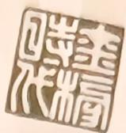

## 陆寓丰 （腿姐)

·国家高等数学试题库骨干专家

·西安交通大学数学系原教授

·全国首席考研政治名师

## 武忠祥 (高数王者)

·主编《高等数学基础篇》《高等数学辅导讲义》 《数学基础过关660题》等百万级畅销书

## 宋浩（B站百大UP主）

·全网粉丝超千万，课程视频B站总播放量超4亿次

·政治大纲解析人

·南京大学马克思主义理论博士

·中国科学院博士

·山东大学数学院硕士、副教授

·大学数学期末课系列教材主编

·北京大学硕士、武忠祥考研高数书系首席主讲

## 罗帆 (北大学霸)

·参与编写《数学基础过关660题》《数学强化通关 330题》《数学决胜冲刺6套卷》等百万级畅销书

·金榜时代考研数学(含396)全能讲师

## 韩雪（肖秀荣书系官方主讲老师）

·《背诵手册》官方带背，播放量破亿

·主编《考研政治选择题技巧一遍过》

·擅长用逻辑框架图梳理考点

## 张华堂（押题“小王子”毛哥)

·中国人民大学马哲硕士

·10年致力于钻研考纲和命题规律

·擅长总结技巧和答题模板让你背得少、、得高分

## 祁连山（无词阅读法创始人）

·北京大学硕士

·22年英语教学经验

## 章纪民

·独创“考研英语无词阅读法”

·清华大学数学科学系原

·1991年起在清华大学应用数手系

·参与编写“十五”期间国家级规划教材

·同济大学数学科学院博士

·同济大学数学系任教

## 刘喜波（高数波叔)

·中国科学院数学博士

## 贺金陵(同济大学最受学生喜爱的数学老师)

·北方工业大学理学院统计学系原系主任、教授

·北京市高等学校教学名师、研究生导师

·20年授课及考研辅导经验，广受学生好评

## 朱祥和

·中国人民大学博士

·高校教授

·全国考研数学辅导专家

## 申亚男(全国研究生入学考试命题组原命题人)

·北京科技大学数学系原教授

·北京市高等学校教学名师

·北京高校优秀本科育人团队负责人

## 姜晓千（全能名师）

·新浪、搜狐、腾讯、网易、中国教育在线等各大门户网站特邀访谈嘉宾

## 闫老师(全国研究生入学考试命题组原命题人)

·中国人民大学金融数学博士

·从事考研数学辅导10余年

·凭借多年参加考研数学命题工作的深厚经验，对考研数学的命题思路和命题方向了如指掌

## 章沛

·中央财经大学金融硕士

·400+高分上岸，授课逻辑直击跨考痛点

·熟悉金融专硕命题特点，善于总结题型方法论

金榜时代考研数学书课—上岸学习包

# 考研数学 复习全书·基础篇 线性代数基础 学习册

（数学一、二、三通用）

编著李永乐

# 无基础不数学

# 考研数学没有捷径，重视“三基”才是根本

考研數學考查的是什麼？

参加2027考研的同学们，你们好，欢迎你们翻开这本书，我们将陪伴着同学们一起开启考研数学的征途。

说到考研数学复习，同学们了解数学考查的是什么吗？是数学的“三基”：基本概念、基本理论、基本方法。

基本概念是指最核心、不可替代的定义或原理，它们构成后续知识体系的基石。同学们要知道哪些概念是核心(如极限、导数、连续、矩阵)，也要知道这些概念的内容是什么。要求准确理解其本质、数学表达式以及与其他概念的联系与区别。

基本理论建立在基本概念基础上的定理、公式、性质和重要结论(如微分中值定理)，告诉同学们为什么。要求掌握其条件、结论及推导逻辑，并能灵活运用于解题。

基本方法指解决一类具体数学问题的通用的操作步骤、法则、技巧和策略。如求极限(等价无穷小替换、洛必达法则、泰勒展开)、求导数(基本公式、求导法则、复合函数求导法则)、求积分(换元法、分部积分法)、解线性方程组(消元法、克拉默法则)，告诉同学们怎么：做。要求反复练习熟练掌握，做到举一反三。

命题人出题考查的就是“三基”，同学们上了考场做题靠的也是“三基”，“三基”始终是我们复习的重点，所以同学们复习数学的核心就是：把“三基”复习好。

我们进行考研数学复习的方向就是：建立“三基”。首先要学好基本概念和基本理论，把知识点从点到网建立自己的知识体系构架，再运用基本方法，最终实现把知识点转化为独立做题能力。

正所谓，无基础，不数学。重视“三基”才是根本。

## 近些年是如何考查的？

近三年考研数学各分数段人数占比汇总
<table><tr><td colspan="1" rowspan="1">科目</td><td colspan="3" rowspan="1">数学一</td><td colspan="3" rowspan="1">数学二</td><td colspan="3" rowspan="1">数学三</td></tr><tr><td colspan="1" rowspan="1">分数段</td><td colspan="1" rowspan="1">2023年</td><td colspan="1" rowspan="1">2024年</td><td colspan="1" rowspan="1">2025年</td><td colspan="1" rowspan="1">2023年</td><td colspan="1" rowspan="1">2024年</td><td colspan="1" rowspan="1">2025年</td><td colspan="1" rowspan="1">2023年</td><td colspan="1" rowspan="1">2024年</td><td colspan="1" rowspan="1">2025年</td></tr><tr><td colspan="1" rowspan="1">136~150</td><td colspan="1" rowspan="1">1.15%</td><td colspan="1" rowspan="1">0.23%</td><td colspan="1" rowspan="1">0.60%</td><td colspan="1" rowspan="1">2.17%</td><td colspan="1" rowspan="1">0.59%</td><td colspan="1" rowspan="1">0.76%</td><td colspan="1" rowspan="1">6.00%</td><td colspan="1" rowspan="1">4.63%</td><td colspan="1" rowspan="1">2.22%</td></tr><tr><td colspan="1" rowspan="1">121~135</td><td colspan="1" rowspan="1">6.10%</td><td colspan="1" rowspan="1">2.34%</td><td colspan="1" rowspan="1">5.92%</td><td colspan="1" rowspan="1">10.40%</td><td colspan="1" rowspan="1">4.33%</td><td colspan="1" rowspan="1">1.14%</td><td colspan="1" rowspan="1">22.28%</td><td colspan="1" rowspan="1">16.80%</td><td colspan="1" rowspan="1">11.67%</td></tr><tr><td colspan="1" rowspan="1">106~120</td><td colspan="1" rowspan="1">16.43%</td><td colspan="1" rowspan="1">9.30%</td><td colspan="1" rowspan="1">17.22%</td><td colspan="1" rowspan="1">21.92%</td><td colspan="1" rowspan="1">13.24%</td><td colspan="1" rowspan="1">9.52%</td><td colspan="1" rowspan="1">36.02%</td><td colspan="1" rowspan="1">27.17%</td><td colspan="1" rowspan="1">42.09%</td></tr><tr><td colspan="1" rowspan="1">91~105</td><td colspan="1" rowspan="1">23.08%</td><td colspan="1" rowspan="1">19.36%</td><td colspan="1" rowspan="1">23.79%</td><td colspan="1" rowspan="1">24.26%</td><td colspan="1" rowspan="1">21.49%</td><td colspan="1" rowspan="1">23.28%</td><td colspan="1" rowspan="1">24.58%</td><td colspan="1" rowspan="1">27.93%</td><td colspan="1" rowspan="1">22.61%</td></tr><tr><td colspan="1" rowspan="1">80~90</td><td colspan="1" rowspan="1">21.96%</td><td colspan="1" rowspan="1">23.59%</td><td colspan="1" rowspan="1">20.71%</td><td colspan="1" rowspan="1">18.55%</td><td colspan="1" rowspan="1">21.97%</td><td colspan="1" rowspan="1">18.52%</td><td colspan="1" rowspan="1">8.25%</td><td colspan="1" rowspan="1">16.32%</td><td colspan="1" rowspan="1">13.52%</td></tr><tr><td colspan="1" rowspan="1">复试线~79</td><td colspan="1" rowspan="1">31.28%</td><td colspan="1" rowspan="1">45.18%</td><td colspan="1" rowspan="1">31.76%</td><td colspan="1" rowspan="1">22.70%</td><td colspan="1" rowspan="1">38.38%</td><td colspan="1" rowspan="1">26.48%</td><td colspan="1" rowspan="1">2.87%</td><td colspan="1" rowspan="1">7.15%</td><td colspan="1" rowspan="1">7.89%</td></tr></table>

从表格数据可以看出近几年大家的成绩波动很大，一是竞争激烈，二是试题难度波动，在此区分开考生水平差距。

考研数学的难度变化是考生们极为关注的问题，每年考研数学考试结束后，有关考研资料由公众号：八戒考研全网首发，更多考研资料关注公众号免费获取数学难不难的话题讨论就会迅速登上热搜。网络上充斥着各种说法，有人说难，有人直言“比去年简单”，也有吐槽“计算量太大做不完”的，对个人来讲，感受肯定有差异。

从客观的角度来看，数学科目主要考查的一直都是基础知识和应用能力，即“三基”。

## 1. 整体难度波动性加大，趋于“灵活”而非单纯“难”

告别“大年小年”简单交替，以往可能一年难一年简单相对规律。近几年(尤其是近五年)难度波动更无规律可循，出现连续偏难或难度跳跃的情况。这使得仅凭“大年小年”预测风险增大。

“灵活”成为关键词。单纯靠刷题、背套路就能得高分的时代逐渐过去。命题更倾向于考查对基础概念、原理的深刻理解和灵活运用能力。

## 2. 对基础概念、定义的考查更加深入和“刁钻”，重视三基才是根本

题目更倾向直接考查对概念本质的理解，或者利用概念理解上的模糊点设置陷阱。题目包装新颖：用看似陌生的背景或表述，但核心考点仍是基础知识点。“冷门”考点或定理出现频率增加，要求复习覆盖面更广、更细致。

## 3. 计算能力要求持续高位

计算量大、过程复杂的题目是增加区分度的重要手段。能否在高压的考场场景下快速、准确地完成大量运算是关键。

高数中的求极限、求导、重积分、级数求和，线性代数中的矩阵运算、特征值特征向量求解、概率中的复杂分布求解等是计算能力的重灾区，部分题目过程繁琐，对计算准确性和速度要求严格。同学平时做题就有畏难偷懒的情形，训练也不够。

## 4. 应用型、综合性题目比例上升

综合性增强：一道题融合多个知识点或多个章节的内容(如极限与积分结合、中值定理证明与不等式结合)。题目更注重考查利用数学工具解决实际问题的能力，或不同知识的交

叉应用。证明题对逻辑推理、构造能力的要求更高，不局限于经典证明模式。

## 5.区分度更加依赖于“中档题”和“难题”

基础题(送分题)比例相对稳定，但不足以拉开差距。中档题是主体，也是大部分考生得分的关键区域。近年中档题往往设计得更灵活、综合性更强。

难题/压轴题的难度和区分度依然很高，通常是概念深度、思维灵活性和计算复杂度的综合考验。

## 复习策略与方法建议

针对上述考研数学命题的特点和趋势，我们建议同学们复习时应重视以下几点：

## 1. 根基务必打牢：基础概念、原理的深度理解是核心

回归基础认真研读基础篇的内容，对照考试大纲(每章开始有本章考点)，确保无知识盲点。特别关注那些看似简单但容易混淆的概念(如极限存在、连续、可导的关系；矩阵等价、相似、合同的区别；事件独立与互斥的关系)。

不能为了刷题而刷题。做题前，务必确保对相关章节的定义、定理、公式的来龙去脉、适用条件、几何/物理意义有清晰深刻的理解。多问“为什么”。

构建知识网络：用思维导图等方式将知识点联系起来，理解它们之间的关联。思考如何将知识点融合起来解题。

## 2. 提升思维灵活性与解题能力：从“模仿”走向“思考”

精做例题，从“模仿”开始，注重分析题目考点、研究解题思路(考了哪些知识点？基本的方法是什么？)。总结常见陷阱和易错点。对错题和难题进行深度复盘，思考自己卡壳的原因(是概念不清？思路不对？计算失误？)。尝试一题多解：对于典型题目，尝试用不同方法解决，锻炼思维的灵活性和对知识掌握的全面性。重视证明题：不要回避证明题，基础阶段只理解经典证明的逻辑，尝试自己推导。练习构造反例或利用已知定理进行推理，注重逻辑的严谨性。

## 3.强化计算能力:速度与准确度并重

刻意练习：针对计算量大的题型(积分、矩阵运算、概率计算等)进行限时、独立的专项训练。保证每天都有一定量的计算练习。

注重计算过程：书写规范、步骤清晰，避免跳步。养成良好的演算习惯，便于检查和减少低级错误。合理规划草稿纸，保持清晰，方便回查。

总结计算技巧：积累常用的计算技巧和简化方法(如对称性、奇偶性、特定公式、变量替换等)。

## 4.拓展视野，覆盖“冷门”考点

全面复习，不留死角：严格依据考试大纲，对所有知识点进行复习，不能抱有侥幸心理放弃某些“非重点”。近年命题常有“出其不意”之处。

关注书中的“边角料”：例题、注、补充说明有时会包含重要信息或“冷门”考点。

## 5.加强综合应用能力的训练

不能一直停留在练习基础题简单题，所练习的题目正确率达到85%，就可以考虑提高训练难度，做综合性强的题目：选择那些融合多个知识点的练习题和模拟题进行训练。推荐历年真题真刷基础篇。

## 6.模拟实战，提升应试策略与心理素质

定期全真模拟：使用近年真题或高质量模拟卷，严格按照考试时间(3小时)进行模拟考试，营造考场氛围。金榜在线模考，欢迎届时参加。

时间管理训练：在模拟中摸索适合自已的时间分配策略。建议：选择填空控制在60～75分钟，解答题留足时间(尤其最后几题)。学会果断取舍，对于卡壳超过5分钟的题目，先做标记跳过。

心态调整：模拟考试中锻炼应对难题、计算失误的心理承受能力。培养“即使题目难，也要把会做的做对”的稳定心态。考后认真分析模拟结果，不仅是分数，更要关注时间分配、错误类型、策略得失。

考研数学的难度趋势是更加注重基本功的深度和知识运用的灵活性。同学们不要对不确定的考试难度过于焦虑，而更应该将精力集中在夯实基础、提升思维能力和加强计算上。以扎实的内功去应对任何形式的考题，才是最科学的复习思路。

## 考研数学一、二、三的共同点与区别

<table><tr><td rowspan=1 colspan=2>考研数学一、二、三的共同点</td></tr><tr><td rowspan=1 colspan=1>满分</td><td rowspan=1 colspan=1>150分</td></tr><tr><td rowspan=1 colspan=1>考试时间</td><td rowspan=1 colspan=1>3 小时</td></tr><tr><td rowspan=1 colspan=1>答题方式</td><td rowspan=1 colspan=1>闭卷、笔试</td></tr><tr><td rowspan=1 colspan=1>题型题量</td><td rowspan=1 colspan=1>选择题：10小题，每小题5分，共50分填空题：6小题，每小题5分，共30分解答题(证明题)：6小题，共70分</td></tr><tr><td rowspan=1 colspan=1>基础核心</td><td rowspan=1 colspan=1>函数极限、一元微积分、多元微积分、微分方程、矩阵向量、线性方程组、特征值特征向量、二次型</td></tr></table>

<table><tr><td colspan="7" rowspan="1">考研数学一、二、三的区别</td></tr><tr><td colspan="1" rowspan="1">区别</td><td colspan="2" rowspan="1">数学一</td><td colspan="2" rowspan="1">数学二</td><td colspan="2" rowspan="1">数学三</td></tr><tr><td colspan="1" rowspan="3">分值分布</td><td colspan="1" rowspan="1">高等数学</td><td colspan="1" rowspan="1">86 分</td><td colspan="1" rowspan="1">高等数学</td><td colspan="1" rowspan="1">118分</td><td colspan="1" rowspan="1">微积分</td><td colspan="1" rowspan="1">86 分</td></tr><tr><td colspan="1" rowspan="1">线性代数</td><td colspan="1" rowspan="1">32分</td><td colspan="1" rowspan="1">线性代数</td><td colspan="1" rowspan="1">32分</td><td colspan="1" rowspan="1">线性代数</td><td colspan="1" rowspan="1">32分</td></tr><tr><td colspan="1" rowspan="1">概率论与数理统计</td><td colspan="1" rowspan="1">32分</td><td colspan="1" rowspan="1">概率论与数理统计</td><td colspan="1" rowspan="1">不考</td><td colspan="1" rowspan="1">概率论与数理统计</td><td colspan="1" rowspan="1">32分</td></tr><tr><td colspan="1" rowspan="1">难度深度</td><td colspan="2" rowspan="1">考试内容广泛、综合性强</td><td colspan="2" rowspan="1">总体难度较数学一小，高数部分考试内容少，考题多，考查细，出题有深度，能全覆盖高数的每章重点内容</td><td colspan="2" rowspan="1">内容和难度较数学一小</td></tr><tr><td colspan="1" rowspan="8">高数</td><td colspan="2" rowspan="1">第一章函数、极限、连续</td><td colspan="2" rowspan="1">同数学一</td><td colspan="2" rowspan="1">同数学一</td></tr><tr><td colspan="2" rowspan="1">第二章一元函数微分学</td><td colspan="2" rowspan="1">同数学一</td><td colspan="2" rowspan="1">其他同数学一(不考：参数方程求导、曲率，单独考：经济应用）</td></tr><tr><td colspan="2" rowspan="1">第三章一元函数积分学</td><td colspan="2" rowspan="1">同数学一</td><td colspan="2" rowspan="1">其他同数学一(不考：平行截面面积为已知的立体体积、平面曲线的弧长、定积分物理学上的应用）</td></tr><tr><td colspan="2" rowspan="1">第四章向量代数和空间解析几何</td><td colspan="2" rowspan="1">不考</td><td colspan="2" rowspan="1">不考</td></tr><tr><td colspan="2" rowspan="1">第五章 多元函数微分学</td><td colspan="2" rowspan="1">其他同数学一(不考：多元函数微分学的几何应用、全微分形式不变性）</td><td colspan="2" rowspan="1">其他同数学一(不考：多元函数微分学的几何应用、全微分形式不变性）</td></tr><tr><td colspan="2" rowspan="1">第六章 多元函数积分学</td><td colspan="2" rowspan="1">其他同数学一(不考：三重积分、曲线积分与曲面积分）</td><td colspan="2" rowspan="1">其他同数学一(不考：三重积分、曲线积分与曲面积分）</td></tr><tr><td colspan="2" rowspan="1">第七章 无穷级数</td><td colspan="2" rowspan="1">不考</td><td colspan="2" rowspan="1">其他同数学一(不考：傅里叶级数)</td></tr><tr><td colspan="2" rowspan="1">第八章常微分方程</td><td colspan="2" rowspan="1">其他同数学一(不考：伯努利方程、欧拉方程、全微分方程）</td><td colspan="2" rowspan="1">其他同数学一(不考：伯努利方程、可降阶的二阶微分方程、欧拉方程、全微分方程，单独考：差分方程）</td></tr><tr><td colspan="1" rowspan="14">线代概率</td><td colspan="1" rowspan="1">第一章行列式</td><td colspan="1" rowspan="1">同数学一</td><td colspan="4" rowspan="1">同数学一</td></tr><tr><td colspan="1" rowspan="1">第二章矩阵</td><td colspan="1" rowspan="1">同数学一</td><td colspan="4" rowspan="1">同数学一</td></tr><tr><td colspan="1" rowspan="1">第三章 向量</td><td colspan="1" rowspan="1">其他同数学一(不考：向量空间)</td><td colspan="4" rowspan="1">其他同数学一(不考：向量空间)</td></tr><tr><td colspan="1" rowspan="1">第四章线性方程组</td><td colspan="1" rowspan="1">同数学一</td><td colspan="4" rowspan="1">同数学一</td></tr><tr><td colspan="1" rowspan="1">第五章特征值与特征向量</td><td colspan="1" rowspan="1">同数学一</td><td colspan="4" rowspan="1">同数学一</td></tr><tr><td colspan="1" rowspan="1">第六章二次型</td><td colspan="1" rowspan="1">同数学一</td><td colspan="4" rowspan="1">同数学一</td></tr><tr><td colspan="1" rowspan="1">第一章随机事件和概率</td><td colspan="1" rowspan="8">不考</td><td colspan="4" rowspan="1">同数学一</td></tr><tr><td colspan="1" rowspan="1">第二章随机变量及其分布</td><td colspan="4" rowspan="1">同数学一</td></tr><tr><td colspan="1" rowspan="1">第三章多维随机变量及其分布</td><td colspan="4" rowspan="1">同数学一</td></tr><tr><td colspan="1" rowspan="1">第四章随机变量数字特征</td><td colspan="4" rowspan="1">同数学一</td></tr><tr><td colspan="1" rowspan="1">第五章大数定律和中心极限定理</td><td colspan="4" rowspan="1">同数学一</td></tr><tr><td colspan="1" rowspan="1">第六章数理统计基本概念</td><td colspan="4" rowspan="1">同数学一</td></tr><tr><td colspan="1" rowspan="1">第七章参数估计</td><td colspan="4" rowspan="1">其他同数学一(不考：无偏性、有效性、一致性、区间估计）</td></tr><tr><td colspan="1" rowspan="1">第八章假设检验</td><td colspan="4" rowspan="1">不考</td></tr></table>

本表格中章节顺序依据考试大纲数学一，其他教材可参考

# USERMANUD使用说明

当踏上考研数学的征途时，与同学们分享一个朴素却至关重要的道理：考研数学的较量，始于基础，成于基础，最终决胜于基础。在浩瀚的题海与纷繁的技巧面前，最容易被忽视，却又最为关键的，恰恰是对基本概念、原理和方法的扎实掌握。

## 成于基础,决胜于基础

《考研数学复习全书·基础篇·线性代数基础》是专门为准备参加硕士研究生人学考试而提前复习的大二大三学生、在职考研人士及基础薄弱的同学们编写的。本书阐述了考研数学线性代数部分要求的基础知识内容。希望本书能够帮助同学们在短时间内厘清考研数学线性代数部分的基本知识点，掌握硕士研究生入学考试所必需的基本概念、基本理论和基本方法，让数学基础薄弱甚至零基础的同学能有一个较大的水平提升和能力上质的突破，实现“基础过关”。

从编者多年的考研辅导经验来看，许多同学在开始复习时存在着对基本知识点有所遗资料由公众号：八戒考研全网首发，更多考研资料关注公众号免费获取忘和没掌握的现象，所以本书的首要目标就是回顾基础知识，使大家能够更好地完成0基础～基础阶段的学习。另外，本书在每章的开头列出了考研数学考试大纲的内容要点，方便大家掌握考点，做到心中有数。

其次是，整合考试内容，为同学们呈现简明扼要的知识点和方法归纳，便于大家高效复习，形成完整的知识体系，为后期提高解题能力和数学思维水平奠定基础。

本书的最终目的是提升同学的解题能力。只有深人理解基本概念，牢牢记住基本定理和公式，才能找到解题的切入点和突破口。对于重点、难点知识，书中都有相应的例题，包括过去的考题和李永乐老师精心编制的习题，以帮助同学们掌握基本的题型和计算方法，真正掌握所学内容。

本书分为学习册和练题册(严选题)，两册均为六章，学习册每章分为本章考点、本章知识框图、知识梳理与例题、例题解析、本章作业超链接(《基础过关660题》优选)，练题册（严选题)每章分为例题优选和自测练习题。

## 本書特色說明

## 本章知识框图

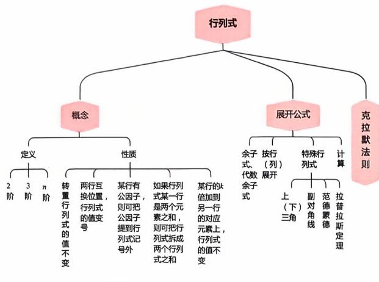

以行为例，列有类似性质

本书中的例题都是经过李永乐老师反复筛选、精心设计的经典题目。每一题均能精准地提炼出知识点的核心内容和关键要素，代表某一类题目的共同特征和解题方法。为了让这些例题的效用最大化，在学习册中例题没有直接给出解析而是特别设置了练习区域，给同学自己动手做题的机会。在练题册中优选了大部分的例题，分别设置了学前预习(带着问题去学)和学后优练(再做一遍，你真掌握了吗)两点功能区。

## 自测练习题

$$
\begin{aligned} &(1) \left| \begin{matrix} 1 & 1 & 1 \\ -1 & 0 & 1 \\ -2 & -2 & 0 \end{matrix} \right| = \underline{\hspace{2cm}} .\\ \end{aligned}
$$

以框图的形式帮助大家将复杂的概念和知识点进行分类和整理，形成清晰的知识结构，通过视觉化的方式呈现，促进记忆。同学在学习完本章之后，可以进一步去补充去细化，最终形成自己的知识结构。

## 例题优选

例1 四阶行列式 $\left| \textbf{\em A} \right| = \left| \begin{matrix} 0 & 0 & 0 & a \\ 0 & 0 & b & 0 \\ 0 & c & 0 & 0 \\ d & 0 & 0 & 0 \end{matrix} \right| = 0$

学前预习

例题优选答案见学习册

## 学后优练

李永乐老师亲自编写的课后练习题，是针对前面的基础知识点和技能的检验练习巩固所学。

很多同学反馈刚开始做《数学基础过关660题》很难下手，特别费劲，几乎每道题都需要看答案，确实打击学习的积极性。今年我们特意在每章都选择部分《数学基础过关660题》相应的题目作为作业题，学完这一章的内容后，再去做这些作业题，难度上会降下来。

## 《基础过关66D题》优选

## 本章作业超链接

数学一 361 362 363 364 421 422 423 424   
数学二 461 462 463 464 546 547 548 549   
数学三 361 362 363 364 421 422 423 424

## 夯实基础 厚积薄发 一战成硕

考研数学之路，道阻且长。在这漫长征程的起点，选择深潜还是浮掠，决定了同学们最终所能企及的高度。

请将这本书作为你夯实根基的忠实伙伴。愿大家能以最大的耐心、最严谨的态度、最扎资料由公众号：八戒考研全网首发，更多考研资料关注公众号免费获取实的行动，走好这至关重要的第一步。当同学们真正吃透了概念、原理，练就了过硬的计算本领，构建起清晰的知识网络时，你便会发现，曾经令人望而生畏的综合题、难题，其突破口往往就隐藏在你精心打下的基础之中。

基础扎实之日，便是你从容启航，驶向高分彼岸之时！愿你在基础复习的静水深流中，积蓄起改变未来的磅礴力量。祝复习顺利，金榜题名！

## 考研承诺书

为了自己的成长，为了有个美好的未来，本人自愿参加2027年硕士研究生考试。

本人郑重承诺：从 年月日开始，我会全力以赴，不虚度时光，认真学习，不畏惧困难，不懈怠不自欺，踏踏实实复习！

为自己去拼搏，让青春无悔！

只争朝夕，不负韶华！

承诺人：

## CONTENTS目录

## 第一章 行列式

本章考点………………(1)  
本章知识框图……(1)  
知识梳理与例题……………………………………………………………(2)  
、行列式的概念………………………………………………………(2)  
二、行列式的性质………………………………………………………(4)  
三、行列式按行(或列)展开公式………………………………………(7)  
四、克拉默法则………………………………(12)  
例题解析…………………………(13)  
第二章 矩阵  
本章考点……………(22)  
本章知识框图……………(22)  
知识梳理与例题…………(22)  
一、矩阵的概念及运算……………………………………………(22)  
二、伴随矩阵、可逆矩阵…………(30)  
三、初等变换、初等矩阵…………………(36)  
四、分块矩阵…………………(39)  
五、方阵的行列式…………(42)  
例题解析……(45)  
第三章向量  
本章考点………(55)  
本章知识框图…………(55)  
知识梳理与例题………………(56)  
一、向量的概念、向量组的概念……………………………………(56)  
二、线性表出、线性相关……(56)  
三、向量组的秩、矩阵的秩……………(64)  
四、正交规范化、正交矩阵……(71)  
例题解析…………………………………………(73)  
第四章 线性方程组  
本章考点…………………………………………………………………(84)  
本章知识框图………………………………………………………(84)  
知识梳理与例题……………………………………………(85)  
、基本概念…………………………………………………………(85)  
二、齐次线性方程组……(86)  
三、非齐次线性方程组…………………(90)  
四、公共解、同解…………………(93)  
五、方程组的应用…………………………(93)  
例题解析……………(96)  
第五章 特征值和特征向量  
本章考点…………………………………………………………………(105)  
本章知识框图……………………………………………………(105)  
知识梳理与例题…………………………………………………………(105)  
、特征值、特征向量……………………………(105)  
二、相似矩阵…………(111)  
三、实对称矩阵……(117)  
例题解析……………(120)  
第六章 二次型  
本章考点…………………………(130)  
本章知识框图…………………(130)  
知识梳理与例题……………………(131)  
、二次型及其标准形……(131)  
二、正定二次型……(140)  
例题解析………(143)

## 第一章 行列式

## 本章考点

行列式的概念和基本性质行列式按行(列）展开定理线性方程组的克拉默(Cramer）法则

学习笔记

## 知识梳理与例题

## 一、行列式的概念

行列式是一个数，它是不同行不同列元素乘积的代数和.

例如，大家所熟悉的三阶行列式

$$
\begin{vmatrix} a_{1} & a_{2} & a_{3} \\ b_{1} & b_{2} & b_{3} \\ c_{1} & c_{2} & c_{3} \end{vmatrix} = a_{1}b_{2}c_{3} + a_{2}b_{3}c_{1} + a_{3}b_{1}c_{2} - a_{3}b_{2}c_{1} - a_{2}b_{1}c_{3} - a_{1}b_{3}c_{2}
$$

其每一项都是3个数的乘积，从字母看a，b，c各有1个，说明这3个数一个在第1行，一个在第2行，一个在第3行；而从下标看数字1，2，3各有1个，说明这3个数分别来自第1列、第2列和第3列.

在这6项中，有3项带“+”号，3项带“”号，大家可以用对角线方法来记忆：

当三阶行列式的元素中有较多的 $ \text{" }0 "$ 时，用对角线法来计算行列式的值是简便的.例如，

$$
\begin{aligned}\left| \begin{matrix}0 & 1 & 2 \\3 & 0 & 4 \\5 & 6 & 0\end{matrix} \right|&= 0 \times 0 \times 0 + 1 \times 4 \times 5 + 2 \times 3 \times 6 - 2 \times 0 \times 5 - 1 \times 3 \times 6 \\&= 0 - 0 \times 4 \times 6 = 56,\end{aligned}
$$

$$
\begin{aligned} &\begin{vmatrix}\\ &1 & 0 & - 1 \\&2 & - 2 & 1 \\&0 & - 3 & 4\\ &\end{vmatrix}=-8+0+6-0-0-(-3)=1.\\ \end{aligned}
$$

一般地，我们应当用行列式的性质将其恒等变形化简，再通过展开公式（用降阶法）来计算行列式的值.

对于n阶行列式的概念，大家要有一个简单的了解.

n阶行列式

$$
\begin{pmatrix}a_{11} & a_{12} & \cdots & a_{1n} \\a_{21} & a_{22} & \cdots & a_{2n} \\\vdots & \vdots & & \vdots \\a_{n1} & a_{n2} & \cdots & a_{nn}\end{pmatrix}
$$

是所有取自不同行不同列的n个元素的乘积

$$
\alpha_{1j_1} \alpha_{2j_2} \cdots \alpha_{nj_n}
$$

的代数和，这里 $j_{1}j_{2}\cdots j_{n}$ 是1,2，…，n的一个排列.当 $j_{1}j_{2}\cdots j_{n}$ 是偶排列时，该项的前面带正号；当 $j_{1}j_{2}\cdots j_{n}$ 是奇排列时，该项的前面带负号，即

$$
\begin{vmatrix}a_{11} & a_{12} & \cdots & a_{1n} \\a_{21} & a_{22} & \cdots & a_{2n} \\\vdots & \vdots & & \vdots \\a_{n1} & a_{n2} & \cdots & a_{nn}\end{vmatrix}= \sum_{j_1 j_2 \cdots j_n} (-1)^{\tau(j_1 j_2 \cdots j_n)} a_{1j_1} a_{2j_2} \cdots a_{nj_n} .\tag{1}
$$

这里 $\sum_{j_{1}^{}j_{2}^{}\cdots j_{n}^{}}$ 表示对所有n阶排列求和.式(1)称为n阶行列式的完全展开式.

【注】所谓排列是指由n个数1,2，…，n所构成的一个有序数组，通常用 $j_{1}j_{2}\cdots j_{n}$ 表示n阶排列，显然共有n！个n阶排列.

一个排列中，如果一个大的数排在小的数之前，就称这两个数构成一个逆序.一个排列的逆序总数称为这个排列的逆序数.用$\tau(j_1j_2\cdots j_n)$ 表示排列 $j_{1}j_{2}\cdots j_{n}$ 的逆序数.

如果一个排列的逆序数是偶数，则称这个排列为偶排列，否则称之为奇排列.

例如，2413是四级排列.2,1;4,1;4,3是逆序，故逆序数τ(2413) $= 1 + 2 = 3$ 是奇排列.

又如35142是五级排列.3,1;3,2;5,1;5,4;5,2;4,2是逆序，故 逆序数 $\tau(35142) = 2 + 3 + 1 = 6$ 是偶排列.而自然排列12345没有 逆序，逆序数为0是偶排列.

例如 $\alpha_{12} \alpha_{24} \alpha_{33} \alpha_{41}$ 是四阶行列式中的一项，那么该项所带的符号由 $\tau(2431) = 1 + 2 + 1 = 4$ （即2有1个逆序，4有2个逆序，3有1个逆序）确定，是偶排列，故取正号.

又如 $a_{13}a_{25}a_{31}a_{42}a_{54}$ 是五阶行列式中的一项，由 $\tau(35124) = 2 +$ $3 = 5$ 是奇排列，故在行列式中应取负号.

例1 四阶行列式 $\left| \textbf{\em A} \right| = \left| \begin{aligned} &0 & 0 & 0 & a \\ &0 & 0 & b & 0 \\ &0 & c & 0 & 0 \\ &d & 0 & 0 & 0 \end{aligned} \right| .$

答案见 13 页

例2（1）写出四阶行列式中含有因子 $\alpha_{12} \alpha_{34}$ 且带负号的项

(2) 多项式 $f(x)=\begin{vmatrix}x&2x&1&0\\2&x-1&1&3\\1&2&x&-1\\x&5&6&2\end{vmatrix}$ 中 $,x^{3}$ 的系数为

答案见13 页

## 二、行列式的性质

$$
 记  \left| \boldsymbol{A} \right| = \left| \begin{matrix} a_{11} & a_{12} & \cdots & a_{1n} \\ a_{21} & a_{22} & \cdots & a_{2n} \\ \vdots & \vdots & & \vdots \\ a_{n1} & a_{n2} & \cdots & a_{nn} \end{matrix} \right|, \left| \boldsymbol{A}^{\mathrm{T}} \right| = \left| \begin{matrix} a_{11} & a_{21} & \cdots & a_{n1} \\ a_{12} & a_{22} & \cdots & a_{n2} \\ \vdots & \vdots & & \vdots \\ a_{1n} & a_{2n} & \cdots & a_{nn} \end{matrix} \right|
$$

行列式 $\mid \boldsymbol{A}^{\mathrm{T}} \mid$ 称为|A|的转置行列式.

性质1经过转置，行列式的值不变，即 $| \textbf{A}^{\mathtt{T}} | = | \textbf{A} |$

$$
\begin{aligned} &\begin{vmatrix}\\ &a_{1} & a_{2} & a_{3} \\&b_{1} & b_{2} & b_{3} \\&c_{1} & c_{2} & c_{3}\\ &\end{vmatrix} = \begin{vmatrix}\\ &a_{1} & b_{1} & c_{1} \\&a_{2} & b_{2} & c_{2} \\&a_{3} & b_{3} & c_{3}\\ &\end{vmatrix}.\\ \end{aligned}
$$

由此可知行列式行的性质与列的性质是对等的(为方便说明，行列式都以三阶为例).

性质2 两行(或列）互换位置，行列式的值变号.

特别地，两行（或列）相同，行列式的值为0.

性质3 某行(或列）如有公因子k，则可把k提出行列式记号外(亦即用数k乘行列式|A|等于用k乘它的某行或列).

特别地：(1）某行（或列）的元素全为0，行列式的值为0.

（2）若两行（或列）的元素对应成比例，行列式的值为0.

性质4 如果行列式某行（或列）是两个元素之和，则可把行列式拆成两个行列式之和.

$$
\begin{vmatrix}a_{1} + b_{1} & a_{2} + b_{2} & a_{3} + b_{3} \\c_{1} & c_{2} & c_{3} \\d_{1} & d_{2} & d_{3}\end{vmatrix}=\begin{vmatrix}a_{1} & a_{2} & a_{3} \\c_{1} & c_{2} & c_{3} \\d_{1} & d_{2} & d_{3}\end{vmatrix}+\begin{vmatrix}b_{1} & b_{2} & b_{3} \\c_{1} & c_{2} & c_{3} \\d_{1} & d_{2} & d_{3}\end{vmatrix}.
$$

性质5 把某行(或列）的k倍加到另一行(或列)，行列式的值不变.

$$
\begin{vmatrix}a_{1} & a_{2} & a_{3} \\b_{1} & b_{2} & b_{3} \\c_{1} & c_{2} & c_{3}\end{vmatrix}=\begin{vmatrix}a_{1} & a_{2} & a_{3} \\b_{1} + k a_{1} & b_{2} + k a_{2} & b_{3} + k a_{3} \\c_{1} & c_{2} & c_{3}\end{vmatrix}.
$$

例3 证明：对任意的 $a,b,c$ 恒有 $\begin{vmatrix} 1 & 1 & 1 \\ a & b & c \\ b + c & c + a & a + b \end{vmatrix} = 0.$

答案见 14 页

答案见 15 页  
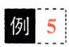

$$
\left| \begin{aligned} b_{1} + c_{1} & \quad c_{1} + a_{1} \quad a_{1} + b_{1} \\ b_{2} + c_{2} & \quad c_{2} + a_{2} \quad a_{2} + b_{2} \\ b_{3} + c_{3} & \quad c_{3} + a_{3} \quad a_{3} + b_{3} \end{aligned} \right| = 2 \left| \begin{aligned} a_{1} & \quad b_{1} & \quad c_{1} \\ a_{2} & \quad b_{2} & \quad c_{2} \\ a_{3} & \quad b_{3} & \quad c_{3} \end{aligned} \right| .
$$

例5 证明 $\begin{aligned} & \text{2 } \boldsymbol{D} = \left| \begin{matrix} 0 & a_{12} & a_{13} \\ -a_{12} & 0 & a_{23} \\ -a_{13} & -a_{23} & 0 \end{matrix} \right| = 0.\\ \end{aligned}$

答案见 14 页

## 三、行列式按行（或列）展开公式

在n阶行列式

$$
\begin{aligned} &D = \begin{vmatrix}\\ &a_{11} & a_{12} & \cdots & a_{1n} \\&a_{21} & a_{22} & \cdots & a_{2n} \\&\vdots & \vdots & & \vdots \\&a_{n1} & a_{n2} & \cdots & a_{nn}\\ &\end{vmatrix}\\ \end{aligned}
$$

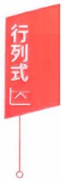

中划去 $\alpha_{ij}$ 所在的第i行、第j列的元素，由剩下的元素按原来的位置排法构成的一个n一1阶的行列式

$$
\begin{aligned}\left| \begin{array}{ccccc}\alpha_{11} & \cdots & \alpha_{1,j-1} & \alpha_{1,j+1} & \cdots & \alpha_{1n} \\\vdots &  & \vdots & \vdots &  & \vdots \\\alpha_{i-1,1} & \cdots & \alpha_{i-1,j-1} & \alpha_{i-1,j+1} & \cdots & \alpha_{i-1,n} \\\alpha_{i+1,1} & \cdots & \alpha_{i+1,j-1} & \alpha_{i+1,j+1} & \cdots & \alpha_{i+1,n} \\\vdots &  & \vdots & \vdots &  & \vdots \\\alpha_{n1} & \cdots & \alpha_{n,j-1} & \alpha_{n,j+1} & \cdots & \alpha_{nn} \\\end{array} \right|,\end{aligned}
$$

称其为 $a_{ij}$ 的余子式，记为 $M_{ij}$ ;称 $(-1)^{i+j}M_{ij}$ 为 $\alpha_{ij}$ 的代数余子式，记 为 $A_{ij}$ ,即

$$
A _ { i j } = ( - 1 ) ^ { i + j } M _ { i j }   .
$$

定理1.1 n阶行列式等于它的任何一行(列)元素与其对应的代数余子式乘积之和，即

$$
\left| \boldsymbol{A} \right| = a_{i1}A_{i1} + a_{i2}A_{i2} + \cdots + a_{in}A_{in} = \sum_{k = 1}^{n}a_{ik}A_{ik}, i = 1,2,\cdots,n.
$$

$$
\left| \boldsymbol { A } \right| = a _ { 1 j } A _ { 1 j } + a _ { 2 j } A _ { 2 j } + \cdots + a _ { n j } A _ { n j } = \sum _ { k = 1 } ^ { n } a _ { k j } A _ { k j } , j = 1 , 2 , \cdots , n.
$$

前一个公式称|A|是按第i行展开的展开式，后一个公式称|A|是按第j列展开的展开式.

定理1.2 行列式的任一行(列）元素与另一行(列）元素的代数余子式乘积之和为0，即

$$
\sum_{k = 1}^{n}a_{ik}A_{jk} = a_{i1}A_{j1} + a_{i2}A_{j2} + \cdots + a_{in}A_{jn} = 0, i \neq j.
$$

$$
\sum_{k = 1}^{n}a_{ki}A_{kj} = a_{1i}A_{1j} + a_{2i}A_{2j} + \cdots + a_{ni}A_{nj} = 0, i \neq j.
$$

在用展开公式的时候，还要注意下面几个特殊情况的配合.

（1）上（下）三角形行列式的值等于主对角线元素的乘积.

$$
\begin{vmatrix}a_{_{11}} & a_{_{12}} \cdots a_{_{1n}} \\a_{_{22}} \cdots a_{_{2n}} \\\bigvee & \ddots & \vdots \\a_{_{nn}}\end{vmatrix}=\begin{vmatrix}a_{_{11}} &  &  \\a_{_{21}} & a_{_{22}} \\\vdots & \vdots & \ddots \\a_{_{n1}} & a_{_{n2}} \cdots a_{_{nn}}\end{vmatrix}= a_{_{11}} a_{_{22}} \cdots a_{_{nn}} .
$$

(2) 关于副对角线的行列式.

$$
\begin{aligned}\left| \begin{matrix}a_{11} & a_{12} & \cdots & a_{1,n-1} & a_{1n} \\a_{21} & a_{22} & \cdots & a_{2,n-1} & 0 \\\vdots & \vdots & & \vdots & \vdots \\a_{n1} & 0 & \cdots & 0 & 0 \\\end{matrix} \right|&=\left| \begin{matrix}0 & \cdots & 0 & a_{1n} \\0 & \cdots & a_{2,n-1} & a_{2n} \\\vdots & & \vdots & \vdots \\a_{n1} & \cdots & a_{n,n-1} & a_{nn} \\\end{matrix} \right| \\&= (-1)^{\frac{n(n-1)}{2}} a_{1n} a_{2,n-1} \cdots a_{n1}.\end{aligned}
$$

(3)两个特殊的拉普拉斯展开式.

如果 A 和 B 分别是 m 阶和 n 阶矩阵，则

$$
\begin{vmatrix} \boldsymbol { A } & \star \\ \boldsymbol { O } & \boldsymbol { B } \end{vmatrix} = \begin{vmatrix} \boldsymbol { A } & \boldsymbol { O } \\ \star & \boldsymbol { B } \end{vmatrix} = \left| \begin{array} { l l } \boldsymbol { A } \end{array} \right| \bullet \left| \begin{array} { l } \boldsymbol { B } \end{array} \right| ,
$$

$$
\begin{vmatrix} \boldsymbol{O} & \boldsymbol{A} \\ \boldsymbol{B} & \star \end{vmatrix} = \begin{vmatrix} \star & \boldsymbol{A} \\ \boldsymbol{B} & \boldsymbol{O} \end{vmatrix} = (-1)^{mn} \left| \boldsymbol{A} \right| \bullet \left| \boldsymbol{B} \right| .
$$

（4）范德蒙德行列式.

$$
\left| \begin{array} { c c c c }1 & 1 & \cdots & 1 \\x _ { 1 } & x _ { 2 } & \cdots & x _ { n } \\x _ { 1 } ^ { 2 } & x _ { 2 } ^ { 2 } & \cdots & x _ { n } ^ { 2 } \\\vdots & \vdots & & \vdots \\x _ { 1 } ^ { n - 1 } & x _ { 2 } ^ { n - 1 } & \cdots & x _ { n } ^ { n - 1 } \\\end{array} \right|= \prod _ { 1 \leqslant j < i \leqslant n } \left( x _ { i } - x _ { j } \right) .
$$

例6计算行列式的值

(1)

练习区域

$$
\begin{bmatrix} 1 & 4 & -1 & 4 \\ 2 & 2 & 2 & 3 \\ 3 & -1 & 6 & 2 \\ 4 & 0 & 5 & 3 \end{bmatrix}
$$

(2)

$$
\begin{bmatrix} 0 & 5 & 2 & 0 \\ 8 & 3 & 5 & 4 \\ 7 & 2 & 4 & 1 \\ 0 & 4 & 1 & 0 \end{bmatrix}
$$

答案见 15 页

例7 行列式 $\begin{aligned} &\begin{vmatrix} 1 & 1 & 1 & 0 \\ 1 & 1 & 0 & 1 \\ 1 & 0 & 1 & 1 \\ 0 & 1 & 1 & 1 \end{vmatrix}=\\ \end{aligned}$

答案见16 页

例8 （1996，数一）行列式 $\begin{aligned} &\left| \begin{matrix} a_{1} & 0 & 0 & b_{1} \\ 0 & a_{2} & b_{2} & 0 \\ 0 & b_{3} & a_{3} & 0 \\ b_{4} & 0 & 0 & a_{4} \end{matrix} \right| = 0\\ \end{aligned}$ (A) $a_{1}a_{2}a_{3}a_{4} - b_{1}b_{2}b_{3}b_{4}$ (B) $a_{1}a_{2}a_{3}a_{4} + b_{1}b_{2}b_{3}b_{4}$ (C) $\left( a _ { 1 } a _ { 2 } - b _ { 1 } b _ { 2 } \right) \left( a _ { 3 } a _ { 4 } - b _ { 3 } b _ { 4 } \right)$ . (D) $\left( a _ { 1 } a _ { 4 } - b _ { 1 } b _ { 4 } \right) \left( a _ { 2 } a _ { 3 } - b _ { 2 } b _ { 3 } \right)$

答案见 17 页

## 例9 计算行列式的值

练习区域

$$
\begin{aligned} &D = \left| \begin{matrix} a + x & a & a & a \\ a & a + x & a & a \\ a & a & a + x & a \\ a & a & a & a + x \end{matrix} \right| = \underline{\hspace{2cm}}.\\ \end{aligned}
$$

(1989，数五）行列式

答案见17 页

$$
\begin{vmatrix} 1 & - 1 & 1 & x - 1 \\ 1 & - 1 & x + 1 & - 1 \\ 1 & x - 1 & 1 & - 1 \\ x + 1 & - 1 & 1 & - 1 \end{vmatrix} =
$$

例11 (2023，经联）已知 $\left| \textbf{\em A} \right| = \left| \begin{matrix} 1 & 2 & - 1 & 1 \\ 0 & 2 & t & 1 \\ 3 & - 1 & 2 & 2 \\ - 1 & 3 & 2 & 1 \end{matrix} \right|$ $,A_{ij}$ 为元 素 $a_{ij}$ 的代数余子式，若 $A_{31} - A_{32} + 2A_{33} - A_{34} = 0$ ,则t =

练习区域

答案见 19 页

$$
\begin{aligned} &\begin{vmatrix}\\ &x & -m & -1 & 0 \\&0 & -x & m & 1 \\&-1 & 0 & x & -m \\&m & 1 & 0 & -x\\ &\end{vmatrix}= a_{4}x^{4} + a_{3}x^{3} + a_{2}x^{2} + a_{1}x + a_{0},\\ \end{aligned}
$$

练习区域

$$
a_{4} + a_{3} + a_{2} + a_{1} + a_{0} =
$$

答案见 20 页

## 四、克拉默法则

定理1.3（克拉默法则）若n个方程n个未知量构成的非齐次线性方程组

$$
\left\{ \begin{aligned} a_{11}x_{1} + a_{12}x_{2} + \cdots + a_{1n}x_{n} &= b_{1}, \\ a_{21}x_{1} + a_{22}x_{2} + \cdots + a_{2n}x_{n} &= b_{2}, \\ \cdots\cdots \\ a_{n1}x_{1} + a_{n2}x_{2} + \cdots + a_{nn}x_{n} &= b_{n} \end{aligned} \right.\tag{1}
$$

的系数行列式 $\left| \textbf{A} \right| \neq 0$ ，则方程组(1）有唯一解，且

$$
x_{i} = \frac{\left| \boldsymbol{A}_{i} \right|}{\left| \boldsymbol{A} \right|}, i = 1,2,\cdots,n,
$$

其中 $\left[ \begin{array}{c} \boldsymbol{A}_{i} \end{array} \right]$ 是 $\mid \boldsymbol{A} \mid$ 中第i列元素(即第i列的x的系数）替换成方程组右端的常数项 $b_{1},b_{2},\cdots,b_{n}$ 所构成的行列式.

【注】若 $\left| \textbf{A} \right| = 0$ ，方程组可能无解，也可能有无穷多解，但一定不是有唯一解.

推论若包含n个方程n个未知量的齐次线性方程组

$$
\begin{cases}a_{11}x_{1} + a_{12}x_{2} + \cdots + a_{1n}x_{n} = 0, \\a_{21}x_{1} + a_{22}x_{2} + \cdots + a_{2n}x_{n} = 0, \\\quad \cdots \cdots \\a_{n1}x_{1} + a_{n2}x_{2} + \cdots + a_{nn}x_{n} = 0\end{cases}\tag{2}
$$

的系数行列式 $\mid \boldsymbol{A} \mid \neq 0$ ，则方程组(2)只有零解.

反之，若齐次线性方程组(2）有非零解，则其系数行列式必为0，即 $| \textbf{A} | = 0$

例13 方程组

$$
\left\{ \begin{aligned} x_{1} + x_{2} + x_{3} &= 1, \\ 2x_{1} - x_{2} - 3x_{3} &= 0, \\ 4x_{1} + x_{2} + 9x_{3} &= 0 \end{aligned} \right.
$$

的解中 $,x_{1} =$

答案见 20 页

## 例题解析

## 一、行列式的概念

学习笔记

例1 【分析】因为行列式|A|的一般项为 $a_{1j_1}a_{2j_2}a_{3j_3}a_{4j_4}$ 由于有较多的 $a_{ij} = 0$ ,易分析只有 $a_{14}a_{23}a_{32}a_{41}$ 这一项非0，而逆序数$\tau(4321) = 3 + 2 + 1 = 6$ ,所以行列式 $| \boldsymbol{A} | = a b c d$

注】这也提示我们，三阶行列式的对角线法在四阶行列式中失灵.计算四阶行列式必须用展开公式法.

例2【分析】（1）一般项 $a_{1j_{1}}a_{2j_{2}}a_{3j_{3}}a_{4j_{4}},j_{1}j_{2}j_{3}j_{4}$ 是1到4的排列.现 $j_{1} = 2, j_{3} = 4$ 于是 $j_{2}, j_{4}$ 只能取自1和3.

$\tau(2143) = 1 + 1$ ,偶排列；

τ(2341)=1+1+1，奇排列.

所以仅 $a_{12}a_{23}a_{34}a_{41}$ 为所求.

(2)不同行不同列元素乘积的代数和.

若 $x^{3}$ 中的x出现在 $a_{1j}$ ,则只有两种可能 $a_{11}a_{22}a_{33}a_{44}$ 和 $a_{12}a_{24}a_{33}a_{41}$ n若 $x^{3}$ 中的x不出现在 $a _ { 1 j }$ ,则只有 $a_{14}a_{22}a_{33}a_{41}$ 一项.因 $a_{14} = 0$ 故只有两项出现 $x^{3}$ •

由 $\tau(1234)=0,\tau(2431)=4$ ，均为偶排列，带正号，可知有$x(x - 1)x \cdot 2$ 和 $2x \cdot 3 \cdot x \cdot x$ 含 $x^{3}$ ，

所以 $x^{3}$ 的系数为8.

## 二、行列式的性质

例3【证】由行列式性质，有

$$
\begin{vmatrix} 1 & 1 & 1 \\ a & b & c \\ b + c & c + a & a + b \end{vmatrix} = \begin{vmatrix} 1 & 1 & 1 \\ a & b & c \\ a + b + c & a + b + c & a + b + c \end{vmatrix}
$$

(第2行加到第3行)

$$
= ( a + b + c ) \begin{vmatrix} 1 & 1 & 1 \\ a & b & c \\ 1 & 1 & 1 \end{vmatrix}
$$

(第 3 行提公因式 a+ b + c)

(两行相同行列式为0)

例4【证】方法一 把第2列、第3列均加至第1列，并提出第1列的公因数2，得

$$
\begin{aligned} &\left| \begin{aligned}\\ &b_{1} + c_{1} & c_{1} + a_{1} & a_{1} + b_{1} \\&b_{2} + c_{2} & c_{2} + a_{2} & a_{2} + b_{2} \\&b_{3} + c_{3} & c_{3} + a_{3} & a_{3} + b_{3}\\ &\end{aligned} \right| = 2\left| \begin{aligned}\\ &a_{1} + b_{1} + c_{1} & c_{1} + a_{1} & a_{1} + b_{1} \\&a_{2} + b_{2} + c_{2} & c_{2} + a_{2} & a_{2} + b_{2} \\&a_{3} + b_{3} + c_{3} & c_{3} + a_{3} & a_{3} + b_{3}\\ &\end{aligned} \right|\\ &\xrightarrow{c_{2} - c_{1}} 2\left| \begin{aligned}\\ &a_{1} + b_{1} + c_{1} & - b_{1} & - c_{1} \\&a_{2} + b_{2} + c_{2} & - b_{2} & - c_{2} \\&a_{3} + b_{3} + c_{3} & - b_{3} & - c_{3}\\ &\end{aligned} \right|\\ \end{aligned}
$$

(把第1列的一1倍分别加至第2列和第3列)

$$
\frac{c_{1} + c_{2} + c_{3}}{} 2 \left| \begin{aligned} a_{1} \quad & -b_{1} \quad & -c_{1} \\ a_{2} \quad & -b_{2} \quad & -c_{2} \\ a_{3} \quad & -b_{3} \quad & -c_{3} \end{aligned} \right|
$$

（把第2列、第3列均加至第1列)

$$
= 2 \left| \begin{aligned} & a_{1} & b_{1} & c_{1} \\ & a_{2} & b_{2} & c_{2} \\ & a_{3} & b_{3} & c_{3} \end{aligned} \right| .
$$

(从第2列、第3列中分别提出公因数一1)

【注】倍加性质是行列式计算中常用的.

方法二本题也可用一些读者不太熟悉的拆开性质(性质4)来处理，由于行列式每一列都是2个数的和，那么用拆开性质时，该行列式可表示成8个行列式之和.但因两列相等的行列式的值为0，所以这里有6个行列式的值为0.

例如，当第1列选 $\begin{pmatrix}b_{1} \\b_{2} \\b_{3}\end{pmatrix}$ 时，若第2列选 $\begin{pmatrix}a_{1} \\a_{2} \\a_{3}\end{pmatrix}$ ，则第3列不论如何选择，

其行列式的值必为0.故

$$
\begin{aligned}\begin{vmatrix}b_{1} + c_{1} & c_{1} + a_{1} & a_{1} + b_{1} \\b_{2} + c_{2} & c_{2} + a_{2} & a_{2} + b_{2} \\b_{3} + c_{3} & c_{3} + a_{3} & a_{3} + b_{3}\end{vmatrix}&=\begin{vmatrix}b_{1} & c_{1} & a_{1} \\b_{2} & c_{2} & a_{2} \\b_{3} & c_{3} & a_{3}\end{vmatrix}+\begin{vmatrix}c_{1} & a_{1} & b_{1} \\c_{2} & a_{2} & b_{2} \\c_{3} & a_{3} & b_{3}\end{vmatrix}\\&\xlongequal{\quad *}\begin{vmatrix}a_{1} & b_{1} & c_{1} \\a_{2} & b_{2} & c_{2} \\a_{3} & b_{3} & c_{3}\end{vmatrix}+\begin{vmatrix}a_{1} & b_{1} & c_{1} \\a_{2} & b_{2} & c_{2} \\a_{3} & b_{3} & c_{3}\end{vmatrix}\\&= 2\begin{vmatrix}a_{1} & b_{1} & c_{1} \\a_{2} & b_{2} & c_{2} \\a_{3} & b_{3} & c_{3}\end{vmatrix}.\end{aligned}\\\begin{aligned}&= 2\begin{vmatrix}a_{1} & b_{1} & c_{1} \\a_{2} & b_{2} & c_{2} \\a_{3} & b_{3} & c_{3}\end{vmatrix}.\end{aligned}
$$

\*处前者先将1、3两列互换，然后再将2、3两列互换；后者先将1、2两列互换，然后再将2、3两列互换.

例5【证】由行列式性质可知，

$$
\begin{aligned} &D = \left| \begin{matrix}\\ &0 & - a_{12} & - a_{13} \\&\\&a_{12} & 0 & - a_{23} \\&\\&a_{13} & a_{23} & 0\\ &\end{matrix} \right|\\ \end{aligned}
$$

(经转置，行列式的值不变)

$$
\begin{aligned} &= (-1)^{3} \left| \begin{matrix}\\ &0 & a_{12} & a_{13} \\&-a_{12} & 0 & a_{23} \\&-a_{13} & -a_{23} & 0\\ &\end{matrix} \right|\\ &= -D,\\ \end{aligned}
$$

(每行提取公因数一1)

所以 $D = 0$

## 三、行列式按行（或列）展开公式

例6【分析】计算行列式要用展开公式，在用展开公式之前

行列式

一般先用行列式的性质把该行列式的某一行(或列）化出较多的0.

（1）例如，把第2行的—2倍加至第1行，然后把第3行的2倍加至第2行，得

$$
\begin{vmatrix} 1 & 4 & - 1 & 4 \\ 2 & 2 & 2 & 3 \\ 3 & - 1 & 6 & 2 \\ 4 & 0 & 5 & 3 \end{vmatrix} = \begin{vmatrix} - 3 & 0 & - 5 & - 2 \\ 8 & 0 & 14 & 7 \\ 3 & - 1 & 6 & 2 \\ 4 & 0 & 5 & 3 \end{vmatrix}
$$

$$
= ( - 1 ) \times ( - 1 ) ^ { 3 + 2 } \left| \begin{array} { r r r } - 3 & - 5 & - 2 \\ 8 & 1 4 & 7 \\ 4 & 5 & 3 \end{array} \right|
$$

$$
= \left| \begin{matrix} 1 & 0 & 1 \\ 8 & 14 & 7 \\ 4 & 5 & 3 \end{matrix} \right| = \left| \begin{matrix} 1 & 0 & 0 \\ 8 & 14 & - 1 \\ 4 & 5 & - 1 \end{matrix} \right|
$$

$$
= 1 \times ( - 1 ) ^ { 1 + 1 } \left| \begin{matrix} 1 4 & - 1 \\ 5 & - 1 \end{matrix} \right| = - 9.
$$

（2）除用（1）的思路在第4行再构造出一个0，用展开公式之外，还应有用拉普拉斯展开式的设想.

$$
\begin{vmatrix} 0 & 5 & 2 & 0 \\ 8 & 3 & 5 & 4 \\ 7 & 2 & 4 & 1 \\ 0 & 4 & 1 & 0 \end{vmatrix} = - \begin{vmatrix} 0 & 5 & 2 & 0 \\ 0 & 4 & 1 & 0 \\ 7 & 2 & 4 & 1 \\ 8 & 3 & 5 & 4 \end{vmatrix} = \begin{vmatrix} 2 & 5 & 0 & 0 \\ 1 & 4 & 0 & 0 \\ 4 & 2 & 7 & 1 \\ 5 & 3 & 8 & 4 \end{vmatrix}
$$

$$
= \begin{vmatrix} 2 & 5 \\ 1 & 4 \end{vmatrix} \bullet \begin{vmatrix} 7 & 1 \\ 8 & 4 \end{vmatrix} = 60.
$$

例7【分析】第1行的—1倍分别加至第2行和第3行，再用展开式

$$
\boldsymbol{D}=\left|\begin{aligned}&1 & 1 & 1 & 0 \\&0 & 0 & -1 & 1 \\&0 & -1 & 0 & 1 \\&0 & 1 & 1 & 1\end{aligned}\right|=\left|\begin{aligned}&0 & -1 & 1 \\&-1 & 0 & 1 \\&1 & 1 & 1\end{aligned}\right|
$$

$$
\begin{aligned}=\left| \begin{matrix} 0 & - 1 & 1 \\ 0 & 1 & 2 \\ 1 & 1 & 1 \end{matrix} \right| = \left| \begin{matrix} - 1 & 1 \\ 1 & 2 \end{matrix} \right| = - 3 ,\end{aligned}
$$

或每行都加至第1行，提出公因数

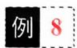

$$
\begin{aligned}D &= \left| \begin{matrix}3 & 3 & 3 & 3 \\1 & 1 & 0 & 1 \\1 & 0 & 1 & 1 \\1 & 0 & 1 & 1 \\0 & 1 & 1 & 1 \\\end{matrix} \right|= 3\left| \begin{matrix}1 & 1 & 1 & 1 \\1 & 1 & 0 & 1 \\0 & 1 & 1 & 1 \\\end{matrix} \right| \\&= 3\left| \begin{matrix}1 & 1 & 1 & 1 \\0 & 0 & - 1 & 0 \\0 & - 1 & 0 & 0 \\- 1 & 0 & 0 & 0 \\\end{matrix} \right|= 3 \cdot ( - 1)^{\frac{1}{2}4 \cdot 3}( - 1)^{3} ( 副对角线 ) \\&= - 3,\end{aligned}
$$

【分析】按第1行展开

$$
\begin{aligned}D &= a_{1}\begin{vmatrix}a_{2} & b_{2} & 0 \\b_{3} & a_{3} & 0 \\0 & 0 & a_{4}\end{vmatrix}- b_{1}\begin{vmatrix}0 & a_{2} & b_{2} \\0 & b_{3} & a_{3} \\b_{4} & 0 & 0\end{vmatrix} \\&= a_{1}a_{4}\begin{vmatrix}a_{2} & b_{2} \\b_{3} & a_{3}\end{vmatrix}- b_{1}b_{4}\begin{vmatrix}a_{2} & b_{2} \\b_{3} & a_{3}\end{vmatrix} \\&= (a_{1}a_{4} - b_{1}b_{4})(a_{2}a_{3} - b_{2}b_{3})  ,\end{aligned}
$$

或二、四两行互换，再二、四两列互换

$$
\begin{aligned}D = & - \left| \begin{matrix}a_{1} & 0 & 0 & b_{1} \\b_{4} & 0 & 0 & a_{4} \\0 & b_{3} & a_{3} & 0 \\0 & a_{2} & b_{2} & 0 \\\end{matrix} \right|= \left| \begin{matrix}a_{1} & b_{1} & 0 & 0 \\b_{4} & a_{4} & 0 & 0 \\0 & 0 & a_{3} & b_{3} \\0 & 0 & b_{2} & a_{2} \\\end{matrix} \right| \qquad ( 拉普 ) \\= & \left| \begin{matrix}a_{1} & b_{1} \\b_{4} & a_{4} \\\end{matrix} \right| \bullet \left| \begin{matrix}a_{3} & b_{3} \\b_{2} & a_{2} \\\end{matrix} \right|= (a_{1}a_{4} - b_{1}b_{4})(a_{2}a_{3} - b_{2}b_{3}).\end{aligned}
$$

拉斯)

例9【分析】方法一 把每一行都加至第1行，有

$$
\begin{aligned} &D = \left| \begin{matrix} 4a + x & 4a + x & 4a + x & 4a + x \\a & a + x & a & a \\a & a & a + x & a \\a & a & a & a + x \\\end{matrix} \right|\\ \end{aligned}
$$

$$
= \left( 4 a + x \right) \begin{vmatrix} 1 & 1 & 1 & 1 \\ a & a + x & a & a \\ a & a & a + x & a \\ a & a & a & a + x \end{vmatrix}
$$

$$
\begin{aligned}= (4a + x) \left| \begin{matrix} 1 & 1 & 1 & 1 \\ 0 & x & 0 & 0 \\ 0 & 0 & x & 0 \\ 0 & 0 & 0 & x \end{matrix} \right| = (4a + x)x^{3}.\end{aligned}
$$

方法二把第1行的－1倍分别加到其他各行，有

$$
\begin{aligned} &D = \left| \begin{aligned}\\ &a + x & & a & & a \\&- x & & x & & 0 & \\&- x & & 0 & & x & 0 \\&- x & & 0 & & 0 & & x\\ &\end{aligned} \right| = \left| \begin{aligned}\\ &4a + x & & a & & a & & a \\&0 & & x & & 0 & & 0 \\&0 & & 0 & & x & & 0 \\&0 & & 0 & & 0 & & x\\ &\end{aligned} \right| = (4a + x)x^3.\\ \end{aligned}
$$

方法三先把第3行的—1倍加到第4行，然后把第2行的一1倍加到第3行，最后把第1行的一1倍加到第2行，有

$$
D = \left| \begin{matrix} { a + x } & { a } & { a } & { a } \\ { - x } & { x } & { 0 } & { 0 } \\ { 0 } & { - x } & { x } & { 0 } \\ { 0 } & { 0 } & { - x } & { x } \\ \end{matrix} \right| = \left| \begin{matrix} { 4 a + x } & { a } & { a } & { a } \\ { 0 } & { x } & { 0 } & { 0 } \\ { 0 } & { - x } & { x } & { 0 } \\ { 0 } & { 0 } & { - x } & { x } \\ \end{matrix} \right|
$$

$$
\begin{aligned}= (4a + x) \left| \begin{matrix} x & 0 & 0 \\ -x & x & 0 \\ 0 & -x & x \end{matrix} \right| = (4a + x)x^3.\end{aligned}
$$

方法四

$$
\begin{aligned} &D = \left| \begin{aligned}\\ &a + x & & a + 0 & & a + 0 & & a + 0 \\&a + 0 & & a + x & & a + 0 & & a + 0 \\&a + 0 & & a + 0 & & a + x & & a + 0 \\&a + 0 & & a + 0 & & a + 0 & & a + x\\ &\end{aligned} \right|\\ \end{aligned}
$$

用拆开性质应该

是16个行列式的和，你能写出不为0的那5个行列式吗？

例10【分析】方法一 把每一列都加到第1列，并提出公因式x,

$$
D = x \begin{vmatrix} 1 & - 1 & 1 & x - 1 \\ 1 & - 1 & x + 1 & - 1 \\ 1 & x - 1 & 1 & - 1 \\ 1 & - 1 & 1 & - 1 \end{vmatrix} = x \begin{vmatrix} 1 & - 1 & 1 & x - 1 \\ 0 & 0 & x & - x \\ 0 & x & \dot{0} & - x \\ 0 & 0 & 0 & - x \end{vmatrix}
$$

$$
\begin{aligned}= x \left| \begin{matrix} 0 & x & -   x \\ x & 0 & -   x \\ 0 & 0 & -   x \end{matrix} \right| = x^{4}.\end{aligned}
$$

方法二 第1列分别加到第2列，第4列，第1列的一1倍加到

第3列，

$$
D = \left| \begin{matrix} 1 & 0 & 0 & x \\ 1 & 0 & x & 0 \\ 1 & x & 0 & 0 \\ x + 1 & x & - x & x \end{matrix} \right| = x^{3} \left| \begin{matrix} 1 & 0 & 0 & 1 \\ 1 & 0 & 1 & 0 \\ 1 & 1 & 0 & 0 \\ x + 1 & 1 & - 1 & 1 \end{matrix} \right|
$$

行列式区

$$
\begin{aligned}= x^{3} \left| \begin{aligned} 1 \quad & 0 \quad & 0 \quad & 1 \\ 1 \quad & 0 \quad & 1 \quad & 0 \\ 1 \quad & 1 \quad & 0 \quad & 0 \\ x \quad & 0 \quad & 0 \quad & 0 \end{aligned} \right| = x^{4}.\end{aligned}
$$

方法三拆开法.

$$
D = { \left[ \begin{aligned} { } & { { } 0 + 1 } & { } & { { } 0 - 1 } & { } & { { } 0 + 1 } & { } & { { } x - 1 } \\ { } & { { } 0 + 1 } & { } & { { } 0 - 1 } & { } & { { } x + 1 } & { } & { { } 0 - 1 } \\ { } & { { } 0 + 1 } & { } & { { } x - 1 } & { } & { { } 0 + 1 } & { } & { { } 0 - 1 } \\ { } & { { } x + 1 } & { } & { { } 0 - 1 } & { } & { { } 0 + 1 } & { } & { { } 0 - 1 } \end{aligned} \right] } .
$$

D可以分解成 $2^{4} = 16$ 个行列式之和，若行列式中有2个或2个以上的行(或列)相等或成比例，其行列式的值必为0，不为0的只有5个，即

$$
D = \left| \begin{matrix} 0 & 0 & 0 & x \\ 0 & 0 & x & 0 \\ 0 & x & 0 & 0 \\ x & 0 & 0 & 0 \end{matrix} \right| + \left| \begin{matrix} 1 & 0 & 0 & x \\ 1 & 0 & x & 0 \\ 1 & x & 0 & 0 \\ 1 & 0 & 0 & 0 \end{matrix} \right| + \left| \begin{matrix} 0 & - 1 & 0 & x \\ 0 & - 1 & x & 0 \\ 0 & - 1 & 0 & 0 \\ x & - 1 & 0 & 0 \end{matrix} \right| +
$$

$$
\begin{aligned}&\left| \begin{matrix}0 & 0 & 1 & x \\0 & 0 & 1 & 0 \\0 & x & 1 & 0 \\x & 0 & 1 & 0 \\\end{matrix} \right|+\left| \begin{matrix}0 & 0 & 0 & - 1 \\0 & 0 & x & - 1 \\0 & x & 0 & - 1 \\x & 0 & 0 & - 1 \\\end{matrix} \right| \\=& x^{4} + x^{3} - x^{3} + x^{3} - x^{3} = x^{4}.\end{aligned}
$$

例11【分析】由于 $A_{ij}$ 与 $\alpha_{ij}$ 的数值大小正负无关，故可构造一新的行列式|B|，即

$$
\left| \textbf { \em B } \right| = \left| \begin{matrix} { \textbf { \em 1 } } & { \textbf { \em 2 } } & { - \textbf { \em 1 } } & { \textbf { \em 1 } } \\ { \textbf { \em 0 } } & { \textbf { \em 2 } } & { \textbf { \em t } } & { \textbf { \em 1 } } \\ { \textbf { \em 1 } } & { - \textbf { \em 1 } } & { \textbf { \em 2 } } & { - \textbf { \em 1 } } \\ { - \textbf { \em 1 } } & { \textbf { \em 3 } } & { \textbf { \em 2 } } & { \textbf { \em 1 } } \end{matrix} \right| .
$$

## 【注意】

LAI与|B|虽不一样，但第3行元素的代数余子式A3是完全相同的.

则| $\left| \boldsymbol{B} \right| = A_{31} - A_{32} + 2A_{33} - A_{34} = 0.$

$$
\begin{aligned} &\left| \boldsymbol{B} \right| = \left| \begin{aligned}\\ &1 & \quad 2 & \quad -1 & \quad 1 \\&0 & \quad 2 & \quad t & \quad 1 \\&0 & \quad -3 & \quad 3 & \quad -2 \\&0 & \quad 2 & \quad 4 & \quad 0\\ &\end{aligned} \right| = \left| \begin{aligned}\\ &2 & \quad t & \quad 1 \\&-3 & \quad 3 & \quad -2 \\&2 & \quad 4 & \quad 0\\ &\end{aligned} \right| = -4t - 2.\\ \end{aligned}
$$

所以 $t = - \frac{1}{2}$

例12【分析】为方便，记行列式为 f(x)，则 $f(1) = a_{4} + a_{3}$ $+ a_{2} + a_{1} + a_{0}$

对行列式f(1）恒等变形，有

$$
\begin{aligned}f(1) &= \left| \begin{array}{cccc}1 & -m & -1 & 0 \\0 & -1 & m & 1 \\-1 & 0 & 1 & -m \\m & 1 & 0 & -1 \\\end{array} \right|= \left| \begin{array}{cccc}1 & -m & -1 & 0 \\0 & -1 & m & 1 \\0 & -m & 0 & -m \\0 & 1+m^2 & m & -1 \\\end{array} \right| \\&= \left| \begin{array}{cccc}-1 & m & 1 \\-m & 0 & -m \\1+m^2 & m & -1 \\\end{array} \right|= m^2 \left| \begin{array}{cccc}-1 & 1 & 1 \\-1 & 0 & -1 \\1+m^2 & 1 & -1 \\\end{array} \right| \\&= m^2 \left| \begin{array}{cccc}-1 & 1 & 1 \\-1 & 0 & -1 \\m^2+2 & 0 & -2 \\\end{array} \right|= -m^4 - 4m^2.\end{aligned}
$$

## 四、克拉默法则

例13【分析】系数行列式是范德蒙德行列式，故

$$
D = \left| \begin{matrix} 1 & 1 & 1 \\ 2 & - 1 & - 3 \\ 4 & 1 & 9 \end{matrix} \right| = ( - 1 - 2)( - 3 - 2)\left[ - 3 - ( - 1) \right] = - 30,
$$

又 $D_{1} = \left| \begin{aligned} &1 & 1 & 1 \\ &0 & -1 & -3 \\ &0 & 1 & 9 \end{aligned} \right| = -6.$ ,故 $x_{1} = \frac{1}{5}$

例14【分析】设所求直线方程为 $ax+by+c=0,P(x,y)$ 是该直线上任意一点，则(x，y)，(1,2)，(4,0)应满足直线方程，即有

$$
\begin{cases}ax + by + c = 0   , \\a + 2b + c = 0   , \\4a + c = 0   ,\end{cases}\tag{1}
$$

因存在经过A，B两点的直线，那么a,b，c不全为0，即齐次方程组(1）必有非零解，从而

$$
\begin{vmatrix} x & y & 1 \\ 1 & 2 & 1 \\ 4 & 0 & 1 \end{vmatrix} = 0.
$$

所以 $2x + 3y - 8 = 0$ 为所求.

## 本章作业超链接

## 《基础过关66D题》优选

<table><tr><td>数学一</td><td>361</td><td>362</td><td>363</td><td>364 421</td><td>422</td><td>423</td><td>424</td></tr><tr><td>数学二</td><td>461</td><td>462</td><td>463</td><td>464 546</td><td>547</td><td>548</td><td>549</td></tr><tr><td>数学三</td><td>361</td><td>362</td><td>363</td><td>364 421</td><td>422</td><td>423</td><td>424</td></tr></table>

## 第二章 矩阵

## 本章考点

矩阵的概念单位矩阵、数量矩阵、对角矩阵、三角矩阵、对称矩阵和反对称矩阵以及它们的性质矩阵的线性运算矩阵的乘法方阵的幂方阵乘积的行列式矩阵的转置逆矩阵的概念和性质矩阵可逆的充分必要条件伴随矩阵矩阵的初等变换初等矩阵矩阵的秩矩阵的等价分块矩阵及其运算

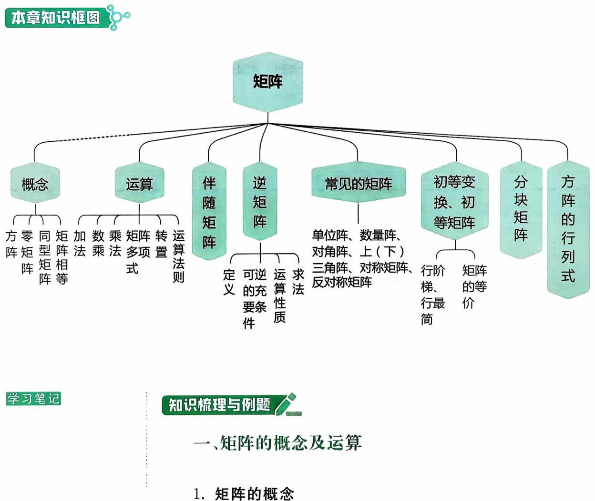

定义 m× n 个数排成如下m 行n列的一个表格

$$
\begin{bmatrix} a_{11} & a_{12} & \cdots & a_{1n} \\ a_{21} & a_{22} & \cdots & a_{2n} \\ \vdots & \vdots & & \vdots \\ a_{m1} & a_{m2} & \cdots & a_{mn} \end{bmatrix},
$$

称为一个 $m \times n$ 矩阵，当 $m = n$ 时，矩阵A称为n阶矩阵或叫n阶方阵.

如果一个矩阵的所有元素都是0，即

$$
\begin{bmatrix} 0 & 0 & \cdots & 0 \\ 0 & 0 & \cdots & 0 \\ \vdots & \vdots & & \vdots \\ 0 & 0 & \cdots & 0 \end{bmatrix},
$$

则称这个矩阵是零矩阵，可简记为0.

两个矩阵 $\boldsymbol{A} = \left[ a_{ij} \right]_{m \times n}, \boldsymbol{B} = \left[ b_{ij} \right]_{s \times v}$ ,如果 $m = s , n = t$ ，则称A与 B是同型矩阵.

两个同型矩阵 $\boldsymbol{A} = \left[ a_{ij} \right]_{m \times n}, \boldsymbol{B} = \left[ b_{ij} \right]_{m \times n}$ ，如果对应的元素都相等，即

$$
a_{ij} = b_{ij} \left( i = 1,2,\cdots,m; j = 1,2,\cdots,n \right),
$$

则称矩阵A与B相等，记作 $\boldsymbol{A} = \boldsymbol{B}.$

n阶方阵 $\boldsymbol{A} = \left[ a_{ij} \right]_{n \times n}$ 的元素所构成的行列式

$$
\begin{bmatrix} a_{11} & a_{12} & \cdots & a_{1n} \\ a_{21} & a_{22} & \cdots & a_{2n} \\ \vdots & \vdots & & \vdots \\ a_{n1} & a_{n2} & \cdots & a_{nn} \end{bmatrix}
$$

称为n阶矩阵A的行列式，记成 $\left| A \right|$ 或 detA.

【注】矩阵A是一个表格，而行列式A是一个数，这里的概念与符号不要混淆. $A = \boldsymbol{O}$ 与 $\left| \textbf{A} \right| = 0$ 是不同的，不能搞错.当 $A \ne 0$ 时可能有 $\left| \textbf{A} \right| = 0$ ，当然也可能有 $\left| \boldsymbol{A} \right| \neq 0$ .这些基本常识要想清楚.

## 2. 矩阵的运算

定义（加法）两个同型矩阵(行数与列数分别相等）可以相加，且

$$
\boldsymbol{A} + \boldsymbol{B} = \left[ a_{ij} \right]_{m \times n} + \left[ b_{ij} \right]_{m \times n} = \left[ a_{ij} + b_{ij} \right]_{m \times n}
$$

定义（数量乘法，简称数乘）设k是数 $\boldsymbol{A} = \left[ a_{ij} \right]_{m \times n}$ 是矩阵，则定义数与矩阵的乘法为

$$
k \boldsymbol{A} = k \left[ a_{ij} \right]_{m \times n} = \left[ k a_{ij} \right]_{m \times n}
$$

例如 $\begin{aligned}, \boldsymbol{A} = \begin{bmatrix} 1 & 3 & - 2 \\ & & \\ 0 & - 4 & 5 \end{bmatrix}, \boldsymbol{B} = \begin{bmatrix} 8 & 3 & 5 \\ & & \\ 1 & 2 & - 6 \end{bmatrix}\end{aligned}$ ,则

$$
\boldsymbol{A} + \boldsymbol{B} = \begin{bmatrix} 1 + 8 & 3 + 3 & - 2 + 5 \\ 0 + 1 & - 4 + 2 & 5 + ( - 6 ) \end{bmatrix} = \begin{bmatrix} 9 & 6 & 3 \\ 1 & - 2 & - 1 \end{bmatrix},
$$

$$
3\boldsymbol{A} = \begin{bmatrix} 3 \times 1 & 3 \times 3 & 3 \times (-2) \\ 3 \times 0 & 3 \times (-4) & 3 \times 5 \end{bmatrix} = \begin{bmatrix} 3 & 9 & -6 \\ 0 & -12 & 15 \end{bmatrix}.
$$

定义(乘法)设A是一个 $m \times s$ 矩阵，B是一个s×n矩阵(A的列数=B的行数)，则A，B可乘，且乘积AB是一个 $m \times n$ 矩阵.记成$\boldsymbol{C} = \boldsymbol{A} \boldsymbol{B} = \left[ c_{ij} \right]_{m \times n}$ ,其中C的第i行、第j列元素 $c_{ij}$ 是A的第i行s个元素和B的第j列的s个对应元素两两乘积之和，即

$$
c _ { i j } = \sum _ { k = 1 } ^ { s } a _ { i k } b _ { k j } = a _ { i 1 } b _ { 1 j } + a _ { i 2 } b _ { 2 j } + \cdots + a _ { i s } b _ { s j } .
$$

矩阵的乘法可图示如下：

  
m×s  
s×n

特别地，设A是一个n阶方阵，则记 $\overbrace{A \cdot A \cdots A}^{k  个 } = A^k$ 称为A的k次幂.

例如 $\begin{aligned} , \boldsymbol{A} = \begin{bmatrix} 1 & 2 \\ 3 & 6 \end{bmatrix} , \boldsymbol{B} = \begin{bmatrix} 10 & - 4 \\ - 5 & 2 \end{bmatrix}\end{aligned}$ ,则

$$
\begin{aligned}\boldsymbol{A}\boldsymbol{B} &= \begin{bmatrix}1 & 2 \\3 & 6\end{bmatrix}\begin{bmatrix}10 & -4 \\-5 & 2\end{bmatrix} \\&= \begin{bmatrix}1 \times 10 + 2 \times (-5) & 1 \times (-4) + 2 \times 2 \\3 \times 10 + 6 \times (-5) & 3 \times (-4) + 6 \times 2\end{bmatrix}= \begin{bmatrix}0 & 0 \\0 & 0\end{bmatrix}.\end{aligned}
$$

$$
\boldsymbol{B}\boldsymbol{A} = \begin{bmatrix} 10 & - 4 \\ - 5 & 2 \end{bmatrix} \begin{bmatrix} 1 & 2 \\ 3 & 6 \end{bmatrix} = \begin{bmatrix} - 2 & - 4 \\ 1 & 2 \end{bmatrix}.
$$

$$
\boldsymbol{A}^{2}=\begin{bmatrix}1&2\\ & 6\end{bmatrix}\begin{bmatrix}1&2\\ 3&6\end{bmatrix}=\begin{bmatrix}7&14\\ 21&42\end{bmatrix}=7\boldsymbol{A}.
$$

矩阵的乘法是基本的也是重要的，注意不要和数字运算相混淆：

（1）矩阵的乘法一般没有交换律.

(2)矩阵有零因子，即当 $A \ne \mathbf{O}, B \ne \mathbf{O}$ 时，有可能 $AB = \mathbf{O}$ 或者说当 $AB = \boldsymbol{O}$ 时≠A=0或 $\boldsymbol{B} = \boldsymbol{O}$

(3)矩阵没有消去律，即当 $AB = AC,A \ne  O时  \ne  B = C.$

定义(转置)将m×n型矩阵 $\boldsymbol{A} = \left[ \boldsymbol{a}_{ij} \right]_{m \times n}$ 的行列互换得到的 $n \times m$ 矩阵 $\left[ a_{ji} \right]_{n \times m}$ 称为A的转置矩阵，记为 $A^{\mathrm{T}}$ ,即若

$$
\boldsymbol{A} = \begin{bmatrix}a_{11} & a_{12} & \cdots & a_{1n} \\a_{21} & a_{22} & \cdots & a_{2n} \\\vdots & \vdots & & \vdots \\a_{m1} & a_{m2} & \cdots & a_{mn}\end{bmatrix}
$$

$$
\boldsymbol{A}^{\mathrm{T}}=\begin{bmatrix}\boldsymbol{\alpha}_{11} & \boldsymbol{\alpha}_{21} & \cdots & \boldsymbol{\alpha}_{m1} \\\boldsymbol{\alpha}_{12} & \boldsymbol{\alpha}_{22} & \cdots & \boldsymbol{\alpha}_{m2} \\\vdots & \vdots & & \vdots \\\boldsymbol{\alpha}_{1n} & \boldsymbol{\alpha}_{2n} & \cdots & \boldsymbol{\alpha}_{nn}\end{bmatrix}.
$$

定义(矩阵多项式)设A是n阶矩阵， $f(x) = a_m x^m + \cdots + a_1 x$ $ 1  + a_{0}$ 是x的多项式，则称

$$
a_{m}\boldsymbol{A}^{m}+a_{m - 1}\boldsymbol{A}^{m - 1}+\cdots+a_{1}\boldsymbol{A}+a_{0}\boldsymbol{E}
$$

为矩阵多项式，记为f(A).

运算法则

(1)加法.A,B,C是同型矩阵，则

$$
\begin{aligned}&\boldsymbol{A} + \boldsymbol{B} = \boldsymbol{B} + \boldsymbol{A}  ;  \quad  交换律  \\&\left( \boldsymbol{A} + \boldsymbol{B} \right) + \boldsymbol{C} = \boldsymbol{A} + \left( \boldsymbol{B} + \boldsymbol{C} \right)  ;  \quad  结合律  \\&\boldsymbol{A} + \boldsymbol{O} = \boldsymbol{A}  , 其中   \boldsymbol{O}    是元素全为零的同型矩阵;  \\&\boldsymbol{A} + \left( - \boldsymbol{A} \right) = \boldsymbol{O}.\end{aligned}
$$

(2)数乘矩阵. $k(mA)=(km)A=m(kA);(k+m)A=kA+mA$ i

$$
k(\boldsymbol{A} + \boldsymbol{B}) = k\boldsymbol{A} + k\boldsymbol{B}; 1\boldsymbol{A} = \boldsymbol{A}, 0\boldsymbol{A} = \boldsymbol{O}.
$$

(3) 乘法.A，B，C满足运算条件时

$$
\begin{aligned}&(AB)C = A(BC) ; \\&A(B + C) = AB + AC ; \\&(B + C)A = BA + CA .\end{aligned}
$$

(4) 转置. $\left( \boldsymbol{A} + \boldsymbol{B} \right)^{\mathrm{T}} = \boldsymbol{A}^{\mathrm{T}} + \boldsymbol{B}^{\mathrm{T}} ; \left( k\boldsymbol{A} \right)^{\mathrm{T}} = k\boldsymbol{A}^{\mathrm{T}} ;$

$$
( \boldsymbol{A} \boldsymbol{B} )^{\mathrm{T}} = \boldsymbol{B}^{\mathrm{T}} \boldsymbol{A}^{\mathrm{T}} ; ( \boldsymbol{A}^{\mathrm{T}} )^{\mathrm{T}} = \boldsymbol{A}.
$$

关于 $\alpha \beta ^ { \mathrm { T } } , \beta \alpha ^ { \mathrm { T } } , \alpha ^ { \mathrm { T } } \beta , \beta ^ { \mathrm { T } } \alpha , \alpha \alpha ^ { \mathrm { T } } , \alpha ^ { \mathrm { T } } \alpha.$

如果有 $\boldsymbol{\alpha} = \left[ a_{1}, a_{2}, a_{3} \right]^{\mathrm{T}}, \boldsymbol{\beta} = \left[ b_{1}, b_{2}, b_{3} \right]^{\mathrm{T}}$ ,则

$$
\boldsymbol { \alpha } \boldsymbol { \beta } ^ { \mathrm { T } } = \begin{bmatrix} a _ { 1 } \\ a _ { 2 } \\ a _ { 3 } \end{bmatrix} \begin{bmatrix} b _ { 1 } , b _ { 2 } , b _ { 3 } \end{bmatrix} = \begin{bmatrix} a _ { 1 } b _ { 1 } & a _ { 1 } b _ { 2 } & a _ { 1 } b _ { 3 } \\ a _ { 2 } b _ { 1 } & a _ { 2 } b _ { 2 } & a _ { 2 } b _ { 3 } \\ a _ { 3 } b _ { 1 } & a _ { 3 } b _ { 2 } & a _ { 3 } b _ { 3 } \end{bmatrix},
$$

$$
\boldsymbol { \beta } ^ { \mathrm { T } } \boldsymbol { \alpha } = \left[ b _ { 1 } , b _ { 2 } , b _ { 3 } \right] \begin{bmatrix} a _ { 1 } \\ a _ { 2 } \\ a _ { 3 } \end{bmatrix} = a _ { 1 } b _ { 1 } + a _ { 2 } b _ { 2 } + a _ { 3 } b _ { 3 } ,
$$

$$
\boldsymbol { \beta } \boldsymbol { \alpha } ^ { \mathrm { T } } = \begin{bmatrix} b _ { 1 } \\ b _ { 2 } \\ b _ { 3 } \end{bmatrix} \left[ a _ { 1 } , a _ { 2 } , a _ { 3 } \right] = \begin{bmatrix} a _ { 1 } b _ { 1 } & a _ { 2 } b _ { 1 } & a _ { 3 } b _ { 1 } \\ a _ { 1 } b _ { 2 } & a _ { 2 } b _ { 2 } & a _ { 3 } b _ { 2 } \\ a _ { 1 } b _ { 3 } & a _ { 2 } b _ { 3 } & a _ { 3 } b _ { 3 } \end{bmatrix},
$$

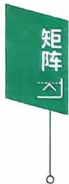

$$
\boldsymbol { \alpha } ^ { \mathrm { T } } \boldsymbol { \beta } = \left[ a _ { 1 } , a _ { 2 } , a _ { 3 } \right] \begin{bmatrix} b _ { 1 } \\ b _ { 2 } \\ b _ { 3 } \end{bmatrix} = a _ { 1 } b _ { 1 } + a _ { 2 } b _ { 2 } + a _ { 3 } b _ { 3 } ,
$$

$$
\boldsymbol { \alpha } \boldsymbol { \alpha } ^ { \top } = \begin{bmatrix} a _ { 1 } \\ a _ { 2 } \\ a _ { 3 } \end{bmatrix} \left[ a _ { 1 } , a _ { 2 } , a _ { 3 } \right] = \begin{bmatrix} a _ { 1 } ^ { 2 } & a _ { 1 } a _ { 2 } & a _ { 1 } a _ { 3 } \\ a _ { 2 } a _ { 1 } & a _ { 2 } ^ { 2 } & a _ { 2 } a _ { 3 } \\ a _ { 3 } a _ { 1 } & a _ { 3 } a _ { 2 } & a _ { 3 } ^ { 2 } \end{bmatrix},
$$

$$
\boldsymbol{\alpha}^{\mathrm{T}} \boldsymbol{\alpha} = \left[ a_{1}, a_{2}, a_{3} \right] \begin{bmatrix} a_{1} \\ a_{2} \\ a_{3} \end{bmatrix} = a_{1}^{2} + a_{2}^{2} + a_{3}^{2}.
$$

【注】（1）如 $A = \boldsymbol{\alpha} \boldsymbol{\beta}^{\mathrm{T}}$ ，则 $\boldsymbol{A}^{\mathrm{T}} = \boldsymbol{\beta} \boldsymbol{\alpha}^{\mathrm{T}}$ 且 $r(\boldsymbol{A}) = r(\boldsymbol{A}^{\mathrm{T}}) = 1$ 或0.

(2) $\boldsymbol{\alpha}^{\mathrm{T}} \boldsymbol{\beta} = \boldsymbol{\beta}^{\mathrm{T}} \boldsymbol{\alpha} = \operatorname{tr}(\boldsymbol{A})$

(3) $\mathbf{a}\mathbf{a}^{\mathrm{T}}$ 是对称矩阵 $, \boldsymbol{\alpha}^{\mathrm{T}} \boldsymbol{\alpha}$ 是平方和.

## 3. 常见的矩阵

设A 是 n 阶矩阵.

（1）单位阵.主对角元素为1，其余元素为0的矩阵称为单位阵，记成 $E_{n}$

关于单位矩阵E

$$
\begin{bmatrix} 1 & 0 \\ 0 & 1 \end{bmatrix}, \begin{bmatrix} 1 & 0 & 0 \\ 0 & 1 & 0 \\ 0 & 0 & 1 \end{bmatrix}, \cdots
$$

$$
\begin{bmatrix} 1 & 2 & 3 \\ 4 & 5 & 6 \end{bmatrix} \begin{bmatrix} 1 & 0 & 0 \\ 0 & 1 & 0 \\ 0 & 0 & 1 \end{bmatrix} = \begin{bmatrix} 1 & 2 & 3 \\ 4 & 5 & 6 \end{bmatrix};
$$

$$
\begin{bmatrix} 1 & 0 \\ 0 & 1 \end{bmatrix} \begin{bmatrix} 1 & 2 & 3 \\ 4 & 5 & 6 \end{bmatrix} = \begin{bmatrix} 1 & 2 & 3 \\ & & \\ 4 & 5 & 6 \end{bmatrix} .
$$

(2) 数量阵.数 k 与单位阵E 的积 kE 称为数量阵.

(3)对角阵.非对角元素都是0的矩阵(即 $\forall i \neq j$ 恒有 $a_{ij} = 0$ 称为对角阵，记成A.

$$
\boldsymbol { \Lambda } = \mathrm { d i a g } \left[ a _ { 1 } , a _ { 2 } , \cdots , a _ { n } \right] .
$$

关于对角矩阵

$$
\begin{bmatrix} a_{1} & 0 & 0 \\ 0 & a_{2} & 0 \\ 0 & 0 & a_{3} \end{bmatrix} \begin{bmatrix} b_{1} & 0 & 0 \\ 0 & b_{2} & 0 \\ 0 & 0 & b_{3} \end{bmatrix} = \begin{bmatrix} a_{1}b_{1} & 0 & 0 \\ 0 & a_{2}b_{2} & 0 \\ 0 & 0 & a_{3}b_{3} \end{bmatrix}.
$$

$$
\begin{align*}(1) \boldsymbol{\Lambda}_{1} \boldsymbol{\Lambda}_{2} = \boldsymbol{\Lambda}_{2} \boldsymbol{\Lambda}_{1}.\end{align*}
$$

(2)

$$
\begin{bmatrix} a_{1} & & \\ & a_{2} & \\ & & a_{3} \end{bmatrix}^{n} = \begin{bmatrix} a_{1}^{n} & 0 & 0 \\ 0 & a_{2}^{n} & 0 \\ 0 & 0 & a_{3}^{n} \end{bmatrix}.\tag{3}
$$

$$
\begin{bmatrix} a_{1} & & \\ & a_{2} & \\ & & a_{3} \end{bmatrix}^{-1} = \begin{bmatrix} \frac{1}{a_{1}} & & \\ & \frac{1}{a_{2}} & \\ & & \frac{1}{a_{3}} \end{bmatrix} (a_{i} \neq 0).
$$

(4)上(下)三角阵.当 $i > j \left( i < j \right)$ 时，有 $a_{ij} = 0$ 的矩阵称为上(下）三角阵.

（5)对称阵.满足 $A^{\mathrm{T}} = A$ ,即 $a_{ij} = a_{ji}$ 的矩阵称为对称阵.

(6)反对称阵.满足 $A^{\mathrm{T}} = - A$ ,即 $a_{ij} = - a_{ji}, a_{ii} = 0$ 的矩阵称为 反对称阵.

例1

$$
\begin{aligned}& 若  \left[ \begin{aligned} 1 \quad 2 \quad 3 \\ 4 \quad 5 \quad 6 \\ 7 \quad 8 \quad 9 \end{aligned} \right] - \boldsymbol{X} + \left[ \begin{aligned} 1 \\ 2 \\ 0 \end{aligned} \right] \left[ \begin{aligned} 2 \quad 0 \quad - 1 \end{aligned} \right] = 3 \left[ \begin{aligned} 1 \quad 0 \quad 0 \\ 2 \quad 2 \quad 0 \\ 3 \quad 3 \quad 3 \end{aligned} \right]\end{aligned}
$$

X =

练习区域

例2 设 $\boldsymbol{A} = \begin{bmatrix} 1 & 0 \\ 0 & -1 \end{bmatrix}, \boldsymbol{B} = \begin{bmatrix} 1 & 2 \\ & \\ 3 & 4 \end{bmatrix}$ ,则

(1)AB — BA =

练习区域

(2) $(A\boldsymbol{B})^{2} =$

(3) $A^{2}B^{2}=$

例3 (1994，数一)已知 $\boldsymbol{\alpha} = (1,2,3)^{\mathrm{T}}, \boldsymbol{\beta} = (1, \frac{1}{2}, \frac{1}{3})^{\mathrm{T}}$ ,设A $= \boldsymbol{\alpha} \boldsymbol{\beta}^{\mathrm{T}}$ ,则 $A^{n} =$

答案见 45 页

例4 (1991）设 A,B 为 n阶方阵，满足等式 AB = O,则必有 (A)A = O 或 B = O. (B) $\boldsymbol{A} + \boldsymbol{B} = \boldsymbol{O}.$ (C) $| A | = 0   或   | B | = 0.$ (D) $\left| \boldsymbol{A} \right| + \left| \boldsymbol{B} \right| = 0.$

练习区域练习区域

例5设 $\boldsymbol{A} = \boldsymbol{E} - \boldsymbol{\xi} \boldsymbol{\xi}^{\mathrm{T}}$ ,其中ξ是n维非零列向量.证明 $A^{2}=A\Leftrightarrow\xi^{\mathrm{T}}\xi=1$

答案见 46 页

答案见 46 页

## 二、伴随矩阵、可逆矩阵

## 1. 伴随矩阵的概念与公式

伴随矩阵：由矩阵A的行列式A所有的代数余子式所构成的形如

$$
\begin{bmatrix} A_{11} & A_{21} & \cdots & A_{n1} \\ A_{12} & A_{22} & \cdots & A_{n2} \\ \vdots & \vdots & & \vdots \\ A_{1n} & A_{2n} & \cdots & A_{nn} \end{bmatrix}
$$

的矩阵称为矩阵A的伴随矩阵，记为 $A^{*}$

例如 $\mathbf{0}\boldsymbol{A} = \begin{bmatrix} 2 & 1 & 2 \\ -1 & 0 & 3 \\ 1 & -2 & 1 \end{bmatrix}$ ，计算代数余子式，得

$$
A_{11} = \begin{vmatrix} 0 & 3 \\ -2 & 1 \end{vmatrix} = 6, A_{12} = - \begin{vmatrix} -1 & 3 \\ 1 & 1 \end{vmatrix} = 4,
$$

$$
A_{13} = \begin{vmatrix} -1 & 0 \\ 1 & -2 \end{vmatrix} = 2  ,
$$

$$
A_{21} = - \begin{vmatrix} 1 & 2 \\ - 2 & 1 \end{vmatrix} = - 5, A_{22} = \begin{vmatrix} 2 & 2 \\ 1 & 1 \end{vmatrix} = 0,
$$

$$
A_{^{23}} = - \begin{vmatrix} 2 & 1 \\ 1 & - 2 \end{vmatrix} = 5 ,
$$

$$
A_{31} = \begin{vmatrix} 1 & 2 \\ 0 & 3 \end{vmatrix} = 3, A_{32} = - \begin{vmatrix} 2 & 2 \\ -1 & 3 \end{vmatrix} = - 8,
$$

$$
A_{33} = \begin{vmatrix} 2 & 1 \\ -1 & 0 \end{vmatrix} = 1  ,
$$

按定义 $\boldsymbol{A}^{*} = \begin{bmatrix} 6 & -5 & 3 \\ 4 & 0 & -8 \\ 2 & 5 & 1 \end{bmatrix}$

伴随矩阵的公式：

$$
\boldsymbol{A}\boldsymbol{A}^{*} = \boldsymbol{A}^{*} \boldsymbol{A} = \left| \boldsymbol{A} \right| \boldsymbol{E}.
$$

$$
\left( \boldsymbol{A}^{*} \right)^{-1} = \left( \boldsymbol{A}^{-1} \right)^{*} = \frac{1}{\left| \boldsymbol{A} \right|} \boldsymbol{A} \quad \left( \left| \boldsymbol{A} \right| \neq 0 \right).
$$

$$
(k\boldsymbol{A})^{*} = k^{n - 1}\boldsymbol{A}^{*}
$$

$$
\left( \boldsymbol{A}^{*} \right)^{\mathrm{T}} = \left( \boldsymbol{A}^{\mathrm{T}} \right)^{*}
$$

$$
\left| \boldsymbol{A}^{*} \right| = \left| \boldsymbol{A} \right|^{n - 1}
$$

$$
\left( \boldsymbol{A}^{*} \right)^{*} = \left| \boldsymbol{A} \right|^{n - 2} \boldsymbol{A} \left( n \geqslant 2 \right).
$$

{n,如 r(A) = n,

(0,如 r(A) < n− 1.

## 2. 可逆矩阵的概念与定理

定义设A是n阶矩阵，如果存在n阶矩阵B使得

$$
AB = BA = E (单位矩阵)
$$

成立，则称A是可逆矩阵或非奇异矩阵，B是A的逆矩阵，记成 $A^{-1} = B.$

定理2.1若A可逆，则A的逆矩阵唯一.

定理2.2 A可逆 $\Leftrightarrow \mid \boldsymbol{A} \mid \neq 0.$

定理 2. 3 设 A 和 B 是 n 阶矩阵且 AB = E,则 BA = E.

## 3. n 阶矩阵A 可逆的充分必要条件

(1)存在 n阶矩阵 B，使 $AB = E (或  BA = E )$

(2) $| \textbf{A} | \neq 0$ ，或秩r(A)= n,或A的列(行）向量线性无关.

(3) 齐次方程组 Ax = 0 只有零解.

(4) ∀ b,非齐次线性方程组 Ax = b 总有唯一解.

（5）矩阵A的特征值全不为0.

## 4. 逆矩阵的运算性质

若 $k \ne 0, A$ 可逆，则 $(k\boldsymbol{A})^{-1} = \frac{1}{k}\boldsymbol{A}^{-1}$

若A,B可逆，则 $( \boldsymbol{A} \boldsymbol{B} )^{-1} = \boldsymbol{B}^{-1} \boldsymbol{A}^{-1}$ ,特别地 $(A^{2})^{-1} = (A^{-1})^{2}$

若 $A^{\mathrm{T}}$ 可逆，则 $\left( \boldsymbol{A}^{\mathrm{T}} \right)^{-1} = \left( \boldsymbol{A}^{-1} \right)^{\mathrm{T}} ; \left( \boldsymbol{A}^{-1} \right)^{-1} = \boldsymbol{A} ; \left| \boldsymbol{A}^{-1} \right| = \frac{1}{\left| \boldsymbol{A} \right|}.$

注意即使A，B和A+B都可逆，一般地 $( \boldsymbol{A} + \boldsymbol{B} )^{-1} \neq \boldsymbol{A}^{-1} + \boldsymbol{B}^{-1}$

## 5. 求逆矩阵的方法

方法一用公式，若 $\mid \boldsymbol{A} \mid \neq 0$ ,则 $\boldsymbol{A}^{-1} = \frac{1}{\left| \boldsymbol{A} \right|} \boldsymbol{A}^{*}$

方法二初等变换法. $(A \vdots E) \xrightarrow{ 初等行变换 } (E \vdots A^{-1})$

方法三 用定义求B,使AB=E或BA=E,则A可逆，且 $A^{-1} = B.$

方法四 用分块矩阵.

设B，C都是可逆矩阵，则

$$
\begin{bmatrix} \boldsymbol{B} & \boldsymbol{O} \\ \boldsymbol{O} & \boldsymbol{C} \end{bmatrix}^{-1} = \begin{bmatrix} \boldsymbol{B}^{-1} & \boldsymbol{O} \\ \boldsymbol{O} & \boldsymbol{C}^{-1} \end{bmatrix}; \begin{bmatrix} \boldsymbol{O} & \boldsymbol{B} \\ \boldsymbol{C} & \boldsymbol{O} \end{bmatrix}^{-1} = \begin{bmatrix} \boldsymbol{O} & \boldsymbol{C}^{-1} \\ \boldsymbol{B}^{-1} & \boldsymbol{O} \end{bmatrix}.
$$

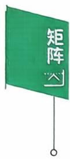

例6 若 $\boldsymbol{A} = \begin{bmatrix} 1 & 1 & 1 \\ 1 & 2 & 1 \\ 1 & 1 & 3 \end{bmatrix}$ ,则 $A^{-1} \cdot =$

例7设 $\boldsymbol{A} = \begin{bmatrix} 0 & \alpha_{1} & 0 & \cdots & 0 \\ 0 & 0 & \alpha_{2} & \cdots & 0 \\ \vdots & \vdots & \vdots & & \vdots \\ 0 & 0 & 0 & \cdots & \alpha_{n - 1} \\ \alpha_{n} & 0 & 0 & \cdots & 0 \end{bmatrix}$ ,其中 $a_{i} \neq 0, i = 1, 2$

答案见 47 页

$$
\cdots , n
$$

$$
A^{*} =
$$

例8设 $\boldsymbol{\alpha} = \left( \frac{1}{2}, 0, \cdots, 0, \frac{1}{2} \right)^{\mathrm{T}}$ 是n维列向量，矩阵 $\boldsymbol{A} = \boldsymbol{E} -$ $\boldsymbol{\alpha} \boldsymbol{\alpha}^{\mathrm{T}}, \boldsymbol{B} = \boldsymbol{E} + a \boldsymbol{\alpha} \boldsymbol{\alpha}^{\mathrm{T}}$ ,若 B 是A 的逆矩阵，则 a=

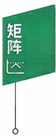

例9 A是n 阶矩阵，满足 $\boldsymbol{A}^{2}-3 \boldsymbol{A}-2 \boldsymbol{E}=\boldsymbol{O}$ ,则 $( \boldsymbol{A} + \boldsymbol{E} )^{-1} =$

答案见 48 页

  
答案见 49 页

例 10设A,B都是三阶矩阵，且

$$
AB = 2A + B,
$$

若 $\boldsymbol{B} = \begin{bmatrix} 2 & 0 & 2 \\ 0 & 4 & 0 \\ 2 & 0 & 2 \end{bmatrix}$ ,则 $( \boldsymbol{A} - \boldsymbol{E} )^{-1} =$

例11 (2001，数二)已知 $\boldsymbol{A} = \begin{bmatrix} 1 & 0 & 0 \\ 1 & 1 & 0 \\ 1 & 1 & 1 \end{bmatrix}, \boldsymbol{B} = \begin{bmatrix} 0 & 1 & 1 \\ 1 & 0 & 1 \\ 1 & 1 & 0 \end{bmatrix}$ ,矩

阵X满足

$$
A X A + B X B = A X B + B X A + E ,
$$

则 X =

<table><tr><td>练习区域</td></tr></table>

<table><tr><td>练习区域</td></tr></table>

答案见 49 页

例 12 设 $f(x)=x^{100}+x^{99}+\cdots+x+1,A=\begin{bmatrix}1&0&0\\0&0&1\\0&0&0\end{bmatrix}$ ,求

f(A)和 $\left[ f(A) \right]^{-1}$

例 13 A 是n阶可逆矩阵，证明：非齐次线性方程组 Ax = b 有唯一解 $A^{-1}b.$

## 三、初等变换、初等矩阵

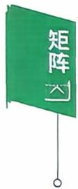

## 1. 初等变换与初等矩阵的概念

定义(初等变换)设A是m×n矩阵.

(1) 用某个非零常数 $k(k \neq 0)$ 乘A的某行(列）的每个元素，

(2)互换A的某两行(列)的位置，

(3)将A的某行(列)元素的k倍加到另一行(列)，

称为矩阵的3种初等行(列）变换，且分别称为初等倍乘、互换、倍加行 （列）变换，统称初等变换.

定义(初等矩阵）由单位矩阵经一次初等变换得到的矩阵称为初等矩阵，它们分别是(以三阶为例)

(1)倍乘初等矩阵，记 E(i(k)).

$$
\boldsymbol{E}(2(k)) = \begin{bmatrix} 1 & 0 & 0 \\ 0 & k & 0 \\ 0 & 0 & 1 \end{bmatrix},
$$

E(2(k))表示由单位阵E的第二行(或第二列)乘 $k(k \neq 0)$ 得到的矩阵.

(2) 互换初等矩阵，记 $\boldsymbol{E}(i, j)$

$$
\boldsymbol{E}(1,2)=\begin{bmatrix}0&1&0\\1&0&0\\0&0&1\end{bmatrix},
$$

E(1,2)表示由单位阵E的第一，二行(或第一，二列)互换得到的矩阵.

（3）倍加初等矩阵，记 $E(ij(k))$

【注】初等矩阵记号各教材不同.

$$
\boldsymbol{E}(13(k)) = \begin{bmatrix} 1 & 0 & 0 \\ 0 & 1 & 0 \\ k & 0 & 1 \end{bmatrix},
$$

E(13(k)）表示由单位阵E的第一行的k倍加到第三行得到的矩阵当看成列变换时，应是E的第三列的k倍加到第一列得到的矩阵.

定义(等价矩阵）矩阵A经过有限次初等变换变成矩阵B，则称A与B等价，记成 $\mathbf { \mathit { A } } \simeq \mathbf { \mathit { B } } ,$ 若 $\boldsymbol{A} \cong \begin{bmatrix} \boldsymbol{E}_{r} & \boldsymbol{O} \\ \boldsymbol{O} & \boldsymbol{O} \end{bmatrix}$ ，则后者称为A的等价标准形(A的等价标准形是与A等价的所有矩阵中的最简矩阵).

## 2. 初等矩阵与初等变换的性质

（1）初等矩阵的转置仍是初等矩阵.

（2）初等矩阵均是可逆阵，且其逆矩阵仍是初等矩阵.

$$
\boldsymbol{E}(i, j)^{-1} = \boldsymbol{E}(i, j) ; \boldsymbol{E}(i(k))^{-1} = \boldsymbol{E}\left(i\left(\frac{1}{k}\right)\right);
$$

$$
E(ij(k))^{-1} = E(ij(-k)).
$$

(3)用初等矩阵P左乘(右乘)A,其结果PA(AP)，相当于对A作相应的初等行(列）变换.

定理2.4 矩阵A可逆的充分必要条件是它能表示成一些初等矩阵的乘积.

## 3. 行阶梯矩阵，行最简矩阵

## 行阶梯矩阵

（1）如果矩阵中有零行(即这一行元素全是0)，则零行在矩阵的底部.

(2)每个非零行的主元(即该行最左边的第1个非零元)，它们的列指标随着行指标的递增而严格增大.

例如 $\begin{bmatrix} 2 & 1 & 3 \\ 0 & 0 & 0 \\ 0 & 0 & 5 \end{bmatrix}, \begin{bmatrix} 1 & 3 & - \; 2 \\ 0 & 1 & \; 4 \\ 0 & 2 & \; 5 \end{bmatrix}$ 都不是行阶梯矩阵.

例如 $\begin{bmatrix} 1 & 2 & 0 & 3 \\ 0 & 1 & -1 & 5 \\ 0 & 0 & 0 & 6 \end{bmatrix}, \begin{bmatrix} 3 & 0 & 1 & -4 \\ 0 & 0 & 2 & 7 \\ 0 & 0 & 0 & 0 \end{bmatrix}$ 是行阶梯矩阵.

## 行最简矩阵

一个行阶梯矩阵，如果还满足非零行的主元都是1，且主元所在的列的其他元素都是0，则称其为行最简矩阵.

例如

$$
\begin{bmatrix} 1 & 0 & 3 & 1 \\ 0 & 1 & 1 & 0 \\ 0 & 0 & 0 & 1 \end{bmatrix}, \begin{bmatrix} 1 & 1 & 2 & 0 \\ 0 & 1 & 3 & 0 \\ 0 & 0 & 0 & 1 \end{bmatrix}, \begin{bmatrix} 1 & -1 & 0 & 0 \\ 0 & 2 & 1 & 0 \\ 0 & 0 & 0 & 1 \end{bmatrix}
$$

最简矩阵.

例如

$$
\begin{bmatrix} 1 & 0 & - 1 & 0 \\ 0 & 1 & 2 & 0 \\ 0 & 0 & 0 & 1 \end{bmatrix}, \begin{bmatrix} 1 & 0 & 0 & 2 \\ 0 & 0 & 1 & 3 \\ 0 & 0 & 0 & 0 \end{bmatrix}
$$

如由 $A \xrightarrow{ 行 } B$ ,即 $P_{1} \cdots P_{2} P_{1} A = B.$ 记 $P = P_{1} \cdots P_{2}P_{1}$ 有 $PA = B,$ $P_{1} \cdots P_{2} P_{1} A = B$ 和 $P_{1} \cdots P_{2} P_{1} E = P$ 表明当A經行变换得到B时，E在同样的行变换下得到P，即 $(A \mid E) \to (B \mid P)$

例 14（1995，数一）设 $\boldsymbol{A} = \begin{bmatrix} a_{11} & a_{12} & a_{13} \\ & & \\ a_{21} & a_{22} & a_{23} \\ & & \\ a_{31} & a_{32} & a_{33} \end{bmatrix}$

$$
\boldsymbol{B} = \begin{bmatrix} a_{21} & a_{22} & a_{23} \\ & & \\ a_{11} & a_{12} & a_{13} \\ & & \\ a_{31} + a_{11} & a_{32} + a_{12} & a_{33} + a_{13} \end{bmatrix}, \boldsymbol{P}_{1} = \begin{bmatrix} 0 & 1 & 0 \\ 1 & 0 & 0 \\ & & \\ 0 & 0 & 1 \end{bmatrix}, \boldsymbol{P}_{2} = \begin{bmatrix} 1 & 0 & 0 \\ 0 & 1 & 0 \\ & & \\ 1 & 0 & 1 \end{bmatrix}
$$

必有

$$
\boldsymbol{A} \boldsymbol{P}_{1} \boldsymbol{P}_{2} = \boldsymbol{B}.
$$

(B) $\boldsymbol{A} \boldsymbol{P}_{2} \boldsymbol{P}_{1} = \boldsymbol{B}.$

(C) $\boldsymbol{P}_{1} \boldsymbol{P}_{2} \boldsymbol{A} = \boldsymbol{B}.$

(D) $P_{2}P_{1}A = B.$

例15 已知A是三阶矩阵，将矩阵A的第1，3两行互换得到B，

答案见 50 页

再将B的第2列的一1倍加到第3列，得到 $\boldsymbol{C} = \begin{bmatrix} 7 & 8 & 1 \\ 4 & 5 & 1 \\ 1 & 2 & 1 \end{bmatrix}$ ,则 $A =$

答案见 51 页

例16 已知矩阵 $\boldsymbol{A} = \begin{bmatrix} a & 1 & 1 \\ 1 & a & 1 \\ 1 & 1 & a \end{bmatrix}$ 和矩阵 $\boldsymbol{B} = \begin{bmatrix} 1 & 2 & -1 \\ 2 & 3 & 5 \\ 3 & 6 & -3 \end{bmatrix}$ 等 价，则a =

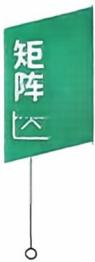  
答案见 51 页

## 四、分块矩阵

## 1. 分块矩阵的概念

将矩阵用若干纵线和横线分成许多小块，每一小块称为原矩阵的子矩阵(或子块)，把子块看成原矩阵的一个元素，则原矩阵叫分块矩阵.

由于不同的需要，同一个矩阵可以用不同的方法分块，构成不同的分块矩阵.

$$
\boldsymbol { A } = \begin{bmatrix} a _ { 1 1 } & a _ { 1 2 } & \cdots & a _ { 1 n } \\ \cdots \cdots \cdots \cdots \cdots \cdots \cdots \cdots \cdots \cdots \cdots \cdots \cdots \\ a _ { 2 1 } & a _ { 2 2 } & \cdots \cdots \cdots \cdots a _ { 2 n } \\ \vdots & \vdots & \vdots \\ a _ { m 1 } & a _ { m 2 } & \cdots \cdots \cdots \cdots \cdots \end{bmatrix} = \begin{bmatrix} \boldsymbol { \alpha } _ { 1 } \\ \boldsymbol { \alpha } _ { 2 } \\ \vdots \\ \boldsymbol { \alpha } _ { m } \end{bmatrix},
$$

其中 $\boldsymbol { \alpha } _ { i } = \left[ a _ { i 1 } , a _ { i 2 } , \cdots , a _ { i n } \right] , i = 1 , 2 , \cdots , m$ ，是A的子矩阵，A是以行分块的分块矩阵.

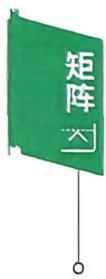

$$
\boldsymbol { B } = \begin{bmatrix} b _ { 1 1 } \vdots b _ { 1 2 } \vdots \cdots \vdots b _ { 1 n } \\ \vdots \vdots \vdots \cdots \vdots b _ { 2 n } \\ b _ { 2 1 } \vdots b _ { 2 2 } \vdots \cdots \vdots b _ { 2 n } \\ \vdots \vdots \vdots \vdots \vdots \vdots \vdots \vdots \vdots \\ b _ { m 1 } \vdots b _ { m 2 } \vdots \cdots \vdots b _ { m n } \end{bmatrix} = \left[ \boldsymbol { \beta } _ { 1 } , \boldsymbol { \beta } _ { 2 } , \cdots , \boldsymbol { \beta } _ { n } \right] ,
$$

其中 $\boldsymbol { \beta } _ { j } = \left[ b _ { 1 j } , b _ { 2 j } , \cdots , b _ { m j } \right] ^ { \mathrm { T } } , j = 1 , 2 , \cdots , n$ ，是B的子矩阵，B是以列分块的分块矩阵.

$$
\boldsymbol{C}=\begin{bmatrix}c_{11} & c_{12} \vdots & 0 & 0 & 0 \\c_{21} & c_{22} \vdots & 0 & 0 & 0 \\c_{31} & c_{32} \vdots & c_{33} & c_{34} & c_{35} \\\vdots & \vdots & & & \\c_{41} & c_{42} \vdots & c_{43} & c_{44} & c_{45}\end{bmatrix}=\begin{bmatrix}\boldsymbol{C}_{1} & \boldsymbol{O} \\\boldsymbol{C}_{3} & \boldsymbol{C}_{4}\end{bmatrix},
$$

其中 $C_{1} = \begin{bmatrix} c_{11} & c_{12} \\ & \\ c_{21} & c_{22} \end{bmatrix}, \boldsymbol{O} = \begin{bmatrix} 0 & 0 & 0 \\ & & \\ 0 & 0 & 0 \end{bmatrix}, \boldsymbol{C}_{3} = \begin{bmatrix} c_{31} & c_{32} \\ & \\ c_{41} & c_{42} \end{bmatrix}, \boldsymbol{C}_{4} =$ $\begin{bmatrix} \boldsymbol{C}_{33} & \boldsymbol{C}_{34} & \boldsymbol{C}_{35} \\ & & \\ \boldsymbol{C}_{43} & \boldsymbol{C}_{44} & \boldsymbol{C}_{45} \end{bmatrix}$ ，均是C的子矩阵.

## 2. 分块矩阵的运算

想对矩阵适当地分块处理(要保证相对应子块的运算能够合理进行），可以遵循下面的运算法则：

$$
\begin{aligned} &\begin{bmatrix} \boldsymbol{A}_{1} & \boldsymbol{A}_{2} \\ \boldsymbol{A}_{3} & \boldsymbol{A}_{4} \end{bmatrix} + \begin{bmatrix} \boldsymbol{B}_{1} & \boldsymbol{B}_{2} \\ \boldsymbol{B}_{3} & \boldsymbol{B}_{4} \end{bmatrix} = \begin{bmatrix} \boldsymbol{A}_{1} + \boldsymbol{B}_{1} & \boldsymbol{A}_{2} + \boldsymbol{B}_{2} \\ \boldsymbol{A}_{3} + \boldsymbol{B}_{3} & \boldsymbol{A}_{4} + \boldsymbol{B}_{4} \end{bmatrix};\\ &\begin{bmatrix} \boldsymbol{A} & \boldsymbol{B} \\ \boldsymbol{C} & \boldsymbol{D} \end{bmatrix} \begin{bmatrix} \boldsymbol{X} & \boldsymbol{Y} \\ \boldsymbol{Z} & \boldsymbol{W} \end{bmatrix} = \begin{bmatrix} \boldsymbol{A}\boldsymbol{X} + \boldsymbol{B}\boldsymbol{Z} & \boldsymbol{A}\boldsymbol{Y} + \boldsymbol{B}\boldsymbol{W} \\ \boldsymbol{C}\boldsymbol{X} + \boldsymbol{D}\boldsymbol{Z} & \boldsymbol{C}\boldsymbol{Y} + \boldsymbol{D}\boldsymbol{W} \end{bmatrix};\\ &\begin{bmatrix} \boldsymbol{A} & \boldsymbol{B} \\ \boldsymbol{C} & \boldsymbol{D} \end{bmatrix}^{\mathrm{T}} = \begin{bmatrix} \boldsymbol{A}^{\mathrm{T}} & \boldsymbol{C}^{\mathrm{T}} \\ \boldsymbol{B}^{\mathrm{T}} & \boldsymbol{D}^{\mathrm{T}} \end{bmatrix}.\\ \end{aligned}
$$

若B,C分别是m阶与s阶矩阵，则

$$
\left[ \begin{matrix} { \pmb { B } } & { \pmb { O } } \\ { \pmb { O } } & { \pmb { C } } \\ \end{matrix} \right] ^ { n } = \left[ \begin{matrix} { \pmb { B } ^ { n } } & { \pmb { O } } \\ { \pmb { O } } & { \pmb { C } ^ { n } } \\ \end{matrix} \right] .
$$

若B,C分别是 m阶与 n阶可逆矩阵，则

$$
\begin{bmatrix} \boldsymbol{B} & \boldsymbol{O} \\ \boldsymbol{O} & \boldsymbol{C} \end{bmatrix}^{-1} = \begin{bmatrix} \boldsymbol{B}^{-1} & \boldsymbol{O} \\ \boldsymbol{O} & \boldsymbol{C}^{-1} \end{bmatrix}, \begin{bmatrix} \boldsymbol{O} & \boldsymbol{B} \\ \boldsymbol{C} & \boldsymbol{O} \end{bmatrix}^{-1} = \begin{bmatrix} \boldsymbol{O} & \boldsymbol{C}^{-1} \\ \boldsymbol{B}^{-1} & \boldsymbol{O} \end{bmatrix}.
$$

例17 已知B，C分别是m阶与n阶可逆矩阵，证明： $\begin{bmatrix} \boldsymbol{B} & \boldsymbol{O} \\ \boldsymbol{O} & \boldsymbol{C} \end{bmatrix}$ 可逆，且

$$
\begin{bmatrix} \boldsymbol{B} & \boldsymbol{O} \\ \boldsymbol{O} & \boldsymbol{C} \end{bmatrix}^{-1} = \begin{bmatrix} \boldsymbol{B}^{-1} & \boldsymbol{O} \\ \boldsymbol{O} & \boldsymbol{C}^{-1} \end{bmatrix}.
$$

  
答案见 52 页

例18 已知 X = ABA,其中

$$
\boldsymbol{A} = \begin{bmatrix} 1 & 0 & 0 & 1 \\ 0 & 1 & 1 & 0 \\ 0 & 1 & -1 & 0 \\ 1 & 0 & 0 & -1 \end{bmatrix}, \boldsymbol{B} = \begin{bmatrix} 0 & 0 & 0 & 1 \\ 0 & 0 & 1 & 0 \\ 0 & 1 & 0 & 0 \\ 1 & 0 & 0 & 0 \end{bmatrix},
$$

则 X =

答案见 52 页

例19 已知 A,B 是 n 阶矩阵.

(1) $\begin{aligned}\begin{bmatrix}\boldsymbol{E} & \boldsymbol{E} \\\boldsymbol{O} & \boldsymbol{E}\end{bmatrix}\begin{bmatrix}\boldsymbol{A} & \boldsymbol{B} \\\boldsymbol{B} & \boldsymbol{A}\end{bmatrix}\begin{bmatrix}\boldsymbol{E} & -\boldsymbol{E} \\\boldsymbol{O} & \boldsymbol{E}\end{bmatrix}=\end{aligned}$

(2) $\begin{aligned} &\begin{vmatrix} \boldsymbol{A} & \boldsymbol{B} \\ \boldsymbol{B} & \boldsymbol{A} \end{vmatrix} =\\ \end{aligned}$

练习区域

答案见 53 页

## 五、方阵的行列式

抽象方阵的行列式公式

(1)若A是n阶矩阵， $,A^{\mathrm{T}}$ 是A的转置矩阵，则 $\left| \textbf{A}^{\mathrm{T}} \right| = \left| \textbf{A} \right|$

(2)若A是n阶矩阵，则 $\left| k \boldsymbol{A} \right| = k^{n} \left| \boldsymbol{A} \right|$

(3)(行列式乘法公式)若A、B都是n阶矩阵，则 $| A B | = | A | | B |$ 特别地 $\left| \boldsymbol{A}^{2} \right| = \left| \boldsymbol{A} \right|^{2}$

(4)若A是n阶矩阵，A\*是A的伴随矩阵，则 $\left| \boldsymbol{A}^{*} \right| = \left| \boldsymbol{A} \right|^{n - 1}$

(5)若A是n阶可逆矩阵 $,A^{-1}$ 是A的逆矩阵，则 $\left| \boldsymbol{A}^{-1} \right| = \left| \boldsymbol{A} \right|^{-1}$

(6)设A是 m阶矩阵，B是 n阶矩阵，则

$$
\begin{vmatrix} \boldsymbol{A} & \boldsymbol{O} \\ \boldsymbol{C} & \boldsymbol{B} \end{vmatrix} = \begin{vmatrix} \boldsymbol{A} & \boldsymbol{D} \\ \boldsymbol{O} & \boldsymbol{B} \end{vmatrix} = \left| \begin{array}{c} \boldsymbol{A} \end{array} \right| \bullet \left| \begin{array}{c} \boldsymbol{B} \end{array} \right| ;
$$

$$
\begin{vmatrix} \boldsymbol{O} & \boldsymbol{A} \\ \boldsymbol{B} & \boldsymbol{C} \end{vmatrix} = \begin{vmatrix} \boldsymbol{D} & \boldsymbol{A} \\ \boldsymbol{B} & \boldsymbol{O} \end{vmatrix} = (-1)^{m} \left| \boldsymbol{A} \right| \cdot \left| \boldsymbol{B} \right| .
$$

【注】一般情况下， $\left| \boldsymbol{A} + \boldsymbol{B} \right| \neq \left| \boldsymbol{A} \right| + \left| \boldsymbol{B} \right|, \left| \boldsymbol{A} - \boldsymbol{B} \right| \neq \left| \boldsymbol{A} \right| -$ $\left| \textbf{B} \right|, \left| \textbf{A} \right| \neq k \left| \textbf{A} \right|$

例 20 设 A,B 均为 n 阶矩阵， $\left| \boldsymbol{A} \right| = 2, \left| \boldsymbol{B} \right| = - 3$ ，则一 $2\boldsymbol{A}^{\prime} \boldsymbol{B}^{-1} \mid =$

例21 设A是四阶矩阵，如果 $\left| \boldsymbol{A} \right| = - \frac{2}{3}$ ,则 $\left| 3 \boldsymbol{A}^{*} + 4 \boldsymbol{A}^{-1} \right| =$

答案见 53 页

例22 (2017，数农)设A是三阶矩阵，且 $(A - E)^{-1} = A^2 + A +$ E.则 $| \textbf{A} | =$

答案见 53 页

例23 (2012，数二、三)设A是三阶矩阵， $\left| \boldsymbol{A} \right| = 3, \boldsymbol{A}$ 是A的伴随矩阵，交换A的第1行与第2行得矩阵B，则 $\left| \boldsymbol{B} \boldsymbol{A}^{*} \right| =$

答案见 54 页

## 例题解析

## 一、矩阵的概念及运算

学习笔记

【分析】

$$
\begin{aligned}\boldsymbol{X} &= \begin{bmatrix}1 & 2 & 3 \\4 & 5 & 6 \\7 & 8 & 9\end{bmatrix}+\begin{bmatrix}1 \\2 \\0\end{bmatrix}\begin{bmatrix}2 & 0 & -1 \\\end{bmatrix}-3\begin{bmatrix}1 & 0 & 0 \\2 & 2 & 0 \\3 & 3 & 3\end{bmatrix} \\&= \begin{bmatrix}1 & 2 & 3 \\4 & 5 & 6 \\7 & 8 & 9\end{bmatrix}+\begin{bmatrix}2 & 0 & -1 \\4 & 0 & -2 \\0 & 0 & 0\end{bmatrix}-\begin{bmatrix}3 & 0 & 0 \\6 & 6 & 0 \\9 & 9 & 9\end{bmatrix} \\&= \begin{bmatrix}0 & 2 & 2 \\2 & -1 & 4 \\-2 & -1 & 0\end{bmatrix}.\end{aligned}
$$

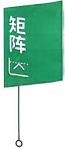

【分析】

$$
\begin{aligned}(1) \boldsymbol{A} \boldsymbol{B} - \boldsymbol{B} \boldsymbol{A} &= \begin{bmatrix} 1 & 0 \\ 0 & -1 \end{bmatrix} \begin{bmatrix} 1 & 2 \\ 3 & 4 \end{bmatrix} - \begin{bmatrix} 1 & 2 \\ 3 & 4 \end{bmatrix} \begin{bmatrix} 1 & 0 \\ 0 & -1 \end{bmatrix} \\&= \begin{bmatrix} 1 & 2 \\ -3 & -4 \end{bmatrix} - \begin{bmatrix} 1 & -2 \\ 3 & -4 \end{bmatrix} = \begin{bmatrix} 0 & 4 \\ -6 & 0 \end{bmatrix}.\end{aligned}
$$

$$
\begin{aligned}(2) (\boldsymbol{A}\boldsymbol{B})^{2} &= \left( \begin{bmatrix} 1 & 0 \\ 0 & -1 \end{bmatrix} \begin{bmatrix} 1 & 2 \\ 3 & 4 \end{bmatrix} \right)^{2} = \begin{bmatrix} 1 & 2 \\ -3 & -4 \end{bmatrix}^{2} \\&= \begin{bmatrix} -5 & -6 \\ 9 & 10 \end{bmatrix}.\end{aligned}
$$

$$
\begin{aligned}(3) \boldsymbol{A}^{2} \boldsymbol{B}^{2} &= \begin{bmatrix} 1 & 0 \\ 0 & -1 \end{bmatrix}^{2} \begin{bmatrix} 1 & 2 \\ 3 & 4 \end{bmatrix}^{2} = \begin{bmatrix} 1 & 0 \\ 0 & 1 \end{bmatrix} \begin{bmatrix} 7 & 10 \\ 15 & 22 \end{bmatrix} \\&= \begin{bmatrix} 7 & 10 \\ 15 & 22 \end{bmatrix}.\end{aligned}
$$

例3

【分析】

$$
\boldsymbol{A} = \boldsymbol{\alpha} \boldsymbol{\beta}^{\mathrm{T}} = \begin{bmatrix} 1 \\ 2 \\ 3 \end{bmatrix} \begin{bmatrix} 1 & \frac{1}{2} & \frac{1}{3} \end{bmatrix}
$$

$$
= \left[ \begin{aligned} &1 & \frac{1}{2} & \frac{1}{3} \\ &2 & 1 & \frac{2}{3} \\ &3 & \frac{3}{2} & 1 \end{aligned} \right]
$$

是三阶矩阵.

$$
\begin{aligned}\boldsymbol{A}^{n} &= (\boldsymbol{\alpha}\boldsymbol{\beta}^{\mathrm{T}})(\boldsymbol{\alpha}\boldsymbol{\beta}^{\mathrm{T}})\cdots(\boldsymbol{\alpha}\boldsymbol{\beta}^{\mathrm{T}}) \\&= \boldsymbol{\alpha}(\boldsymbol{\beta}^{\mathrm{T}}\boldsymbol{\alpha})\cdots(\boldsymbol{\beta}^{\mathrm{T}}\boldsymbol{\alpha})\boldsymbol{\beta}^{\mathrm{T}}\end{aligned}
$$

(n个)

(n-1个)

$$
\boldsymbol{\beta}^{\mathrm{T}} \boldsymbol{\alpha} = (1 \quad \frac{1}{2} \quad \frac{1}{3}) \begin{bmatrix} 1 \\ 2 \\ 3 \end{bmatrix} = 3 , 故   \boldsymbol{A}^{n} = 3^{n - 1} \begin{bmatrix} 1 & \dfrac{1}{2} & \dfrac{1}{3} \\ & & \\ 2 & 1 & \dfrac{2}{3} \\ & & \\ 3 & \dfrac{3}{2} & 1 \end{bmatrix}.
$$

例4【分析】由行列式乘法公式

$$
\left| \boldsymbol{A} \boldsymbol{B} \right| = \left| \boldsymbol{A} \right| \cdot \left| \boldsymbol{B} \right|.
$$

因 $AB = O \Rightarrow \left| A \right| \cdot \left| B \right| = 0$ ,所以选(C).

若 $\boldsymbol{A} = \begin{bmatrix} 1 & 1 \\ 0 & 0 \end{bmatrix}, \boldsymbol{B} = \begin{bmatrix} 1 & 1 \\ -1 & -1 \end{bmatrix}$ ,有 $AB = \boldsymbol{O}$ ，可知(A)，(B)错误.

若 $\boldsymbol{A} = \begin{bmatrix} 1 & 0 \\ 0 & 1 \end{bmatrix}, \boldsymbol{B} = \begin{bmatrix} 0 & 0 \\ 0 & 0 \end{bmatrix}$ ，可知(D)不正确.

例5 【证】 $\begin{aligned}\boldsymbol{A}^{2} &= (\boldsymbol{E} - \boldsymbol{\xi} \boldsymbol{\xi}^{\mathrm{T}})(\boldsymbol{E} - \boldsymbol{\xi} \boldsymbol{\xi}^{\mathrm{T}}) \\&= \boldsymbol{E} - \boldsymbol{\xi} \boldsymbol{\xi}^{\mathrm{T}} - \boldsymbol{\xi} \boldsymbol{\xi}^{\mathrm{T}} + \boldsymbol{\xi} \boldsymbol{\xi}^{\mathrm{T}} \boldsymbol{\xi} \boldsymbol{\xi}^{\mathrm{T}} \\&= \boldsymbol{A} + \boldsymbol{\xi} (\boldsymbol{\xi}^{\mathrm{T}} \boldsymbol{\xi}) \boldsymbol{\xi}^{\mathrm{T}} - \boldsymbol{\xi} \boldsymbol{\xi}^{\mathrm{T}} \\&= \boldsymbol{A} + (\boldsymbol{\xi}^{\mathrm{T}} \boldsymbol{\xi} - 1) \boldsymbol{\xi} \boldsymbol{\xi}^{\mathrm{T}},\end{aligned}$

因为 $\xi \neq 0$ ,所以 $\xi \xi ^ { T } \neq O$

$$
\begin{aligned}\boldsymbol{A}^{\mathrm{T}} = \boldsymbol{A} \Leftrightarrow & (\boldsymbol{\xi}^{\mathrm{T}} \boldsymbol{\xi} - 1) \boldsymbol{\xi} \boldsymbol{\xi}^{\mathrm{T}} = \boldsymbol{O} \\\Leftrightarrow & \boldsymbol{\xi}^{\mathrm{T}} \boldsymbol{\xi} - 1 = 0 \\\Leftrightarrow & \boldsymbol{\xi}^{\mathrm{T}} \boldsymbol{\xi} = 1.\end{aligned}
$$

【注】方程组

$$
\left\{ \begin{aligned} x_{1} + 2x_{2} - x_{3} + 4x_{4} = 2, \\ 2x_{1} - x_{2} + x_{3} + x_{4} = 1, \\ x_{1} + 7x_{2} - 4x_{3} + 11x_{4} = 5. \end{aligned} \right.
$$

用矩阵可以表示为

$$
\begin{bmatrix} 1 & 2 & - 1 & 4 \\ 2 & - 1 & 1 & 1 \\ 1 & 7 & - 4 & 1 \end{bmatrix} \begin{bmatrix} x_{1} \\ x_{2} \\ x_{3} \\ x_{4} \end{bmatrix} = \begin{bmatrix} 2 \\ 1 \\ 5 \end{bmatrix}.
$$

若记 $\boldsymbol{A} = \begin{bmatrix} 1 & 2 & -1 & 4 \\ 2 & -1 & 1 & 1 \\ 1 & 7 & -4 & 11 \end{bmatrix}$ ，称为方程组的系数矩阵，未知数

$\boldsymbol{x} = \left[ x_{1}, x_{2}, x_{3}, x_{4} \right]^{\mathrm{T}}$ ，常数项 $\boldsymbol{b} = [2,1,5]^{\mathrm{T}}$ ，则方程组表示为 $Ax = \boldsymbol{b}$

如果对系数矩阵A按列分块.记 $\boldsymbol{A} = \left[ \boldsymbol{\alpha}_{1} , \boldsymbol{\alpha}_{2} , \boldsymbol{\alpha}_{3} , \boldsymbol{\alpha}_{4} \right]$ .由分块矩阵乘法，有

$$
\left[ \boldsymbol{\alpha}_{1}, \boldsymbol{\alpha}_{2}, \boldsymbol{\alpha}_{3}, \boldsymbol{\alpha}_{4} \right] \begin{bmatrix} x_{1} \\ x_{2} \\ x_{3} \\ x_{4} \end{bmatrix} = \boldsymbol{b},
$$

得 $x_{1}\boldsymbol{\alpha}_{1} + x_{2}\boldsymbol{\alpha}_{2} + x_{3}\boldsymbol{\alpha}_{3} + x_{4}\boldsymbol{\alpha}_{4} = \boldsymbol{b}.$

那么用向量的语言：方程组问题就可转换为向量b由向量 $\boldsymbol{\alpha}_{1} , \boldsymbol{\alpha}_{2}$ $\boldsymbol{\alpha}_{3} , \boldsymbol{\alpha}_{4}$ 线性表出的问题.

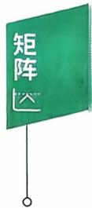

## 二、伴随矩阵、可逆矩阵

【分析】用行变换 $\left( \boldsymbol{A} \mid \boldsymbol{E} \right) \rightarrow \left( \boldsymbol{E} \mid \boldsymbol{A}^{-1} \right)$ 的方法：

$$
\begin{bmatrix} 1 & 1 & 1 \vdots 1 & 0 & 0 \\ 1 & 2 & 1 \vdots 0 & 1 & 0 \\ 1 & 1 & 3 \vdots 0 & 0 & 1 \end{bmatrix} \xrightarrow{} \begin{bmatrix} 1 & 1 & 1 \vdots & 1 & 0 & 0 \\ 0 & 1 & 0 \vdots - 1 & 1 & 0 \\ 0 & 0 & 2 \vdots - 1 & 0 & 1 \end{bmatrix}
$$

$$
\xrightarrow{}\begin{bmatrix}1 & 1 & 1 \vdots & 1 & 0 & 0 \\0 & 1 & 0 \vdots & -1 & 1 & 0 \\& & \vdots & & & \\0 & 0 & 1 \vdots & -\frac{1}{2} & 0 & \frac{1}{2}\end{bmatrix}
$$

$$
\xrightarrow{}\begin{bmatrix}1 & 1 & 0 \vdots & \cfrac{3}{2} & 0 & -\cfrac{1}{2} \\&  & \vdots &  &  & 0 \\0 & 1 & 0 \vdots & -1 & 1 & 0 \\&  & \vdots &  &  &  \\0 & 0 & 1 \vdots & -\cfrac{1}{2} & 0 & \cfrac{1}{2}\end{bmatrix}
$$

$$
\xrightarrow { } \begin{bmatrix} 1 & 0 & 0 \vdots & \frac{5}{2} & -1 & -\frac{1}{2} \\ & & \vdots & & & \\ 0 & 1 & 0 \vdots & -1 & 1 & 0 \\ & & \vdots & & & \\ 0 & 0 & 1 \vdots & -\frac{1}{2} & 0 & \frac{1}{2} \end{bmatrix},
$$

故 $\boldsymbol{A}^{-1} = \begin{bmatrix} \frac{5}{2} & -1 & -\frac{1}{2} \\ -1 & 1 & 0 \\ -\frac{1}{2} & 0 & \frac{1}{2} \end{bmatrix}.$

【注】这个方法是非常重要的基础计算，必须动手做题，千万别大意！当然，也可求 $A_{ij}$ ,构造出 $A^{\bullet}$ 来求 $A^{-1}$ ·

例7【分析】注意，利用 $A^{*} = \left| A \right| A^{-1}$ ,通过 $A^{-1}$ 来求 $A ^ { \bullet }$ 有时会更方便.

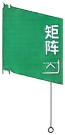

对A分块

$$
\boldsymbol { A } = \begin{bmatrix} 0 & \vdots & a _ { 1 } & \cdots & 0 \\ \vdots & \vdots & \vdots & & \vdots \\ 0 & \vdots & 0 & \cdots & a _ { n - 1 } \\ \cdots & \vdots & 0 & \cdots & 0 \end{bmatrix} = \begin{bmatrix} \boldsymbol { O } & \boldsymbol { A } _ { 1 } \\ \boldsymbol { A } _ { 2 } & \boldsymbol { O } \end{bmatrix},
$$

则 $\left| \boldsymbol{A} \right| = (-1)^{n-1} a_1 a_2 \cdots a_n \neq 0, \boldsymbol{A}$ 可逆，且

$$
\begin{aligned} &A^{-1} = \left[ \begin{aligned}\\ &0 & 0 & \cdots & 0 & \frac{1}{a_{n}} \\&\frac{1}{a_{1}} & 0 & \cdots & 0 & 0 \\&0 & \frac{1}{a_{2}} & \cdots & 0 & 0 \\&\vdots & \vdots & & \vdots & \vdots \\&0 & 0 & \cdots & \frac{1}{a_{n-1}} & 0\\ &\end{aligned} \right],\\ \end{aligned}
$$

$$
A^{*} = \left| A \right| A^{-1} = (-1)^{n-1}
$$

$$
\begin{aligned} &\begin{bmatrix}\\ &0 & 0 & \cdots & 0 & \frac{1}{a_{n}} \\&\end{bmatrix}\\ &\begin{bmatrix}\\ &\frac{1}{a_{1}} & 0 & \cdots & 0 & 0 \\&0 & \frac{1}{a_{2}} & \cdots & 0 & 0 \\&\vdots & \vdots & & \vdots & \vdots \\&0 & 0 & \cdots & \frac{1}{a_{n - 1}} & 0 \\&\end{bmatrix}.\\ \end{aligned}
$$

【注】这里用到了

$$
\begin{bmatrix} \boldsymbol{O} & \boldsymbol{A} \\ \boldsymbol{B} & \boldsymbol{O} \end{bmatrix}^{-1} = \begin{bmatrix} \boldsymbol{O} & \boldsymbol{B}^{-1} \\ \boldsymbol{A}^{-1} & \boldsymbol{O} \end{bmatrix}; \begin{bmatrix} a_{1} & & & \\ & a_{2} & & \\ & & \ddots & \\ & & & a_{s} \end{bmatrix}^{-1} = \begin{bmatrix} \frac{1}{a_{1}} & & & \\ & \frac{1}{a_{2}} & & \\ & & \ddots & \\ & & & \\ & & & \frac{1}{a_{s}} \end{bmatrix}.
$$

$$
\boldsymbol{A}\boldsymbol{B}=(\boldsymbol{E}-\boldsymbol{\alpha}\boldsymbol{\alpha}^{\mathrm{T}})(\boldsymbol{E}+\boldsymbol{a}\boldsymbol{\alpha}\boldsymbol{\alpha}^{\mathrm{T}})\\=\boldsymbol{E}+\boldsymbol{a}\boldsymbol{\alpha}\boldsymbol{\alpha}^{\mathrm{T}}-\boldsymbol{a}\boldsymbol{\alpha}^{\mathrm{T}}-\boldsymbol{a}\boldsymbol{\alpha}\boldsymbol{\alpha}^{\mathrm{T}}\boldsymbol{\alpha}\boldsymbol{\alpha}^{\mathrm{T}}\\=\boldsymbol{E}+(\boldsymbol{a}-1-\boldsymbol{a}\boldsymbol{\alpha}^{\mathrm{T}}\boldsymbol{\alpha})\boldsymbol{a}\boldsymbol{\alpha}^{\mathrm{T}}.
$$

又 $\boldsymbol{\alpha}^{\mathrm{T}} \boldsymbol{\alpha}=\left(\frac{1}{2}, 0, \cdots, 0, \frac{1}{2}\right)\left[\begin{aligned}\frac{1}{2} \\0 \\\vdots \\0 \\\frac{1}{2}\end{aligned}\right]=\frac{1}{2}$ ,故

$$
\boldsymbol{A}\boldsymbol{B}=\boldsymbol{E}+\left(a-1-\frac{1}{2}a\right)\boldsymbol{\alpha}\boldsymbol{\alpha}^{\mathrm{T}}=\boldsymbol{E}\Leftrightarrow\left(\frac{1}{2}a-1\right)\boldsymbol{\alpha}\boldsymbol{\alpha}^{\mathrm{T}}=\boldsymbol{O},
$$

所以 $a = 2.$

例9【分析】本题矩阵A没有具体元素，应考虑用定义法.

即

即

$$
\left( \boldsymbol{A} + \boldsymbol{E} \right) \left( \boldsymbol{A} - 4\boldsymbol{E} \right) + 2\boldsymbol{E} = \boldsymbol{A}^2 - 3\boldsymbol{A} - 2\boldsymbol{E} = \boldsymbol{O},
$$

$$
\left( \boldsymbol{A} + \boldsymbol{E} \right) \left( \boldsymbol{A} - 4\boldsymbol{E} \right) = - 2\boldsymbol{E},
$$

故

$$
\left( \boldsymbol{A} + \boldsymbol{E} \right) \cdot \frac{1}{2} \left( 4\boldsymbol{E} - \boldsymbol{A} \right) = \boldsymbol{E},
$$

$$
\left( \boldsymbol{A} + \boldsymbol{E} \right)^{-1} = \frac{1}{2} \left( 4\boldsymbol{E} - \boldsymbol{A} \right).
$$

例10【分析】由 $AB = 2A + B$ ,有

$$
\boldsymbol{A}\boldsymbol{B}-\boldsymbol{B}-2\boldsymbol{A}+2\boldsymbol{E}=2\boldsymbol{E}, 即 \left(\boldsymbol{A}-\boldsymbol{E}\right)\left(\boldsymbol{B}-2\boldsymbol{E}\right)=2\boldsymbol{E}.
$$

$$
\left( \boldsymbol{A} - \boldsymbol{E} \right)^{-1} = \frac{1}{2} \left( \boldsymbol{B} - 2\boldsymbol{E} \right) = \begin{bmatrix} 0 & 0 & 1 \\ 0 & 1 & 0 \\ 1 & 0 & 0 \end{bmatrix}.
$$

例11【分析】 $A X A + B X B - A X B - B X A = E ,$

$$
( \boldsymbol { A } - \boldsymbol { B } ) \boldsymbol { X } \boldsymbol { A } - ( \boldsymbol { A } - \boldsymbol { B } ) \boldsymbol { X } \boldsymbol { B } = \boldsymbol { E } ,
$$

$$
( \boldsymbol{A} - \boldsymbol{B} ) \boldsymbol{X} ( \boldsymbol{A} - \boldsymbol{B} ) = \boldsymbol{E},
$$

$$
\boldsymbol{X} = \left[ (\boldsymbol{A} - \boldsymbol{B})^{-1} \right]^2 = \left[ \begin{bmatrix} 1 & -1 & -1 \\ 0 & 1 & -1 \\ 0 & 0 & 1 \end{bmatrix}^{-1} \right]^2
$$

$$
= \begin{bmatrix} 1 & 1 & 2 \\ 0 & 1 & 1 \\ 0 & 0 & 1 \end{bmatrix}^{2} = \begin{bmatrix} 1 & 2 & 5 \\ 0 & 1 & 2 \\ 0 & 0 & 1 \end{bmatrix}.
$$

例12 【解】因 $\boldsymbol{A}^{2}=\begin{bmatrix}1&0&0\\0&0&1\\0&0&0\end{bmatrix}\begin{bmatrix}1&0&0\\0&0&1\\0&0&0\end{bmatrix}=\begin{bmatrix}1&0&0\\0&0&0\\0&0&0\end{bmatrix}$ ,又

$$
\boldsymbol { A } ^ { 3 } = \boldsymbol { A } ^ { 2 } \boldsymbol { A } = \begin{bmatrix} 1 & 0 & 0 \\ 0 & 0 & 0 \\ 0 & 0 & 0 \end{bmatrix} \begin{bmatrix} 1 & 0 & 0 \\ 0 & 0 & 1 \\ 0 & 0 & 0 \end{bmatrix} = \begin{bmatrix} 1 & 0 & 0 \\ 0 & 0 & 0 \\ 0 & 0 & 0 \end{bmatrix} = \boldsymbol { A } ^ { 2 } .
$$

知 $A^{m} = A^{2}$ (当 $m \geqslant 2$ 时),故

$$
\begin{aligned}f(\boldsymbol{A}) &= A^{100} + \cdots + A^{\sharp} + \boldsymbol{A} + \boldsymbol{E} = 99A^{\sharp} + \boldsymbol{A} + \boldsymbol{E} \\&= \begin{bmatrix}99 & 0 & 0 \\0 & 0 & 0 \\0 & 0 & 0\end{bmatrix} + \begin{bmatrix}1 & 0 & 0 \\0 & 0 & 1 \\0 & 0 & 0\end{bmatrix} + \begin{bmatrix}1 & 0 & 0 \\0 & 1 & 0 \\0 & 0 & 1\end{bmatrix} = \begin{bmatrix}101 & 0 & 0 \\0 & 1 & 1 \\0 & 0 & 1\end{bmatrix},\end{aligned}
$$

$$
[ f ( \boldsymbol { A } ) ] ^ { - 1 } = \left[ \begin{aligned} 1 & 0 1 & 0 & 0 \\ 0 & 1 & 1 \\ 0 & 0 & 1 \end{aligned} \right] ^ { - 1 } = \left[ \begin{aligned} \frac { 1 } { 1 } & 0 & 0 \\ 0 & 1 & - 1 \\ 0 & 0 & 1 \end{aligned} \right] .
$$

例13 【证】 先证 Ax = b 有解.因为

$$
\boldsymbol{A}(\boldsymbol{A}^{-1} \boldsymbol{b}) = (\boldsymbol{A} \boldsymbol{A}^{-1}) \boldsymbol{b} = \boldsymbol{E} \boldsymbol{b} = \boldsymbol{b},
$$

所以 $A^{-1}b$ 是方程组的解，故方程组 $Ax = \boldsymbol{b}$ 有解.

再证唯一性.设α是 $Ax = \boldsymbol{b}$ 的任一个解，则 $A\boldsymbol{\alpha} = \boldsymbol{b}$ 那么

$$
\begin{aligned}A^{-1}(A\boldsymbol{\alpha}) &= A^{-1}\boldsymbol{b}, \\(A^{-1}A)\boldsymbol{\alpha} &= A^{-1}\boldsymbol{b},\end{aligned}
$$

$\Rightarrow \boldsymbol{\alpha} = \boldsymbol{A}^{-1} \boldsymbol{b}$ ,即 Ax = b 的解唯一.

【注】以三元一次方程组

$$
\begin{cases}a_{11}x_{1} + a_{12}x_{2} + a_{13}x_{3} = b_{1}, \\a_{21}x_{1} + a_{22}x_{2} + a_{23}x_{3} = b_{2}, \\a_{31}x_{1} + a_{32}x_{2} + a_{33}x_{3} = b_{3}\end{cases}
$$

为例，注意到：唯一解 $\boldsymbol{\alpha} = (x_{1}, x_{2}, x_{3})^{\mathrm{T}}$ ,即

$$
\boldsymbol{\alpha} = \boldsymbol{A}^{-1} \boldsymbol{b} = \frac{1}{\left| \boldsymbol{A} \right|} \boldsymbol{A}^{*} \boldsymbol{b} = \frac{1}{\left| \boldsymbol{A} \right|} \left[ \begin{matrix} A_{11} & A_{21} & A_{31} \\ A_{12} & A_{22} & A_{32} \\ A_{13} & A_{23} & A_{33} \end{matrix} \right] \left[ \begin{matrix} b_{1} \\ b_{2} \\ b_{3} \end{matrix} \right],
$$

$$
x_{1} = \frac{1}{\left| \boldsymbol{A} \right|}\left( b_{1}A_{11} + b_{2}A_{21} + b_{3}A_{31} \right) = \frac{1}{\left| \boldsymbol{A} \right|}\left| \begin{matrix} b_{1} & a_{12} & a_{13} \\ b_{2} & a_{22} & a_{23} \\ b_{3} & a_{32} & a_{33} \end{matrix} \right| .
$$

$x_{2} ,x_{3}$ 证明略.这就是克拉默法则的矩阵法证明.

## 三、初等变换、初等矩阵

例14【分析】由下标观察到矩阵A经过两次初等行变换可

得到矩阵B，按初等矩阵的性质应该是左乘初等矩阵，排除(A)(B).

$\boldsymbol{P}_{1} \boldsymbol{P}_{2} \boldsymbol{A}$ 表示先把A的第一行加至第三行，然后再把第一、二两行互换，这正是矩阵B，所以应当选(C).

而 $P_{2}P_{1}A$ 表示先把A的第一、二两行互换，然后再把第一行加至第三行，那么这时的矩阵是

$$
\begin{aligned} &\begin{bmatrix}\\ &a_{21} & a_{22} & a_{23} \\&a_{11} & a_{12} & a_{13} \\&a_{31} + a_{21} & a_{32} + a_{22} & a_{33} + a_{23}\\ &\end{bmatrix}.\\ \end{aligned}
$$

例15【分析】由已知

$$
\boldsymbol{P}_{1} \boldsymbol{A} = \boldsymbol{B}, \boldsymbol{P}_{1} = \begin{bmatrix} 0 & 0 & 1 \\ & & \\ 0 & 1 & 0 \\ 1 & 0 & 0 \end{bmatrix},
$$

$$
\boldsymbol { B } \boldsymbol { P } _ { 2 } = \boldsymbol { C } , \boldsymbol { P } _ { 2 } = \begin{bmatrix} 1 & 0 & 0 \\ 0 & 1 & - 1 \\ 0 & 0 & 1 \end{bmatrix},
$$

$$
\boldsymbol{P}_{1} \boldsymbol{A} \boldsymbol{P}_{2} = \boldsymbol{C},
$$

$$
\boldsymbol{A} = \boldsymbol{P}_{1}^{-1} \boldsymbol{C} \boldsymbol{P}_{2}^{-1} = \begin{bmatrix} 0 & 0 & 1 \\ 0 & 1 & 0 \\ 1 & 0 & 0 \end{bmatrix} \begin{bmatrix} 7 & 8 & 1 \\ 4 & 5 & 1 \\ 1 & 2 & 1 \end{bmatrix} \begin{bmatrix} 1 & 0 & 0 \\ 0 & 1 & 1 \\ 0 & 0 & 1 \end{bmatrix} = \begin{bmatrix} 1 & 2 & 3 \\ 4 & 5 & 6 \\ 7 & 8 & 9 \end{bmatrix}.
$$

例16【分析】A和B等价⇔A经初等变换得到矩阵B

⇔∃可逆矩阵P和Q使 $PAQ = B$

$$
\Leftrightarrow r(\boldsymbol{A}) = r(\boldsymbol{B}).
$$

明显 r(B) = 2.而

$$
\left| \begin{array} { l } \boldsymbol { A } \end{array} \right| = \left| \begin{matrix} a & 1 & 1 \\ 1 & a & 1 \\ 1 & 1 & a \end{matrix} \right| = ( a + 2 ) ( a - 1 ) ^ { 2 } ,
$$

当a = 1时， $r(\boldsymbol{A}) = 1$

当a=—2时，A中 $\begin{vmatrix}  - 2 & 1 \\ 1 & - 2 \end{vmatrix} \neq 0$ ,而 $\left| \boldsymbol{A} \right| = 0$ ,从而 $r(\boldsymbol{A}) = 2$ ∴A和B等价 $\Leftrightarrow a = - 2$

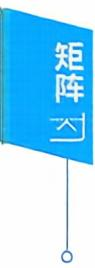

## 四、分块矩阵

例17 【证】由B,C均可逆，有 $\begin{vmatrix} \boldsymbol{B} & \boldsymbol{O} \\ \boldsymbol{O} & \boldsymbol{C} \end{vmatrix} = | \boldsymbol{B} | \cdot | \boldsymbol{C} | \neq 0$ ,所以$\begin{bmatrix} \boldsymbol{B} & \boldsymbol{O} \\ \boldsymbol{O} & \boldsymbol{C} \end{bmatrix}$ 可逆.

设 $\left[ \begin{matrix} { \boldsymbol { B } } & { \boldsymbol { O } } \\ { \boldsymbol { O } } & { \boldsymbol { C } } \\ \end{matrix} \right] ^ { - 1 } = \left[ \begin{matrix} { \boldsymbol { X } } & { \boldsymbol { Y } } \\ { \boldsymbol { Z } } & { \boldsymbol { W } } \\ \end{matrix} \right]$ ,则

$$
\begin{aligned}\left[ \begin{matrix} { \boldsymbol { B } } & { \boldsymbol { O } } \\ { } & { } \\ { \boldsymbol { O } } & { \boldsymbol { C } } \\ \end{matrix} \right] \left[ \begin{matrix} { \boldsymbol { X } } & { \boldsymbol { Y } } \\ { } & { } \\ { \boldsymbol { Z } } & { \boldsymbol { W } } \\ \end{matrix} \right] = \left[ \begin{matrix} { \boldsymbol { E } } & { \boldsymbol { O } } \\ { } & { } \\ { \boldsymbol { O } } & { \boldsymbol { E } } \\ \end{matrix} \right] ,\end{aligned}
$$

$\begin{cases}\boldsymbol{B}\boldsymbol{X} = \boldsymbol{E}, \\\boldsymbol{B}\boldsymbol{Y} = \boldsymbol{O}, \\\boldsymbol{C}\boldsymbol{Z} = \boldsymbol{O}, \\\boldsymbol{C}\boldsymbol{W} = \boldsymbol{E},\end{cases}$ (1) (2)   
即 (3) (4)

由(1)有 $X = \boldsymbol{B}^{-1}$

由(2)，因B可逆，有 $\boldsymbol{Y} = \boldsymbol{B}^{-1} \boldsymbol{O} = \boldsymbol{O}$

类似地 $Z = O, W = C^{-1}$ .所以 $\left[ \begin{matrix} { \pmb { B } } & { \pmb { O } } \\ { \pmb { O } } & { \pmb { C } } \\ \end{matrix} \right] ^ { - 1 } = \left[ \begin{matrix} { \pmb { B } ^ { - 1 } } & { \pmb { O } } \\ { \pmb { O } } & { \pmb { C } ^ { - 1 } } \\ \end{matrix} \right]$

例如

$$
\begin{bmatrix} 5 & 2 & 0 & 0 \\ 2 & 1 & 0 & 0 \\ 0 & 0 & 1 & - 2 \\ 0 & 0 & 1 & 1 \end{bmatrix}^{- 1} = \begin{bmatrix} 1 & - 2 & 0 & 0 \\ - 2 & 5 & 0 & 0 \\ 0 & 0 & \frac{1}{3} & \frac{2}{3} \\ & & & \\ 0 & 0 & - \frac{1}{3} & \frac{1}{3} \end{bmatrix}.
$$

$$
\begin{bmatrix}  因为  \begin{bmatrix} 5 & 2 \\ 2 & 1 \end{bmatrix}^{-1} = \begin{bmatrix} 1 & - \; 2 \\ - \; 2 & \; 5 \end{bmatrix}, \begin{bmatrix} 1 & - \; 2 \\ 1 & \; 1 \end{bmatrix}^{-1} = \begin{array}{c} 1 \\ 3 \end{bmatrix} \begin{bmatrix} 1 & \; 2 \\ - \; 1 & \; 1 \end{bmatrix}. \end{array}
$$

例18【分析】把A,B各分成4个 $2 \times 2$ 的小矩阵，即

$$
\boldsymbol{A} = \begin{bmatrix} 1 & 0 \vdots & 0 & 1 \\ 0 & 1 \vdots & 1 & 0 \\ \cdots \cdots & \vdots & \cdots \cdots \cdots \cdots \\ 0 & 1 \vdots & - 1 & 0 \\ 1 & 0 \vdots & 0 & - 1 \end{bmatrix} = \begin{bmatrix} \boldsymbol{E} & \boldsymbol{C} \\ \boldsymbol{C} & - \boldsymbol{E} \end{bmatrix}, \boldsymbol{B} = \begin{bmatrix} 0 & 0 \vdots & 0 & 1 \\ 0 & 0 \vdots & 1 & 0 \\ \cdots \cdots \cdots \cdots \cdots \cdots \\ 0 & 1 \vdots & 0 & 0 \\ 1 & 0 \vdots & 0 & 0 \end{bmatrix} = \begin{bmatrix} \boldsymbol{O} & \boldsymbol{C} \\ \boldsymbol{C} & \boldsymbol{O} \end{bmatrix}.
$$

由于 $\boldsymbol{C}^{\mathfrak{e}} = \begin{bmatrix} 0 & 1 \\ 1 & 0 \end{bmatrix} \begin{bmatrix} 0 & 1 \\ 1 & 0 \end{bmatrix} = \boldsymbol{E}$ ,就有

$$
\boldsymbol { X } = { \begin{bmatrix} { \boldsymbol { E } } & { \boldsymbol { C } } \\ { \boldsymbol { C } } & { - \boldsymbol { E } } \end{bmatrix} } { \begin{bmatrix} { \boldsymbol { O } } & { \boldsymbol { C } } \\ { \boldsymbol { C } } & { \boldsymbol { O } } \end{bmatrix} } { \begin{bmatrix} { \boldsymbol { E } } & { \boldsymbol { C } } \\ { \boldsymbol { C } } & { - \boldsymbol { E } } \end{bmatrix} } = { \begin{bmatrix} { \boldsymbol { E } } & { \boldsymbol { C } } \\ { - \boldsymbol { C } } & { \boldsymbol { E } } \end{bmatrix} } { \begin{bmatrix} { \boldsymbol { E } } & { \boldsymbol { C } } \\ { \boldsymbol { C } } & { - \boldsymbol { E } } \end{bmatrix} } = { \begin{bmatrix} { 2 \boldsymbol { E } } & { \boldsymbol { O } } \\ { \boldsymbol { O } } & { - 2 \boldsymbol { E } } \end{bmatrix} } ,
$$

$$
 即  \; \boldsymbol{X} = \begin{bmatrix} 2 & 0 & 0 & 0 \\ 0 & 2 & 0 & 0 \\ 0 & 0 & - 2 & 0 \\ 0 & 0 & 0 & - 2 \end{bmatrix}.
$$

例19【分析】

$$
\begin{aligned}(1) \begin{bmatrix} \boldsymbol{E} & \boldsymbol{E} \\ \boldsymbol{O} & \boldsymbol{E} \end{bmatrix} \begin{bmatrix} \boldsymbol{A} & \boldsymbol{B} \\ \boldsymbol{B} & \boldsymbol{A} \end{bmatrix} \begin{bmatrix} \boldsymbol{E} & -\boldsymbol{E} \\ \boldsymbol{O} & \boldsymbol{E} \end{bmatrix} &= \begin{bmatrix} \boldsymbol{A} + \boldsymbol{B} & \boldsymbol{A} + \boldsymbol{B} \\ \boldsymbol{B} & \boldsymbol{A} \end{bmatrix} \begin{bmatrix} \boldsymbol{E} & -\boldsymbol{E} \\ \boldsymbol{O} & \boldsymbol{E} \end{bmatrix} \\&= \begin{bmatrix} \boldsymbol{A} + \boldsymbol{B} & \boldsymbol{O} \\ \boldsymbol{B} & \boldsymbol{A} - \boldsymbol{B} \end{bmatrix},\end{aligned}
$$

$$
\left( 2 \right) \begin{vmatrix} \boldsymbol{A} & \boldsymbol{B} \\ \boldsymbol{B} & \boldsymbol{A} \end{vmatrix} = \begin{vmatrix} \boldsymbol{A} + \boldsymbol{B} & \boldsymbol{O} \\ \boldsymbol{B} & \boldsymbol{A} - \boldsymbol{B} \end{vmatrix} = \left| \begin{array}{c} \boldsymbol{A} + \boldsymbol{B} \end{array} \right| \cdot \left| \begin{array}{c} \boldsymbol{A} - \boldsymbol{B} \end{array} \right| .
$$

## 五、方阵的行列式

例20 【分析】 | 2A\*B−1 | = 2″ | A\*B−¹ |= 2″ |A\* || B−1 | 22π-1 = 2″ | A |n−1 | B |−1 =— 3

本题用到的公式依次是

$$
\left| k \boldsymbol { A } \right| = k ^ { n } \left| \boldsymbol { A } \right| , \left| \boldsymbol { A } \boldsymbol { B } \right| = \left| \boldsymbol { A } \right| \left| \boldsymbol { B } \right| ,
$$

$$
\left| \boldsymbol{A}^{*} \right| = \left| \boldsymbol{A} \right|^{n - 1}, \left| \boldsymbol{A}^{- 1} \right| = \frac{1}{\left| \boldsymbol{A} \right|}.
$$

例21 【分析】因 $\boldsymbol{A}^{*} = \left| \boldsymbol{A} \right| \boldsymbol{A}^{-1} = -\frac{2}{3} \boldsymbol{A}^{-1}$ ,又 $\left| \boldsymbol{A}^{-1} \right| = \frac{1}{\left| \boldsymbol{A} \right|}$ $= - \frac{3}{2}$ ,则有

$$
\begin{aligned}\left| 3\boldsymbol{A}^{*} + 4\boldsymbol{A}^{-1} \right| &= \left| -2\boldsymbol{A}^{-1} + 4\boldsymbol{A}^{-1} \right| = \left| 2\boldsymbol{A}^{-1} \right| \\&= 2^{4} \left| \boldsymbol{A}^{-1} \right| = -3 \times 2^{3} = -24.\end{aligned}
$$

例22【分析】因 $\left( \boldsymbol{A} - \boldsymbol{E} \right)^{-1} = \boldsymbol{A}^2 + \boldsymbol{A} + \boldsymbol{E}$ ,有

$$
( \boldsymbol { A } - \boldsymbol { E } ) ( \boldsymbol { A } ^ { 2 } + \boldsymbol { A } + \boldsymbol { E } ) = \boldsymbol { E } ,
$$

得

$$
\boldsymbol{A}^{3} = 2\boldsymbol{E}.
$$

那么

$$
\left| \boldsymbol{A}^{3} \right| = \left| 2\boldsymbol{E} \right| ,
$$

于是

$$
\left| \boldsymbol{A} \right|^{3} = 2^{3} \left| \boldsymbol{E} \right| = 8,
$$

所以 $| \textbf{A} | = 2$

【注】 $\left| k \boldsymbol{A} \right| = k^n \left| \boldsymbol{A} \right|$ 不要记错.

## 例23【分析】由行列式性质，知 $\left| \textbf{\em B} \right| = - \left| \textbf{\em A} \right|$

由 $| \textbf{A} \textbf{B} | = | \textbf{A} | \cdot | \textbf{B} |  和  | \textbf{A}^* | = | \textbf{A} |^{\textit{n}-1}$ 立即有

$$
| \boldsymbol{B} \boldsymbol{A}^{\star} | = | \boldsymbol{B} | \cdot | \boldsymbol{A}^{\star} | = - | \boldsymbol{A} | \cdot | \boldsymbol{A} |^{2} = - 27.
$$

或，因 $\begin{bmatrix} 0 & 1 & 0 \\ 1 & 0 & 0 \\ 0 & 0 & 1 \end{bmatrix} \boldsymbol{A} = \boldsymbol{B}$ ,有

$$
\boldsymbol { B } \boldsymbol { A } ^ { \star } = \begin{bmatrix} 0 & 1 & 0 \\ 1 & 0 & 0 \\ 0 & 0 & 1 \end{bmatrix} \boldsymbol { A } \boldsymbol { A } ^ { \star } = \left| \boldsymbol { A } \right| \begin{bmatrix} 0 & 1 & 0 \\ 1 & 0 & 0 \\ 0 & 0 & 1 \end{bmatrix} = 3 \begin{bmatrix} 0 & 1 & 0 \\ 1 & 0 & 0 \\ 0 & 0 & 1 \end{bmatrix},
$$

所以 $$\left| \begin{array} { l } { \pmb { B } \pmb { A } ^ { \star } } \end{array} \right| = 3 ^ { 3 } \left| \begin{matrix} { 0 } & { 1 } & { 0 } \\ { 1 } & { 0 } & { 0 } \\ { 0 } & { 0 } & { 1 } \end{matrix} \right| =$ 一 27.$

## 本章作业超链接《基础过关66D题》优选

<table><tr><td>数学一</td><td>365</td><td>368</td><td>370</td><td>373</td><td>375</td><td>379</td><td>380</td><td>383</td><td>425</td><td>426</td><td>432</td></tr><tr><td></td><td>435</td><td>436</td><td>438</td><td>441</td><td>446</td><td>447</td><td>449</td><td></td><td></td><td></td><td></td></tr><tr><td>数学二</td><td>465</td><td>468</td><td>470</td><td>473</td><td>475</td><td>479</td><td>480</td><td>483</td><td>550</td><td>551</td><td>557</td></tr><tr><td>数学三</td><td>560</td><td>561</td><td>563</td><td>566</td><td>571</td><td>572</td><td>574</td><td></td><td></td><td></td><td></td></tr><tr><td></td><td>365</td><td>368</td><td>370</td><td>373</td><td>375</td><td>379</td><td>380</td><td>383</td><td>425</td><td>426</td><td>432</td></tr><tr><td></td><td>435</td><td>436</td><td>438</td><td>441</td><td>446</td><td>447</td><td>449</td><td></td><td></td><td></td><td></td></tr></table>

## 第三章 向量

## 本章考点

向量的概念向量的线性组合与线性表示向量组的线性相关与线性无关向量组的极大线性无关组等价向量组向量组的秩向量组的秩与矩阵的秩之间的关系向量的内积线性无关向量组正交规范化的施密特(Schmidt)方法

数學一還有向量空間的內容，這一考點的相关知识可參看《線性代数辅导讲义》相关内容.

## 本章知识框图

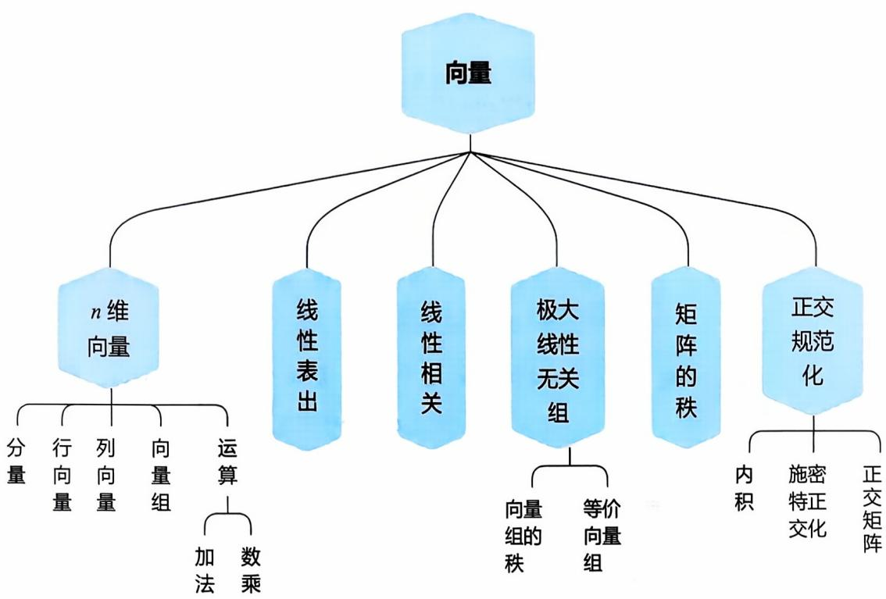

向量是初学线性代数时的一个难点，主要表现在对定义的理解、语言的表述、逻辑推理的合理性等方面.当然也是考研的重点.

## 知识梳理与例题

## 一、向量的概念、向量组的概念

定义n个数 $a_{1},a_{2},\cdots,a_{n}$ 所组成的有序数组

$$
\boldsymbol{\alpha} = (a_{1}, a_{2}, \cdots, a_{n})^{\mathrm{T}}  或  \boldsymbol{\alpha} = (a_{1}, a_{2}, \cdots, a_{n})
$$

叫做n维向量，其中 $a_{1}, a_{2}, \cdots, a_{n}$ 叫做向量α的分量(或坐标)，前一个表示式称为列向量，后者称为行向量.

相等 $\alpha = \beta \Leftrightarrow \alpha,\beta$ 同维，且对应分量 $a_{i}=b_{i},i=1,2,\cdots,n$

向量的基本运算

加法 $\boldsymbol{\alpha} + \boldsymbol{\beta} = (a_{1} + b_{1}, a_{2} + b_{2}, \cdots, a_{n} + b_{n})$

数乘 $k \boldsymbol{\alpha} = (k a_{1}, k a_{2}, \cdots, k a_{n})$

若干个同维数的行向量(或同维数的列向量）所组成的集合叫做 向量组.

$\alpha_{1}, \alpha_{2}, \cdots, \alpha_{r}$ 及 $\alpha_{1}, \alpha_{2}, \cdots, \alpha_{r}, \cdots, \alpha_{s}$ (其中 $s \geqslant r )$ ,称 $\alpha_{1}, \alpha_{2}, \cdots, \alpha_{r}$ 是 $\alpha_{1}, \alpha_{2}, \cdots, \alpha_{s}$ 的部分组， $\alpha_{1}, \alpha_{2}, \cdots, \alpha_{s}$ 是整体组.

向量组

$$
\boldsymbol { \alpha } _ { 1 } = \left[ a _ { 1 1 } , a _ { 2 1 } , \cdots , a _ { r 1 } \right] ^ { \mathrm { T } } , \boldsymbol { \alpha } _ { 2 } = \left[ a _ { 1 2 } , a _ { 2 2 } , \cdots , a _ { r 2 } \right] ^ { \mathrm { T } } , \cdots ,
$$

$$
\boldsymbol{a}_{m}=[a_{1m}, a_{2m}, \cdots, a_{m}]^{\mathrm{T}}
$$

及

$$
\tilde { \boldsymbol { \alpha } } _ { 1 } = [ a _ { 1 1 } , a _ { 2 1 } , \cdots , a _ { r 1 } , \cdots , a _ { r 1 } ] ^ { \mathrm { T } } , \tilde { \boldsymbol { \alpha } } _ { 2 } = [ a _ { 1 2 } , a _ { 2 2 } , \cdots , a _ { r 2 } , \cdots , a _ { r 2 } ] ^ { \mathrm { T } } ,
$$

$$
\cdots , \boldsymbol { \alpha } _ { m } = [ a _ { 1 m } , a _ { 2 m } , \cdots , a _ { m } , \cdots , a _ { m } ] ^ { \mathrm { T } } ,
$$

其中 $s \geqslant r ,$ 则称 $\widetilde{\boldsymbol{\alpha}}_{1}, \widetilde{\boldsymbol{\alpha}}_{2}, \cdots, \widetilde{\boldsymbol{\alpha}}_{m}$ 为向量组 $\alpha_{1}, \alpha_{2}, \cdots, \alpha_{m}$ 的延伸组(或称$\alpha_{1}, \alpha_{2}, \cdots, \alpha_{m}$ 是 $\tilde{\alpha}_{1}, \tilde{\alpha}_{2}, \cdots, \tilde{\alpha}_{m}$ 的缩短组).

## 二、线性表出、线性相关

定义m个n维向量 $\alpha_{1}, \alpha_{2}, \cdots, \alpha_{m}$ 及m个数 $k_{1},k_{2},\cdots,k_{m}$ ,则向量

$$
k_{1} \boldsymbol{\alpha}_{1} + k_{2} \boldsymbol{\alpha}_{2} + \cdots + k_{m} \boldsymbol{\alpha}_{m}
$$

称为向量 $\alpha_{1}, \alpha_{2}, \cdots, \alpha_{m}$ 的一个线性组合 $k_{1},k_{2},\cdots,k_{m}$ 称为这个线性组合的系数.

若 $\pmb { \beta }$ 能表示成 $\alpha_{1}, \alpha_{2}, \cdots, \alpha_{m}$ 的线性组合，即

$$
\boldsymbol { \beta } = k _ { 1 } \boldsymbol { \alpha } _ { 1 } + k _ { 2 } \boldsymbol { \alpha } _ { 2 } + \cdots + k _ { m } \boldsymbol { \alpha } _ { m }   ,
$$

则称 $\beta$ 能由 $\alpha_{1}, \alpha_{2}, \cdots, \alpha_{m}$ 线性表出.

定义对m个n维向量 $\alpha_{1}, \alpha_{2}, \cdots, \alpha_{m}$ ，若存在不全为零的数 $k_{1}$ $k_{2},\cdots,k_{m}$ ,使得

$$
k_{1} \boldsymbol{\alpha}_{1} + k_{2} \boldsymbol{\alpha}_{2} + \cdots + k_{m} \boldsymbol{\alpha}_{m} = \boldsymbol{0}
$$

成立，则称向量组 $\alpha_{1}, \alpha_{2}, \cdots, \alpha_{m}$ 线性相关，否则称它们线性无关.

显然含有零向量，或相等向量或成比例向量的向量组是线性相 关的；单个向量时，零向量是线性相关的.

m 个n维向量 $\alpha_{1}, \alpha_{2}, \cdots, \alpha_{m}$ 线性无关，下面几种表述等价：

对任意不全为零的数 $k_{1},k_{2},\cdots,k_{m}$ ,均有

$$
k_{1}\boldsymbol{\alpha}_{1} + k_{2}\boldsymbol{\alpha}_{2} + \cdots + k_{m}\boldsymbol{\alpha}_{m} \neq \boldsymbol{0}.
$$

当且 $\underset{\bullet}{ 仅 }$ 当 $k_{1} = k_{2} = \cdots = k_{m} = 0$ 时才有

$$
k_{1} \boldsymbol{\alpha}_{1} + k_{2} \boldsymbol{\alpha}_{2} + \cdots + k_{m} \boldsymbol{\alpha}_{m} = \boldsymbol{0}
$$

成立.

不存在不全为零的数 $k_{1},k_{2},\cdots,k_{m}$ ,使得

$$
k_{1} \boldsymbol{\alpha}_{1} + k_{2} \boldsymbol{\alpha}_{2} + \cdots + k_{m} \boldsymbol{\alpha}_{m} = \boldsymbol{0}
$$

成立.

向量组 $\boldsymbol{\varepsilon}_{1}=(1,0,\cdots,0),\boldsymbol{\varepsilon}_{2}=(0,1,0,\cdots,0),\cdots,\boldsymbol{\varepsilon}_{n}=(0,0,\cdots$ 0,1）是线性无关的，单个向量是非零向量时，是线性无关的；两个向量不成比例时，是线性无关的.

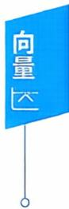

定理3.1 向量 $\beta$ 可由 $\alpha_{1}, \alpha_{2}, \cdots, \alpha_{m}$ 线性表出

⇔∃实数 $k_{1},k_{2},\cdots,k_{m}$ 使 $k_{1}\boldsymbol{\alpha}_{1} + k_{2}\boldsymbol{\alpha}_{2} + \cdots + k_{m}\boldsymbol{\alpha}_{m} = \boldsymbol{\beta}$

⇔方程组 $\left[ \boldsymbol{\alpha}_{1}, \boldsymbol{\alpha}_{2}, \cdots, \boldsymbol{\alpha}_{m} \right] \begin{bmatrix} x_{1} \\ x_{2} \\ \vdots \\ x_{m} \end{bmatrix} = \boldsymbol{\beta}$ 有解

⇔秩 $r(\boldsymbol{\alpha}_{1},\boldsymbol{\alpha}_{2},\cdots,\boldsymbol{\alpha}_{m}) = r(\boldsymbol{\alpha}_{1},\boldsymbol{\alpha}_{2},\cdots,\boldsymbol{\alpha}_{m},\boldsymbol{\beta})$

定理3.2 向量组 $\boldsymbol{\alpha}_{1}, \boldsymbol{\alpha}_{2}, \cdots, \boldsymbol{\alpha}_{m}(\boldsymbol{\alpha}_{j} = (a_{1j}, a_{2j}, \cdots, a_{nj})^{\mathrm{T}}, j = 1$ $2,\cdots,m)$ 线性相关⇔以 $\pmb { \alpha } _ { j }$ 为列向量的齐次线性方程组

$$
x_{1}\boldsymbol{\alpha}_{1} + x_{2}\boldsymbol{\alpha}_{2} + \cdots + x_{m}\boldsymbol{\alpha}_{m} = \boldsymbol{0},
$$

即

$$
\left\{ \begin{aligned} a_{11}x_{1} + a_{12}x_{2} + \cdots + a_{1m}x_{m} &= 0, \\ a_{21}x_{1} + a_{22}x_{2} + \cdots + a_{2m}x_{m} &= 0, \\ \cdots\cdots \\ a_{n1}x_{1} + a_{n2}x_{2} + \cdots + a_{nm}x_{m} &= 0 \end{aligned} \right.
$$

有非零解.

推论1 n个n维向量 $\alpha_{1}, \alpha_{2}, \cdots, \alpha_{n}$ 线性相关⇔行列式 $\mid \boldsymbol{a}_{1} , \boldsymbol{a}_{2}$ $\cdots, \boldsymbol{\alpha}_{n} \mid = 0$

推论2 任何n+1个n维向量必线性相关.

定理3.3 任何部分组 $\alpha_{1}, \alpha_{2}, \cdots, \alpha_{r}$ 相关⇒整体组 $\alpha_{1}, \alpha_{2}, \cdots, \alpha_{r}$ $\cdots, \boldsymbol{\alpha}_{s}$ 相关.整体组 $\alpha_{1}, \alpha_{2}, \cdots, \alpha_{r}, \cdots, \alpha_{s}$ 无关⇒任何部分组 $\alpha_{1}, \alpha_{2}, \cdots$ $\boldsymbol{\alpha}_{r}$ 无关，反之都不成立.

[..a, $\alpha_{1}, \alpha_{2}, \cdots, \alpha_{r}$ $\alpha_{1}, \alpha_{2}, \cdots, \alpha_{s}$ 及 $\alpha_{1}, \alpha_{2}, \cdots, \alpha_{r}, \cdots, \alpha_{s}$ 的部分组， $\alpha_{1}, \alpha_{2}, \cdots, \alpha_{s}$ (其中 是整体组. $s \geqslant r )$ ，称 $\boldsymbol{a}_{1}, \boldsymbol{a}_{2}, \boldsymbol{\gamma}$ ’」

定理3.4 $\alpha_{1}, \alpha_{2}, \cdots, \alpha_{m}$ 线性无关⇒延伸组 $\tilde{\alpha}_{1}, \tilde{\alpha}_{2}, \cdots, \tilde{\alpha}_{m}$ 线性无关；

$\tilde{\boldsymbol{\alpha}}_{1}, \tilde{\boldsymbol{\alpha}}_{2}, \cdots, \tilde{\boldsymbol{\alpha}}_{m}$ 线性相关⇒缩短组 $\alpha_{1}, \alpha_{2}, \cdots, \alpha_{m}$ 线性相关，反之均 不成立.

向量组 $\boldsymbol { \alpha } _ { 1 } = \left[ a _ { 1 1 } , a _ { 2 1 } , \cdots , a _ { r 1 } \right] ^ { \mathrm { T } } , \boldsymbol { \alpha } _ { 2 } = \left[ a _ { 1 2 } , a _ { 2 2 } , \cdots , a _ { r 2 } \right] ^ { \mathrm { T } } , \cdots , \boldsymbol { \alpha } _ { m }$ $\left[ a_{1m}, a_{2m}, \cdots, a_{m} \right]$ 及 $\widetilde { \boldsymbol { \alpha } } _ { 1 } = [ a _ { 1 1 } , a _ { 2 1 } , \cdots , a _ { r 1 } , \cdots , a _ { s 1 } ] ^ { \mathrm { T } } , \widetilde { \boldsymbol { \alpha } } _ { 2 } = [ a _ { 1 2 } ,$ $\left[ a _ { 2 2 } , \cdots , a _ { r 2 } , \cdots , a _ { r 2 } \right] ^ { \mathrm { T } } , \cdots , \boldsymbol { \alpha } _ { m } = \left[ a _ { 1 m } , a _ { 2 m } , \cdots , a _ { m } , \cdots , a _ { m } \right] ^ { \mathrm { T } }$ ，其中s$\geqslant r   ,$ 则称 $\alpha_{1}, \alpha_{2}, \cdots, \alpha_{m}$ 为向量组 $\alpha_{1}, \alpha_{2}, \cdots, \alpha_{m}$ 的延伸组(或称 $\pmb { \alpha } _ { 1 }$ $\left[ \alpha_{2} , \cdots , \alpha_{m} \right.$ 是 $\tilde{\boldsymbol{\alpha}}_{1}, \tilde{\boldsymbol{\alpha}}_{2}, \cdots, \tilde{\boldsymbol{\alpha}}_{m}$ 的缩短组).

定理3.5 向量组 $\alpha_{1}, \alpha_{2}, \cdots, \alpha_{s} (s \geqslant 2)$ 线性相关 $\Leftrightarrow$ 至少有一个向量 $\pmb { \alpha } _ { i }$ 可以由其余向量线性表出.

定理3.6若向量组 $\alpha_{1}, \alpha_{2}, \cdots, \alpha_{s}$ 线性无关，而向量组 $\alpha_{1}, \alpha_{2}, \cdots$ $\alpha_{s}, \beta$ 线性相关，则 $\beta$ 可由 $\alpha_{1}, \alpha_{2}, \cdots, \alpha_{s}$ 线性表出，且表出法唯一.

定理3.7 设有两个向量组 $\left( \mathrm { I } \right) \alpha _ { 1 } , \alpha _ { 2 } , \cdots , \alpha _ { s } ; \left( \mathrm { I I } \right) \beta _ { 1 } , \beta _ { 2 } , \cdots , \beta _ { t }$

(1) 若 $\boldsymbol{\beta}_{i}(i = 1,2,\cdots,t)$ 均可由（Ⅰ）线性表出，且 $t \gg s$ ，则 $( \Pi ) \beta _ { 1 } , \beta _ { 2 } , \cdots , \beta _ { t }$ 线性相关.

(2)若 $\beta_{i}(i = 1,2,\cdots,t)$ 均可由（Ⅰ)线性表出，且 $\beta_{1}, \beta_{2}, \cdots, \beta_{t}$ 线 性无关，则 $t \leqslant s$

例1设 $\alpha_{1} = (1,2,3), \alpha_{2} = (1,3,4), \alpha_{3} = (2, - 1,1), \beta =$ (2,5,t),问t取何值时，

(1) 行向量 $\pmb { \beta }$ 不能由 $\alpha_{1}, \alpha_{2}, \alpha_{3}$ 线性表出.

(2) 行向量 $\pmb { \beta }$ 能由 $\boldsymbol{\alpha}_{1}, \boldsymbol{\alpha}_{2}, \boldsymbol{\alpha}_{3}$ 线性表出，并写出此表达式.

答案见 73 页

例2设 $\boldsymbol{\alpha}_{1}=(1+\lambda,1,1)^{\mathrm{T}},\boldsymbol{\alpha}_{2}=(1,1+\lambda,1)^{\mathrm{T}},\boldsymbol{\alpha}_{3}=(1,1$ $1 + \lambda ) ^ { \mathrm { T } } , \boldsymbol { \beta } = ( 0 , \lambda , \lambda ^ { 2 } ) ^ { \mathrm { T } }$ .问当λ取什么值时：

(1)β可由 $\alpha_{1}, \alpha_{2}, \alpha_{3}$ 线性表示，并写出该表示式.

(2)β不能由 $\alpha_{1}, \alpha_{2}, \alpha_{3}$ 线性表示.

  
答案见74页

例3已知 $\alpha , \beta _ { 1 } , \beta _ { 2 } , \beta _ { 3 } , \gamma _ { 1 } , \gamma _ { 2 }$ 都是n维向量，试证：如果α可由$\boldsymbol{\beta}_{1}, \boldsymbol{\beta}_{2}, \boldsymbol{\beta}_{3}$ 线性表出： $\boldsymbol{\beta}_{1}, \boldsymbol{\beta}_{2}, \boldsymbol{\beta}_{3}$ 可由 $\gamma_{1}, \gamma_{2}$ 线性表出，则α可由 $\gamma_{1}, \gamma_{2}$ 线性表出.

答案见 75 页

## 例4 判断向量组

$$
\alpha_{1} = (1,2, - 1,4), \alpha_{2} = (0, - 1, - 5,3), \alpha_{3} = (2,5,3,5)
$$

的线性相关性.

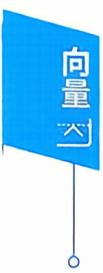

答案见 75 页

例5 判断向量组的线性相关性

$$
(1) \boldsymbol{\alpha}_{1} = (3,4,2)^{\mathrm{T}}, \boldsymbol{\alpha}_{2} = (2,1,-7)^{\mathrm{T}}, \boldsymbol{\alpha}_{3} = (1,2,4)^{\mathrm{T}}.
$$

$$
(2) \boldsymbol{\alpha}_{1} = (1,2)^{\mathrm{T}}, \boldsymbol{\alpha}_{2} = (3,4)^{\mathrm{T}}, \boldsymbol{\alpha}_{3} = (5,6)^{\mathrm{T}}.
$$

答案见 75 页

## 例6 判断向量组的线性相关性

(1) $\boldsymbol{\alpha}_{1}=(1,3,-2),\boldsymbol{\alpha}_{2}=(0,2,5),\boldsymbol{\alpha}_{3}=(2,6,-4),$

(2 $\alpha_{1} = (1,1,1), \alpha_{2} = (0,0,0), \alpha_{3} = (1,3,5).$

(3) $\boldsymbol{\alpha}_{1}=(1,1,1,a),\boldsymbol{\alpha}_{2}=(0,1,1,b),\boldsymbol{\alpha}_{3}=(0,0,1,c).$

(4) $\alpha_{1} = (1,1,1,1), \alpha_{2} = (1,0,0,1), \alpha_{3} = (1,0,1,0), \alpha_{4} = (0,$ 1,0,0).

答案见 76 页

例7（1）已知向量组 $\boldsymbol{\alpha}_{1}=(1,3,2)^{\mathrm{T}}, \boldsymbol{\alpha}_{2}=(-1,1,2)^{\mathrm{T}}, \boldsymbol{\alpha}_{3}=$ $(0,a,3)^{\mathrm{T}}$ 线性相关，求a.

练习区域

（2）判断向量组 $\boldsymbol{\alpha}_{1}=(1,0,2,3)^{\mathrm{T}}, \boldsymbol{\alpha}_{2}=(1,1,3,5)^{\mathrm{T}}, \boldsymbol{\alpha}_{3}=(1$ $-1,a,1)^{\mathrm{T}}$ 的线性相关性.

$$
A = \left( \boldsymbol { \alpha } _ { 1 } , \boldsymbol { \alpha } _ { 2 } , \cdots , \boldsymbol { \alpha } _ { n } \right) , B = \left( \boldsymbol { \beta } _ { 1 } , \boldsymbol { \beta } _ { 2 } , \cdots , \boldsymbol { \beta } _ { n } \right) , A B = \left( \gamma _ { 1 } \right.
$$

$\gamma_{2}, \cdots, \gamma_{n}$ 均是n阶矩阵，记向量组

$$
\left( \mathrm { I } \right) \alpha _ { 1 } , \alpha _ { 2 } , \cdots , \alpha _ { n } , \left( \mathrm { I I } \right) \beta _ { 1 } , \beta _ { 2 } , \cdots , \beta _ { n } , \left( \mathrm { I I I } \right) \gamma _ { 1 } , \gamma _ { 2 } , \cdots , \gamma _ { n } ,
$$

若（Ⅲ）线性相关，则

(A)(I)(Ⅱ)均线性相关.

(B)（Ⅰ）或(Ⅱ）至少有一个线性相关.

(C)(I）必线性相关.

(D)（Ⅱ）必线性相关.

答案见 77 页

例9 (1997,数三)向量组 $\boldsymbol{\alpha}_{1}, \boldsymbol{\alpha}_{2}, \boldsymbol{\alpha}_{3}$ 线性无关，则下列向量组中线性无关的是

$$
\begin{aligned}( \mathrm{A} ) \boldsymbol{\alpha}_{1} + \boldsymbol{\alpha}_{2} , \boldsymbol{\alpha}_{2} + \boldsymbol{\alpha}_{3} , \boldsymbol{\alpha}_{3} - \boldsymbol{\alpha}_{1} .\end{aligned}
$$

$$
\begin{aligned}( \mathrm { B } ) \boldsymbol { \alpha } _ { 1 } + \boldsymbol { \alpha } _ { 2 } , \boldsymbol { \alpha } _ { 2 } + \boldsymbol { \alpha } _ { 3 } , \boldsymbol { \alpha } _ { 1 } + 2 \boldsymbol { \alpha } _ { 2 } + \boldsymbol { \alpha } _ { 3 } .\end{aligned}
$$

$$
\begin{aligned}( \mathrm { C } ) \boldsymbol { \alpha } _ { 1 } + 2 \boldsymbol { \alpha } _ { 2 } , 2 \boldsymbol { \alpha } _ { 2 } + 3 \boldsymbol { \alpha } _ { 3 } , 3 \boldsymbol { \alpha } _ { 3 } + \boldsymbol { \alpha } _ { 1 } .\end{aligned}
$$

$$
\begin{aligned}(  D  ) \boldsymbol{\alpha}_{1} + \boldsymbol{\alpha}_{2} + \boldsymbol{\alpha}_{3} , 2\boldsymbol{\alpha}_{1} - 3\boldsymbol{\alpha}_{2} + 22\boldsymbol{\alpha}_{3} , 3\boldsymbol{\alpha}_{1} + 5\boldsymbol{\alpha}_{2} - 5\boldsymbol{\alpha}_{3} .\end{aligned}
$$

答案见 77 页

例 10 证明定理：如果 n维向量 $\alpha_{1}, \alpha_{2}, \cdots, \alpha_{s}$ 线性无关， $, \boldsymbol{\alpha}_{1} , \boldsymbol{\alpha}_{2}$ $\cdots, \boldsymbol{\alpha}_{s}, \boldsymbol{\beta}$ 线性相关，则向量β可由 $\alpha_{1}, \alpha_{2}, \cdots, \alpha_{s}$ 线性表出且表示法唯

例11 证明定理：向量组 $\alpha_{1}, \alpha_{2}, \cdots, \alpha, (s \geqslant 2)$ 线性相关的充分必要条件是至少有一个向量 $\pmb { \alpha } _ { i }$ 可由其余的向量 $\alpha_{1}, \cdots, \alpha_{i-1}, \alpha_{i+1}, \cdots$ $\boldsymbol{\alpha}_{s}$ 线性表出.

答案见77 页

答案见 78 页

例12 证明定理：设 $\alpha_{1}, \alpha_{2}, \cdots, \alpha_{s}$ 是m维向量 $\beta_{1}, \beta_{2}, \cdots, \beta_{r}$ 是 n维向量.令 $\gamma_{1} = \left[ \begin{matrix} \boldsymbol{\alpha}_{1} \\ \boldsymbol{\beta}_{1} \end{matrix} \right], \gamma_{2} = \left[ \begin{matrix} \boldsymbol{\alpha}_{2} \\ \boldsymbol{\beta}_{2} \end{matrix} \right], \cdots, \gamma_{s} = \left[ \begin{matrix} \boldsymbol{\alpha}_{s} \\ \boldsymbol{\beta}_{s} \end{matrix} \right]$ ,那么

(1) 若 $\alpha_{1}, \alpha_{2}, \cdots, \alpha_{s}$ 线性无关，则 $\gamma_{1}, \gamma_{2}, \cdots, \gamma_{s}$ 必线性无关.

(2) 若 $\gamma_{1}, \gamma_{2}, \cdots, \gamma_{s}$ 线性相关，则 $\alpha_{1}, \alpha_{2}, \cdots, \alpha_{s}$ 必线性相关.

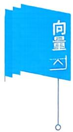

练习区域  
答案见 78 页

## 三、向量组的秩、矩阵的秩

## 1. 向量组的秩

定义向量组 $\boldsymbol{\alpha}_{i_1}, \boldsymbol{\alpha}_{i_2}, \cdots, \boldsymbol{\alpha}_{i_r} (1 \leqslant i_r \leqslant s)$ 是向量组 $\alpha_{1}, \alpha_{2}, \cdots, \alpha_{s}$ 的部分组，满足条件

(1) $\alpha_{i_1}, \alpha_{i_2}, \cdots, \alpha_{i_r}$ 线性无关.

(2) $\alpha_{i_1}, \alpha_{i_2}, \cdots, \alpha_{i_r}$ 中加入任一向量 $\boldsymbol{a}_{i}(1 \leqslant i \leqslant s)$ 后向量 组 $\alpha_{i_1}, \alpha_{i_2}, \cdots, \alpha_{i_r}, \alpha_{i_r}$ 线性相关，则称向量组 $\alpha_{i_1}, \alpha_{i_2}, \cdots, \alpha_{i_r}$ 是向量组 $\alpha_{1}, \alpha_{2}, \cdots, \alpha_{s}$ 的极大线性无关组.

条件(2)的等价说法是：向量组中任一向量 $\alpha_{i}(1 \leqslant i \leqslant s)$ 均可由 $\alpha_{i_1}, \alpha_{i_2}, \cdots, \alpha_{i_r}$ 线性表出.

向量组的极大无关组一般不唯一，但极大无关组的向量个数是一样的.只有一个零向量组成的向量组没有极大线性无关组，一个线性无关向量组的极大线性无关组就是该向量组本身.

向量组的极大线性无关组的向量个数称为向量组的秩，记为$r(\boldsymbol{\alpha}_{1},\boldsymbol{\alpha}_{2},\cdots,\boldsymbol{\alpha}_{s})$

定义设向量组

$$
\left( \mathrm { I } \right) \boldsymbol { \alpha } _ { 1 } , \boldsymbol { \alpha } _ { 2 } , \cdots , \boldsymbol { \alpha } _ { s } . \quad \left( \mathrm { I I } \right) \boldsymbol { \beta } _ { 1 } , \boldsymbol { \beta } _ { 2 } , \cdots , \boldsymbol { \beta } _ { t } .
$$

若（I）中的每个向量 $\boldsymbol{\alpha}_{i}(i = 1,2,\cdots,s)$ 均可由（Ⅱ）线性表出，则称（Ⅰ）可由（Ⅱ）线性表出.若向量组（Ⅰ）（Ⅱ）可以相互表出，则称向量组（Ⅰ)（Ⅱ）是等价向量组，记成 $( I ) \cong ( II )$

向量组和它的极大线性无关组是等价向量组.

一个向量组中各极大无关组之间是等价向量组，且向量个数相同.

定理3.8如果向量组（I）可由向量组（Ⅱ）线性表出，则r（I)$\leqslant r(\Pi)$

推论如果向量组（I）和（Ⅱ）等价，则r(I）=r(Ⅱ).

例13 向量组 $\boldsymbol{\alpha}_{1}=(1,-1,2,4)^{\mathrm{T}}, \boldsymbol{\alpha}_{2}=(0,3,1,2)^{\mathrm{T}}, \boldsymbol{\alpha}_{3}=(3$ $\begin{aligned}0,7,14)^{\mathrm{T}},\boldsymbol{\alpha}_{4} &= (1, - 2,2,0)^{\mathrm{T}},\boldsymbol{\alpha}_{5} = (2, - 1,5,2)^{\mathrm{T}}\end{aligned}$ 的极大线性无关组是

练习区域

  
答案见 79 页

例14 (1997数二)已知向量组 $\boldsymbol{\alpha}_{1} = (1,2, - 1,1), \boldsymbol{\alpha}_{2} = (2,0$ $\begin{aligned}(0,0),\alpha_{3} = (0, - 4,5, - 2)\end{aligned}$ 的秩为2，则t =

例15 向量组 $\left( \mathrm { I } \right) \boldsymbol { \alpha } _ { 1 } , \boldsymbol { \alpha } _ { 2 } , \boldsymbol { \alpha } _ { 3 } ; \left( \mathrm { I I } \right) \boldsymbol { \alpha } _ { 1 } , \boldsymbol { \alpha } _ { 2 } , \boldsymbol { \alpha } _ { 3 } , \boldsymbol { \alpha } _ { 4 }$ ；(Ⅲ) $\boldsymbol{\alpha}_{1}, \boldsymbol{\alpha}_{2}$ $\boldsymbol{\alpha}_{3} , \boldsymbol{\alpha}_{5}$ .若秩 $r(\mathrm{I}) = r(\mathrm{II}) = 3, r(\mathrm{II}) = 4$ .则 $r \left( \boldsymbol{\alpha}_{1} , \boldsymbol{\alpha}_{2} , \boldsymbol{\alpha}_{3} , \boldsymbol{\alpha}_{4} + \boldsymbol{\alpha}_{5} \right)$

答案见 80 页

练习区域  
答案见80 页

例16设 $\boldsymbol{\alpha}_{1}=(1,1,1,1)^{\mathrm{T}}, \boldsymbol{\alpha}_{2}=(1,-1,1,-1)^{\mathrm{T}}, \boldsymbol{\alpha}_{3}=(1$ $\begin{aligned}1,1,-1)^{\mathrm{T}},\boldsymbol{\alpha}_{4}=(-1,1,-1,1)^{\mathrm{T}},\boldsymbol{\alpha}_{5}=(1,-1,-1,-1)^{\mathrm{T}}\end{aligned}$ ,如 $\pmb{\alpha}_{1}$ $\alpha_{2},\cdots,\alpha_{k}$ 线性无关且 $\alpha_{1}, \alpha_{2}, \cdots, \alpha_{k}, \alpha_{k + 1}$ 线性相关，则k=

## 2. 矩阵的秩

定义在 $m \times n$ 矩阵A中，任取k行与k列 $(k \leqslant m, k \leqslant n)$ ,位于这些行与列的交叉点上的k²个元素按其在原来矩阵A中的次序可构成一个k阶行列式，称其为矩阵A的一个k阶子式.

定义(矩阵的秩)设A是 $m \times n$ 矩阵，若A中存在r阶子式不等于零，高于r阶的子式均等于零，则称矩阵A的秩为r，记成r(A)，零矩阵的秩规定为0.

$r(\boldsymbol{A}) = r \Leftrightarrow$ 矩阵A 中非零子式的最高阶数是r.

$r(\boldsymbol{A}) < r \Leftrightarrow \boldsymbol{A}$ 中每一个r阶子式全为0.

$r(\boldsymbol{A}) \geqslant r \Leftrightarrow \boldsymbol{A}$ 中有r阶子式不为0.

特别地， $r(\boldsymbol{A}) = 0 \Leftrightarrow \boldsymbol{A} = \boldsymbol{O}$ 9

$$
\boldsymbol{A} \neq \boldsymbol{O} \Leftrightarrow r(\boldsymbol{A}) \geqslant 1.
$$

若A 是 n阶矩阵 $r(\boldsymbol{A}) = n \Leftrightarrow |\boldsymbol{A}| \neq 0 \Leftrightarrow \boldsymbol{A}$ 可逆.

$r(\boldsymbol{A}) < n \Leftrightarrow |\boldsymbol{A}| = 0 \Leftrightarrow \boldsymbol{A}$ 不可逆.

若A是 $m \times n$ 矩阵，则 $r(A) \leqslant \min(m,n)$

定理3.9经初等变换，矩阵的秩不变.

矩阵秩的公式

$$
r(\boldsymbol{A}) = r(\boldsymbol{A}^{\mathrm{T}}) ; r(\boldsymbol{A}^{\mathrm{T}} \boldsymbol{A}) = r(\boldsymbol{A}).
$$

当 $k \neq 0$ 时 $r(k\boldsymbol{A}) = r(\boldsymbol{A}) ; r(\boldsymbol{A} + \boldsymbol{B}) \leqslant r(\boldsymbol{A}) + r(\boldsymbol{B})$

$$
r(AB) \leqslant \min(r(A),r(B))
$$

$$
\max(r(\boldsymbol{A}),r(\boldsymbol{B})) \leqslant r(\boldsymbol{A},\boldsymbol{B}) \leqslant r(\boldsymbol{A}) + r(\boldsymbol{B}).
$$

若A可逆，则 $r(\boldsymbol{A}\boldsymbol{B}) = r(\boldsymbol{B}), r(\boldsymbol{B}\boldsymbol{A}) = r(\boldsymbol{B})$

若A是 $m \times n$ 矩阵,B是 $n \times s$ 矩阵， $AB = \boldsymbol{O}$ 则 $r(\boldsymbol{A}) + r(\boldsymbol{B}) \leqslant n.$

分块矩阵 $r \begin{pmatrix} \boldsymbol{A} & \boldsymbol{O} \\ \boldsymbol{O} & \boldsymbol{B} \end{pmatrix} = r(\boldsymbol{A}) + r(\boldsymbol{B})$

定理3.10（三秩相等）设A是 $m \times n$ 矩阵，将A以行及列分块， 得

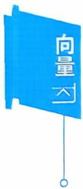

$$
\boldsymbol { A } _ { m \times n } = \left[ \begin{aligned} \boldsymbol { \alpha } _ { 1 } \\ \boldsymbol { \alpha } _ { 2 } \\ \vdots \\ \boldsymbol { \alpha } _ { m } \end{aligned} \right] = \left[ \boldsymbol { \beta } _ { 1 } , \boldsymbol { \beta } _ { 2 } , \cdots , \boldsymbol { \beta } _ { n } \right] ,
$$

则有 r(A)(矩阵 A 的秩) $r \left( \boldsymbol { \alpha } _ { 1 } , \boldsymbol { \alpha } _ { 2 } , \cdots , \boldsymbol { \alpha } _ { m } \right) \left( \boldsymbol { A } \right.$ 的行秩）$r \left( \boldsymbol { \beta } _ { 1 } , \boldsymbol { \beta } _ { 2 } , \cdots , \boldsymbol { \beta } _ { n } \right) \left( \boldsymbol { A } \right.$ 的列秩).

例如：矩阵 $\boldsymbol{A} = \begin{bmatrix} 1 & 2 & -1 & 3 \\ & & & \\ 0 & 0 & 1 & 5 \\ 0 & 0 & 0 & 0 \end{bmatrix}.$

A 中有二阶子式 $\begin{bmatrix} 1 & - 1 \\ 0 & 1 \end{bmatrix} \neq 0,\boldsymbol{A}$ 中的三阶子式 $\begin{bmatrix} 1 & 2 & - 1 \\ 0 & 0 & 1 \\ 0 & 0 & 0 \end{bmatrix}$ $\begin{bmatrix} 1 & 2 & 3 \\ 0 & 0 & 5 \\ 0 & 0 & 0 \end{bmatrix}, \begin{bmatrix} 2 & -1 & 3 \\ 0 & 1 & 5 \\ 0 & 0 & 0 \end{bmatrix}$ 全为0. 故 $r(\boldsymbol{A}) = 2$

A 的列向量 $\boldsymbol{\alpha}_{1}=\begin{bmatrix}1 \\ 0 \\ 0 \end{bmatrix},\boldsymbol{\alpha}_{2}=\begin{bmatrix}2 \\ 0 \\ 0 \end{bmatrix},\boldsymbol{\alpha}_{3}=\begin{bmatrix}-1 \\ 1 \\ 0 \end{bmatrix},\boldsymbol{\alpha}_{4}=\begin{bmatrix}3 \\ 5 \\ 0 \end{bmatrix}$ ,极大无

关组是 $\boldsymbol{a}_{1}, \boldsymbol{a}_{3}$ ,故 A的列秩 $r \left( \boldsymbol{\alpha}_{1} , \boldsymbol{\alpha}_{2} , \boldsymbol{\alpha}_{3} , \boldsymbol{\alpha}_{4} \right) = 2$

A 的行向量组 $\boldsymbol { \beta } _ { 1 } = ( 1 , 2 , - 1 , 3 ) , \boldsymbol { \beta } _ { 2 } = ( 0 , 0 , 1 , 5 ) , \boldsymbol { \beta } _ { 3 } = ( 0 , 0 , 0$ 0)，极大无关组是 $\boldsymbol{\beta}_{1}, \boldsymbol{\beta}_{2}$ ,故A的行秩 $r \left( \boldsymbol { \beta } _ { 1 } , \boldsymbol { \beta } _ { 2 } , \boldsymbol { \beta } _ { 3 } \right) = 2.$

例17设 $\boldsymbol{A} = \begin{bmatrix} 1 & 1 & 1 & -1 & 3 \\ 3 & 4 & -1 & 4 & -3 \\ 1 & 0 & 5 & -8 & 15 \end{bmatrix}$ ，错误的命题是

(A) 矩阵 A 的秩 $\geqslant 2$

(B)A 中三阶子式全为0.

(C)A 中任意两个行向量无关.

(D)A中任意两个列向量无关.

答案见 81 页

例18 (1) 已知矩阵 $\boldsymbol{A} = \begin{bmatrix} 1 & 1 & 2 & a & 3 \\ 2 & 3 & 5 & 5 & 4 \\ 2 & 2 & 3 & 1 & 4 \\ 1 & 0 & 1 & 1 & 5 \end{bmatrix}$ 的秩 $r(\boldsymbol{A}) = 3$ ,则

(2) 设 $\boldsymbol{A} = \begin{bmatrix} k & 1 & 1 & 1 \\ 1 & k & 1 & 1 \\ 1 & 1 & k & 1 \\ 1 & 1 & 1 & k \end{bmatrix}$ ，且秩 r(A) = 3,则 k =

练习区域

例19 (2003，数三）设三阶矩阵 $\boldsymbol{A} = \begin{bmatrix} a & b & b \\ b & a & b \\ b & b & a \end{bmatrix}$ ,若A的伴随矩阵A”的秩为1，则必有(A)a = b 或 $a + 2b = 0.$ (B) $a = b$ 或 $a + 2b \ne 0.$ (C) $a \ne b$ 且 $a + 2b = 0.$ (D) $a \ne b$ 且 $a + 2b \ne 0.$

答案见 81 页

(I $\alpha_{1}, \alpha_{2}, \cdots, \alpha_{s}$ 和(Ⅱ $\boldsymbol{\beta}_{1}, \boldsymbol{\beta}_{2}, \cdots, \boldsymbol{\beta}_{t}$ 若（Ⅰ）可由（Ⅱ）线性表示.证明(1) $r(\mathbb{I}) \leqslant r(\mathbb{I})$ (2) 若 $s \geq t ,$ 则（I）必线性相关.

答案见 82 页

## 四、正交规范化、正交矩阵

## 1. 内积

定义设有n维向量 $\boldsymbol{\alpha} = (a_{1}, a_{2}, \cdots, a_{n})^{\mathrm{T}}, \boldsymbol{\beta} = (b_{1}, b_{2}, \cdots, b_{n})^{\mathrm{T}}$ ,令

$$
\left( \boldsymbol { \alpha } , \boldsymbol { \beta } \right) = \boldsymbol { \alpha } ^ { \mathrm { T } } \boldsymbol { \beta } = \boldsymbol { \beta } ^ { \mathrm { T } } \boldsymbol { \alpha } = \sum _ { i = 1 } ^ { n } a _ { i } b _ { i } ,
$$

则称 $( \alpha , \beta )$ 为向量 $\alpha , \beta$ 的内积.

内积满足下列性质

(1) $( \boldsymbol { \alpha } , \boldsymbol { \beta } ) = ( \boldsymbol { \beta } , \boldsymbol { \alpha } )$ (对称性).

(2) $\left( \boldsymbol { \alpha } , \boldsymbol { \beta } \right) = \left( \lambda \boldsymbol { \alpha } , \boldsymbol { \beta } \right) = \left( \boldsymbol { \alpha } , \lambda \boldsymbol { \beta } \right)$ (线性性).

(3) $\left( \boldsymbol{\alpha} + \boldsymbol{\beta} , \boldsymbol{\gamma} \right) = \left( \boldsymbol{\alpha} , \boldsymbol{\gamma} \right) + \left( \boldsymbol{\beta} , \boldsymbol{\gamma} \right)$ (线性性).

(4) $\left( \boldsymbol{\alpha} , \boldsymbol{\alpha} \right) \geqslant 0$ ，等号成立当且仅当 α = 0(正定性).

定义设 $\left| \boldsymbol{\alpha} \right| = \sqrt{(\boldsymbol{\alpha},\boldsymbol{\alpha})} = \sqrt{a_{1}^{2} + a_{2}^{2} + \cdots + a_{n}^{2}}$ 称为向量 $\alpha =$ $(a_{1}, a_{2}, \cdots, a_{n})^{\mathrm{T}}$ 的模(长度), $| \boldsymbol{a} | = 1$ 时称α为单位向量.

定义两个向量 $\alpha , \beta$ 夹角的余弦为

$$
\cos ( \boldsymbol { \alpha } , \boldsymbol { \beta } ) = \frac { ( \boldsymbol { \alpha } , \boldsymbol { \beta } ) } { | \boldsymbol { \alpha } | | \boldsymbol { \beta } | } .
$$

当 $( \alpha , \beta ) = 0$ 时， $\cos ( \boldsymbol { \alpha } , \boldsymbol { \beta } ) = 0 , ( \boldsymbol { \alpha } , \boldsymbol { \beta } ) = \frac { \pi } { 2 }$ ,此时称向量 $\alpha , \beta$ 正交.

## 2. 施密特正交化

施密特（Schmidt）标准正交化方法

设向量组 $\boldsymbol{\alpha}_{1}, \boldsymbol{\alpha}_{2}, \boldsymbol{\alpha}_{3}$ 线性无关，其标准正交化的方法如下(又称正交规范化）：

先正交化，取

$$
\boldsymbol{\beta}_{1} = \boldsymbol{\alpha}_{1}   ,
$$

$$
\beta _ { 2 } = \alpha _ { 2 } - \frac { \left( \alpha _ { 2 } , \beta _ { 1 } \right) } { \left( \beta _ { 1 } , \beta _ { 1 } \right) } \beta _ { 1 } ,
$$

$$
\boldsymbol { \beta } _ { 3 } = \boldsymbol { \alpha } _ { 3 } - \frac { \left( \boldsymbol { \alpha } _ { 3 } , \boldsymbol { \beta } _ { 1 } \right) } { \left( \boldsymbol { \beta } _ { 1 } , \boldsymbol { \beta } _ { 1 } \right) } \boldsymbol { \beta } _ { 1 } - \frac { \left( \boldsymbol { \alpha } _ { 3 } , \boldsymbol { \beta } _ { 2 } \right) } { \left( \boldsymbol { \beta } _ { 2 } , \boldsymbol { \beta } _ { 2 } \right) } \boldsymbol { \beta } _ { 2 } ,
$$

则 $\beta _ { 1 } , \beta _ { 2 } , \beta _ { 3 }$ 是正交向量组.

再将 $\boldsymbol{\beta}_{1}, \boldsymbol{\beta}_{2}, \boldsymbol{\beta}_{3}$ 单位化.取

$$
\eta _ { 1 } = \frac { \beta _ { 1 } } { \left| \beta _ { 1 } \right| } , \eta _ { 2 } = \frac { \beta _ { 2 } } { \left| \beta _ { 2 } \right| } , \eta _ { 3 } = \frac { \beta _ { 3 } } { \left| \beta _ { 3 } \right| } ,
$$

则 $\eta_{1}, \eta_{2}, \eta_{3}$ 是标准正交向量组，即有 $\left( \eta _ { i } , \eta _ { j } \right) = \left\{ \begin{aligned} 0 , \quad & i \neq j ; \\ 1 , \quad & i = j . \end{aligned} \right.$

## 3. 正交矩阵

定义设A为n阶矩阵，若 $A A ^ { \mathrm { T } } = A ^ { \mathrm { T } } A = E$ ，则称A为正交矩阵.

定理3.11 如果A是正交矩阵 $\Leftrightarrow \boldsymbol{A}^{\mathrm{T}} = \boldsymbol{A}^{-1}$

答案见 82 页  
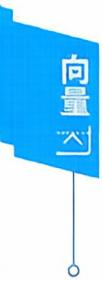

⇔A的行(列)向量都是单位向量且两两正交.

例 21 与向量 $\boldsymbol{\alpha}_{1}=(1,3,2)^{\mathrm{T}}, \boldsymbol{\alpha}_{2}=(1,1,-2)^{\mathrm{T}}$ 都正交的单位向量是

例22 已知 $\boldsymbol{\alpha}_{1}=(1,1,1)^{\mathrm{T}}, \boldsymbol{\alpha}_{2}=(-1,0,-1)^{\mathrm{T}}, \boldsymbol{\alpha}_{3}=(-1$  
2,3)T，试用施密特正交化将这组向量正交规范化.
<table><tr><td>练习区域</td></tr></table>

例23 已知 $\boldsymbol{A} = \left[ \begin{aligned} \frac{2}{\sqrt{5}} & \quad \frac{1}{3} & \quad a \\ \frac{1}{\sqrt{5}} & \quad -\frac{2}{3} & \quad b \\ 0 & \quad \frac{2}{3} & \quad c \end{aligned} \right]$ 是正交矩阵，则 $a =$

练习区域

答案见 83 页

## 例题解析

## 二、线性表出、线性相关

学习笔记

例1【解】设 $x_{1}\boldsymbol{\alpha}_{1} + x_{2}\boldsymbol{\alpha}_{2} + x_{3}\boldsymbol{\alpha}_{3} = \boldsymbol{\beta}$ ，按分量写出有

$$
x_{1}(1,2,3)+x_{2}(1,3,4)+x_{3}(2,-1,1)=(2,5,t)
$$

即

$$
\begin{cases}x_{1} + x_{2} + 2x_{3} = 2, \\2x_{1} + 3x_{2} - x_{3} = 5, \\3x_{1} + 4x_{2} + x_{3} = t,\end{cases}
$$

作初等行变换得

$$
\overline{\boldsymbol{A}} = \begin{bmatrix} 1 & 1 & 2 & \vdots & 2 \\ 2 & 3 & -1 & \vdots & 5 \\ 3 & 4 & 1 & \vdots & t \end{bmatrix} \rightarrow \begin{bmatrix} 1 & 1 & 2 & \vdots & 2 \\ 0 & 1 & -5 & \vdots & 1 \\ 0 & 1 & -5 & \vdots & t-6 \end{bmatrix} \rightarrow \begin{bmatrix} 1 & 1 & 2 & \vdots & 2 \\ 0 & 1 & -5 & \vdots & 1 \\ 0 & 0 & 0 & \vdots & t-7 \end{bmatrix},
$$

解的判定

(1) 当 $t \ne 7$ 时，方程组无解，即行向量 $\beta$ 不能由 $\boldsymbol{a}_{1}, \boldsymbol{a}_{2}, \boldsymbol{a}_{3}$ 线性表出.

(2) 当t = 7 时，方程组有解

$$
\overline{\boldsymbol{A}} \xrightarrow{} \begin{bmatrix} 1 & 1 & 2 & \vdots \\ 0 & 1 & -5 & \vdots \\ & & \vdots \\ 0 & 0 & 0 & \vdots \\ \end{bmatrix} \xrightarrow{} \begin{bmatrix} 1 & 0 & 7 & \vdots \\ 0 & 1 & -5 & \vdots \\ & & \vdots \\ 0 & 0 & 0 & \vdots \\ \end{bmatrix},
$$

区 $x_{3} = c$ 得 $x_{2}=1+5c,x_{1}=1-7c$ ,则 $\boldsymbol{\beta} = (1 - 7c)\boldsymbol{\alpha}_{1} + (1 +$ $5c) \boldsymbol{\alpha}_{2} + c\boldsymbol{\alpha}_{3}, c$ 为任意常数.

例2【解】设 $x_{1} \boldsymbol{\alpha}_{1} + x_{2} \boldsymbol{\alpha}_{2} + x_{3} \boldsymbol{\alpha}_{3} = \boldsymbol{\beta},$ 按分量写出，得方程组

$$
\left\{ \begin{aligned} (1 + \lambda)x_{1} \quad + x_{2} \quad + x_{3} &= 0, \\ x_{1} + (1 + \lambda)x_{2} \quad + x_{3} &= \lambda, \\ x_{1} \quad + x_{2} + (1 + \lambda)x_{3} &= \lambda^{2}, \end{aligned} \right.
$$

$$
\begin{aligned} 由  \overline{\boldsymbol{A}} =\begin{bmatrix}1 + \lambda & 1 & 1 & \vdots & 0 \\1 & 1 + \lambda & 1 & \vdots & \lambda \\1 & 1 & 1 + \lambda & \vdots & \lambda^2\end{bmatrix}\xrightarrow{}\begin{bmatrix}1 + \lambda & 1 & 1 & 0 \\-\lambda & \lambda & 0 & \vdots & \lambda \\-\lambda & 0 & \lambda & \vdots & \lambda^2\end{bmatrix},\end{aligned}
$$

（1）若λ=0，则同解方程组为

$$
x_{1} + x_{2} + x_{3} = 0.
$$

区 $x_{2} = t, x_{3} = u$ 得 $x_{1} = - t - u.$

故 $\boldsymbol { \beta } = - \left( t + u \right) \boldsymbol { \alpha } _ { 1 } + t \boldsymbol { \alpha } _ { 2 } + u \boldsymbol { \alpha } _ { 3 } , t , u$ 是任意常数.

若 $\lambda \ne 0$

$$
\overline{A} \xrightarrow{} \begin{bmatrix} 1 + \lambda & 1 & 1 \vdots 0 \\ -1 & 1 & 0 \vdots 1 \\ & & \vdots \\ -1 & 0 & 1 \vdots \lambda \end{bmatrix} \xrightarrow{} \begin{bmatrix} \lambda + 3 & 0 & 0 \vdots - \lambda - 1 \\ -1 & 1 & 0 \vdots & 1 \\ & & \vdots & \lambda \end{bmatrix}.
$$

且 $\lambda \ne -3$ ,解出

$$
x_{1} = - \frac{\lambda + 1}{\lambda + 3}, x_{2} = \frac{2}{\lambda + 3}, x_{3} = \frac{\lambda^{2} + 2\lambda - 1}{\lambda + 3},
$$

故 $\boldsymbol { \beta } = - \frac { \lambda + 1 } { \lambda + 3 } \boldsymbol { \alpha } _ { 1 } + \frac { 2 } { \lambda + 3 } \boldsymbol { \alpha } _ { 2 } + \frac { \lambda ^ { 2 } + 2 \lambda - 1 } { \lambda + 3 } \boldsymbol { \alpha } _ { 3 }$

(2) 若 $\lambda = -3$ ，方程组无解 $, \beta$ 不能由 $\alpha_{1}, \alpha_{2}, \alpha_{3}$ 线性表出.

【注】例1的 $\boldsymbol{\alpha}_{i}, \boldsymbol{\beta}$ 是行向量，例2的 $\boldsymbol{\alpha}_{i} , \boldsymbol{\beta}$ 是列向量.但对于 $x_{1} \boldsymbol{\alpha}_{1}$ $+ x_{2}\boldsymbol{\alpha}_{2} + x_{3}\boldsymbol{\alpha}_{3} = \boldsymbol{\beta}$ ，当把向量的坐标代入按分量写出等式时，向量 $\pmb { \alpha } _ { i }$ ，$\pmb { \beta }$ 的第1个坐标构成第1个方程，向量 $\boldsymbol{\alpha}_{i}, \boldsymbol{\beta}$ 的第2个坐标构成第2个方程，…….因此，线性表示的问题转化为解方程组的时候，不论是行向量还是列向量，只要把 $\boldsymbol{\alpha}_{i}, \boldsymbol{\beta}$ 的坐标“竖”着写即可组成所需要的增广矩阵.

$$
\boldsymbol { \alpha } = k _ { 1 } \boldsymbol { \beta } _ { 1 } + k _ { 2 } \boldsymbol { \beta } _ { 2 } + k _ { 3 } \boldsymbol { \beta } _ { 3 } ,
$$

$$
\boldsymbol { \beta } _ { 1 } = l _ { 1 1 } \boldsymbol { \gamma } _ { 1 } + l _ { 1 2 } \boldsymbol { \gamma } _ { 2 } ,
$$

$$
\beta _ { 2 } = l _ { 2 1 } \gamma _ { 1 } + l _ { 2 2 } \gamma _ { 2 } ,
$$

$$
\beta _ { 3 } = l _ { 3 1 } \gamma _ { 1 } + l _ { 3 2 } \gamma _ { 2 } ,
$$

那么 $\boldsymbol { \alpha } = k _ { 1 } \left( l _ { 1 1 } \boldsymbol { \gamma } _ { 1 } + l _ { 1 2 } \boldsymbol { \gamma } _ { 2 } \right) + k _ { 2 } \left( l _ { 2 1 } \boldsymbol { \gamma } _ { 1 } + l _ { 2 2 } \boldsymbol { \gamma } _ { 2 } \right) + k _ { 3 } \left( l _ { 3 1 } \boldsymbol { \gamma } _ { 1 } + l _ { 3 2 } \boldsymbol { \gamma } _ { 2 } \right)$ $\begin{array} { r } { = ( k _ { 1 } l _ { 1 1 } + k _ { 2 } l _ { 2 1 } + k _ { 3 } l _ { 3 1 } ) \gamma _ { 1 } + ( k _ { 1 } l _ { 1 2 } + k _ { 2 } l _ { 2 2 } + k _ { 3 } l _ { 3 2 } ) \gamma _ { 2 } , } \end{array}$

即α可由 $\gamma_{1}, \gamma_{2}$ 线性表出.

例4【解】设 $x_{1}\boldsymbol{\alpha}_{1} + x_{2}\boldsymbol{\alpha}_{2} + x_{3}\boldsymbol{\alpha}_{3} = \boldsymbol{0}$ ，按分量写出，有$x_{1}(1,2,-1,4)+x_{2}(0,-1,-5,3)+x_{3}(2,5,3,5)=(0,0,0,0)$

即有

$$
\left\{ \begin{aligned} x_{1} + 2x_{3} = 0, \\ 2x_{1} - x_{2} + 5x_{3} = 0, \\ - x_{1} - 5x_{2} + 3x_{3} = 0, \\ 4x_{1} + 3x_{2} + 5x_{3} = 0, \end{aligned} \right.
$$

对系数矩阵作初等变换有

$$
\boldsymbol{A} = \begin{bmatrix} 1 & 0 & 2 \\ 2 & -1 & 5 \\ -1 & -5 & 3 \\ 4 & 3 & 5 \end{bmatrix} \xrightarrow{} \begin{bmatrix} 1 & 0 & 2 \\ 0 & 1 & -1 \\ 0 & 0 & 0 \\ 0 & 0 & 0 \end{bmatrix},
$$

由 $r(A) < n$ ,齐次方程组 $Ax = \mathbf{0}$ 必有非零解，故 $\boldsymbol{\alpha}_{1}, \boldsymbol{\alpha}_{2}, \boldsymbol{\alpha}_{3}$ 线性相关.

例5【解】已知向量的坐标，判断向量组的线性相关就是转化为考查齐次方程组有非零解.

(1) 设 $x_{1}\boldsymbol{\alpha}_{1} + x_{2}\boldsymbol{\alpha}_{2} + x_{3}\boldsymbol{\alpha}_{3} = \boldsymbol{0}.$ 按分量写出，即

$$
\begin{cases}3x_{1} + 2x_{2} + x_{3} = 0, \\4x_{1} + x_{2} + 2x_{3} = 0, \\2x_{1} - 7x_{2} + 4x_{3} = 0,\end{cases}
$$

由于系数行列式

$$
\begin{vmatrix} 3 & 2 & 1 \\ 4 & 1 & 2 \\ 2 & -7 & 4 \end{vmatrix} = -5 \begin{vmatrix} 1 & 2 & -3 \\ 0 & 1 & 0 \\ -6 & -7 & 18 \end{vmatrix} = 0   ,
$$

齐次方程组必有非零解，所以 $\boldsymbol{\alpha}_{1}, \boldsymbol{\alpha}_{2}, \boldsymbol{\alpha}_{3}$ 线性相关.

(2) 设 $x_{1}\boldsymbol{\alpha}_{1} + x_{2}\boldsymbol{\alpha}_{2} + x_{3}\boldsymbol{\alpha}_{3} = \boldsymbol{0}$ ，按分量写出，有

$$
\left\{ \begin{aligned} x_{1} + 3x_{2} + 5x_{3} = 0 , \\ 2x_{1} + 4x_{2} + 6x_{3} = 0 , \end{aligned} \right.
$$

由 $r(A) < n$ ，齐次方程组必有非零解，故 $\boldsymbol{\alpha}_{1}, \boldsymbol{\alpha}_{2}, \boldsymbol{\alpha}_{3}$ 必线性相关.

注】由例4和例5可以看到，线性相关时的计算题和线性表出是类似的，不论α是行向量还是列向量，只要把向量的坐标“竖”着写即可组成所需要的齐次方程组的系数矩阵.

【分析】（1） $\boldsymbol{\alpha}_{3} = 2\boldsymbol{\alpha}_{1}$ ,相关.

(2) $\boldsymbol{\alpha}_{2}=\mathbf{0}$ ,相关.

(3)因(1,1,1)，(0,1,1)，(0,0,1)无关，故 $\alpha_{1}, \alpha_{2}, \alpha_{3}$ 无关.

(4) $\begin{aligned} &\begin{vmatrix} 1 & 1 & 1 & 0 \\ 1 & 0 & 0 & 1 \\ 1 & 0 & 1 & 0 \\ 1 & 1 & 0 & 0 \end{vmatrix} = 1 \neq 0\\ \end{aligned}$ ,故 $\alpha_{1}, \alpha_{2}, \alpha_{3}, \alpha_{4}$ 无关.

例7【解】（1）n个n维向量 $\alpha_{1}, \alpha_{2}, \cdots, \alpha_{n}$ 线性相关

$$
\Leftrightarrow \left| \boldsymbol { \alpha } _ { 1 } , \boldsymbol { \alpha } _ { 2 } , \cdots , \boldsymbol { \alpha } _ { n } \right| = 0 ,
$$

$$
\left| \begin{array} { l l l }\boldsymbol { \alpha } _ { 1 } , \boldsymbol { \alpha } _ { 2 } , \boldsymbol { \alpha } _ { 3 } \end{array} \right| = \left| \begin{array} { c c c }1 & - 1 & 0 \\3 & 1 & a \\2 & 2 & 3\end{array} \right| = \left| \begin{array} { c c c }1 & 0 & 0 \\3 & 4 & a \\2 & 4 & 3\end{array} \right| = 4 ( 3 - a )   ,
$$

所以 a = 3 时，向量组 $\alpha_{1}, \alpha_{2}, \alpha_{3}$ 线性相关.

(2) 设 $x_{1}\boldsymbol{\alpha}_{1} + x_{2}\boldsymbol{\alpha}_{2} + x_{3}\boldsymbol{\alpha}_{3} = \boldsymbol{0}$ ,按分量写出.即

$$
\left\{ \begin{aligned} x_{1} + x_{2} + x_{3} = 0, \\ x_{2} - x_{3} = 0, \\ 2x_{1} + 3x_{2} + ax_{3} = 0, \\ 3x_{1} + 5x_{2} + x_{3} = 0, \end{aligned} \right.
$$

对系数矩阵作初等行变换有

$$
\boldsymbol{A} = \begin{bmatrix} 1 & 1 & 1 \\ 0 & 1 & -1 \\ 2 & 3 & a \\ 3 & 5 & 1 \end{bmatrix} \xrightarrow{} \begin{bmatrix} 1 & 1 & 1 \\ 0 & 1 & -1 \\ 0 & 1 & a-2 \\ 0 & 2 & -2 \end{bmatrix} \xrightarrow{} \begin{bmatrix} 1 & 1 & 1 \\ 0 & 1 & -1 \\ 0 & 0 & a-1 \\ 0 & 0 & 0 \end{bmatrix}.
$$

可见 $a = 1$ 时，秩 $r(A)=2<3$ ,齐次方程组 $Ax = \mathbf{0}$ 有非零解.从而 $\boldsymbol{\alpha}_{1}, \boldsymbol{\alpha}_{2}, \boldsymbol{\alpha}_{3}$ 线性相关.

当 $a \ne 1$ 时，秩 $r(\boldsymbol{A}) = 3$ ，齐次方程组Ax=0只有零解，那么 $\pmb{\alpha}_{1}$ ，$\boldsymbol{a}_{2} , \boldsymbol{a}_{3}$ 线性无关.

8【分析】（Ⅲ）线性相关⇔ $| \boldsymbol{A} \boldsymbol{B} | = 0$

$$
\Leftrightarrow \left| \boldsymbol{A} \right| = 0  或  \left| \boldsymbol{B} \right| = 0,
$$

所以应选(B).

## 例9【分析】由观察法

$$
\left( \mathrm { A } \right) \left( \boldsymbol { \alpha } _ { 1 } + \boldsymbol { \alpha } _ { 2 } \right) - \left( \boldsymbol { \alpha } _ { 2 } + \boldsymbol { \alpha } _ { 3 } \right) + \left( \boldsymbol { \alpha } _ { 3 } - \boldsymbol { \alpha } _ { 1 } \right) = \mathbf { 0 } ,
$$

$$
\left( \mathrm { B } \right) \left( \boldsymbol { \alpha } _ { 1 } + \boldsymbol { \alpha } _ { 2 } \right) + \left( \boldsymbol { \alpha } _ { 2 } + \boldsymbol { \alpha } _ { 3 } \right) - \left( \boldsymbol { \alpha } _ { 1 } + 2 \boldsymbol { \alpha } _ { 2 } + \boldsymbol { \alpha } _ { 3 } \right) = \mathbf { 0 } ,
$$

知(A)(B)均线性相关，然后可用秩继续分析，令

$$
\boldsymbol { \beta } _ { 1 } = \boldsymbol { \alpha } _ { 1 } + 2 \boldsymbol { \alpha } _ { 2 } , \boldsymbol { \beta } _ { 2 } = 2 \boldsymbol { \alpha } _ { 2 } + 3 \boldsymbol { \alpha } _ { 3 } , \boldsymbol { \beta } _ { 3 } = 3 \boldsymbol { \alpha } _ { 3 } + \boldsymbol { \alpha } _ { 1 } ,
$$

则 $\left( \boldsymbol { \beta } _ { 1 } , \boldsymbol { \beta } _ { 2 } , \boldsymbol { \beta } _ { 3 } \right) = \left( \boldsymbol { \alpha } _ { 1 } + 2 \boldsymbol { \alpha } _ { 2 } , 2 \boldsymbol { \alpha } _ { 2 } + 3 \boldsymbol { \alpha } _ { 3 } , 3 \boldsymbol { \alpha } _ { 3 } + \boldsymbol { \alpha } _ { 1 } \right)$

$$
\begin{aligned}= (\boldsymbol{\alpha}_{1},\boldsymbol{\alpha}_{2},\boldsymbol{\alpha}_{3}) \begin{bmatrix}1 & 0 & 1 \\2 & 2 & 0 \\0 & 3 & 3\end{bmatrix}= (\boldsymbol{\alpha}_{1},\boldsymbol{\alpha}_{2},\boldsymbol{\alpha}_{3})\boldsymbol{C}.\end{aligned}
$$

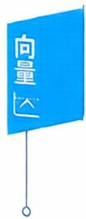

由 $\left| \textbf{\em C} \right| = \left| \begin{matrix} 1 & 0 & 1 \\ 2 & 2 & 0 \\ 0 & 3 & 3 \end{matrix} \right| = 12 \neq 0$ ，矩阵C可逆，又 $\boldsymbol{\alpha}_{1}, \boldsymbol{\alpha}_{2}, \boldsymbol{\alpha}_{3}$ 线性无

$$
r(\boldsymbol{\alpha}_{1},\boldsymbol{\alpha}_{2},\boldsymbol{\alpha}_{3}) = 3
$$

$$
r \left( \boldsymbol { \beta } _ { 1 } , \boldsymbol { \beta } _ { 2 } , \boldsymbol { \beta } _ { 3 } \right) = r \left[ \left( \boldsymbol { \alpha } _ { 1 } , \boldsymbol { \alpha } _ { 2 } , \boldsymbol { \alpha } _ { 3 } \right) \boldsymbol { C } \right] = r \left( \boldsymbol { \alpha } _ { 1 } , \boldsymbol { \alpha } _ { 2 } , \boldsymbol { \alpha } _ { 3 } \right) = 3 ,
$$

从而 $\boldsymbol{\beta}_{1}, \boldsymbol{\beta}_{2}, \boldsymbol{\beta}_{3}$ 必线性无关，即(C）必线性无关.

关于(D),

$$
\left( \boldsymbol { \beta } _ { 1 } , \boldsymbol { \beta } _ { 2 } , \boldsymbol { \beta } _ { 3 } \right) = \left( \boldsymbol { \alpha } _ { 1 } , \boldsymbol { \alpha } _ { 2 } , \boldsymbol { \alpha } _ { 3 } \right) \begin{bmatrix} 1 & 2 & 3 \\ 1 & - 3 & 5 \\ & & \\ 1 & 2 2 & - 5 \end{bmatrix} = \left( \boldsymbol { \alpha } _ { 1 } , \boldsymbol { \alpha } _ { 2 } , \boldsymbol { \alpha } _ { 3 } \right) C.
$$

因 $\begin{vmatrix} 1 & 2 & 3 \\ 1 & -3 & 5 \\ 1 & 22 & -5 \end{vmatrix} = 0, r(C) = 2$ ,那么

$$
r \left( \boldsymbol { \beta } _ { 1 } , \boldsymbol { \beta } _ { 2 } , \boldsymbol { \beta } _ { 3 } \right) = r \left[ \left( \boldsymbol { \alpha } _ { 1 } , \boldsymbol { \alpha } _ { 2 } , \boldsymbol { \alpha } _ { 3 } \right) \boldsymbol { C } \right] = r ( \boldsymbol { C } ) = 2.
$$

可推断出(D)线性相关.

例10【证】因为 $\alpha_{1}, \alpha_{2}, \cdots, \alpha_{s}, \beta$ 线性相关，故存在不全为0的 $k_{1},k_{2},\cdots,k_{s},k$ 使得

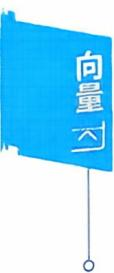

$$
k_{1}\boldsymbol{\alpha}_{1} + k_{2}\boldsymbol{\alpha}_{2} + \cdots + k_{s}\boldsymbol{\alpha}_{s} + k\boldsymbol{\beta} = \boldsymbol{0}.
$$

如果其中 $k = 0$ ,那么必有 $k_{1},k_{2},\cdots,k_{s}$ 不全为0，而

$$
k _ { 1 } \boldsymbol { \alpha } _ { 1 } + k _ { 2 } \boldsymbol { \alpha } _ { 2 } + \cdots + k _ { s } \boldsymbol { \alpha } _ { s } = \boldsymbol { 0 } ,
$$

这与已知条件 $\alpha_{1}, \alpha_{2}, \cdots, \alpha_{s}$ 线性无关相矛盾.所以必有 $k \neq 0$ ,那么

$$
\boldsymbol { \beta } = \left( - \frac { k _ { 1 } } { k } \right) \boldsymbol { \alpha } _ { 1 } + \left( - \frac { k _ { 2 } } { k } \right) \boldsymbol { \alpha } _ { 2 } + \cdots + \left( - \frac { k _ { s } } { k } \right) \boldsymbol { \alpha } _ { s } ,
$$

即向量 $\beta$ 可由 $\alpha_{1}, \alpha_{2}, \cdots, \alpha_{s}$ 线性表出.

若 $\pmb { \beta }$ 有两种不同的表示法，设

$$
\boldsymbol{\beta}=x_{1} \boldsymbol{\alpha}_{1}+x_{2} \boldsymbol{\alpha}_{2}+\cdots+x_{s} \boldsymbol{\alpha}_{s}, \boldsymbol{\beta}=y_{1} \boldsymbol{\alpha}_{1}+y_{2} \boldsymbol{\alpha}_{2}+\cdots+y_{s} \boldsymbol{\alpha}_{s},
$$

两式相减，得

$$
\left( x _ { 1 } - y _ { 1 } \right) \boldsymbol { \alpha } _ { 1 } + \left( x _ { 2 } - y _ { 2 } \right) \boldsymbol { \alpha } _ { 2 } + \cdots + \left( x _ { s } - y _ { s } \right) \boldsymbol { \alpha } _ { s } = \mathbf { 0 } ,
$$

因为是两种不同的表示法， $x_{i}  一  y_{i}$ 不可能全为0，于是 $\alpha_{1}, \alpha_{2}, \cdots$ $\boldsymbol{\alpha}_{s}$ 线性相关，与已知条件矛盾.故 $\beta$ 的表示法唯一.

## 例11【证】必要性

若 $\alpha_{1}, \alpha_{2}, \cdots, \alpha_{s}$ 线性相关，则存在不全为0的 $k_{1},k_{2},\cdots,k_{s}$ 使

$$
k _ { 1 } \boldsymbol { \alpha } _ { 1 } + k _ { 2 } \boldsymbol { \alpha } _ { 2 } + \cdots + k _ { s } \boldsymbol { \alpha } _ { s } = \boldsymbol { 0 } ,
$$

不妨设 $k_{1} \neq 0$ ,则有

$$
k _ { 1 } \boldsymbol { \alpha } _ { 1 } = - k _ { 2 } \boldsymbol { \alpha } _ { 2 } - k _ { 3 } \boldsymbol { \alpha } _ { 3 } - \cdots - k _ { s } \boldsymbol { \alpha } _ { s } ,
$$

那么 $\boldsymbol { \alpha } _ { 1 } = \left( - \frac { k _ { 2 } } { k _ { 1 } } \right) \boldsymbol { \alpha } _ { 2 } + \left( - \frac { k _ { 3 } } { k _ { 1 } } \right) \boldsymbol { \alpha } _ { 3 } + \cdots + \left( - \frac { k _ { s } } { k _ { 1 } } \right) \boldsymbol { \alpha } _ { s }$ ,即 $\boldsymbol{\alpha}_{1}$ 可由 $\boldsymbol{\alpha}_{2}, \boldsymbol{\alpha}_{3}$ $\cdots , a ,$ 线性表出.

充分性

如果 $\pmb { \alpha } _ { i }$ 可由 $\alpha_{1}, \cdots, \alpha_{i-1}, \alpha_{i+1}, \cdots, \alpha_{s}$ 线性表出.设

$$
\boldsymbol { \alpha } _ { i } = k _ { 1 } \boldsymbol { \alpha } _ { 1 } + \cdots + k _ { i - 1 } \boldsymbol { \alpha } _ { i - 1 } + k _ { i + 1 } \boldsymbol { \alpha } _ { i + 1 } + \cdots + k _ { s } \boldsymbol { \alpha } _ { s }
$$

即有 $k _ { 1 } \boldsymbol { \alpha } _ { 1 } + \cdots + k _ { i - 1 } \boldsymbol { \alpha } _ { i - 1 } - \boldsymbol { \alpha } _ { i } + k _ { i + 1 } \boldsymbol { \alpha } _ { i + 1 } + \cdots + k _ { i } \boldsymbol { \alpha } _ { i } = \boldsymbol { 0 } ,$

组合系数 $k_{1}, \cdots, k_{i-1}, -1, k_{i+1}, \cdots, k_{s}$ 不全为0，所以 $\alpha_{1}, \alpha_{2}, \cdots, \alpha_{s}$ 线性 相关.

## 例12【证】构造两个齐次方程组

$$
\left( \boldsymbol { \alpha } _ { 1 } , \boldsymbol { \alpha } _ { 2 } , \cdots , \boldsymbol { \alpha } _ { s } \right) \begin{bmatrix} x _ { 1 } \\ x _ { 2 } \\ \vdots \\ x _ { s } \end{bmatrix} = \boldsymbol { 0 } ,\tag{I}
$$

$$
\left( \boldsymbol { \gamma } _ { 1 }   , \boldsymbol { \gamma } _ { 2 }   , \cdots , \boldsymbol { \gamma } _ { s } \right) \begin{bmatrix} x _ { 1 } \\ x _ { 2 } \\ \vdots \\ x _ { s } \end{bmatrix} = \boldsymbol { 0 }   ,\tag{Ⅱ}
$$

$$
\left\{ \begin{aligned} ( \alpha _ { 1 } , \alpha _ { 2 } , \cdots , \alpha _ { s } ) x = 0 , \quad (  I  ) \\ ( \gamma _ { 1 } , \gamma _ { 2 } , \cdots , \gamma _ { s } ) x = 0 , \quad (  II  ) \end{aligned} \right.
$$

由于（Ⅱ）的前m个方程就是（Ⅰ）的所有方程，于是{(Ⅱ）的解}$\subset \{ ( I )$ 的解}.

(1) 当 $\alpha_{1}, \alpha_{2}, \cdots, \alpha_{s}$ 线性无关时，（Ⅰ）只有零解，因此（Ⅱ）也仅有零解，故 $\gamma_{1}, \gamma_{2}, \cdots, \gamma_{s}$ 必线性无关.

(2) 当 $\gamma_{1}, \gamma_{2}, \cdots, \gamma_{s}$ 线性相关时，（Ⅱ）有非零解，因此（Ⅰ）必有非零解，故 $\alpha_{1}, \alpha_{2}, \cdots, \alpha_{s}$ 一定线性相关.

## 三、向量组的秩、矩阵的秩

例13【分析】对列向量作初等行变换化为阶梯形，有

$$
\begin{aligned}\left( \boldsymbol{\alpha}_{1}, \boldsymbol{\alpha}_{2}, \boldsymbol{\alpha}_{3}, \boldsymbol{\alpha}_{4}, \boldsymbol{\alpha}_{5} \right)&=\begin{bmatrix}1 & 0 & 3 & 1 & 2 \\-1 & 3 & 0 & -2 & -1 \\2 & 1 & 7 & 2 & 5 \\4 & 2 & 14 & 0 & 2\end{bmatrix}\rightarrow\begin{bmatrix}1 & 0 & 3 & 1 & 2 \\0 & 1 & 1 & 0 & 1 \\0 & 0 & 0 & 1 & 2 \\0 & 0 & 0 & 0 & 0\end{bmatrix}\\&\xlongequal{ 记 }\left( \boldsymbol{\beta}_{1}, \boldsymbol{\beta}_{2}, \boldsymbol{\beta}_{3}, \boldsymbol{\beta}_{4}, \boldsymbol{\beta}_{5} \right),\end{aligned}
$$

此时每行第1个非0数在第1,2,4列，故 $\boldsymbol{a}_{1}, \boldsymbol{a}_{2}, \boldsymbol{a}_{4}$ 是一个极大线性无关组

【注】由 $(3,1,0,0)^{\mathrm{T}} = 3(1,0,0,0)^{\mathrm{T}} + (0,1,0,0)^{\mathrm{T}}$

$$
(2,1,2,0)^{\mathrm{T}} = (0,1,0,0)^{\mathrm{T}} + 2(1,0,1,0)^{\mathrm{T}}
$$

即 $\beta _ { 3 } = 3 \beta _ { 1 } + \beta _ { 2 } , \beta _ { 5 } = \beta _ { 2 } + 2 \beta _ { 4 }$ ,故知 $\boldsymbol{\alpha}_{3}=3 \boldsymbol{\alpha}_{1}+\boldsymbol{\alpha}_{2}, \boldsymbol{\alpha}_{5}=\boldsymbol{\alpha}_{2}+2 \boldsymbol{\alpha}_{4}$

于是用极大线性无关组 $\alpha_{1}, \alpha_{2}, \alpha_{4}$ 表示出 $\pmb { \alpha } _ { 3 }$ 和 $\pmb { \alpha } _ { 5 }$

14【分析】向量组的秩=矩阵的秩.

$$
\boldsymbol { A } = \begin{bmatrix} \pmb { \alpha } _ { 1 } \\ \pmb { \alpha } _ { 2 } \\ \pmb { \alpha } _ { 3 } \end{bmatrix} = \begin{bmatrix} 1 & 2 & - 1 & 1 \\ 2 & 0 & t & 0 \\ 0 & - 4 & 5 & - 2 \end{bmatrix} \xrightarrow { } \begin{bmatrix} 1 & 2 & - 1 & 1 \\ 0 & - 4 & t + 2 & - 2 \\ 0 & 0 & 3 - t & 0 \end{bmatrix},
$$

所以t = 3.

或，已知 $\boldsymbol{\alpha}_{1} , \boldsymbol{\alpha}_{2}$ 线性无关，而秩为2.于是 $\boldsymbol{a}_{1}, \boldsymbol{a}_{2}$ 是极大线性无关组，从

而 $\boldsymbol{\alpha}_{3}$ 必可由 $\boldsymbol{\alpha}_{1}, \boldsymbol{\alpha}_{2}$ 线性表出.

对 $x_{1}\boldsymbol{\alpha}_{1} + x_{2}\boldsymbol{\alpha}_{2} = \boldsymbol{\alpha}_{3}$

$$
\begin{bmatrix} 1 & 2 \vdots & 0 \\ & \vdots \vdots \\ 2 & 0 \vdots - 4 \\ & \vdots \vdots \\ - 1 & t \vdots & 5 \\ & \vdots \vdots \\ 1 & 0 \vdots - 2 \end{bmatrix} \rightarrow \begin{bmatrix} 1 & 0 \vdots - 2 \\ 0 & 1 \vdots & 1 \\ & \vdots \vdots & 1 \\ 0 & 0 \vdots \vdots 3 - t \\ & \vdots \vdots & 0 \end{bmatrix},
$$

方程组有解，故 $t = 3$

例15

【分析】由 $r(I) = 3$ 知 $\boldsymbol{\alpha}_{1}, \boldsymbol{\alpha}_{2}, \boldsymbol{\alpha}_{3}$ 线性无关，

由 $r(\Pi) = 3$ 知 $\alpha_{1}, \alpha_{2}, \alpha_{3}, \alpha_{4}$ 线性相关，

故 $\boldsymbol{\alpha}_{4}$ 可由. $\boldsymbol{\alpha}_{1}, \boldsymbol{\alpha}_{2}, \boldsymbol{\alpha}_{3}$ 线性表出，那么向量组 $\alpha_{1}, \alpha_{2}, \alpha_{3}, \alpha_{4} + \alpha_{5}$ 与 $\pmb{\alpha}_{1}$ $\boldsymbol{a}_{2}, \boldsymbol{a}_{3}, \boldsymbol{a}_{5}$ 可以互相线性表示，即向量组等价。

所以 $r \left( \boldsymbol{\alpha}_{1} , \boldsymbol{\alpha}_{2} , \boldsymbol{\alpha}_{3} , \boldsymbol{\alpha}_{4} + \boldsymbol{\alpha}_{5} \right) = 4$

或设 $\boldsymbol{\alpha}_{4}=k_{1} \boldsymbol{\alpha}_{1}+k_{2} \boldsymbol{\alpha}_{2}+k_{3} \boldsymbol{\alpha}_{3}$ ,则

$$
\begin{aligned}\left( \boldsymbol{\alpha}_{1}, \boldsymbol{\alpha}_{2}, \boldsymbol{\alpha}_{3}, \boldsymbol{\alpha}_{4} + \boldsymbol{\alpha}_{5} \right) &= \left( \boldsymbol{\alpha}_{1}, \boldsymbol{\alpha}_{2}, \boldsymbol{\alpha}_{3}, k_{1} \boldsymbol{\alpha}_{1} + k_{2} \boldsymbol{\alpha}_{2} + k_{3} \boldsymbol{\alpha}_{3} + \boldsymbol{\alpha}_{5} \right) \\&= \left( \boldsymbol{\alpha}_{1}, \boldsymbol{\alpha}_{2}, \boldsymbol{\alpha}_{3}, \boldsymbol{\alpha}_{5} \right) \begin{bmatrix}1 & 0 & 0 & k_{1} \\0 & 1 & 0 & k_{2} \\0 & 0 & 1 & k_{3} \\0 & 0 & 0 & 1\end{bmatrix},\end{aligned}
$$

由于矩阵 $\begin{bmatrix} 1 & 0 & 0 & k_{1} \\ 0 & 1 & 0 & k_{2} \\ 0 & 0 & 1 & k_{3} \\ 0 & 0 & 0 & 1 \end{bmatrix}$ 可逆，故r(α1,α2,α3,α4+α5)=r(α1,α2,α3,α5)= 4.

例16【分析】明显地， $, \boldsymbol { \alpha } _ { 1 } , \boldsymbol { \alpha } _ { 2 }$ 线性无关，有 $k \geqslant 2$ ,因 $n + 1$ 个n维向量必线性相关，即 $\alpha_{1}, \alpha_{2}, \cdots, \alpha_{5}$ 一定线性相关，故 $k \leqslant$ 4.

发现 $\boldsymbol{a}_{4} = - \boldsymbol{a}_{2}$ ,即 $\alpha_{1}, \alpha_{2}, \alpha_{3}, \alpha_{4}$ 一定线性相关，故 $k \leqslant 3$ 8.

$$
\left( \boldsymbol { \alpha } _ { 1 } , \boldsymbol { \alpha } _ { 2 } , \boldsymbol { \alpha } _ { 3 } \right) = \begin{bmatrix} 1 & 1 & 1 \\ 1 & - 1 & 1 \\ 1 & 1 & 1 \\ 1 & - 1 & - 1 \end{bmatrix} \xrightarrow { } \begin{bmatrix} 1 & 1 & 1 \\ 0 & 1 & 0 \\ 0 & 0 & 1 \\ 0 & 0 & 0 \end{bmatrix},
$$

于是 $\boldsymbol{a}_{1}, \boldsymbol{a}_{2}, \boldsymbol{a}_{3}$ 线性无关， $\alpha_{1}, \alpha_{2}, \alpha_{3}, \alpha_{4}$ 线性相关，所以 $k = 3$ 【注】本题 $\alpha_{1}, \alpha_{2}, \alpha_{3}$ 不是向量组的极大线性无关组.

例17【分析】A中存在 $\begin{vmatrix} 1 & 1 \\ 3 & 4 \end{vmatrix} \neq 0$ ,故(A)正确.

A中任何两行都不成比例，故(C)正确.

A中第3列、第5列成比例，存在两列向量线性无关，(D)错误.

A中有 $C_{5}^{3} = 10$ 个三阶子式，一个一个计算不合适，用初等变换化阶梯形为好.

$$
\boldsymbol{A} \xrightarrow{} \begin{bmatrix} 1 & 1 & 1 & -1 & 3 \\ 0 & 1 & -4 & 7 & -12 \\ 0 & 0 & 0 & 0 & 0 \end{bmatrix}.
$$

例18 【分析】（1）经初等变换，矩阵的秩不变，对矩阵A作初 等变换

$$
\boldsymbol{A} = \begin{bmatrix} 1 & 1 & 2 & a & 3 \\ 2 & 3 & 5 & 5 & 4 \\ 2 & 2 & 3 & 1 & 4 \\ 1 & 0 & 1 & 1 & 5 \end{bmatrix} \xrightarrow{} \begin{bmatrix} 1 & 0 & 1 & 1 & 5 \\ 2 & 3 & 5 & 5 & 4 \\ 2 & 2 & 3 & 1 & 4 \\ 1 & 1 & 2 & a & 3 \end{bmatrix}
$$

$$
\begin{aligned}&\rightarrow\begin{bmatrix}1 & 0 & 1 & 1 & 5 \\0 & 3 & 3 & 3 & -6 \\0 & 2 & 1 & -1 & -6 \\0 & 1 & 1 & a-1 & -2\end{bmatrix}\rightarrow\begin{bmatrix}1 & 0 & 1 & 1 & 5 \\0 & 1 & 1 & 1 & -2 \\0 & 0 & 1 & 3 & 2 \\0 & 0 & 0 & a-2 & 0\end{bmatrix},\end{aligned}
$$

可见a= 2时，秩 $r(\boldsymbol{A}) = 3$

(2) 由 $\left| \boldsymbol{A} \right| = \left| \begin{aligned} & k \quad 1 \quad 1 \quad 1 \\ & 1 \quad k \quad 1 \quad 1 \\ & 1 \quad 1 \quad k \quad 1 \\ & 1 \quad 1 \quad 1 \quad k \end{aligned} \right| = \left( k + 3 \right) \left( k - 1 \right)^{3}$ 可知，

若k = 1,则 $r(A)=1$ ,故 $k = -3$

例19【分析】由

$$
r(A^{*}) = \begin{cases}n, &  若  \; r(A) = n \\1, &  若  \; r(A) = n - 1 \\0, &  若  \; r(A) < n - 1\end{cases}
$$

现 $n = 3,r(\boldsymbol{A}^{*}) = 1 \Leftrightarrow r(\boldsymbol{A}) = 2$

如 $a = b \Rightarrow r(A) \leqslant 1$ ，排除(A)，(B).

必有 $a \neq b$ ，此时 A 中 $\begin{vmatrix} a & b \\ b & a \end{vmatrix} \neq 0$ ,而

$$
\left| \boldsymbol{A} \right| = \left| \begin{aligned} \boldsymbol{a} \quad \boldsymbol{b} \quad \boldsymbol{b} \\ \boldsymbol{b} \quad \boldsymbol{a} \quad \boldsymbol{b} \\ \boldsymbol{b} \quad \boldsymbol{b} \quad \boldsymbol{a} \end{aligned} \right| = (\boldsymbol{a} + 2\boldsymbol{b})(\boldsymbol{a} - \boldsymbol{b})^{2} = 0,
$$

故应选(C).

例20【证】（1）因（I）可由（Ⅱ）线性表出，设

$$
\boldsymbol { \alpha } _ { 1 } = c _ { 1 1 } \boldsymbol { \beta } _ { 1 } + c _ { 2 1 } \boldsymbol { \beta } _ { 2 } + \cdots + c _ { t 1 } \boldsymbol { \beta } _ { t } ,
$$

$$
\boldsymbol { \alpha } _ { s } = c _ { 1 s } \boldsymbol { \beta } _ { 1 } + c _ { 2 s } \boldsymbol { \beta } _ { 2 } + \cdots + c _ { s } \boldsymbol { \beta } _ { t } ,
$$

即存在矩阵 $C = \left[ c_{ij} \right]$ ,使

那么

$$
\begin{aligned}\left( \boldsymbol { \alpha } _ { 1 } , \boldsymbol { \alpha } _ { 2 } , \cdots , \boldsymbol { \alpha } _ { s } \right) &= \left( \boldsymbol { \beta } _ { 1 } , \boldsymbol { \beta } _ { 2 } , \cdots , \boldsymbol { \beta } _ { t } \right) \boldsymbol { C } , \\r \left( \boldsymbol { \alpha } _ { 1 } , \boldsymbol { \alpha } _ { 2 } , \cdots , \boldsymbol { \alpha } _ { s } \right) &= r \left[ \left( \boldsymbol { \beta } _ { 1 } , \boldsymbol { \beta } _ { 2 } , \cdots , \boldsymbol { \beta } _ { t } \right) \boldsymbol { C } \right] \\& \leqslant r \left( \boldsymbol { \beta } _ { 1 } , \boldsymbol { \beta } _ { 2 } , \cdots , \boldsymbol { \beta } _ { t } \right) ,\end{aligned}
$$

即 $r(\mathbb{I}) \leqslant r(\mathbb{I})$

(2) 若 $s \geq t$ ,则

$$
r ( \mathrm { I } ) \leqslant r ( \mathrm { I I } ) = r ( \beta _ { 1 } , \beta _ { 2 } , \cdots , \beta _ { t } ) \leqslant t < s ,
$$

所以 $\alpha_{1}, \alpha_{2}, \cdots, \alpha_{s}$ 必线性相关.

## 四、正交规范化、正交矩阵

例21【分析】设 $\boldsymbol{\alpha} = (x_{1}, x_{2}, x_{3})^{\mathrm{T}}$ 与 $\boldsymbol{\alpha}_{1}, \boldsymbol{\alpha}_{2}$ 都正交，则

$$
\left\{ \begin{aligned} \left( \boldsymbol{\alpha}, \boldsymbol{\alpha}_{1} \right) &= x_{1} + 3x_{2} + 2x_{3} = 0, \\ \left( \boldsymbol{\alpha}, \boldsymbol{\alpha}_{2} \right) &= x_{1} + x_{2} - 2x_{3} = 0, \end{aligned} \right.
$$

$$
{ 1 \quad 3 \quad 2 \atop 1 \quad 1 \quad -   2 } { \Big ] } { \rightarrow } { 1 \quad 3 \quad 2 \atop 0 \quad 1 \quad 2 } { \Big ] } { \rightarrow } { 1 \quad 0 \quad -   4 \quad \Big ] } ,
$$

得 $\boldsymbol{\alpha} = (4, -2, 1)^{\mathrm{T}}$ ，再单位化有 $\pm \frac{1}{\sqrt{21}}(4, -2, 1)^{\mathrm{T}}$ 为所求.

例22【解】先正交化

$$
\pmb { \beta } _ { 1 } = \pmb { \alpha } _ { 1 } = \begin{bmatrix} 1 \\ 1 \\ 1 \end{bmatrix},
$$

$$
\boldsymbol { \beta } _ { 2 } = \boldsymbol { \alpha } _ { 2 } - \frac { \left( \boldsymbol { \alpha } _ { 2 } , \boldsymbol { \beta } _ { 1 } \right) } { \left( \boldsymbol { \beta } _ { 1 } , \boldsymbol { \beta } _ { 1 } \right) } \boldsymbol { \beta } _ { 1 } = \begin{bmatrix} - 1 \\ 0 \\ - 1 \end{bmatrix} + \frac { 2 } { 3 } \begin{bmatrix} 1 \\ 1 \\ 1 \end{bmatrix} = \frac { 1 } { 3 } \begin{bmatrix} - 1 \\ 2 \\ - 1 \end{bmatrix},
$$

$$
\boldsymbol{\beta}_{3}=\boldsymbol{\alpha}_{3}-\frac{\left(\boldsymbol{\alpha}_{3}, \boldsymbol{\beta}_{1}\right)}{\left(\boldsymbol{\beta}_{1}, \boldsymbol{\beta}_{1}\right)} \boldsymbol{\beta}_{1}-\frac{\left(\boldsymbol{\alpha}_{3}, \boldsymbol{\beta}_{2}\right)}{\left(\boldsymbol{\beta}_{2}, \boldsymbol{\beta}_{2}\right)} \boldsymbol{\beta}_{2}=\left[\begin{array}{c}-1 \\2 \\3\end{array}\right]-\frac{4}{3}\left[\begin{array}{c}1 \\1 \\1\end{array}\right]-\frac{1}{3}\left[\begin{array}{c}-1 \\2 \\-1\end{array}\right]
$$

$$
= \begin{bmatrix} - 2 \\ 0 \\ 2 \end{bmatrix}.
$$

再单位化 $\gamma_{1} = \frac{1}{\sqrt{3}}\left[ \begin{matrix} 1 \\ 1 \\ 1 \end{matrix} \right], \gamma_{2} = \frac{1}{\sqrt{6}}\left[ \begin{matrix} -1 \\ 2 \\ -1 \end{matrix} \right], \gamma_{3} = \frac{1}{\sqrt{2}}\left[ \begin{matrix} -1 \\ 0 \\ 1 \end{matrix} \right].$

例23 【分析】A是正交矩阵⇔A的列向量都是单位向量且两两正交

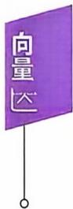

$$
\begin{cases}a^{2} + b^{2} + c^{2} = 1, \\2a + b = 0, \\a - 2b + 2c = 0.\end{cases}
$$

$$
 由  \begin{bmatrix} 1 & - 2 & 2 \\ 2 & 1 & 0 \end{bmatrix} \rightarrow \begin{bmatrix} 1 & - 2 & 2 \\ 0 & 5 & - 4 \end{bmatrix} .
$$

区 $c = 5t \Rightarrow b = 4t,a = - 2t.  又 ( - 2t)^{2} + (4t)^{2} + (5t)^{2} = 1 \Rightarrow$

$t = \pm \frac{1}{3\sqrt{5}}$ ,故 $a = \mp \frac{2}{3\sqrt{5}} ( b = \pm \frac{4}{3\sqrt{5}} , c = \pm \frac{5}{3\sqrt{5}} ) .$

## 本章作业超链接

## 《基础过关660题》优选

<table><tr><td>数学一</td><td>385</td><td>387</td><td>389</td><td>390</td><td>391</td><td>393</td><td>394</td><td>396</td><td>458</td><td>459</td><td>461</td></tr><tr><td></td><td>462</td><td>464</td><td>465</td><td>468</td><td>471</td><td></td><td></td><td></td><td></td><td></td><td></td></tr><tr><td>数学二</td><td>492</td><td>494</td><td>496</td><td>497</td><td>498</td><td>500</td><td>501</td><td>503</td><td>594</td><td>595</td><td>597</td></tr><tr><td>数学三</td><td>598</td><td>600</td><td>601</td><td>604</td><td>607</td><td></td><td></td><td></td><td></td><td></td><td></td></tr><tr><td></td><td>385</td><td>387</td><td>389</td><td>390</td><td>391</td><td>393</td><td>394</td><td>396</td><td>458</td><td>459</td><td>461</td></tr><tr><td></td><td>462</td><td>464</td><td>465</td><td>468</td><td>471</td><td></td><td></td><td></td><td></td><td></td><td></td></tr></table>

## 第四章 线性方程组

## 本章考点

线性方程组有解和无解的判定非齐次线性方程组的解与相应的齐次线性方程组(导出组）的解之间的关系线性方程组解的性质和解的结构齐次线性方程组的基础解系和通解非齐次线性方程组的通解

## 本章知识框图

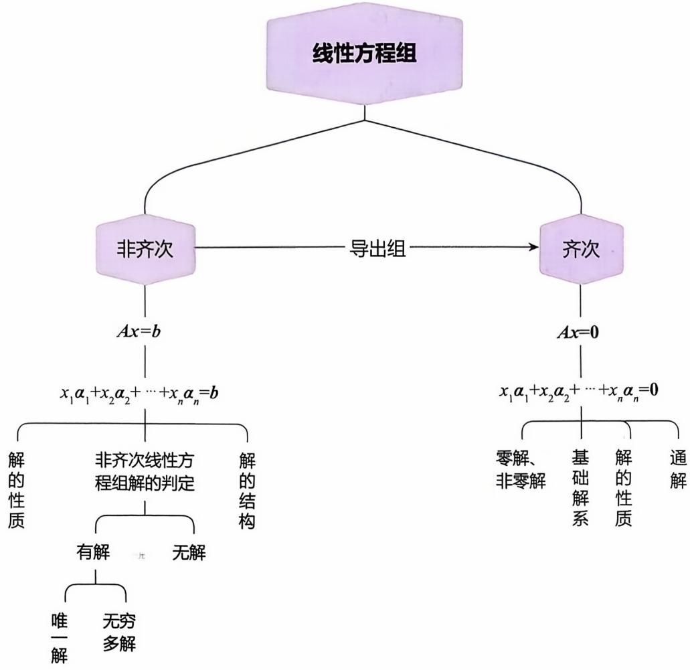

## 知识梳理与例题

学习笔记

## 一、基本概念

我们称

$$
\begin{aligned}\left\{ \begin{aligned}a_{11}x_{1} + a_{12}x_{2} + \cdots + a_{1n}x_{n} = b_{1}, \\a_{21}x_{1} + a_{22}x_{2} + \cdots + a_{2n}x_{n} = b_{2}, \\\cdots \\a_{m1}x_{1} + a_{m2}x_{2} + \cdots + a_{mn}x_{n} = b_{m}\end{aligned} \right.\end{aligned}\tag{I}
$$

是n个未知数m个方程的非齐次线性方程组，其中 $x_{1},x_{2},\cdots,x_{n}$ 代表$n$ 个未知数，而 $b_{1},b_{2},\cdots,b_{m}$ 是不全为0的常数.

利用矩阵乘法，方程组（Ⅰ）可表示为：

$$
\begin{bmatrix} a_{11} & a_{12} & \cdots & a_{1n} \\ a_{21} & a_{22} & \cdots & a_{2n} \\ \vdots & \vdots & & \vdots \\ a_{m1} & a_{m2} & \cdots & a_{mn} \end{bmatrix} \begin{bmatrix} x_1 \\ x_2 \\ \vdots \\ x_n \end{bmatrix} = \begin{bmatrix} b_1 \\ b_2 \\ \vdots \\ b_m \end{bmatrix}.
$$

于是方程组（Ⅰ）的矩阵形式为：

$$
Ax = b,
$$

称A为方程组（I）的系数矩阵.

对矩阵A按列分块，记 $\boldsymbol{A} = ( \boldsymbol{\alpha}_{1} , \boldsymbol{\alpha}_{2} , \cdots , \boldsymbol{\alpha}_{n} )$ ，则方程组（Ⅰ）有向量形式

$$
x_{1}\boldsymbol{\alpha}_{1} + x_{2}\boldsymbol{\alpha}_{2} + \cdots + x_{n}\boldsymbol{\alpha}_{n} = \boldsymbol{\beta},
$$

其中 $\boldsymbol{\alpha}_{j}=(a_{1j},a_{2j},\cdots,a_{nj})^{\mathrm{T}},j=1,2,\cdots,n,\boldsymbol{\beta}=(b_{1},b_{2},\cdots,b_{m})^{\mathrm{T}}.$

如果 $\forall j = 1,2,\cdots,m$ 恒有 $b_{j} = 0$ ,则称

$$
\left\{ \begin{aligned} a_{11}x_{1} + a_{12}x_{2} + \cdots + a_{1n}x_{n} = 0, \\ a_{21}x_{1} + a_{22}x_{2} + \cdots + a_{2n}x_{n} = 0, \\ \cdots \\ a_{m1}x_{1} + a_{m2}x_{2} + \cdots + a_{mn}x_{n} = 0. \end{aligned} \right.\tag{Ⅱ}
$$

为齐次线性方程组(也称(Ⅱ）是(Ⅰ）的导出组).其矩阵形式为：

$$
Ax = 0.
$$

而齐次方程组（Ⅱ）的向量形式，则是

$$
x_{1}\boldsymbol{\alpha}_{1} + x_{2}\boldsymbol{\alpha}_{2} + \cdots + x_{n}\boldsymbol{\alpha}_{n} = \boldsymbol{0}.
$$

若用一组数 $c_{1},c_{2},\cdots,c_{n}$ 分别代替方程组(Ⅰ)(或(Ⅱ))中的 $x_{1}$ $x_{2},\cdots,x_{n}$ ，使(Ⅰ)(或(Ⅱ)）中m个等式都成立，则称 $(c_1, c_2, \cdots, c_n)^{\mathrm{T}}$ 是方程组(Ⅰ)(或(Ⅱ))的一个解.

解方程组就是要求出方程组的所有解.

求方程组的解就是要对所给方程组进行同解变形，同解变形的方法为：

（1）两个方程互换位置.

(2)用非零常数乘方程的两端.

(3)把某个方程的k倍加到另一个方程上.

同解变形所对应的矩阵语言就是矩阵的初等行变换。

## 二、齐次线性方程组

对于齐次线性方程组

$$
\left\{ \begin{aligned} a_{11}x_{1} + a_{12}x_{2} + \cdots + a_{1n}x_{n} &= 0, \\ a_{21}x_{1} + a_{22}x_{2} + \cdots + a_{2n}x_{n} &= 0, \\ \cdots \\ a_{m1}x_{1} + a_{m2}x_{2} + \cdots + a_{mn}x_{n} &= 0, \end{aligned} \right.\tag{Ⅱ}
$$

易见 $x_{1} = 0, x_{2} = 0, \cdots, x_{n} = 0$ 必满足每一个方程.故 $(0,0,\cdots,0)^{\mathrm{T}}$ 定是齐次线性方程组的一个解，称其为零解.除去零解之外，如果齐次方程组还有其他的解，那些解就称为非零解.

基础解系如果 $\eta_{1}, \eta_{2}, \cdots, \eta_{t}$ 是齐次方程组 $Ax = \mathbf{0}$ 的解，而且满足

(1) $\eta_{1}, \eta_{2}, \cdots, \eta_{t}$ 线性无关.

(2) $Ax = \mathbf{0}$ 的任一个解η都可由 $\eta_{1}, \eta_{2}, \cdots, \eta_{t}$ 线性表出.则称 $\eta_{1}, \eta_{2}, \cdots, \eta_{t}$ 是 $Ax = \mathbf{0}$ 的一个基础解系.

解的性质如果 $\eta_{1}, \eta_{2}, \cdots, \eta_{l}$ 是齐次方程组 $Ax = \mathbf{0}$ 的解，则对任意常数 $k_{1},k_{2},\cdots,k_{t}$ ，

$$
k_{1} \boldsymbol{\eta}_{1} + k_{2} \boldsymbol{\eta}_{2} + \cdots + k_{t} \boldsymbol{\eta}_{t}
$$

仍是该齐次方程组的解.

定理 4.1 齐次方程组 $A_{m \times n}x = 0$ 有非零解 $\Leftrightarrow r(A) < n.$

推论1. 当 $m < n$ 时 $Ax = 0$ 必有非零解.

2.当 $m = n$ 时 $Ax = 0$ 有非零解 $\Leftrightarrow \left| \textbf{A} \right| = 0$

定理4.2 如齐次线性方程组(Ⅱ)的系数矩阵的秩 $r(A)=r<n,$ 则(IⅡI)有 $n - r$ 个线性无关的解，且(Ⅱ)的任一个解都可由这 $n - r$ 个线性无关的解线性表出(即(Ⅱ)的基础解系由n一r个解向量构成).

定理4.3 若 $\eta_{1}, \eta_{2}, \cdots, \eta_{t}$ 是齐次方程组（Ⅱ）的基础解系，则(Ⅱ)的通解是 $k_{1} \boldsymbol{\eta}_{1} + k_{2} \boldsymbol{\eta}_{2} + \cdots + k_{t} \boldsymbol{\eta}_{t}, k_{1}, k_{2}, \cdots, k_{t}$ 是任意常数.

求齐次方程组

$$
\begin{cases}5x_{1} + 7x_{2} + 2x_{3} = 0, \\3x_{1} + 5x_{2} + 6x_{3} - 4x_{4} = 0, \\4x_{1} + 5x_{2} - 2x_{3} + 3x_{4} = 0\end{cases}
$$

的基础解系和通解.

练习区域

答案见 96 页

例2 求齐次方程组

$$
\left\{ \begin{aligned} 2 x _ { 1 } - x _ { 2 } - 7 x _ { 3 } + 5 x _ { 4 } & = 0 , \\ x _ { 1 } - 2 x _ { 2 } - 5 x _ { 3 } - 2 x _ { 4 } & = 0 , \\ x _ { 1 } + x _ { 2 } - 2 x _ { 3 } - 2 x _ { 4 } & = 0 \end{aligned} \right.
$$

的通解.

答案见 96 页

例3 (1997,数一)设 $\boldsymbol{A} = \begin{bmatrix} 1 & 2 & - 2 \\ 4 & t & 3 \\ 3 & - 1 & 1 \end{bmatrix}$ ,B为三阶非零矩阵，且 $AB = O$ 则t=

答案见 97 页

例 4要使 $\boldsymbol { \alpha } _ { 1 } = ( 1 , 0 , 2 ) ^ { \mathrm { T } } , \boldsymbol { \alpha } _ { 2 } = ( 0 , 1 , - 1 ) ^ { \mathrm { T } }$ 都是齐次线性方程组Ax = 0的解，则A可以为(A) $\begin{bmatrix} - 2 & 1 & 1 \\ 4 & - 2 & - 2 \end{bmatrix}$ (B) $\begin{bmatrix} 2 & 0 & 1 \\ 0 & 1 & 1 \end{bmatrix}$ (C) $\begin{bmatrix} - 2 & 0 & 1 \\ 4 & 0 & - 2 \end{bmatrix}$ (D) $\begin{bmatrix} - 1 & 0 & 2 \\ 0 & 1 & - 1 \end{bmatrix}$

例5 (2025，数农）若方程组 $\begin{cases}x_{1} + x_{2} + x_{3} = 0 \\x_{1} + ax_{2} - 3x_{3} = 0 \\x_{1} + a^{2}x_{2} + 9x_{3} = 0\end{cases}$ 有非零解，则a =(A)-3或1. (B)—1或3.(C)-3或-1. (D)-1或1.

例6 已知A是5×4矩阵，η1，η2是Ax= 0的基础解系，则$A^{\mathrm{T}} y = \mathbf{0}$ 的基础解系(A) 不存在. (B)有一个非零解.(C) 有2 个线性无关的解. (D)有3个线性无关的解.

练习区域  
答案见 98 页

例7 (2019，数二、数三)设A是四阶矩阵 $,A^{*}$ 为A的伴随矩阵，若线性方程组 $Ax = \mathbf{0}$ 的基础解系只有2个向量，则 $r(A^{*}) =$ (A)0. (B)1. (C)2. (D)3.

## 三、非齐次线性方程组

解的性质（1）设 $\xi_{1},\xi_{2}$ 是方程组 Ax = b 的两个解，则 $\xi_{1} - \xi_{2}$ 是导出组 $Ax = \mathbf{0}$ 的解.

(2) 设ξ是方程组 $Ax = b$ 的解，η是导出组 $Ax = \mathbf{0}$ 的解，k是任 意常数,则 $\xi + k\eta$ 是方程组 $Ax = \boldsymbol{b}$ 的解.

定理 4.4 Ax = b 有解 $\Leftrightarrow r(A)=r(\overline{A})$

⇔b 可由 A 的列向量线性表出.

$$
Ax = b  无解  \Leftrightarrow r(A) + 1 = r(\overline{A}).
$$

【注】 $\overline{A} = \left[ A, b \right]$ 称为方程组 Ax = b 的增广矩阵.

定理 4.5 (解的结构)设 α是Ax = b 的解， $\eta_{1}, \eta_{2}, \cdots, \eta_{t}$ 是导出组 $Ax = \mathbf{0}$ 的基础解系，则方程组Ax = b的通解为

$$
\boldsymbol { \alpha } + k _ { 1 } \boldsymbol { \eta } _ { 1 } + k _ { 2 } \boldsymbol { \eta } _ { 2 } + \cdots + k _ { t } \boldsymbol { \eta } _ { t } ,
$$

其中 $k_{1},k_{2},\cdots,k_{r}$ 是任意常数.

解方程组

$$
\begin{cases}x_{1} + x_{2} + x_{3} + x_{4} + x_{5} = 2, \\2x_{1} + 3x_{2} + x_{3} + x_{4} - 3x_{5} = 0, \\x_{1} + 2x_{3} + 3x_{4} + 3x_{5} = 4, \\4x_{1} + 5x_{2} + 3x_{3} + 2x_{4} + 2x_{5} = 6.\end{cases}
$$

练习区域

答案见 98 页

例9（1995，数四）对于线性方程组

$$
\left\{ \begin{aligned} \lambda x_{1} + x_{2} + x_{3} = \lambda - 3, \\ x_{1} + \lambda x_{2} + x_{3} = - 2, \\ x_{1} + x_{2} + \lambda x_{3} = - 2 \end{aligned} \right.
$$

讨论λ为何值时，方程组无解，有唯一解和有无穷解?在方程组有无穷解时，试用其导出组的基础解系表示全部解.

答案见 99 页

例10（1995，数一）设线性方程组

$$
\left\{ \begin{aligned} x_{1} + 3x_{2} + 2x_{3} + x_{4} &= 1, \\ x_{2} + ax_{3} - ax_{4} &= - 1, \\ x_{1} + 2x_{2} \quad + 3x_{4} &= 3, \end{aligned} \right.
$$

问a为何值时方程组有解，并在有解时求出方程组的通解.

例11 (2025，数农)设A为三阶矩阵且 $r(A) = 2.$ 若非零向量 α,β满足 $A \alpha = 0 , A \beta = - \beta ,$ 则方程组 $Ax = \boldsymbol{\beta}$ 的通解为x=

答案见 100 页

例12设 $\boldsymbol{a}_{1}, \boldsymbol{a}_{2}, \boldsymbol{a}_{3}$ 是四元非齐次线性方程组Ax = b的 3 个解向量，且秩 $r(A)=3.\alpha_{1}=(1,2,3,4)^{\mathrm{T}},\alpha_{2}+\alpha_{3}=(0,1,2,3)^{\mathrm{T}}$ ,则方程组 Ax = b 的通解是

答案见 101 页

## 四、公共解、同解

请在复习好方程组如何求解等基础知识后，再参看《线性代数辅导讲义》的相关内容.

## 五、方程组的应用

例 13 求和矩阵 $\boldsymbol{A} = \begin{bmatrix} 1 & 2 \\ -1 & 3 \end{bmatrix}$ 可交换的所有矩阵.

例14 若 $\begin{bmatrix} 1 & 2 & 3 \\ 2 & 3 & 4 \end{bmatrix} \boldsymbol{X} = \begin{bmatrix} 4 & 5 \\ 5 & 6 \end{bmatrix}$ ,则 X =

例15 已知向量组 $\boldsymbol{\alpha}_{1}=(1,3,1,1)^{\mathrm{T}}, \boldsymbol{\alpha}_{2}=(-1,1,3,1)^{\mathrm{T}}, \boldsymbol{\alpha}_{3}$ $= ( 5 , 7 , a , 1 ) ^ { \mathrm { T } }$ 线性相关，则a =

答案见 102 页

例16 已知 $\boldsymbol{\alpha}_{1} = (2,3,3)^{\mathrm{T}}, \boldsymbol{\alpha}_{2} = (1,0,3)^{\mathrm{T}}, \boldsymbol{\alpha}_{3} = (3,5,a +$ $2)^{\mathrm{T}}$ ,若 $\boldsymbol{\beta}_{1} = (4, -3, 15)^{\mathrm{T}}$ 可由 $\boldsymbol{\alpha}_{1}, \boldsymbol{\alpha}_{2}, \boldsymbol{\alpha}_{3}$ 线性表示，但 $\boldsymbol{\beta}_{2} = (2, 5, a)^{\mathrm{T}}$ 不能由 $\alpha_{1}, \alpha_{2}, \alpha_{3}$ 线性表出，写出 $\beta _ { 1 }$ 由 $\alpha_{1}, \alpha_{2}, \alpha_{3}$ 线性表示的表达式.

例17 求一个齐次线性方程组，使它的基础解系为$\eta_{1} = (4,3,1,2)^{\mathrm{T}}, \eta_{2} = (0,1,3,-2)^{\mathrm{T}}.$

答案见 102 页

答案见 103 页  

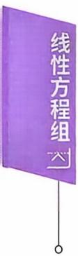

学习笔记

## 二、齐次线性方程组

例1【解】对系数矩阵作初等行变换，有

$$
\begin{aligned}\boldsymbol{A} &=\begin{bmatrix}5 & 7 & 2 & 0 \\3 & 5 & 6 & -4 \\4 & 5 & -2 & 3\end{bmatrix}\xrightarrow{}\begin{bmatrix}1 & 2 & 4 & -3 \\3 & 5 & 6 & -4 \\4 & 5 & -2 & 3\end{bmatrix}\\&\xrightarrow{}\begin{bmatrix}1 & 2 & 4 & -3 \\0 & -1 & -6 & 5 \\0 & -3 & -18 & 15\end{bmatrix}\xrightarrow{}\begin{bmatrix}1 & 2 & 4 & -3 \\0 & 1 & 6 & -5 \\0 & 0 & 0 & 0\end{bmatrix}\\&\xrightarrow{}\begin{bmatrix}1 & 0 & -8 & 7 \\0 & 1 & 6 & -5 \\0 & 0 & 0 & 0\end{bmatrix},\end{aligned}
$$

得同解方程组：

$$
\left\{ \begin{aligned} x_{1} - 8x_{3} + 7x_{4} &= 0, \\ x_{2} + 6x_{3} - 5x_{4} &= 0, \end{aligned} \right. \quad  即  \quad \left\{ \begin{aligned} x_{1} &= 8x_{3} - 7x_{4}, \\ x_{2} &= - 6x_{3} + 5x_{4}, \end{aligned} \right.
$$

令x3 = 1,x4 = 0⇒xz =- 6,x1 = 8,

$$
x_{3}=0,x_{4}=1 \Rightarrow x_{2}=5,x_{1}=-7,
$$

故基础解系为 $\eta_{1} = (8, -6, 1, 0)^{\mathrm{T}}, \eta_{2} = (-7, 5, 0, 1)^{\mathrm{T}}.$

通解是： $k_{1} \boldsymbol{\eta}_{1} + k_{2} \boldsymbol{\eta}_{2}, k_{1}, k_{2}$ 是任意常数.

或者令 $x_{3} = t, x_{4} = u$ ,得通解：

$$
\begin{cases}x_{1} = 8t - 7u, \\x_{2} = -6t + 5u, \\x_{3} = t, \\x_{4} = u,\end{cases}
$$

亦即 $\boldsymbol{x} = t \begin{bmatrix} 8 \\ - 6 \\ 1 \\ 0 \end{bmatrix} + u \begin{bmatrix} - 7 \\ 5 \\ 0 \\ 1 \end{bmatrix}$ ，基础解系为： $\begin{bmatrix} 8 \\ -6 \\ 1 \\ 0 \end{bmatrix}, \begin{bmatrix} -7 \\ 5 \\ 0 \\ 1 \end{bmatrix};$

例2【解】对系数矩阵作初等行变换，有

$$
\boldsymbol{A} = \begin{bmatrix} 2 & -1 & -7 & 5 \\ 1 & -2 & -5 & -2 \\ 1 & 1 & -2 & -2 \end{bmatrix} \xrightarrow{} \begin{bmatrix} 1 & 1 & -2 & -2 \\ 1 & -2 & -5 & -2 \\ 2 & -1 & -7 & 5 \end{bmatrix}
$$

$$
\begin{aligned}&\rightarrow\begin{bmatrix}1 & 1 & - 2 & - 2 \\0 & - 3 & - 3 & 0 \\0 & - 3 & - 3 & 9\end{bmatrix}\rightarrow\begin{bmatrix}1 & 1 & - 2 & - 2 \\0 & 1 & 1 & 0 \\0 & 0 & 0 & 1\end{bmatrix}\\&\rightarrow\begin{bmatrix}1 & 0 & - 3 & 0 \\&1 & 1 & 0 \\& & & 1\end{bmatrix},\\&\rightarrow\begin{bmatrix}1 & 0 & - 3 & 0 \\&1 & 1 & 0 \\& & & 1\end{bmatrix},\end{aligned}
$$

得同解方程组 $\left\{ \begin{aligned} x_{1} - 3x_{3} &= 0, \\ x_{2} + x_{3} &= 0, \\ x_{4} &= 0, \end{aligned} \right.$ 即 $\begin{cases}x_{1} = 3x_{3}, \\x_{2} = -x_{3}, \\x_{4} = 0.\end{cases}$

$x_{3}=1 \Rightarrow x_{4}=0,x_{2}=-1,x_{1}=3.$

故基础解系为 $\boldsymbol{\eta} = (3, -1, 1, 0)^{\mathrm{T}}$

通解为：kη，k为任意常数.

或者，令 $x_{3} = t$ ,解出

$$
\begin{cases}x_{1} = 3t, \\x_{2} = -t, \\x_{3} = t, \\x_{4} = 0,\end{cases}
$$

亦即 $x = t(3, -1, 1, 0)^{\mathrm{T}}$

【注】在处理加减消元、求解等问题时，要重视基本计算.

对自由变量既可以用(1，0,0)，(0，1,0)，(0,0，1)来赋值，也可用$t , u , v$ 来赋值.

例3 【分析】由 AB = O,对 B 按列分块，

$$
A \boldsymbol { B } = A \left( \boldsymbol { \beta } _ { 1 } , \boldsymbol { \beta } _ { 2 } , \boldsymbol { \beta } _ { 3 } \right) = \left( A \boldsymbol { \beta } _ { 1 } , A \boldsymbol { \beta } _ { 2 } , A \boldsymbol { \beta } _ { 3 } \right) = \left( \boldsymbol { 0 } , \boldsymbol { 0 } , \boldsymbol { 0 } \right) ,
$$

即 $\boldsymbol{\beta}_{1}, \boldsymbol{\beta}_{2}, \boldsymbol{\beta}_{3}$ 都是齐次方程组 $Ax = \mathbf{0}$ 的解.

又 $\boldsymbol{B} \neq \boldsymbol{O}, \exists \boldsymbol{\beta}_{i} \neq \boldsymbol{0}$ ,那么 $Ax = \mathbf{0}$ 有非零解 $\beta _ { i }$ ,从而 $r(\boldsymbol{A}) < 3, \left| \boldsymbol{A} \right| = 0.$

$$
\left| \boldsymbol{A} \right| = \left| \begin{matrix} 1 & 2 & - 2 \\ 4 & t & 3 \\ 3 & - 1 & 1 \end{matrix} \right| = \left| \begin{matrix} 1 & 0 & - 2 \\ 4 & t + 3 & 3 \\ 3 & 0 & 1 \end{matrix} \right| = 7(t + 3) = 0.
$$

所以 $t = -3$

例4【分析】因为 $\boldsymbol{a}_{1}, \boldsymbol{a}_{2}$ 线性无关，所以 $Ax = \mathbf{0}$ 有2个线性无关的解，于是 $n - r(\boldsymbol{A}) \geqslant 2.$ 即知 $r(A) \leq 1$ ,可排除(B)(D).

下面应排查 $\boldsymbol{\alpha}_{1} , \boldsymbol{\alpha}_{2}$ 是不是 $Ax = \mathbf{0}$ 的解.由在(C)中

$$
A \boldsymbol { \alpha } _ { 2 } = \begin{bmatrix} - 2 & 0 & 1 \\ 4 & 0 & - 2 \end{bmatrix} \begin{bmatrix} 0 \\ 1 \\ - 1 \end{bmatrix} = \begin{bmatrix} - 1 \\ 2 \end{bmatrix} \neq \boldsymbol { 0 }
$$

可知， $\pmb { \alpha } _ { 2 }$ 不是(C) 的解.故应选(A).

例5【分析】 $Ax = \mathbf{0}$ 有非零解 $\Leftrightarrow r(\boldsymbol{A}) < n \Leftrightarrow \left| \boldsymbol{A} \right| = 0.$

$$
\begin{aligned}\left| \boldsymbol{A} \right| &= \left| \begin{matrix}1 & 1 & 1 \\1 & a & - 3 \\1 & a^{2} & 9 \\\end{matrix} \right| \\&= (a - 1)( - 3 - 1)( - 3 - a) \\&= 0  ,\end{aligned}
$$

所以应选(A).

例6 【分析】 齐次方程组Ax=0的基础解系由 $n - r(A)$ 个线性无关的解所构成.因A是5×4矩阵，于是

$$
4 - r(A) = 2,
$$

那么 $r(\boldsymbol{A}) = 2$ ,于是 $r(A^{\mathrm{T}}) = r(A) = 2.$

又 $A^{\mathrm{T}}$ 是 $4 \times 5$ 矩阵，从而 $A^{\mathrm{T}} y = \mathbf{0}$ 的基础解系由

$$
5 - r(A^{\mathrm{T}}) = 5 - 2 = 3
$$

个线性无关的解所构成，故应选(D).

例7【分析】注意本题两个主要考点： $(1)n - r(A),(2)r(A^{*})$ 由 $n - r(\boldsymbol{A}) = 4 - r(\boldsymbol{A}) = 2$ ,得 r(A) = 2.

n,r(A) = n, 又r(A\*) = 1,r(A) = n − 1, (0,r(A) < n − 1.

现 $r(A)=2<n-1=3$ ,所以 $r(\boldsymbol{A}^{*}) = 0$ ,应选(A).

## 三、非齐次线性方程组

例8【解】对增广矩阵作初等行变换，有

$$
\begin{aligned}\overline{\boldsymbol{A}} &=\begin{bmatrix}1 & 1 & 1 & 1 & 1 & \vdots & 2 \\2 & 3 & 1 & 1 & -3 & \vdots & 0 \\1 & 0 & 2 & 3 & 3 & \vdots & 4 \\4 & 5 & 3 & 2 & 2 & \vdots & 6\end{bmatrix}\rightarrow\begin{bmatrix}1 & 1 & 1 & 1 & 1 & \vdots & 2 \\& 1 & -1 & -1 & -5 & \vdots & -4 \\& & & 1 & -3 & \vdots & -2 \\& & & & 0 & \vdots & 0\end{bmatrix}\end{aligned}
$$

$$
\rightarrow \begin{bmatrix} 1 & 1 & 1 & 0 & 4 & \vdots & 4 \\ & 1 & -1 & 0 & -8 & \vdots & -6 \\ & & & 1 & -3 & \vdots & -2 \\ & & & & & \vdots & \vdots \\ & & & & 0 & \vdots & 0 \end{bmatrix} \rightarrow \begin{bmatrix} 1 & 0 & 2 & 0 & 12 & \vdots & 10 \\ & 1 & -1 & 0 & -8 & \vdots & -6 \\ & & & 1 & -3 & \vdots & -2 \\ & & & & & 0 & \vdots & 0 \end{bmatrix},
$$

得同解方程组

$$
\begin{aligned}\left\{ \begin{aligned}x_{1} + 2x_{3} + 12x_{5} &= 10, \\x_{2} - x_{3} \quad - 8x_{5} &= - 6, \\x_{4} - 3x_{5} &= - 2.\end{aligned} \right.\end{aligned}\tag{*}
$$

令 $x_{3} = 0 , x_{5} = 0$ ,得方程组 $Ax = \boldsymbol{b}$ 的一个特解

$$
\boldsymbol{\alpha} = (10, -6, 0, -2, 0)^{\mathrm{T}},
$$

对应的齐次方程组为

$$
\left\{ \begin{aligned} x_{1} + 2x_{3} + 12x_{5} &= 0, \\ x_{2} - x_{3} &= 8x_{5} = 0, \\ x_{4} - 3x_{5} &= 0, \end{aligned} \right.
$$

得 $Ax = \mathbf{0}$ 的同解方程组

$$
\begin{cases}x_{1} = - 2x_{3} - 12x_{5}, \\x_{2} = \quad x_{3} + 8x_{5}, \\x_{4} = \quad 3x_{5},\end{cases}
$$

分别令 $x_{3} = 1 , x_{5} = 0$ 和 $x_{3} = 0 , x_{5} = 1$ ,得 $Ax = \mathbf{0}$ 的基础解系

$$
\boldsymbol { \eta } _ { 1 } = ( - 2 , 1 , 1 , 0 , 0 ) ^ { \mathrm { T } } , \boldsymbol { \eta } _ { 2 } = ( - 1 2 , 8 , 0 , 3 , 1 ) ^ { \mathrm { T } }.
$$

所以方程组的通解为：

$$
(10,-6,0,-2,0)^{\mathrm{T}} + k_{1}(-2,1,1,0,0)^{\mathrm{T}} + k_{2}(-12,8,0,3,1)^{\mathrm{T}}
$$

$k_{1},k_{2}$ 为任意常数.

或对同解方程组(\*)，令 $x_{3} = t, x_{5} = u$ ,解出

$$
\begin{cases}x_{1} = 10 - 2t - 12u, \\x_{2} = -6 + t + 8u, \\x_{3} = t, \\x_{4} = -2 + 3u, \\x_{5} = u.\end{cases}
$$

亦得通解 $x = ( 1 0 , - 6 , 0 , - 2 , 0 ) ^ { \mathrm { T } } + t ( - 2 , 1 , 1 , 0 , 0 ) ^ { \mathrm { T } } + u ( - 1 2 , 8 , 0 ,$ $3,1)^{\mathrm{T}},t,u$ 为任意常数.

例9【解】对增广矩阵作初等行变换，有

$$
\overline{\boldsymbol{A}} = \begin{bmatrix} \lambda & 1 & 1 \vdots \lambda - 3 \\ 1 & \lambda & 1 \vdots - 2 \\ 1 & 1 & \lambda \vdots - 2 \end{bmatrix} \rightarrow \begin{bmatrix} 1 & 1 & \lambda \vdots - 2 \\ 1 & \lambda & 1 \vdots - 2 \\ \lambda & 1 & 1 \vdots \lambda - 3 \end{bmatrix}
$$

$$
\rightarrow \begin{bmatrix} 1 & 1 & \lambda & \vdots & - 2 \\ 0 & \lambda - 1 & 1 - \lambda & \vdots & 0 \\ 0 & 0 & (\lambda + 2)(\lambda - 1) \vdots & 3(1 - \lambda) \end{bmatrix}.
$$

当 $\lambda = - 2$ 时 $r(\boldsymbol{A}) = 2, r(\overline{\boldsymbol{A}}) = 3$ ,方程组无解.

当 $\lambda \ne 1$ 且 $\lambda \ne -2$ 时 $r(\boldsymbol{A}) = r(\overline{\boldsymbol{A}}) = 3$ ，方程组有唯一解.

当 $\lambda = 1$ 时 $r(\boldsymbol{A}) = r(\overline{\boldsymbol{A}}) = 1$ ,有无穷解.

同解方程组为 $x_{1} + x_{2} + x_{3} = - 2.$

特解 $\boldsymbol{\alpha} = (-2,0,0)^{\mathrm{T}}$ ,基础解系 $\boldsymbol { \eta } _ { 1 } = ( - 1 , 1 , 0 ) ^ { \mathrm { T } } , \boldsymbol { \eta } _ { 2 } = ( - 1 , 0 ,$ $1)^{\mathrm{T}}$ .从而方程组通解

$$
\boldsymbol { \alpha } + k _ { 1 } \boldsymbol { \eta } _ { 1 } + k _ { 2 } \boldsymbol { \eta } _ { 2 } , \forall k _ { 1 } , k _ { 2 } .
$$

$$
 或  \overline{\boldsymbol{A}} = \begin{bmatrix} \lambda & 1 & 1 \vdots \lambda - 3 \\ 1 & \lambda & 1 \vdots - 2 \\ 1 & 1 & \lambda \vdots - 2 \end{bmatrix} \xrightarrow{} \begin{bmatrix} \lambda & 1 & 1 \vdots \lambda - 3 \\ 1 - \lambda & \lambda - 1 & 0 \vdots 1 - \lambda \\ 1 - \lambda & 0 & \lambda - 1 \vdots 1 - \lambda \end{bmatrix}.
$$

$$
\begin{aligned} 如    \lambda \neq 1   ,  \overline{A} & \xrightarrow{}\begin{bmatrix}\lambda & 1 & 1 & \vdots & \lambda - 3 \\1 & - 1 & 0 & \vdots & 1 \\1 & 0 & - 1 & \vdots & 1 \\\end{bmatrix}\\& \xrightarrow{}\begin{bmatrix}\lambda + 2 & 0 & 0 & \vdots & 1 - 1 \\1 & - 1 & 0 & \vdots & 1 \\1 & 0 & - 1 & \vdots & 1 \\\end{bmatrix}.\end{aligned}
$$

当 $\lambda = - 2$ ，方程组无解.

当 $\lambda \ne 1$ 且 $\lambda \ne - 2$ ，方程组有唯一解.

当 $\lambda = 1$ ,同前略.

例10【解】对增广矩阵作初等行变换，有

$$
\begin{aligned}\overline{\boldsymbol{A}} &=\begin{bmatrix}1 & 3 & 2 & 1 & \vdots & 1 \\0 & 1 & a & -a & \vdots & -1 \\1 & 2 & 0 & 3 & \vdots & 3\end{bmatrix}\xrightarrow{}\begin{bmatrix}1 & 3 & 2 & 1 & \vdots & 1 \\0 & 1 & a & -a & \vdots & -1 \\0 & -1 & -2 & 2 & \vdots & 2\end{bmatrix}\\&\xrightarrow{}\begin{bmatrix}1 & 3 & 2 & 1 & \vdots & 1 \\0 & 1 & 2 & -2 & \vdots & -2 \\0 & 0 & a-2 & 2-a & \vdots & 1\end{bmatrix},\end{aligned}
$$

当 $a = 2$ 时 $r(A)=2,r(\overline{A})=3$ ，方程组无解.

当 $a \ne 2$ 时， $r(\boldsymbol{A}) = r(\overline{\boldsymbol{A}}) = 3 < 4$ ，方程组有无穷多解，

$$
\overline{\boldsymbol{A}} \xrightarrow{}\begin{bmatrix}1 & 3 & 2 & 1 & \vdots & 1 \\0 & 1 & 2 & -2 & \vdots & -2 \\0 & 0 & 1 & -1 & \vdots & 1 \\0 & 0 & 1 & -1 & \vdots & \overline{a-2}\end{bmatrix}\xrightarrow{}\begin{bmatrix}1 & 3 & 0 & 3 & \vdots & \underline{a-4} \\& & & & & \vdots & \overline{a-2} \\0 & 1 & 0 & 0 & \vdots & \underline{a-2a} \\& & & & & \vdots & \overline{a-2} \\& & & & & \vdots & \overline{a-2}\end{bmatrix}
$$

$$
\xrightarrow { } \left[ \begin{matrix} { 1 } & { 0 } & { 0 } & { 3 } & { \vdots } \\ { } & { } & { } & { \vdots } \\ { } & { } & { } & { \vdots } \\ { 0 } & { 1 } & { 0 } & { 0 } & { \vdots } \\ { } & { } & { } & { } & { \vdots } \\ { } & { } & { } & { } & { \vdots } \\ { 0 } & { 0 } & { 1 } & { - 1 } & { \vdots } \\ { } & { } & { } & { } & { \vdots } \\ \end{matrix} \right] ,
$$

所以方程组的通解为

$x = \left( \frac{7a - 10}{a - 2}, \frac{2 - 2a}{a - 2}, \frac{1}{a - 2}, 0 \right)^{\mathrm{T}} + k(-3, 0, 1, 1)^{\mathrm{T}}$ ,k为任意常数.

例11 【分析】本题考查方程组解的结构，用推理分析方法求方程组的特解及相应齐次方程组的基础解系.

由 $n - r(\boldsymbol{A}) = 3 - 2 = 1$ ,故 $Ax = \mathbf{0}$ 的非零解即是其基础解系.  
现 $\boldsymbol{\alpha} \neq \boldsymbol{0}, A \boldsymbol{\alpha} = \boldsymbol{0}$ ,故α是 $Ax = \mathbf{0}$ 的基础解系.

又Aβ=—β即 $A(-\boldsymbol{\beta}) = \boldsymbol{\beta}$ 于是一β是 $Ax = \boldsymbol{\beta}$ 的解，所以方程组 $Ax = \boldsymbol{\beta}$ 的通解 $x = - \boldsymbol{\beta} + k\boldsymbol{\alpha}, \forall k$ •

例12 【分析】由 $n - r(A) = 4 - 3 = 1$ ，所以方程组的通解形式为 $\alpha + k\eta$ ，现在特解已知可取 $\pmb{\alpha}_{1}$ ，下面就是应找出导出组 $Ax = \mathbf{0}$ 的一个非零解.

因为 $A\alpha_{i} = b(i = 1,2,3)$ ,所以有 $\boldsymbol{A} \left[ 2 \boldsymbol{\alpha}_{1} - ( \boldsymbol{\alpha}_{2} + \boldsymbol{\alpha}_{3} ) \right] = \boldsymbol{0}$ 即

$$
2\boldsymbol{\alpha}_{1}-(\boldsymbol{\alpha}_{2}+\boldsymbol{\alpha}_{3})=(2,3,4,5)^{\mathrm{T}}
$$

是 $Ax = \mathbf{0}$ 的一个非零解.于是方程组的通解为 $(1,2,3,4)^{\mathrm{T}} + k(2,3$ $4,5)^{\mathrm{T}}$ ,k 是任意常数.

## 五、方程组的应用

例13【解】设 $\boldsymbol{X} = \begin{bmatrix} x_{1} & x_{2} \\ & \\ x_{3} & x_{4} \end{bmatrix}$ 和矩阵A可交换，即 $AX = XA$

$$
\begin{bmatrix} 1 & 2 \\ -1 & 3 \end{bmatrix} \begin{bmatrix} x_1 & x_2 \\ x_3 & x_4 \end{bmatrix} = \begin{bmatrix} x_1 & x_2 \\ x_3 & x_4 \end{bmatrix} \begin{bmatrix} 1 & 2 \\ -1 & 3 \end{bmatrix},
$$

得

$$
\left\{ \begin{aligned} x_{2} + 2x_{3} &= 0, \\ 2x_{1} + 2x_{2} &- 2x_{4} = 0, \\ - x_{1} + 2x_{3} + x_{4} &= 0, \\ x_{2} + 2x_{3} &= 0, \end{aligned} \right.
$$

$$
\boldsymbol { B } = \begin{bmatrix} 0 & 1 & 2 & 0 \\ 2 & 2 & 0 & - 2 \\ - 1 & 0 & 2 & 1 \\ 0 & 1 & 2 & 0 \end{bmatrix} \xrightarrow { } \begin{bmatrix} 1 & 0 & - 2 & - 1 \\ 0 & 1 & 2 & 0 \\ 0 & 0 & 0 & 0 \\ 0 & 0 & 0 & 0 \end{bmatrix},
$$

$4 - r(\boldsymbol{B}) = 2$ ,取 $x_{3} ,x_{4}$ 为自由变量.

区 $x_{3} = t, x_{4} = u,$ 得 $x_{1} = 2t + u, x_{2} = - 2t$ ,所以 $\boldsymbol{X} = \begin{bmatrix} 2t + u & - 2t \\ t & u \end{bmatrix}$

t, u为任意常数.

例 14 【分析】设 $\boldsymbol{X} = \begin{bmatrix} x_{1} & y_{1} \\ x_{2} & y_{2} \\ x_{3} & y_{3} \end{bmatrix}$ ,则有

$$
\left\{ \begin{aligned} x_{1} + 2x_{2} + 3x_{3} = 4, \\ 2x_{1} + 3x_{2} + 4x_{3} = 5 \end{aligned} \right. \quad \left\{ \begin{aligned} y_{1} + 2y_{2} + 3y_{3} = 5, \\ 2y_{1} + 3y_{2} + 4y_{3} = 6. \end{aligned} \right.
$$

两个方程组的系数矩阵一样，故可

$$
\begin{aligned}\begin{bmatrix}1 & 2 & 3 \vdots 4 & 5 \\2 & 3 & 4 \vdots 5 & 6\end{bmatrix}&\rightarrow\begin{bmatrix}1 & 2 & 3 \vdots 4 & 5 \\0 & -1 & -2 \vdots -3 & -4\end{bmatrix}\\&\rightarrow\begin{bmatrix}1 & 0 & -1 \vdots -2 & -3 \\0 & 1 & 2 \vdots 3 & 4\end{bmatrix},\end{aligned}
$$

解出

$$
\begin{bmatrix} x_{1} \\ x_{2} \\ x_{3} \end{bmatrix} = \begin{bmatrix} - 2 \\ 3 \\ 0 \end{bmatrix} + k_{1} \begin{bmatrix} 1 \\ - 2 \\ 1 \end{bmatrix} , \begin{bmatrix} y_{1} \\ y_{2} \\ y_{3} \end{bmatrix} = \begin{bmatrix} - 3 \\ 4 \\ 0 \end{bmatrix} + k_{2} \begin{bmatrix} 1 \\ - 2 \\ 1 \end{bmatrix},
$$

故

$\boldsymbol{X} = \begin{bmatrix} - 2 + k_{1} & - 3 + k_{2} \\ 3 - 2k_{1} & 4 - 2k_{2} \\ k_{1} & k_{2} \end{bmatrix}, k_{1}, k_{2}$ 是任意常数.

例15【分析】 $\boldsymbol{\alpha}_{1}, \boldsymbol{\alpha}_{2}, \boldsymbol{\alpha}_{3}$ 线性相关 $\Leftrightarrow \left[ \boldsymbol{\alpha}_{1}, \boldsymbol{\alpha}_{2}, \boldsymbol{\alpha}_{3} \right] \begin{bmatrix} x_{1} \\ x_{2} \\ x_{3} \end{bmatrix} = \mathbf{0}$ 有非零解.

$$
\left[ \pmb { \alpha } _ { 1 }   ,   \pmb { \alpha } _ { 2 }   ,   \pmb { \alpha } _ { 3 } \right] = \begin{bmatrix} 1 & - 1 & 5 \\ 3 & 1 & 7 \\ 1 & 3 & a \\ 1 & 1 & 1 \end{bmatrix} \xrightarrow { } \begin{bmatrix} 1 & - 1 & 5 \\ 0 & 4 & - 8 \\ 0 & 4 & a - 5 \\ 0 & 2 & - 4 \end{bmatrix} \xrightarrow { } \begin{bmatrix} 1 & - 1 & 5 \\ 0 & 1 & - 2 \\ 0 & 0 & a + 3 \\ 0 & 0 & 0 \end{bmatrix},
$$

得 $a = -3.$

例16【解】β可由 $\alpha_{1}, \alpha_{2}, \alpha_{3}$ 线性表示，即方程组 $x_{1} \boldsymbol{\alpha}_{1} +$ $x_{2}\boldsymbol{\alpha}_{2} + x_{3}\boldsymbol{\alpha}_{3} = \boldsymbol{\beta}_{1}$ 有解.

$\beta_{2}$ 不能由 $\alpha_{1}, \alpha_{2}, \alpha_{3}$ 线性表示，即方程组 $y_{1}\boldsymbol{\alpha}_{1} + y_{2}\boldsymbol{\alpha}_{2} + y_{3}\boldsymbol{\alpha}_{3} = \boldsymbol{\beta}_{2}$ 无解.

$$
\left[ \boldsymbol { \alpha } _ { 1 } , \boldsymbol { \alpha } _ { 2 } , \boldsymbol { \alpha } _ { 3 } \mid \boldsymbol { \beta } _ { 1 } , \boldsymbol { \beta } _ { 2 } \right] = \begin{bmatrix} 2 & 1 & 3 & \vdots & 4 & 2 \\ 3 & 0 & 5 & \vdots & - 3 & 5 \\ 3 & 3 & a + 2 & \vdots & 1 5 & a \end{bmatrix}
$$

$$
\xrightarrow{}\begin{bmatrix}-1&1&-2&\vdots&7&-3\\3&0&5&\vdots&-3&5\\0&3&a-3&\vdots&18&a-5\end{bmatrix}
$$

$$
\rightarrow \begin{bmatrix} 1 & - 1 & 2 & \vdots - 7 & 3 \\ 0 & 3 & - 1 & \vdots & 18 & - 4 \\ 0 & 0 & a - 2 & \vdots & 0 & a - 1 \end{bmatrix},
$$

∀a,方程组 $\left\{ \begin{aligned} x_{1} - x_{2} & \quad + 2x_{3} = - 7 \\ 3x_{2} & \quad - x_{3} = 18 , \\ (a - 2)x_{3} & = 0 \end{aligned} \right.$ 一定有解，即 $\beta_{1}$ 一定能

由 $\boldsymbol{\alpha}_{1}, \boldsymbol{\alpha}_{2}, \boldsymbol{\alpha}_{3}$ 线性表出.

当且仅当a=2时 $\left\{ \begin{aligned} y_{1} - y_{2} + 2y_{3} &= 3, \\ 3y_{2} - y_{3} &= - 4, \\ 0y_{3} &= 1 \end{aligned} \right.$ ，无解，即 $\beta_{2}$ 不能由 $\pmb { \alpha } _ { 1 }$ ，

$\because \alpha _ { 3 }$ 线性表示.

当a=2时，

$$
\begin{bmatrix} 1 & - 1 & 2 & \vdots - 7 \\  & 3 & - 1 \vdots & 18 \\  &  & \vdots & \\  &  & 0 & \vdots & 0 \end{bmatrix} \rightarrow \begin{bmatrix} 1 & 5 & 0 \vdots & 29 \\  & - 3 & 1 \vdots - 18 \\  &  & \vdots & \\  &  & 0 \vdots & 0 \end{bmatrix},
$$

得程组通解 $\boldsymbol{x} = (29, 0, -18)^{\mathrm{T}} + k (-5, 1, 3)^{\mathrm{T}}$ ,那么

$\boldsymbol { \beta } _ { 1 } = ( 2 9 - 5 k ) \boldsymbol { \alpha } _ { 1 } + k \boldsymbol { \alpha } _ { 2 } + ( - 1 8 + 3 k ) \boldsymbol { \alpha } _ { 3 } , k$ 为任意常数.

## 例17【解】设所求齐次方程组为Ax = 0.

由 $n - r(\boldsymbol{A}) = 2$ ,且 n = 4,知 r(A) = 2.

又 $A(\boldsymbol{\eta}_{1},\boldsymbol{\eta}_{2}) = \boldsymbol{O}$ ,转置得

$$
\left[ \begin{matrix} { \pmb { \eta } _ { ^ { \mathtt { T } } } ^ { \mathtt { T } } } \\ { \pmb { \eta } _ { ^ { \mathtt { Z } } } ^ { \mathtt { T } } } \\ \end{matrix} \right] \pmb { A } ^ { \mathtt { T } } = \pmb { O } .
$$

考查齐次方程组 $\boldsymbol{B} \boldsymbol{x}=\left[\begin{aligned}\boldsymbol{\eta}_{1}^{\mathrm{T}} \\ \boldsymbol{\eta}_{2}^{\mathrm{T}}\end{aligned}\right] \boldsymbol{x}=\boldsymbol{0} .$

由 $n - r(\boldsymbol{B}) = 4 - 2 = 2$ 可知，Bx=0的基础解系是 $A^{\mathrm{T}}$ 的列向量.

$$
\boldsymbol { B } = \binom{\pmb { \eta } _ { 1 } ^ { \mathrm { T } }}{\pmb { \eta } _ { 2 } ^ { \mathrm { T } }} = \binom{4 \quad 3 \quad 1 \quad 2}{0 \quad 1 \quad 3 \quad - 2} \xrightarrow{} \binom{4 \quad 0 \quad - 8 \quad 8}{0 \quad 1 \quad 3 \quad - 2}
$$

$$
\rightarrow { \scriptsize \left[ \begin{aligned} { 1 \quad 0 \quad - 2 \quad 2 } \\ { 0 \quad 1 \quad 3 \quad - 2 } \end{aligned} \right] } .
$$

区 $x_{3} = 1 , x_{4} = 0$ ,解出 $x_{1} = 2, x_{2} = - 3$

区 $x_{3} = 0 , x_{4} = 1$ ,解出 $x_{1} = - 2, x_{2} = 2$

于是 Bx = 0 的基础解系为

$$
(2, -3, 1, 0)^{\mathrm{T}}, (-2, 2, 0, 1)^{\mathrm{T}}.
$$

故 $\boldsymbol{A} = \begin{bmatrix} 2 & - 3 & 1 & 0 \\ - 2 & 2 & 0 & 1 \end{bmatrix}.$

那么所求齐次方程组是

$$
2x_{1} - 3x_{2} + x_{3} = 0, \quad \frac{1}{2}x_{1} + 2x_{2} + x_{3} = 0.
$$

【注】所求方程组是不唯一的.

## 本章作业超链接

## 《基础过关660题》优选

<table><tr><td>数学一</td><td>398</td><td>399</td><td>400</td><td>402</td><td>403</td><td>404</td><td>478</td><td>480</td><td>483</td><td>486</td><td>488</td></tr><tr><td>数学二</td><td>509</td><td>510</td><td>511</td><td>513</td><td>514</td><td>515</td><td>617</td><td>619</td><td>622</td><td>625</td><td>627</td></tr><tr><td>数学三</td><td>398</td><td>399</td><td>400</td><td>402</td><td>403</td><td>404</td><td>478</td><td>480</td><td>483</td><td>486</td><td>488</td></tr></table>

## 第五章 特征值和特征向量

## 本章考点

矩阵的特征值和特征向量的概念、性质相似矩阵的概念及性质矩阵可相似对角化的充分必要条件及相似对角矩阵实对称矩阵的特征值、特征向量及其相似对角矩阵

## 本章知识框图

## 知识梳理与例题

## 一、特征值、特征向量

定义设A是n阶矩阵，如果存在一个数λ及非零的n维列向量α,使得

$$
A\boldsymbol{\alpha} = \lambda\boldsymbol{\alpha}
$$

成立，则称λ是矩阵A的一个特征值，称非零向量α是矩阵A属于特征值λ的一个特征向量.

由定义 $A\boldsymbol{\alpha} = \lambda\boldsymbol{\alpha} , \boldsymbol{\alpha} \neq \boldsymbol{0}$ ,即 $\left( \lambda \boldsymbol{E} - \boldsymbol{A} \right) \boldsymbol{\alpha} = \boldsymbol{0}, \boldsymbol{\alpha} \neq \boldsymbol{0}$ 可知特征向量$\pmb { \alpha }$ 是齐次方程组 $\left( \lambda \boldsymbol{E} - \boldsymbol{A} \right) \boldsymbol{x} = \boldsymbol{0}$ 的非零解.

定义设 $A = \left[ a_{ij} \right]$ 为一个n阶矩阵，则行列式

$$
\left| \lambda \boldsymbol{E} - \boldsymbol{A} \right| = \left| \begin{matrix} \lambda - a_{11} & - a_{12} & \cdots & - a_{1n} \\ - a_{21} & \lambda - a_{22} & \cdots & - a_{2n} \\ \vdots & \vdots & & \vdots \\ - a_{n1} & - a_{n2} & \cdots & \lambda - a_{nn} \end{matrix} \right|
$$

称为矩阵A的特征多项式， $\left| \lambda \boldsymbol{E} - \boldsymbol{A} \right| = 0$ 称为A的特征方程.

求特征值，特征向量的方法：

(1）先利用 $\left| \lambda \boldsymbol{E} - \boldsymbol{A} \right| = 0$ 求矩阵A的特征值 $\lambda_{i}$ (共n个). 再利用 $\lambda_{1}E$ $-A)x = 0$ 求基础解系，即矩阵A属于特征值 $\lambda_{i}$ 的线性无关的特征向量.

(2) 用定义 $A\boldsymbol{\alpha} = \lambda\boldsymbol{\alpha}$ 推理分析.

定理 5.1 如果 $\lambda_{1}, \lambda_{2}, \cdots, \lambda_{m}$ 是矩阵A的互不相同的特征值： $, \boldsymbol{a}_{1}$ ，$\alpha_{2},\cdots,\alpha_{m}$ 分别是与之对应的特征向量，则 $\alpha_{1}, \alpha_{2}, \cdots, \alpha_{m}$ 线性无关.

定理 5.2 设A 是 n阶矩阵 $\lambda_{1}, \lambda_{2}, \cdots, \lambda_{n}$ 是矩阵A的特征值，则

(1) $\sum \lambda_{i} = \sum a_{i i}$

(2) $\mid \boldsymbol{A} \mid = \prod \lambda_{i}.$

【注】如果 $\alpha_{1}, \alpha_{2}, \cdots, \alpha_{t}$ 都是矩阵A属于特征值λ的特征向量，那么当 $k_{1}\boldsymbol{\alpha}_{1} + k_{2}\boldsymbol{\alpha}_{2} + \cdots + k_{l}\boldsymbol{\alpha}_{l}$ 非零时， $k_{1}\boldsymbol{\alpha}_{1} + k_{2}\boldsymbol{\alpha}_{2} + \cdots + k_{t}\boldsymbol{\alpha}_{t}$ 仍是矩阵A属于特征值λ的特征向量.

如 $A\boldsymbol{\alpha} = \lambda\boldsymbol{\alpha} , \boldsymbol{\alpha} \neq \boldsymbol{0} , \forall k \neq 0 ,  有  k\boldsymbol{\alpha} \neq \boldsymbol{0}$ ,则

$$
A \left( k \boldsymbol { \alpha } \right) = k A \boldsymbol { \alpha } = k \left( \lambda \boldsymbol { \alpha } \right) = \lambda \left( k \boldsymbol { \alpha } \right) .
$$

即若α是矩阵A对应于特征值λ的特征向量，那么 $k\boldsymbol{\alpha} (k \neq 0$ 时）仍是 A 对应于λ的特征向量.

类似地，如 $A\boldsymbol{\alpha}_{1} = \lambda\boldsymbol{\alpha}_{1}, A\boldsymbol{\alpha}_{2} = \lambda\boldsymbol{\alpha}_{2}$ 且 $\boldsymbol{\alpha}_{1} \neq \boldsymbol{0}, \boldsymbol{\alpha}_{2} \neq \boldsymbol{0}$ ,那么 $\forall   k_{1}$ $k_{2}$ ,若 $k_{1} \boldsymbol{\alpha}_{1} + k_{2} \boldsymbol{\alpha}_{2} \neq \boldsymbol{0}$ ,有

$$
\begin{aligned}\boldsymbol{A}(k_{1} \boldsymbol{\alpha}_{1} + k_{2} \boldsymbol{\alpha}_{2}) &= \boldsymbol{A}(k_{1} \boldsymbol{\alpha}_{1}) + \boldsymbol{A}(k_{2} \boldsymbol{\alpha}_{2}) \\&= k_{1} \boldsymbol{A} \boldsymbol{\alpha}_{1} + k_{2} \boldsymbol{A} \boldsymbol{\alpha}_{2} \\&= k_{1}(\lambda \boldsymbol{\alpha}_{1}) + k_{2}(\lambda \boldsymbol{\alpha}_{2}) \\&= \lambda (k_{1} \boldsymbol{\alpha}_{1} + k_{2} \boldsymbol{\alpha}_{2}) ,\end{aligned}
$$

即 $k_{1} \boldsymbol{\alpha}_{1} + k_{2} \boldsymbol{\alpha}_{2}$ 仍是A对应于λ的特征向量.

例1 求矩阵 $\boldsymbol{A} = \begin{bmatrix} 17 & -2 & -2 \\ -2 & 14 & -4 \\ -2 & -4 & 14 \end{bmatrix}$ 的特征值与特征向量.

练习区域练习区域

例2求 $\boldsymbol{A} = \begin{bmatrix} -1 & 1 & 0 \\ -4 & 3 & 0 \\ 1 & 0 & 2 \end{bmatrix}$ 的特征值和特征向量.

答案见 120 页

例3求 $\boldsymbol{A} = \begin{bmatrix} - 2 & - 1 & 2 \\ 0 & - 1 & 4 \\ 1 & 0 & 1 \end{bmatrix}$ 的特征值和特征向量.

例4 求A的特征值

答案见 121 页

$$
(1) \boldsymbol{A} = \begin{bmatrix} 1 & 0 & 0 \\ 2 & 3 & 0 \\ 4 & 5 & 6 \end{bmatrix}.
$$

$$
(2) \boldsymbol{A} = \begin{bmatrix} 1 & 2 & 3 \\ 2 & 4 & 6 \\ 3 & 6 & 9 \end{bmatrix}.
$$

## 例5 设λ是n 阶矩阵A 的特征值.证明

(1)λ + k 是A + kE 的特征值.

(2)λ”是A”的特征值.

答案见123 页

例6 已知A是三阶矩阵，特征值是—1,0，4，又知A+B≡2E，则矩阵B的特征值是

  
例8 已知A是三阶矩阵，且 $\boldsymbol{A}^{2}+2 \boldsymbol{A}-3 \boldsymbol{E}=\boldsymbol{O}.$

可逆矩阵的是$(A)A + E.$ (B)A — E. (C)A + 2E. (D)A - 2E.

答案见 123 页

证明：矩阵A的特征值只能是1或一3.

例9已知 $\boldsymbol{\alpha} = (1,1,-1)^{\mathrm{T}}$ 是矩阵 $\boldsymbol{A} = \begin{bmatrix} 2 & -1 & 2 \\ 5 & a & 3 \\ -1 & b & -2 \end{bmatrix}$ 的一个特征向量，则a= , b =

答案见 124页

## 二、相似矩阵

定义设A，B都是n阶矩阵，若存在可逆矩阵P，使得 $\boldsymbol{P}^{-1} \boldsymbol{A} \boldsymbol{P} =$ B，则称B是A的相似矩阵，或A相似于B，记成A～B.

若A～Λ，其中Λ是对角阵，则称A可相似对角化.Λ是A的相似标准形.

根据相似的定义，可知

性质（1）A～A，反身性.

(2) 若 $A \sim B \Rightarrow B \sim A$ ,对称性.

(3) 若 $\boldsymbol{A} \sim \boldsymbol{B}, \boldsymbol{B} \sim \boldsymbol{C} \Rightarrow \boldsymbol{A} \sim \boldsymbol{C},$ 传递性.

两个矩阵相似的必要条件

⇒（1）特征多项式相同，即 $\left| \lambda \boldsymbol{E} - \boldsymbol{A} \right| = \left| \lambda \boldsymbol{E} - \boldsymbol{B} \right|$ ⇒（2）A,B有相同的特征值.⇒ (3) r(A) = r(B).A～B $\Rightarrow (4) \mid \boldsymbol{A} \mid = \mid \boldsymbol{B} \mid = \prod_{i = 1}^{n} \lambda_{i}.$ ⇒(5) $\sum_{i = 1}^{n} a_{ii} = \sum_{i = 1}^{n} b_{ii} = \sum_{i = 1}^{n} \lambda_{i}.$

由A～B可以联想到

(1)如A～B,则 $A^{2} \sim \boldsymbol{B}^{2}$ ,进而 $A^{n} \sim B^{n}$

因A～B,有 $P^{-1}AP = B$ ,于是

$$
\boldsymbol{B}^{2}=\left(\boldsymbol{P}^{-1} \boldsymbol{A} \boldsymbol{P}\right)^{2}=\left(\boldsymbol{P}^{-1} \boldsymbol{A} \boldsymbol{P}\right)\left(\boldsymbol{P}^{-1} \boldsymbol{A} \boldsymbol{P}\right)=\boldsymbol{P}^{-1} \boldsymbol{A}^{2} \boldsymbol{P},
$$

所以 $\boldsymbol{A}^{2} \sim \boldsymbol{B}^{2}$

(2)如A～B,则 $\boldsymbol{A} + k\boldsymbol{E} \sim \boldsymbol{B} + k\boldsymbol{E}$

因A～B,有 $\boldsymbol{P}^{-1} \boldsymbol{A} \boldsymbol{P} = \boldsymbol{B}$ ,那么

$$
\boldsymbol{P}^{-1}\left(\boldsymbol{A}+k\boldsymbol{E}\right)\boldsymbol{P}=\boldsymbol{P}^{-1}\boldsymbol{A}\boldsymbol{P}+\boldsymbol{P}^{-1}\left(k\boldsymbol{E}\right)\boldsymbol{P}=\boldsymbol{B}+k\boldsymbol{E},
$$

所以 $\boldsymbol{A} + k\boldsymbol{E} \sim \boldsymbol{B} + k\boldsymbol{E}$

（3)如A～B且A可逆，则 $\boldsymbol{A}^{-1} \sim \boldsymbol{B}^{-1}$

因A～B,有 $\left| \textbf{A} \right| = \left| \textbf{B} \right|$ .由A可逆知 $\mid \boldsymbol{B} \mid \neq 0$ ，即B必可逆.

$$
\boldsymbol{B}^{-1}=(\boldsymbol{P}^{-1}\boldsymbol{A}\boldsymbol{P})^{-1}=\boldsymbol{P}^{-1}\boldsymbol{A}^{-1}(\boldsymbol{P}^{-1})^{-1}=\boldsymbol{P}^{-1}\boldsymbol{A}^{-1}\boldsymbol{P},
$$

所以 $\boldsymbol{A}^{-1} \sim \boldsymbol{B}^{-1}$

定理5.3 n阶方阵A可对角化的充分必要条件是，A有n个线性 无关的特征向量.

推论若n阶矩阵A有n个不同的特征值 $\lambda_{1}, \lambda_{2}, \cdots, \lambda_{n}$ ，,则A可相似对角化，且

定理5.4 n阶矩阵A可相似对角化的充分必要条件是，A的每个特征值中，线性无关的特征向量的个数恰好等于该特征值的重数，即

$A \sim \Lambda \Leftrightarrow \lambda_{i}$ 是A的 $n _ { i }$ 重特征值，则 $\lambda_{i}$ 有 $n _ { i }$ 个线性无关的特征向量$\Leftrightarrow r(\lambda_{i}\boldsymbol{E}-\boldsymbol{A})=n-n_{i},\lambda_{i}$ 为 $n _ { i }$ 重特征值.

“求可逆矩阵P使 $\boldsymbol{P}^{-1} \boldsymbol{A} \boldsymbol{P} = \boldsymbol{\Lambda}$ 的解题步骤：

(1)求出矩阵A(设为三阶）的特征值 $\lambda_{1} , \lambda_{2} , \lambda_{3}$ (可以有重根).

(2)求出线性无关的特征向量 $\alpha_{1}, \alpha_{2}, \alpha_{3}$

(3)构造可逆矩阵 $\boldsymbol{P} = (\boldsymbol{\alpha}_{1}, \boldsymbol{\alpha}_{2}, \boldsymbol{\alpha}_{3})$ ,则有

$$
\boldsymbol{P}^{-1} \boldsymbol{A} \boldsymbol{P} = \boldsymbol{A} = \begin{bmatrix} \lambda_{1} & & \\ & \lambda_{2} & \\ & & \lambda_{3} \end{bmatrix}.
$$

注意：若 $A\boldsymbol{\alpha}_{1} = \lambda_{1}\boldsymbol{\alpha}_{1}, A\boldsymbol{\alpha}_{2} = \lambda_{2}\boldsymbol{\alpha}_{2}, A\boldsymbol{\alpha}_{3} = \lambda_{3}\boldsymbol{\alpha}_{3}$ 且 $\boldsymbol{a}_{1}, \boldsymbol{a}_{2}, \boldsymbol{a}_{3}$ 线性无关，则有

$$
\boldsymbol{A}(\boldsymbol{\alpha}_{1},\boldsymbol{\alpha}_{2},\boldsymbol{\alpha}_{3}) = (\lambda_{1}\boldsymbol{\alpha}_{1},\lambda_{2}\boldsymbol{\alpha}_{2},\lambda_{3}\boldsymbol{\alpha}_{3}) = (\boldsymbol{\alpha}_{1},\boldsymbol{\alpha}_{2},\boldsymbol{\alpha}_{3}) \begin{bmatrix} \lambda_{1} & & \\ & \lambda_{2} & \\ & & \\ & & \lambda_{3} \end{bmatrix}.
$$

区 $\boldsymbol{P} = (\boldsymbol{\alpha}_{1},\boldsymbol{\alpha}_{2},\boldsymbol{\alpha}_{3})$ ，则P可逆，记 $\boldsymbol{\Lambda} = \begin{bmatrix} \lambda_{1} & & \\ & \lambda_{2} & \\ & & \lambda_{3} \end{bmatrix}$ ,即有 $AP =$ PΛ，得 $P^{-1}AP = \Lambda$

故若A有n个线性无关的特征向量，则A～Λ.

反之,若 $\boldsymbol{P}^{-1} \boldsymbol{A} \boldsymbol{P} = \boldsymbol{\Lambda} \Rightarrow \boldsymbol{A} \boldsymbol{P} = \boldsymbol{P} \boldsymbol{\Lambda}$

$$
\begin{aligned} &\boldsymbol{A}(\boldsymbol{\alpha}_{1},\boldsymbol{\alpha}_{2},\boldsymbol{\alpha}_{3}) = (\boldsymbol{\alpha}_{1},\boldsymbol{\alpha}_{2},\boldsymbol{\alpha}_{3}) \begin{bmatrix} a_{1} & & \\ & a_{2} & \\ & & a_{3} \end{bmatrix} = (a_{1}\boldsymbol{\alpha}_{1},a_{2}\boldsymbol{\alpha}_{2},a_{3}\boldsymbol{\alpha}_{3})\\ &\Rightarrow \boldsymbol{A}\boldsymbol{\alpha}_{1} = a_{1}\boldsymbol{\alpha}_{1},\boldsymbol{A}\boldsymbol{\alpha}_{2} = a_{2}\boldsymbol{\alpha}_{2},\boldsymbol{A}\boldsymbol{\alpha}_{3} = a_{3}\boldsymbol{\alpha}_{3}.\\ \end{aligned}
$$

因 $\boldsymbol{P} = ( \boldsymbol{\alpha}_{1} , \boldsymbol{\alpha}_{2} , \boldsymbol{\alpha}_{3} )$ 可逆 $\Rightarrow \boldsymbol{\alpha}_{1} , \boldsymbol{\alpha}_{2} , \boldsymbol{\alpha}_{3}$ 线性无关，故A有n个线性无 关的特征向量.

例10 已知 $A \sim \boldsymbol{B}$ ,若 $\boldsymbol{A} = \begin{bmatrix} -1 & 2 & 2 \\ 2 & -1 & 2 \\ 2 & 2 & -1 \end{bmatrix}$ ,则 $\left| \boldsymbol{B} + \boldsymbol{E} \right| =$

练习区域

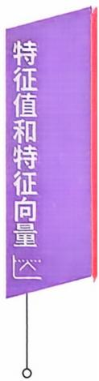

答案见124 页