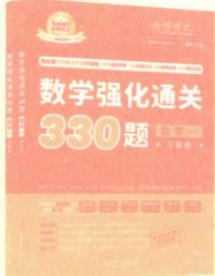
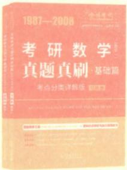
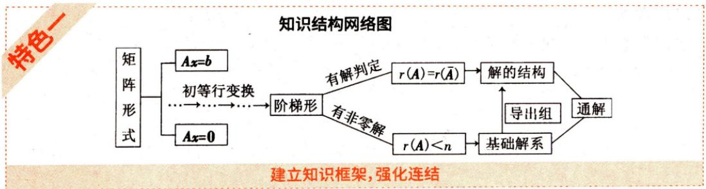
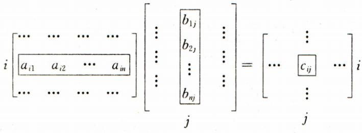
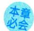
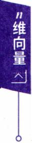

# 线性代数辅导讲义

编著李永乐（清华大学）

综合题专项解决方案开创者：构建解题思路沉淀解题方法直指解题效率高效得分范式

线性代数辅导讲义高分突破方案——深化掌握“灵活运用三基分析和解决问题”的能力

高分提档严选题突破解题能力——升华解题思维，建立顶层视野，适配各水平学生

辅导讲义+严选题提炼“题型与通法”——掌握一法，可解一类题，效率+高分的驱动器

  
视频领取

## 李永乐（线代王）

·清华大学应用数学系原教授

·广受学生信赖的“线代王”

·全国著名考研数学线性代数辅导专家

·主编《考研数学复习全书·线性代数基础》《线性代数辅导讲义》 《数学复习全书》《数学基础过关660题》《数学强化通关330题》 《考研数学真题真刷》等百万级畅销书

跟着永乐大帝学线代不靠天赋不拼熬夜用对方法，线代也能成为你的最强加分项!

考研数学 复习全书·基础 线性代数基础

考研数学 复习全书·基础篇 线性代数基础

线性代数辅导讲义

学 霸 养 成 笔 记 与高 分 提 档 严 选 题编做代数馆导讲文

## 0基础学线代

平滑衔接大学数学到考研数学学基本概念基本理论基本方法练基础严选题成就解题小能手从"学知识"转向"会解题"强化三基灵活运用再拔高跟练例题掌握方法与技巧严选题检测进阶解题能力

  
660题 掌握基础

  
330题掌握综合题

  
真题真刷基础篇基础巩固  
真题真刷提高篇综合拓展  
真题真刷必学篇实战必刷

考研数学 真题真刷 提高篇 CLLMD

考研数学真题真刷·必学篇

# 线性代数辅导讲义

编著李永乐（清华大学)

## 图书在版编目(CIP)数据

线性代数辅导讲义/李永乐编著．一北京：中国农业出版社，2024.3(2026.2重印)

(考研数学系列)

ISBN 978-7-109-31781-9

I. ①线… Ⅱ. ①李…Ⅲ. ①线性代数一研究生一入学考试一自学参考资料Ⅳ. ①O151.2

中国国家版本馆CIP 数据核字(2024)第 048114号

## 线性代数辅导讲义

XIANXING DAISHU FUDAO JIANGYI

中国农业出版社出版

地址：北京市朝阳区麦子店街18号楼

邮编：100125

责任编辑：吕睿

责任校对：吴丽婷

印刷：正德印务(天津)有限公司

版次：2024年3月第1版

印次：2026年2月天津第4次印刷

发行：新华书店北京发行所

开本：787mm×1092mm 1/16

印张：13

字数：300千字

定价：89.80元

版权所有·侵权必究

凡购买本社图书，如有印装质量问题，我社负责调换。

服务电话：010-59194952 010-59195115

考研数学知识点繁多庞杂，需要经过基础、强化和冲刺三个阶段的复习。

基础阶段是“建立三基”——帮你建立考研数学所需的三基(基本概念、基本理论、基本方法)，学会“单个知识点”怎么用。但考研数学的分数差距，从来不在“单个知识点会不会”，而在“多个知识点能不能串起来解决问题”。比如求极限，基础阶段学“洛必达法则”“等价无穷小替换”，但强化阶段的题要考“洛必达+泰勒展开+变限积分”的组合；线代里特征值，基础阶段学“求特征值的方法”，强化阶段的题要考“特征值十二次型+矩阵秩”的综合。

## 核心目标

强化阶段的核心目标：让同学们从“会做单一题”进化提升到“会做综合题”，从“被动记公式”转向“主动选择最优解法”，形成条件反射式解题直觉——这一步直接决定你是“100分档”还是“120+/130+分档”。

## 两个主线任务

强化阶段的两个主线任务：知识体系的“完善与重构”和解题能力的“跃迁”。

## 知识体系的“完善与重构”从“孤立点”到“网络图”

强化不是再学一遍知识点，而是把零散的知识点织成“可随时调用的网络”。比如：高数中的“微分方程”要把“极限→导数→积分→微分方程”串成一条线，明白“极限是导数的基础，导数是积分的逆运算，微分方程是积分的应用”；线代中的“矩阵”要把“矩阵运算→行列式→向量→线性方程组→特征值/二次型”连成逻辑链。

操作方法：每学完一节一章，画“思维导图”，不用太细，但要标出“核心节点”和“关联线”。每周花1～2小时复盘：合上书，默写这一周所学知识内容的“知识网络”，并分析思考知识点间的联系。

## 解题能力的“跃迁”从“被动模仿”到“主动建模”

基础阶段是解“模仿着例题，套公式就能做”的基础题，强化阶段要解决的是中等题“瓶颈”(即“看似会做，但总错在细节，想深入，却不知道用什么方法”)。强化阶段要实现“看到题，能自己找思路”突破，最后做到“中等难度题”的正确率≥80%，且能一道题在15分钟内完成，而不是想半天没思路；遇到“新题型”，能快速识别考点组合(比如这道题是“导数的几何意义+定积分的应用+极限的存在性”)。

操作方法：练习的题目类型要升级，强化阶段要练“跨章节综合题”。优选做配套的《严选题》。《严选题》的题目综合性比较好，难度控制的比较均衡。做题的思维模式要升级，要培养“问题导向的思维”，看到题，强制自己“先分析考点组合”，问自己有哪些工具可以用，哪种工具最适合，再动手做避免“盲目套公式”。

## 复习建议

强化阶段的“黄金时间”是7～10月，要学习的内容比较多，时间比较紧张，不能“盲目无序”，要“有目标、有反馈、有调整”。根据自身进度完成下面的“周计划”表：

<table><tr><td rowspan=1 colspan=1></td><td rowspan=1 colspan=4>周一至周五</td><td rowspan=1 colspan=1></td><td rowspan=1 colspan=1></td><td rowspan=1 colspan=1>周六复盘</td><td rowspan=1 colspan=1>周日周测</td></tr><tr><td rowspan=1 colspan=1>上午</td><td rowspan=1 colspan=1>(1~2 小时)学“章节知识”十例题</td><td rowspan=1 colspan=1></td><td rowspan=1 colspan=1></td><td rowspan=1 colspan=1></td><td rowspan=1 colspan=1></td><td rowspan=1 colspan=1></td><td rowspan=1 colspan=1>(3 小时)本周练习题总结常见的组合模型</td><td rowspan=1 colspan=1>(3 小时)选 20道代表性题目，限时测试</td></tr><tr><td rowspan=1 colspan=1>下午</td><td rowspan=1 colspan=1>(2~3 小时)练“对应的严选题”</td><td rowspan=1 colspan=1></td><td rowspan=1 colspan=1></td><td rowspan=1 colspan=1></td><td rowspan=1 colspan=1></td><td rowspan=1 colspan=1></td><td rowspan=1 colspan=1>(2 小时)本周所学画思维导图查漏补缺</td><td rowspan=1 colspan=1>(1 小时)检查周测答案，拆分考点组合确定下周学的内容与进度</td></tr><tr><td rowspan=1 colspan=1>晚上</td><td rowspan=1 colspan=1>(1 小时)复盘整理“当天错题”</td><td rowspan=1 colspan=1></td><td rowspan=1 colspan=1></td><td rowspan=1 colspan=1></td><td rowspan=1 colspan=1></td><td rowspan=1 colspan=1></td><td rowspan=1 colspan=1>稍作休息</td><td rowspan=1 colspan=1>稍作休息</td></tr></table>

考研数学的“强化”，不是“学更多”，而是“学更透能得分”；不是“做更多题”，而是“会做题，高效做题”。坚持下去，你会发现：那些曾经让你头疼的“定义、定理和结论”，最终会变成你“解题的工具”。

加油，你在考研的路上，每一步都算数！

## FOREWORD前言

本书是一本为考研学生复习线性代数而编写的辅导讲义，内容根据编者近年来的强化班授课讲稿改写而成。本书也可作为大一新生学习线性代数时的参考书。

此次修订，更换并重新编写了一些题目。同时，针对同学们通常理解困难或容易忽略的知识点，也相应增加了一些说明，以帮助同学们更好地把握内容细节。

全书共分六章，每章均由知识结构网络图、基本内容与重要结论、典型例题分析选讲和练习题严选组成，这样编排为的是方便同学们总结归纳以及更好地掌握知识间的相互渗透与转换。

本书力求在较短的时间内，用不多的篇幅，帮助同学们搞清基本概念，掌握基本理论和公式，了解重点和难点并澄清一些常犯的错误与疑惑。一方面，通过对典型例题的分析讲评，帮助同学们梳理解题的思路，熟悉常用的方法和技巧；另一方面，赠送的高分提档严选题，选题严格，题量合适，帮助同学们更好地理解和掌握基本内容、基本解题方法，达到巩固、悟新与提高的目的。另外，例题后的点评与评注，其目的在于帮助同学们弄清重点、难点、知识结合点以及解题的基本方法和应注意的问题。一手最快资料同步VX：kys985121

在考研数学中，线性代数占5个考题(3个选择、1个填空、1个解答)，分值为32分，建议平均用时应当为40分钟左右。因而我们在附录中设计了两套45分钟的水平测试，希望同学们在复习完本书之后，用这两套题进行自测，及时地进行查漏补缺。线性代数考试大纲对于数学一、二三来说基本上一样，本书中除向量空间仅数一考生要准备外，其余部分大家都应复习。

特色及使用功能说明  

## 今年考题

## 今年考题

(2026,1,2)单位矩阵经过若干次互换两行得到的矩阵称为置换矩阵. 设A为n阶置换矩阵 $\mathbf { \dot { A } } ^ { \star }$ 为A的伴随矩阵，则 (A $) \boldsymbol{A}^{*}$ 为置换矩阵. (B) $\boldsymbol{A}^{-1}$ 为置换矩阵. (C) $\boldsymbol{A}^{-1} = \boldsymbol{A}^{*}$ (D) $\boldsymbol{A}^{-1} = -\boldsymbol{A}^{*}$

直观感受命题特点与形式，做到心中有数

定理4.1 线性方程组的初等行变换把线性方程组变成与它同解的方程组.

定理4.2 设n元线性方程组为(4.1)，对它的增广矩阵施行高斯消元法，得到阶梯形矩阵

定义1.1 n阶行列式

$$
\begin{pmatrix}a_{11} & a_{12} & \cdots & a_{1n} \\a_{21} & a_{22} & \cdots & a_{2n} \\\vdots & \vdots & & \vdots \\a_{n1} & a_{n2} & \cdots & a_{nn}\end{pmatrix}
$$

基础水平达标可适当快速通览提高效率，深度精读须认真研读

展示新知

例 $1 、 1 0 1$ 设 $\alpha , \beta , \gamma , \gamma , , \gamma _ { 3 }$ 都是四维列向量，且 $| \boldsymbol{A} | = | \boldsymbol{\alpha}, \boldsymbol{\gamma}_{1}, \boldsymbol{\gamma}_{2}, \boldsymbol{\gamma}_{3} | =$ $\left| \boldsymbol{m}, \left| \boldsymbol{B} \right| = \left| \boldsymbol{\beta}, 2 \boldsymbol{\gamma}_{1}, 3 \boldsymbol{\gamma}_{2}, \boldsymbol{\gamma}_{3} \right| = n \right|$ ,则 | A—2B | =

题目突出展示，先自己独立做题再看解析，检测与锤炼做题能力

【评注】本题考查的知识点有3个：一是用公式 $\boldsymbol{A}^{*} = \left| \boldsymbol{A} \right| \boldsymbol{A}^{-1}$ 求伴随矩阵，二是行列式的拉普拉斯展开式，三是分块矩阵的求逆公式.这些都是线性代数中很重要的基础知识.

总结归纳重要结论

希望本讲义能对考研的同学有较大帮助。由于编者水平有限，疏漏和错误之处在所难免，欢迎批评指正。

祝同学们考研之旅一帆风顺！

## CONTENTS目录

## 第一章 行列式——每一章都有应用

一、知识结构网络图……………………(1)  
二、基本内容与重要结论………(4)  
一手最快资料同步VX：kys985121  
基础知识………………………………………………………………(4)  
重要定理………………………(5)  
主要公式……………(6)  
方阵的行列式………(7)  
克拉默法则……………(8)  
三、典型例题分析选讲……(9)  
行列式的概念和计算……(9)  
行列式的应用……………………………………………………(19)  
关于A|=0 的判断………………………………………………(22)  
代数余子式求和………………(24)  
四、练习题严选…………………………………………………(26)  
参考答案与提示………………(27)  
矩阵——基础，防混淆  
、知识结构网络图……(29)  
二、基本内容与重要结论……(31)  
基础知识………………………………………………………………………(31)  
重要定理………………………………………………………………………(36)  
主要公式………………………………………………………………………(37)  
三、典型例题分析选讲………………………………………………………………(38)  
矩阵运算………………………………………………………………………(38)  
特殊矩阵……………………………………………………………………………(42)  
初等变换初等矩阵……………(49)  
分块矩阵………………………………………………………………………(53)  
矩阵秩的计算…………………(57)  
矩阵方程……………………………………………………………(60)  
手最快资料同步VX：kys985121  
四、练习题严选………………………………………………………………………(62)  
参考答案与提示…………………………………………………………………(64)  
第三章 n维向量——难点，加油  
、知识结构网络图………………………………………………………………(67)  
二、典型例题分析选讲…………………………………(69)  
线性相关、无关………………………(69)  
线性表出……………………………………………………………………(77)  
向量组的秩、极大线性无关组…………………………………………………(83)  
向量组等价……………………………………………………………………(85)  
矩阵秩的证明…………………………………………………………………(86)  
向量空间\*………………………………………………………………………(89)  
三、练习题严选……………………………………………………………………………(93)  
参考答案与提示………………………………………………………………(94)  
第四章 线性方程组——重点，别马虎大意  
、知识结构网络图……………(97)  
二、基本内容与重要结论………………………………………(99)  
基础知识手最快资料同步yx：kys985121（99）  
主要定理………………………………………………………………………(100)  
三、典型例题分析选讲……………………………………………(102)  
基础解系nr(A)…………………………………………………………(102)  
解方程组 Ax=b,解的结构…………………………………………………(107)  
有解判定、解的结构、性质…………(113)  
两个方程组公共解、同解…………………………………………………(115)  
方程组的应用…………………………………………………………………(122)  
四、练习题严选……………………………………………………………………(126)  
参考答案与提示……………………………………………………………(127)  
第五章 特征值和特征向量——重点，综合性强  
一、知识结构网络图…………………………………………………………(130)  
二、基本内容与重要结论…………………………………………(132)  
基础知识……………………………………………………………………………(132)  
重要定理……(132)  
三、典型例题分析选讲…………………………(135)  
特征值、特征向量……………………………………………………………(135)  
相似、相似对角化………………………………………………………………(142)  
求参数的问题…………………………………………………………………(147)  
相似时的可逆矩阵P……………………………………………………………(149)  
用相似求A……………………………………………(151)  
反求矩阵A………………………………………………………………………(153)  
实对称矩阵手最快资料同步VX：kys985121（154）  
四、练习题严选……………(158)  
参考答案与提示……………(159)  
第六章二次型——重点，注意和特征值、特征向量的联系  
一、知识结构网络图……………………………………………………………(162)  
二、基本内容与重要结论……………………………………………………(164)  
基础知识…………………(164)  
主要定理……………………………(165)  
三、典型例题分析选讲……………………………………(168)  
二次型基本概念………………………(168)  
二次型的标准形、规范形…………………………………………(169)  
二次型的正定性………………………………………………………………(180)  
矩阵的等价、相似、合同………………………………………………………(186)  
四、练习题严选…………………………(189)  
参考答案与提示…………………………………………(190)

## 附录 45 分钟水平测试

白测()……… …………(193)  
自测(二)…………(194)  
手最快资料同步VX:kys985121  
参考答案与提示………… ………………………………………(195)

## 永乐讲线代公众号

李永乐，原清华大学应用数学系（现清华大学数学科学系）教师，最受学生欢迎的“线代”老师，编著多部考研数学抢手复习资料，对出题形式、考试重点了如指掌，解题思路极其灵活，辅导针对性极强，受到广大学员交口称赞。

## 第一章 行列式—每一章都有应用

## 一、知识结构网络图

概念

不同行不同列元素乘积的代数和(共n!项)

「经转置行列式的值不变，即 $\boldsymbol{A}^{\mathrm{T}} \mid = \mid \boldsymbol{A} \mid$

性质

某行有公因数k，可把k提到行列式外.特别地，某行元素全为0，则行列式的值为0两行互换行列式变号.特别地，两行相等，行列式值为0；两行成比例，行列式值为0某行所有元素都是两个数的和，则可写成两个行列式之和  
某行的k倍加至另一行，行列式的值不变

$$
\left| \begin{matrix}  属  \\  属  \\  因  \\ \end{matrix} \right| = \left| \begin{matrix} \boldsymbol{A} \\ \end{matrix} \right| = a_{11}A_{11} + a_{21}A_{21} + \cdots + a_{n}A_{n} \quad ( 按  i  行展开 ) \quad ( 代数余子式 )
$$

三角化法

公式法

数字型

直接按行(列）展开

常用

把第1行(列)的k倍加到第i行(列)

行列式

递推法

计算

技巧

把每行(列）都加到第1行(列)

归纳法

抽象型

用行列式性质

逐行(列)相加

用矩阵性质

E恒等变形

用特征值

$| \boldsymbol{A} | = \prod \lambda_{i}$ ,相似

[Ax = 0 有非零解

证|A|= 0

反证法

r(A) < n

0 是A 的特征值

Ax=0有非零解

伴随矩阵求逆法

应用

线性相关(无关)判定

可逆的证明

克拉默法则

特征值计算

二次型正定判定

对于二、三阶行列式有对角线法则

$$
\begin{vmatrix} a & b \\ c & d \end{vmatrix} = ad - bc
$$

$$
\begin{vmatrix}a_{1} & a_{2} & a_{3} \\b_{1} & b_{2} & b_{3} \\b_{1} & b_{2} & b_{3} \\c_{1} & c_{2} & c_{3}\end{vmatrix}= a_{1}b_{2}c_{3} + a_{2}b_{3}c_{1} + a_{3}b_{1}c_{2} - a_{3}b_{2}c_{1} - a_{2}b_{1}c_{3} - a_{1}b_{3}c_{2}
$$

注意这样的计算方法对四阶及四阶以上行列式不适用.

学习札记

【编者注】（1）对行列式的性质4要理解正确.例如

$$
\left| \begin{matrix} { a _ { 1 } + b _ { 1 } } & { a _ { 1 } + b _ { 2 } } & { a _ { 1 } + b _ { 3 } } \\ { c _ { 1 } } & { c _ { 2 } } & { c _ { 3 } } \\ { d _ { 1 } } & { d _ { 2 } } & { d _ { 3 } } \\ \end{matrix} \right| = \left| \begin{matrix} { a _ { 1 } } & { a _ { 2 } } & { a _ { 3 } } \\ { c _ { 1 } } & { c _ { 2 } } & { c _ { 3 } } \\ { d _ { 1 } } & { d _ { 2 } } & { d _ { 3 } } \\ \end{matrix} \right| + \left| \begin{matrix} { b _ { 1 } } & { b _ { 2 } } & { b _ { 3 } } \\ { c _ { 1 } } & { c _ { 2 } } & { c _ { 3 } } \\ { d _ { 1 } } & { d _ { 2 } } & { d _ { 3 } } \\ \end{matrix} \right| .
$$

对于 n阶矩阵 $\boldsymbol{A} = \left[ a_{ij} \right], \boldsymbol{B} = \left[ b_{ij} \right]$ ,有 $\boldsymbol{A} + \boldsymbol{B} = \left[ a_{ij} + b_{ij} \right]$ ,由于行列式$\vert A + B \vert$ 中每一行都是两个数的和，所以若用性质4把行列式 $\vert A + B \vert$ 拆开，则 $\vert A + B \vert$ 应当是2个n阶行列式之和.因此一般情况下

$$
\left| \boldsymbol{A} + \boldsymbol{B} \right| \neq \left| \boldsymbol{A} \right| + \left| \boldsymbol{B} \right|.
$$

特别地，

$$
\left| \begin{aligned} \lambda - a_{11} & \quad - a_{12} & \quad - a_{13} \\ - a_{21} & \quad \lambda - a_{22} & \quad - a_{23} \\ - a_{31} & \quad - a_{32} & \quad \lambda - a_{33} \end{aligned} \right| = \left| \begin{aligned} \lambda - a_{11} & \quad 0 - a_{12} & \quad 0 - a_{13} \\ 0 - a_{21} & \quad \lambda - a_{22} & \quad 0 - a_{23} \\ 0 - a_{31} & \quad 0 - a_{32} & \quad \lambda - a_{33} \end{aligned} \right|
$$

$$
\begin{aligned} &\boldsymbol{A} = \begin{vmatrix} \lambda & 0 - a_{12} & 0 - a_{13} \\ 0 & \lambda - a_{22} & 0 - a_{23} \\ 0 & 0 - a_{32} & \lambda - a_{33} \end{vmatrix} + \begin{vmatrix} - a_{11} & 0 - a_{12} & 0 - a_{13} \\ - a_{21} & \lambda - a_{22} & 0 - a_{23} \\ - a_{31} & 0 - a_{32} & \lambda - a_{33} \end{vmatrix}.\\ \end{aligned}
$$

(先将第一列拆分，其他列不变，依次拆分第二、三列)

$$
\begin{aligned}= \left| \begin{matrix}\lambda & 0 & 0 \\0 & \lambda & 0 \\0 & 0 & \lambda\end{matrix} \right|+ \left| \begin{matrix}\lambda & -a_{12} & -a_{13} \\0 & -a_{22} & -a_{23} \\0 & -a_{32} & -a_{33}\end{matrix} \right|+ \left| \begin{matrix}-a_{11} & 0 & -a_{13} \\-a_{21} & \lambda & -a_{23} \\-a_{31} & 0 & -a_{33}\end{matrix} \right|\end{aligned}
$$

$$
\begin{aligned} &+ \left| \begin{matrix}\\ &- a_{11} & - a_{12} & 0 \\&- a_{21} & - a_{22} & 0 \\&- a_{31} & - a_{32} & \lambda\\ &\end{matrix} \right| + \left| \begin{matrix}\\ &- a_{11} & 0 & 0 \\&- a_{21} & \lambda & 0 \\&- a_{31} & 0 & \lambda\\ &\end{matrix} \right| + \left| \begin{matrix} \lambda & - a_{12} & 0 \\&0 & - a_{22} & 0 \\&- a_{32} & \lambda\\ &\end{matrix} \right| .\\ \end{aligned}
$$

$$
\begin{aligned}+\left| \begin{matrix}\lambda & 0 & -a_{13} \\0 & \lambda & -a_{23} \\0 & 0 & -a_{33}\end{matrix} \right|+\left| \begin{matrix}-a_{11} & -a_{12} & -a_{13} \\-a_{21} & -a_{22} & -a_{23} \\-a_{31} & -a_{32} & -a_{33}\end{matrix} \right|\end{aligned}
$$

$$
\lambda ^ { 3 } - \left( a _ { 1 1 } + a _ { 1 2 } + a _ { 1 3 } \right) \lambda ^ { 2 } + \left( \left| \begin{matrix} a _ { 1 1 } & a _ { 1 2 } \\ a _ { 2 1 } & a _ { 2 2 } \\ \end{matrix} \right| + \left| \begin{matrix} a _ { 1 2 } & a _ { 2 3 } \\ a _ { 3 2 } & a _ { 3 3 } \\ \end{matrix} \right| + \left| \begin{matrix} a _ { 1 1 } & a _ { 1 3 } \\ a _ { 3 1 } & a _ { 3 3 } \\ \end{matrix} \right| \right) \lambda
$$

$$
\begin{aligned} &- \begin{bmatrix} a_{11} & a_{12} & a_{13} \\ a_{21} & a_{22} & a_{23} \\ a_{31} & a_{32} & a_{33} \end{bmatrix}.\\ \end{aligned}
$$

(2)要会用行列式的性质及展开定理计算数字型行列式.

(3)要熟悉抽象型行列式的计算.

本章未作单独考查，相关要点在其他题中涵盖.

行列式

## 、基本内容与重要结论

## 基础知识

## 定义1.1n 阶行列式

$$
\begin{pmatrix}a_{11} & a_{12} & \cdots & a_{1n} \\a_{21} & a_{22} & \cdots & a_{2n} \\\vdots & \vdots & & \vdots \\a_{n1} & a_{n2} & \cdots & a_{nn}\end{pmatrix}
$$

是所有取自不同行不同列的n个元素的乘积

$$
a_{1j_1}a_{2j_2}\cdots a_{nj_n}
$$

的代数和，这里 $j_{1}j_{2}\cdots j_{n}$ 是1,2，…，n的一个排列.当 $j_{1}j_{2}\cdots j_{n}$ 是偶排列时，该项的前面带正号；当 $j_{1}j_{2}\cdots j,$ ，是奇排列时，该项的前面带负号，即

$$
\begin{vmatrix}a_{11} & a_{12} & \cdots & a_{1n} \\a_{21} & a_{22} & \cdots & a_{2n} \\\vdots & \vdots & & \vdots \\a_{n1} & a_{n2} & \cdots & a_{nn}\end{vmatrix}= \sum_{j_1 j_2 \cdots j_n} (-1)^{\tau(j_1 j_2 \cdots j_n)} a_{1j_1} a_{2j_2} \cdots a_{nj_n}\tag{1.1}
$$

这里 $\sum_{j_{1}j_{2}\cdots j_{n}}$ 表示对所有n阶排列求和.式(1.1)称为n阶行列式的完全展开式.

例如，若已知 $a_{14}a_{2j}a_{31}a_{42}$ 是四阶行列式中的一项，那么根据行列式的定义，它应是不同行不同列元素的乘积.因此必有j=3.

由于 $a_{11}a_{23}a_{31}a_{42}$ 对应的逆序数

$$
\tau(4312) = 3 + 2 + 0 = 5
$$

是奇数，所以该项所带符号为负号.

【评注】(1)由1，2，…，n组成的有序数组称为一个n阶排列.通常用 $j_{1}j_{2}\cdots j_{n}$ 表示n阶排列.

(2)一个排列中，如果一个大的数排在小的数之前，就称这两个数构成一个逆序.一个排列的逆序总数称为这个排列的逆序数．用$\tau(j_1j_2\cdots j_n)$ 表示排列 $j_{1}j_{2}\cdots j,$ 的逆序数.

如果一个排列的逆序数是偶数，则称这个排列为偶排列，否则称为奇排列.

例如，在排列25134 中，有逆序21，51，53，54，因此排列25134的逆序数为4，即 $\tau(25134) = 4.$ 所以排列25134是偶排列.

## 定义1.2 在n阶行列式

$$
D = \begin{vmatrix}a_{11} & a_{12} & \cdots & a_{1n} \\a_{21} & a_{22} & \cdots & a_{2n} \\\vdots & \vdots & & \vdots \\a_{n1} & a_{n2} & \cdots & a_{nn}\end{vmatrix}
$$

字习札记

中划去元素 $\hat{a}_{ij}$ 所在的第i行、第j列，由剩下的元素按原来的排法构成一个n-1阶的行列式

$$
\left| \begin{array} { c c c c c c }a _ { 1 1 } & \cdots & a _ { 1 , j - 1 } & a _ { 1 , j + 1 } & \cdots & a _ { 1 n } \\\vdots & & \vdots & \vdots & & \vdots \\a _ { i - 1 , 1 } & \cdots & a _ { i - 1 , j - 1 } & a _ { i - 1 , j + 1 } & \cdots & a _ { i - 1 , n } \\a _ { i + 1 , 1 } & \cdots & a _ { i + 1 , j - 1 } & a _ { i + 1 , j + 1 } & \cdots & a _ { i + 1 , n } \\\vdots & \ddots & \vdots & \vdots & & \vdots \\a _ { n 1 } & \cdots & a _ { n , j - 1 } & a _ { n , j + 1 } & \cdots & a _ { n n } \\\end{array} \right|
$$

称为 $a _ { i j }$ 的余子式，记为 $M _ { i j }$ ;称 $(-1)^{i+j}M_{ij}$ 为 $a _ { i j }$ 的代数余子式，记为 $A _ { i j }$ ,即 $A_{ij} = (-1)^{i+j}M_{ij}.$ (1.2)

例如，若已知行列式 $\begin{bmatrix} 1 & 2 & a \\ 0 & 1 & - 1 \\ 3 & 4 & 5 \end{bmatrix}$ 的代数余子式 $A_{21} = 2$ ,即已知$(-1)^{2+1} \left| \begin{matrix} 2 & a \\ 4 & 5 \end{matrix} \right| = 2$

从而a= 3.

## 重要定理

定理1.1 n阶行列式

$$
D = \left| \begin{matrix}a_{11} & a_{12} & \cdots & a_{1n} \\a_{21} & a_{22} & \cdots & a_{2n} \\\vdots & \vdots & & \vdots \\a_{n1} & a_{n2} & \cdots & a_{nn} \\\end{matrix} \right|
$$

等于它的任意一行的所有元素与它们各自对应的代数余子式的乘积之和，即

$$
D = a_{k1}A_{k1} + a_{k2}A_{k2} + \cdots + a_{kn}A_{kn} \quad (k = 1, 2, \cdots, n).\tag{1.3}
$$

公式(1.3)称为行列式按第k行的展开公式.

定理1.1' n阶行列式D等于它的任意一列的所有元素与它们各自对应的代数余子式的乘积之和，即

$$
D = a_{1k}A_{1k} + a_{2k}A_{2k} + \cdots + a_{nk}A_{nk} \quad (k = 1, 2, \cdots, n).\tag{1.4}
$$

公式(1.4)称为行列式按第k列的展开公式.

学习札记

$$
D = \begin{vmatrix}a_{11} & a_{12} & \cdots & a_{1n} \\a_{21} & a_{22} & \cdots & a_{2n} \\\vdots & \vdots & & \vdots \\a_{n1} & a_{n2} & \cdots & a_{nn}\end{vmatrix},
$$

元素 $a _ { i j }$ 的代数余子式为 $A_{ij}$ ,当 $i \ne k(i,k = 1,2,\cdots,n)$ 时，有

$$
a_{i1}A_{k1} + a_{i2}A_{k2} + \cdots + a_{in}A_{kn} = 0;\tag{1.5}
$$

当 $j \ne k(j,k = 1,2,\cdots,n)$ 时，有

$$
a_{1j}A_{1k} + a_{2j}A_{2k} + \cdots + a_{nj}A_{nk} = 0.\tag{1.6}
$$

定理1.3 (行列式乘法公式)设A,B都是n阶方阵，则

$$
| A B | = | A | \cdot | B |.
$$

【评注】根据代数余子式的性质式(1.3)与式(1.5)，对于

矩阵 $\boldsymbol{A} = \begin{bmatrix} a_{11} & a_{12} & a_{13} \\ a_{21} & a_{22} & a_{23} \\ a_{31} & a_{32} & a_{33} \end{bmatrix}$ 和行列式 $\left| \boldsymbol{A} \right| = \left| \begin{aligned}a_{11} \quad a_{12} \quad a_{13} \\a_{21} \quad a_{22} \quad a_{23} \\a_{31} \quad a_{32} \quad a_{33}\end{aligned} \right|$ ，我们有

$$
\begin{bmatrix} a_{11} & a_{12} & a_{13} \\ a_{21} & a_{22} & a_{23} \\ a_{31} & a_{32} & a_{33} \end{bmatrix} \begin{bmatrix} A_{11} & A_{21} & A_{31} \\ A_{12} & A_{22} & A_{32} \\ A_{13} & A_{23} & A_{33} \end{bmatrix}
$$

$$
\begin{aligned}= \left[ \begin{aligned} & a_{11}A_{11} + a_{12}A_{12} + a_{13}A_{13} & a_{11}A_{11} + a_{12}A_{22} + a_{13}A_{23} & a_{11}A_{11} + a_{12}A_{22} + a_{13}A_{33} \\ & a_{21}A_{11} + a_{22}A_{12} + a_{23}A_{13} & a_{21}A_{21} + a_{22}A_{22} + a_{23}A_{23} & a_{21}A_{11} + a_{22}A_{22} + a_{23}A_{33} \\ & a_{31}A_{11} + a_{32}A_{12} + a_{33}A_{13} & a_{31}A_{21} + a_{32}A_{22} + a_{33}A_{23} & a_{31}A_{31} + a_{32}A_{32} + a_{33}A_{33} \end{aligned} \right]\end{aligned}
$$

$$
\begin{aligned}=\left[\begin{matrix}\left| \boldsymbol{A} \right| & 0 & 0 \\0 & \left| \boldsymbol{A} \right| & 0 \\0 & 0 & \left| \boldsymbol{A} \right|\end{matrix}\right]=\left| \boldsymbol{A} \right|\left[\begin{matrix}1 & 0 & 0 \\0 & 1 & 0 \\0 & 0 & 1\end{matrix}\right],\end{aligned}
$$

即

$$
\boldsymbol{A}\boldsymbol{A}^{*} = |\boldsymbol{A}|\boldsymbol{E}.
$$

类似地由式(1.4)与式(1.6)有 $\boldsymbol{A}^{*} \boldsymbol{A} = |\boldsymbol{A}| \boldsymbol{E}$ ,从而

$$
\boldsymbol{A}\boldsymbol{A}^{*} = \boldsymbol{A}^{*} \boldsymbol{A} = |\boldsymbol{A}|\boldsymbol{E}.
$$

这是一个重要的公式，要会灵活运用.

## 主要公式

1. 上(下)三角行列式的值等于主对角线元素的乘积

$$
\left| \begin{array}{cccc}a_{11} & a_{12} & \cdots & a_{1n} \\a_{11} & a_{12} & \cdots & a_{1n} \\\vdots & \vdots & & \vdots \\a_{n1} & & & \\& & & a_{nn} \\\end{array} \right|= \left| \begin{array}{cccc}a_{11} & & & \\a_{11} & & & \\& & \ddots & \\a_{21} & a_{22} & & \\\vdots & \vdots & \ddots & \\a_{n1} & a_{n2} & \cdots & a_{nn} \\\end{array} \right|= a_{11}a_{22}\cdots a_{nn} .\tag{1.7}
$$

2. 关于副对角线的行列式

$$
\begin{aligned}\left| \begin{matrix}a_{11} & a_{12} & \cdots & a_{1,n-1} & a_{1n} \\a_{21} & a_{22} & \cdots & a_{2,n-1} & 0 \\\vdots & \vdots & & \vdots & \vdots \\a_{n1} & 0 & \cdots & 0 & 0 \\\end{matrix} \right|&=\left| \begin{matrix}0 & \cdots & 0 & a_{1n} \\0 & \cdots & a_{2,n-1} & a_{2n} \\\vdots & & \vdots & \vdots \\a_{n1} & \cdots & a_{n,n-1} & a_{nn} \\\end{matrix} \right| \\&= (-1)^{\frac{n(n-1)}{2}} a_{1n} a_{2,n-1} \cdots a_{n1}.\end{aligned}
$$

学习札记

(1.8)

3. 两个特殊的拉普拉斯展开式

$$
\begin{vmatrix} \boldsymbol{A} & * \\ \boldsymbol{O} & \boldsymbol{B} \end{vmatrix} = \begin{vmatrix} \boldsymbol{A} & \boldsymbol{O} \\ * & \boldsymbol{B} \end{vmatrix} = | \boldsymbol{A} | \cdot | \boldsymbol{B} | ,\tag{1.9}
$$

$$
\begin{vmatrix} \boldsymbol{O} & \boldsymbol{A} \\ \boldsymbol{B} & * \end{vmatrix} = \begin{vmatrix} * & \boldsymbol{A} \\ \boldsymbol{B} & \boldsymbol{O} \end{vmatrix} = (-1)^m \left| \begin{array}{c} \boldsymbol{A} \end{array} \right| \cdot \left| \begin{array}{c} \boldsymbol{B} \end{array} \right| ,\tag{1.10}
$$

m,n分别是方阵A，B的阶数.

4. 范德蒙行列式

$$
\left| \begin{array}{cccc}1 & 1 & \cdots & 1 \\x_{1} & x_{2} & \cdots & x_{n} \\x_{1}^{2} & x_{2}^{2} & \cdots & x_{n}^{2} \\\vdots & \vdots & & \vdots \\x_{1}^{n - 1} & x_{2}^{n - 1} & \cdots & x_{n}^{n - 1} \\\end{array} \right|= \prod_{1 \leqslant j < i \leqslant n} \left( x_{i} - x_{j} \right).\tag{1.11}
$$

5. 特征多项式

设 $\boldsymbol{A} = \left[ a_{ij} \right]$ 是三阶矩阵，则A的特征多项式

$$
\left| \lambda \boldsymbol{E} - \boldsymbol{A} \right| = \lambda^{3} - \left( a_{11} + a_{22} + a_{33} \right) \lambda^{2} + s_{2} \lambda - \left| \boldsymbol{A} \right|\tag{1.12}
$$

其中 $s_{2} = \left| \begin{matrix} a_{11} & a_{12} \\ a_{21} & a_{22} \end{matrix} \right| + \left| \begin{matrix} a_{11} & a_{13} \\ a_{31} & a_{33} \end{matrix} \right| + \left| \begin{matrix} a_{22} & a_{23} \\ a_{32} & a_{33} \end{matrix} \right| .$

## 方阵的行列式

(1) 若 A 是 n 阶矩阵， $, \boldsymbol{A}^{\mathrm{T}}$ 是A的转置矩阵，则

$$
\left| \boldsymbol{A}^{\mathrm{T}} \right| = \left| \boldsymbol{A} \right|.
$$

(1.13)

(2) 若A 是n阶矩阵，则

$$
\left| k \boldsymbol{A} \right| = k^{n} \left| \boldsymbol{A} \right|.\tag{1.14}
$$

(3)若A,B 都是n阶矩阵，则

$$
| \boldsymbol{A} \boldsymbol{B} | = | \boldsymbol{A} | | \boldsymbol{B} |\tag{1.15}
$$

(4)若A是n阶矩阵，则

$$
\left| \boldsymbol{A}^{*} \right| = \left| \boldsymbol{A} \right|^{n - 1}.\tag{1.16}
$$

(5) 若A 是n阶可逆矩阵，则

$$
\left| \boldsymbol{A}^{-1} \right| = \left| \boldsymbol{A} \right|^{-1}.\tag{1.17}
$$

(6) 若 A 是 n 阶矩阵， $\lambda_{i}(i = 1,2,\cdots,n)$ 是A的特征值，则

行列式达

行列式

学习札记

$$
\left| \boldsymbol{A} \right| = \prod_{i = 1}^{n} \lambda_{i}.
$$

(7)若n阶矩阵A和B相似，则

(1.18)

$$
\left| \boldsymbol{A} \right| = \left| \boldsymbol{B} \right|, \left| \boldsymbol{A} + k\boldsymbol{E} \right| = \left| \boldsymbol{B} + k\boldsymbol{E} \right|.\tag{1.19}
$$

## 克拉默法则

若n个方程n个未知数的线性方程组

$$
\begin{cases}a_{11}x_{1} + a_{12}x_{2} + \cdots + a_{1n}x_{n} = b_{1}, \\a_{21}x_{1} + a_{22}x_{2} + \cdots + a_{2n}x_{n} = b_{2}, \\\vdots \quad \vdots \quad \vdots \quad \vdots \\a_{n1}x_{1} + a_{n2}x_{2} + \cdots + a_{nn}x_{n} = b_{n}\end{cases}
$$

的系数行列式

$$
D = \begin{vmatrix}a_{11} & a_{12} & \cdots & a_{1n} \\a_{21} & a_{22} & \cdots & a_{2n} \\\vdots & \vdots & & \vdots \\a_{n1} & a_{n2} & \cdots & a_{nn}\end{vmatrix} \neq 0,
$$

则方程组有唯一解

$$
x_{1} = \frac{D_{1}}{D}, x_{2} = \frac{D_{2}}{D}, \cdots, x_{n} = \frac{D_{n}}{D},\tag{1.20}
$$

其中

$$
D_{j} = \sum_{i = 1}^{n} b_{i}A_{ij} = \begin{vmatrix}a_{11} & \cdots & a_{1,j - 1} & b_{1} & a_{1,j + 1} & \cdots & a_{1n} \\a_{21} & \cdots & a_{2,j - 1} & b_{2} & a_{2,j + 1} & \cdots & a_{2n} \\\vdots & & \vdots & \vdots & \vdots & & \vdots \\a_{n1} & \cdots & a_{n,j - 1} & b_{n} & a_{n,j + 1} & \cdots & a_{nn} \\\end{vmatrix}(j = 1,2,\cdots,n),
$$

推论1 若齐次线性方程组

$$
\begin{cases}a_{11}x_{1} + a_{12}x_{2} + \cdots + a_{1n}x_{n} = 0, \\a_{21}x_{1} + a_{22}x_{2} + \cdots + a_{2n}x_{n} = 0, \\\vdots \quad \vdots \quad \vdots \quad \vdots \\a_{n1}x_{1} + a_{n2}x_{2} + \cdots + a_{nn}x_{n} = 0\end{cases}
$$

的系数行列式不为0，则方程组只有零解.

推论2 若齐次线性方程组

$$
\begin{cases}a_{11}x_{1} + a_{12}x_{2} + \cdots + a_{1n}x_{n} = 0, \\a_{21}x_{1} + a_{22}x_{2} + \cdots + a_{2n}x_{n} = 0, \\\vdots \quad \vdots \quad \vdots \quad \vdots \\a_{n1}x_{1} + a_{n2}x_{2} + \cdots + a_{nn}x_{n} = 0\end{cases}
$$

有非零解，则系数行列式 $\left| \boldsymbol{A} \right| = 0.$

## 三、典型例题分析选讲

学习札记

行列式区

## 行列式的概念和计算

## 1. 数字型行列式

展示新知

【例1.1】计算

$$
\begin{bmatrix} 1 & 2 & 3 & 4 \\ -2 & 1 & -4 & 3 \\ 3 & -4 & -1 & 2 \\ 4 & 3 & -2 & 1 \end{bmatrix}
$$

分析用展开公式，先用“倍加”消0，方法不唯一，例如

$$
\begin{aligned}D &= \left| \begin{matrix}1 & 2 & 3 & 4 \\0 & 5 & 2 & 11 \\0 & -10 & -10 & -10 \\0 & -5 & -14 & -15\end{matrix} \right|= \left| \begin{matrix}5 & 2 & 11 \\0 & -6 & 12 \\0 & -12 & -4\end{matrix} \right|= 5\left| \begin{matrix}-6 & 12 \\-12 & -4\end{matrix} \right| \\&= 840,\end{aligned}
$$

展示新知

【例1.2】（2022数农）

$$
\begin{aligned} &\begin{vmatrix}\\ &0 & a & 0 & 0 & b \\&b & 0 & a & 0 & 0 \\&0 & b & 0 & a & 0 \\&0 & 0 & b & 0 & a \\&a & 0 & 0 & b & 0\\ &\end{vmatrix}=0\\ \end{aligned}
$$

$$
(A)a^{5}+b^{5}.
$$

$$
( B ) - a ^ { 5 } + b ^ { 5 }
$$

$$
( D ) - a ^ { 5 } - b ^ { 5 } .
$$

## 分析直接展开，有

$$
\begin{aligned}D &= aA_{12} + bA_{15} \\&= a(-1)^{1+2} \left| \begin{matrix}b & a & 0 & 0 \\0 & 0 & a & 0 \\0 & b & 0 & a \\a & 0 & b & 0 \\a & 0 & b & 0 \\\end{matrix} \right| + b(-1)^{1+5} \left| \begin{matrix}b & 0 & a & 0 \\0 & b & 0 & a \\0 & 0 & b & 0 \\a & 0 & 0 & b \\\end{matrix} \right| \\&= -a \cdot a(-1)^{2+3} \left| \begin{matrix}b & a & 0 \\0 & b & a \\a & 0 & 0 \\\end{matrix} \right| + b \cdot b(-1)^{3+3} \left| \begin{matrix}b & 0 & 0 \\0 & b & a \\a & 0 & b \\\end{matrix} \right| \\&= a^5 + b^5.\end{aligned}
$$

或推理排除.

行列式

学习札记

各行均加到第1行，可见D中有a+b因式，排除(B)和(C).  
对于 $a_{12}a_{23}a_{34}a_{45}a_{51} = a^{5}$ ,而 $\tau(23451) = 4$ ，偶排列，带正号.  
排除(D)，应选(A).

## 展示新知

【例1.3】 $(2014, \frac{1}{2})$ 行列式 $\begin{vmatrix} 0 & a & b & 0 \\ a & 0 & 0 & b \\ 0 & c & d & 0 \\ c & 0 & 0 & d \end{vmatrix} = 0$ (A)(ad − bc)². (B) $- ( a d - b c ) ^ { 2 } .$ (C) $a ^ { 2 } d ^ { 2 } - b ^ { 2 } c ^ { 2 }$ (D) $b ^ { 2 } c ^ { 2 } - a ^ { 2 } d ^ { 2 } .$

分析（方法一）本题有较多的0，可考虑直接用行(列）展开公式，例如按第一行展开

$$
\begin{aligned}\begin{vmatrix}0 & a & b & 0 \\a & 0 & 0 & b \\0 & c & d & 0 \\c & 0 & 0 & d\end{vmatrix}&= & -a\begin{vmatrix}a & 0 & b \\0 & d & 0 \\c & 0 & d\end{vmatrix}+b\begin{vmatrix}a & 0 & b \\0 & c & 0 \\c & 0 & d\end{vmatrix} \\&= -ad\begin{vmatrix}a & b \\c & d\end{vmatrix}+bk\begin{vmatrix}a & b \\c & d\end{vmatrix}= (ad-bc)(-ad+bc)^2 \\&= -(ad-bc)^2.\end{aligned}
$$

(方法二）本题0的位置很规则，也可联想到用拉普拉斯展开式

$$
\begin{aligned}\begin{vmatrix}0 & a & b & 0 \\a & 0 & 0 & b \\0 & c & d & 0 \\c & 0 & 0 & d\end{vmatrix}&= - \begin{vmatrix}c & 0 & 0 & d \\a & 0 & 0 & b \\0 & c & d & 0 \\0 & a & b & 0\end{vmatrix}= \begin{vmatrix}c & d & 0 & 0 \\a & b & 0 & 0 \\0 & 0 & d & c \\0 & 0 & b & a\end{vmatrix} \\&= \begin{vmatrix}c & d \\a & b\end{vmatrix} \bullet \begin{vmatrix}d & c \\b & a\end{vmatrix}= - (ad - bc)^{2}.\end{aligned}
$$

注记号(2014， ${1 \choose 2,3}$ 是指本题选自2014年数学一，数学二，数学三的真题，下同.

## 展示新知

【例1.4】计算

$$
D = \left| \begin{matrix} a_{1} + x & a_{2} & a_{3} & a_{4} \\ - x & x & 0 & 0 \\ 0 & - x & x & 0 \\ 0 & 0 & - x & x \end{matrix} \right| = \underline{\hspace{2cm}} .
$$

分析各列均加至第1列，并按第1列展开有

$$
D = \left| \begin{matrix} x + \sum\limits_{i = 1}^{4} a_{i} & a_{2} & a_{3} & a_{4} \\ 0 & x & 0 & 0 \\ 0 & - x & x & 0 \\ 0 & 0 & - x & x \end{matrix} \right| = \left( x + \sum\limits_{i = 1}^{4} a_{i} \right) \left| \begin{matrix} x & 0 & 0 \\ - x & x & 0 \\ 0 & - x & x \\ & & \end{matrix} \right| .
$$

学习札记

由(1.7)知， $D = x^{3}\left(x + \sum_{i = 1}^{4}a_{i}\right)$

展示新知

【例1.5】四阶行列式

$$
\begin{aligned} &\left| \begin{aligned}\\ &D = \left| \begin{matrix}\\ &a_{1} & - 1 & 0 & 0 \\&a_{2} & x & - 1 & 0 \\&a_{3} & 0 & x & - 1 \\&a_{4} & 0 & 0 & x\\ &\end{matrix} \right| =\\ &\end{aligned} \right|\\ \end{aligned}
$$

分析本题可用逐行相加的技巧，第一行的x倍加至第二行，然后第二行的x倍加至第三行，如此继续，有

$$
\begin{aligned}D &= \begin{vmatrix}a_{1} & -1 & 0 & 0 \\a_{1}x + a_{2} & 0 & -1 & 0 \\a_{3} & 0 & x & -1 \\a_{4} & 0 & 0 & x \\\end{vmatrix}\\&= \begin{vmatrix}a_{1} & -1 & 0 & 0 \\a_{1}x + a_{2} & 0 & -1 & 0 \\a_{1}x^{2} + a_{2}x + a_{3} & 0 & 0 & -1 \\a_{4} & 0 & 0 & x \\\end{vmatrix}\\&= \begin{vmatrix}a_{1} & -1 & 0 & 0 \\a_{1}x + a_{2} & 0 & -1 & 0 \\a_{1}x^{2} + a_{2}x + a_{3} & 0 & 0 & -1 \\a_{1}x^{3} + a_{2}x^{2} + a_{3}x + a_{4} & 0 & 0 & 0 \\\end{vmatrix}\\&= (a_{1}x^{3} + a_{2}x^{2} + a_{3}x + a_{4})(-1)^{4+1}(-1)^{3}\\&= a_{1}x^{3} + a_{2}x^{2} + a_{3}x + a_{4}.\end{aligned}
$$

也可直接对第4行展开，有

$$
\begin{aligned}D &= a_{4}(-1)^{4+1}\left| \begin{matrix}-1 & 0 & 0 \\x & -1 & 0 \\0 & x & -1\end{matrix} \right| + x \cdot \left| \begin{matrix}a_{1} & -1 & 0 \\a_{2} & x & -1 \\a_{3} & 0 & x\end{matrix} \right| \\&= a_{4} + x(a_{1}x^{2} + a_{3} + a_{2}x) \\&= a_{1}x^{3} + a_{2}x^{2} + a_{3}x + a_{4}.\end{aligned}
$$

行列式

学习札记

对于||与 $\mid \bigtriangledown \mid$ 型行列式，可用主对角线元素化其为上(下）三角型来计算.

对于 $\lfloor \underline { { L } } \rfloor$ 与||型行列式，可用副对角线元素化其为 $| V |$ 或型来计算.

展示新知

【例1.6】（2023数农）四阶行列式 $D = \left| \begin{matrix} { 1 } & { 1 } & { 1 } & { 1 } \\ { 1 } & { 2 } & { 0 } & { 0 } \\ { 1 } & { 0 } & { 3 } & { 0 } \\ { 1 } & { 0 } & { 0 } & { 4 } \\ \end{matrix} \right| .$

分析对于爪型行列式，将其转化为上(或下）三角行列式.

$$
\begin{aligned}D &= 2 \times 3 \times 4\begin{vmatrix}1 & 1 & 1 & 1 \\1 & 1 & 1 & 1 \\\frac{1}{2} & 1 & 0 & 0 \\\frac{1}{3} & 0 & 1 & 0 \\\frac{1}{4} & 0 & 0 & 1\end{vmatrix}= 24\begin{vmatrix}1 - \dfrac{1}{2} - \dfrac{1}{3} - \dfrac{1}{4} & 0 & 0 & 0 \\\dfrac{1}{2} & 1 & 0 & 0 \\\dfrac{1}{3} & 0 & 1 & 0 \\\dfrac{1}{4} & 0 & 0 & 1\end{vmatrix} \\&= 24 \times \left(1 - \dfrac{1}{2} - \dfrac{1}{3} - \dfrac{1}{4}\right) = 24 - 12 - 8 - 6 = - 2.\end{aligned}
$$

## 展示新知

【例1.7】计算

$$
\boxed { D _ { s } = \left| \begin{matrix} { a _ { 1 } + b } & { a _ { 2 } } & { a _ { 3 } } & { \cdots } & { a _ { s } } \\ { a _ { 1 } } & { a _ { 2 } + b } & { a _ { 3 } } & { \cdots } & { a _ { s } } \\ { a _ { 1 } } & { a _ { 2 } } & { a _ { 3 } + b } & { \cdots } & { a _ { s } } \\ { \vdots } & { \vdots } & { \vdots } & { } & { \vdots } \\ { a _ { 1 } } & { a _ { 2 } } & { a _ { 3 } } & { \cdots } & { a _ { s } + b } \\ \end{matrix} \right| = \underline { { \hphantom { a _ { 1 } + b } } } \hphantom { a _ { 2 } + b } \hphantom { a _ { 2 } + b } }
$$

分析（方法一）每列都加到第1列，提出公因数

$$
\begin{aligned}D_{n} &= \left( \sum_{i=1}^{n} a_{i} + b \right) \left| \begin{array}{ccccc}1 & a_{2} & a_{3} & \cdots & a_{n} \\1 & a_{2} + b & a_{3} & \cdots & a_{n} \\1 & a_{2} & a_{3} + b & \cdots & a_{n} \\\vdots & \vdots & \vdots & & \vdots \\1 & a_{2} & a_{3} & \cdots & a_{n} + b \\\end{array} \right| \\&= \left( \sum_{i=1}^{n} a_{i} + b \right) \left| \begin{array}{ccccc}1 & a_{2} & a_{3} & \cdots & a_{n} \\0 & b & 0 & \cdots & 0 \\0 & 0 & b & \cdots & 0 \\\vdots & \vdots & \vdots & & \vdots \\0 & 0 & 0 & \cdots & b \\\end{array} \right|\end{aligned}
$$

$$
\left( \sum_{i = 1}^{n} a_{i} + b \right) b^{n - 1}.
$$

(方法二）第1行的一1倍分别加到其他每一行

行列式达

学习札记

$$
\begin{aligned} &D_{n} = \left| \begin{matrix}\\ &a_{1} + b & a_{2} & a_{3} & \cdots & a_{n} \\&- b & b & 0 & \cdots & 0 \\&- b & 0 & b & \cdots & 0 \\&\vdots & \vdots & \vdots & & \vdots \\&- b & 0 & 0 & \cdots & b \\&\end{matrix} \right| = \left| \begin{matrix}\\ &\sum\limits_{i = 1}^{n}a_{i} + b & a_{2} & a_{3} & \cdots & a_{n} \\&0 & b & 0 & \cdots & 0 \\&0 & 0 & b & \cdots & 0 \\&\vdots & \vdots & \vdots & & \vdots \\&0 & 0 & 0 & \cdots & b \\&\end{matrix} \right|\\ &= \left( \sum\limits_{i = 1}^{n}a_{i} + b \right)b^{n - 1}.\\ \end{aligned}
$$

(方法三) 拆分

$$
D_{n}=\begin{vmatrix}a_{1}+b&a_{2}+0&a_{3}+0&\cdots&a_{n}+0\\a_{1}+0&a_{2}+b&a_{3}+0&\cdots&a_{n}+0\\a_{1}+0&a_{2}+0&a_{3}+b&\cdots&a_{n}+0\\\vdots&\vdots&\vdots&\vdots&\vdots\\a_{1}+0&a_{2}+0&a_{3}+0&\cdots&a_{n}+b\end{vmatrix},
$$

对于这 $2 ^ { n }$ 个行列式，有2个(或2个以上）第1子列则其值为0,不为0的共$n + 1$ 个，即每列都是第2子列有1个，只有1列选第1子列，其余为第2子列，共n个，故 $D_{n}=b^{n}+\sum_{i = 1}^{n}a_{i}b^{n - 1}$

【小结】在计算行列式时，先把某行(列)的k倍分别加到其他的每一行(列)；或者先把各行(列)均加到第一行(列)；或者用逐行(列)相加等手法化简，然后再用展开公式，这些构思是常见的，也是基本的。

关于特殊的三对角线行列式如何计算？

通常可用三角化法、递推法、归纳法.

展示新知

【例1.8】 计算四阶行列式

$$
\begin{bmatrix} 4 & 3 & 0 & 0 \\ 1 & 4 & 3 & 0 \\ 0 & 1 & 4 & 3 \\ 0 & 0 & 1 & 4 \end{bmatrix}
$$

分析三角化法 用逐行相加的技巧，例如把第1行的 $-\frac{1}{4}$ 倍加到第2行，再把新第2行的 $-\frac{4}{13}$ 倍加到第3行，…

<table><tr><td colspan="2"></td></tr><tr><td colspan="2"> $f(x)=\begin{vmatrix}x&x&1&2x\\1&x&2&-1\\2&1&x&1\\2&-1&1&x\end{vmatrix}$   $( 2 0 2 1 , \frac { 2 } { 3 } )$  【例1.9】 多项式 中  $x 3$  项的</td></tr></table>

$$
\begin{vmatrix} 4 & 3 & 0 & 0 \\ 1 & 4 & 3 & 0 \\ 0 & 1 & 4 & 3 \\ 0 & 0 & 1 & 4 \end{vmatrix} = \begin{vmatrix} 4 & 3 & 0 & 0 \\ 0 & \dfrac{13}{4} & 3 & 0 \\ 0 & 1 & 4 & 3 \\ 0 & 0 & 1 & 4 \end{vmatrix} = \begin{vmatrix} 4 & 3 & 0 & 0 \\ 0 & \dfrac{13}{4} & 3 & 0 \\ 0 & 0 & \dfrac{40}{13} & 3 \\ 0 & 0 & 1 & 4 \end{vmatrix}
$$

$$
\begin{aligned} &\boldsymbol{A} = \begin{bmatrix} 4 & 3 & 0 & 0 \\ 0 & \frac{13}{4} & 3 & 0 \\ &\\ 0 & 0 & \frac{40}{13} & 3 \\ &\\ 0 & 0 & 0 & \frac{121}{40} \end{bmatrix} = 121.\\ \end{aligned}
$$

或用每行都加至第一行的技巧，例如把第2行的一4倍加到第1行，再把第3行的13倍加到第1行，…

$$
\begin{vmatrix} 4 & 3 & 0 & 0 \\ 1 & 4 & 3 & 0 \\ 0 & 1 & 4 & 3 \\ 0 & 0 & 1 & 4 \end{vmatrix} = \begin{vmatrix} 0 & -13 & -12 & 0 \\ 1 & 4 & 3 & 0 \\ 0 & 1 & 4 & 3 \\ 0 & 0 & 1 & 4 \end{vmatrix} = \begin{vmatrix} 0 & 0 & 40 & 39 \\ 1 & 4 & 3 & 0 \\ 0 & 1 & 4 & 3 \\ 0 & 0 & 1 & 4 \end{vmatrix}
$$

$$
\begin{aligned}= \left| \begin{matrix} 0 & 0 & 0 & - 121 \\ 1 & 4 & 3 & 0 \\ 0 & 1 & 4 & 3 \\ 0 & 0 & 1 & 4 \end{matrix} \right| = - 121 \bullet ( - 1)^{1 + 4} \left| \begin{matrix} 1 & 4 & 3 \\ 0 & 1 & 4 \\ 0 & 0 & 1 \end{matrix} \right|\end{aligned}
$$

递推法按第1行展开，建立递推关系.

$$
\begin{vmatrix} 4 & 3 & 0 & 0 \\ 1 & 4 & 3 & 0 \\ 0 & 1 & 4 & 3 \\ 0 & 0 & 1 & 4 \end{vmatrix} = 4 \begin{vmatrix} 4 & 3 & 0 \\ 1 & 4 & 3 \\ 0 & 1 & 4 \end{vmatrix} - 3 \begin{vmatrix} 1 & 3 & 0 \\ 0 & 4 & 3 \\ 0 & 1 & 4 \end{vmatrix},
$$

即 $D_{4}=4D_{3}-3D_{2}$ ,从而

$$
D_{4}-D_{3}=3(D_{3}-D_{2})=3^{2}(D_{2}-D_{1})=3^{4}
$$

得递推关系

$$
D_{4}=D_{3}+3^{4}=D_{2}+3^{3}+3^{4}=D_{1}+3^{2}+3^{3}+3^{4}=121.
$$

展示新知

分析（方法一）用展开公式化简分析.

$$
\begin{aligned}f(x) &= \left| \begin{matrix}x & 0 & 1 & 0 \\1 & x - 1 & 2 & - 3 \\2 & - 1 & x & - 3 \\2 & - 3 & 1 & x - 4\end{matrix} \right| \\&= x\left| \begin{matrix}x - 1 & 2 & - 3 \\- 1 & x & - 3 \\- 3 & 1 & x - 4\end{matrix} \right| + \left| \begin{matrix}1 & x - 1 & - 3 \\2 & - 1 & - 3 \\2 & - 3 & x - 4\end{matrix} \right|,\end{aligned}
$$

学习礼记

$x ^ { 3 }$ 只能出现在 $x(x - 1)x(x - 4)$ 中，共两项 $\begin{aligned} { } & { { } - 4 x ^ { 3 } } \\ \end{aligned}$ 和 $-x^{3}, \therefore$ 系数是-5.(方法二) 用逆序.

$$
( - 1 ) ^ { \tau ( j _ { 1 } j _ { 2 } j _ { 3 } j _ { 4 } ) } a _ { 1 j _ { 1 } } a _ { 2 j _ { 2 } } a _ { 3 j _ { 3 } } a _ { 4 j _ { 4 } }
$$

第1行取 $a_{11} = x$ 或 $a_{13} = 1$ 均不可能出现 $x ^ { 3 }$   
当取 $a_{12}$ 时，只有 $a_{12}a_{21}a_{33}a_{44} = x^{3}$ ，而 $\tau(2134) = 1$ ，奇排列，带负号.当取 $a _ { 1 4 }$ 时，仅有 $a_{14}a_{22}a_{33}a_{41} = 4x^{3}$ ,而 $\tau(4231) = 5$ ，奇排列，带负号.亦得系数为—5.

练习（2025,3)已知

$$
\begin{aligned}f(x) &= \left| \begin{matrix}2x + 1 & 3 & 2x + 1 & 1 \\2x & - 3 & 4x & - 2 \\2x + 1 & 2 & 2x + 1 & 1 \\2x & - 4 & 4x & - 2 \\\end{matrix} \right|, \\g(x) &= \left| \begin{matrix}2x + 1 & 1 & 2x + 1 & 3 \\5x + 1 & - 2 & 4x & - 3 \\0 & 1 & 2x + 1 & 2 \\2x & - 2 & 4x & - 4 \\\end{matrix} \right|,\end{aligned}
$$

则方程 $f(x) = g(x)$ 的不同的根的个数为

解题笔记

## 2. 抽象型行列式

(1)用行列式性质

展示新知

【例1.10】设 $\alpha , \beta , \gamma _ { 1 } , \gamma _ { 2 } , \gamma _ { 3 }$ 都是四维列向量，且 $| \boldsymbol{A} | = | \boldsymbol{\alpha}, \boldsymbol{\gamma}_{1}, \boldsymbol{\gamma}_{2}, \boldsymbol{\gamma}_{3} |$ $\left| \boldsymbol{m}, \left| \boldsymbol{B} \right| = \left| \boldsymbol{\beta}, 2 \boldsymbol{\gamma}_{1}, 3 \boldsymbol{\gamma}_{2}, \boldsymbol{\gamma}_{3} \right| = n \right|$ 则 $A = 2 B$

$$
\begin{aligned}| \boldsymbol{A} - 2\boldsymbol{B} | &= | \boldsymbol{\alpha} - 2\boldsymbol{\beta}, - 3\boldsymbol{\gamma}_{1}, - 5\boldsymbol{\gamma}_{2}, - \boldsymbol{\gamma}_{3} | = - 15 | \boldsymbol{\alpha} - 2\boldsymbol{\beta}, \boldsymbol{\gamma}_{1}, \boldsymbol{\gamma}_{2}, \boldsymbol{\gamma}_{3} | \\&= - 15 ( | \boldsymbol{\alpha}, \boldsymbol{\gamma}_{1}, \boldsymbol{\gamma}_{2}, \boldsymbol{\gamma}_{3} | - 2 | \boldsymbol{\beta}, \boldsymbol{\gamma}_{1}, \boldsymbol{\gamma}_{2}, \boldsymbol{\gamma}_{3} | ) \\&= - 15 | \boldsymbol{A} | + 5 | \boldsymbol{B} | \\&= 5\boldsymbol{n} - 15\boldsymbol{m},\end{aligned}
$$

(2) 矩阵运算

## 展示新知

【例1.11】已知 $\left| \textbf{\em A} \right| = \left| \begin{aligned} & x_{1} & y_{1} & z_{1} \\ & x_{2} & y_{2} & z_{2} \\ & x_{3} & y_{3} & z_{3} \end{aligned} \right| = m.$ 则

$$
\left| \boldsymbol{B} \right| = \left| \begin{aligned} 2x_{1} + 3y_{1} \quad 2y_{1} + 3z_{1} \quad 2z_{1} + 3x_{1} \\ 2x_{2} + 3y_{2} \quad 2y_{2} + 3z_{2} \quad 2z_{2} + 3x_{2} \\ 2x_{3} + 3y_{3} \quad 2y_{3} + 3z_{3} \quad 2z_{3} + 3x_{3} \end{aligned} \right| = \underline{\hspace{2cm}}
$$

分析记 $\boldsymbol{A} = \left[ \boldsymbol{\alpha}_{1} , \boldsymbol{\alpha}_{2} , \boldsymbol{\alpha}_{3} \right]$ ,则

$$
\begin{aligned}\boldsymbol{B} &= \left[ 2\boldsymbol{\alpha}_{1} + 3\boldsymbol{\alpha}_{2}, 2\boldsymbol{\alpha}_{2} + 3\boldsymbol{\alpha}_{3}, 2\boldsymbol{\alpha}_{3} + 3\boldsymbol{\alpha}_{1} \right] \\&= \left[ \boldsymbol{\alpha}_{1}, \boldsymbol{\alpha}_{2}, \boldsymbol{\alpha}_{3} \right] \begin{bmatrix}2 & 0 & 3 \\3 & 2 & 0 \\0 & 3 & 2\end{bmatrix},\end{aligned}
$$

那么 $\left| \boldsymbol{B} \right| = \left| \boldsymbol{A} \right| \bullet \left| \begin{aligned} 2 \quad 0 \quad 3 \\ 3 \quad 2 \quad 0 \\ 0 \quad 3 \quad 2 \end{aligned} \right| = 35m.$

或行列式性质：拆开，倍加

$$
\begin{aligned}| \boldsymbol{B} | &= \left| \begin{aligned}2x_{1} \quad 2y_{1} + 3z_{1} \quad 2z_{1} + 3x_{1} \\2x_{2} \quad 2y_{2} + 3z_{2} \quad 2z_{2} + 3x_{2} \\2x_{3} \quad 2y_{3} + 3z_{3} \quad 2z_{3} + 3x_{3}\end{aligned} \right| + \left| \begin{aligned}3y_{1} \quad 2y_{1} + 3z_{1} \quad 2z_{1} + 3x_{1} \\3y_{2} \quad 2y_{2} + 3z_{2} \quad 2z_{2} + 3x_{2} \\3y_{3} \quad 2y_{3} + 3z_{3} \quad 2z_{3} + 3x_{3}\end{aligned} \right| \\&= 8\left| \begin{aligned}x_{1} \quad y_{1} \quad z_{1} \\x_{2} \quad y_{2} \quad z_{2} \\x_{3} \quad y_{3} \quad z_{3}\end{aligned} \right| + 27\left| \begin{aligned}y_{1} \quad z_{1} \quad x_{1} \\y_{2} \quad z_{2} \quad x_{2} \\y_{3} \quad z_{3} \quad x_{3}\end{aligned} \right| = 35m.\end{aligned}
$$

## 展示新知

【例1.12】已知A是三阶矩阵， $\alpha _ { 1 } , \alpha _ { 2 } , \alpha _ { 3 }$ 是三维线性无关的列向量,若 $A\boldsymbol{\alpha}_{1} = \boldsymbol{\alpha}_{2} + \boldsymbol{\alpha}_{3}, A\boldsymbol{\alpha}_{2} = \boldsymbol{\alpha}_{1} + \boldsymbol{\alpha}_{3}, A\boldsymbol{\alpha}_{3} = \boldsymbol{\alpha}_{1} + 3\boldsymbol{\alpha}_{2} + 2\boldsymbol{\alpha}_{3}$ $A ^ { \prime } 1 =$

## 分析用矩阵.

$$
\begin{aligned}\boldsymbol{A} \left[ \boldsymbol{\alpha}_{1}, \boldsymbol{\alpha}_{2}, \boldsymbol{\alpha}_{3} \right] &= \left[ \boldsymbol{\alpha}_{2} + \boldsymbol{\alpha}_{3}, \boldsymbol{\alpha}_{1} + \boldsymbol{\alpha}_{3}, \boldsymbol{\alpha}_{1} + 3\boldsymbol{\alpha}_{2} + 2\boldsymbol{\alpha}_{3} \right] \\&= \left[ \boldsymbol{\alpha}_{1}, \boldsymbol{\alpha}_{2}, \boldsymbol{\alpha}_{3} \right] \begin{bmatrix} 0 & 1 & 1 \\ 1 & 0 & 3 \\ 1 & 1 & 2 \end{bmatrix} = \boldsymbol{P}\boldsymbol{B}.\end{aligned}
$$

记 $\boldsymbol{P} = \left[ \boldsymbol{\alpha}_{1} , \boldsymbol{\alpha}_{2} , \boldsymbol{\alpha}_{3} \right]$ ,由 $\boldsymbol{a}_{1}, \boldsymbol{a}_{2}, \boldsymbol{a}_{3}$ 线性无关知P为可逆矩阵，从而由 $\pmb { A } \pmb { P } =$ PB得

学习札记

$$
\left| \boldsymbol{A} \right| = \left| \begin{matrix} 0 & 1 & 1 \\ 1 & 0 & 3 \\ 1 & 1 & 2 \end{matrix} \right| = 2,
$$

行列式区

于是 $\left| \boldsymbol{A}^{*} \right| = \left| \boldsymbol{A} \right|^{n - 1} = 4$

或由 $\boldsymbol{A} \left[ \boldsymbol{\alpha}_{1}, \boldsymbol{\alpha}_{2}, \boldsymbol{\alpha}_{3} \right] = \left[ \boldsymbol{\alpha}_{2} + \boldsymbol{\alpha}_{3}, \boldsymbol{\alpha}_{1} + \boldsymbol{\alpha}_{3}, \boldsymbol{\alpha}_{1} + 3\boldsymbol{\alpha}_{2} + 2\boldsymbol{\alpha}_{3} \right]$ 有

$$
\begin{aligned}\left| \boldsymbol{A} \right| \cdot \left| \boldsymbol{\alpha}_{1}, \boldsymbol{\alpha}_{2}, \boldsymbol{\alpha}_{3} \right| &= \left| \boldsymbol{\alpha}_{2} + \boldsymbol{\alpha}_{3}, \boldsymbol{\alpha}_{1} + \boldsymbol{\alpha}_{3}, \boldsymbol{\alpha}_{1} + 3\boldsymbol{\alpha}_{2} + 2\boldsymbol{\alpha}_{3} \right| \\&= \left| \boldsymbol{\alpha}_{2} + \boldsymbol{\alpha}_{3}, \boldsymbol{\alpha}_{1} + \boldsymbol{\alpha}_{3}, - 2\boldsymbol{\alpha}_{3} \right| \\&= - 2 \left| \boldsymbol{\alpha}_{2} + \boldsymbol{\alpha}_{3}, \boldsymbol{\alpha}_{1} + \boldsymbol{\alpha}_{3}, \boldsymbol{\alpha}_{3} \right| \\&= - 2 \left| \boldsymbol{\alpha}_{2}, \boldsymbol{\alpha}_{1}, \boldsymbol{\alpha}_{3} \right| \\&= 2 \left| \boldsymbol{\alpha}_{1}, \boldsymbol{\alpha}_{2}, \boldsymbol{\alpha}_{3} \right|.\end{aligned}
$$

由 $\boldsymbol{\alpha}_{1}, \boldsymbol{\alpha}_{2}, \boldsymbol{\alpha}_{3}$ 是三维线性无关的列向量，知 $\left| \boldsymbol{\alpha}_{1}, \boldsymbol{\alpha}_{2}, \boldsymbol{\alpha}_{3} \right| \neq 0$ ,所以 $\left| \boldsymbol{A} \right| = 2$ 亦有 $\left| \boldsymbol{A}^{*} \right| = 4$ 一手最快资料同步VX:kvs985121

## 展示新知

【例1.13】已知A是三阶矩阵，且 $\vert A \vert = \frac { 1 } { 3 }$ ,E是二阶单位矩阵,则O(3A)⁻¹+(2A)D =3E 0

## 分析由拉普拉斯展开式

$$
D = ( - 1 ) ^ { 2 \times 3 } \left| 3 \boldsymbol { E } \right| \cdot \left| ( 3 \boldsymbol { A } ) ^ { - 1 } + ( 2 \boldsymbol { A } ) ^ { \star } \right| ,
$$

$$
\begin{aligned}\left( k \boldsymbol{A} \right)^{-1} &= \frac{1}{k} \boldsymbol{A}^{-1}, \left( k \boldsymbol{A} \right)^{*} = k^{-1} \boldsymbol{A}^{*},  及  \boldsymbol{A}^{*} = \left| \boldsymbol{A} \right| \boldsymbol{A}^{-1}, \\D &= 3^{2} \left| \frac{1}{3} \boldsymbol{A}^{-1} + 4 \boldsymbol{A}^{*} \right| = 3^{2} \left| \frac{1}{3} \boldsymbol{A}^{-1} + \frac{4}{3} \boldsymbol{A}^{-1} \right| \\&= 3^{2} \cdot \left( \frac{5}{3} \right)^{3} \left| \boldsymbol{A}^{-1} \right| = 125.\end{aligned}
$$

练习A，B均为三阶矩阵，满足 $AB + 2A + B + E = 0$ ，若 $\boldsymbol{B} =$ $\begin{bmatrix} 1 & 2 & 0 \\ 1 & 2 & 0 \\ 1 & 2 & 1 \end{bmatrix}$ ,则 $\left| \boldsymbol{A} + \boldsymbol{E} \right| =$

## 解题笔记

(3)E恒等变形

展示新知

【例1.14】设A,B为三阶矩阵，且 $\left| \boldsymbol{A} \right| = 3, \left| \boldsymbol{B} \right| = 2, \left| \boldsymbol{A} + \boldsymbol{B} \right| =$ a,则 $\left| \boldsymbol{A}^{-1} + \boldsymbol{B}^{-1} \right| =$

分析由于 $\left| \boldsymbol{A} + \boldsymbol{B} \right|$ 没有运算法则，利用E作恒等变形是常用技巧.

$$
\begin{aligned}\left| \boldsymbol{A}^{-1} + \boldsymbol{B}^{-1} \right| &= \left| \boldsymbol{E}\boldsymbol{A}^{-1} + \boldsymbol{B}^{-1}\boldsymbol{E} \right| \\&= \left| (\boldsymbol{B}^{-1}\boldsymbol{B})\boldsymbol{A}^{-1} + \boldsymbol{B}^{-1}(\boldsymbol{A}\boldsymbol{A}^{-1}) \right| = \left| \boldsymbol{B}^{-1}(\boldsymbol{B} + \boldsymbol{A})\boldsymbol{A}^{-1} \right| \\&= \left| \boldsymbol{B}^{-1} \right| \cdot \left| \boldsymbol{B} + \boldsymbol{A} \right| \cdot \left| \boldsymbol{A}^{-1} \right| = \frac{a}{6}.\end{aligned}
$$

## 展示新知

【例1.15】已知A是四阶正交矩阵且 $| A | < 0 , B$ 是四阶矩阵，如$B - A 1 = 5$ ,则 | E − AB¹ | =

分析因 $\boldsymbol{A}\boldsymbol{A}^{\mathrm{T}} = \boldsymbol{A}^{\mathrm{T}}\boldsymbol{A} = \boldsymbol{E}$ ,有 $\left| \boldsymbol{A} \right|^{2} = 1$ ,又 $| \textbf{A} | < 0$ ,于是 $\left| \boldsymbol{A} \right| = - 1.$

$$
\begin{aligned}\left| \boldsymbol{E} - \boldsymbol{A} \boldsymbol{B}^{\mathrm{T}} \right| &= \left| \boldsymbol{A} \boldsymbol{A}^{\mathrm{T}} - \boldsymbol{A} \boldsymbol{B}^{\mathrm{T}} \right| = \left| \boldsymbol{A} \left( \boldsymbol{A}^{\mathrm{T}} - \boldsymbol{B}^{\mathrm{T}} \right) \right| \\&= \left| \boldsymbol{A} \right| \cdot \left| (\boldsymbol{A} - \boldsymbol{B})^{\mathrm{T}} \right| = - \left| \boldsymbol{A} - \boldsymbol{B} \right| \\&= - (-1)^{4} \left| \boldsymbol{B} - \boldsymbol{A} \right| = - 5.\end{aligned}
$$

(4) 特征值，相似

注意：如 $A\boldsymbol{\alpha} = \lambda \boldsymbol{\alpha} , \boldsymbol{\alpha} \neq \boldsymbol{0}$ ,则

$$
\begin{aligned} &( \boldsymbol{A} + k \boldsymbol{E} ) \boldsymbol{\alpha} = \boldsymbol{A} \boldsymbol{\alpha} + k \boldsymbol{\alpha} = ( \lambda + k ) \boldsymbol{\alpha}, \\&\boldsymbol{A}^{2} \boldsymbol{\alpha} = \boldsymbol{A} ( \lambda \boldsymbol{\alpha} ) = \lambda \boldsymbol{A} \boldsymbol{\alpha} = \lambda^{2} \boldsymbol{\alpha}.\\ \end{aligned}
$$

若A可逆，则 $A^{-1}\alpha = \frac{1}{\lambda}\alpha$

展示新知

【例1.16】设A是三阶矩阵，A的特征值是 $1 , 2 , \div 1$ ,如果 $B = A ^ { 2 }$ $2 \boldsymbol { A } + 3 \boldsymbol { E }$ ,则 | B | =

分析设 $A\boldsymbol{\alpha} = \lambda \boldsymbol{\alpha} , \boldsymbol{\alpha} \neq \boldsymbol{0}$ ,则

$$
\boldsymbol{B}\boldsymbol{\alpha} = (\boldsymbol{A}^{2} - 2\boldsymbol{A} + 3\boldsymbol{E})\boldsymbol{\alpha} = (\lambda^{2} - 2\lambda + 3)\boldsymbol{\alpha}.
$$

由A的特征值为1,2，-1，知B的特征值为2,3,6.

从而 $\boldsymbol{B} \mid = 2 \times 3 \times 6 = 36.$

展示新知

【例1.17】 已知矩阵A和B相似，其中 $\boldsymbol{B} = \begin{bmatrix} 0 & 0 & 1 \\ 0 & 2 & 0 \\ 3 & 0 & 0 \end{bmatrix}.$ 则 $\left| \boldsymbol{A} + \boldsymbol{E} \right| =$

分析由A～B,按定义知存在可逆矩阵P，使 $\boldsymbol{P}^{-1} \boldsymbol{A} \boldsymbol{P} = \boldsymbol{B}$ ,从而

$$
\boldsymbol{P}^{-1}\left(\boldsymbol{A}+k\boldsymbol{E}\right)\boldsymbol{P}=\boldsymbol{P}^{-1}\boldsymbol{A}\boldsymbol{P}+\boldsymbol{P}^{-1}\left(k\boldsymbol{E}\right)\boldsymbol{P}=\boldsymbol{B}+k\boldsymbol{E},
$$

所以

$$
\boldsymbol{A} + k\boldsymbol{E} \sim \boldsymbol{B} + k\boldsymbol{E}.
$$

字习札记

进而

$$
\left| \boldsymbol{A} + k \boldsymbol{E} \right| = \left| \boldsymbol{B} + k \boldsymbol{E} \right| ,
$$

于是

$$
\left| \boldsymbol{A} + \boldsymbol{E} \right| = \left| \boldsymbol{B} + \boldsymbol{E} \right| = \left| \begin{matrix} 1 & 0 & 1 \\ 0 & 3 & 0 \\ 3 & 0 & 1 \end{matrix} \right| = - 6.
$$

练习已知A是三阶矩阵，E是三阶单位矩阵，如果 $\boldsymbol{A}, \boldsymbol{A} - 2\boldsymbol{E}, 3\boldsymbol{A} +$ 2E均不可逆，则 $\left| \boldsymbol{A} + \boldsymbol{E} \right| =$

解题笔记

小结】对于抽象型行列式的计算，可能会涉及矩阵的运算法则、单位矩阵恒等变形等技巧，可能考查行列式的性质，也可能用特征值、相似等处理，这一类题目计算量一般不会很大，但涉及知识点多，公式法则多.

## 行列式的应用

## 1. 特征多项式

展示新知

$$
\begin{aligned} &\left| \begin{matrix}\\ &\lambda - 3 & 1 & - 1 \\&1 & \lambda - 5 & 1 \\&- 1 & 1 & \lambda - 3\\ &\end{matrix} \right| = 0\\ \end{aligned}
$$

分析这是λ的三次方程，对于三次方程尽量用因式分解法求其根.

$$
\begin{aligned}\left| \begin{matrix}\lambda - 3 & 1 & - 1 \\1 & \lambda - 5 & 1 \\- 1 & 1 & \lambda - 3\end{matrix} \right|&= \left| \begin{matrix}\lambda - 2 & 0 & 2 - \lambda \\1 & \lambda - 5 & 1 \\- 1 & 1 & \lambda - 3\end{matrix} \right| \\&= \left| \begin{matrix}\lambda - 2 & 0 & 0 \\1 & \lambda - 5 & 2 \\- 1 & 1 & \lambda - 4\end{matrix} \right| \\&= (\lambda - 2) \left| \begin{matrix}\lambda - 5 & 2 \\1 & \lambda - 4\end{matrix} \right| \\&= (\lambda - 2)(\lambda - 3)(\lambda - 6)  ,\end{aligned}
$$

所以λ为2或3或6.

本题的解法很多，例如

$$
\begin{aligned}\left| \begin{matrix}\lambda - 3 & 1 & - 1 \\1 & \lambda - 5 & 1 \\- 1 & 1 & \lambda - 3\end{matrix} \right|&= \left| \begin{matrix}\lambda - 3 & \lambda - 3 & \lambda - 3 \\1 & \lambda - 5 & 1 \\- 1 & 1 & \lambda - 3\end{matrix} \right| \\&= \left| \begin{matrix}\lambda - 3 & 0 & 0 \\1 & \lambda - 6 & 0 \\- 1 & 2 & \lambda - 2\end{matrix} \right| \\&= (\lambda - 3)(\lambda - 6)(\lambda - 2),\end{aligned}
$$

【评注】 对于特征多项式应两行(或列)加加减减，至多是三行(或列）的加加减减找出λ一a的公因式，然后再解一个二次方程，就可求出矩阵A的三个特征值，这一类行列式的计算要掌握好.

练习(2026.1) $\left| \lambda \boldsymbol{E} - \boldsymbol{A} \right| = \left| \begin{matrix} \lambda - a & 1 & 1 \\ 1 & \lambda - 2 & - 1 \\ 1 & 1 & \lambda - a \end{matrix} \right| =$

解题笔记

## 2. 克拉默法则

展示新知

【例1.19】三元一次方程组

$$
\begin{cases}x_{1} + x_{2} + x_{3} = 1, \\2x_{1} - x_{2} + 3x_{3} = 4, \\4x_{1} + x_{2} + 9x_{3} = 16\end{cases}
$$

的解中，未知数 $x_{2}$ 的值必为(A)1. (B) $\frac { 5 } { 2 } .$ (C) $\frac { 7 } { 3 } .$ (D) $\frac{1}{6}.$

分析因为方程组的系数矩阵行列式是范德蒙行列式，由(1.11)有

$$
D = \begin{vmatrix} 1 & 1 & 1 \\ 2 & - 1 & 3 \\ 4 & 1 & 9 \end{vmatrix} = ( - 1 - 2)(3 - 2)[3 - ( - 1)] = - 12.
$$

根据克拉默法则， $x_{2} = \frac{D_{2}}{D}$ ,其中

$$
D_{2}=\begin{vmatrix}1&1&1\\2&4&3\\4&16&9\end{vmatrix}=(4-2)(3-2)(3-4)=-2.
$$

于是 $x_{2} = \frac{1}{6}$ ,所以应选(D).

学习札记

## 展示新知

【例1.20】设 $\boldsymbol{A} = \begin{bmatrix} 1 & a & 0 \\ a & 1 & 1 \\ 1 & 1 & - 1 \end{bmatrix}$ ,B为三阶非零矩阵,且 $AB = 0$ 则a=

## 分析由 $\boldsymbol{A}\boldsymbol{B} = \boldsymbol{O}$ ，对B按列分块有

$$
\boldsymbol { A } \boldsymbol { B } = \boldsymbol { A } \left[ \boldsymbol { \beta } _ { 1 } , \boldsymbol { \beta } _ { 2 } , \boldsymbol { \beta } _ { 3 } \right] = \left[ \boldsymbol { A } \boldsymbol { \beta } _ { 1 } , \boldsymbol { A } \boldsymbol { \beta } _ { 2 } , \boldsymbol { A } \boldsymbol { \beta } _ { 3 } \right] = \left[ \boldsymbol { 0 } , \boldsymbol { 0 } , \boldsymbol { 0 } \right] ,
$$

即 $\boldsymbol{\beta}_{1}, \boldsymbol{\beta}_{2}, \boldsymbol{\beta}_{3}$ 是齐次方程组 $Ax = \mathbf{0}$ 的解.

因 $\pmb { B } \neq \pmb { O }$ ，即齐次方程组 $Ax = \mathbf{0}$ 有非零解，那么由克拉默法则，有

$$
\left| \boldsymbol{A} \right| = \left| \begin{matrix} 1 & a & 0 \\ a & 1 & 1 \\ 1 & 1 & - 1 \end{matrix} \right| = a^{2} + a - 2 = 0,
$$

故 $a = 1$ 或-2.

练习

(1996,3)设 $\boldsymbol{A} = \begin{bmatrix} 1 & 1 & \cdots & 1 \\ a_{1} & a_{2} & \cdots & a_{n} \\ a_{1}^{2} & a_{2}^{2} & \cdots & a_{n}^{2} \\ \vdots & \vdots & & \vdots \\ a_{1}^{n - 1} & a_{2}^{n - 1} & \cdots & a_{n}^{n - 1} \end{bmatrix}, \boldsymbol{x} = \begin{bmatrix} x_{1} \\ x_{2} \\ \vdots \\ x_{n} \end{bmatrix}$ $\mathbf{B} = \begin{bmatrix} 1 \\ 1 \\ \vdots \\ 1 \end{bmatrix}$ ,其中

$a_{i} \neq a_{j}(i \neq j,i,j = 1,2,\cdots,n)$ ，则线性方程组 $\boldsymbol{A}^{\mathrm{T}} \boldsymbol{x} = \boldsymbol{B}$ 的解是解题笔记

## 3. 矩阵秩的概念

在 $m \times n$ 矩阵A中，任取k行与k列 $(k \leqslant m, k \leqslant n)$ ，位于这些行与列的交叉点上的 $k ^ { 2 }$ 个元素按其在原来矩阵A中的次序可构成一个k阶行列式，称其为矩阵A的一个k阶子式.

矩阵A的非零子式的最高阶数称为矩阵A的秩，记为r(A).零矩阵的秩规定为0.

学习札记

例如，矩阵 $\boldsymbol{A} = \begin{bmatrix} 1 & 3 & 6 & -1 & 1 \\ 0 & 2 & 4 & 0 & 3 \\ 0 & 0 & 0 & 1 & 2 \end{bmatrix}$ 中有三阶子式 $\begin{aligned}\left| \begin{matrix} 1 & 3 & - 1 \\ 0 & 2 & 0 \\ 0 & 0 & 1 \end{matrix} \right| & \neq 0\end{aligned}$

而A中又没有四阶子式，故A中不为零的子式最高是三阶，所以秩 $r(\boldsymbol{A}) = 3.$ 关于矩阵的秩要理解清楚：

$r(\boldsymbol{A}) = r \Leftrightarrow \boldsymbol{A}$ 中有r阶子式不为0，任何r+1阶子式(若存在)必全为0.  
$r(\boldsymbol{A}) < r \Leftrightarrow \boldsymbol{A}$ 中每一个r阶子式全为0.  
$r(\boldsymbol{A}) \geqslant r \Leftrightarrow \boldsymbol{A}$ 中有r阶子式不为0.

特别地 $r(\boldsymbol{A}) = 0 \Leftrightarrow \boldsymbol{A} = \boldsymbol{O}.$

$$
\boldsymbol{A} \neq \boldsymbol{O} \Leftrightarrow r(\boldsymbol{A}) \geqslant 1.
$$

若 A 是n阶矩阵， $r(\boldsymbol{A}) = n \Leftrightarrow |\boldsymbol{A}| \neq 0 \Leftrightarrow \boldsymbol{A}$ 可逆.

$r(\boldsymbol{A}) < n \Leftrightarrow |\boldsymbol{A}| = 0 \Leftrightarrow \boldsymbol{A}$ 不可逆.

若A是 $m \times n$ 矩阵，则 $r(A) \leqslant \min(m,n)$

特别地，如A是 $5 \times 6$ 矩阵，则 $r(\mathbf{A}) \leqslant 5$

A是 $4 \times 3$ 矩阵，则 $r(\mathbf{A}) \leqslant 3$

如 $\boldsymbol{A} = \begin{bmatrix} 1 & 1 & 3 & 2 \\ 0 & a & 0 & a \\ 2 & 0 & 6 & 4 \end{bmatrix}$ ，要会看出A中 $\exists \left[ \begin{matrix} { 1 } & { 1 } \\ { 2 } & { 0 } \\ \end{matrix} \right] \neq 0 .$ ,而知 $r(\mathbf{A}) \geqslant 2$

## 关于 $| \textbf{A} | = 0$ 的判断

## 展示新知

【例1.21】 设A是n阶反对称矩阵，若A可逆，则 n必是偶数.

证明因为A是反对称矩阵，即 $A^{\mathrm{T}} = - A$ ,所以

$$
\left| \boldsymbol{A} \right| = \left| \boldsymbol{A}^{\mathrm{T}} \right| = \left| - \boldsymbol{A} \right| = ( - 1)^{n} \left| \boldsymbol{A} \right|.
$$

如果n是奇数，必有 $\mid \boldsymbol{A} \mid = - \mid \boldsymbol{A} \mid$ ,从而 $| \textbf { \em A } | = 0$ ，与A可逆相矛盾.所以n必是偶数.

【评注】n是偶数是n阶反对称矩阵可逆的必要非充分条件.请举一个简单例子：四阶不可逆的反对称矩阵，即行列式值为0.

## 展示新知

【例1.22】设A是η阶非零矩阵，满足 $A ^ { 2 } = A$ 且 $A \neq E$ 证明行列式$| A | = 0 .$

证明（方法一）（反证法）若 $\left| \boldsymbol{A} \right| \neq 0$ ，那么A可逆，用 $\boldsymbol{A}^{-1}$ 左乘 $\boldsymbol{A}^{2}=$ A的两端，得 一手最快资料同步VX：kys985121

$$
\boldsymbol{A} = \boldsymbol{A}^{-1} \boldsymbol{A}^2 = \boldsymbol{A}^{-1} \boldsymbol{A} = \boldsymbol{E}.
$$

与 $\boldsymbol{A} \neq \boldsymbol{E}$ 矛盾，故 $\left| \boldsymbol{A} \right| = 0$

字习札记

（方法二）（用秩）据已知有 $\boldsymbol{A}(\boldsymbol{A} - \boldsymbol{E}) = \boldsymbol{O}$ ,那么 $r(\boldsymbol{A}) + r(\boldsymbol{A} - \boldsymbol{E}) \leqslant n.$ 因为 $\boldsymbol{A} \neq \boldsymbol{E}$ 即 $\boldsymbol{A}-\boldsymbol{E} \neq \boldsymbol{O},$ 那么秩 $r(\boldsymbol{A} - \boldsymbol{E}) \geqslant 1$ ,从而秩 $r(A) < n$ ,故$\left| \boldsymbol{A} \right| = 0.$

(方法三）（用 Ax= 0有非零解）据已知有 $\boldsymbol{A}(\boldsymbol{A} - \boldsymbol{E}) = \boldsymbol{O}$ 即A-E的列向量是齐次方程组Ax = 0的解，又因 $\boldsymbol{A}-\boldsymbol{E} \neq \boldsymbol{O}$ ，所以Ax=0有非零解，从而 $\left| \boldsymbol{A} \right| = 0$

【评注】AB=O是考研题中一个常见的已知条件，对于AB=O应当有两种思路：

设 A 是m× n矩阵，B 是n× s 矩阵，若 AB = O,则

(1)B的列向量是齐次方程组 $Ax = \mathbf{0}$ 的解；

$$
(2)r(\boldsymbol{A}) + r(\boldsymbol{B}) \leqslant n.
$$

$$
\boldsymbol { A } \boldsymbol { B } = \boldsymbol { A } \left( \boldsymbol { \beta } _ { 1 } , \boldsymbol { \beta } _ { 2 } , \cdots , \boldsymbol { \beta } _ { r } \right) = \left( \boldsymbol { A } \boldsymbol { \beta } _ { 1 } , \boldsymbol { A } \boldsymbol { \beta } _ { 2 } , \cdots , \boldsymbol { A } \boldsymbol { \beta } _ { r } \right) = \left( 0 , 0 , \cdots , 0 \right) ,
$$

$$
A \beta _ { 1 } = 0 , A \beta _ { 2 } = 0 , \cdots , A \beta _ { s } = 0 ,
$$

$\boldsymbol{\beta}_{1}, \boldsymbol{\beta}_{2}, \cdots, \boldsymbol{\beta}_{s}$ 是 $Ax = \mathbf{0}$ 的解.

$Ax = 0 ; n - r(A)$ 个线性无关的解向量， $\left\{ \beta _ { 1 } , \beta _ { 2 } , \cdots , \beta _ { s } \right\} \subseteq \left\{ A \boldsymbol { x } = \boldsymbol { 0 } \right\}$ 的解向量} $r(\beta_{1},\beta_{2},\cdots,\beta_{s}) \leqslant n - r(A)$

练习设A是 $m \times n$ 矩阵，B是 $n \times m$ 矩阵，证明当 $m > n$ ，必有行列式 $| \boldsymbol{A} \boldsymbol{B} | = 0$

解题笔记

# 代数余子式求和

## 展示新知

【例1.23】设 $\left| \boldsymbol{A} \right| = \left| \begin{matrix} 1 & 1 & 2 & - 1 \\ - 2 & 3 & 4 & 1 \\ 3 & 4 & 1 & 2 \\ - 4 & 2 & 0 & 6 \end{matrix} \right|$ 则 $A_{12} - 2A_{22} + 3A_{32} - 4A_{42} =$ (2)A31 +2A32 +A34 =

分析（1）由于 $a_{11} = 1, a_{21} = -2, a_{31} = 3, a_{41} = -4$ ，据(1.6)立即有$A_{12}-2A_{22}+3A_{32}-4A_{42}=a_{11}A_{12}+a_{21}A_{22}+a_{31}A_{32}+a_{41}A_{42}=0.$

(2) 因为 $A _ { i j }$ 与元素 $a _ { i j }$ 的大小无关，可构造一个行列式(用 $A_{3j}$ 的系数置换 $| \boldsymbol{A} |$ 第三行的元素)，即

$$
\left| \boldsymbol{B} \right| = \left| \begin{array}{cccc}1 & 1 & 2 & - 1 \\- 2 & 3 & 4 & 1 \\1 & 2 & 0 & 1 \\- 4 & 2 & 0 & 6 \\\end{array} \right|,
$$

则行列式 $\left| \boldsymbol{A} \right|$ 与|B|第三行元素的代数余子式是一样的.一方面，对 $\left\{ \boldsymbol{B} \right\}$ 按第三行展开(用(1.3))有

$$
| \boldsymbol{B} | = 1 \cdot A_{31} + 2 \cdot A_{32} + 0 \cdot A_{33} + 1 \cdot A_{31}.
$$

另一方面，对行列式 $\mid \boldsymbol{B} \mid$ 恒等变形，有

$$
\begin{aligned}\left| \boldsymbol{B} \right| &=\left| \begin{matrix}1 & 1 & 2 & -1 \\-2 & 3 & 4 & 1 \\1 & 2 & 0 & 1 \\-4 & 2 & 0 & 6\end{matrix} \right|=\left| \begin{matrix}1 & 1 & 2 & -1 \\-4 & 1 & 0 & 3 \\1 & 2 & 0 & 1 \\-4 & 2 & 0 & 6\end{matrix} \right|= 2\left| \begin{matrix}-4 & 1 & 3 \\1 & 2 & 1 \\-4 & 2 & 6\end{matrix} \right| \\&= -40  , \end{aligned}
$$

所以 $A_{31} + 2A_{32} + A_{34} = - 40.$

## 展示新知

【例1.24】已知

$$
\left| \boldsymbol{A} \right| = \left| \begin{array}{cccc}0 & 1 & 0 & 0 \\0 & 0 & \dfrac{1}{2} & 0 \\& & & \\0 & 0 & 0 & \dfrac{1}{3} \\& \dfrac{1}{4} & 0 & 0 \\& & & \\\end{array} \right| ,
$$

那么行列式|A|所有元素的代数余子式之和为\_·

分析由于 $A^{*} = \left[ A_{ji} \right]$ ，只要能求出A的伴随矩阵，就可求出 $\sum A_{ij}$ .因为 $\boldsymbol{A}^{*} = \left| \boldsymbol{A} \right| \boldsymbol{A}^{-1}$ ，而 $|A| = \frac{1}{4} \cdot (-1)^{4+1} \cdot \frac{1}{3!} = -\frac{1}{4!}.$ 又由分块求逆，有

学习札记

$$
\begin{aligned} &\begin{bmatrix} 0 & 1 & 0 & 0 \\ 0 & 0 & \dfrac{1}{2} & 0 \\ 0 & 0 & 0 & \dfrac{1}{3} \\ \dfrac{1}{4} & 0 & 0 & 0 \end{bmatrix}^{-1} = \begin{bmatrix} 0 & 0 & 0 & 4 \\ 1 & 0 & 0 & 0 \\ 0 & 2 & 0 & 0 \\ 0 & 0 & 3 & 0 \end{bmatrix},\\ \end{aligned}
$$

从而

$$
\boldsymbol{A}^{*} = - \frac{1}{4!} \begin{bmatrix} 0 & 0 & 0 & 4 \\ 1 & 0 & 0 & 0 \\ 0 & 2 & 0 & 0 \\ 0 & 0 & 3 & 0 \end{bmatrix},
$$

故 $\sum A_{ij} = - \frac{1}{4!}(1 + 2 + 3 + 4) = - \frac{5}{12}.$

练习(2021,1)设 $A = \left[ a_{ij} \right]$ 为三阶矩阵， $A_{ij}$ 为元素 $\pmb { a } _ { i j }$ 的代数余子 式，若A的每行元素之和均为2，且 $\left| \boldsymbol{A} \right| = 3$ ，则 $A_{11} + A_{21} + A_{31} =$ 解题笔记

(3)

行列式

## 四、练习题严选

## 1. 填空题

(1) $\begin{aligned} &\left| \begin{matrix} 1 & 1 & 1 & 1 \\ 2 & x & 3 & 1 \\ 3 & 3 & x & 6 \\ 4 & 4 & 6 & x \end{matrix} \right| = 0\\ \end{aligned}$ ,则 x =

(2)

$$
\begin{aligned} &\left| \begin{matrix} 1 & a & 0 & 0 \\ - 1 & 1 - a & a & 0 \\ 0 & - 1 & 1 - a & a \\ 0 & 0 & - 1 & 1 - a \end{matrix} \right| = \underline{\hspace{2cm}} .\\ \end{aligned}
$$

$$
\begin{aligned} &\left| \begin{matrix} x & - 1 & 0 & 0 \\0 & x & - 1 & 0 \\0 & 0 & x & - 1 \\4 & 3 & 2 & 1 \\\end{matrix} \right| = \underline{\hspace{2cm}} .\\ \end{aligned}
$$

$$
\begin{aligned}&| \begin{matrix}1 & 2 & 3 & \cdots & n \\-1 & 0 & 3 & \cdots & n \\-1 & -2 & 0 & \cdots & n \\\vdots & \vdots & \vdots & & \vdots \\-1 & -2 & -3 & \cdots & 0\end{matrix} |= \underline{\hspace{1cm}} . \\&| \begin{matrix}\\ &\hspace{1cm} & \hspace{1cm} & \hspace{1cm} & \hspace{1cm} & \hspace{1cm} & \hspace{1cm} \\&\hspace{1cm} & \hspace{1cm} & \hspace{1cm} & \hspace{1cm} & \hspace{1cm} \\&\hspace{1cm} & \hspace{1cm} & \hspace{1cm} & \hspace{1cm} & \hspace{1cm} & \hspace{1cm} \\&\hspace{1cm} & \hspace{1cm} & \hspace{1cm} & \hspace{1cm} & \hspace{1cm} & \hspace{1cm} \\&\hspace{1cm} & \hspace{1cm} & \hspace{1cm} & \hspace{1cm} & \hspace{1cm} & \hspace{1cm} \\&\hspace{1cm} & \hspace{1cm} & \hspace{1cm} & \hspace{1cm} & \hspace{1cm} & \hspace{1cm} & \hspace{1cm} \\&\hspace{1cm} & \hspace{1cm} & \hspace{1cm} & \hspace{1cm} & \hspace{1cm} & \hspace{1cm} & \hspace{1cm} & \hspace{1cm} & \hspace{1cm} & \hspace{1cm} & \hspace{1cm} & \end{aligned} \end{matrix}
$$

$$
\begin{aligned} &(5) \left| \begin{matrix} 1 & 2 & 3 & \cdots & n-1 & n \\ -1 & 1 & 0 & \cdots & 0 & 0 \\ 0 & -1 & 1 & \cdots & 0 & 0 \\ \vdots & \vdots & \vdots & & \vdots & \vdots \\ 0 & 0 & 0 & \cdots & -1 & 1 \end{matrix} \right| = \underline{\hspace{1cm}}\\ \end{aligned}
$$

(6) 已知 $\boldsymbol{\alpha}_{1}, \boldsymbol{\alpha}_{2}, \boldsymbol{\alpha}_{3}, \boldsymbol{\beta}, \boldsymbol{\gamma}$ 均为四维列向量，又 $\boldsymbol{A} = \left[ \boldsymbol{\alpha}_{1} , \boldsymbol{\alpha}_{2} , \boldsymbol{\alpha}_{3} , \boldsymbol{\beta} \right]$ $\boldsymbol{B} = \left[ \boldsymbol{\alpha}_{1} , \boldsymbol{\alpha}_{2} , \boldsymbol{\alpha}_{3} , \boldsymbol{\gamma} \right]$ ,若 $\left| \boldsymbol{A} \right| = 3, \left| \boldsymbol{B} \right| = 2$ ,则 $\left| \boldsymbol{A} + 2\boldsymbol{B} \right| =$

(7) 设 $\boldsymbol{\alpha}_{1}, \boldsymbol{\alpha}_{2}, \boldsymbol{\alpha}_{3}$ 均为三维列向量，记矩阵 $\boldsymbol{A} = \left[ \boldsymbol{\alpha}_{1} , \boldsymbol{\alpha}_{2} , \boldsymbol{\alpha}_{3} \right] , \boldsymbol{B} = \left[ \boldsymbol{\alpha}_{1} + \right.$ $\boldsymbol{a}_{2}+\boldsymbol{a}_{3},\boldsymbol{a}_{1}+2\boldsymbol{a}_{2}+4\boldsymbol{a}_{3},\boldsymbol{a}_{1}+3\boldsymbol{a}_{2}+9\boldsymbol{a}_{3}$ .如果 $| \textbf{A} | = 1$ ，那么 $\mid \boldsymbol{B} \mid =$ 一手最快资料同步VX：kys985121

(8) 多项式 $f(x)=\begin{vmatrix}x&0&1&2x\\3x&3&-2&5\\6&1&2&-3\\-x&-1&8&-5\end{vmatrix}$ 的常数项为

## 2. 选择题

学习札记

(1) $\alpha , \beta , \gamma _ { 1 } , \gamma _ { 2 } , \gamma _ { 3 }$ 均为四维列向量， $\left| \boldsymbol{A} \right| = \left| \boldsymbol{\alpha}, \boldsymbol{\gamma}_{1}, \boldsymbol{\gamma}_{2}, \boldsymbol{\gamma}_{3} \right| = 5, \left| \boldsymbol{B} \right| =$ $\left| \boldsymbol { \beta } , \boldsymbol { \gamma } _ { 1 } , \boldsymbol { \gamma } _ { 2 } , \boldsymbol { \gamma } _ { 3 } \right| = - 1$ ,则 $\left| \boldsymbol{A} + \boldsymbol{B} \right| =$ (A)4. (B)6. (C)32. (D)48.

(2) 已知 $\boldsymbol{\alpha}_{1}, \boldsymbol{\alpha}_{2}, \boldsymbol{\alpha}_{3}, \boldsymbol{\beta}, \boldsymbol{\gamma}$ 均为四维列向量，若四阶行列式$\left| \boldsymbol { \alpha } _ { 1 } , \boldsymbol { \alpha } _ { 2 } , \boldsymbol { \alpha } _ { 3 } , \boldsymbol { \gamma } \right| = a , \left| \boldsymbol { \beta } + \boldsymbol { \gamma } , \boldsymbol { \alpha } _ { 1 } , \boldsymbol { \alpha } _ { 2 } , \boldsymbol { \alpha } _ { 3 } \right| = b ,$ 那么四阶行列式 $\left| 2 \boldsymbol { \beta } , \boldsymbol { \alpha } _ { 3 } , \boldsymbol { \alpha } _ { 2 } , \boldsymbol { \alpha } _ { 1 } \right| =$ (A) $ ) 2a-b.$ (B) $2b - a.$ (C) $-2a-2b.$ (D) $-2a + 2b.$

(3)设A为n阶矩阵，则行列式 $| \textbf{A} | = 0$ 的必要条件是

(A)A的两行元素对应成比例.

(B)A中必有一行为其余各行的线性组合.

(C)A中有一列元素全为0.

(D)A 中任一列均为其余各列的线性组合.

## 3. 解答题

（1)已知A是n阶矩阵，满足 $\boldsymbol{A}^{2}=\boldsymbol{E}, \boldsymbol{A} \neq \boldsymbol{E}$ ,证明 $\left| \boldsymbol{A} + \boldsymbol{E} \right| = 0.$

(2) 已知a,b，c不全为零，证明齐次方程组

$$
\begin{cases}ax_{2} + bx_{3} + cx_{4} = 0, \\ax_{1} + x_{2} & = 0, \\bx_{1} + x_{3} & = 0, \\cx_{1} + x_{4} = 0\end{cases}
$$

只有零解.

## 参考答案与提示

1.(1)1,2,6. (2)1.

(3) $x^{3} + 2x^{2} + 3x + 4.$ (4)n!.

(5) $\frac{1}{2}n(n + 1).$ (6)189.

(7)2. (8)60.

## 【提示】

（1）把第1行的一3倍、—4倍分别加至第3行与第4行.

学习札记

(2) 逐行相加.

(3)按第1列展开；或逐列相加.

(4)把第一行分别加至其他各行.

(5)把第2,3,…,n列均加至第1列.  
2.(1)C. (2)C. (3)B.

【提示】

(1)|A+B|= |α+β,2γ1,2γ₂,2γ3|= 8|α+β,γ1,γ2,γ3| = 8(|α,γ1,γ2,γ3|+ |β,γ1,γ2,γ3 |).

(2)|β+γ,α₁,a2,a₃|= |β,a₁,α2,a₃|+|γ,α₁,α₂,α3| =—|β,α₃,α2,α₁|—|α₁,α2,α3,γ|.

(3)(A)(C) 均是 $\left| \textbf{A} \right| = 0$ 的充分条件并不必要，只要有一行(列)是其 余各行(列)的线性组合就可保证 $\left| \textbf{A} \right| = 0$

3.【提示】

(1) 由 $\boldsymbol{A}^{2}=\boldsymbol{E}$ 得

$$
\left( \boldsymbol{A} + \boldsymbol{E} \right) \left( \boldsymbol{A} - \boldsymbol{E} \right) = \boldsymbol{O}.
$$

因为 $\boldsymbol{A} \neq \boldsymbol{E}$ ，故齐次方程组 $\left( \boldsymbol{A} + \boldsymbol{E} \right) \boldsymbol{x} = \boldsymbol{0}$ 有非零解，从而 $\left| \boldsymbol{A} + \boldsymbol{E} \right| = 0$

(2) 由于系数行列式

$$
\begin{aligned}\left| \begin{matrix}0 & a & b & c \\a & 1 & 0 & 0 \\b & 0 & 1 & 0 \\c & 0 & 0 & 1 \\\end{matrix} \right|&= \left| \begin{matrix}- a^{2} - b^{2} - c^{2} & 0 & 0 & 0 \\a & 1 & 0 & 0 \\b & 0 & 1 & 0 \\c & 0 & 0 & 1 \\\end{matrix} \right|= - (a^{2} + b^{2} + c^{2}) \neq 0.\end{aligned}
$$

## 线性代数|做题进阶·三步法

一阶

《数学基础过关660题》本章对应全部题目

《线性代数辅导讲义·严选题》本章对应全部题目

《数学强化通关：330题》本章优选题目

数学一 | 181 182

数学二| 231 234

数学三|181 182

# 第二章 矩阵基础，防混淆

## 一、知识结构网络图

概念一m×n个数排成的m 行n列的表格

A+B,kA方阵的幂  
运算 AB分块矩阵AT初等矩阵P左乘A所得PA就是对A作了一次与P同样的行变换  
初等变换 初等矩阵 $- \boldsymbol { E } _ { i } ^ { - 1 } ( k ) = \boldsymbol { E } _ { i } \left( \frac { 1 } { k } \right) , \boldsymbol { E } _ { i , j } ^ { - 1 } = \boldsymbol { E } _ { i , j } , \boldsymbol { E } _ { i , j } ^ { - 1 } ( k ) = \boldsymbol { E } _ { i , j } ( - k )$ 等价 A →…→ B ⇔ PAQ = B,其中 P,Q 可逆

求法

$$
\boldsymbol{A}^{-1} = \frac{1}{\left| \boldsymbol{A} \right|} \boldsymbol{A}
$$

$$
\begin{bmatrix} \boldsymbol{A} & \boldsymbol{O} \\ \boldsymbol{O} & \boldsymbol{B} \end{bmatrix}^{-1} = \begin{bmatrix} \boldsymbol{A}^{-1} & \boldsymbol{O} \\ \boldsymbol{O} & \boldsymbol{B}^{-1} \end{bmatrix}, \begin{bmatrix} \boldsymbol{O} & \boldsymbol{A} \\ \boldsymbol{B} & \boldsymbol{O} \end{bmatrix}^{-1} = \begin{bmatrix} \boldsymbol{O} & \boldsymbol{B}^{-1} \\ \boldsymbol{A}^{-1} & \boldsymbol{O} \end{bmatrix}
$$

证法

秩

初等变换法定义法

参看本章主要公式

伴随矩阵 $A^{*} = \begin{bmatrix} A_{11} & A_{21} & \cdots & A_{n1} \\ A_{12} & A_{22} & \cdots & A_{n2} \\ \vdots & \vdots & & \vdots \\ A_{1n} & A_{2n} & \cdots & A_{nn} \end{bmatrix}, A A^{*} = A^{*} A = \left| A \right| E$

对称矩阵 $\boldsymbol{A}^{\mathrm{T}} = \boldsymbol{A} \quad \Leftrightarrow \quad a_{ij} = a_{ji}$

反对称矩阵 $\boldsymbol{A}^{\mathrm{T}} = - \boldsymbol{A} \quad \Leftrightarrow \quad a_{ii} = 0, a_{ij} = - a_{ji}$

$$
\boldsymbol{A}\boldsymbol{A}^{\mathrm{T}} = \boldsymbol{A}^{\mathrm{T}}\boldsymbol{A} = \boldsymbol{E} \quad \Leftrightarrow \quad \boldsymbol{A}^{-1} = \boldsymbol{A}^{\mathrm{T}}
$$

-对角矩阵 $\begin{bmatrix} a_{1} & & & \\ & a_{2} & & \\ & & \ddots & \\ & & & a_{n} \end{bmatrix} , \begin{bmatrix} a_{1} & & & \\ & a_{2} & & \\ & & & a_{3} \end{bmatrix} \begin{bmatrix} b_{1} & & & \\ & b_{2} & & \\ & & & b_{3} \end{bmatrix} = \begin{bmatrix} a_{1}b_{1} & & & \\ & a_{2}b_{2} & & \\ & & & a_{3}b_{3} \end{bmatrix} ,$

$$
A_{1}A_{2}=A_{2}A_{1},\begin{bmatrix}a_{1} & & \\& a_{2} & \\& & a_{3}\end{bmatrix}^{*}=\begin{bmatrix}a_{1}^{*} & & \\& a_{2}^{*} & \\& & & a_{3}^{*}\end{bmatrix},\begin{bmatrix}a_{1} & & \\& a_{2} & \\& & a_{3}\end{bmatrix}^{-1}=\begin{bmatrix}\frac{1}{a_{1}} & & \\& \frac{1}{a_{2}} & \\& \frac{1}{a_{3}} & \\& & \frac{1}{a_{3}}\end{bmatrix},
$$

其中 $a_{1}a_{2}a_{3} \ne 0$

$$
\begin{bmatrix} k_{1} & & \\ & k_{2} & \\ & & k_{3} \end{bmatrix} \begin{bmatrix} a_{1} & b_{1} & c_{1} \\ a_{2} & b_{2} & c_{2} \\ a_{3} & b_{3} & c_{3} \end{bmatrix} = \begin{bmatrix} k_{1}a_{1} & k_{1}b_{1} & k_{1}c_{1} \\ k_{2}a_{2} & k_{2}b_{2} & k_{2}c_{2} \\ k_{3}a_{3} & k_{3}b_{3} & k_{3}c_{3} \end{bmatrix} , \begin{bmatrix} a_{1} & b_{1} & c_{1} \\ a_{2} & b_{2} & c_{2} \\ a_{3} & b_{3} & c_{3} \end{bmatrix} \begin{bmatrix} k_{1} & & \\ & k_{2} & \\ & & k_{3} \end{bmatrix} = \begin{bmatrix} k_{1}a_{1} & k_{1}b_{1} & k_{1}c_{1} \\ k_{1}a_{2} & k_{2}b_{2} & k_{1}c_{2} \\ k_{1}a_{3} & k_{2}b_{3} & k_{2}c_{3} \end{bmatrix}
$$

【编者注】 矩阵是线性代数的核心内容，它贯彻线性代数的始终.复习时要引起考生足够的重视，概念要清晰，符号要习惯，运算要正确、迅速、简捷.

（1）理解矩阵的概念，了解几种特殊矩阵（单位矩阵、对角矩阵、数量矩阵、三角矩阵、对称矩阵、反对称矩阵、正交矩阵）的定义及性质.

(2)掌握矩阵运算(加、减、数乘、乘法)及其运算规律，掌握矩阵转置的性质，掌握行列式乘法公式，了解方阵的幂.

(3)理解逆矩阵的概念，掌握矩阵可逆的充要条件，掌握可逆矩阵的 性质，理解伴随矩阵的概念，会用伴随矩阵求矩阵的逆.

(4)掌握矩阵的初等变换，了解初等矩阵的性质及矩阵等价的概念， 理解矩阵秩的要领，掌握用初等变换求矩阵的逆和秩.

(5）了解分块矩阵的概念，掌握分块矩阵的运算.

## 今年考题

(2026，1,2)单位矩阵经过若干次互换两行得到的矩阵称为置换矩阵.设A 为n阶置换矩阵 $, \boldsymbol{A}^{*}$ 为A的伴随矩阵，则(A) $) \boldsymbol{A}^{\star}$ 为置换矩阵. (B) $\boldsymbol{A}^{-1}$ 为置换矩阵.(C) $\boldsymbol{A}^{-1} = \boldsymbol{A}^{*}$ (D) $\boldsymbol{A}^{-1} = -\boldsymbol{A}^*$

(2026,2,3)矩阵 $\boldsymbol{A} = \begin{pmatrix}1 & 0 & 1 \\0 & 0 & 1 \\1 & 1 & 3 \\1 & 1 & 1\end{pmatrix}, \boldsymbol{C} = \begin{pmatrix}2 & 0 \\1 & 1 \\1 & 1 \\a & b\end{pmatrix}$ ，存在矩阵B满足 $\boldsymbol{A}\boldsymbol{B}=$

C,则 (A) $a = - 1,b = - 1$ (B) $a = 2, b = 2.$ (C) $a = -1, b = 2.$ (D) $a = 2, b = -1.$

(2026,3)A为三阶非零矩阵 $, \boldsymbol{A}^{\star}$ 为A的伴随矩阵，若 $\boldsymbol{A}^{*} = - 2\boldsymbol{A}$ ,则 $\boldsymbol{A}^{2}=$ (A) $\begin{bmatrix} - 4 & & \\ & - 4 & \\ & & - 4 \end{bmatrix}.$ (B) $\begin{bmatrix} - 4 & & \\ & - 4 & \\ & & 4 \end{bmatrix}$ (C) $\begin{bmatrix} - 4 & & \\ & 4 & \\ & & 4 \end{bmatrix}.$ (D) $\begin{bmatrix} 4 & & \\ & 4 & \\ & & 4 \end{bmatrix}$

## 二、基本内容与重要结论

学习札记

## 基础知识

$m \times n$ 个数排成如下m行n列的一个表格

$$
\begin{bmatrix}a_{11} & a_{12} & \cdots & a_{1n} \\a_{21} & a_{22} & \cdots & a_{2n} \\\vdots & \vdots & & \vdots \\a_{m1} & a_{m2} & \cdots & a_{mn}\end{bmatrix}
$$

称为一个 $m \times n$ 矩阵.当 $m = n$ 时，矩阵A称为n阶矩阵或n阶方阵.

如果一个矩阵的所有元素都是0，即

$$
\begin{bmatrix} 0^{12} & 0 & \cdots & 0 \\ 0 & 0 & \cdots & 0 \\ \vdots & \vdots & & \vdots \\ 0 & 0 & \cdots & 0 \end{bmatrix},
$$

则称这个矩阵是零矩阵，可简记为0.

两个 $m \times n$ 型矩阵 $\boldsymbol{A} = \left[ a_{ij} \right], \boldsymbol{B} = \left[ b_{ij} \right]$ ，如果对应的元素都相等，即$a_{ij} = b_{ij} \left( i = 1,2,\cdots,m; j = 1,2,\cdots,n \right)$ ，则称矩阵A与B相等，记作A=B.n阶方阵 $\boldsymbol{A} = \left[ a_{ij} \right]_{n \times n}$ 的元素所构成的行列式

$$
\begin{bmatrix} a_{11} & a_{12} & \cdots & a_{1n} \\ a_{21} & a_{22} & \cdots & a_{2n} \\ \vdots & \vdots & & \vdots \\ a_{n1} & a_{n2} & \cdots & a_{nn} \end{bmatrix}
$$

称为n阶矩阵A的行列式，记成 $\left| \boldsymbol{A} \right|$ 或 detA.

1. 矩阵的运算与法则

(1) 设 $\boldsymbol{A} = \left[ a_{ij} \right], \boldsymbol{B} = \left[ b_{ij} \right]$ 是两个 $m \times n$ 矩阵，则 $m \times n$ 矩阵 $\boldsymbol{C} = \left[ c_{ij} \right]$ $= \left[ a_{ij} + b_{ij} \right]$ 称为矩阵A与B的和，记为 $\boldsymbol{A} + \boldsymbol{B} = \boldsymbol{C}.$

设 $\boldsymbol{A} = \left[ a_{ij} \right]$ 是 $m \times n$ 矩阵，k是一个常数，则 $m \times n$ 矩阵 $\left[ka_{ij}\right]$ 称为数k 与矩阵A的数乘，记为kA.

设A,B,C,O都是 $m \times n$ 矩阵，k，l是常数，则矩阵的加法和数乘运算满足：

$$
\textcircled{l} A + B = B + A .
$$

$$
\left( \boldsymbol{A} + \boldsymbol{B} \right) + \boldsymbol{C} = \boldsymbol{A} + \left( \boldsymbol{B} + \boldsymbol{C} \right).
$$

③A + O = A.

$$
A + ( - A ) = O.
$$

⑤1A = A.

6 $(l\boldsymbol{A}) = (kl)\boldsymbol{A}.$

$$
k(\boldsymbol{A} + \boldsymbol{B}) = k\boldsymbol{A} + k\boldsymbol{B}.
$$

⑧ $(k + l)\boldsymbol{A} = k\boldsymbol{A} + l\boldsymbol{A}.$

(2)设A=[aij]是m×n矩阵，B=[bjj]是n×s矩阵，那么m×s矩阵 $C = \left[ c_{ij} \right]$ ,其中

$$
c _ { i j } = a _ { i 1 } b _ { 1 j } + a _ { i 2 } b _ { 2 j } + \cdots + a _ { i n } b _ { n j } = \sum _ { k = 1 } ^ { n } a _ { i k } b _ { k j } ,
$$

称为A与B的乘积，记为 $C = AB$

矩阵的乘法可图示如下：

矩阵乘法有下列法则：注意没有交换律

$A(BC) = (AB)C.$

$$
\begin{aligned}\textcircled{2} A(\boldsymbol{B}+\boldsymbol{C})&=A\boldsymbol{B}+A\boldsymbol{C},(A+B)\boldsymbol{C}=AC+BC.\end{aligned}
$$

$$
\left( k \boldsymbol{A} \right) \left( l \boldsymbol{B} \right) = k l \boldsymbol{A} \boldsymbol{B}.
$$

$$
OA = O,AO = O.
$$

特别地，设A是n阶矩阵，k是正整数，A的k次方幂 $A^{k} = A \cdot A \cdots A(k$ 个A)，规定 $A^{0} = \boldsymbol{E},$ 有

$$
\boldsymbol{A}^{k} \cdot \boldsymbol{A}^{l}=\boldsymbol{A}^{k+l},(\boldsymbol{A}^{k})^{l}=\boldsymbol{A}^{kl}.
$$

对多项式 $f(x)=a_{m}x^{m}+a_{m - 1}x^{m - 1}+\cdots+a_{1}x+a_{0}$ ,则规定

$$
f(\boldsymbol{A}) = a_{m}\boldsymbol{A}^{m} + a_{m - 1}\boldsymbol{A}^{m - 1} + \cdots + a_{1}\boldsymbol{A} + a_{0}\boldsymbol{E}.
$$

（3）把矩阵A的行换成同序数的列得到一个新矩阵，称为矩阵A的转置矩阵，记为 $A^{\mathrm{T}}$

例如 $\boldsymbol{A} = \begin{bmatrix} 1 & 2 & 3 \\ 4 & 5 & 6 \end{bmatrix}$ ,则 $\boldsymbol{A}^{\mathrm{T}} = \begin{bmatrix} 1 & 4 \\ 2 & 5 \\ 3 & 6 \end{bmatrix}.$

转置的法则

$$
\left( \boldsymbol{A}^{\mathrm{T}} \right)^{\mathrm{T}} = \boldsymbol{A}; \left( \boldsymbol{A} + \boldsymbol{B} \right)^{\mathrm{T}} = \boldsymbol{A}^{\mathrm{T}} + \boldsymbol{B}^{\mathrm{T}};
$$

$$
\left( k \boldsymbol{A} \right)^{\mathrm{T}} = k \boldsymbol{A}^{\mathrm{T}} ; \left( \boldsymbol{A} \boldsymbol{B} \right)^{\mathrm{T}} = \boldsymbol{B}^{\mathrm{T}} \boldsymbol{A}^{\mathrm{T}} .
$$

(4) 分块矩阵

对矩阵适当地分块处理，有如下运算法则：

$$
\left[ \begin{aligned} \boldsymbol{A}_{1} \quad \boldsymbol{A}_{2} \\ \boldsymbol{A}_{3} \quad \boldsymbol{A}_{4} \end{aligned} \right] + \left[ \begin{aligned} \boldsymbol{B}_{1} \quad \boldsymbol{B}_{2} \\ \boldsymbol{B}_{3} \quad \boldsymbol{B}_{4} \end{aligned} \right] = \left[ \begin{aligned} \boldsymbol{A}_{1} + \boldsymbol{B}_{1} \quad \boldsymbol{A}_{2} + \boldsymbol{B}_{2} \\ \boldsymbol{A}_{3} + \boldsymbol{B}_{3} \quad \boldsymbol{A}_{4} + \boldsymbol{B}_{4} \end{aligned} \right] ;
$$

$$
\begin{bmatrix} \boldsymbol{A} & \boldsymbol{B} \\ \boldsymbol{C} & \boldsymbol{D} \end{bmatrix} \begin{bmatrix} \boldsymbol{X} & \boldsymbol{Y} \\ \boldsymbol{Z} & \boldsymbol{W} \end{bmatrix} = \begin{bmatrix} \boldsymbol{A}\boldsymbol{X} + \boldsymbol{B}\boldsymbol{Z} & \boldsymbol{A}\boldsymbol{Y} + \boldsymbol{B}\boldsymbol{W} \\ \boldsymbol{C}\boldsymbol{X} + \boldsymbol{D}\boldsymbol{Z} & \boldsymbol{C}\boldsymbol{Y} + \boldsymbol{D}\boldsymbol{W} \end{bmatrix};
$$

$$
\left[ \begin{matrix} { \boldsymbol { A } } & { \boldsymbol { B } } \\ { \boldsymbol { C } } & { \boldsymbol { D } } \\ \end{matrix} \right] ^ { \mathrm { T } } = \left[ \begin{matrix} { \boldsymbol { A } ^ { \mathrm { T } } } & { \boldsymbol { C } ^ { \mathrm { T } } } \\ { \boldsymbol { B } ^ { \mathrm { T } } } & { \boldsymbol { D } ^ { \mathrm { T } } } \\ \end{matrix} \right] ;
$$

学习札记

若B,C分别是m阶与s阶矩阵，则 $\left[ \begin{matrix} { \boldsymbol { B } } & { \boldsymbol { O } } \\ { \boldsymbol { O } } & { \boldsymbol { C } } \\ \end{matrix} \right] ^ { n } = \left[ \begin{matrix} { \boldsymbol { B } ^ { n } } & { \boldsymbol { O } } \\ { \boldsymbol { O } } & { \boldsymbol { C } ^ { n } } \\ \end{matrix} \right] ;$

若B,C分别是m阶与n阶可逆矩阵，则

$$
\begin{bmatrix} \boldsymbol{B} & \boldsymbol{O} \\ \boldsymbol{O} & \boldsymbol{C} \end{bmatrix}^{-1} = \begin{bmatrix} \boldsymbol{B}^{-1} & \boldsymbol{O} \\ \boldsymbol{O} & \boldsymbol{C}^{-1} \end{bmatrix}, \begin{bmatrix} \boldsymbol{O} & \boldsymbol{B} \\ \boldsymbol{C} & \boldsymbol{O} \end{bmatrix}^{-1} = \begin{bmatrix} \boldsymbol{O} & \boldsymbol{C}^{-1} \\ \boldsymbol{B}^{-1} & \boldsymbol{O} \end{bmatrix};
$$

若A是 $m \times n$ 矩阵，B是 $n \times s$ 矩阵且 $AB = \boldsymbol{O},$ 对B和O矩阵按列分块有$AB = A[b_1,b_2,\cdots,b_r] = [Ab_1,Ab_2,\cdots,Ab_r] = [0,0,\cdots,0],$

$$
A \boldsymbol { b } _ { i } = \mathbf { 0 } \quad ( i = 1 , 2 , \cdots , s ) ,
$$

即B的列向量是齐次方程组 $Ax = \mathbf{0}$ 的解.

若 $A\boldsymbol{B} = \boldsymbol{C}$ ，其中A是 $m \times n$ 矩阵，B是 $n \times s$ 矩阵，则对B,C按行分块有

$$
\begin{bmatrix}a_{11} & a_{12} & \cdots & a_{1n} \\a_{21} & a_{22} & \cdots & a_{2n} \\\vdots & \vdots & & \vdots \\a_{m1} & a_{m2} & \cdots & a_{mn}\end{bmatrix}\begin{bmatrix}\boldsymbol{\beta}_{1} \\\boldsymbol{\beta}_{2} \\\vdots \\\boldsymbol{\beta}_{n}\end{bmatrix}=\begin{bmatrix}\boldsymbol{\alpha}_{1} \\\boldsymbol{\alpha}_{2} \\\vdots \\\boldsymbol{\alpha}_{m}\end{bmatrix},
$$

即

$$
\begin{cases}a_{11} \boldsymbol{\beta}_{1} + a_{12} \boldsymbol{\beta}_{2} + \cdots + a_{1n} \boldsymbol{\beta}_{n} = \boldsymbol{\alpha}_{1}, \\a_{21} \boldsymbol{\beta}_{1} + a_{22} \boldsymbol{\beta}_{2} + \cdots + a_{2n} \boldsymbol{\beta}_{n} = \boldsymbol{\alpha}_{2}, \\\vdots \quad \vdots \quad \vdots \quad \vdots \\a_{m1} \boldsymbol{\beta}_{1} + a_{m2} \boldsymbol{\beta}_{2} + \cdots + a_{mn} \boldsymbol{\beta}_{n} = \boldsymbol{\alpha}_{m},\end{cases}
$$

可见矩阵AB的行向量 $\alpha_{1}, \alpha_{2}, \cdots, \alpha_{m}$ 可由B的行向量 $\beta_{1}, \beta_{2}, \cdots, \beta_{n}$ 线性表出.

类似地，对矩阵A，C按列分块，有

$$
\left[ \gamma_{1} , \gamma_{2} , \cdots , \gamma_{n} \right] \begin{bmatrix} b_{11} & b_{12} & \cdots & b_{1s} \\ b_{21} & b_{22} & \cdots & b_{2s} \\ \vdots & \vdots & & \vdots \\ b_{n1} & b_{n2} & \cdots & b_{ns} \end{bmatrix} = \left[ \boldsymbol{\delta}_{1} , \boldsymbol{\delta}_{2} , \cdots , \boldsymbol{\delta}_{s} \right] ,
$$

由此得

$$
\begin{cases}b_{11} \boldsymbol{\gamma}_{1} + b_{21} \boldsymbol{\gamma}_{2} + \cdots + b_{n1} \boldsymbol{\gamma}_{n} = \boldsymbol{\delta}_{1}, \\b_{12} \boldsymbol{\gamma}_{1} + b_{22} \boldsymbol{\gamma}_{2} + \cdots + b_{n2} \boldsymbol{\gamma}_{n} = \boldsymbol{\delta}_{2}, \\\vdots \quad \vdots \quad \vdots \quad \vdots \quad \vdots \\b_{1n} \boldsymbol{\gamma}_{1} + b_{2n} \boldsymbol{\gamma}_{2} + \cdots + b_{nn} \boldsymbol{\gamma}_{n} = \boldsymbol{\delta}.\end{cases}
$$

即矩阵AB的列向量可由A的列向量线性表出.

## 2. 重要矩阵

(1) 伴随矩阵

设 $\boldsymbol{A} = \left[ a_{ij} \right]$ 是n阶矩阵，行列式 $\left| \boldsymbol{A} \right|$ 的每个元素 $\boldsymbol{a}_{ij}$ 的代数余子式 $A _ { i j }$ 所构成的如下的矩阵

$$
\boldsymbol{A}^{\star} = \begin{bmatrix}A_{11} & A_{21} & \cdots & A_{n1} \\A_{12} & A_{22} & \cdots & A_{n2} \\\vdots & \vdots & & \vdots \\A_{1n} & A_{2n} & \cdots & A_{nn}\end{bmatrix}
$$

称为矩阵A的伴随矩阵.

【评注】设 $\boldsymbol{A} = \begin{bmatrix} a & b \\ c & d \end{bmatrix}$ ，由行列式 $\left| \begin{matrix} { a } & { b } \\ { c } & { d } \\ \end{matrix} \right|$ 得到代数余子式

$$
A_{11} = d, A_{12} = -c, A_{21} = -b, A_{22} = a,
$$

所以矩阵A的伴随矩阵

$$
A^{*} = \left[ \begin{matrix} A_{11} & A_{21} \\ A_{12} & A_{22} \end{matrix} \right] = \left[ \begin{matrix} d & -b \\ -c & a \end{matrix} \right].
$$

对于二阶矩阵，用主对角线元素对换，副对角线元素变号即可求出 伴随矩阵.

$$
 例如 , \left[ \begin{aligned} 1 & \quad -1 \\ 2 & \quad 3 \end{aligned} \right]^{\bullet} = \left[ \begin{aligned} 3 & \quad 1 \\ -2 & \quad 1 \end{aligned} \right], \left[ \begin{aligned} 0 & \quad 1 \\ 1 & \quad 0 \end{aligned} \right]^{\bullet} = \left[ \begin{aligned} 0 & \quad -1 \\ -1 & \quad 0 \end{aligned} \right].
$$

## (2) 可逆矩阵

设A是n阶矩阵，如果存在n阶矩阵B使得

$$
AB = BA = E (单位矩阵)
$$

成立，则称A是可逆矩阵或非奇异矩阵，B是A的逆矩阵.

例如， ${ 1 \quad 3 \choose 1 \quad 2 } { - 2 \quad 3 \choose 1 \quad - 1 } = { - 2 \quad 3 \choose 1 \quad - 1 } { 1 \quad 3 \choose 1 \quad 2 } = { 1 \quad 0 \choose 0 \quad 1 }$ ,所以矩阵$\begin{bmatrix} 1 & 3 \\ 1 & 2 \end{bmatrix}$ 可逆，且 ${ 1 \choose 1 \quad 2 } ^ { - 1 } = { - 2 \quad 3 \choose 1 \quad - 1 } .$

当然亦有 ${ \binom { -   2 \quad 3 } { 1 \quad -   1 } } ^ { ^ { - 1 } } = { \Big [ } { 1 \quad 3 \atop 1 \quad 2 } { \Big ] } .$

(3) 初等矩阵

对m×n矩阵，下列三种变换

(1) 用非零常数k乘矩阵的某一行(列).

(2)互换矩阵某两行(列）的位置.

（3）把某行(列）的k倍加至另一行（列).称为矩阵的初等行(列）变换，统称为矩阵的初等变换

初等矩阵：单位矩阵经过一次初等变换所得到的矩阵.

例如，三阶单位矩阵作如下初等变换

$$
\boldsymbol{E}_{1,2}=\begin{bmatrix}0&1&0\\1&0&0\\0&0&1\end{bmatrix}\quad\begin{aligned}\boldsymbol{E}& 一、二两行互换 \\ (或一、二两列互换 )\end{aligned}
$$

$\boldsymbol{E}_{12}(3)=\begin{bmatrix}1&0&0\\3&1&0\\0&0&1\end{bmatrix}$ E第一行的3倍加至第二行(或第二列的3倍加至第一列)，

学习札记

$E_{3}(-2)=\begin{bmatrix}1&0&0\\0&1&0\\0&0&-2\end{bmatrix}$ E第三行乘以一2(或第三列乘以一2)

均是初等矩阵.

注初等矩阵的记号在各教材中不统一.

如果矩阵A经过有限次初等变换变成矩阵B，则称矩阵A与矩阵B等价，记作 $\boldsymbol{A} \cong \boldsymbol{B}.$

(4) 正交矩阵

设A是n阶矩阵，满足 $\boldsymbol{A}\boldsymbol{A}^{\mathrm{T}} = \boldsymbol{A}^{\mathrm{T}}\boldsymbol{A} = \boldsymbol{E}$ ，称A是正交矩阵.

【评注】A是正交矩阵 $\Leftrightarrow \boldsymbol{A}^{\mathrm{T}} = \boldsymbol{A}^{-1}$

↔A的行(列)向量两两正交、单位向量.

A 是正交矩阵 $\Rightarrow \left| \boldsymbol{A} \right|^{2} = 1$

设 $\boldsymbol{A} = \begin{bmatrix} a_{1} & b_{1} & c_{1} \\ a_{2} & b_{2} & c_{2} \\ a_{3} & b_{3} & c_{3} \end{bmatrix}$ 是正交矩阵，那么

$$
\boldsymbol { A } ^ { \mathrm { T } } \boldsymbol { A } = \begin{bmatrix} a _ { 1 } & a _ { 2 } & a _ { 3 } \\ b _ { 1 } & b _ { 2 } & b _ { 3 } \\ c _ { 1 } & c _ { 2 } & c _ { 3 } \end{bmatrix} \begin{bmatrix} a _ { 1 } & b _ { 1 } & c _ { 1 } \\ a _ { 2 } & b _ { 2 } & c _ { 2 } \\ a _ { 3 } & b _ { 3 } & c _ { 3 } \end{bmatrix} = \begin{bmatrix} 1 & 0 & 0 \\ 0 & 1 & 0 \\ 0 & 0 & 1 \end{bmatrix},
$$

即有 $a_{1}^{2}+a_{2}^{2}+a_{3}^{2}=1,a_{1}b_{1}+a_{2}b_{2}+a_{3}b_{3}=0,a_{1}c_{1}+a_{2}c_{2}+a_{3}c_{3}=0.$

若令 $\boldsymbol{\alpha}_{1}=(a_{1},a_{2},a_{3})^{\mathrm{T}},\boldsymbol{\alpha}_{2}=(b_{1},b_{2},b_{3})^{\mathrm{T}},\boldsymbol{\alpha}_{3}=(c_{1},c_{2},c_{3})^{\mathrm{T}}$ ，则上述关系式表明：

$$
\boldsymbol{\alpha}_{1}^{\mathrm{T}} \boldsymbol{\alpha}_{1}=1, \boldsymbol{\alpha}_{1}^{\mathrm{T}} \boldsymbol{\alpha}_{2}=0, \boldsymbol{\alpha}_{1}^{\mathrm{T}} \boldsymbol{\alpha}_{3}=0,
$$

即 $\pmb { \alpha } _ { 1 }$ 是单位向量， $, \pmb { \alpha } _ { 1 }$ 与 $\boldsymbol{\alpha}_{2} , \boldsymbol{\alpha}_{1}$ 与 $\pmb { \alpha } _ { 3 }$ 均正交.

说明正交矩阵的每个列向量长度均为1，列向量两两正交.

类似地，利用 $\boldsymbol{A} \boldsymbol{A}^{\mathrm{T}} = \boldsymbol{E}$ 可知正交矩阵的行向量长度均为1，行向量两两正交.

设 $\boldsymbol{\alpha} = (a_{1}, a_{2}, \cdots, a_{n})^{\mathrm{T}}, \boldsymbol{\beta} = (b_{1}, b_{2}, \cdots, b_{n})^{\mathrm{T}}.$

向量内积 $\left( \boldsymbol{\alpha}, \boldsymbol{\beta} \right) = \boldsymbol{\alpha}^{\mathrm{T}} \boldsymbol{\beta} = \boldsymbol{\beta}^{\mathrm{T}} \boldsymbol{\alpha} = a_{1} b_{1} + a_{2} b_{2} + \cdots + a_{n} b_{n}.$

【评注】向量 $\boldsymbol{a} = (a_{1}, a_{2}, \cdots, a_{n})^{\mathrm{T}}$ 的长度

$$
\left\| \boldsymbol{\alpha} \right\| = \sqrt{\boldsymbol{\alpha}^{\mathrm{T}} \boldsymbol{\alpha}} = \sqrt{a_{1}^{2} + a_{2}^{2} + \cdots + a_{n}^{2}}.
$$

例如， $\boldsymbol{\alpha} = (1,2,3)^{\mathrm{T}}$ ，则 $\boldsymbol{\alpha}^{\mathrm{T}} \boldsymbol{\alpha} = 1^{2} + 2^{2} + 3^{2} = 14$ ，那么向量α的长

度为 $\| \alpha \| = \sqrt{14} ,  而  \frac{1}{\sqrt{14}}(1,2,3)^{\mathrm{T}}$ 是单位向量.

$$
\boldsymbol{\alpha}^{\mathrm{T}} \boldsymbol{\alpha}=0 \Leftrightarrow a_{1}^{2}+a_{2}^{2}+\cdots+a_{n}^{2}=0 \Leftrightarrow \boldsymbol{\alpha}=0 .
$$

若 $( \boldsymbol{\alpha} , \boldsymbol{\beta} ) = 0$ 即 $a_{1}b_{1} + a_{2}b_{2} + \cdots + a_{n}b_{n} = 0$ ,称α与β正交，记为 $\alpha \perp \beta .$

## 重要定理

定理2.1若A是可逆矩阵，则矩阵A的逆矩阵唯一，记为 $\boldsymbol{A}^{-1}$

定理2.2n阶矩阵A 可逆⇔ $\left| \boldsymbol{A} \right| \neq 0$

⇔ $r(\boldsymbol{A}) = n$

↔A 的列(行)向量组线性无关

$\Leftrightarrow \boldsymbol{A} = \boldsymbol{P}_{1} \boldsymbol{P}_{2} \cdots \boldsymbol{P}_{s}, \boldsymbol{P}_{i} \left( i = 1, 2, \cdots, s \right)$ 是初等矩阵

⇔ A 与单位矩阵等价

↔ 0 不是矩阵A 的特征值.

定理2.3 若A是n阶矩阵，且满足 $\boldsymbol{A}\boldsymbol{B} = \boldsymbol{E}$ ,则必有 $\boldsymbol{B}\boldsymbol{A} = \boldsymbol{E}.$

【评注】由定理2.3，如A，B是n阶矩阵，且满足AB=E则可保证$\pmb { B } \pmb { A } = \pmb { E }$ 因而用定义法求 $A^{\cdots 1}$ 时，只需检验 $\boldsymbol{A}\boldsymbol{B} = \boldsymbol{E}$ 就可以了.但要注意的是定理2.3的条件“A是η阶矩阵”不能忽略.例如，对于

$$
\boldsymbol { A } \boldsymbol { B } = \begin{bmatrix} 1 & 0 & 3 \\ 0 & 1 & 5 \end{bmatrix} \begin{bmatrix} 1 & 0 \\ 0 & 1 \\ 0 & 0 \end{bmatrix} = \begin{bmatrix} 1 & 0 \\ 0 & 1 \end{bmatrix},
$$

但我们并不能说A可逆.

定理2.4用初等矩阵P左(右）乘矩阵A，其结果PA(AP)就是对矩阵A作一次相应的初等行(列）变换.

定理2.5 初等矩阵均可逆，且其逆是同类型的初等矩阵，即

$$
\boldsymbol { E } _ { i } ^ { - 1 } \left( k \right) = \boldsymbol { E } _ { i } \left( \frac { 1 } { k } \right) , \boldsymbol { E } _ { i j } ^ { - 1 } \left( k \right) = \boldsymbol { E } _ { i j } \left( - k \right) , \boldsymbol { E } _ { i j } ^ { - 1 } = \boldsymbol { E } _ { i j } .
$$

定理2.6 矩阵A与B等价的充分必要条件是存在可逆矩阵P与Q使 $PAQ = B.$

定理2.7 秩 $r(\boldsymbol{A}) = \boldsymbol{A}$ 的列秩= A 的行秩.

定理2.8 矩阵经初等变换后秩不变.

## 主要公式

学习札记

1. 可逆

$$
\left( \boldsymbol{A}^{-1} \right)^{-1} = \boldsymbol{A}; \left( k\boldsymbol{A} \right)^{-1} = \frac{1}{k}\boldsymbol{A}^{-1} \left( k \neq 0 \right);
$$

$$
\left( \boldsymbol{A} \boldsymbol{B} \right)^{-1} = \boldsymbol{B}^{-1} \boldsymbol{A}^{-1} ; \left( \boldsymbol{A}^{n} \right)^{-1} = \left( \boldsymbol{A}^{-1} \right)^{n} ;
$$

$$
\left( \boldsymbol{A}^{- 1} \right)^{\mathrm{T}} = \left( \boldsymbol{A}^{\mathrm{T}} \right)^{- 1}; \left| \boldsymbol{A}^{- 1} \right| = \frac{1}{\left| \boldsymbol{A} \right|};
$$

$$
\boldsymbol{A}^{-1} = \frac{1}{\left| \boldsymbol{A} \right|} \boldsymbol{A}^{*}
$$

2. 伴随

$$
\boldsymbol{A}\boldsymbol{A}^{*} = \boldsymbol{A}^{*}\boldsymbol{A} = \left| \boldsymbol{A} \right|\boldsymbol{E};
$$

$$
\boldsymbol{A}^{*} = \left| \boldsymbol{A} \right| \boldsymbol{A}^{-1} ; \left| \boldsymbol{A}^{*} \right| = \left| \boldsymbol{A} \right|^{n-1} ;
$$

$$
\left( \boldsymbol{A}^{*} \right)^{-1} = \left( \boldsymbol{A}^{-1} \right)^{*} = \frac{1}{\left| \boldsymbol{A} \right|} \boldsymbol{A};
$$

$$
\left( \boldsymbol{A}^{*} \right)^{\mathrm{T}} = \left( \boldsymbol{A}^{\mathrm{T}} \right)^{*}; \left( k\boldsymbol{A} \right)^{*} = k^{n - 1}\boldsymbol{A}^{*}; \left( \boldsymbol{A}^{*} \right)^{*} = \left| \boldsymbol{A} \right|^{n - 2}\boldsymbol{A};
$$

$$
r(A^{*}) = \begin{cases}n, &  如果  r(A) = n, \\1, &  如果  r(A) = n - 1, \\0, &  如果  r(A) < n - 1.\end{cases}
$$

3. 秩

$$
r(\boldsymbol{A}) = r(\boldsymbol{A}^{\mathrm{T}}) = r(\boldsymbol{A}^{\mathrm{T}}\boldsymbol{A}) = r(\boldsymbol{A}\boldsymbol{A}^{\mathrm{T}});
$$

当 $k \neq 0$ 时 $r(k\boldsymbol{A}) = r(\boldsymbol{A})$

$$
r(\boldsymbol{A} + \boldsymbol{B}) \leqslant r(\boldsymbol{A}, \boldsymbol{B}) \leqslant r(\boldsymbol{A}) + r(\boldsymbol{B});
$$

A是 $m \times n$ 矩阵，B是 $n \times s$ 矩阵，则

$$
r(\boldsymbol{A}) + r(\boldsymbol{B}) - n \leqslant r(\boldsymbol{A}\boldsymbol{B}) \leqslant \min(r(\boldsymbol{A}), r(\boldsymbol{B}));
$$

若A可逆，则 $r(\boldsymbol{A}\boldsymbol{B}) = r(\boldsymbol{B}), r(\boldsymbol{B}\boldsymbol{A}) = r(\boldsymbol{B})$

若A列满秩，则 $r(\boldsymbol{A}\boldsymbol{B}) = r(\boldsymbol{B})$

若B行满秩，则 $r(\boldsymbol{A}\boldsymbol{B}) = r(\boldsymbol{A})$ oa

若A是 $m \times n$ 矩阵，B是 $n \times s$ 矩阵且 $AB = \boldsymbol{O}$ ,则 $r(\boldsymbol{A}) + r(\boldsymbol{B}) \leqslant n;$ 若A是 $m \times n$ 矩阵，B是 $n \times s$ 矩阵，C是s×t矩阵，则

$$
r(AB)+r(BC)\leqslant r(ABC)+r(B);
$$

$$
r \left[ \begin{aligned} \boldsymbol{A} \quad \boldsymbol{O} \\ \boldsymbol{O} \quad \boldsymbol{B} \end{aligned} \right] = r \left[ \begin{aligned} \boldsymbol{O} \quad \boldsymbol{A} \\ \boldsymbol{B} \quad \boldsymbol{O} \end{aligned} \right] = r(\boldsymbol{A}) + r(\boldsymbol{B})
$$

$$
r \left[ \begin{aligned} \boldsymbol{A} \quad \boldsymbol{O} \\ \boldsymbol{C} \quad \boldsymbol{B} \end{aligned} \right] \geqslant r(\boldsymbol{A}) + r(\boldsymbol{B})
$$

若 $\boldsymbol{A} \sim \boldsymbol{B}$ ,则 $r(\boldsymbol{A}) = r(\boldsymbol{B}) , r(\boldsymbol{A} + k\boldsymbol{E}) = r(\boldsymbol{B} + k\boldsymbol{E}) ,$

## 三、典型例题分析选讲

## 矩阵运算

矩阵的乘法运算是重要的、基本的，也是一些考生不重视常出错的地方关于矩阵乘法要注意以下三个方面：

(1)矩阵乘法没有交换律，一般情况 $A B \neq B A$

例如 $\boldsymbol{A} = \begin{bmatrix} 0 & 1 \\ 1 & 0 \end{bmatrix}, \boldsymbol{B} = \begin{bmatrix} 1 & 2 \\ 3 & 4 \end{bmatrix}$ ,有

$$
AB = \begin{bmatrix} 0 & 1 \\ 1 & 0 \end{bmatrix} \begin{bmatrix} 1 & 2 \\ 3 & 4 \end{bmatrix} = \begin{bmatrix} 3 & 4 \\ 1 & 2 \end{bmatrix},
$$

$$
\boldsymbol{B}\boldsymbol{A} = \begin{bmatrix} 1 & 2 \\ 3 & 4 \end{bmatrix} \begin{bmatrix} 0 & 1 \\ 1 & 0 \end{bmatrix} = \begin{bmatrix} 2 & 1 \\ 4 & 3 \end{bmatrix}.
$$

又如 $\boldsymbol{A} = \begin{bmatrix} 1 & 1 & 1 \\ 1 & 1 & 1 \\ 1 & 1 & 1 \end{bmatrix}, \boldsymbol{B} = \begin{bmatrix} 1 & 1 & 0 \\ -1 & 0 & 0 \\ 0 & -1 & 0 \end{bmatrix}$ ,有

$$
\boldsymbol { A } \boldsymbol { B } = \begin{bmatrix} 1 & 1 & 1 \\ 1 & 1 & 1 \\ 1 & 1 & 1 \end{bmatrix} \begin{bmatrix} 1 & 1 & 0 \\ - 1 & 0 & 0 \\ 0 & - 1 & 0 \end{bmatrix} = \begin{bmatrix} 0 & 0 & 0 \\ 0 & 0 & 0 \\ 0 & 0 & 0 \end{bmatrix},
$$

$$
\boldsymbol{B}\boldsymbol{A} = \begin{bmatrix} 1 & 1 & 0 \\ -1 & 0 & 0 \\ 0 & -1 & 0 \end{bmatrix} \begin{bmatrix} 1 & 1 & 1 \\ 1 & 1 & 1 \\ 1 & 1 & 1 \end{bmatrix} = \begin{bmatrix} 2 & 2 & 2 \\ -1 & -1 & -1 \\ -1 & -1 & -1 \end{bmatrix}.
$$

## 特别地

$\left( \boldsymbol{A} + \boldsymbol{B} \right)^{2} = \left( \boldsymbol{A} + \boldsymbol{B} \right)\left( \boldsymbol{A} + \boldsymbol{B} \right) = \boldsymbol{A}^{2} + \boldsymbol{A}\boldsymbol{B} + \boldsymbol{B}\boldsymbol{A} + \boldsymbol{B}^{2} \neq \boldsymbol{A}^{2} + 2\boldsymbol{A}\boldsymbol{B} + \boldsymbol{B}^{2}$ 但 $\left( \boldsymbol{A} + \boldsymbol{E} \right)^{2} = \boldsymbol{A}^{2} + 2\boldsymbol{A} + \boldsymbol{E}.$

(2) 由 $AB = \boldsymbol{O} \Rightarrow A = \boldsymbol{O}  或  B = \boldsymbol{O}.$

例如 $\boldsymbol{A} = \begin{bmatrix} 1 & 1 \\ 2 & 2 \end{bmatrix}, \boldsymbol{B} = \begin{bmatrix} 1 & -3 \\ -1 & 3 \end{bmatrix}$ ,虽然 $\boldsymbol{A} \neq \boldsymbol{O}, \boldsymbol{B} \neq \boldsymbol{O}$ ,但

$$
AB = \begin{bmatrix} 1 & 1 \\ 2 & 2 \end{bmatrix} \begin{bmatrix} 1 & -3 \\ -1 & 3 \end{bmatrix} = \begin{bmatrix} 0 & 0 \\ 0 & 0 \end{bmatrix} = \boldsymbol{O}.
$$

在这里，矩阵运算与数的运算不要混淆.

(3) 由 $AB = AC,A \ne 0 \ne B = C.$

例如 $\boldsymbol{A} = \begin{bmatrix} 1 & 2 \\ 3 & 6 \end{bmatrix}, \boldsymbol{B} = \begin{bmatrix} 3 & 4 \\ -1 & 2 \end{bmatrix}, \boldsymbol{C} = \begin{bmatrix} 1 & 2 \\ 0 & 3 \end{bmatrix}$ ,有

$$
AB = \begin{bmatrix} 1 & 2 \\ 3 & 6 \end{bmatrix} \begin{bmatrix} 3 & 4 \\ -1 & 2 \end{bmatrix} = \begin{bmatrix} 1 & 8 \\ 3 & 24 \end{bmatrix},
$$

$$
AC = \begin{bmatrix} 1 & 2 \\ 3 & 6 \end{bmatrix} \begin{bmatrix} 1 & 2 \\ 0 & 3 \end{bmatrix} = \begin{bmatrix} 1 & 8 \\ 3 & 24 \end{bmatrix},
$$

学习札记

显然 $\boldsymbol{B} \neq \boldsymbol{C}.$

1. $\alpha \beta ^ { \top }$ 与 $\alpha ^ { \top } \beta$

设 $\boldsymbol{\alpha} = (1,2,3)^{\mathrm{T}}, \boldsymbol{\beta} = (2, - 1,3)^{\mathrm{T}}$ ,则

$$
\boldsymbol{\alpha} \boldsymbol{\beta}^{\mathrm{T}}=\left[\begin{aligned}1 \\ 2 \\ 3\end{aligned}\right](2,-1,3)=\left[\begin{aligned}2 & -1 & 3 \\ 4 & -2 & 6 \\ 6 & -3 & 9\end{aligned}\right],
$$

$$
\boldsymbol{\beta} \boldsymbol{\alpha}^{\mathrm{T}}=\left[\begin{matrix}2 \\ -1 \\ 3\end{matrix}\right](1,2,3)=\left[\begin{matrix}2 & 4 & 6 \\ -1 & -2 & -3 \\ 3 & 6 & 9\end{matrix}\right],
$$

$$
\boldsymbol{\alpha}^{\mathrm{T}} \boldsymbol{\beta} = (1,2,3) \begin{bmatrix} 2 \\ -1 \\ 3 \end{bmatrix} = 2 + (-2) + 9 = 9,
$$

$$
\boldsymbol{\beta}^{\mathrm{T}} \boldsymbol{\alpha} = (2, -1, 3) \begin{bmatrix} 1 \\ 2 \\ 3 \end{bmatrix} = 2 + (-2) + 9 = 9.
$$

前者 $\boldsymbol{\alpha} \boldsymbol{\beta}^{\mathrm{T}}$ 和 $\boldsymbol { \beta } \boldsymbol { \alpha } ^ { \mathrm { T } }$ 都是三阶矩阵(互为转置)，后者 $\pmb { \alpha } ^ { \mathrm { T } } \pmb { \beta }$ 和 $\pmb { \beta } ^ { \mathrm { T } } \pmb { \alpha }$ 都是一个数(相同)，这里的运算要正确，符号不要混淆.

特别地，设 $\boldsymbol{\alpha} = (a_{1}, a_{2}, a_{3})^{\mathrm{T}}$ ,则

$$
\boldsymbol{a}\boldsymbol{a}^{\mathrm{T}} = \begin{bmatrix} a_{1} \\ a_{2} \\ a_{3} \end{bmatrix} \left( a_{1}, a_{2}, a_{3} \right) = \begin{bmatrix} a_{1}^{2} & a_{1}a_{2} & a_{1}a_{3} \\ a_{1}a_{2} & a_{2}^{2} & a_{2}a_{3} \\ a_{1}a_{3} & a_{2}a_{3} & a_{3}^{2} \end{bmatrix}.
$$

对称

$$
\boldsymbol{\alpha}^{\mathrm{T}} \boldsymbol{\alpha} = (a_{1}, a_{2}, a_{3}) \begin{bmatrix} a_{1} \\ a_{2} \\ a_{3} \end{bmatrix} = a_{1}^{2} + a_{2}^{2} + a_{3}^{2}.
$$

平方和

展示新知

【例2.1】设 $a , B$ 是三维列向量 $\cdot B ^ { T }$ 是 $\pmb { \beta }$ 的转置，

如果 $\left[ \boldsymbol{\alpha} \boldsymbol{\beta}^{\mathrm{T}} = \begin{bmatrix} 1 & -1 & 2 \\ -2 & 2 & -4 \\ 3 & -3 & 6 \end{bmatrix} \right]$ 则 $\alpha^{\mathrm{T}} \beta =$

分析设 $\boldsymbol{\alpha} = (x_{1},x_{2},x_{3})^{\mathrm{T}}, \boldsymbol{\beta} = (y_{1},y_{2},y_{3})^{\mathrm{T}}$ ,则

$$
\boldsymbol { \alpha } \boldsymbol { \beta } ^ { \mathrm { T } } = \begin{bmatrix} x _ { 1 } \\ x _ { 2 } \\ x _ { 3 } \end{bmatrix} \left( y _ { 1 } , y _ { 2 } , y _ { 3 } \right) = \begin{bmatrix} x _ { 1 } y _ { 1 } & x _ { 1 } y _ { 2 } & x _ { 1 } y _ { 3 } \\ x _ { 2 } y _ { 1 } & x _ { 2 } y _ { 2 } & x _ { 2 } y _ { 3 } \\ x _ { 3 } y _ { 1 } & x _ { 3 } y _ { 2 } & x _ { 3 } y _ { 3 } \end{bmatrix},
$$

[y1] 而 α+β=(x1,x2,x3） y2 = x1 y1 + x2 y2 + x3 y3. Ly₃

$$
\boldsymbol{\alpha}^{\mathrm{T}} \boldsymbol{\beta} = 1 + 2 + 6 = 9.
$$

2. 特殊矩阵的η次幂

## 展示新知

【例2.2】已知 $\boldsymbol{A} = \begin{bmatrix} 2 & 6 & 4 \\ -1 & -3 & -2 \\ 2 & 6 & 4 \end{bmatrix}$ $A = \underline{\hspace{2cm}}$

分析由 $\boldsymbol{A} = \begin{bmatrix} 2 \\ -1 \\ 2 \end{bmatrix} (1,3,2)$ ,故

$$
\boldsymbol{A}^{2}=\begin{bmatrix}2\\-1\\2\end{bmatrix}(1,3,2)\begin{bmatrix}2\\-1\\2\end{bmatrix}(1,3,2).
$$

因(1,3,2) $\left| \begin{matrix} 2 \\ - 1 \\ 2 \end{matrix} \right| = 2 + ( - 3) + 4 = 3$ ,所以

$$
\boldsymbol{A}^{2}=3\begin{bmatrix}2\\-1\\2\end{bmatrix}(1,3,2)=3\boldsymbol{A}.
$$

那么 $A^{3} = A^{2} \cdot A = 3A^{2} = 3^{2}A$ ,归纳得 $\boldsymbol{A}^{n}=3^{n-1}\boldsymbol{A}$

【评注】若秩r(A)=1，则A可分解为一个列向量与一个行向量的乘积，有 $\boldsymbol{A}^{2}=l\boldsymbol{A}$ 之规律，从而 $\boldsymbol{A}^{n}=l^{n-1}\boldsymbol{A}$

$$
\boldsymbol { A } = \begin{bmatrix} a _ { 1 } b _ { 1 } & a _ { 1 } b _ { 2 } & a _ { 1 } b _ { 3 } \\ a _ { 2 } b _ { 1 } & a _ { 2 } b _ { 2 } & a _ { 2 } b _ { 3 } \\ a _ { 3 } b _ { 1 } & a _ { 3 } b _ { 2 } & a _ { 3 } b _ { 3 } \end{bmatrix} = \begin{bmatrix} a _ { 1 } \\ a _ { 2 } \\ a _ { 3 } \end{bmatrix} ( b _ { 1 } , b _ { 2 } , b _ { 3 } ) = \boldsymbol { \alpha } \boldsymbol { \beta } ^ { \mathrm { T } } ,
$$

那么

$$
\boldsymbol { A } ^ { 2 } = \left( \boldsymbol { \alpha } \boldsymbol { \beta } ^ { \mathrm { T } } \right) \left( \boldsymbol { \alpha } \boldsymbol { \beta } ^ { \mathrm { T } } \right) = \boldsymbol { \alpha } \left( \boldsymbol { \beta } ^ { \mathrm { T } } \boldsymbol { \alpha } \right) \boldsymbol { \beta } ^ { \mathrm { T } } = l \boldsymbol { \alpha } \boldsymbol { \beta } ^ { \mathrm { T } } = l \boldsymbol { A } ,
$$

其中

$$
l = \boldsymbol{\beta}^{\mathrm{T}} \boldsymbol{\alpha} = \boldsymbol{\alpha}^{\mathrm{T}} \boldsymbol{\beta} = a_{1} b_{1} + a_{2} b_{2} + a_{3} b_{3} = \sum a_{ii}.
$$

## 展示新知

【例2.3】若 $\boldsymbol{A} = \begin{bmatrix} 0 & 0 & 0 \\ 2 & 0 & 0 \\ 1 & 3 & 0 \end{bmatrix}$ $A^{2} =$ $A^{3} = \underline{\hspace{2cm}}$

## 分析由矩阵乘法，有

$$
\boldsymbol { A } ^ { 2 } = \begin{bmatrix} 0 & 0 & 0 \\ 2 & 0 & 0 \\ 1 & 3 & 0 \end{bmatrix} \begin{bmatrix} 0 & 0 & 0 \\ 2 & 0 & 0 \\ 1 & 3 & 0 \end{bmatrix} = \begin{bmatrix} 0 & 0 & 0 \\ 0 & 0 & 0 \\ 6 & 0 & 0 \end{bmatrix},
$$

$$
\boldsymbol { A } ^ { 3 } = \begin{bmatrix} 0 & 0 & 0 \\ 0 & 0 & 0 \\ 6 & 0 & 0 \end{bmatrix} \begin{bmatrix} 0 & 0 & 0 \\ 2 & 0 & 0 \\ 1 & 3 & 0 \end{bmatrix} = \begin{bmatrix} 0 & 0 & 0 \\ 0 & 0 & 0 \\ 0 & 0 & 0 \end{bmatrix} = \boldsymbol { O } .
$$

字习札记

【评注】对这类四阶矩阵，有

$$
\boldsymbol{B} = \begin{bmatrix} 0 & 1 & 2 & 3 \\ 0 & 0 & 4 & 5 \\ 0 & 0 & 0 & 6 \\ 0 & 0 & 0 & 0 \end{bmatrix} = \begin{bmatrix} 0 & 0 & 0 & 24 \\ 0 & 0 & 0 & 0 \\ 0 & 0 & 0 & 0 \\ 0 & 0 & 0 & 0 \end{bmatrix},  而  \boldsymbol{B}^{4} = \boldsymbol{O}, \boldsymbol{B}^{2} = 2
$$

展示新知 AH

【例2.4】若 $\boldsymbol{A} = \begin{bmatrix} 1 & 2 & 3 \\ 0 & 1 & 4 \\ 0 & 0 & 1 \end{bmatrix}.$ ,则 A″ =

分析以例2.3为背景，本题可把A分解为两个矩阵之和，即

$$
\boldsymbol{A} = \begin{bmatrix} 1 & 0 & 0 \\ 0 & 1 & 0 \\ 0 & 0 & 1 \end{bmatrix} + \begin{bmatrix} 0 & 2 & 3 \\ 0 & 0 & 4 \\ 0 & 0 & 0 \end{bmatrix} = \boldsymbol{E} + \boldsymbol{B},
$$

那么

$$
\begin{aligned}\boldsymbol{A}^{n} &= (\boldsymbol{E} + \boldsymbol{B})^{n} \\&= \boldsymbol{E}^{n} + n\boldsymbol{E}^{n - 1}\boldsymbol{B} + \frac{n(n - 1)}{2}\boldsymbol{E}^{n - 2}\boldsymbol{B}^{2} \\&= \begin{bmatrix}1 & 0 & 0 \\0 & 1 & 0 \\0 & 0 & 1\end{bmatrix} + n\begin{bmatrix}0 & 2 & 3 \\0 & 0 & 4 \\0 & 0 & 0\end{bmatrix} + \frac{n(n - 1)}{2}\begin{bmatrix}0 & 0 & 8 \\0 & 0 & 0 \\0 & 0 & 0\end{bmatrix} \\&= \begin{bmatrix}1 & 2n & 4n^{2} - n \\0 & 1 & 4n \\0 & 0 & 1\end{bmatrix}.\end{aligned}
$$

展示新知

【例2.5】已知 $\begin{aligned} &\boldsymbol{A} \boldsymbol{A} = \begin{bmatrix} 2 & 0 & 1 \\ 0 & 3 & 0 \\ 2 & 0 & 2 \end{bmatrix}, \boldsymbol{B} = \begin{bmatrix} 1 & 0 & 0 \\ 0 & -1 & 0 \\ 0 & 0 & 0 \end{bmatrix}.\\ \end{aligned}$ ,若X满足 $A X + 2 B$ $B A + 2 X$ 则

分析由矩阵方程，有

即

$$
\begin{aligned}\boldsymbol{A}\boldsymbol{X} - 2\boldsymbol{X} &= \boldsymbol{B}\boldsymbol{A} - 2\boldsymbol{B}, \\(\boldsymbol{A} - 2\boldsymbol{E})\boldsymbol{X} &= \boldsymbol{B}(\boldsymbol{A} - 2\boldsymbol{E}).\end{aligned}
$$

因为 $\boldsymbol{A} - 2\boldsymbol{E} = \begin{bmatrix} 0 & 0 & 1 \\ 0 & 1 & 0 \\ 2 & 0 & 0 \end{bmatrix}$ 可逆，所以

从而

$$
\begin{aligned}\boldsymbol{X}^{i} &= (\boldsymbol{A} - 2\boldsymbol{E})^{-1}\boldsymbol{B}^{i}(\boldsymbol{A} - 2\boldsymbol{E}) \\&= \begin{bmatrix}0 & 0 & \dfrac{1}{2} \\0 & 1 & 0 \\1 & 0 & 0\end{bmatrix}\begin{bmatrix}1 & 0 & 0 \\0 & 1 & 0 \\0 & 0 & 0\end{bmatrix}\begin{bmatrix}0 & 0 & 1 \\0 & 1 & 0 \\2 & 0 & 0\end{bmatrix}= \begin{bmatrix}0 & 0 & 0 \\0 & 1 & 0 \\0 & 0 & 1\end{bmatrix}.\end{aligned}
$$

【评注】若 $\boldsymbol{P}^{-1} \boldsymbol{A} \boldsymbol{P} = \boldsymbol{B}$ ，则 $\left( \boldsymbol{P}^{-1} \boldsymbol{A} \boldsymbol{P} \right) \left( \boldsymbol{P}^{-1} \boldsymbol{A} \boldsymbol{P} \right) = \boldsymbol{B}^2$ ,即 $\boldsymbol{P}^{-1} \boldsymbol{A}^{2} \boldsymbol{P} =$ $\pmb { B } ^ { 2 }$ .依此类推，得 $\boldsymbol{P}^{-1} \boldsymbol{A}^{n} \boldsymbol{P} = \boldsymbol{B}^{n}$ ,从而 $\boldsymbol{A}^{n}=\boldsymbol{P}\boldsymbol{B}^{n}\boldsymbol{P}^{-1}$

练习证明如果 $A^{2} = AB$ ，则 $\boldsymbol{A}^{n}=\boldsymbol{A} \boldsymbol{B}^{n-1}$

解题笔记

## 特殊矩阵

1. 伴随矩阵 $A ^ { \textsf { \scriptsize { r } } } = \left[ \begin{matrix} { A _ { 1 1 } } & { A _ { 2 1 } } & { A _ { 3 1 } } \\ { A _ { 1 2 } } & { A _ { 2 2 } } & { A _ { 3 2 } } \\ { A _ { 1 3 } } & { A _ { 2 3 } } & { A _ { 3 3 } } \\ \end{matrix} \right]$

$$
\boldsymbol{A}\boldsymbol{A}^{*} = \boldsymbol{A}^{*} \boldsymbol{A} = | \boldsymbol{A} | \boldsymbol{E}; \boldsymbol{A}^{*} = | \boldsymbol{A} | \boldsymbol{A}^{-1};
$$

$r(\boldsymbol{A}^{*}) = \begin{cases} n, \\ 1, \\ 0, \end{cases}$ 若若若 $r(\boldsymbol{A}) = n,$ $r(\boldsymbol{A}) = n - 1$ $r(\boldsymbol{A}) < n - 1.$

如 $\boldsymbol{A} = \begin{bmatrix} 0 & 1 & 3 \\ 1 & -1 & 0 \\ -1 & 2 & 1 \end{bmatrix}$ ,则由

$$
A_{11} = \begin{vmatrix} -1 & 0 \\ 2 & 1 \end{vmatrix} = -1, \quad A_{12} = - \begin{vmatrix} 1 & 0 \\ -1 & 1 \end{vmatrix} = -1,
$$

$$
A_{13} = \begin{vmatrix} 1 & -1 \\ -1 & 2 \end{vmatrix} = 1, \quad A_{21} = 5, \quad A_{22} = 3,
$$

$$
A_{23} = -1, \quad A_{31} = 3, \quad A_{32} = 3, \quad A_{33} = -1,
$$

故按定义，得 $\boldsymbol{A}^{\cdot}=\begin{bmatrix}-1&5&3\\-1&3&3\\1&-1&-1\end{bmatrix}$

学习礼记

【例2.6】设n阶矩阵A可逆，证明

(1) $(A^{*})^{-1} = (A^{-1})^{*}$ (2) $\left( \boldsymbol{A}^{*} \right)^{*} = \left| \boldsymbol{A} \right|^{n - 2} \boldsymbol{A} \quad (n \geqslant 3).$

证明因 $\boldsymbol{A}\boldsymbol{A}^{*} = \left| \boldsymbol{A} \right|\boldsymbol{E}, \left| \boldsymbol{A} \right| \neq 0.$

(1) 有 $\frac{1}{\left| \boldsymbol{A} \right|} \boldsymbol{A} \cdot \boldsymbol{A}^{*} = \boldsymbol{E} \Rightarrow \left( \boldsymbol{A}^{*} \right)^{-1} = \frac{1}{\left| \boldsymbol{A} \right|} \boldsymbol{A}.$ 又 $\boldsymbol{A}^{-1} \cdot (\boldsymbol{A}^{-1})^* = |\boldsymbol{A}^{-1}| \boldsymbol{E} \Rightarrow (\boldsymbol{A}^{-1})^* = |\boldsymbol{A}^{-1}| \boldsymbol{A} = \frac{1}{|\boldsymbol{A}|} \boldsymbol{A},$

②

①②得 $\left( \boldsymbol{A}^{*} \right)^{-1} = \left( \boldsymbol{A}^{-1} \right)^{*}$

(2) 因A可逆，有 $\left| \boldsymbol{A}^{*} \right| = \left| \boldsymbol{A} \right|^{n - 1} \neq 0$ ，知A”可逆.

$$
\begin{aligned}\boldsymbol{A}^{*} \cdot (\boldsymbol{A}^{*})^{*} = |\boldsymbol{A}^{*}| \boldsymbol{E} \Rightarrow (\boldsymbol{A}^{*})^{*} = |\boldsymbol{A}^{*}| (\boldsymbol{A}^{*})^{-1} \\= |\boldsymbol{A}^{*}|^{n-1} \cdot \frac{1}{|\boldsymbol{A}|} \boldsymbol{A} = |\boldsymbol{A}|^{n-2} \boldsymbol{A}.\end{aligned}
$$

【评注】如A不可逆，则 $\left( \boldsymbol{A}^{*} \right)^{*} = \boldsymbol{O} \left(  当  n \geqslant 3 \right)$ ;若A是二阶矩阵， 则 $\left( \boldsymbol{A}^{*} \right)^{*} = \boldsymbol{A}$ 一手最快资料同步VX：kys985121

## 展示新知

【例2.7】已知A,B均为n阶可逆矩阵，证明 $( \boldsymbol{A} \boldsymbol{B} )^{*} = \boldsymbol{B}^{*} \boldsymbol{A}^{*}$

证明因 $\boldsymbol{A}\boldsymbol{A}^{*} = \left| \boldsymbol{A} \right|\boldsymbol{E}$ ,有

$$
\left( \boldsymbol{A} \boldsymbol{B} \right) \left( \boldsymbol{A} \boldsymbol{B} \right)^{*} = \left| \boldsymbol{A} \boldsymbol{B} \right| \boldsymbol{E},
$$

由A，B可逆，知AB可逆.于是

$$
\begin{aligned}\left( \boldsymbol{A} \boldsymbol{B} \right)^{*} &= \left| \boldsymbol{A} \boldsymbol{B} \right| \left( \boldsymbol{A} \boldsymbol{B} \right)^{-1} = \left| \boldsymbol{A} \right| \cdot \left| \boldsymbol{B} \right| \cdot \boldsymbol{B}^{-1} \boldsymbol{A}^{-1} \\&= \left| \boldsymbol{B} \right| \boldsymbol{B}^{-1} \cdot \left| \boldsymbol{A} \right| \boldsymbol{A}^{-1} = \boldsymbol{B}^{*} \boldsymbol{A}^{*}.\end{aligned}
$$

展示新知

【例2.8】三阶矩阵A，B满足关系式 $\boldsymbol{A}^{*} \boldsymbol{B} \boldsymbol{A} = (5 \boldsymbol{A}^{*})^{*} + \boldsymbol{B} \boldsymbol{A}$ ,且A $= \begin{bmatrix} 1 & & \\ & 2 & \\ & & 3 \end{bmatrix}.$ ,则 B =

分析由 $\left( k \boldsymbol{A} \right)^{*} = k^{n - 1} \boldsymbol{A}^{*} , \left( \boldsymbol{A}^{*} \right)^{*} = \left| \boldsymbol{A} \right|^{n - 2} \boldsymbol{A}$ ⇒(5A\*)\*= 5²(A\*)\*= 150A ⇒A'B = 150E + B ⇒AA\* B = 150A + AB ⇒(6E-A)B = 150A,

$$
\boldsymbol{B} = 150(6\boldsymbol{E} - \boldsymbol{A})^{-1}\boldsymbol{A} = 150\begin{bmatrix} 5 & & \\ & 4 & \\ & & 3 \end{bmatrix}^{-1}\begin{bmatrix} 1 & & \\ & 2 & \\ & & 3 \end{bmatrix}= \begin{bmatrix} 30 & & \\ & 75 & \\ & & 150 \end{bmatrix}.
$$

## 展示新知

【例2.9】设A是n阶矩阵，A是A的伴随矩阵，证明：n,若 $r(A)=n,$ r(A\* ) = 1， 若 r(A) = n−1,l0, 若 $r(A) < n - 1$

证明若秩 $r(\boldsymbol{A}) = n$ ,则 $\left| \boldsymbol{A} \right| \neq 0$ ,由于 $\boldsymbol{A}\boldsymbol{A}^{*} = \left| \boldsymbol{A} \right|\boldsymbol{E}$ ,故 $\left| \boldsymbol{A}^{*} \right| \neq 0$ 所以秩 $r(\boldsymbol{A}^{*}) = \dot{n}$

若秩 $r(\boldsymbol{A}) < n - 1$ ，则A中所有n—1阶子式均为0，即行列式 $\lceil A \rceil$ 的所有代数余子式均为0，即 $\boldsymbol{A}^{*} = \boldsymbol{O}$ ,故 $r(\boldsymbol{A}^{*}) = 0$

若秩 $r(\boldsymbol{A}) = n - 1$ ,则 $| \boldsymbol{A} | = 0$ 且A中存在n—1阶子式不为0.那么，由$\left| \boldsymbol{A} \right| = 0$ 有

$$
\boldsymbol{A}\boldsymbol{A}^{*} = \left| \boldsymbol{A} \right|\boldsymbol{E} = \boldsymbol{O},
$$

从而 $r(\boldsymbol{A}) + r(\boldsymbol{A}^{*}) \leqslant n$ ,得 $r(\boldsymbol{A}^{*}) \leqslant 1$

又因A中有n—1阶子式非0，知有 $A_{ij} \neq 0$ ,即 $\boldsymbol{A}^{*} \neq \boldsymbol{O},$ 得 $r(A^{*}) \geqslant 1$ ,故 $r(\boldsymbol{A}^{*}) = 1$

练习1 （2005,3）设矩阵 $\boldsymbol{A} = \left[ a_{ij} \right]_{3 \times 3}$ 满足 $\boldsymbol{A}^{*} = \boldsymbol{A}^{\mathrm{T}}$ ,其中 $A^{*}$ 为A的伴 随矩阵 $, \boldsymbol{A}^{\mathrm{T}}$ 为A的转置矩阵，若 $a_{11}, a_{12}, a_{13}$ 为三个相等的正数，则 $a_{11}$ 为 (A) ${ \frac { \sqrt { 3 } } { 3 } } .$ (B)3. (C) $\frac{1}{3}$ (D) ${ \sqrt { 3 } } .$

## 解题笔记

练习2(2026，3)A为三阶非零矩阵，A为A的伴随矩阵，若 $A^{*} =$ $-2\boldsymbol{A}$ ，则 $\boldsymbol{A}^{2}=$

$$
\begin{bmatrix} - 4 & & \\ & - 4 & \\ & & - 4 \end{bmatrix}.
$$

$$
\begin{bmatrix} - 4 & & \\ & 4 & \\ & & 4 \end{bmatrix}.
$$

$$
\left[ \begin{matrix} { - 4 } & { } & { } & { } \\ { } & { - 4 } & { } & { } \\ { } & { } & { } & { 4 } \\ \end{matrix} \right] .
$$

$$
\begin{bmatrix} 4 & \cdots & 7 \\  & 4 &  \\  & \cdots & 4 \end{bmatrix}
$$

## 2. 可逆矩阵

$AB = BA = E$ ，则A可逆，且 $\boldsymbol{A}^{-1} = \boldsymbol{B}.$

展示新知

【例2.10】若 $\boldsymbol{A} = \begin{bmatrix} 0 & 1 & 3 \\ 1 & -1 & 0 \\ -1 & 2 & 1 \end{bmatrix}.$ ,则 $A ^ { - 1 } =$

分析求逆是基础知识，不要忘记，不要麻痹大意.两个基本求法：(方法一）（用伴随矩阵）求出 $A _ { i j }$ 构造 $A ^ { \star }$

$$
\boldsymbol{A}^{*} = \begin{bmatrix} -1 & 5 & 3 \\ -1 & 3 & 3 \\ 1 & -1 & -1 \end{bmatrix},
$$

又

$$
\left| \boldsymbol{A} \right| = \left| \begin{matrix} 0 & 1 & 3 \\ 1 & - 1 & 0 \\ - 1 & 2 & 1 \end{matrix} \right| = \left| \begin{matrix} 1 & 1 & 3 \\ 0 & - 1 & 0 \\ 1 & 2 & 1 \end{matrix} \right| = 2,
$$

故

$$
\boldsymbol{A}^{-1} = \frac{\boldsymbol{A}^{*}}{|\boldsymbol{A}|} = \frac{1}{2} \begin{bmatrix} -1 & 5 & 3 \\ -1 & 3 & 3 \\ 1 & -1 & -1 \end{bmatrix}.
$$

（方法二）（用初等行变换求 $\boldsymbol{A}^{-1})$

$$
\begin{aligned}\left[ \boldsymbol{A} \vdots \boldsymbol{E} \right] &=\begin{bmatrix}0 & 1 & 3 \vdots 1 & 0 & 0 \\1 & -1 & 0 \vdots 0 & 1 & 0 \\-1 & 2 & 1 \vdots 0 & 0 & 1\end{bmatrix}\xrightarrow{}\begin{bmatrix}1 & -1 & 0 \vdots 0 & 1 & 0 \\0 & 1 & 3 \vdots 1 & 0 & 0 \\-1 & -2 & 1 \vdots 0 & 0 & 1\end{bmatrix}\\&\xrightarrow{}\begin{bmatrix}1 & -1 & 0 \vdots 0 & 1 & 0 \\0 & 1 & 3 \vdots 1 & 0 & 0 \\0 & 1 & 1 \vdots 0 & 1 & 1\end{bmatrix}\xrightarrow{}\begin{bmatrix}1 & -1 & 0 & 1 & 0 \\0 & 1 & 3 \vdots & 1 & 0 & 0 \\0 & 0 & -2 \vdots - 1 & 1 & 1\end{bmatrix}\\&\xrightarrow{}\begin{bmatrix}1 & -1 & 0 \vdots & 0 & 1 & 0 \\0 & 1 & 3 \vdots & 1 & 0 & 0 \\0 & 0 & 1 & 2 & -2 & -2\end{bmatrix}\end{aligned}
$$

$$
\rightarrow \begin{bmatrix} 1 & -1 & 0 \vdots & 0 & 1 & 0 \\ & & \vdots & & & \\ 0 & 1 & 0 \vdots & -\frac{1}{2} & \frac{3}{2} & \frac{3}{2} \\ & & \vdots & & & \\ 0 & 0 & 1 \vdots & \frac{1}{2} & -\frac{1}{2} & -\frac{1}{2} \end{bmatrix}
$$

$$
\to \begin{bmatrix} 1 & 0 & 0 \begin{bmatrix} \vdots & - \dfrac{1}{2} & \dfrac{5}{2} & \dfrac{3}{2} \\ \vdots & \vdots & & \vdots \\ 0 & 1 & 0 \begin{bmatrix} \vdots & - \dfrac{1}{2} & \dfrac{3}{2} & \dfrac{3}{2} \\ \vdots & \vdots & & \vdots \\ 0 & 0 & 1 \begin{bmatrix} \vdots & \dfrac{1}{2} & - \dfrac{1}{2} & - \dfrac{1}{2} \end{bmatrix} \end{bmatrix} \end{bmatrix}, \end{bmatrix}
$$

故

$$
\boldsymbol{A}^{-1} = \frac{1}{2} \begin{bmatrix} -1 & 5 & 3 \\ -1 & 3 & 3 \\ 1 & -1 & -1 \end{bmatrix}.
$$

【评注】（1）求代数余子式 $A_{ij} = (-1)^{i+j}M_{ij}$ 时，不要忘记正负号.

$$
\boldsymbol{A}^{*} = \begin{bmatrix} A_{11} & A_{21} & A_{31} \\ A_{12} & A_{22} & A_{32} \\ A_{13} & A_{23} & A_{33} \end{bmatrix}
$$

求 $\boldsymbol{A}^{-1}$ 时不要忘记除以|A |.

(2) 用初等行变换求 $\boldsymbol{A}^{-1}$ 的常规步骤：

$$
\left( \boldsymbol{A} \quad \boldsymbol{E} \right) \xrightarrow{ 由上往下 } \left( \begin{array}{ccc} \end{array} \right) \xrightarrow{ 由下往上 } \left( \begin{array}{cc} \end{array} \right) \xrightarrow{ 某行乘  \; k} \left( \boldsymbol{E} \quad \boldsymbol{A}^{-1} \right).
$$

展示新知

【例2.11】 设 $\alpha , \beta$ 是相互正交的n维列向量，E是n阶单位矩阵，A$\mathbf{E} + \mathbf{\alpha} \mathbf{\beta}^{\mathrm{T}}$ ,则 $A ^ { - 1 } =$

分析令 $\boldsymbol{B} = \boldsymbol{\alpha} \boldsymbol{\beta}^{\mathrm{T}}$ ,则 $\boldsymbol{B}^{2}=(\boldsymbol{\alpha}\boldsymbol{\beta}^{\mathrm{T}})(\boldsymbol{\alpha}\boldsymbol{\beta}^{\mathrm{T}})=\boldsymbol{\alpha}(\boldsymbol{\beta}^{\mathrm{T}}\boldsymbol{\alpha})\boldsymbol{\beta}^{\mathrm{T}}=\boldsymbol{O},$

那么 $( \boldsymbol{A} - \boldsymbol{E} )^{2} = \boldsymbol{O}$ ,即 $\boldsymbol{A}(2\boldsymbol{E}-\boldsymbol{A})=\boldsymbol{E}$ ,故

$$
\boldsymbol{A}^{-1} = 2\boldsymbol{E} - \boldsymbol{A} = \boldsymbol{E} - \boldsymbol{\alpha}\boldsymbol{\beta}^{\top}.
$$

展示新知

【例2.12】（2000,2）设 $\boldsymbol{A} = \begin{bmatrix} 1 & 0 & 0 & 0 \\ - 2 & 3 & 0 & 0 \\ 0 & - 4 & 5 & 0 \\ 0 & 0 & - 6 & 7 \end{bmatrix}$ ,E 为四阶单位矩阵，且 $\boldsymbol{B} = \left( \boldsymbol{E} + \boldsymbol{A} \right)^{-1} \left( \boldsymbol{E} - \boldsymbol{A} \right)$ ,则 $\left( \boldsymbol{E} + \boldsymbol{B} \right)^{-1} =$

分析对于 $( \boldsymbol{A} + \boldsymbol{B} )^{-1}$ 没有运算法则，通常用单位矩阵恒等变形的技巧化为乘积的形式.

$$
\begin{aligned}(\boldsymbol{E} + \boldsymbol{B})^{-1} &= \left[ \boldsymbol{E} + (\boldsymbol{E} + \boldsymbol{A})^{-1} (\boldsymbol{E} - \boldsymbol{A}) \right]^{-1} \\&= \left[ (\boldsymbol{E} + \boldsymbol{A})^{-1} (\boldsymbol{E} + \boldsymbol{A}) + (\boldsymbol{E} + \boldsymbol{A})^{-1} (\boldsymbol{E} - \boldsymbol{A}) \right]^{-1} \\&= \left[ (\boldsymbol{E} + \boldsymbol{A})^{-1} (\boldsymbol{E} + \boldsymbol{A} + \boldsymbol{E} - \boldsymbol{A}) \right]^{-1} \\&= \left[ 2(\boldsymbol{E} + \boldsymbol{A})^{-1} \right]^{-1} \\&= \frac{1}{2} (\boldsymbol{E} + \boldsymbol{A}) = \begin{bmatrix}1 & 0 & 0 & 0 \\-1 & 2 & 0 & 0 \\0 & -2 & 3 & 0 \\0 & 0 & -3 & 4\end{bmatrix}.\end{aligned}
$$

学习礼记

展示新知

【例2.13】已知A是n阶对称矩阵，且A可逆，若 $( \boldsymbol{A} - \boldsymbol{B} )^{2} = \boldsymbol{E}$ ,化简 $\left( \boldsymbol{E} + \boldsymbol{A}^{-1} \boldsymbol{B}^{\mathrm{T}} \right)^{\mathrm{T}} \left( \boldsymbol{E} - \boldsymbol{B} \boldsymbol{A}^{-1} \right)^{-1}$

$$
\begin{aligned} 圆  \boldsymbol{B}  原式  &= \left[ \boldsymbol{E}^{\mathrm{T}} + (\boldsymbol{A}^{-1} \boldsymbol{B}^{\mathrm{T}})^{\mathrm{T}} \right] \left[ \boldsymbol{A} \boldsymbol{A}^{-1} - \boldsymbol{B} \boldsymbol{A}^{-1} \right]^{-1} \\&= \left[ \boldsymbol{E} + (\boldsymbol{B}^{\mathrm{T}})^{\mathrm{T}} (\boldsymbol{A}^{-1})^{\mathrm{T}} \right] \left[ (\boldsymbol{A} - \boldsymbol{B}) \boldsymbol{A}^{-1} \right]^{-1} \\&= \left[ \boldsymbol{E} + \boldsymbol{B} (\boldsymbol{A}^{\mathrm{T}})^{-1} \right] \left[ (\boldsymbol{A}^{-1})^{-1} (\boldsymbol{A} - \boldsymbol{B})^{-1} \right] \\&= \left[ \boldsymbol{E} + \boldsymbol{B} \boldsymbol{A}^{-1} \right] \left[ \boldsymbol{A} (\boldsymbol{A} - \boldsymbol{B})^{-1} \right] \\&= (\boldsymbol{A} + \boldsymbol{B}) (\boldsymbol{A} - \boldsymbol{B})^{-1}.\end{aligned}
$$

又 $( \boldsymbol{A} - \boldsymbol{B} )^{2} = \boldsymbol{E}$ ,故 $( \boldsymbol{A} - \boldsymbol{B} )^{-1} = \boldsymbol{A} - \boldsymbol{B}$ ,从而原式 $= \left( \boldsymbol{A} + \boldsymbol{B} \right) \left( \boldsymbol{A} - \boldsymbol{B} \right)$ 展示新知

【例2.14】 已知A,B均为n阶矩阵，且A与E—AB都是可逆矩阵，证明 E— BA 可逆.

证明 $\begin{aligned}\left| \boldsymbol{E} - \boldsymbol{B} \boldsymbol{A} \right| &= \left| \boldsymbol{A}^{-1} \boldsymbol{A} - \boldsymbol{B} \boldsymbol{A} \right| = \left| (\boldsymbol{A}^{-1} - \boldsymbol{B}) \boldsymbol{A} \right| \\&= \left| \boldsymbol{A}^{-1} - \boldsymbol{B} \right| \left| \boldsymbol{A} \right| = \left| \boldsymbol{A} \right| \left| \boldsymbol{A}^{-1} - \boldsymbol{B} \right| \\&= \left| \boldsymbol{A} (\boldsymbol{A}^{-1} - \boldsymbol{B}) \right| = \left| \boldsymbol{E} - \boldsymbol{A} \boldsymbol{B} \right| \neq 0,\end{aligned}$

故E-BA 可逆.

练习设A，B，C均为n阶矩阵，E为n阶单位矩阵，若 $\boldsymbol{B} = \boldsymbol{E} + \boldsymbol{A}\boldsymbol{B}$ $\boldsymbol{C} = \boldsymbol{A} + \boldsymbol{C}\boldsymbol{A}$ ,则B-C = (A)E. (B) − E. (C)A. (D)-A.

解题笔记

3. 正交矩阵

$\boldsymbol{A}\boldsymbol{A}^{\mathrm{T}} = \boldsymbol{A}^{\mathrm{T}}\boldsymbol{A} = \boldsymbol{E};\boldsymbol{A}^{\mathrm{T}} = \boldsymbol{A}^{- 1}$ ;几何意义.

展示新知

【例2.15】设 $\boldsymbol{a} = (1, - 2,1)^{\mathrm{T}}, \boldsymbol{A} = \boldsymbol{E} + k\boldsymbol{\alpha}\boldsymbol{\alpha}^{\mathrm{T}}$ ,其中 $k \neq 0 .$ 如果A是正交矩阵，则k=

学习札记

分析A 是正交矩阵 $\Leftrightarrow \boldsymbol{A} \boldsymbol{A}^{\mathrm{T}} = \boldsymbol{E}$ 因为

$$
\begin{align*}\left( \boldsymbol{E} + k \boldsymbol{\alpha} \boldsymbol{\alpha}^{\top} \right) \left( \boldsymbol{E} + k \boldsymbol{\alpha} \boldsymbol{\alpha}^{\top} \right)^{\top} &= \left( \boldsymbol{E} + k \boldsymbol{\alpha} \boldsymbol{\alpha}^{\top} \right) \left( \boldsymbol{E} + k \boldsymbol{\alpha} \boldsymbol{\alpha}^{\top} \right) \\&= \boldsymbol{E} + k \boldsymbol{\alpha} \boldsymbol{\alpha}^{\top} + k \boldsymbol{\alpha} \boldsymbol{\alpha}^{\top} + k^2 \boldsymbol{\alpha} \boldsymbol{\alpha}^{\top} \boldsymbol{\alpha} \boldsymbol{\alpha}^{\top},\end{align*}
$$

且

$$
\boldsymbol{\alpha}^{\mathrm{T}} \boldsymbol{\alpha} = (1, - 2, 1) \begin{bmatrix} 1 \\ - 2 \\ 1 \end{bmatrix} = 6,
$$

故 AAT = E + (2k + 6k² )αα+ = E⇔2k + 6k² = 0.

又 $k \neq 0$ ,故 $k = - \frac { 1 } { 3 }$

展示新知

【例2.16】（2004,4）设 $\boldsymbol{A} = \left[ a_{ij} \right]_{3 \times 3}$ 是正交矩阵，且 $a_{11} = 1, b$ $( 1 , 0 , 0 ) ^ { \mathrm { T } }$ ,则线性方程组 $Ax = b$ 的解是

分析由正交矩阵的几何意义，列(行)向量均是单位向量，因 $a_{11} = 1$ 必有

$$
\boldsymbol{A} = \begin{bmatrix} 1 & 0 & 0 \\ 0 & a_{22} & a_{23} \\ 0 & a_{32} & a_{33} \end{bmatrix},
$$

即方程组 $\boldsymbol{A}\boldsymbol{x} = \boldsymbol{b}$ 为

$$
\begin{aligned}\left\{\begin{aligned}x_{1} &= 1, \\a_{22}x_{2} + a_{23}x_{3} &= 0, \\a_{32}x_{2} + a_{33}x_{3} &= 0.\end{aligned}\right.\end{aligned}
$$

由A可逆， $\begin{vmatrix} a_{22} & a_{23} \\ a_{32} & a_{33} \end{vmatrix} \neq 0$ ，故有唯一解 $(1,0,0)^{\mathrm{T}}$

展示新知

【例2.17】 设A，B均为n阶正交矩阵，且 $| \boldsymbol{A} | + | \boldsymbol{B} | = 0$ 证明 $| \boldsymbol{A} + \boldsymbol{B} | = 0$

证明 $\begin{aligned}\left| \boldsymbol{A} + \boldsymbol{B} \right| &= \left| \boldsymbol{E}\boldsymbol{A} + \boldsymbol{B}\boldsymbol{E} \right| = \left| (\boldsymbol{B}\boldsymbol{B}^{\top})\boldsymbol{A} + \boldsymbol{B}(\boldsymbol{A}^{\top}\boldsymbol{A}) \right| \\&= \left| \boldsymbol{B}(\boldsymbol{B}^{\top} + \boldsymbol{A}^{\top})\boldsymbol{A} \right| = \left| \boldsymbol{B}(\boldsymbol{A} + \boldsymbol{B})^{\top}\boldsymbol{A} \right| \\&= \left| \boldsymbol{B} \right| \bullet \left| (\boldsymbol{A} + \boldsymbol{B})^{\top} \right| \bullet \left| \boldsymbol{A} \right| = - \left| \boldsymbol{B} \right|^{2} \bullet \left| \boldsymbol{A} + \boldsymbol{B} \right| \\&= - \left| \boldsymbol{A} + \boldsymbol{B} \right| \bullet ( 注意对正交矩阵  \boldsymbol{B},  有  \left| \boldsymbol{B} \right|^{\frac{1}{2}} = 1)\end{aligned}$

所以 $\left| \boldsymbol{A} + \boldsymbol{B} \right| = 0$

4. 行最简矩阵

行阶梯矩阵

①如果矩阵中有零行(即这一行元素全是0)，则零行在矩阵的底部.

②每个非零行的主元(即该行最左边的第1个非零元)，它们的列指标随着行指标的递增而严格增大.

例 $\begin{bmatrix} 2 & 1 & 3 \\ 0 & 0 & 0 \\ 0 & 0 & 5 \end{bmatrix}, \begin{bmatrix} 1 & 3 & - 2 \\ 0 & 1 & 4 \\ 0 & 2 & 5 \end{bmatrix}$ 都不是行阶梯矩阵.

学习札记

例 $\begin{bmatrix} 1 & 2 & 0 & 3 \\ 0 & 1 & -1 & 5 \\ 0 & 0 & 0 & 6 \end{bmatrix} ; \begin{bmatrix} 3 & 0 & 1 & -4 \\ 0 & 0 & 2 & 7 \\ 0 & 0 & 0 & 0 \end{bmatrix}$ 是行阶梯矩阵.

## 行最简矩阵

一个行阶梯矩阵，如果还满足：

非零行的主元都是1，且主元所在的列的其他元素都是0，则称其为行最简矩阵.

$$
\begin{bmatrix} 1 & 0 & 3 & 1 \\ 0 & 1 & 1 & 0 \\ 0 & 0 & 0 & 1 \end{bmatrix}, \begin{bmatrix} 1 & 1 & 2 & 0 \\ 0 & 1 & 3 & 0 \\ 0 & 0 & 0 & 1 \end{bmatrix}, \begin{bmatrix} 1 & -1 & 0 & 0 \\ 0 & 2 & 1 & 0 \\ 0 & 0 & 0 & 1 \end{bmatrix}
$$

$ 例  \begin{bmatrix} 1 & 0 & -1 & 0 \\ 0 & 1 & 2 & 0 \\ 0 & 0 & 0 & 1 \end{bmatrix}, \begin{bmatrix} 1 & 0 & 0 & 2 \\ 0 & 0 & 1 & 3 \\ 0 & 0 & 0 & 0 \end{bmatrix}$ 是行最简矩阵.

## 初等变换，初等矩阵

左乘行变换，右乘列变换.

$$
\boldsymbol { E } _ { i j } ^ { - 1 } ( k ) = \boldsymbol { E } _ { i j } ( - k ) ; \boldsymbol { E } _ { i j } ^ { - 1 } = \boldsymbol { E } _ { i j } ; \boldsymbol { E } _ { i } ^ { - 1 } ( k ) = \boldsymbol { E } _ { i } \left( \frac { 1 } { k } \right).
$$

初等矩阵的n次方：

$$
\begin{bmatrix} 1 & 0 & 0 \\ k & 1 & 0 \\ 0 & 0 & 1 \end{bmatrix}^{n} = \begin{bmatrix} 1 & 0 & 0 \\ n k & 1 & 0 \\ 0 & 0 & 1 \end{bmatrix}, \begin{bmatrix} 1 & 0 & 0 \\ 0 & k & 0 \\ 0 & 0 & 1 \end{bmatrix}^{n} = \begin{bmatrix} 1 & 0 & 0 \\ 0 & k^{n} & 0 \\ 0 & 0 & 1 \end{bmatrix},
$$

$$
\begin{bmatrix} 0 & 1 & 0 \\ 1 & 0 & 0 \\ 0 & 0 & 1 \end{bmatrix}^{2n} = \begin{bmatrix} 1 & 0 & 0 \\ 0 & 1 & 0 \\ 0 & 0 & 1 \end{bmatrix}, \begin{bmatrix} 0 & 1 & 0 \\ 1 & 0 & 0 \\ 0 & 0 & 1 \end{bmatrix}^{2n-1} = \begin{bmatrix} 0 & 1 & 0 \\ 1 & 0 & 0 \\ 0 & 0 & 1 \end{bmatrix}.
$$

展示新知

【例2.18】已知

$$
\boxed { A = \left[ \begin{matrix} { a _ { 1 1 } } & { a _ { 1 2 } } & { a _ { 1 3 } } \\ { a _ { 2 1 } } & { a _ { 2 2 } } & { a _ { 2 3 } } \\ { a _ { 3 1 } } & { a _ { 3 2 } } & { a _ { 3 3 } } \\ \end{matrix} \right] } , B = \left[ \begin{matrix} { a _ { 1 1 } } & { a _ { 1 3 } } & { a _ { 1 2 } } \\ { a _ { 2 1 } + 2 a _ { 3 1 } } & { a _ { 2 1 } + 2 a _ { 3 3 } } & { a _ { 2 2 } + 2 a _ { 3 2 } } \\ { a _ { 3 1 } } & { a _ { 3 1 } } & { a _ { 3 2 } } \\ \end{matrix} \right] , }
$$

$$
\boldsymbol{A}^{-1} = \begin{bmatrix} 1 & 2 & 3 \\ 0 & 4 & 5 \\ 0 & 0 & 6 \end{bmatrix}
$$

$$
B ^ { - 1 } = \frac { 1 } { 2 }
$$

学习札记

分析 A经过行变换(第3行的2倍加至第2行)和列变换(2、3两列互换）得到矩阵B，即

$$
\boldsymbol{B} = \begin{bmatrix} 1 & 0 & 0 \\ 0 & 1 & 2 \\ 0 & 0 & 1 \end{bmatrix} \boldsymbol{A} \begin{bmatrix} 1 & 0 & 0 \\ 0 & 0 & 1 \\ 0 & 1 & 0 \end{bmatrix},
$$

所以

$$
\begin{aligned}\boldsymbol{B}^{-1} &= \begin{bmatrix}1 & 0 & 0 \\0 & 0 & 1 \\0 & 1 & 0\end{bmatrix}^{-1}\boldsymbol{A}^{-1}\begin{bmatrix}1 & 0 & 0 \\0 & 1 & 2 \\0 & 0 & 1\end{bmatrix}^{-1} \\&= \begin{bmatrix}1 & 0 & 0 \\0 & 0 & 1 \\0 & 1 & 0\end{bmatrix}\begin{bmatrix}1 & 2 & 3 \\0 & 4 & 5 \\0 & 0 & 6\end{bmatrix}\begin{bmatrix}1 & 0 & 0 \\0 & 1 & -2 \\0 & 0 & 1\end{bmatrix} \\&= \begin{bmatrix}1 & 2 & -1 \\0 & 0 & 6 \\0 & 4 & -3\end{bmatrix}.\end{aligned}
$$

## 展示新知

【例2.19】已知A是三阶矩阵，P是三阶可逆矩阵，且 $P^{-1}AP =$ $\begin{bmatrix} 1 & & \\ & 3 & \\ & & 2 \end{bmatrix}$ 若 $\boldsymbol{P} = \left[ \boldsymbol{\alpha}_{1} , \boldsymbol{\alpha}_{2} , \boldsymbol{\alpha}_{3} \right] , \boldsymbol{Q} = \left[ \boldsymbol{\alpha}_{1} , \boldsymbol{\alpha}_{1} + \boldsymbol{\alpha}_{2} , - 2 \boldsymbol{\alpha}_{3} \right]$ 则 $Q^{-1}AQ =$

$$
\left( \mathbf{A} \right) \begin{bmatrix} 1 & 2 & 0 \\ 0 & 3 & 0 \\ 0 & 0 & - 2 \end{bmatrix}.
$$

(B)

$$
\begin{bmatrix} 1 & - 2 & 0 \\ 0 & 3 & 0 \\ 0 & 0 & 2 \end{bmatrix}.
$$

$$
\begin{aligned}&\left( \mathbb{C} \right) \left[ \begin{matrix} 1 & 0 & 0 \\ 2 & 3 & 0 \\ 0 & 0 & - 2 \end{matrix} \right].\end{aligned}
$$

(D)

$$
\left[ \begin{matrix} { \vdots } & { 0 } & { 0 } \\ { - 2 } & { 3 } & { 0 } \\ { 0 } & { 0 } & { 2 } \\ \end{matrix} \right] .
$$

分析由下标知矩阵P经两次列变换(第1列加至第2列；第3列乘以一2）得到矩阵Q.即 一手最快资料同步VX：kys985121

$$
\boldsymbol { Q } = \boldsymbol { P } \begin{bmatrix} 1 & 1 & 0 \\ 0 & 1 & 0 \\ 0 & 0 & 1 \end{bmatrix} \begin{bmatrix} 1 & 0 & 0 \\ 0 & 1 & 0 \\ 0 & 0 & - 2 \end{bmatrix} = \boldsymbol { P } \boldsymbol { P } _ { 1 } \boldsymbol { P } _ { 2 }   ,
$$

那么

$$
\boldsymbol{Q}^{-1} \boldsymbol{A} \boldsymbol{Q} = (\boldsymbol{P} \boldsymbol{P}_{1} \boldsymbol{P}_{2})^{-1} \boldsymbol{A} (\boldsymbol{P} \boldsymbol{P}_{1} \boldsymbol{P}_{2}) = \boldsymbol{P}_{2}^{-1} \boldsymbol{P}_{1}^{-1} \boldsymbol{P}^{-1} \boldsymbol{A} \boldsymbol{P} \boldsymbol{P}_{1} \boldsymbol{P}_{2}
$$

$$
\begin{aligned}= \begin{bmatrix}1 & 0 & 0 \\0 & 1 & 0 \\0 & 0 & -\frac{1}{2}\end{bmatrix}\begin{bmatrix}1 & -1 & 0 \\0 & 1 & 0 \\0 & 0 & 1\end{bmatrix}\begin{bmatrix}1 &  &  \\& 3 &  \\&  & 2\end{bmatrix}\begin{bmatrix}1 & 1 & 0 \\0 & 1 & 0 \\0 & 0 & 1\end{bmatrix}\begin{bmatrix}1 & 0 & 0 \\0 & 1 & 0 \\0 & 0 & -2\end{bmatrix}\end{aligned}
$$

$$
= \begin{bmatrix} 1 & - 2 & 0 \\ 0 & 3 & 0 \\ 0 & 0 & 2 \end{bmatrix}.
$$

学习札记

展示新知

【例2.20】已知三阶矩阵A可逆，将A的第2列与第3列交换得矩阵B，把B的第2列乘以—2得矩阵C,则满足 $PA^{\cdot} = C^{\cdot}$ 的矩阵Ρ为

分析按已知，右乘初等矩阵为列变换，有

$$
\boldsymbol{A} \begin{bmatrix} 1 & 0 & 0 \\ 0 & 0 & 1 \\ 0 & 1 & 0 \end{bmatrix} = \boldsymbol{B}, \boldsymbol{B} \begin{bmatrix} 1 & 0 & 0 \\ 0 & -2 & 0 \\ 0 & 0 & 1 \end{bmatrix} = \boldsymbol{C},
$$

于是

$$
\boldsymbol{A} \begin{bmatrix} 1 & 0 & 0 \\ 0 & 0 & 1 \\ 0 & 1 & 0 \end{bmatrix} \begin{bmatrix} 1 & 0 & 0 \\ 0 & -2 & 0 \\ 0 & 0 & 1 \end{bmatrix} = \boldsymbol{C},
$$

有

$$
2 \mid \boldsymbol{A} \mid = \mid \boldsymbol{C} \mid ,
$$

且

$$
\begin{bmatrix} 1 & 0 & 0 \\ 0 & - 2 & 0 \\ 0 & 0 & 1 \end{bmatrix}^{- 1}\begin{bmatrix} 1 & 0 & 0 \\ 0 & 0 & 1 \\ 0 & 1 & 0 \end{bmatrix}^{- 1}\frac{\boldsymbol{A}^{\bullet}}{\left| \begin{array}{l} \boldsymbol{A} \end{array} \right|} = \frac{\boldsymbol{C}^{\bullet}}{\left| \begin{array}{l} \boldsymbol{C} \end{array} \right|},
$$

故

$$
\boldsymbol{P} = 2\begin{bmatrix}1 & 0 & 0 \\0 & - 2 & 0 \\0 & 0 & 1\end{bmatrix}^{- 1}\begin{bmatrix}1 & 0 & 0 \\0 & 0 & 1 \\0 & 1 & 0\end{bmatrix}^{- 1}
$$

$$
\begin{aligned}= 2 \begin{bmatrix} 1 & 0 & 0 \\ 0 & -\frac{1}{2} & 0 \\ 0 & 0 & 1 \end{bmatrix} \begin{bmatrix} 1 & 0 & 0 \\ 0 & 0 & 1 \\ 0 & 1 & 0 \end{bmatrix} = \begin{bmatrix} 2 & 0 & 0 \\ 0 & 0 & -1 \\ 0 & 2 & 0 \end{bmatrix}.\end{aligned}
$$

展示新知

【例2.21】

$$
\begin{aligned}\cdot\left[\begin{matrix}1 & 0 & 0 \\0 & 1 & 0 \\0 & 2 & 1\end{matrix}\right]^{2010}\left[\begin{matrix}1 & 2 & 3 \\2 & 3 & 4 \\3 & 4 & 5\end{matrix}\right]\left[\begin{matrix}0 & 0 & 1 \\0 & 1 & 0 \\1 & 0 & 0\end{matrix}\right]^{2011}= \underline{\quad\quad} \cdot \underline{\quad}\end{aligned}
$$

分析因为

$$
\begin{bmatrix} 1 & 2 & 3 \\ 2 & 3 & 4 \\ 3 & 4 & 5 \end{bmatrix} \begin{bmatrix} 0 & 0 & 1 \\ 0 & 1 & 0 \\ 1 & 0 & 0 \end{bmatrix} = \begin{bmatrix} 3 & 2 & 1 \\ 4 & 3 & 2 \\ 5 & 4 & 3 \end{bmatrix},
$$

$$
\begin{bmatrix} 1 & 2 & 3 \\ 2 & 3 & 4 \\ 3 & 4 & 5 \end{bmatrix} \begin{bmatrix} 0 & 0 & 1 \\ 0 & 1 & 0 \\ 1 & 0 & 0 \end{bmatrix} ^ { 2 } = \begin{bmatrix} 1 & 2 & 3 \\ 2 & 3 & 4 \\ 3 & 4 & 5 \end{bmatrix},
$$

字习礼记

所以

$$
\begin{bmatrix} 1 & 2 & 3 \\ 2 & 3 & 4 \\ 3 & 4 & 5 \end{bmatrix} \begin{bmatrix} 0 & 0 & 1 \\ 0 & 1 & 0 \\ 1 & 0 & 0 \end{bmatrix}^{2011} = \begin{bmatrix} 3 & 2 & 1 \\ 4 & 3 & 2 \\ 5 & 4 & 3 \end{bmatrix}.
$$

又因

$$
\begin{bmatrix} 1 & 0 & 0 \\ 0 & 1 & 0 \\ 0 & 2 & 1 \end{bmatrix} \begin{bmatrix} 3 & 2 & 1 \\ 4 & 3 & 2 \\ 5 & 4 & 3 \end{bmatrix} \xlongequal {  记  } \begin{bmatrix} 1 & 0 & 0 \\ 0 & 1 & 0 \\ 0 & 2 & 1 \end{bmatrix} \begin{bmatrix} \pmb { \alpha } _ { 1 } \\ \pmb { \alpha } _ { 2 } \\ \pmb { \alpha } _ { 3 } \end{bmatrix} = \begin{bmatrix} \pmb { \alpha } _ { 1 } \\ \pmb { \alpha } _ { 2 } \\ \pmb { \alpha } _ { 3 } + 2 \pmb { \alpha } _ { 2 } \end{bmatrix},
$$

则

$$
\begin{aligned}\left| \begin{bmatrix}1 & 0 & 0 \\0 & 1 & 0 \\0 & 2 & 1\end{bmatrix}^{2}\begin{bmatrix}3 & 2 & 1 \\4 & 3 & 2 \\5 & 4 & 3\end{bmatrix}=\begin{bmatrix}1 & 0 & 0 \\0 & 1 & 0 \\0 & 2 & 1\end{bmatrix}\begin{bmatrix}\boldsymbol{\alpha}_{1} \\\boldsymbol{\alpha}_{2} \\\boldsymbol{\alpha}_{3}+2\boldsymbol{\alpha}_{2}\end{bmatrix}=\begin{bmatrix}\boldsymbol{\alpha}_{1} \\\boldsymbol{\alpha}_{2} \\\boldsymbol{\alpha}_{3}+2\boldsymbol{\alpha}_{2}+2\boldsymbol{\alpha}_{2}\end{bmatrix},\right.\end{aligned}
$$

故

$$
\begin{bmatrix} 1 & 0 & 0 \\ 0 & 1 & 0 \\ 0 & 2 & 1 \end{bmatrix}^{2010} \begin{bmatrix} \pmb{\alpha}_{1} \\ \pmb{\alpha}_{2} \\ \pmb{\alpha}_{3} \end{bmatrix} = \begin{bmatrix} \pmb{\alpha}_{1} \\ \pmb{\alpha}_{2} \\ \pmb{\alpha}_{3} + 2010(2\pmb{\alpha}_{2}) \end{bmatrix} = \begin{bmatrix} 3 & 2 & 1 \\ 4 & 3 & 2 \\ 16085 & 12064 & 8043 \end{bmatrix}.
$$

一手最快资料同步VX：kys985121 $\boldsymbol{G} = \begin{bmatrix} 1 & 1 \\ 0 & -1 \\ -1 & 0 \\ -1 & -2 \end{bmatrix}, \boldsymbol{H} =$ 练习1 $(2026, \frac{1}{2,3}) \cdot  已$ 知 $A = GH$ ，其中$\begin{bmatrix} 1 & 0 & - 1 & 1 \\ 0 & 1 & \quad 1 & - 1 \end{bmatrix}$ ，则 $\boldsymbol{A}^{10} =$

## 解题笔记

练习2设矩阵 $\boldsymbol{A} = \begin{bmatrix} 1 & 0 & 1 \\ a & -1 & 1 \\ 0 & 2 & a \end{bmatrix}  与  \boldsymbol{B} = \begin{bmatrix} 1 & 0 & 1 \\ 0 & 1 & 1 \\ 0 & 0 & 0 \end{bmatrix}$ 等价，则 $a =$

## 解题笔记

$$
\boxed{\begin{aligned}\boldsymbol{A}\boldsymbol{B}, \boldsymbol{A}^{n}, \boldsymbol{A}^{-1},\end{aligned}}
$$

$\left[ \begin{array} { c } { } \\ { } \\ { } \\ { } \\ { } \\ \end{array} \right] , \left[ \begin{array} { c } { } \\ { } \\ { } \\ { } \\ { } \\ { } \\ { } \\ \end{array} \right]$ ：向量线性表出，秩，方程组.

展示新知

☑设 $\boldsymbol{A} = \begin{bmatrix} 3 & 1 & 0 & 0 \\ 0 & 3 & 0 & 0 \\ 0 & 0 & 3 & 9 \\ 0 & 0 & 1 & 3 \end{bmatrix}$ $A ^ { n } =$

分析由分块矩阵公式 $\left[ \begin{matrix} { \boldsymbol { B } } & { \boldsymbol { O } } \\ { \boldsymbol { O } } & { \boldsymbol { C } } \\ \end{matrix} \right] ^ { n } = \left[ \begin{matrix} { \boldsymbol { B } ^ { n } } & { \boldsymbol { O } } \\ { \boldsymbol { O } } & { \boldsymbol { C } ^ { n } } \\ \end{matrix} \right]$ ，我们只需分别算出$\begin{bmatrix} 3 & 1 \\ 0 & 3 \end{bmatrix}$ 与 $\begin{bmatrix} 3 & 9 \\ 1 & 3 \end{bmatrix}$ 的n次幂.

由

$$
\begin{bmatrix} 3 & 1 \\ 0 & 3 \end{bmatrix} = \begin{bmatrix} 3 & 0 \\ 0 & 3 \end{bmatrix} + \begin{bmatrix} 0 & 1 \\ 0 & 0 \end{bmatrix} = 3\boldsymbol{E} + \boldsymbol{B},
$$

故

$$
\begin{aligned}\left[ \begin{matrix} 3 & 1 \\ 0 & 3 \end{matrix} \right]^n &= (3\boldsymbol{E} + \boldsymbol{B})^n = (3\boldsymbol{E})^n + n(3\boldsymbol{E})^{n-1}\boldsymbol{B} \\&= \left[ \begin{matrix} 3^n & 0 \\ 0 & 3^n \end{matrix} \right] + n \cdot 3^{n-1} \left[ \begin{matrix} 0 & 1 \\ 0 & 0 \end{matrix} \right] = \left[ \begin{matrix} 3^n & n \cdot 3^{n-1} \\ 0 & 3^n \end{matrix} \right].\end{aligned}
$$

而矩阵 $\begin{bmatrix} 3 & 9 \\ 1 & 3 \end{bmatrix}$ 的秩为1，有 $\left[ \begin{matrix} 3 & 9 \\ 1 & 3 \end{matrix} \right]^n = 6^{n-1} \left[ \begin{matrix} 3 & 9 \\ & \\ 1 & 3 \end{matrix} \right]$ ,从而

$$
\boldsymbol{A}^{n}=\begin{bmatrix}3^{n}&n\bullet3^{n-1}&0&0\\0&3^{n}&0&0\\0&0&3\bullet6^{n-1}&9\bullet6^{n-1}\\0&0&6^{n-1}&3\bullet6^{n-1}\end{bmatrix}.
$$

展示新知

【例2.23】已知 $A X = B$ ,其中 $\boldsymbol{A} = \begin{bmatrix} 1 & 3 & 3 \\ 2 & 6 & 9 \\ -1 & -3 & 3 \end{bmatrix}.$ $\boldsymbol{B} = \begin{bmatrix} 2 & -1 & 1 \\ 7 & 4 & -1 \\ 4 & 13 & -7 \end{bmatrix}$ ,则矩阵 X =

学习札记

分析若A可逆，则 $\boldsymbol{X} = \boldsymbol{A}^{-1} \boldsymbol{B}$ ，本题的A是不可逆的，可转换为解非齐次线性方程组.

设 $\boldsymbol{X} = \begin{bmatrix} x_{1} & y_{1} & z_{1} \\ x_{2} & y_{2} & z_{2} \\ x_{3} & y_{3} & z_{3} \end{bmatrix}$ ,则

$$
\begin{bmatrix} 1 & 3 & 3 \\ 2 & 6 & 9 \\ -1 & -3 & 3 \end{bmatrix} \begin{bmatrix} x_1 & y_1 & z_1 \\ x_2 & y_2 & z_2 \\ x_3 & y_3 & z_3 \end{bmatrix} = \begin{bmatrix} 2 & -1 & 1 \\ 7 & 4 & -1 \\ 4 & 13 & -7 \end{bmatrix},
$$

即

$$
A x = \beta _ { 1 } , A y = \beta _ { 2 } , A z = \beta _ { 3 } ,
$$

$$
\left\{ \begin{aligned} x_{1} + 3x_{2} + 3x_{3} &= 2, \\ 2x_{1} + 6x_{2} + 9x_{3} &= 7, \\ - x_{1} - 3x_{2} + 3x_{3} &= 4, \end{aligned} \right. \quad \left\{ \begin{aligned} y_{1} + 3y_{2} + 3y_{3} &= - 1, \\ 2y_{1} + 6y_{2} + 9y_{3} &= 4, \\ - y_{1} - 3y_{2} + 3y_{3} &= 13, \end{aligned} \right. \quad \left\{ \begin{aligned} z_{1} + 3z_{2} + 3z_{3} &= 1, \\ 2z_{1} + 6z_{2} + 9z_{3} &= - 1, \\ - z_{1} - 3z_{2} + 3z_{3} &= - 7. \end{aligned} \right.
$$

这三个方程组的系数矩阵完全一样，区别仅在常数项，为了计算简捷，这三个方程组的高斯消元可同时进行，即

$$
\begin{bmatrix} 1 & 3 & 3 \vdots 2 & - 1 & 1 \\ 2 & 6 & 9 \vdots 7 & 4 & - 1 \\ - 1 & - 3 & 3 \vdots 4 & 13 & - 7 \end{bmatrix} \xrightarrow{} \begin{bmatrix} 1 & 3 & 0 \vdots & - 1 & - 7 & 4 \\ 0 & 0 & 1 \vdots & 1 & 2 & - 1 \\ 0 & 0 & 0 \vdots & 0 & 0 & 0 \end{bmatrix}.
$$

从 $\begin{cases}x_{1} + 3x_{2} = - 1, \\x_{3} = 1\end{cases}$ 解出 $\begin{cases}x_{1} = - 3t - 1, \\x_{2} = t, \\x_{3} = 1.\end{cases}$

类似地

$$
\begin{cases}y_{1} = - 3u - 7, \\y_{2} = u, \\y_{3} = 2,\end{cases}\quad\begin{cases}z_{1} = - 3v + 4, \\z_{2} = v, \\z_{3} = - 1,\end{cases}
$$

从而 $\boldsymbol{X} = \begin{bmatrix} - 3t - 1 & - 3u - 7 & - 3v + 4 \\ t & u & v \\ 1 & 2 & - 1 \end{bmatrix}$ ,t,u,v为任意常数.

辰小利烟 【例2.24】 $(2009, \frac{1}{2,3})$ 设A,B 均为二阶矩阵 $A^{*},B^{*}$ 分别为A,B 的伴随矩阵.若 $\left| \boldsymbol{A} \right| = 2, \left| \boldsymbol{B} \right| = 3$ ,则分块矩阵 $\begin{bmatrix} \boldsymbol{O} & \boldsymbol{A} \\ \boldsymbol{B} & \boldsymbol{O} \end{bmatrix}$ 的伴随矩阵为 (A) $\left[ \begin{array}{cc} \boldsymbol{O} & 3\boldsymbol{B}^{*} \\ 2\boldsymbol{A}^{*} & \boldsymbol{O} \end{array} \right].$ (B) $[ \begin{matrix} { \pmb { O } } & { 2 \pmb { B } ^ { * } } \\ { 3 \pmb { A } ^ { * } } & { \pmb { O } } \\ \end{matrix} ] .$ (C) $\begin{bmatrix} \boldsymbol{O} & 3\boldsymbol{A}^{*} \\ 2\boldsymbol{B}^{*} & \boldsymbol{O} \end{bmatrix}$ (D) $\begin{bmatrix} \boldsymbol{O} & 2\boldsymbol{A}^{*} \\ 3\boldsymbol{B}^{*} & \boldsymbol{O} \end{bmatrix}.$

$$
\begin{vmatrix} \boldsymbol{O} & \boldsymbol{A} \\ \boldsymbol{B} & \boldsymbol{O} \end{vmatrix} = (-1)^{2 \times 2} \left| \boldsymbol{A} \right| \left| \boldsymbol{B} \right| = 6.
$$

字习礼记

那么，矩阵 $\begin{bmatrix} \boldsymbol{O} & \boldsymbol{A} \\ \boldsymbol{B} & \boldsymbol{O} \end{bmatrix}$ 可逆，从而

$$
\begin{bmatrix} \boldsymbol{O} & \boldsymbol{A} \\ \boldsymbol{B} & \boldsymbol{O} \end{bmatrix}^{*} = \begin{bmatrix} \boldsymbol{O} & \boldsymbol{A} \\ \boldsymbol{B} & \boldsymbol{O} \end{bmatrix} \begin{bmatrix} \boldsymbol{O} & \boldsymbol{A} \\ \boldsymbol{B} & \boldsymbol{O} \end{bmatrix}^{-1} = 6 \begin{bmatrix} \boldsymbol{O} & \boldsymbol{B}^{-1} \\ \boldsymbol{A}^{-1} & \boldsymbol{O} \end{bmatrix} = \begin{bmatrix} \boldsymbol{O} & 2\boldsymbol{B}^{*} \\ 3\boldsymbol{A}^{*} & \boldsymbol{O} \end{bmatrix}.
$$

所以应选(B).

或设 $\left[ \begin{matrix} { \boldsymbol { O } } & { \boldsymbol { A } } \\ { \boldsymbol { B } } & { \boldsymbol { O } } \\ \end{matrix} \right] ^ { \star } = \left[ \begin{matrix} { \boldsymbol { X } } & { \boldsymbol { Y } } \\ { \boldsymbol { Z } } & { \boldsymbol { W } } \\ \end{matrix} \right]$ ,则

$$
\begin{bmatrix} \boldsymbol{O} & \boldsymbol{A} \\ \boldsymbol{B} & \boldsymbol{O} \end{bmatrix} \begin{bmatrix} \boldsymbol{X} & \boldsymbol{Y} \\ \boldsymbol{Z} & \boldsymbol{W} \end{bmatrix} = \begin{bmatrix} \boldsymbol{O} & \boldsymbol{A} \\ \boldsymbol{B} & \boldsymbol{O} \end{bmatrix} \boldsymbol{E},
$$

$$
\left[ \begin{matrix} { \boldsymbol { X } } & { \boldsymbol { Y } } \\ { \boldsymbol { Z } } & { \boldsymbol { W } } \\ \end{matrix} \right] = 6 \left[ \begin{matrix} { \boldsymbol { O } } & { \boldsymbol { A } } \\ { \boldsymbol { B } } & { \boldsymbol { O } } \\ \end{matrix} \right] ^ { - 1 } = 6 \left[ \begin{matrix} { \boldsymbol { O } } & { \boldsymbol { B } ^ { - 1 } } \\ { \boldsymbol { A } ^ { - 1 } } & { \boldsymbol { O } } \\ \end{matrix} \right] = \cdots .
$$

【评注】本题考查的知识点有3个：一是用公式 $\boldsymbol{A}^{*} = \left| \boldsymbol{A} \right| \boldsymbol{A}^{-1}$ 求伴随矩阵，二是行列式的拉普拉斯展开式，三是分块矩阵的求逆公式.这些都是线性代数中很重要的基础知识.

练习1 $\left[ \boldsymbol{A}, \boldsymbol{B} \right] \left[ \boldsymbol{E} \right] =$

[O E][O A]二LE OB O」

$$
\left[ \begin{matrix} { \boldsymbol { E } } & { - \boldsymbol { A } } \\ { } & { } \\ { \boldsymbol { O } } & { \boldsymbol { E } } \\ \end{matrix} \right] \left[ \begin{matrix} { \boldsymbol { A } } & { \boldsymbol { O } } \\ { } & { } \\ { \boldsymbol { E } } & { \boldsymbol { B } } \\ \end{matrix} \right] = \underline { { \hphantom { \left[ \begin{matrix} { \boldsymbol { E } } & { - \boldsymbol { A } } \\ { } & { } \\ { } & { } \\ \end{matrix} \right] } } } .
$$

$$
\left[ \begin{matrix} { \boldsymbol { E } } & { \boldsymbol { A } } \\ { } & { } \\ { \boldsymbol { B } } & { \boldsymbol { E } } \\ \end{matrix} \right] \left[ \begin{matrix} { \boldsymbol { E } } & { \boldsymbol { O } } \\ { } & { } \\ { } & { } \\ \end{matrix} \right] = \underline { { \hphantom { \left[ \begin{matrix} { \boldsymbol { E } } & { \boldsymbol { A } } \\ { } & { } \\ { } & { } \\ \end{matrix} \right] } } } .
$$

$$
\left[ \boldsymbol{x}^{\mathrm{T}}, \boldsymbol{y}^{\mathrm{T}} \right] \left[ \begin{aligned} \boldsymbol{A} \quad \boldsymbol{O} \\ \boldsymbol{O} \quad \boldsymbol{B} \end{aligned} \right] \left[ \begin{aligned} \boldsymbol{x} \\ \boldsymbol{y} \end{aligned} \right] =
$$

$$
\begin{aligned}\begin{bmatrix}\boldsymbol{O} & \boldsymbol{E} \\\boldsymbol{E} & \boldsymbol{O}\end{bmatrix}\begin{bmatrix}\boldsymbol{A} & \boldsymbol{B} \\\boldsymbol{C} & \boldsymbol{D}\end{bmatrix}\begin{bmatrix}\boldsymbol{O} & \boldsymbol{E} \\\boldsymbol{E} & \boldsymbol{O}\end{bmatrix}=\end{aligned}
$$

解题笔记

$$
\left[ \begin{aligned} \boldsymbol{E} \quad \boldsymbol{O} \\ \boldsymbol{P} \quad \boldsymbol{E} \end{aligned} \right]  或  \left[ \begin{aligned} \boldsymbol{E} \quad \boldsymbol{P} \\ \boldsymbol{O} \quad \boldsymbol{E} \end{aligned} \right] ; \left[ \begin{aligned} \boldsymbol{P} \quad \boldsymbol{O} \\ \boldsymbol{O} \quad \boldsymbol{E} \end{aligned} \right]  或  \left[ \begin{aligned} \boldsymbol{E} \quad \boldsymbol{O} \\ \boldsymbol{O} \quad \boldsymbol{P} \end{aligned} \right] ; \left[ \begin{aligned} \boldsymbol{O} \quad \boldsymbol{E} \\ \boldsymbol{E} \quad \boldsymbol{O} \end{aligned} \right] .
$$

$$
\left[ \begin{matrix} { E } & { O } \\ { P } & { E } \\ \end{matrix} \right] \left[ \begin{matrix} { A } & { B } \\ { C } & { D } \\ \end{matrix} \right] = \left[ \begin{matrix} { A } & { B } \\ { P A + C } & { P B + D } \\ \end{matrix} \right] .
$$

$$
\left[ \begin{matrix} { \boldsymbol { E } } & { \boldsymbol { P } } \\ { \boldsymbol { O } } & { \boldsymbol { E } } \\ \end{matrix} \right] \left[ \begin{matrix} { \boldsymbol { A } } & { \boldsymbol { B } } \\ { \boldsymbol { C } } & { \boldsymbol { D } } \\ \end{matrix} \right] = \left[ \begin{matrix} { \boldsymbol { A } + \boldsymbol { P } \boldsymbol { C } } & { \boldsymbol { B } + \boldsymbol { P } \boldsymbol { D } } \\ { \boldsymbol { C } } & { \boldsymbol { D } } \\ \end{matrix} \right] .
$$

$$
\begin{bmatrix} \boldsymbol{P} & \boldsymbol{O} \\ \boldsymbol{O} & \boldsymbol{E} \end{bmatrix} \begin{bmatrix} \boldsymbol{A} & \boldsymbol{B} \\ \boldsymbol{C} & \boldsymbol{D} \end{bmatrix} = \begin{bmatrix} \boldsymbol{P}\boldsymbol{A} & \boldsymbol{P}\boldsymbol{B} \\ \boldsymbol{C} & \boldsymbol{D} \end{bmatrix}.
$$

$$
\begin{bmatrix} \boldsymbol{E} & \boldsymbol{O} \\ \boldsymbol{O} & \boldsymbol{P} \end{bmatrix} \begin{bmatrix} \boldsymbol{A} & \boldsymbol{B} \\ \boldsymbol{C} & \boldsymbol{D} \end{bmatrix} = \begin{bmatrix} \boldsymbol{A} & \boldsymbol{B} \\ \boldsymbol{P}\boldsymbol{C} & \boldsymbol{P}\boldsymbol{D} \end{bmatrix}.
$$

$$
\begin{bmatrix} O & E \\ E & O \end{bmatrix} \begin{bmatrix} A & B \\ C & D \end{bmatrix} = \begin{bmatrix} C & D \\ A & B \end{bmatrix}.
$$

左乘是不是类似于初等矩阵左乘的效果？

那么右乘会如何？

展示新知

【例2.25】设 $H = \begin{bmatrix} A & C \\ O & B \end{bmatrix}$ 其中 A,B 分别是 m 阶和 n 阶可逆矩阵，证明矩阵H可逆，并求其逆

证明因为A,B可逆，由拉普拉斯展开式(1.9)有

$$
\left| \boldsymbol{H} \right| = \left| \begin{matrix} \boldsymbol{A} & \boldsymbol{C} \\ \boldsymbol{O} & \boldsymbol{B} \end{matrix} \right| = \left| \boldsymbol{A} \right| \left| \boldsymbol{B} \right| \neq 0,
$$

所以矩阵H可逆.

设 $H^{-1} = \begin{bmatrix} X & Y \\ Z & W \end{bmatrix}$ ，则 $\left[ \begin{matrix} { \boldsymbol { A } } & { \boldsymbol { C } } \\ { \boldsymbol { O } } & { \boldsymbol { B } } \\ \end{matrix} \right] \left[ \begin{matrix} { \boldsymbol { X } } & { \boldsymbol { Y } } \\ { \boldsymbol { Z } } & { \boldsymbol { W } } \\ \end{matrix} \right] = \left[ \begin{matrix} { \boldsymbol { E } _ { m } } & { \boldsymbol { O } } \\ { \boldsymbol { O } } & { \boldsymbol { E } _ { n } } \\ \end{matrix} \right]$ ,即

$$
\begin{cases}\boldsymbol{A}\boldsymbol{X} + \boldsymbol{C}\boldsymbol{Z} = \boldsymbol{E}, \\\boldsymbol{A}\boldsymbol{Y} + \boldsymbol{C}\boldsymbol{W} = \boldsymbol{O}, \\\boldsymbol{B}\boldsymbol{Z} = \boldsymbol{O}, \\\boldsymbol{B}\boldsymbol{W} = \boldsymbol{E},\end{cases}
$$

解出

$$
\begin{cases}\boldsymbol{X} = \boldsymbol{A}^{-1}, \\\boldsymbol{Y} = -\boldsymbol{A}^{-1} \boldsymbol{C} \boldsymbol{B}^{-1}, \\\boldsymbol{Z} = \boldsymbol{O}, \\\boldsymbol{W} = \boldsymbol{B}^{-1},\end{cases}
$$

故

$$
\left[ \begin{matrix} { \boldsymbol { A } } & { \boldsymbol { C } } \\ { \boldsymbol { O } } & { \boldsymbol { B } } \\ \end{matrix} \right] ^ { - 1 } = \left[ \begin{matrix} { \boldsymbol { A } ^ { - 1 } } & { - \boldsymbol { A } ^ { - 1 } \boldsymbol { C } \boldsymbol { B } ^ { - 1 } } \\ { \boldsymbol { O } } & { \boldsymbol { B } ^ { - 1 } } \\ \end{matrix} \right] .
$$

[H，E如果作分块矩阵的初等行变换，

$$
\begin{aligned}\left[ \boldsymbol{H}, \boldsymbol{E} \right] &= \left[ \begin{matrix}\boldsymbol{A} & \boldsymbol{C} & \vdots \boldsymbol{E} & \boldsymbol{O} \\\boldsymbol{O} & \boldsymbol{B} & \vdots & \boldsymbol{O} \\\end{matrix} \right] \rightarrow \left[ \begin{matrix}\boldsymbol{E} & \boldsymbol{A}^{-1} \boldsymbol{C} & \boldsymbol{A}^{-1} & \boldsymbol{O} \\\boldsymbol{O} & \boldsymbol{E} & \vdots & \boldsymbol{O} & \boldsymbol{B}^{-1} \\\end{matrix} \right] \\&\rightarrow \left[ \begin{matrix}\boldsymbol{E} & \boldsymbol{O} & \boldsymbol{A}^{-1} & -\boldsymbol{A}^{-1} \boldsymbol{C} \boldsymbol{B}^{-1} \\\boldsymbol{O} & \boldsymbol{E} & \boldsymbol{O} & \boldsymbol{B}^{-1} \\\end{matrix} \right],\end{aligned}
$$

注意 $\begin{bmatrix} \boldsymbol{A}^{-1} & -\boldsymbol{A}^{-1} \boldsymbol{C} \boldsymbol{B}^{-1} \\ \boldsymbol{O} & \boldsymbol{B}^{-1} \end{bmatrix} \begin{bmatrix} \boldsymbol{A} & \boldsymbol{C} \\ \boldsymbol{O} & \boldsymbol{B} \end{bmatrix} = \begin{bmatrix} \boldsymbol{E} & \boldsymbol{O} \\ \boldsymbol{O} & \boldsymbol{E} \end{bmatrix}.$ 所以

$$
\left[ \begin{matrix} { \boldsymbol { A } } & { \boldsymbol { C } } \\ { \boldsymbol { O } } & { \boldsymbol { B } } \\ \end{matrix} \right] ^ { - 1 } = \left[ \begin{matrix} { \boldsymbol { A } ^ { - 1 } } & { - \boldsymbol { A } ^ { - 1 } \boldsymbol { C } \boldsymbol { B } ^ { - 1 } } \\ { \boldsymbol { O } } & { \boldsymbol { B } ^ { - 1 } } \\ \end{matrix} \right] .
$$

学习札记

## 展示新知

【例2.26】设A,B均为n阶矩阵.如果 $E - A B$ 可逆，证明 $E - B A$ 可逆

证明因

$$
\begin{bmatrix} \boldsymbol{E} & \boldsymbol{O} \\ -\boldsymbol{A} & \boldsymbol{E} \end{bmatrix} \begin{bmatrix} \boldsymbol{E} & \boldsymbol{B} \\ \boldsymbol{A} & \boldsymbol{E} \end{bmatrix} = \begin{bmatrix} \boldsymbol{E} & \boldsymbol{B} \\ \boldsymbol{O} & \boldsymbol{E} - \boldsymbol{A}\boldsymbol{B} \end{bmatrix},
$$

$$
\begin{vmatrix} \boldsymbol{E} & \boldsymbol{O} \\ \hline -\boldsymbol{A} & \boldsymbol{E} \end{vmatrix} \cdot \begin{vmatrix} \boldsymbol{E} & \boldsymbol{B} \\ \hline \boldsymbol{A} & \boldsymbol{E} \end{vmatrix} = \begin{vmatrix} \boldsymbol{E} & \boldsymbol{B} \\ \boldsymbol{O} & \boldsymbol{E} - \boldsymbol{A}\boldsymbol{B} \end{vmatrix},
$$

有

$$
\begin{vmatrix} \boldsymbol{E} & \boldsymbol{B} \\ \boldsymbol{A} & \boldsymbol{E} \end{vmatrix} = \left| \boldsymbol{E} - \boldsymbol{A} \boldsymbol{B} \right| .
$$

又

$$
\begin{bmatrix} \boldsymbol{E} & \boldsymbol{B} \\ \boldsymbol{A} & \boldsymbol{E} \end{bmatrix} \begin{bmatrix} \boldsymbol{E} & \boldsymbol{O} \\ -\boldsymbol{A} & \boldsymbol{E} \end{bmatrix} = \begin{bmatrix} \boldsymbol{E} - \boldsymbol{B}\boldsymbol{A} & \boldsymbol{B} \\ \boldsymbol{O} & \boldsymbol{E} \end{bmatrix},
$$

得

$$
\begin{vmatrix} \boldsymbol{E} & \boldsymbol{B} \\ \boldsymbol{A} & \boldsymbol{E} \end{vmatrix} = \left| \boldsymbol{E} - \boldsymbol{B} \boldsymbol{A} \right| .
$$

所以 $\left| \boldsymbol{E} - \boldsymbol{A} \boldsymbol{B} \right| = \left| \boldsymbol{E} - \boldsymbol{B} \boldsymbol{A} \right|$ 1.

因而，E-BA可逆.

或反证法：

如果 $\left| \boldsymbol{E} - \boldsymbol{B} \boldsymbol{A} \right| = 0$ ,则 $\left( \boldsymbol{E} - \boldsymbol{B} \boldsymbol{A} \right) \boldsymbol{x} = \boldsymbol{0}$ 有非零解.

设 $\boldsymbol{a} \neq \boldsymbol{0}, (\boldsymbol{E} - \boldsymbol{B}\boldsymbol{A})\boldsymbol{a} = \boldsymbol{0}$ ,于是 $\boldsymbol{B}\boldsymbol{A}\boldsymbol{\alpha} = \boldsymbol{\alpha} \neq \boldsymbol{0}$ ,而且 $A\boldsymbol{\alpha} \neq \boldsymbol{0}$ ,那么

$$
\left( \boldsymbol{E} - \boldsymbol{A} \boldsymbol{B} \right) \boldsymbol{A} \boldsymbol{\alpha} = \boldsymbol{A} \boldsymbol{\alpha} - \boldsymbol{A} \boldsymbol{B} \boldsymbol{A} \boldsymbol{\alpha} = \boldsymbol{A} \boldsymbol{\alpha} - \boldsymbol{A} \boldsymbol{\alpha} = \boldsymbol{0}.
$$

从而Aα是 $\left( \boldsymbol{E} - \boldsymbol{A} \boldsymbol{B} \right) \boldsymbol{x} = \boldsymbol{0}$ 的非零解与E一AB 可逆相矛盾.  
因而，E一BA可逆.

## 矩阵秩的计算

$r(\boldsymbol{A}) = r \Leftrightarrow \boldsymbol{A}$ 中存在r阶子式不为0，r+1(如果有)阶子式全为0.$r(\boldsymbol{A}\boldsymbol{B}) \leqslant \min(r(\boldsymbol{A}),r(\boldsymbol{B}))$ ,若A可逆，则 $r(\boldsymbol{A}\boldsymbol{B}) = r(\boldsymbol{B})$

展示新知

【例2.27】已知 $\boldsymbol{A} = \begin{bmatrix} 1 & 2 & 5 \\ 2 & a & 7 \\ 1 & 3 & 2 \end{bmatrix}.$ 若 $r(\boldsymbol{A}) + r(\boldsymbol{A}^*) = 3$ 则

分析由 $r(\boldsymbol{A}^{*}) = \left\{ \begin{aligned} & n, \quad r(\boldsymbol{A}) = n, \\ & 1, \quad r(\boldsymbol{A}) = n - 1, \\ & 0, \quad r(\boldsymbol{A}) < n - 1. \end{aligned} \right.$ ,知r(A) + r(A\*) = 3⇐r(A) = 2,

现A 中有二阶子式 $\begin{vmatrix} 1 & 2 \\ 1 & 3 \end{vmatrix} \neq 0$ ,故 r(A) = 2⇔ | A | = 0.

由 $\left| \boldsymbol{A} \right| = 3(5 - a)$ ,所以 $a = 5$

## 展示新知

【例2.28】设 $\boldsymbol{A} = \begin{bmatrix} 2 & 3 & 4 \\ 6 & t & 2 \\ 4 & 6 & 3 \end{bmatrix}, \boldsymbol{B} = \begin{bmatrix} 1 \\ 3 \\ 0 \end{bmatrix}$ (2,3,4),若秩 $r(\boldsymbol{A} + \boldsymbol{A}\boldsymbol{B})$ = 2,则 t =

分析由于 $r(\boldsymbol{A} + \boldsymbol{A}\boldsymbol{B}) = r[\boldsymbol{A}(\boldsymbol{E} + \boldsymbol{B})]$ ,又

$$
\boldsymbol{E} + \boldsymbol{B} = \boldsymbol{E} + \begin{bmatrix} 1 \\ 3 \\ 0 \end{bmatrix} (2,3,4) = \boldsymbol{E} + \begin{bmatrix} 2 & 3 & 4 \\ 6 & 9 & 12 \\ 0 & 0 & 0 \end{bmatrix} = \begin{bmatrix} 3 & 3 & 4 \\ 6 & 10 & 12 \\ 0 & 0 & 1 \end{bmatrix}
$$

是可逆矩阵，故 $r(\boldsymbol{A} + \boldsymbol{A}\boldsymbol{B}) = r(\boldsymbol{A}) = 2$

对矩阵A作初等变换，有

$$
\boldsymbol{A} = \begin{bmatrix} 2 & 3 & 4 \\ 6 & t & 2 \\ 4 & 6 & 3 \end{bmatrix} \rightarrow \begin{bmatrix} 2 & 3 & 4 \\ 0 & t - 9 & - 10 \\ 0 & 0 & - 5 \end{bmatrix},
$$

那么 $r(\boldsymbol{A}) = 2 \Leftrightarrow t = 9$

## 展示新知

【例2.29】n阶矩阵A $\begin{aligned} &\boldsymbol{A} = \begin{bmatrix} a & 1 & 1 & \cdots & 1 \\ 1 & a & 1 & \cdots & 1 \\ 1 & 1 & a & \cdots & 1 \\ \vdots & \vdots & \vdots & & \vdots \\ 1 & 1 & 1 & \cdots & a \end{bmatrix}.\\ \end{aligned}$ 的秩=

分析（方法一）经初等变换矩阵的秩不变.

$$
\boldsymbol{A} = \begin{bmatrix}a & 1 & 1 & \cdots & 1 \\1 & a & 1 & \cdots & 1 \\1 & 1 & a & \cdots & 1 \\\vdots & \vdots & \vdots & & \vdots \\1 & 1 & 1 & \cdots & a\end{bmatrix}\rightarrow\begin{bmatrix}a & 1 & 1 & \cdots & 1 \\1 - a & a - 1 & 0 & \cdots & 0 \\1 - a & 0 & a - 1 & \cdots & 0 \\\vdots & \vdots & \vdots & & \vdots \\1 - a & 0 & 0 & \cdots & a - 1\end{bmatrix}
$$

$$
\rightarrow \begin{bmatrix} a + n - 1 & 1 & 1 & \cdots & 1 \\ 0 & a - 1 & 0 & \cdots & 0 \\ 0 & 0 & a - 1 & \cdots & 0 \\ \vdots & \vdots & \vdots & & \vdots \\ 0 & 0 & 0 & \cdots & a - 1 \end{bmatrix}.
$$

若 $a \ne 1$ 且 $a \ne 1 - n$ ,则 $r(\boldsymbol{A}) = n.$

若 $a = 1$ ,则 $r(\mathbf{A}) = 1$

若 $a = 1 - n$ ,则 $r(\boldsymbol{A}) = n - 1$

(方法二)用行列式.

学习札记

$$
\left| \boldsymbol{A} \right| = \left| \begin{array}{ccccc}a & 1 & 1 & \cdots & 1 \\1 & a & 1 & \cdots & 1 \\1 & 1 & a & \cdots & 1 \\\vdots & \vdots & \vdots & & \vdots \\1 & 1 & 1 & \cdots & a \\\end{array} \right| = (a + n - 1)(a - 1)^{n - 1}.
$$

若 $a \neq 1$ 且 $a \ne 1 - n$ ,则 $| \textbf{A} | \neq 0$ ,故 $r(\mathbf{A}) = n$

若 $a = 1$ ,易见 $r(\boldsymbol{A}) = 1$

若 $a = 1 - n$ ，知n—1阶子式

$$
\begin{aligned} &A_{11} = \left| \begin{matrix}\\ &a & 1 & \cdots & 1 \\&1 & a & \cdots & 1 \\&\vdots & \vdots & & \vdots \\&1 & 1 & \cdots & a \\&\end{matrix} \right| = (a + n - 2)(a - 1)^{n - 2} \neq 0, \left| \boldsymbol{A} \right| = 0,\\ \end{aligned}
$$

故 $r(\boldsymbol{A}) = n - 1$

(方法三)用相似.

因为A是实对称矩阵，A～Λ. 只要求出r(A)就知r(A)，为此由A的特征值入手.因为

$$
\boldsymbol{A} = \begin{bmatrix} a - 1 & & & & \\ & a - 1 & & & \\ & & a - 1 & & \\ & & & \ddots & \\ & & & & a - 1 \end{bmatrix} + \begin{bmatrix} 1 & 1 & 1 & \cdots & 1 \\ 1 & 1 & 1 & \cdots & 1 \\ 1 & 1 & 1 & \cdots & 1 \\ \vdots & \vdots & \vdots & & \vdots \\ 1 & 1 & 1 & \cdots & 1 \end{bmatrix} \\ = (a - 1)\boldsymbol{E} + \boldsymbol{B},
$$

而矩阵B的秩为1，有

$$
\left| \lambda \boldsymbol{E} - \boldsymbol{B} \right| = \lambda^n - n \lambda^{n-1}
$$

得到矩阵B的特征值是n，0,0,…,0(n—1个)，因此矩阵A的特征值是 $n +$ $a-1,a-1,a-1,\cdots,a-1$

又因A是实对称矩阵，故

$$
\boldsymbol{A} \sim \boldsymbol{A} = \begin{bmatrix} n + a - 1 & & & \\ & a - 1 & & \\ & & \ddots & \\ & & & a - 1 \end{bmatrix},
$$

那么

$$
r(A)=\left\{\begin{aligned}&n, &  若  \; a \neq 1 \;  且  \; a \neq 1-n, \\&n-1, &  若  \; a=1-n, \\&1, &  若  \; a=1.\end{aligned}\right.
$$

【例2.30】已知 $\left| \boldsymbol{A} \right| = \left| \begin{matrix} 1 & 2 & - 2 \\ 3 & a - 2 & 1 \\ 2 & - 1 & a \end{matrix} \right|$ ,B 是三阶非零矩阵，且$A B = O$ ,证明 $r(A)=2.$

丁取大贝呼H少VA：KySJOJIム证明因为A中有二阶子式 $\left| \begin{matrix} 1 & - 2 \\ 3 & 1 \end{matrix} \right| \neq 0$ ,所以$r(\boldsymbol{A}) \geqslant 2.$

又 $AB = \boldsymbol{O}, \boldsymbol{B} \neq \boldsymbol{O}$ ，知 Ax = 0 有非零解，有

$$
r(\mathbf{A}) < 3.\tag{②}
$$

由 ①② 得必有r(A) = 2.

## 矩阵方程

对于矩阵方程，经恒等变形之后有三种可能的形式：

$$
AX = B;XA = B;AXC = B.
$$

如果矩阵A，C是可逆的，则依次有

$$
\boldsymbol{X}=\boldsymbol{A}^{-1}\boldsymbol{B}; \quad \boldsymbol{X}=\boldsymbol{B}\boldsymbol{A}^{-1}; \quad \boldsymbol{X}=\boldsymbol{A}^{-1}\boldsymbol{B}\boldsymbol{C}^{-1}.
$$

然后经计算就可求出X.

注意： $\boldsymbol{A}^{-1} \boldsymbol{B}$ 可以由 $\left[ \boldsymbol{A} \mid \boldsymbol{B} \right] \rightarrow \left[ \boldsymbol{E} \mid \boldsymbol{A}^{-1} \boldsymbol{B} \right]$ 来求.

因为矩阵乘法没有交换律，所以在恒等变形时，运算法则一定要正确.

展示新知

【例2.31】 已知A,B均是三阶矩阵，矩阵X满足

$$
AXA-BXB=BXA-AXB+E
$$

其中 E 是三阶单位矩阵，则 X =

(A) $( \boldsymbol{A}^{2} - \boldsymbol{B}^{2} )^{-1}$

$$
( \boldsymbol { B } ) ( \boldsymbol { A } - \boldsymbol { B } ) ^ { - 1 } ( \boldsymbol { A } + \boldsymbol { B } ) ^ { - 1 }
$$

(C) $( \boldsymbol{A} + \boldsymbol{B} )^{-1} ( \boldsymbol{A} - \boldsymbol{B} )$

(D) 条件不足，不能确定.

## 分析据已知，有

$$
A X A - B X A + A X B - B X B = E ,
$$

即

$$
( \boldsymbol { A } - \boldsymbol { B } ) \boldsymbol { X } \boldsymbol { A } + ( \boldsymbol { A } - \boldsymbol { B } ) \boldsymbol { X } \boldsymbol { B } = \boldsymbol { E } ,
$$

$$
( \boldsymbol{A} - \boldsymbol{B} ) \boldsymbol{X} ( \boldsymbol{A} + \boldsymbol{B} ) = \boldsymbol{E}.
$$

上式右端是单位矩阵，说明矩阵A一B，A+B均可逆，那么左乘 $(A -$ $\pmb { B } ) ^ { - 1 }$ ,右乘 $( \boldsymbol{A} + \boldsymbol{B} )^{-1}$ ,即知 $\boldsymbol{X} = (\boldsymbol{A} - \boldsymbol{B})^{-1}(\boldsymbol{A} + \boldsymbol{B})^{-1}$ ,故应选(B).

展示新知

【例2.32】（2000,1）设矩阵A的伴随矩阵

学习札记

$$
\left[ \boldsymbol{A}^{*} \right. = \left[ \begin{aligned} &1 & 0 & 0 & 0 \\ &0 & 1 & 0 & 0 \\ &1 & 0 & 1 & 0 \\ &0 & -3 & 0 & 8 \end{aligned} \right] ,
$$

且 $\boldsymbol{A}\boldsymbol{B}\boldsymbol{A}^{-1}=\boldsymbol{B}\boldsymbol{A}^{-1}+3\boldsymbol{E}$ ,其中E为四阶单位矩阵，求矩阵B.

解由 $\left| \boldsymbol{A}^{*} \right| = \left| \boldsymbol{A} \right|^{n - 1}$ ,有 $| \boldsymbol{A} |^{3} = 8$ ,得 $\left| \boldsymbol{A} \right| = 2.$ 用A右乘矩阵方程的两端，得

$$
AB - B = 3A.
$$

因为 $\boldsymbol{A}^{*} \boldsymbol{A} = \boldsymbol{A} \boldsymbol{A}^{*} = |\boldsymbol{A}| \boldsymbol{E}$ ,用 $A ^ { * }$ 左乘上式的两端，并将 $\left| \boldsymbol{A} \right| = 2$ 代入，得$( 2 \boldsymbol{E} - \boldsymbol{A}^* ) \boldsymbol{B} = 6 \boldsymbol{E}.$

于是 $2\boldsymbol{E} - \boldsymbol{A}^*$ 是可逆矩阵，从而

$$
\boldsymbol{B} = 6 \left( 2 \boldsymbol{E} - \boldsymbol{A}^{*} \right)^{-1}
$$

$$
= 6 { \left[ \begin{aligned} { 1 } & { { } } & { 0 } & { 0 } & { { } } & { 0 } \\ { 0 } & { { } } & { 1 } & { 0 } & { { } } & { 0 } \\ { - 1 } & { { } } & { 0 } & { { } } & { 1 } & { { } } & { 0 } \\ { 0 } & { { } } & { 3 } & { { } } & { 0 } & { { } - 6 } \end{aligned} \right] } ^ { - 1 } = 6 { \left[ \begin{aligned} { 1 } & { { } } & { 0 } & { { } } & { 0 } & { { } } & { 0 } \\ { 0 } & { { } } & { 1 } & { { } } & { 0 } & { { } } & { 0 } \\ { 1 } & { { } } & { 0 } & { { } } & { 1 } & { { } } & { 0 } \\ { 0 } & { { } } & { { } } & { 2 } & { { } } & { 0 } & { { } - { \frac { 1 } { 6 } } } \end{aligned} \right] } = { \left[ \begin{aligned} { 6 } & { { } } & { 0 } & { { } } & { 0 } & { { } } & { 0 } \\ { 0 } & { { } } & { 6 } & { { } } & { 0 } & { { } } & { 0 } \\ { 6 } & { { } } & { 0 } & { { } } & { 6 } & { { } } & { 0 } \\ { 0 } & { { } } & { 3 } & { { } } & { 0 } & { { } - 1 } \end{aligned} \right] } .
$$

练习 $(2015, \frac{2}{3})$ 设矩阵 $\boldsymbol{A} = \begin{bmatrix} a & 1 & 0 \\ 1 & a & -1 \\ 0 & 1 & a \end{bmatrix}$ ，且 $A^{3} = \boldsymbol{O}.$

(1)求a的值；

(2) 若矩阵 X 满足 $\boldsymbol{X}-\boldsymbol{X}\boldsymbol{A}^{2}-\boldsymbol{A}\boldsymbol{X}+\boldsymbol{A}\boldsymbol{X}\boldsymbol{A}^{2}=\boldsymbol{E}$ ，其中E为三阶单位矩阵，求X.

解题笔记

## 四、练习题严选

## 1. 填空题

(1)已知A是三阶矩阵，且所有元素都是一1，则 $A^{4} + 2A^{3} =$

(2) 求逆

$$
\begin{bmatrix} 0 & 0 & 0 & 1 \\ 2 & 0 & 0 & 0 \\ 0 & 3 & 0 & 0 \\ 0 & 0 & 4 & 0 \end{bmatrix}^{-1}
$$

$$
\begin{bmatrix} 1 & 2 & 0 & 0 \\ 3 & 5 & 0 & 0 \\ 0 & 0 & 2 & -5 \\ 0 & 0 & -1 & 3 \end{bmatrix}^{-1} =
$$

$$
\left( \mathrm{C} \right) \begin{bmatrix} 1 & 1 & - 1 \\ 0 & 1 & 1 \\ 0 & 0 & - 1 \end{bmatrix}^{- 1}
$$

$$
\left( \mathrm{D} \right) \begin{bmatrix} 1 & 1 & 1 \\ 1 & 0 & 0 \\ 1 & -1 & 1 \end{bmatrix}^{-1} = \underline{\hspace{2cm}} .
$$

(3) 设A 是 n阶矩阵，满足 $\left( \boldsymbol{A} - \boldsymbol{E} \right)^{3} = \left( \boldsymbol{A} + \boldsymbol{E} \right)^{3}$ ，则 $( \boldsymbol{A} - 2 \boldsymbol{E} )^{-1} =$

(4) 已知 $\boldsymbol{A} = \begin{bmatrix} - 3 & 2 & - 2 \\ 2 & a & 3 \\ 3 & - 1 & 1 \end{bmatrix}$ ,B是三阶非零矩阵，且 $AB = \boldsymbol{O}$ ,则 $a =$

(5) 设矩阵 $\boldsymbol{A} = \begin{bmatrix} 2 & 1 \\ -1 & 2 \end{bmatrix}$ ,E为二阶单位矩阵，矩阵B满足 $\boldsymbol{B}\boldsymbol{A} = \boldsymbol{B} +$ 2E,则 B =

(6)设A 是三阶矩阵， $\textbf { A } ^ { * }$ 是A的伴随矩阵，若 $|A| = 4$ ，则$\left| \boldsymbol{A}^{*} - \left( \frac{1}{2} \boldsymbol{A} \right)^{-1} \right| =$

(7) 设A为三阶矩阵， $\boldsymbol{P} = \left[ \boldsymbol{\alpha}_{1} , \boldsymbol{\alpha}_{2} , \boldsymbol{\alpha}_{3} \right]$ 是三阶可逆矩阵， $\boldsymbol{Q} = \left[ \boldsymbol{\alpha}_{1} , 2\boldsymbol{\alpha}_{1} + \right.$ $\boldsymbol{a}_{2}, \boldsymbol{a}_{3}]$ ,如 $\boldsymbol{P}^{-1} \boldsymbol{A} \boldsymbol{P} = \begin{bmatrix} 1 & 1 & 0 \\ 1 & -1 & 0 \\ 0 & 0 & 2 \end{bmatrix}$ ,则 $Q^{-1}AQ =$

$$
\boldsymbol{A} = \begin{bmatrix} 1 & 2 \\ 2 & 4 \\ 3 & 5 \end{bmatrix}, \boldsymbol{B} = \begin{bmatrix} 2 & 5 & -1 \\ 4 & 10 & -2 \\ 7 & 9 & 3 \end{bmatrix},
$$

则 X =

## 2. 选择题

(1)设A,B均为n阶矩阵，正确命题是

(A) 若 $\boldsymbol{A}\boldsymbol{B} = \boldsymbol{O}$ ，则 $( \boldsymbol{A} + \boldsymbol{B} )^{2} = \boldsymbol{A}^{2} + \boldsymbol{B}^{2}$

(B) 若 $\boldsymbol{A}\boldsymbol{B} \neq \boldsymbol{O}$ ,则 $\left| \textbf{\em B} \right| \neq 0.$

(C) 若 $\boldsymbol{A}\boldsymbol{B} \neq \boldsymbol{O}$ ,则 $\boldsymbol{B} \neq \boldsymbol{O}.$

(D)若 $\boldsymbol{A}^{2}=\boldsymbol{O}$ ,则 $\boldsymbol{A} = \boldsymbol{O}.$

(2)(1996,3)设 n阶矩阵A 非奇异 $\left( n \geqslant 2 \right), \boldsymbol{A}^{*}$ 是A的伴随矩阵，则(A) $\left( \boldsymbol{A}^{*} \right)^{*} = \left| \boldsymbol{A} \right|^{n - 1} \boldsymbol{A}.$ (B) $\left( \boldsymbol{A}^{*} \right)^{*} = \left| \boldsymbol{A} \right|^{n + 1} \boldsymbol{A}$ (C) $\left( \boldsymbol{A}^{*} \right)^{*} = \left| \boldsymbol{A} \right|^{n - 2} \boldsymbol{A}.$ (D) $\left( \boldsymbol{A}^{*} \right)^{*} = \left| \boldsymbol{A} \right|^{n + 2} \boldsymbol{A}.$

(3) 设 $\boldsymbol{A} = \boldsymbol{E} - 2 \boldsymbol{\alpha} \boldsymbol{\alpha}^{\mathrm{T}}$ ,其中 $\boldsymbol{\alpha} = (a_{1}, a_{2}, \cdots, a_{n})^{\mathrm{T}}$ 且 $\boldsymbol{\alpha}^{\mathrm{T}} \boldsymbol{\alpha} = 1$ ,则错误的结论是 一手最快资料同步VX：kys985121(A) $\boldsymbol{A}^{\mathrm{T}} = \boldsymbol{A}.$ (B) $\boldsymbol{A}^{2}=\boldsymbol{A}.$ (C) $\boldsymbol{A}\boldsymbol{A}^{\mathrm{T}} = \boldsymbol{E}.$ (D)α是A 的特征向量.

(4)设矩阵A,B满足 $\boldsymbol{A}^{*} \boldsymbol{B} \boldsymbol{A} = 2 \boldsymbol{B} \boldsymbol{A} - 8 \boldsymbol{E}$ ,若 $\boldsymbol{A} = \begin{bmatrix} 1 & 0 & 0 \\ 3 & -2 & 0 \\ 0 & 3 & 1 \end{bmatrix}$ ,则 $\left| \textbf{B} \right| =$ (A)-16. (B) -1. (C)8. (D)16.

(5) 设 $\boldsymbol{A} = \begin{bmatrix} 1 & a & a & a \\ a & 1 & a & a \\ a & a & 1 & a \\ a & a & a & 1 \end{bmatrix}$ ，若A的伴随矩阵 $\textbf { A } ^ { * }$ 的秩为1，则 $a =$ (A)1. (B) -1. (C) $-\frac{1}{3}.$ (D)3.

## 3. 解答题

(1)设A是n阶矩阵，若 $( \boldsymbol{A} + \boldsymbol{E} )^{3} = \boldsymbol{O}$ ，证明矩阵A可逆.

(2)A是三阶矩阵，交换A的1,2两行得到矩阵B，交换B的1,2两列得$\boldsymbol{A} = \begin{bmatrix} 1 & & \\ & 2 & \\ & & 3 \end{bmatrix}$ ,求A"和 $\pmb { B } \pmb { A } ^ { \star }$

学习札记

(3) 设B是 $m \times n$ 矩阵， $\pmb { B } \pmb { B } ^ { \mathrm { ~ T ~ } }$ 可逆 $\boldsymbol{A} = \boldsymbol{E} - \boldsymbol{B}^{\mathrm{T}} \left( \boldsymbol{B} \boldsymbol{B}^{\mathrm{T}} \right)^{-1} \boldsymbol{B}$ ，其中E是n阶单位矩阵.

证明： $( \mathbf{I} ) \mathbf{A}^{\mathrm{T}} = \mathbf{A}$

(Ⅱ $\dot{A}^{2} = A.$

## 参考答案与提示

$$
\begin{bmatrix} 9 & 9 & 9 \\ 9 & 9 & 9 \\ 9 & 9 & 9 \end{bmatrix},
$$

$$
\left( \mathbf{A} \right) \begin{bmatrix} 0 & \dfrac{1}{2} & 0 & 0 \\ 0 & 0 & \dfrac{1}{3} & 0 \\ & & & \\ 0 & 0 & 0 & \dfrac{1}{4} \\ 1 & 0 & 0 & 0 \end{bmatrix}.
$$

$$
\begin{bmatrix} -5 & 2 & 0 & 0 \\ 3 & -1 & 0 & 0 \\ 0 & 0 & 3 & 5 \\ 0 & 0 & 1 & 2 \end{bmatrix}.
$$

(B)

(C) $\begin{bmatrix} 1 & - 1 & - 2 \\ 0 & 1 & 1 \\ 0 & 0 & - 1 \end{bmatrix}.$ (D) $\begin{bmatrix} 0 & 1 & 0 \\ \dfrac{1}{2} & 0 & -\dfrac{1}{2} \\ \dfrac{1}{2} & -1 & \dfrac{1}{2} \end{bmatrix}.$ (3) $-\frac{3\boldsymbol{A} + 6\boldsymbol{E}}{13}.$

(4)-3. (5) $\left[ \begin{matrix} { 1 } & { - 1 } \\ { } & { 1 } \\ \end{matrix} \right] .$ (6)2.(7) $\begin{bmatrix} -1 & 1 & 0 \\ 1 & 1 & 0 \\ 0 & 0 & 2 \end{bmatrix}.$

(8) $\begin{bmatrix} 4 & - 7 & 11 \\ - 1 & 6 & - 6 \end{bmatrix}$

【提示】（1）秩r(A）=1,有 $A^{2} = lA$ ,其中 $l = \sum a_{ii} = - 3.$

(2)(A)(B) 用分块求逆；(C)(D) 用初等行变换.

(3) 由 $\left( \boldsymbol{A} + \boldsymbol{E} \right)^{3} = \left( \boldsymbol{A} - \boldsymbol{E} \right)^{3}$ 得 $3\boldsymbol{A}^{2}+\boldsymbol{E}=\boldsymbol{O}$ ，进而有 (A - 2E)(3A + 6E) + 13E = O.

(4) $AB = O,B \ne O$ ，说明齐次方程组 $Ax = \mathbf{0}$ 有非零解，故 $| \boldsymbol{A} | = 0$ 可将第3列加至第2列来求 a.

(5) $\boldsymbol{B} = 2(\boldsymbol{A} - \boldsymbol{E})^{-1}$ ，要会求二阶矩阵的逆.

(6) 根据 $\left( k \boldsymbol{A} \right)^{-1} = \frac{1}{k} \boldsymbol{A}^{-1}, \boldsymbol{A}^{*} = \left| \boldsymbol{A} \right| \boldsymbol{A}^{-1}$ 及 $|A^{-1}| = \frac{1}{|A|}$ ,有

$$
\left| \boldsymbol{A}^{*} - \left( \frac{1}{2} \boldsymbol{A} \right)^{-1} \right| = \left| \boldsymbol{A}^{*} - 2 \boldsymbol{A}^{-1} \right| = \left| 4 \boldsymbol{A}^{-1} - 2 \boldsymbol{A}^{-1} \right| = 8 \left| \boldsymbol{A}^{-1} \right|.
$$

(7)由下标，P到Q是列变换 $\boldsymbol{Q} = \boldsymbol{P} \begin{bmatrix} 1 & 2 & 0 \\ 0 & 1 & 0 \\ 0 & 0 & 1 \end{bmatrix}.$

(8) $\boldsymbol{X}=\begin{bmatrix}x_{1}&y_{1}&z_{1}\\x_{2}&y_{2}&z_{2}\end{bmatrix},\boldsymbol{A}\boldsymbol{X}=\boldsymbol{B}$ 解三个方程组，系数矩阵都是A，常数 项依次是B的3列. 2.(1)C. (2)C. (3)B. (4)A. (5)C.

学习札记

【提示】（1）反证.若B=O,则 $AB = AO = O$ 与 $AB \ne \boldsymbol{O}$ 相矛盾.而 $AB = \boldsymbol{O} \nRightarrow BA = \boldsymbol{O}$ ,于是 $( \boldsymbol{A} + \boldsymbol{B} )^{2} = \boldsymbol{A}^{2} + \boldsymbol{B} \boldsymbol{A} + \boldsymbol{B}^{2}$ .故(A)不正确.

若 $\boldsymbol{A} = \begin{bmatrix} 0 & 1 \\ 0 & 0 \end{bmatrix}, \boldsymbol{B} = \begin{bmatrix} 0 & 0 \\ 1 & 0 \end{bmatrix}$ ,可知(B)(D)均不正确.

(2) $\left( \boldsymbol{A}^{*} \right)^{*} = \left| \boldsymbol{A}^{*} \right| \left( \hat{\boldsymbol{A}}^{*} \right)^{-1}$

(3 $\boldsymbol{A}^{2}=\left(\boldsymbol{E}-2 \boldsymbol{\alpha} \boldsymbol{\alpha}^{\mathrm{T}}\right)\left(\boldsymbol{E}-2 \boldsymbol{\alpha} \boldsymbol{\alpha}^{\mathrm{T}}\right)=\boldsymbol{E}-4 \boldsymbol{\alpha} \boldsymbol{\alpha}^{\mathrm{T}}+4 \boldsymbol{\alpha} \boldsymbol{\alpha}^{\mathrm{T}} \boldsymbol{\alpha} \boldsymbol{\alpha}^{\mathrm{T}},  又  \boldsymbol{\alpha}^{\mathrm{T}} \boldsymbol{\alpha}=1$ 于是 $\boldsymbol{A}^{2}=\boldsymbol{E}$

$$
A\boldsymbol{\alpha} = (\boldsymbol{E} - 2\boldsymbol{\alpha}\boldsymbol{\alpha}^{\mathrm{T}})\boldsymbol{\alpha} = \boldsymbol{\alpha} - 2\boldsymbol{\alpha}\boldsymbol{\alpha}^{\mathrm{T}}\boldsymbol{\alpha} = \boldsymbol{\alpha} - 2\boldsymbol{\alpha} = -\boldsymbol{\alpha},
$$

即一1是A的特征值，α是一1的特征向量.

(4)左乘A,右乘 $A^{-1} \mid A \mid = -2$ ,有 $( \boldsymbol{A} + \boldsymbol{E} ) \boldsymbol{B} = 4 \boldsymbol{E}.$

(5) 由于 $r(A^{*}) = \begin{cases}n, &  若  r(A) = n, \\1, &  若  r(A) = n - 1, \\0, &  若  r(A) < n - 1.\end{cases}$

本题 $r(\boldsymbol{A}^{*}) = 1$ 而 $n = 4$ ,说明 $r(\boldsymbol{A}) = 3,  故  \left| \boldsymbol{A} \right| = 0.$

因为 $\begin{aligned} &\left| \boldsymbol{A} \right| = \left| \begin{matrix}\\ &3a + 1 & 3a + 1 & 3a + 1 & 3a + 1 \\&a & 1 & a & a \\&a & a & 1 & a \\&a & a & a & 1 \\&\end{matrix} \right| = (3a + 1)(1 - a)^{3},\\ \end{aligned}$

显然 a = 1时 $r(\boldsymbol{A}) = 1$ ,那么只有 $a = - \frac{1}{3},$

3.(1)(用定义法)因为 $( \boldsymbol{A} + \boldsymbol{E} )^{3} = \boldsymbol{O}$ ,即

那么

$$
\begin{aligned}\boldsymbol{A}^{3} + 3\boldsymbol{A}^{2} + 3\boldsymbol{A} + \boldsymbol{E} &= \boldsymbol{O}, \\\boldsymbol{A}(-\boldsymbol{A}^{2} - 3\boldsymbol{A} - 3\boldsymbol{E}) &= \boldsymbol{E}.\end{aligned}
$$

$$
\begin{aligned} &(2) \boldsymbol{B} = \begin{bmatrix} 0 & 1 & 0 \\ 1 & 0 & 0 \\ 0 & 0 & 1 \end{bmatrix} \boldsymbol{A}, \boldsymbol{A} = \boldsymbol{B} \begin{bmatrix} 0 & 1 & 0 \\ 1 & 0 & 0 \\ 0 & 0 & 1 \end{bmatrix} = \boldsymbol{B} \boldsymbol{P},\\ \end{aligned}
$$

$\boldsymbol{P}\boldsymbol{A}\boldsymbol{P}=\boldsymbol{A}$ 亦 $\boldsymbol{P}^{-1} \boldsymbol{A} \boldsymbol{P} = \boldsymbol{\Lambda}$

$$
\boldsymbol{A}^{n}=\begin{bmatrix}2^{n}&\\&1&\\&&3^{n}\end{bmatrix},\boldsymbol{B}\boldsymbol{A}^{*}=\begin{bmatrix}0&6&0\\6&0&0\\0&0&6\end{bmatrix}.
$$

$$
\begin{align*}(3) (  I  ) \boldsymbol{A}^{\mathrm{T}} &= \left[ \boldsymbol{E} - \boldsymbol{B}^{\mathrm{T}} ( \boldsymbol{B} \boldsymbol{B}^{\mathrm{T}} )^{-1} \boldsymbol{B} \right]^{\mathrm{T}} = \boldsymbol{E}^{\mathrm{T}} - \left[ \boldsymbol{B}^{\mathrm{T}} ( \boldsymbol{B} \boldsymbol{B}^{\mathrm{T}} )^{-1} \boldsymbol{B} \right]^{\mathrm{T}} \\&= \boldsymbol{E} - \boldsymbol{B}^{\mathrm{T}} \left[ ( \boldsymbol{B} \boldsymbol{B}^{\mathrm{T}} )^{-1} \right]^{\mathrm{T}} ( \boldsymbol{B}^{\mathrm{T}} )^{\mathrm{T}} = \boldsymbol{E} - \boldsymbol{B}^{\mathrm{T}} \left[ ( \boldsymbol{B} \boldsymbol{B}^{\mathrm{T}} )^{\mathrm{T}} \right]^{-1} \boldsymbol{B} \\&= \boldsymbol{E} - \boldsymbol{B}^{\mathrm{T}} ( \boldsymbol{B} \boldsymbol{B}^{\mathrm{T}} )^{-1} \boldsymbol{B} = \boldsymbol{A}.\end{align*}
$$

## 线性代数辅导讲义

$$
\begin{aligned}(\parallel)\boldsymbol{A}^{2} &= \left[\boldsymbol{E} - \boldsymbol{B}^{\mathrm{T}}(\boldsymbol{B}\boldsymbol{B}^{\mathrm{T}})^{-1}\boldsymbol{B}\right]\left[\boldsymbol{E} - \boldsymbol{B}^{\mathrm{T}}(\boldsymbol{B}\boldsymbol{B}^{\mathrm{T}})^{-1}\boldsymbol{B}\right] \\&= \boldsymbol{E} - 2\boldsymbol{B}^{\mathrm{T}}(\boldsymbol{B}\boldsymbol{B}^{\mathrm{T}})^{-1}\boldsymbol{B} + \boldsymbol{B}^{\mathrm{T}}(\boldsymbol{B}\boldsymbol{B}^{\mathrm{T}})^{-1}\boldsymbol{B}\boldsymbol{B}^{\mathrm{T}}(\boldsymbol{B}\boldsymbol{B}^{\mathrm{T}})^{-1}\boldsymbol{B} \\&= \boldsymbol{E} - 2\boldsymbol{B}^{\mathrm{T}}(\boldsymbol{B}\boldsymbol{B}^{\mathrm{T}})^{-1}\boldsymbol{B} + \boldsymbol{B}^{\mathrm{T}}(\boldsymbol{B}\boldsymbol{B}^{\mathrm{T}})^{-1}\boldsymbol{B} = \boldsymbol{A}.\end{aligned}
$$

注意B 是 $m \times n$ 矩阵， $\left( \boldsymbol{B} \boldsymbol{B}^{\mathrm{T}} \right)^{-1} \neq \left( \boldsymbol{B}^{\mathrm{T}} \right)^{-1} \boldsymbol{B}^{-1}$

## 线性代数|做题进阶·三步法

《数学基础过关660题》本章对应全部题目

《线性代数辅导讲义·严选题》本章对应全部题目

《数学强化通关330题》本章优选题目

数学一 | 183 186 188 189

数学二 | 238 241 242 247 248

数学三 | 183 186 188 189

# 第三章 n 维向量难点，加油

## 一、知识结构网络图

n个数 $a_{1},a_{2},\cdots,a_{n}$ 所组成的有序数组 $\boldsymbol{\alpha} = (a_{1}, a_{2}, \cdots, a_{n})^{\mathrm{T}}$ 或 $\boldsymbol{\alpha} = (a_{1}, a_{2}, \cdots, a_{n})$ 称为n维向

量，,其中 $a_{1},a_{2},\cdots,a_{n}$ 称为向量α的分量(或坐标)，前一个表示式称为列向量，后者称为行向量

设n维向量 $\boldsymbol{\alpha} = (a_{1}, a_{2}, \cdots, a_{n})^{\mathrm{T}}, \boldsymbol{\beta} = (b_{1}, b_{2}, \cdots, b_{n})^{\mathrm{T}}$ ,则

向量加法 $\boldsymbol{\alpha} + \boldsymbol{\beta} = (a_{1} + b_{1}, a_{2} + b_{2}, \cdots, a_{n} + b_{n})^{\mathrm{T}};$

数乘向量 $k \boldsymbol{a} = (k a_{1}, k a_{2}, \cdots, k a_{n})^{\mathrm{T}};$

向量内积

$$
\left( \boldsymbol{\alpha}, \boldsymbol{\beta} \right) = \boldsymbol{\alpha}^{\mathrm{T}} \boldsymbol{\beta} = \boldsymbol{\beta}^{\mathrm{T}} \boldsymbol{\alpha} = a_{1} b_{1} + a_{2} b_{2} + \cdots + a_{n} b_{n}.
$$

设 $\alpha_{1}, \alpha_{2}, \cdots, \alpha_{s}$ 是n维向量， $k_{1},k_{2},\cdots,k_{s}$ 是一组实数，称 $k_{1}\boldsymbol{\alpha}_{1} + k_{2}\boldsymbol{\alpha}_{2} + \cdots + k_{s}\boldsymbol{\alpha}$ s是 $\alpha_{1}, \alpha_{2}, \cdots$ α, 的线性组合.

编者注】n维向量概念抽象，对逻辑推理能力要求高，是线性代数的难点之一，复习时要注意.

(1)理解向量的线性组合、线性表示、线性相关与线性无关等概念， 掌握向量线性相关、线性无关的有关性质及判别法.

(2)理解向量组的极大线性无关组的概念，掌握求向量组的极大线性无关组的方法.

(3)了解向量组等价的概念，理解向量组的秩的概念，了解矩阵的秩 与其行(列)向量组的秩之间的关系，会求向量组的秩.

(4)了解向量内积的概念，掌握线性无关向量组正交规范化的施密特(Schmidt）方法.

## 今年考题

$(2026, \frac{1}{2})$ 已知向量组 $\boldsymbol{\alpha}_{1}=\begin{pmatrix}1 \\ 0 \\ -1 \\ -1 \end{pmatrix},\boldsymbol{\alpha}_{2}=\begin{pmatrix}1 \\ -1 \\ 0 \\ -2 \end{pmatrix},\boldsymbol{\alpha}_{3}=\begin{pmatrix}0 \\ -1 \\ 1 \\ -1 \end{pmatrix},\boldsymbol{\alpha}_{4}=$

$\begin{pmatrix}0 \\1 \\- 1 \\1\end{pmatrix}$ .记 $\boldsymbol{A} = \left[ \boldsymbol{\alpha}_{1} , \boldsymbol{\alpha}_{2} , \boldsymbol{\alpha}_{3} , \boldsymbol{\alpha}_{4} \right] , \boldsymbol{G} = \left[ \boldsymbol{\alpha}_{1} , \boldsymbol{\alpha}_{2} \right] .$

(1)证明： $; \pmb { \alpha } _ { 1 } , \pmb { \alpha } _ { 2 }$ 是 $\boldsymbol{\alpha}_{1}, \boldsymbol{\alpha}_{2}, \boldsymbol{\alpha}_{3}, \boldsymbol{\alpha}_{4}$ 的极大线性无关组；

(2) 求矩阵 H 使得 $A = GH$ ,并求 $\boldsymbol{A}^{10}$

## 二、典型例题分析选讲

## 线性相关、无关

定义3.1 对n维向量 $\alpha_{1}, \alpha_{2}, \cdots, \alpha_{s}$ ，如果存在不全为零的数 $k _ { i }$ 使得k1α1 + k2α2 + … + ksa, = 0,

则称向量组 $\alpha_{1}, \alpha_{2}, \cdots, \alpha_{s}$ 线性相关.否则，称向量组 $\alpha_{1}, \alpha_{2}, \cdots, \alpha_{s}$ 线性无关(也就是说，当且仅当 $k_{1}=k_{2}=\cdots=k_{s}=0$ 时， $k_{1}\boldsymbol{\alpha}_{1} + k_{2}\boldsymbol{\alpha}_{2} + \cdots + k_{s}\boldsymbol{\alpha}_{s} =$ 0才能成立.或者说，只要 $k_{1},k_{2},\cdots,k_{s}$ 不全为零，那么 $k_{1}\boldsymbol{\alpha}_{1} + k_{2}\boldsymbol{\alpha}_{2} + \cdots +$ $k_{s} \dot{\boldsymbol{\alpha}}_{s}$ 必不为零).

$$
\boldsymbol{\alpha}_{1}=(1,2,3)^{\mathrm{T}}, \boldsymbol{\alpha}_{2}=(2,4,6)^{\mathrm{T}}, \boldsymbol{\alpha}_{3}=(3,0,5)^{\mathrm{T}};
$$

因为

$$
2\alpha_{1} - \alpha_{2} + 0\alpha_{3} = 0,
$$

组合系数2，-1,0不全为0，故向量组 $\boldsymbol{\alpha}_{1}, \boldsymbol{\alpha}_{2}, \boldsymbol{\alpha}_{3}$ 线性相关.

若 $\boldsymbol{\alpha}_{1}=(1,2,3)^{\mathrm{T}}, \boldsymbol{\alpha}_{2}=(0,4,5)^{\mathrm{T}}, \boldsymbol{\alpha}_{3}=(0,0,6)^{\mathrm{T}}.$

如果 $k_{1} \boldsymbol{\alpha}_{1} + k_{2} \boldsymbol{\alpha}_{2} + k_{3} \boldsymbol{\alpha}_{3} = \boldsymbol{0}$ ，按分量写出，有

$$
\begin{cases}k_{1} = 0, \\2k_{1} + 4k_{2} = 0, \\3k_{1} + 5k_{2} + 6k_{3} = 0.\end{cases}
$$

可见 $k_{1}\boldsymbol{\alpha}_{1} + k_{2}\boldsymbol{\alpha}_{2} + k_{3}\boldsymbol{\alpha}_{3} = \boldsymbol{0} \Leftrightarrow k_{1} = 0, k_{2} = 0, k_{3} = 0,$

故 $\boldsymbol{\alpha}_{1}, \boldsymbol{\alpha}_{2}, \boldsymbol{\alpha}_{3}$ 线性无关.

定理3.1 向量组 $\alpha_{1}, \alpha_{2}, \cdots, \alpha_{s}$ 线性相关

⇒齐次线性方程组 $\left[ \boldsymbol{\alpha}_{1}, \boldsymbol{\alpha}_{2}, \cdots, \boldsymbol{\alpha}_{s} \right] \begin{bmatrix} x_{1} \\ x_{2} \\ \vdots \\ x_{s} \end{bmatrix} = \mathbf{0}$ 有非零解

↔向量组的秩 $r(\alpha_{1},\alpha_{2},\cdots,\alpha_{s}) < s;$

推论1n个n维向量 $\alpha_{1}, \alpha_{2}, \cdots, \alpha_{n}$ 线性相关的充分必要条件是行列式

$$
\left| \boldsymbol{\alpha}_{1}, \boldsymbol{\alpha}_{2}, \cdots, \boldsymbol{\alpha}_{n} \right| = 0.
$$

推论2 n+1个 n维向量一定线性相关.

定理3.2 任何部分组 $\alpha_{1}, \alpha_{2}, \cdots, \alpha_{r}$ 相关⇒整体组 $\alpha_{1}, \alpha_{2}, \cdots, \alpha_{r}, \cdots, \alpha_{s}$ 相关；整体组 $\alpha_{1}, \alpha_{2}, \cdots, \alpha_{r}, \cdots, \alpha_{s}$ 无关⇒任何部分组 $\alpha_{1}, \alpha_{2}, \cdots, \alpha_{r}$ 无关，反之都不成立.

La $\boldsymbol{\alpha}_{1}, \boldsymbol{\alpha}_{2}, \cdots, \boldsymbol{\alpha}_{r}$ 及的 $\alpha_{1}, \alpha_{2}, \cdots, \alpha_{r}, \cdots, \alpha_{s}$ 中共是 $s > r )$ ,称 $\alpha_{1}, \alpha_{2}, \cdots,$ 一$\alpha_{1}, \alpha_{2}, \cdots, \alpha_{s}$ $\alpha_{1}, \alpha_{2}, \cdots, \alpha_{s}$

维向量

定理3.3 α1,α2,…,αm线性无关⇒ 延伸组α1,α2，…,αm线性无关；$\tilde{\boldsymbol{\alpha}}_{1}, \tilde{\boldsymbol{\alpha}}_{2}, \cdots, \tilde{\boldsymbol{\alpha}}_{m}$ 线性相关⇒缩短组 $\boldsymbol{\alpha}_{1}, \boldsymbol{\alpha}_{2}, \cdots, \boldsymbol{\alpha}_{m}$ 线性相关，反之均不成立.

向量组 $\boldsymbol{\alpha}_{1}=(a_{11},a_{21},\cdots,a_{r1})^{\mathrm{T}},\boldsymbol{\alpha}_{2}=(a_{12},a_{22},\cdots,a_{r2})^{\mathrm{T}},\cdots,\boldsymbol{\alpha}_{m}=$ $\left( a _ { 1 m } , a _ { 2 m } , \cdots , a _ { m } \right) ^ { \mathrm { T } } \mathrm { 及 } \widetilde { \boldsymbol { \alpha } } _ { 1 } = \left( a _ { 1 1 } , a _ { 2 1 } , \cdots , a _ { r 1 } , \cdots , a _ { r 1 } \right) ^ { \mathrm { T } } , \widetilde { \boldsymbol { \alpha } } _ { 2 } = \left( a _ { 1 2 } , a _ { 2 2 } , \cdots , a _ { r 2 } \right) ^ { \mathrm { T } } \mathrm { 及 } \boldsymbol { \alpha } _ { 2 }$ $\cdots, a_{r2}, \cdots, a_{r2})^{\mathrm{T}}, \cdots, \boldsymbol{\alpha}_{m} = (a_{1m}, a_{2m}, \cdots, a_{m}, \cdots, a_{sm})^{\mathrm{T}}$ ,其中 $s \gg r$ ，则称是 $\widetilde{\boldsymbol{\alpha}}_{1}, \widetilde{\boldsymbol{\alpha}}_{2}, \cdots, \widetilde{\boldsymbol{\alpha}}_{m}$ 为向量组 $\boldsymbol{\alpha}_{1}, \boldsymbol{\alpha}_{2}, \cdots, \boldsymbol{\alpha}_{m}$ 的延伸组(或称 $\boldsymbol{\alpha}_{1}, \boldsymbol{\alpha}_{2}, \cdots, \boldsymbol{\alpha}_{m}$ $\tilde{\boldsymbol{\alpha}}_{1}, \tilde{\boldsymbol{\alpha}}_{2}, \cdots, \tilde{\boldsymbol{\alpha}}_{m}$ 的缩短组).

展示新知

【例3.1】下列向量组中，线性无关的是(A)(1,2,3,4),(2,3,4,5),(0,0,0,0).(B) $\left( ( 1 , 2 , - 1 ) ^ { \mathrm { T } } , ( 3 , 5 , 6 ) ^ { \mathrm { T } } , ( 0 , 7 , 9 ) ^ { \mathrm { T } } , ( 1 , 0 , 2 ) ^ { \mathrm { T } } \right)$ (C) $(a,1,2,3)^{\mathrm{T}},(b,1,2,3)^{\mathrm{T}},(c,3,4,5)^{\mathrm{T}},(d,0,0,0)^{\mathrm{T}}$ $\left( \mathrm{D} \right) \left( a , 1 , b , 0 , 0 \right) ^ { \mathrm{T} } , \left( c , 0 , d , 6 , 0 \right) ^ { \mathrm{T} } , \left( a , 0 , c , 5 , 6 \right) ^ { \mathrm{T} } .$

## 分析（A）中有零向量必线性相关.因为

$$
0 \alpha _ { 1 } + 0 \alpha _ { 2 } + \alpha _ { 3 } = 0 ,
$$

系数0,0,1不全为0.

(B)是4个三维向量必线性相关.根据定理3.1的推论2:n+1个n维 向量必线性相关.

(C)是4 个四维向量可用行列式(定理3.1的推论1). 由于

$$
\begin{aligned}\left| \begin{matrix}a & b & c & d \\1 & 1 & 3 & 0 \\2 & 2 & 4 & 0 \\3 & 3 & 5 & 0 \\\end{matrix} \right|= -d\left| \begin{matrix}1 & 1 & 3 \\2 & 2 & 4 \\3 & 3 & 5 \\\end{matrix} \right|= 0 , \end{aligned}
$$

从而线性相关.

(D) 中，因为 $\begin{vmatrix} 1 & 0 & 0 \\ 0 & 6 & 5 \\ 0 & 0 & 6 \end{vmatrix} \neq 0$ ,知 $(1,0,0)^{\mathrm{T}},(0,6,0)^{\mathrm{T}},(0,5,6)^{\mathrm{T}}$ 线性无关，那么其延伸组 $(a,1,b,0,0)^{\mathrm{T}},(c,0,d,6,0)^{\mathrm{T}},(a,0,c,5,6)^{\mathrm{T}}$ 必线性无关.

展示新知 展示新知

【例3.2】若 $\boldsymbol{\alpha}_{1}=(1,3,4,-2)^{\mathrm{T}}, \boldsymbol{\alpha}_{2}=(2,1,3,t)^{\mathrm{T}}, \boldsymbol{\alpha}_{3}=(3,-1)$ $2 , 0 ) ^ { \mathrm { T } }$ 线性相关，则t =

分析设 $x_{1} \boldsymbol{\alpha}_{1} + x_{2} \boldsymbol{\alpha}_{2} + x_{3} \boldsymbol{\alpha}_{3} = \boldsymbol{0}$ ，按分量写出，即有

$$
\begin{aligned}x_{1} + 2x_{2} + 3x_{3} &= 0, \\3x_{1} + x_{2} - x_{3} &= 0, \\4x_{1} + 3x_{2} + 2x_{3} &= 0, \\- 2x_{1} + tx_{2} &= 0.\end{aligned}
$$

对系数矩阵 $\left[ \boldsymbol{\alpha}_{1} , \boldsymbol{\alpha}_{2} , \boldsymbol{\alpha}_{3} \right]$ 作初等行变换，有

$$
\begin{bmatrix} 1 & 2 & 3 \\ 3 & 1 & - 1 \\ 4 & 3 & 2 \\ - 2 & t & 0 \end{bmatrix} \rightarrow \begin{bmatrix} 1 & 2 & 3 \\ 0 & 1 & 2 \\ 0 & 0 & 6 - 2(t + 4) \\ 0 & 0 & 0 \end{bmatrix}.
$$

学习札记

$\boldsymbol{\alpha}_{1}, \boldsymbol{\alpha}_{2}, \boldsymbol{\alpha}_{3}$ 线性相关 $\Leftrightarrow \left[ \boldsymbol{\alpha}_{1}, \boldsymbol{\alpha}_{2}, \boldsymbol{\alpha}_{3} \right] \begin{bmatrix} x_{1} \\ x_{2} \\ x_{3} \end{bmatrix} = \boldsymbol{0}$ 有非零解

⇔秩 $r(\boldsymbol{\alpha}_{1},\boldsymbol{\alpha}_{2},\boldsymbol{\alpha}_{3}) < 3$

故6-2(t+4)=0,即t=-1.

展示新知 农小利丸

【例3.3】 若 $\boldsymbol{\alpha}_{1}=(1,2,3,1)^{\mathrm{T}}, \boldsymbol{\alpha}_{2}=(1,1,2,-1)^{\mathrm{T}}, \boldsymbol{\alpha}_{3}=(2,6,a,$ $5)^{\mathrm{T}}, \boldsymbol{\alpha}_{4} = (3, 4, 7, -1)^{\mathrm{T}}$ 线性相关，则 a =

## 分析4个四维向量可用行列式，有

$$
\begin{aligned}\left| \begin{array}{cccc}\boldsymbol{\alpha}_{1} , \boldsymbol{\alpha}_{2} , \boldsymbol{\alpha}_{3} , \boldsymbol{\alpha}_{4} \\\end{array} \right|&=\left| \begin{array}{cccc}1 & 1 & 2 & 3 \\2 & 1 & 6 & 4 \\3 & 2 & a & 7 \\1 & -1 & 5 & -1 \\\end{array} \right|=\left| \begin{array}{cccc}1 & 1 & 2 & 3 \\0 & -1 & 2 & -2 \\0 & -1 & a-6 & -2 \\0 & -2 & 3 & -4 \\\end{array} \right| \\&=\left| \begin{array}{cccc}-1 & 2 & -2 \\-1 & a-6 & -2 \\-2 & 3 & -4 \\\end{array} \right|= 0,\end{aligned}
$$

说明 $\forall a, \alpha_{1}, \alpha_{2}, \alpha_{3}, \alpha_{4}$ 恒线性相关.

【评注】例 3.2 和例 3.3 处理手法的差异，前者s 个n 维向量适合转换为齐次方程组来分析，后者n个n维向量利用行列式简便.

## 线性无关的判定与证明

若向量的坐标没有给出，通常用定义法或用秩的理论来分析判断论证，也要有反证法的构思.

(1) 用定义法证 $\alpha_{1}, \alpha_{2}, \cdots, \alpha_{s}$ 线性无关的框图是：

设 $k_{1} \boldsymbol{\alpha}_{1} + k_{2} \boldsymbol{\alpha}_{2} + \cdots + k_{s} \boldsymbol{\alpha}_{s} = \boldsymbol{0}$

↓恒等变形

$$
k_{1} = 0, k_{2} = 0, \cdots, k_{s} = 0.
$$

$\Leftrightarrow \left[ \boldsymbol{\alpha}_{1}, \boldsymbol{\alpha}_{2}, \cdots, \boldsymbol{\alpha}_{s} \right] \begin{bmatrix} x_{1} \\ x_{2} \\ \vdots \\ x_{s} \end{bmatrix} = \boldsymbol{0}$ 只有零解

⇔秩 $r(\boldsymbol{\alpha}_{1},\boldsymbol{\alpha}_{2},\cdots,\boldsymbol{\alpha}_{s}) = s.$

要注意公式：r(A） = A的列秩= A 的行秩，

$$
r(\boldsymbol{A}\boldsymbol{B}) \leqslant \min(r(\boldsymbol{A}),r(\boldsymbol{B})).
$$

若A可逆，则 $r(\boldsymbol{A}\boldsymbol{B}) = r(\boldsymbol{B}), r(\boldsymbol{B}\boldsymbol{A}) = r(\boldsymbol{B})$

若A是m× n矩阵，且 $r(\boldsymbol{A}) = n$ ,则 $r(\boldsymbol{A}\boldsymbol{B}) = r(\boldsymbol{B})$

若 A 是 m × n 矩阵,B 是 n × s 矩阵且 AB = O,则 $r(\boldsymbol{A}) + r(\boldsymbol{B}) \leqslant n.$ (3) 反证法.

## 展示新知 展示新知

【例3.4】 已知n维向量 $\alpha_{1}, \alpha_{2}, \alpha_{3}$ 线性无关，证明 $3\boldsymbol{\alpha}_{1} + 2\boldsymbol{\alpha}_{2} , \boldsymbol{\alpha}_{2}$ $\boldsymbol{\alpha}_{3}, 4\boldsymbol{\alpha}_{3} - 5\boldsymbol{\alpha}_{1}$ 线性无关.

## 证明（方法一）（用定义，重组）设

$$
k _ { 1 } \left( 3 \boldsymbol { \alpha } _ { 1 } + 2 \boldsymbol { \alpha } _ { 2 } \right) + k _ { 2 } \left( \boldsymbol { \alpha } _ { 2 } - \boldsymbol { \alpha } _ { 3 } \right) + k _ { 3 } \left( 4 \boldsymbol { \alpha } _ { 3 } - 5 \boldsymbol { \alpha } _ { 1 } \right) = \boldsymbol { 0 } ,\tag{}
$$

即 $\left( 3 k _ { 1 } - 5 k _ { 3 } \right) \boldsymbol { \alpha } _ { 1 } + \left( 2 k _ { 1 } + k _ { 2 } \right) \boldsymbol { \alpha } _ { 2 } + \left( - k _ { 2 } + 4 k _ { 3 } \right) \boldsymbol { \alpha } _ { 3 } = \boldsymbol { 0 } .$

②

由于 $\boldsymbol{a}_{1}, \boldsymbol{a}_{2}, \boldsymbol{a}_{3}$ 线性无关，故

$$
\begin{cases}3k_{1} - 5k_{3} = 0, \\2k_{1} + k_{2} = 0, \\\quad - k_{2} + 4k_{3} = 0.\end{cases}\tag{③}
$$

因为 $\begin{vmatrix} 3 & 0 & - 5 \\ 2 & 1 & 0 \\ 0 & - 1 & 4 \end{vmatrix} = 22 \neq 0$ ，齐次方程组③只有零解

$$
k_{1} = 0, k_{2} = 0, k_{3} = 0.
$$

故向量组 $3\boldsymbol{\alpha}_{1} + 2\boldsymbol{\alpha}_{2} , \boldsymbol{\alpha}_{2} - \boldsymbol{\alpha}_{3} , 4\boldsymbol{\alpha}_{3} - 5\boldsymbol{\alpha}_{1}$ 线性无关.

（方法二）（用秩）令 $\boldsymbol{\beta}_{1}=3 \boldsymbol{\alpha}_{1}+2 \boldsymbol{\alpha}_{2}, \boldsymbol{\beta}_{2}=\boldsymbol{\alpha}_{2}-\boldsymbol{\alpha}_{3}, \boldsymbol{\beta}_{3}=4 \boldsymbol{\alpha}_{3}-5 \boldsymbol{\alpha}_{1}$ ,则

$$
\left[ \boldsymbol { \beta } _ { 1 } , \boldsymbol { \beta } _ { 2 } , \boldsymbol { \beta } _ { 3 } \right] = \left[ \boldsymbol { \alpha } _ { 1 } , \boldsymbol { \alpha } _ { 2 } , \boldsymbol { \alpha } _ { 3 } \right] \begin{bmatrix} 3 & 0 & - 5 \\ 2 & 1 & 0 \\ 0 & - 1 & 4 \end{bmatrix}.
$$

因为矩阵 $\begin{bmatrix} 3 & 0 & - 5 \\ 2 & 1 & 0 \\ 0 & - 1 & 4 \end{bmatrix}$ 可逆，所以 $r \left( \boldsymbol { \beta } _ { 1 } , \boldsymbol { \beta } _ { 2 } , \boldsymbol { \beta } _ { 3 } \right) = r \left( \boldsymbol { \alpha } _ { 1 } , \boldsymbol { \alpha } _ { 2 } , \boldsymbol { \alpha } _ { 3 } \right) = 3$ ,即 $\beta _ { 1 }$ ，$\boldsymbol{\beta}_{2} : \boldsymbol{\beta}_{3}$ 线性无关，亦即 $3\boldsymbol{\alpha}_{1} + 2\boldsymbol{\alpha}_{2} , \boldsymbol{\alpha}_{2} - \boldsymbol{\alpha}_{3} , 4\boldsymbol{\alpha}_{3} - 5\boldsymbol{\alpha}_{1}$ 线性无关.

展示新知

例3.5】设A是n阶矩阵，α是n维列向量，若 $\boldsymbol{A}^{m - 1} \boldsymbol{\alpha} \neq \boldsymbol{0}, \boldsymbol{A}^{m} \boldsymbol{\alpha}$ 0,证明向量组 $\alpha , A \alpha , A ^ { 2 } \alpha , \cdots , A ^ { m - 1 } \alpha$ 线性无关.

## 证明（方法一）（用定义，同乘）设

$$
k _ { 1 } \boldsymbol { \alpha } + k _ { 2 } \boldsymbol { A } \boldsymbol { \alpha } + k _ { 3 } \boldsymbol { A } ^ { 2 } \boldsymbol { \alpha } + \cdots + k _ { m } \boldsymbol { A } ^ { m - 1 } \boldsymbol { \alpha } = \boldsymbol { 0 } ,
$$

学习札记

①

由 $\boldsymbol{A}^{m} \boldsymbol{\alpha} = \boldsymbol{0}$ 知 $\boldsymbol{A}^{m + 1} \boldsymbol{\alpha} = \boldsymbol{0}, \boldsymbol{A}^{m + 2} \boldsymbol{\alpha} = \boldsymbol{0}, \cdots$ ,用 $\boldsymbol{A}^{m - 1}$ 左乘①式两端，并把 $\boldsymbol{A}^{m} \boldsymbol{\alpha}$ $= 0 , A ^ { m + 1 } \alpha = 0 , A ^ { m + 2 } \alpha = 0 , \cdots$ 代入，有一手最快资料同步VX：kys985121

$$
k_{1} \boldsymbol{A}^{m-1} \boldsymbol{\alpha} = \boldsymbol{0}.\tag{②}
$$

因为 $\boldsymbol{A}^{m - 1} \boldsymbol{\alpha} \neq \boldsymbol{0}$ ,故 $k_{1} = 0$

把 $k_{1} = 0$ 代人①式，有

$$
k _ { 2 } \boldsymbol { A } \boldsymbol { \alpha } + k _ { 3 } \boldsymbol { A } ^ { 2 } \boldsymbol { \alpha } + \cdots + k _ { m } \boldsymbol { A } ^ { m - 1 } \boldsymbol { \alpha } = \boldsymbol { 0 } .
$$

同理用 $\boldsymbol{A}^{m - 2}$ 左乘上式，可知

$$
k _ { 2 } \boldsymbol { A } ^ { m - 1 } \boldsymbol { \alpha } = \boldsymbol { 0 } ,
$$

从而 $k_{2} = 0$

类似可得 $k_{3} = 0 , \cdots , k_{m} = 0$ ,所以 $\boldsymbol{\alpha}, A\boldsymbol{\alpha}, A^{2}\boldsymbol{\alpha}, \cdots, A^{m-1}\boldsymbol{\alpha}$ 线性无关.

（方法二）（反证法）如果 $\boldsymbol{\alpha}, A\boldsymbol{\alpha}, \cdots, A^{m-1}\boldsymbol{\alpha}$ 线性相关，则有不全为0的$k_{1},k_{2},\cdots,k_{m}$ 使得

$$
k_{1}\boldsymbol{\alpha} + k_{2}\boldsymbol{A}\boldsymbol{\alpha} + \cdots + k_{m}\boldsymbol{A}^{m - 1}\boldsymbol{\alpha} = \boldsymbol{0}.\tag{③}
$$

设 $k_{1},k_{2},\cdots,k_{m}$ 中第一个不为0的是 $k _ { p }$ (即 $k_{1} = k_{2} = \cdots = k_{p-1} = 0$ $k _ { p } \neq 0 , p \geqslant 1 )$ ，于是③式化为

$$
k _ { p } \boldsymbol { A } ^ { p - 1 } \boldsymbol { \alpha } + \cdots + k _ { m } \boldsymbol { A } ^ { m - 1 } \boldsymbol { \alpha } = \boldsymbol { 0 } .\tag{④}
$$

用 $\boldsymbol{A}^{m - p}$ 乘④并把 $A^{m} \alpha = 0, A^{m + 1} \alpha = 0, \cdots$ 代入，就有 $k_{p} \boldsymbol{A}^{m - 1} \boldsymbol{\alpha} = \boldsymbol{0}.$ 又因 $\boldsymbol{A}^{m - 1} \boldsymbol{\alpha} \neq \boldsymbol{0}$ ,那么 $k_{p} = 0$ ，与假设矛盾.故 $\boldsymbol{\alpha}, A\boldsymbol{\alpha}, A^{2}\boldsymbol{\alpha}, \cdots, A^{m-1}\boldsymbol{\alpha}$ 线性无关.展示新知

【例3.6】设A是n阶矩阵 $\alpha_{1}, \alpha_{2}, \alpha_{3}$ 是n维列向量，若 $A \alpha _ { 1 } = \alpha _ { 1 }$ $0,A\boldsymbol{\alpha}_{2}=\boldsymbol{\alpha}_{1}+\boldsymbol{\alpha}_{2},A\boldsymbol{\alpha}_{3}=\boldsymbol{\alpha}_{2}+\boldsymbol{\alpha}_{3}$ ，证明向量组 $\alpha_{1}, \alpha_{2}, \alpha_{3}$ 线性无关.

## 证明（用定义，同乘）设

$$
k _ { 1 } \boldsymbol { \alpha } _ { 1 } + k _ { 2 } \boldsymbol { \alpha } _ { 2 } + k _ { 3 } \boldsymbol { \alpha } _ { 3 } = \boldsymbol { 0 } ,\tag{}
$$

由于 $\left( \boldsymbol{A} - \boldsymbol{E} \right) \boldsymbol{\alpha}_{1} = \boldsymbol{0}, \left( \boldsymbol{A} - \boldsymbol{E} \right) \boldsymbol{\alpha}_{2} = \boldsymbol{\alpha}_{1}, \left( \boldsymbol{A} - \boldsymbol{E} \right) \boldsymbol{\alpha}_{3} = \boldsymbol{\alpha}_{2}$ ,用A-E左乘①式两端，得

$$
k_{2}\boldsymbol{\alpha}_{1} + k_{3}\boldsymbol{\alpha}_{2} = \boldsymbol{0}.\tag{②}
$$

再用A—E左乘②式两端，有

$$
k_{3} \boldsymbol{\alpha}_{1} = \mathbf{0}.
$$

因为 $\boldsymbol{\alpha}_{1} \neq \boldsymbol{0}$ ,故 $k _ { 3 } = 0$ .把 $k_{3} = 0$ 代入②得 $k_{2} = 0$ ,再把 $k_{2} = 0 , k_{3} = 0$ 代 入①得 $k _ { 1 } = 0$

因此，向量组 $\boldsymbol{\alpha}_{1}, \boldsymbol{\alpha}_{2}, \boldsymbol{\alpha}_{3}$ 线性无关.

展示新知

【例3.7】 $(2008, \frac{2}{3,4})$ 设A为三阶矩阵 $a _ { 1 } , a _ { 2 }$ 为A的分别属于特征 值—1,1的特征向量，向量 $\alpha _ { 3 }$ 满足 $A\boldsymbol{\alpha}_{3} = \boldsymbol{\alpha}_{2} + \boldsymbol{\alpha}_{3}$ ,证明 $\alpha_{1}, \alpha_{2}, \alpha_{3}$ 线性无 关.

$$
A \alpha _ { 1 } = - \alpha _ { 1 } , A \alpha _ { 2 } = \alpha _ { 2 } .
$$

设

$$
k_{1} \boldsymbol{\alpha}_{1} + k_{2} \boldsymbol{\alpha}_{2} + k_{3} \boldsymbol{\alpha}_{3} = \boldsymbol{0},\tag{①}
$$

用A左乘①得

$$
- k_{1} \boldsymbol{\alpha}_{1} + k_{2} \boldsymbol{\alpha}_{2} + k_{3} \left( \boldsymbol{\alpha}_{2} + \boldsymbol{\alpha}_{3} \right) = \mathbf{0},\tag{②}
$$

①-②得

$$
2k_{1}\boldsymbol{\alpha}_{1} - k_{3}\boldsymbol{\alpha}_{2} = \boldsymbol{0}.
$$

因为 $\pmb { \alpha } _ { 1 } , \pmb { \alpha } _ { 2 }$ 是不同特征值的特征向量 $, \pmb { \alpha } _ { 1 } , \pmb { \alpha } _ { 2 }$ 线性无关，故 $k_{1} = 0 , k_{3} = 0.$ 代入(1)得 $k_{2} \boldsymbol{\alpha}_{2} = \boldsymbol{0}$ 又因 $\pmb { \alpha } _ { 2 }$ 是特征向量， $\boldsymbol{a}_{2} \neq \boldsymbol{0}$ ,从而 $k_{2} = 0$ 因此， $, \pmb { \alpha } _ { 1 } , \pmb { \alpha } _ { 2 }$ $\pmb { \alpha } _ { 3 }$ 线性无关.

(方法二）（反证法）因为 $( \pmb { \alpha } _ { 1 } , \pmb { \alpha } _ { 2 }$ 是矩阵A不同特征值的特征向量，所以它们线性无关.那么如果 $\boldsymbol{\alpha}_{1}, \boldsymbol{\alpha}_{2}, \boldsymbol{\alpha}_{3}$ 线性相关，则

$$
\boldsymbol{\alpha}_{3}=k_{1} \boldsymbol{\alpha}_{1}+k_{2} \boldsymbol{\alpha}_{2}.\tag{③}
$$

用A左乘③式两端，并把 $A\boldsymbol{\alpha}_{1} = - \boldsymbol{\alpha}_{1},A\boldsymbol{\alpha}_{2} = \boldsymbol{\alpha}_{2},A\boldsymbol{\alpha}_{3} = \boldsymbol{\alpha}_{2} + \boldsymbol{\alpha}_{3}$ 代入得

$$
\boldsymbol{\alpha}_{2}+\boldsymbol{\alpha}_{3}=-k_{1}\boldsymbol{\alpha}_{1}+k_{2}\boldsymbol{\alpha}_{2}.\tag{④}
$$

④-③得 $\boldsymbol{\alpha}_{2}=-2k_{1}\boldsymbol{\alpha}_{1}$ ,与 $\pmb { \alpha } _ { 1 } , \pmb { \alpha } _ { 2 }$ 线性无关相矛盾.

展示新知

【例3.8】设A是 $m \times n$ 矩阵，秩 $r(A)=n,\alpha_{1},\alpha_{2},\alpha_{3}$ 是n维线性无关的列向量.证明 $A\alpha_{1},A\alpha_{2},A\alpha_{3}$ 线性无关.

证明（方法一）（用定义）设

即

$$
\begin{aligned}k_{1} \boldsymbol{A} \boldsymbol{\alpha}_{1} + k_{2} \boldsymbol{A} \boldsymbol{\alpha}_{2} + k_{3} \boldsymbol{A} \boldsymbol{\alpha}_{3} &= \mathbf{0}, \\\boldsymbol{A} \left( k_{1} \boldsymbol{\alpha}_{1} + k_{2} \boldsymbol{\alpha}_{2} + k_{3} \boldsymbol{\alpha}_{3} \right) &= \mathbf{0}.\end{aligned}\tag{①}
$$

因 $r(\boldsymbol{A}) = n, \boldsymbol{A}\boldsymbol{x} = \boldsymbol{0}$ 只有零解，故

$$
k_{1} \boldsymbol{\alpha}_{1} + k_{2} \boldsymbol{\alpha}_{2} + k_{3} \boldsymbol{\alpha}_{3} = \boldsymbol{0}.\tag{②}
$$

由 $\boldsymbol{\alpha}_{1}, \boldsymbol{\alpha}_{2}, \boldsymbol{\alpha}_{3}$ 线性无关，从而 $k_{1} = 0, k_{2} = 0, k_{3} = 0$ ,所以 $\boldsymbol{A}\boldsymbol{\alpha}_{1},\boldsymbol{A}\boldsymbol{\alpha}_{2},\boldsymbol{A}\boldsymbol{\alpha}_{3}$ 线性无关.

(方法二）（用秩）

$$
\left( A \boldsymbol { \alpha } _ { 1 } , A \boldsymbol { \alpha } _ { 2 } , A \boldsymbol { \alpha } _ { 3 } \right) = A \left( \boldsymbol { \alpha } _ { 1 } , \boldsymbol { \alpha } _ { 2 } , \boldsymbol { \alpha } _ { 3 } \right) .
$$

因A是m×n矩阵， $r(\boldsymbol{A}) = n$

$$
r(A\boldsymbol{\alpha}_{1},A\boldsymbol{\alpha}_{2},A\boldsymbol{\alpha}_{3})=r[A(\boldsymbol{\alpha}_{1},\boldsymbol{\alpha}_{2},\boldsymbol{\alpha}_{3})]=r(\boldsymbol{\alpha}_{1},\boldsymbol{\alpha}_{2},\boldsymbol{\alpha}_{3})=3.
$$

$\therefore A\boldsymbol{\alpha}_{1} , A\boldsymbol{\alpha}_{2} , A\boldsymbol{\alpha}_{3}$ 线性无关.

展示新知

【例3.9】设四维列向量 $\alpha_{1}, \alpha_{2}, \alpha_{3}$ 线性无关，且与四维非零列向量$\beta _ { 1 } , \beta _ { 2 }$ 均正交，证明 $(1) \beta_{1}, \beta_{2}$ 线性相关 $(2) \boldsymbol{\alpha}_{1}, \boldsymbol{\alpha}_{2}, \boldsymbol{\alpha}_{3}, \boldsymbol{\beta}_{1}$ 线性无关.

## 证明（1)（用秩）构造矩阵

$$
\begin{aligned} { \mathbf { A } = \left[ \begin{matrix} { \pmb { \alpha } _ { 1 } ^ { \mathtt { T } } } \\ { \pmb { \alpha } _ { 2 } ^ { \mathtt { T } } } \\ { \pmb { \alpha } _ { 3 } ^ { \mathtt { T } } } \\ \end{matrix} \right] , } \\ \end{aligned}
$$

则矩阵A是秩为3的 $3 \times 4$ 矩阵.由于

$$
\boldsymbol{A} \boldsymbol{\beta}_{i}=\left[\begin{aligned}\boldsymbol{\alpha}_{1}^{\mathrm{T}} \\\boldsymbol{\alpha}_{2}^{\mathrm{T}} \\\boldsymbol{\alpha}_{3}^{\mathrm{T}}\end{aligned}\right] \boldsymbol{\beta}_{i}=\left[\begin{aligned}0 \\0 \\0\end{aligned}\right], i=1,2,
$$

所以 $\boldsymbol{\beta}_{1}, \boldsymbol{\beta}_{2}$ 均是齐次方程组 $\boldsymbol{A}\boldsymbol{x} = \boldsymbol{0}$ 的解，于是

$$
r(\beta_{1},\beta_{2}) \leqslant n - r(A) = 4 - 3 = 1,
$$

从而 $\boldsymbol{\beta}_{1}, \boldsymbol{\beta}_{2}$ 线性相关.

(2)(用定义)设

$$
k _ { 1 } \boldsymbol { \alpha } _ { 1 } + k _ { 2 } \boldsymbol { \alpha } _ { 2 } + k _ { 3 } \boldsymbol { \alpha } _ { 3 } + k \boldsymbol { \beta } _ { 1 } = \boldsymbol { 0 } ,\tag{}
$$

用 $\pmb { \beta } _ { 1 } ^ { \mathrm { T } }$ 左乘①，又 $\boldsymbol{\beta}_{1}^{\mathrm{T}} \boldsymbol{\alpha}_{i}=0(i=1,2,3)$ ,有 $k \boldsymbol{\beta}_{1}^{\mathrm{T}} \boldsymbol{\beta}_{1} = 0.$ 而 $\boldsymbol{\beta}_{1}^{\mathrm{T}} \boldsymbol{\beta}_{1} \neq 0$ ,故必有$k = 0$ 把 $k = 0$ 代入①得

$$
k_{1} \boldsymbol{\alpha}_{1} + k_{2} \boldsymbol{\alpha}_{2} + k_{3} \boldsymbol{\alpha}_{3} = \boldsymbol{0},
$$

因 $\boldsymbol{\alpha}_{1}, \boldsymbol{\alpha}_{2}, \boldsymbol{\alpha}_{3}$ 线性无关，故必有

$$
k_{1} = 0, k_{2} = 0, k_{3} = 0,
$$

所以 $\boldsymbol{\alpha}_{1}, \boldsymbol{\alpha}_{2}, \boldsymbol{\alpha}_{3}, \boldsymbol{\beta}_{1}$ 必线性无关.

练习1 $ 乙$ 知 $\lambda_{1}, \lambda_{2}$ 是矩阵A不同的特征值， $\boldsymbol{a}_{1}, \boldsymbol{a}_{2}$ 是特征值 $\lambda_{1}$ 的线性无关的特征向量 $, \pmb { \beta }$ 是特征值 $\lambda_{2}$ 的特征向量.证明 $\boldsymbol{\alpha}_{1}, \boldsymbol{\alpha}_{2}, \boldsymbol{\beta}$ 线性无关.

解题笔记

练习2证明：如果 $\boldsymbol{\beta}_{1}, \boldsymbol{\beta}_{2}, \boldsymbol{\beta}_{3}$ 可由 $\boldsymbol{\alpha}_{1}, \boldsymbol{\alpha}_{2}$ 线性表示，则 $\boldsymbol{\beta}_{1}, \boldsymbol{\beta}_{2}, \boldsymbol{\beta}_{3}$ 必线性相关.

解题笔记

练习3已知 $\boldsymbol{A} = \left[ \boldsymbol{\alpha}_{1}, \boldsymbol{\alpha}_{2}, \cdots, \boldsymbol{\alpha}_{m} \right], \boldsymbol{B} = \left[ \boldsymbol{\beta}_{1}, \boldsymbol{\beta}_{2}, \cdots, \boldsymbol{\beta}_{m} \right]$ 且 PA = B,其中P是可逆矩阵，若 $\boldsymbol{\alpha}_{1}, \boldsymbol{\alpha}_{3}, \boldsymbol{\alpha}_{5}$ 线性相(无)关，则 $\boldsymbol{\beta}_{1}, \boldsymbol{\beta}_{3}, \boldsymbol{\beta}_{5}$ 线性相(无)关.解题笔记

展示新知

【例3.10】已知向量组 $\alpha_{1}, \alpha_{2}, \alpha_{3}$ 线性无关，向量组 $\boldsymbol{a}_{1}+\boldsymbol{a} \boldsymbol{a}_{2}, \boldsymbol{a}_{1}+$ $2a_{2} + a_{3}, a_{1} - a_{3}$ 线性相关，则 a =

分析令

$$
\boldsymbol { \beta } _ { 1 } = \boldsymbol { \alpha } _ { 1 } + a \boldsymbol { \alpha } _ { 2 } , \boldsymbol { \beta } _ { 2 } = \boldsymbol { \alpha } _ { 1 } + 2 \boldsymbol { \alpha } _ { 2 } + \boldsymbol { \alpha } _ { 3 } , \boldsymbol { \beta } _ { 3 } = a \boldsymbol { \alpha } _ { 1 } - \boldsymbol { \alpha } _ { 3 } ,
$$

有

$$
\left[ \boldsymbol { \beta } _ { 1 } , \boldsymbol { \beta } _ { 2 } , \boldsymbol { \beta } _ { 3 } \right] = \left[ \boldsymbol { \alpha } _ { 1 } , \boldsymbol { \alpha } _ { 2 } , \boldsymbol { \alpha } _ { 3 } \right] \begin{bmatrix} 1 & 1 & a \\ a & 2 & 0 \\ 0 & 1 & - 1 \end{bmatrix}.
$$

从而

$$
\begin{vmatrix} 1 & 1 & a \\ a & 2 & 0 \\ 0 & 1 & - 1 \end{vmatrix} = \begin{vmatrix} 1 & a + 1 & a \\ a & 2 & 0 \\ 0 & 0 & - 1 \end{vmatrix} = a^{2} + a - 2 = 0,
$$

故a=1或a=—2.

或用定义法.如

$$
k _ { 1 } \left( \boldsymbol { \alpha } _ { 1 } + a \boldsymbol { \alpha } _ { 2 } \right) + k _ { 2 } \left( \boldsymbol { \alpha } _ { 1 } + 2 \boldsymbol { \alpha } _ { 2 } + \boldsymbol { \alpha } _ { 3 } \right) + k _ { 3 } \left( a \boldsymbol { \alpha } _ { 1 } - \boldsymbol { \alpha } _ { 3 } \right) = \boldsymbol { 0 } ,\tag{①}
$$

即(k1 + k2 + ak3)α₁ +(ak₁+ 2k2)α2 +(k2 -k3)α3 = 0.

②

由 $\boldsymbol{\alpha}_{1}, \boldsymbol{\alpha}_{2}, \boldsymbol{\alpha}_{3}$ 线性无关.从而

$$
\left\{ \begin{aligned} k_{1} + k_{2} + ak_{3} = 0, \\ ak_{1} + 2k_{2} = 0, \\ k_{2} - k_{3} = 0, \end{aligned} \right.\tag{③}
$$

因 $k_{1},k_{2},k_{3}$ 不全为0,即③必有非零解，故

$$
\begin{vmatrix} 1 & 1 & a \\ a & 2 & 0 \\ 0 & 1 & - 1 \end{vmatrix} = a^{2} + a - 2 = 0,
$$

故a=1或 $a = - 2$

## 展示新知

【例3.11】已知向量组 $\alpha_{1}, \alpha_{2}, \alpha_{3}$ 线性无关，则下列向量组中，线性无关的是

$$
( \mathrm { A } ) \boldsymbol { \alpha } _ { 1 } + \boldsymbol { \alpha } _ { 2 } , \boldsymbol { \alpha } _ { 2 } + \boldsymbol { \alpha } _ { 3 } , \boldsymbol { \alpha } _ { 3 } + \boldsymbol { \alpha } _ { 1 } .
$$

$$
\left( \mathrm{B} \right) \boldsymbol{\alpha}_{1} + \boldsymbol{\alpha}_{2} , \boldsymbol{\alpha}_{2} + 2\boldsymbol{\alpha}_{3} , \boldsymbol{\alpha}_{1} + 2\boldsymbol{\alpha}_{2} + \boldsymbol{\alpha}_{3} , \boldsymbol{\alpha}_{1} - \boldsymbol{\alpha}_{2} + 5\boldsymbol{\alpha}_{3} .
$$

$$
\left( \mathrm{C} \right) \boldsymbol{\alpha}_{1} + 2 \boldsymbol{\alpha}_{2} , 2 \boldsymbol{\alpha}_{2} + 3 \boldsymbol{\alpha}_{3} , 3 \boldsymbol{\alpha}_{3} - \boldsymbol{\alpha}_{1} .
$$

$$
\left( \mathrm{D} \right) \boldsymbol{\alpha}_{1} + \boldsymbol{\alpha}_{2} - \boldsymbol{\alpha}_{3} , 2\boldsymbol{\alpha}_{1} + 3\boldsymbol{\alpha}_{2} + 12\boldsymbol{\alpha}_{3} , 3\boldsymbol{\alpha}_{1} + 5\boldsymbol{\alpha}_{2} + 25\boldsymbol{\alpha}_{3} .
$$

分析 用秩. $\left[ \boldsymbol { \alpha } _ { 1 } + \boldsymbol { \alpha } _ { 2 } , \boldsymbol { \alpha } _ { 2 } + \boldsymbol { \alpha } _ { 3 } , \boldsymbol { \alpha } _ { 3 } + \boldsymbol { \alpha } _ { 1 } \right] = \left[ \boldsymbol { \alpha } _ { 1 } , \boldsymbol { \alpha } _ { 2 } , \boldsymbol { \alpha } _ { 3 } \right] \begin{bmatrix} 1 & 0 & 1 \\ 1 & 1 & 0 \\ 0 & 1 & 1 \end{bmatrix}$

因 $\begin{vmatrix} 1 & 0 & 1 \\ 1 & 1 & 0 \\ 0 & 1 & 1 \end{vmatrix} \neq 0$ ,于是

$$
r \left( \boldsymbol { \alpha } _ { 1 } + \boldsymbol { \alpha } _ { 2 } , \boldsymbol { \alpha } _ { 2 } + \boldsymbol { \alpha } _ { 3 } , \boldsymbol { \alpha } _ { 3 } + \boldsymbol { \alpha } _ { 1 } \right) = r \left( \boldsymbol { \alpha } _ { 1 } , \boldsymbol { \alpha } _ { 2 } , \boldsymbol { \alpha } _ { 3 } \right) = 3.
$$

所以(A）必线性无关.

利用观察法易见(B)中是4个向量，而这4个向量均是三维向量，立即知(B)必线性相关.

观察到

$$
\left( \boldsymbol { \alpha } _ { 1 } + 2 \boldsymbol { \alpha } _ { 2 } \right) - \left( 2 \boldsymbol { \alpha } _ { 2 } + 3 \boldsymbol { \alpha } _ { 3 } \right) + \left( 3 \boldsymbol { \alpha } _ { 3 } - \boldsymbol { \alpha } _ { 1 } \right) = \mathbf { 0 } ,
$$

按线性相关定义，知(C)必相关.

关于(D)请用秩来判断.

【评注】向量组的线性相关(无关)是一抽象概念，在理解时要仔细分辨“有一组”与“任一组”，许多错误往往发生在此.

对于向量组 $\alpha_{1}, \alpha_{2}, \cdots, \alpha_{s}$ ,恒有 $0\boldsymbol{\alpha}_{1} + 0\boldsymbol{\alpha}_{2} + \cdots + 0\boldsymbol{\alpha}_{s} = \boldsymbol{0}$ ,向量组 $\pmb { \alpha } _ { 1 }$ ，$\alpha_{2},\cdots,\alpha_{s}$ 是否线性相关，其实就是问除上述情况外，还能否再找到一组数，使得 $k_{1} \boldsymbol{\alpha}_{1} + k_{2} \boldsymbol{\alpha}_{2} + \cdots + k_{s} \boldsymbol{\alpha}_{s} = \boldsymbol{0}$ 仍能成立?如若可以(即有一组不全为零的 $k_{1},k_{2},\cdots,k_{s})$ ，则向量组线性相关，如若不行(即对任一组不全为0的数恒有 $k_{1}\boldsymbol{\alpha}_{1} + k_{2}\boldsymbol{\alpha}_{2} + \cdots + k_{s}\boldsymbol{\alpha}_{s} \neq \boldsymbol{0}$ ，则向量组线性无关.

## 线性表出

定义3.2 对n维向量 $\boldsymbol{\alpha}_{1}, \boldsymbol{\alpha}_{2}, \cdots, \boldsymbol{\alpha}_{s}$ 和 $| \pmb { \beta } |$ ，若存在实数 $k_{1},k_{2},\cdots,k_{s}$ 使得

$$
k_{1} \boldsymbol{\alpha}_{1} + k_{2} \boldsymbol{\alpha}_{2} + \cdots + k_{s} \boldsymbol{\alpha}_{s} = \boldsymbol{\beta},
$$

则称 $\pmb { \beta }$ 是 $\alpha_{1}, \alpha_{2}, \cdots, \alpha_{s}$ 的线性组合，或者说 $\pmb { \beta }$ 可由 $\boldsymbol{\alpha}_{1}, \boldsymbol{\alpha}_{2}, \cdots, \boldsymbol{\alpha}_{s}$ 线性表出(示).

$$
\boldsymbol{\alpha}_{1}=(1,0)^{\mathrm{T}}, \boldsymbol{\alpha}_{2}=(2,1)^{\mathrm{T}}, \boldsymbol{\alpha}_{3}=(1,-1)^{\mathrm{T}}, \boldsymbol{\beta}=(3,2)^{\mathrm{T}}
$$

$$
\boldsymbol{\beta}=-\boldsymbol{\alpha}_{1}+2\boldsymbol{\alpha}_{2}+0\boldsymbol{\alpha}_{3}=2\boldsymbol{\alpha}_{1}+\boldsymbol{\alpha}_{2}-\boldsymbol{\alpha}_{3}=5\boldsymbol{\alpha}_{1}+0\boldsymbol{\alpha}_{2}-2\boldsymbol{\alpha}_{3}=\cdots,
$$

又如 $\boldsymbol{a}_{1}=(1,0)^{\mathrm{T}}, \boldsymbol{a}_{2}=(2,0)^{\mathrm{T}}, \boldsymbol{\beta}=(0,3)^{\mathrm{T}}$ ,那么无论 $k_{1} , k_{2}$ 取何值，恒有 $k_{1} \boldsymbol{\alpha}_{1} + k_{2} \boldsymbol{\alpha}_{2} \neq \boldsymbol{\beta}$ ，即β不能由 $\alpha_{1}, \alpha_{2}$ 线性表出.

定义3.3 设有两个n维向量组 $\left( \mathrm { I } \right) \boldsymbol { \alpha } _ { 1 } , \boldsymbol { \alpha } _ { 2 } , \cdots , \boldsymbol { \alpha } _ { s } ; \left( \mathrm { I I } \right) \boldsymbol { \beta } _ { 1 } , \boldsymbol { \beta } _ { 2 } , \cdots , \boldsymbol { \beta } _ { s }$

如果（Ⅰ）中每个向量 $\boldsymbol{a}_{i}(i = 1,2,\cdots,s)$ 都可由（Ⅱ）中的向量 $\boldsymbol{\beta}_{1} \text {, } \boldsymbol{\beta}_{2}$ $\cdots , \boldsymbol{\beta}_{t}$ 线性表出，则称向量组（Ⅰ）可由向量组（Ⅱ）线性表出.

如果(I)(Ⅱ)这两个向量组可以互相线性表出，则称这两个向量组等价.

例如，已知向量组 $\boldsymbol { \alpha } _ { 1 } = ( 1 , 0 , 0 ) ^ { \mathrm { T } } , \boldsymbol { \alpha } _ { 2 } = ( 0 , 1 , 0 ) ^ { \mathrm { T } } , \boldsymbol { \alpha } _ { 3 } = ( 0 , 0 , 1 ) ^ { \mathrm { T } }$ 与$\boldsymbol { \beta } _ { 1 } = ( 1 , 1 , 1 ) ^ { \mathrm { T } } , \boldsymbol { \beta } _ { 2 } = ( 1 , 1 , 0 ) ^ { \mathrm { T } } , \boldsymbol { \beta } _ { 3 } = ( 1 , 0 , 0 ) ^ { \mathrm { T } }$

由 $\boldsymbol{\beta}_{1}=\boldsymbol{\alpha}_{1}+\boldsymbol{\alpha}_{2}+\boldsymbol{\alpha}_{3}, \boldsymbol{\beta}_{2}=\boldsymbol{\alpha}_{1}+\boldsymbol{\alpha}_{2}, \boldsymbol{\beta}_{3}=\boldsymbol{\alpha}_{1}$

$$
\boldsymbol { \alpha } _ { 1 } = \boldsymbol { \beta } _ { 3 } , \boldsymbol { \alpha } _ { 2 } = \boldsymbol { \beta } _ { 2 } - \boldsymbol { \beta } _ { 3 } , \boldsymbol { \alpha } _ { 3 } = \boldsymbol { \beta } _ { 1 } - \boldsymbol { \beta } _ { 2 } ,
$$

知向量组 $\boldsymbol{a}_{1}, \boldsymbol{a}_{2}, \boldsymbol{a}_{3}$ 与 $\boldsymbol{\beta}_{1}, \boldsymbol{\beta}_{2}, \boldsymbol{\beta}_{3}$ 可互相线性表出，所以 $\boldsymbol{\alpha}_{1}, \boldsymbol{\alpha}_{2}, \boldsymbol{\alpha}_{3}$ 与 $\boldsymbol{\beta}_{1}, \boldsymbol{\beta}_{2}, \boldsymbol{\beta}_{3}$ 是等价向量组.

定理3.4 向量β可由向量组 $\alpha_{1}, \alpha_{2}, \cdots, \alpha_{s}$ 线性表出

丁取大贝科可少VA：KKS↔非齐次线性方程组 $\left[ \boldsymbol{\alpha}_{1}, \boldsymbol{\alpha}_{2}, \cdots, \boldsymbol{\alpha}_{s} \right] \begin{bmatrix} x_{1} \\ x_{2} \\ \vdots \\ x_{s} \end{bmatrix} = \boldsymbol{\beta}$ 有解

⇔秩 $r \left[ \boldsymbol { \alpha } _ { 1 } , \boldsymbol { \alpha } _ { 2 } , \cdots , \boldsymbol { \alpha } _ { s } \right] = r \left[ \boldsymbol { \alpha } _ { 1 } , \boldsymbol { \alpha } _ { 2 } , \cdots , \boldsymbol { \alpha } _ { s } , \boldsymbol { \beta } \right]$

定理3.5如果 $\alpha_{1}, \alpha_{2}, \cdots, \alpha_{s} (s \geqslant 2)$ 线性相关，则其中必有一个向量可用其余的向量线性表出；反之，若有一个向量可用其余的s一1个向量线性表出，则这s个向量必线性相关.

定理3.6如果 $\alpha_{1}, \alpha_{2}, \cdots, \alpha_{s}$ 线性无关， $\boldsymbol{\alpha}_{1}, \boldsymbol{\alpha}_{2}, \cdots, \boldsymbol{\alpha}_{s}, \boldsymbol{\beta}$ 线性相关，则β可由 $\alpha_{1}, \alpha_{2}, \cdots, \alpha_{s}$ 线性表出，且表示法唯一

定理3.7 如果向量组 $\alpha_{1}, \alpha_{2}, \cdots, \alpha_{s}$ 可由向量组 $\boldsymbol{\beta}_{1}, \boldsymbol{\beta}_{2}, \cdots, \boldsymbol{\beta}_{t}$ 线性表出，而且 $s > t$ ,那么 $\alpha_{1}, \alpha_{2}, \cdots, \alpha_{s}$ 线性相关.即如果多数向量能用少数向量线性表出，那么多数向量一定线性相关.

推论 如果 $\alpha_{1}, \alpha_{2}, \cdots, \alpha_{s}$ 线性无关，且它可由 $\beta_{1}, \beta_{2}, \cdots, \beta_{t}$ 线性表出， 则 $s \leqslant t$

展示新知

【例3.12】设 $\boldsymbol{\alpha}_{1}=(1,2,0)^{\mathrm{T}},\boldsymbol{\alpha}_{2}=(1,a+2,-3a)^{\mathrm{T}},\boldsymbol{\alpha}_{3}=(-1)$ $-b-2,a+2b)^{\top},\boldsymbol{\beta}=(1,3,-3)^{\top}$ .当a,b 为何值时，

(1)β不能由 $\alpha_{1}, \alpha_{2}, \alpha_{3}$ 线性表示；

(2)β可由 $\alpha_{1}, \alpha_{2}, \alpha_{3}$ 线性表示，并写出表示式.

解设 $x_{1}\boldsymbol{\alpha}_{1} + x_{2}\boldsymbol{\alpha}_{2} + x_{3}\boldsymbol{\alpha}_{3} = \boldsymbol{\beta}$

按分量写出，有 $\begin{cases}x_{1} + x_{2} - x_{3} = 1, \\2x_{1} + (a + 2)x_{2} - (b + 2)x_{3} = 3, \\- 3ax_{2} + (a + 2b)x_{3} = - 3.\end{cases}$

对于 $\bar { \boldsymbol { A } } = \left[ \boldsymbol { \alpha } _ { 1 } , \boldsymbol { \alpha } _ { 2 } , \boldsymbol { \alpha } _ { 3 } , \boldsymbol { \beta } \right]$ 作初等行变换，

字习札记

$$
\overline{\boldsymbol{A}} = \begin{bmatrix} 1 & 1 & -1 & 1 \\ 2 & a+2 & -b-2 & 3 \\ 0 & -3a & a+2b & -3 \end{bmatrix} \xrightarrow{} \begin{bmatrix} 1 & 1 & -1 & 1 \\ 0 & a & -b & 1 \\ 0 & 0 & a-b & 0 \end{bmatrix}.
$$

(1) 当 $a = 0, b$ 为任意实数.

$$
\overline{\boldsymbol{A}} \rightarrow \begin{bmatrix} 1 & 1 & -1 & 1 \\ 0 & 0 & -b & 1 \\ 0 & 0 & -b & 0 \end{bmatrix} \rightarrow \begin{bmatrix} 1 & 1 & -1 & 1 \\ 0 & 0 & -b & 1 \\ 0 & 0 & 0 & -1 \end{bmatrix},
$$

由于 $r(\boldsymbol{A}) \neq r(\overline{\boldsymbol{A}})$ ，故方程组无解.因此 $, \pmb { \beta }$ 不能由 $\boldsymbol{\alpha}_{1}, \boldsymbol{\alpha}_{2}, \boldsymbol{\alpha}_{3}$ 线性表示.(2) 当 $a \ne b$ ,且 $a \neq 0$ ，方程组有唯一解，

$$
x_{3}=0,x_{2}=\frac{1}{a},x_{1}=1-\frac{1}{a}.
$$

$$
\boldsymbol{\beta} = \left( 1 - \frac{1}{a} \right) \boldsymbol{\alpha}_{1} + \frac{1}{a} \boldsymbol{\alpha}_{2}.
$$

当 $a = b \ne 0$

$$
\overline{\boldsymbol{A}} \rightarrow \begin{bmatrix} 1 & 1 & -1 & 1 \\ 0 & a & -a & 1 \\ 0 & 0 & 0 & 0 \end{bmatrix} \rightarrow \begin{bmatrix} 1 & 0 & 0 & 1-\dfrac{1}{a} \\ 0 & 1 & -1 & \dfrac{1}{a} \\ 0 & 0 & 0 & 0 \end{bmatrix}
$$

$x_{3}=t \Rightarrow x_{1}=1-\frac{1}{a}, x_{2}=\frac{1}{a}+t.$

故 $\boldsymbol{\beta}=\left(1-\frac{1}{a}\right)\boldsymbol{\alpha}_{1}+\left(t+\frac{1}{a}\right)\boldsymbol{\alpha}_{2}+t\boldsymbol{\alpha}_{3}$ t 为任意实数.

## 展示新知

【例3.13】（2005,2）确定常数a，使向量组 $\boldsymbol{\alpha}_{1} = (1,1,a)^{\mathrm{T}}, \boldsymbol{\alpha}_{2} =$ $(1,a,1)^{\mathrm{T}}, \boldsymbol{\alpha}_{3} = (a,1,1)^{\mathrm{T}}$ 可由向量组 $\boldsymbol { \beta } _ { 1 } = ( 1 , 1 , a ) ^ { \mathrm { T } } , \boldsymbol { \beta } _ { 2 } = ( - 2 , a , 4 ) ^ { \mathrm { T } } ,$ $\boldsymbol{\beta}_{3} = (-2, a, a)^{\mathrm{T}}$ 线性表示，但向量组 $B _ { 1 } , B _ { 2 } , B _ { 3 }$ 不能由向量组 $\alpha _ { 1 } , \alpha _ { 2 } , \alpha _ { 3 }$ 线性表示.

解（方法一）因为 $\boldsymbol{\alpha}_{1}, \boldsymbol{\alpha}_{2}, \boldsymbol{\alpha}_{3}$ 可由 $\boldsymbol{\beta}_{1}, \boldsymbol{\beta}_{2}, \boldsymbol{\beta}_{3}$ 线性表出，有r(α1,α2 ,α3) ≤ r(β1,β2,β3).

又因为 $\boldsymbol{\beta}_{1}, \boldsymbol{\beta}_{2}, \boldsymbol{\beta}_{3}$ 不能由 $\boldsymbol{\alpha}_{1}, \boldsymbol{\alpha}_{2}, \boldsymbol{\alpha}_{3}$ 线性表出，故必有

$$
r \left( \boldsymbol { \alpha } _ { 1 } , \boldsymbol { \alpha } _ { 2 } , \boldsymbol { \alpha } _ { 3 } \right) < r \left( \boldsymbol { \beta } _ { 1 } , \boldsymbol { \beta } _ { 2 } , \boldsymbol { \beta } _ { 3 } \right).
$$

由于 $r(\boldsymbol{\beta}_{1},\boldsymbol{\beta}_{2},\boldsymbol{\beta}_{3}) \leqslant 3$ ,故 $r(\boldsymbol{\alpha}_{1},\boldsymbol{\alpha}_{2},\boldsymbol{\alpha}_{3}) < 3$ ,于是

$$
\left| \boldsymbol{a}_{1}, \boldsymbol{a}_{2}, \boldsymbol{a}_{3} \right| = \left| \begin{matrix} 1 & 1 & a \\ 1 & a & 1 \\ a & 1 & 1 \end{matrix} \right| = - (a + 2)(a - 1)^{2} = 0,
$$

所以 $a = 1$ 或 $a = - 2.$

若 $a = 1$ ,有 $\boldsymbol{\alpha}_{1}=\boldsymbol{\alpha}_{2}=\boldsymbol{\alpha}_{3}=\boldsymbol{\beta}_{1}$ ,即 $\boldsymbol{\alpha}_{1}, \boldsymbol{\alpha}_{2}, \boldsymbol{\alpha}_{3}$ 可由 $\boldsymbol{\beta}_{1}, \boldsymbol{\beta}_{2}, \boldsymbol{\beta}_{3}$ 线性表出，

若a=—2,易见

$$
r \left( \boldsymbol { \alpha } _ { 1 } , \boldsymbol { \alpha } _ { 2 } , \boldsymbol { \alpha } _ { 3 } \right) = r \left[ \begin{aligned} 1 \quad 1 \quad - 2 \\ 1 \quad - 2 \quad 1 \\ - 2 \quad 1 \quad 1 \end{aligned} \right] = 2 ,
$$

维向量

$$
r(\beta_{1},\beta_{2},\beta_{3}) = r\left[ \begin{aligned} 1 & \quad -2 \quad -2 \\ 1 & \quad -2 \quad -2 \\ -2 & \quad 4 \quad -2 \end{aligned} \right] = 2,
$$

与 $r(\boldsymbol{\alpha}_{1},\boldsymbol{\alpha}_{2},\boldsymbol{\alpha}_{3}) < r(\boldsymbol{\beta}_{1},\boldsymbol{\beta}_{2},\boldsymbol{\beta}_{3})$ 相矛盾.

所以 $a = 1$ 为所求.

(方法二) $\boldsymbol{\alpha}_{1}, \boldsymbol{\alpha}_{2}, \boldsymbol{\alpha}_{3}$ 可由 $\boldsymbol{\beta}_{1}, \boldsymbol{\beta}_{2}, \boldsymbol{\beta}_{3}$ 线性表出，即三个方程组

$$
x_{1j}\boldsymbol{\beta}_{1}+x_{2j}\boldsymbol{\beta}_{2}+x_{3j}\boldsymbol{\beta}_{3}=\boldsymbol{\alpha}_{j},(j=1,2,3)
$$

同时有解.

解题笔记

## 展示新知

【例3.14】已知 $\alpha_{1}, \alpha_{2}, \cdots, \alpha_{s}, \beta_{1}, \beta_{2}, \cdots, \beta_{s-1}$ 都是n维向量，下列命题中错误的是

(A) 如果 $\left[ \alpha_{1} \right], \left[ \alpha_{2} \right], \cdots, \left[ \alpha_{s-1} \right]$ 线性相关，则 $\alpha_{1}, \alpha_{2}, \cdots, \alpha_{s-1}, \alpha_{s}$ 线性相关.

（B)如果秩 $r(\boldsymbol{\alpha}_{1},\boldsymbol{\alpha}_{2},\cdots,\boldsymbol{\alpha}_{s},\boldsymbol{\beta}_{1},\boldsymbol{\beta}_{2},\cdots,\boldsymbol{\beta}_{s-1}) = r(\boldsymbol{\beta}_{1},\boldsymbol{\beta}_{2},\cdots,\boldsymbol{\beta}_{s-1})$ $\alpha_{1}, \alpha_{2}, \cdots, \alpha_{s}$ 线性相关.

(C)如果 $\alpha_{1}, \alpha_{2}, \cdots, \alpha_{s}$ 线性相关，且 $\alpha ,$ 不能由 $\alpha_{1}, \alpha_{2}, \cdots, \alpha_{s-1}$ 线性表出，则 $\boldsymbol{\alpha}_{1}, \boldsymbol{\alpha}_{2}, \cdots, \boldsymbol{\alpha}_{s-1}$ 线性相关.

(D)如果 α,不能由 $\alpha_{1}, \alpha_{2}, \cdots, \alpha_{s-1}$ 线性表出，则 $\alpha_{1}, \alpha_{2}, \cdots, \alpha_{s}$ 线性无关.

分析当α不能由 $\boldsymbol{a}_{1}, \boldsymbol{a}_{2}, \cdots, \boldsymbol{a}_{s-1}$ 线性表出时，并不能保证每一个向量 $\boldsymbol{a}_{i}(i = 1,2,\cdots,s - 1)$ 都不能用其余的向量线性表出.例如， $\boldsymbol{\alpha}_{1} = (1,0$ $\boldsymbol{0})^{\mathrm{T}}, \boldsymbol{\alpha}_{2}=(2,0,0)^{\mathrm{T}}, \boldsymbol{\alpha}_{3}=(0,0,3)^{\mathrm{T}}$ ,虽然 $\pmb { \alpha } _ { 3 }$ 不能由 $\pmb { \alpha } _ { 1 } \cdot \pmb { \alpha } _ { 2 }$ 线性表出，但 $\pmb { \alpha } _ { \mathrm { { I } } }$ $\boldsymbol{a}_{2} , \boldsymbol{a}_{3}$ 是线性相关的.所以(D)不正确.

关于(A)，由 $\left[ \begin{matrix} \boldsymbol { \alpha } _ { 1 } \\ \boldsymbol { \beta } _ { 1 } \end{matrix} \right] , \left[ \begin{matrix} \boldsymbol { \alpha } _ { 2 } \\ \boldsymbol { \beta } _ { 2 } \end{matrix} \right] , \cdots , \left[ \begin{matrix} \boldsymbol { \alpha } _ { s - 1 } \\ \boldsymbol { \beta } _ { s - 1 } \end{matrix} \right]$ 线性相关 $\xrightarrow{ 定理  3.3 } \alpha_{1}, \alpha_{2}, \cdots, \alpha_{s-1}$ 线性相关 $\xrightarrow{ 定理  3.2} \boldsymbol{\alpha}_{1}, \boldsymbol{\alpha}_{2}, \cdots, \boldsymbol{\alpha}_{s-1}, \boldsymbol{\alpha}_{s}$ 线性相关.

关于(B) $r(\alpha_{1},\alpha_{2},\cdots,\alpha_{s}) \leqslant r(\alpha_{1},\alpha_{2},\cdots,\alpha_{s},\beta_{1},\beta_{2},\cdots,\beta_{s-1})$ $r(\boldsymbol{\beta}_{1},\boldsymbol{\beta}_{2},\cdots,\boldsymbol{\beta}_{s-1}) \leqslant s-1 < s.$

或者，由 $r(\alpha_{1},\alpha_{2},\cdots,\alpha_{s},\beta_{1},\beta_{2},\cdots,\beta_{s-1}) = r(\beta_{1},\beta_{2},\cdots,\beta_{s-1})$ 知 $\alpha_{1}, \alpha_{2}, \cdots, \alpha_{s}$ 可由 $\boldsymbol{\beta}_{1}, \boldsymbol{\beta}_{2}, \cdots, \boldsymbol{\beta}_{s-1}$ 线性表出，据定理3.7亦知 $\alpha_{1}, \alpha_{2}, \cdots, \alpha_{s}$ 线性相关.

对于(C),由于 $\alpha_{1}, \alpha_{2}, \cdots, \alpha_{s}$ 线性相关，故存在不全为0的 $k_{1},k_{2},\cdots,k_{s}$ 使得 $k_{1} \boldsymbol{\alpha}_{1} + k_{2} \boldsymbol{\alpha}_{2} + \cdots + k_{s} \boldsymbol{\alpha}_{s} = \boldsymbol{0}$ 此时必有 $k_{s} = 0$ ,否则 $\pmb { \alpha } _ { s }$ 可由 $\alpha_{1}, \cdots, \alpha_{s-1}$ 线性表出.于是 $k_{1},k_{2},\cdots,k_{s-1}$ 不全为0，而 $k_{1}\boldsymbol{\alpha}_{1} + k_{2}\boldsymbol{\alpha}_{2} + \cdots + k_{s - 1}\boldsymbol{\alpha}_{s - 1} = \boldsymbol{0}$ 即 $\alpha_{1}, \alpha_{2}, \cdots, \alpha_{s-1}$ 必线性相关.

展示新知

【例3.15】（1992,1）设向量组 $\alpha_{1}, \alpha_{2}, \alpha_{3}$ 线性相关，向量组 $\alpha_{2}, \alpha_{3}, \alpha_{4}$ 线性无关，问

(1) $ 区$ 能否由 $\alpha _ { 2 } , \alpha _ { 3 }$ 线性表出?证明你的结论；

(2) $\alpha_{4}$ 能否由 $\alpha_{1}, \alpha_{2}, \alpha_{3}$ 线性表出?证明你的结论.

解（1） $ ) \boldsymbol{\alpha}_{1}$ 能由 $\boldsymbol{a}_{2}, \boldsymbol{a}_{3}$ 线性表出.

(方法一) 因为已知向量组 $\boldsymbol{\alpha}_{2}, \boldsymbol{\alpha}_{3}, \boldsymbol{\alpha}_{4}$ 线性无关，那么它的部分组 $\pmb { \alpha } _ { 2 }$ $\pmb { \alpha } _ { 3 }$ 线性无关(定理3.2).又因 $\boldsymbol{\alpha}_{1}, \boldsymbol{\alpha}_{2}, \boldsymbol{\alpha}_{3}$ 线性相关，故 $\pmb { \alpha } _ { 1 }$ 可以由 $\boldsymbol{\alpha}_{2}, \boldsymbol{\alpha}_{3}$ 线性表出(定理3.6).

(方法二）因为向量组 α1,α2,α3 线性相关，故存在不全为零的数 k1，k2，$k _ { 3 }$ ,使得 $k_{1} \boldsymbol{\alpha}_{1} + k_{2} \boldsymbol{\alpha}_{2} + k_{3} \boldsymbol{\alpha}_{3} = \mathbf{0}$ ,其中必有 $k_{1} \neq 0.$ 否则，若 $k_{1} = 0$ ,则 $k_{2} , k_{3}$ 不全为零，使 $k_{2} \boldsymbol{\alpha}_{2} + k_{3} \boldsymbol{\alpha}_{3} = \boldsymbol{0}$ ,即 $\boldsymbol{\alpha}_{2}, \boldsymbol{\alpha}_{3}$ 线性相关，进而向量组 $\boldsymbol{\alpha}_{2}, \boldsymbol{\alpha}_{3}, \boldsymbol{\alpha}_{4}$ 线性相关(定理3.2)，与已知矛盾.于是 $k_{1} \neq 0$ ,由此有 $\boldsymbol{\alpha}_{1}=-\frac{k_{2}}{k_{1}} \boldsymbol{\alpha}_{2}-\frac{k_{3}}{k_{1}} \boldsymbol{\alpha}_{3}$ ,即 $\pmb { \alpha } _ { 1 }$ 可由 $\boldsymbol{a}_{2}, \boldsymbol{a}_{3}$ 线性表出.

(2) $\pmb { \alpha } _ { 4 }$ 不能由 $\boldsymbol{\alpha}_{1}, \boldsymbol{\alpha}_{2}, \boldsymbol{\alpha}_{3}$ 线性表出.

(方法一）（反证法）若 $\pmb { \alpha } _ { 4 }$ 能由 $\boldsymbol{\alpha}_{1}, \boldsymbol{\alpha}_{2}, \boldsymbol{\alpha}_{3}$ 线性表出，设

$$
\boldsymbol{\alpha}_{4}=k_{1} \boldsymbol{\alpha}_{1}+k_{2} \boldsymbol{\alpha}_{2}+k_{3} \boldsymbol{\alpha}_{3}.
$$

由(1)知， $\boldsymbol{\alpha}_{1} = l_{2} \boldsymbol{\alpha}_{2} + l_{3} \boldsymbol{\alpha}_{3}$ ，代入上式整理，得到

$$
\boldsymbol { \alpha } _ { 4 } = ( k _ { 1 } l _ { 2 } + k _ { 2 } ) \boldsymbol { \alpha } _ { 2 } + ( k _ { 1 } l _ { 3 } + k _ { 3 } ) \boldsymbol { \alpha } _ { 3 } ,
$$

即 $\pmb { \alpha } _ { 4 }$ 可由 $\boldsymbol{\alpha}_{2} , \boldsymbol{\alpha}_{3}$ 线性表出，从而 $\boldsymbol{\alpha}_{2}, \boldsymbol{\alpha}_{3}, \boldsymbol{\alpha}_{4}$ 线性相关(定理3.5)，与已知矛盾.因此， $\pmb { \alpha } _ { 4 }$ 不能由 $\boldsymbol{\alpha}_{1}, \boldsymbol{\alpha}_{2}, \boldsymbol{\alpha}_{3}$ 线性表出.

(方法二)考查方程组 $x_{1}\boldsymbol{\alpha}_{1} + x_{2}\boldsymbol{\alpha}_{2} + x_{3}\boldsymbol{\alpha}_{3} = \boldsymbol{\alpha}_{4}$ ,因为 $\boldsymbol{\alpha}_{1}, \boldsymbol{\alpha}_{2}, \boldsymbol{\alpha}_{3}$ 线性相关，故系数矩阵的秩 $r(\boldsymbol{A}) = r(\boldsymbol{\alpha}_{1},\boldsymbol{\alpha}_{2},\boldsymbol{\alpha}_{3}) < 3$ 又因 $\boldsymbol{\alpha}_{2}, \boldsymbol{\alpha}_{3}, \boldsymbol{\alpha}_{4}$ 线性无关，故增广矩阵的秩 $r(\boldsymbol{\alpha}_{1},\boldsymbol{\alpha}_{2},\boldsymbol{\alpha}_{3},\boldsymbol{\alpha}_{4}) \geqslant 3$ 于是 $r(\boldsymbol{A}) \neq r(\overline{\boldsymbol{A}})$ ，方程组无解，因此， $\pmb { \alpha } _ { 4 }$ 不能由 $\boldsymbol{\alpha}_{1}, \boldsymbol{\alpha}_{2}, \boldsymbol{\alpha}_{3}$ 线性表出.

## 展示新知

【例3.16】 设向量β可以由向量组 $\alpha_{1}, \alpha_{2}, \cdots, \alpha_{m}$ 线性表出，但 $B$ 能由向量组 $\alpha_{1}, \alpha_{2}, \cdots, \alpha_{m-1}$ 线性表出.判断$(1) \alpha_{m}$ 能否由 $\alpha_{1},\cdots,\alpha_{m-1},\beta$ 线性表出，为什么？$( 2 ) a _ { m }$ 能否由 $\alpha_{1}, \cdots, \alpha_{m-1}$ 线性表出，为什么？

解（1） $ ) \boldsymbol{\alpha}_{m}$ 可以由 $\alpha_{1}, \cdots, \alpha_{m-1}, \beta$ 线性表出.

因为 $\pmb { \beta }$ 可以由 $\alpha_{1}, \cdots, \alpha_{m}$ 线性表出，故可设

$$
\boldsymbol { \beta } = l _ { 1 } \boldsymbol { \alpha } _ { 1 } + \cdots + l _ { m - 1 } \boldsymbol { \alpha } _ { m - 1 } + l _ { m } \boldsymbol { \alpha } _ { m }\tag{}
$$

此时必有 $l_{m} \neq 0$ ，否则β可以由 $\alpha_{1}, \cdots, \alpha_{m-1}$ 线性表出，与已知矛盾.那么

$$
\alpha _ { m } = \frac { 1 } { l _ { m } } ( \beta - l _ { 1 } \alpha _ { 1 } - \cdots - l _ { m - 1 } \alpha _ { m - 1 } ) ,
$$

即 $\pmb { \alpha } _ { m }$ 可以由 $\alpha_{1}, \cdots, \alpha_{m-1}, \beta$ 线性表出.

(2) $\pmb { \alpha } _ { m }$ 不能由 $\alpha_{1},\cdots,\alpha_{m-1}$ 线性表出.

如果 $\pmb { \alpha } _ { m }$ 可以由 $\alpha_{1}, \cdots, \alpha_{m-1}$ 线性表出，可设

$$
\boldsymbol{a}_{m}=k_{1} \boldsymbol{a}_{1}+k_{2} \boldsymbol{a}_{2}+\cdots+k_{m-1} \boldsymbol{a}_{m-1}\tag{②}
$$

将 $\circledast$ 代入①，整理得

$$
\boldsymbol { \beta } = \left( l _ { 1 } + l _ { m } k _ { 1 } \right) \boldsymbol { \alpha } _ { 1 } + \left( l _ { 2 } + l _ { m } k _ { 2 } \right) \boldsymbol { \alpha } _ { 2 } + \cdots + \left( l _ { m - 1 } + l _ { m } k _ { m - 1 } \right) \boldsymbol { \alpha } _ { m - 1 }
$$

说明 $\pmb { \beta }$ 可以由 $\boldsymbol{\alpha}_{1}, \boldsymbol{\alpha}_{2}, \cdots, \boldsymbol{\alpha}_{m-1}$ 线性表出，与已知矛盾.故 $\boldsymbol{\alpha}_{m}$ 不能由 $\pmb { \alpha } _ { 1 } , \cdots$ $\pmb { \alpha } _ { m - 1 }$ 线性表出.

或者由 $\pmb { \beta }$ 可由 $\alpha_{1}, \alpha_{2}, \cdots, \alpha_{m}$ 线性表出，有

$$
r(\boldsymbol{\alpha}_{1},\boldsymbol{\alpha}_{2},\cdots,\boldsymbol{\alpha}_{m}) = r(\boldsymbol{\alpha}_{1},\boldsymbol{\alpha}_{2},\cdots,\boldsymbol{\alpha}_{m},\boldsymbol{\beta})\tag{③}
$$

学习札记

而 $\pmb { \beta }$ 不能由 $\alpha_{1}, \alpha_{2}, \cdots, \alpha_{m-1}$ 线性表出，有

$$
r(\boldsymbol{\alpha}_{1},\boldsymbol{\alpha}_{2},\cdots,\boldsymbol{\alpha}_{m-1})+1=r(\boldsymbol{\alpha}_{1},\boldsymbol{\alpha}_{2},\cdots,\boldsymbol{\alpha}_{m-1},\boldsymbol{\beta})\tag{④}
$$

那么 $r(\boldsymbol{\alpha}_{1},\boldsymbol{\alpha}_{2},\cdots,\boldsymbol{\alpha}_{m}) \leqslant r(\boldsymbol{\alpha}_{1},\boldsymbol{\alpha}_{2},\cdots,\boldsymbol{\alpha}_{m-1}) + 1$

## 向量组的秩、极大线性无关组

定义3.4 在向量组 $\alpha_{1}, \alpha_{2}, \cdots, \alpha_{s}$ 中，若存在r个向量 $\boldsymbol{a}_{i_1}, \boldsymbol{a}_{i_2}, \cdots, \boldsymbol{a}_{i_r}$ 线性无关，再加进任一个向量 $\boldsymbol{a}_{j}(j = 1,2,\cdots,s)$ ,向量组 $\boldsymbol{\alpha}_{i_1}, \boldsymbol{\alpha}_{i_2}, \cdots, \boldsymbol{\alpha}_{i_r}, \boldsymbol{\alpha}_{j}$ 就线性相关，则称 $\alpha_{i_1}, \alpha_{i_2}, \cdots, \alpha_{i_r}$ 是向量组 $\alpha_{1}, \alpha_{2} \cdots, \alpha_{s}$ 的一个极大线性无关组.

定义3.5向量组 $\boldsymbol{\alpha}_{1}, \boldsymbol{\alpha}_{2}, \cdots, \boldsymbol{\alpha}_{s}$ 的极大线性无关组中所含向量的个数r称为这个向量组的秩.

例如向量组 $\boldsymbol{\alpha}_{1}=\left[\begin{array}{l}1 \\ 0\end{array}\right], \boldsymbol{\alpha}_{2}=\left[\begin{array}{l}0 \\ 0\end{array}\right], \boldsymbol{\alpha}_{3}=\left[\begin{array}{l}1 \\ 1\end{array}\right], \boldsymbol{\alpha}_{4}=\left[\begin{array}{l}2 \\ 0\end{array}\right], \boldsymbol{\alpha}_{5}=\left[\begin{array}{l}0 \\ 1\end{array}\right], \boldsymbol{\alpha}_{6}=\left[\begin{array}{l}3 \\ 5\end{array}\right]$ 中，$\boldsymbol{\alpha}_{1}, \boldsymbol{\alpha}_{3}$ 线性无关，再添加向量组中的任一个向量 $\pmb { \alpha } _ { j }$ ，向量组 $\boldsymbol{\alpha}_{1}, \boldsymbol{\alpha}_{3}, \boldsymbol{\alpha}_{j}$ 必线性相关，所以 $\boldsymbol{\alpha}_{1}, \boldsymbol{\alpha}_{3}$ 是向量组 $\alpha_{1}, \alpha_{2}, \cdots, \alpha_{6}$ 的一个极大线性无关组.因此，向量组的秩 $r(\boldsymbol{\alpha}_{1},\boldsymbol{\alpha}_{2},\cdots,\boldsymbol{\alpha}_{6}) = 2$

注意向量组的极大线性无关组一般情况下不唯一.例如 $\pmb { \alpha } _ { 1 } , \pmb { \alpha } _ { 5 }$ 也是极大线性无关组.

定理3.8设 $\alpha_{1}, \alpha_{2}, \cdots, \alpha_{s}$ 可由 $\boldsymbol{\beta}_{1}, \boldsymbol{\beta}_{2}, \cdots, \boldsymbol{\beta}_{t}$ 线性表出，则 $r(\boldsymbol{\alpha}_{1},\boldsymbol{\alpha}_{2},\cdots$ $\boldsymbol { \alpha } _ { s } ) \leqslant r ( \boldsymbol { \beta } _ { 1 } , \boldsymbol { \beta } _ { 2 } , \cdots , \boldsymbol { \beta } _ { t } )$

推论 如果(Ⅰ)(Ⅱ）是两个等价的向量组，则 $r(\mathrm{I}) = r(\mathrm{I})$

展示新知

【例3.17】 已知 $\boldsymbol{\alpha}_{1} = (1,1,4,2)^{\mathrm{T}}, \boldsymbol{\alpha}_{2} = (1,-1,-2,4)^{\mathrm{T}}, \boldsymbol{\alpha}_{3}$ $( - 3 , 1 , a , - 1 0 ) ^ { \mathrm { T } } , \alpha _ { 4 } = ( 1 , 3 , 1 0 , 0 ) ^ { \mathrm { T } }$ ,求向量组 $\alpha_{1}, \alpha_{2}, \alpha_{3}, \alpha_{4}$ 的秩,求其个极大线性无关组，并将其余向量用该极大线性无关组线性表出

解对 $\left[ \boldsymbol{\alpha}_{1} , \boldsymbol{\alpha}_{2} , \boldsymbol{\alpha}_{3} , \boldsymbol{\alpha}_{4} \right]$ 作初等行变换，

$$
\begin{aligned}\left[ \boldsymbol{\alpha}_{1}, \boldsymbol{\alpha}_{2}, \boldsymbol{\alpha}_{3}, \boldsymbol{\alpha}_{4} \right] &=\begin{bmatrix}1 & 1 & -3 & 1 \\1 & -1 & 1 & 3 \\4 & -2 & a & 10 \\2 & 4 & -10 & 0\end{bmatrix}\rightarrow\begin{bmatrix}1 & 1 & -3 & 1 \\0 & -2 & 4 & 2 \\0 & -6 & a+12 & 6 \\0 & 2 & -4 & -2\end{bmatrix}\\&\rightarrow\begin{bmatrix}1 & 0 & -1 & 2 \\0 & 1 & -2 & -1 \\0 & 0 & a & 0 \\0 & 0 & 0 & 0\end{bmatrix}= \left[ \boldsymbol{\beta}_{1}, \boldsymbol{\beta}_{2}, \boldsymbol{\beta}_{3}, \boldsymbol{\beta}_{4} \right],\end{aligned}
$$

$$
\boldsymbol{\alpha}_{4} = 2\boldsymbol{\alpha}_{1} - \boldsymbol{\alpha}_{2}.
$$

当 $a = 0$ 时 $r(\boldsymbol{\alpha}_{1},\boldsymbol{\alpha}_{2},\boldsymbol{\alpha}_{3},\boldsymbol{\alpha}_{4}) = 2$ ，极大无关组： $\pmb{\alpha}_{1} \cdot \pmb{\alpha}_{2}$

$$
\boldsymbol{\alpha}_{3}=-\boldsymbol{\alpha}_{1}-2\boldsymbol{\alpha}_{2},\boldsymbol{\alpha}_{4}=2\boldsymbol{\alpha}_{1}-\boldsymbol{\alpha}_{2}.
$$

【评注】当 $a \neq 0$ 时，

$$
\boldsymbol{\beta}_{i}=\begin{bmatrix}2 \\ -1 \\ 0 \\ 0 \end{bmatrix}=2\begin{bmatrix}1 \\ 0 \\ 0 \\ 0 \end{bmatrix}-\begin{bmatrix}0 \\ 1 \\ 0 \\ 0 \end{bmatrix}=2\boldsymbol{\beta}_{1}-\boldsymbol{\beta}_{2},  于是  \boldsymbol{\alpha}_{i}=2\boldsymbol{\alpha}_{1}-\boldsymbol{\alpha}_{2}.
$$

展示新知

【例3.18】已知n维向量 $\boldsymbol{a}_{1}, \boldsymbol{a}_{2}, \boldsymbol{a}_{3}$ 线性无关，若

$$
\begin{aligned}\boldsymbol{\beta}_{1} &= (k + 1)\boldsymbol{\alpha}_{1} + \boldsymbol{\alpha}_{2} + \boldsymbol{\alpha}_{3}, \\\boldsymbol{\beta}_{2} &= 3\boldsymbol{\alpha}_{1} + (k + 3)\boldsymbol{\alpha}_{2} + 3\boldsymbol{\alpha}_{3}, \\\boldsymbol{\beta}_{3} &= 5\boldsymbol{\alpha}_{1} + 5\boldsymbol{\alpha}_{2} + (k + 5)\boldsymbol{\alpha}_{3}.\end{aligned}
$$

若 $\beta _ { 1 } , \beta _ { 2 } , \beta _ { 3 }$ 线性相关，求向量组 $\boldsymbol{\beta}_{1}, \boldsymbol{\beta}_{2}, \boldsymbol{\beta}_{3}$ 的一个极大线性无关组，并将其余向量用该极大线性无关组线性表出.

解记 $\boldsymbol{A} = \left[ \boldsymbol{\alpha}_{1} , \boldsymbol{\alpha}_{2} , \boldsymbol{\alpha}_{3} \right]$ .因 $\boldsymbol{\alpha}_{1}, \boldsymbol{\alpha}_{2}, \boldsymbol{\alpha}_{3}$ 线性无关，有

$$
r(\boldsymbol{A}) = r(\boldsymbol{\alpha}_{1},\boldsymbol{\alpha}_{2},\boldsymbol{\alpha}_{3}) = 3
$$

于是A列满秩.由 $\left[ \boldsymbol { \beta } _ { 1 } , \boldsymbol { \beta } _ { 2 } , \boldsymbol { \beta } _ { 3 } \right] = \left[ \boldsymbol { \alpha } _ { 1 } , \boldsymbol { \alpha } _ { 2 } , \boldsymbol { \alpha } _ { 3 } \right] \begin{bmatrix} k + 1 & 3 & 5 \\ 1 & k + 3 & 5 \\ 1 & 3 & k + 5 \end{bmatrix}$ ,且 $\boldsymbol{\beta}_{1}, \boldsymbol{\beta}_{2}, \boldsymbol{\beta}_{3}$ 线性相关.从而

$$
r(\boldsymbol{\beta}_{1},\boldsymbol{\beta}_{2},\boldsymbol{\beta}_{3})=r\left[\begin{aligned}k+1&\quad 3&\quad 5\\1&\quad k+3&\quad 5\\1&\quad 3&\quad k+5\end{aligned}\right]<3,
$$

$$
\boldsymbol{C} = \begin{bmatrix} k + 1 & 3 & 5 \\ 1 & k + 3 & 5 \\ 1 & 3 & k + 5 \end{bmatrix} \xrightarrow{} \begin{bmatrix} k + 1 & 3 & 5 \\ - k & k & 0 \\ - k & 0 & k \end{bmatrix}.
$$

当当 $k = 0$ 时， $r ( \boldsymbol { \beta } _ { 1 } , \boldsymbol { \beta } _ { 2 } , \boldsymbol { \beta } _ { 3 } ) = 1$ ，极大无关组： $; \beta _ { 1 }$ ，而 $\beta _ { 2 } = 3 \beta _ { 1 } , \beta _ { 3 } = 5 \beta _ { 1 }$ $k \neq 0$ 时，

$$
\boldsymbol{C} \xrightarrow{} \begin{bmatrix} k + 1 & 3 & 5 \\ -1 & 1 & 0 \\ -1 & 0 & 1 \end{bmatrix} \xrightarrow{} \begin{bmatrix} k + 9 & 0 & 0 \\ -1 & 1 & 0 \\ -1 & 0 & 1 \end{bmatrix}.
$$

若 $k = -9$ ,则 $r ( \boldsymbol { \beta } _ { 1 } , \boldsymbol { \beta } _ { 2 } , \boldsymbol { \beta } _ { 3 } ) = 2$ ，极大无关组： $\boldsymbol{\beta}_{2} , \boldsymbol{\beta}_{3}$ ，而 $\boldsymbol{\beta}_{1}=-\boldsymbol{\beta}_{2}-\boldsymbol{\beta}_{3}$

## 向量组等价

学习札记

(1) $r(\mathbb{I}) = r(\mathbb{I}) = r(\mathbb{I}, \mathbb{I}) \Leftrightarrow$ 向量组（Ⅰ)(Ⅱ）等价.

(2)r(I)=r(Ⅱ)且(I)可由(Ⅱ)线性表出⇔向量组(I)(Ⅱ)等价.

## 展示新知

【例3.19】已知向量组（I $\boldsymbol { \alpha } _ { 1 } = ( 1 , 1 , a ) ^ { \mathrm { T } } , \boldsymbol { \alpha } _ { 2 } = ( 1 , a , 1 ) ^ { \mathrm { T } }$ 和(Ⅱ)$\boldsymbol{\beta}_{1}=(a,1,1)^{\mathrm{T}}, \boldsymbol{\beta}_{2}=(4,1,-5)^{\mathrm{T}}$ 等价，则 a =

## 分析明显地 $\pmb { \beta } _ { 1 }   ,   \pmb { \beta } _ { 2 }$ 线性无关.于是 $r(\mathbb{H}) = 2.$

又因（Ⅰ）与(Ⅱ）等价，有 $r(\mathrm{I}) = r(\mathrm{II}) = r(\mathrm{I}, \mathrm{II}) = 2.$

$$
\left[ \boldsymbol { \alpha } _ { 1 } , \boldsymbol { \alpha } _ { 2 } , \boldsymbol { \beta } _ { 1 } , \boldsymbol { \beta } _ { 2 } \right] = \begin{bmatrix} 1 & 1 & a & 4 \\ 1 & a & 1 & 1 \\ a & 1 & 1 & - 5 \end{bmatrix} \xrightarrow { } \begin{bmatrix} 1 & 1 & a & 4 \\ 0 & a - 1 & 1 - a & - 3 \\ 0 & 0 & a ^ { 2 } + a - 2 & 4 a + 8 \end{bmatrix},
$$

那么 $\begin{cases}a - 1 \neq 0, \\a^{2} + a - 2 = 0, \\4a + 8 = 0,\end{cases}$ ,所以 $a = - 2$

练习1 $(2013, \frac{1}{2}, 3)$ 设A,B,C均为n阶矩阵，若AB=C且B可逆，则

(A)矩阵C的行向量与矩阵A 的行向量等价.

(B)矩阵C的列向量与矩阵A 的列向量等价.

(C)矩阵C的行向量与矩阵B 的行向量等价.

(D)矩阵C的列向量与矩阵B的列向量等价.

## 解题笔记

练习2 $( 2 0 2 2 , { 1 \atop 2 , 3 } )$ 设 $\boldsymbol{\alpha}_{1} = \begin{pmatrix} \lambda \\ 1 \\ 1 \end{pmatrix}, \boldsymbol{\alpha}_{2} = \begin{pmatrix} 1 \\ \lambda \\ 1 \end{pmatrix}, \boldsymbol{\alpha}_{3} = \begin{pmatrix} 1 \\ 1 \\ \lambda \end{pmatrix}, \boldsymbol{\alpha}_{4} = \begin{pmatrix} 1 \\ \lambda \\ \lambda^{2} \end{pmatrix}$ 。若

向量组 $\boldsymbol{a}_{1}, \boldsymbol{a}_{2}, \boldsymbol{a}_{3}$ 与 $\boldsymbol{\alpha}_{1}, \boldsymbol{\alpha}_{2}, \boldsymbol{\alpha}_{4}$ 等价，则λ的取值范围是

(A) $\{ 0 , 1 \}$ (B) $\left\{ \lambda \mid \lambda \in \mathbf{R}, \lambda \neq -2 \right\}$

(C) $\left\{ \lambda \mid \lambda \in \mathbf{R}, \lambda \neq -1, \lambda \neq -2 \right\}$ (D) $\left\{ \lambda \mid \lambda \in \mathbf{R}, \lambda \neq -1 \right\}$

## 矩阵秩的证明

定理3.9 如果 $r(\boldsymbol{A}) = r$ ，则A中有r个线性无关的列向量，而其他列向量都是这r个线性无关列向量的线性组合，也就是r(A)=A的列秩.

一般地， $r(\boldsymbol{A}) = \boldsymbol{A}$ 的行秩 = A 的列秩.

定理3.10 A是 $m \times n$ 矩阵，则 $Ax = \mathbf{0}$ 的解向量组的秩为 $n - r(\boldsymbol{A})$

展示新知

【例3.20】设A是 $m \times n$ 矩阵，B是n×s矩阵,证明秩

$$
r(\boldsymbol{A}\boldsymbol{B}) \leqslant \min(r(\boldsymbol{A}),r(\boldsymbol{B})).
$$

证明（方法一）对于齐次方程组

$$
(I)ABx = 0  与  (II)Bx = 0,
$$

若α是方程组（Ⅱ）的任一个解，则由

$$
( \boldsymbol{A} \boldsymbol{B} ) \boldsymbol{\alpha} = \boldsymbol{A} ( \boldsymbol{B} \boldsymbol{\alpha} ) = \boldsymbol{A} \boldsymbol{0} = \boldsymbol{0}
$$

知α是方程组（Ⅰ）的解.因此方程组(Ⅱ）的解集合是方程组（Ⅰ）的解集合的子集合.又因(I）的解向量的秩为s一r(AB)，(Ⅱ）的解向量的秩为s—$r ( \pmb { B } )$ ,故有

$$
s - r(\boldsymbol{B}) \leqslant s - r(\boldsymbol{A}\boldsymbol{B})
$$

即 $r(\boldsymbol{A}\boldsymbol{B}) \leqslant r(\boldsymbol{B})$

另一方面， $r(\boldsymbol{A}\boldsymbol{B}) = r((\boldsymbol{A}\boldsymbol{B})^{\mathrm{T}}) = r(\boldsymbol{B}^{\mathrm{T}}\boldsymbol{A}^{\mathrm{T}}) \leqslant r(\boldsymbol{A}^{\mathrm{T}}) = r(\boldsymbol{A}).$

命题得证.

(方法二) 记 $\boldsymbol{A}\boldsymbol{B} = \boldsymbol{C}$ ，并对A，C按列分块，有

$$
\left[ \boldsymbol { \alpha } _ { 1 } , \boldsymbol { \alpha } _ { 2 } , \cdots , \boldsymbol { \alpha } _ { n } \right] \begin{bmatrix} b _ { 1 1 } & b _ { 1 2 } & \cdots & b _ { 1 s } \\ b _ { 2 1 } & b _ { 2 2 } & \cdots & b _ { 2 s } \\ \vdots & \vdots & & \vdots \\ b _ { n 1 } & b _ { n 2 } & \cdots & b _ { n s } \end{bmatrix} = \left[ \boldsymbol { \gamma } _ { 1 } , \boldsymbol { \gamma } _ { 2 } , \cdots , \boldsymbol { \gamma } _ { s } \right] ,
$$

说明 AB 的列向量 $\boldsymbol{\gamma}_{i}(i = 1,2,\cdots,s)$ 可由A的列向量 $\boldsymbol{\alpha}_{1}, \boldsymbol{\alpha}_{2}, \cdots, \boldsymbol{\alpha}_{s}$ 线性表

出，因此据定理3.8与3.9有

$$
r(\boldsymbol{A}\boldsymbol{B}) = r(\gamma_{1},\gamma_{2},\cdots,\gamma_{s}) \leqslant r(\alpha_{1},\alpha_{2},\cdots,\alpha_{n}) = r(\boldsymbol{A}).
$$

学习札记

类似地，对B与C分别按行分块，有

$$
\begin{bmatrix}a_{11} & a_{12} & \cdots & a_{1n} \\a_{21} & a_{22} & \cdots & a_{2n} \\\vdots & \vdots & & \vdots \\a_{m1} & a_{m2} & \cdots & a_{mn}\end{bmatrix}\begin{bmatrix}\pmb{\beta}_{1} \\\pmb{\beta}_{2} \\\vdots \\\pmb{\beta}_{n}\end{bmatrix}=\begin{bmatrix}\pmb{\delta}_{1} \\\pmb{\delta}_{2} \\\vdots \\\pmb{\delta}_{m}\end{bmatrix},
$$

说明 AB 的行向量 $\boldsymbol{\delta}_{j}(j = 1,2,\cdots,m)$ 可由B的行向量 $\beta_{1}, \beta_{2}, \cdots, \beta_{n}$ 线性表出，因此

$$
r(A\boldsymbol{B}) = r(\boldsymbol{\delta}_{1},\boldsymbol{\delta}_{2},\cdots,\boldsymbol{\delta}_{m}) \leqslant r(\boldsymbol{\beta}_{1},\boldsymbol{\beta}_{2},\cdots,\boldsymbol{\beta}_{n}) = r(\boldsymbol{B}).
$$

特别地，若A可逆，则 $r(\boldsymbol{A}\boldsymbol{B}) = r(\boldsymbol{B})$

展示新知

【例3.21】证明： $(1)r(\boldsymbol{A}+\boldsymbol{B}) \leqslant r(\boldsymbol{A}, \boldsymbol{B}) \leqslant r(\boldsymbol{A})+r(\boldsymbol{B})$

$$
(2)r\left[ \begin{aligned} \boldsymbol{A} \quad \boldsymbol{B} \\ \boldsymbol{O} \quad \boldsymbol{B} \end{aligned} \right] = r(\boldsymbol{A}) + r(\boldsymbol{B}).
$$

证明（1）由 $\left( \boldsymbol{A}, \boldsymbol{B} \right) \left[ \begin{aligned} \boldsymbol{E} \\ \boldsymbol{E} \end{aligned} \right] = \boldsymbol{A} + \boldsymbol{B}$ ,于是

$$
r(\boldsymbol{A} + \boldsymbol{B}) \leqslant r(\boldsymbol{A}, \boldsymbol{B}).
$$

又 $\left( \boldsymbol{E}, \boldsymbol{E} \right) \left[ \begin{aligned} \boldsymbol{A} \quad \boldsymbol{O} \\ \boldsymbol{O} \quad \boldsymbol{B} \end{aligned} \right] = \left( \boldsymbol{A}, \boldsymbol{B} \right)$ ,于是

$$
r(\boldsymbol{A}, \boldsymbol{B}) \leqslant r\binom{\boldsymbol{A} \quad \boldsymbol{O}}{\boldsymbol{O} \quad \boldsymbol{B}} = r(\boldsymbol{A}) + r(\boldsymbol{B}).
$$

(2) 因 $\left[ \begin{matrix} { \boldsymbol { E } } & { - \boldsymbol { E } } \\ { \boldsymbol { O } } & { \boldsymbol { E } } \\ \end{matrix} \right] \left[ \begin{matrix} { \boldsymbol { A } } & { \boldsymbol { B } } \\ { \boldsymbol { O } } & { \boldsymbol { B } } \\ \end{matrix} \right] = \left[ \begin{matrix} { \boldsymbol { A } } & { \boldsymbol { O } } \\ { \boldsymbol { O } } & { \boldsymbol { B } } \\ \end{matrix} \right]$ ,又 $\begin{bmatrix} \boldsymbol{E} & -\boldsymbol{E} \\ \boldsymbol{O} & \boldsymbol{E} \end{bmatrix}$ 可逆，所以

$$
r \left[ \begin{aligned} \boldsymbol{A} \quad \boldsymbol{B} \\ \boldsymbol{O} \quad \boldsymbol{B} \end{aligned} \right] = r \left[ \begin{aligned} \boldsymbol{A} \quad \boldsymbol{O} \\ \boldsymbol{O} \quad \boldsymbol{B} \end{aligned} \right] = r(\boldsymbol{A}) + r(\boldsymbol{B}).
$$

展示新知

【例3.22】设A，B是n阶矩阵，证明

$$
r(\boldsymbol{A}) + r(\boldsymbol{B}) \leqslant r(\boldsymbol{A}\boldsymbol{B}) + n.
$$

证明因 $\begin{aligned}\left\lbrack \begin{aligned} \boldsymbol{E} \quad \boldsymbol{O} \\ \boldsymbol{O} \quad \boldsymbol{A}\boldsymbol{B} \end{aligned} \right\rbrack \xrightarrow{ 行 } \left\lbrack \begin{aligned} \boldsymbol{E} \quad \boldsymbol{O} \\ \boldsymbol{A} \quad \boldsymbol{A}\boldsymbol{B} \end{aligned} \right\rbrack \xrightarrow{ 列 } \left\lbrack \begin{aligned} \boldsymbol{E} \quad -\boldsymbol{B} \\ \boldsymbol{A} \quad \boldsymbol{O} \end{aligned} \right\rbrack \xrightarrow{ 行 , 列 } \left\lbrack \begin{aligned} \boldsymbol{A} \quad \boldsymbol{O} \\ \boldsymbol{E} \quad \boldsymbol{B} \end{aligned} \right\rbrack\end{aligned}$ ,有

$$
r \binom{E \quad O}{O \quad AB} = r \binom{A \quad O}{E \quad B}.
$$

由 $r(\boldsymbol{A}) + r(\boldsymbol{B}) \leqslant r\left[ \begin{aligned} \boldsymbol{A} \quad \boldsymbol{O} \\ \boldsymbol{E} \quad \boldsymbol{B} \end{aligned} \right], r\left[ \begin{aligned} \boldsymbol{E} \quad \boldsymbol{O} \\ \boldsymbol{O} \quad \boldsymbol{A}\boldsymbol{B} \end{aligned} \right] = r(\boldsymbol{E}) + r(\boldsymbol{A}\boldsymbol{B}) = r(\boldsymbol{A}\boldsymbol{B}) + n,$ $r(\boldsymbol{A}) + r(\boldsymbol{B}) \leqslant r(\boldsymbol{A}\boldsymbol{B}) + n.$

【评注】 $\begin{bmatrix} \boldsymbol{E} & \boldsymbol{O} \\ \boldsymbol{A} & \boldsymbol{E} \end{bmatrix} \begin{bmatrix} \boldsymbol{E} & \boldsymbol{O} \\ \boldsymbol{O} & \boldsymbol{A}\boldsymbol{B} \end{bmatrix} = \begin{bmatrix} \boldsymbol{E} & \boldsymbol{O} \\ \boldsymbol{A} & \boldsymbol{A}\boldsymbol{B} \end{bmatrix},$

$$
\begin{bmatrix} \boldsymbol { E } & \boldsymbol { O } \\ \boldsymbol { A } & \boldsymbol { A } \boldsymbol { B } \end{bmatrix} \begin{bmatrix} \boldsymbol { E } & - \boldsymbol { B } \\ \boldsymbol { O } & \boldsymbol { E } \end{bmatrix} = \begin{bmatrix} \boldsymbol { E } & - \boldsymbol { B } \\ \boldsymbol { A } & \boldsymbol { O } \end{bmatrix},
$$

$$
\begin{bmatrix} \boldsymbol{O} & \boldsymbol{E} \\ \boldsymbol{E} & \boldsymbol{O} \end{bmatrix} \begin{bmatrix} \boldsymbol{E} & -\boldsymbol{B} \\ \boldsymbol{A} & \boldsymbol{O} \end{bmatrix} \begin{bmatrix} \boldsymbol{E} & \boldsymbol{O} \\ \boldsymbol{O} & -\boldsymbol{E} \end{bmatrix} = \begin{bmatrix} \boldsymbol{A} & \boldsymbol{O} \\ \boldsymbol{E} & \boldsymbol{B} \end{bmatrix}.
$$

## 展示新知

【例3.23】（2008,1)设 $\boldsymbol{A} = \boldsymbol{\alpha} \boldsymbol{\alpha}^{\mathrm{T}} + \boldsymbol{\beta} \boldsymbol{\beta}^{\mathrm{T}}, \boldsymbol{\alpha}, \boldsymbol{\beta}$ 是三维列向量 $, a = \frac { \pi } { 2 }$ 为a的转置 $\rho T$ 为β的转置.证明

(1) 秩 $r ( A ) \leq 2 .$

(2)若 $\alpha , \beta$ 线性相关，则 $r(A) < 2$

证明（1）由于 $\alpha , \beta$ 均是列向量，故 $\boldsymbol{\alpha} \boldsymbol{\alpha}^{\mathrm{T}}, \boldsymbol{\beta} \boldsymbol{\beta}^{\mathrm{T}}$ 是三阶矩阵，且有$r(\boldsymbol{\alpha}\boldsymbol{\alpha}^{\mathrm{T}}) \leqslant r(\boldsymbol{\alpha}) \leqslant 1, r(\boldsymbol{\beta}\boldsymbol{\beta}^{\mathrm{T}}) \leqslant r(\boldsymbol{\beta}) \leqslant 1$ ,从而

$$
r(\boldsymbol{A}) = r(\boldsymbol{\alpha}\boldsymbol{\alpha}^{\mathrm{T}} + \boldsymbol{\beta}\boldsymbol{\beta}^{\mathrm{T}}) \leqslant r(\boldsymbol{\alpha}\boldsymbol{\alpha}^{\mathrm{T}}) + r(\boldsymbol{\beta}\boldsymbol{\beta}^{\mathrm{T}}) \leqslant 2.
$$

(2) 若 $\alpha , \beta$ 线性相关，不妨设 $\boldsymbol{\beta} = k\boldsymbol{\alpha}$ ,则

$$
\begin{aligned}r(\boldsymbol{A}) &= r\left[\boldsymbol{\alpha}\boldsymbol{\alpha}^{\mathrm{T}} + (k\boldsymbol{\alpha})(k\boldsymbol{\alpha})^{\mathrm{T}}\right] = r\left[(1 + k^{2})\boldsymbol{\alpha}\boldsymbol{\alpha}^{\mathrm{T}}\right] \\&= r(\boldsymbol{\alpha}\boldsymbol{\alpha}^{\mathrm{T}}) \leqslant 1 < 2.\end{aligned}
$$

练习 $(2018, \frac{1}{2,3})$ 设 A,B 为 n阶矩阵，记 r(X)为矩阵X的秩，

(X Y) 表示分块矩阵，则

(A) $r(\boldsymbol{A} \quad \boldsymbol{A}\boldsymbol{B}) = r(\boldsymbol{A}).$ (B) $r(\boldsymbol{A} \quad \boldsymbol{B}\boldsymbol{A}) = r(\boldsymbol{A})$

解题笔记

(C) $r(\boldsymbol{A} \quad \boldsymbol{B}) = \max\{r(\boldsymbol{A}), r(\boldsymbol{B})\}$ · (D) $r(\boldsymbol{A} \quad \boldsymbol{B}) = r(\boldsymbol{A}^{\mathrm{T}} \quad \boldsymbol{B}^{\mathrm{T}})$

A练习2（2021,1）证明r = 2r(A).LBA AT

解题笔记

## 向量空间\*

定义3.6 全体n维向量连同向量的加法和数乘运算合称为n维向量 空间.

定义3.7 设W是n维向量的非空集合，如果满足

(1) $\forall \alpha, \beta \in W$ ,必有 $\alpha + \beta \in W$

(2) $\forall \boldsymbol{\alpha} \in W$ 及任一实数k，必有 $k \boldsymbol{a} \in W$

则称W是n维向量空间的子空间.

定义3.8 如果向量空间V中的m 个向量 $\boldsymbol{\alpha}_{1}, \boldsymbol{\alpha}_{2}, \cdots, \boldsymbol{\alpha}_{m}$ 满足

(1) $\alpha_{1}, \alpha_{2}, \cdots, \alpha_{m}$ 线性无关；

(2)V 中任意向量 $\pmb { \beta }$ 均可由向量组 $\boldsymbol{\alpha}_{1}, \boldsymbol{\alpha}_{2}, \cdots, \boldsymbol{\alpha}_{m}$ 线性表出，即

$$
x_{1}\boldsymbol{\alpha}_{1} + x_{2}\boldsymbol{\alpha}_{2} + \cdots + x_{m}\boldsymbol{\alpha}_{m} = \boldsymbol{\beta},
$$

则称 $\alpha_{1}, \alpha_{2}, \cdots, \alpha_{m}$ 为向量空间V的一个基底(或基).基中所含向量的个数m称为向量空间V的维数，记作 $\dim V = m$ ，并称V是m 维向量空间.向量β的表示系数 $x_{1},x_{2},\cdots,x_{m}$ 称为向量 $\pmb { \beta }$ 在基底 $\boldsymbol{\alpha}_{1}, \boldsymbol{\alpha}_{2}, \cdots, \boldsymbol{\alpha}_{m}$ 下的坐标.

定义3.9 设 $\boldsymbol{e}_{1}, \boldsymbol{e}_{2}, \cdots, \boldsymbol{e}_{n}$ 是向量空间的一组基，如果它们满足

$$
\left( \boldsymbol { e } _ { i } , \boldsymbol { e } _ { j } \right) = \left\{ \begin{aligned} 1 , \quad i = j , \\ 0 , \quad i \neq j , \end{aligned} \right.
$$

则称 $\boldsymbol{e}_{1}, \boldsymbol{e}_{2}, \cdots, \boldsymbol{e}_{n}$ 为规范正交基.

设齐次方程组Ax=0的解向量的集合为W，由解的性质知：

若 $\alpha , \beta$ 是 $Ax = \mathbf{0}$ 的解，则 $\boldsymbol{\alpha} + \boldsymbol{\beta}, k\boldsymbol{\alpha}$ 仍是 $Ax = \mathbf{0}$ 的解，所以W是n维向量空间的子空间，通常称为解空间.

例如 ${ } _ { 0 } \boldsymbol { A } = \begin{bmatrix} 1 & 1 & 0 & - 1 \\ { } _ { 0 } & 1 & 0 & 1 \end{bmatrix}$ ,则齐次方程组 $\boldsymbol{A}\boldsymbol{x} = \boldsymbol{0}$ 的基础解系

学习札记

$$
\boldsymbol { \eta } _ { 1 } = ( 0 , 0 , 1 , 0 ) ^ { \mathrm { T } } , \boldsymbol { \eta } _ { 2 } = ( 2 , - 1 , 0 , 1 ) ^ { \mathrm { T } }
$$

是解空间的基，解空间的维数是 $n - r(A) = 4 - 2 = 2$

本题中， $\pmb { \eta } _ { 1 }$ 与 $\pmb { \eta } _ { 2 }$ 已经正交，将其单位化，

$$
\boldsymbol { \gamma } _ { 1 } = ( 0 , 0 , 1 , 0 ) ^ { \mathrm { T } } , \boldsymbol { \gamma } _ { 2 } = \frac { 1 } { \sqrt { 6 } } ( 2 , - 1 , 0 , 1 ) ^ { \mathrm { T } }
$$

就是解空间的规范正交基.

定义3.10 在n维向量空间给定两组基

$$
\left( \mathrm { I } \right) \boldsymbol { \alpha } _ { 1 } , \boldsymbol { \alpha } _ { 2 } , \cdots , \boldsymbol { \alpha } _ { n } ; \left( \mathrm { I I } \right) \boldsymbol { \beta } _ { 1 } , \boldsymbol { \beta } _ { 2 } , \cdots , \boldsymbol { \beta } _ { n } ,
$$

若

$$
\begin{aligned}\boldsymbol{\beta}_{1} &= c_{11}\boldsymbol{\alpha}_{1} + c_{21}\boldsymbol{\alpha}_{2} + \cdots + c_{n1}\boldsymbol{\alpha}_{n}, \\\boldsymbol{\beta}_{2} &= c_{12}\boldsymbol{\alpha}_{1} + c_{22}\boldsymbol{\alpha}_{2} + \cdots + c_{n2}\boldsymbol{\alpha}_{n}, \\& \cdots\cdots\end{aligned}\tag{3.1}
$$

即

$$
\boldsymbol { \beta } _ { n } = c _ { 1 n } \boldsymbol { \alpha } _ { 1 } + c _ { 2 n } \boldsymbol { \alpha } _ { 2 } + \cdots + c _ { n n } \boldsymbol { \alpha } _ { n } , \quad \left[ \boldsymbol { \beta } _ { 1 } , \boldsymbol { \beta } _ { 2 } , \cdots , \boldsymbol { \beta } _ { n } \right] = \left[ \boldsymbol { \alpha } _ { 1 } , \boldsymbol { \alpha } _ { 2 } , \cdots , \boldsymbol { \alpha } _ { n } \right] \boldsymbol { C } ,\tag{3.2}
$$

其中

$$
\boldsymbol{C} = \begin{bmatrix}c_{11} & c_{12} & \cdots & c_{1n} \\c_{21} & c_{22} & \cdots & c_{2n} \\\vdots & \vdots & & \vdots \\c_{n1} & c_{n2} & \cdots & c_{nn}\end{bmatrix},
$$

则称矩阵C为由基 $\alpha_{1}, \alpha_{2}, \cdots, \alpha_{n}$ 到基 $\beta_{1}, \beta_{2}, \cdots, \beta_{n}$ 的过渡矩阵.

定理3.11 如果 $\alpha_{1}, \alpha_{2}, \cdots, \alpha_{n}$ 与 $\beta_{1}, \beta_{2}, \cdots, \beta_{n}$ 是n维向量空间的两个基底，则由基 $\alpha_{1}, \alpha_{2}, \cdots, \alpha_{n}$ 到基 $\beta_{1}, \beta_{2}, \cdots, \beta_{n}$ 的过渡矩阵C是可逆矩阵.

定理3.12 如果向量γ在基底 $\alpha_{1}, \alpha_{2}, \cdots, \alpha_{n}$ 的坐标为 $x_{1},x_{2},\cdots,x_{n}$ 向量γ在基底 $\beta_{1}, \beta_{2}, \cdots, \beta_{n}$ 的坐标为 $y_{1}, y_{2}, \cdots, y_{n}$ ，则坐标变换公式为

$$
\begin{aligned}\begin{bmatrix}x_{1} \\x_{2} \\\vdots \\x_{n}\end{bmatrix}=\boldsymbol{C}\begin{bmatrix}y_{1} \\y_{2} \\\vdots \\y_{n}\end{bmatrix}\quad  或  \quad\boldsymbol{x} = \boldsymbol{C}\boldsymbol{y}   , \end{aligned}
$$

其中 n阶矩阵C 是由基底 $\alpha_{1}, \alpha_{2}, \cdots, \alpha_{n}$ 到基底 $\beta_{1}, \beta_{2}, \cdots, \beta_{n}$ 的过渡矩阵.

定理3.13 若n维向量 $\alpha_{1}, \alpha_{2}, \cdots, \alpha_{s}$ 非零且两两正交，则 $\alpha_{1}, \alpha_{2}, \cdots, \alpha_{s}$ 线性无关.

定理3.14 若 $\boldsymbol{e}_{1}, \boldsymbol{e}_{2}, \cdots, \boldsymbol{e}_{n}$ 是规范正交基，设

$$
\left[ \boldsymbol { \varepsilon } _ { 1 } , \boldsymbol { \varepsilon } _ { 2 } , \cdots , \boldsymbol { \varepsilon } _ { n } \right] = \left[ \boldsymbol { e } _ { 1 } , \boldsymbol { e } _ { 2 } , \cdots , \boldsymbol { e } _ { n } \right] C ,
$$

则 $\varepsilon_{1}, \varepsilon_{2}, \cdots, \varepsilon_{n}$ 是规范正交基的充分必要条件是C为正交矩阵.

展示新知

【例3.24】 (2003,1)从R²的基 $\boldsymbol{\alpha}_{1}=\left[\begin{array}{l}1 \\ 0\end{array}\right], \boldsymbol{\alpha}_{2}=\left[\begin{array}{l}1 \\ -1\end{array}\right]$ 到基 $B _ { 1 } = \left[ \begin{matrix} { 1 } \\ { 1 } \\ \end{matrix} \right]$ $\beta _ { 2 } = [ \frac { 1 } { 2 } ]$ 的过渡矩阵为

分析据已知，有 $\left\{ \begin{aligned} \boldsymbol{\beta}_{1} &= 2\boldsymbol{\alpha}_{1} - \boldsymbol{\alpha}_{2}, \\ \boldsymbol{\beta}_{2} &= 3\boldsymbol{\alpha}_{1} - 2\boldsymbol{\alpha}_{2}. \end{aligned} \right.$ 那么，按式(3.1)知，过渡矩阵为$\boldsymbol{C} = \begin{bmatrix} 2 & 3 \\ -1 & -2 \end{bmatrix}.$ 或由式(3.2)有 $\left[ \boldsymbol { \beta } _ { 1 } , \boldsymbol { \beta } _ { 2 } \right] = \left[ \boldsymbol { \alpha } _ { 1 } , \boldsymbol { \alpha } _ { 2 } \right] \boldsymbol { C }$ ,即 $\boldsymbol { C } = \left[ \boldsymbol { \alpha } _ { 1 } , \boldsymbol { \alpha } _ { 2 } \right] ^ { - 1 } \left[ \boldsymbol { \beta } _ { 1 } , \boldsymbol { \beta } _ { 2 } \right]$ ,所以$\boldsymbol{C} = \begin{bmatrix} 1 & 1 \\ 0 & -1 \end{bmatrix}^{-1} \begin{bmatrix} 1 & 1 \\ 1 & 2 \end{bmatrix} = \begin{bmatrix} 1 & 1 \\ 0 & -1 \end{bmatrix} \begin{bmatrix} 1 & 1 \\ 1 & 2 \end{bmatrix} = \begin{bmatrix} 2 & 3 \\ -1 & -2 \end{bmatrix}.$

## 展示新知

【例3.25】已知 $\alpha_{1} = (1,2,1)^{\mathrm{T}}, \alpha_{2} = (2,3,3)^{\mathrm{T}}, \alpha_{3} = (3,7,1)^{\mathrm{T}}$ 与$\beta_{1} = (2,1,1)^{\mathrm{T}}, \beta_{2} = (5,2,2)^{\mathrm{T}}, \beta_{3} = (1,3,4)^{\mathrm{T}}$ 是 $\mathbf { R } ^ { 3 }$ 的两组基，那么，在这两组基下有相同坐标的向量是

分析设向量γ在这两组基下有相同的坐标 $(x_{1},x_{2},x_{3})^{\mathrm{T}}$ ,即

$$
\boldsymbol { \gamma } = x _ { 1 } \boldsymbol { \alpha } _ { 1 } + x _ { 2 } \boldsymbol { \alpha } _ { 2 } + x _ { 3 } \boldsymbol { \alpha } _ { 3 } = x _ { 1 } \boldsymbol { \beta } _ { 1 } + x _ { 2 } \boldsymbol { \beta } _ { 2 } + x _ { 3 } \boldsymbol { \beta } _ { 3 } ,
$$

$$
x_{1}(\boldsymbol{\alpha}_{1}-\boldsymbol{\beta}_{1})+x_{2}(\boldsymbol{\alpha}_{2}-\boldsymbol{\beta}_{2})+x_{3}(\boldsymbol{\alpha}_{3}-\boldsymbol{\beta}_{3})=\mathbf{0}.
$$

把坐标代入，并整理得

$$
\left\{ \begin{aligned} - x_{1} - 3x_{2} + 2x_{3} = 0, \\ x_{1} + x_{2} + 4x_{3} = 0, \\ x_{2} - 3x_{3} = 0, \end{aligned} \right.
$$

解出 $x_{1} = - 7t,x_{2} = 3t,x_{3} = t$ ,所以$\boldsymbol{\gamma}=-7t(1,2,1)^{\mathrm{T}}+3t(2,3,3)^{\mathrm{T}}+t(3,7,1)^{\mathrm{T}}=(2t,2t,3t)^{\mathrm{T}},$ t为任意常数.  
展示新知

【例3.26】已知 $\alpha _ { 1 } , \alpha _ { 2 } , \alpha _ { 3 }$ 和 $B _ { 1 } , B _ { 2 } , B _ { 3 }$ 是 $\mathbf { R } ^ { 3 }$ 的两组基，由基 $a _ { 1 } , a _ { 2 }$ $a _ { 3 }$ 到基 $B _ { 1 } , B _ { 2 } , B _ { 3 }$ 的过渡矩阵是C.其中 $\left[ \boldsymbol{C} = \begin{bmatrix} 0 & 1 & 1 \\ -1 & -3 & -2 \\ 2 & 4 & 4 \end{bmatrix} \right]$ 而 $\beta _ { 1 } =$ $\left( 0 , 1 , 1 \right) ^ { \mathrm { T } } , \beta _ { 2 } = \left( - 1 , 1 , 0 \right) ^ { \mathrm { T } } , \beta _ { 3 } = \left( 1 , 2 , 1 \right) ^ { \mathrm { T } }$

(1) 求基 $\alpha _ { 1 } , \alpha _ { 2 } , \alpha _ { 3 } ;$

(2) 求向量 $\boldsymbol{r} = (9, 6, 5)^{\mathrm{T}}$ 在基 $\alpha _ { 1 } , \alpha _ { 2 } , \alpha _ { 3 }$ 下的坐标；

(3)若向量δ在基 $\boldsymbol{B}_{1}, \boldsymbol{B}_{2}, \boldsymbol{B}_{3}$ 下的坐标是 $(1, -3, 5)^{\mathrm{T}}$ ,求δ在基 $a _ { 1 } , a _ { 2 }$ $\bar{\boldsymbol{\alpha}}_{3}$ 下的坐标.

解（1）按定义， $\left[ \boldsymbol { \beta } _ { 1 } , \boldsymbol { \beta } _ { 2 } , \boldsymbol { \beta } _ { 3 } \right] = \left[ \boldsymbol { \alpha } _ { 1 } , \boldsymbol { \alpha } _ { 2 } , \boldsymbol { \alpha } _ { 3 } \right] \boldsymbol { C } ,$ 于是

$$
\begin{aligned}\left[ \boldsymbol{\alpha}_{1}, \boldsymbol{\alpha}_{2}, \boldsymbol{\alpha}_{3} \right] &= \left[ \boldsymbol{\beta}_{1}, \boldsymbol{\beta}_{2}, \boldsymbol{\beta}_{3} \right] C^{-1} \\&= \begin{bmatrix}0 & -1 & 1 \\1 & 1 & 2 \\1 & 0 & 1\end{bmatrix}\begin{bmatrix}0 & 1 & 1 \\-1 & -3 & -2 \\2 & 4 & 4\end{bmatrix}^{-1}= \begin{bmatrix}1 & 2 & 1 \\0 & 1 & 1 \\-1 & 1 & 1\end{bmatrix},\end{aligned}
$$

所以 $\boldsymbol{\alpha}_{1}=(1,0,-1)^{\mathrm{T}}, \boldsymbol{\alpha}_{2}=(2,1,1)^{\mathrm{T}}, \boldsymbol{\alpha}_{3}=(1,1,1)^{\mathrm{T}}$

学习札记

(2) 设 $x_{1}\boldsymbol{\alpha}_{1} + x_{2}\boldsymbol{\alpha}_{2} + x_{3}\boldsymbol{\alpha}_{3} = \boldsymbol{\gamma}$

$$
\begin{bmatrix} 1 & 2 & 1 \vdots 9 \\ 0 & 1 & 1 \vdots 6 \\ -1 & 1 & 1 \vdots 5 \end{bmatrix} \xrightarrow{} \begin{bmatrix} 1 & 0 & 0 \vdots 1 \\ 0 & 1 & 0 \vdots 2 \\ 0 & 0 & 1 \vdots 4 \end{bmatrix},
$$

故向量γ在基 $\boldsymbol{a}_{1}, \boldsymbol{a}_{2}, \boldsymbol{a}_{3}$ 下的坐标是 $(1,2,4)^{\mathrm{T}}$

(3) 由基 $\boldsymbol{\alpha}_{1}, \boldsymbol{\alpha}_{2}, \boldsymbol{\alpha}_{3}$ 到基 $\boldsymbol{\beta}_{1}, \boldsymbol{\beta}_{2}, \boldsymbol{\beta}_{3}$ 的坐标变换公式为 $x = \mathrm{Cy}$ ,有

$$
\begin{bmatrix} x_{1} \\ x_{2} \\ x_{3} \end{bmatrix} = \begin{bmatrix} 0 & 1 & 1 \\ -1 & -3 & -2 \\ 2 & 4 & 4 \end{bmatrix} \begin{bmatrix} 1 \\ -3 \\ 5 \end{bmatrix} = \begin{bmatrix} 2 \\ -2 \\ 10 \end{bmatrix},
$$

即向量δ在基 $\boldsymbol{\alpha}_{1}, \boldsymbol{\alpha}_{2}, \boldsymbol{\alpha}_{3}$ 下的坐标为 $(2, -2, 10)^{\mathrm{T}}$

展示新知

【例 $3 . 2 7 \dot { 2 }$ $\alpha_{1} = (1,2, - a)^{\mathrm{T}}, \alpha_{2} = (1,1,2)^{\mathrm{T}}, \beta_{1} = (a,5,10)^{\mathrm{T}}$ $\boldsymbol{\beta}_{2} = (4, a, 1)^{\mathrm{T}}$ $\alpha _ { 1 } , \alpha _ { 2 } , \beta _ { 1 } , \beta _ { 2 }$ 生成的向量空间 $L(\alpha_{1},\alpha_{2},\beta_{1},\beta_{2})$ ,维数是2.

(2)证明 $a _ { 1 } , a _ { 2 }$ 和 $\beta _ { 1 } , \beta _ { 2 }$ 都是 $L(\boldsymbol{\alpha}_{1},\boldsymbol{\alpha}_{2},\boldsymbol{\beta}_{1},\boldsymbol{\beta}_{2})$ 的基，并求由基 $a _ { 1 } , a _ { 2 }$ 到 $B _ { 1 } , B _ { 2 }$ 的过渡矩阵.

解 $L(\boldsymbol{\alpha}_{1},\boldsymbol{\alpha}_{2},\boldsymbol{\beta}_{1},\boldsymbol{\beta}_{2})$ 是二维向量空间⇔秩 $r(\boldsymbol{\alpha}_{1},\boldsymbol{\alpha}_{2},\boldsymbol{\beta}_{1},\boldsymbol{\beta}_{2}) = 2$

(1) 对 $\left( \boldsymbol{\alpha}_{1} , \boldsymbol{\alpha}_{2} , \boldsymbol{\beta}_{1} , \boldsymbol{\beta}_{2} \right)$ 作初等行变换

$$
\begin{bmatrix} 1 & 1 & a & 4 \\ 2 & 1 & 5 & a \\ -a & 2 & 10 & 1 \end{bmatrix} \xrightarrow{} \begin{bmatrix} 1 & 0 & 5-a & a-4 \\ 0 & 1 & 2a-5 & 8-a \\ 0 & 0 & -\left(a+4\right)\left(a-5\right) & \left(a+3\right)\left(a-5\right) \end{bmatrix}.
$$

由 $\begin{cases}(a + 4)(a - 5) = 0 \\(a + 3)(a - 5) = 0\end{cases}$ ,故 $a = 5$

(2) 因 $\boldsymbol{\alpha}_{1}=(1,2,-5)^{\mathrm{T}}, \boldsymbol{\alpha}_{2}=(1,1,2)^{\mathrm{T}}$ 线性无关.又 $r(\boldsymbol{\alpha}_{1},\boldsymbol{\alpha}_{2},\boldsymbol{\beta}_{1},\boldsymbol{\beta}_{2}) =$ 2,那么 $\beta_{1}, \beta_{2}   必$ 可由 $\pmb { \alpha } _ { 1 } , \pmb { \alpha } _ { 2 }$ 线性表出.

那么 $\forall \boldsymbol{\gamma}=k_{1} \boldsymbol{\alpha}_{1}+k_{2} \boldsymbol{\alpha}_{2}+l_{1} \boldsymbol{\beta}_{1}+l_{2} \boldsymbol{\beta}_{2} \in L(\boldsymbol{\alpha}_{1}, \boldsymbol{\alpha}_{2}, \boldsymbol{\beta}_{1}, \boldsymbol{\beta}_{2})$ 必可由 $\boldsymbol{\alpha}_{1}, \boldsymbol{\alpha}_{2}$ 线性表出.所以 $\pmb{\alpha}_{1} \cdot \pmb{\alpha}_{2}$ 是生成向量空间 $L(\boldsymbol{\alpha}_{1},\boldsymbol{\alpha}_{2},\boldsymbol{\beta}_{1},\boldsymbol{\beta}_{2})$ 的基.类似地 $\pmb{\beta}_{1} =$ $(5,5,10)^{\mathrm{T}}, \boldsymbol{\beta}_{2} = (4,5,1)^{\mathrm{T}}$ 也是生成的向量空间的基.

将 $a = 5$ 代人 $\left( \boldsymbol{\alpha}_{1} , \boldsymbol{\alpha}_{2} , \boldsymbol{\beta}_{1} , \boldsymbol{\beta}_{2} \right)$

$$
\left( \boldsymbol { \alpha } _ { 1 } , \boldsymbol { \alpha } _ { 2 } , \boldsymbol { \beta } _ { 1 } , \boldsymbol { \beta } _ { 2 } \right) \rightarrow \begin{bmatrix} 1 & 0 & 0 & 1 \\ & 1 & 5 & 3 \\ & \vdots & & \\ & & \vdots & 0 \end{bmatrix},
$$

即 $\beta _ { 1 } = 5 \alpha _ { 2 } , \beta _ { 2 } = \alpha _ { 1 } + 3 \alpha _ { 2 }$ ,所以由基 $\boldsymbol{\alpha}_{1}, \boldsymbol{\alpha}_{2}$ 到基 $\boldsymbol{\beta}_{1}, \boldsymbol{\beta}_{2}$ 的过渡矩阵

$$
\boldsymbol{C} = \begin{bmatrix} 0 & 1 \\ 5 & 3 \end{bmatrix}.
$$

## 三、练习题严选

学习札记

## 1. 填空题

(1) 向量 $\boldsymbol{\alpha}_{1}=(1,4,2)^{\mathrm{T}}, \boldsymbol{\alpha}_{2}=(2,7,3)^{\mathrm{T}}, \boldsymbol{\alpha}_{3}=(0,1,a)^{\mathrm{T}}$ 可以表示任一个三维向量，则a的取值为

(2) 已知向量组 $\boldsymbol{\alpha}_{1} = (1,3,2,a)^{\mathrm{T}}, \boldsymbol{\alpha}_{2} = (2,7,a,3)^{\mathrm{T}}, \boldsymbol{\alpha}_{3} = (0,a,5$ $-5)^{\mathrm{T}}$ 线性相关，则a =

(3) 向量组 $\boldsymbol{\alpha}_{1}=(1,3,6,2)^{\mathrm{T}}, \boldsymbol{\alpha}_{2}=(2,1,2,-1)^{\mathrm{T}}, \boldsymbol{\alpha}_{3}=(1,-1,a$ $-2)^{\mathrm{T}}$ 的秩为2,则a=

(4) 设矩阵 $\boldsymbol{A} = \begin{bmatrix} 1 & 0 & 1 \\ 1 & 1 & 2 \\ 0 & 1 & 1 \end{bmatrix}, \boldsymbol{\alpha}_{1}, \boldsymbol{\alpha}_{2}, \boldsymbol{\alpha}_{3}$ 为线性无关的三维列向量组，则 向量组 $\boldsymbol{A}\boldsymbol{\alpha}_{1},\boldsymbol{A}\boldsymbol{\alpha}_{2},\boldsymbol{A}\boldsymbol{\alpha}_{3}$ 的秩为

(5) 设矩阵 $\boldsymbol{A} = \begin{bmatrix} 1 & 1 & 1 & 1 \\ 0 & -1 & 1 & b \\ 2 & a & 3 & 4 \\ 3 & 1 & 5 & 7 \end{bmatrix}$ ，若 $r(\mathbf{A}) = 3$ ，则 a,b满足条件

(6) 已知 $\boldsymbol{A} = \begin{bmatrix} 1 \\ 3 \\ 5 \end{bmatrix} (-2, 0, 3), \boldsymbol{B} = \begin{bmatrix} 1 & 2 & 5 \\ 2 & a & 7 \\ 1 & 3 & 2 \end{bmatrix}$ ,若 $r(\boldsymbol{A}\boldsymbol{B} + 2\boldsymbol{B}) = 2$ ,则

## 2. 选择题

(1) 设向量组 $\boldsymbol{\alpha}_{1}, \boldsymbol{\alpha}_{2}, \boldsymbol{\alpha}_{3}$ 线性无关，则线性无关的向量组是

(A) $\alpha_{1} - \alpha_{2} , \alpha_{3} - \alpha_{1} , \alpha_{2} - \alpha_{3}.$

(B) $\boldsymbol{\alpha}_{1}-\boldsymbol{\alpha}_{2},2\boldsymbol{\alpha}_{2}+3\boldsymbol{\alpha}_{3},\boldsymbol{\alpha}_{1}+\boldsymbol{\alpha}_{3}.$

$$
\begin{aligned}(  C  ) \boldsymbol{\alpha}_{1} - \boldsymbol{\alpha}_{2} , 2\boldsymbol{\alpha}_{2} + \boldsymbol{\alpha}_{3} , \boldsymbol{\alpha}_{1} + \boldsymbol{\alpha}_{2} + \boldsymbol{\alpha}_{3} .\end{aligned}
$$

$$
\begin{align*}( \mathrm { D } ) \boldsymbol { \alpha } _ { 1 } + \boldsymbol { \alpha } _ { 2 } , 2 \boldsymbol { \alpha } _ { 1 } + 3 \boldsymbol { \alpha } _ { 2 } , 5 \boldsymbol { \alpha } _ { 1 } + 8 \boldsymbol { \alpha } _ { 2 } .\end{align*}
$$

(2) 设 $\boldsymbol{\alpha}_{1}=\begin{bmatrix}1 \\ 0 \\ 6 \\ a_{1}\end{bmatrix},\boldsymbol{\alpha}_{2}=\begin{bmatrix}1 \\ -1 \\ 2 \\ a_{2}\end{bmatrix},\boldsymbol{\alpha}_{3}=\begin{bmatrix}2 \\ 0 \\ 7 \\ \\ a_{3}\end{bmatrix},\boldsymbol{\alpha}_{4}=\begin{bmatrix}0 \\ 0 \\ 0 \\ a_{4}\end{bmatrix}$ ,其中 $a_{1},a_{2},a_{3}$

$a _ { 4 }$ 为任意实数，则

(B) $\boldsymbol{a}_{1}, \boldsymbol{a}_{2}, \boldsymbol{a}_{3}$ 必线性无关.

(C) $\alpha_{1}, \alpha_{2}, \alpha_{3}, \alpha_{4}$ 必线性相关.

(D) $\alpha_{1}, \alpha_{2}, \alpha_{3}, \alpha_{4}$ 必线性无关.

(3) 若 $r(\alpha_{1},\alpha_{2},\cdots,\alpha_{s})=r\left(s>r\right)$ ,则

(A)向量组中任意r-1个向量都线性无关.

(B)向量组中任意r个向量都线性无关.

(C)向量组中任意r+1个向量都线性相关.

(D)向量组中任意r个向量都线性相关.

(4) 向量组 $\alpha_{1}, \alpha_{2}, \cdots, \alpha_{s}$ 线性无关的充分必要条件是

(A) $\alpha_{1}, \alpha_{2}, \cdots, \alpha_{s}$ 中任意s一1个向量都线性无关.

(B) 存在向量 $\pmb { \alpha } _ { s + 1 }$ 使向量组 $\alpha_{1}, \alpha_{2}, \cdots, \alpha_{s}, \alpha_{s + 1}$ 仍线性无关.

(C)存在不全为0的一组数 $k_{1},k_{2},\cdots,k_{s}$ 使 $k_{1}\boldsymbol{\alpha}_{1} + k_{2}\boldsymbol{\alpha}_{2} + \cdots + k_{s}\boldsymbol{\alpha}_{s} \neq \boldsymbol{0}.$

(D)任意不全为0的一组数 $k_{1},k_{2},\cdots,k_{s}$ 恒有 $k_{1}\boldsymbol{\alpha}_{1} + k_{2}\boldsymbol{\alpha}_{2} + \cdots + k_{s}\boldsymbol{\alpha}_{s} \neq \boldsymbol{0}.$

## 3. 解答题

(1) 已知 n 维向量组 $( \mathrm { I } ) \boldsymbol { \alpha } _ { 1 } , \boldsymbol { \alpha } _ { 2 } , \cdots , \boldsymbol { \alpha } _ { s }$ 与 $\left( \Pi \right) \boldsymbol{\alpha}_{1}, \boldsymbol{\alpha}_{2}, \cdots, \boldsymbol{\alpha}_{s}, \boldsymbol{\beta}$ 有相同的秩，证明β可以由 $\boldsymbol{a}_{1}, \boldsymbol{a}_{2}, \cdots, \boldsymbol{a}_{s}$ 线性表出.

(2) 已知 n维向量 $\boldsymbol{\alpha}_{1}, \boldsymbol{\alpha}_{2}, \cdots, \boldsymbol{\alpha}_{s}$ 非零且两两正交，证明 $\boldsymbol{\alpha}_{1}, \boldsymbol{\alpha}_{2}, \cdots, \boldsymbol{\alpha}_{s}$ 线性无关.

(3) 设 $\alpha_{1}, \alpha_{2}, \beta_{1}, \beta_{2}$ 均是三维列向量，且 $\pmb { \alpha } _ { 1 } , \pmb { \alpha } _ { 2 }$ 线性无关 $, \boldsymbol { \beta } _ { 1 } , \boldsymbol { \beta } _ { 2 }$ 线性无关，证明存在非零向量γ，使得γ既可由 $\pmb { \alpha } _ { 1 } , \pmb { \alpha } _ { 2 }$ 线性表出也可由 $\boldsymbol{\beta}_{1}, \boldsymbol{\beta}_{2}$ 线性表出.

当 $\boldsymbol{\alpha}_{1}=\begin{bmatrix}1 \\ 0 \\ 2 \end{bmatrix}, \boldsymbol{\alpha}_{2}=\begin{bmatrix}2 \\ -1 \\ 3 \end{bmatrix}, \boldsymbol{\beta}_{1}=\begin{bmatrix}-3 \\ 2 \\ -5 \end{bmatrix}, \boldsymbol{\beta}_{2}=\begin{bmatrix}0 \\ 1 \\ 1 \end{bmatrix}$ 时，求出所有的向量γ.

## 参考答案与提示

1. $(1) a \neq 1$ (2)-1. (3)-2. (4)2.

(5) $a \ne 1, b = 2$ 或 $a = 1, b \neq 2.$ (6)5.

【提示】（1)n个n维向量 $\boldsymbol{a}_{1}, \boldsymbol{a}_{2}, \cdots, \boldsymbol{a}_{n}$ 可以表示任一个n维向量的充分必要条件是 $\boldsymbol{\alpha}_{1}, \boldsymbol{\alpha}_{2}, \cdots, \boldsymbol{\alpha}_{n}$ 线性无关，而 $\alpha_{1}, \alpha_{2}, \cdots, \alpha_{n}$ 线性无关的充分必要条件是行列式 $\left| \boldsymbol{\alpha}_{1}, \boldsymbol{\alpha}_{2}, \cdots, \boldsymbol{\alpha}_{n} \right| \neq 0$

(2) 因为 $\boldsymbol{\alpha}_{1}, \boldsymbol{\alpha}_{2}, \boldsymbol{\alpha}_{3}$ 线性相关，由定理3.1知齐次方程组 $x_{1} \boldsymbol{\alpha}_{1} + x_{2} \boldsymbol{\alpha}_{2} +$ $x_{3} \boldsymbol{a}_{3} = \boldsymbol{0}$ 有非零解，对系数矩阵作初等行变换，有

$$
\left[ \boldsymbol { \alpha } _ { 1 } , \boldsymbol { \alpha } _ { 2 } , \boldsymbol { \alpha } _ { 3 } \right] = \begin{bmatrix} 1 & 2 & 0 \\ 3 & 7 & a \\ 2 & a & 5 \\ a & 3 & - 5 \end{bmatrix} \rightarrow \begin{bmatrix} 1 & 2 & 0 \\ 0 & 1 & a \\ 0 & 0 & 5 + 4 a - a ^ { 2 } \\ 0 & 0 & 2 a ^ { 2 } - 3 a - 5 \end{bmatrix},
$$

学习札记

由于 $5+4a-a^{2}=(5-a)(1+a),2a^{2}-3a-5=(2a-5)(a+1)$ ,可见仅当a=一1时，上述两个数才同时为零，否则至少有一个数不为零，从而$\boldsymbol{a}_{1}, \boldsymbol{a}_{2}, \boldsymbol{a}_{3}$ 线性相关⇔秩 $r(\alpha_{1},\alpha_{2},\alpha_{3}) < 3 \Leftrightarrow a = -1$

(3)经初等变换向量组的秩不变，由

$$
\left[ \boldsymbol { \alpha } _ { 1 } , \boldsymbol { \alpha } _ { 2 } , \boldsymbol { \alpha } _ { 3 } \right] = \begin{bmatrix} 1 & 2 & 1 \\ 3 & 1 & - 1 \\ 6 & 2 & a \\ 2 & - 1 & - 2 \end{bmatrix} \xrightarrow { } \begin{bmatrix} 1 & 2 & 1 \\ 0 & 5 & 4 \\ 0 & 0 & a + 2 \\ 0 & 0 & 0 \end{bmatrix},
$$

可见 $r(\boldsymbol{\alpha}_{1},\boldsymbol{\alpha}_{2},\boldsymbol{\alpha}_{3})=2 \Leftrightarrow a+2=0.$

(4) 由于 $\left[ A \boldsymbol { \alpha } _ { 1 } , A \boldsymbol { \alpha } _ { 2 } , A \boldsymbol { \alpha } _ { 3 } \right] = A \left[ \boldsymbol { \alpha } _ { 1 } , \boldsymbol { \alpha } _ { 2 } , \boldsymbol { \alpha } _ { 3 } \right]$ ,注意 $\left[ \boldsymbol{\alpha}_{1} , \boldsymbol{\alpha}_{2} , \boldsymbol{\alpha}_{3} \right]$ 可逆.

（5）对矩阵A作初等变换，将它化为阶梯形矩阵，有

$$
\boldsymbol{A} = \begin{bmatrix} 1 & 1 & 1 & 1 \\ 0 & -1 & 1 & b \\ 2 & a & 3 & 4 \\ 3 & 1 & 5 & 7 \end{bmatrix} \xrightarrow{} \begin{bmatrix} 1 & 1 & 1 & 1 \\ 0 & -1 & 1 & b \\ 0 & 0 & a-1 & ab-2b+2 \\ 0 & 0 & 0 & 4-2b \end{bmatrix}.
$$

$r(\boldsymbol{A}) = 3 \Rightarrow a \neq 1, b = 2$ 或 $a = 1, b \neq 2.$

(6) 注意 $\boldsymbol{A} + 2\boldsymbol{E}$ 可逆， $r(\boldsymbol{A}\boldsymbol{B} + 2\boldsymbol{B}) = r[(\boldsymbol{A} + 2\boldsymbol{E})\boldsymbol{B}] = r(\boldsymbol{B}) = 2.$ 2.(1)B. (2)B. (3)C. (4)D.

【提示】（1）由于 $\left( \mathbf{A} \right) \left( \boldsymbol{\alpha}_{1} - \boldsymbol{\alpha}_{2} \right) + \left( \boldsymbol{\alpha}_{3} - \boldsymbol{\alpha}_{1} \right) + \left( \boldsymbol{\alpha}_{2} - \boldsymbol{\alpha}_{3} \right) = \mathbf{0},$

$$
\left( \boldsymbol { \alpha } _ { 1 } - \boldsymbol { \alpha } _ { 2 } \right) + \left( 2 \boldsymbol { \alpha } _ { 2 } + \boldsymbol { \alpha } _ { 3 } \right) - \left( \boldsymbol { \alpha } _ { 1 } + \boldsymbol { \alpha } _ { 2 } + \boldsymbol { \alpha } _ { 3 } \right) = \boldsymbol { 0 }
$$

利用观察法，通过简单地加加减减我们可知 $( \mathbf{A} ) ( \mathbf{C} )$ 均线性相关，可排除

至于(D)，令 $\beta _ { 1 } = \alpha _ { 1 } + \alpha _ { 2 } , \beta _ { 2 } = 2 \alpha _ { 1 } + 3 \alpha _ { 2 } , \beta _ { 3 } = 5 \alpha _ { 1 } + 8 \alpha _ { 2 }$ 即 $\boldsymbol{\beta}_{1}, \boldsymbol{\beta}_{2}, \boldsymbol{\beta}_{3}$ 可以由 $\boldsymbol{\alpha}_{1} , \boldsymbol{\alpha}_{2}$ 线性表出，亦即多数向量可以由少数向量线性表出，故 $\boldsymbol{\beta}_{1}, \boldsymbol{\beta}_{2}$ $\pmb { \beta } _ { 3 }$ 必线性相关(定理3.7).

(2) 考察 $\boldsymbol{\alpha}_{1}, \boldsymbol{\alpha}_{2}, \boldsymbol{\alpha}_{3}$ 中的前三个分量所构成的向量，由

$$
\begin{vmatrix} 1 & 1 & 2 \\ 0 & -1 & 0 \\ 6 & 2 & 7 \end{vmatrix} = 5 \neq 0   ,
$$

知 $(1,0,6)^{\mathrm{T}},(1,-1,2)^{\mathrm{T}},(2,0,7)^{\mathrm{T}}$ 线性无关，从而延伸组 $\boldsymbol{\alpha}_{1}, \boldsymbol{\alpha}_{2}, \boldsymbol{\alpha}_{3}$ 必线性 无关.

因为 $\left| \begin{array}{cccc}\boldsymbol{\alpha}_{1} , \boldsymbol{\alpha}_{2} , \boldsymbol{\alpha}_{3} , \boldsymbol{\alpha}_{4} \\\end{array} \right|= \left| \begin{array}{cccc}1 & 1 & 2 & 0 \\0 & -1 & 0 & 0 \\6 & 2 & 7 & 0 \\a_{1} & a_{2} & a_{3} & a_{4} \\\end{array} \right|= 5a_{4}$ ，所以 $\boldsymbol{\alpha}_{1}, \boldsymbol{\alpha}_{2}, \boldsymbol{\alpha}_{3}, \boldsymbol{\alpha}_{4}$

学习札记

既可能线性相关也可能线性无关，可知(C)(D)均不正确.

(3) 考察 $(1,0,0)^{\mathrm{T}},(2,0,0)^{\mathrm{T}},(0,1,0)^{\mathrm{T}},(0,0,1)^{\mathrm{T}}$ 可知(A)(B)(D)均 错误.

(4)(A)(C)都是必要条件，(B)是充分条件.

3.（1）考察方程组 $x_{1}\boldsymbol{\alpha}_{1} + x_{2}\boldsymbol{\alpha}_{2} + \cdots + x_{s}\boldsymbol{\alpha}_{s} = \boldsymbol{\beta},$ 由于秩

$$
r \left( \boldsymbol { \alpha } _ { 1 } , \cdots , \boldsymbol { \alpha } _ { s } \right) = r \left( \boldsymbol { \alpha } _ { 1 } , \cdots , \boldsymbol { \alpha } _ { s } , \boldsymbol { \beta } \right) ,
$$

即 $r(\boldsymbol{A}) = r(\overline{\boldsymbol{A}})$ ，从而方程组有解，即 $\pmb { \beta }$ 可由 $\alpha_{1}, \cdots, \alpha_{s}$ 线性求出.

或者，设 $\alpha_{i_1}, \alpha_{i_2}, \cdots, \alpha_{i_r}$ 是 $\alpha_{1}, \alpha_{2}, \cdots, \alpha_{s}$ 的极大线性无关组，由于r(Ⅰ)$= r ( \parallel )$ ,可知 $\alpha_{i_1}, \alpha_{i_2}, \cdots, \alpha_{i_r}$ 在（Ⅱ）中仍是（Ⅱ）的极大线性无关组，那么$\alpha_{i_1}, \alpha_{i_2}, \cdots, \alpha_{i_r}, \beta$ 必线性相关，从而 $\pmb { \beta }$ 可由 $\alpha_{i_1}, \alpha_{i_2}, \cdots, \alpha_{i_r}$ 线性表出，故β可由$\alpha_{1}, \alpha_{2}, \cdots, \alpha_{s}$ 线性表出.

$$
k _ { 1 } \boldsymbol { \alpha } _ { 1 } + k _ { 2 } \boldsymbol { \alpha } _ { 2 } + \cdots + k _ { s } \boldsymbol { \alpha } _ { s } = \boldsymbol { 0 } ,\tag{}
$$

因为 $\pmb { \alpha } _ { i }$ 与 $\boldsymbol{a}_{j}(i \neq j)$ 两两正交，有 $\boldsymbol{\alpha}_{i}^{\mathrm{T}} \boldsymbol{\alpha}_{j} = 0$ ,用 $\pmb { \alpha } _ { 1 } ^ { \mathrm { T } }$ 左乘①式，得

$$
k_{1} \boldsymbol{\alpha}_{1}^{\mathrm{T}} \boldsymbol{\alpha}_{1} = 0.
$$

注意 $\boldsymbol{\alpha}_{1}^{\mathrm{T}} \boldsymbol{\alpha}_{1} = \parallel \boldsymbol{\alpha}_{1}$ 11 $^ 2 > 0$

(3)4个三维向量 $\boldsymbol{\alpha}_{1}, \boldsymbol{\alpha}_{2}, \boldsymbol{\beta}_{1}, \boldsymbol{\beta}_{2}$ 必线性相关，故有不全为0的 $k_{1},k_{2},l_{1},l_{2}$ 使得

$$
k_{1} \boldsymbol{\alpha}_{1} + k_{2} \boldsymbol{\alpha}_{2} + l_{1} \boldsymbol{\beta}_{1} + l_{2} \boldsymbol{\beta}_{2} = \boldsymbol{0}.
$$

注意 $k_{1},k_{2}$ 必不全为0(想清楚为什么)，取 $\dot { \boldsymbol { \gamma } } = k _ { 1 } \boldsymbol { \alpha } _ { 1 } + k _ { 2 } \boldsymbol { \alpha } _ { 2 } = - l _ { 1 } \boldsymbol { \beta } _ { 1 } - l _ { 2 } \boldsymbol { \beta } _ { 2 }$

解方程组 $x_{1}\boldsymbol{\alpha}_{1} + x_{2}\boldsymbol{\alpha}_{2} + y_{1}\boldsymbol{\beta}_{1} + y_{2}\boldsymbol{\beta}_{2} = \mathbf{0}$ ,求其通解可知

$\boldsymbol{\gamma} = k(0,1,1)^{\mathrm{T}}$ ,k为任意非零常数

## 线性代数|做题进阶·三步法

《数学基础过关660题》本章对应全部题目

《线性代数辅导讲义·严选题》本章对应全部题目

《数学强化通关330题》本章优选题目

数学一 |191 192 195 198

数学二 | 251 252 256 261

数学三 |191 192 195 198

# 第四章 线性方程组重点，别马虎大意

## 一、知识结构网络图

如有方程组就加减消 $ 元$ 、讨论参数，求解.

如没有方程组大概需求秩，用解的结构分析推理来求解.

$$
\boldsymbol{x} \boldsymbol{A} \boldsymbol{x} = \boldsymbol{b} \Leftrightarrow \left[ \boldsymbol{\alpha}_{1}, \boldsymbol{\alpha}_{2}, \cdots, \boldsymbol{\alpha}_{n} \right] \begin{bmatrix} x_{1} \\ x_{2} \\ \vdots \\ x_{n} \end{bmatrix} = \boldsymbol{\beta}
$$

$$
\Leftrightarrow x_{1}\boldsymbol{\alpha}_{1} + x_{2}\boldsymbol{\alpha}_{2} + \cdots + x_{n}\boldsymbol{\alpha}_{n} = \boldsymbol{\beta}
$$

$\boldsymbol{A}\boldsymbol{x} = \boldsymbol{b}$ 有解⇐β可由 $\boldsymbol{\alpha}_{1}, \boldsymbol{\alpha}_{2}, \cdots, \boldsymbol{\alpha}_{n}$ 线性表示

$$
\Leftrightarrow r(\boldsymbol{\alpha}_{1},\boldsymbol{\alpha}_{2},\cdots,\boldsymbol{\alpha}_{n})=r(\boldsymbol{\alpha}_{1},\boldsymbol{\alpha}_{2},\cdots,\boldsymbol{\alpha}_{n},\boldsymbol{\beta})
$$

【编者注】线性方程组在线性代数中地位重要，是考研热点之一.这一部分解题的思路比较清晰，但往届考生中有些同学忽视基本运算对概念的理解上亦有偏差，因此出错率较高，常犯低级错误.

(1)理解线性方程组解的概念.

(2)非齐次线性方程组 $A x = b$ 可能有解(唯一解或无穷多解)，亦可能无解，要理解方程组有解的充要条件是秩 $r(\boldsymbol{A}) = r(\overline{\boldsymbol{A}})$

(3)n元齐次方程组 $Ax = 0$ 必有零解，问题是除去零解之外是否还有其他的解(即非零解)?判断方法是检查 $r(A) < n$ ，特殊情况可检查行列$\vert A \vert = 0$

要理解基础解系这一概念，其实它就是解向量的极大线性无关组，要掌握基础解系的求法与证明.

(4)要熟悉线性方程组解的性质，掌握解的结构，熟练运用初等行变换求通解(特解、导出组的基础解系).

## 今年考题

(2026,1)设A,B为n阶矩阵，β是n维列向量.若A的列向量组可由B 的列向量组线性表示，则

(A)当 $\boldsymbol{A}\boldsymbol{x} = \boldsymbol{\beta}$ 有解时， $\boldsymbol{B}\boldsymbol{x} = \boldsymbol{\beta}$ 有解.

(B)当 $\boldsymbol{A}^{\mathrm{T}} \boldsymbol{x} = \boldsymbol{\beta}$ 有解时， $\boldsymbol{B}^{\mathrm{T}} \boldsymbol{x} = \boldsymbol{\beta}$ 有解.

(C)当 $\boldsymbol{B}\boldsymbol{x} = \boldsymbol{\beta}$ 有解时， $Ax = \boldsymbol{\beta}$ 有解.

(D)当 $\boldsymbol{B}^{\mathrm{T}} \boldsymbol{x} = \boldsymbol{\beta}$ 有解时， $\boldsymbol{A}^{\mathrm{T}} \boldsymbol{x} = \boldsymbol{\beta}$ 有解.

## 基础知识

方程组

$$
\begin{cases}a_{11}x_{1} + a_{12}x_{2} + \cdots + a_{1n}x_{n} = b_{1}, \\a_{21}x_{1} + a_{22}x_{2} + \cdots + a_{2n}x_{n} = b_{2}, \\\vdots \quad \vdots \quad \vdots \\a_{m1}x_{1} + a_{m2}x_{2} + \cdots + a_{mn}x_{n} = b_{m}.\end{cases}\tag{4.1}
$$

称为n个未知数m个方程的非齐次线性方程组，其中 $x_{1},x_{2},\cdots,x_{n}$ 代表n个未知量，m是方程的个数，m可以等于n，也可以大于n或者小于 $n , a_{ij}$ 是第$i \left( i = 1 , 2 , \cdots , m \right)$ 个方程中 $x_{j}(j = 1,2,\cdots,n)$ 的系数， $b_{i}(i = 1,2,\cdots,m)$ 是第i个方程的常数项.

如果 $b_{i}=0(\forall i=1,2,\cdots,m)$ ,则称方程组

$$
\begin{cases}a_{11}x_{1} + a_{12}x_{2} + \cdots + a_{1n}x_{n} = 0, \\a_{21}x_{1} + a_{22}x_{2} + \cdots + a_{2n}x_{n} = 0, \\\vdots \quad \vdots \quad \vdots \\a_{m1}x_{1} + a_{m2}x_{2} + \cdots + a_{mn}x_{n} = 0.\end{cases}\tag{4.2}
$$

为齐次线性方程组.它是方程组(4.1)的导出组(也称(4.2)为(4.1)对应的 齐次线性方程组).

若用一组数 $c_{1},c_{2},\cdots,c_{n}$ 分别代替方程组(4.1)中的 $x_{1},x_{2},\cdots,x_{n}$ ,使式(4.1)中m个等式都成立，则称有序数组 $(c_1, c_2, \cdots, c_n)$ 是方程组(4.1)的一组解.解方程就是要找出方程组的全部解.

线性方程组(4.1)的全体系数及常数项所构成的矩阵

$$
\overline{A} = \begin{bmatrix}a_{11} & a_{12} & \cdots & a_{1n} & b_{1} \\a_{21} & a_{22} & \cdots & a_{2n} & b_{2} \\\vdots & \vdots & & \vdots & \vdots \\a_{m1} & a_{m2} & \cdots & a_{mn} & b_{m}\end{bmatrix}
$$

称为方程组(4.1)的增广矩阵，而由全体系数组成的矩阵

$$
\boldsymbol{A} = \begin{bmatrix}a_{11} & a_{12} & \cdots & a_{1n} \\a_{21} & a_{22} & \cdots & a_{2n} \\\vdots & \vdots & & \vdots \\a_{m1} & a_{m2} & \cdots & a_{mn}\end{bmatrix}
$$

称为方程组(4.1)的系数矩阵.

方程组(4.1)可以用矩阵表示为： $\boldsymbol{A}\boldsymbol{x} = \boldsymbol{b}$ ,其中 $\boldsymbol{x} = (x_{1}, x_{2}, \cdots, x_{n})^{\mathrm{T}}$ $\boldsymbol{b} = (b_1, b_2, \cdots, b_m)^{\mathrm{T}}$

如果两个方程组有相同的解集合，则称它们是同解方程组.

(1)用一个非零常数乘方程的两边.

(2)把某方程的k倍加到另一方程上.

(3)互换两个方程的位置.

线性方程组经初等变换化为阶梯形方程组后，每个方程中的第一个未知量通常称为主变量，其余的未知量称为自由变量.

例如，对增广矩阵作初等行变换，化为

$$
\overline{A} \rightarrow \cdots \rightarrow \begin{bmatrix} 1 & 0 & 3 & 2 & -1 \vdots 3 \\ & 5 & 6 & 0 & 1 \vdots 9 \\ & & & & 1 \vdots 2 \end{bmatrix},
$$

则 $x_{1},x_{2},x_{5}$ 为主变量， $x_{3},x_{4}$ 为自由变量.

定义4.2 向量组 $\eta_{1}, \eta_{2}, \cdots, \eta_{t}$ 称为齐次线性方程组 $Ax = \mathbf{0}$ 的基础解系，如果

(1) $\eta_{1}, \eta_{2}, \cdots, \eta_{t}$ 是 $Ax = \mathbf{0}$ 的解.

(2) $\eta_{1}, \eta_{2}, \cdots, \eta_{t}$ 线性无关.

(3) $Ax = \mathbf{0}$ 的任一解都可由 $\eta_{1}, \eta_{2}, \cdots, \eta_{t}$ 线性表出.

如果 $\eta_{1}, \eta_{2}, \cdots, \eta_{t}$ 是齐次线性方程组 $Ax = \mathbf{0}$ 的一组基础解系，那么，对任意常数 $c_{1},c_{2},\cdots,c_{t}$

$$
c_{1} \boldsymbol{\eta}_{1} + c_{2} \boldsymbol{\eta}_{2} + \cdots + c_{t} \boldsymbol{\eta}_{t}
$$

是齐次方程组 $Ax = \mathbf{0}$ 的通解.

注意： $Ax = \mathbf{0}$ 的基础解系是不唯一的.

## 主要定理

定理4.1 线性方程组的初等行变换把线性方程组变成与它同解的方程组.

定理4.2设n元线性方程组为(4.1)，对它的增广矩阵施行高斯消元法，得到阶梯形矩阵

$$
\overline{A} \rightarrow \cdots \rightarrow \left[ \begin{matrix}c_{11} & c_{12} & \cdots & c_{1r} & \cdots & c_{1n} \vdots & d_{1} \\& c_{22} & \cdots & c_{2r} & \cdots & c_{2n} \vdots & d_{2} \\& & \ddots & \vdots & & \vdots & \vdots \\& & & c_{r} & \cdots & c_{m} \vdots & d_{r} \\& & & & \cdots & 0 \vdots & d_{r+1} \\& & & & \ddots & \vdots & \vdots \\& & & & & \vdots & 0 \\\end{matrix} \right].
$$

如果 $d_{r + 1} \neq 0$ ，方程组(4.1)无解；如果 $d_{r + 1} = 0$ ，方程组有解，而且当$r = n$ 时有唯一解，当 $r < n$ 时有无穷多解.

$$
\Leftrightarrow r(\boldsymbol{A}) < n
$$

⇔A的列向量线性相关.

推论1当 $m < n$ 即方程的个数<未知数的个数）时，齐次线性方程组(4.2)必有非零解，

推论2当 m =n时，齐次线性方程组(4.2)有非零解的充分必要条件是行列式 $\left| \textbf{A} \right| = 0$

定理4.4 设齐次线性方程组(4.2)系数矩阵的秩 $r(\boldsymbol{A}) = r < n$ ,则$Ax = \mathbf{0}$ 的基础解系由 $n - r(\mathbf{A})$ 个线性无关的解向量所构成.

## 定理4.5 (有解判定定理)

非齐次线性方程组Ax= b有解的充分必要条件是其系数矩阵和增广矩阵的秩相等，即 $r(\boldsymbol{A}) = r(\overline{\boldsymbol{A}})$

若 $r(\boldsymbol{A}) = r(\overline{\boldsymbol{A}}) = n$ ，则方程组有唯一解；

若 $r(\boldsymbol{A}) = r(\overline{\boldsymbol{A}}) < n$ ，则方程组有无穷多解.

非齐次线性方程组 Ax = b 无解 $r(\boldsymbol{A}) + 1 = r(\overline{\boldsymbol{A}})$

⇐b不能由A 的列向量线性表出.

定理4.6 (解的性质)

(1)如果 η1，η2是齐次线性方程组 Ax = 0的两个解，那么其线性组合仍是该齐次线性方程组 Ax = 0的解.

(2) 如果 α,β是线性方程组Ax = b 的两个解，则 $\alpha - \beta$ 是导出组 $\boldsymbol{A} \boldsymbol{x} =$ 0的解.

(3) 如果α是线性方程组Ax = b的解，η是导出组 $Ax = \mathbf{0}$ 的解，则a+η 是 Ax = b 的解.

定理4.7 (解的结构)

对非齐次线性方程组 $Ax = b$ ,若 $r(\boldsymbol{A}) = r(\overline{\boldsymbol{A}}) = r$ ，且已知 $\eta_{1}, \eta_{2}, \cdots$ $\eta _ { n - r }$ 是导出组 $\boldsymbol{A} \boldsymbol{x} = \boldsymbol{0}$ 的基础解系， $\zeta _ { 0 }$ 是Ax=b的某个已知解，则 $\boldsymbol{A}\boldsymbol{x} = \boldsymbol{b}$ 的通解为

$\xi _ { 0 } + c _ { 1 } \eta _ { 1 } + c _ { 2 } \eta _ { 2 } + \cdots + c _ { n - r } \eta _ { n - r }$ ,其中 $c_{1},c_{2},\cdots,c_{n-r}$ 为任意常数.

学习札记

## 三、典型例题分析选讲

## 基础解系,n—r(A)

展示新知

【例4.1】求齐次方程组

$$
\begin{cases}x_{1} + x_{2} \quad + 3x_{4} - x_{5} = 0, \\\quad 2x_{2} + x_{3} + 4x_{4} + x_{5} = 0, \\x_{1} + 3x_{2} + x_{3} + 4x_{4} + 6x_{5} = 0\end{cases}
$$

线性方程组

的基础解系.

解先进行行变换把系数矩阵化为阶梯形

$$
\boldsymbol { A } = \begin{bmatrix} 1 & 1 & 0 & 3 & - 1 \\ 0 & 2 & 1 & 4 & 1 \\ 1 & 3 & 1 & 4 & 6 \end{bmatrix} \xrightarrow { } \begin{bmatrix} 1 & 1 & 0 & 3 & - 1 \\ 0 & 2 & 1 & 4 & 1 \\ 0 & 2 & 1 & 1 & 7 \end{bmatrix} \xrightarrow { } \begin{bmatrix} 1 & 1 & 0 & 3 & - 1 \\ 0 & 2 & 1 & 4 & 1 \\ 0 & 0 & 0 & 1 & - 2 \end{bmatrix}.
$$

(方法一) 化为行最简

$$
\boldsymbol{A} \xrightarrow{} \begin{bmatrix} 1 & 1 & 0 & 0 & 5 \\ 0 & 2 & 1 & 0 & 9 \\ 0 & 0 & 0 & 1 & -2 \end{bmatrix} \xrightarrow{} \begin{bmatrix} 1 & 1 & 0 & 0 & 5 \\ 0 & 1 & \frac{1}{2} & 0 & \frac{9}{2} \\ 0 & 0 & 0 & 1 & -2 \end{bmatrix} \xrightarrow{} \begin{bmatrix} 1 & 0 & -\dfrac{1}{2} & 0 & \dfrac{1}{2} \\ & & & & \\ 0 & 1 & \dfrac{1}{2} & 0 & \frac{9}{2} \\ 0 & 0 & 0 & \therefore & 1 & -2 \end{bmatrix}.
$$

主 $x_{1},x_{2},x_{4}$ 自由变量 $\cdot x _ { 3 }   , x _ { 5 }$

$$
n - r(A) = 5 - 3 = 2.
$$

基础解系： $\boldsymbol { \eta } _ { 1 } = \left( \frac { 1 } { 2 } , - \frac { 1 } { 2 } , 1 , 0 , 0 \right) ^ { \mathrm { T } } , \boldsymbol { \eta } _ { 2 } = \left( - \frac { 1 } { 2 } , - \frac { 9 } { 2 } , 0 , 2 , 1 \right) ^ { \mathrm { T } }$

(方法二)化出单位阵

$$
\boldsymbol { A } \xrightarrow { } \begin{bmatrix} 1 & 1 & 0 & 3 & - 1 \\ 0 & 2 & 1 & 4 & 1 \\ 0 & 0 & 0 & 1 & - 2 \end{bmatrix} \xrightarrow { } \begin{bmatrix} 1 & 1 & 0 & 0 & 5 \\ 0 & 2 & 1 & 0 & 9 \\ 0 & 0 & 0 & 1 & - 2 \end{bmatrix}.
$$

单位阵1,3，4列，自由变量 $x_{2},x_{5},n-r(A)=5-3=2.$

基础解系 $\xi_{1} = (-1,1,-2,0,0)^{\mathrm{T}}, \xi_{2} = (-5,0,-9,2,1)^{\mathrm{T}}.$

(方法三)当然也可由阶梯形直接求解

$$
\boldsymbol{A} \rightarrow \begin{bmatrix} 1 & 1 & 0 & 3 & - 1 \\ 0 & 2 & 1 & 4 & 1 \\ 0 & 0 & 0 & 1 & - 2 \end{bmatrix}.
$$

因 $\begin{vmatrix} 1 & 1 & 3 \\ 0 & 2 & 4 \\ 0 & 0 & 1 \end{vmatrix} \neq 0$ ,可选 $x _ { 3 }   , x _ { 5 }$ 为自由变量.

$$
x_{3}=1,x_{5}=0 \Rightarrow x_{4}=0,x_{2}=-\frac{1}{2},x_{1}=\frac{1}{2},
$$

$$
x_{3}=0,x_{5}=1 \Rightarrow x_{4}=2,x_{2}=-\frac{9}{2},x_{1}=-\frac{1}{2}.
$$

即方法一中的 $\eta _ { 1 } , \eta _ { 2 }$

由 $\begin{vmatrix} 1 & 0 & 3 \\ 0 & 1 & 4 \\ 0 & 0 & 1 \end{vmatrix} \neq 0$ ,选 $x_{2},x_{5}$ 为自由变量.

可得出方法二中的 $\xi _ { 1 } , \xi _ { 2 }$

【评注】求基础解系是一重要的基本功，希望大家认真对待，要正确、熟练，3种求法要会灵活运用.注意基础解系是解向量的极大线性无关组，答案是不唯一的.例 $\eta _ { 1 } , \eta _ { 2 }$ 与 $\xi_{1},\xi_{2}$

展示新知

【例4.2】（2004,1）设有齐次线性方程组

$$
\left\{ \begin{array} { c } ( 1 + a ) x _ { 1 } + x _ { 2 } + \cdots + x _ { n } = 0 , \\ 2 x _ { 1 } + ( 2 + a ) x _ { 2 } + \cdots + 2 x _ { n } = 0 , \\ \vdots \quad \vdots \quad \vdots \\ n x _ { 1 } + n x _ { 2 } + \cdots + ( n + a ) x _ { n } = 0 \end{array} \right.
$$

$$
( n \geq 2 ) ,
$$

试问a为何值时，该方程组有非零解?并求其通解.

线性方程组区

解对系数矩阵作初等行变换，有

$$
\boldsymbol{A} = \begin{bmatrix} 1 + a & 1 & 1 & \cdots & 1 \\ 2 & 2 + a & 2 & \cdots & 2 \\ 3 & 3 & 3 + a & \cdots & 3 \\ \vdots & \vdots & \vdots & & \vdots \\ n & n & n & \cdots & n + a \end{bmatrix} \rightarrow \begin{bmatrix} 1 + a & 1 & 1 & \cdots & 1 \\ - 2a & a & 0 & \cdots & 0 \\ - 3a & 0 & a & \cdots & 0 \\ \vdots & \vdots & \vdots & & \vdots \\ - m & 0 & 0 & \cdots & a \end{bmatrix} = \boldsymbol{B},
$$

(1) 若 $a = 0$ ,秩 $r(\boldsymbol{A}) = 1$ ，方程组有非零解，其同解方程组为

$$
x_{1} + x_{2} + \cdots + x_{n} = 0.
$$

由此得基础解系为

$$
\eta_{1} = (-1,1,0,\cdots,0)^{\mathrm{T}}, \eta_{2} = (-1,0,1,\cdots,0)^{\mathrm{T}}, \cdots, \eta_{n-1} = (-1,0,0,\cdots,1)^{\mathrm{T}},
$$

所以方程组的通解是

$k_{1}\eta_{1}+k_{2}\eta_{2}+\cdots+k_{n-1}\eta_{n-1}(k_{1},k_{2},\cdots,k_{n-1}$ 为任意常数).

(2) 若 $a \ne 0$ ，对矩阵B继续作初等行变换，有

学习礼记

$$
\boldsymbol { B } \rightarrow \left[ \begin{aligned} & 1 + a & 1 & 1 & \cdots & 1 \\ & - 2 & 1 & 0 & \cdots & 0 \\ & - 3 & 0 & 1 & \cdots & 0 \\ & \vdots & \vdots & \vdots & & \vdots \\ & - n & 0 & 0 & \cdots & 1 \end{aligned} \right] \rightarrow \left[ \begin{aligned} a + \frac{1}{2}n(n + 1) & \quad 0 & \quad 0 & \quad \cdots & 0 \\ & - 2 & 1 & 0 & \quad \cdots & 0 \\ & - 3 & 0 & 1 & \quad \cdots & 0 \\ & \vdots & \vdots & \vdots & & & \vdots \\ & - n & 0 & 0 & \cdots & 1 \end{aligned} \right] ,
$$

故当 $a = - \frac{1}{2}n(n + 1)$ 时，秩 $r(\boldsymbol{A}) = n - 1 < n$ ，方程组也有非零解.其同解 方程组为

线性方程组

$$
\begin{cases}- 2x_{1} + x_{2} = 0, \\- 3x_{1} + x_{3} = 0, \\\quad \vdots \quad \vdots \\- nx_{1} + x_{n} = 0, \\\boldsymbol{\eta} = (1,2,\cdots,n)^{\mathrm{T}},\end{cases}
$$

得基础解系为

于是方程组的通解为kη，k为任意常数.

或者，由于系数行列式

$$
\left| \boldsymbol{A} \right| = \left| \begin{matrix} 1 + a & 1 & \cdots & 1 \\ 2 & 2 + a & \cdots & 2 \\ \vdots & \vdots & & \vdots \\ n & n & \cdots & n + a \end{matrix} \right| = a^{n - 1}\left[ a + \frac{1}{2}(n + 1)n \right],
$$

故 $Ax = \mathbf{0}$ 有非零解 $\Leftrightarrow \left| \textbf{A} \right| = 0$

$$
\Leftrightarrow a = 0   或   a = -\frac{1}{2}(n + 1)n.
$$

再分别讨论求解.

展示新知

【例4.3】已知 $\boldsymbol { \eta } _ { 1 } = ( 1 , 1 , 2 , 3 ) ^ { \mathrm { T } } , \boldsymbol { \eta } _ { 2 } = ( 5 , - 1 , - 8 , 9 ) ^ { \mathrm { T } }$ 是Ax0的基础解系，对 $\boldsymbol{a}_{1}=(1,1,-4,1)^{\mathrm{T}}, \boldsymbol{a}_{2}=(-2,1,5,-3)^{\mathrm{T}}, \boldsymbol{a}_{3}=(1,$ $(2,7,0)^{\mathrm{T}}, \boldsymbol{\alpha}_{1} = (0,1,3,1)^{\mathrm{T}}$ $A x = 0$ 的基础解系可以是

$$
( \boldsymbol { A } ) k _ { 1 } \boldsymbol { \alpha } _ { 1 } + k _ { 2 } \boldsymbol { \alpha } _ { 2 } , \forall k _ { 1 } , k _ { 2 } .
$$

(B) $\boldsymbol{a}_{1}+\boldsymbol{a}_{2},\boldsymbol{a}_{3}+\boldsymbol{a}_{4}.$

(C $( a _ { 1 } , a _ { 2 } )$ 的等价向量组.

(D) $2\alpha_{1} - \alpha_{4}, \alpha_{1} + \alpha_{4}.$

分析如 $\pmb { \alpha } _ { i }$ 是 $Ax = \mathbf{0}$ 的解 $\Leftrightarrow \boldsymbol{a}_{i}$ 可由 $\pmb { \eta } _ { 1 } , \pmb { \eta } _ { 2 }$ 线性表出.

$$
\begin{aligned}\left[ \boldsymbol{\eta}_{1}, \boldsymbol{\eta}_{2} \vdots \boldsymbol{\alpha}_{1}, \boldsymbol{\alpha}_{2}, \boldsymbol{\alpha}_{3}, \boldsymbol{\alpha}_{4} \right]&=\begin{bmatrix}1 & 5 & \vdots & 1 & -2 & 1 & 0 \\1 & -1 & \vdots & -1 & 1 & 2 & 1 \\2 & -8 & \vdots & -4 & 5 & 7 & 3 \\3 & 9 & \vdots & 1 & -3 & 0 & 1\end{bmatrix}, \\&\xrightarrow{ 分别得到 }\begin{bmatrix}1 & 5 & \vdots & -2 & 1 & 0 \\0 & 6 & \vdots & 2 & -3 & -1 & -1 \\0 & 0 & \vdots & 0 & 0 & 1 & 0 \\0 & 0 & 0 & 0 & 0 & 0\end{bmatrix},\end{aligned}
$$

仅 $\pmb { \alpha } _ { 3 }$ 不是 $Ax = \mathbf{0}$ 的解，那么 $\boldsymbol{a}_{3}+\boldsymbol{a}_{4}$ 不是 $Ax = \mathbf{0}$ 的解，排除(B)；

(A) 是 $Ax = \mathbf{0}$ 的通解，排除(A)；

学习札记

$\eta_{1}, \eta_{2}, \alpha_{4}$ 与 $\boldsymbol{\alpha}_{1} , \boldsymbol{\alpha}_{2}$ 等价，但 $\eta_{1}, \eta_{2}, \alpha_{4}$ 线性相关，排除(C)；

故应选(D).

或直接地， $2\boldsymbol{\alpha}_{1}-\boldsymbol{\alpha}_{4},\boldsymbol{\alpha}_{1}+\boldsymbol{\alpha}_{4}$ 是 $A\boldsymbol{x} = \boldsymbol{0}$ 的解.

利用坐标 $(2, -3, -11, 1)^{\mathrm{T}}, (1, 0, -1, 2)^{\mathrm{T}}$ 或秩

$$
\left( 2 \boldsymbol { \alpha } _ { 1 } - \boldsymbol { \alpha } _ { 4 } , \boldsymbol { \alpha } _ { 1 } + \boldsymbol { \alpha } _ { 4 } \right) = \left( \boldsymbol { \alpha } _ { 1 } , \boldsymbol { \alpha } _ { 4 } \right) \begin{bmatrix} 2 & 1 \\ - 1 & 1 \end{bmatrix},
$$

可知 $2\alpha_{1} - \alpha_{4}, \alpha_{1} + \alpha_{4}$ 线性无关，且向量个数2符合要求.

展示新知 展小机

【例4.4】已知A是三阶非零矩阵 $a _ { 1 } , a _ { 2 } , a _ { 3 }$ 是非齐次线性方程组$A x = b$ 的3个线性无关的解.证明 $\alpha_{1} - \alpha_{2}, \alpha_{1} - \alpha_{3}$ 是齐次方程组 $A x = 0$ 的基础解系.

证明因 $\boldsymbol{a}_{1}, \boldsymbol{a}_{2}, \boldsymbol{a}_{3}$ 是方程组 $\boldsymbol{A}\boldsymbol{x} = \boldsymbol{b}$ 的解.由解的性质知 $\boldsymbol{\alpha}_{1}-\boldsymbol{\alpha}_{2},\boldsymbol{\alpha}_{1}-$ $\pmb { \alpha } _ { 3 }$ 是相应 Ax = 0 的解. 若

$$
k _ { 1 } \left( \boldsymbol { \alpha } _ { 1 } - \boldsymbol { \alpha } _ { 2 } \right) + k _ { 2 } \left( \boldsymbol { \alpha } _ { 1 } - \boldsymbol { \alpha } _ { 3 } \right) = 0 ,\tag{}
$$

即 $\left( \boldsymbol{k}_{1} + \boldsymbol{k}_{2} \right) \boldsymbol{\alpha}_{1} - \boldsymbol{k}_{1} \boldsymbol{\alpha}_{2} - \boldsymbol{k}_{2} \boldsymbol{\alpha}_{3} = \mathbf{0}$ ,因 $\boldsymbol{a}_{1}, \boldsymbol{a}_{2}, \boldsymbol{a}_{3}$ 线性无关，故

$$
\begin{cases}k_{1} + k_{2} = 0, \\- k_{1} = 0, \\- k_{2} = 0,\end{cases}
$$

故必有 $k_{1} = 0 , k_{2} = 0$ ,从而 $\boldsymbol{a}_{1}-\boldsymbol{a}_{2}, \boldsymbol{a}_{1}-\boldsymbol{a}_{3}$ 线性无关.

·又 $A \ne \mathbf{O}$ 有 $r(\mathbf{A}) \geqslant 1$

而Ax= 0已有2个线性无关的解，知 $n - r(\boldsymbol{A}) \geqslant 2$ ,亦即 $r(A) \leqslant 1$ 从而 r(A) = 1. 那么 $n - r(\boldsymbol{A}) = 3 - 1 = 2.$   
因此 $\boldsymbol{\alpha}_{1}-\boldsymbol{\alpha}_{2},\boldsymbol{\alpha}_{1}-\boldsymbol{\alpha}_{3}$ 是 $Ax = \mathbf{0}$ 的基础解系.

【评注】要证明 $\alpha_{1}, \alpha_{2}, \cdots, \alpha_{t}$ 是Ax= 0的基础解系，需要：

(1) 验证 $\alpha_{1}, \alpha_{2}, \cdots, \alpha_{t}$ 是 $\boldsymbol{A}\boldsymbol{x} = \boldsymbol{0}$ 的解.

(2) 证明 $\alpha_{1}, \alpha_{2}, \cdots, \alpha_{t}$ 线性无关.

(3) $t = n - r(\boldsymbol{A}).$

练习1 $(2019, \frac{2}{3})$ 设A是四阶矩阵 $, \boldsymbol{A}^{*}$ 为A的伴随矩阵，若线性方程组Ax=0的基础解系中只有2个向量，则 $r(\boldsymbol{A}^{*}) =$ (A)0. (B)1. (C)2. (D)3.

解题笔记

学习札记

练习2(2004,3)设n阶矩阵A的伴随矩阵 $\boldsymbol{A}^{*} \neq \boldsymbol{O}$ 若 $\xi_{1}, \xi_{2}, \xi_{3}, \xi_{4}$ 是 非齐次线性方程组Ax= b的互不相等的解，则对应的齐次线性方程组 $\boldsymbol{A}\boldsymbol{x} = \boldsymbol{0}$ 的基础解系

(A) 不存在. (B) 仅含一个非零解向量.

(C)含有两个线性无关的解向量. (D)含有三个线性无关的解向量. 解题笔记

练习3 $(2020,\frac{2}{3})$ 设四阶矩阵 $A = \left[ a_{ij} \right]$ 不可逆 $, a _ { 1 2 }$ 的代数余子式 $A_{12} \ne 0, \boldsymbol{\alpha}_{1}, \boldsymbol{\alpha}_{2}, \boldsymbol{\alpha}_{3}, \boldsymbol{\alpha}_{4}$ 为矩阵A的列向量组 $, \boldsymbol{A}^{*}$ 为A的伴随矩阵，则方程组 $\boldsymbol{A}^{*} \boldsymbol{x} = \boldsymbol{0}$ 的通解为

(A) $\boldsymbol{x} = k_{1} \boldsymbol{\alpha}_{1} + k_{2} \boldsymbol{\alpha}_{2} + k_{3} \boldsymbol{\alpha}_{3}$ ,其中 $k_{1},k_{2},k_{3}$ 为任意常数.

(B) $\boldsymbol{x} = k_{1} \boldsymbol{\alpha}_{1} + k_{2} \boldsymbol{\alpha}_{2} + k_{3} \boldsymbol{\alpha}_{4}$ ,其中 $k_{1},k_{2},k_{3}$ 为任意常数.

(C) $\boldsymbol{x} = k_{1} \boldsymbol{\alpha}_{1} + k_{2} \boldsymbol{\alpha}_{3} + k_{3} \boldsymbol{\alpha}_{4}$ ,其中 $k_{1},k_{2},k_{3}$ 为任意常数.

解题笔记

(D) $\boldsymbol{x} = k_{1} \boldsymbol{\alpha}_{2} + k_{2} \boldsymbol{\alpha}_{3} + k_{3} \boldsymbol{\alpha}_{4}$ ,其中 $k_{1},k_{2},k_{3}$ 为任意常数.

# 解方程组 Ax = b,解的结构

## 1. 要会解方程组，会处理参数

展示新知

【例4.5】解方程组

$$
\begin{cases}x_{1} - x_{2} + 2x_{3} + x_{4} = 1, \\2x_{1} - x_{2} + x_{3} + 2x_{4} = 3, \\x_{1} - x_{3} + x_{4} = 2,\end{cases}
$$

并求满足 $x _ { 1 } = - x _ { 2 }$ 的所有解.

## 解对增广矩阵作初等行变换

$$
\overline{\boldsymbol{A}} = \begin{bmatrix} 1 & -1 & 2 & 1 \vdots \\ 2 & -1 & 1 & 2 \vdots \\ 1 & 0 & -1 & 1 \vdots 2 \end{bmatrix} \rightarrow \begin{bmatrix} 1 & -1 & 2 & 1 \vdots 1 \\ 0 & 1 & -3 & 0 \vdots 1 \\ 0 & 0 & 0 & 0 \vdots 0 \end{bmatrix} \rightarrow \begin{bmatrix} 1 & 0 & -1 & 1 \vdots 2 \\ & 1 & -3 & 0 \vdots 1 \\ & & & \vdots 1 \\ & & & 0 \vdots 0 \end{bmatrix},
$$

$r(\boldsymbol{A}) = r(\overline{\boldsymbol{A}}) = 2 < 4$ ，方程组有无穷多解.

(方法一)由同解方程组

$$
\left\{ \begin{aligned} x_{1} &= x_{3} - x_{4} + 2, \\ x_{2} &= 3x_{3} + 1, \end{aligned} \right.
$$

区 $x_{3}=k_{1},x_{4}=k_{2} \Rightarrow x_{2}=3k_{1}+1,x_{1}=k_{1}-k_{2}+2$ ,方程组的通解为

$$
\boldsymbol{x} = \begin{bmatrix} \boldsymbol{k}_{1} - \boldsymbol{k}_{2} + 2 \\ 3\boldsymbol{k}_{1} + 1 \\ \boldsymbol{k}_{1} \\ \boldsymbol{k}_{2} \end{bmatrix} = \boldsymbol{k}_{1} \begin{bmatrix} 1 \\ 3 \\ 1 \\ 0 \end{bmatrix} + \boldsymbol{k}_{2} \begin{bmatrix} -1 \\ 0 \\ 0 \\ 1 \end{bmatrix} + \begin{bmatrix} 2 \\ 1 \\ 0 \\ 0 \end{bmatrix} , \boldsymbol{k}_{1} , \boldsymbol{k}_{2}
$$

为任意常数.

或(方法二),根据解的结构

$$
\begin{aligned} &\overline{A} \rightarrow \begin{bmatrix} 1 & 0 & -1 & 1 & \vdots \\&1 & -3 & 0 & \vdots \\&  &  & \vdots & 1 \\&  &  &  & 0 & \vdots \\&\end{bmatrix}, n - r(A) = 4 - 2 = 2,\\ \end{aligned}
$$

主元 $\cdot x_{1} , x_{2}$ ;自由变量 $x_{3},x_{4}$ .特解 $\boldsymbol{a} = (2,1,0,0)^{\mathrm{T}} \cdot \boldsymbol{A} \boldsymbol{x} = \boldsymbol{0}$ 的基础解系为

$$
\boldsymbol { \eta } _ { 1 } = ( 1 , 3 , 1 , 0 ) ^ { \mathrm { T } } , \boldsymbol { \eta } _ { 2 } = ( - 1 , 0 , 0 , 1 ) ^ { \mathrm { T } }.
$$

方程组的通解为 $\boldsymbol{x} = \boldsymbol{\alpha} + k_{1} \boldsymbol{\eta}_{1} + k_{2} \boldsymbol{\eta}_{2}, k_{1}, k_{2}$ 为任意常数.

由通解，若 $x_{1} = - x_{2}$ ,则

$$
k_{1}-k_{2}+2=-(3k_{1}+1)\Rightarrow k_{2}=4k_{1}+3,
$$

于是

$$
\boldsymbol{x} = \begin{bmatrix} 2 \\ 1 \\ 0 \\ 0 \end{bmatrix} + k_1 \begin{bmatrix} 1 \\ 3 \\ 1 \\ 0 \end{bmatrix} + (4k_1 + 3) \begin{bmatrix} -1 \\ 0 \\ 0 \\ 1 \end{bmatrix} = \begin{bmatrix} -1 \\ 1 \\ 0 \\ 3 \end{bmatrix} + k_1 \begin{bmatrix} -3 \\ 3 \\ 1 \\ 4 \end{bmatrix}
$$

为任意常数，

学习札记

为方程组满足 $x_{1} = - x_{2}$ 的所有解.

【评注】用 $k _ { 1 }   ,   k _ { 2 }$ 与(0,0)，(1,0)，(0,1) 两种求通解的方法一定要熟练，正确.

展示新知

【例4.6】已知线性方程组

$$
\begin{cases}x_{1} - x_{2} - 2x_{3} + 3x_{4} = 0, \\x_{1} - 3x_{2} - 5x_{3} + 2x_{4} = -1, \\x_{1} + x_{2} + ax_{3} + 4x_{4} = 1, \\x_{1} + 7x_{2} + 10x_{3} + 7x_{4} = b,\end{cases}
$$

讨论参数a，b取何值时，方程组有解、无解；当有解时，试用其导出组的基础解系表示通解

解对增广矩阵作初等行变换，有

$$
\overline{\boldsymbol{A}} = \begin{bmatrix} 1 & -1 & -2 & 3 \vdots & 0 \\ 1 & -3 & -5 & 2 \vdots -1 \\ 1 & 1 & a & 4 \vdots & 1 \\ 1 & 7 & 10 & 7 \vdots & b \end{bmatrix} \xrightarrow{} \begin{bmatrix} 1 & -1 & -2 & 3 \vdots & 0 \\ 0 & 2 & 3 & 1 \vdots & 1 \\ 0 & 0 & a-1 & 0 \vdots & 0 \\ 0 & 0 & 0 & 0 \vdots & b-4 \end{bmatrix}.
$$

当 $b \neq 4$ 时， $\forall a,r(A) \neq r(\overline{A})$ ，方程组无解.

当b =4时，∀a,恒有 $r(\boldsymbol{A}) = r(\overline{\boldsymbol{A}})$ ,方程组有解.

$$
\begin{aligned}& 若    a \neq 1    时 , \overline{\boldsymbol{A}} \xrightarrow{}\begin{bmatrix}1 & -1 & -2 & 3 \vdots 0 \\0 & 2 & 3 & 1 \vdots 1 \\0 & 0 & a-1 & 0 \vdots 0 \\0 & 0 & 0 & 0 \vdots 0\end{bmatrix}\xrightarrow{}\begin{bmatrix}1 & 0 & 0 & \dfrac{7}{2} & \vdots \dfrac{1}{2} \\0 & 1 & 0 & \dfrac{1}{2} & \vdots \dfrac{1}{2} \\0 & 0 & 1 & 0 & \vdots \\0 & 0 & 0 & 0 & 0\end{bmatrix},\end{aligned}
$$

$r(\boldsymbol{A}) = r(\overline{\boldsymbol{A}}) = 3$ ，方程组有无穷多解，通解为

$\left( \frac{1}{2}, \frac{1}{2}, 0, 0 \right)^{\mathrm{T}} + k \left( -\frac{7}{2}, -\frac{1}{2}, 0, 1 \right)^{\mathrm{T}}$ ,k为任意常数.

若a=1时

$$
\begin{aligned} &\mathbf{0} \overline{\boldsymbol{A}} \rightarrow \begin{bmatrix} 1 & -1 & -2 & 3 \vdots 0 \\ 0 & 2 & 3 & 1 \vdots 1 \\ 0 & 0 & 0 & 0 \vdots 0 \\ 0 & 0 & 0 & 0 \vdots 0 \end{bmatrix} \rightarrow \begin{bmatrix} 1 & 0 & -\dfrac{1}{2} & \dfrac{7}{2} & \dfrac{1}{2} \\ 0 & 1 & \dfrac{3}{2} & \dfrac{1}{2} & \dfrac{1}{2} \\ \vdots & \vdots & \vdots & \vdots \\ 0 & 0 & 0 & 0 \vdots 0 \\ 0 & 0 & 0 & 0 \vdots 0 \end{bmatrix},\\ \end{aligned}
$$

$r(\boldsymbol{A}) = r(\overline{\boldsymbol{A}}) = 2$ ，方程组有无穷多解，通解为

$$
\left( \frac{1}{2}, \frac{1}{2}, 0, 0 \right)^{\mathrm{T}} + k_1 \left( \frac{1}{2}, -\frac{3}{2}, 1, 0 \right)^{\mathrm{T}} + k_2 \left( -\frac{7}{2}, -\frac{1}{2}, 0, 1 \right)^{\mathrm{T}},
$$

$k _ { 1 }   ,   k _ { 2 }$ 为任意常数.

【评注】这些都是基础题，要掌握非齐次线性方程组的求解方法：

学习札记

(1)对增广矩阵作初等行变换化为阶梯形矩阵.

(2) 求导出组的一个基础解系.

(3)求方程组的一个特解(为简捷，可令自由变量全为0).

(4)按解的结构写出通解.

注意，当方程组中含有参数时，分析讨论要严谨不要丢情况，此时的特解往往比较烦琐.

展示新知

【例4.7】（2004,4）设线性方程组

$$
\begin{cases}x_{1} + \lambda x_{2} + \mu x_{3} + x_{4} = 0, \\2x_{1} + x_{2} + x_{3} + 2x_{4} = 0, \\3x_{1} + (2 + \lambda)x_{2} + (4 + \mu)x_{3} + 4x_{4} = 1,\end{cases}
$$

已知 $(1, -1, 1, -1)^{\mathrm{T}}$ 是该方程组的一个解.试求

(1)方程组的全部解，并用对应的齐次线性方程组的基础解系表示全部解；

(2) 该方程组满足 $x _ { 2 } = x _ { 3 }$ 的全部解.

解（1）因为 $(1, -1, 1, -1)^{\mathrm{T}}$ 是方程组的一个解，将其代入方程的两端，立即有 $\lambda = \mu.$

对增广矩阵作初等行变换，有

$$
\overline { \boldsymbol { A } } = \begin{bmatrix} 1 & \lambda & \lambda & \cdot 1 \vdots 0 \\ 2 & 1 & 1 & 2 \vdots 0 \\ 3 & 2 + \lambda & 4 + \lambda & 4 \vdots 1 \end{bmatrix} \xrightarrow { } \begin{bmatrix} 1 & 0 & - 2 \lambda & 1 - \lambda & - \lambda \\ 0 & 1 & 3 & 1 & 1 \\ 0 & 0 & 2 ( 2 \lambda - 1 ) & 2 \lambda - 1 & 2 \lambda - 1 \end{bmatrix}.
$$

若 $\lambda = \frac{1}{2}$

$$
\overline{\boldsymbol{A}} \xrightarrow{} \begin{bmatrix} 1 & 0 & -1 & \dfrac{1}{2} \vdots & -\dfrac{1}{2} \\ & & & \vdots \\ 0 & 1 & 3 & 1 \vdots & 1 \\ 0 & 0 & 0 & 0 \vdots & 0 \end{bmatrix},
$$

由 $r(\boldsymbol{A}) = r(\overline{\boldsymbol{A}}) = 2, n - r(\boldsymbol{A}) = 4 - 2 = 2$ ，方程组有无穷多解，其通解为$\left( - \frac { 1 } { 2 } , 1 , 0 , 0 \right) ^ { \mathrm { T } } + k _ { 1 } \left( 1 , - 3 , 1 , 0 \right) ^ { \mathrm { T } } + k _ { 2 } \left( - \frac { 1 } { 2 } , - 1 , 0 , 1 \right) ^ { \mathrm { T } } , k _ { 1 } , k _ { 2 }$ 为任意常数.

若 $\lambda \ne \frac{1}{2}$

$$
\overline { \boldsymbol { A } } \rightarrow \begin{bmatrix} 1 & 0 & - 2 \lambda & 1 - \lambda & \vdots - \lambda \\ 0 & 1 & 3 & 1 & \vdots & 1 \\ 0 & 0 & 2 & 1 & \vdots & 1 \end{bmatrix} \rightarrow \begin{bmatrix} 1 & 0 & 0 & 1 & \vdots & 0 \\ 0 & 1 & 0 & - \frac { 1 } { 2 } & \vdots & - \frac { 1 } { 2 } \\ 0 & 0 & 1 & \frac { 1 } { 2 } & \vdots & \frac { 1 } { 2 } \end{bmatrix},
$$

由 r(A) = r(Ã) = 3, n − r(A) = 4 — 3 = 1,方程组有无穷多解，其通解为$\left( 0 , - \frac { 1 } { 2 } , \frac { 1 } { 2 } , 0 \right) ^ { \mathrm { T } } + k \left( - 1 , \frac { 1 } { 2 } , - \frac { 1 } { 2 } , 1 \right) ^ { \mathrm { T } }$ ,k 为任意常数.

(2) 若 $\lambda = \frac{1}{2}$ ,对于 $x _ { 2 } = x _ { 3 }$ ,由通解知

$$
1 + \left( - 3 k _ { 1 } \right) + \left( - k _ { 2 } \right) = 0 + k _ { 1 } \Rightarrow k _ { 2 } = 1 - 4 k _ { 1 } ,
$$

故所求解为

$( - 1 , 0 , 0 , 1 ) ^ { \mathrm { T } } + k _ { 1 } ( 3 , 1 , 1 , - 4 ) ^ { \mathrm { T } } , k _ { 1 }$ 为任意常数.

若 $\lambda \ne \frac{1}{2}$ ,对于 $x_{2} = x_{3}$ ,由通解知

$$
-\frac{1}{2}+\frac{1}{2}k=\frac{1}{2}-\frac{1}{2}k \Rightarrow k=1,
$$

故所求解为

$$
\left( 0 , - \frac { 1 } { 2 } , \frac { 1 } { 2 } , 0 \right) ^ { \mathrm { T } } + \left( - 1 , \frac { 1 } { 2 } , - \frac { 1 } { 2 } , 1 \right) ^ { \mathrm { T } } = ( - 1 , 0 , 0 , 1 ) ^ { \mathrm { T } } .
$$

【评注】根据题目的具体情况求解.可以是化为阶梯形矩阵用代入来求解，也可以是化为行最简形矩阵直接写答案，要灵活把握.

2.要会用解的结构、解的性质处理抽象的方程组

展示新知

【例4.8】 四元方程组 $A x = b$ 中，系数矩阵的秩 $r(A)=3,a_{1},a_{2},$ $a _ { 3 }$ 是方程组的三个解，若 $\boldsymbol{a}_{1}=(1,1,1,1)^{\mathrm{T}}, \boldsymbol{a}_{2}+\boldsymbol{a}_{3}=(2,3,4,5)^{\mathrm{T}}$ ,则方程组通解为

分析由于 $n - r(A) = 4 - 3 = 1$ ,故方程组通解形式为 $\boldsymbol{\alpha} + k\boldsymbol{\eta}$

因为 $\pmb { \alpha } _ { 1 }$ 是方程组 $\boldsymbol{A}\boldsymbol{x} = \boldsymbol{b}$ 的解，故α可取为 $\pmb { \alpha } _ { 1 }$

如果 $\pmb { \alpha } _ { 1 } , \pmb { \alpha } _ { 2 }$ 是 $\boldsymbol{A}\boldsymbol{x} = \boldsymbol{b}$ 的解，则由 $A \alpha_{1} = \boldsymbol{b}, A \alpha_{2} = \boldsymbol{b}$ 知 $A \left( \boldsymbol{\alpha}_{1} - \boldsymbol{\alpha}_{2} \right) = \boldsymbol{0}$ 即 $\boldsymbol{a}_{1} - \boldsymbol{a}_{2}$ 是 $\boldsymbol{A}\boldsymbol{x} = \boldsymbol{0}$ 的解.由

$$
A \left( \boldsymbol { \alpha } _ { 2 } + \boldsymbol { \alpha } _ { 3 } \right) = A \boldsymbol { \alpha } _ { 2 } + A \boldsymbol { \alpha } _ { 3 } = 2 \boldsymbol { b } , \quad A \left( 2 \boldsymbol { \alpha } _ { 1 } \right) = 2 \boldsymbol { b } ,
$$

知 $A(\boldsymbol{\alpha}_{2} + \boldsymbol{\alpha}_{3} - 2\boldsymbol{\alpha}_{1}) = \boldsymbol{0}$ ,即 $(0,1,2,3)^{\mathrm{T}}$ 是 $Ax = \mathbf{0}$ 的解，所以方程组的通解为 $(1,1,1,1)^{\mathrm{T}} + k(0,1,2,3)^{\mathrm{T}}$ ,k为任意常数.

练习 $(2017, \frac{1}{2})$ 设三阶矩阵 $\boldsymbol{A} = \left[ \boldsymbol{\alpha}_{1} , \boldsymbol{\alpha}_{2} , \boldsymbol{\alpha}_{3} \right]$ 有3个不同的特征值，且 $\boldsymbol{a}_{3}=\boldsymbol{a}_{1}+2 \boldsymbol{a}_{2}$

(1) 证明 $r(\mathbf{A}) = 2$

(2) 若 $\boldsymbol{\beta} = \boldsymbol{\alpha}_{1} + \boldsymbol{\alpha}_{2} + \boldsymbol{\alpha}_{3}$ ，求方程组 $\boldsymbol{A}\boldsymbol{x} = \boldsymbol{\beta}$ 的通解.

本题难度系数0.536，0.422，0.445，区分度0.770,0.757，0.750.

解（1）因 $\boldsymbol{\alpha}_{3}=\boldsymbol{\alpha}_{1}+2\boldsymbol{\alpha}_{2}$ ,知 $\boldsymbol{\alpha}_{1}, \boldsymbol{\alpha}_{2}, \boldsymbol{\alpha}_{3}$ 线性相关，故 $r(\mathbf{A}) \leqslant 2.$ 又因A有3个不同的特征值，

$$
\boldsymbol{A} \sim \boldsymbol{\Lambda} = \begin{bmatrix} \lambda_{1} & & \\ & \lambda_{2} & \\ & & \lambda_{3} \end{bmatrix}.
$$

学习札记

解题笔记

## 3.有些题要求通过矩阵的运算构造出方程组再求解

展示新知

【例4.9】（2000,2）已知

$$
\begin{aligned} &\left\{ \begin{aligned}\\ &\boldsymbol{\alpha} = \begin{bmatrix} 1 \\ 2 \\ 1 \end{bmatrix}, \boldsymbol{\beta} = \begin{bmatrix} 1 \\ 1 \\ 2 \\ 0 \end{bmatrix}, \boldsymbol{\gamma} = \begin{bmatrix} 0 \\ 0 \\ 8 \end{bmatrix}, \boldsymbol{A} = \boldsymbol{\alpha} \boldsymbol{\beta}^{\mathrm{T}},\\ &\end{aligned} \right.\\ \end{aligned}
$$

$B = B ^ { \mathrm { T } } a .$ 求解方程 $2\boldsymbol{B}^{2}\boldsymbol{A}^{2}\boldsymbol{x}=\boldsymbol{A}^{4}\boldsymbol{x}+\boldsymbol{B}^{4}\boldsymbol{x}+\boldsymbol{\gamma}$

解由题设知，

$$
\boldsymbol{A} = \boldsymbol{\alpha} \boldsymbol{\beta}^{\mathrm{T}} = \begin{bmatrix} 1 \\ 2 \\ 1 \end{bmatrix} \left( 1, \frac{1}{2}, 0 \right) = \begin{bmatrix} 1 & \dfrac{1}{2} & 0 \\ & & \\ 2 & 1 & 0 \\ 1 & \dfrac{1}{2} & 0 \end{bmatrix},
$$

$$
\boldsymbol{B} = \boldsymbol{\beta}^{\mathrm{T}} \boldsymbol{\alpha} = \left( 1, \frac{1}{2}, 0 \right) \begin{bmatrix} 1 \\ 2 \\ 1 \end{bmatrix} = 2.
$$

又 $\boldsymbol{A}^{2}=(\boldsymbol{\alpha}\boldsymbol{\beta}^{\mathrm{T}})(\boldsymbol{\alpha}\boldsymbol{\beta}^{\mathrm{T}})=\boldsymbol{\alpha}(\boldsymbol{\beta}^{\mathrm{T}}\boldsymbol{\alpha})\boldsymbol{\beta}^{\mathrm{T}}=2\boldsymbol{A}$ ,于是 $\boldsymbol{A}^{4}=8\boldsymbol{A}$ ，代入原方程，整理有

$$
8(\boldsymbol{A} - 2\boldsymbol{E})\boldsymbol{x} = \boldsymbol{\gamma},
$$

即

$$
\begin{bmatrix} -1 & \dfrac{1}{2} & 0 \\ 2 & -1 & 0 \\ 1 & \dfrac{1}{2} & -2 \end{bmatrix} \begin{bmatrix} x_1 \\ x_2 \\ x_3 \end{bmatrix} = \begin{bmatrix} 0 \\ 0 \\ 1 \end{bmatrix}.
$$

学习札记

线性方程组

对增广矩阵作初等行变换，有

$$
\begin{bmatrix} - 1 & \frac{1}{2} & 0 & \vdots \\ & & \vdots \\ 2 & - 1 & 0 & \vdots \\ & & \vdots \\ 1 & \frac{1}{2} & - 2 & \vdots \\ \end{bmatrix} \twoheadrightarrow \begin{bmatrix} 1 & 0 & - 1 \vdots \\ \vdots \\ 0 & 1 & - 2 \vdots \\ 0 & 0 & 0 \vdots \\ \end{bmatrix},
$$

特解为

$$
\boldsymbol{\alpha} = \left( \frac{1}{2}, 1, 0 \right)^{\mathrm{T}},
$$

基础解系为

$$
\boldsymbol{\eta} = (1,2,1)^{\mathrm{T}},
$$

故方程组的通解为 $\boldsymbol{\alpha} + k\boldsymbol{\eta}, k$ 为任意常数.

## 展示新知

【例4.10】 $( 2 0 1 6 , \frac { 2 } { 3 } )$ 设矩阵 $\boldsymbol{A} = \begin{bmatrix} 1 & 1 & 1 - a \\ 1 & 0 & a \\ a + 1 & 1 & a + 1 \end{bmatrix}, \boldsymbol{\beta} = \begin{bmatrix} 0 \\ 1 \\ 2a - 2 \end{bmatrix},$ 且方程组 $A x = \beta$ 无解.

(1)求a的值；

(2) 求方程组 $\boldsymbol{A}^{\mathrm{T}} \boldsymbol{A} \boldsymbol{x} = \boldsymbol{A}^{\mathrm{T}} \boldsymbol{\beta}$ 的通解.   
本题难度系数0.548,0.590，区分度0.682,0.716.

解（1）对 $[ \boldsymbol { A } \vdots \boldsymbol { \beta } ]$ 作初等行变换，有

$$
\begin{bmatrix} 1 & 1 & 1 - a \vdots & 0 \\ 1 & 0 & a \vdots & 1 \\ a + 1 & 1 & a + 1 \vdots 2a - 2 \end{bmatrix} \rightarrow \begin{bmatrix} 1 & 1 & 1 - a & \vdots & 0 \\ 0 & 1 & 1 - 2a & \vdots & - 1 \\ 0 & 0 & a(2 - a) \vdots & a - 2 \end{bmatrix},
$$

因方程组无解，故 $a = 0$

(2) 对于方程组 $\boldsymbol{A}^{\mathrm{T}} \boldsymbol{A} \boldsymbol{x} = \boldsymbol{A}^{\mathrm{T}} \boldsymbol{\beta},$ β,

$$
\boldsymbol { A } ^ { \mathtt { T } } \boldsymbol { A } = \begin{bmatrix} 1 & 1 & 1 \\ 1 & 0 & 1 \\ 1 & 0 & 1 \end{bmatrix} \begin{bmatrix} 1 & 1 & 1 \\ 1 & 0 & 0 \\ 1 & 1 & 1 \end{bmatrix} = \begin{bmatrix} 3 & 2 & 2 \\ 2 & 2 & 2 \\ 2 & 2 & 2 \end{bmatrix},
$$

$$
\boldsymbol{A}^{\mathrm{T}} \boldsymbol{\beta} = \begin{bmatrix} 1 & 1 & 1 \\ 1 & 0 & 1 \\ 1 & 0 & 1 \end{bmatrix} \begin{bmatrix} 0 \\ 1 \\ -   2 \end{bmatrix} = \begin{bmatrix} -   1 \\ -   2 \\ -   2 \end{bmatrix}.
$$

对 $\left[ \boldsymbol{A}^{\mathrm{T}} \boldsymbol{A} \vdots \boldsymbol{A}^{\mathrm{T}} \boldsymbol{\beta} \right]$ 作初等行变换，有

$$
\begin{bmatrix} 3 & 2 & 2 \vdots - 1 \\ 2 & 2 & 2 \vdots - 2 \\ 2 & 2 & 2 \vdots - 2 \end{bmatrix} \rightarrow \begin{bmatrix} 1 & 1 & 1 \vdots - 1 \\ 0 & 1 & 1 \vdots - 2 \\ 0 & 0 & 0 \vdots & 0 \end{bmatrix} \rightarrow \begin{bmatrix} 1 & 0 & 0 \vdots & 1 \\ 0 & 1 & 1 \vdots - 2 \\ 0 & 0 & 0 \vdots & 0 \end{bmatrix},
$$

得方程组 $\boldsymbol{A}^{\mathrm{T}} \boldsymbol{A} \boldsymbol{x} = \boldsymbol{A}^{\mathrm{T}} \boldsymbol{\beta}$ 的通解为

$(1,-2,0)^{\mathrm{T}}+k(0,-1,1)^{\mathrm{T}},k$ 为任意常数.

【评注】方程组 $Ax = \boldsymbol{\beta}$ 无解的必要条件： $\left| \textbf{A} \right| = 0$

字习札记

$$
\begin{aligned} 由  \left| \boldsymbol{A} \right| &= \left| \begin{array}{ccc}1 & 1 & 1 - a \\1 & 0 & a \\a + 1 & 1 & a + 1 \\\end{array} \right| = \left| \begin{array}{ccc}1 & 1 & 1 - a \\1 & 0 & a \\a & 0 & 2a \\\end{array} \right| = a^{2} - 2a = 0  ,\end{aligned}
$$

然后代入判断可知 $a = 0$ 时方程组无解.

## 有解判定、解的结构、性质

## 展示新知

【例4.11】下列命题中正确的是

(A)方程组Ax = b 有唯一解 $\Leftrightarrow \vert A \vert \neq 0 .$

(B)若 $A x = 0$ 只有零解，那么 $A x = 6$ 有唯一解.

(C)若 $A x = 0$ 有非零解，则 $A x = 6$ 有无穷多解。

(D)若 $A x = b$ 有两个不同的解，那么 $A x = 0$ 有无穷多解.

分析（A)A不一定是n阶矩阵，那么行列式可能不存在.

(B)Ax = 0 只有零解⇔ 秩 $r(\boldsymbol{A}) = n.$

$\boldsymbol{A}\boldsymbol{x} = \boldsymbol{b}$ 有唯一解⇔秩 $r(\boldsymbol{A}) = r(\overline{\boldsymbol{A}}) = n$

由于 $r(\boldsymbol{A}) = n \neq r(\overline{\boldsymbol{A}}) = n$ ,故(B) 不正确.

请考察

$$
\begin{cases}x_{1} + x_{2} = 0, \\x_{1} - x_{2} = 0, \\2x_{1} + 2x_{2} = 0\end{cases}
$$

与

$$
\begin{cases}x_{1} + x_{2} = 1, \\x_{1} - x_{2} = 2, \\2x_{1} + 2x_{2} = 3,\end{cases}
$$

有 $r(\boldsymbol{A}) = r\begin{bmatrix} 1 & 1 \\ 1 & -1 \\ 2 & 2 \end{bmatrix} = 2;$ $r(\overline{A}) = r\begin{bmatrix} 1 & 1 & 1 \\ 1 & -1 & 2 \\ 2 & 2 & 3 \end{bmatrix} = 3.$

(C) $\boldsymbol{A}\boldsymbol{x} = \boldsymbol{0}$ 有非零解 $\Leftrightarrow r(\boldsymbol{A}) < n.$

$\boldsymbol{A}\boldsymbol{x} = \boldsymbol{b}$ 有无穷多解 $\Leftrightarrow r(\boldsymbol{A}) = r(\overline{\boldsymbol{A}}) < n.$

由于 $r(\boldsymbol{A}) < n \Rightarrow r(\boldsymbol{A}) = r(\overline{\boldsymbol{A}}) < n$ ,故(C) 不正确.

例如 $\left\{ \begin{aligned} x_{1} + x_{2} = 0 , \\ 2x_{1} + 2x_{2} = 0 \end{aligned} \right.$ 与 $\left\{ \begin{aligned} x_{1} + x_{2} = 1, \\ 2x_{1} + 2x_{2} = 3, \end{aligned} \right.$

虽然 $Ax = \mathbf{0}$ 有非零解，但 $\boldsymbol{A}\boldsymbol{x} = \boldsymbol{b}$ 可以无解.

(D) 若 $\pmb { \alpha } _ { 1 } , \pmb { \alpha } _ { 2 }$ 是方程组 $\boldsymbol{A}\boldsymbol{x} = \boldsymbol{b}$ 的两个不同的解，则 $\boldsymbol{\alpha}_{1}-\boldsymbol{\alpha}_{2}$ 是 $\boldsymbol{A}\boldsymbol{x} = \boldsymbol{0}$ 的非零解，从而 $Ax = \mathbf{0}$ 有无穷多解，即(D)正确.

线性方程组

【例4.12】设A是 $m \times n$ 矩阵，非齐次线性方程组 $A x = 6$ 有解的 充分条件是

(A)A的行向量组线性无关.

(B)A的行向量组线性相关.

(C)A 的列向量组线性无关.

(D)A的列向量组线性相关.

分析非齐次线性方程组 $\boldsymbol{A}\boldsymbol{x} = \boldsymbol{b}$ 有解的充分必要条件是 $r(\boldsymbol{A}) = r(\overline{\boldsymbol{A}})$ 由于增广矩阵 $\overline{\boldsymbol{A}} = \left[ \boldsymbol{A}, \boldsymbol{b} \right]$ 是 $m \times (n + 1)$ 矩阵，按矩阵秩的概念与性质，有$r(\boldsymbol{A}) \leqslant r(\overline{\boldsymbol{A}}) \leqslant m.$

如果A的行向量组线性无关，则 $r(\boldsymbol{A}) = m$ ,则必有 $r(\boldsymbol{A}) = r(\overline{\boldsymbol{A}}) = m$ ,所以方程组 $Ax = \boldsymbol{b}$ 有解，故(A)是方程组有解的充分条件.而(B)(C)(D)均不能保证 $r(\boldsymbol{A}) = r(\overline{\boldsymbol{A}})$ ，希望你能想清楚，举出简单反例.

展示新知

【例4.13】线性方程组 $A x = 6$ 的系数矩阵是 $4 \times 5$ 矩阵，且A的行向量组线性无关，则错误的命题是

（A）齐次线性方程组 $A ^ { \top } x = 0$ 只有零解.

(B)齐次线性方程组 $A^{\mathrm{T}} A x = 0$ 必有非零解.

(C) 任意 b,方程组 $A x = 6$ 必有无穷多解.

(D)任意 b,方程组 $A ^ { \top } x = b$ 必有唯一解.

分析因为矩阵的秩 $r(\boldsymbol{A}) = \boldsymbol{A}$ 的行秩=A的列秩，由于A的行向量组线性无关，得 $r(\mathbf{A}) = 4$

$\boldsymbol{A}^{\mathrm{T}}$ 是 $5 \times 4$ 矩阵，而 $r(\boldsymbol{A}^{\mathrm{T}}) = r(\boldsymbol{A}) = 4$ ，所以齐次线性方程组 $\boldsymbol{A}^{\mathrm{T}} \boldsymbol{x} = \boldsymbol{0}$ 只有零解.（A）正确.

$\boldsymbol{A}^{\mathrm{T}} \boldsymbol{A}$ 是五阶矩阵，由于 $r(\boldsymbol{A}^{\mathrm{T}} \boldsymbol{A}) \leqslant r(\boldsymbol{A}) = 4 < 5$ ，所以齐次线性方程组$\boldsymbol{A}^{\mathrm{T}} \boldsymbol{A} \boldsymbol{x} = \boldsymbol{0}$ 必有非零解，(B)正确.

A是 $4 \times 5$ 阶矩阵，A的行向量组线性无关，那么其延伸组必线性无关， 所以从行向量来看必有 $r(\boldsymbol{A}) = r(\boldsymbol{A}, \boldsymbol{b}) = 4 < 5$ ,即 $Ax = \boldsymbol{b}$ 必有无穷多解， (C) 正确.

由于 $\boldsymbol{A}^{\mathrm{T}}$ 的列向量只是4个线性无关的五维向量，它们不能表示任一个五维向量，故方程组 $\boldsymbol{A}^{\mathrm{T}} \boldsymbol{x} = \boldsymbol{b}$ 有可能无解，即(D)不正确.

练习(2026,1)设A,B为n阶矩阵， $, \pmb { \beta }$ 是n维列向量.若A的列向量组可由B的列向量组线性表示，则

(A) 当 $Ax = \boldsymbol{\beta}$ 有解时， $\boldsymbol{B}\boldsymbol{x} = \boldsymbol{\beta}$ 有解.

(B) 当 $\boldsymbol{A}^{\mathrm{T}} \boldsymbol{x} = \boldsymbol{\beta}$ 有解时， $\boldsymbol{B}^{\mathrm{T}} \boldsymbol{x} = \boldsymbol{\beta}$ 有解.

(C) 当 $\boldsymbol{B}\boldsymbol{x} = \boldsymbol{\beta}$ 有解时 $Ax = \boldsymbol{\beta}$ 有解.

(D) 当 $\boldsymbol{B}^{\mathrm{T}} \boldsymbol{x} = \boldsymbol{\beta}$ 有解时， $\boldsymbol{A}^{\mathrm{T}} \boldsymbol{x} = \boldsymbol{\beta}$ 有解.

## 两个方程组公共解、同解

## 1. 公共解

提示 对于方程组(Ⅰ)和(Ⅱ)，如果α既是方程组(Ⅰ)的解，也是方程组(Ⅱ)的解，则称α是方程组(Ⅰ)和(Ⅱ)的公共解.

(1)已知(I)Ax = 0和(Ⅱ)Bx = 0,则联立 $\left[ \begin{matrix} \boldsymbol{A} \\ \boldsymbol{B} \end{matrix} \right] \boldsymbol{x} = \boldsymbol{0}$ Ⅲ）的解即(I） 与(Ⅱ）的公共解.

(Ⅰ)与(Ⅱ)有非零公共解 $\Leftrightarrow \left[ \begin{matrix} \boldsymbol{A} \\ \boldsymbol{B} \end{matrix} \right] \boldsymbol{x} = \boldsymbol{0}$ 有非零解 $\Leftrightarrow r\left[ \begin{matrix} \boldsymbol{A} \\ \boldsymbol{B} \end{matrix} \right] < n$ ,其中 A为 m × n阶矩阵，B 为s × n阶矩阵.

(2)已知(Ⅰ)的基础解系 $\boldsymbol{a}_{1}, \boldsymbol{a}_{2}, \boldsymbol{a}_{3}$ 和(Ⅱ）的基础解系 $\boldsymbol{\beta}_{1}, \boldsymbol{\beta}_{2}$

设公共解为γ，

$$
\gamma = k _ { 1 } \boldsymbol { \alpha } _ { 1 } + k _ { 2 } \boldsymbol { \alpha } _ { 2 } + k _ { 3 } \boldsymbol { \alpha } _ { 3 } = l _ { 1 } \boldsymbol { \beta } _ { 1 } + l _ { 2 } \boldsymbol { \beta } _ { 2 } ,\tag{①}
$$

构造方程组(Ⅱ $k_{1}\boldsymbol{\alpha}_{1} + k_{2}\boldsymbol{\alpha}_{2} + k_{3}\boldsymbol{\alpha}_{3} - l_{1}\boldsymbol{\beta}_{1} - l_{2}\boldsymbol{\beta}_{2} = \mathbf{0}$ ,求出 $k _ { i } , l _ { j }$ ,代人①求出 γ.

或 $\boldsymbol{\gamma} = l_{1} \boldsymbol{\beta}_{1} + l_{2} \boldsymbol{\beta}_{2}$ 是公共解 $\Leftrightarrow l_{1} \boldsymbol{\beta}_{1}+l_{2} \boldsymbol{\beta}_{2}$ 可由 $\boldsymbol{\alpha}_{1}, \boldsymbol{\alpha}_{2}, \boldsymbol{\alpha}_{3}$ 线性表出.

由 $r(\boldsymbol{\alpha}_{1},\boldsymbol{\alpha}_{2},\boldsymbol{\alpha}_{3}) = r(\boldsymbol{\alpha}_{1},\boldsymbol{\alpha}_{2},\boldsymbol{\alpha}_{3},l_{1}\boldsymbol{\beta}_{1} + l_{2}\boldsymbol{\beta}_{2})$ 求出 $l_{1} , l_{2}$ 的条件.

(3) 已知(I)Ax =0,(Ⅱ)的基础解系 $\boldsymbol{\beta}_{1}, \boldsymbol{\beta}_{2}$ .把(Ⅱ)的通解 $\boldsymbol{k}_{1} \boldsymbol{\beta}_{1}+\boldsymbol{k}_{2} \boldsymbol{\beta}_{2}$ 代入（Ⅰ）中，找出 $k_{1},k_{2}$ 的约束条件.