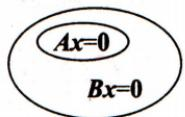
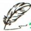
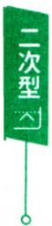
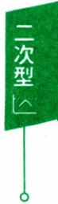

【例4.14】设有两个四元齐次线性方程组

(1) $x_{1} + x_{2} = 0, \quad x_{2} - x_{3} = 0;$ (I) $\begin{cases}x_{1} - x_{2} + x_{3} = 0, \\x_{2} - x_{3} + x_{4} = 0,\end{cases}$

试问方程组（Ⅰ）和(Ⅱ）是否有非零公共解？若有，则求出所有的非零公共解；若没有，则说明理由

解关于公共解，可以有几种处理方法：

(方法一) 把(Ⅰ)(Ⅱ)联立起来直接求解，即

$$
\boldsymbol{A} = \begin{bmatrix} 1 & 1 & 0 & 0 \\ 0 & 1 & 0 & - 1 \\ 1 & - 1 & 1 & 0 \\ 0 & 1 & - 1 & 1 \end{bmatrix} \rightarrow \begin{bmatrix} 1 & 1 & 0 & 0 \\ 0 & 1 & 0 & - 1 \\ 0 & - 2 & 1 & 0 \\ 0 & 0 & - 1 & 2 \end{bmatrix} \rightarrow \begin{bmatrix} 1 & 0 & 0 & 1 \\ 0 & 1 & 0 & - 1 \\ 0 & 0 & 1 & - 2 \\ 0 & 0 & 0 & 0 \end{bmatrix},
$$

由于 $n - r(\boldsymbol{A}) = 1$ ,故基础解系是 $(-1,1,2,1)^{\mathrm{T}}$ ，从而有(I)(Ⅱ)的非零公共解为 $k(-1,1,2,1)^{\mathrm{T}},k$ 是任意非零实数.

(方法二) 通过(Ⅰ)与(Ⅱ)各自的通解，寻找非零公共解.为此，先分别求（Ⅰ）和(Ⅱ）的基础解系为

$$
\begin{align*}(  I  ) \boldsymbol{\xi}_{1} &= (0,0,1,0)^{\mathrm{T}}, \boldsymbol{\xi}_{2} = (-1,1,0,1)^{\mathrm{T}}, \\(  II  ) \boldsymbol{\eta}_{1} &= (0,1,1,0)^{\mathrm{T}}, \boldsymbol{\eta}_{2} = (-1,-1,0,1)^{\mathrm{T}},\end{align*}
$$

从而 $k_{1} \boldsymbol{\xi}_{1} + k_{2} \boldsymbol{\xi}_{2}, l_{1} \boldsymbol{\eta}_{1} + l_{2} \boldsymbol{\eta}_{2}$ 分别是（Ⅰ)，(Ⅱ）的通解，令其相等，即有$k_{1}(0,0,1,0)^{\mathrm{T}} + k_{2}(-1,1,0,1)^{\mathrm{T}} = l_{1}(0,1,1,0)^{\mathrm{T}} + l_{2}(-1,-1,0,1)^{\mathrm{T}}$

$$
\left( - k _ { 2 } , k _ { 2 } , k _ { 1 } , k _ { 2 } \right) ^ { \mathrm { T } } = \left( - l _ { 2 } , l _ { 1 } - l _ { 2 } , l _ { 1 } , l _ { 2 } \right) ^ { \mathrm { T } } ,
$$

比较两个向量的对应分量得 $k_{1} = l_{1} = 2k_{2} = 2l_{2}$ .令 $k_{2} = t$ ，所以非零公共解是

$2t(0,0,1,0)^{\mathrm{T}}+t(-1,1,0,1)^{\mathrm{T}}=t(-1,1,2,1)^{\mathrm{T}}$ t 为任意非零实数.

(方法三)把(Ⅰ）的通解代入（Ⅱ）中，如果仍是解，寻找 $k_{1},k_{2}$ 所应满足的关系式而求出公共解.

由(Ⅰ)的解 $k_{1} \boldsymbol{\xi}_{1} + k_{2} \boldsymbol{\xi}_{2} = (-k_{2}, k_{2}, k_{1}, k_{2})^{\mathrm{T}}$ 是(Ⅱ)的解，那么应满足（Ⅱ）的方程，故

$$
\left\{ \begin{aligned} - k_{2} - k_{2} + k_{1} &= 0, \\ k_{2} - k_{1} + k_{2} &= 0, \end{aligned} \right.
$$

解出 $k_{1} = 2k_{2}$ ，于是（I）和(Ⅱ）的非零公共解：

$$
2k\xi_{1}+k\xi_{2}=2k(0,0,1,0)^{\mathrm{T}}+k(-1,1,0,1)^{\mathrm{T}}=k(-1,1,2,1)^{\mathrm{T}}
$$

k为任意非零实数.

展示新知

\*表示有改编

【例4:15】（2002,4)已知四元齐次线性方程组（Ⅰ）和（Ⅱ）的基础解系分别是 $\left( \mathrm{I} \right) \boldsymbol{a}_{1} = \left( 5, - 3,1,0 \right)^{\mathrm{T}}, \boldsymbol{a}_{2} = \left( - 3,2,0,1 \right)^{\mathrm{T}}$ 和 $( 1 1 ) B _ { 1 } =$ $\left( 2 , - 1 , a + 2 , 1 \right) ^ { \mathrm { T } } , \beta _ { 2 } = \left( - 1 , 2 , 4 , a + 8 \right) ^ { \mathrm { T } }$ 求方程组(Ⅰ)和(Ⅱ)的非零公共解.

解设γ是方程组（Ⅰ）和（Ⅱ）的非零公共解，则

$\boldsymbol{\gamma}=k_{1} \boldsymbol{\alpha}_{1}+k_{2} \boldsymbol{\alpha}_{2}=l_{1} \boldsymbol{\beta}_{1}+l_{2} \boldsymbol{\beta}_{2}, k_{i}$ 与 $l _ { j }$ 不全为0，

学习札记

则 $k_{1} \boldsymbol{\alpha}_{1} + k_{2} \boldsymbol{\alpha}_{2} - l_{1} \boldsymbol{\beta}_{1} - l_{2} \boldsymbol{\beta}_{2} = \mathbf{0}.$

记 $\boldsymbol{A} = \left[ \boldsymbol{\alpha}_{1} , \boldsymbol{\alpha}_{2} , - \boldsymbol{\beta}_{1} , - \boldsymbol{\beta}_{2} \right]$

$$
\boldsymbol{A} = \begin{bmatrix} 5 & -3 & -2 & 1 \\ -3 & 2 & 1 & -2 \\ 1 & 0 & -a-2 & -4 \\ 0 & 1 & -1 & -a-8 \end{bmatrix} \rightarrow \begin{bmatrix} 1 & 0 & -a-2 & -4 \\ 0 & 1 & -1 & -a-8 \\ 0 & 0 & -3a-3 & 2a+2 \\ 0 & 0 & 5a+5 & -3a-3 \end{bmatrix}\tag{}
$$

$\gamma \ne 0 \Leftrightarrow r(A) < 4 \Leftrightarrow a = -1$ ,对① 求出通解 $(t + 4u, t + 7u, t, u)^{\mathrm{T}}$ ,故

$$
\boldsymbol { \gamma } = ( t + 4 u ) \boldsymbol { \alpha } _ { 1 } + ( t + 7 u ) \boldsymbol { \alpha } _ { 2 } = t \boldsymbol { \beta } _ { 1 } + u \boldsymbol { \beta } _ { 2 } .
$$

故a=—1时，(I）与(Ⅱ）的非零公共解为

$t(2,-1,1,1)^{\mathrm{T}} + u(-1,2,4,7)^{\mathrm{T}},t,u$ 不全为0.

或 $\gamma = l_{1} \boldsymbol{\beta}_{1} + l_{2} \boldsymbol{\beta}_{2}$ 是公共解 $\Leftrightarrow l_{1} \boldsymbol{\beta}_{1}+l_{2} \boldsymbol{\beta}_{2}$ 可由 $\boldsymbol{\alpha}_{1}, \boldsymbol{\alpha}_{2}$ 线性表出.

设 $x_{1}\boldsymbol{\alpha}_{1} + x_{2}\boldsymbol{\alpha}_{2} = l_{1}\boldsymbol{\beta}_{1} + l_{2}\boldsymbol{\beta}_{2}$

$$
\begin{bmatrix} 5 & - 3 & \vdots & 2l_{1} - l_{2} \\ - 3 & 2 & \vdots & - l_{1} + 2l_{2} \\ 1 & 0 & \vdots & (a + 2)l_{1} + 4l_{2} \\ 0 & 1 & l_{1} + (a + 8)l_{2} \end{bmatrix} \rightarrow \begin{bmatrix} 1 & 0 & \vdots & (a + 2)l_{1} + 4l_{2} \\ 0 & 1 & \vdots & l_{1} + (a + 8)l_{2} \\ 0 & 0 & \vdots & (3a + 3)l_{1} - (2a + 2)l_{2} \\ 0 & 0 & \vdots & (- 5a - 5)l_{1} + (3a + 3)l_{2} \end{bmatrix}.\tag{②}
$$

方程组②有解 $\Leftrightarrow a = - 1$ ,解出

$$
x_{1} = l_{1} + 4l_{2}, x_{2} = l_{1} + 7l_{2}.
$$

线性方程组

展示新知

【例4.16】 $( 2 0 0 7 , \frac { 1 , 2 } { 3 , 4 } )$ 设线性方程组

$$
\begin{cases}x_{1} + x_{2} + x_{3} = 0, \\x_{1} + 2x_{2} + ax_{3} = 0, \\x_{1} + 4x_{2} + a^{2}x_{3} = 0\end{cases}\tag{①}
$$

与方程

$$
x_{1} + 2x_{2} + x_{3} = a - 1\tag{②}
$$

有公共解，求a的值及所有公共解.

解因为方程组①与②的公共解即为联立方程组

$$
\begin{cases}x_{1} + x_{2} + x_{3} = 0, \\x_{1} + 2x_{2} + ax_{3} = 0, \\x_{1} + 4x_{2} + a^{2}x_{3} = 0, \\x_{1} + 2x_{2} + x_{3} = a - 1\end{cases}\tag{③}
$$

的解，对增广矩阵加减消元有

学习札记

线性方程组

$$
\overline{\boldsymbol{A}} = \begin{bmatrix}1 & 1 & 1 \vdots & 0 \\1 & 2 & a \vdots & 0 \\1 & 4 & a^2 \vdots & 0 \\1 & 2 & 1 \vdots a - 1\end{bmatrix}\rightarrow\begin{bmatrix}1 & 1 & 1 \vdots & 0 \\0 & 1 & a - 1 \vdots & 0 \\0 & 3 & a^2 - 1 \vdots & 0 \\0 & 1 & 0 & \vdots a - 1\end{bmatrix}
$$

$$
\begin{aligned}\rightarrow\begin{bmatrix}1 & 1 & 1 & \vdots & 0 \\0 & 1 & a-1 & \vdots & 0 \\0 & 0 & (a-1)(a-2) & \vdots & 0 \\0 & 0 & 1-a & \vdots & a-1\end{bmatrix}\rightarrow\begin{bmatrix}1 & 1 & 1 & \vdots & 0 \\0 & 1 & a-1 & \vdots & 0 \\0 & 0 & 1-a & \vdots & a-1 \\0 & 0 & 0 & \vdots & (a-1)(a-2)\end{bmatrix}.\end{aligned}
$$

当 $a \ne 1$ 且 $a \ne 2$ 时，方程组无解，从而①与②没有公共解.

当 $a = 1$ 时，

$$
\overline{\boldsymbol{A}} \rightarrow \begin{bmatrix} 1 & 0 & 1 \vdots 0 \\ 0 & 1 & 0 \vdots 0 \\ 0 & 0 & 0 \vdots 0 \\ 0 & 0 & 0 \vdots 0 \end{bmatrix},
$$

方程组的通解是 $k(1,0,-1)^{\mathrm{T}}$ ，即①与②的公共解是 $k(1,0,-1)^{\mathrm{T}}$ ,k是任意常数.

当 $a = 2$ 时，

$$
\overline{\boldsymbol{A}} \rightarrow \begin{bmatrix} 1 & 0 & 0 \vdots & 0 \\ 0 & 1 & 0 \vdots & 1 \\ 0 & 0 & 1 \vdots & -1 \\ 0 & 0 & 0 \vdots & 0 \end{bmatrix},
$$

方程组有唯一解 $(0,1,-1)^{\mathrm{T}}$ ，即①与②的公共解是 $(0,1,-1)^{\mathrm{T}}$

【评注】本题也可先计算方程组①的系数行列式

$$
\begin{vmatrix} 1 & 1 & 1 \\ 1 & 2 & a \\ 1 & 4 & a ^ { 2 } \end{vmatrix} = ( a - 1 ) ( a - 2 ) ,
$$

然后分情况讨论.

当 $a \ne 1$ 且 $a \ne 2$ 时，方程组①只有零解.

练习(2025，2)设三阶矩阵A，B满足 $r(\boldsymbol{A}\boldsymbol{B}) = r(\boldsymbol{B}\boldsymbol{A}) + 1$ ,则

(A) 方程组 $( \boldsymbol{A} + \boldsymbol{B} ) \boldsymbol{x} = \boldsymbol{0}$ 只有零解.

(B) 方程组 $Ax = \mathbf{0}$ 与方程组 $\boldsymbol{B} \boldsymbol{x} = \boldsymbol{0}$ 均只有零解.

(C) 方程组 $Ax = \mathbf{0}$ 与方程组 $\boldsymbol{B} \boldsymbol{x} = \boldsymbol{0}$ 没有公共非零解.

(D)方程组 $\boldsymbol{A}\boldsymbol{B}\boldsymbol{A}\boldsymbol{x} = \boldsymbol{0}$ 与方程组 $BABx = 0$ 有公共非零解.

解题笔记

提示 对于方程组(I)和(Ⅱ)，如果α是(Ⅰ)的解，则α必是(Ⅱ)的解；反过来，如果α是(Ⅱ）的解，则α也必是（Ⅰ）的解，则称(I)与(Ⅱ)同解.

(1)Ax = 0 的解全是 $\boldsymbol{B} \boldsymbol{x} = \boldsymbol{0}$ 的解，即

$\left\{ \begin{aligned} \boldsymbol{A}\boldsymbol{x} = \boldsymbol{0} \\ \boldsymbol{B}\boldsymbol{x} = \boldsymbol{0} \end{aligned} \right.$ 与 Ax = 0 同解，

$$
r \binom{\boldsymbol{A}}{\boldsymbol{B}} = r(\boldsymbol{A}) > r(\boldsymbol{B})
$$

B的行向量可由A的行向量线性表示.

【评注】

$$
\left\{ \begin{aligned} \boldsymbol{B} \boldsymbol{x} = \boldsymbol{0} \end{aligned} \right\} \subset \left\{ \boldsymbol{A} \boldsymbol{B} \boldsymbol{x} = \boldsymbol{0} \right\},
$$

(2) $Ax = \mathbf{0}$ 与 $\boldsymbol{B} \boldsymbol{x} = \boldsymbol{0}$ 同解，即

$$
A \alpha = 0 \Leftrightarrow B \alpha = 0 ,
$$

$$
r \binom{\boldsymbol{A}}{\boldsymbol{B}} = r(\boldsymbol{A}) = r(\boldsymbol{B})   ,
$$

$Ax = 0, Bx = 0$ 基础解系等价.

A,B行向量组等价.

展示新知

【例4.17】（2025,1)设矩阵 $\boldsymbol{A} = \begin{bmatrix} 4 & 2 & - 3 \\ a & 3 & - 4 \\ b & 5 & - 7 \end{bmatrix}.$ 若方程组 $A ^ { 2 } x =$ 0与 $Ax = 0$ 不同解，则 $a = \frac { 1 } { 2 }$

解如果 Aα = 0,则 $\boldsymbol{A}^{2} \boldsymbol{\alpha} = \boldsymbol{0}$ ,即

$$
\left\{ A x = 0 \right\} \subset \left\{ A ^ { 2 } x = 0 \right\}
$$

因Ax = 0 与 $\boldsymbol{A}^{2} \boldsymbol{x} = \boldsymbol{0}$ 不同解，故

$$
r(A)<3  且  r(A^{2})<r(A).
$$

又A中存在2阶子式不为0，即有

$$
r(\boldsymbol{A}) = 2, r(\boldsymbol{A}^2) = 1.
$$

因此， $\left| \boldsymbol{A} \right| = \left| \begin{matrix} 4 & 2 & - 3 \\ a & 3 & - 4 \\ b & 5 & - 7 \end{matrix} \right| = \left| \begin{matrix} 4 + a - b & 0 & 0 \\ a & 3 & - 4 \\ b & 5 & - 7 \end{matrix} \right| = 0$ ,可得 $b = a + 4$

$$
\begin{aligned} &\therefore \boldsymbol{A}^{2} = \begin{bmatrix} 4 & 2 & -3 \\ a & 3 & -4 \\ a+4 & 5 & -7 \end{bmatrix} \begin{bmatrix} 4 & 2 & -3 \\ a & 3 & -4 \\ a+4 & 5 & -7 \end{bmatrix} = \begin{bmatrix} 4-a & -1 & 1 \\ 3a-16 & 2a-11 & 16-3a \\ 2a-12 & 2a-12 & 17-3a \end{bmatrix}\\ \end{aligned}
$$

由 $r(\boldsymbol{A}^{2}) = 1$ ,可得 $a = 5$

线性方程组

展示新知

【例4.18】 $( 2 0 0 5 , \frac { 3 } { 4 } )$ 已知齐次方程组

$\begin{cases}x_{1} + 2x_{2} + 3x_{3} = 0, \\2x_{1} + 3x_{2} + 5x_{3} = 0, \\x_{1} + x_{2} + ax_{3} = 0\end{cases}$ $\begin{cases}x_{1} + bx_{2} + cx_{3} = 0, \\2x_{1} + b^{2}x_{2} + (c + 1)x_{3} = 0\end{cases}$

同解，求 $a , b , c$ 的值.

解因为方程组（Ⅱ）中方程的个数小于未知量的个数，故方程组（Ⅱ）必有无穷多解.那么由（Ⅰ）与(Ⅱ)同解，知方程组(Ⅰ)必有无穷多解.于是

$$
\left| \boldsymbol{A} \right| = \left| \begin{matrix} 1 & 2 & 3 \\ 2 & 3 & 5 \\ 1 & 1 & a \end{matrix} \right| = 2 - a = 0,
$$

从而 $a = 2 .$ 此时方程组（Ⅰ）的系数矩阵可化为

$$
\boldsymbol{A} = \begin{bmatrix} 1 & 2 & 3 \\ 2 & 3 & 5 \\ 1 & 1 & 2 \end{bmatrix} \rightarrow \begin{bmatrix} 1 & 0 & 1 \\ 0 & 1 & 1 \\ 0 & 0 & 0 \end{bmatrix},
$$

故（Ⅰ）的通解是 $k(-1,-1,1)^{\mathrm{T}}$ .把 $x_{1} = - k, x_{2} = - k, x_{3} = k$ 代入方程组(Ⅱ),有

$$
\left\{ \begin{aligned} & ( - 1 - b + c ) k = 0 , \\ & ( - 2 - b ^ { 2 } + c + 1 ) k = 0 , \end{aligned} \right.
$$

从而 $b^{2} - b = 0$ ,可得 $b = 1 , c = 2$ 或 $b = 0 , c = 1$

当 $b = 1 , c = 2$ 时，对方程组（Ⅱ）的系数矩阵B作初等行变换，有

$$
\boldsymbol{B} = \begin{bmatrix} 1 & 1 & 2 \\ 2 & 1 & 3 \end{bmatrix} \rightarrow \begin{bmatrix} 1 & 0 & 1 \\ 0 & 1 & 1 \end{bmatrix},
$$

故方程组（Ⅰ）与（Ⅱ）同解.

当 $b = 0 , c = 1$ 时， $\boldsymbol{B} = \begin{bmatrix} 1 & 0 & 1 \\ 2 & 0 & 2 \end{bmatrix} \rightarrow \begin{bmatrix} 1 & 0 & 1 \\ 0 & 0 & 0 \end{bmatrix}$ ,故方程组(Ⅰ)与(Ⅱ)不同解.

综上所述，当 $a=2,b=1,c=2$ 时，方程组（Ⅰ）与（Ⅱ）同解.

展示新知

【例4.19】（1998,4局部）已知方程组（Ⅰ)，（Ⅱ）

$$
\begin{aligned}(  I  )\left\{\begin{aligned}x_{1} + x_{2} - 2x_{4} = - 6, \\4x_{1} - x_{2} - x_{3} - x_{4} = 1, \\3x_{1} - x_{2} - x_{3} = 3.\end{aligned}\right. \\(  II  )\left\{\begin{aligned}x_{1} + mx_{2} - x_{3} - x_{4} = - 5, \\nx_{2} - x_{3} - 2x_{4} = - 11, \\x_{3} - 2x_{4} = - 4 + 1.\end{aligned}\right.\end{aligned}
$$

同解，求 $m , n , t .$

解方程组（Ⅰ)(Ⅱ)分别记为 $Ax = \alpha, Bx = \beta.$

$Ax = \boldsymbol{a}$ 与 $\boldsymbol{B}\boldsymbol{x} = \boldsymbol{\beta}$ 同解

字习札记

$\Leftrightarrow \left[ \boldsymbol{A} , \boldsymbol{\alpha} \right] \xrightarrow{ 行 } \left[ \boldsymbol{B} , \boldsymbol{\beta} \right]$ ，即行向量组等价.

$$
\begin{bmatrix} \boldsymbol{A} & \boldsymbol{\alpha} \\ \boldsymbol{B} & \boldsymbol{\beta} \end{bmatrix} = \begin{bmatrix} 1 & 1 & 0 & - 2 \vdots & - 6 \\ 4 & - 1 & - 1 & - 1 \vdots & 1 \\ 3 & - 1 & - 1 & 0 & \vdots & 3 \\ 1 & m & - 1 & - 1 \vdots & - 5 \\ 0 & n & - 1 & - 2 \vdots & - 1 1 \\ 0 & 0 & 1 & - 2 \vdots & t + 1 \end{bmatrix} \rightarrow \cdots \rightarrow \begin{bmatrix} 1 & 0 & 0 & - 1 & \vdots & - 2 \\ 0 & 1 & 0 & - 1 & \vdots & - 4 \\ 0 & 0 & 1 & - 2 & \vdots & - 5 \\ 0 & 0 & 0 & m - 2 \vdots & 4m - 8 \\ 0 & 0 & 0 & n - 4 \vdots & 4n - 16 \\ 0 & 0 & 0 & 0 & \vdots & 6 - t \end{bmatrix},
$$

可得 $m = 2, n = 4, t = 6$

展示新知

【例4.20】 设A是m×n阶矩阵，证明齐次线性方程组 $( \mathrm { I } ) A ^ { \mathrm { T } } A x =$ $( 1 ) A x = 0$ 同解.

证明如果α是（Ⅱ）的解，则 $A \boldsymbol{\alpha} = \boldsymbol{0}.$ 显然 $\boldsymbol{A}^{\mathrm{T}} \boldsymbol{A} \boldsymbol{x} = \boldsymbol{0}$ ,即α是(I)的解，故（Ⅱ）的解全是（Ⅰ）的解.

若α是(I)的解，即 $\boldsymbol{A}^{\mathrm{T}} \boldsymbol{A} \boldsymbol{\alpha} = \boldsymbol{0}$ ,那么 $\boldsymbol{\alpha}^{\mathrm{T}} \boldsymbol{A}^{\mathrm{T}} \boldsymbol{A} \boldsymbol{\alpha} = 0$ ,即 $( \boldsymbol{A} \boldsymbol{\alpha} )^{\top} ( \boldsymbol{A} \boldsymbol{\alpha} ) = 0$ 从而= $\boldsymbol{A} \boldsymbol{\alpha} \parallel^{2} = 0$ ,故 $A \boldsymbol{\alpha} = \boldsymbol{0},$ 所以α必是(Ⅱ)的解，即(I)的解全是(Ⅱ)的解.

综上所述，方程组（Ⅰ）与（Ⅱ）同解.

【评注】若 $\boldsymbol{\alpha} = (a_{1}, a_{2}, \cdots, a_{n})^{\mathrm{T}}$ ,则

$$
\boldsymbol{\alpha}^{\mathrm{T}} \boldsymbol{\alpha} = (a_{1}, a_{2}, \cdots, a_{n}) \begin{bmatrix} a_{1} \\ a_{2} \\ \vdots \\ a_{n} \end{bmatrix} = a_{1}^{2} + a_{2}^{2} + \cdots + a_{n}^{2},
$$

那么

$$
\begin{aligned}\boldsymbol{\alpha}^{\mathrm{T}} \boldsymbol{\alpha} = 0 \Leftrightarrow a_{i} &= 0 (i = 1,2,\cdots,n) \\\Leftrightarrow \boldsymbol{\alpha} &= 0.\end{aligned}
$$

由 $( \boldsymbol{A} \boldsymbol{\alpha} )^{\mathrm{T}} ( \boldsymbol{A} \boldsymbol{\alpha} ) = 0$ 要看出 $\boldsymbol{A}\boldsymbol{\alpha} = \boldsymbol{0}$

因为(Ⅰ)与(Ⅱ)同解，它们的基础解系所含解向量个数相同，即有

$$
n - r(\boldsymbol{A}^{\mathrm{T}} \boldsymbol{A}) = n - r(\boldsymbol{A})
$$

故 $r(\boldsymbol{A}^{\mathrm{T}} \boldsymbol{A}) = r(\boldsymbol{A})$

2012年的考题就是希望考生用公式 $r(\boldsymbol{A}^{\mathrm{T}} \boldsymbol{A}) = r(\boldsymbol{A})$ 来处理二次型的秩的.

练习 1 已知 A是m× n矩阵，B是 n×s矩阵，若 r(A)= n，证明$A B x = 0$ 与 Bx = 0 同解.解题笔记

练习2(2022,1)\*设A,B为n阶矩阵，且Ax=0与 $\boldsymbol{B} \boldsymbol{x} = \boldsymbol{0}$ 同解，证 明 $\left[ \begin{matrix} { \boldsymbol { A } } & { \boldsymbol { B } } \\ { \boldsymbol { O } } & { \boldsymbol { B } } \\ \end{matrix} \right] \boldsymbol { y } = \boldsymbol { 0 }$ 与 $\left[ \begin{matrix} { \boldsymbol { B } } & { \boldsymbol { A } } \\ { \boldsymbol { O } } & { \boldsymbol { A } } \\ \end{matrix} \right] \boldsymbol { y } = \boldsymbol { 0 }$ 同解.

解题笔记

## 方程组的应用

## 展示新知

【例4.21】 $(2013, \frac{1}{2,3})$ 设 $\boldsymbol{A} = \begin{bmatrix} 1 & a \\ 1 & 0 \end{bmatrix}, \boldsymbol{B} = \begin{bmatrix} 0 & 1 \\ 1 & b \end{bmatrix}$ 当a,b为何值时，存在矩阵C使得 $AC - CA = B?$ 并求所有矩阵C.

解设 $\boldsymbol{C} = \begin{bmatrix} x_{1} & x_{2} \\ x_{3} & x_{4} \end{bmatrix}$ ,由 $AC - CA = B$ 得

$$
\begin{bmatrix} 1 & a \\ 1 & 0 \end{bmatrix} \begin{bmatrix} x_1 & x_2 \\ x_3 & x_4 \end{bmatrix} - \begin{bmatrix} x_1 & x_2 \\ x_3 & x_4 \end{bmatrix} \begin{bmatrix} 1 & a \\ 1 & 0 \end{bmatrix} = \begin{bmatrix} 0 & 1 \\ 1 & b \end{bmatrix},
$$

即

亦即

$$
\begin{aligned}\left[x_{1}+ax_{3}\quad x_{2}+ax_{4}\quad\right]-\left[x_{1}+x_{2}\quad ax_{1}\quad\right]=\left[0\quad1\quad\right], \\x_{1}\quad x_{2}\quad x_{3}\quad x_{4}\quad x_{5}\quad x_{6}\quad x_{7}\quad x_{8}\quad x_{9}\quad x_{10}\quad x_{11}\quad x_{12}\quad x_{13}\quad x_{14}\quad x_{15}\quad x_{16}\quad x_{17}\quad x_{17}\quad x_{18}\quad x_{18}\quad x_{17}\quad x_{18}\quad x_{18}\quad x_{19}\quad x_{18}\quad x_{19}\quad x_{18}\quad x_{19}\quad x_{19}\quad x_{18}\quad x_{19}\quad x_{19}\quad x_{18}\quad x_{19}\quad x_{19}\quad x_{19}\quad x_{19}\quad x_{18}\quad x_{19}\quad x_{19}\quad x_{19}\quad x_{19}\quad x_{19}\quad x_{19}\quad x_{19}\quad x_{19}\quad x_{19}\quad x_{19}\quad x_{19}\quad x_{19}\quad x_{19}\quad x_{19}\quad x_{19}\quad x_{19}\quad x_{19}\quad x_{19}\quad x_{19}\quad x_{19}\quad x_{19}\quad x_{19}\quad x_{19}\quad x_{19}\quad x_{19}\quad x_{19}\quad x_{19}\quad x_{19}\quad x_{19}\quad x_{19}\quad x_{19}\quad x_{19}\quad x_{19}\quad x_{19}\quad x_{19}\quad x_{19}\quad x_{19}\quad x_{19}\quad x_{19}\quad x_{19}\quad x_{19}\quad x_{19}\quad x_{19}\quad x_{19}\quad x_{19}\quad x_{19}\quad x_{19}\quad x_{19}\quad x_{19}\quad x_{19}\quad x_{19}\quad x_{19}\quad x_{19}\quad x_{19}\quad x_{19}\quad x_{19}\quad x_{19}\quad x_{19}\quad x_{19}\quad x_{19}\quad x_{19}\quad x_{19}\quad x_{19}\quad x_{19}\quad x_{19}\quad x_{19}\quad x_{19}\quad x_{19}\quad x_{19}\quad x_{19}\quad x_{19}\quad x_{19}\quad x_{19}\quad x_{19}\quad x_{19}\quad x_{19}\quad x_{19}\quad x_{19}\quad x_{19}\quad x_{19}\quad x_{19}\quad x_{19}\quad x_{19}\quad x_{19}\quad x_{19}\quad x_{19}\quad x_{19}\quad x_{19}\quad x_{19}\quad x_{19}\quad x_{19}\quad x_{19}\quad x_{19}\quad x_{19}\quad x_{19}\quad x_{19}\quad x_{19}\quad x_{19}\quad x_{19}\quad x_{19}\quad x_{19}\quad x_{19}\quad x_{19}\quad x_{19}\quad x_{19}\quad x_{19}\quad x_{19}\quad x_{19}\quad x_{19}\quad x_{19}\quad x_{19}\quad x_{19}\quad x_{19}\quad x_{19}\quad x_{19}\quad x_{19}\quad x_{19}\quad x_{19}\quad x_{19}\quad x_{19}\quad x_{19}\quad x_{19}\quad x_{19}\quad x_{19}\quad x_{19}\quad x_{19}\quad x_{19}\quad x_{19}\quad x_{19}\quad x_{19}\quad x_{19}\quad x_{19}\quad x_{1}\quad x_{1}\quad x_{1}\quad x_{1}\quad x_{1}\quad x_{1}\quad x_{1}\quad x_{1}\quad x_{1}\quad x_{1}\quad x_{1}\quad x_{1}\quad x_{1}\quad x_{1}\quad x_{1}\ \end{aligned}
$$

对增广矩阵作初等行变换，有

字习札记

$$
\overline{\boldsymbol{A}} = \begin{bmatrix}0 & -1 & a & 0 & \vdots 0 \\-a & 1 & 0 & a & \vdots 1 \\1 & 0 & -1 & -1 & \vdots 1 \\0 & 1 & -a & 0 & \vdots b\end{bmatrix} \rightarrow \begin{bmatrix}1 & 0 & -1 & -1 & \vdots & 1 \\0 & 1 & -a & 0 & \vdots & 0 \\0 & 0 & 0 & 0 & \vdots & a+1 \\0 & 0 & 0 & 0 & \vdots & b\end{bmatrix},
$$

当 $a \ne -1$ 或 $b \ne 0$ 时，方程组无解.

当 $a = -1$ 且 $b = 0$ 时，方程组有解，此时存在矩阵C满足 $AC - CA =$ B. 由于方程组的通解为

$$
\begin{bmatrix} x_{1} \\ x_{2} \\ x_{3} \\ x_{4} \end{bmatrix} = \begin{bmatrix} 1 \\ 0 \\ 0 \\ 0 \end{bmatrix} + k_{1} \begin{bmatrix} 1 \\ -1 \\ 1 \\ 0 \end{bmatrix} + k_{2} \begin{bmatrix} 1 \\ 0 \\ 0 \\ 1 \end{bmatrix} , k_{1} , k_{2}
$$

故当且仅当 $a = -1, b = 0$ 时，存在矩阵

$$
\boldsymbol { C } = \begin{bmatrix} 1 + k _ { 1 } + k _ { 2 } & - k _ { 1 } \\ k _ { 1 } & k _ { 2 } \end{bmatrix},
$$

满足 $AC - CA = B$

【评注】这是考得比较差的一道题，难度系数为0.368，0.389，0.460，计算上的失误也非常严重，希望大家复习时要重视基本计算.

展示新知

【例4.22】已知 $\boldsymbol{A} = \begin{bmatrix} 1 & 1 & 1 \\ 0 & 1 & -1 \\ 2 & 3 & a \end{bmatrix}$ 和 $\boldsymbol{B} = \begin{bmatrix} 1 & -1 & 2 \\ 2 & 2 & 1 \\ a+3 & 0 & a+4 \end{bmatrix}$ 知

$A x = 0$ 有非零解且A经列变换能得到矩阵B.

(1)求a的值；

(2)求满足 $A P = B$ 的可逆矩阵P；

(3)A 能否经行变换得到矩阵 $B 9$ 请说明理由.

解（1） $\boldsymbol{A}\boldsymbol{x} = \boldsymbol{0}$ 有非零解，故

$$
\left| \boldsymbol{A} \right| = \left| \begin{matrix} 1 & 1 & 1 \\ 0 & 1 & - 1 \\ 2 & 3 & a \end{matrix} \right| = a - 1 = 0.
$$

$\therefore a = 1$

(2) 对(A，B)作初等行变换化为行最简，得

$$
\left( \boldsymbol { A } , \boldsymbol { B } \right) = \begin{bmatrix} 1 & 1 & 1 & \vdots & 1 & - 1 & 2 \\ 0 & 1 & - 1 & 2 & 2 & 1 \\ 2 & 3 & 1 & \vdots & 4 & 0 & 5 \end{bmatrix} \rightarrow \begin{bmatrix} 1 & 0 & 2 & \vdots & - 1 & - 3 & 1 \\ 0 & 1 & - 1 & \vdots & 2 & 2 & 1 \\ 0 & 0 & 0 & \vdots & 0 & 0 & 0 \end{bmatrix}.
$$

记 $\boldsymbol{B} = (\boldsymbol{\beta}_{1}, \boldsymbol{\beta}_{2}, \boldsymbol{\beta}_{3})$ ，则方程组 $A x = \beta _ { 1 } , A y = \beta _ { 2 } , A z = \beta _ { 3 }$ 的通解依次为

故 $\boldsymbol{A}\boldsymbol{X} = \boldsymbol{B}$ 的解为

$$
\boldsymbol{X} = \begin{bmatrix} -1 - 2k_{1} & -3 - 2k_{2} & 1 - 2k_{3} \\ 2 + k_{1} & 2 + k_{2} & 1 + k_{3} \\ k_{1} & k_{2} & k_{3} \end{bmatrix}.
$$

因 $\boldsymbol{X} \mid = - 5k_{1} + 3k_{2} + 4k_{3}$ ,所以满足 $\boldsymbol{A}\boldsymbol{P} = \boldsymbol{B}$ 的可逆矩阵P为

$$
\boldsymbol{P}=\left[-1-2k_{1}-3-2k_{2}-1-2k_{3}\right],5k_{1}-3k_{2}-4k_{3}\neq0.
$$

(3) $Ax = 0$ 的通解是 $k(-2,1,1)^{\top}$ ,而 $(-2,1,1)^{\top}$ 不是 $\boldsymbol{B} \boldsymbol{x} = \boldsymbol{0}$ 的解.  
即 $Ax = \mathbf{0}$ 与 $\boldsymbol{B} \boldsymbol{x} = \boldsymbol{0}$ 不同解.

亦即A,B行向量组不等价，所以A不能经行变换得到B.

或由 $r \binom{\boldsymbol{A}}{\boldsymbol{B}} = r \left[ \begin{aligned} 1 & \quad 1 & \quad 1 \\ 0 & \quad 1 & \quad -1 \\ 2 & \quad 3 & \quad 1 \\ 1 & \quad -1 & \quad 2 \\ 2 & \quad 2 & \quad 1 \\ 4 & \quad 0 & \quad 5 \end{aligned} \right] = 3$ 而 $r(\boldsymbol{A}) = r(\boldsymbol{B}) = 2.$

即A，B行向量组不等价，故A不能经行变换得到B.

【例4.23】（2000,3）设向量组 $\boldsymbol{\alpha}_{1}=(a,2,10)^{\mathrm{T}}, \boldsymbol{\alpha}_{2}=(-2,1,5)^{\mathrm{T}}$ $\boldsymbol{\alpha}_{3}=(-1,1,4)^{\mathrm{T}}, \boldsymbol{\beta}=(1,b,c)^{\mathrm{T}}$ .试问当 $a , b , c$ 满足什么条件时

(1)β可由 $a _ { 1 } , a _ { 2 } , a _ { 3 }$ 线性表出，且表示唯一？

(2)β不能由 $\alpha_{1}, \alpha_{2}, \alpha_{3}$ 线性表出？

(3)β可由 $\alpha_{1}, \alpha_{2}, \alpha_{3}$ 线性表出，但表示法不唯一?并写出一般表达式.

解设 $x_{1}\boldsymbol{\alpha}_{1} + x_{2}\boldsymbol{\alpha}_{2} + x_{3}\boldsymbol{\alpha}_{3} = \boldsymbol{\beta}.$ 由系数行列式

$$
\left| \boldsymbol{A} \right| = \left| \boldsymbol{\alpha}_{1}, \boldsymbol{\alpha}_{2}, \boldsymbol{\alpha}_{3} \right| = \left| \begin{matrix} a & - 2 & - 1 \\ 2 & 1 & 1 \\ 10 & 5 & 4 \end{matrix} \right| = \left| \begin{matrix} a + 4 & - 2 & - 1 \\ 0 & 1 & 1 \\ 0 & 5 & 4 \end{matrix} \right| = - a - 4.
$$

(1)当 $a \ne -4$ 时， $\left| \textbf{A} \right| \neq 0$ ，方程组有唯一解.即 $\pmb { \beta }$ 可由 $\boldsymbol{a}_{1}, \boldsymbol{a}_{2}, \boldsymbol{a}_{3}$ 线性 表出，且表示法唯一.

(2)当 $a = -4$ 时，对增广矩阵作初等行变换

$$
\overline{\boldsymbol{A}} = \begin{bmatrix} - 4 & - 2 & - 1 & \vdots & 1 \\ 2 & 1 & 1 & \vdots & b \\ 10 & 5 & 4 & \vdots & c \end{bmatrix} \rightarrow \begin{bmatrix} 2 & 1 & 1 & \vdots & b \\ 0 & 0 & 1 & \vdots & 2b + 1 \\ 0 & 0 & - 1 & \vdots & 5b + c \end{bmatrix} \rightarrow \begin{bmatrix} 2 & 1 & 1 & \vdots & b \\ 0 & 0 & 1 & 2b + 1 \\ 0 & 0 & 0 & \vdots & 3b - c - 1 \end{bmatrix}.
$$

故当 $3b - c \ne 1$ 时 $r(\boldsymbol{A}) = 2, r(\overline{\boldsymbol{A}}) = 3$ ，方程组无解.即 $\pmb { \beta }$ 不能由 $\pmb { \alpha } _ { 1 }$ ，$\boldsymbol{\alpha}_{2}, \boldsymbol{\alpha}_{3}$ 线性表出.

(3) 当a=-4且 $3b - c = 1$ 时，有 $r(\boldsymbol{A}) = r(\overline{\boldsymbol{A}}) = 2 < 3$ ,方程组有无穷多解.

学习札记

$$
\overline{\boldsymbol{A}} \rightarrow \begin{bmatrix} 2 & 1 & 1 \vdots & b \\ 0 & 0 & 1 \vdots & 2b+1 \\ 0 & 0 & 0 \vdots & 0 \end{bmatrix} \rightarrow \begin{bmatrix} 2 & 1 & 0 \vdots & -b-1 \\ 0 & 0 & 1 \vdots & 2b+1 \\ 0 & 0 & 0 \vdots & 0 \end{bmatrix}.
$$

$x_{1}=t \Rightarrow x_{2}=-2t-b-1, x_{3}=2b+1$ ,故

$\boldsymbol{\beta} = t \boldsymbol{\alpha}_{1} - (2t + b + 1) \boldsymbol{\alpha}_{2} + (2b + 1) \boldsymbol{\alpha}_{3} , t$ 为任意常数.

【评注】本题也可用增广矩阵作初等行变换化为阶梯形，再分析 讨论.

## 四、练习题严选

## 1. 填空题

(1) 方程 $x_{1} - 2x_{2} + 3x_{3} - 4x_{4} = 0$ 的通解是

(2) 设矩阵 $\boldsymbol{A} = \begin{bmatrix} 1 & 1 & 2 - a \\ 3 - 2a & 2 - a & 1 \\ 2 - a & 2 - a & 1 \end{bmatrix}, \boldsymbol{b} = \begin{bmatrix} 1 \\ a \\ - 1 \end{bmatrix}$ ,若方程组 $\boldsymbol{A}\boldsymbol{x} = \boldsymbol{b}$ 有解且不唯一，则a=

(3) 已知 $\boldsymbol{\alpha}_{1}, \boldsymbol{\alpha}_{2}, \boldsymbol{\alpha}_{3}$ 是非齐次方程组Ax=β的3个不同的解，若 $a \boldsymbol{\alpha}_{1} +$ $3\boldsymbol{a}_{2} + b\boldsymbol{a}_{3}$ 是 $\boldsymbol{A}\boldsymbol{x} = \boldsymbol{0}$ 的解， $4a\boldsymbol{\alpha}_{1} - 3b\boldsymbol{\alpha}_{2} - \boldsymbol{\alpha}_{3}$ 是 $\boldsymbol{A}\boldsymbol{x} = \boldsymbol{\beta}$ 的解，则a=

(4) 设 $\boldsymbol{a}_{1}, \boldsymbol{a}_{2}, \boldsymbol{a}_{3}$ 是四元非齐次线性方程组Ax = b的3 个解向量，且秩 $r(\mathbf{A}) = 3$ ,若 $\boldsymbol{\alpha}_{1}=(1,2,3,4)^{\mathrm{T}},2\boldsymbol{\alpha}_{2}-3\boldsymbol{\alpha}_{3}=(0,1,-1,0)^{\mathrm{T}}$ ,则方程组 $\boldsymbol{A} \boldsymbol{x} =$ b的通解是

(5) 已知方程组

$$
\begin{cases}2x_{1} - x_{2} + 3x_{3} = 0, \\4x_{1} + 2x_{2} + tx_{3} = 0, \\x_{1} + x_{3} = 0\end{cases}
$$

的系数矩阵是 A. 若B 是三阶非零矩阵且AB = O,则 B =

(6)已知A是三阶矩阵，且 $r(\boldsymbol{A}^{*}) = 1$ .若 $\boldsymbol{\xi}_{1}=(-3,2,0)^{\mathrm{T}}, \boldsymbol{\xi}_{2}=(1$ $0 , 2 ) ^ { \mathrm { T } }$ 是方程组Ax = b 的 2 个解，则方程组Ax = b 的通解是

## 2. 选择题

(1)设齐次线性方程组Ax=0的一个基础解系是 $\eta_{1}, \eta_{2}, \eta_{3}, \eta_{4}$ ,则此方程组的基础解系还可以是

$$
( \mathrm { A } ) \eta _ { 1 } + \eta _ { 2 } , \eta _ { 2 } + \eta _ { 3 } , \eta _ { 3 } + \eta _ { 4 } , \eta _ { 4 } + \eta _ { 1 } .
$$

(B) $\eta _ { 1 } - \eta _ { 2 } , \eta _ { 2 } - \eta _ { 3 } , \eta _ { 3 } + \eta _ { 1 } , \eta _ { 4 } + \eta _ { 1 } .$

(C) $\eta _ { 1 } , \eta _ { 2 } + \eta _ { 3 } , \eta _ { 1 } + \eta _ { 2 } - \eta _ { 3 } + \eta _ { 4 }.$

(D) $\eta_{1} - \eta_{2} , \eta_{2} - \eta_{3} , \eta_{3} - \eta_{4} , \eta_{4} + \eta_{1}$

(2) 设A 是 $m \times n$ 矩阵，秩 $r(\boldsymbol{A}) = n - 2$ ,若 $\boldsymbol{a}_{1}, \boldsymbol{a}_{2}, \boldsymbol{a}_{3}$ 是非齐次线性方程组 Ax = b 的 3 个线性无关的解， $,k_{1},k_{2}$ 为任意常数，则方程组 $\mathbf{A}\mathbf{x} = \mathbf{b}$ 的通解是

$$
( \mathrm { A } ) k _ { 1 } \left( \boldsymbol { \alpha } _ { 1 } - \boldsymbol { \alpha } _ { 2 } \right) + k _ { 2 } \left( \boldsymbol { \alpha } _ { 2 } - \boldsymbol { \alpha } _ { 3 } \right) .
$$

$$
\left( \mathrm{B} \right) \boldsymbol{\alpha}_{1} + k_{1} \left( \boldsymbol{\alpha}_{2} + \boldsymbol{\alpha}_{3} \right) + k_{2} \left( \boldsymbol{\alpha}_{1} + \boldsymbol{\alpha}_{3} \right).
$$

$$
\frac{1}{2} \left( \boldsymbol{\alpha}_{1} + \boldsymbol{\alpha}_{2} \right) + k_{1} \left( \boldsymbol{\alpha}_{2} - \boldsymbol{\alpha}_{3} \right) + k_{2} \left( \boldsymbol{\alpha}_{3} - \boldsymbol{\alpha}_{2} \right).
$$

(3)设A是秩为n—1的n阶矩阵 $, \pmb { \alpha } _ { 1 }$ 与 $\pmb { \alpha } _ { 2 }$ 是齐次方程组 Ax = 0 的两个不同的解向量，则Ax =0的通解必定是(A)k $\left( \boldsymbol{a}_{1} + \boldsymbol{a}_{2} \right)$ (B) $k(\boldsymbol{\alpha}_{1} - \boldsymbol{\alpha}_{2})$ (C) $k \alpha _ { 1 }$ (D) $\boldsymbol{a}_{1} - \boldsymbol{a}_{2}$

## 3. 解答题

(1) 设 $\boldsymbol{A} = \begin{bmatrix} 1 & 2 \\ 3 & 4 \end{bmatrix}$ ，求与矩阵A可交换的矩阵.

(2) 设矩阵 $\boldsymbol{A} = \begin{bmatrix} 1 & 2 & 1 & 2 \\ 0 & 1 & a & a \\ 1 & a & 0 & 1 \end{bmatrix}$ ，若齐次线性方程组Ax = 0的基础解系 有2个线性无关的解向量，试求方程组Ax =0的通解.

(3) 设线性方程组 $\begin{cases}x_{1} + 3x_{2} + 2x_{3} + x_{4} = 1, \\x_{2} + ax_{3} - ax_{4} = -1, \\x_{1} + 2x_{2} + 3x_{4} = 3,\end{cases}$ ，问a为何值时方程组有

(4)设 $\boldsymbol{A} = \left[ \boldsymbol{\alpha}_{1} , \boldsymbol{\alpha}_{2} , \boldsymbol{\alpha}_{3} , \boldsymbol{\alpha}_{4} \right]$ 是四阶矩阵，方程组Ax = b的通解是(2,1，$( 0 , 1 ) ^ { \mathrm { T } } + k ( 1 , - 1 , 2 , 0 ) ^ { \mathrm { T } }$ .证明： $; \pmb { \alpha } _ { 4 }$ 不能由 $\boldsymbol{\alpha}_{1}, \boldsymbol{\alpha}_{2}, \boldsymbol{\alpha}_{3}$ 线性表出，但 $\pmb { \alpha } _ { 4 }$ 可由 $\pmb { \alpha } _ { 1 }$ ，$\boldsymbol{a}_{2}, \boldsymbol{b}$ 线性表出并写出表达式.

## 参考答案与提示

$$
\begin{aligned}1.\left(1\right)k_{1}\left(2,1,0,0\right)^{\mathrm{T}}+k_{2}\left(-3,0,1,0\right)^{\mathrm{T}}+k_{3}\left(4,0,0,1\right)^{\mathrm{T}}.\end{aligned}
$$

(2)3. (3)-1.

(4) $(1,2,3,4)^{\mathrm{T}} + k(1,3,2,4)^{\mathrm{T}}$

(5) $\begin{bmatrix} - k_{1} & - k_{2} & - k_{3} \\ k_{1} & k_{2} & k_{3} \\ k_{1} & k_{2} & k_{3} \end{bmatrix},k_{1},k_{2},k_{3}$ 不全为0.

(6) $( - 3 , 2 , 0 ) ^ { \mathrm { T } } + k ( 2 , - 1 , 1 ) ^ { \mathrm { T } } , k$ 为任意实数.

【提示】（1）由 $n - r(A) = 4 - 1 = 3$ 先明确基础解系中解向量的个数，再确定自由变量求解.

(2) 方程组Ax = b有解且不唯一，即方程组Ax = b有无穷多解，亦即 秩 $r(\boldsymbol{A}) = r(\overline{\boldsymbol{A}}) < 3$

$$
\overline{A} \to \begin{bmatrix} 1 & 1 & 2 - a & 1 \\ 0 & a - 1 & - 2a^{2} + 7a - 5 & 3a - 3 \\ 0 & 0 & (a - 1)(a - 3) & 3 - a \end{bmatrix},
$$

再按 $a = 1 , a = 3$ 分析判断.

或者，通过方程组 $Ax = \boldsymbol{b}$ 有无穷多解的必要条件是 $\left| \textbf{A} \right| = 0$ 来分析判断.

$$
\boldsymbol{A}(a\boldsymbol{\alpha}_{1}+3\boldsymbol{\alpha}_{2}+b\boldsymbol{\alpha}_{3})=(a+3+b)\boldsymbol{\beta}=\boldsymbol{0},
$$

$\boldsymbol{A}(4a\boldsymbol{\alpha}_{1}-3b\boldsymbol{\alpha}_{2}-\boldsymbol{\alpha}_{3})=(4a-3b-1)\boldsymbol{\beta}=\boldsymbol{\beta},$ 即 $\left\{ \begin{aligned} a + b + 3 = 0, \\ 4a - 3b - 1 = 1 \end{aligned} \right.$

(4) $n - r(\boldsymbol{A}) = 4 - 3 = 1$ ,通解形式为 $\boldsymbol{\alpha} + k\boldsymbol{\eta}$ ,其中特解可取为 $\pmb { \alpha } _ { 1 }$ ,而$\boldsymbol{\alpha}_{1}+2 \boldsymbol{\alpha}_{2}-3 \boldsymbol{\alpha}_{3}=(\boldsymbol{\alpha}_{1}-\boldsymbol{\alpha}_{3})+2(\boldsymbol{\alpha}_{2}-\boldsymbol{\alpha}_{3})$ 是 $Ax = \mathbf{0}$ 的解，即 $Ax = \mathbf{0}$ 的基础解系.

(5)AB = O, B 的列向量是 Ax = 0 的解.  
由 $\boldsymbol{B} \neq \boldsymbol{O}$ 知 Ax = 0 有非零解，求出 t = 2.  
再求 $Ax = \mathbf{0}$ 的基础解系 $(-1,1,1)^{\mathrm{T}}$   
$(6)r(A^{*}) = \begin{cases}n, &  如  r(A) = n \\1, &  如  r(A) = n - 1 \\0, &  如  r(A) < n - 1\end{cases}$ ,可知 $r(\boldsymbol{A}) = 2$ $n - r(\boldsymbol{A}) = 1, \boldsymbol{A}\boldsymbol{x} = \boldsymbol{b}$ 有解的结构 $\boldsymbol{a} + k\boldsymbol{\eta}$   
$\xi_{2}-\xi_{1}=(4,-2,2)^{\mathrm{T}}$ 是 $Ax = \mathbf{0}$ 的基础解系.  
2.(1)D. (2)C. (3)B.

【提示】（1）基础解系应当是4个线性无关的解，(C）中向量个数不符，(A)(B)均线性相关.

(2) 按解的结构，通解形式为 $\alpha + k_{1} \eta_{1} + k_{2} \eta_{2}.$ 不符合通解形式，缺$Ax = \boldsymbol{b}$ 之特解；(B)中 $\boldsymbol{\alpha}_{2}+\boldsymbol{\alpha}_{3},\boldsymbol{\alpha}_{1}+\boldsymbol{\alpha}_{3}$ 不是导出组 $Ax = \mathbf{0}$ 的解；(D)中$\boldsymbol{\alpha}_{2}-\boldsymbol{\alpha}_{3},\boldsymbol{\alpha}_{3}-\boldsymbol{\alpha}_{2}$ 线性相关，不符合基础解系线性无关之要求；注意， $\frac{1}{3}(\boldsymbol{\alpha}_{1} +$ $\left( \boldsymbol{a}_{2} + \boldsymbol{a}_{3} \right), \frac{1}{2} \left( \boldsymbol{a}_{1} + \boldsymbol{a}_{2} \right)$ 都是方程组 Ax = b 的解.

(3) 因为 $\boldsymbol{a}_{1} \neq \boldsymbol{a}_{2}$ ,故 $\boldsymbol{\alpha}_{1}-\boldsymbol{\alpha}_{2} \neq \boldsymbol{0}$

若 $\boldsymbol{a}_{1}=-\boldsymbol{a}_{2}$ ，则(A)不正确；若 $\boldsymbol{\alpha}_{1}=\boldsymbol{0}$ ，则(C)不正确.(D)不是通解.   
3.(1)求与矩阵 A 可交换的矩阵，即求满足 AB = BA 的矩阵 B.   
$\left[ \begin{matrix} - 3 t + u & 2 t \\ 3 t & u \end{matrix} \right] ( t , u )$ 为任意常数). 参看例4.21.

(2)A是 $3 \times 4$ 矩阵，说明Ax=0是3个方程4个未知数的齐次方程组，基础解系含2个解向量表明 $4 - r(\boldsymbol{A}) = 2$ ,得 $r(\boldsymbol{A}) = 2$ .对A作初等行变换，有

$$
\boldsymbol{A} = \begin{bmatrix} 1 & 2 & 1 & 2 \\ 0 & 1 & a & a \\ 1 & a & 0 & 1 \end{bmatrix} \rightarrow \begin{bmatrix} 1 & 2 & 1 & \cdots & 2 \\ 0 & 1 & a & \cdots & a \\ 0 & 0 & - (a - 1)^{2} & - (a - 1)^{2} \end{bmatrix},
$$

秩 $r(\boldsymbol{A}) = 2 \quad \Leftrightarrow \quad a = 1$

$x _ { 3 }   , x _ { 4 }$ 为自由变量，令 $x_{3} = 1 , x_{4} = 0$ 得 $\boldsymbol{\eta}_{1} = (1, -1, 1, 0)^{\mathrm{T}}$ 令 $x_{3} = 0 , x_{4} = 1$ 得 $\boldsymbol{\eta}_{2}=(0,-1,0,1)^{\mathrm{T}}$

学习札记

方程组 $A\dot{x} = \mathbf{0}$ 的通解为 $k_{1} \eta_{1} + k_{2} \eta_{2}, k_{1}, k_{2}$ 为任意常数.

(3) 当 $a \ne 2$ 时，方程组有解.当 $a \ne 2$ 时，方程组的通解为

$\left( \frac{7a - 10}{a - 2}, \frac{2 - 2a}{a - 2}, \frac{1}{a - 2}, 0 \right)^{\mathrm{T}} + k (-3, 0, 1, 1)^{\mathrm{T}}$ ,k为任意常数.

(4) 由解的结构知 $r(\mathbf{A}) = 3$

又 $\boldsymbol{A} \begin{bmatrix} 1 \\ -1 \\ 2 \\ 0 \end{bmatrix} =$ 0有 $\boldsymbol{\alpha}_{1}-\boldsymbol{\alpha}_{2}+2\boldsymbol{\alpha}_{3}=\boldsymbol{0}$ ,即

$$
r(\alpha_{1},\alpha_{2},\alpha_{3}) < 3,r(\alpha_{1},\alpha_{2},\alpha_{3},\alpha_{4}) = 3.
$$

注意 $\boldsymbol{A}\begin{bmatrix}2\\1\\0\\1\end{bmatrix}=\boldsymbol{b}.$

## 线性代数|做题进阶·三步法

一阶

《数学基础过关660题》本章对应全部题目

《线性代数辅导讲义·严选题》本章对应全部题目

《数学强化通关330题》本章优选题目

数学一 | 200 201 206 208 211

数学二  263 272 273 276 279

数学三 |200 201 206 208 211

线性方程组

# 第五章 特征值和特征向量重点，综合性强

## 一、知识结构网络图

定义 Aα = λα，α ≠ 0

-特征值

特征值与特征向量

$$
\left| \boldsymbol{A} - \lambda \boldsymbol{E} \right| = 0
$$

求法

-相似

-定义法

特征向量

基础解系法(λE—A)x = 0

-相似

性质

-不同特征值的特征向量线性无关

一k重特征值至多有k个线性无关的特征向量

相似

定义

$$
-r(\boldsymbol{A}) = r(\boldsymbol{B})
$$

性质(必要条件)

$$
\lambda \boldsymbol{E} - \boldsymbol{A} \mid = \mid \lambda \boldsymbol{E} - \boldsymbol{B} \mid
$$

$$
\sum a_{i} = \sum b_{i}
$$

可对角化

A 有 n 个线性无关的特征向量

如果λ是k重特征值，那么λ必有k个线性无关的特征向量

$r ( \lambda _ { i } \boldsymbol { E } - \boldsymbol { A } ) = n - n _ { i } , \lambda _ { i }$ 为n；重特征值

A有n 个不同的特征值

LA 是实对称矩阵

实隐 对含 称的 矩信 阵息

-必与对角矩阵相似

可用正交矩阵对角化

不同特征值的特征向量必 (填空）

特征值必是实数

-k重特征值必有k 个线性无关的\_\_（填空）

$\boldsymbol{A} \sim \boldsymbol{B} \quad \stackrel{(1)}{\rightarrow} \boldsymbol{A}+k \boldsymbol{E} \sim \boldsymbol{B}+k \boldsymbol{E} \quad \stackrel{(2)}{\rightarrow} \boldsymbol{A}^{n} \sim \boldsymbol{B}^{n},  进而  \quad \boldsymbol{A}^{n}$ ,进而 $\left| \boldsymbol{A} + k\boldsymbol{E} \right| = \left| \boldsymbol{B} + k\boldsymbol{E} \right|, r(\boldsymbol{A} + k\boldsymbol{E}) = r(\boldsymbol{B} + k\boldsymbol{E}).$ 注由$\boldsymbol{A}^{n}=\boldsymbol{P}\boldsymbol{B}^{n}\boldsymbol{P}^{-1}$

由 $\boldsymbol{P}_{1}^{-1} \boldsymbol{A} \boldsymbol{P}_{1}=\boldsymbol{B}, \boldsymbol{P}_{2}^{-1} \boldsymbol{B} \boldsymbol{P}_{2}=\boldsymbol{C} \Rightarrow \boldsymbol{P}^{-1} \boldsymbol{A} \boldsymbol{P}=\boldsymbol{C}$ ,其中 $\boldsymbol{P} = \boldsymbol{P}_{1} \boldsymbol{P}_{2}$

<table><tr><td>A</td><td> $k\boldsymbol{A} + \boldsymbol{E}$ </td><td> $\boldsymbol{A} + k\boldsymbol{E}$ </td><td> $\boldsymbol{A}^{-1}$ </td><td>A</td><td> $A^{n}$ </td><td> $\boldsymbol{P}^{-1} \boldsymbol{A} \boldsymbol{P}$ </td><td>f(A)</td></tr><tr><td>入</td><td> $k \lambda + 1$ </td><td> $\lambda + k$ </td><td> $\frac{1}{\lambda}$ </td><td> $\underline { { \mid \underline { { \mathbf { A } } } \mid } }$  λ</td><td> $\lambda ^ { n }$ </td><td>入</td><td>f(λ)</td></tr><tr><td>a</td><td>α</td><td>a</td><td>a</td><td>α</td><td>a</td><td> $\boldsymbol{P}^{-1} \boldsymbol{\alpha}$ </td><td>a</td></tr></table>

【编者注】 特征值与特征向量是线性代数的重要内容之一，也是考研的热点，复习应认真仔细.

（1）要理解特征值、特征向量的概念，掌握矩阵特征值的性质，掌握求矩阵特征值、特征向量的方法.

(2)要理解矩阵相似的概念，掌握相似矩阵的性质，搞清矩阵能相似对角化的条件，掌握将矩阵化为相似对角矩阵的方法.

(3)要熟悉实对称矩阵特征值、特征向量的特殊性质，掌握用正交矩阵化实对称矩阵为对角矩阵的方法.

## 今年考题

(2026,1)设矩阵 $\boldsymbol{A} = \begin{bmatrix} 1 & 0 & 0 \\ 2 & a & 2 \\ 0 & 2 & a \end{bmatrix}, \boldsymbol{B} = \begin{bmatrix} a & -1 & -1 \\ -1 & 2 & 1 \\ -1 & -1 & a \end{bmatrix}$ ,记 $m(\boldsymbol{X})$ 为三阶矩阵X的实特征值中的最大值.若 $m(\boldsymbol{A}) < m(\boldsymbol{B})$ ,则a的取值范围是

(2026,2,3)设三阶矩阵A,B,满足 $AB + BA = A^{2} + B^{2}$ ,且 $\boldsymbol{A} \neq \boldsymbol{B}$ ,以下结论错误的是

(A) $( \boldsymbol{A} - \boldsymbol{B} )^{3} = \boldsymbol{O}.$

(B)A-B 只有零特征值.

(C)A,B 不能都是对角矩阵.

(D)A一B只有一个线性无关的特征向量.

## 二、基本内容与重要结论

## 基础知识

定义5.1 设A是n阶矩阵，如果存在一个数λ及非零的n维列向量α，使得

$$
A\boldsymbol{\alpha} = \lambda\boldsymbol{\alpha}\tag{5.1}
$$

成立，则称λ是矩阵A的一个特征值，称非零向量α是矩阵A属于特征值λ的一个特征向量

定义5.2 设 $\boldsymbol{A} = \left[ a_{ij} \right]$ 为一个n阶矩阵，则行列式

$$
\left| \lambda \boldsymbol{E} - \boldsymbol{A} \right| = \left| \begin{array}{cccc}\lambda - a_{11} & - a_{12} & \cdots & - a_{1n} \\- a_{21} & \lambda - a_{22} & \cdots & - a_{2n} \\\vdots & \vdots & & \vdots \\- a_{n1} & - a_{n2} & \cdots & \lambda - a_{nn} \\\end{array} \right|\tag{5.2}
$$

称为矩阵A的特征多项式， $\left| \lambda \boldsymbol{E} - \boldsymbol{A} \right| = 0$ 称为A 的特征方程.

【评注】由 $A \boldsymbol{\alpha} = \lambda \boldsymbol{\alpha} , \boldsymbol{\alpha} \neq \boldsymbol{0}$ 有

$$
\left( \lambda \boldsymbol{E} - \boldsymbol{A} \right) \boldsymbol{\alpha} = \boldsymbol{0}, \quad \boldsymbol{\alpha} \neq \boldsymbol{0},
$$

即α是齐次线性方程组 $\left( \lambda \boldsymbol{E} - \boldsymbol{A} \right) \boldsymbol{x} = \boldsymbol{0}$ 的非零解.

(1) 先由 $\left| \lambda \boldsymbol{E} - \boldsymbol{A} \right| = 0$ 求矩阵A的特征值λ(共n个).

(2) 再由 $\left( \lambda_{i} \boldsymbol{E} - \boldsymbol{A} \right) \boldsymbol{x} = \boldsymbol{0}$ 求基础解系，即矩阵A属于特征值λ；的线性无关的特征向量.

如果有同学习惯于由 $\left| \boldsymbol{A} - \lambda \boldsymbol{E} \right| = 0, \left( \boldsymbol{A} - \lambda, \boldsymbol{E} \right) \boldsymbol{x} = \boldsymbol{0}$ 求特征值，特征向量也是完全可以的.

定义5.3 设A和B都是n阶矩阵，如果存在可逆矩阵P，使得

$$
\boldsymbol{P}^{-1} \boldsymbol{A} \boldsymbol{P} = \boldsymbol{B},\tag{5.3}
$$

则称矩阵A和B相似，记作 $\mathbf { A } \sim \mathbf { B } ,$

特别地，如果A能与对角矩阵相似，则称A可对角化.

相似具有：（1）反身性 $\boldsymbol{A} \sim \boldsymbol{A}. (2)$ 对称性：如 $\boldsymbol{A} \sim \boldsymbol{B}$ ,则B～A.(3)传递性：若 $\boldsymbol{A} \sim \boldsymbol{B}, \boldsymbol{B} \sim \boldsymbol{C}$ 则A～C.

## 重要定理

定理5.1 如果 $\alpha_{1}, \alpha_{2}, \cdots, \alpha_{t}$ 都是矩阵A的属于特征值λ的特征向量，那么当 $k_{1} \boldsymbol{\alpha}_{1} + k_{2} \boldsymbol{\alpha}_{2} + \cdots + k_{t} \boldsymbol{\alpha}_{t}$ 非零时， $k_{1}\boldsymbol{\alpha}_{1} + k_{2}\boldsymbol{\alpha}_{2} + \cdots + k_{t}\boldsymbol{\alpha}$ 仍是矩阵A

\*若 $\boldsymbol{\alpha}_{1}, \boldsymbol{\alpha}_{2}$ 是矩阵A不同特征值的特征向量，则 $\boldsymbol{a}_{1}+\boldsymbol{a}_{2}$ 不是A的特征向量.

定理5.2 设A是n阶矩阵 $\lambda_{1}, \lambda_{2}, \cdots, \lambda_{n}$ 是矩阵A的特征值，则

(1) $\sum \lambda_{i} = \sum a_{i}.$

(5.4)

(2) $\left| \textbf{A} \right| = \prod \lambda_{i}.$

(5.5)

定理5.3如果 $\lambda_{1}, \lambda_{2}, \cdots, \lambda_{m}$ 是矩阵A的互不相同的特征值， $, \pmb { \alpha } _ { 1 } , \pmb { \alpha } _ { 2 }$ $\cdots, \boldsymbol{a}_{m}$ 分别是与之对应的特征向量，则 $\boldsymbol{\alpha}_{1}, \boldsymbol{\alpha}_{2}, \cdots, \boldsymbol{\alpha}_{m}$ 线性无关.

定理5.4 如果A是n阶矩阵 $, \lambda_{i}$ 是A的m重特征值，则属于 $\lambda_{i}$ 的线性无关的特征向量的个数不超过m个.

定理5.5如果n阶矩阵A与B相似，则A与B有相同的特征多项式，从而A与B有相同的特征值.即若A～B，则

$$
\left| \lambda \boldsymbol{E} - \boldsymbol{A} \right| = \left| \lambda \boldsymbol{E} - \boldsymbol{B} \right|.\tag{5.6}
$$

定理5.6n阶方阵A可相似对角化的充分必要条件是A 有n 个线性无关的特征向量.

【评注】若n阶矩阵 $\boldsymbol{A} \sim \boldsymbol{\Lambda}$ ，则有 $\boldsymbol{P}^{-1} \boldsymbol{A} \boldsymbol{P} = \boldsymbol{\Lambda}$ ，于是 $\boldsymbol{A}\boldsymbol{P} = \boldsymbol{P}\boldsymbol{\Lambda}$ (下设$n = 3 )$ ,即有

$$
\boldsymbol { A } \left[ \boldsymbol { \gamma } _ { 1 } , \boldsymbol { \gamma } _ { 2 } , \boldsymbol { \gamma } _ { 3 } \right] = \left[ \boldsymbol { \gamma } _ { 1 } , \boldsymbol { \gamma } _ { 2 } , \boldsymbol { \gamma } _ { 3 } \right] \begin{bmatrix} a _ { 1 } & 0 & 0 \\ 0 & a _ { 2 } & 0 \\ 0 & 0 & a _ { 3 } \end{bmatrix},
$$

即

$$
\left[ A \gamma _ { 1 } , A \gamma _ { 2 } , A \gamma _ { 3 } \right] = \left[ a _ { 1 } \gamma _ { 1 } , a _ { 2 } \gamma _ { 2 } , a _ { 3 } \gamma _ { 3 } \right] ,
$$

即

$$
A \gamma _ { 1 } = a _ { 1 } \gamma _ { 1 } , \quad A \gamma _ { 2 } = a _ { 2 } \gamma _ { 2 } , \quad A \gamma _ { 3 } = a _ { 3 } \gamma _ { 3 } .
$$

因为矩阵 $\boldsymbol{P} = \left[ \gamma_{1}, \gamma_{2}, \gamma_{3} \right]$ 可逆，故 $\gamma_{1}, \gamma_{2}, \gamma_{3}$ 线性无关.又由 $\boldsymbol{A} \boldsymbol{\gamma}_{i}=$ $a_{i} \gamma_{i}, \gamma_{i} \neq 0$ 知 $\gamma _ { i }$ 是矩阵A的属于特征值a；的特征向量.即

A ～ Λ ⇒ 矩阵 A 有 n 个线性无关的特征向量.

反过来，若A有n个线性无关的特征向量，则A必与对角矩阵相似(请自证).

定理5.7 若n阶矩阵A 有n个不同的特征值 $\lambda_{1}, \lambda_{2}, \cdots, \lambda_{n}$ ，则A可相似对角化，且

$$
\boldsymbol{A} \sim \begin{bmatrix} \lambda_{1} & & & \\ & \lambda_{2} & & \\ & & \ddots & \\ & & & \lambda_{n} \end{bmatrix}.\tag{5.7}
$$

定理5.8 n阶矩阵A 可相似对角化的充分必要条件是对于A的每个特征值，其线性无关的特征向量的个数恰好等于该特征值的重数.即

特征值和特征向量

学习札记

$\boldsymbol{A} \sim \boldsymbol{\Lambda} \Leftrightarrow \lambda_{i}$ 是A的 $n _ { i }$ 重特征值，则 $\lambda _ { i }$ 有 $n _ { i }$ 个线性无关的特征向量

(5.8)

$$
\Leftrightarrow \mathrm{秩} r(\lambda_i \boldsymbol{E} - \boldsymbol{A}) = n - n_i, \lambda_i  为  n_i  重特征值 .\tag{5.9}
$$

定理5.9 实对称矩阵A的不同特征值 $\lambda_{1}, \lambda_{2}$ 所对应的特征向量 $\pmb { \alpha } _ { 1 }   , \pmb { \alpha } _ { 2 }$ 必正交.

$$
\begin{aligned}\therefore \beta_{2} &= \boldsymbol{\alpha}_{2} - \left\| \boldsymbol{\alpha}_{2} \right\| \cos \theta_{1} \\&= \boldsymbol{\alpha}_{2} - \frac{\left\| \boldsymbol{\alpha}_{1} \right\| \left\| \boldsymbol{\alpha}_{2} \right\| \cos \theta}{\left\| \boldsymbol{\alpha}_{1} \right\| \cdot \left\| \boldsymbol{\alpha}_{1} \right\|} \beta_{1}\end{aligned}
$$

定理5.10 实对称矩阵A的特征值都是实数.

定理5.11 n阶实对称阵A必可对角化，且总存在正交阵 $Q$ ,使得

$$
\gamma_{1}=\frac{\boldsymbol{\alpha}_{1}}{\left\|\boldsymbol{\alpha}_{1}\right\|}=\frac{\boldsymbol{\beta}_{1}}{\left\|\boldsymbol{\beta}_{1}\right\|}
$$

δ = ∥α2∥cos θγ1

$$
\boldsymbol{Q}^{-1} \boldsymbol{A} \boldsymbol{Q} = \boldsymbol{Q}^{\mathrm{T}} \boldsymbol{A} \boldsymbol{Q} = \begin{bmatrix} \lambda_{1} & & & \\ & \lambda_{2} & & \\ & & \ddots & \\ & & & \lambda_{n} \end{bmatrix},\tag{5.10}
$$

其中 $\lambda_{1}, \lambda_{2}, \cdots, \lambda_{n}$ 是A的特征值.

Schmidt正交规范化方法

如果向量组 $\boldsymbol{\alpha}_{1}, \boldsymbol{\alpha}_{2}, \boldsymbol{\alpha}_{3}$ 线性无关，令

$$
\begin{aligned}\boldsymbol{\beta}_{1} &= \boldsymbol{\alpha}_{1}, \\\boldsymbol{\beta}_{2} &= \boldsymbol{\alpha}_{2} - \frac{(\boldsymbol{\alpha}_{2}, \boldsymbol{\beta}_{1})}{(\boldsymbol{\beta}_{1}, \boldsymbol{\beta}_{1})} \boldsymbol{\beta}_{1}, \\\boldsymbol{\beta}_{3} &= \boldsymbol{\alpha}_{3} - \frac{(\boldsymbol{\alpha}_{3}, \boldsymbol{\beta}_{1})}{(\boldsymbol{\beta}_{1}, \boldsymbol{\beta}_{1})} \boldsymbol{\beta}_{1} - \frac{(\boldsymbol{\alpha}_{3}, \boldsymbol{\beta}_{2})}{(\boldsymbol{\beta}_{2}, \boldsymbol{\beta}_{2})} \boldsymbol{\beta}_{2},\end{aligned}
$$

那么 $\boldsymbol{\beta}_{1}, \boldsymbol{\beta}_{2}, \boldsymbol{\beta}_{3}$ 两两正交，称为正交向量组.将其单位化，有

$$
\gamma _ { 1 } = \frac { \beta _ { 1 } } { \left\| \beta _ { 1 } \right\| } , \gamma _ { 2 } = \frac { \beta _ { 2 } } { \left\| \beta _ { 2 } \right\| } , \gamma _ { 3 } = \frac { \beta _ { 3 } } { \left\| \beta _ { 3 } \right\| } ,
$$

则 $\boldsymbol{\alpha}_{1}, \boldsymbol{\alpha}_{2}, \boldsymbol{\alpha}_{3}$ 到 $\gamma _ { 1 } , \gamma _ { 2 } , \gamma _ { 3 }$ 这一过程称为 Schmidt 正交规范化.

例如 $\boldsymbol{\alpha}_{1}=(0,1,2)^{\mathrm{T}}, \boldsymbol{\alpha}_{2}=(1,0,1)^{\mathrm{T}}, \boldsymbol{\alpha}_{3}=(1,1,0)^{\mathrm{T}}$ ,则有

$$
\pmb { \beta } _ { 1 } = \left[ \begin{matrix} { 0 } \\ { 1 } \\ { 2 } \\ \end{matrix} \right] ,
$$

$$
\pmb { \beta } _ { 2 } = \left[ \begin{matrix} { 1 } \\ { 0 } \\ { 1 } \end{matrix} \right] - \frac { 2 } { 5 } \left[ \begin{matrix} { 0 } \\ { 1 } \\ { 2 } \end{matrix} \right] = \frac { 1 } { 5 } \left[ \begin{matrix} { 5 } \\ { - 2 } \\ { 1 } \end{matrix} \right] ,
$$

$$
\pmb { \beta } _ { 3 } = \begin{bmatrix} 1 \\ 1 \\ 0 \end{bmatrix} - \frac { 1 } { 5 } \begin{bmatrix} 0 \\ 1 \\ 2 \end{bmatrix} - \frac { 3 } { 3 0 } \begin{bmatrix} 5 \\ - 2 \\ 1 \end{bmatrix} = \frac { 1 } { 1 0 } \begin{bmatrix} 5 \\ 1 0 \\ - 5 \end{bmatrix} = \frac { 1 } { 2 } \begin{bmatrix} 1 \\ 2 \\ - 1 \end{bmatrix},
$$

将其单位化，有

$$
\gamma_{1} = \frac{1}{\sqrt{5}}\left[ \begin{matrix} 0 \\ 1 \\ 2 \end{matrix} \right], \gamma_{2} = \frac{1}{\sqrt{30}}\left[ \begin{matrix} 5 \\ -2 \\ 1 \end{matrix} \right], \gamma_{3} = \frac{1}{\sqrt{6}}\left[ \begin{matrix} 1 \\ 2 \\ -1 \end{matrix} \right].
$$

## 三、典型例题分析选讲

# 特征值、特征向量

提示（1) $A\boldsymbol{\alpha} = \lambda \boldsymbol{\alpha} , \boldsymbol{\alpha} \neq \boldsymbol{0}$

(2)1 $\lambda \boldsymbol{E} - \boldsymbol{A} \mid = 0 ; (\lambda_{i} \boldsymbol{E} - \boldsymbol{A}) \boldsymbol{x} = \boldsymbol{0}.$

(3) 已知 $\boldsymbol{P}^{-1} \boldsymbol{A} \boldsymbol{P} = \boldsymbol{B}, \textcircled{1}$ 如 $\boldsymbol{B}\boldsymbol{\alpha} = \lambda\boldsymbol{\alpha}$ 则 $A(P\alpha) = \lambda(P\alpha)$ .由B求A.

② $A\boldsymbol{\alpha} = \lambda\boldsymbol{\alpha}$ 则 $\boldsymbol{B}(\boldsymbol{P}^{-1} \boldsymbol{\alpha}) = \lambda(\boldsymbol{P}^{-1} \boldsymbol{\alpha})$ .由A求B.

## 1. 数字型矩阵

展示新知

【例5.1】求矩阵 $\boldsymbol{A} = \begin{bmatrix} 1 & 1 & - 1 \\ 1 & - 2 & 2 \\ - 3 & 1 & 3 \end{bmatrix}$ 的特征值与特征向量

## 解由矩阵A的特征多项式

$$
\begin{aligned}\left| \lambda \boldsymbol{E} - \boldsymbol{A} \right| &= \left| \begin{matrix}\lambda - 1 & - 1 & 1 \\- 1 & \lambda + 2 & - 2 \\3 & - 1 & \lambda - 3\end{matrix} \right| \\&= \left| \begin{matrix}\lambda - 4 & 0 & 4 - \lambda \\- 1 & \lambda + 2 & - 2 \\3 & - 1 & \lambda - 3\end{matrix} \right| = \left| \begin{matrix}\lambda - 4 & 0 & 0 \\- 1 & \lambda + 2 & - 3 \\3 & - 1 & \lambda\end{matrix} \right| \\&= (\lambda - 4)(\lambda^{2} + 2\lambda - 3) = (\lambda - 1)(\lambda - 4)(\lambda + 3),\end{aligned}
$$

得矩阵A 的特征值是 $\lambda_{1} = 1 , \lambda_{2} = 4 , \lambda_{3} = - 3$

当 $\lambda_{1} = 1$ 时，由 $\left( \boldsymbol{E} - \boldsymbol{A} \right) \boldsymbol{x} = \boldsymbol{0}$ ,即

$$
\begin{bmatrix} 0 & - 1 & 1 \\ - 1 & 3 & - 2 \\ 3 & - 1 & - 2 \end{bmatrix} \twoheadrightarrow \begin{bmatrix} 1 & - 3 & 2 \\ 0 & 1 & - 1 \\ 0 & 0 & 0 \end{bmatrix} \twoheadrightarrow \begin{bmatrix} 1 & 0 & - 1 \\ 0 & 1 & - 1 \\ 0 & 0 & 0 \end{bmatrix},
$$

得基础解系 $\boldsymbol{a}_{1} = (1,1,1)^{\mathrm{T}}$

当 $\lambda_{2} = 4$ 时，由 $(4\boldsymbol{E} - \boldsymbol{A})\boldsymbol{x} = \boldsymbol{0}$ ,即

$$
\begin{bmatrix} 3 & - 1 & 1 \\ - 1 & 6 & - 2 \\ 3 & - 1 & 1 \end{bmatrix} \xrightarrow{} \begin{bmatrix} 1 & - 6 & 2 \\ 0 & 17 & - 5 \\ 0 & 0 & 0 \end{bmatrix},
$$

得基础解系 $\boldsymbol{a}_{2}=(-4,5,17)^{\mathrm{T}}$

当 $\lambda_{3} = - 3$ 时，由 $(-3\boldsymbol{E}-\boldsymbol{A})\boldsymbol{x}=\boldsymbol{0}$ ,即

$$
\begin{bmatrix} - 4 & - 1 & 1 \\ - 1 & - 1 & - 2 \\ 3 & - 1 & - 6 \end{bmatrix} \xrightarrow{} \begin{bmatrix} 1 & 1 & 2 \\ 0 & - 4 & - 12 \\ 0 & 0 & 0 \end{bmatrix} \xrightarrow{} \begin{bmatrix} 1 & 0 & - 1 \\ 0 & 1 & 3 \\ 0 & 0 & 0 \end{bmatrix},
$$

得基础解系 $\boldsymbol{a}_{3} = (1, -3, 1)^{\mathrm{T}}$

所以矩阵A关于特征值 $1 , 4 , - 3$ 的特征向量分别是 $k_{1} \boldsymbol{\alpha}_{1}, k_{2} \boldsymbol{\alpha}_{2}, k_{3} \boldsymbol{\alpha}_{3}$ ,其中 $k_{1},k_{2},k_{3}$ 均为非零常数.

展示新知

【例5.2】求矩阵 $\boldsymbol{A} = \begin{bmatrix} 1 & 2 & 4 \\ 0 & 3 & 5 \\ 0 & 0 & 6 \end{bmatrix}$ 的特征值与特征向量

## 解由矩阵A的特征多项式

$$
\left| \lambda \boldsymbol{E} - \boldsymbol{A} \right| = \left| \begin{matrix} \lambda - 1 & - 2 & - 4 \\ 0 & \lambda - 3 & - 5 \\ 0 & 0 & \lambda - 6 \end{matrix} \right| = (\lambda - 1)(\lambda - 3)(\lambda - 6)
$$

得矩阵A的特征值是 $\lambda_{1} = 1 , \lambda_{2} = 3 , \lambda_{3} = 6$

对 $\lambda_{1} = 1$ ,由 $( \boldsymbol{E} - \boldsymbol{A} ) \boldsymbol{x} = \boldsymbol{0}$ ,即

$$
\begin{bmatrix} 0 & - 2 & - 4 \\ 0 & - 2 & - 5 \\ 0 & 0 & - 5 \end{bmatrix} \rightarrow \begin{bmatrix} 0 & 1 & 0 \\ 0 & 0 & 1 \\ 0 & 0 & 0 \end{bmatrix},
$$

得基础解系 $\boldsymbol{\alpha}_{1} = (1,0,0)^{\mathrm{T}}$ ,因此属于特征值 $\lambda_{1} = 1$ 的特征向量是 $k_{1} \boldsymbol{\alpha}_{1} (k_{1} \neq 0)$ 对 $\lambda_{2} = 3$ ,由 $(3\boldsymbol{E} - \boldsymbol{A})\boldsymbol{x} = \boldsymbol{0}$ ,即

$$
\begin{bmatrix} 2 & - 2 & - 4 \\ 0 & 0 & - 5 \\ 0 & 0 & - 3 \end{bmatrix} \rightarrow \begin{bmatrix} 1 & - 1 & 0 \\ 0 & 0 & 1 \\ 0 & 0 & 0 \end{bmatrix},
$$

得基础解系 $\boldsymbol{\alpha}_{2} = (1,1,0)^{\mathrm{T}}$ ，因此属于特征值 $\lambda_{2} = 3$ 的特征向量是 $k_{2} \boldsymbol{\alpha}_{2} \left( k_{2} \neq 0 \right)$ 对 $\lambda_{3} = 6$ ,由 $(6\boldsymbol{E} - \boldsymbol{A})\boldsymbol{x} = \boldsymbol{0}$ ,即

$$
\begin{bmatrix} 5 & - 2 & - 4 \\ 0 & 3 & - 5 \\ 0 & 0 & 0 \end{bmatrix},
$$

得基础解系 $\boldsymbol{a}_{3} = (22, 25, 15)^{\mathrm{T}}$ ，因此属于特征值 $\lambda_{3} \; = \; 6$ 的特征向量是$k_{3} \boldsymbol{\alpha}_{3} \left( k_{3} \neq 0 \right)$

【评注】上三角矩阵、下三角矩阵、对角矩阵的特征值就是矩阵主对角线上的元素.

展示新知

【例5.3】求矩阵 $\boldsymbol{A} = \begin{bmatrix} 2 & 1 & 3 \\ 4 & 2 & 6 \\ 6 & 3 & 9 \end{bmatrix}$ 的特征值与特征向量

解由矩阵A的特征多项式

学习札记

$$
\begin{aligned}\left| \lambda \boldsymbol{E} - \boldsymbol{A} \right| &=\left| \begin{matrix}\lambda - 2 & - 1 & - 3 \\- 4 & \lambda - 2 & - 6 \\- 6 & - 3 & \lambda - 9\end{matrix} \right|= \left| \begin{matrix}\lambda - 2 & - 1 & 0 \\- 4 & \lambda - 2 & - 3\lambda \\- 6 & - 3 & \lambda\end{matrix} \right| \\&= \left| \begin{matrix}\lambda - 2 & - 1 & 0 \\- 22 & \lambda - 11 & 0 \\- 6 & - 3 & \lambda\end{matrix} \right|= \lambda(\lambda^{2} - 13\lambda)  ,\end{aligned}
$$

得到矩阵A的特征值是 $\lambda_{1} = 13 , \lambda_{2} = \lambda_{3} = 0.$

对 $\lambda_{1} = 13$ ,由 $(13\boldsymbol{E} - \boldsymbol{A})\boldsymbol{x} = \boldsymbol{0}$ ,即

$$
\begin{bmatrix} 11 & -1 & -3 \\ -4 & 11 & -6 \\ -6 & -3 & 4 \end{bmatrix} \xrightarrow{} \begin{bmatrix} 1 & 7 & -5 \\ -4 & 11 & -6 \\ -6 & -3 & 4 \end{bmatrix} \xrightarrow{} \begin{bmatrix} 1 & 7 & -5 \\ 0 & 3 & -2 \\ 0 & 0 & 0 \end{bmatrix},
$$

得基础解系 $\boldsymbol{a}_{1} = (1,2,3)^{\mathrm{T}}$

因此属于特征值 $\lambda_{1} = 13$ 的特征向量是 $k_{1} \alpha_{1} (k_{1} \neq 0)$

对 $\lambda_{2} = \lambda_{3} = 0$ ,由 $( 0 \boldsymbol{E} - \boldsymbol{A} ) \boldsymbol{x} = \boldsymbol{0}$ ,即

$$
\begin{bmatrix} - 2 & - 1 & - 3 \\ - 4 & - 2 & - 6 \\ - 6 & - 3 & - 9 \end{bmatrix} \xrightarrow{} \begin{bmatrix} 2 & 1 & 3 \\ 0 & 0 & 0 \\ 0 & 0 & 0 \end{bmatrix},
$$

得基础解系 $\boldsymbol{a}_{2}=(1,-2,0)^{\mathrm{T}}, \boldsymbol{a}_{3}=(0,-3,1)^{\mathrm{T}}$

因此属于特征值 $\lambda_{2} = \lambda_{3} = 0$ 的特征向量是 $k_{2}\boldsymbol{\alpha}_{2}+k_{3}\boldsymbol{\alpha}_{3}(k_{2},k_{3}$ 不全为0).

【评注】设 $\boldsymbol{A} = \left[ a_{ij} \right]$ 是三阶矩阵，则

$$
\lambda \boldsymbol{E} - \boldsymbol{A} \mid = \left| \begin{aligned} \lambda - a_{11} & - a_{12} - a_{13} \\ - a_{21} & \lambda - a_{22} - a_{23} \\ - a_{31} & - a_{32} \lambda - a_{33} \end{aligned} \right| \\ = \lambda^3 - \sum_{i = 1}^{n} a_{ii} \lambda^2 + s_{2} \lambda - \left| \boldsymbol{A} \right| .
$$

其中 $s_{2} = \left| \begin{matrix} a_{11} & a_{12} \\ a_{21} & a_{22} \end{matrix} \right| + \left| \begin{matrix} a_{11} & a_{13} \\ a_{31} & a_{33} \end{matrix} \right| + \left| \begin{matrix} a_{22} & a_{23} \\ a_{32} & a_{33} \end{matrix} \right| .$

若秩 $r(\mathbf{A}) = 1$ ,则

$$
\left| \lambda \boldsymbol { E } - \boldsymbol { A } \right| = \lambda ^ { 3 } - \sum a _ { i i } \lambda ^ { 2 } = ( \lambda - \sum a _ { i i } ) \lambda ^ { 2 } ,
$$

矩阵 A 的特征值是 $\lambda _ { 1 } = \sum a _ { i i } , \lambda _ { 2 } = \lambda _ { 3 } = 0.$

一般地，A是n阶矩阵， $r(\mathbf{A}) = 1$ ，则 $\left| \lambda \boldsymbol{E} - \boldsymbol{A} \right| = \lambda^n - \sum a_{ii} \lambda^{n-1}$

$$
\lambda _ { 1 } = a _ { 1 1 } + a _ { 2 2 } + \cdots + a _ { m } , \lambda _ { 2 } = \cdots = \lambda _ { n } = 0.
$$

特征值和特征向量

展示新知

【例5.4】求矩阵 $\boldsymbol{A} = \begin{bmatrix} 3 & -1 & 3 & 0 \\ 1 & 1 & 4 & -1 \\ 0 & 0 & 5 & -3 \\ 0 & 0 & 3 & -1 \end{bmatrix}$ 的特征值与特征向量

解由矩阵A的特征多项式

$$
\begin{aligned}\left| \lambda \boldsymbol{E}-\boldsymbol{A} \right| &=\left| \begin{matrix}\lambda - 3 & 1 & - 3 & 0 \\- 1 & \lambda - 1 & - 4 & 1 \\0 & 0 & \lambda - 5 & 3 \\0 & 0 & - 3 & \lambda + 1\end{matrix} \right| \\&=\left| \begin{matrix}\lambda - 3 & 1 \\- 1 & \lambda - 1\end{matrix} \right| \cdot \left| \begin{matrix}\lambda - 5 & 3 \\- 3 & \lambda + 1\end{matrix} \right| \\&= (\lambda^{2} - 4\lambda + 4)(\lambda^{2} - 4\lambda + 4) = (\lambda - 2)^{4},\end{aligned}
$$

得到矩阵A 的特征值是λ = 2(4 重根).

当λ=2时，由 $(2\boldsymbol{E} - \boldsymbol{A})\boldsymbol{x} = \boldsymbol{0}$ ,即

$$
\begin{bmatrix} - 1 & 1 & - 3 & 0 \\ - 1 & 1 & - 4 & 1 \\ 0 & 0 & - 3 & 3 \\ 0 & 0 & - 3 & 3 \end{bmatrix} \rightarrow \begin{bmatrix} 1 & - 1 & 3 & 0 \\ 0 & 0 & - 1 & 1 \\ 0 & 0 & 0 & 0 \\ 0 & 0 & 0 & 0 \end{bmatrix},
$$

得到基础解系是 $\boldsymbol{\alpha}_{1}=(1,1,0,0)^{\mathrm{T}}, \boldsymbol{\alpha}_{2}=(-3,0,1,1)^{\mathrm{T}}$ ，因此属于特征值λ=2的特征向量是 $k_{1} \boldsymbol{\alpha}_{1} + k_{2} \boldsymbol{\alpha}_{2} (k_{1}, k_{2}$ 不全为0).

展示新知

【例5.5】已知 $a \neq 0$ ,求矩阵

$$
\boldsymbol{A} = \begin{bmatrix} 1 & a & a & a \\ a & 1 & a & a \\ a & a & 1 & a \\ a & a & a & 1 \end{bmatrix}.
$$

的特征值、特征向量.

解（方法一）（直接计算）由特征多项式

$$
\begin{aligned} &\left| \lambda \boldsymbol{E} - \boldsymbol{A} \right| = \left| \begin{aligned}\\ &\lambda - 1 & - a & - a & - a \\&- a & \lambda - 1 & - a & - a \\&- a & - a & \lambda - 1 & - a \\&- a & - a & - a & \lambda - 1\\ &\end{aligned} \right|\\ &= \left[ \lambda - (3a + 1) \right] (\lambda + a - 1)^3,\\ \end{aligned}
$$

得A的特征值是 $3a + 1 , 1 - a$ 重根).

当 $\lambda = 3a + 1$ 时，由 $\left[ (3a + 1)E - A \right] x = 0$ ,即

$$
\begin{bmatrix} 3a & - a & - a & - a \\ - a & 3a & - a & - a \\ - a & - a & 3a & - a \\ - a & - a & - a & 3a \end{bmatrix} \rightarrow \begin{bmatrix} 3 & - 1 & - 1 & - 1 \\ - 1 & 3 & - 1 & - 1 \\ - 1 & - 1 & 3 & - 1 \\ - 1 & - 1 & - 1 & 3 \end{bmatrix}
$$

学习札记

$$
\begin{aligned}\rightarrow\begin{bmatrix}1 & -3 & 1 & 1 \\1 & 1 & -3 & 1 \\1 & 1 & 1 & -3 \\0 & 0 & 0 & 0\end{bmatrix}\rightarrow\begin{bmatrix}1 & 0 & 0 & -1 \\0 & 1 & 0 & -1 \\0 & 0 & 1 & -1 \\0 & 0 & 0 & 0\end{bmatrix},\end{aligned}
$$

可得基础解系 $\boldsymbol{a}_{1} = (1,1,1,1)^{\mathrm{T}}$ ,故 $\lambda = 3a + 1$ 的特征向量为 $k_{1} \boldsymbol{\alpha}_{1}, k_{1} \neq 0$

当 $\lambda = 1 - a$ 时，由 $\left[ (1 - a)\boldsymbol{E} - \boldsymbol{A} \right] \boldsymbol{x} = \boldsymbol{0}$ ,即

$$
\begin{bmatrix} - a & - a & - a & - a \\ - a & - a & - a & - a \\ - a & - a & - a & - a \\ - a & - a & - a & - a \end{bmatrix} \xrightarrow{} \begin{bmatrix} 1 & 1 & 1 & 1 \\ 0 & 0 & 0 & 0 \\ 0 & 0 & 0 & 0 \\ 0 & 0 & 0 & 0 \end{bmatrix},
$$

得基础解系 $\boldsymbol{\alpha}_{2}=(-1,1,0,0)^{\mathrm{T}},\boldsymbol{\alpha}_{3}=(-1,0,1,0)^{\mathrm{T}},\boldsymbol{\alpha}_{4}=(-1,0,0,1)^{\mathrm{T}}$ 故 $\lambda = 1 - a$ 的特征向量为 $k_{2}\boldsymbol{\alpha}_{2}+k_{3}\boldsymbol{\alpha}_{3}+k_{4}\boldsymbol{\alpha}_{4}$ ,其中 $k_{2},k_{3},k_{4}$ 是不全为0的任意常数.

(方法二）（转换)

$$
\boldsymbol{A} = \left[ \begin{aligned} \boldsymbol{a} \quad \boldsymbol{a} \quad \boldsymbol{a} \quad \boldsymbol{a} \\ \boldsymbol{a} \quad \boldsymbol{a} \quad \boldsymbol{a} \quad \boldsymbol{a} \\ \boldsymbol{a} \quad \boldsymbol{a} \quad \boldsymbol{a} \quad \boldsymbol{a} \\ \boldsymbol{a} \quad \boldsymbol{a} \quad \boldsymbol{a} \quad \boldsymbol{a} \end{aligned} \right] + \left[ \begin{aligned} 1 - \boldsymbol{a} \quad 0 \quad 0 \quad 0 \\ 0 \quad 1 - \boldsymbol{a} \quad 0 \quad 0 \\ 0 \quad 0 \quad 1 - \boldsymbol{a} \quad 0 \\ 0 \quad 0 \quad 0 \quad 1 - \boldsymbol{a} \end{aligned} \right] \xlongequal{ 记 } \boldsymbol{B} + (1 - \boldsymbol{a})\boldsymbol{E}.
$$

由秩 $r(\boldsymbol{B}) = 1$ 有

$$
\left| \lambda \boldsymbol{E} - \boldsymbol{B} \right| = \lambda^4 - 4a\lambda^3
$$

得矩阵B的特征值为4a,0,0,0,从而矩阵A的特征值为 $3a+1,1-a,1-a$ $1 - a$

再求B的特征向量，即A的特征向量(下略).

## 2. 抽象型矩阵

设A是n阶矩阵，α是矩阵A属于特征值λ的特征向量，即

$$
A \alpha = \lambda \alpha , \quad \alpha \neq 0 ,
$$

那么

(1)

$$
\left( \boldsymbol{A} + k \boldsymbol{E} \right) \boldsymbol{\alpha} = \boldsymbol{A} \boldsymbol{\alpha} + k \boldsymbol{\alpha} = \left( \lambda + k \right) \boldsymbol{\alpha},
$$

说明矩阵A+E 的特征值是 $\lambda + k$ ,对应的特征向量是α.

(2)

$$
A^{2} \boldsymbol{\alpha} = A(\lambda \boldsymbol{\alpha}) = \lambda A \boldsymbol{\alpha} = \lambda^{2} \boldsymbol{\alpha},
$$

说明矩阵 $\boldsymbol{A}^{2}$ 的特征值是 $\lambda ^ { 2 }$ ,对应的特征向量是α.

(3)如果矩阵A可逆，则有

$$
\lambda A^{-1} \boldsymbol{\alpha} = \boldsymbol{\alpha}, \boldsymbol{\alpha} \neq \boldsymbol{0} \Rightarrow A^{-1} \boldsymbol{\alpha} = \frac{1}{\lambda} \boldsymbol{\alpha},
$$

(4) 由 $A^{-1} \boldsymbol{\alpha} = \frac{1}{\lambda} \boldsymbol{\alpha}$ ,即 $\frac{1}{\left| \boldsymbol{A} \right|} \boldsymbol{A}^{*} \boldsymbol{\alpha} = \frac{1}{\lambda} \boldsymbol{\alpha}$ ,可得

$$
\boldsymbol{A}^{*} \boldsymbol{\alpha} = \frac{\left| \boldsymbol{A} \right|}{\lambda} \boldsymbol{\alpha}.
$$

因 $\left| \boldsymbol{A} \right| = \prod \lambda_{i}$ ，则(三阶为例).

$$
\begin{aligned}A : & \lambda_{1}, \lambda_{2}, \lambda_{3}, \\A^{*} : & \lambda_{2} \lambda_{3}, \lambda_{1} \lambda_{3}, \lambda_{1} \lambda_{2}.\end{aligned}
$$

(5) 如果 $f(x) = 2x^{2} + 3x + 1$ ,则 $f(\boldsymbol{A}) = 2\boldsymbol{A}^{2} + 3\boldsymbol{A} + \boldsymbol{E}.$

$$
f(A)\boldsymbol{\alpha} = 2A^{2}\boldsymbol{\alpha} + 3A\boldsymbol{\alpha} + \boldsymbol{\alpha} \\= (2\lambda^{2} + 3\lambda + 1)\boldsymbol{\alpha},
$$

即 f(A)的特征值是 f(λ).

## 展示新知

【例5.6】设A是n阶矩阵 $A^{2} + 4A - 5E = O$

如 $A a = \lambda a$ ,则 $( \lambda ^ { 2 } + 4 \lambda - 5 ) \boldsymbol { \alpha } = \boldsymbol { 0 }$

于是 $\lambda ^ { 2 } + 4 \lambda - 5 = 0$

A 的特征值 $:1  或  -5.$

$$
\boldsymbol{A}^{2}+4 \boldsymbol{A}-5 \boldsymbol{E}=(\boldsymbol{A}-\boldsymbol{E})(\boldsymbol{A}+5 \boldsymbol{E}) 且 \boldsymbol{A}^{2}+4 \boldsymbol{E}-5 \boldsymbol{E}=\boldsymbol{O}
$$

可知 $\boldsymbol{A} + 5\boldsymbol{E}$ 的列向量是A 关于λ = 1 的特征向量.而 A—E的列向量是A 关于 $\lambda = - 5$ 的特征向量.

## 展示新知

【例5.7】（1）若 $\lambda = - 2$ 是矩阵 A 的特征值，则 $\boldsymbol{B} = \boldsymbol{A}^{3} + 2\boldsymbol{A}^{2} -$ $A + 3 E$ 必有特征值

（2)若三阶矩阵A满足 $A^{2}-3A-10E=O$ ，且A|的代数余子式 $A_{11} + A_{22} + A_{33} = -16$ ,则 $\left| \boldsymbol{A}^{-1} + 3\boldsymbol{E} \right| =$

(3)设A 是二阶矩阵，α，β是线性无关的二维列向量，且 $A \alpha = 3 \beta$ $A B = 3 a$ ,则 $\left| \boldsymbol{A} + 2\boldsymbol{E} \right| =$

分析（1）设 $A\boldsymbol{\alpha} = \lambda \boldsymbol{\alpha} , \boldsymbol{\alpha} \neq \boldsymbol{0}$ ,则 $\boldsymbol{A}^{n} \boldsymbol{\alpha} = \lambda^{n} \boldsymbol{\alpha}$ ,于是

$$
\boldsymbol { B } \boldsymbol { \alpha } = \left( \boldsymbol { A } ^ { 3 } + 2 \boldsymbol { A } ^ { 2 } - \boldsymbol { A } + 3 \boldsymbol { E } \right) \boldsymbol { \alpha } = \left( \lambda ^ { 3 } + 2 \lambda ^ { 2 } - \lambda + 3 \right) \boldsymbol { \alpha } ,
$$

故 $f(-2)=(-2)^{3}+2\cdot(-2)^{2}-(-2)+3=5$ 是B的特征值.

【评注】 $A\boldsymbol{\alpha} = \lambda\boldsymbol{\alpha}$ ，则 f(A)的特征值是 f(λ).

(2) 设 $A\boldsymbol{\alpha} = \lambda \boldsymbol{\alpha} , \boldsymbol{\alpha} \neq \boldsymbol{0}$ ,由 $\boldsymbol{A}^{2}-3 \boldsymbol{A}-10 \boldsymbol{E}=\boldsymbol{O}$ ,得 $\lambda^{2}-3\lambda-10=0$ 故A的特征值可能：5或－2.那么 $A ^ { \star }$ 的特征值可能 $25,4,-10$

因 $A_{11} + A_{22} + A_{33} = -16$ ,即 $\mathrm{tr}(\boldsymbol{A}^{*}) = -16$ ,故 $\boldsymbol{A}^{\bullet}$ 的特征值是 $4,-10$

于是A的特征值 $5,-2,-2$

$$
\therefore \left| \boldsymbol{A}^{-1} + 3\boldsymbol{E} \right| = \left( \frac{1}{5} + 3 \right) \cdot \left( - \frac{1}{2} + 3 \right) \left( - \frac{1}{2} + 3 \right) = 20.
$$

(3) $\boldsymbol{A}(\boldsymbol{\alpha}+\boldsymbol{\beta})=3(\boldsymbol{\alpha}+\boldsymbol{\beta}),\boldsymbol{A}(\boldsymbol{\alpha}-\boldsymbol{\beta})=-3(\boldsymbol{\alpha}-\boldsymbol{\beta})$

$\alpha , \beta$ 线性无关，知 $\boldsymbol{\alpha}+\boldsymbol{\beta} \neq 0, \boldsymbol{\alpha}-\boldsymbol{\beta} \neq 0$

即A的特征值： $;3, -3$ ,那么 $\boldsymbol{A} + 2\boldsymbol{E}$ 的特征值：5，-1.

故 $\left| \boldsymbol{A} + 2\boldsymbol{E} \right| = - 5.$

## 展示新知

【例5.8】已知A是三阶矩阵，如果非齐次线性方程组 $A x = b$ 有通解 $5b + k_{1}\eta_{1} + k_{2}\eta_{2}$ ,其中 $m _ { 1 } , m _ { 2 }$ 是 $Ax = 0$ 的基础解系，求A的特征值和特征向量.

解由解的结构知 5b 是方程组 $Ax = \boldsymbol{b}$ 的一个解，即 $A(5b) = b$ ,从而

$$
A b = \frac { 1 } { 5 } b ,
$$

即 $\frac { 1 } { 5 }$ 是A的特征值，b是相应的特征向量.

又 $A \boldsymbol { \eta } _ { 1 } = \boldsymbol { 0 } = 0 \boldsymbol { \eta } _ { 1 } , A \boldsymbol { \eta } _ { 2 } = \boldsymbol { 0 } = 0 \boldsymbol { \eta } _ { 2 }$ ,故 $\pmb { \eta } _ { 1 } , \pmb { \eta } _ { 2 }$ 是A关于 $\lambda = 0$ 的线性无关的特征向量，所以矩阵A的特征值是 $\frac{1}{5},0,0$ ，对应的特征向量分别是kb，$k \neq 0$ 和 $k_{1} \boldsymbol{\eta}_{1} + k_{2} \boldsymbol{\eta}_{2}, k_{1}, k_{2}$ 不全为0.

3. 相似矩阵

展示新知

【例5.9】如果 $P^{-1}AP = B.$

(1)若 $A\alpha = \lambda \alpha , \alpha \neq 0$ ，则

$$
\boldsymbol{B}\left( \boldsymbol{P}^{- 1}\boldsymbol{\alpha} \right) = \left( \boldsymbol{P}^{- 1}\boldsymbol{A}\boldsymbol{P} \right)\left( \boldsymbol{P}^{- 1}\boldsymbol{\alpha} \right) = \boldsymbol{P}^{- 1}\boldsymbol{A}\boldsymbol{\alpha} = \lambda\left( \boldsymbol{P}^{- 1}\boldsymbol{\alpha} \right);
$$

说明 $\boldsymbol{B} = \boldsymbol{P}^{-1} \boldsymbol{A} \boldsymbol{P}$ 的特征值是λ,对应的特征向量是 $P ^ { - 1 } a .$

(2)若 $B \alpha = \lambda \alpha , \alpha \neq 0$ ,则

$$
\left( \boldsymbol{P}^{-1} \boldsymbol{A} \boldsymbol{P} \right) \boldsymbol{\alpha} = \lambda \boldsymbol{\alpha} \Rightarrow \boldsymbol{A} \left( \boldsymbol{P} \boldsymbol{\alpha} \right) = \lambda \left( \boldsymbol{P} \boldsymbol{\alpha} \right),
$$

说明矩阵A的特征值是λ，特征向量是 $\mathbf { P } \alpha$

## 展示新知

【例5.10】设A为三阶矩阵 $\alpha_{1}, \alpha_{2}, \alpha_{3}$ 是线性无关的三维列向量， $A\boldsymbol{\alpha}_{1} = - 2\boldsymbol{\alpha}_{1} + 2\boldsymbol{\alpha}_{2} + 3\boldsymbol{\alpha}_{3},A\boldsymbol{\alpha}_{2} = \boldsymbol{\alpha}_{3},A\boldsymbol{\alpha}_{3} = 2\boldsymbol{\alpha}_{2} + \boldsymbol{\alpha}_{3}$ ,求A的特征值、特 征向量.

解利用分块矩阵，有

$$
\boldsymbol{A}(\boldsymbol{\alpha}_{1},\boldsymbol{\alpha}_{2},\boldsymbol{\alpha}_{3})=(-2\boldsymbol{\alpha}_{1}+2\boldsymbol{\alpha}_{2}+3\boldsymbol{\alpha}_{3},\boldsymbol{\alpha}_{3},2\boldsymbol{\alpha}_{2}+\boldsymbol{\alpha}_{3})
$$

$$
\left( \boldsymbol{\alpha}_{1}, \boldsymbol{\alpha}_{2}, \boldsymbol{\alpha}_{3} \right) \begin{bmatrix} -2 & 0 & 0 \\ 2 & 0 & 2 \\ 3 & 1 & 1 \end{bmatrix}.
$$

记 $\boldsymbol{B} = \begin{bmatrix} - 2 & 0 & 0 \\ 2 & 0 & 2 \\ 3 & 1 & 1 \end{bmatrix}, \boldsymbol{P} = (\boldsymbol{\alpha}_{1},\boldsymbol{\alpha}_{2},\boldsymbol{\alpha}_{3})$ 且P可逆得 $\boldsymbol{P}^{-1} \boldsymbol{A} \boldsymbol{P} = \boldsymbol{B}$

由 $\left| \lambda \boldsymbol{E} - \boldsymbol{B} \right| = (\lambda + 2)(\lambda + 1)(\lambda - 2)$ ，得B的特征值：2，-1，—2.

由(2E-B)x =0得λ= 2的特征向量 $\boldsymbol{\beta}_{1} = (0,1,1)^{\mathrm{T}}$

(—E—B)x=0得λ=—1的特征向量 $\boldsymbol{\beta}_{2} = (0, - 2,1)^{\mathrm{T}}$

(—2E-B)x=0得λ=-2的特征向量 $\boldsymbol{\beta}_{3}=(-1,0,1)^{\mathrm{T}}$

那么A的特征值是2，-1，—2,特征向量依次为

$$
k_{1} \boldsymbol{P} \boldsymbol{\beta}_{1}=k_{1}\left(\boldsymbol{\alpha}_{2}+\boldsymbol{\alpha}_{3}\right), k_{2} \boldsymbol{P} \boldsymbol{\beta}_{2}=k_{2}\left(-2 \boldsymbol{\alpha}_{2}+\boldsymbol{\alpha}_{3}\right), k_{3} \boldsymbol{P} \boldsymbol{\beta}_{3}=k_{3}\left(-\boldsymbol{\alpha}_{1}+\boldsymbol{\alpha}_{3}\right)
$$

其中 $k_{1}k_{2}k_{3} \neq 0.$

## 相似、相似对角化

相似

提示如A～B，则

$$
\left| \boldsymbol{A} \right| = \left| \boldsymbol{B} \right| ; r(\boldsymbol{A}) = r(\boldsymbol{B}) ; \lambda_{\boldsymbol{A}} = \lambda_{\boldsymbol{B}} ; \sum a_{ii} = \sum b_{ii}.
$$

$$
(2)\boldsymbol{A} + k\boldsymbol{E} \sim \boldsymbol{B} + k\boldsymbol{E}, (\boldsymbol{A} + k\boldsymbol{E})^{n} \sim (\boldsymbol{B} + k\boldsymbol{E})^{n}, f(\boldsymbol{A}) \sim f(\boldsymbol{B}).
$$

(3 $\boldsymbol{A}^{\mathrm{T}} \sim \boldsymbol{B}^{\mathrm{T}}, \boldsymbol{A}^{*} \sim \boldsymbol{B}^{*}, \boldsymbol{A}^{-1} \sim \boldsymbol{B}^{-1}  (如  \boldsymbol{A}  可逆) .$

如 $\boldsymbol{A} \sim \boldsymbol{\Lambda}, \boldsymbol{B} \sim \boldsymbol{\Lambda}$ ，则 $\mathbf { \mathit { A } } \sim \mathbf { \mathit { B } } .$

$$
\boldsymbol{P}_{1}^{-1} \boldsymbol{A} \boldsymbol{P}_{1}=\boldsymbol{\Lambda}, \boldsymbol{P}_{2}^{-1} \boldsymbol{B} \boldsymbol{P}_{2}=\boldsymbol{\Lambda} \Rightarrow \boldsymbol{P}^{-1} \boldsymbol{A} \boldsymbol{P}=\boldsymbol{B}, \boldsymbol{P}=\boldsymbol{P}_{1} \boldsymbol{P}_{2}^{-1}.
$$

练习 $(2016, \frac{1}{2,3})$ 设A，B是可逆矩阵，且A与B相似，则下列结论错 误的是

(A) $) \boldsymbol{A}^{\mathrm{T}}$ 与 $\pmb { B } ^ { \mathrm { T } }$ 相似. (B) $\boldsymbol{\Lambda}^{-1}$ 与 $\pmb { B } ^ { - 1 }$ 相似.

(C) $\boldsymbol{A} + \boldsymbol{A}^{\mathrm{T}}$ 与 $\pmb { B } + \pmb { B } ^ { \tt T }$ 相似. (D) $\boldsymbol{A}+\dot{\boldsymbol{A}}^{-1}$ 与 $\boldsymbol{B}+\boldsymbol{B}^{-1}$ 相似.

本题难度系数0.495，0.538,0.475，区分度0.300,0.288,0.273.

分析由 $\boldsymbol{P}^{-1} \boldsymbol{A} \boldsymbol{P} = \boldsymbol{B}$ ,得

$$
\left( \boldsymbol{P}^{-1} \boldsymbol{A} \boldsymbol{P} \right)^{\mathrm{T}} = \boldsymbol{B}^{\mathrm{T}}, \left( \boldsymbol{P}^{-1} \boldsymbol{A} \boldsymbol{P} \right)^{-1} = \boldsymbol{B}^{-1}.
$$

解题笔记

展示新知

【例5.11】 已知A\~B,且 $\boldsymbol{B} = \begin{bmatrix} 2 & 1 & 3 \\ 1 & 1 & 0 \\ 3 & 0 & 1 \end{bmatrix}.$ ,则秩 $r(\boldsymbol{A}^{2} + \boldsymbol{A} - 2\boldsymbol{E}) =$

学习札记

分析因A～B有 $\boldsymbol{A}^{2}+\boldsymbol{A}-2 \boldsymbol{E} \sim \boldsymbol{B}^{2}+\boldsymbol{B}-2 \boldsymbol{E}$ ,又

$$
\boldsymbol{B} + 2\boldsymbol{E} = \begin{bmatrix} 4 & 1 & 3 \\ 1 & 3 & 0 \\ 3 & 0 & 3 \end{bmatrix}
$$

可逆，于是 $r\left( \boldsymbol{A}^{2} + \boldsymbol{A} - 2\boldsymbol{E} \right) = r\left[ \left( \boldsymbol{B} + 2\boldsymbol{E} \right)\left( \boldsymbol{B} - \boldsymbol{E} \right) \right] = r\left( \boldsymbol{B} - \boldsymbol{E} \right) = 2.$

展示新知

【例5.12】不能相似对角化的矩阵是

$$
\left[ \left( \mathbf{A} \right) \begin{bmatrix} 1 & 2 & 1 \\ 0 & 3 & 0 \\ 0 & 0 & 0 \end{bmatrix} \right]
$$

(B)

$$
\begin{bmatrix} 1 & 2 & - 3 \\ 1 & 2 & - 3 \\ 1 & 2 & - 3 \end{bmatrix}.
$$

$$
\begin{aligned}\left( \mathbb{C} \right) \begin{bmatrix} 1 & 1 & 1 \\ 2 & 2 & 2 \\ 3 & 3 & 3 \end{bmatrix}.\end{aligned}
$$

(D)

$$
\begin{bmatrix} 1 & 2 & 3 \\ 2 & 4 & 5 \\ 3 & 5 & 6 \end{bmatrix}.
$$

分析（A）上三角矩阵，特征值是1,3,0，有3个不同的特征值，故可对角化.

(B)秩为1的矩阵，B的特征值是0，0,0，三重根，而

$$
r(0\boldsymbol{E} - \boldsymbol{B}) = r(\boldsymbol{B}) = 1, n - r(0\boldsymbol{E} - \boldsymbol{B}) = 3 - 1 = 2,
$$

故 $\left( 0 \boldsymbol{E} - \boldsymbol{B} \right) \boldsymbol{x} = \boldsymbol{0}$ 只有2个无关的解，亦即λ=0只有2个无关的特征向量，所以B不能相似对角化.

(C)秩为1的矩阵，迹为 $\left| \lambda \boldsymbol{E} - \boldsymbol{C} \right| = \lambda^3 - 6\lambda^2$ ，特征值是6,0,0.

因为 $n - r(0\boldsymbol{E} - \boldsymbol{C}) = 3 - 1 = 2$ ,说明 $\lambda = 0$ 有2个线性无关的特征向量，所以矩阵可以相似对角化.

(D)实对称矩阵必可相似对角化.

展示新知

【例5.13】 判断矩阵A和B是否相似，并说明理由：

$$
(1) \boldsymbol{A} = \begin{bmatrix} 1 & 2 \\ 0 & 0 \end{bmatrix}, \boldsymbol{B} = \begin{bmatrix} 2 & 4 \\ 0 & 0 \end{bmatrix}.
$$

$$
(2) \boldsymbol{A} = \begin{bmatrix} 3 & 0 \\ 0 & 3 \end{bmatrix}, \boldsymbol{B} = \begin{bmatrix} 3 & 1 \\ 0 & 3 \end{bmatrix}.
$$

$$
\left[ (3) \boldsymbol{A} = \begin{bmatrix} 2 & 0 & 0 \\ 0 & 2 & 2 \\ 0 & 0 & 2 \end{bmatrix}, \boldsymbol{B} = \begin{bmatrix} 2 & 1 & 0 \\ 0 & 2 & 1 \\ 0 & 0 & 2 \end{bmatrix} \right]
$$

特征值和特征向量

解（1）因为矩阵A的特征值是1,0，而矩阵B的特征值是2,0.  
两个矩阵相似的必要条件是特征值相同.所以矩阵A和B不相似.

【评注】本题也可用相似的必要条件： $\sum a_{i} = \sum b_{i}$ 来说明矩阵A 和B 不相似.

(2)按相似的定义，如存在可逆矩阵P使 $\boldsymbol{P}^{-1} \boldsymbol{A} \boldsymbol{P} = \boldsymbol{B}$ ,则称矩阵A和B相似.现在任意二阶可逆矩阵P，恒有

$$
\boldsymbol{P}^{-1} \boldsymbol{A} \boldsymbol{P} = \boldsymbol{P}^{-1} (3 \boldsymbol{E}) \boldsymbol{P} = \boldsymbol{A},
$$

即矩阵A只和它自己相似.从而A和B 不相似.

或者，由矩阵B的特征值是3,3.而秩

$$
r \left( 3 \boldsymbol { E } - \boldsymbol { B } \right) = r \left[ \begin{aligned} 0 \quad - 1 \\ 0 \quad 0 \end{aligned} \right] = 1 ,
$$

$$
n - r(3\boldsymbol{E} - \boldsymbol{B}) = 2 - 1 = 1.
$$

齐次方程组 $(3\boldsymbol{E} - \boldsymbol{B})\boldsymbol{x} = \boldsymbol{0}$ 只有1个线性无关的解，亦即λ=3只有1个线性无关的特征向量.

那么矩阵B不能相似对角化.从而A和B不相似.

亦可(反证法)，如 $\boldsymbol{A} \sim \boldsymbol{B}$ ,则 $\boldsymbol{A}-3\boldsymbol{E}\sim\boldsymbol{B}-3\boldsymbol{E}.$

但 $\boldsymbol{A} - 3\boldsymbol{E} = \begin{bmatrix} 0 & 0 \\ 0 & 0 \end{bmatrix}$ ，而 $\boldsymbol{B}-3\boldsymbol{E}=\begin{bmatrix}0&1\\0&0\end{bmatrix}$ ，两者秩不一样，不可能相似.  
$\because \boldsymbol{A}, \boldsymbol{B}$ 不相似.

(3)如A～B,由 $\boldsymbol{B}\boldsymbol{\alpha} = \lambda\boldsymbol{\alpha}$ 有 $A(P\alpha) = \lambda(P\alpha)$ ，即A和B对于λ线性无 关的特征向量的个数必然相同.而

$$
r ( 2 \boldsymbol { E } - \boldsymbol { A } ) = 1 , r ( 2 \boldsymbol { E } - \boldsymbol { B } ) = 2.
$$

对λ=2，A有2个线性无关的特征向量，B只有1个线性无关的特征向量，所以A和B不相似.

当然最好还是通过A—2E和B-2E来证明A和B 不相似.

展示新知

【例5.14】证明 $\boldsymbol{A} = \begin{bmatrix} 2 & 1 & - 1 \\ 1 & 2 & 1 \\ - 1 & 1 & 2 \end{bmatrix}$ 和 $\boldsymbol{B} = \begin{bmatrix} 2 & 0 & 1 \\ -1 & 3 & 1 \\ 2 & 0 & 1 \end{bmatrix}$ 相似.

证明对于B，由特征方程

$$
\begin{aligned}\left| \lambda \boldsymbol{E} - \boldsymbol{B} \right| &= \left| \begin{matrix}\lambda - 2 & 0 & - 1 \\1 & \lambda - 3 & - 1 \\- 2 & 0 & \lambda - 1 \\\end{matrix} \right| = (\lambda - 3) \left| \begin{matrix}\lambda - 2 & - 1 \\- 2 & \lambda - 1 \\\end{matrix} \right| \\&= \lambda (\lambda - 3)^{2} = 0,\end{aligned}
$$

可得矩阵B的特征值是3,3,0.当 $\lambda = 3$ 时，

$$
r ( 3 \boldsymbol { E } - \boldsymbol { B } ) = r \begin{bmatrix} 1 & 0 & - 1 \\ 1 & 0 & - 1 \\ - 2 & 0 & 2 \end{bmatrix} = 1 ,
$$

学习札记

即对于λ=3，矩阵B有2个线性无关的特征向量，所以B可对角化.

又因A是实对称矩阵，且

$$
\left| \lambda \boldsymbol{E} - \boldsymbol{A} \right| = \left| \begin{matrix} \lambda - 2 & - 1 & 1 \\ - 1 & \lambda - 2 & - 1 \\ 1 & - 1 & \lambda - 2 \end{matrix} \right| = \left| \begin{matrix} \lambda - 3 & \lambda - 3 & 0 \\ - 1 & \lambda - 2 & - 1 \\ 0 & \lambda - 3 & \lambda - 3 \end{matrix} \right| = \lambda(\lambda - 3)^{2},
$$

得矩阵A的特征值也是3,3,0,A，B均可对角化，且都与 $\begin{bmatrix} 3 & \cdots & 7 \\ \cdots 3 & \\ \cdots & \ddots & 0 \end{bmatrix}$ 相似.所以A～B.

解题笔记

练习在此题条件下，求可逆矩阵P使 $\boldsymbol{P}^{-1} \boldsymbol{A} \boldsymbol{P} = \boldsymbol{B}$

## 展示新知

【例5.15】 设A是三阶矩阵， $\boldsymbol{\alpha}_{1}, \boldsymbol{\alpha}_{2}, \boldsymbol{\alpha}_{3}$ 是三维线性无关的列向量，且

$$
A\boldsymbol{\alpha}_{1} = \boldsymbol{\alpha}_{1} - \boldsymbol{\alpha}_{2} + 2\boldsymbol{\alpha}_{3}, A\boldsymbol{\alpha}_{2} = \boldsymbol{\alpha}_{1} + 3\boldsymbol{\alpha}_{2} - 6\boldsymbol{\alpha}_{3}, A\boldsymbol{\alpha}_{3} = \boldsymbol{0}.
$$

（1）判断矩阵A能否相似对角化，说明理由；

(2) 求方程组 $Ax = 2x$ 的通解.

解（1）由 $\boldsymbol{A} \boldsymbol{\alpha}_{3}=\boldsymbol{0}=0 \boldsymbol{\alpha}_{3}$ ,知 $\lambda = 0$ 是A的特征值， $\pmb { \alpha } _ { 3 }$ 是 $\lambda = 0$ 的特征向量，据已知条件有

$$
\begin{aligned}\boldsymbol{A} \left[ \boldsymbol{\alpha}_{1}, \boldsymbol{\alpha}_{2}, \boldsymbol{\alpha}_{3} \right] &= \left[ \boldsymbol{\alpha}_{1} - \boldsymbol{\alpha}_{2} + 2\boldsymbol{\alpha}_{3}, \boldsymbol{\alpha}_{1} + 3\boldsymbol{\alpha}_{2} - 6\boldsymbol{\alpha}_{3}, \boldsymbol{0} \right] \\&= \left[ \boldsymbol{\alpha}_{1}, \boldsymbol{\alpha}_{2}, \boldsymbol{\alpha}_{3} \right] \begin{bmatrix} 1 & 1 & 0 \\ -1 & 3 & 0 \\ 2 & -6 & 0 \end{bmatrix}.\end{aligned}
$$

$AP = PB$ ,其中 $\boldsymbol{B} = \begin{bmatrix} 1 & 1 & 0 \\ -1 & 3 & 0 \\ 2 & -6 & 0 \end{bmatrix},$

从而 $\boldsymbol{P}^{-1} \boldsymbol{A} \boldsymbol{P} = \boldsymbol{B}$ ，即A和B相似.

$$
\left| \lambda \boldsymbol{E} - \boldsymbol{B} \right| = \left| \begin{matrix} \lambda - 1 & - 1 & 0 \\1 & \lambda - 3 & 0 \\- 2 & 6 & \lambda \\\end{matrix} \right| = \lambda(\lambda - 2)^{2},
$$

得B的特征值是2,2,0.

对于矩阵B，由

$$
r \left( 2 \boldsymbol { E } - \boldsymbol { B } \right) = r \left[ \begin{aligned} 1 & \quad - 1 \quad 0 \\ 1 & \quad - 1 \quad 0 \\ - 2 & \quad 6 \quad 2 \end{aligned} \right] = 2 ,
$$

于是矩阵B对λ=2(二重根）只有1个线性无关的特征向量知B不能相似对角化.而A～B，所以A不能相似对角化.

(2)(2E—B)x = 0 的基础解系是 $\boldsymbol{\beta} = (1,1,-2)^{\mathrm{T}}$ ，则 $\boldsymbol{P}\boldsymbol{\beta} = \left[ \boldsymbol{\alpha}_{1} , \boldsymbol{\alpha}_{2} \right.$ $\boldsymbol{\alpha}_{3} \rfloor \boldsymbol{\beta} = \boldsymbol{\alpha}_{1} + \boldsymbol{\alpha}_{2} - 2\boldsymbol{\alpha}_{3}$ 是A 关于λ= 2的特征向量.

所以 $Ax = 2x$ 的通解是 $x = k \left( \boldsymbol{\alpha}_{1} + \boldsymbol{\alpha}_{2} - 2\boldsymbol{\alpha}_{3} \right), \forall   k.$

展示新知

【例5.16】设A是n阶矩阵，满足 $A^{2}-A-6E=O$ ，证明 $A \sim A .$

证明因 $\boldsymbol{A}^{2}-\boldsymbol{A}-6\boldsymbol{E}=\boldsymbol{O}$ ,即 $\left( \boldsymbol{A} - 3\boldsymbol{E} \right)\left( \boldsymbol{A} + 2\boldsymbol{E} \right) = \boldsymbol{O}$

于是

$$
r(\boldsymbol{A} - 3\boldsymbol{E}) + r(\boldsymbol{A} + 2\boldsymbol{E}) \leqslant n.\tag{①}
$$

$$
\begin{aligned}\boldsymbol{r}(\boldsymbol{A} - 3\boldsymbol{E}) + \boldsymbol{r}(\boldsymbol{A} + 2\boldsymbol{E}) &= \boldsymbol{r}(3\boldsymbol{E} - \boldsymbol{A}) + \boldsymbol{r}(\boldsymbol{A} + 2\boldsymbol{E}) \\&\geqslant \boldsymbol{r}[(3\boldsymbol{E} - \boldsymbol{A}) + (\boldsymbol{A} + 2\boldsymbol{E})] = n.\end{aligned}\tag{②}
$$

故

$$
r(\boldsymbol{A} - 3\boldsymbol{E}) + r(\boldsymbol{A} + 2\boldsymbol{E}) = n.
$$

设 $r(\boldsymbol{A} - 3\boldsymbol{E}) = k$ ,则 $r(\boldsymbol{A} + 2\boldsymbol{E}) = n - k$

于是 $n - r(\boldsymbol{A} - 3\boldsymbol{E}) = n - k$

即(3E— A)x = 0有 n — k 个无关的解，

即λ = 3 有 n — k 个无关的特征向量.

同理，

$$
n - r(\boldsymbol{A} + 2\boldsymbol{E}) = n - (n - k) = k,
$$

故 $\lambda = - 2$ 有k个无关的特征向量.

从而A有 $(n - k) + k = n$ 个无关的特征向量，因此

$$
\boldsymbol{A} \sim \boldsymbol{\Lambda} = \begin{bmatrix} 3 \searrow n - k \\ \searrow 3 \\ \searrow 2 \searrow k \\ \searrow 2 \end{bmatrix}.
$$

## 求参数的问题

提示利用：相似的必要条件；由特征向量构造方程组；相似对角化原理.

展示新知

【例5.17】已知 $\boldsymbol{A} = \begin{bmatrix} 1 & - 2 & - 4 \\ - 2 & x & - 2 \\ - 4 & - 2 & 1 \end{bmatrix}$ 和 $\boldsymbol{B} = \begin{bmatrix} 5 & 0 & 0 \\ 0 & y & 0 \\ 0 & 0 & - 4 \end{bmatrix}$ 相似，则 $y = \_$

分析（方法一）因A～B知 $\sum a_{i} = \sum b_{i}$ ，又A和B有相同的特征值，知λ=—4是A的特征值，故有

$$
\left\{ \begin{aligned} 1 + x + 1 &= 5 + y + ( - 4 ) , \\ \left| - 4\boldsymbol{E} - \boldsymbol{A} \right| &= \left| \begin{matrix} - 5 & 2 & 4 \\ 2 & - 4 - x & 2 \\ 4 & 2 & - 5 \end{matrix} \right| = 0 , \end{aligned} \right.
$$

即 $\begin{cases}x + 1 = y, \\9(4 - x) = 0\end{cases}$ 解出 $\dot{y} = 5.$

【评注】

注意本题 $\left| 5\boldsymbol{E} - \boldsymbol{A} \right| = \left| \begin{matrix} 4 & 2 & 4 \\ 2 & 5 - x & 2 \\ 4 & 2 & 4 \end{matrix} \right| = 0$ 未出现含x的方程.

(方法二) 因A～B知 $\left| \lambda \boldsymbol{E} - \boldsymbol{A} \right| = \left| \lambda \boldsymbol{E} - \boldsymbol{B} \right|$ .又

$$
\begin{aligned}\left| \lambda \boldsymbol{E} - \boldsymbol{A} \right| &= \left| \begin{matrix}\lambda - 1 & 2 & 4 \\2 & \lambda - x & 2 \\4 & 2 & \lambda - 1\end{matrix} \right| = \left| \begin{matrix}\lambda - 5 & 2 & 4 \\0 & \lambda - x & 2 \\5 - \lambda & 2 & \lambda - 1\end{matrix} \right| \\&= (\lambda - 5)\left[ \lambda^{2} + (3 - x)\lambda - 3x - 8 \right],\end{aligned}
$$

$$
\left| \lambda \boldsymbol{E} - \boldsymbol{B} \right| = (\lambda - 5)(\lambda - y)(\lambda + 4)
$$

故 $\lambda ^ { 2 } + ( 3 - x ) \lambda - 3 x - 8 = \lambda ^ { 2 } + ( 4 - y ) \lambda - 4 y$ ,即

$$
\begin{cases}3 - x = 4 - y, \\3x + 8 = 4y,\end{cases}
$$

解出 $x = 4, y = 5.$

【例5.18】已知矩阵 $\boldsymbol{A} = \begin{bmatrix} 1 & a & - 3 \\ - 1 & 4 & - 3 \\ 1 & - 2 & 5 \end{bmatrix}$ 的特征值有重根，判断矩阵A能否相似对角化，并说明理由.

解矩阵A的特征多项式为

$$
\left| \lambda \boldsymbol{E} - \boldsymbol{A} \right| = \left| \begin{matrix} \lambda - 1 & - a & 3 \\ 1 & \lambda - 4 & 3 \\ - 1 & 2 & \lambda - 5 \end{matrix} \right| = \left| \begin{matrix} \lambda - 1 & - a & 3 \\ 1 & \lambda - 4 & 3 \\ 0 & \lambda - 2 & \lambda - 2 \end{matrix} \right| \\ = (\lambda - 2)(\lambda^{2} - 8\lambda + 10 + a).
$$

如果 $\lambda = 2$ 是重根，则 $\lambda^{2}-8\lambda+10+a$ 中含有λ一2的因式，于是 $2^{2}  一$ $16+10+a=0$ ,解出 $a = 2$ 此时 $\lambda^{2}-8\lambda+12=(\lambda-2)(\lambda-6)$ ，矩阵A的3 个特征值是2,2,6.

对于λ=2,由于

$$
r(2\boldsymbol{E} - \boldsymbol{A}) = r\begin{bmatrix} 1 & - 2 & 3 \\ 1 & - 2 & 3 \\ - 1 & 2 & - 3 \end{bmatrix} = 1,
$$

故λ=2(二重根）有2个线性无关的特征向量，A可以相似对角化.

若λ=2不是重根，则 $\lambda^{2}-8\lambda+10+a$ 是完全平方，于是

$$
8^{2}-4(10+a)=0,
$$

解出 $a = 6$ ，从而矩阵A的特征值是2，4,4.

对于 $\lambda = 4$ ,由于

$$
r(4\boldsymbol{E}-\boldsymbol{A})=r\begin{bmatrix}3&-6&3\\1&0&3\\-1&2&-1\end{bmatrix}=2,
$$

说明λ=4（二重根）只有1个线性无关的特征向量，A不能相似对角化

练习（2003）设矩阵 $\boldsymbol{A} = \begin{bmatrix} 2 & 1 & 1 \\ 1 & 2 & 1 \\ 1 & 1 & a \end{bmatrix}$ 可逆，向量 $\boldsymbol{\alpha} = \begin{bmatrix} 1 \\ \boldsymbol{b} \\ 1 \end{bmatrix}$ 是矩阵 $\boldsymbol{A}^{*}$ 的一个特征向量，λ是α对应的特征值，其中 $\textbf { A } ^ { * }$ 是A 的伴随矩阵.试求 a，b和入的值.

解题笔记

提示若 $\boldsymbol{P}^{-1} \boldsymbol{A} \boldsymbol{P} = \boldsymbol{\Lambda}$ ,则 $\boldsymbol{P}  —— \boldsymbol{A}$ 的特征向量，A—A的特征值.

(1) 若 $\boldsymbol{P}_{1}^{-1} \boldsymbol{A} \boldsymbol{P}_{1}=\boldsymbol{B}, \boldsymbol{P}_{2}^{-1} \boldsymbol{B} \boldsymbol{P}_{2}=\boldsymbol{\Lambda}$ ，则 $\boldsymbol{P}^{-1} \boldsymbol{A} \boldsymbol{P} = \boldsymbol{\Lambda}, \boldsymbol{P} = \boldsymbol{P}_{1} \boldsymbol{P}_{2}$

(2) 若 $\boldsymbol{P}_{1}^{-1} \boldsymbol{A} \boldsymbol{P}_{1}=\boldsymbol{\Lambda}, \boldsymbol{P}_{2}^{-1} \boldsymbol{B} \boldsymbol{P}_{2}=\boldsymbol{\Lambda}$ ，则 $\boldsymbol{P}^{-1} \boldsymbol{A} \boldsymbol{P} = \boldsymbol{B}, \boldsymbol{P} = \boldsymbol{P}_{1} \boldsymbol{P}_{2}^{-1}$

求A的相似标准形的方法(对可对角化的矩阵).

(1)求A的特征值 $\lambda_{1} , \lambda_{2} , \lambda_{3}$

(2) 对每个特征值 $\lambda_{i}$ ,求 $\left( \lambda_{i} \boldsymbol{E} - \boldsymbol{A} \right) \boldsymbol{x} = \boldsymbol{0}$ 的基础解系，得特征向量$\boldsymbol{\alpha}_{1}, \boldsymbol{\alpha}_{2}, \boldsymbol{\alpha}_{3}$

(3) 令可逆矩阵 $\boldsymbol{P} = \left[ \boldsymbol{\alpha}_{1} , \boldsymbol{\alpha}_{2} , \boldsymbol{\alpha}_{3} \right]$ ，则

$$
\boldsymbol{P}^{-1} \boldsymbol{A} \boldsymbol{P} = \mathrm{diag} \left[ \lambda_1 , \lambda_2 , \lambda_3 \right].
$$

## 展示新知

【例5.19】 $( 2 0 2 1 , \frac { 2 } { 3 } )$ 设矩阵 $\boldsymbol{A} = \begin{bmatrix} 2 & 1 & 0 \\ 1 & 2 & 0 \\ 1 & a & b \end{bmatrix}$ 仅有两个不同的特征值.若A相似于对角矩阵，求a,b的值，并求可逆矩阵P,使 $P ^ { - 1 } A P$ 为对角矩阵.

## 解由特征多项式

$$
\left| \lambda \boldsymbol{E} - \boldsymbol{A} \right| = \left| \begin{matrix} \lambda - 2 & - 1 & 0 \\ - 1 & \lambda - 2 & 0 \\ - 1 & - a & \lambda - b \end{matrix} \right| = (\lambda - b)(\lambda - 1)(\lambda - 3).
$$

因A只有两个不同的特征值，所以 $b = 1$ 或3.

(1)当b= 1时，A的特征值：1,1,3.

$$
\boldsymbol{A} \sim \boldsymbol{A} \Leftrightarrow r(\boldsymbol{E} - \boldsymbol{A}) = 1,
$$

$$
\boldsymbol{E}-\boldsymbol{A}=\begin{bmatrix}-1&-1&0\\-1&-1&0\\-1&-a&0\end{bmatrix}\xrightarrow{}\begin{bmatrix}1&1&0\\0&1-a&0\\0&0&0\end{bmatrix},
$$

$\therefore a = 1$ ,且由 $\left( \boldsymbol{E} - \boldsymbol{A} \right) \boldsymbol{x} = \boldsymbol{0}$ 得特征向量

$$
\boldsymbol { \alpha } _ { 1 } = ( - 1 , 1 , 0 ) ^ { \mathrm { T } } , \boldsymbol { \alpha } _ { 2 } = ( 0 , 0 , 1 ) ^ { \mathrm { T } } ,
$$

由 $(3\boldsymbol{E} - \boldsymbol{A})\boldsymbol{x} = \boldsymbol{0}$ 得特征向量 $\boldsymbol{\alpha}_{3} = (1,1,1)^{\mathrm{T}}$

区 $\boldsymbol{P}_{1}=\left[\boldsymbol{\alpha}_{1}, \boldsymbol{\alpha}_{2}, \boldsymbol{\alpha}_{3}\right]=\begin{bmatrix}-1 & 0 & 1 \\1 & 0 & 1 \\0 & 1 & 1\end{bmatrix}$ ,有 $\boldsymbol{P}_{1}^{-1} \boldsymbol{A} \boldsymbol{P}_{1} = \begin{bmatrix} 1 & & \\ & 1 & \\ & & 3 \end{bmatrix}$

(2) 当 $b = 3$ 时，A的特征值：1,3,3.

$\boldsymbol{A} \sim \boldsymbol{A} \Leftrightarrow r(3\boldsymbol{E} - \boldsymbol{A}) = 1$ ,故 $a = -1$

由 $(3\boldsymbol{E} - \boldsymbol{A})\boldsymbol{x} = \boldsymbol{0}$ 解出特征向量 $\beta _ { 1 } = ( 1 , 1 , 0 ) ^ { \mathrm { T } } , \beta _ { 2 } = ( 0 , 0 , 1 ) ^ { \mathrm { T } }$

$\boldsymbol{P}_{2}=\left[\boldsymbol{\beta}_{1}, \boldsymbol{\beta}_{2}, \boldsymbol{\beta}_{3}\right]=\begin{bmatrix}1 & 0 & -1 \\1 & 0 & 1 \\0 & 1 & 1\end{bmatrix}$ ,则 $\boldsymbol{P}_{2}^{-1} \boldsymbol{A} \boldsymbol{P}_{2}=\begin{bmatrix}3 &  &  \\& 3 &  \\&  & 1\end{bmatrix}$

## 展示新知

【例5.20】设A为二阶矩阵， $\alpha_{1}, \alpha_{2}$ 是线性无关的二维列向量，且满 足 $A\boldsymbol{\alpha}_{1} = \boldsymbol{\alpha}_{2} , A\boldsymbol{\alpha}_{2} = - 2\boldsymbol{\alpha}_{1} + 3\boldsymbol{\alpha}_{2}$

（1）求矩阵A的特征值；

(2) 求可逆矩阵 P,使得 $P^{-1}AP$ 为对角矩阵.

## 解（1）按已知条件，有

$$
\left[ \boldsymbol { \alpha } _ { 1 } , \boldsymbol { \alpha } _ { 2 } \right] = \left[ \boldsymbol { \alpha } _ { 2 } , - 2 \boldsymbol { \alpha } _ { 1 } + 3 \boldsymbol { \alpha } _ { 2 } \right] = \left[ \boldsymbol { \alpha } _ { 1 } , \boldsymbol { \alpha } _ { 2 } \right] \begin{bmatrix} 0 & - 2 \\ 1 & 3 \end{bmatrix}.
$$

记 $\boldsymbol{P}_{1}=\left[\boldsymbol{\alpha}_{1}, \boldsymbol{\alpha}_{2}\right]$ ，是可逆矩阵， $\boldsymbol{B} = \begin{bmatrix} 0 & - 2 \\ 1 & 3 \end{bmatrix}$ ,有 $\boldsymbol{A} \boldsymbol{P}_{1}=\boldsymbol{P}_{1} \boldsymbol{B}$ ,从而 $\boldsymbol{P}_{1}^{-1} \boldsymbol{A} \boldsymbol{P}_{1}$ $= \boldsymbol{B}$ ,即A～B.由

$$
\left| \lambda \boldsymbol{E} - \boldsymbol{B} \right| = \left| \begin{matrix} \lambda & 2 \\ - 1 & \lambda - 3 \end{matrix} \right| = \lambda^{2} - 3\lambda + 2 = (\lambda - 1)(\lambda - 2)
$$

知矩阵B的特征值是1,2，从而矩阵A的特征值是1,2.

(2) 对矩阵 B,由 $( \boldsymbol{E} - \boldsymbol{B} ) \boldsymbol{x} = \boldsymbol{0}$ 得矩阵B关于特征值λ=1的特征向量$\boldsymbol{\beta}_{1}=(-2,1)^{\mathrm{T}}$

由 $(2\boldsymbol{E} - \boldsymbol{B})\boldsymbol{x} = \boldsymbol{0}$ 得矩阵B关于特征值λ=2的特征向量 $\boldsymbol{\beta}_{2}=(-1,1)^{\mathrm{T}}$

区 $\boldsymbol{P}_{2}=\left[\boldsymbol{\beta}_{1}, \boldsymbol{\beta}_{2}\right]=\left[\begin{aligned}-2 & \quad -1 \\ 1 & \quad 1\end{aligned}\right]$ ,有 $\boldsymbol{P}_{2}^{-1} \boldsymbol{B} \boldsymbol{P}_{2} = \begin{bmatrix} 1 & \\ & 2 \end{bmatrix}$ ,进而

$$
\boldsymbol{P}_{2}^{-1}(\boldsymbol{P}_{1}^{-1}\boldsymbol{A}\boldsymbol{P}_{1})\boldsymbol{P}_{2}=\begin{bmatrix}1&\\&2\end{bmatrix},
$$

得 $\boldsymbol{P} = \boldsymbol{P}_{1} \boldsymbol{P}_{2} = \left[ \boldsymbol{\alpha}_{1} , \boldsymbol{\alpha}_{2} \right] \begin{bmatrix} -2 & -1 \\ 1 & 1 \end{bmatrix} = \left[ -2 \boldsymbol{\alpha}_{1} + \boldsymbol{\alpha}_{2} , -\boldsymbol{\alpha}_{1} + \boldsymbol{\alpha}_{2} \right].$

【评注】也可由例5.9，例5.10所示，由B的特征向量直接求出A的特征向量 $\boldsymbol{P}_{1} \boldsymbol{\beta}_{1}, \boldsymbol{P}_{1} \boldsymbol{\beta}_{2}$

展示新知

【例5.21】已知矩阵 $\boldsymbol{A} = \begin{bmatrix} 1 & 4 \\ 2 & 3 \end{bmatrix}$ 和 $\boldsymbol{B} = \begin{bmatrix} 6 & a \\ -1 & b \end{bmatrix}$ 相似，求a,b的值，并求可逆矩阵Ρ使 $P^{-1}AP = B$

解由A～B知

$$
\begin{cases}1 + 3 = 6 + b, \\-5 = a + 6b,\end{cases}
$$

解出 $a = 7, \\ b = - 2.$

$$
\left| \lambda \boldsymbol{E} - \boldsymbol{A} \right| = \left| \begin{matrix} \lambda - 1 & - 4 \\ - 2 & \lambda - 3 \end{matrix} \right| = \lambda^{2} - 4\lambda - 5 = (\lambda - 5)(\lambda + 1)
$$

得矩阵A的特征值为5，—1.

由 $(5\boldsymbol{E} - \boldsymbol{A})\boldsymbol{x} = \boldsymbol{0}$ 得基础解系 $\boldsymbol{\alpha}_{1} = (1,1)^{\mathrm{T}}$

由 $\left( - \boldsymbol{E} - \boldsymbol{A} \right) \boldsymbol{x} = \boldsymbol{0}$ 得基础解系 $\boldsymbol{a}_{2}=(-2,1)^{\mathrm{T}}$

区 $\boldsymbol{P}_{1}=\left[\boldsymbol{\alpha}_{1}, \boldsymbol{\alpha}_{2}\right]=\left[\begin{aligned}1 & \quad -2 \\ 1 & \quad 1\end{aligned}\right]$ ,得

$$
\boldsymbol{P}_{1}^{-1} \boldsymbol{A} \boldsymbol{P}_{1} = \boldsymbol{\Lambda} = \begin{bmatrix} 5 & \\ & -1 \end{bmatrix}.
$$

类似地，由 $(5\boldsymbol{E} - \boldsymbol{B})\boldsymbol{x} = \boldsymbol{0}$ 得基础解系 $\boldsymbol{\beta}_{1}=(-7,1)^{\mathrm{T}}$

由 $\left( - \boldsymbol{E} - \boldsymbol{B} \right) \boldsymbol{x} = \boldsymbol{0}$ 得基础解系 $\boldsymbol{\beta}_{2}=(-1,1)^{\mathrm{T}}$

$\boldsymbol{P}_{2}=\left[\boldsymbol{\beta}_{1}, \boldsymbol{\beta}_{2}\right]=\left[\begin{aligned}-7 & \quad -1 \\ 1 & \quad 1\end{aligned}\right]$ ,得 $\boldsymbol{P}_{2}^{-1} \boldsymbol{B} \boldsymbol{P}_{2} = \boldsymbol{\Lambda} = \begin{bmatrix} 5 & \\ & -1 \end{bmatrix}.$

由 $\boldsymbol{P}_{1}^{-1} \boldsymbol{A} \boldsymbol{P}_{1}=\boldsymbol{P}_{2}^{-1} \boldsymbol{B} \boldsymbol{P}_{2} \Rightarrow \boldsymbol{P}_{2} \boldsymbol{P}_{1}^{-1} \boldsymbol{A} \boldsymbol{P}_{1} \boldsymbol{P}_{2}^{-1}=\boldsymbol{B}.$

$\boldsymbol{P} = \boldsymbol{P}_{1} \boldsymbol{P}_{2}^{-1} = \begin{bmatrix} 1 & -2 \\ 1 & 1 \end{bmatrix} \begin{bmatrix} -7 & -1 \\ 1 & 1 \end{bmatrix}^{-1} = \frac{1}{2} \begin{bmatrix} -1 & -5 \\ 0 & 2 \end{bmatrix}$ ,有

$$
\boldsymbol{P}^{-1} \boldsymbol{A} \boldsymbol{P} = \boldsymbol{B}.
$$

## 用相似求A"

提示 若A～A，则 $\boldsymbol{P}^{-1} \boldsymbol{A} \boldsymbol{P} = \boldsymbol{\Lambda}$ ,从而 $\boldsymbol{P}^{-1} \boldsymbol{A}^{n} \boldsymbol{P} = \boldsymbol{\Lambda}^{n}$ ,故 $\boldsymbol{A}^{n}=\boldsymbol{P}\boldsymbol{\Lambda}^{n}\boldsymbol{P}^{-1}$

## 展示新知

【例5.22】已知 $\boldsymbol{A} = \begin{bmatrix} 1 & 1 & 2 \\ 0 & a & 2 \\ 1 & -1 & 0 \end{bmatrix}$ ，且λ=0是A的特征值，求a和A".

解由λ=0是A的特征值，有

$$
\left| \boldsymbol{A} \right| = \left| \begin{matrix} 1 & 1 & 2 \\ 0 & a & 2 \\ 1 & - 1 & 0 \end{matrix} \right| = 4 - 2a = 0,
$$

所以 a = 2.

又A的特征多项式

$$
\left| \lambda \boldsymbol{E} - \boldsymbol{A} \right| = \left| \begin{matrix} \lambda - 1 & - 1 & - 2 \\ 0 & \lambda - 2 & - 2 \\ - 1 & 1 & \lambda \end{matrix} \right| = \lambda(\lambda - 1)(\lambda - 2),
$$

得到A的特征值是1,2,0.

由 $( \boldsymbol{E} - \boldsymbol{A} ) \boldsymbol{x} = \boldsymbol{0}$ ,即

特征值和特征向量

$$
\begin{bmatrix} 0 & - 1 & - 2 \\ 0 & - 1 & - 2 \\ - 1 & 1 & 1 \end{bmatrix} \xrightarrow{} \begin{bmatrix} 1 & 0 & 1 \\ 0 & 1 & 2 \\ 0 & 0 & 0 \end{bmatrix},
$$

得λ=1的特征向量 $\boldsymbol{a}_{1} = (-1, -2, 1)^{\mathrm{T}}$

由 $(2\boldsymbol{E} - \boldsymbol{A})\boldsymbol{x} = \boldsymbol{0}$ ,即

$$
\begin{bmatrix} 1 & - 1 & - 2 \\ 0 & 0 & - 2 \\ - 1 & 1 & 2 \end{bmatrix} \xrightarrow{} \begin{bmatrix} 1 & - 1 & 0 \\ 0 & 0 & 1 \\ 0 & 0 & 0 \end{bmatrix},
$$

得λ=2的特征向量 $\boldsymbol{a}_{2} = (1,1,0)^{\mathrm{T}}$

由 $( 0 \boldsymbol{E} - \boldsymbol{A} ) \boldsymbol{x} = \boldsymbol{0}$ ,即

$$
\begin{bmatrix} - 1 & - 1 & - 2 \\ 0 & - 2 & - 2 \\ - 1 & 1 & 0 \end{bmatrix} \xrightarrow{} \begin{bmatrix} 1 & 0 & 1 \\ 0 & 1 & 1 \\ 0 & 0 & 0 \end{bmatrix},
$$

得λ=0的特征向量 $\boldsymbol{\alpha}_{3} = (-1, -1, 1)^{\mathrm{T}}$

$\boldsymbol{P} = \left[ \boldsymbol{\alpha}_{1}, \boldsymbol{\alpha}_{2}, \boldsymbol{\alpha}_{3} \right] = \begin{bmatrix} -1 & 1 & -1 \\ -2 & 1 & -1 \\ 1 & 0 & 1 \end{bmatrix}$ ,有

$$
\boldsymbol{P}^{-1} \boldsymbol{A} \boldsymbol{P} = \boldsymbol{\Lambda} = \begin{bmatrix} 1 & & \\ & 2 & \\ & & 0 \end{bmatrix},
$$

那么 $\boldsymbol{P}^{-1} \boldsymbol{A}^{n} \boldsymbol{P} = \boldsymbol{\Lambda}^{n}$ ,从而

$$
\begin{aligned}\boldsymbol{A}^{n} = \boldsymbol{P} \boldsymbol{A}^{n} \boldsymbol{P}^{-1} &=\begin{bmatrix}-1 & 1 & -1 \\-2 & 1 & -1 \\1 & 0 & 1\end{bmatrix}\begin{bmatrix}1 &  &  \\& 2^{n} &  \\&  & 0\end{bmatrix}\begin{bmatrix}1 & -1 & 0 \\1 & 0 & 1 \\-1 & 1 & 1\end{bmatrix}\\&=\begin{bmatrix}2^{n}-1 & 1 & 2^{n} \\2^{n}-2 & 2 & 2^{n} \\1 & -1 & 0\end{bmatrix}.\end{aligned}
$$

展示新知

【例5.23】设 $\boldsymbol{A} = \begin{bmatrix} 3 & 4 \\ -1 & -1 \end{bmatrix}, \boldsymbol{P} = \begin{bmatrix} 2 & 3 \\ -1 & -1 \end{bmatrix}, \boldsymbol{B} = \boldsymbol{P}^{-1} \boldsymbol{A} \boldsymbol{P}$ 求 $A ^ { 1 0 0 } .$

分析因为A与B相似，有 $\boldsymbol{B}^{100}=\boldsymbol{P}^{-1}\boldsymbol{A}^{100}\boldsymbol{P}$ 从而可利用 $\pmb { B } ^ { 1 0 0 }$ 间接求出 $\boldsymbol{A}^{100}$

$$
\begin{aligned}\boldsymbol{B} &= \boldsymbol{P}^{-1} \boldsymbol{A} \boldsymbol{P} = \begin{bmatrix} 2 & 3 \\ -1 & -1 \end{bmatrix}^{-1} \begin{bmatrix} 3 & 4 \\ -1 & -1 \end{bmatrix} \begin{bmatrix} 2 & 3 \\ -1 & -1 \end{bmatrix} \\&= \begin{bmatrix} -1 & -3 \\ 1 & 2 \end{bmatrix} \begin{bmatrix} 3 & 4 \\ -1 & -1 \end{bmatrix} \begin{bmatrix} 2 & 3 \\ -1 & -1 \end{bmatrix} = \begin{bmatrix} 1 & 1 \\ 0 & 1 \end{bmatrix}.\end{aligned}
$$

因为

$$
\boldsymbol { B } = \begin{bmatrix} 1 & 1 \\ 0 & 1 \end{bmatrix} = \begin{bmatrix} 1 & 0 \\ 0 & 1 \end{bmatrix} + \begin{bmatrix} 0 & 1 \\ 0 & 0 \end{bmatrix} = \boldsymbol { E } + \boldsymbol { C } ,
$$

故

$$
\boldsymbol{B}^{100} = (\boldsymbol{E} + \boldsymbol{C})^{100} = \boldsymbol{E} + 100\boldsymbol{C} = \begin{bmatrix} 1 & 100 \\ 0 & 1 \end{bmatrix},
$$

那么

$$
\begin{align*}\boldsymbol{A}^{100} &= (\boldsymbol{P}\boldsymbol{B}\boldsymbol{P}^{-1})^{100} = (\boldsymbol{P}\boldsymbol{B}\boldsymbol{P}^{-1})(\boldsymbol{P}\boldsymbol{B}\boldsymbol{P}^{-1})\cdots(\boldsymbol{P}\boldsymbol{B}\boldsymbol{P}^{-1}) = \boldsymbol{P}\boldsymbol{B}^{100}\boldsymbol{P}^{-1} \\&= \begin{bmatrix}2 & 3 \\-1 & -1\end{bmatrix}\begin{bmatrix}1 & 100 \\0 & 1\end{bmatrix}\begin{bmatrix}-1 & -3 \\1 & 2\end{bmatrix}= \begin{bmatrix}201 & 400 \\-100 & -199\end{bmatrix}.\end{align*}
$$

学习札记

# 反求矩阵A

提示如 $A\boldsymbol{\alpha}_{1} = \lambda_{1}\boldsymbol{\alpha}_{1}, A\boldsymbol{\alpha}_{2} = \lambda_{2}\boldsymbol{\alpha}_{2}, A\boldsymbol{\alpha}_{3} = \lambda_{3}\boldsymbol{\alpha}_{3}$ ，则

$$
\boldsymbol { A } = \left[ \lambda _ { 1 } \boldsymbol { \alpha } _ { 1 } , \lambda _ { 2 } \boldsymbol { \alpha } _ { 2 } , \lambda _ { 3 } \boldsymbol { \alpha } _ { 3 } \right] \left[ \boldsymbol { \alpha } _ { 1 } , \boldsymbol { \alpha } _ { 2 } , \boldsymbol { \alpha } _ { 3 } \right] ^ { - 1 } .
$$

或 $\boldsymbol{P}^{-1} \boldsymbol{A} \boldsymbol{P} = \boldsymbol{\Lambda}, \boldsymbol{A} = \boldsymbol{P} \boldsymbol{\Lambda} \boldsymbol{P}^{-1}$ ,其中

$$
\boldsymbol{P} = \left[ \boldsymbol{\alpha}_{1}, \boldsymbol{\alpha}_{2}, \boldsymbol{\alpha}_{3} \right], \boldsymbol{\Lambda} = \begin{bmatrix} \lambda_{1} & & \\ & \lambda_{2} & \\ & & \lambda_{3} \end{bmatrix}.
$$

## 展示新知

【例5.24】 已知A是三阶矩阵，特征值是1，—1,0对应的特征向量依次为 $\boldsymbol{a}_{1}=(1,2a,-1)^{\mathrm{T}}, \boldsymbol{a}_{2}=(a, a+3, a+2)^{\mathrm{T}}, \boldsymbol{a}_{3}=(a-2,-1)$ $a + 1 ) ^ { \top }$ ，又知方程组

$$
\begin{cases}x_{1} + 2x_{2} - x_{3} = 3, \\2x_{1} + (a + 4)x_{2} + 5x_{3} = 6, \\x_{1} + 2x_{2} + ax_{3} = 3,\end{cases}
$$

有无穷多解.

(1) 求a;

(2) 求矩阵A和 $r \left( \boldsymbol{A}^{2} - \boldsymbol{E} \right)$

解（1）对方程组的增广矩阵作初等行变换，

$$
\begin{bmatrix} 1 & 2 & - 1 \vdots 3 \\ 2 & a + 4 & 5 \vdots \vdots 6 \\ 1 & 2 & a \vdots 3 \end{bmatrix} \xrightarrow{} \begin{bmatrix} 1 & 2 & - 1 \vdots 3 \\ 0 & a & 7 \vdots 0 \\ 0 & 0 & a + 1 \vdots 0 \end{bmatrix},
$$

当a=—1或a=0时，方程组均有无穷多解.

但a =—1时， $\boldsymbol{\alpha}_{1}=(1,-2,-1)^{\mathrm{T}}, \boldsymbol{\alpha}_{2}=(-1,2,1)^{\mathrm{T}}$ 线性相关.不合 题意，舍去.

当 $a = 0$ 时 $\boldsymbol{\alpha}_{1}=(1,0,-1)^{\mathrm{T}}, \boldsymbol{\alpha}_{2}=(0,3,2)^{\mathrm{T}}, \boldsymbol{\alpha}_{3}=(-2,-1,1)^{\mathrm{T}}$ 线性无关.所以 $a = 0$

(2) 令 $\boldsymbol{P} = \left[ \boldsymbol{\alpha}_{1}, \boldsymbol{\alpha}_{2}, \boldsymbol{\alpha}_{3} \right] = \begin{bmatrix} 1 & 0 & - 2 \\ 0 & 3 & - 1 \\ - 1 & 2 & 1 \end{bmatrix}$ ,则 $\boldsymbol{P}^{-1} \boldsymbol{A} \boldsymbol{P} = \boldsymbol{\Lambda} = \begin{bmatrix} 1 & & \\ & -1 & \\ & & 0 \end{bmatrix}$

0-27 1 [-5 4 -67 于是 A = PAP-1 0 3 -1 -1 -1 1 -1 L-1 2 1 0 L-3 2 -3 [-5 4 -67 二 3 -3 3 7 -6 8

因 $\boldsymbol{P}^{-1} \boldsymbol{A} \boldsymbol{P} = \boldsymbol{\Lambda}$ 有 $\boldsymbol{P}^{-1}\left(\boldsymbol{A}^{2}-\boldsymbol{E}\right)\boldsymbol{P}=\boldsymbol{\Lambda}^{2}-\boldsymbol{E}$ ,所以

$$
r ( \boldsymbol { A } ^ { 2 } - \boldsymbol { E } ) = r ( \boldsymbol { A } ^ { 2 } - \boldsymbol { E } ) = 1.
$$

## 实对称矩阵

提示实对称矩阵有哪些特殊的性质？如何用来做题？

展示新知

【例5.25】设A是三阶实对称矩阵，秩 $r ( A ) = 2$ 若 $A ^ { 2 } = A$ ,则A的特征值是

分析设λ是A的任一特征值，α是属于λ的特征向量，即 $A\alpha = \lambda\alpha, \alpha \neq$ 0,那么

$$
A^{2} \boldsymbol{\alpha} = A(\lambda \boldsymbol{\alpha}) = \lambda A \boldsymbol{\alpha} = \lambda^{2} \boldsymbol{\alpha}.
$$

由 $\boldsymbol{A}^{2}=\boldsymbol{A}$ ,有 $\lambda^{2} \boldsymbol{\alpha} = \lambda \boldsymbol{\alpha}$ ,即 $( \lambda ^ { 2 } - \lambda ) \boldsymbol { \alpha } = \boldsymbol { 0 }$ 且 $\boldsymbol{\alpha} \neq \boldsymbol{0}$ ，故矩阵A的特征值是1 或0.

因为A是实对称矩阵，知A～Λ，且Λ由A的特征值所构成，根据秩$r(\boldsymbol{A}) = r(\boldsymbol{\Lambda})$ ,有

$$
\boldsymbol{A} = \begin{bmatrix} 1 & & \\ & 1 & \\ & & 0 \end{bmatrix},
$$

所以矩阵A的特征值是1,1,0.

【评注】因为满足 $\boldsymbol{A}^{2}=\boldsymbol{A}$ 的矩阵A 不唯一.例如

$$
{ 1 \choose 0 \quad 1 } ^ { \sharp } = { 1 \quad 0 \choose 0 \quad 1 } , \quad { 0 \quad 0 \choose 0 \quad 0 } ^ { \sharp } = { 0 \quad 0 \choose 0 \quad 0 } ,
$$

$$
{ 1 \choose 0 \quad 0 } ^ { \sharp } = { 1 \quad 0 \choose 0 \quad 0 } , \quad { - 1 \quad - 1 \choose 2 \quad 2 } ^ { \sharp } = { - 1 \quad - 1 \choose 2 \quad 2 } , \cdots
$$

所以仅由条件 $\boldsymbol{A}^{2}=\boldsymbol{A}$ 并不能确定矩阵A的特征值，只是知道矩阵A的特征值只能取1或0.

展示新知

【例5.26】设 $\boldsymbol{A} = \begin{bmatrix} 3 & - 2 & - 4 \\ - 2 & a & - 2 \\ - 4 & - 2 & 3 \end{bmatrix}$ 的特征值有重根.

学习札记

(1)求a的值；

(2)求正交矩阵Q，使 $Q ^ { \mathrm { T } } A Q = A .$

（1）由A的特征多项式

$$
\begin{aligned}\left| \lambda \boldsymbol{E} - \boldsymbol{A} \right| &=\left| \begin{matrix}\lambda - 3 & 2 & 4 \\2 & \lambda - a & 2 \\4 & 2 & \lambda - 3\end{matrix} \right|= \left| \begin{matrix}\lambda - 7 & 0 & 7 - \lambda \\2 & \lambda - a & 2 \\4 & 2 & \lambda - 3\end{matrix} \right| \\&= \left| \begin{matrix}\lambda - 7 & 0 & 0 \\2 & \lambda - a & 4 \\4 & 2 & \lambda + 1\end{matrix} \right|= (\lambda - 7) \left[ \lambda^2 + (1 - a)\lambda - a - 8 \right],\end{aligned}
$$

如λ=7是重根，则

$$
7^{2}+(1-a)\cdot 7-a-8=0,
$$

得 $a = 6.$

如λ=7是单根，则

$$
(1 - a)^{2} + 4(a + 8) = 0
$$

此时a无实根，所以 $a = 6$

(2) 当 $a = 6$ 时， $\left| \lambda \boldsymbol{E} - \boldsymbol{A} \right| = (\lambda - 7)(\lambda^2 - 5\lambda - 14)$ ，得矩阵A的特征值为 $\lambda_{1} = \lambda_{2} = 7, \lambda_{3} = -2$

对 $\lambda = 7$ ,由 $(7\boldsymbol{E} - \boldsymbol{A})\boldsymbol{x} = \boldsymbol{0}$ ,即

$$
\begin{bmatrix} 4 & 2 & 4 \\ 2 & 1 & 2 \\ 4 & 2 & 4 \end{bmatrix} \rightarrow \begin{bmatrix} 2 & 1 & 2 \\ 0 & 0 & 0 \\ 0 & 0 & 0 \end{bmatrix},
$$

得特征向量 $\boldsymbol{\alpha}_{1}=(-1,2,0)^{\mathrm{T}}, \boldsymbol{\alpha}_{2}=(-1,0,1)^{\mathrm{T}}$

对 $\lambda = - 2$ ,由 $\left( - 2\boldsymbol{E} - \boldsymbol{A} \right)\boldsymbol{x} = \boldsymbol{0}$ ,即

$$
\begin{bmatrix} - 5 & 2 & 4 \\ 2 & - 8 & 2 \\ 4 & 2 & - 5 \end{bmatrix} \rightarrow \begin{bmatrix} 1 & - 4 & 1 \\ 0 & 2 & - 1 \\ 0 & 0 & 0 \end{bmatrix},
$$

得特征向量 $\boldsymbol{\alpha}_{3} = (2,1,2)^{\mathrm{T}}$

由于 $\boldsymbol{\alpha}_{1} : \boldsymbol{\alpha}_{2}$ 是同一个特征值的特征向量，不正交，故应Schmidt正交化.令

$$
\boldsymbol{\beta}_{1}=\boldsymbol{\alpha}_{1}=\left[\begin{array}{c}-1 \\ 2 \\ 0\end{array}\right],
$$

$$
\boldsymbol { \beta } _ { 2 } = \boldsymbol { \alpha } _ { 2 } - \frac { ( \boldsymbol { \alpha } _ { 2 } , \boldsymbol { \beta } _ { 1 } ) } { ( \boldsymbol { \beta } _ { 1 } , \boldsymbol { \beta } _ { 1 } ) } \boldsymbol { \beta } _ { 1 } = \left[ \begin{array} { c } - 1 \\ 0 \\ 1 \end{array} \right] - \frac { 1 } { 5 } \left[ \begin{array} { c } - 1 \\ 2 \\ 0 \end{array} \right] = \frac { 1 } { 5 } \left[ \begin{array} { c } - 4 \\ - 2 \\ 5 \end{array} \right] ,
$$

特征值和特征向量

$$
\gamma_{1}=\frac{1}{\sqrt{5}}\left[\begin{array}{c}-1 \\ 2 \\ 0\end{array}\right], \gamma_{2}=\frac{1}{3 \sqrt{5}}\left[\begin{array}{c}-4 \\ -2 \\ 5\end{array}\right].
$$

再对 $\pmb { \alpha } _ { 3 }$ 单位化，有

$$
\gamma_{3} = \frac{1}{3} \begin{bmatrix} 2 \\ 1 \\ 2 \end{bmatrix}.
$$

那么，令

$$
\boldsymbol{Q}=\left[\boldsymbol{\gamma}_{1}, \boldsymbol{\gamma}_{2}, \boldsymbol{\gamma}_{3}\right]=\left[\begin{aligned}-\frac{1}{\sqrt{5}} & \quad-\frac{4}{3 \sqrt{5}} & \quad\frac{2}{3} \\\frac{2}{\sqrt{5}} & \quad-\frac{2}{3 \sqrt{5}} & \quad\frac{1}{3} \\0 & \quad\frac{\sqrt{5}}{3} & \quad\frac{2}{3}\end{aligned}\right],
$$

则 $\pmb { Q }$ 为正交矩阵，且

$$
\boldsymbol{Q}^{-1} \boldsymbol{A} \boldsymbol{Q} = \boldsymbol{Q}^{\mathrm{T}} \boldsymbol{A} \boldsymbol{Q} = \boldsymbol{\Lambda} = \begin{bmatrix} 7 & & \\ & 7 & \\ & & -2 \end{bmatrix}.
$$

【评注】搞清用正交矩阵把实对称矩阵A化为对角矩阵的步骤.这一类题目在考场上往往要先处理一些未知的参数，然后

(1)求矩阵A 的特征值.

(2) 求矩阵A 的特征向量.

(3)单位化，当特征值有重根时，可能还要Schmidt正交化.

(4)构造正交矩阵P，得 $\boldsymbol{P}^{-1} \boldsymbol{A} \boldsymbol{P} = \boldsymbol{\Lambda}$ (P与A 次序要协调一致).

展示新知

【例5.27】设A为三阶实对称矩阵，A的秩为2，且 $A B - 6 B = O$ 其中 $\boldsymbol{B} = \begin{bmatrix} 1 & 2 & - a \\ 1 & a & 2 \\ 0 & 1 & - 3 \end{bmatrix}$

(1)求a的值；

（2）求矩阵A的特征值、特征向量；

(3)求A和 $(A - 3E)^{100}$

$$
AB = 6B
$$

$$
\boldsymbol{A} = 6\boldsymbol{E}
$$

$$
r(\boldsymbol{A}) = 2
$$

$\left| \boldsymbol{B} \right| = 0,\left| \boldsymbol{B} \right| = \left| \begin{matrix} 1 & 2 & - a \\1 & a & 2 \\0 & 1 & - 3 \\\end{matrix} \right| = 4 - 4a$ ,所以 $a = 1$

(2)记 $\dot { \boldsymbol { B } } = \left[ \boldsymbol { \gamma } _ { 1 } , \boldsymbol { \gamma } _ { 2 } , \boldsymbol { \gamma } _ { 3 } \right]$ ,由 $AB - 6B = O$ ,得

$$
A \left[ \gamma _ { 1 } , \gamma _ { 2 } , \gamma _ { 3 } \right] = 6 \left[ \gamma _ { 1 } , \gamma _ { 2 } , \gamma _ { 3 } \right] ,
$$

字习礼记

于是 $\lambda = 6$ 是A的特征值， $\pmb { \gamma } _ { 1 } , \pmb { \gamma } _ { 2 }$ 是其线性无关的特征向量.

又 $r(\mathbf{A}) = 2$ ,知 $\left| \textbf{A} \right| = 0$ ,所以 $\lambda = 0$ 是A的一个特征值.

因实对称矩阵中不同特征值的特征向量相互正交，设 $\boldsymbol{a} = (x_{1}, x_{2}$ $x_{3} )^{ 下 }$ 是矩阵A 关于 $\lambda = 0$ 的特征向量.有 $\boldsymbol{\alpha}^{\mathrm{T}} \cdot \boldsymbol{\gamma}_{1}=0, \boldsymbol{\alpha}^{\mathrm{T}} \cdot \boldsymbol{\gamma}_{2}=0$ ,即

$$
\left\{ \begin{aligned} x_{1} + x_{2} &= 0, \\ 2x_{1} + x_{2} + x_{3} &= 0, \end{aligned} \right.
$$

解得基础解系为 $(-1,1,1)^{\mathrm{T}}$

故矩阵A的特征值为： $6,6,0,k_{1}(1,1,0)^{\mathrm{T}}+k_{2}(2,1,1)^{\mathrm{T}}$ (其中 $k_{1},k_{2}$ 不全为0)是 $\lambda = 6$ 的所有特征向量.

$k_{3}(-1,1,1)^{\mathrm{T}}(k_{3} \neq 0)$ 是 $\lambda = 0$ 的所有特征向量.

(3)令 $\boldsymbol{P} = \left[ \gamma_{1} , \gamma_{2} , \alpha \right]$ ,有 $\boldsymbol{P}^{-1} \boldsymbol{A} \boldsymbol{P} = \boldsymbol{A} = \begin{bmatrix} 6 & & \\ & 6 & \\ & & 0 \end{bmatrix}$ ,那么

$$
\begin{aligned}\boldsymbol{A} &= \boldsymbol{P} \boldsymbol{A} \boldsymbol{P}^{-1} \\&= \begin{bmatrix}1 & 2 & -1 \\1 & 1 & 1 \\0 & 1 & 1\end{bmatrix}\begin{bmatrix}6 & 0 & 0 \\0 & 6 & 0 \\0 & 0 & 0\end{bmatrix}\frac{1}{3}\begin{bmatrix}0 & 3 & -3 \\1 & -1 & 2 \\-1 & 1 & 1\end{bmatrix} \\&= \begin{bmatrix}4 & 2 & 2 \\2 & 4 & -2 \\2 & -2 & 4\end{bmatrix}.\end{aligned}
$$

由 $\boldsymbol{P}^{-1} \boldsymbol{A} \boldsymbol{P} = \boldsymbol{\Lambda}$ 有 $\boldsymbol{P}^{-1}(\boldsymbol{A}-3\boldsymbol{E})\boldsymbol{P}=\boldsymbol{\Lambda}-3\boldsymbol{E}.$

$$
\boldsymbol{P}^{-1}(\boldsymbol{A}-3\boldsymbol{E})^{100}\boldsymbol{P}=(\boldsymbol{A}-3\boldsymbol{E})^{100}=3^{100}\boldsymbol{E}.
$$

从而 $\left( \boldsymbol{A} - 3 \boldsymbol{E} \right)^{100} = \boldsymbol{P} \left( 3^{100} \boldsymbol{E} \right) \boldsymbol{P}^{-1} = 3^{100} \boldsymbol{E}.$

【评注】要会用正交来求特征向量.如果实对称矩阵A有3个不同的特征值，若知道两个特征向量，就可求出第三个特征向量，若特征值有重根，那么知道那个单根的特征向量就可求出重根的所有特征向量.

## 四、练习题严选

## 1. 填空题

(1) 若1 是矩阵 $\boldsymbol{A} = \begin{bmatrix} 2 & -1 & 2 \\ 5 & a & 3 \\ -1 & 1 & -2 \end{bmatrix}$ 的特征值，则a=

(2)设A 是三阶矩阵，且矩阵A的各行元素之和均为5,则矩阵A必有特征向量

(3) 已知矩阵 $\boldsymbol{A} = \begin{bmatrix} 3 & a \\ 1 & 5 \end{bmatrix}$ 只有一个线性无关的特征向量，则 $a =$

(4)A是四阶矩阵，伴随矩阵 $\boldsymbol{A}^{*}$ 的特征值是1，—2，—4,8,则矩阵A的 特征值是

(5) 已知 $\boldsymbol{a} = (1, a, 1)^{\mathrm{T}}$ 是 $\boldsymbol{A} = \begin{bmatrix} 2 & 1 & 1 \\ 1 & 2 & 1 \\ 1 & 1 & 2 \end{bmatrix}$ 的特征向量，则 $a =$

## 2. 选择题

(1) 矩阵 $\boldsymbol{A} = \begin{bmatrix} 1 & 1 & 1 \\ 1 & 3 & 1 \\ 1 & 1 & 1 \end{bmatrix}$ 的三个特征值是 (A)1,4,0. (B)2,3,0. (C)2,4,0. (D) $2,4,-1$

(2) 设A是三阶不可逆矩阵， $\widetilde{\boldsymbol{\alpha}}_{1}, \widetilde{\boldsymbol{\alpha}}_{2}$ 是Ax = 0的基础解系， $\pmb { \alpha } _ { 3 }$ 是A属于特征值λ=1的特征向量，则下列不是A的特征向量的是(A) $\boldsymbol{a}_{1} + 3\boldsymbol{a}_{2}$ (B) $5 \alpha _ { 3 }$ (C) $\boldsymbol{a}_{1} - \boldsymbol{a}_{2}$ (D) $\boldsymbol{a}_{2}-\boldsymbol{a}_{3}$

(3) 与矩阵 $\boldsymbol{A} = \begin{bmatrix} 1 & 2 \\ 0 & 3 \end{bmatrix}$ 不相似的矩阵是(A) $\begin{bmatrix} 1 & 0 \\ 2 & 3 \end{bmatrix}.$ (B) $\begin{bmatrix} 3 & 5 \\ 0 & 1 \end{bmatrix}.$ (C) $\begin{bmatrix} 1 & 1 \\ 3 & 3 \end{bmatrix}.$ (D) $\begin{bmatrix} 2 & 1 \\ 1 & 2 \end{bmatrix}.$

(4)不能相似对角化的矩阵是

(A)

$$
\begin{bmatrix} 1 & 2 & - 1 \\ 2 & 0 & 0 \\ - 1 & 0 & 0 \end{bmatrix}.
$$

(B)

$$
\begin{bmatrix} 0 & 0 & 0 \\ 1 & 0 & 0 \\ 0 & 2 & 1 \end{bmatrix}.
$$

学习札记

(C)

$$
\begin{bmatrix} 0 & 0 & 0 \\ 0 & 0 & . 0 \\ 1 & 2 & - 1 \end{bmatrix}.
$$

(D)

$$
\begin{bmatrix} 0 & 0 & 0 \\ 0 & 1 & 0 \\ 0 & 1 & 2 \end{bmatrix}.
$$

## 3. 解答题

(1)已知A是三阶实对称矩阵，特征值是1，1，一2，其中属于 $\lambda = - 2$ 的特征向量是 $\boldsymbol{\alpha} = (1,0,1)^{\mathrm{T}}$ ,求 $\boldsymbol{A}^{3}$

(2) 已知矩阵 $\boldsymbol{A} = \begin{bmatrix} 2 & 1 & 1 \\ 3 & 0 & a \\ 0 & 0 & 3 \end{bmatrix}$ 与对角矩阵A相似，求a的值.并求可逆矩阵P,使 $\boldsymbol{P}^{-1} \boldsymbol{A} \boldsymbol{P} = \boldsymbol{\Lambda}$

(3) 已知λ= 2是矩阵 $\boldsymbol{A} = \begin{bmatrix} 4 & 2 & 2 \\ 2 & 4 & a \\ 2 & a & a + 2 \end{bmatrix}$ 的二重特征值，求a的值并求正交矩阵Q使 $Q^{-1}AQ = \Lambda$

(4) 设 $\boldsymbol{\alpha}_{1} \cdot \boldsymbol{\alpha}_{2}$ 是矩阵A属于不同特征值的特征向量，证明 $\boldsymbol{a}_{1}+\boldsymbol{a}_{2}$ 不是矩阵A 的特征向量.

(5) 设 A 是 n 阶矩阵， $A \ne 0$ 但 $\boldsymbol{A}^{3}=\boldsymbol{O}$ ，证明A不能相似对角化.

## 参考答案与提示

1.(1)-4. (2) $k(1,1,1)^{\mathrm{T}},k \neq 0$ (3)-1. (4) $4,-2,-1,\frac{1}{2}.$

(5)1或-2.

【提示】（1）1是A的特征值，即 $\left| \boldsymbol{E} - \boldsymbol{A} \right| = 0$

$$
\left| \boldsymbol{E} - \boldsymbol{A} \right| = \left| \begin{matrix} - 1 & 1 & - 2 \\ - 5 & 1 - a & - 3 \\ 1 & - 1 & 3 \end{matrix} \right| = \left| \begin{matrix} - 1 & 1 & - 2 \\ - 5 & 1 - a & - 3 \\ 0 & 0 & 1 \end{matrix} \right| = a + 4.
$$

(2) $\begin{cases}a_{11} + a_{12} + a_{13} = 5, \\a_{21} + a_{22} + a_{23} = 5, \\a_{31} + a_{32} + a_{33} = 5.\end{cases}$ 即

$$
\begin{bmatrix} a_{11} & a_{12} & a_{13} \\ a_{21} & a_{22} & a_{23} \\ a_{31} & a_{32} & a_{33} \end{bmatrix} \begin{bmatrix} 1 \\ 1 \\ 1 \end{bmatrix} = \begin{bmatrix} 5 \\ 5 \\ 5 \end{bmatrix}.
$$

(3)因为矩阵A只有一个线性无关的特征向量，故A的特征值必是二重根.又 $\sum a_{i} = 8$ ，故4是特征值.

$$
\left| \lambda \boldsymbol{E} - \boldsymbol{A} \right| = \left| \begin{matrix} \lambda - 3 & - a \\ - 1 & \lambda - 5 \end{matrix} \right| = \lambda^{2} - 8\lambda + 15 - a = (\lambda - 4)^{2}
$$

故 $a = -1$

(4) 由 $| \boldsymbol{A} | = \prod \lambda_{i}$ 及 $\left| \boldsymbol{A}^{*} \right| = \left| \boldsymbol{A} \right|^{n - 1}$ 知

$$
\left| \boldsymbol{A}^{*} \right| = 1 \cdot (-2) \cdot (-4) \cdot 8 = \left| \boldsymbol{A} \right|^{3} \Rightarrow \left| \boldsymbol{A} \right| = 4.
$$

又若A的特征值是λ，则 $A^{\star}$ 的特征值是 $\frac{\left| \textbf{A} \right|}{\lambda}$ ，从而知A的特征值是 $4 ; - 2$ $-1,\frac{1}{2}$

(5) 用定义 $A\boldsymbol{\alpha} = \lambda\boldsymbol{\alpha}$ 有 $\begin{cases}3 + a = \lambda, \\2 + 2a = a\lambda\end{cases}$ 2.(1)A. (2)D. (3)C. (4)B.

【提示】（1）易见 $\left| \textbf{A} \right| = 0, 0$ 必是A的特征值，可排除(D).  
由 $\sum \lambda_{i} = \sum a_{ii} = 5$ ,可排除(C).

对于(A)和(B)可任选一个不同的特征值计算，由于

$$
\left| \boldsymbol{E} - \boldsymbol{A} \right| = \left| \begin{aligned} 0 & \quad -1 & \quad -1 \\ -1 & \quad -2 & \quad -1 \\ -1 & \quad -1 & \quad 0 \end{aligned} \right| = 0 ,
$$

知λ=1必是特征值，因而应选(A).

(2) 注意结合定理 5.1 和解答题(4).

(3)矩阵A的特征值是1,3. $A - A = \begin{bmatrix} 1 & \\ & 3 \end{bmatrix}$ ,矩阵(A)(B)(D)的特征 值也均是1，3，它们都可相似对角化，也就都与A相似

矩阵(C)的特征值是4,0，它不与A相似.因为相似的必要条件是有相同的特征值.

(4)(A)是实对称矩阵，(D)有3个不同的特征值，都可对角化.(B)(C)特征值有重根，用秩来判断.

3.(1)设 $\lambda = 1$ 的特征向量是 $\boldsymbol{\beta} = (x_{1}, x_{2}, x_{3})^{\mathrm{T}}$ ，因为A是实对称矩阵，$\pmb { \alpha }$ 与 $\pmb { \beta }$ 正交，即 $\boldsymbol{\alpha}^{\mathrm{T}} \boldsymbol{\beta} = x_{1} + x_{3} = 0$ ，解得属于 $\lambda = 1$ 的特征向量 $\boldsymbol{\beta}_{1} = (0, 1$ $\boldsymbol{0})^{\mathrm{T}}, \boldsymbol{\beta}_{2} = (-1, 0, 1)^{\mathrm{T}}$

因为A是实对称矩阵，必可相似对角化，有

$$
\boldsymbol{P}^{-1} \boldsymbol{A} \boldsymbol{P} = \boldsymbol{A} = \begin{bmatrix} 1 & & \\ & 1 & \\ & & -2 \end{bmatrix},
$$

其中 $\boldsymbol{P} = \left[ \boldsymbol{\beta}_{1} , \boldsymbol{\beta}_{2} , \boldsymbol{\alpha} \right]$ ,那么 $\boldsymbol{A} = \boldsymbol{P}\boldsymbol{\Lambda}\boldsymbol{P}^{-1}$

$$
\boldsymbol{A}^{3}=(\boldsymbol{P}\boldsymbol{\Lambda}\boldsymbol{P}^{-1})(\boldsymbol{P}\boldsymbol{\Lambda}\boldsymbol{P}^{-1})(\boldsymbol{P}\boldsymbol{\Lambda}\boldsymbol{P}^{-1})=\boldsymbol{P}\boldsymbol{\Lambda}^{3}\boldsymbol{P}^{-1}
$$

$$
= \left[ \begin{aligned} & - \frac{7}{2} & 0 & - \frac{9}{2} \\ & 0 & 1 & 0 \\ & - \frac{9}{2} & 0 & - \frac{7}{2} \end{aligned} \right].
$$

(2)A的特征值是3,3，-1.

由 $A \sim \Lambda, r(3E - A) = 1$ ,求出 $a = - 3$

$$
\boldsymbol{P} = \begin{bmatrix} 1 & 1 & 1 \\ 1 & 0 & - 3 \\ 0 & 1 & 0 \end{bmatrix}, \boldsymbol{\Lambda} = \begin{bmatrix} 3 & & \\ & 3 & \\ & & - 1 \end{bmatrix}.
$$

(3)A 是实对称矩阵 $\lambda = 2$ 是二重根，故λ=2必有2个线性无关的特征向量，从而秩 $r(2\boldsymbol{E} - \boldsymbol{A}) = 1$ ,可求出 $a = 2$

由 $\sum \lambda_{i} = \sum a_{ii}$ 可求出所有特征值.

$$
\boldsymbol{Q} = \left[ \begin{aligned} & - \frac{1}{\sqrt{2}} & - \frac{1}{\sqrt{6}} & \frac{1}{\sqrt{3}} \\ & \frac{1}{\sqrt{2}} & - \frac{1}{\sqrt{6}} & \frac{1}{\sqrt{3}} \\ & 0 & \frac{2}{\sqrt{6}} & \frac{1}{\sqrt{3}} \end{aligned} \right]
$$

$$
Q^{-1}AQ = \begin{bmatrix} 2 &  &  \\  & 2 &  \\  &  & 8 \end{bmatrix}.
$$

(4)【提示】用反证法.

（5)设λ是A的任一特征值，α是属于λ的特征向量，即

$$
A\boldsymbol{\alpha} = \lambda\boldsymbol{\alpha}, \boldsymbol{\alpha} \neq \mathbf{0}.
$$

那么 $A^{3} \boldsymbol{\alpha} = \lambda^{3} \boldsymbol{\alpha}$ 又因 $\boldsymbol{A}^{3}=\boldsymbol{O}$ ，可知 $\lambda = 0$ ，即矩阵A的特征值是 $\lambda = 0 ( n$ 个).

对于齐次线性方程组 $\left( 0 \boldsymbol{E} - \boldsymbol{A} \right) \boldsymbol{x} = \boldsymbol{0}$ ,由于

$$
r(0\boldsymbol{E} - \boldsymbol{A}) = r(\boldsymbol{A}) \geqslant 1,
$$

那么 $n - r(0\boldsymbol{E} - \boldsymbol{A}) \leqslant n - 1$ ,从而 $\lambda = 0$ 没有n个线性无关的特征向量.

## 线性代数|做题进阶·三步法

《数学基础过关660题》本章对应全部题目

《线性代数辅导讲义·严选题》本章对应全部题目

《数学强化通关330题》本章优选题目

<table><tr><td>数学一|213 215 数学二|281 283</td><td>216 221 231 233 284 290 300 303</td></tr></table>

# 第六章 二次型

# 重点，注意和特征值、特征向量的联系

## 一、知识结构网络图

注意二次型的标准形不唯一，可以用不同的坐标变换化二次型为标准形.

二次型的规范形唯一，可以用正交变换先把二次型化为标准形，然后再做“伸缩”化为规范形，亦可用配方法直接得规范形.

【编者注】二次型的两大板块要复习整理清楚，一个是标准形，另一个是正定性.

（1）了解二次型的概念，掌握用矩阵形式表示二次型，了解合同变换和合同矩阵的概念.

（2）理解二次型秩的概念，了解二次型的标准形、规范形等概念，了解惯性定理的条件和结论，掌握用正交变换化二次型为标准形的方法，了解用配方法化二次型为标准形的方法.

(3)理解正定二次型、正定矩阵的概念，掌握正定矩阵的性质.

## 今年考题

(2026,1)\*设二次型 $f(x_{1},x_{2},x_{3})=a(x_{1}^{2}+x_{2}^{2}+x_{3}^{2})+4x_{1}x_{2}+4x_{1}x_{3}+$ $4x_{2}x_{3}$ .若方程 $f(x_{1},x_{2},x_{3}) = -1$ 表示的曲面为圆柱面，则

学习札记

(A)a =-4,且 $f(x_{1},x_{2},x_{3})$ 的规范形为 $-y_{1}^{2}-y_{2}^{2}-y_{3}^{2}$

(B)a =-4,且 $f(x_{1},x_{2},x_{3})$ 在正交变换下的标准形为 $-6y_{1}^{2}-6y_{2}^{2}$

(C)a = 2,且 $f(x_{1},x_{2},x_{3})$ 的规范形为 $-y_{1}^{2}-y_{2}^{2}-y_{3}^{2}$

(D)a = 2,且 $f(x_{1},x_{2},x_{3})$ 在正交变换下的标准形为 $-6y_{1}^{2}-6y_{2}^{2}$

(2026,2,3)矩阵 $\boldsymbol{A} = \begin{bmatrix} 1 & b & - 1 \\ a + 2 & 3 & - 3 \end{bmatrix}$ ，二次型 $\boldsymbol{x}^{\mathrm{T}}(\boldsymbol{A}\boldsymbol{A}^{\mathrm{T}})\boldsymbol{x}$ 的规范形为 yǐ，则 $a + b =$

\*：仅数学一要求

## 二、基本内容与重要结论

## 基础知识

定义6.1 含有n个变量 $x_{1},x_{2},\cdots,x_{n}$ 的二次齐次函数

$$
f(x_{1},x_{2},\cdots,x_{n})=\sum_{i,j=1}^{n}a_{ij}x_{i}x_{j}=a_{11}x_{1}^{2}+a_{22}x_{2}^{2}+\cdots+a_{nn}x_{n}^{2}\\+2a_{12}x_{1}x_{2}+2a_{13}x_{1}x_{3}+\cdots+2a_{n-1,n}x_{n-1}x_{n}
$$

称为n元二次型.若规定 $a_{ij} = a_{ji}, \forall   i,j = 1,2,\cdots,n$ ，则二次型有矩阵表示

$$
f(x_{1},x_{2},\cdots,x_{n}) = \boldsymbol{x}^{\mathrm{T}} \boldsymbol{A} \boldsymbol{x},\tag{6.1}
$$

其中 $\boldsymbol{x} = (x_{1}, x_{2}, \cdots, x_{n})^{\mathrm{T}}, \boldsymbol{A} = \left[ a_{ij} \right]$ 且 $\boldsymbol{A}^{\mathrm{T}} = \boldsymbol{A}$ 是对称矩阵，称A为二次型的矩阵.秩r(A)称为二次型的秩，记为 $r ( f )$

例如，二元二次型 $f(x_{1},x_{2})=x_{1}^{2}+5x_{2}^{2}+6x_{1}x_{2}$ ,有

$$
\begin{aligned}f(x_{1}, x_{2}) &= x_{1}^{2} + 3x_{1}x_{2} + 3x_{1}x_{2} + 5x_{2}^{2} \\&= x_{1}(x_{1} + 3x_{2}) + x_{2}(3x_{1} + 5x_{2}) \\&= \left[ x_{1}, x_{2} \right] \left[ x_{1} + 3x_{2} \right] \\&= \left[ x_{1}, x_{2} \right] \left[ x_{1} + 3 \right] \left[ x_{1} \right] = \boldsymbol{x}^{\mathrm{T}} \boldsymbol{A} \boldsymbol{x}\end{aligned}
$$

为二次型的矩阵表示.

定义6.2 如果二次型中只含有变量的平方项，所有混合项 $x_{i}x_{j}(i \neq$ j）的系数全是零，即

$$
\boldsymbol{x}^{\mathrm{T}} \boldsymbol{A} \boldsymbol{x} = d_{1} x_{1}^{2} + d_{2} x_{2}^{2} + \cdots + d_{n} x_{n}^{2},\tag{6.2}
$$

这样的二次型称为标准形.

在标准形中，若平方项的系数 $d _ { j }$ 为1，-1或0，即

$$
\boldsymbol{x}^{\mathrm{T}} \boldsymbol{A} \boldsymbol{x} = x_{1}^{2} + x_{2}^{2} + \cdots + x_{p}^{2} - x_{p + 1}^{2} - \cdots - x_{p + q}^{2},\tag{6.3}
$$

则称其为二次型的规范形.

定义6.3 在二次型 $\boldsymbol{x}^{\mathrm{T}} \boldsymbol{A} \boldsymbol{x}$ 的标准形中，正平方项的个数 $p$ 称为二次型的正惯性指数，负平方项的个数g称为二次型的负惯性指数.

定义6.4 如果

$$
\begin{cases}x_{1} = c_{11}y_{1} + c_{12}y_{2} + c_{13}y_{3}, \\x_{2} = c_{21}y_{1} + c_{22}y_{2} + c_{23}y_{3}, \\x_{3} = c_{31}y_{1} + c_{32}y_{2} + c_{33}y_{3}\end{cases}\tag{6.4}
$$

满足

$$
\left| \boldsymbol{C} \right| = \left| \begin{matrix} c_{11} & c_{12} & c_{13} \\ c_{21} & c_{22} & c_{23} \\ c_{31} & c_{32} & c_{33} \end{matrix} \right| \neq 0,
$$

学习札记

称(6.4) 为由 $\boldsymbol{x} = (x_{1}, x_{2}, x_{3})^{\mathrm{T}}$ 到 $\boldsymbol{y} = (y_1, y_2, y_3)^{\mathrm{T}}$ 的坐标变换.

【评注】坐标变换(6.4)用矩阵表示，即

$$
\begin{bmatrix} x_{1} \\ x_{2} \\ x_{3} \end{bmatrix} = \begin{bmatrix} c_{11} & c_{12} & c_{13} \\ c_{21} & c_{22} & c_{23} \\ c_{31} & c_{32} & c_{33} \end{bmatrix} \begin{bmatrix} y_{1} \\ y_{2} \\ y_{3} \end{bmatrix},  或  \quad \boldsymbol{x} = \boldsymbol{C}\boldsymbol{y}   ,
$$

其中C是可逆矩阵.

定义 6.5 两个n阶矩阵A和B，如果存在可逆矩阵C，使得

$$
\boldsymbol{C}^{\mathrm{T}} \boldsymbol{A} \boldsymbol{C} = \boldsymbol{B}\tag{6.5}
$$

就称矩阵A和B合同，记作 $\mathbf { A } \simeq \mathbf { B } ,$ 并称由A到B的变换为合同变换，称C 为合同变换的矩阵.

1) $\boldsymbol{A} \simeq \boldsymbol{B} \Leftrightarrow p_{A}=p_{B}, q_{A}=q_{B}.$

(2) 如 $\boldsymbol{A} \simeq \boldsymbol{B}, \boldsymbol{B} \simeq \boldsymbol{C}$ ,则 $\mathbf { A } \simeq \mathbf { C } ,$

因 $\boldsymbol{P}_{1}^{\mathrm{T}} \boldsymbol{A} \boldsymbol{P}_{1}=\boldsymbol{B}, \boldsymbol{P}_{2}^{\mathrm{T}} \boldsymbol{B} \boldsymbol{P}_{2}=\boldsymbol{C}, \boldsymbol{P}_{1}, \boldsymbol{P}_{2}$ 可逆.

于是 $\boldsymbol{P}_{2}^{\mathrm{T}}\left(\boldsymbol{P}_{1}^{\mathrm{T}} \boldsymbol{A} \boldsymbol{P}_{1}\right) \boldsymbol{P}_{2}=\boldsymbol{C}$ 有 $\boldsymbol{P} = \boldsymbol{P}_{1} \boldsymbol{P}_{2}$ 可逆且 $\boldsymbol{P}^{\mathrm{T}} \boldsymbol{A} \boldsymbol{P} = \boldsymbol{C}.$

(3) 如 $\boldsymbol{A} \simeq \boldsymbol{B}$ ,则 $r(\boldsymbol{A}) = r(\boldsymbol{B}) ; \left| \boldsymbol{A} \right| , \left| \boldsymbol{B} \right|$ 同正、负号.

定义6.6 对二次型 $\pmb { x } ^ { \mathsf { T } } \pmb { A } \pmb { x }$ ，如果对任何 $x \neq 0$ ,恒有 $\boldsymbol{x}^{\mathrm{T}} \boldsymbol{A} \boldsymbol{x} > 0$ ，则称二次型 $\boldsymbol{x}^{\mathrm{T}} \boldsymbol{A} \boldsymbol{x}$ 是正定二次型，并称实对称矩阵A是正定矩阵.

例如，二次型 $f(x_{1},x_{2},x_{3})=x_{1}^{2}+5x_{2}^{2}-4x_{3}^{2}+2x_{1}x_{2}$ ,平方项 $x_{3}^{2}$ 的系数是一4，如果取 $\boldsymbol{x} = (0,0,1)^{\mathrm{T}} \neq \boldsymbol{0}$ ,则有

$$
f(0,0,1)=-4<0,
$$

说明这个二次型不是正定的.二次型的矩阵

$$
\boldsymbol{A} = \begin{bmatrix} 1 & 1 & 0 \\ 1 & 5 & 0 \\ 0 & 0 & - 4 \end{bmatrix}
$$

也不是正定矩阵.

类似地，请考查 $f(x_{1},x_{2},x_{3})=x_{1}^{2}+5x_{3}^{2}+2x_{1}x_{3}$ ,若取 $\boldsymbol{x} = (0,1,0)^{\mathrm{T}}$ $\neq \mathbf { 0 }$ ,有 $f(0,1,0) = 0$ ，由此知A正定的必要条件是 $a_{ii} > 0 (i = 1,2,3)$

## 主要定理

定理6.1 变量 $\boldsymbol{x} = (x_{1}, x_{2}, \cdots, x_{n})^{\mathrm{T}}$ 的n元二次型 $\boldsymbol{x}^{\mathrm{T}} \boldsymbol{A} \boldsymbol{x}$ 经坐标变换

注意，n元二次型 $f(x_{1},x_{2},\cdots,x_{n}) = \boldsymbol{x}^{\mathrm{T}} \boldsymbol{A} \boldsymbol{x}$ 经坐标变换 $x = C y$ ,有

$$
\boldsymbol{x}^{\mathrm{T}} \boldsymbol{A} \boldsymbol{x} = (\boldsymbol{C} \boldsymbol{y})^{\mathrm{T}} \boldsymbol{A} (\boldsymbol{C} \boldsymbol{y}) = \boldsymbol{y}^{\mathrm{T}} \boldsymbol{C}^{\mathrm{T}} \boldsymbol{A} \boldsymbol{C} \boldsymbol{y} = \boldsymbol{y}^{\mathrm{T}} \boldsymbol{B} \boldsymbol{y} ,
$$

其中 $\boldsymbol{B} = \boldsymbol{C}^{\mathrm{T}} \boldsymbol{A} \boldsymbol{C}$

$$
\boldsymbol{B}^{\mathrm{T}}=(\boldsymbol{C}^{\mathrm{T}} \boldsymbol{A} \boldsymbol{C})^{\mathrm{T}}=\boldsymbol{C}^{\mathrm{T}} \boldsymbol{A}^{\mathrm{T}}(\boldsymbol{C}^{\mathrm{T}})^{\mathrm{T}}=\boldsymbol{C}^{\mathrm{T}} \boldsymbol{A} \boldsymbol{C}=\boldsymbol{B},
$$

说明 $\boldsymbol{y}^{\mathrm{T}} \boldsymbol{B} \boldsymbol{y}$ 是二次型的矩阵表示.即以 $x_{1},x_{2},\cdots,x_{n}$ 为自变量的二次型经坐标变换 $x = C y$ 化为以 $y_{1},y_{2},\cdots,y_{n}$ 为自变量的二次型.二次型矩阵由A转换为B，经坐标变换二次型矩阵是合同的.

特别地，若 $x = C y$ 是正交变换，即C是正交矩阵，则有

$$
\boldsymbol{B} = \boldsymbol{C}^{\mathrm{T}} \boldsymbol{A} \boldsymbol{C} = \boldsymbol{C}^{-1} \boldsymbol{A} \boldsymbol{C},
$$

即经过正交变换，二次型矩阵不仅合同而且相似.

定理6.2 任意的n元二次型 $\pmb { x } ^ { \mathrm { T } } \pmb { A } \pmb { x }$ 都可以通过坐标变换化成标准形

$$
d _ { 1 } y _ { 1 } ^ { 2 } + d _ { 2 } y _ { 2 } ^ { 2 } + \cdots + d _ { n } y _ { n } ^ { 2 } ,
$$

其中 $d_{i}(i = 1,2,\cdots,n)$ 是实数.

定理6.3 任一n阶实对称矩阵A，总可以合同于一个对角矩阵，即

$$
\boldsymbol{C}^{\mathrm{T}} \boldsymbol{A} \boldsymbol{C}=\begin{bmatrix}d_{1} & & & \\& d_{2} & & \\& & \ddots & \\& & & d_{n}\end{bmatrix}.\tag{6.6}
$$

定理6.4（惯性定理）对于一个二次型，不论选取怎样的坐标变换使它化为仅含平方项的标准形，其中正平方项的个数p、负平方项的个数q都是由所给二次型唯一确定的.

若二次型 $\boldsymbol{x}^{\mathrm{T}} \boldsymbol{A} \boldsymbol{x}$ 经坐标变换 $x = C y$ 化为二次型 $\boldsymbol{y}^{\mathrm{T}} \boldsymbol{B} \boldsymbol{y}$

$$
\Leftrightarrow \boldsymbol{C}^{\mathrm{T}} \boldsymbol{A} \boldsymbol{C} = \boldsymbol{B}
$$

$$
\Leftrightarrow p_{A}=p_{B},q_{A}=q_{B}
$$

$\Leftrightarrow \boldsymbol{x}^{\mathrm{T}} \boldsymbol{A} \boldsymbol{x}$ 与 $\boldsymbol { y } ^ { \top } \boldsymbol { B } \boldsymbol { y }$ 有相同的规范形.

定理6.5 对任一个n元二次型 $\boldsymbol{x}^{\mathrm{T}} \boldsymbol{A} \boldsymbol{x}$ ，其中A是n阶实对称矩阵，必存在正交变换 $x = Q y ( Q$ 是正交矩阵)，使得 $\boldsymbol{x}^{\mathrm{T}} \boldsymbol{A} \boldsymbol{x}$ 化成标准形

$$
\lambda _ { 1 } y _ { 1 } ^ { 2 } + \lambda _ { 2 } y _ { 2 } ^ { 2 } + \cdots + \lambda _ { n } y _ { n } ^ { 2 } ,
$$

这里 $\lambda_{1}, \lambda_{2}, \cdots, \lambda_{n}$ 是A的 n 个特征值.

【评注】A为三阶实对称矩阵，存在正交矩阵Q，使 $Q^{-1}AQ = \Lambda$ 对 $\boldsymbol{x}^{\mathrm{T}} \boldsymbol{A} \boldsymbol{x}$ ,令 $x = Qy$ ，则

$$
\begin{aligned}\boldsymbol{x}^{\mathrm{T}} \boldsymbol{A} \boldsymbol{x} &= (\boldsymbol{Q} \boldsymbol{y})^{\mathrm{T}} \boldsymbol{A}(\boldsymbol{Q} \boldsymbol{y}) = \boldsymbol{y}^{\mathrm{T}} \boldsymbol{Q}^{\mathrm{T}} \boldsymbol{A} \boldsymbol{Q} \boldsymbol{y} \\&= \boldsymbol{y}^{\mathrm{T}} \boldsymbol{Q}^{-1} \boldsymbol{A} \boldsymbol{Q} \boldsymbol{y} = \boldsymbol{y}^{\mathrm{T}} \boldsymbol{A} \boldsymbol{y} \\&= \lambda_{1} y_{1}^{2} + \lambda_{2} y_{2}^{2} + \lambda_{3} y_{3}^{2}.\end{aligned}
$$

(1)A的正惯性指数是n.

(2)A与E合同，即存在可逆矩阵C,使 $\boldsymbol{C}^{\mathrm{T}} \boldsymbol{A} \boldsymbol{C} = \boldsymbol{E}$

(3)A 的所有特征值 $\lambda \left( i = 1,2,\cdots,n \right)$ 均为正数.

(4)A的各阶顺序主子式均大于零.

推论 $\boldsymbol{x}^{\mathrm{T}} \boldsymbol{A} \boldsymbol{x}$ 正定的必要条件是：

(1) $a_{ii} > 0 (i = 1,2,\cdots,n)$

(2) $| \textbf{A} | > 0.$

## 三、典型例题分析选讲

# 二次型基本概念

提示二次型矩阵A—对称；唯一；秩 $r(f);  正$ 、负惯性指数 ${ \not p } , q .$ 坐标变换 $x = C y,C$ 可逆；合同.

## 展示新知

【例6.1】二次型

$$
f(x_{1},x_{2},x_{3})=(x_{1}+2x_{2}+3x_{3})(x_{1}-2x_{2}+x_{3})
$$

的矩阵A =

分析

$$
\begin{aligned}f(x_{1},x_{2},x_{3}) &= (x_{1},x_{2},x_{3})\begin{bmatrix}1 \\2 \\3\end{bmatrix}(1, - 2,1)\begin{bmatrix}x_{1} \\x_{2} \\x_{3}\end{bmatrix} \\&= (x_{1},x_{2},x_{3})\begin{bmatrix}1 & - 2 & 1 \\2 & - 4 & 2 \\3 & - 6 & 3\end{bmatrix}\begin{bmatrix}x_{1} \\x_{2} \\x_{3}\end{bmatrix} \\&= (x_{1},x_{2},x_{3})\begin{bmatrix}1 & 0 & 2 \\0 & - 4 & - 2 \\2 & - 2 & 3\end{bmatrix}\begin{bmatrix}x_{1} \\x_{2} \\x_{3}\end{bmatrix},\end{aligned}
$$

故二次型矩阵 $\boldsymbol{A} = \begin{bmatrix} 1 & 0 & 2 \\ 0 & - 4 & - 2 \\ 2 & - 2 & 3 \end{bmatrix}$

【评注】本题中矩阵 $\boldsymbol{B} = \begin{bmatrix} 1 & - 2 & 1 \\ 2 & - 4 & 2 \\ 3 & - 6 & 3 \end{bmatrix}$ 不是对称矩阵，因而不是二次型的矩阵，改成对称矩阵A的方法 $a_{ii} = b_{ii}, a_{ij} = \frac{1}{2}(b_{ij} + b_{ji})$

展示新知

【例6.2】二次型 $f(x_{1},x_{2},x_{3})=x_{1}^{2}+ax_{2}^{2}+x_{3}^{2}+2x_{1}x_{2}+2ax_{1}x_{3}$ $+ 2 x_{2} x_{3}$ 的秩为2,则a

分析二次型 f的秩为2,即矩阵A的秩为2. 由于

$$
\boldsymbol{A} = \begin{bmatrix} 1 & 1 & a \\ 1 & a & 1 \\ a & 1 & 1 \end{bmatrix},
$$

学习札记

由 $\left| \boldsymbol{A} \right| = - (a - 1)^{2}(a + 2) = 0$ ,知a = 1或—2. 易见a = 1时 $r(\mathbf{A}) =$ 1,故 a =-2.

展示新知

【例6.3】二次型 $f(x_{1},x_{2},x_{3})=(x_{1}+x_{2})^{2}+(x_{2}-x_{3})^{2}+(x_{3}+$ $x _ { 1 } ) ^ { 2 }$ 的正惯性指数p=

分析

$$
f(x_{1},x_{2},x_{3})=2x_{1}^{2}+2x_{2}^{2}+2x_{3}^{2}+2x_{1}x_{2}-2x_{2}x_{3}+2x_{3}x_{1}\\=2\left[x_{1}^{2}+x_{1}(x_{2}+x_{3})+\frac{1}{4}(x_{2}+x_{3})^{2}\right]+2x_{2}^{2}+2x_{3}^{2}+2x_{2}^{2}+2x_{3}^{2}+2x_{2}^{2}x_{3}-\frac{1}{2}(x_{2}+x_{3})^{2}\\=2\left(x_{1}+\frac{1}{2}x_{2}+\frac{1}{2}x_{3}\right)^{2}+\frac{3}{2}(x_{2}-x_{3})^{2},
$$

可见 $p = 2.$

【评注】如果认为二次型的标准形是

$$
f = y_{1}^{2} + y_{2}^{2} + y_{3}^{2}\tag{①}
$$

从而得 $p = 3, q = 0$ 就不正确了.

因为对于

$$
\begin{cases}y_{1} = x_{1} + x_{2}, \\y_{2} = \quad x_{2} - x_{3}, \\y_{3} = x_{1} + x_{3},\end{cases}\tag{②}
$$

有行列式

$$
\begin{aligned}\left| \begin{matrix}1 & 1 & 0 \\0 & 1 & - 1 \\1 & 0 & 1 \\\end{matrix} \right| = 0  , \end{aligned}
$$

从而②不是坐标变换，那么①也就不是本题中二次型f的标准形.

## 二次型的标准形、规范形

提示标准形 $d_{1}x_{1}^{2} + d_{2}x_{2}^{2} + \cdots + d_{n}x_{n}^{2}$

规范形 $x_{1}^{2}+\cdots+x_{p}^{2}-x_{p+1}^{2}-\cdots-x_{p+q}^{2}$

坐标变换：(1)配方法；(2)正交变换法.

展示新知

【例6.4】用配方法化二次型

$$
f(x_{1},x_{2},x_{3})=x_{1}^{2}+3x_{2}^{2}+3x_{3}^{2}+2x_{1}x_{2}-4x_{1}x_{3}
$$

为标准形，并写出所用坐标变换.

$$
\begin{aligned}& 顯顯  \quad f(x_{1},x_{2},x_{3}) \\&= x_{1}^{2} + 3x_{2}^{2} + 3x_{3}^{2} + 2x_{1}x_{2} - 4x_{1}x_{3} \\&= x_{1}^{2} + 2x_{1}(x_{2} - 2x_{3}) + (x_{2} - 2x_{3})^{2} + 3x_{2}^{2} + 3x_{3}^{2} - (x_{2} - 2x_{3})^{2} \\&= (x_{1} + x_{2} - 2x_{3})^{2} + 2x_{2}^{2} + 4x_{2}x_{3} - x_{3}^{2} \\&= (x_{1} + x_{2} - 2x_{3})^{2} + 2(x_{2} + x_{3})^{2} - 3x_{3}^{2}.\end{aligned}
$$

今 $\begin{aligned}\left\{\begin{aligned}y_{1} &= x_{1} + x_{2} - 2x_{3}, \\y_{2} &= \quad x_{2} + x_{3}, \\y_{3} &= \quad x_{3},\end{aligned}\right. 即  \\\left\{\begin{aligned}x_{1} &= y_{1} - y_{2} + 3y_{3}, \\x_{2} &= \quad y_{2} - y_{3}, \\x_{3} &= \quad y_{3},\end{aligned}\right.\end{aligned}$ 经坐标变换或 $\boldsymbol{x} = \begin{bmatrix} 1 & -1 & 3 \\ 0 & 1 & -1 \\ 0 & 0 & 1 \end{bmatrix} \boldsymbol{y},$

则有 $f = y_{1}^{2} + 2y_{2}^{2} - 3y_{3}^{2}$

展示新知

【例6.5】用配方法化二次型

$$
f(x_{1},x_{2},x_{3})=2x_{1}x_{2}+4x_{1}x_{3}
$$

为标准形，并写出所用坐标变换.

解f中不含平方项，由于含有 $x_{1}x_{2}$ ,故可先令

$\begin{cases}x_{1} = y_{1} + y_{2}, \\x_{2} = y_{1} - y_{2}, \\x_{3} = \cdots \cdots \cdots \cdots\end{cases}$ 即 $\boldsymbol{x} = \begin{bmatrix} 1 & 1 & 0 \\ 1 & -1 & 0 \\ 0 & 0 & 1 \end{bmatrix} \boldsymbol{y} = \boldsymbol{C}_{1} \boldsymbol{y}.$

①

作出平方项，然后再配方，即

$$
f(x_{1},x_{2},x_{3})=2x_{1}x_{2}+4x_{1}x_{3}\\=2(y_{1}+y_{2})(y_{1}-y_{2})+4(y_{1}+y_{2})y_{3}\\=2y_{1}^{2}-2y_{2}^{2}+4y_{1}y_{3}+4y_{2}y_{3}\\=2y_{1}^{2}+4y_{1}y_{3}+2y_{2}^{2}-2y_{2}^{2}+4y_{2}y_{3}-2y_{3}^{2}\\=2(y_{1}+y_{3})^{2}-2(y_{2}-y_{3})^{2},
$$

再令 $\begin{cases}z_{1} = y_{1} + y_{3}, \\z_{2} = y_{2} - y_{3}, \\z_{3} = y_{3},\end{cases}$ 即 $\left\{ \begin{aligned} y_{1} &= z_{1} - z_{3}, \\ y_{2} &= \quad z_{2} + z_{3}, \\ y_{3} &= \quad z_{3}, \end{aligned} \right.$

或 $\boldsymbol{y} = \begin{bmatrix} 1 & 0 & -1 \\ 0 & 1 & 1 \\ 0 & 0 & 1 \end{bmatrix} \boldsymbol{z} = \boldsymbol{C}_{\boldsymbol{z}} \boldsymbol{z}.$

②

二次型化为标准形 $f = 2z_{1}^{2} - 2z_{2}^{2}$ .所用坐标变换 $x = C z$ ,其中

字习札记

$$
\boldsymbol{C} = \boldsymbol{C}_{1} \boldsymbol{C}_{2} = \begin{bmatrix} 1 & 1 & 0 \\ 1 & -1 & 0 \\ 0 & 0 & 1 \end{bmatrix} \begin{bmatrix} 1 & 0 & -1 \\ 0 & 1 & 1 \\ 0 & 0 & 1 \end{bmatrix} = \begin{bmatrix} 1 & 1 & 0 \\ 1 & -1 & -2 \\ 0 & 0 & 1 \end{bmatrix}.
$$

2.正交变换法化标准形

提示三元二次型 $\boldsymbol{x}^{\mathrm{T}} \boldsymbol{A} \boldsymbol{x} = \boldsymbol{Q} \boldsymbol{y} = \lambda_{1} y_{1}^{2} + \lambda_{2} y_{2}^{2} + \lambda_{3} y_{3}^{2}.$ $\boldsymbol { Q } = \left[ \boldsymbol { \gamma } _ { 1 } , \boldsymbol { \gamma } _ { 2 } , \boldsymbol { \gamma } _ { 3 } \right]$ γ—特征向量，λ—特征值

展示新知

【例6.6】已知二次型 $f(x_{1},x_{2},x_{3})=2x_{1}^{2}+ax_{3}^{2}+2x_{2}x_{3}$ 经正交变换 $x = p y$ 可化成标准形 $y_{1}^{2}+by_{2}^{2}-y_{3}^{2}$ 则

分析二次型 $\boldsymbol{x}^{\mathrm{T}} \boldsymbol{A} \boldsymbol{x}$ 必存在坐标变换x = Cy 化其为标准形 $y^{\mathrm{T}} \boldsymbol{A} y$ .即实对称矩阵A必存在可逆矩阵C使其与对角矩阵Λ合同，亦即 $\boldsymbol{C}^{\mathrm{T}} \boldsymbol{A} \boldsymbol{C} = \boldsymbol{\Lambda}$

如果选择正交变换，即C是正交矩阵，那么

$$
\boldsymbol{\Lambda} = \boldsymbol{C}^{\mathrm{T}} \boldsymbol{A} \boldsymbol{C} = \boldsymbol{C}^{-1} \boldsymbol{A} \boldsymbol{C},
$$

说明在正交变换下，A不仅与Λ合同而且A与Λ相似，因此A就是A的特征值.  
另一方面，在二次型 $\pmb { y } ^ { \mathrm { T } } \pmb { \Lambda } \pmb { y }$ 中，A的主对角线元素就是标准形平方项的系数.

因此，二次型 $\dot{\boldsymbol{x}}^{\mathrm{T}} \boldsymbol{A} \boldsymbol{x}$ 经正交变换化为标准形时，标准形中平方项的系数就是二次型矩阵A的特征值.

由 $\begin{bmatrix} 2 & 0 & 0 \\ 0 & 0 & 1 \\ 0 & 1 & a \end{bmatrix} \sim \begin{bmatrix} 1 & & \\ & b & \\ & & -1 \end{bmatrix}$ ,有 $\sum a_{n} = \sum b_{n}$ 和 $| \textbf { \em A } | = | \textbf { \em B } |$ ,即 (2 + 0 + a = 1 + b + (− 1), (−2 =- b,

解得 $a = 0$

或者， $\left| \lambda \boldsymbol{E} - \boldsymbol{A} \right| = \left| \begin{matrix} \lambda - 2 & 0 & 0 \\ 0 & \lambda & - 1 \\ 0 & - 1 & \lambda - a \end{matrix} \right| = (\lambda - 2)(\lambda^{2} - a\lambda - 1)$

①

又A的特征值是1，b，—1，把λ=1代入①，得 $a = 0$

展示新知

【例6.7】已知二次型

$$
\boldsymbol{x}^{\mathrm{T}} \boldsymbol{A} \boldsymbol{x} = (a + 1) x_1^2 - 3 x_2^2 - 3 x_3^2 + 2 x_1 x_2 - 4 x_1 x_3 + 2 a x_2 x_3
$$

$\boldsymbol{a} = (5,1,-2)^{\mathrm{T}}$ 是A的特征向量.

(1)求a的值；

(2)用正交变换把二次型f化成标准形，并写出相应的正交矩阵；

（3）如 $x ^ { \mathrm { T } } x = 5$ ,求 $f(x_{1},x_{2},x_{3})$ 的最大值.

$$
\boldsymbol{A} = \begin{bmatrix} a + 1 & 1 & - 2 \\ 1 & - 3 & a \\ - 2 & a & - 3 \end{bmatrix}.
$$

设 $A\boldsymbol{\alpha} = \lambda\boldsymbol{\alpha}$ ,有

$$
\begin{bmatrix} a + 1 & 1 & - 2 \\ 1 & - 3 & a \\ - 2 & a & - 3 \end{bmatrix} \begin{bmatrix} 5 \\ 1 \\ - 2 \end{bmatrix} = \lambda \begin{bmatrix} 5 \\ 1 \\ - 2 \end{bmatrix}
$$

$$
\begin{aligned}5(a + 1) + 5 &= 5\lambda, \\2 - 2a &= \lambda, \\a - 4 &= - 2\lambda,\end{aligned}
$$

解出 $a = 0 , \lambda = 2.$

(2)由矩阵A的特征多项式

$$
\left| \lambda \boldsymbol{E} - \boldsymbol{A} \right| = \left| \begin{matrix} \lambda - 1 & - 1 & 2 \\ - 1 & \lambda + 3 & 0 \\ 2 & 0 & \lambda + 3 \end{matrix} \right| = (\lambda - 2)(\lambda + 3)(\lambda + 4)
$$

得到A的特征值是 $2,-3,-4$

当λ=2时，特征向量为 $\boldsymbol{a} = (5,1,-2)^{\mathrm{T}}$

当λ=—3时，由 $(-3\boldsymbol{E}-\boldsymbol{A})\boldsymbol{x}=\boldsymbol{0}$ ,即

$$
\begin{bmatrix} - 4 & - 1 & 2 \\ - 1 & 0 & 0 \\ 2 & 0 & 0 \end{bmatrix} \twoheadrightarrow \begin{bmatrix} 1 & 0 & 0 \\ 0 & 1 & - 2 \\ 0 & 0 & 0 \end{bmatrix},
$$

得基础解系 $\boldsymbol{a}_{2} = (0,2,1)^{\mathrm{T}}$ ,即 $\lambda = -3$ 的特征向量.

当 $\lambda = - 4$ 时，由 $(-4\boldsymbol{E}-\boldsymbol{A})\boldsymbol{x}=\boldsymbol{0}$ ,即

$$
\begin{bmatrix} - 5 & - 1 & 2 \\ - 1 & - 1 & 0 \\ 2 & 0 & - 1 \end{bmatrix} \xrightarrow{} \begin{bmatrix} 1 & 1 & 0 \\ 0 & 2 & 1 \\ 0 & 0 & 0 \end{bmatrix},
$$

得基础解系 $\boldsymbol{a}_{3} = (-1,1,-2)^{\mathrm{T}}$ ,即 $\lambda = - 4$ 的特征向量.

对于实对称矩阵，对应于不同特征值的特征向量相互正交，即 $\boldsymbol{a}, \boldsymbol{a}_{2}, \boldsymbol{a}_{3}$ 相互正交，故只需单位化，令

$$
\boldsymbol{\gamma}_{1}=\frac{1}{\sqrt{30}}\begin{bmatrix}5 \\ 1 \\ -2\end{bmatrix}, \boldsymbol{\gamma}_{2}=\frac{1}{\sqrt{5}}\begin{bmatrix}0 \\ 2 \\ 1\end{bmatrix}, \boldsymbol{\gamma}_{3}=\frac{1}{\sqrt{6}}\begin{bmatrix}-1 \\ 1 \\ -2\end{bmatrix},
$$

$$
\boldsymbol{Q}=\left[\boldsymbol{\gamma}_{1}, \boldsymbol{\gamma}_{2}, \boldsymbol{\gamma}_{3}\right]=\left[\begin{array}{ccc}\displaystyle\frac{5}{\sqrt{30}} & 0 & -\frac{1}{\sqrt{6}} \\ \displaystyle\frac{1}{\sqrt{30}} & \displaystyle\frac{2}{\sqrt{5}} & \displaystyle\frac{1}{\sqrt{6}} \\ \displaystyle-\frac{2}{\sqrt{30}} & \displaystyle\frac{1}{\sqrt{5}} & -\frac{2}{\sqrt{6}}\end{array}\right],
$$

则经正交变换 $x = Qy$ ，二次型化为标准形

$$
f\left(x_{1},x_{2},x_{3}\right)=\boldsymbol{x}^{\mathrm{T}}\boldsymbol{A}\boldsymbol{x}=\boldsymbol{y}^{\mathrm{T}}\boldsymbol{A}\boldsymbol{y}=2y_{1}^{2}-3y_{2}^{2}-4y_{3}^{2}.
$$

学习札记

(3) 因 $\boldsymbol{x}^{\mathrm{T}} \boldsymbol{x} = (\boldsymbol{Q} \boldsymbol{y})^{\mathrm{T}} (\boldsymbol{Q} \boldsymbol{y}) = \boldsymbol{y}^{\mathrm{T}} \boldsymbol{Q}^{\mathrm{T}} \boldsymbol{Q} \boldsymbol{y} = \boldsymbol{y}^{\mathrm{T}} \boldsymbol{y} = 5$ ,求 $f(x_{1},x_{2},x_{3})$ 在$x^{\top}x = 5$ 的最大值，即是求 $g(y_1, y_2, y_3)$ 在 $y^{\mathrm{T}} y = 5$ 的最大值，

$$
\boldsymbol{x}^{\mathrm{T}} \boldsymbol{A} \boldsymbol{x}=\boldsymbol{y}^{\mathrm{T}} \boldsymbol{A} \boldsymbol{y}=2 y_{1}^{2}-3 y_{2}^{2}-4 y_{3}^{2} \leqslant 2\left(y_{1}^{2}+y_{2}^{2}+y_{3}^{2}\right)=10 .
$$

注极大值点可取 $\boldsymbol{x} = \boldsymbol{Q} \begin{bmatrix} \sqrt{5} \\ 0 \\ 0 \end{bmatrix} = \begin{bmatrix} \dfrac{5}{\sqrt{6}} \\ \dfrac{1}{\sqrt{6}} \\ -\dfrac{2}{\sqrt{6}} \end{bmatrix}$

【评注】要掌握用正交变换化二次型为标准形的方法，标准形中平方项的系数是二次型矩阵的特征值，所用的正交变换矩阵就是经过改造的二次型矩阵的特征向量.具体解题步骤如下：(下设 $n = 3$

(1)写出二次型矩阵A.

(2) 求矩阵 A 的特征值 $\lambda_{1} , \lambda_{2} , \lambda_{3}$

(3)求矩阵 A 的特征向量 $\boldsymbol{\alpha}_{1}, \boldsymbol{\alpha}_{2}, \boldsymbol{\alpha}_{3}$

(4)改造特征向量(Schmidt正交化、单位化) $\gamma_{1}, \gamma_{2}, \gamma_{3}$

(5)构造正交矩阵 $\boldsymbol{P} = \left[ \gamma_{1}, \gamma_{2}, \gamma_{3} \right]$

则经坐标变换 $x = P y$ ,得

$$
\boldsymbol{x}^{\mathrm{T}} \boldsymbol{A} \boldsymbol{x} = \boldsymbol{y}^{\mathrm{T}} \boldsymbol{A} \boldsymbol{y} = \lambda_1 y_1^2 + \lambda_2 y_2^2 + \lambda_3 y_3^2.
$$

【注意】特征值的顺序与正交矩阵P中对应的特征向量的顺序是一致的.

如果涉及求参数的问题，其方法与特征值中所归纳的方法是一样的.

展示新知

【例.6.8】（2024,2）设矩阵 $\boldsymbol{A} = \begin{bmatrix} 0 & 1 & a \\ 1 & 0 & 1 \end{bmatrix}, \boldsymbol{B} = \begin{bmatrix} 1 & 1 \\ 1 & 1 \\ b & 2 \end{bmatrix}.$ ,二次型$f(x_{1},x_{2},x_{3}) = \boldsymbol{x}^{\mathrm{T}} \boldsymbol{B} \boldsymbol{A} \boldsymbol{x}$ 已知方程组 $Ax = \mathbf{0}$ 的解均是 $B^{\mathrm{T}}x = 0$ 的解，但这两个方程组不同解.

(1)求 $a , b$ 的值.

(2) 求正交变换 $x = Q y$ 将 $f(x_{1},x_{2},x_{3})$ 化为标准形.

解（1）因 $Ax = \mathbf{0}$ 的解全是 $\boldsymbol{B}^{\mathrm{T}} \boldsymbol{x} = \boldsymbol{0}$ 的解知 $\left\{ \begin{aligned} \boldsymbol{A} \boldsymbol{x} &= \boldsymbol{0} \\ \boldsymbol{B}^{\mathrm{T}} \boldsymbol{x} &= \boldsymbol{0} \end{aligned} \right.$ 与 $\boldsymbol{A}\boldsymbol{x} = \boldsymbol{0}$ 同解.于是 $r \left[ \begin{matrix} { \boldsymbol { A } } \\ { \boldsymbol { B } ^ { \mathrm { T } } } \\ \end{matrix} \right] = r ( \boldsymbol { A } ) = 2.$

字习札记

又因 $Ax = 0$ 与 $\boldsymbol{B}^{\mathrm{T}} \boldsymbol{x} = \boldsymbol{0}$ 不同解，所以 $r(\boldsymbol{A}) \neq r(\boldsymbol{B})$ 因此 $r(\boldsymbol{B}) = 1, b = 2$ ,因为

$$
\begin{bmatrix} \boldsymbol{A} \\ \boldsymbol{B}^{\mathrm{T}} \end{bmatrix} = \begin{bmatrix} 0 & 1 & a \\ 1 & 0 & 1 \\ 1 & 1 & 2 \\ 1 & 1 & 2 \end{bmatrix} \rightarrow \begin{bmatrix} 1 & 0 & 1 \\ 0 & 1 & a \\ 0 & 0 & a-1 \\ 0 & 0 & 0 \end{bmatrix}
$$

所以 $a = 1, b = 2$

(2)

## 解题笔记

## 展示新知

【例6.9】已知二次型

$$
f(x_{1},x_{2},x_{3})=x_{1}^{2}+x_{2}^{2}-x_{3}^{2}+4x_{1}x_{3}+4x_{2}x_{3}, \quad g(y_{1},y_{2},y_{3})=y_{3}^{2}+6y_{1}y_{2}.
$$

是否存在正交变换 $x = Q y$ 可将 f 化成 $g$ .若存在，则求正交矩阵Q,若不存在，则讲明原因.

## 解二次型f和 $g$ 的矩阵分别是

$$
\boldsymbol{A} = \begin{bmatrix} 1 & 0 & 2 \\ 0 & 1 & 2 \\ 2 & 2 & -1 \end{bmatrix}
$$

$$
\boldsymbol{B} = \begin{bmatrix} 0 & 3 & 0 \\ 3 & 0 & 0 \\ 0 & 0 & 1 \end{bmatrix}.
$$

由 $\left| \lambda \boldsymbol{E} - \boldsymbol{A} \right| = \left| \begin{matrix} \lambda - 1 & 0 & - 2 \\ 0 & \lambda - 1 & - 2 \\ - 2 & - 2 & \lambda + 1 \end{matrix} \right| = (\lambda - 1)(\lambda^{2} - 9).$

学习札记

A的特征值：1,3，-3.

$$
\left| \lambda \boldsymbol{E} - \boldsymbol{B} \right| = \left| \begin{matrix} \lambda & - 3 & 0 \\ - 3 & \lambda & 0 \\ 0 & 0 & \lambda - 1 \end{matrix} \right| = (\lambda - 1)(\lambda^{2} - 9).
$$

B的特征值：1,3，-3.

A，B为实对称矩阵，且有相同特征值，故A～B.分别求出A和B的特征向量且单位化，有

A 对于λ = 1 的特征向量 $\boldsymbol{\alpha}_{1}=\frac{1}{\sqrt{2}}(1,-1,0)^{\mathrm{T}}$

λ = 3 的特征向量 $\boldsymbol{\alpha}_{2}=\frac{1}{\sqrt{3}}(1,1,1)^{\mathrm{T}},$

λ=—3的特征向量 $\boldsymbol{\alpha}_{3}=\frac{1}{\sqrt{6}}(1,1,-2)^{\mathrm{T}}.$

B 对于λ = 1 的特征向量 $\boldsymbol{\beta}_{1} = (0,0,1)^{\mathrm{T}}$

λ = 3 的特征向量 $\boldsymbol{\beta}_{2}=\frac{1}{\sqrt{2}}(1,1,0)^{\mathrm{T}},$

λ=—3的特征向量 $\boldsymbol{\beta}_{3}=\frac{1}{\sqrt{2}}(1,-1,0)^{\mathrm{T}}.$

区 $\boldsymbol { Q } _ { 1 } = \left[ \boldsymbol { \alpha } _ { 1 } , \boldsymbol { \alpha } _ { 2 } , \boldsymbol { \alpha } _ { 3 } \right]$ ,得 $\boldsymbol{x} = \boldsymbol{Q}_{1} \boldsymbol{z}$

$$
\boldsymbol{x}^{\mathrm{T}} \boldsymbol{A} \boldsymbol{x} = \boldsymbol{z}^{\mathrm{T}} \boldsymbol{\Lambda} \boldsymbol{z} = z_{1}^{2} + 3 z_{2}^{2} - 3 z_{3}^{2}.
$$

$\boldsymbol { Q } _ { 2 } = \left[ \boldsymbol { \beta } _ { 1 } , \boldsymbol { \beta } _ { 2 } , \boldsymbol { \beta } _ { 3 } \right]$ ,得 $y = Q_{2}z$

$$
\boldsymbol{y}^{\mathrm{T}} \boldsymbol{B} \boldsymbol{y} = \boldsymbol{z}^{\mathrm{T}} \boldsymbol{A} \boldsymbol{z} = z_{1}^{2} + 3 z_{2}^{2} - 3 z_{3}^{2}.
$$

于是

$$
\boldsymbol{x}^{\mathrm{T}} \boldsymbol{A} \boldsymbol{x} = \boldsymbol{y}^{\mathrm{T}} \boldsymbol{B} \boldsymbol{y}, \boldsymbol{x} = Q_{1} \boldsymbol{z} = Q_{1} Q_{2}^{-1} \boldsymbol{y} = Q_{1} Q_{2}^{\mathrm{T}} \boldsymbol{y} = Q \boldsymbol{y},
$$

$$
\begin{aligned}\boldsymbol{Q} = \boldsymbol{Q}_{1} \boldsymbol{Q}_{2}^{\tt T} &= \left[ \begin{aligned}&\frac{1}{\sqrt{2}} & \frac{1}{\sqrt{3}} & \frac{1}{\sqrt{6}} \\&-\frac{1}{\sqrt{2}} & \frac{1}{\sqrt{3}} & \frac{1}{\sqrt{6}} \\&0 & \frac{1}{\sqrt{3}} & -\frac{2}{\sqrt{6}}\end{aligned} \right]\left[ \begin{aligned}&\left[ \begin{aligned}&0 & 0 & 1 \\&\frac{1}{\sqrt{2}} & \frac{1}{\sqrt{2}} & 0 \\&\frac{1}{\sqrt{2}} & -\frac{1}{\sqrt{2}} & 0\end{aligned} \right] \\&= \left[ \begin{aligned}&\frac{1}{\sqrt{6}} + \frac{1}{\sqrt{12}} & \frac{1}{\sqrt{6}} - \frac{1}{\sqrt{12}} & \frac{1}{\sqrt{2}} \\&\frac{1}{\sqrt{6}} + \frac{1}{\sqrt{12}} & \frac{1}{\sqrt{6}} - \frac{1}{\sqrt{12}} & -\frac{1}{\sqrt{2}} \\&\frac{1}{\sqrt{6}} - \frac{1}{\sqrt{3}} & \frac{1}{\sqrt{6}} + \frac{1}{\sqrt{3}} & 0\end{aligned} \right].\end{aligned} \right.\end{aligned}
$$

提示 $x_{1}^{2}+\cdots+x_{p}^{2}-x_{p+1}^{2}-\cdots-x_{p+q}^{2}.$

## 展示新知

【例6.10】二次型 $x^{\mathrm{T}}Ax$ 经坐标变换 $x = c y$ 得二次型 $y^{\mathrm{T}} B y = 2 y_{2}^{2}$ $+ 2 y _ { 3 } ^ { 2 } + 2 y _ { 2 } y _ { 3 }$ ，则二次型 $x ^ { T } A x$ 的规范形是

分析经坐标变换，二次型矩阵A和B合同，正、负惯性指数不变.

λ 0 由|λE-B|= 0λ-2-1 =λ(λ-1)(λ−3). 0-1λ-2

B的特征值为1,3,0,于是 $p = 2, q = 0$ 故 $x^{\top}Ax$ 的规范形是 $z_{1}^{2} + z_{2}^{2}$ 或由配方法，

$$
2y_{2}^{2}+2y_{3}^{2}+2y_{2}y_{3}=2(y_{2}^{2}+y_{2}y_{3}+\frac{1}{4}y_{3}^{2})+2y_{3}^{2}-\frac{1}{2}y_{3}^{2}\\=2(y_{2}+\frac{1}{2}y_{3})^{2}+\frac{3}{2}y_{3}^{2},
$$

亦知 $p = 2, q = 0$ ，可得规范形是 $z_{1}^{2} + z_{2}^{2}$

练习 $f(x_{1},x_{2},x_{3})=ax_{1}^{2}+(a-1)x_{2}^{2}+(a+2)x_{3}^{2}$ 的规范形是 $y_{1}^{2}  一$ $y_{2}^{2}-y_{3}^{2}$ ，则a的取值范围是

## 解题笔记

## 展示新知

## 【例6.11】化二次型

$$
f = 2x_{2}^{2} + 2x_{1}x_{3}
$$

为规范形，并写出所用坐标变换.

## 解（方法一）（配方法）

$\begin{cases}x_{1} = y_{1} + y_{3}, \\x_{2} = y_{2}, \\x_{3} = y_{1} - y_{3},\end{cases}$ 即 $\boldsymbol{x} = \begin{bmatrix} 1 & 0 & 1 \\ 0 & 1 & 0 \\ 1 & 0 & -1 \end{bmatrix} \boldsymbol{y} = \boldsymbol{P}_1 \boldsymbol{y}.$

$$
f = 2y_{2}^{2} + 2(y_{1} + y_{3})(y_{1} - y_{3}) = 2y_{1}^{2} + 2y_{2}^{2} - 2y_{3}^{2}
$$

再令 $\left\{ \begin{aligned} y_{1} &= \frac{1}{\sqrt{2}}z_{1}, \\ y_{2} &= \frac{1}{\sqrt{2}}z_{2}, \\ y_{3} &= \frac{1}{\sqrt{2}}z_{3}, \end{aligned} \right.$ 即 $\begin{aligned} &\boldsymbol{y} = \left[ \begin{aligned}\\ &\frac{1}{\sqrt{2}} & 1 \\& \quad \frac{1}{\sqrt{2}} & \\& \quad & \frac{1}{\sqrt{2}}\\ &\end{aligned} \right] \boldsymbol{z} = \boldsymbol{P}_{2} \boldsymbol{z}\\ \end{aligned}$ ,得规范形 $f = z_{1}^{2} + z_{2}^{2}$

学习札记

$ 一  z_{3}^{2}$ .所用坐标变换 x = ，其中

$$
\boldsymbol{C} = \boldsymbol{P}_{1} \boldsymbol{P}_{2} = \begin{bmatrix} 1 & 0 & 1 \\ 0 & 1 & 0 \\ 1 & 0 & -1 \end{bmatrix} \begin{bmatrix} \dfrac{1}{\sqrt{2}} & & \\ & \dfrac{1}{\sqrt{2}} & \\ & & \\ & & \dfrac{1}{\sqrt{2}} \end{bmatrix} = \begin{bmatrix} \dfrac{1}{\sqrt{2}} & 0 & \dfrac{1}{\sqrt{2}} \\ 0 & \dfrac{1}{\sqrt{2}} & 0 \\ \dfrac{1}{\sqrt{2}} & 0 & -\dfrac{1}{\sqrt{2}} \end{bmatrix}.
$$

(方法二）（通过正交变换）

二次型矩阵 $\boldsymbol{A} = \begin{bmatrix} 0 & 0 & 1 \\ 0 & 2 & 0 \\ 1 & 0 & 0 \end{bmatrix}$ ,由

$$
\left| \lambda \boldsymbol{E} - \boldsymbol{A} \right| = \left| \begin{matrix} \lambda & 0 & - 1 \\ 0 & \lambda - 2 & 0 \\ - 1 & 0 & \lambda \end{matrix} \right| = (\lambda - 2)(\lambda^{2} - 1)
$$

A的特征值：2,1，-1.解出A的特征向量依次为

$$
\boldsymbol { \alpha } _ { 1 } = ( 0 , 1 , 0 ) ^ { \mathrm { T } } , \boldsymbol { \alpha } _ { 2 } = ( 1 , 0 , 1 ) ^ { \mathrm { T } } , \boldsymbol { \alpha } _ { 3 } = ( 1 , 0 , - 1 ) ^ { \mathrm { T } } ,
$$

单位化 $\gamma_{1}=(0,1,0)^{\mathrm{T}}, \gamma_{2}=\frac{1}{\sqrt{2}}(1,0,1)^{\mathrm{T}}, \gamma_{3}=\frac{1}{\sqrt{2}}(1,0,-1)^{\mathrm{T}}.$

$\boldsymbol { Q } = \left[ \boldsymbol { \gamma } _ { 1 } , \boldsymbol { \gamma } _ { 2 } , \boldsymbol { \gamma } _ { 3 } \right]$ ,则经 $x = Qy$ 有

$$
\boldsymbol{x}^{\mathrm{T}} \boldsymbol{A} \boldsymbol{x} = \boldsymbol{y}^{\mathrm{T}} \boldsymbol{Q}^{\mathrm{T}} \boldsymbol{A} \boldsymbol{Q} \boldsymbol{y} = \boldsymbol{y}^{\mathrm{T}} \boldsymbol{A} \boldsymbol{y} = 2 y_{1}^{2} + y_{2}^{2} - y_{3}^{2}.
$$

再令 $\begin{cases}z_{1} = \sqrt{2} y_{1}, \\z_{2} = \quad y_{2}, \\z_{3} = \quad y_{3},\end{cases}$ 即 $\boldsymbol{y} = \begin{bmatrix} \frac{1}{\sqrt{2}} & & \\ & 1 & \\ & & 1 \end{bmatrix} \boldsymbol{z} = \boldsymbol{P} \boldsymbol{z}   ,$ y3 ,

得规范形 $f = z_{1}^{2} + z_{2}^{2} - z_{3}^{2}$ ，所用坐标变换 $x = C z$ ,其中

$$
\boldsymbol{C} = \boldsymbol{Q} \boldsymbol{P} = \begin{bmatrix} 0 & \dfrac{1}{\sqrt{2}} & \dfrac{1}{\sqrt{2}} \\ 1 & 0 & 0 \\ 0 & \dfrac{1}{\sqrt{2}} & -\dfrac{1}{\sqrt{2}} \end{bmatrix} \begin{bmatrix} \dfrac{1}{\sqrt{2}} & & \\ \dfrac{1}{} & 1 & \\ & & 1 \end{bmatrix} = \begin{bmatrix} 0 & \dfrac{1}{\sqrt{2}} & \dfrac{1}{\sqrt{2}} \\ \dfrac{1}{\sqrt{2}} & 0 & \\ & & 0 \\ 0 & \dfrac{1}{\sqrt{2}} & -\dfrac{1}{\sqrt{2}} \end{bmatrix}.
$$

学习札记

展示新知

【例6.12】已知二次型

f(x1,x₂,x3)= xAx = ax²+ax₂+ax3+2x₁x₂+2x1x3−2x2x3 的规范形是 $y _ { 1 } ^ { 2 } + y _ { 2 } ^ { 2 }$

(1)求a的值；

(2)利用正交变换将二次型f化为标准形，并写出所用的正交变换.

解（1）二次型f的矩阵

$$
\boldsymbol{A} = \begin{bmatrix} a & 1 & 1 \\ 1 & a & - 1 \\ 1 & - 1 & a \end{bmatrix},
$$

$$
\begin{aligned}\left| \lambda \boldsymbol{E} - \boldsymbol{A} \right| &= \left| \begin{aligned}&\lambda - a & - 1 & - 1 \\&- 1 & \lambda - a & 1 \\&- 1 & 1 & \lambda - a\end{aligned} \right| \\&= \left| \begin{aligned}&\lambda - a - 1 & 0 & \lambda - a - 1 \\&- 1 & \lambda - a & 1 \\&- 1 & 1 & \lambda - a\end{aligned} \right| \\&= (\lambda - a - 1)^{2}(\lambda - a + 2)  ,\end{aligned}
$$

得矩阵A 的特征值符号为 $a+1,a+1,a-2$

因为二次型的规范形是 $y_{1}^{2} + y_{2}^{2}$ ，说明A的特征值符号为+，十，0.所以$a = 2$

(2) 将 a = 2 代入矩阵 A 中.

对λ=3，由 $(3\boldsymbol{E} - \boldsymbol{A})\boldsymbol{x} = \boldsymbol{0}$ ,即

$$
\begin{bmatrix} 1 & - 1 & - 1 \\ - 1 & 1 & 1 \\ - 1 & 1 & 1 \end{bmatrix} \xrightarrow{} \begin{bmatrix} 1 & - 1 & - 1 \\ 0 & 0 & 0 \\ 0 & 0 & 0 \end{bmatrix},
$$

得特征向量 $\boldsymbol{\alpha}_{1}=(1,1,0)^{\mathrm{T}}, \boldsymbol{\alpha}_{2}=(1,0,1)^{\mathrm{T}}$

对λ=0，由 $( 0 \boldsymbol{E} - \boldsymbol{A} ) \boldsymbol{x} = \boldsymbol{0}$ ,即

$$
\begin{bmatrix} - 2 & - 1 & - 1 \\ - 1 & - 2 & 1 \\ - 1 & 1 & - 2 \end{bmatrix} \xrightarrow{ ' } \begin{bmatrix} 1 & 0 & 1 \\ 0 & 1 & - 1 \\ 0 & 0 & 0 \end{bmatrix},
$$

得特征向量 $\boldsymbol{a}_{3} = (-1,1,1)^{\top}$

因为λ=3时，特征向量 $\pmb { \alpha } _ { 1 } , \pmb { \alpha } _ { 2 }$ 不正交，故需 Schmidt正交化.令

$$
\pmb { \beta } _ { 1 } = \pmb { \alpha } _ { 1 } = \begin{bmatrix} 1 \\ 1 \\ 0 \end{bmatrix},
$$

$$
\boldsymbol { \beta } _ { 2 } = \boldsymbol { \alpha } _ { 2 } - \frac { \left( \boldsymbol { \alpha } _ { 2 } , \boldsymbol { \beta } _ { 1 } \right) } { \left( \boldsymbol { \beta } _ { 1 } , \boldsymbol { \beta } _ { 1 } \right) } \boldsymbol { \beta } _ { 1 } = \begin{bmatrix} 1 \\ 0 \\ 1 \end{bmatrix} - \frac { 1 } { 2 } \begin{bmatrix} 1 \\ 1 \\ 0 \end{bmatrix} = \frac { 1 } { 2 } \begin{bmatrix} 1 \\ - 1 \\ 2 \end{bmatrix},
$$

再将 $\boldsymbol{\beta}_{1}, \boldsymbol{\beta}_{2}$ 和 $\pmb { \alpha } _ { 3 }$ 单位化，有

$$
\gamma_{1}=\frac{1}{\sqrt{2}}\begin{bmatrix}1\\1\\0\end{bmatrix},\gamma_{2}=\frac{1}{\sqrt{6}}\begin{bmatrix}1\\-1\\2\end{bmatrix},\gamma_{3}=\frac{1}{\sqrt{3}}\begin{bmatrix}-1\\1\\1\end{bmatrix}.
$$

学习札记

那么，经正交变换

$$
\begin{aligned}\begin{bmatrix}x_{1} \\x_{2} \\x_{3}\end{bmatrix}=\begin{bmatrix}\dfrac{1}{\sqrt{2}} & \dfrac{1}{\sqrt{6}} & -\dfrac{1}{\sqrt{3}} \\\dfrac{1}{\sqrt{2}} & -\dfrac{1}{\sqrt{6}} & \dfrac{1}{\sqrt{3}} \\0 & \dfrac{2}{\sqrt{6}} & \dfrac{1}{\sqrt{3}}\end{bmatrix}\begin{bmatrix}y_{1} \\y_{2} \\y_{3}\end{bmatrix},\end{aligned}
$$

有 $\boldsymbol{x}^{\mathrm{T}} \boldsymbol{A} \boldsymbol{x} = \boldsymbol{y}^{\mathrm{T}} \boldsymbol{A} \boldsymbol{y} = 3 y_{1}^{2} + 3 y_{2}^{2}$

展示新知

【例6.13】设三元二次型 $f(x_{1},x_{2},x_{3}) = \boldsymbol{x}^{\mathrm{T}} \boldsymbol{A} \boldsymbol{x}$ 的矩阵A满足 $A ^ { 2 } - 2 A$ $= 0 ,$ 且 $\boldsymbol{a}_{1} = (0,1,1)^{\mathrm{T}}$ 是齐次线性方程组 $A x = 0$ 的基础解系.

(1)求二次型 $f(x_{1},x_{2},x_{3})$ 的表达式；

(2) 若二次型 $\boldsymbol{x}^{\mathrm{T}}(\boldsymbol{A}+k\boldsymbol{E})\boldsymbol{x}$ 的规范形是 $y_{1}^{2}+y_{2}^{2}-y_{3}^{2}$ ,求k.

分析求二次型表达式就是求矩阵A，故应由特征值、特征向量开始.

解（1）设λ是A的任一特征值，α是属于λ的特征向量，即 $A\boldsymbol{\alpha} = \lambda\boldsymbol{\alpha}$ $\boldsymbol{\alpha} \neq \boldsymbol{0}.$ 那么由 $\boldsymbol{A}^{2}-2 \boldsymbol{A}=\boldsymbol{O}$ ,有 $( \lambda ^ { 2 } - 2 \lambda ) \boldsymbol { \alpha } = \boldsymbol { 0 }$

又 $\boldsymbol{\alpha} \neq \boldsymbol{0}$ ,故 $\lambda^{2} - 2\lambda = 0$ ，从而A的特征值为0或2.

又因 $\pmb { \alpha } _ { 1 }$ 是 $Ax = \mathbf{0}$ 的基础解系，知 $r(\mathbf{A}) = 2$ ,且 $A\boldsymbol{\alpha}_{1} = \boldsymbol{0} = 0\boldsymbol{\alpha}_{1}$ ,即 $\pmb { \alpha } _ { 1 }$ 是A 关于 $\lambda = 0$ 的特征向量.

因实对称 $\boldsymbol{A} \sim \boldsymbol{A}, r(\boldsymbol{A}) = r(\boldsymbol{A}) = 2$ .因此，A的特征值为0,2,2.

设 $(x_{1},x_{2},x_{3})^{\mathrm{T}}$ 是A关于 $\lambda = 2$ 的特征向量，那么 $(x_{1},x_{2},x_{3})^{\mathrm{T}}$ 与 $( 0 , 1$ $1 ) ^ { \mathrm { T } }$ 正交，得 $x_{2} + x_{3} = 0$ .解得 $\boldsymbol { \alpha } _ { 2 } = ( 1 , 0 , 0 ) ^ { \mathrm { T } } , \boldsymbol { \alpha } _ { 3 } = ( 0 , - 1 , 1 ) ^ { \mathrm { T } }$ 是 $\lambda = 2$ 的特征向量.

于是 $\boldsymbol{A} \left[ \boldsymbol{\alpha}_{1} , \boldsymbol{\alpha}_{2} , \boldsymbol{\alpha}_{3} \right] = \left[ \boldsymbol{0} , 2 \boldsymbol{\alpha}_{2} , 2 \boldsymbol{\alpha}_{3} \right]$ ,故

$$
\begin{aligned}\boldsymbol{A} &= \left[ \boldsymbol{0}, 2\boldsymbol{\alpha}_{2}, 2\boldsymbol{\alpha}_{3} \right] \left[ \boldsymbol{\alpha}_{1}, \boldsymbol{\alpha}_{2}, \boldsymbol{\alpha}_{3} \right]^{-1} \\&= \begin{bmatrix}0 & 2 & 0 \\0 & 0 & -2 \\0 & 0 & 2\end{bmatrix} \begin{bmatrix}0 & 1 & 0 \\1 & 0 & -1 \\1 & 0 & 1\end{bmatrix}^{-1} = \begin{bmatrix}2 & 0 & 0 \\0 & 1 & -1 \\0 & -1 & 1\end{bmatrix},\end{aligned}
$$

所以二次型 $\boldsymbol{x}^{\mathrm{T}} \boldsymbol{A} \boldsymbol{x} = 2 x_{1}^{2} + x_{2}^{2} + x_{3}^{2} - 2 x_{2} x_{3}$

(2)因为A的特征值为0,2,2,故 $\boldsymbol{A} + k\boldsymbol{E}$ 的特征值为 $k,k+2,k+2$ 由规范形为 $y_{1}^{2} + y_{2}^{2} - y_{3}^{2}$ 知 $\begin{cases}k < 0, \\k + 2 > 0\end{cases}$ 即 $-2 < k < 0.$

二次型

# 二次型的正定性

提示 $\forall x \ne 0, x^{\mathrm{T}} A x > 0.$

特征值λ全大于0；顺序主子式全大于 $0 ; p = n ; A = C ^ { \dagger } C , C$ 可逆.

## 展示新知

【例6.14】下列矩阵中，正定矩阵是

(A

$$
D\begin{bmatrix} 1 & 2 & 1 \\ 2 & 5 & 0 \\ 1 & 0 & - 3 \end{bmatrix}.
$$

(B)

$$
\begin{bmatrix} 1 & 3 & 4 \\ 3 & 9 & 2 \\ 4 & 2 & 6 \end{bmatrix}.
$$

$$
\overline{\left ( \mathbb{C} \right ) \begin{bmatrix} 1 & 2 & 3 \\ 2 & 5 & 7 \\ 3 & 7 & 10 \end{bmatrix}}.
$$

(D)

$$
\left[ \begin{matrix} 2 & - 2 & 0 \\ - 2 & 5 & - 1 \\ 0 & - 1 & 2 \end{matrix} \right]^{2}
$$

分析（A)中 $a_{33} = -3 < 0, (B)$ 中二阶顺序主子式 $\begin{vmatrix} 1 & 3 \\ 3 & 9 \end{vmatrix} = 0, (C)$ 中行列式 $\left| \textbf{A} \right| = 0$ ，故它们均不是正定矩阵.所以应选(D).

或直接地，(D)中3个顺序主子式 $\Delta_{1} = 2, \Delta_{2} = 6, \Delta_{3} = 10$ 全大于0，从而知(D)正定.

展示新知

【例6.15】二次型 $x_{1}^{2}+4x_{2}^{2}+4x_{3}^{2}+2tx_{1}x_{2}-2x_{1}x_{3}+4x_{2}x_{3}$ 正定，则t的取值范围是

## 分析二次型矩阵

$$
\boldsymbol{A} = \begin{bmatrix} 1 & t & -1 \\ t & 4 & 2 \\ -1 & 2 & 4 \end{bmatrix}
$$

的顺序主子式应全大于0，即

$$
\Delta_{1} = 1 > 0   ,
$$

$$
\Delta_{2}=\left|\begin{matrix}1&t\\t&4\end{matrix}\right|=4-t^{2}>0\Rightarrow t\in(-2,2),
$$

$$
\Delta_{3} = \left| \boldsymbol{A} \right| = - 4t^{2} - 4t + 8 > 0 \Rightarrow t \in ( - 2,1).
$$

可见 $t \in (-2,1)$ 时，二次型正定.

展示新知

【例6.16】判断n元二次型 $\sum_{i = 1}^{n}x_{i}^{2} + \sum_{1 \leqslant i < j \leqslant n}x_{i}x_{j}$ 的正定性.

解（方法一）（特征值）二次型矩阵

$$
\begin{aligned} &\boldsymbol{A} = \begin{bmatrix}1 & \dfrac{1}{2} & \dfrac{1}{2} & \cdots & \dfrac{1}{2} \\\dfrac{1}{2} & 1 & \dfrac{1}{2} & \cdots & \dfrac{1}{2} \\\dfrac{1}{2} & \dfrac{1}{2} & 1 & \cdots & \dfrac{1}{2} \\\dfrac{1}{2} & \dfrac{1}{2} & \dfrac{1}{2} & \cdots & \dfrac{1}{2} \\\dfrac{1}{2} & \dfrac{1}{2} & \dfrac{1}{2} & \cdots & 1\end{bmatrix}= \dfrac{1}{2}\begin{bmatrix}2 & 1 & 1 & \cdots & 1 \\1 & 2 & 1 & \cdots & 1 \\1 & 1 & 2 & \cdots & 1 \\\dfrac{1}{2} & \dfrac{1}{2} & \dfrac{1}{2} & \dfrac{1}{2} \\1 & 1 & 1 & \cdots & 2\end{bmatrix}\\ &= \dfrac{1}{2}\boldsymbol{E} + \dfrac{1}{2}\boldsymbol{B} ; \quad\\ \end{aligned}
$$

字习札记

其中 $\boldsymbol{B} = \begin{bmatrix} 1 & 1 & \cdots & 1 \\ 1 & 1 & \cdots & 1 \\ \vdots & \vdots & & \vdots \\ 1 & 1 & \cdots & 1 \end{bmatrix}$ 9 $r(\boldsymbol{B}) = 1$ ，迹为n.那么B的特征值 $n,0(n-$ 1重).

故A的特征值： $\frac{1}{2}(n + 1),\frac{1}{2},\frac{1}{2},\cdots,\frac{1}{2}(n - 1$ 重).

因A的特征值大于0，A是正定矩阵，所以二次型是正定二次型.

(方法二）（顺序主子式)

$$
\Delta_{k} = \left| \begin{aligned} &\begin{array}{ccccc} 1 & \dfrac{1}{2} & \dfrac{1}{2} & \cdots & \dfrac{1}{2} \\ \dfrac{1}{2} & 1 & \dfrac{1}{2} & \cdots & \dfrac{1}{2} \\ \dfrac{1}{2} & \dfrac{1}{2} & 1 & \cdots & \dfrac{1}{2} \\ \dfrac{1}{2} & \dfrac{1}{2} & \dfrac{1}{2} & & & \\ \dfrac{1}{2} & \dfrac{1}{2} & \dfrac{1}{2} & & & \\ \end{array} \end{aligned} \right| \xrightarrow{ 展成爪型 , 消元 } \dfrac{k + 1}{2^{k}}.
$$

展示新知

【例6.17】 设A是三阶非零实对称矩阵，且满足 $A^{2} + 2A = 0$ 若$k A + E$ 是正定矩阵，则k的取值范围是

分析由 $A^{2} + 2A = O$ 知矩阵A的特征值是0或—2,那么kA的特征 值是0或—2k，kA+E的特征值是1或1—2k.又因为A是非零实对称矩阵， 故A一定有非零特征值一2，从而kA+E一定有特征值1—2k.

又因正定的充分必要条件是特征值全大于0，故 $k < \frac { 1 } { 2 }$

展示新知

【例6.18】 已知矩阵A是n阶正定矩阵，证明A-¹是正定矩阵.

字习札记

证明因为A正定，所以 $\boldsymbol{A}^{\mathrm{T}} = \boldsymbol{A}$ ,那么

$$
\left( \boldsymbol{A}^{-1} \right)^{\mathrm{T}} = \left( \boldsymbol{A}^{\mathrm{T}} \right)^{-1} = \boldsymbol{A}^{-1} ,
$$

于是 $A ^ { - 1 }$ 是对称矩阵.

关于正定性的证明可以有多种思路：

（方法一）（用特征值）设矩阵 $\boldsymbol { A } ^ { - 1 }$ 的特征值是 $\lambda_{1}, \lambda_{2}, \cdots, \lambda_{n}$ ,那么矩阵A 的特征值是 $\frac{1}{\lambda_{1}}, \frac{1}{\lambda_{2}}, \cdots, \frac{1}{\lambda_{n}}$ 由于A正定，知其特征值 $\frac{1}{\lambda_{i}}>0(i=1,2,\cdots$ $n )$ ，从而矩阵 $\boldsymbol{A}^{-1}$ 的特征值 $\lambda_{i}(i = 1,2,\cdots,n)$ 全大于0.因此矩阵 $\boldsymbol{A}^{-1}$ 正定.

（方法二）（用与E合同）因为矩阵A正定，故存在可逆矩阵C使 $C^{\mathrm{T}}AC$ $= \boldsymbol{E}$ ，两边取逆，得到

$$
\left( \boldsymbol{C}^{\mathrm{T}} \boldsymbol{A} \boldsymbol{C} \right)^{-1} = \boldsymbol{C}^{-1} \boldsymbol{A}^{-1} \left( \boldsymbol{C}^{\mathrm{T}} \right)^{-1} = \boldsymbol{C}^{-1} \boldsymbol{A}^{-1} \left( \boldsymbol{C}^{-1} \right)^{\mathrm{T}} = \boldsymbol{E}.
$$

记 $\boldsymbol{P} = (\boldsymbol{C}^{-1})^{\mathrm{T}}$ ,则 P可逆且 $\boldsymbol{P}^{\mathrm{T}} = \boldsymbol{C}^{-1}$ ,于是

$$
\boldsymbol{P}^{\mathrm{T}} \boldsymbol{A}^{-1} \boldsymbol{P} = \boldsymbol{E},
$$

所以 $\boldsymbol{A}^{-1}$ 与E合同，故 $A ^ { - 1 }$ 正定.

（方法三）（用定义，坐标变换）因为A正定，那么A可逆，对二次型$\boldsymbol{x}^{\mathrm{T}} \boldsymbol{A}^{-1} \boldsymbol{x}$ 作坐标变换 $x = A y$ ,有

$$
\boldsymbol{x}^{\mathrm{T}} \boldsymbol{A}^{-1} \boldsymbol{x} = (\boldsymbol{A} \boldsymbol{y})^{\mathrm{T}} \boldsymbol{A}^{-1} (\boldsymbol{A} \boldsymbol{y}) = \boldsymbol{y}^{\mathrm{T}} \boldsymbol{A}^{\mathrm{T}} \boldsymbol{y} = \boldsymbol{y}^{\mathrm{T}} \boldsymbol{A} \boldsymbol{y}.
$$

由于A可逆，那么 $\forall x \neq 0$ ,恒有 $y \ne \mathbf{0}$ ，又因A正定，那么有 $\boldsymbol{y}^{\mathrm{T}} \boldsymbol{A} \boldsymbol{y} > 0$ ,故$\forall x \neq 0$ ,恒有 $\boldsymbol{x}^{\mathrm{T}} \boldsymbol{A}^{-1} \boldsymbol{x} > 0$ ,所以 $\boldsymbol{A}^{-1}$ 正定.

（方法四）（用与已知的正定矩阵合同）因为A正定，那么A对称且可逆，于是

$$
\boldsymbol{A}^{\mathrm{T}} \boldsymbol{A}^{-1} \boldsymbol{A} = \boldsymbol{A},
$$

所以 $\boldsymbol{A}^{-1}$ 与A合同，即二次型 $\pmb { x } ^ { \mathsf { T } } \pmb { A } ^ { - 1 } \pmb { x }$ 与 $\pmb { x } ^ { \mathsf { T } } \pmb { A } \pmb { x }$ 合同，故它们有相同的正、负惯性指数.由 $\pmb { x } ^ { \mathsf { T } } \pmb { A } \pmb { x }$ 是正定二次型，知 $\boldsymbol{x}^{\mathrm{T}} \boldsymbol{A}^{-1} \boldsymbol{x}$ 正定，即 $\boldsymbol{A}^{-1}$ 正定.

展示新知

【例6.19】已知A与A-E均是n阶正定矩阵，证明 $E - A^{-1}$ 是正定矩阵.

证明（特征值法）由于

$$
\left( \boldsymbol{E} - \boldsymbol{A}^{-1} \right)^{\mathrm{T}} = \boldsymbol{E}^{\mathrm{T}} - \left( \boldsymbol{A}^{-1} \right)^{\mathrm{T}} = \boldsymbol{E} - \left( \boldsymbol{A}^{\mathrm{T}} \right)^{-1} = \boldsymbol{E} - \boldsymbol{A}^{-1}
$$

知矩阵 $\boldsymbol{E} - \boldsymbol{A}^{-1}$ 是对称矩阵.

设λ是矩阵A的特征值，那么A一E的特征值是 $\lambda - 1 , \boldsymbol{E} - \boldsymbol{A}^{-1}$ 的特征 值是 $1 - \frac{1}{\lambda}$

由A，A—E正定，知 $\lambda > 0 , \lambda - 1 > 0$ 故 $\boldsymbol{E} - \boldsymbol{A}^{-1}$ 的特征值 $\frac{\lambda - 1}{\lambda} > 0$ 所以矩阵 $\boldsymbol{E} - \boldsymbol{A}^{-1}$ 正定.

## 展示新知

【例6.20】已知A是三阶对称矩阵，证明矩阵A正定的充分必要条件是存在可逆矩阵C使 $A = C^{\mathrm{T}}C$ 即A与E 合同).

证明必要性如果A是正定矩阵，即二次型 $\pmb { x } ^ { \mathsf { T } } \pmb { A } \pmb { x }$ 是正定二次型，那么存在坐标变换 $x = C_{1} y$ 使

$$
\boldsymbol{x}^{\mathrm{T}} \boldsymbol{A} \boldsymbol{x} = \boldsymbol{y}^{\mathrm{T}} \boldsymbol{A} \boldsymbol{y} = d_{1} y_{1}^{2} + d_{2} y_{2}^{2} + d_{3} y_{3}^{2}
$$

其中 $d_{i} > 0 (i = 1,2,3)$

再令 $\begin{cases}z_{1} = \sqrt{d_{1}} y_{1}  , \\z_{2} = \sqrt{d_{2}} y_{2}  , \\z_{3} = \sqrt{d_{3}} y_{3}  ,\end{cases}$ 即 $y = C_{2}z$ ,其中 $C_{2} = \left[ \begin{matrix} { \frac{1}{\sqrt{d_{1}}} } & { \frac{1}{\sqrt{d_{2}}} } \\ { \frac{1}{\sqrt{d_{2}}} } & { \frac{1}{\sqrt{d_{3}}} } \\ { \frac{1}{\sqrt{d_{3}}} } & { \frac{1}{\sqrt{d_{3}}} } \\ \end{matrix} \right] ,$

则有 $\boldsymbol{x}^{\mathrm{T}} \boldsymbol{A} \boldsymbol{x} = \boldsymbol{y}^{\mathrm{T}} \boldsymbol{A} \boldsymbol{y} = z_{1}^{2} + z_{2}^{2} + z_{3}^{2}$

由于 $\boldsymbol{C}_{1}^{\mathrm{T}} \boldsymbol{A} \boldsymbol{C}_{1}=\boldsymbol{\Lambda}, \boldsymbol{C}_{2}^{\mathrm{T}} \boldsymbol{\Lambda} \boldsymbol{C}_{2}=\boldsymbol{E}$ ,故

$$
\boldsymbol{A} = (\boldsymbol{C}_{1}^{\mathrm{T}})^{-1} \boldsymbol{A} \boldsymbol{C}_{1}^{-1} = (\boldsymbol{C}_{1}^{\mathrm{T}})^{-1} (\boldsymbol{C}_{2}^{\mathrm{T}})^{-1} \boldsymbol{E} \boldsymbol{C}_{2}^{-1} \boldsymbol{C}_{1}^{-1} = (\boldsymbol{C}_{2}^{-1} \boldsymbol{C}_{1}^{-1})^{\mathrm{T}} (\boldsymbol{C}_{2}^{-1} \boldsymbol{C}_{1}^{-1}).
$$

记 $\dot{C} = C_{2}^{-1}C_{1}^{-1}$ ，则C可逆，且 $\boldsymbol{A} = \boldsymbol{C}^{\mathrm{T}} \boldsymbol{C}.$

充分性如果 $\boldsymbol{A} = \boldsymbol{C}^{\mathrm{T}} \boldsymbol{C},$ 其中C可逆，那么

$$
\boldsymbol{A}^{\mathrm{T}} = (\boldsymbol{C}^{\mathrm{T}} \boldsymbol{C})^{\mathrm{T}} = \boldsymbol{C}^{\mathrm{T}} (\boldsymbol{C}^{\mathrm{T}})^{\mathrm{T}} = \boldsymbol{C}^{\mathrm{T}} \boldsymbol{C} = \boldsymbol{A},
$$

从而A是对称矩阵.

$\forall x \neq 0$ ，由于C可逆，知 $Cx \neq 0$ ,于是

$$
\boldsymbol{x}^{\mathrm{T}} \boldsymbol{A} \boldsymbol{x} = \boldsymbol{x}^{\mathrm{T}} \boldsymbol{C}^{\mathrm{T}} \boldsymbol{C} \boldsymbol{x} = (\boldsymbol{C} \boldsymbol{x})^{\mathrm{T}} (\boldsymbol{C} \boldsymbol{x}) = \| \boldsymbol{C} \boldsymbol{x} \|^{2} > 0,
$$

从而 $\boldsymbol{x}^{\mathrm{T}} \boldsymbol{A} \boldsymbol{x}$ 是正定二次型，即A是正定矩阵.

【评注】关于充分性也可进行如下证明：

因为C可逆，那么二次型 $\boldsymbol{x}^{\mathrm{T}} \boldsymbol{A} \boldsymbol{x}$ 经坐标变换 $x = \mathbf{C}^{-1} y$ ,有

$$
\boldsymbol{x}^{\mathrm{T}} \boldsymbol{A} \boldsymbol{x} = (\boldsymbol{C}^{-1} \boldsymbol{y})^{\mathrm{T}} (\boldsymbol{C}^{\mathrm{T}} \boldsymbol{C}) (\boldsymbol{C}^{-1} \boldsymbol{y}) = \boldsymbol{y}^{\mathrm{T}} \boldsymbol{y} = y_{1}^{2} + y_{2}^{2} + \cdots + y_{n}^{2},
$$

可见正惯性指数 $p = n$ ，故A是正定矩阵.

## 展示新知

【例6.21】已知 $\boldsymbol{A} = \begin{bmatrix} 2 & 1 & 1 \\ 1 & 2 & 1 \\ 1 & 1 & 2 \end{bmatrix}^{\mathrm{T}}$ ,求正定矩阵B,使 $\boldsymbol{A} = \boldsymbol{B}^2$

分析如 $\boldsymbol{A} = \boldsymbol{B}^2$ 且B正定，由B可逆及 $\boldsymbol{A} = \boldsymbol{B}^{\mathrm{T}} \boldsymbol{E} \boldsymbol{B}$ ，知A必正定，那么A 的特征值 $\lambda_{i} > 0$ ，且存在正交矩阵Q使得

$$
\boldsymbol { Q } ^ { \mathrm { T } } \boldsymbol { A } \boldsymbol { Q } = \boldsymbol { Q } ^ { - 1 } \boldsymbol { A } \boldsymbol { Q } = \begin{bmatrix} \lambda _ { 1 } & & \\ & \lambda _ { 2 } & \\ & & \lambda _ { 3 } \end{bmatrix},
$$

$$
\begin{aligned}\boldsymbol{A} &= \boldsymbol{Q}\begin{bmatrix}\lambda_{1} & & & \\& \lambda_{2} & & \\& & \lambda_{3}\end{bmatrix}\boldsymbol{Q}^{\mathrm{T}} \\&= \boldsymbol{Q}\begin{bmatrix}\sqrt{\lambda_{1}} & & & \\& \sqrt{\lambda_{2}} & & \\& & & \sqrt{\lambda_{3}}\end{bmatrix}\boldsymbol{Q}^{\mathrm{T}}\boldsymbol{Q}\begin{bmatrix}\sqrt{\lambda_{1}} & & & \\& \sqrt{\lambda_{2}} & & \\& & & \sqrt{\lambda_{3}}\end{bmatrix}\boldsymbol{Q}^{\mathrm{T}} = \boldsymbol{B}^{2}.\end{aligned}
$$

解由 $\left| \lambda \boldsymbol{E} - \boldsymbol{A} \right| = \left| \begin{aligned} \lambda - 2 \quad - 1 \quad - 1 \\ - 1 \quad \lambda - 2 \quad - 1 \\ - 1 \quad - 1 \quad \lambda - 2 \end{aligned} \right| = (\lambda - 4)(\lambda - 1)^{2}.$

求出λ=1的特征向量(正交，单位化)

$$
\boldsymbol { \gamma } _ { 1 } = \left( - \frac { 1 } { \sqrt { 2 } } , \frac { 1 } { \sqrt { 2 } } , 0 \right) ^ { \mathrm { T } } , \boldsymbol { \gamma } _ { 2 } = \left( \frac { 1 } { \sqrt { 6 } } , \frac { 1 } { \sqrt { 6 } } , - \frac { 2 } { \sqrt { 6 } } \right) ^ { \mathrm { T } } .
$$

求出λ=4的特征向量(单位化)

$$
\boldsymbol{\gamma}_{3}=\left(\frac{1}{\sqrt{3}}, \frac{1}{\sqrt{3}}, \frac{1}{\sqrt{3}}\right)^{\mathrm{T}}.
$$

$\boldsymbol{Q} = (\gamma_{1}, \gamma_{2}, \gamma_{3})$ ,Q是正交矩阵.

$$
Q^{\mathrm{T}}AQ = Q^{-1}AQ = \begin{bmatrix} 1 & & \\ & 1 & \\ & & 4 \end{bmatrix},
$$

$$
\begin{aligned} 则  \boldsymbol{A} &= \boldsymbol{Q} \begin{bmatrix} 1 & & \\ & 1 & \\ & & 4 \end{bmatrix} \boldsymbol{Q}^{\mathrm{T}} = \boldsymbol{Q} \begin{bmatrix} 1 & & \\ & 1 & \\ & & 2 \end{bmatrix} \begin{bmatrix} 1 & & \\ & 1 & \\ & & 2 \end{bmatrix} \boldsymbol{Q}^{\mathrm{T}} \\&= \boldsymbol{Q} \begin{bmatrix} 1 & & \\ & 1 & \\ & & 2 \end{bmatrix} \boldsymbol{Q}^{\mathrm{T}} \boldsymbol{Q} \begin{bmatrix} 1 & & \\ & 1 & \\ & & 2 \end{bmatrix} \boldsymbol{Q}^{\mathrm{T}}.\end{aligned}
$$

区 $\boldsymbol{B} = \boldsymbol{Q} \begin{bmatrix} 1 & & \\ & 1 & \\ & & 2 \end{bmatrix} \boldsymbol{Q}^{\mathrm{T}}$ ，则B对称且 $\boldsymbol{B} \sim \begin{bmatrix} 1 & & \\ & 1 & \\ & & 2 \end{bmatrix}$ ，故B正定且满足

$\boldsymbol{B}^{2}=\boldsymbol{A}$ ,而

$$
\boldsymbol{B} = \begin{bmatrix} - \dfrac{1}{\sqrt{2}} & \dfrac{1}{\sqrt{6}} & \dfrac{1}{\sqrt{3}} \\ \dfrac{1}{\sqrt{2}} & \dfrac{1}{\sqrt{6}} & \dfrac{1}{\sqrt{3}} \\ 0 & - \dfrac{2}{\sqrt{6}} & \dfrac{1}{\sqrt{3}} \end{bmatrix} \begin{bmatrix} 1 & & \\ & 1 & \\ & \ddots & 2 \\ & & \ddots \end{bmatrix} \begin{bmatrix} - \dfrac{1}{\sqrt{2}} & \dfrac{1}{\sqrt{2}} & 0 \\ \dfrac{1}{\sqrt{6}} & \dfrac{1}{\sqrt{6}} & - \dfrac{2}{\sqrt{6}} \\ \dfrac{1}{\sqrt{3}} & \dfrac{1}{\sqrt{3}} & \dfrac{1}{\sqrt{3}} \end{bmatrix} = \begin{bmatrix} \dfrac{4}{3} & \dfrac{1}{3} & \dfrac{1}{3} \\ \dfrac{1}{3} & \dfrac{4}{3} & \dfrac{1}{3} \\ \dfrac{1}{3} & \dfrac{1}{3} & \dfrac{4}{3} \end{bmatrix}
$$

为所求.

## 展示新知

【例6.22】设A是n阶正定矩阵，B是n阶反对称矩阵，证明矩阵A-B可逆

学习札记

证明由A是正定矩阵知 $\boldsymbol{A}^{\mathrm{T}} = \boldsymbol{A}$ ，由B是反对称矩阵知 $\boldsymbol{B}^{\mathrm{T}} = - \boldsymbol{B},$ 于是

$$
\begin{aligned}\left( \boldsymbol{A} - \boldsymbol{B}^{2} \right)^{\mathrm{T}} &= \left( \boldsymbol{A} + \boldsymbol{B}^{\mathrm{T}} \boldsymbol{B} \right)^{\mathrm{T}} = \boldsymbol{A}^{\mathrm{T}} + \left( \boldsymbol{B}^{\mathrm{T}} \boldsymbol{B} \right)^{\mathrm{T}} \\&= \boldsymbol{A} + \boldsymbol{B}^{\mathrm{T}} \boldsymbol{B} = \boldsymbol{A} - \boldsymbol{B}^{2} ,\end{aligned}
$$

即 $\boldsymbol{A} - \boldsymbol{B}^2$ 是对称矩阵.

构造二次型 $\boldsymbol{x}^{\mathrm{T}}(\boldsymbol{A}-\boldsymbol{B}^{2})\boldsymbol{x}$ ,有

$$
\boldsymbol{x}^{\mathrm{T}}\left(\boldsymbol{A}-\boldsymbol{B}^{2}\right) \boldsymbol{x}=\boldsymbol{x}^{\mathrm{T}}\left(\boldsymbol{A}+\boldsymbol{B}^{\mathrm{T}} \boldsymbol{B}\right) \boldsymbol{x}=\boldsymbol{x}^{\mathrm{T}} \boldsymbol{A} \boldsymbol{x}+\left(\boldsymbol{B} \boldsymbol{x}\right)^{\mathrm{T}}\left(\boldsymbol{B} \boldsymbol{x}\right),
$$

因 $x \neq 0$ ,恒有 $\boldsymbol{x}^{\mathrm{T}} \boldsymbol{A} \boldsymbol{x} > 0, (\boldsymbol{B} \boldsymbol{x})^{\mathrm{T}} (\boldsymbol{B} \boldsymbol{x}) \geqslant 0$ ,即 $\forall x \neq 0$ ,恒有 $\boldsymbol{x}^{\mathrm{T}}(\boldsymbol{A}-\boldsymbol{B}^{2})\boldsymbol{x}>$ 0,所以 $\boldsymbol{x}^{\mathrm{T}}(\boldsymbol{A}-\boldsymbol{B}^{2})\boldsymbol{x}$ 是正定二次型.因此 $A - B^{2}$ 的各阶顺序主子式均大于零，特别地有 $\left| \boldsymbol{A} - \boldsymbol{B}^2 \right| > 0$ ,从而矩阵 $\boldsymbol{A} - \boldsymbol{B}^2$ 可逆.

## 展示新知

【例6.23】A,B均为n阶实对称矩阵，且A正定.证明

(1 $A B \sim A$

(2)存在可逆矩阵P,使 $\boldsymbol{P}^{\mathrm{T}} \boldsymbol{A} \boldsymbol{P}, \boldsymbol{P}^{\mathrm{T}} \boldsymbol{B} \boldsymbol{P}$ 都是对角矩阵.

证明（1）因A正定，知 $\mathbf { A } \simeq \mathbf { E } .$ 即日可逆矩阵C,使 $\boldsymbol{A} = \boldsymbol{C}^{\mathrm{T}} \boldsymbol{C}.$ 于是$\boldsymbol{A}\boldsymbol{B} = \boldsymbol{C}^{\mathrm{T}}\boldsymbol{C}\boldsymbol{B}.$

那么 $\left( \boldsymbol{C}^{\mathrm{T}} \right)^{-1} \left( \boldsymbol{A} \boldsymbol{B} \right) \boldsymbol{C}^{\mathrm{T}} = \boldsymbol{C} \boldsymbol{B} \boldsymbol{C}^{\mathrm{T}} \xlongequal{记} \boldsymbol{D}$ ,即 $\boldsymbol{A}\boldsymbol{B} \sim \boldsymbol{D}.$

而 $\boldsymbol{D}^{\mathrm{T}}=(\boldsymbol{C} \boldsymbol{B} \boldsymbol{C}^{\mathrm{T}})^{\mathrm{T}}=\boldsymbol{C} \boldsymbol{B} \boldsymbol{C}^{\mathrm{T}}=\boldsymbol{D}$ ，故存在对角阵A，有 $\pmb { D } \sim \pmb { \Lambda } ,$

所以AB～Λ.（相似的传递性)

(2) 因A正定，知 $\pmb { A }   \simeq   \pmb { E }$ ，故∃可逆矩阵C使 $\boldsymbol{C}^{\mathrm{T}} \boldsymbol{A} \boldsymbol{C} = \boldsymbol{E}.$ 记 $\boldsymbol{D}=\boldsymbol{C}^{\mathrm{T}} \boldsymbol{B} \boldsymbol{C}$ 由D是对称矩阵，故∃正交矩阵Q使

$$
Q^{-1}DQ = Q^{\mathrm{T}}DQ = Q^{\mathrm{T}}C^{\mathrm{T}}BCQ = \Lambda.
$$

记P=CQ可逆，则 $\boldsymbol{P}^{\mathrm{T}} \boldsymbol{B} \boldsymbol{P} = \boldsymbol{\Lambda}$ 而

$$
\boldsymbol{P}^{\mathrm{T}} \boldsymbol{A} \boldsymbol{P} = \boldsymbol{Q}^{\mathrm{T}} \boldsymbol{C}^{\mathrm{T}} \boldsymbol{A} \boldsymbol{C} \boldsymbol{Q} = \boldsymbol{Q}^{\mathrm{T}} \boldsymbol{E} \boldsymbol{Q} = \boldsymbol{Q}^{-1} \boldsymbol{Q} = \boldsymbol{E}.
$$

所以存在可逆矩阵 $P = Q$ 使 $\boldsymbol{P}^{\mathrm{T}} \boldsymbol{A} \boldsymbol{P}, \boldsymbol{P}^{\mathrm{T}} \boldsymbol{B} \boldsymbol{P}$ 同时为对称矩阵.

练习1设A是 $m \times n$ 矩阵 $r(\boldsymbol{A}) = n$ ,证明 $\boldsymbol{x}^{\mathrm{T}} \boldsymbol{A}^{\mathrm{T}} \boldsymbol{A} \boldsymbol{x}$ 是正定二次型.

## 解题笔记

练习2 f(x1,x2,x3) =(x1+ax₂)²+(x2+ax₃)²+(x₃+ax₁)²是 正定二次型，则a的取值范围是

解题笔记

## 矩阵的等价、相似、合同

## 1.A和B均为m×n矩阵，即同型矩阵

A 与B 等价⇔A经过初等变换得到B↔PAQ = B,其中 P,Q 可逆$\Leftrightarrow r(\boldsymbol{A}) = r(\boldsymbol{B}).$

2.A 和 B 均为 n 阶矩阵

A与B 相似⇔∃可逆矩阵P，使 $\boldsymbol{P}^{-1} \boldsymbol{A} \boldsymbol{P} = \boldsymbol{B}$

判断、证明相似：

(1) $\boldsymbol{A} \sim \boldsymbol{\Lambda}, \boldsymbol{B} \sim \boldsymbol{\Lambda}$ ,则 $\boldsymbol{A} \sim \boldsymbol{B}.$

(2) 实对称矩阵 $A \sim B \Leftrightarrow \lambda_{A} = \lambda_{B}$

判断不相似：

(1) $\sum a_{i} \neq \sum b_{i}$ 或 $\lambda_{A} \neq \lambda_{B}$ 或 $r(\boldsymbol{A}) \neq r(\boldsymbol{B})$ 或 $| \boldsymbol{A} | \neq | \boldsymbol{B} |$ 或 $\boldsymbol{A} + k\boldsymbol{E}$ 与 B + kE 不相似.

(2)A可相似对角化，B不能相似对角化.

3.A 和 B 均为n 阶实对称矩阵

A与B合同 $\Leftrightarrow \boldsymbol{C}^{\mathrm{T}} \boldsymbol{A} \boldsymbol{C} = \boldsymbol{B}$ ,其中 C 可逆

$\Leftrightarrow \boldsymbol{x}^{\mathrm{T}} \boldsymbol{A} \boldsymbol{x}$ 与 $\pmb { x } ^ { \mathrm { T } } \pmb { B } \pmb { x }$ 有相同的正、负惯性指数.

例如矩阵 $\boldsymbol{A} = \begin{bmatrix} 1 & 0 \\ 0 & 2 \end{bmatrix}, \boldsymbol{B} = \begin{bmatrix} 1 & 0 \\ 0 & 4 \end{bmatrix}$ 等价、合同但不相似.

因为秩 $r(\boldsymbol{A}) = r(\boldsymbol{B})$ ，所以A与B等价.

因为A与B特征值不相同，所以A，B不相似.

因为 $\boldsymbol{x}^{\mathrm{T}} \boldsymbol{A} \boldsymbol{x} = x_{1}^{2} + 2 x_{2}^{2}$ 与 $\boldsymbol{x}^{\mathrm{T}} \boldsymbol{B} \boldsymbol{x} = x_{1}^{2} + 4 x_{2}^{2}$ 有相同的正、负惯性指数，所以A与B合同.或直接地由

$$
\left[ 1 \quad \right] ^ { 1 } \left[ 1 \quad \right] ^ { 1 } \left[ 1 \quad \sqrt { 2 } \right] = \left[ 1 \quad \right] ,
$$

学习札记

知A与B合同.

展示新知

【例6.24】判断

$$
\boxed{\boldsymbol{A} = \begin{bmatrix} 1 & 2 \\ 2 & 1 \end{bmatrix}, \boldsymbol{B} = \begin{bmatrix} 1 & -2 \\ -2 & a \end{bmatrix}}
$$

是否等价、相似、合同.

解因为秩 $r(\boldsymbol{A}) = 2, \left| \boldsymbol{B} \right| = a - 4$ ,故 $a \ne 4$ 时， $r(\boldsymbol{A}) = r(\boldsymbol{B})$ ,矩阵A、B等价.

$$
\left| \lambda \boldsymbol{E} - \boldsymbol{A} \right| = \lambda^{2} - 2\lambda - 3, \left| \lambda \boldsymbol{E} - \boldsymbol{B} \right| = \lambda^{2} - (a + 1)\lambda + a - 4.
$$

实对称矩阵 $A \sim B \Leftrightarrow \lambda_{A} = \lambda_{B}$

由 $\begin{cases}a + 1 = 2, \\a - 4 = -3\end{cases} \Rightarrow a = 1$ ,即 $a = 1$ 时，A与B相似.

A与B合同 $\Leftrightarrow p_{A}=p_{B},q_{A}=q_{B}$

现 $p_{A} = 1, q_{A} = 1$ ,而

$$
\mathbf{y}^{\mathrm{T}} \mathbf{B} \mathbf{y} = y_{1}^{2} + a y_{2}^{2} - 4 y_{1} y_{2} = (y_{1} - 2 y_{2})^{2} + (a - 4) y_{2}^{2},
$$

即 $a < 4$ 时，A与B合同.

【评注】 实对称矩阵A与B相似⇒A与B合同，但A与B合同A与B相似.

## 展示新知

【例6.25】设A是三阶实对称矩阵，将矩阵A的1,2两行互换后再1,2两列互换得到的矩阵是B，试判断A与B是否等价、相似、合同.

解矩阵A经初等变换得到矩阵B，故A与B 必等价.

用初等矩阵表示，有

$$
\begin{bmatrix} 0 & 1 & 0 \\ 1 & 0 & 0 \\ 0 & 0 & 1 \end{bmatrix} \boldsymbol{A} \begin{bmatrix} 0 & 1 & 0 \\ 1 & 0 & 0 \\ 0 & 0 & 1 \end{bmatrix} = \boldsymbol{B}.
$$

因为

$$
\begin{bmatrix} 0 & 1 & 0 \\ 1 & 0 & 0 \\ 0 & 0 & 1 \end{bmatrix}^{-1} = \begin{bmatrix} 0 & 1 & 0 \\ 1 & 0 & 0 \\ 0 & 0 & 1 \end{bmatrix}, \begin{bmatrix} 0 & 1 & 0 \\ 1 & 0 & 0 \\ 0 & 0 & 1 \end{bmatrix}^{\mathsf{T}} = \begin{bmatrix} 0 & 1 & 0 \\ 1 & 0 & 0 \\ 0 & 0 & 1 \end{bmatrix},
$$

所以，A与B既相似也合同.

练习1（2013)矩阵 $\begin{bmatrix} 1 & a & 1 \\ a & b & a \\ 1 & a & 1 \end{bmatrix}$ 和 $\begin{bmatrix} 2 & 0 & 0 \\ 0 & b & 0 \\ 0 & 0 & 0 \end{bmatrix}$ 相似的充分必要条件是

(A)a = 0,b = 2. (B)a = 0,b 为任意常数.   
(C) $a = 2, b = 0.$ (D) $a = 2, b$ 为任意常数.

## 解题笔记

## 解题笔记

练习2（2008,3)设矩阵 $\boldsymbol{A} = \begin{bmatrix} 1 & 2 \\ 2 & 1 \end{bmatrix}$ ，下列与A合同的矩阵为   
(A) $\begin{bmatrix} - 2 & 1 \\ 1 & - 2 \end{bmatrix}$ (B) $\begin{bmatrix} 2 & -1 \\ -1 & 2 \end{bmatrix}$   
(C) $\begin{bmatrix} 2 & 1 \\ 1 & 2 \end{bmatrix}.$ (D) $\begin{bmatrix} 1 & - 2 \\ - 2 & 1 \end{bmatrix}$

## 四、练习题严选

## 1. 填空题

(1) 二次型 $f\left(x_{1},x_{2},x_{3}\right)=x_{1}^{2}-3x_{3}^{2}-2x_{1}x_{2}+2x_{1}x_{3}-6x_{2}x_{3}$ 的秩 $r(f) =$

(2) 二次型 $f\left(x_{1},x_{2},x_{3}\right)=2x_{2}^{2}+2x_{1}x_{2}-2x_{1}x_{3}+2ax_{2}x_{3}$ 的秩为2，则f在正交变换下的标准形是

(3) 二次型 $f = x_{1}^{2} - x_{2}x_{3}$ 的规范形是

(4) 二次型 $5x_{1}^{2}+x_{2}^{2}+tx_{3}^{2}+4x_{1}x_{2}-2x_{1}x_{3}-2x_{2}x_{3}$ 正定，则t的取值范围是

(5) 已知 $\boldsymbol{A} = \begin{bmatrix} 1 & 1 & 1 \\ 1 & 1 & 1 \\ 1 & 1 & 1 \end{bmatrix}$ ,若 $\boldsymbol{A} + k\boldsymbol{E}$ 是正定矩阵，则k的取值范围是

## 2. 选择题

(1) 与矩阵 $\boldsymbol{A} = \begin{bmatrix} 1 & 0 & 0 \\ 0 & -1 & 2 \\ 0 & 2 & 2 \end{bmatrix}$ 合同的矩阵是

$$
\begin{bmatrix} 1 & & \\ & -1 & \\ & & 0 \end{bmatrix}.
$$

$$
\left[ \begin{matrix} { 1 } & { } & { } \\ { } & { 1 } & { } \\ { } & { } & { - 1 } \\ \end{matrix} \right] .
$$

$$
\begin{bmatrix} 1 & & \\ & -1 & \\ & & -1 \end{bmatrix}
$$

$$
\begin{bmatrix} -1 & & \\ & -1 & \\ & & -1 \end{bmatrix}.
$$

(2) 对于 n元二次型 $\boldsymbol{x}^{\mathrm{T}} \boldsymbol{A} \boldsymbol{x}$ ，下述结论中正确的是

(A) 化 $\boldsymbol{x}^{\mathrm{T}} \boldsymbol{A} \boldsymbol{x}$ 为标准形的坐标变换是唯一的.

(B) 化 $\boldsymbol{x}^{\mathrm{T}} \boldsymbol{A} \boldsymbol{x}$ 为规范形的坐标变换是唯一的.

(C) $\boldsymbol{x}^{\mathrm{T}} \boldsymbol{A} \boldsymbol{x}$ 的标准形是唯一的.

(D) $\boldsymbol{x}^{\mathrm{T}} \boldsymbol{A} \boldsymbol{x}$ 的规范形是唯一的.

(3)n元二次型 $\pmb { x } ^ { \mathrm { T } } \pmb { A } \pmb { x }$ 正定的充分必要条件是

(A)存在正交矩阵 $\boldsymbol{P}, \boldsymbol{P}^{\mathrm{T}} \boldsymbol{A} \boldsymbol{P} = \boldsymbol{E}.$ （B）负惯性指数为零.

(C)A与单位矩阵合同. (D)存在 n阶矩阵C，使 $\boldsymbol{A} = \boldsymbol{C}^{\mathrm{T}} \boldsymbol{C}.$

## 3. 解答题

(1) 已知二次型

$$
f(x_{1},x_{2},x_{3})=5x_{1}^{2}+5x_{2}^{2}+cx_{3}^{2}+2x_{1}x_{2}+4x_{1}x_{3}-4x_{2}x_{3}
$$

的秩为2，求c，并用正交变换把f化成标准形，写出相应的正交矩阵.

(2)已知A是n阶正定矩阵，证明A的伴随矩阵 $A^{*}$ 是正定矩阵.

(3) 设二次型

$$
f(x_{1},x_{2},x_{3})=2x_{1}^{2}-x_{2}^{2}+ax_{3}^{2}+2x_{1}x_{2}-8x_{1}x_{3}+2x_{2}x_{3}
$$

在正交变换 $x = Qy$ 下的标准形为 $\lambda_{1} y_{1}^{2} + \lambda_{2} y_{2}^{2}$ ,求a的值及一个正交矩阵Q.

(4) 已知 $\boldsymbol{A} = \begin{bmatrix} 1 & 1 & 1 \\ 1 & 2 & 1 \\ 1 & 1 & 2 \end{bmatrix}, \boldsymbol{B} = \begin{bmatrix} 0 & 0 & 1 \\ 0 & 2 & 1 \\ 1 & 1 & 2 \end{bmatrix}$ ,求可逆矩阵P使 $\boldsymbol{P}^{\mathrm{T}} \boldsymbol{A} \boldsymbol{P} =$ $\boldsymbol{\Lambda}_{1}, \boldsymbol{P}^{\mathrm{T}} \boldsymbol{B} \boldsymbol{P} = \boldsymbol{\Lambda}_{2}$

## 参考答案与提示

1.(1)2. (2) $3y_{1}^{2}-y_{3}^{2}.$ (3) $y_{1}^{2}+y_{2}^{2}-y_{3}^{2}$ . (4) $t > 2 .$ (5) $k > 0 .$

【提示】（1）二次型的秩也就是二次型矩阵的秩.

(2) 由 r( f) = 2,求出 $a = -1$ ，再求A的特征值.

（3）求二次型矩阵A的特征值，可知正、负惯性指数，即可知规范形.  
或用配方法，令 $\begin{cases}x_{1} = y_{1}, \\x_{2} = \quad y_{2} + y_{3}, \\x_{3} = \quad y_{3} - y_{3}.\end{cases}$ ,将二次型化成规范形.

(4) 用顺序主子式.

(5) 用特征值.

2.(1)B. (2)D. (3)C.

【提示】（1）求出A的特征值来看正、负惯性指数，用配方法也可.

(2)化二次型为标准形即可用正交变换法也可用配方法，所用坐标变换不同，标准形也可以不同，故(A)(C)均不正确.

化二次型为规范形一般用配方法，或者先用正交变换法化为标准形后再用配方法化为规范形，方法不同所用坐标变换也就可不同，故(B)不正确.

规范形实际上由二次型的正、负惯性指数所确定，而正、负惯性指数在坐标变换下是不变的(惯性定理6.4)，故仅(D)正确.

(3)(A)是充分条件，并不必要.因为P是正交矩阵，那么

$$
\boldsymbol{P}^{-1} \boldsymbol{A} \boldsymbol{P} = \boldsymbol{P}^{\mathrm{T}} \boldsymbol{A} \boldsymbol{P} = \boldsymbol{E},
$$

表明A的特征值全是1，所以A正定.但A正定时特征值可以不全是1.

(B)是必要条件，并不充分，因为 $\boldsymbol{x}^{\mathrm{T}} \boldsymbol{A} \boldsymbol{x}$ 正定的充要条件是 p = n. 显然

有q=0,但 $q = 0$ 不能保证必有 $p = n.$ 例如

$$
f(x_{1},x_{2},x_{3})=x_{1}^{2}+3x_{2}^{2}
$$

学习札记

$p = 2, q = 0$ ，并不是三元正定二次型.

(D)中矩阵C是否可逆不明确，若C不可逆，则

$$
\left| \boldsymbol{A} \right| = \left| \boldsymbol{C}^{\mathrm{r}} \boldsymbol{C} \right| = \left| \boldsymbol{C} \right|^{2} = 0,
$$

矩阵A不可能正定.

关于(C)的直接证明：若A与E合同，即对二次型 $\boldsymbol{x}^{\mathrm{T}} \boldsymbol{A} \boldsymbol{x}$ 存在坐标变换$x = C y$ ,使

$$
\boldsymbol{x}^{\mathrm{T}} \boldsymbol{A} \boldsymbol{x} = \boldsymbol{y}^{\mathrm{T}} \boldsymbol{E} \boldsymbol{y} = y_{1}^{2} + y_{2}^{2} + \cdots + y_{n}^{2}.
$$

$\forall x \neq 0$ ，由C可逆及 $x = C y$ ,知 $y \ne \mathbf{0}$ ,因此恒有 $\boldsymbol{x}^{\mathrm{T}} \boldsymbol{A} \boldsymbol{x} = \boldsymbol{y}^{\mathrm{T}} \boldsymbol{y} > 0$ ，即二次型 $\boldsymbol{x}^{\mathrm{T}} \boldsymbol{A} \boldsymbol{x}$ 正定.

反过来，若经坐标变换 $x = C y$ 化二次型为标准形

$$
f = d_{1}y_{1}^{2} + d_{2}y_{2}^{2} + \cdots + d_{n}y_{n}^{2},
$$

如果 $d_{n} \leqslant 0$ ,那么取 $\boldsymbol{y}_{0}=(0,0,\cdots,0,1)^{\mathrm{T}}$ ,有 $x_{0} = C y_{0} \neq 0$ ,而

$$
\boldsymbol{x}_{0}^{\mathrm{T}} \boldsymbol{A} \boldsymbol{x}_{0}=d_{n} \leqslant 0,
$$

与 $\boldsymbol{x}^{\mathrm{T}} \boldsymbol{A} \boldsymbol{x}$ 正定相矛盾，故必有 $d_{i} > 0 \left( i = 1,2,\cdots,n \right)$ .于是再经坐标变换

$$
z_{1} = \sqrt{d_{1}}y_{1}, z_{2} = \sqrt{d_{2}}y_{2}, \cdots, z_{n} = \sqrt{d_{n}}y_{n},
$$

有 $f = \boldsymbol{x}^{\mathrm{T}} \boldsymbol{A} \boldsymbol{x} = z_{1}^{2} + z_{2}^{2} + \cdots + z_{n}^{2}.$

3.(1)c = 2.

$$
 令  \boldsymbol{P}=\begin{bmatrix}\dfrac{1}{\sqrt{2}} & \dfrac{1}{\sqrt{3}} & -\dfrac{1}{\sqrt{6}} \\ \dfrac{1}{\sqrt{2}} & -\dfrac{1}{\sqrt{3}} & \dfrac{1}{\sqrt{6}} \\ 0 & \dfrac{1}{\sqrt{3}} & \dfrac{2}{\sqrt{6}}\end{bmatrix},  经 \begin{bmatrix}x_{1} \\ x_{2} \\ x_{3}\end{bmatrix}=\boldsymbol{P}\begin{bmatrix}y_{1} \\ y_{2} \\ y_{3}\end{bmatrix},  有
$$

$$
\boldsymbol{x}^{\mathrm{T}} \boldsymbol{A} \boldsymbol{x} = \boldsymbol{y}^{\mathrm{T}} \boldsymbol{B} \boldsymbol{y} = 6 y_{1}^{2} + 6 y_{2}^{2}.
$$

（2)由A正定知A是可逆的对称矩阵，又 $\boldsymbol{A}^{*} = \left| \boldsymbol{A} \right| \boldsymbol{A}^{-1}$ ,故

$\left( \boldsymbol{A}^{*} \right)^{\top} = \left( \left| \boldsymbol{A} \right| \boldsymbol{A}^{-1} \right)^{\top} = \left| \boldsymbol{A} \right| \left( \boldsymbol{A}^{-1} \right)^{\top} = \left| \boldsymbol{A} \right| \left( \boldsymbol{A}^{\top} \right)^{-1} = \left| \boldsymbol{A} \right| \boldsymbol{A}^{-1} = \boldsymbol{A}^{*}$ 即A\*是对称矩阵.

若λ是矩阵A的特征值，则由A正定知 $\lambda > 0$ ,且 $\mid \pmb { A } \mid > 0$ ,故 $A^{\bullet}$ 的特 征值 $\frac{\left| \textbf{A} \right|}{\lambda} > 0$

$$
(3)a = 2,\boldsymbol{Q} = \begin{bmatrix} -\frac{1}{\sqrt{2}} & \frac{1}{\sqrt{3}} & \frac{1}{\sqrt{6}} \\ 0 & -\frac{1}{\sqrt{3}} & \frac{2}{\sqrt{6}} \\ \frac{1}{\sqrt{2}} & \frac{1}{\sqrt{3}} & \frac{1}{\sqrt{6}} \end{bmatrix}.
$$

标准形是 $\lambda_{1} y_{1}^{2} + \lambda_{2} y_{2}^{2}$ 说明A的特征值是 $\lambda_{1} , \lambda_{2} , 0.$

(4)由A正定(?)，求可逆矩阵C使 $C^{\mathrm{T}} A C = E$ 配方法).

将 $\boldsymbol{D} = \boldsymbol{C}^{\mathrm{T}} \boldsymbol{B} \boldsymbol{C}$ 用正交矩阵Q相似对角化，则 $P = Q$

$$
\boldsymbol{C} = \begin{bmatrix} 1 & -1 & -1 \\ 0 & 1 & 0 \\ 0 & 0 & 1 \end{bmatrix}
$$

$$
\boldsymbol{Q}=\begin{bmatrix}0 & \frac{\sqrt{2}}{2} & \frac{\sqrt{2}}{2} \\1 & 0 & 0 \\0 & \frac{\sqrt{2}}{2} & -\frac{\sqrt{2}}{2}\end{bmatrix}
$$

$$
\boldsymbol{A}_{1} = \boldsymbol{E}, \boldsymbol{A}_{2} = \begin{bmatrix} 2 & & \\ & 1 & \\ & & -1 \end{bmatrix}.
$$

【提示】也可用配方法 $x = P_{2} y$ 将 $x ^ { \top } D x$ 化为标准形，则 $\boldsymbol{P} = \boldsymbol{C}\boldsymbol{P}_{2}$

$$
\boldsymbol{P}_{2}=\begin{bmatrix}1&0&1\\0&1&0\\1&0&-1\end{bmatrix},\boldsymbol{A}_{1}=\begin{bmatrix}2& & \\ &1& \\ & &2\end{bmatrix},\boldsymbol{A}_{2}=\begin{bmatrix}2& & \\ &2& \\ & &-2\end{bmatrix}.
$$

## 线性代数|做题进阶·三步法

一阶

《数学基础过关660题》本章对应全部题目

《线性代数辅导讲义·严选题》本章对应全部题目

《数学强化通关330题》本章优选题目

<table><tr><td>数学一|239</td><td></td><td>241</td><td>248</td><td>249</td><td>252</td><td>255</td></tr><tr><td>数学二|312</td><td></td><td>314</td><td>323</td><td>324</td><td>327</td><td>330</td></tr><tr><td>数学三|239</td><td></td><td>241</td><td>248</td><td>249</td><td>252</td><td>255</td></tr></table>

# 附录 45分钟水平测试

## 自测(一)

1. 若向量组 $\boldsymbol{\alpha}_{1}=(4,-1,3,-2)^{\mathrm{T}},\boldsymbol{\alpha}_{2}=(8,-2,a,-4)^{\mathrm{T}},\boldsymbol{\alpha}_{3}=(3$ $-1,4,-2)^{\mathrm{T}},\boldsymbol{\alpha}_{4}=(a,-2,8,-4)^{\mathrm{T}}$ 的秩为2,则 a =

2. 已知 $\boldsymbol{A} = \begin{bmatrix} 0 & 0 & 0 & 0 \\ 1 & 0 & 0 & 0 \\ 0 & 1 & 0 & 0 \\ 0 & 0 & 1 & 0 \end{bmatrix}$ ,E是四阶单位矩阵，则 $\left( \boldsymbol{E} + \boldsymbol{A} + \boldsymbol{A}^{2} + \boldsymbol{A}^{3} + \boldsymbol{A}^{4} + \right.$ $A^{5})^{-1} =$

3. 矩阵 $\boldsymbol{A} = \begin{bmatrix} -1 & 1 & 0 \\ -4 & 3 & 0 \\ 1 & 0 & 2 \end{bmatrix}$ 的特征值是 (A)1,1,2. (B)-1,1,2. (C)0,1,3. (D)1,2,2.

4. $\begin{aligned}\boldsymbol{\alpha}_{1} &= \begin{bmatrix} 1 \\ 0 \\ 0 \\ c_{1} \end{bmatrix},\boldsymbol{\alpha}_{2} = \begin{bmatrix} 1 \\ -1 \\ 0 \\ c_{2} \end{bmatrix},\boldsymbol{\alpha}_{3} = \begin{bmatrix} 1 \\ -1 \\ 1 \\ c_{3} \end{bmatrix},\boldsymbol{\alpha}_{4} = \begin{bmatrix} 1 \\ 2 \\ 3 \\ c_{4} \end{bmatrix}\end{aligned}$ ,任意的 $c_{i}(i = 1,2$

3,4）总有 (A) $\alpha_{1}, \alpha_{2}, \alpha_{3}$ 线性相关. (B) $\boldsymbol{\alpha}_{1}, \boldsymbol{\alpha}_{2}, \boldsymbol{\alpha}_{3}, \boldsymbol{\alpha}_{4}$ 线性相关. (C) $\boldsymbol{\alpha}_{1}, \boldsymbol{\alpha}_{2}, \boldsymbol{\alpha}_{3}$ 线性无关. (D) $\boldsymbol{\alpha}_{1}, \boldsymbol{\alpha}_{2}, \boldsymbol{\alpha}_{3}, \boldsymbol{\alpha}_{4}$ 线性无关.

5. 已知 $\boldsymbol{\beta} = \begin{bmatrix} 2 \\ 3 \\ 4 \end{bmatrix}$ 可由 $\boldsymbol{\alpha}_{1}=\begin{bmatrix}1 \\ 1 \\ 1 \end{bmatrix},\boldsymbol{\alpha}_{2}=\begin{bmatrix}a \\ 1 \\ 1 \end{bmatrix},\boldsymbol{\alpha}_{3}=\begin{bmatrix}1 \\ 2 \\ b \end{bmatrix}$ 线性表出，求a,b的值，并当β表示法不唯一时写出β的表达式.

6. 已知矩阵 $\boldsymbol{A} = \begin{bmatrix} 2 & 0 & 1 \\ a & -1 & 2 \\ 3 & 0 & 0 \end{bmatrix}$ 有3个线性无关的特征向量，求a的值，并求 $\boldsymbol{A}^{10}$

## 自测(二)

1. 设矩阵A是秩为2的四阶矩阵 $\boldsymbol{\alpha}_{1}, \boldsymbol{\alpha}_{2}, \boldsymbol{\alpha}_{3}$ 是方程组 $A x = b$ 的3个解，其中 $\boldsymbol{\alpha}_{1}+\boldsymbol{\alpha}_{2}=(2,1,-8,10)^{\mathrm{T}},2\boldsymbol{\alpha}_{2}-\boldsymbol{\alpha}_{3}=(2,0,-24,29)^{\mathrm{T}},\boldsymbol{\alpha}_{2}+\boldsymbol{\alpha}_{3}=(1$ $0,-3,4)^{\mathrm{T}}$ ,则方程组 $Ax = \boldsymbol{b}$ 的通解是

2. 已知 $\boldsymbol{A} = \begin{bmatrix} 1 & 1 & 1 \\ 0 & 1 & 1 \\ 1 & 0 & 2 \end{bmatrix}$ ,矩阵B满足 $\boldsymbol{A}^{*} \boldsymbol{B} \boldsymbol{A} - 2 \boldsymbol{A}^{*} \boldsymbol{B} = 4 \boldsymbol{E}$ ,其中 $A^{*}$ 是

A的伴随矩阵，E是三阶单位矩阵，则矩阵B=

3. 已知 n维向量 $\alpha_{1}, \alpha_{2}, \cdots, \alpha_{s}, \beta_{1}, \beta_{2}, \cdots, \beta_{s-1}$ .如果秩 $r(\boldsymbol{\alpha}_{1},\boldsymbol{\alpha}_{2},\cdots,\boldsymbol{\alpha}_{s}$ $\boldsymbol { \beta } _ { 1 } , \boldsymbol { \beta } _ { 2 } , \cdots , \boldsymbol { \beta } _ { s - 1 } ) = r ( \boldsymbol { \beta } _ { 1 } , \boldsymbol { \beta } _ { 2 } , \cdots , \boldsymbol { \beta } _ { s - 1 } )$ ,则必有

$( \mathrm { A } ) \boldsymbol { \alpha } _ { 1 } , \boldsymbol { \alpha } _ { 2 } , \cdots , \boldsymbol { \alpha } _ { s }$ 线性相关. (B) $\boldsymbol{\beta}_{1}, \boldsymbol{\beta}_{2}, \cdots, \boldsymbol{\beta}_{s-1}$ 线性相关.   
(C) $\boldsymbol{\alpha}_{1}, \boldsymbol{\alpha}_{2}, \cdots, \boldsymbol{\alpha}_{s}$ 线性无关. (D) $\boldsymbol{\beta}_{1}, \boldsymbol{\beta}_{2}, \cdots, \boldsymbol{\beta}_{s-1}$ 线性无关.

4. 设A是三阶实对称矩阵，特征值是0,1,2，若 $\boldsymbol{B} = \boldsymbol{A}^{3} - 3\boldsymbol{A}^{2} + 2\boldsymbol{E}$ ,则与 B相似的矩阵是 (A) $\begin{bmatrix} 1 & & \\ & 3 & \\ & & -1 \end{bmatrix}.$ (B) $\begin{bmatrix} 2 & & \\ & 0 & \\ & & -2 \end{bmatrix}$ (C) $\left[ \begin{matrix} { 0 } & { } & { } \\ { } & { 1 } & { } \\ { } & { } & { 2 } \\ \end{matrix} \right] .$ (D) $\left[ \begin{matrix} { 2 } & { } & { } \\ { } & { 2 } & { } \\ { } & { } & { 6 } \\ \end{matrix} \right]$

5. 设 $\boldsymbol{A} = \begin{bmatrix} 1 & 0 & 1 \\ - 4 & 5 & 1 \\ 4 & 0 & a \end{bmatrix}$ 与 $\boldsymbol{B} = \begin{bmatrix} 0 & & \\ & 5 & \\ & & b \end{bmatrix}$ 相似，求a，b的值，并求可逆矩阵P使 $\boldsymbol{P}^{-1} \boldsymbol{A} \boldsymbol{P} = \boldsymbol{B}$

6.已知二次型

$$
f(x_{1},x_{2},x_{3})=x_{1}^{2}+x_{2}^{2}+9x_{3}^{2}-2x_{1}x_{2}+6x_{1}x_{3}-6x_{2}x_{3}.
$$

(1)求正交变换化二次型为标准形；

(2) 判断此二次型是否正定.

# 参考答案与提示

## 自测(一)

1.6.

如若求极大线性无关组应如何处理?若向量组的秩是3情况又如何？

2.

$$
\begin{bmatrix} 1 & 0 & 0 & 0 \\ -1 & 1 & 0 & 0 \\ 0 & -1 & 1 & 0 \\ 0 & 0 & -1 & 1 \end{bmatrix}.
$$

【提示】 $\boldsymbol{A}^{4}=\boldsymbol{O}.$

由 $\boldsymbol{E} + \boldsymbol{A} + \boldsymbol{A}^2 + \boldsymbol{A}^3 = \begin{bmatrix} 1 & 0 & 0 & 0 \\ 1 & 1 & 0 & 0 \\ 1 & 1 & 1 & 0 \\ 1 & 1 & 1 & 1 \end{bmatrix}$ 直接求逆.

或者利用 $\left( \boldsymbol{E} - \boldsymbol{A} \right) \left( \boldsymbol{E} + \boldsymbol{A} + \boldsymbol{A}^2 + \boldsymbol{A}^3 + \boldsymbol{A}^4 + \boldsymbol{A}^5 \right) = \boldsymbol{E} - \boldsymbol{A}^6 = \boldsymbol{E}$ ,按定义法处理.

3. A.

利用 $\sum a_{i} = \sum \lambda_{i}$ 可排除(B) 与(D). 利用|A|= ∏λi及 $\left| \boldsymbol{A} \right| \neq 0$ 得到 $\lambda = 0$ 不是特征值，从而排除(C)，或计算|2E一A|是否等于0来判断2是不是A 的特征值.

4.C.

因为 $\begin{vmatrix} 1 & 1 & 1 \\ 0 & - 1 & - 1 \\ 0 & 0 & 1 \end{vmatrix} \neq 0$ ,知 $\begin{bmatrix} 1 \\ 0 \\ 0 \end{bmatrix}, \begin{bmatrix} 1 \\ -1 \\ 0 \end{bmatrix}, \begin{bmatrix} 1 \\ -1 \\ 1 \end{bmatrix}$ 线性无关，那么其延伸组 $\boldsymbol{\alpha}_{1}, \boldsymbol{\alpha}_{2}, \boldsymbol{\alpha}_{3}$ 必线性无关.

$5.a = 1,b = 3,\boldsymbol{\beta} = t\boldsymbol{\alpha}_{1} + (1 - t)\boldsymbol{\alpha}_{2} + \boldsymbol{\alpha}_{3},t$ 为任意常数.

$$
6.a = 6,A^{10} = \frac{1}{4}\left[ \begin{aligned} 3^{11} + 1 & \quad 0 \quad 3^{10} - 1 \\ 2 \cdot 3^{11} - 6 & \quad 4 \quad 2 \cdot 3^{10} - 2 \\ 3^{11} - 3 & \quad 0 \quad 3^{10} + 3 \end{aligned} \right].
$$

由 $\left| \lambda \boldsymbol{E} - \boldsymbol{A} \right| = (\lambda - 3)(\lambda + 1)^2$ 知 $\lambda = - 1$ 必有两个线性无关的特征向量，故秩 $r(-\boldsymbol{E}-\boldsymbol{A}) = 1$ ,得 $a = 6$

λ= 3 的特征向量 $\boldsymbol{\alpha}_{1} = (1,2,1)^{\mathrm{T}}$

λ=—1的特征向量 $\boldsymbol { \alpha } _ { 2 } = ( 0 , 1 , 0 ) ^ { \mathrm { T } } , \boldsymbol { \alpha } _ { 3 } = ( 1 , 0 , - 3 ) ^ { \mathrm { T } }.$

$$
\boldsymbol { A } ^ { 1 0 } = \boldsymbol { P } \boldsymbol { A } ^ { 1 0 } \boldsymbol { P } ^ { - 1 } , \boldsymbol { P } = \left[ \boldsymbol { \alpha } _ { 1 } , \boldsymbol { \alpha } _ { 2 } , \boldsymbol { \alpha } _ { 3 } \right] .
$$

$1. \left( 2 , 0 , - 2 4 , 2 9 \right) ^ { \mathrm { T } } + k _ { 1 } \left( 1 , 1 , - 5 , 6 \right) ^ { \mathrm { T } } + k _ { 2 } \left( 2 , - 1 , - 4 0 , 4 8 \right) ^ { \mathrm { T } }$ 【提示】 $2\boldsymbol{\alpha}_{2}-\boldsymbol{\alpha}_{3}=\boldsymbol{\alpha}_{2}+(\boldsymbol{\alpha}_{2}-\boldsymbol{\alpha}_{3})$ 是方程组 $Ax = \boldsymbol{b}$ 的解，$\left( \boldsymbol{\alpha}_{1} + \boldsymbol{\alpha}_{2} \right) - \left( \boldsymbol{\alpha}_{2} + \boldsymbol{\alpha}_{3} \right) = \boldsymbol{\alpha}_{1} - \boldsymbol{\alpha}_{3}$ 是齐次方程组 Ax = 0 的解，$2(2\boldsymbol{\alpha}_{2}-\boldsymbol{\alpha}_{3})-(\boldsymbol{\alpha}_{1}+\boldsymbol{\alpha}_{2})=2(\boldsymbol{\alpha}_{2}-\boldsymbol{\alpha}_{3})+(\boldsymbol{\alpha}_{2}-\boldsymbol{\alpha}_{1})$ 是 Ax = 0 的解.

$$
\begin{bmatrix} 2 & 0 & 4 \\ 2 & 0 & 2 \\ 2 & 2 & 4 \end{bmatrix}.
$$

由 $\left| \boldsymbol{A} \right| = 2, \boldsymbol{A}\boldsymbol{A}^{*} = \left| \boldsymbol{A} \right|\boldsymbol{E}$ 用A左乘矩阵方程两端，化简为

$$
\boldsymbol{B}(\boldsymbol{A} - 2\boldsymbol{E}) = 2\boldsymbol{A} \Rightarrow \boldsymbol{B} = 2\boldsymbol{A}(\boldsymbol{A} - 2\boldsymbol{E})^{-1}
$$

3. A.

$$
r(\boldsymbol{\alpha}_{1},\boldsymbol{\alpha}_{2},\cdots,\boldsymbol{\alpha}_{s}) \leqslant r(\boldsymbol{\alpha}_{1},\cdots,\boldsymbol{\alpha}_{s},\boldsymbol{\beta}_{1},\cdots,\boldsymbol{\beta}_{s-1}) \\ = r(\boldsymbol{\beta}_{1},\boldsymbol{\beta}_{2},\cdots,\boldsymbol{\beta}_{s-1}) \leqslant s-1 < s.
$$

4. B.

A的特征值 $0,1,2 \Rightarrow A^{2}$ 的特征值 $0,1,4 \Rightarrow A^{3}$ 的特征值 $0,1,8 \Rightarrow \boldsymbol{B}$ 的 特征值.

$$
5.a = 4,b = 5,\boldsymbol{P} = \begin{bmatrix} 1 & 1 & 0 \\ 1 & 0 & 1 \\ -1 & 4 & 0 \end{bmatrix}.
$$

由 $\sum a_{i} = \sum b_{i}$ 与 $\left| \textbf{A} \right| = 0$ 联立可求a,b.  
P应按特征值是0,5,5的顺序排列特征向量.

$$
\begin{aligned} &6. (1) f = 11y_{1}^{2}, \boldsymbol{P} = \left[ \begin{aligned}\\ &\frac{1}{\sqrt{11}} & \frac{1}{\sqrt{2}} & -\frac{3}{\sqrt{22}} \\&-\frac{1}{\sqrt{11}} & \frac{1}{\sqrt{2}} & \frac{3}{\sqrt{22}} \\&\frac{3}{\sqrt{11}} & 0 & \frac{2}{\sqrt{22}}\\ &\end{aligned} \right].\\ \end{aligned}
$$

(2)f 不是正定二次型.

先写出二次型矩阵A，再求A的特征值与特征向量，不要忘记施密特正交化.

因为特征值不是全大于0，即正惯性指数小于n，所以f不是正定二次型.

## 金榜时代图书·书目

<table><tr><td colspan="1" rowspan="1">书名</td><td colspan="1" rowspan="1">作者</td><td colspan="1" rowspan="1">预计上市时间</td></tr><tr><td colspan="3" rowspan="1">考研数学系列</td></tr><tr><td colspan="1" rowspan="1">高等数学·基础篇</td><td colspan="1" rowspan="1">武忠祥</td><td colspan="1" rowspan="1">2025年8月</td></tr><tr><td colspan="1" rowspan="1">考研数学复习全书·基础篇·线性代数基础</td><td colspan="1" rowspan="1">李永乐</td><td colspan="1" rowspan="1">2025年8月</td></tr><tr><td colspan="1" rowspan="1">考研数学复习全书·基础篇·高等数学基础</td><td colspan="1" rowspan="1">薛威</td><td colspan="1" rowspan="1">2025年10月</td></tr><tr><td colspan="1" rowspan="1">考研数学复习全书·基础篇·概率论与数理统计基础</td><td colspan="1" rowspan="1">王式安</td><td colspan="1" rowspan="1">2025年8月</td></tr><tr><td colspan="1" rowspan="1">线性代数·基础篇</td><td colspan="1" rowspan="1">宋浩等</td><td colspan="1" rowspan="1">2025年10月</td></tr><tr><td colspan="1" rowspan="1">概率论与数理统计·基础篇</td><td colspan="1" rowspan="1">薛威</td><td colspan="1" rowspan="1">2025年10月</td></tr><tr><td colspan="1" rowspan="1">数学基础过关660题(数学一/二/三)</td><td colspan="1" rowspan="1">李永乐等</td><td colspan="1" rowspan="1">2025年8月</td></tr><tr><td colspan="1" rowspan="1">考研数学真题真刷基础篇·考点分类详解版(数学一/二/三)</td><td colspan="1" rowspan="1">李永乐等</td><td colspan="1" rowspan="1">2025年8月</td></tr><tr><td colspan="1" rowspan="1">考研数学零基础29堂课·高等数学分册</td><td colspan="1" rowspan="1">小侯七</td><td colspan="1" rowspan="1">2025年8月</td></tr><tr><td colspan="1" rowspan="1">考研数学零基础29堂课·线性代数分册</td><td colspan="1" rowspan="1">小侯七</td><td colspan="1" rowspan="1">2025年8月</td></tr><tr><td colspan="1" rowspan="1">考研数学零基础29堂课·概率论与数理统计分册</td><td colspan="1" rowspan="1">小侯七</td><td colspan="1" rowspan="1">2025年8月</td></tr><tr><td colspan="1" rowspan="1">考研数学公式定理醒脑记忆手册</td><td colspan="1" rowspan="1">小侯七</td><td colspan="1" rowspan="1">2025年10月</td></tr><tr><td colspan="1" rowspan="1">考研数学上岸模测大小卷</td><td colspan="1" rowspan="1">章纪民</td><td colspan="1" rowspan="1">2026年2月</td></tr><tr><td colspan="1" rowspan="1">考研数学真题真刷提高篇。考点分类详解版(数学一/二/三)</td><td colspan="1" rowspan="1">李永乐等</td><td colspan="1" rowspan="1">2026年3月</td></tr><tr><td colspan="1" rowspan="1">数学强化通关330题(数学一/二/三)</td><td colspan="1" rowspan="1">李永乐等</td><td colspan="1" rowspan="1">2026年1月</td></tr><tr><td colspan="1" rowspan="1">考研数学线性代数高分攻略：核心七堂课</td><td colspan="1" rowspan="1">黄先开</td><td colspan="1" rowspan="1">2025年12月</td></tr><tr><td colspan="1" rowspan="1">数学基础过关660题·二刷乱序版(数学一/二/三)</td><td colspan="1" rowspan="1">李永乐等</td><td colspan="1" rowspan="1">2026年2月</td></tr><tr><td colspan="1" rowspan="1">数学强化通关330题·二刷乱序版(数学一/二/三)</td><td colspan="1" rowspan="1">李永乐等</td><td colspan="1" rowspan="1">2026年2月</td></tr><tr><td colspan="1" rowspan="1">考研数学计算能力一遍过</td><td colspan="1" rowspan="1">薛威</td><td colspan="1" rowspan="1">2026年2月</td></tr><tr><td colspan="1" rowspan="1">高等数学零基础一遍过</td><td colspan="1" rowspan="1">宋浩</td><td colspan="1" rowspan="1">2026年2月</td></tr><tr><td colspan="1" rowspan="1">线性代数零基础一遍过</td><td colspan="1" rowspan="1">金榜时代数学教研中心</td><td colspan="1" rowspan="1">2026年2月</td></tr><tr><td colspan="1" rowspan="1">高等数学辅导讲义</td><td colspan="1" rowspan="1">武忠祥</td><td colspan="1" rowspan="1">2026年1月</td></tr><tr><td colspan="1" rowspan="1">线性代数辅导讲义</td><td colspan="1" rowspan="1">李永乐</td><td colspan="1" rowspan="1">2026年2月</td></tr><tr><td colspan="1" rowspan="1">概率论与数理统计辅导讲义</td><td colspan="1" rowspan="1">王式安</td><td colspan="1" rowspan="1">2026年2月</td></tr><tr><td colspan="1" rowspan="1">高等数学辅导讲义</td><td colspan="1" rowspan="1">刘喜波</td><td colspan="1" rowspan="1">2026年3月</td></tr><tr><td colspan="1" rowspan="1">考研数学真题真刷·必学篇(数学一/二/三)</td><td colspan="1" rowspan="1">李永乐等</td><td colspan="1" rowspan="1">2026年3月</td></tr><tr><td colspan="1" rowspan="1">数学决胜冲刺6套卷(数学一/二/三)</td><td colspan="1" rowspan="1">李永乐等</td><td colspan="1" rowspan="1">2026年9月</td></tr><tr><td colspan="1" rowspan="1">数学临阵磨枪(数学一/二/三)</td><td colspan="1" rowspan="1">李永乐等</td><td colspan="1" rowspan="1">2026年10月</td></tr><tr><td colspan="1" rowspan="1">考研数学最后3套卷·名校冲刺版(数学一/二/三)</td><td colspan="1" rowspan="1">武忠祥刘喜波宋浩等</td><td colspan="1" rowspan="1">2026年10月</td></tr><tr><td colspan="1" rowspan="1">考研数学最后3套卷·过线急救版(数学一/二/三)</td><td colspan="1" rowspan="1">武忠祥刘喜波宋浩等</td><td colspan="1" rowspan="1">2026年10月</td></tr><tr><td colspan="1" rowspan="1">农学门类联考数学复习全书</td><td colspan="1" rowspan="1">李永乐等</td><td colspan="1" rowspan="1">2026年4月</td></tr><tr><td colspan="1" rowspan="1">考研数学真题真刷(数学一/二/三)</td><td colspan="1" rowspan="1">金榜时代考研数学命题研究组</td><td colspan="1" rowspan="1">2026年4月</td></tr><tr><td colspan="1" rowspan="1">高等数学考研高分领跑计划(十七堂课)</td><td colspan="1" rowspan="1">武忠祥</td><td colspan="1" rowspan="1">2026年7月</td></tr><tr><td colspan="1" rowspan="1">线性代数考研高分领跑计划(九堂课)</td><td colspan="1" rowspan="1">宋浩</td><td colspan="1" rowspan="1">2026年7月</td></tr><tr><td colspan="1" rowspan="1">概率论与数理统计考研高分领跑计划(七堂课)</td><td colspan="1" rowspan="1">薛威</td><td colspan="1" rowspan="1">2026年7月</td></tr><tr><td colspan="1" rowspan="1">高等数学解题密码·选填题</td><td colspan="1" rowspan="1">武忠祥</td><td colspan="1" rowspan="1">2026年7月</td></tr><tr><td colspan="1" rowspan="1">高等数学解题密码·解答题</td><td colspan="1" rowspan="1">武忠祥</td><td colspan="1" rowspan="1">2026年7月</td></tr><tr><td colspan="1" rowspan="1">考研启蒙师</td><td colspan="1" rowspan="1">金榜时代教研中心</td><td colspan="1" rowspan="1">已上市</td></tr><tr><td colspan="3" rowspan="1">大学数学系列</td></tr><tr><td colspan="1" rowspan="1">大学数学期末考试一遍过：高等数学(上)</td><td colspan="1" rowspan="1">宋浩</td><td colspan="1" rowspan="1">2025年9月</td></tr><tr><td colspan="1" rowspan="1">大学数学期末考试一遍过：线性代数</td><td colspan="1" rowspan="1">宋浩</td><td colspan="1" rowspan="1">2025年9月</td></tr><tr><td colspan="1" rowspan="1">大学数学期末考试一遍过：高等数学(下)</td><td colspan="1" rowspan="1">宋浩</td><td colspan="1" rowspan="1">2025年9月</td></tr><tr><td colspan="1" rowspan="1">大学数学期末考试一遍过：概率论</td><td colspan="1" rowspan="1">宋浩</td><td colspan="1" rowspan="1">2025年9月</td></tr><tr><td colspan="1" rowspan="1">大学数学期末考试一遍过：统计学</td><td colspan="1" rowspan="1">宋浩</td><td colspan="1" rowspan="1">2025年9月</td></tr><tr><td colspan="1" rowspan="1">大学数学线性代数精讲精练</td><td colspan="1" rowspan="1">李永乐</td><td colspan="1" rowspan="1">2026年1月</td></tr><tr><td colspan="1" rowspan="1">大学数学高等数学精讲精练</td><td colspan="1" rowspan="1">武忠祥等</td><td colspan="1" rowspan="1">2026年3月</td></tr></table>

<table><tr><td rowspan=1 colspan=3>考研英语系列</td></tr><tr><td rowspan=1 colspan=1>考研词汇速记铭心</td><td rowspan=1 colspan=1>金榜时代考研英语教研中心</td><td rowspan=1 colspan=1>已上市</td></tr><tr><td rowspan=1 colspan=1>考研英语(一/二)真题真刷·详解版(一2009—2013)</td><td rowspan=1 colspan=1>金榜时代考研英语教研中心</td><td rowspan=1 colspan=1>已上市</td></tr><tr><td rowspan=1 colspan=1>考研英语(一/二)真题真刷·详解版(二2014—2018)</td><td rowspan=1 colspan=1>金榜时代考研英语教研中心</td><td rowspan=1 colspan=1>已上市</td></tr><tr><td rowspan=1 colspan=1>考研英语(一/二)真题真刷·详解版(三2019—2024)</td><td rowspan=1 colspan=1>金榜时代考研英语教研中心</td><td rowspan=1 colspan=1>已上市</td></tr><tr><td rowspan=1 colspan=1>考研英语(一/二)真题真刷·详解版(四 2025)</td><td rowspan=1 colspan=1>金榜时代英语教研中心</td><td rowspan=1 colspan=1>已上市</td></tr><tr><td rowspan=1 colspan=1>考研英语(一/二)真题真刷</td><td rowspan=1 colspan=1>金榜时代考研英语教研中心</td><td rowspan=1 colspan=1>已上市</td></tr><tr><td rowspan=1 colspan=1>英语美文阅读60篇·晨读</td><td rowspan=1 colspan=1>金榜时代英语教研中心</td><td rowspan=1 colspan=1>已上市</td></tr><tr><td rowspan=1 colspan=1>英语时文阅读60篇·夜读</td><td rowspan=1 colspan=1>金榜时代英语教研中心</td><td rowspan=1 colspan=1>已上市</td></tr><tr><td rowspan=1 colspan=1>考研英语通透写作</td><td rowspan=1 colspan=1>薛非</td><td rowspan=1 colspan=1>已上市</td></tr></table>

<table><tr><td rowspan=1 colspan=3>英语四六级系列</td></tr><tr><td rowspan=1 colspan=1>大学英语四级真题真刷</td><td rowspan=1 colspan=1>金榜时代英语教研中心</td><td rowspan=1 colspan=1>已上市</td></tr><tr><td rowspan=1 colspan=1>大学英语六级真题真刷</td><td rowspan=1 colspan=1>金榜时代英语教研中心</td><td rowspan=1 colspan=1>已上市</td></tr></table>

<table><tr><td rowspan=1 colspan=3>考研专业课系列</td></tr><tr><td rowspan=1 colspan=1>计算机组成原理精深解读</td><td rowspan=1 colspan=1>研芝士计算机考研命题研究中心</td><td rowspan=1 colspan=1>已上市</td></tr><tr><td rowspan=1 colspan=1>计算机网络精深解读</td><td rowspan=1 colspan=1>研芝士计算机考研命题研究中心</td><td rowspan=1 colspan=1>已上市</td></tr><tr><td rowspan=1 colspan=1>数据结构精深解读</td><td rowspan=1 colspan=1>研芝士计算机考研命题研究中心</td><td rowspan=1 colspan=1>已上市</td></tr><tr><td rowspan=1 colspan=1>计算机操作系统精深解读</td><td rowspan=1 colspan=1>研芝士计算机考研命题研究中心</td><td rowspan=1 colspan=1>已上市</td></tr><tr><td rowspan=1 colspan=1>计算机操作系统摘星题库</td><td rowspan=1 colspan=1>研芝士计算机考研命题研究中心</td><td rowspan=1 colspan=1>已上市</td></tr><tr><td rowspan=1 colspan=1>计算机网络摘星题库</td><td rowspan=1 colspan=1>研芝士计算机考研命题研究中心</td><td rowspan=1 colspan=1>已上市</td></tr><tr><td rowspan=1 colspan=1>数据结构摘星题库</td><td rowspan=1 colspan=1>研芝士计算机考研命题研究中心</td><td rowspan=1 colspan=1>已上市</td></tr><tr><td rowspan=1 colspan=1>计算机组成原理摘星题库</td><td rowspan=1 colspan=1>研芝士计算机考研命题研究中心</td><td rowspan=1 colspan=1>已上市</td></tr><tr><td rowspan=1 colspan=1>计算机考研408 历年真题</td><td rowspan=1 colspan=1>研芝士计算机考研命题研究中心</td><td rowspan=1 colspan=1>已上市</td></tr><tr><td rowspan=1 colspan=1>311 教育学考研真题真刷</td><td rowspan=1 colspan=1>金榜时代考研教研中心</td><td rowspan=1 colspan=1>2025年3月</td></tr><tr><td rowspan=1 colspan=1>心理学考研真题真刷</td><td rowspan=1 colspan=1>金榜时代考研教研中心</td><td rowspan=1 colspan=1>2025年5月</td></tr><tr><td rowspan=1 colspan=1>历史学考研真题真刷</td><td rowspan=1 colspan=1>金榜时代考研教研中心</td><td rowspan=1 colspan=1>2025年5月</td></tr><tr><td rowspan=1 colspan=1>经济类综合能力真题真刷(396)</td><td rowspan=1 colspan=1>金榜时代考研命题研究组</td><td rowspan=1 colspan=1>2026年5月</td></tr></table>

<table><tr><td rowspan=1 colspan=3>管理类联考系列</td></tr><tr><td rowspan=1 colspan=1>管理类联考综合真题真刷</td><td rowspan=1 colspan=1>金榜时代考研命题研究组</td><td rowspan=1 colspan=1>已上市</td></tr><tr><td rowspan=1 colspan=1>管理类联考综合能力数学真题大全</td><td rowspan=1 colspan=1>张紫潮</td><td rowspan=1 colspan=1>已上市</td></tr><tr><td rowspan=1 colspan=1>管理类联考综合能力数学学习指南</td><td rowspan=1 colspan=1>张紫潮</td><td rowspan=1 colspan=1>已上市</td></tr></table>

以上图书书名及预计上市时间仅供参考，以实际出版物为准，均属金榜时代(北京)教育科技有限公司！