# 考研数学基础30讲

## 高等数学分册

○主编张宇

副主编 高昆轮

# 考研数学基础30讲

# 高等数学分册

主编张宇

副主编 高昆轮

图书在版编目（CIP）数据

考研数学基础30讲.高等数学分册：函套三册/张

宇主编.--北京：北京理工大学出版社，2025.9(2025.10重印).

ISBN 978 - 7 - 5763 - 5862 - 9

I. 013

中国国家版本馆CIP数据核字第20255XE608号

责任编辑：多海鹏

文案编辑：多海鹏

责任校对：周瑞红

责任印制：李志强

出版发行/北京理工大学出版社有限责任公司

社址/北京市丰台区四合庄路6号

邮 编/100070

电 话/(010)68944451(大众售后服务热线)

(010)68912824（大众售后服务热线）

网 址/ http：//www.bitpress.com.cn

版印次/2025年10月第1版第2次印刷

印 刷/河北鹏润印刷有限公司

开 本/787 mm×1092 mm 1/16

印张/45.75

字数/1142千字

定 价/139.90元（共3册）

图书出现印装质量问题，请拨打售后服务热线，负责调换

## 前言

《考研数学基础30讲》（下称《30讲》）按照《全国硕士研究生招生考试数学考试大纲》，并结合考研数学命题趋势编写，其中高等数学分册分为18讲，线性代数分册分为6讲，概率论与数理统计分册分为6讲，共30讲。学完这些内容，即可达到传统意义上的“基础阶段”与“强化阶段”的全部要求。

《30讲》高等数学分册配套了《零基础通关讲义》，旨在全面夯实考生知识结构中的数学基础知识，分为六个部分，分别是：基本逻辑、解析式的概念与运算、方程与不等式、函数、数列及其单调性、坐标系及其变换。其中，“基本逻辑”重新编写。这些基础知识，关系到之后考研数学的各个解题环节，十分重要。要掌握这些知识，关键是在使用中体会并熟练掌握它们，这就需要配套高质量的数学题目，作者从全国以及各省市的历年高考试题中精选或重新编制了若干优秀试题，考生应认真完成这些题目，并经常思考，不时重复，通过优秀的试题来记忆和把握基础知识是一个好方法。

本书每一讲都由基础知识结构、基础内容精讲、基础习题精练三部分组成，涵盖《全国硕士研究生招生考试数学考试大纲》中所有知识点，循序渐进，由浅入深，最后达到考研数学对试题要求的难度水平。2027版《30讲》高等数学分册在第12讲和第14讲中分别增加了古鲁金第一定理和古鲁金第二定理的相关内容。这里需要特别指出的是，数学学习是一环扣一环的，上一个环节的知识和想法，直接影响到下一个环节的知识和想法，任何环节都不能囫囵吞枣或降低要求，必须深刻掌握，否则越往下学习就会越困难。反之，若在初始阶段多下些功夫，搞明白原理，捋清楚关系，看似进度不快，却能为后面的学习加速打下坚实的基础。本书最后有六个附录，分别是：图像变换、常用平面图形、常用空间图形、重要公式、从指数函数到双曲函数、变形技巧。其中最后一个附录是新增内容，供考生在学习与做题过程中作重要参考。

《30讲》是书课包，即本书作者会对书中全部内容进行系统讲解，考生扫描书中二维码即可快速定位对应知识点的视频讲解。2027版的《30讲》根据课程讲解，标注了全程的学习笔记，既能防止考生漏记、错记笔记，又节省做笔记的时间，考生只需集中精力认真听即可。

建议考生结合课程反复研读本书，有些知识的掌握是需要反复琢磨的，要养成独立思考的习惯，逐渐达到知识、思路、题型和方法皆会以清晰的结构呈现眼前的效果。本书是作者多年基础阶段教学经验的总结，愿助潜心研读者打好地基、夯实基础，勇攀考研数学高峰。

## 考研数学基础30讲·高等数学分册

本书自出版以来，承蒙广大师生厚爱，在考研数学基础阶段起到了一定的积极作用。限于作者水平，书中不足或错误之处，望各位不吝赐教，多提意见与建议，特此致谢！

结宇

2025年8月 于北京

## 目录

第1讲函数极限与连续………………………………………………………………1  
第2 讲数列极限………………………………………………………………………………76  
第3 讲元函数微分学的概念……………………………99  
第4讲元函数微分学的计算…………………………………………………………………………………………………119  
第5讲一元函数微分学的应用(一)几何应用……139  
第6讲一元函数微分学的应用(二)中值定理、微分等式与微分不等式……164  
第7讲一元函数微分学的应用(三)物理应用与经济应用………186  
第8 讲 一元函数积分学的概念与性质 …………………………195  
第9 讲元函数积分学的计算………………………………………………………230  
第10 讲一元函数积分学的应用()几何应用………263  
第11 讲一元函数积分学的应用(二)积分等式与积分不等式…………282  
第12 讲一元函数积分学的应用(三)物理应用与经济应用…………………294  
第13 讲多元函数微分学………………………………………304  
第14 讲二重积分……………338  
第15 讲微分方程…………………………………………………377  
第16 讲 无穷级数(仅数学、数学三)……………409  
第17 讲 多元函数积分学的预备知识(仅数学)……464  
第18 讲 多元函数积分学(仅数学)……488  
附录1图像变换……………………………………………………………………………………………………………546  
附录2 常用平面图形…………………………………………………………………………………………549  
附录3 常用空间图形……………………………552  
附录4重要公式…………………………………………………555  
附录5 从指数函数到双曲函数………558  
附录6 变形技巧…………………………………………………………………………………………………………………563

## 第1讲

## 函数极限与连续

<table><tr><td>考题</td><td>计算函数极限</td></tr><tr><td>题型</td><td>选择题、填空题、解答题 ①理解函数的概念，掌握函数的表示法，会建立应用问题的函数关系；</td></tr><tr><td>目标</td><td>②了解函数的有界性、单调性、周期性和奇偶性； ③理解复合函数及分段函数的概念，了解反函数及隐函数的概念； ④掌握基本初等函数的性质及其图形，了解初等函数的概念； ⑤理解极限的概念，理解函数左极限与右极限的概念以及函数极限存在与左极限、右极限之间的关系； ⑥掌握极限的性质及四则运算法则，掌握利用两个重要极限求极限的方法； ⑦掌握极限存在的两个准则，并会利用它们求极限（仅数学一、数学二），了解极限的性质及 极限存在的两个准则（仅数学三）； ⑧理解无穷小量、无穷大量的概念，掌握无穷小量的比较方法，会用等价无穷小量求极限； ⑨理解函数连续性的概念（含左连续与右连续），会判别函数间断点的类型；</td></tr><tr><td>重难点</td><td>⑩0了解连续函数的性质和初等函数的连续性 ①洛必达法则；②泰勒公式</td></tr></table>

按《全国硕士研究生招生考试数学考试大纲》来编写的基础知识结构，只不过我把大纲中罗列的知识点做成了一个体系化的知识结构图，希望同学们每学完一讲，回过头来能够自己写出基础知识结构.

## 基础知识结构

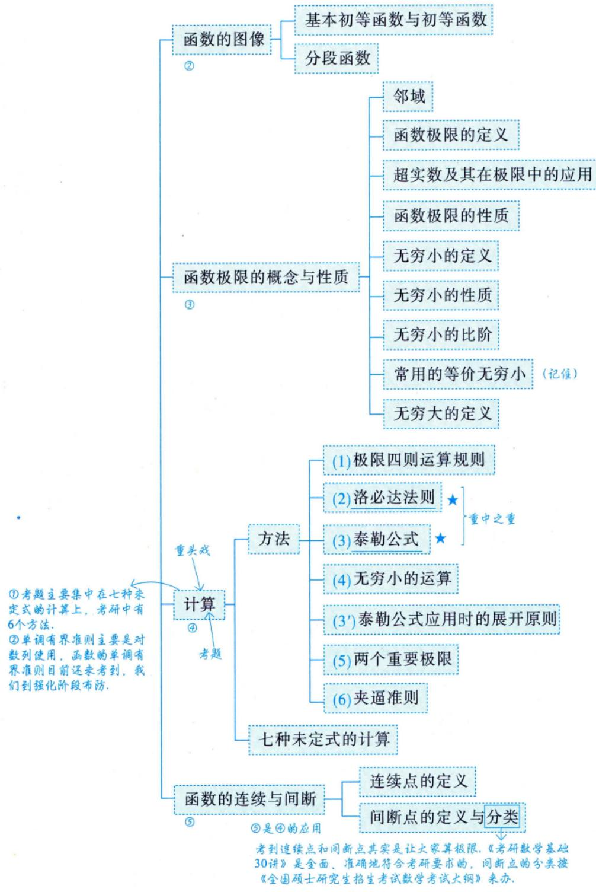

注以上是第1讲的全面的知识结构.学完这一讲，做完这一讲的题目之后，回过头来看这个知识结构，相信大家会有完全不同的认识.学完之后，这些知识框架不再是陌生的文字，而是展现在头脑中的清晰的知识与方法.

## 函数的概念与特性

## 1函数

单值函数

设x与y是两个变量，D是一个给定的数集，若对于每一个 $x \in D$ ，按照一定的法则f，有一个确定的y值与之对应，则称y为x的函数，记作 $y = f(x)$ ，称x为自变量，y为因变量，称数集D为此函数的定义域，定义域一般由实际背景中变量的具体意义或者函数对应法则的要求确定，称 $\{ f(x) \mid x \in D \}$ 为值域.

## 注单值函数与多值函数.

事实上，上述定义的函数是单值函数，若给一个 $x _ { 1 }$ ，对应一个 $y_{1}$ ；给另外一个 $x _ { 2 }$ ,对应另外一个$y_{2}$ ,这叫一对一[见图1-1(a)]. 若给定 $x_{1},x_{2}(x_{1} \neq x_{2})$ ，它们对应同一个y，则称多对一[见图1-1(b)]，所以函数可以一对一，也可以多对一，这叫单值函数.

但是，若一个x对应一个 $y _ { 1 }$ ，又对应另一个 $y _ { 2 }$ ，也就是一对多，这叫多值函数[见图1-1(c)]，它不在上述定义中.

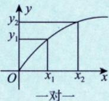  
(a)

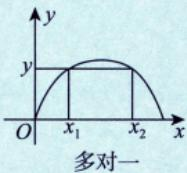  
(b)  
图1-1

  
(c)

多值函数（不是我们传统意义上的函数）

我们的研究对象主要是单值函数.

★数与形：如何判断一个函数是单值还是多值呢？数与形是辩证统一的关系，用铅直画线法作铅直线，若任一条铅直线与f(x)至多有一个交点，则f(x)为单值函数.

例1.1 设 $f\left(x+\frac{1}{x}\right)=\frac{x+x^{3}}{1+x^{4}}$ ，则当 $x \geqslant 2$ 时，f(x) =

解应填 $\frac{x}{x^{2} - 2}$

$f\left(x+\frac{1}{x}\right)=\frac{x+x^{3}}{1+x^{4}}=\frac{\left(x+x^{3}\right)/x^{2}}{\left(1+x^{4}\right)/x^{2}}=\frac{x+\frac{1}{x}}{x^{2}+\frac{1}{x^{2}}}=\frac{x+\frac{1}{x}}{\left(x+\frac{1}{x}\right)^{2}-2}$ ，于是当 $x   \geqslant   2$ 时， $f(x) = \frac{x}{x^{2} - 2}$

方法总结将 $ \text{" }x+\frac{1}{x} \text{" }$ 视为整体，找出对应法则.

公式 $x^{2}+\frac{1}{x^{2}}=\left(x+\frac{1}{x}\right)^{2}-2$

注以后会经常用到，给出复合函数，把它写回原来的函数，这样的考法也较常见.

★例1.2 设函数f(x)的定义域为 $(0, +\infty)$ ，且满足 $2f(x)+x^{2}\left|\frac{f\left(\frac{1}{x}\right)}{x}\right|=\frac{x^{2}+2x}{\sqrt{1+x^{2}}}$ ，则 $f(x)   =$

分析将x写成 $\frac{1}{x}$ ，找到方程组①，②，联立，消去 $f\left(\frac{1}{x}\right)$ 即可.

解应填 $\frac{x}{\sqrt{1 + x^{2}}}$

$$
2f(x)+x^{2}f\left(\frac{1}{x}\right)=\frac{x^{2}+2x}{\sqrt{1+x^{2}}}\tag{}
$$

将①中x写成 $\frac{1}{x}$ ，则

$$
\frac{1}{2f\left(\frac{1}{x}\right)} + \frac{1}{x^2}f(x) = \frac{1 + 2x}{x\sqrt{1 + x^2}}\tag{②}
$$

由 $\textcircled{1} \times 2 - \textcircled{2} \times x^{2}$ ，得 $3f(x)=\frac{3x}{\sqrt{1+x^{2}}}$ ，则 $f(x)=\frac{x}{\sqrt{1+x^{2}}}$

方法总结 用所给关系式，造出方程组，解出所需的量.

公式对应法则与所用的自变量无关，如 $f(x) = x^{2}$ ，则 $f\left(\frac{1}{x}\right)=\left(\frac{1}{x}\right)^2$

注(1)学习《考研数学基础30讲》，要关注“前世今生”，目前是要打基础.

(2) 若给 $f(x) + x f(-x) = x$ ，应学会写 $f(-x)-xf(x)=-x$ ，消去 $f(-x)$ ，得 $f(x)=\frac{x+x^{2}}{1+x^{2}}$ ·自练

考生既要掌握单值函数，同时也要会根据给出的复合函数表达式，求出相应的对应法则.

注本书所讲的知识是全面的，对题目的把握是准确的.从范围上、广度上讲是涵盖整个考研大纲的；从深度上讲，掌握我说的题目的难度就够了，达到这个难度，考研数学就能解决了.比

这个题目的难度低，不行；超过这个题目的难度，不需要！

## ② 反函数→前提：符合铅直画线法.

设函数 $y = f(x)$ 的定义域为D，值域为R.如果对于每一个 $y \in R$ ，必存在唯一的 $x \in D$ ，使得 $y = f(x)$ 成立，则由此定义了一个新的函数 $x = \varphi ( y )$ ，这个函数称为函数 $y = f(x)$ 的反函数，一般记作 $x = f^{-1}(y)$ 它的定义域为R，值域为D.相对于反函数来说，原来的函数也称为直接函数.以下两点需要说明.

第一，严格单调函数必有反函数，比如函数 $y = x^{2} \left( x \in \left[ 0, + \infty \right) \right)$ 是严格单调函数，故它有反函数→充分条件$x = { \sqrt { y } }$ 反函数：强调对应法则.

第二，若把 $x = f^{-1}(y)$ 与 $y = f(x)$ 的图形画在同一坐标系中，则它们完全重合.只有把 $y = f(x)$ 的反函数 $x = f^{-1}(y)$ 写成 $y = f^{-1}(x)$ 后，它们的图形才关于y=x对称.事实上，这也是字母 $\left\{ x \right.$ 与y互换的结果

$y = x^{2} (x \geqslant 0)$ 与 $y = \sqrt{x}$ 关于y=x对称

注(1)单值函数（符合铅直画线法）才谈反函数.

(2)有反函数的函数不一定是单调函数.比如

$$
f(x)=\left\{\begin{aligned}x, \quad x \geqslant 0, \\ \frac{1}{x}, \quad x < 0,\end{aligned}\right.
$$

其图像如图1-2所示，其反函数即为f(x)本身，但f(x)不是单调函数.

图1-2

判断一个函数是否具有反函数：用水平画线法.

水平画线法——在符合铅直画线法的条件下，作水平直线，若任一条水平直线与f(x)至多有一个交点，则f(x)有反函数.

铅直直线定单、多（单值函数、多值函数），口诀：水平直线定反、直（反函数、直接函数）.

λ=exlm2 重要关系： $\begin{cases}f[f^{-1}(x)] = x, \\f^{-1}[f(x)] = x.\end{cases}$ 如：elm2² =2x.

  
关注公众号获取更多免费考研资料

例1.3 求函数 $y = f(x) = \ln\left( x + \sqrt{x^{2} + 1} \right)$ 的反函数 $f^{-1}(x)$ 的表达式及其定义域.

分析对数函数是一个极为重要的研究对象，三个基本公式要掌握 $(a,   b > 0)$

$$
\left\{ \begin{aligned} \ln ab = \ln a + \ln b   (积变和)  , \\ \ln \frac{a}{b} = \ln a - \ln b   (商变差)  , \\ \ln a^{b} = b \ln a   (幂次变倍数)  . \end{aligned} \right.
$$

解直接由 $y = \ln \left( x + \sqrt{x^{2} + 1} \right)$ 解出 $x = f^{-1}(y)$ 会很麻烦，现采用下述方法.

$$
-y=-\ln\left(x+\sqrt{x^{2}+1}\right)=\ln\frac{1}{x+\sqrt{x^{2}+1}}
$$

所以

$$
\frac{\sqrt{x^{2} + 1} - x}{\left( \sqrt{x^{2} + 1} + x \right)\left( \sqrt{x^{2} + 1} - x \right)} = \ln\left( \sqrt{x^{2} + 1} - x \right), \quad \mathrm{e}^{- y} = \sqrt{x^{2} + 1} - x\tag{}
$$

再由y =f(x)的表达式有

$$
\mathrm{e}^{y} = \sqrt{x^{2} + 1} + x,\tag{②}
$$

②-①，得

$$
x = \frac{1}{2} \left( \mathrm{e}^{y} - \mathrm{e}^{-y} \right),
$$

交换上式中x，y的位置后就是y=f(x)的反函数，即

$$
y = f^{-1}(x) = \frac{1}{2} \left( \mathrm{e}^{x} - \mathrm{e}^{-x} \right), \quad -\infty < x < +\infty
$$

方法总结利用对数的性质，巧妙地反解x.

公式 $\ln(x + \sqrt{x^2 + 1})$ 是常见的奇函数.

注(1)函数 $y = \ln \left( x + \sqrt{x^{2} + 1} \right)$ 叫作反双曲正弦函数，其图像如图1-3(a)所示.函数 $y = \frac{e^{x} - e^{- x}}{2}$ 叫作双曲正弦函数，其图像如图1-3(b)所示.考生应记住这两个函数的图像.

  
(a)

  
(b)  
图1-3

(2) $y = \frac{e^{x} + e^{- x}}{2}$ 叫作双曲余弦函数，其图像如图1-4所示，它是偶函数，是一种特殊的悬链线.达·芬

奇在画《抱银貂的女子》时，曾仔细思索过女子的脖子上戴的项链的形状是什么函数，可惜他一生都未能明白，在他去世近200年后，约翰·伯努利解决了这个问题.那不是抛物线 $y = x ^ { 2 }$ ，而是悬链线$y = \frac{a}{2} \left( \mathrm{e}^{\frac{x}{a}} + \mathrm{e}^{-\frac{x}{a}} \right)$ 取 $a = 1$ ，便是 $y = \frac{e^{x} + e^{- x}}{2}$

这个函数没有反函数

  
图1-4

三个重要函数： $y = \ln(x + \sqrt{x^2 + 1}) \quad \textcircled{2} y = \frac{e^x - e^{-x}}{2} \quad \textcircled{3} y = \frac{e^x + e^{-x}}{2} \quad (2023 年考查证 )$

(3) 以后会知道如下3 个重要结论.

①当x→0时， $\ln \left( x + \sqrt{x^{2} + 1} \right) \sim x$ .即当 $x \to 0$ 时，反双曲正弦函数 $\ln(x + \sqrt{x^2 + 1})$ 与x是等价无穷小. 洛必达法则推出

当 $x \to 0$ 时，sinx∼x,tan $x \sim x, \ln(x + \sqrt{x^2 + 1}) \sim x,$

② $\left[ \ln \left( x + \sqrt{x^2 + 1} \right) \right]' = \frac{1}{\sqrt{x^2 + 1}}$ ，于是 $\int \frac{1}{\sqrt{x^{2} + 1}} \mathrm{d}x = \ln\left( x + \sqrt{x^{2} + 1} \right) + C$ 记住这个结果

③由于 $y = \ln \left( x + \sqrt{x^{2} + 1} \right)$ 是奇函数，于是 $\int_{- 1}^{1}\left\lbrack \ln\left( x + \sqrt{x^{2} + 1} \right) + x^{2} \right\rbrack dx = \int_{- 1}^{1}x^{2}dx = \frac{2}{3}$

③是在预告未来，未来会用到在第1讲中讲到的知识，同时我们要明白一个道理：我们现在在讲基础，基础要慢慢去打.你所有的东西实际上是一个联系的整体.假如不知道 $y = \ln(x + \sqrt{x^2 + 1})$ 这个函数，不知道它的图像，不知道它的性质，那么在后面去学习的时候就会遇到困难.反过来说，如果知识掌握得很扎实，那么后面学到极限、导数、积分、面积等，就能很快速地把问题解决了。从而可以掌握强大的基础知识，再学会做题，就可以应对综合题了。

## ③ 复合函数

设函数y =f(u)的定义域为 $D_{1}$ ，函数 $u = g(x)$ 在D上有定义，且 $g ( D ) \subset D _ { 1 }$ ，则由

$$
y = f[g(x)](x \in D)
$$

确定的函数称为由函数 $u = g(x)$ 和函数 $y = f(u)$ 构成的复合函数，它的定义域为D，u称为中间变量.考生要重点掌握复合的方法，三层复合函数f[g(x)]

例1.4 设 $f(x)=x^{2},f[\varphi(x)]=-x^{2}+2x+3$ ，且 $\varphi(x) \geq 0$ ，求φ(x)及其定义域与值域.

解由题设条件知， $f[\varphi(x)] = \varphi^2(x) = -x^2 + 2x + 3$ ，于是 $\varphi(x)=\sqrt{-x^{2}+2x+3}\quad\therefore\quad\varphi(x)\geqslant0$

由 $-x^{2}+2x+3 \geqslant 0$ ，即 $(x - 3)(x + 1) \leq 0$ ，知φ(x)的定义域为[-1,3].

又 $\sqrt{-x^{2}+2x+3}=\sqrt{-(x-1)^{2}+4}$ ，当x=1时，φ(1)=2为最大值，显然 $\varphi(-1)=\varphi(3)=0$ 为最小值，故$\varphi(x)$ 的值域为[0,2]. 实际上， $-(x - 1)^{2} + 4$ 的最值可借用导数工具.

方法总结将φ(x)视为一个整体□，由 $f[\varphi(x)]$ 已知，可求出φ(x).

公式若 $\varphi^{2}(x)=g(x)$ ，则 $\varphi ( x ) = \pm { \sqrt { g ( x ) } }$

注这个题目比较简单，可能是我们后面综合题的第一问，我们一定要把《考研数学基础30讲》吃透，把与本书配套的《张宇考研数学题源探析经典1000题》基础篇吃透，把它背下来最好，后面会发现做起题来，越来越顺，为什么呢？因为原材料准备得好，然后加上你高超的烹饪技术，炒菜水平就很高，解题能力和速度都会有一个很大的提高.

例1.5 设 $g(x)=\begin{cases}2-x,\ x\leqslant0,\\2+x,\ x>0,\end{cases}f(x)=\begin{cases}x^{2},\ x<0,\\-x-1,\ x\geqslant0,\end{cases}$ 则 $g[f(x)] =$

分析数与形结合.

华罗庚先生说：“数无形时少直觉，形少数时难入微，数形结合百般好”

解应填 $\begin{cases}3 + x, & x \geq 0, \\2 + x^{2}, & x < 0.\end{cases}$

$$
g[f(x)]=\left\{\begin{aligned}2-f(x), f(x) \leq 0, \\2+f(x), f(x)>0,\end{aligned}\right.
$$

当 $f(x) \leq 0$ 时， $x   \geqslant   0$ ，此时 $f(x) = -x - 1$ ；当 $f(x) > 0$ 时， $x < 0$ ，此时 $f(x) = x^{2}$ 综上，

$$
g[f(x)]=\begin{cases}2-(-x-1),&x\geq0,\\2+x^2,&x<0\end{cases}=\begin{cases}3+x,&x\geq0,\\2+x^2,&x<0.\end{cases}
$$

方法总结画出内层函数的图形，数形结合.

## 4 隐函数

设方程 $F(x, y) = 0$ ，若当x取某区间内的任一值时，总有满足该方程的唯一的值y存在，则称方程$F(x, y) = 0$ 在上述区间内确定了一个隐函数 $y = y(x)$

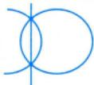

多值函数不适用于铅直画线法：比如，上图有两个交点，则不满足铅直画线法，这个对应的就是多值函数，不能确定隐函数.能确定隐函数就不能是多值函数，这是基本概念，关于隐函数存在定理，我们后面专门讲。

如 $x + y^{3} - 1 = 0$ 就表示一个隐函数，且可显化为 $y = \sqrt[3]{1 - x}$ ；再如 $\sin(xy)=\ln\frac{x+\mathrm{e}}{y}+1$ 也表示一个隐函数，但不易显化，很难写出 $y = y(x)$ 或 $x = x(y)$

一般来说，由 $F(x, y) = 0$ 所确定的隐函数求 $y(x_{0})$ ，若代入 $x _ { 0 }$ 易求出 $y(x_{0})$ ，则直接求之；若不易方程这个东西，解无定法，观察得求出 $y ( x _ { 0 } )$ ，则用观察法，如：之，有时“显然”，有时超越方程

①设函数 $y = y(x)$ 由方程 $\ln y - \frac{x}{y} + x = 0 (x > 0)$ 确定，当x=2时， $y(2) = 1$ 方程 $\ln y - \frac{2}{y} + 2 = 0$ 是可观察的，用画图法，如图1-5所示.ln $y + \mathrm{e}^{y - 1} = 1$ ，显然可看

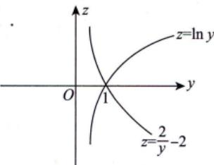

由 $\ln y = \frac{2}{y} - 2$ ，得 $\left\{ \begin{aligned} z = & \ln y, \\ z = & \frac{2}{y} - 2. \end{aligned} \right.$ 看两条曲线交点.  
这些都是考研真题里面出现过的形式.

$$
y = 1
$$

  
图1-5

②设函数 $y = y(x)$ 由方程ln $y + \mathrm{e}^{y - 1} = \frac{x}{2}$ 确定，当 $x = 2$ 时， $y(2) = 1$

## 注考研试题中常出现这种问题，考生要重视.

隐函数问题先给大家提到这里，与之相关的隐函数存在定理，以及隐函数存在定理所推出的公式法等，我们到后面再去讲.

★★★5函数的四种特性 考研中怎么去使用这些特性呢？微积分是利用极限这个工具研究函数、函数的导数及积分的四种特性

(1)有界性.

$$
 首先要给定区间〔 ( 定义域幽一个各集 )
$$

设f(x)的定义域为D，数集 $I \subset D$ .如果存在某个正数M，使对任一x∈I，有 $\left| f(x) \right| \leq M$ ，则称f(x)在I上有界；如果这样的M不存在，则称f(x)在I上无界.

注(1)从几何上看，如果在给定的区间，函数y=f(x)的图形能够被直线y =-M和 $y = M$ “完全包起来”，则为有界；从解析上说，如果找到某个正数M，使得 $\left| f(x) \right| \leq M$ ，则为有界.

能画图则画图，不易画图，我们就用解析法，去找正数M.

(2)有界还是无界的讨论首先需指明区间I，不知区间，无法谈论有界性.比如 $y = \frac{1}{x}$ 在 $( 2 , + \infty )$ 内有界，但在(0,2)内无界.

(3)事实上，只要在区间I上或其端点处存在点 $x_{0}$ ，使得 $\lim_{x \to x_0} f(x)$ 的值为无穷大，则没有任何两条直线 $y = - M$ 和y=M可以把I上的 $f(x)$ 包起来”，这就叫无界.考研中常出这样的题目，比如例1.17.

例1.6 证明函数 $f(x) = \frac{x}{1 + x^{2}}$ 在 $(-\infty, +\infty)$ 内有界.

补充： $x^{2} = \left| x^{2} \right| = \left| x \right|^{2}$   
$x^{3} \ne \left| x^{3} \right| = \left| x \right|^{3}$   
$|x| = \sqrt{x^2}$

分析 当x≠0时， $\left| f(x) \right| = \frac{\left| x \right|}{1 + x^{2}}$ 分子分母同除|x| $\frac{1}{\frac{1}{\left | x \right | } + \left | x \right | }$ 或者用 $\left| x \right| = \sqrt{x^{2}}$

若求 $\left[ \left[ f(x) \right] \right]^{\prime}$ 呢？

证方法一当x≠0时，

$$
\left| f(x) \right| = \frac{\left| x \right|}{1 + x^{2}} = \frac{1}{\frac{1}{\left| x \right|} + \left| x \right|}
$$

$$
\begin{aligned}\left[ \mid f(x) \mid \right]' = & \left[ \sqrt{f^2(x)} \right]' \\= & \frac{2f(x)f'(x)}{2\sqrt{f^2(x)}} = \frac{f(x)f'(x)}{\mid f(x) \mid}.\end{aligned}
$$

$$
\begin{aligned}f(x) = & 2x + \sqrt{x^{2} + 2x + 1} \\= & 2x + \sqrt{(x + 1)^{2}} \\= & 2x + \left| x + 1 \right|.\end{aligned}
$$

由不等式 $\frac{a + b}{2} \geqslant \sqrt{ab}(a,   b > 0).$ ，有 $\frac{1}{\left | x \right | }+\left | x \right | \ge 2\sqrt{\frac{1}{\left | x \right | }\left | x \right | }=2$ ，即 $\left| f(x) \right| \leq \frac{1}{2}$

当x=0时，f(0)=0.综上，函数f(x)在 $(-\infty, +\infty)$ 内有界.

方法二当x≠0时， $\frac{1 + x^{2}}{2} \geqslant \sqrt{1 \bullet x^{2}}$ ≡x|，则 $1 + x^{2} \geqslant 2|x|$ ，故 $\frac{1}{1 + x^{2}} \leq \frac{1}{2|x|}$ ，则

$$
\left| f(x) \right| = \frac{\left| x \right|}{1 + x^{2}} \leqslant \frac{\left| x \right|}{2\left| x \right|} = \frac{1}{2}
$$

当x=0时，f(0)=0.综上，函数f(x)在 $(-\infty, +\infty)$ 内有界.

方法总结用基本不等式，找M，使 $\mid f(x) \mid \leqslant M$

$$
\frac{a+b}{2} \geqslant \sqrt{ab}(a, b>0) ; \frac{2}{\frac{1}{a}+\frac{1}{b}} \leqslant \sqrt{ab} \leqslant \frac{a+b}{2} \leqslant \sqrt{\frac{a^2+b^2}{2}}(a, b>0) .
$$

(2) 单调性.—→整个考研数学，离不开单调性这个话题

设f(x)的定义域为D，区间 $I \subset D$ .如果对于区间I上任意两点 $x_{1}, x_{2}$ ，当 $x_{1} < x_{2}$ 时，恒有 $f(x_{1}) <$ $f(x_{2})$ ，则称f(x)在区间I上单调增加.如果对于区间I上任意两点 $x_{1}, x_{2}$ ，当 $x_{1} < x_{2}$ 时，恒有 $f(x_{1}) >$ $f(x_{2})$ ，则称f(x)在区间I上单调减少.

## 注(1)以上是定义法，是充要条件.

(2)后面会看到，在考研试题中常常用求导的方法来讨论函数在某个区间上的单调性，但是定义法不可以忘记.试题中也常用到如下定义法的判别形式，请考生留意.

对任意 $x_{1}, x_{2} \in D, x_{1} \neq x_{2}$ ，有

$$
f(x)  是单调增函数  \Leftrightarrow (x_1 - x_2)[f(x_1) - f(x_2)] > 0;
$$

f(x)是单调减函数 $(x_{1}-x_{2})[f(x_{1})-f(x_{2})]<0$

f(x)是单调不减函数 $\Leftrightarrow (x_1 - x_2)[f(x_1) - f(x_2)] \geq 0$

f(x)是单调不增函数 $\Leftrightarrow (x_1 - x_2)[f(x_1) - f(x_2)] \leq 0.$

在考研数学中，函数的单调性虽然是基础知识，但也会有综合应用.

例1.7 设f(x)在 $(-\infty, +\infty)$ 上有定义，任给 $x_{1}, x_{2}, x_{1} \neq x_{2}$ ，均有 $(x_{1}-x_{2})\cdot \left [ f(x_{1})-f(x_{2}) \right ] > 0$ 则以下函数一定单调增加的是（）.(A) $\left[ f(x) \right]$ (B) $f ( \left\lfloor x \right\rfloor )$ (C) f(−x) (D) $-f(-x)$

分析由条件知f(x)是严格单调增加函数，利用图形的变换，去讨论其他函数的单调性.

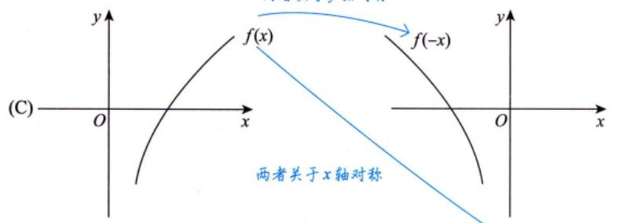

保留f(x)≥0部分，f(x)<0部分去掉，关于x轴对称过来

(A)  
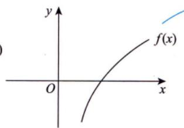

  
保留x≥0部分，x<0部分消去，关于y轴对称

(B)  
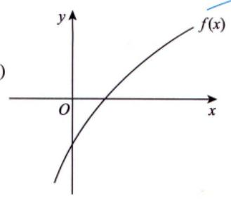

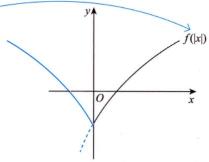

两者关于y轴对称

(D)  
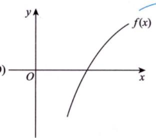  
关于原点对称

应选 (D).

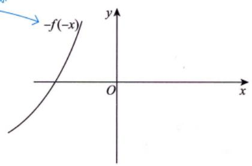

由上述注的(2)知，f(x)是单调增函数，又f(-x)与f(x)的图像关于y轴对称，-f(-x)与f(x)的图像关于原点对称[见附录1(2)的②，③]，可知f(-x)单调减少，-f(-x)单调增加.|f(x)|是否具有单

调性与f(x)的正负相关， $f(\left | x \right | )$ 为偶函数，在 $(-\infty, +\infty)$ 上无单调性[见附录1(2)的⑤，⑥]，故选(D).

方法总结 $f(ax),   af(x)$ 等可参考附录1.

∂公式f(x)与f(-x)关于y轴对称；f(x)与-f(x)关于x轴对称；f(x)与-f(-x)关于原点对称.

(3)奇偶性。这个是四大特性中最重要的性质，原因：①题目易出：②对称美.

设f(x)的定义域D关于原点对称(若 $x \in D$ ，则 $-x \in D$ .如果对于任 $-x \in D$ ，恒有 $f(-x) = f(x)$ 则称f(x)为偶函数.如果对于任一 $x \in D$ ，恒有 $f(-x) = -f(x)$ ，则称f(x)为奇函数.我们熟知的是，偶函数的图形关于y轴对称，奇函数的图形关于原点对称.

注那么，怎么做题呢？要想会做题需要有：①原材料(我们正在学习的各种基础知识)；②技术我们继续来看原材料.

(1) 前提：定义域关于原点对称.

(2) 基本类型.

① $f(x) + f(-x)$ 必是偶函数.

如 $\frac{e^{x}+e^{-x}}{2}$

双曲余弦，记住图像

如 $\sqrt[3]{(1 + x)^{2}} + \sqrt[3]{(1 - x)^{2}}$

② $f(x) - f(-x)$ 必是奇函数.

如 $\frac{\mathrm{e}^{x}-\mathrm{e}^{-x}}{2} . \xrightarrow{ 忄 } \frac{ 忄 }{10^{\circ}x}$

双曲正弦反函数 $y = \ln(x + \sqrt{x^2 + 1})$ (反双曲正弦)

如 $\ln \frac{1 + x}{1 - x} = \ln(1 + x) - \ln(1 - x) -$

对任一函数f(x)，令 $u(x) = \frac{1}{2} \left[ f(x) + f(-x) \right]$ $v(x)=\frac{1}{2}\left[f(x)-f(-x)\right]$ 则 u(x) 是偶函数，v(x)是奇函数.由

$$
f(x)=\frac{1}{2}\left[f(x)+f(-x)\right]+\frac{1}{2}\left[f(x)-f(-x)\right]=u(x)+v(x)
$$

可知任何一个函数都可以写成一个奇函数与一个偶函数之和的形式.（重要结论）

③ $f[\varphi(x)]$ （内偶则偶，内奇同外）.

若内层是偶，不管外面函数，复合起来一定是偶函数，这是内偶则偶：若内层是奇，则复合函数奇偶性与外层函数奇偶性一致，这是内奇同外

[奇[偶]⇒偶.如 $\lim_{x \to 0} x^2$

偶[奇]⇒偶.如 $\left| \cos ( \sin x ) , \left| \sin x \right| \right|$

奇[奇]⇒奇.如 $\sin \frac{1}{x}, \sqrt[3]{\tan x}.$

偶[偶]⇒偶.如 $\left| \cos |x|, \left| \cos x \right| \right|$

[非奇非偶[偶]⇒偶.如 $\mathbf{i}\mathbf{e}^{x^{2}}$ , In|x|.

④一个特色： $\left[ \ln \left( x + \sqrt{x^2 + 1} \right) \right]' = \frac{1}{\sqrt{x^2 + 1}}$

★⑤f(x)奇⇒ f'(x)偶⇒ f"(x)奇⇒… .见例 3.1.]后面再讲证明。(偶) (奇） (偶)

求导一次，奇偶性互换.

从直观上解析：（数与形）

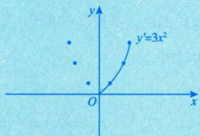

⑥f(x)奇 $\Rightarrow \int_{0}^{x} f(t)   dt$ 偶. 微积分的研究主体：导数，积分 (偶) (奇)

⑦设对任意的x，y，都有 $f(x + y) = f(x) + f(y)$ ，则f(x)是奇函数，证明见例 1.8.

隐含条件

↑例1.8 设对任意x,y，都有 $f(x + y) = f(x) + f(y)$ ，证明：f(x)是奇函数.

分析用定义法.

$f(0)=f(x)+f(-x)$ ，即$f(-x) = -f(x)$ ，故f(x)是奇函数.

方法总结 用定义法证明f(-x)=-f(x).

θ公式f(x)+f(-x)=0，则f(x)为奇函数.

(4) 周期性：

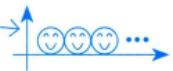

设f(x)的定义域为D，如果存在一个正数T，使得对于任一 $x \in D$ ，有 $x   \pm T   \in   D$ ，且 $f(x + T) =$ f(x)，则称f(x)为周期函数，T称为f(x)的周期，一般指最小正周期.

## 注|重要结论.

①若f(x)以T为周期，则 $f(ax + b)$ 以 $\frac{T}{\left \| a \right \| }$ 为周期.

②若 $g(x)$ 是周期函数，则复合函数 $f[g(x)]$ 也是周期函数，如 $\mathbf{e}^{\sin x}$ , $\cos^{2}x$ 等.

$$
\cos ^{2}x=\frac{1+\cos 2x}{2} , \quad T=\frac{2\pi }{\left | 2 \right | }=\frac{\left | \right | }{\pi }
$$

★③若f(x)是以T为周期的可导函数，则 $f^{\prime}(x)$ 也以 T为周期.见例 3.1.

★④若f(x)是以T为周期的连续函数，则只有在 $\int_{0}^{T} f(x)   \mathrm{d}x = 0$ 时， $\int_{0}^{x} f(t)   dt$ 也以T为周期.见例9.25.

例1.9 设函数f(x)在 $(-\infty,   +\infty)$ 上满足 $f(x) = f(x - \pi) + \sin x$ .证明：f(x)是以 $T = 2 \pi$ 为周期的周期函数.

分析证 $f(x + 2\pi) = f(x)$ 即可.

证 多次利用题目等式条件，得到 $f(x+2\pi)=f(x+\pi)+\sin(x+2\pi)=f(x)+\sin(x+\pi)+\sin(x+2\pi)=$ $f(x)$ ，故f(x)以 $T = 2 \pi$ 为周期.

两条腿走路：(1)知识：(2)解题.

方法总结若 $f(x + 2\pi) = f(x)$ ，则f(x)是以2π为周期的周期函数.

公式诱导公式： $\sin(x + 2\pi) = \sin x, \quad \sin(x + \pi) = -\sin x$

注希望考生在学习过程中，记具体例子.这些例子的记忆可以帮助我们很好地理解各种各样的方法，同时有实实在在的例子记在脑子里，可以形成一个解题思路，这是非常重要的.很多人以为例子不要记，只要会即可，其实不然.你要形成数学的思维习惯，一定要记一些具体的例子.

要用典型的例子与习题撑起来我们的知识与方法，这是给大家的建议.

## 函数的图像

## 基本初等函数与初等函数

我们在学习分部积分法时，有口诀：反对幂指三.

基本初等函数：常数函数、幂函数、指数函数、对数函数、三角函数和反三角函数.

(1)常数函数。→易考“找交点个数”或在概率论中求概率 $P\{ g(X) \leq y\}$

$y = \overline{A}, A$ 为常数，其图形为平行于x轴的水平直线(见图1-6).

→为偶函数

  
图1-6

如求ln $x - \frac{x}{\mathrm{e}} + a = 0$ 实根的个数其实就是求直线 $y   =   a$ 与曲线 $y = \frac{x}{\mathrm{e}} - \ln x$ 交点的个数.

在数学一和数学三学习的概率论中： $Y = g(X)$ $Y = y$ $g(X) \leqslant y$ 即 $Y = g(X)$ 在Y=y直线下方X 的取值范围.

(2) 幂函数.

$y = x^{\mu}(\mu$ 是实数).

注(1) $y = x ^ { \mu }$ 的定义域和值域取决于μ的值.当 $x > 0$ 时， $y = x^{\mu}$ 都有定义.

(2)常用的幂函数（见图1-7).

$$
y=x,\;y=x^{2},\;y=\sqrt{x},\;y=x^{3},\;y=\sqrt[3]{x},\;y=\frac{1}{x}
$$

  
(a)

  
(b)  
图1-7

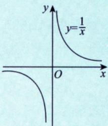  
(c)

(3) 当 $x > 0$ 时，由 $y = x$ 与 $y = \sqrt{x} , y = \sqrt[3]{x} , y = \ln x$ 具有相同的单调性且与 $y = \frac{1}{x}$ 具有相反的单调性，故

①见到 $\sqrt{u}   ,   \sqrt[3]{u}$ 时，可用u来研究最值.

考得最多 ★②见到|u|时，由 $\left | u \right |  = \sqrt{u^{2}}$ ，可用 $\boldsymbol { u } ^ { 2 }$ 来研究最值； $\sqrt{u^{2}}$ 与 $u ^ { 2 }$ 具有相同的最值点$ 求  \textcircled{3}$ 见到 $u_{1}u_{2}u_{3}$ 时，可用 $\ln (u_{1}u_{2}u_{3}) = \ln u_{1} + \ln u_{2} + \ln u_{3}$ 来研究最值.

考得频率不高 如： $\ln (x^{\frac{1}{3}}y^{\frac{1}{2}}z^{\frac{1}{5}}) = \frac{1}{3}\ln x + \frac{1}{2}\ln y + \frac{1}{5}\ln z$

④见到 $\frac{1}{u}$ 时，可用μ来研究最值（结论相反，即 $\frac{1}{u}$ 与u的最大值点、最小值点相反).

利用以 $\boxed { 1 } \sim \textcircled { 4 }$ ，可使得计算简单方便.以上4点是我们在研究最值问题时的一个非常有用的技巧——简洁美.

例1.10 设 $0<x<\frac{1}{2}$ ，求 $y(x)=x^{6}(1-x)^{2}(1-2x)^{4}$ 的最大值点.

分析多项相乘（除）乘方（开方）的式子⇒取对数⇒计算⇒线性运算.实现“简洁美”！

解取对数，得

$$
\ln y(x) = 6\ln x + 2\ln(1 - x) + 4\ln(1 - 2x)
$$

$$
\frac{\mathrm{d}\left[\ln y(x)\right]}{\mathrm{d}x}=\frac{6}{x}-\frac{2}{1-x}-\frac{8}{1-2x}=\frac{24x^{2}-28x+6}{x(1-x)(1-2x)}=0
$$

即 $12x^{2}-14x+3=0$ ，解得 $x = \frac{7 \pm \sqrt{13}}{12}$ ，因为 $\frac{7+\sqrt{13}}{12}>\frac{1}{2}$ 不符合题意，又 $\lim_{x \to 0^{+}} y(x) = \lim_{x \to \left(\frac{1}{2}\right)^{-}} y(x) =$ $0 < y \left( \frac{7 - \sqrt{13}}{12} \right)$ ，故y的最大值点为 $x = \frac{7 - \sqrt{13}}{12}$

方法总结）遇到多项相乘（除）函数的最值问题，常用对数求导法.

②公式 $\left( \ln x \right)^{\prime} = \frac{1}{x} , \quad \left[ \ln(1 - x) \right]^{\prime} = \frac{1}{x - 1} , \quad \left\{ f\left[ g(x) \right] \right\}^{\prime} = f_{g}^{\prime} \bullet g_{x}^{\prime}$

注希望同学们明白，做例题不是念一个题，把答案一抄这么简单，而是大家通过做这个题目，在不同的阶段可以有不同的收获.例如，在它的分析阶段你要学会什么，在它的解题过程中你要学会什么，然后在整个题目学完之后，你通过这个题目提高了哪些方面的解题能力.只有通过这样的学习，你才能快速地提高自己的解题水平.

(3) 指数函数.

$y = a^{x} (a > 0, a \neq 1)$ [见图 $1 - 8(a)]$

  
图 1-8

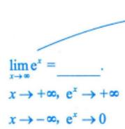

答案：+∞或0，(×)立即拒绝.违背了函数极限的唯一性（不存在）

注(1)定义域： $( - \infty , + \infty )$ ，值域： $(0, +\infty)$

(2)单调性：当 $a > 1$ 时， $y = a^{x}$ 单调增加；当 $0 < a < 1$ 时， $y = a^{x}$ 单调减少.

(3)常用的指数函数： $y = \mathrm{e}^{x}$ [见图 1-8(b)].

(4)极限： $\lim_{x \to -\infty} e^x = 0, \quad \lim_{x \to +\infty} e^x = +\infty$

“∞”符号是华里士给出的（华里士是牛顿的老师）

“∞”不是常数，把它归到哪里呢？“∞”实际上是一个广义的数是一个特殊的存在，在很多定理中 $\therefore 0 0$ 的作用与任意常数的作用是一样的，比如后面我们会学“夹逼准则”，如

$$
\left. \begin{array} { c } { y _ { n } \leqslant x _ { n } \leqslant z _ { n } } \\ { \downarrow \quad \Downarrow \quad \downarrow } \\ { n \to \infty , \; a \Rightarrow a \Leftarrow a } \\ { + \infty \Rightarrow + \infty \Leftarrow + \infty } \\ { - \infty \Rightarrow - \infty \Leftarrow - \infty } \\ \end{array} \right\}
$$

(5) 特殊函数值： $a^{0} = 1, \; e^{0} = 1$ K

考： $e^{x_{n}} - 1 = e^{x_{n}} - e^{0}$ .神秘的数字 $1 \neq 0$ ，这个是解题时常见的包装。

(6) 指数运算法则.

$$
\left| x \right|^{3n} = \left( \left| x \right|^{3} \right)^{n} = \left( \left| x^{3} \right| \right)^{n}
$$

$$
a ^ { \alpha } \cdot a ^ { \beta } = a ^ { \alpha + \beta } , \frac { a ^ { \alpha } } { a ^ { \beta } } = a ^ { \alpha - \beta } , \left( a ^ { \alpha } \right) ^ { \beta } = a ^ { \alpha \beta } , \left( a b \right) ^ { \alpha } = a ^ { \alpha } b ^ { \alpha } , \left( \frac { a } { b } \right) ^ { \alpha } = \frac { a ^ { \alpha } } { b ^ { \alpha } } ,
$$

$$
80e^{\tan x}-e^{\sin x}=e^{\sin x}(e^{\tan x-\sin x}-1)
$$

其中a，b是正实数， $\alpha , \beta$ 是任意实数.

(4) 对数函数.

$y = \log_{a}x (a > 0, a \neq 1)$ [见图 1-9(a)]是 $y = a^{x}$ 的反函数.

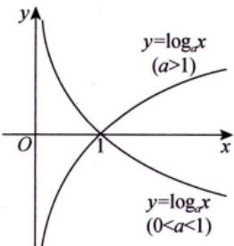  
(a)

  
图1-9  
(b)

注(1)定义域： $(0, +\infty)$ ，值域： $( - \infty , + \infty )$

(2)单调性：当a>1时， $y = \log_{a}x$ 单调增加；当 $0 < a < 1$ 时， $y = \log_{a}x$ 单调减少.

(3) 常用的对数函数： $y = \ln x$ (自然对数：lr $x = \log_{e}x, \quad e = 2.71828\cdots$ 见图 1-9(b)].

(4)特殊函数值： $\log_{a}1 = 0$ $\log_{a}a = 1$ ,ln1=0,lne=1

$$
3 6 : e - 2 > 0
$$

神秘的数字 $ \text{" }0 "$ 和 $ \text{" }1 "$ ，实现“统一美”“简洁美”

如 $\mathrm{e}^{x_{n}} - 1 = \mathrm{e}^{x_{n}} - \mathrm{e}^{0}$ , ln $x_{n} = \ln x_{n} - \ln 1$

再如，

$$
\ln \left( \mathrm{e} + \frac{1}{x} \right) - 1 = \ln \left( \mathrm{e} + \frac{1}{x} \right) - \ln \mathrm{e}
$$

$\ln \left(1+\frac{1}{\mathrm{e}x}\right)$ 这个转化是极为有意义的

又如 $\lim_{x \to \infty} x \left[ \ln \left( \mathrm{e} + \frac{1}{x} \right) - 1 \right] = \lim_{x \to \infty} x \cdot \frac{1}{\mathrm{e}x} = \frac{1}{\mathrm{e}}$ 如果你考虑用洛必达法则，那么就舍近求远了

考研需要区分度，考生要掌握一些解题技巧.从辩证法去看，实现“统一美”.

(5) 极限： $\lim_{x \to 0^{+}} \ln x = -\infty, \quad \lim_{x \to +\infty} \ln x = +\infty$

当 $x \to +\infty$ 时， $\mathbf{e}^{x} \rightarrow +\infty$ 的速度越来越快， $\ln x \to +\infty$ 的速度越来越慢.

(6) 常用公式： $x = \mathrm{e}^{\ln x}(x > 0), \quad u^{\nu} = \mathrm{e}^{\ln u^{\nu}} = \mathrm{e}^{\nu \ln u}(u > 0)$

$x^{x} = \mathrm{e}^{\ln x^{x}} = \mathrm{e}^{x\ln x}$ ，从而可看到， $x^{x}$ 是初等函数.

(7) 对数运算法则.

① $\log _ { a } ( M N ) = \log _ { a } M + \log _ { a } N$ (积的对数=对数的和).

② $\log_{a}\frac{M}{N}=\log_{a}M-\log_{a}N$ (商的对数=对数的差).幂次变倍数

③ $\log_{a}M^{n}=n\log_{a}M$ , loga $\sqrt[n]{M} = \frac{1}{n} \log_a M$ (幂的对数=对数的倍数).

一定要用好对数的运算法则，如： $\mathrm{e}^{\ln \sqrt{f^{2}(x)-f(x)+1}}=\sqrt{f^{2}(x)-f(x)+1}$

常考：当 $x > 0$ 时，

中值定理（拉格朗日中值定理）证明

$$
\ln \sqrt{x} = \frac{1}{2}\ln x ; \ln \frac{1}{x} = -\ln x ; \ln\left(1 + \frac{1}{x}\right) = \ln\frac{x + 1}{x} = \ln(x + 1) - \ln x .
$$

利用例1.11，学习解题技巧.

例1.11 已知 $\mathrm{e}^{x}=\sum_{n = 0}^{\infty}\frac{x^{n}}{n!}, x \in \mathbf{R}$ ，则2x = ( ). (A) $\sum_{n = 1}^{\infty}\frac{(x\ln 2)^{n}}{n!}$ (B) $\sum_{n = 0}^{\infty}\frac{(x\ln 2)^{n}}{n!}$ (C) $\sum_{n = 1}^{\infty}\frac{(\ln 2)x^{n}}{n!}$ (D) $\sum_{n = 0}^{\infty}\frac{(\ln 2)x^{n}}{n!}$

分析 $2^{x} = \mathrm{e}^{\ln 2^{x}} = \mathrm{e}^{x \ln 2}$

解应选 (B).

由于 $2^{x} = \mathrm{e}^{x \ln 2}$ ，又 $\mathbf{e}^{x}=\sum_{n = 0}^{\infty}\frac{x^{n}}{n!}$ $x \in \mathbf { R }$ ，因此 $2^{x} = \sum_{n = 0}^{\infty}\frac{(x\ln 2)^{n}}{n!}$

方法总结 $\mathbf{e}^{x}=\sum_{n = 0}^{\infty}\frac{x^{n}}{n!}$ ，广义化： $2^{x} = \mathrm{e}^{x \ln 2} = \sum_{n = 0}^{\infty} \frac{(x \ln 2)^{n}}{n!}$

公式 $\mathrm{e}^{x}=\sum_{n = 0}^{\infty}\frac{x^{n}}{n!}, x \in \mathbf{R}$

注理工类以及自然科学中，当然会用到 $\mathrm{e}^{x}=1+x+\frac{x^{2}}{2!}+\frac{x^{3}}{3!}+\cdots$ ；在社会科学中，也经常会看到这个式子，因为多项式是最简单的.

三角函数与反三角函数这里公式多、杂，是区分度比较高的部分

(5) 三角函数.

①正弦函数与余弦函数.

拱的面积为2，

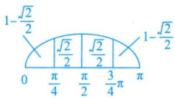

正弦函数 $y = \sin x$ 见图1-10(a)]，余弦函数 $y = \cos x$ [见图 1-10(b)].

图1-10  
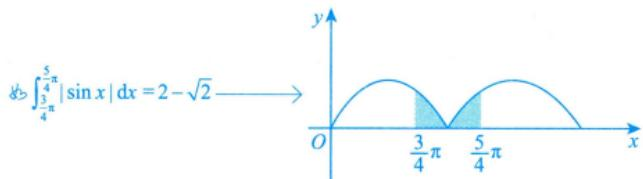

注(1)定义域：均为 $( - \infty, + \infty )$ ，值域：均为[-1,1].

当 $x \to 0 ^ { + }$ 时，sinx≤1,sinx<x.

(2) 奇偶性：y =sinx是奇函数， $y = \cos x$ 是偶函数， $x \in (-\infty, +\infty)$

(3)周期性： $y = \sin x$ 和y=cosx均以2π为最小正周期， $x \in (-\infty, +\infty)$

(4)有界性： $\left| \sin x \right| \leqslant 1, \left| \cos x \right| \leqslant 1$

(5) 特殊函数值： sin 0 =0, $\sin \frac{\pi}{6} = \frac{1}{2}$ , sin $\frac{\pi}{4}=\frac{\sqrt{2}}{2}$ , sinπ=√3 3 2

$$
\sin \frac{\pi}{2} = 1, \sin \pi = 0, \sin \frac{3\pi}{2} = -1, \sin 2\pi = 0,
$$

$$
\cos 0 = 1, \cos \frac{\pi}{6} = \frac{\sqrt{3}}{2}, \cos \frac{\pi}{4} = \frac{\sqrt{2}}{2}, \cos \frac{\pi}{3} = \frac{1}{2},
$$

$$
\cos \frac{\pi}{2} = 0, \cos \pi = -1, \cos \frac{3\pi}{2} = 0, \cos 2\pi = 1
$$

(6) $\sin^{2}\alpha+\cos^{2}\alpha=1$ .★

恒等变形的一个办法，如： $\sin ^{2}\alpha+\cos ^{2}\alpha=1,\ \sqrt{\sin ^{2}x-\cos ^{2}\alpha}=\sqrt{1-\cos ^{2}x-\cos ^{2}\alpha}=\sqrt{\sin ^{2}\alpha-\cos ^{2}x}$ 命题老师常用“手段”.

②正切函数与余切函数.

正切函数y = tanx[见图1-11(a)]，余切函数y =cot x[见图 1-11(b)].

$$
\tan x = \frac{\sin x}{\cos x}, \cot x = \frac{\cos x}{\sin x} = \frac{1}{\tan x}
$$

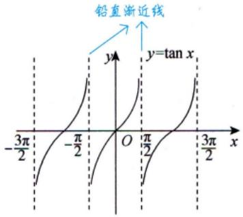  
(a)

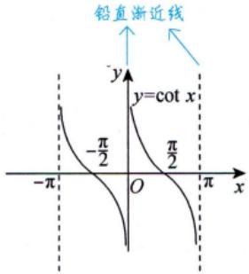  
(b)  
图1-11

注（1)定义域： y =tanx的定义域为 $\left\{ x \mid x \neq k\pi + \frac{\pi}{2} (k \in \mathbf{Z}) \right\}$ ； y =cot x 的定义域为 $\{ x \mid x \neq k\pi$ $\left\{ k \in \mathbb{Z} \right\}$

值域：均为(-∞，+∞).

(2) 奇偶性：y =tanx和y =cot x均为奇函数（在其定义域内).

(3)周期性：y =tanx和y=cotx均以π为最小正周期（在其定义域内).

(4)特殊函数值： $\tan 0 = 0,\tan \frac{\pi}{6} = \frac{\sqrt{3}}{3},\tan \frac{\pi}{4} = 1,\tan \frac{\pi}{3} = \sqrt{3}$

$$
\lim_{x \to \frac{\pi}{2}} \tan x = \infty, \tan \pi = 0, \lim_{x \to \frac{3\pi}{2}} \tan x = \infty, \tan 2\pi = 0,
$$

$$
\lim_{x \to 0} \cot x = \infty, \cot \frac{\pi}{6} = \sqrt{3}, \cot \frac{\pi}{4} = 1, \cot \frac{\pi}{3} = \frac{\sqrt{3}}{3}
$$

记住

$$
\cot \frac{\pi}{2} = 0, \quad \lim_{x \to \pi} \cot x = \infty, \quad \cot \frac{3\pi}{2} = 0, \quad \lim_{x \to 2\pi} \cot x = \infty
$$

③正割函数与余割函数.

正割函数y =sec x[见图1-12(a)]，余割函数y =cscx[见图1-12(b)].

$$
\sec x = \frac{1}{\cos x}, \csc x = \frac{1}{\sin x}
$$

  
(a)

  
图1-12  
(b)

注(1)定义域：y =secx的定义域为 $\left\{ x \mid x \neq k\pi + \frac{\pi}{2} (k \in \mathbf{Z}) \right\}$ $y = \csc x$ 的定义域为 $\{ x \mid x \neq k\pi$ $\left\{ k \in \mathbb{Z} \right\}$

值域：均为(-∞，-1]U[1，+∞)

(2)奇偶性：y=secx为偶函数，y=cscx为奇函数（在其定义域内).

(3)周期性：y=secx和y=cscx均以2π为最小正周期（在其定义域内).

(4) $1 + \tan^{2}\alpha = \sec^{2}\alpha ; 1 + \cot^{2}\alpha = \csc^{2}\alpha$ .★非常重要

(6)反三角函数.

①反正弦函数与反余弦函数.

反正弦函数y =arcsin x[见图 1-13(a)]，反余弦函数y =arccosx[见图1-13(b)].

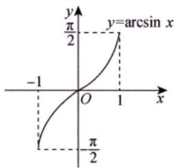  
(a)

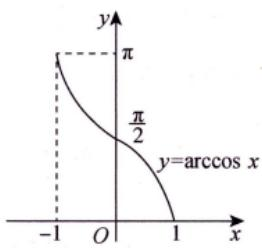  
(b)  
图 1-13

$y = \arcsin x$ 是 $y = \sin x \left( - \frac{\pi}{2} \leqslant x \leqslant \frac{\pi}{2} \right)$ 的反函数，y =arccos x是 $y = \cos x ( 0 \leqslant x \leqslant \pi )$ 的反函数.

## 注(1)主值区间.

$y = \arcsin x$ 的主值区间为 $\left[ - \frac{\pi}{2}, \frac{\pi}{2} \right], y = \arccos x$ 的主值区间为[0，π].

(2)反三角函数的恒等式有

$$
\sin(\arcsin x)=x,\;x\in[-1,1],\;\sin(\arccos x)=\sqrt{1-x^{2}},\;x\in[-1,1];
$$

$$
t = \arccos x \in [0, \pi]
$$

$$
\cos(\arccos x)=x, x \in [-1,1], \cos(\arccos x)=\sqrt{1-x^2}, x \in [-1,1];
$$

$$
\arcsin(\sin x) = x, x \in \left[ - \frac{\pi}{2}, \frac{\pi}{2} \right];
$$

$$
\sin t = \sqrt{1 - x^{2}}
$$

$$
\sin(\arccos x)=\sqrt{1-x^{2}}
$$

$$
\arccos(\cos x)=x,\;x\in[0,\pi];
$$

$$
\arcsin x + \arccos x = \frac{\pi}{2} (-1 \leqslant x \leqslant 1) .
$$

(3)特殊函数值：

$$
\arcsin 0 = 0, \arcsin \frac{1}{2} = \frac{\pi}{6}, \arcsin \frac{\sqrt{2}}{2} = \frac{\pi}{4}, \arcsin \frac{\sqrt{3}}{2} = \frac{\pi}{3}, \arcsin 1 = \frac{\pi}{2}
$$

$$
\arccos 1 = 0, \arccos \frac{\sqrt{3}}{2} = \frac{\pi}{6}, \arccos \frac{\sqrt{2}}{2} = \frac{\pi}{4}, \arccos \frac{1}{2} = \frac{\pi}{3}, \arccos 0 = \frac{\pi}{2}
$$

## 例1.12设 $y = \sin x , 0 \leqslant x \leqslant 2\pi$ ，求其所有单调区间上的反函数.

分析分单调区间，分别讨论反函数（用诱导公式）.

只有当x落在 $\left[ - \frac{\pi}{2}, \frac{\pi}{2} \right]$ 上时，才有反函数 $x = \arcsin y , y \in [-1,1]$ 7

解当 $0 \leq x \leq \frac{\pi}{2}$ 时，对 $y = \sin x$ ,有 $x = \arcsin y , y \in [0,1]$ ，此时反函数为 $y = \arcsin x , x \in [0,1]$

当 $\frac{\pi}{2} < x \leq \frac{3\pi}{2}$ 时（见图1-14），有 $-\frac{\pi}{2} < x - \pi \leq \frac{\pi}{2}$ ，此时 $\sin(x - \pi) = -\sin(\pi - x) = -\sin x = -y$ ，于是→放到主值区间中有 $x - \pi = - \arcsin y$ ，故 $x = \pi - \arcsin y , y \in [-1,1)$ ，此时反函数为 $y = \pi - \arcsin x , x \in [-1,1)$

当 $\frac{3\pi}{2} < x \leq 2\pi$ 时（见图1-14），有 $-\frac{\pi}{2} < x - 2\pi \leq 0$ ，此时 $\sin(x - 2\pi) = \sin x = y$ ，于是有 $x - 2\pi =$ arcsin y，故 $x = 2\pi + \arcsin y, \; y \in (-1, 0]$ ，此时反函数为 $y = 2\pi + \arcsin x, \; x \in (-1, \; 0]$

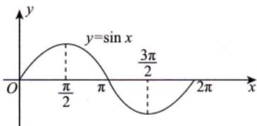  
图 1-14

方法总结 arcsin x的主值区间是 $\left[ - \frac{\pi}{2}, \frac{\pi}{2} \right]$

②公式若 $y = \sin x , x \in \left( \frac{\pi}{2}, \frac{3}{2}\pi \right)$ ，则 $x = \pi - \arcsin y$

注(1)用处：如二重积分中，

$$
\int _ { - 1 } ^ { 0 } \mathrm{d}y \int _ { \pi - \arcsin y } ^ { 2 \pi + \arcsin y } f ( x , y ) \mathrm{d}x .
$$

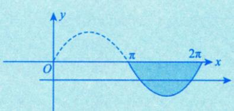

后面我们讲二重积分时再讲.

(2)现在来回答大家：为什么不写成一个分段函数？会出现以下情况.

$$
y = \left\{ \begin{aligned} &\arcsin x, \quad 0 \leqslant y \leqslant \frac{\pi}{2}, \\ &\pi - \arcsin x, \quad \frac{\pi}{2} < y \leqslant \frac{3}{2}\pi, \\ &2\pi + \arcsin x, \quad \frac{3}{2}\pi < y \leqslant 2\pi. \end{aligned} \right. \quad \begin{aligned} &x \in [0,1], \\ &x \in [-1,1), \\ &x \in (-1,0]. \\ &x \in (-1,0]. \end{aligned}
$$

这样的图形是什么呢？如图1-15所示.

  
图1-15

这个图就是y=sinx在[0,2π]的沿 $y = x$ 镜像的函数，就变成多值函数了.

②反正切函数与反余切函数.★★非常重要的函数

反正切函数 $y = \arctan x$ [见图1-16(a)]，反余切函数 $y = \operatorname{arccot}x$ [见图 1-16(b)].

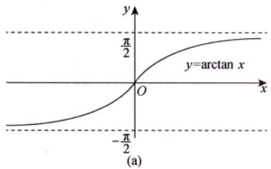

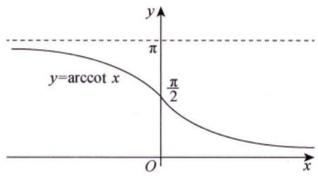  
图 1-16

$y = \arctan x$ 是 $y = \tan x \left( - \frac{\pi}{2} < x < \frac{\pi}{2} \right)$ 的反函数，y =arccot x是 $y = \cot x (0 < x < \pi)$ 的反函数.

## 注(1)定义域：均为 $( - \infty , + \infty )$

值域： y =arctan x 的值域为 $\left( - \frac{\pi}{2}, \frac{\pi}{2} \right), y = \arccos x$ 的值域为(0，π).

(2) 单调性 $y = \arctan x$ 单调增加， $y = \arccos x$ 单调减少.

若 $a_{n} > 0$ $\arctan a_{n} + a_{n} = \arctan b_{n}$ 则 $\arctan b_{n}-\arctan a_{n}=a_{n}>0$ (因y =arctan x 是单调增加函数)，因此 $b_{n} > a_{n} > 0$ ，若 $b_{n} = a_{n - 1}$ ，则 $\left\{ a_{n} \right\}$ 有下界且单调减少，从而 $\left\{ a_{n} \right\}$ 极限存在.

若再加条件， $\lim_{n \to \infty} b_n = 0$ ，则 $b_{n} > a_{n} > 0$

## 由夹逼准则，lima=0

命题老师给的关系式一般都需要做逆运算：

该加的，他减；该减的，他加；该乘的，他除；该除的，他乘，等等，这些都是需要作恒等变形的.  
命题老师通过做逆运算来迷惑你，要跟他唱反调，这是非常重要的解题经验.

(3) 奇偶性：y=arctanx为奇函数（在其定义域内).

(4)有界性：两个函数在其定义域内有界， $-\frac{\pi}{2} < \arctan x < \frac{\pi}{2}, \quad 0 < \arccos x < \pi$

(5) 性质： $\arctan x + \arccos x = \frac{\pi}{2} ( - \infty < x < + \infty )$ 。这个也是以后会讲到

(6) 特殊函数值：

$$
\arctan 0 = 0, \arctan \frac{\sqrt{3}}{3} = \frac{\pi}{6}, \arctan 1 = \frac{\pi}{4}, \arctan \sqrt{3} = \frac{\pi}{3},
$$

$$
\arccos 0 = \frac{\pi}{2}, \arccos \sqrt{3} = \frac{\pi}{6}, \arccos 1 = \frac{\pi}{4}, \arccos \frac{\sqrt{3}}{3} = \frac{\pi}{3}
$$

记住

(7) 极限：

$$
\lim_{x \to -\infty} \arctan x = -\frac{\pi}{2}, \quad \lim_{x \to +\infty} \arctan x = \frac{\pi}{2}, \quad \lim_{x \to -\infty} \arccos x = \pi, \quad \lim_{x \to +\infty} \arccos x = 0
$$

(7) 初等函数.

由基本初等函数经过有限次的四则运算，以及有限次的复合步骤所构成的并且可以由一个式子所表示的函数称为初等函数.

注(1)初等函数的定义域可以是一个区间，也可以是几个区间的并集，甚至可以是一些孤立的点.例如， $y = \sqrt{\cos \pi x - 1}$ 的定义域是 $\left\{ x \mid x = 0, \pm 2, \pm 4, \cdots \right\}$

★(2)幂指函数 $u(x)^{v(x)} = \mathrm{e}^{v(x)\ln u(x)}$ 也是初等函数，如 $x > 0$ 时， $f(x) = x^{x} = \mathrm{e}^{x \ln x}$ 是初等函数，其图形如图 1-17 所示.具体作图过程见例5.12.

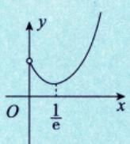  
图 1-17

等到学完工具后再画图。 $x ^ { 3 } , x ^ { 2 x } , x ^ { 3 x }$ 的图像都类似.

## ② 分段函数—→有别于初等函数的另一种重要的函数.

在自变量的不同变化范围中，对应法则用不同式子来表示的函数称为分段函数.需要强调一句，分段函数是用几个式子来表示的一个(不是几个)函数.一般来说，它不是初等函数.分段函数的典型形式如下：

$$
f(x)=\left\{\begin{aligned}&\varphi_{1}(x), \quad x>x_{0}, \\&a, \quad x=x_{0}, \quad  或  f(x)=\left\{\begin{aligned}&\varphi(x), \quad x \neq x_{0}, \\&a, \quad x=x_{0}.\end{aligned}\right. \\&\varphi_{2}(x), \quad x<x_{0}\end{aligned}\right.
$$

分段函数很重要，原因在于其形式的复杂性所带来的命题的丰富性.后面会看到，不论是求极限、求导数，还是求积分，出现最多的研究对象之一便是分段函数.

分段函数是非常重要的一个命题素材.<

下面列出三个重要的分段函数.

① $y = |x| = \left\{ \begin{aligned} & x, & x \geq 0, \\ & -x, & x < 0 \end{aligned} \right.$ 称为绝对值函数，如图1-18(a)所示.

|x|既然是分段函数，那它是不是初等函数呢？是，因为 $|x| = \sqrt{x^{2}}$ .一般来讲，分段函数不是初等函数，但|x|是一个特例。

② $y = \mathrm{sgn}   x = \begin{cases} 1, & x > 0, \\ 0, & x = 0, \\ -1, & x < 0 \end{cases}$ 称为符号函数，如图1-18(b)所示.对于任意实数x，有 $x = |x| \mathrm{sgn}   x$

  
(a)

  
(b)  
图 1-18

③ $y = \left[ x \right]$ 称为取整函数.先给出定义：设x为任一实数，不超过x的最大整数称为x的整数部分，记作[x]. 如

$$
\left [ 0.99 \right ] = 0,\left [ \pi \right ] = 3,\left [ -1 \right ] = -1,\left [ -1.99 \right ] = -2.
$$

因此，取整函数 $y = \left[ x \right]$ 的定义域为R，值域为Z.它的图形如图1-19所示，在x为整数值处图形发生跳跃.

  
图1-19

$x \times x \times (1) \left[ x + n \right] = \left[ x \right] + n$ ，其中n为整数.★ (2) $x - 1 < \left [ x \right ] \le x$ ★ (3) $\lim_{x \to 0^{+}} [x] = 0 ; \lim_{x \to 0^{-}} [x] = -1$

★★★(4)换一种说法， $Y = i + 1$ 当且仅当 $i \leqslant X < i + 1$ ，i为整数，则 $Y = \left[ X \right] + 1$ 考生要牢记.

x的小数部分

例1.13 设[x]表示不超过x的最大整数，则 $y = \sqrt[n]{x - \left[ x \right]}$ 是( ).(A)无界函数 (B) 单调函数(C) 偶函数 (D)周期函数

解应选(D).

由于 $y(x+1)=x+1-[x+1]=x+1-([x]+1)=x-[x]=y(x)$ ，即y(x)是周期为1的周期函数，其图形如图1-20所示，故选(D).

  
图1-20

方法总结x-[x]：x的小数部分，是以1为周期的函数.公式 $\left[ x + n \right] = \left[ x \right] + n , \quad \left[ x + 1 \right] = \left[ x \right] + 1$

注(1) $y = x - \left[ x \right] = \left\{ x \right\}$

$$
1.99 - \left[ 1.99 \right] = 0.99
$$

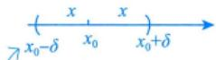

$$
-1.99-\left[-1.99\right]=-1.99+2=0.01
$$

-1.99 的整数部分是-2，

-1.99 的小数部分是 0.01 .

(2) y =sinx|，其图形如图 1-21 所示.

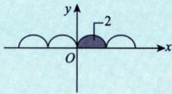  
图1-21

(3) $y = \arcsin(\sin x)$ ，其图形如图 1-22 所示.

  
图1-22

以后我们算积分的相关题目，这些图都有重要的应用.

## 函数极限的概念与性质

我们首先要厘清极限的概念，概念懂了，后面的性质是显然的，计算就会遵循概念和性质，从而不会出错.

## 1 邻域

①δ邻域.设 $x _ { 0 }$ 是数轴上一个点， $\delta$ 是某一正数，则称 $(x_{0} - \delta, x_{0} + \delta)$ 为点 $x _ { 0 }$ 的δ邻域，记作$U(x_{0},\delta)$ ，即

$$
U ( x _ { 0 } , \delta ) = \left\{ x | x _ { 0 } - \delta < x < x _ { 0 } + \delta \right\} = \left\{ x | | x - x _ { 0 } | < \delta \right\} ,
$$

其中点 $x _ { 0 }$ 称为邻域的中心，δ称为邻域的半径.

②去心 $\delta ^ { * }$ 邻域.定义点 $x _ { 0 }$ 的去心邻域 $\dot{U}(x_0, \delta) = \left\{ x \mid 0 < \left| x - x_0 \right| < \delta \right\}$

③左、右 $\delta ^ { \prime }$ 邻域. $\left\{ x \mid 0 < x - x_{0} < \delta \right\}$ 称为点 $x _ { 0 }$ 的右 $\delta ^ { \prime }$ 邻域，记作 $U ^ { + } ( x _ { 0 } , \delta ) ; \left\{ x | 0 < x _ { 0 } - x < \delta \right\}$ 称为点 $x_{0}$ 的左δ邻域，记作 $U ^ { - } ( x _ { 0 } , \delta )$

④邻域与区间(区域).邻域当然属于区间(区域)的范畴，但事实上，邻域通常表示“一个局

部位置”，比如“点 $x _ { 0 }$ 的 $\delta ^ { \cdot }$ 邻域”就可以称为“点 $x _ { 0 }$ 的附近”.于是，函数f(x)在点 $x _ { 0 }$ 的某 $\delta \cdot$ 邻域内有定义也就是函数f(x)在点x的附近有定义，这个“附近”到底有多近多远，既难以说明也没有 $x _ { 0 }$ 必要说明.

注(1)邻域是区间（区域)，但是这个区间是为定义极限才创建的区间.

(2)关于邻域的一组概念非常重要，因为我们将要“在一个局部位置”细致地研究问题.

## 2 函数极限的定义

设函数f(x)在点x的某一去心邻域内有定义.若存在常数A，对于任意给定的 $x _ { 0 }$ $\varepsilon > 0$ (不论它多么小)，总存在正数 $\delta$ ，使得当 $0 < \left| x - x_{0} \right| < \delta$ 时，对应的函数值f(x)都满足不等式 $\left| f(x) - A \right| < \varepsilon$ ，则A叫作函数f(x)当 $x   \rightarrow   x _ { _ 0 }$ 时的极限，记为

$$
\lim_{x \to x_0} f(x) = A  或  f(x) \to A (x \to x_0)
$$

写成 $ \quad \varepsilon - \delta$ 语言”： $\lim_{x \to x_0} f(x) = A \Leftrightarrow \forall \varepsilon > 0, \exists \delta > 0$ ,当 $0 < \left| x - x_{0} \right| < \delta$ 时，有 $\left| f(x) - A \right| < \varepsilon$ 文字语言：任给的 $\varepsilon > 0$ ，总能找到δ邻域，使得我们的距离小于你这个尺度。

注符号“∀”是英文 Arbitrary(任意的)的首字母上下方向倒着写出来的；符号“∃”是英文Exist(存在)的首字母左右方向倒着写出来的.

画图理解.如图1-23所示.

  
图 1-23

任给 $\varepsilon_{1} > 0$ ，再给 $\varepsilon_{2} > 0$ ，……，再给 $\varepsilon _ { _ n } > 0$ ，当ε一直取下去，越来越小，两条线越来越近.不管有多近，总能找到一个小邻域，使得在该邻域内，除了 $x _ { 0 }$ 之外，曲线被夹在宽度要多小有多小的这两条线中，则称 $x \to x_{0}, f(x) \to A$ .这就是魏尔斯特拉斯给的极限的标准语言.

## 注函数极限一共有24个定义，其中自变量趋近方式有6种，函数趋近方式有4种，如表所示.

<table><tr><td></td><td rowspan=1 colspan=1></td><td rowspan=1 colspan=1> $f(x) \to A$ </td><td rowspan=1 colspan=1> $f(x) \to \infty$ </td><td rowspan=1 colspan=1> $f(x) \to +\infty$ </td><td rowspan=1 colspan=1> $f(x) \to -\infty$ </td></tr><tr><td rowspan=1 colspan=2> $x \to x_{0}$ </td><td rowspan=1 colspan=1> $\forall \varepsilon > 0, \exists \delta > 0$ 使得当 $0 < \left| x - x_{0} \right| < \delta$ 时，有 $\left| f(x) - A \right| < \varepsilon$ </td><td rowspan=1 colspan=1> $\forall M>0,\exists \delta>0$ 使得当 $0 < \left| x - x_{0} \right| < \delta$ 时，有|f(x)|&gt;M</td><td rowspan=1 colspan=1> $\forall M>0,\exists \delta>0$ 使得当 $0 < \left| x - x_{0} \right| < \delta$ 时，有f(x)&gt;M</td><td rowspan=1 colspan=1> $\forall M>0,\exists \delta>0$ 使得当 $0 < \left| x - x_{0} \right| < \delta$ 时，有 $f(x) < -M$ 以-∞为核.L无限靠近“-∞”</td></tr><tr><td></td><td></td><td rowspan=1 colspan=1> $\forall \varepsilon > 0, \exists \delta > 0$ 使得当 $0 < x - x_{0} < \delta$ 时，有 $\left| f(x) - A \right| < \varepsilon$ </td><td rowspan=1 colspan=1> $\forall M>0,\exists \delta>0$ 使得当 $0 < x - x_{0} < \delta$ 时，有 $\left| f(x) \right| > M$ </td><td rowspan=1 colspan=1> $\forall M > 0, \exists \delta > 0$ 使得当 $0 < x - x_{0} < \delta$ 时，有f(x)&gt;M</td><td rowspan=1 colspan=1> $\forall M>0,\exists \delta>0$ 使得当 $0 < x - x_{0} < \delta$ 时，有f(x)&lt;-M</td></tr><tr><td></td><td></td><td rowspan=1 colspan=1> $\forall \varepsilon > 0, \exists \delta > 0$ 使得当 $0 < x_{0} - x < \delta$ 时，有 $\left| f(x) - A \right| < \varepsilon$ </td><td rowspan=1 colspan=1> $\forall M > 0, \exists \delta > 0$ 使得当 $0 < x_{0} - x < \delta$ 时，有 $\left| f(x) \right| > M$ </td><td rowspan=1 colspan=1> $\forall M>0,\exists \delta>0$ 使得当 $0 < x_{0} - x < \delta$ 时，有f(x)&gt;M</td><td rowspan=1 colspan=1> $\forall M > 0, \exists \delta > 0$ 使得当 $0 < x_{0} - x < \delta$ 时，有f(x)&lt;-M</td></tr></table>

核(自带光环) ((()))

<table><tr><td rowspan=2 colspan=1> $x \to \infty$ </td><td rowspan=1 colspan=1> $f(x) \to A$ </td><td rowspan=1 colspan=1> $f(x) \to \infty$ </td><td rowspan=1 colspan=1> $f(x) \to +\infty$ </td><td rowspan=1 colspan=1> $f(x) \to -\infty$ </td></tr><tr><td rowspan=1 colspan=1> $\forall \varepsilon > 0, \exists X > 0$ 使得当|x|&gt;X时，有 $\left| f(x) - A \right| < \varepsilon$ </td><td rowspan=1 colspan=1> $\forall M>0,\exists X>0$ 使得当|x|&gt;X时，有|f(x)|&gt;M</td><td rowspan=1 colspan=1> $\forall M > 0, \exists X > 0$ 使得当|x|&gt;X时，有f(x)&gt;M</td><td rowspan=1 colspan=1> $\forall M>0,\exists X>0$ 使得当|x|&gt;X时，有f(x)&lt;-M</td></tr><tr><td rowspan=1 colspan=1> $x \to +\infty$ </td><td rowspan=1 colspan=1> $\forall \varepsilon > 0, \exists X > 0$ 使得当x&gt;X时，有 $\left| f(x) - A \right| < \varepsilon$ </td><td rowspan=1 colspan=1> $\forall M>0,\exists X>0$ 使得当x&gt;X时，有|f(x)|&gt;M</td><td rowspan=1 colspan=1> $\forall M>0,\exists X>0$ 使得当x&gt;X时，有f(x)&gt;M</td><td rowspan=1 colspan=1> $\forall M > 0, \exists X > 0$ 使得当x&gt;X时，有f(x)&lt;-M</td></tr><tr><td rowspan=1 colspan=1> $x \to -\infty$ </td><td rowspan=1 colspan=1> $\forall \varepsilon > 0 , \exists X > 0 ,$ 使得当x&lt;-X时，有 $\left| f(x) - A \right| < \varepsilon$ </td><td rowspan=1 colspan=1> $\forall M>0,\exists X>0$ 使得当x&lt;-X时，有 $\left| f(x) \right| > M$ </td><td rowspan=1 colspan=1> $\forall M>0,\exists X>0$ 使得当x&lt;-X时，有f(x)&gt;M</td><td rowspan=1 colspan=1> $\forall M > 0, \exists X > 0,$ 使得当x&lt;-X时，有f(x)&lt;-M</td></tr></table>

24 种情况，好好写一遍.

例1.14 已知 $\lim_{x \to 0} \frac{f(x)}{x^2}$ 存在，且函数

$$
f(x)=\frac{x-\sin x}{x}+x^{2}\lim_{x \to 0}\frac{f(x)}{1-\cos x}
$$

则 $\lim_{x \to 0} \frac{f(x)}{x^2}$ ( ).(A) $-\frac{1}{3}$ (B) $\frac{1}{3}$ (C) $\frac{1}{6}$ (D) $-\frac{1}{6}$

分析令 $\lim_{x \to 0} \frac{f(x)}{x^2} = A$ ，建立方程.

解应选 (D).

记 $\lim_{x \to 0} \frac{f(x)}{x^2} = A$ ，且当x→0时，

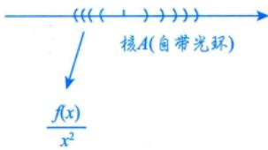

$$
\frac{f(x)}{x^{2}}=\frac{x-\sin x}{x^{3}}+\lim_{x \rightarrow 0}\frac{f(x)}{1-\cos x}, \quad \frac{f(x)}{\lim\limits_{x \rightarrow 0}\frac{f(x)}{x^{2}} \cdot \frac{x^{2}}{\left | 1-\cos x \right | }} \rightarrow 2
$$

则 $\lim_{x \to 0} \frac{x - \sin x}{x^3} + 2A$ ，故 $A = \frac{1}{6} + 2A$ ，得 $A = - \frac{1}{6}$

## ③超实数及其在极限中的应用

下面讲一个极为重要的概念及其应用，帮助考生进一步深刻理解“极限”.

实数系R中有如下公理：

若对任意大的自然数n，均有 $\left| x \right| < \frac{1}{n}$ ，则 $x = 0$ .这使得实数系R中不存在非零无穷小量及其倒数—无穷大量.

(1)定义.

①非零无穷小量与无穷大量.

若对任意大的自然数n，均有 $\left| x^{*} \right| < \frac{1}{n}$ 且 $x^{^*} \ne 0$ ，则 $x ^ { \prime }$ 为非零无穷小量，其倒数 $\frac{1}{x^{^*}}$ 为无穷大量.  
②超实数.

设 $x _ { 0 }$ 为任一实数，则 $x_{0} + x^{*}$ 为有限超实数， $x_{0}+\frac{1}{x^{^{*}}}$ 为无穷超实数（无穷大量）

③超实数系 $\mathbf { R } ^ { * }$

实数系R，非零无穷小量 $x ^ { \prime }$ ，无穷大量 $\frac{1}{x^{^{*}}}$ 构成超实数系 $\mathbf { R } ^ { \bullet }$ . $x_{0} + x^{\bullet}$ $x_{0}+\frac{1}{x^{^{*}}}$ 不在实数系R中.   
(2)实数与超实数的关系（见图1-24）.

  
图 1-24

在实数轴上任取一点 $x _ { 0 }$ ，称为核.

$x_{0} + x^{*}$ 是以 $x _ { 0 }$ 为核的有限超实数，称为核 $x _ { 0 }$ 的光环，由于 $x ^ { \prime }$ 是任意一个非零无穷小，故 $x _ { 0 }$ 的光环有无穷多个.

为方便，记 $\boldsymbol{X}^{*} = x_{0} + \boldsymbol{x}^{*} = \operatorname{std}(\boldsymbol{X}^{*}) + \left[ \boldsymbol{X}^{*} - \operatorname{std}(\boldsymbol{X}^{*}) \right]$ $x_{0}=\operatorname{std}(\boldsymbol{X}^{*})$ 也称为超实数 $X ^ { \bullet }$ 的标准实数部分，$x^{*} = X^{*} - \operatorname{std}(X^{*})$ 即为非零无穷小量.

如 $x_{0}=0 , \quad x_{1}^{*}=\sin x(x \rightarrow 0)$ ，则 $X_{1}^{*} = x_{0} + x_{1}^{*} = \sin x(x \to 0)$ 是以0为核，以sinx为无穷小量的超实数.

如 $x_{0}=0 , x_{2}^{*}=2x(x \to 0)$ ，则 $X_{2}^{*} = x_{0} + x_{2}^{*} = 2x(x \rightarrow 0)$ 是以0为核，以2x为无穷小量的超实数.

如 $x_{0}=0 , x_{3}^{*}=\frac{1}{x}(x \to 0)$ ，则 $X_{3}^{*} = x_{0} + x_{3}^{*} = \frac{1}{x} (x \to 0)$ 是以0为核，以 $\frac{1}{x}$ 为无穷大量的超实数.

如 $x_{0}=0 , x_{4}^{*}=\frac{1}{x^{2}}(x \rightarrow 0)$ ，则 $X_{4}^{*} = x_{0} + x_{4}^{*} = \frac{1}{x^{2}} (x \rightarrow 0)$ 是以0为核，以 $\frac{1}{x^{2}}$ 为无穷大量的超实数.

显然，上述4个超实数到它们的核的距离sinx，2x， $\left| \frac{1}{x} \right|, \quad \left| \frac{1}{x^2} \right| (x \to 0)$ 均不是实数，sinx，$|2x|(x \to 0)$ 是比任何正实数都小的量， $\left| \frac{1}{x} \right|, \quad \left| \frac{1}{x^2} \right| (x \to 0)$ 是比任何正实数都大的量

(3)超实数与极限的关系与运算.

先举个例子.如

$$
\lim_{x \to 0} \frac{\sin x}{x} = 1
$$

其中，① $\frac{\sin x}{x}$ 在未作极限运算时，为实数运算

② $\lim_{x \to 0} \frac{\sin x}{x}$ 称为趋核运算，此时的 $\frac{\sin x}{x}$ 称为超实数， $\lim_{x \to 0} \frac{\sin x}{x}$ 的结果为其核值1.于是

★设 $\lim_{x \to x_0} f(x) = A$ ，其运算（及其运算顺序）为

a. f(x)为实数运算.

b. $\lim_{x \to x_0} f(x)$ 为趋核运算，A为核值，当A唯一时，称趋核运算存在， $\lim_{x \to x_0} f(x)$ 存在；否则称趋核运算不存在， $\lim_{x \to x_0} f(x)$ 不存在.

如 $\lim_{x \to 0} \frac{(x - x)}{x} = \lim_{x \to 0} 0 = 0$ 核值0

再如， $\lim_{x \to 0} (x - \sin x) \neq \lim_{x \to 0} (x - x) = 0$ ，当然不等， $\lim_{x \to 0} (x - \sin x)$ 首先要作实数运算.由于 $\sin x \ne x$ $x - \sin x \neq x - x$ ，故趋核运算便无从谈起了.

实数运算错误

又如，计算 $\lim_{x \to \infty} \frac{\left(1 + \frac{1}{x}\right)^x}{\mathrm{e}^x}$ ，若写 $\lim_{x \to \infty} \frac{\left( 1 + \frac{1}{x} \right)^{x^2}}{\mathrm{e}^x} = \lim_{x \to \infty} \frac{\left[ \left( 1 + \frac{1}{x} \right)^x \right]^x}{\mathrm{e}^x} = \lim_{x \to \infty} \frac{\mathrm{e}^x}{\mathrm{e}^x} = 1$ ，显然也是错误的.因为， $\lim_{x \to \infty} \frac{\left( 1 + \frac{1}{x} \right)^{x^2}}{\mathrm{e}^x}$ 的第一步，要作 $\frac{\left(1+\frac{1}{x}\right)^{x^{2}}}{\mathrm{e}^{x}}$ 的实数运算，即

$$
\frac{\left(1+\frac{1}{x}\right)^{x^{2}}}{\mathrm{e}^{x}}=\frac{\mathrm{e}^{x^{2}\ln\left(1+\frac{1}{x}\right)}}{\mathrm{e}^{x}}=\mathrm{e}^{x^{2}\ln\left(1+\frac{1}{x}\right)-x}
$$

第二步，再作 $\lim_{x \to \infty} e^{x^2 \ln \left( 1 + \frac{1}{x} \right) - x}$ 的趋核运算.

上述错误是将 $\frac{\left[ \left( 1 + \frac{1}{x} \right)^x \right]^x}{\mathrm{e}^x}$ 中的 $\left( 1 + \frac{1}{x} \right)^{x}$ 换成了e，而在实数运算中， $\left( 1 + \frac{1}{x} \right)^{x} \neq \mathbf{e}$

注有考生会问，等价无穷小替换的方法是否违背上述规则呢？举例来说，

$$
\lim_{x \to 0} \frac{1 - \cos x}{x^2} \xlongequal{ 等价无穷小 } \lim_{x \to 0} \frac{\left| \frac{1}{2}x^2 \right|}{x^2} = \frac{1}{2}
$$

这里是不是在实数运算中将1-cosx写成 $ 了  \frac{1}{2}x^{2} ?$ 是否犯了错误？

请注意，如果认为 $\lim_{x \to 0} \frac{1 - \cos x}{x^2} = \lim_{x \to 0} \frac{\left| \frac{1}{2}x^2 \right|}{x^2}$ 是在实数运算中进行的，显然是错误的

这与 $\lim_{x \to 0} (x - \sin x) = \lim_{x \to 0} (x - x)$ $\lim_{x \to \infty} \frac{\left[ \left( 1 + \frac{1}{x} \right)^x \right]^x}{\mathrm{e}^x} = \lim_{x \to \infty} \frac{\mathrm{e}^x}{\mathrm{e}^x}$ 的错误是一样的.

事实上， $\lim_{x \to 0} \frac{1 - \cos x}{x^2}$ 是这样算的：

实数运算，

$\frac{1 - \cos x}{x^{2}} = \frac{A}{x^{2}} \frac{1 - \cos x}{A} = \frac{\frac{1}{2}x^{2}}{x^{2}} \frac{1 - \cos x}{\frac{1}{2}x^{2}} \quad ( = \frac{1}{2} \cdot \frac{1 - \cos x}{\frac{1}{2}x^{2}} )$ 进一步是可以这样写的）

趋核运算，

$$
\lim_{x \to 0} \frac{1 - \cos x}{x^2} = \lim_{x \to 0} \frac{\frac{1}{2}x^2}{x^2} \cdot \lim_{x \to 0} \frac{1 - \cos x}{\frac{1}{2}x^2}
$$

由于当 $x \to 0$ 时， $1 - \cos x$ 与 $\frac{1}{2}x^{2}$ 是等价无穷小量，即它们趋核速度相同，用趋核运算来刻画，即  
$\lim_{x \to 0} \frac{1 - \cos x}{\frac{1}{2}x^2} = 1$ 故 $\lim_{x \to 0} \frac{1 - \cos x}{x^2} = \lim_{x \to 0} \frac{\frac{1}{2}x^2}{x^2} \cdot 1$ 这是此问题的正确来由.  
$1-\cos x  与  \frac{1}{2}x^{2}$ 趋核速度相同显然，上述 $\lim_{x \to 0} \frac{1 - \cos x}{\frac{1}{2}x^2} = 1$ 涉及“趋核速度”，需要详细说一说.

(4) 趋核速度.

既然一个核值 $x _ { 0 }$ 周围有无数个光环，这些光环的本质区别是什么呢？这就要提出“趋核速度”的问题了.

比如，如图1-25所示.

  
图 1-25

$\sin x(x \to 0)$ 与 $x ( x \to 0 )$ 均以0为核值，且趋核速度相同，则用下式来刻画这种关系：

$$
\frac{\lim\limits_{x \to 0} \frac{\sin x}{x}}{x} = 1 \quad . \quad \frac{\sin x \to 0}{\sin x(x \to 0)} \quad  与  \quad x(x \to 0)  益接速度相同
$$

于是，有下面的结论：

若 $f(x)(x \to x_0)$ 与 $g ( x ) ( x \to x _ { 0 } )$ 均以0为核值，则 $\lim_{x \to x_0} \frac{f(x)}{g(x)} = a \neq 0 \Leftrightarrow f(x)(x \to x_0)$ 与 $g(x)(x \to x_0)$ 趋核速度相同.

$\lim_{x \to x_0} \frac{f(x)}{g(x)} = 0 \Leftrightarrow f(x)(x \to x_0)$ 比 $g(x)(x \to x_0)$ 趋核速度快.

$\lim_{x \to x_0} \frac{f(x)}{g(x)} = \infty \Leftrightarrow f(x)(x \to x_0)$ 比 $g(x)(x \to x_0)$ 趋核速度慢.

(5) 极限四则运算规则.

这也称为超实数趋核四则运算规则

设 $\lim_{x \to x_0} f(x) = A , \quad \lim_{x \to x_0} g(x) = B$ ，则有

① $\lim_{x \to x_0} \left[ f(x) \pm g(x) \right] = A \pm B$

② $\lim_{x \to x_0} f(x)g(x) = AB$

③ $\lim_{x \to x_0} \frac{f(x)}{g(x)} = \frac{A}{B} (B \neq 0)$

事实上，由于f(x)，g(x)的趋核运算值均为其实数核值，故如

$$
\lim_{x \to x_0} \left[ f(x) + g(x) \right] = \lim_{x \to x_0} f(x) + \lim_{x \to x_0} g(x) = A + B
$$

显然成立，比如

$$
\lim_{x \to 0} (x + \sin x) = \lim_{x \to 0} x + \lim_{x \to 0} \sin x = 0 + 0 = 0
$$

$$
\lim_{x \to 1} \frac{\sin x}{x} = \frac{\lim\limits_{x \to 1} \sin x}{\lim\limits_{x \to 1} x} = \frac{\sin 1}{1} = \sin 1
$$

下面说明两种情况.

① $f(x),   g(x)$ 中恰有一个不存在核值.

设 $\lim_{x \to x_0} f(x) = A$ $\lim_{x \to x_0} g(x)$ 不存在或为无穷大量，则

a. lim[f(x)±g(x)]=A±(不存在或∞) =不存在或∞.x→xg实数运算为平不存在或∞作有限平移，依然为移运算 不存在或∞.

如 $\lim_{x \to 0} \left( \frac{\sin x}{x} + \sin \frac{1}{x} \right)$ ，其中 $\lim_{x \to 0} \frac{\sin x}{x} = 1, \lim_{x \to 0} \sin \frac{1}{x}$ 不存在（在-1到1之间振荡），则 $\lim_{x \to 0} \left( \frac{\sin x}{x} + \sin \frac{1}{x} \right)$ 1+不存在=不存在.仅供理解，不要写出来.

b. $\begin{aligned} \lim_{x \to x_0} \underbrace{f(x)g(x)}_{\substack{负实数运算 \\ 怂故熔运算\end{aligned}}}_{负实数运算}$

这里的趋核运算有多种情况.

(i) 如 $\lim_{x \to 0} x \sin \frac{1}{x}$ ，其中 $\lim_{x \to 0} x = 0$ $\lim_{x \to 0} \sin \frac{1}{x}$ 不存在.

此时 $A = 0$ ，可以将“-1到1之间振荡”的情形压缩成0，故 $\lim_{x \to 0} x \sin \frac{1}{x} = 0$ 有界振荡=0.压缩为0此时极限存在，即趋核运算值为0

(ii) 如 $\lim_{x \to \infty} \sin \frac{1}{x^2} \cdot x$ ，其中 $\lim_{x \to \infty} \sin \frac{1}{x^2} = 0$ $\lim_{x \to \infty} x = \infty$ ，理由同(i)， $\lim_{x \to \infty} \sin \frac{1}{x^2} \cdot x = 0$

(iii) 如 $\lim_{x \to 0} \cos x \cdot \sin \frac{1}{x}$ ，其中 $\lim_{x \to 0} \cos x = 1$ $\lim_{x \to 0} \sin \frac{1}{x}$ 不存在.此时A=1，放缩结果不变，故$\lim_{x \to 0} \cos x \sin \frac{1}{x}$ 不存在.

C. $\lim_{x \to x_0} \frac{f(x)}{g(x)} = \lim_{x \to x_0} f(x) \cdot \frac{1}{g(x)}$ ，讨论与b.类似.

②f(x)，g(x)均不存在核值.

设 $\lim_{x \to x_0} f(x)$ 不存在或为∞， $\lim_{x \to x_0} g(x)$ 不存在或为 $\infty$ ，则

a. $\lim_{x \to x_0} \left[ \underbrace{f(x) \pm g(x)}_{ 货实数运算 } \right] = \frac{ 不存在  \pm  不存在 }{ 货 }$

这里的趋核运算有多种情况.

(i) 如 $\lim_{x \to 0} \left( \frac{1}{x} - \frac{1}{x} \right) = \lim_{\substack{x \to 0 \\ 0}} 0 = 0$ ，其中 $\lim_{x \to 0} \frac{1}{x} = \infty$

此时要明白，应先算实数运算，且因不符合拆开的条件，不能拆开算.

(ii)如 $\lim_{x \to 0} \left( \frac{1}{x} - \frac{2}{x} \right) = - \lim_{x \to 0} \frac{1}{x} = \infty$ .易知，趋核运算可能存在，亦可能不存在.

b. $\lim_{x \to x_0} \frac{f(x)g(x)}{\odot} = \frac{(不存在或 \infty) \cdot (不存在或 \infty)}{\odot}$

这里的趋核运算有多种情况.

(i) 若取 $f(x) = \begin{cases} 1, \\ -1 \end{cases}$ ，x为无理数， x为有理数， $g(x) = \begin{cases} 1, \\ -1 \end{cases}$ ，x为无理数， x为有理数， 则 $\lim_{x \to 0} f(x)$ 不存在， $\lim_{x \to 0} g(x)$ 不存在，而 $f(x) \cdot g(x) \equiv 1$ 实数运算 ，故 $\frac{\lim_{x \to 0} f(x) \cdot g(x) = 1}{  趁援运算  }$

(ii)若取 $f(x)=\sin\frac{1}{x},~g(x)=\cos\frac{1}{x}$ ，则 $\lim_{x \to 0} f(x)$ 不存在， $\lim_{x \to 0} g(x)$ 不存在.而 $\frac{f(x)g(x)}{ 实数送算 }=\sin\frac{1}{x}\cos\frac{1}{x}=$ $\frac{1}{2}\sin\frac{2}{x}$ ，故 $\lim_{x \to 0} f(x)g(x)$ 不存在.趋接运算

(iii)若取 $f(x)=\sin\frac{1}{x}, \quad g(x)=\frac{1}{x}$ ，则 $\lim_{x \to 0} f(x)$ 不存在（在-1到1之间振荡）， $\lim_{x \to 0} g(x) = \infty$ ，而$\lim_{x \to 0} f(x)g(x) = \lim_{x \to 0} \frac{1}{x}\sin\frac{1}{x}$ 宜数运算

若 $x = \frac{1}{n\pi}, \; n = 1, \; 2, \; \cdots$ ，则实数运算 $\frac{1}{x}\sin\frac{1}{x}\bigg|_{x = \frac{1}{n\pi}} = n\pi\sin n\pi = 0,\ \lim_{x \to 0}f(x)g(x) = 0.$ ;

若 $x = \frac{1}{2n\pi + \frac{\pi}{2}}, n = 1, 2, \cdots$ ，则实数运算

$$
\frac{1}{x}\sin\frac{1}{x}\bigg|_{x = \frac{1}{2n\pi}\frac{\pi}{2}} = \left(2n\pi + \frac{\pi}{2}\right)\sin\left(2n\pi + \frac{\pi}{2}\right) = 2n\pi + \frac{\pi}{2}, \quad \lim_{x \to 0}f(x)g(x) = \lim_{x \to \infty}\left(2n\pi + \frac{\pi}{2}\right) = \infty.
$$

此处，趋核运算的结果既有实数0，也有无穷大量，称为“无界变量”.

(iv) 显然， $\infty \cdot \infty = \infty$

C. $\lim_{x \to x_0} \frac{f(x)}{g(x)} = \lim_{x \to x_0} f(x) \cdot \frac{1}{g(x)}$

讨论与 b. 类似.

综上所述，可列表如下：

<table><tr><td rowspan=1 colspan=1>条件</td><td rowspan=1 colspan=1>结论</td></tr><tr><td rowspan=1 colspan=1>f(x)，g(x)均存在核值</td><td rowspan=1 colspan=1>f(x)±g(x), f(x)·g(x),  $\frac{f(x)}{g(x)}$ (g(x)核值不为0)均存在核值</td></tr><tr><td rowspan=1 colspan=1>f(x)，g(x)中恰有一个不存在核值</td><td rowspan=1 colspan=1> $f(x) \pm g(x)$ 不存在核值； $f(x) \cdot g(x)$ 可能存在核值，也可能不存在核值； $\frac{f(x)}{g(x)}$ 可能存在核值，也可能不存在核值</td></tr><tr><td rowspan=1 colspan=1>f(x)，g(x)均不存在核值</td><td rowspan=1 colspan=1>f(x)±g(x), f(x)·g(x),  $\frac{f(x)}{g(x)}$ 均可能存在核值，也可能不存在核值</td></tr></table>

## 函数极限的性质

(1) 唯一性.→极限是谁呢？是标准实数部分，是唯一的。

如果极限 $\lim_{x \to x_0} f(x)$ 存在，那么极限唯一.任何一个实数，周围有无数个光环.

前面表中的24种情况

## 注（1)函数极限存在的充要条件.

表示左右趋近都是A $\lim_{x \to x_0} \frac{f(x)}{f(x)} = A \Leftrightarrow \lim_{x \to x_0^+} f(x) = A  且  \lim_{x \to x_0^+} f(x) = A,$

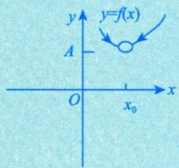

(2) 关于唯一性的说明.

①对于 $x \to \infty$ ，意味着x→+∞且x→-∞；两个方向

②对于 $x \to x_{0}$ ，意味着 $x \rightarrow x_{0}^{+}$ 且 $x \rightarrow x_{0}^{-}$

我们称这个细节的问题为自变量取值的“双向性（有正有负)”，基于此，我们看几个重要的函数极限问题.

① $\lim_{x \to \infty} \mathrm{e}^x$ 不存在，因为 $\lim_{x \to +\infty} \mathrm{e}^x = +\infty, \lim_{x \to -\infty} \mathrm{e}^x = 0$ ，根据“极限若存在，必唯一”，得原极限不存在.

② $\lim_{x \to 0} \frac{\sin x}{\left | x \right | }$ 不存在，因为 $\lim_{x \to 0^{+}} \frac{\sin x}{\left | x \right | } = \lim_{x \to 0^{+}} \frac{\sin x}{x} = 1$ $\lim_{x \to 0^{-}} \frac{\sin x}{|x|} = \lim_{x \to 0^{-}} \frac{\sin x}{-x} = -1$

③ $\lim_{x \to \infty} \arctan x$ 不存在，因为 $\lim_{x \to +\infty} \arctan x = \frac{\pi}{2}$ $\lim_{x \to -\infty} \arctan x = -\frac{\pi}{2}$

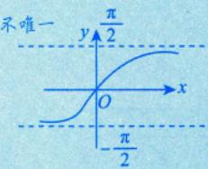

④ $\lim_{x \to 0} [x]$ 不存在，因为 $\lim_{x \to 0^{+}} [x] = 0, \quad \lim_{x \to 0^{-}} [x] = -1$

[x]为不超过x的最大整数，也就是x的整数部分.

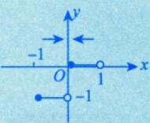

⑤分段函数分段点两侧表达式不同，需分别求左、右极限.

在实际考试中，主要是这些函数：一个是指数函数，一个是带绝对值的函数，也就是分段函数.如果分段函数在分段点处两端的解析式不同，是需要分别求左、右极限的，这个考点在研究生考试中几乎是必考的.所以考生不仅要知道这些唯一性，而且研究生考试中更会通过这些具体的例子去考查考生对唯一性的认识.

例1.15 当x→1时，函数 $\frac{\mathrm{e}^{\frac{1}{x - 1}}\ln\left| 1 + x \right|}{\left( \mathrm{e}^{x} - 1 \right)\left( x - 2 \right)}$ 的极限（).(A)等于1 (B)等于0 (C)为 $\infty$

(D)不存在且不为∞

分析x→1，关键看 $\mathrm{e}^{\frac{1}{x - 1}}$

$x \to 1^{+}, x - 1 \to 0^{+}, \frac{1}{\boxed{x - 1}} \to +\infty;$ 你不能用一个非常非常小的正数去代替，后面会专门提无穷小的→概念，它不是一个很小很小的数，而是无限趋于零的变量$\frac{x \to 1^{-}}{\downarrow}, x - 1 \to 0^{-}, \frac{1}{x - 1} \to -\infty$

x无限趋于1，但比1小

解应选(D).

函数 $\frac{\mathrm{e}^{\frac{1}{x - 1}}\ln\left| 1 + x \right|}{\left( \mathrm{e}^{x} - 1 \right)\left( x - 2 \right)}$ 在x=1处没有定义，在x=1的两侧表达式虽然相同，但是注意到当x→1时，$\frac{1}{x - 1}$ 左、右极限不相等，因此应该考虑单侧极限.

$$
\lim_{x \to 1^{-}} \frac{\mathrm{e}^{\frac{1}{x - 1}} \ln |1 + x|}{(\mathrm{e}^{x} - 1)(x - 2)} = 0
$$

$$
\lim_{x \to 1^{+}} \frac{\mathrm{e}^{\frac{1}{x - 1}} \ln |1 + x|}{(\mathrm{e}^{x} - 1)(x - 2)} = -\infty
$$

可知当x→1时，函数 $\frac{\mathrm{e}^{\frac{1}{x - 1}}\ln\left| 1 + x \right|}{\left( \mathrm{e}^{x} - 1 \right)\left( x - 2 \right)}$ 的极限不存在且不为 $\infty$ ，故选(D).

方法总结遇到 $\mathsf { e } ^ { \infty }$ ，需讨论 $\mathbf { e } ^ { + \infty }$ 和 $\mathbf { e } ^ { - \infty }$

②公式 $\lim_{u \to +\infty} \mathrm{e}^u = +\infty, \lim_{u \to -\infty} \mathrm{e}^u = 0$

注对于上述 $\lim_{x \to 1} \mathrm{e}^{\frac{1}{x - 1}}$ 的情形，由于 $\lim_{x \to 1^{+}} \frac{1}{x - 1}$ 与 $\lim_{x \to 1} \frac{1}{x - 1}$ 不相等，因此不能忽视左极限与右极限，否则会导致错误，这是这类问题经常出现错误的原因

例1.16 设 $g(x)=\left\{\begin{aligned}2-x,\quad x\leqslant0,\\2+x,\quad x>0,\end{aligned}\right.f(x)=\left\{\begin{aligned}x^{2},\quad x<0,\\-x-1,\quad x\geqslant0,\end{aligned}\right.$ 则 $\lim_{x \to 0} g[f(x)]$ ().(A) 为3 (B) 为2 (C)为1 (D)不存在

这个题已见过，例1.5，分段函数的复合方法，有前世今生，越往后学越轻松，这个题还有连续剧，后面再说解应选 (D).

由例1.5可知，

$$
g[f(x)]=\begin{cases}3+x, & x \geq 0, \\2+x^2, & x < 0.\end{cases}
$$

又 $\lim_{x \to 0^{+}} g[f(x)] = \lim_{x \to 0^{+}} \frac{(3 + x)}{x} = 3 \neq \lim_{x \to 0^{-}} g[f(x)] = \lim_{x \to 0^{-}} \frac{(2 + x^2)}{x} = 2$ ，故 $\lim_{x \to 0} g[f(x)]$ 不存在.这是超实数 这个超实数的极限结果是2

方法总结分段函数在分段点处的极限要考虑左、右极限.

公式若 $\lim_{x \to x_0^+} f(x) \neq \lim_{x \to x_0^-} f(x)$ ，则 $\lim_{x \to x_0} f(x)$ 不存在.

(2) 局部有界性.

两件事：①抽象证明，方法（技巧）重要.  
②具体例子理解.

如果 $\lim_{x \to x_0} f(x) = A$ ，则存在正常数M和 $\delta$ ，使得当 $0 < \left| x - x_{0} \right| < \delta$ 时，有 $\left| f(x) \right| \leq M$

注(1)证 $\lim_{x \to x_0} f(x) = A \Leftrightarrow \forall \varepsilon > 0, \exists \delta > 0$ 当 $0 < \left| x - x_{0} \right| < \delta$ 时， $\left| f(x) - A \right| < \varepsilon$ 则 $\left| f(x) \right| = \left| f(x) - A + A \right| \leqslant \left| f(x) - A \right| + \left| A \right|$ .取 $\varepsilon = 1, \left| f(x) \right| \leqslant 1 + \left| A \right| = M$

(2)这个M必须是个确定的数，比如2023 年考研试题中出现 $| b _ { n } | \equiv b _ { n } - a _ { n } + a _ { n } | \leqslant | b _ { n } - a _ { n } | + | a _ { n }$ 1(是整个过程中的最关键环节)，下面4条都有可能在考场出现.

①设 $\lim_{x \to \cdot} f(x)$ 存在，则当x→·时，f(x)有界.其中 $x \to \cdot$ 是指 $x \to x_{0}, x \to x_{0}^{-}, x \to x_{0}^{+}$   
$x \to \infty, \quad x \to -\infty, \quad x \to +\infty$ 六种情形.值得注意的是，极限存在只是函数局部有界的充分条件，并非  
必要条件 →如y=sinx在任意区间上有界，但limsinx.不存在f(a),f(b)为实数②若y =f(x)在[a, b]上为连续函数，则f(x)在[a,b]上必定有界.  
这里直观上给大家介绍连续：在黑板上拿粉笔点A点，一直到B点，中间不要离开黑板.上界与下界都不是唯一的，下面这条极为重要.  
→控制住函数的有界性  
★③若f(x)在(a,b)内为连续函数，且 $\lim_{x \to a^{+}} f(x)$ 与 $\lim_{x \to b^{-}} f(x)$ 都存在，则f(x)在(a,b)内必定有界④有界函数与有界函数的和、差、积仍为有界函数.(商没有这个结论）

例1.17 在下列区间内，函数 $f(x) = \frac{x\sin(x - 3)}{(x - 1)(x - 3)^2}$ 有界的是().(A) (−2, 1) (B) (−1, 0) (C) (1, 2) (D) (2, 3)

分析考查开区间上的连续函数的有界性.

## 解应选 (B).

所给选项皆为开区间，因此不能直接利用连续函数在闭区间上的有界性定理.可以考虑在开区间两个端点处函数的极限是否存在.

由于f(x)在 $x_{1} = 1, x_{2} = 3$ 处没有定义，因此当x≠1,x≠3时，f(x)为初等函数且为连续函数.又由

$$
\begin{aligned}\lim_{x \to 1} f(x) &= \lim_{x \to 1} \frac{x \sin(x - 3)}{(x - 1)(x - 3)^2} = \infty, \quad  兿实数  \\\lim_{x \to 3} f(x) &= \lim_{x \to 3} \frac{x \sin(x - 3)}{(x - 1)(x - 3)^2} = \infty,\end{aligned}
$$

可知在区间端点为1或3的开区间内，f(x)均为无界函数，故选(B).

方法总结若f(x)在(a,b)内是连续函数，且 $\lim_{x \to a^{+}} f(x), \lim_{x \to b^{-}} f(x)$ 都存在，则f(x)在(a,b)内必定有界.  
②公式若 $\lim_{x \to a^{+}} f(x)$ 存在，则存在δ>0，当 $x \in (a,   a + \delta)$ 时，f(x)有界.

## 考研数学基础30讲·高等数学分册

★★★(3)局部保号性，(这个太重要了，极限的3个性质中最重要的一个)

如果 $f(x) \to A(x \to x_0)$ 且 $\boxed{A > 0}$ 或 $\boxed{A < 0}$ ，那么存在常数 $\delta > 0$ →超实数使得当 $0 < \left| x - x_{0} \right| < \delta$ 付，有 $\left| f(x) \right| > 0$ (或 $\left| \overline{f(x)} \right| < 0$ .如果在 $x _ { 0 }$ 的某去心邻域内f(x)≥0（或 $f(x) \leqslant 0$ 且 $\lim_{x \to x_0} f(x) = A$ ，则 $A   \geqslant   0$ (或A≤0).

lim f > 0⇒ f > 0 lim f <0⇒ f<0 (脱帽严格不等) 牢 f≥0⇒limf≥0 记 f≤0⇒limf≤0 (戴帽非严格不等)

取ε=2A，则-A<f(x)<3A，此范围不够精确，不能用于证明此结论7

lim我=你：即使给我整个世界，我也只在你身边

注证 $\lim_{x \to x_0} f(x) = A (A > 0)$ ,即对任意ε>0,存在δ>0,使得当 $0 < \left| x - x_{0} \right| < \delta$ 时，有 $\left| f(x) - A \right| < \varepsilon$ 取 $\varepsilon = \frac{A}{2} > 0$ ，即有 $\left| f(x) - A \right| < \frac{A}{2}$ 所以 $f(x) > \frac{A}{2} > 0$ ，证毕.

四面八方均可到来，以A为核心，A自带光环

问题：超实数的标准实数部分都大于零，那这些超实数都怎么样呢？

答：它们与A的距离无限小，从而它们一定大于零.

注只要核心大于零，它的所有光晕都大于零.

如 $\lim_{x \to +\infty} \frac{1}{x} = 0$ 0作为它的标准实数部分 超实数

即使f(x)>0，它的极限也有可能等于零，即存在f(x)>0，使 $\mathrm{std}[f(x)] = 0$ .对于大于零的超实数，0的右边是有光晕的它的标准实数部分有可能是零.

例1.18 已知f(x)在x=0的某个邻域内连续，且 $\lim_{x \to 0} \frac{f(x)}{1 - \cos x} = -1$ ，则存在 $\delta   >   0$ ， ( ).

(A)当x∈(-δ,0)时，f(x)>0；当 $x \in (0,   \delta)$ 时，f(x)<0

(B)当x∈(−δ,0)时，f(x)<0；当 $x \in (0,   \delta)$ 时，f(x)>0

(C)当x∈(−δ,0)时，f(x)>0；当 $x \in (0,   \delta)$ 时，f(x)>0

(D)当 $x \in (-\delta, 0)$ 时，f(x)<0；当 $x \in (0,   \delta)$ 时， $f(x) < 0$

分析本题考查保号性，在考研中经常出类似的题，本题关键在于极限是负数.

解应选 (D).

由于

$$
\lim_{x \to 0} \frac{f(x)}{1 - \cos x} = \lim_{x \to 0} \frac{2f(x)}{x^2} = -1
$$

故 $\lim_{x \to 0} \frac{f(x)}{x^2} = -\frac{1}{2} < 0$ ，由极限的局部保号性可知，在 $x = 0$ 的某去心邻域内有 $\frac{f(x)}{x^{2}} < 0$ ，即 $f(x) < 0$ ，从而选(D).

方法总结见到 $\lim_{x \to x_0} f(x) = A < 0$ ，则利用保号性：当 $x \in \mathring{U}(x_0, \delta)$ ，有 $f(x) < 0$

公式 $1 - \cos x \geqslant 0$

## 5无穷小的定义

如果当 $x \to x _ { _ 0 }$ (或 $x \to \infty$ 时，函数f(x)的极限为零，那么称函数f(x)为当 $x \to x _ { _ 0 }$ (或 $x \to \infty   )$ 时的无穷小，记为 本身就是0→是一个常数，唯一一个常数的无穷小(0是最高阶的无穷小)。→有两种，包括本身不是0，是趋于0的f(x)或{x}→是一个极限过程

$$
\lim_{x \to x_0} f(x) = 0  (或 \lim_{x \to \infty} f(x) = 0  ) .
$$

注（脱帽法） $\lim_{x \to \cdot} f(x) = A \Leftrightarrow f(x) = A + \alpha$ ，这里 $\lim_{x \to \cdot} \alpha = 0$ ，即 α是x →• 时的无穷小.

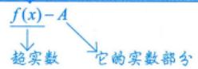

把A换成0，为什么要单独讲这个定义呢？因为它有特殊的、重要的地位和意义.

从牛顿、莱布尼茨开始，无穷小一直是一个无法解释的、必须回避的话题，包括第二次数学危机的产生，为什么大主教批判牛顿，牛顿都不敢讲话呢？因为对于无穷小是什么，他讲不出来，他一会儿让无穷小为零，一会儿让无穷小又不能为零，当无穷小在分母上，它就不能为零.然后，牛顿算出一个结果，加上一个无穷小，他就把无穷小扔掉了，无法解释！所以到了后来，才出现了魏尔斯特拉斯的 $\varepsilon   -   \delta ^ { \prime }$ 语言.在前面讲极限时，讲过超实数系，这里来简单复习下，从数学上来讲，

$$
 有理数  \xrightarrow{\quad}  实数  \xrightarrow{\quad}  复数.
$$

现在又遇到问题了，这个无穷小怎么表示呢？牛顿、莱布尼茨没有想到，这是因为历史局限性.即便后来的柯西和魏尔斯特拉斯给出了数学分析中的标准极限定义，他们也没有想到，把实数系再扩展成超实数系.

$$
\begin{array}{l} 有理数  \xrightarrow{\quad\quad\quad}  实数  \xrightarrow{\quad\quad\quad}  复数 . \\\quad\quad\quad\quad\quad \downarrow \quad \xrightarrow{\quad\quad\quad}  复数 . \\\quad\quad\quad  翁实数系 \end{array}
$$

超实数系里面是什么呢？首先是我们所学到的实数，除了这些实数之外，还引入了无穷小量和无穷大量的概念.一旦无穷小量、无穷大量进来了，这个实数系就变成了超实数系.我用最通俗的语言讲给大家，不过也不要深究，因为这需要强大的数理逻辑的底子.

超实数系告诉我们，任何一个实数 $x _ { 0 }$ ，自带光环，边上有无限个以它作为极限的超实数

$$
\left( \begin{array}{c} \left( \begin{array}{c} \left( \begin{array}{c} \left( \begin{array}{c} \end{array} \right) \\ x_{0} \end{array} \right) \end{array} \right) \end{array} \right)
$$

超实数：

$\lim f(x) = \operatorname{std}[f(x)]$ 实数部分（最终归属）①

当 $x \to   0$ 时， $\sin x = \frac{\sin (\sin x)}{0} + \frac{\sin x - \mathrm{std}(\sin x)}{ 无穷小量 }$

② $\lim_{x \to 0} f(x) = 0$

如：

$$
\begin{aligned}&\lim_{x \rightarrow 0}\left| \sin x \right| = 0 , \\&\lim_{x \rightarrow 0}\left(  e ^{x} - 1 \right) = 0 , \\&\lim_{x \rightarrow 0}\tan x = 0 , \\&\lim_{x \rightarrow 0}\left| \ln(1 + x) \right| = 0 . \\&\Rightarrow  系数 \end{aligned}
$$

它们是无限趋于零的，但是又描述不出它到零的距离到底是多少.所以在超实数系中，就增加了所谓的无穷小量.

问题：无穷小如何描述它的超实数部分与实数部分呢？

$\lim_{x \to *} f(x) = A \Leftrightarrow f(x) = A + \alpha$ （A是超实数的实数部分）.

无穷小的实数部分是零，无穷小是超实数.

## 6 无穷小的性质

①有限个无穷小的和是无穷小.

简单组常用

$$
0 < \underbrace{\left| \alpha_{1} + \alpha_{2} \right|}_{0} \leqslant \left| \alpha_{1} \right| + \left| \alpha_{2} \right| \to 0
$$

无穷个无穷小的和可能不再是无穷小了，如第8讲习题8.4的注，

$$
\lim_{n \to \infty} \left( \frac{1}{\frac{n+1}{1}} + \frac{1}{\frac{n+2}{1}} + \cdots + \frac{1}{\frac{n+n}{1}} \right) = \ln 2
$$

通俗理解：人多力量大.

★②有界函数与无穷小的乘积是无穷小.

若 $| \alpha _ { 1 } | \leqslant m , \alpha _ { 2 } \rightarrow 0$ ，则

$$
\underbrace{0 \leqslant \left| \alpha_{1} \cdot \alpha_{2} \right|}_{0} = \left| \alpha_{1} \right| \cdot \left| \alpha_{2} \right| \leqslant m \cdot \left| \alpha_{2} \right| \rightarrow 0 .
$$

考研数学对分析问题的能力有一定的要求，如果想把数学学好，在《考研数学基础30讲》中，凡是给予证明的，它往往是今后解决问题要用到的解题方法或过程，不会很难但都比较经典，要认真学一学.

③有限个无穷小的乘积是无穷小.

如

$$
\alpha_{2} \rightarrow 0 \Rightarrow \left| \alpha_{2} \right| < 1 \rightarrow 0
$$

## 7无穷小的比阶

在讲极限概念时，柯西也好，魏尔斯特拉斯也好，比牛顿和莱布尼茨的进步只是用了一个不等式，可是他们也没有讲α到0的距离到底有多少，β到0的距离是多少？不过我们可以尝试从α，β的阶数比入手.

设在自变量的同一变化过程中， $\lim \left| \alpha (x) \right| = 0, \lim \left| \beta (x) \right| = 0$ ，且 $\beta(x) \neq 0$ ，则

①若 $\lim\limits_{\substack{\alpha(x) = 0 \\ \beta(x) \\ \downarrow \\ \beta(x)}} \frac{\frac{\alpha(x)}{0}}{\frac{\beta(x)}{0}}$ 则称α(x)是比β(x)高阶的无穷小，记为 $\alpha(x) = o(\beta(x))$

α(x)→0的速度比β(x)→0 的速度快

②若 $\lim_{x \to \infty} \frac{\alpha(x)}{\beta(x)} = \infty$ ，则称 α(x)是比β(x)低阶的无穷小；

★③若 $\lim_{x \to 0} \frac{\alpha(x)}{\beta(x)} = c \neq 0$ ，则称α(x)与β(x)是同阶无穷小; 速度相同

最重要的是③与④

★④若 $\lim_{x \to \infty} \frac{\alpha(x)}{\beta(x)} = 1$ ，则称α(x)与β(x)是等价无穷小，记为 $\alpha(x) \sim \beta(x)$ i

→超实数 →此处不“等价”不是相等，如 $\lim_{x \to 0} \frac{\left| \sin x \right|}{x} = \overline{1} \neq 0$ ，而 $\lim_{x \to 0} \frac{x - \sin x}{x^3} = \frac{1}{6}$ 是它的标准实数部分std $\left( \frac{\sin x}{x} \right) = 1$

⑤若lim $\frac{\alpha(x)}{\left[ \beta(x) \right]^k} = c \neq 0, \; k > 0$ ，则称 α(x)是β(x)的k阶无穷小.

$$
x\sin\frac{1}{x}
$$

$$
x^{2}
$$

$$
\lim_{x \to 0} \frac{x \sin \frac{1}{x}}{x^2} = \lim_{x \to 0} \frac{1}{x} \sin \frac{1}{x}
$$

$\lim_{x \to 0} \frac{x \sin \frac{1}{x}}{x^2} = \lim_{x \to 0} \frac{1}{x} \sin \frac{1}{x}$ 极限不存在，一会儿跑到无穷大，一会跑到0.所以这种不专一的超实数定义为无界变量

∞是超实数，也可以理解∞是一个广义的数，作为实数系上的一个特殊的数（双重身份）.

通俗地讲，极限存在，就说明超实数找到了家，找到了标准实数部分，任何超实数在确定的趋向下都有唯一的家，即有唯一的核心，核心如果不唯一了，极限自然就不存在了.

在这种情况下，比阶就出问题了，这是柯西、魏尔斯特拉斯也解决不了的问题.用极限可以预言到所有情况吗？答案是否定的，两个超实数速度一会儿这个快，一会儿那个快，它们在较量中，会出现一会儿这个的实力强，一会儿那个的实力强的情况，并不是总是沿着简单的情况出现的，会儿 $\infty$ ，一会儿0.那就是说当 $x \to 0$ 时， $x\sin\frac{1}{x}$ 与 $x^{2}$ ，它们的力量是有对比的.

## 8 常用的等价无穷小

当 $x   \to   0$ 时，常用的等价无穷小有

sin x \~ x, tan x \~ x, arcsin x ∼ x, arctan x \~ x, ln(1 + x) \~ x, ex −1∼ x,

$$
a^{x}-1\sim x\ln a,\underbrace{1-\cos x}_{}\sim \frac{1}{2}x^{2},(1+x)^{a}-1\sim ax
$$

如图1-26所示，0作为实数，周围的无限个光晕紧密团结在核中心的周围.

  
图 1-26

注使用时一般都要做广义化：可将x替换为趋向于0的函数，请灵活使用.

$$
\lim_{x \to 0} \frac{\sin x}{x} = 1
$$

$$
\lim_{g(x) \to 0} \frac{\sin[g(x)]}{g(x)} = 1
$$

$$
\lim_{\eta \to 0} \frac{\sin(\eta)}{\eta} = 1 . \quad \lim_{\eta \to 0} \log
$$

## 9 无穷大的定义

如果当 $x   \rightarrow   x _ { _ 0 }$ (或x→∞)时，函数|f(x)|无限增大，那么称函数f(x)为当 $x \to x _ { _ 0 }$ (或 $x \to \infty )$ 时的无穷大，记为

同无穷小，也是一个极限过程一定无界，但无界不一定是无穷大量超实数

$$
\lim_{x \to x_0} f(x) = \infty   (或  \lim_{x \to \infty} f(x) = \infty  )
$$

## 注无穷小与无穷大的关系.

在自变量的同一变化过程中，如果f(x)为无穷大，则 $\frac{1}{f(x)}$ 为无穷小；反之，如果f(x)为无穷小，且 $f(x) \neq 0$ 则 $\frac{1}{f(x)}$ 为无穷大：

例1.19 设x→0时， $\mathrm{e}^{\tan x} - \mathrm{e}^{\sin x}$ 与 $x ^ { n }$ 是同阶无穷小，则n为( ).

用除法的新颖观点来理解“无穷”

$$
\frac{1}{1/2} = 2  (次) : 1 - \frac{1}{2} - \frac{1}{2} = 0
$$

(A)1

$$
\frac{1}{1/4} = 4  (次) : 1 - \frac{1}{4} - \frac{1}{4} - \frac{1}{4} - \frac{1}{4} = 0
$$

(B)2

(C)3

(D)4

$$
\frac{1}{0} =  不存在:  1-0-0-\cdots \neq 0
$$

(0不能当分母)

分析无穷小的比阶问题.

$$
\lim_{x \to 0^{+}} \frac{1}{x} = +\infty (次) ; 1 - x - x - \cdots = 0
$$

当x→0时， $\mathrm{e}^{\tan x} - \mathrm{e}^{\sin x} = \mathrm{e}^{\sin x} \left( \mathrm{e}^{\tan x - \sin x} - 1 \right)$ 是以1作为标准实数部分。这种题往往需要提出公因式。(数学中的恒等变形)

$$
\mathrm{e}^{\eta_{0}} - 1 \sim \eta_{0} (\eta_{0} \to 0)
$$

解应选(C).

当x→0时，

$$
\mathrm{e}^{\tan x}-\mathrm{e}^{\sin x}=\mathrm{e}^{\sin x}\left(\mathrm{e}^{\sin x-\sin x}-1\right)\sim\frac{\tan x-\sin x}{\tan x-\sin x}=\frac{1}{\tan x(1-\cos x)}\sim\frac{1}{2}x^{3}
$$

因此选(C).

方法总结 $\mathrm{e}^{\tan x} - \mathrm{e}^{\sin x}$ ，通常要提公因式出现 $\mathbf { e } ^ { \mathsf { a } } - 1$ 的形式.

②公式当x→0时， $\tan x-\sin x=\tan x(1-\cos x)\sim\frac{1}{2}x^{3}$

在学习了极限的定义和性质，尤其是了解了超实数的理论后，我们对于极限的计算方法有了一个完整、全面和深刻的认识，更为重要的是，今后在计算极限时，就不会再犯错误，什么位置该替换，什么位置不能替换，就能从一个新的角度，更加全面地去分析.

## 1方法

(1)极限四则运算规则.

若 $\lim_{} f(x) = A, \lim_{} g(x) = B$ ，那么

① $\lim \left[ k f ( x ) \pm l g ( x ) \right] = k \lim f ( x ) \pm l \lim g ( x ) = k A \pm l B$ ，其中k，l为常数.

②lim $\left[ f(x) \cdot g(x) \right] = \lim f(x) \cdot \lim g(x) = A \cdot B$ .特别地，若limf(x)存在，n为正整数，则

$$
\lim[f(x)]^n = \lim_{n \to \infty} \underbrace{f(x) \bullet \cdots \bullet f(x)}_{n 个 } = [\lim_{n \to \infty} f(x)]^n
$$

③ $\lim \frac{f(x)}{g(x)} = \frac{\lim f(x)}{\lim g(x)} = \frac{A}{B} (B \neq 0)$

上面定理可以用一句话概括：当f(x)与g(x)极限都存在时，函数的加减乘除的极限分别等于极限的加减乘除（除要求分母的极限不为零）.

★例1.20 证明：(1)若 $\lim \frac{f(x)}{g(x)} = A$ ，且 $\lim g(x) = 0$ ，则 $\lim_{x \to 0} f(x) = 0$

(2)若 $\lim \frac{f(x)}{g(x)} = A \neq 0$ ，且 $\lim_{x \to 0} f(x) = 0$ ，则 $\lim g(x) = 0$

分析恒等变形.

证(1)由于 $f(x) = \frac{f(x)}{g(x)} \cdot g(x)$ ，则

$$
\lim f(x)=\lim\frac{f(x)}{g(x)}\cdot g(x)=\lim\frac{f(x)}{g(x)}\cdot\lim g(x)=A\cdot0=0
$$

(2) 由于 $\begin{aligned}g(x) = & \frac{f(x)}{\frac{f(x)}{g(x)}}, \\\end{aligned}$ ，则 $\lim_{x \to 0} g(x) = \lim_{x \to 0} \frac{f(x)}{\frac{f(x)}{g(x)}} = \lim_{x \to 0} \frac{\lim_{x \to 0} f(x)}{\lim_{x \to 0} \frac{f(x)}{g(x)}} = \frac{0}{A} = 0$

注以上结论非常重要，以后在有关定参数的题目中可直接使用，如下例.

例1.21 设 $\lim_{x \to 0} \frac{\sin x}{\mathrm{e}^x - a} \left( \cos x - b \right) = 5$ ，则b =( ).(A) −4 (B) -3 (C) −2 (D) -1

分析先利用例1.20的结果求出a的值，再用等价无穷小的代换求b的值.

## 解应选(A).

$\lim_{x \to 0} \frac{\sin x}{\mathrm{e}^x - a} \left( \cos x - b \right) = 5 \neq 0$ ，由例1.20的(2)知， $\lim_{x \to 0} (\mathrm{e}^x - a) = 0$ ，故 $a = 1$ ，此时原极限变为$\lim_{x \to 0} \frac{\sin x}{\mathrm{e}^x - 1} \left( \cos x - b \right) = \lim_{x \to 0} \left( \cos x - b \right) = 1 - b$ ，故 $b = - 4$

方法总结若 $\lim_{x \to 0} \frac{f(x)}{g(x)} = A \neq 0$ ，且 $\lim_{x \to 0} f(x) = 0$ ，则 $\lim_{x \to 0} g(x) = 0$

②公式当x→0时， $\mathrm{e}^{x}-1 \sim x \sim \sin x$

例1.20的两个结论，是用四则运算规则证明的，所以可以把刚才的解题方法归结为极限的四则运算规则：加减乘除的极限只要存在，就等于极限的加减乘除.考生们在刚开始复习要记住它，不要认为它简单就轻视，前面用超实数分析了“不存在+不存在”为什么可能存在，这部分内容不是那么容易理解的，不是听一遍就能完全搞懂，需要不断地、反复地思考和实践.

后面我们会遇到复杂的极限情况，那么怎么处理这些复杂情况呢？需要请两个了不起的数学人物“登场”，他们是洛必达和伯努利.

(2) 洛必达法则.

法则一 设①当 $x \to a ($ 或 $x \to \infty )$ 时，函数f(x)及F(x)都趋于零； $ \text{" }\frac{0}{0}  \text{" }$

$y ^ { \prime } ( x )$ $F ^ { \prime } ( x )$ 在点a的某去心邻域内(或当 $\left| x \right| > X$ ,此时X为充分大的正数)存在，且 $F^{\prime}(x) \neq 0$

  
洛必达 (1661—1704)

③ $\lim_{x \to a} \frac{f'(x)}{F'(x)}$ (或 $\lim_{x \to \infty} \frac{f'(x)}{F'(x)}$ 存在或为无穷大，则

$$
\lim_{x \to a} \frac{f(x)}{F(x)} = \lim_{x \to a} \frac{f'(x)}{F'(x)}  (或  \lim_{x \to \infty} \frac{f(x)}{F(x)} = \lim_{x \to \infty} \frac{f'(x)}{F'(x)}  ) .
$$

法则二 设①当 $x \to a$ (或 $x \to \infty )$ 时，函数f(x)及F(x)都趋于无穷大;

② $y ^ { \prime } ( x )$ 及 $F^{\prime}(x)$ 在点a的某去心邻域内(或当 $\left| x \right| > X$ ，此时X为充分大的正数)存在，且 $F^{\prime}(x) \neq 0$ i

③ $\lim_{x \to a} \frac{f^{\prime}(x)}{F^{\prime}(x)}  (或  \lim_{x \to \infty} \frac{f^{\prime}(x)}{F^{\prime}(x)}  )$ 存在或为无穷大，则

$$
\lim_{x \to a} \frac{f(x)}{F(x)} = \lim_{x \to a} \frac{f'(x)}{F'(x)} \quad (或  \lim_{x \to \infty} \frac{f(x)}{F(x)} = \lim_{x \to \infty} \frac{f'(x)}{F'(x)}  ) .
$$

这两个是用柯西中值定理证明的。

后面讲了柯西中值定理，再回头证明这个洛必达法则

注法则二不是洛必达的，也不是伯努利的，实际上是柯西给的，但是为了称呼的统一性，都归到洛必达法则了.

历史故事：洛必达(1661—1704)法国人，洛必达法则不是洛必达的，而是他老师约翰·伯努利(1667—1748）的.

1694年，约翰·伯努利要结婚，洛必达送给他一个大礼包，他说“你结婚去吧，给你一笔钱，不用还，给我一篇论文就可以了”，然后伯努利欣然接受，主动拿着论文找到洛必达，一手交钱，一手交论文，这篇文章就被无情的卖掉了，是什么文章呢？就是大家看到的“洛必达法则”.这个法则实际上是伯努利在1694年卖给了洛必达，这是历史上的真事.有个人还在里面瞎掺和，那个人叫莱布尼茨（16461716），莱布尼茨是伯努利的老师，伯努利真正的学生是欧拉，这里面混进了洛必达.莱布尼茨听伯努利说“洛必达很有钱”，就主动找到洛必达，“孩子，我还有论文呢，你要不要？”而洛必达来者不拒，“来来来，买”.所以几乎在同一时间，洛必达还在世界上发表了一篇论文，叫“行列式的概念”.行列式的概念是谁给的呢？“莱布尼茨”；谁发表的呢？“洛必达”；世界上第一本微积分教材谁出的呢？“洛必达”.洛必达可以称之为“伟大的”数学知识的传播者，他把数学大家的创作汇总起来出成书了

注(1)一般来说，洛必达法则是用来计算 $ \text{" }\frac{0}{0} \text{" }$ 型或者 $= \frac { \infty } { \infty }$ 型未定式的，不是 $\frac{ \cdots 0}{0}$ 型和 $\frac { \infty } { \infty }$ 型，就不能用洛必达法则.

$( \frac { 2 } { \infty }$ 亦可直接用洛必达法则.但是这个不在考研范围内.)

(2) 如果极限 $\lim_{x \to a} \frac{f'(x)}{F'(x)}$ 仍属于 $ \text{" }\frac{0}{0} \text{" }$ 型或者 $\frac { \infty } { \infty }$ 型，且f'(x),F'(x)继续满足洛必达法则的条件，则可以继续使用洛必达法则，即 $\lim_{x \to a} \frac{f(x)}{F(x)} = \lim_{x \to a} \frac{f'(x)}{F'(x)} = \lim_{x \to a} \frac{f''(x)}{F''(x)}$ 可多次使用

(3) 如果 $\lim_{x \to a} \frac{f'(x)}{F'(x)}$ 不存在也不为∞，不能推出 $\lim_{x \to a} \frac{f(x)}{F(x)}$ 不存在也不为∞，简单一点说就是：

对于 $\lim_{x \to a} \frac{f(x)}{F(x)} = \lim_{x \to a} \frac{f'(x)}{F'(x)}$ “右存在，则左存在；但左存在，并不意味着右一定存在”.比如说，极限

$$
\lim_{x \to 0} \frac{x^2 \cdot \sin \frac{1}{x}}{x} = \lim_{x \to 0} \frac{x \cdot \sin \frac{1}{x}}{x} = 0
$$

存在，而如果使用洛必达法则，会有

$$
\lim_{x \to 0} \frac{x^2 \cdot \sin \frac{1}{x}}{x} = \lim_{x \to 0} \left( 2x \cdot \sin \frac{1}{x} - \cos \frac{1}{x} \right)
$$

这个极限显然不存在.这是一个很细致、很隐蔽的问题，稍不注意就可能出错.

## 例1.22 证明：

(1)当x→0时， $\ln \left( x + \sqrt{1 + x^{2}} \right) \sim x$

(2) 当x→0时， $1 - \left( \cos x \right)^{a} \sim \frac{1}{2}ax^{2} , a \neq 0$

分析求极限 $ \text{" }\frac{0}{0} \text{" }$ 型，用洛必达法则.

证(1)由于 $\lim_{x \to 0} \frac{\ln\left( x + \sqrt{1 + x^2} \right)}{x} = \lim_{x \to 0} \frac{\frac{1}{\sqrt{1 + x^2}}}{1} = 1$ ，因此当x→0时， $\ln \left( x + \sqrt{1 + x^{2}} \right) \sim x$

(2)当x→0时， $\lim_{x \to 0} \frac{1 - (\cos x)^a}{\frac{1}{2}ax^2} = \lim_{x \to 0} \frac{-a(\cos x)^{a-1}(-\sin x)}{ax} = \lim_{x \to 0} (\cos x)^{a-1} = 1$ .证毕.

方法总结用洛必达法则解决 $ \text{" }\frac{0}{0} \text{" }$ 型未定式.

②公式当x→0时， $\ln(x+\sqrt{1+x^{2}})\sim x\sim\sin x\sim\tan x\sim\arctan x\sim e^{x}-1\sim\ln(1+x)$

当x→0时， $1 - \left( \cos x \right)^{a} \sim \frac{1}{2}ax^{2}, a \neq 0$ ，如：当x→0时， $1 - \cos x \sim \frac{1}{2}x^{2}, \quad 1 - \sqrt{\cos x} \sim \frac{1}{4}x^{2}$

这个题目的价值：①练习了洛必达法则；②得到了两个重要结论.

这两个重要结论，在未来会经常出现.

凡是在《考研数学基础30讲》中给出的结论，都可以直接用，不必证明，这都是一些常见的、经典的结论.

下面还有一个话题.当遇到 $ \text{" }\frac{0}{0} \text{" }$ 型未定式时，是看分子、分母中谁趋于零的速度快，在超实数体系中，以0作为标准实数部分的超实数它们的比值是多少？比如：

$$
\mathrm{std}\left( \frac{x - \sin x}{x^{3}} \right) = \frac{1}{6}
$$

$$
\lim_{x \to 0} \frac{x - \sin x}{x^3} = \frac{1}{6}
$$

在考研数学中，无穷小的关键是阶数，无穷小争先恐后趋于0，趋于0的速度是不一样的.接下来我们讨论无穷大的比阶问题，用例1.23来说明.

例1.23设 $f(x)=\ln^{10}x,\;g(x)=x,\;h(x)=\mathrm{e}^{\frac{x}{10}}$ ，则当x充分大时，有（）.

(A) $g(x) < h(x) < f(x)$ (B) $h(x) < g(x) < f(x)$ (C) $f(x) < g(x) < h(x)$ (D) $g(x) < f(x) < h(x)$

分析用洛必达法则，计算极限.

解应选(C).

因为 $\lim_{x \to +\infty} \frac{g(x)}{f(x)} = +\infty, \quad \lim_{x \to +\infty} \frac{h(x)}{g(x)} = +\infty$ ，所以当x充分大时，有 $f(x) < g(x) < h(x)$ 故选项(C)正确.

注①当 $x \rightarrow + \infty$ 时，有 $\ln ^{\alpha}x \ll x^{\beta} \ll a^{x}$ ，其中 $\alpha , \beta > 0 , a > 1$ ，符号 $ \text{" } \ll  \text{" }$ 叫远远小于；

②当 $n \to \infty$ 时，有 $\ln ^{\alpha}n \ll n^{\beta} \ll a^{n} \ll n! \ll n^{n}$ ，其中 $\alpha , \beta > 0 , a > 1$ ．记住，考试时直接用

像上面这些公式必须要记住.在微积分中，有一个很要紧的问题，就是趋于零的函数，谁快谁慢，趋于无穷大的函数，谁快谁慢，这些问题解决好了，很多难题就迎刃而解.知识是有连续性的，它总是一环扣一环，其他方向如果欠缺，可能是因为这里的题目就掌握得不是太好.

(3) 泰勒公式.

设f(x)在点x=0处n阶可导，则存在x=0的一个邻域，对于该邻域内的任一点x，有

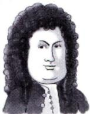

$$
f(x)=f(0)+f^{\prime}(0)x+\frac{f^{\prime\prime}(0)}{2!}x^{2}+\cdots+\frac{f^{(n)}(0)}{n!}x^{n}+o(x^{n})
$$

泰勒（1685—1731）牛顿学生(英国教育家）

泰勒公式背后的思想比拉格朗日中值定理的思想更精确.泰勒有一个非常直接的观点，就是可以用多项式（表达式最简单的）来表达任何一个函数（当然这个函数可导性要好）.

泰勒有一双火眼金睛，一眼看穿所有函数.

如 $\sin x = \sin 0 + \left. \left( \sin x \right) \right|_{x = 0} \cdot x + \frac{\left. \left( \sin x \right) \right|_{x = 0}}{2!}x^{2} + \frac{\left. \left( \sin x \right) \right|_{x = 0}}{3!}x^{3} + o(x^{3})$ ，即 $\sin x = \left| x - \frac{1}{6}x^{3} \right| + o(x^{3})$ 考到这里 佩亚诺余项再如 $\sec x = \sec 0 + \left. \left( \sec x \right)^{\prime} \right|_{x = 0} \bullet x + \frac{\left. \left( \sec x \right)^{\prime\prime} \right|_{x = 0}}{2!}x^{2} + \frac{\left. \left( \sec x \right)^{\prime\prime} \right|_{x = 0}}{3!}x^{3} + o(x^{3})$ ，即 $\sec x = 1 + \frac{x^{2}}{2} + o(x^{3})$

下面给同学们看个真题.

当x→0时，secx与2次泰勒多项式 $g ( x )$ 之差为 $o(x^{2})$ ，则 $g(x) = 1 + \frac{1}{2}x^{2}$

另：secx在x=0处的2次泰勒多项式为 $1+\frac{1}{2}x^{2}$

同理可得如下重要函数的泰勒公式.

$$
\sin x = x - \frac{x^{3}}{3!} + o(x^{3}), \quad \cos x = 1 - \frac{x^{2}}{2!} + \frac{x^{4}}{4!} + o(x^{4}),
$$

$$
\arcsin x = x + \frac{x^{3}}{3!} + o(x^{3}), \quad \tan x = x + \frac{x^{3}}{3} + o(x^{3}),
$$

$$
\arctan x = x - \frac{x^{3}}{3} + o(x^{3}), \quad \ln(1 + x) = x - \frac{x^{2}}{2} + \frac{x^{3}}{3} + o(x^{3}),
$$

8个都要“背”，泰勒公式熟记于心，都要“一站直达”

$$
\mathrm{e}^{x}=1+x+\frac{x^{2}}{2!}+\frac{x^{3}}{3!}+o(x^{3}), \quad(1+x)^{\alpha}=1+\alpha x+\frac{\alpha(\alpha-1)}{2!}x^{2}+o(x^{2}) .
$$

我们要泰勒公式，也要洛必达法则，但泰勒公式是远远优于洛必达法则的.不仅是因为泰勒公式用多项式逼近可导函数的方法意义深刻，还因为其计算的简洁性.

注从数学命题的角度对以上公式进行处理，可得到一组“差函数”的等价无穷小代换式，如$x - \sin x = \frac{1}{6}x^{3} + o(x^{3})$ 则 $x - \sin x \sim \frac{1}{6}x^{3}(x \to 0)$ 同理有 考研： $\left[ g(x) \right] \to 0, \; g(x) - \sin[g(x)] \sim \frac{1}{6}g^3(x)$

$$
\arcsin x - x \sim \frac{1}{6}x^{3}(x \rightarrow 0), \tan x - x \sim \frac{1}{3}x^{3}(x \rightarrow 0), x - \arctan x \sim \frac{x^{3}}{3}(x \rightarrow 0)
$$

等，并可将这些公式广义化，如第一个公式广义化为：狗−sin狗 $\frac{1}{6} (狗)^3 (狗 \rightarrow 0 )$ ，其余类似.

(4)无穷小的运算.

设m，n为正整数，则

① $o(x^{m}) \pm o(x^{n}) = o(x^{l}), l \geq \min\{m, n\}$ (加减法时低阶“吸收”高阶).

如： $\frac{o(x^{2}) - o(x^{3})}{ 它说了算 } = o(x^{2})$ ，对于无穷小来说，次数越小越大.对于无穷大来说，次数越大越大.

② $o(x^{m}) \bullet o(x^{n}) = o(x^{m+n}), x^{m} \bullet o(x^{n}) = o(x^{m+n})$ (乘法时阶数“累加”).

③ $o(x^{m}) = o(kx^{m}) = k \cdot o(x^{m}),$ k≠0且为常数(非零常数相乘不影响阶数).

$o(x^{2}) = 2o(x^{2})$ 记号运算不是符号运算。 $o(x^{2}) - o(x^{2}) = o(x^{2})$

这种题在数学三卷子中考过。

注在后面泰勒公式的应用中，会对上述高阶无穷小的运算提出要求，请考生学会正确书写.

(5)泰勒公式应用时的展开原则.

有了展开原则，就可以有强大的能力解决计算问题了

泰勒公式：

$$
f(x)=f(0)+f^{\prime}(0)x+\frac{f^{\prime\prime}(0)}{2!}x^{2}+\cdots+\frac{f^{(n)}(0)}{n!}x^{n}+o(x^{n})
$$

再深刻一点讲，以后会遇到无数个可导函数可以由统一的式子表达时，需要对这个表达式进行研就一个基无它可以表示三维间中的任何一个向量,即三空间中的任何一个其为三维空 1

再如：一维点可以比大小，但平面点（空间点）是不能比大小的，所以后面遇到多元函数会用偏导数退化为一维来研究.

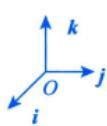

$$
\left\{ x ^ { 0 } , x ^ { 1 } , x ^ { 2 } , \cdots , x ^ { n } , \cdots \right\} ,
$$

幂函数是所有可导函数的一个基，体现“统一美”.

有句话是有道理的，微积分学得好坏，将决定未来走得有多远，光看一个公式，很多人看法层次是远远不同的，很多东西需要慢慢去体会.

如：

$$
\left\{ \begin{aligned} x_{n}\cos x_{n + 1} = \sin x_{n}, \quad \cos x_{n + 1} = \frac{\sin x_{n} - \sin 0}{x_{n} - 0} = \cos \xi \Rightarrow 0 < \left| \xi \right| < x_{n + 1} \\ \cos a_{n} - a_{n} = \cos b_{n}, \quad \cos a_{n} - \cos b_{n} = a_{n} > 0, 0 < a_{n}, b_{n} < \frac{\pi}{2}, \quad 0 < a_{n} < b_{n} \\ \downarrow \quad \downarrow \quad \downarrow \quad 0 \\ 0 < \left| \xi \right| < \pi \end{aligned} \right.
$$

数学题的最高境界就是那些最简单的地方，不是庞然大物或者是用非常复杂的技巧.大道至简才是考研数学的本质.

这种题是考研的压轴题，但是大家也不要急.在命题老师眼里，他给的东西，他想的东西最简单，最朴素的 cos x在 $\left(0,\;\frac{\pi}{2}\right)$ 内递减，一个中学生也知道啊！但几百万考生，大部分考生都没想到.

而且命题老师又说“不定积分”大家少做啊！因为在命题老师的知识体系中，他是深刻知道世界上能做出来的积分是寥寥无几的，世界上不能做出的积分，多得想象不到.再换句话说，几乎不定积分都没法做，那我们就把他喜欢出的那几个思想、方法掌握了，最基本的东西把握好了，那么考试就成功了，这就叫方向，不做无用功.

① $\frac{A}{B}$ 型，适用“上下同阶”原则.

具体说来，如果分母(或分子)是x的k次幂，则应把分子(或分母)展开到x的k次幂，可称为“上下同阶”原则.

例如，计算 $\frac{x - \ln(1 + x)}{x^{2}}$

由于

$$
\frac{\ln(1 + x) = x + o(x)}{\ln(1 + x) = x - \frac{x^2}{2} + o(x^3)} = \frac{\ln(1 + x) - x - \frac{x^2}{2} + o(x^2)}{\ln(1 + x) = x - \frac{x^2}{2} + \frac{x^3}{3} + o(x^3)}
$$

因此

$$
\lim_{x \to 0} \frac{x - \ln(1 + x)}{x^2} = \lim_{x \to 0} \frac{x - \left[ x - \frac{x^2}{2} + o(x^2) \right]}{x^2} = \lim_{x \to 0} \frac{\frac{x^2}{2}}{x^2} = \frac{1}{2}
$$

这里顺便得到了一个重要的等价代换式 $x - \ln(1 + x) \sim \frac{1}{2}x^{2}(x \to 0)$

$$
x - \ln(1 + x) \sim 1 - \cos x \sim \frac{1}{2}x^{2} \quad (x \to 0)
$$

同理

$$
x - \sin x \sim \frac{x^{3}}{6} (x \to 0)
$$

$$
\arcsin x - x \sim \frac{x^{3}}{6}(x \to 0)
$$

$$
\tan x - x \sim \frac{x^{3}}{3} (x \rightarrow 0)
$$

$$
x - \arctan x \sim \frac{x^{3}}{3} \quad (x \to 0)
$$

均可由“上下同阶”原则得到.

②A-B型，适用“幂次最低”原则. $A + B = A - ( - B )$

具体说来，即将A，B分别展开到它们的系数不相等的x的最低次幂为止.

例如，已知当x→0时， $\cos x - \mathrm{e}^{-\frac{x^2}{2}}$ 与 $ax^{b}$ 为等价无穷小，求 $a , b$

用泰勒公式， $\cos x = 1 - \frac{x^{2}}{2!} + \frac{x^{4}}{4!} + o(x^{4}), \quad \mathrm{e}^{\frac{x^{2}}{2}} = 1 - \frac{x^{2}}{2} + \frac{1}{2!}\frac{x^{4}}{4} + o(x^{4})$

显然，将 $\cos x,\mathrm{e}^{-\frac{x^2}{2}}$ 展开到 $x ^ { 4 }$ 时，其系数就不一样了，使用“幂次最低”原则，展开到此项后，进行运算，得→名工打业件言出业一波“风五”

$$
\cos x - \mathrm{e}^{-\frac{x^2}{2}} = \left[ 1 - \frac{x^2}{2!} + \frac{x^4}{4!} + o(x^4) \right] - \left[ 1 - \frac{x^2}{2} + \frac{1}{2!} \frac{x^4}{4!} + o(x^4) \right] = -\frac{1}{12}x^4 + o(x^4)
$$

于是可知 $\cos x - \mathrm{e}^{-\frac{x^2}{2}} \sim -\frac{1}{12}x^4 (x \to 0)$ ，故 $a = - \frac{1}{12},   b = 4$

到此为止，整个泰勒公式就学习完了，在一般计算中，四则运算法则，洛必达法则，泰勒公式就够了，除此之外常用的，还有两个重要极限.

(6) 两个重要极限.

第二重要极限两种写法

$$
\lim_{x \to 0} \frac{\sin x}{x} = 1, \quad \lim_{x \to \infty} \left( 1 + \frac{1}{x} \right)^x = \mathrm{e}
$$

$$
\begin{aligned}\lim_{x \to 0} (1 + x)^{\frac{1}{x}} =  e , \\\lim_{x \to \infty} \left(1 + \frac{1}{x}\right)^{x} =  e .\end{aligned}
$$

## 注常考变量广义化

$$
\lim_{ \substack{ \beta \to 0 \\ } } \frac{\sin \beta_{0}}{\frac{}{}} = 1, \quad \lim_{ \substack{ \beta \to \infty \\ } } \left( 1 + \frac{1}{\frac{}{}} \right)^{\frac{}{}} = \mathrm{e}
$$

如狗 $= \frac{1}{x}$ ，则上述式子为

$$
\lim_{x \to 0} \frac{\sin \frac{1}{x}}{\frac{1}{x}} = 1 ,  即  \lim_{x \to \infty} x \sin \frac{1}{x} = 1
$$

$$
\lim_{x \to \infty} \left( 1 + \frac{1}{\frac{1}{x}} \right)^{\frac{1}{x}} = \mathrm{e} , \quad \lim_{x \to 0} (1 + x)^{\frac{1}{x}} = \mathrm{e} .
$$

(7) 夹逼准则. →适当放缩 $\left\{ \begin{aligned} & 已知不等式   \\ & 题设条件  \end{aligned} \right.$ 如果函数f(x)，g(x)及h(x)满足下列条件：

① $h(x) \leqslant f(x) \leqslant g(x)$

$$
\lim_{x \to a} g(x) = A, \lim_{x \to b} h(x) = A
$$

则 lim f(x)存在，且 lim f(x) = A. +8↓+8介+8

夹逼准则，说成两边夹，三明治定理都不太准确，没有突出“逼”，叫“迫敛定理”是可以的.

注常见的一个问题：设任意的x，总有 $h(x) \leqslant f(x) \leqslant g(x)$ ，且 $\lim \left[ g(x) - h(x) \right] = 0$ ，则 $\lim_{} f(x)$ 是否一定存在？答案是否定的 $\lim \left[ g(x) - h(x) \right]$ 存在并不能说明 limg(x), limh(x)都存在，从而也不能保证 lim f(x)存在.

例如，当x>0时，取 $h(x)=x+\frac{1}{x+1}, \quad f(x)=x+\frac{2}{x+1}, \quad g(x)=x+\frac{3}{x+1}$ $h(x) < f(x) < g(x)$ 且$\lim_{x \to +\infty} \left[ g(x) - h(x) \right] = 0$ 但 $\lim_{x \to +\infty} f(x)$ 不存在.

## 2 七种未定式的计算

七种未定式中，都是超实数的状态，我们算过七种超实数是否有一个标准实数部分.考研的函数极限计算题一般归纳为七种未定式： “未定”是由你来定，有可能存在有可能不存在

★★★题型：直接计算、反求参数、已知某一极限求另一极限、无穷小的比阶等.

在表达式中，有一些未知参数，已知这些超实数的极限值.来求这些未知参数，这是一种常考的反问题

解题思路如下.

已知一个超实数的极限值，给出另外一个超实数，另外一个超实数跟这个超实数有联系，有区别，需要找到它们的联系和区别，从而用已知来求解未知

①化简先行.

在考研数学中，可能无穷小比阶的考题考的是最多的

拿到极限计算的问题，不要直接开始就洛必达法则，泰勒展开等等.实际上，先做一些化简，有的时候化简完了，这个题目就非常简单了，在考研中是专门出过这种题的，比如说2023年有道大题就是第一步要化简，如果不知道化简的话，那个题太复杂了.有哪些化简办法呢？

$$
\overbrace{\lim_{x \to 0} \cos x \cdot (\cdots)}^{x}
$$

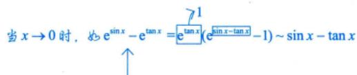

a. 提出极限不为0的因式；b.等价无穷小代换；c.恒等变形(基本的恒等变形法如提公因式、拆项、

合并、分子分母同除变量的最高次幂等，高级的恒等变形法如变量代换，也叫换元法等).需要强调的是，很多问题如果不化简就计算，可能计算会很复杂，甚至可能计算不出结果.负代换，倒代换 ↓

如： $\lim_{x \to 0} \left( \frac{1 + \sin x}{x} - \frac{1}{e^x - 1} \right) = \lim_{x \to 0} \left( \frac{1}{x} - \frac{1}{e^x - 1} \right) + \lim_{x \to 0} \frac{\sin x}{x}$ 解题的方法，我们不能蛮干，一定要注意这些=1细节，细节决定成败

②判断类型（运算类型）.

→用在函数中，难度就很高了，对于这种问题呢。《考研数学基础30讲》里面也会提及，我会给大家一个完整的全面的归纳

③选择方法（洛必达法则、泰勒公式、夹逼准则等）.

(1) $ \text{" } \frac{0}{0}  \text{"" } \frac{\infty}{\infty}  \text{"" } 0 \bullet \infty  \text{" }$

→太重要了，“火眼金睛”泰勒

例1.24 $\lim_{x \to 0^{+}} \frac{(1 + x)^{\frac{1}{x}} - \mathrm{e}}{x}$ .这是考研中喜欢出的一种类型(提前告诉存在了，实际上问是几）

分析 $ \text{" }\frac{0}{0} \text{" }$ ，先做恒等变形， $u(x)^{v(x)} = \mathrm{e}^{v(x)\ln u(x)}$ .碰到幂指函数，一定用e抬起来.

解应填 $-\frac{\mathrm{e}}{2}$

$$
\lim_{x \to 0^+} \frac{\mathrm{e}^{\frac{1}{x}\ln(1 + x)} - \mathrm{e}}{x} = \lim_{x \to 0^+} \frac{\mathrm{e}^{\frac{1}{x}\ln(1 + x) - 1} - 1}{x} \xlongequal{\mathrm{e}^{\frac{1}{x}\ln(1 + x)} - 1} \lim_{x \to 0^+} \frac{\frac{1}{x}\ln(1 + x) - 1}{x}
$$

$$
\frac{\ln(1 + x) - x}{x^{2}} = \mathrm{e} \lim_{x \rightarrow 0^{+}} \frac{- \frac{1}{2}x^{2}}{x^{2}} = - \frac{1}{2}\mathrm{e}
$$

$$
\frac{\ln(1 + x) - x}{x^{2}}
$$

$$
\lim_{x \to 0^{+}} \frac{\frac{1}{1 + x} - 1}{2x}
$$

方法总结碰到幂指函数，用e括起来， $u(x)^{v(x)} = \mathrm{e}^{v(x)\ln u(x)}$

$$
\lim_{x \to 0^{+}} \frac{-\frac{1}{\left( 1 + x \right)^{2}}}{2}
$$

公式当x→0时， $\ln (1 + x) - x \sim - \frac{1}{2}x^{2}$

注 $f(x) = (1 + x)^{\frac{1}{x}}$ 在x>0时有以下性质：

①f(x)单调减少；② $\lim_{x \to 0^{+}} f(x) = \mathrm{e}$

$$
\lim_{x \to 0} (1 + x)^{\frac{1}{x}} = \mathrm{e} \quad \lim_{x \to \infty} \left(1 + \frac{1}{x}\right)^{x} = \mathrm{e}
$$

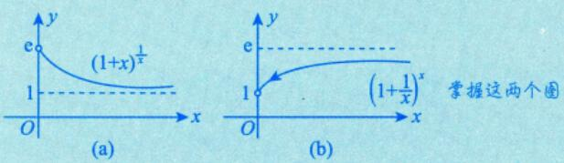

★③ $(1 + x)^{\frac{1}{x}} - \mathrm{e} \sim - \frac{\mathrm{e}}{2} x \left( x \rightarrow 0^{+} \right)$ ·刚才的例1.24

这个结论太重要了，0是一个重要的实数.

考研复习的方法很重要，如基础阶段只做 $1 + 1 = 2$ 这肯定是不行的.必须在基础阶段，扎扎实实地落实到考研数学的命题当中，掌握他们喜欢考的这些表达式，这个是很重要的.

例1.25 求极限 $\lim_{x \to \infty} \frac{a_nx^n + a_{n-1}x^{n-1} + \cdots + a_1x + a_0}{b_mx^m + b_{m-1}x^{m-1} + \cdots + b_1x + b_0}$ ，其中 $a_{n}(\neq 0),   b_{m}(\neq 0)$ 为常数.纸老虎

分析有理函数的极限问题，抓主要矛盾.找“带头大哥”，若“带头大哥”次数一致，结果就是系数比，就能很快速地把问题解决了

解若 $n = m$ ，则

$$
\lim_{x \to \infty} \frac{a_{n} + \frac{a_{n - 1}}{x} + \cdots + \frac{a_{1}}{x^{n - 1}} + \frac{a_{0}}{x^{n}}}{b_{m} + \frac{b_{m - 1}}{x} + \cdots + \frac{b_{1}}{x^{n - 1}} + \frac{b_{0}}{x^{n}}}
$$

$$
\frac{\lim\limits_{x \to \infty} \left( a_{n} + \frac{a_{n - 1}}{x} + \cdots + \frac{a_{1}}{x^{n - 1}} + \frac{a_{0}}{x^{n}} \right)}{\lim\limits_{x \to \infty} \left( b_{m} + \frac{b_{m - 1}}{x} + \cdots + \frac{b_{1}}{x^{n - 1}} + \frac{b_{0}}{x^{n}} \right)} = \frac{a_{n}}{b_{m}}
$$

$$
n > m
$$

$$
\lim_{x \to \infty} \frac{x^{n - m}\left( a_nx^m + a_{n - 1}x^{m - 1} + \cdots + a_1x^{m - n + 1} + a_0x^{m - n} \right)}{b_mx^m + b_{m - 1}x^{m - 1} + \cdots + b_1x + b_0} = \lim_{x \to \infty} x^{n - m} \cdot \frac{a_n}{b_m}
$$

，超实数，特殊的不存在

$$
I = \lim_{x \to \infty} \frac{a_nx^n + a_{n-1}x^{n-1} + \cdots + a_nx + a_0}{x^{m-n}\left(b_mx^n + b_{m-1}x^{n-1} + \cdots + b_nx^{n-m+1} + b_0x^{n-m}\right)} = \lim_{x \to \infty} \frac{1}{x^{m-n}} \cdot \frac{a_nx}{b_m} = 0
$$

这两种情况出现概率很小

综上， $\lim_{x \to \infty} \frac{a_n x^n + a_{n-1} x^{n-1} + \cdots + a_1 x + a_0}{b_m x^m + b_{m-1} x^{m-1} + \cdots + b_1 x + b_0} = \left\{ \begin{aligned} \frac{a_n}{b_m}, & \quad n = m, \\ \infty, & \quad n > m, \\ 0, & \quad n < m. \end{aligned} \right.$

方法总结 抓大头.

$\lim_{x \to \infty} \frac{x^3 + x^2 - 1}{\left( 0 \cdot x^3 \right) + 2x^2 + 2} = \infty, \quad \lim_{x \to \infty} \frac{0 \cdot x^3 - x^2 + 2}{1 \cdot x^3 - x + 1} = 0$ 补一个“带头大哥”(但不要写卷子上)→最爱考的

$$
\lim_{x \to \infty} \frac{a_nx^n + a_{n-1}x^{n-1} + \cdots + a_nx + a_0}{b_mx^m + b_{m-1}x^{m-1} + \cdots + b_nx + b_0} = \left\{ \begin{aligned} \frac{a_n}{b_m}, & \quad n = m, \\ \infty, & \quad n > m, \\ 0, & \quad n < m. \end{aligned} \right.
$$

注本题的结果要记住，以后直接使用，这就是通常说的“抓大头”，即当 $x \to \infty$ 时，分别抓分子、分母中关于x的最高次项，忽略其他项，如 $\lim_{x \to -\infty} \frac{\sqrt{4x^2 + x - 1} + |x + 1|}{\sqrt{x^2 + \sin x}} = 1$ 另外特别注意，若 $x \to 0$ 则应该分别抓分子、分母中关于x的最低次项 $\vert 2 x \vert = - 2 x$ |x|=-x

例1.26 设函数 $f(x)=\lim_{n \to \infty} \frac{x^2 + nx(1-x)\sin^2 \pi x}{1+n\sin^2 \pi x}$ ，则f(x) =

分析这道题是近几年常考的用极限来定义对应法则的题.在本讲开头，我讲过一些求对应法则的内容，可以由关系式或复合函数的表达式求对应法则.在这里再加一条，由极限求对应法则.用什么样的题目来创造这些对应法则，这需要通过做题逐渐地积累起来.

找特点：抓带头大哥，n在变，x在求极限过程中视为常数.

解应填 $\begin{cases}x^{2}, \\x(1 - x)\end{cases}$ ,x0, 1,±2,…,

当 $\sin \pi x = 0$ ，即x=k（整数)时， $f(x) = \lim_{n \to \infty} \frac{x^2 + nx(1 - x) \cdot 0}{1 + n \cdot 0} = x^2$

当 $\sin \pi x \neq 0$ ，即 $x \neq k$ (整数)时， $\lim_{n \to \infty} \frac{\frac{x^2}{n} + x(1 - x)\sin^2 \pi x}{\frac{1}{n} + \sin^2 \pi x} = \frac{x(1 - x)\sin^2 \pi x}{\sin^2 \pi x} = x(1 - x)$

综上， $f(x)=\begin{cases}x^{2},\\x(1-x)\end{cases}$ x =0, ±1,±2, …,，其他.

方法总结 主要关注n前面的系数.

②公式 $\lim_{n \to \infty} n \cdot \boxed{0} = 0$ →真的0

注这个题目精彩的地方在于，若n的系数为零，即 $\sin^{2} \pi x = 0$ .此时，含n的项消失了，结果就是 $x^{2}$

这个题目有“前世今生”，后面我们仍会用到它.这个例子记住了，后面再遇到类似由这种用极限定义函数的问题不在话下，这是构造函数的最高难度了，不会再超过这个难度．

例1.27 已知极限 $\lim_{x \to 0} \frac{\tan 2x + xf(x)}{\sin x^3} = 0$ ，则 $\lim_{x \to 0} \frac{2 + f(x)}{x^2} =$ ).(A) $\frac{13}{9}$ (B)4 (C) $\frac{10}{3}$ (D) $-\frac{8}{3}$

分析建立已知和未知的联系.一是脱帽法，二是泰勒展开.

解应选(D).

方法一 脱帽法.

$$
\lim_{x \to 0} \frac{\tan 2x + xf(x)}{\sin x^3} = 0
$$

则 $\frac{\tan 2x + xf(x)}{x^{3}} = \alpha(x)$ ，其中α(x)为x→0时的无穷小.因此

$$
f(x)=\frac{x^{3}\cdot \alpha (x)-\tan 2x}{x}
$$

故

$$
\lim_{x \to 0} \frac{2 + f(x)}{x^2} = \lim_{x \to 0} \frac{2 + \frac{x^3 \cdot \alpha(x) - \tan 2x}{x}}{x^2}
$$

$$
\lim_{x \to 0} \frac{2x - \left[ 2x + \frac{1}{3}(2x)^3 + o(x^3) \right] + x^3 \alpha(x)}{x^3} = - \frac{8}{3}
$$

方法二 泰勒展开.

由 $\lim_{x \to 0} \frac{\tan 2x + xf(x)}{\sin x^3} = 0$ ，得

$$
\frac{2x + \frac{1}{3}(2x)^{3} + o(x^{3}) + xf(x)}{x^{3}} = 0
$$

故

$$
\lim_{x \to 0} \frac{2 + f(x)}{x^2} = -\frac{8}{3}
$$

方法总结 ①用好泰勒公式.

②已知极限，用脱帽法可解出f(x).

公式当狗→0时，狗-tan狗 $\sim -\frac{1}{3}  狗 ^{3}$

脱帽法：若 $\lim_{x \to 0} f(x) = A$ ，则 $\left| \overline{f(x)} \right| = \left| \overline{A} \right| + \alpha(x) \left( \lim_{x \to 0} \alpha(x) = 0 \right)$

超实数超实数的标准实数部分

例1.28 求极限 $\lim_{x \to 1^{-}} \ln x \ln(1 - x)$ .0·∞型

：lim xln xx→0

$$
 \text{" }0\bullet\infty "
$$

把谁放在分母，是有讲究的.设置分母有原则，简单因式才下放.

简单因式有 $x^{\alpha}, \mathrm{e}^{\beta x}, \sin r x$ 等.

$$
 设置分母出来  $\begin{aligned}\xlongequal{\textcircled{2}} & \lim_{x \rightarrow 0^{+}}\frac{x}{\dfrac{1}{\ln x}} \\\xlongequal{\textcircled{3}  洛必达法则 } & \lim_{x \rightarrow 0^{+}}\frac{1}{-\dfrac{1}{\ln^{2}x} \bullet \dfrac{1}{x}} \\= & - \lim_{x \rightarrow 0^{+}}x\ln^{2}x \\\xlongequal{\textcircled{2}} & \lim_{x \rightarrow 0^{+}}\frac{\ln x}{\dfrac{1}{x}} \\\xlongequal{\textcircled{3}} & \lim_{x \rightarrow 0^{+}}\frac{\dfrac{\infty}{\cos}}{-\dfrac{1}{x^{^{2}}}} = - \lim_{x \rightarrow 0^{+}}x = 0 , \end{aligned}$
$$

复杂因式有 arctan x，arcsin x，ln x等.

这个题实际上是个小综合题，注意两点：

①等价代换；②换元.

这不是一个非常简单的问题，而是一个具有一定综合性，也有一定可以讨论的余地的一个好题目，它在以后还有很多用处.

解这是 $ \text{" }0\cdot \infty  \text{" }$ 型未定式，注意一个事实：当x→0时， $\ln(1 + x) \sim x$ ，将其广义化，得

$$
\ln (1 + u) \sim u(u \to 0),
$$

于是在考研中常考的一个式子是 $\left| \ln x = \ln(1 + x - 1) \sim x - 1(x \to 1) \right|$ 则 >这个公式出现的频率会更高

$$
\begin{aligned}\lim_{x \to 1^{-}} \ln x \ln(1 - x) &= \lim_{x \to 1^{-}} \ln(1 + x - 1) \ln(1 - x) \\&= \lim_{x \to 1^{-}} (x - 1) \ln(1 - x) \\&\xlongequal{ 令  1 - x = t} - \lim_{t \to 0^{+}} t \ln t = 0 .\end{aligned}\begin{aligned} 插混换元  ( 有二操 ) :  \\ 必要达式中的疑紫数据:  \\ 必插混符号的点下换 \end{aligned}
$$

注事实上，当 $\alpha > 0$ 时， $\lim_{x \to 0^{+}} \frac{x^{\alpha}}{x^{\alpha}} \ln x = \lim_{x \to 0^{+}} \frac{\ln x}{x^{-\alpha}} = \lim_{x \to 0^{+}} \frac{x^{-1}}{-\alpha x^{-\alpha-1}} = -\frac{1}{\alpha} \lim_{x \to 0^{+}} x^{\alpha} = 0$ ，本题中 $\alpha = 1$

只要是x的正次方即可， $\alpha > 0$

limylnx=0

趋于无穷大速度太慢了

如x的开一亿方根 $x ^ { a } \to 0$ 的速度很慢了，都能抵消掉lnx→∞的速度

一般形式： $\lim_{x \to 0^{+}} x^{\alpha} \ln^{\beta} x = 0 \quad (\beta, \alpha > 0) , \quad \lim_{x \to 0^{+}} \sqrt{x} \ln^{2} x = 0$

例1.29 求 $I = \lim_{x \to 0} x \left[ \frac{10}{x} \right]$ ，其中[·]为取整符号.无穷大

分析该问题的解决用“夹逼准则”.[∞]特殊不存在.

解当x→0时， $\frac{10}{x} \to \infty$ ，对于[∞]，此时想到极限计算的利器——夹逼准则（当常规求极限的方法——比如等价无穷小代换、泰勒公式、洛必达法则——无法使用时，一定要能够想得起这个“两边夹击”的重要方法).

根据 $x - 1 < \left [ x \right ] \le x$ ，有

$$
\frac{10}{x}-1<\left[\frac{10}{x}\right]\leqslant\frac{10}{x}
$$

于是

$$
\left\{ \begin{aligned} x > 0  时 ,  有  10 - x < x \cdot \left[ \frac{10}{x} \right] \leq 10, \\ x < 0  时 ,  有  10 - x > x \cdot \left[ \frac{10}{x} \right] \geq 10. \end{aligned} \right.
$$

可见，无论 $x > 0$ ，还是 $x < 0$ ，不等式两边均可趋于同一极限，故 $\lim_{x \to 0} x \left[ \frac{10}{x} \right] = 10$

注这个题目还是蛮难的，从考试的角度看，还是要把这个取整函数搞明白，以前的数学一，大题中考过取整函数，现在就是考的频率不高了，但是一旦出现，都是很有区分度的.命题老师对这种题也是很青睐的.有了这种具体问题，大家才知道这些公式怎么用，对于这些抽象性的，或者是比较困难的理论和方法，一定要有实际的例子作为支撑，把抽象和具体紧密地结合起来，这样对知识的把握会更加的扎实和可靠.

(2) $ "  \infty - \infty  \text{" }$

对于 $ \text{" } \infty - \infty  \text{" }$ 型未定式，一般有两种思路.

$$
\begin{aligned}& \text{" } \frac{0}{0}  \text{" } \quad  \text{" } \frac{\infty}{\infty}  \text{" }\end{aligned}
$$

①如果函数中有分母，则通分，将加减法变形为乘除法，以便于使用其他计算工具(比如洛必达法则)，见例1.30.

②如果函数中没有分母，则可以通过提取公因式或者作倒代换，出现分母后，再利用通分等恒等变形的方法，将加减法变形为乘除法，见例1.31

例1.30 极限 $\lim_{x \to 0} \left[ \frac{1}{\ln(1 + x)} - \frac{1}{x} \right] =$ (A)2 (B) $\frac{3}{2}$ (C)1 (D) $\frac{1}{2}$

分析 $ \text{" } \infty - \infty  \text{" }$ 常见考题： $\lim_{x \to 0} \left( \frac{1}{\triangle} - \frac{1}{\triangle} \right)$ .简洁美，统一美.

## 解应选(D).

所给极限为 $ \text{" } \infty - \infty  \text{" }$ 型，先变形，化为 $ \text{" }\frac{0}{0} \text{" }$ 型.

方法一 洛必达法则.

$$
\begin{aligned}&\lim_{x \rightarrow 0}\left[\frac{1}{\ln(1 + x)} - \frac{1}{x}\right] = \lim_{x \rightarrow 0}\frac{x - \ln(1 + x)}{x\ln(1 + x)} \\=& \lim_{x \rightarrow 0}\frac{x - \ln(1 + x)}{x^{2}} = \lim_{x \rightarrow 0}\frac{1 - \frac{1}{1 + x}}{2x} \\=& \lim_{x \rightarrow 0}\frac{x}{2x(1 + x)} = \lim_{x \rightarrow 0}\frac{1}{2(1 + x)} = \frac{1}{2}.\end{aligned}
$$

方法二 泰勒公式.

$$
\lim_{x \to 0} \frac{x - \ln(1 + x)}{x \ln(1 + x)} = \lim_{x \to 0} \frac{\frac{1}{2}x^2}{x^2} = \frac{1}{2}
$$

故选 (D).

方法总结对于 $ \text{" } \infty - \infty  \text{" }$ 型的题目，如带分母，常常可以考虑通分.越是复杂和困难的情形，泰勒公式越

能体现它的优越性.

②公式当 $x \to   0$ 时， $x - \ln(1 + x) \sim \frac{1}{2}x^{2}$

注作为常见考题，在历年的考研数学题中，总会出现什么情况呢？命题老师觉得这个题是送分给你的，送你们一些分数，叠高分数底线，提高点下限，可是很多同学他不要，他说：“老师，我不好意思要这个分数.”这个实在不应该，这是基本问题，它常考，这种分数一定要拿到手.下面我们来看没有分母怎么办.

例1.31 求极限 $\lim_{x \to +\infty} \left[ x^2 \left( \mathrm{e}^{\frac{1}{x}} - 1 \right) - x \right]$

分析对于 $ \text{" } \infty - \infty  \text{" }$ 型，若无分母可以考虑倒代换，造出分母，或者考虑提公因式出来.

解

$$
\lim_{x \to +\infty} x \cdot \left[ x \left( \mathrm{e}^{\frac{1}{x}} - 1 \right) - 1 \right]
$$

倒代换，极限里换元要两换

$$
\lim_{x \to +\infty} \frac{x\left( \mathrm{e}^{\frac{1}{x}} - 1 \right) - 1}{\frac{1}{x}}
$$

>设置分母有原则，简单因子才下放.先不用洛必达法则，分子、分母求层较板球

$$
\frac{1}{u} \lim_{u \to 0^+} \frac{e^u - 1 - u}{u^2} = \lim_{u \to 0^+} \frac{e^u - 1}{2u} = \frac{1}{2}
$$

>或者直接用公式：当 $u \to 0$ 时， $\mathrm{e}^{u}-1-u\sim\frac{1}{2}u^{2}$

注建议考生把这类题也练练，在《张宇考研数学题源探析经典1000题》中布置了这类题目，一定要把里面的每一道题反复地练，熟练地掌握这类题目的计算，为全面的综合题的学习、解题打下坚实的基础.

(3) $ "  \infty  \text{" }$ 和 $ \text{" }0^{0} "$

例1.32 求极限 $\lim_{x \to +\infty} \left( x + \sqrt{1 + x^2} \right)^{\frac{1}{x}}$

分析幂指函数的恒等变形： $u(x)^{v(x)} = \mathrm{e}^{v(x)\ln u(x)}$

解这是 $ \text{" }\infty "$ 型未定式，是幂指函数的极限，对于“ $\infty ^ { 0 \; \mapsto }$ 和 $ \text{" }0^{0} "$ 型这两种未定式，一般来说，用恒等变形

$$
\mathrm { l i m } u ^ { \nu } = \mathrm { e } ^ { \mathrm { l i m } \nu \ln u } = \mathrm { e } ^ { \mathrm { l i m } \nu \ln u } ,
$$

将其化成 $ \text{" } \frac{0}{0}  \text{" } \text{" } \frac{\infty}{\infty}  \text{" } \text{" } 0 \text{。 } \infty  \text{" }$ 这三种类型，然后计算，故原式 $\exp\left\{\lim_{x \to +\infty} \frac{1}{x} \ln\left(x + \sqrt{1 + x^2}\right)\right\}$

因为 $\lim_{x \to +\infty} \frac{1}{x} \ln\left( x + \sqrt{1 + x^2} \right) = \lim_{x \to +\infty} \frac{1}{x + \sqrt{1 + x^2}} \left( 1 + \frac{x}{\sqrt{1 + x^2}} \right) = \lim_{x \to +\infty} \frac{1}{\sqrt{1 + x^2}} = 0$ ，所以$\lim_{x \to +\infty} \left( x + \sqrt{1 + x^2} \right)^{\frac{1}{x}} = \mathrm{e}^0 = 1$

(4) $ \text{" }1 "  \xrightarrow{\quad}$ 简化公式 $\lim_{u \to \infty} u^v = \mathrm{e}^{\lim_{u \to \infty} (u-1)}$

例1.33 求极限 $\lim_{x \to 0} \left( \frac{\mathrm{e}^{x} + \mathrm{e}^{2x} + \mathrm{e}^{3x}}{3} \right)^{\frac{\mathrm{e}}{x}}$

分析 “1”型未定式，用好公式 $\lim_{u \to \infty} u^v = \mathrm{e}^{\lim_{u \to \infty} (u-1)}$

解这是“1°”型未定式，是幂指函数的极限，如果limu”属于“1°”型，则有一个重要且简单的计算方法： $\lim_{u \to \infty} u^v = \mathrm{e}^{\lim_{u \to \infty} (u-1)v}$ .—→这类问题不用凑重要极限 $\lim_{x \to 0} (1 + x)^{\frac{1}{x}} = \mathrm{e}$ ，用这个公式解决更快。

推导如下:利用第二重要极限公式 $\lim_{x \to \infty} \left( 1 + \frac{1}{x} \right)^x = \mathrm{e}$ ，得

$$
\lim_{u \to \infty} u^v = \lim_{u \to \infty} \left\{ \left[ 1 + (u - 1) \right]^{\frac{1}{u - 1}} \right\}^{(u - 1)v} = \mathrm{e}^{\lim_{u \to \infty} (u - 1)v}
$$

故

$$
\begin{aligned}\exp\left\{\lim_{x \to 0} \frac{\mathrm{e}\left(\frac{\mathrm{e}^{x}+\mathrm{e}^{2x}+\mathrm{e}^{3x}}{3}-1\right)}{x}\right\}=\exp\left\{\lim_{x \to 0} \frac{\mathrm{e}\left(\frac{\mathrm{e}^{x}-1}{x}+\frac{\mathrm{e}^{2x}-1}{x}+\frac{\mathrm{e}^{3x}-1}{x}\right)}{x}\right\} \\=\exp\left\{\frac{\mathrm{e}}{3}\left(\lim_{x \to 0} \frac{\mathrm{e}^{x}-1}{x}+\lim_{x \to 0} \frac{\mathrm{e}^{2x}-1}{x}+\lim_{x \to 0} \frac{\mathrm{e}^{3x}-1}{x}\right)\right\}=\mathrm{e}^{\frac{\mathrm{e}}{3}(1+2+3)}=\mathrm{e}^{2\mathrm{e}} .\end{aligned}
$$

注整体“抄”，不要只算指数部分 $\lim_{x \to -1} v(x)[u(x) - 1]$ ，免得忘记！

★(5) 泰勒公式.

泰勒公式是极为重要的，它在处理 $ \text{" }\frac{0}{0} \text{" }$ 型未定式时，很好用.

例1.34 设当x→0时， $\mathrm{e}^{x}-(ax^{2}+bx+1)$ 是比 $x^{2}$ 高阶的无穷小，则（）.(A) $a = \frac{1}{2},   b = 1$ (B) $a = 1,   b = 1$ (C) $a = - \frac{1}{2}, b = - 1$ (D) a =−1, b =1

分析在无穷小比阶相关问题中，可优先考虑“泰勒公式”.

解应选(A).

方法一 由泰勒公式可知

$$
\mathrm{e}^{x}=1+x+\frac{x^{2}}{2!}+o(x^{2})
$$

由题设可知

$$
\lim_{x \to 0} \frac{\mathrm{e}^{x} - (ax^{2} + bx + 1)}{x^{2}} = 0
$$

即

$$
\frac{\left( \frac{1}{2} - a \right)x^{2} + \left( 1 - b \right)x + o\left( x^{2} \right)}{x^{2}} = 0
$$

则 $a = \frac{1}{2}, b = 1$

方法二 由洛必达法则可知

$$
\lim_{x \to 0} \frac{\mathrm{e}^x - (ax^2 + bx + 1)}{x^2} = \lim_{x \to 0} \frac{\mathrm{e}^x - 2ax - b}{2x}
$$

若 $b \neq 1$ ，上式右端趋于无穷，从而左端也趋于无穷，与原题设矛盾，所以b=1.因此

$$
\lim_{x \to 0} \frac{\mathrm{e}^x - 2ax - b}{2x} = \lim_{x \to 0} \frac{\mathrm{e}^x - 1}{2x} - a = \frac{1}{2} - a = 0
$$

故 $a = \frac{1}{2}$ ，所以应选(A).

公式 当x→0时， $\mathrm{e}^{x}=1+x+\frac{x^{2}}{2!}+o(x^{2})$

例1.35 设函数 $f(x) = \frac{\sin x}{1 + x^{2}}$ 在x=0处的3次泰勒多项式为 $ax + bx^{2} + cx^{3}$ ，则（）.(A) $a=1, \; b=0, \; c=-\frac{7}{6}$ (B) $a=1,   b=0,   c=\frac{7}{6}$ (C) $a=-1, \; b=-1, \; c=-\frac{7}{6}$ (D) $a=-1,   b=-1,   c=\frac{7}{6}$

## 解应选(A).

方法一 由于在x=0处有泰勒展开式

$$
\sin x = x - \frac{x^{3}}{3!} + \cdots, \quad \frac{1}{1 + x^{2}} = 1 - x^{2} + x^{4} - \cdots,
$$

因此

$$
\frac{\sin x}{1 + x^{2}} = \left( x - \frac{x^{3}}{3!} + \cdots \right) \underbrace{\left( 1 - x^{2} + x^{4} - \cdots \right)}_{ 拘成   x^{3}  项 } = x - \frac{7}{6}x^{3} + \cdots.
$$

又由题设知，在x=0处有

$$
\frac{\sin x}{1 + x^{2}} = ax + bx^{2} + cx^{3} + \cdots,
$$

所以

$$
a=1,   b=0,   c=-\frac{7}{6}
$$

故选(A).

方法二 由题设可得在x=0处

$$
\sin x = (1 + x^{2})(ax + bx^{2} + cx^{3} + \cdots)
$$

所以

$$
\lim_{x \to 0} \frac{\sin x}{x} = \lim_{x \to 0} (1 + x^2)(a + bx + cx^2 + \cdots) = a
$$

故 $a = 1$

又因为sinx为奇函数，所以b=0，从而可得

$$
\sin x = (1 + x^{2})(x + cx^{3} + \cdots)
$$

故

$$
c = \lim_{x \to 0} \frac{\sin x - (1 + x^2)x}{x^3} = \lim_{x \to 0} \frac{\sin x - x}{x^3} - 1 = \lim_{x \to 0} \frac{\cos x - 1}{3x^2} - 1 = -\frac{7}{6}
$$

故选(A).

注此题f(x)是奇函数，既然写“=”，则两边性质是一样的，相同的函数，即左边是奇函数，所以右边不能有偶次方，故b=0，(C)，(D)排除

五函数的连续与间断

无定义点（必间断）：>①讨论间断点只看分段点（未必间断）.②连续与间断的判别本质上是极限计算

## 连续点的定义

$$
x _ { 0 }
$$

设函数f(x)在点 $x _ { 0 }$ 的某一邻域内有定义，且有 $\lim_{x \to x_0} f(x) = f(x_0)$ ，则称函数f(x)在点 $x _ { 0 }$ 处连续.

什么叫函数连续？先说什么叫函数存在.存在是说，给了一个x，就有一个y对应在那里(见图1-27)，它附近的点X们所对应的Y们也是如此，它们只是在那里，无牵无挂；连续是说，Y们充分靠近y（见图1-28），它们彼此的距离小到无法用任何小的正实数表达，只能用超实数“无穷小”来衡量，它们并不只是在那里，它们相依相偎，

所以，函数存在，是y和Y们无牵无挂地待在那里；函数连续，是y和Y们充分靠近.连续并不是真的连着，连续只是Y们彼此充分靠近而已，也可以说，连续就是一种离散，连续曲线不是曲线不断开，恰恰相反，它每一个位置都是断开的.我们对于客观事物的刻画，严格说来，都是一种近似，只是看这种近似的代价是不是可以被接受.

注（1)当需要讨论左、右极限时，用以下结论：

$\lim_{x \to x_0^+} f(x) = \lim_{x \to x_0^-} f(x) = f(x_0) \Leftrightarrow f(x)$ 在点 $x_{0}$ 处连续.

(2) 连续性运算法则.

①(连续性的四则运算法则)设f(x)与 g(x)都在点 $x = x_{0}$ 处连续，则 $f(x) \pm g(x)$ 与f(x)g(x)在点$x = x_{0}$ 处连续，当 $g(x_0) \neq 0$ 时， $f(x) / g(x)$ 在点 $x = x_{0}$ 处也连续.

两个函数如果在同一个点x0处连续，则它们的和差积商在这点也是连续的

②(复合函数的连续性)设 $u = \varphi(x)$ 在点 $x = x_{0}$ 处连续， $y = f(u)$ 在点 $u = u_{0}$ 处连续，且$u_{0} = \varphi(x_{0})$ ，则 $f[\varphi(x)]$ 在点 $x = x_{0}$ 处连续.

容易理解，不做证明，有些不需要证明，有些可能是超纲的

③(反函数的连续性)设 $y = f(x)$ 在区间 $I_{x}$ 上单调且连续，则反函数 $x = \varphi(y)$ 在对应的区间>必有反函数$I_{y}=\left\{ y \mid y=f(x), x \in I_{x} \right\}$ 上连续且有相同的单调性

★(3)设f(x)在点 $x = x_{0}$ 处连续，且 $f(x_{0}) > 0$ (或 $f(x_{0}) < 0$ ，则存在 $\delta > 0$ ，使得当 $\left| x - x_{0} \right| < \delta$ 时，$f(x) > 0$ (或 $f(x) < 0$ .这句话非常重要！

## 间断点的定义与分类

以下设函数f(x)在点 $x _ { 0 }$ 的某去心邻域内有定义.

讨论间断点只看无定义点和分段点，一个初等函数在其定义区间内都是连续的.

区间 $\left[ a , b \right]$ 上连续，是指a处（左端点）右连续，b处（右端点）左连续.

在间断点中，无单侧间断的概念（考研数学中）.区间端点是不考虑间断的.

(1) 可去间断点.

若 $\lim_{x \to x_0} f(x) = A \neq f(x_0)(f(x_0)$ 甚至可以无定义)，则 $x   =   x _ { _ 0 }$ 称为可去间断点．（可补间断点）

$f(x)=\left\{\begin{aligned}\frac{\sin x}{x},&x\neq0,\\1,&x=0,\end{aligned}\right.$ 则f(x)在x=0处就连续

注只要修改或者补充 $f(x_{0})$ ，使得 $f(x_{0}) = A = \lim_{x \to x_{0}} f(x)$ ，就会使得函数在点 $x_{0}$ 处连续，于是，这个点叫作可去间断点，也叫作可补间断点

(2) 跳跃间断点.

若 $\lim_{x \to x_0^-} f(x)$ 与 $\lim_{x \to x_0^+} f(x)$ 都存在，但 $\lim_{x \to x_0^-} f(x) \neq \lim_{x \to x_0^+} f(x)$ ，则 $x   =   x _ { _ 0 }$ 称为跳跃间断点.

可去间断点和跳跃间断点统称为第一类间断点.

第一类间断点在考研中是要求考生区分的.第一类间断点只有可去间断点和跳跃间断点

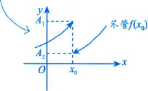

## 注按此定义，跳跃间断点和 $f(x_{0})$ 的值无关.

(3) 无穷间断点.

若 $\lim_{x \to x_0} f(x) = \infty$ 或 $\lim_{x \to x_0^+} f(x) = \infty$ 或 $\lim_{x \to x_0^-} f(x) = \infty$ ，则 $x   =   x _ { _ 0 }$ 称为无穷间断点，如点x=0为函数 $y = \frac{1}{x}$

的无穷间断点. $x _ { 0 }$ 点的左、右极限至少有一个无穷大.

说明：

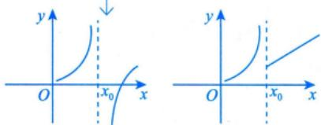

①无穷间断点，不是说这一点的值是无穷大，是说这一点的左、右两侧，至少有一个极限值趋向无穷大.

②无穷间断点是第二类间断点.

(4) 振荡间断点.

若 $\lim_{x \to x_0} f(x)$ 振荡不存在，则 $x   =   x _ { 0 }$ 称为振荡间断点，如函数 $y = \sin \frac{1}{x}$ 在点 $x = 0$ 处没有定义，且当$x   \to   0$ 时，函数值在-1与1这两个数之间交替振荡取值，极限不存在，故点x=0为函数 $y = \sin \frac{1}{x}$ 的振荡间断点.

无穷间断点和振荡间断点都属于第二类间断点．（第二类还有其他，但与考研无关）

$$
\begin{aligned}& 研究对象  \left\{\begin{aligned}&\lim_{x \to x_0^+} f(x) ; \\&\lim_{x \to x_0^-} f(x) ; \\&f(x_0) .\end{aligned}\right. \quad  情况  \left\{\begin{aligned}&\textcircled{1}  可去间断点;  \\&\textcircled{2}  跳跃间断点;  \\&\textcircled{3}  第二类间断点;  \\&\textcircled{4} f(x_0) \textcircled{4} \lim_{x \to x_0} f(x) .\end{aligned}\right.\end{aligned}
$$

例1.36 已知 $f(x)=\begin{cases}(\cos x)^{x^{-2}},&x\neq0,\\a,&x=0\end{cases}$ 在 $x = 0$ 处连续，则a=

分析 $\lim_{x \to x_0} f(x) = f(x_0) \Leftrightarrow f(x)$ 在 $x _ { 0 }$ 处连续.

解应填e2. $\mathrm{e}^{-\frac{1}{2}}$

$\lim_{x \to 0} f(x) = \lim_{x \to 0} (\cos x)^{x^{-2}} \xlongequal{\quad } \mathrm{e}^{A}$ ，式中 $\lim_{x \to 0} \frac{\cos x - 1}{x^2} = -\frac{1}{2}$ ，故 $\lim_{x \to 0} f(x) = \mathrm{e}^{-\frac{1}{2}}$

又f(x)在x=0处连续，所以 $a = \lim_{x \to 0} f(x) = \mathrm{e}^{-\frac{1}{2}}$

方法总结计算 $\lim_{x \to x_0} f(x)$ 即可.

公式 $\lim_{x \to (x)} u(x)^{v(x)} = \mathrm{e}^{\lim_{x \to (x)} [u(x) - 1]}$

$f(x) = \frac{\mathrm{e}^{\frac{1}{x - 1}}\ln\left| 1 + x \right|}{\left( \mathrm{e}^{x} - 1 \right)(x - 2)}$ 回忆：例1.15例1.37 函数 的第二类间断点的个数为（ ).(A)1 (B)2 (C) 3 (D) 4

分析找无定义点和分段函数的分界点，求 $\lim_{x \to x_0} f(x)$ ，进而判断间断点类型，

解应选(C).

本题考查初等函数的连续性、间断点、间断点分类等基本概念，考查利用等价无穷小替换及洛必达法则求极限的方法，是一道考查基本概念和简单运算的题目

f(x)的定义域为 $\left\{ x \mid x \in ( - \infty , + \infty ) , x \neq - 1 , x \neq 0 , x \neq 1 , x \neq 2 \right\}$ ，而初等函数在定义域内是连续的，所以该函数的所有间断点是-1，0，1，2.由于

$$
\lim_{x \to -1} f(x) = \lim_{x \to -1} \frac{\mathrm{e}^{\frac{1}{x-1}} \ln |1+x|}{(\mathrm{e}^x - 1)(x-2)} = -\infty
$$

$$
\lim_{x \to 2} f(x) = \lim_{x \to 2} \frac{\mathrm{e}^{\frac{1}{x-1}} \ln |1+x|}{(\mathrm{e}^x - 1)(x-2)} = \infty
$$

由例1.15知，

$$
\lim_{x \to 0} f(x) = \lim_{x \to 0} \frac{e^{\frac{1}{x - 1}} \ln |1 + x|}{(e^x - 1)(x - 2)} = -\frac{1}{2e} \lim_{x \to 0} \frac{\ln (1 + x)}{e^x - 1} = -\frac{1}{2e}
$$

因此 $x = 0$ 是函数的可去间断点，而其余3个点均为函数的第二类间断点，故选(C).

方法总结间断点找无定义点和分段函数的分界点

公式 $\mathsf { e } ^ { \infty }$ 要分 $\mathbf{e}^{+\infty}, \mathbf{e}^{-\infty}$

注这个题目的计算量还是比较大的，对于极限计算，命题老师的要求还是比较高的.

★例1.38 设函数 $f(x)=\lim_{n \to \infty} \frac{x^2 + nx(1-x)\sin^2 \pi x}{1+n\sin^2 \pi x}$ ，则f(x)（）.

(A) 处处连续

(B) 只有第一类间断点

(C) 只有第二类间断点

(D)既有第一类间断点，又有第二类间断点

分析去掉极限符号，找出对应法则.

应选(B).

由例1.26可知，

$$
f(x)=\begin{cases}x^{2},&x=0,\pm1,\pm2,\cdots,\\x(1-x),& 其他 .\end{cases}
$$

可见f(x)有第一类间断点，没有第二类间断点，故选(B).

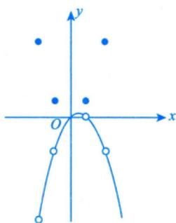

方法总结求分段函数的分界点的极限值，进而判定间断点类型.若 $\lim_{x \to x_0} f(x)$ 存在，但 $\lim_{x \to x_0} f(x) \neq f(x_0)$ ，则 $x _ { 0 }$ 为f(x)的可去间断点.

注学好基础知识任重道远，数学成绩的提高，第一要靠理解，第二要通过做题，逐渐提高解题能力.

第1讲就到这里，考生们需要做几个工作：①要把我们整个第1讲讲的内容好好地进行复习，复盘，熟练地掌握讲过的各种概念，知识，定理，方法；②要把《张宇考研数学题源探析经典1000题》基础篇全部做完.

## 基础习题精练

## 习题

1.1 若 $\lim_{x \to 0} \frac{\sin x + xf(x)}{x^3} = 0$ ，则 $\lim_{x \to 0} \frac{1 + f(x)}{x^2}$ 为( ).(A) 0 (B) $\frac{1}{3}$ (C) $\frac{1}{6}$ (D) $\infty$

1.2 设f(x)在(-∞，+∞)内有定义，且 $\lim_{x \to \infty} f(x) = a, \; g(x) = \left\{ f\left(\frac{1}{x}\right), \quad x \neq 0, \right.$ 则（ ).

(A) x =0必是g(x)的第一类间断点(B) x =0必是g(x)的第二类间断点(C) x=0必是g(x)的连续点(D) g(x)在点x=0处的连续性与a的取值有关

1.3 设函数 $f(x) = \frac{1}{\mathrm{e}^{\frac{x}{x - 1}} - 1}$ ，则（）.  
(A) x=0, x=1都是f(x)的第一类间断点  
(B) x =0,x =1都是f(x)的第二类间断点  
(C) x=0是f(x)的第一类间断点，x=1是f(x)的第二类间断点(D) x=0是f(x)的第二类间断点，x=1是f(x)的第一类间断点

1.4 函数 $f(x) = \lim_{t \to 0} \left( 1 + \frac{\sin t}{x} \right)^{\frac{x^2}{t}}$ 在 $(-\infty, +\infty)$ 内( ).(A)连续 (B)有可去间断点(C) 有跳跃间断点 (D)有无穷间断点

1.5 设函数 $f(x) = \lim_{n \to \infty} \frac{1 + x}{1 + x^{2n}}$ ，关于该函数的间断点，下列结论正确的是（）.(A) 不存在间断点 (B)存在间断点x=1(C)存在间断点x=0 (D)存在间断点x=-1

1.6 设函数 $f(x)=\frac{x}{1+x},x\in[0,1]$ ，定义函数列：

$$
f_{1}(x)=f(x), \quad f_{2}(x)=f\left[f_{1}(x)\right], \quad \cdots, \quad f_{n}(x)=f\left[f_{n-1}(x)\right](n=1, 2, 3, \cdots)
$$

则fn(x) =

1.7 $\lim_{x \to 0^{+}} \frac{1 - \sqrt{\cos x}}{x(1 - \cos \sqrt{x})}$

1.8 $\lim_{x \to \infty} \left( \frac{x + 2}{x - 1} \right)^x =$

1.9 已知a> 0, b> 0，则 $\lim_{x \to +\infty} x \left( a^{\frac{1}{x}} - b^{\frac{1}{x}} \right);$ =

1.10 设函数 $f(x)=\left\{\begin{aligned}&\frac{1-\mathrm{e}^{\tan x}}{x\arcsin\frac{x}{2}}, &x>0, \\&a\mathrm{e}^{2x}, &x\leqslant0\end{aligned}\right.$ 在x=0处连续，则a=

1.11 设f(x) =arcsin(sin x)，画出f(x)的图形.

1.12 求极限 $\lim_{x \to 0} \left( \frac{\mathrm{e}^x + x\mathrm{e}^x}{\mathrm{e}^x - 1} - \frac{1}{x} \right)$

1.13 求极限 $\lim_{x \to 0} \left( \frac{a_1^x + a_2^x + \cdots + a_n^x}{n} \right)^{\frac{n}{x}}$ ，其中 $a_{i} > 0,   i = 1,   2,   \cdots,   n$

1.14 已知 $\lim_{x \to 0} \left[ a \frac{2 + \mathrm{e}^{\frac{1}{x}}}{1 + \mathrm{e}^{\frac{4}{x}}} + (1 + |x|)^{\frac{1}{x}} \right]$ 存在，求a的值.

1.15 设 $\lim_{x \to 0} \frac{\ln(1 + x) - (ax + bx^2)}{x^2} = 2$ ，求常数a,b.

1.16 求常数a和 b的值，使得函数 $f(x) = x - (a + b\cos x)\sin x$ 在x→0时是x的5阶无穷小.

## 解答

1.1 (C) 解 方法一 $\lim_{x \rightarrow 0}\frac{\sin x + xf(x)}{x^{3}} = \lim_{x \rightarrow 0}\frac{\sin x - x + x + xf(x)}{x^{3}} = \lim_{x \rightarrow 0}\frac{\sin x - x}{x^{3}} + \lim_{x \rightarrow 0}\frac{x + xf(x)}{x^{3}}$ 1 +lim1+f(x) =0 ,三6 x→0 x²

则 $\lim_{x \to 0} \frac{1 + f(x)}{x^2} = \frac{1}{6}$ .故选(C).

方法二 对sinx使用泰勒展开，

$$
\lim_{x \to 0} \frac{\sin x + xf(x)}{x^3} = \lim_{x \to 0} \frac{x - \frac{1}{6}x^3 + o(x^3) + xf(x)}{x^3} = \lim_{x \to 0} \frac{1 + f(x)}{x^2} - \frac{1}{6} = 0
$$

故 $\lim_{x \to 0} \frac{1 + f(x)}{x^2} = \frac{1}{6}$ .故选(C).

方法三由 $\lim_{x \to 0} \frac{\sin x + xf(x)}{x^3} = 0$ ，得 $\frac{\sin x + xf(x)}{x^{3}} = 0 + \alpha$ ，其中 $\lim_{x \to 0} \alpha = 0$ ，于是得

$$
xf(x) = -\sin x + o(x^3)
$$

故 $\lim_{x \to 0} \frac{1 + f(x)}{x^2} = \lim_{x \to 0} \frac{x - \sin x + o(x^3)}{x^3} = \frac{1}{6}$ .故选(C).

1.2 (D) 解 因为 $\lim_{x \to 0} g(x) = \lim_{x \to 0} f\left(\frac{1}{x}\right) = \lim_{x \to \infty} f(x) = a$ ，而 $g(0) = 0$ ，所以当a=0时，函数 $g ( x )$ 在点x=0处连续；当a≠0时，函数 $g(x)$ 在点x=0处不连续，故选(D).

1.3 (D) 解 f(x)非分段函数，只需讨论函数的无定义点x=0,1. 因为

$$
\lim_{x \to 0} f(x) = \lim_{x \to 0} \frac{1}{\mathrm{e}^{\frac{x}{x-1}} - 1} = \infty
$$

$$
\lim_{x \to 1^{+}} f(x) = \lim_{x \to 1^{+}} \frac{1}{\mathrm{e}^{\frac{x}{x-1}} - 1} = 0, \quad \lim_{x \to 1^{-}} f(x) = \lim_{x \to 1^{-}} \frac{1}{\mathrm{e}^{\frac{x}{x-1}} - 1} = -1
$$

故x=0是f(x)的第二类间断点，x=1是f(x)的第一类间断点.故选(D).

1.4 (B) 解 这是“1°”型未定式，于是

$$
f(x)=\lim_{t \to 0}\left(1+\frac{\sin t}{x}\right)^{\frac{x^{2}}{t}}=\mathrm{e}^{\lim_{t \to 0}x^{2}\cdot\left(1+\frac{\sin t}{x}-1\right)}=\mathrm{e}^{\lim_{t \to 0}x\cdot\frac{\sin t}{t}}=\mathrm{e}^{x}
$$

又f(x)在x=0处无定义，且 $\lim_{x \to 0} f(x) = \lim_{x \to 0} \mathrm{e}^x = 1$ ，故x=0是f(x)的可去间断点.选(B).

1.5 (B) 分析 函数 $f(x) = \lim_{n \to \infty} \frac{1 + x}{1 + x^{2n}}$ 是以x为自变量的函数，但是当 $n \to \infty .$ 求极限时，x则被看成一个常数(参数)，根据x的不同取值求出极限，求完极限后x又恢复变量的本来身份.

因为分式中有 $x^{2n}$ ，所以应先把x=-1和x=1作为分段点将函数写成分段函数，然后讨论函数的间断点.

解当 $\left| x \right| < 1$ 时， $\lim_{n \to \infty} x^{2n} = 0$ ，所以 $f(x) = 1 + x$ ；当 $\left| x \right| > 1$ 时， $f(x) = \lim_{n \to \infty} \frac{1 + x}{1 + x^{2n}} = 0$

又 $f(1)=1,\ f(-1)=0$ ，所以

$$
f(x)=\lim_{n \to \infty} \frac{1+x}{1+x^{2n}}=\left\{\begin{aligned}&0, &x \leqslant -1, \\&1+x, &-1<x<1, \\&1, &x=1, \\&0, &x>1.\end{aligned}\right.
$$

由此可知x=1为间断点.故选(B).

$$
\frac{x}{1 + nx} = \frac{x}{1 + 2x} = \frac{x}{1 + 2x} = \frac{x}{1 + 2x} = \frac{x}{1 + 2x} = \frac{x}{1 + 2x} = \frac{x}{1 + 2x}
$$

$$
f_{3}(x)=f[f_{2}(x)]=\frac{f_{2}(x)}{1+f_{2}(x)}=\frac{\frac{x}{1+2x}}{1+\frac{x}{1+2x}}=\frac{x}{1+3x}
$$

由数学归纳法得 $f_{n}(x)=\frac{x}{1+nx}(n=1,2,3,\cdots)$

$$
\lim_{x \to 0^{+}} \frac{1 - \cos x}{x(1 - \cos \sqrt{x})(1 + \sqrt{\cos x})} = \lim_{x \to 0^{+}} \frac{\frac{1}{2}x^{2}}{x \cdot \frac{1}{2}x \cdot (1 + \sqrt{\cos x})} = \frac{1}{2}
$$

注若想到了例 1.22的“当 $x \rightarrow 0$ 时， $1 - \cos^{a}x \sim \frac{a}{2}x^{2} , a \neq 0$ 则解题就更简单了.

1.8 $\mathsf { e } ^ { 3 }$ 解 $\lim_{x \to \infty} \left( \frac{x + 2}{x - 1} \right)^x = \lim_{x \to \infty} \left( \frac{1 + \frac{2}{x}}{1 - \frac{1}{x}} \right)^x = \lim_{x \to \infty} \left( 1 + \frac{2}{x} \right)^x = \frac{e^2}{e^{-1}} = e^3$

$\lim_{x \to \infty} \left( 1 + \frac{a}{x} \right)^{bx + d} = \mathrm{e}^{ab}$ 是常用的公式.

相仿，

$$
\lim_{x \to \infty} \left( \frac{x + a}{x - a} \right)^x = \lim_{x \to \infty} \left( \frac{1 + \frac{a}{x}}{1 - \frac{a}{x}} \right)^x = \lim_{x \to \infty} \left( 1 + \frac{a}{x} \right)^x = \mathrm{e}^{2a}
$$

上述两种表达式变形是求极限运算的常见技巧，为固定模式的求解方法，应熟记.

1.9 ln $\frac{a}{b}$ 解 利用变量代换.令 $t \frac{1}{x} = t$ ，则

$$
\lim_{x \to +\infty} x \left( a^{\frac{1}{x}} - b^{\frac{1}{x}} \right) = \lim_{t \to 0^+} \frac{a^t - b^t}{t} = \lim_{t \to 0^+} \left( a^t \ln a - b^t \ln b \right) = \ln \frac{a}{b} \left( a > 0, b > 0 \right)
$$

1.10 -2 解 因为f(x)在x=0处连续，所以 $\lim_{x \to 0^{+}} f(x) = \lim_{x \to 0^{-}} f(x) = f(0)$ .又

$$
\begin{aligned}\lim_{x \to 0^{+}} f(x) &= \lim_{x \to 0^{+}} \frac{1 - \mathrm{e}^{\tan x}}{\arcsin \frac{x}{2}} = \lim_{x \to 0^{+}} \frac{-\tan x}{\frac{x}{2}} = -2, \\\lim_{x \to 0^{-}} f(x) &= \lim_{x \to 0^{-}} a \mathrm{e}^{2x} = a,\end{aligned}
$$

所以 $a = - 2$

1.11 解 $f(x + 2\pi) = \arcsin[\sin(x + 2\pi)] = \arcsin(\sin x) = f(x)$ ，故f(x)以2π为周期.

当 $x \in \left[ - \frac{\pi}{2}, \frac{\pi}{2} \right)$ 时，有 $\arcsin(\sin x) = x$

当 $x \in \left[ \frac{\pi}{2}, \pi \right)$ 时，有 $\pi - x \in \left( 0, \frac{\pi}{2} \right]$ ，则

$$
\arcsin(\sin x) = \arcsin[\sin(\pi - x)] = \pi - x;
$$

当 $x \in \left[ \pi , \frac{3}{2} \pi \right)$ 时，有 $x - \pi \in \left[ 0, \frac{\pi}{2} \right)$ ，则

$$
\arcsin(\sin x) = \arcsin[-\sin(x - \pi)] = \pi - x
$$

故在 $\left[ -\frac{\pi}{2}, \frac{3}{2}\pi \right)$ 上， $f(x)=\left\{\begin{aligned}x, \quad x \in \left[-\frac{\pi}{2}, \frac{\pi}{2}\right), \\\pi-x, \quad x \in \left[\frac{\pi}{2}, \frac{3}{2}\pi\right),\end{aligned}\right.$ 于是在 $\left( -\infty, +\infty \right).$ 上，

$$
f(x)=\arcsin(\sin x)=\left\{\begin{aligned}x-2k\pi,\quad x\in\left[-\frac{\pi}{2}+2k\pi,\frac{\pi}{2}+2k\pi\right),\\(2k+1)\pi-x,\quad x\in\left[\frac{\pi}{2}+2k\pi,\frac{3}{2}\pi+2k\pi\right),\end{aligned}\right.k 为整数.
$$

其图形如图1-29所示.

  
图 1-29

1.12 解 利用等价无穷小量代换， $\mathrm{e}^{x}-1 \sim x (x \rightarrow 0)$ ，则

$$
\begin{aligned}\lim_{x \rightarrow 0}\left( \frac{\mathrm{e}^{x} + x\mathrm{e}^{x}}{\mathrm{e}^{x} - 1} - \frac{1}{x} \right) = \lim_{x \rightarrow 0}\frac{x\mathrm{e}^{x}(1 + x) + 1 - \mathrm{e}^{x}}{x(\mathrm{e}^{x} - 1)} = \lim_{x \rightarrow 0}\frac{x\mathrm{e}^{x}(1 + x) + 1 - \mathrm{e}^{x}}{x^{2}} \\= \lim_{x \rightarrow 0}\frac{3x\mathrm{e}^{x} + x^{2}\mathrm{e}^{x}}{2x} = \lim_{x \rightarrow 0}\frac{3\mathrm{e}^{x} + x\mathrm{e}^{x}}{2} = \frac{3}{2}\end{aligned}
$$

注下面的做法是错误的：

$$
\begin{aligned}\lim_{x \rightarrow 0}\left( \frac{\mathrm{e}^{x} + x\mathrm{e}^{x}}{\mathrm{e}^{x} - 1} - \frac{1}{x} \right) = \lim_{x \rightarrow 0}\left( \frac{\mathrm{e}^{x} + x\mathrm{e}^{x}}{x} - \frac{1}{x} \right) \\= \lim_{x \rightarrow 0}\frac{\mathrm{e}^{x} + x\mathrm{e}^{x} - 1}{x} = \lim_{x \rightarrow 0}\left( 2\mathrm{e}^{x} + x\mathrm{e}^{x} \right) = 2\end{aligned}
$$

1.13 解 因为 $\lim_{x \to 0} a_i^x = 1$ ，所以原极限为“1°”型未定式.

方法一 使用洛必达法则求极限.

$$
\begin{aligned}\lim_{n \to 0} \left( \frac{a_1^x + a_2^x + \cdots + a_n^x}{n} \right)^{\frac{n}{x}} &= \exp \left\{ \lim_{x \to 0} \frac{n \left( a_1^x + a_2^x + \cdots + a_n^x - 1 \right)}{n} \right\} \\&= \exp \left\{ \lim_{x \to 0} \frac{a_1^x - 1}{x} + \lim_{x \to 0} \frac{a_2^x - 1}{x} + \cdots + \lim_{x \to 0} \frac{a_n^x - 1}{x} \right\} \\&= \exp \left\{ \lim_{x \to 0} \left( a_1^x \ln a_1 + a_2^x \ln a_2 + \cdots + a_n^x \ln a_n \right) \right\} = a_1 a_2 \cdots a_n\end{aligned}
$$

方法二 凑成第二个重要极限 $( \mathrm { ~  ~ } 1 ^ { \infty }$ 型未定式都可以凑成第二个重要极限)，在计算过程中使用洛必达法则.

$$
\lim_{x \to 0} \left( \frac{a_1^x + a_2^x + \cdots + a_n^x}{n} \right)^{\frac{n}{x}} = \lim_{x \to 0} \left( 1 + \frac{a_1^x + a_2^x + \cdots + a_n^x - n}{n} \right)^{\frac{n}{a_1^x + a_2^x + \cdots + a_n^x - n} \cdot \frac{a_1^x + a_2^x + \cdots + a_n^x - n}{x}}
$$

其中

$$
\lim_{x \to 0} \frac{a_1^x + a_2^x + \cdots + a_n^x - n}{x} = \ln(a_1a_2\cdots a_n), \lim_{x \to 0} \left(1 + \frac{a_1^x + a_2^x + \cdots + a_n^x - n}{x}\right)^{\frac{n}{a_1^x + a_2^x + \cdots + a_n^x - n}} = e,
$$

所以，原式 $= a_{1}a_{2}\cdots a_{n}$

1.14 解 因为 $\lim_{x \to 0} \left[ a \frac{2 + \mathrm{e}^{\frac{1}{x}}}{1 + \mathrm{e}^{\frac{4}{x}}} + (1 + |x|)^{\frac{1}{x}} \right]$ 存在，且

$$
\lim_{x \to 0^{+}} \left[ a \frac{2 + \mathrm{e}^{\frac{1}{x}}}{1 + \mathrm{e}^{\frac{4}{x}}} + (1 + |x|)^{\frac{1}{x}} \right] = \lim_{x \to 0^{+}} \left[ a \frac{2 + \mathrm{e}^{\frac{1}{x}}}{1 + \mathrm{e}^{\frac{4}{x}}} + (1 + x)^{\frac{1}{x}} \right] = 0 + \mathrm{e} = \mathrm{e}
$$

$$
\lim_{x \to 0} \left[ a \frac{2 + \mathrm{e}^{\frac{1}{x}}}{1 + \mathrm{e}^{\frac{4}{x}}} + (1 + |x|)^{\frac{1}{x}} \right] = \lim_{x \to 0} \left[ a \frac{2 + \mathrm{e}^{\frac{1}{x}}}{1 + \mathrm{e}^{\frac{4}{x}}} + (1 - x)^{\frac{1}{x}} \right] = 2a + \frac{1}{\mathrm{e}}
$$

所以

$$
e = 2a + \frac{1}{e}
$$

解得

$$
a = \frac{e}{2} - \frac{1}{2e}
$$

1.15 解 原极限 $\lim_{x \to 0} \frac{x - \frac{1}{2}x^2 + o(x^2) - ax - bx^2}{x^2} = \lim_{x \to 0} \frac{(1 - a)x - \left(\frac{1}{2} + b\right)x^2 + o(x^2)}{x^2} = 2$ ，从而

$$
1 - a = 0 , - \left( \frac{1}{2} + b \right) = 2 ,
$$

解得 $a = 1,   b = -\frac{5}{2}$

## 注本题还有一个值得借鉴的解法.

根据泰勒公式容易得： $x - \ln(1 + x) \sim \frac{1}{2}x^{2}(x \to 0)$ (请考生记住此式)，故想办法把分子凑出这种形式

$$
\begin{aligned}2 = & \lim_{x \rightarrow 0}\frac{\ln(1 + x) - (ax + bx^{2})}{x^{2}} = - \lim_{x \rightarrow 0}\frac{x - \ln(1 + x) - x + (ax + bx^{2})}{x^{2}} \\= & - \lim_{x \rightarrow 0}\frac{x - \ln(1 + x)}{x^{2}} - \lim_{x \rightarrow 0}\frac{(a - 1)x}{x^{2}} - \lim_{x \rightarrow 0}\frac{bx^{2}}{x^{2}} = - \frac{1}{2} - b - \lim_{x \rightarrow 0}\frac{(a - 1)x}{x^{2}}\end{aligned}
$$

故 $a - 1 = 0$ ，得 $a = 1$ .因而 $- \frac { 1 } { 2 } - b = 2$ ，得 $b = - \frac { 5 } { 2 }$

1.16 解 先作恒等变形: $f(x)=x-a\sin x-\frac{1}{2}b\sin 2x$ ，再利用泰勒展开式，由

$$
\sin x = x - \frac{x^{3}}{6} + \frac{x^{5}}{120} + o(x^{5})
$$

$$
\sin 2x = 2x - \frac{(2x)^3}{6} + \frac{(2x)^5}{120} + o(x^5) = 2x - \frac{4}{3}x^3 + \frac{4}{15}x^5 + o(x^5)
$$

可得

$$
f(x)=(1-a-b)x+\left(\frac{a}{6}+\frac{2b}{3}\right)x^3-\left(\frac{a}{120}+\frac{2b}{15}\right)x^5+o(x^5)
$$

欲使在 $x \to 0$ 时，函数f(x)是x的5阶无穷小，则 $\begin{cases}1 - a - b = 0, \\\dfrac{a}{6} + \dfrac{2b}{3} = 0, \\\dfrac{a}{120} + \dfrac{2b}{15} \neq 0.\end{cases}$ 解得 $a = \frac{4}{3}, b = -\frac{1}{3}$

<table><tr><td rowspan=1 colspan=1>考题</td><td rowspan=1 colspan=1>证明数列极限的存在性</td></tr><tr><td rowspan=1 colspan=1>题型</td><td rowspan=1 colspan=1>选择题、填空题、解答题</td></tr><tr><td rowspan=1 colspan=1>目标</td><td rowspan=1 colspan=1>①理解数列极限的概念；②掌握数列极限的性质及四则运算规则；③掌握数列极限存在的两个准则，并会利用它们求极限</td></tr><tr><td rowspan=1 colspan=1>重难点</td><td rowspan=1 colspan=1>①海涅定理的应用；②通过放缩利用夹逼准则求极限；③单调有界准则证明极限存在</td></tr></table>

## 基础知识结构

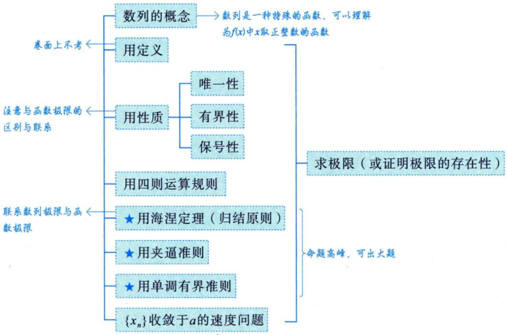

对每个 $n \in \mathbf { N } _ { + }$ ，如果按照某一法则，对应着一个确定的实数 $x _ { n }$ ，这些实数 $x _ { n }$ 按照下标n从小到大排列得到的一个序列

$$
x_{1}, x_{2}, x_{3}, \cdots, x_{n}, \cdots
$$

就叫作数列，简记为数列 $\{ x _ { n } \}$

数列中的每一个数叫作数列的项，第n项 $x _ { n }$ 叫作数列的一般项(或通项).

在几何上，数列 $\left\{ x_{n} \right\}$ 可看作数轴上的一个动点，它依次取数轴上的点 $x_{1}, x_{2}, x_{3}, \cdots, x_{n}, \cdots$ (见图2-1).

$$
\overrightarrow{x_{2}} \overrightarrow{x_{1}} \overrightarrow{x_{3}} \overrightarrow{x_{n}} \overrightarrow{x_{}}
$$

图 2-1

## 注数列一定有无穷多项.

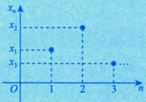

数列的本质是“整标函数”

数列 $\left\{ x_{n} \right\}$ 可看作自变量为正整数n的函数

$$
x_{n}=f(n), n \in \mathbf{N}_{+}
$$

当自变量n依次取1,2,3,…一切正整数时，对应的函数值就排列成数列 $\left\{ x_{n} \right\}$

## 注(1)子列.

从数列 $\{ a_{n} \} ; a_{1}, a_{2}, \cdots, a_{n}, \cdots$ 中选取无穷多项，并按原来的先后顺序组成新的数列，称新数列为原数列的子列，记为

$$
\left\{ a _ { n _ { k } } \right\} : a _ { n _ { 1 } } , a _ { n _ { 2 } } , \cdots , a _ { n _ { k } } , \cdots ,
$$

其中下标 $n_{1}, n_{2}, \cdots, n_{k}, \cdots$ 为正整数.

例如，若 $n_{k}(k = 1,2,\cdots)$ 分别取2k和2k-1，则得到数列 $\left\{ a_{n} \right\}$ 的两个子列

$$
\{ a_{2k} \} ; a_{2}, a_{4}, \cdots, a_{2k}, \cdots ; \{ a_{2k-1} \} ; a_{1}, a_{3}, \cdots, a_{2k-1}, \cdots,
$$

这两个子列的项在原数列中交错出现.

(2) 等差数列.

首项为 $a _ { 1 }$ ，公差为 d(d ≠0)的数列 $a_{1}, a_{1}+d, a_{1}+2d, \cdots, a_{1}+(n-1)d, \cdots$

①通项公式 $a_{n}=a_{1}+(n-1)d$

②前n项的和 $S_{n} = \frac{n}{2}\left[ 2a_{1} + (n - 1)d \right] = \frac{n}{2}(a_{1} + a_{n})$

(3)等比数列.

首项为 $a _ { 1 }$ ，公比为r(r≠0)的数列 $a_{1}, a_{1}r, a_{1}r^{2}, \cdots, a_{1}r^{n-1}, \cdots$

①通项公式 $a_{n}=a_{1}r^{n-1}$

②前n项的和 $S_{n}=\left\{\begin{aligned}na_{1}, & \quad r=1, \\ \frac{a_{1}(1-r^{n})}{1-r}, & \quad r \neq 1.\end{aligned}\right.$

③常用 $1 + r + r^{2} + \cdots + r^{n - 1} = \frac{1 - r^{n}}{1 - r} \quad (r \neq 1).$ 有限项和不会发散，收敛和发散的概念，只在无穷项时会涉及

这两个求和公式针对的前n项和，即有限项和，当讨论无限项和时，需要使用无穷级数理论

(4) 单调数列.

若对所有正整数n，有 $a_{n + 1} \geqslant a_{n}(a_{n + 1} \leqslant a_{n})$ ，则称数列 $\left\{ a_{n} \right\}$ 为单调不减(不增)数列.将≥(≤)换成$> ( < )$ ，则称为单调递增(递减)数列.单调递增数列与单调递减数列统称为单调数列.

(5) 有界数列.

若对所有正整数n，存在正实数M，有 $\left| a_{n} \right| \leqslant M$ 则称数列{a}为有界数列.  
①找M，使得 $| a_{n} | \leqslant M$   
②放缩法；证明数列有界的几种方法：  
③找最值；  
④基本不等式法.

(6) 一些常见数列前n项的和.

$\sum_{k = 1}^{n}k = 1 + 2 + 3 + \cdots + n = \frac{n(n + 1)}{2}$

$\sum_{k = 1}^{n}k^{2} = 1^{2} + 2^{2} + 3^{2} + \cdots + n^{2} = \frac{n(n + 1)(2n + 1)}{6}$

怎么算出来的？裂项相消

$$
1 - \frac{1}{2} + \frac{1}{2} - \frac{1}{3} + \frac{1}{3} - \frac{1}{4} + \cdots + \frac{1}{n} - \frac{1}{n + 1}
$$

$$
\frac{1}{k - 1} = \frac{1}{1 \times 2} + \frac{1}{2 \times 3} + \frac{1}{3 \times 4} + \cdots + \frac{1}{n(n + 1)} = \frac{1}{n + 1}
$$

$$
= 1 - \frac { 1 } { n + 1 }
$$

$$
\lim_{n \to \infty} \sum_{k=1}^{n} \frac{1}{k(k+1)} = \lim_{n \to \infty} \frac{n}{n+1} = 1
$$

(7) 一个重要数列 $\left\{ \left( 1 + \frac{1}{n} \right)^n \right\}$ 的结论：

①单调递增有上界.

② $\lim_{n \to \infty} \left( 1 + \frac{1}{n} \right)^n = \mathrm{e}.$

当n无限增大时（即 $n \to \infty$ 时)，对应的 $x_{n} = f(n)$ 是否能无限接近于某个确定的数值，这就是我们接下来要研究的数列极限.

例2.1 设 $0 < x_{1} < 3, x_{n + 1} = \sqrt{x_{n}(3 - x_{n})} (n = 1, 2, \cdots)$ ，证明数列 $\left\{ x_{n} \right\}$ 有界.

分析针对 $\sqrt{A(B - A)}$ 形的式子，可以使用基本不等式.

证因为 $0 < x_{1} < 3$ ，所以 $x_{1}, 3 - x_{1}$ 均为正数，从而

$$
\sqrt{ab} \leqslant \frac{a + b}{2} \quad (a \geqslant 0, b \geqslant 0) \leqslant 0 < x_{2} = \sqrt{x_{1}(3 - x_{1})} \leqslant \frac{x_{1} + 3 - x_{1}}{2} = \frac{3}{2}
$$

设 $0 < x_{k} \leqslant \frac{3}{2}(k > 1)$ ，则 $0 < x_{k + 1} = \sqrt{x_{k}(3 - x_{k})} \leqslant \frac{1}{2}(x_{k} + 3 - x_{k}) = \frac{3}{2}$ ，由数学归纳法知，对任意正整数$n > 1$ ，都有 $0 < x_{n} \leqslant \frac{3}{2}$ ，即数列 $\left\{ x_{n} \right\}$ 有界.

## ② 数列极限的定义

设 $\left\{ x_{n} \right\}$ 为一数列，若存在常数a，对于任意的 $\varepsilon > 0$ (不论它多么小)，总存在正整数N，使得当$n > N$ 时， $\left| x_{n} - a \right| < \varepsilon$ 恒成立，则称常数a是数列 $\left\{ x_{n} \right\}$ 的极限，或者称数列 $\left\{ x_{n} \right\}$ 收敛于a，记为

$$
\lim_{n \to \infty} x_n = a   或   x_n \to a   (n \to \infty)  ,指   n \to +\infty  ,且是"商戴"着
$$

如果不存在这样的常数a，就说数列 $\left\{ x_{n} \right\}$ 是发散的.

注(1)数列极限的定义是比较难的一个考点，但是卷面上不会考证明的解答题，基本只在选择题和填空题里面考对它的理解.

(2)数列极限与函数极限是极限的两个基本类型，二者虽然有联系，但是也有着很大的区别.比如对于唯一性而言，数列极限与函数极限是相同的，二者的极限都具有唯一性.对于有界性而言，二者是有区别的，函数极限的有界性强调的是局部有界性，也就是在某个邻域上有界，而数列极限的有界性指的是全局有界性，即对数列中的任意一项都有 $| a_{n} | \leqslant M$ .对于保号性而言，函数极限强调的也是局部保号性，即在某个邻域上是保号的，而数列极限虽然没有强调局部保号性，但是也要强调存在正整数N，当 $n > N$ 时才有 $a_{n} > 0   (或  < 0  )$

(3) 常用的语言： $\lim_{n \to \infty} x_n = a$ 任意 $\varepsilon > 0$ ，存在 $N \in \mathbf{N}_{+}$ ，当 $n > N$ 时，恒有 $\left| x_{n} - a \right| < \varepsilon$ ，且当$a = 0$ 时，称 $x_{n}$ 为 $n \to \infty$ 时的无穷小量. xn与a的距离任意小 不等关系

a. 与函数极限的定义作对比.

$\lim_{x \to +\infty} f(x) = a \Leftrightarrow$ 任意 $\varepsilon > 0$ ，存在 $X > 0$ ，当 $x > X$ 时，恒有 $\left| f(x) - a \right| < \varepsilon$

b. 定义中的 $n > N$ ，N未必只能取整数，因为 $n > 10000$ 和 $n > 10000.1$ 表达的意思是一样的.

② $\lim_{n \to \infty} x_n = \infty$ 任意 $x > 0$ ，存在 $N \in \mathbb{N}_{+}$ ，当 $n > N$ 时，恒有 $\left| x_{n} \right| > x$ .此时称 $x_{n}$ 为 $n \to \infty$ 时的无穷大量.

(4) 数列收敛与其子列收敛的关系.

定理1 若数列 $\left\{ a_{n} \right\}$ 收敛，则其任何子列 $\left\{ a_{n_{k}} \right\}$ 也收敛，且 $\lim_{k \to \infty} a_{n_k} = \lim_{n \to \infty} a_n$

推论: lima =a⇔lima2k =a，且 $\lim_{k \to \infty} a_{2k-1} = a.$ $A \Rightarrow B \cap C$ 则 $\overline { B } \cup \overline { C } \Rightarrow \overline { A }$ lim $a_{3k} = \lim_{k \to +\infty} a_{3k+1} = a$ ，推不出 $\lim_{n \to \infty} a_n = a$

因为 $a _ { 3 k + 2 }$ 缺失.

此定理为我们提供了一个判断数列发散的方法：对于一个数列 $\left\{ a_{n} \right\}$ ，如果能找到一个发散的子列，则原数列一定发散；如果能找到至少两个收敛的子列 $\left\{ a_{n_{k}} \right\}$ 和 $\left\{ a_{n_{k}^{'}} \right\}$ 但它们收敛到不同极限，则原数列也一定发散.

如 $\left\{ n^{(-1)^n} \right\}$ ，详见例 2.3.

再例如，对于数列 $\left\{ ( - 1 ) ^ { n } \right\} : - 1 , 1 , - 1 , 1 , \cdots , ( - 1 ) ^ { n } , \cdots$ ，我们找到其收敛的子列

$$
\left\{ ( - 1 ) ^ { 2 k } \right\} : 1 , 1 , \cdots , 1 , \cdots ; \left\{ ( - 1 ) ^ { 2 k - 1 } \right\} : - 1 , - 1 , \cdots , - 1 , \cdots ,
$$

它们的极限分别为1和-1，所以原数列发散.

例2.2 证明：若 $\lim_{n \to \infty} a_n = A$ ，则 $\lim_{n \to \infty} |a_n| = |A|$

分析证明 $\lim_{n \to \infty} |a_n| = |A|$ ，关键是要找到 $\| a_{n} \| - \| A \|$ 与 $\left| a_{n} - A \right|$ 的关系，这时就要联想到三角不等式

证因为 $\lim_{n \to \infty} a_n = A$ ，所以对任意正数ε，存在正整数N，当 $n > N$ 时，有

$$
\left| a_{n} - A \right| < \varepsilon.
$$

又由不等式| $\left| a \right| - \left| b \right| \leq \left| a - b \right|$ ，有

$$
\left| \left| a_{n} \right| - \left| A \right| \right| \leqslant \left| a_{n} - A \right| < \varepsilon.
$$

故 $\lim_{n \to \infty} |a_n| = |A|$

注(1)此命题反过来不对，如取 $a_{n} = (-1)^{n}$ ，则 $\lim_{n \to \infty} \left| (-1)^n \right| = 1$ .但 $\lim_{n \to \infty} (-1)^n$ 不存在.

(2)在本题中若 $A = 0$ ，则 $\left| \left| a_{n} \right| - \left| A \right| \right| = \left| \left| a_{n} \right| - 0 \right| = \left| a_{n} - 0 \right|$ ，即有 $\lim_{n \to \infty} a_n = 0 \Leftrightarrow \lim_{n \to \infty} |a_n| = 0$ ,这个结论常用. →例： $\lim_{n \to \infty} \frac{\sin n}{n^2}$

$\frac{1}{n^{2}} \leqslant \left| \frac{\sin n}{n^{2}} \right| \leqslant \frac{1}{n^{2}}$ ，得 $\lim_{n \to \infty} \left| \frac{\sin n}{n^2} \right| = 0$ $\lim_{n \to \infty} \frac{\sin n}{n^2} = 0$

一般地，若要证 $\lim_{n \to \infty} a_{n} = 0$ ，可转化为证 $\lim_{n \to \infty} |a_n| = 0$ ，由于 $\left| a_{n} \right| \geqslant 0$ ，若使用夹逼准则，便省 $ 了$ 半的力气，只需找到一个数列 $\{ b_{n} \}$ 满足 $|a_{n}| \leqslant b_{n}$ ，且 $\lim_{n \to \infty} b_n = 0$ 即可.

(3)此结论对函数亦成立，即若 $\lim_{x \to x_0} f(x) = A$ 则 $\lim_{x \to x_0} |f(x)| = |A|$ 而反之不成立.但 $\lim_{x \to x_0} f(x) =$ $0 \Leftrightarrow \lim_{x \to x_0} \left| f(x) \right| = 0$

例2.3 证明数列 $\left\{ n^{\left( - 1 \right)^{n}} \right\}$ 极限不存在.

证从数列

$$
\left\{ n^{(-1)^n} \right\} : \frac{1}{1}, 2, \frac{1}{3}, 4, \frac{1}{5}, 6, \cdots, \frac{1}{2n-1}, 2n, \cdots
$$

中选取一个子列 $\{ 2 n \} : 2 , 4 , \cdots , 2 n , \cdots$ ，该数列不是有界数列，由下文收敛数列的性质定理3的逆否命题知该子列发散，因此，由“收敛数列的任何子列也收敛”的逆否命题知，原数列极限不存在.

注该数列存在收敛的子列 $\left\{ \frac{1}{2n - 1} \right\} : 1, \frac{1}{3}, \frac{1}{5}, \cdots, \frac{1}{2n - 1}, \cdots$ 但原数列发散.这说明一个数列的某个子列收敛并不能保证原数列收敛.

$x_{n}=\left\{\begin{aligned}&\frac{n^{2}+\sqrt{n}}{n} , & n \\&\frac{1}{n} , & n\end{aligned}\right.$ 为正奇数，例2.4设 则当 $n \to \infty$ 时，变量 $x _ { n }$ 为().为正偶数，

→对于某个 $\bar { M } > 0$ ，存在 $N > 0$ ，当 $2 n > N$ 时，无论2n取何值，都有 $x_{2n} \rightarrow 0 < M$ ，所以 $\left\{ x _ { n } \right\}$ 不是无穷大量(A)无穷大量 (B) 无穷小量(C)有界变量但不是无穷小量 (D)无界变量但不是无穷大量

解应选(D).

$$
\lim_{n \to \infty} x_{2n} = \lim_{n \to \infty} \frac{1}{2n} = 0,
$$

$$
\lim_{n \to \infty} x_{2n-1} = \lim_{n \to \infty} \frac{(2n-1)^2 + \sqrt{2n-1}}{2n-1} = +\infty
$$

可知 $\lim_{n \to \infty} x_{2n} \neq \lim_{n \to \infty} x_{2n-1}$ ，因此 $\lim_{n \to \infty} x_{n}$ 不存在，且当 $n \to \infty$ 时， $\left\{ x_{n} \right\}$ 既不是无穷大量，也不是无穷小量，它是无界变量，故选(D).

## ③ 收敛数列的性质

定理2(唯一性）给出数列 $\left\{ x_{n} \right\}$ ，若 $\lim_{n \to \infty} x_n = a$ (存在)，则a是唯一的.

定理3(有界性)若数列 $\left\{ x_{n} \right\}$ 极限存在，则数列 $\left\{ x_{n} \right\}$ 有界.

定理4(保号性）设 $\lim_{n \to \infty} x_n = a > b$ ，则存在 $N > 0$ ，当 $n > N$ 时，有 $x_{n \atop ( < )} > b$ .若数列 $\left\{ x_{n} \right\}$ 从某区别于函数的局部有项起有 $x_{n \atop ( \leqslant )} \geqslant b$ ，且 $\lim_{n \to \infty} x_n = a$ ，则 $a \geqslant b$ ，其中b为任意实数.常考b=0的情形. 界性和局部保号性(≤)

脱帽解法： $\lim_{n \to \infty} x_n > a \Rightarrow x_n > a$ (严格不等).

$$
\lim_{n \to \infty} x_n > 1 \Rightarrow x_n > 1
$$

戴帽解法： $x_{n} \geqslant a \Rightarrow \lim_{n \rightarrow \infty} x_{n} \geqslant a$ (非严格不等).

$$
x_{n} > -1 \Rightarrow \lim_{n \rightarrow \infty} \underbrace{x_{n} \geq -1}_{ 存在 }
$$

例2.5 已知 $a_{n}=1-\frac{(-1)^{n}}{n}(n=1,2,\cdots)$ ，则 $\left\{ a_{n} \right\}$ ().

(A)有最大值，有最小值 (B)有最大值，没有最小值(C)没有最大值，有最小值 (D)没有最大值，没有最小值

分析写出开头几项： $1+\frac{1}{1},1-\frac{1}{2},1+\frac{1}{3},\cdots$ ，观察规律，发现在“1”的附近摆动.

## 解应选(A).

$\lim_{n \to \infty} a_{n} = 1, \; a_{1} = 2 > 1, \; a_{2} = 1 - \frac{1}{2} < 1$ .由于 $\lim_{n \to \infty} (a_n - a_1) < 0$ ，则存在 $N_{1} > 0$ ，当 $n > N _ { \mathrm { l } }$ 时， $a _ { n } < a _ { 1 }$ .又由于 $\lim_{n \to \infty} (a_n - a_2) > 0$ ，则存在 $N_{2} > 0$ ，当 $n > N_{_2}$ 时， $a_{_n} > a_{_2}$ .取 $N = \max\{N_1, N_2\}$ ，当 $n > N$ 时， $a _ { n }$ 不可能是最大、最小值，故前有限项必存在最大、最小值. 目的是保证 $N \geqslant N_{1}$ 且 $N   \geqslant   N _ { _ 2 }$ ，于是n>N时，有 $n > N _ { \mathrm { p } }$ 且 $n > N_{2}$

## 注(1)最值是比较出来的.

(2) 此题用保号性说明了 $n > N$ 后的项没有资格参与比较，故前有限项必有最大、最小值.

## 4极限四则运算规则

设 $\lim_{n \to \infty} x_n = a, \lim_{n \to \infty} y_n = b$ ，则

(1) $\lim_{n \to \infty} (x_n \pm y_n) = a \pm b$

(2) $\lim_{n \to \infty} x_n y_n = ab$ i

(3)若 $b \neq 0$ ，则 $\lim_{n \to \infty} \frac{x_n}{y_n} = \frac{a}{b}$

①对于数列极限，有   
$\lim_{n \to \infty} (x_n + y_n) = \lim_{n \to \infty} x_n + \lim_{n \to \infty} y_n ; \quad \lim_{n \to \infty} (x_n - y_n) = \lim_{n \to \infty} x_n - \lim_{n \to \infty} y_n ;$   
$\lim_{n \to \infty} x_n y_n = \lim_{n \to \infty} x_n \cdot \lim_{n \to \infty} y_n ; \quad \lim_{n \to \infty} \frac{x_n}{y_n} = \lim_{n \to \infty} x_n \left( \lim_{n \to \infty} y_n \neq 0 \right).$   
②对于函数极限，有   
$\lim_{x \to x_0} \left[ f(x) + g(x) \right] = \lim_{x \to x_0} f(x) + \lim_{x \to x_0} g(x) ; \quad \lim_{x \to x_0} \left[ f(x) - g(x) \right] = \lim_{x \to x_0} f(x) - \lim_{x \to x_0} g(x)$   
lim $f(x)g(x)=\lim_{x \to x_0} f(x) \cdot \lim_{x \to x_0} g(x)$ $\lim_{x \to x_0} \frac{f(x)}{g(x)} = \frac{\lim\limits_{x \to x_0} f(x)}{\lim\limits_{x \to x_0} g(x)} \left( \lim_{x \to x_0} g(x) \neq 0 \right)$   
x→x

四则运算规则可以推广至有限个数列情形.

例2.6 设 $\lim_{n \to \infty} (a_n + b_n) = 1, \quad \lim_{n \to \infty} (a_n - b_n) = 3$ ，则（).

(A) $\left\{ a_{n} \right\}$ 极限存在， $\left\{ b_{n} \right\}$ 极限不存在

(B) $\left\{ a_{n} \right\}$ 极限存在， $\left\{ b_{n} \right\}$ 极限存在

(C) $\left\{ a_{n} \right\}$ 极限不存在， $\left\{ b_{n} \right\}$ 极限不存在

(D) $\left\{ a_{n} \right\}$ 极限不存在， $\left\{ b_{n} \right\}$ 极限存在

分析对于数列极限的计算，可简记如下：

存在 ± 存在 = 存在；

存在 ± 不存在 = 不存在；

不存在 ± 不存在 = 不确定.

解 应选(B).

令 $u_{n}=a_{n}+b_{n}, \quad v_{n}=a_{n}-b_{n}$ ，则 $\lim_{n \to \infty} u_n = 1, \quad \lim_{n \to \infty} v_n = 3$ .由极限四则运算规则(1)知， $\left\{ u_{n} + \nu_{n} \right\}$ 和 $\left\{ u_{_n} - \nu_{_n} \right\}$ 均存在极限，且有

$$
\lim_{n \to \infty} (u_n + v_n) = \lim_{n \to \infty} u_n + \lim_{n \to \infty} v_n = 1 + 3 = 4,
$$

$$
\lim_{n \to \infty} (u_n - v_n) = \lim_{n \to \infty} u_n - \lim_{n \to \infty} v_n = 1 - 3 = -2
$$

又 $a_{n} = \frac{1}{2}(u_{n} + v_{n}), \quad b_{n} = \frac{1}{2}(u_{n} - v_{n})$ ，所以 $\left\{ a_{n} \right\}$ 和 $\left\{ b_{n} \right\}$ 的极限均存在，且有

$$
\lim_{n \to \infty} a_n = \frac{1}{2} \times 4 = 2, \quad \lim_{n \to \infty} b_n = \frac{1}{2} \times (-2) = -1
$$

国 $\lim_{n \to \infty} (a_n + b_n)$ 存在，并不意味着 $\lim_{n \to \infty} a_{n}$ 和 $\lim_{n \to \infty} b_n$ 均存在.例如 $\lim_{n \to \infty} \left[ \sin n + (-\sin n) \right] = \lim_{n \to \infty} 0 = 0$ 但lim sin n 与 n $\lim_{n \to \infty} (-\sin n)$ 均不存在.

## 5海涅定理（归结原则）

在有的题目中，计算数列极限是极其困难的，这个时候我们就可以使用海涅定理，将原来的数列极限转化成函数极限，转换成函数极限后，有很多工具可以使用，比如洛必达法则、泰勒公式、等价无穷小代换等，计算出函数极限后，根据海涅定理，就可以得出数列极限的值，这是极限计算中一个非常重要的考点.比如

$$
\lim_{n \to \infty} \frac{\ln n}{n} = \lim_{x \to +\infty} \frac{\ln x}{x} = \lim_{x \to +\infty} \frac{\frac{1}{x}}{1} = 0
$$

这道题是一个非常典型的利用海涅定理将数列极限转化为函数极限的例子，之所以要这样操作，是因为题目中用到了洛必达法则，但是数列极限是不能用洛必达法则的，因为我们把数列理解成一个下标为整数的函数，所以它是一个一个离散的点，不能求导，但是通过海涅定理将它转化成函数极限之后，便可以求导，于是可以使用洛必达法则，进而由函数极限的值得到数列极限的值。

设f(x)在 $\mathring{U}(x_0,\delta)$ 内有定义，则 $\lim_{x \to x_0} f(x) = A$ 存在 $\Leftrightarrow$ 对任何 $\mathring{U}(x_0,   \delta)$ 内以 $x _ { 0 }$ 为极限的数列 $\left\{ x_{n} \right\} \left( x_{n} \neq x_{0} \right)$ ，极限 $\lim_{n \to \infty} f(x_n) = A$ 存在.

注众所周知，虽然数列极限与函数极限是分别独立定义的，但是海涅定理是联系数列极限与  
函数极限的桥梁.它指出：在极限存在的条件下，函数极限和数列极限可以相互转化.有些考生可能  
没有听说过这个定理，但是在不知不觉中我们已经使用它了.常考①当x→0时，取 $x_{n}=\frac{1}{n}$ 即若 $\lim_{x \to 0} f(x) = A$ 则 $\lim_{n \to \infty} f\left(\frac{1}{n}\right) = A$ 例： $\lim_{n \to \infty} \left( 1 - \frac{1}{n+1} \right)^n = \mathrm{e}^{-1}$ ②当 $x \rightarrow +\infty$ 时，取 $x_{n} = n$ 即若 $\lim_{x \to +\infty} f(x) = A$ 则 $\lim_{n \to \infty} f(n) = A$ $\lim_{x \to +\infty} \left(1 - \frac{1}{x + 1}\right)^x = e^{-1/x}$ ③当 $x_{n} \rightarrow a$ ，且 $x_{n} \neq a$ 时，若 $\lim_{x \to a} f(x) = A$ ，则 $\lim_{n \to \infty} f(x_n) = A$ 例2.7 当x→0时， $\frac{1}{x}\sin\frac{1}{x}$ 是( ).  
(A) 无穷大量 (B)无界量，但不是无穷大量(C)有界量，但不是无穷小量 (D)无穷小量  
分析∞·sin∞型，使用归结原则.

## 解应选(B).

设 $f(x) = \frac{1}{x}\sin\frac{1}{x}$ ，若取 $x_{n}=\frac{1}{n\pi}\rightarrow0,n\rightarrow\infty$ ，则 $f(x_{n}) = n\pi \cdot \sin(n\pi) = 0$ ，于是 $\lim_{n \to \infty} f(x_n) = 0$ ；若取$x_{n}^{\prime}=\frac{1}{\left(2n+\frac{1}{2}\right)\pi}\rightarrow0, n\rightarrow\infty$ ，则 $f(x_n')=\left(2n+\frac{1}{2}\right)\pi\to+\infty, n\to\infty$ .根据归结原则，极限 $\lim_{x \to 0} \frac{1}{x} \sin \frac{1}{x}$ 不存在，且当x→0时， $\frac{1}{x}\sin\frac{1}{x}$ 是无界量，但不是无穷大量.

润令 $f(x)=\begin{cases}x^{2},&x^{2}\\0,&x^{2}\end{cases}$ 是有理数， 事实上， $f(x) = x^{2}D(x)$ ，其中 $D(x)=\begin{cases}1, & x \\ 0, & x\end{cases}$ 是有理数， 为狄利是无理数， 是无理数雷函数.有如下结论：  
(1)f(x)在x=0处连续. 无穷小量×有界量=无穷小量  
证 方法一|D(x)|≤1，即 D(x)为有界量，故 $\lim_{x \to 0} f(x) = \lim_{x \to 0} x^2 D(x) = 0$   
因为f(0)=0，所以f(x)在x=0处连续.  
方法二 $\begin{cases}0 \leqslant \left| f(x) \right| \leqslant \left| x^{2} \right| + \left| 0 \right| = x^{2} \\0 \rightarrow 0 \leq \cdots \leq 0\end{cases}$   
由夹逼准则得 $\lim_{x \to 0} f(x) = 0$ 且f(0)=0，故f(x)在x=0处连续.  
(2) 当 $x_{0} \neq 0$ 时，f(x)一定不连续.  
证 使用归结原则：对于 $\lim_{x \to x_0} f(x)$ ，当x分别取有理数列和无理数列时，极限不同，故极限不存在

以上例子说明f(x)在一点处连续，并不意味着f(x)在这点的附近连续.

例2.8 求 $\lim_{n \to \infty} \sqrt[n]{\left( \cos \frac{1}{\sqrt{n}} \right)^{n^2}}$

分析 $ \text{" }1 "$ 型极限，使用等价代换 $u^{v} \sim \mathrm{e}^{v(u-1)}$

解 $\lim_{n \to \infty} \sqrt[n]{\left( \cos \frac{1}{\sqrt{n}} \right)^{n^2}} = \lim_{n \to \infty} \left( \cos \frac{1}{\sqrt{n}} \right)^n = \mathrm{e}^{\lim_{n \to \infty} n \ln \left( \cos \frac{1}{\sqrt{n}} \right)}$

因

$$
\begin{aligned}\lim_{x \to +\infty} x \ln \left( \cos \frac{1}{\sqrt{x}} \right) = & \lim_{x \to +\infty} x \ln \left( 1 + \cos \frac{1}{\sqrt{x}} - 1 \right) \\= & \lim_{x \to +\infty} x \left( \cos \frac{1}{\sqrt{x}} - 1 \right) \\= & \lim_{x \to +\infty} x \bullet \left[ -\frac{1}{2} \left( \frac{1}{\sqrt{x}} \right)^2 \right] = -\frac{1}{2} ,\end{aligned}
$$

故由归结原则知， $\lim_{n \to \infty} n \ln \left( \cos \frac{1}{\sqrt{n}} \right) = - \frac{1}{2}$ ，即原式 $= \mathrm{e}^{-\frac{1}{2}}$

注当 $n \to \infty$ 时，若 $\left( 1 + \frac{1}{n} \right)^n - e$ 与 $\frac{a}{n}$ 是等价无穷小，则 $a = - \frac { e } { 2 }$

解 由例 1.24 知， $\left( 1 + x \right) ^ { \frac { 1 } { x } } - \mathrm { e } - \frac { \mathrm { e } } { 2 } x \left( x \rightarrow 0 ^ { + } \right) ^ { \frac { 1 } { x } } \rightarrow \left( 1 + \frac { 1 } { n } \right) ^ { n } - \mathrm { e } - \frac { \mathrm { e } } { 2 } \rightarrow \frac { 1 } { n } \rightarrow \infty$

$0^{+} \leftarrow x = \frac{1}{n}$ →这里x相当 $ 于  \frac{1}{n}$ 当n→∞时. $x \rightarrow 0 ^ { + }$

## 6 夹逼准则

如果数列 $\left\{ x _ { n } \right\} , \left\{ y _ { n } \right\}$ 及{z}满足下列条件：

①从某项起，即存在 $n _ { 0 } \in \mathbf { N } _ { + }$ ，当 $n > n _ { _ 0 }$ 时， $y_{n} \leqslant x_{n} \leqslant z_{n}$

② $\lim_{n \to \infty} y_n = a, \quad \lim_{n \to \infty} z_n = a$

则数列 $\left\{ x_{n} \right\}$ 的极限存在，且 $\lim_{n \to \infty} x_n = a$

$$
\begin{array}{ccc}\frac{a}{\infty} & \multicolumn{2}{c}{\Rightarrow} & \frac{a}{\infty} \\& \leqslant & < \\& < & < \\& y_{n} & \leqslant \quad x_{n} \\& \downarrow & \downarrow \\n \rightarrow \infty \quad \downarrow & < \quad \downarrow \\& a & \Rightarrow \quad a \quad \Leftarrow \quad a \\& (+\infty) & (+\infty) & (+\infty) \\& (-\infty) & (-\infty) & (-\infty) \\\end{array}
$$

注放缩的常用方法如下.知方法（题设给出）

(1)利用简单的放大与缩小.

## →针对无穷项相加

$$
n \cdot u_{\min} \leqslant u_{1} + u_{2} + \cdots + u_{n} \leqslant n \cdot u_{\max}
$$

当 $u_{i} \geq 0$ 时， $1 \cdot u_{\max } \leqslant u_{1}+u_{2}+\cdots +u_{n} \leqslant n \cdot u_{\max }$

→针对有限项相加

(2) 利用重要不等式.

①设a,b为实数，则 $a. $| a \pm b | { \leqslant } | a | + | b | \; ; \; b .$ $\| a \| { - } \| b \| { \leqslant } \| a { - } b \|$$

可以将上述不等式a.推广为n个实数的情形，即

$$
\left| a_{1} \pm a_{2} \pm \cdots \pm a_{n} \right| \leqslant \left| a_{1} \right| + \left| a_{2} \right| + \cdots + \left| a_{n} \right| .
$$

② a. $\sqrt{ab} \leqslant \frac{a + b}{2} \leqslant \sqrt{\frac{a^{2} + b^{2}}{2}}(a,   b \geqslant 0).$

还有 $|ab| \leq \frac{a^{2} + b^{2}}{2}$ ，例如，若 $u_{n} > 0$ ，则 $\frac{u_{n}}{n}=u_{n}\cdot \frac{1}{n}\leqslant \frac{u_{n}^{2}+\frac{1}{n^{2}}}{2}$

b. $\sqrt[3]{abc} \leqslant \frac{a + b + c}{3} \leqslant \sqrt{\frac{a^{2} + b^{2} + c^{2}}{3}}(a,   b,   c \geqslant 0).$

$\left\{ \begin{aligned}  当  \; m > 0, \\  当  \; m < 0. \end{aligned} \right.$ 时时 $a^{m} \geqslant b^{m}$ ③设 $a \geqslant b \geqslant 0$ ，则 $a^{m} \leqslant b^{m}$

④若 $0<a<x<b, 0<c<y<d$ ，则 $\frac{c}{b} < \frac{y}{x} < \frac{d}{a}$

考研中考过：当 $n\pi < x < (n + 1)\pi, \; 2n < S(x) < 2(n + 1)$ 时， $\frac{2n}{(n + 1)\pi} < \frac{S(x)}{x} < \frac{2(n + 1)}{n\pi}$

注例 当 $n \leq x < n + 1$ 时， $2n \leq f(x) < 2(n + 1)$ ，则 $\lim_{x \to +\infty} \frac{f(x)}{x} =$

$$
\frac { 1 } { n + 1 } < \frac { 1 } { x } \leq \frac { 1 } { n }
$$

解 由于 $\frac{2n}{n + 1} < \frac{f(x)}{x} < \frac{2(n + 1)}{n}$ 当 $x \to +\infty$ 时， $n \to \infty$ ，根据夹逼准则，得 $\lim_{x \to +\infty} \frac{f(x)}{x} = 2$

$\sin x < x < \tan x \left( 0 < x < \frac{\pi}{2} \right)$

⑥ $\sin x < x (x > 0)$

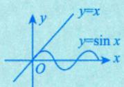

考研中考过：当 $x_{n} > 0$ 时， $x_{n + 1} = \sin x_{n} < x_{n}$ ，故 $\left\{ x_{n} \right\}$ 单调减少.

⑦当 $0 < x < \frac{\pi}{4}$ 时， $x < \tan x < \frac{4}{\pi}x$ .证明见习题 6.9.

⑧当 $0 < x < \frac{\pi}{2}$ 时， $\sin x > \frac{2}{\pi}x$ .证明见例 6.19.

$$
\arctan x \leqslant x \leqslant \arcsin x (0 \leqslant x \leqslant 1)
$$

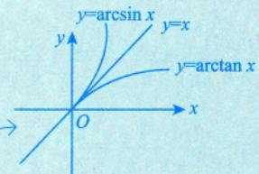

可考：当 $x_{n} > 0$ 时， $x_{n + 1} = \arctan x_{n} < x_{n}$ ，故 $\left\{ x_{n} \right\}$ 单调减少.

10 $\mathrm{e}^{x} \geqslant x + 1$ 任意x).  
可考：当 $x_{n + 1} = \mathrm{e}^{x_n} - 1$ 时，由 $e^{x_n} - 1 \geq x_n$ ，得 $x_{n + 1} \geq x_{n}$ ，即 $\left\{ x_{n} \right\}$ 单调不减.$x - 1 \geq \ln x (x > 0)$

可考：当 $x_{n} > 0$ 时，若 $x_{n + 1} = \ln x_{n} + 1$ ，由 $\ln x_{n} + 1 \leqslant x_{n}$ ，得 $x_{n + 1} \leq x_{n}$ ，即 $\left\{ x_{n} \right\}$ 单调不增.2 $\frac{1}{1 + x} < \ln\left(1 + \frac{1}{x}\right) < \frac{1}{x} \quad (x > 0)$ 或 $\frac{x}{1 + x} < \ln(1 + x) < x (x > 0)$

(3) 利用闭区间上连续函数必有最大值与最小值.

(4)利用压缩映射原理．（简化版）

原理一 对数列 $\left\{ x_{n} \right\}$ ，若存在常数 $k ( 0 < k < 1 )$ ，使得 $\left| x_{n + 1} - a \right| \leqslant k \left| x_{n} - a \right|, n = 1, 2, \cdots$ ，则 $\left\{ x_{n} \right\}$ 收敛于a.

证 $0 \leqslant \left| x_{n + 1} - a \right| \leqslant k \left| x_{n} - a \right| \leqslant k^{2} \left| x_{n - 1} - a \right| \leqslant \cdots \leqslant k^{n} \left| x_{1} - a \right|$ ,由于 $\lim_{n \to \infty} k^n = 0$ ，根据夹逼准则，有$\lim_{n \to \infty} \left| x_{n+1} - a \right| = 0$ ，即 $\left\{ x_{n} \right\}$ 收敛于a.

原理二 对数列 $\left\{ x_{n} \right\}$ ，若 $x_{n + 1} = f(x_n), \; n = 1, 2, \cdots, \; f(x)$ 可导，a是 $f(x) = x$ 的唯一解，且对任意 $x \in \mathbf{R}$ ，有 $\left| f^{\prime}(x) \right| \leq k < 1$ ，则 $\left\{ x_{n} \right\}$ 收敛于a.

证 $\left| x_{n + 1} - a \right| = \left| f(x_n) - f(a) \right| \xlongequal{ 拉格朗日中值定理 } \left| f^{\prime}(\xi) \right| \left| x_n - a \right| \leqslant k \left| x_n - a \right|$ 其中 $\xi$ 介于a与 $x_{n}$ 之间，由原理一，有 $\left\{ x_{n} \right\}$ 收敛于a.

以上原理一、二是特殊的压缩映射过程，考生在使用它们时，要写出证明过程.如例2.15.

(5) 利用题设条件来推证（这往往是解答题的第1 问）.—→例2.11

例2.9 $\lim_{n \to \infty} \left( \frac{1}{n^2 + n + 1} + \frac{2}{n^2 + n + 2} + \cdots + \frac{n}{n^2 + n + n} \right)$

分析分母不一样不能相加减，通分又太复杂，故可以利用放缩将分母化成相同的.需要注意：分母越大，分数越小.

把分母写成一样的：小 $\leqslant \sum_{i = 1}^{n}\frac{i}{n^{2} + n + i} \leqslant  大$ →通项 .

解应填 $\frac{1}{2}$

分子不变，将分母放缩成相同的，则

$$
\frac{n(n + 1)}{2(n^2 + n + n)} \leqslant \frac{1}{n^2 + n + 1} + \frac{2}{n^2 + n + 2} + \cdots + \frac{n}{n^2 + n + n} \leqslant \frac{n(n + 1)}{2(n^2 + n + 1)}
$$

又 $\lim_{n \to \infty} \frac{n(n + 1)}{2(n^2 + n + 1)} = \lim_{n \to \infty} \frac{n(n + 1)}{2(n^2 + n + n)} = \frac{1}{2}$ ，所以根据夹逼准则，原式 $= \frac { 1 } { 2 }$

找带头大哥

例2.10 求极限 $\lim_{n \to \infty} \sqrt[n]{a_{1}^{n} + a_{2}^{n} + \cdots + a_{m}^{n}}$ ，其中 $a_{i}(i = 1,2,\cdots,m)$ 都是非负数.

解设 $a = \max \{ a_{1}, a_{2}, \cdots, a_{m} \}$ ，则

$$
a ^ { n } \leqslant a _ { 1 } ^ { n } + a _ { 2 } ^ { n } + \cdots + a _ { m } ^ { n } \leqslant m \cdot a ^ { n } ,
$$

即 $a \leqslant \sqrt[n]{a_{1}^{n} + a_{2}^{n} + \cdots + a_{m}^{n}} \leqslant a \cdot m^{n}$ ，且 $\lim_{n \to \infty} m^{\frac{1}{n}} = 1$ .故

$$
\lim _ { n \rightarrow \infty } \sqrt [ n ] { a _ { 1 } ^ { n } + a _ { 2 } ^ { n } + \cdots + a _ { m } ^ { n } } = \max \left\{ a _ { 1 } , a _ { 2 } , \cdots , a _ { m } \right\} .
$$

## 注这是一个结论，应当记住.

如当 $0 < a < b$ 时， $\lim_{n \to \infty} (a^{-n} + b^{-n})^{\frac{1}{n}} = \lim_{n \to \infty} \sqrt[n]{\left(\frac{1}{a}\right)^n + \left(\frac{1}{b}\right)^n} = \frac{1}{a}$ .又如当 $0 \leq x \leq \frac{\pi}{2}$ 时，

$$
\frac { 1 } { a } > \frac { 1 } { b } > 0
$$

$$
\lim_{n \to \infty} \sqrt[n]{\sin^n x + \cos^n x} = \left\{ \begin{aligned} \cos x, \quad 0 \leq x \leq \frac{\pi}{4}, \\ \sin x, \quad \frac{\pi}{4} < x \leq \frac{\pi}{2}. \end{aligned} \right.
$$

→结合图像

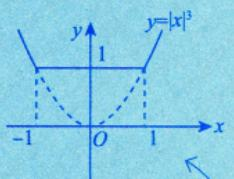

： $\lim_{n \to \infty} \sqrt[n]{1 + \left| x \right|^{3n}} = \left\{ \begin{aligned} 1, \quad \left| x \right| \leq 1, \\ \left| x \right|^3, \quad \left| x \right| > 1. \end{aligned} \right.$

约束式

关系式

例2.11 设 $0 < a_{n} < \frac{\pi}{2}, \quad 0 < b_{n} < \frac{\pi}{2}, \quad \cos a_{n} - a_{n} = \cos b_{n}$ ，且 $\lim_{n \to \infty} b_n = 0$ ，求 $\lim_{n \to \infty} a_n, \lim_{n \to \infty} \frac{a_n}{b_n^2}$

分析(1)分清约束式、关系式和定义式；(2)做一至两步的逆运算；(3)联想一些经典形式.

解由 $\cos a_{n}-\cos b_{n}=a_{n}>0$ ，知 $0 < a_{n} < \bar{b}_{n}$ ，则由夹逼准则，得根据cosx的单调性，cos x在

$$
\lim _ { n \rightarrow \infty } a _ { n } = 0 ,
$$

$\left(0,\frac{\pi}{2}\right)$ 内是减函数

$$
1 - \cos x \sim \frac{1}{2}x^{2}(x \to 0)
$$

$$
\lim_{n \to \infty} \frac{a_n}{b_n^2} = \lim_{n \to \infty} \frac{\frac{1}{1 - \cos b_n}}{b_n^2} \cdot \frac{a_n}{1 - \cos b_n} = \frac{1}{2} \lim_{n \to \infty} \frac{a_n}{1 - \cos a_n + a_n} = \frac{1}{2} \lim_{n \to \infty} \frac{\frac{1}{1 - \cos a_n}}{a_n} = \frac{1}{2}
$$

## 单调有界准则

单调有界数列必有极限，即若数列 $\left\{ x_{n} \right\}$ 单调增加(减少)且有上界(下界)，则 $\lim_{n \to \infty} x_n$ 存在.

不等关系

单调有界准则其实包含两种情况（涉及不等关系，是数学中的难点），第1种情况数列单调增加并且有上界；第2种情况，数列单调减少并且有下界.在这两种情况下数列极限都是存在的，使用的时候需要注意，当证明出来数列单调增加时，只需要再去证明数列有上界即可，无须再去证明有下界，同样如果证明出来数列有上界，则只需要再去证明数列单调增加即可，第二种情况同理.

记： $x_{n} \leqslant x_{n + 1} \leqslant a$ ，则 $\lim_{n \to \infty} x_n$ 存在.

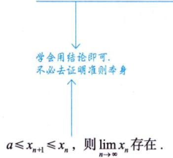

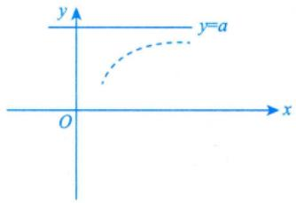

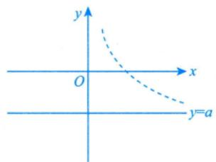

证明数列 $\left\{ x_{n} \right\}$ 单调性的常用方法：

★ a. $\frac{x_{n + 1} - x_{n}}{ \downarrow} \quad (<)$ 0或 $\frac{x_{n + 1}}{x_{n}} > 1$ (同号).

作差法用得较多。 ①验n=1成立；V ②设n=k成立；★ b. 利用数学归纳法： ③证n=k+1成立

题一练设 $c = 2 \ln(1 + b), \; b > a > 0$ ，且a是方程 $x - 2\ln(1 + x) = 0$ 的唯一非零解，证明 $c > a$

分析由题知， $c = 2 \ln(1 + b), a = 2 \ln(1 + a)$

令 $f(x) = 2\ln(1 + x)$ $f^{\prime}(x) = \frac{2}{1 + x}$ ，则当 $x > 0$ 时，f(x)单调递增.

由 $b > a > 0$ ，得 $2\ln(1 + b) > 2\ln(1 + a)$ ，故 $c \geq a$

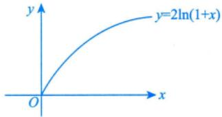

题一练设单调递减数列 $\left\{ x_{n} \right\}$ 满足 $x_{n + 1} = 2\ln(1 + x_{n}), \quad n = 1, 2, \cdots, \quad x_{1} > a > 0$ ，且a是 $x - 2\ln(1 + x) = 0$ 的唯一

非零解.证明： $\{ x _ { n } \}$ 收敛.

分析①验： $x_{1} > a > 0$

②设： $x_{k} > a > 0$

③证： $x_{k + 1} > a > 0$

$$
x_{k + 1} = 2\ln(1 + x_k) , \quad 2\ln(1 + a) = a .
$$

由于 $f(x) = 2\ln(1 + x)$ 在x>0时单调递增，因此 $2\ln(1 + x_{k}) > 2\ln(1 + a)$ ，故 $x _ { k + 1 } > a$ ，于是 $\left\{ x_{n} \right\}$ 有下界。  
再由 $\left\{ x_{n} \right\}$ 单调递减，知 $\left\{ x_{n} \right\}$ 收敛.

★ c. 利用重要不等式（见夹逼准则的注(2)）.

d. $x _ { n } - x _ { n - 1 }$ 与 $x_{n - 1} - x_{n - 2}$ 同号，则 $\left\{ x_{n} \right\}$ 单调.

★ e. 利用结论： $x_{n + 1} = f(x_n) (n = 1, 2, \cdots), x_n \in$ 区间I.

无法确定是单调递增还是单调递减< 当 $x_{2} > x_{1}$ 时，数列 $\left\{ x_{n} \right\}$ 单调增加，若 $f^{\prime}(x) > 0,   x \in$ 区间I，则数列 $\left\{ x_{n} \right\}$ 单调，且 可以通过例题帮助理解结论f(x) 单调增加 证明见例2.13 当 $x _ { 2 } < x _ { 1 }$ 时，数列 $\left\{ x_{n} \right\}$ 单调减少.

若 $\frac{f^{\prime}(x) < 0,   x \in}{ 丄 }$ 区间I，则数列 $\widehat{\left\{ x_{n} \right\}}$ 不单调.

f(x)单调减少

例2.12设 $0<x_{1}<3,\;x_{n+1}=\sqrt{x_{n}(3-x_{n})}(n=1,\;2,\;\cdots)$ ，证明数列 $\left\{ x_{n} \right\}$ 的极限存在，并求此极限.

分析证明这种由递推形式给出的数列的收敛性，一般都是根据“单调有界数列必收敛”这一准则进行证明；在证明了极限存在的前提下再求极限.

证由例 2.1 知数列 $\left\{ x_{n} \right\}$ 是有界的，对任意正整数 $n > 1$ ，都有 $0 < x_{n} \leqslant \frac{3}{2} \xrightarrow{\sqrt{ab} \leqslant \frac{a + b}{2}(a, b > 0)}$ 重要不等式

再证明 $\left\{ x_{n} \right\}$ 单调：当n>1时，

$$
x_{n + 1} - x_{n} = \sqrt{x_{n}(3 - x_{n})} - x_{n} = \sqrt{x_{n}(\sqrt{3 - x_{n}} - \sqrt{x_{n}})} \quad 为 \quad x_{n} \leq \frac{3 - 2x_{n}}{\sqrt{3 - x_{n}} + \sqrt{x_{n}}} \quad 为 \quad x_{n} \leq \frac{3 - 2x_{n}}{\sqrt{3 - x_{n}} + \sqrt{x_{n}}} \quad 为 \quad x_{n} \leq \frac{3 - 2x_{n}}{\sqrt{3 - x_{n}} + \sqrt{x_{n}}} \quad 为 \quad 为 \quad \sqrt{3 - 2x_{n}} \geq 0
$$

即 $x_{n + 1} \geqslant x_{n} (n > 1)$ ，所以数列 $\left\{ x_{n} \right\} (n > 1)$ 是单调增加的.

$$
x_{n + 1} - x_{n} \geqslant 0
$$

$$
\lim_{n \to \infty} x_{n} \xlongequal[ 记总 ]{ 存在 } a
$$

根据单调有界数列必有极限的准则知 $\lim_{n \to \infty} x_{n}$ 存在，设其为a，则

$$
a = \lim_{n \to \infty} x_n = \lim_{n \to \infty} \sqrt{x_{n-1}(3 - x_{n-1})} = \sqrt{a(3 - a)}
$$

解得 $a = \frac{3}{2}$ 或 $a = 0$ (舍去). 故

$ 由于  \left\{ x_{_n} \right\}$ 单调增加，且 $x_{n} > 0$ ，故 $a > 0$

$$
\lim_{n \to \infty} x_n = \frac{3}{2}
$$

例2.13 设 $x_{n + 1} = f(x_n)$ ，则以下命题正确的是（ ).①若f(x)单调增加，且 $x_{1} < x_{2}$ ，则数列 $\left\{ x_{n} \right\}$ 单调增加②若f(x)单调增加，且 $x_{1} > x_{2}$ ，则数列 $\left\{ x_{n} \right\}$ 单调减少③若f(x)单调减少，且 $x_{1} < x_{2}$ ，则数列 $\left\{ x_{n} \right\}$ 单调增加理解见例2.15的注.④若f(x)单调减少，且 $x_{1} > x_{2}$ ，则数列 $\left\{ x_{n} \right\}$ 单调减少(A) ①② (B) ①③(C) ②③ (D) ②④

对上述命题逐个分析，如下.

对于①，若f(x)单调增加，且 $x_{1} < x_{2} , x_{2} = f(x_{1}) , x_{3} = f(x_{2})$ ，则 $f(x_{1}) < f(x_{2})$ ，即 $x_{2} < x_{3}$ ，又 $x_{3} =$   
$f(x_{2}), x_{4} = f(x_{3})$ ，此时 $f(x_{2}) < f(x_{3})$ ，即 $x_{3} < x_{4}, \cdots$ ，依次类推，便知数列 $\left\{ x_{n} \right\}$ 越来越大，即单调增加.对于②，若f(x)单调增加，且 $x_{1} > x_{2} , x_{2} = f(x_{1}) , x_{3} = f(x_{2})$ ，则 $f(x_{1}) > f(x_{2})$ ，即 $x_{2} > x_{3}$ ，又 $x_{3} =$   
$f(x_{2}), x_{4} = f(x_{3})$ ，此时 $f(x_{2}) > f(x_{3})$ ，即 $x_{3} > x_{4}, \cdots$ ，依次类推，便知数列 $\left\{ x_{n} \right\}$ 越来越小，即单调减少.参考例2.15对于③，若f(x)单调减少，且 $x_{1} < x_{2} , x_{2} = f(x_{1}) , x_{3} = f(x_{2})$ ，则 $f(x_{1}) > f(x_{2})$ ，即 $x_{2} > x_{3}$ ，又 $x_{3} =$   
$f(x_{2}), x_{4} = f(x_{3})$ ，此时 $f(x_{2}) < f(x_{3})$ ，即 $x_{3} < x_{4}, \cdots$ ，依次类推，便知数列 $\left\{ x_{n} \right\}$ 是摆动的，不单调.对于④，若f(x)单调减少，且 $x_{1} > x_{2} , x_{2} = f(x_{1}) , x_{3} = f(x_{2})$ ，则 $f(x_{1}) < f(x_{2})$ ，即 $x_{2} < x_{3}$ ，又 $x _ { 3 } =$   
$f(x_{2}), x_{4} = f(x_{3})$ ，此时 $f(x_{2}) > f(x_{3})$ ，即 $x_{3} > x_{4}, \cdots$ ，依次类推，便知数列 $\left\{ x_{n} \right\}$ 是摆动的，不单调.

例2.14(1)证明方程x=2ln(1+x)在(0，+∞)内有唯一实根 $\xi$ i

(2) 对于 (1) 中的 $\xi$ ，任取 $x_{1} > \xi$ ，定义 $x_{n + 1} = 2\ln(1 + x_n), \; n = 1, 2, \cdots$ ，证明 $\lim_{n \to \infty} x_n$ 存在，并求其值.证(1)令 $F(x)=x-2\ln(1+x),~x>0$ ，则

$$
F^{\prime}(x)=1-\frac{2}{1+x}=\frac{x-1}{1+x}=0
$$

得x=1是 $(0, +\infty)$ 内的唯一驻点，且当 $0 < x < 1$ 时， $F^{\prime}(x) < 0,   F(x)$ 单调递减；当 $x   >   1$ 时，$F^{\prime}(x) > 0,   F(x)$ 单调递增.

又 $F(0)=0\ , \quad F(1)=1-2\ln 2<0\ , \quad F(+\infty)=\lim_{x \to +\infty}[x-2\ln(1+x)]=+\infty>0$

如图 2-2所示，故F(x)在(0,1)内无零点，在 $(1, +\infty)$ 上有唯一零点，因此原方程在 $(0, +\infty)$ 内有唯一实根 $\xi$

(2)由(1)得 $\xi = 2\ln(1 + \xi), \xi > 0 .  令  x_{n + 1} = f(x_n), f(x) = 2\ln(1 + x)$

①验： $x_{1} > x_{2} > \xi$

$$
x_{2}=2\ln(1+x_{1})\ , \ 2\ln(1+\xi)=\xi\ ,
$$

图 2-2

因为 $x_{1}-2\ln(1+x_{1})>0$ ，故 $x_{1} > 2\ln(1 + x_{1}) = x_{2} > 2\ln(1 + \xi) = \xi$

②设： $x_{k - 1} > x_{k} > \xi$

③证： $x_{k} > x_{k + 1} > \xi$

由②知，

$$
x_{k + 1} = 2 \ln(1 + x_k) > 2 \ln(1 + \xi) = \xi,
$$

$$
x_{k} = \frac{2\ln(1 + x_{k - 1}) > 2\ln(1 + x_{k})}{\frac{1}{\ln(1 + x)}} = x_{k + 1}
$$

故得证 $x_{k} > x_{k + 1} > \xi$

综上， $\left\{ x_{n} \right\}$ 单调递减有下界，于是

$$
\lim_{n \to \infty} x_n \xlongequal[ 记为 ]{ 存在 } a
$$

在 $x_{n + 1} = 2\ln(1 + x_n)$ 两边取极限，有 $a = 2\ln(1 + a)$

又由(1)知，ξ是 $x = 2\ln(1 + x)$ 在 $(0, +\infty)$ 内的唯一实根，故 $a = \xi$

注题目解答过程需要背诵.考生可画出如图2-3所示的情形，加深理解.

  
图2-3

引申：若题目改为 $x_{1} < \xi$ ，则如图 2-4 所示.

  
图2-4

例2.15 (1) 证明方程 $x = \cos x$ 在 $\left( 0 , \frac { \pi } { 3 } \right)$ 内有唯一实根a；

(2) 设 $-1 \le x_1 \le 1$ ，定义 $x_{n + 1} = \cos x_{n}, n = 1, 2, \cdots$ ，证明 $\lim_{n \to \infty} x_n$ 存在，且极限值就是(1)中的 $a$

证(1)令 $F(x) = \cos x - x$ $x \in \left( 0, \frac{\pi}{3} \right)$ ，则

$$
F(0)=1>0\ , \quad F\left(\frac{\pi}{3}\right)=\frac{1}{2}-\frac{\pi}{3}<0\ ,
$$

且 $F^{\prime}(x) = -\sin x - 1 < 0$ ，故F(x)单调递减，于是存在唯一的 $a \in \left( 0, \frac{\pi}{3} \right)$ ，使得 $F(a) = 0$ ，即$a = \cos a$ ，方程在 $\left(0,\frac{\pi}{3}\right)$ 内有唯一实根a.

(2) 由题知， $x_{n + 1} = \cos x_n$ ，由于 $-1 \leq x_{1} \leq 1$ ，则 $x_{n + 1} = \cos x_{n} \leqslant 1$ ，且 $x_{n + 1} = \cos x_{n} > 0$ ，故 $0 < x_{n} \leqslant 1 < \frac{\pi}{3}$ $n   >   1$

令 $f(x) = \cos x$ ，显然f(x)在 $\left(0,\frac{\pi}{3}\right)$ 内单调减少，于是 $\left\{ x_{n} \right\}$ 不单调，下面直接考虑 $\left| x_{n + 1} - a \right|$

$$
\begin{aligned}\left| x_{n + 1} - a \right| &= \left| \cos x_{n} - \cos a \right| \\&= \left| - \sin \xi \right| \bullet \left| x_{n} - a \right| \\&\leq \frac{\sqrt{3}}{2} \bullet \left| x_{n} - a \right| \\&\leq \left( \frac{\sqrt{3}}{2} \right)^{2} \left| x_{n - 1} - a \right| \\&\quad \vdots \longrightarrow  丞缩映射  \\&\leq \left( \frac{\sqrt{3}}{2} \right)^{n} \left| x_{1} - a \right|,\end{aligned}
$$

其中ξ介于 $a$ 与 $x _ { n }$ 之间，当n→∞时， $\left( \frac{\sqrt{3}}{2} \right)^{n} \left| x_{1} - a \right| \rightarrow 0$ ，故由夹逼准则，有 $x_{n + 1} \rightarrow a$ ，即 $\lim_{n \to \infty} x_n = a$

注考生可画出如图2-5所示的情形，加深理解.

  
图2-5

## 8x}收敛于a的速度问题

设数列 $\left\{ x _ { n } \right\} , \left\{ y _ { n } \right\}$ 在n→∞的过程中同时趋于a，记 $u_{n} = \left| x_{n} - a \right|$ $v_{n} = \left| y_{n} - a \right|$ $I = \lim_{n \to \infty} \frac{u_n}{v_n}$ ，且当n→∞时， $u _ { n }$ 和 $\nu _ { n }$ 都是无穷小量，则有

若I=0，则说明 $x _ { n }$ 的收敛速度比 $y _ { n }$ 的收敛速度快；（高阶）

若I=b(b为大于零的常数)，则说明 $x _ { n }$ 的收敛速度是 $y_{n}$ 的 $\frac{1}{b}$ 倍；（同阶）

若I=∞，则说明 $x _ { n }$ 的收敛速度比 $y_{n}$ 的收敛速度慢.(低阶)

如： $x_{n}=\frac{1}{n},y_{n}=\frac{1}{\sqrt{n}},\lim_{n \to \infty}x_{n}=\lim_{n \to \infty}y_{n}=0$ ，故 $\lim_{n \to \infty} \frac{\left| \frac{1}{n} - 0 \right|}{\left| \frac{1}{\sqrt{n}} - 0 \right|} = 0$ ，于是 $x_{n}$ 比 $y_{n}$ 收敛于0的速度快.

而数列极限定义为 $\lim_{n \to \infty} x_n = a \Leftrightarrow$ 任意 $\varepsilon > 0$ ，存在 $N > 0$ ，当 $n > N$ 时，恒有 $\left| x_{n} - a \right| < \varepsilon$ . 此定义中不体现收敛速度，这是命制选择题的理论依据.

例2.16 “对任意给定的k∈N，总存在正整数N，当n>N时，恒有 $\left| x_{n} - a \right| \leqslant \frac{1}{2^{k}}$ 是数列$\left\{ x_{n} \right\}$ 收敛于a的（).(A) 充分不必要条件 (B)必要不充分条件(C) 充分必要条件 (D)既不充分也不必要条件解应选(C).

对于任意给定的 $k \in \mathbf { N } .$ $\frac { 1 } { 2 ^ { k } }$ 可为任意小的正数，记 $\frac{1}{2^{k}} = \varepsilon > 0$ ，则该题干说法是 $\left\{ x_{n} \right\}$ 收敛于a的充 分必要条件.

例2.17 “存在正整数N，当 $n   \geqslant   N$ 时，恒有 $\left| x_{n} - a \right| \leqslant \frac{1}{n}$ 是数列 $\left\{ x_{n} \right\}$ 收敛于a的（）.

(A) 充分不必要条件 (B)必要不充分条件(C) 充分必要条件 (D)既不充分也不必要条件

## 解应选(A).

如果存在正整数N，当 $n \geqslant N$ 时，恒有 $\left| x_{n} - a \right| \leqslant \frac{1}{n}$ ，那么任意的 $\varepsilon > 0$ ，取 $n = \max \left\{ N, \left\lfloor \frac{1}{\varepsilon} \right\rfloor + 1 \right\}$ ，则$\left| x_{n} - a \right| \leqslant \frac{1}{n} < \varepsilon$ ，所以数列 $\left\{ x_{n} \right\}$ 收敛于a.

反之，取 $x_{n}=a+\frac{1}{\sqrt{n}}$ ，则数列 $\left\{ x_{n} \right\}$ 收敛于a，但“存在正整数N，当 $n   \geqslant   N$ 时，恒有 $\left| x_{n} - a \right| \leqslant \frac{1}{n}$ 并不成立.

综上，“存在正整数N，当 $n   \geqslant   N$ 时，恒有 $\left| x_{n} - a \right| \leqslant \frac{1}{n}$ 是数列 $\left\{ x_{n} \right\}$ 收敛于a的充分不必要条件.

注对比本题与上一题，数列极限定义中的ε可以被替换为不依赖于n的任意小的正数，即不能与n有关，否则相当于对收敛速度提出了要求.比如此题中，若 $x_{n}=a+\frac{1}{\sqrt{n}}$ 其收敛于a的速度是慢于 $y_{n}=a+\frac{1}{n}$ 的，于是存在正整数N，当 $n \geqslant N$ 时， $\left| x_{n} - a \right| > \frac{1}{n}$ 但不影响 $\lim_{n \to \infty} x_n = a$ .总之，可作为$\lim_{n \to \infty} x_n = a$ 的充分必要条件的命题中，不能对收敛速度提要求，因为数列极限定义中只体现收敛目标，不体现收敛速度.

例2.18设 $\lim_{n \to \infty} a_n = a$ ，且 $a \neq 0$ ，则当n充分大时，有（）.(A) $\left| a_{n} \right| > \frac{\left| a \right|}{2}$ (B) $\left| a_{n} \right| < \frac{\left| a \right|}{2}$ (C) $a_{n} > a - \frac{1}{n}$ (D) $a_{n} < a + \frac{1}{n}$

## 解应选(A).

对于选项(A)，(B)，由极限保号性，当n→ ∞时，显然有 $\left| a_{n} \right|$ 与|a|无限靠近，故 $\left| a_{n} \right| > \frac{\left| a \right|}{2}$ ，因此选项(A)正确，(B)不正确.

对于选项(C)，(D)，无论是 $b_{n}=a-\frac{1}{n}$ ，还是 $c_{n}=a+\frac{1}{n}$ ，当 $n \to \infty$ 时， $b_{n}   ,     c_{n}$ 均收敛于 $a$ ，但它们都提出了收敛的速度，而 $\lim_{n \to \infty} a_n = a$ 并不知其收敛速度，所以 $a _ { n }$ 与 $b_{n}, \ c_{n}$ 的大小关系显然都不能确定，

故选项(C)，(D)都不正确.

注此题亦可举反例，但回顾过往，若一道选择题是通过别人给的反例，用排除法获得答案的，那么你要问问自己，为什么是这样的反例？我举得出这样的反例吗？若这两个问题均无法回答，此题要考什么就根本无从说起，做与不做，几乎无异.

## 基础习题精练

## 习题

2.1 设 $\lim_{n \to \infty} a_n = 0, \lim_{n \to \infty} b_n = 1$ ，则（).

(A) 对任意 $n, a_{n} < b_{n}$ 成立

(B)存在正整数N，当n>N时，总有 $a_{n} < b_{n}$

(C) $\lim_{n \to \infty} \frac{b_n}{a_n}$ 必定存在

(D) $\lim_{n \to \infty} a_n b_n$ 可能不存在

2.2 设数列 $\left\{ x_{n} \right\}$ 满足 $x_{n} > 0$ ，且 $\lim_{n \to \infty} \frac{x_{n+1}}{x_n} = \frac{1}{2}$ ，则().(A) $\lim_{n \to \infty} x_n = 0$ (B) $\lim_{n \to \infty} x_n$ 存在，但不为零(C) $\lim_{n \to \infty} x_n$ 不存在 (D) $\lim_{n \to \infty} x_n$ 可能存在，也可能不存在

2.3 $\lim_{n \to \infty} (\sqrt{n + \sqrt{n}} - \sqrt{n - \sqrt{n}})$

2.4 设 $\lim_{n \to \infty} \frac{n^{99}}{n^k - (n - 1)^k}$ 存在且不为零，则常数k=

2.5 $\lim_{n \to \infty} \left( \frac{1}{\sqrt{n^2 + 1}} + \frac{1}{\sqrt{n^2 + 2}} + \cdots + \frac{1}{\sqrt{n^2 + n}} \right)$

2.6 $\lim_{n \to \infty} \sqrt[n]{1 + \frac{1}{2} + \frac{1}{3} + \cdots + \frac{1}{n}}$

2.7 设函数f(x)在[a, b]上连续， $x_{1}, x_{2}, \cdots, x_{n}$ 是 $\left[ a , b \right]$ 上的一个点列，求 $\lim_{n \to \infty} \sqrt[n]{\frac{1}{n} \sum_{k=1}^{n} \mathrm{e}^{f(x_k)}}$

2.8 设 $x_{1}=2, x_{n}+(x_{n}-4)x_{n-1}=3(n=2, 3, \cdots)$ ，证明 $\lim_{n \to \infty} x_{n}$ 存在，并求其值.

## 解答

2.1 (B) 解 数列极限的概念是描述变量在给定过程中的变化趋势，数列极限存在与否与前有限项的值无关，因此可以排除(A).

由于 $\lim_{n \to \infty} a_n = 0, \lim_{n \to \infty} b_n = 1$ ，由极限四则运算规则可知 $\lim_{n \to \infty} a_n b_n$ 必定存在， $\lim_{n \to \infty} \frac{b_n}{a_n}$ 不符合极限四则运算规则，由无穷小量的性质可知其肯定不存在.因此可以排除(C)，(D). 故由排除法，应选(B).

2.2 (A) 解 $\lim_{n \to \infty} \frac{x_{n+1}}{x_n} = \frac{1}{2} < 1$ ，由数列极限的保号性可知，存在正整数N，当 $n > N$ 时， $\frac{x_{_{n+1}}}{x_{_n}} < 1$ 又 $x_{n} > 0$ ，于是 $x_{n + 1} < x_{n}$ .所以 $\left\{ x_{n} \right\}$ 单调递减且有下界，于是 $\lim_{n \to \infty} x_n$ 存在.

设 $\lim_{n \to \infty} x_n = A \geq 0$ .若 $A   >   0$ ，此时 $\lim_{n \to \infty} \frac{x_{n+1}}{x_n} = \frac{\lim\limits_{n \to \infty} x_{n+1}}{\lim\limits_{n \to \infty} x_n} = \frac{A}{A} = 1$ ，矛盾.于是 $A   =   0$ ，即 $\lim_{n \to \infty} x_n = 0$

2.3 1 解 所给极限为 $ \text{" } \infty - \infty  \text{" }$ 型未定式，表达式中含有根式，可先将其变形，即

$$
\begin{aligned} &\lim_{n \rightarrow \infty}\left( \sqrt{n + \sqrt{n}} - \sqrt{n - \sqrt{n}} \right) \\=&\lim_{n \rightarrow \infty}\frac{\left( \sqrt{n + \sqrt{n}} - \sqrt{n - \sqrt{n}} \right) \cdot \left( \sqrt{n + \sqrt{n}} + \sqrt{n - \sqrt{n}} \right)}{\sqrt{n + \sqrt{n}} + \sqrt{n - \sqrt{n}}} \\=&\lim_{n \rightarrow \infty}\frac{2\sqrt{n}}{\sqrt{n + \sqrt{n}} + \sqrt{n - \sqrt{n}}} = \lim_{n \rightarrow \infty}\frac{2}{\sqrt{1 + \frac{1}{\sqrt{n}}} + \sqrt{1 - \frac{1}{\sqrt{n}}}} = 1.\end{aligned}
$$

2.4 100 解

$$
\lim_{n \to \infty} \frac{n^{99}}{n^k - (n - 1)^k} = \lim_{n \to \infty} \frac{n^{99}}{n^k \left[ 1 - \left( 1 - \frac{1}{n} \right)^k \right]} = \lim_{n \to \infty} \frac{n^{99 - k}}{n^{2} - 1} = \lim_{n \to \infty} \frac{n^{99 - k}}{k \left( - \frac{1}{n} \right)} = \lim_{n \to \infty} \frac{1}{k} \lim_{n \to \infty} n^{99 - k + 1}
$$

由此可知，极限存在且不为零的充要条件是 $99 - k + 1 = 0$ ，即 $k = 1 0 0$

2.5 1 解 因为

$$
\frac{n}{\sqrt{n^{2} + n}} \leqslant \sum_{i = 1}^{n}\frac{1}{\sqrt{n^{2} + i}} \leqslant \frac{n}{\sqrt{n^{2} + 1}},
$$

又 $\lim_{n \to \infty} \frac{n}{\sqrt{n^2 + n}} = \lim_{n \to \infty} \frac{n}{\sqrt{n^2 + 1}} = 1$ ，根据夹逼准则，所以原式=1.

## 2.6 1 解 因为

$$
1 \leqslant \sqrt[n]{1 + \frac{1}{2} + \frac{1}{3} + \cdots + \frac{1}{n}} \leqslant \sqrt[n]{n}
$$

而 $\lim_{n \to \infty} \sqrt[n]{n} = 1$ ，所以

$$
\lim_{n \to \infty} \sqrt[n]{1 + \frac{1}{2} + \frac{1}{3} + \cdots + \frac{1}{n}} = 1
$$

2.7 解 本题考虑夹逼准则. 由 f(x) 在 $[ a ,   b ]$ 上连续，知 $\mathrm{e}^{f(x)}$ 在[a,b]上非负连续，且 $0 < m \leq$ $\mathbf{e}^{f(x)} \leq M$ ，其中M，m分别为 $\mathbf{e}^{f(x)}$ 在 $\left[ a , b \right]$ 上的最大值和最小值，于是 $0 < m \leqslant \frac{1}{n} \sum_{k = 1}^{n} \mathrm{e}^{f(x_k)} \leqslant M$ ，故

$$
\sqrt[n]{m} \leqslant \sqrt[n]{\frac{1}{n} \sum_{k=1}^{n} \mathrm{e}^{f(x_k)}} \leqslant \sqrt[n]{M} .
$$

又 $\lim_{n \to \infty} \sqrt[n]{m} = \lim_{n \to \infty} \sqrt[n]{M} = 1$ ，根据夹逼准则，得 $\lim_{n \to \infty} \sqrt[n]{\frac{1}{n} \sum_{k=1}^{n} \mathrm{e}^{f(x_k)}} = 1$

2.8 证明 先证单调性. 由 $x_{n} + (x_{n} - 4)x_{n - 1} = 3$ ，得 $x_{n} = \frac{3 + 4x_{n - 1}}{1 + x_{n - 1}}$ ，又 $x_{1} = 2$ ，所以 $x_{2}=\frac{3+4\times 2}{1+2}=\frac{11}{3}>$ $x _ { 1 } > 0$ ，假设 $x _ { k } > x _ { k - 1 } > 0$ 成立，则

$$
x_{k + 1} - x_{k} = \frac{3 + 4x_{k}}{1 + x_{k}} - \frac{3 + 4x_{k - 1}}{1 + x_{k - 1}} = \frac{x_{k} - x_{k - 1}}{(1 + x_{k})(1 + x_{k - 1})} > 0,
$$

故 $x _ { k + 1 } > x _ { k }$ ，即数列 $\left\{ x_{n} \right\}$ 单调增加.

再证明其有界.因 $x_{n}=\frac{3+4x_{n-1}}{1+x_{n-1}}=3+\frac{x_{n-1}}{1+x_{n-1}}<3+1=4$ ，所以数列 $\left\{ x_{n} \right\}$ 有上界.

由单调有界准则知 $\lim_{n \to \infty} x_{n}$ 存在.设 $\lim_{n \to \infty} x_n = A$ ，当 $n \to \infty$ 时，由 $x_{n} = \frac{3 + 4x_{n - 1}}{1 + x_{n - 1}}$ ，得 $A = \frac{3 + 4A}{1 + A}$ ，解得$A = \frac{3 \pm \sqrt{21}}{2}$ ，由题设， $x_{n} > x_{1} > 0$ ，根据极限保号性可知 $A   >   0$ ，故 $\lim_{n \to \infty} x_n = \frac{3 + \sqrt{21}}{2}$

<table><tr><td rowspan=1 colspan=1>考题</td><td rowspan=1 colspan=1>一元函数微分学的概念</td></tr><tr><td rowspan=1 colspan=1>题型</td><td rowspan=1 colspan=1>选择题、填空题</td></tr><tr><td rowspan=1 colspan=1>目标</td><td rowspan=1 colspan=1>①理解导数与微分的概念；②理解导数与微分的关系；③理解导数的几何意义</td></tr><tr><td rowspan=1 colspan=1>重难点</td><td rowspan=1 colspan=1>①高阶导数的计算；②导数几何意义的应用；③可导充要条件的应用</td></tr></table>

## 基础知识结构

引例一位王子/公主去往高铁站乘车，零时刻在家门口乘坐出租车出发，由于时间上有些来不及，便不断催促师傅加速，当到达高铁站后，整理文件时却发现重要文件遗落在家，焦急难耐，但已经来不及返回拿文件再乘车，遂放弃原车次列车，乘坐出租车匀速回家.

实际问题数学化，时间与位移图像如图3-1所示.

  
图 3-1

① $I _ { 1 }$ $\lim_{\Delta t \to 0} \frac{f(t + \Delta t) - f(t)}{\Delta t} = \underline{a}$ 注意：a是瞬时变化率，不是平均变化率。→线性函数变化率不变0 t t+∆t

② $I _ { 2 }$ 0 ↑f >t $\lim_{\Delta t \to 0} \frac{f(t + \Delta t) - f(t)}{\Delta t} = \lim_{\Delta t \to 0} \frac{0}{\Delta t} = 0$

③ $I _ { 3 }$ $\lim_{\Delta t \to 0} \frac{f(t + \Delta t) - f(t)}{\Delta t} =$ 定值. ol t t+∆t t

极限是研究函数变化趋势的，导数是研究变化快慢趋势的.

## 基础内容精讲

## 1 导数

$$
\Delta x \to 0^{+} , \quad \Delta x \to 0^{-}
$$

设 $y = f(x)$ 定义在区间I上，让自变量在 $x   =   x _ { _ 0 }$ 处加一个增量Δx（可正可负），其中$x_{0} \in I, x_{0} + \Delta x \in I$ ，则可得函数的增量 $\Delta y = f(x_{0} + \Delta x) - f(x_{0})$ .若函数增量Δy与自变量增量Δx的比值在 $\Delta x   \to   0$ 时的极限存在，即 $\lim_{\Delta x \to 0} \frac{\Delta y}{\Delta x}$ 存在，则称函数 $y = f(x)$ 在点 $x _ { 0 }$ 处可导，并称这个极限为 $y = f(x)$ 在点 $x _ { 0 }$ 处的导数，记作 $f^{\prime}(x_{0})$ ，即

变化率

$$
f^{\prime}(x_0) = \lim_{\Delta x \to 0} \frac{\Delta y}{\Delta x} = \lim_{\Delta x \to 0} \frac{f(x_0 + \Delta x) - f(x_0)}{\Delta x}\tag{*}
$$

当然， $\left. \frac{\mathrm{d}y}{\mathrm{d}x} \right|_{x = x_0} , \left. \frac{\mathrm{d}[f(x)]}{\mathrm{d}x} \right|_{x = x_0} , y'(x_0)$ 或 $\left. y^{\prime} \right|_{x = x_{0}}$ 这些符号记法与 $f^{\prime}(x_{0})$ 等价.顺便交代一下，“导数”这个名词被认为是拉格朗日最先使用的，记号 $f^{\prime}(x_0), \left. y^{\prime} \right|_{x = x_0}$ 多次出现在拉格朗日的文章中，而莱布尼茨则喜欢写作 $\left. \frac{\mathrm{d}y}{\mathrm{d}x} \right|_{x = x_0} , \left. \frac{\mathrm{d}[f(x)]}{\mathrm{d}x} \right|_{x = x_0} .$ 微分的形式，也叫微商：考研只用拉格朗日和莱布尼茨写法

莱布尼茨所用的符号d具有普适意义：如果要求A对B的变化率，就把A，B填进 $\frac{\mathrm{d}\triangle}{\mathrm{d}\triangle}$ ，得 $\frac { \mathrm { d } A } { \mathrm { d } B }$ ，它可表示几乎所有你想研究的变化率问题，而不仅仅是位移s对时间t的变化率— $-\frac{\mathrm{d}s}{\mathrm{d}t}$ 等于速度ν.

比如： $\frac{\mathrm{d}\left( 兴巍 \right)}{\mathrm{d}\left( 时间 \right)}$ ，它往往小于零，你同意吗？再比如： $\frac{\mathrm{d}( 利词 )}{\mathrm{d}( 价裕 )} , \frac{\mathrm{d}( 利词 )}{\mathrm{d}( 价裕 )} > 0$ ，也就是涨价可以增加利润，此时定价低了：若$\frac{{\mathrm{d}\left( 刮润 \right)}}{{\mathrm{d}\left( 价裕 \right)}} < 0;$ ，也就是降价可以增加利润，此时定价高了.综上， $\frac{\mathrm{d}( 利润 )}{\mathrm{d}( 价格 )} = 0$ ，利润最大，也就是说导数为零时的价格应是商品标签上的数字.懂得了这些道理后，请问，当 $\frac{\mathrm{d}( 成债 )}{\mathrm{d}( 劈力 )} > 0$ 时，说明什么？

注这里有几点需要说明.

(1)在考题中，增量Δx一般会被命题人广义化为“狗”：

$$
\boxed{ 可锯者  - \Delta x , (\Delta x)^2  等 }
$$

增量式

$$
f^{\prime}(x_0) = \lim_{\Delta x \to 0} \frac{f(x_0 + \Delta x) - f(x_0)}{\Delta x} \xlongequal{ 广义化 } \lim_{\eta \to 0} \frac{f(x_0 + \eta) - f(x_0)}{\eta}\tag{**}
$$

(2) 若在上面(\*) 式中，令 $x_{0} + \Delta x = x$ ，则可将导数定义式写成

增量式⇔函数式

$$
f^{\prime}(x_0) = \lim_{x \to x_0} \frac{f(x) - f(x_0)}{x - x_0}\tag{***}
$$

(\*\*)，(\*\*\*)两式等价，考生将会在各种场合见到这两种等价写法。

(3)下面这三种提法是等价的.

①y = f(x)在点 $x_{0}$ 处可导；

②y = f(x)在点 $x_{0}$ 处导数存在；

③ $f^{\prime}(x_0) = A$ (A 为有限数).

(4) 函数在一点可导的充要条件.考研必考

①单侧导数.

$$
\lim _ { \Delta x \rightarrow 0 ^ { - } } \frac { f ( x _ { 0 } + \Delta x ) - f ( x _ { 0 } ) } { \Delta x } \xlongequal { \mathrm {  记  } } f _ { - } ^ { \prime } ( x _ { 0 } ) ,
$$

$$
\lim_{\Delta x \to 0^{+}} \frac{f(x_{0} + \Delta x) - f(x_{0})}{\Delta x} \xlongequal{记} f_{+}^{\prime}(x_{0}),
$$

这里， $f_{-}^{\prime}(x_0), f_{+}^{\prime}(x_0)$ 分别是f(x)在点 $x_{0}$ 处的左导数、右导数，统称为单侧导数.

注意：在实际问题中，在一点处可导⇔左、右的变化率均存在且相等；

在几何上：有斜着的切线或水平的切线，但是没有铅直切线

② $f^{\prime}(x_0)$ 存在⇔其左导数 $f^{\prime}_{-}(x_0)$ 与右导数 $f_{+}^{\prime}(x_{0})$ 均存在且相等.这一点当然是与极限存在的充分必要条件(左、右极限均存在且相等)对应.因为从本质上来说，导数的定义就是一个极限问题.

(5) 函数在一点可导的必要条件：若f(x)在一点可导，则f(x)在该点连续.反之未必.

如： $f(x) = \left| x \right|$ 在x=0处的情形.

再如： $f(x)=\begin{cases}x^{2},x\in \\0,\ x\in\end{cases}$ 有理数 $\frac{x^{2}D(x)}{}$ 在x=0处的无理数情形. 狄利克雷函数 $D(x)=\left\{\begin{aligned}1,&x\in 有理数 ,\\0,&x\in 无理数 .\end{aligned}\right.$

$$
\lim_{\Delta x \to 0} \frac{f(x_0 + \Delta x) - f(x_0)}{\Delta x} = a
$$

$$
\begin{aligned}\Rightarrow \lim_{\Delta x \rightarrow 0} f(x_{0}+\Delta x)-f(x_{0})=\lim_{\Delta x \rightarrow 0} \frac{f(x_{0}+\Delta x)-f(x_{0})}{\Delta x} \Delta x\end{aligned}
$$

$$
\Rightarrow f(x_{0}) = \lim_{\Delta x \to 0} f(x_{0} + \Delta x)
$$

$$
f^{\prime}(0)=\lim_{x \to 0}\frac{f(x)-f(0)}{x-0}=\lim_{x \to 0}\frac{f(x)}{x}=\lim_{x \to 0}\frac{x^{2}D(x)}{x}=\lim_{x \to 0}xD(x)=0
$$

$$
\boxed{ 无穷小量  \times  有界量  =  无穷小量 }
$$

(6)还记得在函数连续性那里的直观解释吗？现在把可导放进来，再看一遍.

存在是说，给了一个x，就有一个y对应在那里（见图 3-2)，它附近的点X们所对应的Y们，也是如此，它们只是在那里，无牵无挂；连续是说，Y们充分靠近y（见图3-3)，它们彼此的距离小到无法用任何小的

## 考研数学基础30讲·高等数学分册

正实数表达，只能用超实数“无穷小”来衡量，它们并不只是在那里，它们相依相偎；可导是说，它们不仅依偎在一起，而且Y们靠近y的速度不会比X们靠近x的速度慢，也就是速度一样或者速度更快(见图34).

  
图3-2

  
图3-3

  
图3-4

所以，函数存在是y和Y们无牵无挂地待在那里；函数连续是y和Y们充分靠近；导函数存在是y和Y们不仅充分靠近，且靠近的速度更快.连续曲线不是曲线不断开，恰恰相反，它每一个位置都是断开的.就算Y们靠得更近，比如可导，也只是靠得更近而已，依然是断开的.

例3.1 以下命题，错误的是（).

(A)若f(x)是可导的偶函数，则f′(x)是奇函数导数的性质，选项当结论记住，会应用即可  
(B)若f(x)是可导的奇函数，则f′(x)是偶函数

(C)若f(x)是可导的周期为T的周期函数，则f'(x)也是以T为周期的周期函数

(D)若f(x)是可导的有界函数，则f′(x)是有界函数

解应选 (D).

对于选项(A)，由导数定义，得

$$
f^{\prime}(-x)=\lim_{\Delta x \to 0}\frac{f(-x+\Delta x)-f(-x)}{\Delta x}=\lim_{\Delta x \to 0}\frac{f(x-\Delta x)-f(x)}{\Delta x}\\=(-1)\lim_{\frac{-\Delta x}{x} \to 0}\frac{f(x-\Delta x)-f(x)}{\frac{-\Delta x}{x}}=-f^{\prime}(x),
$$

故f′(x)是奇函数.

对于选项(B)，由导数定义，得

$$
\begin{aligned}f^{\prime}(-x) &= \lim_{\Delta x \to 0} \frac{f(-x + \Delta x) - f(-x)}{\Delta x} \\&= \lim_{\Delta x \to 0} \frac{-f(x - \Delta x) + f(x)}{\Delta x} \\&= \lim_{-\Delta x \to 0} \frac{f(x - \Delta x) - f(x)}{-\Delta x} \\&= f^{\prime}(x) ,\end{aligned}
$$

故f′(x)是偶函数.

对于选项(C)，由导数定义，得

$$
f^{\prime}(x + T) = \lim_{\Delta x \to 0} \frac{f(x + T + \Delta x) - f(x + T)}{\Delta x}
$$

$$
\frac{f(x + T) = f(x)}{\lim\limits_{\Delta x \to 0} \frac{f(x + \Delta x) - f(x)}{\Delta x}} = f'(x) \;,
$$

故 $f^{\prime}(x)$ 也是以T为周期的周期函数.

对于选项(D)，举反例： $f(x)=\sqrt{x}(x\in(0,1])$ 有界，而 $f^{\prime}(x)=\frac{1}{2\sqrt{x}}(x\in(0,1])$ 无界.应选(D).

## 注选项(A)，(B) 结论的应用见注例 1 和注例 2.

注例1 设 $f(x)=\ln(1-x)-\ln(1+x),-1<x<1$ ，则 $f^{\prime\prime}(0) =$

解 $f(x) = \left| \ln \frac{1 - x}{1 + x} \right|$ (每求导一次，奇偶性互换一次)，故 $f''(x)$ 是奇函数，所以 $f^{\prime\prime}(0) = 0$

注例2 设 $f(x)=\frac{1}{2^{x}+1}, x \in \mathbf{R}$ ，则 $f^{(4)}(0) =$

解 $f(x)=\frac{1}{2^{x}+1}-\frac{1}{2}+\frac{1}{2}=g(x)+\frac{1}{2}$

因为 $g(-x)+g(x)=\frac{1}{2^{-x}+1}-\frac{1}{2}+\frac{1}{2^{x}+1}-\frac{1}{2}=\frac{2^{x}}{2^{x}+1}+\frac{1}{2^{x}+1}-1=0$ ，所以 $g(x)$ 是奇函数，于是 $g^{(4)}(x)$ 是奇函数，即 $g^{(4)}(0) = 0$ ，所以 $f^{(4)}(0) = g^{(4)}(0) = 0$

## 注2 由例 3.1 结论，若 $f(x) = \sin(\cos x) + \cos(\sin x)$ ，则 $f^{(5)}(2\pi) =$

分析 利用函数的奇偶性、周期性.

复合函数奇偶性：内偶则偶，内奇同外.

解 $f(x) = \sin(\cos x) + \cos(\sin x)$ 为偶函数，故 $f^{(5)}(x)$ 为奇函数，因为f(x)的周期为2π，故 $f^{(5)}(2\pi) =$ $f^{(5)}(0) = 0$

例3.2 设f(x)是二阶可导且以2为周期的奇函数， $f\left(\frac{1}{2}\right)>0,\ f^{\prime}\left(\frac{1}{2}\right)>0$ ，记 $M = f\left( - \frac{1}{2} \right)$ $N = f'\left(\frac{3}{2}\right), K = f''(0)$ .则( ).(A) $M < N < K$ (B) $M > N > K$ (C) $M < K < N$ (D) $M > K > N$

## 解应选(C).

由f(x)为奇函数，则 $f\left( -\frac{1}{2} \right) = -f\left( \frac{1}{2} \right) < 0$ .根据例3.1(B)选项的结论，知f'(x)为偶函数，由例3.1(A)选项的结论，知 $f''(x)$ 为奇函数（事实上，若f(x)无穷阶可导，则每求导一次，奇偶性即互换一次），由 $f''(x)$ 存在，故 $f''(0) = 0$ 必背结论

又 $f^{\prime}\left(\frac{1}{2}\right)>0$ ，由例3.1(C)选项的结论，知f'(x)也是以2为周期的周期函数，则 $f^{\prime}\left(\frac{3}{2}\right)=$ $f^{\prime}\left(\frac{3}{2}-2\right)=f^{\prime}\left(-\frac{1}{2}\right)=f^{\prime}\left(\frac{1}{2}\right)>0$ ，故 $f\left(-\frac{1}{2}\right)<f''(0)<f'\left(\frac{3}{2}\right)$ ，即 $M < K < N$ ，应选(C).

例3.3 设f(x)在x=0的某邻域内有定义，并且 $| f(x) | \leqslant 1 - \cos x$ ，则f(x)在x=0处（).

(A) 极限存在但不连续 (B)连续但不可导(C) 可导且 $f^{\prime}(0) = 0$ (D) 可导且 $f^{\prime}(0) \neq 0$

## 解应选(C).

可分为三个层次去做题.

第一层次：夹逼准则找极限

因为 $0 \leqslant \left| f(x) \right| \leqslant 1 - \cos x$ ，且 $\lim_{x \to 0} (1 - \cos x) = 0$ ，所以由夹逼准则知 $\lim_{x \to 0} |f(x)| = 0$ ，故 $\lim_{x \to 0} f(x) = 0$

第二层次：特殊点找函数值.

将x=0代入所给不等式，有 $| f(0) | \leqslant 1 - \cos 0 = 0$ ，所以 $f(0) = 0$ ，故 $\lim_{x \to 0} f(x) = f(0)$ ，得f(x)在 $x = 0$ 处连续，且

$$
| f(x) - f(0) | = | f(x) - 0 | = | f(x) | \leq 1 - \cos x
$$

第三层次：夹逼准则找极限，此时极限是导数的定义

$$
0 \leqslant \left| \frac{f(x) - f(0)}{x - 0} \right| \leqslant \frac{1 - \cos x}{|x|}
$$

因为 $\lim_{x \to 0} \frac{1 - \cos x}{|x|} = \lim_{x \to 0} \frac{\frac{1}{2}x^2}{|x|} = 0$ ，再次使用夹逼准则，有 $\lim_{x \to 0} \left| \frac{f(x) - f(0)}{x - 0} \right| = 0$ ，也即 $\lim_{x \to 0} \frac{f(x) - f(0)}{x - 0} = 0$ 故 $f^{\prime}(0) = 0$ ，应选(C).

方法总结f(x)是抽象函数，利用抽象函数和具体函数的关系式，通过具体函数的信息去求抽象函数的点信息.

例3.4 设函数 $f(x) = (\mathrm{e}^{x} - 1)(\mathrm{e}^{2x} - 2)\cdots(\mathrm{e}^{nx} - n)$ ，其中 n为正整数，则f'(0) =().(A) $(-1)^{n-1}(n-1)!$ (B) $(-1)^{n}(n-1)!$ (C) $(-1)^{n-1}n!$ (D) $(-1)^{n}n!$

## 解应选(A).

关于多项式相乘函数在一个点处的导数问题

方法一 利用导数的定义，有

$$
\begin{aligned}f^{\prime}(0) &= \lim_{x \to 0} \frac{f(x) - f(0)}{x - 0} = \lim_{x \to 0} \frac{(\mathrm{e}^{x} - 1)(\mathrm{e}^{2x} - 2) \cdots (\mathrm{e}^{nx} - n) - 0}{x} \\&= \lim_{x \to 0} \frac{\mathrm{e}^{x} - 1}{x} \cdot \lim_{x \to 0} \left[ (\mathrm{e}^{2x} - 2) \cdots (\mathrm{e}^{nx} - n) \right] = (-1)^{n - 1} (n - 1)!\end{aligned}
$$

方法二 公式法.

$$
f^{\prime}(x) = (\mathrm{e}^{x} - 1)^{\prime}(\mathrm{e}^{2x} - 2)\cdots(\mathrm{e}^{mx} - n) + (\mathrm{e}^{x} - 1)(\mathrm{e}^{2x} - 2)^{\prime}\cdots(\mathrm{e}^{mx} - n) + \cdots + (\mathrm{e}^{x} - 1)(\mathrm{e}^{2x} - 2)\cdots(\mathrm{e}^{mx} - n)^{\prime}
$$

故 $f^{\prime}(0)=(1-2)\cdots(1-n)+0+\cdots+0=(-1)^{n-1}(n-1)!$

方法三令 $g(x) = (e^{2x} - 2)(e^{3x} - 3)\cdots(e^{nx} - n)$ (令不为0的项为g(x)），则 $f(x) = (e^{x} - 1)g(x)$ ，于是$f^{\prime}(x) = \mathrm{e}^{x}g(x) + (\mathrm{e}^{x} - 1)g^{\prime}(x)$ ，故 $f^{\prime}(0)=g(0)+0=(-1)^{n-1}(n-1)!$

注(1)多项相乘不建议用方法二，一方面多项相乘公式不一定知道，另一方面就算知道公式，计算也很烦琐.

(2) 针对方法三，关键： $\mathrm{e}^{0}-1=0,\left(\mathrm{e}^{0}-2\right)\left(\mathrm{e}^{0}-3\right)\cdots\left(\mathrm{e}^{0}-n\right)\neq0$ M

必背公式： $(uv)^{\prime} = u^{\prime}v + uv^{\prime}.$

必背公式应用： $\left[ \left( \mathrm{e}^{x} - 1 \right) g(x) \right]' = \mathrm{e}^{x} g(x) + \left( \mathrm{e}^{x} - 1 \right) g'(x)$

推广公式： $(u_{1}u_{2}u_{3})^{\prime} = u_{1}^{\prime}u_{2}u_{3} + u_{1}u_{2}^{\prime}u_{3} + u_{1}u_{2}u_{3}^{\prime}$

例3.5 设f(x)在 $x = a$ 处连续， $F(x) = f(x) \left| x - a \right|$ ，则 f(a) =0是 F(x)在 $x = a$ 处可导的 ( ). 此题可当结论直接记住

(A) 充要条件 (B) 充分非必要条件(C) 必要非充分条件 (D)既非充分又非必要条件

分析 $f^{\prime}(x_{0})$ 存在↔其左导数 $f_{-}^{\prime}(x_{0})$ 和右导数 $f_{+}^{\prime}(x_{0})$ 均存在且相等.

解应选(A).

由题意得，

$$
F(x)=\begin{cases}-(x-a)f(x),&x<a,\\0,&x=a,\\(x-a)f(x),&x>a.\end{cases}
$$

又

$$
F _ { - } ^ { \prime } ( a ) = \lim _ { x \rightarrow a ^ { - } } \frac { - ( x - a ) f ( x ) } { x - a } = - \lim _ { x \rightarrow a ^ { - } } f ( x ) = - f ( a ) ,
$$

$$
F_{+}^{\prime}(a)=\lim_{x \to a^{+}}\frac{(x-a)f(x)}{x-a}=\lim_{x \to a^{+}}f(x)=f(a)
$$

故 $f(a) = 0$ 是 $F ( x )$ 在x=a处可导的充要条件，应选(A).

例3.6 设函数

$$
f_{1}(x)=(x^{2}-1)\left|x^{3}+x^{2}-2x-2\right|
$$

$$
f_{2}(x)=(x^{2}-1)\left|x^{3}-2x^{2}-x+2\right|
$$

$$
f_{3}(x)=(x^{2}-1)\left|x^{3}+3x^{2}-2x-6\right|
$$

将函数f{(x)(i=1,2,3)的不可导点个数记为 $n _ { i }$ ，则（）.(A) $n_{2} < n_{1} < n_{3}$ (B) $n_{1} < n_{2} < n_{3}$

(C) $n_{3} < n_{2} < n_{1}$

(D) $n_{2} < n_{3} < n_{1}$

分析该题是例3.5结论的具体应用.

## 解应选(A).

由例3.5 可知，若φ(x)在 $x   =   x _ { 0 }$ 处连续，则 $f(x) = \left| x - x_{0} \right| \varphi(x)$ 在点 $x _ { 0 }$ 处可导的充分必要条件是$\varphi(x_{0}) = 0$ 因式分解：

$$
f_{1}(x)=\left(x^{2}-1\right)\left|x^{3}+x^{2}-2x-2\right|=\left|x^{3}+x^{2}-2x-2\right|
$$

当 $f_{1}(x)=\left|x+\sqrt{2}\right|\left[(x+1)(x-1)\left|x-\sqrt{2}\right|\left|x+1\right|\right]=\left|x+\sqrt{2}\right|Q_{1}(x)$ 时， $Q_{1}(-\sqrt{2}) \neq 0$ ，故 $x = - \sqrt{2}$ 是 $\mathcal { j } f _ { 1 } ( x )$ 的不可导点.

当 $f_{1}(x)=\left|x-\sqrt{2}\right|\left[(x+1)(x-1)\left|x+\sqrt{2}\right|\left|x+1\right|\right]=\left|x-\sqrt{2}\right|Q_{2}(x)$ 时， $Q_{2}(\sqrt{2}) \neq 0$ ，故 $x = { \sqrt { 2 } }$ 是 $f _ { 1 } ( x )$ 的不可因式分解导点

$$
f_{2}(x)=(x^{2}-1)\boxed{x^{3}-2x^{2}-x+2}=(x+1)(x-1)(x+1)(x-1)(x-2)\boxed{\begin{aligned}&\left|x^{3}-2x^{2}-x+2\right|\\&=\left|x^{3}-2x^{2}-(x-2)\right|\\&=(x+1)(x-1)\boxed{x-2}\boxed{x-1}\boxed{x+1}\end{aligned}}
$$

当 $f_{2}(x)=|x-2|\left[(x+1)(x-1)|x-1||x+1|\right]=|x-2|Q_{3}(x)$ 时， $Q _ { 3 } ( 2 ) \neq 0$ ，故x=2是 $f_{2}(x)$ 的不可导点.

$$
f_{3}(x)=(x^{2}-1)\left|x^{3}+3x^{2}-2x-6\right|=(x+1)(x-1)\left|(x+\sqrt{2})(x-\sqrt{2})(x+3)\right|
$$

当 $f_{3}(x)=\left|x+\sqrt{2}\right|\left[(x+1)(x-1)\left|x-\sqrt{2}\right|\left|x+3\right|\right]=\left|x+\sqrt{2}\right|Q_{4}(x)$ 时， $Q_{4}(-\sqrt{2}) \neq 0$ ,=|(x−√2)(x+√2)(x+3)|故 $x = - { \sqrt { 2 } }$ 是 $\begin{aligned}(f_{3}(x)\end{aligned}$ 的不可导点.

当 $f_{3}(x)=\left|x-\sqrt{2}\right|\left[(x+1)(x-1)\left|x+\sqrt{2}\right|\left|x+3\right|\right]=\left|x-\sqrt{2}\right|Q_{5}(x)$ 时， $Q_{5}(\sqrt{2}) \neq 0$ ，故 $x = \sqrt{2}$ 是 $f_{3}(x)$ 的不可导点.

当 $\left| f_{3}(x) \right| = \left| x + 3 \right| \left[ (x + 1)(x - 1) \left| x - \sqrt{2} \right| \left| x + \sqrt{2} \right| \right] = \left| x + 3 \right| Q_{6}(x)$ 时， $Q_{6}(-3) \neq 0$ ,故x=-3是 $f_{3}(x)$ 的不可导点.

所以 $f_{1}(x)$ 有两个不可导点 $x = - \sqrt{2}$ $x = \sqrt{2}$ $f_{2}(x)$ 有一个不可导点x=2； $f_{3}(x)$ 有三个不可导点$x = - \sqrt{2} , \quad x = \sqrt{2} , \quad x = - 3$ .于是， $n_{2} < n_{1} < n_{3}$ ，应选(A).

注(1) f(x)与|f(x)|连续、可导的关系总结.

①设f(x)在 $x _ { 0 }$ 处连续，则|f(x)|在 $x_{0}$ 处连续；反之不真.

②设f(x)在 $x_{0}$ 处可导，则

a. $f(x_{0}) \neq 0 \Rightarrow |f(x)|$ 在 $x_{0}$ 处可导且 $\left[ \left[ f(x) \right]' \right]_{x = x_0} = \left\{ \begin{aligned} f'(x_0), \quad f(x_0) > 0, \\ -f'(x_0), \quad f(x_0) < 0. \end{aligned} \right.$

b. $f(x_{0}) = 0$ ，且 $\begin{cases}f^{\prime}(x_0) = 0 \Rightarrow \left| f(x) \right| \\f^{\prime}(x_0) \neq 0 \Rightarrow \left| f(x) \right|\end{cases}$ 在在 $x_{0}$ $\left[ \left| f(x) \right| \right]' \big|_{x = x_0} = 0$ $x_{0}$ 处不可导.

(2) f(x) 在 $x_{0}$ 处连续 $\begin{aligned}\xrightarrow{\Rightarrow} \left| f(x) \right|\end{aligned}$ 在 $x_{0}$ 处必连续，为什么？

因为在 $x_{0}$ 处，f(x)的微观性态图（放大足够多倍）如图 3-5(a)\~(c)所示.

  
(a)

  
(b)

  
(c)

而|f(x)|如图 3-6(a)\~(c) 所示.

  
(a)

图3-5  
  
(b)  
图3-6

  
(c)

点点相依相偎的图 3-5(a)\~(c)，加上绝对值后依然相依相偎成为图 3-6(a)\~(c)，故成立（无论是，还是，只要相依相偎即可）.为什么反过来不对？很简单，你看|f(x)|相依相偎，连续「见图 3-7(b)]，可f(x)却相距甚远，自然不连续「见图 3-7(a)].

  
(a)

  
图3-7  
(b)

(3) f(x)在 $x_{0}$ 处可导 $\sum_{x \in \mathbb{Z}} \left| f(x) \right|$ 在 $x _ { 0 }$ 处可导.

比如，f(x)在 $x _ { 0 }$ 点处的微观性态图如图3-8（a）所示（放大足够多倍），其在 $x_{0}$ 处可导，则$\left| f(x) \right|$ 如图 3-8（b）所示.

  
(a)  
图3-8

  
(b)

如果说连续，f(x)在 $x_{0}$ 处连续 $\Rightarrow \left| f(x) \right|$ 在 $x _ { 0 }$ 处连续，是的，点与点就是相依相偎在一起的，正如(2)所述.但说可导，不仅要相依相偎，而且要 $\lim_{x \to x_0} \frac{f(x) - f(x_0)}{x - x_0}$ 存在（唯一的数)，也就是f(x)相依相偎到 $f(x_{0})$ 的速度要不比 $x \to x_{0}$ 的速度慢.(①若快，则 $\lim_{x \to x_0} \frac{f(x) - f(x_0)}{x - x_0} = 0$ ②若同阶，则$\lim_{x \to x_0} \frac{f(x) - f(x_0)}{x - x_0} = A \neq 0$ )

请看图 3-8(a) 和图 3-8(b)，对于|f(x)|， $\lim_{x \to x_0} \frac{\left| f(x) \right| - \left| f(x_0) \right|}{x - x_0} < 0$ 而 $\lim_{x \to x_0^+} \frac{\left| f(x) \right| - \left| f(x_0) \right|}{x - x_0} > 0$ $( 1 , 1 0 ^ { \circ } ) ,$ 故 $\lim_{x \to x_0} \frac{\left| f(x) - \left| f(x_0) \right| \right|}{x - x_0}$ 不存在，|f(x)|在 $x_{0}$ 处不可导，即若f(x)在 $x _ { 0 }$ 处可导， $f(x_{0}) = 0$ $f^{\prime}(x_0) \neq 0$ ，则|f(x)|在 $x _ { 0 }$ 处必不可导.反例同(2).

现在，试试看，你应该可以清楚回答了：若f(x)在 $x_{0}$ 处可导，且 $f(x_{0}) \neq 0$ ，则|f(x)|在 $x _ { 0 }$ 处必可导，如图 3-9(a)，图 3-9(b) 所示.

  
(a)

  
(b)  
图3-9

提示：对于连续或可导函数，只要 $f(x_{0}) \stackrel{>}{<} 0$ ，无论 $f(x_{0})$ 与0的距离有多小，它旁边相依相偎的f(x)一定 $( < ) 0$ ，考研中常用这一点.

例3.7设函数f(x)处处可导，f(0)=-1， $f^{\prime}(0) = 1$ ，令 $g(x) = |f(x - 1)|$ ，则（）. (A) g(x)在x=0处必可导 (B) g(x)在x=0处必不可导 (C) g(x)在x=1处必可导 (D) g(x)在x=1处必不可导

## 解应选(C).

因为f(x)处处可导，所以 $g(x) = \left| f(x - 1) \right|$ 可能不可导的点有且仅有f(x-1)=0的点，而当x=0时，f(0-1)的值不得而知，故g(x)可能可导也可能不可导；当x=1时， $f(1 - 1) = f(0) \neq 0$ ，所以g(x)在x=1处必可导.

## 2 导数的几何意义

函数 $y = f ( x )$ 在点 $x _ { 0 }$ 处的导数值 $f^{\prime}(x_0)$ 就是曲线 $y = f(x)$ 在点 $(x_{0},y_{0})$ 处切线（见图3-10）的斜率k，即 $k = f^{\prime}(x_0)$ ，于是曲线y =f(x)在点 $(x_{0},y_{0})$ 处的切线方程为 $y - y_{0} = f^{\prime}(x_{0})(x - x_{0})$

什么是切线？它就像一把锋利无比的刀，“嗖”地切过点$\left( x _ { 0 } \: , \: y _ { 0 } \right)$ ，在此瞬间，切线的方向就是点 $\left( x _ { 0 } , y _ { 0 } \right)$ 运动的方向.想想看，掷铁饼（作为质点）时，运动员旋转轨迹的每一点的切线方向就是铁饼那一瞬时的运动方向.在那一瞬时脱手，铁饼就会沿着该点的切线方向飞出.

图3-10

法线方程为

$$
y - y_{0} = - \frac{1}{f^{\prime}(x_{0})}(x - x_{0})(f^{\prime}(x_{0}) \neq 0)
$$

注切线存在不代表导数存在，但导数存在切线一定存在.注例1 研究 $y = f(x) = |x|$ 在x=0处的切线问题.解 从x=0出发，取增量Δx，有 $\Delta y = f(0 + \Delta x) - f(0) = |\Delta x|$ 当 $\Delta x > 0$ 时， $\Delta y = \Delta x$ 则 $f_{+}^{\prime}(0)=\lim_{\Delta x \to 0^{+}}\frac{\Delta y}{\Delta x}=1\xlongequal{记}k_{+}$ 当 $\Delta x < 0$ 时， $\Delta y = - \Delta x$ ，则 $f_{-}^{\prime}(0)=\lim_{\Delta x \to 0^{-}}\frac{\Delta y}{\Delta x}=-1\xlongequal{记}k_{-}$

  
图3-11

尖点（角点）

如图 3-11 所示，曲线 $y = f(x) = |x|$ 在原点O处出现了两条单侧切线，这两条单侧切线形成了一  
个角，数学上称这里的原点O为一个角点.不过，虽然此曲线在角点O处有两条单侧切线，但按照  
前面讲到的f(x)在点 $x_{0}$ 处可导的充要条件，这里的 $f_{+}^{\prime}(0)=k_{+} \neq k_{-}=f_{-}^{\prime}(0)$ ，显然f'(0) 不存在，所以  
我们说 $y = f(x) = |x|$ 在原点O处不可导，也就没有切线.注例2 研究 $y = f(x) = x^{\frac{1}{3}}$ 在x=0处的切线问题

解 显然，在x=0处 $\frac{\Delta y}{\Delta x} = \frac{f(0 + \Delta x) - f(0)}{\Delta x} = \frac{(\Delta x)^{\frac{1}{3}}}{\Delta x} = \frac{1}{(\Delta x)^{\frac{2}{3}}}$

当 $\Delta x > 0$ 时， $f_{+}^{\prime}(0)=\lim_{\Delta x \to 0^{+}}\frac{1}{(\Delta x)^{\frac{2}{3}}}=+\infty;$ (其中(∆x)²>0)

当 $\Delta x < 0$ 时， $f_{-}^{\prime}(0)=\lim_{\Delta x \to 0^{-}}\frac{1}{(\Delta x)^{\frac{2}{3}}}=+\infty$

这样的结果称为无穷导数.又±∞被叫作广义的数，所以无穷导数在有些数学场合也可被视为导数存在的特殊情形.不过要强调的是，学习“高等数学’这门课程的考生，还是将无穷导数视为导数不存在为好，因为这是“高等数学”里的“规矩”.

图3-12

还要指出，如图3-12和图3-13所示， $y = f(x) = x^{\frac{1}{3}}$ 与 $y = f(x) = -x^{\frac{1}{3}}$ 在$x = 0$ 处有垂直于x轴的切线 $x = 0$ .我们说，若曲线 $y = f(x)$ 在点 $P(x_{0},y_{0})$ 处有垂直于x轴的切线，则等价于

$$
f^{\prime}(x_0) = +\infty  或  -\infty   (为无穷导数)
$$

图3-13

总结： $f_{+}^{\prime}(x_{0}) \neq f_{-}^{\prime}(x_{0})$ ，出现角点（尖点），则f(x)在 $x_{0}$ 处不可导，没有切线；

$\textcircled{2} f(x)$ 在点 $x _ { 0 }$ 的导数是无穷导数时，在该点有切线但无导数.

例3.8 设曲线 $y = f(x) = x^n$ 在点(1，1)处的切线与x轴的交点为 $(\xi_{n}   ,   0)$ ，则 $\lim_{n \to \infty} f(\xi_n) =$ 分析由 $f_{n}(x) = x^{n}$ (其中 $\{ f _ { n } ( x ) \}$ 是函数列），知

$$
\begin{aligned}f_{1}(x) &= x^{1} \Rightarrow f_{1}^{\prime}(1) = 1 , \\f_{2}(x) &= x^{2} \Rightarrow f_{2}^{\prime}(1) = 2 , \\& \cdots\cdots \\f_{n}(x) &= x^{n} \Rightarrow f_{n}^{\prime}(1) = n .\end{aligned}
$$

解应填 $\frac{1}{\mathrm{e}}$

由于 $f^{\prime}(1)=\left.\frac{\mathrm{d}y}{\mathrm{d}x}\right|_{x=1}=nx^{n-1}\Big|_{x=1}=n,\;n=1,\;2,\;\cdots$ ，故过点(1，1)的切线方程为 $y - 1 = n(x - 1)$ ，令y=0得$x = \xi_{n} = 1 - \frac{1}{n}$ .于是

$$
\lim_{n \to \infty} f(\xi_n) = \lim_{n \to \infty} \left( 1 - \frac{1}{n} \right)^n = \frac{1}{\mathrm{e}}
$$

③高阶导数 (重点)

函数f(x)在点 $x_{0}$ 处的二阶导数为

$$
f^{\prime\prime}(x_0) = \lim_{\Delta x \to 0} \frac{f^{\prime}(x_0 + \Delta x) - f^{\prime}(x_0)}{\Delta x}  或  f^{\prime\prime}(x_0) = \lim_{x \to x_0} \frac{f^{\prime}(x) - f^{\prime}(x_0)}{x - x_0}
$$

函数f(x)在点 $x _ { 0 }$ 处的n(n为大于2的整数)阶导数为

$$
f^{(n)}(x_0) = \lim_{\Delta x \to 0} \frac{f^{(n-1)}(x_0 + \Delta x) - f^{(n-1)}(x_0)}{\Delta x}  或  \left| \frac{f^{(n)}(x_0) - \lim_{x \to x_0} f^{(n-1)}(x) - f^{(n-1)}(x_0)}{x - x_0} \right|
$$

写法： $f^{\prime}(x) , f^{\prime\prime}(x) , f^{\prime\prime\prime}(x)$ ，当 $n   \geq   4$ 时，要写 $f^{(n)}(x)$

注(1)如果f(x)在点 $x_{0}$ 处有二阶导数，则f(x)在 $x_{0}$ 的某个邻域内有一阶导数且 $f^{\prime}(x)$ 在 $x _ { 0 }$ 处连续.

$$
f^{\prime\prime}(x_0) = \lim_{x \to x_0} \frac{f^{\prime}(x) - f^{\prime}(x_0)}{x - x_0} = a
$$

$$
\lim_{x \to x_0} \left[ f'(x) - f'(x_0) \right] = \lim_{x \to x_0} \frac{f'(x) - f'(x_0)}{x - x_0} \left( x - x_0 \right) = 0
$$

$$
\lim_{x \to x_0} f'(x) = f'(x_0)  ,故   f'(x)  在  x_0  处连续
$$

$$
 分意思是从一阶导到  $n - 1$  阶导数都存在
$$

(2) 如果f(x)在点 $x _ { 0 }$ 处有n阶导数，则f(x)在 $x_{0}$ 的某个邻域内有1\~(n-1)阶的各阶导数.

总结： $f^{\prime}(x_{0})$ 存在⇒f(x)在 $x_{0}$ 附近有定义且在 $x _ { 0 }$ 处连续；

$f''(x_0)$ 存在⇒ f'(x)在 $x_{0}$ 附近有定义且在 $x _ { 0 }$ 处连续；

$f^{(n)}(x_0)  存在  \Rightarrow f^{(n-1)}(x)$ 在 $x_{0}$ 附近有定义且在 $x_{0}$ 处连续.

例3.9设f(x)在 $x = x_{0}$ 处二阶可导，且 $f^{\prime}(x_0) = 0, f^{\prime\prime}(x_0) \neq 0$ .证明：

(1)若 $f^{\prime\prime}(x_0) < 0$ ，则f(x)在 $x _ { 0 }$ 处取得极大值；

(2)若 $f^{\prime\prime}(x_0) > 0$ ，则f(x)在 $x _ { 0 }$ 处取得极小值.

分析概念题.

必背公式来源：函数极限的局部保号性.

$$
\lim_{x \to x_0} f(x) = A < 0 \xrightarrow{x \in (x_0 - \delta, x_0) \cup (x_0, x_0 + \delta)} f(x) < 0
$$

$$
\lim_{x \to x_0} f(x) = A > 0 \xrightarrow{x \in (x_0 - \delta, x_0) \cup (x_0, x_0 + \delta)} f(x) > 0
$$

必背公式应用：

$$
\lim_{x \to x_0} \frac{f'(x) - f'(x_0)}{x - x_0} < 0 \Rightarrow \frac{f'(x) - f'(x_0)}{x - x_0} < 0
$$

(1)因 $f^{\prime\prime}(x_0) < 0$ ，故按二阶导数的定义有

$$
f''(x_0) = \lim_{x \to x_0} \frac{f'(x) - f'(x_0)}{x - x_0} < 0
$$

根据函数极限的局部保号性，存在 $x _ { 0 }$ 的去心邻域 $\mathring{U}(x_0,\delta)$ ，当 $x \in \mathring{U}(x_0, \delta)$ 时，有 $\frac{f^{\prime}(x) - f^{\prime}(x_0)}{x - x_0} < 0$ 因为 $f^{\prime}(x_0) = 0$ ，所以上式为 $\frac{f^{\prime}(x)}{x - x_{0}} < 0$ .从而当 $x \in \mathring{U}(x_0, \delta)$ 时， $f^{\prime}(x)$ 与 $x   -   x _ { 0 }$ 符号相反.当 $x - x_{0} < 0$ 时， $f^{\prime}(x) > 0$ ；当 $x - x_{0} > 0$ 时， $f^{\prime}(x) < 0$ .根据判别极值的第一充分条件，f(x)在点 $x _ { 0 }$ 处取得极大值

(2)因 $f^{\prime\prime}(x_0) > 0$ ，故按二阶导数的定义有

$$
f^{\prime\prime}(x_0) = \lim_{x \to x_0} \frac{f^{\prime}(x) - f^{\prime}(x_0)}{x - x_0} > 0
$$

根据函数极限的局部保号性，存在 $x _ { 0 }$ 的去心邻域 $\mathring{U}(x_0, \delta)$ ，当 $x \in \dot{U}(x_0, \delta)$ 时，有 $\frac{f^{\prime}(x) - f^{\prime}(x_0)}{x - x_0} > 0$ 因为 $f^{\prime}(x_0) = 0$ ，所以上式为 $\frac{f^{\prime}(x)}{x - x_{0}} > 0$ .从而当 $x \in \mathring{U}(x_0, \delta)$ 时， $f^{\prime}(x)$ 与 $x   -   x _ { 0 }$ 符号相同.当 $x - x_{0} < 0$ 时，$f^{\prime}(x) < 0$ ；当 $x - x_{0} > 0$ 时， $f^{\prime}(x) > 0$ .根据判别极值的第一充分条件，f(x)在点 $x _ { 0 }$ 处取得极小值.

## 4 微分的概念 一元函数可微↔可导

(1) 引例.

如图3-14所示，设正方形边长为1，当其边长增加Δx时，它的面积S增加了

$$
\Delta S = (1 + \Delta x)^{2} - 1^{2} = \frac{2\Delta x}{1} + \frac{(\Delta x)^{2}}{1}
$$

  
图 3-14

上述面积的增量ΔS由两部分组成，一部分是2Δx（图3-14中两个小长

方形的面积），它是Δx的一次项；另一部分是 $\left( \Delta x \right) ^ { 2 }$ （图3-14中右上角小正方形的面积），它满足$\lim_{\Delta x \to 0} \frac{(\Delta x)^2}{\Delta x} = 0$ ，即 $( \Delta x ) ^ { 2 } = o ( \Delta x )$ .故 $\Delta S = 2\Delta x + o(\Delta x)$ ，2Δx为增量的主要部分，也叫线性主部， $o ( \Delta x )$ 为$\Delta x   \to   0$ 时Δx的高阶无穷小，是误差，当Δx足够小时，有 $\Delta S \approx 2 \Delta x$

(2) 概念.

设函数 $y = f(x)$ 在点 $x _ { 0 }$ 的某邻域内有定义，且 $x_{0} + \Delta x$ 在该邻域内，对于函数增量

$$
\Delta y = f(x_{0} + \Delta x) - f(x_{0}) ,
$$

若存在与∆x无关的常数A，使得

$$
\Delta y = A\Delta x + o(\Delta x),
$$

其中 $o ( \Delta x )$ 是在 $\Delta x   \to   0$ 时比∆x更高阶的无穷小，则称f(x)在点 $x _ { 0 }$ 处可微，并把增量的主要部分AΔx称为线性主部，也叫作f(x)在点 $x _ { 0 }$ 处的微分，记 $\mathrm{d}y|_{x = x_0} = A\Delta x$ 或 $\mathrm{d}y\big|_{x = x_0} = f'(x_0)\mathrm{d}x$

可微⇔可导的证明：

$$
\begin{aligned} &f^{\prime}(x_{0}) = \lim_{\Delta x \to 0} \frac{\Delta y}{\Delta x} = \lim_{\Delta x \to 0} \frac{\Delta \Delta x}{\Delta x} + \lim_{\Delta x \to 0} \frac{o(\Delta x)}{\Delta x} = A , \quad\\ & 由此可知  \left. \mathrm{d}y \right|_{x = x_{0}} = A \circ \Delta x = f^{\prime}(x_{0}) \Delta x , \quad\\ & 又  \frac{\mathrm{d}x = \Delta x}{\left| \begin{matrix} \mathrm{d}x \\ \end{matrix} \right|} , \quad  故  \left. \mathrm{d}y \right|_{x = x_{0}} = f^{\prime}(x_{0}) \mathrm{d}x\\ &\Delta x = \begin{matrix} \mathrm{d}x + o(\Delta x) , \\ \left| \begin{matrix} \mathrm{d}x & \left| \mathrm{d} \right| \\ \end{matrix} \right. \end{matrix} , \quad  故  \Delta x = \mathrm{d}x\\ \end{aligned}
$$

## 注(1)可微的判别.

①写增量 $\Delta y = f(x_{0} + \Delta x) - f(x_{0})$

②写线性增量 $A\Delta x = f^{\prime}(x_0)\Delta x$ i

③作极限 $\lim_{\Delta x \to 0} \frac{\Delta y - A\Delta x}{\Delta x} \Leftrightarrow \Delta y = A\Delta x + o(\Delta x)$

若该极限等于 0，则 y=f(x)在点 $x_{0}$ 处可微，否则不可微.

(2)从上述判别步骤可以看出，用形式简单的“线性增量 $A \Delta x$ 去代替形式复杂的“增量 $\Delta y$ 且其误差 $\Delta y - A\Delta x$ 是o(∆x)，这就是说，用“简单的量”代替了“复杂的量”，且产生的误差又可以忽略不计，这就是可微的含义.

判别可微首先考虑(3)，若没有则结合f'(x)的信息考虑(1)

(3) $ \text{" } f(x)$ 在点 $x_{0}$ 处可微”与“f(x)在点 $x_{0}$ 处可导”互为充要条件，故判别f(x)在点 $x_{0}$ 处是否可 微可以转化为判别其在点 $x_{0}$ 处是否可导，这样的话考生会比较熟悉.

(4) 可微的几何意义.

若f(x)在点 $x_{0}$ 处可微，则在点 $(x_{0},y_{0})$ 附近可以用切线段近似代替曲线段，这是可微的几何意义.  
(5) 图 3-15 可以较好地帮助考生理解以上论述.

  
图3-15

例3.10 设函数 y = f(x) 在任意点 x 处的增量 $\Delta y = \frac{y \Delta x}{x + \sqrt{x^2 + y^2}} + o(\Delta x)$ ，且f(0)=1，则$y = f(x)$ 在点x=0处的微分dy =().

(A) 0 (B) dx (C) 2dx (D) 3dx

分析概念题，转化成导数 $\frac{\mathrm{d}y}{\mathrm{d}x}$ 代入数值即可.

## 解应选(B).

由 $\Delta y = \frac{y \Delta x}{x + \sqrt{x^2 + y^2}} + o(\Delta x)$ ，知 $\frac{\mathrm{d}y}{\mathrm{d}x} = y^{\prime} = \frac{y}{x + \sqrt{x^{2} + y^{2}}}$ ，又f(0)=1，可得 $y^{\prime}(0) = 1$ ，进而 $\mathrm{d}y\big|_{x = 0} =$ $y^{\prime}(0) \mathrm{d}x = \mathrm{d}x$ ，应选(B).

例3.11设函数f(u)可导，且 $y = f(x^{2})$ ，当自变量x在x=-1处取得增量 $\Delta x = - 0 . 1$ 时，相应的函数增量Δy的线性主部为0.1，则f'(1) =().(A) -1 (B) 0.1 (C) 0.5 (D)1

分析概念题.对复合函数 $y = f[g(x)]$ 求导，有 $y ^ { \prime } = f ^ { \prime } \left[ g ( x ) \right] \cdot g ^ { \prime } ( x )$

必背公式来源： $\Delta y = A\Delta x + o(\Delta x)$ ，其中 $\mathrm{d}y = A\Delta x = y^{\prime}\mathrm{d}x$ 为线性主部.

## 解应选(C).

本题依然是考查微分的定义.函数的微分是函数增量的线性主部，且 $\mathrm{d}y = y^{\prime}\mathrm{d}x = y^{\prime}\Delta x$ ，而

$$
\mathrm{d}y = f^{\prime}(x^{2})\mathrm{d}(x^{2}) = 2xf^{\prime}(x^{2})\mathrm{d}x = 2xf^{\prime}(x^{2})\Delta x,
$$

因此，由0.1=-2f′(1)·(-0.1)，可得 $f^{\prime}(1) = 0.5$ ，故选(C).

一练设函数f(x)在x=1处可导，且∆Δf(1)是f(x)在增量为∆x时的函数值增量，则 $\lim_{\Delta x \to 0} \frac{\left. \Delta f(1) - \mathrm{d}f \right|_{x = 1}}{\Delta x} =$ ( ).(A) f′(l) (B) 1 (C) ∞ (D) 0

分析 $\Delta y = \mathrm{d}y + o(\Delta x)$ ，则 $\Delta y - \mathrm{d}y = o(\Delta x)$ ，故 $\Delta f(x) - \mathrm{d}[f(x)] = o(\Delta x)$

由于 $\Delta f(1) = f(1 + \Delta x) - f(1)$ ，故 $\lim_{\Delta x \to 0} \frac{\Delta f(1)}{\Delta x} = \lim_{\Delta x \to 0} \frac{f(1 + \Delta x) - f(1)}{\Delta x} = f'(1)$ ，又

$$
\lim _ { \Delta x \rightarrow 0 } \frac { \mathrm { d } f \left| _ { x = 1 } \right. } { \Delta x } = \lim _ { \Delta x \rightarrow 0 } \frac { f ^ { \prime } ( 1 ) \mathrm { d } x } { \Delta x } = \lim _ { \Delta x \rightarrow 0 } \frac { f ^ { \prime } ( 1 ) \Delta x } { \Delta x } = f ^ { \prime } ( 1 ) ,
$$

于是，原式 $f^{\prime}(1) - f^{\prime}(1) = 0$

注在微分概念中，由 $\Delta y = A\Delta x + o(\Delta x)$ ，得 $dy = A\Delta x$ 故由 $\Delta x = 1 \cdot \Delta x + o(\Delta x)$ ，得 $\mathrm{d}x = 1 \cdot \Delta x$ ，也就有$\mathrm{d}y = A\Delta x = A\mathrm{d}x$ 线性主部

## 习题

3.1 设 $f(x)=\left\{\begin{aligned}\frac{1-\cos x}{\sqrt{x}}, \quad x>0, \\x^{2}g(x), \quad x \leqslant 0,\end{aligned}\right.$ 其中g(x)是有界函数，则f(x)在x=0处（).(A) 极限不存在 (B)极限存在，但不连续(C)连续，但不可导 (D) 可导

3.2 设函数 $f(x) = \left| x^{3} - 1 \right| \varphi(x)$ ，其中φ(x)在x=1处连续，则φ(1)=0是f(x)在x=1处可导的().(A) 充分必要条件 (B) 充分但非必要条件(C) 必要但非充分条件 (D)既非充分又非必要条件

3.3 设函数f(x) 可导，且曲线 y = f(x) 在点 $(x_{0},f(x_{0}))$ 处的切线与直线y=2-x垂直，则当∆x→0时，该函数在 $x   =   x _ { 0 }$ 处的微分dy是().(A)与∆x同阶但非等价的无穷小 (B)与∆x等价的无穷小(C) 比 Δx 高阶的无穷小 (D) 比 ∆x低阶的无穷小

3.4 设函数y = f(x)在点 $x _ { 0 }$ 处可导，且 $f^{\prime}(x_0) \neq 0$ .当自变量有增量∆x时，函数y=f(x)的增量为∆y，则当∆x→0时，∆y-dy是dy的（).(A) 高阶无穷小 (B) 低阶无穷小 (C)同阶非等价无穷小 (D)等价无穷小

3.5 设f(x) =(x−a)·φ(x)，其中 φ(x)连续，则f'(a) =

3.6 设f(x)满足f(0)=0，且f′(0)存在，则 $\lim_{x \to 0} \frac{f(1 - \sqrt{\cos x})}{\ln(1 - x \sin x)}$

3.7 证明：(1)若F(x)在 $\left[ x _ { 0 } , x _ { 0 } + \delta \right) ( \delta > 0 )$ 连续，在 $(x_{0}, x_{0} + \delta)$ 内可导，当 $\lim_{x \to x_0^+} F'(x) \xlongequal{ 存在 } A$ 时，有 $F_{+}^{\prime}(x_{0}) = A$

(2)若F(x)在 $(x_{0} - \delta, x_{0}] (\delta > 0)$ 连续，在 $(x_{0} - \delta,   x_{0})$ 内可导，当 $\lim_{x \to x_0^-} F'(x) \xlongequal{ 存在 } A$ 时，有 $F_{-}^{\prime}(x_{0}) = A$

3.8 设 $f(x)=\begin{cases}x^{2}\sin\frac{\pi}{x},&x<0,\\A,&x=0,\\ax^{2}+b,&x>0,\end{cases}$ 求常数A,a,b的值，使f(x)在x=0处可导，并求f′(0).

3.9 设δ>0，f(x)在[-δ,δ]上有定义，f(0)=1，且满足

$$
\lim_{x \to 0} \frac{\ln(1 - 2x) + 2xf(x)}{x^2} = 0
$$

证明：f(x)在x=0处可导，并求f′(0)

## 解答

3.1 (D) 解

$$
f_{+}^{\prime}(0)=\lim_{x \to 0^{+}}\frac{f(x)-f(0)}{x}=\lim_{x \to 0^{+}}\frac{1-\cos x}{x^{\frac{3}{2}}}=0
$$

$$
f_{-}^{\prime}(0)=\lim_{x \to 0^{-}}\frac{x^{2}g(x)}{x}=\lim_{x \to 0^{-}}xg(x)=0
$$

第二个等式利用了g(x)是有界函数这一条件，有界函数乘以无穷小量仍是无穷小量.由于f(x)在点x=0处的左导数等于右导数，因而f(x)在x=0处可导.

3.2 (A) 解 由 φ(1) =0 可知

$$
f_{+}^{\prime}(1)=\lim_{x \to 1^{+}}\frac{f(x)-f(1)}{x-1}=\lim_{x \to 1^{+}}\frac{\left | x^{3}-1 \right | \varphi (x)}{x-1}=\lim_{x \to 1^{+}}\left ( x^{2}+x+1 \right )\varphi (x)=0,
$$

$$
f_{-}^{\prime}(1)=\lim_{x \to 1^{-}}\frac{f(x)-f(1)}{x-1}=\lim_{x \to 1^{-}}\frac{\left | x^{3}-1 \right | \varphi (x)}{x-1}=-\lim_{x \to 1^{-}}(x^{2}+x+1)\varphi (x)=0,
$$

即 $f_{+}^{\prime}(1)=f_{-}^{\prime}(1)=0$ ，所以f'(l)=0.

设f(x)在x=1处可导，因为f(1)=0，所以

$$
f_{+}^{\prime}(1)=\lim_{x \to 1^{+}}\frac{f(x)-f(1)}{x-1}=\lim_{x \to 1^{+}}\frac{\left | x^{3}-1 \right | \varphi (x)}{x-1}=\lim_{x \to 1^{+}}\left ( x^{2}+x+1 \right )\varphi (x)=3\varphi (1),
$$

$$
f_{-}^{\prime}(1)=\lim_{x \to 1^{-}}\frac{f(x)-f(1)}{x-1}=\lim_{x \to 1^{-}}\frac{\left | x^{3}-1 \right | \varphi (x)}{x-1}=-\lim_{x \to 1^{-}}\left ( x^{2}+x+1 \right )\varphi (x)=-3\varphi (1)
$$

由f((l) = f'(1)可得， $3\varphi(1)=-3\varphi(1)$ ，故φ(1)=0，应选(A).

3.3 (B) 解 由题设可知 $f^{\prime}(x_0) = 1$ .而 $\mathrm{d}y\big|_{x = x_0} = f^{\prime}(x_0)\Delta x = \Delta x$ ,因而 $\lim_{\Delta x \to 0} \frac{\mathrm{d}y}{\Delta x} \bigg|_{x = x_0} = 1$ ,即当 $\Delta x \to 0$ 时，该函数在 $x   =   x _ { 0 }$ 处dy与∆x是等价无穷小，故选(B).

3.4 (A) 解 题目给出f(x)在 $x _ { 0 }$ 处可导，考查 $\lim_{\Delta x \to 0} \frac{\Delta y - \mathrm{d}y}{\mathrm{d}y}$ ，注意，如果f(x)在 $x _ { 0 }$ 处可导，则必定可微分，因此可以由微分的性质入手.

由微分的定义可知 $\Delta y - \mathrm{d}y = o(\Delta x)$ ，而 $\mathrm{d}y = y^{\prime}\mathrm{d}x,\left.\mathrm{d}y\right|_{x = x_{0}} = f^{\prime}(x_{0})\Delta x$

由题设知 $f^{\prime}(x_0) \neq 0$ ，可得

$$
\lim _ { \Delta x \rightarrow 0 } \frac { \Delta y - \mathrm { d } y } { \mathrm { d } y } = \lim _ { \Delta x \rightarrow 0 } \frac { o ( \Delta x ) } { f ^ { \prime } ( x _ { 0 } ) \Delta x } = \lim _ { \Delta x \rightarrow 0 } \frac { 1 } { f ^ { \prime } ( x _ { 0 } ) } \cdot \frac { o ( \Delta x ) } { \Delta x } = 0 ,
$$

故选(A).

3.5 φ(a) 分析 概念题. 有的同学用公式法求出f'(a)，但这是错误解法，

$$
f^{\prime}(a)=f^{\prime}(x)\big|_{x=a}=\left[\varphi(x)+(x-a)\cdot\varphi^{\prime}(x)\right]\big|_{x=a}=\varphi(a)+0=\varphi(a)\ ,
$$

错误，因为φ(x)仅连续， $\varphi ^ { \prime } ( x )$ 不一定存在！应该用“导数定义”求出.

解导数定义.

$$
f^{\prime}(a)=\lim_{x \to a}\frac{f(x)-f(a)}{x-a}=\lim_{x \to a}\frac{(x-a)\cdot \varphi(x)-0}{x-a}=\lim_{x \to a}\varphi(x)=\varphi(a)
$$

注求导数时，当函数不具备“导数存在”的条件时，往往只能用“导数定义”求.

3.6 $-\frac{1}{4}f^{\prime}(0)$ 解

$$
\begin{aligned} & 原式 =\lim_{x \to 0} \frac{f(1-\sqrt{\cos x})-f(0)}{(1-\sqrt{\cos x})-0} \cdot \lim_{x \to 0} \frac{1-\sqrt{\cos x}}{\ln(1-x\sin x)}\\ &=f^{\prime}(0)\lim_{x \to 0} \frac{1-\sqrt{\cos x}}{\ln(1-x\sin x)}\\ &=\frac{\frac{1}{2}\cdot \frac{1}{2}\cdot \frac{1}{2}x^2}{\sin x}f^{\prime}(0)\lim_{x \to 0} \frac{\frac{1}{2}\cdot \frac{1}{2}x^2}{-x\sin x}=-\frac{1}{4}f^{\prime}(0)\lim_{x \to 0} \frac{x^2}{x^2}=-\frac{1}{4}f^{\prime}(0).\\ \end{aligned}
$$

3.7 证明 (1) $F_{+}^{\prime}(x_{0}) = \lim_{x \to x_{0}^{+}} \frac{F(x) - F(x_{0})}{x - x_{0}}$ 洛必达法则 $\lim_{x \to x_0^+} \frac{F'(x)}{1} = A$

(2) $F^{\prime}_{-}(x_{0}) = \lim_{x \to x_{0}^{-}} \frac{F(x) - F(x_{0})}{x - x_{0}}$ 洛必达法则 $\lim_{x \to x_0^-} \frac{F'(x)}{1} = A$

注满足(1)，(2)的条件时，有 $\lim_{x \to x_0^+} F'(x) \xlongequal{ 存在 } A$ 则 $F^{\prime}_{+}(x_{0}) \xlongequal{ 存在 } A$ 但 $\lim_{\substack{x \to x_0^+ \\ (x_0^-)}} F'(x)$ 不存在时，

$\hat{F}_{+}^{\prime}(x_0)$ 亦可能存在.如 $F(x)=\left\{\begin{aligned}&x^{2}\sin\frac{1}{x}, &x\neq0,\\&0, &x=0.\end{aligned}\right.$

当x=0时， $F^{\prime}(0)=\lim_{x \to 0}\frac{F(x)-F(0)}{x-0}=\lim_{x \to 0}x\sin\frac{1}{x}=0.$

当 $x \neq 0$ 时， $F^{\prime}(x)=2x\sin\frac{1}{x}-\cos\frac{1}{x},\lim_{x \to 0^{+}}F^{\prime}(x)$ 不存在.但由 $F^{\prime}(0) = 0$ ，知 $F_{+}^{\prime}(0) = 0$ (存在).

3.8 解 由可导与连续的关系有

$$
\lim_{x \to 0^{-}} x^{2} \sin \frac{\pi}{x} = \lim_{x \to 0^{+}} (ax^{2} + b) = A,
$$

所以 $A = b = 0$ .又

$$
f_{-}^{\prime}(0)=\lim_{x \to 0^{-}}\frac{x^{2}\sin\frac{\pi}{x}-0}{x-0}=0,\ f_{+}^{\prime}(0)=\lim_{x \to 0^{+}}\frac{ax^{2}-0}{x-0}=0,
$$

所以a可以为任意常数，且 $f^{\prime}(0) = 0$

3.9 证明使用泰勒公式，有

$$
\lim_{x \to 0} \frac{\ln(1 - 2x) + 2xf(x)}{x^2} = \lim_{x \to 0} \frac{- 2x - \frac{1}{2} \cdot 4x^2 + o(x^2) + 2xf(x)}{x^2} = 2\lim_{x \to 0} \frac{f(x) - 1}{x} - 2 + 0 = 0
$$

于是极限 $\lim_{x \to 0} \frac{f(x) - f(0)}{x - 0} = 1$ ，即为 $f^{\prime}(0)$ ，于是函数f(x)在x=0处可导，且 $f^{\prime}(0) = 1$

# 第4讲 一元函数微分学的

上一讲讲概念，这一讲讲计算，要学会熟练地计算

<table><tr><td rowspan=1 colspan=1>考题</td><td rowspan=1 colspan=1>一元函数导数的计算</td></tr><tr><td rowspan=1 colspan=1>题型</td><td rowspan=1 colspan=1>选择题</td></tr><tr><td rowspan=1 colspan=1>目标</td><td></td></tr><tr><td rowspan=1 colspan=1>重难点</td><td rowspan=1 colspan=1>求复合函数的导数，分段函数的导数，隐函数的导数</td></tr></table>

## 基础知识结构

以下公式要熟记.

$(x^{\alpha})^{\prime} = \alpha x^{\alpha - 1} (\alpha)$ 为常数), $\left( a ^ { x } \right) ^ { \prime } = a ^ { x } \ln a ( a > 0 , a \neq 1 ) , \left( \mathrm { e } ^ { x } \right) ^ { \prime } = \mathrm { e } ^ { x } , \left( \log _ { a } x \right) ^ { \prime } = \frac { 1 } { x \ln a } ( a > 0 , a \neq 1 ) ,$

$$
\frac{\sqrt{a^{x}}}{\left( a^{x} \right)^{\prime \prime } = \left( a^{x}\ln a \right)^{\prime } = a^{x}\left( \ln a \right)^{2}}
$$

根据规律得： $\left( a ^ { x } \right) ^ { ( n ) } = a ^ { x } \left( \ln a \right) ^ { n } , \left( \mathrm { e } ^ { x } \right) ^ { ( n ) } = \mathrm { e } ^ { x }$

(类似地，后面的高阶导数也可以用归纳法去推导)

$\left( \ln |x| \right)^{\prime} = \left\{ \begin{aligned} \left( \ln x \right)^{\prime}, & \quad x > 0, \\ \left[ \ln(-x) \right]^{\prime} & = -\frac{1}{x} \cdot (-1), \quad x < 0 \end{aligned} \right. = \frac{1}{x} (x \neq 0).$ ，视绝对值符号而不见！ $\left[ \ln \left| u(x) \right| \right]' = \left\{ \begin{aligned} \left[ \ln u(x) \right]' = \frac{1}{u(x)} \cdot u'(x), \\ \left\{ \ln \left[ -u(x) \right] \right\}' = -\frac{1}{u(x)} \left[ -u'(x) \right] = \frac{u'(x)}{u(x)} \end{aligned} \right.$

复合函数

$$
\left( \ln |x| \right)^{\prime} = \frac{1}{x}, \left( \sin x \right)^{\prime} = \cos x, \left( \cos x \right)^{\prime} = - \sin x, \left( \arcsin x \right)^{\prime} = \frac{1}{\sqrt{1 - x^{2}}}
$$

$$
\left( \arccos x \right)^{\prime} = - \frac{1}{\sqrt{1 - x^{2}}} , \left( \tan x \right)^{\prime} = \sec^{2}x , \left( \cot x \right)^{\prime} = - \csc^{2}x , \left( \arctan x \right)^{\prime} = \frac{1}{1 + x^{2}}
$$

$$
\left( \arccos x \right)^{\prime} = - \frac{1}{1 + x^{2}} , \left( \sec x \right)^{\prime} = \sec x \tan x , \left( \csc x \right)^{\prime} = - \csc x \cot x
$$

$$
\left[ \ln \left( x + \sqrt{x^2 + 1} \right) \right]' = \frac{1}{\sqrt{x^2 + 1}} , \left[ \ln \left( x + \sqrt{x^2 - 1} \right) \right]' = \frac{1}{\sqrt{x^2 - 1}}
$$

## 2 四则运算

若以下函数均可导，则

加减的导数=导数的加减 $ \text{" } \text{" }  代表"  \frac{\mathrm{d}}{\mathrm{d}x} \text{" }$

和、差的导数(微分) $\left[ u(x) \pm v(x) \right]' = u'(x) \pm v'(x), \mathrm{d} \left[ u(x) \pm v(x) \right] = \mathrm{d} \left[ u(x) \right] \pm \mathrm{d} \left[ v(x) \right]$

积的导数(微分) $\left[ \boldsymbol { u } ( x ) \boldsymbol { v } ( x ) \right] ^ { \prime } = \boldsymbol { u } ^ { \prime } ( x ) \boldsymbol { v } ( x ) + \boldsymbol { u } ( x ) \boldsymbol { v } ^ { \prime } ( x ) , \mathrm { d } \left[ \boldsymbol { u } ( x ) \boldsymbol { v } ( x ) \right] = \boldsymbol { u } ( x ) \mathrm { d } \left[ \boldsymbol { v } ( x ) \right] + \boldsymbol { v } ( x ) \mathrm { d } \left[ \boldsymbol { u } ( x ) \right]$

$$
> 亲犯韵导数  =  前导  \times  后示动  +  前示动  \times  后导
$$

注(1)函数乘积求导公式的证明，设 $f(x) = u(x)v(x)$ .(2015年考研考过)

$$
f^{\prime}(x_0) = \lim_{x \to x_0} \frac{f(x) - f(x_0)}{x - x_0} \quad \to \quad \lim_{\Delta x \to 0} \frac{f(x_0 + \Delta x) - f(x_0)}{\Delta x}
$$

$$
\begin{aligned}= & \lim_{\Delta x \rightarrow 0}\frac{u(x + \Delta x)v(x + \Delta x) - u(x)v(x + \Delta x) + u(x)v(x + \Delta x) - u(x)v(x)}{\Delta x} \\= & \lim_{\Delta x \rightarrow 0}\frac{u(x + \Delta x) - u(x)}{\Delta x} \cdot v(x + \Delta x) + \lim_{\Delta x \rightarrow 0}\frac{v(x + \Delta x) - v(x)}{\Delta x} \cdot u(x) \\= & u^{\prime}(x) \cdot v(x) + u(x) \cdot v^{\prime}(x).\end{aligned}
$$

(2) $\left[ u(x)v(x)w(x) \right]' = u'(x)v(x)w(x) + u(x)v'(x)w(x) + u(x)v(x)w'(x)$ ，如果遇到因式超过三个的式子，

一般不要直接求导，而要另谋他法.

公式巧记：3个人排一排，第一个人一巴掌加中间人一巴掌再加最后一人一巴掌.

$\left[ \frac{u(x)}{v(x)} \right]' = \frac{u'(x)v(x) - u(x)v'(x)}{[v(x)]^2}, v(x) \neq 0$ 巩固： 商的导数(微分) (t $u \pm v ) ^ { \prime } = u ^ { \prime } \pm v ^ { \prime }$ (uν)′ =u'ν +uν′

$$
\mathrm{d}\left[\frac{u(x)}{v(x)}\right]=\frac{v(x)\mathrm{d}\left[u(x)\right]-u(x)\mathrm{d}\left[v(x)\right]}{\left[v(x)\right]^2}, v(x) \neq 0.
$$

例4.1 设 $f(x) = \prod_{n = 1}^{100} \left( \tan \frac{\pi x^n}{4} - n \right)$ ，则f'(1) =

$$
\begin{aligned}\left( \frac{u}{v} \right)' = & \left( u \bullet \frac{1}{v} \right)' \\= & u' \bullet \frac{1}{v} + u \bullet \left( - \frac{1}{v^2} \right) \bullet v' \\= & \frac{u' v - u v'}{v^2}\end{aligned}
$$

分析此题是100项相乘！

$$
f(x)=\left(\tan \frac{\pi}{4} x-1\right)\left(\tan \frac{\pi}{4} x^{2}-2\right)\cdots\left(\tan \frac{\pi}{4} x^{100}-100\right)
$$

若用乘法求导公式计算，计算量十分大.如果因式超过3项，不要直接求导，另寻他法.把它转化为两项相乘，往“经典形式”转化.

解应填 $-\frac{\pi \cdot 99!}{2}$

本题的研究对象f(x)是多因式相乘，如果直接对其使用导数定义或者先求导再代值，都比较麻烦.本题希望考生发现，当把x=1代入每个因式后，只有第一项 $\tan \frac{\pi}{4} - 1 = 0$ ，而其余所有项都不等于0，抓住第一项这个“特立独行”的主要条件，记 $g(x) = \prod_{n = 2}^{100} \left( \tan \frac{\pi x^n}{4} - n \right)$ ，于是

$$
f(x) = \left( \tan \frac{\pi x}{4} - 1 \right) \cdot \underbrace{g(x),}_{v}
$$

故

$$
f^{\prime}(x)=\sec^{2}\frac{\pi x}{4}\cdot\frac{\pi}{4}\cdot g(x)+\left(\tan\frac{\pi x}{4}-1\right)\cdot g^{\prime}(x).
$$

$$
f^{\prime}(1)=\frac{\pi}{4}\sec^{2}\frac{\pi x}{4}\bigg|_{x=1}\cdot g(1)=-\frac{\pi\cdot99!}{2}
$$

方法总结多因式相乘的题目不要直接用乘法求导公式计算，而是巧妙地变化为“经典形式”再去算.公式 $(\tan x)^{\prime} = \sec^{2}x$

③ 复合函数的导数与微分形式不变性微分不变性是微分学中最重要的计算方法，要认识规则，严守规则.

设 $u = g(x)$ 在点x(没有下标是泛指的点，下同)处可导， $y = f(u)$ 在点 $u = g(x)$ 处可导，则

$$
\left\{ f \left[ g ( x ) \right] \right\} ^ { \prime } = f ^ { \prime } \left[ g ( x ) \right] g ^ { \prime } ( x ) ,
$$

$$
\left\{ f \left[ g ( x ) \right] \right\} ^ { \prime } = \frac { \mathrm { d } \left\{ f \left[ g ( x ) \right] \right\} } { \mathrm { d } x } = \frac { \mathrm { d } \left\{ f \left[ g ( x ) \right] \right\} } { \mathrm { d } \left[ g ( x ) \right] } \cdot \frac { \mathrm { d } \left[ g ( x ) \right] } { \mathrm { d } x } = f ^ { \prime } \left[ g ( x ) \right] \cdot g ^ { \prime } ( x ) .
$$

$\frac{\left\{ f[g(x)] \right\}'}{\left\{ \right\}} = \frac{\mathrm{d}\left\{ f[g(x)] \right\}}{\mathrm{d}x}$ ，而 $\frac{f^{\prime}[g(x)] = \mathrm{d}[f[g(x)]]}{\mathrm{d}[g(x)]}$ ，要看清楚求导符号的位置，不要弄错了。整体对x求导 代表对中间变量求导

一元复合函数求导规则图（链式求导法则）：

$$
f \to \overbrace { u \to x }
$$

$$
\left\{ f \left[ g ( x ) \right] \right\} ^ { \prime } = f ^ { \prime } ( u ) \circ u ^ { \prime } = f ^ { \prime } \left[ g ( x ) \right] \circ g ^ { \prime } ( x ) .
$$

再来一层：

$$
f \to u \to v \to x
$$

$$
f_{x}^{\prime}\left\{ u\left[ v(x) \right] \right\} = f_{u}^{\prime} \cdot u_{v}^{\prime} \cdot v_{x}^{\prime} = \frac{\mathrm{d}f}{\mathrm{d}u} \cdot \frac{\mathrm{d}u}{\mathrm{d}v} \cdot \frac{\mathrm{d}v}{\mathrm{d}x}.
$$

正如歌词：如果你愿意一层一层一层地剥开“它”的心，你会发现，你会讶异……

考试最多3层，对于多元函数的链式求导法则后面会讲！

$$
\mathrm{d}\left\{ f\left[ g(x) \right] \right\} = f^{\prime}\left[ g(x) \right]g^{\prime}(x)\mathrm{d}x = f^{\prime}\left[ g(x) \right]\mathrm{d}\left[ g(x) \right].
$$

上式就是微分形式的不变性——无论μ是中间变量还是自变量 $\mathrm{d}y = f^{\prime}(u)\mathrm{d}u$ 都成立.

例4.2 设 $y = \ln(x + \sqrt{x^2 + a^2}) (a \neq 0)$ ，求 $\left. y^{\prime} \right|_{x = 0}$

分析 当a=1时，就是反双曲正弦函数.本题是复合函数，外层 $y = \ln u$ ，内层 $u = x + \sqrt{x^{2} + a^{2}}$ . 所求的导数等于外层导数乘以内层导数.

解因为

$$
\begin{aligned}y^{\prime} = & \frac{1}{x + \sqrt{x^{2} + a^{2}}} \cdot \left( x + \sqrt{x^{2} + a^{2}} \right)^{\prime} \\= & \frac{1}{x + \sqrt{x^{2} + a^{2}}}\left[ 1 + \frac{1}{2\sqrt{x^{2} + a^{2}}} \cdot \left( x^{2} + a^{2} \right)^{\prime} \right] \\= & \frac{1}{x + \sqrt{x^{2} + a^{2}}}\left( 1 + \frac{x}{\sqrt{x^{2} + a^{2}}} \right) = \frac{1}{\sqrt{x^{2} + a^{2}}},\end{aligned}
$$

所以

$$
y^{\prime}\big|_{x = 0} = \frac{1}{\sqrt{x^{2} + a^{2}}}\bigg|_{x = 0} = \frac{1}{|a|} (a \neq 0)
$$

方法总结）对于复合函数的求导，直接使用链式求导法则.

公式 $\left( \ln x \right)^{\prime} = \frac{1}{x}, \quad \left( \sqrt{x^{2} + a^{2}} \right)^{\prime} = \frac{1}{2}\frac{1}{\sqrt{x^{2} + a^{2}}} \cdot 2x.$

例4.3 设函数 $f(x)=\begin{cases}\ln\sqrt{x},&x\geqslant1,\\2x-1,&x<1,\end{cases}$ 且 $y = f[f(x)]$ ，则 $\left. { \frac { \mathrm { d } y } { \mathrm { d } x } } \right| _ { x = \mathsf { e } } =$

>x=e不是分段点！