分析本题是分段函数和复合函数的综合，不要盲目地先求出 $f[f(x)]$ 的表达式，应先看看对应的求导表达式是什么.

解应填 $\frac{1}{\mathrm{e}}$

因为

$$
\left. \frac{\mathrm{d}y}{\mathrm{d}x} \right|_{x = \mathrm{e}} = \left. f^{\prime}[f(x)]f^{\prime}(x) \right|_{x = \mathrm{e}} = \left. f^{\prime}[f(\mathrm{e})]f^{\prime}(\mathrm{e}) \right.,
$$

其中

$$
f(e)=\ln\sqrt{x}\Big|_{x=e}=\frac{1}{2},\quad f^{\prime}[f(e)]=f^{\prime}\left(\frac{1}{2}\right)=(2x-1)^{\prime}\Big|_{x=\frac{1}{2}}=2,\quad f^{\prime}(e)=(\ln\sqrt{x})^{\prime}\Big|_{x=e}=\frac{1}{2e}
$$

所以

$$
\left. \frac{\mathrm{d}y}{\mathrm{d}x} \right|_{x = \mathrm{e}} = 2 \cdot \frac{1}{2\mathrm{e}} = \frac{1}{\mathrm{e}}
$$

方法总结本题求的是某一点的导数值，不是求导函数，所以无须先求 $f[f(x)]$ 的表达式.

公式 $\left\{ f \left[ f ( x ) \right] \right\} ^ { \prime } = f ^ { \prime } \left[ f ( x ) \right] \bullet f ^ { \prime } ( x )$

例4.4设 $y = \mathrm{e}^{\sin(\ln x)}$ ，求dy及 $\frac{\mathrm{d}y}{\mathrm{d}x}$

分析本题是函数求导的题目，可以直接用复合函数的链式求导法则，先求导数，后求微分.也可以用微分形式不变性先求微分，再求导.

方法一：链式求导法则；

方法二：微分形式的不变性.

$$
\mathrm{d}\left\{ f\left[ g(x) \right] \right\} = f^{\prime}\left[ g(x) \right]g^{\prime}(x)\mathrm{d}x = f^{\prime}\left[ g(x) \right]\mathrm{d}\left[ g(x) \right].
$$

解由一阶微分形式的不变性，得

$\mathrm{d}\left[ f(u) \right] = f^{\prime}(u)\mathrm{d}u$ ，令 $u = g(x)$ 为中间变量，形式不变！

→若u就是x，则 $\mathrm{d}\left[f^{'}(x)\right]=f^{'}(x)\mathrm{d}x$ ，这就是一阶微分形式不变性！

$$
\begin{aligned}\mathrm{d}\left[\mathrm{e}^{\sin(\ln x)}\right] &= \mathrm{e}^{\sin(\ln x)}\mathrm{d}\left[\sin(\ln x)\right] = \mathrm{d}(\mathrm{e}^{x}) = (\mathrm{e}^{x})^{\prime}\mathrm{d}u = \mathrm{e}^{x}\mathrm{d}u \\&= \mathrm{e}^{\sin(\ln x)}\cos(\ln x)\mathrm{d}(\ln x) \\&= \mathrm{e}^{\sin(\ln x)}\cos(\ln x)\frac{1}{x}\mathrm{d}x,\end{aligned}\mathrm{d}(\sin \nu) = (\sin \nu)^{\prime}\mathrm{d}\nu = \cos \nu\mathrm{d}\nu
$$

所以

$$
\mathrm{d}y = \mathrm{e}^{\sin(\ln x)} \cos(\ln x) \frac{1}{x} \mathrm{d}x, \quad \frac{\mathrm{d}y}{\mathrm{d}x} = \mathrm{e}^{\sin(\ln x)} \cos(\ln x) \frac{1}{x}
$$

方法总结求微分的题目可以选择用链式求导法则，也可以选择用一阶微分形式不变性处理.

②公式(ex)ν=ex， $(\sin x)^{\prime} = \cos x$ $(\ln x)^{\prime} = \frac{1}{x}$

## 4分段函数的导数

设 $f(x)=\left\{\begin{aligned}f_{1}(x), \quad x \geq x_{0}, \\f_{2}(x), \quad x < x_{0},\end{aligned}\right.$ 其中 $f_{1}(x), f_{2}(x)$ 分别在 $x > x_{0}, x < x_{0}$ 时可导，则

①在分段点 $x _ { 0 }$ 处用导数定义求导： $f_{+}^{\prime}(x_{0}) = \lim_{x \to x_{0}^{+}} \frac{f_{1}(x) - f(x_{0})}{x - x_{0}}, f_{-}^{\prime}(x_{0}) = \lim_{x \to x_{0}^{-}} \frac{f_{2}(x) - f(x_{0})}{x - x_{0}}$ .根据 $f_{+}^{\prime}(x_{0})$ 是否等于 $f_{-}^{\prime}(x_{0})$ 来判定 $f^{\prime}(x_{0})$ i 右导数表达式 >左导数表达式

②在非分段点用导数公式求导，即 $x > x_{0}$ 时， $f^{\prime}(x) = f_{1}^{\prime}(x) ; x < x_{0}$ 时， $f^{\prime}(x) = f_{2}^{\prime}(x)$

例4.5 设 $y = \ln |x| , x \neq 0$ ，求 $y ^ { \prime }$

分析此题需要注意，x=0是无定义点，无定义自然不连续，不连续一定不可导，所以只需要讨论 $x \neq 0$ 时的导数即可.加绝对值的函数无法直接求导，需要先去绝对值将其写成分段函数.

解

$$
y = \ln |x| = \left\{ \begin{aligned} \ln x, \quad x > 0, \\ \ln(-x), \quad x < 0. \end{aligned} \right.
$$

当 $x > 0$ 时，

$$
y^{\prime} = \left( \ln x \right)^{\prime} = \frac{1}{x}
$$

当 $x < 0$ 时，

$$
y^{\prime} = \left[ \ln( - x) \right]^{\prime} = \frac{1}{- x} \cdot ( - x)^{\prime} = \frac{1}{- x} \cdot ( - 1) = \frac{1}{x}
$$

因此

$$
y^{\prime} = \left( \ln |x| \right)^{\prime} = \frac{1}{x} \left( x \neq 0 \right) .
$$

方法总结对含绝对值的函数求导，先将其写成分段函数，然后在分段点处有定义用导数定义求导，无定义不用求，非分段点用导数公式求导，

公式 $\left[ \ln(-x) \right]' = \frac{1}{x}$

## 注ln|x求导时，可视“绝对值符号”而不见.

例4.6 设函数 $y = \left| x \mathrm{e}^{-x} \right|$ ，求 $y''$ ·

分析 带绝对值的题目是考研的热点，需要去绝对值写成分段函数的形式. $\mathbf { e } ^ { - x } > 0$ ，所以去绝对值只看x的正负.

本题是求二阶导，所以应该先去分析一阶导的情形，即需要分别求出分段点 $x   =   0$ 处的导数 $y ^ { \prime } ( 0 )$ 和非分段点处的导数 $y^{\prime}(x)(x \neq 0)$ .在求 $y ^ { \prime } ( 0 )$ 时采用导数的定义，求 $y^{\prime}(x)(x \neq 0)$ 利用导数公式.本题 $y ^ { \prime } ( 0 )$ 不存在，即 $x = 0$ 是不可导点，所以二阶导 $y''(x)$ 其实是非分段点处的导数，直接用导数公式求导.

解y的表达式含有绝对值符号，可知其为分段函数，x=0为其分段点，则

$$
y = \left| x \mathrm{e}^{-x} \right| = \left\{ \begin{aligned} -x \mathrm{e}^{-x} , \quad x < 0 , \\ x \mathrm{e}^{-x} , \quad x \geq 0 , \end{aligned} \right.
$$

所以

>非分段点处用导数公式求导.

$$
y^{\prime}=\left\{\begin{aligned}&\mathrm{e}^{-x}(x-1), \quad x<0, \\&\mathrm{e}^{-x}(1-x), \quad x>0.\end{aligned}\right.
$$

而

$$
y_{-}^{\prime}(0)=\lim_{x \to 0^{-}}\frac{y(x)-y(0)}{x}=\lim_{x \to 0^{-}}\frac{-xe^{-x}}{x}=-1
$$

分段点处用导数定义求导

$$
y_{+}^{\prime}(0)=\lim_{x \to 0^{+}}\frac{y(x)-y(0)}{x}=\lim_{x \to 0^{+}}\frac{x\mathrm{e}^{-x}}{x}=1
$$

可知y在x=0处不可导.所以

因为 $y_{-}^{\prime}(0) \neq y_{+}^{\prime}(0)$

>非分段点处用导数公式求导.

$$
y^{\prime\prime} = \left\{ \begin{aligned} \mathrm{e}^{-x}(2 - x), & \quad x < 0, \\ \mathrm{e}^{-x}(x - 2), & \quad x > 0. \end{aligned} \right.
$$

## 反函数的导数

设y=f(x)为单调、可导函数，且 $f^{\prime}(x) \neq 0$ ，则存在反函数 $x = \varphi(y)$ ，且 $\frac{\mathrm{d}x}{\mathrm{d}y} = \frac{1}{\frac{\mathrm{d}y}{\mathrm{d}x}}$ ，即 $\varphi^{\prime}(y)=\frac{1}{f^{\prime}(x)}$ →f与φ互逆←

注(1)设 $y = \arcsin x , -1 < x < 1$

$$
\Rightarrow x = f^{-1}(y) = \varphi(y)
$$

由y=arcsinx，得反函数x=siny， $y \in \left( - \frac{\pi}{2}, \frac{\pi}{2} \right)$ .根据反函数求导公式，得

$$
\left( \arcsin x \right)^{\prime} = \frac{1}{\left( \sin y \right)^{\prime}} = \frac{1}{\cos y} = \frac{1}{\sqrt{1 - \sin^{2}y}} = \frac{1}{\sqrt{1 - x^{2}}} \left( - 1 < x < 1 \right).
$$

(2) 反函数的二阶导数→重要

在 $y = f(x)$ 单调，且二阶可导的情况下，若 $f^{\prime}(x) \neq 0$ ，则存在反函数 $x = \varphi(y)$ ，记 $f^{\prime}(x) = y_{x}^{\prime}$ $\varphi^{\prime}(y) = x_{y}^{\prime}$ ，则有

$$
y_{x}^{\prime}=\frac{\mathrm{d}y}{\mathrm{d}x}=\frac{1}{\frac{\mathrm{d}x}{\mathrm{d}y}}=\frac{1}{x_{y}^{\prime}}, \quad y_{y}^{\prime}=\frac{\mathrm{d}y}{\mathrm{d}x}
$$

$$
y_{xx}^{\prime \prime} = \frac{\mathrm{d}^{2} y}{\mathrm{d} x^{2}} = \frac{\mathrm{d} \left( \frac{\mathrm{d} y}{\mathrm{d} x} \right)}{\mathrm{d} x} = \frac{\mathrm{d} \left( \frac{1}{\left| x_{y}^{\prime} \right|} \right)}{\mathrm{d} x} = \frac{\mathrm{d} \left( \frac{1}{\left| x_{y}^{\prime} \right|} \right)}{\mathrm{d} y} = \frac{\mathrm{d} \left( \frac{1}{\left| x_{y}^{\prime} \right|} \right)}{\mathrm{d} y} = \frac{\frac{1}{\left| x_{y}^{\prime} \right|}}{\left( \frac{1}{\left| x_{y}^{\prime} \right|} \right)^{2}} = \frac{1}{\left( \left( x_{y}^{\prime} \right)^{2} \right)^{2}} \cdot \left( x_{y}^{\prime} \right)_{y}^{\prime} \cdot \frac{1}{\left( x_{y}^{\prime} \right)^{2}} = \frac{x_{y}^{\prime \prime}}{\left( x_{y}^{\prime} \right)^{2}} \cdot \frac{1}{\left( x_{y}^{\prime} \right)^{2}} = \frac{x_{y}^{\prime \prime}}{\left( x_{y}^{\prime} \right)^{2}}
$$

反过来，则有

$$
x_{y}^{\prime}=\frac{1}{y_{x}^{\prime}}, x_{yy}^{\prime \prime}=-\frac{y_{xx}^{\prime \prime}}{\left(y_{x}^{\prime}\right)^{3}}
$$

例4.7当 $x > 0$ 时，设 $y = f(x) = 3x^{2} + \mathrm{e}^{x}$ 有反函数 $x = \varphi(y)$ ，则 $\varphi^{\prime\prime}(3 + \mathrm{e}) =$

分析本题若想得式子 $x = \varphi(y)$ 比较困难，它考查的是反函数求二阶导数知识，可以直接用公式

$$
\varphi''(y) = -\frac{f''(x)}{\left[ f'(x) \right]^3}
$$

注意当 $y = 3 + \mathrm{e}$ 时，x=1.

解应填 $-\frac{1}{\left(6+\mathrm{e}\right)^{2}}$

当 $f(x) = 3x^{2} + \mathrm{e}^{x} = 3 + \mathrm{e}$ 时，有x=1，于是

$$
\varphi ^ { \prime \prime } ( y ) \big | _ { y = 3 + \mathrm { e } } = - \frac { f ^ { \prime \prime } ( x ) } { \left[ f ^ { \prime } ( x ) \right] ^ { 3 } } \bigg | _ { x = 1 } = - \frac { 6 + \mathrm { e } ^ { x } } { \left( 6 x + \mathrm { e } ^ { x } \right) ^ { 3 } } \bigg | _ { x = 1 } = - \frac { 1 } { \left( 6 + \mathrm { e } \right) ^ { 2 } } .
$$

方法总结）求反函数的二阶导数，可熟记公式，直接套公式即可.

θ公式 y = f(x),x =φ(y), $\varphi''(y) = -\frac{f''(x)}{\left[ f'(x) \right]^3}$

## 6隐函数求导法 (实际问题中常见，要掌握好方法)

设函数y=y(x)是由方程 $F(x, y) = 0$ 确定的可导函数，则

①方程 $F(x, y) = 0$ 两边对自变量x求导，注意 $y = y(x)$ ，即将y看作中间变量，得到一个关于y′的方程； $F[x, y(x)] = 0$ 涉及复合求导！

②解该方程便可求出 $y ^ { \prime }$

例4.8 设函数 $y = y(x)$ 由方程 $y^{3}+xy^{2}+x^{2}y+6=0$ 确定，且 $y^{\prime}(1) = 0$ ，求 $y''(1)$ 的值.

分析该方程不容易得到显式 $y = y(x)$ ，但仍可以求导.只要方程两边对x求导即可！

解在 $y^{3}+xy^{2}+x^{2}y+6=0$ 两边关于x求导，得

$$
3 y ^ { 2 } y ^ { \prime } + y ^ { 2 } + 2 x y y ^ { \prime } + 2 x y + x ^ { 2 } y ^ { \prime } = 0 ,
$$

由 $y^{\prime}(1) = 0$ ，得 $y^{2}(1)+2 \cdot 1 \cdot y(1)=0$ ，解得 $y(1) = -2$ 或y(1)=0（不满足题目所给方程，舍去）.

在 $3y^{2}y^{\prime}+y^{2}+2xyy^{\prime}+2xy+x^{2}y^{\prime}=0$ 两边关于x求导，得

$$
\left( 3 y ^ { 2 } + 2 x y + x ^ { 2 } \right) y ^ { \prime \prime } + 2 ( 3 y + x ) ( y ^ { \prime } ) ^ { 2 } + 4 ( y + x ) y ^ { \prime } + 2 y = 0 ,
$$

代入 $x = 1, \; y(1) = -2$ 与y'(1)=0，解得 $y''(1)=\frac{4}{9}$

方法总结隐函数求导，直接两边对x求导，注意复合结构.

公式 $(y^{2})' = 2yy', \quad (xyy')' = xy' + xy'y' + xyy''$

## 7 参数方程所确定的函数的导数 (在实际问题中用得最多)

设函数 $y = y(x)$ 由参数方程 $\begin{cases}x = \varphi(t), \\y = \psi(t)\end{cases}$ 确定，其中t是参数，且 $\varphi(t),   \psi(t)$ 均可导， $\varphi^{\prime}(t) \neq 0$ ，则

t是中间变量，要把t拉进来

$$
\frac{\mathrm{d}y}{\mathrm{d}x} = \frac{\mathrm{d}y / \mathrm{d}t}{\mathrm{d}x / \mathrm{d}t} = \frac{\psi^{\prime}(t)}{\varphi^{\prime}(t)} .
$$

## 注由参数方程确定的函数的二阶导数．（不要背）

设函数 $y = y(x)$ 由参数方程 $\begin{cases}x = \varphi(t), \\y = \psi(t)\end{cases}$ 确定，其中t是参数，且φ(t), ψ(t)均二阶可导， $\varphi^{\prime}(t) \neq 0$ 则 →若 $\frac{\mathrm{d}y}{\mathrm{d}x} = w(t),$ 则

$$
\frac{\mathrm{d}^{2} y}{\mathrm{d} x^{2}} = \frac{\mathrm{d}(\mathrm{d} y / \mathrm{d} x)}{\mathrm{d} x} = \frac{\mathrm{d}[w(t)] / \mathrm{d} t}{\mathrm{d} x / \mathrm{d} t} = \frac{w^{\prime}(t)}{\varphi^{\prime}(t)}
$$

$$
\frac{\mathrm{d}y}{\mathrm{d}x} = \frac{\mathrm{d}y / \mathrm{d}t}{\mathrm{d}x / \mathrm{d}t} = \frac{\psi^{\prime}(t)}{\varphi^{\prime}(t)}, \quad \frac{\mathrm{d}^{2}y}{\mathrm{d}x^{2}} = \frac{\mathrm{d}\left( \frac{\mathrm{d}y}{\mathrm{d}x} \right)}{\mathrm{d}x} = \frac{\mathrm{d}\left( \frac{\mathrm{d}y}{\mathrm{d}x} \right) / \mathrm{d}t}{\mathrm{d}x / \mathrm{d}t} = \frac{\psi^{\prime\prime}(t)\varphi^{\prime}(t) - \psi^{\prime}(t)\varphi^{\prime\prime}(t)}{\left[ \varphi^{\prime}(t) \right]^{3}}
$$

例4.9 设 $y = y(x)$ 由参数方程 $\begin{cases}x = \sin t, \\y = t\sin t + \cos t\end{cases}$ 确定，则 $\left. { \frac { \operatorname { d } ^ { 2 } y } { \operatorname { d }   x ^ { 2 } } } \right| _ { t = { \frac { \pi } { 4 } } }$ =

分析本题是参数方程求导，将 $\frac{\mathrm{d}y}{\mathrm{d}x}$ 转化为 $\frac{\mathrm{d}y / \mathrm{d}t}{\mathrm{d}x / \mathrm{d}t} = t$ ，二阶导 $\frac{\mathrm{d}^{2} y}{\mathrm{d} x^{2}} = \frac{\mathrm{d} \left( \frac{\mathrm{d} y}{\mathrm{d} x} \right)}{\mathrm{d} x} = \frac{\mathrm{d}}{\mathrm{d} t} \left( \frac{\mathrm{d} y}{\mathrm{d} x} \right) \cdot \frac{\mathrm{d} t}{\mathrm{d} x}$

解应填 $\sqrt { 2 }$

因为

$$
\frac{\mathrm{d}y}{\mathrm{d}x} = \frac{\mathrm{d}y / \mathrm{d}t}{\mathrm{d}x / \mathrm{d}t} = t,
$$

$$
\frac{\mathrm{d}^{2} y}{\mathrm{d} x^{2}} = \frac{\mathrm{d}}{\mathrm{d} x} \left( \frac{\mathrm{d} y}{\mathrm{d} x} \right) = \frac{\mathrm{d}}{\mathrm{d} t} \left( \frac{\mathrm{d} y}{\mathrm{d} x} \right) \cdot \frac{\mathrm{d} t}{\mathrm{d} x} = \frac{1}{\cos t}
$$

所以

$$
\left. \frac{\mathrm{d}^{2} y}{\mathrm{d} x^{2}} \right|_{t = \frac{\pi}{4}} = \frac{1}{\cos \frac{\pi}{4}} = \sqrt{2}
$$

②公式 $\left( \sin t \right)^{\prime} = \cos t , \left( \cos t \right)^{\prime} = - \sin t$

例4.10 设函数 $y = y(x)$ 由 $\begin{cases}x = \arctan t, \\2y - ty^{2} + \mathrm{e}^{t} = 5\end{cases}$ 所确定，则 $\frac{\mathrm{d}y}{\mathrm{d}x} =$

分析本题是参数方程的求导，第二个方程 $2y - ty^{2} + \mathrm{e}^{t} = 5$ 是y关于t的隐函数，直接两端对t求导得 $\mathrm { d } y / \mathrm { d } t$ 然后利用参数方程的求导公式 $\frac{\mathrm{d}y}{\mathrm{d}x} = \frac{\mathrm{d}y / \mathrm{d}t}{\mathrm{d}x / \mathrm{d}t}$

解应填 $\frac{(y^{2}-\mathrm{e}^{t})(1+t^{2})}{2(1-ty)}$

$$
\frac{\mathrm{d}x}{\mathrm{d}t} = \frac{1}{1 + t^{2}}
$$

由 $2\frac{\mathrm{d}y}{\mathrm{d}t}-y^{2}-2ty\frac{\mathrm{d}y}{\mathrm{d}t}+e^{t}=0$ ，得 $\frac{\mathrm{d}y}{\mathrm{d}t} = \frac{y^{2} - \mathrm{e}^{t}}{2(1 - ty)}$ ，因而

$$
\frac{\mathrm{d}y}{\mathrm{d}x} = \frac{\left( y^{2} - \mathrm{e}^{t} \right)\left( 1 + t^{2} \right)}{2(1 - ty)}
$$

方法总结本题是一个综合型求导题目，根据它的类型套用相应公式！

公式 $(\arctan t)^{\prime} = \frac{1}{1 + t^{2}}$

## 8 对数求导法

称为对数求导法，实际问题中出现多项相乘、相除等问题利用对数，将乘除变成加减.

对于多项相乘、相除、开方、乘方的式子，一般先取对数再求导

设 $y = f(x)(f(x) > 0)$ ，则

①等式两边取对数，得 $\ln y = \ln f(x)$

②两边对自变量x求导(同样注意 $y = f(x)$ ，即将y看作中间变量)，得 $\frac{1}{y}y' = \left[ \ln f(x) \right]'$ ,则

$y^{\prime} = \frac{yf^{\prime}(x)}{f(x)}$ ·复杂的表达式转化为简单的表达式运算

例4.11 设函数 $y = y(x)$ 由方程 $x \mathrm{e}^{f(y)} = \mathrm{e}^{y} \ln 2$ 确定，其中f具有二阶导数，且 $\widehat{f^{\prime} \neq 1}$ ，则 $\frac{\mathrm{d}^{2} y}{\mathrm{d} x^{2}} =$ d2.寸4址 1 0 大 2. nh

这部分可能出现在分母中

分析本题中有 $\mathrm{e}^{f(y)} \quad \mathrm{e}^{y}$ 这种复杂的形式，可以考虑两边取对数，同时，经分析可知 $\mathbf{e}^{y} \ln 2 > 0$ 所以 $x   >   0$ ，满足取对数条件，此时变为简单的隐函数方程，两边直接对x求导.因为本题是求二阶导数，所以需要再次求导.

解 应填 $\frac{\left[1-f^{\prime}(y)\right]^{2}-f^{\prime\prime}(y)}{x^{2}\left[1-f^{\prime}(y)\right]^{3}}$

方程 $x \mathrm{e}^{f(y)} = \mathrm{e}^{y} \ln 2$ 两端取对数，得 $\ln x + f(y) = y + \ln(\ln 2)$ .两端关于x求导，得 $\frac{1}{x} + f^{\prime}(y) \cdot y^{\prime} = y^{\prime}$ 两端继续关于x求导，得 $-\frac{1}{x^{2}} + f''(y) \cdot (y')^{2} + f'(y) \cdot y'' = y''$ ，由此可得

$$
y'' = - \frac{\left[ 1 - f'(y) \right]^2 - f''(y)}{x^2 \left[ 1 - f'(y) \right]^3}
$$

方法总结对于多项式相乘、相除、开方、乘方的式子，先取对数将形式复杂的表达式化为形式简单的表达式，再去求导.

公式 $\left[ f ^ { \prime } ( y ) y ^ { \prime } \right] ^ { \prime } = f ^ { \prime \prime } ( y ) \cdot y ^ { \prime } \cdot y ^ { \prime } + f ^ { \prime } ( y ) \cdot y ^ { \prime \prime }$

## ⑨幂指函数求导法

对于 $u(x)^{v(x)}(u(x) > 0$ ，且 $u ( x ) \neq 1 )$ ，除了用上面的对数求导法外，还可以先化成指数函数

$$
u(x)^{v(x)} = \mathrm{e}^{v(x)\ln u(x)},
$$

然后求导，得

$\left[ u ( x ) ^ { v ( x ) } \right] ^ { \prime } = \left[ \mathrm { e } ^ { v ( x ) \ln u ( x ) } \right] ^ { \prime } = u ( x ) ^ { v ( x ) } \left[ v ^ { \prime } ( x ) \ln u ( x ) + v ( x ) \cdot \frac { u ^ { \prime } ( x ) } { u ( x ) } \right]$ • 公式不要记，直接求导.

例4.12 求函数 $y = x^{x} (x > 0)$ 的导数.

分析 $x ^ { x }$ 是典型的幂指函数，将 $x ^ { x }$ 化为 $\mathbf { e } ^ { x \ln x }$ ，再去求导.

解

$$
\begin{aligned}y^{\prime} &= (x^{x})^{\prime} = (\mathrm{e}^{x \ln x})^{\prime} \\&= \mathrm{e}^{x \ln x} (x \ln x)^{\prime} \\&= x^{x}(1 + \ln x)(x > 0)\end{aligned}
$$

方法总结遇到幂指函数，先化成指数函数，转化为简单的复合函数再去求导.

②公式 $(x \ln x)^{\prime} = \ln x + 1$

例4.13 求函数 $y = x^{\frac{1}{x}} (x > 0)$ 的导数.

分析 $x^{\frac{1}{x}}$ 是幂指函数，将 $x^{\frac{1}{x}}$ 化为 $\mathrm{e}^{\frac{1}{x} \ln x}$ ，再去求导.

解

$$
y^{\prime} = \left( x^{\frac{1}{x}} \right)^{\prime} = \left( \mathrm{e}^{\frac{1}{x} \ln x} \right)^{\prime} \\= \mathrm{e}^{\frac{1}{x} \ln x} \left( - \frac{1}{x^{2}} \cdot \ln x + \frac{1}{x} \cdot \frac{1}{x} \right) \\= x^{\frac{1}{x} - 2} \left( 1 - \ln x \right) \left( x > 0 \right) .
$$

方法总结）遇到幂指函数，先化成指数函数，转化为简单的复合函数再去求导.

②公式 $\left( \frac{1}{x} \ln x \right)' = - \frac{1}{x^2} \ln x + \frac{1}{x^2}$

$$
\Rightarrow n \geqslant 2
$$

## ★★★10 高阶导数

是考研数学中一个区分度较高的题型

求高阶导数主要有三种方法.—→不同问题选择不同的方法，题型具有灵活性！

(1) 归纳法.

逐次求导，探索规律，得出通式

例4.14 求 $y = \sin x$ 的n阶导数.

分析当不知道高阶求导公式时，只能逐阶求导，本题还需要借助于三角函数的诱导公式，写成同名下的三角函数形式，再去探索规律，

解

$$
y^{\prime} = \left( \sin x \right)^{\prime} = \cos x,
$$

$$
y^{\prime\prime} = \left( \cos x \right)^{\prime} = - \sin x
$$

$$
y^{m} = \left( -\sin x \right)^{\prime} = -\cos x
$$

但这样算下去，很难找到规律.想到 $\cos x = \sin\left(x + \frac{\pi}{2}\right)$ ，则有

$$
y^{\prime} = \left( \sin x \right)^{\prime} = \cos x = \sin\left( x + \frac{\pi}{2} \right),
$$

$$
y ^ { \prime \prime } = \left[ \sin \left( x + \frac { \pi } { 2 } \right) \right] ^ { \prime } = \cos \left( x + \frac { \pi } { 2 } \right) = \sin \left( x + \frac { \pi } { 2 } + \frac { \pi } { 2 } \right) = \sin \left( x + 2 \cdot \frac { \pi } { 2 } \right) ,
$$

$$
y ^ { \prime \prime } = \left[ \sin \left( x + 2 \cdot \frac { \pi } { 2 } \right) \right] ^ { \prime } = \cos \left( x + 2 \cdot \frac { \pi } { 2 } \right) = \sin \left( x + 3 \cdot \frac { \pi } { 2 } \right) ,
$$

于是

$$
y^{(n)} = \sin \left( x + n \cdot \frac{\pi}{2} \right),
$$

即

$$
\left( \sin x \right)^{\left( n \right)} = \sin \left( x + n \cdot \frac{\pi}{2} \right), n = 1, 2, \cdots.
$$

方法总结在没有相应的高阶公式情况下，可以逐阶求导，探索规律，写出通项的表达式.

公式 $\left( \sin x \right)^{\prime} = \cos x , \left( \cos x \right)^{\prime} = - \sin x$

## 注常用高阶导数（n为正整数）：

$$
\left( \mathrm{e}^{ax + b} \right)^{(n)} = a^n \mathrm{e}^{ax + b}
$$

$$
\left[ \sin ( a x + b ) \right] ^ { n } = a ^ { n } \sin \left( a x + b + \frac { n \pi } { 2 } \right) ;
$$

推导： $\left( \frac{1}{ax + b} \right)' = (-1) \frac{1}{(ax + b)^2} \cdot a$

$$
\left[ \cos ( a x + b ) \right] ^ { n } = a ^ { n } \cos \left( a x + b + \frac { n \pi } { 2 } \right) ;
$$

每次求 $( a x + b ) ^ { \prime } = a$ 就多一个a.

$$
\left( \frac{1}{ax + b} \right)^{\prime} = (-1)(-2)\frac{1}{(ax + b)^{3}} \cdot a \cdot a ,
$$

$$
\left[ \ln ( a x + b ) \right] ^ { n } = ( - 1 ) ^ { n - 1 } \frac { a ^ { n } } { ( a x + b ) ^ { n } } ;
$$

$$
\left( \frac{1}{ax + b} \right)^{(n)} = (-1)(-2)\cdots(-n)a^{n} \cdot \underbrace{\frac{1}{(ax + b)^{n+1}}}_{ 下面 }
$$

$$
\left( \frac{1}{ax + b} \right)^{(n)} = (-1)^n a^n \frac{n!}{(ax + b)^{n+1}}
$$

$$
\frac{1}{a}\left[\ln(ax + b)\right]^{(n + 1)}
$$

考生若能记住这些式子，那是最好的.若记不住，学会推导的方式，在考试中快速计算出来，也是可以的.

例4.15 设 $y=\frac{1-x}{1+x}$ ，则 $y^{(n)}(0) = ( \quad )$ (A) $(-1)^{n}2\bullet n!$ (B) $-2^{n} \bullet n!$ (C) $2^{n} \bullet (n - 1)!$ (D) $-2^{n} \bullet (n-1)!$

分析本题不能直接用常用高阶导数公式，可考虑先转化为有常用高阶导数公式的式子.因

$$
y = \frac{1 - x}{1 + x} = - 1 + \frac{2}{1 + x}
$$

然后对 $\frac{1}{1 + x}$ 求导可直接套公式.

解应选(A).

本题考查的知识点是高阶导数运算.求高阶导数的关键在于将 $y, y', y''$ 恒等变形，简化运算以寻找规律.

由于

$$
y=\frac{1-x}{1+x}=-1+\frac{2}{1+x}=2(1+x)^{-1}-1,
$$

套公式，得

$$
y ^ { ( n ) } = ( - 1 ) ^ { n } 2 \cdot n ! ( 1 + x ) ^ { - ( n + 1 ) }
$$

因此

$$
y^{(n)}(0)=(-1)^n 2 \cdot n!
$$

故选(A).

方法总结不能直接套用常用高阶导数公式的题目，可考虑先转化为有常用高阶导数公式的函数.

公式 $\left( \frac{1}{1 + x} \right)^{(n)} = (-1)^n \frac{n!}{(x + 1)^{n+1}}$

例4.16 已知函数f(x)具有任意阶导数，且 $f^{\prime}(x) = \left[ f(x) \right]^{2}$ ，其中n为正整数，则 $f^{(n)}(x) =$

分析本题为抽象函数求导，给出关系式，可考虑用好该关系式，逐次求导，探索规律.若是解答题，探索规律后应给出相应数学归纳法的证明，若是客观题，不必给出证明.

解应填 $n ! [ f ( x ) ] ^ { n + 1 }$

$f^{\prime}(x) = \left[ f(x) \right]^{2}$ 两边同时对x求导，得

$$
f''(x) = 2f(x)f'(x) = 2[f(x)]^3
$$

$$
f'''(x) = 2 \cdot 3[f(x)]^2 \cdot f'(x) = 2 \cdot 3[f(x)]^4
$$

$$
f^{(4)}(x) = 2 \bullet 3 \bullet 4 \left[ f(x) \right]^3 \bullet f'(x) = 2 \bullet 3 \bullet 4 \left[ f(x) \right]^5,
$$

于是得到

$$
f^{(n)}(x) = n! \left[ f(x) \right]^{n+1}
$$

方法总结若题目中给出的是抽象形式的相关等式可考虑用好关系式，逐次求导，探索规律.

公式 $(y^{2})^{\prime} = 2yy^{\prime}$

注可用数学归纳法严格证明，但考试中不必给出.

设n=k时，有 $f^{(k)}(x) = k![f(x)]^{k+1}$ ，则 $n = k + 1$ 时，将上式两边再对x求导，有

$$
f^{(k+1)}(x) = (k+1) \cdot k! \left[ f(x) \right]^k f'(x) = (k+1)! \left[ f(x) \right]^{k+2}
$$

故对正整数n，有 $f^{(n)}(x) = n! \left[ f(x) \right]^{n+1}$

(2)莱布尼茨公式→主要考乘积形式

设u=u(x),ν=v(x)均n阶可导，则

$$
(uv)^{(n)} = u^{(n)}v + C_{a}^{1}u^{(n - 1)}v^{\prime} + C_{a}^{2}u^{(n - 2)}v^{\prime\prime} + \cdots + C_{a}^{n - 1}u^{\prime}v^{(n - 1)} + uv^{(n)} \quad 共 n+1 项 \\= \sum_{k=0}^{n}C_{a}^{k}u^{(n - k)}v^{(k)} \quad \text {, } \\ \quad 此词法长 , \quad  阶数初始等于  n \\\tag{*}
$$

考研中往往给出的是低次幂的幂函数作为u(x)或v(x).

例如，给出的u(x)或v(x)为x²，其三阶导数为0，则u(x)·v(x)的n阶导数只有3项

(\*)式，就是求函数乘积的高阶导数的莱布尼茨公式，其中 $u^{(0)} = u, \; v^{(0)} = v.$

注（1)见到求两个函数乘积的高阶导数，一般用莱布尼茨公式即可，有时要结合 $ \text{" }(1)$

(2)若n不太大，其系数 $C_{n}^{0},C_{n}^{1},C_{n}^{2},\cdots,C_{n}^{n - 1},C_{n}^{n}$ 的记忆方法可按下述“三角形”：

$\sin(\arcsin x)^{\prime} = \frac{1}{\sqrt{1 - x^{2}}}$ 则 $( \arcsin x ) ^ { \prime } \cdot \sqrt { 1 - x ^ { 2 } } = 1$

令 $u = \left( \arcsin x \right)^{\prime} , \quad v = \sqrt{1 - x^{2}}$ ，故u·ν=1，所 $3(u \cdot v)^{(n-1)} = 1^{(n-1)} = 0$

$$
C_{n - 1}^{0}(\arcsin x)^{(n)}\sqrt{1 - x^{2}} + \cdots + C_{n - 1}^{n - 1}(\arcsin x)^{\prime}\left( \sqrt{1 - x^{2}} \right)^{(n - 1)} = 0
$$

例4.17设 $f(x) = x \mathrm{e}^{x}$ ，则 $f^{(n)}(x) =$

分析本题是两类不同函数乘积的n阶导数，且其中 $u ( x ) = x$ 是低次幂函数，可以考虑莱布尼茨公式，最后只有2项！

应填 $(n + x)\mathbf{e}^{x}$

$$
f^{(n)}(x) = (xe^x)^{(n)} = (e^x)^{(n)}x + C_n^1(e^x)^{(n-1)} \cdot 1 = xe^x + ne^x = (n + x)e^x
$$

方法总结求两类不同函数乘积的n阶导数，用莱布尼茨公式.

$$
(uv)^{(n)} = u^{(n)}v + C_{n}^{1}u^{(n - 1)}v^{\prime} + C_{n}^{2}u^{(n - 2)}v^{\prime\prime} + \cdots + C_{n}^{k}u^{(n - k)}v^{(k)} + \cdots + C_{n}^{n - 1}u^{\prime}v^{(n - 1)} + uv^{(n)} = \sum_{k = 0}^{n}C_{n}^{k}u^{(n - k)}v^{(k)}
$$

(3) 泰勒展开式.

①任何一个无穷阶可导的函数都可写成

抽象展开

或者

$$
y = f(x) = \sum_{n = 0}^{\infty}\frac{f^{(n)}(x_{0})}{n!}(x - x_{0})^{n}, \quad y = f(x) = \sum_{n = 0}^{\infty}\frac{f^{(n)}(0)}{n!}x^{n}.
$$

②题目给出一个具体的无穷阶可导函数 $y = f(x)$ ，可以通过已知公式展开成幂级数.这些已知公式为

$$
\left[ \mathrm{e}^{x} = \sum_{n = 0}^{\infty} \frac{x^{n}}{n!} = 1 + x + \frac{x^{2}}{2!} + \cdots + \frac{x^{n}}{n!} + \cdots, - \infty < x < + \infty \right.
$$

$$
\frac{1}{1 + x} = \sum_{n = 0}^{\infty} (-1)^{n} x^{n} = 1 - x + x^{2} - x^{3} + \cdots + (-1)^{n} x^{n} + \cdots, -1 < x < 1
$$

$$
\frac{1}{1 - x} = \sum_{n = 0}^{\infty}x^{n} = 1 + x + x^{2} + \cdots + x^{n} + \cdots, - 1 < x < 1
$$

$$
\ln (1 + x) = \sum_{n = 1}^{\infty} (-1)^{n - 1} \frac{x^n}{n} = x - \frac{x^2}{2} + \frac{x^3}{3} - \frac{x^4}{4} + \cdots + (-1)^{n - 1} \frac{x^n}{n} + \cdots, -1 < x \leq 1
$$

$$
\sin x = \sum_{n = 0}^{\infty} (-1)^{n} \frac{x^{2n + 1}}{(2n + 1)!} = x - \frac{x^{3}}{3!} + \frac{x^{5}}{5!} - \frac{x^{7}}{7!} + \cdots + (-1)^{n} \frac{x^{2n + 1}}{(2n + 1)!} + \cdots , -\infty < x < +\infty
$$

$$
\cos x = \sum_{n = 0}^{\infty} (-1)^{n} \frac{x^{2n}}{(2n)!} = 1 - \frac{x^{2}}{2!} + \frac{x^{4}}{4!} - \frac{x^{6}}{6!} + \cdots + (-1)^{n} \frac{x^{2n}}{(2n)!} + \cdots , -\infty < x < +\infty
$$

$$
\left( 1 + x \right) ^ { \alpha } = 1 + \alpha x + \frac { \alpha \left( \alpha - 1 \right) } { 2 ! } x ^ { 2 } + \cdots + \frac { \alpha \left( \alpha - 1 \right) \cdots \left( \alpha - n + 1 \right) } { n ! } x ^ { n } + \cdots , \left\{ \begin{aligned} & x \in \left( - 1 , 1 \right) , & \alpha \leq - 1 , \\ & x \in \left( - 1 , 1 \right] , & - 1 < \alpha < 0 , \\ & x \in \left[ - 1 , 1 \right] , & \alpha > 0 , & \alpha \leq \mathbf { N } , \\ & x \in \mathbf { R } , & \alpha \in \mathbf { N } , \end{aligned} \right. ,
$$

$$
\tan x = x + \frac{1}{3}x^{3} + \cdots
$$

$$
\arcsin x = x + \frac{1}{6}x^{3} + \cdots
$$

$$
\arctan x = x - \frac{1}{3}x^{3} + \cdots
$$

③函数泰勒展开式的唯一性：无论f(x)由何种方法展开，其泰勒展开式具有唯一性.于是我们可以通过比较①，②中公式的系数，获得 $f^{(n)}(x_0)$ 或者 $f^{(n)}(0)$

例4.18 设 $f(x) = x^{2} \ln(1 - x)$ ，则当 $n   \geqslant   3$ 时， $f^{(n)}(0) = \left( \begin{array}{ccc} & \\ & \end{array} \right)$ (A) $-\frac{n!}{n - 2}$ (B) $\frac{n!}{n - 2}$ (C) $-\frac{(n - 2)!}{n}$ (D) $\frac{(n - 2)!}{n}$

分析本题可以用莱布尼茨求导公式，也可以用泰勒公式.

若用泰勒公式，先抽象展开， $f(x) = \sum_{n = 0}^{\infty} \frac{f^{(n)}(0)}{n!} x^n$ ，然用具体展开， $f(x) = - \sum_{m = 0}^{\infty}\frac{x^{m + 3}}{m + 1}$ ，最后令 $x ^ { n }$ 的系数相等.  
解应选(A).

利用泰勒公式展开，有

$$
f(x)=x^{2}\ln(1-x)=x^{2}\cdot\sum_{m=1}^{\infty}(-1)^{m-1}\cdot\frac{(-1)^{m}x^{m}}{m}=-\sum_{m=1}^{\infty}\frac{x^{m+2}}{m}=-\sum_{m=0}^{\infty}\frac{x^{m+3}}{m+1}
$$

由于 $f(x) = \sum_{n = 0}^{\infty}\frac{f^{(n)}(0)}{n!}x^{n}$ ，根据函数展开式的唯一性，比较系数，有 $n = m + 3$ ，所以

$$
\frac{f^{(n)}(0)}{n!} = - \frac{1}{m + 1}
$$

即 $f^{(n)}(0)=-\frac{n!}{n-2}$

方法总结对于 $g(x) = x^{k}f(x)$ 型，可以考虑用泰勒公式求 $g ^ { ( n ) } ( 0 )$

②公式 $\ln(1 + x) = \sum_{n = 1}^{\infty}( - 1)^{n - 1}\frac{x^{n}}{n} = x - \frac{x^{2}}{2} + \frac{x^{3}}{3} - \frac{x^{4}}{4} + \cdots + ( - 1)^{n - 1}\frac{x^{n}}{n} + \cdots, - 1 < x \leqslant 1$

注

$$
f(x)=x^{2}\ln(1-x)=x^{2}\left(-x-\frac{x^{2}}{2}-\cdots-\frac{x^{n-2}}{n-2}-\cdots\right)
$$

又 $f(x)=f(0)+f^{\prime}(0)x+\frac{f^{\prime\prime}(0)}{2!}x^{2}+\cdots+\frac{f^{(n)}(0)}{n!}x^{n}+\cdots$ 根据展开式的唯一性，对比 $x^{n}$ 的系数，得 $-\frac{1}{n - 2} = \frac{f^{(n)}(0)}{n!}$ 故 $f^{(n)}(0)=-\frac{n!}{n-2}$

例4.19设 $f(x) = x^{2}2^{x}$ ，则当 $n   \geqslant   1$ 时， $f^{(n)}(0) \; =$

分析本题可以用莱布尼茨求导公式，也可以用泰勒公式.

莱布尼茨法： $x^{2}$ 幂次较低， $f^{(n)}(x)$ 只有3项.

泰勒公式： $2 ^ { x }$ 没有泰勒展开式，需要对其变形后再展开.

解应填 $n(n - 1)(\ln 2)^{n - 2}$

方法一 利用泰勒公式展开，有

$$
f(x)=x^{2}2^{x}=x^{2}\mathrm{e}^{x\ln 2}=x^{2}\sum_{n=0}^{\infty}\frac{(x\ln 2)^{n}}{n!}=\sum_{n=0}^{\infty}\frac{(\ln 2)^{n}}{n!}x^{n+2}=\sum_{n=2}^{\infty}\frac{(\ln 2)^{n-2}}{(n-2)!}x^{n}
$$

又 $f(x) = \sum_{n = 0}^{\infty}\frac{f^{(n)}(0)}{n!}x^{n}$ ，由泰勒展开式的唯一性，得 $\frac{(\ln 2)^{n - 2}}{(n - 2)!} = \frac{f^{(n)}(0)}{n!}$ .又 $f^{\prime}(0) = 0$ ，故

$$
f^{(n)}(0)=\frac{(\ln 2)^{n-2}}{(n-2)!}n!=n(n-1)(\ln 2)^{n-2}(n=1,2,3,\cdots)
$$

方法二 利用莱布尼茨高阶求导公式，有

$$
f^{(n)}(x)=\mathrm{C}_{n}^{0}x^{2}\left(2^{x}\right)^{(n)}+\mathrm{C}_{n}^{1}\cdot2x\cdot\left(2^{x}\right)^{(n-1)}+\mathrm{C}_{n}^{2}\cdot2\cdot\left(2^{x}\right)^{(n-2)}\\=x^{2}\cdot2^{x}\cdot\left(\ln2\right)^{n}+n\cdot2x\cdot2^{x}\cdot\left(\ln2\right)^{n-1}+\frac{n(n-1)}{2}\cdot2\cdot2^{x}\cdot\left(\ln2\right)^{n-2},
$$

当x=0时， $f^{(n)}(0)=n(n-1)(\ln 2)^{n-2}(n=1,2,3,\cdots)$

方法总结对于 $g(x) = x^k f(x)$ 型，k取值较小，本题可以用莱布尼茨求导公式，也可以用泰勒公式.

$$
e^{x}=\sum_{n = 0}^{\infty}\frac{x^{n}}{n!}=1+x+\frac{x^{2}}{2!}+\cdots+\frac{x^{n}}{n!}+\cdots,-\infty<x<+\infty
$$

$$
(2^{x})^{(n)} = 2^{x}(\ln 2)^{n}
$$

注在方法一中，事实上，由于 $f(0)=0,\ f^{\prime}(0)=0$ ，故

$$
\sum_{n = 0}^{\infty}\frac{f^{(n)}(0)}{n!}x^{n} = \sum_{n = 2}^{\infty}\frac{f^{(n)}(0)}{n!}x^{n}
$$

与 $\sum_{n = 2}^{\infty}\frac{(\ln 2)^{n - 2}}{(n - 2)!}x^{n}$ 完全对应.

## 基础习题精练

## 习题

4.1 设函数 g(x) 可微， $h(x) = \mathrm{e}^{1 + g(x)}$ $h^{\prime}(1) = 1, \; g^{\prime}(1) = 2$ ，则g(l) = ( ).

(A) ln3-1 (B) $- \ln 3 - 1$ (C) $- \ln 2 - 1$ (D) $\ln 2 - 1$

4.2 设 $f(x) = \lim_{t \to 0} x(1 - 2t)^{-\frac{x}{t}}$ ，则f'(x) =

4.3 已知 $f^{\prime}(x) = A\mathrm{e}^{x}$ (A为正常数)，则f(x)的反函数的二阶导数为

4.4 设函数y = y(x) 由 $\begin{cases}x = \ln(1 + t^2) + 1, \\y = 2\arctan t - (t + 1)^2\end{cases}$ 确定，则 $\frac{\mathrm{d}^{2} y}{\mathrm{d} x^{2}} =$

4.5 设函数f(x)在x=2的某邻域内具有任意阶导数，且 $f^{\prime}(x) = \mathrm{e}^{f(x)}, f(2) = 1$ ，则当 $n   \geq   1$ 时，$f^{(n)}(2) =$

4.6 设y = y(x)是由方程 $\sin(xy)=\ln\frac{x+\mathrm{e}}{y}+1$ 确定的隐函数，求y'(0)的值.

4.7 已知g(x)在x=0处二阶可导，且 $g(0) = g^{\prime}(0) = 0$ ，设

$$
f(x)=\left\{\begin{aligned}&\frac{g(x)}{x},&x\neq0,\\&0,&x=0,\end{aligned}\right.
$$

证明：f(x)的导函数在x=0处连续.

4.8 求函数

$$
f(x) = x^{2} \ln(1 + x)
$$

在x=0处的n阶导数 $f^{(n)}(0)(n \geq 3)$

## 解答

4.1 (C) 解 $h ^ { \prime } ( x ) = \mathrm { e } ^ { 1 + g ( x ) } \cdot g ^ { \prime } ( x )$ .因 $h^{\prime}(1) = 1, g^{\prime}(1) = 2$ ，故

$$
g(1)=\ln\frac{h^{\prime}(1)}{g^{\prime}(1)}-1=\ln\frac{1}{2}-1=-\ln2-1
$$

4.2 $(1 + 2x)\mathrm{e}^{2x}$ 解 $f(x) = \lim_{t \to 0} x(1 - 2t)^{-\frac{x}{t}} = x \lim_{t \to 0} \left[ (1 - 2t)^{-\frac{1}{2t}} \right]^{2x} = x e^{2x}$ ，因此

$$
f^{\prime}(x) = \left( x\mathrm{e}^{2x} \right)^{\prime} = \mathrm{e}^{2x} + x\mathrm{e}^{2x} \cdot 2 = (1 + 2x)\mathrm{e}^{2x}
$$

4.3 $-\frac{1}{A^{2}\mathbf{e}^{2x}}$ 解设 $y = f(x)$ ，则

$$
\frac{\mathrm{d}x}{\mathrm{d}y} = \frac{1}{\frac{\mathrm{d}y}{\mathrm{d}x}} = \frac{1}{f^{\prime}(x)},
$$

$$
\frac{\mathrm{d}^{2} x}{\mathrm{d} y^{2}} = \frac{\mathrm{d}\left( \frac{\mathrm{d} x}{\mathrm{d} y} \right)}{\mathrm{d} y} = \frac{\mathrm{d}\left[ \frac{1}{f^{\prime}(x)} \right]}{\mathrm{d} x} \cdot \frac{\mathrm{d} x}{\mathrm{d} y} = - \frac{f^{\prime \prime}(x)}{\left[ f^{\prime}(x) \right]^{2}} \cdot \frac{1}{f^{\prime}(x)} \cdot \frac{f^{\prime \prime}(x)}{\left[ f^{\prime}(x) \right]^{3}} = - \frac{A \mathrm{e}^{x}}{\left( A \mathrm{e}^{x} \right)^{3}} = - \frac{1}{A^{2} \mathrm{e}^{2x}}
$$

$$
-\frac{(1 + 2t)(1 + t^2)}{2t}
$$

解

$$
\begin{aligned}\frac{\mathrm{d}^{2} y}{\mathrm{d} x^{2}} = & \frac{\frac{\mathrm{d} x}{\mathrm{d} t} \cdot \frac{\mathrm{d}^{2} y}{\mathrm{d} t^{2}} - \frac{\mathrm{d}^{2} x}{\mathrm{d} t^{2}} \cdot \frac{\mathrm{d} y}{\mathrm{d} t}}{\left( \frac{\mathrm{d} x}{\mathrm{d} t} \right)^{3}} \\= & \frac{\frac{2t}{1 + t^{2}} \cdot \left[ - \frac{4t}{\left( 1 + t^{2} \right)^{2}} - 2 \right] - \frac{2 - 2t^{2}}{\left( 1 + t^{2} \right)^{2}} \cdot \left[ \frac{2}{1 + t^{2}} - 2(t + 1) \right]}{\frac{8t^{3}}{\left( 1 + t^{2} \right)^{3}}} \\= & - \frac{(1 + 2t)(1 + t^{2})}{2t}  ,\end{aligned}
$$

或

$$
\frac{\mathrm{d}y}{\mathrm{d}x} = \frac{\frac{\mathrm{d}y}{\mathrm{d}t}}{\frac{\mathrm{d}x}{\mathrm{d}t}} = \frac{\frac{2}{1 + t^{2}} - 2(t + 1)}{\frac{2t}{1 + t^{2}}} = - (t^{2} + t + 1),
$$

$$
\frac{\mathrm{d}^{2} y}{\mathrm{d} x^{2}} = \frac{\mathrm{d}}{\mathrm{d} t} \left[ - \left( t^{2} + t + 1 \right) \right] \cdot \frac{\mathrm{d} t}{\mathrm{d} x} = \frac{\frac{\mathrm{d}}{\mathrm{d} t} \left[ - \left( t^{2} + t + 1 \right) \right]}{\frac{\mathrm{d} x}{\mathrm{d} t}} = - \frac{\left( 1 + 2t \right)\left( 1 + t^{2} \right)}{2t}
$$

4.5 $(n - 1)!e^{n}$ 解对 $f^{\prime}(x) = \mathrm{e}^{f(x)}$ 两边关于x求导，得

$$
f^{\prime\prime}(x) = \mathrm{e}^{f(x)} \cdot f^{\prime}(x) = \mathrm{e}^{2f(x)}
$$

两边再对x求导，得

$$
f^{m}(x)=\mathrm{e}^{2f(x)}\cdot 2f^{\prime}(x)=2!\mathrm{e}^{3f(x)}
$$

两边再对x求导，得

$$
f^{(4)}(x) = 2\mathrm{e}^{3f(x)} \cdot 3f^{\prime}(x) = 3!\mathrm{e}^{4f(x)}
$$

由以上导数规律可得

$$
f^{(n)}(x) = (n - 1)! \mathrm{e}^{nf(x)}
$$

所以 $f^{(n)}(2)=(n-1)!e^n$

4.6 解 在方程中令 $x   =   0$ 可得 $0 = \ln \frac{\mathrm{e}}{y(0)} + 1$ ，故 $y(0) = \mathrm{e}^{2}$ .将方程两边对x求导，得

$$
\cos ( x y ) ( y + x y ^ { \prime } ) = { \frac { 1 } { x + \mathrm { e } } } - { \frac { y ^ { \prime } } { y } } .
$$

将 $x = 0, \; y(0) = \mathrm{e}^{2}$ 代人，有 $\mathrm{e}^{2}=\frac{1}{\mathrm{e}}-\frac{y^{\prime}(0)}{\mathrm{e}^{2}}$ ，即 $y^{\prime}(0) = \mathrm{e} - \mathrm{e}^{4}$

4.7 证明 根据导数定义，有

$$
f^{\prime}(0)=\lim_{x \to 0}\frac{\frac{g(x)}{x}-0}{x-0}=\lim_{x \to 0}\frac{g(x)}{x^{2}}=\lim_{x \to 0}\frac{g^{\prime}(x)}{2x}=\frac{1}{2}\lim_{x \to 0}\frac{g^{\prime}(x)-g^{\prime}(0)}{x-0}=\frac{1}{2}g^{\prime\prime}(0)
$$

当 $x \neq 0$ 时， $f^{\prime}(x) = \frac{xg^{\prime}(x) - g(x)}{x^{2}}$ ，则

$$
\begin{aligned}\lim_{x \to 0} f'(x) &= \lim_{x \to 0} \frac{xg'(x) - g(x)}{x^2} = \lim_{x \to 0} \frac{g'(x)}{x} - \lim_{x \to 0} \frac{g(x)}{x^2} \\&= g''(0) - \frac{1}{2}g''(0) = \frac{1}{2}g''(0) = f'(0),\end{aligned}
$$

所以 $f(x)$ 的导函数在x=0处连续.

4.8 解 方法一 由莱布尼茨公式

$$
( u v ) ^ { ( n ) } = u ^ { ( n ) } v + C _ { n } ^ { 1 } u ^ { ( n - 1 ) } v ^ { \prime } + C _ { n } ^ { 2 } u ^ { ( n - 2 ) } v ^ { \prime \prime } + \cdots + u v ^ { ( n ) } ,
$$

及

$$
\left[ \ln (1 + x) \right]^{k} = \frac{(-1)^{k-1} (k - 1)!}{(1 + x)^k} \quad (k  为正整数 )
$$

得当 $n   \geqslant   3$ 时，

$$
f ^ { ( n ) } ( x ) = x ^ { 2 } \frac { ( - 1 ) ^ { n - 1 } ( n - 1 ) ! } { ( 1 + x ) ^ { n } } + 2 n x \frac { ( - 1 ) ^ { n - 2 } ( n - 2 ) ! } { ( 1 + x ) ^ { n - 1 } } + n ( n - 1 ) \cdot \frac { ( - 1 ) ^ { n - 3 } ( n - 3 ) ! } { ( 1 + x ) ^ { n - 2 } } ,
$$

所以

$$
f^{(n)}(0)=(-1)^{n-3}n(n-1)(n-3)!=\frac{(-1)^{n-1}n!}{n-2}(n\geqslant3)
$$

方法二 利用泰勒展开，

$$
f(x)=x^{2}\ln(1+x)=x^{2}\sum_{n=1}^{\infty}\frac{(-1)^{n-1}}{n}x^{n}=\sum_{n=1}^{\infty}\frac{(-1)^{n-1}}{n}x^{n+2}=\sum_{n=3}^{\infty}\frac{(-1)^{n-3}}{n-2}x^{n}
$$

由泰勒展开系数的唯一性，得 $\frac{(-1)^{n-3}}{n-2}=\frac{f^{(n)}(0)}{n!}$ ，故 $f^{(n)}(0)=\frac{(-1)^{n-3}}{n-2}n!=\frac{(-1)^{n-1}}{n-2}n!(n\geqslant3)$

## 第5讲

## 一元函数微分学的应用（一）—几何应用

画出f(x)大致的图像。

需要考虑

[定义域，对应法则“f”(奇偶性、周期性、有界性、单调性、凹凸性).  
极值点，拐点，渐近线，最值。

<table><tr><td rowspan=1 colspan=1>考题</td><td rowspan=1 colspan=1>极值点与单调性、拐点与凹凸性、最值等函数性态的分析，渐近线的求法</td></tr><tr><td rowspan=1 colspan=1>题型</td><td rowspan=1 colspan=1>选择题、填空题、解答题</td></tr><tr><td rowspan=1 colspan=1>目标</td><td rowspan=1 colspan=1>①理解函数的极值概念，掌握用导数判断函数的单调性和求函数极值的方法，掌握函数最大值和最小值的求法及其应用；②会用导数判断函数图形的凹凸性，会求函数图形的拐点以及水平、铅直和斜渐近线，会描绘函数的图像；③了解曲率、曲率圆与曲率半径的概念，会计算曲率和曲率半径（仅数学一、数学二）</td></tr><tr><td rowspan=1 colspan=1>重难点</td><td rowspan=1 colspan=1>①极值点的判别；②拐点的判别</td></tr></table>

## 基础知识结构

极值的定义

单调性的判别

一阶可导点是极值点的必要条件

单调性与极值的判别

判别极值的第一充分条件

判别极值的第二充分条件

判别极值的第三充分条件

凹凸性与拐点的概念

凹凸性的定义

拐点的定义

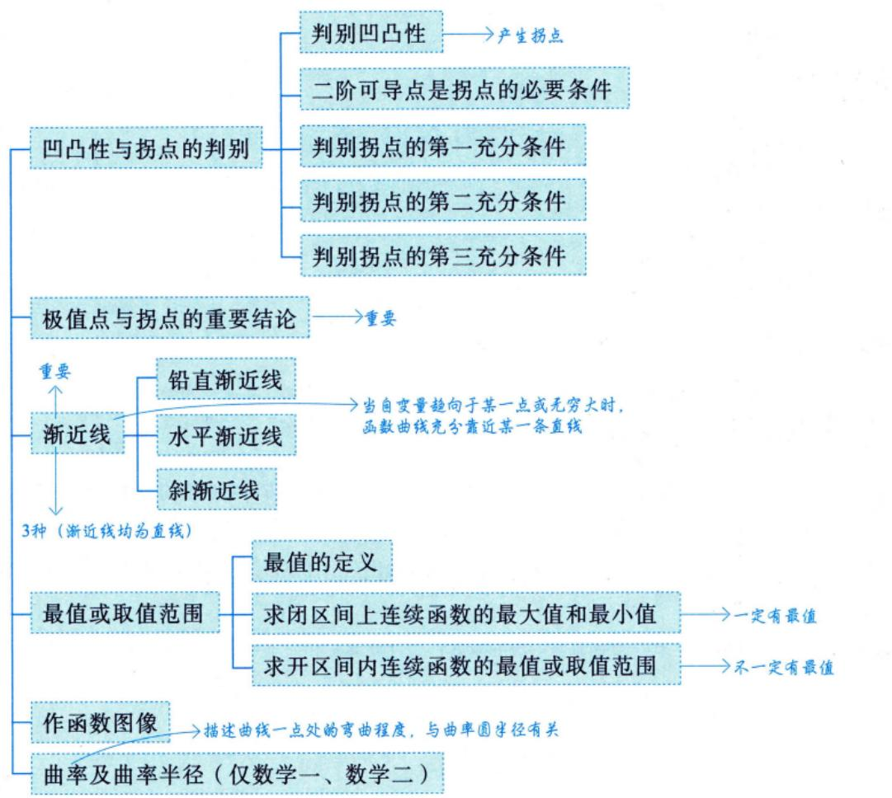

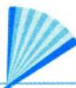

## 基础内容精讲

## 极值的定义

→见注1

对于函数f(x)，若存在点 $\underline{x_0}$ 的某个邻域，使得在该邻域内任意一点x，均有

$$
f(x) \leq f(x_0) ( 或  f(x) \geq f(x_0) )
$$

成立，则称点 $x _ { 0 }$ 为f(x)的极大值点(或极小值点)， $f(x_{0})$ 为f(x)的极大值(或极小值).

## 注(1)局部的概念.双侧邻域

(2)左右邻域均有定义（端点处不讨论极值、间断点）.

不是极值点的必要条件

(3)常数函数处处是极值（处处是极大值、处处是极小值）

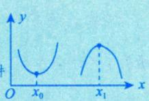

(4)常考查“理想”的极值点，如图所示，即“左邻域减，右邻域增”或“左邻域增、右邻域减”，且在 $x_{0}, x_{1}$ 处可导.

注2结合第1讲的知识，一个常见的问题：间断点可以是极值点吗？答案是肯定的.举四个例子供考生分析. 在有且在合处数两

(1) $f(x)=\begin{cases}1, & x=0, \\ \left | x \right | , & x\neq 0,\end{cases} x=0$ 是f(x)的可去间断点，但它是f(x)的极大值点.

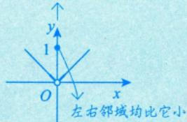

(2) $f(x)=\begin{cases}1, & x>0, \\ -x, & x \leq 0,\end{cases} x=0$ 是f(x)的跳跃间断点，但它是f(x)的极小值点.

  
左右邻域均比它大

(3) $f(x)=\left\{\begin{aligned}-1, & \quad x=0, \\ \frac{1}{x^{2}}, & \quad x \neq 0,\end{aligned}\right. x=0.$ 是f(x)的无穷间断点，但它是f(x)的极小值点.

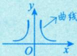

(4) $f(x)=\left\{\begin{aligned}&2, &x=0, \\&\sin\frac{1}{x}, &x\neq0,\end{aligned}\right.x=0.$ 是f(x)的振荡间断点，但它是f(x)的极大值点.

-1左右邻域均比它大  

## 单调性与极值的判别

## 1单调性的判别

若任意 $x \in (a,   b), \; f^{\prime}(x) > 0$ ，则f(x)在[a, b]上严格单调增加，即(a, b) 内的每一点x，对x的左边点x有 $f(x_{1}) < f(x)$ ，对x的右边点x2有$f(x_{2}) > f(x)$ ，这样f(x)就在[a, b]上严格单调增加

设函数y =f(x)在[a,b]上连续，在(a, b)内可导.

①如果在(a,b)内 $f^{\prime}(x) \geqslant 0$ ，且等号仅在有限个点处成立，那么函数y=f(x)在[a，b]上严格单调增加；

②如果在(a，b)内 $f^{\prime}(x) \leqslant 0$ ，且等号仅在有限个点处成立，那么函数y=f(x)在 $\left[ a , b \right]$ 上严格单调减少.

注导数为0仅能说明在某点处的函数值变化充分小，而不能说明没变化，即导数大于0一定严格单调增加，而严格单调增加不一定导数大于0.

例如，函数 $y = x ^ { 3 }$ 在 $(-\infty, +\infty)$ 上连续且可导，且导函数 $y^{\prime} = 3x^{2} \geqslant 0$ ，等号仅在x=0处成立，则函数 $y = x ^ { 3 }$ 在 $( - \infty , + \infty )$ 上严格单调增加. $\overline{ 侵意 } \delta > 0$ ，这个δ是一个无穷小量。 ，这个δ是一个无穷小量. $f(x) = x^{3}  在  x = 0$ 处导数为0，代 处导数为0，代

$f(\delta) - f(0) \neq f(0) - f(-\delta)$ 都是无穷小量， $f(x) = x^3   在   x = 0   就无穷$ 小邻域内，函数值变化率极小，所 $\therefore 3 f ( x ) = x ^ { 3 } 在 x = 0$ 处导数值为0

## 2一阶可导点是极值点的必要条件

→费马定理，此处不证明。 设f(x)在 $x   =   x _ { 0 }$ 处可导，且在点 $x _ { 0 }$ 处取得极值，则必有 $f^{\prime}(x_0) = 0$

注事实上，若 $x = x_{0}$ 为曲线 $y = f(x)$ 的极值点，则只有以下两种情况.

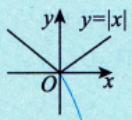

(1) $f^{\prime}(x_0) = 0$ ，如 $y = x^{2}$ 在 (0, 0) 处的情形，如图 5-1(a) 所示.

(a)

(b)

(2) $f^{\prime}(x_{0})$ 不存在，如 $y = \vert x \vert$ 在(0, 0)处的情形，如图 5-1(b) 所示.

图 5-1

$f^{\prime}(x_0) = \lim_{x \to x_0} \frac{f(x) - f(x_0)}{x - x_0} = 0$ 仅能说明在 $x \to x_{0}$ 时， $f(x) - f(x_0)$ 为 $x - x_{0}$ 的高阶无穷小，不能说明 $f(x) = f(x_0)$ 即当 $f^{\prime}(x_0) = 0$ 时，f(x)仍然可能是单调的，所以 $f^{\prime}(x_0) = 0$ 仅为f(x)在 $x = x_{0}$ 处取得极值的必要条件.

找极值时的两种情况：①驻点；②不可导点.

## ③ 判别极值的第一充分条件

需借助左、右邻域的一阶导数的正负来判断这一点处的极值情况

设f(x)在 $x = x_{0}$ 处连续，且在 $x _ { 0 }$ 的某去心邻域 $U(x_{0},\delta)(\delta>0)$ 内可导.

①若 $x \in (x_0 - \delta,   x_0)$ 时， $f^{\prime}(x) < 0$ ，而 $x \in (x_0, x_0 + \delta)$ 时， $f^{\prime}(x) > 0$ ，则f(x)在 $x = x_{0}$ 处取得极小值；  
②若 $x \in (x_0 - \delta,   x_0)$ 时， $f^{\prime}(x) > 0$ ，而 $x \in (x_0, x_0 + \delta)$ 时， $f^{\prime}(x) < 0$ ，则f(x)在 $x = x_{0}$ 处取得极大值；  
③若f'(x)在 $(x_{0} - \delta,   x_{0})$ 和 $(x_{0}, x_{0} + \delta)$ 内不变号，则点 $x _ { 0 }$ 不是极值点.

注 f(x)在 $x = x_{0}$ 处不一定可导，可能出现角点.

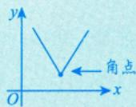

## 4判别极值的第二充分条件 4判别极值的第二充分条件

→需借助 $x = x_{0}  一$ 点处的二阶导数的正负，当一点处的信息较强时使用设f(x)在 $x   =   x _ { 0 }$ 处二阶可导，且 $f^{\prime}(x_0) = 0, f^{\prime\prime}(x_0) \neq 0$

①若 $f^{\prime\prime}(x_0) < 0$ ，则f(x)在 $x _ { 0 }$ 处取得极大值；

②若 $f^{\prime\prime}(x_0) > 0$ ，则f(x)在 $x _ { 0 }$ 处取得极小值.

借助保号性推导如下.

设 $f''(x_0) = \lim_{x \to x_0} \frac{f'(x) - f'(x_0)}{x - x_0} = \lim_{x \to x_0} \frac{f'(x)}{x - x_0} > 0$ ，由保号性可知：

(1) 当 $x \in (x_0 - \delta,   x_0)$ 时， $x - x_{0} < 0$ ，从而 $f^{\prime}(x) < 0$ ，所以f(x)在 $x _ { 0 }$ 的左邻域单调递减；

(2) 当 $x \in (x_0, x_0 + \delta)$ 时， $x - x_{0} > 0$ ，从而 $f^{\prime}(x) > 0$ ，所以f(x)在 $x _ { 0 }$ 的右邻域单调递增.

所以f(x)在 $x   =   x _ { 0 }$ 处取得极小值.

同理，当 $f^{\prime\prime}(x_0) < 0$ 时，f(x)在 $x = x_{0}$ 处取得极大值.

上述第二充分条件可以推广为第三充分条件.

## 5 判别极值的第三充分条件 →持续求导，直至n阶导数不为0.

设f(x)在 $x = x _ { 0 }$ 处n阶可导，且 $f^{(m)}(x_0)=0(m=1,2,\cdots,n-1), \quad f^{(n)}(x_0)\neq0(n\geq2)$ ，则

①当n为偶数且 $f^{(n)}(x_0) < 0$ 时，f(x)在 $x _ { 0 }$ 处取得极大值；

②当n为偶数且 $f^{(n)}(x_0) > 0$ 时，f(x)在 $x _ { 0 }$ 处取得极小值.

第三充分条件的证明用洛必达法则或泰勒展开式，《全国硕士研究生招生考试数学考试大纲》对此不作要求.

## 注上述第三充分条件的证明如下.由于n为偶数，因此令n=2k，构造极限

$$
\lim_{x \to x_0} \frac{f(x) - f(x_0)}{(x - x_0)^{2k}} = \lim_{x \to x_0} \frac{f'(x)}{2k(x - x_0)^{2k - 1}} = \lim_{x \to x_0} \frac{f'(x)}{(x - x_0)^{2k - 1}} = \lim_{x \to x_0} \frac{f'^{(2k - 1)}(x)}{(2k)!(x - x_0)} = \lim_{x \to x_0} \frac{f'^{(2k - 1)}(x)}{(2k)!(x - x_0)} = \lim_{x \to x_0} \frac{f'^{(2k - 1)}(x)}{(2k)!(x - x_0)} = \lim_{x \to x_0} \frac{f'^{(2k - 1)}(x)}{(2k)!(x - x_0)} = \lim_{x \to x_0} \frac{f'^{(2k - 1)}(x)}{(2k)!(x - x_0)}
$$

上述洛必达法则成立的依据是最后的结果 $\frac{1}{(2k)!}f^{(2k)}(x_0)$ 是存在的

当 $f^{(2k)}(x_0) < 0$ 时，由函数极限的局部保号性知，存在 $x _ { 0 }$ 的某去心邻域，对于该邻域内的任意x，有 $\frac{f(x) - f(x_0)}{(x - x_0)^{2k}} < 0$ 即 $f(x) < f(x_0)$ ，故 $x _ { 0 }$ 为极大值点；

当 $f^{(2k)}(x_0) > 0$ 时，由函数极限的局部保号性知，存在 $x_{0}$ 的某去心邻域，对于该邻域内的任意x，有 $\frac{f(x) - f(x_0)}{(x - x_0)^{2k}} > 0$ 即 $f(x) > f(x_0)$ ，故 $x_{0}$ 为极小值点.

例5.1 设函数f(x)可导，且 $f(x) f^{\prime}(x) > 0$ ，则（).(A) f(1) > f(−1) (B) f(1) < f(−1) (C) $\left| f(1) \right| > \left| f(-1) \right|$ (D) $\left| f(1) \right| < \left| f(-1) \right|$

分析见到f(x)·f′(x)，联想 $\left\{ \left[ f(x) \right]' \right\}' = 2f(x) \cdot f'(x)$

## 解应选(C).

由 $f(x)f^{\prime}(x)>0$ 知 $\left[ \frac{1}{2} f^2(x) \right]' = f(x) f'(x) > 0$ ,则 $\frac{1}{2}f^{2}(x)$ 单调增加，从而 $f^{2}(x)$ 单调增加，由此可知

$f^{2}(1) > f^{2}(-1)$ ，两端开方得 $\left| f(1) \right| > \left| f(-1) \right|$ .故排除(D)，选(C).

取 $f(x) = - \mathrm{e}^{x}, f(x) f^{\prime}(x) > 0$ ,有f(1)< f(−1); 取 $f(x) = \mathrm{e}^{x}, f(x)f^{\prime}(x) > 0$ ,有f(l)> f(−1).故排除(A),(B).

注(1)对平方开根号时应注意， $\sqrt{u^{2}} = \left | u \right |$ 而非 u.

(2)使用举例方式仅能排除选项而不能证明选项.

例5.2 设函数f(x)二阶可导，且在 $x   =   x _ { 0 }$ 处取极大值，则有（）.(A) $f^{\prime\prime}(x_0) < 0$ (B) $f^{\prime\prime}(x_0) \leqslant 0$ (C) $f^{\prime\prime}(x_0) > 0$ (D) $f^{\prime\prime}(x_0) \geqslant 0$

分析充分条件：若f(x)二阶可导，且在 $x   =   x _ { 0 }$ 处取极大值，则 $\begin{cases}f'(x_0) = 0, \\f''(x_0) \leqslant 0.\end{cases}$

## 解应选(B).

因f(x)二阶可导，且f(x)在 $x   =   x _ { 0 }$ 处取得极值，故 $f^{\prime}(x_0) = 0$ .根据判别极值的第二充分条件，当$f^{\prime\prime}(x_0) > 0$ 时，f(x)在 $x _ { 0 }$ 处取得极小值，与已知矛盾.取 $f(x) = -x^4$ ，可知f(x)在x=0处取极大值，此时 $f^{\prime\prime}(0) = 0$ ，因此 $f''(x_0)$ 可取0，故 $f''(x_0) \leq 0$ . 故选(B).

方法总结本题是借助判别极值的第二充分条件来解决的.

注(1) $f^{\prime\prime}(x_0) < 0$ (在 $f^{\prime}(x_0) = 0$ 条件下）是f(x)在 $x_{0}$ 处取得极大值的充分不必要条件.

(2) $f^{\prime\prime}(x_0) = 0$ 并不是f'(x)在x=0的邻域内无变化，而是变化的幅度很小，进一步分析也只能得 出f(x)的变化幅度小而不能得出无变化.

例 5.3 设函数 y = y(x)由方程 $y^{3}+xy^{2}+x^{2}y+6=0$ 确定，求y(x)的极值.

解在方程 $y^{3}+xy^{2}+x^{2}y+6=0$ 两边关于x求导，得

$$
3y^{2}y^{\prime}+y^{2}+2xyy^{\prime}+2xy+x^{2}y^{\prime}=0\tag{*}
$$

令 $y ^ { \prime }   =   0$ ，得 $y^{2} + 2xy = 0$ ，即y=0或 $y = - 2x$ .显然 $y = 0$ 时不满足已知方程，故 $y = - 2 x$ ，将其代入原方程，得 $-6x^{3}+6=0$ ，解得x=1，y(1)=-2.

在(\*)式两边关于x求导，得 $\left( 3 y ^ { 2 } + 2 x y + x ^ { 2 } \right) y ^ { \prime \prime } + 2 ( 3 y + x ) \left( y ^ { \prime } \right) ^ { 2 } + 4 ( y + x ) y ^ { \prime } + 2 y = 0$ ，代人 $x { = } 1$ $y(1)=-2\ , y^{\prime}(1)=0$ ，解得 $y''(1)=\frac{4}{9}>0$ .根据判断极值的第二充分条件可知，x=1为y(x)的极小值点，极小值为 $y(1) = -2$

例5.4设 $f(x) = x \mathrm{e}^{x}$ ，求 $f^{(n)}(x)$ 的极值点和极值.

由例4.17知

$$
f^{(n)}(x) = (n + x)\mathrm{e}^{x}, f^{(n + 1)}(x) = (n + 1 + x)\mathrm{e}^{x}, f^{(n + 2)}(x) = (n + 2 + x)\mathrm{e}^{x}
$$

$f^{(n+1)}(x) = (n+1+x)e^x = 0$ ，得函数 $f^{(n)}(x) = (n + x)\mathrm{e}^{x}$ 的驻点 $x = - (n + 1)$ .又

$$
f^{(n+2)}[-(n+1)]=\mathrm{e}^{-n-1}>0,
$$

所以x =-(n+1)是函数 $f^{(n)}(x) = (n + x)\mathrm{e}^{x}$ 的极小值点，极小值为

可记为F(x)

$$
f^{(n)}[-(n+1)]=-\mathrm{e}^{-(n+1)}
$$

方法总结先求出表达式 $\hat { f } ^ { ( n ) } ( x )$ ，再求出此函数的驻点，然后代入 $f^{(n+2)}(x)$ 验证即可，求极小值时将驻点代入 $f^{(n)}(x)$ 而非f(x).

## 凹凸性与拐点的概念

## 凹凸性的定义

《全国硕士研究生招生考试数学考试大纲》规定如下：

定义1 设函数f(x)在区间I上连续.如果对I上任意不同两点 $x_{1}, x_{2}$ ，恒有

横坐标中点的函数值在曲线上 $f\left(\frac{x_{1}+x_{2}}{2}\right)<\frac{f(x_{1})+f(x_{2})}{2}$ →函数值的中点在弦上

则称 $y = f(x)$ 在I上的图形是凹的（或凹弧），如图5-2(a)所示；如果恒有

$$
f\left(\frac{x_{1}+x_{2}}{2}\right)>\frac{f(x_{1})+f(x_{2})}{2},
$$

则称 $y = f(x)$ 在I上的图形是凸的（或凸弧），如图5-2(b)所示.

  
图形上任意弧段位于弦的下方

$$
\frac{f(x_{1}) + f(x_{2})}{2} > f\left(\frac{x_{1} + x_{2}}{2}\right)
$$

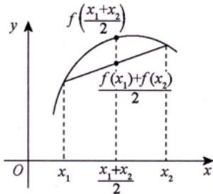  
图形上任意弧段位于弦的上方  
(a)

$$
\frac{f(x_{1}) + f(x_{2})}{2} < f\left(\frac{x_{1} + x_{2}}{2}\right)
$$

(b)

图 5-2

注事实上，当图形为凹时，可以将 $f\left( \frac{1}{2}x_{1} + \frac{1}{2}x_{2} \right) < \frac{1}{2}f(x_{1}) + \frac{1}{2}f(x_{2})$ 更一般地写为(凸)

$$
f(\lambda_{1}x_{1} + \lambda_{2}x_{2}) < \lambda_{1}f(x_{1}) + \lambda_{2}f(x_{2})
$$

其中 $0 < \lambda_{1} < 1, \quad 0 < \lambda_{2} < 1, \quad \lambda_{1} + \lambda_{2} = 1$

$\lambda _ { 1 } = \lambda _ { 2 } = \frac { 1 } { 2 }$ 仅为特殊情况。

定义2 设f(x)在[a,b]上连续，在(a,b)内可导，若对(a,b)内的任意x及 $x_{0}(x \neq x_{0})$ ，均有

$$
\frac{f(x_{0}) + f^{\prime}(x_{0})(x - x_{0}) < f(x)}{ \downarrow}\tag{*}
$$

则称f(x)在[a, b]的图形上是凹的. 切线方程 曲线方程 (凸)

注(几何意义) $y = f(x_{0}) + f^{\prime}(x_{0})(x - x_{0})$ 是曲线 $y = f(x)$ 在点 $(x_{0},f(x_{0}))$ 处的切线方程，因此(\*)式的几何意义如图 5-3 所示.若曲线 $y = f(x) (a < x < b)$ 在任意点处的切线（除该点外）总在曲线的下方（上方），则该曲线是凹（凸）的.

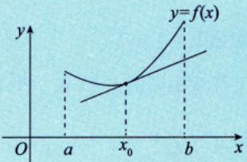  
(a)

图5-3  
  
(b)

## 2 拐点的定义

连续曲线的凹弧与凸弧的分界点称为该曲线的拐点.  
①间断点不可能为拐点；

①拐点处只需连续.

②判别拐点时凹凸不分先后.

③拐点在曲线上，写 $(x_{0},f(x_{0}))$

y↑ y ②形如 或 也称为有拐点； o x

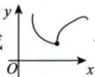

③极值点只写横坐标 $x   =   x _ { 0 }$ ，拐点应写 $(x_{0},f(x_{0}))$

## 四凹凸性与拐点的判别

## 1判别凹凸性

设函数f(x)在I上二阶可导.

①若在 $I \perp f''(x) > 0$ ，则f(x)在I上的图形是凹的；

②若在 $I \perp f''(x) < 0$ ，则f(x)在I上的图形是凸的.

## 2二阶可导点是拐点的必要条件

设 $f''(x_0)$ 存在，且点 $(x_{0},f(x_{0}))$ 为曲线的拐点，则 $f^{\prime\prime}(x_0) = 0$

注事实上，若点 $(x_{0},f(x_{0}))$ 为曲线 $y = f(x)$ 的拐点，则只有以下两种情况.

(1) $f^{\prime\prime}(x_0) = 0$ ，如 $y = x^{3}$ 在(0, 0) 处的情形，如图 5-4(a) 所示.

二阶导数存在必为0

$$
f''\binom{x_0}{ }
$$

(2). 不存在，如 $y = \sqrt[3]{x}$ 在(0, 0) 处的情形，如图 5-4(b) 所示.

二阶导数不存在的点也有可能是拐点

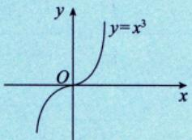  
(a)

  
图5-4  
(b)

③ 判别拐点的第一充分条件 →判别拐点最常用的方法.

设f(x)在点 $x   =   x _ { 0 }$ 处连续，在点 $x   =   x _ { 0 }$ 的某去心邻域 $\stackrel{\circ}{U}(x_{0},\delta)$ 内二阶导数存在，且在该点的左、右邻域内 $f''(x)$ 变号(无论是由正变负，还是由负变正)，则点 $(x_{0},f(x_{0}))$ 为曲线的拐点.

需借助左、右邻域二阶导数的正负变化

注 $(x_{0},f(x_{0}))$ 为曲线 $y = f(x)$ 的拐点，并不要求f(x)在点 $x_{0}$ 的导数存在，如 $y = \sqrt[3]{x}$ 在 $x = 0$ 的情形，如图 5-5 所示，其中 $y^{\prime} = \frac{1}{3}x^{-\frac{2}{3}}, y^{\prime\prime} = -\frac{2}{9}x^{-\frac{5}{3}}$ 当 $x > 0$ 时， $y'' < 0$ 当 $x < 0$ 时， $y ^ { \prime \prime } > 0$ ，故点(0,0)为曲线 $y = \sqrt{x}$ 的拐点，但在该点的导数不存在.

  
图5-5

## 4 判别拐点的第二充分条件

设f(x)在 $x   =   x _ { 0 }$ 处三阶可导，且 $f^{\prime\prime}(x_0) = 0, f^{\prime\prime}(x_0) \neq 0$ ，则点 $(x_{0},f(x_{0}))$ 为曲线的拐点.

注上述第二充分条件的证明如下：由于 $f^{\prime\prime\prime}(x_0) = \lim_{x \to x_0} \frac{f^{\prime\prime}(x) - f^{\prime\prime}(x_0)}{x - x_0} = \lim_{x \to x_0} \frac{f^{\prime\prime}(x)}{x - x_0} \neq 0$ 不妨设 $f^{m}(x_{0}) > 0$ 由保号性可知：

①当 $x \in (x_0 - \delta, x_0)$ 时， $x - x_{0} < 0$ ，所以 $f^{\prime\prime}(x) < 0$ ，即曲线在 $x_{0}$ 的左邻域为凸的；

②当 $x \in (x_0, x_0 + \delta)$ 时， $x - x_{0} > 0$ ，所以 $f^{\prime\prime}(x) > 0$ ，即曲线在 $x_{0}$ 的右邻域为凹的.

因此 $(x_{0},f(x_{0}))$ 为拐点.

## 5 判别拐点的第三充分条件

>对m=1无须求，故无须 $f^{\prime}(x_0) = 0$

设f(x)在 $x _ { 0 }$ 处n阶可导，且 $f^{(m)}(x_0)=0(m=2,\cdots,n-1), \quad f^{(n)}(x_0)\neq0(n\geq3)$ ，则当n为奇数时，点$(x_{0},f(x_{0}))$ 为曲线的拐点. 证明可借助泰勒公式或洛必达法则，无须掌握.

注1上述第三充分条件的证明如下：由于n为奇数，因此令 $n = 2k + 1$ ，构造极限

$$
\lim_{x \to x_0} \frac{f''(x)}{(x - x_0)^{2k - 1}} = \lim_{x \to x_0} \frac{f^{(2k)}(x)}{(2k - 1)!(x - x_0)} = \lim_{x \to x_0} \frac{f^{(2k)}(x)}{(2k - 1)!(x - x_0)} = \lim_{x \to x_0} \frac{f^{(2k)}(x)}{(2k - 1)!(x - x_0)} = \lim_{x \to x_0} \frac{f^{(2k - 1)}(x)}{(2k - 1)!(x - x_0)} = \lim_{x \to x_0} \frac{f^{(2k - 1)}(x)}{(2k - 1)!(x - x_0)} = 0
$$

上述洛必达法则成立的依据是最后的结果 $\frac{1}{(2k - 1)!} f^{(2k + 1)}(x_0)$ 是存在的.

不妨设 $f^{(2k+1)}(x_0) > 0$ ，由函数极限的局部保号性知，存在 $x _ { 0 }$ 的某去心邻域，对于该邻域内的任意x，有

$$
\frac{f^{\prime\prime}(x)}{(x - x_0)^{2k - 1}} > 0,
$$

当 $x \to x_{0}^{+}$ 时， $f^{\prime\prime}(x) > 0$ ；当 $x \to x_{0}^{-}$ 时， $f^{\prime\prime}(x) < 0$ ，故点 $(x_{0},f(x_{0}))$ 为曲线的拐点.

注2由上述证明过程可知，第三充分条件不需要 $f^{\prime}(x_0) = 0$ 这个条件.

例5.5 设函数f(x)满足关系式 $f^{\prime\prime}(x) + \left[ f^{\prime}(x) \right]^2 = \sin x$ ，且 $f^{\prime}(0) = 0$ ，则（).

(A) f(0)是f(x)的极大值

(B) f(0)是f(x)的极小值

(C) 点(0， f(0))是曲线y =f(x)的拐点

(D)f(0)不是f(x)的极值，点(0,f(0))也不是曲线y =f(x)的拐点

解应选(C).

在等式 $f^{\prime\prime}(x) + \left[ f^{\prime}(x) \right]^2 = \sin x$ 中，令x=0，得 $f''(0) = 0$

在等式 $f^{\prime\prime}(x) + \left[ f^{\prime}(x) \right]^2 = \sin x$ 两端对x求导，得 f"(x) =−[f′(x)]2 +sin x, f'(x) 和→sinx均可导，故f"(x)可导.

$$
f^{\prime\prime}(x) + 2f^{\prime}(x)f^{\prime\prime}(x) = \cos x
$$

上式中令x=0，得 $f^{m}(0) = 1 > 0$ ，则点(0， f(0))是曲线y =f(x)的拐点，由 $ "五、 \textcircled{1}  \text{" }$ 知(A)，(B)错误.故应选(C). →重要结论.

方法总结无须借助微分方程求解f(x).仅需借助拐点的第二充分条件得出在x=0处的有效信息即可.

注对等式而言，若等号一侧可导，则等号另外一侧也必然可导.

## 极值点与拐点的重要结论

以下结论均可直接使用，不必证明.

①曲线的可导点不可同时为极值点和拐点；曲线的不可导点可同时为极值点和拐点

参考例5.5

$(x_{0},f(x_{0}))$ 为拐点。 $\boldsymbol{x}  三  \boldsymbol{x}_{0}$ 为极值点

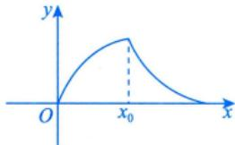

②设多项式函数 $f(x)=(x-a)^{n}g(x)(n>1)$ ，且 $g(a) \neq 0$ ，则当n为偶数时，x=a是f(x)的极值点；当n为奇数时，点(a,0)是曲线f(x)的拐点.

③设多项式函数 $f(x)=(x-a_{1})^{n_{1}}(x-a_{2})^{n_{2}}\cdots(x-a_{k})^{n_{k}}$ ，其中 $n _ { i }$ 是正整数， $a _ { i }$ 是实数且 $a _ { i }$ 两两不等，$i = 1, 2, \cdots, k$

记 $k _ { 1 }$ 为 $n_{i} = 1$ 的个数， $k _ { 2 }$ 为 $n_{i} > 1$ 且 $n _ { i }$ 为偶数的个数， $k _ { 3 }$ 为 $n_{i} > 1$ 且 $n _ { i }$ 为奇数的个数，则f(x)的极值 点个数为 $k_{1} + 2k_{2} + k_{3} - 1$ ，拐点个数为 $k_{1} + 2k_{2} + 3k_{3} - 2$

例如， $f(x)=(x-1)(x-2)^2(x-3)^3(x-4)^4(x-5)$ ，则 $k_{1}=2,\;k_{2}=2,\;k_{3}=1$

从而极值点个数为2+4+1-1=6，拐点个数为 $2+4+3-2=7$

## 例 5.6 设函数 $y = \left| x \mathrm{e}^{-x} \right|$ ，则（).

(A) x=0是y的极大值点，点(0,0)不是曲线y的拐点

(B) x=0是y的极小值点，点(0,0)不是曲线y的拐点

(C) x=0是y的极大值点，点(0,0)是曲线y的拐点

(D) x=0是y的极小值点，点(0,0)是曲线y的拐点

分析）判断一点是否为极值点应分析该点左、右邻域内函数值与该点处函数值的大小关系.

判断一点是否为拐点应分析该点左、右邻域内二阶导数是否变号.

应选(D).

注意到 $y \big|_{x = 0} = 0$ ，当 $x \neq 0$ 时， $y = \left| x \mathrm{e}^{-x} \right| > 0$ ，由极值的定义可知x=0为y的极小值点.

由例4.6知 $y^{\prime\prime} = \left\{ \begin{aligned}  e ^{- x}(2 - x), \quad x < 0, \\  e ^{- x}(x - 2), \quad x > 0, \end{aligned} \right.$ ，得 $x = 2$

当 $x < 0$ 时， $y'' = \mathrm{e}^{-x}(2 - x) > 0$ ；当 $0 < x < 2$ 时， $y^{\prime\prime} = \mathrm{e}^{-x}(x - 2) < 0$ ，可知 $y''$ 在 $x   =   0$ 的左、右邻域内符号不同.因此点(0,0)为曲线y的拐点.

故选(D).

方法总结绝对值函数属于分段函数，故应写成分段函数的形式再分析.

注实际上，(2， y(2))也是拐点，只是选项没有涉及而已.

例5.7 曲线 $y = (x - 1)(x - 2)^2 (x - 3)^3 (x - 4)^4$ 的一个拐点是（ ).(A) (1, 0) (B) (2, 0) (C) (3, 0) (D) (4, 0)

应选(C).

$$
y = (x - 3)^3 (x - 1)(x - 2)^2 (x - 4)^4 = (x - 3)^3 g(x)
$$

显然 $g(3) \neq 0$ ，且n=3是奇数.由 $ "五、 \textcircled{2}  \text{" }$ 可知，点(3,0)是y的一个拐点，故选(C).

注(1)由 $ \text{" } 五、  \textcircled{3}  \text{" }$ 可知， $k_{1}=1,\;k_{2}=2,\;k_{3}=1$ ，故y的拐点个数为$1+2\times2+3\times1-2=6$ 若α是f(x)=0的m(≥1)重根， 若x-α是f(x)的k重因式.则α是f'(x)=0的m-1重根. 则α称为f(x)=0的k重根.

(2) 本题的常规解法：因为x=3 是方程 $(x - 1)(x - 2)^{2}(x - 3)^{3}(x - 4)^{4} = 0$ 的 $\rightrightarrows$ 重根，所以它是方程$y'' = 0$ 的单根，从而函数 $y = (x - 1)(x - 2)^2 (x - 3)^3 (x - 4)^4$ 的二阶导数在点x=3的两侧附近改变正负号故点(3,0)是曲线 $y = (x - 1)(x - 2)^2 (x - 3)^3 (x - 4)^4$ 的一个拐点.

例5.8 曲线 $f(x) = (x - 1)^{2}(x - 3)^{3}$ 的拐点个数为（ ).(A) 0 (B)1(C)2 (D)3

分析借助重要结论 $ "五、  \textcircled{3}  \textcircled{\text{" }}$ 即可.

解应选 (D).

由 $ "五、  \textcircled{3} ''$ 可知， $k_{1}=0,\;k_{2}=1,\;k_{3}=1$ ，则拐点个数为

$$
k_{1} + 2k_{2} + 3k_{3} - 2 = 2 \times 1 + 3 \times 1 - 2 = 3
$$

注(1)也可借助常规方法进行分析，但计算量更大.本题的常规解法：由

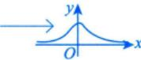

$$
\begin{aligned}f^{\prime}(x) &= 2(x - 1)(x - 3)^{3} + 3(x - 1)^{2}(x - 3)^{2} \\&= (x - 1)(x - 3)^{2}(5x - 9) ,\end{aligned}
$$

易知 f"(x) 中必含一次因式x-3.另由 $f^{\prime}(1)=f^{\prime}\left(\frac{9}{5}\right)=f^{\prime}(3)=0$ ，知必存在 $x_{1} \in \left( 1,\frac{9}{5} \right), x_{2} \in \left( \frac{9}{5},3 \right)$ 使得 $f^{\prime\prime}(x_1) = f^{\prime\prime}(x_2) = 0$ ，故可令

$$
f''(x) = k(x - x_1)(x - x_2)(x - 3)
$$

其中k是不为0的常数.由于 $f''(x)$ 在 $x = x_{1}, x = x_{2}, x = 3$ 两侧都异号，因此该曲线共有3个拐点.(2) 曲线 $y = (x - 1)^{2}(x - 3)^{2}$ 的极值点个数与拐点个数分别为（ ).(A)3,2 (B) 2, 3 (C) 3, 4 (D) 4, 3

解 应选(A).

由 $ \text{" } 五、 \textcircled{3}  \text{" }$ 可知， $k_{1}=0,\;k_{2}=2,\;k_{3}=0$ ，于是极值点个数为 $0+2\times2+0-1=3$ ，拐点个数为$0+2\times2+3\times0-2=2$ .可直接得出答案.

## 渐近线

→当曲线上的点远离原点时，曲线与某直线充分靠近，则称该直线为曲线的渐近线

## 1铅直渐近线

若 $\lim_{x \to x_0^+} f(x) = \infty   (或  \lim_{x \to x_0^-} f(x) = \infty  )$ ，则 $x   =   x _ { 0 }$ 为一条铅直渐近线.

注此处的 $x _ { 0 }$ 或是函数的无定义点，或是函数定义区间的端点，或是分段函数的分段点例： $y = \tan x  在  x = \frac{\pi}{2}$ 例： $y = \ln x (x > 0)  在  x \to 0^+  处$ 例： $y=\left\{\begin{aligned}1,\quad x\geq0,\quad 业 \\\frac{1}{x},\quad x<0\end{aligned}\right. 在 x=0 处$

## 2 水平渐近线

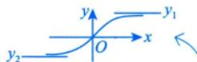

若 $\lim_{x \to +\infty} f(x) = y_1$ ，则 $y = y _ { 1 }$ 为一条水平渐近线；若 $\lim_{x \to -\infty} f(x) = y_2$ ，则 $y = y _ { 2 }$ 为一条水平渐近线；   
若 $\lim_{x \to +\infty} f(x) = \lim_{x \to -\infty} f(x) = y_0$ ，则 $y = y _ { 0 }$ 为一条水平渐近线.

$x \to +\infty$ 与 $x \to -\infty$ 时的水平渐近线可能相同，如 $y = \mathrm{e}^{-|x|}$ ；也可能不同，如 $y = \arctan x$

## 考研数学基础30讲·高等数学分册

## ③ 斜渐近线

若 $\lim_{x \to +\infty} \frac{f(x)}{x} = a_1 (a_1 \neq 0)$ $\lim_{x \to +\infty} \left[ f(x) - a_1 x \right] = b_1$ ，则 $y = a_{1}x + b_{1}$ 是曲线y=f(x)的一条斜渐近线；

若 $\lim_{x \to -\infty} \frac{f(x)}{x} = a_2 (a_2 \neq 0)$ ， $\lim_{x \to -\infty} \left[ f(x) - a_2 x \right] = b_2$ ，则 $y = a_{2}x + b_{2}$ 是曲线y =f(x)的一条斜渐近线；

若 $\lim_{x \to +\infty} \frac{f(x)}{x} = \lim_{x \to -\infty} \frac{f(x)}{x} = a (a \neq 0)$ $\lim_{x \to +\infty} \left[ f(x) - ax \right] = \lim_{x \to -\infty} \left[ f(x) - ax \right] = b$ ，则 $y = ax + b$ 是曲线 $y = f(x)$ 的一条斜渐近线.

注1 f(x)向直线 $y = ax + b$ 趋近，表明二者在无穷远处无限接近.即对任意ε>0都有 $\left| f(x) - (ax + b) \right| < \varepsilon$ 也即

$$
\lim _ { x \rightarrow \infty } \left[ f ( x ) - ( a x + b ) \right] = 0 ,\tag{①}
$$

从而

$$
\lim_{x \to \infty} \frac{f(x) - (ax + b)}{x} = 0 \quad , \quad \lim_{x \to \infty} \frac{f(x)}{x} = a (a \neq 0) \quad .\tag{②}
$$

将②结果代入①，可知

$$
\lim_{x \to \infty} \left[ f(x) - ax \right] = b\tag{③}
$$

由②，③，可以得出a与b，即可得到斜渐近线.

注2 $x \rightarrow +\infty$ 与 $x \to -\infty$ 时的斜渐近线可能相同，也可能不同.有时需分左右两侧分别去求.

注3寻找渐近线的顺序：铅直渐近线、水平渐近线、斜渐近线.

若求曲线y=f(x)的渐近线，要先找函数的无定义点，定义区间的端点或分段函数的分段点，具体说来，若 $\lim_{x \to x_0^+} f(x) = \infty \quad ( 或  \quad \lim_{x \to x_0^-} f(x) = \infty)$ 则 $x = x_{0}$ 为一条铅直渐近线；然后判别 $\lim_{x \to \infty} f(x)$ 是否为常数，若是常数，则存在水平渐近线；若是∞，则最后判别 $\lim_{x \to \infty} \frac{f(x)}{x}$ 是否为非零常数a，若是，则求出常数a，再求 $b = \lim_{x \to \infty} \left[ f(x) - ax \right]$ 当a,b都存在时，则存在斜渐近线，否则就没有斜渐近线.可总结成如下程序.

注4①求斜渐近线时，a与b均应求出来才可以，仅求出a不能确定有斜渐近线.

如 $y = x + \sin x$ $a = \lim_{x \to \infty} \frac{y}{x} = 1$ ，而 $b = \lim_{x \to \infty} (y - 1 \cdot x) = \lim_{x \to \infty} \sin x$ 不存在.

所以 $y = x + \sin x$ 无斜渐近线.

②曲线与渐近线可能会有交点，如 $y = \frac{\sin x}{x}$

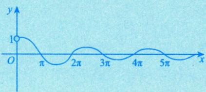

例5.9 求曲线 $y = \frac{1}{x} + \ln(1 + \mathrm{e}^{x})$ 的渐近线.

分析按铅直、水平与斜渐近线的顺序依次去找，注意极限的计算.

解因为

$$
\lim_{x \to 0} \left[ \frac{1}{x} + \ln(1 + \mathrm{e}^x) \right] = \infty
$$

所以直线x=0是曲线 $y = \frac{1}{x} + \ln(1 + \mathrm{e}^{x})$ 的一条铅直渐近线.

因为

$$
\lim_{x \to -\infty} \left[ \frac{1}{x} + \ln(1 + \mathrm{e}^x) \right] = 0
$$

所以直线y=0是曲线 $y = \frac{1}{x} + \ln(1 + \mathrm{e}^{x})$ 在 $x   \to   - \infty$ 时的一条水平渐近线.

因为

且

$$
\begin{aligned}\lim_{x \rightarrow + \infty}\frac{\frac{1}{x} + \ln(1 + \mathrm{e}^{x})}{x} = \lim_{x \rightarrow + \infty}\left[\frac{1}{x^{2}} + \frac{x + \ln(1 + \mathrm{e}^{- x})}{x}\right] = 1, \quad \ln(1 + \mathrm{e}^{x}) - x = \ln(1 + \mathrm{e}^{x}) - \ln \mathrm{e}^{- x} \\\lim_{x \rightarrow + \infty}\left[\frac{1}{x} + \ln(1 + \mathrm{e}^{x}) - x\right] = \lim_{x \rightarrow + \infty}\left[\frac{1}{x} + \ln(1 + \mathrm{e}^{- x})\right] = 0, \quad \ln(1 + \mathrm{e}^{x}) - \ln \mathrm{e}^{- x} \\= \ln(1 + \mathrm{e}^{- x})\end{aligned}
$$

所以直线y=x是曲线 $y = \frac{1}{x} + \ln(1 + \mathrm{e}^{x})$ 在 $x \to + \infty$ 时的一条斜渐近线，其大致图形如图5-6所示.

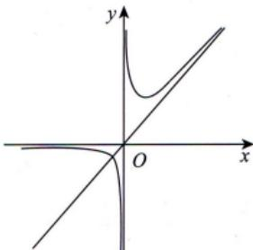  
图5-6

注渐近线的求解是对考生的极限计算能力的考查.

## 最值或取值范围

## 最值的定义

整体概念，有别于极值

定义3 设 $x _ { 0 }$ 为f(x)定义域内一点，若对于f(x)的定义域内任意一点x，均有

$$
f(x) \leqslant f(x_0)  (或   f(x) \geqslant f(x_0)  )
$$

成立，则称 $f(x_{0})$ 为f(x)的最大值（或最小值）.

注极值和最值是什么关系？我们通过两个例子来看.

①设 $f(x) = \mathrm{e}^{x}, \; x \in [0, +\infty)$ ，则 $f(0) = \mathrm{e}^{0} = 1$ 为f(x)在 $[ 0 , + \infty )$ 内的最小值，即 $f(x) \geq f(0)$ .但$f(x)$ 在 $[0, +\infty)$ 内没有极值.细致说来，首先， $x = 0$ 是区间左端点，不存在双侧邻域U(0)，使$x \in U(0)$ 时， $f(x) \geq f(0)$ ，故不存在极值.其次，对于 $(0, +\infty)$ 内的任意一点 $x_{0}$

不论 $U(x_{0})$ 取得多么小，对于 $x \in U(x_0)$ ，并不总有 $f(x) \geqslant f(x_0)$ ，所以f(x)在$\left[0, +\infty \right)$ 内无极小值，易见也无极大值.所以f(x)在 $\left[0,+\infty\right)$ 内无极值.

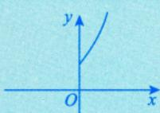

②设 $f(x) = 3x - x^{3}$ ，有

$$
f^{\prime}(x) = 3(1 - x^{2}), f^{\prime\prime}(x) = - 6x, f^{\prime}(\pm 1) = 0, f^{\prime\prime}(\pm 1) = \mp 6,
$$

所以f(1)=2为极大值，f(-1)=-2为极小值.但f(x)在 $( - \infty, + \infty )$ 内无最大值，也无最小值.

由此可见，极值点并不一定是最值点，最值点也不一定是极值点.但是，下面这个结论是正确的：

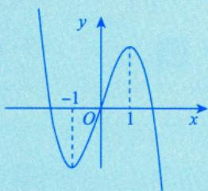

如果f(x)在区间I上有最值点 $x_{0}$ ，并且此最值点 $x_{0}$ 不是区间I的端点而是I内部的点，那么此 $x_{0}$ 必是f(x)的一个极值点.

即f(x0)在定义域内最大（小），且存在左、右邻域，f(x)必大（小）于邻域内点的函数值

事实上，设 $f(x_{0})$ 为f(x)在I上的最大值，则对一切x∈I，有 $f(x) \leq f(x_0)$ ，又因为 $x_{0}$ 为I内部的点，故存在一个邻域 $U(x_{0}) \subset I$ ,当 $x \in U(x_0)$ 时， $f(x) \leq f(x_0)$ .由极大值的定义知, $f(x_{0})$ 为f(x)的一个极大值.

## 2 求区间[a,b]上连续函数 f(x) 的最大值M和最小值m

①求出f(x)在(a,b)内的可疑点——驻点与不可导点，并求出这些可疑点处的函数值；

②求出端点的函数值f(a)和f(b);

③比较以上所求得的所有函数值，其中最大者为f(x)在 $\left[ a ,   b \right]$ 上的最大值M，最小者为f(x)在比较⑧b©中的结果$\left[ a , b \right]$ 上的最小值m.

注有时这类问题也可命制为“求连续函数f(x)在区间 $\left[ a , b \right]$ 上的值域 $\left[m,M\right]$

## ③ 求区间(a， b) 内连续函数 f(x) 的最值或取值范围 开区间上的连续函数也可能有最值

①求出f(x)在(a，b)内的可疑点——驻点与不可导点，并求出这些可疑点处的函数值；

②求(a,b)两端的单侧极限：若a,b为有限常数，则求 $\lim_{x \to a^{^{+}}} f(x)$ 与 $\lim_{x \to b^{-}} f(x)$ ；若a为-∞，则求 $\lim_{x \to -\infty} f(x)$ ；若b为+∞，则求 $\lim_{x \to +\infty} f(x)$ .记以上所求左端极限为A，右端极限为B；

③比较①，②所得结果，确定最值或取值范围.比较@b©中的结果

## 注1这类问题有时没有最大值、最小值.

注2求区间(a, b]或 [a, b) 内连续函数f(x)的最值或取值范围，只需在区间(a, b)内得到的结果基础上加上f(b)或f(a)的值即可.

例5.10 求数列 $\left\{ { \sqrt { n } } \right\}$ 的最大项.

## 考研数学基础30讲·高等数学分册

分析将数列连续化为函数后，观察其单调性.

解设 $f(x) = x^{\frac{1}{x}} \overline{(x > 0)}$ ，则

$$
f^{\prime}(x) = x^{\frac{1}{x}} \cdot \frac{1 - \ln x}{x^2}
$$

令 $f^{\prime}(x) = 0$ ，得唯一驻点 $x = \mathbf { e }$ .当 $x \in (0,   e)$ 时， $f^{\prime}(x) > 0$ ，当 $x \in (e, +\infty)$ 时， $f^{\prime}(x) < 0$ ，所以f(x)在 $x = \mathbf { e }$ 处取得极大值，即最大值为 $f(\mathbf{e}) = \mathbf{e}^{\frac{1}{\mathbf{e}}}$ ，又因为 $\sqrt{2} < \sqrt[3]{3}$ (利用 $(\sqrt{2})^{6} < (\sqrt[3]{3})^{6}$ 得出)，故 $\sqrt [ 3 ] { 3 }$ 是数列$\left\{ { \sqrt { n } } \right\}$ 的最大项.

$\mathrm{e} \approx 2.718$ ，介于2与3之间，而 $x_{n}=n^{\frac{1}{n}}$ 中的n无法取到e，故就近取 $n = 2$ 与 $n = 3$ 比较大小即可.

注2如果遇到最小值和最大值的实际问题，首先建立目标函数（即欲求其最值的那个函数），然后确定其定义区间，将它转化为函数的最值问题.特别地，如果所考虑的实际问题存在最小值或最大值，并且所建立的目标函数f(x)有唯一的极值点 $x_{0}$ ，则 $f(x_{0})$ 即为所求的最小值或最大值.

## 作函数图像

(1)给出函数f(x)，作图的一般步骤：

见附录1

①确定定义域，考查函数是否有奇偶性，周期性，并用好图像变换；

②用导数工具（一阶导数确定函数的单调区间、极值点；二阶导数确定曲线的凹凸区间、拐点）；

③考查渐近线；

④作出函数图像.

这是基本功，一定要重视.

通常不会直接考查作图，但应学会分析函数性态.

注常用曲线的图形见附录2，考生需熟练画出这些图形.（重点记忆心形线，星形线及平摆线）

例5.11 画出 $y^{2} = (1 - x^{2})^{3}$ 的图像.

分析用好图像变换，借助对称性仅需画出第一象限的部分即可.

解首先，代入点(x，y)，(-x，y)知 $y^{2} = (1 - x^{2})^{3}$ 关于y轴对称；代入点(x，y)，(x，-y)知 $y^{2} = (1 - x^{2})^{3}$ 关于x轴对称，于是只需研究 $x \geqslant 0, y \geqslant 0$ 时的情形. 由于 $y^{2} \geqslant 0$ ，知 $0 \le x \le 1$ ，故 $0 \leq y \leq 1$

其次，用导数工具， $y = \left( 1 - x ^ { 2 } \right) ^ { \frac { 3 } { 2 } }, y ^ { \prime } = \frac { 3 } { 2 } \left( 1 - x ^ { 2 } \right) ^ { \frac { 1 } { 2 } } \cdot ( - 2 x ) = 0$ ，当 $x \geqslant 0, y \geqslant 0$ 时， $x = 0, x = 1$ ；又$y = 3 \cdot \frac{2x^{2} - 1}{\sqrt{1 - x^{2}}}$ ，令 $y'' = 0$ ，解得 $x = \frac{\sqrt{2}}{2}$ (拐点横坐标)，代入得，拐点 $\left( \frac{\sqrt{2}}{2}, \left( \frac{1}{2} \right)^{\frac{3}{2}} \right)$

<table><tr><td rowspan=1 colspan=1> $x$ </td><td rowspan=1 colspan=1>0</td><td rowspan=1 colspan=1> $\left(0,\;\frac{\sqrt{2}}{2}\right)$ </td><td rowspan=1 colspan=1> $\frac{\sqrt{2}}{2}$ </td><td rowspan=1 colspan=1> $\left( \frac{\sqrt{2}}{2},   1 \right)$ </td><td rowspan=1 colspan=1>1</td></tr><tr><td rowspan=1 colspan=1> $y ^ { \prime }$ </td><td rowspan=1 colspan=1>0</td><td rowspan=1 colspan=1>一</td><td rowspan=1 colspan=1></td><td rowspan=1 colspan=1>-</td><td rowspan=1 colspan=1>0</td></tr><tr><td rowspan=1 colspan=1> $y''$ </td><td rowspan=1 colspan=1>-3</td><td rowspan=1 colspan=1>一</td><td rowspan=1 colspan=1>0</td><td rowspan=1 colspan=1>+</td><td rowspan=1 colspan=1></td></tr><tr><td rowspan=1 colspan=1>y</td><td rowspan=1 colspan=1>1</td><td rowspan=1 colspan=1>2</td><td rowspan=1 colspan=1>拐点</td><td rowspan=1 colspan=1>2</td><td rowspan=1 colspan=1>0</td></tr></table>

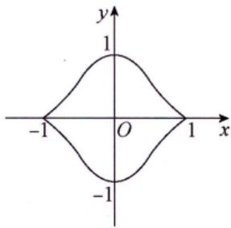  
图 5-7

最后，画出图像，如图5-7所示.

注也可借助上表分析出由每个分段点分出的区间内函数的单调性与曲线的凹凸性.

例5.12画出 $y = x^{x} \left( x > 0 \right)$ 的图像.

分析幂指函数求导常用公式： $u^{v} = \mathrm{e}^{v \ln u}$

解当 $x \to 0 ^ { + }$ 时，

$$
\lim_{x \to 0^{+}} x^{x} = \lim_{x \to 0^{+}} \mathrm{e}^{x \ln x} = \mathrm{e}^{\lim_{x \to 0^{+}} x \ln x} = \mathrm{e}^{\lim_{x \to 0^{+}} \frac{\ln x}{x}} = \mathrm{e}^{\lim_{x \to 0^{+}} \frac{\ln x}{x}}
$$

区 $y = f(x)$ ，则

$$
\begin{aligned} &f^{\prime}(x) = (x^{x})^{\prime} = (e^{x\ln x})^{\prime} = x^{x}(1 + \ln x) , \quad  为忠簸点  \quad\\ &f^{\prime\prime}(x) = [f^{\prime}(x)]^{\prime} = [(1 + \ln x)f(x)]^{\prime}\\ &= (1 + \ln x)f^{\prime}(x) + \frac{1}{x}f(x)\\ &= x^{x}\left[(1 + \ln x)^{2} + \frac{1}{x}\right].\\ \end{aligned}
$$

由 $x > 0$ ，得 $x ^ { x } > 0$ ，故f(x)>0，f"(x)>0.无拐点

令 $f^{\prime}(x) = 0$ ，解得 $x = \frac{1}{\mathrm{e}}$ . 因此f(x)在 $x = \frac{1}{\mathrm{e}}$ 处取得极小值，故函数图像如图5-8所示，

→在(0,1)上，f(x)<0：在(1,+)上，f(x)>0.

  
图5-8  
注当 $x \to +\infty$ 时， $\lim_{x \to +\infty} x^x = \exp \left\{ \lim_{x \to +\infty} x \ln x \right\} = +\infty$ ，且速度远超幂函数，从而也无斜渐近线.  
例5.13 画出 $y = \frac{\mathbf{e}^{x}}{x}$ 的图像.

解对于 $y = \frac{\mathrm{e}^{x}}{x}, \quad y^{\prime} = \frac{\mathrm{e}^{x}(x - 1)}{x^{2}} \xlongequal{令} 0$ ，得驻点x=1，且当 $x   =   0$ 时 $y ^ { \prime }$ 不存在.又 $y^{\prime\prime} = \frac{\mathrm{e}^{x}(x^{2} - 2x + 2)}{x^{3}}$ $\frac{\mathrm{e}^{x}\left[(x - 1)^{2} + 1\right]}{x^{3}}$ ，当 $x > 0$ 时， $y'' > 0$ ；当 $x < 0$ 时， $y'' < 0$ ；当 $x = 0$ 时， $y ^ { \prime \prime }$ 不存在.故列表如下.

<table><tr><td rowspan=1 colspan=1>x</td><td rowspan=1 colspan=1> $( - \infty ,   0 )$ </td><td rowspan=1 colspan=1>0</td><td rowspan=1 colspan=1>(0, 1)</td><td rowspan=1 colspan=1>1</td><td rowspan=1 colspan=1> $(1, +\infty)$ </td></tr><tr><td rowspan=1 colspan=1> $y ^ { \prime }$ </td><td rowspan=1 colspan=1>一</td><td rowspan=1 colspan=1></td><td rowspan=1 colspan=1>一</td><td rowspan=1 colspan=1></td><td rowspan=1 colspan=1>十</td></tr><tr><td rowspan=1 colspan=1> $y''$ </td><td rowspan=1 colspan=1>一</td><td rowspan=1 colspan=1></td><td rowspan=1 colspan=1>+</td><td rowspan=1 colspan=1></td><td rowspan=1 colspan=1>+</td></tr><tr><td rowspan=1 colspan=1>y</td><td rowspan=1 colspan=1>V</td><td rowspan=1 colspan=1></td><td rowspan=1 colspan=1>2</td><td rowspan=1 colspan=1>e</td><td rowspan=1 colspan=1>↑</td></tr></table>

由于 $\lim_{x \to -\infty} \frac{\mathrm{e}^x}{x} = 0, \quad \lim_{x \to 0^-} \frac{\mathrm{e}^x}{x} = -\infty, \quad \lim_{x \to 0^+} \frac{\mathrm{e}^x}{x} = +\infty$ $\lim_{x \to +\infty} \frac{\frac{e^x}{x}}{x} = \lim_{x \to +\infty} \frac{e^x}{x^2} = +\infty$ ，因此图形有一条水平渐近线 $y = 0$ ，一条铅直渐近线 $x = 0$ ，没有斜渐近线.二作图，如图5-9所示.

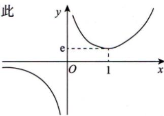  
图5-9

注由表达式首先确定定义域为 $(-\infty, 0) \cup (0, +\infty)$

★例5.14 画出 $r = \sin^{2} \theta \quad (0 \leqslant \theta \leqslant \pi)$ 在直角坐标系和极坐标系下的图像.

分析学会用直角坐标系的观点画极坐标的图.

解 $r = \sin^{2} \theta = \frac{1 - \cos 2\theta}{2} (0 \leqslant \theta \leqslant \pi)$

在直角坐标系的观点下，视θ为x，r为y，即可画出图像，如图5-10所示.

看变化趋势

图 5-10

用描点法，可画出其在极坐标下的图像，如图5-11所示.

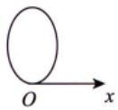  
图 5-11

(2) 给出参数方程.

a. 描点法.—→速度慢一些

直角坐标方程，—→借助函数性态画图像b. 化为极坐标方程.—借助直角坐标系的思想画极坐标图像

如 $\begin{cases}x = \sin t, \\y = \cos^{3}t\end{cases}(0 \leqslant t \leqslant 2\pi)$ 化为直角坐标方程为 $y^{2} = (1 - x^{2})^{3}$

## 九曲率及曲率半径（仅数学一、数学二）

表示曲线弯曲程度

设y(x)二阶可导，则曲线 $y = y(x)$ 在点(x，y(x))处的曲率公式为

$$
k = \frac{\left| y'' \right|}{\left[ 1 + \left( y' \right)^2 \right]^{\frac{3}{2}}}
$$

曲率半径的计算公式

$$
\frac{1}{k} = \frac{\left[ 1 + \left( y' \right)^2 \right]^{\frac{3}{2}}}{\left| y'' \right|} \quad (y'' \neq 0)
$$

注弯曲程度越大，曲率越大，曲率圆的半径越小.

基本都是考填空

重1779ん位 ↑例5.15 曲线 $\begin{cases}x = \cos^{3}t, \\y = \sin^{3}t\end{cases}$ 在 $t = \frac{\pi}{4}$ 对应点处的曲率为

分析主要考查参数方程求导.

解应填 $\frac{2}{3}$

用参数求导法，有

$$
\frac{\mathrm{d}y}{\mathrm{d}x} = \frac{y_{t}^{\prime}}{x_{t}^{\prime}} = \frac{3\sin^{2}t\cos t}{- 3\cos^{2}t\sin t} = - \tan t,\left. \frac{\mathrm{d}y}{\mathrm{d}x} \right|_{t = \frac{\pi}{4}} = - 1,
$$

$$
\frac{\mathrm{d}^{2} y}{\mathrm{d} x^{2}} = \left( - \tan t \right)^{\prime} \frac{\mathrm{d} t}{\mathrm{d} x} = - \frac{1}{\cos^{2} t} \cdot \frac{1}{- 3\cos^{2} t\sin t} = \left. \frac{1}{3\cos^{4} t\sin t} \cdot \frac{\mathrm{d}^{2} y}{\mathrm{d} x^{2}} \right|_{t = \frac{\pi}{4}} = \frac{4}{3} \sqrt{2}
$$

按曲率公式， $t = \frac{\pi}{4}$ 对应点处的曲率为

$$
k = \frac{\left| \frac{\mathsf{d}^{2} y}{\mathsf{d} x^{2}} \right|}{\left[ 1 + \left( \frac{\mathsf{d} y}{\mathsf{d} x} \right)^{2} \right]^{3/2}} \Bigg|_{t = \frac{\pi}{4}} = \frac{\frac{4}{3} \sqrt{2}}{2^{3/2}} = \frac{2}{3} .
$$

## 基础习题精练

## 习题

5.1 设函数f(x)，g(x)具有二阶导数，且 $g''(x) < 0$ .若 $g(x_0) = a$ 是g(x)的极值，则 $f[g(x)]$ 在 $x _ { 0 }$ 取极大值的一个充分条件是（）.(A) $f^{\prime}(a) < 0$ (B) $f^{\prime}(a) > 0$ (C) $f^{\prime\prime}(a) < 0$ (D) $f''(a) > 0$

5.2 设f(x)在[a,b]上可导，且在点 $x = a$ 处取最小值，在点x=b处取最大值，则（).(A) $f_{+}^{\prime}(a) \leqslant 0, f_{-}^{\prime}(b) \leqslant 0$ (B) $f_{+}^{\prime}(a) \leqslant 0, f_{-}^{\prime}(b) \geqslant 0$ (C) $f_{+}^{\prime}(a) \geqslant 0, f_{-}^{\prime}(b) \leqslant 0$ (D) $f _ { + } ^ { \prime } ( a ) \geqslant 0 , f _ { - } ^ { \prime } ( b ) \geqslant 0$

5.3 曲线 $y = \frac{x^{2} + x}{x^{2} - 1}$ 的渐近线条数为

5.4 曲线 $\tan \left( x + y + \frac{\pi}{4} \right) = \mathrm{e}^{y}$ 在点(0,0)处的切线方程为

5.5 曲线 $y = (x - 5)x^{\frac{2}{3}}$ 的拐点坐标为

5.6 函数 $y = x + 2\cos x$ 在区间 $\left[ 0 , \frac { \pi } { 2 } \right]$ 上的最大值为

5.7 曲线 $y = (2x - 1)\mathrm{e}^{\frac{1}{x}}$ 的斜渐近线方程为

5.8（仅数学一、数学二）曲线 $y = x^{2} + x(x < 0)$ 上曲率为 $\frac{\sqrt{2}}{2}$ 的点的坐标是

5.9 设函数y = y(x) 由方程

$$
2y^{3}-2y^{2}+2xy-x^{2}=1
$$

所确定，试求y=y(x)的驻点，并判别它是否为极值点

## 解答

5.1 (B) 解 由于 $g(x_{0})$ 是 g(x)的极值，故由题设知 $g^{\prime}(x_0) = 0$ .记 $y = f[g(x)]$ ，则$\left. \frac{\mathrm{d}y}{\mathrm{d}x} \right|_{x = x_0} = f^{\prime}(a)g^{\prime}(x_0) = 0.$ ，从而 $x   =   x _ { _ 0 }$ 是函数 $y = f[g(x)]$ 的驻点.由于

$$
\frac{\mathrm{d}^{2} y}{\mathrm{d} x^{2}} = \left\{ f^{\prime}[g(x)]g^{\prime}(x) \right\}^{\prime} = f^{\prime\prime}[g(x)][g^{\prime}(x)]^{2} + f^{\prime}[g(x)]g^{\prime\prime}(x) ,
$$

则

$$
\left. \frac{\mathrm{d}^{2} y}{\mathrm{d} x^{2}} \right|_{x = x_{0}} = f^{\prime}(a) g^{\prime \prime}(x_{0}) .
$$

由题设知 $g''(x_0) < 0$ ，所以，若 $f^{\prime}(a) > 0$ ，则可得到 $\left| \frac{\mathbf{d}^{2} y}{\mathbf{d} x^{2}} \right|_{x = x_{0}} < 0$ ，这正是函数 $y = f[g(x)]$ 在驻点$x   =   x _ { _ 0 }$ 处取得极大值的充分条件，从而可知选项(B)正确.

若 $f^{\prime}(a) < 0$ ，则可推出函数 $\left[ f \left[ g ( x ) \right] \right.$ 在 $x _ { 0 }$ 处取得极小值，故选项(A)不正确.

f[g(x)]在 $x _ { 0 }$ 处取得极大值，与 $f''(a)$ 的取值无关，即当 $f''(a) > 0$ 和 $f''(a) < 0$ 时都可能使 $f[g(x)]$ 在$x _ { 0 }$ 处取得极大值.

例如，取 $g(x)=-x^{2},\;f(x)=\mathrm{e}^{x},\;x_{0}=0$ ，则 g′(x) =−2x ， $g''(x) = -2 < 0, \; g(0) = 0$ 是 $g(x)$ 的极大值，$f[g(x)] = \mathrm{e}^{-x^2}$ 在x=0处取极大值，但 $f''(0)=\mathrm{e}^{0}=1>0$ ，故选项(C)不是充分条件.

又例如，取 $g(x) = -x^2, \quad f(x) = \ln(1+x), \quad x_0 = 0$ ，则 $f[g(x)] = \ln(1 - x^2)$ 在x=0处显然取得极大值，但此时 $f''(0)=-\frac{1}{(1+x)^2}\bigg|_{x=x_0}=-1<0$ ，故选项(D)不是充分条件.

5.2 (D) 解 因为f(a)是最小值，所以 $f(x) \geqslant f(a), x \in (a, b]$ ，又f′(a)存在，故

$$
f_{+}^{\prime}(a)=\lim_{x \to a^{+}}\frac{f(x)-f(a)}{x-a} \geq 0
$$

因为f(b)是最大值，所以 $f(x) \leqslant f(b),   x \in [a,   b)$ ，又f'(b)存在，故

$$
f_{-}^{\prime}(b)=\lim_{x \to b^{-}}\frac{f(x)-f(b)}{x-b} \geq 0
$$

注(1)本题考查可导函数在端点处取最值的必要条件，总结如下：

设f(x)在[a,b]上可导，则f(x)在[a,b]上必存在最大（小）值，且

①若f(x)在x=a处取a,b]上的最大（小）值，则 $f_{+}^{\prime}(a) \leqslant 0 \geqslant 0$

②若f(x)在x=b处取[a,b]上的最大（小）值，则 $f_{-}^{\prime}(b) \geqslant 0( \leqslant 0)$

(2) 若f(x)在[a, b]上可导，且在点 $x = c \in (a,   b)$ 处取最小或最大值，则必有f'(c)=0，此为费马定理.

(3)在考研中，要习惯函数f(x)的“升阶”或“降阶”.若本题命制成 $F(x)=\int_{a}^{x}f(t)\mathrm{d}t,\quad x\in[a,\;b]$ 此谓“升阶”，则 F(x)是f(x)在 [a,b]上的一个原函数，于是

①若f(x)在[a,b]上可导，且当f(x)在x=a处取得最大（小）值时，有 $F^{\prime\prime}_{+}(a) \leq 0 \geq 0$

②若f(x)在[a,b]上可导，且当f(x)在x=b处取得最大（小）值时，有 $F _ { - } ^ { \prime \prime } ( b ) \geqslant 0 ( \leqslant 0 )$ :

③若f(x)在 $\left[a,b\right] 上可$ 导，且当f(x)在 $x = c \in (a,   b)$ 处取得最大或最小值时，有 $F^{\prime\prime}(c) = 0$

5.3 2 解 因为 $y=\frac{x^{2}+x}{x^{2}-1}=\frac{x(x+1)}{(x-1)(x+1)}$ ，所以 $\lim_{x \to 1} y = \lim_{x \to 1} \frac{x(x + 1)}{(x - 1)(x + 1)} = \lim_{x \to 1} \frac{x}{x - 1} = \infty$ ，故x=1是曲线 $y = \frac{x^{2} + x}{x^{2} - 1}$ 的铅直渐近线，且是唯一的铅直渐近线.

又因为 $\lim_{x \to \infty} y = \lim_{x \to \infty} \frac{x^2 + x}{x^2 - 1} = 1$ ，所以y=1是曲线 $y = \frac{x^{2} + x}{x^{2} - 1}$ 的一条水平渐近线.同时该曲线无斜渐近线.综上可知，曲线 $y = \frac{x^{2} + x}{x^{2} - 1}$ 有2条渐近线.

5.4 y =-2x 解 方程变形为 $x + y + \frac{\pi}{4} = \arctan e^{y}$ ，方程两边对x求导得 $1 + y^{\prime} = \frac{\mathrm{e}^{y}}{1 + \mathrm{e}^{2y}}y^{\prime}$

将点(0,0)代入上式得 $y^{\prime}\big|_{(0,\;0)} = -2$ ，从而得到曲线在点(0,0)处的切线方程为 $y = - 2x$

5.5 (-1,-6) 解 $y=x^{\frac{5}{3}}-5x^{\frac{2}{3}}, y^{\prime}=\frac{5}{3}x^{\frac{2}{3}}-\frac{10}{3}x^{\frac{1}{3}}, y^{\prime\prime}=\frac{10}{9}x^{\frac{1}{3}}+\frac{10}{9}x^{\frac{4}{3}}=\frac{10(x+1)}{9\sqrt[3]{x^4}}$

令 $y'' = 0$ ，得x=-1，又x→0时， $y'' \to +\infty$ .由于在x=-1的左、右邻域内 $y''$ 变号，在x=0的左、右邻域内 $y''$ 不变号，故拐点为(-1,-6).

5.6 $\sqrt{3} + \frac{\pi}{6}$ 解 $y^{\prime} = 1 - 2\sin x, \quad y^{\prime\prime} = - 2\cos x$ ，令 $y^{\prime} = 0$ 得 $x = \frac{\pi}{6}, y''\left(\frac{\pi}{6}\right) = -\sqrt{3} < 0$ ，则$y = x + 2\cos x$ 在 $x = \frac{\pi}{6}$ 处取得极大值，又该函数在 $\left( 0 , \frac { \pi } { 2 } \right)$ 上极值点唯一，则该极大值点为函数在 $\left( 0 , \frac { \pi } { 2 } \right)$ 上的最大值点，又 $y(0)=2 , y\left(\frac{\pi}{2}\right)=\frac{\pi}{2}$ ，比较得函数在 $\left[ 0 , \frac { \pi } { 2 } \right]$ 上的最大值为 $y\left(\frac{\pi}{6}\right)=\sqrt{3}+\frac{\pi}{6}$

5.7 $y = 2x + 1$ 解

$$
a = \lim_{x \to \infty} \frac{y}{x} = \lim_{x \to \infty} \left( 2 - \frac{1}{x} \right) e^{\frac{1}{x}} = 2
$$

$$
b = \lim_{x \to \infty} (y - ax) = \lim_{x \to \infty} \left[ 2x(\mathrm{e}^{\frac{1}{x}} - 1) - \mathrm{e}^{\frac{1}{x}} \right] = \lim_{x \to \infty} \left[ \frac{2(\mathrm{e}^{\frac{1}{x}} - 1)}{\frac{1}{x}} - \mathrm{e}^{\frac{1}{x}} \right] = 1
$$

所以斜渐近线方程为 $y = 2x + 1$

5.8 (-1, 0) 解将 $y^{\prime} = 2x + 1, y^{\prime\prime} = 2$ 代入曲率公式 $k = \frac{\left| y'' \right|}{\left[ 1 + \left( y' \right)^2 \right]^{\frac{3}{2}}}$ ，得 $\frac{2}{\left[1+(2x+1)^{2}\right]^{\frac{3}{2}}}=\frac{\sqrt{2}}{2}$ ，整理后有 $x^{2} + x = 0$ ，由于 $x < 0$ ，因此得 $x = - 1$ ，又有 $y \big|_{x = -1} = 0$ ，故所求点的坐标为(-1,0).

5.9 解 方程两边对x求导可得

$$
3y^{2}y^{\prime}-2yy^{\prime}+xy^{\prime}+y-x=0\tag{*}
$$

令 $y ^ { \prime }   =   0$ ，由(\*)得 $y = x$ ，将其代入原方程有

$$
2x^{3}-x^{2}-1=0
$$

从而可得唯一驻点x=1.(\*)式两边再对x求导，得

$$
( 3 y ^ { 2 } - 2 y + x ) y ^ { \prime \prime } + 2 ( 3 y - 1 ) ( y ^ { \prime } ) ^ { 2 } + 2 y ^ { \prime } - 1 = 0 ,
$$

因此 $y'' \big|_{x = 1} = \frac{1}{2} > 0$ ，故x=1是 $y = y(x)$ 的极小值点.

## 第6讲

## 一元函数微分学的应用（二）—中值定理、微分等式与微分不等式

①连续函数+可导函数

②方程(数学二、三常考)

③用导数的方法证明(数学三常考)

<table><tr><td rowspan=1 colspan=1>考题</td><td rowspan=1 colspan=1>中值定理、微分等式与微分不等式</td></tr><tr><td rowspan=1 colspan=1>题型</td><td rowspan=1 colspan=1>选择题、填空题、解答题</td></tr><tr><td rowspan=1 colspan=1>目标</td><td rowspan=1 colspan=1>①理解闭区间上连续函数的性质(有界性、最大值和最小值定理、介值定理)，并会应用这些性质;②理解并会用罗尔定理、拉格朗日中值定理和泰勒定理，了解并会用柯西中值定理</td></tr><tr><td rowspan=1 colspan=1>重难点</td><td rowspan=1 colspan=1>①平均值定理；②罗尔定理的推论；③用函数性态证明微分不等式；④用中值定理证明微分不等式</td></tr></table>

## 基础知识结构

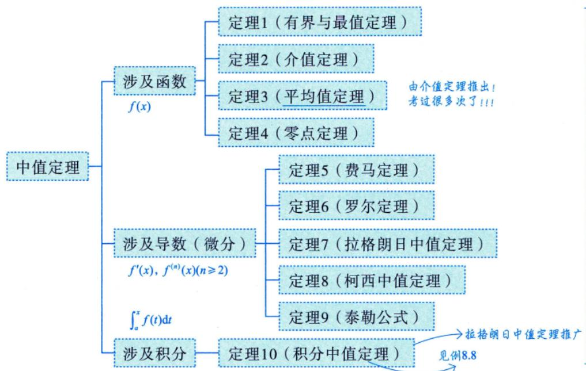

第6讲一元函数微分学的应用（二）——中值定理、微分等式与微分不等式

零点定理（证存在性）

配合起来考

微分等式方程的根，函数的零点，曲线的交点

单调性（证唯一性）

罗尔原话

★罗尔定理的推论

实系数奇次方程至少有一个实根

用函数性态证明

★首先考虑研究辅助函数F(x)的凹凸性、最值、正负

微分不等式数学一综合题中的一个小步骤

用常数变量化证明

用中值定理证明

★中值ξ， $a < \xi < b , f(a) < f(\xi) < f(b)$

## 基础内容精讲

## 中值定理

## 涉及函数的中值定理

设f(x)在[a,b]上连续，则

定理1(有界与最值定理) $m \leq f(x) \leq M$ ，其中m，M分别为f(x)在[a,b]上的最小值与最大值.

定理2(介值定理)当 $m \leqslant \mu \leqslant M$ 时，存在 $\xi \in [a,   b]$ ，使得 $f(\xi) = \mu$

如，f(x)在[0,2]上连续， $f(0)=0,\ f(1)=1$ ，则存在 $\xi \in (0,1)$ ，使 $f(\xi) = \frac{1}{2}$

(离散的)平均值定理： $f(\xi) = \frac{1}{n} \sum_{i=1}^{n} f(x_i)$

(连续的)平均值定理： $f(\xi) = \frac{1}{b - a}\int_{a}^{b}f(x)\mathrm{d}x  .$

定理3(平均值定理)当 $a < x_{1} < x_{2} < \cdots < x_{n} < b$ 时，在 $\left[ x _ { 1 } ,   x _ { n } \right]$ 内至少存在一点 $\xi$ ，使得

$$
f(\xi) = \frac{f(x_1) + f(x_2) + \cdots + f(x_n)}{n}
$$

注证 由闭区间连续函数的最值定理，得

$$
m \leqslant f(x_1) \leqslant M
$$

$$
m \leqslant f(x_{2}) \leqslant M,
$$

$$
m \leqslant f(x_n) \leqslant M
$$

$$
m \leqslant \frac{f(x_{1}) + \cdots + f(x_{n})}{n} \leqslant M,
$$

则存在 $\xi \in [x_1, x_n] \subset [a, b]$ 使得 $f(\xi) = \frac{f(x_1) + \cdots + f(x_n)}{n}$

定理4(零点定理)当 $f(a) \cdot f(b) < 0$ 时，存在 $\xi \in (a,   b)$ ，使得 $f(\xi) = 0$

a,b为无定义点，可直接用

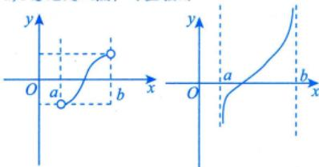

注推广的零点定理：若f(x)在(a， b) 内连续， $\lim_{x \to a^{+}} f(x) = \alpha, \quad \lim_{x \to b^{-}} f(x) = \beta$ 且 $\alpha \cdot \beta < 0$ ，则$f(x) = 0$ 在(a, b)内至少有一个根，这里 $a,b,\alpha,\beta$ 可以是有限数，也可以是无穷大.

例6.1 设函数f(x)在[0,1]上连续，且 $f(1)=0,\ f\left(\frac{1}{2}\right)=1$ ，证明：存在 $\eta \in \left( \frac{1}{2}, 1 \right)$ ，使得$f(\eta) = \eta$

分析涉及关系式，“做一至两步的逆运算”只需证 $f(\eta) - \eta = 0$

证令 $F(x) = f(x) - x$ ，则函数F(x)=f(x)−x在 $\left[ \frac{1}{2}, 1 \right]$ 上连续，且有

$$
F\left(\frac{1}{2}\right)=f\left(\frac{1}{2}\right)-\frac{1}{2}=\frac{1}{2}>0,F(1)=f(1)-1=-1<0,
$$

由于 $F\left(\frac{1}{2}\right) \cdot F(1) < 0$ ，根据零点定理可知，存在 $\eta \in \left( \frac{1}{2}, 1 \right)$ ，使得 $F(\eta) = 0$ ，即 $f(\eta) = \eta$

例6.2 设函数f(x)在区间[0,1]上连续，且 $f(1)>0,\lim_{x \to 0^{+}}\frac{f(x)}{x}<0$ .证明：方程 $f(x) = 0$ 在区间(0，1)内至少存在一个实根. 一般作为解答题的第一问→极限必须存在，才可和“0”比大小

证由 $\lim_{x \to 0^{+}} \frac{f(x)}{x} < 0$ 与极限的保号性可知，存在 $a \in (0,1)$ ，使得 $\frac{f(a)}{a} < 0$ ，即 $f(a) < 0$

又 $f(1) > 0$ ，所以存在 $b \in (a,1) \subset (0,1)$ ，使得 $f(b) = 0$ ，即方程 $f(x) = 0$ 在区间(0，1)内至少存在一个实根.

## 第6讲一元函数微分学的应用（二）——中值定理、微分等式与微分不等式

拉格朗日中值定理

$$
\int_{a}^{b} f(x) \mathrm{d}x \xleftarrow{} f(x) \xrightarrow{} f^{\prime}(x) \xrightarrow{} f^{(n)}(x) (n \geqslant 2).
$$

定积分/积分中值定理

泰勒公式

## 2涉及导数（微分）的中值定理

费马 (1601—1665)  
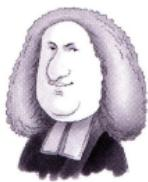

历史故事：费马，被称为最业余的数学家，比牛顿大42岁，是个律师。

1637年他在图书馆看书时，看到了 $x^{2} + y^{2} = z^{2}$ 必存在正整数解”，他违反规定写了一段话：

$\left\{ \begin{aligned} x^{3} + y^{3} &= z^{3} \\ x^{4} + y^{4} &= z^{4} \\ \cdots \\ x^{n} + y^{n} &= z^{n} \end{aligned} \right\}$ 一律没有正整数解.

费马说：“此处太小写不下，不予证明了”.费马大定理提出了好的问题，实际上，比解决它更好！怀尔斯于1994年证明出了该定理，此时已超40岁

①可导，左右导数存在且相等定理 5(费马定理)设f(x)在点 $x _ { 0 }$ 处满足 则 $f^{\prime}(x_0) = 0$ ②取极值，极值点

## 注（1)证明费马定理.

不妨假设f(x)在点 $x_{0}$ 处取得极大值，则存在 $x_{0}$ 的邻域 $U(x_{0})$ ，对任意的 $x \in U(x_0)$ ，都有 $\Delta f =$ $f(x) - f(x_0) \leq 0$ ，于是根据导数的定义与极限的保号性，有

$$
f^{\prime}_{-}(x_0) = \lim_{x \to x_0^{-}} \frac{f(x) - f(x_0)}{x - x_0} \geq 0,
$$

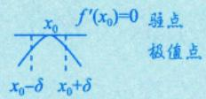

$$
f_{+}^{\prime}(x_{0}) = \lim_{x \to x_{0}^{+}} \frac{f(x) - f(x_{0})}{x - x_{0}} \leq 0
$$

又f(x)在点 $x _ { 0 }$ 处可导，于是 $f_{-}^{\prime}(x_{0}) = f_{+}^{\prime}(x_{0})$ ，故 $f^{\prime}(x_0) = 0$

(2)当一个人跑到最远处时，他的速度为零；当一个人跑得最快时，他的加速度为零.这些都是费马定理在生活中的通俗应用.

例6.3 (导数零点定理)设f(x)在[a,b]上可导，证明当 $f_{+}^{\prime}(a) \bullet f_{-}^{\prime}(b) < 0$ 时，存在 $\xi \in (a,   b)$ 使得 f'(x)存在 由此知最大值取在区间内，而 由此知最大值取在区间内，而区间内的器值必为极值 区间内的最值必为极值，端

$$
f^{\prime}(\xi) = 0
$$

## 证不妨设 $f_{+}^{\prime}(a)>0,f_{-}^{\prime}(b)<0$ ，于是

点的最值不一定是极值  
三 x  
a a+δ1 b-δ2 b(端点不谈论极值，因为在  
区间外侧并无定义)

由 $f_{+}^{\prime}(a)=\lim_{x \to a^{+}}\frac{f(x)-f(a)}{x-a}>0.$ 可得存在 $\delta_{_1} > 0$ ，在 $(a,   a + \delta_1)$ 内， $f(x) > f(a)$ 脱帽法由 $f_{-}^{\prime}(b)=\lim_{x \to b^{-}}\frac{f(x)-f(b)}{x-b}<0$ ，可得存在 $\delta_{2} > 0$ ，在 $(b - \delta_{2},   b)$ 内， $f(x) > f(b)$

故f(a)与f(b)均不是f(x)在[a,b]上的最大值，则f(x)在(a,b)内取得最大值，根据费马定理可知，存在 $\xi \in (a,   b)$ ，使得 $f^{\prime}(\xi) = 0$

定理 6(罗尔定理)

①在[a,b]上连续，

三个条件同时满足才可以

设f(x)满足②在(a,b)内可导，则存在 $\xi \in (a,   b)$ ，使得 $f^{\prime}(\xi) = 0$

③f(a) = f (b) ,

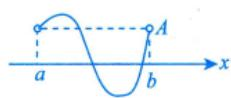

① f(a) = f(b) ;

② lim f (x) = lim f(x) ; x→→a x→b

罗尔(1652—1719) 11罗尔→f'(ξ) =0

$$
\lim_{x \to a^{+}} f(x) = +\infty, \quad \lim_{x \to b^{-}} f(x) = +\infty
$$

## 注1推广的罗尔定理.

设f(x)在(a, b) 内可导， $\lim_{x \to a^{+}} f(x) = \lim_{x \to b^{-}} f(x) = A$ ，则在(a, b) 内至少存在一点ξ，使f'(ξ) =0其中区间(a,b)可以是有限区间也可以是无穷区间，A可以是有限数也可以是无穷大.

注2罗尔定理的使用往往需要构造辅助函数，其方法总结如下.

(1)简单情形：题设f(x)即为辅助函数（研究对象）.

(2)复杂情形. 一般不用f，而用一个神秘的“F”——辅助函数。

①乘积求导公式 $(uv)^{\prime} = u^{\prime}v + uv^{\prime}$ 的逆用.

a. $\left[ f(x)f(x) \right]' = \left[ f^{2}(x) \right]' = 2f(x) \cdot f'(x)$

见到f(x)f'(x)，令 $F(x) = f^{2}(x)$ ·逆运算

b. $\left[ f(x) \cdot f'(x) \right]' = \left[ f'(x) \right]^2 + f(x)f''(x)$

见到 $\left[ f^{\prime}(x) \right]^{2} + f(x)f^{\prime\prime}(x)$ ，令 $F(x) = f(x)f^{\prime}(x)$

$$
\left[ f(x)\mathrm{e}^{\varphi(x)} \right]' = f'(x)\mathrm{e}^{\varphi(x)} + f(x)\mathrm{e}^{\varphi(x)} \cdot \varphi'(x) = \left[ f'(x) + f(x)\varphi'(x) \right]\mathrm{e}^{\varphi(x)}
$$

见到 $f^{\prime}(x) + f(x)\varphi^{\prime}(x)$ ，令 $F(x) = f(x)\mathrm{e}^{\varphi(x)}$

常考以下情形.

φ(x) =x⇒ 见到f'(x)+f(x)，令F(x)=f(x)ex

φ(x)=-x⇒ 见到f'(x)−f(x)，令 $F(x) = f(x)\mathrm{e}^{-x}$ BNAL

φ(x) =kx⇒见到f′(x)+kf(x)，令 $F(x) = f(x)\mathrm{e}^{kx}$

$(uv)'' = u''v + 2u'v' + uv''$ 亦有可能考到.

②商的求导公式 $\left( \frac{u}{v} \right)' = \frac{u'v - uv'}{v^2}$ 的逆用.

a $\left[ \frac{f(x)}{x} \right]' = \frac{f'(x)x - f(x)}{x^2}$

见到 $f^{\prime}(x)x - f(x), x \neq 0$ 令 $F(x) = \frac{f(x)}{x}$

b. $\left[ \frac{f'(x)}{f(x)} \right]' = \frac{f''(x)f(x) - \left[ f'(x) \right]^2}{f^2(x)}$

见到 $f''(x)f(x)-\left[f'(x)\right]^2,\ f(x)\neq0$ $F(x) = \frac{f^{\prime}(x)}{f(x)}$

$\left[ \ln f(x) \right]' = \frac{f'(x)}{f(x)}$ 故 $\left[ \ln f(x) \right]'' = \left[ \frac{f'(x)}{f(x)} \right]' = \frac{f''(x)f(x) - \left[ f'(x) \right]^2}{f^2(x)}$

见到 $f^{\prime\prime}(x)f(x)-\left[f^{\prime}(x)\right]^{2}, f(x)>0$ ，亦可考虑令 $F(x) = \ln f(x)$

事实上，这些辅助函数的构造不仅仅限于罗尔定理的使用.

例6.4 设f(x)在[0,3]上连续，在(0,3)内可导，且 $f(0)+f(1)+f(2)=3,\;f(3)=1$ .证明：必存在 $\xi \in (0,   3)$ ，使得 $f^{\prime}(\xi) = 0$

证因为f(x)在[0,3]上连续，所以f(x)在[0,2]上连续，且在[0,2]上必有最大值M和最小值 m，于是

$$
m \leqslant f(0) \leqslant M, \; m \leqslant f(1) \leqslant M, \; m \leqslant f(2) \leqslant M,
$$

故

$$
m \leq \frac{f(0) + f(1) + f(2)}{3} = 1 \leq M
$$

由介值定理可知，至少存在一点 $c \in [0, 2]$ ，使得 $f(c)=\frac{f(0)+f(1)+f(2)}{3}=1$

所以函数f(x)在[c,3]上满足罗尔定理的条件，于是存在 $\xi \in (c, 3) \subset (0, 3)$ ，使得 $f^{\prime}(\xi) = 0$

例6.5 设f(x)在[a,b]上连续，在(a,b)内可导， $f(a) = 0,   a > 0$ ，证明：存在 $\xi \in (a,   b)$ 使得 $f(\xi) = \frac{b - \xi}{a} f'(\xi)$

分析先将结论改写为 $f^{\prime}(\xi) - \frac{a}{b - \xi}f(\xi) = 0$ (对照 $f^{\prime}(x) + f(x)\varphi^{\prime}(x)$ )，所以构造辅助函数 $F(x) = f(x) \mathrm{e}^{\int \left( -\frac{a}{b-x} \right) \mathrm{d}x}$ =$f ( x ) ( b - x ) ^ { a }$ ，再利用罗尔定理即可. $\begin{aligned}\hat{F}(a) &= f(a)(b - a)^{a} = 0, \\\hat{F}(b) &= f(b)(b - b)^{a} = 0\end{aligned}$

证令 $F(x) = f(x)(b - x)^a$ ，显然 $F(a) = F(b) = 0$ ，由罗尔定理知，存在 $\xi \in (a,   b)$ ，使得 $F^{\prime}(\xi) = 0$ 即 $f^{\prime}(\xi)(b - \xi)^{a} - af(\xi)(b - \xi)^{a - 1} = 0$ ，已知 $a > 0$ ，故 $f(\xi) = \frac{b - \xi}{a} f'(\xi)$

注上面是证明一阶导数为0，也就是使用一次罗尔定理的问题，但有些题目涉及二阶导数为0，即要多次使用罗尔定理，这种问题的难点是要找到函数值相等的三个不同点，即 $f(a) = f(b) = f(c)$

妨设 $a<b<c$ ，分别在[a,b],[b,c]上使用罗尔定理，有 $f^{\prime}(\xi_{1}) = f^{\prime}(\xi_{2}) = 0, \quad \xi_{1} \in (a, b), \quad \xi_{2} \in (b, c)$ 进而在 $[ \xi _ { 1 } , \xi _ { 2 } ]$ 上再对 $f^{\prime}(x)$ 使用罗尔定理，得 $f^{\prime\prime}(\xi) = 0$ ，其中 $\xi \in (\xi_1, \xi_2) \subset (a, c)$ .如例 6.6.

  
由F'(ξ1)=F'(ξ2)=0，得F"(ξ)=0

例6.6 设函数f(x)在[0,1]上连续，在(0,1)内二阶可导，过点A(0，f(0))与点B(1，f(1))的直线与曲线 $y = f(x)$ 相交于点 C(c， f(c))，其中 $0 < c < 1$ ，证明：存在 $\xi \in (0,1)$ ，使得 $f^{\prime\prime}(\xi) = 0$

证根据题意，过点A与点B的直线方程为 $y_{1} = \left[ f(1) - f(0) \right] x + f(0)$

$\cdot F(x)=f(x)-y_{1}=f(x)-\left[f(1)-f(0)\right]x-f(0),\quad  又  f(c)=\left[f(1)-f(0)\right]\cdot c+f(0),\quad  且  F(0)=0,\quad F(1)=0$ $F(c)=f(c)-\left[f(1)-f(0)\right]\cdot c-f(0)=0$ ，则F(x)在 $\left[ 0 ,   c \right]$ 与[c,1]上均满足罗尔定理的条件，于是可得 $F^{\prime}(\xi_{1}) = F^{\prime}(\xi_{2}) = 0, \; \xi_{1} \in (0, c), \; \xi_{2} \in (c, 1)$ 因为F(x)有三个零点5cx

再由罗尔定理可得 $F^{\prime\prime}(\xi)=f^{\prime\prime}(\xi)=0,\ \xi\in(\xi_1,\ \xi_2)\subset(0,1)$ ，命题得证.

公式直线方程 $y_{1}-f(0)=\frac{f(1)-f(0)}{1-0}(x-0)$

## 注大于等于2阶为高阶.

若证 $f^{(n)}(\xi) = 0$ 用罗尔定理可能性大；

若证 $f^{(n)}(\xi) \neq 0$ （不等式）用泰勒公式可能性大.

例6.7 设函数f(x)在区间[0,1]上具有二阶导数，且 $f(1)>0,\lim_{x \to 0^{+}}\frac{f(x)}{x}<0$ .证明：方程$f(x)f''(x)+[f'(x)]^2=0$ 在区间(0,1)内至少存在两个不同实根. 说明函数f(x)在闭区间上左端点右连续，右端点左连续

分析辅助函数为 $F(x) = f(x) \cdot f^{\prime}(x)$ ，即证 $\begin{cases}F^{\prime}(\xi_{1}) = 0, \\F^{\prime}(\xi_{2}) = 0,\end{cases}$ 其中 $\xi _ { 1 }$ 与 $\xi _ { z }$ 不相等.

证由题设知f(x)连续且 $\lim_{x \to 0^{+}} \frac{f(x)}{x}$ 存在，所以f(0)=0.又由例6.2知f(b)=0， $b \in (0,1)$ ，由罗尔$\lim_{x \to 0^{+}} \frac{f(x)}{x} < 0 \quad  和  \quad \lim_{x \to 0^{+}} f(x) = 0 = f(0)$ 定理知，存在 $c \in (0,   b) \subset (0,   1)$ ，使得

$$
f^{\prime}(c) = 0
$$

$F(x) = f(x)f^{\prime}(x)$ ，由题设知F(x)在区间[0,b]上可导，且

$$
F(0)=0,\;F(c)=0,\;F(b)=0.\;  由 \;f^{\prime}(c)=0\; 得到
$$

根据罗尔定理，存在 $\xi \in (0,c), \eta \in (c,b)$ ，使得 $F^{\prime}(\xi) = F^{\prime}(\eta) = 0$ ，即 $\xi , \eta$ 是方程 $f(x)f''(x)+$ $\left[ f^{\prime}(x) \right]^{2} = 0$ 在区间(0,1)内的两个不同实根.

定理7(拉格朗日中值定理)

设f(x)满足 $\left\{ \begin{aligned} \textcircled{1}  在  \left[ a , b \right] \\ \textcircled{2}  在  \left( a , b \right) \end{aligned} \right.$ 上连续， 则存在 $\xi \in (a,   b)$ ，使得内可导，

$$
f(b) - f(a) = \underbrace{f^{\prime}(\xi)}_{ 变化率 } \underbrace{(b - a)}_{ 烹值 }
$$

或者写成

若在区间(a, b)上处处变化率为0，则f(b)=f(a)为常数

  
拉格朗日 (1736—1813)

$$
f^{\prime}(\xi)=\frac{f(b)-f(a)}{b-a}
$$

注见到f(a)-f(b)或f与f'的关系，一般想到用拉格朗日中值定理.拉格朗日中值定理的作用是用导函数的值来控制函数值的增减.

例6.8 若f(x)在 $\left[ (a,   b) \right.$ 内可导且f′(x)有界，证明：f(x)在(a,b)内有界.

证 因为f(x)在(a,b)内可导，所以f(x)在(a，b)内连续，因此对任意 $x_{0} \in (a, b), f(x_{0})$ 存在，对任意 $x \in (a,   b)$ ，不妨设 $x < x _ { 0 }$ ，对f(x)在 $\left[ x ,   x _ { 0 } \right]$ 上应用拉格朗日中值定理，有→在(a, b) 内取闭区间[x,x0]

$$
f(x)-f(x_{0})=f^{\prime}(\xi)(x-x_{0}),\ \xi\in(x,\ x_{0})
$$

则 $\left| f(x) \right| \leqslant \left| f(x_0) \right| + \left| f^{\prime}(\xi) \right| \left| x - x_0 \right|$ ，由于f′(x)有界，故存在 $k > 0$ ，使得对任意 $x \in (a,   b)$ ，有 $\left| f^{\prime}(x) \right| \leq k$ 学会翻译数学名词 ★关系式

$$
\left| f^{\prime}(\xi) \right| \leqslant k
$$

$$
\left| f(x) \right| \leqslant \left| f(x_0) \right| + k \left| x - x_0 \right| \leqslant \left| f(x_0) \right| + k(b - a) \xlongequal{ 记 } M,
$$

即f(x)在(a，b)内有界.

$$
\begin{aligned}\geqslant \left| f(x) \right| = & \left| f(x_0) + f^{\prime}(\xi)(x - x_0) \right| \\\leqslant & \left| f(x_0) \right| + \left| f^{\prime}(\xi) \right| \left| x - x_0 \right| \\\leqslant & \left\| \right. \\\leqslant & \left.  数  + k \cdot (b - a) \right. \\\left.  决  \left| A \right| - \left| B \right| \leqslant \left| A + B \right| \leqslant \left| A \right| + \left| B \right| \right.\end{aligned}
$$

例6.9 设f(x)在[0,1]上连续，在(0,1)内可导，f(0)=0，且f(x)在[0,1]上不恒等于零.证∃a∈(0,1]，使f(a)≠0明：存在 $\xi \in (0,1)$ ，使得 $f(\xi) f^{\prime}(\xi) > 0$

分析 $F(x)=\frac{1}{2}f^{2}(x),\quad\frac{1}{2}f^{2}\to f^{\prime}\to(f^{\prime})^{2}+ff^{\prime\prime}$ ，欲证 $F^{\prime}(\xi) = 0$ 想到罗尔定理；欲证 $F ^ { \prime } ( \xi )   >   0$ 想到拉格朗日中值定理.

证令 $F(x)=\frac{1}{2}f^{2}(x)$ ，则 $F(0)=\frac{1}{2}f^{2}(0)=0$ ，因为f(x)不恒为0，于是必存在某点 $a \in (0,1]$ 使得 $f(a) \neq 0$ ，则 $F(a)=\frac{1}{2}f^{2}(a)>0$ ，由拉格朗日中值定理可知，存在 $\xi \in (0, a) \subset (0, 1)$ ，使得函数值不等于0，平方大于0$F^{\prime}(\xi)=\frac{F(a)-F(0)}{a-0}>0$ ，即 $f(\xi) f^{\prime}(\xi) > 0$

★例6.10 设函数f(x)满足f(0)=0，且当 $x > 0$ 时， $f(x) < 0,\ f^{\prime}(x) < 0,\ f^{\prime\prime}(x) > 0$ ，则当 $0 < a <$ $x < b$ 时，有().

(A) $xf(x) > af(a)$ (B) $bf(b) > xf(x)$ (C) $xf(a) > af(x)$ (D) $xf(b) > bf(x)$

## 解应选(D).

令 $g(x) = x f(x), \; x > 0$ ，则 $g^{\prime}(x) = f(x) + x f^{\prime}(x) < 0,   g(x)$ 单调减少，故当 $0 < a < x < b$ 时， $g(b) <$ $g(x) < g(a)$ ，即 $bf(b) < xf(x) < af(a)$ ，选项(A)，(B)错误.

再令 $h(x) = \frac{f(x)}{x},   x > 0$ ，则

$$
h^{\prime}(x) = \frac{\frac{x f^{\prime}(x) - f(x)}{x^{2}}}{x} = \frac{\frac{x f^{\prime}(x) - f(x)}{x^{2}}}{x} = \frac{\frac{x f^{\prime}(x) - f(x)}{x}}{x} = \frac{\frac{x f^{\prime}(x) - f(x)}{x}}{x}
$$

其中 $0 < \xi < x$ .由 $f''(x) > 0$ ，知 f′(x)单调增加， $f^{\prime}(x) > f^{\prime}(\xi)$ ，则 $h ^ { \prime } ( x ) > 0 , h ( x )$ 单调增加，故当$0 < a < x < b$ 时， $h(a) < h(x) < h(b)$ ，即 $\frac{f(a)}{a} < \frac{f(x)}{x} < \frac{f(b)}{b}$ ，也即 $af(x) > xf(a),   xf(b) > bf(x)$ ，选项(C)

定理8(柯西中值定理)用参数方程来表达

①在[a,b]上连续，设 $f(x),   g(x)$ 满足 ②在(a，b)内可导，则存在 $\xi \in (a,   b)$ ，使得③ $g^{\prime}(x) \neq 0$

法国科学院院长拉格朗日（欧拉的学生）的学生，微积分收官人之一.数学故事：拉格朗日让其父亲答应柯西15岁前不学数学，15岁后拉格朗日亲自来教

  
柯西 (1789—1857)

★往往考查一个具体函数，一个抽象函数

$\frac{f(b) - f(a)}{g(b) - g(a)} = \frac{f^{\prime}(\xi)}{g^{\prime}(\xi)} \xrightarrow{ 引一个 \xi}  基数$ 方程 $\begin{cases}x = g(t), \\y = f(t)\end{cases}$ 求导而来”

例6.11 设f(x)在[a，b]上连续，在(a,b)内可导， $0 < a < b$ ，证明：至少存在一点 $\xi \in (a,   b)$ 使得 $f(b) - f(a) = \xi \left| \ln \frac{b}{a} \right| f^{\prime}(\xi)$ ln a >0

证 因为f(x)与g(x)=lnx在[a,b]上连续，在(a,b)内可导，且 $g^{\prime}(x)=\frac{1}{x} \neq 0(0<a<x<b)$ ，即f(x)与g(x)=lnx在[a,b]上满足柯西中值定理的条件，则至少存在一点 $\xi \in (a,   b)$ ，使得

$$
\frac{f(b) - f(a)}{\ln b - \ln a} = \frac{f^{\prime}(\xi)}{\frac{1}{\xi}},
$$

即

$$
f(b) - f(a) = \xi \ln \frac{b}{a} f^{\prime}(\xi)
$$

## 定理9(泰勒公式)徽分中值定理

此公式适用于区间[a，b]，常在证明题中使用，如证不等(1)带拉格朗日余项的n阶泰勒公式. 式、中值等式等

设f(x)在点 $x _ { 0 }$ 的某个邻域内n+1阶导数存在，则对该邻域内的任意点x，有

区间上

$$
f(x)=f(x_{0})+f^{\prime}(x_{0})(x-x_{0})+\cdots+\frac{1}{n!}f^{(n)}(x_{0})(x-x_{0})^{n}+\frac{f^{(n+1)}(\xi)(x-x_{0})^{n+1}}{(n+1)!}
$$

其中 $\xi$ 介于 $x ,   x_0$ 之间.

此公式仅适用于点 $x = x _ { 0 }$ 及其邻域，常用于研究点 $x   =   x _ { 0 }$ 处的某些结论，如求极限、判定无穷小的阶数、判定极值等

(2) 带佩亚诺余项的n阶泰勒公式.

设f(x)在点 $x _ { 0 }$ 处n阶可导，则存在 $x _ { 0 }$ 的一个邻域，对于该邻域内的任意点x，有

局部上

$$
f(x) = f(x_0) + f'(x_0)(x - x_0) + \cdots + \frac{1}{n!}f^{(n)}(x_0)(x - x_0)^n + o((x - x_0)^n)
$$

思想：用多项式来近似表示f(x)

注1当 $x_{0} = 0$ 时的泰勒公式称为麦克劳林公式.

$$
f(x)=f(0)+f^{\prime}(0)x+\frac{f^{\prime\prime}(0)}{2!}x^{2}+\cdots+\frac{f^{(n)}(0)}{n!}x^{n}+\frac{f^{(n+1)}(\xi)}{(n+1)!}x^{n+1}
$$

拉格朗日余项

$$
f(x)=f(0)+f^{\prime}(0)x+\frac{f^{\prime\prime}(0)}{2!}x^{2}+\cdots+\frac{f^{(n)}(0)}{n!}x^{n}+\frac{f^{(n)}(0)}{n!}
$$

## 注2几个重要函数的麦克劳林展开式.

$$
\mathrm{e}^{x}=1+x+\frac{1}{2!}x^{2}+\cdots+\frac{1}{n!}x^{n}+o(x^{n})
$$

$$
\sin x = x - \frac{x^{3}}{3!} + \cdots + (-1)^{n} \frac{x^{2n+1}}{(2n+1)!} + o(x^{2n+1})
$$

$$
\cos x = 1 - \frac{x^{2}}{2!} + \frac{x^{4}}{4!} - \cdots + (-1)^{n} \frac{x^{2n}}{(2n)!} + o(x^{2n})
$$

$$
\frac{1}{1 - x} = 1 + x + x^{2} + \cdots + x^{n} + o(x^{n})
$$

$$
\frac{1}{1 + x} = 1 - x + x^{2} - \cdots + (-1)^{n}x^{n} + o(x^{n})
$$

$$
\ln (1 + x) = x - \frac{x^{2}}{2} + \frac{x^{3}}{3} - \cdots + (-1)^{n-1} \frac{x^{n}}{n} + o(x^{n})
$$

$$
( 1 + x ) ^ { \alpha } = 1 + \alpha x + \frac { \alpha ( \alpha - 1 ) } { 2 ! } x ^ { 2 } + \cdots + \frac { \alpha ( \alpha - 1 ) \cdots ( \alpha - n + 1 ) } { n ! } x ^ { n } + o ( x ^ { n } )\tag{5) 的推广}
$$

记住前三项即可

例6.12 设函数f(x)在[0,1]上二阶可导，且 $\int_{0}^{1} f(x) \mathrm{d}x = 0$ ，则（).(A)当 $f^{\prime}(x) < 0$ 时， $f\left(\frac{1}{2}\right)<0.$ (B) 当 $f''(x) < 0$ 时， $f\left(\frac{1}{2}\right) < 0$ (C) 当f'(x)>0时， $f\left(\frac{1}{2}\right) < 0$ (D)当 $f''(x) > 0$ 时， $f\left(\frac{1}{2}\right)<0.$

分析与高阶导数有关的不等式考虑泰勒公式.

解应选 (D).

方法一已知f(x)在[0,1]上二阶可导，则由带拉格朗日余项的泰勒公式有

$$
f(x)=f\left(\frac{1}{2}\right)+f^{\prime}\left(\frac{1}{2}\right)\left(x-\frac{1}{2}\right)+\frac{1}{2}f^{\prime\prime}(\xi)\left(x-\frac{1}{2}\right)^{2},
$$

可从几何上直接得出

其中ξ介于x与 $\frac { 1 } { 2 }$ 之间.对上式在[0，1]上取积分得

$$
\int_{0}^{2x_{0}} (x - x_{0}) \mathrm{d}x = 0
$$

$$
\begin{aligned}\int_{0}^{1} f(x) \mathrm{d}x &= \int_{0}^{1} f\left(\frac{1}{2}\right) \mathrm{d}x + \int_{0}^{1} f\left(\frac{1}{2}\right)\left(x - \frac{1}{2}\right) \mathrm{d}x + \frac{1}{2} \int_{0}^{1} f''(\xi)\left(x - \frac{1}{2}\right)^2 \mathrm{d}x \\&= f\left(\frac{1}{2}\right) + f'\left(\frac{1}{2}\right) \cdot \frac{1}{2}\left(x - \frac{1}{2}\right)^2 + \frac{1}{2} \int_{0}^{1} f''(\xi)\left(x - \frac{1}{2}\right)^2 \mathrm{d}x = 0\end{aligned}
$$

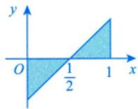

移项整理得 $f\left(\frac{1}{2}\right)=-\frac{1}{2}\int_{0}^{1}f^{\prime\prime}(\xi)\left(x-\frac{1}{2}\right)^{2}\mathrm{d}x$ →关，是ξ=ξ(x)，不是常数. f"(ξ)不能提至积分号外，因为此处的ξ与x有

故当 $f''(x) > 0$ 时，有 $f^{\prime\prime}(\xi) > 0$ ，则 $f\left(\frac{1}{2}\right)<0.$ . 因此选(D). 由积分保号性. $\int_{0}^{1} f''(\xi) \left( x - \frac{1}{2} \right)^2   dx > 0$

方法二 先写出泰勒公式 $f(x)=f\left(\frac{1}{2}\right)+f^{\prime}\left(\frac{1}{2}\right)\left(x-\frac{1}{2}\right)+\frac{f^{\prime\prime}(\xi)\left(x-\frac{1}{2}\right)^2}{2}, \quad \xi\in(x,\frac{1}{2})\subset(0,1)$ →(((2')若 $f''(\xi) > 0$ ，则 $\frac{f''(\xi)}{2}\left(x - \frac{1}{2}\right)^2 \geq 0$ ，故 $f(x) \geqslant f\left(\frac{1}{2}\right) + f^{\prime}\left(\frac{1}{2}\right)\left(x - \frac{1}{2}\right)$

对上式两边同时积分，在[0,1]上有

$$
\int _ { 0 } ^ { 1 } f ( x ) \mathrm { d } x > \int _ { 0 } ^ { 1 } \left[ f \left( \frac { 1 } { 2 } \right) + f \left( \frac { 1 } { 2 } \right) \left( x - \frac { 1 } { 2 } \right) \right] \mathrm { d } x ,
$$

故

$$
\int _ { 0 } ^ { 1 } \left[ f \left( \frac { 1 } { 2 } \right) + f \left( \frac { 1 } { 2 } \right) \left( x - \frac { 1 } { 2 } \right) \right] \mathrm { d } x < 0 ,
$$

因为 $\int_{0}^{1} f^{\prime}\left(\frac{1}{2}\right)\left(x - \frac{1}{2}\right) \mathrm{d}x = 0$ ，所以 $\int_{0}^{1} f\left(\frac{1}{2}\right) \mathrm{d}x < 0, f\left(\frac{1}{2}\right) < 0$

例6.13 设函数f(x)在区间[-1,1]上具有三阶连续导数，且 $f(-1)=0,\ f(1)=1,\ f^{\prime}(0)=0$ ，证

明：在区间(-1,1)内至少存在一点 $\xi$ ，使 $f^{m}(\xi) = 3$

分析遇到f与 $f^{(n)}(n \geq 2)$ 的关系，考虑泰勒公式.

证将f(x)在x=0处展开成带拉格朗日余项的二阶泰勒公式，得

$$
f(x) = f(0) + f'(0)x + \frac{1}{2!}f''(0)x^2 + \frac{1}{3!}f'''(\eta)x^3,
$$

其中 $\eta$ 介于0与x之间， $x \in [-1,1]$

分别令x=-1和 $x   =   1$ ，并结合已知条件，得

$$
0 = f(-1) = f(0) + \frac{1}{2} f''(0) - \frac{1}{6} f'''(\eta_1), -1 < \eta_1 < 0,
$$

$$
1 = f(1) = f(0) + \frac{1}{2} f''(0) + \frac{1}{6} f'''(\eta_2), \; 0 < \eta_2 < 1,
$$

两式相减，可得 $f^{m}(\eta_{1}) + f^{m}(\eta_{2}) = 6$

由 $f'''(x)$ 的连续性知， $f'''(x)$ 在区间 $\left[ \eta _ { 1 } , \eta _ { 2 } \right]$ 上有最大值和最小值，设它们分别为M和m，则有

$$
m \leq \frac{1}{2} \left[ f'''(\eta_1) + f'''(\eta_2) \right] \leq M, \quad m \leq f'''(x) \leq M, \quad m \leq f'''(\eta_1) \leq M,
$$

再由连续函数的介值定理知，至少存在一点 $\xi \in [\eta_{1}, \eta_{2}] \subset (-1, 1)$ ，使

$$
f'''(\xi) = \frac{1}{2} \left[ f'''(\eta_1) + f'''(\eta_2) \right] = 3
$$

## 注泰勒公式：

$$
f(x) = f(x_0) + f'(x_0)(x - x_0) + \frac{1}{2!}f''(x_0)(x - x_0)^2 + \frac{1}{3!}f'''(\eta)(x - x_0)^3
$$

关键是把握好展开点 $x _ { 0 }$ (取已知导数值的点或待证导数值的点)和被展开点x(取已知函数值的点或特殊点，如端点、中间点等)，同时要想办法消去未知的函数项或导数项，向结论靠拢.

## 微分等式

方程f(x)=0的根就是函数f(x)的零点.从几何上讲，方程的根作为两条曲线的交点，代数语言$f(x) = g(x)$ 的根”与几何语言“曲线 $f ( x )$ 与 $g ( x )$ 的交点”，两者概念不同，但描述的是同一件事.基于此，为讨论方程的根，有时可改为讨论曲线的交点.讨论方程根的问题(也称为函数的零点问题)通常可以考虑下面这些方法.

## 1零点定理（证明根的存在性）

若f(x)在[a,b]上连续，且 $f(a)f(b) < 0$ ，则 $f(x) = 0$ 在(a,b)内至少有一个根.

## 2单调性（证明根的唯一性）

若f(x)在(a,b)内单调，则f(x)=0在(a,b)内至多有一个根，这里区间(a,b)可以是有限区间也可以是无穷区间.

## ③ 罗尔定理及其推论

当不易使用零点定理时，可考虑罗尔定理及其推论.(罗尔定理见“一、2.定理 $6 \text{" })$

注若f(x)在区间I上n阶可导，且 $f^{(n)}(x) \neq 0$ ，即 $f^{(n)}(x) = 0$ 无实根(至多有0个根)，于是 $f(x) = 0$ 至多有n个根.如 $f^{m}(x) \neq 0$ ，则 $f(x) = 0$ 至多3个根（以阶数换个数）.

证（反证法）假设f(x)=0在I上至少有n+1个实根，此处只证明n+1个根时推出矛盾，其余同理，则 $f(x_{1}) = f(x_{2}) = \cdots = f(x_{n + 1}) = 0$

不妨设 $x_{1} < x_{2} < \cdots < x_{n+1}$ 由罗尔定理，则 $f^{\prime}(x) = 0$ 至少有n个实根（每一个小区间用罗尔定理）.依次逐阶递推，则 $f^{\prime\prime}(x) = 0$ 至少有n-1个实根， $\cdots, f^{(n)}(x) = 0$ 必至少有一个实根，设为ξ，即 $f^{(n)}(\xi) = 0$ ，与题干矛盾，故假设不成立，原命题得证.

事实上有更一般的结论，即罗尔原话（罗尔定理的推论）：若 $f^{(n)}(x) = 0$ 至多有k个根，则 $f(x) = 0$ 阶数降几个，根个数 $( 1 ) a \pi  不$ 至多有k+n个根.如 $f^{m}(x) = 0$ 至多一个根，则 $f^{\prime}(x) = 0$ 至多3个根.

## 4实系数奇次方程至少有一个实根

## 注证明任何实系数奇次方程

$$
x^{2n + 1} + a_{1}x^{2n} + \cdots + a_{2n}x + a_{2n + 1} = 0
$$

至少有一个实根.

证设

$$
f(x)=x^{2n+1}+a_1x^{2n}+\cdots+a_{2n}x+a_{2n+1}
$$

则 $\lim_{x \to +\infty} f(x) = +\infty, \quad \lim_{x \to -\infty} f(x) = -\infty$ ，由f(x)的连续性及推广的零点定理，知存在 $\xi \in (-\infty, +\infty)$ ，使$f(\xi) = 0$ ，即 $f(x) = 0$ 至少有一个实根

例6.14 在区间 $(-\infty, +\infty)$ 内，方程 $\left| x \right|^{\frac{1}{4}} + \left| x \right|^{\frac{1}{2}} - \cos x = 0$ ( ).

(A)无实根

(B)有且仅有一个实根

(C)有且仅有两个实根

(D)有无穷多个实根

## 解应选(C).

$$
\left| x \right|^{\frac{1}{4}} > 1, \left| x \right|^{\frac{1}{2}} > 1, \left| x \right|^{\frac{1}{4}} + \left| x \right|^{\frac{1}{2}} - \cos x > 0
$$

记 $f(x) = \left| x \right|^{\frac{1}{4}} + \left| x \right|^{\frac{1}{2}} - \cos x$ $f(x) > 0$ ，故只需判断 $f(x) = 0$ 故无实根在[0,1]内有无实根即可.因为 $f(0)=-1<0,\ f(1)=2-\cos1>0$ ，且当 $x \in (0,1)$ 时， $f^{\prime}(x) = \frac{1}{4}x^{-\frac{3}{4}} +$ 不是方程的根 故只需研究$\frac{1}{2}x^{-\frac{1}{2}} + \sin x > 0$ ，所以f(x)=0在(0，+∞)内有且仅有一个实根.故在 $(-\infty, +\infty)$ 内f(x)=0有且仅有两对称区间上的偶函数个实根. 故答案选(C).

注此题若换元，令 $\vert x \vert ^ { \frac { 1 } { 4 } } = t$ 方程变为 $t + t^{2} - \cos t^{4} = 0$ ，计算时看起来更“舒服”

$$
3a^{2}-5b<0
$$

$$
x^{5}+2ax^{3}+3bx+4c=0
$$

(A)无实根

(C)有三个不同实根

## 解应选(B).

结论

由于 $f(x)=x^{5}+2ax^{3}+3bx+4c$ 是奇次多项式，故方程f(x)=0至少有一个实根，令 $f^{\prime}(x) = 0$ ，可知双二次方程 $5x^{4} + 6ax^{2} + 3b = 0$ 对应于 $x^{2}$ 的判别式 $\Delta = 12(3a^{2} - 5b) < 0$ ,则方程f′(x)=0无实根，f(x)单调，$f(x) = 0$ 罗尔定理的推论←所以方程 有唯一实根.故答案选(B)

$$
t = x^{2} , \quad  则  \quad 5t^{2} + 6at + 3b = 0, \quad \varDelta = 36a^{2} - 60b = 12(3a^{2} - 5b) < 0
$$

## 例6.16 证明 $2^{x}-x^{2}-1=0$ 有且仅有三个根.

## 证①存在性.

令 $f(x) = 2^{x} - x^{2} - 1 = 0$ ，显然 $x_{1} = 0, x_{2} = 1$ 为根，又 $f(2)=-1<0,\;f(5)=2^{5}-25-1=6>0$ ，则$f(x) = 0$ 在(2，5)内至少有一个根，即f(x)=0至少有三个根.

②唯一性.

由 $f^{\prime}(x)=2^{x}\cdot\ln 2-2x,\ f^{\prime\prime}(x)=2^{x}\cdot\ln ^{2}2-2,\ f^{\prime\prime}(x)=2^{x}\cdot\ln ^{3}2\neq0$ ，知f(x)=0至多有三个根，即$f(x) = 0$ 有且仅有三个根.单调性不好判断就继续求导 $\xrightarrow{ 一一一一 } f''(x) = 0$ 至多0个根 $\frac{ 阶数换 }{ 个数 } f(x) = 0$ 至多0+3=3个根例6.17已知方程 $\mathbf { e } ^ { x } = k x$ 有且仅有一个实根，则k的取值范围是

分析含参方程(不等式)的讨论.题中“有且仅有一个实根”表示 $y = \frac { \mathbf { e } ^ { x } } { x }$ 与y=k两条曲线的交点仅有一个.  
解应填k=e或k<0.

方法一 直接法.令 $F(x) = \mathrm{e}^{x} - kx$ ，则 $F^{\prime}(x) = \mathrm{e}^{x} - k$ ，当 $k < 0$ 时， $F^{\prime}(x) > 0,   F(x)$ 单调增加，又$\lim_{x \to -\infty} F(x) = -\infty, \lim_{x \to +\infty} F(x) = +\infty$ ，则 $F(x) = 0$ 有且仅有一个实根；

当k=0时， $F(x) = \mathrm{e}^{x}, F(x)$ 恒大于0，显然不满足；

当k>0时，令 $F^{\prime}(x) = 0$ ，有 $x = \ln k$ ，则当 $x \in (-\infty, \ln k)$ 时，F(x)单调减少，当 $x \in (\ln k, +\infty)$ 时，$F ( x )$ 单调增加，又 $\lim_{x \to +\infty} F(x) = +\infty, \quad \lim_{x \to -\infty} F(x) = +\infty$ ，则当且仅当 $F(\ln k) = 0$ 时，F(x)=0有且仅有一个实根，解得k=e.

综上，当k=e或k<0时，方程 $\mathbf{e}^{x} = kx$ 有且仅有一个实根.

方法二 分离法.联立方程组 $\begin{cases}y = \frac{\mathbf{e}^{x}}{x}, \\y = k,\end{cases}$ ’且由例5.13，可得图6-1.

  
图 6-1

故当k=e或k<0时， $y = \frac{\mathbf{e}^{x}}{x}$ 与y=k有且仅有一个交点，即方程 $\mathbf{e}^{x} = kx$ 有且仅有一个实根.

例6.18已知方程 $x^{n}+nx-1=0$ ，其中n为正整数.证明此方程存在唯一正实根 $x _ { n }$

证记 $f_{n}(x)=x^{n}+nx-1$ .当x>0时， $f_{n}^{\prime}(x)=nx^{n - 1}+n>0$ ，故 $f_{n}(x)$ 在 $\left[0,   +\infty \right)$ 上单调增加.由于 $f_{n}(0)=-1<0,\ f_{n}(1)=n\geq1$ ，根据连续函数的零点定理知方程至多有一个实根

$$
x^{n}+nx-1=0
$$

存在唯一正实根 $x _ { n }$ ，且 $0 < x_{n} < 1$

注新概念： $\{ f_{n}(x) \}$ 函数列———族函数.

$$
f_{n}(x)=x^{n}+nx-1=0
$$

$$
\begin{aligned}f_{1}(x) &= x + x - 1 = 0 \Rightarrow x_{1} \quad , \\f_{2}(x) &= x^{2} + 2x - 1 = 0 \Rightarrow x_{2} \quad , \\\cdots \quad & \cdots \quad \cdots \quad \\f_{n}(x) &= x^{n} + nx - 1 = 0 \Rightarrow x_{n} \quad . \\& 解龄数燕 \end{aligned}
$$

## 微分不等式

## 1用函数性态（包括单调性、凹凸性和最值等）证明不等式

一般地，使用如下依据.

(1)若有 $f^{\prime}(x) \geqslant 0, a < x < b$ ，则有 $f(a) \leqslant f(x) \leqslant f(b)$

★ (2)若有 $f ^ { \prime \prime } ( x ) \geqslant 0 , a < x < b$ ，则有 $f^{\prime}(a) \leqslant f^{\prime}(x) \leqslant f^{\prime}(b)$

①当f′(a)>0时，f′(x)>0，则f(x)单调增加；

②当 $f^{\prime}(b) < 0$ 时， $f^{\prime}(x) < 0$ ，则f(x)单调减少.

当 $x _ { 0 }$ 为极大值点时，即为I内的最大值点，有f(x)≤M$f(x_{0}) \geqslant f(x)$ ★(3)设f(x)在I内连续，且有唯一的极值点 $x _ { 0 }$ ，则当 $x _ { 0 }$ 为极小值点时，即为I内的最小值点，有$f(x) \geqslant m$ $f(x_{0}) \leqslant f(x)$

其中x∈I.

★(4)若有 $f''(x)>0,\;a<x<b,\;f(a)=f(b)=0$ ，则有 $f(x) < 0$

例6.19 证明当 $0 < x < \frac{\pi}{2}$ 时，有 $\frac{\sin x > \frac{2x}{\pi}}{x} \xrightarrow{\frac{2x}{\pi} < \sin x < x}$

证方法一若证 $\sin x > \frac{2x}{\pi}$ ，即需证 $\frac{\sin x}{x} > \frac{2}{\pi}$ ，令 $f(x)=\frac{\sin x}{x},x\in\left(0,\frac{\pi}{2}\right)$ ，则

$f^{\prime}(x) = \frac{\left| x\cos x - \sin x \right|}{x^{2}}$ 定不出正负，继续求导

分母大于0，只需研究分子

$g(x) = x\cos x - \sin x, \quad x \in \left(0, \frac{\pi}{2}\right)$ ，得 $g^{\prime}(x) = -x\sin x < 0$ ，则g(x)单调递减， $g(x) < g(0) = 0$ ，所 以在 $\left(0,\frac{\pi}{2}\right)$ 上f′(x)<0，f(x)单调递减， $f(x) > f\left(\frac{\pi}{2}\right) = \frac{2}{\pi}$ ，即

$$
\sin x > \frac{2x}{\pi}, x \in \left(0, \frac{\pi}{2}\right).
$$

方法二设 $f(x)=\sin x-\frac{2x}{\pi},\;x\in\left(0,\frac{\pi}{2}\right)$ ，则

$$
f^{\prime}(x)=\cos x-\frac{2}{\pi}, f^{\prime\prime}(x)=-\sin x<0,
$$

所以曲线 $f(x) = \sin x - \frac{2x}{\pi}$ 在 $\left( 0 , \frac { \pi } { 2 } \right)$ 内是凸的， $f(0)=f\left(\frac{\pi}{2}\right)=0$ ，所以 $f(x)=\sin x-\frac{2x}{\pi}>0$ ，即

$$
\sin x > \frac{2x}{\pi}, x \in \left(0, \frac{\pi}{2}\right).
$$

例6.20 证明： $\left( \ln \frac{1 + x}{x} - \frac{1}{1 + x} \right)^{2} < \frac{1}{x(1 + x)^{2}} \quad (x > 0)$

证 只要证明当x>0时， $\left| \ln \frac{1 + x}{x} - \frac{1}{1 + x} \right| - \frac{1}{\sqrt{x}(1 + x)} < 0$ 即可.→带绝对值无法求导

$$
f(x)=\ln\frac{1+x}{x}-\frac{1}{1+x}=\ln(1+x)-\ln x-\frac{1}{1+x}
$$

则

补充中值定理结论：

$$
\begin{aligned}f^{\prime}(x) = & \frac{1}{1 + x} - \frac{1}{x} + \frac{1}{(1 + x)^{2}} \\= & \frac{(1 + x)x - (1 + x)^{2} + x}{x(1 + x)^{2}} \\= & \frac{- 1}{x(1 + x)^{2}} < 0 ,\end{aligned}
$$

令 $f(t) = \ln t$ ，则存在 $\xi \in (x, x+1)$

使得 $\ln(1 + x) - \ln x = \frac{1}{\xi} \cdot 1$

又因为 $\frac{1}{1 + x} < \frac{1}{\xi} < \frac{1}{x}$

所 $\frac{1}{1 + x} < \ln\left( 1 + \frac{1}{x} \right) < \frac{1}{x}$ .记住！！！

又 $\lim_{x \to +\infty} f(x) = 0$ ，所以 $f(x) > 0$

$$
g(x)=\ln\frac{1+x}{x}-\frac{1}{1+x}-\frac{1}{\sqrt{x}(1+x)}
$$

则

$$
\begin{aligned}g^{\prime}(x) = & \frac{1}{1 + x} - \frac{1}{x} + \frac{1}{(1 + x)^{2}} + \frac{\frac{1}{2\sqrt{x}} \cdot (1 + x) + \sqrt{x}}{x(1 + x)^{2}} \\= & \frac{- 2\sqrt{x} + 1 + x + 2x}{2x^{\frac{3}{2}}(1 + x)^{2}} = \frac{1 + 3x - 2\sqrt{x}}{2x^{\frac{3}{2}}(1 + x)^{2}} + \frac{\sqrt[6]{x^{2}} > 0}{2x^{\frac{3}{2}}(1 + x)^{2}}\end{aligned}
$$

为 $h ( x )$ 的驻点。

①当 $x > \frac{1}{9}.$ 时， $h ^ { \prime } ( x ) > 0$

②当 $x < \frac{1}{9}$ 时， $h ^ { \prime } ( x ) < 0$

唯一的极小值为最小值

再令 $h(x) = 1 + 3x - 2\sqrt{x}$ ，则 $h^{\prime}(x)=3-\frac{1}{\sqrt{x}}\xlongequal{令}0$ ，得 $x   =   \frac { 1 } { 9 }   ,$ ，为唯一极小值点，也即最小值点，且 $h_{\min} = \frac{2}{3} > 0$ ，故 $h ( x ) > 0$ ，于是 $g^{\prime}(x) > 0$ ，即 $g ( x )$ 在 $(0, +\infty)$ 上单调增加，且 $\lim_{x \to +\infty} g(x) = 0$ ，所以$g ( x )   <   0$ ，证毕.

## 2 用常数变量化证明不等式

如果欲证的不等式中都是常数，则可以将其中一个或者几个常数变量化，再利用上面所述的导数工具去证明. 常数不可直接求导

## 3 用中值定理证明不等式

主要用拉格朗日中值定理或者泰勒公式.

例6.21设 $0 < a < b$ ，证明不等式

利用中值定理： $\frac{\ln b - \ln a}{b - a} = \frac{1}{\xi}$ ，其中

$0 < a < \xi < b$ ，即 $0 < \frac{1}{b} < \frac{1}{\xi} < \frac{1}{a}$

$$
a^{2}+b^{2}\geqslant 2ab\quad \frac{2a}{a^{2}+b^{2}}<\frac{\ln b-\ln a}{b-a}<\frac{1}{\sqrt{ab}}
$$

## 证先证右边的不等式.

设

$$
\varphi(x)=\ln x-\ln a-\frac{x-a}{\sqrt{ax}}(x>a>0)
$$

因为

$$
\varphi^{\prime}(x)=\frac{1}{x}-\frac{1}{\sqrt{a}}\left(\frac{1}{2\sqrt{x}}+\frac{a}{2x\sqrt{x}}\right)=\frac{2\sqrt{ax}-x-a}{2x\sqrt{ax}}=-\frac{(\sqrt{x}-\sqrt{a})^{2}}{2x\sqrt{ax}}<0
$$

故当 $x > a$ 时， $\varphi ( x )$ 单调减少，又 $\varphi(a) = 0$ ，所以当 $x > a$ 时， $\varphi(x) < \varphi(a) = 0$ ，即

$$
\ln x - \ln a < \frac{x - a}{\sqrt{ax}}
$$

特别地，当 $x = b > a$ 时，便有

常数变量化

$$
\ln b - \ln a < \frac{b - a}{\sqrt{ab}}
$$

即

$$
\frac{\ln b - \ln a}{b - a} < \frac{1}{\sqrt{ab}}
$$

再证左边的不等式.

设

$$
f(x) = \ln x (x > a > 0)
$$

由拉格朗日中值定理知，至少存在一点 $\xi \in (a,   b)$ ，使

$$
\frac{\ln b - \ln a}{b - a} = \left. (\ln x)^{\prime} \right|_{x = \xi} = \frac{1}{\xi}
$$

由于 $0 < a < \xi < b$ ，且 $a^{2}+b^{2}>2ab$ ，所以 $\frac{1}{\xi} > \frac{1}{b} > \frac{2a}{a^{2} + b^{2}}$ ，从而有

$$
\frac{\ln b - \ln a}{b - a} = \frac{1}{\xi} > \frac{2a}{a^{2} + b^{2}}
$$

综上，不等式 $\frac{2a}{a^{2}+b^{2}}<\frac{\ln b-\ln a}{b-a}<\frac{1}{\sqrt{ab}}$ 成立.

## 基础习题精练

## 习题

6.1 设常数 $k > 0$ ，函数 $f(x) = \ln x - \frac{x}{\mathrm{e}} + k$ 在 $(0, +\infty)$ 内的零点个数为（ ).(A)3 (B)2 (C)1 (D)0

6.2 若函数 $f(x) = \frac{1}{x\mathrm{e}^{-x} - a}$ 在 $(-\infty, +\infty)$ 内处处连续，则常数a的取值范围为（）.(A) $a < 0$ (B) $a > \mathbf{e}^{-1}$ (C) $a < \mathbf{e}^{-1}$ (D) $0 < a < \mathrm{e}^{-1}$

6.3 设实数 $a_{0}, a_{1}, a_{2}, \cdots, a_{n}$ 满足 $a_{0}+\frac{a_{1}}{2}+\frac{a_{2}}{3}+\cdots+\frac{a_{n}}{n+1}=0$ .证明：方程

$$
a_{0}+a_{1}x+a_{2}x^{2}+\cdots+a_{n}x^{n}=0
$$

在(0,1)内至少有一个根.

6.4 设函数f(x)在[a,b]上连续，在(a, b)内可导，且 $f(a) = f(b) = 0$ ，证明：

(1)存在 $\xi \in (a,   b)$ ，使 $f(\xi) + \xi f^{\prime}(\xi) = 0$ i

(2) 存在 $\eta \in (a,   b)$ ，使 $\eta f(\eta) + f^{\prime}(\eta) = 0$

6.5 设f(x)在[0,1]上连续，在(0,1)内可导，证明：至少存在一点 $\xi \in (0,1)$ ，使得 $f(1) =$ $3 \xi ^ { 2 } f ( \xi ) + \xi ^ { 3 } f ^ { \prime } ( \xi )$

6.6 已知f(x)在[0,1]上连续，在(0,1)内可导，且 $f(0)=0,\ f(1)=1$ .证明：

(1)存在 $\xi \in (0,1)$ ，使得 $f(\xi) = 1 - \xi$

(2) 存在 $\eta , \tau \in ( 0 , 1 ) , \eta \neq \tau$ ，使得 $f^{\prime}(\eta) f^{\prime}(\tau) = 1$

6.7 设函数 f(x) 在 [a, b] 上连续 $(0 < a < b)$ ，在(a，b)内可导，且 $f(a) \neq f(b)$ .证明：存在$\xi , \eta \in (a,   b)$ ，使得 $\frac{f^{\prime}(\xi)}{2\xi} = \frac{f^{\prime}(\eta)}{b + a}$

6.8 设f(x)在[0,1]上具有二阶导数，且满足条件 $\left| f(x) \right| \leqslant a,\left| f''(x) \right| \leqslant b$ ，其中a，b都是非负常数，c是(0,1)内任意一点.

(1)写出f(x)在点 $x = c$ 处带拉格朗日型余项的一阶泰勒公式；

(2) 证明 $\left| f^{\prime}(x) \right| \leqslant 2a + \frac{b}{2}$

6.9 证明 $0 < x < \frac{\pi}{4}$ 时，有 $\tan x < \frac{4}{\pi}x$

6.10 设p，q是大于1的常数，并且 $\frac{1}{p} + \frac{1}{q} = 1$ .证明：对于任意的 $x > 0$ ，有 $\frac{1}{p}x^{p}+\frac{1}{q}\geqslant x$

## 解答

6.1 (B) 解 易知 $f^{\prime}(x) = \frac{1}{x} - \frac{1}{\mathrm{e}}$ .当x>e时， $f^{\prime}(x) < 0$ ；当 $0 < x < \mathbf{c}$ 时，f′(x)> 0，故在(0,e)和(e,+∞)内f(x)分别至多有一个零点，又 $f(e)=k>0,\ \lim_{x \to 0^{+}} f(x)=-\infty,\ \lim_{x \to +\infty} f(x)=-\infty$ ，所以f(x)在$(0, +\infty)$ 内有两个零点.故答案选(B)

6.2 (B) 解 令 $g(x) = x \mathrm{e}^{-x} - a$ ，则函数 $f(x) = \frac{1}{xe^{-x} - a}$ 在 $(-\infty, +\infty)$ 内处处连续等价于函数g(x)在(-∞，+∞)内没有零点.

$$
g^{\prime}(x) = \mathrm{e}^{-x}(1 - x)
$$

令 $g^{\prime}(x) = 0$ ，得x=1.因为当x<1时，g′(x)>0,g(x)单调增加，当x>1时，g′(x)<0,g(x)单调减少，所以 $\max\{g(x)\}=g(1)=\mathrm{e}^{-1}-a$ .又 $\lim_{x \to -\infty} g(x) = \lim_{x \to -\infty} (xe^{-x} - a) = -\infty, \quad \lim_{x \to +\infty} g(x) = \lim_{x \to +\infty} (xe^{-x} - a) = -a$ ，故当$\max\{g(x)\} = \mathrm{e}^{-1} - a < 0$ 时，即当 $a > \mathbf{e}^{-1}$ 时，函数g(x)没有零点.此时，函数f(x)在(-∞，+∞)内处处连续.

6.3 证明令 $F(x)=a_{0}x+\frac{a_{1}}{2}x^{2}+\frac{a_{2}}{3}x^{3}+\cdots+\frac{a_{n}}{n+1}x^{n+1},0\leqslant x\leqslant1$ ，显然F(0)=0，且

$$
F(1)=a_{0}+\frac{a_{1}}{2}+\frac{a_{2}}{3}+\cdots+\frac{a_{n}}{n+1}=0\ ,
$$

故由罗尔定理知，存在 $\xi \in (0,1)$ ，使 $F^{\prime}(\xi) = 0$ ，即 $a_{0}+a_{1}\xi+a_{2}\xi^{2}+\cdots+a_{n}\xi^{n}=0$ ，故所证方程在(0，1)内至少有一个根.

6.4 证明 (1)设 φ(x) =xf(x)，则 φ(x)在 [a, b]上连续，在(a, b)内可导，且 $\varphi(a)=\varphi(b)=0$ ，由罗尔定理得，存在 $\xi \in (a,   b)$ ，使 $\varphi^{\prime}(\xi) = 0$ ，即 $f(\xi) + \xi f^{\prime}(\xi) = 0$

(2)设 $F(x) = \mathrm{e}^{\frac{x^2}{2}} f(x)$ ，则F(x)在[a,b]上连续，在(a，b)内可导，且F(a)=F(b)=0，由罗尔定理得，存在 $\eta \in (a,   b)$ ，使 $F^{\prime}(\eta)=\mathrm{e}^{\frac{\eta^{2}}{2}}f^{\prime}(\eta)+\mathrm{e}^{\frac{\eta^{2}}{2}}\cdot\eta\cdot f(\eta)=0$ ，由于 $\mathbf{e}^{\frac{\eta^{2}}{2}} \neq 0$ ，则有 $\eta f(\eta) + f^{\prime}(\eta) = 0$

6.5 证明 注意到 $3x^{2}f(x)+x^{3}f^{\prime}(x)$ 是 $x^{3}f(x)$ 的导函数，故令 $F(x) = x^{3}f(x)$ ，易知F(x)在[0,1]上连续，在(0,1)内可导，即F(x)在[0,1]上满足拉格朗日中值定理的条件，于是得

$$
F(1)-F(0)=F^{\prime}(\xi),\ \xi\in(0,1),
$$

即

$$
f(1)=3\xi^{2}f(\xi)+\xi^{3}f^{\prime}(\xi)
$$

6.6 证明 (1)令F(x) = f(x)-1+x，可得 $\left\{ \begin{aligned} F(0) &= f(0) - 1 + 0 = - 1 < 0, \\ F(1) &= f(1) - 1 + 1 = 1 > 0, \end{aligned} \right.$ 由零点定理可知，存在 $\xi \in$ (0,1)，使得F(ξ)=0，即f(ξ)=1-ξ.

(2) 用 $\xi _ { 1 }$ 将[0,1]划分为[0，ξ]，[ξ，1]，再用拉格朗日中值定理有

$$
f(\xi) - f(0) = f^{\prime}(\eta)(\xi - 0), \; \eta \in (0, \xi),
$$

$$
f(1)-f(\xi)=f^{\prime}(\tau)(1-\xi),\tau\in(\xi,1),
$$

则

$$
f^{\prime}(\eta)=\frac{f(\xi)-f(0)}{\xi}=\frac{1-\xi}{\xi}, f^{\prime}(\tau)=\frac{f(1)-f(\xi)}{1-\xi}=\frac{\xi}{1-\xi}
$$

故 $f^{\prime}(\eta) f^{\prime}(\tau) = 1$

6.7 证明 对f(x)在[a,b]上应用拉格朗日中值定理，则

$$
f(b)-f(a)=f^{\prime}(\eta)(b-a),\;\eta\in(a,\;b),
$$

对 $f(x),   x^{2}$ 在[a，b]上应用柯西中值定理，则

$$
\frac{f(b) - f(a)}{b^{2} - a^{2}} = \frac{f^{\prime}(\xi)}{2\xi}, \quad \xi \in (a,   b),
$$

所以 $f(b) - f(a) = \frac{f^{\prime}(\xi)}{2\xi}(b^{2} - a^{2})$ ，则

$$
f^{\prime}(\eta)(b - a) = \frac{f^{\prime}(\xi)}{2\xi}(b^{2} - a^{2}),
$$

即 $\frac{f^{\prime}(\xi)}{2\xi} = \frac{f^{\prime}(\eta)}{b + a}$

6.8 (1) 解 $f(x) = f(c) + f'(c)(x - c) + \frac{f''(\xi)}{2!}(x - c)^2$ ，其中 $\xi = c + \theta (x - c), \; 0 < \theta < 1$

(2)证明 在以上一阶泰勒公式中，分别令x=0和x=1，则有

$$
f(0)=f(c)-f'(c)c+\frac{f''(\xi_1)}{2!}c^2,\ 0<\xi_1<c<1\ ,
$$

$$
f(1)=f(c)+f'(c)(1-c)+\frac{f''(\xi_2)}{2!}(1-c)^2,0<c<\xi_2<1
$$

两式相减得

$$
f(1)-f(0)=f^{\prime}(c)+\frac{1}{2!}\left[f^{\prime\prime}(\xi_{2})(1-c)^{2}-f^{\prime\prime}(\xi_{1})c^{2}\right],
$$

于是

$$
\left| f ^ { \prime } ( c ) \right| \leqslant \left| f ( 1 ) \right| + \left| f ( 0 ) \right| + \frac { 1 } { 2 } \left| f ^ { \prime \prime } ( \xi _ { 2 } ) \right| ( 1 - c ) ^ { 2 } + \frac { 1 } { 2 } \left| f ^ { \prime \prime } ( \xi _ { 1 } ) \right| c ^ { 2 } \leqslant a + a + \frac { b } { 2 } \left[ ( 1 - c ) ^ { 2 } + c ^ { 2 } \right] ,
$$

又因 $c \in (0,1), \; (1-c)^2 + c^2 \leq 1$ ，故 $\left| f^{\prime}(c) \right| \leqslant 2a + \frac{b}{2}$

又

$$
f(0)=f(1)+f^{\prime}(1)(0-1)+\frac{f^{\prime\prime}(\xi_3)}{2!}(0-1)^2,\;0<\xi_3<1\;,
$$

$$
f(1)=f(0)+f^{\prime}(0)(1-0)+\frac{f^{\prime\prime}(\xi_4)}{2!}(1-0)^2,\quad 0<\xi_4<1,
$$

故

$$
\left| f ^ { \prime } ( 0 ) \right| \leqslant \left| f ( 1 ) \right| + \left| f ( 0 ) \right| + \frac { 1 } { 2 } \left| f ^ { \prime \prime } ( \xi _ { 4 } ) \right| \leqslant 2 a + \frac { b } { 2 } ,
$$

$$
\left| f ^ { \prime } ( 1 ) \right| \leqslant \left| f ( 1 ) \right| + \left| f ( 0 ) \right| + \frac { 1 } { 2 } \left| f ^ { \prime \prime } ( \xi _ { 3 } ) \right| \leqslant 2 a + \frac { b } { 2 } .
$$

综上所述， $\left| f^{\prime}(x) \right| \leq 2a + \frac{b}{2}$

6.9 证明设 $f(x)=\tan x-\frac{4}{\pi}x,\quad x\in\left(0,\frac{\pi}{4}\right)$ ，则

$$
f^{\prime}(x)=\sec^{2}x-\frac{4}{\pi},f^{\prime\prime}(x)=2\sec^{2}x\tan x>0,
$$

所以曲线 $f(x) = \tan x - \frac{4}{\pi}x$ 在 $\left(0,\frac{\pi}{4}\right)$ 内是凹的.又 $f(0) = f\left(\frac{\pi}{4}\right) = 0$ ，所以 $f(x)=\tan x-\frac{4}{\pi}x<0$ ，即

$$
\tan x < \frac{4}{\pi}x, x \in \left(0, \frac{\pi}{4}\right).
$$

6.10 证明令 $f(x)=\frac{1}{p}x^{p}+\frac{1}{q}-x$ ，则

$$
f^{\prime}(x) = x^{p - 1} - 1, f^{\prime\prime}(x) = (p - 1)x^{p - 2}
$$

令 $f^{\prime}(x) = 0$ ，得唯一驻点 $x = 1$ .由 $f''(1) = p - 1 > 0$ ，知当 $_ { x } = 1$ 时， $f ( x )$ 取极小值，即最小值，从而当 $x > 0$ 时，有 $f(x) \geq f(1) = 0$ ，即

$$
\frac{1}{p}x^{p}+\frac{1}{q}\geqslant x
$$

## 第7讲

## 一元函数微分学的应用（三）—物理应用与经济应用

强调：用数学工具解决应用问题，不会出现过于专业的问题

<table><tr><td rowspan=1 colspan=1>考题</td><td rowspan=1 colspan=1>物理应用与相关变化率（仅数学一、数学二）、复利与连续复利（仅数学三）、导数的经济应用（仅数学三）</td></tr><tr><td rowspan=1 colspan=1>题型</td><td rowspan=1 colspan=1>选择题、填空题、解答题</td></tr><tr><td rowspan=1 colspan=1>目标</td><td rowspan=1 colspan=1>①了解导数的物理意义，会用导数描述一些物理量（仅数学一、数学二）；②了解导数的经济意义（含边际与弹性的概念）（仅数学三）</td></tr><tr><td rowspan=1 colspan=1>重难点</td><td rowspan=1 colspan=1>相关变化率（仅数学一、数学二）</td></tr></table>

## 基础知识结构

物理应用与相关变化率（仅数学一、数学二）

物理应用

★相关变化率

复利与连续复利（仅数学三）

导数的经济应用（仅数学三）

经济学中常见的函数

边际函数与边际分析

弹性函数与弹性分析

## 基础内容精讲

## 物理应用与相关变化率（仅数学一、数学二）

## 物理应用

相关物理概念：①位移对时间的变化率（速度）；

②速度对时间的变化率（加速度）；

③牛顿第二定律 $(F = ma)$

$$
 才  \quad \begin{aligned} & \swarrow \\ &  质量  \end{aligned} \quad \begin{aligned} & \searrow \\ &  加速度  \end{aligned}
$$

已知质点运动的位移s关于时间t的函数为 $s = s ( t )$ ，称它为质点的运动方程(位移方程)，则其速度为

$$
v(t) = \lim_{\Delta t \to 0} \frac{\Delta s}{\Delta t} = s^{\prime}(t), \quad v(t) = \frac{\mathrm{d}s}{\mathrm{d}t}
$$

其加速度为

$$
\begin{aligned}a(t) &= \frac{\mathrm{d}v}{\mathrm{d}t} = \frac{\mathrm{d}v}{\mathrm{d}s} = \frac{\mathrm{d}a}{\mathrm{d}t}( \frac{\mathrm{d}a}{\mathrm{d}t} ) = \frac{a( \frac{\mathrm{d}s}{\mathrm{d}t} )}{\mathrm{d}t} = \frac{a^{2}s}{\mathrm{d}t^{2}}( \frac{\mathrm{d}a}{\mathrm{d}t} ) = \frac{a( \frac{\mathrm{d}s}{\mathrm{d}t} )}{\mathrm{d}t} = \frac{a^{2}s}{\mathrm{d}t^{2}}( \frac{\mathrm{d}s}{\mathrm{d}t} ) = \frac{a^{2}s}{\mathrm{d}t^{2}}( \frac{\mathrm{d}s}{\mathrm{d}t} ) = \frac{a^{2}s}{\mathrm{d}t^{2}}( \frac{\mathrm{d}s}{\mathrm{d}t} ) = \frac{a^{2}s}{\mathrm{d}t^{2}}( \frac{\mathrm{d}s}{\mathrm{d}t} ) = \frac{a^{2}s}{\mathrm{d}t^{2}}( \frac{\mathrm{d}s}{\mathrm{d}t} ) = \frac{a^{2}s}{\mathrm{d}t^{2}}( \frac{\mathrm{d}s}{\mathrm{d}t} ) = \frac{a^{2}s}{\mathrm{d}t^{2}}( \frac{\mathrm{d}s}{\mathrm{d}t} ) = \frac{a^{2}s}{\mathrm{d}t^{2}}( \frac{\mathrm{d}s}{\mathrm{d}t} ) = \frac{a^{2}s}{\mathrm{d}t^{2}}( \frac{\mathrm{d}s}{\mathrm{d}t} ) = \frac{a^{2}s}{\mathrm{d}t^{2}}( \frac{\mathrm{d}s}{\mathrm{d}t} ) = \frac{a^{2}s}{\mathrm{d}t^{2}}( \frac{\mathrm{d}s}{\mathrm{d}t} ) = \frac{a^{2}s}{\mathrm{d}t^{2}}( \frac{\mathrm{d}s}{\mathrm{d}t} ) = \frac{a^{2}s}{\mathrm{d}t^{2}}( \frac{\mathrm{d}s}{\mathrm{d}t} ) = \frac{a^{2}s}{\mathrm{d}t^{2}}( \frac{\mathrm{d}s}{\mathrm{d}t} ) = \frac{a^{2}s}{\mathrm{d}t^{2}}( \frac{\mathrm{d}s}{\mathrm{d}t} ) = \frac{a^{2}s}{\mathrm{d}t^{2}}( \frac{\mathrm{d}s}{\mathrm{d}t} ) = \frac{a^{2}s}{\mathrm{d}t^{2}}( \frac{\mathrm{d}s}{\mathrm{d}t} ) = \frac{a^{2}s}{\mathrm{d}t^{2}}( \frac{\mathrm{d}s}{\mathrm{d}t} ) = \frac{a^{2}s}{\mathrm{d}t^{2}}( \frac{\mathrm{d}s}{\mathrm{d}t} ) = \frac{a^{2}s}{\mathrm{d}t^{2}}( \frac{\mathrm{d}s}{\mathrm{d}t} ) = \frac{a^{2}s}{\mathrm{d}t^{2}}( \frac{\mathrm{d}s}{\mathrm{d}t} ) = \frac{a^{2}s}{\mathrm{d}t^{2}}( \frac{\mathrm{d}s}{\mathrm{d}t} ) = \frac{a^{2}s}{\mathrm{d}t^{2}}( \frac{\mathrm{d}s}{\mathrm{d}t} ) = \frac{a^{2}s}{\mathrm{d}t^{2}}( \frac{\mathrm{d}s}{\mathrm{d}t} ) = \frac{a^{2}s}{\mathrm{d}s}( \frac{\mathrm{d}s}{\mathrm{d}t} ) = \frac{a^{2}s}{\mathrm{d}s}( \frac{\mathrm \end{aligned}
$$

这就是导数的物理意义

## 2 相关变化率

研究 $\frac{\mathrm{d}A}{\mathrm{d}B} = \frac{\mathrm{d}A}{\mathrm{d}C} \cdot \frac{\mathrm{d}C}{\mathrm{d}B}$

①若已知 $\frac{\mathrm{d}A}{\mathrm{d}B}, \quad \frac{\mathrm{d}C}{\mathrm{d}B}$ ，则 $\frac{\mathrm{d}A}{\mathrm{d}C} = \frac{\frac{\mathrm{d}A}{\mathrm{d}B}}{\frac{\mathrm{d}C}{\mathrm{d}B}}$ （通过已知求未知）；

②该等式建立了 $\frac{\mathrm{d}A}{\mathrm{d}B}$ 与 $\frac{\mathrm{d}C}{\mathrm{d}B}$ 的关系，A，B，C可以扩展为很多实际的量，比如某冰块质量（m）对温度（c）随时间（t）的变化率

$$
\frac{\mathrm{d}m}{\mathrm{d}t} = \frac{\mathrm{d}m}{\mathrm{d}c} \cdot \frac{\mathrm{d}c}{\mathrm{d}t} \Rightarrow \frac{\mathrm{d}m}{\mathrm{d}c} = \frac{\frac{\mathrm{d}m}{\mathrm{d}t}}{\frac{\mathrm{d}c}{\mathrm{d}t}}
$$

## 注微分学中经济应用较多，积分学中物理应用较多.

f'(x) 已知，若告 $ 知  \frac{\mathrm{d}x}{\mathrm{d}t}$ ，则 $\frac { \mathrm { d } y } { \mathrm { d } t }$ 便可求.7

若函数y=f(x)由参数方程 $\begin{cases}x = x(t), \\y = y(t)\end{cases}$ 确定且可导，则 $\frac{\mathrm{d}y}{\mathrm{d}t} = \frac{\mathrm{d}y}{\mathrm{d}x} \cdot \frac{\mathrm{d}x}{\mathrm{d}t} = f^{\prime}(x) \frac{\mathrm{d}x}{\mathrm{d}t}$ ，上式中， $\frac{\mathrm{d}y}{\mathrm{d}t}$ 与 $\frac{\mathrm{d}x}{\mathrm{d}t}$ 由$f^{\prime}(x)$ 联系在一起，这种相互关联的变化率称为相关变化率.

注单独出题不难，常见的是速度、位移、加速度与相关变化率的综合题，难度在于和微分方程相结合.

例7.1已知动点P在曲线 $y = x^{3}$ 上运动，记坐标原点与点P间的距离为l. 若点P的横坐标对时间的变化率为常数 $\nu _ { 0 }$ ，则当点P运动到点(1，1)时，l对时间的变化率是

解应填 $2 \sqrt { 2 } \nu _ { 0 }$

由题设知 $l = \sqrt{x^{2} + y^{2}} = \sqrt{x^{2} + x^{6}}$ ，则

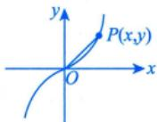

$$
\frac{\mathrm{d}l}{\mathrm{d}t} = \frac{\mathrm{d}l}{\mathrm{d}x} \cdot \frac{\mathrm{d}x}{\mathrm{d}t} = \frac{2x + 6x^{5}}{2\sqrt{x^{2} + x^{6}}} \cdot V_{0},
$$

$$
\left. \frac{\mathrm{d}l}{\mathrm{d}t} \right|_{x = 1} = \frac{8}{2\sqrt{2}}v_{0} = 2\sqrt{2}v_{0}
$$

方法总结涉及相关变化率问题：①建立相关变量方程；②求导找出相关变化率，进而通过已知变化率求未知变化率.

注更为综合的物理应用会涉及微分方程，将在第15讲学习.

## 复利与连续复利（仅数学三）

复利计算公式为

$$
A_{m}=A(1+r)^{m},A\underbrace{(1+r)(1+r)\cdots(1+r)}_{m 个 }
$$

其中A表示一开始的本金，r表示每一期的利率，m表示复利的总期数， $A _ { m }$ 表示m期后的余额.

①如果年利率为r的利息一年支付1次，那么当初始存款为A元时，t年后余额 $A _ { t }$ 则为

$$
A_{t}=A(1+r)^{t}
$$

②如果年利率为r的利息一年支付n次，那么当初始存款为A元时，t年后余额A则为

$$
A_{t}=A\left(1+\frac{r}{n}\right)^{m}\cdot A\left[\underbrace{\left(1+\frac{r}{n}\right)\cdots\left(1+\frac{r}{n}\right)}_{n 个 }\right]\left[\underbrace{\left(1+\frac{r}{n}\right)\cdots\left(1+\frac{r}{n}\right)}_{n 个 }\right]\cdots\left[\underbrace{\left(1+\frac{r}{n}\right)\cdots\left(1+\frac{r}{n}\right)}_{n 个 }\right]
$$

$$
A\mathrm{e}^{r t}=R \Rightarrow A \equiv R\mathrm{e}^{-r t}
$$

见值③对于②，当 $\frac{\left | n\rightarrow \infty  \right | }{\left | \begin{array}{c}  \\ \end{array} \right | }$ 时， $\lim_{n \to \infty} A_t = \lim_{n \to \infty} A \left( 1 + \frac{r}{n} \right)^{nt} = A e^{rt}$ ，这称为连续复利→掌握至此即可，无须深入学习支付无数次 $\geqslant A \cdot \mathrm{e}^{\lim_{n \to \infty} n t \cdot \frac{r}{n}} = A \mathrm{e}^{r t}$

注考试时要弄清楚①，②，③三种情况，题目会明确告知

例7.2设某酒厂有一批新酿的好酒，如果现在（假定t=0)就售出，总收入为 $R _ { 0 }$ 元；如果窖藏起来，待来日按陈酒价格出售，t年末总收入为 $R = R_{0} \mathrm{e}^{\frac{2}{5} \sqrt{t}}$ .假定银行的年利率r为6%，并以连续复

利计息，若 $t _ { 0 }$ 年售出可使总收入的现值最大，则窖藏的时间 $t _ { 0 } ^ { \mathrm { ~   ~ } } =$

分析碰到应用题，找到关系式、定义式、约束式，先写定义式（现值），再代入关系式 $R = R_{0}e^{\frac{2}{5}\sqrt{t}}$ ，最后按照一元函数求最值的方法，找到驻点即为所求.

解应填11.

$$
\frac{ 定义式 }{ 了 }
$$

根据连续复利公式，这批酒在窖藏t年末售出时总收入R的现值为 $A(t) = R e^{-rt}$ ，而 $R = R_{0}e^{\frac{2}{5}\sqrt{t}}$   
故 $A(t) = R_0 \mathrm{e}^{\frac{2}{5} \sqrt{t} -rt}$ .令 $\frac{\mathrm{d}A}{\mathrm{d}t}=R_{0}\mathrm{e}^{\frac{2}{5}\sqrt{t}-rt}\left(\frac{1}{5\sqrt{t}}-r\right)=0$ ，得驻点 $t_{0}=\frac{1}{25r^{2}}$ .当 $0 < t_{0} < \frac{1}{25r^{2}}$ 时， $\frac { \mathrm { d } A } { \mathrm { d } t } > 0 .$ ；当  
$t_{0} > \frac{1}{25r^{2}}$ 时， $\frac { \mathsf { d } A } { \mathsf { d } t }   <   0 .$ →一元连续函数中唯一极值点就是最值点

于是， $t_{0} = \frac{1}{25r^{2}}$ 是极大值点亦是最大值点，故窖藏 $t_{0}=\frac{1}{25r^{2}}$ 年售出可使总收入的现值最大.当约束式$r = 6 \%$ 时， $t_{0}=\frac{100}{9}\approx11$ (年).

方法总结用好定义式与关系式，利用求导工具找最值即可.

## 导数的经济应用（仅数学三）

## 经济学中常见的函数

(1) 需求函数.

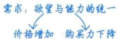

设某产品的需求量为Q，价格为p，则 $Q = Q(p)$ 称为需求函数，且Q一般为单调减少函数.

(2) 供给函数.

设某产品的供给量为q，价格为p，则 $q = q(p)$ 称为供给函数，且q一般为单调增加函数

(3) 成本函数.

设生产产品的总投入为C，它由固定成本 $C _ { \mathrm { i } }$ (常量)和可变成本 $C _ { 2 } ( Q )$ 两部分组成，其中Q表示产量.成本函数为 $C = C(Q) = C_1 + C_2(Q)$ ，称 $\frac { c } { \varrho }$ 为平均成本，记为 $\overline{C}$ 或AC，即

$$
AC = \overline{C} = \frac{\overline{C}}{Q} = \frac{C_1}{Q} + \frac{C_2(Q)}{Q}
$$

(4)收益(入)函数.

设产品售出后所得的收益为R，则

$$
R = R(Q) = pQ
$$

其中p是价格，Q是销售量.

## 考研数学基础30讲·高等数学分册

(5) 利润函数.

设收益扣除成本后的利润为L，则

$$
L = L ( Q ) = R ( Q ) - C ( Q ) ,
$$

其中Q为销售量.

注如无特殊情况说明，需求与供给函数以价格p为自变量，成本、收益与利润函数以产量Q为自变量.

## 2边际函数与边际分析

在经济学中，若函数f(x)可导，则称 $f^{\prime}(x)$ 为f(x)的边际函数. $f^{\prime}(x_{0})$ 称为f(x)在 $x _ { 0 }$ 点的边际值.用边际函数来分析经济量的变化叫边际分析.

由 $\Delta y \approx \mathrm { d } y$ ，即 $f(x_{0}+\Delta x)-f(x_{0})\approx f^{\prime}(x_{0})\Delta x$ ，取 $\Delta x   =   1$ ，得 $f(x_{0}+1)-f(x_{0})\approx f^{\prime}(x_{0})$

于是，边际值 $\left( f ^ { \prime } ( x _ { 0 } ) \right.$ 被解释为：在 $x _ { 0 }$ 点，当x改变一个单位时，函数f(x)近似(在实际问题中，经  
常略去“近似”二字)改变 $\left| f^{\prime}(x_{0}) \right|$ 个单位. $f^{\prime}(x_{0})$ 的符号反映自变量的改变与因变量的改变是同向还是7  
反向. $\left\{ \begin{aligned} f^{\prime}(x_{0}) > 0 \Rightarrow 0 \\ f^{\prime}(x_{0}) < 0 \Rightarrow \beta \end{aligned} \right.$ 同向改变， 司向改变

反向改变

(1) 边际成本.

设总成本函数为 $C = C(Q)(Q)$ 为产量),则边际成本函数(记为MC)为 $MC = C'(Q)$

(2) 边际收益.

设总收益函数为 $R = R(Q)(Q)$ 为销售量),则边际收益函数(记为MR)为 $MR = R^{\prime}(Q)$

(3) 边际利润.

设利润函数为 $L = L(Q)(Q)$ 为销售量),则边际利润函数(记为ML)为 $ML = L^{\prime}(Q)$ (Q).

## ③ 弹性函数与弹性分析

在经济学中，把因变量对自变量变化的反应的灵敏度，称为弹性或弹性系数.设函数 $y = f(x)$ 可导，称

$$
\eta = \lim_{\Delta x \to 0} \frac{\Delta y}{y} \bigg/ \frac{\Delta x}{x} = \frac{x}{y} \frac{y}{f(x)} f'(x) = \frac{Ey}{Ex}
$$

为函数 $y = f(x)$ 的弹性函数，称

$$
\eta \bigg|_{x = x_0} = \frac{x_0}{f(x_0)} f'(x_0)
$$

为函数f(x)在 $x _ { 0 }$ 处的(点)弹性.

$\eta \bigg |_{x = x_0}$ 表示在 $x _ { 0 }$ 处，当自变量x改变1%时，因变量y将改变 $\left| \eta \right|_{x = x_0} \% = \left| \frac{x_0}{f(x_0)} f'(x_0) \right| \%$ ，其符号反映自变量x与因变量y的改变是同向还是反向. 取 $\eta = 0.54 = \frac{0.54\%}{1\%}$ →因变量改变0.54%用弹性函数来分析经济量的变化叫弹性分析.>白垂量210%

(1)需求的价格弹性.

$$
\eta _ { d } = \frac { E Q } { E p } = \frac { p } { Q } \frac { \mathrm { d } Q } { \mathrm { d } p } = \frac { p } { Q ( p ) } Q ^ { \prime } ( p ) .
$$

一般地，需求函数单调减少，故 $Q ^ { \prime } ( p ) < 0$ ，从而 $\eta_{d} < 0$

其经济意义：当价格为p时，若提价（降价）1%，则需求量将减少（增加） $\left| \eta _ { d } \right| \%$

注若题设要求 $\eta_{d}>0$ ，则取 $\eta _ { d } = - \frac { p } { Q ( p ) } Q ^ { \prime } ( p ) ,$

(2) 供给的价格弹性.

$$
\eta _ { s } = \frac { E q } { E p } = \frac { p } { q } \frac { \mathrm { d } q } { \mathrm { d } p } = \frac { p } { q ( p ) } q ^ { \prime } ( p ) .
$$

一般地，供给函数单调增加，故 $q ^ { \prime } ( p ) > 0$ ，从而 $\eta _ { s } > 0$

其经济意义：当价格为p时，若提价（降价）1%，则供给量将增加（减少) $\eta _ { s } \%$

(3) 收益的价格弹性.

$$
\eta _ { r } = \frac { E R } { E p } = \frac { p } { R } \frac { \mathrm { d } R } { \mathrm { d } p } = \frac { p } { R ( p ) } R ^ { \prime } ( p ) .
$$

一般地，收益函数单调增加，故 $R ^ { \prime } ( p ) > 0$ ，从而 $\eta _ { r } > 0$

其经济意义：当价格为p时，若提价（降价）1%，则收益将增加（减少) $\eta _ { r } \%$

例7.3设生产某商品的固定成本为60000元，可变成本为20元/件，价格函数为 $p =$ $60 - \frac{Q}{1000} (p$ 是单价，单位：元；Q是销量，单位：件).已知产销平衡，求：

(1)该商品的边际利润函数；

(2) 当 $p = 50$ 元时的边际利润，并解释其经济意义；—→数学三的热门考点

(3) 使得利润最大的单价p.

分析①先写利润函数，再对Q求偏导数得到边际利润；

②代入价格函数求 Q，再代入L'(Q)；

③令 $L ^ { \prime } ( Q ) = 0$ ，解出Q再代入价格函数，求 $p .$

解(1)成本函数 $C(Q)=60000+20Q$ ，收益函数 $R(Q)=pQ=60Q-\frac{Q^{2}}{1000}$ ，利润函数

$$
L(Q)=R(Q)-C(Q)=-\frac{Q^{2}}{1000}+40Q-60000
$$

故该商品的边际利润函数 $L^{\prime}(Q)=-\frac{Q}{500}+40$

(2)当 $p = 5 0$ 元时，销量 $Q = 10000$ 件， $L^{\prime}(1000)=20$ 元.

其经济意义：销售第10001件商品所得利润为20元.

(3)令 $L^{\prime}(Q)=-\frac{Q}{500}+40=0$ ，得 $Q = 20000$ 件，且 $L^{\prime\prime}(20000) < 0$ ，故当 $Q = 20\ 000$ 件时利润最大，此时 $p = 40  元$

例7.4 设某商品需求量Q是价格p的单调减少函数： $Q = Q(p)$ ，其中需求弹性 $\eta =$ $\frac{2p^{2}}{192 - p^{2}} > 0$

(1)设 $R = R(p)$ 为总收益函数，证明 $\sqrt{\frac{\mathrm{d}R}{\mathrm{d}p}}=Q(1-\eta)\bigg|_{1}^{p}$ 作为结论用>已说明，若无说明，则以Q为自变量

(2)当p=6时，求总收益对价格的弹性，并说明其经济意义.

分析①写出R(p)，再对p求导，代入η即可；

②写出 $\frac { E R } { E p }$ ，代入 $\eta = \frac{2p^{2}}{192 - p^{2}}\bigg|_{p = 1}$ 即可.   
6

(1)证由题设得 $R(p) = pQ(p)$ ，两边对p求导，得 $\begin{aligned}\rightarrow \eta = - \frac{p}{Q} \frac{\mathrm{d}Q}{\mathrm{d}p}\end{aligned}$

$$
\frac{\mathrm{d}R}{\mathrm{d}p}=Q+p\frac{\mathrm{d}Q}{\mathrm{d}p}=Q\left(1+\left|\frac{p}{Q}\frac{\mathrm{d}Q}{\mathrm{d}p}\right|\right)=Q(1-\eta)
$$

(2)解 $\frac{ER}{Ep}=\frac{p}{R}\frac{dR}{dp}=\frac{p}{pQ}Q(1-\eta)=1-\eta=1-\frac{2p^{2}}{192-p^{2}}=\frac{192-3p^{2}}{192-p^{2}}$

$$
\left. \frac{ER}{Ep} \right|_{p=6} = \frac{192 - 3 \times 6^2}{192 - 6^2} = \frac{7}{13} \approx 0.54
$$

其经济意义：当p=6时，若价格上涨1%，则总收益将增加0.54%.

例7.5 设某商品需求量Q对价格P的弹性为 $\eta ( \eta > 0 )$ ，R为收益，则（）.

(A)当 $\eta < 1 , \Delta P > 0$ 时， $\Delta R > 0$

(B)当 $\eta < 1 , \Delta P < 0$ 时， $\Delta R > 0$

(C) 当 $\eta > 1 , \Delta P > 0$ 时， $\Delta R > 0$

(D)当 $\eta > 1 , \Delta P < 0$ 时， $\Delta R < 0$

分析利用结论 $\frac{\mathrm{d}R}{\mathrm{d}P}=Q(1-\eta)$ 进行分析.

应选(A).

$$
\frac { \mathrm { d } R } { \mathrm { d } P } = \frac { \mathrm { d } ( P Q ) } { \mathrm { d } P } = Q + P \frac { \mathrm { d } Q } { \mathrm { d } P } = Q + Q \cdot \frac { P } { Q } \frac { \mathrm { d } Q } { \mathrm { d } P } = Q ( 1 - \eta ) .
$$

当 $\eta   <   1$ 时， $\frac { \mathsf { d } R } { \mathsf { d } P }   >   0$ ，即 $\Delta P > 0$ 时， $\Delta R > 0$

当 $\eta   >   1$ 时， $\frac{\mathsf{d}R}{\mathsf{d}P} < 0$ ，即 $\Delta P _ { \stackrel { > } { ( < 0 ) } } 0$ 时， $\Delta R_{\binom{< 0}{}}$ .故选(A).

## 基础习题精练

## 习题

7.1（仅数学一、数学二)质点P沿抛物线 $x = y^{2} (y > 0)$ 移动，P的横坐标x对时间的变化率为5cm/s.当x=9时，点P到原点O的距离对时间的变化率为

7.2 (仅数学三)设某产品的需求函数为 $Q = Q(P)$ ，需求的价格弹性为 $\varepsilon , 0 < \varepsilon < 1$ .已知产品收益R对价格的边际为s，且产销平衡，则产品的产量应是(用ε，s的函数表示).

7.3（仅数学一、数学二）甲车以24km/h的速度向北行驶，同时正东10km处乙车以20km/h的速度向东行驶.从这一时刻起经过1小时后，求两车间的距离对时间的变化率.

7.4(仅数学三)已知某企业的总收入函数为 $R = 26x - 2x^{2} - 4x^{3}$ ，总成本函数为 $C = 8x + x^{2}$ ，其中x表示产品的产量，求利润函数、边际收入函数、边际成本函数以及企业获得最大利润时的产量和最大利润.

## 解答

7.1 $\frac{95}{6\sqrt{10}}  cm/s$ 解 点P到原点O的距离 $s = \sqrt{x^{2} + y^{2}}$ ，于是

$$
\frac{\mathrm{d}s}{\mathrm{d}t} = \frac{\mathrm{d}}{\mathrm{d}t} \sqrt{x^{2} + y^{2}} = \frac{\mathrm{d}}{\mathrm{d}x} \sqrt{x^{2} + x} \cdot \frac{\mathrm{d}x}{\mathrm{d}t} = \frac{5(2x + 1)}{2\sqrt{x^{2} + x}}
$$

当x=9时， $\frac{\mathrm{d}}{\mathrm{d}t}\sqrt{x^{2}+y^{2}}\bigg|_{x=9}=\frac{5(2x+1)}{2\sqrt{x^{2}+x}}\bigg|_{x=9}=\frac{95}{6\sqrt{10}}(cm/s)$

7.2 $\frac { s } { 1 - \varepsilon }$ 解 需求的价格弹性为 $- \frac { Q ^ { \prime } } { Q } P$ ，其中Q为需求量，即产量，P为价格.依题意，

$- \frac{Q'}{Q} P = \varepsilon$ ，即

$$
PQ^{\prime} = - \varepsilon Q
$$

收益函数 $R = PQ$ ，它对价格的边际为 $\frac{\mathrm{d}R}{\mathrm{d}P}$ ，由题意，

$$
s = \frac { \mathrm { d } R } { \mathrm { d } P } = Q + P Q ^ { \prime } = ( 1 - \varepsilon ) Q ,
$$

所以 $Q = \frac{s}{1 - \varepsilon}$

7.3 解 设甲车最初在原点O处，乙车在C处， $OC = 10   km$ ，在t小时后，甲在A点，乙在B点，如图7-1所示.设 $AB = s, \; OA = x, \; CB = y$ ，则 $s = \sqrt{x^{2} + \left( y + 10 \right)^{2}}$ ，其中 $s = s(t), x = x(t), y = y(t)$ 都是关于t的函数.写成

$$
s^{2}=x^{2}+(y+10)^{2}
$$

两边对t求导，得 $2s \cdot \frac{\mathrm{d}s}{\mathrm{d}t} = 2x\frac{\mathrm{d}x}{\mathrm{d}t} + 2(y + 10)\frac{\mathrm{d}y}{\mathrm{d}t}$ ，即

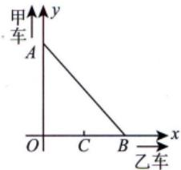

$$
\frac{\mathrm{d}s}{\mathrm{d}t} = \frac{x\frac{\mathrm{d}x}{\mathrm{d}t} + (y + 10)\frac{\mathrm{d}y}{\mathrm{d}t}}{\sqrt{x^{2} + (y + 10)^{2}}}
$$

图7-1

上式表达了三个变化率 $\frac{\mathrm{d}s}{\mathrm{d}t}, \frac{\mathrm{d}x}{\mathrm{d}t}, \frac{\mathrm{d}y}{\mathrm{d}t}$ 之间的关系.已知 $\frac{\mathrm{d}x}{\mathrm{d}t} = 24, \quad \frac{\mathrm{d}y}{\mathrm{d}t} = 20$ .当t=1时， $x = 24, \; y = 20$ 代入上式，得 $\frac{\mathrm{d}s}{\mathrm{d}t}=\frac{196}{\sqrt{41}}\approx30.6(\mathrm{km/h})$

7.4 解 利润函数 $L = R - C = 18x - 3x^{2} - 4x^{3}$ ，边际收入函数 $MR = \frac{\mathrm{d}R}{\mathrm{d}x} = 26 - 4x - 12x^{2}$ ，边际成本函数 $MC = \frac{\mathrm{d}C}{\mathrm{d}x} = 8 + 2x$

$\frac{\mathrm{d}L}{\mathrm{d}x}=18-6x-12x^{2}=0$ 得 $x = 1,   x = -\frac{3}{2}$ (舍去). 又 $\left. \frac{\mathrm{d}^{2} L}{\mathrm{d} x^{2}} \right|_{x = 1} = (-6 - 24x) \bigg|_{x = 1} = -30 < 0$ ，可知当 $x = 1$ 时，L取得极大值，为 $\begin{aligned}\left. L \right|_{x = 1} = \left( 18x - 3x^{2} - 4x^{3} \right) \bigg|_{x = 1} = 11\end{aligned}$ .因为 $x > 0$ 时，L(x)只有一个极大值，故此极大值就是最大值.所以当产量为1时利润最大，最大利润为11

## 第8讲

## 一元函数积分学的概念与性质

<table><tr><td rowspan=1 colspan=1>考题</td><td rowspan=1 colspan=1>不定积分、定积分、变限积分、反常积分</td></tr><tr><td rowspan=1 colspan=1>题型</td><td rowspan=1 colspan=1>选择题、填空题</td></tr><tr><td rowspan=1 colspan=1>目标</td><td rowspan=1 colspan=1>①理解原函数的概念，理解不定积分和定积分的概念（仅数学一、数学二）；理解原函数与不定积分的概念，了解定积分的概念（仅数学三）.②掌握不定积分和定积分的性质及定积分中值定理（仅数学一、数学二）；掌握不定积分的基本性质，了解定积分的基本性质，了解定积分中值定理（仅数学三）.③理解积分上限的函数，会求它的导数.④理解反常积分的概念，了解反常积分收敛的比较判别法</td></tr><tr><td rowspan=1 colspan=1>重难点</td><td rowspan=1 colspan=1>①不定积分和定积分的性质及积分中值定理；②变限积分函数的概念与性质；③反常积分的概念及敛散性</td></tr></table>

## 基础知识结构

## 原函数与不定积分

设函数f(x)定义在某区间I上，若存在可导函数F(x)，对于该区间上任意一点都有 $F^{\prime}(x) = f(x)$ 成立，则称F(x)是f(x)在区间I上的一个原函数.称 $\frac{\left| \int f(x) \mathrm{d}x \right| = F(x) + C}{ 丿似是基达原函 }$ 为f(x)在区间I上的不定积分.数的记号

问：为什么强调一个？

全体原函数

答：因为若 $F^{\prime}(x) = f(x)$

则对于任意常数C，都有 $\left[ F(x) + C \right]' = F'(x) = f(x)$

故F(x)+C也是原函数，所以f(x)若有原函数，则原函数一定有无穷多个。 $F ( x ) + C$ 称为全体原函数

## 注谈到函数f(x)的原函数与不定积分，必须指明f(x)所定义的区间.

例8.1 设 $0 < x < 1$ ，且 $\int \left( 1 - x^{2} \right) f\left( x^{2} \right) \mathrm{d}x = \arcsin x + C$ ，则f(x) =( ).(A) $(1 - x)^{\frac{3}{2}}$ (B) $(1 - x)^{-\frac{3}{2}}$ (C) $(1 - x^{2})^{\frac{3}{2}}$ (D) $(1 - x^{2})^{-\frac{3}{2}}$

分析按照原函数定义 $\int \frac{\left |  f(x) \right | }{\left |  F^{\prime}(x) \right | } dx = F(x) + C$ 解应选 (B).

根据原函数F(x)的定义 $F^{\prime}(x) = f(x)$ 求解.

将所给表达式的等式两端分别关于x求导，得

$$
\left[ \int \left( 1 - x ^ { 2 } \right) f \left( x ^ { 2 } \right) \mathrm{d}x \right] ^ { \prime } = \left( \arcsin x + C \right) ^ { \prime } ,
$$

即 故

$$
(1 - x^{2})f(x^{2}) = \frac{1}{\sqrt{1 - x^{2}}}
$$

$$
f(x^{2}) = (1 - x^{2})^{-\frac{3}{2}}
$$

$$
f(x) = (1 - x)^{-\frac{3}{2}}
$$

故选(B).

例8.2 函数 $f(x)=\left\{\begin{aligned}&\frac{1}{\sqrt{1+x^{2}}}, \quad x \leq 0, \\&(x+1)\cos x, \quad x>0\end{aligned}\right.$ 的一个原函数为（）.

(A) $F(x)=\left\{\begin{aligned}&\ln\left(\sqrt{1+x^{2}}-x\right), & x \leq 0, \\&(x+1)\cos x-\sin x, & x>0\end{aligned}\right.$ (B) $F(x)=\left\{\begin{aligned}\ln \left(\sqrt{1+x^{2}}-x\right)+1, \quad x \leq 0, \\ (x+1) \cos x-\sin x, \quad x>0\end{aligned}\right.$ (C) $F(x)=\left\{\begin{aligned}\ln \left(\sqrt{1+x^{2}}+x\right), & \quad x \leq 0, \\ (x+1) \sin x+\cos x, & \quad x>0\end{aligned}\right.$ (D) $F(x)=\left\{\begin{aligned}\ln \left(\sqrt{1+x^{2}}+x\right)+1, \quad x \leq 0, \\ (x+1) \sin x+\cos x, \quad x>0\end{aligned}\right.$

分析 $F^{\prime}(x) = f(x)$ .由f(x)处处有定义得F(x)处处可导，推出F(x)处处连续.

对于选项(A): $\lim_{x \to 0^{-}} F(x) = 0 , \quad \lim_{x \to 0^{+}} F(x) = 1$ ，由于F(x)在x=0处左右极限不同，故F(x)不连续.  
对于选项(C): $\lim_{x \to 0^{-}} F(x) = 0$ $\lim_{x \to 0^{+}} F(x) = 1$ ，由于F(x)在x=0处左右极限不同，故F(x)不连续.  
由 $F^{\prime}(x) = f(x)$ 知，F(x)必连续，故可排除(A)，(C).对于选项(B):当 $x > 0$ 时， $F^{\prime}(x)=\cos x-(x+1)\sin x-\cos x=-(x+1)\sin x\ne(x+1)\cos x$ ，故可排除(B).  
因此选 (D).

## ②原函数（不定积分）存在定理

(1)连续函数f(x)必有原函数F(x) →不作要求，但最好在草稿本上写一遍，大致思路要懂

注证明：如果函数f(x)在[a，b]上连续，则函数 $F(x) = \int_{a}^{x} f(t)   dt$ 在[a,b]上可导，且 $F^{\prime}(x) = f(x)$ 证若 $x \in (a,   b)$ ，取Δx使 $x + \Delta x \in (a,   b)$ ，则 说明 $\int f(x) \mathrm{d}x = \int_{a}^{x} f(t) \mathrm{d}t + C.$

$$
\begin{aligned}\Delta F &= F(x + \Delta x) - F(x) = \int_{a}^{x + \Delta x} f(t) \mathrm{d}t - \int_{a}^{x} f(t) \mathrm{d}t \\&= \int_{a}^{x} f(t) \mathrm{d}t + \int_{x}^{x + \Delta x} f(t) \mathrm{d}t - \int_{a}^{x} f(t) \mathrm{d}t = \int_{x}^{x + \Delta x} f(t) \mathrm{d}t\end{aligned}
$$

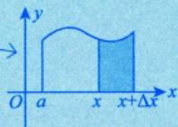

使用积分中值定理，有 $\int_{x}^{x + \Delta x} f(t) \mathrm{d}t = f(\xi) \Delta x$ ，其中ξ介于x与 $x + \Delta x$ 之间，当 $\Delta x \rightarrow 0$ 时， $\xi \rightarrow x$ ，于是

$$
F^{\prime}(x)=\lim_{\Delta x \to 0}\frac{\frac{f(x)}{\Delta F}}{\frac{\Delta x}{\Delta x}}=\lim_{\Delta x \to 0}f(\xi)=\lim_{\frac{\xi \to x}{\sqrt{x}}}f(\xi)=f(x)
$$

若 $x = a$ ，取 $\Delta x > 0$ ，则同理可证 $F_{+}^{\prime}(a) = f(a)$ ;若 $x = b$ ，取 $\Delta x < 0$ ，则同理可证 $F_{-}^{\prime}(b) = f(b)$ 注意：当四则运算中出现不同形式的表达式时，需要化为统一的形式，本题借助了积分中值定理① $\int f(x) \mathrm{d}x$ 称为不定积分，表示全体原函数.

$\int_{a}^{b} f(x) \mathrm{d}x$ 称为定积分，表示面积.

③ $F(x) = \int_{a}^{x} f(t)   dt$ 称为变上限积分，表示动态的面积.

④积分中值定理：若函数f(x)在区间 a, b]上连续，则至少存在一点 $\xi \in [a, b]$ ，使

$$
\int_{a}^{b} f(x) \mathrm{d}x = f(\xi)(b - a) \atop S_{ 奇边据名 } = S_{ 单名 }
$$

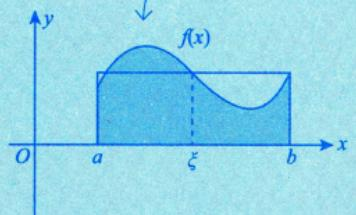

总结：f(x)连续⇒ $\left\{ \begin{aligned} \int f(x) \mathrm{d}x &= \int_{a}^{x} f(t) \mathrm{d}t + C, \\ \left[ \int_{a}^{x} f(t) \mathrm{d}t \right]' &= f(x). \end{aligned} \right.$

(2)含有第一类间断点和无穷间断点的函数f(x)在包含该间断点的区间内必没有原函数 $F ( x )$

V可去间断点第一类间断点跳跃间断点《全国硕士研究生招生考试数学考试大纲》考查四类间断点无穷间断点振荡间断点

注1(1)函数f(x)在定义域I上可导，则

$$
f^{\prime}(x)=\lim_{X \to x}\frac{f(X)-f(x)}{X-x}=\left\{\begin{aligned} & 0, \\ & a \neq 0. \end{aligned}\right.
$$

(可导时，y与Y们比连续时靠得更近)

(2) 函数f(x)存在与f'(x)存在的区别.

① a. f(x)在 $x = x_{0}$ 处的极限存在不能得出f(x)在 $x = x_{0}$ 处连续.  
如 $\lim_{x \to x_0} f(x) = a$ 但 $f(x_{0})$ 有可能等于a，也有可能不等于a.

b. f(x)可导，且 $\lim_{x \to x_0} f'(x) = a$ ，则f'(x)在 $x_{0}$ 处连续.f'(x)存在

证

$$
f^{\prime}(x_0) = \lim_{x \to x_0} \frac{f(x) - f(x_0)}{x - x_0} \xlongequal[]{\frac{0}{0}} \lim_{x \to x_0} f^{\prime}(x) = a
$$

②a. f(x)存在不能得出f(x)有介值性.

介值定理：函数f(x)在[a,b]上连续，且 $f(a)=A,\ f(b)=B$ ，则当 $A < u < B$ 时，存在 $\xi \in (a, b)$ 使 $f(\xi) = u$

b. f'(x)存在，可得f'(x)有介值性.

达布定理： f(x)在 [a, b]上可导， $f_{+}^{\prime}(a) \neq f_{-}^{\prime}(b)$ ，则对任意介于ft(a)与f'(b)之间的u，存在 $\xi \in (a,   b)$ ，使得

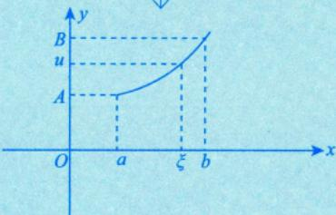

$$
f^{\prime}(\xi) = u ,
$$

证令 $F(x) = f(x) - u x$ ，则 $F^{\prime}(x) = f^{\prime}(x) - u$

不妨设 $f_{+}^{\prime}(a) < u < f_{-}^{\prime}(b)$ ，则 $f_{+}^{\prime}(a)-u<0\ , f_{-}^{\prime}(b)-u>0$ ，即 $F^{\prime}_{+}(a)<0\ ,\ F^{\prime}_{-}(b)>0$

由例 6.3，可知存在 $\xi \in (a,   b)$ ，使 $F^{\prime}(\xi) = 0$ ，即 $f^{\prime}(\xi) = u$

$\left\{ \begin{aligned} f^{\prime}(x)  存在  \neq 0   ,   则  \\  在  \left[ a   ,   b \right]  上  f^{\prime}(x) \end{aligned} \right.$ 则f'(x)必保号（恒正或恒负）.反证：假设 $f^{\prime}(a)<0,\ f^{\prime}(b)>0$ ③由②b.可得 则存在 $\xi \in (a, b), f^{\prime}(\xi) = 0$ ，矛盾.存在，则f'(x)无第一类间断点.

注2证 设 F(x) 为 f(x)在 I 内的一个原函数，则 F(x) 在 I 内可导，且 $F^{\prime}(x) = f(x)$ ，并设$x = x_{0} \in I$ 为 $F^{\prime}(x)$ 的间断点，我们讨论如下三种情况： F'(x)

(1) $x = x_{0}$ 为可去间断点，即 $\lim_{x \to x_0} F'(x)$ 存在且为A，但 $A \ne F^{\prime}(x_0)$ ，而

$$
F^{\prime}(x_{0}) = \lim_{x \to x_{0}} \frac{F(x) - F(x_{0})}{x - x_{0}} \xlongequal{洛必达法则} \lim_{x \to x_{0}} F^{\prime}(x) = A
$$

(2) $x = x_{0}$ 为跳跃间断点，即 $\lim_{x \to x_0^+} F'(x)$ 存在且为 $A_{+},\lim_{x \to x_{0}^{-}}F^{\prime}(x)$ 存在且为A\_，但 $A_{+} \neq A_{-}$ ，而

$$
F^{\prime}_{+}(x_{0}) = \lim_{x \to x_{0}^{+}} \frac{F(x) - F(x_{0})}{x - x_{0}} \xlongequal{洛必达法则} \lim_{x \to x_{0}^{+}} F^{\prime}(x) = A_{+}
$$

F(x)在I上处处可导.

$$
F^{\prime}_{-}(x_{0}) = \lim_{x \to x_{0}^{-}} \frac{F(x) - F(x_{0})}{x - x_{0}} \xlongequal{洛必达法则} \lim_{x \to x_{0}^{-}} F^{\prime}(x) = A.
$$

又 $F^{\prime}(x_{0})$ 是存在的，则 $F_{+}^{\prime}(x_{0}) = F_{-}^{\prime}(x_{0})$ ，即 $A_{+} = A_{-}$ ，矛盾；

(3) $x = x_{0}$ 为无穷间断点，即 $\lim_{x \to x_0} F'(x) = \infty$ ，而

$$
F^{\prime}(x_0) = \lim_{x \to x_0} \frac{F(x) - F(x_0)}{x - x_0} \xlongequal{洛必达法则} \lim_{x \to x_0} F^{\prime}(x) = \infty,
$$

又 $F^{\prime}(x_{0})$ 是存在的，矛盾.

综上所述，(1)，(2)和(3)的情形均不存在原函数，即导函数 $F^{\prime}(x)$ 在I内必定没有第一类间断点和无穷间断点，也即含有第一类间断点和无穷间断点的函数f(x)在包含该间断点的区间内没有原函数 $F(x)$

注3含有振荡间断点的函数是否有原函数呢？这是不确定的.举例来说，对于

$$
f(x)=\left\{\begin{aligned}&2x\sin\frac{1}{x}-\cos\frac{1}{x}, &x\neq0,\\&0, &x=0,\end{aligned}\right.
$$

$\lim_{x \to 0} f(x)$ 不存在，其在 $( - \infty , + \infty )$ 上不连续，它有一个振荡间断点 $x = 0$ 但是它在 $( - \infty , + \infty )$ 上存在原函数

$$
F(x)=\left\{\begin{aligned}&x^{2}\sin\frac{1}{x},&x\neq0,\\&0,&x=0.\end{aligned}\right.
$$

经验证，当 $x \neq 0$ 时， $F^{\prime}(x) = 2x\sin\frac{1}{x} - \cos\frac{1}{x}$ 当 $x = 0$ 时， $F^{\prime}(0)=\lim_{x \to 0}\frac{x^{2}\cdot\sin\frac{1}{x}-0}{x-0}=0$ 即对于$( - \infty , + \infty )$ 上任一点都有 $F^{\prime}(x) = f(x)$ 成立.

当然，对于

$$
f(x)=\left\{\begin{aligned}&\frac{1}{x}\sin\frac{1}{x},&x\neq0,\\&0,&x=0,\end{aligned}\right.
$$

其在 $( - \infty , + \infty )$ 上也有一个振荡间断点 $x = 0$ ，但其在 $( - \infty , + \infty )$ 上没有原函数.

注4综合以上几点，可以得出重要结论：可导函数F(x)求导后的函数 $F^{\prime}(x) = f(x)$ 不一定是连续函数，也可能有振荡间断点 连续函数或含振荡间断点的函数

有介值性

$$
\stackrel{\rightharpoonup }{ 若 } F(x)  处处可导  \Rightarrow F^{\prime}(x) \cdot
$$

$$
\boxed{ 极限存在  \Leftrightarrow F^{\prime}(x)  迹簇 }
$$

$$
\boxed{\neq 0 \Rightarrow F(x)  单调 }
$$

注5至此，我们可以总结导函数f'(x)的性质了.

(1)如果导函数f'(x)存在，当导函数在一点极限存在时，导函数在这一点必连续.

对比函数就会知道，如果函数在一点极限存在，并不能得出函数在这一点连续的结论.

导函数之所以有这个特性，而函数没有，归根结底是因为导函数存在（即函数可导），是指那些点相依相偎、充分靠近，也就是说，导函数如果存在，它们天生就是点点相依相偎的，而函数存在，只是每个点都在那里，也就是在那里而已，它们无牵无挂.所以，不要只记住导函数也是函数，更要记住，导函数是性质极强的函数.导函数在这一点存在（事实上函数在这一点连续就够了)，就能保证点点相依相偎.那么，如果导函数在一点存在，且它在这一点的极限值也存在时，必等于这一点的导数值，也就是说导函数在这一点必连续.

所以可以继续思考下去，得到微积分里极为重要的一个结论：

(2)如果导函数在一点存在，则这一点一定不会是导函数的第一类间断点.

对比函数，函数在一点存在，可以是第一类间断点.

为什么？因为导函数在一点存在，讨论它在这一点是不是第一类间断点，关键是看在导函数左右极限都存在的条件下，是左右极限不等（跳跃间断），还是左右极限相等但不等于导数值（可去间断）.显然，导函数在一点存在时，它的左极限和右极限如果存在，必然分别等于这一点的左右导数值，由于这一点可导，左右导数值相等，于是导函数的左右极限值也必然相等，也就回到了（1）.故一个可导函数的导函数是没有第一类间断点的.

请再思考：在一条处处有切线的曲线上，会不会发生切线斜率值在一点突变的情况？为什么？

答：在几何上讲的曲线处处有切线，在微分学上对应的就是导函数处处存在或无穷大.这里，切线斜率为无穷大是一种需要斟酌的情形.在高等数学（微积分）中，无穷大是（特殊的）不存在，对应着铅直切线（斜率无穷大，不存在)，但事实上，如果我们把 $y = x$ 对调（或者说旋转 $9 0 ^ { \circ } )$ ，铅直变成水平，斜率为0，这就是存在的了，比如 $y = x ^ { 3 }$ 与 $y = x^{\frac{1}{3}}$ ，就很容易理解.既然 $x = 0$ 附近$y = x ^ { 3 }$ 切线的斜率是没有突变的，那么 $x = 0$ 附近 $y = x^{\frac{1}{3}}$ 切线的斜率也不会突变.非零无穷小和无穷大互为倒数关系，在斜率这里就有了很好的体现.琢磨一下，为什么说非零无穷小和无穷大对应呢？因为 $y = x ^ { 3 }$ 虽然在x=0处导数（变化率）等于0，可是它不是没有变化，显然 $x = 0$ 处左边的函数值为负，右边的函数值为正，只是从导数这个变化率工具上来说，它没有能力（不够精确）测量到这

<table><tr><td>个变化而已（也许以后你们还会接触到分数阶导数甚至更为精细的刻画变化率的工具）. (3) 若f(x)可导，则  $f^{\prime}(x)$  可能连续，也可能含有振荡间断点. 连续不难理解，那么振荡间断点是什么样子？它是真的断了吗？在现代数学提出了超实数理论 后，我们已经知道了，事实上，没有什么线是连着的，只是点与点近不近，有多近的问题罢了. ①设  $f_{1}(x) = \sin x$   $\lim_{x \to +\infty} \sin x$  振荡不存在，其大致图形为   $f_{2}(x)=\left\{\begin{aligned}\sin\frac{1}{x},&x\neq0,\\0,&x=0,\end{aligned}\right.$  ②设</td></tr><tr><td> $\sin\frac{1}{x}$  由sinu和  $u = \frac{1}{x}$   $\lim_{x \to 0^{+}} \sin \frac{1}{x}$  可以看出， 复合而成.当  $x \to 0^{+}$  时，  $u \to +\infty$  故 依然是振荡不存在. 但这里有一个关键问题：这里的振荡是在  $x \to 0^{+}$  时发生的，也就是x与0充分靠近、无限靠近时</td></tr><tr><td>发生的，于是可以看作将①中的 “无限压缩”成- 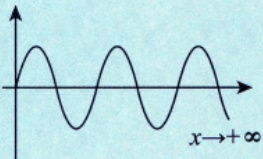  将  $x \to 0^{-}$  也画出来，则大致图形为 </td></tr><tr><td>a.所谓“无限压缩”，可以认为在x=0的任意邻域内，都有无数次-1到1的振荡. b.若将横坐标x的比例放大无穷倍，就会看到形如 的样子了.我们能够放 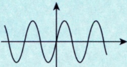 大无穷倍吗？显然不能，故我们是看不到实际图形的，好在人类有思考能力可以想象到. c.振荡间断点露出了本来的面目，放大无穷倍后，即 还原成原来的样子，</td></tr></table>

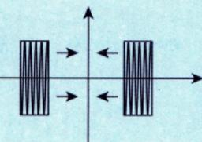

密集地像矩形块一样无限靠

近y轴.

b.“间断”只是在描述上述特征，即 $\lim_{x \to 0} \sin \frac{1}{x}$ 不存在.

谁叫连续的定义是 $\lim_{x \to x_0} f(x) = f(x_0)$ 呢，就因为 $\lim_{x \to 0} \sin \frac{1}{x} \neq \sin \frac{1}{x} \bigg|_{x=0}$ (无定义)，于是只能叫间断.即使定义成 $\begin{cases}\sin \frac{1}{x}, & x \neq 0, \\0, & x = 0,\end{cases}$ 依然是 $\lim_{x \to 0} \sin \frac{1}{x} \neq 0$ 也只能叫间断.

不过，对于 $\begin{cases}\sin \frac{1}{x}, & x \neq 0, \\0, & x = 0\end{cases}$ 这样的振荡间断点，我们可以说，曲线上的点均是相依相偎的，它

们并没有“断开”（如像

样跳跃断开，或像

一样可去断开)，

而是像图形.

样绵延不绝.

总之，形如 $f(x)=\begin{cases}\sin\dfrac{1}{x},&x\neq0,\\0,&x=0.\end{cases}$ 这样的振荡间断点，没有实际上的“断开”，它们是点点相依相偎的.只是它有一个独特的地方，即无限次振荡，故只能称间断，曰：(无限次）振荡使得极限不存在而不得不称为间断的点.

还记得“连续函数”必有原函数吗？原函数当然是可导函数.也就是说，一个“点点相依相偎”（连续）的函数，一定有（是）一个“点点相依相偎更近”（可导）的函数求导而得到的.反过来说，一个“点点相依相偎更近”（可导）的函数，求导后，会得到一个“点点相依相偎”（可以理解为靠近程度降低）的函数.于是，不只是连续函数“点点相依相偎”，我们研究得如此细致的“振荡间断函数”也可以“点点相依相偎”啊！故可导函数求导后，可能得到连续函数，也可能得到含振荡间断点的函数，只要这些函数“点点相依相偎”（足够近）就行.

于是，若f(x)可导，则f'(x)可能连续，也可能含有振荡间断点.

现在可以准确回答这个问题了——振荡间断点是什么样子？它是真的断了吗？设

$$
f(x)=\left\{\begin{aligned}x^{2}\cos\frac{1}{x},x\neq0,\\0,\quad x=0,\end{aligned}\right.
$$

其在 $( - \infty , + \infty )$ 上处处可导，且其导函数为

$$
f^{\prime}(x)=\left\{\begin{aligned}2x\cos\frac{1}{x}+\sin\frac{1}{x}, \quad x \neq 0, \\ 0, \quad x=0.\end{aligned}\right.
$$

显然，

$$
\lim_{x \to 0} f'(x) = \lim_{x \to 0} 2x \cos \frac{1}{x} + \lim_{x \to 0} \sin \frac{1}{x} = \lim_{x \to 0} \sin \frac{1}{x}
$$

极限振荡不存在.请原谅我在(\*)处鲁莽地拆开了，那只是为了让各位更清楚地看到 $\lim_{x \to 0} \sin \frac{1}{x}$ .如前

所述，函数 $\begin{cases}\sin \frac{1}{x}, & x \neq 0, \\0, & x = 0\end{cases}$ 放大无穷倍后的样子为

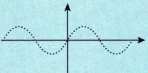

导函数的值不会突变，我们可以放心了.

以上我们讨论了函数真实存在的样子，事实上，微积分就是在研究函数微观上的样子，当你懂得了这些，就会逐渐发现它们的威力，并拥有了揭示真实的力量.

## 定积分

## 1定义

①分割(分割方法不唯一，只要分成n份即可)：②近似；③求和；④取极限.

(1) 定积分的概念.

若函数f(x)在区间[a,b]上有界，在(a,b)上任取n-1个分点 $x_{i}(i = 1,2,3,\cdots,n - 1)$ ，定义 $x_{0}=a$ 和 $x _ { _ n } = b$ ，且 $a = x_{0} < x_{1} < x_{2} < x_{3} < \cdots < x_{n - 1} < x_{n} = b$ ，记 $\Delta x_{k}=x_{k}-x_{k-1},k=1,2,3,\cdots,n$ . 并任取一点$\xi_{k} \in \left[ x_{k-1}, x_{k} \right]$ ，记 $\lambda = \max_{1 \leq k \leq n} \{ \Delta x_k \}$ ，若当λ→0时，极限 $\lim_{\lambda \to 0} \sum_{k=1}^{n} f(\xi_k) \Delta x_k$ 存在且与分点 $x _ { i }$ 及点 $\xi _ { k }$ 的取法

无关，则称函数f(x)在区间[a,b]上可积，即

K如果你问我，积分号 $\cdot \int$ 是怎么来的，我情愿你这样看：

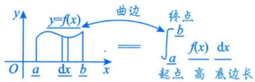

但事实上，积分号 $ \text{" }\int  \text{" }$ 是莱布尼茨给出的，在德国小城汉诺威（莱布尼茨在这里度过了人生的最后时光）的莱布尼茨纪念馆的一份他的手稿中，明确写到： $\int  来自"   suma  \text{" }$ 的首字母s拉长，写成了“]”

注定积分的定义是由德国数学家波恩哈德·黎曼(Bernhard Riemann) 给出的，故这种积分又被称为黎曼积分.

  
黎曼 (1826—1866)

(2) 几何意义.

在[a,b]上，①若 $f(x) \geqslant 0$ ，定积分 $\int_{a}^{b} f(x) \mathrm{d}x$ 表示由曲线 $y = f(x)$ 、直线 $x   =   a$ 、直线 $x = b$ 与x轴所围成的曲边梯形的面积[见图8-1(a)]；②若 $f(x) \leq 0$ ，定积分 $\int_{a}^{b} f(x) \mathrm{d}x$ 表示由曲线 $y = f(x)$ 、直线 $x = a$ 直线x=b与x轴所围成的曲边梯形面积的负值[见图8-1(b)]；③若f(x)既有正值又有负值，定积分$\int_{a}^{b} f(x) \mathrm{d}x$ 表示x轴上方图形的面积减去x轴下方图形的面积[见图8-1(c)].

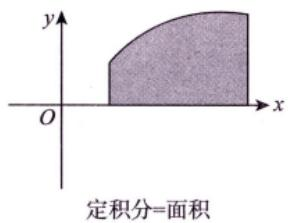  
(a)

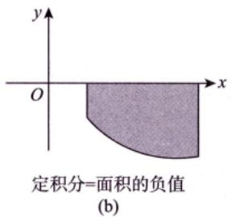  
图 8-1

  
(c)

(3)定积分的精确定义.

当定积分存在时，存在两个“任取”：分点 $x _ { i }$ 任取，一点 $\xi_{i} \in (x_{i-1}, x_{i})$ 任取.故可作两个“特取”：

将[a,b] n等分且取每个小区间的右端点为 $\xi _ { i }$ (见图8-2)，即

$$
\int_{a}^{b} f(x) \mathrm{d}x = \lim_{n \to \infty} \sum_{i=1}^{n} f\left(a + \frac{b-a}{n}i\right) \frac{b-a}{n}
$$

  
图 8-2

①n等分并取右端点的函数值作为高：   
②近似；   
③求和：   
④取极限.

取左端点的函数值作为高：

$$
\lim_{n \to \infty} \sum_{i=0}^{n-1} f\left(a + \frac{b-a}{n}i\right) \frac{b-a}{n} = \int_{a}^{b} f(x)   dx
$$

若将式子中的a，b特殊化为0,1这两个数，得出的形式更为简单：

$$
\int_{0}^{1} f(x) \mathrm{d}x = \lim_{n \to \infty} \sum_{i=1}^{n} f\left(\frac{i}{n}\right) \frac{1}{n}
$$

(4)定积分的值与字母无关.

当定积分存在时，有

$$
\int _ { a } ^ { b } f ( x ) \mathrm { d } x = \int _ { a } ^ { b } f ( t ) \mathrm { d } t = \int _ { a } ^ { b } f ( u ) \mathrm { d } u ,
$$

注：积分与字母无关，无论x，t，u，都只是一个符号

这就是说，定积分的值只与被积函数及积分区间有关，而与积分变量的记法无关

是个客观存在的数量值

## 2存在定理

定积分的存在性，也称一元函数的(常义)可积性.这里的“常义”是指“区间有限，函数有界”，也有人称为“黎曼”可积性，与后面要谈到的“区间无穷，函数无界”的“反常”积分有所区别.在本讲中所谈到的可积性都是指常义可积性. y

  
函数与积分区间被限制在框之内。

按照《全国硕士研究生招生考试数学考试大纲》，定积分存在定理包括下面两个方面

(1)定积分存在的充分条件.

闭区间上连续函数一定有界：①若f(x)在[a,b]上连续，则 $\int_{a}^{b} f(x) \mathrm{d}x$ 存在. 连续函数一定存在定积分 连续函数一定存在不定积分：

②若f(x)在[a,b]上单调，则 $\int_{a}^{b} f(x) \mathrm{d}x$ 存在. ↓

由于函数单调，故f(a)，f(b)即为函数的界，对任意x∈(a，b)，f(x)一定介于f(a)，f(b)之间

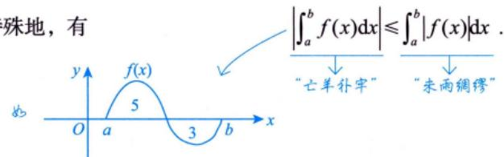

③若f(x)在 $[a,b]$ 上有界，且只有有限个间断点，则 $\int_{a}^{b} f(x) \mathrm{d}x$ 存在.

不包含无穷间断点，因为无穷间断点会导致无界

④若f(x)在 $\left[ a , b \right]$ 上有有限个第一类间断点，则 $\int_{a}^{b} f(x) \mathrm{d}x$ 存在.

(2)定积分存在的必要条件.

可积函数必有界，即若定积分 $\int_{a}^{b} f(x) \mathrm{d}x$ 存在，则f(x)在[a,b]上必有界.

注1关于定积分存在的必要条件，不妨这样理解：当我们任意分割图形底边为若干小段时，若f(x)在区间[a,b]上无界，则至少存在一个小段Δx，在∆x上，f(x)可以任意大，于是一个“小竖条’的面积f(x)∆x便可以无穷大，这样整个曲边梯形的面积就是无穷大，于是极限就不存在了，所以可积函数必有界.

注意与反常积分作区分：反常积分有可能出现函数无界的情况.

注2函数不定积分存在定理与定积分存在定理的区别与联系见例8.3.

## ③ 性质（假设以下积分均存在）

两个规定：

(1)当b=a时， $\int_{a}^{a} f(x) \mathrm{d}x = 0$

(2) 当a>b时， $\int_{a}^{b} f(x) \mathrm{d}x = - \int_{b}^{a} f(x) \mathrm{d}x$

性质1(求区间长度）假设 $a < b$ ，则 $\int_{a}^{b} \mathrm{d}x = b - a = L$ ，其中L为区间[a,b]的长度.

性质2(积分的线性性质）设 $k_{1},   k_{2}$ 为常数，则 $\int_{a}^{b} \left[ k_{1} f(x) \pm k_{2} g(x) \right] \mathrm{d}x = k_{1} \int_{a}^{b} f(x) \mathrm{d}x \pm k_{2} \int_{a}^{b} g(x) \mathrm{d}x$

性质3(积分的可加（拆)性）无论a，b，c的大小如何，总有 $\int_{a}^{b} f(x) \mathrm{d}x = \int_{a}^{c} f(x) \mathrm{d}x + \int_{c}^{b} f(x) \mathrm{d}x$

性质4(积分的保号性）若在区间 $\left[ a , b \right]$ 上 $f(x) \leqslant g(x)$ ，则有 $\int_{a}^{b} f(x) \mathrm{d}x \leqslant \int_{a}^{b} g(x) \mathrm{d}x$

特殊地，有

由图可得， $\left| \int_{a}^{b} f(x) \mathrm{d}x \right| = |5 - 3| = 2$ $\int_{a}^{b} \left| f(x) \right| \mathrm{d}x = 5 + 3 = 8$ ，则有 $\left| \int_{a}^{b} f(x) \mathrm{d}x \right| \leqslant \int_{a}^{b} \left| f(x) \right| \mathrm{d}x.$

注事实上，设f(x)是[a,b]上非负的连续函数，只要f(x)不恒等于零，则必有

$$
\int_{a}^{b} f(x) \mathrm{d}x > 0
$$

在有些积分不等式的证明与定积分值的估计中，要求获得严格的不等式结果，便需要用到这个结论，其证明见例 8.7.

极限戴帽法： $f(x) > 0$ 则 $\lim_{x \to \cdot} f(x) \geq 0$ 与极限作区分 极限脱帽法： $\lim_{x \to \cdot} f(x) > 0$ 则 $f(x) > 0$

积分： $f(x) - g(x) \leq 0 , a < b$ ，则 $\int _ { a } ^ { b } \left[ f ( x ) - g ( x ) \right] \mathrm { d } x \leqslant 0$

若有条件f(x)-g(x)连续，且不恒为0，则 $\int_{a}^{b} \left[ f(x) - g(x) \right] dx < 0$ RO

性质5(估值定理) 设M，m分别是f(x)在[a,b]上的最大值和最小值，L为区间[a,b]的长度，则有

$$
m L \leqslant \int_{a}^{b} f(x) \mathrm{d} x \leqslant M L
$$

注证 $\int_{a}^{b} m \mathrm{d}x \leqslant \int_{a}^{b} f(x) \mathrm{d}x \leqslant \int_{a}^{b} M \mathrm{d}x$ ，有 $m L \leqslant \int_{a}^{b} f(x) \mathrm{d} x \leqslant M L.$ $\geqslant m \leqslant f(x) \leqslant M$

★★★性质6(中值定理） 设f(x)在区间[a，b]上连续，则在[a，b]上至少存在一点 $\xi$ ，使得

$$
\int _ { a } ^ { b } f ( x ) \mathrm { d } x = f ( \xi ) ( b - a ) .
$$

例8.3 在区间[-1,2]上，以下四个结论：

x=0是跳跃间断点$f(x)=\begin{cases}2, & x>0, \\1, & x=0, \\-1, & x<0\end{cases}$ 2① 有原函数，但其定积分不存在；→→ x0-1

② $f(x)=\left\{\begin{aligned}&2x\sin\frac{1}{x^{2}}-\frac{2}{x}\cos\frac{1}{x^{2}}, \quad x \neq 0, \\&0, \quad x=0\end{aligned}\right.$ 有原函数，其定积分也存在；

③ $f(x)=\begin{cases}\dfrac{1}{x},&x\neq0,\\0,&x=0\end{cases}$ 没有原函数，其定积分也不存在；

④ $f(x)=\left\{\begin{aligned}&2x\cos\frac{1}{x}+\sin\frac{1}{x},\\&0,\end{aligned}\right.$ $\begin{aligned} &x \ne 0   , \\&\begin{aligned}\\ &x = 0\\ &\end{aligned}\\ \end{aligned}$ 有原函数，其定积分也存在. x=0是无穷间断点

正确结论的个数为（ ).(A)1 (B)2 (C)3 (D)4分析有第一类间断点和无穷间断点的函数f(x)在包含该间断点的区间内必没有原函数.

定积分存在的充分条件：①f(x)在[a,b]上连续；②f(x)在 $\left[ a , b \right]$ 上有界，且只有有限个间断点；③f(x)在 [a, b]上单调.

定积分存在的必要条件：①[a，b]有限长度；②f(x)在[a，b]上有界.

应选 (B).

本题通过具体的例子考查考生是否能够明确区分不定积分与定积分的存在性.逐个分析即可.

对于 $f(x)=\begin{cases}2, & x>0 ,\\1, & x=0 ,\\-1, & x<0 ,\end{cases}$ 由于x=0是其跳跃间断点，根据不定积分存在定理，在任意一个包含x=0的区间[a,b]上，f(x)一定不存在原函数，但由于f(x)满足定积分存在定理，故定积分 $\int_{a}^{b} f(x) \mathrm{d}x$ 存在，所以①错误.

对于 $f(x)=\left\{\begin{aligned}&2x\sin\frac{1}{x^{2}}-\frac{2}{x}\cos\frac{1}{x^{2}}, \quad x\neq0, \\&0, \quad x=0,\end{aligned}\right.$ x=0是其振荡间断点，但是容易验证：

若 $F(x)=\left\{\begin{aligned}&x^{2}\sin\frac{1}{x^{2}}, &x\neq0,\\&0, &x=0,\end{aligned}\right.$ 则 $F^{\prime}(x)=f(x)(-\infty<x<+\infty)$ ，所以f(x)存在原函数，但在任意一个包含x=0的区间[a,b]上，定积分 $\int_{a}^{b} f(x) \mathrm{d}x$ 不存在，因为在x=0的邻域内f(x)无界，所以②错误.

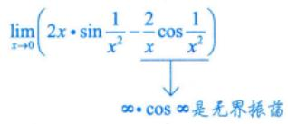

对于 $f(x)=\begin{cases}\dfrac{1}{x},&x\neq0,\\0,&x=0,\end{cases}$ 因为x=0是其无穷间断点，所以f(x)在包含x=0的区间[a,b]上不存在原函数，定积分 $\int_{a}^{b} f(x) \mathrm{d}x$ 也不存在，所以③正确.

对于 $f(x)=\left\{\begin{aligned}&2x\cos\frac{1}{x}+\sin\frac{1}{x}, \quad x \neq 0, \\&0, \quad x=0,\end{aligned}\right.$ 它在 $(-\infty, +\infty)$ 内存在原函数 $F(x)=\left\{\begin{aligned}x^{2}\cos\frac{1}{x},\quad x\neq0,\\0,\quad x=0,\end{aligned}\right.$ 并且在任意一个包含x=0的区间[a,b]上，定积分 $\int_{a}^{b} f(x) \mathrm{d}x$ 也存在，因为f(x)有界且只有一个振荡间断点，↓所以④正确. $\left| 2x\cos\frac{1}{x} + \sin\frac{1}{x} \right| \leq 2\left| x \right| \cdot \left| \cos\frac{1}{x} \right| + \left| \sin\frac{1}{x} \right| \leq 2 \cdot 2 \cdot 1 + 1 = 5$

综上所述，答案选择(B).

例8.4 设可导函数 y = f(x) 在 $\left[0,   +\infty \right)$ 上的值域是[0, + ∞), f(0) =0, f'(x)> 0,x =φ(y)是y =f(x)的反函数.记 $I = \int_{0}^{a} f(x) \mathrm{d}x + \int_{0}^{b} \varphi(y) \mathrm{d}y$ ，常数 $a ,   b > 0$ ，当 $a < \varphi(b)$ 时，则（).$y = f(x)$ 和x=φ(y)是同一条曲(A) $I > ab$ (B) $I < ab$ 线，与 $y = f^{-1}(x)$ 关于y=x对称(C) $I = ab$ (D)I与 ab的大小关系不确定

解应选(A).

由题设易知，f(x)是过原点且在 $\left[0,   +\infty\right)$ 上单调递增的函数.已知 $x = \varphi(y)$ 是y = f(x)的反函数，则 $x = \varphi(y)$ 与 $y = f(x)$ 在同一坐标系下共线，如图8-3所示.

  
图 8-3

由图8-3 可知，

$$
\begin{aligned}I = & \int_{0}^{a} f(x) \mathrm{d}x + \int_{0}^{b} \varphi(y) \mathrm{d}y \\= & S_{1} + S_{2} + S_{3} > S_{1} + S_{2} = ab\end{aligned}
$$

故 $I > ab$ . 因此选(A).

例8.5 $y = \mathrm{e}^{-x} \sin x$ 在 $\left[0,+\infty\right)$ 上与x轴所围平面区域的面积写成如下表达式：① $\int_{0}^{+\infty} \mathrm{e}^{-x} \left| \sin x \right| \mathrm{d}x$ in $\int_{0}^{+\infty} \mathrm{e}^{-x} \sin x   dx$ ; ③ $\lim_{n \to \infty} \sum_{k=0}^{n} \left| \int_{k\pi}^{(k+1)\pi} \mathrm{e}^{-x} \sin x   dx \right|$

其中正确表达式的个数是（(A) 0 (B)1 (C)2 (D)3

解应选(C).

由 $ \text{" } 二、 1. (2)  \text{" }$ 定积分的几何意义，因 $y = \mathrm{e}^{-x} \sin x$ 在 $\left[0,   +\infty\right)$ 上既有正值，也有负值，故 $\int_{0}^{+\infty} \mathrm{e}^{-x} \sin x  \mathrm{d}x$

表示其在x轴上方所围图形的面积减去其在x轴下方所围图形的面积，如图8-4所示. $\left| \int_{0}^{+\infty} \mathrm{e}^{-x} \sin x  \mathrm{d}x \right|$ 表示面积差的绝对值，不符合题意，排除②.

  
图 8-4

而 $\int_{0}^{+\infty} \mathrm{e}^{-x} \left| \sin x \right| \mathrm{d}x = \int_{0}^{+\infty} \left| \mathrm{e}^{-x} \sin x \right| \mathrm{d}x$ ，表示 $\left| \mathbf{e}^{-x} \sin x \right|$ 在 $\left[0,   +\infty\right)$ 上与x轴所围图形的面积，如图8-5所示，符合题意，故①正确.

对于③， $\left| \int_{k\pi}^{(k + 1)\pi} \mathrm{e}^{-x} \sin x   dx \right|$ 表示在[kπ，(k+1)π]上 $\mathrm{e}^{-x}\sin x$ 与x轴所围图形的面 ^y\_y=|e−xsin x|=e−x|sin x|0 π 2π 3π… x积，故 $\lim_{n \to \infty} \sum_{k=0}^{n} \left| \int_{k\pi}^{(k+1)\pi} \mathrm{e}^{-x} \sin x   dx \right|$ 亦符合题意，故③正确.所以正确的表达式有2个. 图 8-5

例8.6 $\lim_{n \to \infty} \left( \frac{n + 1}{n^2 + 1} + \frac{n + 2}{n^2 + 4} + \frac{n + 3}{n^2 + 9} + \cdots + \frac{n + n}{n^2 + n^2} \right)$ (A) $\int_{0}^{1} \frac{1 + x}{1 + x^{2}}   dx$ (B) $\int_{0}^{1} \frac{1}{1 + x}   dx$ (C) $\int_{0}^{1} \frac{x}{1 + x^{2}}   dx$ (D) $\int_{0}^{1} \frac{2x}{1 + x^{2}}   dx$

分析 $\lim_{n \to \infty} \sum_{i=1}^{n} f\left(\frac{i}{n}\right) \cdot \frac{1}{n} = \int_{0}^{1} f(x)   dx$ $\lim_{n \to \infty} \sum_{i=1}^{n} f\left(\frac{2i-1}{2n}\right) \frac{1}{n} = \int_{0}^{1} f(x)   dx$

如 $\lim_{n \to \infty} \left( \frac{1}{n^2 + n + 1} + \frac{2}{n^2 + n + 2} + \cdots + \frac{n}{n^2 + n + n} \right)$ ，利用夹逼准则，有

$$
\frac{\frac{n(n + 1)}{2}}{\frac{n^{2} + n + n}{2}} \leqslant \sum_{i = 1}^{n}\frac{i}{n^{2} + n + i} \leqslant \frac{\frac{n(n + 1)}{2}}{\frac{n^{2} + n + 1}{2}},
$$

故 $\lim_{n \to \infty} \sum_{i=1}^{n} \frac{i}{n^2 + n + i} = \frac{1}{2}$

此题若用夹逼准则，有

$$
\frac{n^{2}+\frac{n(n+1)}{2}}{n^{2}+n^{2}}<\sum_{i=1}^{n}\frac{n+i}{n^{2}+i^{2}}<\frac{n^{2}+\frac{n(n+1)}{2}}{n^{2}+1},
$$

夹不住

所以此题采用“凑定积分定义”法，即对于 $\lim_{n \to \infty} \sum_{i=1}^{n} g(n,   i)$ ，判别g(n, i) 能否写成 $f\left(\frac{i}{n}\right) \cdot \frac{1}{n}  或  \frac{1}{n} f\left(\frac{2i-1}{2n}\right)$

解应选(A).

→对于n项和的极限，先提 $\frac{1}{n}$

$$
\lim_{n \to \infty} \left( \frac{n + 1}{n^2 + 1} + \frac{n + 2}{n^2 + 4} + \frac{n + 3}{n^2 + 9} + \cdots + \frac{n + n}{n^2 + n^2} \right) = \lim_{n \to \infty} \sum_{i = 1}^{n} \frac{n + i}{n^2 + i^2}
$$

若能凑成 $f\left( \frac{i}{n} \right)$ ，则用定积分定义；  
若不能，则考虑夹逼准则。

$$
\lim_{n \rightarrow \infty}\sum_{i = 1}^{n}\frac{n^{2} + ni}{n^{2} + i^{2}} \cdot \frac{1}{n} \cdot \lim_{n \rightarrow \infty}\sum_{i = 1}^{n}\frac{1 + \frac{i}{n}}{1 + \left( \frac{i}{n} \right)^{2}} \cdot \frac{1}{n} \cdot \frac{1}{n} \cdot \frac{1 + x}{1 + x^{2}}\mathrm{d}x
$$

## 注“凑定积分定义”的步骤如下：

①先提出 $\frac{1}{n}$ ②再凑出 $\frac{i}{n}$ ③由于 $\frac{i}{n}=0+\frac{1-0}{n}i$ 故 $\frac{i}{n}$ 可以读作 $^ { \circ } 0$ 到1上的 $x^{ 即 }$ 且 $\frac{1}{n} = \frac{1 - 0}{n}$ 读作 $^ { \circ } 0$ 到1上的 $\mathbf{d}x^{\prime}$ ，于是，“凑定义”完毕.

例8.7 设f(x)是[a,b]上非负的连续函数，且f(x)不恒等于零，证明必有 $\int_{a}^{b} f(x) \mathrm{d}x > 0$

证因函数f(x)在 $\left[ a ,   b \right]$ 上不恒等于零，且非负，故至少存在一点 $x_{0} \in (a,   b)$ ，使得 $f(x_{0}) \neq 0$ ，即$f(x_{0}) > 0$

## 考研数学基础30讲·高等数学分册

由连续函数的局部保号性知，存在 $\delta > 0$ 与 $\eta > 0$ ，使得当 $x \in [x_0 - \delta, x_0 + \delta] \subset [a, b]$ 时，恒有$f(x) \geq \eta > 0$

根据定积分的不等式性质，有 $\int_{a}^{b} f(x) \mathrm{d}x \geqslant \int_{x_{0}-\delta}^{x_{0}+\delta} f(x) \mathrm{d}x \geqslant \eta \int_{x_{0}-\delta}^{x_{0}+\delta} \mathrm{d}x = 2\eta\delta > 0.$

注该命题的推论：若连续函数 $f(x),   g(x)$ 满足 $f(x) \geqslant g(x)$ ，且f(x)不恒等于 $g(x)$ ，又 $a < b$ 则必有严格不等式 $\int_{a}^{b} f(x) \mathrm{d}x > \int_{a}^{b} g(x) \mathrm{d}x$

$$
\begin{aligned}f(x) - g(x) \geq 0, \\  必  \end{aligned}
$$

$$
\int_{a}^{b} \left[ f(x) - g(x) \right] \mathrm{d}x \geqslant 0
$$

$$
\int_{a}^{b} f(x) \mathrm{d}x \geq \int_{a}^{b} g(x) \mathrm{d}x.
$$

例 8.8 设f(x)在 $\left[ a , b \right]$ 上连续，证明存在 $\xi \in [a,   b]$ ，使得

$$
\int _ { a } ^ { b } f ( x ) \mathrm { d } x = f ( \xi ) ( b - a ) .
$$

证因为f(x)在[a,b]上连续，所以f(x)在[a,b]上存在最大值M与最小值m，使得

$$
m(b - a) \leqslant \int_{a}^{b} f(x) \mathrm{d}x \leqslant M(b - a),
$$

故

$$
m \leqslant \frac{1}{b - a}\int_{a}^{b}f(x)\mathrm{d}x \leqslant M.
$$

由介值定理可知，存在 $\xi \in [a,   b]$ ，使得 $f(\xi) = \frac{1}{b - a}\int_{a}^{b}f(x)\mathrm{d}x$ ，得证.

## 注如何证明 $\xi \in (a,   b)$ 时，结论仍成立？

设f(x)在[a,b]上连续，证明存在 $\xi \in (a,   b)$ ，使得 $\int_{a}^{b} f(x) \mathrm{d}x = f(\xi)(b - a)$

证 方法一 令 $F(x) = \int_{a}^{x} f(t)   dt$ ，在 $\left[ a , b \right]$ 上用拉格朗日中值定理，则 $F(b)-F(a)=F^{\prime}(\xi)(b-a)$ 即

$$
\int _ { a } ^ { b } f ( x ) \mathrm { d } x - 0 = f ( \xi ) ( b - a ) , \xi \in ( a , b ) ,
$$

得证.

见到∫° f(x)dx) ①用积分中值定理： $\int_{a}^{b} f(x) \mathrm{d}x = f(\xi)(b - a)$ ②改成 $\int_{a}^{x} f(t) \mathrm{d}t$ 辅助法.

方法二 可用常数k来证明 $\int_{a}^{b} f(x) \mathrm{d}x = f(\xi)(b - a)$ 令 $k = \frac{\int_{a}^{b} f(x)   dx}{b - a}$ 设 $F(x)=\int_{a}^{x}f(t)\mathrm{d}t-k(x-a)$ 则 $F(b) = F(a) = 0$ 故由罗尔定理知，存在$\xi \in (a, b)$ $F^{\prime}(\xi) = 0$ 故 $\int_{a}^{b} f(x) \mathrm{d}x = f(\xi)(b - a)$ 考研真题中已经考过，可直接在大题中使用，不必证明.

例8.9 设 $I_{1} = \int_{0}^{\frac{\pi}{4}} \frac{\tan x}{x} \mathrm{d}x, I_{2} = \int_{0}^{\frac{\pi}{4}} \frac{x}{\tan x} \mathrm{d}x$ ，则（ ).(A) $I_{1} > I_{2} > 1$ (B) $1 > I_{1} > I_{2}$ (C) $I_{2} > I_{1} > 1$ (D) $1 > I_{2} > I_{1}$

## 解 应选(B).

方法一当 $x \in \left( 0, \frac{\pi}{4} \right)$ 时， $0<\sin x<x<\tan x$ ，故 $\frac{\tan x}{x} > \frac{x}{\tan x}$ ，则

$$
I_{1} = \int_{0}^{\frac{\pi}{4}} \frac{\tan x}{x}   dx > \int_{0}^{\frac{\pi}{4}} \frac{x}{\tan x}   dx = I_{2}
$$

这便排除了选项(C)和(D).

由第2讲 $^ { * 6 }$ 注 $\textcircled{2} \textcircled{7} ^ { \ast }$ 重要不等式可知，当 $0 < x < \frac{\pi}{4}$ 时， $\frac{\tan x}{x} < \frac{4}{\pi}$ ，则有 $I_{1} = \int_{0}^{\frac{\pi}{4}} \frac{\tan x}{x}   dx < \frac{4}{\pi} \int_{0}^{\frac{\pi}{4}}   dx = 1$ 故(B)正确.

方法二

$$
I_{2}-I_{1}=\int_{0}^{\frac{\pi}{4}}\frac{x}{\tan x}-\frac{\tan x}{x}\mathrm{d}x=\int_{0}^{\frac{\pi}{4}}\frac{(x+\tan x)(x-\tan x)}{x\tan x}\mathrm{d}x
$$

由积分的保号性，可知当 $x \in \left( 0, \frac{\pi}{4} \right)$ 时， $x - \tan x < 0$ ，故 $I_{2} - I_{1} < 0$ ，即 $I_{2} < I_{1}$

$g(x) = \frac{\tan x}{x}$ ，则 $g^{\prime}(x)=\frac{x\sec^{2}x-\tan x}{x^{2}}=\frac{x-\sin x\cdot\cos x}{x^{2}\cos^{2}x}$

当 $x \in \left( 0, \frac{\pi}{4} \right)$ 时， $g^{\prime}(x) > 0$ ，故g(x)单调递增，则

$$
g(x) < g\left(\frac{\pi}{4}\right) = \frac{4}{\pi}
$$

即 $I_{1} < 1$ ，故 $I_{2} < I_{1} < 1$ .因此选(B).

例8.10 设 $M = \int_{0}^{\frac{\pi}{2}} \sin(\sin x) \mathrm{d}x$ $N = \int_{0}^{\frac{\pi}{2}} \cos(\cos x)   dx$ ，则（ ).(A) $M < 1 < N$ (B) $M < N < 1$

(C) $N < M < 1$

(D) $1 < M < N$

分析考查复合函数 $f[g(x)]$

涉及知识点： $\int_{0}^{\frac{\pi}{2}} f(\sin x) \mathrm{d}x = \int_{0}^{\frac{\pi}{2}} f(\cos x) \mathrm{d}x$

$x = \frac{\pi}{2} - t$ ，则有 $\int_{0}^{\frac{\pi}{2}} f(\sin x) \mathrm{d}x = \int_{0}^{\frac{\pi}{2}} f(\cos t) \mathrm{d}t$ K积分与字母无关 ∫3 f(cos x)dx

## 解应选(A).

sin(sin x)， cos(cos x)均在 $\left[ 0 , \frac { \pi } { 2 } \right]$ 上连续，由 $\sin x \leqslant x$ 知 $\sin(\sin x) \leqslant \sin x$ ，且 $\sin(\sin x) \ne \sin x$ $\left( x \in \left[ 0 , \frac { \pi } { 2 } \right] \right)$ ，故

$\int_{0}^{\frac{\pi}{2}}\sin(\sin x)\mathrm{d}x<\int_{0}^{\frac{\pi}{2}}\sin x\mathrm{d}x=1$ ，即 $M < 1$

又

$\int_{0}^{\frac{\pi}{2}}\cos(\cos x)\mathrm{d}x=\frac{\pi}{2}-t\int_{0}^{\frac{\pi}{2}}\cos(\sin t)\mathrm{d}t>\int_{0}^{\frac{\pi}{2}}\cos t\mathrm{d}t=1$ ，即 $N > 1$

因此选(A).

## 变限积分

→本质是一个由定积分定义的函数。

## ①概念

当x在[a，b]上变动时，对应于每一个x值，积分 $\int_{a}^{x} f(t) \mathrm{d}t$ 都有一个确定的值，因此 $\int_{a}^{x} f(t) \mathrm{d}t$ 是一个关于x的函数，记作

$$
F(x)=\int_{a}^{x}f(t)\mathrm{d}t(a \leqslant x \leqslant b)
$$

称函数F(x)为变上限的定积分.同理可以定义变下限的定积分和上、下限都变化的定积分，这些都称↓为变限积分.事实上，变限积分就是定积分的推广

## 2 性质

(1)函数f(x)在I上可积，则函数 $F(x) = \int_{a}^{x} f(t)   dt$ 在I上连续 $f(x)  可导  \Rightarrow  违筷  \Rightarrow  可拟  \Rightarrow  有示$

F(x)若存在，则其一定连续.与f(x)作区分：f(x)存在但其并不一定连续.

⭐⭐⭐(2)函数f(x)在I上连续，则函数 $F(x) = \int_{a}^{x} f(t)   dt$ 在I上可导且 $F^{\prime}(x) = f(x)$

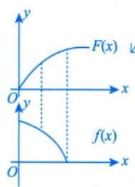

(3)若 $x = x_{0} \in I$ 是f(x)唯一的跳跃间断点，则 $F(x) = \int_{a}^{x} f(t)   dt$ 在 $x _ { 0 }$ 处不可导，且 $\left\{ \begin{aligned} F_{-}^{\prime}(x_{0}) = \lim_{x \rightarrow x_{0}^{-}} f(x), \\ F_{+}^{\prime}(x_{0}) = \lim_{x \rightarrow x_{0}^{+}} f(x). \end{aligned} \right.$ 若 $x = x_{0} \in I$ 是f(x)唯一的可去间断点，则 $F(x) = \int_{a}^{x} f(t)   dt$ 在 $x _ { 0 }$ 处可导，且 $F^{\prime}(x_0) = \lim_{x \to x_0} f(x) \neq f(x_0)$ 13.报可土间北上必空习 依据可去间断点的定义

## 注（1)第一个性质的证明如下.—→该证明不需掌握，看懂即可.

证对任意 $x, x + \Delta x \in I$ ，有

$$
F(x+\Delta x)-F(x)=\int_{x}^{x+\Delta x}f(t)\mathrm{d}t
$$

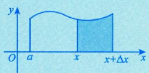

由可积的必要条件可知，存在 $M > 0$ ，使得在I上有 $\left| f(x) \right| \leq M$ ，所以有

$$
0 \leqslant \left| F(x + \Delta x) - F(x) \right| \leqslant M \left| \Delta x \right|,
$$

则 $\lim _ { \Delta x \rightarrow 0 } \left| F ( x + \Delta x ) - F ( x ) \right| = 0$ ，即 $\lim _ { \Delta x \rightarrow 0 } \left[ F ( x + \Delta x ) - F ( x ) \right] = 0$ 或 $\lim_{\Delta x \to 0} F(x + \Delta x) = F(x)$ ，得证.

## 充要条件

## F(x)在x点连续的定义 F(x)在x点逻读的定义

由此可见，对于变限积分 $F(x) = \int_{a}^{x} f(t)   dt$ 只要它存在，就必然是连续的

(2) 第二个性质的证明如下.

证 对任意的 $x, x + \Delta x \in I$ ，由于函数f(x)连续，因此

$$
\begin{aligned}\lim_{\Delta x \rightarrow 0} \frac{F(x + \Delta x) - F(x)}{\Delta x} = \lim_{\Delta x \rightarrow 0} \frac{\int_{a}^{x + \Delta x} f(t)   dt - \int_{a}^{x} f(t)   dt}{\Delta x} \\= \lim_{\Delta x \rightarrow 0} \frac{\int_{x}^{x + \Delta x} f(t)   dt}{\Delta x} = \lim_{\Delta x \rightarrow 0} \frac{f(\xi) \Delta x}{\Delta x} = \lim_{\Delta x \rightarrow 0} f(\xi) = f(x)\end{aligned}
$$

其中ξ介于x与 $x + \Delta x$ 之间.

由此可见，如果函数f(x)在区间I上连续，则 $F(x) = \int_{a}^{x} f(t)   dt$ 是f(x)在区间I上的一个原函数.

(3) 第三个性质的证明如下.

证因为 $x = x_{0} \in I$ 是f(x)唯一的间断点，所以 $x \ne x_{0}$ 时，f(x)连续，此时 $F(x) = \int_{a}^{x} f(t)   dt$ 可导，且  
$F^{\prime}(x) = f(x)$ 而 $F^{\prime}(x_0) = \lim_{x \to x_0} \frac{F(x) - F(x_0)}{x - x_0}$ →这两个等号使用洛必达法则若 $x_{0} \in I$ 是f(x)的跳跃间断点，则 $F_{-}^{\prime}(x_{0}) = \lim_{x \to x_{0}^{-}} f(x), \quad F_{+}^{\prime}(x_{0}) = \lim_{x \to x_{0}^{+}} f(x)$ 因为 $\lim_{x \to x_0^-} f(x) \neq \lim_{x \to x_0^+} f(x)$   
所以此时 $F^{\prime}_{-}(x_0) \neq F^{\prime}_{+}(x_0)$ 即 $F(x) = \int_{a}^{x} f(t)   dt$ 在 $x_{0}$ 处不可导.若 $x_{0} \in I$ 是f(x)的可去间断点，则 $\lim_{x \to x_0} f(x)$ 存在，于是 $F^{\prime}(x_0) = \lim_{x \to x_0} f(x)$ 存在.

例8.11 设函数y=f(x)在区间[-1,3]上的图形如图8-6所示，则函数 $F(x) = \int_{0}^{x} f(t)   dt$ 的图形为（).

  
图 8-6

(A)  
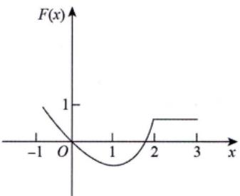

(B)  
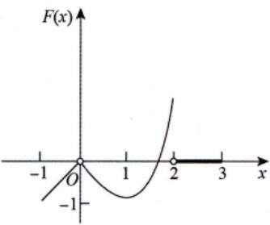

(C)  

(D)  
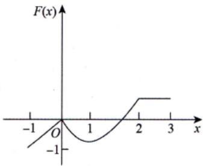

## 解应选(D).

本题有三个要点：第一，变限积分只要存在就必连续，故排除(B);第二，由f(x)有两个跳跃间断点可知，F(x)应有两个不可导点，排除 $( \mathbf { A } ) ;$ 第三， $F(0)=\int_{0}^{0}f(t)\mathrm{d}t=0$ ，所以F(x)的图像过原点，排除(C).故答案选择(D).

注本题是考研真题，如果考生能够熟练掌握一元函数积分学的有关概念和性质，便可轻松解决这个问题，而无须进行烦琐的计算，从这个角度说，本题是概念题.

例8.12 设函数 $f(x)=\begin{cases}\cos x, & 0 \leq x < \pi, \\1, & \pi \leq x \leq 2\pi.\end{cases}$ $F(x) = \int_{0}^{x} f(t)   dt$ ，则（）.(A) x = π是函数 F(x) 的跳跃间断点 (B) x =π是函数 F(x)的可去间断点(C) F(x)在x =π处连续但不可导 (D) F(x)在x=π处可导

解应选(C). $\lim_{x \to \pi^{-}} \cos x = -1 ; \lim_{x \to \pi^{+}} 1 = 1$   
方法一 由于x=π为f(x)的跳跃间断点，因此 $F(x) = \int_{0}^{x} f(t) \mathrm{d}t$ 在x=π处连续但不可导，故选(C).  
方法二 $F(x)=\int_{0}^{x}f(t)\mathrm{d}t=\left\{\begin{aligned}&\int_{0}^{x}\cos t\mathrm{d}t,\\&\int_{0}^{x}\cos t\mathrm{d}t+\int_{x}^{x}1\end{aligned}\right.$ $\begin{aligned}0 \leqslant x < \pi, \\\pi \leqslant x \leqslant 2\pi\end{aligned}=\begin{cases}\sin x, & 0 \leqslant x < \pi, \\x - \pi, & \pi \leqslant x \leqslant 2\pi.\end{cases}$ ldt ,  
因为 $\lim_{x \to \pi^{+}} F(x) = \lim_{x \to \pi^{-}} F(x) = F(\pi) = 0$ ，所以F(x)在x=π处连续.而$F_{-}^{\prime}(\pi)=\lim_{x \to \pi^{-}}\frac{F(x)-F(\pi)}{x-\pi}=\lim_{x \to \pi^{-}}\frac{\sin x-0}{x-\pi}=\lim_{x \to \pi^{-}}\frac{\cos x}{1}=-1$ $F_{+}^{\prime}(\pi)=\lim_{x \to \pi^{+}}\frac{F(x)-F(\pi)}{x-\pi}=\lim_{x \to \pi^{+}}\frac{x-\pi-0}{x-\pi}=1$

因此 $F_{-}^{\prime}(\pi) \neq F_{+}^{\prime}(\pi)$ ，即F(x)在x=π处不可导.

例8.13设 $f(x) = \begin{cases} \mathrm{e}^{x^{2}} + x^{2}, & x \neq 0, \\ a, & x = 0, \end{cases}$ 其中a为常数，令 $F(x) = \int_{-1}^{x} f(t)   dt$ ，则以下命题：①当a=1时，F(x)在x=0处可导；  
②当a≠1时，F(x)在x=0处可导；  
③当a=1时，F(x)在x=0处不可导；  
④当a≠1时，F(x)在x=0处不可导.  
所有真命题的序号为（).  
(A) ①④ (B) ①② (C) ③④ (D) ②③

解应选(B).

若a=1，则f(x)在x=0处连续，此时F(x)在x=0处可导，且 $F^{\prime}(0) = f(0) = 1$

若 $a \neq 1$ ，则x=0是f(x)的可去间断点，此时

$$
\lim_{x \to 0} \frac{\int_{-1}^{x} (e^{t^2} + t^2)   dt - \int_{-1}^{0} (e^{t^2} + t^2)   dt}{x - 0} = \lim_{x \to 0} \frac{\int_{-1}^{x} (e^{t^2} + t^2)   dt}{x - 0} = \lim_{x \to 0} \frac{\int_{-1}^{x} (e^{t^2} + t^2)   dt}{x - 0}
$$

>或用 $ \text{" } \rightleftharpoons  \text{、 } 2. (3)  \text{" }$ 的结论，直接有于是 $F^{\prime}(0)$ 存在，即F(x)在x=0处仍可导，故选(B). F(x)在x=0处可导.

注当 $a \ne 1$ 时， $F^{\prime}(0)=1 \neq a=f(0)$ ，在包含 $x = 0$ 的区间上， $F(x)$ 不是f(x)的原函数.

例8.14设 $a > 0$ ，函数f(x)在 $\left[0,   +\infty\right)$ 内连续有界，C为任意常数，证明： $y = \mathrm{e}^{-ax} \left[ \int_{0}^{x} f(t) \mathrm{e}^{at}   dt + C \right]$ 有界.

证由 $f(x)$ 在 $\left[0,   +\infty\right)$ 内有界，设 $\left| f(x) \right| \leq M$ ，则当 $x   \geqslant   0$ 时，有

$$
\begin{aligned} \left| y(x) \right| = & \left| \mathrm{e}^{-\alpha x} \left[ C + \int_{0}^{x} f(t) \mathrm{e}^{\alpha t} \mathrm{d}t \right] \right| \leqslant \left| C \mathrm{e}^{-\alpha x} \right| + \mathrm{e}^{-\alpha x} \left| \int_{0}^{x} f(t) \mathrm{e}^{\alpha t} \mathrm{d}t \right| \quad 以 \quad \left| a \pm b \right| \leqslant | a | + | b | \\ \leqslant & \left| C \right| + \mathrm{e}^{-\alpha x} \int_{0}^{x} \left| f(t) \mathrm{e}^{\alpha t} \right| \mathrm{d}t \leqslant | C | + M \mathrm{e}^{-\alpha x} \int_{0}^{x} \mathrm{e}^{\alpha t} \mathrm{d}t \\ = & \left| C \right| + \frac{M}{a} \underbrace{\left( 1 - \mathrm{e}^{-\alpha x} \right) \leqslant | C | + \frac{M}{a}}_{一} \quad 与 \quad \int_{0}^{x} \mathrm{e}^{\alpha t} \mathrm{d}t = \frac{1}{a} \int_{0}^{x} \mathrm{e}^{\alpha t} \mathrm{d}(a t) = \frac{1}{a} \left( \mathrm{e}^{\alpha t} - 1 \right) \end{aligned}
$$

得证.

## 反常积分

## 1概念

前面已经指出，定积分存在有两个必要条件：一是积分区间有限，二是被积函数有界.如果破坏了  
积分区间的有限性，就引出无穷区间上的反常积分；如果破坏了被积函数的有界性，就引出无界函数  
的反常积分.区间有限  
定积分（常义积分）被积函数有界  
反常积分(广义积分)

(1)无穷区间上反常积分的概念与敛散性.

定义1 设 $F(x)$ 是f(x)在相应区间上的一个原函数.

①

$$
\int_{a}^{+\infty} f(x) \mathrm{d}x = \lim_{x \to +\infty} F(x) - F(a)
$$

若上述极限存在，则称反常积分收敛，否则称发散.

②

$$
\int _ { - \infty } ^ { b } f ( x ) \mathrm { d } x = F ( b ) - \lim _ { x \to - \infty } F ( x ) ,
$$

若上述极限存在，则称反常积分收敛，否则称发散

③

$$
\int _ { - \infty } ^ { + \infty } f ( x ) \mathrm { d } x = \int _ { - \infty } ^ { x _ { 0 } } f ( x ) \mathrm { d } x + \int _ { x _ { 0 } } ^ { + \infty } f ( x ) \mathrm { d } x ,
$$

若右端两个积分都收敛，则称反常积分收敛，否则称发散

只要有一个发散，则原反常积分就发散

使 $f(x)  在  x_0$ 的邻域内无界的点即为瑕点，

$\lim_{x \to 0} \frac{1}{x} = \infty, \quad x = 0$ 为瑕点；

(2)无界函数的反常积分的概念与敛散性.

再 $\lim_{x \to 0} \frac{1}{x} \sin \frac{1}{x} = \pi$ 界振荡，x=0为瑕点. 7

定义2 设F(x)是f(x)在相应区间上的一个原函数， $x _ { 0 }$ 为f(x)的瑕点.

①若 $x = a$ 是唯一瑕点，则

$$
\int _ { a } ^ { b } f ( x ) \mathrm { d } x = F ( b ) - \lim _ { x \rightarrow a ^ { + } } F ( x ) ,
$$

若上述极限存在，则称反常积分收敛，否则称发散.

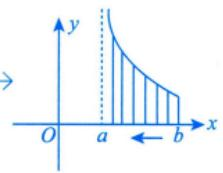

②若 $x = b$ 是唯一瑕点，则

$$
\int_{a}^{b} f(x) \mathrm{d}x = \lim_{x \to b^{-}} F(x) - F(a)
$$

若上述极限存在，则称反常积分收敛，否则称发散.

③若 $x = c \in (a,   b)$ 是唯一瑕点，则

$$
\int _ { a } ^ { b } f ( x ) \mathrm { d } x = \int _ { a } ^ { c } f ( x ) \mathrm { d } x + \int _ { c } ^ { b } f ( x ) \mathrm { d } x ,
$$

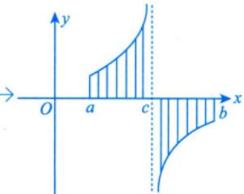

只要等号右边有一个发散，左边即发散.不存在“发散+发散=收敛”的情形.如 $\int_{-\infty}^{+\infty} x^3 \mathrm{d}x = \int_{-\infty}^{0} x^3 \mathrm{d}x + \int_{0}^{+\infty} x^3 \mathrm{d}x.$ ，由于 $\int_{-\infty}^{0} x^3   dx = -\infty$ 发散，故 $\int_{-\infty}^{+\infty} x^3 \mathrm{d}x$ 发散，而不是 $\int_{-\infty}^{+\infty} x^3 \mathrm{d}x = 0 \cdot \int_{-\infty}^{+\infty} x^3 \mathrm{d}x \neq \lim_{R \to +\infty} \int_{-R}^{R} x^3 \mathrm{d}x$ ，只有当反常积分收敛时$\int_{-\infty}^{+\infty} f(x) \mathrm{d}x = \lim_{R \to +\infty} \int_{-R}^{R} f(x) \mathrm{d}x$ 才成立. J

若右端两个积分都收敛，则称反常积分收敛，否则称发散.

注1在反常积分中，一般把“∞”和瑕点统称为奇点：→判别前提

在判别积分敛散性时，一个积分中只能有一个奇点，若出现两个及以上奇点，需拆分.

注2请看(2)的①，当 $x = a$ 为f(x)的瑕点时，f(x)便是一个无界函数 $7$ ，积分 $\int_{a}^{b} f(x) \mathrm{d}x$ 也可能存在.细心的考生可能会联想到，前面我们不是说 $\int_{a}^{b} f(x) \mathrm{d}x$ 存在的必要条件是f(x)有界”吗？这不是矛盾了吗？事实上，前面所说的 $\int_{a}^{b} f(x) \mathrm{d}x$ 是定积分（黎曼积分)，而这里的 $\int_{a}^{b} f(x) \mathrm{d}x$ 是反常积分，它们并不是一个概念，所以没有任何矛盾.只是当考生读完这一段，最好今后在提到积分存在时，特别强调一下，是定积分存在(黎曼可积，常义可积)，还是反常积分存在(广义可积).

## 2 敛散性的判别法

(1) 无穷区间.

比较判别法 设函数f(x)，g(x)在区间 $\left[ a, +\infty \right)$ 上连续，并且 $0 \leqslant \overline{f(x) \leqslant g(x)} (a \leqslant x < +\infty)$ ，则

①当 $\int_{a}^{+\infty} g(x) \mathrm{d}x$ 收敛时， $\int_{a}^{+\infty} f(x) \mathrm{d}x$ 收敛；

②当 $\int_{a}^{+\infty} f(x) \mathrm{d}x$ 发散时， $\int_{a}^{+\infty} g(x) \mathrm{d}x$ 发散.

★比较判别法的极限形式 设函数f(x)，g(x)在区间 $\left[ a, +\infty \right)$ 上连续，且 $f(x) \geqslant 0,\; g(x) > 0,\; \lim_{x \to +\infty} \frac{f(x)}{g(x)} = \lambda.$ (有限或∞)，则→说明f(x)，g(x)是同阶无穷小 计算极限

①当 $\lambda \ne 0$ 且 $\overline{\lambda \neq \infty}$ 时， $\int_{a}^{+\infty} f(x) \mathrm{d}x$ 与 $\int_{a}^{+\infty} g(x) \mathrm{d}x$ 有相同的敛散性；

→f(x)趋于0的速度比g(x)更快

②当 $\overline{\lambda = 0}$ 时，若 $\int_{a}^{+\infty} g(x) \mathrm{d}x$ 收敛，则 $\int_{a}^{+\infty} f(x) \mathrm{d}x$ 也收敛；

→g(x)趋于0的速度比f(x)更快

③当 $\overline { \lambda = \infty }$ 时，若 $\int_{a}^{+\infty} g(x) \mathrm{d}x$ 发散，则 $\int_{a}^{+\infty} f(x) \mathrm{d}x$ 也发散.

(2)无界函数.

比较判别法 设f(x)， g(x)在(a, b]上连续，瑕点同为x=a，并且 $0 \leqslant \sqrt{f(x) \leqslant g(x)} (a < x \leqslant b)$ ，则

①当 $\int_{a}^{b}g(x)\mathrm{d}x$ 收敛时， $\int_{a}^{b} f(x) \mathrm{d}x$ 收敛；

②当 $\int_{a}^{b} f(x) \mathrm{d}x$ 发散时， $\int_{a}^{b} g(x) \mathrm{d}x$ 发散.

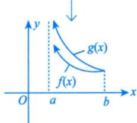

比较判别法的极限形式 设f(x)， g(x)在(a, b]上连续，瑕点同为 $x = a$ ，并且 $f(x) \geqslant 0, \; g(x) >$ $0(a<x \leq b), \lim_{x \to a^{+}} \frac{f(x)}{g(x)} = \lambda$ (有限或∞)，则 →计算极限

→说明f(x)，g(x)是同阶无穷大

①当 $\overline{\lambda \neq 0}$ 且 $\lambda \neq \infty$ 时， $\int_{a}^{b} f(x) \mathrm{d}x$ 和 $\int_{a}^{b} g(x) \mathrm{d}x$ 有相同的敛散性；

→g(x)趋于∞的速度比f(x)更快

②当 $\left| \lambda = 0 \right|$ 时，若 $\int_{a}^{b} g(x) \mathrm{d}x$ 收敛，则 $\int_{a}^{b} f(x) \mathrm{d}x$ 也收敛；

③当 $\overline { \lambda = \infty }$ 时，若 $\int_{a}^{b} g(x) \mathrm{d}x$ 发散，则 $\int_{a}^{b} f(x) \mathrm{d}x$ 也发散.

注两个重要结论.

① $\int_{0}^{1} \frac{1}{x^{p}}   dx$ 收敛， $0 < p < 1$ p=1是临界值， $\int_{0}^{1} \frac{1}{x}   dx = 0 - \lim_{x \to 0^{+}} \ln x = +\infty$ 发散， $p \geq 1$ 越小越收敛

收敛， $p > 1$ +00 ②J区 dx 发散， $p \leq 1$ 越大越收敛

$$
\int_{1}^{+\infty} \frac{1}{x}   dx = \lim_{x \to +\infty} \ln x - \ln 1 = +\infty
$$

对于①，盯着 $x \to 0^{+}$ 看， $x^{p}$ 的次数p：当 $p \geq 1$ 时， $x^{p}$ 趋于0的“速度”够快，其倒数 $\frac{1}{x^{p}}$ 趋于+∞的“速度”亦够快，积分发散；当 $0 < p < 1$ 时， $x^{p}$ 趋于0的“速度”不够快，其倒数 $\frac{1}{x^{p}}$ 趋于 $+ \infty$ 的“速度”亦不够快，积分收敛.

懂得了以上道理后，便可有所发挥，如当 $x \to 0^{+}$ 时， $\left| \sin x - x \right|$ 这意味着 sin x 与 x趋于 0的“速度”一样.故 $\int_{0}^{1} \frac{1}{\sin^{p} x}   dx$ (有时命制成 $\int_{0}^{\frac{\pi}{2}} \frac{1}{\sin^{p} x}   dx$ 依然满足 $\lim_{x \to 0^{+}} \frac{\sin x}{x} = 1 ,  故  \lim_{x \to 0^{+}} \frac{\sin^{p} x}{x^{p}} = 1$

收敛 $0 < p < 1$ 发散， $p \geq 1$

事实上，凡是与x趋于0的“速度”一样的函数f(x)均可如上讨论.

对于②，盯着 $x \rightarrow +\infty$ 看， $x^{p}$ 的次数p：当 $p > 1$ 时， $x^{p}$ 趋于+∞的“速度”够快，其倒数 $\frac{1}{x^{p}}$ 趋于0的“速度”亦够快，积分收敛；当 $p \leq 1$ 时， $\dot{x}^{p}$ 趋于+∞的“速度”不够快，其倒数 $\frac{1}{x^{p}}$ 趋于0的“速度”亦不够快，积分发散.

这里的发挥简单些，如当 $x \rightarrow + \infty$ 且a>0时， $ax + b$ 亦趋于+∞，与x趋于+∞的“速度”一样当 $ax + b \geqslant k > 0$ 时， $\int_{1}^{+\infty} \frac{1}{(ax + b)^p}   dx$ 依然满足 收敛， 发散， $p \leq 1$ $p > 1$ $\lim_{x \to +\infty} \frac{(ax + b)^p}{(ax)^p} = 1$

例8.15设 $a > b > 0$ ，反常积分 $\int_{0}^{+\infty} \frac{1}{x^a + x^b}$ dx收敛，则（）.(A) a>1 且b>1 (B) a>1 且 $b   <   1$ (C) $a < 1$ 且 $a + b > 1$ (D) a <1且 $b < 1$

解应选(B).

理论依据在“四、 $2 ^ { \circ }$ 的注中讲过了，来看此题：

$$
\int_{0}^{1} \frac{1}{x^{a} + x^{b}}   dx + \int_{1}^{+\infty} \frac{1}{x^{a} + x^{b}}   dx = I_{1} + I_{2}
$$

对于 $I _ { 1 }$ ，盯着 $x \to 0 ^ { + }$ 看，由于 $a > b > 0$ ，因此 $x ^ { b }$ 趋于0的“速度”慢于 $x ^ { a }$ 趋于0的“速度”，

$x^{a}+x^{b}\sim x^{b}$ ，于是 $I _ { 1 }$ 与 $\int_{0}^{1} \frac{1}{x^{b}}   dx$ 同敛散，则 $b   <   1$

对于 $I _ { 2 }$ ，盯着 $x \to + \infty$ 看，由于 $a > b > 0$ ，因此 $x ^ { a }$ 趋于+∞的“速度”快于 $x^{b}$ 趋于+∞的“速度”，$x^{a}+x^{b}$ 与 $x ^ { a }$ 为等价无穷大量，于是 $I _ { 2 }$ 与 $\int_{1}^{+\infty} \frac{1}{x^a}   dx$ 同敛散，则 $a > 1$ ·

综上，a>1且 $b   <   1$ ，故选(B).

例8.16 若反常积分 $\int_{1}^{+\infty} \left( \mathrm{e}^{-\cos \frac{1}{x}} - \mathrm{e}^{-1} \right) x$ kdx收敛，则k的取值范围是

解应填k<1.

盯着x→+∞看，由 $\mathrm{e}^{-\cos \frac{1}{x}} - \mathrm{e}^{-1} = \mathrm{e}^{-1} \left( \mathrm{e}^{-\cos \frac{1}{x} + 1} - 1 \right)$ ，又当 $x \to + \infty$ 时，$\mathrm{e}^{-\cos \frac{1}{x}+1}-1 \sim 1-\cos \frac{1}{x} \sim \frac{1}{2} \cdot \frac{1}{x^{2}}$

故原反常积分与 $\int_{1}^{+\infty} \frac{1}{x^{2-k}}   dx$ 同敛散，故当2-k>1，即k<1时，原反常积分收敛.

例8.17 以下反常积分发散的是（).(A) $\int_{1}^{+\infty} \left[ \ln \left( 1 + \frac{1}{x} \right) - \frac{1}{1+x} \right] \mathrm{d}x$ (B) $\int_{0}^{+\infty} \frac{\ln x}{1 + x^2}   dx$ (C) $\int_{-1}^{1} \frac{\mathrm{d}x}{\sin x}$ (D) $\int_{-\infty}^{+\infty} \frac{\sin x}{1 + x^2}   dx$

解应选(C). → lr $\ln \left(1+\frac{1}{x}\right)=\ln \frac{x+1}{x}=\ln (x+1)-\ln x$ 拉格朗日中值定理1 $x < \xi < x + 1$   
对于(A)，对 $x \in [1, +\infty)$ ，有 故 $\frac{1}{x + 1} < \frac{1}{\xi} < \frac{1}{x}, \quad  即  \quad \frac{1}{x + 1} < \ln\left( 1 + \frac{1}{x} \right) < \frac{1}{x}$ $0<\ln\left(1+\frac{1}{x}\right)-\frac{1}{1+x}<\frac{1}{x}-\frac{1}{x+1}=\frac{1}{x(x+1)}<\frac{1}{x^2}$   
由 $\int_{1}^{+\infty} \frac{1}{x^2}   dx$ 收敛，可知 $\int_{1}^{+\infty} \left[ \ln \left( 1 + \frac{1}{x} \right) - \frac{1}{1 + x} \right]$ dx收敛.  
对于(B), $\int_{0}^{+ \infty}\frac{\ln x}{1 + x^{2}}\mathrm{d}x = \int_{0}^{1}\frac{\ln x}{1 + x^{2}}\mathrm{d}x + \int_{1}^{+ \infty}\frac{\ln x}{1 + x^{2}}\mathrm{d}x$ 当 $x \to + \infty$ 时， $\frac{\ln x}{\frac{1 + x^{2}}{\ln x}} = 1$   
因为 故 $\int_{1}^{+\infty} \frac{\ln x}{1 + x^2}$ dx敛散性与 $\int_{1}^{+\infty} \frac{\ln x}{x^2}   dx$ 相同，此$\frac{\ln x}{1 + x^{2}} = 1$ 式收敛，则 $\int_{1}^{+\infty} \frac{\ln x}{1 + x^2}$ dx收敛

且反常积分 $\int_{0}^{1} \ln x   dx$ 收敛，所以反常积分 $\int_{0}^{1} \frac{\ln x}{1 + x^{2}}$ dx收敛.V又因为 $\lim_{x \to 0^{+}} \frac{\ln x}{\frac{1}{\sqrt{x}}} = \lim_{x \to 0^{+}} \sqrt{x} \ln x = 0$ ，而 $\int_{0}^{1} \frac{1}{\sqrt{x}}   \mathrm{d}x$ 收敛，故∫ln xdx 收敛.

$$
\frac{\ln x}{\frac{1 + x^{2}}{1}} = 0
$$

且反常积分 $\int_{1}^{+\infty} \frac{1}{x^{\frac{3}{2}}} \mathrm{d}x$ 收敛，所以反常积分 $\int_{1}^{+\infty} \frac{\ln x}{1 + x^2}   dx$ 收敛.

综上可知，反常积分 $\int_{0}^{+\infty} \frac{\ln x}{1 + x^2}$ dx收敛.

对于(C)，由于 $\lim_{x \to 0^{+}} \frac{\frac{1}{\sin x}}{\frac{1}{x}} = 1$ ，因此 $\int_{0}^{1} \frac{1}{\sin x}   dx$ 发散.而 $\int_{- 1}^{1}\frac{1}{\sin x}\mathrm{d}x = \int_{- 1}^{0}\frac{1}{\sin x}\mathrm{d}x + \int_{0}^{1}\frac{1}{\sin x}\mathrm{d}x$ ，可知 $\int_{-1}^{1} \frac{1}{\sin x}   dx$ 发散.

对于(D), $\int_{-\infty}^{+\infty} \frac{\sin x}{1 + x^2}   dx = \int_{-\infty}^{0} \frac{\sin x}{1 + x^2}   dx + \int_{0}^{+\infty} \frac{\sin x}{1 + x^2}   dx$ dx，且有

$$
\int_{0}^{+\infty} \frac{\sin x}{1+x^2}   dx \leqslant \int_{0}^{+\infty} \left| \frac{\sin x}{1+x^2} \right|   dx \leqslant \int_{0}^{+\infty} \frac{1}{1+x^2}   dx = \left. \arctan x \right|_{0}^{+\infty} = \frac{\pi}{2}
$$

由对称区间反常积分结论（见下面的注），可知 $\int_{-\infty}^{+\infty} \frac{\sin x}{1 + x^2}$ dx收敛.

注当f(x) 为偶函数且 $\int_{0}^{+\infty} f(x) \mathrm{d}x$ 收敛时，

$$
\int _ { - \infty } ^ { + \infty } f ( x ) \mathrm { d } x = 2 \int _ { 0 } ^ { + \infty } f ( x ) \mathrm { d } x .
$$

当f(x)为奇函数且 $\int_{0}^{+\infty} f(x) \mathrm{d}x$ 收敛时，

$$
\int_{-\infty}^{+\infty} f(x) \mathrm{d}x = 0
$$

例8.18 已知α>0，则对于反常积分 $\int_{0}^{1} \frac{\ln x}{x^{\alpha}}   dx$ 的敛散性的判别，正确的是（).

(A)当α≥1时，积分收敛

$$
\alpha < 1
$$

分析 比较判别法 $\begin{aligned}&\left\{\begin{aligned}&\textcircled{1}  放缩  \; 0 \leq f(x) \leq g(x) \; ; \\&\textcircled{2}  计算极限  \left\{\begin{aligned}&\frac{0}{0} , \\&\frac{\infty}{\infty} .\end{aligned}\right.\end{aligned}\right.\end{aligned}$

当α<1时，取充分小的正数ε，使得 $\alpha + \varepsilon < 1$ ，由于故当 $x \to 0^{+}$ 时， $\frac{1}{x^{\alpha + \varepsilon}}$ 是比 $\frac{\ln x}{x^{\alpha}}$ 高阶的无穷大量，因为当 $\alpha + \varepsilon < 1$ 时， $\int_{0}^{1} \frac{1}{x^{\alpha + \varepsilon}}   dx$ 收敛，于是 $\int_{0}^{1} \frac{\ln x}{x^{\alpha}}   dx$ 收敛，选项(B) 正确；

当 $\alpha   \geqslant   1$ 时，由于 $\lim_{x \to 0^{+}} x^{\alpha} \frac{\ln x}{x^{\alpha}} = \infty$ ，故当 $x   \to   0 ^ { + }$ 时， $\frac{1}{x^{\alpha}}$ 是比 $\frac{\ln x}{x^{\alpha}}$ 低阶的无穷大量，因为当 $\alpha   \geqslant   1$ 时，$\int_{0}^{1} \frac{1}{x^{\alpha}}   dx$ 发散，于是 $\int_{0}^{1} \frac{\ln x}{x^{\alpha}}   dx$ 发散. $\lim_{x \to 0^{+}} \frac{\frac{\ln x}{x^{\alpha}}}{\frac{1}{x^{\alpha}}}$ 是比较判别法的极限形式

注 $\int_{0}^{1} \frac{\ln x}{x^{p}}   dx$ 收敛， $0 \leq p < 1$ 发散， $p \geq 1$

例8.19 已知 $\alpha > 0$ ，则对于反常积分 $\int_{1}^{+\infty} \frac{\ln x}{x^{\alpha}}$ dx的敛散性的判别，正确的是（）.(A)当 $0 < \alpha \leq 1$ 时，积分收敛 (B)当α>1时，积分收敛(C)敛散性与α无关，必收敛 (D)敛散性与α无关，必发散

分析 反常积分判别敛散性.

①放缩法 $0 \leqslant f(x) \leqslant g(x)$ ②计算极限 $\frac{0}{0}, \frac{\infty}{\infty};$ 比较判别法$\left\{ \begin{aligned} &\int_{0}^{1} \frac{1}{x^{p}} \mathrm{d}x \left\{ \begin{aligned}\\ &\end{aligned} \right. \\&\int_{1}^{+\infty} \frac{1}{x^{p}} \mathrm{d}x \left\{ \begin{aligned}\\ &\end{aligned} \right. \\&\end{aligned} \right.$ 收敛， 发散， $\begin{aligned} &0 < p < 1, \\&p \geq 1;\\ \end{aligned}$ $\int_{0}^{1} \frac{\ln x}{x^{p}}   dx \Bigg\{$ 收敛， 发散， $p { \geq } 1$ $0 \leq p < 1$ ③4个结论收敛， $\left\{ p > 1 \right., \left. \int_{1}^{+\infty} \frac{\ln x}{x^p} \mathrm{d}x \right\}$ 收敛， $p   >   1$ 发散， 发散， $p { \leqslant } 1$

补充：若 $\lim_{x \to +\infty} x^p f(x) = \lambda \geq 0$ ，且 $p > 1$ ，则 $\int_{1}^{+\infty} f(x) \mathrm{d}x$ 收敛.$\lim_{x \to +\infty} \frac{f(x)}{\frac{1}{x^p}} = 0 , \quad p > 1$ 时， $\int_{1}^{+\infty} \frac{1}{x^p}   \mathrm{d}x.$ 收敛，故 $\int_{1}^{+\infty} f(x) \mathrm{d}x.$ 收敛.  
解应选(B). →  
当 $0 < \alpha \leq 1$ 且x充分大时， $\frac{\ln x}{x^{\alpha}} > \frac{1}{x^{\alpha}}$ ，由于 $\int_{1}^{+\infty} \frac{1}{x^{\alpha}}   dx$ 发散，因此 $\int_{1}^{+\infty} \frac{\ln x}{x^{\alpha}}   dx$ 发散；  
当 $\alpha   >   1$ 时，取充分小的正数ε，使 $\alpha - \varepsilon > 1$ ，由 $\lim_{x \to +\infty} \frac{\frac{\ln x}{x^\alpha}}{\frac{1}{x^{\alpha - \varepsilon}}} = \lim_{x \to +\infty} \frac{\ln x}{x^\varepsilon} = 0$ ，且 $\int_{1}^{+\infty} \frac{1}{x^{\alpha - \varepsilon}}   dx$ 收敛，

故 $\int_{1}^{+\infty} \frac{\ln x}{x^{\alpha}}   dx$ 收敛.

故选(B).

## 基础习题精练

## 习题

8.1 设 $I_{1} = \int_{0}^{\frac{\pi}{2}} \frac{\sin x}{x}   dx, \quad I_{2} = \int_{0}^{\frac{\pi}{2}} \frac{x}{\sin x}   dx$ ，则（ ).(A) $I_{1} > I_{2} > 1$ (B) $1   >   I _ { 1 }   >   I _ { 2 }$ (C) $I_{2} > I_{1} > 1$ (D) $1 > I_{2} > I_{1}$

8.2 设 $\begin{aligned} &df(x) = \left\{ \begin{aligned}\\ &x, &x < 0, \\&\frac{1}{2}, &x = 0, \\&1, &x > 0,\\ &\end{aligned} \right.\\ \end{aligned}$ 则下列命题：   
①f(x)在[-1,1]上有原函数; ②f(x)在[-1,1]上可积；   
③ $F(x) = \int_{-1}^{x} f(t)   dt$ 在x=0处可导； ④ $F(x) = \int_{-1}^{x} f(t)   dt$ 在x=0处连续但不可导. 正确命题的个数为（).   
(A)1 (B)2 (C)3 (D)4

8.3 若反常积分 $\int_{0}^{+\infty} \frac{\ln x}{(1 + x)x^{1-p}}$ dx收敛，则（ ).(A) $p < 1$ (B) $p   >   1$ (C) $0 < p < 1$ (D) $0 \leq p < 1$

8.4 $\lim_{n \to \infty} \left( \frac{1}{\sqrt{n^2 + n}} + \frac{1}{\sqrt{n^2 + 2n}} + \frac{1}{\sqrt{n^2 + 3n}} + \cdots + \frac{1}{\sqrt{n^2 + n^2}} \right)$

8.5 $\lim_{n \to \infty} \sum_{i=1}^{n} \frac{\sin \frac{i \pi}{n}}{n + \frac{1}{i}}$

8.6 设 $F(x) = \int_{0}^{x} (t - \left[ t \right]) \mathrm{d}t$ ，其中[x]表示不超过x的最大整数，则 $F_{-}^{\prime}(1) + F_{+}^{\prime}(1) =$ \_

8.7 讨论 $\int_{2}^{+\infty} \frac{1}{x \ln^{p} x}   dx$ 的敛散性，其中p为任意实数.

## 解答

8.1 (C) 解 当 $x \in \left( 0, \frac{\pi}{2} \right)$ 时， $\sin x < x$ ，故 $\frac{x}{\sin x} > 1 > \frac{\sin x}{x}$ ，则

$$
I _ { 2 } = \int _ { 0 } ^ { \frac { \pi } { 2 } } \frac { x } { \sin x } \mathrm { d } x > \int _ { 0 } ^ { \frac { \pi } { 2 } } \frac { \sin x } { x } \mathrm { d } x = I _ { 1 } ,
$$

排除选项(A)和(B).

由第2讲 $^ { \ast } 6 .$ 注(2) $\textcircled{8} ^ { \ast }$ 可知，当 $0 < x < \frac{\pi}{2}$ 时， $\frac{\sin x}{x} > \frac{2}{\pi}$ ，则有

$$
I _ { 1 } = \int _ { 0 } ^ { \frac { \pi } { 2 } } \frac { \sin x } { x } \mathrm { d } x > \int _ { 0 } ^ { \frac { \pi } { 2 } } \frac { 2 } { \pi } \mathrm { d } x = 1 .
$$

故(C)正确.

8.2 (B) 解 x =0是f(x)的跳跃间断点，于是①错误；

f(x)在[-1,1]上有界且只有一个间断点，于是②正确；

在f(x)的跳跃间断点x=0处， $F ( x )$ 连续但不可导，于是③错误，④正确.

注进一步，本题的 $f(x)=\begin{cases}x,&x<0,\\\dfrac{1}{2},&x=0,\\1,&x>0\end{cases}$ 可由 $\lim_{t \to 0^{+}} \frac{x + \mathrm{e}^{\frac{x}{t}}}{1 + \mathrm{e}^{\frac{x}{t}}}$ 获得，即 $f(x) = \lim_{t \to 0^{+}} \frac{x + \mathrm{e}^{\frac{x}{t}}}{1 + \mathrm{e}^{\frac{x}{t}}}$

8.3 (C) 解 此积分为有一个瑕点x=0的无穷区间上的反常积分，可写为

$$
\int_{0}^{+\infty} \frac{\ln x}{(1+x)x^{1-p}} \mathrm{d}x = \int_{0}^{1} \frac{\ln x}{(1+x)x^{1-p}} \mathrm{d}x + \int_{1}^{+\infty} \frac{\ln x}{(1+x)x^{1-p}} \mathrm{d}x
$$

对任意 $\varepsilon > 0$ ，有

$$
\lim _ { x \rightarrow 0 ^ { + } } \frac { \frac { \ln x } { ( 1 + x ) x ^ { 1 - p } } } { \frac { 1 } { x ^ { 1 - p + \varepsilon } } } = \lim _ { x \rightarrow 0 ^ { + } } x ^ { \varepsilon } \ln x = 0 ,
$$

若 $\int_{0}^{1} \frac{1}{x^{1 - p + \varepsilon}}$ dx收敛，即 $1 - p < 1, \; p > 0$ ，则 $\int_{0}^{1} \frac{\ln x}{(1 + x)x^{1 - p}}$ dx也收敛.

对任意 $\varepsilon > 0$ ，有

$$
\lim_{x \to +\infty} \frac{\frac{\ln x}{(1 + x)x^{1 - p}}}{\frac{1}{x^{2 - p - \varepsilon}}} = \lim_{x \to +\infty} \frac{\ln x}{x^{\varepsilon}} = 0
$$

若 $\int_{1}^{+\infty} \frac{1}{x^{2-p-\varepsilon}} \mathrm{d}x$ 收敛，即 $2 - p > 1, \; p < 1$ ，则 $\int_{1}^{+\infty} \frac{\ln x}{(1 + x)x^{1-p}}$ dx也收敛.

综上，当 $0 < p < 1$ 时，反常积分 $\int_{0}^{+\infty} \frac{\ln x}{(1 + x)x^{1-p}} \mathrm{d}x$ 收敛.

8.4 $2\sqrt{2}-2$ 解原式 $\begin{aligned}\xi = \lim_{n \rightarrow \infty} \sum_{i = 1}^{n} \frac{1}{\sqrt{n^{2} + ni}} = \lim_{n \rightarrow \infty} \sum_{i = 1}^{n} \frac{1}{\sqrt{1 + \frac{i}{n}}} \cdot \frac{1}{n} \\= \int_{0}^{1} \frac{1}{\sqrt{1 + x}}   dx = 2\sqrt{1 + x} \bigg|_{0}^{1} = 2\sqrt{2} - 2\end{aligned}$

注能凑成 $\frac{i}{n}$ 则用定积分定义；凑不成的，先用放缩法，放缩后再用定积分定义

常见的几种凑定积分定义的式子有

(1)

$$
\begin{aligned}\lim_{n \rightarrow \infty}\left( \frac{1}{n + 1} + \frac{1}{n + 2} + \cdots + \frac{1}{n + n} \right) = \lim_{n \rightarrow \infty}\sum_{i = 1}^{n}\frac{1}{n + i} = \lim_{n \rightarrow \infty}\sum_{i = 1}^{n}\frac{1}{1 + \frac{i}{n}} \cdot \frac{1}{n} \\= \int_{0}^{1}\frac{1}{1 + x}\mathrm{d}x = \ln\left( 1 + x \right)|_{0}^{1} = \ln 2\end{aligned}
$$

这里分母上有 $n + i$ ，提出n后，会化成 $1 + \frac{i}{n}$

(2)

$$
\begin{aligned} &\lim_{n \rightarrow \infty}\left( \frac{n}{n^{2} + 1^{2}} + \frac{n}{n^{2} + 2^{2}} + \cdots + \frac{n}{n^{2} + n^{2}} \right) = \lim_{n \rightarrow \infty}\sum_{i = 1}^{n}\frac{n}{n^{2} + i^{2}} \\&= \lim_{n \rightarrow \infty}\sum_{i = 1}^{n}\frac{n^{2}}{n^{2} + i^{2}} \cdot \frac{1}{n} = \lim_{n \rightarrow \infty}\sum_{i = 1}^{n}\frac{1}{1 + \left( \frac{i}{n} \right)^{2}} \cdot \frac{1}{n} \\&= \int_{0}^{1}\frac{1}{1 + x^{2}}\mathrm{d}x = \arctan x\Big|_{0}^{1} = \frac{\pi}{4}.\end{aligned}
$$

这里分母上有 $n^{2}+i^{2}$ ，提出 $n ^ { 2 }$ 后，会化成 $1 + \left( \frac{i}{n} \right)^{2}$

(3) 对于本题，分母上有 $n^{2} + ni$ ，提出 $n ^ { 2 }$ 后，会化成 $1 + \frac{i}{n}$

8.5 $\frac{2}{\pi}$ 解当各项分母相同且均为n时，

$$
\lim_{n \to \infty} \sum_{i=1}^{n} \frac{\sin \frac{i \pi}{n}}{n} = \lim_{n \to \infty} \frac{1}{n} \sum_{i=1}^{n} \sin \frac{i}{n} \pi = \int_{0}^{1} \sin \pi x   dx
$$

于是，先对 $\sum_{i = 1}^{n}\frac{\sin\frac{i\pi}{n}}{n + \frac{1}{i}}$ 进行放缩，有

$$
\sum_{i = 1}^{n}\frac{\sin\frac{i\pi}{n}}{n + 1} \leqslant \sum_{i = 1}^{n}\frac{\sin\frac{i\pi}{n}}{n + 1} \leqslant \sum_{i = 1}^{n}\frac{\sin\frac{i\pi}{n}}{n},
$$

由于

$$
\lim_{n \to \infty} \sum_{i=1}^{n} \frac{\sin \frac{i \pi}{n}}{n} = \lim_{n \to \infty} \frac{1}{n} \sum_{i=1}^{n} \sin \frac{i}{n} \pi = \int_{0}^{1} \sin \pi x   dx = \frac{2}{\pi}
$$

$$
\sum_{i = 1}^{n}\frac{\sin\frac{i\pi}{n}}{n + 1} = \lim_{n \rightarrow \infty}\frac{n}{n + 1} \cdot \frac{1}{n}\sum_{i = 1}^{n}\sin\frac{i}{n}\pi = 1 \cdot \int_{0}^{1}\sin\pi x\mathrm{d}x = \frac{2}{\pi}
$$

因此，由夹逼准则得

$$
\lim_{n \to \infty} \sum_{i=1}^{n} \frac{\sin \frac{i \pi}{n}}{n + \frac{1}{i}} = \frac{2}{\pi}
$$

8.6 1 解 设 $f(x) = x - \left[ x \right]$ ，其图形如图8-7所示.

  
图 8-7

方法一 因为x=1是 $y = f(x)$ 的跳跃间断点，所以

$$
F_{-}^{\prime}(1)=\lim_{x \to 1^{-}} f(x)=1,\;F_{+}^{\prime}(1)=\lim_{x \to 1^{+}} f(x)=0,
$$

故 $F_{-}^{\prime}(1) + F_{+}^{\prime}(1) = 1$

方法二

$$
F_{-}^{\prime}(1)=\lim_{x \to 1^{-}}\frac{F(x)-F(1)}{x-1}=\lim_{x \to 1^{-}}\frac{\int_{0}^{x}t\mathrm{d}t-\frac{1}{2}}{x-1}=\lim_{x \to 1^{-}}\frac{x}{1}=1
$$

$$
\begin{aligned}F_{+}^{\prime}(1) &= \lim_{x \rightarrow 1^{+}}\frac{F(x) - F(1)}{x - 1} = \lim_{x \rightarrow 1^{+}}\frac{\int_{0}^{1}t\mathrm{d}t + \int_{1}^{x}(t - 1)\mathrm{d}t - \frac{1}{2}}{x - 1} \\&= \lim_{x \rightarrow 1^{+}}\frac{\int_{1}^{x}(t - 1)\mathrm{d}t}{x - 1} = \lim_{x \rightarrow 1^{+}}\frac{x - 1}{1} = 0\end{aligned}
$$

故 $F_{-}^{\prime}(1) + F_{+}^{\prime}(1) = 1$

8.7 分析 本题考查反常积分敛散性的判别法(通过计算结果来判别是否收敛)，是历届考生复习

得比较薄弱的知识点.

解 ①当 $p = 1$ 时， $\int_{2}^{+\infty} \frac{1}{x \ln x}   dx = \ln \left| \ln x \right|_{2}^{+\infty} = +\infty$ ，发散；

②当 $p \neq 1$ 时，

$$
\int _ { 2 } ^ { + \infty } \frac { \mathrm { d } x } { x \ln ^ { p } x } = \frac { 1 } { 1 - p } \left( \ln x \right) ^ { 1 - p } \bigg | _ { 2 } ^ { + \infty } ,
$$

当 $p   >   1$ 时， $\lim_{x \to +\infty} (\ln x)^{1-p} = 0$ ，故收敛；当 $p < 1$ 时， $\lim_{x \to +\infty} (\ln x)^{1-p} = +\infty$ ，故发散.

综上， $\int_{2}^{+\infty} \frac{1}{x \ln^{p} x}   dx \Bigg\{$ 收敛， $\stackrel{\cdot}{p}>1$ 发散， $p { \leqslant } 1$

## 第9讲一元函数积分学的计算

<table><tr><td rowspan=1 colspan=1>考题</td><td rowspan=1 colspan=1>不定积分、定积分、变限积分和反常积分的计算</td></tr><tr><td rowspan=1 colspan=1>题型</td><td rowspan=1 colspan=1>选择题、填空题、解答题</td></tr><tr><td rowspan=1 colspan=1>目标</td><td rowspan=1 colspan=1>①掌握不定积分的基本公式，掌握不定积分与定积分的换元积分法与分部积分法；②会求有理函数、三角函数有理式和简单无理函数的积分；③掌握牛顿－莱布尼茨公式；④会计算反常积分</td></tr><tr><td rowspan=1 colspan=1>重难点</td><td rowspan=1 colspan=1>①不定积分和反常积分的计算；②定积分的计算和方法；③变限积分的计算和结论；④有些原函数无法用基本初等函数进行表示</td></tr></table>

## 基础知识结构

基本积分公式的由来： $\begin{aligned}\left[F(x)\right]^{\prime} = f(x) \Rightarrow \int f(x) \mathrm{d}x = F(x) + C , \quad \left(\frac{1}{k+1} x^{k+1}\right)^{\prime} = x^k \Rightarrow \int x^k \mathrm{d}x = \frac{1}{k+1} x^{k+1} + C . \\ 乐笑狈今中四大狈今方法  \leqslant \quad F^{\prime}(x) \quad f(x) \quad \int f(x) \mathrm{d}x \quad F(x)\end{aligned}$

需要牢记，是所有积分计算的基础！！！所有的积分计算通过客种方法最后都化为基本积分公式。

$$
\frac{F^{\prime}(x) = f(x)}{ 逆 }
$$

两个难点： ，使用基本的积分方法找不到 $F ( x )$

→引入中间变量

②有的原函数无法用基本初等函数进行表示。

## 基本积分公式

以下10组公式，要牢记.

①∫xdx = 1 xk+1 +C, k ≠−1; $\left\{ \begin{aligned} \frac{1}{x^{2}} \mathrm{d}x = - \frac{1}{x} + C, \\ \int \frac{1}{\sqrt{x}} \mathrm{d}x = 2\sqrt{x} + C. \end{aligned} \right.$ k +1

② $\int \frac{1}{x} \mathrm{d}x = \ln |x| + C \quad \Longrightarrow \quad (\ln x)^{\prime} = \frac{1}{x}$

③ $\int \mathrm{e}^{x} \mathrm{d}x = \mathrm{e}^{x} + C$ on $\int a^{x} \mathrm{d}x = \frac{a^{x}}{\ln a} + C, a > 0$ 且 $a \ne 1 \quad \longrightarrow (a^x)' = a^x \ln a$

④ $\int \sin x \mathrm{d}x = -\cos x + C ; \int \cos x \mathrm{d}x = \sin x + C$

$$
\int \tan x \mathrm{d}x = -\ln \left| \cos x \right| + C ; \int \cot x \mathrm{d}x = \ln \left| \sin x \right| + C ;
$$

$$
\left( - \ln \left| \cos x \right| \right)^{\prime} = \tan x \Rightarrow \int \tan x   dx = - \ln \left| \cos x \right| + C
$$

角度二： $\int \tan x   dx = \int \frac{\sin x}{\cos x}   dx = -\int \frac{1}{\cos x} \left( \cos x \right)^{\prime}   dx \quad (凑徽今) \\ \frac{u = \cos x}{} - \int \frac{1}{u}   du = -\ln |u| + C = -\ln |\cos x| + C.$

$$
\int \frac{\mathrm{d}x}{\cos x} = \int \sec x \mathrm{d}x = \ln \left| \sec x + \tan x \right| + C ; \quad \lambda
$$

$$
\int \frac{\mathrm{d}x}{\sin x} = \int \csc x \mathrm{d}x = \ln |\csc x - \cot x| + C;
$$

$$
\int \sec^{2} x \mathrm{d}x = \tan x + C ; \int \csc^{2} x \mathrm{d}x = -\cot x + C ;
$$

$$
\int \sec x \tan x \mathrm{d}x = \sec x + C ; \int \csc x \cot x \mathrm{d}x = -\csc x + C .
$$

$$
\int \frac{1}{1 + x^{2}}\mathrm{d}x = \arctan x + C, \quad \int \frac{1}{a^{2} + x^{2}}\mathrm{d}x = \frac{1}{a}\arctan\frac{x}{a} + C(a > 0).
$$

$$
\int \frac{1}{\sqrt{1 - x^{2}}}   dx = \arcsin x + C, \quad \int \frac{1}{\sqrt{a^{2} - x^{2}}}   dx = \arcsin \frac{x}{a} + C (a > 0).
$$

$$
\begin{aligned}\int \frac{1}{x^{2} + a^{2}}\mathrm{d}x = & \frac{1}{a}\int \frac{1}{1 + \left( \frac{x}{a} \right)^{2}}\left( \frac{x}{a} \right)^{\prime}\mathrm{d}x \\\xlongequal{\frac{x}{a} = u} & \frac{1}{a}\int \frac{1}{1 + u^{2}}\mathrm{d}u = \frac{1}{a}\arctan u + C \\= & \frac{1}{a}\arctan\frac{x}{a} + C\end{aligned}
$$

$$
\int \frac{1}{\sqrt{x^{2} + a^{2}}}   dx = \ln(x + \sqrt{x^{2} + a^{2}}) + C \quad ( 常见    a = 1), \quad \int \frac{1}{\sqrt{x^{2} - a^{2}}}   dx = \ln\left| x + \sqrt{x^{2} - a^{2}} \right| + C \quad (|x| > |a|).
$$

$$
\int \frac{1}{x^{2} - a^{2}} \mathrm{d}x = \frac{1}{2a} \ln \left| \frac{x - a}{x + a} \right| + C \left( \int \frac{1}{a^{2} - x^{2}} \mathrm{d}x = \frac{1}{2a} \ln \left| \frac{x + a}{x - a} \right| + C \right)
$$

$$
\int \sqrt{a^{2}-x^{2}} \mathrm{d}x=\frac{a^{2}}{2}\arcsin \frac{x}{a}+\frac{x}{2}\sqrt{a^{2}-x^{2}}+C(a>|x|\geqslant0)
$$

$$
\int \frac{1}{a^{2}-x^{2}} \mathrm{d}x=-\int \frac{1}{x^{2}-a^{2}} \mathrm{d}x=-\frac{1}{2a} \ln \left|\frac{x-a}{x+a}\right|+C \quad 且 \quad \frac{1}{2a} \ln \left|\frac{x+a}{x-a}\right|+C.
$$

10 $\int \sin ^{2}x\mathrm{d}x=\frac{x}{2}-\frac{\sin 2x}{4}+C\left ( \sin ^{2}x=\frac{1-\cos 2x}{2} \right )$ ；—→记住2次方即可，3次方不用再记

$$
\int \cos ^{2}x\mathrm{d}x=\frac{x}{2}+\frac{\sin 2x}{4}+C\left ( \cos ^{2}x=\frac{1+\cos 2x}{2} \right ) ;
$$

$$
\int \tan ^{2} x \mathrm{d}x = \tan x - x + C \left( \tan ^{2} x = \sec ^{2} x - 1 \right);
$$

$$
\int \cot ^{2} x\mathrm{d}x = -\cot x - x + C\left( \cot ^{2} x = \csc ^{2} x - 1 \right)
$$

## 不定积分的积分法

## 凑微分法

$$
g(x) = u
$$

$\int f[g(x)]g^{\prime}(x)\mathrm{d}x = \int f[g(x)]\mathrm{d}[g(x)] = \int f(u)\mathrm{d}u$ →若可以代入基本积分公式，则结束

注当被积函数比较复杂时，拿出一部分放到d后面去，若能凑成 $\int f(u) \mathrm{d}u$ 的形式，则凑微分成功.比如，

$$
\int \frac{\ln^{5}x}{x}\mathrm{d}x = \int \ln^{5}x \cdot \frac{1}{x}\mathrm{d}x = \int \ln^{5}x\mathrm{d}(\ln x) = \frac{\ln^{6}x}{6} + C.
$$

即注2的⑤

$$
\int\limits_{0}^{1} \left| \int_{0}^{x} x \cdot (\ln x)^{\prime} \mathrm{d}x \right|
$$

## →放入d后面要熟练

## 注2常用的凑微分公式：

①由于 $x\mathrm{d}x = \frac{1}{2}\mathrm{d}(x^{2})$ ，故 $\int x f(x^2) \mathrm{d}x = \frac{1}{2} \int f(x^2) \mathrm{d}(x^2) = \frac{1}{2} \int f(u) \mathrm{d}u.$

②由于 $\sqrt{x} \mathrm{d}x = \frac{2}{3} \mathrm{d}(x^{\frac{3}{2}})$ ，故 $\int \sqrt{x} f(x^{\frac{3}{2}}) \mathrm{d}x = \frac{2}{3} \int f(x^{\frac{3}{2}}) \mathrm{d}(x^{\frac{3}{2}}) = \frac{2}{3} \int f(u) \mathrm{d}u.$

③由于 $\frac{\mathrm{d}x}{\sqrt{x}} = 2\mathrm{d}(\sqrt{x})$ $\int \frac{f(\sqrt{x})}{\sqrt{x}} \mathrm{d}x = 2\int f(\sqrt{x}) \mathrm{d}(\sqrt{x}) = 2\int f(u) \mathrm{d}u$

④由于 $\frac{\mathrm{d}x}{x^{2}} = \mathrm{d}\left( - \frac{1}{x} \right)$ $\int \frac{f\left( - \frac{1}{x} \right)}{x^{2}}\mathrm{d}x = \int f\left( - \frac{1}{x} \right)\mathrm{d}\left( - \frac{1}{x} \right) = \int f(u)\mathrm{d}u$

⑤由于当x>0时， $\frac{1}{x}\mathrm{d}x = \mathrm{d}(\ln x)$ 故 $\int \frac{f(\ln x)}{x} \mathrm{d}x = \int f(\ln x) \mathrm{d}(\ln x) = \int f(u) \mathrm{d}u.$

⑥由于 $\mathrm{e}^{x} \mathrm{d}x = \mathrm{d}(\mathrm{e}^{x})$ ，故 $\int \mathrm{e}^{x} f(\mathrm{e}^{x}) \mathrm{d}x = \int f(\mathrm{e}^{x}) \mathrm{d}(\mathrm{e}^{x}) = \int f(u) \mathrm{d}u$

⑦由于 $a^{x}\mathrm{d}x = \frac{1}{\ln a}\mathrm{d}(a^{x}), a > 0, a \neq 1.$ 故， $\int a^{x} f(a^{x}) \mathrm{d}x = \frac{1}{\ln a} \int f(a^{x}) \mathrm{d}(a^{x}) = \frac{1}{\ln a} \int f(u) \mathrm{d}u.$

⑧由于 $\sin x   dx = \mathrm{d}(-\cos x)$ ，故 $\int \sin x \cdot f(-\cos x) \mathrm{d}x = \int f(-\cos x) \mathrm{d}(-\cos x) = \int f(u) \mathrm{d}u$

⑨由于 $\cos x \mathrm{d}x = \mathrm{d}(\sin x)$ ，故 $\int \cos x \cdot f(\sin x) \mathrm{d}x = \int f(\sin x) \mathrm{d}(\sin x) = \int f(u) \mathrm{d}u$

⑩由于 $\frac{\mathrm{d}x}{\cos^{2}x}=\sec^{2}x\mathrm{d}x=\mathrm{d}(\tan x)$ 故， $\int \frac{f(\tan x)}{\cos^{2}x}\mathrm{d}x = \int f(\tan x)\mathrm{d}(\tan x) = \int f(u)\mathrm{d}u.$

①由于 $\frac{\mathrm{d}x}{\sin^{2}x}=\csc^{2}x\mathrm{d}x=\mathrm{d}(-\cot x)$ 故 $\int \frac{f(-\cot x)}{\sin^2 x}   dx = \int f(-\cot x)   d(-\cot x) = \int f(u)   du$

②由于 $\frac{1}{1 + x^{2}}\mathrm{d}x = \mathrm{d}(\arctan x)$ $\int \frac{f(\arctan x)}{1 + x^{2}}\mathrm{d}x = \int f(\arctan x)\mathrm{d}(\arctan x) = \int f(u)\mathrm{d}u$

B由于 $\frac{1}{\sqrt{1 - x^{2}}}\mathrm{d}x = \mathrm{d}(\arcsin x)$ 做， $\int \frac{f(\arcsin x)}{\sqrt{1 - x^{2}}} \mathrm{d}x = \int f(\arcsin x) \mathrm{d}(\arcsin x) = \int f(u) \mathrm{d}u$

$$
\int\frac{\left( \arcsin x \right)^{2}}{\sqrt{1 - x^{2}}}\mathrm{d}x = \int\left( \arcsin x \right)^{2}\mathrm{d}\left( \arcsin x \right)\arcsin x = \int u^{2}\mathrm{d}u = \frac{1}{3}u^{3} + C = \frac{1}{3}\arcsin^{3}x + C
$$

选择复杂部分求导 $\frac{\left( \arcsin x \right)^{\prime}}{\sqrt{1 - x^{2}}}$

例9.1 求不定积分 $\int\frac{\sqrt{x}}{\sqrt{4 - x^{3}}}\mathrm{d}x$

解

$$
\int\frac{\sqrt{x}}{\sqrt{4 - x^{3}}}\mathrm{d}x = \frac{2}{3}\int\frac{\mathrm{d}(x^{\frac{3}{2}})}{\sqrt{4 - (x^{\frac{3}{2}})^{2}}} = \frac{2}{3}\int\frac{\mathrm{d}(x^{\frac{3}{2}})}{2\sqrt{1 - \left(\frac{1}{2}x^{\frac{3}{2}}\right)^{2}}}
$$

$$
\frac{2}{3}\int\frac{\mathrm{d}\left(\frac{1}{2}x^{\frac{3}{2}}\right)}{\sqrt{1-\left(\frac{1}{2}x^{\frac{3}{2}}\right)^{2}}}=\frac{2}{3}\arcsin\left(\frac{1}{2}x^{\frac{3}{2}}\right)+C.
$$

例9.2 求不定积分 $\int \mathrm{e}^{\frac{\sin \theta}{\cos \theta + \sin \theta}} \cdot \frac{1}{\left( \cos \theta + \sin \theta \right)^{2}} \mathrm{d}\theta$ .(真题中大题最后一步)

分析若不是常用的凑微分公式，则可对被积函数的复杂部分 $g(x)$ 求导，若 $g^{\prime}(x) = f(x)$ ，即 $\mathrm{d}[g(x)] = f(x)\mathrm{d}x$ 则 $\int f(x)g(x)\mathrm{d}x = \int g(x)\mathrm{d}[g(x)]$ ，凑微分成功.

解对复杂部分求导：

$$
\left( \frac{\sin \theta}{\cos \theta + \sin \theta} \right)' = \frac{\cos \theta (\cos \theta + \sin \theta) - \sin \theta (-\sin \theta + \cos \theta)}{(\cos \theta + \sin \theta)^2} = \frac{1}{(\cos \theta + \sin \theta)^2}
$$

故

$$
\mathrm{d}\left( \frac{\sin \theta}{\cos \theta + \sin \theta} \right) = \frac{1}{\left( \cos \theta + \sin \theta \right)^{2}} \mathrm{d}\theta,
$$

于是

## 2 换元法

$$
\int \frac{\left| \frac{\sin \theta}{\cos \theta + \sin \theta} \right|}{\sqrt{\left[ g(x) \right]^{\prime}}} \mathrm{d}\left( \frac{\sin \theta}{\frac{\cos \theta + \sin \theta}{\sqrt{\left[ g(x) \right]^{\prime}}}} \right) = \mathrm{e}^{\frac{\sin \theta}{\cos \theta + \sin \theta}} + C
$$

(1) 基本思想.

$$
\int f(x) \mathrm{d}x \xlongequal{x = g(u)} \int f[g(u)] \mathrm{d}[g(u)] = \int f[g(u)] g'(u) \mathrm{d}u .
$$

本质：f(x)比较复杂，如 V $\sqrt{ \mathrm{e}^{x} + 1 } , \sqrt{ \frac{2x + 1}{x + 1} } , \frac{1}{\sqrt{ \mathrm{e}^{2x} + 1 } }$

引入新的自变量u，将原式化简为 $\int h(u) \mathrm{d}u.$ ，可代入公式

注(1)当被积函数不容易积分(比如含有根式或含有反三角函数)时，可以通过换元的方法从d后面拿出一部分放到前面来，就成为 $\int f[g(u)]g^{\prime}(u)\mathrm{d}u$ 的形式，若 $f[g(u)]g^{\prime}(u)$ 容易积分，则换元成功

(2) $x = g(u)$ 须是单调可导函数，且不要忘记计算结束后用反函数 $u = g^{-1}(x)$ 回代.

(2) 常用换元法.

①三角函数代换——当被积函数含有如下根式时，可作三角函数代换，这里 $a > 0$

√a²−x²→令x=asint,|t|<元

√a2 +x2 →令x = a tant, $\left| t \right| < \frac{\pi}{2}   ,$

$x > 0$ 则 $0 < t < \frac{\pi}{2}$

若x<0,则 $\frac{\pi}{2} < t < \pi.$

②恒等变形后作三角函数代换——当被积函数含有根式 $\sqrt{ax^{2}+bx+c}$ 时，可先化为以下三种形式：

$$
\sqrt { \varphi ^ { 2 } ( x ) + k ^ { 2 } } , \sqrt { \varphi ^ { 2 } ( x ) - k ^ { 2 } } , \sqrt { k ^ { 2 } - \varphi ^ { 2 } ( x ) } ,
$$

再作三角函数代换.

解题利器：“令复杂=t”

举重若轻 77★★★③根式代换——当被积函数含有根式 $\sqrt[n]{ax + b}, \sqrt{\frac{ax + b}{cx + d}}, \sqrt{ae^{bx} + c}$ 等时，一般令根式 $\underline { { \underline { { \sqrt { * } } } = \underline { { t } } } }$ (因为事实上，很难通过根号内换元的办法凑成平方，所以根号无法去掉).对既含有 $\sqrt [ n ] { a x + b }$ ，也含有$\sqrt[m]{ax + b}$ 的函数，一般取m，n的最小公倍数l，令 $\sqrt[l]{ax + b} = t$

→比如，含有√ax+b，√ax+b的函数，令 $t = \sqrt[6]{ax + b}$

④倒代换——当被积函数分母的幂次比分子高两次及两次以上时，作倒代换，令 $x = \frac{1}{t}$

未必一定用，如 ↓ $\begin{aligned}\int \frac{1}{x(x^3 + 1)} \mathrm{d}x = & \int \frac{x^2}{x^3(x^3 + 1)} \mathrm{d}x = \frac{1}{3} \int \frac{1}{x^3(x^3 + 1)} \mathrm{d}(x^3) \\\xlongequal{x^3 = t} & \frac{1}{3} \int \frac{1}{t(t + 1)} \mathrm{d}t = \frac{1}{3} \int \left( \frac{1}{t} - \frac{1}{t + 1} \right) \mathrm{d}t \\= & \frac{1}{3} (\ln \left| t \right| - \ln \left| t + 1 \right|) + C \\= & \frac{1}{3} \ln \left| \frac{x^3}{x^3 + 1} \right| + C\end{aligned}$

⑤复杂函数的直接代换——当被积函数中含有 $a^{x}   ,   \mathbf{e}^{x}$ ，ln x，arcsin x，arctan x等时，可考虑直接令复杂函数等于t，值得指出的是，当ln x，arcsinx，arctan x与 $P _ { n } ( x )$ 或 $\mathsf { e } ^ { a x }$ 作乘法时(其中 $P_{n}(x)$ 为x的n次多项式)，优先考虑分部积分法.

例9.3 求不定积分 $\int \sqrt{a^{2}-x^{2}} \mathrm{d}x (a>0)$

$$
\xrightarrow{-a \leqslant x \leqslant a,-\frac{\pi}{2} \leqslant t \leqslant \frac{\pi}{2}}
$$

解设 $x = a \sin t$ ，则 $\mathrm{d}x = a\cos l$ tdt , $t = \arcsin \frac{x}{a}$ ，所以

$$
\begin{aligned}\int \sqrt{a^{2}-x^{2}} \mathrm{d}x = & \int \sqrt{a^{2}-a^{2} \sin ^{2} t} \cdot a \cos t \mathrm{d}t = a^{2} \int \cos ^{2} t \mathrm{d}t = \frac{a^{2}}{2} \int (1+\cos 2t) \mathrm{d}t \\= & \frac{a^{2}}{2} t+\frac{a^{2}}{4} \sin 2t+C=\frac{a^{2}}{2} t+\frac{a^{2}}{2} \sin t \cos t+C \\= & \frac{a^{2}}{2} \arcsin \frac{x}{a}+\frac{x}{2} \sqrt{a^{2}-x^{2}}+C.\end{aligned}
$$

## ③分部积分法

(1) $\int\limits_{\substack{u \mathrm{d}v \\ \mathrm{ 难算 }}} = uv - \int v\mathrm{d}u$

注1这个方法主要适用于求 udv 比较困难，而 vdu 比较容易的情形.

注2积分后会“简单”些的函数宜取作ν；微分后会“简单”些的函数宜取作μ.故u，ν的选取原则为 指、三均可为u

相对位置在左边的宜选作μ，用来求导；相对位置在右边的宜选作ν，用来积分，即

(1) 被积函数为 $P_{n}(x)\mathrm{e}^{kx}, P_{n}(x)\sin ax, P_{n}(x)\cos ax$ 等形式时，一般来说选取 $u = P_{n}(x)$

(2) 被积函数为 $\mathrm{e}^{ax}\sin bx,\mathrm{e}^{ax}\cos bx$ 等形式时，μ可以取两因子中的任意一个；

(3)被积函数为 $P_{n}(x)\ln x,\;P_{n}(x)\arcsin x,\;P_{n}(x)\arctan x$ 等形式时，一般分别选取

$$
u = \ln x , u = \arcsin x , u = \arctan x.
$$

$$
\begin{aligned}\int \frac{\mathrm{d}x}{u} \int \ln(1 + x^2) \mathrm{d}x = & \int \ln(1 + x^2) \cdot x^{\prime} \mathrm{d}x \\= & \ln(1 + x^2) \cdot x - \int x \cdot \frac{2x}{1 + x^2} \mathrm{d}x \\= & x \ln(1 + x^2) - 2\int \frac{x^2 + 1 - 1}{x^2 + 1} \mathrm{d}x \\= & x \ln(1 + x^2) - 2x + 2\arctan x + C.\end{aligned}
$$

$$
\begin{aligned}\iint_{D} x^{3} \mathrm{e}^{x} \mathrm{d}x = & \int x^{3} \mathrm{d}(\mathrm{e}^{x}) = x^{3} \mathrm{e}^{x} - \int \mathrm{e}^{x} \cdot 3x^{2} \mathrm{d}x \\= & x^{3} \mathrm{e}^{x} - 3\int x^{2} \mathrm{d}(\mathrm{e}^{x}) \\= & x^{3} \mathrm{e}^{x} - 3\left(x^{2} \mathrm{e}^{x} - \int \mathrm{e}^{x} \cdot 2x \mathrm{d}x\right) \\= & x^{3} \mathrm{e}^{x} - 3x^{2} \mathrm{e}^{x} + 6x \mathrm{e}^{x} - 6\mathrm{e}^{x} + C\end{aligned}
$$

(2)分部积分法的推广公式与 $\int P_{n}(x)e^{kx}\mathrm{d}x,\int P_{n}(x)\sin ax\mathrm{d}x,\int P_{n}(x)\cos bx\mathrm{d}x$

设函数 $u = u(x)$ 与 $\nu = \nu(x)$ 具有直到第n+1阶的连续导数，并根据分部积分公式

$$
\int u \mathrm{d}v = uv - \int v \mathrm{d}u   ,
$$

则有

$$
\int u v ^ { ( n + 1 ) } \mathrm { d } x = u v ^ { ( n ) } - u ^ { \prime } v ^ { ( n - 1 ) } + u ^ { n } v ^ { ( n - 2 ) } - \cdots + ( - 1 ) ^ { n } u ^ { ( n ) } v + ( - 1 ) ^ { n + 1 } \int u ^ { ( n + 1 ) } v \mathrm { d } x .
$$

注证明n=3时，如下：

证

$$
\begin{aligned}\int u v^{(4)} \mathrm{d}x &= u v^{(3)} - u^{\prime} v^{\prime \prime} + u^{\prime \prime} v^{\prime} - u^{(3)} v + \int u^{(4)} v \mathrm{d}x . \\\int u v^{(4)} \mathrm{d}x &= \int u \mathrm{d}[v^{(3)}] = u v^{(3)} - \int u^{\prime} v^{(3)} \mathrm{d}x , \\\int u^{\prime} v^{(3)} \mathrm{d}x &= \int u^{\prime} \mathrm{d}(v^{\prime \prime}) = u^{\prime} v^{\prime \prime} - \int u^{\prime \prime} v^{\prime \prime} \mathrm{d}x , \\\int u^{\prime \prime} v^{\prime \prime} \mathrm{d}x &= \int u^{\prime \prime} \mathrm{d}(v^{\prime}) = u^{\prime \prime} v^{\prime} - \int u^{(3)} v^{\prime} \mathrm{d}x , \\\int u^{(3)} v^{\prime} \mathrm{d}x &= \int u^{(3)} \mathrm{d}v = u^{(3)} v - \int u^{(4)} v \mathrm{d}x .\end{aligned}
$$

联立以上式子，得

$$
\int u v^{(4)} \mathrm{d}x = u v^{(3)} - u^{\prime} v^{\prime \prime} + u^{\prime \prime} v^{\prime} - u^{(3)} v + \int u^{(4)} v \mathrm{d}x
$$

事实上，可写成如下表格：

<table><tr><td rowspan=1 colspan=1>u的各阶导数</td><td rowspan=1 colspan=1> $u$ </td><td rowspan=1 colspan=1> $u ^ { \prime }$ </td><td rowspan=1 colspan=1></td><td rowspan=1 colspan=1></td><td rowspan=1 colspan=1>CT $\frac{u^{(4)}}{\Phi}$ </td></tr><tr><td rowspan=1 colspan=1> $\nu ^ { ( 4 ) }$ 的各阶原函数</td><td rowspan=1 colspan=1> $\nu ^ { ( 4 ) }$ </td><td rowspan=1 colspan=1> $\nu ^ { ( 3 ) }$ </td><td rowspan=1 colspan=1></td><td rowspan=1 colspan=1></td><td rowspan=1 colspan=1></td></tr></table>

计算方法：以μ作起点左上、右下错位相乘，各项符号 $ \text{" }+ \text{" }- \text{" }$ 相间，最后一项为 $\int u^{(4)} \nu \mathrm{d}x$ 比如，求不定积分 $\int \left( x^{3} + 2x + 6 \right) \mathrm{e}^{2x} \mathrm{d}x$ ，则

<table><tr><td rowspan=1 colspan=1> $x^{3} + 2x + 6$ </td><td rowspan=1 colspan=1> $3 x ^ { 2 } + 2$ </td><td rowspan=1 colspan=1> $6 x$ </td><td rowspan=1 colspan=1>6</td><td rowspan=1 colspan=1>0</td></tr><tr><td rowspan=1 colspan=1> $\psi _ { - } ^ { ( 4 ) }$  $\mathbf{e}^{2x}$ </td><td rowspan=1 colspan=1> $\frac{1}{2}e^{2x}$ </td><td rowspan=1 colspan=1> $\frac{1}{4}\mathrm{e}^{2x}$ </td><td rowspan=1 colspan=1>+ $\frac{1}{8}e^{2x}$ </td><td rowspan=1 colspan=1> $\frac{1}{16}\mathrm{e}^{2x}$ </td></tr></table>

利用上述表格，可得

$$
\begin{aligned}= (x^{3} + 2x + 6)\left(\frac{1}{2}e^{2x}\right) - (3x^{2} + 2)\left(\frac{1}{4}e^{2x}\right) + 6x\left(\frac{1}{8}e^{2x}\right) - 6\left(\frac{1}{16}e^{2x}\right) + \int 0 \cdot \left(\frac{1}{16}e^{2x}\right)dx \\= \left(\frac{1}{2}x^{3} - \frac{3}{4}x^{2} + \frac{7}{4}x + \frac{17}{8}\right)e^{2x} + C.\end{aligned}
$$

例9.4 求不定积分 $\int \frac{x\mathrm{e}^{x}}{\sqrt{\mathrm{e}^{x} - 1}}\mathrm{d}x$

分析 ① $\int_{\frac{1}{2}} \mathrm{d}x \rightarrow \int_{\frac{1}{2}} \mathrm{d}x$ .②带√且无平方项，整体代换令其为 $\pmb { u }$ 稳定不好求易求

解本题主要考查换元法、分部积分法.

区 $u = \sqrt{\mathrm{e}^{x} - 1}$ ，则 $x = \ln(1 + u^{2})$ , dx $\frac{2u}{1 + u^{2}}\mathrm{d}u$ ，从而

$$
\begin{aligned}\int \frac{x \mathrm{e}^{x}}{\sqrt{\mathrm{e}^{x}-1}} \mathrm{d}x &= \int \frac{\left(1+u^{2}\right) \ln \left(1+u^{2}\right)}{u} \cdot \frac{2 u}{1+u^{2}} \mathrm{d}u = 2 \int \ln \left(1+u^{2}\right) \mathrm{d}u \\&= 2 u \ln \left(1+u^{2}\right) - \int \frac{4 u^{2}}{1+u^{2}} \mathrm{d}u = 2 u \ln \left(1+u^{2}\right) - 4 u + 4 \arctan u + C \\&= 2 x \sqrt{\mathrm{e}^{x}-1}-4 \sqrt{\mathrm{e}^{x}-1}+4 \arctan \sqrt{\mathrm{e}^{x}-1}+C .\end{aligned}
$$

例9.5 求不定积分 $\int\frac{xe^{\arctan x}}{(1 + x^{2})^{\frac{3}{2}}}$ dx .

分析 带 $\leftharpoondown$ 且有平方项→三角代换 $x = \tan t \rightarrow$ 消 $\leftharpoondown$

解本题涉及换元法、分部积分法.

设 $x = \tan t$ ，则

又

$$
\int \frac{x\mathrm{e}^{x\tan t}}{\left( 1 + x^{2} \right)^{\frac{3}{2}}}\mathrm{d}x = \int \frac{\mathrm{e}^{t}\tan t}{\left( 1 + \tan^{2}t \right)^{\frac{3}{2}}}\sec^{2}t\mathrm{d}t = \int \mathrm{e}^{t}\sin t\mathrm{d}t, \quad \int \mathrm{e}^{t}\sin t\mathrm{d}t = \int \mathrm{e}^{t}\sin t\mathrm{d}t = \int \mathrm{e}^{t}\mathrm{d}\left( \cos t - \left( \mathrm{e}^{t}\cos t - \int \mathrm{e}^{t}\cos t\mathrm{d}t \right) \right) = \int \mathrm{e}^{t}\cos t\mathrm{d}t = \int \mathrm{e}^{t}\sin t\mathrm{d}t
$$

故原式 $\int \mathrm{e}^{t} \sin t \mathrm{d}t = \frac{1}{2} \mathrm{e}^{t} \left( \sin t - \cos t \right) + C = \frac{(x - 1)\mathrm{e}^{\arctan x}}{2\sqrt{1 + x^{2}}} + C$

注(\*)处亦可直接套用如下公式：

$$
\int \mathrm{e}^{ax} \sin bx   dx = \frac{\left| \left( \mathrm{e}^{ax} \right)^{\prime} \left( \sin bx \right)^{\prime} \right|}{\mathrm{e}^{ax} \sin bx} + C = \frac{a\mathrm{e}^{ax} \sin bx - b\mathrm{e}^{ax} \cos bx}{a^{2} + b^{2}} + C
$$

$$
\int \mathrm{e}^{ax} \cos bx   dx = \frac{\left| \left( \mathrm{e}^{ax} \right)^{\prime} \left( \cos bx \right)^{\prime} \right|}{\mathrm{e}^{ax} \cos bx} + C = \frac{a\mathrm{e}^{ax} \cos bx + b\mathrm{e}^{ax} \sin bx}{a^2 + b^2} + C
$$

再如， $\int \mathrm{e}^{-x} \sin nx   dx = \frac{-\mathrm{e}^{-x} \sin nx - n\mathrm{e}^{-x} \cos nx}{(-1)^2 + n^2} + C.$

例9.6 设 $f(\ln x) = \frac{\ln(1 + x)}{x}$ ，计算 $\int f(x) \mathrm{d}x$

分析首先，本题要求出f(x)的表达式，一般方法是令t=lnx.其次，计算具体积分，或先凑微分再分部积分，或换元再分部积分.

解设lnx=t，则 $x = \mathrm{e}^{t}, f(t) = \frac{\ln(1 + \mathrm{e}^{t})}{\mathrm{e}^{t}}$ ，故

$$
\begin{aligned}\int f(x) \mathrm{d}x = & \int \frac{\ln(1 + \mathrm{e}^{x})}{\mathrm{e}^{x}} \mathrm{d}x = - \int \ln(1 + \mathrm{e}^{x}) \mathrm{d}(\mathrm{e}^{-x}) \\= & - \mathrm{e}^{-x} \ln(1 + \mathrm{e}^{x}) + \int \frac{1}{1 + \mathrm{e}^{x}} \mathrm{d}x \\= & - \mathrm{e}^{-x} \ln(1 + \mathrm{e}^{x}) + \int \left(1 - \frac{\mathrm{e}^{x}}{1 + \mathrm{e}^{x}}\right) \mathrm{d}x \\= & - \mathrm{e}^{-x} \ln(1 + \mathrm{e}^{x}) + x - \ln(1 + \mathrm{e}^{x}) + C \\= & x - (1 + \mathrm{e}^{-x}) \ln(1 + \mathrm{e}^{x}) + C .\end{aligned}
$$

例9.7 计算不定积分 $\int \mathrm{e}^{2x} \left( \tan x + 1 \right)^2 \mathrm{d}x$

分析展开平方，利用三角函数公式化简.

解

$$
\begin{aligned}\int \mathrm{e}^{2x}(\tan x + 1)^2 \mathrm{d}x &= \int \mathrm{e}^{2x}(\sec^2 x + 2\tan x) \mathrm{d}x \\&= \int \mathrm{e}^{2x} \sec^2 x \mathrm{d}x + 2\int \mathrm{e}^{2x} \tan x \mathrm{d}x \\&= \int \mathrm{e}^{2x} \mathrm{d}(\tan x) + 2\int \mathrm{e}^{2x} \tan x \mathrm{d}x \\&= \mathrm{e}^{2x} \tan x \boxed{-2\int \mathrm{e}^{2x} \tan x \mathrm{d}x + 2\int \mathrm{e}^{2x} \tan x \mathrm{d}x} \rightarrow \frac{ 连这令都积令 }{ 负荷点动积令 } \quad  虽线正 . \\&= \mathrm{e}^{2x} \tan x + C .\end{aligned}
$$

## 4有理函数的积分

(1)定义.

形如 $\int \frac{P_{n}(x)}{Q_{m}(x)} \mathrm{d}x (n < m)$ 的积分称为有理函数的积分，其中 $P_{n}(x), Q_{m}(x)$ 分别是x的n次多项式和m次$\frac{P_{n}(x)}{Q_{m}(x)} \left\{ \begin{aligned} n < m \\ n \geq m \end{aligned} \right.$ 真分式，多项式. 假分式=多项式+真分式.比如： $\frac{x^{2}}{x + 1} = \frac{x^{2} - 1 + 1}{x + 1} = x - 1 + \frac{1}{x + 1}$

(2) 思想.

若 $\mathcal { Q } _ { m } ( x )$ 在实数域内可因式分解，则因式分解后再把 $\frac{P_{n}(x)}{Q_{m}(x)}$ 拆成若干项最简有理分式之和.

有理式=最简有理分式之和 其中最简有理分式分为 $\frac{A}{ax + b}, \quad \frac{A_{k}}{(ax + b)^{k}}, \quad \frac{Ax + B}{px^{2} + qx + r}, \quad \frac{A_{k}x + B_{k}}{(px^{2} + qx + r)^{k}}$ $(k = 2,3,\cdots)$ 积分易算

比如

$$
\int \frac{1}{x + 1} \mathrm{d}x = \ln |x + 1| + C ,
$$

$$
\int \frac{2}{\left ( 2x - 1 \right ) ^{2} }\mathrm{d}x = \int \frac{1}{\left ( 2x - 1 \right ) ^{2} }\mathrm{d}\left ( 2x - 1 \right ) = - \frac{1}{2x - 1} + C
$$

$$
\int \frac{x - 1}{x^{2} + 1}\mathrm{d}x = \int \frac{1}{2}\frac{2x}{x^{2} + 1}\mathrm{d}x - \int \frac{1}{x^{2} + 1}\mathrm{d}x = \frac{1}{2}\ln(x^{2} + 1) - \arctan x + C .
$$

利用分部积分逆推 $I = \int \frac{\mathrm{d}x}{\left( 1 + x^{2} \right)^{2}}$ ，由于

$$
\begin{aligned}\int \frac{1}{1 + x^{2}} \mathrm{d}x = & \frac{x}{1 + x^{2}} + \int x \cdot \frac{2x}{\left( 1 + x^{2} \right)^{2}} \mathrm{d}x \\= & \frac{x}{1 + x^{2}} + 2\int \frac{x^{2} + 1 - 1}{\left( 1 + x^{2} \right)^{2}} \mathrm{d}x \\= & \frac{x}{1 + x^{2}} + 2\arctan x - 2I,\end{aligned}
$$

因此 $\frac{x}{2(1 + x^{2})} + \frac{1}{2}\arctan x + C$

(3)方法（如何拆）.

① $\mathcal { Q } _ { m } ( x )$ 的一次单因式 $ax + b$ 产生一项 $\frac{A}{ax + b}$

② $\mathcal{Q}_{m}(x)$ 的k重一次因式 $(ax + b)^{k}$ 生k项，分别为 $\frac{A_{1}}{ax + b}, \frac{A_{2}}{(ax + b)^{2}}, \cdots, \frac{A_{k}}{(ax + b)^{k}} (k = 2, 3, \cdots)$

③ $\mathcal { Q } _ { m } ( x )$ 的二次单因式 $px^{2}+qx+r$ 产生一项 $\frac{Ax + B}{px^{2} + qx + r}$

④ $\mathcal { Q } _ { m } ( x )$ 的k重二次因式 $(px^{2}+qx+r)^{k}$ 产生k项，分别为

$$
\frac{A_{1}x + B_{1}}{px^{2} + qx + r}, \frac{A_{2}x + B_{2}}{(px^{2} + qx + r)^{2}}, \cdots, \frac{A_{k}x + B_{k}}{(px^{2} + qx + r)^{k}}
$$

比如， $Q_{m}(x)=(ax+b)^{2}(px^{2}+qx+r)^{2}$ ，则有

$$
\frac{P}{Q}=\frac{A_{1}}{ax+b}+\frac{A_{2}}{(ax+b)^{2}}+\frac{A_{3}x+B}{px^{2}+qx+r}+\frac{A_{4}x+C}{(px^{2}+qx+r)^{2}}
$$

例 9.8 求 $\int\frac{4x^{2}-6x-1}{(x+1)(2x-1)^{2}}\mathrm{d}x$

解 本题主要考查有理函数的积分.

先将被积函数分解为最简有理分式之和.这时应有分解式

$$
\frac{4x^{2}-6x-1}{(x+1)(2x-1)^{2}}=\frac{A}{x+1}+\frac{B}{2x-1}+\frac{C}{(2x-1)^{2}}
$$

问题是如何定出A，B，C这三个数.右边通分后等号左、右两边的分子应恒等，即

$$
4x^{2}-6x-1=A(2x-1)^{2}+B(x+1)(2x-1)+C(x+1)\tag{*}
$$

由此恒等式不难定出A，B，C来，常用的方法有两种.

一种方法是将等式右端展开，得到

$$
4x^{2}-6x-1=(4A+2B)x^{2}+(-4A+B+C)x+(A-B+C)
$$

因为这是恒等式，等号左、右两边x的同次幂的系数应该相等，故应有

$$
\begin{cases}4A + 2B = 4, \\- 4A + B + C = - 6, \\A - B + C = - 1,\end{cases}
$$

解得 $A = 1, \; B = 0, \; C = -2$

这种方法比较死板，且解系数满足的方程组有时较烦琐.我们希望能求得A，B，C应满足的较简单的条件.

另一种方法是根据在恒等式中以变量x的任意值代入等号两边应该得到相同的值，利用这一性质，赋予x适当的值，可以得到A，B，C应满足的简单条件.例如，在(\*)式中

$x = -1$ ，有 $9 = 9A,   A = 1$

令 $x = \frac{1}{2}$ ，有 $-3 = \frac{3}{2}C,   C = -2$

令x $x = 0$ ，有 $-1 = A - B + C$ ，可求出 $B = 0$

两种方法求得的结果一致：

$$
\frac{4x^{2}-6x-1}{\left ( x+1 \right ) \left ( 2x-1 \right )^{2} }=\frac{1}{x+1}-\frac{2}{\left ( 2x-1 \right )^{2} }
$$

因此可求得

$$
\int \frac{4x^{2} - 6x - 1}{(x + 1)(2x - 1)^{2}} \mathrm{d}x = \int \frac{\mathrm{d}x}{x + 1} - \int \frac{2}{(2x - 1)^{2}} \mathrm{d}x \\= \ln |x + 1| + \frac{1}{2x - 1} + C_{1}
$$

例 9.9 求 $\int\frac{x}{x^{3}-x^{2}+x-1}\mathrm{d}x$ x .

分析对分母进行因式分解（不会很难）→拆分母，求参数→对最简有理分式积分.

解本题主要考查有理函数的积分.

因为 $x^{3}-x^{2}+x-1=(x-1)(x^{2}+1)$ ，设

$$
\frac{x}{x^{3}-x^{2}+x-1}=\frac{A}{x-1}+\frac{Bx+C}{x^{2}+1}
$$

这时应有

$$
x \equiv A(x^{2} + 1) + (Bx + C)(x - 1),\tag{*}
$$

在(\*)式中，令x=1，得 $1 = 2A,\; A = \frac{1}{2}$ ；令 $x = 0$ ，得 $0 = A - C,\ C = \frac{1}{2}$

比较(\*) 式两端 $x^{2}$ 的系数，有 $0 = A + B$ ，已求得 $A   =   \frac { 1 } { 2 }$ ，故有 $B = - \frac { 1 } { 2 }$ . 于是可得

$$
\begin{aligned}\int \frac{x}{x^{3}-x^{2}+x-1} \mathrm{d}x = & \frac{1}{2} \int \frac{\mathrm{d}x}{x-1}-\frac{1}{2} \int \frac{x-1}{x^{2}+1} \mathrm{d}x \\= & \frac{1}{2} \ln |x-1|-\frac{1}{4} \ln (x^{2}+1)+\frac{1}{2} \arctan x+C_{1} \\= & \frac{1}{4} \ln \frac{(x-1)^{2}}{x^{2}+1}+\frac{1}{2} \arctan x+C_{1} .\end{aligned}
$$

注①形如 R(sinx，cosx)的有理式称为三角函数有理式：有理函数

a.令 $t = \tan \frac{x}{2}$ $\sin x = \frac{2t}{1 + t^{2}}$ $\cos x = \frac{1 - t^{2}}{1 + t^{2}}$ （万能公式)，则有

$$
\int R(\sin x,\cos x)\mathrm{d}x=\int R\left(\frac{2t}{1+t^{2}},\frac{1-t^{2}}{1+t^{2}}\right)\frac{2}{1+t^{2}}\mathrm{d}t=\int\frac{P_{n}(t)}{Q_{m}(t)}\mathrm{d}t\ .
$$

b. 若 $R(\sin x,\cos x)=-R(-\sin x,\cos x)$ ，令 $\cos x = t$ 凑微分.

若 $R(\sin x,\cos x)=-R(\sin x,-\cos x)$ ，令 sinx =t凑微分.

若 $R(\sin x,\cos x)=R(-\sin x,-\cos x)$ ，令 tan x =t 凑微分.

② $\int f(\sqrt{a^{2}+x^{2}})dx=a\tan t$ 有理函数.

$\int f\left( \sqrt{\frac{ax + b}{cx + d}} \right) \mathrm{d}x = \sqrt{\frac{ax + b}{cx + d}}$ 有理函数

例9.10 $\frac{2x + 3}{x^{2} - x + 1}$ dx =

解应填 $\ln(x^{2}-x+1)+\frac{8\sqrt{3}}{3}\arctan\frac{2x-1}{\sqrt{3}}+C$

已是最简有理分式，请注意看接下来的积分方法

$$
\int \frac{2x + 3}{x^{2} - x + 1}\mathrm{d}x = \int \frac{2x - 1 + 4}{x^{2} - x + 1}\mathrm{d}x = \int \frac{\frac{u}{u}\mathrm{d}x - \int \frac{du}{u}\mathrm{d}u}{x^{2} - x + 1} + \int \frac{4}{x^{2} - x + 1}\mathrm{d}x = \int \frac{1}{x^{2} - x + 1}\mathrm{d}x
$$

$$
\begin{aligned}= & \ln(x^2 - x + 1) + 4\int \frac{1}{\left(x - \frac{1}{2}\right)^2 + \left(\frac{\sqrt{3}}{2}\right)^2} \mathrm{d}\left(x - \frac{1}{2}\right) \\= & \ln(x^2 - x + 1) + \frac{8\sqrt{3}}{3}\arctan\frac{2x - 1}{\sqrt{3}} + C .\end{aligned}
$$

## 定积分的计算

→牛顿-莱布尼茨公式及其推广

设函数F(x)是连续函数f(x)在[a,b]上的一个原函数，则

$$
\int _ { a } ^ { b } f ( x ) \mathrm { d } x = F ( x ) \big | _ { a } ^ { b } = F ( b ) - F ( a ) .
$$

牛顿 (1643—1727)

证令 $G(x)=\int_{a}^{x}f(t)\mathrm{d}t,\;a\leqslant x\leqslant b.$ ，则有

$$
G ( b ) = \int _ { a } ^ { b } f ( t ) \mathrm { d } t , G ( a ) = 0 ,
$$

又 $F^{\prime}(x) = f(x)$ 且 $G(x) = F(x) + C$ ，则

$$
\int _ { a } ^ { b } f ( x ) \mathrm { d } x = G ( b ) - G ( a ) = F ( b ) - F ( a ) .
$$

小故事 莱布尼茨写求 信 给北柜 康京绝 熙创 皇立善 帝 请在被 研 究院 则可能此公式会被称为康熙公式

## 注2 牛顿 － 莱布尼茨公式推广

(1) 若f(x)在[a, b]上有原函数 F(x)，则 $\int_{a}^{b} f(x) \mathrm{d}x = F(b) - F(a)$

★ (2)若f(x)在[a, b]上分段有原函数，如[a, c)上有原函数 $F_{1}(x)$ ，(c,b] 上有原函数 $F_{2}(x)$ ，则

$$
\begin{aligned}\int_{a}^{b} f(x) \mathrm{d}x = & \int_{a}^{c} f(x) \mathrm{d}x + \int_{c}^{b} f(x) \mathrm{d}x \\= & F_{1}(c - 0) - F_{1}(a) + F_{2}(b) - F_{2}(c + 0)\end{aligned}
$$

  
莱布尼茨 (1646—1716)

若 $F_{1}(c - 0), \; F_{2}(c + 0)$ 存在，则 $\int_{a}^{b} f(x) \mathrm{d}x$ 收敛，见习题 9.10.

若 $F_{1}(c - 0), F_{2}(c + 0)$ 至少有一个不存在，则 $\int_{a}^{b} f(x) \mathrm{d}x$ 发散.

例9.11 设 $f\left(x+\frac{1}{x}\right)=\frac{x+x^{3}}{1+x^{4}}$ ，则 $\int_{2}^{2\sqrt{2}}f(x)\mathrm{d}x =$

分析求f(x)→计算积分.

解应填 $\frac{1}{2} \ln 3$

由例1.1知，当 $x   \geqslant   2$ 时， $f(x) = \frac{x}{x^{2} - 2}$ ，则

$$
\int_{2}^{2\sqrt{2}}f(x)\mathrm{d}x=\int_{2}^{2\sqrt{2}}\frac{x}{x^{2}-2}\mathrm{d}x=\frac{1}{2}\ln(x^{2}-2)\bigg|_{2}^{2\sqrt{2}}=\frac{1}{2}\ln3
$$

由牛顿-莱布尼茨公式结合不定积分的计算方法，有定积分的换元积分法和分部积分法，分别如下.换元要三换：①被积函数要换：②积分变量要换：③上下限要换

$$
\begin{aligned} &\int_{a}^{b} \int_{a}^{b} f(x) \mathrm{d}x \mathrm{d}x \mathrm{d}x \mathrm{d}x \int_{a}^{b} \int_{a}^{b} \int_{a}^{\beta} \mathrm{d}x \mathrm{d}x \mathrm{d}x \mathrm{d}x \mathrm{d}x \mathrm{d}x \mathrm{d}x \mathrm{d}x \mathrm{d}x \mathrm{d}x \mathrm{d}x \mathrm{d}x \mathrm{d}x \mathrm{d}x \mathrm{d}x \mathrm{d}x \mathrm{d}x \mathrm{d}x \mathrm{d}x \mathrm{d}x \mathrm{d}x \mathrm{d}x \mathrm{d}x \mathrm{d}x \mathrm{d}x \mathrm{d}x \mathrm{d}x \mathrm{d}x \mathrm{d}x \mathrm{d}x \mathrm{d}x \mathrm{d}x \mathrm{d}x \mathrm{d}x \mathrm{d}x \mathrm{d}x \mathrm{d}x \mathrm{d}x \mathrm{d}x \mathrm{d}x \mathrm{d}x \mathrm{d}x \mathrm{d}x \mathrm{d}x \mathrm{d}x \mathrm{d}x \mathrm{d}x \mathrm{d}x \mathrm{d}x \mathrm{d}x \mathrm{d}x \mathrm{d}x \mathrm{d}x \mathrm{d}x \mathrm{d}x \mathrm{d}x \mathrm{d}x \mathrm{d}x \mathrm{d}x \mathrm{d}x \mathrm{d}x \mathrm{d}x \mathrm{d}x \mathrm{d}x \mathrm{d}x \mathrm{d}x \mathrm{d}x \mathrm{d}x \mathrm{d}x \mathrm{d}x \mathrm{d}x \mathrm{d}x \mathrm{d}x \mathrm{d}x \mathrm{d}x \mathrm{d}x \mathrm{d}x \mathrm{d}x \mathrm{d}x \mathrm{d}x \mathrm{d}x \mathrm{d}x \mathrm{d}x \mathrm{d}x \mathrm{d}x \mathrm{d}x \mathrm{d}x \mathrm{d}x \mathrm{d}x \mathrm{d}x \mathrm{d}x \mathrm{d}x \mathrm{d}x \mathrm{d}x \mathrm{d}x \mathrm{d}x \mathrm{d}x \mathrm{d}x \mathrm{d}x \mathrm{d}x \mathrm{d}x \mathrm{d}x \mathrm{d}x \mathrm{d}x \mathrm{d}x \mathrm{d}x \mathrm{d}x \mathrm{d}x \mathrm{d}x \mathrm{d}x \mathrm{d}x \mathrm{d}x \mathrm{d}x \mathrm{d}x \mathrm{d}x \mathrm{d}x \mathrm{d}x \mathrm{d}x \mathrm{d}x \mathrm{d}x \mathrm{d}x \mathrm{d}x \mathrm{d}x \mathrm{d}x \mathrm{d}x \mathrm{d}x \mathrm{d}x \mathrm{d}x \mathrm{d}x \mathrm{d}x \mathrm{d}x \mathrm{d}x \mathrm{d}x \mathrm{d}x \mathrm{d}x \mathrm{d}x \mathrm{d}x \mathrm{d}x \mathrm{d}x \mathrm{d} \mathrm{d}x \mathrm{d}x \mathrm{d}x \mathrm{d}x \mathrm{d}x \mathrm{d}x \mathrm{d} \mathrm{d}x \mathrm{d}x \mathrm{d}x \mathrm{d}x \mathrm{d} \mathrm{d}x \mathrm{d}x \mathrm{d}x \mathrm{d}x \mathrm{d} \mathrm{d}x \mathrm{d}x \mathrm{d}x \mathrm{d} \mathrm{d}x \mathrm{d}x \mathrm{d} \mathrm{d}x \mathrm{d}x \mathrm{d} \mathrm{d}x \mathrm{d}x \mathrm{d} \mathrm{d}x \mathrm{d}x \mathrm{d} \mathrm{d}x \mathrm{d}x \mathrm{d} \mathrm{d}x \mathrm{d}x \mathrm{d} \mathrm{d}x \mathrm{d}x \mathrm{d} \mathrm{d}x \mathrm{d} \mathrm{d}x \mathrm{d}x \mathrm{d} \mathrm{d}x \mathrm{d} \mathrm{d}x \mathrm{d}x \mathrm{d} \mathrm{d}x \mathrm{d} \mathrm{d}x \mathrm{d} \mathrm{d}x \mathrm{d} \mathrm{d}x \mathrm{d} \mathrm{d}x \mathrm{d} \mathrm{d}x \mathrm{d} \mathrm{d}x \mathrm{d} \mathrm{d}x \mathrm{d} \mathrm{d}x \ \end{aligned}
$$

(1) 定积分的换元积分法.

设f(x)在[a,b]上连续，函数 $x = \varphi(t)$ 满足① $\varphi(\alpha)=a,\ \varphi(\beta)=b$ ; ② $x = \varphi(t)$ 在 $[ \alpha , \beta ] ($ 或 $[ \beta ,   \alpha ] )$ 上有连续的导数，且其值域为 $R_{\varphi} = [a,   b]$ ，则有 $\begin{aligned} &\left\{ \begin{aligned}\\ &\sin\left( \frac{\pi}{2} \pm t \right) = \cos t; \\&\cos\left( \frac{\pi}{2} \pm t \right) = \mp \sin t.\\ &\end{aligned} \right.\\ \end{aligned}$ 常考： $x = \frac{\pi}{2} \pm t$ ，则有

$$
\int _ { a } ^ { b } f ( x ) \mathrm { d } x = \int _ { \alpha } ^ { \beta } f [ \varphi ( t ) ] \varphi ^ { \prime } ( t ) \mathrm { d } t .
$$

令x=π±t，则有 $\left\{ \begin{aligned} \sin(\pi \pm t) = & \mp \sin t; \\ \cos(\pi \pm t) = & -\cos t. \end{aligned} \right.$

注当 $\varphi(t)$ 的值域 $R_{\varphi}$ 超出[a,b]，但 $\varphi(t)$ 满足其余条件时，只要f(x)在 $R_{\varphi}$ 上连续，则上述结论仍成立.

(2) 定积分的分部积分法.

$$
\int _ { a } ^ { b } u ( x ) v ^ { \prime } ( x ) \mathrm { d } x = u ( x ) v ( x ) \big | _ { a } ^ { b } - \int _ { a } ^ { b } v ( x ) u ^ { \prime } ( x ) \mathrm { d } x ,
$$

这里要求 $u^{\prime}(x),   v^{\prime}(x)$ 在[a，b]上连续.

## 注在计算定积分时，下面这些结论是很有用的.

(1) 设f(x)为连续的偶函数，则

$$
\int_{-a}^{a} f(x) \mathrm{d}x = 2\int_{0}^{a} f(x) \mathrm{d}x
$$

(2) 设f(x)为连续的奇函数，则

$$
\int_{-a}^{a} f(x) \mathrm{d}x = 0
$$

(3)设f(x)是以T为周期的连续函数，则对任意的实数a，都有

$$
\int _ { a } ^ { a + T } f ( x ) \mathrm { d } x = \int _ { 0 } ^ { T } f ( x ) \mathrm { d } x ,
$$

即在长度为一个周期的区间上的定积分，与该区间的起点位置无关，其证明见例9.16.

(4) 设f(x)为连续函数，则

$$
\int _ { a } ^ { b } f ( x ) \mathrm { d } x = \int _ { a } ^ { b } f ( a + b - x ) \mathrm { d } x ,
$$

这叫“区间再现公式”，其证明见例9.17.

$\int_{0}^{\frac{\pi}{2}}\sin^{n}x\mathrm{d}x=\int_{0}^{\frac{\pi}{2}}\cos^{n}x\mathrm{d}x=\left\{\begin{aligned}&\frac{n-1}{n}\cdot\frac{n-3}{n-2}\cdot\cdots\cdot\frac{2}{3}\cdot1,\\&\frac{n-1}{n}\cdot\frac{n-3}{n-2}\cdot\cdots\cdot\frac{1}{2}\cdot\frac{\pi}{2},\end{aligned}\right.$ n为大于1的奇数，n为正偶数.

$$
\int_{0}^{\pi}\sin^{n}x\mathrm{d}x=\left\{\begin{aligned}&2\cdot\frac{n-1}{n}\cdot\frac{n-3}{n-2}\cdot\cdots\cdot\frac{2}{3}\cdot1,\\&2\cdot\frac{n-1}{n}\cdot\frac{n-3}{n-2}\cdot\cdots\cdot\frac{1}{2}\cdot\frac{\pi}{2},\end{aligned}\right.
$$

n为大于1的奇数，

n为正偶数，

$$
\int_{0}^{\pi}\cos^{n}x\mathrm{d}x=\left\{\begin{aligned}&0,\\&2\cdot\frac{n-1}{n}\cdot\frac{n-3}{n-2}\cdot\cdots\cdot\frac{1}{2}\cdot\frac{\pi}{2},\end{aligned}\right.
$$

n为正奇数，

n为正偶数.

$$
\int_{0}^{2\pi}\cos^{n}x\mathrm{d}x=\int_{0}^{2\pi}\sin^{n}x\mathrm{d}x=\left\{\begin{aligned}&0,\\&4\cdot\frac{n-1}{n}\cdot\frac{n-3}{n-2}\cdot\cdots\cdot\frac{1}{2}\cdot\frac{\pi}{2},\end{aligned}\right.
$$

n为正奇数，

n为正偶数.

(5)，(6)，(7)叫华里士公式，利用华里士公式可快速计算某些特殊的定积分，如

$$
\int_{0}^{\frac{\pi}{2}}\sin^{8}x\mathrm{d}x=\frac{7}{8}\cdot\frac{5}{6}\cdot\frac{3}{4}\cdot\frac{1}{2}\cdot\frac{\pi}{2}=\frac{35\pi}{256}
$$

“点火公式”

$$
\int_{0}^{\pi}\sin^{9}x\mathrm{d}x=2\int_{0}^{\frac{\pi}{2}}\sin^{9}x\mathrm{d}x=2\cdot\frac{8}{9}\cdot\frac{6}{7}\cdot\frac{4}{5}\cdot\frac{2}{3}\cdot1=\frac{256}{315}
$$

例9.12 $\lim_{n \to \infty} \frac{1}{n} \sum_{i=1}^{n} \left[ \ln(3n-2i) - \ln(n+2i) \right]$

分析 $\ln(3n - 2i) - \ln(n + 2i) = \ln\frac{3n - 2i}{n + 2i} = \ln\frac{3 - 2\frac{i}{n}}{1 + 2\frac{i}{n}}$

应填0.

$$
\begin{aligned}\lim_{n \rightarrow \infty} \frac{1}{n} \sum_{i = 1}^{n} \ln \frac{3n - 2i}{n + 2i} = \lim_{n \rightarrow \infty} \frac{1}{n} \sum_{i = 1}^{n} \ln \frac{3 - 2i}{n} \frac{1}{n} \frac{1}{n} \frac{1}{n} \frac{1}{n} \frac{1}{n} \frac{1}{n} \frac{1}{n} \frac{1}{n} \frac{1}{n} \frac{1}{n} \frac{1}{n} \frac{1}{n} \frac{1}{n} \frac{1}{n} \frac{1}{n} \frac{1}{n} \frac{1}{n} \frac{1}{n} \frac{1}{n} \frac{1}{n} \frac{1}{n} \frac{1}{n} \frac{1}{n} \frac{1}{n} \frac{1}{n} \frac{1}{n} \frac{1}{n} \frac{1}{n} \frac{1}{n} \frac{1}{n} \frac{1}{n} \frac{1}{n} \frac{1}{n} \frac{1}{n} \frac{1}{n} \frac{1}{n} \frac{1}{n} \frac{1}{n} \frac{1}{n} \frac{1}{n} \frac{1}{n} \frac{1}{n} \frac{1}{n} \frac{1}{n} \frac{1}{n} \frac{1}{n} \frac{1}{n} \frac{1}{n} \frac{1}{n} \frac{1}{n} \frac{1}{n} \frac{1}{n} \frac{1}{n} \frac{1}{n} \frac{1}{n} \frac{1}{n} \frac{1}{n} \frac{1}{n} \frac{1}{n} \frac{1}{n} \frac{1}{n} \frac{1}{n} \frac{1}{n} \frac{1}{n} \frac{1}{n} \frac{1}{n} \frac{1}{n} \frac{1}{n} \frac{1}{n} \frac{1}{n} \frac{1}{n} \frac{1}{n} \frac{1}{n} \frac{1}{n} \frac{1}{n} \frac{1}{n} \frac{1}{n} \frac{1}{n} \frac{1}{n} \frac{1}{n} \frac{1}{n} \frac{1}{n} \frac{1}{n} \frac{1}{n} \frac{1}{n} \frac{1}{n} \frac{1}{n} \frac{1}{n} \frac{1}{n} \frac{1}{n} \frac{1}{n} \frac{1}{n} \frac{1}{n} \frac{1}{n} \frac{1}{n} \frac{1}{n} \frac{1}{n} \frac{1}{n} \frac{1}{n} \frac{1}{n} \frac{1}{n} \frac{1}{n} \frac{1}{n} \frac{1}{n} \frac{1}{n} \frac{1}{n} \frac{1}{n} \frac{1}{n} \frac{1}{n} \frac{1}{n} \frac{1}{n} \frac{1}{n} \frac{1}{n} \frac{1}{n} \frac{1}{n} \frac{1}{n} \frac{1}{n} \frac{1}{n} \frac{1}{n} \frac{1}{n} \frac{1}{n} \frac{1}{n} \frac{1}{n} \frac{1}{n} \frac{1}{n} \frac{1}{n} \frac{1}{n} \frac{1}{n} \frac{1}{n} \frac{1}{n} \frac{1}{n} \frac{1}{n} \frac{1}{n} \frac{1}{n} \frac{1}{n} \frac{1}{n} \frac{1}{n} \frac{1}{n} \frac{1}{n} \frac{1}{n} \frac{1}{n} \frac{1}{n} \frac{1}{n} \frac{1}{n} \frac{1}{n} \frac{1}{n} \frac{1}{n} \frac{1}{1}{n} \frac{1}{n} \frac{1}{n} \frac{1}{n} \frac{1}{n} \frac{1}{n} \frac{1}{n} \frac{1}{n} \frac{1}{n} \frac{1}{n \end{aligned}
$$

由于 $\ln \frac{1 - t}{1 + t} = \ln(1 - t) - \ln(1 + t)$ 为奇函数，故原式 $= 0 ,$

例9.13 求 $\int_{-1}^{1} x^2 \sqrt{1-x^2}   dx$

分析 $\sqrt { \phantom { \frac { 1 } { 2 } } }$ 中含平方项→三角函数代换.

解因被积函数为偶函数，故

$$
\int _ { - 1 } ^ { 1 } x ^ { 2 } \sqrt { 1 - x ^ { 2 } } \mathrm { d } x = 2 \int _ { 0 } ^ { 1 } x ^ { 2 } \sqrt { 1 - x ^ { 2 } } \mathrm { d } x .
$$

再作三角变换，令 $x = \sin t$ ，当x=0时，可取t=0；当x=1时，可取 $t = \frac{\pi}{2}$ ，且当 $t \in \left[ 0, \frac{\pi}{2} \right]$ 时，$x = \sin t$ 不超出原上、下限的区间[0,1]，在 $\left[ 0 , \frac { \pi } { 2 } \right]$ 上， $x^{\prime} = x^{\prime}(t) = \cos t$ 连续.于是

$$
2\int_{0}^{\frac{\pi}{2}}x^{2}\sqrt{1 - x^{2}}\mathrm{d}x = 2\int_{0}^{\frac{\pi}{2}}\sin^{2}t\cos^{2}t\mathrm{d}t = 2\left( \int_{0}^{\frac{\pi}{2}}\sin^{2}t\mathrm{d}t - \int_{0}^{\frac{\pi}{2}}\sin^{4}t\mathrm{d}t \right) = 2\left( \frac{1}{2} \times \frac{\pi}{2} - \frac{3}{4} \times \frac{1}{2} \times \frac{\pi}{2} \right) = \frac{\pi}{8} .
$$

注从原则上讲，作变换 $x = \sin t  后$ ，当x=0时，可取 $t = 0 , \pm \pi , \pm 2 \pi , \cdots ;$ 当x=1时，可取 $t =$ $\frac{\pi}{2}, \frac{\pi}{2} \pm 2\pi, \cdots$ 上、下限有多种组合可满足定理条件.但被积函数中 $\sqrt{1 - x^{2}} = \sqrt{1 - \sin^{2}t} = \left| \cos t \right|$ 在不同组合中，此绝对值的处理有简有繁，应引起注意，不要自找麻烦.

例9.14 $\int_{0}^{1} \arcsin \sqrt{1 - x^{2}}   dx =$

分析① $\int \arcsin \sqrt{1 - x^{2}}   dx \rightarrow \int u   dv$ (易算).

② $\sqrt { \phantom { \frac { 1 } { 2 } } }$ 中含平方项→三角函数代换.

解应填1.

方法一 分部积分法.

$$
\begin{aligned}\int_{0}^{1} \arcsin \sqrt{1 - x^{2}}   dx = & \left. x \arcsin \sqrt{1 - x^{2}} \right|_{0}^{1} - \int_{0}^{1} x \mathrm{d}(\arcsin \sqrt{1 - x^{2}}) \\= - \int_{0}^{1} x \mathrm{d}(\arcsin \sqrt{1 - x^{2}}) = & \int_{0}^{1} x \frac{1}{\sqrt{1 - x^{2}}}   dx = - \frac{1}{2} \int_{0}^{1} \frac{\mathrm{d}(1 - x^{2})}{\sqrt{1 - x^{2}}} \\= - \sqrt{1 - x^{2}} \bigg|_{0}^{1} = & 1 .\end{aligned}
$$

方法二 换元法.

$$
\begin{aligned}\int_{0}^{1} \arcsin \sqrt{1 - x^{2}}   dx = & \cos t \int_{-\frac{\pi}{2}}^{0} \arcsin(-\sin t) \cdot (-\sin t)   dt \\= & \int_{-\frac{\pi}{2}}^{0} t \sin t   dt = -t \cos t \bigg|_{-\frac{\pi}{2}}^{0} + \sin t \bigg|_{-\frac{\pi}{2}}^{0} = 1 .\end{aligned}
$$

例9.15 $\int_{0}^{1} x \arcsin \sqrt{4x - 4x^2}   dx =$ ·(重要题源)

分析 $\sqrt{4x - 4x^{2}} = \sqrt{1^{2} - (1 - 2x)^{2}}$ 角函数代换，令 $1 - 2x = \cos t$ (从头开始)

$\Rightarrow 1 - 2x = t$ (利用例9.14方法一的结论).

解应填 $\frac { 1 } { 2 }$ .

$$
\begin{aligned} &\int_{0}^{1}x\arcsin\sqrt{4x - 4x^{2}}\mathrm{d}x = \int_{0}^{1}x\arcsin\sqrt{1 - (1 - 2x)^{2}}\mathrm{d}x \\&\frac{1 - 2x = t}{x = \frac{1}{2}(1 - t)}\frac{1}{2}\int_{1}^{- 1}(1 - t)\arcsin\sqrt{1 - t^{2}}\left( - \frac{1}{2}\mathrm{d}t \right) = \frac{1}{4}\int_{- 1}^{1}(1 - t)\arcsin\sqrt{1 - t^{2}}\mathrm{d}t \\&= \frac{1}{4}\int_{- 1}^{1}\arcsin\sqrt{1 - t^{2}}\mathrm{d}t - \frac{1}{4}\int_{- 1}^{1}t\arcsin\sqrt{1 - t^{2}}\mathrm{d}t \\&= \frac{1}{2}\int_{0}^{1}\arcsin\sqrt{1 - t^{2}}\mathrm{d}t ,\\ \end{aligned}
$$

由例9.14知， $\int_{0}^{1} \arcsin \sqrt{1 - t^{2}}   dt = 1$ ，故原式 $= \frac{1}{2}$

例9.16 证明：若函数f(x)是以T为周期的连续函数，则对任意的实数a，都有

$$
\int_{a}^{a + T} f(x) \mathrm{d}x = \int_{0}^{T} f(x) \mathrm{d}x .
$$

证 $\int_{a}^{a + T}f(x)\mathrm{d}x = \int_{a}^{0}f(x)\mathrm{d}x + \int_{0}^{T}f(x)\mathrm{d}x + \int_{T}^{a + T}f(x)\mathrm{d}x$

设 $t = x - T$ ，则

$$
\int _ { T } ^ { a + T } f ( x ) \mathrm { d } x = \int _ { 0 } ^ { a } f ( t + T ) \mathrm { d } t = \int _ { 0 } ^ { a } f ( t ) \mathrm { d } t = \int _ { 0 } ^ { a } f ( x ) \mathrm { d } x ,
$$

所以

$$
\int_{a}^{a + T}f(x)\mathrm{d}x = \int_{a}^{0}f(x)\mathrm{d}x + \int_{0}^{T}f(x)\mathrm{d}x + \int_{0}^{a}f(x)\mathrm{d}x = \int_{0}^{T}f(x)\mathrm{d}x .
$$

注若函数f(x)是连续且以 T为周期的奇函数，则 $\int_{0}^{T} f(x) \mathrm{d}x = 0$

例9.17 设f(x)为连续函数，证明 $\int_{a}^{b} f(x) \mathrm{d}x = \int_{a}^{b} f(a + b - x) \mathrm{d}x$

证作变量代换，令 $x = a + b - t$ ，则

$$
\int_{a}^{b} f(x) \mathrm{d}x = \int_{b}^{a} f(a + b - t)(- \mathrm{d}t)
$$

$$
\int _ { a } ^ { b } f ( a + b - t ) \mathrm { d } t = \int _ { a } ^ { b } f ( a + b - x ) \mathrm { d } x ,
$$

证毕.

注(1)此结论的证明过程比较简单，但其用处很大.

(2)若f(x)复杂， $f(x) + f(a + b - x)$ 简单，则考虑 $\int_{a}^{b} f(x) \mathrm{d}x = \int_{a}^{b} \frac{f(x) + f(a + b - x)}{2} \mathrm{d}x$ 比如

$$
\int_{0}^{\frac{\pi}{4}}\ln(1 + \tan x)\mathrm{d}x = \int_{0}^{\frac{\pi}{4}}\ln\left[1 + \tan\left(\frac{\pi}{4} - x\right)\right]\mathrm{d}x = \int_{0}^{\frac{\pi}{4}}\ln\frac{2}{1 + \tan x}\mathrm{d}x = \int_{0}^{\frac{\pi}{4}}\ln\left(1 + \tan x\right) + \ln\frac{2}{1 + \tan x}\mathrm{d}x = \frac{\pi}{8}\ln 2
$$

例9.18 设f(x)在[0,1]上连续，证明 $\int_{0}^{\pi}xf(\sin x)\mathrm{d}x = \frac{\pi}{2}\int_{0}^{\pi}f(\sin x)\mathrm{d}x$ ，并计算 $\int_{0}^{\pi}x\sin^{9}x\mathrm{d}x$ 分析 $\int_{0}^{\pi}xf(\sin x)\mathrm{d}x \xrightarrow{ 难算 }$ 区间再现.

解令 $x = \pi - t$ ，作区间再现换元，有

$$
\begin{aligned}\int_{0}^{\pi}xf(\sin x)\mathrm{d}x = & \int_{\pi}^{0}(\pi - t)f[\sin(\pi - t)](-\mathrm{d}t) \\= & \int_{0}^{\pi}(\pi - t)f(\sin t)\mathrm{d}t = \int_{0}^{\pi}(\pi - x)f(\sin x)\mathrm{d}x \\= & \pi\int_{0}^{\pi}f(\sin x)\mathrm{d}x - \int_{0}^{\pi}xf(\sin x)\mathrm{d}x ,\end{aligned}
$$

$$
\int _ { 0 } ^ { \pi } x f ( \sin x ) \mathrm { d } x = \frac { \pi } { 2 } \int _ { 0 } ^ { \pi } f ( \sin x ) \mathrm { d } x .
$$

$$
\int_{0}^{\pi}x\sin^{9}x\mathrm{d}x=\frac{\pi}{2}\int_{0}^{\pi}\sin^{9}x\mathrm{d}x=\pi\times\frac{8}{9}\times\frac{6}{7}\times\frac{4}{5}\times\frac{2}{3}=\frac{128\pi}{315}
$$

例9.19 设 $f(x) = \int_{1}^{x^{2}} \mathrm{e}^{- t^{2}}  \mathrm{d}t$ ，则 $\int_{0}^{1} x f(x) \mathrm{d}x = \left( \begin{array}{ccc} & & \\ & & \end{array} \right)$ (A) $\frac{1}{4}(\mathbf{e}^{-1}+1)$ (B) $\frac{1}{4}(\mathrm{e}^{-1} - 1)$ (C) $\frac{1}{4}(\mathbf{e} + 1)$ (D) $\frac{1}{4}(\mathbf{e} - 1)$

分析①可积不可求积函数见例14.6的注；

②变限积分求导公式见“四、变限积分的计算”；

③ $\int u \mathrm{d}v = uv - \int v \mathrm{d}u$ (不可求积先求导).

解应选 (B).

由于 $f(x) = \int_{1}^{x^{2}} \mathrm{e}^{- t^{2}}  \mathrm{d}t$ 不能积出来，故由分部积分公式有 $\int_{0}^{1} x f(x) \mathrm{d}x = \frac{x^{2}}{2} f(x) \bigg|_{0}^{1} - \int_{0}^{1} \frac{x^{2}}{2} \cdot f^{\prime}(x) \mathrm{d}x$ ，可见，

如果能得出f(1)，f′(x)，即可求解本题.

令x=1，由f(x)表达式可得 $f(1) = \int_{1}^{1} \mathrm{e}^{-t^2}   dt = 0$ ，又 $f^{\prime}(x) = \mathrm{e}^{-x^{4}}(x^{2})^{\prime} = 2x\mathrm{e}^{-x^{4}}$ ，因此

$$
\begin{aligned}\int_{0}^{1}xf(x)\mathrm{d}x &= -\int_{0}^{1}\frac{x^{2}}{2}\cdot 2xe^{-x^{4}}\mathrm{d}x = -\int_{0}^{1}x^{3}e^{-x^{4}}\mathrm{d}x = \frac{1}{4}\int_{0}^{1}e^{-x^{4}}\mathrm{d}(-x^{4}) \\&= \frac{1}{4}e^{-x^{4}}\bigg|_{0}^{1} = \frac{1}{4}(e^{-1} - 1) .\end{aligned}
$$

故选(B).

## 变限积分的计算

## 求导公式

设 $F(x) = \int_{\varphi_{1}(x)}^{\varphi_{2}(x)} f(t) \mathrm{d}t$ ，其中f(x)在[a,b]上连续，可导函数 $\varphi_{1}(x)$ 和 $\varphi _ { 2 } ( x )$ 的值域在 $\left[ a ,   b \right]$ 上，则在函数 $\varphi_{1}(x)$ 和 $\varphi_{2}(x)$ 的公共定义域上，有

$$
F^{\prime}(x)=\frac{\mathrm{d}}{\mathrm{d}x}\left[\int_{\varphi_{1}(x)}^{\varphi_{2}(x)}f(t)\mathrm{d}t\right]=f\left[\varphi_{2}(x)\right]\varphi_{2}^{\prime}(x)-f\left[\varphi_{1}(x)\right]\varphi_{1}^{\prime}(x)\ .
$$

注」我们称上面公式中的x为“求导变量”，t为“积分变量”.当被积函数中只含“积分变量”t时，才能用求导公式，若被积函数中有“求导变量”x，则必须通过恒等变形（比如变量代换等）将其移出被积函数，才能使用变限积分求导公式.f(xt)中令x=u（x当作常量）

例9.20 曲线 $y = \int_{0}^{\sin x} \mathrm{e}^{t^{2}}   dt$ 在点(0，0)处的法线方程为（ ).(A) $y = \frac{1}{2}x$ (B) $y=-\frac{1}{2}x$ (C) $y = x$ (D) $y = - x$

分析）欲求曲线在给定点处的法线方程，应先检查此点是否在曲线上，如果此点在曲线上，再求该点处切线的斜率，最后利用点斜式求法线方程.

解应选(D).

易知点(0,0)在曲线 $y = \int_{0}^{\sin x} \mathrm{e}^{t^{2}}   dt$ 上.

由于 $y^{\prime} = \mathrm{e}^{\sin^{2}x} \cdot \cos x, \left. y^{\prime} \right|_{x = 0} = 1$ ，可知切线斜率k=1，法线斜率为 $-\frac{1}{k} = -1$ ，因此所求法线方程为$y = - x$ .故选(D).

★★★例9.21 $F(x)=\int_{0}^{\frac{\pi}{2}}\left|\sin x-\sin t\right|dt(x\geqslant0)$ 在 $x \to 0 ^ { + }$ 处的二次泰勒多项式为 $a+bx+cx^{2}$ ，则

abc =

分析 $\int_{a}^{b} f(x,   t) \mathrm{d}t = F(x)$ 不是一个定积分，而是一个函数.

解应填 $-\frac{\pi}{2}$

$$
\begin{aligned}\frac{\left | f(x) \right | , \left. f(\left | x \right |  )  \right \{ } &  求极限;  \\\frac{\left | f(x) \right | , \left. f(\left | x \right |  )  \right \} {} &  求导;  \\ 求积分.  \\ 去辨能对值  \Rightarrow  苏  \; F(x) \Rightarrow  泰勒公式  \left\{ \begin{array}{l} 直接展升  \; ( 烷义法 ) \\ 利用已有展升式  \; ( 公式法 )\end{array} \right.\end{aligned}
$$

当 $x \to 0^{+}$ 时，

$$
\begin{aligned}F(x) &= \int_{0}^{x}(\sin x - \sin t)dt + \int_{x}^{\frac{\pi}{2}}(\sin t - \sin x)dt \\&= x\sin x + (\cos x - 1) + \cos x - \sin x \cdot \left(\frac{\pi}{2} - x\right) \\&= \left(2x - \frac{\pi}{2}\right)\sin x + 2\cos x - 1 .\end{aligned}
$$

方法一 直接展开.

$$
\sin x = x + o(x^{2})
$$

$$
\cos x = 1 - \frac{1}{2}x^{2} + o(x^{2})
$$

$$
\begin{aligned}F(x) = & \left( 2x - \frac{\pi}{2} \right) \left[ x + o(x^2) \right] + 2 \left[ 1 - \frac{1}{2} x^2 + o(x^2) \right] - 1 \\= & 1 - \frac{\pi}{2} x + x^2 + o(x^2) ,\end{aligned}
$$

因此 $a = 1 ,   b = - \frac{\pi}{2} ,   c = 1$ ，故 $abc = -\frac{\pi}{2}$

方法二由

故

$$
\begin{aligned} F^{\prime}(x) &= 2\sin x + \left(2x - \frac{\pi}{2}\right)\cos x - 2\sin x = \left(2x - \frac{\pi}{2}\right)\cos x , \\&F^{\prime\prime}(x) = 2\cos x - \left(2x - \frac{\pi}{2}\right)\sin x , \\&F(0) = 1, F_{+}^{\prime}(0) = -\frac{\pi}{2}, F_{+}^{\prime\prime}(0) = 2 , \\&F(x) = F(0) + F_{+}^{\prime}(0)x + \frac{F_{+}^{\prime\prime}(0)}{2!}x^2 + \cdots \\&= 1 - \frac{\pi}{2}x + x^2 + \cdots ,\\ \end{aligned}
$$

即 $a = 1 ,   b = - \frac{\pi}{2} ,   c = 1$ ，故 $abc = -\frac{\pi}{2}$

## 例9.22 设函数f(x)可导，且 $f(x) < -2xf'(x)$ ，则曲线 $F(x) = \int_{0}^{x} t f(x^2 - t^2)   dt$ ( ).

(A)在x=0处取极大值 (B)在x=0处取极小值