(C) 拐点是(0,0)

(D)在(0,0)处既非极值点也非拐点

分析 ①对于 $f(x^{2}-t^{2})$ ，令 $x^{2}-t^{2}=u \Rightarrow f(u)$

②换元后对x求导，利用极值充分判别法.

解应选(A).

$x^{2}-t^{2}=u$ ，则

$$
F(x) = \frac{1}{2} \int_{0}^{x^{2}} f(u) \mathrm{d}u ,
$$

于是

$$
F^{\prime}(x)=\frac{1}{2}\cdot 2xf(x^{2})=xf(x^{2})
$$

$$
F''(x) = f(x^2) + 2x^2f'(x^2)
$$

因为 $f(x) < -2xf'(x)$ ，所以 $f(x^{2}) + 2x^{2}f^{\prime}(x^{2}) < 0$ ，即 $F''(x) < 0$ ，另外， $F(0) = F^{\prime}(0) = 0$ ，故由判别极值的第二充分条件，F(x)在x=0处取极大值，选(A).

## 2 重要结论

$\Rightarrow \begin{aligned} \int_{0}^{x} f(t) \mathrm{d}t \\ \int_{a}^{x} f(t) \mathrm{d}t \end{aligned}$ 为偶函数， (1) f(x)为可积的奇函数 ↓ 为偶函数 $( a \neq 0 )$ f'(x)偶

注(1)若f(x)为连续的奇函数，则 $\int_{a}^{x} f(t) \mathrm{d}t + C$ 也是偶函数，故f(x)的全体原函数均为偶函数(2)只需要被积函数可积，即可有变限积分的相关性质，只有被积函数连续时，才能谈原函数的相关性质，以下同.

$\begin{aligned} &\int_{0}^{x}f(t)\mathrm{d}t  为奇函数 \\ &\begin{aligned}\\ &\int_{a}^{x}f(t)\mathrm{d}t(a \neq 0)\mathrm{d}t\\ &\end{aligned}\\ \end{aligned}$ 数， (2) f(x)为可积的偶函数⇒ 若 $\begin{aligned}\int_{a}^{x} f(t) \mathrm{d}t = \int_{0}^{x} f(t) \mathrm{d}t, \\\int_{a}^{x} f(t) \mathrm{d}t \neq \int_{0}^{x} f(t) \mathrm{d}t.\end{aligned}$ ，为奇函数， ↓ 若 ，为非奇非偶函数. f'(x)奇

注若f(x)为连续的偶函数，则f(x)的全体原函数中，只有 $\int_{0}^{x} f(t) \mathrm{d}t$ 是奇函数.

(3)f(x)是可积的且以T为周期的周期函数，则 $\int_{0}^{x} f(t) \mathrm{d}t$ 是以T为周期的周期函数 $\Leftrightarrow \int_{0}^{T} f(x) \mathrm{d}x = 0$ $f^{\prime}(x) \neq \cdots \neq T$ 为周期

注 $\int_{a}^{x} f(t) \mathrm{d}t = \int_{a}^{0} f(t) \mathrm{d}t + \int_{0}^{x} f(t) \mathrm{d}t$ 亦是以T为周期的周期函数 $(a \neq 0)$ 常数 周期函数

例9.23 证明连续的奇函数的一切原函数都是偶函数；连续的偶函数的原函数中仅有一个原函数是奇函数.

证设f(x)是连续函数，则其一个原函数可以表示为 $F(x) = \int_{a}^{x} f(t)   dt$

若f(x)是连续的奇函数，即有 $f(x) = -f(-x)$ ，且 $\int_{-a}^{a} f(t) \mathrm{d}t = 0$ ，则

$$
F(-x)=\int_{a}^{-x}f(t)dt=-\int_{-a}^{x}f(-u)du=\int_{-a}^{a}f(u)du+\int_{a}^{x}f(u)du=0+F(x)=F(x),
$$

所以连续的奇函数的一切原函数都是偶函数

若f(x)是连续的偶函数，即有 $f(-x) = f(x)$ ，且 $\int_{-a}^{a} f(t) \mathrm{d}t = 2\int_{0}^{a} f(t) \mathrm{d}t$ ，则

$$
F(-x)=\int_{a}^{-x}f(t)dt=-\int_{-a}^{x}f(-u)du=-\int_{-a}^{a}f(u)du-\int_{a}^{x}f(u)du=-2\int_{0}^{a}f(u)du-F(x),
$$

只有当 $\int_{0}^{a} f(u) \mathrm{d}u = 0$ 时， $F(-x) = -F(x)$ ，即连续的偶函数的原函数中仅有一个原函数为奇函数.

★★例9.24设奇函数f(x)在 $(-\infty, +\infty)$ 上具有连续导数，则（）.

(A) $\int_{0}^{x} \left[ \cos f(t) + f^{\prime}(t) \right]$ dt是奇函数 (B) $\int_{0}^{x} \left[ \cos f(t) + f^{\prime}(t) \right]$ dt是偶函数(C) $\int_{0}^{x} \left[ \cos f^{\prime}(t) + f(t) \right] \mathrm{d}t$ 是奇函数 (D) $\int_{0}^{x} \left[ \cos f^{\prime}(t) + f(t) \right] \mathrm{d}t$ 是偶函数

分析内偶则偶，内奇同外.

cos f(t)⇒偶， $\cos f^{\prime}(t) \Rightarrow$ 偶；

$\cos f(t) + f^{\prime}(t) \Rightarrow$ 偶， $\cos f^{\prime}(t) + f(t) \Rightarrow$ 非奇非偶.

解应选(A).

由题设可知cosf(x)和f′(x)均为偶函数，则由上述重要结论(2)知， $\int_{0}^{x} \left[ \cos f(t) + f^{\prime}(t) \right]$ dt为奇函数.

题一练判别函数 $f(x) = \int_{0}^{\sin x} \cos t^{2}   dt$ 的奇偶性.

分析 $h(x) = \int_{0}^{x} \cos t^{2}   dt$ ，则 $f(x) = h(\sin x) = h[g(x)]$ ，又有内奇同外，且h(x)为奇函数，故f(x)为奇函数.

例9.25 设f(x)连续且以T为周期， $F(x) = \int_{a}^{x} f(t)   dt$

证明：(1)当且仅当 $\int_{0}^{T} f(x) \mathrm{d}x = 0$ 时，F(x)以T为周期；

(2) $F(x)-\frac{\int_{0}^{T}f(x)\mathrm{d}x}{T}x$ 以T为周期.

$$
F(x+T)=\int_{a}^{x+T}f(t)\mathrm{d}t=\int_{a}^{x}f(t)\mathrm{d}t+\int_{x}^{x+T}f(t)\mathrm{d}t
$$

因为f(x)以T为周期，于是 $\int_{x}^{x + T}f(t)\mathrm{d}t = \int_{0}^{T}f(t)\mathrm{d}t$ ，即 $F(x+T)-F(x)=\int_{0}^{T}f(t)\mathrm{d}t$ ，所以当且仅当

$\int_{0}^{T} f(t) \mathrm{d}t = 0$ ，即 $\int_{0}^{T} f(x) \mathrm{d}x = 0$ 时， $F ( x )$ 以T为周期.

(2)记

$$
\varphi ( x ) = F ( x ) - \frac { \int _ { 0 } ^ { T } f ( x ) \mathrm { d } x } { T } x = \int _ { a } ^ { x } f ( t ) \mathrm { d } t - \frac { \int _ { 0 } ^ { T } f ( x ) \mathrm { d } x } { T } x ,
$$

于是

$$
\begin{aligned}\varphi(x + T) - \varphi(x) = & \int_{a}^{x + T}f(t)\mathrm{d}t - \frac{\int_{0}^{T}f(x)\mathrm{d}x}{T}(x + T) - \left[\int_{a}^{x}f(t)\mathrm{d}t - \frac{\int_{0}^{T}f(x)\mathrm{d}x}{T}x\right] \\= & \int_{x}^{x + T}f(t)\mathrm{d}t - \frac{\int_{0}^{T}f(x)\mathrm{d}x}{T} \cdot T = \int_{0}^{T}f(t)\mathrm{d}t - \int_{0}^{T}f(x)\mathrm{d}x = 0,\end{aligned}
$$

故 $\varphi(x) = F(x) - \frac{\int_{0}^{T} f(x) \mathrm{d}x}{T}$ 以T为周期.

## 反常积分的计算

在计算反常积分时，注意识别奇点（端点、内部.小心！

例9.26 计算反常积分 $\int_{\frac{1}{2}}^{\frac{3}{2}} \frac{\mathrm{d}x}{\sqrt{\left | x-x^{2} \right | }} .$

分析 注意内部的点x=1为瑕点， $\lim_{x \to 1} \frac{1}{\sqrt{\left | x - x^{2} \right | }} = \infty$ 反常积分拆区间去绝对值.

解注意到被积函数含有绝对值符号且x=1是其无穷间断点，故

$$
\int_{\frac{1}{2}}^{1} \frac{\mathrm{d}x}{\sqrt{x - x^2}} + \int_{1}^{\frac{3}{2}} \frac{\mathrm{d}x}{\sqrt{x^2 - x}}
$$

而

$$
\int_{\frac{1}{2}}^{1}\frac{\mathrm{d}x}{\sqrt{x - x^{2}}} = \int_{\frac{1}{2}}^{1}\frac{\mathrm{d}x}{\sqrt{\frac{1}{4} - \left( x - \frac{1}{2} \right)^{2}}} = \arcsin\left( 2x - 1 \right)\bigg|_{\frac{1}{2}}^{1} = \arcsin 1 = \frac{\pi}{2}
$$

$$
\int_{1}^{\frac{3}{2}} \frac{\mathrm{d}x}{\sqrt{x^2 - x}} = \int_{1}^{\frac{3}{2}} \frac{\mathrm{d}x}{\sqrt{\left(x - \frac{1}{2}\right)^2 - \frac{1}{4}}} = \ln\left[\left(x - \frac{1}{2}\right) + \sqrt{\left(x - \frac{1}{2}\right)^2 - \frac{1}{4}}\right]_{\frac{3}{2}}^{\frac{3}{2}}
$$

因此

$$
\int _ { \frac { 1 } { 2 } } ^ { \frac { 3 } { 2 } } \frac { \mathrm { d } x } { \sqrt { \left| x - x ^ { 2 } \right| } } = \frac { \pi } { 2 } + \ln ( 2 + \sqrt { 3 } ) .
$$

例9.27 求 $\int_{3}^{+\infty} \frac{\mathrm{d}x}{(x - 1)^4 \sqrt{x^2 - 2x}}$

解

$$
\begin{aligned}\int_{3}^{+\infty} \frac{\mathrm{d}x}{(x-1)^4 \sqrt{(x-1)^2 - 1}} &= \int_{\frac{\pi}{3}}^{\frac{\pi}{2}} \frac{\sec \theta \tan \theta}{\sec^4 \theta \tan \theta} \mathrm{d}\theta \\= \int_{\frac{\pi}{3}}^{\frac{\pi}{2}} (1-\sin^2 \theta) \cos \theta \mathrm{d}\theta &= \frac{2}{3} - \frac{3\sqrt{3}}{8} .\end{aligned}
$$

注在收敛的条件下，通过换元可能实现反常积分与定积分的相互转化.

★★★例9.28 计算 $I_{n} = \int_{0}^{+ \infty}x^{n}\mathrm{e}^{- x}\mathrm{d}x$ (n为非负整数).

分析分部积分法可能会建立递推式 $I_{n} = f(I_{n - 1})$

由分部积分法，得

$$
I _ { n } = - \int _ { 0 } ^ { + \infty } x ^ { n } \mathrm { d } \left( \mathrm { e } ^ { - x } \right) = \left( - x ^ { n } \mathrm { e } ^ { - x } \right) \Big | _ { 0 } ^ { + \infty } + n \int _ { 0 } ^ { + \infty } x ^ { n - 1 } \mathrm { e } ^ { - x } \mathrm { d } x = n I _ { n - 1 } , n = 1 , 2 , \cdots ,
$$

其中 $\lim_{x \to +\infty} x^n \mathrm{e}^{-x} = 0$ .又因为

$$
I _ { 0 } = \int _ { 0 } ^ { + \infty } \mathrm { e } ^ { - x } \mathrm { d } x = - \mathrm { e } ^ { - x } \Big | _ { 0 } ^ { + \infty } = 1 ,
$$

所以

$$
I_{n}=nI_{n-1}=n(n-1)I_{n-2}=\cdots=n(n-1)\cdots I_{0}=I_{0}=n!.
$$

注计算积分时，若能用上“Γ函数”的知识，会既快速又准确.

(1) 定义: $\Gamma ( \alpha ) = \int _ { 0 } ^ { + \infty } x ^ { \alpha - 1 } \mathrm { e } ^ { - x } \mathrm { d } x = \int _ { 0 } ^ { + \infty } t ^ { 2 \alpha - 1 } \mathrm { e } ^ { - t ^ { 2 } } \mathrm { d } t ( x , t > 0 )$

(2) 递推式: $\Gamma ( \alpha + 1 ) = \int _ { 0 } ^ { + \infty } x ^ { \alpha } \mathrm { e } ^ { - x } \mathrm { d } x = - \int _ { 0 } ^ { + \infty } x ^ { \alpha } \mathrm { d } ( \mathrm { e } ^ { - x } ) = - x ^ { \alpha } \mathrm { e } ^ { - x } \Big | _ { 0 } ^ { + \infty } + \int _ { 0 } ^ { + \infty } \mathrm { e } ^ { - x } \alpha x ^ { \alpha - 1 } \mathrm { d } x = \alpha \Gamma ( \alpha ) ,$

其中 $\Gamma(1)=1,\;\Gamma\left(\frac{1}{2}\right)=\sqrt{\pi}$ $\Gamma(n + 1) = n!, \Gamma(2) = 1, \Gamma\left(\frac{5}{2}\right) = \frac{3}{2} \cdot \frac{1}{2} \cdot \Gamma\left(\frac{1}{2}\right) = \frac{3}{4}\sqrt{\pi}.$

$$
\Gamma(1)=\int_{0}^{+\infty} \mathrm{e}^{-x} \mathrm{d}x = 1
$$

$$
\int \left( \frac{1}{2} \right) = 2 \int_{0}^{+ \infty} \mathrm{e}^{- t^{2}} \mathrm{d}t = \sqrt{\pi}
$$

诺贝尔物理学奖得主费曼喜欢“在积分号下求导” 这种彼数学家认为不严谨甚至“荒唐”的方法. $\int_{0}^{+\infty} \mathrm{e}^{-x} \mathrm{d}x = 1$ ，简单推广为$\int_{0}^{+\infty} \mathrm{e}^{-ax} \mathrm{d}x = \frac{1}{a}, a > 0.$ 一个有意思的现象是：视a为变量，等式两边对a求导，注意左边是在积分号下对a求导，有 $\int_{0}^{+\infty} \left( \mathrm{e}^{-ax} \right)_{a}^{\prime} \mathrm{d}x = \left( \frac{1}{a} \right)_{a}^{\prime}$ 即 $-\int_{0}^{+\infty} x \cdot \mathrm{e}^{-ax} \mathrm{d}x = -\frac{1}{a^2}$ ，重复 $\underline{\hspace{1em}}  上述工作$ ，直到 $(-1)^{n}\int_{0}^{+\infty}x^{n}\mathrm{e}^{-ax}\mathrm{d}x=(-1)^{n}\frac{n!}{a^{n+1}}$ ，再令a=1，得 $\int_{0}^{+\infty} x^n \mathrm{e}^{-x} \mathrm{d}x = n!$ .费曼对自己的这个“戏法”非常得意，他说：“无论用什么方法，即使是戏法，只有答案对了，才是唯一重要的。”

例9.29 设 $\begin{aligned}f(x) = \left\{ \begin{aligned} \frac{4x^{2}}{a^{3}\sqrt{\pi}}e^{-\frac{x^{2}}{a^{2}}}, \quad x > 0, \\ 0, \quad x \leq 0, \end{aligned} \right.\end{aligned}$ a为正常数，则 $\int_{0}^{+\infty} x^{2} f(x) \mathrm{d}x =$

解应填 $\frac{3}{2}a^{2}$

$$
\begin{aligned}\int_{0}^{+ \infty}x^{2}f(x)\mathrm{d}x = \frac{2a^{2}}{\sqrt{\pi}} \cdot 2\int_{0}^{+ \infty}\left( \frac{x}{a} \right)^{2} \cdot \frac{\left( \frac{x}{a} \right)^{2}}{2}\mathrm{d}\left( \frac{x}{a} \right) = \frac{2a^{2}}{\sqrt{\pi}} \cdot \Gamma\left( \frac{5}{2} \right) \\= \frac{2a^{2}}{\sqrt{\pi}} \cdot \frac{3}{2} \cdot \frac{1}{2} \cdot \Gamma\left( \frac{1}{2} \right) = \frac{3}{2}a^{2} .\end{aligned}
$$

## 注

$$
\Gamma ( \alpha ) = \int _ { 0 } ^ { + \infty } x ^ { \alpha - 1 } \mathrm { e } ^ { - x } \mathrm { d } x = \int _ { 0 } ^ { 1 } x ^ { \alpha - 1 } \mathrm { e } ^ { - x } \mathrm { d } x + \int _ { 1 } ^ { + \infty } x ^ { \alpha - 1 } \mathrm { e } ^ { - x } \mathrm { d } x .
$$

①当 $\alpha - 1 \geq 0$ 时，

$$
\lim_{x \to +\infty} \frac{x^{\alpha - 1}\mathrm{e}^{-x}}{\frac{1}{x^2}} = \lim_{x \to +\infty} x^{\alpha + 1}\mathrm{e}^{-x} = 0
$$

由于 $\int_{1}^{+\infty} \frac{1}{x^2}   dx$ 收敛，因此 $\int_{1}^{+\infty} x^{\alpha - 1} \mathrm{e}^{-x}   dx$ 收敛.

②当 $\alpha - 1 < 0$ 时， $\int_{0}^{1} \frac{1}{x^{1 - \alpha}} \mathrm{e}^{-x} \mathrm{d}x$ 等价于研究 $\int_{0}^{1} \frac{1}{x^{1 - \alpha}}   dx$ 的敛散性，则 $1 - \alpha < 1$ 即当 $0 < \alpha < 1$ 时，$\int_{0}^{1} \frac{1}{x^{1 - \alpha}} \mathrm{e}^{-x} \mathrm{d}x$ 收敛，显然 $\int_{1}^{+\infty} \frac{1}{x^{1-\alpha}} \mathrm{e}^{-x} \mathrm{d}x$ 收敛.

综上所述，当 $\alpha > 0$ 时，Γ(α)收敛.

## 基础习题精练

## 习题

9.1 若 $\int x f(x) \mathrm{d}x = \arcsin x + C$ ，则 $\int \frac{1}{f(x)}   dx =$

9.2 若 $f(x) = \frac{1}{1 + x^{2}} + x^{3}\int_{0}^{1}f(x)\mathrm{d}x$ ，则 $\int_{0}^{1} f(x)   \mathrm{d}x =$

9.3极限 $\lim_{x \to +\infty} \frac{\int_{\mathrm{e}}^{x} \left(1 - \frac{1}{t}\right)^t \cdot \mathrm{e}^{\mathrm{e}t}   dt}{\mathrm{e}^{\mathrm{e}x}}$

9.4 设f(x)的一个原函数为 $\mathbf{l}\mathbf{n}^{2}\;x$ ，则∫xf′(x)dx =

9.5 $\int \frac{\arcsin \sqrt{x}}{\sqrt{x}}   dx =$

9.6 $\int_{2}^{+\infty} \frac{\mathrm{d}x}{(x + 7)\sqrt{x - 2}} =$

9.7 计算 $\int \arcsin \sqrt{\frac{x}{a + x}}   dx$ (a是大于0的常数).

9.8 求 $\int \frac{\arctan e^{x}}{e^{x}}   dx$

9.9求 $\int \max \{ 1, |x| \} dx$

9.10 求定积分 $\int_{0}^{\frac{3}{4}\pi}\frac{1}{1 + \cos^{2}x}\mathrm{d}x$

9.11 计算 $\int_{-\frac{\pi}{4}}^{\frac{\pi}{4}} \mathrm{e}^{\frac{x}{2}} \frac{\cos x - \sin x}{\sqrt{\cos x}}   dx$

9.12 计算 $\int_{0}^{\pi} \frac{x \sin x}{1 + \cos^2 x}   dx$

9.13 求 $\int_{-1}^{1} \frac{x + 1}{1 + \sqrt[3]{x^2}}   dx$

9.14设 $\begin{aligned}f(x) = \left\{ \begin{aligned} \frac{1}{1 + \sin x}, \quad x \geq 0, \\ \frac{1}{1 + \mathrm{e}^{x}}, \quad x < 0, \end{aligned} \right.\end{aligned}$ 求 $\int_{-1}^{\frac{\pi}{4}} f(x) \mathrm{d}x$

9.15 设x≥-1，求 $\int_{-1}^{x} (1 - |t|) \mathrm{d}t$

9.16 求连续函数f(x)，使它满足 $\int_{0}^{1} f(tx) \mathrm{d}t = f(x) + x \sin x$

9.17 设 $f(x) = \int_{0}^{1} t \left| t - x \right| \mathrm{d}t$ ，求f'(x).

## 解答

9.1 $-\frac{1}{3}(1 - x^{2})^{\frac{3}{2}} + C_{1}$ 解由 $\int xf(x)\mathrm{d}x = \arcsin x + C$ 求导可得 $xf(x) = \frac{1}{\sqrt{1 - x^{2}}}$ ，则 $\frac{1}{f(x)} = x \sqrt{1 - x^{2}}$ 故

$$
\int \frac{1}{f(x)} \mathrm{d}x = \int x \sqrt{1 - x^2} \mathrm{d}x = - \frac{1}{3} \left( 1 - x^2 \right)^{\frac{3}{2}} + C_1
$$

9.2 $\frac{\pi}{3}$ 解定积分 $\int_{0}^{1} f(x) \mathrm{d}x$ 是一个常数，所以等式两端同时在[0，1]上对x进行积分得

$$
\int _ { 0 } ^ { 1 } f ( x ) \mathrm { d } x = \int _ { 0 } ^ { 1 } \frac { 1 } { 1 + x ^ { 2 } } \mathrm { d } x + \int _ { 0 } ^ { 1 } \left[ x ^ { 3 } \int _ { 0 } ^ { 1 } f ( x ) \mathrm { d } x \right] \mathrm { d } x ,
$$

即

$$
\begin{aligned}\int_{0}^{1} f(x) \mathrm{d}x = \left. \arctan x \right|_{0}^{1} + \int_{0}^{1} f(x) \mathrm{d}x \int_{0}^{1} x^3 \mathrm{d}x \\= \frac{\pi}{4} + \frac{1}{4} \int_{0}^{1} f(x) \mathrm{d}x,\end{aligned}
$$

解得 $\int_{0}^{1} f(x) \mathrm{d}x = \frac{\pi}{3}$

9.3 $\frac{1}{\mathbf{e}^{2}}$ 解原式 $\lim_{x \to +\infty} \frac{\left(1 - \frac{1}{x}\right)^x \cdot \mathrm{e}^{\mathrm{e}x}}{\mathrm{e} \cdot \mathrm{e}^{\mathrm{e}x}} = \frac{\mathrm{e}^{-1}}{\mathrm{e}} = \frac{1}{\mathrm{e}^2}$

9.4 $2\ln x - \ln^{2}x + C$ 解被积函数中有 $f^{\prime}(x)$ ，用分部积分法.

$$
\int x f^{\prime}(x) \mathrm{d}x = \int x \mathrm{d}[f(x)] = x f(x) - \int f(x) \mathrm{d}x = x f(x) - \ln^{2} x + C,
$$

其中

$$
f(x) = \left( \ln^{2} x \right)^{\prime} = \frac{2 \ln x}{x}
$$

于是

$$
\int x f^{\prime}(x) \mathrm{d}x = 2\ln x - \ln^{2}x + C .
$$

9.5 $2\sqrt{x}\arcsin\sqrt{x}+2\sqrt{1-x}+C$ 解 去掉根号将会使计算变得简单.令 $\sqrt{x}=t,\;x=t^{2}$ ，则

$$
\int \frac{\arcsin \sqrt{x}}{\sqrt{x}} \mathrm{d}x = 2\int t \cdot \frac{\arcsin t}{t} \mathrm{d}t = 2\int \arcsin t \mathrm{d}t = 2(t \arcsin t + \sqrt{1 - t^2}) + C \cdot \frac{1}{2} \cdot \frac{1}{2} \cdot \frac{1}{2} \cdot \frac{1}{2} \cdot \frac{1}{2} \cdot \frac{1}{2} \cdot \frac{1}{2} \cdot \frac{1}{2} \cdot \frac{1}{2} \cdot \frac{1}{2} \cdot \frac{1}{2} \cdot \frac{1}{2} \cdot \frac{1}{2} \cdot \frac{1}{2} \cdot \frac{1}{2} \cdot \frac{1}{2} \cdot \frac{1}{2} \cdot \frac{1}{2} \cdot \frac{1}{2} \cdot \frac{1}{2} \cdot \frac{1}{2} \cdot \frac{1}{2} \cdot \frac{1}{2} \cdot \frac{1}{2} \cdot \frac{1}{2} \cdot \frac{1}{2} \cdot \frac{1}{2} \cdot \frac{1}{2} \cdot \frac{1}{2} \cdot \frac{1}{2} \cdot \frac{1}{2} \cdot \frac{1}{2} \cdot \frac{1}{2} \cdot \frac{1}{2} \cdot \frac{1}{2} \cdot \frac{1}{2} \cdot \frac{1}{2} \cdot \frac{1}{2} \cdot \frac{1}{2} \cdot \frac{1}{2} \cdot \frac{1}{2} \cdot \frac{1}{2} \cdot \frac{1}{2} \cdot \frac{1}{2} \cdot \frac{1}{2} \cdot \frac{1}{2} \cdot \frac{1}{2} \cdot \frac{1}{2} \cdot \frac{1}{2} \cdot \frac{1}{2} \cdot \frac{1}{2} \cdot \frac{1}{2} \cdot \frac{1}{2} \cdot \frac{1}{2} \cdot \frac{1}{2} \cdot \frac{1}{2} \cdot \frac{1}{2} \cdot \frac{1}{2} \cdot \frac{1}{2} \cdot \frac{1}{2} \cdot \frac{1}{2} \cdot \frac{1}{2} \cdot \frac{1}{2} \cdot \frac{1}{2} \cdot \frac{1}{2} \cdot \frac{1}{2} \cdot \frac{1}{2} \cdot \frac{1}{2} \cdot \frac{1}{2} \cdot \frac{1}{2} \cdot \frac{1}{2} \cdot \frac{1}{2} \cdot \frac{1}{2} \cdot \frac{1}{2} \cdot \frac{1}{2} \cdot \frac{1}{2} \cdot \frac{1}{2} \cdot \frac{1}{2} \cdot \frac{1}{2} \cdot \frac{1}{2} \cdot \frac{1}{2} \cdot \frac{1}{2} \cdot \frac{1}{2} \cdot \frac{1}{2} \cdot \frac{1}{2} \cdot \frac{1}{2} \cdot \frac{1}{2} \cdot \frac{1}{2} \cdot \frac{1}{2} \cdot \frac{1}{2} \cdot \frac{1}{2} \cdot \frac{1} \frac{1}{2} \cdot \frac{1}{2} \cdot \frac{1}{2} \cdot \frac{1}{2} \cdot \frac{1} \frac{1}{2} \cdot \frac{1}{2} \cdot \frac{1}{2} \cdot \frac{1} \frac{1}{2} \cdot \frac{1}{2} \cdot \frac{1}{2} \cdot \frac{1} \frac{1}{2} \cdot \frac{1}{2} \cdot \frac{1} \frac{1}{2} \cdot \frac{1} \frac{1}{2} \cdot \frac{1} \frac{1}{2} \cdot \frac{1}{2} \cdot \frac{1} \frac{1}{2} \cdot \frac{1} \frac{1}{2} \cdot \frac{1}{2} \cdot \frac{1} \frac{1}{2} \cdot \frac{1} \frac{1}{2} \cdot \frac{1}{2} \cdot \frac{1
$$

9.6 $\frac{\pi}{3}$ 解令 $t = \sqrt{x - 2}$ ，则 $x = t^{2} + 2, \mathrm{d}x = 2t\mathrm{d}t$ .当 $x = 2$ 时， $t = 0$ ；当 $x \to + \infty$ 时， $t \to + \infty$

$$
\int_{0}^{+ \infty}\frac{2t\mathrm{d}t}{(t^{2} + 9)t} = \lim_{b \rightarrow + \infty}\left( \left. \frac{2}{3}\arctan\frac{t}{3} \right|_{0}^{b} \right) = \frac{\pi}{3}
$$

9.7 解令 $\arcsin \sqrt{\frac{x}{a + x}} = t, x = \frac{a \sin^2 t}{1 - \sin^2 t} = a \tan^2 t.$ ，于是

$$
\begin{aligned}\int \arcsin \sqrt{\frac{x}{a + x}} \mathrm{d}x &= \int t \mathrm{d}\left( a \tan^{2} t \right) = a t \tan^{2} t - a \int \tan^{2} t \mathrm{d}t \\&= a t \tan^{2} t + a \int \left( 1 - \sec^{2} t \right) \mathrm{d}t = a t \tan^{2} t + a t - a \tan t + C \\&= (a + x) \arcsin \sqrt{\frac{x}{a + x}} - \sqrt{a x} + C .\end{aligned}
$$

9.8 解 因为不满足凑微分法的条件，所以要用分部积分法.

方法一

$$
\begin{aligned}\int \frac{\arctan \mathrm{e}^{x}}{\mathrm{e}^{x}} \mathrm{d}x &= -\int \arctan \mathrm{e}^{x} \mathrm{d}(\mathrm{e}^{-x}) = -\mathrm{e}^{-x} \arctan \mathrm{e}^{x} + \int \frac{\mathrm{d}x}{1 + \mathrm{e}^{2x}} \\&= -\mathrm{e}^{-x} \arctan \mathrm{e}^{x} + \int \left(1 - \frac{\mathrm{e}^{2x}}{1 + \mathrm{e}^{2x}}\right) \mathrm{d}x \\&= -\mathrm{e}^{-x} \arctan \mathrm{e}^{x} + x - \frac{1}{2} \ln(1 + \mathrm{e}^{2x}) + C .\end{aligned}
$$

方法二令 $\mathbf{e}^{x} = t$ ，则

$$
\begin{aligned}\int \frac{\arctan \mathrm{e}^{x}}{\mathrm{e}^{x}} \mathrm{d}x = & \int \frac{\arctan t}{t^{2}} \mathrm{d}t = - \int \arctan t \mathrm{d}\left( \frac{1}{t} \right) = - \frac{1}{t} \arctan t + \int \frac{\mathrm{d}t}{t(1 + t^{2})} \\= & - \frac{1}{t} \arctan t + \int \frac{\mathrm{d}t}{t} - \int \frac{\mathrm{d}t}{1 + t^{2}} = - \frac{1}{t} \arctan t + \ln t - \frac{1}{2} \ln(1 + t^{2}) + C \\= & - \frac{1}{\mathrm{e}^{x}} \arctan \mathrm{e}^{x} + x - \frac{1}{2} \ln(1 + \mathrm{e}^{2x}) + C .\end{aligned}
$$

9.9 解设 $f(x) = \max \left\{ 1, |x| \right\}$ ，则

$$
f(x)=\begin{cases}-x, & x<-1, \\1, & -1 \leq x \leq 1, \\x, & x>1.\end{cases}
$$

由于f(x)在 $(-\infty, +\infty)$ 上连续，因此必存在原函数 $F ( x )$ ，即

$$
\begin{aligned}F(x) = \left\{ \begin{aligned} -\frac{x^{2}}{2} + C_{1}, \quad & x < -1, \\ x + C_{2}, \quad & -1 \leq x \leq 1, \\ \frac{x^{2}}{2} + C_{3}, \quad & x > 1, \end{aligned} \right.\end{aligned}
$$

又 $F ( x )$ 在 $(-\infty, +\infty)$ 上处处连续，可得 $\left\{ \begin{aligned} -\frac{1}{2} + C_{1} = -1 + C_{2}, \\ 1 + C_{2} = \frac{1}{2} + C_{3}, \end{aligned} \right.$ 2区 $C_{1} = C$ ，则可得 $C_{2}=\frac{1}{2}+C,\;C_{3}=1+C$ .故

$$
\begin{aligned}& 原式 =\left\{\begin{aligned}-\frac{x^{2}}{2}+C, & \quad x <-1, \\x+\frac{1}{2}+C, & \quad -1 \leq x \leq 1, \\\frac{x^{2}}{2}+1+C, & \quad x > 1.\end{aligned}\right.\end{aligned}
$$

注事实上，本题是一个分段函数的不定积分，这类问题的关键是分段求出每段上的原函数后，适当调整每一段上的常数使其原函数在分段函数的分段点处连续.

9.10 解

$$
\int \frac{1}{1 + \cos^{2} x}   dx = \int \frac{\sec^{2} x}{2 + \tan^{2} x}   dx = \int \frac{\sqrt{2}   d\left( \frac{\tan x}{\sqrt{2}} \right)}{2\left[ 1 + \left( \frac{\tan x}{\sqrt{2}} \right)^{2} \right]} = \frac{1}{\sqrt{2}} \arctan \frac{\tan x}{\sqrt{2}} + C ,
$$

取C=0即得 $\frac{1}{1 + \cos^{2}x}$ 的一个原函数

$$
F(x) = \frac{1}{\sqrt{2}}\arctan\frac{\tan x}{\sqrt{2}}
$$

于是 $\int_{0}^{\frac{3}{4}\pi}\frac{1}{1 + \cos^{2}x}\mathrm{d}x = \left.\frac{1}{\sqrt{2}}\arctan\frac{\tan x}{\sqrt{2}}\right|_{0}^{\frac{3}{4}\pi} = \frac{1}{\sqrt{2}}\arctan\frac{- 1}{\sqrt{2}}$ ，根据积分的保号性，这显然是错误的结果，错误的根源在于误用牛顿-莱布尼茨公式，这里 $F(x) = \frac{1}{\sqrt{2}}\arctan\frac{\tan x}{\sqrt{2}}$ 并不是 $\frac{1}{1 + \cos^{2}x}$ 在 $\left[ 0 , \frac { 3 } { 4 } \pi \right]$ 上的原函数(F(x)在 $x { = } { \frac { \pi } { 2 } }$ 处无意义)，应该分区间使用牛顿-莱布尼茨公式.于是

$$
\begin{aligned}\int_{0}^{\frac{3}{4}\pi} \frac{1}{1 + \cos^{2}x} \mathrm{d}x = & \int_{0}^{\frac{1}{2}\pi} \frac{1}{1 + \cos^{2}x} \mathrm{d}x + \int_{\frac{1}{2}\pi}^{\frac{3}{4}\pi} \frac{1}{1 + \cos^{2}x} \mathrm{d}x \\= & \lim_{x \rightarrow \left(\frac{\pi}{2}\right)^{-}} F(x) - F(0) + F\left(\frac{3}{4}\pi\right) - \lim_{x \rightarrow \left(\frac{\pi}{2}\right)^{+}} F(x) \\= & \frac{1}{\sqrt{2}} \cdot \frac{\pi}{2} - 0 + \frac{1}{\sqrt{2}}\arctan\frac{-1}{\sqrt{2}} - \frac{1}{\sqrt{2}} \cdot \left(-\frac{\pi}{2}\right) \\= & \frac{\pi}{\sqrt{2}} - \frac{1}{\sqrt{2}}\arctan\frac{1}{\sqrt{2}} .\end{aligned}
$$

9.11 解

$$
\begin{aligned}\int_{-\frac{\pi}{4}}^{\frac{\pi}{4}} \frac{x}{\frac{\pi}{4}} \frac{\cos x - \sin x}{\sqrt{\cos x}} \mathrm{d}x = & \int_{-\frac{\pi}{4}}^{\frac{\pi}{4}} \frac{x}{\frac{\pi}{4}} \sqrt{\cos x} \mathrm{d}x - \int_{-\frac{\pi}{4}}^{\frac{\pi}{4}} \frac{x}{\frac{\pi}{4}} \frac{\sin x}{\sqrt{\cos x}} \mathrm{d}x \\= & \int_{-\frac{\pi}{4}}^{\frac{\pi}{4}} \frac{x}{\frac{\pi}{4}} \sqrt{\cos x} \mathrm{d}x + 2\int_{-\frac{\pi}{4}}^{\frac{\pi}{4}} \frac{x}{\frac{\pi}{4}} \mathrm{d}(\sqrt{\cos x}) \\= & \int_{-\frac{\pi}{4}}^{\frac{\pi}{4}} \frac{x}{\frac{\pi}{4}} \sqrt{\cos x} \mathrm{d}x + 2\int_{-\frac{\pi}{4}}^{\frac{\pi}{4}} \sqrt{\cos x} \bigg|_{-\frac{\pi}{4}}^{\frac{\pi}{4}} - \int_{-\frac{\pi}{4}}^{\frac{\pi}{4}} \frac{x}{\frac{\pi}{4}} \sqrt{\cos x} \mathrm{d}x \\= & \sqrt{8}(e^{\frac{\pi}{8}} - e^{-\frac{\pi}{8}}) .\end{aligned}
$$

积分过程中， $\int_{-\frac{\pi}{4}}^{\frac{\pi}{4}} \mathrm{e}^{\frac{x}{2}} \sqrt{\cos x}   dx$ 被相互抵消，这是分部积分法的一种特殊类型，与循环积分类似.

9.12 解 令x=π-t，则

$$
\begin{aligned}I = & \int_{0}^{\pi}\frac{x\sin x}{1 + \cos^{2}x}\mathrm{d}x = \int_{\pi}^{0}\frac{(\pi - t)\sin(\pi - t)}{1 + \cos^{2}(\pi - t)}(- \mathrm{d}t) = \int_{0}^{\pi}\frac{(\pi - t)\sin t}{1 + \cos^{2}t}\mathrm{d}t \\= & \pi\int_{0}^{\pi}\frac{\sin t}{1 + \cos^{2}t}\mathrm{d}t - \int_{0}^{\pi}\frac{t\sin t}{1 + \cos^{2}t}\mathrm{d}t = \pi\int_{0}^{\pi}\frac{\sin t}{1 + \cos^{2}t}\mathrm{d}t - I\end{aligned}
$$

于是

$$
I = \frac{\pi}{2}\int_{0}^{\pi}\frac{\sin t}{1 + \cos^{2}t}\ dt = - \frac{\pi}{2}\int_{0}^{\pi}\frac{1}{1 + \cos^{2}t}\ d(\cos t) = - \frac{\pi}{2} \cdot \arctan(\cos t)\bigg|_{0}^{\pi} = \frac{\pi^{2}}{4}
$$

9.13 解 如果作变换 $\sqrt[3]{x^{2}} = t$ ，则 $x = \pm \sqrt{t^{3}}$ .在x的区间[-1,1]上的积分，应分两段[-1,0]与[0,1]来处理(即相应地，在前一段上取 $x = - \sqrt{t^{3}}$ ；在后一段上取 $x = \sqrt{t^{3}}$ .如果作变换 $\sqrt[3]{x} = t$ ，则 $x = t ^ { 3 }$ 虽然不必将区间[-1,1]分两段处理，但也不是最好的办法.经仔细审题发现

$$
\int_{- 1}^{1}\frac{x + 1}{1 + \sqrt[3]{x^{2}}}\mathrm{d}x = \int_{- 1}^{1}\frac{x}{1 + \sqrt[3]{x^{2}}}\mathrm{d}x + \int_{- 1}^{1}\frac{1}{1 + \sqrt[3]{x^{2}}}\mathrm{d}x = 0 + 2\int_{0}^{1}\frac{1}{1 + \sqrt[3]{x^{2}}}\mathrm{d}x
$$

其中前一项因为被积函数是奇函数，故在对称区间上的积分应为0；后一项因为被积函数在对称区间上是偶函数.

再作积分变量代换，令 $\sqrt[3]{x^{2}} = t$ ，有 $x = \sqrt{t^{3}} , \mathrm{d}x = \frac{3}{2}\sqrt{t}\mathrm{d}t$ .当 $x = 0$ 时， $t = 0$ ；当 $x = 1$ 时， $t = 1$ .于是

$$
3\int_{0}^{1}\frac{\sqrt{t}}{1 + t}\ dt = 6\int_{0}^{1}\frac{u^{2}}{1 + u^{2}}\ du = 6 - 6\arctan 1 = 6 - \frac{3}{2}\pi.
$$

注可见仔细审题，利用积分性质，会给解题带来方便.

9.14 解 $\int_{- 1}^{\frac{\pi}{4}}f(x)\mathrm{d}x = \int_{- 1}^{0}f(x)\mathrm{d}x + \int_{0}^{\frac{\pi}{4}}f(x)\mathrm{d}x = \int_{- 1}^{0}\frac{\mathrm{d}x}{1 + \mathrm{e}^{x}} + \int_{0}^{\frac{\pi}{4}}\frac{\mathrm{d}x}{1 + \sin x}$

$$
\int_{- 1}^{0}\frac{\mathrm{d}x}{1 + \mathrm{e}^{x}} = \int_{\mathrm{e}^{- 1}}^{1}\frac{1}{1 + t} \cdot \frac{1}{t}\mathrm{d}t = \int_{\mathrm{e}^{- 1}}^{1}\left( \frac{1}{t} - \frac{1}{1 + t} \right)\mathrm{d}t = \left. \ln\frac{t}{1 + t} \right|_{\mathrm{e}^{- 1}}^{1} = - \ln 2 + \ln(1 + \mathrm{e})
$$

$$
\begin{aligned}\int_{0}^{\frac{\pi}{4}} \frac{\mathrm{d}x}{1 + \sin x} &= \int_{0}^{\frac{\pi}{4}} \frac{1 - \sin x}{\cos^2 x} \mathrm{d}x = \int_{0}^{\frac{\pi}{4}} \sec^2 x \mathrm{d}x - \int_{0}^{\frac{\pi}{4}} \frac{\sin x}{\cos^2 x} \mathrm{d}x \\&= \tan x \bigg|_{0}^{\frac{\pi}{4}} - \frac{1}{\cos x} \bigg|_{0}^{\frac{\pi}{4}} = 1 - (\sqrt{2} - 1) = 2 - \sqrt{2},\end{aligned}
$$

从而

$$
\int _ { - 1 } ^ { \frac { \pi } { 4 } } f ( x ) \mathrm { d } x = - \ln 2 + \ln ( 1 + \mathrm { e } ) + 2 - \sqrt { 2 }
$$

9.15 解当 $-1 \le x < 0$ 时，

$$
\int_{-1}^{x} (1+t) \mathrm{d}t = \frac{1}{2}(1+t)^2 \bigg|_{-1}^{x} = \frac{1}{2}(1+x)^2
$$

当 $x   \geqslant   0$ 时，

$$
\int_{-1}^{0} (1+t) \mathrm{d}t + \int_{0}^{x} (1-t) \mathrm{d}t = 1 - \frac{1}{2}(1-x)^2
$$

9.16 解当 $x \neq 0$ 时，令 $t x   =   u$ ，则原式 $\frac{1}{x}\int_{0}^{x}f(u)du=f(x)+x\sin x$ ，即

$$
\int _ { 0 } ^ { x } f ( u ) \mathrm { d } u = x f ( x ) + x ^ { 2 } \sin x ,
$$

两边对x求导，得

$$
f(x) = f(x) + x f^{\prime}(x) + 2 x \sin x + x^{2} \cos x ,
$$

即

$$
f^{\prime}(x) = - 2\sin x - x\cos x
$$

积分，得

$$
f(x)=2\cos x-\int x\mathrm{d}(\sin x)=2\cos x-x\sin x-\cos x+C
$$

当 $x = 0$ 时，上式f(0)仍满足题干.

注不要把 $\int_{0}^{1} f(tx)   dt$ 误认为定积分.

9.17 解当 $x   \leqslant   0$ 时，

$$
f(x)=\int_{0}^{1}t(t-x)\mathrm{d}t=\frac{1}{3}-\frac{x}{2};
$$

当 $0<x\le1$ 时，

$$
\begin{aligned}f(x) = & \int_{0}^{x}t(x - t)\mathrm{d}t + \int_{x}^{1}t(t - x)\mathrm{d}t \\= & \frac{1}{3} - \frac{x}{2} + \frac{x^{3}}{3} ;\end{aligned}
$$

当 $x   >   1$ E 时，

$$
f(x)=\int_{0}^{1}t(x-t)\mathrm{d}t=\frac{x}{2}-\frac{1}{3}
$$

则

$$
f^{\prime}(x)=\left\{\begin{aligned}&-\frac{1}{2} , &x<0 , \\&x^{2}-\frac{1}{2} , &0<x<1 , \\&\frac{1}{2} , &x>1.\end{aligned}\right.
$$

又

$$
f_{-}^{\prime}(0)=\lim_{x \to 0^{-}}\frac{\frac{1}{3}-\frac{x}{2}-\frac{1}{3}}{x-0}=-\frac{1}{2}, \quad f_{+}^{\prime}(0)=\lim_{x \to 0^{+}}\frac{\frac{1}{3}-\frac{x}{2}+\frac{x^{3}}{3}-\frac{1}{3}}{x-0}=-\frac{1}{2}
$$

可知 $f_{-}^{\prime}(0)=f_{+}^{\prime}(0)$ ，故 $f^{\prime}(0)=-\frac{1}{2}$

又

$$
f_{-}^{\prime}(1)=\lim_{x \to 1^{-}}\frac{\frac{1}{3}-\frac{x}{2}+\frac{x^{3}}{3}-\frac{1}{6}}{x-1}=\frac{1}{2}, \quad f_{+}^{\prime}(1)=\lim_{x \to 1^{+}}\frac{\frac{x}{2}-\frac{1}{3}-\frac{1}{6}}{x-1}=\frac{1}{2}
$$

可知 $f_{-}^{\prime}(1) = f_{+}^{\prime}(1)$ ，故 $f^{\prime}(1) = \frac{1}{2}$

综上，

$$
f^{\prime}(x)=\left\{\begin{aligned}&-\frac{1}{2} , &x<0 , \\&x^{2}-\frac{1}{2} , &0\leq x<1 , \\&\frac{1}{2} , &x\geq1.\end{aligned}\right.
$$

## 第10讲

## 一元函数积分学的应用（一）—几何应用

总目标：套公式，做计算→第9讲的内容.V核心

<table><tr><td rowspan=1 colspan=1>考题</td><td rowspan=1 colspan=1>①平面图形的面积，旋转体的体积，函数的平均值；②形心坐标公式，平面曲线的弧长，旋转曲面的面积（侧面积）（仅数学一、数学二）</td></tr><tr><td rowspan=1 colspan=1>题型</td><td rowspan=1 colspan=1>选择题、填空题、解答题</td></tr><tr><td rowspan=1 colspan=1>目标</td><td rowspan=1 colspan=1>①掌握用定积分表达和计算一些几何量（平面图形的面积、平面曲线的弧长、旋转体的体积及侧面积、平行截面面积为已知的立体体积、质心、形心等)及函数的平均值(仅数学一、数学二)；②会利用定积分计算平面图形的面积、旋转体的体积和函数的平均值（仅数学三）</td></tr><tr><td rowspan=1 colspan=1>重难点</td><td rowspan=1 colspan=1>平面图形的面积、旋转体的体积</td></tr></table>

## 基础知识结构

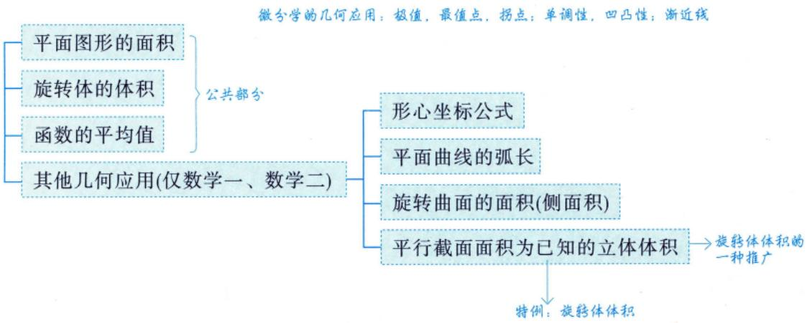

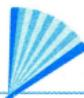

## 基础内容精讲

假设以下曲线都是光滑的.

三大体系下的图形：

①直角坐标系下（直接算）

## 用定积分表达和计算平面图形的面积

③极坐标系下（直接算）

→可以推广为用收敛的反常积分进行表示

推广：可能用到在收敛情况下的反常积分及时回看，补上，以免遗忘

(1) 曲线 $y = y_{1}(x)$ 与 $y = y_{2}(x)$ 及 $x = a, x = b(a < b)$ 所围成的平面图形的面积

$$
S = \int _ { a } ^ { b } \left| y _ { 1 } ( x ) - y _ { 2 } ( x ) \right| \mathrm { d } x .
$$

计算一个带绝对值的函数的定积分

小提示：随着学习的进行，知识会遗忘，所以要及时进行复习，因此在学面积之前，可以先回看前面学到的平面图形。

>及时复习的话，遗忘曲线就会出现许多跳跃间断点

记忆小曲线⇒复习2\~3次，遗忘内容大幅度减少

微元法.

用大的面积减去小的面积，即 $S = \int_{a}^{b} y_{1} \mathrm{d}x - \int_{a}^{b} y_{2} \mathrm{d}x$

①取微元： $\Delta S = \left| y_{1}(x) - y_{2}(x) \right|$ dx

②积分： $S = \int_{a}^{b} \left| y_{1} - y_{2} \right| \mathrm{d}x$

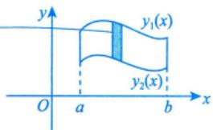

(2) 曲线 $r = r_{1}(\theta)$ 与 $r = r_{2}(\theta)$ 与两射线 $\theta = \alpha$ 与 $\theta = \beta (0 < \beta - \alpha \leq 2\pi)$ 所围成的曲边扇形的面积

$$
\frac{1}{2} \int_{\alpha}^{\beta} \left| r_1^2(\theta) - r_2^2(\theta) \right| \mathrm{d}\theta  .
$$

L 绝对值：保证差值非负

当 $\mathrm { d } \theta \to 0$ 时，可将扇形区域近似看作三角形，计算三角形面积： $\frac{1}{2} r_2(\theta) \cdot r_2(\theta) \mathrm{d}\theta - \frac{1}{2} r_1(\theta) \cdot r_1(\theta) \mathrm{d}\theta$ 微元法.

①用经过O的射线去切分扇形区域.

②取微元：用大“三角形”面积-小“三角形”面积.

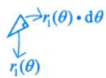

$$
\Delta S = \frac{1}{2} r_2(\theta) \cdot r_2(\theta) \mathrm{d}\theta - \frac{1}{2} r_1(\theta) \cdot r_1(\theta) \mathrm{d}\theta = \frac{1}{2} \left| r_2^2(\theta) - r_1^2(\theta) \right| \mathrm{d}\theta .
$$

③积分： $S = \int _ { \alpha } ^ { \beta } \frac { 1 } { 2 } \left| r _ { 2 } ^ { 2 } ( \theta ) - r _ { 1 } ^ { 2 } ( \theta ) \right| \mathrm { d } \theta$

例10.1 设 $A_{n}$ 是曲线 $y = x^{n}$ 与 $y = x^{n + 1} (n = 1, 2, \cdots)$ 所围区域的面积，则 $\lim_{n \to \infty} \left( 2 \sum_{k=1}^{n} A_k \right)^n =$

分析①求交点. $\left\{ \begin{aligned} y = x^{n}, \\ y = x^{n + 1} \end{aligned} \right. \Rightarrow x^{n} = x^{n + 1} \Rightarrow x = 0  或  x = 1$

②画图（见图10-1）

  
图 10-1

③套公式，做计算，得到 $A _ { n }$ 的具体表达式.

④代入 $A _ { n }$ ，求极限.

解应填 $\mathbf { e } ^ { - 2 }$

由

$$
\begin{cases}y = x^{n}, \\y = x^{n + 1}\end{cases}\Rightarrow x^{n + 1} - x^{n} = 0 \Rightarrow x^{n}(x - 1) = 0 \Rightarrow x = 0,   x = 1
$$

得 $y = x ^ { n }$ 与 $y = x^{n + 1}$ 的交点为(0，0)，(1，1)，故

$$
A_{n} = \int_{0}^{1} \left( x^{n} - x^{n+1} \right) \mathrm{d}x = \left( \frac{1}{n+1} x^{n+1} - \frac{1}{n+2} x^{n+2} \right) \bigg|_{0}^{1} = \frac{1}{n+1} - \frac{1}{n+2}
$$

则

$$
\lim_{n \to \infty} \left( 2 \sum_{k=1}^n A_k \right)^n = \lim_{n \to \infty} \left[ \sum_{k=1}^n \left( \frac{2}{n+1} - \frac{2}{n+2} \right) \right]^n = \lim_{n \to \infty} \left( \frac{2}{n+1} \left( \frac{2}{n+1} - \frac{2}{n+2} \right) \right)^n = \lim_{n \to \infty} \left( \frac{2}{n+1} \left( \frac{2}{n+1} - \frac{2}{n+2} \right) \right)^n = \lim_{n \to \infty} \left( \frac{2}{n+1} \left( \frac{2}{n+1} - \frac{2}{n+2} \right) \right)^n = \lim_{n \to \infty} \left( \frac{2}{n+1} \left( \frac{2}{n+1} - \frac{2}{n+2} \right) \right)^n = \lim_{n \to \infty} \left( \frac{2}{n+1} \left( \frac{2}{n+1} - \frac{2}{n+2} \right) \right)^n = \lim_{n \to \infty} \left( \frac{2}{n+1} \left( \frac{2}{n+1} - \frac{2}{n+2} \right) \right)^n = \lim_{n \to \infty} \left( \frac{2}{n+1} \left( \frac{2}{n+1} - \frac{2}{n+2} \right) \right)^n = \mathrm{e}^{-2}
$$

可以把n当作x，无须用归结原则化为函数极限

★★★例10.2 求由摆线 $\begin{cases}x = a(t - \sin t), & (a > 0) \\y = a(1 - \cos t) & (a > 0)\end{cases}$ 的一拱(见图10-2)与x轴所围平面图形的面积.

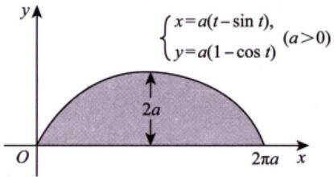  
图 10-2

参数方程下的问题是重点.① $\begin{cases}x = x(t), \\y = \boxed{y(t)} \Rightarrow y = \boxed{f(x)}\end{cases}$ 它们所有对应点的函数值均相同给定参数方程，其实是对定积分计算的换元法的变相 考查.当f复杂时，引进一个新的自变量t进行处理. $S = \int_{0}^{2\pi a} f(x) \mathrm{d}x  (直角坐标系)$ x=x(t) β y(t)x′(t)dt = 2xy(t)d[x(t)]

分析①画出摆线（考试不会给出图！！！）.

②按照直角坐标系去理解参数方程，套直角坐标系下的面积公式进行计算.

$$
\begin{cases}x = x(t), \\y = y(t)\end{cases}\Rightarrow y = f(x) = f[x(t)] = y(t) .
$$

比如： $\begin{cases}x = 2t, \\y = t^{2}\end{cases}\Rightarrow y = \frac{1}{4}x^{2} = f(x) = f[x(t)] = \frac{1}{4}(2t)^{2} = t^{2} = y(t).$

$$
S = \int_{a}^{b} f(x) \mathrm{d}x = \int_{x^{-1}(a)}^{x^{-1}(b)} f[x(t)] \mathrm{d}[x(t)] = \int_{a}^{\beta} y(t) x^{\prime}(t) \mathrm{d}t .
$$

解当t=0或t=2π时，y=0.故当t由0变到2π时，曲线正好成一拱，所以

$$
\begin{aligned}S = & \int_{0}^{2\pi a}y(x)\mathrm{d}x \frac{x = a(t - \sin t)}{y(x) = y[a(t - \sin t)]} \int_{0}^{2\pi}a(1 - \cos t)[a(t - \sin t)]^{\prime}\mathrm{d}t \\= & \int_{0}^{2\pi}a^{2}(1 - \cos t)^{2}\mathrm{d}t = a^{2}\int_{0}^{2\pi}(1 - 2\cos t + \cos^{2}t)\mathrm{d}t \\= & a^{2}\int_{0}^{2\pi}\mathrm{d}t - 2a^{2}\int_{0}^{2\pi}\cos t\mathrm{d}t + a^{2}\int_{0}^{2\pi}\cos^{2}t\mathrm{d}t \\= & 2a^{2}\pi + 4a^{2}\int_{0}^{\frac{\pi}{2}}\cos^{2}t\mathrm{d}t = 3a^{2}\pi.\end{aligned}
$$

方法总结参数方程下面积公式的本质：直角坐标系下的面积公式的换元法形式

例10.3 伯努利双纽线 $r^{2}=a^{2}\cos2\theta$ 围成的图形的面积为

分析①画图.②套公式，做计算（借助对称性简化计算）.

应填 $a ^ { 2 }$

如图10-3所示，利用对称性，所求图形面积是阴影部分面积的4倍.

阴影部分的图形由射线 $\theta = 0 , \theta = \frac{\pi}{4}$ 与伯努利双纽线 $r^{2}=a^{2}\cos2\theta$ 围成，于是所求的平面图形面积为

$$
S = 4 \int_{0}^{\frac{\pi}{4}} \frac{1}{2} a^{2} \cos 2\theta   d\theta = a^{2} \sin 2\theta \Big|_{0}^{\frac{\pi}{4}} = a^{2} .
$$

  
图 10-3

例10.4 求曲线 $y = \mathrm{e}^{-x} \sin x (x \geqslant 0)$ 与x轴所围平面图形的面积

分析 ①画图：如图10-4所示.

所围平面图形面积为正

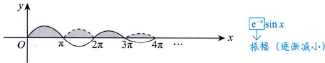  
图 10-4

②套公式： $S = \int_{0}^{+ \infty}\frac{\mathrm{e}^{- x}\left| \sin x \right|\mathrm{d}x}{\sqrt{}}$

保持非负（对应图形在x轴下方的部分向上翻折）

③做计算（难度在于处理绝对值）：

$$
S = \int_{0}^{\pi} \mathrm{e}^{-x} \sin x   dx + \int_{\pi}^{2\pi} (-\mathrm{e}^{-x} \sin x)   dx + \int_{2\pi}^{3\pi} \mathrm{e}^{-x} \sin x   dx + \cdots = \lim_{n \to \infty} \sum_{k=0}^{n} \left| \int_{k\pi}^{(k+1)\pi} \mathrm{e}^{-x} \sin x   dx \right|
$$

解 $S = \int_{0}^{+ \infty}\mathrm{e}^{- x}\left| \sin x \right|\mathrm{d}x = \lim_{n \rightarrow \infty}\sum_{k = 0}^{n}\left| \int_{k\pi}^{(k + 1)\pi}\mathrm{e}^{- x}\sin x\mathrm{d}x \right|$ ，其中

“前世今生”见例8.5③

$$
\begin{aligned} &\int_{k\pi}^{(k + 1)\pi} \mathrm{e}^{-x} \sin x  \mathrm{d}x = \frac{1}{2} \left| \begin{matrix} \left( \mathrm{e}^{-x} \right)^{\prime} & \left( \sin x \right)^{\prime} \\ \mathrm{e}^{-x} & \sin x \end{matrix} \right|_{k\pi}^{(k + 1)\pi} \quad \left. \begin{aligned}\\ & 泰公式.计算量式.重视计算 \\&= -\frac{1}{2} \mathrm{e}^{-x} (\cos x + \sin x) \bigg|_{k\pi}^{(k + 1)\pi}\\&= -\frac{1}{2} \mathrm{e}^{-(k + 1)\pi} \bullet (-1)^{k + 1} + \frac{1}{2} \mathrm{e}^{-k\pi} \bullet (-1)^{k}\\&= \frac{(-1)^{k}}{2} \mathrm{e}^{-k\pi} (\mathrm{e}^{-\pi} + 1) ,\\ &\end{aligned} \right.\\ \end{aligned}
$$

故

$$
\frac{\mathrm{e}^{-\pi}+1}{2}\lim_{n \to \infty}\sum_{k=0}^{n}(\mathrm{e}^{-\pi})^k=\frac{\mathrm{e}^{-\pi}+1}{2}\cdot\frac{1}{1-\mathrm{e}^{-\pi}}=\frac{\mathrm{e}^{-\pi}+1}{2(1-\mathrm{e}^{-\pi})}
$$

## 2用定积分表达和计算旋转体的体积

套公式

(1) 曲线 $y = y(x)$ 与 $x = a, \; x = b(a < b)$ 及x轴围成的曲边梯形绕x轴旋转一周所得到的旋转体的体积为

$$
V_{x} = \int_{a}^{b} \pi y^{2}(x) \mathrm{d}x
$$

这是怎么推导出来的呢？

“小硬币”

② $\Delta V = \pi y^{2}(x) \mathrm{d}x   .$

③积分： $V_{x} = \int_{a}^{b} \pi y^{2}(x) \mathrm{d}x   .$

例10.5 求曲线 $y = \mathrm{e}^{-\frac{x}{2}} \sqrt{\sin x}$ 在[0，2π]部分与x轴围成的平面图形绕x轴旋转一周所成的旋转体的体积.

分析①确定x的取值范围： $\sqrt{\sin x} \Rightarrow \sin x \geqslant 0 \Rightarrow x \in [0,$ π] .

②套公式： $V_{x} = \int_{0}^{\pi} \pi \left( \mathrm{e}^{-\frac{x}{2}} \sqrt{\sin x} \right)^{2} \mathrm{d}x$

解 $y = \mathrm{e}^{-\frac{x}{2}} \sqrt{\sin x}$ 在[0，π]上存在，在(π，2π)内不存在，故

$$
V = \int_{0}^{\pi} \pi y^{2}(x) \mathrm{d}x = \int_{0}^{\pi} \pi \mathrm{e}^{-x} \sin x \mathrm{d}x = \frac{1}{2} \pi (1 + \mathrm{e}^{-\pi})
$$

$$
\int_{0}^{\pi} \pi \mathrm{e}^{-x} \sin x \mathrm{d}x = \frac{\pi}{2} \left| \left( \mathrm{e}^{-x} \right)^{\prime} \left( \sin x \right)^{\prime} \right|_{0}^{\pi} = -\frac{\pi}{2} \left( \cos x + \sin x \right) \mathrm{e}^{-x} \bigg|_{0}^{\pi} = \frac{\pi}{2} \left( \mathrm{e}^{-x} + 1 \right)
$$

(2) 曲线 $y = y(x)$ 与 $x=a, x=b(0 \le a<b)$ 及x轴围成的曲边梯形绕y轴旋转一周所得到的旋转体的 体积为

$$
V_{y} = 2 \pi \int_{a}^{b} x | y(x) | \mathrm{d}x .\tag{*}
$$

注公式(\*)有时用起来很方便，现简单推导如下（微元法）：

取 $[x, x+\Delta x](\Delta x>0)$ ，得到一个小竖条，如图10-5的阴影区域所示，此小竖条绕着y轴旋转一周，成为一个“圆柱壳”，将其沿任何一条竖线“切开”，可展开为一个“长方体”，其体积为

$$
\mathrm{d}V_{y} = 2\pi x \left| y(x) \right| \mathrm{d}x   ,
$$

故

$$
V_{y} = 2\pi \int_{a}^{b} x |y(x)|   dx.
$$

图 10-5

总结 $V_{x} = \pi \int_{a}^{b} \square^{2} \mathrm{d}x$ 往“□”里代 vV, =2π∫ x|□|dx .

“前世今生”，见例1.2.

例10.6 设函数f(x)的定义域为(0，+∞)，且满足 $2f(x)+x^{2}f\left(\frac{1}{x}\right)=\frac{x^{2}+2x}{\sqrt{1+x^{2}}}$ .求f(x)，并求曲线 $y = f(x)$ ，直线 $y = \frac{1}{2}, y = \frac{\sqrt{3}}{2}$ 及y轴所围图形绕x轴旋转一周所成旋转体的体积.

分析 ①x与y地位交换，求出 $y = f(x) \Rightarrow x = \varphi(y)$

②套 $V _ { y }$ 体积公式，y作自变量，x作因变量，有 $V_{y}=\int_{\frac{1}{2}}^{\frac{\sqrt{3}}{2}}2\pi y\cdot\varphi(y)\mathrm{d}y$

由例1.2知

$$
\begin{aligned} &(1 + x^{2})y^{2} = x^{2}\\ &\Rightarrow y^{2} + x^{2}y^{2} - x^{2} = 0\\ &\Rightarrow x^{2}(y^{2} - 1) = - y^{2}\\ &\Rightarrow x = \frac{y}{\sqrt{1 - y^{2}}}\\ &\Rightarrow x^{2} = \frac{y}{\sqrt{1 - y^{2}}}\\ \end{aligned}
$$

$$
f(x)=\frac{x}{\sqrt{1+x^{2}}}(x>0)
$$

x.y的地位交换了，反解出 $x = \varphi(y)$

由 $y = \frac{x}{\sqrt{1 + x^{2}}}$ 得 $x = \frac{y}{\sqrt{1 - y^{2}}} (0 < y < 1)$ ，从而 $y = f(x), \; y = \frac{1}{2}, \; y = \frac{\sqrt{3}}{2}$ 及y轴所围图形绕x轴旋转一周所成旋转体的体积为

$$
\begin{aligned}V &= 2\pi\int_{\frac{1}{2}}^{\frac{\sqrt{3}}{2}}xy\mathrm{d}y = 2\pi\int_{\frac{1}{2}}^{\frac{\sqrt{3}}{2}}\frac{y^{2}}{\sqrt{1 - y^{2}}}\mathrm{d}y \\&\underline{\underline{令 y = \sin t}} 2\pi\int_{\frac{\pi}{6}}^{\frac{\pi}{3}}\sin^{2}t\mathrm{d}t = 2\pi\int_{\frac{\pi}{6}}^{\frac{\pi}{3}}\frac{1 - \cos 2t}{2}\mathrm{d}t \\&= \frac{\pi^{2}}{6} .\end{aligned}
$$

方法总结 学会利用反函数，将绕x轴旋转用 $V _ { y }$ 的体积公式表示出来.

①要把f(x)求出来.注此题增加了2个综合性考查：②x，y地位交换，先反解，再套公式计算

(3)平面曲线绕定直线旋转．套公式 若出现2个及以上的交点，则不适用，如平面曲线L： $y = f(x),   a \leqslant x \leqslant b$ ，且f(x)可导. ↑

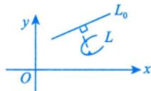

定直线 $L_{0}:Ax + By + C = 0$ ，且过 $L _ { 0 }$ 的任一条垂线与L至多有一个交点，如图10-6所示，则L绕$L _ { 0 }$ 旋转一周所得旋转体的体积为

$$
\frac { \pi } { \left( A ^ { 2 } + B ^ { 2 } \right) ^ { \frac { 3 } { 2 } } } \int _ { a } ^ { b } \left[ A x + B f ( x ) + C \right] ^ { 2 } \left| A f ^ { \prime } ( x ) - B \right| \mathrm { d } x .\tag{10-1}
$$

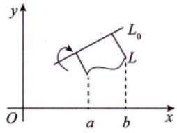  
图 10-6

特别地，若 $A = C = 0,   B \ne 0$ ，则 $L _ { 0 }$ 为 $y = 0 \left( x \right)$ 轴)，如图10-7所示，L绕 $L _ { 0 }$ 旋转一周所得旋转体的体积为

$$
V = \pi \int_{a}^{b} f^{2}(x) \mathrm{d}x = \frac{\pi}{(B^{2})^{2}} \int_{a}^{b} \left| B f(x) \right|^{2} \left| - B \right| \mathrm{d}x = \frac{\pi}{\left| B \right|^{3}} \int_{a}^{b} B^{2} \left| B \right| f^{2}(x) \mathrm{d}x = \pi \int_{a}^{b} f^{2}(x) \mathrm{d}x
$$

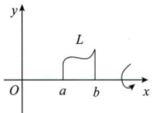  
图 10-7

注掌握住此结论，会套公式即可.

公式 $| B ^ { 3 } | \rightrightarrows B | B ^ { 2 } = B ^ { 2 } | B |$

例10.7 过坐标原点作曲线 $y = \mathbf{e}^{x}$ 的切线，该切线与曲线 $y = \mathbf{e}^{x}$ 以及x轴围成的向x轴负向无限伸展的平面图形记为D.求：

(1) D的面积A;

(2) D绕直线x=1旋转一周所成的旋转体的体积V.

分析先求切点与切线方程，进而套面积公式和旋转体体积公式.

解设切点坐标为 $P(x_{0},y_{0})$ ，于是曲线 $y = \mathbf { e } ^ { x }$ 在点P的切线斜率为

$$
y ^ { \prime } ( x _ { 0 } ) = \mathrm { e } ^ { x _ { 0 } }
$$

切线方程为

$$
y - y_{0} = \mathrm{e}^{x_{0}}(x - x_{0})
$$

因为该切线经过点(0,0)，所以 $-y_{0}=-x_{0}\mathrm{e}^{x_{0}}$ .又因为 $y_{0} = \mathrm{e}^{x_{0}}$ ，代人求得 $x_{_0} = 1$ ，从而 $y_{0} = \mathrm{e}^{x_{0}} = \mathrm{e}$ ，切线方程为 $y = \mathrm{e}x$ ，如图10-8所示.

(1)取水平条面积微元，则D的面积

  
图 10-8

↓ 若取竖直条面积微元：

$$
\Delta S_{1} = \mathrm{e}^{x} \mathrm{d}x , \Delta S_{2} = (\mathrm{e}^{x} - \mathrm{e}x) \mathrm{d}x ,
$$

再积分： $S = \int_{-\infty}^{0} \mathrm{e}^{x} \mathrm{d}x + \int_{0}^{1} (\mathrm{e}^{x} - \mathrm{e}x) \mathrm{d}x$

则较为麻烦，故不建议

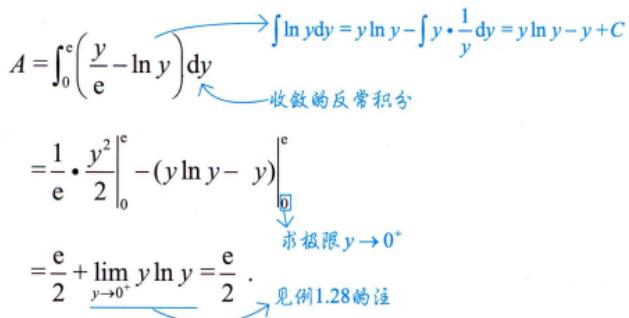

(2) D绕直线x=1旋转一周所成的旋转体的体积微元为

先取微元：用“大体积”—“小体积” $\mathrm{d}V = \left[ \pi (1 - \ln y)^2 - \pi \left(1 - \frac{y}{\mathrm{e}}\right)^2 \right] \mathrm{d}y$ 从而

$$
V = \pi \int_{0}^{e} \left( \ln^{2} y - 2 \ln y + \frac{2y}{e} - \frac{y^{2}}{e^{2}} \right) \mathrm{d}y \\= \pi \left( \left. y \ln^{2} y - 4y \ln y + 4y + \frac{y^{2}}{e} - \frac{y^{3}}{3e^{2}} \right|_{0}^{e} \right) = \frac{5}{3} \pi e.
$$

## 注第(2)问也可以直接套公式（10-1)，可得方法二.

$L_{0}:x=1 \Rightarrow Ax+By+C=0$ 中，A=1，B=0，C=-1

$$
L: y_{大} = \mathrm{e}^{x}, y_{小} = \mathrm{e}x
$$

由

$$
V = \frac { \pi } { \left( A ^ { 2 } + B ^ { 2 } \right) ^ { \frac { 3 } { 2 } } } \int _ { a } ^ { b } \left[ A x + B f ( x ) + C \right] ^ { 2 } \left| A f ^ { \prime } ( x ) - B \right| \mathrm { d } x ,
$$

得则

$$
V _ { \lambda } = \pi \int _ { - \infty } ^ { 1 } ( x - 1 ) ^ { 2 } \mathrm { e } ^ { x } \mathrm { d } x , V _ { \lambda } = \pi \int _ { 0 } ^ { 1 } ( x - 1 ) ^ { 2 } \mathrm { e } ^ { x } \mathrm { d } x ,
$$

$$
\begin{aligned}V &= V_{\lambda} - V_{\lambda} \\&= \pi \int_{-\infty}^{1} (x - 1)^{2} \mathrm{e}^{x} \mathrm{d}x - \pi \int_{0}^{1} (x - 1)^{2} \mathrm{e}^{x} \mathrm{d}x \\&= \pi \int_{-\infty}^{1} (x - 1)^{2} \mathrm{d}(\mathrm{e}^{x}) - \mathrm{e} \pi \int_{0}^{1} (x^{2} - 2x + 1) \mathrm{d}x \\&= \pi \mathrm{e}^{x} (x - 1)^{2} \Big|_{-\infty}^{1} - 2\pi \int_{-\infty}^{1} (x - 1) \cdot \mathrm{e}^{x} \mathrm{d}x - \frac{\pi \mathrm{e}}{3} \\&= -2\pi \int_{-\infty}^{1} (x - 1) \mathrm{d}(\mathrm{e}^{x}) - \frac{\pi \mathrm{e}}{3} \\&= -2\pi \mathrm{e}^{x} \cdot (x - 1) \Big|_{-\infty}^{1} + 2\pi \int_{-\infty}^{1} \mathrm{e}^{x} \mathrm{d}x - \frac{\pi \mathrm{e}}{3} \\&= 2\pi \mathrm{e}^{x} \Big|_{-\infty}^{1} - \frac{\pi \mathrm{e}}{3} \\&= \frac{5\pi \mathrm{e}}{3} .\end{aligned}
$$

## ③用定积分表达和计算函数的平均值

设 $x \in [a,   b]$ ，函数y(x)在[a,b]上的平均值为 $\bar { y } = \frac { 1 } { b - a } \int _ { a } ^ { b } y ( x ) \mathrm { d } x \Rightarrow \bar { y } = y ( \xi ) , \xi \in [ a , b ]$ (由积分中>一般认为y(x)是连续函数值定理可得）.

例10.8 设f(x)连续，且 $\frac{f(x + 2) - f(x)}{x} = x,\quad \int_{0}^{2}f(x)\mathrm{d}x = 0$ ，则f(x)在[1,3]上的平均值为

分析①套公式： $\overline{f} = \frac{1}{3 - 1}\int_{1}^{3}f(x)\mathrm{d}x = \frac{1}{2}\int_{1}^{3}f(x)\mathrm{d}x.$

观察可知区间长度均为2

②a. f(x+2)−f(x)⇒联想周期性(本题中的f(x)未必具有周期性）.

若f(x)是周期为T的周期函数，则 $\int_{ \underline{a} }^{ a + T } f(x) \mathrm{d}x = \int_{0}^{T} f(x) \mathrm{d}x (f(x + T) = f(x))$

设 $F(x) = \int_{x}^{x + 2} f(t) \mathrm{d}t$ ，则 $\bar{f}=\frac{F(1)}{2}$

b.反写一至两步，联想经典形式 $\left[ \int_{\varphi_{1}(x)}^{\varphi_{2}(x)} f(t) \mathrm{d}t \right]'$ ，则

$$
\left[ \int_{x}^{x + 2} f(t) \mathrm{d}t \right]' = f(x + 2) - f(x) .
$$

由a.或者b.都可以想到，令 $F(x) = \int_{x}^{x + 2}f(t)\mathrm{d}t$

解应填 $\frac{1}{4}$

记 $F(x) = \int_{x}^{x + 2} f(t) \mathrm{d}t$ ，则

变限积分函数

$$
F^{\prime}(x) = f(x + 2) - f(x) = x   ,
$$

故

$$
F(x)=\int x\mathrm{d}x=\frac{1}{2}x^{2}+C
$$

由 $F(0)=\int_{0}^{2}f(x)\mathrm{d}x=0=C$ ，得 $F(x) = \frac{1}{2}x^{2}$ ，则 $\int_{1}^{3} f(x) \mathrm{d}x = F(1) = \frac{1}{2}$ ，故

$$
\overline{f} = \frac{1}{3 - 1}\int_{1}^{3}f(x)dx = \frac{1}{2}F(1) = \frac{1}{4}
$$

方法总结学会观察条件，得到有效信息，产生联想，进而快速解题.

## 4 其他几何应用（仅数学一、数学二）

>是几何量，还有质心、重心

(1)“平面上的曲边梯形”的形心坐标公式.

设平面区域 $D = \left\{ (x, y) \mid 0 \leq y \leq f(x), \; a \leq x \leq b \right\}$ $y = f(x)$ 在[a，b]上连续，如图10-9所示.现推导

$$
\frac{\iint_{D} x \mathrm{d} \sigma}{\iint_{D} \mathrm{d} \sigma} = \frac{\left| \int_{a}^{b} \mathrm{d} x \int_{0}^{f(x)} x \mathrm{d} y \right|}{\left| \int_{a}^{b} \mathrm{d} x \int_{0}^{f(x)} \mathrm{d} y \right|} = \frac{\left| \int_{a}^{b} x f(x) \mathrm{d} x \right|}{\left| \int_{a}^{b} f(x) \mathrm{d} x \right|}
$$

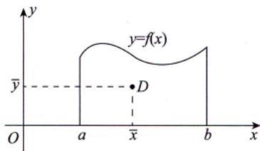

$$
\frac{\iint\limits_{D} y \mathrm{d}\sigma}{\iint\limits_{D} \mathrm{d}\sigma} = \frac{\int_{a}^{b} \mathrm{d}x \int_{0}^{f(x)} y \mathrm{d}y}{\int_{a}^{b} \mathrm{d}x \int_{0}^{f(x)} \mathrm{d}y} = \frac{\left| \frac{1}{2} \int_{a}^{b} f^2(x) \mathrm{d}x \right|}{\int_{a}^{b} f(x) \mathrm{d}x}
$$

图 10-9

套公式，记住结论即可

例10.9 设曲线L的方程为 $y = \frac{1}{4}x^{2} - \frac{1}{2}\ln x, 1 \leqslant x \leqslant \mathrm{e}$ ,D是由曲线L和直线x =1, x =e及x轴围成的平面图形，则D的形心的横坐标为

分析 直接套公式得 $\bar{x} = \frac{\int_{1}^{\mathrm{e}} x \left( \frac{1}{4} x^2 - \frac{1}{2} \ln x \right) \mathrm{d}x}{\int_{1}^{\mathrm{e}} \left( \frac{1}{4} x^2 - \frac{1}{2} \ln x \right) \mathrm{d}x}$

解 应填 $\frac{3(\mathrm{e}^{2} + 1)(\mathrm{e}^{2} - 3)}{4(\mathrm{e}^{3} - 7)}$

平面图形D的形心的横坐标的计算公式为 $\frac{\int_{\underline{x}}^{\overline{e}}xy\mathrm{d}x}{\int_{1}^{\underline{e}}y\mathrm{d}x}$ ，其中

$$
\int_{1}^{e}xy\mathrm{d}x=\int_{1}^{e}x\left(\frac{1}{4}x^{2}-\frac{1}{2}\ln x\right)\mathrm{d}x=\left.\left(\frac{1}{16}x^{4}-\frac{1}{4}x^{2}\ln x+\frac{1}{8}x^{2}\right)\right|_{1}^{e}=\frac{1}{16}\left(e^{2}+1\right)\left(e^{2}-3\right),
$$

$$
\int_{1}^{e} y \mathrm{d}x = \int_{1}^{e} \left( \frac{1}{4}x^{2} - \frac{1}{2}\ln x \right) \mathrm{d}x = \left. \left( \frac{1}{12}x^{3} - \frac{1}{2}x\ln x + \frac{1}{2}x \right) \right|_{1}^{e} = \frac{1}{12}e^{3} - \frac{7}{12}
$$

所以D的形心的横坐标为

$\frac{\frac{1}{16}(\mathrm{e}^{2}+1)(\mathrm{e}^{2}-3)}{\frac{1}{12}\mathrm{e}^{3}-\frac{7}{12}}=\frac{3(\mathrm{e}^{2}+1)(\mathrm{e}^{2}-3)}{4(\mathrm{e}^{3}-7)}$ —→考研题答案未必简洁，要多做计算

(2)平面曲线的弧长.

①若平面光滑曲线由直角坐标方程 $y = y(x) (a \leq x \leq b)$ 给出，则 $s = \int_{a}^{b} \sqrt{1 + \left[ y^{\prime}(x) \right]^{2}}   dx$

②若平面光滑曲线由参数方程 $\begin{cases}x = x(t), \\y = y(t)\end{cases}(\alpha \leqslant t \leqslant \beta)$ 给出，则 $s = \int _ { \alpha } ^ { \beta } \sqrt { \left[ x ^ { \prime } ( t ) \right] ^ { 2 } + \left[ y ^ { \prime } ( t ) \right] ^ { 2 } } \mathrm { d } t$

③若平面光滑曲线由极坐标方程 $r = r(\theta) (\alpha \leq \theta \leq \beta)$ 给出，则 $s = \int _ { \alpha } ^ { \beta } \sqrt { \left[ r ( \theta ) \right] ^ { 2 } + \left[ r ^ { \prime } ( \theta ) \right] ^ { 2 } } \mathrm { d } \theta$

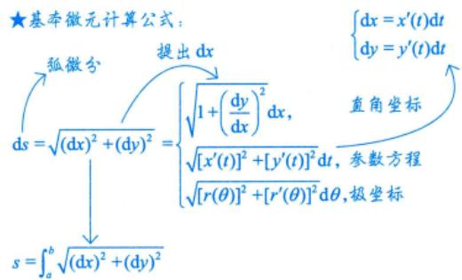

例10.10 曲线 $y = \ln(1 - x^{2})$ 上相应于 $0 \leq x \leq \frac{1}{2}$ 的一段弧的长度为

分析只需套公式，做计算即可，不用画图.

解应填ln $3 - \frac{1}{2}$

$$
\frac{\int_{0}^{\frac{1}{2}}\sqrt{1 + \left( y^{\prime} \right)^{2}}\ dx}{=\int_{0}^{\frac{1}{2}}\sqrt{1 + \left( \frac{- 2x}{1 - x^{2}} \right)^{2}}\ dx} = \int_{0}^{\frac{1}{2}}\sqrt{1 + \left( \frac{- 2x}{1 - x^{2}} \right)^{2}}\ dx = \int_{0}^{\frac{1}{2}}\frac{1 + x^{2}}{1 - x^{2}}\ dx
$$

例10.11 阿基米德螺线 $r = \theta ,$ 上相应于θ从0到2π一段的弧长为

分析套极坐标求弧长的公式.

解应填 $\pi \sqrt{1 + 4\pi^{2}} + \frac{1}{2}\ln\left( 2\pi + \sqrt{1 + 4\pi^{2}} \right)$

阿基米德螺线的图形如图10-10所示.

由题意，所求弧长为

图 10-10

$$
\begin{aligned} \begin{aligned}s = & \int_{0}^{2\pi} \sqrt{\left[ r(\theta) \right]^{2} + \left[ r^{\prime}(\theta) \right]^{2}} \mathrm{d}\theta \\= & \int_{0}^{2\pi} \sqrt{\theta^{2} + 1^{2}} \mathrm{d}\theta \\= & \int_{0}^{2\pi} \sqrt{1 + \theta^{2}} + \frac{1}{2} \ln\left( \theta + \sqrt{1 + \theta^{2}} \right) \Bigg|_{0}^{2\pi} \\= & \frac{\left[ \theta \sqrt{1 + \theta^{2}} + \frac{1}{2} \ln\left( \theta + \sqrt{1 + \theta^{2}} \right) \right]}{=} \end{aligned}\underbrace{\sqrt{1 + \frac{1}{2}} \int_{0}^{\theta} \frac{\theta = \tan t - \sqrt{\left[ \sec t + \left( \tan t \right) \right]^{2} \sec t + \tan t - \left[ \tan^{2} t \sec t \right]}}{\frac{\left[ \sec t + \tan t - \sqrt{\left[ \sec^{2} t \right]} \right] \sec t + \tan t}{\frac{1}{2} \sec t + \tan t - \left[ \sec^{2} t \right]} \sec t \mathrm{d}t}}_{\frac{\sqrt{\theta^{2} + 1}}{2} \cdot \frac{\frac{1}{2} \int_{0}^{\theta} = \sec t \cdot \tan t - \sqrt{\left[ \sec^{2} t \right]} \cdot \sec t \mathrm{d}t}{\frac{1}{2} \sec t \cdot \tan t + \frac{1}{2} \ln\left( \sec t + \tan t \right)} + C} \\= & \pi \sqrt{1 + 4\pi^{2}} + \frac{1}{2} \ln\left( 2\pi + \sqrt{1 + 4\pi^{2}} \right) \cdot \end{aligned}
$$

(3)旋转曲面的面积(侧面积).—在狐长公式基础上多乘了2π|y(x)|.

①曲线L： $y = f(x) (a \leq x \leq b)$ 绕x轴旋转一周所得旋转曲面的面积

$$
S = 2 \pi \int _ { a } ^ { b } \left| y \right| \sqrt { 1 + \left( y _ { x } ^ { \prime } \right) ^ { 2 } } \mathrm { d } x .
$$

②曲线L： $\left\{ \begin{aligned} x = x(t), \\ y = y(t) \end{aligned} \right. (\alpha \leqslant t \leqslant \beta, x^{\prime}(t) \neq 0)$ 绕x轴旋转一周所得旋转曲面的面积

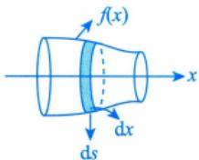

$$
S = 2 \pi \int _ { \alpha } ^ { \beta } \left| y ( t ) \right| \sqrt { \left( x _ { t } ^ { \prime } \right) ^ { 2 } + \left( y _ { t } ^ { \prime } \right) ^ { 2 } } \mathrm { d } t .
$$

算体积用dx，算侧面积用 ds

$$
S = \int_{a}^{b} 2 \pi \left| f(x) \right| \mathrm{d}s
$$

③曲线L： $r = r(\theta) (\alpha \leq \theta \leq \beta)$ 绕x轴旋转一周所得旋转曲面的面积

弧微分

$$
S = 2 \pi \int _ { \alpha } ^ { \beta } \left| r ( \theta ) \sin \theta \right| \sqrt { \left[ r ( \theta ) \right] ^ { 2 } + \left[ r ^ { \prime } ( \theta ) \right] ^ { 2 } } \mathrm { d } \theta .
$$

例10.12曲线 $y = \sqrt{x - 1} (1 \leq x \leq 2)$ 绕x轴旋转一周所得到的旋转体的表面积为

解应填 $\frac{\pi}{6}(5\sqrt{5}-1)$

曲线 $y = \sqrt{x - 1} (1 \leq x \leq 2)$ 绕x轴旋转一周所得到的旋转体的表面积为

$$
S = \int_{1}^{2} 2 \pi y \sqrt{1 + (y^{\prime})^{2}} \mathrm{d}x = \pi \int_{1}^{2} \sqrt{4x - 3} \mathrm{d}x = \frac{\pi}{6} (5 \sqrt{5} - 1)
$$

算出来多少就是多少，不用担心结果古怪。

例10.13 已知星形线的方程为 $\begin{cases}x = 2\cos^{3}t, \\y = 2\sin^{3}t,\end{cases}$ 则它绕x轴旋转一周而成的旋转体的表面积为

分析利用对称性算出y轴右侧的表面积，再乘以2即可.

套公式： $S = \int _ { \alpha } ^ { \beta } 2 \pi \left| y ( t ) \right| \sqrt { \left( x _ { t } ^ { \prime } \right) ^ { 2 } + \left( y _ { t } ^ { \prime } \right) ^ { 2 } } \mathrm { d } t$ ，再做计算.

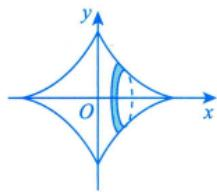

解应填 $\frac{48}{5}\pi$

旋转体的表面积为

$$
\begin{aligned}S &= 2\int_{0}^{\frac{\pi}{2}}2\pi y\sqrt{\left( x_{t}^{\prime} \right)^{2} + \left( y_{t}^{\prime} \right)^{2}}\mathrm{d}t \\&= 4\pi\int_{0}^{\frac{\pi}{2}}2\sin^{3}t\cdot 6\sin t\cos t\mathrm{d}t \\&= 48\pi\int_{0}^{\frac{\pi}{2}}\sin^{4}t\mathrm{d}\left( \sin t \right) \\&= 48\pi\int_{0}^{\frac{\pi}{2}}\sin^{4}t\mathrm{d}\left( \sin t \right) \\&= 48\pi\cdot \frac{\sin^{5}t}{5}\bigg|_{0}^{\frac{\pi}{2}} = \frac{48}{5}\pi .\end{aligned}
$$

(4)平行截面面积为已知的立体体积.（考研未考过)

考研历史上尚未出现过，考题不太好出

如图10-11所示，在区间[a，b]上，垂直于x轴的平面截立体Ω所得到的截面面积为x的连续函数A(x)，取体积微元： $\mathrm{d}V = A(x)\mathrm{d}x$ ，则Ω的体积为

$$
V = \int_{a}^{b} A(x) \mathrm{d}x  .
$$

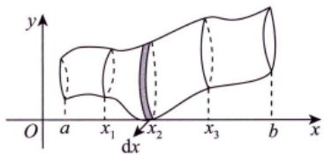  
图 10-11

旋转体体积是其特例.

例10.14曲线 $y = \sqrt{x}$ 与 $y = x$ 所围平面有界区域绕直线 $y = x$ 旋转一周所得旋转体的体积

为

分析 $r = \frac{\sqrt{x} - x}{\sqrt{2}}$

取微元： $\mathrm{d}V = \pi \cdot \left( \frac{\sqrt{x} - x}{\sqrt{2}} \right)^{2} \cdot \sqrt{2} \mathrm{d}x$ $\frac{\sqrt{2}}{60}\pi$ A(x)解 应填

$y = \sqrt{x}$ 与 $y = x$ 交于点(0,0)，(1，1)，如图10-12所示，曲线 $y = \sqrt{x}$   
为 $r = \frac{\sqrt{x} - x}{\sqrt{2}}$ ，故垂直于x轴的平面截“该旋转体”所得的截面面积为  
$A(x) = \sqrt{2} \pi \left( \frac{\sqrt{x} - x}{\sqrt{2}} \right)^2$ .因此，旋转体的体积为$V = \int_{0}^{1} \sqrt{2} \pi \left( \frac{\sqrt{x} - x}{\sqrt{2}} \right)^{2} \mathrm{d}x = \int_{0}^{1} \frac{\pi}{\sqrt{2}} \left( x - 2x^{\frac{3}{2}} + x^{2} \right) \mathrm{d}x = \frac{\sqrt{2}}{60} \pi$

  
图 10-12

注①事实上， $V = \int_{a}^{b} A(x) \mathrm{d}x$ 就是 $V = \int_{a}^{b} \pi f^{2}(x) \mathrm{d}x$ 的一般化.②为什么 $A(x) = \sqrt{2} \cdot \pi \left( \frac{\sqrt{x} - x}{\sqrt{2}} \right)^{2}$ ?

设α为曲线 $y = \sqrt{x}$ 任一点的切线与x轴正方向的夹角，β为直线y=x与x轴正方向的夹角.

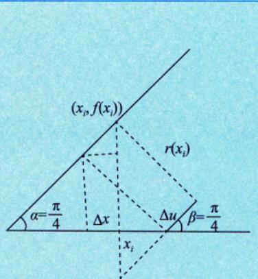

由于此题的对称性，视任一点处 $\alpha = \beta$ ，误差抵消，为 0.（\*)如图10-13所示，在曲线 $y = \sqrt { x }$ 上的任一点 $(x_{i}, \sqrt{x_{i}})$ 处均作平行于 $y = x$ 的直线，则

图 10-13

$$
\Delta u = \sqrt{2} \Delta x , \quad r(x_i) = \left[ f(x_i) - x_i \right] \cdot \frac{1}{\sqrt{2}} = \frac{\sqrt{x_i} - x_i}{\sqrt{2}} ,
$$

$$
V = \lim_{n \rightarrow \infty} \sum_{i = 1}^{n} \pi \cdot r^{2}(x_{i}) \cdot \Delta u = \lim_{n \rightarrow \infty} \sum_{i = 1}^{n} \pi \cdot \left( \frac{\sqrt{x_{i}} - x_{i}}{\sqrt{2}} \right)^{2} \cdot \sqrt{2} \Delta x = \int_{0}^{1} \pi \left( \frac{\sqrt{x} - x}{\sqrt{2}} \right)^{2} \cdot \sqrt{2} \mathrm{d}x = \frac{\sqrt{2}}{60} \pi
$$

（\*）处的解释如图10-14所示：

  
图 10-14

本题所用方法要有足够的经验，才能作上述等价变换，这是一种数学“直觉”，此方法要视具体情况而定，不能一味套公式，要求较高，供参考.

## 基础习题精练

## 习题

10.1 位于曲线 $y=\frac{1}{\sqrt{1+x^{2}}}(0 \leq x < +\infty)$ 下方，x轴上方的无界区域绕x轴旋转一周所得旋转体的体积为

10.2 圆域 $x^{2}+(y-b)^{2}\leqslant k^{2}(0<k<b)$ 绕x轴旋转一周所得旋转体的体积V =

10.3（仅数学一、数学二）曲线 $x = \frac{1}{4}y^{2} - \frac{1}{2}\ln y$ 相应于 $1 \leqslant y \leqslant \mathrm{e}$ 的一段弧的长度为

10.4（仅数学一、数学二）星形线 $x = \cos^{3}t, y = \sin^{3}t (0 \leqslant t \leqslant 2\pi)$ 的弧长为

10.5 函数 $y = \frac{x^{2}}{\sqrt{1 - x^{2}}}$ 在区间 $\left[ \frac{1}{2}, \frac{\sqrt{3}}{2} \right]$ 上的平均值为

10.6 求曲线 $y = { \sqrt { x } }$ 的一条切线l，使该曲线与切线l及直线 $x = 0,   x = 2$ 所围成图形的面积最小.

10.7 设 $D_{1}$ 是由抛物线 $y = 2x^{2}$ 和直线 $x = a, \; x = 2$ 及y=0所围成的平面区域， $D _ { 2 }$ 是由抛物线

$y = 2x^{2}$ 和直线 $y = 0,   x = a$ 所围成的平面区域，其中 $0 < a < 2$

(1)求 $D _ { 1 }$ 绕x轴旋转一周而成的旋转体体积 $V_{1},   D_{2}$ 绕y轴旋转一周而成的旋转体体积 $V _ { z }$ \*\*

(2)问当a为何值时， $V_{1} + V_{2}$ 取得最大值？并求此最大值.

10.8 计算由摆线 $\left\{ \begin{aligned} x = a(t - \sin t), \\ y = a(1 - \cos t) \end{aligned} \right. (a > 0, 0 \leqslant t \leqslant 2\pi)$ 与x轴所围平面图形绕y轴旋转一周所得旋转体 的体积.

10.9 求曲线 $y = 3 - \left| x^{2} - 1 \right|$ 与x轴围成的封闭图形绕直线 $y = 3$ 旋转一周所得旋转体的体积

## 解答

10.1 $\frac{\pi^{2}}{2}$ 解 所求体积为

$$
\int_{0}^{+\infty} \pi \left( \frac{1}{\sqrt{1+x^2}} \right)^2   dx = \lim_{b \to +\infty} \pi \int_{0}^{b} \frac{1}{1+x^2}   dx = \pi \lim_{b \to +\infty} \arctan x \bigg|_{0}^{b} = \frac{\pi^2}{2}
$$

10.2 $2 \pi ^ { 2 } k ^ { 2 } b$ 解 如图10-15所示，上半圆周为 $y_{2}=b+\sqrt{k^{2}-x^{2}}$ ，下半圆周为 $y_{1}=b-\sqrt{k^{2}-x^{2}}$ 其体积微元为

$$
\mathrm{d}V = (\pi y_{2}^{2} - \pi y_{1}^{2})\mathrm{d}x \\= \pi[(b + \sqrt{k^{2} - x^{2}})^{2} - (b - \sqrt{k^{2} - x^{2}})^{2}]\mathrm{d}x \\= 4\pi b\sqrt{k^{2} - x^{2}}\mathrm{d}x,
$$

则所求旋转体的体积为

$$
\begin{aligned}V = 4 \pi b \int_{-k}^{k} \sqrt{k^2 - x^2}   dx = 8 \pi b \int_{0}^{k} \sqrt{k^2 - x^2}   dx \\= 8 \pi b \cdot \frac{\pi k^2}{4} = 2 \pi^2 k^2 b .\end{aligned}
$$

  
图 10-15

注采用对y积分，即取微元 $\left[ y , y + \mathrm{d}y \right]$ 亦可算出V.

10.3 $\frac{1}{4}(\mathbf{e}^{2}+1)$ 解以 $y$ 作为参数，则

$$
\mathrm{d}s = \sqrt{\left( \frac{\mathrm{d}x}{\mathrm{d}y} \right)^{2} + 1} \mathrm{d}y = \sqrt{\left( \frac{y}{2} - \frac{1}{2y} \right)^{2} + 1} \mathrm{d}y = \frac{1}{2} \left( y + \frac{1}{y} \right) \mathrm{d}y
$$

故弧长为

$$
\int _ { 1 } ^ { \mathrm { e } } \frac { 1 } { 2 } \left( y + \frac { 1 } { y } \right) \mathrm { d } y = \frac { 1 } { 4 } \left( \mathrm { e } ^ { 2 } + 1 \right) .
$$

10.4 6 解 如图10-16所示，曲线具有对称性，我们只需计算在第一象限的弧段，即 $t \in \left[ 0 , \frac { \pi } { 2 } \right]$ 对应部分的弧长.故

$$
\begin{aligned}I_{S} &= 4\int_{0}^{\frac{\pi}{2}}\sqrt{\left[ x^{\prime}(t) \right]^{2} + \left[ y^{\prime}(t) \right]^{2}}\ dt \\&= 4\int_{0}^{\frac{\pi}{2}}\sqrt{\left( - 3\cos^{2}t\sin t \right)^{2} + \left( 3\sin^{2}t\cos t \right)^{2}}\ dt \\&= 4\int_{0}^{\frac{\pi}{2}}3\left| \sin t\cos t \right|dt = 12\int_{0}^{\frac{\pi}{2}}\sin t\cos t\ dt = 6\end{aligned}
$$

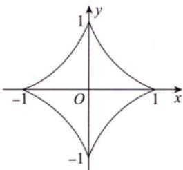  
图 10-16

10.5 $\frac{\sqrt{3} + 1}{12}\pi$ 解函数 $y = f(x)$ 在区间 $[a,   b]$ 上的平均值是指 $\frac{1}{b - a}\int_{a}^{b}f(x)\mathrm{d}x$ ，故所求的平均值为

$$
\frac{2}{\sqrt{3} - 1}\int_{\frac{1}{2}}^{\frac{\sqrt{3}}{2}}\frac{x^{2}}{\sqrt{1 - x^{2}}}\mathrm{d}x
$$

$x = \sin \theta$ ，则

$$
\frac{2}{\sqrt{3}-1}\int_{\frac{\pi}{6}}^{\frac{\pi}{3}}\sin^{2}\theta d\theta=\frac{2}{\sqrt{3}-1}\left(\frac{1}{2}\theta-\frac{1}{4}\sin2\theta\right)_{\frac{\pi}{6}}^{\frac{\pi}{3}}=\frac{\sqrt{3}+1}{12}\pi.
$$

10.6 解 因为 $y^{\prime} = \frac{1}{2\sqrt{x}}$ ，所以 $y = \sqrt{x}$ 在点 $(t,   \sqrt{t})$ 处的切线l的方程为

$$
y - \sqrt{t} = \frac{1}{2\sqrt{t}}(x - t) ,  即  y = \frac{1}{2\sqrt{t}}x + \frac{\sqrt{t}}{2} .
$$

所围面积为

$$
S(t)=\int_{0}^{2}\left[\left(\frac{1}{2\sqrt{t}}x+\frac{\sqrt{t}}{2}\right)-\sqrt{x}\right]dx=\frac{1}{\sqrt{t}}+\sqrt{t}-\frac{4\sqrt{2}}{3}
$$

$S^{\prime}(t)=-\frac{1}{2}t^{-\frac{3}{2}}+\frac{1}{2}t^{-\frac{1}{2}}=0$ ，得 $t = 1$

又 $S''(1) > 0$ ，故当t=1时，S取最小值，此时l的方程为 $y = \frac{x}{2} + \frac{1}{2}$

10.7 解 (1) 由题意得

$$
V_{1} = \pi \int_{a}^{2} (2x^{2})^{2}   dx = \frac{4}{5} \pi (32 - a^{5}) ,
$$

$$
V_{2} = \pi a^{2} \cdot 2a^{2} - \pi \int_{0}^{2a^{2}} \frac{y}{2} \mathrm{d}y = \pi a^{4}
$$

(2)由(1)得

$$
V = V_{1} + V_{2} = \frac{4}{5}\pi(32 - a^{5}) + \pi a^{4}
$$

$$
V^{\prime}=4\pi a^{3}(1-a)=0,
$$

得区间(0，2)内唯一的驻点a=1，且 $V''(1)=-4\pi<0$ ，因此a=1是极大值点，即最大值点，此时

$$
V_{\max} = \frac{129}{5}\pi
$$

10.8 解 作平面图形，如图10-17所示.

方法一 平面图形绕 $y$ 轴旋转一周所得旋转体体积为

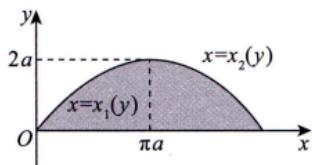

$$
\begin{aligned}V_{y} = & \pi\left[\int_{0}^{2a} x_{2}^{2}(y) \mathrm{d}y - \int_{0}^{2a} x_{1}^{2}(y) \mathrm{d}y\right] \\= & \pi\left[\int_{2\pi}^{\pi} a^{2}(t - \sin t)^{2} a \sin t \mathrm{d}t - \int_{0}^{\pi} a^{2}(t - \sin t)^{2} a \sin t \mathrm{d}t\right] \\= & \pi a^{3}\left[-\int_{\pi}^{2\pi}(t - \sin t)^{2} \sin t \mathrm{d}t - \int_{0}^{\pi}(t - \sin t)^{2} \sin t \mathrm{d}t\right] \\= & -\pi a^{3}\int_{0}^{2\pi}(t - \sin t)^{2} \sin t \mathrm{d}t,\end{aligned}
$$

图 10-17

其中

$$
\int_{0}^{2\pi} (t - \sin t)^{2} \sin t   dt = \int_{0}^{2\pi} (t^{2} \sin t + \sin^{3} t - 2t \sin^{2} t)   dt = \int_{0}^{2\pi} t^{2} \sin t   dt - \int_{0}^{2\pi} 2t \sin^{2} t   dt
$$

因为

$$
\begin{aligned}\int_{0}^{2\pi} t^{2} \sin t \mathrm{d}t &= -t^{2} \cos t \Big|_{0}^{2\pi} + \int_{0}^{2\pi} 2t \cos t \mathrm{d}t \\&= -4\pi^{2} + 2t \sin t \Big|_{0}^{2\pi} - \int_{0}^{2\pi} 2 \sin t \mathrm{d}t = -4\pi^{2} ,\end{aligned}
$$

$$
\begin{aligned}\int_{0}^{2\pi} 2t \sin^{2} t   dt = & \int_{0}^{2\pi} 2t \frac{1 - \cos 2t}{2}   dt = \int_{0}^{2\pi} (t - t \cos 2t)   dt \\= & \left( \frac{1}{2}t^{2} - \frac{t \sin 2t}{2} \right)_{0}^{2\pi} + \int_{0}^{2\pi} \frac{\sin 2t}{2}   dt \\= & \left. 2\pi^{2} - \frac{\cos 2t}{4} \right|_{0}^{2\pi} = 2\pi^{2} ,\end{aligned}
$$

所以

$$
\int _ { 0 } ^ { 2 \pi } ( t - \sin t ) ^ { 2 } \sin t \mathrm { d } t = - 4 \pi ^ { 2 } - 2 \pi ^ { 2 } = - 6 \pi ^ { 2 } ,
$$

则

$$
V_{y}=-\pi a^{3}\cdot \left ( -6\pi ^{2}  \right ) =6\pi ^{3}a^{3}
$$

方法二 平面图形绕 $\mid y$ 轴旋转一周所得旋转体的体积为

$$
\begin{aligned}V_{y} &= 2\pi\int_{0}^{2\pi a}xy(x)dx \\&= 2\pi\int_{0}^{2\pi}a(t - \sin t)a(1 - \cos t)a(1 - \cos t)dt \\&= 2\pi a^{3}\int_{0}^{2\pi}(t - 2t\cos t + t\cos^{2}t - \sin t + 2\sin t\cos t - \sin t\cos^{2}t)dt \\&= 6\pi^{3}a^{3} .\end{aligned}
$$

10.9 解 作出图形，如图10-18所示.

$\widehat{AB}$ 的方程为 $y = x^{2} + 2 ( 0 \leqslant x \leqslant 1 )$ $\widehat { B C }$ 的方程为 $y = 4 - x^{2} \quad (1 \leq x \leq 2)$ ) .

  
图 10-18

设旋转体在区间[0,1]上的体积为 $V _ { 1 }$ ，在区间[1，2]上的体积为 $V _ { 2 }$ ，则它们的体积微元分别为

$$
\begin{aligned}\mathrm{d}V_{1} &= \pi\{3^{2} - [3 - (x^{2} + 2)]^{2}\}\mathrm{d}x = \pi(8 + 2x^{2} - x^{4})\mathrm{d}x, \\\mathrm{d}V_{2} &= \pi\{3^{2} - [3 - (4 - x^{2})]^{2}\}\mathrm{d}x = \pi(8 + 2x^{2} - x^{4})\mathrm{d}x\end{aligned}
$$

由对称性得

$$
\begin{aligned}V = 2(V_{1} + V_{2}) = 2\pi\int_{0}^{1}(8 + 2x^{2} - x^{4})\mathrm{d}x + 2\pi\int_{1}^{2}(8 + 2x^{2} - x^{4})\mathrm{d}x \\= 2\pi\int_{0}^{2}(8 + 2x^{2} - x^{4})\mathrm{d}x = \frac{448}{15}\pi .\end{aligned}
$$

## 第11讲 一元数学的应不

<table><tr><td rowspan=1 colspan=1>考题</td><td rowspan=1 colspan=1>积分等式、积分不等式的求法</td></tr><tr><td rowspan=1 colspan=1>题型</td><td rowspan=1 colspan=1>解答题</td></tr><tr><td rowspan=1 colspan=1>目标</td><td rowspan=1 colspan=1>①掌握定积分中值定理，掌握用夹逼准则求一类积分极限与证明某些特殊的积分等式；②掌握函数单调性、拉格朗日中值定理、泰勒公式、换元积分法与分部积分法、牛顿－莱布尼茨公式，并会证明积分形式的不等式</td></tr><tr><td rowspan=1 colspan=1>重难点</td><td rowspan=1 colspan=1>①求积分；②积分后求极限</td></tr></table>

## 基础知识结构

## 基础内容精讲

积分等式问题主要涉及积分形式的中值定理(见例11.1，例11.2)，用夹逼准则求一类积分的极限(见例11.3\~11.5)与证明某些特殊的积分等式[见例11.6(1)]；积分不等式问题主要涉及积分形式的不等式

证明，可用函数的单调性(见例11.7)、拉格朗日中值定理(见例11.8)、泰勒公式(见例11.9)、积分法(见例11.10)与牛顿-莱布尼茨公式(见例11.11)来解决.

## 积分等式

## 用中值定理

g(x)恒正、恒负或恒为0

例11.1 (1)设f(x),g(x)在[a,b]上连续，且g(x)在[a,b]上不变号，证明：存在 $\xi \in (a,   b)$ ，使得

$\int_{a}^{b} f(x) g(x) \mathrm{d}x = f(\xi) \int_{a}^{b} g(x) \mathrm{d}x ;$ 推广的积分中值定理（考试可直接使用）

当 $g(x) = 1 > 0$ 时，即 V $\int_{a}^{b} f(x) \mathrm{d}x = f(\xi)(b - a)$ ，ξ∈[a，b](积分中值定理）

★★★★(2)设f(x)在[1，2]上连续，计算 $\lim_{n \to \infty} \int_{1}^{2} f(x) e^{-x^n}   dx \quad > \quad \lim_{n \to \infty} \int_{a}^{b} \varphi \int_{a}^{b} \lim_{n \to \infty}$

(1)证若g(x)≡0，结论显然成立；

若 $g ( x ) \neq 0$ ，由于不变号，不妨设 $g(x) > 0$ .令

$$
F(x)=\int_{a}^{x}f(t)g(t)\mathrm{d}t,\;G(x)=\int_{a}^{x}g(t)\mathrm{d}t,
$$

在[a，b]上应用柯西中值定理，有 $\frac{F(b) - F(a)}{G(b) - G(a)} = \frac{F^{\prime}(\xi)}{G^{\prime}(\xi)}$ ，即活田于西个品数 适用于两个函数

$$
\frac{\int_{a}^{b} f(x) g(x) \mathrm{d} x - 0}{\int_{a}^{b} g(x) \mathrm{d} x - 0} = \frac{f(\xi) g(\xi)}{g(\xi)} = f(\xi),
$$

$$
\int _ { a } ^ { b } f ( x ) g ( x ) \mathrm { d } x = f ( \xi ) \int _ { a } ^ { b } g ( x ) \mathrm { d } x , \xi \in ( a , b ) ,
$$

其中 $\int_{a}^{b} g(x) \mathrm{d}x > 0$ .同理可得 $g(x) < 0$ 时成立. 得证.

利用积分保号性 g(x)>0 见注(2)

(2)解由(1)知， $\int_{1}^{2} f(x) \mathrm{e}^{-x^n} \mathrm{d}x = f(\xi_n) \int_{1}^{2} \mathrm{e}^{-x^n} \mathrm{d}x, \quad 1 < \xi_n < 2.$ .因f(x)在[1，2]上连续，则 $f(\xi_n)$ 有界；

又在(1，2)内， $\mathrm{e}^{x^{n}}>x^{n}+1>0$ ，即 $\frac{1}{e^{x^{n}}} < \frac{1}{x^{n} + 1} < \frac{1}{x^{n}}$ 放缩法见第2讲“6.夹逼准则”的注(2)⑩

于是

$$
0 < \int_{1}^{2}e^{-x^{n}}\mathrm{d}x < \frac{\int_{1}^{2}x^{-n}\mathrm{d}x}{1 - n} = \frac{1}{1 - n}x^{1 - n}\bigg|_{1}^{2} = \frac{1}{1 - n}(2^{1 - n} - 1)
$$

$$
\lim_{n \to \infty} \frac{1}{1 - n} \left( 2^{1 - n} - 1 \right) = 0
$$

由夹逼准则得 $\lim_{n \to \infty} \int_{1}^{2} \mathrm{e}^{-x^n}   dx = 0$ .故 $\lim_{n \to \infty} \int_{1}^{2} f(x) e^{-x^n}   dx = \lim_{n \to \infty} f(\xi_n) \lim_{n \to \infty} \int_{1}^{2} e^{-x^n}   dx = 0$ 有界×无穷小量

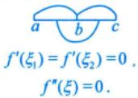

注(1)由于 $\xi \in (a,   b) \subset [a,   b]$ ，故闭区间上结论亦成立，即设f(x)，g(x)在[a,b]上连续且$g(x)$ 不变号，则至少存在一点 $\xi \in [a, b]$ ，使得 $\int _ { a } ^ { b } f ( x ) g ( x ) \mathrm { d } x = f ( \xi ) \int _ { a } ^ { b } g ( x ) \mathrm { d } x.$

(2) 对于 $\int_{1}^{2} f(x) \mathrm{e}^{-x^n}   dx$ 虽然上下限为常数，但被积函数 $f(x)e^{-x^{n}}$ 与n有关，故中值 $\xi_{n}$ 与n有关.同理，对于 $\int_{1}^{2} \mathrm{e}^{-x^{n}}  \mathrm{d}x$ 若写成 $\int _ { 1 } ^ { 2 } \mathrm { e } ^ { - x ^ { n } } \mathrm { d } x = \mathrm { e } ^ { - \eta _ { n } ^ { n } } , \eta _ { n } \in ( 1 , 2 ) , \eta _ { n }$ 亦与n有关，考生需注意，此时不能用 $\lim_{n \to \infty} \mathrm{e}^{-\eta_n^n} = 0.$

拓展：对于 $\int_{a}^{b} f(x) \mathrm{d}x = f(\xi)(b - a)$ ，当改变区间[a,b]→[a，x]时，ξ=ξ(x)：

当改变被积函数f(x)→f(x,n)或fn(x)(函数组)时，ξ=ξ(n).

★★例11.2设f(x)在 $\left[ 0 , \frac { \pi } { 2 } \right]$ 上有二阶导数，且 $f(0) = 2,\ f\left(\frac{\pi}{2}\right) = 1,\ \int_{0}^{\frac{\pi}{2}}f(x)\mathrm{e}^{\sin x}\cos x\mathrm{d}x =$ 2(e-1).证明：存在 $\xi \in \left(0, \frac{\pi}{2}\right)$ ，使 $f^{\prime\prime}(\xi) < 0$

证 由推广的积分中值定理知，存在 $\eta \in \left( 0, \frac{\pi}{2} \right)$ ，使得 $f(\eta)\int_{0}^{\frac{\pi}{2}}\mathrm{e}^{\sin x}\cos x\mathrm{d}x=2(\mathrm{e}-1)$

又 $\int_{0}^{\frac{\pi}{2}}\mathrm{e}^{\sin x}\cos x\mathrm{d}x=\mathrm{e}^{\sin x}\bigg|_{0}^{\frac{\pi}{2}}=\mathrm{e}-1$ ，于是 $f(\eta) \cdot (\mathrm{e} - 1) = 2(\mathrm{e} - 1)$ ，即存在 $\eta \in \left( 0, \frac{\pi}{2} \right)$ ，使得 $f(\eta) = 2$

因 $f(0) = f(\eta) = 2$ .由罗尔定理知，存在 $\xi_{1} \in (0, \eta)$ ，使得 $f^{\prime}(\xi_{1}) = 0$ .又因为 $f\left(\frac{\pi}{2}\right)=1,\ f(\eta)\neq f\left(\frac{\pi}{2}\right)$ 由拉格朗日中值定理知，存在 $\xi_{2} \in \left( \eta, \frac{\pi}{2} \right)$ ，使得 罗 拉0 ξ1

$$
f^{\prime}(\xi_{2}) = \frac{f\left(\frac{\pi}{2}\right) - f(\eta)}{\frac{\pi}{2} - \eta} = \frac{1 - 2}{\frac{\pi}{2} - \eta} < 0
$$

拓展： $f(a) = f(b) = f(c)$ ，用三次罗尔定 a b C f'(ξ) =f'(ξ2) =0. f"(ξ)=0.

若 $f(a) \neq f(b) \neq f(c)$ ，用三次拉格朗日中值定理。 a C 由 $f^{\prime}(\xi_1) < 0, f^{\prime}(\xi_2) > 0$ ，由 $f^{\prime}(\xi_1) > 0, f^{\prime}(\xi_2) < 0$ 得 $f''(\xi) > 0$ 得 $f ^ { \prime \prime } ( \xi )   <   0$ (习题11.1)

再由拉格朗日中值定理知，存在 $\xi \in (\xi_1, \xi_2) \subset \left(0, \frac{\pi}{2}\right)$ ，使得 $f^{\prime\prime}(\xi) = \frac{f^{\prime}(\xi_2) - f^{\prime}(\xi_1)}{\xi_2 - \xi_1} < 0$

## 2 用夹逼准则

例11.3 $\lim_{n \to \infty} \int_{0}^{1} (n + 1)x^{n} \ln(1 + x) \mathrm{d}x = ( \quad )$

(A) ln 2

(B) 1

(C) $\mathsf { e } ^ { 2 }$

解 应选(A).

(D) $+ \infty$

$$
\int_{0}^{1} \frac{x^{n + 1}}{(n + 1)x^{n}\ln(1 + x)} \mathrm{d}x = \int_{0}^{1} \ln(1 + x)\mathrm{d}(x^{n + 1}) \\= \left. x^{n + 1}\ln(1 + x) \right|_{0}^{1} - \int_{0}^{1} \frac{x^{n + 1}}{1 + x} \mathrm{d}x \\= \ln 2 - \int_{0}^{1} \frac{x^{n + 1}}{1 + x} \mathrm{d}x,
$$

对于 $\lim_{n \to \infty} \int_{0}^{1} \frac{x^{n+1}}{1+x}   dx$ ,利用放缩法. 由于 $0 \leqslant \frac{x^{n + 1}}{1 + x} \leqslant x^{n + 1}, 0 \leqslant x \leqslant 1$ ，故

$$
0 \leqslant \int_{0}^{1} \frac{x^{n + 1}}{1 + x} \mathrm{d}x \leqslant \int_{0}^{1} x^{n + 1} \mathrm{d}x = \frac{1}{n + 2}
$$

当 $n \to \infty$ 时，由夹逼准则，有 $\lim_{n \to \infty} \int_{0}^{1} \frac{x^{n+1}}{1+x}   dx = 0$ .于是原式=ln2.

→ 作为第(2)问的提示

例11.4 (1) 比较 $\int_{0}^{1} \left| \ln t \right| \left[ \ln(1 + t) \right]^{n} \mathrm{d}$ lt与 $\int _ { 0 } ^ { 1 } t ^ { n } \left| \ln t \right| \mathrm { d } t ( n = 1 , 2 , \cdots )$ 的大小，说明理由；

(2)记 $u_{n} = \int_{0}^{1} \left| \ln t \right| \left[ \ln(1 + t) \right]^{n} \mathrm{d}t (n = 1, 2, \cdots)$ ，求 $\lim_{n \to \infty} u_n \to$ 典型考研命题形式

解（1)当 $0 \leqslant t \leqslant 1$ 时， $0 \leqslant \ln(1 + t) \leqslant t$ ，则 $0 \leqslant \left[ \ln(1 + t) \right]^n \leqslant t^n$ ，两边同时乘以lnt，有

$$
0 \leqslant \left| \ln t \right| \left[ \ln (1 + t) \right]^n \leqslant t^n \left| \ln t \right| ,
$$

根据积分的保号性，得

$$
\int _ { 0 } ^ { 1 } \left| \ln t \right| \left[ \ln ( 1 + t ) \right] ^ { n } \mathrm { d } t \leqslant \int _ { 0 } ^ { 1 } t ^ { n } \left| \ln t \right| \mathrm { d } t .
$$

(2)由(1)知，

$$
0 \leqslant u _ { n } = \int _ { 0 } ^ { 1 } \left| \ln t \right| \left[ \ln ( 1 + t ) \right] ^ { n } \mathrm{d}t \leqslant \int _ { 0 } ^ { 1 } t ^ { n } \left| \ln t \right| \mathrm{d}t .
$$

$$
\int_{0}^{1}t^{n}\left|\ln t\right|dt=-\int_{0}^{1}t^{n}\overbrace{\ln t}dt=-\frac{1}{n+1}\left|\ln t\right|_{0}^{1}+\frac{1}{n+1}\int_{0}^{1}t^{n}dt=0+\frac{1}{n+1}\left|\frac{\ln t}{n+1}\right|_{0}^{1}+\frac{1}{(n+1)^{2}}\left|\ln t\right|_{0}^{1}=\frac{1}{(n+1)^{2}}
$$

所以 $\lim _ { n \rightarrow \infty } \int _ { 0 } ^ { 1 } t ^ { n } \left| \ln t \right| \mathrm { d } t = 0$ ，于是由夹逼准则得 $\lim_{n \to \infty} u_n = 0$

注更为一般的结论：设f(x)在[0,1]上连续，则 $\lim _ { n \rightarrow \infty } \int _ { 0 } ^ { 1 } x ^ { n } f ( x ) \mathrm { d } x = 0$

证 由f(x)在[0,1]上连续，则f(x)在[0,1]上有最大值M和最小值m，即 $m \leq f(x) \leq M$ ，于是$mx^{n} \leqslant x^{n}f(x) \leqslant Mx^{n}$ .根据积分的保号性，有 $\int_{0}^{1}mx^{n}\mathrm{d}x \leqslant \int_{0}^{1}x^{n}f(x)\mathrm{d}x \leqslant \int_{0}^{1}Mx^{n}\mathrm{d}x$ 即 $\frac{m}{n + 1} \leqslant \int_{0}^{1}x^{n}f(x)\mathrm{d}x \leqslant$ $\frac{M}{n + 1}$ .根据夹逼准则，有 $\lim _ { n \rightarrow \infty } \int _ { 0 } ^ { 1 } x ^ { n } f ( x ) \mathrm { d } x = 0$

如例 11.4 中所取的 $f(x)=\begin{cases}x\left|\ln x\right|,&0<x\leqslant1,\\0,&x=0,\end{cases}$ 则有 $\lim_{n \to \infty} \int_{0}^{1} x^{n-1} x \left| \ln x \right| \mathrm{d}x = \lim_{n \to \infty} \int_{0}^{1} x^n \left| \ln x \right| \mathrm{d}x = 0.$

例11.5 设函数f(x)=x-[x]，其中[x]表示不超过x的最大整数，则 $\lim_{x \to +\infty} \frac{1}{x} \int_{0}^{x} f(t)   dt =$ 分析 $\lim_{x \to +\infty} \frac{\int_{0}^{x} f(t)   dt}{x} \left( \frac{\infty}{\infty} \right)$ 不能用洛必达法则，因为包含跳跃间断点的函数f(x)无原函数.

解应填 $\frac { 1 } { 2 }$

由例1.13可知f(x)是周期为1的周期函数，其图像如图11-1所示.

$\int_{0}^{n} f(t) \mathrm{d}t = n \int_{0}^{1} f(t) \mathrm{d}t$ ，表示n个三角形的面积.每个三角形的面积为 $\frac{1}{2}$ ，故为 $\frac { \pi } { 2 }$ 7

  
图 11-1

→分子的取值范围

I当 $\frac{n \leq x < n + 1}{ 丿 }$ ，即 $\frac{1}{n + 1} < \frac{1}{x} \leq \frac{1}{n}$ 时， $\frac{n}{2}=\int_{0}^{n}f(t)\mathrm{d}t\leqslant\int_{0}^{x}f(t)\mathrm{d}t<\int_{0}^{n+1}f(t)\mathrm{d}t=\frac{n+1}{2}$ ，于是

分母的取值范围

$$
\frac{n}{2(n + 1)} = \frac{1}{n + 1}\int_{0}^{n}f(t)dt < \frac{1}{x}\int_{0}^{x}f(t)dt < \frac{1}{n}\int_{0}^{n + 1}f(t)dt = \frac{n + 1}{2n}
$$

当 $0<a<y<b, 0<c<x<d$ 时，当 $x \to + \infty$ 时，n→∞，由夹逼准则，有 $\lim_{x \to +\infty} \frac{1}{x} \int_{0}^{x} f(t)   dt = \frac{1}{2}$ 有 $\frac{a}{d} < \frac{y}{x} < \frac{b}{c}$

## ③用积分法→恒等变形、换元法、分部积分法

例11.6设f(x)的二阶导数f"(x)在[0,1]上连续，且f(0)=f(1)=0，证明：

(1) $\int_{0}^{1} f(x) \mathrm{d}x = \frac{1}{2} \int_{0}^{1} x(x - 1) f''(x) \mathrm{d}x$

(2) $\left| \int_{0}^{1} f(x) \mathrm{d}x \right| \leqslant \frac{1}{12} \max_{0 \leqslant x \leqslant 1} \left\{ \left| f''(x) \right| \right\}$

分析第(1)问出现函数和函数的二阶导数，用两次分部积分法.

证(1) $\frac{1}{2}\int_{0}^{1}x(x - 1)f^{\prime\prime}(x)\mathrm{d}x = \frac{1}{2}\int_{0}^{1}x(x - 1)\mathrm{d}\left\lbrack \frac{f^{\prime}(x)}{y} \right\rbrack^{- 1}$ 分部积分法： $\int u \mathrm{d}v = uv - \int v \mathrm{d}u.$

$$
\begin{aligned}= & \frac{1}{2}x(x - 1)f^{\prime}(x)\bigg|_{0}^{1} - \frac{1}{2}\int_{0}^{1}f^{\prime}(x)\overbrace{(2x - 1)\mathrm{d}x}^{ 凑微今法 } \\= & - \frac{1}{2}\int_{0}^{1}(2x - 1)\mathrm{d}\left[ f(x) \right] \\= & - \frac{1}{2}(2x - 1)f(x)\bigg|_{0}^{1} + \int_{0}^{1}f(x)\mathrm{d}x\end{aligned}
$$

由条件f(0)=f(1)=0，知结论成立.

(2)记 $M = \max_{0 \leq x \leq 1} \left\{ \left| f''(x) \right| \right\}$ ，则由(1)有

$$
\left| \int_{0}^{1} f(x) \mathrm{d}x \right| = \frac{1}{2} \left| \int_{0}^{1} x(x-1) f''(x) \mathrm{d}x \right| \leqslant \frac{1}{2} \left| \int_{0}^{1} x(x-1) \right| \left| f''(x) \right| \mathrm{d}x \leqslant \frac{M}{2} \int_{0}^{1} x(1-x) \mathrm{d}x = \frac{M}{2} \left( \frac{1}{2} - \frac{1}{3} \right) = \frac{M}{12}
$$

得证.

利用第8讲“二、3”的性质4

## 积分不等式

## 1用函数的单调性

通常的做法：首先将某一积分限(通常取上限)变量化，然后移项构造辅助函数，由辅助函数的单调性来证明不等式，此方法多用于所给条件为 $ \text{" } f(x)$ 在[a,b]上连续”的情形. g(x)有界

★★★例11.7 设函数f(x)，g(x)在区间[a，b]上连续，且f(x)单调增加， $0 \leq g(x) \leq 1$ .证明：

(1) $0 \leqslant \int_{a}^{x}g(t)\mathrm{d}t \leqslant x - a,\;x \in \left [ a,\;b \right ]$ i

(2) $\int_{a}^{a + \int_{a}^{b}g(t)\mathrm{d}t}f(x)\mathrm{d}x \leqslant \int_{a}^{b}f(x)g(x)\mathrm{d}x$

分析（1)中，因为 $a   \leqslant   x$ ，所以 $\int_{a}^{x}g(t)\mathrm{d}t$ 是正向的积分，可直接用积分的保号性；

(2)中，该题是考研以来上限较复杂的定积分，做题时要注意形式的复杂性.

证(1)因为 $0 \leqslant g(x) \leqslant 1$ ，所以当 $x   \in   [ a   ,   b ]$ 时，有 $\int_{a}^{x} 0 \mathrm{d}t \leqslant \int_{a}^{x} g(t) \mathrm{d}t \leqslant \int_{a}^{x} 1 \mathrm{d}t.$ ，即

$$
0 \leqslant \int_{a}^{x} g(t) \mathrm{d}t \leqslant x - a .
$$

(2)令 $F(x)=\int_{a}^{a+\int_{a}^{x}g(u)du}f(t)dt-\int_{a}^{x}f(t)g(t)dt,\ x\in[a,b]$ 三个变量要区分开

因为f(x)，g(x)在区间[a,b]上连续，所以F(x)在区间[a,b]上可导，且

$$
F ^ { \prime } ( x ) = f \left[ a + \int _ { a } ^ { x } g ( u ) \mathrm { d } u \right] g ( x ) - f ( x ) g ( x ) = \left\{ f \left[ a + \int _ { a } ^ { x } g ( u ) \mathrm { d } u \right] - f ( x ) \right\} g ( x ) .
$$

由(1)知， $\int_{a}^{x} g(u)   du \leq x - a$ ，即 $a + \int_{a}^{x} g(u) \mathrm{d}u \leqslant x, \; x \in [a,   b]$ .又因为f(x)单调增加，且 $g(x) \geqslant 0$ 所以 $F^{\prime}(x) \leqslant 0$ ，从而F(x)在区间[a,b]上单调减少. y又 $F(a) = 0$ ，故 $F(b) \leqslant 0$ ，即 $\int_{a}^{a + \int_{a}^{b}g(t)\mathrm{d}t}f(x)\mathrm{d}x \leqslant \int_{a}^{b}f(x)g(x)\mathrm{d}x.$ 0 a 6x 减且F(a)=0 F(x)单调递

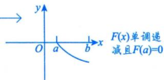

## 2用拉格朗日中值定理

## →这是由拉格朗日中值定理的条件决定的

此方法多用于所给条件为 $ \text{" }f(\overset{\frown}{x})$ 一阶可导”且某一端点值较简单(甚至为0)的题目.

例11.8 设f(x)在[0,1]上具有一阶连续导数，且 $f(0) = f(1) = 0$ .记 $M = \max_{x \in [0,1]} \left\{ \left| f^{\prime}(x) \right| \right\}$ .证明：$ 夹见到  f(x) , f^{\prime}(x)$ ，想拉格朗日中值定理 $\left| \int_{0}^{1} f(x) \mathrm{d}x \right| \leq \frac{1}{4} M$ →即f'(x)连续

证 将大区间[0,1]分成两个小区间[0，x]和[x，1].

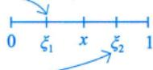

在[0，x]上对f(x)使用拉格朗日中值定理，得 $f(x) - f(0) = f(x) = f^{\prime}(\xi_1)x$ ，其中 $\xi_{1} \in (0, x)$ ，于是0 ξ1 x $\left| f(x) \right| = \left| f^{\prime}(\xi_1) \right| x$

在[x,1]上对f(x)使用拉格朗日中值定理，得 $f(1)-f(x)=-f(x)=f^{\prime}(\xi_{2})(1-x)$ ，其中 $\xi_{2} \in (x,1)$ 于是 $\left| f(x) \right| = \left| f^{\prime}(\xi_2) \right| (1 - x)$

当x∈[0,1]时，因为 $M = \max \left\{ \left| f^{\prime}(x) \right| \right\}$ ，所以

$$
\left| f(x) \right| \leqslant Mx,\ \left| f(x) \right| \leqslant M(1-x),
$$

于是

利用不等式|a+b≤|a|+|b，见第2讲“6.夹逼准则”的注(2)①

$$
\begin{aligned}\left| \int_{0}^{1} f(x) \mathrm{d}x \right| = & \left| \int_{0}^{x} f(t) \mathrm{d}t + \int_{x}^{1} f(t) \mathrm{d}t \right| \leq \left| \int_{0}^{x} f(t) \mathrm{d}t \right| + \left| \int_{x}^{1} f(t) \mathrm{d}t \right| \leq \left| \int_{0}^{x} \left| f(t) \right| \mathrm{d}t + \int_{x}^{1} \left| f(t) \right| \mathrm{d}t \right| \\\leq & M \int_{0}^{x} t \mathrm{d}t + M \int_{x}^{1} (1 - t) \mathrm{d}t = M \left[ \frac{x^2}{2} + \frac{(1 - x)^2}{2} \right],\end{aligned}
$$

其中， $\frac{x^{2}}{2}+\frac{(1-x)^{2}}{2}=x^{2}-x+\frac{1}{2}=\left(x-\frac{1}{2}\right)^{2}+\frac{1}{4}\geqslant\frac{1}{4}$ ，故得证.

## ③用泰勒公式

此方法多用于所给条件为“f(x)二阶可导”且题中有简单函数值(甚至为0)的题目.

例11.9 设f(x)在[0，2]上二阶导数连续，且f(1)=0.当 $x \in [0,   2]$ 时，记 $M = \max \left\{ \left| f''(x) \right| \right\}$ ，证明： $\left| \int_{0}^{2} f(x) \mathrm{d}x \right| \leq \frac{1}{3} M$ 即f"(x)连续

分析当无法用牛顿-莱布尼茨公式时，可考虑用泰勒公式将被积函数f(x)展开成多项式再做.

证根据题设，选取点 $x_{0} = 1$ 展开成泰勒公式，则

$f(x) = f(1) + f'(1)(x - 1) + \frac{f''(\xi)}{2}(x - 1)^2$ (ξ是介于x,1之间的关于x的函数)，

$$
\int _ { 0 } ^ { 2 } f ( x ) \mathrm { d } x = f ^ { \prime } ( 1 ) \int _ { 0 } ^ { 2 } ( x - 1 ) \mathrm { d } x + \int _ { 0 } ^ { 2 } \frac { f ^ { \prime \prime } ( \xi ) } { 2 } ( x - 1 ) ^ { 2 } \mathrm { d } x = \frac { 1 } { 2 } \int _ { 0 } ^ { 2 } f ^ { \prime \prime } ( \xi ) ( x - 1 ) ^ { 2 } \mathrm { d } x ,
$$

利用第8讲“二、 $3 ^ { \circ }$ 的性质4

>利用 $\int_{0}^{2x_{0}} (x - x_{0}) \mathrm{d}x = 0$

$$
\left| \int_{0}^{2} f(x) \mathrm{d}x \right| \leqslant \frac{1}{2} \int_{0}^{2} \left| f''(\xi) \right| (x-1)^2 \mathrm{d}x \leqslant \frac{1}{2} M \int_{0}^{2} (x-1)^2 \mathrm{d}x = \frac{1}{3} M,
$$

故得证.

## 用积分法

例11.10 设f(x)在[0,2π]上具有一阶连续导数，且 $f^{\prime}(x) \geqslant 0$ ，证明：对任意正整数n有

$$
\left| \int_{0}^{2\pi} f(x) \sin nx   dx \right| \leqslant \frac{2}{n} \left[ f(2\pi) - f(0) \right] .
$$

分析被积函数是两项相乘的形式，故用分部积分法去做.

$$
\begin{aligned} \begin{aligned}\left| \int_{0}^{2\pi} f(x) \sin nx \mathrm{d}x \right| = \left| \frac{1}{n} \int_{0}^{2\pi} f(x) \mathrm{d}(\cos nx) \right| \leqslant \left| f(2\pi) \right| \geqslant 0 \left( 0 \right) \leqslant \left| f(2\pi) \right| \geqslant 0 \left( 0 \right) \leqslant \left| \frac{1}{n} f(2\pi) \right| \leqslant \left| \frac{1}{n} \int_{0}^{2\pi} f(x) \cos nx \right| \leqslant \left| \frac{1}{n} \int_{0}^{2\pi} f^{\prime}(x) \cos nx \mathrm{d}x \right| \\\leqslant \left| \frac{1}{n} f(x) \cos nx \right| \leqslant \left| \frac{1}{n} f(2\pi) \right| \geqslant 0 \left( 0 \right) \leqslant \left| \frac{1}{n} f(2\pi) \right| \geqslant f(0) \end{aligned} 由于  f^{\prime}(x) \geqslant 0  , 故  f(2\pi) \geqslant 0  , 故  f(2\pi) \geqslant f(0) \leqslant \left| \frac{1}{n} \right| \leqslant \frac{1}{n} \int_{0}^{2\pi} f^{\prime}(x) \left| \frac{1}{n} \right| \frac{1}{n} \int_{0}^{2\pi} f^{\prime}(x) \left| f^{\prime}(x) \cos nx \right| \mathrm{d}x \end{aligned} 有周  \begin{aligned}\left| \int_{0}^{\frac{\pi}{n}} \mathrm{d}x \right| \leqslant \left| \frac{1}{n} \right| \mathrm{d}x \\\left| \int_{0}^{\frac{\pi}{n}} \mathrm{d}x \right| \left| \mathrm{d}x \right| \left| \mathrm{d}x \right| \leqslant \left| \frac{1}{n} \right| \mathrm{d}x \left| \mathrm{d}x \right| \leqslant \left| \frac{1}{n} \right| \mathrm{d}x \left| \mathrm{d}x \right| \leqslant \left| \frac{1}{n} \right| \mathrm{d}x \left| \mathrm{d}x \right| \left| \mathrm{d}x \right| \leqslant \left| \frac{1}{n} \right| \mathrm{d}x \left| \mathrm{d}x \right| \leqslant \left| \frac{1}{n} \right| \mathrm{d}x \left| \mathrm{d}x \right| \end{aligned}
$$

## 5 用牛顿－莱布尼茨公式

例11.11 设f'(x)在[a，b]上连续，且 $f(a) = f(b) = 0$ .证明：

$$
\left| f ( x ) \right| \leqslant \frac { 1 } { 2 } \int _ { a } ^ { b } \left| f ^ { \prime } ( x ) \right| \mathrm { d } x .
$$

分析证明f(x)与 $\int_{a}^{b} f^{\prime}(x) \mathrm{d}x$ 的关系用牛顿-莱布尼茨公式

证由 $f(x) = f(x) - f(a) = \int_{a}^{x} f^{\prime}(t) \mathrm{d}t$ ，得

$$
3 ^ { \circ }
$$

$$
\left| f ( x ) \right| = \left| \int _ { a } ^ { x } f ^ { \prime } ( t ) \mathrm { d } t \right| \leqslant \int _ { a } ^ { x } \left| f ^ { \prime } ( t ) \right| \mathrm { d } t ,\tag{①}
$$

由 $f(x) = f(x) - f(b) = \int_{b}^{x} f^{\prime}(t) \mathrm{d}t$ ，得

→第8讲“二、3”的性质4

$$
\left| f(x) \right| = \left| \int_{b}^{x} f^{\prime}(t) \mathrm{d}t \right| = \left| \int_{x}^{b} f^{\prime}(t) \mathrm{d}t \right| \leqslant \int_{x}^{b} \left| f^{\prime}(t) \right| \mathrm{d}t .\tag{②}
$$

式① + 式②，得 $2 \left| f(x) \right| \leqslant \int_{a}^{x} \left| f^{\prime}(t) \right| \mathrm{d}t + \int_{x}^{b} \left| f^{\prime}(t) \right| \mathrm{d}t = \int_{a}^{b} \left| f^{\prime}(t) \right| \mathrm{d}t$ ，即

$$
\left| f ( x ) \right| \leqslant \frac { 1 } { 2 } \int _ { a } ^ { b } \left| f ^ { \prime } ( x ) \right| \mathrm { d } x .
$$

## 基础习题精练

## 习题

11.1 若函数φ(x)具有二阶导数，且满足 $\varphi(2) > \varphi(1), \; \varphi(2) > \int_{2}^{3} \varphi(x) \mathrm{d}x$ ，证明：至少存在一点 $\xi \in$ (1,3)，使得 $\varphi''(\xi) < 0$

11.2 证明： $\int_{0}^{\frac{\pi}{2}}\frac{\cos x}{1 + x^{2}}\mathrm{d}x \geq \int_{0}^{\frac{\pi}{2}}\frac{\sin x}{1 + x^{2}}\mathrm{d}x$

11.3 设φ(x)是可微函数f(x)的反函数，且 $f(1) = 0$ ，证明：

$$
\int _ { 0 } ^ { 1 } \left[ \int _ { 0 } ^ { f ( x ) } \varphi ( t ) \mathrm { d } t \right] \mathrm { d } x = 2 \int _ { 0 } ^ { 1 } x f ( x ) \mathrm { d } x .
$$

11.4 设f(x)在[a,b]上连续且严格单调增加，证明：

$$
(a + b)\int_{a}^{b}f(x)\mathrm{d}x < 2\int_{a}^{b}xf(x)\mathrm{d}x .
$$

11.5 设f'(x)在[0，a]上连续，且f(0)=0，证明：

$$
\left| \int_{0}^{a} f(x) \mathrm{d}x \right| \leq \frac{Ma^{2}}{2}
$$

其中 $M = \max_{0 \leq x \leq a} |f'(x)|$

11.6 设f(x)在区间[0,1]上有二阶导数，且 $f\left(\frac{1}{2}\right)=1, f''(x)>0$ ，证明： $\int_{0}^{1} f(x) \mathrm{d}x \geqslant 1$

## 解答

11.1 证明 由积分中值定理，可知至少存在一点 $\eta \in (2,   3]$ ，使得

$$
\int _ { 2 } ^ { 3 } \varphi ( x ) \mathrm { d } x = \varphi ( \eta ) ( 3 - 2 ) = \varphi ( \eta ) .
$$

对φ(x)在[1，2]和[2，η]上分别应用拉格朗日中值定理，并注意到 $\varphi(1) < \varphi(2), \; \varphi(\eta) < \varphi(2)$ ，得

$$
\varphi ^ { \prime } ( \xi _ { 1 } ) = \frac { \varphi ( 2 ) - \varphi ( 1 ) } { 2 - 1 } > 0 , 1 < \xi _ { 1 } < 2 ,
$$

$$
\varphi ^ { \prime } ( \xi _ { 2 } ) = \frac { \varphi ( \eta ) - \varphi ( 2 ) } { \eta - 2 } < 0 , 2 < \xi _ { 2 } < \eta \leqslant 3 .
$$

在 $\left[ \xi _ { 1 } ,   \xi _ { 2 } \right]$ 上对导函数φ′(x)应用拉格朗日中值定理，有

$$
\varphi ^ { \prime } ( \xi ) = \frac { \varphi ^ { \prime } ( \xi _ { 2 } ) - \varphi ^ { \prime } ( \xi _ { 1 } ) } { \xi _ { 2 } - \xi _ { 1 } } < 0 , \xi \in ( \xi _ { 1 } , \xi _ { 2 } ) \subset ( 1 , 3 ) .
$$

11.2 证明 要证原不等式成立，只需证 $\int_{0}^{\frac{\pi}{2}}\frac{\cos x-\sin x}{1+x^{2}}\mathrm{d}x\geqslant0$

方法一 $\int_{0}^{\frac{\pi}{2}}\frac{\cos x-\sin x}{1+x^{2}}\mathrm{d}x=\int_{0}^{\frac{\pi}{4}}\frac{\cos x-\sin x}{1+x^{2}}\mathrm{d}x+\int_{\frac{\pi}{4}}^{\frac{\pi}{2}}\frac{\cos x-\sin x}{1+x^{2}}\mathrm{d}x$

在上式右边第二项积分中，令 $x = \frac{\pi}{2} - t$ ，得

$$
\int_{0}^{\frac{\pi}{2}}\frac{\cos x-\sin x}{1+x^{2}}\mathrm{d}x=\int_{0}^{\frac{\pi}{4}}\frac{\cos x-\sin x}{1+x^{2}}\mathrm{d}x+\int_{0}^{\frac{\pi}{4}}\frac{\sin t-\cos t}{1+\left(\frac{\pi}{2}-t\right)^{2}}\mathrm{d}t
$$

故原式得证.

方法二

$$
\begin{aligned} &\int_{0}^{\frac{\pi}{2}}\frac{\cos x-\sin x}{1+x^{2}}\mathrm{d}x \\=&\int_{0}^{\frac{\pi}{4}}\frac{\cos x-\sin x}{1+x^{2}}\mathrm{d}x+\int_{\frac{\pi}{4}}^{\frac{\pi}{2}}\frac{\cos x-\sin x}{1+x^{2}}\mathrm{d}x \\=&\frac{1}{1+\xi^{2}}\int_{0}^{\frac{\pi}{4}}(\cos x-\sin x)\mathrm{d}x+\frac{1}{1+\eta^{2}}\int_{\frac{\pi}{4}}^{\frac{\pi}{2}}(\cos x-\sin x)\mathrm{d}x \\=&(\sqrt{2}-1)\left(\frac{1}{1+\xi^{2}}-\frac{1}{1+\eta^{2}}\right),\end{aligned}
$$

其中 $0 \leqslant \xi \leqslant \frac{\pi}{4}, \frac{\pi}{4} \leqslant \eta \leqslant \frac{\pi}{2}$ ，从而有

$$
\int _ { 0 } ^ { \frac { \pi } { 2 } } \frac { \cos x - \sin x } { 1 + x ^ { 2 } }   dx \geqslant 0 ,
$$

故原式得证.

11.3 分析 左端定积分的被积函数为变限积分，考虑分部积分法.

证明

$$
\begin{aligned}\int_{0}^{1}\left[\int_{0}^{f(x)} \varphi(t) \mathrm{d} t\right] \mathrm{d} x &= x \int_{0}^{f(x)} \varphi(t) \mathrm{d} t \bigg|_{0}^{1} - \int_{0}^{1} x \varphi[f(x)] \cdot f^{\prime}(x) \mathrm{d} x \\&= - \int_{0}^{1} x^{2} \cdot f^{\prime}(x) \mathrm{d} x = - \int_{0}^{1} x^{2} \mathrm{d}[f(x)] \\&= - x^{2} f(x) \bigg|_{0}^{1} + 2 \int_{0}^{1} x f(x) \mathrm{d} x = 2 \int_{0}^{1} x f(x) \mathrm{d} x .\end{aligned}
$$

11.4 分析 $(a + b)\int_{a}^{b}f(x)\mathrm{d}x < 2\int_{a}^{b}xf(x)\mathrm{d}x \Leftrightarrow (a + b)\int_{a}^{b}f(x)\mathrm{d}x - 2\int_{a}^{b}xf(x)\mathrm{d}x < 0$ ，可构造辅助函数，用单调性证明.

证明令 $F(t)=(a+t)\int_{a}^{t}f(x)\mathrm{d}x-2\int_{a}^{t}xf(x)\mathrm{d}x,\;t\in[a,\;b]$ ，则

$$
\begin{aligned}F^{\prime}(t) = & \int_{a}^{t}f(x)\mathrm{d}x + (a + t)f(t) - 2tf(t) = \int_{a}^{t}f(x)\mathrm{d}x - (t - a)f(t) \\= & \int_{a}^{t}f(x)\mathrm{d}x - \int_{a}^{t}f(t)\mathrm{d}x = \int_{a}^{t}[f(x) - f(t)]\mathrm{d}x .\end{aligned}
$$

因为 $f(x)$ 在 $\left[ a , b \right]$ 上严格单调增加，所以 $f(x) - f(t) < 0$ ，于是有

$$
F^{\prime}(t)=\int_{a}^{t}\left[f(x)-f(t)\right]\mathrm{d}x<0,
$$

即 $F(t)  严$ 格单调减少，又 $F(a) = 0$ ，所以 $F(b) < 0$ ，即

$$
(a + b)\int_{a}^{b}f(x)\mathrm{d}x - 2\int_{a}^{b}xf(x)\mathrm{d}x < 0,
$$

即

$$
(a + b)\int_{a}^{b}f(x)\mathrm{d}x < 2\int_{a}^{b}xf(x)\mathrm{d}x .
$$

11.5 证明 方法一 任取 $x \in (0,   a]$ ，由微分中值定理有

$$
f(x)-f(0)=f^{\prime}(\xi)x,\ \xi\in(0,x)
$$

又因 $f(0) = 0$ ，故 $f(x) = f^{\prime}(\xi)x, \; x \in (0, a]$ ，于是

$$
\left| \int_{0}^{a} f(x) \mathrm{d}x \right| = \left| \int_{0}^{a} f^{\prime}(\xi) x \mathrm{d}x \right| \leqslant \int_{0}^{a} \left| f^{\prime}(\xi) \right| x \mathrm{d}x \leqslant M \int_{0}^{a} x \mathrm{d}x = \frac{M}{2} a^{2} .
$$

方法二 设 $x \in [0,   a]$ ，由 $f(0) = 0$ 知

$$
\int _ { 0 } ^ { x } f ^ { \prime } ( t ) \mathrm { d } t = f ( x ) - f ( 0 ) = f ( x ) ,
$$

于是

$$
\left| f ( x ) \right| = \left| \int _ { 0 } ^ { x } f ^ { \prime } ( t ) \mathrm { d } t \right| \leqslant \int _ { 0 } ^ { x } \left| f ^ { \prime } ( t ) \right| \mathrm { d } t \leqslant \int _ { 0 } ^ { x } M \mathrm { d } t = M x ,
$$

故

$$
\left| \int_{0}^{a} f(x) \mathrm{d}x \right| \leqslant \int_{0}^{a} \left| f(x) \right| \mathrm{d}x \leqslant \int_{0}^{a} M x \mathrm{d}x = \frac{M a^{2}}{2} .
$$

注对积分 $\left| \int_{0}^{a} f(x) \mathrm{d}x \right|$ 作估计，只要对被积函数f(x)作估计即可.条件中给出导数f'(x)及$f(0) = 0$ 的信息，自然想办法把f(x)和f'(x)联系起来.在高等数学中，联系f(x)和f'(x)有两种常用的办法，一是微分学中的拉格朗日中值定理(方法一),二是积分学中的牛顿–莱布尼茨公式(方法二).

11.6 证明

$$
f(x)=f\left(\frac{1}{2}\right)+f^{\prime}\left(\frac{1}{2}\right)\left(x-\frac{1}{2}\right)+\frac{f^{\prime\prime}(\xi)}{2!}\left(x-\frac{1}{2}\right)^{2},
$$

其中ξ介于x与 $\frac { 1 } { 2 }$ 之间.又由 $f''(x) > 0$ ，则 $f^{\prime\prime}(\xi) > 0$ ，于是

$$
f(x) \geqslant f\left(\frac{1}{2}\right) + f^{\prime}\left(\frac{1}{2}\right)\left(x - \frac{1}{2}\right)
$$

两边在区间[0,1]上对x积分，得

$$
\begin{aligned}\int_{0}^{1} f(x) \mathrm{d}x & \geqslant \int_{0}^{1} \left[ f\left(\frac{1}{2}\right) + f^{\prime}\left(\frac{1}{2}\right)\left(x - \frac{1}{2}\right) \right] \mathrm{d}x \\& = f\left(\frac{1}{2}\right) + f^{\prime}\left(\frac{1}{2}\right) \int_{0}^{1} \left(x - \frac{1}{2}\right) \mathrm{d}x = f\left(\frac{1}{2}\right) = 1\end{aligned}
$$

## 第12讲

## 一元函数积分学的应用（三）——物理应用与经济应用

<table><tr><td rowspan=1 colspan=1>考题</td><td rowspan=1 colspan=1>变力沿直线做功、抽水做功、静水压力、引力的求法(仅数学一、数学二)，经济类题目求解（仅数学三）</td></tr><tr><td rowspan=1 colspan=1>题型</td><td rowspan=1 colspan=1>选择题、填空题、解答题</td></tr><tr><td rowspan=1 colspan=1>目标</td><td rowspan=1 colspan=1>①掌握求解变力沿直线做功、抽水做功、静水压力、引力的方法(仅数学一、数学二)；②掌握求解经济应用的题目(仅数学三)</td></tr><tr><td rowspan=1 colspan=1>重难点</td><td rowspan=1 colspan=1>静水压力的求法（仅数学一、数学二）</td></tr></table>

## 基础知识结构

  
涉及：①平均值：②边际与总量关系（用牛顿-莱布尼茨公式处理问题）

## 基础内容精讲

## 物理应用（仅数学一、数学二）

## 1变力沿直线做功

设方向沿x轴正向的力函数为 $y = F(x) (a \leqslant x \leqslant b)$ ，则物体沿x轴从点a移动到点b时，变力 $F ( x )$ 所做的功(见图12-1)为

几何上为曲边梯形的面积。  
物理上为变力沿直线做功.

$$
W = \int _ { a } ^ { b } F ( x ) \mathrm { d } x ,
$$

功的微元 $\mathrm{d}W = F(x)\mathrm{d}x$

表示小的矩形条的面积(从a到b进行累加，表示总功)

## 例12.1用铁锤将一铁钉击入木板，设木板对铁钉的阻力与铁钉

图 12-1

击入木板的深度成正比，在击第一次时，将铁钉击入木板1cm.如果铁锤每次击打做功相等，则第二锤可将铁钉又击入

分析 ①翻译成数学语言 + 引入记号↓ ↓

成正比： $f = kx$ 阻力：f 深度：x

功相等： $W _ { 1 } = W _ { 2 }$ 第一次做的功： $W _ { 1 }$ 第二次做的功： $W _ { z }$

②取微元： $\mathrm{d}W_{1} = kx\mathrm{d}x , \mathrm{d}W_{2} = kx\mathrm{d}x$

③积分 $W_{1} = \int_{0}^{x_{1}}kx\mathrm{d}x , \quad W_{2} = \int_{x_{1}}^{x_{2}}kx\mathrm{d}x$

## 解应填 $(\sqrt{2} - 1)  cm$

设第n次击打后，铁钉击入木板的深度为 $x_{n}\  cm$ ，第n次击打时，铁锤所做的功为 $W_{n}(n = 1,2)$ ，由题设，当铁钉击入木板的深度为xcm时，木板对铁钉的阻力的大小为kx（k为常数），所以

$$
W_{1} = \int_{0}^{x_{1}}kx\mathrm{d}x = \frac{k}{2}x_{1}^{2}, x_{1} = 1 ;
$$

$$
W _ { 2 } = \int _ { x _ { 1 } } ^ { x _ { 2 } } k x \mathrm { d } x = \frac { k } { 2 } x _ { 2 } ^ { 2 } - \frac { k } { 2 } x _ { 1 } ^ { 2 } ,
$$

又 $W_{2}=W_{1}$ ，从而

$$
\frac{k}{2}x_{2}^{2}=2W_{1}=k
$$

于是

$$
x_{2} = \sqrt{2} ,
$$

所以第二锤可将铁钉又击入 $(\sqrt{2} - 1)  cm$

## 考研数学基础30讲·高等数学分册

## ②抽水做功

如图12-2所示，将容器中的水全部抽出所做的功为

$$
W = \rho g \int _ { a } ^ { b } x A ( x ) \mathrm { d } x ,
$$

其中 $\rho$ 为水的密度， $g$ 为重力加速度.

功的微元 $\mathrm{d}W = \rho g x A(x) \mathrm{d}x$ 为位于x处厚度为dx，水平截面面积为A(x)的一层水被抽出（路程为x)所做的功.

图 12-2

求解这类问题的关键是确定x处的水平截面面积 $A(x)$ ，其余的量都是固定的.

$\mathrm{d}W = \rho g A(x) \mathrm{d}x = \rho g A(x) \cdot x \mathrm{d}x$

例12.2有一倒圆锥形容器，高为 $a$ ，上底半径为b，装满水.记水的密度为 $\rho$ ，重力加速度为g，则将容器中的水全部从容器顶部抽出所做的功为

分析①建立坐标系（对称、高为正）；

②取微元 $\mathrm{d}W = \rho g A(x) x \mathrm{d}x$

$$
\frac{\frac{1}{\sqrt{b}}}{a \cdot \frac{(a - x)^2 b^2}{a^2}}
$$

③积分 $W = \int_{0}^{a} \rho g \pi x \frac{(a - x)^2 b^2}{a^2}   dx$

解应填 $\frac{1}{12} \rho g a^{2} b^{2} \pi$

如图12-3所示，建立坐标系.在x处的水平截面的半径r满足 $\frac{r}{b}=\frac{a-x}{a}$ ，即

$$
r = \frac{b(a - x)}{a}
$$

截面面积

$$
A(x)=\pi r^{2}=\pi\cdot\left[\frac{b(a-x)}{a}\right]^{2}=\frac{b^{2}(a-x)^{2}\pi}{a^{2}}
$$

所以将水全部抽出所做的功

$$
\begin{aligned}W = \rho g \int_{0}^{a} x A(x) \mathrm{d}x = \rho g \int_{0}^{a} x \frac{b^{2}(a - x)^{2} \pi}{a^{2}} \mathrm{d}x , \\= \frac{1}{12} \rho g a^{2} b^{2} \pi .\end{aligned}
$$

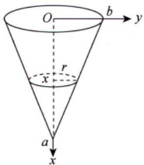  
图 12-3

## 第12讲 一元函数积分学的应用（三）——物理应用与经济应用

→默认不流动水给的压力为静水压力

## ③静水压力（水压力）

垂直浸没在水中的平板ABCD(见图12-4)的一侧受到的水压力为

$$
P = \rho g \int _ { a } ^ { b } x [ f ( x ) - h ( x ) ] \mathrm { d } x ,
$$

其中 $\rho$ 为水的密度，g为重力加速度

压力微元 $\mathrm{d}P = \rho g x [ f(x) - h(x) ] \mathrm{d}x$ ，即图中矩形条所受到的压力.x表示水深， $f(x) - h(x)$ 是矩形条的宽度，dx是矩形条的高度.

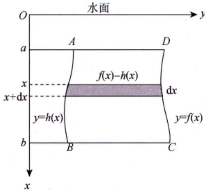  
图 12-4

注水压力问题的特点：压强随水的深度的改变而改变.求解这类问题的关键是确定水深x处的平板的宽度 $f(x) - h(x)$

例12.3斜边长为2a的等腰直角三角形平板铅直地沉没在水中，且斜边与水面相齐.记重力加速度为g，水的密度为 $\rho$ ，则该平板一侧所受的水压力为

分析建系、取微元、再积分即可.

解应填 $\frac{1}{3}a^{3}\rho g$

如图12-5所示，该平板一侧所受的水压力为

$$
P = \int_{0}^{a} 2 \rho g ( a - y ) y \mathrm{d}y = 2 \rho g \int_{0}^{a} ( a y - y ^ { 2 } ) \mathrm{d}y = 2 \rho g \left( \frac{a ^ { 3 } } { 2 } - \frac{a ^ { 3 } } { 3 } \right) = \frac{1}{3} a ^ { 3 } \rho g .
$$

  
图 12-5

## 4引力

设有一长度为l、线密度为常数 $\mu$ 的细棒，在与细棒右端的距离为a处有一质量为m的质点M（见图12-6），已知引力常量为G，则质点M与细棒之间的引力的大小为 $\int_{-l}^{0} \frac{G m \mu}{(a-x)^2}   dx$

  
图 12-6

## “三心”的概念

首先，要知道质心、重心与形心的概念.

质心是指物体的质量分布中心，是物体的固有特性.

重心是指物体所受地球引力的重力分布中心，依赖于重力场，在均匀重力场下，重心与质心重合，在非均匀重力场下，重心一般不是质心.

形心是指几何图形的分布中心，是固有几何量.当物体密度为常数时，物体质心与其几何体形心重合.

故在满足均匀重力场及均质条件下，重心、质心、形心三心重合.

## 2 质心计算公式与力矩计算公式

先考虑一个简单情形.

如图12-7(a)所示，设 $x _ { 1 }$ 处质量为 $m_{1} \text { , } x_{2}$ 处质量为 $m _ { 2 }$ ，问x为何值时，系统平衡？

显然，由力矩相等，有 $( \overline { x } - x _ { 1 } ) m _ { 1 } g = ( x _ { 2 } - \overline { x } ) m _ { 2 } g$ ，得

$$
\bar{x} = \frac{x_{1}m_{1} + x_{2}m_{2}}{m_{1} + m_{2}}
$$

推广至二维平面上有n个质点的情形，如图12-7(b)所示，有

$$
\bar{x} = \frac{\sum\limits_{i = 1}^{n} x_{i} m_{i}}{\sum\limits_{i = 1}^{n} m_{i}} , \bar{y} = \frac{\sum\limits_{i = 1}^{n} y_{i} m_{i}}{\sum\limits_{i = 1}^{n} m_{i}} ,
$$

其中， $M_{y}=\sum_{i = 1}^{n}x_{i}m_{i}$ 刻画系统绕y轴旋转的趋势大小，称为力矩. $M _ { x }$ 同理可解释.

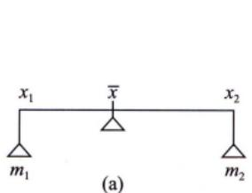

  
(b)  
图 12-7

进一步地，如图12-8(a)所示，质量系统对任一条直线 $L_{0}:ax+by+c=0$ 的力矩为

$$
M_{L_{0}}=\sum_{i = 1}^{n}r_{i}m_{i}=\sum_{i = 1}^{n}\frac{\left | ax_{i}+by_{i}+c \right | }{\sqrt{a^{2}+b^{2}}}m_{i}
$$

当质量系统为连续可求长曲线段L： $y = f(x)$ 时，如图12-8(b)所示，有

$$
\Delta m _ { i } = \rho ( \xi _ { i } ) \Delta s _ { i } , \Delta M _ { i L _ { 0 } } = r _ { i } \rho ( \xi _ { i } ) \Delta s _ { i } ,
$$

故总力矩为

$$
\begin{align*}M_{L_0} = \lim_{n \to \infty} \sum_{i=1}^n \Delta M_{iL_0} = \lim_{n \to \infty} \sum_{i=1}^n r_i \rho(\xi_i) \Delta s_i = \int_a^b \frac{\left| ax + by + c \right|}{\sqrt{a^2 + b^2}} \rho(x) \mathrm{d}s, \\= \int_a^b \frac{\left| ax + by + c \right|}{\sqrt{a^2 + b^2}} \rho(x) \sqrt{1 + \left[ f'(x) \right]^2} \mathrm{d}x .\end{align*}\tag{12-1}
$$

当 $\rho =$ 常数时，则有

$$
r ( \bar { x } , \bar { y } ) = \frac { M _ { L _ { 0 } } } { M } = \frac { \int _ { a } ^ { b } \left| \frac { a x + b y + c } { \sqrt { a ^ { 2 } + b ^ { 2 } } } \sqrt { 1 + \left[ f ^ { \prime } ( x ) \right] ^ { 2 } } \mathrm { d } x \right. } { \int _ { a } ^ { b } \sqrt { 1 + \left[ f ^ { \prime } ( x ) \right] ^ { 2 } } \mathrm { d } x } ,\tag{12-2}
$$

其中 $r(\overline{x}   ,   \overline{y})$ 指形心(x，y)到直线 $L _ { 0 }$ 的距离.

  
(a)

  
(b)  
图 12-8

## 3 古鲁金第一定理

如图12-9所示，将曲线段L任意切分成n段， $\Delta s_{i}(i = 1,2,\cdots,n)$ 为每一小段的长度，在 $\Delta s _ { i }$ 上任取一点 $(\xi_{i}, \eta_{i})$ ，记 $\lambda = \max_{i} \{ \Delta s_{i} \}$ ，则 $\Delta s _ { i }$ 绕直线 $L _ { 0 }$ 旋转一周的侧面积为

$$
\Delta A_{i} = 2 \pi r_{i} \Delta s_{i} = 2 \pi \cdot \frac{\left| a \xi_{i} + b \eta_{i} + c \right|}{\sqrt{a^{2} + b^{2}}} \Delta s_{i}
$$

故曲线段L绕直线 $L _ { 0 }$ 旋转一周的侧面积为

$$
\begin{aligned}A = & \lim_{\lambda \rightarrow 0} \sum_{i = 1}^{n} \Delta A_{i} = \lim_{\lambda \rightarrow 0} 2\pi \cdot \frac{\left| a\xi_{i} + b\eta_{i} + c \right|}{\sqrt{a^{2} + b^{2}}} \Delta s_{i} \\= & \int_{a}^{b} 2\pi \cdot \frac{\left| ax + by + c \right|}{\sqrt{a^{2} + b^{2}}} \sqrt{1 + \left[ f^{\prime}(x) \right]^{2}}   dx .\end{aligned}\tag{12-3}
$$

与公式(12-2)比较，得

$$
r(\bar{x}, \bar{y}) = \frac{M_{L_0}}{M} = \frac{2\pi M_{L_0}}{2\pi M} = \frac{A}{2\pi \bullet l},
$$

即

  
图 12-9

如图12-10所示，当质量系统为连续可求面积的平面有界闭区域时，有

$$
\Delta M _ { i } = \rho ( \xi _ { i } , \eta _ { i } ) \Delta \sigma _ { i } , \Delta M _ { i L _ { 0 } } = r _ { i } \rho ( \xi _ { i } , \eta _ { i } ) \Delta \sigma _ { i } ,
$$

记 $\lambda = \max_{i} \{ \Delta \sigma_{i} \}$ ，则总力矩为

$$
\begin{align*}M_{I_0} = \lim_{\lambda \to 0} \sum_{i=1}^n \Delta M_{I_0} = \lim_{\lambda \to 0} \sum_{i=1}^n r_i \rho(\xi_i, \eta_i) \Delta \sigma_i = \iint_D r(x, y) \rho(x, y) \mathrm{d}\sigma \\= \iint_D \frac{|ax + by + c|}{\sqrt{a^2 + b^2}} \rho(x, y) \mathrm{d}\sigma .\end{align*}\tag{12-4}
$$

当ρ=常数时，则有

$$
r ( \bar { x } , \bar { y } ) = \frac { M _ { L _ { 0 } } } { M } = \frac { \iint \limits _ { D } \frac { \left| a x + b y + c \right| } { \sqrt { a ^ { 2 } + b ^ { 2 } } } \mathrm { d } \sigma } { \iint \limits _ { D } \mathrm { d } \sigma } ,\tag{12-5}
$$

其中 $r(\overline{x},   \overline{y})$ 为形心(x，y)到直线L的距离.

  
图 12-10

注注例曲线 $x^{2} + y^{2} = 1$ 绕直线x=2旋转一周所成的旋转体的表面积为解 由古鲁金第一定理，有 y

$$
\begin{aligned}A &= 2\pi \cdot l \cdot \frac{r(\bar{x}, \bar{y})}{\left| \right|} \\&= 2\pi \cdot 2\pi \cdot 2 = 8\pi^{2}\end{aligned}
$$

①总成本 C(Q)，边际成本 C'(Q)，固定成本 $C _ { 0 }$ 之间的关系为

$$
C ( Q ) = \int _ { 0 } ^ { Q } C ^ { \prime } ( t ) \mathrm { d } t + C _ { 0 } .
$$

②总收益R(Q)与边际收益R'(Q)之间的关系为

牛顿—莱布尼茨公式

$$
R(Q)=\int_{0}^{Q}R^{\prime}(t)\mathrm{d}t
$$

$\overline{y} = \frac{1}{b - a}\int_{a}^{b}f(x)\mathrm{d}x$ →经济量

例12.4 已知某产品的边际成本为 $4 + \frac{x}{4}$ (万元/单位)，固定成本为1万元，产品对价格的需求弹性为 $\frac{p}{8 - p}, p > 0$ ，产品最大需求量为8，其中x表示产量，p表示价格，求使产品取最大利润时的产量和价格.

分析翻译成数学语言+引入记号： $\left\{ \begin{aligned} C^{\prime}(x) &= 4 + \frac{x}{4}, \quad C(0) = 1, \\ -\frac{\mathrm{d}x}{\mathrm{d}p} &\cdot \frac{p}{x} = \frac{p}{8 - p}, \quad x(0) = 8. \end{aligned} \right.$

解由 $C^{\prime}(x)=4+\frac{x}{4},C(0)=1$ ，可得

$$
C(x)=\int_{0}^{x}C^{\prime}(t)dt+C(0)=4x+\frac{x^{2}}{8}+1
$$

又 $\eta_{0}=\frac{-p\mathrm{d}x}{x\mathrm{d}p}=\frac{p}{8-p}$ (注意：由经济意义知 $\frac{p}{8 - p} > 0$ ，故 $\frac{\mathrm{d}x}{x} = \frac{\mathrm{d}p}{p - 8}$ ，可得

$$
\ln |x| = \ln |p - 8| + \ln c
$$

由x(0)=8可得c =1.所以 $x = 8 - p, \quad R(x) = 8x - x^2$ .故

$$
\begin{aligned}L(x) &= R(x) - C(x) = (8x - x^2) - \left(4x + \frac{x^2}{8} + 1\right) \\&= -\frac{9}{8}x^2 + 4x - 1 .\end{aligned}
$$

区 $L^{\prime}(x) = 4 - \frac{9}{4}x = 0$ ，可得 $x_{0}=\frac{16}{9}$

因为 $L''(x) = -\frac{9}{4} < 0$ ，所以 $x_{0}=\frac{16}{9}$ 为最大值点，这时 $p = 8 - x_{0} = \frac{56}{9}$ .故当产量为 $\frac{16}{9}$ 个单位，价格为 $\frac{56}{9}$ 万元时，利润最大.

## 基础习题精练

## 习题

12.1（仅数学一、数学二)由曲线 $y = f_{1}(x), \; y = f_{2}(x)$ 及直线  
$x = a, x = b(a < b)$ 所围成的平面板铅直地没入容重为 $r(r = \rho g$ ，表示  
单位体积液体的重力）的液体中，x轴铅直向下，液面与y轴重合，如  
图12-11所示，平面板所受液压力为（）.(A) $\int _ { a } ^ { b } x [ f _ { 2 } ( x ) - f _ { 1 } ( x ) ] \mathrm { d } x$ (B) $\int _ { a } ^ { b } r x [ f _ { 1 } ( x ) - f _ { 2 } ( x ) ] \mathrm { d } x$ (C) $\int _ { a } ^ { b } r [ f _ { 2 } ( x ) - f _ { 1 } ( x ) ] \mathrm { d } x$ (D) $\int _ { a } ^ { b } r x [ f _ { 2 } ( x ) - f _ { 1 } ( x ) ] \mathrm { d } x$

  
图 12-11

12.2（仅数学三)当某商品销售量为a时，边际收入为 $R^{\prime}(a)=200-\frac{a}{50}$ ，则销售量为2000时的平均单位收入为

12.3（仅数学一、数学二)有一半径为4m的半球形水池蓄满了水，现在要将水全部抽到距水池原水面6m高的水箱中，求需做多少功.(水的密度 $\rho = 1000   kg/m ^3$ ，重力加速度 $g = 9.8    m/s ^2 , \pi = 3.14$

12.4(仅数学三)设某商品的最大需求量为1200件，该商品的需求函数 $Q = Q(p)$ ，需求弹性$\eta = \frac{p}{120 - p} (\eta > 0)$ ，p为单价(单位：万元).

(1) 求需求函数的表达式;

(2)求 $p = 100$ 万元时的边际收益，并说明其经济意义

## 解答

12.1 (D) 解 由图 12-12 可知，在 $\left[ x , x + \mathrm{d}x \right]$ 上液体对阴影部分的压力微元为

$$
r x [ f _ { 2 } ( x ) - f _ { 1 } ( x ) ] \mathrm { d } x .
$$

因此平面板所受液压力为

  
图 12-12

$$
F = \int _ { a } ^ { b } r x [ f _ { 2 } ( x ) - f _ { 1 } ( x ) ] \mathrm { d } x .
$$

故选(D).

12.2 180 解 由题意可得，

$$
\bar{R} = \frac{1}{2\ 000}\int_{0}^{2000}\left(200 - \frac{a}{50}\right)\mathrm{d}a = \frac{1}{2\ 000}\left(200a - \frac{a^{2}}{100}\right)_{0}^{2000} = 180
$$

12.3 解 如图12-13所示，建立坐标系.在y处的水面面积为

$$
\pi ( 4 ^ { 2 } - y ^ { 2 } ) = \pi ( 1 6 - y ^ { 2 } ) ,
$$

在区间 $\left[ y , y + \mathrm{d}y \right]$ 上的体积微元为

$$
\pi(16 - y^{2})\mathrm{d}y,
$$

提升此体积微元的水所需要的力的微元为

$$
\rho g \pi ( 1 6 - y ^ { 2 } ) \mathrm { d } y ,
$$

图 12-13

其中 $\rho = 1000    kg/m ^3, \quad g = 9.8    m/s ^2, \quad \pi = 3.14$ .提升到距原水面6m高处等于提升距离为 $(6 - y) \mathrm{m}$ ，从而提升此微元的水需做功的微元为

$$
(6 - y) \rho g \pi (16 - y^2) \mathrm{d}y
$$

所以将水全部提升至原水面上方6m处需做功为

$$
W = \int_{-4}^{0} (6 - y) \rho g \pi (16 - y^2)   dy = 320 \pi \rho g \approx 9847 ( kJ ) .
$$

12.4 解 (1) 由题设

$$
-\frac{p}{Q}Q'=\frac{p}{120-p},
$$

所以 $\int \frac{\mathrm{d}Q}{Q} = - \int \frac{1}{120 - p}   \mathrm{d}p$ ，可得 $\ln Q = \ln(120 - p) + \ln C$ ，即 $Q = C(120 - p)$

又最大需求量为1200件，故C=10，所以需求函数 $Q = 1200 - 10p$

(2)由(1)知，收益函数 $R = 120Q - \frac{1}{10}Q^2$ ，边际收益 $R^{\prime}(Q)=120-\frac{1}{5}Q$

当 $p = 100$ 时， $Q = 200$ ，故当 $p = 100$ 万元时的边际收益 $R^{\prime}(200) = 80$ .其经济意义：当销售量为200时，再增加一个单位的销售量，商品所得收益增加80万元.

↓ ①联系联想与一元的 形式②区别本质

<table><tr><td>考题</td><td>连续、可微、隐函数存在定理、极值与最值</td></tr><tr><td>题型</td><td>选择题、填空题、解答题</td></tr><tr><td>目标</td><td>①会求全微分，了解全微分存在的必要条件和充分条件，了解全微分形式不变性，了解隐函数 存在定理，会求多元隐函数的偏导数； ②了解二元函数的二阶泰勒公式（仅数学一）； ③掌握多元函数极值存在的必要条件，了解二元函数极值存在的充分条件，会求二元函数的极 值，会用拉格朗日乘数法求条件极值，会求简单多元函数的最大值和最小值，并会解决一些简 单的应用问题</td></tr><tr><td>重难点</td><td>①可微的判断；②条件最值与拉格朗日乘数法</td></tr></table>

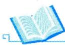

## 基础知识结构

## 基础内容精讲

## 基本概念

## 1邻域

δ邻域设 $P_{0}(x_{0},y_{0})$ 是xOy平面上的一个点，δ是某一正数.与点$P_{0}(x_{0},y_{0})$ 的距离小于δ的点 $P(x,   y)$ 的全体，称为点 $P _ { 0 }$ 的δ邻域（见图13-1），记为 $U(P_{0},\delta)$ ，即

  
图 13-1

$$
U(P_{0},\delta)=\left\{ P \mid \left| P P_{0} \right| < \delta \right\} 或 U(P_{0},\delta)=\left\{ (x, y) \mid \sqrt{\left( x-x_{0} \right)^{2}+\left( y-y_{0} \right)^{2}} < \delta \right\}
$$

去心δ邻域点 $P _ { 0 }$ 的去心δ邻域（见图13-2），记作 $\stackrel{\circ}{U}(P_{0},\delta)$ ，即$U(P_{0},\delta)=\left\{P\left|0<\left|PP_{0}\right|<\delta\right.\right\}$

特别指出，如果不需要强调邻域的半径 $\delta$ ，则用 $U ( P _ { 0 } )$ 表示点 $P _ { 0 }$ 的某个邻域，点 $P _ { 0 }$ 的去心邻域记作 $\stackrel{\circ}{U}(P_{0})$

图 13-2

δ邻域的几何意义 $U(P_{0},\delta)$ 表示 $x O y$ 平面上以点 $P_{0}(x_{0},y_{0})$ 为中心， $\delta > 0$ 为半径的圆内部的点$P(x,   y)$ 的全体.一元极限：limf(x)=A ⇔∀ε>0,3δ>0,0<|x−x0|<δ时，|f(x)−A|<ε—此刻画f(x)与A充分靠近 x→I0

## 2 极限

设函数f(x,y)在区域D上有定义， $P_{0}(x_{0}, y_{0}) \in D$ 或为区域D边界上的一点.如果对于任意给定的$\varepsilon > 0$ ，总存在 $\delta > 0$ ，当点 $P(x, y) \in D$ ，且满足 $0 < \left| P P _ { 0 } \right| = \sqrt { \left( x - x _ { 0 } \right) ^ { 2 } + \left( y - y _ { 0 } \right) ^ { 2 } } < \delta$ 时，恒有

$$
\left| f(x, y) - A \right| < \varepsilon   ,
$$

则称常数A为 $(x, y) \to (x_0, y_0)$ 时f(x，y)的极限，记作

也常记作

$$
\begin{aligned}\lim\limits_{(x, y) \to (x_0, y_0)} f(x, y) &= A  或  \left| \lim\limits_{\substack{x \to x_0 \\ y \to y_0}} \frac{f(x, y) = A}{} \right|, \\\lim\limits_{P \to P_0} f(P) &= A.\end{aligned}
$$

注(1)一元极限中 $x \to x_{0}$ 有且仅有两种方式 $x \rightarrow x_{0}^{-}$ 和 $x \rightarrow x_{0}^{+}$ ，二重极限中 $(x, y) \to (x_0, y_0)$ 一般有无穷多种方式，如图13-3所示.

  
图13-3

→否定存在

★ (2) 若有两条不同路径使极限 $\lim _ { ( x , y ) \rightarrow ( x _ { 0 } , y _ { 0 } ) } f ( x , y )$ 的值不相等或某一路径使极限 $\lim _ { ( x , y ) \rightarrow ( x _ { 0 } , y _ { 0 } ) } f ( x , y )$ 的值不存在，则说明 $\lim _ { ( x , y ) \rightarrow ( x _ { 0 } , y _ { 0 } ) } f ( x , y )$ 不存在.（根据极限若存在，则必具有唯一性这一准则去判断.)

→肯定存在

★(3)除洛必达法则和单调有界准则外，可照搬一元函数求极限的方法来求二重极限，重极限保持了一元极限的各种性质，如唯一性、局部有界性、局部保号性、运算规则及脱帽法：$\lim _ { ( x , y ) \rightarrow ( x _ { 0 } , y _ { 0 } ) } f ( x , y ) = A \Leftrightarrow f ( x , y ) = A + \alpha$ 其中当 $(x, y) \to (x_0, y_0)$ 时，α是无穷小量.

一元脱帽法：limm $f(x)=A \Leftrightarrow f(x)=A+\alpha,\lim_{x \to x_0} \alpha = 0$

等价替换法： $\mathrm{e}^{x^{2}+y^{2}}-1\sim x^{2}+y^{2}\quad(x,\ y)\to(0,\ 0).$

例13.1 设 $\lim_{\substack{x \to 0 \\ y \to 0}} \frac{|xy|}{\sqrt{x^2 + y^2}}, \quad I_2 = \lim_{\substack{x \to 0 \\ y \to 0}} \frac{|xy|}{x^2 + y^2}$ ，则（）.

(A) $I _ { 1 }$ 存在， $I _ { z }$ 不存在 (B) $I _ { 1 }$ 存在， $I _ { 2 }$ 存在

(C) $I _ { 1 }$ 不存在， $I _ { 2 }$ 存在 (D) $I _ { 1 }$ 不存在， $I _ { 2 }$ 不存在

分析 $I _ { 1 }$ ：分子次数为2，分母次数为1.

## 第13讲 多元函数微分学

可用均值不等式 $\left| xy \right| \leq \frac{x^{2} + y^{2}}{2}$ 及夹逼准则.

$I _ { 2 } :$ 分子、分母次数均为2.可举反例 $L_{1}: y = x$

应选(A).

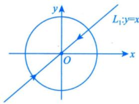

$$
\begin{aligned}0 \leqslant I_{1} = \lim_{\substack{x \rightarrow 0 \\ y \rightarrow 0}} \frac{\left| xy \right|}{\sqrt{x^{2} + y^{2}}} \leqslant \lim_{\substack{x \rightarrow 0 \\ y \rightarrow 0}} \frac{\frac{1}{2}\left( x^{2} + y^{2} \right)}{\sqrt{x^{2} + y^{2}}} = 0\end{aligned}
$$

由夹逼准则，得 $I_{1} = 0$ ，故 $I _ { 1 }$ 存在.

取路径y=x,则 $\lim_{x \to 0} \frac{x \left| y \right|}{x^2 + y^2} = \lim_{x \to 0} \frac{x \left| x \right|}{2x^2}$ ,又 $\lim_{x \to 0^{+}} \frac{x \left| x \right|}{2x^{2}} = \frac{1}{2}, \quad \lim_{x \to 0^{-}} \frac{x \left| x \right|}{2x^{2}} = -\frac{1}{2}$ ，极限不存在，故 $I _ { 2 }$ 不存在.

## ③ 连续

如果 $\lim_{x \to x_0 \atop y \to y_0} f(x, y) = f(x_0, y_0)$ ，则称函数f(x,y)在点 $(x_{0},y_{0})$ 处连续，如果f(x，y)在区域D上每一点处都连续，则称f(x，y)在区域D上连续.

注如果多元函数不连续，《全国硕士研究生招生考试数学考试大纲》未要求讨论间断点类型.

一元函数连续： $\lim_{x \to x_0} f(x) = f(x_0)$

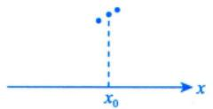

二元函数连续： $\lim _ { ( x , y ) \rightarrow ( x _ { 0 } , y _ { 0 } ) } f ( x , y ) = f ( x _ { 0 } , y _ { 0 } )$

一元函数间断：

二元函数间断：

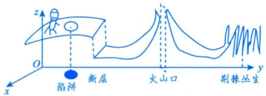

$$
f(x,y)=\left\{\begin{aligned}&\frac{\sqrt[3]{1-(x^{2}+y^{2})}-1}{\mathrm{e}^{x^{2}+y^{2}}-1}, &x^{2}+y^{2}\neq0,\\&a, &x^{2}+y^{2}=0\end{aligned}\right.
$$

为连续函数，则a=

应填 $-\frac{1}{3}$ .

二元初等函数在定义区域上是连续的.

$$
\lim_{x \to 0 \atop y \to 0} \frac{\sqrt[3]{1 - \left( x^{2} + y^{2} \right)} - 1}{\mathrm{e}^{x^{2} + y^{2}} - 1} = \lim_{x \to 0 \atop y \to 0} \frac{\frac{1}{3}[-\left( x^{2} + y^{2} \right)]}{x^{2} + y^{2}} = -\frac{1}{3}
$$

故 $a = - \frac{1}{3}$ .类比： $\frac{\sqrt[3]{1 - u} - 1}{\mathrm{e}^{u} - 1} = - \frac{1}{3}$

>利用等价无穷小 $(x \to 0) \quad \left\{ \begin{aligned} & \mathrm{e}^{x} - 1 \sim x, \\ & (1 + x)^{a} - 1 \sim ax. \end{aligned} \right.$

## 4 偏导数

一元导数→变化率， xx0 x0+Δx  
方向导数→某方向上的变化率  
数学一 7

(1)定义.

设函数 $z = f(x, y)$ 在点 $(x_{0},y_{0})$ 的某邻域内有定义，如果极限

$$
\lim_{\Delta x \to 0} \frac{f(x_0 + \Delta x, y_0) - f(x_0, y_0)}{\Delta x}
$$

存在，则称此极限为函数 $z = f(x, y)$ 在点 $(x_{0},y_{0})$ 处对x的偏导数[见图13-4(a)]，记作

微分：d： 偏微分：∂ ∂z ∂x|x=x0 of ∂x x=x0 z′x x=或 $f_{x}^{\prime}(x_{0},y_{0})$ y=y0 y=y0 y=y0

即

$$
f_{x}^{\prime}(x_{0}, y_{0}) = \lim_{\Delta x \to 0} \frac{f(x_{0} + \Delta x, y_{0}) - f(x_{0}, y_{0})}{\Delta x}
$$

类似地，函数 $z = f(x, y)$ 在点 $(x_{0},y_{0})$ 处对y的偏导数[见图13-4(b)]定义为

$$
f_{y}^{\prime}(x_{0}, y_{0}) = \lim_{\Delta y \to 0} \frac{f(x_{0}, y_{0} + \Delta y) - f(x_{0}, y_{0})}{\Delta y}
$$

  
(a)

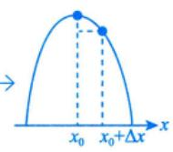

图 13-4  
  
(b)

(2) 如果 $z = f(x, y)$ 在区域D上的每一点 $(x,   y)$ 处都有偏导数，一般来说，它们仍是x，y的函数，则称为 $f(x,   y)$ 的偏导函数，简称偏导数，记作

$$
\frac{\partial z}{\partial x}, \frac{\partial f}{\partial x}, f_{x}^{\prime}(x, y), \frac{\partial z}{\partial y}, \frac{\partial f}{\partial y}, f_{y}^{\prime}(x, y).
$$

(3) 几何意义.

设有二元函数 $z = f(x, y)$ ，且 $z_{0} = f(x_{0}, y_{0})$ ，则 $f_{x}^{\prime}(x_{0},y_{0})$ 在几何上表示曲线 $\begin{cases}z = f(x,   y), \\y = y_0\end{cases}$ 在点$(x_{0}, y_{0}, z_{0})$ 处的切线对x轴的斜率.同理， $f_{y}^{\prime}(x_{0},y_{0})$ 在几何上表示曲线 $\begin{cases}z = f(x, y), \\x = x_0.\end{cases}$ 在点 $(x_{0}, y_{0}, z_{0})$ 处的切线对y轴的斜率.

(4) 高阶偏导数.

→一元函数的高阶导：二阶，三阶，…，n阶：二元函数的高阶导：组合

如果二 $ 元$ 函数 $z = f(x, y)$ 的偏导数 $f_{x}^{\prime}(x,   y)$ 和 $f_{y}^{\prime}(x,   y)$ 仍然具有偏导数，则它们的偏导数称为$z = f(x, y)$ 的二阶偏导数，记作

$$
\begin{aligned}\frac{\partial^{2} z}{\partial x^{2}} = \frac{\partial}{\partial x}\left(\frac{\partial z}{\partial x}\right) = f_{xx}^{\prime\prime}(x, y) = z_{xx}^{\prime\prime}, \\\frac{\partial^{2} z}{\partial x \partial y} = \frac{\partial}{\partial y}\left(\frac{\partial z}{\partial x}\right) = f_{yx}^{\prime\prime}(x, y) = z_{yx}^{\prime\prime}, \\\frac{\partial^{2} z}{\partial y^{2}} = \frac{\partial}{\partial y}\left(\frac{\partial z}{\partial y}\right) = f_{yy}^{\prime\prime}(x, y) = z_{yy}^{\prime\prime}, \\\frac{\partial^{2} z}{\partial y \partial x} = \frac{\partial}{\partial x}\left(\frac{\partial z}{\partial y}\right) = f_{yx}^{\prime\prime}(x, y) = z_{yx}^{\prime\prime},\end{aligned}
$$

其中，称 $\frac{\partial^{2} z}{\partial x \partial y}$ 与 $\frac { \partial ^ { 2 } z } { \partial y \partial x }$ 为二阶混合偏导数.类似地，可以定义n(n≥3)阶偏导数.

(5) 如果函数 $z = f(x, y)$ 的两个二阶混合偏导数 $\frac { \partial ^ { 2 } z } { \partial x \partial y }$ 及 $\frac { \partial ^ { 2 } z } { \partial y \partial x }$ 都在区域D内连续，则在区域D内$\frac{\partial^{2} z}{\partial x \partial y} = \frac{\partial^{2} z}{\partial y \partial x}$ ，即二阶混合偏导数在连续的条件下与求导的次序无关.

例13.3 已知函数 $f(x, y) = \ln \left( y + |x \sin y| \right)$ ，则（）.

(A) $\left. \frac{\partial f}{\partial x} \right|_{(0,1)}$ 不存在， $\left. \frac{\partial f}{\partial y} \right|_{(0,1)}$ 存在 (B) $\left. \frac{\partial f}{\partial x} \right|_{(0,1)}$ 存在， $\left. \frac{\partial f}{\partial y} \right|_{(0,1)}$ 不存在0  
(C) $\left. \frac{\partial f}{\partial x} \right|_{(0,1)}, \left. \frac{\partial f}{\partial y} \right|_{(0,1)}$ 均存在 (D) $\left. \frac{\partial f}{\partial x} \right|_{(0,1)}, \left. \frac{\partial f}{\partial y} \right|_{(0,1)}$ 均不存在, 1)

→0,分析 $\left. \frac{\partial f}{\partial x} \right|_{(0,1)} = \lim_{\Delta x \to 0} \frac{f(0+\Delta x, 1) - f(0,1)}{\Delta x} = \lim_{\Delta x \to 0} \frac{\ln(1+\left| \Delta x \cdot \sin 1 \right|) - 0}{\Delta x}$ 利用当x→0时， $\ln(1 + x) \sim x$ $\left. \frac{\partial f}{\partial y} \right|_{(0,1)} = \lim_{\Delta y \to 0} \frac{f(0,1+\Delta y) - f(0,1)}{\Delta y} = \lim_{\Delta y \to 0} \frac{\ln(1+\Delta y) - 0}{\Delta y}$

## 解应选(A).

因此 此

因为 $f(x, y) = \ln \left( y + |x \sin y| \right)$ ，所以$f(0,1)=\ln(1+0)=0,\ f(x,1)=\ln\left(1+\left|x\sin1\right|\right),\ f(0,y)=\ln(y+0)=\ln y$ $\left. \frac { \partial f } { \partial x } \right| _ { ( 0 , 1 ) } = \lim _ { x \rightarrow 0 } \frac { f ( x , 1 ) - f ( 0 , 1 ) } { x - 0 } = \lim _ { x \rightarrow 0 } \frac { \ln ( 1 + | x \sin 1 | ) } { x } = \lim _ { x \rightarrow 0 } \frac { | x \sin 1 | } { x } ,$ $\left. \frac { \partial f } { \partial y } \right| _ { ( 0 , 1 ) } = \lim _ { y \rightarrow 1 } \frac { f ( 0 , y ) - f ( 0 , 1 ) } { y - 1 } = \lim _ { y \rightarrow 1 } \frac { \ln y } { y - 1 } = \lim _ { y \rightarrow 1 } \frac { 1 } { y } = 1 ,$

所以 $\left. \frac{\partial f}{\partial x} \right|_{(0,1)}$ 不存在， $\left. \frac{\partial f}{\partial y} \right|_{(0,1)}$ 存在.

$f_{x}^{\prime}(x_{0}, y_{0})=\lim _{\Delta x \rightarrow 0} \frac{f(x_{0}+\Delta x, y_{0})-f(x_{0}, y_{0})}{\Delta x} \rightarrow \frac{x_{0}+\Delta x=x}{x_{0}+\Delta x=x_{0}} \rightarrow \frac{\lim\limits_{x \rightarrow x_{0}}\frac{f(x, y_{0})-f(x_{0}, y_{0})}{x-x_{0}}}{x-x_{0}}$ 同理， $f_{y}^{\prime}(x_{0}, y_{0}) = \lim_{\Delta y \to 0} \frac{f(x_{0}, y_{0} + \Delta y) - f(x_{0}, y_{0})}{\Delta y} \xlongequal{y_{0} + \Delta y = y} \lim_{y \to y_{0}} \frac{f(x_{0}, y) - f(x_{0}, y_{0})}{y - y_{0}}$

例13.4 设函数f(t)连续，令 $F(x, y) = \int_{0}^{x - y} (x - y - t) f(t) \mathrm{d}t$ ，则（).(A) $\frac{\partial F}{\partial x} = \frac{\partial F}{\partial y}, \quad \frac{\partial^2 F}{\partial x^2} = \frac{\partial^2 F}{\partial y^2}$ (B) $\frac{\partial F}{\partial x} = \frac{\partial F}{\partial y}, \quad \frac{\partial^2 F}{\partial x^2} = -\frac{\partial^2 F}{\partial y^2}$ (C) $\frac{\partial F}{\partial x} = - \frac{\partial F}{\partial y}, \quad \frac{\partial^{2} F}{\partial x^{2}} = \frac{\partial^{2} F}{\partial y^{2}}$ (D) $\frac{\partial F}{\partial x} = - \frac{\partial F}{\partial y}, \quad \frac{\partial^2 F}{\partial x^2} = - \frac{\partial^2 F}{\partial y^2}$

## 解应选(C).

由题知， $F(x,y)=x\int_{0}^{x-y}f(t)\mathrm{d}t-y\int_{0}^{x-y}f(t)\mathrm{d}t-\int_{0}^{x-y}tf(t)\mathrm{d}t.$ ，则

→视y为常数

$$
\frac{\partial F}{\partial x} = \int_{0}^{x - y}f(t)\mathrm{d}t + xf(x - y) - yf(x - y) - (x - y)f(x - y) = \int_{0}^{x - y}f(t)\mathrm{d}t
$$

$$
\frac{\partial^{2} F}{\partial x^{2}} = f(x - y)   ,
$$

→视x为常数

$$
\frac { \partial F } { \partial y } = - x f ( x - y ) - \int _ { 0 } ^ { x - y } f ( t ) \mathrm { d } t + y f ( x - y ) + ( x - y ) f ( x - y ) = - \int _ { 0 } ^ { x - y } f ( t ) \mathrm { d } t ,
$$

$$
\frac{\partial^{2} F}{\partial y^{2}} = f(x - y) ,
$$

所以 $\frac{\partial F}{\partial x} = - \frac{\partial F}{\partial y}, \quad \frac{\partial^{2} F}{\partial x^{2}} = \frac{\partial^{2} F}{\partial y^{2}}$

不可拆分，换元求导型

例13.5 设函数 $f(x, y) = \int_{0}^{xy} \mathrm{e}^{-xt^2}   dt$ ，则 $f_{x}^{\prime}(1, +\infty) =$

解应填 $-\frac{\sqrt{\pi}}{4}$

y ∫₀ e−dx=1. 0

当 $x > 0$ 时，

$$
f(x,y) = \int_{0}^{xy} \mathrm{e}^{-xt^{2}} \mathrm{d}t \frac{\frac{u}{\sqrt{x}} = t}{u = \sqrt{x}t} \frac{1}{\sqrt{x}} \int_{0}^{\frac{3}{x^{2}y}} \mathrm{e}^{-u^{2}} \mathrm{d}u
$$

√π   
2 0

于是 $f(x,+\infty)=\lim_{y \to +\infty} f(x,y)=\frac{1}{\sqrt{x}}\int_{0}^{+\infty} \mathrm{e}^{-u^2}  \mathrm{d}u=\frac{\sqrt{\pi}}{2} \cdot \frac{1}{\sqrt{x}}$ ，故

$$
f_{x}^{\prime}(1, + \infty) = \frac{\sqrt{\pi}}{2}\left( \left. \frac{1}{\sqrt{x}} \right|_{x = 1}^{\sqrt{\pi}} \right) = \frac{\sqrt{\pi}}{2}\left( - \frac{1}{2} \right)\frac{1}{x^{\frac{3}{2}}}\bigg|_{x = 1}^{\sqrt{\pi}} = - \frac{\sqrt{\pi}}{4}
$$

## 注此题先计算 $f(x, +\infty)$ ，再计算 $f_{x}^{\prime}(1, +\infty)$ 是简便的.

$$
\frac{f_{x}^{\prime}(x, y)}{\downarrow}
$$

若先计算 ，再代入 $(1, +\infty)$ ，过程如下：

将y当作常数

$$
f_{x}^{\prime}(x, y)=-\frac{1}{2} x^{\frac{3}{2}} \cdot \int_{0}^{\frac{3}{2} y} \mathrm{e}^{-u^{2}} \mathrm{d} u+\frac{1}{\sqrt{x}} \mathrm{e}^{-x^{3} y^{2}} \cdot \frac{3}{2} \sqrt{x} y
$$

前面求导，后面不动+前面不动，后面求导

于是 $f_{x}^{\prime}(1, + \infty) = - \frac{1}{2}\int_{0}^{+ \infty}e^{- u^{2}}du = - \frac{\sqrt{\pi}}{4}$ .略复杂.

$f_{x}^{\prime}(x_{0}, y_{0}) = \left\{ \begin{aligned} \left. f_{x}^{\prime}(x, y_{0}) \right|_{x = x_{0}} \\ \left. f_{x}^{\prime}(x, y) \right|_{y = y_{0}}^{x = x_{0}} \end{aligned} \right.$ 先代值再求导两种方式计算 $f_{x}^{\prime}(x_{0},y_{0})$ ，得先求导再代值

例13.6 设函数f(x，y)可微， $f(0,0)=0,\frac{\partial f}{\partial x}=-f(x,y),\frac{\partial f}{\partial y}=\mathrm{e}^{-x}\cos y$ ，求 $f(x,   y)$

分析 反问题：告诉 $f_{x}^{\prime}, f_{y}^{\prime}$ ，反求f(x,y). >保证后面表达式运算有意义

例如在一元函数中 $F^{\prime}(x) = \frac{\mathrm{d}[F(x)]}{\mathrm{d}x} = \cos x$ ，则 $F(x)=\int \cos x \mathrm{d}x=\sin x+C$

$\left\{ \begin{aligned} \varphi^{\prime}(x) &= \varphi(x) \Rightarrow \varphi(x) = C\mathrm{e}^{x}, \\ \varphi^{\prime}(x) &= -\varphi(x) \Rightarrow \varphi(x) = C\mathrm{e}^{-x}. \end{aligned} \right.$ C为任意常数

视为关于y的常数

解由 $\frac{\partial f}{\partial y} = \mathrm{e}^{-x} \cos y$ ，得 $f(x, y) = \mathrm{e}^{-x} \sin y + \varphi(x)$ T ，于是 $\frac{\partial f}{\partial x} = - \mathrm{e}^{- x} \sin y + \varphi^{\prime}(x).$

又 $\frac{\partial f}{\partial x} = - f(x, y)$ ，故

$$
- \mathrm{e}^{- x} \sin y + \varphi^{\prime}(x) = - \mathrm{e}^{- x} \sin y - \varphi(x) ,
$$

利用微分方程 $\frac{\mathrm{d}[\varphi(x)]}{\mathrm{d}x} = -\varphi(x)$ ，则

于是有 $\varphi^{\prime}(x) + \varphi(x) = 0$ ，解得 $\varphi(x) = C\mathrm{e}^{-x}$ ，即 $f(x, y) = \mathrm{e}^{-x} \sin y + C\mathrm{e}^{-x}$

由 $f(0,0)=0$ ，得C=0，所以 $f(x, y) = \mathrm{e}^{-x} \sin y$

$$
\begin{aligned}&\int \frac{1}{\varphi(x)} \mathrm{d}[\varphi(x)] = -\int \mathrm{d}x \\\Longrightarrow & \ln \left| \varphi(x) \right| = -x + \ln C_0 \\\Longrightarrow & \left| \varphi(x) \right| = C_0 \mathrm{e}^{-x} \\\Longrightarrow & \varphi(x) = \boxed{\pm C_0} \mathrm{e}^{-x} \\\Longrightarrow & \varphi(x) = C \mathrm{e}^{-x}\end{aligned}
$$

注本题进一步可求f(x， x)在[0，+ ∞)的部分与x轴围成的图形绕x轴旋转一周所成的旋转体体积，步骤如下： > =e− sin x

$$
\begin{aligned}V = & \int_{0}^{+ \infty}\pi\left[ f(x, x) \right]^{2}\mathrm{d}x = \int_{0}^{+ \infty}\pi\mathrm{e}^{- 2x}\sin^{2}x\mathrm{d}x = \int_{0}^{+ \infty}\pi\mathrm{e}^{- 2x}\frac{1 - \cos 2x}{2}\mathrm{d}x \\= & \frac{\pi}{2}\int_{0}^{+ \infty}\mathrm{e}^{- 2x}(1 - \cos 2x)\mathrm{d}x = \frac{\pi}{2}\int_{0}^{+ \infty}\mathrm{e}^{- 2x}\mathrm{d}x - \frac{\pi}{2}\int_{0}^{+ \infty}\mathrm{e}^{- 2x}\cos 2x\mathrm{d}x \\\frac{ 令 u = 2x}{4} - & \frac{\pi}{4}\int_{0}^{+ \infty}\mathrm{e}^{- u}\cos u\mathrm{d}u ,\end{aligned}
$$

其中

$$
\begin{aligned}\int_{0}^{+\infty} \mathrm{e}^{-u} \cos u \mathrm{d}u = & \left.\frac{\left[\left(\mathrm{e}^{-u}\right)^{\prime} \quad \left(\cos u\right)^{\prime}\right]}{\mathrm{e}^{-u} \quad \cos u}\right|_{0}^{+\infty} \\= & \frac{1}{2}\left(-\mathrm{e}^{-u} \cos u+\mathrm{e}^{-u} \sin u\right)\bigg|_{0}^{+\infty} \\= & \frac{1}{2}\left[0-(-1)\right]=\frac{1}{2} ,\end{aligned}
$$

故

$$
V = \frac{\pi}{4} - \frac{\pi}{4} \cdot \frac{1}{2} = \frac{\pi}{8}
$$

## 5可微

先看一个引例.如图13-5所示，设矩形的长和宽分别为x和y，则此矩形的面积为 $S = xy$ 若x，y分别增长∆x,∆y，则该矩形面积的增量为

$$
\Delta S = (x + \Delta x)(y + \Delta y) - xy = \frac{S_{y}^{\prime} - x}{\underbrace{\Delta x + \Delta y}_{\Delta y} + \Delta x \Delta y} + \Delta x \Delta y.
$$

上式右端由两部分组成：一部分是 $y \Delta x + x \Delta y$ ，它是关于Δx，Δy的线性函数；另一部分是 $\boxed { \Delta x \Delta y }$ 因为

$$
\lim_{\substack{(x_{0}+\Delta x, y_{0}+\Delta y) \\ \Delta x \to 0 \\ \Delta y \to 0}} \frac{\left| \Delta x \right| \leq \frac{a^{2}+b^{2}}{2}}{\left| \Delta x \right|} \leq \lim_{\substack{(\Delta x)^{2}+(\Delta y)^{2} \\ \Delta y \to 0 \\ \Delta y \to 0}} \frac{\left| \Delta x \right|^{2}+\left( \Delta y \right)^{2}}{2} \leq \lim_{\substack{(\Delta x)^{2}+(\Delta y)^{2} \\ \Delta y \to 0 \\ \Delta y \to 0}} \frac{\left| \Delta x \right|^{2}+\left( \Delta y \right)^{2}}{2} \leq \lim_{\substack{(\Delta x)^{2}+(\Delta y)^{2} \\ \Delta y \to 0}} \frac{\left| \Delta x \right|^{2}+\left( \Delta y \right)^{2}}{2} \leq \lim_{\substack{(\Delta x)^{2}+(\Delta y)^{2} \\ \Delta y \to 0}} \frac{\left| \Delta x \right|^{2}+\left( \Delta y \right)^{2}}{2} \leq 0,
$$

<table><tr><td>∆y</td><td>x∆y</td><td>∆x∆y</td></tr><tr><td>y</td><td>S=xy</td><td>y∆x</td></tr><tr><td></td><td>x</td><td>∆x</td></tr></table>

所以当 $\Delta x \to 0,   \Delta y \to 0$ 时， $\Delta x \Delta y$ 是比 $\rho=\sqrt{\left(\Delta x\right)^{2}+\left(\Delta y\right)^{2}}$ 高阶的无穷小量，即

图 13-5

$$
\Delta S = y \Delta x + x \Delta y + o(\rho) (\rho \to 0).
$$

$y \Delta x + x \Delta y$ 是ΔS的主要部分， $o ( \rho )$ 是ΔS与主要部分 $y \Delta x + x \Delta y$ 之间的误差，称 $y \Delta x + x \Delta y$ 为函数$S = xy$ 在点(x，y)处的全微分.

(1)定义.

$$
\begin{aligned}& 对比一元函数  y = f(x) \xrightarrow{\frac{\Delta}{ 可徹时 }} A \circ \Delta x + o(\Delta x) , \\& 记  \mathrm{d}y = A \circ \Delta x = A\mathrm{d}x , A = f^{\prime}(x)\end{aligned}
$$

设函数 $z = f(x, y)$ 在点(x，y)的某邻域内有定义，若z=f(x，y)在该点的全增量

$$
\Delta z = f(x + \Delta x, y + \Delta y) - f(x, y)
$$

可表示为

$$
\Delta z = A \Delta x + B \Delta y + o(\rho) ,
$$

其中A,B仅与点(x，y)有关，而与∆x,∆y无关； $\rho = \sqrt{ \left( \Delta x \right)^2 + \left( \Delta y \right)^2 }$ ，且当 $\Delta x \to 0,   \Delta y \to 0$ 时， $o ( \rho )$ 为 $\rho$ 的高阶无穷小，则称函数 $z = f(x, y)$ 在点(x，y)处可微，并称 $A\Delta x + B\Delta y$ 为函数 $z = f(x, y)$ 在点(x，y)处的全微分，记为

$$
\mathrm{d}z = A\Delta x + B\Delta y = A\mathrm{d}x + B\mathrm{d}y .
$$

(2) 可微的必要条件.

若函数 $z = f(x, y)$ 在点(x，y)处可微，则该函数在该点处的偏导数必存在，且

$$
A = \frac{\partial z}{\partial x}, B = \frac{\partial z}{\partial y}.
$$

由此可得，若函数 $z = f(x, y)$ 在点(x，y)处可微，则全微分可记为 $\mathrm{d}z = \frac{\partial z}{\partial x}\mathrm{d}x + \frac{\partial z}{\partial y}\mathrm{d}y$

注(1)与一元函数的区别.①一元函数：可微↔可导；②二元函数：可微⇒偏导数存在.  
(2) 总结.①一元函数： y = f(x) .

若 $\Delta y = f(x + \Delta x) - f(x), y$ 可微时，

$$
\Delta y = A \cdot \Delta x + o(\Delta x) \Rightarrow \lim_{\Delta x \rightarrow 0} \frac{\Delta y}{\Delta x} = \lim_{\Delta x \rightarrow 0} \frac{A \cdot \Delta x + o(\Delta x)}{\Delta x} = A
$$

反之，若f(x)可导，即 $\lim_{\Delta x \to 0} \frac{\Delta y}{\Delta x} = A \Rightarrow \frac{\Delta y}{\Delta x} = A + \alpha \Rightarrow \Delta y = A \cdot \Delta x + o(\Delta x)$ ，记 $\mathrm{d}y = A\Delta x = A\mathrm{d}x$

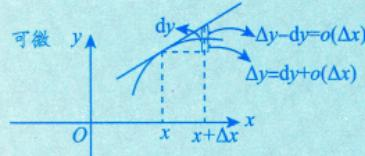

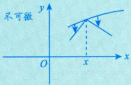

②二元函数： $z = f(x, y)$

若 $\Delta z = f(x + \Delta x, y + \Delta y) - f(x, y) , z$ 可微时，

$\Delta z = A \cdot \Delta x + B \cdot \Delta y + o(\rho)$ ，记 $\mathrm{d}z = \frac{\partial z}{\partial x} \cdot \mathrm{d}x + \frac{\partial z}{\partial y} \cdot \mathrm{d}y$

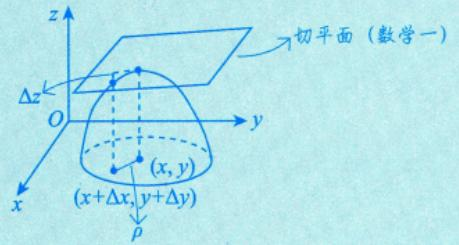

(3) 可微的充分条件.

$$
$\left[ f_{x}^{\prime}(x \text {, } y)  存在  \right] \Rightarrow \left[ f_{y}^{\prime}(x \text {, } y)  存在  \right] \Longleftarrow f(x \text {, } y)$  可微 .
$$

若函数 $z = f(x, y)$ 在点(x，y)处的偏导数存在且连续，则该函数在点(x，y)处可微.

$$
\mathrm{d}f = \frac{\partial f}{\partial x}\mathrm{d}x + \frac{\partial f}{\partial y}\mathrm{d}y = 0.
$$

$$
\lim _ { ( \Delta x , \Delta y ) \rightarrow ( 0 , 0 ) } f _ { x } ^ { \prime } ( x + \Delta x , y + \Delta y ) = f _ { x } ^ { \prime } ( x , y )
$$

(1)在区域D上，若 $\mathrm{d}[f(x, y)] = 0$ 或 $\frac{\partial f}{\partial x} = \frac{\partial f}{\partial y} = 0$ ，则f(x，y)≡C(常数)， $(x, y) \in D$

(2) 判别函数 z = f(x, y)在点 $(x_{0},y_{0})$ 处的偏导数是否连续，步骤如下：

①用定义法求 $f_{x}^{\prime}(x_{0}, y_{0}), f_{y}^{\prime}(x_{0}, y_{0})$ i

②用公式法求 $f_{x}^{\prime}(x, y), f_{y}^{\prime}(x, y)$

③计算 $\lim_{\substack{x \to x_0 \\ y \to y_0}} f'_x(x, y), \lim_{\substack{x \to x_0 \\ y \to y_0}} f'_y(x, y)$

$\lim_{\substack{x \to x_0 \\ y \to y_0}} f_x'(x, y) = f_x'(x_0, y_0), \lim_{\substack{x \to x_0 \\ y \to y_0}} f_y'(x, y) = f_y'(x_0, y_0)$ 是否成立.若成立，则 $z = f(x, y)$ 在点 $(x_{0},y_{0})$

处的偏导数是连续的.

(3)一元函数和多元函数在极限存在、连续、可导、可微的相互关系上，有相同之处，更有相异之处，如图13-6所示（记号“”表示可推出，“”表示不一定推出）：

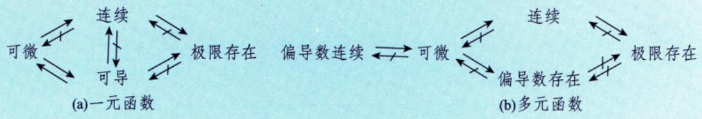  
图13-6

(4) 可微的判别步骤.

判别函数 $z = f(x, y)$ 在点 $(x_{0},y_{0})$ 处是否可微，步骤如下：

①写出全增量 $\Delta z = f(x_{0} + \Delta x, y_{0} + \Delta y) - f(x_{0}, y_{0})$

②写出线性增量 $A\Delta x + B\Delta y$ ，其中 $A = f_{x}^{\prime}(x_{0}, y_{0}), B = f_{y}^{\prime}(x_{0}, y_{0})$

③作极限 $\lim_{\Delta x \to 0 \atop \Delta y \to 0} \frac{\Delta z - (A\Delta x + B\Delta y)}{\sqrt{(\Delta x)^2 + (\Delta y)^2}}$ ,若该极限等于0,则z=f(x，y)在点 $(x_{0},y_{0})$ 处可微，否则，就不可微.

例13.7 已知 $( a x y ^ { 3 } - y ^ { 2 } \cos x ) \mathrm { d } x + ( 1 + b y \sin x + 3 x ^ { 2 } y ^ { 2 } ) \mathrm { d } y$ 为某一函数 $u(x,   y)$ 的全微分，则 (a, b) = ( ). (A) (2, 2) (B) (2, −2) (C) (−2, 2) (D) (−2, −2)

分析 $\mathrm{d}u = \frac{\partial u^{\nu}}{\partial x}\mathrm{d}x + \frac{\partial u}{\partial y}\mathrm{d}y$ V 步

由初等函数在定义域上一定连续，知偏导函数连续 $\Rightarrow u_{xy}^{\prime \prime} = u_{yx}^{\prime \prime}$

## 解应选(B).

依题意，有

$$
\frac{\partial u}{\partial x}=axy^{3}-y^{2}\cos x,\ \frac{\partial u}{\partial y}=1+by\sin x+3x^{2}y^{2},
$$

则

$$
\frac{\partial^{2} u}{\partial x \partial y} = 3axy^{2} - 2y\cos x, \quad \frac{\partial^{2} u}{\partial y \partial x} = by\cos x + 6xy^{2} .
$$

显然 $\frac { \partial ^ { 2 } u } { \partial x \partial y }$ 和 $\frac { \partial ^ { 2 } u } { \partial y \partial x }$ 连续，于是 $\frac{\partial^{2} u}{\partial x \partial y} = \frac{\partial^{2} u}{\partial y \partial x}$ ，从而 $a = 2,   b = -2$

例13.8 设 $z_{1} = \left| xy \right|, z_{2} = \left\{ \begin{aligned} \frac{x \left| y \right|}{\sqrt{x^{2} + y^{2}}}, & (x, y) \neq (0, 0), \\ 0, & (x, y) = (0, 0), \end{aligned} \right.$ 则（).

(A) $z _ { 1 }$ 在点(0,0)处不可微， $z _ { 2 }$ 在点(0,0)处不可微

(B) $z _ { 1 }$ 在点(0,0)处不可微， $z _ { 2 }$ 在点(0,0)处可微

(C) $z _ { 1 }$ 在点(0,0)处可微， $z _ { 2 }$ 在点(0,0)处不可微

(D) $z _ { 1 }$ 在点(0，0)处可微， $z _ { 2 }$ 在点(0,0)处可微

分析

$$
\Delta z _ { 1 } = z _ { 1 } ( 0 + \Delta x , 0 + \Delta y ) - z _ { 1 } ( 0 , 0 ) = | \Delta x \Delta y | ,
$$

$$
\mathrm { d } z _ { 1 } = z _ { 1 x } ^ { \prime } ( 0 , 0 ) \cdot \Delta x + z _ { 1 y } ^ { \prime } ( 0 , 0 ) \cdot \Delta y ,
$$

其中

$$
z _ { 1 x } ^ { \prime } ( 0 , 0 ) = \lim _ { \Delta x \rightarrow 0 } \frac { z _ { 1 } ( 0 + \Delta x , 0 ) - z _ { 1 } ( 0 , 0 ) } { \Delta x } = 0 ,
$$

同理

$$
z_{1y}^{\prime}(0,0)=0
$$

$$
\Delta z _ { 2 } = \frac { \Delta x \cdot \left| \Delta y \right| } { \sqrt { \left( \Delta x \right) ^ { 2 } + \left( \Delta y \right) ^ { 2 } } } ,
$$

$$
\mathrm { d } z _ { 2 } = z _ { 2 x } ^ { \prime } ( 0 , 0 ) \Delta x + z _ { 2 y } ^ { \prime } ( 0 , 0 ) \bullet \Delta y ,
$$

其中

$$
z _ { 2 x } ^ { \prime } ( 0 , 0 ) = \lim _ { \Delta x \rightarrow 0 } \frac { z _ { 2 } ( 0 + \Delta x , 0 ) - z _ { 2 } ( 0 , 0 ) } { \Delta x } = 0 ,
$$

同理

$$
z_{2y}^{\prime}(0,0)=0
$$

应选(C).

$$
\left. \frac { \partial z _ { 1 } } { \partial x } \right| _ { ( 0 , 0 ) } = \lim _ { x \rightarrow 0 } \frac { z _ { 1 } ( x , 0 ) - z _ { 1 } ( 0 , 0 ) } { x - 0 } = 0 ,
$$

$$
\left. \frac { \partial z _ { 1 } } { \partial y } \right| _ { ( 0 , 0 ) } = \lim _ { y \rightarrow 0 } \frac { z _ { 1 } ( 0 , y ) - z _ { 1 } ( 0 , 0 ) } { y - 0 } = 0 ,
$$

$$
\frac{z_{1}(x, y) - z_{1}(0, 0) - \left. \frac{\partial z_{1}}{\partial x} \right|_{(0, 0)} \cdot x - \left. \frac{\partial z_{1}}{\partial y} \right|_{(0, 0)} \cdot y}{\sqrt{x^{2} + y^{2}}} = \frac{|xy|}{\sqrt{x^{2} + y^{2}}}
$$

由例13.1结合可微的判别步骤可知， $z _ { 1 }$ 在点(0,0)处可微.

$$
\left. \frac { \partial z _ { 2 } } { \partial x } \right| _ { ( 0 , 0 ) } = \lim _ { x \rightarrow 0 } \frac { z _ { 2 } ( x , 0 ) - z _ { 2 } ( 0 , 0 ) } { x - 0 } = 0 ,
$$

$$
\left. \frac { \partial z _ { 2 } } { \partial y } \right| _ { ( 0 , 0 ) } = \lim _ { y \rightarrow 0 } \frac { z _ { 2 } ( 0 , y ) - z _ { 2 } ( 0 , 0 ) } { y - 0 } = 0 ,
$$

$$
\frac{z_{2}(x, y) - z_{2}(0, 0) - \left. \frac{\partial z_{2}}{\partial x} \right|_{(0, 0)} \cdot x - \left. \frac{\partial z_{2}}{\partial y} \right|_{(0, 0)} \cdot y}{\sqrt{x^{2} + y^{2}}} = \frac{x|y|}{x^{2} + y^{2}}
$$

由例13.1结合可微的判别步骤可知， $z _ { 2 }$ 在点(0,0)处不可微.

类比一元函数：y=f[g(x)]

先对中间变量求导

$$
\Rightarrow \frac{\mathrm{d}y}{\mathrm{d}x} = \frac{\mathrm{d}\{ f[g(x)] \}}{\mathrm{d}x} = \frac{\mathrm{d}\{ f[g(x)] \}}{\mathrm{d}[g(x)]} \cdot \frac{\mathrm{d}[g(x)]}{\mathrm{d}x}
$$

## 多元函数微分法则

dy=dy.dg

dx dg dx

再乘中间变量对自变量求导

## 链式求导规则

#x

设 $z = f(u, v), u = \varphi(x, y), v = \psi(x, y)$ ，则 $z = f[\varphi(x, y), \psi(x, y)]$ ，且

$$
\frac { \partial z } { \partial x } = \frac { \partial z } { \partial u } \frac { \partial u } { \partial x } + \frac { \partial z } { \partial v } \frac { \partial v } { \partial x } , \frac { \partial z } { \partial y } = \frac { \partial z } { \partial u } \frac { \partial u } { \partial y } + \frac { \partial z } { \partial v } \frac { \partial v } { \partial y } .
$$

注(1)设 $z = f(u, v), u = \varphi(t), v = \psi(t)$ ，则 $z = f[\varphi(t), \psi(t)]$ ，且 $\frac{\mathrm{d}z}{\mathrm{d}t} = \frac{\partial z}{\partial u} \frac{\mathrm{d}u}{\mathrm{d}t} + \frac{\partial z}{\partial v} \frac{\mathrm{d}v}{\mathrm{d}t}$ .称为全导数

复合结构图

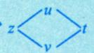

“祖孙三代，爷爷对每个孩子的爱是不变的”

(2)无论z对哪个变量求导，也无论z已经求了几阶导，求导后的新函数仍然具有与原函数完全相同的复合结构.

对第1个位置求导 对第2个位置求导

例13.9 设 $z = f\left( \mathrm{e}^{x}\sin y,\ x^{2} + y^{2} \right)$ ，其中f具有二阶连续偏导数， $\left| \frac{f_{1}^{\prime}(0, 0) = 1}{f_{1}^{\prime}(0, 0) = 1} \right|$ 1

则 $\left. \frac { \partial ^ { 2 } z } { \partial x \partial y } \right| _ { ( 0 , 0 ) } = \left( \begin{array} { l l l } & & \end{array} \right)$

复合结构图

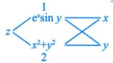

(A) 0

(B)1

(C)2

(D) -1

注：没有复合函数的情况下求导，如

z=f(x，y)的偏导数可以写成 $f_{x}^{\prime}(x, y), f_{y}^{\prime}(x, y)$

如果是复合函数，一般用1.2来表示。

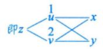

解

应选 (B).

$$
\frac{\partial z}{\partial u} = z_{u}^{\prime} = z_{1}^{\prime}
$$

$$
\frac{\partial z}{\partial x} = \mathrm{e}^{x} \sin y f_{1}^{\prime} + 2 x f_{2}^{\prime},
$$

$$
\begin{aligned}\frac{\partial^{2} z}{\partial x \partial y} = & \frac{\partial\left( \frac{\partial z}{\partial x} \right)}{\partial y} \\= & \frac{\partial\left( f_{1}^{\prime} \bullet \mathrm{e}^{x} \sin y \right)}{\partial y} + \frac{\partial\left( f_{2}^{\prime} \bullet 2x \right)}{\partial y} \\= & \frac{\partial f_{1}^{\prime}}{\partial y} \bullet \mathrm{e}^{x} \sin y + f_{1}^{\prime} \bullet \mathrm{e}^{x} \cos y + 2x \cdot \frac{\partial f_{2}^{\prime}}{\partial y} \\= & \left( f_{11}^{\prime\prime} \bullet \mathrm{e}^{x} \cdot \cos y + f_{12}^{\prime\prime} \bullet 2y \right)\mathrm{e}^{x} \sin y + f_{1}^{\prime} \mathrm{e}^{x} \cdot \cos y + 2x \left( f_{21}^{\prime\prime} \bullet \mathrm{e}^{x} \cos y + f_{22}^{\prime\prime} \bullet 2y \right) \\= & \mathrm{e}^{2x} \sin y \cos y f_{11}^{\prime\prime} + 2\mathrm{e}^{x} \left( y \sin y + x \cos y \right) f_{12}^{\prime\prime} + 4xy f_{22}^{\prime\prime} + \mathrm{e}^{x} \cos y f_{1}^{\prime} .\end{aligned}
$$

于是 $\left. \frac{\partial^{2} z}{\partial x \partial y} \right|_{(0,\;0)} = f_{1}^{\prime}(0,\;0) = 1.$

→不能推出 $f(x, y) = x + y$

例13.10 设函数 $f(x,\mathrm{e}^{x}) = x + \mathrm{e}^{x}$ ，且 $f_{x}^{\prime}(x, y) \bigg|_{y = \mathrm{e}^{x}} = 1 + 2\mathrm{e}^{x}$ ，则 $f_{y}^{\prime}(x, y) \bigg|_{y = \mathrm{e}^{x}} =$

$\frac{\mathrm{d}[f(x),\mathrm{e}^{x}]}{\mathrm{d}x}=f_{1}^{\prime}(x),\mathrm{e}^{x}\cdot 1+f_{2}^{\prime}(x,\mathrm{e}^{x})\cdot \mathrm{e}^{x}$ 1号位置分析 xxex2号位置

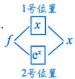

x²$f _ { 1 } ^ { \prime }$ 只表示对第1个位置求导，与第1个位置是什么无关.如f x，f′表示的是f对 $u = x ^ { 2 }$ 求导.cos x

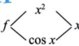

有时用f表示f′，f表示f2.→但是更多的是用fi，f这种记号 $f _ { x } ^ { \prime }$ $f _ { 1 } ^ { \prime }$ $f _ { y } ^ { \prime }$ $f _ { 2 } ^ { \prime }$ $f _ { 2 } ^ { \prime }$

解应填-1.

即

$$
\frac{\mathrm{d}\left[ f(x,\ \mathrm{e}^{x}) \right]}{\mathrm{d}x} = f_{x}^{\prime}(x,\ y)\bigg|_{y = \mathrm{e}^{x}} + f_{y}^{\prime}(x,\ y)\bigg|_{y = \mathrm{e}^{x}} \cdot \mathrm{e}^{x} , \quad 1 + 2\mathrm{e}^{x} = 1 + 2\mathrm{e}^{x} + f_{y}^{\prime}(x,\ y)\bigg|_{y = \mathrm{e}^{x}} \cdot \mathrm{e}^{x} , \quad f_{y}^{\prime}(x,\ y)\bigg|_{y = \mathrm{e}^{x}} = - 1 .
$$

注事实上， $f_{y}^{\prime}(x,\vartriangle )$ 是f(x,□)对第二个位置求导，故有

$$
f _ { y } ^ { \prime } ( x , y ) \Big | _ { y = \mathrm { e } ^ { x } } = f _ { y } ^ { \prime } ( x , \mathrm { e } ^ { x } ) ,
$$

同理

$$
f_{x}^{\prime}(x, y) \big|_{y = \mathrm{e}^{x}} = f_{x}^{\prime}(x, \mathrm{e}^{x})
$$

例13.11 设对任意的x，y有 $\left( \frac{\partial f}{\partial x} \right)^2 + \left( \frac{\partial f}{\partial y} \right)^2 = 4$ ，用变量代换 $x = u v, y = \frac{u^{2} - v^{2}}{2}$ 将函数 $f(x,   y)$ 变换成函数 $g(u, v)$ ，且满足关系式 $a \left( \frac{\partial g}{\partial u} \right)^2 - b \left( \frac{\partial g}{\partial v} \right)^2 = u^2 + v^2$ ，求a，b.复合结构图

解 $g(u, v) = f\left(uv, \frac{u^2 - v^2}{2}\right)$ ，于是

$$
\frac { \partial g } { \partial u } = \frac { \partial f } { \partial x } \nu + \frac { \partial f } { \partial y } \nu , \frac { \partial g } { \partial v } = \frac { \partial f } { \partial x } \nu - \frac { \partial f } { \partial y } \nu ,
$$

代入到 $a \left( \frac{\partial g}{\partial u} \right)^2 - b \left( \frac{\partial g}{\partial v} \right)^2 = u^2 + v^2$ 中，整理得

$$
\left( a v ^ { 2 } - b u ^ { 2 } \right) \left( \frac { \partial f } { \partial x } \right) ^ { 2 } + 2 ( a + b ) u v \frac { \partial f } { \partial x } \cdot \frac { \partial f } { \partial y } + \left( a u ^ { 2 } - b v ^ { 2 } \right) \left( \frac { \partial f } { \partial y } \right) ^ { 2 } = u ^ { 2 } + v ^ { 2 } ,
$$

将 $\left( \frac{\partial f}{\partial y} \right)^2 = 4 - \left( \frac{\partial f}{\partial x} \right)^2$ 代入上式，并整理得

$$
( a + b ) ( v ^ { 2 } - u ^ { 2 } ) \left( \frac { \partial f } { \partial x } \right) ^ { 2 } + 2 ( a + b ) u v \frac { \partial f } { \partial x } \frac { \partial f } { \partial y } + 4 ( a u ^ { 2 } - b v ^ { 2 } ) = u ^ { 2 } + v ^ { 2 } ,
$$

所以有 $a + b = 0$ ，且 $4a = 1, - 4b = 1$ ，于是 $a = \frac{1}{4}, b = -\frac{1}{4}$ .类比一元函数： $\frac{\mathrm{d}[f(u)]}{\mathrm{d}x} = \frac{\mathrm{d}[f(u)]}{\mathrm{d}u} \cdot \frac{\mathrm{d}u}{\mathrm{d}x}$ 7

## ② 全微分形式不变性

由 $\frac{\mathrm{d}[f(u)]}{\mathrm{d}u} = \frac{f^{\prime}(u)}{\frac{1}{u}}$ ，得 $\mathrm{d}[f(u)] = f^{\prime}(u)\mathrm{d}u$

不管u是自变量还是中间变量，形式都成立

设 $z = f(u, v), u = u(x, y), v = v(x, y)$ ，如果 $f(u, v), u(x, y), v(x, y)$ 分别有连续偏导数，则复合函数 $z = f(u, v)$ 在(x，y)处的全微分仍可表示为

$$
\mathrm { d } z = \frac { \partial z } { \partial u } \mathrm { d } u + \frac { \partial z } { \partial v } \mathrm { d } v ,
$$

即无论u，ν是自变量还是中间变量，上式总成立.

例13.12 若函数 $z = z(x, y)$ 由方程 $\mathrm{e}^{x + 2y + 3z} + xyz = 1$ 确定，则 $\mathrm{d}z \Big|_{(0,\;0)} =$

分析 $x+2y+3z=u,\ xyz=v\Rightarrow e^{u}+v=1\Rightarrow d\left(e^{u}+v\right)=0$ 令其为 $F(u   ,   \nu)$ ，则 $\mathrm{d}F = \frac{\partial F}{\partial u}\mathrm{d}u + \frac{\partial F}{\partial v}$ aー

解应填 $-\frac{1}{3}\mathrm{d}x - \frac{2}{3}\mathrm{d}y$

$$
\mathrm{d}u = \frac{\partial u}{\partial x}\mathrm{d}x + \frac{\partial u}{\partial y}\mathrm{d}y + \frac{\partial u}{\partial z}\mathrm{d}z \quad \mathrm{d}v = \frac{\partial v}{\partial x}\mathrm{d}x + \frac{\partial v}{\partial y}\mathrm{d}y + \frac{\partial v}{\partial z}\mathrm{d}z.
$$

先求 $z(0,   0)$ .在原方程中令 $x = 0, \; y = 0$ 得 $\mathrm{e}^{3z(0,0)} = 1$ ，故 $z(0,0)=0$

利用全微分形式不变性，将原方程两端求全微分得

$$
\mathrm{e}^{x+2y+3z}\mathrm{d}(x+2y+3z)+\mathrm{d}(xyz)=0\ ,
$$

即

$$
\mathrm{e}^{x + 2y + 3z} \left( \mathrm{d}x + 2\mathrm{d}y + 3\mathrm{d}z \right) + yz\mathrm{d}x + xz\mathrm{d}y + xy\mathrm{d}z = 0 ,
$$

$x = 0, \; y = 0, \; z = 0$ 可得 $\mathrm{d}x + 2\mathrm{d}y + 3\mathrm{d}z \Big|_{(0,\;0)} = 0$ ，则

$$
\mathrm{d}z \big|_{(0,\ 0)} = -\frac{1}{3}\mathrm{d}x - \frac{2}{3}\mathrm{d}y
$$

## 3 隐函数存在定理（公式法）提供了求隐函数导数的公式 隐函数存在的条件

隐函数存在定理1 对于由方程 $F(x, y) = 0$ 确定的隐函数y=f(x)，当 $\left| F_{y}^{\prime}(x, y) \neq 0 \right|$ 时，则有

$$
\frac{\mathrm{d}y}{\mathrm{d}x} = - \frac{F_{x}^{\prime}(x, y)}{F_{y}^{\prime}(x, y)}
$$

## 注证明如下：

将 y =f(x) 代入 $F(x, y) = 0$ ，得 $F[x,f(x)]=0$ ，在这个等式两边对x求导，得 $F_{x}^{\prime}(x,y)+$ $F^{\prime}_{y}(x, y) \cdot \frac{\mathrm{d}y}{\mathrm{d}x} = 0$ 因 $F_{y}^{\prime}(x, y) \neq 0$ 故 $\frac{\mathrm{d}y}{\mathrm{d}x} = - \frac{F_{x}^{\prime}(x, y)}{F_{y}^{\prime}(x, y)}$

隐函数存在定理2 对于由方程 $F(x, y, z) = 0$ 确定的隐函数 $z = f(x, y)$ 当 $\left| F_{z}^{\prime}(x, y, z) \neq 0 \right|$ 时，则有 隐函数存在的条件

$$
\frac { \partial z } { \partial x } = - \frac { F _ { x } ^ { \prime } ( x , y , z ) } { F _ { z } ^ { \prime } ( x , y , z ) } , \frac { \partial z } { \partial y } = - \frac { F _ { y } ^ { \prime } ( x , y , z ) } { F _ { z } ^ { \prime } ( x , y , z ) } .
$$

## 注证明如下：

将 $z = f(x, y)$ 代入 $F(x, y, z) = 0$ ，得 $F[x, y, f(x, y)] = 0$ ，在这个等式两边分别对x和y求偏导数，得 $F_{x}^{\prime}(x, y, z) + F_{z}^{\prime}(x, y, z) \cdot \frac{\partial z}{\partial x} = 0, \quad F_{y}^{\prime}(x, y, z) + F_{z}^{\prime}(x, y, z) \cdot \frac{\partial z}{\partial y} = 0.$ 因 $F_{z}^{\prime}(x, y, z) \neq 0$ ，故

$$
\frac{\partial z}{\partial x} = - \frac{F_{x}^{\prime}(x, y, z)}{F_{z}^{\prime}(x, y, z)}, \quad \frac{\partial z}{\partial y} = - \frac{F_{y}^{\prime}(x, y, z)}{F_{z}^{\prime}(x, y, z)}
$$

例13.13设有三元方程 $xy - z\ln y + \mathrm{e}^{xz} = 1$ ，根据隐函数存在定理，存在点(0,1,1)的一个邻域，在此邻域内该方程().基础阶段把本题掌握即可

(A)只能确定一个具有连续偏导数的隐函数 $z = z(x, y)$

(B)可确定两个具有连续偏导数的隐函数y=y(x,z)和 $z = z(x, y)$

(C)可确定两个具有连续偏导数的隐函数x=x(y，z)和z=z(x，y)

(D)可确定两个具有连续偏导数的隐函数 $x = x(y, z)$ 和 $y = y(x,   z)$

解应选(D).

$$
F(x, y, z) = xy - z \ln y + \mathrm{e}^{x} - 1,
$$

则 $F_{x}^{\prime}(x, y, z) = y + \mathrm{e}^{\pi z}, F_{y}^{\prime}(x, y, z) = x - \frac{z}{y}, F_{z}^{\prime}(x, y, z) = -\ln y + \mathrm{e}^{\pi x}$ .于是，

$$
F_{x}^{\prime}(0,1,1)=2 \neq 0, \; F_{y}^{\prime}(0,1,1)=-1 \neq 0, \; F_{z}^{\prime}(0,1,1)=0 .
$$

因此，在点(0,1,1)的某一个邻域 $U _ { 1 }$ 内，存在一个连续且具有连续偏导数的隐函数 $x = x(y,   z)$ ；在点(0,1,1)的某一个邻域 $U _ { 2 }$ 内，也存在一个连续且具有连续偏导数的隐函数 $y = y(x,   z)$ .于是，在邻域$U = U_{1} \cap U_{2}$ 内，就存在两个连续且具有连续偏导数的隐函数 $x = x(y,   z)$ 和 $y = y(x,   z)$ ，故应选(D).

## 注一元情况.

若 $F(x, y) = 0$ 能确定 $y = y(x)$ ，需要求 $F_{y}^{\prime} \neq 0$ ，否则，若 $F_{y}^{\prime}=0$ 则可能出现： $\frac{\mathrm{d}y}{\mathrm{d}x} = - \frac{F_{x}^{\prime}}{F_{y}^{\prime}} \rightarrow \infty$ 即一个x对应两个y，不符合函数的定义

## 该例题为隐函数存在定理的完整叙述

例13.14 设 F(x, y) 在点 $(x_{0},y_{0})$ 的某邻域内有连续的偏导数，且 $F(x_{0},y_{0}) = 0$ ，则$F_{y}^{\prime}(x_{0}, y_{0}) \neq 0$ 是 $F(x, y) = 0$ 在点 $(x_{0},y_{0})$ 的某邻域内能确定一个连续函数 $y = y(x)$ ，且满足 $y_{0} = y(x_{0})$ 并有连续导数的（).

(A)必要非充分条件 (B)充分非必要条件(C) 充要条件 (D)既不充分又不必要条件

分析充分性显然，必要性可举出反例.

## 解 应选(B).

由隐函数存在定理1知，在题设条件下， $F_{y}^{\prime}(x_{0}, y_{0}) \neq 0$ 是方程 $F(x, y) = 0$ 在点 $(x_{0},y_{0})$ 的某邻域内能确定一个连续函数 $y = y(x)$ ，且满足 $y_{0} = y(x_{0})$ ，并有连续导数的充分条件，但不是必要条件.如反例也可举 $F(x, y) = (y - x)^2$ .有 $F(0, 0) = 0$ ，且 $F_{y}^{\prime}=2(y-x)$ ，有 $F_{y}^{\prime}(0,0)=0$ ，但 $F(x, y) = 0$ 可以确定隐函数 $( y = x$

例13.15若函数 $z = z(x, y)$ 由方程 $\mathrm{e}^{x + 2y + 3z} + xyz = 1$ 确定，则 $\left. \mathbf{d}z \right|_{(0,\;0)} =$

解应填 $-\frac{1}{3}\mathrm{d}x - \frac{2}{3}\mathrm{d}y$

在例13.12中，已利用全微分形式不变性做过本题，在此利用公式法再做一遍.

先求 $z(0,   0)$ . 在原方程中令 $x = 0, \; y = 0$ 得 $\mathbf{e}^{3z(0,\;0)} = 1$ ，故 $z(0,0)=0$

$F(x, y, z) = \mathrm{e}^{x + 2y + 3z} + xyz - 1$ ，则由公式法，知 →公式法求导时， $x , y$ z是独立的，对x求导时。y，z都当作常数：对y和对z求导时同理.

$$
\frac { \partial z } { \partial x } = - \frac { F _ { x } ^ { \prime } } { F _ { z } ^ { \prime } } = - \frac { \mathrm { e } ^ { x + 2 y + 3 z } \cdot 1 + y z } { \mathrm { e } ^ { x + 2 y + 3 z } \cdot 3 + x y } ,
$$

$F[x, y, z(x, y)] = 0$ ，对x求偏

$$
\frac { \partial z } { \partial y } = - \frac { F _ { y } ^ { \prime } } { F _ { z } ^ { \prime } } = - \frac { \mathrm { e } ^ { x + 2 y + 3 z } \cdot 2 + x z } { \mathrm { e } ^ { x + 2 y + 3 z } \cdot 3 + x y } ,
$$

导，有 $\frac{\partial F}{\partial x}=F_{\underline{\underline{ 因 }}}^{\prime} \circ 1+F_{\underline{\underline{ 因 }}}^{\prime} \circ \frac{\partial z}{\partial x}=0 \Rightarrow \frac{\partial z}{\partial x}=-\frac{F_{x}^{\prime}}{F_{z}^{\prime}}$

第1个位置第3个位置

当 $x = 0, \; y = 0, \; z = 0$ 时， $\frac{\partial z}{\partial x} = - \frac{1}{3}, \quad \frac{\partial z}{\partial y} = - \frac{2}{3}$ ，则

$$
\mathrm{d}z \big|_{(0,\;0)} = -\frac{1}{3}\mathrm{d}x - \frac{2}{3}\mathrm{d}y
$$

例13.16设函数 $z = z(x, y)$ 由方程 $F(x+zy^{-1},y+zx^{-1})=0$ 所确定，其中F具有连续偏导数，且 $x F _ { 1 } ^ { \prime } + y F _ { 2 } ^ { \prime } \neq 0$ ，则 $x\frac{\partial z}{\partial x} + y\frac{\partial z}{\partial y} =$

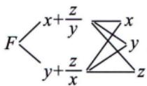

zx+ |y x分析 F 将x，y.z当作独立变量Ny+ zx

解应填z-xy.

区 $G(x, y, z) = F(x + zy^{-1}, y + zx^{-1})$ ，则由公式法得

$$
\frac { \partial z } { \partial x } = - \frac { G _ { x } ^ { \prime } } { G _ { z } ^ { \prime } } = - \frac { F _ { 1 } ^ { \prime } - \frac { z } { x ^ { 2 } } F _ { 2 } ^ { \prime } } { \frac { 1 } { y } F _ { 1 } ^ { \prime } + \frac { 1 } { x } F _ { 2 } ^ { \prime } } , \frac { \partial z } { \partial y } = - \frac { G _ { y } ^ { \prime } } { G _ { z } ^ { \prime } } = - \frac { \frac { z } { y ^ { 2 } } F _ { 1 } ^ { \prime } + F _ { 2 } ^ { \prime } } { \frac { 1 } { y } F _ { 1 } ^ { \prime } + \frac { 1 } { x } F _ { 2 } ^ { \prime } } ,
$$

所以

$$
\begin{aligned}x\frac{\partial z}{\partial x} + y\frac{\partial z}{\partial y} = & \frac{\left( - xF_{1}^{\prime} + \frac{z}{x}F_{2}^{\prime} \right) + \left( \frac{z}{y}F_{1}^{\prime} - yF_{2}^{\prime} \right)}{\frac{1}{y}F_{1}^{\prime} + \frac{1}{x}F_{2}^{\prime}} \\= & \frac{\left( - x^{2}y + xz \right)F_{1}^{\prime} + \left( yz - xy^{2} \right)F_{2}^{\prime}}{xF_{1}^{\prime} + yF_{2}^{\prime}} \\= & \frac{xF_{1}^{\prime}( - xy + z) + yF_{2}^{\prime}(z - xy)}{xF_{1}^{\prime} + yF_{2}^{\prime}} \\= & z - xy .\end{aligned}
$$

注此题还有以下两种解法，一是复合函数求导法，二是利用全微分形式不变性.

复合函数求导法 在等式 $F\left(x+\frac{z}{y},y+\frac{z}{x}\right)=0$ 两边对x求偏导，并注意到x，y是自变量，z是因变量，有 注意，z是关于x,，y的函数，即z=z(x，y)

$$
F _ { 1 } ^ { \prime } \left( 1 + \frac { 1 } { y } \frac { \partial z } { \partial x } \right) + F _ { 2 } ^ { \prime } \left( \frac { x \frac { \partial z } { \partial x } - z } { x ^ { 2 } } \right) = 0 ,
$$

解得 $\frac{\partial z}{\partial x} = \frac{- F_{1}^{\prime} + \frac{z}{x^{2}}F_{2}^{\prime}}{\frac{1}{y}F_{1}^{\prime} + \frac{1}{x}F_{2}^{\prime}}$ 同理可得 $\frac{\partial z}{\partial y} = \frac{\frac{z}{y^{2}}F_{1}^{\prime} - F_{2}^{\prime}}{\frac{1}{y}F_{1}^{\prime} + \frac{1}{x}F_{2}^{\prime}}$ .余下步骤同上

利用全微分形式不变性 对方程 $F\left(x+\frac{z}{y},y+\frac{z}{x}\right)=0$ 两边求全微分，利用全微分的形式不变性，有

$$
F_{1}\mathrm{d}\left(x+\frac{z}{y}\right)+F_{2}\mathrm{d}\left(y+\frac{z}{x}\right)=F_{1}\left(\mathrm{d}x+\frac{y\mathrm{d}z-z\mathrm{d}y}{y^{2}}\right)+F_{2}\left(\mathrm{d}y+\frac{x\mathrm{d}z-z\mathrm{d}x}{x^{2}}\right)=0,
$$

解得

$$
\mathrm{d}z = \frac{- F_{1}^{\prime} + \frac{z}{x^{2}}F_{2}^{\prime}}{\frac{1}{y}F_{1}^{\prime} + \frac{1}{x}F_{2}^{\prime}}\mathrm{d}x + \frac{\frac{z}{y^{2}}F_{1}^{\prime} - F_{2}^{\prime}}{\frac{1}{y}F_{1}^{\prime} + \frac{1}{x}F_{2}^{\prime}}\mathrm{d}y,
$$

即有

$$
\frac{\partial z}{\partial x} = \frac{- F_{1}^{\prime} + \frac{z}{x^{2}}F_{2}^{\prime}}{\frac{1}{y}F_{1}^{\prime} + \frac{1}{x}F_{2}^{\prime}}, \quad \frac{\partial z}{\partial y} = \frac{\frac{z}{y^{2}}F_{1}^{\prime} - F_{2}^{\prime}}{\frac{1}{y}F_{1}^{\prime} + \frac{1}{x}F_{2}^{\prime}}
$$

余下步骤同上.

另解：令 $u = x + \frac{z}{y}, v = y + \frac{z}{x}$ $F(u,y)=0$ ，有dF=0，即 $F_{1}^{\prime} \circ \mathrm{d}u + F_{2}^{\prime} \mathrm{d}v = 0$

$$
\int \mathrm{d}u = \frac{\partial u}{\partial x} \cdot \mathrm{d}x + \frac{\partial u}{\partial y} \cdot \mathrm{d}y + \frac{\partial u}{\partial z} \cdot \mathrm{d}z = \mathrm{d}x + \left( - \frac{x}{y^{2}} \right) \mathrm{d}y + \frac{1}{y} \mathrm{d}z, \quad \mathrm{d}v = \frac{\partial v}{\partial x} \cdot \mathrm{d}x + \frac{\partial v}{\partial y} \cdot \mathrm{d}y + \frac{\partial v}{\partial z} \cdot \mathrm{d}z = \left( - \frac{x}{x^{2}} \right) \mathrm{d}x + \mathrm{d}y + \frac{1}{x} \mathrm{d}z
$$

## 4二元函数的拉格朗日定理

(1)定理.

设 $f(x,y)$ 定义在区域D上，且 $\frac { \partial [ f ( x , y ) ] } { \partial x } = 0 , \quad \frac { \partial [ f ( x , y ) ] } { \partial y } = 0 , \quad ( x , y ) \in D .$ ，则 $f(x,y)=C$ （常数），$( x , y ) \in D$

注证 因区域D是连通集，故其内任意两点 $X_{1}(x_{1},y_{1}),X_{n}(x_{n},y_{n})$ ，必有连续折线将 $X_{1},X_{n}$ 连接.不妨记为 $X_{2},X_{3},\cdots,X_{n-1}$ ,则 $\overline{X_{1}X_{2}},\overline{X_{2}X_{3}},\cdots,\overline{X_{n-1}X_{n}}$ 均在D内.故由二元函数的拉格朗日中值公式，也即（0阶）泰勒公式，有

$$
f(X_{2}) - f(X_{1}) = f(x_{2},y_{2}) - f(x_{1},y_{1}) \\= f_{x}^{\prime}\left[ x_{1} + \theta(x_{2} - x_{1}),y_{1} + \theta(y_{2} - y_{1}) \right](x_{2} - x_{1}) + f_{y}^{\prime}\left[ x_{1} + \theta(x_{2} - x_{1}),y_{1} + \theta(y_{2} - y_{1}) \right](y_{2} - y_{1}) = 0,
$$

即 $f(X_{2}) = f(X_{1})$ ，同理可证 $f(X_{1}) = f(X_{2}) = f(X_{3}) = \cdots = f(X_{n})$ ，即 $f(x,y)$ 为常数.

(2) 注意事项.

设f(x,y)定义在区域D上，当 $\frac{\partial[f(x,y)]}{\partial x} = 0$ 时，无法得到f(x,y)只是y的函数，即不能得到$f(x,y)=g(y)$

反例：设 $f(x,y)=\begin{cases}y^{2},x>0,y\geq0,\\0, 其他 ,\end{cases}(x,y)\in D.$ ，其中 $\overline { D } = \left\{ ( x , y ) | x = 0 , y \geq 0 \right\}$ $D = R^{2} - \overline{D}$ .显然

$f(x,y)$ 在D上有连续偏导数， $\frac{\partial[f(x,y)]}{\partial x} = 0$ ，但f(1,1) =1，f(−1,1) =0,f(x,y)与x有关，不能写 $f(x,y)=g(y)$

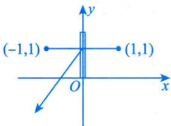

事实上，需增加“对D内任意两点 $(x_{1},y),(x_{2},y),x_{1} < x_{2}$ ，有$\left\{ (x,y) \mid x_{1} < x < x_{2} \right\} \subset D$ ,则 $f(x,y)=g(y)$ 就成立了.因 $f(x_{2},y)-f(x_{1},y)=$ $f_{x}^{\prime}[x_{1}+\theta(x_{2}-x_{1}),y]\cdot(x_{2}-x_{1})=0$ ，即f(x,y)与x无关.

点(0,1)不在D内，固定y，在此线上的拉格朗日中值定理不成立.

所以，设f(x,y)有二阶连续偏导数且 $\frac{\partial f}{\partial y} = 0 \Rightarrow f(x,y) = g(x)$ 或设 $u(r,\theta)$ 有二阶连续偏导数且$\frac { \partial u } { \partial \theta } = 0 \not \approx u ( r , \theta ) = g ( r )$

初学者往往将一元函数的拉格朗日定理 $f^{\prime}(x)=0 \Rightarrow f(x)=C$ 简单推广至二元函数，从而出现错误.

## 多元函数的极值与最值

## 1概念

若存在点 $(x_{0},y_{0})$ 的某个邻域，使得在该邻域内任意一点(x，y)处，均有

$$
f(x,y) \leqslant f(x_0,y_0) (或 f(x,y) \geqslant f(x_0,y_0) )
$$

成立，则称点 $(x_{0},y_{0})$ 为f(x，y)的极大值点(或极小值点)， $f(x_{0},y_{0})$ 为f(x，y)的极大值(或极小值).极值点并不要求在该点连续或可微.如 →极大值点

设点 $(x_{0},y_{0})$ 为f(x，y)定义域内一点，若对于f(x，y)的定义域内任意一点(x，y)，均有

$$
f(x, y) \leqslant f(x_0, y_0) \quad  或  \quad f(x, y) \geqslant f(x_0, y_0)
$$

成立，则称 $f(x_{0},y_{0})$ 为f(x，y)的最大值(或最小值).

例13.17二元函数f(x,y)在点 $(x_{0},y_{0})$ 处取得极值是一元函数 $f(x,   y_0)$ 和 $f(x_{0},y)$ 分别在 $x _ { 0 }$

和 $y _ { 0 }$ 处取得极值的().(A) 充分条件 (B) 必要条件(C) 充要条件 (D)既非充分也非必要条件

## 解应选(A).

不妨设二元函数f(x，y)在点 $(x_{0},y_{0})$ 处取得极小值，则在点 $(x_{0},y_{0})$ 的某邻域内处处有 $f(x, y) \geq$ $f(x_{0},y_{0})$ ，显然在此邻域内固定 $y = y _ { 0 }$ 时有 $f(x, y_0) \geq f(x_0, y_0)$ ，这表明一元函数 $f(x,   y_0)$ 在点 $x _ { 0 }$ 处取得极小值，同理，固定 $x   =   x _ { 0 }$ 时有 $f(x_{0},y) \geqslant f(x_{0},y_{0})$ ，这表明一元函数 $f(x_{0},y)$ 在点 $y _ { 0 }$ 处取得极小值.反之，若一元函数 $f(x,y_0)$ 和 $f(x_{0},y)$ 分别在 $x _ { 0 }$ 和 $y _ { 0 }$ 处取得极值，此时未必有二元函数 $f(x,   y)$ 在点 $(x_{0},y_{0})$ 处取得极值，比如二元函数 $f(x,y)=x^{4}+y^{4}-(x+y)^{2}$ 在点(0,0)处不取极值（取y=-x路径有 $f(x,-x)=2x^{4}>0$ ，取y=x路径有 $f(x,   x) = 2x^4 - 4x^2 < 0$ ，而 $f(0, 0) = 0$ ，于是 $f(x,y)$ 在点(0,0)处不取极值），但是一元函数 $f(x, 0) = x^4 - x^2 < 0 = f(0, 0)$ ，即一元函数f(x，0)在x=0处取极大值，$f(0, y) = y^4 - y^2 < 0 = f(0, 0)$ ，即一元函数f(0，y)在y=0处取极大值.

例13.18 设函数f(x，y)具有二阶连续偏导数，且在点 $(x_{0},y_{0})$ 处取极大值，记 $\left. a = \frac{\partial^{2} f}{\partial x^{2}} \right|_{(x_{0}, y_{0})}$ →本题可以当作结论记住$b = \frac{\partial^{2} f}{\partial y^{2}} \bigg|_{(x_{0}, y_{0})}$ ，则（).(A) $a>0,   b>0$ (B) $a \geqslant 0,   b \geqslant 0$ (C) $a<0,   b<0$ (D) $a \leqslant 0,   b \leqslant 0$

## 解应选(D).

此题用举特例的方法比较简便.

①取 $f(x, y) = - (x^2 + y^2)$ ，则点(0,0)为极大值点.

此时，

$$
a = f _ { x x } ^ { \prime \prime } ( x , y ) \Big | _ { ( 0 , 0 ) } = - 2 < 0 ,
$$

$$
b = f _ { y y } ^ { \prime \prime } ( x , y ) \Big | _ { ( 0 , 0 ) } = - 2 < 0 ,
$$

排除(A)，(B).

②再取 $f(x, y) = - (x^4 + y^4)$ ，则点(0,0)为极大值点.

此时，

$$
a = f _ { x x } ^ { \prime \prime } ( x , y ) \big | _ { ( 0 , 0 ) } = - 1 2 x ^ { 2 } \big | _ { ( 0 , 0 ) } = 0 ,
$$

$$
b = f _ { y y } ^ { \prime \prime } ( x , y ) \big | _ { ( 0 , 0 ) } = - 1 2 y ^ { 2 } \big | _ { ( 0 , 0 ) } = 0 ,
$$

排除(C)，选(D).

事实上， $\left. a = \frac{\partial^{2} f}{\partial x^{2}} \right|_{(x_{0}, y_{0})} = \left. \frac{\mathrm{d}^{2} \left[ f(x, y_{0}) \right]}{\mathrm{d} x^{2}} \right|_{x = x_{0}}$ ，记 $g(x) = f(x, y_0)$ ，按题设，即 $g ( x )$ 在 $x = x_{_0}$ 处取极大值，

故由例5.2知，有 $g^{\prime}(x_0) = 0, \; g^{\prime\prime}(x_0) \leqslant 0$ ，即 $g''(x_0) = \frac{\mathrm{d}^2 [f(x, y_0)]}{\mathrm{d}x^2} \bigg|_{x = x_0} = a \leq 0$ ，同理， $b   \leqslant   0$

## 2 无条件极值

(1)二元函数取极值的必要条件(类比一元函数).

一阶偏导数存在，设 $z = f(x, y)$ 在点 $(x_{0},y_{0})$ 处 则 $f_{x}^{\prime}(x_{0}, y_{0}) = 0, f_{y}^{\prime}(x_{0}, y_{0}) = 0$ 取极值，

一元函数y=f(x)在点 $\scriptstyle { \boldsymbol { \chi } } \; = \; { \boldsymbol { \chi } } _ { 0 }$ 处 $\left\{ \begin{aligned} & 可导  \\ & 耿拟值  \end{aligned} \right. \Rightarrow f^{\prime}(x_{0}) = 0$

注(1)该必要条件同样适用于三元及三元以上函数。 $f_{x}^{\prime}(x_{0},y_{0},z_{0})=0$

(2) 偏导数不存在的点也可能是极值点.

$$
f_{y}^{\prime}(x_{0},y_{0},z_{0})=0
$$

$$
f_{z}^{\prime}(x_{0},y_{0},z_{0})=0
$$

$\mathrm{d}\rho z = \sqrt{x^{2} + y^{2}} \quad  在  \quad (0, 0)$ 点处取极小值，但其z(O，0)，zy(O，0)均不存在.

小结：找可疑点 f'(xo，y)=0,f'(x,，y)=0的点，偏导数不存在的点.

f不存在和f，不存在

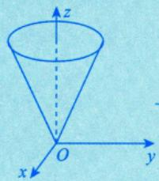

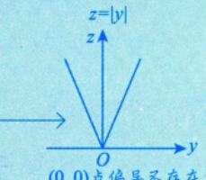  
(0,0)点偏导不存在，但取极小值

(2)二元函数取极值的充分条件.→该充分条件不适用于三元及三元以上函数

设 $f(x,y)$ 在点 $(x_{0},y_{0})$ 的某邻域内连续且有一阶及二阶连续偏导数，又 $f_{x}^{\prime}(x_{0},y_{0}) = 0$ $f_{y}^{\prime}(x_{0},y_{0}) = 0$

$\begin{cases}f_{xx}''(x_0, y_0) = A, \\f_{xy}''(x_0, y_0) = B, \\f_{yy}''(x_0, y_0) = C,\end{cases}$ >0⇒极值 $\begin{cases}A < 0 \Rightarrow \\A > 0\Rightarrow\end{cases}$ 极大值，  
记 则 $\Delta = AC - B^{2}$ 极小值，<0⇒非极值，=0⇒方法失效，另谋他法.

注若 $AC - B^{2} = A > 0 \Rightarrow AC > B^{2} \geqslant 0 \Rightarrow AC$ 同号，即：若 $\begin{aligned}A > 0 \Rightarrow \left\{ \begin{aligned}A > 0, C > 0, \\A < 0, C < 0.\end{aligned} \right.\end{aligned}$

“大鼻子爷爷”Δ=0⇒方法失效，

开不开心少年团

“小哑巴猪 $\begin{aligned}\lambda < 0 \Rightarrow\end{aligned}$ 不是极值，

“开心”Δ>0,A>0⇒极小值，

“不开 $\Delta>0,A<0\Rightarrow$ 极大值.

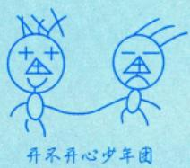

综合(1)，(2)，可用必要条件求出所有可疑点，再用充分条件判别这些可疑点是不是极值点.

例13.19 已知函数z=z(x，y)由方程 $(x^{2}+y^{2})z+\ln z+2(x+y+1)=0$ 确定，求 $z(x,y)$ 的极值.解在 $(x^{2}+y^{2})z+\ln z+2(x+y+1)=0$ 两端分别对x和y求偏导数，得

$$
\left\{ \begin{aligned} 2xz + (x^2 + y^2) \frac{\partial z}{\partial x} + \frac{1}{z} \frac{\partial z}{\partial x} + 2 = 0, \\ 2yz + (x^2 + y^2) \frac{\partial z}{\partial y} + \frac{1}{z} \frac{\partial z}{\partial y} + 2 = 0, \end{aligned} \right.\tag{*}
$$

区 $\frac{\partial z}{\partial x} = 0, \frac{\partial z}{\partial y} = 0$ ，得 $\left\{ \begin{aligned} x = & - \frac{1}{z}, \\ y = & - \frac{1}{z}. \end{aligned} \right.$

将 $\left\{ \begin{aligned} x = & - \frac{1}{z}, \\ y = & - \frac{1}{z} \end{aligned} \right.$ 代入方程 $(x^{2}+y^{2})z+\ln z+2(x+y+1)=0$ ，得 $\ln z - \frac{2}{z} + 2 = 0$ →观察法求解 ，可知z=1，从而 $\begin{cases}x = -1, \\y = -1.\end{cases}$

方程组(\*)中两式的两端分别再对x，y求偏导数，得

$$
\left\{ \begin{aligned} 2z + 4x\frac{\partial z}{\partial x} + \left( x^{2} + y^{2} \right)\frac{\partial^{2}z}{\partial x^{2}} - \frac{1}{z^{2}}\left( \frac{\partial z}{\partial x} \right)^{2} + \frac{1}{z}\frac{\partial^{2}z}{\partial x^{2}} = 0, \\ 2x\frac{\partial z}{\partial y} + 2y\frac{\partial z}{\partial x} + \left( x^{2} + y^{2} \right)\frac{\partial^{2}z}{\partial x\partial y} - \frac{1}{z^{2}}\frac{\partial z}{\partial x}\frac{\partial z}{\partial y} + \frac{1}{z}\frac{\partial^{2}z}{\partial x\partial y} = 0, \\ 2z + 4y\frac{\partial z}{\partial y} + \left( x^{2} + y^{2} \right)\frac{\partial^{2}z}{\partial y^{2}} - \frac{1}{z^{2}}\left( \frac{\partial z}{\partial y} \right)^{2} + \frac{1}{z}\frac{\partial^{2}z}{\partial y^{2}} = 0, \end{aligned} \right.
$$

从而得 $\left. A = \frac{\partial^{2}z}{\partial x^{2}} \right|_{(-1,-1)} = -\frac{2}{3}, \left. B = \frac{\partial^{2}z}{\partial x\partial y} \right|_{(-1,-1)} = 0, \left. C = \frac{\partial^{2}z}{\partial y^{2}} \right|_{(-1,-1)} = -\frac{2}{3}$

由于 $AC - B^{2} > 0, A < 0$ ，因此z(-1,-1)=1是z(x，y)的极大值.

## 3 条件最值与拉格朗日乘数法

求目标函数 $u = f(x,   y,   z)$ 在约束条件 $\begin{cases}\varphi(x,   y,   z) = 0, \\\psi(x,   y,   z) = 0\end{cases}$ 下的最值，则

①构造辅助函数 $F(x, y, z, \lambda, \mu) = f(x, y, z) + \lambda \varphi(x, y, z) + \mu \psi(x, y, z)$

V②令 自变量个数=目标函数自变量个数+约束个数

$$
\begin{cases}F_{x}^{\prime} = f_{x}^{\prime} + \lambda \varphi_{x}^{\prime} + \mu \psi_{x}^{\prime} = 0, \\F_{y}^{\prime} = f_{y}^{\prime} + \lambda \varphi_{y}^{\prime} + \mu \psi_{y}^{\prime} = 0, \\F_{z}^{\prime} = f_{z}^{\prime} + \lambda \varphi_{z}^{\prime} + \mu \psi_{z}^{\prime} = 0, \\F_{\lambda}^{\prime} = \varphi(x, y, z) = 0, \\F_{\mu}^{\prime} = \psi(x, y, z) = 0;\end{cases}
$$

③解上述方程组得备选点P,i=1,2,3,…，n，并求f(P)，取其最大值为 $u _ { \mathrm { m a x } }$ ，最小值为 $u _ { \mathrm { m i n } }$

## 考研数学基础30讲·高等数学分册

④根据实际问题，必存在最值，所得即为所求.

注若目标函数的约束条件为 $\varphi(x, y, z) = 0$ 易解出 $z = z(x, y)$ ，则将其代入 $f(x,y,z)$ 得$f[x, y, z(x, y)]$ 即转化为无条件最值问题

例13.20 设a,b满足 $\int_{a}^{b} \left| x \right| \mathrm{d}x = \frac{1}{2} (a \leqslant 0,   b \geqslant 0)$ ，求曲线 $y = x^{2} + ax$ 与直线 $y = b x$ 所围区域面积的最大值和最小值. →综合题 y↑h

解 $\int_{a}^{b} \left| x \right| \mathrm{d}x = \int_{a}^{0} (-x) \mathrm{d}x + \int_{0}^{b} x \mathrm{d}x = \frac{1}{2} \left( a^2 + b^2 \right) = \frac{1}{2}$ ，故

$$
a^{2}+b^{2}=1(a \leqslant 0,b \geqslant 0)
$$

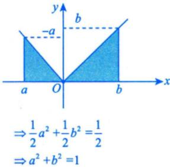

曲线 $y = x^{2} + ax$ 与直线 $y = b x$ 的交点的横坐标分别为

$$
x_{1}=0,\;x_{2}=b-a\;,
$$

于是面积

$S = \int_{0}^{b - a} \left[ bx - \frac{(x^2 + ax)}{(x^2 + ax)} \right] dx = \frac{1}{6}(b - a)^3$ 凹曲线：将目标函数转化为故bx-(x²+ax)≥0(b-a) 的最值

注意到 $\frac{1}{6}(b - a)^{3}$ 的最值点与 $\stackrel { \rightharpoonup } { b - a }$ 的最值点是一样的，故转化成求 $S^{*} = b - a$ 在条件 $a^{2} + b^{2} =$ $1(a \leqslant 0,   b \geqslant 0)$ 下的最值点，利用拉格朗日乘数法，令 $F(a,   b,   \lambda) = b - a + \lambda (a^2 + b^2 - 1)$ ，由

$$
F_{a}^{\prime}=-1+2\lambda a=0,\;F_{b}^{\prime}=1+2\lambda b=0,\;F_{\lambda}^{\prime}=a^{2}+b^{2}-1=0\;,
$$

解得驻点 $(a,   b) = \left( - \frac{\sqrt{2}}{2}, \frac{\sqrt{2}}{2} \right)$ ，此时 $S = \frac{\sqrt{2}}{3}$ .又当 $a = 0,   b = 1$ 时， $S = \frac{1}{6}$ ；当 $a = -1,   b = 0$ 时， $S = \frac{1}{6}$ 比较以上函数值，知所求区域面积的最大值是 $\frac{\sqrt{2}}{3}$ ，最小值是 $\frac{1}{6}$

注本题的约束条件 $a^{2}+b^{2}=1(a \leqslant 0,b \geqslant 0)$ 不是封闭的整个圆，而只是第二象限的部分，是不封闭曲线，对不封闭曲线在用拉格朗日乘数法时要注意比较端点处的函数值.

## 4最远（近）点的垂线原理

此原理可直接使用。

用好此原理，可能在多元最值问题上节约大量时间，提高效率

如果Γ是光滑闭曲线，点Q是Γ外的一个点，点 $P_{1},   P_{2}$ 分别是Γ上与点Q的最远点，最近点，则直线 $P _ { 1 } Q ,   P _ { 2 } Q$ 分别在点 $P _ { 1 }$ 处， $P _ { 2 }$ 处与Γ垂直，即 $P _ { 1 } Q ,   P _ { 2 } Q$ 分别与点 $P_{1},   P_{2}$ 的切线垂直. -V

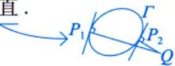

若光滑闭曲线 $T_{1},T_{2}$ 不相交，点 $P _ { 1 } ,   P _ { 2 }$ 分别是它们之间的最远(近)点，则直线 $P _ { 1 } P _ { 2 }$ 是 $T _ { 1 } ,   T _ { 2 }$ 的公垂线，即 $P _ { 1 } P _ { 2 }$ 同时垂直于 $T_{1} ; T_{2}$ 在这两个点处的切线. $\left[ \frac{P_{1}}{C} \right]^{T_{1}}$

例13.21 求曲线 $x^{2} + 4y^{2} = 4$ 上到直线 $2x + 3y - 6 = 0$ 的距离最近的点. $\frac { 2 0 ^ { 2 } } { P _ { 2 } }$

解方法一设 $P(x,   y)$ 为曲线 $x^{2} + 4y^{2} = 4$ 上任意一点，则点P到直线 $2x + 3y - 6 = 0$ 的距离 数学一要掌握

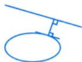

$$
\frac{\left | 2x+3y-6 \right | }{\sqrt{13} }
$$

$$
(x_{0} , y_{0} )
$$

$$
Ax + By + C = 0
$$

离公式： $d = \frac{\left| A x_{0} + B y_{0} + C \right|}{\sqrt{A^{2} + B^{2}}}$

因为求函数d的最小值点即求 $d ^ { 2 }$ 的最小值点，所以问题可抽象为如下数学模型：

求目标函数 $d^{2} = \frac{1}{13}(2x + 3y - 6)^{2}$ 在约束条件 $x^{2} + 4y^{2} = 4$ 下的最小值.

作拉格朗日函数 $F(x,y,\lambda)=\frac{1}{13}(2x+3y-6)^{2}+\lambda(x^{2}+4y^{2}-4)$ ，令

$$
\left\{ F _ { x } ^ { \prime } = \frac { 4 } { 1 3 } ( 2 x + 3 y - 6 ) + 2 \lambda x = 0 \right.,\tag{}
$$

$$
\begin{aligned}\left\{ \begin{aligned}F_{y}^{\prime} = \frac{6}{13}(2x + 3y - 6) + 8\lambda y = 0,\end{aligned} \right.\end{aligned}
$$

$$
F_{\lambda}^{\prime}=x^{2}+4y^{2}-4=0.\tag{②}
$$

③

若 $\lambda = 0$ ，则上述方程组转化为 $\begin{cases}2x + 3y - 6 = 0, \\x^{2} + 4y^{2} - 4 = 0\end{cases}$ 即求曲线与直线的交点.事实上，二者并不相交，此时方程组无解.

若 $\lambda \neq 0$ ，由①，②式得 $\frac{\frac{4}{13}}{\frac{6}{13}}=\frac{-2x}{-8y}, \quad x=\frac{8}{3}y$ ，代入③式，解得 $x_{1}=\frac{8}{5}, \quad y_{1}=\frac{3}{5}; \quad x_{2}=-\frac{8}{5}, \quad y_{2}=-\frac{3}{5}$ L

$$
\left. d \right|_{(x_1, y_1)} = \frac{1}{\sqrt{13}} , \left. d \right|_{(x_2, y_2)} = \frac{11}{\sqrt{13}}
$$

根据问题的实际意义可知，最近距离一定存在，因此 $\left( \frac{8}{5}, \frac{3}{5} \right)$ 即为所求点.

方法二设 →可以学完第17讲再看此方法 $P(x,   y)$ 为所求点，因曲线 $x^{2} + 4y^{2} = 4$ 可写成参数方程 $\left\{ \begin{aligned} x = & x, \\ y^{2} = & 1 - \frac{1}{4}x^{2}. \end{aligned} \right.$ 故其在点 $P(x,   y)$ 处的切向向量可表示为 $\boldsymbol{\tau} = \left(1, -\frac{x}{4y}\right)$

或令 $F_{1}(x, y) = x^{2} + 4y^{2} - 4$

则 $\frac{\mathrm{d}y}{\mathrm{d}x} = - \frac{F_{1x}^{\prime}}{F_{1y}^{\prime}} = - \frac{x}{4y}$

$$
F_{2}(x,y)=2x+3y-6,\quad 则 \quad\frac{\mathrm{d}y}{\mathrm{d}x}=-\frac{F_{2x}^{\prime}}{F_{2y}^{\prime}}=-\frac{2}{3}
$$

又直线 $2x + 3y - 6 = 0$ 的法向向量 $\boldsymbol{n} = (2, 3)$ ，根据最远（近）点的垂线原理，有 $n \perp \tau$ ，即 $\boldsymbol{n} \cdot \boldsymbol{\tau} = 0$ $2 \cdot 1 + 3 \cdot \left( - \frac{x}{4y} \right) = 0$ ，即有 $x = \frac{8}{3}y$ ，代人 $x^{2} + 4y^{2} = 4$ ，得 $\left\{ \begin{aligned} x_{1} = & \frac{8}{5}, \quad \left\{ x_{2} = -\frac{8}{5}, \right. \\ y_{1} = & \frac{3}{5}, \quad \left\{ y_{2} = -\frac{3}{5}. \right. \end{aligned} \right.$

又由点到直线的距离公式知， $\left( \frac{8}{5}, \frac{3}{5} \right)$ 即为所求点.

## 5有界闭区域上连续函数的最值问题

(1)理论依据最大值与最小值定理：有界闭区域D上的多元连续函数，在区域D上一定有最大值和最小值.

(2) 求法. →与一元函数做好联系与对比

①根据 $f_{x}^{\prime}(x, y), f_{y}^{\prime}(x, y)$ 为0或不存在，求出区域D内部的所有可疑点；

②用拉格朗日乘数法或代入法求出区域D边界上的所有可疑点；

③比较以上所有可疑点的函数值大小，取其最小者为最小值，最大者为最大值.

例13.22 已知函数 $z = f(x, y)$ 的全微分 $\mathrm{d}z = 2x\mathrm{d}x - 2y\mathrm{d}y$ ，并且 $f(1,1) = 2$ .求 $f(x,   y)$ 在椭圆域 $D=\left\{ (x, y) \middle| x^{2}+\frac{y^{2}}{4} \leqslant 1 \right\}$ 上的最大值和最小值. $\frac{\partial z}{\partial x} \quad  啓  \quad \frac{\partial z}{\partial y}$

解由 $\mathrm{d}z = 2x\mathrm{d}x - 2y\mathrm{d}y$ 可知

$$
z = f(x, y) = x^{2} - y^{2} + C,
$$

再由f(1，1)=2，得C=2，故

$$
z = f(x, y) = x^{2} - y^{2} + 2
$$

令/ $\frac{\partial f}{\partial x}=2x=0,\frac{\partial f}{\partial y}=-2y=0$ ，解得驻点(0，0).在椭圆 $x^{2}+\frac{y^{2}}{4}=1$ 上， $z = x^{2} - (4 - 4x^{2}) + 2$ ，即在D内 $z = 5x^{2} - 2( - 1 \leqslant x \leqslant 1)$ 在边界上

其最大值为 $z \big | _ { x = \pm 1 } = 3$ ，最小值为 $z \big|_{x = 0} = - 2$ ，再与 $f(0,0)=2$ 比较，可知 $f(x,y)$ 在椭圆域D上的最大值为3，最小值为-2.

注在边界 $x^{2}+\frac{y^{2}}{4}=1$ 上的最值也可以直接利用拉格朗日乘数法，令

$$
F(x, y, \lambda) = x^2 - y^2 + 2 + \lambda \left( x^2 + \frac{y^2}{4} - 1 \right)
$$

$$
\left\{ \begin{aligned} \frac{\partial F}{\partial x} = 2x + 2\lambda x = 0, \end{aligned} \right.
$$

令 $\left\{ \begin{aligned} \frac{\partial F}{\partial y} = - 2y + \frac{\lambda}{2}y = 0 \end{aligned} \right.$ 解得 $M_{1}(0,2),M_{2}(0,-2),M_{3}(1,0),M_{4}(-1,0).$ .此时$\frac{\partial F}{\partial \lambda} = x^{2} + \frac{y^{2}}{4} - 1 = 0$

$$
f(M_{1}) = f(M_{2}) = -2, f(M_{3}) = f(M_{4}) = 3
$$

故在边界 $x^{2}+\frac{y^{2}}{4}=1$ 上的最大值是3，最小值是-2.

## 基础习题精练

## 习题

13.1 设f(0,0)=0，f(x，y)在(0，0)点连续，则当(x，y)≠(0,0)时，f(x，y)可能为(). (A) $\frac{xy}{x^{2} + y^{2}}$ (B) $\frac{x^{2}-y^{2}}{x^{2}+y^{2}}$ (C) $\frac{x^{2}y}{x^{2}+y^{2}}$ (D) $\frac{x^{2}y}{x^{4}+y^{2}}$

13.2 设f(x，y)具有一阶连续偏导数，且对任意(x，y)都有 $\frac{\partial[f(x, y)]}{\partial x} > 0, \quad \frac{\partial[f(x, y)]}{\partial y} < 0$ ，则( ).(A) $f(0,   0) > f(1,   1)$ (B) $f(0,   0) < f(1,   1)$ (C) $f(0,1) > f(1,0)$ (D) $f(0,1) < f(1,0)$

13.3 函数 $f(x, y) = \sqrt{|xy|}$ 在点(0，0)处().(A) 偏导数不存在 (B)偏导数存在，但不可微(C) 可微，但偏导数不连续 (D) 偏导数连续

13.4 设函数f与g 均可微， $z = f[xy,\ln x + g(xy)]$ ，则 $x \frac{\partial z}{\partial x} - y \frac{\partial z}{\partial y} = ( \quad )$ (A) $f _ { 1 } ^ { \prime }$ (B) $f _ { 2 } ^ { \prime }$ (C) $f_{1}^{\prime}+f_{2}^{\prime}$ (D) $f_{1}^{\prime}-f_{2}^{\prime}$

13.5 设 $z_{1} = \left| x + y \right|$ $\mathrm{d}z_{2} = (3x^{2} + 6x)\mathrm{d}x - (3y^{2} - 6y)\mathrm{d}y$ ，则点(0，0)（）.

(A)不是 $z _ { 1 }$ 的极值点，也不是 $z _ { 2 }$ 的极值点

(B)是 $z _ { 1 }$ 的极大值点，也是 $z _ { 2 }$ 的极大值点

(C)是 $z _ { 1 }$ 的极小值点，是 $z _ { 2 }$ 的极大值点

(D)是 $z _ { 1 }$ 的极小值点，也是 $z _ { 2 }$ 的极小值点

13.6（仅数学三)以 $p_{A}, p_{B}$ 分别表示A，B两种商品的价格，设商品A的需求函数为

$$
Q _ { A } = 5 0 0 - p _ { A } ^ { 2 } - p _ { A } p _ { B } + 2 p _ { B } ^ { 2 } ,
$$

则当 $p_{A}=10,\;p_{B}=20$ 时，商品A的需求量对自身价格的弹性 $\eta_{_{A4}}(\eta_{_{A4}}>0)$ 为

13.7 设函数 $z = \left(1 + \frac{x}{y}\right)^{2}$ ，则 $\left. \mathbf{d}z \right|_{(1,\;1)} =$

13.8 设函数f(x)可微，且 $f^{\prime}(0) = \frac{1}{2}$ ，则 $z = f(4x^{2} - y^{2})$ 在点(1,2)处的全微分 $\left. \mathsf{d}z \right|_{(1,\;2)} =$

13.9 设z =z(x, y)由 $(z + y)^{x} = x^{2}$ 确定，则 $\left. \frac{\partial z}{\partial x} \right|_{(1,1)} =$

13.10设 $z = f(x^{2}y^{2},\mathrm{e}^{xy})$ ，其中f(u，v)有二阶连续偏导数，求 $z_{xx}'', z_{yy}'', z_{xy}''$

13.11 设函数 $u = f(x^{2},   xy,   xz)$ 具有一阶连续偏导数，又函数 $y = y(x), \; z = z(x)$ 分别由

$$
\sin xy = y,\; \mathrm{e}^{z} = \int_{0}^{xz} \sin t   dt
$$

确定，求 $\frac{\mathrm{d}u}{\mathrm{d}x}$

13.12 求二元函数 $f(x,y)=x^{2}y^{2}+x\ln x$ 的极值.

13.13 已知函数f(x,y)满足 $f_{xy}^{\prime\prime}(x, y) = 2(y + 1)\mathrm{e}^{x}, f_{x}^{\prime}(x, 0) = (x + 1)\mathrm{e}^{x}, f(0, y) = y^{2} + 2y$ ，求 $f(x,   y)$ 的极值.

13.14 求曲线 $x^{3}-xy+y^{3}=1(x\geqslant 0,y\geqslant 0)$ 上的点到坐标原点的最长距离与最短距离.

## 解答

13.1 (C) 解 对于(C)，由基本不等式：

$$
\left| \frac{x^{2}y}{x^{2} + y^{2}} \right| \leqslant \frac{1}{2}|x| \leqslant \frac{1}{2}\sqrt{x^{2} + y^{2}}
$$

对于任给的ε>0，取 $\delta = 2 \varepsilon$ ，当 $0 < \sqrt{x^{2} + y^{2}} < \delta$ 时， $\left| \frac{x^{2}y}{x^{2} + y^{2}} \right| < \varepsilon$ .由定义，可得

$$
\lim _ { ( x , y ) \to ( 0 , 0 ) } f ( x , y ) = 0 = f ( 0 , 0 ) .
$$

对于(A),取 $y = k x$ ,则 $f(x, y) = f(x, kx) = \frac{k}{1 + k^2} \left( (x, y) \neq (0, 0) \right)$ ,从而 $\lim_{y = kx \atop x \to 0} f(x, y) = \frac{k}{1 + k^2}$ ，随k而异.

(B)与(A)同理.对于(D)，取 $y = k x^{2}$ $\lim_{y = kx^{2} \atop x \to 0} f(x, y) = \frac{k}{1 + k^{2}}$ ，随k而异.

13.2 (D) 解 因为 $\frac{\partial[f(x, y)]}{\partial x} > 0$ ，所以 $f(x,   y)$ 关于x是单调递增函数（此时y固定），故$f(0,1) < f(1,1)$

又因为 $\frac{\partial[f(x, y)]}{\partial y} < 0$ ，所以 $f(x,   y)$ 关于y是单调递减函数（此时x固定），故 $f(1,1) < f(1,0)$

因此 $f(0,1) < f(1,0)$ ，(C)不正确，故选(D).

对于选项(A)，(B),举反例， $f(x, y) = x - y$ ，符合题干条件，但f(0,0)=f(1，1)，故(A)，(B)均不正确.

13.3 (B) 解

$$
f_{x}^{\prime}(0,0)=\lim_{\Delta x \to 0}\frac{f(0+\Delta x,0)-f(0,0)}{\Delta x}=\lim_{\Delta x \to 0}\frac{\sqrt{\left | \Delta x \bullet 0 \right | }-0}{\Delta x}=0=A
$$

$$
f_{y}^{\prime}(0,0)=\lim_{\Delta y \to 0}\frac{f(0,0+\Delta y)-f(0,0)}{\Delta y}=\lim_{\Delta y \to 0}\frac{\sqrt{\left | 0\Delta y \right | }-0}{\Delta y}=0=B,
$$

故 $f(x,   y)$ 在点(0,0)处偏导数存在.又

$$
\Delta z = f(0 + \Delta x, 0 + \Delta y) - f(0, 0) = \sqrt{\left| \Delta x \bullet \Delta y \right|} - 0 = \sqrt{\left| \Delta x \bullet \Delta y \right|},
$$

故有 $\lim_{\substack{\Delta x \to 0 \\ \Delta y \to 0}} \frac{\Delta z - A\Delta x - B\Delta y}{\sqrt{(\Delta x)^2 + (\Delta y)^2}} = \lim_{\substack{\Delta x \to 0 \\ \Delta y \to 0}} \frac{\sqrt{|\Delta x \cdot \Delta y|}}{\sqrt{(\Delta x)^2 + (\Delta y)^2}}$ 不存在.从而f(x，y)在点(0,0)处不可微.

13.4 (B) 解

$$
\frac{\partial z}{\partial x} = f_{1}^{\prime} \bullet y + f_{2}^{\prime} \bullet \left( \frac{1}{x} + g^{\prime} \bullet y \right),
$$

$$
\frac{\partial z}{\partial y} = f_{1}^{\prime} \cdot x + f_{2}^{\prime} \cdot g^{\prime} \cdot x ,
$$

故 $x \frac{\partial z}{\partial x} - y \frac{\partial z}{\partial y} = f'_2$

13.5 (D) 解 由于 $\left. \frac{\partial z_{1}}{\partial x} \right|_{(0,0)} = \lim_{x \rightarrow 0} \frac{f(x, 0) - f(0, 0)}{x - 0} = \lim_{x \rightarrow 0} \frac{\left| x \right| - 0}{x - 0}$ 不存在，即其在点(0,0)处偏导数不存在，只能利用极值的定义来考虑.

因 $z_{1}(0,0)=0$ ，又当 $(x, y) \neq (0, 0)$ 时，总有 $z_{1}(x, y) \geq 0$ ，可知点(0,0)为 $z _ { 1 }$ 的极小值点.

由于d $z_{2}=(3x^{2}+6x)\mathrm{d}x-(3y^{2}-6y)\mathrm{d}y$ ，可知 $\frac{\partial z_{2}}{\partial x}=3x^{2}+6x,\quad\frac{\partial z_{2}}{\partial y}=-(3y^{2}-6y)$ ，且 $\left. \frac{\partial z_{2}}{\partial x} \right|_{(0,\;0)} = 0, \left. \frac{\partial z_{2}}{\partial y} \right|_{(0,\;0)} =$ 0.又

$$
\frac { \partial ^ { 2 } z _ { 2 } } { \partial x ^ { 2 } } = 6 x + 6 , \frac { \partial ^ { 2 } z _ { 2 } } { \partial x \partial y } = 0 , \frac { \partial ^ { 2 } z _ { 2 } } { \partial y ^ { 2 } } = - 6 y + 6 ,
$$

则

$$
\left. A = \frac { \partial ^ { 2 } z _ { 2 } } { \partial x ^ { 2 } } \right| _ { ( 0 , 0 ) } = 6 , \left. B = \frac { \partial ^ { 2 } z _ { 2 } } { \partial x \partial y } \right| _ { ( 0 , 0 ) } = 0 , \left. C = \frac { \partial ^ { 2 } z _ { 2 } } { \partial y ^ { 2 } } \right| _ { ( 0 , 0 ) } = 6 ,
$$

$$
AC - B^{2} = 36 > 0, A > 0,
$$

可知点(0,0)为 $z _ { 2 }$ 的极小值点.

故选(D).

13.6 0.4 解 根据弹性的定义，有

$$
\eta _ { A A } = - \frac { p _ { A } } { Q _ { A } } \cdot \frac { \partial Q _ { A } } { \partial p _ { A } } = - \frac { p _ { A } } { Q _ { A } } \cdot ( - 2 p _ { A } - p _ { B } ) = \frac { p _ { A } ( 2 p _ { A } + p _ { B } ) } { 5 0 0 - p _ { A } ^ { 2 } - p _ { A } p _ { B } + 2 p _ { B } ^ { 2 } } ,
$$

故当 $p_{A}=10,\;p_{B}=20$ 时， $\eta_{_{MA}} = 0.4$

13.7 4(dx−dy) 解 设 $\begin{aligned}u = & \frac{x}{y}\end{aligned}$ ，则

$$
z = \left( 1 + \frac{x}{y} \right)^2 = (1 + u)^2
$$

$$
\frac{\mathrm{d}z}{\mathrm{d}u} = 2(1 + u), \quad \frac{\partial u}{\partial x} = \frac{1}{y}, \quad \frac{\partial u}{\partial y} = -\frac{x}{y^2},
$$

故

$$
\frac{\partial z}{\partial x} = \frac{\mathrm{d}z}{\mathrm{d}u} \cdot \frac{\partial u}{\partial x} = 2(1 + u) \cdot \frac{1}{y} = \frac{2}{y}\left(1 + \frac{x}{y}\right),
$$

$$
\frac{\partial z}{\partial y} = \frac{\mathrm{d}z}{\mathrm{d}u} \cdot \frac{\partial u}{\partial y} = 2(1 + u) \cdot \left( - \frac{x}{y^{2}} \right) = - \frac{2x}{y^{2}}\left( 1 + \frac{x}{y} \right),
$$

因此

$$
\mathrm{d}z = \frac{\partial z}{\partial x}\mathrm{d}x + \frac{\partial z}{\partial y}\mathrm{d}y = \frac{2}{y}\left(1 + \frac{x}{y}\right)\left(\mathrm{d}x - \frac{x}{y}\mathrm{d}y\right),
$$

故

$$
\mathrm{d}z \big|_{(1,1)} = 4(\mathrm{d}x - \mathrm{d}y)
$$

13.8 4dx-2dy 解 令 $u = 4x^{2} - y^{2}$ ，则 $z = f(u)$ ，于是

$$
\frac{\partial z}{\partial x} = f^{\prime}(u)(4x^{2} - y^{2})^{\prime}_{x} = 8xf^{\prime}(u), \left.\frac{\partial z}{\partial x}\right|_{(1,2)} = 8f^{\prime}(0) = 4,
$$

$$
\frac{\partial z}{\partial y} = f^{\prime}(u)(4x^{2} - y^{2})^{\prime}_{y} = - 2yf^{\prime}(u),\left.\frac{\partial z}{\partial y}\right|_{(1,2)} = - 4f^{\prime}(0) = - 2,
$$

所以 $\mathrm{d}z \big|_{(1,2)} = 4\mathrm{d}x - 2\mathrm{d}y$

13.9 2 解 将所给方程变形为 $(z + y)^{x} - x^{2} = 0$ ，令 $F(x, y, z) = (z + y)^x - x^2$ ，则

$$
F_{x}^{\prime}=(z+y)^{x}\ln(z+y)-2x,
$$

$$
F_{z}^{\prime}=x(z+y)^{x-1}
$$

将x=0代入所给方程，不成立，故 $x \ne 0,   F'_z \ne 0$ ，则有

$$
\frac{\partial z}{\partial x} = - \frac{F_{x}^{\prime}}{F_{z}^{\prime}} = - \frac{(z + y)^{x}\ln(z + y) - 2x}{x(z + y)^{x - 1}}.\tag{*}
$$

当 $x = 1, \; y = 1$ 时，由原方程可得 $z = 0$ ，代入(\*)式可得 $\left. \frac{\partial z}{\partial x} \right|_{(1,   1)} = 2$

13.10 解

$$
z _ { x } ^ { \prime } = f _ { 1 } ^ { \prime } \bullet 2 x y ^ { 2 } + f _ { 2 } ^ { \prime } \bullet y \mathrm { e } ^ { x y } , z _ { y } ^ { \prime } = f _ { 1 } ^ { \prime } \bullet 2 x ^ { 2 } y + f _ { 2 } ^ { \prime } \bullet x \mathrm { e } ^ { x y } ,
$$

$$
z_{xx}^{\prime\prime} = f_{11}^{\prime\prime} \cdot (2xy^2)^2 + f_{12}^{\prime\prime} \cdot y\mathrm{e}^{xy} \cdot 2xy^2 + f_{1}^{\prime} \cdot 2y^2 + f_{21}^{\prime\prime} \cdot 2xy^2 \cdot y\mathrm{e}^{xy} + f_{22}^{\prime\prime} \cdot (y\mathrm{e}^{xy})^2 + f_{2}^{\prime} \cdot y^2\mathrm{e}^{xy} \\= f_{11}^{\prime\prime} \cdot 4x^2y^4 + f_{22}^{\prime\prime} \cdot y^2\mathrm{e}^{2xy} + f_{12}^{\prime\prime} \cdot 4xy^3\mathrm{e}^{xy} + f_{1}^{\prime} \cdot 2y^2 + f_{2}^{\prime} \cdot y^2\mathrm{e}^{xy} .
$$

同理可得

$$
z_{yy}^{''} = f_{11}^{''} \bullet 4x^{4}y^{2} + f_{22}^{''} \bullet x^{2}\mathrm{e}^{2xy} + f_{12}^{''} \bullet 4x^{3}y\mathrm{e}^{xy} + f_{1}^{'} \bullet 2x^{2} + f_{2}^{'} \bullet x^{2}\mathrm{e}^{xy}
$$

$$
z_{yy}^{\prime\prime} = f_{11}^{\prime\prime} \cdot 2x^{2}y \cdot 2xy^{2} + f_{12}^{\prime\prime} \cdot x\mathrm{e}^{xy} \cdot 2xy^{2} + f_{1}^{\prime} \cdot 4xy + f_{21}^{\prime\prime} \cdot 2x^{2}y \cdot y\mathrm{e}^{xy} + f_{22}^{\prime\prime} \cdot x\mathrm{e}^{xy} \cdot y\mathrm{e}^{xy} + f_{2}^{\prime} \cdot (\mathrm{e}^{xy} + xy\mathrm{e}^{xy}) \\= f_{11}^{\prime\prime} \cdot 4x^{3}y^{3} + f_{22}^{\prime\prime} \cdot xy\mathrm{e}^{2xy} + f_{31}^{\prime\prime} \cdot 4x^{2}y^{2}\mathrm{e}^{xy} + f_{4}^{\prime\prime} \cdot 4xy + f_{5}^{\prime} \cdot (1 + xy)\mathrm{e}^{xy}.
$$

13.11 解 复合函数 $u = f(x^{2},   xy,   xz)$ 两边对x求导数得

$$
\frac{\mathrm{d}u}{\mathrm{d}x}=f_{1}^{\prime}\cdot 2x+f_{2}^{\prime}\cdot \left ( y+x\frac{\mathrm{d}y}{\mathrm{d}x} \right ) +f_{3}^{\prime}\cdot \left ( z+x\frac{\mathrm{d}z}{\mathrm{d}x} \right )\tag{}
$$

由隐函数 $\sin xy = y$ 求 $\frac{\mathrm{d}y}{\mathrm{d}x}$ .等式 $\sin xy = y$ 两边对x求导数得

$$
\left( \cos xy \right) \cdot \left( y + x \frac{\mathrm{d}y}{\mathrm{d}x} \right) = \frac{\mathrm{d}y}{\mathrm{d}x},
$$

解得

$$
\frac{\mathrm{d}y}{\mathrm{d}x} = \frac{y\cos xy}{1 - x\cos xy}.\tag{②}
$$

由隐函数 $\mathrm{e}^{z}=\int_{0}^{xz}\sin t\mathrm{d}t$ 求 $\frac{\mathrm{d}z}{\mathrm{d}x}$ .等式 $\mathrm{e}^{z}=\int_{0}^{xz}\sin t\mathrm{d}t$ 两边对x求导数得

$$
\mathrm{e}^{z} \frac{\mathrm{d}z}{\mathrm{d}x} = (\sin xz) \cdot \left(z + x\frac{\mathrm{d}z}{\mathrm{d}x}\right),
$$

解得

$$
\frac{\mathrm{d}z}{\mathrm{d}x} = \frac{z\sin xz}{\mathrm{e}^{z} - x\sin xz}.\tag{③}
$$

将②，③式代入①式，得

$$
\frac{\mathrm{d}u}{\mathrm{d}x}=f_{1}^{\prime} \cdot 2 x+f_{2}^{\prime} \cdot\left(y+x \frac{y \cos x y}{1-x \cos x y}\right)+f_{3}^{\prime} \cdot\left(z+x \frac{z \sin x z}{\mathrm{e}^{z}-x \sin x z}\right)
$$

13.12 解

$$
f_{x}^{\prime}(x, y)=2xy^{2}+1+\ln x, f_{y}^{\prime}(x, y)=2x^{2}y
$$

$$
\begin{cases}f_{x}^{\prime}(x, y) = 0, \\f_{y}^{\prime}(x, y) = 0,\end{cases}
$$

解得唯一驻点 $\left( \frac{1}{\mathrm{e}}, 0 \right)$ .由

$$
f_{xx}^{\prime\prime}=2y^{2}+\frac{1}{x}, f_{xy}^{\prime\prime}=4xy, f_{yy}^{\prime\prime}=2x^{2},
$$

得

$$
A = f_{xx}^{\prime\prime}\left(\frac{1}{e}, 0\right) = e, B = f_{xy}^{\prime\prime}\left(\frac{1}{e}, 0\right) = 0, C = f_{yy}^{\prime\prime}\left(\frac{1}{e}, 0\right) = \frac{2}{e^2}
$$

故 $AC - B^{2} = \frac{2}{\mathrm{e}} > 0,\ A = \mathrm{e} > 0$ ，可知点 $\left( \frac{1}{\mathrm{e}}, 0 \right)$ 为 $f(x,   y)$ 的极小值点，极小值为 $-\frac{1}{\mathrm{e}}$

13.13 解由 $f_{xy}^{\prime\prime}(x, y) = 2(y + 1)\mathrm{e}^{x}$ ，得

$$
f_{x}^{\prime}(x, y) = (y^{2} + 2y)\mathrm{e}^{x} + \varphi(x)
$$

因为 $f_{x}^{\prime}(x, 0) = (x + 1)\mathrm{e}^{x}$ ，所以 $\varphi(x) = (x + 1)\mathrm{e}^{x}$ ，从而

$$
f_{x}^{\prime}(x, y) = (y^{2} + 2y)\mathrm{e}^{x} + (x + 1)\mathrm{e}^{x}
$$

将上式两端对x积分得

$$
f(x,y)=(y^{2}+2y)\mathrm{e}^{x}+xe^{x}+\phi(y)
$$

因为 $f(0,   y) = y^{2} + 2y$ ，所以 $\phi(y) = 0$ ，从而

$$
f(x, y) = (x + y^2 + 2y)\mathrm{e}^x
$$

$$
f_{y}^{\prime}(x,y)=(2y+2)e^{x},f_{xx}^{\prime\prime}(x,y)=(x+y^{2}+2y+2)e^{x},f_{yy}^{\prime\prime}(x,y)=2e^{x},f_{yy}^{\prime\prime}=f_{yx}^{\prime\prime}=(2y+2)e^{x}
$$

令f $f_{x}^{\prime}(x, y)=0, f_{y}^{\prime}(x, y)=0$ ，得驻点(0，-1)，所以

$$
A = f_{xx}^{\prime\prime}(0, -1) = 1, \; B = f_{xy}^{\prime\prime}(0, -1) = 0, \; C = f_{yy}^{\prime\prime}(0, -1) = 2,
$$

由于 $AC - B^{2} > 0,\ A > 0$ ，因此函数 $f(x,y)$ 的极小值为 $f(0,-1)=-1$

13.14 解 方法一 设(x，y)为曲线上的任意一点，目标函数为距离的平方，即 $f(x, y) = x^{2} + y^{2}$ 构造拉格朗日函数

$$
F(x, y, \lambda) = x^{2} + y^{2} + \lambda(x^{3} - xy + y^{3} - 1)
$$

$$
\left\{ \begin{aligned} \frac{\partial F}{\partial x} = 2x + (3x^2 - y)\lambda = 0, \end{aligned} \right.\tag{}
$$

$$
\left\{ \begin{aligned} \frac{\partial F}{\partial y} = 2y + (3y^2 - x)\lambda = 0, \end{aligned} \right.\tag{②}
$$

$$
\frac{\partial F}{\partial \lambda} = x^{3} - xy + y^{3} - 1 = 0,\tag{③}
$$

当 $x > 0, \; y > 0$ 时，由①，②式得

$$
\frac{x}{y}=\frac{3x^{2}-y}{3y^{2}-x}, \quad  即  \quad 3xy(y-x)=(x+y)(x-y)
$$

得 $y = x$ 或 $3xy = - (x + y)$ (由于 $x > 0,   y > 0$ ，因此舍去).

将y=x代入③式得

$$
2x^{3}-x^{2}-1=0\ , \quad  即 \ (x-1)(2x^{2}+x+1)=0\ ,
$$

解得x=1，从而点(1，1)为唯一可能的极值点.

又当x=0时， $y = 1$ ；当y=0时，x=1.分别计算点(1，1)，(0,1)及(1，0)处的目标函数值，有

$$
f(1,1)=2,\;f(0,1)=f(1,0)=1\;,
$$

故所求最长距离为 $\sqrt { 2 }$ ，最短距离为1.

方法二 由导数的几何意义知，平面曲线上任意一点 $(x_{0},y_{0})$ 的切向向量为 $(1,   y_{x_0}^{\prime})$

对曲线 $x^{3}-xy+y^{3}=1$ 两边关于x求导得 $3x^{2}-y-xy^{\prime}+3y^{2}y^{\prime}=0$ ，解得 $y^{\prime} = \frac{y - 3x^{2}}{3y^{2} - x}$

由最远（近）点的垂线原理知，坐标原点到曲线C距离的最值点(x，y)满足 $(x, y) \cdot (1, y_x') = 0$ ，即$x+\frac{y-3x^{2}}{3y^{2}-x}\cdot y=0$ ，整理得 $(3xy + x + y)(y - x) = 0$ ，解得 $y = x$ 或 $3xy = - (x + y)$ （不符合题意，舍去）.

余下步骤同方法一.

<table><tr><td rowspan=1 colspan=1>考题</td><td rowspan=1 colspan=1>二重积分</td></tr><tr><td rowspan=1 colspan=1>题型</td><td rowspan=1 colspan=1>解答题</td></tr><tr><td rowspan=1 colspan=1>目标</td><td rowspan=1 colspan=1>①理解二重积分的概念，了解二重积分的基本性质，了解二重积分的中值定理；②掌握二重积分的计算方法（直角坐标、极坐标）</td></tr><tr><td rowspan=1 colspan=1>重难点</td><td rowspan=1 colspan=1>计算二重积分</td></tr></table>

## 基础知识结构

思考问题：

1. 直角坐标系中先积x，还是先积y？

2. 极坐标系r，θ谁先积？

3.极坐标系和直角坐标系如何互相转化?

→概念可以联系前面所学的定积分！

## 概念、性质与对称性

设有界函数

## 1概念

定积分中是对线段的分割，这按照第8讲中给出定积分定义的方法，可以得到二重积分的定义. →里是平面区域的分割！设 $f(x,   y)$ 是有界闭区域D上的有界函数，将闭区域D任意分成n个小闭区域小柱体体积的近似，定积分f(ξ)∆x是面积的近似 $\Delta \sigma_{1}, \Delta \sigma_{2}, \cdots, \Delta \sigma_{n}$

其中 $\Delta \sigma _ { i }$ 表示第i个小闭区域，也表示它的面积.在每个 $\Delta \sigma_{i}$ 上任取一点 $(\xi_{i}, \eta_{i})$ ，作乘积  
$f(\xi_i, \eta_i) \Delta \sigma_i(i = 1, 2, \cdots, n)$ ，并作和 $\sum_{i = 1}^{n} f(\xi_{i}, \eta_{i}) \Delta \sigma_{i}$ ，如果当各小闭区域的直径中的最大值λ趋于零时，→取极限  
和的极限总存在（与 $\Delta \sigma_{i}$ 的分法及点 $(\xi_{i}, \eta_{i})$ 的取法均无关），则称此极限值为函数 $f(x,y)$ 在闭区域D  
上的二重积分，记作 $\iint_{D} f(x, y) \mathrm{d}\sigma$ ，即 >定积分是 $\sum_{i = 1}^{n} f(\xi_{i}) \Delta x_{i}$ ，注意 $\Delta x _ { i }$ 的取值：要求 $\max\{\Delta x_{i}\}=\lambda\to0$ ，这里也是

$$
\iint _ { D } f ( x , y ) \mathrm { d } \sigma = \lim _ { \lambda \rightarrow 0 } \sum _ { i = 1 } ^ { n } f ( \xi _ { i } , \eta _ { i } ) \Delta \sigma _ { i } ,
$$

$$
\max\{\Delta\sigma_{i}\}=\lambda\to0
$$

$\lambda \stackrel { \rightarrow } { \rightarrow } 0$ ，这不是一个方向的积分，区域为二维，则有2个积分符号，即∬其中 $f(x,   y)$ 称为被积函数， $f(x,y) \mathrm{d}\sigma$ 称为被积表达式，dσ称为面积元素，x与y称为积分变量，D称为积分区域， $\sum_{i = 1}^{n} f(\xi_{i}   ,   \eta_{i}) \Delta \sigma_{i}$ 称为积分和. dσ>0

若 $f(x,   y)$ 在有界闭区域D上连续，则二重积分 $\iint_{D} f(x, y) \mathrm{d}\sigma$ 一定存在.

实际问题：

细质杆（可看成一条线）.→定积分

平面薄板.→二重积分

通常它们的每一点处的密度不同，如何求它们的总质量？

一维： $\int_{a}^{b} f(x) \mathrm{d}x$ 二维： $\iint _ { D } f ( x , y ) \mathrm { d } \sigma$ 三维： $\iiint \limits _ { \Omega } f ( x , y , z ) \mathrm { d } \nu$

数学思想：先把它们分得足够细，也就是测度足够小，在这个测度上近似认为函数值是常数，则一小块的质量为 $f(\xi_i,\eta_i)\Delta\sigma_i($ 定积分是 $f(\xi_{i})\Delta x_{i})$ ，再求和，最后求极限！

后面所讲的三重积分也是这个思想！ $\left( \lim _ { \lambda \rightarrow 0 } \sum _ { i = 1 } ^ { n } f ( \xi _ { i } , \eta _ { i } , \zeta _ { i } ) \cdot \Delta v _ { i } = \iiint _ { \Omega } f ( x , y , z ) \mathrm { d } v \right)$

注(1)设 $f(x,y) \geqslant 0$ ，如图 14-1 所示，被积函数 $f(x,y)$ 可作为曲顶柱体在点(x，y)处的柱体微元

的竖坐标(高)，用底面积dσ乘以高 $f(x,y)$ ，得到一个“小竖条”的体积，再在区域D上把所有的“小竖条”累加起来，就得到了整个曲顶柱体的体积.

(2) 如果f(x, y)是负的，柱体就在xOy面的下方，二重积分的绝对值仍等于柱体的体积，但二重积分的值是负的.（类似于定积分）

图14-1

(3) 如果f(x,y)在D的若干部分区域上是正的，而在其他部分区域上是

负的，那么，f(x，y)在D上的二重积分就等于xOy面上方的柱体体积减去xOy面下方的柱体体积所得之差.（类似于定积分)

## 2 性质(与一元函数类似

性质1(求区域面积) $\iint_{D} 1 \cdot \mathrm{d}\sigma = \iint_{D} \mathrm{d}\sigma = A$ ，其中A为D的面积.

性质2(可积函数必有界）当 $f(x,   y)$ 在有界闭区域D上可积时，f(x，y)在D上必有界.

性质3(积分的线性性质)设 $k_{1},   k_{2}$ 为常数，则

$$
\iint_{D} \left[ k_{1} f(x, y) \pm k_{2} g(x, y) \right] \mathrm{d} \sigma = k_{1} \iint_{D} f(x, y) \mathrm{d} \sigma \pm k_{2} \iint_{D} g(x, y) \mathrm{d} \sigma
$$

性质4(积分的可加性)设f(x，y)在有界闭区域D上可积，且 $D_{1} \cup D_{2} = D, D_{1} \cap D_{2} = \varnothing$ ，则

$$
\iint _ { D } f ( x , y ) \mathrm { d } \sigma = \iint _ { D _ { 1 } } f ( x , y ) \mathrm { d } \sigma + \iint _ { D _ { 2 } } f ( x , y ) \mathrm { d } \sigma .
$$

性质5(积分的保号性)当 $f(x,   y),   g(x,   y)$ 在有界闭区域D上可积时，若在D上有

$$
f(x, y) \leqslant g(x, y),
$$

则有

$$
\iint _ { D } f ( x , y ) \mathrm { d } \sigma \leqslant \iint _ { D } g ( x , y ) \mathrm { d } \sigma .
$$

→保持原有的不等关系

特殊地，有

$$
\left| \iint_{D} f(x, y) \mathrm{d} \sigma \right| \leq \iint_{D} \left| f(x, y) \right| \mathrm{d} \sigma .
$$

性质6(二重积分的估值定理) 设M，m分别是 $f(x,   y)$ 在有界闭区域D上的最大值和最小值，A为D的面积，则有

$$
mA \leqslant \iint_{D} f(x,y) \mathrm{d}\sigma \leqslant MA. \longrightarrow m \leqslant f(x,y) \leqslant M.
$$

性质7(二重积分的中值定理）设函数 $f(x,y)$ 在有界闭区域D上连续，A为D的面积，则在D上至少存在一点 $(\xi,   \eta)$ ，使得

$$
\iint_{D} f(x, y) \mathrm{d} \sigma = f(\xi, \eta) A. \quad \int_{a}^{b} f(x) \mathrm{d} x = f(\xi)(b - a), \quad \xi \in (a, b).
$$

$$
L_{1}:x^{2}+y^{2}=1,\ L_{2}:x^{2}+y^{2}=2,
$$

$$
L_{3}:x^{2}+2y^{2}=2\ ,L_{4}:2x^{2}+y^{2}=2
$$

围成的平面区域，记

$\iint_{D_{i}} \left(1 - x^{2} - \frac{1}{2}y^{2}\right) \mathrm{d}x\mathrm{d}y$ →在不同的区域上对同一个被积函数做二重积分

$$
\max\{I_{1}, I_{2}, I_{3}, I_{4}\} = ( \quad )
$$

$$
I _ { 1 }
$$

$$
I _ { 2 }
$$

$$
I _ { 3 }
$$

$$
I _ { 4 }
$$

分析此题是同一个函数在不同区域的积分比大小的问题，不需要计算二重积分，应研究在不同积分区域下，被积函数的正负情形.被积函数 $1 - x^{2} - \frac{1}{2}y^{2} \geqslant 0$ 正好对应的区域为 $D _ { 4 }$ ，而 $D_{1} < D_{4}$ ，故 $I_{1} < I_{4} , \quad D_{4} < D_{2}$ ，在$D _ { 2 } - D _ { 4 }$ 区域，被积函数值为负，所以 $I_{2} < I_{4}$ ，同理 $I_{3} < I_{4}$

解应选(D).

曲线 $L_{i}(i = 1,2,3,4)$ 如图14-2所示.记被积函数为 $f(x, y) =$ $1 - \left( x^{2} + \frac{1}{2}y^{2} \right)$ ，由于 $L_{4}:2x^{2}+y^{2}=2$ ，则 $D _ { 4 }$ 内部为 $x^{2}+\frac{y^{2}}{2}<1$ ，于是在 $D _ { 4 }$ 内部有 $f(x,   y) > 0$ ，而在 $D _ { 4 }$ 外部有 $f(x, y) < 0$

①比较 $I _ { 1 }$ 与 $I_{4}$

$$
\begin{aligned}I_{4} = \iint_{D_{4}} f(x, y) \mathrm{d}x \mathrm{d}y = \iint_{D_{1}} f(x, y) \mathrm{d}x \mathrm{d}y + \iint_{D_{4} - D_{1}} f(x, y) \mathrm{d}x \mathrm{d}y \\= I_{1} + \iint_{\frac{D_{4} - D_{1}}{2}} f(x, y) \mathrm{d}x \mathrm{d}y > I_{1} . \\ 与 I_{4} .\end{aligned}
$$

图 14-2

②比较 $I _ { 2 }$

$$
\begin{aligned}I_{2} = & \iint_{D_{2}} f(x, y) \mathrm{d}x \mathrm{d}y = \iint_{D_{4}} f(x, y) \mathrm{d}x \mathrm{d}y + \iint_{D_{2} - D_{4}} f(x, y) \mathrm{d}x \mathrm{d}y \\= & I_{4} + \iint_{D_{2} - D_{4}} f(x, y) \mathrm{d}x \mathrm{d}y < I_{4} . \\& \Longrightarrow f(x, y) < 0\end{aligned}
$$

③比较 $I _ { 3 }$ 与 $I _ { 4 }$ .如图14-3所示，将 $D_{3}$ ， $D_{4}$ 中互不重合的部分分别记为 $D_{31}, D_{32}, D_{41}, D_{42}$ ，则

$$
\iint_{D_{3}} f(x, y) \mathrm{d}x \mathrm{d}y + \iint_{D_{2}} f(x, y) \mathrm{d}x \mathrm{d}y + \iint_{D_{3} \cap D_{4}} f(x, y) \mathrm{d}x \mathrm{d}y
$$

  
图 14-3

$$
\begin{aligned} &\left\{ \begin{array} { l } \displaystyle \iint _ { D _ { 4 1 } } f ( x , y ) \mathrm { d } x \mathrm { d } y + \iint _ { D _ { 4 2 } } f ( x , y ) \mathrm { d } x \mathrm { d } y + \iint _ { D _ { 3 } \cap D _ { 4 } } f ( x , y ) \mathrm { d } x \mathrm { d } y \\ \displaystyle \int _ { ( 1 , 2 ) } f ( x , y ) > 0 \leqslant \end{array} \right.\\ &= I _ { 4 } .\\ \end{aligned}
$$

所以 $\max\{I_{1}, I_{2}, I_{3}, I_{4}\} = I_{4}$ ，即应选(D).

注事实上， $D_{4}$ 是使得 $\left( 1 - x^{2} - \frac{1}{2}y^{2} \right)$ dxdy取得最大值的区域，因为 $D_{4}$ 包含了所有使 $1 - x^{2} - \frac{1}{2}y^{2}$ 大于零的区域，而不包含任何使 $1 - x^{2} - \frac{1}{2}y^{2}$ 小于零的区域，由二重积分的性质知 $I_{4}$ 最大.

方法总结寻找二重积分的最大值的区域，即是寻找被积函数大于等于零的区域.

例14.2 设

$$
D(t)=\left\{(x,\ y)\left|2x^{2}+3y^{2}\leqslant6t\right.\right\}(t\geqslant0)
$$

$$
f(x,y)=\left\{\begin{aligned}&\frac{\sqrt[3]{1-\left(x^{2}+y^{2}\right)}-1}{\mathrm{e}^{x^{2}+y^{2}}-1}, \quad (x,y)\neq(0,0), \\&a, \quad (x,y)=(0,0)\end{aligned}\right.
$$

为连续函数，令 $F(t) = \iint_{D(t)} f(x, y) \mathrm{d}x \mathrm{d}y$ ，则F1(0) =

分析本题积分区域为动态区域D(t)，当t→0时， $D ( t ) \to 0$

本题研究的是在一点处的导数，所以用导数的定义，当 $\iint_{D} f(x, y) \mathrm{d}\sigma$ 难计算时，可以利用二重积分的中值定理来处理.

应填 $-\frac{\sqrt{6}\pi}{3}$

由例 13.2 可知 $a = -\frac{1}{3}$

由二重积分的中值定理知，存在 $(\xi, \eta) \in D(t)$ ，使得

$$
F(t) = \iint_{D(t)} f(x, y) \mathrm{d}x \mathrm{d}y = \sqrt{6} \pi f(\xi, \eta) .
$$

于是，

$$
\begin{aligned}F_{+}^{\prime}(0) &= \lim_{t \rightarrow 0^{+}}\frac{F(t) - F(0)}{t - 0} = \lim_{t \rightarrow 0^{+}}\frac{\sqrt{6}\pi tf(\xi,\ \eta)}{t} = \lim_{t \rightarrow 0^{+}}\sqrt{6}\pi f(\xi,\ \eta) \\&= \sqrt{6}\pi f(0,\ 0) = -\frac{\sqrt{6}\pi}{3} .\end{aligned}
$$

注此题的被积函数被命制成具体函数，但 $\iint_{D(t)} f(x, y) \mathrm{d}\sigma$ 难以计算，故考虑利用二重积分的中值定理来处理.同理，若被积函数被命制成抽象函数，也可以考虑利用二重积分中值定理来处理，如：设f(x，y)具有二阶连续偏导数，

$$
D(t)=\left\{(x,\ y)|0\leqslant x\leqslant t,0\leqslant y\leqslant t\right\}
$$

令 $F(t) = \iint_{D(t)} f''(x, y) \mathrm{d}x \mathrm{d}y$ ，求 $F_{+}^{\prime}(0)$

解

$$
\begin{aligned}F_{+}^{\prime}(0)=\lim_{t \rightarrow 0^{+}} \frac{F(t)-F(0)}{t-0}=\lim_{t \rightarrow 0^{+}} \frac{\iint\limits_{D(t)} f_{xy}^{\prime \prime}(x, y) \mathrm{d} x \mathrm{d} y}{t-0} \\ \xlongequal{ 二重积分的中值定理 } \lim_{t \rightarrow 0^{+}} \frac{f_{xy}^{\prime \prime}(\xi, \eta) \cdot t^{2}}{t}=\lim_{t \rightarrow 0^{+}} \frac{f_{xy}^{\prime \prime}(0,0)}{t}\end{aligned}
$$

方法总结当 $\iint_{D} f(x, y) \mathrm{d}\sigma$ 难计算或者 $f(x,y)$ 为抽象型时，可考虑利用二重积分的中值定理来处理.

公式 $\iint _ { D } f ( x , y ) \mathrm { d } \sigma = f ( \xi , \eta ) \cdot S _ { D } , ( \xi , \eta ) \in D$ ，其中 $S _ { p }$ 为D的面积.

## ③普通对称性与轮换对称性 必考题！

(1) 普通对称性.

设区域D关于y轴对称，如图14-4所示，取对称的两块小面积dσ，对称点分别为(x，y)与(-x，y)，则对称点处的高分别为 $f(x,   y)$ 与 $f(-x,   y)$ .依据定义，对称位置的两个“小竖条”的体积分别为 $f(x,y) \mathrm{d}\sigma$ 与 $f(-x,   y) \mathrm{d}\sigma$ 因为dσ一样，所以，当 $f(x, y) = f(-x, y)$ 时， $f(x,   y) \mathrm{d}\sigma = f(-x,   y) \mathrm{d}\sigma$ 体积相同，此时只需计算对称区域的一半，然后乘以2即可得到整个积分值而当 $f(x, y) = -f(-x, y)$ 时， $f(x,   y) \mathrm{d}\sigma = - f(-x,   y) \mathrm{d}\sigma$ ，对称区域的体积正好相反，这样累加起来的总体积自然就是0.于是，我们有

  
图 14-4

$$
\iint _ { D } f ( x , y ) \mathrm { d } x \mathrm { d } y = \left\{ \begin{aligned} & 2 \iint _ { D _ { 1 } } f ( x , y ) \mathrm { d } x \mathrm { d } y , \quad f ( x , y ) = f ( - x , y ) , \\ & 0 , \quad f ( x , y ) = - f ( - x , y ) , \end{aligned} \right.
$$

把对称点代入，函数值相同，即2倍：函数值相反，即为0(偶倍奇零)

其中 $D _ { 1 }$ 是D在y轴右侧的部分.

你看，用这种基于概念的分析方法，不用死记硬背，而且真正理解了性质的本质.现将二重积分有关的对称性全面总结如下.

①若D关于y轴对称，则

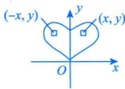

$$
\iint _ { D } f ( x , y ) \mathrm { d } \sigma = \left\{ \begin{aligned} & 2 \iint _ { D _ { 1 } } f ( x , y ) \mathrm { d } \sigma , \quad f ( x , y ) = f ( - x , y ) , \\ & 0 , \quad f ( x , y ) = - f ( - x , y ) , \end{aligned} \right.
$$

其中 $D _ { 1 }$ 是D在y轴右侧的部分.

$\iint_{D} (x - a) \mathrm{d}\sigma$ ，因 $f(x, y) = x - a$ ，而 $f(2a-x,y)=a-x$ ，故 $\iint _ { D \Gamma } ( x - a ) \mathrm { d } \sigma = 0$ DN

注若D关于 $x = a (a \neq 0)$ 对称，(x，y)关于 $x = a$ 的对称点为 $(2a - x, y)$ ，则

相当于将x=0平 $\iint _ { D } f ( x , y ) \mathrm { d } \sigma = \left\{ 2 \iint _ { D _ { 1 } } f ( x , y ) \mathrm { d } \sigma , \quad f ( x , y ) = f ( 2 a - x , y ) , \right.$ 移了a个单位长度

其中 $D_{1}$ 是D在 $x = a$ 右侧的部分.

②若D关于x轴对称，则

$$
\iint _ { D } f ( x , y ) \mathrm { d } \sigma = \left\{ \begin{aligned} & 2 \iint _ { D _ { 1 } } f ( x , y ) \mathrm { d } \sigma , \quad f ( x , y ) = f ( x , - y ) , \\ & 0 , \quad f ( x , y ) = - f ( x , - y ) , \end{aligned} \right.
$$

其中 $D_{1}$ 是D在x轴上侧的部分.

注若D关于 $y = a ( a \neq 0 )$ 对称，(x，y)关于 $y = a$ 的对称点为 $(x, 2a - y)$ ，则

$$
\iint _ { D } f ( x , y ) \mathrm { d } \sigma = \left\{ \begin{aligned} & 2 \iint _ { D _ { 1 } } f ( x , y ) \mathrm { d } \sigma , \quad f ( x , y ) = f ( x , 2 a - y ) , \\ & 0 , \quad f ( x , y ) = - f ( x , 2 a - y ) , \end{aligned} \right.
$$

其中 $D_{1}$ 是D在 $y = a$ 上侧的部分.

关键两点：

①看D关于谁对称；

②将点代入f(x，y)，相等则2倍，相反则为0.

③若D关于原点对称，则

(x，y)关于原点的对称 → $\iint _ { D } f ( x , y ) \mathrm { d } \sigma = \left\{ \begin{aligned} 2 \iint _ { D _ { 1 } } f ( x , y ) \mathrm { d } \sigma , \quad f ( x , y ) = f ( - x , - y ) , \\ 0 , \quad f ( x , y ) = - f ( - x , - y ) , \end{aligned} \right.$ 点为(-x,-y)

其中 $D_{1}$ 是D关于原点对称的半个部分.

④若D关于 $y = x$ 对称，则

x, y对调， $f(x, y) = f(y, x)$

(x,y)关于y=x的

对称点为(y，x)

$$
\iint _ { D } f ( x , y ) \mathrm { d } \sigma = \left\{ \begin{aligned} & 2 \iint _ { D _ { 1 } } f ( x , y ) \mathrm { d } \sigma , \quad f ( x , y ) = f ( y , x ) , \\ & 0 , \quad f ( x , y ) = - f ( y , x ) , \end{aligned} \right.
$$

其中 $D _ { 1 }$ 是D关于y=x对称的半个部分.

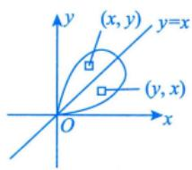

例14.3设 $\iint_{D_{i}} \sqrt[3]{x - y}   dx   dy (i = 1, 2, 3)$ ,其中D1 ={(x, y)|0≤x≤1, 0≤y≤1}， $D_{2}=\left\{\left(x, y\right) \mid 0 \leq\right.$ $x \leqslant 1, \; 0 \leqslant y \leqslant \sqrt{x}$ ,D3 ={(x,y)|0≤x≤1,x²≤y≤1}，则().(A) $J_{1} < J_{2} < J_{3}$ (B) $J_{3} < J_{1} < J_{2}$ (C) $J_{2} < J_{3} < J_{1}$ (D) $J_{2} < J_{1} < J_{3}$

分析）本题先画出每部分的积分区域图，然后研究同一函数在不同区域的积分值的大小.本题是结合对称性和被积函数正负的问题.  
因 $D _ { 1 }$ 关于y=x对称， $f(y,   x) = -f(x,   y)$ ，故 $J_{_1} = 0$   
$D _ { z }$ 不对称，但可以作辅助曲线，创造对称性，对称部分积分为0，另一部分 $f(x, y) \geq 0$ ，故 $J_{_2} > 0$ 同理， $D _ { 3 }$ 也可作辅助曲线，对称部分积分为0，另一部分 $f(x,   y) \leq 0$ ，故 $J_{_3} < 0$

## 解应选(B).

如图 14-5(a) 所示， $D _ { 1 }$ 被直线y=x分成 $D _ { 1 1 }$ 和 $D _ { 1 2 }$ 两部分，故 $\iint_{D_{1}} \sqrt[3]{x - y}   dx   dy = \iint_{D_{11} + D_{12}} \sqrt[3]{x - y}   dx   dy$ ，由于$\sqrt[3]{x - y} = - \sqrt[3]{y - x}$ ，故由普通对称性，有 $\iint_{D_{1}} \sqrt[3]{x - y}   dx   dy = 0$

如图14-5(b)所示，作辅助线 $y = x^{2}$ ，将 $D _ { z }$ 分为 $D _ { 2 1 }$ 和 $D_{22}$ 两部分，由普通对称性知，$\iint_{D_{21}}^{3} \sqrt{x - y}   dx   dy = 0$ .而在 $D_{22}$ 上， $\sqrt[3]{x - y} \geq 0$ ，由保号性知，

$$
\iint_{D_{2}} \sqrt[3]{x - y}   dx   dy = \iint_{D_{22}} \sqrt[3]{x - y}   dx   dy > 0
$$

如图14-5(c)所示，作辅助线 $y = \sqrt{x}$ ，将 $D _ { 3 }$ 分为 $D_{31}$ 和 $D_{32}$ 两部分，由普通对称性知，$\iint_{D_{32}}^{3} \sqrt{x - y}   dx   dy = 0$ .而在 $D_{31}$ 上， $\sqrt[3]{x - y} \leq 0$ ，由保号性知，

$$
\iint_{D_{3}} \sqrt[3]{x - y}   dx   dy = \iint_{D_{31}} \sqrt[3]{x - y}   dx   dy < 0
$$

综上， $J_{3} < J_{1} < J_{2}$

  
(a)

  
(b)  
图 14-5

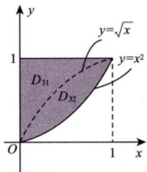  
(c)

公式当D关于y=x对称， $f(x, y) = -f(y, x)$ 时， $\iint_{D} f(x, y) = 0$

(2)轮换对称性（一定是直角坐标系下）.

引例1

将x，y对调后，相等吗？

$$
\iint_{D_{1}:\frac{x^{2}}{4}+\frac{y^{2}}{3}\leq1}\left(2x^{2}+3y^{2}\right)dxdy=\iint_{D_{2}:\frac{y^{2}}{4}+\frac{x^{2}}{3}\leq1}\left(2y^{2}+3x^{2}\right)dydx
$$

解 因为上述两个积分只是将x与y这两个字母对调了，而积分值与用什么字母表示是无关的，故它们是相等的. 相当于字母x变v，字母v变x

引例2

$$
\iint_{D:\frac{x^{2}}{4}+\frac{y^{2}}{4}\leq1}\left(2x^{2}+3y^{2}\right)dxdy=\iint_{D:\frac{x^{2}}{4}+\frac{y^{2}}{4}\leq1}\left(2y^{2}+3x^{2}\right)dydx
$$

解理由如上，它们也是相等的.

引例2中的区域D有个特点，就是当你把x与y对调后，区域D不变（事实上，区域D关于 $y = x$ 对称）.于是抽象化写出的式子为

$$
\iint _ { D } f ( x , y ) \mathrm { d } x \mathrm { d } y = \iint _ { D } f ( y , x ) \mathrm { d } y \mathrm { d } x .
$$

整理一下，我们可以这样来描述：

在直角坐标系下，若把x与 $y$ 对调后，区域D不变（或区域D关于y=x对称），则

$$
\iint_{D} f(x, y) \mathrm{d} \sigma = \iint_{D} f(y, x) \mathrm{d} \sigma , \quad \mathrm{d} \sigma = \mathrm{d} x \mathrm{d} y = \mathrm{d} y \mathrm{d} x
$$

这就是轮换对称性.

轮换对称性的应用： $\iint_{D} f(x, y) \mathrm{d}\sigma \left( \iint_{D} f(y, x) \mathrm{d}\sigma \right)$ 难计算，但 $f(x,   y) + f(y,   x)$ 之和式子简单，如注(1)

例如：当 $D = \left\{ (x, y) \mid x^{2} + y^{2} \leqslant 1, x > 0, y > 0 \right\}$ 时，

$$
\begin{aligned}&\iint_{D}\frac{a\sqrt{f(x)} + b\sqrt{f(y)}}{\sqrt{f(x)} + \sqrt{f(y)}}\mathrm{d}\sigma \\=& \iint_{D}\frac{a\sqrt{f(y)} + b\sqrt{f(x)}}{\sqrt{f(y)} + \sqrt{f(x)}}\mathrm{d}\sigma \\=& \frac{1}{2}\iint_{D}(a + b)\mathrm{d}\sigma \\=& \frac{a + b}{2} \cdot \frac{1}{4} \cdot \pi \cdot 1^{2} . \quad \rightarrow \quad 1^{\frac{1}{4}} 个圆勒面积 .\end{aligned}
$$

$\left\{ \begin{aligned} \textcircled{1} D  关于  y = x \\ \textcircled{2} f(x, y) = f(y) \end{aligned} \right.$ 对称； ①D关于y = x对称；普通对称性 轮换对称性,x)或 $f(x, y) = -f(y, x)$ ②利用 $f(x,   y) + f(y,   x)$ 简化计算.

注(1)在直角坐标系中，若 $f(x, y) + f(y, x) = a$ ，则

$$
I = \frac{1}{2} \iint_{D} \left[ f(x, y) + f(y, x) \right] \mathrm{d}x \mathrm{d}y = \frac{1}{2} \iint_{D} a \mathrm{d}x \mathrm{d}y = \frac{a}{2} S_D .
$$

(2)要注意区分普通对称性中的④与这里轮换对称性的区别与联系.虽然它们都是D关于y=x对称，但普通对称性考查的是f(x，y)与f(y，x)是相等还是相反，轮换对称性考查的是 $f(x, y) + f(y, x)$ 是否简单.事实上，当 $f(x, y) = -f(y, x)$ 时，它们是一回事.

例14.4 设 $f(x)=\iint_{D(x)}\frac{v\ln\sqrt{u^{2}+v^{2}}}{u+v}\mathrm{d}u\mathrm{d}v,\ D(x)=\left\{(u,v)\left|\frac{1}{4}\leqslant u^{2}+v^{2}\leqslant x^{2},u>0,v>0\right.\right\}\left(x>\frac{1}{2}\right)$ ，则$f(x) \; = \; ( 関関関 )$ (A) $\frac{1}{4} \iint_{D(x)} \ln(u^2 + v^2)   du   dv$ (B) $\frac{1}{2}\iint_{D(x)}\ln(u^{2}+v^{2})\mathrm{d}u\mathrm{d}v$ (C) $\iint_{D(x)} \ln(u^2 + v^2)   du   dv$ (D) $2 \iint_{D(x)} \ln(u^2 + v^2)   du   dv$

分析D中u，ν互换位置，D不变，接着看g(u，v)与 $g(\nu, u)$ 的关系既不相等，也不相反，考虑将其加起来，$g(u, v) + g(v, u)$ 计算简单，所以考虑轮换对称性.

应选(A).

由轮换对称性，有

$$
\begin{aligned}f(x) = \iint_{D(x)} \frac{v \ln \sqrt{u^2 + v^2}}{u + v} \mathrm{d}u \mathrm{d}v = \iint_{D(x)} \frac{u \ln \sqrt{u^2 + v^2}}{u + v} \mathrm{d}u \mathrm{d}v \\= \frac{1}{2} \iint_{D(x)} \ln \sqrt{u^2 + v^2} \mathrm{d}u \mathrm{d}v = \frac{1}{4} \iint_{D(x)} \ln(u^2 + v^2) \mathrm{d}u \mathrm{d}v.\end{aligned}
$$

方法总结当D关于y=x对称， $f(x, y) = -f(y, x)$ 或 $f(x,   y) = f(y,   x)$ 时，考虑普通对称性，若不满足，可看 $f(x,   y) + f(y,   x)$ 是否简单，考虑轮换对称性.

## 计算

## 直角坐标系下的计算方法

直角坐标系用平行于坐标系的线切割.

问题：先对x积分，还是对y积分？

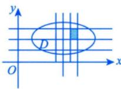

dσ=dxdy直角坐标系下的标志

在直角坐标系下，按照积分次序的不同，一般将二重积分的计算分为两种情况，如图14-6所示.

后积先定限。限内画条线，先交写下限。后交写上限.

  
(a)

  
(b)  
图 14-6

先上下的 后积 再定，的上下限≥下限 型区城的特点是内部平行于y

(1) $\iint _ { D } f ( x , y ) \mathrm { d } \sigma = \int _ { | g | } ^ { b } \mathrm { d } x \int _ { \left| \frac { \varphi _ { 2 } ( x ) } { \varphi _ { 1 } ( x ) } \right| } ^ { \left| \frac { \varphi _ { 2 } ( x ) } { \varphi _ { 1 } ( x ) } \right| } f ( x , y ) \mathrm { d } y$ ，其中D为X型区域： $\varphi_{1}(x) \leqslant y \leqslant \varphi_{2}(x), a \leqslant x \leqslant b$ ，如图 $14-6(a)$ 所示.积分区域是X型区域的后积x，类似还有其他几种（见批注图）.

$$
\iint_{D} f(x, y) \mathrm{d} \sigma = \int_{a}^{c} \mathrm{d} x \int_{\varphi_{1}(x)}^{\varphi_{2}(x)} f(x, y) \mathrm{d} y + \int_{c}^{b} \mathrm{d} x \int_{\varphi_{2}(x)}^{\varphi_{1}(x)} f(x, y) \mathrm{d} y
$$

先定y的 再定x的上下限上下限个后积y注意，这里上限≥下限

Y型区域的特点是：穿过D内部且平行于x 轴的直线与D的边界相交不多于两点

(2) $\iint _ { D } f ( x , y ) \mathrm { d } \sigma = \int _ { \left| c \right| } ^ { d } \mathrm { d } y \int _ { \frac { \phi _ { 2 } ( y ) } { \phi _ { 1 } ( y ) } } ^ { \left| \frac { \phi _ { 2 } ( y ) } { \phi _ { 1 } ( y ) } \right| } f ( x , y ) \mathrm { d } x$ ，其中D为Y型区域： $\psi _ { 1 } ( y ) \leqslant x \leqslant \psi _ { 2 } ( y ) , c \leqslant y \leqslant d$ ，如图14-6(b)所示.积分区域是Y型区域的后积y.→二重积分交换上下限添负号 →二重积分交换上下限添负号

$$
\int_{a}^{b} \mathrm{d}x \int_{\varphi_{1}(x)}^{\varphi_{2}(x)} f(x, y) \mathrm{d}y = \left| - \int_{a}^{b} \mathrm{d}x \int_{\varphi_{2}(x)}^{\varphi_{1}(x)} f(x, y) \mathrm{d}y \right| (a < b, \varphi_{1}(x) > \varphi_{2}(x)).
$$

注(1)有一点需要指出，这里的下限都必须小于等于上限.dx>0，dy>0，dσ>0

(2)若被积函数f(x， y)易于对y积分或积分区域D是X型区域，则选择先y后x的积分次序；  
若被积函数f(x，y)易于对x积分或积分区域D是Y型区域，则选择先x后y的积分次序.

(3)计算二重积分的关键是确定积分限，为此，要画好积分区域D的边界图形，当D的边界图形不易画出时，要写出D的不等式表达式，从而确定上下限. D不易画时，采用分析法

例14.5 设函数f(x，y)连续，则二次积分 $\int _ { \frac { \pi } { 2 } } ^ { \pi } \mathrm { d } x \int _ { \sin x } ^ { 1 } f ( x , y ) \mathrm { d } y = ( \quad )$ (A) $\int_{0}^{1} \mathrm{d}y \int_{\pi + \arcsin y}^{\pi} f(x, y) \mathrm{d}x$ (B) $\int_{0}^{1} \mathrm{d}y \int_{\pi - \arcsin y}^{\pi} f(x, y) \mathrm{d}x$ (C) $\int_{0}^{1} \mathrm{d}y \int_{\frac{\pi}{2}}^{\pi + \arcsin y} f(x, y) \mathrm{d}x$ (D) $\int_{0}^{1} \mathrm{d}y \int_{\frac{\pi}{2}}^{\pi - \arcsin y} f(x, y) \mathrm{d}x.$

分析题干是后积x，选项是后积y，可知本题考虑的是交换积分顺序，应先确定积分区域，然后先积x，后积y，写成累次积分的形式.后积y，先定限，下限为0，上限为1，再定x的限，限内画平行于x轴的直线，当$\frac{\pi}{2} < x \leq \pi$ 时， $x = \pi - \arcsin y$ ，所以下限为 $x = \pi - \arcsin y$ ，上限为x=π.

根据所给二次积分得到积分区域为D： $\left\{ \begin{aligned} \sin x < y < 1, \\ \frac{\pi}{2} < x < \pi, \end{aligned} \right.$ 如图14-7所示，则

$$
\int _ { \frac { \pi } { 2 } } ^ { \pi } \mathrm { d } x \int _ { \sin x } ^ { 1 } f ( x , y ) \mathrm { d } y = \int _ { 0 } ^ { 1 } \mathrm { d } y \int _ { \frac { \pi - \arcsin y } { 2 } } ^ { \pi } f ( x , y ) \mathrm { d } x.
$$

图 14-7

由例1.12得，当 $\frac{\pi}{2} < x \leq \frac{3}{2}\pi$ 时， $x = \pi - \arcsin y$

方法总结）交换积分顺序的题目，应先确定积分区域，然后交换积分顺序写成相应的累次积分.

$$
\frac{\int_{\frac{\pi}{2}}^{\pi}\mathrm{d}x\int_{1}^{\sin x}f(x, y)\mathrm{d}y}{\int_{\frac{\pi}{2}}^{\pi}\mathrm{d}x\int_{1}^{\sin x}f(x, y)\mathrm{d}y} \quad \sin x < 1 \quad ( 不是二重积分,仅是累次积分布式) \\ = -\frac{\int_{\frac{\pi}{2}}^{\pi}\mathrm{d}x\int_{1}^{\sin x}f(x, y)\mathrm{d}y}{\int_{\frac{\pi}{2}}^{\pi}\mathrm{d}x\int_{1}^{\sin x}f(x, y)\mathrm{d}y} \quad . \quad 二重积分
$$

例14.6当 $x \to 0 ^ { + }$ 时， $f(x) = \int_{0}^{x^{2}} \mathrm{d}y \int_{x}^{\sqrt{y}} \sin \frac{y}{t} \mathrm{d}t$ 与 $g(x) = ax^b$ 是等价无穷小量，则 ab =

分析 $\sin { \frac { y } { x } }$ 若对x积分，则没有初等函数形式的原函数表达，若对y积分，可用初等函数形式表示，所以先积y后积x，本题属于交换积分顺序的题目.

又因为 $0 \leqslant y \leqslant x^{2}$ ，所以 $\sqrt { y }   \leqslant   x$ ，故 $\int_{0}^{x^{2}}\mathrm{d}y\int_{x}^{\sqrt{y}}\sin\frac{y}{t}$ dt先添一个负号变为 $-\int_{0}^{x^{2}}\mathrm{d}y\int_{\sqrt{y}}^{x}\sin\frac{y}{t}\mathrm{d}t$ ，变为二重积分后，画出积分区域图，再交换积分顺序.

解应填 $-\frac{1}{2}$

交换上下限，保证上限大于等于下限

$$
\begin{aligned}f(x) = & \int_{0}^{x^{2}} \mathrm{d}y \int_{\left| \frac{y}{x} \right|}^{\sqrt{y}} \sin \frac{y}{t} \mathrm{d}t = - \int_{0}^{x^{2}} \mathrm{d}y \int_{\left| \frac{y}{x} \right|}^{\sqrt{x}} \sin \frac{y}{t} \mathrm{d}t \\= & - \iint_{D} \sin \frac{y}{t} \mathrm{d}\sigma = - \int_{0}^{x} \mathrm{d}t \int_{0}^{t^{2}} \sin \frac{y}{t} \mathrm{d}y \\= & \int_{0}^{x} t \cdot \left( \cos \frac{y}{t} \right) \Bigg|_{\left| \frac{y = 0}{t} \right|}^{\sqrt{y = t^{2}}} \mathrm{d}t \Bigg|_{\left| \frac{y = 0}{t} \right|}^{\sqrt{x}} \mathrm{d}t \Bigg|_{\left| \frac{y = 0}{t} \right|}^{\sqrt{x}} \mathrm{d}t \Bigg|_{\left| \frac{y = 0}{t} \right|}^{\sqrt{x}} \mathrm{d}t \Bigg|_{\left| \frac{y = 0}{t} \right|}^{\sqrt{x}}\end{aligned}
$$

于是 $\lim_{x \to 0^{+}} \frac{f(x)}{g(x)} = \lim_{x \to 0^{+}} \frac{\frac{2}{x}(\cos x - 1)}{abx^{b - 1}} = \lim_{x \to 0^{+}} \frac{- \frac{1}{2}x^{3}}{abx^{b - 1}} = 1$ ，故 $ab = -\frac{1}{2}$

注(1) $\frac{\sin x}{x}, \frac{\cos x}{x}, \frac{\ln(1 + x)}{x}, \frac{1}{\ln x}, \sin x^{2}, \cos x^{2}, \sin \frac{1}{x}, \cos \frac{1}{x}, \frac{\tan x}{x}, \frac{e^{x}}{x}, \tan x^{2}, e^{\ln^{2}+\ln x}(a \neq 0)$ 均没有初等函数形式的原函数，见到它们，一般都要交换积分次序，避免先对x求积分.

(2)事实上， $a = - \frac{1}{8},   b = 4.$

方法总结当累次积分无法积分，即没有初等函数形式的原函数表达式时，可考虑交换积分顺序.

公式 $\int \sin \frac{y}{t}   dy = -t \cos \frac{y}{t} + C$

当 $x \to 0 ^ { + }$ 时， $f(x) \sim g(x)$ ，则 $\int_{0}^{x} f(t) \mathrm{d}t \sim \int_{0}^{x} g(t) \mathrm{d}t$ .(可用洛必达法则证明)

例14.7 计算 $\int_{0}^{1} \mathrm{d}y \int_{y}^{1} \arcsin \sqrt{4x - 4x^{2}} \mathrm{d}x$

分析被积函数只含有x，而且先对x积分较困难，所以考虑交换积分顺序.

解先对x积分较困难，交换积分次序.

$$
\int_{0}^{1} \mathrm{d}x \int_{0}^{x} \arcsin \sqrt{4x - 4x^2} \mathrm{d}y = \int_{0}^{1} \arcsin \sqrt{4x - 4x^2} \mathrm{d}x = \frac{1}{2}
$$

方法总结 $\int_{c}^{d} \mathrm{d}y \int_{x_{1}(y)}^{x_{2}(y)} f(x) \mathrm{d}x$ 对x积分比较困难时，可转化为先积y，即 $\int_{a}^{b} \mathrm{d}x \int_{y_{1}(x)}^{y_{2}(x)} f(x) \mathrm{d}y$

@公式 $\int_{0}^{1} \arcsin \sqrt{1 - x^{2}}   dx = 1 , \quad \int_{0}^{1} x \arcsin \sqrt{4x - 4x^{2}}   dx = \frac{1}{2}$

## 2极坐标系下的计算方法

因为是中心对称图像，一般先积r，后积θ

极坐标系：与中心对称图像有关！

直角坐标与极坐标关系 $\left\{ \begin{aligned} x = r \cos \theta, \\ y = r \sin \theta. \end{aligned} \right.$ →转换桥梁

$$
r = r _ { 0 } , \theta = \theta _ { 0 }
$$

则有 $\mathrm{d}\sigma = \mathrm{d}r \cdot r\mathrm{d}\theta = r\mathrm{d}r\mathrm{d}\theta$ 近似看成矩形.

(r, θ)

在极坐标系下，按照积分区域与极点位置关系的不同，一般将二重积分的计算分为三种情况，如图14-8所示.

  
(a)

  
(b)

  
图 14-8  
(c)

从Ox轴逆时针出发，先碰到积分区域时，记 $\theta = \alpha$ ，后离开区域时，记 $\theta = \beta$ ，所以θ的下限为 $\alpha$ ，上限为 $\beta$ ，然后限内画条线，先交内曲线记 $\boldsymbol { r } = \boldsymbol { r } _ { 1 } ( \boldsymbol { \theta } )$ ，然后交外曲线 $r = r_{2}(\theta)$

(1) $\iint _ { D } f ( x , y ) \mathrm { d } \sigma = \int _ { \alpha } ^ { \beta } \mathrm { d } \theta \int _ { r _ { 1 } ( \theta ) } ^ { r _ { 2 } ( \theta ) } f ( r \cos \theta , r \sin \theta ) r \mathrm { d } r$ (极点O在区域D外部);

(2) $\iint _ { D } f ( x , y ) \mathrm { d } \sigma = \int _ { \alpha } ^ { \beta } \mathrm { d } \theta \int _ { 0 } ^ { r ( \theta ) } f ( r \cos \theta , r \sin \theta ) r \mathrm { d } r$ (极点O在区域D边界上);

(3) $\iint _ { D } f ( x , y ) \mathrm { d } \sigma = \int _ { 0 } ^ { 2 \pi } \mathrm { d } \theta \int _ { 0 } ^ { r ( \theta ) } f ( r \cos \theta , r \sin \theta ) r \mathrm { d } r$ (极点O在区域D内部)

注极坐标系与直角坐标系选择的一般原则.

一般来说，给出一个二重积分 是否用极坐标系计算主要看①.

①看被积函数是否为 $f(x^{2}+y^{2}),f\left(\frac{y}{x}\right),f\left(\frac{x}{y}\right)$ 等形式；

②看积分区域是否为圆或者圆的一部分.

如果①，②至少满足其中之一，那么优先选用极坐标系，否则，就优先考虑直角坐标系.

例14.8 设区域 $D=\left\{ (x, y) \mid x^{2}+y^{2} \leq \sqrt{2} \right\}$ ，则 $\iint_{D} \left( x^{2} + \frac{y^{2}}{2} \right) \mathrm{d}x\mathrm{d}y$ =

分析积分区域是圆，但被积函数不是平方和，这里注意到x与y互换时，积分区域D不变，说明D关于$y = x$ 对称，此时考虑轮换对称性，最后在极坐标系下计算此二重积分

解应填 $\frac{3\pi}{4}$

$$
\begin{aligned}\iint_{D} \left( x^{2} + \frac{y^{2}}{2} \right) \mathrm{d}x\mathrm{d}y = \iint_{D} \left( y^{2} + \frac{x^{2}}{2} \right) \mathrm{d}x\mathrm{d}y = \frac{1}{2} \left( 1 + \frac{1}{2} \right) \iint_{D} \left( x^{2} + y^{2} \right) \mathrm{d}x\mathrm{d}y \\= \frac{1}{2} \left( 1 + \frac{1}{2} \right) \int_{0}^{2\pi} \mathrm{d}\theta \int_{0}^{\frac{\pi}{2}} \left( r^{2} \cos^{2} \theta + r^{2} \sin^{2} \theta \right) r \mathrm{d}r = \frac{3\pi}{4}\end{aligned}
$$

方法总结积分区域D关于y=x对称，考虑轮换对称性，即利用 $\iint _ { D } f ( x , y ) \mathrm { d } \sigma = \frac { 1 } { 2 } \iint _ { D } \left[ f ( x , y ) + f ( y , x ) \right] \mathrm { d } \sigma$ ★★★二重积分复习标杆

例14.9 设平面有界区域D位于第一象限，由曲线 $x^{2}+y^{2}-xy=1, x^{2}+y^{2}-xy=2$ 与直线 $y =$ $\sqrt{3}x, y = 0$ 围成，计算 $\iint_{D} \frac{1}{3x^{2} + y^{2}}   dx   dy$

分析对于 $x^{2}+y^{2}-xy=1 , \quad x^{2}+y^{2}-xy=2$ ，将x，y互换，式子不变，所以图像关于y=x对称，根据一些特殊的点及 $y^{\prime}(0)=\frac{1}{2}>0\ , y^{\prime}(1)=-1<0$ 确定单调性，最后将积分区域草图确定下来，根据积分区域来确定θ，而且曲线含有 $x^{2} + y^{2}$ ，被积函数分母有平方，则考虑极坐标系下计算.

在考试时，有些D的边界图形不易画出，考生可根据D的表达式来确定上下限.

解由 $x^{2}+y^{2}-xy=1$ ，得 $r^{2}-r^{2}\sin\theta\cos\theta=1$ ，故 $r = \sqrt{\frac{1}{1 - \cos \theta \sin \theta}}$ ；由 $x^{2}+y^{2}-xy=2$ 得$r^{2}-r^{2}\sin\theta\cos\theta=2$ ，故 $r = \sqrt{\frac{2}{1 - \cos \theta \sin \theta}}$ .又 $y = \sqrt{3}x$ ，得 $r \sin \theta = \sqrt{3} r \cos \theta$ ，有 $\tan \theta = \sqrt{3}$ ，则 $\theta = \frac{\pi}{3}$

$$
\int \frac{\mathrm{d}x}{a^{2} + x^{2}} = \frac{1}{a} \arctan \frac{x}{a} + C(a > 0) \quad \leq \quad \frac{\int_{0}^{\frac{\pi}{3}} \mathrm{d}\theta}{\frac{1}{a}} \int_{\frac{1}{\sqrt{1 - \cos^{2}\theta}}}^{\frac{1}{\sqrt{1 - \cos^{2}\theta}}} \frac{1}{\frac{1}{a^{2}}} \mathrm{d}\theta \quad \leq \quad \frac{\int_{0}^{\frac{1}{\sqrt{1 - \cos^{2}\theta}}}}{\frac{1}{\sqrt{1 - \sin^{2}\theta}}} \cdot \frac{1}{\frac{1}{a^{2}}} \int_{\frac{1}{\sqrt{1 - \sin^{2}\theta}}}^{\frac{1}{\sqrt{1 - \cos^{2}\theta}}} \frac{1}{\frac{1}{a^{2}}} \mathrm{d}\theta \quad \leq \quad \frac{\int_{0}^{\frac{1}{\sqrt{1 - \cos^{2}\theta}}}}{\frac{1}{\sqrt{1 - \sin^{2}\theta}}} \cdot \frac{1}{\frac{1}{a^{2}}} \int_{\frac{1}{\sqrt{1 - \sin^{2}\theta}}}^{\frac{1}{\sqrt{1 - \cos^{2}\theta}}} \frac{1}{\frac{1}{a^{2}}} \mathrm{d}\theta \quad \leq \quad \frac{\int_{0}^{\frac{1}{\sqrt{1 - \cos^{2}\theta}}}}{\frac{1}{\sqrt{1 - \sin^{2}\theta}}} \cdot \frac{1}{\frac{1}{a^{2}}} \int_{\frac{1}{\sqrt{1 - \sin^{2}\theta}}}^{\frac{1}{\sqrt{1 - \sin^{2}\theta}}} \frac{1}{\frac{1}{a^{2}}} \mathrm{d}\theta \quad \leq \quad \frac{\int_{0}^{\frac{1}{\sqrt{1 - \cos^{2}\theta}}}}{\frac{1}{\sqrt{1 - \sin^{2}\theta}}} \cdot \frac{1}{\frac{1}{a^{2}}} \int_{\frac{1}{\sqrt{1 - \sin^{2}\theta}}}^{\frac{1}{\sqrt{1 - \sin^{2}\theta}}} \frac{1}{\frac{1}{a^{2}}} \mathrm{d}\theta \quad \leq \quad \frac{\int_{0}^{\frac{1}{\sqrt{1 - \cos^{2}\theta}}}}{\frac{1}{\sqrt{1 - \sin^{2}\theta}}} \cdot \frac{1}{\frac{1}{a^{2}}} \int_{\frac{1}{\sqrt{1 - \sin^{2}\theta}}}^{\frac{1}{\sqrt{1 - \sin^{2}\theta}}} \frac{1}{\frac{1}{a^{2}}} \mathrm{d}\theta \quad \leq \quad \frac{\int_{0}^{\frac{1}{\sqrt{1 - \sin^{2}\theta}}}}{\frac{1}{\sqrt{1 - \sin^{2}\theta}}} \cdot \frac{1}{\frac{1}{a^{2}}} \int_{\frac{1}{\sqrt{1 - \sin^{2}\theta}}}^{\frac{1}{\sqrt{1 - \sin^{2}\theta}}} \frac{1}{\frac{1}{a^{2}}} \mathrm{d}\theta \quad \leq \quad \frac{1}{a^{2}} \int_{0}^{\frac{1}{\sqrt{1 - \sin^{2}\theta}}} \frac{1}{\sqrt{1 - \sin^{2}\theta}} \cdot \frac{1}{a^{2}} \mathrm{d}\theta \quad \leq \quad \frac{1}{a^{2}} \int_{0}^{\frac{1}{\sqrt{1 - \sin^{2}\theta}}} \frac{1}{\sqrt{1 - \sin^{2}\theta}} \mathrm{d}\theta \quad \leq \quad \frac{1}{a^{2}} \int_{0}^{\frac{1}{\sqrt{1 - \sin^{2}\theta}}} \frac{1}{\sqrt{1 - \sin^{2}\theta}} \mathrm{d}\theta \quad
$$

注本题有两个办法画出D的边界图形.

第一，描点法.显然， $x^{2}+y^{2}-xy=1$ 与 $x^{2} + y^{2} - xy = 2$ 分别与x轴、y轴和 $y = x$ 交于(1, 0) 与$(\sqrt{2}, 0), (0, 1)$ 与 $(0,\sqrt{2})$ ，(1,1)与 $(\sqrt{2}, \sqrt{2})$ ，将这些点连起来即可得到其大致图形

第二，事实上， $x^{2}+y^{2}-xy=\left [ x \right ]$ $\left[ \begin{array}{cc}1 & -\dfrac{1}{2} \\-\dfrac{1}{2} & 1\end{array} \right] \left[ \begin{array}{l}x \\y\end{array} \right]$ 其二次型矩阵为 $\boldsymbol{A} = \begin{bmatrix} 1 & -\dfrac{1}{2} \\ -\dfrac{1}{2} & 1 \end{bmatrix}$ $| \lambda \boldsymbol{E} - \boldsymbol{A} | =$ 学完线性代数分册  
再看此处  
$\left| \begin{matrix} \lambda { - } 1 & \dfrac{1}{2} \\ \dfrac{1}{2} & \lambda { - } 1 \end{matrix} \right| = 0$ 得 $\lambda_{1} = \frac{1}{2}, \lambda_{2} = \frac{3}{2}$ (或用配方法 $x^{2}+y^{2}-xy=\left(x-\frac{1}{2}y\right)^{2}+\frac{3}{4}y^{2}$ 故 $x^{2}+y^{2}-xy$ 可经正交变换化为 $\frac{1}{2}y_{1}^{2}+\frac{3}{2}y_{2}^{2}$ 于是 $\frac{1}{2}y_{1}^{2}+\frac{3}{2}y_{2}^{2}=1$ 与 $\frac{1}{2}y_{1}^{2}+\frac{3}{2}y_{2}^{2}=2$ 均为椭圆，即可画出图形.

方法总结当积分区域给出的不是常见曲线时，可考虑描点法画积分区域图.

$$
\int \frac{1}{3\cos^{2}\theta + \sin^{2}\theta}\mathrm{d}\theta = \int \frac{\mathrm{d}(\tan\theta)}{3 + \tan^{2}\theta} = \frac{1}{\sqrt{3}}\arctan\frac{\tan\theta}{\sqrt{3}} + C
$$

例14.10 设 $f(x)=\iint_{D(x)}\frac{\nu\ln\sqrt{u^{2}+\nu^{2}}}{u+\nu}\mathrm{d}u\mathrm{d}\nu,D(x)=\left\{(u,\nu)\left|\frac{1}{4}\leqslant u^{2}+\nu^{2}\leqslant x^{2}\right.,u>0,\nu>0\right\}$ ,求曲线 $y ( x ) =$ $\int_{1}^{x} f(t) \mathrm{d}t \left( x > \frac{1}{2} \right)$ 的拐点.

分析积分区域关于y=x对称，同时观察被积函数的特点，所以考虑轮换对称性.又因为积分区域是 $\frac{1}{4}$ 个圆环，且被积函数含有平方和，所以考虑极坐标计算

因为本题最终求的是y(x)的二阶导数，即f(x)的一阶导数，所以不必要真正计算出二重积分，只转化为变限积分即可.

解由轮换对称性，根据例14.4知，有

$$
\begin{aligned}f(x) = & \frac{1}{4}\iint_{D(x)}\ln(u^{2} + v^{2})\mathrm{d}u\mathrm{d}v \\= & \frac{1}{4}\int_{0}^{\frac{\pi}{2}}\mathrm{d}\theta\int_{\frac{1}{2}}^{x}\ln r^{2} \cdot r\mathrm{d}r \\= & \frac{\pi}{4}\int_{\frac{1}{2}}^{x}r\ln r\mathrm{d}r,\end{aligned}
$$

故 $y^{\prime}(x) = f(x), \quad y^{\prime\prime}(x) = f^{\prime}(x) = \frac{\pi}{4}x\ln x \xlongequal{令} 0.$ ，得x=1.当 $\frac{1}{2} < x < 1$ 时， $y''(x) < 0$ ，当 $x > 1$ 时， $y''(x) > 0$ 于是(1,0)为y(x)的拐点.

方法总结积分区域D关于y=x对称，考虑轮换对称性，即利用 $\iint _ { D } f ( x , y ) \mathrm { d } \sigma = \frac { 1 } { 2 } \iint _ { D } \left[ f ( x , y ) + f ( y , x ) \right] \mathrm { d } \sigma$

$$
\int_{0}^{+\infty} \mathrm{e}^{-x^2}   dx
$$

分析因为 $\mathrm{e}^{ax^{2}+bx+c}(a \neq 0)$ 没有初等函数形式下的原函数，积分与字母无关，所以 $I = \int_{0}^{+ \infty} \mathrm{e}^{- x^{2}} \mathrm{d}x = \int_{0}^{+ \infty} \mathrm{e}^{- y^{2}} \mathrm{d}y$ 又因为 $\iint_{D} \mathrm{e}^{-(x^2 + y^2)}   d\sigma$ 易计算，所以计算 $I ^ { 2 }$ . 根据被积函数为 $x^{2} + y^{2}$ 的表达式，选择极坐标计算，将第一象限看成广义的 $\frac{1}{4}$ 个圆，其半径 $r   \rightarrow   + \infty$

解设 $I = \int_{0}^{+ \infty} \mathrm{e}^{- x^{2}} \mathrm{d}x$ ，则简化版解法

$$
\begin{aligned}I^{2} = & \int_{0}^{+ \infty}\mathrm{e}^{- x^{2}}\mathrm{d}x \cdot \int_{0}^{+ \infty}\mathrm{e}^{- x^{2}}\mathrm{d}x = \int_{0}^{+ \infty}\mathrm{e}^{- x^{2}}\mathrm{d}x \cdot \int_{0}^{+ \infty}\mathrm{e}^{- y^{2}}\mathrm{d}y \\= & \int_{0}^{+ \infty}\mathrm{d}x\int_{0}^{+ \infty}\mathrm{e}^{- (x^{2} + y^{2})}\mathrm{d}y = \iint_{0 \leq x < + \infty \atop 0 \leq y < + \infty}\mathrm{e}^{- (x^{2} + y^{2})}\mathrm{d}x\mathrm{d}y \\= & \int_{0}^{\frac{\pi}{2}}\mathrm{d}\theta \cdot \int_{0}^{+ \infty}\mathrm{e}^{- r^{2}}\mathrm{d}r = \frac{\pi}{2} \cdot \left( - \frac{1}{2} \right)\int_{0}^{+ \infty}\mathrm{e}^{- r^{2}}\mathrm{d}( - r^{2}) \\= & - \frac{\pi}{4}\mathrm{e}^{- r^{2}}\bigg|_{0}^{+ \infty} = \frac{\pi}{4},\end{aligned}
$$

$\int_{-\infty}^{+\infty} \mathrm{e}^{-x^2}   dx = \sqrt{\pi}$ ，这叫高斯积分，如同欧拉公式 $\mathrm{e}^{\pi \mathrm{i}} + 1 = 0$ 样美妙.它们都同时包含e，π

由积分的保号性知 $I > 0$ ，故 $I = \int_{0}^{+ \infty} \mathrm{e}^{- x^{2}} \mathrm{d}x = \frac{\sqrt{\pi}}{2}$

注应记住这一结果，它经常被用到，如例14.12.

方法总结积分与字母用谁无关！

$$
\iint _ { D _ { y y } } f ( x , y ) \mathrm { d } x \mathrm { d } y = \iint _ { D _ { y x } } f ( y , x ) \mathrm { d } y \mathrm { d } x , \int _ { a } ^ { b } f ( x ) \mathrm { d } x = \int _ { a } ^ { b } f ( t ) \mathrm { d } t .
$$

公式 $\int \mathrm{e}^{-x} \mathrm{d}x = -\mathrm{e}^{-x} + C$

例14.12 计算 $\int_{-\infty}^{+\infty} x^2 \mathrm{e}^{-x^2}   dx$

分析 被积函数为偶函数，因为 $\int_{-\infty}^{+\infty} x^2 \mathrm{e}^{-x^2}   dx$ 收敛，所以可以用对称性处理，然后借助Γ函数计算结果.

解 $\int_{-\infty}^{+\infty} x^2 \mathrm{e}^{-x^2}   dx = 2\int_{0}^{+\infty} x^2 \mathrm{e}^{-x^2}   dx$ ，又由例9.28知， $2\int_{0}^{+\infty} x^{2}e^{-x^{2}} \mathrm{d}x = 2\int_{0}^{+\infty} x^{2}e^{-x^{2}} \mathrm{d}x = \Gamma\left(\frac{3}{2}\right) = \frac{1}{2} \cdot \Gamma\left(\frac{1}{2}\right) =$ $\frac{\sqrt{\pi}}{2}$ .故 $\int_{-\infty}^{+\infty} x^2 \mathrm{e}^{-x^2}  \mathrm{d}x = \frac{\sqrt{\pi}}{2}$

注本题若不用Γ函数，对于 $\int_{0}^{+\infty} x^{2} \mathrm{e}^{-x^{2}} \mathrm{d}x$ ，要这样算：

$$
\begin{aligned}\int_{0}^{+\infty} x^{2} \mathrm{e}^{-x^{2}} \mathrm{d}x = & \int_{0}^{+\infty} \left(-\frac{1}{2}\right) x \mathrm{e}^{-x^{2}} \mathrm{d}(-x^{2}) = \int_{0}^{+\infty} \left(-\frac{1}{2}\right) x \mathrm{d}(\mathrm{e}^{-x^{2}}) \\= & -\frac{1}{2} x \mathrm{e}^{-x^{2}} \bigg|_{0}^{+\infty} - \int_{0}^{+\infty} \left(-\frac{1}{2}\right) \mathrm{e}^{-x^{2}} \mathrm{d}x \\= & 0 + \frac{1}{2} \int_{0}^{+\infty} \mathrm{e}^{-x^{2}} \mathrm{d}x = \frac{\sqrt{\pi}}{4},\end{aligned}
$$

故 $\int_{-\infty}^{+\infty} x^2 \mathrm{e}^{-x^2}  \mathrm{d}x = \frac{\sqrt{\pi}}{2}$ 显然，这是相对麻烦的

方法总结 Γ函数的相关结论要牢记： $\Gamma(\alpha) = \int_{0}^{+\infty} x^{\alpha-1} \mathrm{e}^{-x}   dx$ $\Gamma ( \alpha + 1 ) = \alpha \Gamma ( \alpha )$

例14.13 已知 $\lim_{x \to +\infty} \frac{\int_{0}^{x} t^2 \mathrm{e}^{x^2 - t^2}   dt + a \mathrm{e}^{x^2}}{x^b} = -\frac{1}{2}$ ，求 $a , b$ 的值.

分析一开始，可能看不出是什么类型的未定式，作恒等变形(分子分母同时除以 $\mathrm{e}^{x^{2}} \; )$ 再看.

解

$$
\lim_{x \to +\infty} \frac{\int_{0}^{x} t^2 e^{-t^2}   dt + a}{x^b e^{-x^2}} = -\frac{1}{2}
$$

此时不论b取何值， $\lim_{x \to +\infty} x^b \mathrm{e}^{-x^2} = 0$ ，即判定为 $ \text{" }\frac{0}{0} \text{" }$ 型(事实上，变形前为 $ \text{" }\frac{\infty}{\infty} \text{" }$ 型).

故

$$
\lim _ { x \rightarrow + \infty } \left( \int _ { 0 } ^ { x } t ^ { 2 } \mathrm { e } ^ { - t ^ { 2 } } \mathrm { d } t + a \right) = 0 ,
$$

于是

$$
a = - \int_{0}^{+ \infty} t^{2} e^{- t^{2}} \mathrm{d}t = - \frac{\sqrt{\pi}}{4}
$$

则

$$
\begin{aligned}\lim_{x \rightarrow +\infty} \frac{\int_{0}^{x} t^{2} \mathrm{e}^{-t^{2}} \mathrm{d}t - \frac{\sqrt{\pi}}{4}}{x^{b} \mathrm{e}^{-x^{2}}} & \xlongequal{洛必达法则} \lim_{x \rightarrow +\infty} \frac{x^{2} \mathrm{e}^{-x^{2}}}{bx^{b-1} \mathrm{e}^{-x^{2}} + x^{b} \mathrm{e}^{-x^{2}}(-2x)} \\= \lim_{x \rightarrow +\infty} \frac{x^{2}}{bx^{b-1} - 2x^{b+1}} & = -\frac{1}{2},\end{aligned}
$$

故b=1.

方法总结当分母→0时，若分式的极限不为0，则可知分子→0.

$$
\lim_{x \to +\infty} \frac{e^{x^2}}{\int_{0}^{x} \left( \left| \int_{0}^{x} t^2 e^{-t^2}   dt \right| + a \right)} = \infty
$$

无穷大 常数常数

公式 $\int_{0}^{+\infty} t^{2} \mathrm{e}^{-t^{2}} \mathrm{d}t = \frac{\sqrt{\pi}}{4}$

## ③极坐标系与直角坐标系的互相转化

一是用好 $\begin{cases}x = r \cos \theta, \\y = r \sin \theta\end{cases}$ 这个公式；二是画出区域D的边界图形，做好上限、下限的转化

例14.14 $\int_{0}^{1} \mathrm{d}x \int_{1 - x}^{\sqrt{1 - x^{2}}} \frac{x + y}{x^{2} + y^{2}} \mathrm{d}y$ =

分析本题乍一看，也许我们会先考虑题目是否在积分次序上设置了障碍，是否需要交换积分次序再做积分，但是，细致做来，我们会发现不管是先对x积分，还是先对y积分，都不容易计算.看来这不是积分次序上的问题，这时想想看是不是选择何种坐标系的问题呢？被积函数中含有 $x^{2} + y^{2}$ 的形式，且积分区域是圆的一部分，如图14-9所示，显然应该优先考虑极坐标系，题目给出的却是直角坐标系，我们需要改变一下.

  
图 14-9

即使发现区域D关于y=x对称，使用轮换对称性 $f(x,   y) + f(y,   x)$ 的等式仍复杂，所以不用轮换对称性，只需要放在极坐标下计算即可.

应填 $2 - \frac{\pi}{2}$

$$
\begin{aligned}\int_{0}^{\frac{\pi}{2}}\mathrm{d}\theta\int_{\frac{1}{\cos\theta+\sin\theta}}^{1}\frac{r\cos\theta+\sin\theta}{r^{2}}r\mathrm{d}r&\overset{ 由  x+y=1  得  r\cos\theta+r\sin\theta=1}{=}\frac{1}{\cos\theta+\sin\theta}\cdot\frac{1}{\cos\theta+\sin\theta}\cdot\frac{1}{\cos\theta+\sin\theta}\cdot\frac{1}{\cos\theta+\sin\theta}\cdot\frac{1}{\cos\theta+\sin\theta}\cdot\frac{1}{\cos\theta+\sin\theta}\cdot\frac{1}{\cos\theta+\sin\theta}\cdot\frac{1}{\cos\theta+\sin\theta}\cdot\frac{1}{\cos\theta+\sin\theta}\cdot\frac{1}{\cos\theta+\sin\theta}\cdot\frac{1}{\cos\theta+\sin\theta}\cdot\frac{1}{\cos\theta+\sin\theta}\cdot\frac{1}{\cos\theta+\sin\theta}\cdot\frac{1}{\cos\theta+\sin\theta}\cdot\frac{1}{\cos\theta+\sin\theta}\cdot\frac{1}{\cos\theta+\sin\theta}\cdot\frac{1}{\cos\theta+\sin\theta}\cdot\frac{1}{\cos\theta+\sin\theta}\cdot\frac{1}{\cos\theta}\cdot\frac{1}{\cos\theta+\sin\theta}\cdot\frac{1}{\cos\theta}\cdot\frac{1}{\cos\theta+\sin\theta}\cdot\frac{1}{\cos\theta}\cdot\frac{1}{\cos\theta+\sin\theta}\cdot\frac{1}{\cos\theta}\cdot\frac{1}{\cos\theta}\cdot\frac{1}{\cos\theta}\cdot\frac{1}{\cos\theta}\cdot\frac{1}{\cos\theta}\cdot\frac{1}{\cos\theta}\cdot\frac{1}{\cos\theta}\cdot\frac{1}{\cos\theta}\cdot\frac{1}{\cos\theta}\cdot\frac{1}{\cos\theta}\cdot\frac{1}{\cos\theta}\cdot\frac{1}{\cos\theta}\cdot\frac{1}{\cos\theta}\cdot\frac{1}{\cos\theta}\cdot\frac{1}{\cos\theta}\cdot\frac{1}{\cos\theta}\cdot\frac{1}{\cos\theta}\cdot\frac{1}{\cos\theta}\cdot\frac{1}{\cos\theta}\cdot\frac{1}{\cos\theta}\cdot\frac{1}{\cos\theta}\cdot\frac{1}{\cos\theta}\cdot\frac{1}{\cos\theta}\cdot\frac{1}{\cos\theta}\cdot\frac{1}{\cos\theta}\cdot\frac{1}{\cos\theta}\cdot\frac{1}{\cos\theta}\cdot\frac{1}{\cos\theta}\cdot\frac{1}{\cos\theta}\cdot\frac{1}{\cos\theta}\cdot\frac{1}{\cos\theta}\cdot\frac{1}{\cos\theta}\cdot\frac{1}{\cos\theta}\cdot\frac{1}{\cos\theta}\cdot\frac{1}{\cos\theta}\cdot\frac{1}{\cos\theta}\cdot\frac{1}{\cos\theta}\cdot\frac{1}{\cos\theta}\cdot\frac{1}{\cos\theta}\cdot\frac{1}{\cos\theta}\cdot\frac{1}{\cos\theta}\cdot\frac{1}{\cos\cos\theta}\cdot\frac{1}{\cos\theta}\cdot\frac{1}{\cos\cos\theta}\cdot\frac{1}{\cos\theta}\cdot\frac{1}{\cos\cos\theta}\cdot\frac{1}{\cos\cos\theta}\cdot\frac{1}{\cos\cos\theta}\cdot\frac{1}{\cos\cos\theta}{\cos\theta}\cdot\frac{1}{\cos\cos\theta}\cdot\frac{1}{\cos\cos\theta}\cdot\frac{1}{\cos\cos\theta}{\cos\cos\theta}\cdot\frac{1}{\cos\cos\theta}\cdot\frac{1}{\cos\cos\theta}{\cos\cos\theta}\cdot\frac{1}{\cos\cos\cos\theta}{\cos\cos\theta}\cdot\frac{1}{\cos\cos\cos\theta}{\cos\cos\theta}\cdot\frac{1}{\cos\cos\cos\theta}{\cos\cos\theta}\cdot\frac{1}{\cos\cos\cos\theta}{\cos\cos\theta}\cdot\frac{1}{\cos\cos\cos\theta}{\cos\cos\cos\theta}\cdot\frac{1}{\cos\cos\cos\theta}{\cos\cos\cos\theta}{\cos\cos\theta}\cdot\frac{1}{\cos\cos\cos\cos\theta}{\cos\cos\theta}\cos\cos\frac{1}{\cos\cos\cos\theta}{\cos\cos\cos\theta}{\cos\cos\cos\theta}\cos\cos\theta}\cdot\cdot\frac{1}{\cos\cos\cos\cos\cos\ \end{aligned}
$$

方法总结当题目是累次积分时，通常考虑换积分顺序或者换坐标系.

公式 $\int \cos \theta \mathrm{d}\theta = \sin \theta + C , \quad \int \sin \theta \mathrm{d}\theta = -\cos \theta + C$

## 4换元法

二重积分亦有和定积分一脉相承的换元法，有时很有用，现介绍于此，供参考，若能够用上，可直接使用，不必证明.

先回顾一元函数积分换元法，见 $ \text{" } \textcircled{1}  \text{" }$ ，再看二重积分换元法，见 $ \text{" } \textcircled{2}  \text{" }$

① $\int _ { a } ^ { b } f ( x ) \mathrm { d } x = \varphi ( t ) \int _ { a } ^ { \beta } f [ \varphi ( t ) ] \varphi ^ { \prime } ( t ) \mathrm { d } t$ a. $\left. \begin{aligned} & f(x) \rightarrow f[\varphi(t)] . \\ & \int_{a}^{b} \rightarrow \int_{\alpha}^{\beta} . \\ & \mathrm{d}x \rightarrow \varphi^{\prime}(t) \mathrm{d}t . \end{aligned} \right\}$   
b. 换元的三换   
C.

注意： $x = \varphi(t)$ 单调，存在一阶连续导数.

② $\iint _ { D _ { u v } } f ( x , y ) \mathrm { d } x \mathrm { d } y \frac { x = x ( u , v ) } { y = y ( u , v ) } \iint _ { D _ { u v } } f [ x ( u , v ) , y ( u , v ) ] \left| \frac { \partial ( x , y ) } { \partial ( u , v ) } \right| \mathrm { d } u \mathrm { d } v$   
a. $f(x, y) \to f[x(u, v), y(u, v)]$   
b. $\iint\limits_{D_{xy}} \rightarrow \iint\limits_{D_{uv}}$   
C. $\mathrm{d}x\mathrm{d}y \to \left| \frac{\hat{\sigma}(x, y)}{\hat{\sigma}(u, v)} \right| \mathrm{d}u\mathrm{d}v$ J行列式的绝对值

注意：其中 $\begin{cases}x = x(u, v), \\y = y(u, v)\end{cases}$ 是(x，y)面到(u, ν)面的一对一映射， $x = x(u, v), y = y(u, v)$ 存在一阶连续偏导数， $\frac{\partial(x, y)}{\partial(u, \nu)} = \frac{\left| \begin{matrix} \widehat{\partial x} & \widehat{\partial x} \\ \widehat{\partial u} & \widehat{\partial \nu} \\ \widehat{\partial y} & \widehat{\partial y} \end{matrix} \right|}{\left| \begin{matrix} \widehat{\partial y} & \widehat{\partial y} \\ \widehat{\partial u} & \widehat{\partial \nu} \end{matrix} \right|} \neq 0$ 二阶行列式，称为J行列式

另外，令 $\begin{cases}x = r \cos \theta, \\y = r \sin \theta,\end{cases}$ 则

$$
\begin{aligned}\iint_{D_{xy}} f(x, y) \mathrm{d}x\mathrm{d}y = & \iint_{D_{xy}} f(r \cos \theta, r \sin \theta) \left| \begin{matrix} \partial x & \partial x \\ \partial r & \partial \theta \\ \partial y & \partial \theta \end{matrix} \right| \mathrm{d}r\mathrm{d}\theta \quad  换元法  \quad \\= & \iint_{D_{xy}} f(r \cos \theta, r \sin \theta) \left| \begin{matrix} \cos \theta & -r \sin \theta \\ \sin \theta & r \cos \theta \end{matrix} \right| \mathrm{d}r\mathrm{d}\theta = \iint_{D_{xy}} f(r \cos \theta, r \sin \theta) r \mathrm{d}r\mathrm{d}\theta .\end{aligned}
$$

这就是直角坐标系到极坐标系的换元过程.

例14.15 设平面区域 $D = \left\{ (x, y) \mid 0 \leqslant x \leqslant 1 - y, 0 \leqslant y \leqslant 1 \right\}$ ，计算二重积分 $\iint_{D} \mathrm{e}^{\frac{y}{x + y}} \mathrm{d}\sigma$

分析虽然积分区域简单，但是无论是先积x，还是先积y，都比较困难.若考虑极坐标系，由于积分区域是三角形，计算量也很大，主要是e的指数为 $\frac{y}{x + y}$ ，造成“头重脚轻”，可以考虑换元，令 $\begin{cases}x + y = u, \\y = v,\end{cases}$ 则 $\frac{y}{x + y}$ 就变为 $\frac { \nu } { u }$ 此时积分区域变为另一个三角形区域，被积函数也变得简单.

解令 $\begin{cases}x + y = u, \\y = v,\end{cases}$ 则 $\begin{cases}x = u - v, \\y = v,\end{cases}$

$$
J = \left| \begin{aligned} \frac{\partial x}{\partial u} & \quad \frac{\partial x}{\partial \nu} \\ \frac{\partial y}{\partial u} & \quad \frac{\partial y}{\partial \nu} \end{aligned} \right| = \left| \begin{aligned} 1 & \quad -1 \\ 0 & \quad 1 \end{aligned} \right| = 1 ,
$$

且由 $\begin{cases}0 \leqslant x \leqslant 1 - y, \\0 \leqslant y \leqslant 1,\end{cases}$ 知 $\begin{cases}v \leqslant u \leqslant 1, \\0 \leqslant v \leqslant 1,\end{cases}$ 如图14-10所示.故

  
图 14-10

$$
\begin{aligned}I = & \iint_{D} \mathrm{e}^{\frac{y}{x + y}} \mathrm{d}\sigma = \iint_{D_{uv}} \mathrm{e}^{\frac{y}{u}} \left| J \right| \mathrm{d}u \mathrm{d}v = \int_{0}^{1} \mathrm{d}u \int_{0}^{u} \mathrm{e}^{\frac{y}{u}} \mathrm{d}v \\= & \int_{0}^{1} u \mathrm{e}^{u} \bigg|_{v = 0}^{v = u} \mathrm{d}u = \int_{0}^{1} u(\mathrm{e} - 1) \mathrm{d}u = \frac{1}{2}(\mathrm{e} - 1).\end{aligned}
$$

注此题亦可用常规方法（极坐标系，见图14-11）求解：

$$
\begin{aligned} I = & \int_{0}^{\frac{\pi}{2}} \mathrm{d}\theta \int_{0}^{\frac{1}{\cos \theta + \sin \theta}} \mathrm{e}^{\frac{\sin \theta}{\cos \theta + \sin \theta}} r \mathrm{d}r \\ = & \int_{0}^{\frac{\pi}{2}} \mathrm{e}^{\frac{\sin \theta}{\cos \theta + \sin \theta}} \bullet \frac{r^2}{r} \bigg|_{0}^{\frac{1}{\cos \theta + \sin \theta}} \mathrm{d}\theta \\ \\ = & \frac{1}{2} \int_{0}^{\frac{\pi}{2}} \mathrm{e}^{\frac{\sin \theta}{\cos \theta + \sin \theta}} \frac{1}{\left( \cos \theta + \sin \theta \right)^2} \mathrm{d}\theta \\ = & \frac{1}{2} \int_{0}^{\frac{\pi}{2}} \mathrm{e}^{\frac{\sin \theta}{\cos \theta + \sin \theta}} \mathrm{d}\left( \frac{\sin \theta}{\cos \theta + \sin \theta} \right) \\ = & \frac{1}{2} \mathrm{e}^{\frac{\sin \theta}{\cos \theta + \sin \theta}} \bigg|_{0}^{\frac{\pi}{2}} = \frac{1}{2} (\mathrm{e} - 1) . \end{aligned}
$$

  
图 14-11

方法总结二重积分的换元：注意“三换”，换积分区域，换被积函数，换积分变量.极坐标换元 $\begin{cases}x = r \cos \theta, \\y = r \sin \theta\end{cases}$ 仅是一种换元法.

如图14-12所示，将平面有界闭区域D任意分成n个小闭区域， $\Delta \sigma_{i}(i = 1,2,\cdots,n)$ 为面积，在$\Delta \sigma _ { i }$ 中任取一点 $(\xi_{i}, \eta_{i})$ ，记 $\lambda = \max_{i} \{ \Delta \sigma_{i} \}$ ，则

$$
\Delta V _ { i } = 2 \pi r _ { i } \Delta \sigma _ { i } = 2 \pi \frac { \left| a \xi _ { i } + b \eta _ { i } + c \right| } { \sqrt { a ^ { 2 } + b ^ { 2 } } } \Delta \sigma _ { i } ,
$$

故

$$
\begin{aligned}V = & \lim_{\lambda \rightarrow 0} \sum_{i = 1}^{n} \Delta V_{i} = \lim_{\lambda \rightarrow 0} \sum_{i = 1}^{n} 2\pi \frac{\left| a\xi_{i} + b\eta_{i} + c \right|}{\sqrt{a^{2} + b^{2}}} \Delta \sigma_{i} \\= & \iint_{D} 2\pi \frac{\left| ax + by + c \right|}{\sqrt{a^{2} + b^{2}}} \mathrm{d}\sigma \\= & \frac{2\pi}{\sqrt{a^{2} + b^{2}}} \iint_{D} \left| ax + by + c \right| \mathrm{d}\sigma .\end{aligned}\tag{14-1}
$$

与第12讲的公式(12-5) 比较，得

即

$$
\begin{aligned}r(\overline{x}, \overline{y}) = & \frac{M_{L_0}}{M} = \frac{2\pi M_{L_0}}{2\pi M} = \frac{V}{2\pi \bullet S} , \\\frac{V}{\sqrt{}} = & 2\pi \bullet S \cdot \underline{r(\overline{x}, \overline{y})} . \star \\\overset{ 炭轮体 }{\underset{ 岭体积 }{=}} \quad & \overset{ 平面区域 }{\underset{ 岭体 }{=}} \quad \overset{\text{1 }}{\underset{ 彩心 }{\rightleftharpoons}} (\overline{x}, \overline{y})  到  \\ 岭体积  \quad & D  岭面积  \quad \overset{\text{2 }}{\underset{ 炭轮轴 }{=}} \overset{\text{3 }}{\underset{ 岭面 }{=}} \overset{\text{4 }}{\underset{ 岭面 }{\rightleftharpoons}}\end{aligned}
$$

  
图 14-12

例14.16曲线 $y = \sin x ( 0 \leqslant x \leqslant 2 \pi )$ 与x轴所围区域D绕直线 $y = - x$ 旋转一周所成的旋转体的体积为

解应填 $4 \sqrt { 2 } \pi ^ { 2 }$

由古鲁金第二定理，有

$$
\begin{aligned}V &= 2\pi \cdot S \cdot \frac{r(\bar{x}, \bar{y})}{\sqrt{2}} \\&= 2\pi \cdot 4 \cdot \frac{\pi}{\sqrt{2}} = 4\sqrt{2}\pi^{2} .\end{aligned}
$$

例14.17设D为 $(x - 1)^{2} + y^{2} = 1$ 与 $(x - 2)^{2} + y^{2} = 2^{2}$ 及x轴所围区域在第一象限的部分，则D的形心(x，y)= D

解应填 $\left( \frac{7}{3}, \frac{28}{9\pi} \right)$

D绕y轴旋转一周所成的旋转体的体积

$$
V = 2\pi \cdot \frac{\pi \cdot 2^{2}}{2} \cdot 2 - 2\pi \cdot \frac{\pi \cdot 1^{2}}{2} \cdot 1 = 7\pi^{2}
$$

故D的形心到y轴的距离为 $r(\bar{x}, \bar{y}) = \frac{V}{2\pi S} = \frac{7\pi^{2}}{2\pi(\pi \cdot 2^{2} - \pi \cdot 1^{2}) \cdot \frac{1}{2}} = \frac{7}{3}$

显然，即 $\overline{x} = \frac{7}{3}$ .同理可求得 $\overline{y} = \frac{28}{9\pi}$

注的求解较稍微复杂一些，要先求出半圆域 $(x - 1)^{2} + y^{2} \leqslant 1 (y \geqslant 0)$ 与半圆域 $(x - 2)^{2} + y^{2} \leq$ $2^{2}(y \geqslant 0)$ 的形心竖坐标 $\overline{y}_{1}, \overline{y}_{2}$

由 $\bar{y}_{1}=\frac{\iint y\mathrm{d}\sigma}{\iint\mathrm{d}\sigma}=\frac{\int_{0}^{\frac{\pi}{2}}\mathrm{d}\theta\int_{0}^{2\cos\theta}r\sin\theta\cdot r\mathrm{d}r}{\pi\cdot1^{2}\cdot\frac{1}{2}}=\frac{4}{3\pi}$ 得 $\overline{y}_{1}=\frac{4}{3\pi}$ 同理可得 $\overline{y}_{2}=\frac{8}{3\pi}$ 则D绕x轴旋转一周所成的旋转体的体积

$$
V_{x}=2\pi\cdot\frac{\pi\cdot2^{2}}{2}\cdot\frac{8}{3\pi}-2\pi\cdot\frac{\pi\cdot1^{2}}{2}\cdot\frac{4}{3\pi}=\frac{28\pi}{3}
$$

故D的形心到x轴的距离为

$$
r(\overline{x}, \overline{y}) = \frac{V_{x}}{2\pi S} = \frac{\frac{28\pi}{3}}{2\pi(\pi \cdot 2^{2} - \pi \cdot 1^{2}) \cdot \frac{1}{2}} = \frac{28}{9\pi},
$$

即 $\overline{y} = \frac{28}{9\pi}$

## 平面区域D大观

要想正确计算二重积分，准确画出平面区域D是必不可少的基本功，本讲最后，总 回结出常见的平面区域D的图形及表达，考生应多画、多练，这些图不是背的，而是训练画区域能力的素材.

## 直角坐标系下直线边界型

考生应能熟练画出平面区域D.

(1) $D = \left\{ (x,y) \mid 0 \leqslant x \leqslant 1, 0 \leqslant y \leqslant 1 \right\}$

(3) $D = \left\{ (x,y) \mid 0 \leqslant x \leqslant 1, 0 \leqslant y \leqslant x \right\}$

(2) $\left\{ (x,y) \mid x+y \leq 1, x \geq 0, y \geq 0 \right\}$

(4) $\left\{ (x,y) \mid 0 \leqslant x \leqslant 2, x \leqslant y \leqslant \sqrt{3}x \right\}$

(5) $D = \left\{ (x,y) \mid 0 \leqslant x \leqslant \pi, 0 \leqslant y \leqslant 1 \right\}$

(6) $\left\{ (x,y) \mid 1 \leqslant x + y \leqslant 2, x \geqslant 0, y \geqslant 0 \right\}$

(7) $D=\left\{ (x,y) \mid 0 \leqslant x \leqslant 3,0 \leqslant y \leqslant 3,\frac{\sqrt{3}}{3}x \leqslant y \leqslant \sqrt{3}x \right\}$ .(8) $\left\{ (x,y) \mid 1 \leqslant x + y \leqslant 2, 0 \leqslant y \leqslant x \right\}$

(9) $\left\{ (x,y) \mid 0 \leqslant x + y \leqslant 1, 0 \leqslant y \leqslant 1 \right\}$

(11) $\begin{aligned}D = \left\{ (x,y) \mid x \leqslant 1, y \geqslant -1, y \leqslant x \right\}\end{aligned}$

(13) $D = \left\{ (x,y) \mid 0 \leqslant x \leqslant 1, x \leqslant y \leqslant 1 + x \right\}$

(15) $D = \left\{ (x,y) \mid |x| + |y| \leq 1 \right\}$

(10) $D = \left\{ (x,y) \mid 0 \leqslant x \leqslant 1, x \leqslant y \leqslant 1 \right\}$

(12) $\left\{ (x,y) \middle| \frac{1}{4} \leqslant y \leqslant \frac{1}{2}, y \leqslant x \leqslant \frac{1}{2} \right\}$

(14) $\begin{aligned}D = \{ (x,y) | x \leqslant 3y,y \leqslant 3x,x + y \leqslant 8 \}\end{aligned}$

$$
\left( 1 6 \right) D = \left\{ \left( x , y \right) \bigg| 0 \leqslant x \leqslant 1 , 0 \leqslant y \leqslant 1 , \left| x - y \right| \leqslant \frac { 1 } { 2 } \right\} .
$$

(17) $D = \left\{ (x,y) \mid |x| \leq 1, |y| \leq 1 \right\}$

## 2直角坐标系下曲线边界型

考生应能熟练画出平面区域D.

(1) $\left\{ (x,y) \mid 0 \leqslant x \leqslant 1,\sqrt[3]{x} \leqslant y \leqslant 1 \right\}$

(2) $\left\{ (x,y) \mid 0 \leqslant x \leqslant 1, \arctan x \leqslant y \leqslant \frac{\pi}{4} \right\}$

(3) $D=\left\{ (x,y) \mid 0 \leqslant x \leqslant 1,0 \leqslant y \leqslant 1,(x-1)^{2}+(y-1)^{2} \leqslant 1 \right\}$ . (4) $\left\{ (x,y) \mid 0 \leqslant y \leqslant x,x^{2} + y^{2} \leqslant 1 \right\}$

(5) $\begin{aligned}D = \left\{ (x,y) \mid 1 \leq x^{2} + y^{2} \leq \mathrm{e}^{2}, x \geq 0, y \geq 0 \right\}\end{aligned}$

(7) $\left\{ (x,y) \mid (x-1)^{2}+(y-1)^{2} \leqslant 2,0 \leqslant x+y \leqslant 4 \right\}$

(9) $\left\{ (x,y) \mid 0 \leqslant x \leqslant \ln 2, \mathrm{e}^{x} \leqslant y \leqslant 2 \right\}$

(6) $D = \left\{ (x,y) \mid y \geq -x, x^2 + y^2 \leq 4 \right\}$

$$
x^{2}+y^{2}\geqslant 2x,y\geqslant 0\}
$$

(8) $\left\{ (x,y) \middle| \frac{1}{4} \leqslant x^{2} + y^{2},x^{2} + y^{2} \geqslant x^{4} + y^{4} \right.,$

(10) $D=\left\{ (x,y) \middle| 0 \leqslant y \leqslant 1,0 \leqslant x \leqslant 1-\sqrt{2y-y^{2}} \right\}$

(11) $\left\{ (x,y) \mid x^{2} + y^{2} \leqslant \sqrt{2}x,0 \leqslant y \leqslant x,\sqrt{x^{2} + y^{2}} \leqslant 1 \right\}$ .(12) $\begin{aligned}D = \left\{ (x,y) \mid (x^2 + y^2)^2 \leq 2xy, x \geq 0, y \geq 0 \right\}\end{aligned}$

(13) $D = \left\{ (x,y) \mid x \geqslant 1, x^2 \leqslant y \right\}$

(15) $\left\{ (x,y) \left| \frac{1-x}{1+x} \leqslant y \leqslant \sqrt{1-x^{2}} \right. , 0 \leqslant x \leqslant 1 \right\}$

(17) $\left\{ (x,y) \mid y \leqslant \sqrt{1-x^{2}} , y \geqslant 1-\sqrt{1-x^{2}} \right\}$

(19) $\begin{aligned}D = \left\{ (x,y) \mid (x^2 + y^2)^2 \leq 2xy \right\}\end{aligned}$

(14) $\left\{ (x,y) \mid y \leqslant \sqrt{2x - x^{2}} ,x + y \geqslant 2 \right\}$

(16) $\begin{aligned}D = \left\{ (x,y) \mid x + y + xy \geq 1, x^2 + y^2 \leq 1, x \geq 0, y \geq 0 \right\}\end{aligned}$

(18) $\begin{aligned}D = \left\{ (x,y) \mid x^{2} + y^{2} \leqslant 4,2x - x^{2} - y^{2} \leqslant 0 \right\}\end{aligned}$

(20) $\left\{ (x,y) \mid 0 \leqslant y \leqslant 1, - \sqrt{1 - y^{2}} \leqslant x \leqslant 1 - y \right\}$

(21) $D=\left\{(x,y)\left|\sqrt{1-x^{2}}\leqslant y\leqslant\sqrt{4-x^{2}},-x\leqslant y,y\geqslant0\right.\right\}. \quad D=\left\{(x,y)\left|1\leqslant x^{2}+y^{2}\leqslant2x,y\geqslant0\right.\right\}$

(23) $\begin{aligned}D = \left\{ (x,y) \mid (x^2 + y^2)^2 \leq x^2 - y^2, x \geq 0 \right\}\end{aligned}$

(24) $\left\{ (x,y) \mid 0 \leqslant x \leqslant 2,0 \leqslant y \leqslant 4 - x^{2} \right\}$

(25) $\left\{ (x,y) \middle| \sin x \leqslant y \leqslant 1, \frac{\pi}{2} \leqslant x \leqslant \pi \right\} .$

(27) $\left\{ (x,y) \mid 2xy \leqslant 1,4xy \geqslant 1,y \geqslant x,y \leqslant \sqrt{3}x \right\}$

(28) $\begin{aligned}D = \left\{ (x,y) \mid -1 \leqslant x \leqslant 0, -x \leqslant y \leqslant 2 - x^{2} \right\}\end{aligned}$

(29) $\begin{aligned}D = \left\{ (x,y) \mid 4x^{2} \leqslant y \leqslant 9x^{2} ,x \geqslant 0 \right\}\end{aligned}$

(31) $\left\{ (x,y) \mid x \geqslant - 2,0 \leqslant y \leqslant 2,x \leqslant - \sqrt{2y - y^{2}} \right\}$

(33) $\begin{aligned}D = \left\{ (x,y) \mid x^{2} + y^{2} \leqslant 4,(x + 1)^{2} + y^{2} \geqslant 1 \right\}\end{aligned}$

(35) $\begin{aligned}D = \left\{ (x,y) \mid x \leqslant \sqrt{1 + y^{2}}, x + \sqrt{2}y \geqslant 0 \right\}\end{aligned}$

$$
x - \sqrt{2} y \geqslant 0 \Big \}
$$

(30) $D=\left\{ (x,y) \mid 0 \leqslant y \leqslant 1,\sqrt{y} \leqslant x \leqslant \sqrt{2-y^{2}} \right\}$

(32) $\left\{ (x,y) \middle| 0 \leqslant y \leqslant \frac{1}{4},y \leqslant x \leqslant \sqrt{y} \right\}$

(34) $\begin{aligned}D_{1}=\left\{(x, y) \mid x^{2}+y^{2} \leqslant 1, x \geqslant 0, y \geqslant 0\right\}\end{aligned}$

$$
D_{2}=\left\{ (x,y) \mid x^{2}+y^{2} \geqslant 1,0 \leqslant x \leqslant 1,0 \leqslant y \leqslant 1 \right\} .
$$

(36) $D = \left\{ (x,y) \mid 0 \leqslant x \leqslant 1, 0 \leqslant y \leqslant \sqrt{x} \right\} .$

(44)

(37) $\begin{aligned}D = \left\{ (x,y) \mid 0 \leqslant x \leqslant 1, x^2 \leqslant y \leqslant 1 \right\}\end{aligned}$

(39) $\left\{ (x,y) \mid 2 \leq x \leq 4, \sqrt{x} \leq y \leq 2 \right\}$

(41) $\left\{ (x,y) \middle| \frac{1}{2} \leqslant y \leqslant 1, y \leqslant x \leqslant \sqrt{y} \right\}$

(43) $\begin{aligned}D = \left\{ (x,y) \mid x^{2} + y^{2} + xy \leq 1 \right\}\end{aligned}$

(38) $D = \left\{ (x,y) \mid 1 \leqslant x \leqslant 2, \sqrt{x} \leqslant y \leqslant x \right\}$

(40) $\left\{ (x,y) \middle| \frac{1}{4} \leqslant y \leqslant \frac{1}{2}, \frac{1}{2} \leqslant x \leqslant \sqrt{y} \right\}$

(42) $\begin{aligned}D = \left\{ (x,y) \mid 2 \leqslant 2x^{2} + y^{2} \leqslant 4,x \geqslant 0,y \geqslant 0 \right\}\end{aligned}$

$$
D = \left\{ (x,y) \middle| 0 \leqslant x \leqslant 2, 0 \leqslant y \leqslant 2, y \leqslant \frac{1}{x} \right\}
$$

## ③ 极坐标方程型

考生应能熟练画出平面区域D.

(1) $\left\{ (r,\theta) \middle| 0 \leqslant r \leqslant \frac{1}{\sin \theta}, \frac{\pi}{4} \leqslant \theta \leqslant \frac{\pi}{2} \right\}$

(3) $D = \left\{ (r,\ \theta) \middle| 0 \leq \theta \leq 2\pi, \frac{\theta}{2} \leq r \leq \pi \right\}$

(5) $\left\{ (r,\ \theta) \middle| \frac{1}{\sqrt{\sin \theta \cos \theta}} \leqslant r \leqslant \frac{2}{\cos \theta} \right\}$

$$
\arctan \frac{1}{4} \leqslant \theta \leqslant \frac{\pi}{4}
$$

$$
\left( \left( r , \theta \right) \bigg| 0 \leqslant r \leqslant \sqrt{\sin 2\theta} , 0 \leqslant \theta \leqslant \frac{\pi}{2} \right\} .
$$

(2) $D = \left\{ (r,\theta) \middle| 0 \leqslant r \leqslant \sec \theta, 0 \leqslant \theta \leqslant \frac{\pi}{4} \right\}$

(4) $D = \left\{ (r,\theta) \middle| 0 \leqslant r \leqslant 1, 0 \leqslant \theta \leqslant \frac{\pi}{4} \right\}$

$$
D = \left\{ (r,\theta) \middle| 2 \leq r \leq 2(1 + \cos \theta), - \frac{\pi}{2} \leq \theta \leq \frac{\pi}{2} \right\}
$$

$$
\left( \textrm{8} \right) D = \left\{ \left( r , \theta \right) \bigg| 0 \leqslant \theta \leqslant \frac{\pi}{2} , 0 \leqslant r \leqslant 2 \cos \theta \right\}
$$

$$
0 \leqslant r \leqslant \frac{2}{\cos \theta + \sin \theta}
$$

(9)D=(r,)0<≤2,−aros≤<accs] .(10)D={(r,θ)|0≤r≤2(sinθ+cosθ), π ≤θ≤3π

(11) D={(r,)|0≤r≤2sinθ,0≤0≤π]

(15) $D = \left\{ (r,\theta) | 1 \leq r \leq u, 0 \leq \theta \leq v \right\}$

注有些D是用直角坐标系下的表达式描述的，但实际上用极坐标方程更方便，要归到这里来如2019年考研真题数学二（18）的平面区域为 $\begin{aligned}D = \left\{ (x,y) \mid |x| \leqslant y, (x^{2} + y^{2})^{3} \leqslant y^{4} \right\}\end{aligned}$

$$
g:y=\left | x \right | ,f:y^{4}=\left ( x^{2}+y^{2} \right ) ^{3}
$$

## 4参数方程型

考生应能熟练画出平面区域D

(1) $D=\left\{(x,y)\mid 0\leqslant y\leqslant t-x,0\leqslant x\leqslant t,0<t\leqslant1\right\}$

(2) $D = \left\{ (x,y) \mid 0 \leqslant x \leqslant t, x \leqslant y \leqslant t \right\}$

(3) $D = \left\{ (x,y) \mid 0 \leqslant x \leqslant t, 0 \leqslant y \leqslant x, t > 0 \right\}$

(4) $\left\{ (u,v) \mid 0 \leqslant u \leqslant x^{4},\sqrt[4]{u} \leqslant v \leqslant x \right\}$

(5) $\left\{ (x,y) \left| x^{2} + (y - 1)^{2} \leqslant 1, \frac{2}{3}x^{2} + \frac{2}{9}y^{2} \leqslant a^{2}, a > 0 \right. \right\}$

  
(a)

  
(b)

  
(c)

(6) $\left\{ (x,y) \mid 0 < y < \sqrt{2ax - x^{2}} ,x > y,a > 0 \right\}$ (7) $D = \left\{ (x,y) \mid 0 \leqslant x \leqslant 2t, 0 \leqslant y \leqslant t, t > 0 \right\}$

(8) $D=\left\{ (x,y) \mid y \geqslant -x,y \leqslant -a+\sqrt{a^{2}-x^{2}} ,a>0 \right\}$ . (9) $\left\{ (x,y) \mid y \leqslant x \leqslant t,1 \leqslant y \leqslant t,t > 1 \right\}$

## 基础习题精练

## 习题

14.1 $\lim_{n \to \infty} \sum_{i=1}^{n} \sum_{j=1}^{n} \frac{n}{(n+i)(n^2+j^2)} = ( \quad )$

(A) $\int_{0}^{1} \mathrm{d}x \int_{0}^{x} \frac{1}{(1 + x)(1 + y^2)} \mathrm{d}y$ (B) $\int_{0}^{1} \mathrm{d}x \int_{0}^{x} \frac{1}{(1 + x)(1 + y)} \mathrm{d}y$

(C) $\int_{0}^{1} \mathrm{d}x \int_{0}^{1} \frac{1}{(1 + x)(1 + y)} \mathrm{d}y$ (D) $\int_{0}^{1} \mathrm{d}x \int_{0}^{1} \frac{1}{(1 + x)(1 + y^2)} \mathrm{d}y$

14.2 设函数f(t)连续，区域 $\begin{aligned}D = \left\{ (x, y) \mid x^{2} + y^{2} \leqslant 2y \right\}\end{aligned}$ ，则 $\iint_{D} f(xy)   dx   dy = ( \quad )$

(A) $\int_{-1}^{1} \mathrm{d}x \int_{-\sqrt{1-x^2}}^{\sqrt{1-x^2}} f(xy) \mathrm{d}y$ (B) $2\int_{0}^{2} \mathrm{d}y \int_{0}^{\sqrt{2y - y^{2}}} f(xy) \mathrm{d}x.$

(C) $\int_{0}^{\pi} \mathrm{d}\theta \int_{0}^{2\sin\theta} f(r^2 \sin\theta \cos\theta) \mathrm{d}r$ (D) $\int_{0}^{\pi} \mathrm{d}\theta \int_{0}^{2\sin\theta} f(r^2 \sin\theta \cos\theta) r \mathrm{d}r$

14.3 累次积分 $\int_{0}^{\frac{\pi}{2}} \mathrm{d}\theta \int_{0}^{\cos \theta} f(r \cos \theta, r \sin \theta) r \mathrm{d}r$ 可以写成（ ).(A) $\int_{0}^{1} \mathrm{d}y \int_{0}^{\sqrt{y - y^{2}}} f(x, y) \mathrm{d}x$ (B) $\int_{0}^{1} \mathrm{d}y \int_{0}^{\sqrt{1 - y^{2}}} f(x, y) \mathrm{d}x.$ (C) $\int_{0}^{1} \mathrm{d}x \int_{0}^{1} f(x, y) \mathrm{d}y$ (D) $\int_{0}^{1} \mathrm{d}x \int_{0}^{\sqrt{x - x^{2}}} f(x, y) \mathrm{d}y$

14.4 $\int_{-1}^{1} \mathrm{d}x \int_{|x|}^{\sqrt{2-x^2}} \sin(x^2 + y^2) \mathrm{d}y = ( \quad )$ (A) $\frac{\pi}{4}(\cos 2 - 1)$ (B) $\frac{\pi}{4}(-\cos 2+1)$ (C) $\frac{\pi}{4}(\cos 2 + 1)$ (D) $\frac{\pi}{4}(-\cos 2-1)$

14.5 设 $a>0,\;f(x)=g(x)=\begin{cases}a,\;0\leqslant x\leqslant1,\\0,\; 其他 ,\end{cases}$ 而D表示全平面，则 $\iint_{D} f(x)g(y - x)\mathrm{d}x\mathrm{d}y =$

14.6 设f(x)为连续函数， $F(t) = \int_{1}^{t} \mathrm{d}y \int_{y}^{t} f(x) \mathrm{d}x$ ，则 $F^{\prime}(t) =$

14.7 设区域D是由曲线y =sinx与直线 $x = \pm \frac{\pi}{2}, y = 1$ 围成的平面区域，则 $\iint_{D} (xy^{5} - 1) \mathrm{d}\sigma =$

14.8 设区域 $\begin{aligned}D = \left\{ (x, y) \mid x^{2} + y^{2} \leqslant 1, x \geqslant 0 \right\}\end{aligned}$ ，计算二重积分 $\iint_{D}\frac{1 + xy}{1 + x^{2} + y^{2}}\mathrm{d}x\mathrm{d}y$

14.9 计算二重积分 $\iint_{D} \mathrm{e}^{\max\{x^2, y^2\}} \mathrm{d}x\mathrm{d}y$ ，其中 $D = \left\{ (x, y) | 0 \leqslant x \leqslant 1, 0 \leqslant y \leqslant 1 \right\}$

14.10 计算二重积分 $\iint_{D} r^{2} \sin \theta \sqrt{1 - r^{2} \cos 2 \theta}   dr   d\theta$ ，其中

$$
D = \left\{ (r,\ \theta) \middle| 0 \leqslant r \leqslant \sec \theta,\ 0 \leqslant \theta \leqslant \frac{\pi}{4} \right\}
$$

14.11 计算二重积分 $\iint_{D} r^{2} \mathrm{e}^{-r^{2} \sin^{2} \theta} \cos \theta \mathrm{d} r \mathrm{d} \theta$ ，其中 $\left\{ (r,\theta) \middle| r \geqslant 0, \frac{\pi}{4} \leqslant \theta \leqslant \frac{\pi}{2} \right\}$

14.12 (1)设积分区域D能使二重积分 $\iint_{D} (1 - 2x^2 - y^2) \mathrm{d}\sigma$ 的值达到最大，求出该积分区域D；

(2)对(1)中的二重积分 $\iint_{D} \left( 1 - 2x^{2} - y^{2} \right) \mathrm{d}\sigma$ ，求出其最大值.

## 解答

14.1 (D) 解 设 $D = \left\{ (x, y) \mid 0 < x \leq 1, 0 < y \leq 1 \right\}$ ，记 $f(x, y) = \frac{1}{(1 + x)(1 + y^2)}$

用直线 $x = x_{i} = \frac{i}{n} (i = 1, 2, \cdots, n)$ 与 $y = y_{j} = \frac{j}{n} (j = 1, 2, \cdots, n)$ 将D分成 $n ^ { 2 }$ 等份，和式

$$
\sum_{i = 1}^{n}\sum_{j = 1}^{n}\frac{1}{\left( 1 + x_{i} \right)\left( 1 + y_{j}^{2} \right)}\frac{1}{n^{2}} = \sum_{i = 1}^{n}\sum_{j = 1}^{n}\frac{1}{\left( 1 + \frac{i}{n} \right)\left( 1 + \frac{j^{2}}{n^{2}} \right)}\frac{1}{n^{2}} = \sum_{i = 1}^{n}\sum_{j = 1}^{n}\frac{n}{\left( n + i \right)\left( n^{2} + j^{2} \right)}
$$

是函数f(x，y)在D上的一个二重积分，所以

$$
\sum_{i = 1}^{n}\sum_{j = 1}^{n}\frac{n}{(n + i)(n^{2} + j^{2})} = \iint_{D}\frac{1}{(1 + x)(1 + y^{2})}\mathrm{d}x\mathrm{d}y = \int_{0}^{1}\mathrm{d}x\int_{0}^{1}\frac{1}{(1 + x)(1 + y^{2})}\mathrm{d}y
$$

注(1)实际还可以用“配凑法”，直接从题干出发.

$$
\begin{aligned}\lim_{n \rightarrow \infty} \sum_{i = 1}^{n} \sum_{j = 1}^{n} \frac{n}{(n + i)(n^2 + j^2)} = \lim_{n \rightarrow \infty} \sum_{i = 1}^{n} \sum_{j = 1}^{n} \frac{1}{(1 + \frac{i}{n})(1 + \frac{j^2}{n^2})} \cdot \frac{1}{n^2} \\= \lim_{n \rightarrow \infty} \sum_{i = 1}^{n} \sum_{j = 1}^{n} \frac{1}{1 + \frac{i}{n}} \cdot \frac{1}{1 + \frac{j^2}{n^2}} \cdot \frac{1}{n} \cdot \frac{1}{n} \\= \int_{0}^{1} \mathrm{d}x \int_{0}^{1} \frac{1}{(1 + x)(1 + y^2)} \mathrm{d}y .\end{aligned}
$$

(2) 此题结果为 $\frac{\pi}{4} \ln 2$

14.2 (D) 解 所给问题为直角坐标系下的二重积分，积分区域 $D=\left\{ (x,y) \mid x^{2}+y^{2} \leqslant 2y \right\}$ 在直角坐标系下可以表示为 $x^{2}+(y-1)^{2} \leq 1$ ，即圆心在(0，1)，半径为1的圆域.因此区域D可表示为

$$
-1 \leqslant x \leqslant 1, 1-\sqrt{1-x^{2}} \leqslant y \leqslant 1+\sqrt{1-x^{2}}
$$

也可以表示为

$$
0 \leqslant y \leqslant 2, - \sqrt{2y - y^{2}} \leqslant x \leqslant \sqrt{2y - y^{2}}
$$

因此

$$
\iint _ { D } f ( x y ) \mathrm { d } x \mathrm { d } y = \int _ { - 1 } ^ { 1 } \mathrm { d } x \int _ { 1 - \sqrt { 1 - x ^ { 2 } } } ^ { 1 + \sqrt { 1 - x ^ { 2 } } } f ( x y ) \mathrm { d } y ,
$$

可知(A)不正确.又

$$
\iint _ { D } f ( x y ) \mathrm { d } x \mathrm { d } y = \int _ { 0 } ^ { 2 } \mathrm { d } y \int _ { - \sqrt { 2 y - y ^ { 2 } } } ^ { \sqrt { 2 y - y ^ { 2 } } } f ( x y ) \mathrm { d } x ,
$$

且题设中没有给出f为偶函数的条件，可知(B)也不正确.

在极坐标系下， $x^{2} + y^{2} = 2y$ 转化为 $r = 2 \sin \theta$ .因此D可以表示为

$$
0 \leqslant \theta \leqslant \pi, 0 \leqslant r \leqslant 2\sin\theta,
$$

因此

$$
\iint _ { D } f ( x y ) \mathrm { d } x \mathrm { d } y = \int _ { 0 } ^ { \pi } \mathrm { d } \theta \int _ { 0 } ^ { 2 \sin \theta } f ( r ^ { 2 } \cos \theta \sin \theta ) r \mathrm { d } r ,
$$

可知(C)不正确，(D)正确.故选(D).

14.3 (D) 解 积分区域 $D=\left\{ (r,\ \theta) \middle| 0 \leqslant \theta \leqslant \frac{\pi}{2},\ 0 \leqslant r \leqslant \cos \theta \right\}$ 化为直角坐标，可表示为$\begin{aligned}D = & \left\{ (x, y) \middle| 0 \leq x \leq 1, 0 \leq y \leq \sqrt{x - x^2} \right\} \\= & \left\{ (x, y) \middle| 0 \leq y \leq \frac{1}{2}, \frac{1}{2} - \sqrt{\frac{1}{4} - y^2} \leq x \leq \frac{1}{2} + \sqrt{\frac{1}{4} - y^2} \right\}\end{aligned}$

14.4 (B) 解 先画出积分区域D，如图14-13所示，因积分区域D的边界曲线为 $y = \left| x \right|$ 与$y = \sqrt{2 - x^{2}}$ ，其交点为(1,1)与(-1,1)，故D可用极坐标表示为 y

$$
D = \left\{ (r, \theta) \middle| 0 \leqslant r \leqslant \sqrt{2}, \frac{\pi}{4} \leqslant \theta \leqslant \frac{3\pi}{4} \right\}
$$

则

$$
\int_{- 1}^{1}\mathrm{d}x\int_{|x|}^{\sqrt{2 - x^{2}}}\sin\left( x^{2} + y^{2} \right)\mathrm{d}y = \int_{\frac{\pi}{4}}^{\frac{3\pi}{4}}\mathrm{d}\theta\int_{0}^{\sqrt{2}}r\sin r^{2}\mathrm{d}r
$$

图 14-13

$$
\frac{\pi}{2} \times \frac{1}{2} \left( - \cos r^{2} \right) \bigg|_{0}^{\sqrt{2}} = \frac{\pi}{4} \left( - \cos 2 + 1 \right)
$$

14.5 $a ^ { 2 }$ 解 $g(y-x)=\begin{cases}a, 0 \leqslant y-x \leqslant 1, \\0,  其他 \end{cases} \Rightarrow g(y-x)=\begin{cases}a,  x \leqslant y \leqslant 1+x, \\0,   其他 .\end{cases}$

设 $D_{1}=\left\{ (x,y) \mid 0 \leqslant x \leqslant 1, x \leqslant y \leqslant 1+x \right\}$ ，如图14-14所示，令 $D_{2}=D-D_{1}$ ，故

$$
f(x)g(y - x) = \begin{cases} a^{2}, \; (x, y) \in D_{1}, \\ 0, \; (x, y) \in D_{2}, \end{cases}
$$

所以

$$
\begin{aligned}I = & \iint_{D} f(x)g(y - x)\mathrm{d}x\mathrm{d}y = \iint_{D_{1}} a^{2}\mathrm{d}x\mathrm{d}y + \iint_{D_{2}} 0\mathrm{d}x\mathrm{d}y \\= & \int_{0}^{1}\mathrm{d}x\int_{x}^{1 + x} a^{2}\mathrm{d}y = a^{2}\int_{0}^{1}y\Big|_{x}^{1 + x}\mathrm{d}x \\= & a^{2}\int_{0}^{1}(1 + x - x)\mathrm{d}x = a^{2} .\end{aligned}
$$

  
图 14-14

14.6 (t-1)f(t) 解 所给积分为二次变限积分，它是变量t的函数，故求 $F ^ { \prime } ( t )$ 需先将二次变限积分化为变限的单积分.为此考虑所给二次积分的特点，由于依给定的积分次序，不能化为变限单积分，因此先交换积分次序，可得

$$
F(t)=\int_{1}^{t} \mathrm{d}y \int_{y}^{t} f(x) \mathrm{d}x=\int_{1}^{t} \mathrm{d}x \int_{1}^{x} f(x) \mathrm{d}y=\int_{1}^{t}(x-1) f(x) \mathrm{d}x,
$$

于是 $F^{\prime}(t) = (t - 1)f(t)$

14.7 -π 解 所给积分区域如图 14-15 所示.

记 $A\left(-\frac{\pi}{2},-1\right),B\left(-\frac{\pi}{2},1\right),C\left(\frac{\pi}{2},1\right)$ .作辅助线 $y = -\sin x$ ，则曲线BO将区域D划分为 $D_{1},   D_{2}$ 两个子区域，区域 $D _ { 1 }$ 关于 $x$ 轴对称，区域 $D _ { 2 }$ 关于y轴对称.而 $xy^{5}$ 既为x的奇函数，也为 $\left( \begin{array}{c} y \\  \end{array} \right.$ 的奇函数，从而 $\iint _ { D _ { 1 } } x y ^ { 5 } \mathrm { d } x \mathrm { d } y = 0 , \iint _ { D _ { 2 } } x y ^ { 5 } \mathrm { d } x \mathrm { d } y = 0$ ，因此

  
图 14-15

$$
-\iint_{D} \mathrm{d}x\mathrm{d}y = -\int_{-\frac{\pi}{2}}^{\frac{\pi}{2}} \mathrm{d}x \int_{\sin x}^{1} \mathrm{d}y = -\int_{-\frac{\pi}{2}}^{\frac{\pi}{2}} (1 - \sin x) \mathrm{d}x = -2\int_{0}^{\frac{\pi}{2}} \mathrm{d}x = -\pi
$$

14.8 解 因为 $I_{1} = \iint_{D}\frac{1}{1 + x^{2} + y^{2}}\mathrm{d}x\mathrm{d}y = \int_{- \frac{\pi}{2}}^{\frac{\pi}{2}}\mathrm{d}\theta\int_{0}^{1}\frac{1}{1 + r^{2}}r\mathrm{d}r = \frac{\pi}{2}\ln\left( 1 + r^{2} \right)\bigg|_{0}^{1} = \frac{\pi}{2}\ln 2$

$$
I_{2}=\iint_{D}\frac{xy}{1+x^{2}+y^{2}}\mathrm{d}x\mathrm{d}y=\int_{-\frac{\pi}{2}}^{\frac{\pi}{2}}\mathrm{d}\theta\int_{0}^{1}\frac{r^{3}\cos\theta\sin\theta}{1+r^{2}}\mathrm{d}r=\int_{-\frac{\pi}{2}}^{\frac{\pi}{2}}\cos\theta\sin\theta\mathrm{d}\theta\int_{0}^{1}\frac{r^{3}}{1+r^{2}}\mathrm{d}r=0,
$$

所以

$$
I = I_{1} + I_{2} = \frac{\pi}{2} \ln 2
$$

14.9 解设 $D_{1}=\left\{ (x,y)|0 \leq x \leq 1,\ 0 \leq y \leq x \right\}, D_{2}=\left\{ (x,y)|0 \leq x \leq 1,\ x \leq y \leq 1 \right\}$ ，则

$$
\begin{aligned}\iint_{D} \mathrm{e}^{\max\left\{x^{2}, y^{2}\right\}} \mathrm{d}x \mathrm{d}y = & \iint_{D_{1}} \mathrm{e}^{\max\left\{x^{2}, y^{2}\right\}} \mathrm{d}x \mathrm{d}y + \iint_{D_{2}} \mathrm{e}^{\max\left\{x^{2}, y^{2}\right\}} \mathrm{d}x \mathrm{d}y = \iint_{D_{1}} \mathrm{e}^{x^{2}} \mathrm{d}x \mathrm{d}y + \iint_{D_{2}} \mathrm{e}^{y^{2}} \mathrm{d}x \mathrm{d}y \\= & \int_{0}^{1} \mathrm{d}x \int_{0}^{x} \mathrm{e}^{x^{2}} \mathrm{d}y + \int_{0}^{1} \mathrm{d}y \int_{0}^{y} \mathrm{e}^{y^{2}} \mathrm{d}x = \int_{0}^{1} x \mathrm{e}^{x^{2}} \mathrm{d}x + \int_{0}^{1} y \mathrm{e}^{y^{2}} \mathrm{d}y = \mathrm{e} - 1\end{aligned}
$$

14.10 解 先画出积分区域D（见图14-16)，然后将积分化为直角坐标系下的二重积分，再去计算，即

$$
I = \iint_{D} r^{2} \sin \theta \sqrt{1 - r^{2} \cos^{2} \theta + r^{2} \sin^{2} \theta} \mathrm{d}r \mathrm{d}\theta = \iint_{D} y \sqrt{1 - x^{2} + y^{2}} \mathrm{d}x \mathrm{d}y \mathrm{d}\theta = \iint_{D} y \sqrt{1 - x^{2} + y^{2}} \mathrm{d}x \mathrm{d}y \mathrm{d}\theta = \iint_{D} \left[ \int_{0}^{1} \left( 1 - x^{2} + y^{2} \right)^{\frac{3}{2}} \left( 1 - x^{2} + y^{2} \right)^{\frac{3}{2}} \right]_{0}^{1} \mathrm{d}x \mathrm{d}y \mathrm{d}\theta = \iint_{D} \left[ 1 - \left( 1 - x^{2} \right)^{\frac{3}{2}} \right]_{0}^{1} \mathrm{d}x \mathrm{d}\theta = \iint_{D} \left[ 1 - \left( 1 - x^{2} \right)^{\frac{3}{2}} \right]_{0}^{1} \mathrm{d}x \mathrm{d}\theta = \iint_{D} \left[ 1 - \left( 1 - x^{2} \right)^{\frac{3}{2}} \right]_{0}^{1} \mathrm{d}x \mathrm{d}\theta = \iint_{D} \left[ 1 - \left( 1 - x^{2} \right)^{\frac{3}{2}} \right]_{0}^{1} \mathrm{d}x \mathrm{d}\theta = \iint_{D} \left[ 1 - \left( 1 - x^{2} \right)^{\frac{3}{2}} \right]_{0}^{1} \mathrm{d}x \mathrm{d}\theta = \iint_{D} \left[ 1 - \left( 1 - x^{2} \right)^{\frac{3}{2}} \right]_{0}^{1} \mathrm{d}x \mathrm{d}\theta = \iint_{D} \left[ 1 - \left( 1 - x^{2} \right)^{\frac{3}{2}} \right]_{0}^{1} \mathrm{d}x \mathrm{d}\theta = \iint_{D} \left[ 1 - \left( 1 - x^{2} \right)^{\frac{3}{2}} \right]_{0}^{1} \mathrm{d}x \mathrm{d}\theta = \iint_{D} \left[ 1 - \left( 1 - x^{2} \right)^{\frac{3}{2}} \right]_{0}^{1} \mathrm{d}x \mathrm{d}\theta = \iint_{D} \left[ 1 - \left( 1 - x^{2} \right)^{\frac{3}{2}} \right]_{0}^{1} \mathrm{d}x \mathrm{d}\theta = \iint_{D} \left[ 1 - \left( 1 - x^{2} \right)^{\frac{3}{2}} \right]_{0}^{1} \mathrm{d}x \mathrm{d}\theta = \iint_{D} \left[ 1 - \left( 1 - x^{2} \right)^{\frac{3}{2}} \right]_{0}^{1} \mathrm{d}x \mathrm{d}\theta = \iint_{D} \left[ 1 - \left( 1 - x^{2} \right)^{\frac{3}{2}} \right]_{0}^{1} \mathrm{d}x \mathrm{d}\theta = \iint_{D} \left[ 1 - \left( 1 - x^{2} \right)^{\frac{3}{2}} \right]_{0}^{1} \mathrm{d}x \mathrm{d}\theta = \iint_{D} \left[ 1 - \left( 1 - x^{2} \right)^{\frac{3}{2}} \right]_{0}^{1} \mathrm{d}x \mathrm{d}x \mathrm{d}\theta \mathrm{d}\theta = \iint_{D} \left[ 1 - \left( 1 - x^{2} \right)^{\frac{3}{2}} \right]_{0}^{1} \mathrm{1} \mathrm{d}x \mathrm{d}x \mathrm{d}\mathrm{d}\theta \theta \mathrm{d}\theta \theta \mathrm{d} \theta \mathrm{d} \theta \mathrm{d} \theta 
$$

  
图 14-16

设 $x = \sin t$ ，则 $\frac{1}{3}-\frac{1}{3}\int_{0}^{\frac{\pi}{2}}\cos^{4}tdt=\frac{1}{3}-\frac{1}{3}\times\frac{3}{4}\times\frac{1}{2}\times\frac{\pi}{2}=\frac{1}{3}-\frac{\pi}{16}$

14.11 解 积分区域D为图14-17中阴影部分，转换成直角坐标系进行计算.

$$
I = \iint_{D} xe^{-y^2} \mathrm{d}x\mathrm{d}y = \int_{0}^{+\infty} e^{-y^2} \mathrm{d}y \int_{0}^{y} x\mathrm{d}x = \frac{1}{2} \int_{0}^{+\infty} y^2 e^{-y^2} \mathrm{d}y = \frac{\sqrt{\pi}}{8}
$$

  
图 14-17

14.12 解 (1)由二重积分的性质可知，当积分区域D包含了所有使被积函数 $1 - 2x^{2} - y^{2}$ 大于等于零的区域，而不包含使被积函数 $1 - 2x^{2} - y^{2}$ 小于零的区域，即当D是椭圆 $2x^{2} + y^{2} = 1$ 所围的平面闭区域时，此二重积分的值达到最大.

(2)由(1)知 $\left\{ (x, y) \middle| 2x^{2} + y^{2} \leq 1 \right\}$ ，此时令 $\begin{cases}x = \frac{1}{\sqrt{2}} r \cos \theta, \\y = r \sin \theta,\end{cases}$ 则

$$
\begin{aligned}\iint_{D} (1 - 2x^2 - y^2) \mathrm{d}\sigma = & \int_{0}^{2\pi} \mathrm{d}\theta \int_{0}^{1} (1 - r^2 \cos^2 \theta - r^2 \sin^2 \theta) \cdot \left| \frac{\partial x}{\partial r} \frac{\partial x}{\partial \theta} \right| \mathrm{d}r \\= & \int_{0}^{2\pi} \mathrm{d}\theta \int_{0}^{1} (1 - r^2) \frac{1}{\sqrt{2}} r \mathrm{d}r \\= & 2\pi \cdot \frac{1}{\sqrt{2}} \int_{0}^{1} (r - r^3) \mathrm{d}r \\= & \sqrt{2} \pi \left( \frac{1}{2} r^2 - \frac{1}{4} r^4 \right) \bigg|_{0}^{1} = \frac{\sqrt{2} \pi}{4} .\end{aligned}
$$

<table><tr><td>考题</td><td>齐次微分方程、一阶线性微分方程、伯努利方程（仅数学一）、二阶可降阶微分方程（仅数学一、 数学二）、二阶常系数线性微分方程、欧拉方程（仅数学一）、几何应用、物理应用（仅数学一、 数学二）、差分方程（仅数学三）</td></tr><tr><td>题型</td><td>选择题、填空题、解答题 ①了解微分方程及其阶、解、通解、初始条件和特解等概念；</td></tr><tr><td>目标</td><td>②掌握变量可分离的微分方程、齐次微分方程及一阶线性微分方程的解法； ③会解伯努利方程和全微分方程，会用简单的变量代换解某些微分方程（仅数学一）； ④会用降阶法解微分方程（仅数学一、数学二）； ⑤理解线性微分方程解的性质及解的结构； ⑥掌握二阶常系数齐次线性微分方程的解法，并会解某些高于二阶的常系数齐次线性微分方程； ⑦会解自由项为多项式、指数函数、正弦函数、余弦函数以及它们的和与积的二阶常系数非齐 次线性微分方程； ⑧会解欧拉方程（仅数学一）； ⑨会用微分方程解决一些简单的应用问题（几何应用、物理应用（仅数学一、数学二）和经济 应用（仅数学三））；</td></tr><tr><td>重难点</td><td>了解差分与差分方程及其通解与特解等概念，并了解一阶常系数线性差分方程的求解方法（仅 数学三） ①二阶常系数齐次线性微分方程的求解； ②欧拉方程（仅数学一）</td></tr></table>

## 基础知识结构

直接可分离

可分离变量型微分方程

换元后可分离

齐次型微分方程

阶微分方程的求解

阶线性微分方程

伯努利方程（仅数学一）

二阶可降阶微分方程（用换元法化为一阶方程）（仅数学一、数学二）

全微分方程（仅数学一）

二阶常系数齐次线性微分方程

高阶线性微分方程的求解

二阶常系数非齐次线性微分方程

n（n>2）阶常系数齐次线性微分方程

微分方程的几何应用能写成 $x^{2}y+px+qy=f(x)$ 形式的微分方程（欧拉方程）（仅数学一）

微分方程的物理应用（仅数学一、数学二）

经济应用（数学三）

一阶常系数线性差分方程（仅数学三）

函数差分的定义

一阶常系数线性差分方程及其求解

## 基础内容精讲

## 微分方程的概念

满足两个条件：①方程：

②含未知函数的导数(微分)

## 微分方程及其阶

表示未知函数及其导数(或者微分)与自变量之间关系的方程称为微分方程，一般写成

$$
F[x, y, y', \cdots, y^{(n)}] = 0  或  y^{(n)} = f[x, y, y', \cdots, y^{(n-1)}].
$$

研究对象是y，最终求出y=y(x).

三阶微分方程，除 $y ^ { m }$ 外，其他均可缺

微分方程中未知函数的最高阶导数的阶数称为微分方程的阶.如 $y''' - y'' + 6y = 0$ 就是三阶微分方程.

## 常微分方程

未知函数是一元函数的微分方程称为常微分方程.如 $y''' - y'' + 6y = 0$ $y\mathrm{d}x-\left(x+\sqrt{x^{2}+y^{2}}\right)\mathrm{d}y=0$