注偏微分方程大纲不要求，但少量题目涉及.

## ③ 线性微分方程

形如 $a_{n}(x)y^{(n)} + a_{n - 1}(x)y^{(n - 1)} + \cdots + a_{1}(x)y^{\prime} + a_{0}(x)y = f(x)$ 的微分方程称为n阶线性微分方程，其中$a_{k}(x)(k = 0,1,2,\cdots,n)$ 都是自变量x的函数， $a_{n}(x) \not\equiv 0$ .当 $a_{k}(x)(k = 0,1,2,\cdots,n)$ 都是常数时，又称方程为n阶常系数线性微分方程.若右端函数f(x)恒为零，则称方程为n阶齐次线性微分方程，否则称其为n阶非齐次线性微分方程.

## 4微分方程的解

若将函数代入微分方程，使方程成为恒等式，则该函数称为微分方程的解.微分方程解的图形称为积分曲线.

## 5微分方程的通解

经任何恒等变形都不能使常数个数减少。 $y = \mathrm{e}^{x}(C_{1} + C_{2}x).  但  y = C_{1}\sin x +$   
$C_{2} \cdot 2\sin x = (C_{1} + 2C_{2})\sin x = C\sin x$ ，这里的 $C_{1},   C_{2}$ 就不独立.

若微分方程的解中含有的独立常数的个数等于微分方程的阶数，则该解称为微分方程的通解，此处的常数并非一定是任意常数，可能是在一定范围内取值的常数，如例15.4

## 6 初始条件与特解

确定通解中常数的条件就是初始条件.如 $y(x_{0}) = a_{0}, y^{\prime}(x_{0}) = a_{1}, \cdots, y^{(n-1)}(x_{0}) = a_{n-1}$ ，其中 $a _ { 0 }$ ，$a_{1}, \cdots, a_{n-1}$ 为n个给定的数.确定了通解中的常数后，解就成了特解.

例15.1设y=f(x)是方程 $y'' - 2y' + 4y = 0$ 的一个解，若 $f(x_{0}) > 0$ ，且 $f^{\prime}(x_0) = 0$ ，则函数f(x)在点 $x _ { 0 }$ 处( )..(A) 取得极大值 (B) 取得极小值(C)某个邻域内单调增加 (D)某个邻域内单调减少

分析乍一看题目， $y'' - 2y' + 4y = 0$ 是《全国硕士研究生招生考试数学考试大纲》中要求的一个很简单的微分方程，于是很多考生便先去求它的解，再去讨论问题.姑且不论这样做能否解决问题(事实上，由于初始条件不够，是解不出特解的)，考场上时间有限，需要的是效率和最好的解题方法.希望大家在平时的复习中，努力研究最“恰当”的方法，这种“恰当”也正是命题人想考查的地方.

解应选(A).

由题设，有 $f''(x_0) - 2f'(x_0) + 4f(x_0) = 0$ ，结合 $f(x_{0}) > 0, \; f^{\prime}(x_{0}) = 0$ ，可得 $f''(x_0) = -4f(x_0) < 0$ ，又$f^{\prime}(x_0) = 0$ ，由判别极值的第二充分条件知，点 $x   =   x _ { _ 0 }$ 是f(x)的极大值点.答案选择(A).

## 注微分方程任意阶可导.

## 考研数学基础30讲·高等数学分册

本题涉及微分方程的概念，难度不大。

例15.2 设 $y = y(x)$ 是二阶常系数线性微分方程 $y'' + p y' + q y = \mathrm{e}^{3x}$ 满足初始条件 $y(0) = y^{\prime}(0) = 0$ 的特解，则 $\lim_{x \to 0} \frac{\ln(1 + x^2)}{y(x)}$ =

分析由 $y(0),   y'(0)$ ，分析出 $y''(0)$ ，然后借助洛必达法则求解.

解应填2.

不用求解微分方程，而是利用方程所反映出来的函数与各阶导数之间的关系来解题.由 $y'' + p y' + q y = \mathrm{e}^{3x}$ 得 $y''(x)$ 连续，且 $y''(0)=-py'(0)-qy(0)+\mathrm{e}^{0}=1$ ，故

$$
\lim_{x \to 0} \frac{\ln(1 + x^2)}{y(x)} = \lim_{x \to 0} \frac{x^2}{y(x)} = \lim_{x \to 0} \frac{2x}{y'(x)} = \lim_{x \to 0} \frac{2}{y''(x)} = \frac{2}{y''(0)} = 2
$$

## 一阶微分方程的求解

## 1可分离变量型微分方程

(1) 直接可分离.

能写成 $y' = f(x)g(y)$ 形式的方程称为可分离变量型微分方程，其解法为

$$
\frac{\mathrm{d}y}{\mathrm{d}x}=f(x)g(y)\Rightarrow\int\frac{\mathrm{d}y}{g(y)}=\int f(x)\mathrm{d}x
$$

例15.3 已知曲线 $y = f(x)$ 过点 $\left(0, -\frac{1}{2}\right)$ ，且其上任一点(x，y)处的切线斜率为 $x \ln(1 + x^{2})$ 则f(x) =

分析）本题考查根据实际问题建立微分方程的能力，关键是要知道导数的几何意义即为曲线在这一点处的切线的斜率.本讲中将经常出现由几何、物理问题建立微分方程并求解的题目.

解应填 $\frac{1}{2}(1 + x^{2})[\ln(1 + x^{2}) - 1]$

由实际问题建立微分方程为

学会将几何表达翻译成数学表达式。 $\left\{ \begin{aligned} \frac{\mathrm{d}y}{\mathrm{d}x} = x\ln(1 + x^{2}), \\ y \big|_{x = 0} = - \frac{1}{2}, \end{aligned} \right.$

这是一个可分离变量型微分方程求特解的问题，用分离变量法求解.由

$$
\int \mathrm{d}y = \int x \ln(1 + x^2) \mathrm{d}x,
$$

得

$$
\begin{aligned}y = & \frac{1}{2}\int \ln(1 + x^{2}) \mathrm{d}(1 + x^{2}) = \frac{1}{2}\left[(1 + x^{2})\ln(1 + x^{2}) - \int \frac{1 + x^{2}}{1 + x^{2}} \mathrm{d}(1 + x^{2})\right] \\= & \frac{1}{2}(1 + x^{2})[\ln(1 + x^{2}) - 1] + C \quad \Rightarrow \quad  积分曲线  ( 族)\end{aligned}
$$

代入初始条件 $y\big|_{x = 0} = -\frac{1}{2}$ 得C=0，故方程的特解为 $y = \frac{1}{2}(1 + x^{2})[\ln(1 + x^{2}) - 1]$

例15.4 微分方程 $\frac{y\mathrm{d}y}{1 + y^{2}} = \frac{\mathrm{d}x}{x(1 + x^{2})}$ 的解为

分析 已写成变量分离形式，也可写成 $x(1 + x^{2})y\mathrm{d}y = (1 + y^{2})\mathrm{d}x$ 的形式考查.

解应填 $(1 + x^{2})(1 + y^{2}) = Cx^{2}$ ，其中C为大于1的任意常数.

两边积分，得 $\int \frac{y \mathrm{d}y}{1 + y^{2}} = \int \left( \frac{1}{x} - \frac{x}{1 + x^{2}} \right) \mathrm{d}x$ ，则

$$
\frac{1}{2}\ln(1 + y^{2}) = \ln|x| - \frac{1}{2}\ln(1 + x^{2}) + \ln C_{1}
$$

即 $\ln \left[ \left( 1 + x ^ { 2 } \right) \left( 1 + y ^ { 2 } \right) \right] = \ln C x ^ { 2 }$ ，故 $(1 + x^{2})(1 + y^{2}) = Cx^{2}$ ，其中C为大于1的任意常数

注(1)为方便合并，不定积分后常加lnC而非C.

(2)由本题的通解表达式可知，通解中的常数是指在一定范围内任意取值的常数，而未必是在实数范围内任意取值的常数.

(2) 换元后可分离.

形如 $\frac{\mathrm{d}y}{\mathrm{d}x} = f(ax + by + c)$ 的方程，其中常数a,b全都不为零.其解法为令 $u = ax + by + c$ ，则$\frac{\mathrm{d}u}{\mathrm{d}x} = a + b\frac{\mathrm{d}y}{\mathrm{d}x}$ ，代入原方程得 $\frac{\mathrm{d}u}{\mathrm{d}x}=a+bf(u)$

例15.5 求微分方程 $\mathrm{d}y = \sin(x + y + 100)\mathrm{d}x$ 的通解.

分析无法分离变量，且含有x与y的线性组合，则作换元，即令 $u = x + y + 100$

解 ①方程可写成 $\frac{\mathrm{d}y}{\mathrm{d}x}=\sin(x+y+100)$ ，令 $u = x + y + 100$ ，则 $\frac{\mathrm{d}u}{\mathrm{d}x} = 1 + \frac{\mathrm{d}y}{\mathrm{d}x}$ ，于是原方程化为 ${ \frac { \mathrm { d } u } { \mathrm { d } x } } =$ $1 + \sin u$ ，就得到了可分离变量型微分方程.

②分离变量，得 $\frac{\mathrm{d}u}{1 + \sin u} = \mathrm{d}x$ ，恒等变形，有 $\frac{(1 - \sin u)\mathrm{d}u}{1 - \sin^{2}u} = \mathrm{d}x$ ，即 $( \sec ^ { 2 } u - \tan u \sec u ) \mathrm { d } u = \mathrm { d } x$

两边积分，得 $\tan u - \sec u = x + C$ .将 $u = x + y + 100$ 代入，得原方程的通解为

$$
\tan(x + y + 100) - \sec(x + y + 100) = x + C
$$

其中C为任意常数.

## 考研数学基础30讲·高等数学分册

注事实上，在本题解析过程中的②处，分离变量得 $\frac{\mathrm{d}u}{1 + \sin u} = \mathrm{d}x$ 时，默认了一件事情，那就是$\sin u \ne -1$ ,回避了 $1+\sin u=0$ 的情况，从而丢掉了全部解中的部分解（可称为“奇解”).当sinu=-1时，得 $x + y + 100 = 2k\pi - \frac{\pi}{2}$

其中 $k = 0, \pm 1, \pm 2, \cdots$ .在《全国硕士研究生招生考试数学考试大纲》中，只要求求通解，并不要求  
求出全部解—非线性方程：全部解=通解+奇解.线性方程：全部解=通解.

## 2 齐次型微分方程

形如 $\frac{\mathrm{d}y}{\mathrm{d}x} = \varphi\left(\frac{y}{x}\right)$ 的方程叫作齐次型微分方程.其解法为令 $\begin{aligned}u = & \frac{y}{x}\end{aligned}$ ，则 $y = u x \Rightarrow \frac{\mathrm{d}y}{\mathrm{d}x} = u + x \frac{\mathrm{d}u}{\mathrm{d}x}$ ,于是原方程变为 $x \frac{\mathrm{d}u}{\mathrm{d}x} + u = \varphi(u)$ ，即 $\frac{\mathrm{d}u}{\varphi(u) - u} = \frac{\mathrm{d}x}{x}$

例15.6 设L是一条平面曲线，其上任意一点 $P(x, y) (x > 0)$ 到坐标原点的距离恒等于该点处的切线在y轴上的截距，且L经过点 $\left( \frac{1}{2}, 0 \right)$ .求曲线L的方程.→由于(x，y)为泛指的点，故用X，Y表示坐标系

解 设曲线L过点P(x，y)的切线方程为 $Y - y = y^{\prime}(X - x)$ .令X=0，得该切线在y轴上的截距为$y - xy'$ 与y轴交点的纵坐标<

由题设知 $\sqrt{x^{2}+y^{2}}=y-xy'$ ,又 $x > 0$ ，故 $\sqrt{1+\left(\frac{y}{x}\right)^{2}}=\frac{y}{x}-y'$ ，令 $\begin{aligned}u = & \frac{y}{x}\end{aligned}$ ，则此方程可化为 $\frac{\mathrm{d}u}{\sqrt{1 + u^{2}}} = - \frac{\mathrm{d}x}{x}$ 解得

$$
y+\sqrt{x^{2}+y^{2}}=C \quad \therefore \quad x^{2}+y^{2}=\left(\frac{1}{2}-y\right)^{2}=\frac{1}{4}+y^{2}-y
$$

7由L经过点 $\left( \frac{1}{2}, 0 \right)$ ，知 $C = \frac { 1 } { 2 }$ .于是L的方程为 $y+\sqrt{x^{2}+y^{2}}=\frac{1}{2}$ ，即 $y = \frac{1}{4} - x^{2} (x > 0)$

## ③一阶线性微分方程

形如 $y ^ { \prime } + p ( x ) y = q ( x )$ 的方程叫作一阶线性微分方程，其中p(x)，q(x)为已知的连续函数，其通解公式为

$$
y = \mathrm{e}^{- \int p(x) \mathrm{d}x} \left[ \int \mathrm{e}^{\int p(x) \mathrm{d}x} \cdot q(x) \mathrm{d}x + C \right].
$$

请大家一定要掌握该公式的推导过程，这是一个很好的锻炼机会，不要错过

## 注（1)推导通解公式.

在方程两边同时乘以 $\int p(x) \mathrm{d}x$ ，得

$$
\mathrm{e}^{\int p(x) \mathrm{d}x} \cdot y^{\prime} + \mathrm{e}^{\int p(x) \mathrm{d}x} p(x) \cdot y = \mathrm{e}^{\int p(x) \mathrm{d}x} \cdot q(x),
$$

于是

$$
\left[ \mathrm{e}^{\int p(x) \mathrm{d}x} \cdot y \right]' = \mathrm{e}^{\int p(x) \mathrm{d}x} \cdot q(x),
$$

两边积分，得

$$
\int \mathrm{e}^{\int p(x) \mathrm{d}x} \cdot y = \int \mathrm{e}^{\int p(x) \mathrm{d}x} \cdot q(x) \mathrm{d}x + C,
$$

则

$$
y = \mathrm{e}^{- \int p(x) \mathrm{d}x} \left[ \int \mathrm{e}^{\int p(x) \mathrm{d}x} \cdot q(x) \mathrm{d}x + C \right].
$$

(2)在一阶线性微分方程的通解公式 $y = \mathrm{e}^{- \int p(x) \mathrm{d}x} \left[ \int \mathrm{e}^{\int p(x) \mathrm{d}x} \cdot q(x) \mathrm{d}x + C \right]$ 中，若

$$
\int p(x) \mathrm{d}x = \ln |\varphi(x)|
$$

则

$$
\mathrm{e}^{\int p(x) \mathrm{d}x} = \left| \varphi(x) \right| = \pm \varphi(x), \mathrm{e}^{-\int p(x) \mathrm{d}x} = \pm \frac{1}{\varphi(x)},
$$

代入上述通解公式，有

$$
y = \pm \frac{1}{\varphi(x)} \left[ \int \pm \varphi(x) \cdot q(x) \mathrm{d}x + C \right]
$$

$$
\frac{1}{\varphi(x)} \left[ \int \varphi(x) \cdot q(x)   dx \pm C \right]
$$

$$
\frac{1}{\varphi(x)}\left[\int \varphi(x) \cdot q(x) \mathrm{d}x + D\right]
$$

其中D依然为任意常数，故 $\int p(x) \mathrm{d}x = \left| \varphi(x) \right|$ 可不加绝对值.

在其他计算过程中，若出现lnu，且u不知正负，一律加绝对值.

★ (3)由于 $\int p(x) \mathrm{d}x$ 与 $\int q(x) \mathrm{e}^{\int p(x) \mathrm{d}x} \mathrm{d}x$ 均应理解为某一不含任意常数的原函数，故公式法亦可写成$y = \mathrm{e}^{-\int_{x_0}^{x} p(t) \mathrm{d}t} \left[ \int_{x_0}^{x} q(t) \mathrm{e}^{\int_{x_0}^{t} p(s) \mathrm{d}s} \mathrm{d}t + C \right]$ ，这里的 $x_{0}$ 在题设未提出定值要求时，可按方便解题的原则来取.此写法在研究解的性质时颇为有用，最近几年考频较高.研究解的周期性、有界性、求极限等需用定值处理的问题时，常用定积分的表达式表示通解.

例15.7 设 $y = y(x)$ 是微分方程 $y^{\prime} + y = \mathrm{e}^{-x} \cos x$ q(x) = e−x cos x 满足y(0)=0的特解.

(1) 求y(x);

(2) 求曲线 $y ( x )$ 与x轴在[0，+∞)上所围图形的面积.

解(1)根据一阶非齐次线性微分方程的通解公式，得

$$
y(x) = \mathrm{e}^{-\int \mathrm{d}x} \left( \int \mathrm{e}^{-x} \cos x \cdot \mathrm{e}^{\int \mathrm{d}x} \mathrm{d}x + C \right) \\= \mathrm{e}^{-x} \left( \int \cos x \mathrm{d}x + C \right) \\= \mathrm{e}^{-x} \left( \sin x + C \right).
$$

由y(0)=0，得C=0，所以 $y = \mathrm{e}^{-x} \sin x$

(2)由例10.4，可知所求面积为 $\frac{\mathrm{e}^{-\pi} + 1}{2(1 - \mathrm{e}^{-\pi})}$

## 例15.8 微分方程 $y\mathrm{d}x + (x - 3y^{2})\mathrm{d}y = 0$ 满足条件 $y \big | _ { x = 1 } = 1$ 的解为y =

分析无法直接计算 $\frac{\mathrm{d}y}{\mathrm{d}x} = \frac{y}{3y^{2} - x}$ ，此题可以取倒数，拆分，交换x与y的“角色”.

解应填 $\sqrt { x }$ .

将微分方程变形为 $\frac{\mathrm{d}x}{\mathrm{d}y} + \frac{x}{y} = 3y$ ，这是x关于y的一阶线性微分方程，其通解为

> =e−by =1 ，此处 lny 未写成$x = \mathrm{e}^{-\int \frac{1}{y} \mathrm{d}y} \left( \int 3y\mathrm{e}^{\int \frac{1}{y} \mathrm{d}y} \mathrm{d}y + C \right) = \frac{1}{y} \left( \int 3y^2 \mathrm{d}y + C \right) = y^2 + \frac{C}{y}$ y.In|y，理由见“二、3.”的注(2).

将 $y \big|_{x = 1} = 1$ 代入上式，得C=0，于是 $x = y ^ { 2 }$ ，即 $y = \pm \sqrt{x}$ .注意到 $y \big |_{x = 1} = 1$ ，故将 $y = -\sqrt{x}$ 舍去，得$y = \sqrt{x}$

## 注此题中的初始条件不仅可以求独立常数C，还可以确定解的符号.

★★★ 例15.9 设函数 $y = \varphi(x)$ 是微分方程 $y' + \mathrm{e}y = \left(1 - \frac{1}{x}\right)^x$ 的一个解，则 $\lim_{x \to +\infty} \varphi(x) = ( \quad )$   
(A) e 本题为重点题型 (B) $\mathsf { e } ^ { 2 }$   
(C) $\frac{1}{\mathrm{e}}$ (D) $\frac{1}{\mathbf{e}^{2}}$

解应选 (D).

$y' + \mathrm{e}y = \left(1 - \frac{1}{x}\right)^x$ 为一阶线性微分方程，其通解为

$$
y = \mathrm{e}^{- \int \mathrm{e}^{x} \left[ \int \left( 1 - \frac{1}{x} \right)^{x} \cdot \mathrm{e}^{\int \mathrm{e}^{x} \mathrm{d}x} + C \right]} = \mathrm{e}^{- \mathrm{e}^{x} \left[ \int \left( 1 - \frac{1}{x} \right)^{x} \cdot \mathrm{e}^{\mathrm{e}^{x}} \mathrm{d}x + C \right]}
$$

$$
\mathrm{e}^{- \mathrm{ex}}\left[ \int_{x_{0}}^{x}\left( 1 - \frac{1}{t} \right)^{t} \cdot \mathrm{e}^{\mathrm{ex}} \mathrm{d}t + C \right] = \frac{\int_{x_{0}}^{x}\left( 1 - \frac{1}{t} \right)^{t} \cdot \mathrm{e}^{\mathrm{ex}} \mathrm{d}t + C}{\mathrm{e}^{\mathrm{ex}}}
$$

其中 $x _ { 0 }$ 为任意正实数，则 $\lim_{x \to +\infty} y = \frac{\int_{x_0}^{x} \left(1 - \frac{1}{t}\right)^t \cdot e^{xt}   dt + C}{e^{xt}} = \lim_{x \to +\infty} \frac{\left(1 - \frac{1}{x}\right)^x \cdot e^{ex}}{e^{ex}} = \frac{e^{-1}}{e^2} = \frac{1}{e^2}$

故 $\lim_{x \to +\infty} \varphi(x) = \frac{1}{\mathrm{e}^2}$ ，选(D).

例15.10 设a>0，函数f(x)在[0,+∞)内连续有界.证明：微分方程 $y' + ay = f(x)$ 的解在 [0，+∞)内有界.

分析证明有界性，需先求出用定积分表示的积分曲线方程.

证

$$
y = \mathrm{e}^{- \int \mathrm{d}x} \left[ \int f(x) \cdot \mathrm{e}^{\int \mathrm{d}x} \mathrm{d}x + C \right] = \mathrm{e}^{- \alpha x} \left[ \int f(x) \cdot \mathrm{e}^{\alpha x} \mathrm{d}x + C \right] = \mathrm{e}^{- \alpha x} \left[ \int_{0}^{x} f(t) \mathrm{e}^{\alpha t} \mathrm{d}t + C \right],
$$

由例8.14知y(x)在 $\left[0,   +\infty \right)$ 内有界.

## 4伯努利方程（仅数学一） (数学二、数学三考纲不作要求，但应会用换元法)

$$
\frac{\mathrm{d}y}{\mathrm{d}x} + p(x)y = q(x)y^n (n \neq 0, 1)
$$

的方程叫作伯努利方程，其中p(x)，q(x)为已知的连续函数.其解法为

①先变形为 $y^{-n} \cdot \frac{\mathrm{d}y}{\mathrm{d}x} + p(x)y^{1-n} = q(x)$

②令 $z = y^{1 - n}$ ，得 $\frac{\mathrm{d}z}{\mathrm{d}x} = (1 - n)y^{- n}\frac{\mathrm{d}y}{\mathrm{d}x}$ ，则 $\frac{1}{1 - n}\frac{\mathrm{d}z}{\mathrm{d}x} + p(x)z = q(x)$

③解此一阶线性微分方程即可.

例15.11求 $y\mathrm{d}x = (1 + x\ln y)x\mathrm{d}y (y > 0)$ 的通解.

分析与例15.8类似，无法直接计算 $\frac{\mathrm{d}y}{\mathrm{d}x} = \frac{y}{(1 + x\ln y)x}$ ，应对调x与y的“角色”，才能拆分成常见形式.

解方程变形为 $\frac{\mathrm{d}x}{\mathrm{d}y} - \frac{1}{y}x = \frac{\ln y}{y}x^{2}$ ，这是以y为自变量，x为未知函数的伯努利方程(如果以x为自变量，y为未知函数来解方程，是极其困难的，所以当我们遇到困难时，要学会“换位思考”x与y谁作为自变量，谁作为未知函数是可以互换的).

①两边同时除以 $x ^ { 2 }$ ，并令 $z = x ^ { - 1 }$ ，有 $\frac{\mathrm{d}z}{\mathrm{d}y} = - \frac{1}{x^{2}} \frac{\mathrm{d}x}{\mathrm{d}y}$ ，于是方程化为 dz + z ln ydy y应田除线性微分方积的通解公式得

②应用一阶线性微分方程的通解公式，得

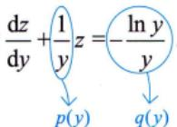

$$
\frac{1}{x} = z = \mathrm{e}^{- \ln y}\left[ \int\left( - \frac{\ln y}{y}\mathrm{e}^{\ln y} \right)\mathrm{d}y + C \right] = \frac{1}{y}\left[ y(1 - \ln y) + C \right],
$$

故通解为 $\frac{1}{x}=1-\ln y+\frac{C}{y} \quad (y>0)$ ，C为任意常数).

注对于无法直接计算的微分方程 $y' = f(x, y)$ ，重点在于通过什么形式的换元将其化成以上几种常见的形式.

## 5二阶可降阶微分方程（用换元法化为一阶方程)(仅数学一、数学二）

(1) $y'' = f(x, y')$ 型(方程中不显含未知函数y).

$$
p = p(x)
$$

赶尽杀绝y

①令 $y' = p, y'' = p'$ ，则原方程变为一阶方程 $\frac{\mathrm{d}p}{\mathrm{d}x} = f(x, p)$ ;

②若求得其通解为 $p = \varphi(x,   C_1)$ ，即 $y' = \varphi(x,   C_1)$ ，则原方程的通解为 $y = \int \varphi ( x , C _ { 1 } ) \mathrm { d } x + C _ { 2 }$

(2) $y'' = f(y, y')$ 型(方程中不显含自变量x).

p = p(y) 新①令 $y' = p,\; y'' = \frac{\mathrm{d}p}{\mathrm{d}x} = \frac{\mathrm{d}p}{\mathrm{d}y} \cdot \frac{\mathrm{d}y}{\mathrm{d}x} = \frac{\mathrm{d}p}{\mathrm{d}y} \cdot p$ ，则原方程变为一阶方程 $p \frac{\mathrm{d}p}{\mathrm{d}y} = f(y, p)$

斩草除根x

②若求得其通解为 $p = \varphi(y,   C_1)$ ，则由 $p = \frac{\mathrm{d}y}{\mathrm{d}x}$ 可得 $\frac{\mathrm{d}y}{\mathrm{d}x} = \varphi(y,   C_1)$ ，分离变量得 $\frac{\mathrm{d}y}{\varphi(y,   C_1)} = \mathrm{d}x$ .n

③两边积分得 $\int \frac{\mathrm{d}y}{\varphi(y, C_1)} = x + C_2$ ，即可求得原方程的通解.

## 注 $y''$ 若仅写成 $p^{\prime}$ ，则方程变为 $p' = f(y, p)$

实际上，由于 $p' = \frac{\mathrm{d}p}{\mathrm{d}x}$ 则上式变为关于x，y，p的方程，会增加方程的复杂性.所以 $y''$ 不能写成 $p ^ { \prime }$ ，而应写成 $y'' = \frac{\mathrm{d}p}{\mathrm{d}x} = \frac{\mathrm{d}p}{\mathrm{d}y} \cdot \frac{\mathrm{d}y}{\mathrm{d}x} = p\frac{\mathrm{d}p}{\mathrm{d}y}.$ ，从而上式变为 $p \frac{\mathrm{d}p}{\mathrm{d}y} = f(y,   p)$ ,变为仅关于y，p的一阶方程

(3) $y'' = f(y')$ 型.

此类型既不显含y，又不显含x，按(1)的办法，即不显含y来处理.

例15.12 求微分方程 $y'' = y'[1 + (y')^2]$ 满足 $y(0)=0,\;y^{\prime}(0)=1$ 的特解.

分析缺x与y，属于(3)中的情形，则令 $y' = p , \quad y'' = p'$

解令 $y ^ { \prime }   =   p$ ，则 $y'' = p'$ ，代入题干微分方程得

$$
p ^ { \prime } = p ( 1 + p ^ { 2 } ) ,
$$

分离变量得

$$
\frac{\mathrm{d}p}{p(1 + p^2)} = \mathrm{d}x ,
$$

两边积分得

$$
\ln \frac{p^{2}}{1 + p^{2}} = 2x + \ln C_{1}(C_{1} > 0)
$$

由题意有 $y^{\prime}(0) = 1$ ，即当x=0时 $p = 1$ ，代入上式得 $C_{1} = \frac{1}{2}$ ，于是有

$$
y^{\prime} = p = \frac{\frac{\mathrm{e}^{x}}{\sqrt{2}}}{\sqrt{1 - \frac{1}{2}\mathrm{e}^{2x}}}
$$

两边积分得

$$
y = \int \frac{\mathrm{e}^{x}}{\sqrt{1 - \left( \frac{\mathrm{e}^{x}}{\sqrt{2}} \right)^{2}}} \mathrm{d}x = \arcsin \frac{\mathrm{e}^{x}}{\sqrt{2}} + C_{2}
$$

由题意有 $y(0) = 0$ ，代入上式得 $C_{2} = - \frac{\pi}{4}$ ，所以 $y = \arcsin \frac{\mathrm{e}^{x}}{\sqrt{2}} - \frac{\pi}{4}$

例15.13 求微分方程 $yy'' - \frac{2}{3}(y')^2 = 0$ 满足y(0)=0的解.

分析缺x，属于(2)中的情形，则令 $y' = p , \quad y'' = p \frac{\mathrm{d}p}{\mathrm{d}y}$

解 令 $y' = p$ ，则 $y'' = \frac{\mathrm{d}p}{\mathrm{d}y} \cdot p$ ，于是 $y \cdot \frac{\mathrm{d}p}{\mathrm{d}y} \cdot p - \frac{2}{3}p^{2} = 0.$ ，分离变量，得 $\frac{\mathrm{d}p}{p} = \frac{2}{3} \frac{\mathrm{d}y}{y} (p \neq 0).$ ，两边积分得

$$
\ln | p | = \frac{2}{3} \ln | y | + \ln C_0, \quad C_0 > 0
$$

即

$$
| p | = C _ { 0 } | y | ^ { \frac { 2 } { 3 } } ,
$$

$$
p = \pm C_{0} y^{\frac{2}{3}} = C_{1} y^{\frac{2}{3}}, \quad 其中 \quad C_{1} \neq 0
$$

即 $\frac{dy}{y^{\frac{2}{3}}} = C_{1} \mathrm{d}x$ ，两边积分，得 $3y^{\frac{1}{3}} = C_{1}x + C_{2}$

由 $y(0) = 0$ ，得 $C_{2} = 0$ ，故 $y = C_{3}x^{3}$ 其中 $C _ { 3 } \neq 0$

又 $C_{3} = 0$ 时，y≡0，满足题意，故 $y = C x^{3}$ ，其中C为任意常数.

## 6 全微分方程（仅数学一）

若函数 $P(x,   y),   Q(x,   y)$ 在单连通区域D上具有一阶连续偏导数，且在D内满足

$$
\frac { \partial Q } { \partial x } = \frac { \partial P } { \partial y } ,
$$

则 $P\mathrm{d}x + Q\mathrm{d}y$ 是某二元函数 $u(x,   y)$ 的全微分.若一阶微分方程写成

$$
P(x, y) \mathrm{d}x + Q(x, y) \mathrm{d}y = 0\tag{*}
$$

的形式时，等式左端表达式是u(x，y)的全微分，则称(\*)式为全微分方程.

例15.14求满足f(0)=0的具有一阶连续导数的f(x)，使 $\left[ y f ^ { \prime } ( x ) + y ^ { 2 } \right] \mathrm{d}x + \left( x ^ { 2 } + 2 x y \right) \mathrm{d}y = 0$ 为全微分方程，并求此全微分方程的通解.

解由定义，有 $\frac{\partial(x^{2}+2xy)}{\partial x}=\frac{\partial[yf^{\prime}(x)+y^{2}]}{\partial y}$ ,即 $2x + 2y = f^{\prime}(x) + 2y$ ,故 $f^{\prime}(x) = 2x$ ，于是 $f(x) = x^{2} + C_{1}$ 由 $f(0) = 0$ ，得 $C_{1} = 0$ ，即 $f(x) = x^{2}$ .于是有 $(2xy + y^{2})\mathrm{d}x + (x^{2} + 2xy)\mathrm{d}y = \mathrm{d}(x^{2}y + xy^{2}) = 0$ ，故通解为$x^{2}y + xy^{2} = C$ ，C为任意常数.

→二阶及以上

## 高阶线性微分方程的求解

## 1二阶常系数齐次线性微分方程

(1) 概念.

方程 $y'' + p y' + q y = 0$ 称为二阶常系数齐次线性微分方程，其中p，q为常数.

(2) 解的结构.

若 $y_{1}(x), y_{2}(x)$ 是 $y'' + p y' + q y = 0$ 的两个解，且 $\frac{y_{1}(x)}{y_{2}(x)} \neq C$ (常数)，则称 $y_{1}(x), y_{2}(x)$ 是该方程的两个线性无关的解，且 $y(x) = C_1 y_1(x) + C_2 y_2(x)$ 是方程 $y'' + p y' + q y = 0$ 的通解.

找到两个线性无关的解，则线性组合为通解.

(3) 通解.

$$
,y = \mathrm{e}^{rx}
$$

$$
\mathrm{e}^{rx}(r^{2}+pr+q)=0
$$

对于 $y'' + p y' + q y = 0$ ，其对应的特征方程为 $r^{2} + pr + q = 0$

①若 $p^{2}-4q>0$ ，设 $r_{1}, r_{2}$ 是特征方程的两个不等实根，即 $r_{1} \neq r_{2}$ ，可得其通解为

$$
y = C_{1} \mathrm{e}^{r_{1}x} + C_{2} \mathrm{e}^{r_{2}x} \cdot \frac{\mathrm{e}^{r_{1}x}}{\mathrm{e}^{r_{2}x}} \neq  常数
$$

②若 $p^{2}-4q=0$ ，设 $r_{1}, r_{2}$ 是特征方程的两个相等的实根，即二重根，令 $r_{1} = r_{2} = r$ ，可得其通解为

$$
y = (C_1 + C_2x)\mathrm{e}^{rx} \cdot \frac{\mathrm{e}^{rx}}{x\mathrm{e}^{rx}} \neq  常数
$$

③若 $p^{2}-4q<0$ ，设 $\alpha \pm \beta \dot { \mathbf { i } }$ 是特征方程的一对共轭复根，可得其通解为

$$
y = \mathrm{e}^{\alpha x} \left( C_{1} \cos \beta x + C_{2} \sin \beta x \right) \cdot \frac{\mathrm{e}^{\alpha x} \cos \beta x}{\mathrm{e}^{\alpha x} \sin \beta x} \neq \beta
$$

注(1)若解中含有 $\mathbf{e}^{\prime \mathbf{x}}$ ，则

当 $r > 0$ 时， $\mathbf{e}^{rx}$ 在 $x \to +\infty$ 时无界；

当 $r < 0$ 时， $\mathbf{e}^{\mathbf{r}\mathbf{x}}$ 在 $x \to -\infty$ 时无界.

(2) 由于 $\cos \beta x$ 与 $\sin \beta x$ 有周期性，因此若解具有周期性，则 $\mathbf{e}^{\alpha x} = 1$ ，即 $\alpha = 0$

此外， $\cos \beta x$ 与 $\sin \beta x$ 均有界.

例15.15 设函数 $y = y(x)$ 是微分方程 $y'' + y' - 2y = 0$ 的解，且在x=0处 $y(x)$ 取得极值3，则$y(x) \; =$ 任意阶可导.

解应填 $\mathrm{e}^{-2x} + 2\mathrm{e}^{x}$

这是二阶常系数齐次线性微分方程，其特征方程为

$$
r^{2}+r-2=0,
$$

可知特征根为 $r_{1} = - 2, r_{2} = 1$ ，故通解为 $y(x) = C_1 \mathrm{e}^{-2x} + C_2 \mathrm{e}^{x}$

由于在x=0处y(x)取得极值3，可知 $y(0)=C_{1}+C_{2}=3$ ，且

$$
y^{\prime}(x) = - 2C_{1}\mathrm{e}^{- 2x} + C_{2}\mathrm{e}^{x}, \quad y^{\prime}(0) = - 2C_{1} + C_{2} = 0,
$$

因此 $C_{1}=1,\;C_{2}=2$ .故 $y(x) = \mathrm{e}^{-2x} + 2\mathrm{e}^{x}$

例15.16 设函数 $y = f(x)$ 满足微分方程 $y'' + 2y' + 5y = 0$ ，且 $f(0)=1,\ f^{\prime}(0)=-1$ ，则 $f(x)   =$

解应填 $\mathrm{e}^{-x} \cos 2x$

$$
r_{1,2} = \frac{- 2 \pm \sqrt{2^{2} - 4 \times 5}}{2} = - 1 \pm 2i
$$

特征方程为 $r^{2}+2r+5=0,\;r_{1,2}=-1\pm2\mathrm{i}$ ，故通解为

$$
y = C _ { 1 } \mathrm { e } ^ { - x } \cos 2 x + C _ { 2 } \mathrm { e } ^ { - x } \sin 2 x ,
$$

由 $f(0)=1,\ f^{\prime}(0)=-1$ ，得 $C_{1} = 1,   C_{2} = 0$ ，即 $f(x) = \mathrm{e}^{-x} \cos 2x$

## 2二阶常系数非齐次线性微分方程

(1)概念. y″+py′+qy=0也称为非齐次方程 $y'' + p y' + q y = f(x) (f(x) \neq 0)$ 的“导出方程”。

方程 $y'' + p y' + q y = f(x) (f(x) \neq 0)$ 称为二阶常系数非齐次线性微分方程，其中p，q为常数， $f(x)$ 为已知的连续函数，叫作自由项。

(2) 解的结构.

①若 $\left| y_{1}^{\bullet}(x) \right.$ 是 $y'' + p y' + q y = f_1(x)$ 的解， $y_{2}^{\bullet}(x)$ 是 $y'' + p y' + q y = f_2(x)$ 的解，则 $y_{1}^{*}(x) + y_{2}^{*}(x)$ 是 $y'' + p y' +$ $q y = f _ { 1 } ( x ) + f _ { 2 } ( x )$ 的解.

②设 $y_{1}^{*},y_{2}^{*}$ 都是 $y'' + p y' + q y = f(x)$ 的特解，则 $y_{1}^{*} - y_{2}^{*}$ 是对应齐次方程的解.

(3) 特解的设定。→待定系数法+微分算子法

对于 $y'' + p y' + q y = f(x)$ ，《全国硕士研究生招生考试数学考试大纲》规定我们需要会求以下两种情况下的特解.

设 $P_{n}(x), P_{m}(x)$ 分别为x的n次、m次多项式.

①当自由项 $f(x) = P_n(x)\mathrm{e}^{\alpha x}$ 时，特解要设为 $y^{*} = \mathrm{e}^{\alpha x} Q_{n}(x) x^{k}$ ，其中

$\mathbf { e } ^ { \alpha x }$ 照抄，

$\mathcal { Q } _ { n } ( x )$ 为x的n次多项式，

$k = \begin{cases} 0, \alpha, \\ 1, \alpha, \\ 2, \alpha \end{cases}$ 不是特征根，是单特征根，是二重特征根.

<table><tr><td>注  $y'' + p y' + q y = P_n(x) \mathrm{e}^{\alpha x}$  设  $y ^ { * } = Q _ { n } ( x ) \mathrm { e } ^ { \alpha x } \bullet x ^ { k }$  其中  $\mathbf{e}^{\alpha x}$  照抄（若没有  $\mathsf{e}^{\alpha x}$  ，表明  $\alpha = 0$   $P_{n}(x)$  写成  $\mathcal{Q}_{n}(x)$  ，为x的n次多项式，  $k = \left\{ \begin{aligned} 0 , \alpha \neq r_{1,2} , \\ 1 , \alpha = r_{1}  或  \alpha = r_{2} ( r_{1} \neq r_{2} ) , \\ 2 , \alpha = r_{1} = r_{2} . \end{aligned} \right.$  写一般式 总结： 一看， 二算，三比较.  $\downarrow$  其中 自由项中的α</td><td>如：  $y'' - 2y' + 5y = 1 \bullet \mathrm{e}^{x}$   $y^{*} = a\mathrm{e}^{x} \cdot x^{0} \quad \quad \quad \quad \quad \quad \quad \alpha = 1, \quad \quad \alpha = 1, \quad \quad \quad \quad \quad \quad \quad \quad \quad \quad \quad \quad \quad \quad \quad \quad \quad \quad \quad \quad \quad \quad \quad \quad \quad \alpha = 1, \quad \quad \quad \quad \quad \quad \quad \quad \quad \quad \quad \quad \quad \quad \quad \quad \quad \quad \quad \quad \quad \quad \quad \quad \quad \quad \quad \quad \quad \quad \quad \quad \quad \quad \quad \quad \quad \quad \quad \quad \quad \quad \quad \quad \quad \quad \quad \quad \quad \quad \quad \quad \quad \quad \quad \quad \quad \quad \quad \quad \quad \quad \quad \quad \quad \quad \quad \quad \quad \quad \quad \quad \quad \quad \quad \quad \quad \quad \quad \quad \quad \quad \quad \quad \quad \quad \quad \quad \quad \quad \quad \quad \quad \quad \quad \quad \quad \quad \quad \quad \quad \quad \quad \quad \quad \quad \quad \quad \quad \quad \quad \quad \quad \quad \quad \quad \quad \quad \quad \quad \quad \quad \quad \quad \quad \quad \quad \quad \quad \quad \quad \quad \quad \quad \quad \quad \quad \quad \quad \quad \quad \quad \quad \quad \quad \quad \quad \quad \quad \quad \quad \quad \quad \quad \quad \quad \quad \quad \quad \quad \quad \quad \quad \quad \quad \quad \quad \quad \quad \quad \quad \quad \quad \quad \quad \quad \quad \quad \quad \quad \quad \quad \quad \quad \quad \quad \quad \quad \quad \quad \quad \quad \quad \quad \quad \quad \quad \quad \quad \quad \quad \quad \quad \quad \quad \quad \quad \quad \quad \quad \quad \quad \quad \quad \quad \quad \quad \quad \quad \quad \quad \quad \quad \quad \quad \quad \quad \quad \quad \quad \quad \quad \quad \quad \quad \quad \quad \quad \quad \quad \quad \quad \quad \quad \quad \quad \quad \quad \quad \quad \quad \quad \quad \quad \quad \quad \quad \quad \quad \quad \quad \quad \quad \quad \quad \quad \quad \quad \quad \quad \quad \quad \quad \quad \quad \quad \quad \quad \quad \quad \quad \quad \quad \quad \quad \quad \quad \quad \quad \quad \quad \quad \quad \quad \quad \quad \quad \quad \quad \quad \quad \quad \quad \quad \quad \quad \quad \quad \quad \quad \quad \quad \quad \quad \quad \quad \quad \quad \quad \quad \quad \quad \quad \quad \quad \quad \quad \quad \quad \quad \quad \quad \quad \quad \quad \quad \quad \quad \quad \quad \quad \quad \quad \quad \quad \quad \quad \quad \quad \quad \quad y = a\mathrm{e}^{x} \cdot \cdot x^{\alpha \alpha \cdot x^{\alpha \alpha \alpha \alpha \alpha \alpha \alpha \alpha \alpha \alpha \alpha \alpha \alpha \alpha \alpha \alpha \alpha \alpha \alpha \alpha \alpha \alpha \alpha \alpha \alpha \alpha \alpha \alpha \alpha \alpha \alpha \alpha \alpha \alpha \alpha \alpha \alpha \alpha \alpha \alpha \alpha \alpha \alpha \alpha \alpha \alpha \alpha \alpha \alpha \alpha \alpha \alpha \alpha \alpha \alpha \alpha \alpha \alpha \alpha \alpha \alpha \alpha \alpha \alpha \alpha \alpha \alpha \alpha \alpha \alpha \alpha \alpha \alpha \alpha \alpha \alpha \alpha \alpha \alpha \alpha \alpha \alpha \alpha \alpha \alpha \alpha \alpha \alpha \alpha \alpha \alpha \alpha \alpha \alpha \alpha \alpha \alpha \alpha \alpha \$  设 代回方程得  $y^{*} = \frac{1}{4}\mathrm{e}^{x}$  则 故通解为</td><td> $a\mathrm{e}^{x}-2a\mathrm{e}^{x}+5a\mathrm{e}^{x}=\mathrm{e}^{x}\Rightarrow 4a=1\Rightarrow a=\frac{1}{4},$  →齐次方程 7非齐次方程 的通解 的特解  $y = \mathrm{e}^{x} \left( C_{1} \cos 2x + C_{2} \sin 2x \right) + \frac{1}{4} \mathrm{e}^{x} ,$  为任意常数.</td></tr></table>

②当自由项 $f(x) = \mathrm{e}^{\alpha x} \left[ P_{m}(x) \cos \beta x + P_{n}(x) \sin \beta x \right]$ 时，特解要设为

$$
y ^ { * } = \mathrm { e } ^ { \alpha x } \left[ Q _ { l } ^ { ( 1 ) } ( x ) \cos \beta x + Q _ { l } ^ { ( 2 ) } ( x ) \sin \beta x \right] x ^ { k } ,
$$

其中

$\mathbf { e } ^ { \alpha x }$ 照抄，  
$l = \max\{m, n\}, Q_{l}^{(1)}(x), Q_{l}^{(2)}(x)$ 分别为x的两个不同的l次多项式，  
$k = \left\{ \begin{aligned} 0, \quad \alpha \pm \beta  i  \\ 1, \quad \alpha \pm \beta  i  \end{aligned} \right.$ 不是特征根，是特征根.

如： $y'' - 2y' + 5y = - \mathrm{e}^{x} \cos 2x$

$$
\mathrm{e}^{1 \cdot x} \left[ (-1) \cos 2x + 0 \sin 2x \right]
$$

注 $y'' + p y' + q y = \mathrm{e}^{\alpha x} \left[ P_m(x) \cos \beta x + P_n(x) \sin \beta x \right]$   
设 $y ^ { * } = \mathrm { e } ^ { \alpha x } \left[ Q _ { l } ^ { ( 1 ) } ( x ) \cos \beta x + Q _ { l } ^ { ( 2 ) } ( x ) \sin \beta x \right] x ^ { k }$ 其中$\mathbf{e}^{\alpha x}$ 照抄（若没有 $\mathbf{e}^{\alpha x}$ 表明 $\alpha = 0$ $l = \max\{m, n\}, Q_l^{(1)}(x), Q_l^{(2)}(x)$ 分别为x的两个不同的l次多项式，按最高次$k = \left\{ \begin{aligned} 0 , \alpha \pm \beta  i  \neq r_{1,2} , \\ 1 , \alpha \pm \beta  i  = r_{1,2} , \end{aligned} \right.$ 写一般式总结：一看，二算，三比较.自由项中的 $\alpha , \beta \quad \downarrow$

设 $y^{*} = \frac{\mathrm{e}^{x}(A\cos 2x + B\sin 2x)x^{2}}{ \quad  一看:  \quad \alpha \pm \beta\mathrm{i} = 1 \pm 2\mathrm{i}}$

由英国物理学家海威塞德在19世纪末提出， $ \text{" }  D  \text{" }$ 由他引入，使微分方程变为形式上的代数方程.许多数学家批评此方法不金面，不严谨.这让我又想起另一位物理学家，诺贝尔物理学奖得主费曼，他经常在积分号中求导，也被数学家批评不严谨甚至错误，但很多棘手的积分（甚至著名的积分，如Γ函数）在他“荒唐”的方法下，却可轻易得到正确结果，这在第9讲中已经讲过了.

## 注2特解还可用微分算子法来求解.

约定： $\mathrm{D} = \frac{\mathrm{d}}{\mathrm{d}x}, \mathrm{D}y = \frac{\mathrm{d}y}{\mathrm{d}x}, \mathrm{D}^2 = \frac{\mathrm{d}^2}{\mathrm{d}x^2}, \mathrm{D}^2y = \frac{\mathrm{d}^2 y}{\mathrm{d}x^2}$ 于是微分方程 $y'' + p y' + q y = f(x)$ 即可写成$( \mathrm{D}^2 + p \mathrm{D} + q ) y = f(x)$ ，进一步记 $\mathrm{D}^{2}+p\mathrm{D}+q=F(\mathrm{D})$ ，称为算子多项式，它满足普通多项式的运算规则，如因式分解等，则上述微分方程即可写成 $F(D)y = f(x)$ ，此时它的一个特解为

$$
y^{*} = \frac{1}{F(D)}f(x)
$$

在约定 $ \text{" } D "$ 表示求导的条件下，约定 $ \text{" }\frac{1}{ D } \text{" }$ 表示积分，如 $D\sin x = \cos x$ $\frac{1}{\mathrm{D}}\sin x = -\cos x$ (取$C = 0$

① $\frac{1}{F(\mathrm{D})} \mathrm{e}^{\alpha x}$ 型.

若 $F(D)\big|_{D=\alpha} \neq 0$ 有 $y^{*} = \frac{1}{F(D)|_{D=\alpha}} \mathrm{e}^{\alpha x}$ →注例1

若 $F(D)\big|_{D=\alpha} = 0$ $F^{\prime}(D)\big|_{D=\alpha} \neq 0$ $y^{*} = x \frac{1}{F^{\prime}(D) \big|_{D=\alpha}} \mathrm{e}^{\alpha x}$ 注例2

若 $F(D)\big|_{D=\alpha} = 0, \left. F^{\prime}(D)\right|_{D=\alpha} = 0.$ ，而 $F^{\prime\prime}(D)\big|_{D=\alpha} \neq 0.$ ，有

$$
y^{*} = x^{2} \left. \frac{1}{F''(D)} \right|_{D=\alpha} \mathrm{e}^{\alpha x}
$$

注例1 已知 $y'' + y' - 2y = 2$ ，求 $y ^ { * }$

解 $y^{*} = \frac{1}{\mathrm{D}^{2} + \mathrm{D} - 2} 2\mathrm{e}^{0x}$ 由 $\left. \left( \mathrm{D}^{2} + \mathrm{D} - 2 \right) \right|_{\mathrm{D} = 0} \neq 0$ ，得 $F ( D ) \vert _ { D = a } \neq 0$

$$
y^{*} = \frac{1}{\left. \left( \mathrm{D}^{2} + \mathrm{D} - 2 \right) \right|_{\mathrm{D}=0}} 2\mathrm{e}^{0x} = \frac{1}{-2} \cdot 2 = -1
$$

注例2 已知 $y'' + y' - 2y = \mathrm{e}^{x}$ ，求 $y$

解 $y^{*} = \frac{1}{\mathrm{D}^{2} + \mathrm{D} - 2}\mathrm{e}^{x}$ 由 $\left( \mathrm{D}^{2} + \mathrm{D} - 2 \right) \Big|_{\mathrm{D}=1} = 0, \left. \left( \mathrm{D}^{2} + \mathrm{D} - 2 \right)^{\prime} \right|_{\mathrm{D}=1} \neq 0$ 得 $F(D)|_{D = a} = 0$ $\textcircled{5} F^{\prime}(D)|_{D = a} \neq 0$

$$
y^{*} = x\frac{1}{\left. \left( \mathrm{D}^{2} + \mathrm{D} - 2 \right)^{\prime} \right|_{\mathrm{D} = 1}}\mathrm{e}^{x} = x \cdot \frac{1}{3}\mathrm{e}^{x} = \frac{1}{3}x\mathrm{e}^{x}
$$

注例3 已知 $y'' - 2y' + y = \mathrm{e}^x$ ，求 $y^{''}$

解 $y^{*} = \frac{1}{\mathrm{D}^{2} - 2\mathrm{D} + 1}\mathrm{e}^{x}$ ，由

$$
F ( D ) \vert _ { D = a } = 0 ,
$$

$$
F ^ { \prime } ( D ) \vert _ { D = a } = 0
$$

$$
\left( \mathrm{D}^{2}-2 \mathrm{D}+1 \right) \Big|_{\mathrm{D}=1}=0,\left.\left(\mathrm{D}^{2}-2 \mathrm{D}+1 \right) \right|_{\mathrm{D}=1}=0,\left.\left(\mathrm{D}^{2}-2 \mathrm{D}+1 \right)^{\prime \prime} \right|_{\mathrm{D}=1} \neq 0 ,
$$

$$
\left. \bar { \partial } _ { 0 } F ^ { \prime \prime } ( D ) \right| _ { D = a } \neq 0
$$

$$
y^{*} = x^{2} \frac{1}{\left( \mathrm{D}^{2} - 2\mathrm{D} + 1 \right)^{n}} \bigg|_{\mathrm{D}=1} \mathrm{e}^{x} = x^{2} \cdot \frac{1}{2}\mathrm{e}^{x} = \frac{1}{2}x^{2}\mathrm{e}^{x} .
$$

② a. $\frac{1}{D^{2} + q}\cos\beta x$ 或 $\frac{1}{D^{2} + q}\sin\beta x$ 型

若 $\left( \mathrm{D}^{2} + q \right) \Big|_{\mathrm{D} = \beta_{1}} \neq 0$ 有 $y^{*} = \frac{1}{\left( \mathrm{D}^{2} + q \right) \Big|_{\mathrm{D} = \beta \mathrm{i}}} \cos \beta x$ 或 $y^{*} = \frac{1}{\left. \left( \mathrm{D}^{2} + q \right) \right|_{\mathrm{D} = \beta \mathrm{i}}} \sin \beta x$ →注例4

若 $\left. \left( \mathrm{D}^{2} + q \right) \right|_{\mathrm{D} = \beta_{1}} = 0$ $y^{*} = x \frac{1}{(\mathrm{D}^2 + q)'} \cos \beta x$ 或 $y^{*} = x \frac{1}{\left( \mathrm{D}^{2} + q \right)^{\prime}} \sin \beta x$ →注例5

b. $\frac{1}{F(\mathrm{D})} \cos \beta x$ 或 $\frac{1}{F(\mathrm{D})}\sin\beta x$ 型

若 $F(D)=D^{2}+pD+q$ ，则取

$$
F ( \mathrm { D } ) \big | _ { \mathrm { D } ^ { 2 } = ( \beta \mathrm { i } ) ^ { 2 } } = p \mathrm { D } + q - \beta ^ { 2 } ,
$$

$$
y ^ { * } = \frac { 1 } { F ( \mathrm { D } ) } \bigg | _ { \mathrm { D } ^ { 2 } = ( \beta ) ^ { 2 } } \cos \beta x = \frac { p \mathrm { D } - ( q - \beta ^ { 2 } ) } { p ^ { 2 } \mathrm { D } ^ { 2 } - ( q - \beta ^ { 2 } ) ^ { 2 } } \bigg | _ { \mathrm { D } ^ { 2 } = ( \beta ) ^ { 2 } } \cos \beta x = \frac { p \mathrm { D } - ( q - \beta ^ { 2 } ) } { - p ^ { 2 } \beta ^ { 2 } - ( q - \beta ^ { 2 } ) ^ { 2 } } \cos \beta x .
$$

$\frac{1}{F(\mathrm{D})}\sin\beta x$ 同理.

注例4 已知 $y^{\prime\prime} - y = \sin x$ ，求 $y ^ { * }$

解 $y^{*} = \frac{1}{D^{2} - 1}\sin x$ ，由 $\left( \mathrm{D}^{2} - 1 \right) \Big|_{\mathrm{D}=1} \neq 0$ ，得

$$
y^{*} = \frac{1}{\left( \mathrm{D}^{2} - 1 \right)}\bigg|_{\mathrm{D}=\mathrm{i}}\sin x = - \frac{1}{2}\sin x .
$$

注例5 已知 $y'' + 4y = \sin 2x$ ，求 $\vec{y}$ •

解 $y^{*} = \frac{1}{D^{2} + 4}\sin 2x$ ，由 $\left. \left( \mathrm{D}^{2} + 4 \right) \right|_{\mathrm{D} = 2\mathrm{i}} = 0$ ，得

$$
y^{*} = x\frac{1}{\left(  D ^{2} + 4 \right)^{\prime}}\sin 2x = x\frac{1}{2 D }\sin 2x = \frac{1}{2}x \cdot \frac{1}{D}\sin 2x = - \frac{1}{4}x\cos 2x
$$

注例6 已知 $y'' - 3y' + 2y = -\frac{1}{2}\cos 2x$ ，求 $y^{\prime}$

解 $y^{*} = \frac{1}{\mathrm{D}^{2} - 3\mathrm{D} + 2}\left( - \frac{1}{2}\cos 2x \right)$ ，此为 $\frac{1}{F(\mathrm{D})} \cos \beta x$ 型，于是

$$
\begin{aligned}y^{*} = & \frac{1}{\mathrm{D}^{2} - 3\mathrm{D} + 2}\left( - \frac{1}{2}\cos 2x \right) = \frac{1}{- 4 - 3\mathrm{D} + 2}\left( - \frac{1}{2}\cos 2x \right) = \frac{1}{2} \cdot \frac{1}{3\mathrm{D} + 2}\cos 2x \\= & \frac{1}{2} \cdot \frac{3\mathrm{D} - 2}{9\mathrm{D}^{2} - 4}\cos 2x = \frac{1}{2} \cdot \frac{3\mathrm{D} - 2}{- 40}\cos 2x = - \frac{1}{80}(3\mathrm{D} - 2)\cos 2x \\= & - \frac{1}{80}(3\mathrm{D}\cos 2x - 2\cos 2x) = - \frac{1}{80}(- 6\sin 2x - 2\cos 2x) \\= & \frac{1}{40}(3\sin 2x + \cos 2x) .\end{aligned}
$$

③ $\frac{1}{F(D)}\left(x^{k}+a_{1}x^{k-1}+\cdots+a_{k-1}x+a_{k}\right)$ 型

$$
\frac{1}{1 - x}
$$

这里 $Q_{k}(\mathrm{D})$ 是将 $\frac{1}{F( D )}$ 展开为k次泰勒多项式，即 $b_{0}+b_{1}D+b_{2}D^{2}+\cdots+b_{k}D^{k}$ ，得 $Q_{k}(\mathrm{D})$

注例7 已知 $y'' + y' = x^2 + 1$ ，求 $y ^ { * }$

解

$$
y^{*} = \frac{1}{\mathrm{D}^{2} + \mathrm{D}}(x^{2} + 1) = \frac{1}{\mathrm{D}} \cdot \frac{1}{1 + \mathrm{D}}(x^{2} + 1)
$$

下面将 $\frac{1}{1+\mathrm{D}}$ 作D的2次展开：

$$
\frac{1}{1 + \mathrm{D}} = 1 - \mathrm{D} + \mathrm{D}^2 + \cdots
$$

于是

→由于 $x ^ { 2 } + 1$ 为2次多项式，故 $\frac{1}{1 + \mathrm{D}}$ 展开到2次

$$
\begin{aligned}y^{*} = & \frac{1}{\mathrm{D}} \cdot \left( 1 - \mathrm{D} + \mathrm{D}^{2} \right)(x^{2} + 1) = \left( \frac{1}{\mathrm{D}} - 1 + \mathrm{D} \right)(x^{2} + 1) \\= & \frac{1}{\mathrm{D}}(x^{2} + 1) - (x^{2} + 1) + \mathrm{D}(x^{2} + 1) \\= & \frac{1}{3}x^{3} + x - x^{2} - 1 + 2x = \frac{1}{3}x^{3} - x^{2} + 3x - 1 .\end{aligned}
$$

④ $\frac{1}{F(\mathrm{D})} \mathrm{e}^{\alpha x} v(x)$ 型

$$
\mathrm { e } ^ { \alpha x }
$$

$y^{*} = \frac{1}{F(\mathrm{D})}\mathrm{e}^{\alpha x}v(x) = \mathrm{e}^{\alpha x} \cdot \frac{1}{F(\mathrm{D} + \alpha)}v(x)$ ，这里ν(x)是实函数

注例8 已知 $y'' + 4y' + 5y = \mathrm{e}^{-2x} \sin x$ ，求 $y ^ { * }$

解

$$
y^{*} = \frac{1}{\mathrm{D}^{2} + 4\mathrm{D} + 5}\mathrm{e}^{- 2x}\sin x = \mathrm{e}^{- 2x}\cdot\frac{1}{(\mathrm{D} - 2)^{2} + 4(\mathrm{D} - 2) + 5}\sin x \\= \mathrm{e}^{- 2x}\cdot\frac{1}{\mathrm{D}^{2} + 1}\sin x = \mathrm{e}^{- 2x}\cdot\frac{1}{(\mathrm{D}^{2} + 1)^{\prime}}\sin x \\= \mathrm{e}^{- 2x}\cdot\frac{1}{2\mathrm{D}}\sin x = \frac{1}{2}\mathrm{e}^{- 2x}\cdot x(-\cos x) = - \frac{1}{2}x\mathrm{e}^{- 2x}\cos x
$$

注例9 已知 $y'' - 3y' + 2y = 2xe^x$ ，求 $y ^ { * }$ .综合以上多种方法.

解

$$
\begin{aligned}y^{*} = \frac{1}{\mathrm{D}^{2} - 3\mathrm{D} + 2}2xe^{x} = 2e^{x} \cdot \frac{1}{(\mathrm{D} + 1)^{2} - 3(\mathrm{D} + 1) + 2}x = 2e^{x} \cdot \frac{1}{\mathrm{D}^{2} - \mathrm{D}}x \\= 2e^{x} \cdot \frac{1}{\mathrm{D}} \cdot \frac{1}{\mathrm{D} - 1}x = 2e^{x} \cdot \frac{1}{\mathrm{D}} \cdot (-1 - \mathrm{D})x = 2e^{x} \cdot \left(-\frac{1}{\mathrm{D}} - 1\right)x \\= 2e^{x} \cdot \left(-\frac{1}{2}x^{2} - x\right) = -x(x + 2)e^{x} .\end{aligned}
$$

(4) 通解.

若 $y(x) = C_1 y_1(x) + C_2 y_2(x)$ 是 $y'' + p y' + q y = 0$ 的通解， $y^{*}(x)$ 是

$$
y'' + p y' + q y = f(x)
$$

的一个特解，则 $y(x) + y^{*}(x)$ 是 $y'' + p y' + q y = f(x)$ 的通解.

齐通解+非齐特解

例15.17求 $y'' - 3y' + 2y = 2\mathrm{e}^{-x}\cos x$ 的通解.

解特征方程为 $r^{2}-3r+2=0$ ，其解为 $r_{1} = 2, r_{2} = 1$ ，因此对应的齐次微分方程的通解是

$$
\bar { y } = C _ { 1 } \mathrm { e } ^ { x } + C _ { 2 } \mathrm { e } ^ { 2 x } .
$$

下面用两种方法求特解.

方法一 待定系数法.

方程的一个特解可设为 $y^{*} = \mathrm{e}^{-x}(A\cos x + B\sin x)$ ，求得

$$
y ^ { * \prime } = \mathrm { e } ^ { - x } \left[ ( B - A ) \cos x - ( A + B ) \sin x \right] ,
$$

$$
y ^ { * } = \mathrm { e } ^ { - x } \left( - 2 B \cos x + 2 A \sin x \right) ,
$$

代入方程解得 $A = \frac{1}{5}, B = -\frac{1}{5}$ ，即 $y^{*} = \frac{\mathrm{e}^{-x}}{5}(\cos x - \sin x)$

方法二 微分算子法.

$$
\begin{aligned} y^{*} &= \frac{1}{\mathrm{D}^{2} - 3\mathrm{D} + 2}2\mathrm{e}^{- x}\cos x&= 2\mathrm{e}^{- x} + 2\mathrm{e}^{- x}\\ &\\ &= 2\mathrm{e}^{- x}\frac{1}{(\mathrm{D} - 1)^{2} - 3(\mathrm{D} - 1) + 2}\cos x\\ &\\ &= 2\mathrm{e}^{- x}\frac{1}{\mathrm{D}^{2} - 5\mathrm{D} + 6}\cos x\\ &\\ &= 2\mathrm{e}^{- x}\frac{1}{- 5\mathrm{D} + 5}\cos x\\ &\\ &= - \frac{2}{5}\mathrm{e}^{- x}\frac{1}{\mathrm{D} - 1}\cos x\\ &\\ &= - \frac{2}{5}\mathrm{e}^{- x}\frac{\mathrm{D} + 1}{\mathrm{D}^{2} - 1}\cos x\\ &\\ &= \frac{1}{5}\mathrm{e}^{- x}(\mathrm{D} + 1)\cos x\\ &\\ &= \frac{1}{5}\mathrm{e}^{- x}(- \sin x + \cos x) .\\ \end{aligned}
$$

从而原方程的通解为

$$
y = \bar{y} + y^{*} = C_{1}\mathrm{e}^{x} + C_{2}\mathrm{e}^{2x} + \frac{1}{5}\mathrm{e}^{-x}(\cos x - \sin x),
$$

其中 $C_{1},   C_{2}$ 为任意常数.

注待定系数法易设出形式，难点在于计算量大，建议考生作为练习尝试书写过程.  
微分算子法计算量较小，难点在于需记住大量形式.

例15.18设二阶常系数线性微分方程 $y'' + \alpha y' + \beta y = \gamma \mathrm{e}^x$ 的一个特解为 $y^{*} = \mathrm{e}^{2x} + (1 + x)\mathrm{e}^{x}$ .确定常数 $\alpha ,   \beta ,   \gamma$ ，并求该方程的通解.

分析 $y^{*} = \mathrm{e}^{2x} + \mathrm{e}^{x} + x\mathrm{e}^{x}$ ，其中 $\mathbf{e}^{2x}$ 不可能为非齐次方程的解，故只能是齐次方程的解，若 $x \mathrm { e } ^ { x }$ 为齐次方程的解，则至少对应二重根.

解由 $f(x) = \gamma \mathrm{e}^{x}$ 可知 $\mathrm{e}^{ax}(a \neq 1)$ 不可能是非齐次方程的特解，故 $\mathsf{e}^{2x}$ 不可能是非齐次方程的特解，又因为 $y = \mathrm{e}^{2x} + \mathrm{e}^{x} + x\mathrm{e}^{x}$ 是非齐次方程的解，所以 $\mathbf{e}^{2x}$ 必是对应齐次方程的解，故微分方程有一个特征根$r_{1} = 2$

若 $\mathsf { e } ^ { x }$ 是非齐次方程的解，则 $x \mathrm{e}^{x}$ 就是齐次方程的解，此时 $r_{1} = r_{2} = 1$ ，与上述 $r_{1} = 2$ 矛盾，于是 $\mathsf { e } ^ { x }$ 也必是齐次方程的解，此时 $r_{2} = 1$ . 所以特征方程为 $(r - 1)(r - 2) = 0$ ，即

$$
r^{2}-3r+2=0,
$$

于是 $\alpha = - 3, \beta = 2$

为确定 $\gamma$ ，只需将特解 $y^{*} = x\mathrm{e}^{x}$ 代入方程，得

$$
(x + 2)\mathrm{e}^{x} - 3(x + 1)\mathrm{e}^{x} + 2x\mathrm{e}^{x} = \gamma\mathrm{e}^{x}
$$

解得 $\gamma = - 1$

原方程的通解为 $y = C_{1} \mathrm{e}^{x} + C_{2} \mathrm{e}^{2x} + x \mathrm{e}^{x}$ ，其中 $C_{1},   C_{2}$ 为任意常数.

## ③ n(n>2) 阶常系数齐次线性微分方程

①若r为单实根，写 $C \mathbf { e } ^ { r x }$ i

②若r为k重实根，写

$$
\left( C_{1} + C_{2}x + C_{3}x^{2} + \cdots + C_{k}x^{k - 1} \right)\mathrm{e}^{rx}
$$

③若r为单复根 $\alpha \pm \beta \mathbf { i }$ ，写

$$
\mathrm{e}^{\alpha x}(C_{1}\cos\beta x+C_{2}\sin\beta x);
$$

④若r为二重复根 $\alpha   \pm \beta \mathbf { i }$ ，写

这是反求方程的理论基础

$$
\mathrm{e}^{ax}(C_{1}\cos\beta x+C_{2}\sin\beta x+C_{3}x\cos\beta x+C_{4}x\sin\beta x)
$$

注(1)如果解中含特解 $\mathbf{e}^{nx}$ ，则r至少为单实根，如二重根 $(C_{1} + C_{2}x)\mathrm{e}^{rx}$ ，令 $C_{1}=1 , C_{2}=0$

(2) 如果解中含特解 $x^{k - 1}\mathrm{e}^{rx}$ ，则r至少为k重实根；

(3) 如果解中含特解 $\mathrm{e}^{\alpha x} \cos \beta x$ 或 $\mathrm{e}^{\alpha x} \sin \beta x$ ，则 $\alpha \pm \beta  i$ 至少为单复根；

(4) 如果解中含特解 $\mathrm{e}^{\alpha x}x\cos\beta x$ 或 $\mathrm{e}^{\alpha x}x\sin\beta x$ ，则 $\alpha \pm \beta  i$ 至少为二重复根.

例15.19 已知某四阶常系数齐次线性微分方程有特解 $y_{1}(x) = \mathrm{e}^{x} \cos 2x, y_{2}(x) = x$ ，且方程中 $y ^ { ( 4 ) }$ 前的系数为1，该方程为 2 4 12  坛10 u dad la

至少为单复根 $(0 + 1 \ast x)\mathrm{e}^{0x}$ 至少为2重根

解应填 $y^{(4)} - 2y^{(3)} + 5y = 0$

该方程有解 $y_{1}(x) = \mathrm{e}^{x} \cos 2x$ ，必有另一解 $y_{3}(x) = \mathrm{e}^{x} \sin 2x$ ，可知对应的特征根为 $1 \pm 2 \mathbf { i }$ ；该方程有解 $y_{2}(x) = x$ ，必有另一解 $y_{4}(x) = C$ (C为常数)，可知 $r = 0$ 为二重根.由以上分析可知，原微分方程的特征方程有4个特征根：1±2i，0(二重)，故特征方程为

$$
\left[ r - ( 1 + 2 \mathrm { i } ) \right] \left[ r - ( 1 - 2 \mathrm { i } ) \right] r ^ { 2 } = 0 ,
$$

即

$$
r^{4}-2r^{3}+5r^{2}=0,
$$

所以满足条件的微分方程为

$$
y^{(4)} - 2y^{(3)} + 5y^{\prime\prime} = 0
$$

## 4 能写成x² y″ + pxy′ +qy = f(x)形式的微分方程(欧拉方程)(仅数学一)

形如 $x^{2}\frac{\mathrm{d}^{2}y}{\mathrm{d}x^{2}}+px\frac{\mathrm{d}y}{\mathrm{d}x}+qy=f(x)$ 的方程称为欧拉方程，其中 $p$ 与 $q$ 为常数，f(x)为已知的连续函数.欧拉方程有固定的解法. $\frac{\mathrm{d}y}{\mathrm{d}t}$ 注意到 是关于t的函数，但我们需

①当 $x > 0$ 时，令 $x = \mathbf{e}^{t}$ ，则 $t = \ln x , \frac{\mathrm{d}t}{\mathrm{d}x} = \frac{1}{x}$ ，于是

要对x求导，即 $\left( \frac{\mathrm{d}y}{\mathrm{d}t} \right)_{x}^{\prime} = \frac{\mathrm{d}^{2}y}{\mathrm{d}t^{2}} \cdot \frac{\mathrm{d}t}{\mathrm{d}x}$

$$
\frac{\mathrm{d}y}{\mathrm{d}x} = \frac{\mathrm{d}y}{\mathrm{d}t} \cdot \frac{\mathrm{d}t}{\mathrm{d}x} = \frac{1}{x} \frac{\mathrm{d}y}{\mathrm{d}t} \cdot \frac{\mathrm{d}^2 y}{\mathrm{d}x^2} = \frac{\mathrm{d}}{\mathrm{d}x} \left( \frac{1}{x} \frac{\mathrm{d}y}{\mathrm{d}t} \right) = - \frac{1}{x^2} \frac{\mathrm{d}y}{\mathrm{d}t} + \frac{1}{x} \left[ \frac{\mathrm{d}}{\mathrm{d}x} \left( \frac{\mathrm{d}y}{\mathrm{d}t} \right) \right] = - \frac{1}{x^2} \frac{\mathrm{d}y}{\mathrm{d}t} + \frac{1}{x^2} \frac{\mathrm{d}^2 y}{\mathrm{d}t^2}
$$

方程化为

$$
\frac { \mathrm { d } ^ { 2 } y } { \mathrm { d } t ^ { 2 } } + ( p - 1 ) \frac { \mathrm { d } y } { \mathrm { d } t } + q y = f ( \mathrm { e } ^ { t } ) ,
$$

即可求解(最后结果别忘了用t=lnx回代成x的函数).

②当 $x < 0$ 时，令 $x = - \mathbf{e}^{t}$ ，同理可得.

## 注(1)建议考生自己写一遍以上推导过程.

(2)数学二、数学三的考纲中不要求掌握欧拉方程，但以上推导仍应掌握.

例15.20 欧拉方程 $x^{2}\frac{\mathrm{d}^{2}y}{\mathrm{d}x^{2}}+4x\frac{\mathrm{d}y}{\mathrm{d}x}+2y=0(x>0)$ 的通解为

解应填 $y = \frac{C_{1}}{x} + \frac{C_{2}}{x^{2}}, C_{1}, C_{2}$ 为任意常数.

由题设， $x > 0$ ，令 $x = \mathbf{e}^{t}$ ，则

$$
\frac{\mathrm{d}y}{\mathrm{d}x} = \frac{\mathrm{d}y}{\mathrm{d}t} \cdot \frac{\mathrm{d}t}{\mathrm{d}x} = \frac{1}{x} \frac{\mathrm{d}y}{\mathrm{d}t},
$$

$$
\frac{\mathrm{d}^{2} y}{\mathrm{d} x^{2}} = - \frac{1}{x^{2}} \frac{\mathrm{d} y}{\mathrm{d} t} + \frac{1}{x} \frac{\mathrm{d}^{2} y}{\mathrm{d} t^{2}} \cdot \frac{\mathrm{d} t}{\mathrm{d} x} = \frac{1}{x^{2}} \left( \frac{\mathrm{d}^{2} y}{\mathrm{d} t^{2}} - \frac{\mathrm{d} y}{\mathrm{d} t} \right),
$$

代入原方程，得

$$
\frac{\mathrm{d}^{2} y}{\mathrm{d} t^{2}} + 3 \frac{\mathrm{d} y}{\mathrm{d} t} + 2 y = 0 ,
$$

→此处需注意：通解是y关于x的函数，需要把t还原成x解此方程得通解为 $y = C_{1} \mathrm{e}^{-t} + C_{2} \mathrm{e}^{-2t} = \frac{C_{1}}{x} + \frac{C_{2}}{x^{2}}, C_{1}, C_{2}$ 为任意常数.

## 四微分方程的几何应用

在第3讲中，我们讲了切线—那把极速切过曲线上某点的锋利无比的刀，它是一个强大的工具，在几何上常常用来建立微分方程并求解运动轨迹.先看一张图（见图15-1）.

  
图 15-1

  
图 15-2

这是达·芬奇所画的最初的自行车，与现在的自行车几乎无异.某嫌疑人（你以为我要讲福尔摩斯了吗？不，这里他犯了错误）骑车逃跑时在地面上留下了前后轮的局部运动轨迹（见图15-2）.福尔摩斯犯难了，嫌疑人是向左逃跑还是向右逃跑了呢？首先，你得确定 $L _ { 1 } , L _ { 2 }$ 哪一条轨迹是前轮留下的.事实上，对切线概念的深刻理解可以让你迅速得出答案.轨迹上每一点的切线方向都代表此刻轮子的前进方向.所以若一条曲线上存在一个点(如点A)处的切线不会与此处另一条曲线相交，前者就是前轮的轨迹，因为它是前轮，前轮前进的方向可以没有后轮经过，但后轮每一刻的前进方向必然都指向前轮此刻的位置.好，那么 $L _ { z }$ 是前轮轨迹， $L _ { 1 }$ 是后轮轨迹，我们可以确定了.接下来是最关键的问题了，车是向左还是向右行驶？

  
图 15-3

达·芬奇手稿中的自行车告诉我们，前后轮的轨迹连线必然是连接前后车轮轮毂的装置的投影，它的长度是不变的.

如图15-3所示，由于 $\left| B _ { 2 } C _ { 2 } \right|$ 明显不等于 $\left| B _ { 1 } D _ { 1 } \right|$ ，即自行车不会向右行驶，故是从右往左行驶的.

例15.21设自行车前轮和后轮与地面的接触点分别为P和Q，并设 $\left| P Q \right| = 1$ ，初始时刻P在原点，Q在(1,0)点，若前轮沿y轴的正方向前进，求Q点的运动轨迹

解 如图15-4所示，当P点沿着y轴向上移动时，记Q点的轨迹形成曲线 $y = y(x)$ . 设曲线上Q点

的坐标为 $(x,   y)$ ，P点坐标为(0，Y)，由 $\left|PQ\right|=1$ ，得

$x^{2}+(y-Y)^{2}=1$ ，即 $y - Y = - \sqrt{1 - x^{2}} \quad , \quad Y > y$ ，故取负值

由题意知， $Q P$ 的方向就是曲线 $y = y(x)$ 在(x，y)点的切线方向，故

$$
\frac{\mathrm{d}y}{\mathrm{d}x} = \frac{y - Y}{x} = - \frac{\sqrt{1 - x^{2}}}{x}
$$

两边积分得

$$
y = - \int \frac{\sqrt{1 - x^{2}}}{x}   dx
$$

图 15-4

$x = \sin t$ ，则

此处注意到x与 $\scriptstyle { \sqrt { 1 - x ^ { 2 } } }$ 的平方关系，也可令$m = x , n = \sqrt{1 - x^{2}}$ ，利用合分比定理来计算，可省去三角换元以及还原

$$
$\begin{aligned} &y = - \int \frac{\sqrt{1 - x^{2}}}{x} \mathrm{d}x = - \int \frac{\cos^{2} t}{\sin t} \mathrm{d}t \\&= - \int \frac{1 - \sin^{2} t}{\sin t} \mathrm{d}t \\&= - \int \csc t \overline{t + \int \sin t \mathrm{d}t} \\&= - \ln \left| \csc t - \cot t \right| - \cos t + C \\&= - \ln \left| \frac{1}{x} - \frac{\sqrt{1 - x^{2}}}{x} \right| - \sqrt{1 - x^{2}} + C \\&= \ln \left| \frac{1}{x} + \frac{\sqrt{1 - x^{2}}}{x} \right| - \sqrt{1 - x^{2}} + C \\&= \ln \left| \frac{1}{x} + \frac{\sqrt{1 - x^{2}}}{x} \right| - \sqrt{1 - x^{2}} + C \\&= \ln \frac{1 + \sqrt{1 - x^{2}}}{x} - \sqrt{1 - x^{2}} + C \\\end{aligned}$ $\begin{aligned} &\int_{\csc t = \frac{1}{\sin t}} \frac{1}{\csc t}.  此处可灵活适用二倍角公式  , 故。  \\&\int_{\csc t = \frac{1}{\sin t}} \frac{\mathrm{d}t}{\csc t} = \int_{\csc t = \frac{1}{2}} \frac{\mathrm{d}t}{\csc t} = \int_{\csc t = \frac{1}{2}} \frac{\mathrm{d}\left( \tan \frac{t}{2} \right)}{\tan \frac{t}{2}} = \ln \left| \tan \frac{t}{2} \right| + C \\&= \ln \left| \frac{1}{x} + \frac{\sqrt{1 - x^{2}}}{x} \right| - \sqrt{1 - x^{2}} + C \\&= \ln \frac{1 + \sqrt{1 - x^{2}}}{x} - \sqrt{1 - x^{2}} + C \text{. }\\ \end{aligned}$
$$

由x=1， $y = 0$ ，可得C=0.故Q点的轨迹方程为

$$
y = \ln \frac{1 + \sqrt{1 - x^{2}}}{x} - \sqrt{1 - x^{2}}
$$

注追及点到被追及点的连线始终为该点的切线方向.

## 五微分方程的物理应用（仅数学一、数学二）

例15.22飞机在机场降落时，为了减少滑行距离，在触地的瞬间，飞机尾部张开减速伞，以增大阻力，使飞机迅速减速并停下.

## 考研数学基础30讲·高等数学分册

现有一质量为m的飞机，着陆时的水平速度为ν(0).经测试，减速伞打开后，飞机所受的总阻力与  
飞机的速度成正比.比例系数为k， $k > 0$ .从飞机接触跑道开始计时，设t时刻飞机的滑行距离为x(t)，  
速度为ν(t)，则飞机滑行的位移方程为（）.(A) $x(t) = \frac{m}{k} \left[ v(0) - v(t) \right]$ (B) $x(t) = \frac{m}{k} \left[ v(t) - v(0) \right]$ (C) $x(t) = km[(v(0) - v(t)]$ (D) $x(t) = km[v(t) - v(0)]$

分析本题是标准的牛顿第二定律的应用题，列出关系式后再解微分方程即可.

解应选(A).

根据牛顿第二定律，得 $m \frac{\mathrm{d}v}{\mathrm{d}t} = - kv$ ，又 $\frac{\mathrm{d}v}{\mathrm{d}t} = \frac{\mathrm{d}v}{\mathrm{d}x} \cdot \frac{\mathrm{d}x}{\mathrm{d}t} = v\frac{\mathrm{d}v}{\mathrm{d}x}$ ，可得 $\mathrm{d}x = - \frac{m}{k} \mathrm{d}v$ ，积分得

$$
x(t) = - \frac{m}{k} v(t) + C .
$$

由x(0)=0，得 $C = \frac{m}{k}v(0)$ ，从而

$$
x ( t ) = \frac { m } { k } [ v ( 0 ) - v ( t ) ] .
$$

注此题中，加速度 $a = \frac{\mathrm{d}^{2} x}{\mathrm{d} t^{2}} = \frac{\mathrm{d} v}{\mathrm{d} t} = \frac{\mathrm{d} v}{\mathrm{d} x} \cdot \frac{\mathrm{d} x}{\mathrm{d} t} = v \frac{\mathrm{d} v}{\mathrm{d} x}$ 这是因为选项均为x与ν的关系式，故用相关变化率的手段写成上述表达形式. >不用考虑实际意义

例15.23已知高温物体置于低温介质中，t时刻物体温度T(t)℃对时间（单位：min）的变化率与t时刻物体和介质的温差 $T   -   T _ { 0 }$ 成正比 $( T > T _ { 0 } )$ ，比例系数为k，k>0.现将一初始温度为 $1 2 0 ~ \mathrm { ^ { \circ } C }$ 的物体在20℃恒温介质中冷却，30min后该物体温度降至30℃，则T(t) =

解应填 $100\mathrm{e}^{-\frac{\ln10}{30}t} + 20$

由题意得

$$
\frac{\mathrm{d}T}{\mathrm{d}t}=-k(T-20),
$$

解得

$$
T = C \mathrm{e}^{-kt} + 20
$$

将初始条件T(0)=120代入上式，解得C=100，故

$$
T = 100\mathrm{e}^{-kt} + 20
$$

将t=30，T=30代入上式得 $k = \frac{\ln 10}{30}$ ，所以

$$
T(t) = 100\mathrm{e}^{-\frac{\ln 10}{30}t} + 20
$$

注(1)k不是已知量，最后应代入初值表示出k.

(2)“t时刻物体温度 T(t) ℃对时间的变化率与 t时刻物体和介质的温差 $T - T_{0}$ 成正比 $(T > T_0)$ 应写成 $\frac{\mathrm{d}T}{\mathrm{d}t}=-k(T-T_{0})$ ，负号代表 $\frac{\mathrm{d}T}{\mathrm{d}t} < 0$ (温度随着时间的增加而降低).

## 一阶常系数线性差分方程（仅数学三）

## 函数差分的定义

函数 $y_{t}=f(t),\;t=0,\;\pm 1,\;\pm 2,\;\cdots$ .函数f(t)在t时刻的一阶差分定义为

$$
\Delta y_{t} = y_{t+1} - y_{t} = f(t+1) - f(t) ;
$$

函数f(t)在t时刻的二阶差分定义为

$$
\Delta^{2} y_{t} = \Delta(\Delta y_{t}) = \Delta y_{t+1} - \Delta y_{t} = y_{t+2} - 2y_{t+1} + y_{t}
$$

## 2一阶常系数线性差分方程及其求解

(1)一阶常系数线性差分方程.

一阶常系数线性差分方程的一般形式为

$$
y_{t + 1} + a y_t = f(t),\tag{①}
$$

其中f(t)为已知函数，a为非零常数.

当f(t)≡0时，方程①变为

$$
y_{t + 1} + a y_t = 0, \quad \lambda^{t + 1} + a \lambda^t = \lambda^t (\lambda + a) = 0\tag{②}
$$

我们称 $f ( t )   \not \equiv   0$ 时的①为一阶常系数非齐次线性差分方程，②为其对应的一阶常系数齐次线性差分方程.

(2)齐次差分方程的通解.

通过迭代，并由数学归纳法可得②的通解为

$$
y_{C}(t) = C \cdot (-a)^{t}
$$

这里C为任意常数.

(3)非齐次差分方程的解.

定理1 若 $y_{t}^{^{*}}$ 是非齐次差分方程①的一个特解， $y _ { C } ( t )$ 是齐次差分方程②的通解，则非齐次差分方程①的通解为

$$
y_{t} = y_{C}(t) + y_{t}^{*}
$$

定理2 若 $\overline { { y } } _ { t }$ 与 $\tilde { y } _ { t }$ 分别是差分方程

$$
y_{t+1} + a y_t = f_1(t)
$$

和

$$
y_{t + 1} + a y_t = f_2(t)
$$

的解，则

$$
y_{t} = \overline{y}_{t} + \tilde{y}_{t}
$$

是差分方程

$$
y_{t+1} + a y_t = f_1(t) + f_2(t)
$$

的解.

非齐次差分方程①的特解 $y _ { t } ^ { * }$ 形式的设定见下表.

<table><tr><td rowspan=1 colspan=1>①中f(t)的形式</td><td rowspan=1 colspan=1>取待定特解的条件</td><td rowspan=1 colspan=1>试取特解的形式</td></tr><tr><td rowspan=2 colspan=1> $f(t) = d^t \bullet P_m(t)$ d为非零常数</td><td rowspan=1 colspan=1> $a + d \ne 0$ </td><td rowspan=1 colspan=1> $y_{t}^{*} = d^{t} \cdot Q_{m}(t)$ </td></tr><tr><td rowspan=1 colspan=1> $a + d = 0$ </td><td rowspan=1 colspan=1> $y_{t}^{*} = t \bullet d^{t} \bullet Q_{m}(t)$ </td></tr><tr><td rowspan=2 colspan=1> $f(t) = b_{1}\cos\omega t + b_{2}\sin\omega t$  $\omega \neq 0$ 且 $b_{1},   b_{2}$ 为不同时为零的常数</td><td rowspan=1 colspan=1> $D = \left| \begin{matrix} a + \cos \omega & \sin \omega \\ -\sin \omega & a + \cos \omega \end{matrix} \right| \neq 0$ </td><td rowspan=1 colspan=1> $y_{t}^{*} = \alpha \cos \omega t + \beta \sin \omega t$  $\alpha , \beta ]$ 为待定常数</td></tr><tr><td rowspan=1 colspan=1> $D = 0$ </td><td rowspan=1 colspan=1> $y_{t}^{*} = t(\alpha\cos\omega t + \beta\sin\omega t)$ </td></tr></table>

例15.24 差分方程 $\Delta y _ { _ t } = t$ 的通解为 $y_{t} = \underline{\hspace{2cm}} .$ →一阶非齐次差分方程，套公式即可。

解应填 $\frac{1}{2}t(t - 1) + C$ (C 为任意常数).

$y_{t+1} - y_t = t$ ，其中 $a + d = 0$ ，即知特解$y^{*} = t(a + bt)$ ，代入原式后求解即可

齐次差分方程 $y_{t+1} - y_t = 0$ 的特征根为r=1，其通解为 $y = C$

设非齐次差分方程 $y_{t+1} - y_{t} = t$ 的一个特解为

$$
y^{*} = t(a + bt)
$$

代入方程并整理，得 $a+b+2bt=t$ ，所以 $b = \frac{1}{2}, a = -\frac{1}{2}$ ，故差分方程 $\Delta y_{_t} = t$ 的通解为

$$
y_{t} = \frac{1}{2}t(t - 1) + C \quad (C  为任意常数 ).
$$

例15.25 求一阶差分方程 $y_{t + 1} - y_{t} = 4\cos\frac{\pi}{3}t$ 的通解→分析形式： $f(t) = b_{1} \cos \omega t + b_{2} \sin \omega t$

解对应齐次差分方程的通解为 $y_{A}(t) = A$ .由于

$$
$\begin{aligned}  套  D = & \left| \begin{matrix} a + \cos \omega & \sin \omega \\ - \sin \omega & a + \cos \omega \end{matrix} \right|\end{aligned}$ 即可
$$

$$
D = \left| \begin{matrix} - 1 + \cos\frac{\pi}{3} & \sin\frac{\pi}{3} \\ - \sin\frac{\pi}{3} & - 1 + \cos\frac{\pi}{3} \end{matrix} \right| = \left| \begin{matrix} - \frac{1}{2} & \frac{\sqrt{3}}{2} \\ - \frac{\sqrt{3}}{2} & - \frac{1}{2} \end{matrix} \right| = 1 \neq 0,
$$

故设非齐次差分方程的特解为

$$
y _ { t } ^ { * } = B _ { 0 } \cos \frac { \pi } { 3 } t + B _ { 1 } \sin \frac { \pi } { 3 } t ,
$$

代入原方程后可求得 $B_{0} = - 2,B_{1} = 2\sqrt{3}$ .于是原方程的通解为

$$
y_{t}=A-2\cos\frac{\pi}{3}t+2\sqrt{3}\sin\frac{\pi}{3}t
$$

注以上知识点考频较低，考前记公式即可.

## 基础习题精练

## 习题

15.1 微分方程 $y'' - 4y' + 4y = x^2 + 8\mathrm{e}^{2x}$ 的一个特解应具有的形式为(其中a,b,c,d为常数)().(A) $ax^{2} + bx + c\mathrm{e}^{2x}$ (B) $ax^{2}+bx+c+dx^{2}\mathrm{e}^{2x}$   
(C) $ax^{2} + bx + cxe^{2x}$ (D) $ax^{2}+(bx^{2}+cx)\mathrm{e}^{2x}$

15.2 已知 $y_{1} = \mathrm{e}^{3x} - x\mathrm{e}^{2x} , y_{2} = \mathrm{e}^{x} - x\mathrm{e}^{2x} , y_{3} = - x\mathrm{e}^{2x}$ 是某二阶常系数非齐次线性微分方程的3个解，则该方程满足 $y(0)=0,\;y^{\prime}(0)=1$ 的特解为

15.3 微分方程 $y^{\prime} \tan x = y \ln y$ 的通解是

15.4 微分方程 $\left( x \frac{\mathrm{d}y}{\mathrm{d}x} - y \right) \arctan \frac{y}{x} = x$ 的通解为

15.5 微分方程 $y^{\prime} + 1 = \mathrm{e}^{- y} \sin x$ 的通解为

15.6（仅数学一、数学二）微分方程 $xy'' + 3y' = 0$ 的通解为

15.7 微分方程 $y'' - 4y = \mathrm{e}^{2x}$ 的通解为

15.8（仅数学一)方程 $x^{2}\frac{\mathrm{d}^{2}y}{\mathrm{d}x^{2}}-2y=x^{2}$ 的通解为

15.9 已知 $y_{1} = x\mathrm{e}^{x} + \mathrm{e}^{-x}$ 是某二阶非齐次线性微分方程的特解， $y_{2} = (x + 1)\mathrm{e}^{x}$ 是对应二阶齐次线性微

分方程的特解，求此非齐次线性微分方程.

15.10 设函数f(t)在 $\left[0,   +\infty \right)$ 上连续，且满足方程 $f(t) = \mathrm{e}^{4 \pi t^{2}} + \iint_{x^{2} + y^{2} \leq 4t^{2}} f\left( \frac{1}{2}\sqrt{x^{2} + y^{2}} \right) \mathrm{d}x\mathrm{d}y.$ ，求f(t).

15.11 设四阶常系数齐次线性微分方程 $y^{(4)} - y^m + y^m - y^r = 0$

(1)求上述微分方程的通解y(x)；

(2) 求在 $x \to 0$ 时是x的三阶无穷小的解y(x).

15.12(仅数学一、数学二)设函数y(x)具有二阶导数，且曲线 $l : y = y(x)$ 与直线 $y = x$ 相切于原 点.记α为曲线l在点(x，y)处切线的倾角，若 $\frac{\mathrm{d}\alpha}{\mathrm{d}x} = \frac{\mathrm{d}y}{\mathrm{d}x}$ ，求y(x)的表达式.

15.13(仅数学一、数学二)设函数f(x)可导，且 $f^{\prime}(x) > 0$ .曲线 $y = f(x) (x \geqslant 0)$ 经过坐标原点O，其上任意一点M处的切线与x轴交于T，又MP垂直x轴于点P.已知由曲线 $y = f(x)$ ，直线MP以及x轴所围图形的面积与 $\triangle M T P$ 的面积之比恒为3:2，求满足上述条件的曲线的方程.

15.14(仅数学三)求一阶非齐次线性差分方程 $\Delta y_{x} = 3$ 满足初始条件 $y_{0} = 2$ 的特解.

15.15（仅数学三)求方程 $y_{t+1}-3y_{t}=2^{t}-1,\;y_{0}=1$ 的特解.

## 解答

15.1 (B) 解 原微分方程所对应齐次方程的特征方程为 $r^{2}-4r+4=0$ ，特征根 $r_{_{1,\;2}} = 2$ .而$f_{1}(x) = x^{2}, \lambda_{1} = 0$ 非特征根，故 $y_{1}^{*} = ax^{2} + bx + c$ .又 $f_{2}(x) = 8\mathrm{e}^{2x} , \lambda_{2} = 2$ 是二重特征根，所以 $y_{2}^{*} = d x^{2} \mathrm{e}^{2 x}$ $y_{1}^{*} + y_{2}^{*}$ 就是特解的形式，选(B).

15.2 $y = \mathrm{e}^{3x} - \mathrm{e}^{x} - x\mathrm{e}^{2x}$ 解记 $\bar { y } _ { 1 } = y _ { 1 } - y _ { 3 } = \mathrm { e } ^ { 3 x } , \bar { y } _ { 2 } = y _ { 2 } - y _ { 3 } = \mathrm { e } ^ { x }$ ，则 $\overline{y}_{1},   \overline{y}_{2}$ 是题设二阶常系数非齐次线性微分方程对应的齐次方程的两个解，且 ${ \overline { { y } } } _ { 1 }$ 和 ${ \overline { { y } } } _ { 2 }$ 线性无关.由此可得题设微分方程的通解是

即

$$
y = C_{1}\overline{y}_{1} + C_{2}\overline{y}_{2} + y_{3}, \quad \mathrm{e}^{x} + C_{1}\mathrm{e}^{x} + C_{2}\mathrm{e}^{x} - x\mathrm{e}^{2x}
$$

代入初始条件 $y \big|_{x = 0} = 0, \; y' \big|_{x = 0} = 1$ ，得

$$
\begin{cases}C_{1} + C_{2} = 0, \\3C_{1} + C_{2} - 1 = 1,\end{cases}
$$

解得 $C_{1}=1,   C_{2}=-1$ ，故所求特解为 $y = \mathrm{e}^{3x} - \mathrm{e}^{x} - x\mathrm{e}^{2x}$

15.3 ln $y = C \sin x$ 或 $y = \mathrm{e}^{C \sin x}$ ，其中C为任意常数 解原方程分离变量，有 $\frac{\mathrm{d}y}{y\ln y} = \frac{\cos x}{\sin x}\mathrm{d}x$

积分得

$$
\ln \left| \ln y \right| = \ln \left| \sin x \right| + C_{1},
$$

故通解为 $\ln y = C \sin x$ 或 $y = \mathrm{e}^{C \sin x}$ ，其中C为任意常数.

15.4 $C\sqrt{x^{2} + y^{2}} = \mathrm{e}^{\frac{y}{x}\arctan\frac{y}{x}}$ ，其中C为任意正常数 解 所求微分方程为齐次型微分方程，只要作代换 $\begin{aligned}u = & \frac{y}{x}\end{aligned}$ 解之即可.

将方程变形为 $\frac{\mathrm{d}y}{\mathrm{d}x} = \frac{1}{\arctan \frac{y}{x}} + \frac{y}{x}$ ，令 $\begin{aligned}u = & \frac{y}{x}\end{aligned}$ ，则有 $\arctan u \mathrm{d}u = \frac{\mathrm{d}x}{x}$ ，两边积分，得

$$
u \arctan u - \int \frac{u}{1 + u^{2}} \mathrm{d}u = \int \frac{\mathrm{d}x}{x},
$$

所以有 $u\arctan u-\frac{1}{2}\ln(1+u^{2})=\ln|x|+\ln C$ ，即 $u \arctan u = \ln(C \cdot |x| \sqrt{1 + u^2})$

回代 $\begin{aligned}u = & \frac{y}{x}\end{aligned}$ ，得 $\frac{y}{x}\arctan\frac{y}{x}=\ln(C\sqrt{x^{2}+y^{2}})$ ，即得原方程的通解 $C\sqrt{x^{2} + y^{2}} = \mathrm{e}^{\frac{y}{x}\arctan\frac{y}{x}}$ ，其中C为任意正常数.

## 注变量代换是求解微分方程问题的重要方法.

15.5 $\mathrm{e}^{y} = \mathrm{e}^{-x} \left[ \frac{1}{2} \mathrm{e}^{x} (\sin x - \cos x) + C \right]$ ，其中 C为任意常数 解 将方程 $y^{\prime} + 1 = \mathrm{e}^{- y} \sin x$ 变形为 $( \mathbf{e}^{y} )^{\prime} +$ $\mathbf{e}^{y} = \sin x$ ，这是关于 $\mathsf { e } ^ { y }$ 的一阶线性微分方程.利用一阶非齐次线性微分方程的通解公式，得

$$
\mathrm{e}^{y} = \mathrm{e}^{- \int \mathrm{d}x} \left( \int \sin x \cdot \mathrm{e}^{\int \mathrm{d}x} \mathrm{d}x + C \right) = \mathrm{e}^{- x} \left( \int \mathrm{e}^{x} \sin x \mathrm{d}x + C \right) \\= \mathrm{e}^{- x} \left[ \frac{1}{2} \mathrm{e}^{x} \left( \sin x - \cos x \right) + C \right], \quad  其中  \quad C  为任意常数 .
$$

15.6 $y = C_{1} + \frac{C_{2}}{x^{2}} \left( C_{1}, C_{2} \right.$ 为任意常数）解 这是 $y'' = f(x, y')$ 型的可降阶微分方程.令 $p = y'$ ，则

$$
p ^ { \prime } + \frac { 3 } { x } p = 0 , p = C x ^ { - 3 } ,
$$

因此

$$
y = \int C x^{-3} \mathrm{d}x = C_1 - \frac{C}{2} x^{-2} = C_1 + \frac{C_2}{x^2} \quad (C_1, C_2  为任意常数 ).
$$

15.7 $y = C_{1} \mathrm{e}^{-2x} + C_{2} \mathrm{e}^{2x} + \frac{1}{4} x \mathrm{e}^{2x}$ ，其中 $C_{1},   C_{2}$ 为任意常数 解 对应的齐次方程为 $y'' - 4y = 0$

特征方程

$$
r^{2}-4=0,
$$

特征根

$$
r_{1} = - 2,\; r_{2} = 2,
$$

故齐次方程的通解为

$$
Y = C_{1} \mathrm{e}^{-2x} + C_{2} \mathrm{e}^{2x}
$$

由于 $f(x) = \mathrm{e}^{2x} , \lambda = 2$ 为特征方程的单根，可设原方程特解 $y^{*} = A x \mathrm{e}^{2x}$ ，代入原方程可求得

$$
A = \frac{1}{4}  ,
$$

因此

$$
y^{*} = \frac{1}{4}xe^{2x}
$$

原方程通解为 $y = C_{1} \mathrm{e}^{-2x} + C_{2} \mathrm{e}^{2x} + \frac{1}{4} x \mathrm{e}^{2x}$ ，其中 $C _ { 1 } ,   C _ { 2 }$ 为任意常数.

15.8 $y = C_{1}x^{2} + \frac{C_{2}}{\left | x \right | } + \frac{1}{3}x^{2}\ln\left | x \right |$ ，其中 $C _ { 1 } ,   C _ { 2 }$ 为任意常数 解 此为欧拉方程，按解欧拉方程的方法解之.

$x > 0$ 时，令 $x = \mathbf{e}^{t}$ ，有 $t = \ln x$ ，经计算化原方程为 $\frac{\mathrm{d}^{2} y}{\mathrm{d} t^{2}} - \frac{\mathrm{d} y}{\mathrm{d} t} - 2 y = \mathrm{e}^{2 t}$ ，其特征方程为 $r^{2}-r-2=0$ 特征根 $r_{1} = 2, r_{2} = -1$ ，则其齐次方程的通解为 $Y = C_{1} \mathrm{e}^{2t} + C_{2} \mathrm{e}^{-t}$ .设特解 $y^{*} = A t \mathrm{e}^{2 t}$ ，可得 $A = \frac{1}{3}$ . 从而得通解为

$$
y = C_{1}\mathrm{e}^{2t} + C_{2}\mathrm{e}^{-t} + \frac{1}{3}t\mathrm{e}^{2t} = C_{1}x^{2} + \frac{C_{2}}{x} + \frac{1}{3}x^{2}\ln x .
$$

当 $x < 0$ 时，令 $x   =   - u$ ，原方程化为y关于u的方程

$$
u^{2}\frac{\mathrm{d}^{2}y}{\mathrm{d}u^{2}}-2y=u^{2},
$$

得通解

$$
y = C _ { 3 } u ^ { 2 } + \frac { C _ { 4 } } { u } + \frac { 1 } { 3 } u ^ { 2 } \ln u = C _ { 3 } x ^ { 2 } - \frac { C _ { 4 } } { x } + \frac { 1 } { 3 } x ^ { 2 } \ln ( - x ) .
$$

合并两种情形得原方程的通解为

$$
y = C _ { 1 } x ^ { 2 } + \frac { C _ { 2 } } { | x | } + \frac { 1 } { 3 } x ^ { 2 } \ln | x | , \mathrm { 其中 } C _ { 1 } , C _ { 2 } \mathrm { 为任意常数 } .
$$

15.9 解 由于 $y_{2} = (x + 1)\mathrm{e}^{x}$ 为二阶齐次线性微分方程的特解，由解的结构可知， $y = \mathbf { e } ^ { x }$ 与 $y = x\mathbf{e}^{x}$ 都为该齐次方程的解.故 $r = 1$ 为二重特征根，特征方程为

$$
(r - 1)^{2} = r^{2} - 2r + 1 = 0
$$

则对应齐次方程为

$$
y'' - 2y' + y = 0
$$

又由于 $y_{1} = x\mathrm{e}^{x} + \mathrm{e}^{-x}$ 为非齐次方程的特解， $y = x\mathbf{e}^{x}$ 为对应齐次方程的解，可知 $y_{1}-xe^{x}=e^{-x}=y^{*}$ 也为该非齐次方程的特解.设所求方程为

$$
y'' - 2y' + y = f(x)
$$

将 $y^{*} = \mathrm{e}^{-x}$ 代入上面的方程，可得 $f(x) = 4\mathrm{e}^{-x}$ ，因此所求方程为 $y'' - 2y' + y = 4\mathrm{e}^{-x}$

15.10 解 显然f(0) =1.由

$$
\iint _ { x ^ { 2 } + y ^ { 2 } \leq 4 t ^ { 2 } } f \left( \frac { 1 } { 2 } \sqrt { x ^ { 2 } + y ^ { 2 } } \right) \mathrm { d } x \mathrm { d } y = \int _ { 0 } ^ { 2 \pi } \mathrm { d } \theta \int _ { 0 } ^ { 2 t } f \left( \frac { 1 } { 2 } r \right) r \mathrm { d } r = 2 \pi \int _ { 0 . } ^ { 2 t } r f \left( \frac { 1 } { 2 } r \right) \mathrm { d } r ,
$$

可知

$$
f(t) = \mathrm{e}^{4 \pi t^{2}} + 2 \pi \int_{0}^{2t} r f \left( \frac{1}{2} r \right) \mathrm{d}r, f^{\prime}(t) = 8 \pi t \mathrm{e}^{4 \pi t^{2}} + 8 \pi t f(t)
$$

解上述关于f(t)的一阶非齐次线性微分方程，得

$$
f(t) = \left( \int 8 \pi t e^{4 \pi^2} e^{- \int 8 \pi d t}   dt + C \right) e^{\int 8 \pi d t} = \left( 8 \pi \int t   dt + C \right) e^{4 \pi^2} = \left( 4 \pi t^2 + C \right) e^{4 \pi^2}
$$

将f(0)=1代入，得C=1.因此 $f(t) = (4\pi t^{2} + 1)\mathrm{e}^{4\pi t^{2}}$

15.11 解 (1) 由 $r^{4}-r^{3}+r^{2}-r=0$ ，即 $r^{3}(r - 1) + r(r - 1) = 0$ ，也即 $r(r - 1)(r^2 + 1) = 0$ ，得 $r _ { 1 } = 0$ ，$r_{2}=1, r_{3,4}=\pm \mathrm{i}$ ，于是通解 $y = C_{1} + C_{2} \mathrm{e}^{x} + C_{3} \cos x + C_{4} \sin x$ ，其中 $C_{1}, C_{2}, C_{3}, C_{4}$ 是任意常数.

(2)要想在x→0时保证y是x的三阶无穷小，最简单的办法就是对y作泰勒展开，

$$
\begin{aligned}y = C_{1} + C_{2}e^{x} + C_{3}\cos x + C_{4}\sin x = C_{1} + C_{2}\left[1 + x + \frac{1}{2}x^{2} + \frac{1}{6}x^{3} + o(x^{3})\right] + & \\C_{3}\left[1 - \frac{1}{2}x^{2} + 0x^{3} + o(x^{3})\right] + C_{4}\left[x - \frac{1}{6}x^{3} + o(x^{3})\right] \\= C_{1} + C_{2} + C_{3} + (C_{2} + C_{4})x + \left(\frac{C_{2}}{2} - \frac{C_{3}}{2}\right)x^{2} + \left(\frac{C_{2}}{6} - \frac{C_{4}}{6}\right)x^{3} + o(x^{3}),\end{aligned}
$$

于是必须 $C_{1}+C_{2}+C_{3}=0,\;C_{2}+C_{4}=0,\;\frac{C_{2}}{2}-\frac{C_{3}}{2}=0,\;\frac{C_{2}}{6}-\frac{C_{4}}{6}\ne 0$ ，解得 $C_{2}=C_{3}=-C_{4}=-\frac{C_{1}}{2}$ ，且 $C_{1} \neq 0$ 记 $C_{1} = 2C$ ，则

$$
y = 2C - C\mathrm{e}^{x} - C\cos{x} + C\sin{x}
$$

15.12 解 由导数的几何意义，有 $y^{\prime} = \tan \alpha$ ，即 $\alpha = \arctan y'$ ，所以

$$
\frac{\mathrm{d}\alpha}{\mathrm{d}x} = \frac{y''}{1 + \left( y' \right)^2}
$$

由题意 $\frac{\mathrm{d}\alpha}{\mathrm{d}x} = \frac{\mathrm{d}y}{\mathrm{d}x}$ ，得 $\frac{y''}{1 + (y')^2} = y'$ ，即

$$
y ^ { \prime \prime } = y ^ { \prime } [ 1 + ( y ^ { \prime } ) ^ { 2 } ] ,
$$

因为曲线l与直线 $y = x$ 相切于原点，所以 $y(0)=0,\;y^{\prime}(0)=1$ ，由例15.12可知， $y = \arcsin \frac{\mathrm{e}^{x}}{\sqrt{2}} - \frac{\pi}{4}$

15.13 解 曲线 $y = f(x) (x \geqslant 0)$ 上点 $M(x,   y)$ 处的切线MT的方程为

$$
Y - y = y^{\prime}(X - x)
$$

T点坐标为 $\left( x - \frac{y}{y'}, 0 \right)$ ，由题意得

$$
\frac{1}{2} \frac{y^2}{y'} = \frac{2}{3} \int_{0}^{x} y   dt ,
$$

两端对x求导，有

$$
\frac{2y(y')^{2}-y^{2}y''}{2(y')^{2}}=\frac{2}{3}y\ ,  即 \ y''-\frac{2}{3}(y')^{2}=0\ .
$$

因为曲线过坐标原点，所以 $y(0) = 0$ ，由例15.13，且因 $x   \geqslant   0$ $f^{\prime}(x) > 0$ ，故所求曲线的方程为$y = C x ^ { 3 } ( C > 0 )$

15.14 解 因为原方程可化为 $y_{x + 1} - y_{x} = 3$ ，相应的齐次方程为 $y_{x + 1} - y_{x} = 0$ ，所以其特征方程为$r - 1 = 0$ ，特征根为 $r = 1$ ，故相应的齐次方程的通解为 $Y_{x} = C$

因为 $P_{n}(x)b^{x} = 3$ ，即已知多项式为 $P_{n}(x) = 3$ 是零次的，而b=1是特征根，所以设特解为 $y_{x}^{*} = Ax$ 则 $y_{x + 1}^{*} = A(x + 1)$ ，代入原方程 $y_{x + 1} - y_{x} = 3$ ，得 $A = 3$ ，所以 $y_{x}^{*} = 3x$ ，故原方程的通解为

$y_{x} = Y_{x} + y_{x}^{*} = C + 3x$ ，其中C为任意常数.

将 $y_{0} = 2$ 代入通解，得 $C = 2$ ，故满足初始条件的特解为 $y_{x} = 2 + 3x$

15.15 解 相应的齐次方程为 $y_{t+1}-3y_{t}=0$ ，其特征方程为 $r - 3 = 0$ ，得 $r = 3$ ，故相应的齐次方程的通解为 $Y_{t} = A \cdot 3^{t}$ .由于 $y_{t+1}-3y_{t}=2^{t}$ 的特解为 $- 2 ^ { t }$ ，而 $y_{t+1}-3y_{t}=-1$ 的特解为 $\frac{1}{2}$ .由叠加原理可得原方程的通解为

$$
y_{t}=A \cdot 3^{t}-2^{t}+\frac{1}{2}
$$

将 $y_{0} = 1$ 代入，可求得 $A = \frac{3}{2}$ ，故原方程的特解为

$$
y_{t} = \frac{1}{2} \cdot 3^{t + 1} - 2^{t} + \frac{1}{2}
$$

<table><tr><td>考题</td><td>①级数敛散性的判别、幂级数及其收敛域、幂级数求和函数、函数展开成幂级数； ②傅里叶级数（仅数学一）</td></tr><tr><td>题型</td><td>选择题、填空题、解答题</td></tr><tr><td>目标</td><td>①理解常数项级数收敛、发散以及收敛级数的和的概念，掌握级数的基本性质及收敛的必要 条件； ②掌握几何级数与p级数的收敛与发散的条件； ③掌握正项级数收敛性的比较判别法、比值判别法、根值判别法，会用积分判别法； ④掌握交错级数的莱布尼茨判别法； ⑤了解任意项级数绝对收敛与条件收敛的概念以及绝对收敛与收敛的关系； ⑥了解函数项级数的收敛域及和函数的概念（仅数学一）； ⑦理解幂级数收敛半径的概念，并掌握幂级数的收敛半径、收敛区间及收敛域的求法； ⑧了解幂级数在其收敛区间内的基本性质（和函数的连续性、逐项求导和逐项积分），会求一 些幂级数在收敛区间内的和函数，并会由此求出某些数项级数的和； ⑨了解函数展开为泰勒级数的充分必要条件（仅数学一）； 10掌握ex，sinx，cos x，ln(1+x)及(1+x)α的麦克劳林（Maclaurin）展开式，会用它们将一 些简单函数间接展开为幂级数； 了解傅里叶级数的概念和狄利克雷收敛定理，会将定义在[-l，I]上的函数展开为傅里叶级数，</td></tr><tr><td>重难点</td><td>（仅数学一） ①判别级数的敛散性； ②求幂级数的和函数； ③函数展开成幂级数； ④了解函数展开为泰勒级数的充分必要条件（仅数学一）； ⑤会将定义在[-l，I]上的函数展开为傅里叶级数，会将定义在[0，I]上的函数展开为正弦级数</td></tr></table>

## 基础知识结构

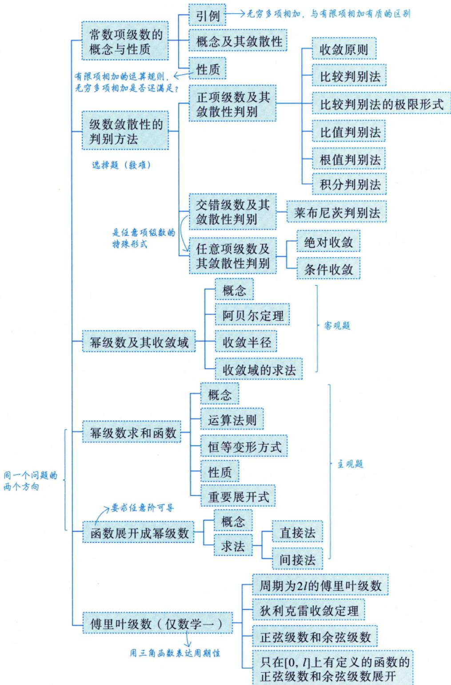

## 基础内容精讲

## 常数项级数的概念与性质

## 1 引例

古希腊数学家芝诺曾经讲了一个有趣的悖论：一个人从A点走到B点，先走完路程的 $\frac { 1 } { 2 }$ ，然后走完剩下路程的 $\frac{1}{2}$ ，再走完剩下路程的 $\frac{1}{2}, \cdots\cdots$ ，依次类推，一直走下去，永远走不到终点.

我们不妨将芝诺的文字描述写成如下的数学表达式.

假设此人匀速前进走完路程的 $\frac { 1 } { 2 }$ 要用半个小时，则按照芝诺的描述，从A点到B点所用的总时间T可以写成

$$
T = \frac{1}{2} + \frac{1}{4} + \frac{1}{8} + \frac{1}{16} + \cdots
$$

这便出现了无穷多项相加的式子，且越往后的项越小，这“无穷多个越来越小的项加起来”的表达式合理吗？芝诺认为不对，其核心问题就在于以前人们所接触的都是有限项相加，项数再多，也加得完；现在出现了无穷多项相加，用所谓的加法是永远加不到尽头的.接下来，我们就要开始研究这个总时间T的表达式到底是什么，该如何处理它.

## ②概念及其敛散性

→叫形式和给定一个无穷数列 $u_{1}, u_{2}, \cdots, u_{n}, \cdots$ ，将其各项用加号连起来得到记号 $\sum_{n = 1}^{\infty}u_{n}$ ，即

$$
\sum_{n = 1}^{\infty}u_{n} = u_{1} + u_{2} + \cdots + u_{n} + \cdots
$$

叫作无穷级数，简称级数，其中 $u _ { n }$ 叫作该级数的通项.若 $u _ { n }$ 是常数，则称 $\sum_{n = 1}^{\infty}u_{n}$ 为常数项无穷级数，简称常数项级数.如在引例中写出的总时间 $T = \frac{1}{2} + \frac{1}{4} + \frac{1}{8} + \frac{1}{16} + \cdots = \sum_{n = 1}^{\infty}\frac{1}{2^{n}}$ ，这里的通项 $u_{_n} = \frac{1}{2^{^n}}$ .之所以称$\sum_{n = 1}^{\infty}u_{n}$ 为一个记号，是因为这种相加只是形式上的.既然无穷多项是不可能逐一相加求和的，那么该如何处理“无穷多项相加”呢？

现将级数中的各项逐一相加，得到下面这些和：

$$
S_{1}=u_{1}, S_{2}=u_{1}+u_{2}, S_{3}=u_{1}+u_{2}+u_{3}, \cdots, S_{n}=u_{1}+u_{2}+\cdots+u_{n}, \cdots,
$$

方法：

①写 $S_{n}=u_{1}+u_{2}+\cdots+u_{n}$

叫数项级数的前n项和

②求 $\operatorname* { l i m } _ { n \to \infty } S _ { n }$

这称为级数的部分和，{S}就是级数的部分和数列.显然，我们愿意去研究当n→∞时所发生的事情，因为 $\lim_{n \to \infty} S_n = \sum_{n=1}^{\infty} u_n$ ，这便道出了无穷多项相加的方法：用极限工具来处理.若 $\lim_{n \to \infty} S_n = S$ (一个存在的有限数)，则称 $\sum_{n = 1}^{\infty}u_{n}$ 收敛，并称S为该收敛级数 $\sum_{n = 1}^{\infty}u_{n}$ 的和；若 $\lim_{n \to \infty} S_n$ 不存在，则称 $\sum_{n = 1}^{\infty}u_{n}$ 发散. 雅各布·伯努利曾在自己的文章中这样写道：“末项消逝的无穷级数之和有时有限而有时无限或不定.”这里的“有限”与“无限或不定”就分别对应着“收敛”与“发散”.

研究一个级数 $\sum_{n = 1}^{\infty}u_{n}$ 是收敛还是发散，也可以简单说成研究级数 $\sum_{n = 1}^{\infty}u_{n}$ 的敛散性.

如判别几何级数(也叫等比级数)

$$
\sum_{n = 1}^{\infty}aq^{n - 1} = a + aq + aq^{2} + \cdots + aq^{n - 1} + \cdots
$$

的敛散性，其中 $a \neq 0$

在公比q满足 $\left| q \right| { < } 1$ 的情形下，初等数学知识告诉我们，部分和

判别级数敛散性的步骤：

$$
S_{n}=\frac{a(1-q^{n})}{1-q},
$$

①写 $S_{n}=\frac{a(1-q^{n})}{1-q}$

②算 $\operatorname* { l i m } _ { n \to \infty } S _ { n }$ 是否存在

且 $\lim_{n \to \infty} q^n = 0$ ，因此 $\lim_{n \to \infty} S_n = \frac{a}{1 - q}$ ，这个极限是存在的，故当 $\left| q \right| < 1$ 时， $\sum_{n = 1}^{\infty}aq^{n - 1}$ 收敛：

反之，当 $\left| q \right|   \geqslant   1$ 时， $\sum_{n = 1}^{\infty}aq^{n - 1}$ 是发散的，这是因为

若 $q > 1$ ，则 $\lim_{n \to \infty} q^n = +\infty, \lim_{n \to \infty} S_n$ 不存在；

若 $q = 1$ ，则 $\sum_{n = 1}^{\infty}aq^{n - 1} = a + a + \cdots + a + \cdots$ (无穷多个a相加)， $\lim_{n \to \infty} S_{n} = \lim_{n \to \infty} na = \left\{ \begin{aligned} +\infty, \quad a > 0, \\ -\infty, \quad a < 0, \end{aligned} \right. \lim_{n \to \infty} S_{n}$ 亦不存在；

(考生可轻易看出，当 $q   \geq   1$ 时， $\lim_{n \to \infty} S_n$ 为±∞，到底是+∞还是-∞，由a的正负决定)

若 $q = - 1$ ，则 $\sum_{n = 1}^{\infty}aq^{n - 1} = a + ( - a) + a + ( - a) + \cdots$ ，这是一个十分著名且有趣的级数，欧拉、莱布尼茨都在这个级数的敛散性判别上犯了错误，今天的我们当然可以清晰地给出正确答案，部分和 $S_{1} = a$ $S_{2}=0,\;S_{3}=a,\;S_{4}=0,\;\cdots$ ，它们交错着等于a和0，显然 $\lim_{n \to \infty} S_n$ 不存在(不唯一，自然不存在)；

若 $q < -1, \lim_{n \to \infty} q^n$ 不存在，则 $\lim_{n \to \infty} S_n$ 不存在.

综上所述，当 $\left| q \right|   \geqslant   1$ 时， $\lim_{n \to \infty} S_n$ 均不存在，则 $\sum_{n = 1}^{\infty} a q^{n - 1}$ 发散. 于是有

$\left\{ \sum_{n = 1}^{\infty} a q^{n - 1} \right\}$ 发散， 收敛，其和为 $\frac{a}{1 - q}, \quad |q| < 1,$ $\left| q \right| { \geqslant } 1 ,$ 1. 其中 $a \neq 0$

注 显然，在引例中提出的芝诺的问题是几何级数的特例， $T = \sum_{n = 1}^{\infty}\frac{1}{2^{n}} = \sum_{n = 1}^{\infty}\frac{1}{2} \cdot \left( \frac{1}{2} \right)^{n - 1}$ 其首项 $a =$ $\frac{1}{2}$ 公比 $q = \frac{1}{2}$ 是 $\left| q \right| < 1$ 的情况，则 $\lim_{n \to \infty} S_{n} = \frac{a}{1 - q} = \frac{\frac{1}{2}}{1 - \frac{1}{2}} = 1$ 事实上，此人将恰好用一个小时从A点走到B点.上述过程告诉我们，不能用有限项相加去理解和处理无限项相加.

## ③ 性质

性质1 若级数 $\sum_{n = 1}^{\infty}u_{n}, \sum_{n = 1}^{\infty}v_{n}$ 均收敛，则任给常数a,b，有 $\sum_{n = 1}^{\infty}(au_{n} \pm bv_{n})$ 也收敛，且

$$
\sum_{n = 1}^{\infty}(au_{n} \pm bv_{n}) = a\sum_{n = 1}^{\infty}u_{n} \pm b\sum_{n = 1}^{\infty}v_{n}
$$

记忆口诀：若 $\sum_{n = 1}^{\infty}u_{n} , \quad \sum_{n = 1}^{\infty}v_{n}$ 均收敛，则其线性组合也收敛

## 注(1)收敛±发散=发散；(2)发散±发散=不一定.

级数的敛散性取决于★性质2 改变级数任意有限项，不会改变该级数的敛散性. n→∞时的情况.

★性质3 收敛级数的项任意加括号后所得的新级数仍收敛，且其和不变.

如若 $\sum_{n = 1}^{\infty}u_{n}$ 收敛，则 $\sum_{n = 1}^{\infty}(u_{2n - 1} + u_{2n}) = (u_{1} + u_{2}) + (u_{3} + u_{4}) + \cdots$ 也收敛.

## 注根据性质3，有如下两个结论需要注意.

(1)若加括号后得到的新级数发散，则原级数必然发散(逆否命题).

(2)若加括号后得到的新级数收敛，不能断言原级数一定收敛.如级数 $\sum_{n = 1}^{\infty} (-1)^{n - 1} a$ 其中常数$a \neq 0$ ，若从第一项起，两项两项地加括号，可得 $(a - a) + (a - a) + \cdots = 0$ 收敛，但原级数是发散的.

## 考研数学基础30讲·高等数学分册

★性质4 若 $\sum_{n = 1}^{\infty}u_{n}$ 收敛，则 $\lim_{n \to \infty} u_n = 0$

证 $\sum_{n = 1}^{\infty}u_{n}$ 收敛 $\Leftrightarrow \lim_{n \to \infty} S_n = A$ .又因为当 $n > 1$ 时， $u_{n} = S_{n} - S_{n - 1}$ ，所以 $\lim_{n \to \infty} u_n = \lim_{n \to \infty} S_n - \lim_{n \to \infty} S_{n-1} =$ $A - A = 0$

注2 $u _ { n }$ 的妙用：当n>1时， $u_{n} = S_{n} - S_{n - 1}$

例：对于正项级数 $\sum_{n = 1}^{\infty}u_{n}, S_{n}$ 是级数前n项和，当n>1时，则

$$
\left| \frac{u_{n}}{S_{n}^{2}} \right| = \frac{S_{n} - S_{n - 1}}{S_{n}^{2}} \leqslant \frac{S_{n} - S_{n - 1}}{S_{n} \cdot S_{n - 1}} = \frac{1}{S_{n - 1}} - \frac{1}{S_{n}}
$$

分析：u与S不同类，所以要化为同类→{S}是单调增加数列

注3此性质是级数收敛的必要条件.其逆否命题：若 $\lim_{n \to \infty} u_n \neq 0$ 则 $\sum_{n = 1}^{\infty}u_{n}$ 必发散，且即使$\lim_{n \to \infty} u_{n} = 0$ ，也不能保证 $\sum_{n = 1}^{\infty}u_{n}$ 收敛，见例16.13.

$$
\int_{1}^{+\infty} \frac{1}{x^p}   dx \Rightarrow \left\{ \begin{aligned} p > 1,  收敛 , \\ p \leq 1,  收敛 . \end{aligned} \right. \quad \Leftrightarrow \sum_{n=1}^{\infty} \frac{1}{n^p} \Rightarrow \left\{ \begin{aligned} p > 1,  收敛 . \\ p \leq 1,  收敛 . \end{aligned} \right.
$$

应用：判别 $\sum_{n = 1}^{\infty}\ln\left( 1 + \frac{1}{n} \right)$ 的敛散性.

解：因为 $\ln \left(1+\frac{1}{n}\right)=\ln \frac{n+1}{n}=\ln (n+1)-\ln n$ ，且

例16.1 证明： $\sum_{n = 1}^{\infty}(u_{n + 1} - u_{n})$ 收敛 $\Leftrightarrow \lim_{n \to \infty} u_n$ 存在.

limlnn不存在，所 $\sum_{n = 1}^{\infty}\ln\left( 1 + \frac{1}{n} \right) = \sum_{n = 1}^{\infty}\left\lbrack \ln(n + 1) - \ln n \right\rbrack$   
π→∞  
发散

证 $S_{n}=\sum_{k = 1}^{n}(u_{k + 1}-u_{k})=(u_{2}-u_{1})+(u_{3}-u_{2})+\cdots+(u_{n + 1}-u_{n})=u_{n + 1}-u_{1}$ ，故 $\sum_{n = 1}^{\infty}(u_{n + 1} - u_{n})$ 收敛 $\Leftrightarrow \lim_{n \to \infty} S_n$ 存有限项相加，去括号无影响←在，即 $\lim_{n \to \infty} u_{n+1} - u_1$ 存在，也即 $\lim_{n \to \infty} u_{n+1}$ 存在 $\Leftrightarrow \lim_{n \to \infty} u_{n}$ 存在.

例16.2 记 $\sum_{n = 1}^{\infty}u_{n}$ 的部分和 $S_{n}=u_{1}+u_{2}+\cdots+u_{n}$ ，若 $\lim_{n \to \infty} u_n = 0$ , lim $S_{2n} = S$ (或 $\lim_{n \to \infty} S_{2n+1} = S$ ，证n→∞明： $\sum_{n = 1}^{\infty}u_{n} = S$

分析 $\lim_{n \to \infty} S_n = S \Leftrightarrow \sum_{n=1}^{\infty} u_n = S, \quad \lim_{n \to \infty} \sum_{n=1}^{\infty} u_n = S$

证由于 $\lim_{n \to \infty} u_n = 0$ ，因此 $\lim_{n \to \infty} u_{2n+1} = 0$ .结合 $\lim_{n \to \infty} S_{2n} = S$ ，有

$$
\lim_{n \to \infty} S_{2n+1} = \lim_{n \to \infty} (S_{2n} + u_{2n+1}) = \lim_{n \to \infty} S_{2n} + \lim_{n \to \infty} u_{2n+1} = S + 0 = S
$$

故 $\lim_{n \to \infty} S_{2n} = \lim_{n \to \infty} S_{2n+1} = S$ .所以 $\lim_{n \to \infty} S_n = S$ ，即 $\sum_{n = 1}^{\infty}u_{n} = S$

## 级数敛散性的判别方法

## 正项级数及其敛散性判别

→部分和数列{S}单调不减

若通项 $u_{n} \geqslant 0, n = 1, 2, \cdots$ ，则称 $\sum_{n = 1}^{\infty}u_{n}$ 为正项级数.

(1) 收敛原则.

正项级数 $\sum_{n = 1}^{\infty}u_{n}$ 收敛的充分必要条件是它的部分和数列 $\left\{ S_{n} \right\}$ 有界.

注由于 $\left\{ S_{n} \right\}$ 单调不减，故 $\lim_{n \to \infty} S_n$ 只有两种可能的结果：若 $\left\{ S_{n} \right\}$ 有界，则 $\lim_{n \to \infty} S_n = S$ (有限正数)；若 $\left\{ S_{n} \right\}$ 无界，则 $\lim_{n \to \infty} S_n = +\infty$ .除此之外，再无其他结果.

例16.3 判别级数 $\sum_{n = 0}^{\infty}\frac{1}{n!}$ 的敛散性.

分析当 $S_{2n} , S_{2n-1}$ 均不好算时，可以考虑找 $S _ { n }$ 的上界.

解其部分和 $S_{n + 1}$ 满足

$$
\begin{aligned}0 < S_{n+1} = & 1 + 1 + \frac{1}{2!} + \frac{1}{3!} + \cdots + \frac{1}{n!} \\\leqslant & 1 + 1 + \frac{1}{1 \times 2} + \frac{1}{2 \times 3} + \cdots + \frac{1}{(n - 1)n} \\= & 1 + 1 + \left(1 - \frac{1}{2}\right) + \left(\frac{1}{2} - \frac{1}{3}\right) + \cdots + \left(\frac{1}{n - 1} - \frac{1}{n}\right) = 3 - \frac{1}{n} < 3,\end{aligned}
$$

即 $\left\{ S_{n + 1} \right\}$ 有界，由收敛原则，有 $\sum_{n = 0}^{\infty}\frac{1}{n!}$ 收敛.

注这个级数的和是著名的欧拉数e.可在 $\mathrm{e}^{x}=\sum_{n = 0}^{\infty}\frac{x^{n}}{n!}$ 中，令 $x = 1$ ，则有 $\sum_{n = 0}^{\infty}\frac{1}{n!} = e$

(2) 比较判别法. →前有限项不影响敛散性给出两个正项级数 $\sum_{n = 1}^{\infty}u_{n}$ 和 $\sum_{n = 1}^{\infty} \mathcal{V}_{n}$ ，如果从某项起有 $u_{n} \leq v_{n}$ 成立，则①若 $\sum_{n = 1}^{\infty} \nu_{n}$ 收敛，则 $\sum_{n = 1}^{\infty}u_{n}$ 也收敛；  
②若 $\sum_{n = 1}^{\infty}u_{n}$ 发散，则 $\sum _ { n = 1 } ^ { \infty } \nu _ { n }$ 也发散.

有人通俗地念成：两个正项级数，若大的收敛，则小的必收敛；若小的发散，则大的必发散.对于记忆来讲，这种念法未尝不可.

例16.4 以下结论，正确的是（ ).(A) $\sum_{n = 1}^{\infty}\ln\left( 1 + \frac{1}{n} \right)$ 收敛， $\sum_{n = 1}^{\infty}\frac{1}{n}$ 收敛 (B) $\sum_{n = 1}^{\infty}\ln\left( 1 + \frac{1}{n} \right)$ 收敛， $\sum_{n = 1}^{\infty}\frac{1}{n}$ 发散(C) $\sum_{n = 1}^{\infty}\ln\left( 1 + \frac{1}{n} \right)$ 发散， $\sum_{n = 1}^{\infty}\frac{1}{n}$ 收敛 (D) $\sum_{n = 1}^{\infty}\ln\left( 1 + \frac{1}{n} \right)$ 发散， $\sum_{n = 1}^{\infty}\frac{1}{n}$ 发散

解应选 (D).

方法一当 $x > 0$ 时，有 $x > \ln(1 + x) > 0$ ，所以对任意的正整数n，显然也有 $\frac{1}{n} > \ln \left( 1 + \frac{1}{n} \right)$ .我们可以先研究 $\sum_{n = 1}^{\infty}\ln\left( 1 + \frac{1}{n} \right)$ 的敛散性，若发散，可用比较判别法得出结论.

$$
\sum_{n = 1}^{\infty}\ln\left( 1 + \frac{1}{n} \right) = \sum_{n = 1}^{\infty}\ln\frac{n + 1}{n}
$$

其部分和

$$
S_{n}=\ln\frac{2}{1}+\ln\frac{3}{2}+\cdots+\ln\frac{n+1}{n}=(\ln2-\ln1)+(\ln3-\ln2)+\cdots+[\ln(n+1)-\ln n]=\ln(n+1)
$$

因为 $\lim_{n \to \infty} S_n = \lim_{n \to \infty} \ln(n + 1) = +\infty$ ，所以 $\sum_{n = 1}^{\infty}\ln\left( 1 + \frac{1}{n} \right)$ 发散，根据正项级数的比较判别法，有 $\sum_{n = 1}^{\infty}\frac{1}{n}$ 发散.  
选(D).

方法二 $\sum_{n = 1}^{\infty}\ln\left( 1 + \frac{1}{n} \right)$ 发散，证明方法见例16.1的应用.

画 $\sum_{n = 1}^{\infty}\frac{1}{n} = 1 + \frac{1}{2} + \frac{1}{3} + \cdots + \frac{1}{n} + \cdots$ 这个级数从第二项起，每项都是其左右两个相邻项的调和平均数.所谓数c是数a与数b的调和平均数就是指它们之间满足下面这个式子：

$$
\frac{1}{c} = \frac{1}{2} \left( \frac{1}{a} + \frac{1}{b} \right)
$$

于是， $\sum_{n = 1}^{\infty}\frac{1}{n}$ 叫作调和级数

$\sum_{n = 1}^{\infty}\frac{1}{n^{p}}$ 叫作p级数，调和级数 $\sum_{n = 1}^{\infty}\frac{1}{n}$ 是p级数中p=1时的特殊情况.这里不加证明地给出重要结论：

P级数 $\sum_{n = 1}^{\infty}\frac{1}{n^{p}}.$ 发散， $p \leq 1 ,$ ，对比记忆p积分 $\int_{1}^{+\infty} \frac{1}{x^p}   dx \left\{ \begin{aligned} & \quad  收敛 , \quad p \leq 1 \\ & \quad  收敛 , \quad p > 1 \end{aligned} \right.$ 收敛， $p > 1 .$ 3E

这个结论十分重要，在比较判别法中，常选取比较对象为 $\sum_{n = 1}^{\infty}\frac{1}{n^{p}}$ 或者 $\sum_{n = 0}^{\infty}aq^{n}$ 在以后的多种场合都会派上用场，考生需牢记.

★★★例16.5 设正项级数 $\sum_{n = 1}^{\infty}a_{n}$ 收敛，证明：级数 $\sum_{n = 1}^{\infty}a_{n}^{2}$ 收敛.

回颈：若 $\lim_{n \to \infty} a_n = a > 0$ ，则有 $a_{_n} > 0$

证由 $\sum_{n = 1}^{\infty}a_{n}$ 收敛可得 $\lim_{n \to \infty} a_n = 0$ ，即当n→∞时（存在N>0，当n>N时）， $a_{n} < M$ (极限的有界性)，于是 $a_{n}^{2}=a_{n} \cdot a_{n}<Ma_{n}$ ，故由比较判别法知 $\sum_{n = 1}^{\infty}a_{n}^{2}$ 收敛.

$$
\sum_{n = 1}^{\infty}a_{n}^{3} = \sum_{n = 1}^{\infty}a_{n} \cdot a_{n}^{2} < M\sum_{n = 1}^{\infty}a_{n}^{2}
$$

利用 $\sum a_{2n + 1} < \sum a_{n}$

注 本题的结论应当记住，如下例就用到了它.同样的方法可以证明 $\sum a_{n}^{3}, \sum a_{2n}, \sum a_{2n+1}$ 都收敛.利用 $\sum a_{2n} < \sum a_n$

例16.6 (1)设 $\sum_{n = 1}^{\infty}u_{n}$ 是正项级数，若 $\sum_{n = 1}^{\infty}\sqrt{u_{n}u_{n + 1}}$ 收敛，且 $\left\{ u _ { n } \right\}$ 单调减少，证明： $\sum_{n = 1}^{\infty}u_{n}$ 收敛；

(2) 设 $\sum_{n = 1}^{\infty}u_{n}$ 和 $\sum_{n = 1}^{\infty} \nu_{n}$ 都是正项级数，且 $\sum_{n = 1}^{\infty}u_{n}$ 和 $\sum_{n = 1}^{\infty} \nu_{n}$ 都收敛，证明： $\sum_{n = 1}^{\infty}u_{n}v_{n}$ 收敛.

证(1)由 $\left\{ u _ { n } \right\}$ 单调减少可得 $u_{n + 1} \leq u_{n}$ ，两边同时乘以 $u _ { n + 1 }$ ，进而可得 $u_{n + 1}^{2} \leqslant u_{n}u_{n + 1}$ ，于是 $u _ { { n + 1 } }   \leqslant$ $\sqrt{u_{n}u_{n+1}}$ .因为 $\sum _ { n = 1 } ^ { \infty } { \sqrt { u _ { n } u _ { n + 1 } } }$ 收敛，所以 $\sum_{n = 1}^{\infty}u_{n}$ 收敛.

(2)由 $\sum_{n = 1}^{\infty}u_{n}$ 和 $\sum_{n = 1}^{\infty} \mathcal{V}_{n}$ 收敛可得 $\sum_{n = 1}^{\infty}u_{n}^{2}$ 和 $\sum_{n = 1}^{\infty} \nu_{n}^{2}$ 收敛，且 $u_{n}v_{n} \leqslant \frac{1}{2}(u_{n}^{2} + v_{n}^{2})$ ，故由比较判别法知 $\sum_{n = 1}^{\infty}u_{n}v_{n}$ 收敛.

注第 (2) 问利用公式 $ab \leq \frac{a^{2} + b^{2}}{2}$ ，同理还有 $ab = 2a\frac{b}{2}, \quad ab = \frac{a}{b}b^{2}$ 等

例16.7设有方程 $x^{n}+nx-1=0$ ，其中n为正整数.证明此方程存在唯一的正实根 $x_{n}$ ，并证明当a>1时，级数 $\sum_{n = 1}^{\infty}x_{n}^{a}$ 收敛.

证由例6.18知，此方程存在唯一的正实根 $x _ { n }$ ，且 $0 < x_{n} < 1$

因为 $x_{n}^{n}+nx_{n}-1=0$ ，且 $0 < x_{n} < 1$ ，所以

$$
0 < x_{n} = \frac{1 - x_{n}^{n}}{n} < \frac{1}{n}
$$

当a>1时，有

$$
0 < x_{n}^{a} < \left( \frac{1}{n} \right)^{a}
$$

又当a>1时，正项级数 $\sum_{n = 1}^{\infty}\frac{1}{n^{a}}$ 收敛，所以级数 $\sum_{n = 1}^{\infty}x_{n}^{a}$ 收敛.

注记 $f_{n}(x)=x^{n}+nx-1$ ，若是观察到 $f_{n}\left(\frac{1}{n}\right)=\left(\frac{1}{n}\right)^{n}>0$ 则此时 $0<x_{n}<\frac{1}{n}$ 进而有 $0 < x_{n}^{a} < \frac{1}{n^{a}}$ 这样更简单.

(3)比较判别法的极限形式（无穷小比阶）.

给出两个正项级数 $\sum_{n = 1}^{\infty}u_{n}$ 和 $\sum_{n = 1}^{\infty} v_{n}, v_{n} \neq 0 (n = 1, 2, \cdots)$ ，且 $\lim_{n \to \infty} \frac{u_n}{v_n} = A \to \frac{0}{0}  时才有"意义"$

①若A=0，则当 $\sum _ { n = 1 } ^ { \infty } \mathcal { V } _ { n }$ 收敛时， $\sum_{n = 1}^{\infty}u_{n}$ 也收敛；

②若 $A = +\infty$ ，则当 $\sum_{n = 1}^{\infty} \nu_{n}$ 发散时， $\sum_{n = 1}^{\infty}u_{n}$ 也发散；

★③若 $0 < A < +\infty$ ，则 $\sum _ { n = 1 } ^ { \infty } u _ { n }$ 与 $\sum_{n = 1}^{\infty} \mathcal{V}_{n}$ 有相同的敛散性.

例16.8 设 $\alpha > 0$ ，级数 $\sum_{n = 2}^{\infty}\sin(n^{- \alpha}\ln n)$ 收敛，则（ ).(A) $\alpha   \leqslant   1$ (B) $\alpha   <   1$ (C) $\alpha   \geqslant   1$ (D) $\alpha   >   1$

解应选 (D).

对任意给定的 $\alpha > 0$ $\lim_{n \to \infty} \frac{\ln n}{n^{\alpha}} = 0$ ，所以当n足够大时，有 $0 < n^{-\alpha} \ln n < \frac{\pi}{2}$ ，故 $\sin(n^{-\alpha}\ln n)>0$ ，则目标级数为正项级数.

考虑到 $\lim_{n \to \infty} \frac{\sin(n^{-\alpha} \ln n)}{n^{-\alpha} \ln n} = 1$ ，故原级数与 $\sum_{n = 2}^{\infty}n^{- \alpha}\ln n$ 敛散性相同.

①当 $0 < \alpha \leq 1$ ，且n充分大时，有 $\frac{\ln n}{n^{\alpha}} > \frac{1}{n^{\alpha}} > 0$ ，而 $\sum_{n = 2}^{\infty}\frac{1}{n^{\alpha}}$ 发散，故 $\sum_{n = 2}^{\infty}\frac{\ln n}{n^{\alpha}}$ 发散.

②当α>1时，总存在充分小的 $\varepsilon > 0$ ，使 $\alpha - \varepsilon > 1$ ，此时 $\lim_{n \to \infty} \frac{\frac{\ln n}{n^{\alpha}}}{\frac{1}{n^{\alpha - \varepsilon}}} = \lim_{n \to \infty} \frac{\ln n}{n^{\varepsilon}} = 0$ .由于$\sum_{n = 2}^{\infty}\frac{1}{n^{\alpha - \varepsilon}}$ 收敛，故 $\sum_{n = 2}^{\infty}\frac{\ln n}{n^{\alpha}}$ 收敛.

综上所述，当 $0 < \alpha \leq 1$ 时，原级数发散，当α>1时，原级数收敛.选(D).

注懂得了以上道理，形如 $e^{n^{-\alpha}\ln n} - 1 \sim \frac{\ln n}{n^{\alpha}}$ $\ln \left( 1 + n ^ { - \alpha } \ln n \right) \sim \frac { \ln n } { n ^ { \alpha } } ( n \rightarrow \infty )$ 等均可作为上例的变体形式出现在试卷中.

例16.9设 $a_{n} > 0,\; p > 1$ ，且 $\lim_{n \to \infty} n^p \left( \mathrm{e}^{\frac{1}{n}} - 1 \right) a_n = 1$ ，若级数 $\sum_{n = 1}^{\infty}a_{n}$ 收敛，则p的取值范围 是

## 解应填(2，+∞).

因为当n→∞时， $\mathbf{e}^{\frac{1}{n}} - 1$ 与 $\frac{1}{n}$ 是等价无穷小，所以由 $\lim_{n \to \infty} n^p \left( \mathrm{e}^{\frac{1}{n}} - 1 \right) a_n = 1$ ，可知 $\lim_{n \to \infty} \frac{a_n}{1} = 1$ 又级数 $\sum_{n = 1}^{\infty}a_{n}$ 收敛，故 $\sum _ { n = 1 } ^ { \infty } { \frac { 1 } { n ^ { p - 1 } } }$ 收敛，因此 $p > 2$

例16.10 设数列 $\left\{ a _ { n } \right\} , \left\{ b _ { n } \right\}$ 满足 $0 < a_{n} < \frac{\pi}{2}, \quad 0 < b_{n} < \frac{\pi}{2}, \quad \cos a_{n} - a_{n} = \cos b_{n}$ ，且级数 $\sum_{n = 1}^{\infty}b_{n}$ 收敛.证明： $\frac{\sqrt{b}}{\lim\limits_{n \to \infty} b_n = 0}$

$$
\left\{ \begin{aligned} \frac{u_{n}}{\nu_{n}} = & \nu_{n} , \ \mu_{n} \text { , } \mu_{n} \text { * } \nu_{n} \end{aligned} \right\} \leqslant \frac{u_{n}^{2} + \nu_{n}^{2}}{2} , \left\{ \begin{aligned} \frac{u_{n}}{n} \text { * } n \text { * } \nu_{n} \\ = & \frac{u_{n}}{\nu_{n}} \text { * } \nu_{n}^{2} , \end{aligned} \right.
$$

(1) $\lim_{n \to \infty} a_n = 0$ ；常见题型： ，题型归纳不是关键，要学会分析题目，回归定义与性质(2) 级数 $\sum_{n = 1}^{\infty}\frac{a_{n}}{b_{n}}$ 收敛.

证(1)由例 2.11 可知 $\lim_{n \to \infty} a_n = 0$

(2) 由例 2.11 可知 $\lim_{n \to \infty} \frac{\frac{a_n}{b_n}}{b_n} = \frac{1}{2}$ ，又级数 $\sum _ { n = 1 } ^ { \infty } b _ { n }$ 收敛，所以级数 $\sum_{n = 1}^{\infty}\frac{a_{n}}{b_{n}}$ 收敛.

(4)比值判别法(也叫达朗贝尔判别法)

给出一正项级数 $\sum_{n = 1}^{\infty}u_{n}$ ，如果 $\lim_{n \to \infty} \frac{u_{n+1}}{u_n} = \rho$ ，那么

①若 $\rho   <   1$ ，则 $\sum_{n = 1}^{\infty}u_{n}$ 收敛；

  
达朗贝尔 (1717—1783)

②若 $\rho   >   1$ ，则 $\sum_{n = 1}^{\infty}u_{n}$ 发散.

注(1)需要指出，若 $\rho = 1$ ，无法用此法判定 $\sum_{n = 1}^{\infty}u_{n}$ 的敛散性.比如对于 $\sum_{n = 1}^{\infty}\frac{1}{n}, u_{n} = \frac{1}{n}$ $\lim_{n \to \infty} \frac{u_{n+1}}{u_n} = \lim_{n \to \infty} \frac{\frac{1}{n+1}}{\frac{1}{n}} = \lim_{n \to \infty} \frac{n}{n+1} = 1$ ;对于 $\sum_{n = 1}^{\infty}\frac{1}{n^{2}}, u_{n} = \frac{1}{n^{2}}$ 则 $\lim_{n \to \infty} \frac{u_{n+1}}{u_n} = \lim_{n \to \infty} \frac{\frac{1}{(n+1)^2}}{\frac{1}{n^2}} = \lim_{n \to \infty} \left( \frac{n}{n+1} \right)^2 = 1$ .你看，前者发散，后者收敛，但都有 $\rho = 1$

(2)由(1)，若ρ不存在或ρ=1，无法用比值判别法.但若 $\frac{u_{n + 1}}{u_{n}} < \frac{\rho + 1}{2} = k < 1$ 存在 $N > 0$ 当$n > N$ 时， $u_{n + 1} < \frac{\rho + 1}{2}u_{n} = ku_{n} < k^{2}u_{n - 1} < \cdots < k^{n - N}u_{N + 1} = k^{n}A$ 由于 $\sum_{n = N}^{\infty} k^{n - N} u_{N + 1}$ 收敛，则 $\sum_{n = 1}^{\infty}u_{n}$ 收敛.若$\frac{u_{n + 1}}{u_{n}} \geqslant 1(n > N > 0)$ ，则 $\lim_{n \to \infty} u_{n}$ 不等于0，不必取极限，就可推知 $\sum_{n = 1}^{\infty}u_{n}$ 发散.

$u_{n + 1} \geqslant u_{n}\ , \mathrm{即}\left\{ u_{n} \right\}$ 为单调不减的正项数列，故 $\lim_{n \to \infty} u_{_n} \neq 0$

例16.11 设 $a > 0$ ，则下列对级数 $\sum_{n = 1}^{\infty}\frac{a^{n}n!}{n^{n}}$ 的敛散性说法正确的是().

(A)当 $0 < a < \mathbf{e}$ 时，原级数收敛；当 $a   \geqslant   \mathbf { e }$ 时，原级数发散

(B)当 $0 < a < \mathbf{e}$ 时，原级数发散；当 $a   \geqslant   \mathbf { e }$ 时，原级数收敛

(C)当 $0 < a < \mathbf{e}$ 时，原级数收敛；当 $a   \geqslant   \mathbf { e }$ 时，原级数收敛

(D)当 $0 < a < \mathbf{c}$ 时，原级数发散；当 $a   \geqslant   \mathbf { e }$ 时，原级数发散

题目改进方法：

解应选(A).

①当 $0 < a \leq \mathrm{e}$ 时，原级数收敛：当a>e时，原级数发散。

②当 $0 < a < \mathrm{e}$ 时，原级数收敛；当a≥e时，原级数发散.

若设计如上两个选项，则在计算过程中，就不得不验证a=e时，级数的敛散性

$$
\lim_{n \to \infty} \frac{u_{n+1}}{u_n} = \lim_{n \to \infty} \frac{a^{n+1} \cdot (n+1)!}{(n+1)^{n+1}} \cdot \frac{n^n}{a^n \cdot n!} = \lim_{n \to \infty} a \left( \frac{n}{n+1} \right)^n = \lim_{n \to \infty} \frac{a}{(1+\frac{1}{n})^n} = \frac{a}{e}
$$

这里 $\rho = \frac{a}{\mathrm{e}}$ ，显然当 $0 < \frac{a}{\mathrm{e}} < 1$ ，即 $0 < a < \mathbf{e}$ 时，原级数收敛；当 $\frac{a}{\mathbf{e}} > 1$ ，即 $a > \mathbf { e }$ 时，原级数发散；当 $a = \mathrm { e }$ 时，由于当n→∞时， $\left( 1 + \frac{1}{n} \right)^n$ 单调增加且趋向于e，故存在 $N > 0$ ，当 $n > N$ 时， $\frac{u_{n + 1}}{u_{n}} = \frac{\mathrm{e}}{\left( 1 + \frac{1}{n} \right)^{n}} > 1 \Rightarrow u_{n + 1} > u_{n}$ $\left\{ u _ { n } \right\}$ 单调增加，从而知 $\lim_{n \to \infty} u_n \neq 0$ ，由级数收敛的必要条件，知原级数发散.

综上所述，当 $0 < a < \mathbf{c}$ 时，原级数收敛；当 $a   \geqslant   \mathbf { e }$ 时，原级数发散.选(A).

(5)根值判别法(也叫柯西判别法).

给出一正项级数 $\sum _ { n = 1 } ^ { \infty } u _ { n }$ ，如果 $\lim_{n \to \infty} \sqrt[n]{u_n} = \rho$ ，那么

①若 $\rho   <   1$ ，则 $\sum _ { n = 1 } ^ { \infty } u _ { n }$ 收敛； →证明：存在N>0，当 $n > N$ 时， $\sqrt[n]{u_{n}}<\frac{\rho+1}{2}=k$ $0 < k < 1 \Rightarrow 0 < u_{n} < k^{n} \rightarrow 0 (n \rightarrow \infty  时 )$ ，故 $\rho < 1$ 时，

  
柯西 (1789—1857)

②若 $\rho   >   1$ ，则 $\sum _ { n = 1 } ^ { \infty } u _ { n }$ 发散. $\sum_{n = 1}^{\infty}u_{n}$ 收敛

注(1)同样要指出，若 $\rho = 1$ ，根值判别法也会失效.如 $\sum_{n = 1}^{\infty}\frac{1}{n}$ 发散，有 $\lim_{n \to \infty} \sqrt[n]{\frac{1}{n}} = \rho = 1; \sum_{n=1}^{\infty} \frac{1}{n^2}$ 收敛，也有 $\lim_{n \to \infty} \sqrt[n]{\frac{1}{n^2}} = \rho = 1$

(2) $\sqrt[n]{u_{n}} \geqslant 1(n = 1, 2, \cdots)$ ，则 $\lim_{n \to \infty}$ 不等于0，不必取极限，就可推知 $\sum_{n = 1}^{\infty}u_{n}$ 发散

例16.12 级数 $\sum_{n = 1}^{\infty}\left[ \mathrm{e}^{\frac{\sin^{2}\alpha n}{n^{2}}} + \left( \cos\frac{1}{\sqrt{n}} \right)^{n^{2}} - 1 \right]$ ( ).

(A) 收敛 (B) 发散 (C)敛散性与α有关 (D)无法判断

解应选(A).

对级数 $I_{1} = \sum_{n = 1}^{\infty}\left( \mathrm{e}^{\frac{\sin^{2}\alpha n}{n^{2}}} - 1 \right)$ ，当 $n \to \infty$ 时， $\frac{\sin^{2}\alpha n}{n^{2}} \rightarrow 0^{+}$ ，可判断其为正项级数.当 $n \to \infty$ 时，$\frac{\sin^{2}\alpha n}{n^{2}}-1$ 等价于 $\frac{\sin^{2}\alpha n}{n^{2}}$ ，而 $\frac{\sin^{2}\alpha n}{n^{2}}$ 满足 $0 < \frac{\sin^{2}\alpha n}{n^{2}} \leqslant \frac{1}{n^{2}}$ ，且 $\sum_{n = 1}^{\infty}\frac{1}{n^{2}}$ 收敛，从而 $I _ { 1 }$ 收敛.

对级数 $I_{2} = \sum_{n = 1}^{\infty}\left( \cos\frac{1}{\sqrt{n}} \right)^{n^{2}}$ ，其亦为正项级数，用根值判别法 $\lim_{n \to \infty} \sqrt[n]{\left( \cos \frac{1}{\sqrt{n}} \right)^{n^2}} = \mathrm{e}^{-\frac{1}{2}} < 1$ 知 $I _ { 2 }$ 收敛.8综上， $I_{1} + I_{2}$ 收敛，选(A).

(6) 积分判别法.

设 $\sum_{n = 1}^{\infty}u_{n}$ 为正项级数，若存在[1，+∞)上单调减少的非负连续函数f(x)，使得 $u_{_n} = f(n)$ ，则级数$\sum_{n = 1}^{\infty}u_{n}$ 与反常积分 $\int_{1}^{+\infty} f(x) \mathrm{d}x$ 的敛散性相同.

常见： $\int_{1}^{+\infty} \frac{1}{x^p}   dx$ 与 $\sum_{n = 1}^{\infty}\frac{1}{n^{p}}$ 敛散性相同； $\int_{1}^{+\infty} \frac{\ln x}{x^p}   dx$ 与 $\sum_{n = 1}^{\infty}\frac{\ln n}{n^{p}}$ 敛散性相同； $\int_{2}^{+\infty} \frac{1}{x \ln^q x}   dx$ 与 $\sum_{n = 2}^{\infty}\frac{1}{n\ln^{q}n}$ 收敛， $p > 1$ 敛散性相同 收敛， $q > 1$ $\int_{2}^{+\infty} \frac{1}{x^p \ln^q x} \mathrm{d}x$ 与 $\sum_{n = 2}^{\infty}\frac{1}{n^{p}\ln^{q}n}$ 敛散性相同收敛， $p = 1,   q > 1$ 发散， $q   \leqslant   1$ 发散，其他.

例16.13 判别级数 $\sum_{n = 2}^{\infty}\frac{1}{n\ln n}$ 的敛散性.

解令 $f(x) = \frac{1}{x \ln x}$ ，由于 $f(x) = \frac{1}{x\ln x}$ 在[2，+∞)上非负连续且单调减少，故级数 $\sum_{n = 2}^{\infty}\frac{1}{n\ln n}$ 与反常积分$\int_{2}^{+\infty} \frac{1}{x \ln x}   dx$ 敛散性相同.因为 $\int_{2}^{+\infty} \frac{1}{x \ln x} \mathrm{d}x = \ln(\ln x) \Big|_{2}^{+\infty}$ 发散，故原级数 $\sum_{n = 2}^{\infty}\frac{1}{n\ln n}$ 发散.

## ②交错级数及其敛散性判别

若级数各项正负相间出现，则称这样的级数为交错级数，一般写为

$$
\sum_{n = 1}^{\infty} (-1)^{n - 1} u_{n} = u_{1} - u_{2} + u_{3} - u_{4} + \cdots + (-1)^{n - 1} u_{n} + \cdots,
$$

其中 $u_{n}>0(n=1,2,\cdots)$ ，以使各项的正负号明显地呈现出来，从而表达出各项依次正负相间的独特规律.

显然，交错级数在形式上比正项级数复杂，那么它的敛散性判别是否也同样复杂呢？

正当人们一筹莫展时，菜布尼茨出现了，说：“我有办法解决这个问题！”于是人们派我找到莱布尼茨，说：“能不能告诉我们怎样判别交错级数的敛散性？”莱布尼茨说：“我可以告诉你们这些俗人，但是得给我钱。”我说：“好，我代表大家来的，我们一起出钱，你要多少？”“10块，”莱布尼茨回复道，“先给我5块钱。”我付完钱后，他答道：“你听好啊，只要确定级数是严格的正负交错，那么第一个要求，是看数列 $\left\{ u _ { n } \right\}$ 是不是单调不增的，就是数列往后只能越变越小，最多保持不变，明白了吧？想接着听的话就再给5块。”我又掏出5块，他继续说：“第二个要求就是 $\lim_{n \to \infty} u_{_n} = 0$ ，即通项趋于零。”他话音刚落，我伸手就去抢这5块钱，可惜菜布尼茨眼疾手快，拿着10块钱跑掉了.

为什么我要代表大家把第二个5块钱抢回来呢？因为这是一句废话，我们之前讲过，任何级数收敛都需要通项趋于零.所以，从历史上来讲，菜布尼茨判别法只说了一件事：交错级数去掉正负号后的数列 $\{ u _ { n } \}$ 只要单调不增且趋于零，就能立刻推出级数收敛。

1714年，在写给约翰·伯努利的信件中，莱布尼茨回答了这个问题，给出了下面这个定理，后被称为莱布尼茨判别法.

判别思路：

① $\{ u _ { n } \}$ 单调不增，如何判别？

a.将 $u_{_{n + 1}} - u_{_n}$ 与0比较，或将 $\frac{u_{n + 1}}{u_{n}}$ 与1比较：

b $u_{n}=f(n) \to f(x)$ ，然后判断f′(x)的正负，从而得到 $\{ u _ { _ n } \}$ 的单调性.

②如果 $\{ u _ { n } \}$ 无单调性 $\preceq$ 发散！

给出一交错级数 $\sum_{n = 1}^{\infty}( - 1)^{n - 1}u_{n},\;u_{n} > 0,\;n = 1,\;2,\cdots$ ，若① $\{ u _ { n } \}$ 单调不增; $\lim_{n \to \infty} u_{n} = 0$ ，则该级数收敛.

注(1)若 $u_{n} = f(n)$ ，且f(•)可导，则可连续化为f(x)，通过 $f^{\prime}(x)$ 的正负，判别 $u _ { n }$ 的单调性.(2)莱布尼茨判别法只是充分条件，不是必要条件.“瓦解敌人，各个击破”

例如，交错级数 $\sum_{n = 1}^{\infty}( - 1)^{n}u_{n} = \sum_{n = 1}^{\infty}( - 1)^{n}\frac{2 + ( - 1)^{n}}{2^{n}}$ 的各项依次为 $-\frac{1}{2}, \frac{3}{2^2}, -\frac{1}{2^3}, \frac{3}{2^4}, \cdots$ 其中 $u_{n} =$ $\frac{2+(-1)^{n}}{2^{n}}$ ，于是

$$
u_{n + 1} - u_{n} = \frac{2 + ( - 1)^{n + 1} - 4 - 2 \cdot ( - 1)^{n}}{2^{n + 1}} = \frac{- 2 + 3 \cdot ( - 1)^{n + 1}}{2^{n + 1}}
$$

当n为偶数时， $u_{n + 1} - u_{n} = - \frac{5}{2^{n + 1}} < 0$ ；当n为奇数时， $u_{n + 1} - u_{n} = \frac{1}{2^{n + 1}} > 0$ 不满足①，但交错级数$\sum_{n = 1}^{\infty}( - 1)^{n}\frac{2 + ( - 1)^{n}}{2^{n}} = \sum_{n = 1}^{\infty}\frac{1 + ( - 1)^{n} \cdot 2}{2^{n}} = \sum_{n = 1}^{\infty}\left\lbrack \frac{1}{2^{n}} + \frac{( - 1)^{n}}{2^{n - 1}} \right\rbrack$ 为两个收敛级数之和，故交错级数收敛.

(3)若 $\sum_{n = 1}^{\infty} (-1)^{n} u_{n}$ 收敛，则 $\sum_{n = 1}^{\infty}( - 1)^{n - 1}u_{n} = u_{1} - u_{2} + u_{3} - u_{4} + \cdots + u_{2n - 1} - u_{2n} + \cdots \sum_{n = 1}^{\infty}(u_{2n - 1} - u_{2n})$ , (\*) 处成立的条件来自“一、3.性质 $3^{\circ}$ DEOOL

例16.14 判别级数 $\sum_{n = 1}^{\infty} (-1)^{n - 1} \bullet \frac{1}{n}$ 的敛散性.

解级数 $\sum_{n = 1}^{\infty}( - 1)^{n - 1} \cdot \frac{1}{n} = 1 - \frac{1}{2} + \frac{1}{3} - \frac{1}{4} + \cdots + ( - 1)^{n - 1} \cdot \frac{1}{n} + \cdots$ ，其中 $u_{_n} = \frac{1}{n}$

显然有 $\frac{1}{n} > \frac{1}{n + 1}$ ，即 $u_{_n} > u_{_{n+1}}$ ，则 $\left\{ u _ { n } \right\}$ 单调不增，且有 $\lim_{n \to \infty} u_n = \lim_{n \to \infty} \frac{1}{n} = 0$ ，故由莱布尼茨判别法知， 该级数收敛.

注级数 $\sum_{n = 1}^{\infty} (-1)^{n - 1} \bullet \frac{1}{n}$ 叫作交错调和级数，这是一个经典且常用的例子，请考生知悉

例16.15 判别级数 $\sum_{n = 1}^{\infty}\frac{( - 1)^{n}}{\sqrt{n} - \ln n}$ 的敛散性.

解令 $f(x) = \frac{1}{\sqrt{x} - \ln x}$ ，由于 $\lim_{x \to +\infty} f(x) = \lim_{x \to +\infty} \frac{1}{\sqrt{x} - \ln x} = 0$ ，且

$$
f^{\prime}(x)=\frac{-\left(\frac{1}{2\sqrt{x}}-\frac{1}{x}\right)}{\left(\sqrt{x}-\ln x\right)^{2}}=\frac{-(\sqrt{x}-2)}{2x\left(\sqrt{x}-\ln x\right)^{2}}<0(x>4)
$$

故由莱布尼茨判别法知，原级数收敛.

例16.16 判别级数 $\sum_{n = 2}^{\infty}\frac{( - 1)^{n}}{\sqrt{n} + ( - 1)^{n}}$ 的敛散性.

分析 $u_{n}=\frac{1}{\sqrt{n}+\left(-1\right)^{n}}$ ，则 $u_{2k} = \frac{1}{\sqrt{2k} + 1} , \quad u_{2k + 1} = \frac{1}{\sqrt{2k + 1} - 1}$ ，分别单调递减，但 $\sqrt{2k + 1} - 1 - \sqrt{2k} - 1 =$ $\frac{1}{\sqrt{2k + 1} + \sqrt{2k}} - 2 < 0$ ，故 $\sqrt{2k + 1} - 1 < \sqrt{2k} + 1$ ，可得 $u _ { 2 k } < u _ { 2 k + 1 }$ .故 $\{ u _ { n } \}$ 不单调，莱布尼茨判别法失效，故拆项处理.解 一般项 $\frac{(-1)^n}{\sqrt{n}+(-1)^n}=\frac{(-1)^n[\sqrt{n}-(-1)^n]}{n-1}=(-1)^n\frac{\sqrt{n}}{n-1}-\frac{1}{n-1}$ ，其中 $\sum_{n = 2}^{\infty}( - 1)^{n}\frac{\sqrt{n}}{n - 1}$ 是交错级数，显然$u_{n}=\frac{\sqrt{n}}{n-1}\to0(n\to\infty)$ 令 $f(x) = \frac{\sqrt{x}}{x - 1}$ ，则 $\frac{\frac{1}{2\sqrt{x}}(x - 1) - \sqrt{x}}{(x - 1)^2} = \frac{- 1 - x}{2\sqrt{x}(x - 1)^2} < 0(x \geq 2)$ ，于是 $\sum_{n = 2}^{\infty}( - 1)^{n}\frac{\sqrt{n}}{n - 1}$ 收敛，但 $\sum _ { n = 2 } ^ { \infty } { \frac { 1 } { n - 1 } }$ 发散，故原级数发散.

注此题 $\left\{ u_{n} = \frac{1}{\sqrt{n} + (-1)^{n}} \right\}$ 是不单调的，将原级数“拆”开，瓦解敌人，各个击破，不失为好的办法

## ③任意项级数及其敛散性判别（绝对值判别法）

若级数各项可正、可负、亦可为零，则称这样的级数为任意项级数，写为 $\sum_{n = 1}^{\infty}u_{n}$ .任意项级数是按下述方式研究敛散性的.

给任意项级数的每一项加上绝对值，写成 $\sum_{n = 1}^{\infty}\left| u_{n} \right|$ ，这样就使得 $\left| u_{n} \right| \geqslant 0$ 成了正项级数，它叫作原级数↓$\sum_{n = 1}^{\infty}u_{n}$ 的绝对值级数. 这样的转化是很有意义的，因为正项级数我们研究得很透彻，不会出现正负相间的情况

绝对值级数就自然站到了正项级数的队伍中，前面讲过的六种正项级数的敛散性判别法均可派上用场了.绝对值级数 $\sum_{n = 1}^{\infty}\left| u_{n} \right|$ 与原级数 $\sum_{n = 1}^{\infty}u_{n}$ 的敛散性有何关系呢？看下面的定义.

考研中，对于无穷级数的敛散性判别，要求掌握的内容比反常积分多

定义1 设 $\sum _ { n = 1 } ^ { \infty } u _ { n }$ 为任意项级数，若 $\sum_{n = 1}^{\infty}\left| u_{n} \right|$ 收敛，则称 $\sum_{n = 1}^{\infty}u_{n}$ 绝对收敛.

定义2 设 $\sum_{n = 1}^{\infty}u_{n}$ 为任意项级数，若 $\sum_{n = 1}^{\infty}u_{n}$ 收敛，但 $\sum_{n = 1}^{\infty} \left| u_{n} \right|$ 发散，则称 $\sum_{n = 1}^{\infty}u_{n}$ 条件收敛.

>本身收敛，加绝对值发散，可以理解为收敛程度没那么高的收敛

注1再次考查级数 $\sum_{n = 1}^{\infty} (-1)^{n - 1} \cdot \frac{1}{n}$ 它是条件收敛还是绝对收敛？

解 $\left| ( - 1 ) ^ { n - 1 } \cdot \frac { 1 } { n } \right| = \frac { 1 } { n }$ 且 $\sum_{n = 1}^{\infty}\frac{1}{n}$ 是发散的；而由例16.14 可知， $\sum_{n = 1}^{\infty} (-1)^{n-1} \cdot \frac{1}{n}$ 是收敛的.故此级数条件收敛.

(1)若 $\sum_{n = 1}^{\infty}|u_{n}|$ 收敛（即任意项级数 $\sum_{n = 1}^{\infty}u_{n}$ 绝对收敛)，则 $\sum_{n = 1}^{\infty}u_{n}$ 必收敛.

引入级数 $\sum_{n = 1}^{\infty} \nu_{n}$ ，其一般项

$$
v _ { n } = \frac { 1 } { 2 } \left( u _ { n } + \left| u _ { n } \right| \right) = \left\{ \begin{aligned} u _ { n } , \quad u _ { n } > 0 , \\ 0 , \quad u _ { n } \leqslant 0 . \end{aligned} \right.
$$

可见级数 $\sum_{n = 1}^{\infty} \nu_{n}$ 是把级数 $\sum_{n = 1}^{\infty}u_{n}$ 中的负项换成0而得到的，也就是级数 $\sum_{n = 1}^{\infty}u_{n}$ 中的全体正项所构成的级数，类似地，令

$$
w _ { n } = \frac { 1 } { 2 } \left( \left| u _ { n } \right| - u _ { n } \right) = \left\{ \begin{aligned} - u _ { n } , \quad u _ { n } < 0 , \\ 0 , \quad u _ { n } \geq 0 \end{aligned} \right. = \left\{ \begin{aligned} \left| u _ { n } \right| , \quad u _ { n } < 0 , \\ 0 , \quad u _ { n } \geq 0 , \end{aligned} \right.
$$

即使不加负的，也收敛

$\sum_{n = 1}^{\infty} w_{n}$ 为级数 $\sum_{n = 1}^{\infty}u_{n}$ 中全体负项的绝对值所构成的级数.如果级数 $\sum_{n = 1}^{\infty}u_{n}$ 绝对收敛，那么级数 $\sum_{n = 1}^{\infty} \nu_{n}$ 与$\sum_{n = 1}^{\infty} w_{n}$ 都收敛；如果级数 $\sum_{n = 1}^{\infty}u_{n}$ 条件收敛（即 $\sum_{n = 1}^{\infty}u_{n}$ 收敛，而 $\sum_{n = 1}^{\infty}u_{n}$ 发散)，那么级数 $\sum_{n = 1}^{\infty} v_{n}$ 与 $\sum_{n = 1}^{\infty} w_{n}$ 都发散

证明：因 $0 \leqslant \sum_{n = 1}^{\infty} v_{n} \leqslant \sum_{n = 1}^{\infty} \left| u_{n} \right|$ $\sum_{n = 1}^{\infty}\left| u_{n} \right|  收敛$

用反证法证明：假设 $\sum_{n = 1}^{\infty} v_{n}$ 收敛。

敛，得 $\sum_{n = 1}^{\infty} v_{n}$ 收敛。

由 $\sum_{n = 1}^{\infty}u_{n} - \sum_{n = 1}^{\infty}v_{n} = - \sum_{n = 1}^{\infty}w_{n}$ $\sum_{n = 1}^{\infty}W_{n}$ 收敛.

条件收敛级数的正项和负项分别拿出来均发散，条件收敛是由于正项和负项的相互牵扯才收敛的，而绝对收敛不受影响

又之 $w_{n}=\sum_{n = 1}^{\infty}\left | u_{n} \right | -\sum_{n = 1}^{\infty}v_{n}$ $\sum_{n = 1}^{\infty}W_{n}$ 收敛

$$
\sum_{n = 1}^{\infty}\left| u_{n} \right| = \sum_{n = 1}^{\infty}\left| v_{n} - w_{n} \right| = \sum_{n = 1}^{\infty}v_{n} + \sum_{n = 1}^{\infty}w_{n}
$$

因为收敛一收敛=收敛

故 $\sum \limits _ { n = 1 } ^ { \infty } \vert u _ { n } \vert$ 收敛，与题干矛盾，故 $\sum_{n = 1}^{\infty} v_{n}$ 发散。

再由收敛一发散=发散，得 $\sum_{n = 1}^{\infty}W_{n}$ 发散

## 特殊的任意项级数

特别地，若交错级数 $\sum_{n = 1}^{\infty} (-1)^{n - 1} u_{n}(u_{n} > 0)$ 条件收敛，则 $\sum_{n = 1}^{\infty}u_{2n - 1}$ (全体正项构成的级数)和$\sum_{n = 1}^{\infty} \left( - u_{2n} \right)$ (全体负项构成的级数)都发散，此时自然也有 $\sum_{n = 1}^{\infty}u_{2n}$ 发散.

(2)若 $\sum_{n = 1}^{\infty}u_{n}, \sum_{n = 1}^{\infty}v_{n}$ 均绝对收敛，则 $\sum_{n = 1}^{\infty}(u_{n} \pm v_{n})$ 绝对收敛. 绝对收敛级数加加减减还是绝对收敛 1   
证因为 $\sum_{n = 1}^{\infty}u_{n}, \sum_{n = 1}^{\infty}v_{n}$ 均绝对收敛，且 $0 \leqslant \left| u_{n} \pm v_{n} \right| \leqslant \left| u_{n} \right| + \left| v_{n} \right|$ 所以 $\sum_{n = 1}^{\infty}(u_{n} \pm v_{n})$ 绝对收敛.

(3)若 $\sum_{n = 1}^{\infty}u_{n}$ 绝对收敛， $\sum_{n = 1}^{\infty} \nu_{n}$ 条件收敛，则 $\sum_{n = 1}^{\infty} (u_{n} \pm v_{n})$ 条件收敛. 反证法+“(2)”的结论证假设 $\sum_{n = 1}^{\infty}(u_{n} \pm v_{n})$ 绝对收敛，而 $\sum_{n = 1}^{\infty}u_{n}$ 绝对收敛，那么 $\sum_{n = 1}^{\infty} \nu_{n}$ 必绝对收敛，这与 $\sum_{n = 1}^{\infty} \nu_{n}$ 条件收敛$\sum_{n = 1}^{\infty} (u_{n} \pm v_{n})$ →两个收敛级数的加加减减肯定是收敛的，所矛盾，所以 条件收敛. 以只需要否定绝对收敛就可以了

(4)若 $\sum_{n = 1}^{\infty}u_{n}, \sum_{n = 1}^{\infty}v_{n}$ 均条件收敛，则 $\sum_{n = 1}^{\infty}(u_{n} \pm v_{n})$ 收敛 (可能绝对收敛，也可能条件收敛). 取 $\overline{v_{n}} = u_{n}$ 极端例子比如取 $V_{n} = - u_{n}$ $\sum_{n = 1}^{\infty}(u_{n} + v_{n}) = \sum_{n = 1}^{\infty}(u_{n} - u_{n}) = 0$ ∑(u n +ν,) = ∑(u +u,) =2∑

$$
\left\{ \begin{aligned} n = 2k + 1 \Rightarrow \left| \frac{1}{n^2} - (-1)^n \frac{1}{n} \right| = \frac{1}{n} + \frac{1}{n^2}, \\ n = 2k \Rightarrow \left| \frac{1}{n^2} - (-1)^n \frac{1}{n} \right| = \frac{1}{n} - \frac{1}{n^2}, \end{aligned} \right.
$$

$$
\sum_{n = 1}^{\infty}\frac{1}{n} + \sum_{n = 1}^{\infty}( - 1)^{n + 1}\frac{1}{n^{2}}
$$

$\sum_{n = 1}^{\infty}(u_{n} \pm v_{n})$ 可能绝对收敛，如 $\sum_{n = 1}^{\infty}u_{n} = \sum_{n = 1}^{\infty}( - 1)^{n}\frac{1}{n},\sum_{n = 1}^{\infty}v_{n} = \sum_{n = 1}^{\infty}\left\lbrack \frac{1}{n^{2}} - ( - 1)^{n}\frac{1}{n} \right\rbrack$ 均是条件收敛，而$\sum_{n = 1}^{\infty}(u_{n} + v_{n}) = \sum_{n = 1}^{\infty}\frac{1}{n^{2}}$ 绝对收敛；$\sum_{n = 1}^{\infty}(u_{n} \pm v_{n})$ 也可能条件收敛，如 $\sum_{n = 1}^{\infty}u_{n} = \sum_{n = 1}^{\infty}( - 1)^{n}\frac{1}{n},\sum_{n = 1}^{\infty}v_{n} = \sum_{n = 1}^{\infty}( - 1)^{n}\frac{1}{\sqrt{n}}$ 均是条件收敛，而$\sum_{n = 1}^{\infty}(u_{n} + v_{n}) = \sum_{n = 1}^{\infty}(- 1)^{n}\left( \frac{1}{n} + \frac{1}{\sqrt{n}} \right)$ 条件收敛.

(5) 如果级数 $\sum_{n = 1}^{\infty} \left| u_{n} \right|$ 发散，我们不能断定级数 $\sum_{n = 1}^{\infty}u_{n}$ 也发散.但是，如果我们是用比值判别法或根  
值判别法根据 $\lim_{n \to \infty} \left| \frac{u_{n+1}}{u_n} \right| = \rho > 1$ $\lim_{n \to \infty} \sqrt[n]{|u_n|} = \rho > 1$ 而判定级数 $\sum_{n = 1}^{\infty}|u_{n}|$ 发散的，那么我们可以断定级数  
$\sum_{n = 1}^{\infty}u_{n}$ 也必定发散.这是因为从ρ>1可推知 $\lim_{n \to \infty} |u_n| \neq 0.$ 从而 $\lim_{n \to \infty} u_n \neq 0$ 因此级数 $\sum_{n = 1}^{\infty}u_{n}$ 是发散的.→证明：存在N>0，当 $n > N !$ 时. $\frac{\left| u_{n + 1} \right|}{\left| u_{n} \right|} > \frac{1 + \rho}{2} = k , k > 1$ 故$\begin{aligned}\left| u_{n+1} \right| > k \circ \left| u_n \right| > \left| u_n \right| & \Rightarrow \left| u_{n+1} \right| > \left| u_n \right| \\& \Rightarrow \lim_{n \rightarrow \infty} \left| u_n \right| \neq 0 \quad ( 德对值凸和正负号有关 ) .\end{aligned}$ 故 $\sum_{n = 1}^{\infty}u_{n}$ 发散

例如，级数 $\sum_{n = 1}^{\infty}( - 1)^{n}\frac{1}{2^{n}}\left( 1 + \frac{1}{n} \right)^{n^{2}}$ 若记 $u_{n} = \frac{1}{2^{n}}\left( 1 + \frac{1}{n} \right)^{n^{2}}$ 有 $\lim_{n \to \infty} \sqrt[n]{u_n} = \lim_{n \to \infty} \frac{1}{2} \left( 1 + \frac{1}{n} \right)^n = \frac{e}{2} > 1$ ，则原级数 $\sum_{n = 1}^{\infty}( - 1)^{n}\frac{1}{2^{n}}\left( 1 + \frac{1}{n} \right)^{n^{2}}$ 发散.→加绝对值后变成 $\sum_{n = 1}^{\infty}\frac{1}{n^{p}}$ $\left| \sum_{n = 1}^{\infty} (-1)^{n - 1} \frac{1}{n^p} \right|$ 绝对收敛， $p > 1$ (6) 交错p级数条件收敛， $0 < p \leq 1$

例16.17 已知级数 $\sum_{n = 1}^{\infty} (-1)^{n - 1} u_{n}$ 条件收敛， $u_{_n} > 0$ ，则级数 $\sum_{n = 1}^{\infty}(u_{2n} - 2u_{2n - 1})$ ( ).(A)发散 (B) 绝对收敛 (C) 条件收敛 (D) 敛散性无法判断

分析交错级数条件收敛，故其全体正项构成的级数和全体负项构成的级数均发散.

## 解应选(A).

由 $\sum_{n = 1}^{\infty} (-1)^{n - 1} u_{n}$ 条件收敛，可知 $\sum_{n = 1}^{\infty}u_{_{2n - 1}}$ 发散，且由“二、2.注(3)”知， $\sum_{n = 1}^{\infty} (-1)^{n - 1} u_{n} = \sum_{n = 1}^{\infty} (u_{2n - 1} - u_{2n})$ 收敛，故 $\sum_{n = 1}^{\infty} (u_{2n} - 2u_{2n - 1}) = \sum_{n = 1}^{\infty} \left[ (u_{2n} - u_{2n - 1}) - u_{2n - 1} \right]$ 发散.选(A).V V

偶数项减2倍的奇数项 拆开处理（学会这种方法）

例16.18 级数 $\sum_{n = 1}^{\infty}\left( \frac{1}{\sqrt{n}} - \frac{1}{\sqrt{n + 1}} \right)\sin(\frac{n + k}{\sqrt{n + 1}})$ (k为常数)( ).(A) 绝对收敛 无穷大量+有界量还是无穷大量 (B) 条件收敛(C) 发散 (D)敛散性与k有关

分析当n→∞时， $\left| \sin(n + k) \right| \leq 1$ ，而

$$
\frac{1}{\sqrt{n}}-\frac{1}{\sqrt{n+1}}=\frac{\sqrt{n+1}-\sqrt{n}}{\sqrt{n}\cdot\sqrt{n+1}}=\frac{1}{\sqrt{n}\cdot\sqrt{n+1}\cdot\sqrt{n}}\sim\frac{1}{\sqrt{n}\cdot\sqrt{n}\cdot\sqrt{n}\cdot\sqrt{n+1}\cdot\sqrt{n}}=\frac{1}{2n^{\frac{3}{2}}}
$$

## 解应选(A).

方法一 $\left| \left( \frac{1}{\sqrt{n}} - \frac{1}{\sqrt{n + 1}} \right) \sin(n + k) \right| \leqslant \frac{1}{\sqrt{n}} - \frac{1}{\sqrt{n + 1}} = \frac{\sqrt{n + 1} - \sqrt{n}}{\sqrt{n(n + 1)}} = \frac{1}{\sqrt{n(n + 1)}(\sqrt{n + 1} + \sqrt{n})} \leqslant \frac{1}{n^{\frac{3}{2}}}$ 因而原级数绝对收敛，选(A).

方法二 $\left| \left( \frac{1}{\sqrt{n}} - \frac{1}{\sqrt{n + 1}} \right) \sin(n + k) \right| \leqslant \frac{1}{\sqrt{n}} - \frac{1}{\sqrt{n + 1}}$

设 $u_{n}=\frac{1}{\sqrt{n}}-\frac{1}{\sqrt{n+1}}$ ，因为 $\lim_{n \to \infty} u_n = 0$ ，且

$$
\begin{aligned}S_{n} = & \frac{1}{\sqrt{1}} - \frac{1}{\sqrt{2}} + \frac{1}{\sqrt{2}} - \frac{1}{\sqrt{3}} + \cdots + \frac{1}{\sqrt{n}} - \frac{1}{\sqrt{n + 1}} \\= & 1 - \frac{1}{\sqrt{n + 1}} \rightarrow 1(n \rightarrow \infty) ,\end{aligned}
$$

故 $\sum_{n = 1}^{\infty}u_{n} = \lim_{n \rightarrow \infty}S_{n} = 1$ ，即级数 $\sum_{n = 1}^{\infty}\left( \frac{1}{\sqrt{n}} - \frac{1}{\sqrt{n + 1}} \right)$ 收敛，故原级数绝对收敛.选(A)

例16.19 若 $\sum_{n = 1}^{\infty}\left| \frac{nu_{n}}{n u_{n}} \right|$ 绝对收敛， $\sum_{n = 1}^{\infty}\frac{\left| \frac{V_{n}}{n} \right|}{n}$ 条件收敛，则（）.相乘之后n就约掉了  
(A) $\sum_{n = 1}^{\infty}u_{n}v_{n}$ 条件收敛 (B) $\sum_{n = 1}^{\infty}u_{n}v_{n}$ 绝对收敛  
(C) $\sum_{n = 1}^{\infty}(u_{n} + v_{n})$ 收敛 (D) $\sum_{n = 1}^{\infty}(u_{n} + v_{n})$ 发散$\sum_{n = 1}^{\infty} m u_{n}$ 绝对收敛 $\sum_{n = 1}^{\infty}\frac{V_{n}}{n}$ 条件收敛K

7収假似驭明选观想了V分析 $u_{n} \cdot v_{n} = \underline{nu_{n}} \cdot \frac{v_{n}}{n}$ ，又 $0 \leqslant \left| u_{n} \cdot v_{n} \right| = \left| n u_{n} \right| \cdot \left| \frac{v_{n}}{n} \right|$ ，由 $\lim_{n \to \infty} \frac{v_{n}^{'}}{n} = 0$ ，故n充分大时， $\left| \frac{\nu_{n}}{n} \right| \leqslant \frac{1}{2}$ ，得 $0 \leqslant \left| u_{n} \cdot v_{n} \right| \leqslant$ $\frac{1}{2} \left| n u_{n} \right|$ ，根据比较判别法得 $\sum_{n = 1}^{\infty}\left| u_{n} \bullet \nu_{n} \right|$ 收敛，故原级数绝对收敛→实际上，若∑a收敛，∑b $\sum_{n = 1}^{\infty} a_{n}$ $\sum _ { n = 1 } ^ { \infty } b _ { n }$ 绝对收敛，则 $\sum_{n = 1}^{\infty}a_{n}b_{n}$ 绝对收敛，可以当结论记住（证明可以采用反证法）

因为 $\sum_{n = 1}^{\infty}\frac{\nu_{n}}{n}$ 条件收敛，故由级数收敛的必要条件知 $\lim_{n \to \infty} \frac{V_n}{n} = 0$ ，从而数列 $\left\{ \frac{\nu_{n}}{n} \right\}$ 有界，即存在 $M > 0$

对于任意的正整数n，有 $\left| \frac{\nu_{n}}{n} \right| \leqslant M$

因为

$$
\left| u _ { n } v _ { n } \right| = \left| n u _ { n } \cdot \frac { v _ { n } } { n } \right| \leqslant M \left| n u _ { n } \right| ,
$$

且 $\sum_{n = 1}^{\infty}\left| n u_{n} \right|$ 收敛，所以根据比较判别法可得 $\sum_{n = 1}^{\infty}\left| u_{n}\nu_{n} \right|$ 收敛，即 $\sum_{n = 1}^{\infty}u_{n}\nu_{n}$ 绝对收敛，故排除(A)，应选(B).若取 $u_{n} = \frac{(-1)^{n}}{n^{3}}, v_{n} = \frac{(-1)^{n}}{\ln(n + 1)}$ ，则 $\sum_{n = 1}^{\infty}(u_{n} + v_{n})$ 收敛；若取 $u_{n} = \frac{(-1)^{n}}{n^{3}}, v_{n} = (-1)^{n}$ ，则 $\sum_{n = 1}^{\infty}(u_{n} + v_{n})$ 发散. 故排除选项(C)，(D).

例16.20 如果数项级数 $\sum_{n = 1}^{\infty}u_{n}$ 收敛，则以下级数中必收敛的是（可以有正有负(A) $\sum_{n = 1}^{\infty} (-1)^{n} \frac{u_{n}}{n}$ (B) $\sum_{n = 1}^{\infty}u_{n}^{2}$ (C) $\sum_{n = 1}^{\infty}(u_{2n - 1} - u_{2n})$ (D) $\sum_{n = 1}^{\infty}(u_{n} + u_{n + 1})$

解应选(D).解析详见下面“注”中的 $ " (5) "" (7) "" (10) "" (11) "$

注很多同学在复习数项级数的判敛问题时感觉摸不着头脑，尤其对于这种抽象的问题，更是害怕.我想做题时的“总结不足”可能是一个重要的原因——有些同学说，我已经做了很多题，可是为什么做新的练习题时还是不会呢？答：很可能是做题的质量不高，为了做题而做题，做完一题扔一题，只追求数量，这肯定不行.做完一题，就要停下来总结一下这道题能学到什么技巧，容易错在哪里，有什么值得借鉴的；做完同一知识点下的几道题，就要停下来好好琢磨这几道题之间有没有什么联系，考虑能从哪些角度去解决这类问题.这种总结做多了，做题质量和效率就会越来越高.

下面给大家做一个示范，做了很多题目以后，对于抽象的数项级数的判敛问题，有如下总结设 $\sum_{n = 1}^{\infty}u_{n},\sum_{n = 1}^{\infty}v_{n},\sum_{n = 1}^{\infty}w_{n}$ 是任意项级数( $\sum$ 的上标都是∞，而下标并非总是1).

(1)设a,b,c为非零常数，且 $a u_{n} + b v_{n} + c w_{n} = 0$ ，则在 $\sum_{n = 1}^{\infty}u_{n}, \sum_{n = 1}^{\infty}v_{n}$ 和 $\sum_{n = 1}^{\infty}W_{n}$ 中只要有两个级数是收敛的，另一个必收敛.

## 逆否命题

(2) 设 $\sum_{n = 1}^{\infty} \left| u_{n} \right|$ 收敛，则 $\sum_{n = 1}^{\infty}u_{n}$ 收敛；设 $\sum_{n = 1}^{\infty}u_{n}$ 发散，则 $\left| \sum_{n = 1}^{\infty} \left| u_{n} \right| \right|$ 发散

(3)设 $\sum_{n = 1}^{\infty}u_{n}^{2}$ 收敛，则 $\sum_{n = 1}^{\infty}\frac{u_{n}}{n}$ 绝对收敛（提示： $\left| \frac{u_n}{n} \right| \leqslant \frac{1}{2} \left( u_n^2 + \frac{1}{n^2} \right)$

→不可以直接用 $\left| u _ { n } \right| \geqslant u _ { n }$ ，非正项级数不能直接用比较判别法，应使用 $2 \left| u_{n} \right| \geqslant u_{n} + \left| u_{n} \right| \geqslant 0$ 假设 $\sum_{n = 1}^{\infty} \left| u_{n} \right|$ 收敛，则 $\sum_{n = 1}^{\infty}u_{n}$ 收敛，矛盾，则假设不成立，原命题成立，即

## 看到收敛的级数，不要想当然以为是正项的

(4)设 $\sum_{n = 1}^{\infty}u_{n}$ 收敛，则 $\sum_{n = 1}^{\infty} \left| u_{n} \right|$ 不定（反例： $\sum_{n = 1}^{\infty} (-1)^{n} \frac{1}{n}$ 收敛，但 $\sum_{n = 1}^{\infty}\frac{1}{n}$ 发散). $\sum \limits _ { n = 1 } ^ { \infty } | u _ { n } |$ 发散

(5) 设 $\sum_{n = 1}^{\infty}u_{n}$ 收敛，则 $\sum_{n = 1}^{\infty}u_{n}^{2}$ 不定（反例： $\sum_{n = 1}^{\infty} (-1)^{n} \frac{1}{\sqrt{n}}$ 收敛，但 $\sum_{n = 1}^{\infty}\frac{1}{n}$ 发散).

(6) 设 $\sum_{n = 1}^{\infty}u_{n}$ 收敛，则 $\sum_{n = 1}^{\infty} (-1)^{n} u_{n}$ 不定（反例： $\sum_{n = 1}^{\infty} (-1)^{n} \frac{1}{n}$ 收敛，但 $\sum_{n = 1}^{\infty}\frac{1}{n}$ 发散). →类比 $\int_{2}^{+\infty} \frac{1}{x \ln x}$ dx发散

(7) 设 $\sum_{n = 1}^{\infty}u_{n}$ 收敛，则 $\sum_{n = 1}^{\infty}( - 1)^{n}\frac{u_{n}}{n}$ 不定（反例： $\sum_{n = 2}^{\infty}( - 1)^{n}\frac{1}{\ln n}$ 收敛，但 $\sum_{n = 2}^{\infty}\frac{1}{n\ln n}$ 发散).

(8)设 $\sum_{n = 1}^{\infty}u_{n}$ 收敛，则 $\sum_{n = 1}^{\infty}u_{2n}$ (偶数项), $\sum_{n = 1}^{\infty}u_{2n - 1}$ (奇数项)不定（反例： $1-\frac{1}{2}+\frac{1}{3}-\frac{1}{4}+\frac{1}{5}-\frac{1}{6}+\cdots=$ $\sum_{n = 1}^{\infty}( - 1)^{n - 1}\frac{1}{n}$ 收敛，但是其奇数项和偶数项都发散).

(9) 设 $\sum_{n = 1}^{\infty}u_{n}$ 收敛，则 $\sum_{n = 1}^{\infty}(u_{2n - 1} + u_{2n})$ 收敛（收敛级数任意加括号所得的新级数仍收敛，且和不变).

(10)设 $\sum_{n = 1}^{\infty}u_{n}$ 收敛，则 $\sum_{n = 1}^{\infty}(u_{2n - 1} - u_{2n})$ 不定（反例： $u_{1} + u_{2} + u_{3} + u_{4} + u_{5} + u_{6} + \cdots = 1 - \frac{1}{2} + \frac{1}{3} - \frac{1}{4} + \frac{1}{5} -$ $\frac{1}{6} + \cdots$ 收敛，但 $1+\frac{1}{2}+\frac{1}{3}+\frac{1}{4}+\frac{1}{5}+\frac{1}{6}+\cdots$ 发散).

$\left\{ \begin{aligned} \sum_{n = 1}^{\infty}(u_{n} + u_{n + 1}) \\ \sum_{n = 1}^{\infty}(u_{n} - u_{n + 1}) \end{aligned} \right.$ 收敛 $\left( \sum_{n = 1}^{\infty} u_{n} + \sum_{n = 1}^{\infty} u_{n + 1} \right)$ 收敛)，(11)设 $\sum_{n = 1}^{\infty}u_{n}$ 收敛，则 结论确定收敛 $\left( \sum_{n = 1}^{\infty} u_{n} - \sum_{n = 1}^{\infty} u_{n + 1} \right)$ 收敛

(12) 设 $\sum_{n = 1}^{\infty}u_{n}$ 收敛，则 $\sum_{n = 1}^{\infty}u_{n}u_{n + 1}$ 不定(反例： $u_{n}=(-1)^{n}\frac{1}{\sqrt{n}}, u_{n}u_{n+1}=(-1)^{n}\frac{1}{\sqrt{n}}\cdot(-1)^{n+1}\frac{1}{\sqrt{n+1}}=$ 1 $-\frac{1}{\sqrt{n(n + 1)}}$ ，级数发散). 类似于(5)

例16.21 级数 $\sum_{n = 1}^{\infty}( - 1)^{n + 1}\frac{\sqrt{n + 1} - \sqrt{n}}{n^{p}}$ 条件收敛，则 $p$ 的取值范围为

解应填 $-\frac{1}{2} < p \leq \frac{1}{2}$

往p级数靠拢令 $a_{n}=\frac{\sqrt{n + 1} - \sqrt{n}}{n^{p}} \quad (> 0).$ ，则当 $n \to \infty$ 时，

$$
a_{n}=\frac{1}{\left(\sqrt{n+1}+\sqrt{n}\right)n^{p}}=\frac{1}{\sqrt{n}\left(\sqrt{1+\frac{1}{n}}+1\right)n^{p}}\sim\frac{1}{2n^{p+\frac{1}{2}}}
$$

故当 $p+\frac{1}{2}>1$ ，即 $p > \frac { 1 } { 2 }$ 时， $\sum_{n = 1}^{\infty}a_{n}$ 收敛，则原级数绝对收敛；当 $p+\frac{1}{2} \leq 1$ ，即 $p \leqslant \frac{1}{2}$ 时， $\sum_{n = 1}^{\infty}a_{n}$ 发散，则原级数非绝对收敛.

当 $0 < p + \frac{1}{2} \leq 1$ ，即 $-\frac{1}{2} < p \leq \frac{1}{2}$ 时，显然 $a_{n} \rightarrow 0(n \rightarrow \infty)$ .令

$$
f(x)=x^{p}(\sqrt{x+1}+\sqrt{x})(x>0)
$$

由于

$$
f^{\prime}(x)=x^{p-1}(\sqrt{x+1}+\sqrt{x})\left(p+\frac{\sqrt{x}}{2\sqrt{x+1}}\right),
$$

且 $x^{p - 1} > 0,\sqrt{x + 1} + \sqrt{x} > 0$ ，而

$$
\lim_{x \to +\infty} \left( p + \frac{\sqrt{x}}{2\sqrt{x + 1}} \right) = p + \frac{1}{2} > 0
$$

所以当x充分大时，f(x)单调增加，于是当n充分大时， $a_{n} = \frac{1}{f(n)}$ 单调减少，故由莱布尼茨判别法知，当 $-\frac{1}{2} < p \leq \frac{1}{2}$ 时，原级数条件收敛；当 $p + \frac{1}{2} \leq 0$ ，即 $p \leqslant - \frac{1}{2}$ 时， $a _ { n }$ 不趋于 $0 ( n \to \infty )$ ，故当 $p \leqslant - \frac{1}{2}$ 时，原级数发散.

## 幂级数及其收敛域

前面我们花了很大的工夫和精力去判别一个数项级数是否收敛，那么它的意义是什么呢？接下来的内容就会回答这个问题.

## 1概念

(1) 函数项级数.

$$
u_{1}(x) + u_{2}(x) + u_{3}(x) + \cdots + u_{n}(x) + \cdots = u(x)
$$

无穷多个函数加起来会不会等于某个函数？

设函数列 $\left\{ u _ { n } ( x ) \right\}$ 定义在区间I上，称很显然，把x取成 $x _ { 0 }$ ，则 $u_{1}(x_{0}) + u_{2}(x_{0}) + \cdots + u_{n}(x_{0})$ +…变为数项级数.如果这个数项级数是收敛的，那就意味着这个函数项级数在点 $x _ { 0 }$ 处是有函数值 $u ( x _ { 0 } )$ 的，称 $X _ { 0 }$ 为收敛点，所有收敛点构成的集合称为收敛域，收敛域就是函数项级数的和函数的定义域

$$
u_{1}(x) + u_{2}(x) + u_{3}(x) + \cdots + u_{n}(x) + \cdots
$$

为定义在区间I上的函数项级数，记为 $\sum_{n = 1}^{\infty}u_{n}(x)$ ，当x取确定的值 $x _ { 0 }$ 时， $\sum_{n = 1}^{\infty}u_{_{n}}(x)$ 成为常数项级数

$$
\sum_{n = 1}^{\infty}u_{_{n}}(x_{_{0}})
$$

若要让无数个函数加起来等于确定的某个函数，那么要先确定这个“某个函数”的形式.函数列的函数形式可以有很多种，如幂函数、三角函数、反三角函数、对数函数和指数函数等，而在数学一、数学三的公共考点中，在全国范围内的大学数学中最主要的一个，也是最简单的一个，就是幂函数.

(2) 幂级数.

若 $\sum_{n = 0}^{\infty}u_{_{n}}(x)$ 的一般项 $u_{n}(x)$ 是x的n次幂函数，即 $u_{n}(x) = a_{n}x^{n}$ 或 $u_{n}(x)=a_{n}(x-x_{0})^{n}$ ，则称 $\sum_{n = 0}^{\infty}u_{_{n}}(x)$ 为幂级数，其一般形式为

有常数项，与数项级数不同，数项级数有时从n=1开始，有时从n=2开始（如出现 $ \text{" } \ln n \text{" }$ 时）.

其标准形式为

$$
\sum_{n = 0}^{\infty}a_{n}(x - x_{0})^{n} = a_{0} + a_{1}(x - x_{0}) + a_{2}(x - x_{0})^{2} + \cdots + a_{n}(x - x_{0})^{n} + \cdots,
$$

其中 $a_{n}(n = 0,1,2,\cdots)$ 为幂级数的系数.

注若大家在学习过程中勤于思考的话，多联想一下，前面我们讲过的麦克劳林公式，就是泰勒公式啊！泰勒公式展开是什么样子的呢？比如在 $x = 0$ 处展开，是不是就是 $a_{0}+a_{1}x+a_{2}x^{2}+\cdots+$ $a_{n}x^{n}+\cdots$ 的形式？如果在 $x = x_{0}$ 处展开， $x_{0} \neq 0$ 是不是就是 $a_{0}+a_{1}(x-x_{0})+a_{2}(x-x_{0})^{2}+\cdots+a_{n}(x-$ $x_{0})^{n}+\cdots$ 的形式？我们当时学的是这样的：在 $x = 0$ 处展开是 $\sum_{n = 0}^{\infty}\frac{f^{(n)}(0)}{n!}x^{n}$ 若在 $x = x_{0}$ 处展开，则是$\sum_{n = 0}^{\infty}\frac{f^{(n)}(x_{0})}{n!}(x - x_{0})^{n}$

一个函数如果写成它的幂级数的形式，跟这个泰勒公式展开后的泰勒级数是什么关系呢？我们下一个定论：它们是完全一样的.这就是“泰勒展开式的唯一性”.在收敛的条件下，把一个函数展开成幂函数形式，它的展开形式是唯一的，无论是在 $x = 0$ 处展开，还是在 $x = x_{0}$ 处展开，只要确定了展开点，那么展开表达式是具有唯一性的，不管用什么方法展开.于是，这里的 $a_{n} = \frac{f^{(n)}(x_{0})}{n!}$ (在

$x = x_{0}$ 处展开), $a_{n} = \frac{f^{(n)}(0)}{n!}$ （在x=0处展开）.

所以，这里相当于把前面所学的泰勒公式作了一个推广，或者说作了一个前后的呼应.这里提前给大家提一个非常精彩的结论：一个函数只要它是任意阶可导的，就可以写成如下形式

$$
f(x)=a_{0}+a_{1}x+a_{2}x^{2}+\cdots+a_{n}x^{n}+\cdots, \quad  其中  a_{n}=\frac{f^{(n)}(0)}{n!}
$$

上式中， $\left\{ x^{n} \right\}$ 作为“一个基”（线性代数中的概念）.如三维空间中的一个基是三个线性无关的三维向量，它就可以表示一个三维空间.最典型的就是i，j，k，三个线性无关的单位向量，就可以张成三维空间.

在线性代数中，大家学到n维，就知道n个线性无关的n维向量组成一个基，在高等数学里面，其实也有“基”的概念.我们知道，任何一个任意阶可导的函数必有泰勒展开式，那有没有统一表达式呢？我们在前面跟大家说过，确实有，就是泰勒公式的“统一美”，任何一个任意阶可导函数都能够泰勒展开，它们唯一的不同就是前面的系数.

在线性代数中，两个向量有什么不同呢？是i，j，k的不同吗？不是，是前面系数的不同，是这些系数决定了向量到底在哪里，而i，j，k是不动的，它就是这个基.而高等数学中的泰勒公式恰恰也反映了这一点，这些任意阶可导的无穷多个函数都可以由这个基{x”}来表示.不同的系数搭配，就可以得到不同的函数，搭配无穷多种系数，就可以得到无穷多个任意阶可导的函数.所以幂级数的含义是非常深刻的.

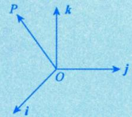

$\overrightarrow { O P } = x i + y j + z k$   
(x,y,z)为P点坐标，  
换个角度，x,y，z是i，j.k前面的系数

在线性系统中，“基”就是代数里的基础，在非线性系统中，实际上也可以按照“基”来把函数归入统一的知识框架和体系中，这个工作是很重要的.

(3) 收敛点与发散点.

若给定 $x_{0} \in I$ ，有 $\sum_{n = 1}^{\infty}u_{_{n}}(x_{_{0}})$ 收敛，则称点 $x _ { 0 }$ 为函数项级数 $\sum_{n = 1}^{\infty}u_{_{n}}(x)$ 的收敛点；若给定 $x_{0} \in I$ ，有$\sum_{n = 1}^{\infty}u_{_{n}}(x_{_{0}})$ 发散，则称点 $x _ { 0 }$ 为函数项级数 $\sum_{n = 1}^{\infty}u_{_{n}}(x)$ 的发散点.

(4) 收敛域.

函数项级数 $\sum_{n = 1}^{\infty}u_{_{n}}(x)$ 的所有收敛点的集合称为它的收敛域.

要研究幂级数 $\sum_{n = 0}^{\infty}a_{n}x^{n}$ ，首要任务是判别其何时收敛，因为只有收敛才有继续讨论的意义.具体来说将某个 $x _ { 0 }$ 代入级数可得 $\sum_{n = 0}^{\infty}a_{n}x_{0}^{n}$ ，判别此数项级数是否收敛，若收敛，就找到一个收敛点.我们的目标当然是找到所有收敛点的集合，即收敛域.但问题来了，有多少个收敛点呢？如果有无穷多个收敛点，难道要一个一个地去验证么？显然，这样做是不可能的.正当人们为此一筹莫展时，一位年轻人提出了一个重要定理，请看下文.

## 2阿贝尔定理 在区间端点处的敛散性需单独判别

阿贝尔的12块钱.

阿贝尔，一个没有流量的小人物：竞然要12块钱，莱布尼茨判别法才要10块钱，不给，我给你和莱布尼茨一样的价码，我给你10块钱，阿贝尔听完后，稍加思索，叹了口气，好吧，10块就10块

当幂级数 $\sum_{n = 0}^{\infty}a_{n}x^{n}$ 在点 $x = x_{1}(x_{1} \neq 0)$ 处收敛时，对于满足 $\boxed{x} < \boxed{x_1}$ 的一切x，幂级数$\diamond ( - \left|   x _ { \parallel }   \right| ,   \left|   x _ { \parallel }   \right| )$ 区间内绝对收敛；当幂级数 $\sum_{n = 0}^{\infty}a_{n}x^{n}$ 在点 $x = x_{2}(x_{2} \neq 0)$ 处发散时，对于满足 $\left| x \right| > \left| x_{2} \right|$ 的一切x，幂级数发散. [−|x2|,|x2}]区间外

  
阿贝尔(1802—1829)

多么伟大的阿贝尔，多么给力的办法！只是，不得不告诉大家，这样一个天才数

学家生于1802年，一生的工作不为世人所重视，穷困潦倒，卒于1829年，仅仅活了27年，太遗憾了！

阿贝尔在数学历史上昙花一现，他很穷，得了肺结核，也没有钱看病，没有钱保护自己的身体，阿贝尔在如此年轻的年纪就做出了非常多的，令人惊讶的数学成果，大家可以看到很多文献和传记中谈到，阿贝尔曾经找到过高斯，高斯太了不起了，彼称为“数学王子”，可是他把文章给高斯后，高斯拒绝了他，说“我不看”，为什么不看呢？高斯的意思是“看不上你的东西，你回去吧”.可以想象，如果那个时候，高斯对阿贝尔能够提携、指导、帮助和支持的话，也许阿贝尔就不会英年早逝，可是连高斯都没有给阿贝尔机会.

但阿贝尔去世的第二天，他的家人收到了相当于“中国科学院”给他送来的“认证”，他当上“院士”了，这是欧洲的一个巨大损失，当他去世之后，他评上了欧洲的“院士”和“英国皇家学会的会员”，很遗憾！当年高斯为什么要拒绝阿贝尔呢？有人这么说：“不是高斯看不起他，而是高斯太看得上阿贝尔了。”高斯很无私地提携晚辈，但为什么不帮助阿贝尔呢？有人说是因为“高斯发现他遇到了真正超过他的人”。

阿贝尔去世之后，人们从阿贝尔的手稿中找到了关于椭圆积分的讨论.大家还记得费马大定理吗？费马大定理1637年提出后，直到1995年的时候才有定论，怀尔斯站在前人的肩膀上做出了证明，里面有个核心的东西，关键词就是“椭圆积分”。而阿贝尔在20多岁的时候，就研究了椭圆积分，而且有着非常丰富的结果.所以也有人说，如果阿贝尔多活40年，也许整个数学历史都会彼改变，也许就轮不到怀尔斯来证明费马大定理了.

## ③ 收敛半径

定义3若R≥0满足条件：①当 $\left| x \right| { < } R$ 时， $\sum_{n = 0}^{\infty}a_{n}x^{n}$ 绝对收敛；②当 $\mid x \mid > R$ 时， $\sum_{n = 0}^{\infty}a_{n}x^{n}$ 发散.则称R为幂级数 $\sum_{n = 0}^{\infty}a_{n}x^{n}$ 的收敛半径，区间(-R，R)称为 $\sum_{n = 0}^{\infty}a_{n}x^{n}$ 的收敛区间.

对于 $\sum_{n = 0}^{\infty}a_{n}x^{n}$ ，当x=0时， $\sum_{n = 0}^{\infty}a_{n}x^{n} = a_{0}$

根据阿贝尔定理：

若在 $x_{1} \neq 0$ 处， $\sum_{n = 0}^{\infty}a_{n}x^{n}$ 收敛，则级数在 $( - | x _ { 1 } | , | x _ { 1 } | )$ 内绝对收敛；

若在 $x_{2} \neq 0$ 处， $\sum_{n = 0}^{\infty}a_{n}x^{n}$ 发散，则级数在 $( - \infty , - | x _ { 2 } | )$ $\left( \left| x_{2} \right|, + \infty \right)$ 上发散.

收敛点往外扩一定可以找到一个确定的点R，使得级数在(-R，R)内绝对收敛，在 $(-\infty, -R)$ 发散点往里收$(R, +\infty)$ 上发散.

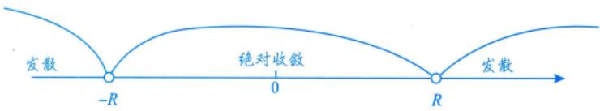

在两个端点R和-R处的敛散性如何呢？阿贝尔没有讲就去世了

现在明白为什么阿贝尔要12块钱了吧，数学家是量化好的，两个端点值两块钱.从此以后，再也没有任何方法告诉我们两个端点的敛散性情况了，只能将这两个端点代入级数中，按数项级数的方法认认真真地判断，而这两个端点是考研数学中必考无疑的，这就是我们追悔莫及的原因.

关于收敛域，我们会遇到两种题：①具体型级数的收敛域；②抽象型问题，已知一个级数的收敛域，去推导另外一个级数的收敛域，这两个级数之间是有关系的，要通过关系转化找到答案.

注根据阿贝尔定理，已知 $\sum_{n = 0}^{\infty}a_{n}(x - x_{0})^{n}$ 在某点 $x_{1}(x_{1} \neq x_{0})$ 的敛散性，确定该幂级数的收敛半径→收敛区间关于 $X _ { 0 }$ 对称。 $x _ { 0 }$ 为收敛中心点可分为以下三种情况.

(1)若在 $x _ { 1 }$ 处收敛，则收敛半径 $R \geqslant \left| x_{1} - x_{0} \right|$ .假设 $R < \left| x_{1} - x_{0} \right|$ 则由阿贝尔定理， $x _ { 1 }$ 处发散， $A \bot B R \geq \left| x _ { 1 } - x _ { 0 } \right|$

(2)若在 $x _ { 1 }$ 处发散，则收敛半径 $R \leqslant \left| x_{1} - x_{0} \right|$

假设 $R > \vert x _ { 1 } - x _ { 0 } \vert$ ，则由阿贝尔定理， $X _ { 1 }$ 处绝对收敛，矛盾， $\Delta A \sim R \leq \left| x _ { 1 } - x _ { 0 } \right|$ ，能取到等号.

(3) 若在 $x _ { 1 }$ 处条件收敛，则 $R = \left| x_{1} - x_{0} \right|$ .【重要考点】

例如，对于抽象型问题，若级数 $\sum_{n = 0}^{\infty}a_{n}(x - 2)^{n}$ 在 $x = 4$ 处条件收敛，则 $R = 2$

## 4收敛域的求法

V先看具体型幂级数收敛域的问题. ①找R⇒中心点在原点时，确定(-R，R)，若中心点不在原点，平移即可：②看-R，R(端点情况，单独讨论）

(1)对于不缺项幂级数 $\frac{1}{n}\sum_{n = 0}^{\infty}a_{n}x^{n} ,$ $\sum_{n = 0}^{\infty}a_{2n}x^{2n}$ 只有偶次幂，就是缺项级数  
业4书

①收敛半径的求法.

若 $\lim_{n \to \infty} \left| \frac{a_{n+1}}{a_n} \right| = \rho$ 或 $\lim_{n \to \infty} \sqrt[n]{|a_n|} = \rho$ ，则 $\sum_{n = 0}^{\infty}a_{n}x^{n}$ 的收敛半径R的表达式为 $R = \left\{ \begin{aligned} & \frac{1}{\rho}, \quad \rho \neq 0, \quad \rho \neq +\infty, \\ & +\infty, \quad \rho = 0, \\ & 0, \quad \rho = +\infty. \end{aligned} \right.$

②收敛区间与收敛域.

<table><tr><td>注 注例1 求幂级数  $1 + x + \frac{1}{2!}x^{2} + \cdots + \frac{1}{n!}x^{n} + \cdots$  的收敛域. 解因为  $\rho = \lim_{n \to \infty} \left| \frac{a_{n+1}}{a_n} \right| = \lim_{n \to \infty} \frac{\frac{1}{(n+1)!}}{\frac{1}{n!}} = \lim_{n \to \infty} \frac{1}{n+1} = 0 ,$  两种极端情况 所以收敛半径  $R = + \infty$  从而收敛域是  $( - \infty , + \infty )$  这种很好，处处收敛，非常有用  $\sum_{n = 0}^{\infty}n!x^{n}$  注例2 求幂级数 的收敛半径（规定0！=1). 解因为</td></tr></table>

区间(-R，R)为幂级数 $\sum_{n = 0}^{\infty}a_{n}x^{n}$ 的收敛区间，单独考查幂级数在x=±R处的敛散性就可以确定其收 敛域为(-R,R)或[-R,R)或(-R,R]或[-R,R].

→包含非幂级数(2)对于缺项幂级数或一般函数项级数 $\overline{\sum u_{n}(x)} .$

①加绝对值，即写成 $\sum \left| u_{_n}(x) \right|$

达朗贝尔判别法与柯西判别法派上用场

一定是正项级数。适用正项级数的判别法中，达朗贝尔判别法，柯西判别法最好用(比值判别法)(根值判别法)

②用正项级数的比值（或根值）判别法.

$\lim_{n \to \infty} \frac{\left| u_{_{n+1}}(x) \right|}{\left| u_{_n}(x) \right|}$ (或 $\lim_{n \to \infty} \sqrt[n]{\left| u_n(x) \right|} < 1$ ，求出收敛区间(a,b).“釜底抽薪”的方法 所有级数都可用这个方法

③单独讨论 $x = a, x = b$ 时 $\sum u_{_n}(x)$ 的敛散性，从而确定收敛域.

$\sum a_{n}x^{n}$ $\lim_{n \to \infty} \left| \frac{a_{n+1}x^{n+1}}{a_n x^n} \right| = \left| x \right| \lim_{n \to \infty} \frac{\left| a_{n+1} \right|}{\left| a_n \right|} < 1$ 即 $\left| x \right| \bullet \rho < 1 \Rightarrow \left| x \right| < \frac{1}{\rho} = R$

实际上，有了(2)的方法之后，(1)的方法是可以不 -R 0 R用的.因为(1)的方法包含在(2)的方法里，无论哪种方法，都别忘了讨论两个端点处的敛散性.

为什么要单独讨论两个端点呢？

比值判别法里面，有

$\lim_{n \to \infty} \frac{a_{n+1}}{a_n} \left\{ \begin{aligned} &< 1, \\ &= 1, \\ &> 1, \end{aligned} \right.$ 收敛，判别法失效，发散.

极限比出来是1,那有可能大于1,也有可能小于1,故可以找到 $\frac{3}{2}$ 也可以找到 $\frac{1}{2}$ .显然，有 $\frac{1}{2} < \frac{a_{n + 1}}{a_{n}} < \frac{3}{2} \Rightarrow \frac{1}{2}a_{n} < a_{n + 1} < \frac{3}{2}a_{n}$

这种推导，我们就没有办法找到 $a_{n + 1} < ka_{n} , \quad 0 < k < 1$ .根据极限的保号性，无法与一个收敛的等比级数作大小比较，所以这个方法失效.

所以阿贝尔定理中没有两个端点，绝不是因为我没有给那两块钱。

注2上述(1)，(2)的方法只是充分的，即当 $\sum_{n = 0}^{\infty}a_{n}x^{n}$ 的收敛半径存在时，极限 $\lim_{n \to \infty} \left| \frac{a_{n+1}}{a_n} \right|$ 或 $\lim_{n \to \infty} \sqrt[n]{|a_n|}$ 可能不存在. →分成 $a _ { 2 k }$ 与 $a _ { 2 k + 1 }$ 两种情况讨论

如 $\sum_{n = 1}^{\infty}\frac{\left\lbrack 3 + ( - 1)^{n} \right\rbrack^{n}}{n}x^{n}$ 记 $a_{n} = \frac{\left[ 3 + ( - 1)^{n} \right]^{n}}{n}$ 则 $\lim_{n \to \infty} \sqrt[n]{|a_n|} = \lim_{n \to \infty} \frac{3 + (-1)^n}{\sqrt[n]{n}}$ 不存在， $\lim_{n \to \infty} \left| \frac{a_{n+1}}{a_n} \right| =$ $\lim_{n \to \infty} \frac{\left[ 3 + (-1)^{n+1} \right]^{n+1}}{\left[ 3 + (-1)^n \right]^n}$ 亦不存在，但是此级数的收敛半径是存在的，怎么求呢？见习题16.12.

## 抽象型幂级数的收敛域

注3已知 $\sum a_{n}(x - x_{1})^{n}$ 的敛散性，讨论 $\sum b_{n}(x - x_{2})^{m}$ 的敛散性.

(1) $(x - x_{1})^{n}$ 与 $(x - x_{2})^{m}$ 的转化一般通过初等变形来完成，包括①“平移”收敛区间；②提出或者乘以因式 $(x - x_{0})^{k}$ 等

(2) $a _ { n }$ 与 $b_{n}$ 的转化一般通过微积分变形来完成，包括①对级数逐项求导；②对级数逐项积分等.

(3) 以下三种情况，级数的收敛半径不变，收敛域要具体问题具体分析.

①对级数提出或者乘以因式 $(x - x_{0})^{k}$ ，或者作平移等，收敛半径不变.

②对级数逐项求导，收敛半径不变，收敛域可能缩小。并非“一定”，端点处的

③对级数逐项积分，收敛半径不变，收敛域可能扩大.

例16.22 设 $a_{n} = \sum_{k = 1}^{n}\frac{1}{k}$ ，则级数 $\sum_{n = 1}^{\infty}a_{n}x^{n}$ 的收敛半径为

分析 $\sum_{n = 1}^{\infty}\left( 1 + \frac{1}{2} + \frac{1}{3} + \cdots + \frac{1}{n} \right)x^{n}$ ，则 $1 < 1 + \frac{1}{2} + \frac{1}{3} + \cdots + \frac{1}{n} < 1 + 1 + 1 + \cdots + 1 = n$ ，故 $\sqrt[n]{1} < \sqrt[n]{a_{n}} < \sqrt[n]{n}$

解应填1.

$$
\lim_{n \to \infty} \sqrt[n]{a_n} = \lim_{n \to \infty} \sqrt[n]{1 + \frac{1}{2} + \cdots + \frac{1}{n}}
$$

由习题2.6知

$$
\lim_{n \to \infty} \sqrt[n]{a_n} = 1
$$

即级数 $\sum_{n = 1}^{\infty}a_{n}x^{n}$ 的收敛半径为1.

例16.23 幂级数 $\sum_{n = 1}^{\infty}\frac{( - 1)^{n - 1}}{2n - 1}x^{2n}$ 的收敛域为

解 应填[-1, 1].

记 $u_{n}(x)=\frac{(-1)^{n-1}}{2n-1}x^{2n}$ ，由于 $\lim_{n \to \infty} \left| \frac{u_{n+1}(x)}{u_n(x)} \right| = \lim_{n \to \infty} \frac{2n-1}{2n+1} x^2 = x^2$ ，故

当 $\left| x \right| < 1$ 时， $\sum_{n = 1}^{\infty}u_{_{n}}(x)$ 收敛；

当 $\left| x \right|   >   1$ 时， $\sum_{n = 1}^{\infty}u_{_{n}}(x)$ 发散；

当x=±1时， $\sum_{n = 1}^{\infty}u_{n}(\pm 1) = \sum_{n = 1}^{\infty}\frac{(- 1)^{n - 1}}{2n - 1}$ ，根据莱布尼茨判别法知此级数收敛

综上，幂级数 $\sum_{n = 1}^{\infty}\frac{( - 1)^{n - 1}}{2n - 1}x^{2n}$ 的收敛域为[-1,1].

例16.24 设 $f(x)=\sum_{n = 0}^{\infty}x^{n},\;g(x)=\int_{0}^{x}f(t)\mathrm{d}t$ ，则f(x)与g(x)的收敛域分别为（). (A) (−1, 1), (−1, 1) (B) (−1, 1), [−1, 1) (C) $[ - 1 , 1 ) , ( - 1 , 1 )$ (D) [−1, 1), [−1, 1)

解应选(B).

对于 $f(x) = \sum_{n = 0}^{\infty} x^n$ ，有

$$
\lim _ { n \rightarrow \infty } \left| \frac { a _ { n + 1 } } { a _ { n } } \right| = 1 = \rho ,
$$

所以收敛半径R=1，故收敛区间为(-1,1).又当x=±1时，级数 $\sum_{n = 0}^{\infty} \stackrel{  人  }{(\pm 1)^{n}}$ 发散，故收敛域为(-1,1).

对于 $g(x) = \int_{0}^{x} f(t)   dt$ ，因为

$$
g(x)=\int_{0}^{x}\sum_{n = 0}^{\infty}t^{n}\mathrm{d}t=\sum_{n = 0}^{\infty}\int_{0}^{x}t^{n}\mathrm{d}t=\sum_{n = 0}^{\infty}\frac{1}{n + 1}x^{n + 1}
$$

收敛时，可逐项积分

$$
\lim _ { n \rightarrow \infty } \left| \frac { b _ { n + 1 } } { b _ { n } } \right| = \lim _ { n \rightarrow \infty } \frac { n + 1 } { n + 2 } = 1 ,
$$

所以收敛半径 $\tilde { R } = \mathrel { \mathop { 1 } }$ .当x=1时，级数 $\sum_{n = 0}^{\infty}\frac{1}{n + 1}$ 发散；当x=-1时，级数 $\sum_{n = 0}^{\infty}\frac{1}{n + 1}( - 1)^{n + 1}$ 收敛，故收敛域为[−1, 1) .

综上，选(B).

例16.25 已知 $\sum_{n = 1}^{\infty}\frac{n!}{n^{n}}\mathrm{e}^{- nx}$ 的收敛域为 $(a, +\infty)$ ，则a=

解应填-1.

因为

$$
\lim_{n \to \infty} \left| \frac{(n+1)!}{(n+1)^{n+1}} \mathrm{e}^{-(n+1)x} \cdot \frac{n^n}{n!} \mathrm{e}^{nx} \right| = \lim_{n \to \infty} \left| \left( \frac{n}{n+1} \right)^n \mathrm{e}^{-x} \right| = \mathrm{e}^{-x-1}
$$

所以当 $\mathbf{e}^{-x-1} < 1$ ，即x>-1时，级数收敛，当 $\mathbf { e } ^ { - x - 1 } > 1$ ，即x<-1时级数发散，所以 $a = -1$

注(1)当x=-1时， $\frac{u_{n + 1}}{u_{n}} = \frac{e}{\left( 1 + \frac{1}{n} \right)^{n}}$ ，分母单调增加，且 $\left( 1 + \frac{1}{n} \right)^n \rightarrow \mathrm{e}(n \rightarrow \infty)$ 故 $\left( 1 + \frac{1}{n} \right)^n < \mathrm{e}$ 故 $\frac{u_{n + 1}}{u_{n}} > 1$ 且 $u_{n} > 0$ ，故 $\lim_{n \to \infty} u_n \neq 0$ 即当x=-1时级数发散.

u单调增加，且是正项级数，所以一定发散包含非幂级数，如指数级数、对数级数

(2)对于一般函数项级数的收敛域，可以不是对称区间，也没有“收敛半径”这一概念.

例16.26 设 $\sum_{n = 1}^{\infty}a_{n}(x + 1)^{n}$ 在点x=1处条件收敛，则幂级数 $\sum_{n = 1}^{\infty}na_{n}(x - 1)^{n}$ 在点x=2处().(A) 绝对收敛 (B) 条件收敛 (C) 发散 (D) 敛散性不确定

分析思路： $a_{n}(x + 1)^{n} \xrightarrow{ 平移 } a_{n}(x - 1)^{n} \xrightarrow{ 求导 } na_{n}(x - 1)^{n - 1} \xrightarrow{乘 (x - 1)} na_{n}(x - 1)^{n}$

解应选(A).

根据“三、3.注 $\left( 3 \right)^{\ast}$ ，由 $\sum_{n = 1}^{\infty}a_{n}(x + 1)^{n}$ 在点x=1处条件收敛，知

$$
R = \left| x_{1} - x_{0} \right| = \left| 1 - ( - 1) \right| = 2,
$$

且收敛区间为(-3,1)；

根据“三、4.(2)注3(1)和 $\left( 3 \right) ^ { \prime \prime }$ ，将(x+1)n (x +1)”： -3 -1 1平移转化为(x-1)″，也就是把级数的中心点由-1转 ( +(x−1)" :-1 1 3

移到1，即将收敛区间平移到(-1,3)，得 $\sum_{n = 1}^{\infty}a_{n}(x - 1)^{n}$ ，收敛半径不变；

根据“三、4.(2)注3(1)，(2)和 $\left( 3 \right)^{\ast}$ ，对 $\sum_{n = 1}^{\infty}a_{n}(x - 1)^{n}$ 逐项求导，得 $\sum_{n = 1}^{\infty}na_{n}(x - 1)^{n - 1}$ ，再乘以(x-1)得 $\sum_{n = 1}^{\infty}na_{n}(x - 1)^{n}$ ，收敛半径不变.

故 $\sum_{n = 1}^{\infty}na_{n}(x - 1)^{n}$ 的收敛区间为(-1，3)，因为x=2在收敛区间内部，所以在该点处级数绝对收敛，故选择(A).

例16.27 幂级数 $\sum_{n = 2}^{\infty}\left( \frac{1}{n\ln n} + \frac{1}{2^{n}} \right)x^{n}$ 的收敛域为

①能拆开则拆开；分析思路②不能拆开找子列.

解应填[-1,1).

对于 $\sum_{n = 2}^{\infty}\frac{1}{n\ln n}x^{n},\frac{1}{R_{1}} = \lim_{n \rightarrow \infty}\frac{n\ln n}{(n + 1)\ln(n + 1)} = 1$

当x=1时， $\sum_{n = 2}^{\infty}\frac{1}{n\ln n}$ 发散；当x=-1时，由莱布尼茨判别法， $\sum_{n = 2}^{\infty}\frac{( - 1)^{n}}{n\ln n}$ 收敛，所以其收敛域为[−1, 1) .

对于 $\sum_{n = 2}^{\infty}\frac{1}{2^{n}}x^{n}, R_{2} = \lim_{n \rightarrow \infty}\frac{\frac{1}{2^{n}}}{\frac{1}{2^{n + 1}}} = 2$

当x=2时， $\sum _ { n = 2 } ^ { \infty } 1$ 发散；当x=-2时， $\sum_{n = 2}^{\infty}\frac{1}{2^{n}} \cdot ( - 2)^{n} = \sum_{n = 2}^{\infty}( - 1)^{n}$ 发散，所以其收敛域为(-2,2).

综上所述，原级数的收敛域为[-1,1).

## 四幂级数求和函数

(解答题/客观题)

## 1概念

在收敛域上，记 $S(x) = \sum_{n = 1}^{\infty} u_{n}(x)$ ，并称S(x)为 $\sum_{n = 1}^{\infty}u_{_{n}}(x)$ 的和函数.

如|x|<1时， $\sum_{n = 1}^{\infty}x^{n} = \frac{x}{1 - x} = S(x)$

①（前提）求收敛域：②求和函数

## 2运算法则

若幂级数 $\sum_{n = 0}^{\infty}a_{n}x^{n}$ 与 $\sum_{n = 0}^{\infty}b_{n}x^{n}$ 的收敛半径分别为 $R _ { a }$ 和 $R_{b}(R_{a} \neq R_{b})$ ，则有

① $k \sum_{n = 0}^{\infty} a_{n}x^{n} = \sum_{n = 0}^{\infty}ka_{n}x^{n}, \left| x \right| < R_{a}$ ，k为常数；

$$
\sum_{n = 0}^{\infty}a_{n}x^{n} \pm \sum_{n = 0}^{\infty}b_{n}x^{n} = \sum_{n = 0}^{\infty}(a_{n} \pm b_{n})x^{n},|x| < R = \min\{R_{a},R_{b}\};
$$

注当 $R_{a} = R_{b}$ 时， $\sum_{n = 0}^{\infty}a_{n}x^{n} \pm \sum_{n = 0}^{\infty}b_{n}x^{n}$ 的收敛半径 $R \geq \min\{R_a,\ R_b\}$ →即当Ra=R6时，R可能会变大

例如，对于 $\sum_{n = 0}^{\infty}(1 + 2^{n})x^{n}, \sum_{n = 0}^{\infty}(1 - 2^{n})x^{n}$ ，可求得

$$
R_{a}=\lim_{n \to \infty}\frac{1+2^{n}}{1+2^{n+1}}=\frac{1}{2}, R_{b}=\lim_{n \to \infty}\left|\frac{1-2^{n}}{1-2^{n+1}}\right|=\frac{1}{2}
$$

而 $\sum_{n = 0}^{\infty}\left\lbrack (1 + 2^{n})x^{n} + (1 - 2^{n})x^{n} \right\rbrack = 2\sum_{n = 0}^{\infty}x^{n}$ 的收敛半径 $R = 1$ ，即

其中 $2 ^ { n } x ^ { n }$ 使得收敛半径相对于x”变小，去掉 $2 ^ { n } x ^ { n }$ ，则收敛半径变大

$R > \min \left\{ \frac{1}{2}, \frac{1}{2} \right\}$ ·由此可见，发散级数+发散级数是有可能收敛的

$$
\sum_{n = 0}^{\infty}a_{n}x^{n} \cdot \sum_{n = 0}^{\infty}b_{n}x^{n} = \sum_{n = 0}^{\infty}\left( \sum_{i = 0}^{n}a_{i}b_{n - i} \right)x^{n}
$$

柯西划线法：

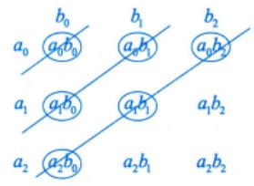

$$
\begin{aligned} &\Leftrightarrow a_{0}b_{0}x^{0}+(a_{0}b_{1}+a_{1}b_{0})x^{1}+(a_{0}b_{2}+a_{1}b_{1}+a_{2}b_{0})x^{2}+\cdots=\sum_{n=0}^{\infty}\left(\sum_{i=0}^{n}a_{i}b_{n-i}\right)x^{n}\\ &\quad\bigwedge_{i=0}^{n}a_{i}x^{i}\\ \end{aligned}
$$

如何理解并记住此公式呢？由

$$
(a_{0} + a_{1}x + a_{2}x^{2})(b_{0} + b_{1}x + b_{2}x^{2}) = a_{0}b_{0} + (a_{0}b_{1} + a_{1}b_{0})x + (a_{0}b_{2} + a_{1}b_{1} + a_{2}b_{0})x^{2} + (a_{1}b_{2} + a_{2}b_{1})x^{3} + a_{2}b_{2}x^{4}
$$

根据归纳法，可知

$$
\sum_{n = 0}^{\infty}a_{n}x^{n} \cdot \sum_{n = 0}^{\infty}b_{n}x^{n} = \sum_{n = 0}^{\infty}\left( \sum_{i = 0}^{n}a_{i}b_{n - i} \right)x^{n}
$$

收敛半径 $R = \min\{R_a,\ R_b\}$

$$
\Rightarrow \left( a_{0}b_{n} + a_{1}b_{n - 1} + \cdots + a_{n}b_{0} \right)x^{n}
$$

## 考研数学基础30讲·高等数学分册

## ③恒等变形方式

(1)通项、下标一起变.

$$
\sum_{n = k}^{\infty} a_{n}x^{n} = \sum_{n = k + l}^{\infty} a_{n - l}x^{n - l}
$$

其中l为整数，可正、可负、可为0.

例如，

$$
\sum_{n = 0}^{\infty}a_{n}x^{n} = \sum_{n = 1}^{\infty}a_{n - 1}x^{n - 1},\quad\sum_{n = 1}^{\infty}a_{n}x^{n} = \sum_{n = 0}^{\infty}a_{n + 1}x^{n + 1}
$$

(2) 只变下标，不变通项.

$$
\sum_{n = k}^{\infty}a_{n}x^{n} = a_{k}x^{k} + a_{k + 1}x^{k + 1} + \cdots + a_{k + l - 1}x^{k + l - 1} + \sum_{n = k + l}^{\infty}a_{n}x^{n}
$$

例如，

$$
\sum_{n = 0}^{\infty}a_{n}x^{n} = a_{0}x^{0} + a_{1}x^{1} + \sum_{n = 2}^{\infty}a_{n}x^{n}
$$

(3) 只变通项，不变下标.

$$
\sum_{n = k}^{\infty}a_{n}x^{n} = x^{l}\sum_{n = k}^{\infty}a_{n}x^{n - l}
$$

例如，

$$
\begin{aligned}\sum_{n = 0}^{\infty}a_{n}x^{2n} + \sum_{n = 0}^{\infty}b_{n + 1}x^{2n + 2} &= a_{0}x^{0} + \sum_{n = 1}^{\infty}a_{n}x^{2n} + \sum_{n = 1}^{\infty}b_{n}x^{2n} = a_{0} + \sum_{n = 1}^{\infty}\left( a_{n} + b_{n} \right)x^{2n} \cdot \\\underbrace{\bigcup_{ 注意下标和通项 }\sum_{n = 0}^{\infty}\mathrm{q}}_{ 个 } &= a_{0} + \sum_{n = 1}^{\infty}\left( a_{n} + b_{n} \right)x^{2n} \cdot \\& 下标和 x 动次数都初向才锯合将 \end{aligned}
$$

## 4性质

(1) 幂级数 $\sum_{n = 0}^{\infty}a_{n}x^{n}$ 的和函数S(x)在其收敛域I上连续.→幂级数的和函数必连续，其他级数的和函数不一定

注如果幂级数在收敛区间的端点x=R（或x=-R)处收敛，则和函数S(x)在(-R，R]（或 $\left[ -R,   R \right)$ 上连续，即 $\lim_{x \to R^{-}} S(x) = S(R) \quad (  或  \quad \lim_{x \to -R^{+}} S(x) = S(-R) )$ 端点处单侧连续

(2) 幂级数 $\sum_{n = 0}^{\infty}a_{n}x^{n}$ 的和函数S(x)在其收敛域I上可积，且有逐项积分公式 “和的积分=积分的和”

$$
\int_{0}^{x} S(t) \mathrm{d}t = \int_{0}^{x} \left( \sum_{n=0}^{\infty} a_n t^n \right) \mathrm{d}t = \sum_{n=0}^{\infty} a_n \int_{0}^{x} t^n \mathrm{d}t = \sum_{n=0}^{\infty} \frac{a_n}{n+1} x^{n+1} (x \in I),
$$

逐项积分后所得到的幂级数与原级数有相同的收敛半径，但收敛域可能扩大

(3) 幂级数 $\sum_{n = 0}^{\infty}a_{n}x^{n}$ 的和函数S(x)在其收敛区间(-R,R)内可导，且有逐项求导公式

$$
S ^ { \prime } ( x ) = \left( \sum _ { n = 0 } ^ { \infty } a _ { n } x ^ { n } \right) ^ { \prime } = \sum _ { n = 0 } ^ { \infty } \left( a _ { n } x ^ { n } \right) ^ { \prime } = \sum _ { n = 1 } ^ { \infty } n a _ { n } x ^ { n - 1 } ( | x | < R ) ,
$$

逐项求导后所得到的幂级数与原级数有相同的收敛半径，但收敛域可能缩小.

5 重要展开式 左 $\frac{ 展升 }{ 忄如 }  右$ 通过重要展开式间接求无穷级数的和函数

$$
\mathrm{e}^{x}=\sum_{n = 0}^{\infty}\frac{x^{n}}{n!}=1+x+\frac{x^{2}}{2!}+\cdots+\frac{x^{n}}{n!}+\cdots,-\infty<x<+\infty
$$

$$
\frac{1}{1 + x} = \sum_{n = 0}^{\infty} (-1)^{n} x^{n} = 1 - x + x^{2} - x^{3} + \cdots + (-1)^{n} x^{n} + \cdots, -1 < x < 1
$$

逐项积分

$$
\frac{1}{1 - x} = \sum_{n = 0}^{\infty}x^{n} = 1 + x + x^{2} + \cdots + x^{n} + \cdots, - 1 < x < 1
$$

$$
\ln(1 + x) = \sum_{n = 1}^{\infty} (-1)^{n - 1} \frac{x^n}{n} = x - \frac{x^2}{2} + \frac{x^3}{3} - \frac{x^4}{4} + \cdots + (-1)^{n - 1} \frac{x^n}{n} + \cdots , \quad -1 < x \leq 1 , \quad \lim_{n \to \infty} \frac{(-x)^n}{n} = -\ln(1 + x)
$$

$$
\sin x = \sum_{n = 0}^{\infty} (-1)^{n} \frac{x^{2n + 1}}{(2n + 1)!}
$$

$$
\sum_{n = 1}^{\infty}( - 1)^{n - 1}\frac{( - x)^{n}}{n} = \ln(1 - x)
$$

逐项求导

$$
\sum_{n = 1}^{\infty}\frac{x^{n}}{n} = - \ln(1 - x)
$$

$$
x = - \frac{x^{3}}{3!} + \frac{x^{5}}{5!} - \frac{x^{7}}{7!} + \cdots + ( - 1)^{n}\frac{x^{2n + 1}}{(2n + 1)!} + \cdots, - \infty < x < + \infty
$$

$$
\cos x = \sum_{n = 0}^{\infty} (-1)^{n} \frac{x^{2n}}{(2n)!}
$$

$$
1 - \frac{x^{2}}{2!} + \frac{x^{4}}{4!} - \frac{x^{6}}{6!} + \cdots + ( - 1)^{n}\frac{x^{2n}}{(2n)!} + \cdots, - \infty < x < + \infty
$$

{x∈(−1, 1),当α≤−1时，$( 7 ) \underbrace{ ( 1 + x ) ^ { \alpha } = 1 + \alpha x + \frac { \alpha ( \alpha - 1 ) } { 2 ! } x ^ { 2 } + \cdots + \frac { \alpha ( \alpha - 1 ) \cdots ( \alpha - n + 1 ) } { n ! } x ^ { n } + \cdots } _ {  记征荀  3  项葳行  } + \cdots + \frac { \alpha ( \alpha - 1 ) \cdots ( \alpha - n + 1 ) } { n ! } x ^ { n } + \cdots ,$ $\begin{cases}x \in (-1, 1] \\x \in [-1, 1]\end{cases}$ ，当 $-1 < \alpha < 0$ 时，，当 $\alpha > 0$ 且 $\alpha \notin \mathbf { N } _ { + }$ 时，$x \in (-\infty, +\infty)$ ,当 $\alpha \in \mathbf { N } ,$ 时.

注(1)～(6)右端x的取值范围是指收敛域，而对于(7)，问题比较复杂，其收敛区间的端点是否收敛与α的取值有关，可以证明（这里不证）：

当 $\alpha \leq -1$ 时，收敛域为(-1,1)；

当 $-1 < \alpha < 0$ 时，收敛域为(-1,1]；

当 $\alpha > 0$ 且 $\alpha \notin \mathbf{N}_{+}$ 时，收敛域为[-1,1]；

当 $\alpha \in \mathbf{N}_{+}$ 时，收敛域为 $( - \infty , + \infty )$

比如，当 $\alpha = - 1$ 时，得到

$$
\frac{1}{1 + x} = 1 - x + x^{2} - x^{3} + \cdots + (-1)^{n}x^{n} + \cdots, -1 < x < 1;
$$

当 $\alpha = - \frac { 1 } { 2 }$ 时，得到

$$
\frac{1}{\sqrt{1 + x}} = 1 - \frac{1}{2}x + \frac{1 \times 3}{2 \times 4}x^{2} - \frac{1 \times 3 \times 5}{2 \times 4 \times 6}x^{3} + \cdots , - 1 < x \leqslant 1 .
$$

例16.28 求 $\sum_{n = 1}^{\infty}\left( 1 + \frac{1}{2} + \cdots + \frac{1}{n} \right)x^{n}$ 的和函数.

分析利用 $\sum_{n = 0}^{\infty}a_{n}x^{n} \cdot \sum_{n = 0}^{\infty}b_{n}x^{n} = \sum_{n = 0}^{\infty}\left( \sum_{i = 0}^{n}a_{i}b_{n - i} \right)x^{n}$

$$
\begin{aligned}  買買  &\begin{aligned}\\ &\sum_{n = 1}^{\infty}\left( 1 + \frac{1}{2} + \cdots + \frac{1}{n} \right)x^{n} \\&= \sum_{n = 0}^{\infty}\left( 1 + \frac{1}{2} + \cdots + \frac{1}{n + 1} \right)x^{n + 1} \\&= x \bullet \sum_{n = 0}^{\infty}\left( 1 + \frac{1}{2} + \cdots + \frac{1}{n + 1} \right)x^{n} \\&= x \bullet \sum_{n = 0}^{\infty}\left( 1 \bullet 1 + \frac{1}{2} \bullet 1 + \cdots + \frac{1}{n + 1} \bullet 1 \right)x^{n} \\&= x \bullet \sum_{n = 0}^{\infty}\left( 1 \bullet 1 + \frac{1}{2} \bullet 1 + \cdots + \frac{1}{n + 1} \bullet 1 \right)x^{n} \\&= x \bullet \sum_{n = 0}^{\infty}\left( \sum_{i = 0}^{n}\sum_{j = 0}^{n}\sum_{i = j}^{n}\left| x_{i}^{n} \right| \right)x^{n} \\&= x \bullet \sum_{n = 0}^{\infty}\frac{1}{n + 1}x^{n} \bullet \sum_{n = 0}^{\infty}x^{n} \\&= \sum_{n = 0}^{\infty}\frac{x^{n + 1}}{n + 1} \bullet \sum_{n = 0}^{\infty}x^{n} \\&= \sum_{n = 1}^{\infty}\frac{x^{n}}{n} \bullet \sum_{n = 0}^{\infty}x^{n} \\&= \left[ - \ln(1 - x) \right] \bullet \frac{1}{1 - x}(- 1 < x < 1)\\ &\end{aligned}\\ \end{aligned}
$$

例16.29 设函数y =f(x)满足 $y'' + 2y' + 5y = 0$ ，且 $f(0)=1,\ f^{\prime}(0)=-1$

(1)求f(x)的表达式；

(2)设 $a_{n} = \int_{n\pi}^{+\infty} f(x) \mathrm{d}x$ ，求 $\sum_{n = 1}^{\infty}a_{n}$

解(1)由例15.16可知， $f(x) = \mathrm{e}^{-x} \cos 2x$

(2)由于 $\int f(x) \mathrm{d}x = \int \mathrm{e}^{-x} \cos 2x \mathrm{d}x = \frac{\left| \left( \mathrm{e}^{-x} \right)^{\prime} \left( \cos 2x \right)^{\prime} \right|}{\left( -1 \right)^{2} + 2^{2}} + C = \frac{- \mathrm{e}^{-x} \cos 2x + 2\mathrm{e}^{-x} \sin 2x}{5} + C$ ,因此 $a_{n} = \frac{e^{- n\pi}}{5}$

故 $\sum_{n = 1}^{\infty}a_{n} = \frac{\mathrm{e}^{- \pi}}{5(1 - \mathrm{e}^{- \pi})} = \frac{1}{5(\mathrm{e}^{\pi} - 1)}$

下面介绍求复杂级数的和函数的方法. Γ画川细水发乐级数时相函奴的刀法.

①解微分方程，思路：把复杂级数转化为简单级数！ ②求不定积分，③级数求和

基本公式： $\sum_{n = 0}^{\infty}x^{n} = \frac{1}{1 - x}$ , |x|<1; $\sum_{n = 1}^{\infty}x^{n} = \frac{x}{1 - x}$ , |x $\boxed{<}1$

## 例16.30 求级数 $\sum_{n = 1}^{\infty}\frac{x^{n}}{n}$ 的和函数.

分析由于 $(x^n)' = nx^{n-1}$ ，因此本题应先求导，约掉n，然后再积分，但要注意 $S(x) \neq \int S^{\prime}(x) \mathrm{d}x$ ，应写为$\int_{x_{0}}^{x} S^{\prime}(t) \mathrm{d}t = S(t) \big|_{x_{0}}^{x} = S(x) - S(x_{0})$ ，即 $S(x) = S(x_0) + \int_{x_0}^{x} S'(t) \mathrm{d}t$ (先导后积公式). $x _ { 0 }$ 点一般选择展开点，例如 $\sum a_{n}x^{n}$ $x _ { 0 }$ 取0， $\sum a_{n}(x - m)^{n}$ $x _ { 0 }$ 取m.

解设 $S(x) = \sum_{n = 1}^{\infty}\frac{x^{n}}{n}$ ，逐项求导，得 $S^{\prime}(x)=\sum_{n = 1}^{\infty}\left(\frac{x^{n}}{n}\right)^{\prime}=\sum_{n = 1}^{\infty}x^{n - 1}=\frac{1}{1 - x}$ ，|x|<1，然后两边积分，得 $S(x)-S(0)=\int_{0}^{x}\frac{\mathrm{d}t}{1-t}=-\ln(1-x)$ .又因为 $S(0) = 0$ ，且当 $x = - 1$ 时，级数 $\sum_{n = 1}^{\infty}\frac{( - 1)^{n}}{n}$ 收敛，故和函数$S(x)=-\ln(1-x)+S(0)=-\ln(1-x),x\in[-1,1)$

方法总结求和函数，先求收敛域，然后根据幂级数 $\sum_{n = 1}^{\infty}\frac{1}{n}x^{n}$ 的特点，选择先求导变为简单的幂级数，便于求和函数，然后用积分还原.

公式 $\sum_{n = 1}^{\infty}x^{n - 1} = \frac{1}{1 - x},\quad |x| < 1;\quad \sum_{n = 1}^{\infty}\frac{x^{n}}{n} = - \ln(1 - x),\quad x \in \lbrack - 1,1)$

例16.31 求级数 $\sum_{n = 1}^{\infty}nx^{n}$ 的和函数.

分析本题 $\sum _ { n = 1 } ^ { \infty } n x ^ { n }$ ，n在分子上，所以应该先积分，后求导.

解 $\sum_{n = 1}^{\infty}nx^{n} = x\sum_{n = 1}^{\infty}nx^{n - 1}$ ，设 $S(x) = \sum_{n = 1}^{\infty}nx^{n - 1}$ ，则原级数 $\sum_{n = 1}^{\infty}nx^{n} = xS(x)$

对 $S(x) = \sum_{n = 1}^{\infty}nx^{n - 1}$ 两边积分，得 $\int_{0}^{x} S(t) \mathrm{d}t = \sum_{n = 1}^{\infty} \int_{0}^{x} n t^{n - 1} \mathrm{d}t = \sum_{n = 1}^{\infty} x^{n} = \frac{x}{1 - x}, \quad |x| < 1$ .再两边求导，得$\left[ \int_{0}^{x} S(t)   dt \right]' = \left( \frac{x}{1 - x} \right)' = \frac{1}{(1 - x)^2}$ ，所以 $\sum_{n = 1}^{\infty}nx^{n} = xS(x) = \frac{x}{(1 - x)^{2}}, \quad |x| < 1$

方法总结求和函数，先求收敛域，本题幂函数为 $n x ^ { n }$ ，应先积分化为简单的幂级数，然后再求导.

公式 $\sum_{n = 1}^{\infty}nx^{n} = \frac{x}{\left( 1 - x \right)^{2}}$ , |x|<1 .

## 注(1)幂级数求和函数的突破口：

①当(an+b)在分母上时，先导后积，见例 16.30.

②当(an+b)在分子上时，先积后导，见例 16.31.

(2) 对于先积后导、先导后积的处理办法：

①先积后导： $\left[ \int S(x) \mathrm{d}x \right]' = S(x)$

②先导后积.由于 $\int_{a}^{x} S^{\prime}(t) \mathrm{d}t = S(t) \big|_{a}^{x} = S(x) - S(a)$ ，故 $S(x) = \int_{a}^{x} S'(t)   dt + S(a)$

又由于当a为中心点时， $\left\{ \begin{aligned} \sum_{n = 0}^{\infty}a_{n}x^{n} & \xlongequal{x = 0}a_{0}, \\ \sum_{n = 0}^{\infty}a_{n}(x - x_{0})^{n} & \xlongequal{x = x_{0}}a_{0}. \end{aligned} \right.$ 都收敛，故下限通常取中心点.

(3) 在解题过程中始终不要忘记标注收敛域.

(4) 建议大家记住由这两个例题所得到的结果.

$$
\sum_{n = 1}^{\infty}nx^{n} = \frac{x}{\left( 1 - x \right)^{2}}, - 1 < x < 1
$$

$$
\sum_{n = 1}^{\infty}\frac{x^{n}}{n} = - \ln(1 - x), - 1 \leq x < 1;\sum_{n = 1}^{\infty}nx^{n - 1} = \frac{1}{(1 - x)^{2}}, - 1 < x < 1
$$

利用这两个公式可直接得到如下常数项级数的和.

$$
\sum_{n = 1}^{\infty}\frac{1}{n \cdot 2^{n}} = \sum_{n = 1}^{\infty}\frac{1}{n} \cdot \left( \frac{1}{2} \right)^{n} = - \ln\left( 1 - \frac{1}{2} \right) = \ln 2,
$$

$$
\sum_{n = 1}^{\infty}\frac{n}{2^{n}} = \frac{1}{2}\sum_{n = 1}^{\infty}n\left( \frac{1}{2} \right)^{n - 1} = \frac{1}{2} \times \frac{1}{\left( 1 - \frac{1}{2} \right)^{2}} = 2
$$

(5) 当 $\left| x \right| < 1$ 时，

$$
\frac{1}{1 - x} = \sum_{n = 0}^{\infty} x^{n} \quad  畜项為  \quad n = 0\tag{①}
$$

$$
\Rightarrow \frac{1}{(1 - x)^{2}} = \sum_{n = 0}^{\infty}nx^{n - 1}\left( \frac{x}{(1 - x)^{2}} = \sum_{n = 0}^{\infty}nx^{n} \right)\tag{②}
$$

→实际为n=1，常数求导为0

$$
\Rightarrow \frac{2}{(1 - x)^{3}} = \sum_{n = 0}^{\infty}n(n - 1)x^{n - 2}\tag{③}
$$

$$
\Rightarrow \frac{6}{(1 - x)^4} = \sum_{n = 3}^{\infty} n(n - 1)(n - 2)x^{n - 3}\tag{④}
$$

对于一个幂级数，它的系数为n的3次幂，可通过①②③④的线性组合求得.

$$
\begin{aligned} &= a\sum_{n = 0}^{\infty}(an^{3} + bn^{2} + cn + d)x^{2} + \sum_{n = 0}^{\infty}(an^{3} + bn^{2} + cn + d)x^{2} + \sum_{n = 0}^{\infty}(an - 1)(n - 2) + \sum_{n = 0}^{\infty}(n - 1) + \sum_{n = 0}^{\infty}(n - 1) + \sum_{n = 0}^{\infty}(n - 1)^{2}x^{2} + \sum_{n = 0}^{\infty}(n - 1)^{2}x^{2} + \sum_{n = 0}^{\infty}(n - 1)^{2}x^{2} + \sum_{n = 0}^{\infty}(n - 1)^{2}x^{2} + \sum_{n = 0}^{\infty}(n - 1)^{2}x^{2} + \sum_{n = 0}^{\infty}(n - 1)^{2}x^{2} + \sum_{n = 0}^{\infty}(n - 1)^{2}x^{2} + \sum_{n = 0}^{\infty}(n - 1)^{2}x^{2} + \sum_{n = 0}^{\infty}(n - 1)^{2}x^{2} + \sum_{n = 0}^{\infty}(n - 1)^{2}x^{2} + \sum_{n = 0}^{\infty}(n - 1)^{2}x^{2} + \sum_{n = 0}^{\infty}(n - 1)^{2}x^{2} + \sum_{n = 0}^{\infty}(n - 1)^{2}x^{2} + \sum_{n = 0}^{\infty}(n - 1)^{2}x^{2} + \sum_{n = 0}^{\infty}(n - 1)^{2}x^{2} + \sum_{n = 0}^{\infty}(n - 1)^{2}x^{2} + \sum_{n = 0}^{\infty}(n - 1)^{2}x^{2} + \sum_{n = 0}^{\infty}(n - 1)^{2}x^{2} + \sum_{n = 0}^{\infty}(n - 1)^{2}x^{2} + \sum_{n = 0}^{\infty}(n - 1)^{2}x^{2} + \sum_{n = 0}^{\infty}(n - 1)^{2}x^{2} + \sum_{n = 0}^{\infty}(n - 1)^{2}x^{2} + \sum_{n = 0}^{\infty}(n - 1)^{2}x^{2} + \sum_{n = 0}^{\infty}(n - 1)^{2}x^{2} + \sum_{n = 0}^{\infty}(n - 1)^{2}x^{2} + \sum_{n = 0}^{\infty}(n - 1)^{2}x^{2} + \sum_{n = 0}^{\infty}(n - 1)^{2}x^{2} + \sum_{n = 0}^{\infty}(n - 1)^{2}x^{2} + \sum_{n = 0}(n - 1)^{2}x^{2} + \sum_{n = 0}(n - 1)^{2}x^{2} + \sum_{n = 0}(n - 1)^{2}x^{2} + \sum_{n = 0}(n - 1)^{2}x^{2} + \sum_{n = 0}(n - 1)^{2}x^{2} + \sum_{n = 0}(n - 1)^{2}x^{2} + \sum_{n = 0}(n - 1)^{2}x^{2} + \sum_{n = 0}(n - 1)^{2}x^{2} + \sum_{n = 0}(n - 1)^{2}x^{2} + \sum_{n = 0}(n - 1)^{2}x^{2} + \sum_{n = 0}(n - 1)^{2}x^{2} + \sum_{n = 0}(n - 1)^{2}x^{2} + \sum_{n = 0}(n - 1)^{2}x^{2} + \sum_{n = 0}(n - 1)^{2}x^{2 \end{aligned}
$$

例16.32 求幂级数 $\sum_{n = 1}^{\infty}\frac{( - 1)^{n - 1}}{2n - 1}x^{2n}$ 的和函数.

分析2n-1为分母，应先求导、后积分，注意求导前，应先提一个x，变为 $x \sum_{n = 1}^{\infty}\frac{(- 1)^{n - 1}}{2n - 1}x^{2n - 1}$ ，求导$\sum_{n = 1}^{\infty}\frac{( - 1)^{n - 1}}{2n - 1}x^{2n - 1}$ 这部分，然后对其和函数进行积分.

解由例16.23知该级数的收敛域为[-1,1].

设 $S(x)=\sum_{n = 1}^{\infty}\frac{(- 1)^{n - 1}}{2n - 1}x^{2n - 1}(- 1 \leqslant x \leqslant 1)$ ，由于 $S^{\prime}(x)=\sum_{n = 1}^{\infty}(- 1)^{n - 1}x^{2n - 2}=\frac{1}{1 + x^{2}}$ ，且 $S(0) = 0$ ，因此 $S(x) =$ $\int_{0}^{x} \frac{\mathrm{d}t}{1 + t^{2}} + S(0) = \arctan x$ ，从而

$$
\sum_{n = 1}^{\infty}\frac{( - 1)^{n - 1}}{2n - 1}x^{2n} = xS(x) = x\arctan x( - 1 \leqslant x \leqslant 1)
$$

方法总结求和函数，先求收敛域，结合 $\frac{(-1)^{n-1}}{2n-1}$ 的特点，应先求导化为简单的幂级数，然后再积分

公式 $\left[ \sum_{n = 1}^{\infty} \frac{(-1)^{n - 1}}{2n - 1} x^{2n - 1} \right]' = \frac{1}{1 + x^2} , -1 \leqslant x \leqslant 1$

例16.33 设数列 $\left\{ a_{n} \right\}$ 满足 $a_{1}=1,\;(n+1)a_{n+1}=\left(n+\frac{1}{2}\right)a_{n}$ ，证明：当 $\left| x \right| < 1$ 时，幂级数 $\sum_{n = 1}^{\infty}a_{n}x^{n}$ 收敛，并求其和函数.

分析本题给出的是幂级数系数的递推关系式，因为不缺项，故利用 $\lim_{n \to \infty} \left| \frac{a_{n+1}}{a_n} \right|$ 研究收敛区间（域），又$S(x) = \sum_{n = 1}^{\infty} a_n x^n$ 是抽象形式下的和函数，所以采用定义法，结合已知的递推公式对S(x)求导，然后再求解微分方程即可.

解由条件可知， $a_{n} \neq 0$ ，且

$$
\lim _ { n \rightarrow \infty } \frac { \left| a _ { n + 1 } \right| } { \left| a _ { n } \right| } = \lim _ { n \rightarrow \infty } \frac { n + \frac { 1 } { 2 } } { n + 1 } = 1 ,
$$

所以幂级数 $\sum_{n = 1}^{\infty}a_{n}x^{n}$ 的收敛半径为1，从而当 $\left| x \right| < 1$ 时，幂级数 $\sum_{n = 1}^{\infty}a_{n}x^{n}$ 收敛.

当 $\left| x \right| < 1$ 时，设 $S(x) = \sum_{n = 1}^{\infty} a_n x^n$ ，逐项求导得

$$
\begin{aligned}S^{\prime}(x) = & \sum_{n = 1}^{\infty}na_{n}x^{n - 1} \\= & 1 + \sum_{n = 1}^{\infty}(n + 1)a_{n + 1}x^{n} \\= & 1 + \sum_{n = 1}^{\infty}na_{n}x^{n} + \frac{1}{2}\sum_{n = 1}^{\infty}a_{n}x^{n} \\= & 1 + xS^{\prime}(x) + \frac{1}{2}S(x) ,\end{aligned}
$$

所以

$$
S^{\prime}(x)-\frac{1}{2(1-x)}S(x)=\frac{1}{1-x}
$$

根据一阶线性微分方程的通解公式得

$$
S(x)=\mathrm{e}^{\int \frac{\mathrm{d}x}{2(1-x)}}\left[\int \mathrm{e}^{-\int \frac{\mathrm{d}x}{2(1-x)}}\cdot \frac{1}{1-x}\mathrm{d}x+C\right]=\frac{C}{\sqrt{1-x}}-2
$$

由题设知 $S(0) = 0$ ，得C=2，所以 $S(x)=2\left(\frac{1}{\sqrt{1-x}}-1\right),|x|<1$

方法总结当幂函数是抽象形式，但给出了递推公式时，可以考虑求导，建立微分方程，该方法也称和函数的微分方程解法.

$$
\int \frac{1}{2(1 - x)} \mathrm{d}x = - \frac{1}{2} \ln |1 - x| + C
$$

例16.34 设 $a_{n} = \int_{0}^{1} x^{n} \sqrt{1 - x^{2}}   dx, \quad b_{n} = \int_{0}^{\frac{\pi}{2}} \sin^{n} t   dt, \quad n = 1, 2, \cdots$ ，计算 $\sum_{n = 1}^{\infty}( - 1)^{n}\frac{a_{n}}{b_{n}}$

分析应先考虑对 $a _ { n }$ 这部分求解.因为被积函数中有 $\scriptstyle { \sqrt { 1 - x ^ { 2 } } }$ ，考虑三角换元 $x = \sin t$ .此时 $a_{n}=b_{n}-b_{n+2}$ (将 $a _ { n }$ 与 $b _ { n }$ 联系起来）， $\frac{a_{n}}{b_{n}}=\frac{b_{n}-b_{n+2}}{b_{n}}=1-\frac{b_{n+2}}{b_{n}}$ ，根据华里士公式可知 $\frac{b_{n + 2}}{b_{n}} = \frac{n + 1}{n + 2}$ ，即 $\frac{a_{n}}{b_{n}}=\frac{1}{n+2}$ ，相当于计算$\sum_{n = 1}^{\infty}( - 1)^{n} \cdot \frac{1}{n + 2}$ ，结合 $\frac{1}{n + 2}$ 特点将其转化为 $\sum_{n = 1}^{\infty}( - 1)^{n}\frac{x^{n + 2}}{n + 2}\bigg|_{x = 1}$

解

$$
a_{n} \xlongequal{x = \sin t} \int_{0}^{\frac{\pi}{2}} \sin^{n} t \cos^{2} t   dt = \int_{0}^{\frac{\pi}{2}} \sin^{n} t (1 - \sin^{2} t)   dt = b_{n} - b_{n + 2}
$$

由华里士公式，知 $b_{n + 2} = \frac{n + 1}{n + 2}b_{n}$ ，故 $a_{n}=b_{n}-\frac{n+1}{n+2}b_{n}=\frac{1}{n+2}b_{n}$ .于是

$$
\sum_{n = 1}^{\infty}( - 1)^{n}\frac{a_{n}}{b_{n}} = \sum_{n = 1}^{\infty}( - 1)^{n} \cdot \frac{1}{n + 2}
$$

当 $\left| x \right| < 1$ 时，令 $S(x)=\sum_{n = 1}^{\infty}(-1)^{n}\frac{x^{n + 2}}{n + 2}$ ，则

$$
\begin{aligned}S^{\prime}(x) = & \sum_{n = 1}^{\infty}( - 1)^{n} \cdot x^{n + 1} = x\sum_{n = 1}^{\infty}( - x)^{n} \\= & x \cdot \frac{- x}{1 + x} = - \frac{x^{2}}{1 + x} .\end{aligned}
$$

于是

$$
S(x) = S(0) + \int_{0}^{x} \left( - \frac{t^{2}}{1 + t} \right) dt = \int_{0}^{x} \frac{1 - t^{2} - 1}{1 + t} dt \\= \int_{0}^{x} (1 - t) dt - \int_{0}^{x} \frac{1}{1 + t} dt \\= x - \frac{x^{2}}{2} - \ln(1 + x) .
$$

当x=1时，根据莱布尼茨判别法，知 $\sum_{n = 1}^{\infty}( - 1)^{n} \cdot \frac{1}{n + 2}$ 收敛，故

$$
\sum_{n = 1}^{\infty}( - 1)^{n}\frac{a_{n}}{b_{n}} = \lim_{x \rightarrow 1^{-}}S(x) = \frac{1}{2} - \ln 2\ .
$$

方法总结①看到 $\int \sqrt{1 - x^{2}}   dx$ 考虑三角换元；

②见到 $\int_{0}^{\frac{\pi}{2}}\sin^{n}t\mathrm{d}t$ ，用华里士公式分析积分与积分之间的关系，即确定 $a _ { n }$ 与 $b _ { n }$ 的关系，得 $\frac{a_{_n}}{b_{_n}}$ 的关系式.

公式 $\int_{0}^{\frac{\pi}{2}}\sin^{n}t\mathrm{d}t=\frac{n-1}{n}\int_{0}^{\frac{\pi}{2}}\sin^{n-2}t\mathrm{d}t$

## 函数展开成幂级数

$$
\sum_{n = 0}^{\infty}x^{n} = \frac{1}{1 - x}, - 1 < x < 1
$$

从右到左是展开

## 1概念

如果函数f(x)在点 $x   =   x _ { 0 }$ 处存在任意阶导数，则称

$$
f(x_{0})+f^{\prime}(x_{0})(x-x_{0})+\frac{f^{\prime\prime}(x_{0})}{2!}(x-x_{0})^{2}+\cdots+\frac{f^{(n)}(x_{0})}{n!}(x-x_{0})^{n}+\cdots
$$

为函数f(x)在 $x _ { 0 }$ 处的泰勒级数，若收敛，则 $f(x) = \sum_{n = 0}^{\infty}\frac{f^{(n)}(x_{0})}{n!}(x - x_{0})^{n}$

特别地，当 $x_{0} = 0$ 时，称

$$
f(0)+f^{\prime}(0)x+\frac{f^{\prime\prime}(0)}{2!}x^{2}+\cdots+\frac{f^{(n)}(0)}{n!}x^{n}+\cdots
$$

为函数f(x)的麦克劳林级数，若收敛，则 $f(x) = \sum_{n = 0}^{\infty}\frac{f^{(n)}(0)}{n!}x^{n}$

它们都被称为函数展开成幂级数.

2 求法 缺点：计算量大，比较麻烦，一般不用这种方法。优点：让我们直观感受具体展开式怎么来的。

方法一（直接法）逐个计算 $a_{n} = \frac{f^{(n)}(x_{0})}{n!} (n = 0, 1, \cdots)$ ，并代入

$$
f(x_{0})+f^{\prime}(x_{0})(x-x_{0})+\frac{f^{\prime\prime}(x_{0})}{2!}(x-x_{0})^{2}+\cdots+\frac{f^{(n)}(x_{0})}{n!}(x-x_{0})^{n}+\cdots.
$$

但是直接法太麻烦了，我们一般都不用. 常用： $\mathrm{e}^{x}, \quad \frac{1}{1 + x}, \quad \frac{1}{1 - x}$ , ln(1 +x), sinx, cosx

方法二（间接法）利用已知的幂级数展开式，通过变量代换、四则运算、逐项求导、逐项积分和V V V待定系数法等方法得到函数的展开式. 例16.35 例16.36 例16.37

例16.35 设 $f(x) = \int_{0}^{\sin x} \sin(t^2)   dt$ $g(x) = \sum_{n = 1}^{\infty}\frac{x^{2n + 1}}{n^{2} + 2}$ ，当x→0时，f(x)是g(x)的().

(A)高阶无穷小 $\sin ( t ^ { 2 } )$ 为偶函数，又f(x)是以0 (B) 低阶无穷小为下限的积分，上限是奇函数，  
(C) 等价无穷小 根据内偶则偶，内奇同外，所以 (D)同阶非等价无穷小f(x)是奇函数.

解应选(C).

$g(x)=\sum_{n = 1}^{\infty}\frac{x^{2n + 1}}{n^{2} + 2}=\frac{x^{3}}{3}+\frac{x^{5}}{6}+\cdots\sim\frac{x^{3}}{3}(x \to 0)$ ，于是

因为x趋于0，t介于0与sinx之间，所以t趋于零。 $\sin ( t ^ { 2 } ) \sim t ^ { 2 }$ ，求积分就是关于x的3次方，根据上下同阶原则，分母也要有 $x ^ { 3 }$

$$
\lim_{x \to 0} \frac{f(x)}{g(x)} = \lim_{x \to 0} \frac{\int_{0}^{\sin x} \sin(t^2)   dt}{\frac{x^3}{3} + o(x^3)} = \lim_{x \to 0} \frac{\sin(\sin^2 x) \cdot \cos x}{x^2} = \lim_{x \to 0} \frac{\sin^2 x}{x^2} = 1
$$

注当x→0时，用 $\sin(\sin^{2}x) \sim \sin^{2}x \sim x^{2}$ 较简单，也可将 $\sin(\sin^{2}x)$ 直接展开，较麻烦，但第一项仍为 $x^{2}$ ，虽然后面的展开项不同了，但最终结果不变.

例16.36 函数 $f(x)=\ln(1-x+x^{2})$ 关于x的幂级数展开式为

分析见到 $\ln(1 - x + x^{2})$ 我们就想到ln(1+x)，因为这是我们需要记住的常见展开式，需用到对数运算.

由 $1+x^{3}=(1+x)(1-x+x^{2})$ ，故当x≠-1时，有 $\frac{1 + x^{3}}{1 + x} = 1 - x + x^{2}$

解应填 $\sum_{n = 1}^{\infty}( - 1)^{n - 1}\frac{x^{3n} - x^{n}}{n}( - 1 < x \leq 1)$

由于当x≠-1时， $\ln(1 - x + x^{2}) = \ln\frac{1 + x^{3}}{1 + x} = \ln\left| 1 + x^{3} \right| - \ln\left| 1 + x \right|$ ，且

利用对数公式： $\ln \left| 1 + x^{3} \right| = \sum_{n = 1}^{\infty} (-1)^{n - 1} \frac{\left( x^{3} \right)^{n}}{n} \quad (-1 < x^{3} \leq 1)$ ，即 $-1 < x \leq 1$ ，$\ln \frac{b}{a} = \ln b - \ln a;$

$$
\ln a b = \ln a + \ln b
$$

$$
\ln \left| 1 + x \right| = \sum_{n = 1}^{\infty} ( - 1 ) ^ { n - 1 } \frac{x ^ { n }}{n} \quad ( - 1 < x \leqslant 1 ) ,
$$

于是

$$
\ln (1 - x + x^{2}) = \sum_{n = 1}^{\infty} (-1)^{n - 1} \frac{(x^{3})^{n}}{n} - \sum_{n = 1}^{\infty} (-1)^{n - 1} \frac{x^{n}}{n} = \sum_{n = 1}^{\infty} (-1)^{n - 1} \frac{x^{3n} - x^{n}}{n} (-1 < x \leq 1)
$$

注有的考生可能会把 $\ln(1 - x + x^{2})$ 中的 $-x + x^{2}$ 看成一个整体进行展开，这样是不对的，题干要的是关于x的展开式.

例16.37 将函数 $f(x) = \arctan \frac{1 + x}{1 - x}$ 展开为x的幂级数.

分析因为所给函数和我们已知的幂级数相差甚远，无法通过简单恒等变形得到，所以需要想到先积后导或先导后积公式.

解

$$
f^{\prime}(x)=\left(\arctan\frac{1+x}{1-x}\right)^{\prime}=\frac{1}{1+\left(\frac{1+x}{1-x}\right)^{2}}\cdot\frac{(1-x)+(1+x)}{(1-x)^{2}}=\frac{(1-x)^{2}}{2(1+x^{2})}\cdot\frac{2}{(1-x)^{2}}
$$

这个是复合函数求导 x=1 是跳跃间断点

需要记住，它与 arctanx

的导函数一样

$$
\frac{1}{1 + x^{2}} = \frac{1}{1 - (-x^{2})} = \sum_{n = 0}^{\infty} (-1)^{n} x^{2n} , -1 < x < 1 .
$$

对f′(x)逐项积分，下限取在 $x_{0} = 0$ 处的变上限积分，得

$$
\int_{0}^{x} f^{\prime}(t) \mathrm{d}t = \int_{0}^{x} \left[ \sum_{n=0}^{\infty} (-1)^n t^{2n} \right] \mathrm{d}t = \sum_{n=0}^{\infty} (-1)^n \int_{0}^{x} t^{2n} \mathrm{d}t \\= \sum_{n=0}^{\infty} \frac{(-1)^n}{2n+1} x^{2n+1} , -1 < x < 1 ,
$$

则 $f(x)=f(0)+\sum_{n = 0}^{\infty}\frac{(-1)^{n}}{2n + 1}x^{2n + 1}=\frac{\pi}{4}+\sum_{n = 0}^{\infty}\frac{(-1)^{n}}{2n + 1}x^{2n + 1},-1<x<1$

考试可不写

在x=1处， $\sum_{n = 0}^{\infty}\frac{(- 1)^{n}}{2n + 1}x^{2n + 1}$ 虽然收敛，但函数 $f(x) = \arctan \frac{1 + x}{1 - x}$ 无定义，所以成立范围不能扩大到x=1.在x=-1处， $\sum_{n = 0}^{\infty}\frac{(- 1)^{n}}{2n + 1}x^{2n + 1}$ 收敛，而 $f(x) = \arctan \frac{1 + x}{1 - x}$ 在x=-1处右连续，于是

$$
f(-1)=\lim_{x \to -1^{+}}f(x)=\lim_{x \to -1^{+}}\left[\frac{\pi}{4}+\sum_{n=0}^{\infty}\frac{(-1)^{n}}{2n+1}x^{2n+1}\right]=\frac{\pi}{4}+\sum_{n=0}^{\infty}\frac{(-1)^{n+1}}{2n+1}\tag{*}
$$

所以有

$$
\arctan \frac{1 + x}{1 - x} = \frac{\pi}{4} + \sum_{n = 0}^{\infty} \frac{(-1)^n}{2n + 1} x^{2n + 1}, -1 \leqslant x < 1 .
$$

注(1)展开式在收敛区间内部可以逐项求导、逐项积分.但由此得到的新的展开式在收敛区间的端点处是否成立？要检查两点：若端点处级数收敛，并且被展开的函数在该端点单侧连续（左端点处右连续，右端点处左连续)，像本例这样，则此展开式在端点处也成立.在具体做题时，(\*)式可以不写.考试中常有涉及端点处展开式是否成立的问题，考生应按这个注的办法处理.

(2) 小结。(全背，注意每个函数的做题标志)

$\ln(1 + x) = \sum_{n = 1}^{\infty} (-1)^{n - 1} \cdot \frac{x^n}{n}, \quad -1 < x \leq 1$

$$
\left[ \ln(1 + x) \right]' = \frac{1}{1 + x} = \sum_{n = 0}^{\infty} (-1)^n x^n , -1 < x < 1.
$$

分母有n的往ln去想

$$
\frac{1}{2}\ln(1 + x) = \sum_{n = 1}^{\infty}( - 1)^{n - 1}\cdot\frac{x^{n}}{2n}, - 1 < x \leqslant 1
$$

→分母有2n的往 $\frac{1}{2} \ln  去想  .$

$$
\arctan x = \sum_{n = 0}^{\infty} (-1)^{n} \cdot \frac{x^{2n + 1}}{2n + 1}, \quad -1 \leqslant x \leqslant 1
$$

$$
\left( \arctan x \right)^{\prime} = \frac{1}{1 + x^{2}} = \sum_{n = 0}^{\infty} (-1)^{n} x^{2n} , -1 < x < 1
$$

分母是奇数，前面有 $( - 1 ) ^ { n }$ ，要往 arctan x 去想

$\mathrm{e}^{x}=\sum_{n = 0}^{\infty}\frac{x^{n}}{n!}, \quad -\infty<x<+\infty$ 分母上看到阶乘，如果是n!，想会不会是e

$$
\frac{e^{x}+e^{-x}}{2}=\sum_{n=0}^{\infty}\frac{x^{2n}}{(2n)!},-\infty<x<+\infty.
$$

悬链线，2023年真题考过

如果是偶数阶乘，分两种情况：

①前面 $ 元 (-1)^{n}$ 考虑 $\frac{e^{x}+e^{-x}}{2}$

$$
\cos x = \sum_{n = 0}^{\infty} (-1)^n \cdot \frac{x^{2n}}{(2n)!}, \quad -\infty < x < +\infty.
$$

②前面有(-1)”，考虑 $\cos x$

$$
\frac{e^{x}-e^{-x}}{2}=\sum_{n=0}^{\infty}\frac{x^{2n+1}}{(2n+1)!},-\infty<x<+\infty.
$$

如果是奇数阶乘，分两种情况：

8 $\sin x = \sum_{n = 0}^{\infty} (-1)^{n} \cdot \frac{x^{2n + 1}}{(2n + 1)!}, \quad -\infty < x < +\infty$

①前面没有(-1)”，考虑 $\frac { e ^ { x } - e ^ { - x } } { 2 }$

②前面有(-1)"，考虑sinx

常用上述8个公式来考一些简单的数项级数的和，如 $\sum_{n = 0}^{\infty}\frac{1}{(2n)!} = \frac{e + e^{- 1}}{2}$ ，再如

$$
\sum_{n = 0}^{\infty}( - 1)^{n} \cdot \frac{2n + 2}{(2n + 1)!} = \sum_{n = 0}^{\infty}( - 1)^{n}\frac{2n + 1}{(2n + 1)!} + \sum_{n = 0}^{\infty}( - 1)^{n}\frac{1}{(2n + 1)!}
$$

因为分母是(2n+1)！，所以分子拆为2n+1+1

$$
\begin{aligned}= & \sum_{n = 0}^{\infty}( - 1)^{n}\frac{1}{(2n)!} + \sum_{n = 0}^{\infty}( - 1)^{n}\frac{1}{(2n + 1)!} \\= & \cos 1 + \sin 1\end{aligned}
$$

## 傅里叶级数（仅数学一）

幂级数展开，一般是n阶可导.傅里叶级数，不需要n阶可导，一般情况下函数具有周期性.

## 1周期为2/的傅里叶级数

识记水平的考查

定义4 设函数f(x)是周期为2l的周期函数，且在[-l,I]上可积，则称

$$
a_{0}=\frac{1}{l}\int_{-l}^{l}f(x)\mathrm{d}x\leqslant a_{n}=\frac{1}{l}\int_{-l}^{l}f(x)\cos\frac{n\pi}{l}x\mathrm{d}x(n=0,1,2,\cdots),
$$

$$
b_{n} = \frac{1}{l}\int_{- l}^{l}f(x)\sin\frac{n\pi}{l}x\mathrm{d}x(n = 1,2,3,\cdots)
$$

>需要记住

为f(x)的以2l为周期的傅里叶系数.称级数

$$
\frac{a_{0}}{2} + \sum_{n = 1}^{\infty}\left( a_{n}\cos\frac{n\pi}{l}x + b_{n}\sin\frac{n\pi}{l}x \right)
$$

为f(x)的以2l为周期的傅里叶级数，记作

这个符号的意思 $f(x) > \frac{a_{0}}{2} + \sum_{n = 1}^{\infty}\left( a_{n}\cos\frac{n\pi}{l}x + b_{n}\sin\frac{n\pi}{l}x \right) = S(x)$ 是“展开为” ←

## 2狄利克雷收敛定理

设f(x)是以2l为周期的可积函数，如果在[-l,l]上f(x)满足：

①连续或只有有限个第一类间断点；条件（一般会给出，了解即可）  
②至多只有有限个极值点.

则f(x)的傅里叶级数在[-l,I]上处处收敛.记其和函数为S(x)，则

$$
\geqslant  迹缘时 f(x)=\frac{f(x-0)+f(x+0)}{2}
$$

$S(x)=\left\{\begin{aligned}&\frac{f(x)}{f(x-0)+f(x+0)},\\&\frac{f(-l+0)+f(l-0)}{2},\end{aligned}\right.$ x为连续点，x为间断点，  
S(x) 与 f(x) 不一定相等，  
连续情况下S(x)=f(x) →, x =±l.

因为f(x)是周期函数，所以-1处的右极限就是1处的右极限，所以

$$
\frac{f(-l+0)+f(l-0)}{2}=\frac{f(l-0)+f(l+0)}{2}
$$

总结：S(x)收敛于点的 $\frac{ 左极限  +  右极限 }{2}$

## ③正弦级数和余弦级数

①当f(x)为奇函数时，其展开式是正弦级数

$$
f(x) \sim \sum_{n = 1}^{\infty}b_{n}\sin\frac{n\pi x}{l}, b_{n} = \frac{2}{l}\int_{0}^{l}f(x)\sin\frac{n\pi x}{l}\mathrm{d}x, n = 1,2,\cdots.
$$

②当f(x)为偶函数时，其展开式是余弦级数

$$
f(x) \sim \frac{a_{0}}{2} + \sum_{n = 1}^{\infty}a_{n}\cos\frac{n\pi x}{l};
$$

$$
a_{0} = \frac{2}{l} \int_{0}^{l} f(x) \mathrm{d}x, \; a_{n} = \frac{2}{l} \int_{0}^{l} f(x) \cos \frac{n \pi x}{l} \mathrm{d}x, \; n = 1, 2, \cdots.
$$

## 4只在[0,]上有定义的函数的正弦级数和余弦级数展开

若f(x)是定义在[0,l]上的函数，首先用周期延拓，使其扩展为定义在 $(-\infty, +\infty)$ 上的周期函数$F(x)$ .在得到 $F ( x )$ 的傅里叶展开式后，再将其自变量限制在[0,I]上，就得到f(x)在[0,I]上的傅里叶级数展开式.《全国硕士研究生招生考试数学考试大纲》中只要求周期奇延拓和周期偶延拓.

(1)周期奇延拓与正弦级数展开.

①周期奇延拓.

设f(x)定义在[0,l]上，令

$$
F(x)=\begin{cases}f(x),&0<x\leqslant l,\\-f(-x),&-l\leqslant x<0,\\0,&x=0,\end{cases}
$$

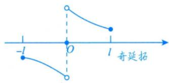

再令 $F ( x )$ 为以2l为周期的周期函数.

②正弦级数展开.

$$
f(x) \sim \sum_{n = 1}^{\infty}b_{n}\sin\frac{n\pi}{l}x,\;x \in \lbrack 0,\;l\rbrack,
$$

$$
b _ { n } = \frac { 2 } { l } \int _ { 0 } ^ { l } f ( x ) \sin \frac { n \pi } { l } x \mathrm { d } x ( n = 1 , 2 , 3 , \cdots ) .
$$

(2)周期偶延拓与余弦级数展开.

①周期偶延拓.

设f(x)定义在[0,l]上，令

$$
F(x)=\begin{cases}f(x),&0\leqslant x\leqslant l,\\f(-x),&-l\leqslant x<0,\end{cases}
$$

再令F(x)为以2l为周期的周期函数.

②余弦级数展开.

$$
f(x) \sim \frac{a_{0}}{2} + \sum_{n = 1}^{\infty}a_{n}\cos\frac{n\pi}{l}x, \quad x \in [0, l],
$$

$$
a _ { n } = \frac { 2 } { l } \int _ { 0 } ^ { l } f ( x ) \cos \frac { n \pi } { l } x \mathrm { d } x ( n = 0 , 1 , 2 , \cdots ) .
$$

例16.38 设 $f(x)=\left\{\begin{aligned}x, \quad 0 \leqslant x \leqslant \frac{1}{2}, \\2-2 x, \quad \frac{1}{2}<x \leqslant 1,\end{aligned}\right.S(x)=\frac{a_{0}}{2}+\sum_{n=1}^{\infty} a_{n} \cos n \pi x,-\infty<x<+\infty$ ，其中

$$
a _ { n } = 2 \int _ { 0 } ^ { 1 } f ( x ) \cos n \pi x \mathrm { d } x ( n = 0 , 1 , 2 , \cdots ) ,
$$

则 $S\left(-\frac{5}{2}\right)=$

分析S(x)为余弦级数，为偶函数的展开式，题干给了定义在区间[0，1]上的函数，需进行偶延拓，再进行周期延拓.

解应填 $\frac{3}{4}$ .

由余弦级数S(x)为函数f(x)作周期偶延拓的傅里叶级数，知S(x)以2为周期且为偶函数，故

$$
S \left( - \frac { 5 } { 2 } \right) = S \left( - 2 - \underbrace { \frac { 1 } { 2 } } _ { } \right) = S \left( - \underbrace { \frac { 1 } { 2 } } _ { } \right) = S \left( \underbrace { \frac { 1 } { 2 } } _ { } \right)   .
$$

周期为2 偶函数又 $x = \frac{1}{2}$ 为f(x)的第一类间断点，故由狄利克雷收敛定理，得

$$
S\left(-\frac{5}{2}\right)=S\left(\frac{1}{2}\right)=\frac{f\left(\frac{1}{2}-0\right)+f\left(\frac{1}{2}+0\right)}{2}=\frac{\frac{1}{2}+\left(2-2\times\frac{1}{2}\right)}{2}=\frac{3}{4}
$$

例16.39 将函数 $f(x)=1-x^{2}(0 \leq x \leq \pi)$ 展开成余弦级数，并求级数 $\sum_{n = 1}^{\infty}\frac{( - 1)^{n + 1}}{n^{2}}$

解因为是余弦级数，将f(x)延拓成[-π,π]上的偶函数，则 $b_{n}=0,\;n=1,\;2,\cdots$

$$
a _ { 0 } = \frac { 2 } { \pi } \int _ { 0 } ^ { \pi } \left( 1 - x ^ { 2 } \right) \mathrm { d } x = 2 \left( 1 - \frac { \pi ^ { 2 } } { 3 } \right) ,
$$

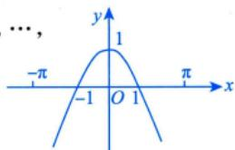

表格法

$$
a_{n} = \frac{2}{\pi}\int_{0}^{\pi}f(x)\cos nx\mathrm{d}x = \frac{2}{\pi}\left( \int_{0}^{\pi}\cos nx\mathrm{d}x - \int_{0}^{\pi}x^{2}\cos nx\mathrm{d}x \right)
$$

$$
\frac{x^{2}}{\sqrt{\frac{2}{n}}\sin nx}\left(\frac{2}{\sqrt{\frac{2}{n}}\cos nx}\right)\left(\frac{2}{\sqrt{\frac{2}{n}}\sin nx}\right)=\frac{2}{\pi}\left(\frac{2}{\pi}\left(\frac{2}{n}\cos nx\right)\right)=\frac{2}{\pi}\left(\frac{x^{2}\sin nx}{n}\right)\left(\frac{2}{n}\sin nx\right)
$$

$$
\frac{2}{\pi} \cdot \frac{2\pi \cdot (-1)^{n+1}}{n^2} = \frac{4 \cdot (-1)^{n+1}}{n^2}, \; n = 1, \; 2, \; \cdots,
$$

故 $f(x)=1-x^{2}\sim S(x)=\frac{a_{0}}{2}+\sum_{n=1}^{\infty}a_{n}\cos nx=1-\frac{\pi^{2}}{3}+\sum_{n=1}^{\infty}\frac{4\cdot(-1)^{n+1}}{n^{2}}\cos nx(0\leq x\leq\pi)$

取x=0，得 $1 = 1 - \frac{\pi^{2}}{3} + \sum_{n = 1}^{\infty}\frac{4 \cdot ( - 1)^{n + 1}}{n^{2}}$ ，于是 $\sum_{n = 1}^{\infty}\frac{( - 1)^{n + 1}}{n^{2}} = \frac{\pi^{2}}{12}$

## 基础习题精练

## 习题

## 16.1 有以下命题：

①若 $\sum_{n = 1}^{\infty} \left( u_{2n - 1} + u_{2n} \right)$ 收敛，则 $\sum_{n = 1}^{\infty}u_{n}$ 收敛；

②若 $\sum_{n = 1}^{\infty}u_{n}$ 收敛，则 $\sum_{n = 1}^{\infty}u_{n + 100}$ 收敛；

③若 $\lim_{n \to \infty} \frac{u_{n+1}}{u_n} > 1$ ，则 $\sum_{n = 1}^{\infty}u_{n}$ 发散；

④若 $\sum_{n = 1}^{\infty} \left( u_{n} + v_{n} \right)$ 收敛，则 $\sum_{n = 1}^{\infty}u_{n}$ 与 $\sum_{n = 1}^{\infty} \nu_{n}$ 都收敛.

则其中所有真命题的序号是（).(A) ①② (B) ②③ (C) ③④ (D) ①④

16.2 当级数 $\sum_{n = 1}^{\infty}a_{n}^{2},\sum_{n = 1}^{\infty}b_{n}^{2}$ 都收敛时，级数 $\sum_{n = 1}^{\infty}a_{n}b_{n}$ ().(A) 条件收敛 (B) 绝对收敛 (C) 发散 (D) 敛散性不确定

16.3 设 $a_{n}>0(n=1,2,\cdots)$ ，级数 $\sum_{n = 1}^{\infty}a_{n}$ 收敛，常数 $\lambda   >   0$ ，则级数 $\sum_{n = 1}^{\infty} (-1)^{n} \left(n \sin \frac{\lambda}{n}\right) a_{2n}$ ( ).(A) 绝对收敛 (B) 条件收敛 (C) 发散 (D) 敛散性与λ有关

16.4 若级数 $\sum_{n = 2}^{\infty}\left\lbrack \sin\frac{1}{n} - k\ln\left( 1 - \frac{1}{n} \right) \right\rbrack$ 收敛，则 k =( ).(A)1 (B)2 (C) -1 (D) -2

16.5 若y满足微分方程 $y^{\prime} = x + y$ 及y(0)=1，且级数 $\sum_{n = 1}^{\infty}\left\lbrack y\left( \frac{1}{n} \right) + k - \frac{1}{n} \right\rbrack$ 收敛，则k =

16.6 幂级数 $\sum_{n = 1}^{\infty}\frac{n}{3^{n}}(x - 1)^{n}$ 的收敛域为

16.7（仅数学一)设 $f(x)=\begin{cases}x^{2},&-\pi\leqslant x<0,\\-5,&0\leqslant x<\pi,\end{cases}$ 则其以2π为周期的傅里叶级数在x=±π处收敛于

16.8（仅数学一)设函数 $f(x)=\pi x+x^{2}(-\pi<x<\pi)$ 的傅里叶级数展开式为

$$
\frac{a_{0}}{2} + \sum_{n = 1}^{\infty}(a_{n}\cos nx + b_{n}\sin nx)
$$

则其中系数 $b _ { 3 }$ 的值为

16.9 设正项数列 $\left\{ a_{n} \right\}$ 单调减少，且 $\sum_{n = 1}^{\infty} (-1)^{n} a_{n}$ 发散，试问级数 $\sum_{n = 1}^{\infty}\left( \frac{1}{a_{n} + 1} \right)^{n}$ 是否收敛？并说明理由.

16.10判别 $\prod_{n = 2}^{\infty} 2^{\frac{\ln n}{n^{\alpha}}}$ 的敛散性 $( \alpha   >   0 )$

16.11 判别级数 $\sum_{n = 2}^{\infty}\ln\left\lbrack 1 + \frac{( - 1)^{n}}{\sqrt{n}} \right\rbrack$ 的敛散性.

16.12 求幂级数 $\sum_{n = 1}^{\infty}\frac{\left\lbrack 3 + ( - 1)^{n} \right\rbrack^{n}}{n} \cdot x^{n}$ 的收敛域.

16.13 求幂级数 $\sum_{n = 1}^{\infty}\left( \frac{1}{2n + 1} - 1 \right)x^{2n}$ 在区间(-1,1)内的和函数S(x).

16.14 求级数 $\sum_{n = 0}^{\infty}\frac{( - 1)^{n}(n^{2} - n + 1)}{2^{n}}$ 的和.

16.15 将函数 $f(x) = \frac{1}{x^{2} - 3x + 2}$ 展开成x的幂级数，并指出其收敛区间.

16.16设 $f(x) = \sum_{n = 0}^{\infty}\frac{a_{n}}{n!}x^{n}$ ，且满足 $\left\{ f''(x) - f'(x) - 2f(x) = 0 \right. \quad f(0) = 0, \quad f'(0) = 1.$ 求：(1) f(x)；(2) $a _ { n }$

16.17 将幂级数 $\sum_{n = 1}^{\infty}\frac{( - 1)^{n - 1}}{(2n - 1)!2^{2n - 2}}x^{2n - 1}$ 的和函数展开成x-1的幂级数.

## 解答

16.1(B) 解由级数收敛的性质可知，加括号的级数收敛，原级数未必收敛，所以命题①不正确.若 $\sum_{n = 1}^{\infty}(u_{n} + v_{n})$ 收敛， $\sum_{n = 1}^{\infty}u_{n}$ 与 $\sum_{n = 1}^{\infty} \nu_{n}$ 未必收敛，可知命题④不正确.也可取反例，对于命题①，令

$u_{n} = (-1)^{n-1}$ ；对于命题④，令 $u_{n} = (-1)^{n-1} , v_{n} = (-1)^{n}$

由级数去掉前面有限项，不改变级数收敛性的性质，可知命题②正确.

若级数满足 $\lim_{n \to \infty} \frac{u_{_{n+1}}}{u_{_n}}$ 存在且大于1，则级数发散，可知命题③正确.

综上可知，应选(B).

16.2 (B) 解 因为级数 $\sum_{n = 1}^{\infty}a_{n}^{2},\sum_{n = 1}^{\infty}b_{n}^{2}$ 都为正项级数且收敛，又 $\left| a_{n}b_{n} \right| = \sqrt{a_{n}^{2} \cdot b_{n}^{2}} \leqslant \frac{a_{n}^{2} + b_{n}^{2}}{2}$ ，故由比较判别法知， $\sum_{n = 1}^{\infty}\left| a_{n}b_{n} \right|$ 收敛，即 $\sum_{n = 1}^{\infty}a_{n}b_{n}$ 绝对收敛. 选(B).

16.3 (A) 解 由题设知 $\sum_{n = 1}^{\infty} a_{n}$ 为正项级数且收敛，故级数 $\sum_{n = 1}^{\infty}a_{2n}$ 收敛.

记 $u_{n} = \left| n \sin \frac{\lambda}{n} \right| a_{2n}, v_{n} = a_{2n}$ ，由于

$$
\lim_{n \to \infty} \frac{u_n}{v_n} = \lim_{n \to \infty} \frac{\left| n \sin \frac{\lambda}{n} \right| a_{2n}}{a_{2n}} = \lim_{n \to \infty} \frac{\left| \sin \frac{\lambda}{n} \right|}{\frac{1}{n}} = \lim_{n \to \infty} \frac{\lambda}{\frac{1}{n}} = \lambda > 0,
$$

故由正项级数比较判别法的极限形式知 $\sum_{n = 1}^{\infty}u_{n}$ 与 $\sum_{n = 1}^{\infty} \nu_{n}$ 的敛散性相同.又 $\sum_{n = 1}^{\infty} v_{n} = \sum_{n = 1}^{\infty} a_{2n}$ 收敛，故 $\sum_{n = 1}^{\infty}\left| n\sin\frac{\lambda}{n} \right|a_{2n}$ 收敛，从而 $\sum_{n = 1}^{\infty}( - 1)^{n}\left( n\sin\frac{\lambda}{n} \right)a_{2n}$ 绝对收敛. 故选(A).

16.4 (C) 解 利用泰勒展开式

$$
\begin{aligned}\sin \frac{1}{n} - k \ln \left( 1 - \frac{1}{n} \right) = & \frac{1}{n} - \frac{1}{6n^3} + o\left( \frac{1}{n^3} \right) + \frac{k}{n} + \frac{k}{2n^2} + o\left( \frac{1}{n^2} \right) \\= & \frac{1 + k}{n} + \frac{k}{2n^2} + o\left( \frac{1}{n^2} \right).\end{aligned}
$$

若级数收敛，则 $1 + k = 0$ ，即k=-1，应选(C).

16.5 -1 分析 一个自然的想法是求出 y(x)(这是可以的)，但借助微分方程 $y' = x + y$ 及$y ( 0 )   =   1$ 求出y'(0)和 $y''(0)$ ，再利用泰勒公式确定 $u_{n}=y\left(\frac{1}{n}\right)+k-\frac{1}{n}$ 关于 $\frac{1}{n}$ 的阶数会更简单.

解由 $y^{\prime} = x + y, \; y(0) = 1$ 可得y'(0)=1，且由 $y'' = 1 + y'$ 可得 $y''(0) = 2$ ，于是

$$
y(x)=y(0)+y^{\prime}(0)x+\frac{1}{2}y^{\prime\prime}(0)x^{2}+o(x^{2})=1+x+x^{2}+o(x^{2})
$$

故 $u_{n}=y\left(\frac{1}{n}\right)+k-\frac{1}{n}=\frac{1}{n^{2}}+1+k+o\left(\frac{1}{n^{2}}\right)$ ，当 $k = - 1$ 时， $u_{n} = \frac{1}{n^{2}} + o\left( \frac{1}{n^{2}} \right)$ ，即 $u_{n}=y\left(\frac{1}{n}\right)-1-\frac{1}{n}\sim\frac{1}{n^{2}}\left(n\rightarrow\infty\right)$ 故收敛.

16.6 (-2,4) 解 用比值判别法，因为

$$
\left| \frac{(n + 1)(x - 1)^{n + 1}}{3^{n + 1}} \right| = \lim_{n \rightarrow \infty}\frac{n + 1}{3n}|x - 1| = \frac{1}{3}|x - 1|
$$

所以当 $\frac{1}{3} \left| x - 1 \right| < 1$ ，即 $\left| x - 1 \right| < 3$ 时，幂级数 $\sum_{n = 1}^{\infty}\frac{n}{3^{n}}(x - 1)^{n}$ 绝对收敛；当 $\frac{1}{3}|x - 1| > 1$ ，即 $\left | x-1 \right | > 3$ 时，幂级数 $\sum_{n = 1}^{\infty}\frac{n}{3^{n}}(x - 1)^{n}$ 发散.

根据收敛半径的定义可知收敛半径R=3，收敛区间为(-2,4).

又因为当 $x = 4$ 时，幂级数为 $\sum_{n = 1}^{\infty} n$ ，发散；当 $x = - 2$ 时，幂级数为 $\sum_{n = 1}^{\infty} (-1)^{n} n!$ ，发散，所以收敛域为(−2, 4) .

16.7 $\frac{\pi^{2}-5}{2}$ 解 由狄利克雷收敛定理可知，f(x)在x=±π处的傅里叶级数收敛于

$$
\frac{f(-\pi^{+}) + f(\pi^{-})}{2}
$$

因为 $f(\pi^{-}) = -5, \quad f(-\pi^{+}) = x^{2} \Big|_{x=-\pi} = \pi^{2}$ ，故 $S(\pm \pi)=\frac{f(-\pi^{+})+f(\pi^{-})}{2}=\frac{\pi^{2}-5}{2}$

16.8 $\frac{2}{3}\pi$ 解 $b_{3}=\frac{1}{\pi}\int_{-\pi}^{\pi}f(x)\sin 3x\mathrm{d}x=\frac{1}{\pi}\int_{-\pi}^{\pi}(\pi x+x^{2})\sin 3x\mathrm{d}x=2\int_{0}^{\pi}x\sin 3x\mathrm{d}x=\frac{2}{3}\pi$

16.9 解 由正项数列 $\left\{ a_{n} \right\}$ 单调减少知 $\lim_{n \to \infty} a_{n}$ 存在，记为 $a,   a \geqslant 0$ ，且对任意 $n \in \mathbf { N } _ { \perp }$ 都有 $a_{n} \geqslant a$ . 从而 $\frac{1}{a_{n} + 1} \leqslant \frac{1}{a + 1} (n = 1,2,\cdots)$ .另一方面，已知 $\sum_{n = 1}^{\infty} (-1)^{n} a_{n}$ 发散，故 $a > 0$ .因若 $a = 0$ ，则由莱布尼茨判别法知 $\sum_{n = 1}^{\infty} (-1)^{n} a_{n}$ 应收敛. 既然常数 $a > 0$ ，故等比级数 $\sum_{n = 1}^{\infty}\left( \frac{1}{a + 1} \right)^{n}$ 的公比 $\frac{1}{a + 1} < 1 , \sum_{n = 1}^{\infty} \left( \frac{1}{a + 1} \right)^{n}$ 收敛.由比较判别法知 $\sum_{n = 1}^{\infty}\left( \frac{1}{a_{n} + 1} \right)^{n}$ 亦收敛.

16.10 解 $\prod_{n = 2}^{\infty}2^{\frac{\ln n}{n^{\alpha}}} = 2^{\sum_{n = 2}^{\infty}\frac{\ln n}{n^{\alpha}}}$ ，根据指数函数的连续性可知 $\prod_{n = 2}^{\infty} 2^{\frac{\ln n}{n^{\alpha}}}$ 与 $\sum_{n = 2}^{\infty}\frac{\ln n}{n^{\alpha}}$ 同敛散.

以下同例16.8.故当 $0 < \alpha \leq 1$ 时， $\prod_{n = 2}^{\infty} 2^{\frac{\ln n}{n^{\alpha}}}$ 发散；当 $\alpha > 1$ 时， $\prod_{n = 2}^{\infty} 2^{\frac{\ln n}{n^{\alpha}}}$ 收敛.

16.11 分析 这是交错级数，但不易判别 $\{ \left| u _ { n } \right| \}$ 的单调性，因此不能使用莱布尼茨判别法.为了能

掌握一般项 $u_{n}=\ln\left[1+\frac{(-1)^{n}}{\sqrt{n}}\right]$ 的阶数，需使用泰勒公式.

解 由泰勒公式得， $\ln \left[ 1 + \frac{(-1)^n}{\sqrt{n}} \right] = \frac{(-1)^n}{\sqrt{n}} - \frac{1}{2n} + o\left(\frac{1}{n}\right)$

由比较判别法， $\frac{\frac{1}{2n}-o\left(\frac{1}{n}\right)}{\frac{1}{n}}=\frac{1}{2}$ ，而级数 $\sum_{n = 2}^{\infty}\frac{( - 1)^{n}}{\sqrt{n}}$ 是(条件)收敛的，故原级数发散.

16.12 分析 $\lim_{n \to \infty} \sqrt[n]{|a_n|} = \lim_{n \to \infty} \frac{3 + (-1)^n}{\sqrt[n]{n}}$ 不存在.

$\lim_{n \to \infty} \left| \frac{a_{n+1}}{a_n} \right| = \lim_{n \to \infty} \frac{[3+(-1)^{n+1}]^{n+1}}{n+1} \cdot \frac{n}{[3+(-1)^n]^n} = \lim_{n \to \infty} \frac{[3+(-1)^{n+1}]^n}{[3+(-1)^n]^n} \cdot [3+(-1)^{n+1}] \cdot \frac{n}{n+1}$ 不存在(因为当n为

奇数，且 $n \to \infty$ 时， $\frac{n}{n+1} \to 1, \quad \frac{[3+(-1)^{n+1}]^n}{[3+(-1)^n]^n} \to +\infty, \quad 3+(-1)^{n+1} \to 4$

但 $\lim_{n \to \infty} \sqrt[n]{|a_n|}$ 及 $\lim_{n \to \infty} \left| \frac{a_{n+1}}{a_n} \right|$ 都不存在，并不能判定原级数的收敛半径一定不存在

## 解 现考虑原级数的奇、偶项级数.

$a_{n}=\frac{\left[3+(-1)^{n}\right]^{n}}{n}=\left\{\begin{aligned}\frac{4^{n}}{n}, \quad n, \\ \frac{2^{n}}{n}, \quad n.\end{aligned}\right.$ 为偶数，由于 故原级数的奇、偶项级数分别为 $\sum_{k = 1}^{\infty}\frac{2^{2k - 1}}{2k - 1} \cdot x^{2k - 1}$ 与为奇数，$\sum_{k = 1}^{\infty}\frac{4^{2k}}{2k} \cdot x^{2k}$

①由比值判别法求出级数 $\sum_{k = 1}^{\infty}\frac{2^{2k - 1}}{2k - 1} \cdot x^{2k - 1}$ 的收敛半径 $R_{1} = \frac{1}{2}$ ，级数 $\sum_{k = 1}^{\infty}\frac{4^{2k}}{2k} \cdot x^{2k}$ 的收敛半径 $R_{2} = \frac{1}{4}$ 则原级数的收敛半径 $R = \min\{R_1, R_2\} = \frac{1}{4}$

②当 $x = \frac{1}{4}$ 时，原级数化为 $\sum_{n = 1}^{\infty}\frac{\left\lbrack 3 + ( - 1)^{n} \right\rbrack^{n}}{n} \cdot \frac{1}{4^{n}}$ ，且 $\frac{\left[ 3 + ( - 1 ) ^ { n } \right] ^ { n } } { n } \cdot \frac { 1 } { 4 ^ { n } } = \left\{ \begin{aligned} & \frac { 1 } { ( 2 k - 1 ) \cdot 2 ^ { 2 k - 1 } } , & n = 2 k - 1 , \\ & \frac { 1 } { 2 k } , & n = 2 k . \end{aligned} \right.$ 由于 $\sum_{k = 1}^{\infty}\frac{1}{(2k - 1) \cdot 2^{2k - 1}}$ 收敛， $\sum _ { k = 1 } ^ { \infty } \frac { 1 } { 2 k } .$ 发散，因此 $\sum_{n = 1}^{\infty}\frac{\left\lbrack 3 + ( - 1)^{n} \right\rbrack^{n}}{n} \cdot \frac{1}{4^{n}}$ 发散.

③当 $x = - \frac{1}{4}$ 时，原级数为 $\sum_{n = 1}^{\infty}\frac{\left\lbrack 3 + ( - 1)^{n} \right\rbrack^{n}}{n} \cdot \frac{( - 1)^{n}}{4^{n}}$ ，且

$$
\frac{\left[3+(-1)^{n}\right]^{n}}{n}\cdot\frac{(-1)^{n}}{4^{n}}=\left\{\begin{aligned}&-\frac{1}{(2k-1)\cdot2^{2k-1}},&n=2k-1,\\&\frac{1}{2k},&n=2k.\end{aligned}\right.
$$

由于 $- \sum_{k = 1}^{\infty}\frac{1}{(2k - 1) \cdot 2^{2k - 1}}$ 收敛， $\sum _ { k = 1 } ^ { \infty } { \frac { 1 } { 2 k } }$ 发散，故 $\sum_{n = 1}^{\infty}\frac{\left\lbrack 3 + ( - 1)^{n} \right\rbrack^{n}}{n} \cdot \frac{( - 1)^{n}}{4^{n}}$ 发散.

综上，幂级数的收敛域为 $\left( - \frac{1}{4}, \frac{1}{4} \right)$

16.13 解设

$$
S(x)=\sum_{n = 1}^{\infty}\left(\frac{1}{2n + 1} - 1\right)x^{2n}, S_{1}(x)=\sum_{n = 1}^{\infty}\frac{x^{2n}}{2n + 1}, S_{2}(x)=\sum_{n = 1}^{\infty}x^{2n},
$$

则

$$
S(x) = S_1(x) - S_2(x), \; x \in (-1, 1)
$$

由于

$$
S_{2}(x) = \sum_{n = 1}^{\infty}x^{2n} = \frac{x^{2}}{1 - x^{2}}
$$

$$
\left[ x S _ { 1 } ( x ) \right] ^ { \prime } = \sum _ { n = 1 } ^ { \infty } x ^ { 2 n } = \frac { x ^ { 2 } } { 1 - x ^ { 2 } } , x \in ( - 1 , 1 ) ,
$$

因此

$$
x S_{1}(x)=\int_{0}^{x} \frac{t^{2}}{1-t^{2}} \mathrm{d} t=-x+\frac{1}{2} \ln \frac{1+x}{1-x}
$$

又由于

$$
S _ { 1 } ( 0 ) = 0 ,
$$

故

$$
S_{1}(x)=\left\{\begin{aligned}-1+\frac{1}{2x}\ln\frac{1+x}{1-x}, \quad |x|\in(0,1), \\ 0, \quad x=0,\end{aligned}\right.
$$

因此

$$
S(x)=S_{1}(x)-S_{2}(x)=\left\{\begin{aligned}&\frac{1}{2x}\ln\frac{1+x}{1-x}-\frac{1}{1-x^{2}},\quad|x|\in(0,1),\\&0,\quad x=0.\end{aligned}\right.
$$

16.14 解

$$
\sum_{n = 0}^{\infty}\frac{( - 1)^{n}(n^{2} - n + 1)}{2^{n}} = \sum_{n = 2}^{\infty}n(n - 1)\left( - \frac{1}{2} \right)^{n} + \sum_{n = 0}^{\infty}\left( - \frac{1}{2} \right)^{n}
$$

$$
\sum_{n = 0}^{\infty}\left( - \frac{1}{2} \right)^{n} = \frac{1}{1 + \frac{1}{2}} = \frac{2}{3}
$$

设 $S(x)=\sum_{n = 2}^{\infty}n(n - 1)x^{n - 2}=\left(\sum_{n = 0}^{\infty}x^{n}\right)^{\prime}=\frac{2}{(1 - x)^{3}},|x|<1$ ，则

$$
\sum_{n = 2}^{\infty}n(n - 1)x^{n} = \frac{2x^{2}}{(1 - x)^{3}},\sum_{n = 2}^{\infty}n(n - 1)\left( - \frac{1}{2} \right)^{n} = \frac{4}{27}
$$

所以

$$
\sum_{n = 0}^{\infty}\frac{( - 1)^{n}(n^{2} - n + 1)}{2^{n}} = \frac{4}{27} + \frac{2}{3} = \frac{22}{27}
$$

16.15 解

$$
f(x)=\frac{1}{x^{2}-3x+2}=\frac{1}{1-x}-\frac{1}{2-x}=\frac{1}{1-x}-\frac{1}{2}\cdot\frac{1}{1-\frac{x}{2}}
$$

由麦克劳林展开式知

$$
\frac{1}{1 - x} = 1 + x + x^{2} + \cdots + x^{n} + \cdots = \sum_{n = 1}^{\infty}x^{n - 1}, \; x \in ( - 1,1),
$$

$$
\frac{1}{1 - \frac{x}{2}} = 1 + \frac{x}{2} + \left( \frac{x}{2} \right)^{2} + \cdots + \left( \frac{x}{2} \right)^{n} + \cdots = \sum_{n = 1}^{\infty} \left( \frac{x}{2} \right)^{n - 1}, x \in ( - 2,2),
$$

从而有

$$
\frac{1}{x^{2}-3x+2}=\sum_{n=1}^{\infty}x^{n-1}-\frac{1}{2}\sum_{n=1}^{\infty}\left(\frac{x}{2}\right)^{n-1}=\sum_{n=1}^{\infty}\left(1-\frac{1}{2^{n}}\right)x^{n-1},x\in(-1,1).
$$

16.16 解 (1)特征方程为 $r^{2}-r-2=0$ ，得 $r_{1} = -1, r_{2} = 2$ ，故通解为

$$
f(x) = C_{1} \mathrm{e}^{-x} + C_{2} \mathrm{e}^{2x}
$$

由 $f(0)=0,\ f^{\prime}(0)=1$ ，得

$$
\begin{cases}C_{1} + C_{2} = 0, \\- C_{1} + 2C_{2} = 1,\end{cases}
$$

故 $C_{1} = - \frac{1}{3}, C_{2} = \frac{1}{3}$ ，所以

$$
f(x) = - \frac{1}{3}\mathrm{e}^{- x} + \frac{1}{3}\mathrm{e}^{2 x}
$$

(2)

$$
\begin{aligned}f(x) &= \sum_{n = 0}^{\infty}\frac{a_{n}}{n!}x^{n} = - \frac{1}{3}e^{- x} + \frac{1}{3}e^{2x} = - \frac{1}{3}\sum_{n = 0}^{\infty}\frac{( - x)^{n}}{n!} + \frac{1}{3}\sum_{n = 0}^{\infty}\frac{(2x)^{n}}{n!} \\&= - \frac{1}{3}\sum_{n = 0}^{\infty}\frac{( - 1)^{n}x^{n}}{n!} + \frac{1}{3}\sum_{n = 0}^{\infty}\frac{2^{n} \cdot x^{n}}{n!}\end{aligned}
$$

$$
\sum_{n = 0}^{\infty}\left\lbrack \left( - \frac{1}{3} \right)( - 1)^{n} + \frac{2^{n}}{3} \right\rbrack\frac{x^{n}}{n!}
$$

故 $a_{n} = \frac{1}{3}\left[ (-1)^{n+1} + 2^{n} \right]$

16.17 解令 $S(x)=\sum_{n = 1}^{\infty}\frac{(- 1)^{n - 1}}{(2n - 1)!2^{2n - 2}}x^{2n - 1}=2\sum_{n = 1}^{\infty}\frac{(- 1)^{n - 1}}{(2n - 1)!}\left( \frac{x}{2} \right)^{2n - 1}=2\sin\frac{x}{2},-\infty<x<+\infty$ ，利用三角函数公式展开，得

$$
\begin{aligned}S(x) = 2\sin\frac{x}{2} = 2\sin\frac{1 + x - 1}{2} = 2\left( \sin\frac{1}{2}\cos\frac{x - 1}{2} + \cos\frac{1}{2}\sin\frac{x - 1}{2} \right) \\= 2\sin\frac{1}{2}\sum_{n = 0}^{\infty}\frac{(- 1)^{n}}{(2n)!}\left( \frac{x - 1}{2} \right)^{2n} + 2\cos\frac{1}{2}\sum_{n = 0}^{\infty}\frac{(- 1)^{n}}{(2n + 1)!}\left( \frac{x - 1}{2} \right)^{2n + 1}, - \infty < x < + \infty\end{aligned}
$$

注本题用幂级数 $\sum_{n = 1}^{\infty}\frac{( - 1)^{n - 1}}{(2n - 1)!2^{2n - 2}}x^{2n - 1}$ 来包装函数 $2\sin\frac{x}{2}$ 这种包装要能识别出来

## 第17讲

## 多元函数积分学的预备知识（仅数学一）

<table><tr><td rowspan=1 colspan=1>考题</td><td rowspan=1 colspan=1>空间曲线与曲面方程、曲线切线与法平面、曲面切平面与法线的求解，散度与旋度的概念、方向导数和梯度的计算</td></tr><tr><td rowspan=1 colspan=1>题型</td><td rowspan=1 colspan=1>选择题、填空题</td></tr><tr><td rowspan=1 colspan=1>目标</td><td rowspan=1 colspan=1>①会计算空间曲线与曲面的方程，会求曲线的切线与法平面、曲面的切平面与法线；②了解散度与旋度的概念，并会计算方向导数和梯度</td></tr><tr><td rowspan=1 colspan=1>重难点</td><td rowspan=1 colspan=1>空间曲线与曲面方程的求解</td></tr></table>

## 基础知识结构

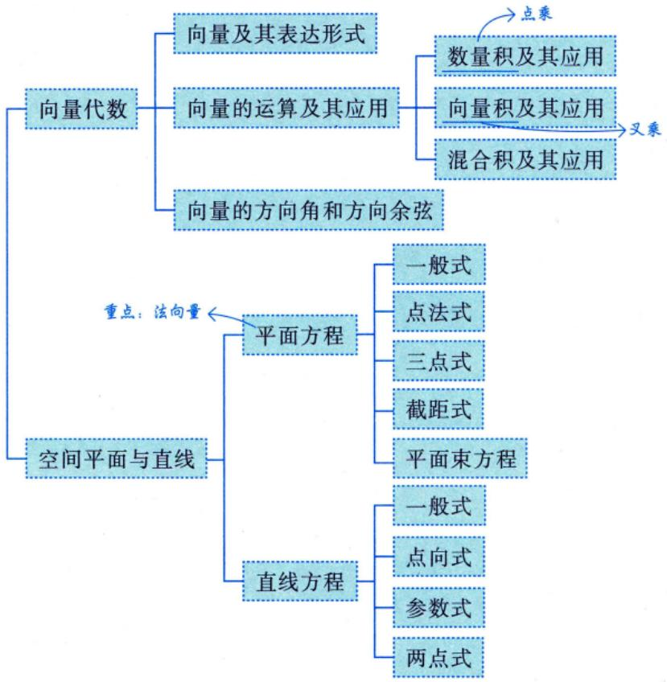

## 向量及其表达形式

既有大小又有方向的量称为向量.

注两个向量，只要它们的大小相等、方向相同，它们就是相等的向量，与它们在空间中的位置无关（这也称为向量的自由性).

向量的表达形式为

$$
\boldsymbol{a} = (a_{x}, a_{y}, a_{z}) = a_{x}\boldsymbol{i} + a_{y}\boldsymbol{j} + a_{z}\boldsymbol{k}
$$

→高等数学中手写要打箭头：a.

## 2向量的运算及其应用

设 $\boldsymbol{a} = (a_{x}, a_{y}, a_{z}), \boldsymbol{b} = (b_{x}, b_{y}, b_{z}), \boldsymbol{c} = (c_{x}, c_{y}, c_{z}), \boldsymbol{a}, \boldsymbol{b}, \boldsymbol{c}$ 均是非零向量.

线性代数中不需要。 $a = \begin{bmatrix} 1 \\ 1 \\ 2 \end{bmatrix}$

(1)数量积(内积、点积)及其应用.

→结果是数

① $\boldsymbol{a} \cdot \boldsymbol{b} = (a_{x}, a_{y}, a_{z}) \cdot (b_{x}, b_{y}, b_{z}) = a_{x}b_{x} + a_{y}b_{y} + a_{z}b_{z}$

可以用此公式反求买用② $\boldsymbol{a} \cdot \boldsymbol{b} = |\boldsymbol{a}| |\boldsymbol{b}| \cos \theta$ ，则 $\cos \theta = \frac{\boldsymbol{a} \cdot \boldsymbol{b}}{\left| \boldsymbol{a} \right| \left| \boldsymbol{b} \right|} = \frac{a_{x}b_{x} + a_{y}b_{y} + a_{z}b_{z}}{\sqrt{a_{x}^{2} + a_{y}^{2} + a_{z}^{2}} \cdot \sqrt{b_{x}^{2} + b_{y}^{2} + b_{z}^{2}}}$ ，其中θ为a，b的夹角.

7天③ $\boldsymbol{a} \perp \boldsymbol{b} \Leftrightarrow \boldsymbol{\theta}=\frac{\pi}{2} \Leftrightarrow \boldsymbol{a} \cdot \boldsymbol{b}=|\boldsymbol{a}| |\boldsymbol{b}| \cos \theta=0 \Leftrightarrow \left|\frac{a_{x} b_{x}+a_{y} b_{y}+a_{z} b_{z}=0}{}\right|$ ·垂直方程最常用

例：若(1，2，1)与(a，1，-1)垂直，则a+2-1=0，即a=-1

=la|cosθ④ $\frac{\left| \mathrm{Prj}_{b} \boldsymbol{a} \right|}{\left| \boldsymbol{b} \right|} = \frac{\boldsymbol{a} \cdot \boldsymbol{b}}{\left| \boldsymbol{b} \right|} = \frac{a_{x} b_{x} + a_{y} b_{y} + a_{z} b_{z}}{\sqrt{b_{x}^{2} + b_{y}^{2} + b_{z}^{2}}}$ ，称为a在b上的投影.

(2)向量积(外积、叉积)及其应用.

① $\boldsymbol{a} \times \boldsymbol{b} = \begin{vmatrix} \boldsymbol{i} & \boldsymbol{j} & \boldsymbol{k} \\ a_{_x} & a_{_y} & a_{_z} \\ b_{_x} & b_{_y} & b_{_z} \end{vmatrix}$ ，其中 $| \boldsymbol{a} \times \boldsymbol{b} | = | \boldsymbol{a} | | \boldsymbol{b} | \sin \theta$ ，用右手规则确定方向(转向角不超过π)，θ为a,b b

的夹角.

②a $\sqrt{b} \Leftrightarrow \theta = 0$ 或 $\boxed{\pi} \Leftrightarrow \boxed{\frac{a_{x}}{b_{x}} = \frac{a_{y}}{b_{y}} = \frac{a_{z}}{b_{z}}}$

(3) 混合积及其应用.

② $\begin{vmatrix} a_{_x} & a_{_y} & a_{_z} \\ b_{_x} & b_{_y} & b_{_z} \\ c_{_x} & c_{_y} & c_{_z} \end{vmatrix} = 0 \Leftrightarrow$ 三向量共面：

## ③向量的方向角和方向余弦

(1)非零向量a与x轴、y轴和z轴正向的夹角α，β，γ称为a的方向角.

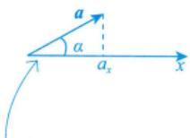

(2) $\cos \alpha , \cos \beta , \cos \gamma$ 称为a的方向余弦，且 $\cos \alpha = \frac{a_{x}}{\left | \boldsymbol{a} \right | }, \cos \beta = \frac{a_{y}}{\left | \boldsymbol{a} \right | }, \cos \gamma = \frac{a_{z}}{\left | \boldsymbol{a} \right | }$

(3) $\boldsymbol{a}^{*} = \frac{\boldsymbol{a}}{\left | \boldsymbol{a} \right | } = \left ( \cos \alpha , \cos \beta , \cos \gamma \right )$ 称为向量a的单位向量(表示方向的向量).

(4)任意向量 $\boldsymbol{r} = x\boldsymbol{i} + y\boldsymbol{j} + z\boldsymbol{k} = (r\cos\alpha, r\cos\beta, r\cos\gamma) = r(\cos\alpha, \cos\beta, \cos\gamma)$ ，其中 $\cos \alpha, \cos \beta$ cosγ为r的方向余弦，r为r的模， $\cos \alpha = \frac{x}{\sqrt{x^{2} + y^{2} + z^{2}}} , \cos \beta = \frac{y}{\sqrt{x^{2} + y^{2} + z^{2}}} , \cos \gamma = \frac{z}{\sqrt{x^{2} + y^{2} + z^{2}}} ,$ $r = \sqrt{x^{2} + y^{2} + z^{2}}$ $\cos ^{2}\alpha +\cos ^{2}\beta +\cos ^{2}\gamma =1$

例 $a = (1,1,2) , \left| a \right| = \sqrt{1^{2} + 1^{2} + 2^{2}} = \sqrt{6}$

$$
f(0,0)=0
$$

$$
a^{*} = \left( \frac{1}{\sqrt{6}}, \frac{1}{\sqrt{6}}, \frac{2}{\sqrt{6}} \right)
$$

$\boldsymbol{n} = \left( \frac{\partial f}{\partial x}, \frac{\partial f}{\partial y}, -1 \right) \bigg|_{(0,0)}$ ，则lim $\frac{n \cdot (x, y, f(x, y))}{\sqrt{x^2 + y^2}}$ (x, y)→(0, 0)

分析可微： $\Delta z - \mathrm{d}z = o(\rho)$

解应填0.

因为f(x，y)在点(0,0)处可微，且f(0,0)=0，所以

$$
f(x,y)=f(x,y)-f(0,0)=\left.\frac{\partial f}{\partial x}\right|_{(0,0)}(x-0)+\left.\frac{\partial f}{\partial y}\right|_{(0,0)}(y-0)+o\left(\sqrt{x^2+y^2}\right),
$$

故 $\left. \frac { \partial f } { \partial x } \right| _ { ( 0 , 0 ) } x + \left. \frac { \partial f } { \partial y } \right| _ { ( 0 , 0 ) } y - f ( x , y ) = o \left( \sqrt { x ^ { 2 } + y ^ { 2 } } \right)$ ，即

$$
\frac{\partial f\bigg|_{(0,0)}x+\frac{\partial f}{\partial y}\bigg|_{(0,0)}y-f(x,y)}{\sqrt{x^{2}+y^{2}}}=0
$$

因为 $\boldsymbol{n} = \left( \frac{\partial f}{\partial x}, \frac{\partial f}{\partial y}, -1 \right) \bigg|_{(0,0)}$ ，所以 $\boldsymbol { n } \cdot ( x , y , f ( x , y ) ) = \left. \frac { \partial f } { \partial x } \right| _ { ( 0 , 0 ) } x + \left. \frac { \partial f } { \partial y } \right| _ { ( 0 , 0 ) } y - f ( x , y ) .$ ，从而0,0)

$$
\lim _ { ( x , y ) \rightarrow ( 0 , 0 ) } \frac { n \cdot ( x , y , f ( x , y ) ) } { \sqrt { x ^ { 2 } + y ^ { 2 } } } = 0 .
$$

## 空间平面与直线

## 平面方程

以下假设平面的法向量n=(A,B，C)

$\frac{\stackrel{A}{\underset{P(x, y, z)}{=}} \stackrel{B}{\underset{P(x, y, z)}{=}} \stackrel{C}{\underset{P(x, y, z)}{=}}}{\stackrel{A}{\underset{P(x, y, z)}{=}}} \stackrel{B}{\underset{P(x, y, z)}{=}} \stackrel{C}{\underset{P(x, y, z)}{=}} \stackrel{C}{\underset{P(x, y, z)}{=}} \stackrel{C}{\underset{P(x, y, z)}{=}} \stackrel{C}{\underset{P(x, y, z)}{=}} \stackrel{C}{\underset{P(x, y, z)}{=}} \stackrel{C}{\underset{P(x, y, z)}{=}} \stackrel{C}{\underset{P(x, y, z)}{=}} \stackrel{C}{\underset{P(x, y, z)}{=}} \stackrel{C}{\underset{P(x, y, z)}{=}} \stackrel{C}{\underset{P(x, y, z)}{=}} \stackrel{C}{\underset{P(x, y, z)}{=}} \stackrel{C}{\underset{P(x, y, z)}{=}} \stackrel{C}{\underset{P(x, y, z)}{=}} \stackrel{C}{\underset{P(x, y, z)}{=}} \stackrel{C}{\underset{P(x, y, z)}{=}} \stackrel{C}{\underset{P(x, y, z)}{=}} \stackrel{C}{\underset{P(x, y, z)}{=}} \stackrel{C}{\underset{P(x, y, z)}{=}} \stackrel{C}{\underset{P(x, y, z)}{=}} \stackrel{C}{\underset{P(x, y, z)}{=}} \stackrel{C}{\underset{P(x, y, z)}{=}} \stackrel{C}{\underset{P(x, y, z)}{=}} \stackrel{C}{\underset{P(x, y, z)}{=}} \stackrel{P(x, y, z)}{\underset{P(x, z)}{=}} \stackrel{P(x, y, z)}{\stackrel{P(x, z)}{=}} \stackrel{P(x, y, z)}{\stackrel{P(x, z)}{=}} \stackrel{P(x, y, z)}{\stackrel{P(x, z)}{\stackrel{P(x, z)}{=}} \stackrel{P(x, z)}{\stackrel{P(x, z)}{=}} \stackrel{P(x, z)}{\stackrel{P(x, z)}{\stackrel{P(x, z)}{=}}} \stackrel{P(x, z)}{\stackrel{P(x, z)}{\stackrel{P(x, z)}{=}}} \stackrel{P(x, z)}{\stackrel{P(x, z)}{\stackrel{P(x, z)}{P(x, z)}}{\stackrel{P(x, z)}{\stackrel{P(x, z)}}{\stackrel{P(x, z)}}{\stackrel{P(x, z)}}{\stackrel{P(x, z)}}{\stackrel{P(x, z)}}{\stackrel{P(x, z)}}{\stackrel{P(x, z)}}{\stackrel{P(x, z)}}{\stackrel{P(x, z)}{P(x, z)}}{\stackrel{P(x, z)}{\stackrel{P(x, z)}}{\stackrel{P(x, z)}}} \stackrel{\stackrel{P(x, z)}{P(x, z)}{P(x, z)}{\stackrel{P(x, z)}}{\stackrel{P(x, z)}}{\stackrel{P(x, z)}}{\stackrel{P(x, z \stackrel{P(x, z)}}}{\stackrel{P(x, z)}}{\stackrel{P(x, z)}}{\stackrel{P(x, z)}}{\stackrel{P(x, z)}}{\stackrel{P(x, z \stackrel{P(x, z)}}{P(x, z)}{\stackrel{P}}} \stackrel{\stackrel{P(x, z \stackrel{P}}{P(x, z)}{P(x, z)}{\stackrel{P}} \stackrel{P(x,z)} \stackrel{P} \stackrel{P}{P} \stackrel{P} \stackrel{P(x,z)}{P} \stackrel{P} \stackrel{P} \stackrel{P} \stackrel{P} \stackrel{P} \stackrel{P} \stackrel{P} \stackrel{P} \stackrel{P \stackrel{P} \stackrel{P} \stackrel{P} \stackrel{P} \stackrel{P} \stackrel{P \stackrel{P} \stackrel{P \stackrel{P} \stackrel{P} \stackrel{P} \stackrel{P \stackrel{P} \stackrel{P} \stackrel{P \stackrel{P} \stackrel{P \stackrel{P} \stackrel{P} \stackrel{P \stackrel{P} \stackrel{P \stackrel{P \stackrel{P} \stackrel{P \$ 法向量n，定平面的二要素过一点P

①一般式： $Ax + By + Cz + D = 0$

$$
\overrightarrow{P_{0}P}=\left(x-x_{0}, y-y_{0}, z-z_{0}\right), \quad  由  \overrightarrow{P_{0}P} \perp \boldsymbol{n} \Rightarrow\left(\overrightarrow{P_{0}P}, \boldsymbol{n}\right)=0 ,
$$

即 $A(x - x_{0}) + B(y - y_{0}) + C(z - z_{0}) = 0$

将点法式展开，记 $D_{1}=Ax_{0}+By_{0}+Cz_{0}$ ，则得到一般式的形式

②点法式： $A(x - x_{0}) + B(y - y_{0}) + C(z - z_{0}) = 0$

③三点式： $$\begin{vmatrix} x - x_{1} & y - y_{1} & z - z_{1} \\ x - x_{2} & y - y_{2} & z - z_{2} \\ x - x_{3} & y - y_{3} & z - z_{3} \end{vmatrix} = 0$$ (平面过不共线的三点 $P_{i}(x_{i},y_{i},z_{i}),i=1,2,3$ 常用）

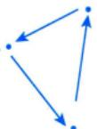

三点连线构成一个平面

④截距式： $\frac{x}{a} + \frac{y}{b} + \frac{z}{c} = 1$ (平面过(a,0,0),(0,b,0)，(0,0,c)三点).

⑤平面束方程：设 $\pi _ { i } : A _ { i } x + B _ { i } y + C _ { i } z + D _ { i } = 0 , i = 1 , 2 . A _ { 1 } , B _ { 1 } , C _ { 1 }$ 与 $A_{2}, B_{2}, C_{2}$ 不成比例，则 过L: $\begin{cases}A_{1}x + B_{1}y + C_{1}z + D_{1} = 0, \\A_{2}x + B_{2}y + C_{2}z + D_{2} = 0.\end{cases}$ 的平面束方程为

(交面式方程)

$$
A_{1}x + B_{1}y + C_{1}z + D_{1} + \lambda(A_{2}x + B_{2}y + C_{2}z + D_{2}) = 0
$$

或

$$
A_{2}x + B_{2}y + C_{2}z + D_{2} + \lambda(A_{1}x + B_{1}y + C_{1}z + D_{1}) = 0
$$

π1， $\pi _ { 2 }$ 的法向量分别为 $n_{1} = \left( A_{1}, B_{1}, C_{1} \right), \quad n_{2} = \left( A_{2}, B_{2}, C_{2} \right)$

$\lambda n_{1} + \mu n_{2}$ 生成整个平面，

$\lambda ( A _ { 1 } x + B _ { 1 } y + C _ { 1 } z + D _ { 1 } ) + \mu ( A _ { 2 } x + B _ { 2 } y + C _ { 2 } z + D _ { 2 } ) = 0$ 表示过交线的所有平面。

令λ=1，则不包含 $\pi_{2} , \mathrm{令} \mu = 1$ ，则不包含 $\pi _ { \parallel }$

## 2直线方程

以下假设直线的方向向量 $\boldsymbol{\tau} = (l, m, n)$

①一般式： $\left\{ \begin{aligned} A_{1}x + B_{1}y + C_{1}z + D_{1} = 0, \quad \boldsymbol{n}_{1} = (A_{1}, B_{1}, C_{1}), \\ A_{2}x + B_{2}y + C_{2}z + D_{2} = 0, \quad \boldsymbol{n}_{2} = (A_{2}, B_{2}, C_{2}) \end{aligned} \right.$ 其中 $n _ { 1 }$ 不平行于 $n _ { 2 }$ (交面式方程)

## 注其几何背景很直观，是两个平面的交线，且该直线的方向向量 $\tau = \boldsymbol{n}_{1} \times \boldsymbol{n}_{2}$

方向向量τ②点向式： $\frac{x - x_{0}}{l} = \frac{y - y_{0}}{m} = \frac{z - z_{0}}{n}$ 二要素过一点P

$$
n _ { 1 }
$$

$$
n _ { 2 }
$$

③参数式： $\begin{cases}x = x_{0} + l t, \\y = y_{0} + m t, P_{0}(x_{0}, y_{0}, z_{0}), \\z = z_{0} + n t,\end{cases}$ 为直线上的已知点，t为参数.

④两点式： $\frac{x - x_{1}}{x_{2} - x_{1}} = \frac{y - y_{1}}{y_{2} - y_{1}} = \frac{z - z_{1}}{z_{2} - z_{1}}$ (直线过不同的两点 $P_{i}(x_{i}, y_{i}, z_{i}), i = 1, 2$ 1

## ③位置关系

(1) 点到直线的距离.

点 $M_{1}(x_{1}, y_{1}, z_{1})$ 到直线 $L:\frac{x - x_{0}}{l} = \frac{y - y_{0}}{m} = \frac{z - z_{0}}{n}$ 的距离

其中向量 $\overrightarrow { M _ { 1 } M _ { 0 } } = ( x _ { 0 } - x _ { 1 } , y _ { 0 } - y _ { 1 } , z _ { 0 } - z _ { 1 } ) , M _ { 0 } = ( x _ { 0 } , y _ { 0 } , z _ { 0 } ) , \boldsymbol { \tau } = ( l , m , n )$

注更为简单的是平面的情形：设在二维平面上直线L的方程为 $Ax + By + C = 0$ ，点 $P _ { 0 }$ 的坐标为$(x_{0},y_{0})$ ，则点 $P_{0}$ 到直线L的距离公式为 $d = \frac{\left| A x_{0} + B y_{0} + C \right|}{\sqrt{A^{2} + B^{2}}}$

若B≠0. $ \begin{cases} { \mathcal { S } _ { \varsquare } { = } \left| \overrightarrow { P _ { 0 } P } { \times } \tau \right| , } \\ { \mathcal { S } _ { \varsquare } { = } \left| \tau \right| { \ast } \textit { d } , } \\ \end{cases}$ 贝 $\frac{\left\| x - x_{0} \quad y - y_{0} \right\|}{\left| \frac{1}{A} - \frac{A}{B} \right|} = \frac{\left| Ax_{0} + By_{0} + C \right|}{\sqrt{A^{2} + B^{2}}}$

若 $A \ne 0,   B = 0$ ，则 $Ax + C = 0, x = -\frac{C}{A},$ 于是

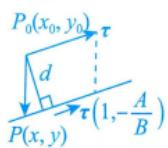

综上，成立

$$
d = \left| x - x_{0} \right| = \left| x_{0} + \frac{C}{A} \right| = \frac{\left| Ax_{0} + 0y_{0} + C \right|}{\sqrt{A^{2} + 0^{2}}}
$$

(2) 点到平面的距离.

P点 $P_{0}(x_{0},y_{0},z_{0})$ 到平面 $Ax + By + Cz + D = 0$ 的距离 $\frac{\left|Ax_{0}+By_{0}+Cz_{0}+D\right|}{\sqrt{A^{2}+B^{2}+C^{2}}}$ d(3) 直线与直线

设 $\tau _ { 1 } = ( l _ { 1 } , m _ { 1 } , n _ { 1 } ) , \tau _ { 2 } = ( l _ { 2 } , m _ { 2 } , n _ { 2 } )$ 分别为直线 $L_{1},L_{2}$ 的方向向量.

① $L_{1} \perp L_{2} \Leftrightarrow \tau_{1} \perp \tau_{2} \Leftrightarrow l_{1}l_{2} + m_{1}m_{2} + n_{1}n_{2} = 0$

② $L_{1} \parallel L_{2} \Leftrightarrow \tau_{1} \parallel \tau_{2} \Leftrightarrow \frac{l_{1}}{l_{2}} = \frac{m_{1}}{m_{2}} = \frac{n_{1}}{n_{2}}$

$$
\begin{aligned}\frac{d = \frac{\left| \overrightarrow{P_{0}P} \cdot \overrightarrow{n} \right|}{\left| \boldsymbol{n} \right|} = \frac{\left| \overrightarrow{P_{0}P} \right|\left| \boldsymbol{n} \right|\cos\theta}{\left| \boldsymbol{n} \right|}}{\left| \boldsymbol{n} \right|} \\= \frac{\left| \overrightarrow{P_{0}P} \right|\cos\theta}{\left| \boldsymbol{n} \right|} \\= \frac{\left| \boldsymbol{A}(x - x_{0}) + \boldsymbol{B}(y - y_{0}) + \boldsymbol{C}(z - z_{0}) \right|}{\sqrt{\boldsymbol{A}^{2} + \boldsymbol{B}^{2} + \boldsymbol{C}^{2}}} \\= \frac{\left| \boldsymbol{A}x_{0} + \boldsymbol{B}y_{0} + \boldsymbol{C}z_{0} + \boldsymbol{D} \right|}{\sqrt{\boldsymbol{A}^{2} + \boldsymbol{B}^{2} + \boldsymbol{C}^{2}}}\end{aligned}
$$

③直线 $L _ { 1 } , L _ { 2 }$ 的夹角 $\theta = \arccos \frac{\left| \boldsymbol{\tau}_{1} \cdot \boldsymbol{\tau}_{2} \right|}{\left| \boldsymbol{\tau}_{1} \right| \left| \boldsymbol{\tau}_{2} \right|}$ ，其中 $\theta = \min \left\{ \left( \widehat{\tau_{1}, \tau_{2}} \right), \pi - \left( \widehat{\tau_{1}, \tau_{2}} \right) \right\} \in \left[ 0, \frac{\pi}{2} \right]$

(4) 平面与平面.

设平面 $\pi_{1}, \pi_{2}$ 的法向量分别为 $\boldsymbol { n } _ { 1 } = ( A _ { 1 } , B _ { 1 } , C _ { 1 } ) , \boldsymbol { n } _ { 2 } = ( A _ { 2 } , B _ { 2 } , C _ { 2 } )$

① $\pi_{1} \perp \pi_{2} \Leftrightarrow \boldsymbol{n}_{1} \perp \boldsymbol{n}_{2} \Leftrightarrow A_{1}A_{2}+B_{1}B_{2}+C_{1}C_{2}=0$

② $\pi_{1} \parallel \pi_{2} \Leftrightarrow \boldsymbol{n}_{1} \parallel \boldsymbol{n}_{2} \Leftrightarrow \frac{A_{1}}{A_{2}} = \frac{B_{1}}{B_{2}} = \frac{C_{1}}{C_{2}}$

③平面 $\pi_{1}, \pi_{2}$ 的夹角 $\theta = \arccos \frac{\left| \boldsymbol{n}_{1} \cdot \boldsymbol{n}_{2} \right|}{\left| \boldsymbol{n}_{1} \right| \left| \boldsymbol{n}_{2} \right|}$ ，其中 $\theta = \min \left\{ \left( \widehat{n_1, n_2} \right), \pi - \left( \widehat{n_1, n_2} \right) \right\} \in \left[ 0, \frac{\pi}{2} \right]$

(5) 平面与直线.

设直线L的方向向量为 $\boldsymbol{\tau} = (l, m, n)$ ，平面π的法向量为 $\boldsymbol{n} = (A,   B,   C)$

① $L \perp \pi \Leftrightarrow \tau \parallel n \Leftrightarrow \frac{l}{A} = \frac{m}{B} = \frac{n}{C}$ 平行方程   
7

② $L \parallel \pi \Leftrightarrow \tau \perp n \Leftrightarrow Al + Br + Cn = 0$ 垂直方程

③直线L与平面π的夹角 $\theta = \arcsin \frac{ \left| \boldsymbol{\tau} \cdot \boldsymbol{n} \right| }{ \left| \boldsymbol{\tau} \right| \left| \boldsymbol{n} \right| }$ ，其中 $\theta = \left| \frac{\pi}{2} - (\widehat{\tau, n}) \right| \in \left[ 0, \frac{\pi}{2} \right]$

例17.2 与两直线

$$
\left\{ \begin{aligned} x = 1, & x = 1 + 0 \cdot t \\ y = - 1 + t, & \frac{x + 1}{1} = \frac{y + 2}{2} = \frac{z - 1}{1} \\ z = 2 + t, & \end{aligned} \right.
$$

$$
\tau \cdot n = | \tau | \cdot | n | \cdot \cos( \tau , n ) .
$$

都平行，且过原点的平面方程为

分析两直线的方向向量分别为 $\tau _ { 1 }$ ， $\tau _ { 2 }$ ，则所求平面的法向量 $\boldsymbol{n} = \boldsymbol{\tau}_{1} \times \boldsymbol{\tau}_{2}$

解应填 $x - y + z = 0$

所求平面法向量可取为

$$
\boldsymbol { n } = \begin{vmatrix} \boldsymbol { i } & \boldsymbol { j } & \boldsymbol { k } \\ 0 & 1 & 1 \\ 1 & 2 & 1 \end{vmatrix} = - \boldsymbol { i } + \boldsymbol { j } - \boldsymbol { k } .
$$

由题设可知所求平面过原点，则所求平面方程为

$$
-1 \cdot (x-0)+1 \cdot (y-0)-1 \cdot (z-0)=0
$$

即

$$
x - y + z = 0
$$

例17.3 已知直线L是直线 $L _ { 0 }$

$$
\begin{cases}2x - z - 3 = 0, \\y - 2z + 4 = 0\end{cases}
$$

在平面 $x + y - z = 5$ 上的投影方程，求L的表达式

→用交面式方程表示

解设过直线 $L _ { 0 }$ 的平面束方程为 $(2x - z - 3) + \lambda (y - 2z + 4) = 0$ ，即

$$
2x + \lambda y - (2\lambda + 1)z + 4\lambda - 3 = 0 ,
$$

其中λ为待定常数.此平面与平面x+y-z=5垂直的条件是

$$
2 \cdot 1 + \lambda \cdot 1 - (2\lambda + 1) \cdot (-1) = 0 ,
$$

解得λ=-1，故直线L为

$$
\begin{cases}2x - y + z - 7 = 0, \\x + y - z = 5.\end{cases}
$$

例17.4 设有直线 $L_{1}:\frac{x - 1}{1} = \frac{y - 5}{- 2} = \frac{z + 8}{1}$ 与 $L _ { z }$ $\begin{cases}x - y = 6, \\2y + z = 3\end{cases}$ 则 $L _ { 1 }$ 与 $L _ { z }$ 的夹角为(). (A) $\frac{\pi}{6}$ (B) $\frac{\pi}{4}$

(C) $\frac{\pi}{3}$

(D) $\frac{\pi}{2}$

分析先求出直线 $L _ { 1 } , L _ { 2 }$ 的方向向量 $\tau _ { 1 } ,   \tau _ { 2 }$ ，再利用公式 $\varphi = \arccos \frac{\left| \boldsymbol{\tau}_{1} \cdot \boldsymbol{\tau}_{2} \right|}{\left| \boldsymbol{\tau}_{1} \right| \left| \boldsymbol{\tau}_{2} \right|}$ 求出其夹角.  
解应选(C).

直线 $L _ { 1 }$ 的方向向量为 $\tau_{1} = (1, -2, 1)$ ，直线 $L _ { 2 }$ 的方向向量为

$$
\boldsymbol { \tau } _ { 2 } = \begin{vmatrix} \boldsymbol { i } & \boldsymbol { j } & \boldsymbol { k } \\ 1 & - 1 & 0 \\ 0 & 2 & 1 \end{vmatrix} = - \boldsymbol { i } - \boldsymbol { j } + 2 \boldsymbol { k } ,
$$

从而直线 $L _ { 1 }$ 和 $L _ { z }$ 的夹角φ的余弦为 $\cos \varphi = \frac{\left| \boldsymbol{\tau}_{1} \cdot \boldsymbol{\tau}_{2} \right|}{\left| \boldsymbol{\tau}_{1} \right| \left| \boldsymbol{\tau}_{2} \right|} = \frac{3}{\sqrt{6} \cdot \sqrt{6}} = \frac{1}{2}$ ，因此 $\varphi = \frac{\pi}{3}$

## 空间曲线与曲面

## ①空间曲线

(1)一般式 $\varGamma : \left\{ \begin{aligned} F(x, y, z) = 0, \\ G(x, y, z) = 0. \end{aligned} \right.$

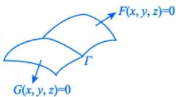

## 注其几何背景为两个曲面的交线.

(2) 参数方程 $\begin{aligned}\varGamma : \left\{\begin{aligned}x = & \varphi(t), \\y = & \psi(t), t \in [\alpha, \beta], \\z = & \omega(t);\end{aligned}\right.\end{aligned}$

进在 $\begin{cases}F(x, y, z) = 0, \\G(x, y, z) = 0\end{cases}$ 中选取某直角坐标变量为自变量（看作参数)，解出其他两变量为此变量的函数，即得参数式.如曲线 $\begin{cases}z = f(x, y), \\y = 0,\end{cases}$ 今 $x = t$ 则可写成参数式方程： $\begin{cases}x = t, \\y = 0, \\z = f(t, 0).\end{cases}$ 当然，有时由于后两变量解出为第一变量的函数表达式带来多值或根式等麻烦事，或者甚至“解不出”，故一般用新的变量作参数再写参数方程，如下面的注；亦或题设直接给出参数方程，如例17.6.

(3)在坐标面上的投影.

以求曲线Γ在 $x O y$ 平面上的投影曲线为例.将 $\varGamma : \left\{ \begin{aligned} F(x, y, z) = 0, \\ G(x, y, z) = 0 \end{aligned} \right.$ 中的z消去，得到 $\varphi(x, y) = 0$ 则曲线Γ在xOy面上的投影曲线包含于曲线 $\begin{cases}\varphi(x, y) = 0, \\z = 0.\end{cases}$ ①往xOy面投影，消z；往xOz面投影，消y；往 $y O z$ 面投影，消x.曲线Γ在其他平面上的投影曲线可类似求得.②联立方程，且令z=0或y=0或x=0.

注将 $\begin{cases}F(x,   y,   z) = 0, \\G(x,   y,   z) = 0\end{cases}$ 消去某变量（例如消去z)，便得该曲线在z=0平面上的投影曲线方程$\begin{cases}f(x, y) = 0, \\z = 0,\end{cases}$ 如果 $f(x,y)=0$ 能容易地写出它的参数式：

$$
x = x(t), \; y = y(t), \; t \in I,
$$

其中I为某区间，则以x=x(t)，y=y(t)代入原曲线的方程中，若能解得单值的 $z = z(t)$ ，则得原曲线的参数式：

$$
x = x(t), \; y = y(t), \; z = z(t), \; t \in I \; .
$$

如将 $\begin{aligned}\varGamma : \begin{cases}x^{2} + y^{2} = 1, \\z = x + y\end{cases}\end{aligned}$ 的方程化为参数形式

$$
\begin{cases}x = \cos t, \\y = \sin t, \quad (0 \leqslant t \leqslant 2\pi) \\z = \cos t + \sin t\end{cases}
$$

## 2空间曲面

(1) 曲面方程： $F(x, y, z) = 0$

(2) 二次曲面.

<table><tr><td rowspan=1 colspan=1>曲面名称</td><td rowspan=1 colspan=1>方程</td><td rowspan=1 colspan=1>图形</td></tr><tr><td rowspan=1 colspan=1>椭球面</td><td rowspan=1 colspan=1> $\frac{x^{2}}{a^{2}}+\frac{y^{2}}{b^{2}}+\frac{z^{2}}{c^{2}}=1$ 当 $a = b = c$ 时为球面</td><td rowspan=1 colspan=1>用平行于坐标平           →面的平面去切。得出椭圆或圆</td></tr><tr><td rowspan=1 colspan=1>单叶双曲面</td><td rowspan=1 colspan=1> $\frac{x^{2}}{a^{2}}+\frac{y^{2}}{b^{2}}-\frac{z^{2}}{c^{2}}=1$ </td><td rowspan=1 colspan=1>用 $x = k _ { 1 } ( k _ { 1 }$ 不等于a)或 $y =$  $k _ { 2 } ( k _ { 2 }$ 不等于b)切得双曲线，           用 $z = k _ { 3 } ($ 任意常数)切得椭圆或圓</td></tr><tr><td rowspan=1 colspan=1>双叶双曲面</td><td rowspan=1 colspan=1> $\begin{aligned} \begin{aligned} \begin{aligned} \begin{aligned} $\begin{aligned} &  一正确负  \\\overset{\overset{harpoonup }{\underset{harpoonup a^{2}}{( \begin{aligned} & \overset{harpoonup }{\underset{y^{2}}{( \begin{aligned} & \overset{ harpoonup }{\underset{x^{2}}{( \begin{aligned} & \end{aligned} ) } \\ & \end{aligned} ) } - \frac{\overset{harpoonup }{\underset{x^{2}}{( \begin{aligned} & \end{aligned} ) } \\ & harpoonup \begin{aligned} & \overset{ harpoonup }{\underset{x^{2}}{( \begin{aligned} & \end{aligned} ) } \\ & \end{aligned} } \\ & \end{aligned} } } } } } { \underset{\underset{x^{2}}{( \begin{aligned} & \end{aligned} \begin{aligned} & \end{aligned} \begin{aligned} & \end{aligned} \begin{aligned} & \end{aligned} \begin{aligned} & \end{aligned} \begin{aligned} & \end{aligned} \begin{aligned} & \end{aligned} \begin{aligned} & \end{aligned} \begin{aligned} & \end{aligned} & \begin{aligned} & \end{aligned} & \begin{aligned} & \end{aligned} & \begin{aligned} & \end{aligned} & & \end{aligned} & \begin{aligned} & \end{aligned} & & \begin{aligned} & \end{aligned} & & \end{aligned}$ & \begin{aligned} & & 二正确负  \\ &\end{aligned} & & \end{aligned}$ $\begin{aligned}$\begin{aligned} & & 一正确负  \\ &\end{aligned} & &\end{aligned}$ $\begin{aligned}$\begin{aligned} & & 一正确负  \\ &\end{aligned}$ & 一正确负  \\ &\end{aligned}$ & 一正确负  \\ &\end{aligned}$ & 一正确负  \\ &\end{aligned}$$ </td><td rowspan=1 colspan=1>用y=k或z=k切得双曲线.用 $x = k( \left |  k \right |  > \left |  a \right |  )$ 切得椭圆或圓</td></tr><tr><td rowspan=1 colspan=1>椭圆抛物面</td><td rowspan=1 colspan=1> $\frac{x^{2}}{2p}+\frac{y^{2}}{2q}=z(p,q>0)$  $x^{2} + y^{2} = z$ </td><td rowspan=1 colspan=1>用x=k或 $y = k$ 切得抛物线。         用 $z = k ( k > 0 )$ 切得椭圆或圆</td></tr><tr><td rowspan=1 colspan=1>椭圆锥面</td><td rowspan=1 colspan=1> $\frac{x^{2}}{a^{2}}+\frac{y^{2}}{b^{2}}=\frac{z^{2}}{c^{2}}$  $z = \sqrt{x^{2} + y^{2}}$ ，只有上半部分一般考a=b</td><td rowspan=1 colspan=1></td></tr></table>

## 第17讲多元函数积分学的预备知识（仅数学一）

续表

<table><tr><td rowspan=1 colspan=1>曲面名称</td><td rowspan=1 colspan=3>方程</td><td rowspan=1 colspan=1>图形</td></tr><tr><td rowspan=1 colspan=1>双曲抛物面(马鞍面)</td><td rowspan=1 colspan=3> $-\frac{x^{2}}{2p}+\frac{y^{2}}{2q}=z(p,q>0).$ </td><td rowspan=1 colspan=1>→用 $z = k(k > 0)$ 切得双曲线，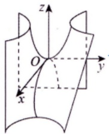           用x=k或y=k切得抛物线，其中k为任意常数</td></tr><tr><td rowspan=1 colspan=1>双曲抛物面(马鞍面)</td><td rowspan=1 colspan=3> $z = xy \quad  则  \quad z = y^{2} - x^{2} = (y + x)(y - x)$ 坐标变换： $\left\{ \begin{aligned} u = y + x, \\ v = y - x, \end{aligned} \right.  则  \; z = uv.$ </td><td rowspan=1 colspan=1>在上图的基础上，令x轴与y                        $\frac{\pi}{4}$ 轴逆时针旋转</td></tr><tr><td rowspan=1 colspan=5> $z = xy$ 中由 $x + y = 1$ 截出的图形，                       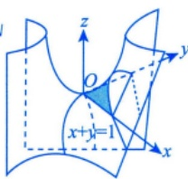可以与三重积分、曲线积分、曲面积分相结合缺z，母线平行于z轴←(3)柱面：动直线沿定曲线平行移动所形成的曲面.</td></tr><tr><td rowspan=1 colspan=2>椭圆柱面</td><td rowspan=1 colspan=1> $\frac{x^{2}}{a^{2}}+\frac{y^{2}}{b^{2}}=1$ </td><td rowspan=1 colspan=2>准线是椭圆或圆</td></tr><tr><td rowspan=1 colspan=2>双曲柱面</td><td rowspan=1 colspan=1> $\frac{x^{2}}{a^{2}}-\frac{y^{2}}{b^{2}}=1$ </td><td rowspan=1 colspan=2>准线是双曲线</td></tr><tr><td rowspan=1 colspan=2>抛物柱面</td><td rowspan=1 colspan=1> $y = a x ^ { 2 } ( a > 0 )$ </td><td rowspan=1 colspan=2>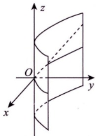准线是抛物线</td></tr></table>

(4)旋转曲面：曲线Γ绕一条定直线旋转一周所形成的曲面.

曲线 $\varGamma : \left\{ \begin{aligned} F(x, y, z) = 0, \\ G(x, y, z) = 0 \end{aligned} \right.$ 绕直线 $\frac{x - x_{0}}{l} = \frac{y - y_{0}}{m} = \frac{z - z_{0}}{n}$ 旋转一周形成一个旋转曲面，旋转曲面方程的求法如下.

如图17-1所示，设 $M_{0}(x_{0},y_{0},z_{0})$ ，方向向量 $\boldsymbol{\tau} = (l, m, n)$ .在母线 $T  上$ 任取一点 $M_{1}(x_{1}, y_{1}, z_{1})$ ，则过 $M_{1}$ 的纬圆上的任意一点 $P(x,   y,   z)$ 满足条件

图 17-1

$$
\overrightarrow { M _ { 1 } P } \perp \tau , \left| \overrightarrow { M _ { 0 } P } \right| = \left| \overrightarrow { M _ { 0 } M _ { 1 } } \right| ,
$$

即

$$
\begin{cases}l(x - x_{1}) + m(y - y_{1}) + n(z - z_{1}) = 0, \\(x - x_{0})^{2} + (y - y_{0})^{2} + (z - z_{0})^{2} = (x_{1} - x_{0})^{2} + (y_{1} - y_{0})^{2} + (z_{1} - z_{0})^{2},\end{cases}
$$

与方程 $F(x_{1}, y_{1}, z_{1}) = 0$ 和 $G(x_{1}, y_{1}, z_{1}) = 0$ 联立消去 $x_{1}, y_{1}, z_{1}$ ，便可得到旋转曲面的方程.

注常考曲线Γ： $\begin{cases}F(x,   y,   z) = 0, \\G(x,   y,   z) = 0\end{cases}$ 绕z轴旋转一周而成的旋转曲面的方程如图17-2所示，在曲线Γ上任取一点 $M_{1}(x_{1},y_{1},z_{1})$ 则过点 $M_{1}$ 的纬圆上的任意一点P(x,y，z)满足条件 $\left| \overrightarrow{OP} \right| = \left| \overrightarrow{OM_1} \right|$ 和 $z = z_{1}$ 即$x^{2}+y^{2}+z^{2}=x_{1}^{2}+y_{1}^{2}+z_{1}^{2}$ 且 $z = z_{1}$ ，得 因为 $(x - x_{1}, y - y_{1}, z - z_{1}) \perp (0, 0, 1)$

$$
x^{2} + y^{2} = x_{1}^{2} + y_{1}^{2}
$$

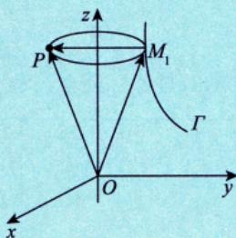  
图17-2

从方程组 $\begin{cases}F(x_{1}, y_{1}, z) = 0, \\G(x_{1}, y_{1}, z) = 0, \\x^{2} + y^{2} = x_{1}^{2} + y_{1}^{2}\end{cases}$ 中消去 $x_{1}$ 和 $y_{1}$ ，便得到旋转曲面的方程

如果能从方程组 $\begin{cases}F(x, y, z) = 0, \\G(x, y, z) = 0\end{cases}$ 中解出 $x = f_{1}(z)$ 和 $y = f_{2}(z)$ ，则旋转曲面的方程为

$$
x^{2}+y^{2}=\left[f_{1}(z)\right]^{2}+\left[f_{2}(z)\right]^{2}
$$

如求 $\begin{cases}y^{2} - (z - 1)^{2} = 1, \\x = 0\end{cases}$ 绕z轴旋转一周而成的旋转曲面的方程，由方程组知 $\begin{cases}x = 0, \\y^{2} = 1 + (z - 1)^{2}\end{cases}$ 则旋转曲面的方程为 $x^{2}+y^{2}=0^{2}+1+(z-1)^{2}$ ，即 $x^{2}+y^{2}-(z-1)^{2}=1$

例17.5设 $\Sigma _ { 1 }$ 是由过点(0，-1,1)与点(0,0,0)的直线L绕z轴旋转一周所得的旋转曲面位于$z   \geqslant   0$ 的部分， $\Sigma _ { z }$ 的方程为 $z^{2} = 2x$ ，则 $\Sigma _ { \mathrm { i } }$ 与 $\Sigma _ { z }$ 的交线Γ在 $x O y$ 面上的投影曲线方程为

解应填 $\begin{cases}x^{2} + y^{2} = 2x, \\z = 0.\end{cases}$

直线L的两点式方程为 $\frac{x}{0}=\frac{y+1}{1}=\frac{z-1}{-1}$ ，参数方程为 $\begin{cases}x = 0, \\y = -1 + t, \\z = 1 - t,\end{cases}$ ,t为参数，即 $\begin{cases}x = 0, \\y = -z\end{cases}$ 由“三、2.(4)注”，得 $\Sigma _ { 1 }$ 的方程为 $x^{2}+y^{2}=0^{2}+(-z)^{2}=z^{2}$ ，也即 $z = \sqrt{x^{2} + y^{2}}$

将 $\begin{cases}z = \sqrt{x^{2} + y^{2}} \\z^{2} = 2x\end{cases}$ '中的z消去，得 $x^{2} + y^{2} = 2x$ ，即得到投影曲线方程为$\begin{cases}x^{2} + y^{2} = 2x, \\z = 0.\end{cases}$ 曲线Γ和其在 $x O y$ 面上的投影如图17-3所示.

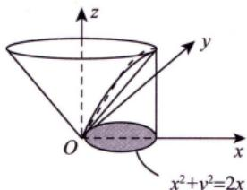  
图 17-3

## 四多元函数微分学的几何应用

## 1空间曲线的切线与法平面

(1) 用参数方程给出曲线： $\begin{cases}x = x(t), \\y = y(t),   t \in I, \\z = z(t),\end{cases}$

其中 $x(t),   y(t),   z(t)$ 在I上可导，且三个导数不同时为0，则曲线在 $P_{0}(x_{0},y_{0},z_{0})$ 处的切向量$\boldsymbol{\tau} = \left( x^{\prime}(t_{0}), y^{\prime}(t_{0}), z^{\prime}(t_{0}) \right)$

切线方程： $\frac{x - x_{0}}{x^{\prime}(t_{0})} = \frac{y - y_{0}}{y^{\prime}(t_{0})} = \frac{z - z_{0}}{z^{\prime}(t_{0})}$

法平面方程： $x^{\prime}(t_{0})(x - x_{0}) + y^{\prime}(t_{0})(y - y_{0}) + z^{\prime}(t_{0})(z - z_{0}) = 0$

(2) 用方程组给出曲线： $\begin{cases}F(x,   y,   z) = 0, \\G(x,   y,   z) = 0.\end{cases}$

当 $\frac{\partial(F,\ G)}{\partial(y,\ z)} = \left| \begin{matrix} \frac{\partial F}{\partial y} & \frac{\partial F}{\partial z} \\ \frac{\partial G}{\partial y} & \frac{\partial G}{\partial z} \end{matrix} \right| \neq 0$ 时，可确定 $\begin{cases}x = x, \\y = y(x), \\z = z(x).\end{cases}$

雅可比行列式

其在 $P_{0}(x_{0},y_{0},z_{0})$ 处的切向量 $\tau=\frac{\left| \begin{matrix} i & j & k \\ F_{x}^{\prime} & F_{y}^{\prime} & F_{z}^{\prime} \end{matrix} \right|}{\left| \begin{matrix} G_{x}^{\prime} & G_{y}^{\prime} & G_{z}^{\prime} \end{matrix} \right|}=(A, B, C)$ 梯度向量n两个梯度向量的叉乘：n×2G在P的梯度向量 $n _ { z }$

切线方程： $\frac{x - x_{0}}{A} = \frac{y - y_{0}}{B} = \frac{z - z_{0}}{C}$

法平面方程： $A(x - x_{0}) + B(y - y_{0}) + C(z - z_{0}) = 0$

## 2空间曲面的切平面与法线

(1) 用隐式方程给出曲面： $F(x, y, z) = 0$ ，其中F的一阶偏导数连续.F在P的梯度向量

其在 $P_{0}(x_{0},y_{0},z_{0})$ 处的法向量 $\boldsymbol { n } = \left( F _ { x } ^ { \prime } \big | _ { P _ { 0 } } , F _ { y } ^ { \prime } \big | _ { P _ { 0 } } , F _ { z } ^ { \prime } \big | _ { P _ { 0 } } \right)$

切平面方程： $F_{x}^{\prime}\left|_{P_{0}}\right.\bullet\left(x-x_{0}\right)+F_{y}^{\prime}\left|_{P_{0}}\right.\bullet\left(y-y_{0}\right)+F_{z}^{\prime}\left|_{P_{0}}\right.\bullet\left(z-z_{0}\right)=0$

法线方程： $\frac{x - x_{0}}{\left. F_{x}^{\prime} \right|_{P_{0}}} = \frac{y - y_{0}}{\left. F_{y}^{\prime} \right|_{P_{0}}} = \frac{z - z_{0}}{\left. F_{z}^{\prime} \right|_{P_{0}}}$ 或 $z - f(x, y) = 0$ ，则曲面在P处的法向量为 $\left( - f _ { x } ^ { \prime } ( x _ { 0 } , y _ { 0 } ) , - f _ { y } ^ { \prime } ( x _ { 0 } , y _ { 0 } ) , 1 \right)$

(2) 用显式函数给出曲面： $z = f(x, y) \Rightarrow f(x, y) - z = 0$ ，其中f的一阶偏导数连续.

其在 $P_{0}(x_{0},y_{0},z_{0})$ 处的法向量 $\boldsymbol { n } = \left( f _ { x } ^ { \prime } ( x _ { 0 } , y _ { 0 } ) , f _ { y } ^ { \prime } ( x _ { 0 } , y _ { 0 } ) , - 1 \right)$ .此法向量方向向下.

→若为正值，与z轴正方向夹角为切平面方程： $f_{x}^{\prime}(x_{0}, y_{0})(x - x_{0}) + f_{y}^{\prime}(x_{0}, y_{0})(y - y_{0}) - (z - z_{0}) = 0$ 锐角，即法向量向上：若为负值，与z轴正方向夹角为钝角，即法向量向下

法线方程： $\frac{x - x_{0}}{f_{x}^{\prime}(x_{0}, y_{0})} = \frac{y - y_{0}}{f_{y}^{\prime}(x_{0}, y_{0})} = \frac{z - z_{0}}{- 1}$

例17.6 空间曲线 $\begin{aligned}\varGamma : \left\{\begin{aligned}x = \int_{0}^{t} \mathrm{e}^{u} \cos u   du, \\y = 2\sin t + \cos t, \\z = 1 + \mathrm{e}^{3t}\end{aligned}\right.\end{aligned}$ 在t=0处的切线方程为

分析x，y，z分别对t求导，然后代入t=0.

解应填 $\frac{x - 0}{1} = \frac{y - 1}{2} = \frac{z - 2}{3}$

当t =0时， $x = 0, \; y = 1, \; z = 2$ ；由 $x^{\prime} = \mathrm{e}^{t} \cos t, \quad y^{\prime} = 2\cos t - \sin t, \quad z^{\prime} = 3\mathrm{e}^{3t}$ ，得 $x^{\prime}(0)=1,\ y^{\prime}(0)=2$ $z^{\prime}(0) = 3$ .于是，切线方程为 $\frac{x - 0}{1} = \frac{y - 1}{2} = \frac{z - 2}{3}$

例17.7 设函数z=f(x，y)在点(0,0)附近有定义，且 $f_{x}^{\prime}(0,0)=3$ ，则曲线 $\left\{ \begin{aligned} z = f(x, y), \\ y = 0 \end{aligned} \right.$ 111 点(0,0, f(0,0))处的法平面方程为

解应填 $x + 3z - 3f(0, 0) = 0$

曲线 $\begin{cases}z = f(x, y), \\y = 0\end{cases}$ 可写成参数式： $\begin{cases}x = t, \\y = 0, \\z = f(t,   0).\end{cases}$ 则

$$
\boldsymbol { \tau } = \left( x _ { t } ^ { \prime } , y _ { t } ^ { \prime } , z _ { t } ^ { \prime } \right) \Big| _ { t = 0 } = \left( 1 , 0 , f _ { x } ^ { \prime } ( 0 , 0 ) \right) = \left( 1 , 0 , 3 \right) .
$$

故所求法平面方程为 $x + 3z - 3f(0, 0) = 0$

例17.8曲面 $z - \mathrm{e}^{z} + 2xy = 3$ 在点(1，2,0)处的切平面方程为

应填2x+y−4=0.

区 $F(x, y, z) = z - \mathrm{e}^{z} + 2xy - 3$ ，则 $\boldsymbol{n} = \left( F_{x}^{\prime}, F_{y}^{\prime}, F_{z}^{\prime} \right) |_{(1,2,0)}$ ，其中

$$
F_{x}^{\prime}\big|_{(1,2,0)} = 2y\big|_{(1,2,0)} = 4, \left. F_{y}^{\prime}\right|_{(1,2,0)} = 2x\big|_{(1,2,0)} = 2, \left. F_{z}^{\prime}\right|_{(1,2,0)} = \left. (1 - \mathrm{e}^{z}) \right|_{(1,2,0)} = 0 .
$$

故切平面方程为 $4(x - 1) + 2(y - 2) + 0 \cdot (z - 0) = 0$ ，即 $2x + y - 4 = 0$

例17.9设f可微，则曲面 $\mathrm{e}^{2x - z} = f(\pi y - \sqrt{2}z)$ 是( ).

(A) 旋转抛物面 (B) 双叶双曲面 (C) 单叶双曲面 (D)柱面

解应选 (D).

设 $F = f(\pi y - \sqrt{2}z) - \mathrm{e}^{2x - z}$ ，则曲面上任一点处的法向量为

定直线L

$$
\boldsymbol { n } = \left( - 2 \mathrm { e } ^ { 2 x - z } , \pi f ^ { \prime } , - \sqrt { 2 } f ^ { \prime } + \mathrm { e } ^ { 2 x - z } \right) .
$$

设某定向量τ =(a,b,c)(a,b,c不同时为零)与n垂直，即

$$
\boldsymbol { n } \cdot ( a , b , c ) = - 2 a \mathrm { e } ^ { 2 x - z } + \pi b f ^ { \prime } + ( - \sqrt { 2 } f ^ { \prime } + \mathrm { e } ^ { 2 x - z } ) c = 0 ,
$$

解得 $a = \frac{c}{2},   b = \frac{\sqrt{2}}{\pi}c$ ，令 $_ c = 1$ ，则 $a = \frac{1}{2}, b = \frac{\sqrt{2}}{\pi}$ ，这样曲面上任一点处的法向量n均与定向量$\left( \frac{1}{2}, \frac{\sqrt{2}}{\pi}, 1 \right)$ 垂直，这说明该曲面是柱面.

## 场论初步

什么叫“场”？从数学上说，场就是空间区域Ω上的一种对应法则.

(1)如果Ω上的每一点M(x，y，z)都对应着一个数量u，则在Ω上就确定了一个数量函数$u = u(x, y, z)$ ，它表示一个数量场.数量场的例子很多，比如温度场，温度场只讲大小，不讲方向.

(2)如果Ω上的每一点 $M(x,   y,   z)$ 都对应着一个向量F，则在Ω上就确定了一个向量函数

$$
\boldsymbol { F } ( x , y , z ) = \boldsymbol { P } ( x , y , z ) \boldsymbol { i } + \boldsymbol { Q } ( x , y , z ) \boldsymbol { j } + \boldsymbol { R } ( x , y , z ) \boldsymbol { k } ,
$$

它表示一个向量场.向量场的例子也很多，比如引力场，引力场既讲大小，也讲方向

## 1方向导数

定义 设三元函数 $u = u(x, y, z)$ 在点 $P_{0}(x_{0},y_{0},z_{0})$ 的某空间邻域 $U \subset \mathbf { R } ^ { 3 }$ 内有定义，l为从点 $P _ { 0 }$ 出发的射线， $P(x,   y,   z)$ 为l上且在U内的任一点，则

$$
\begin{cases}x - x_{0} = \Delta x = t \cos \alpha, \\y - y_{0} = \Delta y = t \cos \beta, \\z - z_{0} = \Delta z = t \cos \gamma.\end{cases} 三个方向向量
$$

以 $t = \sqrt{ \left( \Delta x \right)^2 + \left( \Delta y \right)^2 + \left( \Delta z \right)^2 }$ 表示P与 $P _ { 0 }$ 之间的距离，如图17-4所示，若极限

$$
\lim_{t \to 0^{+}} \frac{u(P) - u(P_{0})}{t} = \lim_{t \to 0^{+}} \frac{u(x_{0} + t\cos\alpha, y_{0} + t\cos\beta, z_{0} + t\cos\gamma) - u(x_{0}, y_{0}, z_{0})}{t}
$$

存在，则称此极限为函数 $u = u(x, y, z)$ 在点 $P _ { 0 }$ 沿方向l的方向导数，记$\left| \frac { \partial u } { \partial l } \right| _ { P _ { 0 } }$

定理(方向导数的计算公式) 设三元函数 $u = u(x, y, z)$ 在点$P_{0}(x_{0},y_{0},z_{0})$ 处可微分，则 $u = u(x, y, z)$ 在点 $P _ { 0 }$ 处沿任一方向l的方向导数都存在，且

  
图 17-4

$$
\begin{aligned}\left. \frac{\partial u}{\partial I} \right|_{P_0} = & \lim_{t \to 0^+} \frac{u(x_0 + \Delta x, y_0 + \Delta y, z_0 + \Delta z) - u(x_0, y_0, z_0)}{\sqrt{(\Delta x)^2 + (\Delta y)^2 + (\Delta z)^2}} \quad  当  \quad 1  个唯 \\= & \lim_{t \to 0^+} \frac{u'_x(P_0) \Delta x + u'_y(P_0) \Delta y + u'_z(P_0) \Delta z + o(t)}{\sqrt{(\Delta x)^2 + (\Delta y)^2 + (\Delta z)^2}} \quad  其中  \quad \Delta x \\= & u'_x(P_0) \cos \alpha + u'_y(P_0) \cos \beta + u'_z(P_0) \cos \gamma, \quad \frac{\Delta y}{\sqrt{(\Delta x)^2 + (\Delta y)^2 + (\Delta z)^2}} = \cos \beta, \\\Delta y  为  & 为  \gamma  为  \gamma  为  \gamma  为  \gamma  为  \gamma  为  \gamma  为  \gamma  为  \gamma  为  \gamma  为  \gamma  为  \gamma \quad \frac{\Delta z}{\sqrt{(\Delta x)^2 + (\Delta y)^2 + (\Delta z)^2}} = \cos \gamma\end{aligned}
$$

$$
\frac{\cos \alpha,\cos \beta,\cos \gamma}{\downarrow}
$$

其中

(cosα，cosβ，cosγ)一定是单位向量

注二元函数 $f(x,y)$ 的情况与三元函数类似.

## 2梯度

定义 设三元函数 $u = u(x, y, z)$ 在点 $P_{0}(x_{0},y_{0},z_{0})$ 处具有一阶连续偏导数，则定义

$$
\mathrm{grad} u \Big|_{P_0} = (u'_x(P_0), u'_y(P_0), u'_z(P_0))
$$

为函数 $u = u(x, y, z)$ 在点 $P _ { 0 }$ 处的梯度.

$$
\begin{aligned} & 当  \quad  grad (u \pm v) =  grad  u \pm  grad  v ; \quad\\ &\quad  grad (uv) = v grad  u + u grad  v ; \quad\\ &\quad  grad \left(\frac{u}{v}\right) = \frac{v grad  u - u grad  v}{v^2} (v \neq 0) .\\ \end{aligned}
$$

## ③方向导数与梯度的关系

由方向导数的计算公式 $\left. \frac { \partial u } { \partial l } \right| _ { P _ { 0 } } = u _ { x } ^ { \prime } ( P _ { 0 } ) \cos \alpha + u _ { y } ^ { \prime } ( P _ { 0 } ) \cos \beta + u _ { z } ^ { \prime } ( P _ { 0 } ) \cos \gamma$ 与梯度的定义

$$
\mathrm { g r a d } u \big | _ { P _ { 0 } } = ( u _ { x } ^ { \prime } ( P _ { 0 } ) , u _ { y } ^ { \prime } ( P _ { 0 } ) , u _ { z } ^ { \prime } ( P _ { 0 } ) ) ,
$$

可得到

$$
\begin{align*}\left. \frac{\partial u}{\partial l} \right|_{P_0} = & \left( u_x'(P_0), u_y'(P_0), u_z'(P_0) \right) \cdot \left( \cos \alpha, \cos \beta, \cos \gamma \right) = \left. \mathrm{grad} u \right|_{P_0} \cdot l^* \\= & \left| \mathrm{grad} u \right|_{P_0} \mid \left| l^* \right| \cos \theta = \left| \mathrm{grad} u \right|_{P_0} \left| \cos \theta \right.,\end{align*}
$$

其中θ为 $\left. \mathbf { g r a d }   u \right| _ { P _ { 0 } }$ 与 $\boldsymbol { \iota } ^ { \circ }$ 的夹角.

→此时向量I与梯度同方向①当 $\cos \theta = 1$ 时， $\left. \frac { \partial u } { \partial l } \right| _ { P _ { 0 } }$ 有最大值.

②当 $\cos \theta = 0$ ，即 $\theta = \frac{\pi}{2}$ 时，向量l与梯度垂直，有 $\left. \frac { \partial u } { \partial \pmb { l } } \right| _ { P _ { 0 } } = 0 .$ ，即变化率为0.

于是有重要结论：函数在某点的梯度是一个向量，它的方向与取得最大方向导数的方向一致，而它的模为方向导数的最大值，为

$$
| \mathrm { g r a d } \; u | = \sqrt { ( u _ { x } ^ { \prime } ) ^ { 2 } + ( u _ { y } ^ { \prime } ) ^ { 2 } + ( u _ { z } ^ { \prime } ) ^ { 2 } } \; .
$$

## 4散度

定义 设向量场 $\boldsymbol{A}(x, y, z) = \boldsymbol{P}(x, y, z)\boldsymbol{i} + \boldsymbol{Q}(x, y, z)\boldsymbol{j} + \boldsymbol{R}(x, y, z)\boldsymbol{k}$ ，则

$$
\mathrm{div} \boldsymbol{A} = \frac{\partial P}{\partial x} + \frac{\partial Q}{\partial y} + \frac{\partial R}{\partial z}
$$

叫作向量场A的散度.

## 5旋度

表示向外（内）流的强度

定义 设向量场 $\boldsymbol{A}(x, y, z) = \boldsymbol{P}(x, y, z)\boldsymbol{i} + \boldsymbol{Q}(x, y, z)\boldsymbol{j} + \boldsymbol{R}(x, y, z)\boldsymbol{k}$ ，则

$$
\mathbf{rot} \boldsymbol{A} = \left| \begin{matrix} \boldsymbol{i} & \boldsymbol{j} & \boldsymbol{k} \\ \partial & \partial & \partial \\ \overline{\partial x} & \overline{\partial y} & \overline{\partial z} \\ P & Q & R \end{matrix} \right|
$$

叫作向量场A的旋度.描述向量场中向量旋转量的强度

例17.10 函数 $f(x, y, z) = x^{2}y + z^{2}$ 在点(1,2,0)处沿向量n=(1，2,2)的方向导数为().(A) 12 (B) 6 (C) 4 (D)2

解应选 (D).

因为函数可微分，且

$$
\left. \frac { \partial f } { \partial x } \right| _ { ( 1 , 2 , 0 ) } = 2 x y \Big| _ { ( 1 , 2 , 0 ) } = 4 , \left. \frac { \partial f } { \partial y } \right| _ { ( 1 , 2 , 0 ) } = x ^ { 2 } \Big| _ { ( 1 , 2 , 0 ) } = 1 , \left. \frac { \partial f } { \partial z } \right| _ { ( 1 , 2 , 0 ) } = 2 z \Big| _ { ( 1 , 2 , 0 ) } = 0 ,
$$

与n同方向的单位向量为 $\frac{\boldsymbol{n}}{\left| \boldsymbol{n} \right|} = \left( \frac{1}{3}, \frac{2}{3}, \frac{2}{3} \right)$ ，所以所求方向导数为

$$
\left. \frac{\partial f}{\partial \boldsymbol{n}} \right|_{(1,2,0)} = 4 \times \frac{1}{3} + 1 \times \frac{2}{3} + 0 \times \frac{2}{3} = 2
$$

例17.11 设a,b为实数，函数 $z = 2 + ax^{2} + by^{2}$ 在点(3,4)处的方向导数中，沿方向$l = - 3i - 4j$ 的方向导数最大，最大值为10.则a，b的值分别为（).(A)-1, -1 (B)-1, 1(C)1, -1 (D)1, 1

分析方向导数最大时，即为梯度方向，值为梯度的模.

函数 $z = 2 + ax^{2} + by^{2}$ 在点(3,4)处的梯度为

$$
\left. \mathbf{grad} z \right|_{(3,\;4)} = 6 a \boldsymbol{i} + 8 b \boldsymbol{j} .
$$

由题设条件，知 $\begin{cases}6a = - 3k, \\8b = - 4k, \\\sqrt{36a^{2} + 64b^{2}} = 10.\end{cases}$ 其中 $k > 0$ ，解得a=-1,b=-1.

例17.12已知函数 $z = f(x, y)$ 可微，其在点 $P _ { 0 } ( 1 ,   2 )$ 处沿从 $P _ { 0 }$ 到 $P_{1}(2,3)$ 的方向的方向导数为$2 \sqrt { 2 }$ ，沿从 $P _ { 0 }$ 到P2(1，0)的方向的方向导数为-3，则z在点 $P _ { 0 }$ 处的最大方向导数为

$$
\sqrt { 1 0 }
$$

如图17-5所示， $I_{1} = \overrightarrow{P_{0}P_{1}} = (1,1), I_{2} = \overrightarrow{P_{0}P_{2}} = (0, - 2)$ ，且

$$
\boldsymbol { l } _ { 1 } ^ { * } = \left( \cos \alpha _ { 1 } , \cos \beta _ { 1 } \right) = \left( \frac { 1 } { \sqrt { 2 } } , \frac { 1 } { \sqrt { 2 } } \right) ,
$$

$$
l _ { 2 } ^ { \circ } = \left( \cos \alpha _ { 2 } , \cos \beta _ { 2 } \right) = \left( 0 , - 1 \right) .
$$

由方向导数计算公式，有

$$
\left. \frac { \partial f } { \partial x } \right| _ { P _ { 0 } } \cdot \left. \frac { 1 } { \sqrt { 2 } } + \frac { \partial f } { \partial y } \right| _ { P _ { 0 } } \cdot \frac { 1 } { \sqrt { 2 } } = 2 \sqrt { 2 } ,
$$

$$
\left. \frac { \partial f } { \partial x } \right| _ { P _ { 0 } } \cdot 0 + \left. \frac { \partial f } { \partial y } \right| _ { P _ { 0 } } \cdot ( - 1 ) = - 3 ,
$$

解得 $z_{x}^{\prime}(P_{0}) = 1, \; z_{y}^{\prime}(P_{0}) = 3$ ，故z在点 $P _ { 0 }$ 处的最大方向导数为

$$
\left| \mathrm{grad} z \right|_{P_0} = \sqrt{\left[ z_x'(P_0) \right]^2 + \left[ z_y'(P_0) \right]^2} = \sqrt{10}
$$

  
图 17-5

注本题的问题可作如下推广：设 $z = f(x, y)$ 可微，记任意一点 $P_{0}(x_{0},y_{0})$ ，从 $P_{0}$ 出发，沿两条不共线的方向 $l_{1}^{\circ} = (\cos \alpha_{1}, \cos \beta_{1})$ 与 $l_{2}^{\circ} = \left( \cos \alpha_{2}, \cos \beta_{2} \right)$ 的方向导数分别为

$$
\left\{ \left. \frac { \partial f } { \partial l _ { 1 } ^ { \circ } } \right| _ { P _ { 0 } } = \left. \frac { \partial f } { \partial x } \right| _ { P _ { 0 } } \cdot \cos \alpha _ { 1 } + \left. \frac { \partial f } { \partial y } \right| _ { P _ { 0 } } \cdot \cos \beta _ { 1 } , \right.
$$

$$
\left| \frac { \partial f } { \partial l _ { 2 } ^ { \circ } } \right| _ { P _ { 0 } } = \left. \frac { \partial f } { \partial x } \right| _ { P _ { 0 } } \cdot \cos \alpha _ { 2 } + \left. \frac { \partial f } { \partial y } \right| _ { P _ { 0 } } \cdot \cos \beta _ { 2 } ,
$$

其中 $\left| \begin{matrix} \cos \alpha_{1} & \cos \beta_{1} \\ \cos \alpha_{2} & \cos \beta_{2} \end{matrix} \right| \neq 0$

(1)若 $\left. \frac{\partial f}{\partial \boldsymbol{l}_{1}^{\circ}} \right|_{P_{0}}, \left. \frac{\partial f}{\partial \boldsymbol{l}_{2}^{\circ}} \right|_{P_{0}^{\circ}}$ 不全为0，则该非齐次方程组有唯一解，如例17.12的解答过程

(2)若 $\left. \frac { \partial f } { \partial \boldsymbol { l } _ { 1 } ^ { * } } \right| _ { \boldsymbol { P } _ { 0 } } = \left. \frac { \partial f } { \partial \boldsymbol { l } _ { 2 } ^ { * } } \right| _ { \boldsymbol { P } _ { 0 } } = 0$ 则该齐次方程组只有零解，即 $\left. \frac{\partial f}{\partial x} \right|_{P_0} = \left. \frac{\partial f}{\partial y} \right|_{P_0} = 0$ 故 $\left. \mathrm{d} f \right|_{P_{0}} = \left. \frac{\partial f}{\partial x} \right|_{P_{0}} \mathrm{d} x +$ $\left. \frac{\partial f}{\partial y} \right|_{P_0} \mathrm{d}y = 0$ 由 $P_{0}$ 的任意性，有 $df = 0$ 故 $f(x,y)$ 为一常数.

例17.13 设 $\boldsymbol{F}(x, y, z) = xy\boldsymbol{i} - yz\boldsymbol{j} + zx\boldsymbol{k}$ ，则 $\mathrm{rot}   F(1,1,0) =$

## 解应填i-k.

记三元向量函数 $F(x, y, z) = (P, Q, R)$ ，则

$$
\mathrm{rot} \boldsymbol{F}(x, y, z) = \left| \begin{matrix} \boldsymbol{i} & \boldsymbol{j} & \boldsymbol{k} \\ \partial & \partial & \partial \\ \partial x & \partial y & \partial z \\ P & Q & R \end{matrix} \right|,
$$

其中 $P = xy, \; Q = -yz, \; R = zx$ ，于是

$$
\begin{aligned}\mathbf{rot} \; \boldsymbol{F}(1, 1, 0) =\begin{vmatrix}\boldsymbol{i} & \boldsymbol{j} & \boldsymbol{k} \\\partial & \partial & \partial \\\partial x & \partial y & \partial z \\xy & -yz & zx\end{vmatrix}_{(1, 1, 0)} = (y \boldsymbol{i} - z \boldsymbol{j} - x \boldsymbol{k})|_{(1, 1, 0)} = \boldsymbol{i} - \boldsymbol{k} \;.\end{aligned}
$$

②

## 基础习题精练

## 习题

17.1 设直线 $\begin{cases}x + y - z + 1 = 0, \\x - y + 3z + 3 = 0\end{cases}$ 平面 $\pi : x - 2y - z + 3 = 0$ ，则直线L（）.(A) 平行于π (B)在π上 (C) 垂直于π (D)与π相交但不垂直

17.2 在曲线 $\begin{cases}x = t, \\y = -t^2, \\z = t^3\end{cases}$ ,的所有切线中，与平面 $x + 2y + z = 4$ 平行的切线（).(A)只有1条 (B) 只有2条 (C) 至少有 3 条 (D) 不存在

17.3 已知曲面 $z = 4 - x^{2} - y^{2}$ 上点P处的切平面平行于平面 $2x + 2y + z - 1 = 0$ ，则点P的坐标是().(A) (1, −1, 2) (B) (−1, 1, 2) (C) (1, 1, 2) (D) (−1, −1, 2)

17.4 设 $\left| \boldsymbol{a} + \boldsymbol{b} \right| = \left| \boldsymbol{a} - \boldsymbol{b} \right|$ ，且a=(3,−5,8),b=(−1,1,z)，则z=

17.5 直线 $\frac{x - 1}{1} = \frac{y}{1} = \frac{z - 1}{- 1}$ 在平面 $\pi : 3x - y + 3z = 5$ 上的投影直线 $L _ { 0 }$ 的方程为

17.6 经过点A(1,0, 0)与点B(0,1,1)的直线绕z轴旋转一周生成的曲面方程是

17.7 函数 $u = \ln(x + \sqrt{y^2 + z^2})$ 在点A(1,0,1)处沿点A指向点B(3,-2,2)方向的方向导数为

17.8 设u是由方程 $\mathrm{e}^{z+u}-xy-yz-zu=0$ 所确定的x,y，z的隐函数，则 $u = u(x, y, z)$ 在点P(1,1,0)处方向导数的最大值为

17.9 已知 $\boldsymbol{F} = x^{3}\boldsymbol{i} + y^{3}\boldsymbol{j} + z^{3}\boldsymbol{k}$ ，则在点(1，0，-1)处的divF为

17.10 向量场 $\boldsymbol{A} = (z, 3x, 2y)$ 的旋度 rot A =

## 解答

## 17.1 (C) 解 先将直线

$$
\begin{aligned}L:\left\{\begin{aligned}x + y - z + 1 = 0, \\x - y + 3z + 3 = 0\end{aligned}\right.\end{aligned}
$$

化为点向式方程.

由①+②可得 $\frac{x + 2}{-1} = z$

由①-②可得 $\frac{y - 1}{2} = z$

因此所给直线化为

$$
\frac{x + 2}{- 1} = \frac{y - 1}{2} = \frac{z}{1}
$$

其方向向量为 τ =(-1, 2, 1).

又所给平面的法向量为 $\boldsymbol{n} = (1, -2, -1)$ ，有 $\tau \not / / \boldsymbol { n }$ ，因此 $L \perp \pi$ ，故选(C).

17.2 (B) 解 曲线在 $t _ { 0 }$ 处的切向量为 $\boldsymbol{\tau} = (1, - 2t_{0}, 3t_{0}^{2})$ ，该切线与平面 $x + 2y + z = 4$ 平行 $\Leftrightarrow \tau .$ 与该平面的法向量n=(1,2,1)垂直 $\Leftrightarrow \tau \cdot n = 0 \Leftrightarrow 1 - 4t_{0} + 3t_{0}^{2} = 0 \Leftrightarrow t_{0} = 1$ 或 $t_{0} = \frac{1}{3}$

将 $t_{0}=1,\ t_{0}=\frac{1}{3}$ 代入曲线方程可得点(1，-1,1)和点 $\left( \frac{1}{3}, -\frac{1}{9}, \frac{1}{27} \right)$ ，再代入平面方程知两点均不在平面上，符合题意.故与平面平行的切线只有2条.

17.3 (C) 解 设P点的坐标为 $(x_{0}, y_{0}, z_{0})$ ，则曲面在P点的法向量为

$$
\boldsymbol{n} = ( - 2 x _ { 0 } , - 2 y _ { 0 } , - 1 ) ,
$$

又因为切平面平行于平面 $2x + 2y + z - 1 = 0$ ，则

$$
\frac{-2x_{0}}{2}=\frac{-2y_{0}}{2}=\frac{-1}{1},
$$

从而可得 $x_{0}=1,\;y_{0}=1$ ，代入曲面方程解得 $z_{0} = 2$ .故选(C).

17.4 1 解 由 $\boldsymbol{a} = (3, -5, 8), \boldsymbol{b} = (-1, 1, z)$ ，可知

$$
\boldsymbol{a}+\boldsymbol{b}=(3-1,-5+1,8+z)=(2,-4,8+z),
$$

$$
\boldsymbol{a}-\boldsymbol{b}=(3+1,-5-1,8-z)=(4,-6,8-z),
$$

$$
\left| \boldsymbol{a} + \boldsymbol{b} \right| = \sqrt{2^{2} + (-4)^{2} + (8 + z)^{2}} = \sqrt{20 + (8 + z)^{2}}
$$

$$
\left| \boldsymbol{a} - \boldsymbol{b} \right| = \sqrt{4^{2} + (-6)^{2} + (8 - z)^{2}} = \sqrt{52 + (8 - z)^{2}}
$$

由题设可知

$$
\sqrt{20+\left ( 8+z \right ) ^{2} } =\sqrt{52+\left ( 8-z \right ) ^{2} }
$$

可解得z=1.

17.5 $\begin{cases}3x - y + 3z = 5, \\x - 3y - 2z + 1 = 0.\end{cases}$ 解 欲求直线L在已给平面π上的投影直线 $L _ { 0 }$ ，应先求过L且与π垂直

的平面 $\pi _ { 1 }$ . 为此先将L的方程化为一般式方程：

$$
\begin{cases}x + z - 2 = 0, \\y + z - 1 = 0,\end{cases}
$$

则过L的平面束方程为

$$
(x + z - 2) + \lambda (y + z - 1) = 0
$$

其中与 $\pi \colon$ 垂直的平面 $\pi _ { 1 }$ 的法向量应满足

$$
3 \times 1 + ( - 1 ) \lambda + 3 ( 1 + \lambda ) = 0 ,
$$

可解得 $\lambda = - 3$ ，则 $\pi _ { 1 }$ 的方程为

$$
x - 3y - 2z + 1 = 0
$$

因此L在π上的投影直线 $L _ { 0 }$ 的方程为

$$
\begin{cases}3x - y + 3z = 5, \\x - 3y - 2z + 1 = 0.\end{cases}
$$

17.6 $x^{2}+y^{2}-2z^{2}+2z-1=0$ 解 由直线方程的两点式得直线AB的方程：

$$
\frac{x - 1}{1} = \frac{y}{- 1} = \frac{z}{- 1}
$$

写成参数式：

$$
x = 1 + t , y = - t , z = - t ,
$$

得旋转曲面的方程：

$$
x^{2}+y^{2}=(1-z)^{2}+z^{2} , 即 x^{2}+y^{2}-2 z^{2}+2 z-1=0 .
$$

17.7 $\frac{1}{2}$ 解因为

$$
\left. \frac { \partial u } { \partial x } \right| _ { A } = \left. \frac { 1 } { x + \sqrt { y ^ { 2 } + z ^ { 2 } } } \right| _ { ( 1 , 0 , 1 ) } = \frac { 1 } { 2 } ,
$$

$$
\left. \frac { \partial u } { \partial y } \right| _ { A } = \left. \frac { 1 } { x + \sqrt { y ^ { 2 } + z ^ { 2 } } } \cdot \frac { y } { \sqrt { y ^ { 2 } + z ^ { 2 } } } \right| _ { ( 1 , 0 , 1 ) } = 0 ,
$$

$$
\left. \frac { \partial u } { \partial z } \right| _ { A } = \left. \frac { 1 } { x + \sqrt { y ^ { 2 } + z ^ { 2 } } } \cdot \frac { z } { \sqrt { y ^ { 2 } + z ^ { 2 } } } \right| _ { ( 1 , 0 , 1 ) } = \frac { 1 } { 2 } ,
$$

而 $\overrightarrow { A B }$ 的单位向量为 $\left( \frac{2}{3}, -\frac{2}{3}, \frac{1}{3} \right)$ ，故所求的方向导数为

$$
\frac{\partial u}{\partial \overrightarrow{AB}} \bigg|_{A} = \frac{1}{2} \times \frac{2}{3} + 0 \times \left( - \frac{2}{3} \right) + \frac{1}{2} \times \frac{1}{3} = \frac{1}{2}
$$

17.8 $\sqrt { 2 }$ 解 方向导数的最大值就是 $\left| \mathbf{grad}   u \right|_P$ .由所给方程两边对x求偏导数，u视为x，y，z的函数，有

$$
\mathrm{e}^{z + u} \frac{\partial u}{\partial x} - y - z \frac{\partial u}{\partial x} = 0, \quad \frac{\partial u}{\partial x} = \frac{y}{\mathrm{e}^{z + u} - z} .
$$

当 $x = 1, \; y = 1, \; z = 0$ 时 $u = 0$ ，代入上式后，得 $\left. { \frac { \partial u } { \partial x } } \right| _ { P } = 1$ .类似可得 $\left. \frac{\partial u}{\partial y} \right|_{P} = 1, \left. \frac{\partial u}{\partial z} \right|_{P} = 0$ .所以

$$
\mathrm{grad} u \big|_{P} = (1, 1, 0), \left| \mathrm{grad} u \right|_{P} = \sqrt{2}
$$

17.9 6 解 设向量场 $\boldsymbol{F} = P\boldsymbol{i} + Q\boldsymbol{j} + R\boldsymbol{k}$ ，则在点 $M(x_{0},y_{0},z_{0})$ 处

$$
\mathrm{div} \boldsymbol{F} = \left( \left. \frac{\partial P}{\partial x} + \frac{\partial Q}{\partial y} + \frac{\partial R}{\partial z} \right) \right|_{M(x_0, y_0, z_0)}
$$

因为 $\frac{\partial(x^{3})}{\partial x}=3x^{2},\frac{\partial(y^{3})}{\partial y}=3y^{2},\frac{\partial(z^{3})}{\partial z}=3z^{2}$ ，故

$$
\mathrm{div} \boldsymbol{F} = \left( 3x^{2} + 3y^{2} + 3z^{2} \right) \Big|_{(1,0,-1)} = 6
$$

17.10 2i + j +3k 解 设向量场 $\boldsymbol{A} = P\boldsymbol{i} + Q\boldsymbol{j} + R\boldsymbol{k}$ ，则

$$
\begin{aligned}\mathbf{rot} \boldsymbol{A} = & \left| \begin{matrix}\boldsymbol{i} & \boldsymbol{j} & \boldsymbol{k} \\\hat{\boldsymbol{\partial}} & \hat{\boldsymbol{\partial}} & \hat{\boldsymbol{\partial}} \\\boldsymbol{P} & \boldsymbol{Q} & \boldsymbol{R}\end{matrix} \right| \\= & \left( \frac{\partial \boldsymbol{R}}{\partial y} - \frac{\partial \boldsymbol{Q}}{\partial z} \right) \boldsymbol{i} + \left( \frac{\partial \boldsymbol{P}}{\partial z} - \frac{\partial \boldsymbol{R}}{\partial x} \right) \boldsymbol{j} + \left( \frac{\partial \boldsymbol{Q}}{\partial x} - \frac{\partial \boldsymbol{P}}{\partial y} \right) \boldsymbol{k} .\end{aligned}
$$

因 $P = z , Q = 3 x , R = 2 y$ ，则

$$
\mathbf{rot} \boldsymbol{A} = 2\boldsymbol{i} + \boldsymbol{j} + 3\boldsymbol{k}
$$

## 第18讲

## 多元函数积分学(仅数学一)

<table><tr><td>考题</td><td>三重积分、第一型曲线积分、第一型曲面积分、第二型曲线积分、第二型曲面积分</td></tr><tr><td>题型</td><td>选择题、填空题、解答题 ①理解三重积分的概念，了解三重积分的性质；</td></tr><tr><td>目标</td><td>②会计算三重积分（直角坐标、柱面坐标、球面坐标）； ③理解两类曲线积分的概念，了解两类曲线积分的性质及两类曲线积分的关系； ④掌握计算两类曲线积分的方法； ⑤掌握格林公式并会运用平面曲线积分与路径无关的条件，会求二元函数全微分的原函数； ⑥了解两类曲面积分的概念、性质及两类曲面积分的关系，掌握计算两类曲面积分的方法，掌 握用高斯公式计算曲面积分的方法，并会用斯托克斯公式计算曲线积分； ⑦会用重积分、曲线积分及曲面积分求一些几何量与物理量（平面图形的面积、体积、曲面面</td></tr><tr><td>重难点</td><td>积、弧长、质量、质心、形心、转动惯量、引力、功及流量等） ①第二型曲线积分；②第二型曲面积分；③格林公式；④高斯公式；⑤斯托克斯公式</td></tr></table>

## 基础知识结构

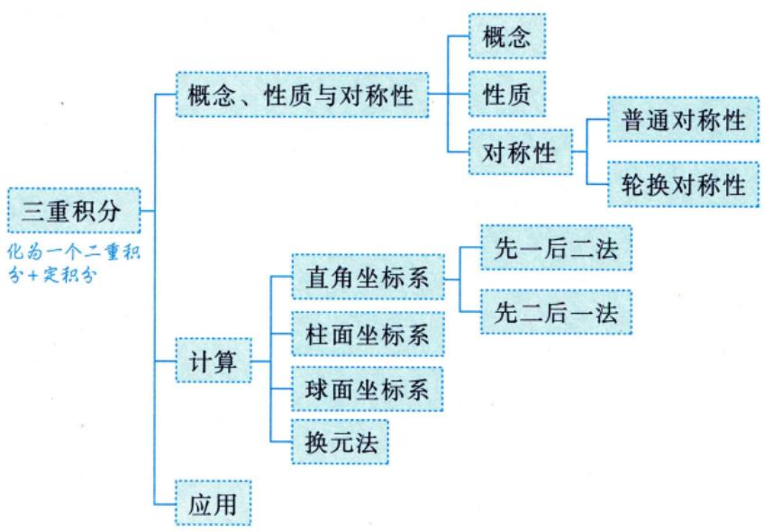

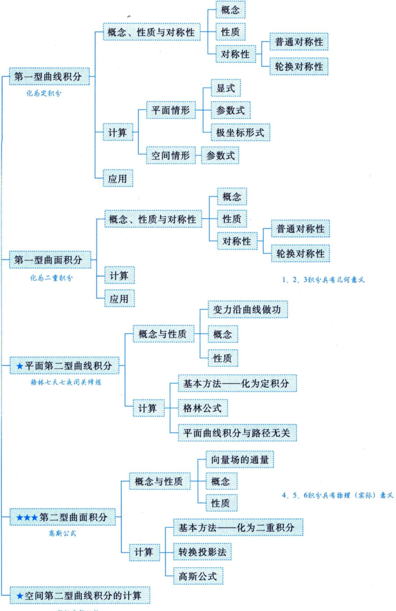

## 基础内容精讲

## 三重积分

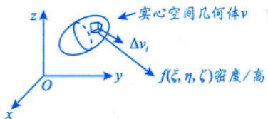

## 1概念

设 $f(x,   y,   z)$ 是空间有界闭区域Ω上的有界函数，将 $\mathcal { Q }$ 任意分成n个小闭区域

$$
\Delta v_{1}, \Delta v_{2}, \cdots, \Delta v_{n},
$$

知识回顾

二重积分：分割、近似，求和，取极限

其中 $\Delta \nu _ { i }$ 表示第i个小闭区域，也表示它的体积.在每个 $\Delta \nu _ { i }$ 上任取近似  
一点 $(\xi_{i}, \eta_{i}, \zeta_{i})$ ，作乘积 $f(\xi_{i},\eta_{i},\zeta_{i})\Delta v_{i}(i = 1,2,\cdots,n)$ ，并作和  
$\sum_{i = 1}^{n} f(\xi_{i}, \eta_{i}, \zeta_{i}) \Delta v_{i}$ 和 .如果当各小闭区域直径中的最大值λ趋于零时，→取极限  
这和的极限总存在（与 $\Delta \nu _ { i }$ 的分法及 $(\xi_{i}, \eta_{i}, \zeta_{i})$ 的取法均无关），  
则称此极限值为函数 $f(x,   y,   z)$ 在闭区域Ω上的三重积分，记作  
$\iiint_{\Omega} f(x, y, z)   \mathrm{d}v$ ，即

$$
\lim _ { \lambda \rightarrow 0 } \sum _ { k = 1 } ^ { n } f ( \xi _ { k } , \eta _ { k } ) \Delta \sigma _ { k } = \iint _ { D } f ( x , y ) \mathrm { d } \sigma
$$

$$
\iint_{D \to D} f(x,   y) \mathrm{d}\sigma
$$

$$
\iiint_{\Omega} f(x, y, z) \mathrm{d}v = \lim_{\lambda \to 0} \sum_{i=1}^{n} f(\xi_i, \eta_i, \zeta_i) \Delta v_i,
$$

∬f(x, y,z)dv→空间

其中 $f(x,   y,   z)$ 称为被积函数， $f(x, y, z) \mathrm{d}v$ 称为被积表达式，dν称为体积元素，x，y与z称为积分变量，Ω称为积分区域， $\sum_{i = 1}^{n} f(\xi_{i}, \eta_{i}, \zeta_{i}) \Delta v_{i}$ 称为积分和.

若 $f(x,   y,   z)$ 在Ω上连续，则三重积分

$$
\iiint_{\Omega} f(x, y, z)   \mathrm{d}v
$$

一定存在.

注三重积分的物理意义：设一物体占有 $O x y z$ 上的闭区域Ω，在点 $(x, y, z)$ 处的体密度为$\rho(x, y, z)$ ，假定 $\rho(x, y, z)$ 在Ω上连续，则物体的质量

$$
M = \iiint_{\Omega} \rho(x, y, z)   d\nu
$$

## 2 性质

以下总假设Ω为空间有界闭区域.

性质1(求空间区域的体积) $\iiint_{\Omega} 1 \mathrm{d}v = \iiint_{\Omega} \mathrm{d}v = V$ ，其中V为Ω的体积.

性质2(可积函数必有界）设 $f(x,   y,   z)$ 在Ω上可积，则其在Ω上必有界.

性质3(积分的线性性质)设 $k_{1},   k_{2}$ 为常数，则

$$
\iiint _ { \Omega } \left[ k _ { 1 } f ( x , y , z ) \pm k _ { 2 } g ( x , y , z ) \right] \mathrm { d } v = k _ { 1 } \iiint _ { \Omega } f ( x , y , z ) \mathrm { d } v \pm k _ { 2 } \iiint _ { \Omega } g ( x , y , z ) \mathrm { d } v .
$$

性质4(积分的可加性)设 $f(x,   y,   z)$ 在Ω上可积，且 $\Omega_{1} \cup \Omega_{2} = \Omega, \Omega_{1} \cap \Omega_{2} = \varnothing$ ，则

$$
\iiint _ { \Omega } f ( x , y , z ) \mathrm { d } v = \iiint _ { \Omega _ { 1 } } f ( x , y , z ) \mathrm { d } v + \iiint _ { \Omega _ { 2 } } f ( x , y , z ) \mathrm { d } v .
$$

性质5(积分的保号性)设 $f(x, y, z), g(x, y, z)$ 在 $\mathcal { Q } _ { \cdot }$ 上可积，且在Ω上 $f(x, y, z) \leqslant g(x, y, z)$ 则有

$$
\iiint _ { \Omega } f ( x , y , z ) \mathrm { d } v \leqslant \iiint _ { \Omega } g ( x , y , z ) \mathrm { d } v .
$$

特殊地，有

$$
\left| \iiint_{\Omega} f(x, y, z) \mathrm{d}v \right| \leq \iiint_{\Omega} \left| f(x, y, z) \right| \mathrm{d}v
$$

性质6(三重积分的估值定理) 设M，m分别是 $f(x,   y,   z)$ 在Ω上的最大值和最小值，V为Ω的体积，则有

$$
mV \leqslant \iiint_{\Omega} f(x, y, z) \mathrm{d}v \leqslant MV
$$

性质7(三重积分的中值定理) 设 $f(x,   y,   z)$ 在Ω上连续，V为Ω的体积，则在Ω上至少存在一点 $( \xi , \eta , \zeta )$ ，使得

$$
\iiint _ { \Omega } f ( x , y , z ) \mathrm { d } v = f ( \xi , \eta , \zeta ) V .
$$

## ③ 普通对称性与轮换对称性

分析方法与二重积分完全一样. $\begin{aligned}& 关于 yOz \quad ( 前后 ) \quad ; \quad (x, y, z) 与 (-x, y, z) 对应  \\& 关于 xOy \quad ( 上下 ) \quad ; \quad (x, y, z) 与 (x, y, -z) 对应 \end{aligned}$

(1)普通对称性：

假设Ω关于 $x O z$ 面对称（见图18-1），则

x，z不动，关于y为偶函数

$$
\iiint_{\Omega} f(x, y, z) \mathrm{d}v = \left\{ \begin{aligned} 2\iiint_{\Omega_1} f(x, y, z) \mathrm{d}v, \quad f(x, y, z) = f(x, -y, z), \\ 0, \quad f(x, y, z) = -f(x, -y, z), \end{aligned} \right.
$$

其中 $\mathcal { Q } _ { 1 }$ 是 $( 2 )$ 在 $x O z$ 面右边的部分.

  
图 18-1

关于其他坐标面对称的情况与此类似.

(2) 轮换对称性.

在直角坐标系下，若把x与y对调后，Ω不变，则 $\iiint_{\Omega} f(x, y, z) \mathrm{d}x\mathrm{d}y\mathrm{d}z = \iiint_{\Omega} f(y, x, z) \mathrm{d}x\mathrm{d}y\mathrm{d}z.$ ，这→dv=dxdydz具有交换律，可两两交换， $85x^{2}+y^{2}+\frac{z^{2}}{2}\leqslant 1$ 就是轮换对称性.

用轮换对称性就是为了相加后，被积函数简单

关于其他情况与此类似.

如 $\Omega=\left\{(x, y, z) \middle| x^{2}+y^{2}+z^{2} \leqslant R^{2}\right\}$ ，则 $\iiint_{\Omega} f(x) \mathrm{d}x \mathrm{d}y \mathrm{d}z = \iiint_{\Omega} f(y) \mathrm{d}x \mathrm{d}y \mathrm{d}z = \iiint_{\Omega} f(z) \mathrm{d}x \mathrm{d}y \mathrm{d}z.$ 可以化简计算.

具体应用见后面的例子.

## 注空间区域Ω 大观.

考生应能熟练画出以下图形，并时常翻之，看之，动手画图.

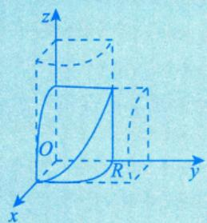

$$
\begin{cases}x^{2} + y^{2} = R^{2}, \\x^{2} + z^{2} = R^{2}\end{cases}
$$

F(x,y)=0  

$$
x^{2} + z^{2} = 2az
$$

$$
\left(x - \frac{a}{2}\right)^{2} + y^{2} = \left(\frac{a}{2}\right)^{2}
$$

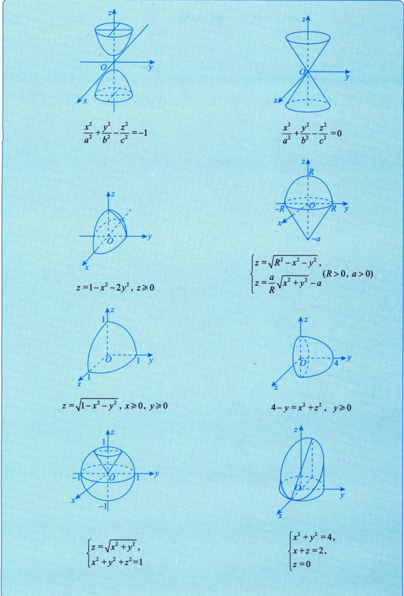

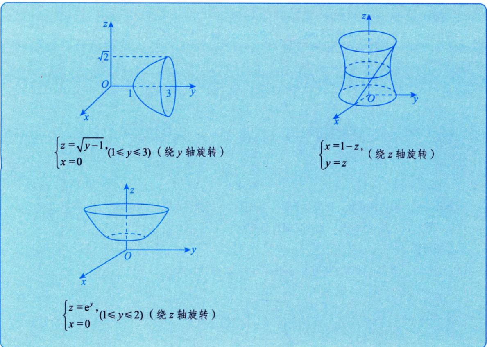

## 4 计算

(1) 直角坐标系.

$$
\mathrm{d}z \left( \frac{\int_{z^{\prime}} \mathrm{d}x}{\mathrm{d}y} \right) \mathrm{d}x = \mathrm{d}x \mathrm{d}y \mathrm{d}z.
$$

①先一后二法(先z后xy法，也叫投影穿线法).

a. 适用场合.

Ω有下曲面 $z = z_{1}(x, y)$ 、上曲面 $z = z_{2}(x, y)$ ，无侧面或侧面为柱面，如图18-2所示.

  
(a)

  
图 18-2

b. 计算方法.

如图18-3所示，有 $\iiint_{\Omega} f(x, y, z) \mathrm{d}v = \iint_{D_{xy}} \mathrm{d}\sigma \int_{z_1(x, y)}^{z_2(x, y)} f(x, y, z) \mathrm{d}z.$

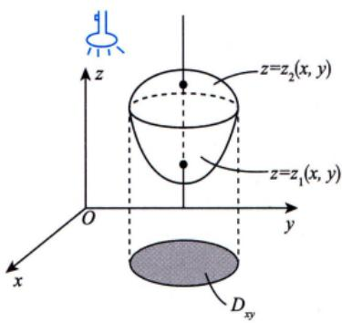  
(a)

  
(b)  
图 18-3

→→定限原则

后积先定限，限内画条线，先交写下限（下曲面），后交写上限.  
②先二后一法(先xy后z法，也叫定限截面法).

a. 适用场合.

Ω是旋转体，其旋转曲面方程为 $\Sigma: z = z(x, y)$ ，如图18-4所示.

  
图 18-4

b. 计算方法.

后积先定限限内截个面

如图 18-5 所示，有∬ $f(x, y, z) \mathrm{d}v = \iint_{a}^{b} \mathrm{d}z \iint_{D_{z}} f(x, y, z) \mathrm{d}\sigma$ Ω

  
图 18-5

例18.1 设Ω是由平面 $x + y + z = 1$ 与三个坐标平面所围成的空间区域，则 $\iiint_{\Omega} (x + 2y + 3z) \mathrm{d}x\mathrm{d}y\mathrm{d}z =$ 1

分析用轮换对称性.

(c)

解应填 $\frac{1}{4}$

方法一 积分区域如图 18-6(a)所示.

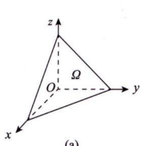

  
图 18-6

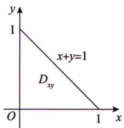

由轮换对称性知，

$$
\iiint _ { \Omega } x \mathrm { d } v = \iiint _ { \Omega } y \mathrm { d } v = \iiint _ { \Omega } z \mathrm { d } v ,
$$

则

$$
\iiint _ { \Omega } ( x + 2 y + 3 z ) \mathrm { d } v = 6 \iiint _ { \Omega } z \mathrm { d } v .
$$

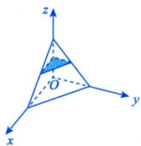

记 $\Omega: 0 \leqslant z \leqslant 1, (x, y) \in D(z)$ ，D(z)是过z轴上[0,1]中任一点z作垂直于z轴的平面截 $\overline{\mathcal{Q}}_{i}$ 所得平面区域[平移到 $x O y$ 平面上，见图18-6(b)]，其面积为 $\frac{1}{2}(1 - z)^{2}$ ，于是由先二后一法(定限截面法)，得

$$
\begin{aligned}\iiint_{\Omega} z \mathrm{d}v = & \int_{0}^{1} z \mathrm{d}z \left| \iint_{\frac{D(z)}{D(z)}} \mathrm{d}x \mathrm{d}y \right| = \int_{0}^{1} \frac{1}{2} (1 - z)^2 z \mathrm{d}z \\= & \int_{0}^{1} \frac{1}{2} (z - 2z^2 + z^3) \mathrm{d}z \\= & \frac{1}{2} \left( \frac{1}{2} z^2 - \frac{2}{3} z^3 + \frac{1}{4} z^4 \right) \bigg|_{0}^{1} = \frac{1}{24}\end{aligned}
$$

因此 $I = 6 \times \frac{1}{24} = \frac{1}{4}$

方法二 同方法一，有 $I = 6 \iint_{ \Omega } z \mathrm{d}v$

记Ω: $0 \leqslant z \leqslant 1 - x - y,\;(x,\;y) \in D_{xy},\;D_{xy} = \{(x,\;y) \mid 0 \leqslant x \leqslant 1,\;0 \leqslant y \leqslant 1 - x\}$ ，如图18-6(c)所示. 于是由先一后二法(投影穿线法)，得

$$
\iint_{D_{xy}} \mathrm{d}\sigma \int_{0}^{1 - x - y} \frac{z\mathrm{d}z}{\sqrt{z}} \mathrm{d}z = \iint_{D_{xy}} \left( \int_{0}^{1 - x - y} z\mathrm{d}z \right) \mathrm{d}x\mathrm{d}y = \iint_{D_{xy}} \frac{1}{2}(1 - x - y)^2 \mathrm{d}x\mathrm{d}y \\= \frac{1}{2} \int_{0}^{1} \mathrm{d}x \int_{0}^{1 - x} (1 - x - y)^2 \mathrm{d}y \\= \frac{1}{2} \int_{0}^{1} \left[ - \frac{1}{3}(1 - x - y)^3 \bigg|_{y = 0}^{y = 1 - x} \right] \mathrm{d}x \\= \frac{1}{6} \int_{0}^{1} (1 - x)^3 \mathrm{d}x = \frac{1}{24},
$$

因此 $I = 6 \times \frac{1}{24} = \frac{1}{4}$

(2)柱面坐标系 = 极坐标系下二重积分与定积分.

在直角坐标系的计算中，如若 $\iint \limits _ { D _ { x y } } \mathrm { d } \sigma$ 适用于极坐标系，则令 $\begin{cases}x = r \cos \theta, \\y = r \sin \theta,\end{cases}$ 便有

$$
\iiint _ { \Omega } f ( x , y , z ) \mathrm { d } x \mathrm { d } y \mathrm { d } z = \iiint _ { \Omega } f ( r \cos \theta , r \sin \theta , z ) r \mathrm { d } r \mathrm { d } \theta \mathrm { d } z ,
$$

此种计算方法称为柱面坐标系下三重积分的计算.

例18.2 设Ω是由圆柱面 $x^{2}+(y-1)^{2}=1$ ，旋转抛物面 $8z = x^{2} + y^{2}$ 以及平面z=0所围成的区 域，则 $\iint_{D} \sqrt{x^{2} + y^{2}}   dv$ ↑²

解应填 $\frac { 6 4 } { 7 5 }$

如图18-7所示，用先一后二法(投影穿线法)，即

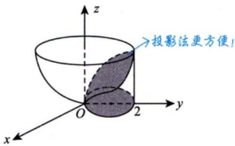

柱面坐标法

$$
I = \frac{\iint\limits_{D_{xy}} \mathrm{d}\sigma \int_{0}^{\frac{x^{2} + y^{2}}{8}} \sqrt{x^{2} + y^{2}} \mathrm{d}z}{\int_{0}^{x} \mathrm{d}\theta \int_{0}^{2\sin\theta} r \mathrm{d}r \int_{0}^{\frac{r^{2}}{8}} r \mathrm{d}z} = \frac{1}{8} \int_{0}^{x} \mathrm{d}\theta \int_{0}^{2\sin\theta} r^{4} \mathrm{d}r = \frac{1}{8} \int_{0}^{x} \mathrm{d}\theta \int_{0}^{2\sin\theta} r^{4} \mathrm{d}r = \frac{1}{8} \int_{0}^{x} \mathrm{d}\theta \int_{0}^{2\sin\theta} r^{2} \mathrm{d}r = \frac{1}{8} \int_{0}^{x} \mathrm{d}\theta \int_{0}^{2\sin\theta} r^{2} \mathrm{d}r = \frac{1}{8} \int_{0}^{x} \mathrm{d}\theta \int_{0}^{2\sin\theta} r^{3} \mathrm{d}r = \frac{1}{8} \int_{0}^{x} \mathrm{d}\theta \int_{0}^{2\sin\theta} r^{3} \mathrm{d}r = \frac{1}{8} \int_{0}^{x} \mathrm{d}\theta \int_{0}^{2\sin\theta} r^{3} \mathrm{d}r = \frac{1}{8} \int_{0}^{x} \mathrm{d}\theta \int_{0}^{2\sin\theta} r^{3} \mathrm{d}\theta = \frac{64}{75}.
$$

(3) 球面坐标系.

①适用场合.

a. 被积函数中含 $\begin{cases}f(x^{2} + y^{2} + z^{2}), \\f(x^{2} + y^{2}).\end{cases}$

球或球的部分，b. 积分区域为锥或锥的部分.

②计算方法.

则 $\mathrm{d}v = \left| r^{2} \sin \varphi \right| \mathrm{d}r \mathrm{d}\varphi \mathrm{d}\theta$ 测度的倍数

球面坐标系应该是整个高等数学或者说微积分里最复杂的一种计算方法，我们打一套拳来把这个问题解决。

第一步，转：从xOz面出发，拉着一扇门绕z轴(从z轴正向向下看)逆时针旋转一周.见a.

第二步，开：从z轴出发，喇叭花开花，伸展运动，从0°开到180°.见b.

第三步，穿：从原点发出一条射线，至无穷远处.见c

这套拳可称为“球系太极拳”，在解决积分问题的同时，舒展筋骨，强身健体.

先碰到Ω，记 $\theta _ { 1 }$ a. 过z轴的半平面与xOz面正向夹角为θ(取值范围[0,2π])后离开 $\mathcal { Q }$ ，记 $\theta _ { 2 }$

先碰到Ω，记 $\varphi _ { 1 } ( \theta )$ b. 顶点在原点，以z轴为中心轴的圆锥面半顶角为φ(取值范围[0，π])后离开Ω，记 $\varphi_{2}(\theta)$

先碰到Ω，记 $r _ { 1 } ( \varphi ,   \theta )$ c. 从原点出发画一条长为r的线(取值范围[0，+∞))后离开Ω，记 $r _ { 2 } ( \varphi ,   \theta )$

于是

$$
\iiint_{\Omega} f(x, y, z) \mathrm{d}v = \iiint_{\Omega} f(r \sin \varphi \cos \theta, r \sin \varphi \sin \theta, r \cos \varphi) r^2 \sin \varphi \mathrm{d}r \mathrm{d}\varphi \mathrm{d}\theta \\= \int_{\theta_1}^{\theta_2} \mathrm{d}\theta \int_{\varphi_1(\theta)}^{\varphi_2(\theta)} \mathrm{d}\varphi \int_{r(\varphi, \theta)}^{r(\varphi, \theta)} f(r \sin \varphi \cos \theta, r \sin \varphi \sin \theta, r \cos \varphi) r^2 \sin \varphi \mathrm{d}r .
$$

例18.3 设 $\Omega = \{ (x, y, z) | x^2 + y^2 + z^2 \leq 1 \}$ ，则 $\iint_{\Omega} z^{2}   dx   dy   dz =$

解应填 $\frac{4\pi}{15}$

由轮换对称性可知， $\iiint_{\Omega} z^{2} \mathrm{d}x\mathrm{d}y\mathrm{d}z = \iiint_{\Omega} x^{2} \mathrm{d}x\mathrm{d}y\mathrm{d}z = \iiint_{\Omega} y^{2} \mathrm{d}x\mathrm{d}y\mathrm{d}z$ ，所以

$$
\begin{aligned}\iiint_{\Omega} z^{2} \mathrm{d}x \mathrm{d}y \mathrm{d}z = \frac{1}{3} \iiint_{\Omega} \left( x^{2} + y^{2} + z^{2} \right) \mathrm{d}x \mathrm{d}y \mathrm{d}z = \frac{1}{3} \cdot \int_{0}^{2\pi} \mathrm{d}\theta \int_{0}^{\pi} \mathrm{d}\varphi \int_{0}^{1} r^{2} \cdot r^{2} \sin \varphi \mathrm{d}r \\= \frac{2\pi}{3} \int_{0}^{\pi} \sin \varphi \mathrm{d}\varphi \int_{0}^{1} r^{4} \mathrm{d}r = \frac{4\pi}{15} .\end{aligned}
$$

例18.4 设 $\Omega=\left\{ (x,y,z) \middle| \sqrt{x^{2}+y^{2}} \leqslant z \leqslant 1 \right\}$ ，则 $\iiint \frac{1}{\sqrt{x^{2} + y^{2} + z^{2}}} \mathrm{d}v =$

解应填 $(\sqrt{2} - 1)   \pi$

如图18-8所示，从原点引射线穿过Ω，从z=1穿出，即 $r \cos \varphi = 1$ ，则 $r = \frac{1}{\cos \varphi}$ 为上限，于是

$$
I = \int_{0}^{2\pi} \mathrm{d}\theta \int_{0}^{\frac{\pi}{4}} \mathrm{d}\varphi \int_{0}^{\frac{1}{\cos \varphi}} \frac{1}{r} \cdot r^{2} \sin \varphi \mathrm{d}r = 2\pi \int_{0}^{\frac{\pi}{4}} \frac{1}{2} r^{2} \bigg|_{0}^{\frac{1}{\cos \varphi}} \cdot \sin \varphi \mathrm{d}\varphi
$$

图 18-8

$$
\pi \int_{0}^{\frac{\pi}{4}} \frac{1}{\cos^2 \varphi} \cdot \sin \varphi \mathrm{d}\varphi = -\pi \int_{0}^{\frac{\pi}{4}} \frac{1}{\cos^2 \varphi} \mathrm{d}(\cos \varphi) = \pi \cdot \frac{1}{\cos \varphi} \bigg|_{0}^{\frac{\pi}{4}} = (\sqrt{2} - 1)\pi
$$

(4)换元法.

$$
\iint_{\Sigma} f(x, y, z) \mathrm{d}x\mathrm{d}y\mathrm{d}z
$$

$$
\left\{ \begin{aligned} x = x(u, v, w) \\ y = y(u, v, w) \\ z = z(u, v, w) \end{aligned} \right. \quad \left\{ \begin{aligned} x = x(u, v, w) \\ \iiint f[x(u, v, w), y(u, v, w), z(u, v, w)] \left| \frac{\partial(x, y, z)}{\partial(u, v, w)} \right| \right\} \mathrm{d}u \mathrm{d}v \mathrm{d}w . \end{aligned}
$$

$$
f(x, y, z) \to f[x(u, v, w), y(u, v, w), z(u, v, w)]
$$

$$
\iiint\limits_{\mathcal{Q}_{xy}} \rightarrow \iiint\limits_{\mathcal{Q}_{uw}}
$$

$$
\mathrm{d}x\mathrm{d}y\mathrm{d}z\rightarrow\left|\frac{\partial(x,\ y,\ z)}{\partial(u,\ v,\ w)}\mathrm{d}u\mathrm{d}v\mathrm{d}w\right|
$$

其中

a. $\begin{cases}x = x(u,   v,   w), \\y = y(u,   v,   w), \\z = z(u,   v,   w)\end{cases}$ 是空间 $( x ,   y ,   z )$ 到空间(u，ν，w)的一一映射；

b. $x = x(u, v, w), y = y(u, v, w), z = z(u, v, w)$ 有一阶连续偏导数，且

$$
\frac { \partial ( x ,   y ,   z ) } { \partial ( u ,   v ,   w ) } = \left| \begin{matrix} { \cfrac { \partial x } { \partial u } } & { \cfrac { \partial x } { \partial v } } & { \cfrac { \partial x } { \partial w } } \\ { \cfrac { \partial y } { \partial u } } & { \cfrac { \partial y } { \partial v } } & { \cfrac { \partial y } { \partial w } } \\ { \cfrac { \partial z } { \partial u } } & { \cfrac { \partial z } { \partial v } } & { \cfrac { \partial z } { \partial w } } \end{matrix} \right| \neq 0 \quad .
$$

柱面坐标系

另外，令 $\begin{cases}x = r \cos \theta, \\y = r \sin \theta, \\z = z,\end{cases}$ 则

$$
\begin{aligned}\iiint_{\Omega_{\mathrm{out}}} f(x,   y,   z) \mathrm{d}x \mathrm{d}y \mathrm{d}z= & \iiint_{\Omega_{\mathrm{out}}} f(r \cos \theta,   r \sin \theta,   z) \left| \frac{\partial(x,   y,   z)}{\partial(r,  \theta,   z)} \right| \mathrm{d}r \mathrm{d}\theta \mathrm{d}z \\= & \iiint_{\Omega_{\mathrm{out}}} f(r \cos \theta,   r \sin \theta,   z) \left| \frac{\partial x}{\partial r} \right. \quad \left. \frac{\partial x}{\partial \theta} \right| \\= & \iiint_{\Omega_{\mathrm{out}}} f(r \cos \theta,   r \sin \theta,   z) \left| \frac{\partial x}{\partial r} \right| \frac{\partial y}{\partial \theta} \quad \left. \frac{\partial y}{\partial \theta} \right| \mathrm{d}r \mathrm{d}\theta \mathrm{d}z \\= & \iiint_{\Omega_{\mathrm{out}}} f(r \cos \theta,   r \sin \theta,   z) \left| \begin{matrix}\cos \theta & -r \sin \theta & 0 \\\sin \theta & r \cos \theta & 0 \\0 & 0 & 1\end{matrix} \right| \mathrm{d}r \mathrm{d}\theta \mathrm{d}z \\= & \iiint_{\Omega_{\mathrm{out}}} f(r \cos \theta,   r \sin \theta,   z) r \mathrm{d}r \mathrm{d}\theta \mathrm{d}z .\end{aligned}
$$

这就是直角坐标系到柱面坐标系的换元过程.

$$
\begin{aligned}\left\{\begin{aligned}x = r\sin\varphi\cos\theta, \\y = r\sin\varphi\sin\theta,\end{aligned}\right.\end{aligned}
$$

$$
\begin{aligned}= & \iiint\limits_{\Omega_{\omega_0}} f(r \sin \varphi \cos \theta,   r \sin \varphi \sin \theta,   r \cos \varphi) \begin{vmatrix} \frac{\partial x}{\partial r} & \frac{\partial x}{\partial \theta} & \frac{\partial x}{\partial \varphi} \\ \frac{\partial y}{\partial r} & \frac{\partial y}{\partial \theta} & \frac{\partial y}{\partial \varphi} \\ \frac{\partial z}{\partial r} & \frac{\partial z}{\partial \theta} & \frac{\partial z}{\partial \varphi} \end{vmatrix} \mathrm{d}r \mathrm{d}\varphi \mathrm{d}\theta \\= & \iiint\limits_{\Omega_{\omega_0}} f(r \sin \varphi \cos \theta,   r \sin \varphi \sin \theta,   r \cos \varphi) * \begin{vmatrix} \sin \varphi \cos \theta & -r \sin \varphi \sin \theta & r \cos \varphi \cos \theta \\ \sin \varphi \sin \theta & r \sin \varphi \cos \theta & r \cos \varphi \sin \theta \\ \cos \varphi & 0 & -r \sin \varphi \end{vmatrix} \mathrm{d}r \mathrm{d}\varphi \mathrm{d}\theta \\= & \iiint\limits_{\Omega_{\omega_0}} f(r \sin \varphi \cos \theta,   r \sin \varphi \sin \theta,   r \cos \varphi) r^2 \sin \varphi \mathrm{d}r \mathrm{d}\varphi \mathrm{d}\theta .\end{aligned}
$$

这就是直角坐标系到球面坐标系的换元过程.

例18.5设 $\Omega = \{ (x, y, z) \mid x^{2} + 4y^{2} + z^{2} \leqslant 1 \}$ ，则 $\iiint_{\Omega} \left(1 - x^{2} - 4y^{2} - z^{2}\right) \mathrm{d}x\mathrm{d}y\mathrm{d}z =$

$$
x^{2}+\frac{y^{2}}{\frac{1}{4}}+z^{2} \leq 1
$$

分析令 $\begin{cases}x = x_{1}, \\2y = y_{1}, \\z = z_{1},\end{cases}$ ,则 $\left( 1 - x ^ { 2 } - 4 y ^ { 2 } - z ^ { 2 } \right) \mathrm{d} x \mathrm{d} y \mathrm{d} z = \iiint\limits_{x _ { 1 } ^ { 2 } + y _ { 1 } ^ { 2 } + z _ { 1 } ^ { 2 } \leq 1} \left( 1 - x _ { 1 } ^ { 2 } - y _ { 1 } ^ { 2 } - z _ { 1 } ^ { 2 } \right) \mathrm{d} x _ { 1 } \cdot \frac { 1 } { 2 } \mathrm{d} y _ { 1 } \mathrm{d} z _ { 1 }$ x²+4y²+z²≤

解应填 $\frac{4\pi}{15}$

$$
\begin{cases}x = r \sin \varphi \cos \theta, \\y = \frac{1}{2} r \sin \varphi \sin \theta, \\z = r \cos \varphi,\end{cases}
$$

于是

$$
\hat { J } = \frac { \partial ( x , y , z ) } { \partial ( r , \theta , \varphi ) } = \left| \begin{aligned} \frac { \partial x } { \partial r } & \quad \frac { \partial x } { \partial \theta } \quad \frac { \partial x } { \partial \varphi } \\ \frac { \partial y } { \partial r } & \quad \frac { \partial y } { \partial \theta } \quad \frac { \partial y } { \partial \varphi } \\ \frac { \partial z } { \partial r } & \quad \frac { \partial z } { \partial \theta } \quad \frac { \partial z } { \partial \varphi } \end{aligned} \right| = - \frac { 1 } { 2 } r ^ { 2 } \sin \varphi ,
$$

则

$$
\begin{aligned}I = & \iiint_{x^{2} + 4y^{2} + z^{2} \leq 1}^{}\left( 1 - x^{2} - 4y^{2} - z^{2} \right)dx\mathrm{d}y\mathrm{d}z \\= & \iiint_{x^{2} + y^{2} + z^{2} \leq 1}^{}\left( 1 - x^{2} - y^{2} - z^{2} \right)\frac{1}{2}\mathrm{d}x_{1}\mathrm{d}y_{1}\mathrm{d}z_{1} \\= & \int_{0}^{2\pi}\mathrm{d}\theta\int_{0}^{\pi}\mathrm{d}\varphi\int_{0}^{1}\left( 1 - r^{2} \right)\frac{1}{2}r^{2}\sin\varphi\mathrm{d}r = \frac{4\pi}{15} \quad \therefore \quad \quad \frac{y_{1} = r\sin\varphi\cos\theta}{y_{1} = r\sin\varphi\sin\theta},\end{aligned}
$$

## 5应用

(1)若Ω是物体所占的空间区域，则其体积为 $V = \iint \limits _ { \mathcal { Q } } \mathrm { d } \nu$

★ (2)对于空间物体，若体密度为 $\rho ( x ,   y ,   z )$ ，Ω是物体所占的空间区域，则计算重心(x，y，z)的公式为

$$
\begin{aligned}\iiint_{\Omega} x \rho(x, y, z) \mathrm{d}v \quad \iiint_{\Omega} y \rho(x, y, z) \mathrm{d}v \quad \iiint_{\Omega} z \rho(x, y, z) \mathrm{d}v \quad \iiint_{\Omega} z \rho(x, y, z) \mathrm{d}v \quad \iiint_{\Omega} z \rho(x, y, z) \mathrm{d}v \quad \iiint_{\Omega} z \rho(x, y, z) \mathrm{d}v \quad \iiint_{\Omega} z \rho(x, y, z) \mathrm{d}v \quad \iiint_{\Omega} z \rho(x, y, z) \mathrm{d}v \quad \iiint_{\Omega} z \rho(x, y, z) \mathrm{d}v\end{aligned}
$$

注(1)在考研的范畴内，重心就是质心.

(2) 当密度 $\rho(x, y)$ 或者 $\rho(x, y, z)$ 为常数时，重心就成了形心.

(3) 形心公式的逆用. 个常，母被和函数都

由 $\overline{x} = \frac{\iiint\limits_{\Omega} x   \mathrm{d}v}{\iiint\limits_{\Omega} \mathrm{d}v}$ 得 $\iint_{\Omega} x \mathrm{d}v = \overline{x} \cdot V$ 其中V为Ω的体积.若x与V均易于求出，则可快速计算出>Ω的体积  
$\iint\limits_{\Omega} x \mathrm{d}v$ 以下同理.

由 $\overline{y} = \frac{\iiint\limits_{\Omega} y   \mathrm{d}v}{\iint\limits_{\Omega} \mathrm{d}v}$ 得 $\iint_{\Omega} y   \mathrm{d}v = \overline{y} \cdot V$ 其中V为Ω的体积

$\overline{z} = \frac{\iiint\limits_{\Omega} z   \mathrm{d}v}{\iiint\limits_{\Omega} \mathrm{d}v}$ 得 $\iint_{D} z   \mathrm{d}v = \overline{z} \bullet V$ ，其中V为Ω的体积.

(3)对于空间物体，若体密度为 $\rho(x,   y,   z)$ ，Ω是物体所占的空间区域，则计算该物体对x轴、y轴、z轴和原点O的转动惯量 $I_{x}, I_{y}, I_{z}$ 和 $I _ { o }$ 公式分别为

$$
I _ { x } = \iiint _ { Q } \left( y ^ { 2 } + z ^ { 2 } \right) \rho ( x , y , z ) \mathrm { d } v , I _ { y } = \iiint _ { Q } \left( z ^ { 2 } + x ^ { 2 } \right) \rho ( x , y , z ) \mathrm { d } v ,
$$

$$
I_{z} = \iiint_{\Omega} (x^{2} + y^{2}) \rho(x, y, z) \mathrm{d}v, I_{0} = \iiint_{\Omega} (x^{2} + y^{2} + z^{2}) \rho(x, y, z) \mathrm{d}v . \quad \iiint_{\Omega} x^{2} + y^{2} \mathrm{d}v = \iint_{\Omega} (x, y, z) \mathrm{d}v
$$

(4)对于空间物体，若体密度为 $\rho ( x ,   y ,   z )$ ，Ω是物体所占的空间区域，则r²dm为微元对z轴的转动惯量计算该物体对物体外一点 $M_{0}(x_{0},y_{0},z_{0})$ 处的质量为m的质点的引力 $\left[ \left( F _ { x } , F _ { y } , F _ { z } \right) \right]$ 公式为

$$
F_{x}=Gm\iint_{\Omega}\frac{\rho(x,y,z)(x-x_{0})}{\left[(x-x_{0})^{2}+(y-y_{0})^{2}+(z-z_{0})^{2}\right]^{\frac{3}{2}}}\mathrm{d}v
$$

$$
F _ { y } = G m \iiint _ { \Omega } \frac { \rho ( x , y , z ) ( y - y _ { 0 } ) } { \left[ ( x - x _ { 0 } ) ^ { 2 } + ( y - y _ { 0 } ) ^ { 2 } + ( z - z _ { 0 } ) ^ { 2 } \right] ^ { \frac { 3 } { 2 } } } \mathrm { d } v ,
$$

$$
F_{z}=Gm\iint_{\Omega}\frac{\rho(x,y,z)(z-z_{0})}{\left[(x-x_{0})^{2}+(y-y_{0})^{2}+(z-z_{0})^{2}\right]^{\frac{3}{2}}}\mathrm{d}v\ .
$$

例18.6 设 $\Omega = \left\{ (x, y, z) \mid 4x^{2} + y^{2} + z^{2} - 2z \leqslant 3 \right\}$ ，则 $\iint_{\Omega} z   d v =$ ↓

解应填 $\frac{16}{3}\pi$ $x^{2}+\frac{y^{2}}{4}+\frac{(z-1)^{2}}{4}\leqslant 1$ 为椭球体

由于 $\Omega=\left\{(x, y, z) \left|x^{2}+\frac{y^{2}}{4}+\frac{(z-1)^{2}}{4} \leq 1\right.\right\}$ ，其形心坐标为(0,0,1)，于是

$\iiint_{\Omega} z \mathrm{d}v = \overline{z} \cdot V_{\Omega} = 1 \cdot \frac{4}{3} \cdot \pi \cdot \frac{1}{a} \cdot \frac{2}{b} \cdot \frac{2}{c} = \frac{16}{3} \pi$ 7 .椭球体 $\frac{x^{2}}{a^{2}}+\frac{y^{2}}{b^{2}}+\frac{z^{2}}{c^{2}} \leqslant 1$ 的体积为 $\frac{4}{3}\pi abc$

例18.7设 $\Omega=\left\{(x, y, z) \mid x^{2}+y^{2} \leq z \leq 1\right\}$ ，则Ω的形心的竖坐标 $\overline{z} =$

解应填 $\frac{2}{3}$

设 $D=\left\{ (x, y) \mid x^{2}+y^{2} \leqslant 1 \right\}$ ，则

$$
\iiint_{D} \mathrm{d}x\mathrm{d}y\mathrm{d}z = \iint_{D} \mathrm{d}x\mathrm{d}y \int_{x^{2} + y^{2}}^{1} \mathrm{d}z = \iint_{D} \left( 1 - x^{2} - y^{2} \right) \mathrm{d}x\mathrm{d}y = \int_{0}^{2\pi} \mathrm{d}\theta \int_{0}^{1} \left( 1 - r^{2} \right) r \mathrm{d}r = \frac{\pi}{2}
$$

$$
\iiint_{D} z \mathrm{d}x\mathrm{d}y\mathrm{d}z = \iint_{D} \mathrm{d}x\mathrm{d}y \int_{x^{2} + y^{2}}^{1} z\mathrm{d}z = \frac{1}{2} \iint_{D} \left[ 1 - \left( x^{2} + y^{2} \right)^{2} \right] \mathrm{d}x\mathrm{d}y = \frac{1}{2} \int_{0}^{2\pi} \mathrm{d}\theta \int_{0}^{1} \left( 1 - r^{4} \right) r\mathrm{d}r = \frac{\pi}{3}
$$

所以 $\frac{\iiint z \mathrm{d}x \mathrm{d}y \mathrm{d}z}{\iiint \limits_{\Omega} \mathrm{d}x \mathrm{d}y \mathrm{d}z} = \frac{2}{3}$