## 1 概念

设L为xOy面内的一条光滑曲线弧，函数 $f(x,   y)$ 在L上有界，在L上任意插入一系列点$M_{1},M_{2},\cdots,M_{n-1}$ 把L分成n个小段.设第i个小弧段的长度为 $\Delta s_{i}$ ，又 $( \xi _ { i }   ,   \eta _ { i } )$ 为第i个小弧段上任意取近似 $\sum_{i = 1}^{n} f(\xi_{i}, \eta_{i}) \Delta s_{i}$ 定的一点，作乘积 $f(\xi_i,\eta_i)\Delta s_i(i=1,2,\cdots,n)$ ，并作和 ，如果当各小弧段长度的最大值→取极限λ趋于零时，这和的极限总存在（与 $\Delta s _ { i }$ 的分法及 $(\xi_{i}, \eta_{i})$ 的取法均无关），则称此极限为函数 $f(x,   y)$ 在曲线弧L上对弧长的曲线积分或第一型曲线积分，记作 $\int_{L} f(x,   y) \mathrm{d}s$ ，即

$$
\int _ { L } f ( x , y ) \mathrm { d } s = \lim _ { \lambda \rightarrow 0 } \sum _ { i = 1 } ^ { n } f ( \xi _ { i } , \eta _ { i } ) \Delta s _ { i } ,
$$

其中 $f(x,   y)$ 称为被积函数， $f(x,   y) \mathrm{d}s$ 称为被积表达式，x与y称为积分变量，L称为积分弧段.

$$
\mathrm{d}s = \sqrt{(\mathrm{d}x)^{2} + (\mathrm{d}y)^{2} + (\mathrm{d}z)^{2}}
$$

此定义可以类似地推广到积分弧段为空间曲线弧Γ的情形，即函数$f(x,   y,   z)$ 在曲线弧Γ上对弧长的曲线积分区别： 区别

$$
\sqrt{1 + \left( y_{x}^{\prime} \right)^{2} + \left( z_{x}^{\prime} \right)^{2}}   dx
$$

$$
\int _ { \Gamma } f ( x , y , z ) \mathrm { d } s = \lim _ { \lambda \rightarrow 0 } \sum _ { i = 1 } ^ { n } f ( \xi _ { i } , \eta _ { i } , \zeta _ { i } ) \Delta s _ { i } .
$$

①底部直线变曲线。 ②第一型曲线积分弧微分， ds = √(dx)2 +(dy)²

注但事实上，如果仅理解到此，还是不够的.不妨把定积分和第一型曲线积分放在一起作个对比，加深我们对概念的理解.定积分定义在“直线段”上，而第一型曲线积分定义在“曲线段”上，如图18-9、图 18-10所示，由于 $f(x,y)$ 定义在 $L: y = y(x)$ 上，故曲线方程L可代入被积函数，从而化简计算.

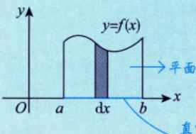

$$
\int_{a}^{b} f(x) \mathrm{d}x
$$

图 18-9  
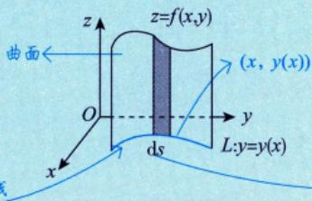  
第一型曲线积分 $\int_{L} f(x, y) \mathrm{d}s$

图 18-10  

## 2 性质

以下总假设Γ为空间有限长分段光滑曲线.

性质1(求空间曲线的长度(弧长)) $\int_{\varGamma} 1 \mathrm{d}s = l_{\varGamma}$ ，其中 $l _ { r }$ 为Γ的长度.

性质2(可积函数必有界）设 $f(x,   y,   z)$ 在Γ上可积，则其在Γ上必有界.

同定积分

性质3(积分的线性性质）设 $k_{1},   k_{2}$ 为常数，则

$$
\int _ { \Gamma } \left[ k _ { 1 } f ( x , y , z ) \pm k _ { 2 } g ( x , y , z ) \right] \mathrm { d } s = k _ { 1 } \int _ { \Gamma } f ( x , y , z ) \mathrm { d } s \pm k _ { 2 } \int _ { \Gamma } g ( x , y , z ) \mathrm { d } s .
$$

性质4(积分的可加性)设 $f(x,   y,   z)$ 在Γ上可积，且 $\Gamma_{1} \cup \Gamma_{2} = \Gamma, \Gamma_{1} \cap \Gamma_{2} = \varnothing$ ，则

$$
\int _ { \Gamma } f ( x , y , z ) \mathrm { d } s = \int _ { \Gamma _ { 1 } } f ( x , y , z ) \mathrm { d } s + \int _ { \Gamma _ { 2 } } f ( x , y , z ) \mathrm { d } s .
$$

性质5(积分的保号性)设 $f(x,y,z),g(x,y,z)$ 在Γ上可积，且在Γ上 $f(x, y, z) \leqslant g(x, y, z)$ 则有

$$
\int _ { \Gamma } f ( x , y , z ) \mathrm { d } s \leqslant \int _ { \Gamma } g ( x , y , z ) \mathrm { d } s .
$$

特殊地，有

$$
\left| \int _ { \Gamma } f ( x , y , z ) \mathrm { d } s \right| \leqslant \int _ { \Gamma } \left| f ( x , y , z ) \right| \mathrm { d } s
$$

$$
\begin{aligned}&\int_{a}^{b} \textcircled{7}  父犯�varsigma \int_{a}^{b} f(x) \mathrm{d}x  . \\& 若  \; a < b \Rightarrow \mathrm{d}x > 0 \text { ; } \\& 若  \; a > b \Rightarrow \mathrm{d}x < 0 \text { . } \\&\int \textcircled{2}  二重犯�varsigma \iint\limits_{D} f(x , y) \mathrm{d}\sigma. \\& 谆意:  \mathrm{d}\sigma > 0 \text { . } \\&\textcircled{3}  三重犯�varsigma \iint\limits_{D} f(x , y , z) \mathrm{d}\nu  . \\& 谆意:  \mathrm{d}\nu > 0 \text { . }\end{aligned}
$$

性质6(第一型曲线积分的估值定理) 设M，m分别是 $f(x,   y,   z)$ 在Γ上的最大值和最小值， $l _ { r }$ 为Γ的长度，则有

与定积分、二重积分、三重积分类似

$$
m l _ { \Gamma } \leqslant \int _ { \Gamma } f ( x , y , z ) \mathrm { d } s \leqslant M l _ { \Gamma } .
$$

性质7(第一型曲线积分的中值定理) 设f(x，y，z)在Γ上连续， $l _ { r }$ 为Γ的长度，则在Γ上至少存在一点 $(\xi,\eta,\zeta)$ ，使得

$$
\int _ { \Gamma } f ( x , y , z ) \mathrm { d } s = f ( \xi , \eta , \zeta ) l _ { \Gamma } .
$$

## ③普通对称性与轮换对称性

左右对称，变的是y

分析方法与二重积分、三重积分完全一样.

(1) 普通对称性.

假设Γ关于xOz面对称，则

$$
\int _ { \Gamma } f ( x , y , z ) \mathrm { d } s = \left\{ \begin{aligned} 2 \int _ { \Gamma _ { 1 } } f ( x , y , z ) \mathrm { d } s , \quad f ( x , y , z ) = f ( x , - y , z ) , \\ 0 , \quad f ( x , y , z ) = - f ( x , - y , z ) , \end{aligned} \right.
$$

同理：上下对称，变的是z：前后对称，变的是x

其中 $T _ { 1 }$ 是Γ在xOz面右边的部分.

关于其他坐标面对称的情况与此类似.

(2) 轮换对称性.

若把x与y对调后，Γ不变，则 $\int _ { \Gamma } f ( x , y , z ) \mathrm { d } s = \int _ { \Gamma } f ( y , x , z ) \mathrm { d } s ,$ ，这就是轮换对称性.关于其他情况与此类似. L

具体应用见后面的例子.

因为 $\mathrm{d}s = \sqrt{(\mathrm{d}x)^{2} + (\mathrm{d}y)^{2} + (\mathrm{d}z)^{2}}$ 在加法上有交换律，交换x与y后，ds不变

## 4计算

由于第一型曲线积分就是由定积分推广而来的，因此计算第一型曲线积分的基本方法就是将其化为定积分.口诀为“一投二代三计算” 从定积分来，回到定积分去

(1) 平面情形.

①若平面曲线L由 $y = y(x) (a \leq x \leq b)$ 给出，则 $\mathbf { d } s =$ $\sqrt{1 + \left[ y^{\prime}(x) \right]^{2}}   dx$ ，且

掌握三种体系下曲线积分的计算：①直角坐标系下：②参数式下：③极坐标系下

$$
\begin{aligned}&\int_{L} f(x,   y) \mathrm{d}s \\=& \int_{a}^{b} f[x,   y(x)] \sqrt{1 + [y'(x)]^2}   \mathrm{d}x.\end{aligned}
$$

一投二代三计算，这是基本方法的口诀

以平面为例，

②若平面曲线L由参数式 $\begin{cases}x = x(t), \\y = y(t)\end{cases}(\alpha \leqslant t \leqslant \beta)$ 给出，则 $\mathrm{d}s = \sqrt{\left[ x^{\prime}(t) \right]^{2} + \left[ y^{\prime}(t) \right]^{2}}   \mathrm{d}t$ ，且

一投：把L投到x轴上去，写成 $\int _ { a } ^ { b }$ \*

→二代：注意这里的x，y不是独立的，它是受约束于方程 $y = y(x)$ 的，一定要把 $y = y(x)$ 代入f(x,y)(这是曲线(曲面)积分的特点，因为这里的变量是定义在线上(面上）的，不具有独立性，所以这里必须代入）：

三计算：之前讲过狐微分计算公式

$$
\begin{aligned} &\int_{L} f(x,   y) \mathrm{d}s \\=& \int_{\alpha}^{\beta} f[x(t),   y(t)] \sqrt{[x^{\prime}(t)]^2 + [y^{\prime}(t)]^2}   \mathrm{d}t.\end{aligned}
$$

$$
\mathrm{d}s = \sqrt{\left( \mathrm{d}x \right)^{2} + \left( \mathrm{d}y \right)^{2}} = \sqrt{1 + \left[ y^{\prime}(x) \right]^{2}} \mathrm{d}x
$$

投二代三计算，就化成了定积分。

③若平面曲线L由极坐标形式 $r = r(\theta) (\alpha \leqslant \theta \leqslant \beta)$ 给出，则 $\mathrm{d}s = \sqrt{\left[ r(\theta) \right]^2 + \left[ r'(\theta) \right]^2}   \mathrm{d}\theta$ ，且

$$
\begin{aligned} &\int_{L} f(x, y) \mathrm{d}s \\= & \int_{\alpha}^{\beta} f[r(\theta)\cos\theta, r(\theta)\sin\theta] \sqrt{[r(\theta)]^2 + [r'(\theta)]^2} \mathrm{d}\theta.\end{aligned}
$$

(2) 空间情形.

若空间曲线Γ由参数式 $\begin{cases}x = x(t), \\y = y(t),   (\alpha \leqslant t \leqslant \beta), \\z = z(t)\end{cases}$ 给出，则

$$
\mathrm{d}s = \sqrt{ \left[ x^{\prime}(t) \right]^2 + \left[ y^{\prime}(t) \right]^2 + \left[ z^{\prime}(t) \right]^2 }   \mathrm{d}t,
$$

且

$$
\int_{\alpha}^{\beta} \frac{\int_{\Gamma} f(x, y, z) \mathrm{d}s}{\int_{\alpha}^{\beta} \underbrace{\int_{\Gamma}^{\cdots  投 } \left( \int_{\Gamma}^{\cdots  投 } y(t), z(t) \right) \sqrt{[x^{\prime}(t)]^2 + [y^{\prime}(t)]^2 + [z^{\prime}(t)]^2}}_{\alpha} \mathrm{d}t}.
$$

→最终为t的一元函数

例18.8 已知曲线 $L:y=x^{2}(0 \leqslant x \leqslant \sqrt{2})$ ，则 $\int _ { L } x \mathrm { d } s =$

分析利用“一投二代三计算”的口诀计算直角坐标系下的第一型曲线积分.

解应填 $\frac{13}{6}$

凑微分

$$
\int_{L} x \mathrm{d}s = \int_{0}^{\sqrt{2}} x \sqrt{1 + (2x)^{2}} \mathrm{d}x = \frac{1}{8} \int_{0}^{\sqrt{2}} \sqrt{1 + 4x^{2}} \mathrm{d}(1 + 4x^{2})
$$

$$
\frac{1}{12}(1 + 4x^{2})^{\frac{3}{2}}\bigg|_{0}^{\sqrt{2}} = \frac{13}{6}
$$

例18.9 设 $L:x^{2}+y^{2}=-2y$ ，则 $\oint_{L} \sqrt{x^{2} + y^{2}}   ds =$

φ→封闭曲线的专用符号

分析根据曲线L及被积函数的表达式，不难发现都含有平方和，所以本题不宜用直角坐标计算，故采用极坐标解题.0 at a àt

解应填8.

$$
x^{2}+y^{2}=-2y \Rightarrow r^{2}=-2r \sin \theta \Rightarrow r=-2 \sin \theta
$$

将曲线方程用极坐标表示： $r = - 2\sin\theta( - \pi \leqslant \theta \leqslant 0)$ ，则

$$
x = r \cos \theta , y = r \sin \theta , \mathrm{d}s = \sqrt{ \left[ r(\theta) \right]^2 + \left[ r'(\theta) \right]^2 } \mathrm{d}\theta = \sqrt{ 4 \sin^2 \theta + 4 \cos^2 \theta } \mathrm{d}\theta = 2 \mathrm{d}\theta .
$$

故

$$
\rho = - \frac{\pi}{2} \int_{- \pi}^{\pi} r \cdot 2 \mathrm{d} \theta
$$

$$
I = \int_{- \pi}^{0}\left( - 2\sin\theta \right) \cdot 2\mathrm{d}\theta = - 4\int_{- \pi}^{0}\sin\theta\mathrm{d}\theta = 8
$$

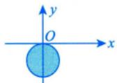

例18.10 设Γ是空间曲线 $\begin{cases}x^{2} + y^{2} + z^{2} = 1, \\x + y + z = 0,\end{cases}$ 则 $\oint_{\Gamma} (x^2 + y^2) \mathrm{d}s =$

分析空间曲线是过原点的平面切球心在原点的单位球面所切出的一个大圆，且x，y，z地位相等，故可以考虑用轮换对称性.后续所有积分，首先考虑用性质进行化简.

解应填 $\frac{4}{3}\pi$

由轮换对称性知 $\oint_{\Gamma} x^{2} \mathrm{d}s = \oint_{\Gamma} y^{2} \mathrm{d}s = \oint_{\Gamma} z^{2} \mathrm{d}s$ ，于是

$$
\begin{aligned} &\oint_{\Gamma} \left( x^{2} + y^{2} \right) \mathrm{d}s = \oint_{\Gamma} x^{2} \mathrm{d}s + \oint_{\Gamma} y^{2} \mathrm{d}s \\= & 2\oint_{\Gamma} x^{2} \mathrm{d}s = \frac{2}{3} \left( \oint_{\Gamma} x^{2} \mathrm{d}s + \oint_{\Gamma} y^{2} \mathrm{d}s + \oint_{\Gamma} z^{2} \mathrm{d}s \right) \\= & \frac{2}{3} \oint_{\Gamma} \left( x^{2} + y^{2} + z^{2} \right) \mathrm{d}s = \frac{2}{3} \oint_{\Gamma} 1 \mathrm{d}s = \frac{2}{3} \times 2\pi \times 1 = \frac{4}{3} \pi .\end{aligned}
$$

(1) $\Omega:x^{2}+y^{2}+z^{2}\leqslant1$ ，不止包括曲面 $x^{2} + y^{2} + z^{2} = 1$ ，还包括曲面内部，即三重积分的积分区域 $\Omega:x^{2}+y^{2}+z^{2}\leqslant1$ 为实心球体.

如果在三重积分中，被积函数里出现 $x^{2} + y^{2} + z^{2}$ ，那么 $\iiint\limits_{\Omega:x^{2}+y^{2}+z^{2}\leq1}\left(x^{2}+y^{2}+z^{2}\right)\mathrm{d}v$ 是不能直接将被积函数代为1的.

(2) $\begin{cases}x^{2} + y^{2} + z^{2} = 1, \\x + y + z = 0,\end{cases}$ 曲线既在单位球面上，又在平面上，即为两个面的交线故曲线、曲面积分的积分区域只有边界线或边界面.

在第一型曲线、曲面积分中，可以将积分曲线或曲面代入被积函数，如本题中(\*)处来自曲线方程 $\begin{cases}x^{2} + y^{2} + z^{2} = 1, \\x + y + z = 0,\end{cases}$ 可直接代入被积函数，从而化简计算.

## 5应用

(1)对于空间光滑曲线Γ，若其由参数式 $\begin{cases}x = x(t), \\y = y(t),   (\alpha \leq t \leq \beta), \\z = z(t)\end{cases}$ 给出，则计算空间曲线的长度(弧长)的公式为

$$
I = \int _ { \alpha } ^ { \beta } \sqrt { \left[ x ^ { \prime } ( t ) \right] ^ { 2 } + \left[ y ^ { \prime } ( t ) \right] ^ { 2 } + \left[ z ^ { \prime } ( t ) \right] ^ { 2 } } \mathrm { d } t .
$$

(2)对于空间光滑曲线L，若线密度为 $\rho(x,   y,   z)$ ，则计算重心(x，y，z)的公式为

$$
\bar { x } = \frac { \int _ { L } x \rho ( x , y , z ) \mathrm { d } s } { \int _ { L } \rho ( x , y , z ) \mathrm { d } s } , \bar { y } = \frac { \int _ { L } y \rho ( x , y , z ) \mathrm { d } s } { \int _ { L } \rho ( x , y , z ) \mathrm { d } s } , \bar { z } = \frac { \int _ { L } z \rho ( x , y , z ) \mathrm { d } s } { \int _ { L } \rho ( x , y , z ) \mathrm { d } s } .
$$

## 注(1)在考研的范畴内，重心就是质心.

(2) 当密度 $\rho(x, y)$ 或者 $\rho(x, y, z)$ 为常数时，重心就成了形心.

(3) 形心公式的逆用.

由 $\bar{x} = \frac{\int_{L} x \mathrm{d}s}{\int_{L} 1 \mathrm{d}s}$ 得 $\int_{L} x \mathrm{d}s = \overline{x} \cdot l$ 其中 $l = \int_{L} 1 \mathrm{d}s$ 为曲线L的长度；

由 $\bar{y} = \frac{\int_{L} y \mathrm{d}s}{\int_{L} 1 \mathrm{d}s}$ 得 $\int_{L} y \mathrm{d}s = \overline{y} \cdot l.$ 其中 $l = \int_{L} 1 \mathrm{d}s$ 为曲线L的长度；

由 $\overline{z} = \frac{\int_{L} z \mathrm{d}s}{\int_{L} 1 \mathrm{d}s}$ 得 $\int_{L} z \mathrm{d}s = \overline{z} \cdot l$ ，其中 $l = \int_{L} 1 \mathrm{d}s$ 为曲线L的长度.

(3)对于光滑曲线L，线密度为 $\rho(x,   y,   z)$ ，则计算该曲线对x轴、y轴、z轴和原点O的转动惯量$I_{x}, I_{y}, I_{z}$ 和 $I _ { o }$ 公式分别为

$$
I _ { x } = \int _ { L } \left( y ^ { 2 } + z ^ { 2 } \right) \rho ( x , y , z ) \mathrm { d } s , I _ { y } = \int _ { L } \left( z ^ { 2 } + x ^ { 2 } \right) \rho ( x , y , z ) \mathrm { d } s ,
$$

$$
I _ { z } = \int _ { L } \left( x ^ { 2 } + y ^ { 2 } \right) \rho ( x , y , z ) \mathrm { d } s , I _ { O } = \int _ { L } \left( x ^ { 2 } + y ^ { 2 } + z ^ { 2 } \right) \rho ( x , y , z ) \mathrm { d } s .
$$

例18.11 设C是曲线 $x^{2}+y^{2}=2(x+y)$ ，则 $\oint_{C} \left( 2x^{2} + 3y^{2} \right) \mathrm{d}s =$

分析将曲线中x与y对调，此时曲线不变，故可以考虑用轮换对称性解题.

解应填 $20\sqrt{2}\pi$

C是圆 $(x - 1)^{2} + (y - 1)^{2} = 2$ ，关于 $y = x$ 对称，由轮换对称性知

$$
\oint _ { C } x ^ { 2 } \mathrm { d } s = \oint _ { C } y ^ { 2 } \mathrm { d } s ,
$$

故

$$
\oint_{C} \left( 2x^{2} + 3y^{2} \right) \mathrm{d}s = \frac{5}{2} \oint_{C} \left( x^{2} + y^{2} \right) \mathrm{d}s = 5 \oint_{C} (x + y) \mathrm{d}s \\= 5 \overline{x} \bullet \underline{l_{C}} + 5 \overline{y} \bullet l_{C} = \underline{10l_{C}} = 20 \sqrt{2} \pi .
$$

## 第一型曲面积分

“从二重积分来，回到二重积分去”

## 1概念

7①分割②近似

设曲面Σ是光滑的，函数 $f(x,   y,   z)$ 在Σ上有界，把Σ任意分成n个小块 $\Delta S_{i} \left( \Delta S_{i} \right)$ 同时也代表第i个小块曲面的面积)，设 $(\xi_{i}, \eta_{i}, \zeta_{i})$ 是 $\Delta S _ { i }$ 上任意取定的一点，作乘积 $f(\xi_{i},\eta_{i},\zeta_{i})\Delta S_{i}(i=1,2,\cdots,n)$ 并作和 $\stackrel{\frown}{\sum_{i = 1}^{n} f(\xi_{i}, \eta_{i}, \zeta_{i}) \Delta S_{i}}$ .如果当各小块曲面的直径的最大值λ趋于零时，该和的极限总存在(与 $\Delta S _ { i }$ →④取极限的分法及 $(\xi_{i}, \eta_{i}, \zeta_{i})$ 的取法均无关)，则称此极限值为函数 $f(x,   y,   z)$ 在曲面Σ上对面积的曲面积分或第一型曲面积分，记作 $\iint _ { \Sigma } f ( x , y , z ) \mathrm { d } S$ ，即

$$
\iint _ { \Sigma } f ( x , y , z ) \mathrm { d } S = \lim _ { \lambda \rightarrow 0 } \sum _ { i = 1 } ^ { n } f ( \xi _ { i } , \eta _ { i } , \zeta _ { i } ) \Delta S _ { i } ,
$$

其中 $f(x,   y,   z)$ 称为被积函数，Σ称为积分曲面.

注(1)第一型曲面积分的物理背景是以 $f(x,y,z)$ 为面密度的空间物质曲面的质量.

(2)把二重积分和第一型曲面积分放在一起作个对比，如图18-11所示.

  
图 18-11

(3)第一型曲面积分是由二重积分变换来的.

## 2 性质

以下均假设Σ为空间有限分片光滑曲面

性质1(求空间曲面的面积) $\iint_{\Sigma} 1   dS = S$ ，其中S为Σ的面积.

性质2(可积函数必有界）设 $f(x,   y,   z)$ 在Σ上可积，则其在Σ上必有界.

性质3(积分的线性性质)设 $k_{1},   k_{2}$ 为常数，则

$$
\iint _ { \Sigma } \left[ k _ { 1 } f ( x , y , z ) \pm k _ { 2 } g ( x , y , z ) \right] \mathrm { d } S = k _ { 1 } \iint _ { \Sigma } f ( x , y , z ) \mathrm { d } S \pm k _ { 2 } \iint _ { \Sigma } g ( x , y , z ) \mathrm { d } S .
$$

性质4(积分的可加性)设 $f(x,   y,   z)$ 在Σ上可积，且 $\Sigma_{1} \cup \Sigma_{2} = \Sigma, \Sigma_{1} \cap \Sigma_{2} = \varnothing$ ，则

$$
\iint _ { \Sigma } f ( x , y , z ) \mathrm { d } S = \iint _ { \Sigma _ { 1 } } f ( x , y , z ) \mathrm { d } S + \iint _ { \Sigma _ { 2 } } f ( x , y , z ) \mathrm { d } S .
$$

性质5(积分的保号性)设 $f(x, y, z), g(x, y, z)$ 在Σ上可积，且在Σ上 $f(x, y, z) \leqslant g(x, y, z)$ 则有

$$
\iint _ { \Sigma } f ( x , y , z ) \mathrm { d } S \leqslant \iint _ { \Sigma } g ( x , y , z ) \mathrm { d } S .
$$

特殊地，有

$$
\left| \iint _ { \Sigma } f ( x , y , z ) \mathrm { d } S \right| \leqslant \iint _ { \Sigma } \left| f ( x , y , z ) \right| \mathrm { d } S .
$$

性质6(第一型曲面积分的估值定理) 设M，m分别是 $f(x,   y,   z)$ 在Σ上的最大值和最小值，S为Σ的面积，则有

$$
m S \leqslant \iint _ { \Sigma } f ( x , y , z ) \mathrm { d } S \leqslant M S .
$$

性质7(第一型曲面积分的中值定理）设 $f(x,   y,   z)$ 在Σ上连续，S为Σ的面积，则在Σ上至少存在一点 $( \xi , \eta , \zeta )$ ，使得

$$
\iint _ { \Sigma } f ( x , y , z ) \mathrm { d } S = f ( \xi , \eta , \zeta ) S .
$$

## ③普通对称性与轮换对称性

分析方法与二重积分、三重积分和第一型曲线积分完全一样.

(1)普通对称性.

假设Σ关于 $x O z$ 面对称，则

$$
\iint _ { \Sigma } f ( x , y , z ) \mathrm { d } S = \left\{ \begin{aligned} 2 \iint _ { \Sigma _ { 1 } } f ( x , y , z ) \mathrm { d } S , \quad f ( x , y , z ) = f ( x , - y , z ) , \\ 0 , \quad f ( x , y , z ) = - f ( x , - y , z ) , \end{aligned} \right.
$$

其中 $\Sigma _ { 1 }$ 是Σ在 $x O z$ 面右边的部分.

关于其他坐标面对称的情况与此类似.

$$
\int_{\frac{\partial S}{\partial S}} \mathrm{d}S = \sqrt{1 + (z_x')^2 + (z_y')^2} \mathrm{d}x\mathrm{d}y
$$

(2) 轮换对称性.

当Σ: $z = z(x, y)$ 为单值函数时，若把x与y对调后，Σ不变，则 $\iint_{\Sigma} f(x, y, z) \mathrm{d}S = \iint_{\Sigma} f(y, x, z) \mathrm{d}S$ 这就是轮换对称性.

关于其他情况与此类似.

## 4 计算

因为第一型曲面积分就是由二重积分推广而来的，所以计算第一型曲面积分的基本方法就是将其化为二重积分.口诀为“一投二代三计算”.

无论空间曲面Σ是由显式 $z = z(x, y)$ 还是隐式 $F(x, y, z) = 0$ 给出的，我们都需要做三件事(无逻辑上的先后顺序，哪件事情最有利于解题就先做哪件）

①一投：将Σ投影到某一平面（比如 $x O y$ 面)上，设投影区域为D（比如 $D _ { _ { x y } } \left) \right.$ i

②二代：将 $z = z(x, y)$ 或 $F(x,   y,   z) = 0$ 代入 $f(x,   y,   z)$

③三计算：计算 $z_{x}^{\prime}, z_{y}^{\prime}$ ，则 $\mathrm{d}S = \sqrt{1 + \left(z_{x}^{\prime}\right)^{2} + \left(z_{y}^{\prime}\right)^{2}} \mathrm{d}x\mathrm{d}y$

这就把第一型曲面积分化成了二重积分(比如化成关于x，y的二重积分)，得到

$$
\iint_{D_{xy}} f(x, y, z) \mathrm{d}S \quad  当  \quad \iint_{D_{xy}} f(x, y, z(x, y)) \mathrm{d}S \quad  当  \quad \iint_{D_{xy}} f(x, y, z(x, y)) \mathrm{d}S \quad  当  \quad \iint_{D_{xy}} f(x, y, z(x, y)) \mathrm{d}S \quad  当  \quad \iint_{D_{xy}} f(x, y, z(x, y)) \mathrm{d}S \quad  当  \quad \iint_{D_{xy}} f(x, y, z(x, y)) \mathrm{d}S \quad  当  \quad \iint_{D_{xy}} f(x, y, z(x, y)) \mathrm{d}S \quad  当  \quad \iint_{D_{xy}} f(x, y, z(x, y)) \mathrm{d}S \quad  当  \quad \iint_{D_{xy}} f(x, y, z(x, y)) \mathrm{d}S \quad  当  \quad \iint_{D_{xy}} f(x, y, z(x, y)) \mathrm{d}S \quad  当  \quad \iint_{D_{xy}} f(x, y, z(x, y)) \mathrm{d}S \quad  当  \quad \iint_{D_{xy}} f(x, y, z(x, y)) \mathrm{d}S \quad  当  \quad \iint_{D_{xy}} f(x, y, z(x, y)) \mathrm{d}S \quad  当  \quad \iint_{D_{xy}} f(x, y, z(x, y)) \mathrm{d}S \quad  当  \quad \iint_{D_{xy}} f(x, y, z(x, y)) \mathrm{d}S \quad  当  \quad \iint_{D_{xy}} f(x, y, z(x, y)) \mathrm{d}S \quad  当  \quad \iint_{D_{xy}} f(x, y, z(x, y)) \mathrm{d}S \quad  当  \quad \iint_{D_{xy}} f(x, y, z(x, y)) \mathrm{d}S \quad  当  \quad \iint_{D_{xy}} f(x, y, z(x, y)) \mathrm{d}S \quad \quad  当  \quad \iint_{D_{xy}} f(x, y, z(x, y)) \mathrm{d}S \quad \quad  当  \quad \iint_{D_{xy}} f(x, y, z(x, y)) \mathrm{d}S \quad \quad  当  \quad \iint_{D_{xy}} f(x, z(x, y)) \mathrm{d}S \quad \quad  当  \quad \iint_{D_{xy}} f(x, z(x, y) \mathrm{d}) \quad \mathrm{d}S \quad \quad \iint_{D_{xy}} f(x, z(x, y) \mathrm{d}) \quad \mathrm{d}S \quad \quad \iint_{D_{xy}} f(x, z(x, y) \mathrm{d}) \quad \mathrm{d}S \quad \quad \iint_{D_{xy}} f(x, z(x, y) \mathrm{d}) \quad \quad \iint_{D_{xy}} f(x, z(x, y) \mathrm{d}} \quad \quad \quad \iint_{D_{xy}} f(x, z(x, y) \quad \mathrm{d} \quad \quad \iint_{D_{xy}} f(x, z) \quad \quad \mathrm{d} \quad \iint_{D_{xy}} f(x, z, z(x, y) \quad \quad \mathrm{d} \quad \quad \mathrm{d}S} f(x, z \quad \quad \quad \mathrm{d} \quad \quad \iint_{D_{xy}} f(x, y, z, z) \quad \quad \quad \mathrm{D} f(x, z \quad \quad \quad \mathrm{D} \quad \quad \mathrm{D} \quad \quad \iint_{D_{xy}} f(x, z, z, z \quad \quad \quad \mathrm{D} \quad \quad \mathrm{D} f(x, z \quad \quad \quad \mathrm{D} \quad \quad \mathrm{D} \quad \quad \mathrm{D} \quad \quad \mathrm{D} \quad \quad \mathrm{D} \quad \quad \quad \mathrm{D} \quad \quad \mathrm{D} \quad \quad \mathrm{D} \quad \quad \mathrm{D} \quad \quad \mathrm{D} \quad \quad \mathrm{D} \quad \quad \quad \mathrm{D} \quad 
$$

化成关于其他变量的二重积分与此类似

注(1)这里有一点需要特别强调，将Σ投影到哪个平面上由你自己决定，但是Σ上的任何两点的投影点不能重合，换言之，假如要将Σ投向 $x O y$ 面，则 $z = z(x, y)$ 必须是单值函数.忘记了这一点，就可能算错结果.

如果将Σ投向某一平面，但是曲面投影后有重合点，且对称性不能使用时，则

①要么将Σ转投向另一个平面，使得曲面投影后无重合点；

②要么将Σ分成若干曲面 $\Sigma_{1}, \Sigma_{2}, \cdots$ ，使得这些曲面各自投影后无重合点.

(2)曲面拆分方法（即求拆分曲线的方法)：若将Σ投向xOy面时有重合点，取曲面拆分曲线上一点 $P(x, y, z)$ ，记该点的切平面的法向量为n，则法向量n与z轴垂直，即法向量n与(0,0,1)垂直，即可得到拆分曲线的轨迹方程.

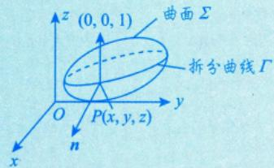

例18.12求 $\iint\limits_{\Sigma} z \mathrm{d}S$ ，其中Σ为柱面 $x^{2}+y^{2}=R^{2}(R>0)$ 被 $x = 0, \; y = 0, \; z = 0$ 及z=1所截得的第一卦限部分，如图18-12所示.

分析投影点不可重合，故可向 $x O z$ 面投（向左投）.

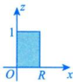

解选择向xOz面投影，由曲面方程得

$$
y=\sqrt{R^{2}-x^{2}}, \quad \mathrm{d}S=\sqrt{1+(y_{x}^{\prime})^{2}+(y_{z}^{\prime})^{2}}\mathrm{d}x\mathrm{d}z
$$

$$
\sqrt{1+\frac{x^{2}}{R^{2}-x^{2}}}=\sqrt{\frac{R^{2}}{R^{2}-x^{2}}}=\sqrt{1+\left(\frac{-2x}{2\sqrt{R^{2}-x^{2}}}\right)^{2}+0^{2}}\mathrm{d}x\mathrm{d}z
$$

  
图 18-12

故 $\iint_{\Sigma} z \mathrm{d}S = \iint_{D_{xy}} \frac{Rz}{\sqrt{R^2 - x^2}} \mathrm{d}x \mathrm{d}z$ ，其中 $D_{xz} = \left\{ (x, z) \mid 0 \leqslant x \leqslant R, 0 \leqslant z \leqslant 1 \right\}$ ，即

$$
\iint_{\Sigma} z \mathrm{d}S = R \int_{0}^{R} \mathrm{d}x \int_{0}^{1} \frac{z}{\sqrt{R^2 - x^2}} \mathrm{d}z = \frac{\pi}{4} R \cdot \int_{0}^{R} \frac{1}{\sqrt{R^2 - x^2}} \mathrm{d}x \int_{0}^{1} z \mathrm{d}z = \arcsin \frac{x}{R} \left|_{0}^{R} \cdot \frac{1}{2} z^2 \right|_{0}^{R} = \frac{\pi}{2} \cdot \frac{1}{2} = \frac{\pi}{4}
$$

注(1)由于Σ在xOy面上的投影仅为一条曲线，若选择向 $x O y$ 面投影，则投影区域的面积为0，于是 $\iint_{\Sigma} z \mathrm{d}S = 0$ .这是错误的，因为投影点不能重合

(2) 以下常考：

①柱面 $x^{2} + y^{2} = a^{2}$ 的 $\mathrm{d}S = \frac{a}{\sqrt{a^{2} - x^{2}}} \mathrm{d}x\mathrm{d}z.$ .比如 $x^{2} + y^{2} = 2$ ，则 $\mathrm{d}S = \frac{\sqrt{2}}{\sqrt{2 - x^{2}}}\mathrm{d}x\mathrm{d}z.$

②球面 $x^{2}+y^{2}+z^{2}=a^{2}$ 的 $\mathrm{d}S = \frac{a}{\sqrt{a^{2} - x^{2} - y^{2}}}\mathrm{d}x\mathrm{d}y$

③锥面 $z = \sqrt{x^{2} + y^{2}}$ 的 $\mathrm{d}S = \sqrt{2} \mathrm{d}x \mathrm{d}y$

例18.13 设Σ为椭球面 $\frac{x^{2}}{2}+\frac{y^{2}}{2}+z^{2}=1$ 的上半部分，点 $P(x, y, z) \in \Sigma$ ，π为Σ在点P处的切平面， $\rho(x, y, z)$ 为点O(0,0,0)到平面π的距离，求 $\iint _ { \Sigma } \frac { z } { \rho ( x , y , z ) } \mathrm { d } S$

分析 ①求 $\rho(x,   y,   z)$ ；②代入 $\iint \limits _ { \Sigma } \frac { z } { \rho } \mathrm { d } S$

解设(X，Y，Z)为π上任意一点，则π的方程为

$$
\frac{x X}{2} + \frac{y Y}{2} + z Z = 1 ,
$$

由第17讲的 $ \text{" } \Rightarrow \text{、 } 2.(1) \text{" }$ ，令 $F(x, y, z) =$ $\frac{x^{2}}{2}+\frac{y^{2}}{2}+z^{2}-1$ ，则 $F_{x}^{\prime}=x,\;F_{y}^{\prime}=y,\;F_{z}^{\prime}=2z$ ，故π的法向量为(x，y，2z).π的方程为 $x(X - x) +$ $y(Y - y) + 2z(Z - z) = 0$ ，又因为 $P(x, y, z) \in \Sigma$ 所 $\therefore \frac{x^{2}}{2}+\frac{y^{2}}{2}+z^{2}=1$ ，代入π的方程化简可得

$$
\frac{xX}{2} + \frac{yY}{2} + zZ = 1
$$

从而知

由

$$
\rho(x, y, z)=\frac{\left|0+0+0-1\right|}{\sqrt{\left(\frac{x}{2}\right)^{2}+\left(\frac{y}{2}\right)^{2}+z^{2}}}=\left(\frac{x^{2}}{4}+\frac{y^{2}}{4}+z^{2}\right)^{-\frac{1}{2}} .
$$

，把z换了，得 $\rho = \left( 1 - \frac{x^{2}}{4} - \frac{y^{2}}{4} \right)^{-\frac{1}{2}}$

有

$$
\frac{\partial z}{\partial x} = \frac{- x}{2\sqrt{1 - \left( \frac{x^{2}}{2} + \frac{y^{2}}{2} \right)}}, \quad \frac{\partial z}{\partial y} = \frac{- y}{2\sqrt{1 - \left( \frac{x^{2}}{2} + \frac{y^{2}}{2} \right)}}
$$

于是

$$
\begin{aligned}\mathrm{d}S = & \sqrt{1 + \left(\frac{\partial z}{\partial x}\right)^2 + \left(\frac{\partial z}{\partial y}\right)^2} \mathrm{d}\sigma = \sqrt{1 + \frac{x^2}{4\left(1 - \frac{x^2}{2} - \frac{y^2}{2}\right)} + \frac{y^2}{4\left(1 - \frac{x^2}{2} - \frac{y^2}{2}\right)}} \mathrm{d}\sigma \\= & \sqrt{\frac{4 - 2x^2 - 2y^2 + x^2 + y^2}{4\left(1 - \frac{x^2}{2} - \frac{y^2}{2}\right)}} \mathrm{d}\sigma = \frac{\sqrt{4 - x^2 - y^2}}{2\sqrt{1 - \left(\frac{x^2}{2} + \frac{y^2}{2}\right)}} \mathrm{d}\sigma = \sqrt{3}\end{aligned}
$$

所以

$$
\iint _ { \Sigma } \frac { z \mathrm { d } S } { \rho ( x , y , z ) } = \frac { 1 } { 4 } \iint _ { D _ { \mathrm { d } } } \left( 4 - x ^ { 2 } - y ^ { 2 } \right) \mathrm { d } \sigma = \frac { 1 } { 4 } \int _ { 0 } ^ { 2 \pi } \mathrm { d } \theta \int _ { 0 } ^ { \sqrt { 2 } } \left( 4 - r ^ { 2 } \right) r \mathrm { d } r = \frac { 3 } { 2 } \pi ,
$$

其中 $D_{xy} = \left\{ (x, y) \middle| x^2 + y^2 \leq 2 \right\}$

三重积分：形心最重要，应用 →第一型曲面积分：曲面面积最重要

(1)对于光滑曲面薄片 $\boldsymbol { \varSigma }$ ，若Σ由单值函数 $z = z(x, y)$ 给出， $D_{xy}$ 为曲面Σ在 $x O y$ 面上的投影区域，则其面积

$$
\iint _ { D _ { x y } } \sqrt { 1 + \left( z _ { x } ^ { \prime } \right) ^ { 2 } + \left( z _ { y } ^ { \prime } \right) ^ { 2 } } \mathrm { d } x \mathrm { d } y .
$$

注同理，在同样保证单值函数的情况下，可向另外两个坐标面投影，得

$$
\iint _ { D _ { y z } } \sqrt { 1 + \left( x _ { y } ^ { \prime } \right) ^ { 2 } + \left( x _ { z } ^ { \prime } \right) ^ { 2 } } \mathrm { d } y \mathrm { d } z ,
$$

其中 $\Sigma: x = x(y, z), D_{yz}$ 是曲面在 $y O z$ 面上的投影区域；

$$
\iint _ { D _ { \mathrm { m } } } \sqrt { 1 + \left( y _ { z } ^ { \prime } \right) ^ { 2 } + \left( y _ { x } ^ { \prime } \right) ^ { 2 } } \mathrm { d } z \mathrm { d } x ,
$$

其中Σ: $y = y(x, z), D_{zx}$ 是曲面在 $z O x$ 面上的投影区域.

事实上，曲面面积就是当第一型曲面积分的被积函数是1时，用投影法所得出的积分，请大家注意这个联系.

(2) 对于光滑曲面薄片 $\boldsymbol { \varSigma }$ ，若面密度为 $\rho(x,   y,   z)$ ，则计算重心(x，y，z)的公式为

$$
\begin{aligned}\iint_{\Sigma} x\rho(x, y, z) \mathrm{d}S \quad & \iint_{\Sigma} y\rho(x, y, z) \mathrm{d}S \quad & \iint_{\Sigma} z\rho(x, y, z) \mathrm{d}S \quad & \iint_{\Sigma} z\rho(x, y, z) \mathrm{d}S \quad & \iint_{\Sigma} z\rho(x, y, z) \mathrm{d}S \quad & \iint_{\Sigma} z\rho(x, y, z) \mathrm{d}S \quad & \int_{\Sigma} z\rho(x, y, z) \mathrm{d}S \quad & \int_{\Sigma} z\rho(x, y, z) \mathrm{d}S \quad & \int_{\Sigma} z\rho(x, y, z) \mathrm{d}S\end{aligned}
$$

注(1)在考研的范畴内，重心就是质心.

(2) 当密度 $\rho(x, y)$ 或者 $\rho(x, y, z)$ 为常数时，重心就成了形心.

(3) 形心公式的逆用.

由 $\frac{\iint_{\Sigma} x \mathrm{d}S}{\iint_{\Sigma} 1 \mathrm{d}S}$ 得 $\iint_{\Sigma} x \mathrm{d}S = \overline{x} \cdot A$ ，其中 $A = \iint_{\Sigma} 1 \mathrm{d}S$ 为曲面Σ的面积；

由 $\overline{y} = \frac{\iint\limits_{\Sigma} y \mathrm{d}S}{\iint\limits_{\Sigma} 1 \mathrm{d}S}$ 得 $\iint _ { \Sigma } y \mathrm{d} S = \overline{y} \cdot A$ ，其中 $A = \iint_{\Sigma} 1 \mathrm{d}S$ 为曲面Σ的面积；

由 $\overline{z} = \frac{\iint\limits_{\Sigma} z \mathrm{d}S}{\iint\limits_{\Sigma} 1 \mathrm{d}S}$ 得 $\iint_{\Sigma} z \mathrm{d}S = \overline{z} \bullet A$ 其中 $A = \iint_{\Sigma} 1 \mathrm{d}S$ 为曲面Σ的面积.

(3)对于光滑曲面薄片Σ，若面密度为 $\rho(x,   y,   z)$ ，则计算该薄片对x轴、y轴、z轴和原点O的转动惯量 $I_{x}, I_{y}, I_{z}$ 和 $I _ { o }$ 的公式分别为

$$
I _ { x } = \iint _ { \Sigma } ( y ^ { 2 } + z ^ { 2 } ) \rho ( x , y , z ) \mathrm { d } S , I _ { y } = \iint _ { \Sigma } ( z ^ { 2 } + x ^ { 2 } ) \rho ( x , y , z ) \mathrm { d } S ,
$$

$$
I _ { z } = \iint _ { \Sigma } \left( x ^ { 2 } + y ^ { 2 } \right) \rho ( x , y , z ) \mathrm { d } S , I _ { 0 } = \iint _ { \Sigma } \left( x ^ { 2 } + y ^ { 2 } + z ^ { 2 } \right) \rho ( x , y , z ) \mathrm { d } S .
$$

例18.14 设薄片形物体Σ是圆锥面 $z = \sqrt{x^{2} + y^{2}}$ 被柱面 $z^{2} = 2x$ 截下的有限部分，其上任一点的密度为 $\mu(x, y, z) = 9\sqrt{x^{2} + y^{2} + z^{2}}$ .记圆锥面与柱面的交线为C.

(1) 求C在 $x O y$ 平面上的投影曲线的方程；

(2) 求Σ的质量M.

分析(1)联立锥面与柱面，得到交线C，将其投影到xOy $x O y$ 面，也就是消去交线中的z，且让其与 $x O y$ 面（即平面z=0）联立.

(2) Σ的质量 $M = \iint_{\Sigma} \mathrm{d}m = \iint_{\Sigma} \mu \mathrm{d}S$ 面密度

解（1)如图18-13所示，圆锥面与柱面的交线C的方程为 $\begin{cases}z = \sqrt{x^{2} + y^{2}}, \\z^{2} = 2x,\end{cases}$ 消去z，得C在xOy平面

的投影柱面为 $x^{2} + y^{2} = 2x$ ，故所求投影曲线的方程为 $\begin{cases}x^{2} + y^{2} = 2x, \\z = 0.\end{cases}$

(2) 因为 Σ的点密度为 $\mu(x, y, z) = 9\sqrt{x^{2} + y^{2} + z^{2}}$ ，所以Σ的质量为

“代”曲面方程 $z = \sqrt{x^{2} + y^{2}}$ M =∬∫9√x² +y² +z² dS . √2dxdy,见例18.12 Σ 中注(2)③

图 18-13

又Σ在 $x O y$ 面上的投影区域为 $D_{xy} = \left\{ (x, y) \mid x^2 + y^2 \leqslant 2x \right\}$ ，所以

$$
\begin{aligned}M = & 9\iint_{D_{xy}}\sqrt{2\left( x^{2} + y^{2} \right)}\sqrt{1 + \left( \frac{x}{\sqrt{x^{2} + y^{2}}} \right)^{2} + \left( \frac{y}{\sqrt{x^{2} + y^{2}}} \right)^{2}}\ dx\ dy \\= & 18\iint_{D_{xy}}\sqrt{x^{2} + y^{2}}\ dx\ dy = 18\int_{-\frac{\pi}{2}}^{\frac{\pi}{2}}\mathrm{d}\theta\int_{0}^{2\cos\theta}r \cdot r\ dr \\= & 48\int_{-\frac{\pi}{2}}^{\frac{\pi}{2}}\cos^{3}\theta\mathrm{d}\theta = 96\int_{0}^{\frac{\pi}{2}}\cos^{3}\theta\mathrm{d}\theta = 64 .\end{aligned}
$$

## 变力沿曲线做功

在一个向量场——变力场中，设某质点在变力 $\boldsymbol{F}(x, y) = \boldsymbol{P}(x, y)\boldsymbol{i} + \boldsymbol{Q}(x, y)\boldsymbol{j}$ 作用下，沿着有向曲线L从起点A移动到终点B，总共做了多少功？（这个物理背景请大家熟记，考研中出现过基于这种背景的考题.)

设沿着有向曲线L在 $M(x,   y)$ 点移动了一个微位移$\mathrm{d}s = \mathrm{d}xi + \mathrm{d}yj$ ，将变力 $F(x,   y)$ 近似看作常力，则力在此微位移上的微功 $\mathrm{d}W = F(x, y) \cdot \mathrm{d}s$ ，于是变力 $F(x,   y)$ 沿着有向曲线L从起点A移动到终点B所做的总功为

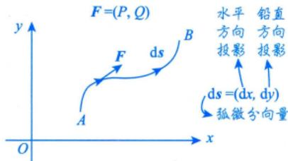

$$
\begin{aligned}W = & \int_{L} \mathrm{d}W = \int_{L} \boldsymbol{F}(x, y) \cdot \mathrm{d}s = \int_{L} (P(x, y), Q(x, y)) \cdot (\mathrm{d}x, \mathrm{d}y) \\= & \int_{L} \underbrace{\overbrace{P(x, y) \mathrm{d}x}_{ 个 } + \underbrace{Q(x, y) \mathrm{d}y}_{ 个 }}_{ 必平方向 } = \int_{L} P \mathrm{d}x + \int_{L} Q \mathrm{d}y,\end{aligned}
$$

于是我们就引出了第二型曲线积分的概念

## ②概念

第二型曲线积分的被积函数 $\boldsymbol{F}(x, y)=\boldsymbol{P}(x, y)\boldsymbol{i}+\boldsymbol{Q}(x, y)\boldsymbol{j}$ 定义在平面有向曲线L上，其物理背景是变力 $F(x,   y)$ 在平面曲线L上从起点移动到终点所做的总功：

$$
\int _ { L } P ( x , y ) \mathrm { d } x + Q ( x , y ) \mathrm { d } y .
$$

由此可以看出，前面所学的定积分、二重积分、三重积分、第一型曲线积分和第一型曲面积分有着完全一致的背景，都是一个数量函数在定义区域上计算几何量(面积、体积等)，但是第二型曲线积分与之不同，它是一个向量函数沿有向曲线的积分(无几何量可言).于是，有些性质和计算方法都不一样了，一定要加以对比，理解它们的区别和联系，不要用错或者用混了.

$$
\int _ { L } F \mathrm { d } s
$$

## ③ 性质

以下总假设Γ为空间有限长分段光滑曲线.

性质1(积分的线性性质) 设 $k _ { 1 } ,   k _ { 2 }$ 为常数，则 $\int _ { \Gamma } \left( k _ { 1 } \boldsymbol { F } _ { 1 } \pm k _ { 2 } \boldsymbol { F } _ { 2 } \right) \cdot \mathrm { d } \boldsymbol { s } = k _ { 1 } \int _ { \Gamma } \boldsymbol { F } _ { 1 } \cdot \mathrm { d } \boldsymbol { s } \pm k _ { 2 } \int _ { \Gamma } \boldsymbol { F } _ { 2 } \cdot \mathrm { d } \boldsymbol { s }$ V  
性质2(积分的有向性) $\int _ { \widehat { A B } } \boldsymbol { F } \cdot \mathrm { d } \boldsymbol { s } = - \int _ { \widehat { B A } } \boldsymbol { F } \cdot \mathrm { d } \boldsymbol { s }$ 两个力的线性组合

性质3(积分的可加性)当 $\widehat{AC} = \widehat{AB} + \widehat{BC}$ 时， $\int _ { \widehat { A C } } \boldsymbol { F } \cdot \mathrm { d } \boldsymbol { s } = \int _ { \widehat { A B } } \boldsymbol { F } \cdot \mathrm { d } \boldsymbol { s } + \int _ { \widehat { B C } } \boldsymbol { F } \cdot \mathrm { d } \boldsymbol { s }$

→物理背景下

## 注第二型曲线积分的“对称性”

若L为从起点A到终点B的有向曲线，如图18-14(a)所示.由于L是有向曲线，故它并不关于y轴对称.如图 18-14(a) 中的点(x， y)处的ds 与点(-x， y)处的ds并不对称.细致看来，将两处的ds作水平、垂直分解，就会发现，两处的dx同向，均为dxi；dy反向，分别为dyj与-dyj.此时，若有力$F = x^{2}y^{2}$ 沿L做功，则两处的功的微元分别为 $x^{2}y\mathrm{d}y  与  -x^{2}y\mathrm{d}y$ ，加起来即为零，故 $\int_{L} x^{2} y \mathrm{d}y = 0$ .这与数量积分（如第一型曲线积分）完全不同.因为若 $f(x,y)=x^{2}y,L$ 是如图 18-14(b) 所示的关于y轴对称的曲线，则 $\int_{L} f(x, y)   ds = \int_{L} x^{2} y   ds = 2 \int_{L_{1}} x^{2} y   ds.$ 究其原因，数量积分的对称性是基于几何背景的，而向量积分（第二型曲线、曲面积分）没有几何背景，它们是物理问题的数学表达，多了“方向”这个重要因素.所以严格来讲，第二型曲线、曲面积分没有几何上的对称性，而是“在物理概念的基础上，得出数学表达式并确定好方向后，在数量大小上看是否相等”.记住上面这段话，就可以很好地解决问题了.

  
图 18-14

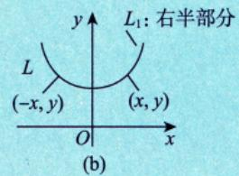

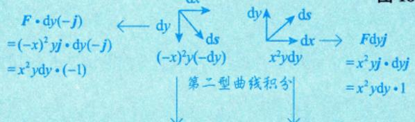  
第一型曲线积分可讨论对称性

①dx方向上，在有物理背景情况下，有向曲线在空间位置（或平  
面位置）上对称的点处，两段水平位移是一致的，都是dxi：AC段：方向朝下↓，且位移为dy(-j)，  
②dy方向上，CB段：方向朝上↑，且位移为dy·j

## 4计算

(1)基本方法——化为定积分.(仅多了一个有向性) 不管α，β的大小关系，与第一型曲线积分不同

→要求 $\alpha \leqslant t \leqslant \beta$ 如果平面有向曲线L由参数方程 $\begin{cases}x = x(t), \\y = y(t)\end{cases}(t: \alpha \to \beta)$ 给出，其中t=α对应着起点A,t=β对应着终点B，则可以将平面第二型曲线积分化为定积分.如

$$
\int_{\frac{\left | x \right | }{\left | x \right | }} P(x, y) \mathrm{d}x
$$

这里的 $\alpha , \beta$ 谁大谁小无关紧要，关键是分别与起点和终点对应.

如果L由方程 $y = y(x)(x : a \to b)$ 给出，可以看作参数方程 $\begin{cases}x = x; \\y = y(x).\end{cases}$ 于是有

$$
\begin{aligned}&\int_{L} P(x, y) \mathrm{d}x + Q(x, y) \mathrm{d}y \\=& \int_{\underline{a}}^{\overline{b}} \{P[x, y(x)] + Q[x, y(x)] y'(x)\} \mathrm{d}x . \\&  今不管火小 , 乙管对应 \end{aligned}
$$

注如果你理解了上面的注释，则也可这样处理：

$$
\int_{\frac{b}{a}\frac{\mathrm{d}x}{\frac{\mathrm{d}x}{\mathrm{d}x}}\frac{\mathrm{d}y}{\frac{\mathrm{d}y}{\mathrm{d}x}}}^{\frac{b}{a}\frac{\mathrm{d}x}{\frac{\mathrm{d}x}{\mathrm{d}x}}\rightarrow\frac{b}{b}} \quad \frac{\int_{L} P(x, y) \mathrm{d}x}{\frac{b}{a}\frac{\mathrm{d}x}{\frac{\mathrm{d}x}{\mathrm{d}x}}} = \int_{\max\{a, b\}}^{\max\{a, b\}} P[x, y(x)] \frac{\mathrm{d}x}{\mathrm{d}x}
$$

其中，当 $a < b$ 时，取+dx；当 $a > b$ 时，取-dx.

★ 例18.15 设D是由曲线L： $\begin{cases}x = \cos^{3}t, (0 \leqslant t \leqslant 2\pi), \\y = \sin^{3}t\end{cases}$ 与x轴所围平面有界闭区域在第一、二象限的部分，∂D为其边界，取逆时针方向，计算 $\oint_{\partial D} |x|   dy + |y|   dx$ 水平力

分析从物理背景出发，在边界线上做功，分为3段进行处理，其中力

$$
\boldsymbol{F}=\left|y\right|\boldsymbol{i}+\left|x\right|\boldsymbol{j}
$$

有心无力有力无心

解 如图18-15所示，对于曲线 $L _ { 1 } , L _ { 2 }$ ，在水平方向上，由于点(x，y)和点(-x，y)处的功的微元均为 $|y|(-\mathrm{d}x)$ ，则$y(-\mathrm{d}x)+y(-\mathrm{d}x)=-2y\mathrm{d}x$ ，在铅直方向上，功的微元分别为 $|x| \mathrm{d}y$ 与$|x|(-\mathrm{d}y)$ ，则 $|x|\mathrm{d}y + |x|(-\mathrm{d}y) = 0$ .对于曲线 $L_{3}:y=0,x  从  -1 \to 1$ 于是 $\int _ { L _ { 3 } } \left| x \right| \mathrm{d} y + \left| y \right| \mathrm{d} x = 0$ .故

  
图 18-15

$$
\begin{aligned}\oint_{L_{1}+L_{2}} |x| \mathrm{d}y + |y| \mathrm{d}x &= \oint_{L_{1}+L_{2}+L_{3}} |x| \mathrm{d}y + |y| \mathrm{d}x = \oint_{L_{1}+L_{2}} |x| \mathrm{d}y + |y| \mathrm{d}x \\= -\int_{L_{1}+L_{2}} |x| \mathrm{d}x &= -\int_{L_{1}+L_{2}} |y| \mathrm{d}x = -\int_{0}^{\frac{\pi}{2}} 2y \mathrm{d}x = -\int_{0}^{\frac{\pi}{2}} 2z \sin^{3} t \mathrm{d}(\cos^{3} t) \\= -\int_{L_{1}+L_{2}} |x| \mathrm{d}x &= -2 \int_{0}^{\frac{\pi}{2}} \sin^{3} t \cdot 3 \cos^{2} t (-\sin t) \mathrm{d}t \quad  故  \int_{L_{1}+L_{2}} |x| \mathrm{d}y = |x| \mathrm{d}y \cdot (-1) \\= -2 \int_{0}^{\frac{\pi}{2}} \sin^{3} t \cdot 3 \cos^{2} t (-\sin t) \mathrm{d}t &= -2 \int_{0}^{\frac{\pi}{2}} \sin^{3} t \cdot 3 \cos^{2} t (-\sin t) \mathrm{d}t\end{aligned}
$$

$$
\begin{aligned}= & - 6\int_{0}^{\frac{\pi}{2}}\sin^{4}t(1 - \sin^{2}t)\ dt \\= & - 6 \times \left( \frac{3}{4} \times \frac{1}{2} \times \frac{\pi}{2} - \frac{5}{6} \times \frac{3}{4} \times \frac{1}{2} \times \frac{\pi}{2} \right) = - \frac{3}{16}\pi .\end{aligned}
$$

例18.16 在过点O(0,0)和A(π，0)的曲线族 $y = a \sin x (a > 0)$ 中，求一条曲线L，使沿该曲线y从O到A的积分 $\int_{L} \left( 1 + y^{3} \right) \mathrm{d}x + \left( 2x + y \right) \mathrm{d}y$ 的值最小. y=asin x

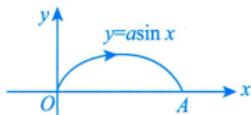

分析先将a当作常数代入积分中，利用参数法，令 $\begin{cases}x = x, \\y = a \sin x,\end{cases}$ 再将a当作变量，利用导数为零求得a. 0| A

解

$$
I(a)=\int_{0}^{\pi}\left[1+\frac{a^{3}\sin^{3}x+(2x+a\sin x)}{a\sin x}a\cos x\right]dx=\pi-4a+\frac{4}{3}a^{3}
$$

令 $I^{\prime}(a) = 4(a^{2} - 1) = 0$ ，得 $a = 1 (a = - 1$ 舍去)，且a=1是I(a)在(0，+∞)内的唯一驻点.

又因为 $I^{\prime\prime}(1) = 8 > 0$ ，所以I(a)在a=1处取到最小值.因此所求曲线是

验证

$$
y = \sin x (0 \leqslant x \leqslant \pi)
$$

注本题是一道小的综合题，主要考查平面第二型曲线积分的基本方法（化为定积分)及一元函数的最值.

总结从近几年考查的题型来看，例18.15这种类型的题目比较容易出解答题，且具有一定区分度；例18.16这类综合题反而不是很难，更可能出选择题.

第二型曲线积分（边界）★★★(2)格林公式.→化为→二重积分（内部）

$$
 理论意义:类似  $\int _ { a } ^ { b } f ( x ) \mathrm { d } x = F ( x ) \big | _ { a } ^ { b }$ ,  把一个区  , 问内部要解决崎问题豁换到端点上去 .
$$

设平面有界闭区域D由分段光滑曲线L围成， $P(x,   y),   Q(x,   y)$ 在D上具有一阶连续偏导数，L取正向，则 ①曲线封闭 ②③

$$
\frac{\oint_{L} P(x, y) \mathrm{d}x + Q(x, y) \mathrm{d}y = \iint_{D} \left( \frac{\partial Q}{\partial x} - \frac{\partial P}{\partial y} \right) \mathrm{d}\sigma}{\int_{L} \frac{\partial}{\partial x} \mathrm{d}y \mathrm{d}z - \int_{D} \frac{\partial}{\partial y} \mathrm{d}z}
$$

伟大的数学家格林花了七天七夜闭关修炼，创立了格林公式，他出关的时候他的朋友挖苦他：你这个书呆子，七天七夜不和人讲话，你怎么耐得住寂寞？格林轻轻回了一句：我根本没有寂寞。何来寂寞可耐？

这个故事送给各位考研的同学，考研需要闭关修炼，闭关修炼的时候你怎么耐得住寂寞？以伟大的数学家格林为榜样——我没有寂寞，何来寂寞可耐！

注所谓L取正向，是指当一个人沿着L的这个方向前进时，左手始终在L所围成的区域D内，如图18-16所示.试想一下：假如你在学校的环形操场上跑步，你的左手始终在草坪中，说明你跑的方向是正向.

  
图 18-16

①曲线封闭且无奇点在其内部，直接用格林公式.

>没有破坏一阶偏导连续这一条件的点

若给的是封闭曲线的曲线积分 $\oint_{L} P \mathrm{d}x + Q \mathrm{d}y$ ，可以验算P和Q是否满足“在该封闭曲线所包围的②区域D内，P和Q具有一阶连续偏导数”，若满足，则可用格林公式

$$
\oint_{L} P \mathrm{d}x + Q \mathrm{d}y = \iint_{D} \left( \frac{\partial Q}{\partial x} - \frac{\partial P}{\partial y} \right) \mathrm{d}\sigma.
$$

计算.这里要求L为D的边界，且正向

边界 反方向例18.17 设质点在力 $\boldsymbol{F}=\left|-x^{2} y\right| \boldsymbol{i}+\left|x y^{2}\right|$ j作用下沿圆周 $\left| x^{2} + y^{2} = 1 \right|$ 的顺时针方向运动一周，则F所做的功 W =

分析求做功即计算第二型曲线积分，恰好此题也满足格林公式的三个条件，故直接利用格林公式解题即可. 此处不能什 $x^{2} + y^{2} = 1$ ，你代入了吗？如果代

解应填 $-\frac{1}{2}\pi$

了，立即推：复习到两点！

设曲线 $C:x^{2}+y^{2}=1$ 围成的区域为D，则

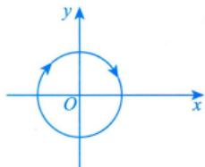  
顺时针做功，添负号即可

$$
W = \oint_{C} (-x^2 y) \mathrm{d}x + xy^2 \mathrm{d}y = - \iint_{D} \left( \frac{y^2 + x^2}{2} \right) \mathrm{d}x \mathrm{d}y = - \int_{0}^{2\pi} \mathrm{d}\theta \int_{0}^{1} r^3 \mathrm{d}r = - \frac{\pi}{2}
$$

②非封闭曲线且 $\frac{\partial Q}{\partial x} \neq \frac{\partial P}{\partial y}$ ，可补线使其封闭(加线减线).

如果不是封闭曲线的曲线积分，可以考虑补一条线 $C _ { B A }$ ，使 $L_{AB} + C_{BA}$ 构成一封闭曲线，并且使其包围的区域为一单连通区域D，在D上P(x，y)和Q(x，y)具有一阶连续偏导数，则有

$$
\begin{aligned}\int_{L_{AB}} P \mathrm{d}x + Q \mathrm{d}y = & \int_{L_{AB}} P \mathrm{d}x + Q \mathrm{d}y + \int_{C_{BA}} P \mathrm{d}x + Q \mathrm{d}y - \int_{C_{BA}} P \mathrm{d}x + Q \mathrm{d}y, \\ 抬林公式  \quad & \left[ \oint_{L} P \mathrm{d}x + Q \mathrm{d}y \right] - \int_{C_{BA}} P \mathrm{d}x + Q \mathrm{d}y \\= & \pm \iint_{D} \left( \frac{\partial Q}{\partial x} - \frac{\partial P}{\partial y} \right) \mathrm{d}\sigma + \int_{C_{AB}} P \mathrm{d}x + Q \mathrm{d}y,\end{aligned}
$$

其中 $L = L_{AB} + C_{BA}$ ，公式中的“±”号由L的方向而定.若L为正向则取正号，若L为负向则取负号. $C_{AB}$ 为 $C _ { B A }$ 的反向弧.如果上式右边的二重积分和 $\int_{C_{AB}}$ 容易计算的话，那么就可利用上述转换方法计算原积分 $\int _ { L _ { A B } }$

例18.18 已知L是第一象限中从点(0,0)沿圆周 $x^{2} + y^{2} = 2x$ 到点(2，0)，再沿圆周 $x^{2} + y^{2} = 4$ 到点(0,2)的曲线段，计算曲线积分 $\int_{L} 3x^{2} y   dx + (x^{3} + x - 2y)   dy$

解 如图18-17所示，取有向线段 $L _ { 1 }$ 的方程为x=0，起点(0，2)，终点(0，0).由L与 $L _ { 1 }$ 围成的平面区域记为D，于是有

$$
I = \oint_{L}^{}3x^{2}y\mathrm{d}x + (x^{3} + x - 2y)\mathrm{d}y = \iint_{L + L_{1}}^{}3x^{2}y\mathrm{d}x + (x^{3} + x - 2y)\mathrm{d}y - \iint_{L_{1}}^{}3x^{2}y\mathrm{d}x + (x^{3} + x - 2y)\mathrm{d}y,
$$

根据格林公式，得

补的线一般为规则曲线

  
图 18-17

又

所以

$$
I = \frac{\pi}{2} - 4
$$

恒等—无旋场，做功与路径无关

③曲线封闭但有奇点在其内部，且除奇点外 $\left| \frac{\partial Q}{\partial x} = \frac{\partial P}{\partial y} \right|$ ，则换路径.(一般令分母等于常数作为路径，$\frac { \partial \mathcal { Q } } { \partial x } - \frac { \partial P } { \partial y } .$ 为二维平面上的旋度(最大的旋转度量）路径的起点和终点无须与原路径重合.)

若给的是封闭曲线的曲线积分 $\oint_{L} P \mathrm{d}x + Q$ dy，满足条件“在D内除了奇点外，P和Q具有一阶连续偏导数，并且除奇点外，均有 $\frac{\partial Q}{\partial x} = \frac{\partial P}{\partial y}$ ，则可以换一条封闭曲线 $L _ { 1 }$ 代替L，它全在D内，并能将奇点包含在 $L _ { 1 }$ 的内部. 则有公式

$$
\oint_{L} P \mathrm{d}x + Q \mathrm{d}y = \oint_{L_{1}} P \mathrm{d}x + Q \mathrm{d}y .
$$

这里要求 $L _ { 1 }$ 与L的方向相同.如果后者容易计算，就可达到目的.

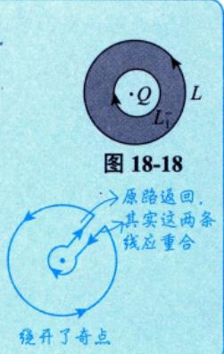

注(\*)处得来过程如图 18-18 所示，若 L所围区域D 内有奇点 Q，则用 $L _ { 1 }$ “挖去”它，并记挖去奇点后的阴影区域为D'，于是 负负得正

$$
\begin{aligned}&\oint_{L} P \mathrm{d}x + Q \mathrm{d}y = \oint_{L+L_{1}} P \mathrm{d}x + Q \mathrm{d}y - \oint_{L_{1}} P \mathrm{d}x + Q \mathrm{d}y \\=& \iint_{D} \left( \frac{\partial Q}{\partial x} - \frac{\partial P}{\partial y} \right) \mathrm{d}\sigma + \oint_{L_{1}} P \mathrm{d}x + Q \mathrm{d}y \quad \begin{aligned}& 在边界依上做功换必要  \\& 面齿依  L_{1} 上做功.对于  \\&L_{1},  一般令令导  = \varepsilon\end{aligned} \\=& \oint_{L_{1}} P \mathrm{d}x + Q \mathrm{d}y .\end{aligned}
$$

例18.19 计算曲线积分 $\oint_{L} \frac{4x - y}{4x^{2} + y^{2}} \mathrm{d}x + \frac{x + y}{4x^{2} + y^{2}} \mathrm{d}y$ ，其中L是 $x^{2} + y^{2} = 2$ ，方向为逆时针方向.

分析分母 $4x^{2} + y^{2}$ 在(0，0)处为零，即在积分区域内有奇点，影响一阶偏导数连续这一条件，因此不可用格林公式.

解经计算有

$$
\frac{\partial}{\partial x}\left(\frac{x + y}{4x^{2} + y^{2}}\right) = \frac{y^{2} - 4x^{2} - 8xy}{\left(4x^{2} + y^{2}\right)^{2}} = \frac{\partial}{\partial y}\left(\frac{4x - y}{4x^{2} + y^{2}}\right), \quad \frac{\partial Q}{\partial x} = \frac{\partial P}{\partial y}
$$

但是这里不能用格林公式，因为在L围成的区域内点O(0,0)处，P，Q均不连续，故在该区域内作一曲线 $L_{1}:4x^{2}+y^{2}=\varepsilon^{2}(\varepsilon>0)$ ，取逆时针方向，从而

$$
\begin{aligned}&\oint_{L}\frac{4x - y}{4x^{2} + y^{2}}\mathrm{d}x + \frac{x + y}{4x^{2} + y^{2}}\mathrm{d}y \\=& \oint_{L_{1}}\frac{4x - y}{4x^{2} + y^{2}}\mathrm{d}x + \frac{x + y}{4x^{2} + y^{2}}\mathrm{d}y \\=& \frac{1}{\varepsilon^{2}}\oint_{L_{1}}(4x - y)\mathrm{d}x + (x + y)\mathrm{d}y \\=& \frac{1}{\varepsilon^{2}}\iint_{D_{1}}2\mathrm{d}x\mathrm{d}y = \pi,\end{aligned}
$$

其中 $D _ { 1 }$ 为 $L _ { 1 }$ 围成的区域.

(3)平面曲线积分与路径无关.→与格林公式联系紧密（若 $\frac { \partial \widehat { Q } } { \partial x } \equiv \frac { \partial \widehat { P } } { \partial y }$ ，则平面 ①概念. 旋度为0，也即曲线积分与路径无关)

设G是一个区域， $P(x,   y)$ 以及Q(x，y)在区域G内具有一阶连续偏导数.如果对于G内任意指定的两个点A，B以及G内从点A到点B的任意两条曲线 $L _ { 1 }$ $L _ { 2 }$ (见图18-19)，等式

$$
\int_{L_{1}} P \mathrm{d}x + Q \mathrm{d}y = \int_{L_{2}} P \mathrm{d}x + Q \mathrm{d}y
$$

  
图 18-19

恒成立，就说曲线积分 $\int_{L} P \mathrm{d}x + Q \mathrm{d}y$ 在G内与路径无关，否则便说与路径有关.

在以上叙述中注意到，如果曲线积分与路径无关，那么

$$
\int _ { L _ { 1 } } P \mathrm { d } x + Q \mathrm { d } y = \int _ { L _ { 2 } } P \mathrm { d } x + Q \mathrm { d } y .
$$

因为

$$
\int _ { L _ { 2 } } P \mathrm { d } x + Q \mathrm { d } y = \int _ { L _ { 2 } } P \mathrm { d } x + Q \mathrm { d } y ,
$$

所以

从而

$$
\int_{L_{1}} P \mathrm{d}x + Q \mathrm{d}y + \int_{L_{2}^{-}} P \mathrm{d}x + Q \mathrm{d}y = 0 \quad , \quad \int_{\frac{1}{\sqrt{D}} \cdot \frac{1}{L_{1}}}^{\frac{1}{\sqrt{D}}} \mathrm{d}x
$$

$$
\oint_{L_{1}+L_{2}} P \mathrm{d}x + Q \mathrm{d}y = 0 \quad \Rightarrow \quad \iint_{D} \left( \frac{\partial Q}{\partial x} - \frac{\partial P}{\partial y} \right) \mathrm{d}x \mathrm{d}y = 0
$$

这里 $L_{1} + L_{2}$ 是一条有向闭曲线.因此，在区域G内由曲线积分与路径无关可推得在G内沿闭曲线的曲线积分为零.反过来，如果在区域G内沿任意闭曲线的曲线积分为零，也可推得在G内曲线积分与路径无关.由此得出结论：曲线积分 $\int_{L} P \mathrm{d}x + Q \mathrm{d}y$ 在G内与路径无关相当于沿G内任意闭曲线C的曲线积分

$$
\oint_{C} P \mathrm{d}x + Q \mathrm{d}y = 0
$$

②条件.

设 $P(x,   y),   Q(x,   y)$ 在单连通区域G内具有一阶连续偏导数，则曲线积分 $\int_{L} P \mathrm{d}x + Q \mathrm{d}y$ 在G内与路径无关（或沿G内任意闭曲线的曲线积分为零）的充分必要条件是在G内处处有

(或在G内存在函数 $u(x,   y)$ ，使 $\underbrace{\frac{\partial P}{\partial u} = P \mathrm{d}x + Q \mathrm{d}y}_{P} . \underbrace{\frac{\partial u}{\partial x} = \frac{\partial u}{\partial x}}_{P} \underbrace{\frac{\partial u}{\partial y} = \frac{\partial u}{\partial x}}_{Q} . \underbrace{\frac{\partial P}{\partial x} = \frac{\partial u}{\partial y}}_{Q} . \underbrace{\frac{\partial P}{\partial x} = \frac{\partial P}{\partial y}}_{Q} . \underbrace{\frac{\partial P}{\partial x} = \frac{\partial P}{\partial y}}_{Q} . \underbrace{\frac{\partial P}{\partial x} = \frac{\partial P}{\partial y}}_{Q} .$

注(1)设D为平面区域，若D内任一闭曲线所围的部分都属于D，则称D为平面单连通区域，否则称为复连通区域.通俗地说，平面单连通区域就是不含有“洞”（包含点“洞”）的区域，复连通区域是含有“洞”（包含点“洞”）的区域.例如，平面上的圆形区域 $\left\{ (x, y) \mid x^{2} + y^{2} < 1 \right\}$ ，上半平面 $\left\{ (x, y) \mid y > 0 \right\}$ 都是单连通区域，圆环形区域 $\left\{ (x, y) \mid 1 < x^{2} + y^{2} < 4 \right\}$ $\left\{ (x, y) \mid 0 < x^2 + y^2 < 2 \right\}$ 都是会出现“点洞复连通区域.

(2) 平面曲线积分与路径无关.

D是单连通区域，且P，Q具有一阶连续偏导数，则以下6个命题等价.

$\frac { \partial Q } { \partial x } = \frac { \partial P } { \partial y }$ （旋度为零的等式）在D内处处成立；绝大多数的题都用它

②沿D内任意分段光滑闭曲线L都有 $\oint_{L} P \mathrm{d}x + Q \mathrm{d}y = 0$

$\int_{L_{1}} P \mathrm{d}x + Q \mathrm{d}y = \int_{L_{2}} P \mathrm{d}x + Q \mathrm{d}y$ （积分与路径无关)；

④ $\mathrm{d}u = P\mathrm{d}x + Q\mathrm{d}y \left( P\mathrm{d}x + Q\mathrm{d}y \right)$ 为某二元函数 u(x, y)的全微分)；

⑤ $P\mathrm{d}x + Q\mathrm{d}y = 0$ 是全微分方程；

⑥(P,Q)是某二元函数u的梯度.

③计算.

a. 按折线 $(x_{0}, y_{0}) \rightarrow (x, y_{0}) \rightarrow (x, y)$ [见图 18-20(a)]或按折线 $(x_{0}, y_{0}) \rightarrow (x_{0}, y) \rightarrow (x, y)$ [见图18-20(b)]计算u.计算公式分别为 20(b)]计算u.计算公式分别为 $\int _ { \left( x _ { 0 } , y _ { 0 } \right) } ^ { \left( x , y \right) } \mathrm{d} u = \int _ { \left( x _ { 0 } , y _ { 0 } \right) } ^ { \left( x , y \right) } P \mathrm{d} x + Q \mathrm{d} y$

或

→$u(x, y) = \int_{x_0}^{x} P(x, y_0) \mathrm{d}x + \int_{y_0}^{y} Q(x, y) \mathrm{d}y$ ⇒ u(x, y)−u(x0 , y0) =∫x P(x, y0)dx +∫y Q(x, y)dy⇒u(x, y)=∫x P(x, y0)dx+] Q(x, y)dy +u(x0,y0)(其中1个原函数)+C（所有原函数）u(x, y) = ∫x P(x, y)dx +∫λ Q(x0 , y)dy .

  
(a)

  
图 18-20

这里要求折线的路径应在D内.以上公式得出的u(x，y)再加任意常数C就得到了所有原函数.b. 按折线或用u（终点）-u(起点)计算积分 $\int P\mathrm{d}x + Q\mathrm{d}y$

比如： $u(1,1)-u(0,0)=\int_{(0,0)}^{(1,1)}P\mathrm{d}x+Q\mathrm{d}y$

例18.20 若曲线积分 $\int_{L}\frac{x\mathrm{d}x - ay\mathrm{d}y}{x^{2} + y^{2} - 1}$ 在区域 $D=\left\{ (x, y) \left| x^{2}+y^{2}<1 \right. \right\}$ 内与路径无关，则 a =

分析D为单连通区域，且P，Q一阶偏导连续，则在D内曲线积分与路径无关 $\Leftrightarrow \frac{\partial Q}{\partial x} = \frac{\partial P}{\partial y} \Rightarrow$ 解出参数a.   
解应填-1.

由题设知

$$
\begin{aligned}P = \frac{x}{x^{2} + y^{2} - 1}, Q = \frac{- a y}{x^{2} + y^{2} - 1}\end{aligned}
$$

则

$$
\frac{\partial P}{\partial y} = \frac{- 2xy}{\left( x^{2} + y^{2} - 1 \right)^{2}}, \frac{\partial Q}{\partial x} = \frac{2axy}{\left( x^{2} + y^{2} - 1 \right)^{2}}
$$

由在D内曲线积分与路径无关知

$$
\frac { \partial Q } { \partial x } = \frac { \partial P } { \partial y } ,
$$

解得 $a = -1$

例18.21 设曲线积分 $\int_{C} xy^{2} \mathrm{d}x + y\varphi(x) \mathrm{d}y$ 与路径无关，其中 $\varphi(x)$ 具有连续的导数，且 $\varphi(0) = 0$ 计算 $\int_{(0,\;0)}^{(1,\;1)} xy^2 \mathrm{d}x + y\varphi(x)\mathrm{d}y$ 的值.

分析由曲线积分与路径无关 $\Leftrightarrow \frac{\partial Q}{\partial x} = \frac{\partial P}{\partial y}$ ，求出 $\varphi ( x )$

解由 $P(x, y) = xy^2, \; Q(x, y) = y\varphi(x), \; \frac{\partial P}{\partial y} = \frac{\partial Q}{\partial x}$ ，得

$$
2xy = y\varphi^{\prime}(x), \varphi(x) = x^{2} + C
$$

再由 $\varphi(0) = 0$ ，得C=0，故 $\varphi(x) = x^{2}$ ，所以

$$
\int _ { ( 0 , 0 ) } ^ { ( 1 , 1 ) } x y ^ { 2 } \mathrm { d } x + y \varphi ( x ) \mathrm { d } y = \int _ { ( 0 , 0 ) } ^ { ( 1 , 1 ) } x y ^ { 2 } \mathrm { d } x + x ^ { 2 } y \mathrm { d } y .
$$

方法一 沿直线 $y = x$ 从点(0,0)到点(1,1)积分，得

$$
\int _ { ( 0 , 0 ) } ^ { ( 1 , 1 ) } x y ^ { 2 } \mathrm { d } x + y \varphi ( x ) \mathrm { d } y = \int _ { 0 } ^ { 1 } 2 x ^ { 3 } \mathrm { d } x = \frac { 1 } { 2 }
$$

方法二 利用折线法求积分.

$$
\begin{aligned}= & \int_{L_{1}}xy^{2}\mathrm{d}x + x^{2}y\mathrm{d}y + \int_{L_{2}}xy^{2}\mathrm{d}x + x^{2}y\mathrm{d}y \\= & 0 + \int_{0}^{1}x\mathrm{d}x \\= & \frac{1}{2} .\end{aligned}
$$

方法三 利用凑微分找全微分.

$$
\begin{aligned}\int_{C}xy^{2}\mathrm{d}x+yx^{2}\mathrm{d}y \\= & \int_{C}y^{2}\mathrm{d}\left(\frac{1}{2}x^{2}\right)+x^{2}\mathrm{d}\left(\frac{1}{2}y^{2}\right) \longrightarrow u\mathrm{d}v+v\mathrm{d}u=\mathrm{d}(uv) \\= & \int_{C}\mathrm{d}\left(\frac{1}{2}x^{2}y^{2}\right)=\frac{1}{2}x^{2}y^{2}\bigg|_{(0,0)}^{(1,1)}=\frac{1}{2}.\end{aligned}
$$

向量场ν(水流)

## 1向量场的通量 (第二型曲面积分的背景)

简单回顾一下向量场的概念.如果Ω上的每一点 $M(x,   y,   z)$ 都对应着一个向量F，则在Ω上就确定了一个向量函数 $\boldsymbol{F}(x, y, z) = \boldsymbol{P}(x, y, z)\boldsymbol{i} + \boldsymbol{Q}(x, y, z)\boldsymbol{j} + \boldsymbol{R}(x, y, z)\boldsymbol{k}$ ，它表示一个向量场.

在一个向量场（比如电场、磁场或者某种不可压缩流体的速度场）中，Σ为该场中的某一有向分片光滑曲面，并指定了曲面的外侧，则向量函数 $F(x,   y,   z)$ 通过曲面Σ的通量（比如电场中的电通量，磁场中的磁通量，或者某流体的流量）为

在一点处切平面的法向量，若该点可微，它的方向就是指向曲面在这点处变化率最快的方向

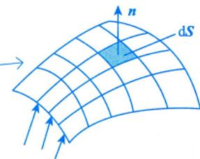

面微分向量：  
大小和我们前面讲的第一型曲面积分的大小是一个概念

$$
\iint _ { \Sigma } \boldsymbol { F } \cdot \mathrm { d } \boldsymbol { S } = \iint _ { \Sigma } \boldsymbol { F } \cdot \boldsymbol { n } ^ { \circ } \mathrm { d } S ,
$$

其中 $\boldsymbol{n}^{\circ}=(\cos \alpha,\cos \beta,\cos \gamma)$ 是有向曲面Σ在指定侧的单位法向量，且由 $\mathrm{d}S = (\mathrm{d}y\mathrm{d}z,\mathrm{d}z\mathrm{d}x,\mathrm{d}x\mathrm{d}y)$ ，得

$$
\iint_{\Sigma} \boldsymbol{F} \cdot \mathrm{d}\boldsymbol{S} = \iint_{\Sigma} P(x, y, z) \mathrm{d}y\mathrm{d}z + Q(x, y, z) \mathrm{d}z\mathrm{d}x + R(x, y, z) \mathrm{d}x\mathrm{d}y \overbrace{\iint_{\Sigma} F \cdot \mathrm{d}S}^{ 且 } \quad  面微分向量  \quad  总误量  \quad  总误量  \quad  总误量  \quad  总误量  \quad  总误量  \quad  总误量  \quad  总误量  \quad  总误量  \quad  总误量  \quad  总误量  \quad  总误量  \quad  总误量  \quad  总误量  \quad  总误量  \quad  总误量  \quad  总误量  \quad  总误量  \quad  总误量  \quad  总误量  \quad  总误量  \quad  总误量  \quad  总误量  \quad  总误量  \quad  总误量  \quad  总误量  \quad  总误量  \quad  总误量  \quad  总误量  \quad  总误量  \quad  总误量  \quad  总误量  \quad  总误量  \quad  总误量  \quad  总误量  \quad  总误量  \quad  总误量  \quad  总误量  \quad  总误量  \quad  总误量  \quad  总误量  \quad  总误量  \quad  总误量 \quad  总误量 \quad  总误量 \quad  总误量 \quad  总误量 \quad  总误量 \quad  总误量 \quad  总误量 \quad  总误量 \quad  总误量 \quad  总误量 \quad  总误量 \quad  总误量 \quad  总误量 \quad  总�量 \quad  总误量 \quad  总误量 \quad \quad  总误量 \quad  总误量 \quad \quad  总误量 \quad  总误量 \quad \quad  总误量 \quad \quad  总误量 \quad \quad  总误量 \quad \quad  总误量 \quad \quad  总误�量 \quad \quad  总误量 \quad \quad  总误量 \quad \quad \quad  总误�量 \quad \quad \quad  总误�量 \quad \quad \quad  总误�量 \quad \quad \quad  总误�量 \quad \quad \quad \quad  总误�量 \quad \quad \quad \quad \quad  总误��量 \quad \quad \quad \quad \quad  总误 \quad \quad \quad \quad \quad  总误� \quad \quad \quad \quad \quad \quad \quad \quad \quad \quad \quad \quad \quad \quad \quad \quad \quad \quad \quad \quad \quad \quad \quad \quad \quad \quad \quad \quad \quad \quad \quad \quad \quad \quad \quad \quad \quad \quad \quad \quad \quad \quad \quad \quad \quad \quad \quad \quad \quad \quad \quad \quad \quad \quad \quad \quad \quad \quad \quad \quad \quad \quad \quad \quad \quad \quad \quad \quad \quad \quad \quad \quad \quad \quad \quad \quad \quad \quad \quad \quad \quad \quad \quad \quad \quad \quad \quad \quad \quad \quad \quad \quad \quad \quad \
$$

于是就引出了第二型曲面积分的概念.

## ② 概念

第二型曲面积分的被积函数 $\boldsymbol{F}(x, y, z) = \boldsymbol{P}(x, y, z)\boldsymbol{i} + \boldsymbol{Q}(x, y, z)\boldsymbol{j} + \boldsymbol{R}(x, y, z)\boldsymbol{k}$ 定义在光滑的空间有向曲面Σ上，其物理背景是向量函数 $F(x,   y,   z)$ 通过曲面Σ的通量：

$$
\iint _ { \Sigma } P ( x , y , z ) \mathrm { d } y \mathrm { d } z + Q ( x , y , z ) \mathrm { d } z \mathrm { d } x + R ( x , y , z ) \mathrm { d } x \mathrm { d } y .
$$

由此可以看出，第二型曲面积分是一个向量函数通过某有向曲面的通量(无几何量可言).要加强和前面所学积分的横向对比，理解它们的区别和联系，不要用错或者用混了.

## 3 性质 与第二型曲线积分是一样的

以下总假设Σ是有向分片光滑曲面.

线性性质，这个本身是点积性质里的，当然成立了：

性质1(积分的线性性质)设 $k _ { 1 } ,   k _ { 2 }$ 为常数，则 $\iint _ { \Sigma } \left( k _ { 1 } \boldsymbol { F } _ { 1 } \pm k _ { 2 } \boldsymbol { F } _ { 2 } \right) \cdot \mathrm { d } \boldsymbol { S } = k _ { 1 } \iint _ { \Sigma } \boldsymbol { F } _ { 1 } \cdot \mathrm { d } \boldsymbol { S } \pm k _ { 2 } \iint _ { \Sigma } \boldsymbol { F } _ { 2 } \cdot \mathrm { d } \boldsymbol { S }$

性质2(积分的方向性) $\iint _ { \Sigma ^ { - } } \boldsymbol { F } \cdot \mathrm { d } \boldsymbol { S } = - \iint _ { \Sigma ^ { + } } \boldsymbol { F } \cdot \mathrm { d } \boldsymbol { S }$ ，其中 $\Sigma ^ { - }$ 为 $\boldsymbol { \Sigma } ^ { + }$ 的另一侧.

性质3(积分的可加性)当 $\Sigma_{1} \cup \Sigma_{2} = \Sigma, \Sigma_{1} \cap \Sigma_{2} = \varnothing$ 时， $\iint _ { \mathcal { E } } \boldsymbol { F } \cdot \mathrm { d } \boldsymbol { S } = \iint _ { \mathcal { E } _ { 1 } } \boldsymbol { F } \cdot \mathrm { d } \boldsymbol { S } + \iint _ { \mathcal { E } _ { 2 } } \boldsymbol { F } \cdot \mathrm { d } \boldsymbol { S }$

大曲面：分成两块，等于流过这两块曲面通量之和。

注第二型曲面积分的“对称性”.(与第二型曲线积分类似，第二型曲面积分是没有几何上的对称性的，要说对称性，只是在计算出数量后，有一个形式上的抵消或者两倍，仅此而已.)

曲面Σ是关于 $x O z$ 面对称的有向曲面，设函数 $Q(x, y, z) = xy^2z$ (关于y的偶函数)，则有

$$
\iint _ { \Sigma } Q ( x , y , z ) \mathrm { d } z \mathrm { d } x = \iint _ { \Sigma } x y ^ { 2 } z \mathrm { d } z \mathrm { d } x = 0 .
$$

以下从两个角度解释上述结果：

①如图18-21所示，对称的两处dS的法向量在j方向上的投影方向相反，故 $Q(x, y, z) \mathrm{d}z \mathrm{d}x =$ $xy^{2}z\mathrm{d}z\mathrm{d}x,\ Q(x,-y,\ z)(-\mathrm{d}z\mathrm{d}x)=-xy^{2}z\mathrm{d}z\mathrm{d}x.$ 于是 $\iint_{\Sigma} xy^{2}z\mathrm{d}z\mathrm{d}x = 0$

②从通量的角度来理解，一般规定，流入为负通量，流出为正通量.如图18-22所示，从A流入，从B流出，通量为0，故积分为0.

  
图 18-21

  
图 18-22

## 4 计算

第一型曲面积分：

(1)基本方法——化为二重积分. $\iint _ { \Sigma } f ( x , y , z ) \mathrm { d } S$ 其中 $\mathrm{d}S = \left| \sqrt{1 + \left( z_{x}^{\prime} \right)^{2} + \left( z_{y}^{\prime} \right)^{2}} \right| \mathrm{d}x\mathrm{d}y = \frac{1}{\cos \gamma} \mathrm{d}x\mathrm{d}y$ ①拆成三个积分(如果有的话)，一个一个做：

$$
\begin{aligned}\iint_{\Sigma} P(x, y, z) \mathrm{d}y \mathrm{d}z + Q(x, y, z) \mathrm{d}z \mathrm{d}x + R(x, y, z) \mathrm{d}x \mathrm{d}y \\= \iint_{\Sigma} P(x, y, z) \mathrm{d}y \mathrm{d}z + \iint_{\Sigma} Q(x, y, z) \mathrm{d}z \mathrm{d}x + \iint_{\Sigma} R(x, y, z) \mathrm{d}x \mathrm{d}y .\end{aligned}
$$

②分别投影到相应的坐标面上.

例如，对于 $\iint _ { \Sigma } R ( x , y , z ) \mathrm { d } x \mathrm { d } y$ ，将曲面Σ投影到 $x O y$ 平面上去.

a. 若Σ在 $x O y$ 平面上的投影为一条线，即Σ垂直于 $x O y$ 平面，则此积分为零.

注(1)对于第一型曲面积分而言，投影时并不允许随便选择投影方向，要确保 $z = z(x, y)$ 写得出来才行，如果写不出函数，说明此时的投影方向是错的.

(2) 在第二型曲面积分中，dydz，dzdx，dxdy这三个不能想换什么换什么，一旦要转换投影，要先经过计算，确保能转化为dxdy，才能往 xOy面投影.类似地，如果是转化为dzdx，只能往 xOz 面投影，如果是转化为dydz，就只能往yOz面投影.

对于图示的无底无顶铁圆柱桶，若求其质量。用到的是第一型曲面积分，注意，计算时不能往xOy面投影（因为x，y取定值时，对应无数多个z，z=z(x,y)是多值函数），只能往yOz面（前，后）或xOz面(左，右)投影.在往yOz面或xOz面投影时，还要把柱面切成两部分（若不切，也是多值函数）分别去求第一型曲面积分，然后把两个积分相加.

对于圆柱面Σ，有 $\iint _ { \Sigma } R ( x , y , z ) \mathrm { d } x \mathrm { d } y = \iint _ { D _ { x y } } R \mathrm { d } x \mathrm { d } y = 0$ 线上的二重积分当然是零

b. 若不是 $ \text{" } \mathbf{a} \text{" }$ 的情形，且Σ上存在两点，它们在 $x O y$ 平面上的投影点重合，则应将Σ剖分成若干个曲面片，使对于每一曲面片上的点投影到 $x O y$ 平面上的投影点不重合.

c. 假设已如 $ \text{" } \mathbf{b} \text{" }$ 剖分好了，不妨将剖分之后的曲面片仍记为Σ.此时将Σ的方程写成 $z = z(x, y)$ 的形式(只有投影到 $x O y$ 平面上的投影点不重合时，Σ的方程才能写成 $z = z(x, y)$ 的形式).

③一投二代三计算.

a.一投：确定出Σ在xOy平面上的投影域 $D_{xy}$

b. 二代：将 $z = z(x, y)$ 代人 $R(x,   y,   z)$

c. 三计算：将 dxdy 写成±dxdy.其中 $ \text{" } \pm  \text{" }$ 号选取方式如下.

类比第二型曲线积分：  
∫Lia→b Pdx  
a < b ⇒ +dx  
a > b⇒-dx

当 $\cos \gamma > 0$ ，即Σ的法向量与z轴交角为锐角，亦即当Σ的指定侧为上侧时，取 $ \text{" }+ \text{" }$ 当 $\cos \gamma < 0$ ，即Σ的法向量与z轴交角为钝角，亦即当Σ的指定侧为下侧时，取 $ \text{" } -  \text{" }$ 于是便得

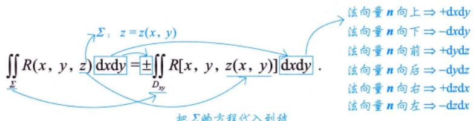

## 考研数学基础30讲·高等数学分册

注必须注意，上式等号左边是第二型曲面积分， $\iint\limits_{\varSigma}$ 表明了这件事，其中dxdy为有向曲面微元在 $x O y$ 平面上的投影分量；等式右边是xOy平面上的二重积分， $\iint\limits_{D_{xy}}$ 表明了这件事，其中dxdy为二重积分的面积微元，R中的z已用Σ的方程 $z = z(x, y)$ 代入了，它是x，y的函数.两个dxdy虽然写法一样，但其意义不一样.

其他两个第二型曲面积分的计算与此类似，请考生参照 $\textcircled{2} , \textcircled{3}$ 两条自行写出.

④计算已转化成的二重积分.

例18.22 设直线L 过点 A(-1, 0, 1)与 B(0, 0, 0)，L绕z 轴旋转一周得曲面 $\Sigma _ { 0 }$ ，计算$\oint_{\Sigma} \frac{e^{z}}{\sqrt{x^{2} + y^{2}}}   dx   dy$ ，其中Σ是由 $\Sigma_{0}, z = 1, z = 2$ 所围有界闭区域的边界曲面，取外侧.就是铅直方向的流量

分析先写出曲面 $\Sigma _ { 0 }$ ，然后选面求积分，之后加起来即可.

解L的方程为 $\frac{x + 1}{1} = \frac{y}{0} = \frac{z - 1}{- 1}$ ，可得其参数方程为 $\begin{cases}x = -1 + t, \\y = 0, \\z = 1 - t,\end{cases}$ 即 $\begin{cases}x = -z, \\y = 0.\end{cases}$

由第17讲“三、 $2. (4)$ 中的注，有 $\Sigma _ { 0 }$ 的方程为 $x^{2}+y^{2}=z^{2}+0=z^{2}$

如图18-23所示，记 $\Sigma = \Sigma_{1} + \Sigma_{2} + \Sigma_{3}$ ，其中 $\Sigma_{1}:z = 1, x^{2} + y^{2} \leqslant 1 ; \quad \Sigma_{2}:z = 2, x^{2} + y^{2} \leqslant 4$ i$\Sigma_{3}:z = \sqrt{x^{2} + y^{2}},1 \leqslant z \leqslant 2$ .则

$$
I = \oint_{\Sigma} = \iint_{\Sigma_{1}} + \iint_{\Sigma_{2}} + \iint_{\Sigma_{3}}
$$

$$
\iint _ { \Sigma _ { 1 } } = - \iint _ { D _ { 1 } } \frac { \mathrm { e } ^ { 1 } } { \sqrt { x ^ { 2 } + y ^ { 2 } } } \mathrm { d } x \mathrm { d } y = - \mathrm { e } \int _ { 0 } ^ { 2 \pi } \mathrm { d } \theta \int _ { 0 } ^ { 1 } \frac { 1 } { r } \cdot r \mathrm { d } r = - 2 \pi \mathrm { e } ,
$$

$$
\iint _ { \Sigma _ { 2 } } = \iint _ { D _ { 2 } } \frac { \mathrm { e } ^ { 2 } } { \sqrt { x ^ { 2 } + y ^ { 2 } } } \mathrm { d } x \mathrm { d } y = \mathrm { e } ^ { 2 } \int _ { 0 } ^ { 2 \pi } \mathrm { d } \theta \int _ { 0 } ^ { 2 } \frac { 1 } { r } \cdot r \mathrm { d } r = 4 \pi \mathrm { e } ^ { 2 } ,
$$

  
图 18-23

$$
\iint _ { \Sigma _ { 3 } } = - \iint _ { D _ { 3 } } \frac { \mathrm { e } ^ { \sqrt { x ^ { 2 } + y ^ { 2 } } } } { \sqrt { x ^ { 2 } + y ^ { 2 } } } \mathrm { d } x \mathrm { d } y = - \int _ { 0 } ^ { 2 \pi } \mathrm { d } \theta \int _ { 1 } ^ { 2 } \frac { \mathrm { e } ^ { r } } { r } \cdot r \mathrm { d } r = - 2 \pi ( \mathrm { e } ^ { 2 } - \mathrm { e } ) ,
$$

其中 $D_{1}=\left\{ (x,y) \mid x^{2}+y^{2} \leqslant 1 \right\}, D_{2}=\left\{ (x,y) \mid x^{2}+y^{2} \leqslant 4 \right\}, D_{3}=\left\{ (x,y) \mid 1 \leqslant x^{2}+y^{2} \leqslant 4 \right\}$ .故

$$
I = - 2 \pi \mathrm{e} + 4 \pi \mathrm{e}^{2} - 2 \pi ( \mathrm{e}^{2} - \mathrm{e} ) = 2 \pi \mathrm{e}^{2}
$$

(2) 转换投影法.

①转换投影法中有向曲面正向单位法向量的求法.

设 $\Sigma : z = z(x,y)$ ，其中z有一阶连续偏导数，则

$$
\mathbf{n} = \pm \frac{1}{\sqrt{1 + \left( \frac{\partial z}{\partial x} \right)^2 + \left( \frac{\partial z}{\partial y} \right)^2}} \left( - \frac{\partial z}{\partial x}, - \frac{\partial z}{\partial y}, 1 \right),
$$

当上侧为正时，取 $ \text{" }+ \text{" }$ ；下侧为正时，取 $ \text{" } \_ \_ \text{" }$ .(上正下负)

注同理，设 $\Sigma: y = y(x,z)$ ，其中y有一阶连续偏导数，则

$$
n = \pm \frac{1}{\sqrt{1 + \left( \frac{\partial y}{\partial x} \right)^2 + \left( \frac{\partial y}{\partial z} \right)^2}} \left( - \frac{\partial y}{\partial x}, 1, - \frac{\partial y}{\partial z} \right),
$$

当右侧为正时，取 $ \text{" }+ \text{" }$ ；左侧为正时，取 $4 4$ .(右正左负)

设 $\Sigma:x=x(y,z)$ ，其中x有一阶连续偏导数，则

$$
n = \pm \frac{1}{\sqrt{1 + \left( \frac{\partial x}{\partial y} \right)^2 + \left( \frac{\partial x}{\partial z} \right)^2}} \left( 1 - \frac{\partial x}{\partial y} + \frac{\partial x}{\partial z} \right)
$$

当前侧为正时，取 $ \text{" }+ \text{" }$ ；后侧为正时，取 $a -$ .(前正后负)

例18.23 已知曲面 $\Sigma:z = \sqrt{x^{2} + y^{2}}$ ，下侧为正，求其正向单位法向量

解因为 $\frac{\partial z}{\partial x} = \frac{x}{\sqrt{x^{2} + y^{2}}} , \quad \frac{\partial z}{\partial y} = \frac{y}{\sqrt{x^{2} + y^{2}}}$ ，且下侧为正，所以其正向单位法向量为

$$
\boldsymbol{n}=-\frac{1}{\sqrt{1+\left(\frac{\partial z}{\partial x}\right)^{2}+\left(\frac{\partial z}{\partial y}\right)^{2}}}\left(-\frac{\partial z}{\partial x},-\frac{\partial z}{\partial y},1\right)=\frac{\sqrt{2}}{2}\left(\frac{x}{\sqrt{x^{2}+y^{2}}},\frac{y}{\sqrt{x^{2}+y^{2}}},-1\right).
$$

例18.24 若柱面 $\Sigma : x^{2} + y^{2} = 1$ 的外侧为正，求其后半柱面正向单位法向量.

解后半柱面，后侧为正， $x = -\sqrt{1 - y^{2}}$ $\boldsymbol{n} = - \sqrt{1 - y^{2}}\left( 1 , - \frac{y}{\sqrt{1 - y^{2}}} , 0 \right)$

②转换投影定理.

设曲面 $\Sigma : z = z(x,y)$ ，z有一阶连续偏导数，且 $P(x,y,z),Q(x,y,z),R(x,y,z)$ 在Σ上连续，则

$$
\begin{aligned}\iint_{\Sigma} P(x, y, z) \mathrm{d}y \mathrm{d}z + Q(x, y, z) \mathrm{d}z \mathrm{d}x + R(x, y, z) \mathrm{d}x \mathrm{d}y \\= \pm \iint_{D} \left( -P \frac{\partial z}{\partial x} - Q \frac{\partial z}{\partial y} + R \right) \mathrm{d}x \mathrm{d}y ,\end{aligned}
$$

其中 $P = P \left[ x , y , z ( x , y ) \right]$ , Q =Q[x,y,z(x,y)], $R = R \left[ x , y , z ( x , y ) \right]$

考研数学基础30讲·高等数学分册

注证因为

$$
\mathbf{n} = \pm \frac{1}{\sqrt{1 + \left( \frac{\partial z}{\partial x} \right)^2 + \left( \frac{\partial z}{\partial y} \right)^2}} \left( - \frac{\partial z}{\partial x}, - \frac{\partial z}{\partial y}, 1 \right),
$$

$$
\mathrm{d}S = \sqrt{1 + \left( \frac{\partial z}{\partial x} \right)^{2} + \left( \frac{\partial z}{\partial y} \right)^{2}} \mathrm{d}x\mathrm{d}y
$$

并记 $\boldsymbol{F} = (P, Q, R), \mathrm{d}S = (\mathrm{d}y\mathrm{d}z, \mathrm{d}z\mathrm{d}x, \mathrm{d}x\mathrm{d}y)$ ，则

$$
\begin{aligned}\iint_{\Sigma} P \mathrm{d}y\mathrm{d}z + Q \mathrm{d}z\mathrm{d}x + R \mathrm{d}x\mathrm{d}y = & \iint_{\Sigma} F(x,y,z) \cdot \mathrm{d}S = \iint_{\Sigma} F(x,y,z) \cdot n \mathrm{d}S \\= & \iint_{\Sigma} (P, Q, R) \cdot \left[ \mathrm{d}^{n} \pm \frac{1}{\sqrt{1 + \left(\frac{\partial z}{\partial x}\right)^{2} + \left(\frac{\partial z}{\partial y}\right)^{2}}} \left( -\frac{\partial z}{\partial x}, -\frac{\partial z}{\partial y}, 1 \right) \right] \mathrm{d}S \\= & \pm \iint_{D} \left( -P \frac{\partial z}{\partial x} - Q \frac{\partial z}{\partial y} + R \right) \mathrm{d}x\mathrm{d}y ,\end{aligned}
$$

其中， $ \text{" } \pm  \text{" }$ 的选取显然就是前述①的情形.

例18.25 设Σ为曲面 $z = x^{2} + y^{2} \quad (z \leqslant 1)$ 的上侧，计算曲面积分

$$
\iint _ { \Sigma } ( x - 1 ) ^ { 3 } \mathrm{d} y \mathrm{d} z + ( y - 1 ) ^ { 3 } \mathrm{d} z \mathrm{d} x + ( z - 1 ) \mathrm{d} x \mathrm{d} y .
$$

解 曲面Σ在xOy坐标面上投影域为 $D=\left\{ (x,y) \mid x^{2}+y^{2} \leqslant 1 \right\}$ .因为 $\frac{\partial z}{\partial x} = 2x$ $\frac{\partial z}{\partial y} = 2y$ ，所以

$$
\begin{aligned}I = & \iint_{\Sigma}(x - 1)^{3}\mathrm{d}y\mathrm{d}z + (y - 1)^{3}\mathrm{d}z\mathrm{d}x + (z - 1)\mathrm{d}x\mathrm{d}y \\= & \iint_{D}\left[(x - 1)^{3}\bullet(- 2x) + (y - 1)^{3}\bullet(- 2y) + (x^{2} + y^{2} - 1)\right]\mathrm{d}x\mathrm{d}y \\= & - \iint_{D}\left(2x^{4} - 6x^{3} + 5x^{2} - 2x + 2y^{4} - 6y^{3} + 5y^{2} - 2y + 1\right)\mathrm{d}x\mathrm{d}y\end{aligned}
$$

因为区域D关于坐标轴对称，所以 $\iint _ { D } \left( - 6 x ^ { 3 } - 2 x - 6 y ^ { 3 } - 2 y \right) \mathrm{d} x \mathrm{d} y = 0$ ，从而

$$
\begin{aligned}I = - \iint_{D}^{}\left( 2x^{4} + 5x^{2} + 2y^{4} + 5y^{2} + 1 \right)dxdy \\= - \int_{0}^{2\pi}d\theta\int_{0}^{1}\left\lbrack 2r^{4}\left( \cos^{4}\theta + \sin^{4}\theta \right) + 5r^{2} + 1 \right\rbrack rdr\end{aligned}
$$

$$
\begin{aligned}= - \int_{0}^{2\pi} \left[ \frac{1}{3} \left( \cos^{4} \theta + \sin^{4} \theta \right) + \frac{7}{4} \right] \mathrm{d}\theta \\= - \frac{7\pi}{2} - \frac{8}{3} \int_{0}^{\frac{\pi}{2}} \sin^{4} \theta \mathrm{d}\theta = - \frac{7\pi}{2} - \frac{8}{3} \times \frac{3}{4} \times \frac{1}{2} \times \frac{\pi}{2} = - 4\pi .\end{aligned}
$$

(3)高斯公式·联想到格林公式

设空间有界闭区域 $|a|$ 由有向分片光滑封闭曲面Σ围成， $P(x, y, z) , Q(x, y, z) , R(x, y, z)$ 在Ω上具有一阶连续偏导数，则有公式 边界曲面上的第二型曲面积分化为内部立体的三重积分

$$
\oint_{\Sigma} P \mathrm{d}y \mathrm{d}z + Q \mathrm{d}z \mathrm{d}x + R \mathrm{d}x \mathrm{d}y = \iiint_{\Omega} \left( \underbrace{\left| \frac{\partial P}{\partial x} + \frac{\partial Q}{\partial y} + \frac{\partial R}{\partial z} \right|}_{ 散度:与"源"者关 } \right) \mathrm{d}v
$$

其中，Σ是Ω的整个边界曲面的外侧

注第二型曲面积分与“源”的概念是紧密联系的，所以就有了散度的概念，在空间区域上的某点处的散度是指这个点发散的强度.如果在一个空间区域上，每一点处的三个偏导数加起来都是零，那就说明每一点处的散度都是零，即这个场是没有源头的，也就是说每一点都没有发散，也没有吸收，是个安安静静的场，称之为“无源场”.

如 $\oint_{\Sigma} P \mathrm{d}y \mathrm{d}z + Q \mathrm{d}z \mathrm{d}x + R \mathrm{d}x \mathrm{d}y = 0$ 即任何一点都是没有散度的，是个“无源场”，则 $\frac{\partial P}{\partial x} + \frac{\partial Q}{\partial y} + \frac{\partial R}{\partial z} = 0$

①封闭曲面且内部无奇点，直接用高斯公式.

例18.26设空间有界区域Ω由柱面 $x^{2} + y^{2} = 1$ 与平面z=0和 $x + z = 1$ 围成.Σ为Ω的边界曲面的外侧.计算曲面积分

$$
\oint_{\Sigma} 2xz\mathrm{d}y\mathrm{d}z + xz\cos y\mathrm{d}z\mathrm{d}x + 3yz\sin x\mathrm{d}x\mathrm{d}y
$$

分析）首先将该曲面积分通过高斯公式转化为三重积分，然后利用概念、对称性化简，最后再计算剩下的部分

  
进入多少

解根据高斯公式，得

$$
\iiint\limits_{\Omega} \left( 2z - xz\sin y + 3y\sin x \right) \mathrm{d}x\mathrm{d}y\mathrm{d}z
$$

因为Ω关于xOz坐标面对称，所以

V因为 $y \rightarrow - y$ 时，Ω不变，故Ω关 $\iiint_{\Omega} xz \sin y \mathrm{d}x \mathrm{d}y \mathrm{d}z = 0, \iiint_{\Omega} 3y \sin x \mathrm{d}x \mathrm{d}y \mathrm{d}z = 0$ 于xOz 坐标面对称.

记 $D=\left\{ (x, y) \mid x^{2}+y^{2} \leqslant 1 \right\}$ ，则

$$
\begin{aligned}I  = & \iiint_{\Omega} 2z \mathrm{d}x \mathrm{d}y \mathrm{d}z = \iint_{D} \mathrm{d}x \mathrm{d}y \int_{0}^{1 - x} 2z \mathrm{d}z \\= & \iint_{D} (1 + x^2) \mathrm{d}x \mathrm{d}y = \pi + \frac{1}{2} \int_{0}^{2\pi} \mathrm{d}\theta \int_{0}^{1} r^3 \mathrm{d}r = \frac{5\pi}{4}\end{aligned}
$$

方法总结计算三重积分时，利用好概念、对称性.

②非封闭曲面，且 $\mathrm{div} \boldsymbol{F} = \frac{\partial P}{\partial x} + \frac{\partial Q}{\partial y} + \frac{\partial R}{\partial z} \neq 0$ ，补面使其封闭(加面减面)

例18.27 计算 $\iint_{\Sigma} \frac{x \mathrm{d}y \mathrm{d}z + (z + 1)^2 \mathrm{d}x \mathrm{d}y}{\left( x^2 + y^2 + z^2 \right)^{\frac{1}{2}}}$ ，其中Σ为下半球面 $z = - \sqrt{1 - x^{2} - y^{2}}$ 的上侧.

分析利用第二型曲面积分的替代法，然后补面用高斯公式.

解先将 $(x^{2}+y^{2}+z^{2})^{\frac{1}{2}}=1$ 代入被积函数.

$$
I = \iint_{\Sigma} \frac{x \mathrm{d}y \mathrm{d}z + (z + 1)^2 \mathrm{d}x \mathrm{d}y}{\left( x^2 + y^2 + z^2 \right)^{\frac{1}{2}}} = \iint_{\Sigma} x \mathrm{d}y \mathrm{d}z + (z + 1)^2 \mathrm{d}x \mathrm{d}y .
$$

补充一块有向平面 $\begin{aligned}\varSigma_{1}:\begin{cases}x^{2} + y^{2} \leqslant 1, \\z = 0,\end{cases}\end{aligned}$ 其法向量与z轴正向相反，从而得到

$$
\oint_{\Sigma + \Sigma_{1}} x \mathrm{d}y \mathrm{d}z + (z + 1)^{2} \mathrm{d}x \mathrm{d}y - \iint_{\Sigma_{1}} x \mathrm{d}y \mathrm{d}z + (z + 1)^{2} \mathrm{d}x \mathrm{d}y \\= - \iiint_{\Omega} (3 + 2z) \mathrm{d}v + \iint_{\Omega} 1 \mathrm{d}x \mathrm{d}y ,
$$

其中 $\mathcal { Q }$ 为 $\scriptstyle \sum + \sum _ { 1 }$ 围成的空间区域，D为z=0上的平面区域 $x^{2} + y^{2} \leq 1$ ，于是

$$
I = - 2 \pi - 2 \iiint_{ \Omega } z \mathrm{d}v + \pi = - \pi - 2 \int_{0}^{2 \pi} \mathrm{d} \theta \int_{0}^{1} r \mathrm{d} r \int_{- \sqrt{1 - r^{2}}}^{0} z \mathrm{d}z = - \frac{\pi}{2}
$$

★③封闭曲面，有奇点在其内部，且除奇点外 $\frac{ 元"源" }{\left| \mathrm{div} \boldsymbol{F} = 0 \right|}$ ，可换个面积分.(边界无须与原曲面重合)

注为什么可以换个面积分？divF=0是指所给场无“源”，于是通过任何封闭曲面（且无奇点在其内部）的通量为0.如图18-24所示，由于 $\iint \limits _ { \Sigma + \Sigma _ { 1 } ^ { - } } = 0$ x是 $\iint_{\Sigma} = - \iint_{\Sigma_{1}^{-}} = \iint_{\Sigma_{1}}$ (Σ与 $\Sigma_{1}$ 同向).

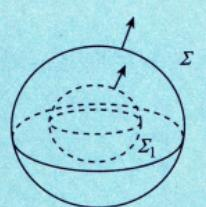  
图 18-24

有时虽然所给的曲面是一张封闭曲面，法向量指的也是外侧，但“在Σ所包围的有界闭区域Ω的内部有奇点，但除奇点外P，Q，R具有连续的一阶偏导数，且满足 $\frac{\partial P}{\partial x} + \frac{\partial Q}{\partial y} + \frac{\partial R}{\partial z} = 0$ .此时，可以作一封闭曲面 $\Sigma _ { 1 } \subset \varOmega$ ，将上述使偏导数不连续的点都包含在 $\Sigma _ { 1 }$ 的内部， $\Sigma _ { 1 }$ 的法向量指向它所包围的有界区域的外侧，则有公式

$$
\oint_{\Sigma} P \mathrm{d}y \mathrm{d}z + Q \mathrm{d}z \mathrm{d}x + R \mathrm{d}x \mathrm{d}y = \oint_{\Sigma_1} P \mathrm{d}y \mathrm{d}z + Q \mathrm{d}z \mathrm{d}x + R \mathrm{d}x \mathrm{d}y .
$$

$$
= \varepsilon ^ { 2 }
$$

如果后一积分比前一积分容易计算，就达到化难为易的目的了.

例18.28 设Σ是椭球面 $\frac{x^{2}}{a^{2}}+\frac{y^{2}}{b^{2}}+\frac{z^{2}}{c^{2}}=1$ ，法向量指向外侧，则 $\oint_{\Sigma} \frac{x \mathrm{d}y \mathrm{d}z + y \mathrm{d}z \mathrm{d}x + z \mathrm{d}x \mathrm{d}y}{\left( x^{2} + y^{2} + z^{2} \right)^{3/2}}$

分析与格林公式的挖洞法是一样的，除奇点外，通量全是零，包围奇点的任一曲面的积分都是相等的.  
解应填4π.

经计算有

$$
\frac { \partial P } { \partial x } + \frac { \partial Q } { \partial y } + \frac { \partial R } { \partial z } = 0 , \quad \mathrm {  当  } ( x , y , z ) \neq ( 0 , 0 , 0 ) .
$$

但是这里不能用高斯公式，因为在Σ内部的点O(0,0,0)处，P,Q,R都不连续，故在Σ内部作一球面

$$
\Sigma_{1}:x^{2}+y^{2}+z^{2}=r^{2}(r>0)
$$

它的法向量指向球面外侧，于是有

$$
\begin{aligned}&\oint_{\Sigma} \frac{x\mathrm{d}y\mathrm{d}z + y\mathrm{d}z\mathrm{d}x + z\mathrm{d}x\mathrm{d}y}{\left( x^{2} + y^{2} + z^{2} \right)^{3/2}} \\=& \oint_{\Sigma_{1}} \frac{x\mathrm{d}y\mathrm{d}z + y\mathrm{d}z\mathrm{d}x + z\mathrm{d}x\mathrm{d}y}{\left( x^{2} + y^{2} + z^{2} \right)^{3/2}} \\=& \frac{1}{r^{3}} \oint_{\Sigma_{1}} x\mathrm{d}y\mathrm{d}z + y\mathrm{d}z\mathrm{d}x + z\mathrm{d}x\mathrm{d}y \\=& \frac{1}{r^{3}} \iint_{D_{1}} 3\mathrm{d}v = \frac{1}{r^{3}} \cdot 3 \cdot \frac{4}{3}\pi r^{3} = 4\pi,\end{aligned}
$$

其中(\*)处来自高斯公式， $\Omega _ { 1 }$ 为 $\Sigma _ { 1 }$ 所包围的闭球域.

方法总结挖洞后利用高斯公式，在包围奇点的任一曲面上的积分都是相等的.

例18.29 计算

$$
I = \oint_{\Sigma} \left| xy \right| z^{2} \mathrm{d}x\mathrm{d}y + \left| \overline{x} \right| y^{2} z \mathrm{d}y\mathrm{d}z
$$

其中Σ为 $z = x^{2} + y^{2}$ 与z=1所围区域 $\mathcal { Q }$ 的表面，方向向外.

分析这个题稍难，但并非难题，可以利用概念解题，一个卦限的通量×4即可.

$$
I = 4 \left( \iint_{\Sigma_1} + \iint_{\Sigma_2} \right)
$$

$$
\left[ \iint_{x^{2} + y^{2} \leq 1 \atop x, y \geq 0} xy \mathrm{d}x\mathrm{d}y + \iint_{x^{2} + y^{2} \leq 1 \atop x, y \geq 0} xy(x^{2} + y^{2})^{2}(-\mathrm{d}x\mathrm{d}y) \right] = \frac{1}{4}
$$

其中 $\Sigma _ { 1 }$ 为图18-25所示卦限的上面， $\Sigma _ { z }$ 为图18-25所示卦限的侧面.

本题也可利用高斯公式去解题.方法见解.

解由题设得， $I = \oint_{\Sigma} \left| xy \right| z^{2} \mathrm{d}x\mathrm{d}y + \oint_{\Sigma} \left| x \right| y^{2} z \mathrm{d}y\mathrm{d}z = I_{1} + I_{2}$ ，如图18-25所示，则

$$
\begin{aligned}I_{1} = & \iint_{\frac{ 高斯 }{ 公式 }} \iiint_{\Omega} |xy| \cdot 2z \mathrm{d}v = \iiint_{\Omega} 2|xy| z \mathrm{d}v \\= & 8 \iint_{\frac{\partial}{\partial} \atop x_{1}, y \geq 0} xyz \mathrm{d}v = 8 \iint_{x_{2}^{2} + y_{2}^{2} \leq 1 \atop x_{3}, y \geq 0} \mathrm{d}\sigma \int_{x_{2}^{2} + y_{3}^{2}}^{1} xyz \mathrm{d}z \\= & 4 \iint_{x_{2}^{2} + y_{2}^{2} \leq 1 \atop x_{3}, y \geq 0} xyz \left[ 1 - (x^{2} + y^{2})^{2} \right] \mathrm{d}\sigma \\= & 4 \int_{0}^{\frac{\pi}{2}} \mathrm{d}\theta \int_{0}^{1} r^{2} \cos \theta \sin \theta (1 - r^{4}) r \mathrm{d}r = \frac{1}{4}\end{aligned}
$$

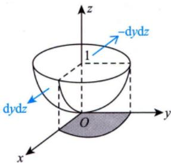  
图 18-25

$I _ { 2 } .$ 不能用高斯公式，因 $\frac{\partial}{\partial x}( \left | x \right | y^{2}z )$ 在x=0，yz≠0处不存在.而在点(x，y，z)与点 $(-x,   y,   z)$ 处的通量分别为 $|x|y^{2}z\mathrm{d}y\mathrm{d}z$ 与 $|x|y^{2}z(-\mathrm{d}y\mathrm{d}z)$ ，又在面z=1上dz=0，故 $I_{2} = \oint_{\Sigma} \left| x \right| y^{2} z \mathrm{d}y \mathrm{d}z = 0$ .于是 $I = \frac{1}{4}$

## 空间第二型曲线积分的计算

①一投二代三计算.（基本方法)

设Γ: $\begin{cases}x = x(t), \\y = y(t),   t:   \alpha \to \beta, \\z = z(t),\end{cases}$ ，则有

$$
\begin{align*}& \int_{\Gamma} P \mathrm{d}x + Q \mathrm{d}y + R \mathrm{d}z \\=& \int_{\alpha}^{\beta} \{ P[x(t), y(t), z(t)] x'(t) + Q[x(t), y(t), z(t)] y'(t) + R[x(t), y(t), z(t)] z'(t) \} \mathrm{d}t .\end{align*}
$$

②用斯托克斯公式.—→实现边界与内部的转换

设Ω为某空间区域，Σ为Ω内的分片光滑有向曲面片，Γ为逐段光滑的Σ的边界，它的方向与Σ的法向量成右手系，函数 $P(x, y, z), Q(x, y, z)$ 与 $R(x,   y,   z)$ 在Ω内具有连续的一阶偏导数，则有斯托克斯公式：

$\oint_{\Gamma} P \mathrm{d}x + Q \mathrm{d}y + R \mathrm{d}z = \iint\limits_{\Sigma} \left| \begin{array}{ccc}\mathrm{d}y \mathrm{d}z & \mathrm{d}z \mathrm{d}x & \mathrm{d}x \mathrm{d}y \\\hat{\partial}x & \hat{\partial}y & \hat{\partial}z \\P & Q & R \\\end{array} \right|$ (此为第二型曲面积分形式)$\iint_{\Sigma} \left| \begin{array}{ccc}\cos \alpha & \cos \beta & \cos \gamma \\\hat{\partial} & \hat{\partial} & \hat{\partial} \\\hat{\partial} x & \hat{\partial} y & \hat{\partial} z \\P & Q & R \\\end{array} \right| d\Omega$ dS(此为第一型曲面积分形式)，

其中 $\boldsymbol{n}^{\mathrm{o}}=(\cos \alpha, \cos \beta, \cos \gamma)$ 为Σ的单位外法向量.

注可以证明（这里不证)，公式的成立与绷在Γ上的曲面大小、形状无关，如图18-26所示，有 $\oint_{\Gamma} = \iint_{\Sigma_{1}} = \iint_{\Sigma_{2}}$ 知助

举个容易理解的例子，小孩玩的泡泡棒（泡泡机），蘸了肥皂水吹一下泡泡就出来了，Γ就是蘸肥皂水的塑料圈，上面绷着的就是泡泡，在这些泡泡中无论是哪个，不管大小和形状，都可以作为计算公式中的Σ.  
再问大家，绷在Γ上的什么曲面最简单？答得好，平面！在泡泡还没有脱离圈图之前可以有各种形状，但最简单的形状是平面，是吹之前的最原始的形状！

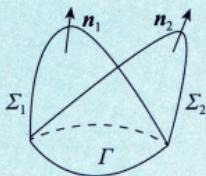  
图 18-26

例18.30 已知曲线L的方程为 $\begin{cases}z = \sqrt{2 - x^{2} - y^{2}} , \\z = x ,\end{cases}$ '起点为 $A(0,\sqrt{2},0)$ ，终点为 $B(0, -\sqrt{2}, 0)$ 计算曲线积分 $\int_{L} (y + z) \mathrm{d}x + (z^2 - x^2 + y) \mathrm{d}y + x^2 y^2 \mathrm{d}z$

2分析方法一利用基本方法（参数法）. →x0-.√2 B

方法二利用斯托克斯公式.

方法三利用做功取微元分析.

对于i方向做功微元： $(-y+z)(-\mathrm{d}x)+(y+z)\mathrm{d}x=2y\mathrm{d}x$ i

对于j方向做功微元： $(-y)\mathrm{d}y + y\mathrm{d}y = 0$ in

对于k方向做功微元： $x^{2}y^{2}(- \mathrm{d}z) + x^{2}y^{2}\mathrm{d}z = 0$

解方法一由 $\begin{cases}z = \sqrt{2 - x^{2} - y^{2}} \\z = x\end{cases}$ ’得 $\sqrt{2 - x^{2} - y^{2}} = x$ ，即 $2x^{2} + y^{2} = 2$ ，亦即 $x^{2}+\frac{y^{2}}{2}=1$

于是曲线L的参数方程为 $\begin{cases}x = \cos t, \\y = \sqrt{2} \sin t, \\z = \cos t,\end{cases}$ , t 从 $\frac{\pi}{2}$ (起点A)到 $-\frac{\pi}{2}$ (终点B).

$$
\begin{aligned}I = & \int_{L}(y + z)\mathrm{d}x + (z^{2} - x^{2} + y)\mathrm{d}y + x^{2}y^{2}\mathrm{d}z \\= & \int_{\frac{\pi}{2}}^{\frac{\pi}{2}}\left[(\sqrt{2}\sin t + \cos t) \cdot (-\sin t) + \sqrt{2}\sin t \cdot \sqrt{2}\cos t + \cos^{2}t \cdot 2\sin^{2}t \cdot (-\sin t)\right]\mathrm{d}t \\= & \int_{\frac{\pi}{2}}^{\frac{\pi}{2}}(-\sqrt{2}\sin^{2}t)\mathrm{d}t = \int_{\frac{\pi}{2}}^{\frac{\pi}{2}}\sqrt{2}\sin^{2}t\mathrm{d}t \\= & 2\sqrt{2}\int_{0}^{\frac{\pi}{2}}\sin^{2}t\mathrm{d}t = 2\sqrt{2} \cdot \frac{1}{2} \cdot \frac{\pi}{2} = \frac{\sqrt{2}}{2}\pi .\end{aligned}
$$

方法二设 $L _ { 1 }$ 是从点B到点A的直线段，Σ为平面z=x上由 $L$ 与 $L _ { 1 }$ 围成的半圆面下侧，其法向量的方向余弦为 $\left( \frac{1}{\sqrt{2}}, 0, -\frac{1}{\sqrt{2}} \right)$ ，且在L与 $L _ { 1 }$ 上，均有 $z^{2}-x^{2}=0$

由斯托克斯公式，

$$
\oint_{L+L_{1}} (y+z) \mathrm{d}x + (z^{2}-x^{2}+y) \mathrm{d}y + x^{2} y^{2} \mathrm{d}z
$$

$$
\begin{aligned}= \iint_{\Sigma} \left| \frac{1}{\sqrt{2}} \quad 0 \quad -\frac{1}{\sqrt{2}} \right| \mathrm{d}S = \frac{1}{\sqrt{2}} \iint_{\Sigma} \left| \frac{1}{\sqrt{2}} \quad \frac{1}{\sqrt{2}} \right| \mathrm{d}S = \frac{1}{\sqrt{2}} \iint_{\Sigma} (2x^2 y + 1) \mathrm{d}S .\end{aligned}
$$

因为曲面Σ关于xOz平面对称，所以 $\iint_{\Sigma} 2x^{2} y \mathrm{d}S = 0$ ，故

$$
\oint_{L+L_{1}} (y+z) \mathrm{d}x + (z^{2}-x^{2}+y) \mathrm{d}y + x^{2} y^{2} \mathrm{d}z = \frac{1}{\sqrt{2}} \iint_{S} \mathrm{d}S = \frac{\sqrt{2}}{2} \pi .
$$

又 $L _ { 1 }$ 的参数方程为 $x=0,\;y=y,\;z=0\;(y 从 -\sqrt{2}$ 到 $\sqrt{2}   )$ ，所以

$$
\int _ { L _ { 1 } } ( y + z ) \mathrm { d } x + ( z ^ { 2 } - x ^ { 2 } + y ) \mathrm { d } y + x ^ { 2 } y ^ { 2 } \mathrm { d } z = \int _ { - \sqrt { 2 } } ^ { \sqrt { 2 } } y \mathrm { d } y = 0 .
$$

因此 $I = \oint_{L + L_{1}} - \int_{L_{1}} = \frac{\sqrt{2}}{2} \pi$

方法三 如图18-27所示，在点(x，y，z)和 $(x, -y,   z)$ 处的三个方向的通量分别为

$$
\begin{aligned} &(y + z)\mathrm{d}x, \quad (-y + z)(-\mathrm{d}x), \quad\\ &\quad y(-\mathrm{d}y), \quad (-y)(-\mathrm{d}y), \quad\\ &\quad x^{2}y^{2}\mathrm{d}z, \quad x^{2}y^{2}(-\mathrm{d}z).\\ \end{aligned}
$$

于是

$$
I = \int_{L} y \mathrm{d}x = \int_{\frac{\pi}{2}}^{\frac{\pi}{2}} \sqrt{2} \sin t \mathrm{d}(\cos t) = 2\sqrt{2} \int_{0}^{\frac{\pi}{2}} \sin^2 t \mathrm{d}t = 2\sqrt{2} \cdot \frac{1}{2} \cdot \frac{\pi}{2} = \frac{\sqrt{2}}{2} \pi
$$

  
图 18-27

## 基础习题精练

## 习题

18.1 设L为曲线 $\begin{cases}x^{2} + y^{2} + z^{2} = 9, \\x + y + z = 0,\end{cases}$ '则 $\oint_{L} \left( 3x^{2} - y^{2} - z^{2} \right) \mathrm{d}s = ( \quad )$ (A) $2 7 \pi$ (B) 18π (C) 12π (D) $6 \pi$

18.2 设Σ为球面 $(x - 1)^{2} + y^{2} + (z + 1)^{2} = 1$ ，则 $\oint_{\Sigma} (2x + 3y + z) \mathrm{d}S = ( \quad )$ (A) $4 \pi$ (B) $2 \pi$ (C) π (D)0

18.3 设L 是柱面 $x^{2} + y^{2} = 1$ 与平面 $z = x + y$ 的交线，从z轴正向往z轴负向看去为逆时针方向，则曲线积分 $\oint_{L} xz\mathrm{d}x + x\mathrm{d}y + \frac{y^{2}}{2}\mathrm{d}z =$

18.4 设L为取正向的圆 $x^{2}+y^{2}=a^{2},a>0$ ，则曲线积分 $\oint_{L} \frac{\left( \mathrm{e}^{x^{2}} - x^{2}y \right) \mathrm{d}x + \left( xy^{2} - \sin y^{2} \right) \mathrm{d}y}{x^{2} + y^{2}}$ =

18.5 设Σ为球面 $x^{2}+y^{2}+z^{2}=1$ ，则第一型曲面积分 $\oint_{\Sigma} x(4x - z) \mathrm{d}S =$

18.6 设曲面 $\Sigma: \left | x \right |  + \left | y \right |  + \left | z \right |  = 1$ ，则 $\oint_{\Sigma} (x + |y|) \mathrm{d}S =$

18.7 设Σ为球面 $x^{2}+y^{2}+z^{2}=a^{2}$ 的外侧， $a > 0$ ，则第二型曲面积分 $\frac{1}{x^{2} + y^{2} + z^{2}}\left( x^{3}\mathrm{d}y\mathrm{d}z + y^{3}\mathrm{d}z\mathrm{d}x + \right.$ Σ$z^{3}\mathrm{d}x\mathrm{d}y$

18.8 设Ω是由椭圆抛物面 $z = 4(x^{2} + y^{2})$ 和平面z=4所围成的区域，则三重积分 $\iint_{\Omega} \left( x^{2} + y^{2} \right) \mathrm{d}v =$

18.9 设L为自点O(0,0)沿曲线y=sinx至点A(π，0)的有向弧段，计算平面第二型曲线积分

$$
I = \int_{L} \left[ \mathrm{e}^{x} \cos y + 2(x + y) \right] \mathrm{d}x + \left( -\mathrm{e}^{x} \sin y + \frac{3}{2}x \right) \mathrm{d}y.
$$

18.10 计算曲面积分 $\iint_{\Sigma} (2x + z) \mathrm{d}y\mathrm{d}z + z\mathrm{d}x\mathrm{d}y$ ，其中Σ为有向曲面 $z = x^{2} + y^{2} \quad (0 \leqslant z \leqslant 1)$ ，其法向量与z轴正向夹角为锐角.

18.11 设Σ为任意封闭曲面，

$$
\oint_{\Sigma_{形模}} \left( x - \frac{1}{3}x^3 \right) \mathrm{d}y \mathrm{d}z - \frac{4}{3}y^3 \mathrm{d}z \mathrm{d}x + \left( 3y - \frac{1}{3}z^3 \right) \mathrm{d}x \mathrm{d}y
$$

(1) 证明Σ为椭球面 $x^{2}+4y^{2}+z^{2}=1$ 时，I达到最大值；

(2)求I的最大值.

## 解答

18.1 (B) 解 由轮换对称性可得

$$
\oint_{L} \left( 3x^{2} - y^{2} - z^{2} \right) \mathrm{d}s = \oint_{L} x^{2} \mathrm{d}s = \oint_{L} \frac{x^{2} + y^{2} + z^{2}}{3} \mathrm{d}s \\= 3\oint_{L} \mathrm{d}s = 3(2\pi \times 3) = 18\pi
$$

18.2 (A) 解 $\oint_{\Sigma} (2x + 3y + z) \mathrm{d}S = 2\oint_{\Sigma} x \mathrm{d}S + 3\oint_{\Sigma} y \mathrm{d}S + \oint_{\Sigma} z \mathrm{d}S$ ，又有 $\overline{x} = \frac{1}{S}$ xds, $\overline{y} = \frac{1}{S}$ yds,Σ Σ$\overline{z} = \frac{1}{S} \oint_{\Sigma} z \mathrm{d}S$ 是球面 $(x - 1)^{2} + y^{2} + (z + 1)^{2} = 1$ 的形心坐标公式，而球面的形心在球心(1,0，-1)处，故

$$
\oint_{\Sigma} (2x + 3y + z) \mathrm{d}S = (2\overline{x} + 3\overline{y} + \overline{z})S = (2 + 0 - 1) \cdot 4\pi = 4\pi
$$

18.3 π 解 方法一 将L的方程化为参数形式

$$
\begin{cases}x = \cos t, \\y = \sin t, \quad (0 \leqslant t \leqslant 2\pi), \\z = \cos t + \sin t\end{cases}
$$

则

$$
\oint_{L} x z \mathrm{d} x + x \mathrm{d} y + \frac{y^{2}}{2} \mathrm{d} z = \int_{0}^{2 \pi} \left[ \cos t \cdot (\cos t + \sin t) \cdot (-\sin t) + \cos t \cdot \cos t + \frac{1}{2} \sin^{2} t \cdot (-\sin t + \cos t) \right] \mathrm{d} t \\= \int_{0}^{2 \pi} \cos^{2} t \mathrm{d} t = \int_{0}^{2 \pi} \frac{1 + \cos 2 t}{2} \mathrm{d} t = \pi.
$$

方法二 记S是平面 $z = x + y$ 上位于柱面 $x^{2} + y^{2} = 1$ 内的部分，则S在xOy平面上的投影为$D = \left\{ (x, y) \mid x^{2} + y^{2} \leqslant 1 \right\}$ ，平面 $z = x + y$ 向上的单位法向量为 $\left( - \frac{1}{\sqrt{3}}, - \frac{1}{\sqrt{3}}, \frac{1}{\sqrt{3}} \right)$

根据斯托克斯公式，得

$$
\begin{aligned} \oint_{L} xz\mathrm{d}x + x\mathrm{d}y + \frac{y^{2}}{2}\mathrm{d}z = & \iint\limits_{S} \left| - \frac{1}{\sqrt{3}} \quad - \frac{1}{\sqrt{3}} \quad \frac{1}{\sqrt{3}} \right| \mathrm{d}S \\ = & \iint\limits_{S} \left| \frac{\partial}{\partial x} \quad \frac{\partial}{\partial y} \quad \frac{\partial}{\partial z} \right| \mathrm{d}S \\ = & \iint\limits_{S} \frac{1}{\sqrt{3}} (1 - x - y) \mathrm{d}S \\ = & \iint\limits_{D} \frac{1}{\sqrt{3}} (1 - x - y) \sqrt{3} \mathrm{d}x\mathrm{d}y = \pi . \end{aligned}
$$

18.4 $\frac{1}{2}\pi a^{2}$ 解 先将L的方程 $x^{2} + y^{2} = a^{2}$ 代入，得

$$
\begin{aligned}= \frac{1}{a^{2}}\oint_{L}\left( \mathrm{e}^{x^{2}} - x^{2}y \right)\mathrm{d}x + \left( xy^{2} - \sin y^{2} \right)\mathrm{d}y \\= \frac{1}{a^{2}}\iint_{x^{2} + y^{2} \leq a^{2}}\left( x^{2} + y^{2} \right)\mathrm{d}x\mathrm{d}y = \frac{1}{a^{2}}\int_{0}^{2\pi}\mathrm{d}\theta\int_{0}^{a}r^{2} \cdot r\mathrm{d}r = \frac{1}{2}\pi a^{2}\end{aligned}
$$

18.5 $\frac{16\pi}{3}$ 分析 本题考查关于轮换对称性的判断.

①函数xz在Σ的8个卦限内，4正4负，且对应点有相同的绝对值，故 $\oint_{\Sigma} xz\mathrm{d}S = 0$ ;

②根据轮换对称性得到 $\oint_{\Sigma} x^{2} \mathrm{d}S = \oint_{\Sigma} y^{2} \mathrm{d}S = \oint_{\Sigma} z^{2} \mathrm{d}S$

解 $\oint_{\Sigma} x(4x - z) \mathrm{d}S = \oint_{\Sigma} 4x^2 \mathrm{d}S = \frac{4}{3} \oint_{\Sigma} (x^2 + y^2 + z^2) \mathrm{d}S = \frac{4}{3} \oint_{\Sigma} \mathrm{d}S = \frac{16\pi}{3}$

18.6 $\frac{4}{3}\sqrt{3}$ 解 曲面Σ对称于 $y O z$ 平面，x为关于x的奇函数，所以 $\oint_{\Sigma} x \mathrm{d}S = 0$ . 又因Σ关于$x, y, \stackrel{\circ}{z}$ 轮换对称，所以

$$
\begin{aligned}\oint_{\Sigma} \left| y \right| \mathrm{d}S = \oint_{\Sigma} \left| z \right| \mathrm{d}S = \oint_{\Sigma} \left| x \right| \mathrm{d}S, \quad \oint_{\Sigma} \left| y \right| \mathrm{d}S = \frac{1}{3} \oint_{\Sigma} \left( \left| x \right| + \left| y \right| + \left| z \right| \right) \mathrm{d}S = \frac{1}{3} \oint_{\Sigma} \mathrm{d}S \\= \frac{1}{3} \times A_{\Sigma},\end{aligned}
$$

其中 $A _ { \varepsilon }$ 为Σ的面积.而Σ由8块同样的等边三角形组成，每块等边三角形的边长为 $\sqrt { 2 }$ ，所以

$$
A _ { \Sigma } = 8 \times \frac { 1 } { 2 } \times ( \sqrt { 2 } ) ^ { 2 } \times \sin \frac { \pi } { 3 } = 4 \sqrt { 3 } ,
$$

所以f $|y|\mathrm{d}S = \frac{4}{3}\sqrt{3}$ ，从而原式 $= \frac{4}{3} \sqrt{3}$

18.7 $\frac{12}{5}\pi a^{3}$ 解 记Ω是Σ所围的空间区域.

$$
\oint_{\Sigma} \frac{x^{3} \mathrm{d}y\mathrm{d}z + y^{3} \mathrm{d}z\mathrm{d}x + z^{3} \mathrm{d}x\mathrm{d}y}{x^{2} + y^{2} + z^{2}} = \frac{1}{a^{2}} \oint_{\Sigma} x^{3} \mathrm{d}y\mathrm{d}z + y^{3} \mathrm{d}z\mathrm{d}x + z^{3} \mathrm{d}x\mathrm{d}y = \frac{3}{a^{2}} \iiint_{0}^{a} \left( x^{2} + y^{2} + z^{2} \right) \mathrm{d}x\mathrm{d}y\mathrm{d}z \\= \frac{3}{a^{2}} \int_{0}^{2\pi} \mathrm{d}\theta \int_{0}^{\pi} \mathrm{d}\phi \int_{0}^{a} r^{4} \sin \phi \mathrm{d}r = \frac{12}{5} \pi a^{3} .
$$

18.8 $\frac{2}{3}\pi$ 解 如图18-28所示，积分区域 $\mathcal { Q }$ 在 $x O y$ 面上的投影是一个圆心在原点的单位圆，所以

$$
\Omega = \left\{ (r,\ \theta,\ z) | 0 \leqslant r \leqslant 1,\ 0 \leqslant \theta \leqslant 2\pi,\ 4r^{2} \leqslant z \leqslant 4 \right\} .
$$

于是

$$
\begin{aligned}\iiint_{\Omega} \left( x^{2} + y^{2} \right) \mathrm{d}v = & \iiint_{\Omega} r^{2} \cdot r \mathrm{d}r \mathrm{d}\theta \mathrm{d}z = \int_{0}^{2\pi} \mathrm{d}\theta \int_{0}^{1} r^{2} \cdot r \mathrm{d}r \int_{4r^{2}}^{4} \mathrm{d}z \\= & \int_{0}^{2\pi} \mathrm{d}\theta \int_{0}^{1} \left( 4r^{3} - 4r^{5} \right) \mathrm{d}r = \frac{2}{3}\pi .\end{aligned}
$$

图 18-28

18.9 解 补线，用格林公式.

$$
\begin{aligned}I = & \oint_{L + \overline{AO}} - \int_{\overline{AO}} = - \iint_{D} \left( - \frac{1}{2} \right) \mathrm{d}x\mathrm{d}y - \int_{\pi}^{0} \left( \mathrm{e}^{x} + 2x \right) \mathrm{d}x \\= & \frac{1}{2} \int_{0}^{\pi} \mathrm{d}x \int_{0}^{\sin x} \mathrm{d}y - \left( \mathrm{e}^{x} + x^{2} \right) \bigg|_{\pi}^{0} \\= & \frac{1}{2} \times 2 - \left[ 1 - \left( \mathrm{e}^{\pi} + \pi^{2} \right) \right] = \mathrm{e}^{\pi} + \pi^{2} .\end{aligned}
$$

18.10 解 以 $\Sigma _ { 1 }$ 表示法向量指向z轴负向的有向平面 $z = 1(x^{2} + y^{2} \leqslant 1)$ , D为 $\Sigma _ { 1 }$ 在 $x O y$ 平面上的投影区域，则

$$
\iint _ { \Sigma _ { 1 } } ( 2 x + z ) \mathrm{d} y \mathrm{d} z + z \mathrm{d} x \mathrm{d} y = - \iint _ { D } \mathrm{d} x \mathrm{d} y = - \pi .
$$

设Ω表示由Σ和 $\Sigma _ { 1 }$ 所围成的空间区域，则由高斯公式知

$$
\begin{aligned}\oint_{\Sigma + \Sigma_{1}} (2x + z) \mathrm{d}y\mathrm{d}z + z\mathrm{d}x\mathrm{d}y = - \iiint_{\Omega} (2 + 1) \mathrm{d}v = - 3 \int_{0}^{2\pi} \mathrm{d}\theta \int_{0}^{1} r \mathrm{d}r \int_{r^{2}}^{1} \mathrm{d}z \\= - 6\pi \int_{0}^{1} (r - r^{3}) \mathrm{d}r = - 6\pi \left( \frac{1}{2} - \frac{1}{4} \right) = - \frac{3}{2}\pi .\end{aligned}
$$

因此， $\iint _ { \Sigma } ( 2 x + z ) \mathrm { d } y \mathrm { d } z + z \mathrm { d } x \mathrm { d } y = - \frac { 3 } { 2 } \pi - ( - \pi ) = - \frac { 1 } { 2 } \pi$

18.11 (1) 证明 根据高斯公式， $\iiint_{\Omega} \left(1 - x^{2} - 4y^{2} - z^{2}\right) \mathrm{d}x\mathrm{d}y\mathrm{d}z$ ，其中Ω为Σ所围的空间区域.为

使I最大，要求Ω是使得 $1 - x^{2} - 4y^{2} - z^{2} \geqslant 0$ 的最大空间区域，即

$$
\Omega = \left\{ (x, y, z) \mid 1 - x^{2} - 4y^{2} - z^{2} \geq 0 \right\} ,
$$

Σ为Ω的表面，即为椭球面 $x^{2}+4y^{2}+z^{2}=1$ 时，I最大.

(2) 解 由例 18.5 知， $I_{\max} = \frac{4\pi}{15}$

图像变换方式一般有如下三种

(1) 平移变换.

①将函数y=f(x)的图像沿x轴向左平移 $x_{0}(x_{0} > 0)$ 个单位长度，得到函数 $y = f(x + x_{0})$ 的图像[见图1(a)]；将函数y =f(x)的图像沿x轴向右平移 $x_{0}(x_{0} > 0)$ 个单位长度，得到函数 $y = f(x - x_{0})$ 的图像[见图 1(b)].

  
(a)

  
(b)  
图1

②将函数y=f(x)的图像沿y轴向上平移 $y_{0}(y_{0} > 0)$ 个单位长度，得到函数 $y = f(x) + y_0$ 的图像[见图 2(a)]； 将函数 $y = f(x)$ 的图像沿y轴向下平移 $y_{0}(y_{0} > 0)$ 个单位长度，得到函数 $y = f(x) - y_{0}$ 的图像[见图 2(b)].

  
(a)

  
(b)  
图2

(2) 对称变换.

①将函数y=f(x)的图像关于x轴对称，得到函数y=-f(x)的图像[见图 3(a)]

②将函数y =f(x)的图像关于y轴对称，得到函数y=f(-x)的图像[见图 3(b)]

  
(a)

  
(b)  
图3

③将函数 $y = f(x)$ 的图像关于原点对称，得到函数 $y = - f( - x )$ 的图像[见图 4(a)].

④将函数 $y = f(x)$ 的图像关于直线 $y = x$ 对称，得到函数 $y = f ^ { - 1 } ( x )$ 的图像 [ 见图 4(b)].

  
(a)

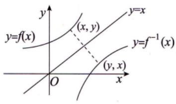  
(b)  
图4

⑤保留函数 $y = f(x)$ 在x轴及x轴上方的部分，把x轴下方的部分关于x轴对称到x轴上方并去掉原来下方的部分，得到函数 $y = \left| f(x) \right|$ 的图像[见图 5(a)].

⑥保留函数 $y = f(x)$ 在y轴及y轴右侧的部分，去掉y轴左侧的部分，再将y轴右侧图像关于y轴对称到y轴左侧，得到函数 $y = f( \left |  x \right |  )$ 的图像[见图 5(b)].

  
(a)

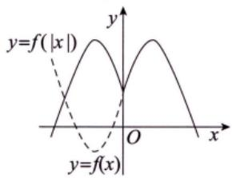  
(b)

图5  

注 $y = f(x) \Rightarrow F(x, y) = f(x) - y$

①若 $F(x, y) = F(-x, y)$ ，则 $y = f(x)$ 关于y轴(x=0)对称.←对应

②若 $F(x, y) = F(2T - x, y)$ 或 $F(T + x, y) = F(T - x, y)$ ，则 $y = f(x)$ 关于 $x = T$ 对称.

③若 $F(x, y) = F(x, -y)$ ，则 $y = f(x)$ 关于x轴(y=0)对称.←对应

④若 $F(x, y) = F(x, 2T - y)$ 或 $F(x,T+y)=F(x,T-y)$ ，则 $y = f(x)$ 关于y=T对称.

⑤若 $F(x, y) = F(-x, -y)$ ，则 y = f(x) 关于(0, 0) 点对称.

⑥若 $F(a+x,y)=F(a-x,-y)$ ，则 y = f(x)关于(a, 0) 点对称.

⑦若 $F(x, y) = F(y, x)$ ，则 y = f(x)关于 y =x对称.

以上结论中，②，④，⑥分别是①，③，⑤的更一般结论，将原对称性进行“平移”，要重视.

如

$$
y^{2}=x^{3}-x^{4}, \quad y^{2}=(1-x^{2})^{3}, \quad x^{3}+y^{3}-3xy=0
$$

$$
F(x,y)=x^{3}-x^{4}-y^{2}
$$

关于x轴，y轴，(0，0)点对称：

$$
F(x,y)=(1-x^{2})^{3}-y^{2}
$$

$$
F(x,y)=x^{3}+y^{3}-3xy
$$

$$
F(x,y)=F(y,x)
$$

$$
F(x,y)=F(x,-y)
$$

$$
\begin{cases}x = t - \sin t, \\y = 1 - \cos t.\end{cases}
$$

$$
F(x,y)=F(-x,-y)
$$

$$
\left\{ \begin{aligned} x_{2} &= (2\pi - t) - \sin(2\pi - t) = 2\pi - (t - \sin t) = 2\pi - x_{1}, \\ y_{2} &= 1 - \cos(2\pi - t) = 1 - \cos t = y_{1}, \end{aligned} \right.  即  F(x_{1}, y_{1}) = F(2\pi - x_{1}, y_{1})
$$

关于x=π对称

(3) 伸缩变换.

①水平伸缩： $y = f(kx)(k > 1)$ 的图像，可由 $y = f(x)$ 的图像上每点的横坐标缩短到原来的 $\frac{1}{k}$ 倍且纵坐标不变得到[见图6(a)]; $y = f(kx)(0 < k < 1)$ 的图像，可由 $y = f(x)$ 的图像上每点的横坐标伸长到原来的 $\frac{1}{k}$ 倍且纵坐标不变得到.

②垂直伸缩： $y = k f(x) (k > 1)$ 的图像，可由 $y = f(x)$ 的图像上每点的纵坐标伸长到原来的k倍且横坐标不变得到[见图6(b)] $y = k f(x) (0 < k < 1)$ 的图像，可由 $y = f(x)$ 的图像上每点的纵坐标缩短到原来的k倍且横坐标不变得到.

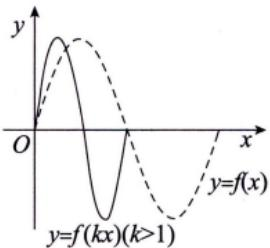  
(a)

图6  
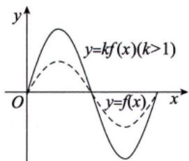  
(b)

(b)

(1)心形线（外摆线的一种）.

  
(a)

(2) 伯努利双纽线.

  
(b)

(3) 阿基米德螺线.

## (4) 对数螺线.

(5) 双曲螺线.

(6) 三叶玫瑰线.

(7) 四叶玫瑰线.

(8)摆线（平摆线）.

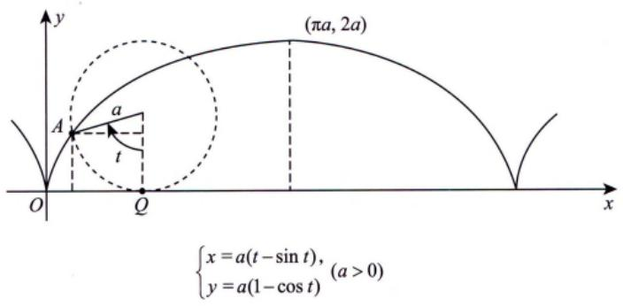

(9)星形线（内摆线的一种）.

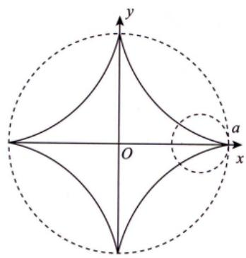

(10)笛卡儿叶形线.

$$
x^{3}+y^{3}-3axy=0  或  \left\{\begin{aligned}x=\frac{3at}{1+t^{3}}, \\y=\frac{3at^{2}}{1+t^{3}}\end{aligned}\right. (a>0).
$$

## 附录3

(1)  

(2)  
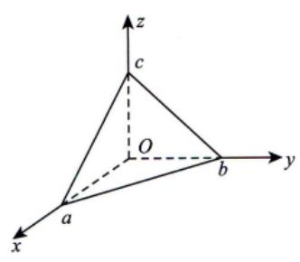

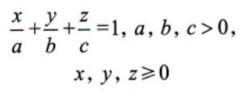

(3)  

(4)  

(5)  
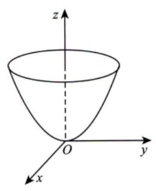

$$
z = x^{2} + y^{2}
$$

(6)  
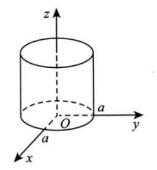

$$
x^{2}+y^{2}=a^{2},z\geqslant 0,a>0
$$

(7)

(8)  

(9)  

(10)

  
(11)

(12)

(13)  
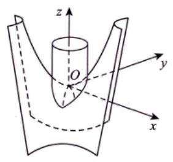  
(14)

(15)

(16)

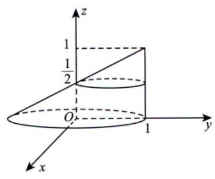

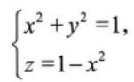

(17)

(18)

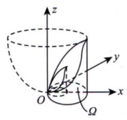

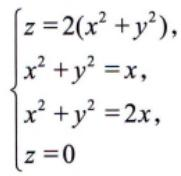

## 附录4

## 重要公式

## 1三角函数常用公式

## (1) 诱导公式.

★小结： $\begin{aligned}&\left\{\sin\left(\frac{\pi}{2} \pm \alpha\right) = \cos\alpha  ,  \right. \\&\left\{\sin(\pi \pm \alpha) = \mp \sin\alpha  ,  \right. \\&\left. \cos\left(\frac{\pi}{2} \pm \alpha\right) = \mp \sin\alpha  ,  \right. \\&\left. \cos(\pi \pm \alpha) = -\cos\alpha  ,  \right.\end{aligned}$ 这8个公式要熟稔于心

<table><tr><td rowspan=1 colspan=1>角θ函数</td><td rowspan=1 colspan=1> $\frac{\pi}{2} - \alpha$ </td><td rowspan=1 colspan=1> $\frac{\pi}{2} + \alpha$ </td><td rowspan=1 colspan=1>π−α</td><td rowspan=1 colspan=1> $\pi + \alpha$ </td><td rowspan=1 colspan=1> $\frac{3\pi}{2} - \alpha$ </td><td rowspan=1 colspan=1> $\frac{3\pi}{2} + \alpha$ </td><td rowspan=1 colspan=1> $2\pi - \alpha$ </td></tr><tr><td rowspan=1 colspan=1>sinθ</td><td rowspan=1 colspan=1>cosα</td><td rowspan=1 colspan=1>cosα</td><td rowspan=1 colspan=1>sin α</td><td rowspan=1 colspan=1>-sinα</td><td rowspan=1 colspan=1>-cosα</td><td rowspan=1 colspan=1>-cosα</td><td rowspan=1 colspan=1>-sinα</td></tr><tr><td rowspan=1 colspan=1>cosθ</td><td rowspan=1 colspan=1>sinα</td><td rowspan=1 colspan=1>-sinα</td><td rowspan=1 colspan=1>-cosα</td><td rowspan=1 colspan=1>-cosα</td><td rowspan=1 colspan=1>-sinα</td><td rowspan=1 colspan=1>sinα</td><td rowspan=1 colspan=1>cosα</td></tr><tr><td rowspan=1 colspan=1>tanθ</td><td rowspan=1 colspan=1>cotα</td><td rowspan=1 colspan=1>-cotα</td><td rowspan=1 colspan=1>-tan α</td><td rowspan=1 colspan=1>tanα</td><td rowspan=1 colspan=1>cot α</td><td rowspan=1 colspan=1>-cotα</td><td rowspan=1 colspan=1>− tan α</td></tr><tr><td rowspan=1 colspan=1>cotθ</td><td rowspan=1 colspan=1>tanα</td><td rowspan=1 colspan=1>-tan α</td><td rowspan=1 colspan=1>-cotα</td><td rowspan=1 colspan=1>cotα</td><td rowspan=1 colspan=1>tanα</td><td rowspan=1 colspan=1>− tan α</td><td rowspan=1 colspan=1>-cotα</td></tr></table>

注(1)如上表所示，奇变偶不变，符号看象限（因任一角度均可表示为 $\frac{k\pi}{2} + \alpha, k \in \mathbf{Z}, |\alpha| \leq \frac{\pi}{4}$ 故k为奇数时得角α的异名函数值，k为偶数时得角α的同名函数值，然后在前面加上一个把角α看成锐角时原来函数值的符号).

(2)三角函数在四个象限中的符号如下表所示.

<table><tr><td rowspan=1 colspan=1>角θ所在象限函数</td><td rowspan=1 colspan=1>第一象限</td><td rowspan=1 colspan=1>第二象限</td><td rowspan=1 colspan=1>第三象限</td><td rowspan=1 colspan=1>第四象限</td></tr><tr><td rowspan=1 colspan=1>sinθ</td><td rowspan=1 colspan=1>+</td><td rowspan=1 colspan=1>+</td><td rowspan=1 colspan=1>一</td><td rowspan=1 colspan=1>一</td></tr><tr><td rowspan=1 colspan=1>cosθ</td><td rowspan=1 colspan=1>+</td><td rowspan=1 colspan=1>一</td><td rowspan=1 colspan=1>一</td><td rowspan=1 colspan=1>+</td></tr><tr><td rowspan=1 colspan=1>tanθ</td><td rowspan=1 colspan=1>+</td><td rowspan=1 colspan=1>一</td><td rowspan=1 colspan=1>+</td><td rowspan=1 colspan=1>一</td></tr><tr><td rowspan=1 colspan=1>cot θ</td><td rowspan=1 colspan=1>+</td><td rowspan=1 colspan=1></td><td rowspan=1 colspan=1>+</td><td rowspan=1 colspan=1></td></tr></table>

(3) secα和 cscα的函数值可由 $\frac{1}{\cos \alpha}  和  \frac{1}{\sin \alpha}$ 得出.

(2) 倍角公式.

$$
\sin 2\alpha = 2\sin \alpha \cos \alpha , \cos 2\alpha = \cos^{2}\alpha - \sin^{2}\alpha = 1 - 2\sin^{2}\alpha = 2\cos^{2}\alpha - 1,
$$

$$
\sin 3\alpha = - 4\sin^{3}\alpha + 3\sin\alpha, \cos 3\alpha = 4\cos^{3}\alpha - 3\cos\alpha,
$$

$$
\tan 2\alpha = \frac{2\tan \alpha}{1 - \tan^{2}\alpha}, \cot 2\alpha = \frac{\cot^{2}\alpha - 1}{2\cot \alpha}.
$$

(3) 半角公式.

$$
\sin^{2}\frac{\alpha}{2}=\frac{1}{2}(1-\cos\alpha),\cos^{2}\frac{\alpha}{2}=\frac{1}{2}(1+\cos\alpha)
$$

$$
\sin \frac{\alpha}{2} = \pm \sqrt{\frac{1 - \cos \alpha}{2}}, \cos \frac{\alpha}{2} = \pm \sqrt{\frac{1 + \cos \alpha}{2}}
$$

$$
\tan \frac{\alpha}{2} = \frac{1 - \cos \alpha}{\sin \alpha} = \frac{\sin \alpha}{1 + \cos \alpha} = \pm \sqrt{\frac{1 - \cos \alpha}{1 + \cos \alpha}}
$$

$$
\cot \frac{\alpha}{2} = \frac{\sin \alpha}{1 - \cos \alpha} = \frac{1 + \cos \alpha}{\sin \alpha} = \pm \sqrt{\frac{1 + \cos \alpha}{1 - \cos \alpha}}
$$

(4) 和差公式.

$$
\sin(\alpha \pm \beta) = \sin\alpha\cos\beta \pm \cos\alpha\sin\beta, \cos(\alpha \pm \beta) = \cos\alpha\cos\beta \mp \sin\alpha\sin\beta,
$$

$$
\tan(\alpha \pm \beta) = \frac{\tan \alpha \pm \tan \beta}{1 \mp \tan \alpha \tan \beta}, \cot(\alpha \pm \beta) = \frac{\cot \alpha \cot \beta \mp 1}{\cot \beta \pm \cot \alpha}.
$$

(5)积化和差与和差化积公式.

①积化和差公式.

$$
\geqslant \tan \left( \frac{\pi}{4} - \alpha \right) = \frac{1 - \tan \alpha}{1 + \tan \alpha}
$$

$$
\sin \alpha \cos \beta = \frac{1}{2} \left[ \sin(\alpha + \beta) + \sin(\alpha - \beta) \right], \cos \alpha \sin \beta = \frac{1}{2} \left[ \sin(\alpha + \beta) - \sin(\alpha - \beta) \right],
$$

$$
\cos \alpha \cos \beta = \frac{1}{2} \left[ \cos(\alpha + \beta) + \cos(\alpha - \beta) \right], \sin \alpha \sin \beta = \frac{1}{2} \left[ \cos(\alpha - \beta) - \cos(\alpha + \beta) \right].
$$

②和差化积公式.

$$
\sin \alpha + \sin \beta = 2\sin \frac{\alpha + \beta}{2}\cos \frac{\alpha - \beta}{2}, \sin \alpha - \sin \beta = 2\sin \frac{\alpha - \beta}{2}\cos \frac{\alpha + \beta}{2},
$$

$$
\cos \alpha + \cos \beta = 2\cos \frac{\alpha + \beta}{2}\cos \frac{\alpha - \beta}{2}, \cos \alpha - \cos \beta = - 2\sin \frac{\alpha + \beta}{2}\sin \frac{\alpha - \beta}{2}.
$$

(6) 万能公式.

若 $u = \tan \frac{x}{2} ( - \pi < x < \pi )$ ，则 $\sin x = \frac{2u}{1 + u^{2}}, \cos x = \frac{1 - u^{2}}{1 + u^{2}}$

## 2一元二次方程基础

①一元二次方程 $ax^{2}+bx+c=0(a \neq 0)$

②判别式 $d = b^{2} - 4ac$

$\varLambda \geqslant 0$ ，方程有两个实根 $x_{1,2} = \frac{-b \pm \sqrt{b^2 - 4ac}}{2a} ; \quad \lambda < 0$ ，方程有两个共轭的复根 $x_{1,2} = \frac{-b \pm \sqrt{4ac - b^2} \mathrm{i}}{2a}$

③根与系数的关系(韦达定理) $x_{1} + x_{2} = - \frac{b}{a}, x_{1}x_{2} = \frac{c}{a}$

## ③ 因式分解公式

① $(a + b)^{2} = a^{2} + 2ab + b^{2}$ ② $(a - b)^{2} = a^{2} - 2ab + b^{2}$

③ $(a+b)^{3}=a^{3}+3a^{2}b+3ab^{2}+b^{3}$ ④ $(a - b)^{3} = a^{3} - 3a^{2}b + 3ab^{2} - b^{3}$

⑤ $a^{2}-b^{2}=(a+b)(a-b)$ ⑥ $a^{3}-b^{3}=(a-b)(a^{2}+ab+b^{2})$

⑦ $a^{3}+b^{3}=(a+b)(a^{2}-ab+b^{2})$

8 $a^{n}-b^{n}=(a-b)(a^{n-1}+a^{n-2}b+\cdots+ab^{n-2}+b^{n-1})(n$ 是正整数）.

⑨n为正奇数时， $a^{n}+b^{n}=(a+b)(a^{n-1}-a^{n-2}b+\cdots-ab^{n-2}+b^{n-1})$

⑩二项式定理

$$
(a + b)^{n} = \sum_{k = 0}^{n} C_{k}^{k} a^{n - k} b^{k} = a^{n} + n a^{n - 1} b + \frac{n(n - 1)}{2!} a^{n - 2} b^{2} + \cdots + \frac{n(n - 1) \cdots (n - k + 1)}{k!} a^{n - k} b^{k} + \cdots + n a b^{n - 1} + b^{n}.
$$

## 4阶乘与双阶乘

① $n! = 1 \cdot 2 \cdot 3 \cdot \cdots \cdot n$ ，规定0!=1.

② $(2n)!! = 2 \bullet 4 \bullet 6 \bullet \cdots \bullet (2n) = 2^n \bullet n!$

③ $(2n - 1)!! = 1 \cdot 3 \cdot 5 \cdot \cdots \cdot (2n - 1)$

## 指数函数

对于指数函数 $y = a ^ { x }$ ，底数a可以是不等于1的任何正数.在实际问题中常遇到以e为底数的指数函数 $y = \mathbf{e}^{x}$ ，e是一个常数.

在微分方程中，凡是因变量y的变化速率与因变量y成正比的函数关系都是这种指数函数.即$\frac{\mathrm{d}y}{\mathrm{d}t}=ky(k>0)$ ，得 $\int \frac{\mathrm{d}y}{y} = \int k\mathrm{d}t$ ，有

$$
\ln | y | = k t + \ln C _ { 1 }
$$

于是 $\left| y \right| = C_{1} \mathrm{e}^{kt}, y = \pm C_{1} \mathrm{e}^{kt} = C \mathrm{e}^{kt}$

指数函数 $y = \mathrm{e}^{-x} = \left( \frac{1}{\mathrm{e}} \right)^x$ 也具有同样的重要性（见图1）.

  
图1

下面列出一张简单的函数值表，将有助于我们认识这两种指数函数.详细的函数表可在各种数学手册中查到.

<table><tr><td rowspan=1 colspan=1>x</td><td rowspan=1 colspan=1>0</td><td rowspan=1 colspan=1>0.5</td><td rowspan=1 colspan=1>1</td><td rowspan=1 colspan=1>1.5</td><td rowspan=1 colspan=1>2</td><td rowspan=1 colspan=1>2.5</td><td rowspan=1 colspan=1>3</td></tr><tr><td rowspan=1 colspan=1> $\mathsf { e } ^ { x }$ </td><td rowspan=1 colspan=1>1</td><td rowspan=1 colspan=1>1.65</td><td rowspan=1 colspan=1>2.72</td><td rowspan=1 colspan=1>4.48</td><td rowspan=1 colspan=1>7.39</td><td rowspan=1 colspan=1>12.2</td><td rowspan=1 colspan=1>20.1</td></tr><tr><td rowspan=1 colspan=1> $\mathbf { e } ^ { - x }$ </td><td rowspan=1 colspan=1>1</td><td rowspan=1 colspan=1>0.607</td><td rowspan=1 colspan=1>0.368</td><td rowspan=1 colspan=1>0.223</td><td rowspan=1 colspan=1>0.135</td><td rowspan=1 colspan=1>0.082</td><td rowspan=1 colspan=1>0.050</td></tr></table>

指数函数 $y = \mathbf{e}^{x}$ 的反函数是 $y = \log_{e}x$ .正像 $\log_{10}x$ 常简记为1gx一样， $\log_{\mathfrak{e}}x$ 也常简记为lnx，称之

为自然对数.

自然对数与普通以10为底的对数的联系是

$$
\ln x = \ln 10 \cdot \lg x (\ln 10 \approx 2.302   585)
$$

$$
\lg x = \lg \mathrm{e} \cdot \ln x (\lg \mathrm{e} \approx 0.434   294)
$$

## 2双曲函数

双曲函数是由指数函数 $\mathsf { e } ^ { x }$ 与 $\mathbf { e } ^ { - x }$ 构成的初等函数.

(1) 定义.

双曲正弦函数

$$
\sin x = \frac{\mathrm{e}^{x} - \mathrm{e}^{-x}}{2}
$$

双曲余弦函数

$$
\mathrm{ch} x = \frac{\mathrm{e}^{x} + \mathrm{e}^{-x}}{2}
$$

双曲正切函数

$$
\operatorname{th}x = \frac{\operatorname{sh}x}{\operatorname{ch}x} = \frac{\mathrm{e}^{x} - \mathrm{e}^{- x}}{\mathrm{e}^{x} + \mathrm{e}^{- x}}
$$

$$
\mathrm{sh}(-x)=\frac{\mathrm{e}^{-x}-\mathrm{e}^{x}}{2}=-\frac{\mathrm{e}^{x}-\mathrm{e}^{-x}}{2}=-\mathrm{sh} x
$$

$$
\operatorname{ch}(-x)=\frac{\mathrm{e}^{-x}+\mathrm{e}^{x}}{2}=\frac{\mathrm{e}^{x}+\mathrm{e}^{-x}}{2}=\operatorname{ch} x
$$

$$
\mathrm{th}(-x)=\frac{\mathrm{sh}(-x)}{\mathrm{ch}(-x)}=\frac{-\mathrm{sh}\ x}{\mathrm{ch}\ x}=-\mathrm{th}\ x
$$

故 sh x，th x都是奇函数，ch x是偶函数.

想要画出这三种函数的图形，只要先画出右半平面的曲线部分 $(x \geqslant 0)$ ，再根据对称性就能画出整个曲线（见图2）.注意到

$$
\mathrm{sh} x = \frac{1}{2} \mathrm{e}^{x} - \frac{1}{2} \mathrm{e}^{-x} ,
$$

$$
\mathrm{ch} x = \frac{1}{2} \mathrm{e}^{x} + \frac{1}{2} \mathrm{e}^{-x} ,
$$

先作出 $y = \frac{1}{2} \mathbf{e}^{x}$ 与 $y = \frac{1}{2}\mathrm{e}^{-x}$ 的图形，shx的值正是这两条曲线在点x处的纵坐标之差，chx的值正是这两条曲线在点x处的纵坐标之和.容易看出，当x很大时，chx总是大于 $\frac{1}{2} \mathbf{e}^{x}$ ，但很接近它，shx总是小于 $\frac{1}{2} \mathbf{e}^{x}$ ，也很接近它.

  
图2

由于

$$
\operatorname{th}x = \frac{\operatorname{sh}x}{\operatorname{ch}x}
$$

当x从0变大时，shx，chx都取正值，且chx>shx，故x>0时，thx的值总是介于0与1之间，并且当x很大时，thx很接近于1，由此就容易画出y=thx在右半平面的曲线部分.根据曲线关于原点的对称性，就可画出整个图形来（见图3）.

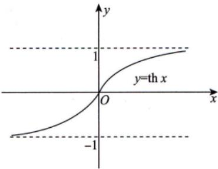  
图3

(2) 关系式.

双曲函数之间具有一些重要恒等式

根据双曲正弦与双曲余弦的定义立即可知

$$
\mathrm{e}^{x}=\mathrm{ch} x+\mathrm{sh} x, \mathrm{e}^{-x}=\mathrm{ch} x-\mathrm{sh} x
$$

利用这两个恒等式，就能通过指数函数的性质来证明一些关于双曲函数的恒等式.如

$$
\begin{align*}\mathrm{sh}(u + v) = & \frac{1}{2}[\mathrm{e}^{(u+v)} - \mathrm{e}^{-(u+v)}] = \frac{1}{2}(\mathrm{e}^u \cdot \mathrm{e}^v - \mathrm{e}^{-u} \cdot \mathrm{e}^{-v}) \\= & \frac{1}{2}[(\mathrm{ch} u + \mathrm{sh} u)(\mathrm{ch} v + \mathrm{sh} v) - (\mathrm{ch} u - \mathrm{sh} u)(\mathrm{ch} v - \mathrm{sh} v)] ,\end{align*}
$$

也就是

$$
\mathrm { s h } ( u + v ) = \mathrm { s h }   u   \mathrm { c h }   v + \mathrm { c h }   u   \mathrm { s h }   v   .
$$

在这个恒等式中，将两端所包含的ν换作-ν，并利用双曲函数的奇偶性，立即可得

$$
\mathrm{sh}(u - v) = \mathrm{sh} u \mathrm{ch}(-v) + \mathrm{ch} u \mathrm{sh}(-v)
$$

$$
\operatorname { s h } u \operatorname { c h } v - \operatorname { c h } u \operatorname { s h } v .
$$

同样可证明关于 $\operatorname { c h } ( u \pm v )$ 的恒等式. 故有

$$
\mathrm { s h } ( u \pm v ) = \mathrm { s h }   u   \mathrm { c h }   v \pm \mathrm { c h }   u   \mathrm { s h }   v   ,\tag{5-1}
$$

$$
\operatorname { c h } ( u \pm v ) = \operatorname { c h } u \operatorname { c h } v \pm \operatorname { s h } u \operatorname { s h } v .\tag{5-2}
$$

在关于 $\operatorname { c h } ( u - v )$ 的恒等式中，令 $\nu   =   u$ ，又可得到一个重要的恒等式

$$
\mathrm{ch}^{2} u - \mathrm{sh}^{2} u = 1\tag{5-3}
$$

由(5-1)\~(5-3) 可以推出很多恒等式.(5-3) 式两端同除以 $\operatorname { c h } ^ { 2 } u$ ，就得到

$$
1 - \mathrm{th}^2   u = \frac{1}{\mathrm{ch}^2   u}\tag{5-4}
$$

(5-1)，(5-2)式中（取加号的情况），令 $\nu   =   u$ ，就得到

$$
\mathrm { s h } 2 u = 2 \mathrm { s h } u \mathrm { c h } u ,\tag{5-5}
$$

$$
\mathrm{ch} 2u = \mathrm{ch}^2 u + \mathrm{sh}^2 u = 2\mathrm{ch}^2 u - 1\tag{5-6}
$$

双曲函数的反函数叫作反双曲函数，分别记作arsh $x$ ，arch x 及 arth x. 由于双曲函数是由指数函数构成的，故反双曲函数与对数函数有一定的联系.

设 $y = \arcsin x$ ，则 $x = \sin y$ ，即

$$
x = \frac{\mathrm{e}^{y} - \mathrm{e}^{- y}}{2}\tag{5-7}
$$

我们希望由此解出 $y$ ，将 $y$ 表达为x的一个数学式子

(5-7) 式两端乘以 $2\mathrm{e}^{y}$ ，就得到

$$
\left( \mathrm{e}^{y} \right)^{2} - 2x\mathrm{e}^{y} - 1 = 0 ,\tag{5-8}
$$

将(5-8)式看成关于 $\mathsf { e } ^ { y }$ 的二次方程，即可解得

$$
\mathrm{e}^{y}=x\pm\sqrt{x^{2}+1}\tag{5-9}
$$

但 $\mathsf { e } ^ { y }$ 不能取负值，故(5-9)式右端只取正号，即

$$
\mathrm{e}^{y}=x+\sqrt{x^{2}+1}
$$

也就是

$$
y = \ln(x + \sqrt{x^2 + 1})
$$

这样，我们就得到

$$
y = \operatorname { a r s h } x = \ln ( x + { \sqrt { x ^ { 2 } + 1 } } ) .
$$

应该注意到反双曲正弦函数的定义域.由于 $y = \operatorname{arcsin}x$ 就是 $x = \sin y$ ，由后式可以看出，x的取值范围是 $(-\infty, +\infty)$ ，故得

$$
\operatorname { a r s h } x = \ln ( x + \sqrt { x ^ { 2 } + 1 } ) \quad ( - \infty < x < + \infty ) .\tag{5-10}
$$

同样，可以求得

$$
\mathrm{arch} x = \pm \ln(x + \sqrt{x^2 - 1}) (x \geq 1)\tag{5-11}
$$

$$
\mathrm{arth} x = \frac{1}{2} \ln \frac{1 + x}{1 - x} \quad (-1 < x < 1)\tag{5-12}
$$

推导(5-11)式时，化简过程中要用到

$$
\ln \left( x - \sqrt{x^{2} - 1} \right) = \ln \frac{1}{x + \sqrt{x^{2} - 1}} = - \ln \left( x + \sqrt{x^{2} - 1} \right) \quad (x \geq 1)
$$

$y = \operatorname{arcsin}x$ $y = \operatorname{ath}x$ 都是单值函数，而 $y = \operatorname{arcth}x$ 是双值函数，一般取它在上半平面的那一支作为主值分支，即取表达式 $\operatorname{arch}x = \ln(x + \sqrt{x^2 - 1}) (x \geq 1)$

反双曲函数的图形与相应的双曲函数的图形关于直线 $y = x$ 对称，由此就容易画出反双曲函数的图形(见图4).

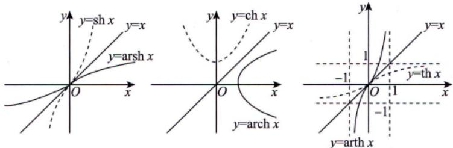  
图4

## 附录6

## 变形技巧

数学考题的解题过程，本质上就是建立一座连接条件与结论的桥梁，搭建这座桥梁的每一步都是一个转化.无论这种转化所体现的是“等量关系”“等价关系”，还是“不等量放缩”“充分关系”“必要关系”，均可在形式上统称为变形、在做题中，变形的处理，贯穿始终，请读者务必高度重视，且在多次研读本部分内容后做到实践，总结，再实践，再总结，形成自己强大的数学题变形转化的能力，使变形如行云流水，必有所成.

## 1等式变形与等价变形

用“=”连接数学中的量A与量B，称为等式，于是A与B的相互转化，即等式变形.

用“↔”连接命题A与命题B，称为等价，于是A与B的相互转化，即等价变形.

(1) 定义法.

定义法是说，用A定义B，则 $B \Leftrightarrow A$ ，给出B，回归定义A，这是最基本的方法.

如 $\lim_{x \to 0} f(x) = 0$ ，用定义：任给 $\varepsilon > 0$ ，存在 $\delta > 0$ ，当 $0 < \mid x \mid < \delta$ 时，恒有 $\left| f(x) \right| < \varepsilon$ ，按题意取δ，如下面的注例.

注例 设f(x)具有一阶连续导数，且 $\lim_{x \to \infty} [x - f(x)] = 0 , f(1) < 1$ ，证明：

(1) 存在 $\xi > 1$ ，使得 $\left| \xi - f(\xi) \right| < 1 - f(1)$ i

(2)存在η>1，使得 $f^{\prime}(\eta) > 1$

证（1)由 $\lim_{x \to \infty} [x - f(x)] = 0$ ，得对于任意的 $\varepsilon > 0$ ，存在X>1，当 $\xi > X > 1$ ，有 $\left| \xi - f(\xi) \right| < \varepsilon$ 取 $\varepsilon = 1 - f(1) > 0$ ，得证.

(2) 由 $\left| \xi - f(\xi) \right| \geqslant \xi - f(\xi)$ ，结合(1)，有 $\xi - f(\xi) \leq \xi - f(\xi) \leq 1 - f(1)$ ，移项得 $\xi - 1 < f(\xi) - f(1)$

由拉格朗日中值定理，存在 $\eta \in (1, \xi)$ ，使 $f^{\prime}(\eta)=\frac{f(\xi)-f(1)}{\xi-1}>1$ ，得证.

再如，导数定义是常考题：

①给出f(x)在 $x   =   x _ { 0 }$ 处连续，且 $\lim_{x \to x_0} \frac{f(x)}{x - x_0} = a$ ，则

$$
\lim _ { x \rightarrow x _ { 0 } } f ( x ) = 0 = f ( x _ { 0 } ) ,
$$

于是 $f^{\prime}(x_0) = \lim_{x \to x_0} \frac{f(x) - f(x_0)}{x - x_0} = a$

②给出f(x)在 $x   =   x _ { 0 }$ 的某邻域内一阶可导，且 $\lim_{x \to x_0} \frac{f(x)}{(x - x_0)^2} = a$ ，则

$$
\lim _ { x \rightarrow x _ { 0 } } f ( x ) = 0 = f ( x _ { 0 } ) ,
$$

于是 $f^{\prime}(x_0)=\lim_{x \to x_0} \frac{f(x)-f(x_0)}{x-x_0}=\lim_{x \to x_0} \frac{f(x)}{(x-x_0)^2}(x-x_0)=a \cdot 0=0.$

③给出可导函数f(x)在 $x   =   x _ { _ 0 }$ 处的切线方程为 $y = g(x)$ ，则 $f(x_{0}) = g(x_{0}) , f^{\prime}(x_{0}) = g^{\prime}(x_{0})$

进一步，若 $f''(x) > 0$ ，且令 $F(x) = f(x) - g(x)$ ，则有

$$
F^{\prime}(x_{0}) = f^{\prime}(x_{0}) - g^{\prime}(x_{0}) = 0 ,
$$

$$
F''(x_0) = f''(x_0) > 0
$$

所以 $x   =   x _ { _ 0 }$ 为 $F ( x )$ 的极小值点.

④给出可导函数f(x)与g(x)在 $x = x_{0}$ 处相切，则 $f(x_{0}) = g(x_{0}) , f^{\prime}(x_{0}) = g^{\prime}(x_{0})$

进一步，若 $f^{\prime\prime}(x)>0\ , \ g^{\prime\prime}(x)<0$ ，且令 $F(x) = f(x) - g(x)$ ，则有

$$
F^{\prime}(x_{0}) = f^{\prime}(x_{0}) - g^{\prime}(x_{0}) = 0 ,
$$

$$
F^{\prime\prime}(x_0) = f^{\prime\prime}(x_0) - g^{\prime\prime}(x_0) > 0 ,
$$

所以 $x   =   x _ { 0 }$ 为 $F ( x )$ 的极小值点.

(2) 公式法.

数学公式是用数学思想与方法已经得出的解决问题的简便数学表达.一方面，要注意公式的特征(也就是说，这个数学表达式的独特性在哪里？此独特性就指向解题思考的方向）；另一方面，要注意公式的成立条件（也就是说，这个数学表达式在什么条件下使用？对成立条件的思考，可加强对解题方向的把握）.

如：

$$
f(x) = f(0) + f'(0)x + \frac{f''(0)}{2}x^2 + \cdots,
$$

泰勒展开式的独特性就在于它用函数在 $x = 0$ 处的各阶导数值来近似表示 $x = 0$ 附近的值，形式上联系了$ \text{" }f(x) \text{" }$ 与 $f^{(n)}(x), \quad n \geq 2$ .独特性的成立条件是“n阶可导， $n \geq 2$ ，更可确认用泰勒公式.

(3) 换元法.

引入新元，代换掉旧元，使问题在形式或表述上简单化、规范化和常规化，从而解决问题.

①复杂部分代换.

正如前述，引入新元，使表达式简单，易于处理，如计算 $\int \ln \left( 1 + \sqrt{\frac{1 + x}{x}} \right) \mathrm{d}x$ ，令 $t = \ln \left( 1 + \sqrt{\frac{1 + x}{x}} \right)$ 即可打开局面.

②平移换元法 $\begin{aligned} &\begin{cases}  宏观 , \\  微观 . \end{cases}\\ \end{aligned}$

a. 宏观上，若 $x   \rightarrow   1$ ，令 $t = x - 1$ ，则 $t   \rightarrow   0$

b. 微观上，若 $a < b$ ，则令 $c = a + \varepsilon (0 < \varepsilon < b - a)$ ，于是有 $a < a + \varepsilon < b$

当 $b - a$ 很小时，可称“见缝插针”，此法常用于研究局部性质.

③消元换元法.

此换元法的目的在于消元.

a. 若 $x_{1} > x_{2}$ ，可令 $x_{1} = x_{2} + t , \quad t > 0$ ，则 $x_{1}x_{2}=(x_{2}+t)x_{2}$

b. 若 $x_{1} > x_{2} > 0$ ，可令 $x_{1} = tx_{2} , \ t > 1$ ，则 $x_{1}x_{2}=tx_{2}^{2}$

c. 零和换元法.

当 $x_{1} + x_{2} = a$ 时，令

$$
x_{1} = \frac{a}{2} + t , \quad x_{2} = \frac{a}{2} - t .
$$

当 $2x + y = 1$ 时，令

$$
2x = \frac{1}{2} + t , y = \frac{1}{2} - t .
$$

当 $x + y + z = 1$ 时，令

$$
x = \frac{1}{3} + t_{1} , \quad y = \frac{1}{3} + t_{2} , \quad z = \frac{1}{3} - t_{1} - t_{2} .
$$

注多说一句，对数学一、数学三的读者，看到 $x + y + z = 1$ ，可否想到概率的归一性？如下面的注例.

注例设 $x , y , z$ 均大于0，且 $x + y + z = 1$ .证明

$$
\frac{4}{x} + \frac{1}{y} + \frac{1}{z} \geqslant 16
$$

证 设随机变量X的分布为

$$
P\left\{X=\frac{2}{x}\right\}=x,\;P\left\{X=\frac{1}{y}\right\}=y,\;P\left\{X=\frac{1}{z}\right\}=z,
$$

则有

$$
EX = x \cdot \frac{2}{x} + y \cdot \frac{1}{y} + z \cdot \frac{1}{z} = 4 ,
$$

$$
E(X^{2}) = x \cdot \frac{4}{x^{2}} + y \cdot \frac{1}{y^{2}} + z \cdot \frac{1}{z^{2}} = \frac{4}{x} + \frac{1}{y} + \frac{1}{z}
$$

由于

$$
DX = E(X^{2}) - (EX)^{2} \geqslant 0
$$

因此

$$
\frac{4}{x} + \frac{1}{y} + \frac{1}{z} \geqslant 16
$$

得证.

你是否想到用 $E(X^{2}) \geqslant (EX)^{2}$ 来证代数不等式？此题可赏之，妙哉，妙哉.

④商抵换元法.

当 $x_{1}x_{2}=a^{2}$ 时，令 $x_{1}=ta , x_{2}=\frac{a}{t}$

(4) 相消法.

加减相消法、乘除相消法和错位相消法是相消法的三种情况.

①加减相消法.

a. 裂项为 $a_{n + 1} - a_{n}; b.$ 创造 $a_{n + 1} - a_{n} = f(n)$ ，然后得 $a_{n + 1} = a_{n + 1} - a_{n} + a_{n} - a_{n - 1} + \cdots + a_{2} - a_{1} + a_{1}$ ，本质 上是通分的逆运算，形式上作同形分解

如

$$
\frac{1}{n(n + k)} = \frac{1}{k} \left( \frac{1}{n} - \frac{1}{n + k} \right)
$$

$$
\frac{1}{(2n + 1)(2n - 1)} = \frac{1}{2}\left(\frac{1}{2n - 1} - \frac{1}{2n + 1}\right)
$$

$$
\frac{1}{n(n + 1)(n + 2)} = \frac{1}{2}\left[\frac{1}{n(n + 1)} - \frac{1}{(n + 1)(n + 2)}\right]
$$

$$
\frac{{\mathrm{e}}^{-n}({\mathrm{e}}-1)}{(1-{\mathrm{e}}^{-n})({\mathrm{e}}-{\mathrm{e}}^{-n})}=\frac{{\mathrm{e}}^{n}({\mathrm{e}}-1)}{({\mathrm{e}}^{n}-1)({\mathrm{e}}^{n+1}-1)}=\frac{1}{{\mathrm{e}}^{n}-1}-\frac{1}{{\mathrm{e}}^{n+1}-1}
$$

在思想上，还可与共轭法和对数运算性质结合在一起思考.

如 1 =√n+1-√n;ln(1+1 =ln(n +1)−ln n .√n+1+√n n

关键就是有同形分解的意识和办法.

$$
\frac{2^{-n}}{(1-2^{-n})(2-2^{-n})}=\frac{2^{n}}{(2^{n}-1)(2^{n+1}-1)}=\frac{1}{2^{n}-1}-\frac{1}{2^{n+1}-1}
$$

又如 $\frac{a_{n + 1}}{n} = \frac{a_{n}}{(n + 1)(na_{n} + 1)} , \quad a_{1} = \frac{1}{2}$ ，则

$$
(n + 1)a_{n + 1} = \frac{na_{n}}{na_{n} + 1} \Rightarrow \frac{1}{(n + 1)a_{n + 1}} = 1 + \frac{1}{na_{n}} \Rightarrow \frac{1}{(n + 1)a_{n + 1}} - \frac{1}{na_{n}} = 1
$$

故

$$
\frac{1}{na_{n}} = \frac{1}{na_{n}} - \frac{1}{(n - 1)a_{n - 1}} + \frac{1}{(n - 1)a_{n - 1}} - \frac{1}{(n - 2)a_{n - 2}} + \cdots + \left( \frac{1}{2a_{2}} - \frac{1}{a_{1}} \right) + \frac{1}{a_{1}} = (n - 1) + 2 = n + 1 \Rightarrow a_{n} = \frac{1}{n(n + 1)}
$$

②乘除相消法.

创造 $\frac{a_{n}}{a_{n - 1}} = f(n)$ ，然后得 $a_{n}=\frac{a_{n}}{a_{n-1}}\bullet \frac{a_{n-1}}{a_{n-2}}\bullet \cdots \bullet \frac{a_{2}}{a_{1}}\bullet a_{1}$

如 $a_{n}=(n-1)a_{n-1}+\cdots+3a_{3}+2a_{2}+a_{1}\ , \ a_{1}=1\ , \ n\geqslant2$ ，则 $a_{n + 1} - a_{n} = na_{n} , \quad \frac{a_{n + 1}}{a_{n}} = n + 1$

故 $a_{n}=\frac{a_{n}}{a_{n-1}}\bullet \frac{a_{n-1}}{a_{n-2}}\bullet \cdots \bullet \frac{a_{3}}{a_{2}}\bullet a_{2}=n(n-1)\bullet \cdots \bullet 3\bullet a_{2}$ ，且 $a_{2}=a_{1}=1$ ，得 $a_{n} = \frac{n!}{2}$

③错位相消法.

$$
S_{n}=a+aq+aq^{2}+\cdots+aq^{n-1}\tag{*}
$$

$$
qS_{n}=aq+aq^{2}+\cdots+aq^{n}\tag{**}
$$

由(\*)-(\*\*)，得 $(1 - q)S_{n} = a - aq^{n}$ ，于是 $S_{n}=\frac{a(1-q^{n})}{1-q}, \quad q \neq 1$

(5) 同除法或解方程法.

①形如 $a_{n + 1} = k a_n + f(n) (k \neq 0, 1) \Rightarrow \frac{a_{n + 1}}{k^{n + 1}} = \frac{a_n}{k^n} + \frac{f(n)}{k^{n + 1}}$

例1设数列 $\left\{ a_{n} \right\}$ 满足 $a_{n + 1} = 2a_{n} + 2^{n + 2}, \quad a_{1} = 2$ ，求 $\dot { a } _ { n }$ 的表达式.

解由题设可知，

$$
\frac{a_{n + 1}}{2^{n + 1}} = \frac{a_{n}}{2^{n}} + 2 \Rightarrow \frac{a_{n + 1}}{2^{n + 1}} - \frac{a_{n}}{2^{n}} = 2 ,
$$

因此 $\left\{ \frac{a_{n}}{2^{n}} \right\}$ 是以1为首项，2为公差的等差数列，则

$$
\frac{a_{n}}{2^{n}}=1+2(n-1)=2n-1
$$

故 $a_{n}=2^{n}(2n-1)$

②当 $a_{n + 1} + A a_{n} = B^{n} \cdot P_{m}(n)$ 时，有 $a_{n} = \left\{ \begin{aligned} C \bullet ( - A ) ^ { n } + B ^ { n } Q _ { m } ( n ) , \quad B \neq - A , \\ C \bullet ( - A ) ^ { n } + n \bullet B ^ { n } Q _ { m } ( n ) , \quad B = - A , \end{aligned} \right.$ 其中 $P_{m}(n)$ 为n的m次多项式，

$\mathcal { Q } _ { m } ( n )$ 为n的m次多项式.

如例1中， $a_{n + 1} - 2a_{n} = 4 \bullet 2^{n}$ ，则 $a_{n}=C \bullet 2^{n}+n \bullet 2^{n} \bullet D$ .又 $a_{1} = 2$ ，有 $a_{2}=2 \cdot a_{1}+2^{3}=12$ ，因此有

$$
2=a_{1}=C \bullet 2+2 \bullet D, \quad 12=a_{2}=C \bullet 2^{2}+2 \bullet 2^{2} \bullet D \Rightarrow \left\{\begin{aligned}C+D=1, \\ C+2 D=3\end{aligned}\right. \Rightarrow \left\{\begin{aligned}C=-1, \\ D=2.\end{aligned}\right.
$$

故 $a_{n} = (-1) \cdot 2^{n} + 2n \cdot 2^{n} = 2^{n}(2n - 1)$

③形如 $a_{n}a_{n + 1} = pa_{n} + qa_{n + 1}$

当 $p q \neq 0$ 时， $\frac{p}{a_{n + 1}} + \frac{q}{a_{n}} = 1$ i

当 $p + q \neq 0$ 时， $p \left( \frac{1}{a_{n+1}} - a \right) + q \left( \frac{1}{a_n} - a \right) = 0 , \quad a = \frac{1}{p+q}$

例2 已知数列 $\left\{ a_{n} \right\}$ 满足 $\sqrt{a_{n}a_{n - 2}} = \sqrt{a_{n - 1}a_{n - 2}} + 2a_{n - 1}(n \geqslant 2)$ ,且 $a_{0}=a_{1}=1$ ,求 $a_{n}(n \geqslant 2)$ 的表达式.解 由题设可知， $\sqrt{\frac{a_{n}}{a_{n - 1}}} - 2\sqrt{\frac{a_{n - 1}}{a_{n - 2}}} = 1$ ，因此有 $\sqrt{\frac{a_{n}}{a_{n - 1}}} + 1 = 2\left( \sqrt{\frac{a_{n - 1}}{a_{n - 2}}} + 1 \right)$ ，故 $\left\{ \sqrt{\frac{a_{n}}{a_{n - 1}}} + 1 \right\}$ 是以$\sqrt{\frac{a_{1}}{a_{0}}} + 1 = 2$ 为首项，以2为公比的等比数列，所以 $\sqrt{\frac{a_{n}}{a_{n - 1}}} + 1 = 2^{n}$ ，故 $\frac{a_{n}}{a_{n - 1}} = (2^{n} - 1)^{2}$ ，所以

$$
a_{n}=\frac{a_{n}}{a_{n-1}}\bullet \frac{a_{n-1}}{a_{n-2}}\cdots \bullet 1=\prod_{k=2}^{n}\left ( 2^{k}-1 \right ) ^{2}(n\geqslant 2)
$$

④若有 $f(a_{n + 1}, a_{n}, a_{n - 1}) = 0$ ，可创造 $a_{n + 1} - a_{n}, a_{n} - a_{n - 1}$ ，命其分别为 $b_{n + 1} , b_{n}$ ，再创造如①，③的情形.

例3 已知数列 $\left\{ a_{n} \right\}$ 满足 $a_{n + 1} = \frac{1}{n + 1}(na_{n} + a_{n - 1})(n \geqslant 1)$ $a_{_0} = 1$ $a_{1} = 0$ ，求 $a_{n}-a_{n-1}(n \geqslant 1)$

解由题设可知， $(n + 1)a_{n + 1} - (n + 1)a_{n} = - (a_{n} - a_{n - 1})$ ，故 $a_{n + 1} - a_{n} = - \frac{1}{n + 1}(a_{n} - a_{n - 1})$ ，所以

$$
a_{n}-a_{n-1}=\left(-\frac{1}{n}\right)\cdot\left(-\frac{1}{n-1}\right)\cdots\cdot\left(-\frac{1}{2}\right)\cdot\left(a_{1}-a_{0}\right)=(-1)^{n}\cdot\frac{1}{n!}(n\geqslant1)
$$

⑤当 $f(a_{n + 1}, a_{n}, a_{n - 1}) = 0$ 为线性方程，即 $a_{n + 1} + A a_{n} + B a_{n - 1} = 0$ 时，因 $a_{_n} = \lambda^{n}$ 是其解的形式，故$\lambda^{n + 1} + A\lambda^{n} + B\lambda^{n - 1} = 0$ ，有 $\lambda^{n - 1}(\lambda^{2} + A\lambda + B) = 0$ ，若 $\Delta =A^{2}-4B>0$ ，解此方程有两个互异的实根 $\lambda_{1}, \lambda_{2}$ 则根据线性方程的解的结构有 $a_{n}=C_{1}\lambda_{1}^{n}+C_{2}\lambda_{2}^{n}$ .若 $\Delta = A^{2} - 4B = 0$ ，有 $a_{n} = \left( C_{1} + C_{2}n \right)\left( - \frac{A}{2} \right)^{n}$ ，并由初始条件来定 $C_{1},~C_{2}$ 即可.

(6) 倒置法.

将题给表达式取倒数，改变表达式结构，常用于分母复杂、分子单一的情形，即将 $ \text{" }\Delta "  \rightarrow  \text{" }\nabla  \text{" }$ 例4已知数列 $\left\{ a_{n} \right\}$ 满足 $a_{n + 1} = \frac{a_{n}}{a_{n} + 2}$ ，且 $a_{1} = 1$ ，求 $a _ { n }$ 的表达式.

解由题设可知， $\frac{1}{a_{n + 1}} = 1 + \frac{2}{a_{n}}$ ，因此有

$$
\frac{1}{a_{n + 1}} + 1 = 2\left( \frac{1}{a_{n}} + 1 \right)
$$

又 $a_{_1} = 1$ ，则 $\frac{1}{a_{1}} + 1 = 2$ ，故 $\frac{1}{a_{n}} + 1 = 2^{n}$ ，所以 $a_{n} = \frac{1}{2^{n} - 1}$

(7) 平方开方法.

将题给表达式配成 $a ^ { 2 }$ 或 $a^{2} + b^{2}$ 的形式，其表达式一般有如下特征.

①倒数之和，即若 $a = \frac{1}{b}$ ，则有 $a^{2}+b^{2}=(a+b)^{2}-2=(a-b)^{2}+2$ ，如

$$
x^{2}+\frac{1}{x^{2}}=\left(x+\frac{1}{x}\right)^{2}-2=\left(x-\frac{1}{x}\right)^{2}+2
$$

$$
\mathrm{e}^{2x} + \mathrm{e}^{-2x} = \left( \mathrm{e}^{x} + \mathrm{e}^{-x} \right)^{2} - 2 = \left( \mathrm{e}^{x} - \mathrm{e}^{-x} \right)^{2} + 2
$$

②线性组合，如若 $a+\frac{b}{2}=c$ （定值)，则

$$
a^{2}+ab+b^{2}=\left(a+\frac{b}{2}\right)^{2}+\frac{3}{4}b^{2}=c^{2}+\frac{3}{4}b^{2}
$$

③ $a^{2}+b^{2}+c^{2}, \quad a+b+c, \quad ab+bc+ac, \quad (a+b)^{2}+(b+c)^{2}+(c+a)^{2}$ 的关系.

$$
a^{2}+b^{2}+c^{2}=(a+b+c)^{2}-2(ab+bc+ac)\tag{*}
$$

$$
a^{2}+b^{2}+c^{2}+ab+bc+ac=\frac{1}{2}\left[(a+b)^{2}+(b+c)^{2}+(a+c)^{2}\right]\tag{**}
$$

(\*)，(\*\*)式可将上述表达式联系起来，遇到相关表达式时，可用(\*)，(\*\*)式试着作等式变形与转化.  
④三角函数的倍角公式.

$$
1 + \sin 2\theta = \left( \sin \theta + \cos \theta \right)^{2}
$$

注这里可有启发：若 $x^{2}+y^{2}=1(x>0,\ y>0)$ 风 $\begin{cases}x = \cos \theta, \\y = \sin \theta,\end{cases}\left(0, \frac{\pi}{2}\right)$ ，则可化简一些式子，如$z = \frac{1}{y^{2}} + \frac{x}{y} + 1 = \frac{1}{\sin^{2}\theta} + \cot\theta + 1 = \csc^{2}\theta + \cot\theta + 1 = \left( \cot\theta + \frac{1}{2} \right)^{2} + \frac{7}{4} \geqslant \frac{7}{4}$

⑤平方后可简化.

若 $a^{2} + b^{2} = A$ $ab = B$ ，则 $| a + b | = \sqrt{ ( a + b ) ^ { 2 } } = \sqrt{ A + 2 B }$

如

$$
\sqrt{1+\sqrt{a_{n}}}+\sqrt{1-\sqrt{a_{n}}}=\sqrt{2+2\sqrt{1-a_{n}}}
$$

$$
\sqrt{2+\sqrt{3}}+\sqrt{2-\sqrt{3}}=\sqrt{4+2\times1}=\sqrt{6}
$$

又如

$$
y = \sqrt{x + 1} + \sqrt{2 - x} \Rightarrow y^{2} = 3 + 2\sqrt{(2 - x)(x + 1)}
$$

这样一变形，方便讨论最值.

(8) 特殊值法.

令 $x   =   x _ { 0 }$ ，使欲求表达式与条件表达式产生联系.

如 $f(x)=ax^{3}+bx^{2}+cx+d$ ，则

$$
a+b+c+d=f(1)
$$

$$
a-b+c-d=-f(-1)
$$

$$
3a + 2b + c = f^{\prime}(1)
$$

所以

$$
a + c = \frac{1}{2} \left[ f(1) - f(-1) \right],
$$

$$
b + d = \frac{1}{2} \left[ f(1) + f(-1) \right] .
$$

(9) 因式分解法.

$$
a^{2}+ab+b^{2}=\frac{a^{3}-b^{3}}{a-b}
$$

$$
a^{2}-ab+b^{2}=\frac{a^{3}+b^{3}}{a+b}
$$

当n为正整数时， $a^{n - 1} + a^{n - 2}b + \cdots + ab^{n - 2} + b^{n - 1} = \frac{a^n - b^n}{a - b}$

当n为正奇数时， $a^{n - 1} - a^{n - 2}b + \cdots - ab^{n - 2} + b^{n - 1} = \frac{a^n + b^n}{a + b}$

(10) 整数幂和法.

$$
1^{k} + 2^{k} + \cdots + n^{k} = \frac{1}{k + 1}n^{k + 1} + R_{k}
$$

如

$$
1^{2} + 2^{2} + \cdots + n^{2} = \frac{1}{3}n^{3} + R_{2}
$$

$$
1^{3} + 2^{3} + \cdots + n^{3} = \frac{1}{4}n^{4} + R_{3}
$$

$$
1^{4} + 2^{4} + \cdots + n^{4} = \frac{1}{5}n^{5} + R_{4}
$$

这在放缩法中有重要作用.

例5 计算 $\lim_{n \to \infty} \left( \sin \frac{1}{n^2} + \sin \frac{2}{n^2} + \cdots + \sin \frac{n}{n^2} \right)$

解由

$$
x - \frac{1}{6}x^{3} < \sin x < x (0 < x < 1)
$$

故 $\left( \frac{1}{n^{2}} + \frac{2}{n^{2}} + \cdots + \frac{n}{n^{2}} - \frac{1}{6} \left( \frac{1^{3}}{n^{6}} + \frac{2^{3}}{n^{6}} + \cdots + \frac{n^{3}}{n^{6}} \right) \right) < \sin \frac{1}{n^{2}} + \sin \frac{2}{n^{2}} + \cdots + \sin \frac{n}{n^{2}} < \frac{1}{n^{2}} + \frac{2}{n^{2}} + \cdots + \frac{n}{n^{2}}$ 而

$$
\lim_{n \to \infty} \left( \frac{1}{n^2} + \frac{2}{n^2} + \cdots + \frac{n}{n^2} \right) = \lim_{n \to \infty} \frac{\frac{1}{2}n(n+1)}{\frac{1}{n^2}} = \frac{1}{2}, \quad \frac{\frac{1^3 + 2^3 + \cdots + n^3}{n^6} - \frac{1}{4}n^4 + R_3}{n^6} \to 0,
$$

元须们算

$$
\lim_{n \to \infty} \left[ \left( \frac{1}{n^2} + \frac{2}{n^2} + \cdots + \frac{n}{n^2} \right) - \frac{1}{6} \left( \frac{1}{n^6} + \frac{2}{n^6} + \cdots + \frac{n^3}{n^6} \right) \right] = \lim_{n \to \infty} \frac{\frac{1}{2} n (n+1)}{n^2} - 0 = \frac{1}{2}
$$

由夹逼准则，

$$
\lim_{n \to \infty} \left( \sin \frac{1}{n^2} + \sin \frac{2}{n^2} + \cdots + \sin \frac{n}{n^2} \right) = \frac{1}{2}
$$

注此题不是形如 $\lim_{n \to \infty} \sum f\left(\frac{k}{n}\right) \frac{1}{n}$ 的问题，不能用定积分定义.

(11) 三角公式法.

$$
a\sin x+b\cos x=\sqrt{a^{2}+b^{2}}\left(\sin x\cdot\frac{a}{\sqrt{a^{2}+b^{2}}}+\cos x\cdot\frac{b}{\sqrt{a^{2}+b^{2}}}\right)
$$

其中φ为向量(a，b)的方向角.

② $\tan \left( \frac{\pi}{4} - \alpha \right) = \frac{1 - \tan \alpha}{1 + \tan \alpha}$

(12) 共轭法.

A与B互为共轭式，可理解为A，B具有函数形式上的相似性，且其代数运算结果简单，当题中出现A时，可考虑B，并与A作运算.

①由于 $\sqrt{a}-\sqrt{b}=\frac{a-b}{\sqrt{a}+\sqrt{b}}$ ，故见到 $\sqrt{a} - \sqrt{b}$ ，可考虑其共轭式 $\sqrt{a} + \sqrt{b}$

当然，更为广泛地， $a+b$ 与a-b亦互为共轭式.

②由于 $\sin^{2}x+\cos^{2}x=1$ 或 $2\sin x\cos x = \sin 2x$ ，则 sin x与 cos x互为共轭式.

③由于

$$
\left( a\sin x + b\cos x \right)^{2} = a^{2}\sin^{2}x + b^{2}\cos^{2}x + 2ab\sin x\cos x
$$

$$
(b\sin x - a\cos x)^{2} = b^{2}\sin^{2}x + a^{2}\cos^{2}x - 2ab\sin x\cos x
$$

故

$$
\left( a\sin x + b\cos x \right)^{2} + \left( b\sin x - a\cos x \right)^{2} = a^{2} + b^{2}
$$

所以见到 $a\sin x + b\cos x$ ，可考虑其共轭式 $b\sin x - a\cos x$

④由于

$$
\cos a x \cos b x + \sin a x \sin b x = \cos ( a - b ) x ,
$$

$$
\cos ax\cos bx - \sin ax\sin bx = \cos(a + b)x
$$

故见到 cos ax cos bx，可考虑其共轭式 sin ax sin bx .

例6已知 $f(x) = \cos ax\cos bx$ ，则 $f^{(n)}(x) = 1$

解应填 $\frac{(a + b)^n}{2} \cos \left[ (a + b)x + \frac{n\pi}{2} \right] + \frac{(a - b)^n}{2} \cos \left[ (a - b)x + \frac{n\pi}{2} \right].$

方法一 积化和差.

先将函数变形为 $f(x)=\frac{1}{2}\left[\cos(a+b)x+\cos(a-b)x\right]$ ，再利用常用函数的高阶导数公式得

$$
f^{(n)}(x)=\frac{(a+b)^n}{2}\cos\left[(a+b)x+\frac{n\pi}{2}\right]+\frac{(a-b)^n}{2}\cos\left[(a-b)x+\frac{n\pi}{2}\right].
$$

方法二 直接使用莱布尼茨公式.

$$
f^{(n)}(x)=\sum_{k=0}^{n}C_{n}^{k}a^{k}\cos\left(ax+\frac{k\pi}{2}\right)\cdot b^{n-k}\cos\left[bx+\frac{(n-k)\pi}{2}\right]\\=\sum_{k=0}^{n}C_{n}^{k}a^{k}b^{n-k}\cos\left(ax+\frac{k\pi}{2}\right)\cos\left[bx+\frac{(n-k)\pi}{2}\right].
$$

注尽管法二看起来似乎直接，但读者应当充分意识到，其结果是没有什么实用价值的，如果要求0处的高阶导数值，法二的结果做不到．真正有价值的结果应该仍然是法一所给出的（至少不带有求和符号)，而这就需要对三角函数进行积化和差的变换：题目所给的是乘积的形式，求导是复杂的，但如果能变成加减法，每一项求导是简单的，几个式子的加减当然仍然是简单的．我们常见的裂项、这里的积化和差，都是朝加减法的角度做转化.

也希望读者能借此记住三角函数的积化和差与和差化积公式，形如此题的积化和差不仅在求高阶导数时会遇到，未来在求原函数时一样可能遇到.

此题中涉及的公式可以简要推导如下，即寻找cosax cosbx的共轭式：

$$
\cos ax\cos bx+\sin ax\sin bx=\cos(a-b)x\ , \quad \cos ax\cos bx-\sin ax\sin bx=\cos(a+b)x\ ,
$$

两式相加、相减即得到两个积化和差公式，类似方法可以得到另外两个积化和差公式．对其换元，即可得到和差化积公式.

显然，以上内容还未包括以下常用的等式变形：

① $a = a + b - b$ (加项减项).

② $a = \frac{a}{b} \cdot b$ (除项乘项).

③ $1 = a \cdot \frac{1}{a} = \sin^{2}x + \cos^{2}x = a^{0}$ (1的转化)（如 $1 = \mathrm{e}^{0}$

④ $x^{4}+1=x^{2}\left(x^{2}+\frac{1}{x^{2}}\right)$ (创造 $(a + \frac{1}{a}   )$

⑤ $a^{b}=c^{d} \Rightarrow b\ln a=d\ln c$ (取对数法).

⑥ $\int_{a}^{b} f(x) \mathrm{d}x = \int_{a}^{c} f(x) \mathrm{d}x + \int_{c}^{b} f(x) \mathrm{d}x$

## ② 不等式变形

用不等号连接数学中的量A与量B，称为不等式，于是A与B的相互转化形成了放大与缩小，即不等式变形.

(1) 抽象型基本不等关系.

① $0 \leqslant a + |a| \leqslant 2|a|$

② $| a | = | a - b + b | \leqslant | a - b | + | b |$

③ $| a - b | = | a - c + c - b | \leqslant | a - c | + | c - b |$ →三个量的关系

④ $\frac{2}{\frac{1}{a} + \frac{1}{b}} \leq \underbrace{\sqrt{ab}}_{} \leq \underbrace{\frac{a + b}{2}}_{} \leq \underbrace{\sqrt{\frac{a^{2} + b^{2}}{2}}}_{} (a, b > 0)$

⑤ $| \widehat{ab} | \leqslant \frac{a^{2} + b^{2}}{2}$

⑥ $\widehat{a^{2}+b^{2}} \geqslant 2ab. \Rightarrow a^{3}a^{2}+b^{2}$ 为目标放缩   
⑦ $4ab \leqslant (a + b)^{2} \leqslant 2(a^{2} + b^{2})$ $\begin{aligned}& \text{" } \quad  \text{" } a+b "  \quad  \text{" } \quad  \text{" } \quad (a+b)^{2} \quad  \text{" } \\& \text{" } \quad  \text{" } \quad  \text{" } \quad  \text{" } \quad  \text{" } \quad  \text{" } \quad  \text{" } \quad  \text{" } \quad  \text{" } \quad  \text{" } \quad  \text{" } \quad  \text{" }\end{aligned}$

8 $\left\{ \frac{1}{a} + \frac{1}{b} \geqslant \frac{2}{\sqrt{ab}} \right. \quad (a, b > 0)$ $\frac{1}{a} + \frac{1}{b}$ 为目标放缩

$$
\frac{1}{a} + \frac{1}{b} \geq \frac{4}{a + b} (a, b > 0)
$$

10 $\left( (a + b) \left( \frac{1}{a} + \frac{1}{b} \right) \geqslant 4 (a, b > 0) \right)$ 以“a+b”与 $ \text{" }\frac{1}{a}+\frac{1}{b} \text{" }$ 为目标放缩

① $\sqrt{\frac{a^{2}}{c}+\frac{b^{2}}{d}\geqslant\frac{(a+b)^{2}}{c+d}(a,\ b,\ c,\ d>0)}$ $k_{1}a^{2}+k_{2}b^{2}$ 为目标放缩

12 $\frac{a+b+c}{3} \geqslant \sqrt[3]{abc}(a,b,c>0)$

如： $\frac{2a^{3}+1}{3a^{2}}=\frac{1}{3}\left(a+a+\frac{1}{a^{2}}\right)\geqslant\sqrt[3]{a\bullet a\frac{1}{a^{2}}}=1$

13 $a+\frac{1}{a} \geqslant 2(a>0).$

如：a>1， $\frac{(a - 1)^{2} + 1}{a - 1} = a - 1 + \frac{1}{a - 1} \geqslant 2\sqrt{(a - 1) \cdot \frac{1}{a - 1}} = 2$ V (x−a)²+(b-x)²”为目标放缩

14 $\frac{(b - a)^{2}}{2} \leqslant \left( \frac{(x - a)^{2} + (b - x)^{2}}{2} \right) \leqslant (b - a)^{2}, \quad x \in [a, b]$

$$
\frac{(b - a)^{3}}{4} \leqslant \frac{(x - a)^{3} + (b - x)^{3}}{4} \leqslant \frac{(b - a)^{3}}{4}, x \in [a, b]
$$

$$
\left| \int_{a}^{b} f(x) \mathrm{d}x \right| \leqslant \int_{a}^{b} \left| f(x) \right| \mathrm{d}x (a < b)
$$

$$
\left| \int_{a}^{b} f(x) \mathrm{d}x \right| = \left| \int_{a}^{c} f(x) \mathrm{d}x + \int_{c}^{b} f(x) \mathrm{d}x \right| \leqslant \int_{a}^{c} \left| f(x) \right| \mathrm{d}x + \int_{c}^{b} \left| f(x) \right| \mathrm{d}x  .
$$

18 $(a_{1}b_{1} + a_{2}b_{2})^{2} \leqslant (a_{1}^{2} + a_{2}^{2})(b_{1}^{2} + b_{2}^{2})$ (柯西不等式).

注设 $\alpha = ( a _ { 1 } , a _ { 2 } ) , \beta = ( b _ { 1 } , b _ { 2 } )$ ，则 $\alpha \cdot \beta = \| \alpha \| \| \beta \| \cos \theta$ 即 $a_{1}b_{1} + a_{2}b_{2} = \sqrt{a_{1}^{2} + a_{2}^{2}} \cdot \sqrt{b_{1}^{2} + b_{2}^{2}}$ $\cos \theta$ .显然, $\cos \theta \leqslant 1$ ，故有 $(a_{1}b_{1} + a_{2}b_{2})^{2} \leqslant (a_{1}^{2} + a_{2}^{2}) \cdot (b_{1}^{2} + b_{2}^{2})$ . cosθ是刻画α，β位置关系的量，α，β越趋向于“正交”位置关系， $a_{1}b_{1} + a_{2}b_{2}$ 越小．此不等式在积分学中的表达为

$$
\left[ \int _ { a } ^ { b } f ( x ) g ( x ) \mathrm { d } x \right] ^ { 2 } \leqslant \int _ { a } ^ { b } f ^ { 2 } ( x ) \mathrm { d } x \cdot \int _ { a } ^ { b } g ^ { 2 } ( x ) \mathrm { d } x .
$$

(2) 抽象型条件不等关系.

这里的不等关系，是要在相关变量满足一定条件下才能成立的，故称条件不等关系.

$$
0<a<1 \Rightarrow a>a^{2} , \quad \frac{a^{2}}{2}<a-\frac{a^{2}}{2}<a .
$$

② $0<a<1\Rightarrow(1-a)^{n}-(1-a)^{n+1}=(1-a)^{n}(1-1+a)=(1-a)^{n}\cdot a>0$

以“ab”为起点， $a + b$ ③若 $\widehat{ab} = A$ ，则 $\overline{a+b} \geqslant 2\sqrt{A} (a, b>0)$ 为目标放缩

④若 $\boxed{a + b} = A$ ，则 $\frac{ab}{ab} \leqslant \frac{1}{4}A^{2} (a, b > 0).$ $\overrightarrow { a } + \overrightarrow { b }$ 为起点， $ \text{" }ab \text{" }$ 为目标放缩

如： $x_{0}+(1-x_{0})=1\ , \ x_{0}\in(0,1)$ ，则 $x_{0}(1 - x_{0}) \leqslant \frac{1}{4}, \quad \frac{1}{x_{0}(1 - x_{0})} \geqslant 4.$

⑤ $c \geqslant M \Rightarrow a + b + c \geqslant a + b + M$

⑥ $c \leqslant M \Rightarrow a + b + c \leqslant a + b + M$

⑦ $|c| \leqslant M \Rightarrow |a+b+c| \leqslant |a|+|b|+|c| \leqslant |a|+|b|+M$

8 $a_{n} > 0 , a_{n}$ 单调减少 $\Rightarrow a_{n + 1} \leqslant \sqrt{a_{n}a_{n + 1}}$

⑨ $a, b > 0 \Rightarrow \frac{1}{\sqrt{a + b}} < \frac{1}{\sqrt{a}}$

a-√a a-√a ⑩ a > 1, b > 0 ⇒ 7 <1 . a+b a

① $a>1 \Rightarrow \frac{a}{1+a}>\frac{1}{2}$

2 $0<a<1\Rightarrow\frac{a}{2}<\frac{a}{1+a}<a$

13 $0<a<\frac{1}{2}\Rightarrow a<\frac{a}{1-a}<2a$

14 $0<a<1\Rightarrow\frac{a}{1-a}>a$

15 $0<a<1 \Rightarrow 1-\sqrt{1-a}=\frac{a}{1+\sqrt{1-a}}<a$

16 $a>0\Rightarrow \sqrt{b^{2}-2ab+2a^{2}}=\sqrt{(b-a)^{2}+a^{2}}\geqslant |b-a|$

1 $b > a > 0 \Rightarrow \sqrt{b^{2} - 2ab + 2a^{2}} = \sqrt{b^{2} - 2a(b - a)} \leq b$

18 $0<a<2\Rightarrow\sqrt{a(2-a)}\leqslant\frac{a+2-a}{2}=1$

$$
0<a<\frac{1}{2}\Rightarrow\sqrt{a(1-2a)}=\frac{1}{\sqrt{2}}\sqrt{2a(1-2a)}\leqslant\frac{1}{\sqrt{2}}\cdot\frac{2a+1-2a}{2}=\frac{1}{2\sqrt{2}}
$$

$$
a, b>0 \Rightarrow \sqrt{a(a+b)}-a=\frac{ba}{\sqrt{a(a+b)}+a} \leqslant \frac{1}{2}b
$$

a1 $a+\frac{4}{a}(a>0)\leqslant 4\Rightarrow (a-2)^{2}\leqslant 0\Rightarrow a=2$

②a+≤4,0<b<4⇒a-b≤4- +-b=4-(4+b)≤4-4=0.

(3) 初等函数不等关系.

① $\mathrm{e}^{x} \geqslant x+1 \Rightarrow \mathrm{e}^{0} \geqslant \square+1$ ，如： $\mathrm{e}^{x - 1} \geqslant x$

② $\mathbf{e}^{x} \geqslant \mathbf{e}x$

③ $1 - \frac{1}{x} \leqslant \ln x \leqslant x - 1$

④当 $0<x<1$ 时， $\frac{x}{x + 1} \leq \ln\left( 1 + \frac{1}{x} \right) \leq \frac{1}{x}$

如： $\ln(1 + n) \leqslant n ; \ln n < n ; \frac{1}{\ln \sqrt{n}} = \frac{1}{\frac{1}{2}\ln n} = \frac{2}{\ln n} > \frac{2}{n}$

事实上，根据泰勒展开式，当 $x > 0$ 时，

$$
\ln (1 + x) = x - \frac{1}{2}x^{2} + \frac{1}{3}x^{3} - \cdots
$$

又有

$$
\ln (1 + x) - x = - \frac{1}{2}x^{2} + \frac{1}{3}x^{3} - \cdots > - \frac{1}{2}x^{2}
$$

$$
x - \ln(1 + x) = \frac{1}{2}x^{2} - \frac{1}{3}x^{3} + \cdots < \frac{1}{2}x^{2}
$$

故

$$
\frac{1}{n^{2}}-\ln \frac{n^{2}+1}{n^{2}}=\frac{1}{n^{2}}-\ln \left(1+\frac{1}{n^{2}}\right)<\frac{1}{2n^{4}}
$$

⑤ $\mathrm{e}^{x}-\ln x>2$

⑥ $n ! < n ^ { n } , \ln n ! < \ln n ^ { n } = n \ln n , n > 1$

⑦ $\sin x < x < \tan x , \quad x \in \left( 0, \frac{\pi}{2} \right)$

⑧ $\frac{2}{\pi} < \frac{\sin x}{x} < 1, x \in \left( 0, \frac{\pi}{2} \right)$

⑨ $1 < \frac{\tan x}{x} < \frac{4}{\pi}, x \in \left( 0, \frac{\pi}{4} \right)$

10 $\left( 1 + \frac{1}{x} \right)^x < \mathrm{e}, x > 0$

$x \ln x \geqslant -\frac{1}{\mathrm{e}}, x > 0$

2 $\left| \cos x \right| = \left| \sin \left( \frac{\pi}{2} - x \right) \right| \leqslant \left| x - \frac{\pi}{2} \right|$

(4) 函数性态中的不等关系.

①极限保号性中的不等关系.

若 $\lim_{n \to \infty} x_n = a \neq 0$ ，则当n足够大时，有 $\left| x_{n} \right| > \frac{\left| a \right|}{2}$

若 $\lim_{x \to \bullet} f(x) = a \neq 0$ ，则当x与·足够接近时，有 $\mid f(x) \mid > \frac{\mid a \mid}{2}$

当a=0时，当n足够大时，有 $\left| x_{n} \right| < \frac{1}{2}$ ，当x与·足够接近时，有 $\mid f(x) \mid < \frac{1}{2}$

②函数单调性中的不等关系.

a.若f(x)单调递增，则当 $x > x _ { 0 }$ 时， $f(x) \geq f(x_0)$

b. 若f(x)单调递增，则 $(x - x_{0})[f(x) - f(x_{0})] \geqslant 0$

如：f(x)在[a,b]上单调递增 $\begin{aligned}\Rightarrow \left\{ \left[ f(x) - f\left( \frac{a + b}{2} \right) \right] \left( x - \frac{a + b}{2} \right) \geq 0, \right. \\\left. \forall c \in [a, b], \left[ f(x) - f(c) \right] (x - c) \geq 0 \right.\end{aligned}$ 1

C. $a , b > 0 , a = \ln(a + \mathrm{e}^b) \Rightarrow a > \ln\mathrm{e}^b = b (\ln x .$ 单调）.

d. $0<a,\quad b<\frac{\pi}{2},\quad \cos a-a=\cos b\Rightarrow \cos a-\cos b=a>0\quad (\cos x 单调 ) \Rightarrow b>a$

e.若f(x)单调递增，x>0，则 $\frac{xf(x)-\int_{0}^{x}f(t)dt}{x^{2}}=\frac{xf(x)-f(\xi)x}{x^{2}}=\frac{f(x)-f(\xi)}{x}>0\ , \quad \xi\in(0,\ x)$

f. 若f(x)单调递减，则 $\sum_{k = 1}^{n - 1}f(k + 1) \leqslant \sum_{k = 1}^{n - 1}\int_{k}^{k + 1}f(x)dx \leqslant \sum_{k = 1}^{n - 1}\int_{k}^{k + 1}f(k)dx = \sum_{k = 1}^{n - 1}f(k)$

如： $\sum_{k = 1}^{n - 1}\frac{1}{k + 1} \leqslant \sum_{k = 1}^{n - 1}\int_{k}^{k + 1}\frac{1}{x}\mathrm{d}x \leqslant \sum_{k = 1}^{n - 1}\int_{k}^{k + 1}\frac{1}{k}\mathrm{d}x = \sum_{k = 1}^{n - 1}\frac{1}{k}$ ，即 $\frac{1}{2} + \cdots + \frac{1}{n} \leqslant \int_{1}^{n} \frac{1}{x}   dx \leqslant 1 + \frac{1}{2} + \cdots + \frac{1}{n - 1}$ ，也即$\frac{1}{2}+\cdots+\frac{1}{n}\leqslant\ln n\leqslant1+\frac{1}{2}+\cdots+\frac{1}{n-1}$ ，从而 $\ln 2 > \frac{1}{2}, \ln 3 > \frac{1}{2} + \frac{1}{3} > \frac{2}{3}, \cdots, \ln n > \frac{1}{2} + \cdots + \frac{1}{n} > \frac{n - 1}{n}$

故 $\ln 2 \cdot \ln 3 \cdot \cdots \cdot \ln n > \frac{1}{2} \cdot \frac{2}{3} \cdot \cdots \cdot \frac{n - 1}{n} = \frac{1}{n}$

③曲线凹凸性中的不等关系.

$$
f''(x)>0 \Rightarrow f(x) \leqslant f(a)+\frac{f(b)-f(a)}{b-a}(x-a), a \leqslant x \leqslant b
$$

④积分不等关系.

$$
0<a_{n}=\int_{0}^{\frac{\pi}{4}}\tan^{n}x\mathrm{d}x=\int_{0}^{1}\frac{t^{n}}{1+t^{2}}\mathrm{d}t<\int_{0}^{1}t^{n}\mathrm{d}t=\frac{1}{n+1}\Rightarrow0<a_{n}<\frac{1}{n+1}<\frac{1}{n}\Rightarrow\frac{a_{n}}{n^{p}}<\frac{1}{n^{1+p}}
$$

⑤绝对值不等关系.

$$
\begin{aligned}\left| \int_{0}^{1} f(x) \mathrm{d}x - \frac{1}{n} \sum_{k=1}^{n} f\left(\frac{k-1}{n}\right) \right| &= \left| \sum_{k=1}^{n} \int_{\frac{k-1}{n}}^{\frac{k}{n}} f(x) \mathrm{d}x - \frac{1}{n} \sum_{k=1}^{n} f\left(\frac{k-1}{n}\right) \right| \\&= \left| \sum_{k=1}^{n} \int_{\frac{k-1}{n}}^{\frac{k}{n}} \left[ f(x) - f\left(\frac{k-1}{n}\right) \right] \mathrm{d}x \right| \\& \leqslant \sum_{k=1}^{n} \int_{\frac{k-1}{n}}^{\frac{k}{n}} \left| f(x) - f\left(\frac{k-1}{n}\right) \right| \mathrm{d}x .\end{aligned}
$$

(5) 消去法中的不等关系.

①因 $\frac{1}{(2n - 1)^2} > \frac{1}{(2n - 1)(2n + 1)} = \frac{1}{2}\left(\frac{1}{2n - 1} - \frac{1}{2n + 1}\right)$ ，故

$$
\begin{aligned}1+\frac{1}{3^{2}}+\frac{1}{5^{2}}+\cdots+\frac{1}{\left(2n-1\right)^{2}}>&1+\frac{1}{2}\left(\frac{1}{3}-\frac{1}{5}+\frac{1}{5}-\frac{1}{7}+\cdots+\frac{1}{2n-1}-\frac{1}{2n+1}\right)\\=&1+\frac{1}{2}\left(\frac{1}{3}-\frac{1}{2n+1}\right)\\=&\frac{7}{6}-\frac{1}{2(2n+1)}\ .\end{aligned}
$$

$$
0 < a < b , \quad \sqrt{b} - \frac{a}{\sqrt{b}} = \frac{b - a}{\sqrt{b}} = \frac{\left( \sqrt{b} + \sqrt{a} \right)\left( \sqrt{b} - \sqrt{a} \right)}{\sqrt{b}} = \left( 1 + \sqrt{\frac{a}{b}} \right)\left( \sqrt{b} - \sqrt{a} \right) < 2\left( \sqrt{b} - \sqrt{a} \right) .\tag{③}
$$

$$
S_{n}=\sum_{k = 1}^{n}a_{k}\ , a_{n}>0 \Rightarrow \frac{a_{n}}{S_{n}^{2}}=\frac{S_{n}-S_{n - 1}}{S_{n}^{2}}<\frac{S_{n}-S_{n - 1}}{S_{n}\ast S_{n - 1}}=\frac{1}{S_{n - 1}}-\frac{1}{S_{n}}
$$

故

$$
\sum_{k = 2}^{n}\frac{a_{k}}{S_{k}^{2}} < \frac{1}{S_{1}} - \frac{1}{S_{2}} + \frac{1}{S_{3}} - \frac{1}{S_{3}} + \cdots + \frac{1}{S_{n - 1}} - \frac{1}{S_{n}} = \frac{1}{a_{1}} - \frac{1}{S_{n}}
$$

本部分内容至此结束，但本书作者希望考生将本部分内容反复练习、思考，自行扩充，甚至反复抄写，达到能背诵的程度，你自会发现能力不知不觉上来了.变形能力的提升，既要在科学的方向，也要有足够量的反复实践，若解题者数学变形可如行云流水，则可达“用数学思考数学”的状态，这便是真正学会了.

# 免费领艺版张宇新书

高等数学18讲主编张宇 A

## 活动时间

打卡时间：2025.10.15-2026.8.30

兑奖时间：2025.10.15-2026.8.30

## 以下两种玩法任选其一

## 玩法①

## 活动规则

活动期间发布10篇优质笔记(不要求连续，且每天最多发布1篇），内容必须原创。

(1) 平台：仅限小红书

(2)标题：张宇30讲【某章节/知识点】复盘总结（例如中值定理）

(3)正文：>500字（本章节的详细复盘总结）

(4)图片：>5张（必须含30讲封面、内页笔记、张宇课程页面）

(5)话题词：#张宇基础30讲 #考研数学基础 #27考研 #30讲 #张宇30讲

## 玩法②

## 活动规则

活动期间发布打卡笔记满足60天/90天（不要求连续，且每天最多发布1篇），内容必须原创。

(1) 平台：小红书或抖音

(2) 标题：张宇30讲+打卡第X天+【某章节/知识点

(3)正文：>100字，内容为今日学习内容(某章节、某知识点、某题目等）、学习感受

(4)图片或视频:图片>3张或视频>1min(必须含30讲封面、内页笔记、张宇课程页面)

(5)话题词：#张宇基础30讲 #考研数学基础 #27考研 #30讲 #张宇30讲

## 奖品内容

审核通过可免费获得1本27版《张宇高数18讲》

## 温馨提示

1、玩法①和玩法②不可重复参与。

2、玩法②两项奖励不叠加。

3、本活动最终解释权归启航教育所有。

## 奖品内容

打卡60天，可免费获得1本27版《张宇高数18讲》

打卡90天，可免费获得1套27版《张宇强化36讲》（包含高数18讲、线代9讲、概率9讲）

## 兑奖入口

① 扫码联系老师进群

②填写兑奖链接

## 第①步

