<!--
Generated by 数学文档OCR_v3.py 3.0.0
Source: 高数18讲.pdf
MinerU: mineru, version 3.4.5
Do not treat automated OCR as proof of mathematical correctness.
-->

# 高数18讲

<!-- PDF pages 1-128; chunk 0001_p000001-000128 -->

# 考研数学基础30讲

## 高等数学分册

○主编张宇

副主编 高昆轮

# 考研数学基础30讲

# 高等数学分册

主编张宇

副主编 高昆轮

图书在版编目（CIP）数据

考研数学基础30讲.高等数学分册：函套三册/张

宇主编.--北京：北京理工大学出版社，2025.9(2025.10重印).

ISBN 978 - 7 - 5763 - 5862 - 9

I. 013

中国国家版本馆CIP数据核字第20255XE608号

责任编辑：多海鹏

文案编辑：多海鹏

责任校对：周瑞红

责任印制：李志强

出版发行/北京理工大学出版社有限责任公司

社址/北京市丰台区四合庄路6号

邮 编/100070

电 话/(010)68944451(大众售后服务热线)

(010)68912824（大众售后服务热线）

网 址/ http：//www.bitpress.com.cn

版印次/2025年10月第1版第2次印刷

印 刷/河北鹏润印刷有限公司

开 本/787 mm×1092 mm 1/16

印张/45.75

字数/1142千字

定 价/139.90元（共3册）

图书出现印装质量问题，请拨打售后服务热线，负责调换

## 前言

《考研数学基础30讲》（下称《30讲》）按照《全国硕士研究生招生考试数学考试大纲》，并结合考研数学命题趋势编写，其中高等数学分册分为18讲，线性代数分册分为6讲，概率论与数理统计分册分为6讲，共30讲。学完这些内容，即可达到传统意义上的“基础阶段”与“强化阶段”的全部要求。

《30讲》高等数学分册配套了《零基础通关讲义》，旨在全面夯实考生知识结构中的数学基础知识，分为六个部分，分别是：基本逻辑、解析式的概念与运算、方程与不等式、函数、数列及其单调性、坐标系及其变换。其中，“基本逻辑”重新编写。这些基础知识，关系到之后考研数学的各个解题环节，十分重要。要掌握这些知识，关键是在使用中体会并熟练掌握它们，这就需要配套高质量的数学题目，作者从全国以及各省市的历年高考试题中精选或重新编制了若干优秀试题，考生应认真完成这些题目，并经常思考，不时重复，通过优秀的试题来记忆和把握基础知识是一个好方法。

本书每一讲都由基础知识结构、基础内容精讲、基础习题精练三部分组成，涵盖《全国硕士研究生招生考试数学考试大纲》中所有知识点，循序渐进，由浅入深，最后达到考研数学对试题要求的难度水平。2027版《30讲》高等数学分册在第12讲和第14讲中分别增加了古鲁金第一定理和古鲁金第二定理的相关内容。这里需要特别指出的是，数学学习是一环扣一环的，上一个环节的知识和想法，直接影响到下一个环节的知识和想法，任何环节都不能囫囵吞枣或降低要求，必须深刻掌握，否则越往下学习就会越困难。反之，若在初始阶段多下些功夫，搞明白原理，捋清楚关系，看似进度不快，却能为后面的学习加速打下坚实的基础。本书最后有六个附录，分别是：图像变换、常用平面图形、常用空间图形、重要公式、从指数函数到双曲函数、变形技巧。其中最后一个附录是新增内容，供考生在学习与做题过程中作重要参考。

《30讲》是书课包，即本书作者会对书中全部内容进行系统讲解，考生扫描书中二维码即可快速定位对应知识点的视频讲解。2027版的《30讲》根据课程讲解，标注了全程的学习笔记，既能防止考生漏记、错记笔记，又节省做笔记的时间，考生只需集中精力认真听即可。

建议考生结合课程反复研读本书，有些知识的掌握是需要反复琢磨的，要养成独立思考的习惯，逐渐达到知识、思路、题型和方法皆会以清晰的结构呈现眼前的效果。本书是作者多年基础阶段教学经验的总结，愿助潜心研读者打好地基、夯实基础，勇攀考研数学高峰。

## 考研数学基础30讲·高等数学分册

本书自出版以来，承蒙广大师生厚爱，在考研数学基础阶段起到了一定的积极作用。限于作者水平，书中不足或错误之处，望各位不吝赐教，多提意见与建议，特此致谢！

结宇

2025年8月 于北京

## 目录

第1讲函数极限与连续………………………………………………………………1  
第2 讲数列极限………………………………………………………………………………76  
第3 讲元函数微分学的概念……………………………99  
第4讲元函数微分学的计算…………………………………………………………………………………………………119  
第5讲一元函数微分学的应用(一)几何应用……139  
第6讲一元函数微分学的应用(二)中值定理、微分等式与微分不等式……164  
第7讲一元函数微分学的应用(三)物理应用与经济应用………186  
第8 讲 一元函数积分学的概念与性质 …………………………195  
第9 讲元函数积分学的计算………………………………………………………230  
第10 讲一元函数积分学的应用()几何应用………263  
第11 讲一元函数积分学的应用(二)积分等式与积分不等式…………282  
第12 讲一元函数积分学的应用(三)物理应用与经济应用…………………294  
第13 讲多元函数微分学………………………………………304  
第14 讲二重积分……………338  
第15 讲微分方程…………………………………………………377  
第16 讲 无穷级数(仅数学、数学三)……………409  
第17 讲 多元函数积分学的预备知识(仅数学)……464  
第18 讲 多元函数积分学(仅数学)……488  
附录1图像变换……………………………………………………………………………………………………………546  
附录2 常用平面图形…………………………………………………………………………………………549  
附录3 常用空间图形……………………………552  
附录4重要公式…………………………………………………555  
附录5 从指数函数到双曲函数………558  
附录6 变形技巧…………………………………………………………………………………………………………………563

## 第1讲

## 函数极限与连续

<table><tr><td>考题</td><td>计算函数极限</td></tr><tr><td>题型</td><td>选择题、填空题、解答题 ①理解函数的概念，掌握函数的表示法，会建立应用问题的函数关系；</td></tr><tr><td>目标</td><td>②了解函数的有界性、单调性、周期性和奇偶性； ③理解复合函数及分段函数的概念，了解反函数及隐函数的概念； ④掌握基本初等函数的性质及其图形，了解初等函数的概念； ⑤理解极限的概念，理解函数左极限与右极限的概念以及函数极限存在与左极限、右极限之间的关系； ⑥掌握极限的性质及四则运算法则，掌握利用两个重要极限求极限的方法； ⑦掌握极限存在的两个准则，并会利用它们求极限（仅数学一、数学二），了解极限的性质及 极限存在的两个准则（仅数学三）； ⑧理解无穷小量、无穷大量的概念，掌握无穷小量的比较方法，会用等价无穷小量求极限； ⑨理解函数连续性的概念（含左连续与右连续），会判别函数间断点的类型；</td></tr><tr><td>重难点</td><td>⑩0了解连续函数的性质和初等函数的连续性 ①洛必达法则；②泰勒公式</td></tr></table>

按《全国硕士研究生招生考试数学考试大纲》来编写的基础知识结构，只不过我把大纲中罗列的知识点做成了一个体系化的知识结构图，希望同学们每学完一讲，回过头来能够自己写出基础知识结构.

## 基础知识结构

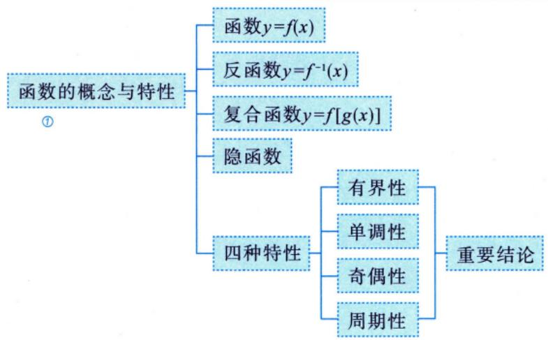

注以上是第1讲的全面的知识结构.学完这一讲，做完这一讲的题目之后，回过头来看这个知识结构，相信大家会有完全不同的认识.学完之后，这些知识框架不再是陌生的文字，而是展现在头脑中的清晰的知识与方法.

## 函数的概念与特性

## 1函数

单值函数

设x与y是两个变量，D是一个给定的数集，若对于每一个 $x \in D$ ，按照一定的法则f，有一个确定的y值与之对应，则称y为x的函数，记作 $y = f(x)$ ，称x为自变量，y为因变量，称数集D为此函数的定义域，定义域一般由实际背景中变量的具体意义或者函数对应法则的要求确定，称 $\{ f(x) \mid x \in D \}$ 为值域.

## 注单值函数与多值函数.

事实上，上述定义的函数是单值函数，若给一个 $x _ { 1 }$ ，对应一个 $y_{1}$ ；给另外一个 $x _ { 2 }$ ,对应另外一个$y_{2}$ ,这叫一对一[见图1-1(a)]. 若给定 $x_{1},x_{2}(x_{1} \neq x_{2})$ ，它们对应同一个y，则称多对一[见图1-1(b)]，所以函数可以一对一，也可以多对一，这叫单值函数.

但是，若一个x对应一个 $y _ { 1 }$ ，又对应另一个 $y _ { 2 }$ ，也就是一对多，这叫多值函数[见图1-1(c)]，它不在上述定义中.

  
(a)

  
(b)  
图1-1

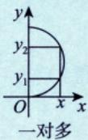  
(c)

多值函数（不是我们传统意义上的函数）

我们的研究对象主要是单值函数.

★数与形：如何判断一个函数是单值还是多值呢？数与形是辩证统一的关系，用铅直画线法作铅直线，若任一条铅直线与f(x)至多有一个交点，则f(x)为单值函数.

例1.1 设 $f\left(x+\frac{1}{x}\right)=\frac{x+x^{3}}{1+x^{4}}$ ，则当 $x \geqslant 2$ 时，f(x) =

解应填 $\frac{x}{x^{2} - 2}$

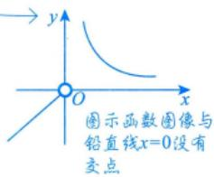

$f\left(x+\frac{1}{x}\right)=\frac{x+x^{3}}{1+x^{4}}=\frac{\left(x+x^{3}\right)/x^{2}}{\left(1+x^{4}\right)/x^{2}}=\frac{x+\frac{1}{x}}{x^{2}+\frac{1}{x^{2}}}=\frac{x+\frac{1}{x}}{\left(x+\frac{1}{x}\right)^{2}-2}$ ，于是当 $x   \geqslant   2$ 时， $f(x) = \frac{x}{x^{2} - 2}$

方法总结将 $ \text{" }x+\frac{1}{x} \text{" }$ 视为整体，找出对应法则.

公式 $x^{2}+\frac{1}{x^{2}}=\left(x+\frac{1}{x}\right)^{2}-2$

注以后会经常用到，给出复合函数，把它写回原来的函数，这样的考法也较常见.

★例1.2 设函数f(x)的定义域为 $(0, +\infty)$ ，且满足 $2f(x)+x^{2}\left|\frac{f\left(\frac{1}{x}\right)}{x}\right|=\frac{x^{2}+2x}{\sqrt{1+x^{2}}}$ ，则 $f(x)   =$

分析将x写成 $\frac{1}{x}$ ，找到方程组①，②，联立，消去 $f\left(\frac{1}{x}\right)$ 即可.

解应填 $\frac{x}{\sqrt{1 + x^{2}}}$

$$
2f(x)+x^{2}f\left(\frac{1}{x}\right)=\frac{x^{2}+2x}{\sqrt{1+x^{2}}}\tag{}
$$

将①中x写成 $\frac{1}{x}$ ，则

$$
\frac{1}{2f\left(\frac{1}{x}\right)} + \frac{1}{x^2}f(x) = \frac{1 + 2x}{x\sqrt{1 + x^2}}\tag{②}
$$

由 $\textcircled{1} \times 2 - \textcircled{2} \times x^{2}$ ，得 $3f(x)=\frac{3x}{\sqrt{1+x^{2}}}$ ，则 $f(x)=\frac{x}{\sqrt{1+x^{2}}}$

方法总结 用所给关系式，造出方程组，解出所需的量.

公式对应法则与所用的自变量无关，如 $f(x) = x^{2}$ ，则 $f\left(\frac{1}{x}\right)=\left(\frac{1}{x}\right)^2$

注(1)学习《考研数学基础30讲》，要关注“前世今生”，目前是要打基础.

(2) 若给 $f(x) + x f(-x) = x$ ，应学会写 $f(-x)-xf(x)=-x$ ，消去 $f(-x)$ ，得 $f(x)=\frac{x+x^{2}}{1+x^{2}}$ ·自练

考生既要掌握单值函数，同时也要会根据给出的复合函数表达式，求出相应的对应法则.

注本书所讲的知识是全面的，对题目的把握是准确的.从范围上、广度上讲是涵盖整个考研大纲的；从深度上讲，掌握我说的题目的难度就够了，达到这个难度，考研数学就能解决了.比

这个题目的难度低，不行；超过这个题目的难度，不需要！

## ② 反函数→前提：符合铅直画线法.

设函数 $y = f(x)$ 的定义域为D，值域为R.如果对于每一个 $y \in R$ ，必存在唯一的 $x \in D$ ，使得 $y = f(x)$ 成立，则由此定义了一个新的函数 $x = \varphi ( y )$ ，这个函数称为函数 $y = f(x)$ 的反函数，一般记作 $x = f^{-1}(y)$ 它的定义域为R，值域为D.相对于反函数来说，原来的函数也称为直接函数.以下两点需要说明.

第一，严格单调函数必有反函数，比如函数 $y = x^{2} \left( x \in \left[ 0, + \infty \right) \right)$ 是严格单调函数，故它有反函数→充分条件$x = { \sqrt { y } }$ 反函数：强调对应法则.

第二，若把 $x = f^{-1}(y)$ 与 $y = f(x)$ 的图形画在同一坐标系中，则它们完全重合.只有把 $y = f(x)$ 的反函数 $x = f^{-1}(y)$ 写成 $y = f^{-1}(x)$ 后，它们的图形才关于y=x对称.事实上，这也是字母 $\left\{ x \right.$ 与y互换的结果

$y = x^{2} (x \geqslant 0)$ 与 $y = \sqrt{x}$ 关于y=x对称

注(1)单值函数（符合铅直画线法）才谈反函数.

(2)有反函数的函数不一定是单调函数.比如

$$
f(x)=\left\{\begin{aligned}x, \quad x \geqslant 0, \\ \frac{1}{x}, \quad x < 0,\end{aligned}\right.
$$

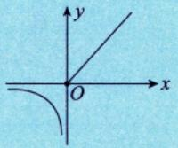

其图像如图1-2所示，其反函数即为f(x)本身，但f(x)不是单调函数.

图1-2

判断一个函数是否具有反函数：用水平画线法.

水平画线法——在符合铅直画线法的条件下，作水平直线，若任一条水平直线与f(x)至多有一个交点，则f(x)有反函数.

铅直直线定单、多（单值函数、多值函数），口诀：水平直线定反、直（反函数、直接函数）.

λ=exlm2 重要关系： $\begin{cases}f[f^{-1}(x)] = x, \\f^{-1}[f(x)] = x.\end{cases}$ 如：elm2² =2x.

  
关注公众号获取更多免费考研资料

例1.3 求函数 $y = f(x) = \ln\left( x + \sqrt{x^{2} + 1} \right)$ 的反函数 $f^{-1}(x)$ 的表达式及其定义域.

分析对数函数是一个极为重要的研究对象，三个基本公式要掌握 $(a,   b > 0)$

$$
\left\{ \begin{aligned} \ln ab = \ln a + \ln b   (积变和)  , \\ \ln \frac{a}{b} = \ln a - \ln b   (商变差)  , \\ \ln a^{b} = b \ln a   (幂次变倍数)  . \end{aligned} \right.
$$

解直接由 $y = \ln \left( x + \sqrt{x^{2} + 1} \right)$ 解出 $x = f^{-1}(y)$ 会很麻烦，现采用下述方法.

$$
-y=-\ln\left(x+\sqrt{x^{2}+1}\right)=\ln\frac{1}{x+\sqrt{x^{2}+1}}
$$

所以

$$
\frac{\sqrt{x^{2} + 1} - x}{\left( \sqrt{x^{2} + 1} + x \right)\left( \sqrt{x^{2} + 1} - x \right)} = \ln\left( \sqrt{x^{2} + 1} - x \right), \quad \mathrm{e}^{- y} = \sqrt{x^{2} + 1} - x\tag{}
$$

再由y =f(x)的表达式有

$$
\mathrm{e}^{y} = \sqrt{x^{2} + 1} + x,\tag{②}
$$

②-①，得

$$
x = \frac{1}{2} \left( \mathrm{e}^{y} - \mathrm{e}^{-y} \right),
$$

交换上式中x，y的位置后就是y=f(x)的反函数，即

$$
y = f^{-1}(x) = \frac{1}{2} \left( \mathrm{e}^{x} - \mathrm{e}^{-x} \right), \quad -\infty < x < +\infty
$$

方法总结利用对数的性质，巧妙地反解x.

公式 $\ln(x + \sqrt{x^2 + 1})$ 是常见的奇函数.

注(1)函数 $y = \ln \left( x + \sqrt{x^{2} + 1} \right)$ 叫作反双曲正弦函数，其图像如图1-3(a)所示.函数 $y = \frac{e^{x} - e^{- x}}{2}$ 叫作双曲正弦函数，其图像如图1-3(b)所示.考生应记住这两个函数的图像.

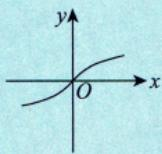  
(a)

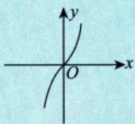  
(b)  
图1-3

(2) $y = \frac{e^{x} + e^{- x}}{2}$ 叫作双曲余弦函数，其图像如图1-4所示，它是偶函数，是一种特殊的悬链线.达·芬

奇在画《抱银貂的女子》时，曾仔细思索过女子的脖子上戴的项链的形状是什么函数，可惜他一生都未能明白，在他去世近200年后，约翰·伯努利解决了这个问题.那不是抛物线 $y = x ^ { 2 }$ ，而是悬链线$y = \frac{a}{2} \left( \mathrm{e}^{\frac{x}{a}} + \mathrm{e}^{-\frac{x}{a}} \right)$ 取 $a = 1$ ，便是 $y = \frac{e^{x} + e^{- x}}{2}$

这个函数没有反函数

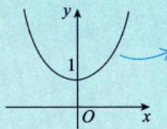  
图1-4

三个重要函数： $y = \ln(x + \sqrt{x^2 + 1}) \quad \textcircled{2} y = \frac{e^x - e^{-x}}{2} \quad \textcircled{3} y = \frac{e^x + e^{-x}}{2} \quad (2023 年考查证 )$

(3) 以后会知道如下3 个重要结论.

①当x→0时， $\ln \left( x + \sqrt{x^{2} + 1} \right) \sim x$ .即当 $x \to 0$ 时，反双曲正弦函数 $\ln(x + \sqrt{x^2 + 1})$ 与x是等价无穷小. 洛必达法则推出

当 $x \to 0$ 时，sinx∼x,tan $x \sim x, \ln(x + \sqrt{x^2 + 1}) \sim x,$

② $\left[ \ln \left( x + \sqrt{x^2 + 1} \right) \right]' = \frac{1}{\sqrt{x^2 + 1}}$ ，于是 $\int \frac{1}{\sqrt{x^{2} + 1}} \mathrm{d}x = \ln\left( x + \sqrt{x^{2} + 1} \right) + C$ 记住这个结果

③由于 $y = \ln \left( x + \sqrt{x^{2} + 1} \right)$ 是奇函数，于是 $\int_{- 1}^{1}\left\lbrack \ln\left( x + \sqrt{x^{2} + 1} \right) + x^{2} \right\rbrack dx = \int_{- 1}^{1}x^{2}dx = \frac{2}{3}$

③是在预告未来，未来会用到在第1讲中讲到的知识，同时我们要明白一个道理：我们现在在讲基础，基础要慢慢去打.你所有的东西实际上是一个联系的整体.假如不知道 $y = \ln(x + \sqrt{x^2 + 1})$ 这个函数，不知道它的图像，不知道它的性质，那么在后面去学习的时候就会遇到困难.反过来说，如果知识掌握得很扎实，那么后面学到极限、导数、积分、面积等，就能很快速地把问题解决了。从而可以掌握强大的基础知识，再学会做题，就可以应对综合题了。

## ③ 复合函数

设函数y =f(u)的定义域为 $D_{1}$ ，函数 $u = g(x)$ 在D上有定义，且 $g ( D ) \subset D _ { 1 }$ ，则由

$$
y = f[g(x)](x \in D)
$$

确定的函数称为由函数 $u = g(x)$ 和函数 $y = f(u)$ 构成的复合函数，它的定义域为D，u称为中间变量.考生要重点掌握复合的方法，三层复合函数f[g(x)]

例1.4 设 $f(x)=x^{2},f[\varphi(x)]=-x^{2}+2x+3$ ，且 $\varphi(x) \geq 0$ ，求φ(x)及其定义域与值域.

解由题设条件知， $f[\varphi(x)] = \varphi^2(x) = -x^2 + 2x + 3$ ，于是 $\varphi(x)=\sqrt{-x^{2}+2x+3}\quad\therefore\quad\varphi(x)\geqslant0$

由 $-x^{2}+2x+3 \geqslant 0$ ，即 $(x - 3)(x + 1) \leq 0$ ，知φ(x)的定义域为[-1,3].

又 $\sqrt{-x^{2}+2x+3}=\sqrt{-(x-1)^{2}+4}$ ，当x=1时，φ(1)=2为最大值，显然 $\varphi(-1)=\varphi(3)=0$ 为最小值，故$\varphi(x)$ 的值域为[0,2]. 实际上， $-(x - 1)^{2} + 4$ 的最值可借用导数工具.

方法总结将φ(x)视为一个整体□，由 $f[\varphi(x)]$ 已知，可求出φ(x).

公式若 $\varphi^{2}(x)=g(x)$ ，则 $\varphi ( x ) = \pm { \sqrt { g ( x ) } }$

注这个题目比较简单，可能是我们后面综合题的第一问，我们一定要把《考研数学基础30讲》吃透，把与本书配套的《张宇考研数学题源探析经典1000题》基础篇吃透，把它背下来最好，后面会发现做起题来，越来越顺，为什么呢？因为原材料准备得好，然后加上你高超的烹饪技术，炒菜水平就很高，解题能力和速度都会有一个很大的提高.

例1.5 设 $g(x)=\begin{cases}2-x,\ x\leqslant0,\\2+x,\ x>0,\end{cases}f(x)=\begin{cases}x^{2},\ x<0,\\-x-1,\ x\geqslant0,\end{cases}$ 则 $g[f(x)] =$

分析数与形结合.

华罗庚先生说：“数无形时少直觉，形少数时难入微，数形结合百般好”

解应填 $\begin{cases}3 + x, & x \geq 0, \\2 + x^{2}, & x < 0.\end{cases}$

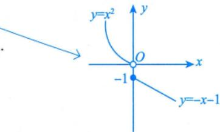

$$
g[f(x)]=\left\{\begin{aligned}2-f(x), f(x) \leq 0, \\2+f(x), f(x)>0,\end{aligned}\right.
$$

当 $f(x) \leq 0$ 时， $x   \geqslant   0$ ，此时 $f(x) = -x - 1$ ；当 $f(x) > 0$ 时， $x < 0$ ，此时 $f(x) = x^{2}$ 综上，

$$
g[f(x)]=\begin{cases}2-(-x-1),&x\geq0,\\2+x^2,&x<0\end{cases}=\begin{cases}3+x,&x\geq0,\\2+x^2,&x<0.\end{cases}
$$

方法总结画出内层函数的图形，数形结合.

## 4 隐函数

设方程 $F(x, y) = 0$ ，若当x取某区间内的任一值时，总有满足该方程的唯一的值y存在，则称方程$F(x, y) = 0$ 在上述区间内确定了一个隐函数 $y = y(x)$

多值函数不适用于铅直画线法：比如，上图有两个交点，则不满足铅直画线法，这个对应的就是多值函数，不能确定隐函数.能确定隐函数就不能是多值函数，这是基本概念，关于隐函数存在定理，我们后面专门讲。

如 $x + y^{3} - 1 = 0$ 就表示一个隐函数，且可显化为 $y = \sqrt[3]{1 - x}$ ；再如 $\sin(xy)=\ln\frac{x+\mathrm{e}}{y}+1$ 也表示一个隐函数，但不易显化，很难写出 $y = y(x)$ 或 $x = x(y)$

一般来说，由 $F(x, y) = 0$ 所确定的隐函数求 $y(x_{0})$ ，若代入 $x _ { 0 }$ 易求出 $y(x_{0})$ ，则直接求之；若不易方程这个东西，解无定法，观察得求出 $y ( x _ { 0 } )$ ，则用观察法，如：之，有时“显然”，有时超越方程

①设函数 $y = y(x)$ 由方程 $\ln y - \frac{x}{y} + x = 0 (x > 0)$ 确定，当x=2时， $y(2) = 1$ 方程 $\ln y - \frac{2}{y} + 2 = 0$ 是可观察的，用画图法，如图1-5所示.ln $y + \mathrm{e}^{y - 1} = 1$ ，显然可看

由 $\ln y = \frac{2}{y} - 2$ ，得 $\left\{ \begin{aligned} z = & \ln y, \\ z = & \frac{2}{y} - 2. \end{aligned} \right.$ 看两条曲线交点.  
这些都是考研真题里面出现过的形式.

$$
y = 1
$$

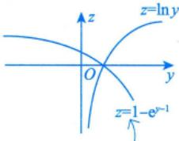  
图1-5

②设函数 $y = y(x)$ 由方程ln $y + \mathrm{e}^{y - 1} = \frac{x}{2}$ 确定，当 $x = 2$ 时， $y(2) = 1$

## 注考研试题中常出现这种问题，考生要重视.

隐函数问题先给大家提到这里，与之相关的隐函数存在定理，以及隐函数存在定理所推出的公式法等，我们到后面再去讲.

★★★5函数的四种特性 考研中怎么去使用这些特性呢？微积分是利用极限这个工具研究函数、函数的导数及积分的四种特性

(1)有界性.

$$
 首先要给定区间〔 ( 定义域幽一个各集 )
$$

设f(x)的定义域为D，数集 $I \subset D$ .如果存在某个正数M，使对任一x∈I，有 $\left| f(x) \right| \leq M$ ，则称f(x)在I上有界；如果这样的M不存在，则称f(x)在I上无界.

注(1)从几何上看，如果在给定的区间，函数y=f(x)的图形能够被直线y =-M和 $y = M$ “完全包起来”，则为有界；从解析上说，如果找到某个正数M，使得 $\left| f(x) \right| \leq M$ ，则为有界.

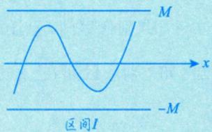

能画图则画图，不易画图，我们就用解析法，去找正数M.

(2)有界还是无界的讨论首先需指明区间I，不知区间，无法谈论有界性.比如 $y = \frac{1}{x}$ 在 $( 2 , + \infty )$ 内有界，但在(0,2)内无界.

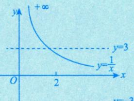

(3)事实上，只要在区间I上或其端点处存在点 $x_{0}$ ，使得 $\lim_{x \to x_0} f(x)$ 的值为无穷大，则没有任何两条直线 $y = - M$ 和y=M可以把I上的 $f(x)$ 包起来”，这就叫无界.考研中常出这样的题目，比如例1.17.

例1.6 证明函数 $f(x) = \frac{x}{1 + x^{2}}$ 在 $(-\infty, +\infty)$ 内有界.

补充： $x^{2} = \left| x^{2} \right| = \left| x \right|^{2}$   
$x^{3} \ne \left| x^{3} \right| = \left| x \right|^{3}$   
$|x| = \sqrt{x^2}$

分析 当x≠0时， $\left| f(x) \right| = \frac{\left| x \right|}{1 + x^{2}}$ 分子分母同除|x| $\frac{1}{\frac{1}{\left | x \right | } + \left | x \right | }$ 或者用 $\left| x \right| = \sqrt{x^{2}}$

若求 $\left[ \left[ f(x) \right] \right]^{\prime}$ 呢？

证方法一当x≠0时，

$$
\left| f(x) \right| = \frac{\left| x \right|}{1 + x^{2}} = \frac{1}{\frac{1}{\left| x \right|} + \left| x \right|}
$$

$$
\begin{aligned}\left[ \mid f(x) \mid \right]' = & \left[ \sqrt{f^2(x)} \right]' \\= & \frac{2f(x)f'(x)}{2\sqrt{f^2(x)}} = \frac{f(x)f'(x)}{\mid f(x) \mid}.\end{aligned}
$$

$$
\begin{aligned}f(x) = & 2x + \sqrt{x^{2} + 2x + 1} \\= & 2x + \sqrt{(x + 1)^{2}} \\= & 2x + \left| x + 1 \right|.\end{aligned}
$$

由不等式 $\frac{a + b}{2} \geqslant \sqrt{ab}(a,   b > 0).$ ，有 $\frac{1}{\left | x \right | }+\left | x \right | \ge 2\sqrt{\frac{1}{\left | x \right | }\left | x \right | }=2$ ，即 $\left| f(x) \right| \leq \frac{1}{2}$

当x=0时，f(0)=0.综上，函数f(x)在 $(-\infty, +\infty)$ 内有界.

方法二当x≠0时， $\frac{1 + x^{2}}{2} \geqslant \sqrt{1 \bullet x^{2}}$ ≡x|，则 $1 + x^{2} \geqslant 2|x|$ ，故 $\frac{1}{1 + x^{2}} \leq \frac{1}{2|x|}$ ，则

$$
\left| f(x) \right| = \frac{\left| x \right|}{1 + x^{2}} \leqslant \frac{\left| x \right|}{2\left| x \right|} = \frac{1}{2}
$$

当x=0时，f(0)=0.综上，函数f(x)在 $(-\infty, +\infty)$ 内有界.

方法总结用基本不等式，找M，使 $\mid f(x) \mid \leqslant M$

$$
\frac{a+b}{2} \geqslant \sqrt{ab}(a, b>0) ; \frac{2}{\frac{1}{a}+\frac{1}{b}} \leqslant \sqrt{ab} \leqslant \frac{a+b}{2} \leqslant \sqrt{\frac{a^2+b^2}{2}}(a, b>0) .
$$

(2) 单调性.—→整个考研数学，离不开单调性这个话题

设f(x)的定义域为D，区间 $I \subset D$ .如果对于区间I上任意两点 $x_{1}, x_{2}$ ，当 $x_{1} < x_{2}$ 时，恒有 $f(x_{1}) <$ $f(x_{2})$ ，则称f(x)在区间I上单调增加.如果对于区间I上任意两点 $x_{1}, x_{2}$ ，当 $x_{1} < x_{2}$ 时，恒有 $f(x_{1}) >$ $f(x_{2})$ ，则称f(x)在区间I上单调减少.

## 注(1)以上是定义法，是充要条件.

(2)后面会看到，在考研试题中常常用求导的方法来讨论函数在某个区间上的单调性，但是定义法不可以忘记.试题中也常用到如下定义法的判别形式，请考生留意.

对任意 $x_{1}, x_{2} \in D, x_{1} \neq x_{2}$ ，有

$$
f(x)  是单调增函数  \Leftrightarrow (x_1 - x_2)[f(x_1) - f(x_2)] > 0;
$$

f(x)是单调减函数 $(x_{1}-x_{2})[f(x_{1})-f(x_{2})]<0$

f(x)是单调不减函数 $\Leftrightarrow (x_1 - x_2)[f(x_1) - f(x_2)] \geq 0$

f(x)是单调不增函数 $\Leftrightarrow (x_1 - x_2)[f(x_1) - f(x_2)] \leq 0.$

在考研数学中，函数的单调性虽然是基础知识，但也会有综合应用.

例1.7 设f(x)在 $(-\infty, +\infty)$ 上有定义，任给 $x_{1}, x_{2}, x_{1} \neq x_{2}$ ，均有 $(x_{1}-x_{2})\cdot \left [ f(x_{1})-f(x_{2}) \right ] > 0$ 则以下函数一定单调增加的是（）.(A) $\left[ f(x) \right]$ (B) $f ( \left\lfloor x \right\rfloor )$ (C) f(−x) (D) $-f(-x)$

分析由条件知f(x)是严格单调增加函数，利用图形的变换，去讨论其他函数的单调性.

保留f(x)≥0部分，f(x)<0部分去掉，关于x轴对称过来

(A)  

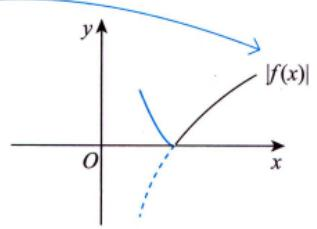  
保留x≥0部分，x<0部分消去，关于y轴对称

(B)  

两者关于y轴对称

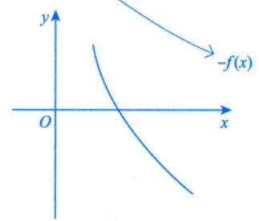

(D)  
  
关于原点对称

应选 (D).

由上述注的(2)知，f(x)是单调增函数，又f(-x)与f(x)的图像关于y轴对称，-f(-x)与f(x)的图像关于原点对称[见附录1(2)的②，③]，可知f(-x)单调减少，-f(-x)单调增加.|f(x)|是否具有单

调性与f(x)的正负相关， $f(\left | x \right | )$ 为偶函数，在 $(-\infty, +\infty)$ 上无单调性[见附录1(2)的⑤，⑥]，故选(D).

方法总结 $f(ax),   af(x)$ 等可参考附录1.

∂公式f(x)与f(-x)关于y轴对称；f(x)与-f(x)关于x轴对称；f(x)与-f(-x)关于原点对称.

(3)奇偶性。这个是四大特性中最重要的性质，原因：①题目易出：②对称美.

设f(x)的定义域D关于原点对称(若 $x \in D$ ，则 $-x \in D$ .如果对于任 $-x \in D$ ，恒有 $f(-x) = f(x)$ 则称f(x)为偶函数.如果对于任一 $x \in D$ ，恒有 $f(-x) = -f(x)$ ，则称f(x)为奇函数.我们熟知的是，偶函数的图形关于y轴对称，奇函数的图形关于原点对称.

注那么，怎么做题呢？要想会做题需要有：①原材料(我们正在学习的各种基础知识)；②技术我们继续来看原材料.

(1) 前提：定义域关于原点对称.

(2) 基本类型.

① $f(x) + f(-x)$ 必是偶函数.

如 $\frac{e^{x}+e^{-x}}{2}$

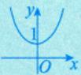

双曲余弦，记住图像

如 $\sqrt[3]{(1 + x)^{2}} + \sqrt[3]{(1 - x)^{2}}$

② $f(x) - f(-x)$ 必是奇函数.

如 $\frac{\mathrm{e}^{x}-\mathrm{e}^{-x}}{2} . \xrightarrow{ 忄 } \frac{ 忄 }{10^{\circ}x}$

双曲正弦反函数 $y = \ln(x + \sqrt{x^2 + 1})$ (反双曲正弦)

如 $\ln \frac{1 + x}{1 - x} = \ln(1 + x) - \ln(1 - x) -$

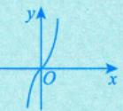

对任一函数f(x)，令 $u(x) = \frac{1}{2} \left[ f(x) + f(-x) \right]$ $v(x)=\frac{1}{2}\left[f(x)-f(-x)\right]$ 则 u(x) 是偶函数，v(x)是奇函数.由

$$
f(x)=\frac{1}{2}\left[f(x)+f(-x)\right]+\frac{1}{2}\left[f(x)-f(-x)\right]=u(x)+v(x)
$$

可知任何一个函数都可以写成一个奇函数与一个偶函数之和的形式.（重要结论）

③ $f[\varphi(x)]$ （内偶则偶，内奇同外）.

若内层是偶，不管外面函数，复合起来一定是偶函数，这是内偶则偶：若内层是奇，则复合函数奇偶性与外层函数奇偶性一致，这是内奇同外

[奇[偶]⇒偶.如 $\lim_{x \to 0} x^2$

偶[奇]⇒偶.如 $\left| \cos ( \sin x ) , \left| \sin x \right| \right|$

奇[奇]⇒奇.如 $\sin \frac{1}{x}, \sqrt[3]{\tan x}.$

偶[偶]⇒偶.如 $\left| \cos |x|, \left| \cos x \right| \right|$

[非奇非偶[偶]⇒偶.如 $\mathbf{i}\mathbf{e}^{x^{2}}$ , In|x|.

④一个特色： $\left[ \ln \left( x + \sqrt{x^2 + 1} \right) \right]' = \frac{1}{\sqrt{x^2 + 1}}$

★⑤f(x)奇⇒ f'(x)偶⇒ f"(x)奇⇒… .见例 3.1.]后面再讲证明。(偶) (奇） (偶)

求导一次，奇偶性互换.

从直观上解析：（数与形）

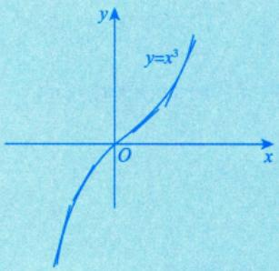

⑥f(x)奇 $\Rightarrow \int_{0}^{x} f(t)   dt$ 偶. 微积分的研究主体：导数，积分 (偶) (奇)

⑦设对任意的x，y，都有 $f(x + y) = f(x) + f(y)$ ，则f(x)是奇函数，证明见例 1.8.

隐含条件

↑例1.8 设对任意x,y，都有 $f(x + y) = f(x) + f(y)$ ，证明：f(x)是奇函数.

分析用定义法.

$f(0)=f(x)+f(-x)$ ，即$f(-x) = -f(x)$ ，故f(x)是奇函数.

方法总结 用定义法证明f(-x)=-f(x).

θ公式f(x)+f(-x)=0，则f(x)为奇函数.

(4) 周期性：

设f(x)的定义域为D，如果存在一个正数T，使得对于任一 $x \in D$ ，有 $x   \pm T   \in   D$ ，且 $f(x + T) =$ f(x)，则称f(x)为周期函数，T称为f(x)的周期，一般指最小正周期.

## 注|重要结论.

①若f(x)以T为周期，则 $f(ax + b)$ 以 $\frac{T}{\left \| a \right \| }$ 为周期.

②若 $g(x)$ 是周期函数，则复合函数 $f[g(x)]$ 也是周期函数，如 $\mathbf{e}^{\sin x}$ , $\cos^{2}x$ 等.

$$
\cos ^{2}x=\frac{1+\cos 2x}{2} , \quad T=\frac{2\pi }{\left | 2 \right | }=\frac{\left | \right | }{\pi }
$$

★③若f(x)是以T为周期的可导函数，则 $f^{\prime}(x)$ 也以 T为周期.见例 3.1.

★④若f(x)是以T为周期的连续函数，则只有在 $\int_{0}^{T} f(x)   \mathrm{d}x = 0$ 时， $\int_{0}^{x} f(t)   dt$ 也以T为周期.见例9.25.

例1.9 设函数f(x)在 $(-\infty,   +\infty)$ 上满足 $f(x) = f(x - \pi) + \sin x$ .证明：f(x)是以 $T = 2 \pi$ 为周期的周期函数.

分析证 $f(x + 2\pi) = f(x)$ 即可.

证 多次利用题目等式条件，得到 $f(x+2\pi)=f(x+\pi)+\sin(x+2\pi)=f(x)+\sin(x+\pi)+\sin(x+2\pi)=$ $f(x)$ ，故f(x)以 $T = 2 \pi$ 为周期.

两条腿走路：(1)知识：(2)解题.

方法总结若 $f(x + 2\pi) = f(x)$ ，则f(x)是以2π为周期的周期函数.

公式诱导公式： $\sin(x + 2\pi) = \sin x, \quad \sin(x + \pi) = -\sin x$

注希望考生在学习过程中，记具体例子.这些例子的记忆可以帮助我们很好地理解各种各样的方法，同时有实实在在的例子记在脑子里，可以形成一个解题思路，这是非常重要的.很多人以为例子不要记，只要会即可，其实不然.你要形成数学的思维习惯，一定要记一些具体的例子.

要用典型的例子与习题撑起来我们的知识与方法，这是给大家的建议.

## 函数的图像

## 基本初等函数与初等函数

我们在学习分部积分法时，有口诀：反对幂指三.

基本初等函数：常数函数、幂函数、指数函数、对数函数、三角函数和反三角函数.

(1)常数函数。→易考“找交点个数”或在概率论中求概率 $P\{ g(X) \leq y\}$

$y = \overline{A}, A$ 为常数，其图形为平行于x轴的水平直线(见图1-6).

→为偶函数

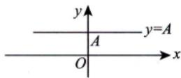  
图1-6

如求ln $x - \frac{x}{\mathrm{e}} + a = 0$ 实根的个数其实就是求直线 $y   =   a$ 与曲线 $y = \frac{x}{\mathrm{e}} - \ln x$ 交点的个数.

在数学一和数学三学习的概率论中： $Y = g(X)$ $Y = y$ $g(X) \leqslant y$ 即 $Y = g(X)$ 在Y=y直线下方X 的取值范围.

(2) 幂函数.

$y = x^{\mu}(\mu$ 是实数).

注(1) $y = x ^ { \mu }$ 的定义域和值域取决于μ的值.当 $x > 0$ 时， $y = x^{\mu}$ 都有定义.

(2)常用的幂函数（见图1-7).

$$
y=x,\;y=x^{2},\;y=\sqrt{x},\;y=x^{3},\;y=\sqrt[3]{x},\;y=\frac{1}{x}
$$

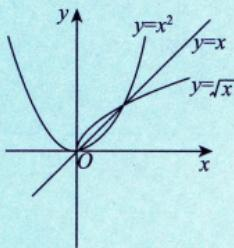  
(a)

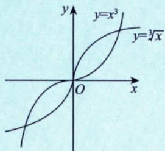  
(b)  
图1-7

  
(c)

(3) 当 $x > 0$ 时，由 $y = x$ 与 $y = \sqrt{x} , y = \sqrt[3]{x} , y = \ln x$ 具有相同的单调性且与 $y = \frac{1}{x}$ 具有相反的单调性，故

①见到 $\sqrt{u}   ,   \sqrt[3]{u}$ 时，可用u来研究最值.

考得最多 ★②见到|u|时，由 $\left | u \right |  = \sqrt{u^{2}}$ ，可用 $\boldsymbol { u } ^ { 2 }$ 来研究最值； $\sqrt{u^{2}}$ 与 $u ^ { 2 }$ 具有相同的最值点$ 求  \textcircled{3}$ 见到 $u_{1}u_{2}u_{3}$ 时，可用 $\ln (u_{1}u_{2}u_{3}) = \ln u_{1} + \ln u_{2} + \ln u_{3}$ 来研究最值.

考得频率不高 如： $\ln (x^{\frac{1}{3}}y^{\frac{1}{2}}z^{\frac{1}{5}}) = \frac{1}{3}\ln x + \frac{1}{2}\ln y + \frac{1}{5}\ln z$

④见到 $\frac{1}{u}$ 时，可用μ来研究最值（结论相反，即 $\frac{1}{u}$ 与u的最大值点、最小值点相反).

利用以 $\boxed { 1 } \sim \textcircled { 4 }$ ，可使得计算简单方便.以上4点是我们在研究最值问题时的一个非常有用的技巧——简洁美.

例1.10 设 $0<x<\frac{1}{2}$ ，求 $y(x)=x^{6}(1-x)^{2}(1-2x)^{4}$ 的最大值点.

分析多项相乘（除）乘方（开方）的式子⇒取对数⇒计算⇒线性运算.实现“简洁美”！

解取对数，得

$$
\ln y(x) = 6\ln x + 2\ln(1 - x) + 4\ln(1 - 2x)
$$

$$
\frac{\mathrm{d}\left[\ln y(x)\right]}{\mathrm{d}x}=\frac{6}{x}-\frac{2}{1-x}-\frac{8}{1-2x}=\frac{24x^{2}-28x+6}{x(1-x)(1-2x)}=0
$$

即 $12x^{2}-14x+3=0$ ，解得 $x = \frac{7 \pm \sqrt{13}}{12}$ ，因为 $\frac{7+\sqrt{13}}{12}>\frac{1}{2}$ 不符合题意，又 $\lim_{x \to 0^{+}} y(x) = \lim_{x \to \left(\frac{1}{2}\right)^{-}} y(x) =$ $0 < y \left( \frac{7 - \sqrt{13}}{12} \right)$ ，故y的最大值点为 $x = \frac{7 - \sqrt{13}}{12}$

方法总结）遇到多项相乘（除）函数的最值问题，常用对数求导法.

②公式 $\left( \ln x \right)^{\prime} = \frac{1}{x} , \quad \left[ \ln(1 - x) \right]^{\prime} = \frac{1}{x - 1} , \quad \left\{ f\left[ g(x) \right] \right\}^{\prime} = f_{g}^{\prime} \bullet g_{x}^{\prime}$

注希望同学们明白，做例题不是念一个题，把答案一抄这么简单，而是大家通过做这个题目，在不同的阶段可以有不同的收获.例如，在它的分析阶段你要学会什么，在它的解题过程中你要学会什么，然后在整个题目学完之后，你通过这个题目提高了哪些方面的解题能力.只有通过这样的学习，你才能快速地提高自己的解题水平.

(3) 指数函数.

$y = a^{x} (a > 0, a \neq 1)$ [见图 $1 - 8(a)]$

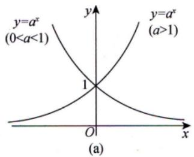

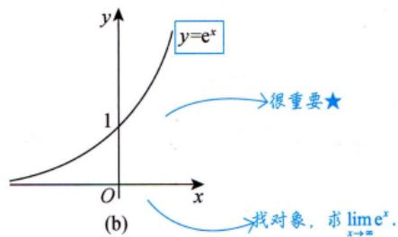  
图 1-8

答案：+∞或0，(×)立即拒绝.违背了函数极限的唯一性（不存在）

注(1)定义域： $( - \infty , + \infty )$ ，值域： $(0, +\infty)$

(2)单调性：当 $a > 1$ 时， $y = a^{x}$ 单调增加；当 $0 < a < 1$ 时， $y = a^{x}$ 单调减少.

(3)常用的指数函数： $y = \mathrm{e}^{x}$ [见图 1-8(b)].

(4)极限： $\lim_{x \to -\infty} e^x = 0, \quad \lim_{x \to +\infty} e^x = +\infty$

“∞”符号是华里士给出的（华里士是牛顿的老师）

“∞”不是常数，把它归到哪里呢？“∞”实际上是一个广义的数是一个特殊的存在，在很多定理中 $\therefore 0 0$ 的作用与任意常数的作用是一样的，比如后面我们会学“夹逼准则”，如

$$
\left. \begin{array} { c } { y _ { n } \leqslant x _ { n } \leqslant z _ { n } } \\ { \downarrow \quad \Downarrow \quad \downarrow } \\ { n \to \infty , \; a \Rightarrow a \Leftarrow a } \\ { + \infty \Rightarrow + \infty \Leftarrow + \infty } \\ { - \infty \Rightarrow - \infty \Leftarrow - \infty } \\ \end{array} \right\}
$$

(5) 特殊函数值： $a^{0} = 1, \; e^{0} = 1$ K

考： $e^{x_{n}} - 1 = e^{x_{n}} - e^{0}$ .神秘的数字 $1 \neq 0$ ，这个是解题时常见的包装。

(6) 指数运算法则.

$$
\left| x \right|^{3n} = \left( \left| x \right|^{3} \right)^{n} = \left( \left| x^{3} \right| \right)^{n}
$$

$$
a ^ { \alpha } \cdot a ^ { \beta } = a ^ { \alpha + \beta } , \frac { a ^ { \alpha } } { a ^ { \beta } } = a ^ { \alpha - \beta } , \left( a ^ { \alpha } \right) ^ { \beta } = a ^ { \alpha \beta } , \left( a b \right) ^ { \alpha } = a ^ { \alpha } b ^ { \alpha } , \left( \frac { a } { b } \right) ^ { \alpha } = \frac { a ^ { \alpha } } { b ^ { \alpha } } ,
$$

$$
80e^{\tan x}-e^{\sin x}=e^{\sin x}(e^{\tan x-\sin x}-1)
$$

其中a，b是正实数， $\alpha , \beta$ 是任意实数.

(4) 对数函数.

$y = \log_{a}x (a > 0, a \neq 1)$ [见图 1-9(a)]是 $y = a^{x}$ 的反函数.

  
(a)

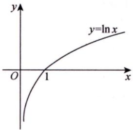  
图1-9  
(b)

注(1)定义域： $(0, +\infty)$ ，值域： $( - \infty , + \infty )$

(2)单调性：当a>1时， $y = \log_{a}x$ 单调增加；当 $0 < a < 1$ 时， $y = \log_{a}x$ 单调减少.

(3) 常用的对数函数： $y = \ln x$ (自然对数：lr $x = \log_{e}x, \quad e = 2.71828\cdots$ 见图 1-9(b)].

(4)特殊函数值： $\log_{a}1 = 0$ $\log_{a}a = 1$ ,ln1=0,lne=1

$$
3 6 : e - 2 > 0
$$

神秘的数字 $ \text{" }0 "$ 和 $ \text{" }1 "$ ，实现“统一美”“简洁美”

如 $\mathrm{e}^{x_{n}} - 1 = \mathrm{e}^{x_{n}} - \mathrm{e}^{0}$ , ln $x_{n} = \ln x_{n} - \ln 1$

再如，

$$
\ln \left( \mathrm{e} + \frac{1}{x} \right) - 1 = \ln \left( \mathrm{e} + \frac{1}{x} \right) - \ln \mathrm{e}
$$

$\ln \left(1+\frac{1}{\mathrm{e}x}\right)$ 这个转化是极为有意义的

又如 $\lim_{x \to \infty} x \left[ \ln \left( \mathrm{e} + \frac{1}{x} \right) - 1 \right] = \lim_{x \to \infty} x \cdot \frac{1}{\mathrm{e}x} = \frac{1}{\mathrm{e}}$ 如果你考虑用洛必达法则，那么就舍近求远了

考研需要区分度，考生要掌握一些解题技巧.从辩证法去看，实现“统一美”.

(5) 极限： $\lim_{x \to 0^{+}} \ln x = -\infty, \quad \lim_{x \to +\infty} \ln x = +\infty$

当 $x \to +\infty$ 时， $\mathbf{e}^{x} \rightarrow +\infty$ 的速度越来越快， $\ln x \to +\infty$ 的速度越来越慢.

(6) 常用公式： $x = \mathrm{e}^{\ln x}(x > 0), \quad u^{\nu} = \mathrm{e}^{\ln u^{\nu}} = \mathrm{e}^{\nu \ln u}(u > 0)$

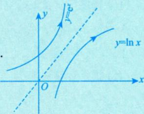

$x^{x} = \mathrm{e}^{\ln x^{x}} = \mathrm{e}^{x\ln x}$ ，从而可看到， $x^{x}$ 是初等函数.

(7) 对数运算法则.

① $\log _ { a } ( M N ) = \log _ { a } M + \log _ { a } N$ (积的对数=对数的和).

② $\log_{a}\frac{M}{N}=\log_{a}M-\log_{a}N$ (商的对数=对数的差).幂次变倍数

③ $\log_{a}M^{n}=n\log_{a}M$ , loga $\sqrt[n]{M} = \frac{1}{n} \log_a M$ (幂的对数=对数的倍数).

一定要用好对数的运算法则，如： $\mathrm{e}^{\ln \sqrt{f^{2}(x)-f(x)+1}}=\sqrt{f^{2}(x)-f(x)+1}$

常考：当 $x > 0$ 时，

中值定理（拉格朗日中值定理）证明

$$
\ln \sqrt{x} = \frac{1}{2}\ln x ; \ln \frac{1}{x} = -\ln x ; \ln\left(1 + \frac{1}{x}\right) = \ln\frac{x + 1}{x} = \ln(x + 1) - \ln x .
$$

利用例1.11，学习解题技巧.

例1.11 已知 $\mathrm{e}^{x}=\sum_{n = 0}^{\infty}\frac{x^{n}}{n!}, x \in \mathbf{R}$ ，则2x = ( ). (A) $\sum_{n = 1}^{\infty}\frac{(x\ln 2)^{n}}{n!}$ (B) $\sum_{n = 0}^{\infty}\frac{(x\ln 2)^{n}}{n!}$ (C) $\sum_{n = 1}^{\infty}\frac{(\ln 2)x^{n}}{n!}$ (D) $\sum_{n = 0}^{\infty}\frac{(\ln 2)x^{n}}{n!}$

分析 $2^{x} = \mathrm{e}^{\ln 2^{x}} = \mathrm{e}^{x \ln 2}$

解应选 (B).

由于 $2^{x} = \mathrm{e}^{x \ln 2}$ ，又 $\mathbf{e}^{x}=\sum_{n = 0}^{\infty}\frac{x^{n}}{n!}$ $x \in \mathbf { R }$ ，因此 $2^{x} = \sum_{n = 0}^{\infty}\frac{(x\ln 2)^{n}}{n!}$

方法总结 $\mathbf{e}^{x}=\sum_{n = 0}^{\infty}\frac{x^{n}}{n!}$ ，广义化： $2^{x} = \mathrm{e}^{x \ln 2} = \sum_{n = 0}^{\infty} \frac{(x \ln 2)^{n}}{n!}$

公式 $\mathrm{e}^{x}=\sum_{n = 0}^{\infty}\frac{x^{n}}{n!}, x \in \mathbf{R}$

注理工类以及自然科学中，当然会用到 $\mathrm{e}^{x}=1+x+\frac{x^{2}}{2!}+\frac{x^{3}}{3!}+\cdots$ ；在社会科学中，也经常会看到这个式子，因为多项式是最简单的.

三角函数与反三角函数这里公式多、杂，是区分度比较高的部分

(5) 三角函数.

①正弦函数与余弦函数.

拱的面积为2，

正弦函数 $y = \sin x$ 见图1-10(a)]，余弦函数 $y = \cos x$ [见图 1-10(b)].

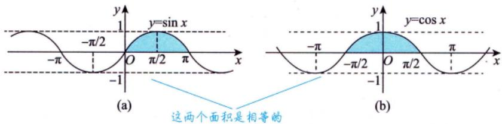

图1-10  

注(1)定义域：均为 $( - \infty, + \infty )$ ，值域：均为[-1,1].

当 $x \to 0 ^ { + }$ 时，sinx≤1,sinx<x.

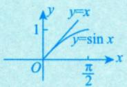

(2) 奇偶性：y =sinx是奇函数， $y = \cos x$ 是偶函数， $x \in (-\infty, +\infty)$

(3)周期性： $y = \sin x$ 和y=cosx均以2π为最小正周期， $x \in (-\infty, +\infty)$

(4)有界性： $\left| \sin x \right| \leqslant 1, \left| \cos x \right| \leqslant 1$

(5) 特殊函数值： sin 0 =0, $\sin \frac{\pi}{6} = \frac{1}{2}$ , sin $\frac{\pi}{4}=\frac{\sqrt{2}}{2}$ , sinπ=√3 3 2

$$
\sin \frac{\pi}{2} = 1, \sin \pi = 0, \sin \frac{3\pi}{2} = -1, \sin 2\pi = 0,
$$

$$
\cos 0 = 1, \cos \frac{\pi}{6} = \frac{\sqrt{3}}{2}, \cos \frac{\pi}{4} = \frac{\sqrt{2}}{2}, \cos \frac{\pi}{3} = \frac{1}{2},
$$

$$
\cos \frac{\pi}{2} = 0, \cos \pi = -1, \cos \frac{3\pi}{2} = 0, \cos 2\pi = 1
$$

(6) $\sin^{2}\alpha+\cos^{2}\alpha=1$ .★

恒等变形的一个办法，如： $\sin ^{2}\alpha+\cos ^{2}\alpha=1,\ \sqrt{\sin ^{2}x-\cos ^{2}\alpha}=\sqrt{1-\cos ^{2}x-\cos ^{2}\alpha}=\sqrt{\sin ^{2}\alpha-\cos ^{2}x}$ 命题老师常用“手段”.

②正切函数与余切函数.

正切函数y = tanx[见图1-11(a)]，余切函数y =cot x[见图 1-11(b)].

$$
\tan x = \frac{\sin x}{\cos x}, \cot x = \frac{\cos x}{\sin x} = \frac{1}{\tan x}
$$

  
(a)

  
(b)  
图1-11

注（1)定义域： y =tanx的定义域为 $\left\{ x \mid x \neq k\pi + \frac{\pi}{2} (k \in \mathbf{Z}) \right\}$ ； y =cot x 的定义域为 $\{ x \mid x \neq k\pi$ $\left\{ k \in \mathbb{Z} \right\}$

值域：均为(-∞，+∞).

(2) 奇偶性：y =tanx和y =cot x均为奇函数（在其定义域内).

(3)周期性：y =tanx和y=cotx均以π为最小正周期（在其定义域内).

(4)特殊函数值： $\tan 0 = 0,\tan \frac{\pi}{6} = \frac{\sqrt{3}}{3},\tan \frac{\pi}{4} = 1,\tan \frac{\pi}{3} = \sqrt{3}$

$$
\lim_{x \to \frac{\pi}{2}} \tan x = \infty, \tan \pi = 0, \lim_{x \to \frac{3\pi}{2}} \tan x = \infty, \tan 2\pi = 0,
$$

$$
\lim_{x \to 0} \cot x = \infty, \cot \frac{\pi}{6} = \sqrt{3}, \cot \frac{\pi}{4} = 1, \cot \frac{\pi}{3} = \frac{\sqrt{3}}{3}
$$

记住

$$
\cot \frac{\pi}{2} = 0, \quad \lim_{x \to \pi} \cot x = \infty, \quad \cot \frac{3\pi}{2} = 0, \quad \lim_{x \to 2\pi} \cot x = \infty
$$

③正割函数与余割函数.

正割函数y =sec x[见图1-12(a)]，余割函数y =cscx[见图1-12(b)].

$$
\sec x = \frac{1}{\cos x}, \csc x = \frac{1}{\sin x}
$$

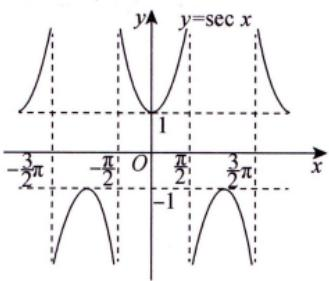  
(a)

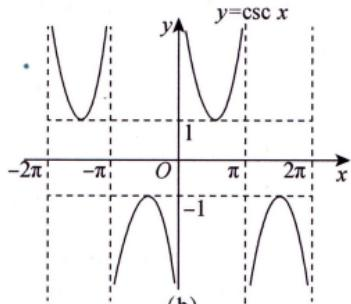  
图1-12  
(b)

注(1)定义域：y =secx的定义域为 $\left\{ x \mid x \neq k\pi + \frac{\pi}{2} (k \in \mathbf{Z}) \right\}$ $y = \csc x$ 的定义域为 $\{ x \mid x \neq k\pi$ $\left\{ k \in \mathbb{Z} \right\}$

值域：均为(-∞，-1]U[1，+∞)

(2)奇偶性：y=secx为偶函数，y=cscx为奇函数（在其定义域内).

(3)周期性：y=secx和y=cscx均以2π为最小正周期（在其定义域内).

(4) $1 + \tan^{2}\alpha = \sec^{2}\alpha ; 1 + \cot^{2}\alpha = \csc^{2}\alpha$ .★非常重要

(6)反三角函数.

①反正弦函数与反余弦函数.

反正弦函数y =arcsin x[见图 1-13(a)]，反余弦函数y =arccosx[见图1-13(b)].

  
(a)

  
(b)  
图 1-13

$y = \arcsin x$ 是 $y = \sin x \left( - \frac{\pi}{2} \leqslant x \leqslant \frac{\pi}{2} \right)$ 的反函数，y =arccos x是 $y = \cos x ( 0 \leqslant x \leqslant \pi )$ 的反函数.

## 注(1)主值区间.

$y = \arcsin x$ 的主值区间为 $\left[ - \frac{\pi}{2}, \frac{\pi}{2} \right], y = \arccos x$ 的主值区间为[0，π].

(2)反三角函数的恒等式有

$$
\sin(\arcsin x)=x,\;x\in[-1,1],\;\sin(\arccos x)=\sqrt{1-x^{2}},\;x\in[-1,1];
$$

$$
t = \arccos x \in [0, \pi]
$$

$$
\cos(\arccos x)=x, x \in [-1,1], \cos(\arccos x)=\sqrt{1-x^2}, x \in [-1,1];
$$

$$
\arcsin(\sin x) = x, x \in \left[ - \frac{\pi}{2}, \frac{\pi}{2} \right];
$$

$$
\sin t = \sqrt{1 - x^{2}}
$$

$$
\sin(\arccos x)=\sqrt{1-x^{2}}
$$

$$
\arccos(\cos x)=x,\;x\in[0,\pi];
$$

$$
\arcsin x + \arccos x = \frac{\pi}{2} (-1 \leqslant x \leqslant 1) .
$$

(3)特殊函数值：

$$
\arcsin 0 = 0, \arcsin \frac{1}{2} = \frac{\pi}{6}, \arcsin \frac{\sqrt{2}}{2} = \frac{\pi}{4}, \arcsin \frac{\sqrt{3}}{2} = \frac{\pi}{3}, \arcsin 1 = \frac{\pi}{2}
$$

$$
\arccos 1 = 0, \arccos \frac{\sqrt{3}}{2} = \frac{\pi}{6}, \arccos \frac{\sqrt{2}}{2} = \frac{\pi}{4}, \arccos \frac{1}{2} = \frac{\pi}{3}, \arccos 0 = \frac{\pi}{2}
$$

## 例1.12设 $y = \sin x , 0 \leqslant x \leqslant 2\pi$ ，求其所有单调区间上的反函数.

分析分单调区间，分别讨论反函数（用诱导公式）.

只有当x落在 $\left[ - \frac{\pi}{2}, \frac{\pi}{2} \right]$ 上时，才有反函数 $x = \arcsin y , y \in [-1,1]$ 7

解当 $0 \leq x \leq \frac{\pi}{2}$ 时，对 $y = \sin x$ ,有 $x = \arcsin y , y \in [0,1]$ ，此时反函数为 $y = \arcsin x , x \in [0,1]$

当 $\frac{\pi}{2} < x \leq \frac{3\pi}{2}$ 时（见图1-14），有 $-\frac{\pi}{2} < x - \pi \leq \frac{\pi}{2}$ ，此时 $\sin(x - \pi) = -\sin(\pi - x) = -\sin x = -y$ ，于是→放到主值区间中有 $x - \pi = - \arcsin y$ ，故 $x = \pi - \arcsin y , y \in [-1,1)$ ，此时反函数为 $y = \pi - \arcsin x , x \in [-1,1)$

当 $\frac{3\pi}{2} < x \leq 2\pi$ 时（见图1-14），有 $-\frac{\pi}{2} < x - 2\pi \leq 0$ ，此时 $\sin(x - 2\pi) = \sin x = y$ ，于是有 $x - 2\pi =$ arcsin y，故 $x = 2\pi + \arcsin y, \; y \in (-1, 0]$ ，此时反函数为 $y = 2\pi + \arcsin x, \; x \in (-1, \; 0]$

  
图 1-14

方法总结 arcsin x的主值区间是 $\left[ - \frac{\pi}{2}, \frac{\pi}{2} \right]$

②公式若 $y = \sin x , x \in \left( \frac{\pi}{2}, \frac{3}{2}\pi \right)$ ，则 $x = \pi - \arcsin y$

注(1)用处：如二重积分中，

$$
\int _ { - 1 } ^ { 0 } \mathrm{d}y \int _ { \pi - \arcsin y } ^ { 2 \pi + \arcsin y } f ( x , y ) \mathrm{d}x .
$$

后面我们讲二重积分时再讲.

(2)现在来回答大家：为什么不写成一个分段函数？会出现以下情况.

$$
y = \left\{ \begin{aligned} &\arcsin x, \quad 0 \leqslant y \leqslant \frac{\pi}{2}, \\ &\pi - \arcsin x, \quad \frac{\pi}{2} < y \leqslant \frac{3}{2}\pi, \\ &2\pi + \arcsin x, \quad \frac{3}{2}\pi < y \leqslant 2\pi. \end{aligned} \right. \quad \begin{aligned} &x \in [0,1], \\ &x \in [-1,1), \\ &x \in (-1,0]. \\ &x \in (-1,0]. \end{aligned}
$$

这样的图形是什么呢？如图1-15所示.

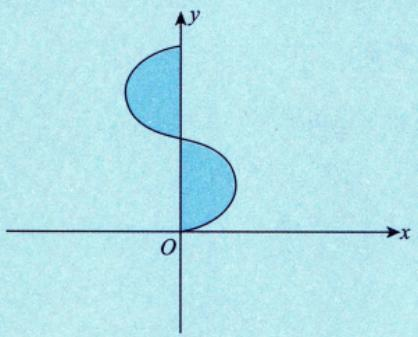  
图1-15

这个图就是y=sinx在[0,2π]的沿 $y = x$ 镜像的函数，就变成多值函数了.

②反正切函数与反余切函数.★★非常重要的函数

反正切函数 $y = \arctan x$ [见图1-16(a)]，反余切函数 $y = \operatorname{arccot}x$ [见图 1-16(b)].

  
图 1-16

$y = \arctan x$ 是 $y = \tan x \left( - \frac{\pi}{2} < x < \frac{\pi}{2} \right)$ 的反函数，y =arccot x是 $y = \cot x (0 < x < \pi)$ 的反函数.

## 注(1)定义域：均为 $( - \infty , + \infty )$

值域： y =arctan x 的值域为 $\left( - \frac{\pi}{2}, \frac{\pi}{2} \right), y = \arccos x$ 的值域为(0，π).

(2) 单调性 $y = \arctan x$ 单调增加， $y = \arccos x$ 单调减少.

若 $a_{n} > 0$ $\arctan a_{n} + a_{n} = \arctan b_{n}$ 则 $\arctan b_{n}-\arctan a_{n}=a_{n}>0$ (因y =arctan x 是单调增加函数)，因此 $b_{n} > a_{n} > 0$ ，若 $b_{n} = a_{n - 1}$ ，则 $\left\{ a_{n} \right\}$ 有下界且单调减少，从而 $\left\{ a_{n} \right\}$ 极限存在.

若再加条件， $\lim_{n \to \infty} b_n = 0$ ，则 $b_{n} > a_{n} > 0$

## 由夹逼准则，lima=0

命题老师给的关系式一般都需要做逆运算：

该加的，他减；该减的，他加；该乘的，他除；该除的，他乘，等等，这些都是需要作恒等变形的.  
命题老师通过做逆运算来迷惑你，要跟他唱反调，这是非常重要的解题经验.

(3) 奇偶性：y=arctanx为奇函数（在其定义域内).

(4)有界性：两个函数在其定义域内有界， $-\frac{\pi}{2} < \arctan x < \frac{\pi}{2}, \quad 0 < \arccos x < \pi$

(5) 性质： $\arctan x + \arccos x = \frac{\pi}{2} ( - \infty < x < + \infty )$ 。这个也是以后会讲到

(6) 特殊函数值：

$$
\arctan 0 = 0, \arctan \frac{\sqrt{3}}{3} = \frac{\pi}{6}, \arctan 1 = \frac{\pi}{4}, \arctan \sqrt{3} = \frac{\pi}{3},
$$

$$
\arccos 0 = \frac{\pi}{2}, \arccos \sqrt{3} = \frac{\pi}{6}, \arccos 1 = \frac{\pi}{4}, \arccos \frac{\sqrt{3}}{3} = \frac{\pi}{3}
$$

记住

(7) 极限：

$$
\lim_{x \to -\infty} \arctan x = -\frac{\pi}{2}, \quad \lim_{x \to +\infty} \arctan x = \frac{\pi}{2}, \quad \lim_{x \to -\infty} \arccos x = \pi, \quad \lim_{x \to +\infty} \arccos x = 0
$$

(7) 初等函数.

由基本初等函数经过有限次的四则运算，以及有限次的复合步骤所构成的并且可以由一个式子所表示的函数称为初等函数.

注(1)初等函数的定义域可以是一个区间，也可以是几个区间的并集，甚至可以是一些孤立的点.例如， $y = \sqrt{\cos \pi x - 1}$ 的定义域是 $\left\{ x \mid x = 0, \pm 2, \pm 4, \cdots \right\}$

★(2)幂指函数 $u(x)^{v(x)} = \mathrm{e}^{v(x)\ln u(x)}$ 也是初等函数，如 $x > 0$ 时， $f(x) = x^{x} = \mathrm{e}^{x \ln x}$ 是初等函数，其图形如图 1-17 所示.具体作图过程见例5.12.

  
图 1-17

等到学完工具后再画图。 $x ^ { 3 } , x ^ { 2 x } , x ^ { 3 x }$ 的图像都类似.

## ② 分段函数—→有别于初等函数的另一种重要的函数.

在自变量的不同变化范围中，对应法则用不同式子来表示的函数称为分段函数.需要强调一句，分段函数是用几个式子来表示的一个(不是几个)函数.一般来说，它不是初等函数.分段函数的典型形式如下：

$$
f(x)=\left\{\begin{aligned}&\varphi_{1}(x), \quad x>x_{0}, \\&a, \quad x=x_{0}, \quad  或  f(x)=\left\{\begin{aligned}&\varphi(x), \quad x \neq x_{0}, \\&a, \quad x=x_{0}.\end{aligned}\right. \\&\varphi_{2}(x), \quad x<x_{0}\end{aligned}\right.
$$

分段函数很重要，原因在于其形式的复杂性所带来的命题的丰富性.后面会看到，不论是求极限、求导数，还是求积分，出现最多的研究对象之一便是分段函数.

分段函数是非常重要的一个命题素材.<

下面列出三个重要的分段函数.

① $y = |x| = \left\{ \begin{aligned} & x, & x \geq 0, \\ & -x, & x < 0 \end{aligned} \right.$ 称为绝对值函数，如图1-18(a)所示.

|x|既然是分段函数，那它是不是初等函数呢？是，因为 $|x| = \sqrt{x^{2}}$ .一般来讲，分段函数不是初等函数，但|x|是一个特例。

② $y = \mathrm{sgn}   x = \begin{cases} 1, & x > 0, \\ 0, & x = 0, \\ -1, & x < 0 \end{cases}$ 称为符号函数，如图1-18(b)所示.对于任意实数x，有 $x = |x| \mathrm{sgn}   x$

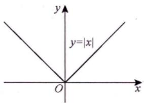  
(a)

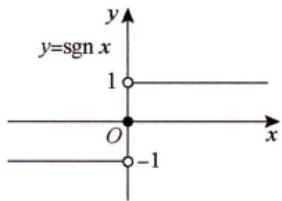  
(b)  
图 1-18

③ $y = \left[ x \right]$ 称为取整函数.先给出定义：设x为任一实数，不超过x的最大整数称为x的整数部分，记作[x]. 如

$$
\left [ 0.99 \right ] = 0,\left [ \pi \right ] = 3,\left [ -1 \right ] = -1,\left [ -1.99 \right ] = -2.
$$

因此，取整函数 $y = \left[ x \right]$ 的定义域为R，值域为Z.它的图形如图1-19所示，在x为整数值处图形发生跳跃.

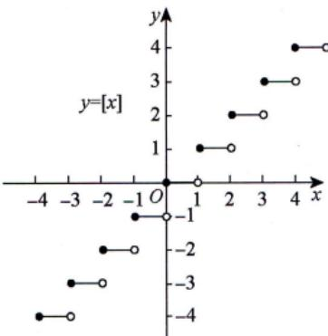  
图1-19

$x \times x \times (1) \left[ x + n \right] = \left[ x \right] + n$ ，其中n为整数.★ (2) $x - 1 < \left [ x \right ] \le x$ ★ (3) $\lim_{x \to 0^{+}} [x] = 0 ; \lim_{x \to 0^{-}} [x] = -1$

★★★(4)换一种说法， $Y = i + 1$ 当且仅当 $i \leqslant X < i + 1$ ，i为整数，则 $Y = \left[ X \right] + 1$ 考生要牢记.

x的小数部分

例1.13 设[x]表示不超过x的最大整数，则 $y = \sqrt[n]{x - \left[ x \right]}$ 是( ).(A)无界函数 (B) 单调函数(C) 偶函数 (D)周期函数

解应选(D).

由于 $y(x+1)=x+1-[x+1]=x+1-([x]+1)=x-[x]=y(x)$ ，即y(x)是周期为1的周期函数，其图形如图1-20所示，故选(D).

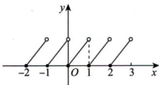  
图1-20

方法总结x-[x]：x的小数部分，是以1为周期的函数.公式 $\left[ x + n \right] = \left[ x \right] + n , \quad \left[ x + 1 \right] = \left[ x \right] + 1$

注(1) $y = x - \left[ x \right] = \left\{ x \right\}$

$$
1.99 - \left[ 1.99 \right] = 0.99
$$

$$
-1.99-\left[-1.99\right]=-1.99+2=0.01
$$

-1.99 的整数部分是-2，

-1.99 的小数部分是 0.01 .

(2) y =sinx|，其图形如图 1-21 所示.

  
图1-21

(3) $y = \arcsin(\sin x)$ ，其图形如图 1-22 所示.

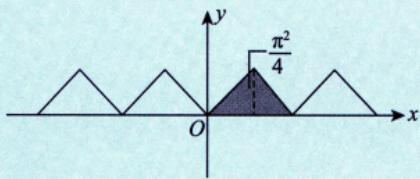  
图1-22

以后我们算积分的相关题目，这些图都有重要的应用.

## 函数极限的概念与性质

我们首先要厘清极限的概念，概念懂了，后面的性质是显然的，计算就会遵循概念和性质，从而不会出错.

## 1 邻域

①δ邻域.设 $x _ { 0 }$ 是数轴上一个点， $\delta$ 是某一正数，则称 $(x_{0} - \delta, x_{0} + \delta)$ 为点 $x _ { 0 }$ 的δ邻域，记作$U(x_{0},\delta)$ ，即

$$
U ( x _ { 0 } , \delta ) = \left\{ x | x _ { 0 } - \delta < x < x _ { 0 } + \delta \right\} = \left\{ x | | x - x _ { 0 } | < \delta \right\} ,
$$

其中点 $x _ { 0 }$ 称为邻域的中心，δ称为邻域的半径.

②去心 $\delta ^ { * }$ 邻域.定义点 $x _ { 0 }$ 的去心邻域 $\dot{U}(x_0, \delta) = \left\{ x \mid 0 < \left| x - x_0 \right| < \delta \right\}$

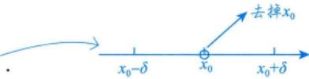

③左、右 $\delta ^ { \prime }$ 邻域. $\left\{ x \mid 0 < x - x_{0} < \delta \right\}$ 称为点 $x _ { 0 }$ 的右 $\delta ^ { \prime }$ 邻域，记作 $U ^ { + } ( x _ { 0 } , \delta ) ; \left\{ x | 0 < x _ { 0 } - x < \delta \right\}$ 称为点 $x_{0}$ 的左δ邻域，记作 $U ^ { - } ( x _ { 0 } , \delta )$

④邻域与区间(区域).邻域当然属于区间(区域)的范畴，但事实上，邻域通常表示“一个局

部位置”，比如“点 $x _ { 0 }$ 的 $\delta ^ { \cdot }$ 邻域”就可以称为“点 $x _ { 0 }$ 的附近”.于是，函数f(x)在点 $x _ { 0 }$ 的某 $\delta \cdot$ 邻域内有定义也就是函数f(x)在点x的附近有定义，这个“附近”到底有多近多远，既难以说明也没有 $x _ { 0 }$ 必要说明.

注(1)邻域是区间（区域)，但是这个区间是为定义极限才创建的区间.

(2)关于邻域的一组概念非常重要，因为我们将要“在一个局部位置”细致地研究问题.

## 2 函数极限的定义

设函数f(x)在点x的某一去心邻域内有定义.若存在常数A，对于任意给定的 $x _ { 0 }$ $\varepsilon > 0$ (不论它多么小)，总存在正数 $\delta$ ，使得当 $0 < \left| x - x_{0} \right| < \delta$ 时，对应的函数值f(x)都满足不等式 $\left| f(x) - A \right| < \varepsilon$ ，则A叫作函数f(x)当 $x   \rightarrow   x _ { _ 0 }$ 时的极限，记为

$$
\lim_{x \to x_0} f(x) = A  或  f(x) \to A (x \to x_0)
$$

写成 $ \quad \varepsilon - \delta$ 语言”： $\lim_{x \to x_0} f(x) = A \Leftrightarrow \forall \varepsilon > 0, \exists \delta > 0$ ,当 $0 < \left| x - x_{0} \right| < \delta$ 时，有 $\left| f(x) - A \right| < \varepsilon$ 文字语言：任给的 $\varepsilon > 0$ ，总能找到δ邻域，使得我们的距离小于你这个尺度。

注符号“∀”是英文 Arbitrary(任意的)的首字母上下方向倒着写出来的；符号“∃”是英文Exist(存在)的首字母左右方向倒着写出来的.

画图理解.如图1-23所示.

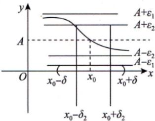  
图 1-23

任给 $\varepsilon_{1} > 0$ ，再给 $\varepsilon_{2} > 0$ ，……，再给 $\varepsilon _ { _ n } > 0$ ，当ε一直取下去，越来越小，两条线越来越近.不管有多近，总能找到一个小邻域，使得在该邻域内，除了 $x _ { 0 }$ 之外，曲线被夹在宽度要多小有多小的这两条线中，则称 $x \to x_{0}, f(x) \to A$ .这就是魏尔斯特拉斯给的极限的标准语言.

## 注函数极限一共有24个定义，其中自变量趋近方式有6种，函数趋近方式有4种，如表所示.

<table><tr><td></td><td rowspan=1 colspan=1></td><td rowspan=1 colspan=1> $f(x) \to A$ </td><td rowspan=1 colspan=1> $f(x) \to \infty$ </td><td rowspan=1 colspan=1> $f(x) \to +\infty$ </td><td rowspan=1 colspan=1> $f(x) \to -\infty$ </td></tr><tr><td rowspan=1 colspan=2> $x \to x_{0}$ </td><td rowspan=1 colspan=1> $\forall \varepsilon > 0, \exists \delta > 0$ 使得当 $0 < \left| x - x_{0} \right| < \delta$ 时，有 $\left| f(x) - A \right| < \varepsilon$ </td><td rowspan=1 colspan=1> $\forall M>0,\exists \delta>0$ 使得当 $0 < \left| x - x_{0} \right| < \delta$ 时，有|f(x)|&gt;M</td><td rowspan=1 colspan=1> $\forall M>0,\exists \delta>0$ 使得当 $0 < \left| x - x_{0} \right| < \delta$ 时，有f(x)&gt;M</td><td rowspan=1 colspan=1> $\forall M>0,\exists \delta>0$ 使得当 $0 < \left| x - x_{0} \right| < \delta$ 时，有 $f(x) < -M$ 以-∞为核.L无限靠近“-∞”</td></tr><tr><td></td><td></td><td rowspan=1 colspan=1> $\forall \varepsilon > 0, \exists \delta > 0$ 使得当 $0 < x - x_{0} < \delta$ 时，有 $\left| f(x) - A \right| < \varepsilon$ </td><td rowspan=1 colspan=1> $\forall M>0,\exists \delta>0$ 使得当 $0 < x - x_{0} < \delta$ 时，有 $\left| f(x) \right| > M$ </td><td rowspan=1 colspan=1> $\forall M > 0, \exists \delta > 0$ 使得当 $0 < x - x_{0} < \delta$ 时，有f(x)&gt;M</td><td rowspan=1 colspan=1> $\forall M>0,\exists \delta>0$ 使得当 $0 < x - x_{0} < \delta$ 时，有f(x)&lt;-M</td></tr><tr><td></td><td></td><td rowspan=1 colspan=1> $\forall \varepsilon > 0, \exists \delta > 0$ 使得当 $0 < x_{0} - x < \delta$ 时，有 $\left| f(x) - A \right| < \varepsilon$ </td><td rowspan=1 colspan=1> $\forall M > 0, \exists \delta > 0$ 使得当 $0 < x_{0} - x < \delta$ 时，有 $\left| f(x) \right| > M$ </td><td rowspan=1 colspan=1> $\forall M>0,\exists \delta>0$ 使得当 $0 < x_{0} - x < \delta$ 时，有f(x)&gt;M</td><td rowspan=1 colspan=1> $\forall M > 0, \exists \delta > 0$ 使得当 $0 < x_{0} - x < \delta$ 时，有f(x)&lt;-M</td></tr></table>

核(自带光环) ((()))

<table><tr><td rowspan=2 colspan=1> $x \to \infty$ </td><td rowspan=1 colspan=1> $f(x) \to A$ </td><td rowspan=1 colspan=1> $f(x) \to \infty$ </td><td rowspan=1 colspan=1> $f(x) \to +\infty$ </td><td rowspan=1 colspan=1> $f(x) \to -\infty$ </td></tr><tr><td rowspan=1 colspan=1> $\forall \varepsilon > 0, \exists X > 0$ 使得当|x|&gt;X时，有 $\left| f(x) - A \right| < \varepsilon$ </td><td rowspan=1 colspan=1> $\forall M>0,\exists X>0$ 使得当|x|&gt;X时，有|f(x)|&gt;M</td><td rowspan=1 colspan=1> $\forall M > 0, \exists X > 0$ 使得当|x|&gt;X时，有f(x)&gt;M</td><td rowspan=1 colspan=1> $\forall M>0,\exists X>0$ 使得当|x|&gt;X时，有f(x)&lt;-M</td></tr><tr><td rowspan=1 colspan=1> $x \to +\infty$ </td><td rowspan=1 colspan=1> $\forall \varepsilon > 0, \exists X > 0$ 使得当x&gt;X时，有 $\left| f(x) - A \right| < \varepsilon$ </td><td rowspan=1 colspan=1> $\forall M>0,\exists X>0$ 使得当x&gt;X时，有|f(x)|&gt;M</td><td rowspan=1 colspan=1> $\forall M>0,\exists X>0$ 使得当x&gt;X时，有f(x)&gt;M</td><td rowspan=1 colspan=1> $\forall M > 0, \exists X > 0$ 使得当x&gt;X时，有f(x)&lt;-M</td></tr><tr><td rowspan=1 colspan=1> $x \to -\infty$ </td><td rowspan=1 colspan=1> $\forall \varepsilon > 0 , \exists X > 0 ,$ 使得当x&lt;-X时，有 $\left| f(x) - A \right| < \varepsilon$ </td><td rowspan=1 colspan=1> $\forall M>0,\exists X>0$ 使得当x&lt;-X时，有 $\left| f(x) \right| > M$ </td><td rowspan=1 colspan=1> $\forall M>0,\exists X>0$ 使得当x&lt;-X时，有f(x)&gt;M</td><td rowspan=1 colspan=1> $\forall M > 0, \exists X > 0,$ 使得当x&lt;-X时，有f(x)&lt;-M</td></tr></table>

24 种情况，好好写一遍.

例1.14 已知 $\lim_{x \to 0} \frac{f(x)}{x^2}$ 存在，且函数

$$
f(x)=\frac{x-\sin x}{x}+x^{2}\lim_{x \to 0}\frac{f(x)}{1-\cos x}
$$

则 $\lim_{x \to 0} \frac{f(x)}{x^2}$ ( ).(A) $-\frac{1}{3}$ (B) $\frac{1}{3}$ (C) $\frac{1}{6}$ (D) $-\frac{1}{6}$

分析令 $\lim_{x \to 0} \frac{f(x)}{x^2} = A$ ，建立方程.

解应选 (D).

记 $\lim_{x \to 0} \frac{f(x)}{x^2} = A$ ，且当x→0时，

$$
\frac{f(x)}{x^{2}}=\frac{x-\sin x}{x^{3}}+\lim_{x \rightarrow 0}\frac{f(x)}{1-\cos x}, \quad \frac{f(x)}{\lim\limits_{x \rightarrow 0}\frac{f(x)}{x^{2}} \cdot \frac{x^{2}}{\left | 1-\cos x \right | }} \rightarrow 2
$$

则 $\lim_{x \to 0} \frac{x - \sin x}{x^3} + 2A$ ，故 $A = \frac{1}{6} + 2A$ ，得 $A = - \frac{1}{6}$

## ③超实数及其在极限中的应用

下面讲一个极为重要的概念及其应用，帮助考生进一步深刻理解“极限”.

实数系R中有如下公理：

若对任意大的自然数n，均有 $\left| x \right| < \frac{1}{n}$ ，则 $x = 0$ .这使得实数系R中不存在非零无穷小量及其倒数—无穷大量.

(1)定义.

①非零无穷小量与无穷大量.

若对任意大的自然数n，均有 $\left| x^{*} \right| < \frac{1}{n}$ 且 $x^{^*} \ne 0$ ，则 $x ^ { \prime }$ 为非零无穷小量，其倒数 $\frac{1}{x^{^*}}$ 为无穷大量.  
②超实数.

设 $x _ { 0 }$ 为任一实数，则 $x_{0} + x^{*}$ 为有限超实数， $x_{0}+\frac{1}{x^{^{*}}}$ 为无穷超实数（无穷大量）

③超实数系 $\mathbf { R } ^ { * }$

实数系R，非零无穷小量 $x ^ { \prime }$ ，无穷大量 $\frac{1}{x^{^{*}}}$ 构成超实数系 $\mathbf { R } ^ { \bullet }$ . $x_{0} + x^{\bullet}$ $x_{0}+\frac{1}{x^{^{*}}}$ 不在实数系R中.   
(2)实数与超实数的关系（见图1-24）.

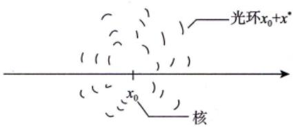  
图 1-24

在实数轴上任取一点 $x _ { 0 }$ ，称为核.

$x_{0} + x^{*}$ 是以 $x _ { 0 }$ 为核的有限超实数，称为核 $x _ { 0 }$ 的光环，由于 $x ^ { \prime }$ 是任意一个非零无穷小，故 $x _ { 0 }$ 的光环有无穷多个.

为方便，记 $\boldsymbol{X}^{*} = x_{0} + \boldsymbol{x}^{*} = \operatorname{std}(\boldsymbol{X}^{*}) + \left[ \boldsymbol{X}^{*} - \operatorname{std}(\boldsymbol{X}^{*}) \right]$ $x_{0}=\operatorname{std}(\boldsymbol{X}^{*})$ 也称为超实数 $X ^ { \bullet }$ 的标准实数部分，$x^{*} = X^{*} - \operatorname{std}(X^{*})$ 即为非零无穷小量.

如 $x_{0}=0 , \quad x_{1}^{*}=\sin x(x \rightarrow 0)$ ，则 $X_{1}^{*} = x_{0} + x_{1}^{*} = \sin x(x \to 0)$ 是以0为核，以sinx为无穷小量的超实数.

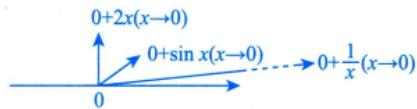

如 $x_{0}=0 , x_{2}^{*}=2x(x \to 0)$ ，则 $X_{2}^{*} = x_{0} + x_{2}^{*} = 2x(x \rightarrow 0)$ 是以0为核，以2x为无穷小量的超实数.

如 $x_{0}=0 , x_{3}^{*}=\frac{1}{x}(x \to 0)$ ，则 $X_{3}^{*} = x_{0} + x_{3}^{*} = \frac{1}{x} (x \to 0)$ 是以0为核，以 $\frac{1}{x}$ 为无穷大量的超实数.

如 $x_{0}=0 , x_{4}^{*}=\frac{1}{x^{2}}(x \rightarrow 0)$ ，则 $X_{4}^{*} = x_{0} + x_{4}^{*} = \frac{1}{x^{2}} (x \rightarrow 0)$ 是以0为核，以 $\frac{1}{x^{2}}$ 为无穷大量的超实数.

显然，上述4个超实数到它们的核的距离sinx，2x， $\left| \frac{1}{x} \right|, \quad \left| \frac{1}{x^2} \right| (x \to 0)$ 均不是实数，sinx，$|2x|(x \to 0)$ 是比任何正实数都小的量， $\left| \frac{1}{x} \right|, \quad \left| \frac{1}{x^2} \right| (x \to 0)$ 是比任何正实数都大的量

(3)超实数与极限的关系与运算.

先举个例子.如

$$
\lim_{x \to 0} \frac{\sin x}{x} = 1
$$

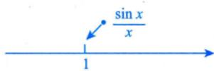

其中，① $\frac{\sin x}{x}$ 在未作极限运算时，为实数运算

② $\lim_{x \to 0} \frac{\sin x}{x}$ 称为趋核运算，此时的 $\frac{\sin x}{x}$ 称为超实数， $\lim_{x \to 0} \frac{\sin x}{x}$ 的结果为其核值1.于是

★设 $\lim_{x \to x_0} f(x) = A$ ，其运算（及其运算顺序）为

a. f(x)为实数运算.

b. $\lim_{x \to x_0} f(x)$ 为趋核运算，A为核值，当A唯一时，称趋核运算存在， $\lim_{x \to x_0} f(x)$ 存在；否则称趋核运算不存在， $\lim_{x \to x_0} f(x)$ 不存在.

如 $\lim_{x \to 0} \frac{(x - x)}{x} = \lim_{x \to 0} 0 = 0$ 核值0

再如， $\lim_{x \to 0} (x - \sin x) \neq \lim_{x \to 0} (x - x) = 0$ ，当然不等， $\lim_{x \to 0} (x - \sin x)$ 首先要作实数运算.由于 $\sin x \ne x$ $x - \sin x \neq x - x$ ，故趋核运算便无从谈起了.

实数运算错误

又如，计算 $\lim_{x \to \infty} \frac{\left(1 + \frac{1}{x}\right)^x}{\mathrm{e}^x}$ ，若写 $\lim_{x \to \infty} \frac{\left( 1 + \frac{1}{x} \right)^{x^2}}{\mathrm{e}^x} = \lim_{x \to \infty} \frac{\left[ \left( 1 + \frac{1}{x} \right)^x \right]^x}{\mathrm{e}^x} = \lim_{x \to \infty} \frac{\mathrm{e}^x}{\mathrm{e}^x} = 1$ ，显然也是错误的.因为， $\lim_{x \to \infty} \frac{\left( 1 + \frac{1}{x} \right)^{x^2}}{\mathrm{e}^x}$ 的第一步，要作 $\frac{\left(1+\frac{1}{x}\right)^{x^{2}}}{\mathrm{e}^{x}}$ 的实数运算，即

$$
\frac{\left(1+\frac{1}{x}\right)^{x^{2}}}{\mathrm{e}^{x}}=\frac{\mathrm{e}^{x^{2}\ln\left(1+\frac{1}{x}\right)}}{\mathrm{e}^{x}}=\mathrm{e}^{x^{2}\ln\left(1+\frac{1}{x}\right)-x}
$$

第二步，再作 $\lim_{x \to \infty} e^{x^2 \ln \left( 1 + \frac{1}{x} \right) - x}$ 的趋核运算.

上述错误是将 $\frac{\left[ \left( 1 + \frac{1}{x} \right)^x \right]^x}{\mathrm{e}^x}$ 中的 $\left( 1 + \frac{1}{x} \right)^{x}$ 换成了e，而在实数运算中， $\left( 1 + \frac{1}{x} \right)^{x} \neq \mathbf{e}$

注有考生会问，等价无穷小替换的方法是否违背上述规则呢？举例来说，

$$
\lim_{x \to 0} \frac{1 - \cos x}{x^2} \xlongequal{ 等价无穷小 } \lim_{x \to 0} \frac{\left| \frac{1}{2}x^2 \right|}{x^2} = \frac{1}{2}
$$

这里是不是在实数运算中将1-cosx写成 $ 了  \frac{1}{2}x^{2} ?$ 是否犯了错误？

请注意，如果认为 $\lim_{x \to 0} \frac{1 - \cos x}{x^2} = \lim_{x \to 0} \frac{\left| \frac{1}{2}x^2 \right|}{x^2}$ 是在实数运算中进行的，显然是错误的

这与 $\lim_{x \to 0} (x - \sin x) = \lim_{x \to 0} (x - x)$ $\lim_{x \to \infty} \frac{\left[ \left( 1 + \frac{1}{x} \right)^x \right]^x}{\mathrm{e}^x} = \lim_{x \to \infty} \frac{\mathrm{e}^x}{\mathrm{e}^x}$ 的错误是一样的.

事实上， $\lim_{x \to 0} \frac{1 - \cos x}{x^2}$ 是这样算的：

实数运算，

$\frac{1 - \cos x}{x^{2}} = \frac{A}{x^{2}} \frac{1 - \cos x}{A} = \frac{\frac{1}{2}x^{2}}{x^{2}} \frac{1 - \cos x}{\frac{1}{2}x^{2}} \quad ( = \frac{1}{2} \cdot \frac{1 - \cos x}{\frac{1}{2}x^{2}} )$ 进一步是可以这样写的）

趋核运算，

$$
\lim_{x \to 0} \frac{1 - \cos x}{x^2} = \lim_{x \to 0} \frac{\frac{1}{2}x^2}{x^2} \cdot \lim_{x \to 0} \frac{1 - \cos x}{\frac{1}{2}x^2}
$$

由于当 $x \to 0$ 时， $1 - \cos x$ 与 $\frac{1}{2}x^{2}$ 是等价无穷小量，即它们趋核速度相同，用趋核运算来刻画，即  
$\lim_{x \to 0} \frac{1 - \cos x}{\frac{1}{2}x^2} = 1$ 故 $\lim_{x \to 0} \frac{1 - \cos x}{x^2} = \lim_{x \to 0} \frac{\frac{1}{2}x^2}{x^2} \cdot 1$ 这是此问题的正确来由.  
$1-\cos x  与  \frac{1}{2}x^{2}$ 趋核速度相同显然，上述 $\lim_{x \to 0} \frac{1 - \cos x}{\frac{1}{2}x^2} = 1$ 涉及“趋核速度”，需要详细说一说.

(4) 趋核速度.

既然一个核值 $x _ { 0 }$ 周围有无数个光环，这些光环的本质区别是什么呢？这就要提出“趋核速度”的问题了.

比如，如图1-25所示.

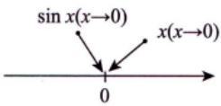  
图 1-25

$\sin x(x \to 0)$ 与 $x ( x \to 0 )$ 均以0为核值，且趋核速度相同，则用下式来刻画这种关系：

$$
\frac{\lim\limits_{x \to 0} \frac{\sin x}{x}}{x} = 1 \quad . \quad \frac{\sin x \to 0}{\sin x(x \to 0)} \quad  与  \quad x(x \to 0)  益接速度相同
$$

于是，有下面的结论：

若 $f(x)(x \to x_0)$ 与 $g ( x ) ( x \to x _ { 0 } )$ 均以0为核值，则 $\lim_{x \to x_0} \frac{f(x)}{g(x)} = a \neq 0 \Leftrightarrow f(x)(x \to x_0)$ 与 $g(x)(x \to x_0)$ 趋核速度相同.

$\lim_{x \to x_0} \frac{f(x)}{g(x)} = 0 \Leftrightarrow f(x)(x \to x_0)$ 比 $g(x)(x \to x_0)$ 趋核速度快.

$\lim_{x \to x_0} \frac{f(x)}{g(x)} = \infty \Leftrightarrow f(x)(x \to x_0)$ 比 $g(x)(x \to x_0)$ 趋核速度慢.

(5) 极限四则运算规则.

这也称为超实数趋核四则运算规则

设 $\lim_{x \to x_0} f(x) = A , \quad \lim_{x \to x_0} g(x) = B$ ，则有

① $\lim_{x \to x_0} \left[ f(x) \pm g(x) \right] = A \pm B$

② $\lim_{x \to x_0} f(x)g(x) = AB$

③ $\lim_{x \to x_0} \frac{f(x)}{g(x)} = \frac{A}{B} (B \neq 0)$

事实上，由于f(x)，g(x)的趋核运算值均为其实数核值，故如

$$
\lim_{x \to x_0} \left[ f(x) + g(x) \right] = \lim_{x \to x_0} f(x) + \lim_{x \to x_0} g(x) = A + B
$$

显然成立，比如

$$
\lim_{x \to 0} (x + \sin x) = \lim_{x \to 0} x + \lim_{x \to 0} \sin x = 0 + 0 = 0
$$

$$
\lim_{x \to 1} \frac{\sin x}{x} = \frac{\lim\limits_{x \to 1} \sin x}{\lim\limits_{x \to 1} x} = \frac{\sin 1}{1} = \sin 1
$$

下面说明两种情况.

① $f(x),   g(x)$ 中恰有一个不存在核值.

设 $\lim_{x \to x_0} f(x) = A$ $\lim_{x \to x_0} g(x)$ 不存在或为无穷大量，则

a. lim[f(x)±g(x)]=A±(不存在或∞) =不存在或∞.x→xg实数运算为平不存在或∞作有限平移，依然为移运算 不存在或∞.

如 $\lim_{x \to 0} \left( \frac{\sin x}{x} + \sin \frac{1}{x} \right)$ ，其中 $\lim_{x \to 0} \frac{\sin x}{x} = 1, \lim_{x \to 0} \sin \frac{1}{x}$ 不存在（在-1到1之间振荡），则 $\lim_{x \to 0} \left( \frac{\sin x}{x} + \sin \frac{1}{x} \right)$ 1+不存在=不存在.仅供理解，不要写出来.

b. $\begin{aligned} \lim_{x \to x_0} \underbrace{f(x)g(x)}_{\substack{负实数运算 \\ 怂故熔运算\end{aligned}}}_{负实数运算}$

这里的趋核运算有多种情况.

(i) 如 $\lim_{x \to 0} x \sin \frac{1}{x}$ ，其中 $\lim_{x \to 0} x = 0$ $\lim_{x \to 0} \sin \frac{1}{x}$ 不存在.

此时 $A = 0$ ，可以将“-1到1之间振荡”的情形压缩成0，故 $\lim_{x \to 0} x \sin \frac{1}{x} = 0$ 有界振荡=0.压缩为0此时极限存在，即趋核运算值为0

(ii) 如 $\lim_{x \to \infty} \sin \frac{1}{x^2} \cdot x$ ，其中 $\lim_{x \to \infty} \sin \frac{1}{x^2} = 0$ $\lim_{x \to \infty} x = \infty$ ，理由同(i)， $\lim_{x \to \infty} \sin \frac{1}{x^2} \cdot x = 0$

(iii) 如 $\lim_{x \to 0} \cos x \cdot \sin \frac{1}{x}$ ，其中 $\lim_{x \to 0} \cos x = 1$ $\lim_{x \to 0} \sin \frac{1}{x}$ 不存在.此时A=1，放缩结果不变，故$\lim_{x \to 0} \cos x \sin \frac{1}{x}$ 不存在.

C. $\lim_{x \to x_0} \frac{f(x)}{g(x)} = \lim_{x \to x_0} f(x) \cdot \frac{1}{g(x)}$ ，讨论与b.类似.

②f(x)，g(x)均不存在核值.

设 $\lim_{x \to x_0} f(x)$ 不存在或为∞， $\lim_{x \to x_0} g(x)$ 不存在或为 $\infty$ ，则

a. $\lim_{x \to x_0} \left[ \underbrace{f(x) \pm g(x)}_{ 货实数运算 } \right] = \frac{ 不存在  \pm  不存在 }{ 货 }$

这里的趋核运算有多种情况.

(i) 如 $\lim_{x \to 0} \left( \frac{1}{x} - \frac{1}{x} \right) = \lim_{\substack{x \to 0 \\ 0}} 0 = 0$ ，其中 $\lim_{x \to 0} \frac{1}{x} = \infty$

此时要明白，应先算实数运算，且因不符合拆开的条件，不能拆开算.

(ii)如 $\lim_{x \to 0} \left( \frac{1}{x} - \frac{2}{x} \right) = - \lim_{x \to 0} \frac{1}{x} = \infty$ .易知，趋核运算可能存在，亦可能不存在.

b. $\lim_{x \to x_0} \frac{f(x)g(x)}{\odot} = \frac{(不存在或 \infty) \cdot (不存在或 \infty)}{\odot}$

这里的趋核运算有多种情况.

(i) 若取 $f(x) = \begin{cases} 1, \\ -1 \end{cases}$ ，x为无理数， x为有理数， $g(x) = \begin{cases} 1, \\ -1 \end{cases}$ ，x为无理数， x为有理数， 则 $\lim_{x \to 0} f(x)$ 不存在， $\lim_{x \to 0} g(x)$ 不存在，而 $f(x) \cdot g(x) \equiv 1$ 实数运算 ，故 $\frac{\lim_{x \to 0} f(x) \cdot g(x) = 1}{  趁援运算  }$

(ii)若取 $f(x)=\sin\frac{1}{x},~g(x)=\cos\frac{1}{x}$ ，则 $\lim_{x \to 0} f(x)$ 不存在， $\lim_{x \to 0} g(x)$ 不存在.而 $\frac{f(x)g(x)}{ 实数送算 }=\sin\frac{1}{x}\cos\frac{1}{x}=$ $\frac{1}{2}\sin\frac{2}{x}$ ，故 $\lim_{x \to 0} f(x)g(x)$ 不存在.趋接运算

(iii)若取 $f(x)=\sin\frac{1}{x}, \quad g(x)=\frac{1}{x}$ ，则 $\lim_{x \to 0} f(x)$ 不存在（在-1到1之间振荡）， $\lim_{x \to 0} g(x) = \infty$ ，而$\lim_{x \to 0} f(x)g(x) = \lim_{x \to 0} \frac{1}{x}\sin\frac{1}{x}$ 宜数运算

若 $x = \frac{1}{n\pi}, \; n = 1, \; 2, \; \cdots$ ，则实数运算 $\frac{1}{x}\sin\frac{1}{x}\bigg|_{x = \frac{1}{n\pi}} = n\pi\sin n\pi = 0,\ \lim_{x \to 0}f(x)g(x) = 0.$ ;

若 $x = \frac{1}{2n\pi + \frac{\pi}{2}}, n = 1, 2, \cdots$ ，则实数运算

$$
\frac{1}{x}\sin\frac{1}{x}\bigg|_{x = \frac{1}{2n\pi}\frac{\pi}{2}} = \left(2n\pi + \frac{\pi}{2}\right)\sin\left(2n\pi + \frac{\pi}{2}\right) = 2n\pi + \frac{\pi}{2}, \quad \lim_{x \to 0}f(x)g(x) = \lim_{x \to \infty}\left(2n\pi + \frac{\pi}{2}\right) = \infty.
$$

此处，趋核运算的结果既有实数0，也有无穷大量，称为“无界变量”.

(iv) 显然， $\infty \cdot \infty = \infty$

C. $\lim_{x \to x_0} \frac{f(x)}{g(x)} = \lim_{x \to x_0} f(x) \cdot \frac{1}{g(x)}$

讨论与 b. 类似.

综上所述，可列表如下：

<table><tr><td rowspan=1 colspan=1>条件</td><td rowspan=1 colspan=1>结论</td></tr><tr><td rowspan=1 colspan=1>f(x)，g(x)均存在核值</td><td rowspan=1 colspan=1>f(x)±g(x), f(x)·g(x),  $\frac{f(x)}{g(x)}$ (g(x)核值不为0)均存在核值</td></tr><tr><td rowspan=1 colspan=1>f(x)，g(x)中恰有一个不存在核值</td><td rowspan=1 colspan=1> $f(x) \pm g(x)$ 不存在核值； $f(x) \cdot g(x)$ 可能存在核值，也可能不存在核值； $\frac{f(x)}{g(x)}$ 可能存在核值，也可能不存在核值</td></tr><tr><td rowspan=1 colspan=1>f(x)，g(x)均不存在核值</td><td rowspan=1 colspan=1>f(x)±g(x), f(x)·g(x),  $\frac{f(x)}{g(x)}$ 均可能存在核值，也可能不存在核值</td></tr></table>

## 函数极限的性质

(1) 唯一性.→极限是谁呢？是标准实数部分，是唯一的。

如果极限 $\lim_{x \to x_0} f(x)$ 存在，那么极限唯一.任何一个实数，周围有无数个光环.

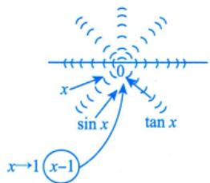

前面表中的24种情况

## 注（1)函数极限存在的充要条件.

表示左右趋近都是A $\lim_{x \to x_0} \frac{f(x)}{f(x)} = A \Leftrightarrow \lim_{x \to x_0^+} f(x) = A  且  \lim_{x \to x_0^+} f(x) = A,$

(2) 关于唯一性的说明.

①对于 $x \to \infty$ ，意味着x→+∞且x→-∞；两个方向

②对于 $x \to x_{0}$ ，意味着 $x \rightarrow x_{0}^{+}$ 且 $x \rightarrow x_{0}^{-}$

我们称这个细节的问题为自变量取值的“双向性（有正有负)”，基于此，我们看几个重要的函数极限问题.

① $\lim_{x \to \infty} \mathrm{e}^x$ 不存在，因为 $\lim_{x \to +\infty} \mathrm{e}^x = +\infty, \lim_{x \to -\infty} \mathrm{e}^x = 0$ ，根据“极限若存在，必唯一”，得原极限不存在.

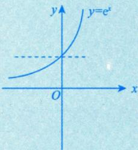

② $\lim_{x \to 0} \frac{\sin x}{\left | x \right | }$ 不存在，因为 $\lim_{x \to 0^{+}} \frac{\sin x}{\left | x \right | } = \lim_{x \to 0^{+}} \frac{\sin x}{x} = 1$ $\lim_{x \to 0^{-}} \frac{\sin x}{|x|} = \lim_{x \to 0^{-}} \frac{\sin x}{-x} = -1$

③ $\lim_{x \to \infty} \arctan x$ 不存在，因为 $\lim_{x \to +\infty} \arctan x = \frac{\pi}{2}$ $\lim_{x \to -\infty} \arctan x = -\frac{\pi}{2}$

④ $\lim_{x \to 0} [x]$ 不存在，因为 $\lim_{x \to 0^{+}} [x] = 0, \quad \lim_{x \to 0^{-}} [x] = -1$

[x]为不超过x的最大整数，也就是x的整数部分.

⑤分段函数分段点两侧表达式不同，需分别求左、右极限.

在实际考试中，主要是这些函数：一个是指数函数，一个是带绝对值的函数，也就是分段函数.如果分段函数在分段点处两端的解析式不同，是需要分别求左、右极限的，这个考点在研究生考试中几乎是必考的.所以考生不仅要知道这些唯一性，而且研究生考试中更会通过这些具体的例子去考查考生对唯一性的认识.

例1.15 当x→1时，函数 $\frac{\mathrm{e}^{\frac{1}{x - 1}}\ln\left| 1 + x \right|}{\left( \mathrm{e}^{x} - 1 \right)\left( x - 2 \right)}$ 的极限（).(A)等于1 (B)等于0 (C)为 $\infty$

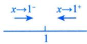

(D)不存在且不为∞

分析x→1，关键看 $\mathrm{e}^{\frac{1}{x - 1}}$

$x \to 1^{+}, x - 1 \to 0^{+}, \frac{1}{\boxed{x - 1}} \to +\infty;$ 你不能用一个非常非常小的正数去代替，后面会专门提无穷小的→概念，它不是一个很小很小的数，而是无限趋于零的变量$\frac{x \to 1^{-}}{\downarrow}, x - 1 \to 0^{-}, \frac{1}{x - 1} \to -\infty$

x无限趋于1，但比1小

解应选(D).

函数 $\frac{\mathrm{e}^{\frac{1}{x - 1}}\ln\left| 1 + x \right|}{\left( \mathrm{e}^{x} - 1 \right)\left( x - 2 \right)}$ 在x=1处没有定义，在x=1的两侧表达式虽然相同，但是注意到当x→1时，$\frac{1}{x - 1}$ 左、右极限不相等，因此应该考虑单侧极限.

$$
\lim_{x \to 1^{-}} \frac{\mathrm{e}^{\frac{1}{x - 1}} \ln |1 + x|}{(\mathrm{e}^{x} - 1)(x - 2)} = 0
$$

$$
\lim_{x \to 1^{+}} \frac{\mathrm{e}^{\frac{1}{x - 1}} \ln |1 + x|}{(\mathrm{e}^{x} - 1)(x - 2)} = -\infty
$$

可知当x→1时，函数 $\frac{\mathrm{e}^{\frac{1}{x - 1}}\ln\left| 1 + x \right|}{\left( \mathrm{e}^{x} - 1 \right)\left( x - 2 \right)}$ 的极限不存在且不为 $\infty$ ，故选(D).

方法总结遇到 $\mathsf { e } ^ { \infty }$ ，需讨论 $\mathbf { e } ^ { + \infty }$ 和 $\mathbf { e } ^ { - \infty }$

②公式 $\lim_{u \to +\infty} \mathrm{e}^u = +\infty, \lim_{u \to -\infty} \mathrm{e}^u = 0$

注对于上述 $\lim_{x \to 1} \mathrm{e}^{\frac{1}{x - 1}}$ 的情形，由于 $\lim_{x \to 1^{+}} \frac{1}{x - 1}$ 与 $\lim_{x \to 1} \frac{1}{x - 1}$ 不相等，因此不能忽视左极限与右极限，否则会导致错误，这是这类问题经常出现错误的原因

例1.16 设 $g(x)=\left\{\begin{aligned}2-x,\quad x\leqslant0,\\2+x,\quad x>0,\end{aligned}\right.f(x)=\left\{\begin{aligned}x^{2},\quad x<0,\\-x-1,\quad x\geqslant0,\end{aligned}\right.$ 则 $\lim_{x \to 0} g[f(x)]$ ().(A) 为3 (B) 为2 (C)为1 (D)不存在

这个题已见过，例1.5，分段函数的复合方法，有前世今生，越往后学越轻松，这个题还有连续剧，后面再说解应选 (D).

由例1.5可知，

$$
g[f(x)]=\begin{cases}3+x, & x \geq 0, \\2+x^2, & x < 0.\end{cases}
$$

又 $\lim_{x \to 0^{+}} g[f(x)] = \lim_{x \to 0^{+}} \frac{(3 + x)}{x} = 3 \neq \lim_{x \to 0^{-}} g[f(x)] = \lim_{x \to 0^{-}} \frac{(2 + x^2)}{x} = 2$ ，故 $\lim_{x \to 0} g[f(x)]$ 不存在.这是超实数 这个超实数的极限结果是2

方法总结分段函数在分段点处的极限要考虑左、右极限.

公式若 $\lim_{x \to x_0^+} f(x) \neq \lim_{x \to x_0^-} f(x)$ ，则 $\lim_{x \to x_0} f(x)$ 不存在.

(2) 局部有界性.

两件事：①抽象证明，方法（技巧）重要.  
②具体例子理解.

如果 $\lim_{x \to x_0} f(x) = A$ ，则存在正常数M和 $\delta$ ，使得当 $0 < \left| x - x_{0} \right| < \delta$ 时，有 $\left| f(x) \right| \leq M$

注(1)证 $\lim_{x \to x_0} f(x) = A \Leftrightarrow \forall \varepsilon > 0, \exists \delta > 0$ 当 $0 < \left| x - x_{0} \right| < \delta$ 时， $\left| f(x) - A \right| < \varepsilon$ 则 $\left| f(x) \right| = \left| f(x) - A + A \right| \leqslant \left| f(x) - A \right| + \left| A \right|$ .取 $\varepsilon = 1, \left| f(x) \right| \leqslant 1 + \left| A \right| = M$

(2)这个M必须是个确定的数，比如2023 年考研试题中出现 $| b _ { n } | \equiv b _ { n } - a _ { n } + a _ { n } | \leqslant | b _ { n } - a _ { n } | + | a _ { n }$ 1(是整个过程中的最关键环节)，下面4条都有可能在考场出现.

①设 $\lim_{x \to \cdot} f(x)$ 存在，则当x→·时，f(x)有界.其中 $x \to \cdot$ 是指 $x \to x_{0}, x \to x_{0}^{-}, x \to x_{0}^{+}$   
$x \to \infty, \quad x \to -\infty, \quad x \to +\infty$ 六种情形.值得注意的是，极限存在只是函数局部有界的充分条件，并非  
必要条件 →如y=sinx在任意区间上有界，但limsinx.不存在f(a),f(b)为实数②若y =f(x)在[a, b]上为连续函数，则f(x)在[a,b]上必定有界.  
这里直观上给大家介绍连续：在黑板上拿粉笔点A点，一直到B点，中间不要离开黑板.上界与下界都不是唯一的，下面这条极为重要.  
→控制住函数的有界性  
★③若f(x)在(a,b)内为连续函数，且 $\lim_{x \to a^{+}} f(x)$ 与 $\lim_{x \to b^{-}} f(x)$ 都存在，则f(x)在(a,b)内必定有界④有界函数与有界函数的和、差、积仍为有界函数.(商没有这个结论）

例1.17 在下列区间内，函数 $f(x) = \frac{x\sin(x - 3)}{(x - 1)(x - 3)^2}$ 有界的是().(A) (−2, 1) (B) (−1, 0) (C) (1, 2) (D) (2, 3)

分析考查开区间上的连续函数的有界性.

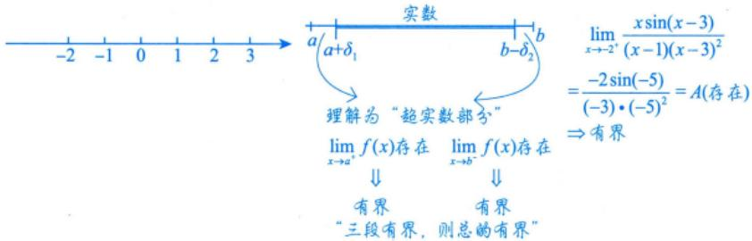

## 解应选 (B).

所给选项皆为开区间，因此不能直接利用连续函数在闭区间上的有界性定理.可以考虑在开区间两个端点处函数的极限是否存在.

由于f(x)在 $x_{1} = 1, x_{2} = 3$ 处没有定义，因此当x≠1,x≠3时，f(x)为初等函数且为连续函数.又由

$$
\begin{aligned}\lim_{x \to 1} f(x) &= \lim_{x \to 1} \frac{x \sin(x - 3)}{(x - 1)(x - 3)^2} = \infty, \quad  兿实数  \\\lim_{x \to 3} f(x) &= \lim_{x \to 3} \frac{x \sin(x - 3)}{(x - 1)(x - 3)^2} = \infty,\end{aligned}
$$

可知在区间端点为1或3的开区间内，f(x)均为无界函数，故选(B).

方法总结若f(x)在(a,b)内是连续函数，且 $\lim_{x \to a^{+}} f(x), \lim_{x \to b^{-}} f(x)$ 都存在，则f(x)在(a,b)内必定有界.  
②公式若 $\lim_{x \to a^{+}} f(x)$ 存在，则存在δ>0，当 $x \in (a,   a + \delta)$ 时，f(x)有界.

## 考研数学基础30讲·高等数学分册

★★★(3)局部保号性，(这个太重要了，极限的3个性质中最重要的一个)

如果 $f(x) \to A(x \to x_0)$ 且 $\boxed{A > 0}$ 或 $\boxed{A < 0}$ ，那么存在常数 $\delta > 0$ →超实数使得当 $0 < \left| x - x_{0} \right| < \delta$ 付，有 $\left| f(x) \right| > 0$ (或 $\left| \overline{f(x)} \right| < 0$ .如果在 $x _ { 0 }$ 的某去心邻域内f(x)≥0（或 $f(x) \leqslant 0$ 且 $\lim_{x \to x_0} f(x) = A$ ，则 $A   \geqslant   0$ (或A≤0).

lim f > 0⇒ f > 0 lim f <0⇒ f<0 (脱帽严格不等) 牢 f≥0⇒limf≥0 记 f≤0⇒limf≤0 (戴帽非严格不等)

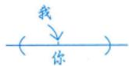

取ε=2A，则-A<f(x)<3A，此范围不够精确，不能用于证明此结论7

lim我=你：即使给我整个世界，我也只在你身边

注证 $\lim_{x \to x_0} f(x) = A (A > 0)$ ,即对任意ε>0,存在δ>0,使得当 $0 < \left| x - x_{0} \right| < \delta$ 时，有 $\left| f(x) - A \right| < \varepsilon$ 取 $\varepsilon = \frac{A}{2} > 0$ ，即有 $\left| f(x) - A \right| < \frac{A}{2}$ 所以 $f(x) > \frac{A}{2} > 0$ ，证毕.

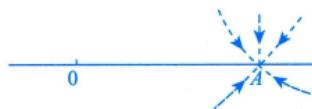

四面八方均可到来，以A为核心，A自带光环

问题：超实数的标准实数部分都大于零，那这些超实数都怎么样呢？

答：它们与A的距离无限小，从而它们一定大于零.

注只要核心大于零，它的所有光晕都大于零.

如 $\lim_{x \to +\infty} \frac{1}{x} = 0$ 0作为它的标准实数部分 超实数

即使f(x)>0，它的极限也有可能等于零，即存在f(x)>0，使 $\mathrm{std}[f(x)] = 0$ .对于大于零的超实数，0的右边是有光晕的它的标准实数部分有可能是零.

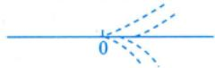

例1.18 已知f(x)在x=0的某个邻域内连续，且 $\lim_{x \to 0} \frac{f(x)}{1 - \cos x} = -1$ ，则存在 $\delta   >   0$ ， ( ).

(A)当x∈(-δ,0)时，f(x)>0；当 $x \in (0,   \delta)$ 时，f(x)<0

(B)当x∈(−δ,0)时，f(x)<0；当 $x \in (0,   \delta)$ 时，f(x)>0

(C)当x∈(−δ,0)时，f(x)>0；当 $x \in (0,   \delta)$ 时，f(x)>0

(D)当 $x \in (-\delta, 0)$ 时，f(x)<0；当 $x \in (0,   \delta)$ 时， $f(x) < 0$

分析本题考查保号性，在考研中经常出类似的题，本题关键在于极限是负数.

解应选 (D).

由于

$$
\lim_{x \to 0} \frac{f(x)}{1 - \cos x} = \lim_{x \to 0} \frac{2f(x)}{x^2} = -1
$$

故 $\lim_{x \to 0} \frac{f(x)}{x^2} = -\frac{1}{2} < 0$ ，由极限的局部保号性可知，在 $x = 0$ 的某去心邻域内有 $\frac{f(x)}{x^{2}} < 0$ ，即 $f(x) < 0$ ，从而选(D).

方法总结见到 $\lim_{x \to x_0} f(x) = A < 0$ ，则利用保号性：当 $x \in \mathring{U}(x_0, \delta)$ ，有 $f(x) < 0$

公式 $1 - \cos x \geqslant 0$

## 5无穷小的定义

如果当 $x \to x _ { _ 0 }$ (或 $x \to \infty$ 时，函数f(x)的极限为零，那么称函数f(x)为当 $x \to x _ { _ 0 }$ (或 $x \to \infty   )$ 时的无穷小，记为 本身就是0→是一个常数，唯一一个常数的无穷小(0是最高阶的无穷小)。→有两种，包括本身不是0，是趋于0的f(x)或{x}→是一个极限过程

$$
\lim_{x \to x_0} f(x) = 0  (或 \lim_{x \to \infty} f(x) = 0  ) .
$$

注（脱帽法） $\lim_{x \to \cdot} f(x) = A \Leftrightarrow f(x) = A + \alpha$ ，这里 $\lim_{x \to \cdot} \alpha = 0$ ，即 α是x →• 时的无穷小.

把A换成0，为什么要单独讲这个定义呢？因为它有特殊的、重要的地位和意义.

从牛顿、莱布尼茨开始，无穷小一直是一个无法解释的、必须回避的话题，包括第二次数学危机的产生，为什么大主教批判牛顿，牛顿都不敢讲话呢？因为对于无穷小是什么，他讲不出来，他一会儿让无穷小为零，一会儿让无穷小又不能为零，当无穷小在分母上，它就不能为零.然后，牛顿算出一个结果，加上一个无穷小，他就把无穷小扔掉了，无法解释！所以到了后来，才出现了魏尔斯特拉斯的 $\varepsilon   -   \delta ^ { \prime }$ 语言.在前面讲极限时，讲过超实数系，这里来简单复习下，从数学上来讲，

$$
 有理数  \xrightarrow{\quad}  实数  \xrightarrow{\quad}  复数.
$$

现在又遇到问题了，这个无穷小怎么表示呢？牛顿、莱布尼茨没有想到，这是因为历史局限性.即便后来的柯西和魏尔斯特拉斯给出了数学分析中的标准极限定义，他们也没有想到，把实数系再扩展成超实数系.

$$
\begin{array}{l} 有理数  \xrightarrow{\quad\quad\quad}  实数  \xrightarrow{\quad\quad\quad}  复数 . \\\quad\quad\quad\quad\quad \downarrow \quad \xrightarrow{\quad\quad\quad}  复数 . \\\quad\quad\quad  翁实数系 \end{array}
$$

超实数系里面是什么呢？首先是我们所学到的实数，除了这些实数之外，还引入了无穷小量和无穷大量的概念.一旦无穷小量、无穷大量进来了，这个实数系就变成了超实数系.我用最通俗的语言讲给大家，不过也不要深究，因为这需要强大的数理逻辑的底子.

超实数系告诉我们，任何一个实数 $x _ { 0 }$ ，自带光环，边上有无限个以它作为极限的超实数

$$
\left( \begin{array}{c} \left( \begin{array}{c} \left( \begin{array}{c} \left( \begin{array}{c} \end{array} \right) \\ x_{0} \end{array} \right) \end{array} \right) \end{array} \right)
$$

超实数：

$\lim f(x) = \operatorname{std}[f(x)]$ 实数部分（最终归属）①

当 $x \to   0$ 时， $\sin x = \frac{\sin (\sin x)}{0} + \frac{\sin x - \mathrm{std}(\sin x)}{ 无穷小量 }$

② $\lim_{x \to 0} f(x) = 0$

如：

$$
\begin{aligned}&\lim_{x \rightarrow 0}\left| \sin x \right| = 0 , \\&\lim_{x \rightarrow 0}\left(  e ^{x} - 1 \right) = 0 , \\&\lim_{x \rightarrow 0}\tan x = 0 , \\&\lim_{x \rightarrow 0}\left| \ln(1 + x) \right| = 0 . \\&\Rightarrow  系数 \end{aligned}
$$

它们是无限趋于零的，但是又描述不出它到零的距离到底是多少.所以在超实数系中，就增加了所谓的无穷小量.

问题：无穷小如何描述它的超实数部分与实数部分呢？

$\lim_{x \to *} f(x) = A \Leftrightarrow f(x) = A + \alpha$ （A是超实数的实数部分）.

无穷小的实数部分是零，无穷小是超实数.

## 6 无穷小的性质

①有限个无穷小的和是无穷小.

简单组常用

$$
0 < \underbrace{\left| \alpha_{1} + \alpha_{2} \right|}_{0} \leqslant \left| \alpha_{1} \right| + \left| \alpha_{2} \right| \to 0
$$

无穷个无穷小的和可能不再是无穷小了，如第8讲习题8.4的注，

$$
\lim_{n \to \infty} \left( \frac{1}{\frac{n+1}{1}} + \frac{1}{\frac{n+2}{1}} + \cdots + \frac{1}{\frac{n+n}{1}} \right) = \ln 2
$$

通俗理解：人多力量大.

★②有界函数与无穷小的乘积是无穷小.

若 $| \alpha _ { 1 } | \leqslant m , \alpha _ { 2 } \rightarrow 0$ ，则

$$
\underbrace{0 \leqslant \left| \alpha_{1} \cdot \alpha_{2} \right|}_{0} = \left| \alpha_{1} \right| \cdot \left| \alpha_{2} \right| \leqslant m \cdot \left| \alpha_{2} \right| \rightarrow 0 .
$$

考研数学对分析问题的能力有一定的要求，如果想把数学学好，在《考研数学基础30讲》中，凡是给予证明的，它往往是今后解决问题要用到的解题方法或过程，不会很难但都比较经典，要认真学一学.

③有限个无穷小的乘积是无穷小.

如

$$
\alpha_{2} \rightarrow 0 \Rightarrow \left| \alpha_{2} \right| < 1 \rightarrow 0
$$

## 7无穷小的比阶

在讲极限概念时，柯西也好，魏尔斯特拉斯也好，比牛顿和莱布尼茨的进步只是用了一个不等式，可是他们也没有讲α到0的距离到底有多少，β到0的距离是多少？不过我们可以尝试从α，β的阶数比入手.

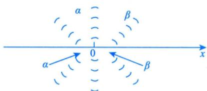

设在自变量的同一变化过程中， $\lim \left| \alpha (x) \right| = 0, \lim \left| \beta (x) \right| = 0$ ，且 $\beta(x) \neq 0$ ，则

①若 $\lim\limits_{\substack{\alpha(x) = 0 \\ \beta(x) \\ \downarrow \\ \beta(x)}} \frac{\frac{\alpha(x)}{0}}{\frac{\beta(x)}{0}}$ 则称α(x)是比β(x)高阶的无穷小，记为 $\alpha(x) = o(\beta(x))$

α(x)→0的速度比β(x)→0 的速度快

②若 $\lim_{x \to \infty} \frac{\alpha(x)}{\beta(x)} = \infty$ ，则称 α(x)是比β(x)低阶的无穷小；

★③若 $\lim_{x \to 0} \frac{\alpha(x)}{\beta(x)} = c \neq 0$ ，则称α(x)与β(x)是同阶无穷小; 速度相同

最重要的是③与④

★④若 $\lim_{x \to \infty} \frac{\alpha(x)}{\beta(x)} = 1$ ，则称α(x)与β(x)是等价无穷小，记为 $\alpha(x) \sim \beta(x)$ i

→超实数 →此处不“等价”不是相等，如 $\lim_{x \to 0} \frac{\left| \sin x \right|}{x} = \overline{1} \neq 0$ ，而 $\lim_{x \to 0} \frac{x - \sin x}{x^3} = \frac{1}{6}$ 是它的标准实数部分std $\left( \frac{\sin x}{x} \right) = 1$

⑤若lim $\frac{\alpha(x)}{\left[ \beta(x) \right]^k} = c \neq 0, \; k > 0$ ，则称 α(x)是β(x)的k阶无穷小.

$$
x\sin\frac{1}{x}
$$

$$
x^{2}
$$

$$
\lim_{x \to 0} \frac{x \sin \frac{1}{x}}{x^2} = \lim_{x \to 0} \frac{1}{x} \sin \frac{1}{x}
$$

$\lim_{x \to 0} \frac{x \sin \frac{1}{x}}{x^2} = \lim_{x \to 0} \frac{1}{x} \sin \frac{1}{x}$ 极限不存在，一会儿跑到无穷大，一会跑到0.所以这种不专一的超实数定义为无界变量

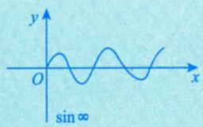

∞是超实数，也可以理解∞是一个广义的数，作为实数系上的一个特殊的数（双重身份）.

通俗地讲，极限存在，就说明超实数找到了家，找到了标准实数部分，任何超实数在确定的趋向下都有唯一的家，即有唯一的核心，核心如果不唯一了，极限自然就不存在了.

在这种情况下，比阶就出问题了，这是柯西、魏尔斯特拉斯也解决不了的问题.用极限可以预言到所有情况吗？答案是否定的，两个超实数速度一会儿这个快，一会儿那个快，它们在较量中，会出现一会儿这个的实力强，一会儿那个的实力强的情况，并不是总是沿着简单的情况出现的，会儿 $\infty$ ，一会儿0.那就是说当 $x \to 0$ 时， $x\sin\frac{1}{x}$ 与 $x^{2}$ ，它们的力量是有对比的.

## 8 常用的等价无穷小

当 $x   \to   0$ 时，常用的等价无穷小有

sin x \~ x, tan x \~ x, arcsin x ∼ x, arctan x \~ x, ln(1 + x) \~ x, ex −1∼ x,

$$
a^{x}-1\sim x\ln a,\underbrace{1-\cos x}_{}\sim \frac{1}{2}x^{2},(1+x)^{a}-1\sim ax
$$

如图1-26所示，0作为实数，周围的无限个光晕紧密团结在核中心的周围.

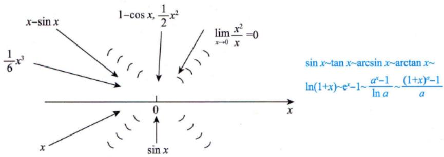  
图 1-26

注使用时一般都要做广义化：可将x替换为趋向于0的函数，请灵活使用.

$$
\lim_{x \to 0} \frac{\sin x}{x} = 1
$$

$$
\lim_{g(x) \to 0} \frac{\sin[g(x)]}{g(x)} = 1
$$

$$
\lim_{\eta \to 0} \frac{\sin(\eta)}{\eta} = 1 . \quad \lim_{\eta \to 0} \log
$$

## 9 无穷大的定义

如果当 $x   \rightarrow   x _ { _ 0 }$ (或x→∞)时，函数|f(x)|无限增大，那么称函数f(x)为当 $x \to x _ { _ 0 }$ (或 $x \to \infty )$ 时的无穷大，记为

同无穷小，也是一个极限过程一定无界，但无界不一定是无穷大量超实数

$$
\lim_{x \to x_0} f(x) = \infty   (或  \lim_{x \to \infty} f(x) = \infty  )
$$

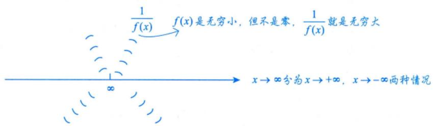

## 注无穷小与无穷大的关系.

在自变量的同一变化过程中，如果f(x)为无穷大，则 $\frac{1}{f(x)}$ 为无穷小；反之，如果f(x)为无穷小，且 $f(x) \neq 0$ 则 $\frac{1}{f(x)}$ 为无穷大：

例1.19 设x→0时， $\mathrm{e}^{\tan x} - \mathrm{e}^{\sin x}$ 与 $x ^ { n }$ 是同阶无穷小，则n为( ).

用除法的新颖观点来理解“无穷”

$$
\frac{1}{1/2} = 2  (次) : 1 - \frac{1}{2} - \frac{1}{2} = 0
$$

(A)1

$$
\frac{1}{1/4} = 4  (次) : 1 - \frac{1}{4} - \frac{1}{4} - \frac{1}{4} - \frac{1}{4} = 0
$$

(B)2

(C)3

(D)4

$$
\frac{1}{0} =  不存在:  1-0-0-\cdots \neq 0
$$

(0不能当分母)

分析无穷小的比阶问题.

$$
\lim_{x \to 0^{+}} \frac{1}{x} = +\infty (次) ; 1 - x - x - \cdots = 0
$$

当x→0时， $\mathrm{e}^{\tan x} - \mathrm{e}^{\sin x} = \mathrm{e}^{\sin x} \left( \mathrm{e}^{\tan x - \sin x} - 1 \right)$ 是以1作为标准实数部分。这种题往往需要提出公因式。(数学中的恒等变形)

$$
\mathrm{e}^{\eta_{0}} - 1 \sim \eta_{0} (\eta_{0} \to 0)
$$

解应选(C).

当x→0时，

$$
\mathrm{e}^{\tan x}-\mathrm{e}^{\sin x}=\mathrm{e}^{\sin x}\left(\mathrm{e}^{\sin x-\sin x}-1\right)\sim\frac{\tan x-\sin x}{\tan x-\sin x}=\frac{1}{\tan x(1-\cos x)}\sim\frac{1}{2}x^{3}
$$

因此选(C).

方法总结 $\mathrm{e}^{\tan x} - \mathrm{e}^{\sin x}$ ，通常要提公因式出现 $\mathbf { e } ^ { \mathsf { a } } - 1$ 的形式.

②公式当x→0时， $\tan x-\sin x=\tan x(1-\cos x)\sim\frac{1}{2}x^{3}$

在学习了极限的定义和性质，尤其是了解了超实数的理论后，我们对于极限的计算方法有了一个完整、全面和深刻的认识，更为重要的是，今后在计算极限时，就不会再犯错误，什么位置该替换，什么位置不能替换，就能从一个新的角度，更加全面地去分析.

## 1方法

(1)极限四则运算规则.

若 $\lim_{} f(x) = A, \lim_{} g(x) = B$ ，那么

① $\lim \left[ k f ( x ) \pm l g ( x ) \right] = k \lim f ( x ) \pm l \lim g ( x ) = k A \pm l B$ ，其中k，l为常数.

②lim $\left[ f(x) \cdot g(x) \right] = \lim f(x) \cdot \lim g(x) = A \cdot B$ .特别地，若limf(x)存在，n为正整数，则

$$
\lim[f(x)]^n = \lim_{n \to \infty} \underbrace{f(x) \bullet \cdots \bullet f(x)}_{n 个 } = [\lim_{n \to \infty} f(x)]^n
$$

③ $\lim \frac{f(x)}{g(x)} = \frac{\lim f(x)}{\lim g(x)} = \frac{A}{B} (B \neq 0)$

上面定理可以用一句话概括：当f(x)与g(x)极限都存在时，函数的加减乘除的极限分别等于极限的加减乘除（除要求分母的极限不为零）.

★例1.20 证明：(1)若 $\lim \frac{f(x)}{g(x)} = A$ ，且 $\lim g(x) = 0$ ，则 $\lim_{x \to 0} f(x) = 0$

(2)若 $\lim \frac{f(x)}{g(x)} = A \neq 0$ ，且 $\lim_{x \to 0} f(x) = 0$ ，则 $\lim g(x) = 0$

分析恒等变形.

证(1)由于 $f(x) = \frac{f(x)}{g(x)} \cdot g(x)$ ，则

$$
\lim f(x)=\lim\frac{f(x)}{g(x)}\cdot g(x)=\lim\frac{f(x)}{g(x)}\cdot\lim g(x)=A\cdot0=0
$$

(2) 由于 $\begin{aligned}g(x) = & \frac{f(x)}{\frac{f(x)}{g(x)}}, \\\end{aligned}$ ，则 $\lim_{x \to 0} g(x) = \lim_{x \to 0} \frac{f(x)}{\frac{f(x)}{g(x)}} = \lim_{x \to 0} \frac{\lim_{x \to 0} f(x)}{\lim_{x \to 0} \frac{f(x)}{g(x)}} = \frac{0}{A} = 0$

注以上结论非常重要，以后在有关定参数的题目中可直接使用，如下例.

例1.21 设 $\lim_{x \to 0} \frac{\sin x}{\mathrm{e}^x - a} \left( \cos x - b \right) = 5$ ，则b =( ).(A) −4 (B) -3 (C) −2 (D) -1

分析先利用例1.20的结果求出a的值，再用等价无穷小的代换求b的值.

## 解应选(A).

$\lim_{x \to 0} \frac{\sin x}{\mathrm{e}^x - a} \left( \cos x - b \right) = 5 \neq 0$ ，由例1.20的(2)知， $\lim_{x \to 0} (\mathrm{e}^x - a) = 0$ ，故 $a = 1$ ，此时原极限变为$\lim_{x \to 0} \frac{\sin x}{\mathrm{e}^x - 1} \left( \cos x - b \right) = \lim_{x \to 0} \left( \cos x - b \right) = 1 - b$ ，故 $b = - 4$

方法总结若 $\lim_{x \to 0} \frac{f(x)}{g(x)} = A \neq 0$ ，且 $\lim_{x \to 0} f(x) = 0$ ，则 $\lim_{x \to 0} g(x) = 0$

②公式当x→0时， $\mathrm{e}^{x}-1 \sim x \sim \sin x$

例1.20的两个结论，是用四则运算规则证明的，所以可以把刚才的解题方法归结为极限的四则运算规则：加减乘除的极限只要存在，就等于极限的加减乘除.考生们在刚开始复习要记住它，不要认为它简单就轻视，前面用超实数分析了“不存在+不存在”为什么可能存在，这部分内容不是那么容易理解的，不是听一遍就能完全搞懂，需要不断地、反复地思考和实践.

后面我们会遇到复杂的极限情况，那么怎么处理这些复杂情况呢？需要请两个了不起的数学人物“登场”，他们是洛必达和伯努利.

(2) 洛必达法则.

法则一 设①当 $x \to a ($ 或 $x \to \infty )$ 时，函数f(x)及F(x)都趋于零； $ \text{" }\frac{0}{0}  \text{" }$

$y ^ { \prime } ( x )$ $F ^ { \prime } ( x )$ 在点a的某去心邻域内(或当 $\left| x \right| > X$ ,此时X为充分大的正数)存在，且 $F^{\prime}(x) \neq 0$

  
洛必达 (1661—1704)

③ $\lim_{x \to a} \frac{f'(x)}{F'(x)}$ (或 $\lim_{x \to \infty} \frac{f'(x)}{F'(x)}$ 存在或为无穷大，则

$$
\lim_{x \to a} \frac{f(x)}{F(x)} = \lim_{x \to a} \frac{f'(x)}{F'(x)}  (或  \lim_{x \to \infty} \frac{f(x)}{F(x)} = \lim_{x \to \infty} \frac{f'(x)}{F'(x)}  ) .
$$

法则二 设①当 $x \to a$ (或 $x \to \infty )$ 时，函数f(x)及F(x)都趋于无穷大;

② $y ^ { \prime } ( x )$ 及 $F^{\prime}(x)$ 在点a的某去心邻域内(或当 $\left| x \right| > X$ ，此时X为充分大的正数)存在，且 $F^{\prime}(x) \neq 0$ i

③ $\lim_{x \to a} \frac{f^{\prime}(x)}{F^{\prime}(x)}  (或  \lim_{x \to \infty} \frac{f^{\prime}(x)}{F^{\prime}(x)}  )$ 存在或为无穷大，则

$$
\lim_{x \to a} \frac{f(x)}{F(x)} = \lim_{x \to a} \frac{f'(x)}{F'(x)} \quad (或  \lim_{x \to \infty} \frac{f(x)}{F(x)} = \lim_{x \to \infty} \frac{f'(x)}{F'(x)}  ) .
$$

这两个是用柯西中值定理证明的。

后面讲了柯西中值定理，再回头证明这个洛必达法则

注法则二不是洛必达的，也不是伯努利的，实际上是柯西给的，但是为了称呼的统一性，都归到洛必达法则了.

历史故事：洛必达(1661—1704)法国人，洛必达法则不是洛必达的，而是他老师约翰·伯努利(1667—1748）的.

1694年，约翰·伯努利要结婚，洛必达送给他一个大礼包，他说“你结婚去吧，给你一笔钱，不用还，给我一篇论文就可以了”，然后伯努利欣然接受，主动拿着论文找到洛必达，一手交钱，一手交论文，这篇文章就被无情的卖掉了，是什么文章呢？就是大家看到的“洛必达法则”.这个法则实际上是伯努利在1694年卖给了洛必达，这是历史上的真事.有个人还在里面瞎掺和，那个人叫莱布尼茨（16461716），莱布尼茨是伯努利的老师，伯努利真正的学生是欧拉，这里面混进了洛必达.莱布尼茨听伯努利说“洛必达很有钱”，就主动找到洛必达，“孩子，我还有论文呢，你要不要？”而洛必达来者不拒，“来来来，买”.所以几乎在同一时间，洛必达还在世界上发表了一篇论文，叫“行列式的概念”.行列式的概念是谁给的呢？“莱布尼茨”；谁发表的呢？“洛必达”；世界上第一本微积分教材谁出的呢？“洛必达”.洛必达可以称之为“伟大的”数学知识的传播者，他把数学大家的创作汇总起来出成书了

注(1)一般来说，洛必达法则是用来计算 $ \text{" }\frac{0}{0} \text{" }$ 型或者 $= \frac { \infty } { \infty }$ 型未定式的，不是 $\frac{ \cdots 0}{0}$ 型和 $\frac { \infty } { \infty }$ 型，就不能用洛必达法则.

$( \frac { 2 } { \infty }$ 亦可直接用洛必达法则.但是这个不在考研范围内.)

(2) 如果极限 $\lim_{x \to a} \frac{f'(x)}{F'(x)}$ 仍属于 $ \text{" }\frac{0}{0} \text{" }$ 型或者 $\frac { \infty } { \infty }$ 型，且f'(x),F'(x)继续满足洛必达法则的条件，则可以继续使用洛必达法则，即 $\lim_{x \to a} \frac{f(x)}{F(x)} = \lim_{x \to a} \frac{f'(x)}{F'(x)} = \lim_{x \to a} \frac{f''(x)}{F''(x)}$ 可多次使用

(3) 如果 $\lim_{x \to a} \frac{f'(x)}{F'(x)}$ 不存在也不为∞，不能推出 $\lim_{x \to a} \frac{f(x)}{F(x)}$ 不存在也不为∞，简单一点说就是：

对于 $\lim_{x \to a} \frac{f(x)}{F(x)} = \lim_{x \to a} \frac{f'(x)}{F'(x)}$ “右存在，则左存在；但左存在，并不意味着右一定存在”.比如说，极限

$$
\lim_{x \to 0} \frac{x^2 \cdot \sin \frac{1}{x}}{x} = \lim_{x \to 0} \frac{x \cdot \sin \frac{1}{x}}{x} = 0
$$

存在，而如果使用洛必达法则，会有

$$
\lim_{x \to 0} \frac{x^2 \cdot \sin \frac{1}{x}}{x} = \lim_{x \to 0} \left( 2x \cdot \sin \frac{1}{x} - \cos \frac{1}{x} \right)
$$

这个极限显然不存在.这是一个很细致、很隐蔽的问题，稍不注意就可能出错.

## 例1.22 证明：

(1)当x→0时， $\ln \left( x + \sqrt{1 + x^{2}} \right) \sim x$

(2) 当x→0时， $1 - \left( \cos x \right)^{a} \sim \frac{1}{2}ax^{2} , a \neq 0$

分析求极限 $ \text{" }\frac{0}{0} \text{" }$ 型，用洛必达法则.

证(1)由于 $\lim_{x \to 0} \frac{\ln\left( x + \sqrt{1 + x^2} \right)}{x} = \lim_{x \to 0} \frac{\frac{1}{\sqrt{1 + x^2}}}{1} = 1$ ，因此当x→0时， $\ln \left( x + \sqrt{1 + x^{2}} \right) \sim x$

(2)当x→0时， $\lim_{x \to 0} \frac{1 - (\cos x)^a}{\frac{1}{2}ax^2} = \lim_{x \to 0} \frac{-a(\cos x)^{a-1}(-\sin x)}{ax} = \lim_{x \to 0} (\cos x)^{a-1} = 1$ .证毕.

方法总结用洛必达法则解决 $ \text{" }\frac{0}{0} \text{" }$ 型未定式.

②公式当x→0时， $\ln(x+\sqrt{1+x^{2}})\sim x\sim\sin x\sim\tan x\sim\arctan x\sim e^{x}-1\sim\ln(1+x)$

当x→0时， $1 - \left( \cos x \right)^{a} \sim \frac{1}{2}ax^{2}, a \neq 0$ ，如：当x→0时， $1 - \cos x \sim \frac{1}{2}x^{2}, \quad 1 - \sqrt{\cos x} \sim \frac{1}{4}x^{2}$

这个题目的价值：①练习了洛必达法则；②得到了两个重要结论.

这两个重要结论，在未来会经常出现.

凡是在《考研数学基础30讲》中给出的结论，都可以直接用，不必证明，这都是一些常见的、经典的结论.

下面还有一个话题.当遇到 $ \text{" }\frac{0}{0} \text{" }$ 型未定式时，是看分子、分母中谁趋于零的速度快，在超实数体系中，以0作为标准实数部分的超实数它们的比值是多少？比如：

$$
\mathrm{std}\left( \frac{x - \sin x}{x^{3}} \right) = \frac{1}{6}
$$

$$
\lim_{x \to 0} \frac{x - \sin x}{x^3} = \frac{1}{6}
$$

在考研数学中，无穷小的关键是阶数，无穷小争先恐后趋于0，趋于0的速度是不一样的.接下来我们讨论无穷大的比阶问题，用例1.23来说明.

例1.23设 $f(x)=\ln^{10}x,\;g(x)=x,\;h(x)=\mathrm{e}^{\frac{x}{10}}$ ，则当x充分大时，有（）.

(A) $g(x) < h(x) < f(x)$ (B) $h(x) < g(x) < f(x)$ (C) $f(x) < g(x) < h(x)$ (D) $g(x) < f(x) < h(x)$

分析用洛必达法则，计算极限.

解应选(C).

因为 $\lim_{x \to +\infty} \frac{g(x)}{f(x)} = +\infty, \quad \lim_{x \to +\infty} \frac{h(x)}{g(x)} = +\infty$ ，所以当x充分大时，有 $f(x) < g(x) < h(x)$ 故选项(C)正确.

注①当 $x \rightarrow + \infty$ 时，有 $\ln ^{\alpha}x \ll x^{\beta} \ll a^{x}$ ，其中 $\alpha , \beta > 0 , a > 1$ ，符号 $ \text{" } \ll  \text{" }$ 叫远远小于；

②当 $n \to \infty$ 时，有 $\ln ^{\alpha}n \ll n^{\beta} \ll a^{n} \ll n! \ll n^{n}$ ，其中 $\alpha , \beta > 0 , a > 1$ ．记住，考试时直接用

像上面这些公式必须要记住.在微积分中，有一个很要紧的问题，就是趋于零的函数，谁快谁慢，趋于无穷大的函数，谁快谁慢，这些问题解决好了，很多难题就迎刃而解.知识是有连续性的，它总是一环扣一环，其他方向如果欠缺，可能是因为这里的题目就掌握得不是太好.

(3) 泰勒公式.

设f(x)在点x=0处n阶可导，则存在x=0的一个邻域，对于该邻域内的任一点x，有

$$
f(x)=f(0)+f^{\prime}(0)x+\frac{f^{\prime\prime}(0)}{2!}x^{2}+\cdots+\frac{f^{(n)}(0)}{n!}x^{n}+o(x^{n})
$$

泰勒（1685—1731）牛顿学生(英国教育家）

泰勒公式背后的思想比拉格朗日中值定理的思想更精确.泰勒有一个非常直接的观点，就是可以用多项式（表达式最简单的）来表达任何一个函数（当然这个函数可导性要好）.

泰勒有一双火眼金睛，一眼看穿所有函数.

如 $\sin x = \sin 0 + \left. \left( \sin x \right) \right|_{x = 0} \cdot x + \frac{\left. \left( \sin x \right) \right|_{x = 0}}{2!}x^{2} + \frac{\left. \left( \sin x \right) \right|_{x = 0}}{3!}x^{3} + o(x^{3})$ ，即 $\sin x = \left| x - \frac{1}{6}x^{3} \right| + o(x^{3})$ 考到这里 佩亚诺余项再如 $\sec x = \sec 0 + \left. \left( \sec x \right)^{\prime} \right|_{x = 0} \bullet x + \frac{\left. \left( \sec x \right)^{\prime\prime} \right|_{x = 0}}{2!}x^{2} + \frac{\left. \left( \sec x \right)^{\prime\prime} \right|_{x = 0}}{3!}x^{3} + o(x^{3})$ ，即 $\sec x = 1 + \frac{x^{2}}{2} + o(x^{3})$

下面给同学们看个真题.

当x→0时，secx与2次泰勒多项式 $g ( x )$ 之差为 $o(x^{2})$ ，则 $g(x) = 1 + \frac{1}{2}x^{2}$

另：secx在x=0处的2次泰勒多项式为 $1+\frac{1}{2}x^{2}$

同理可得如下重要函数的泰勒公式.

$$
\sin x = x - \frac{x^{3}}{3!} + o(x^{3}), \quad \cos x = 1 - \frac{x^{2}}{2!} + \frac{x^{4}}{4!} + o(x^{4}),
$$

$$
\arcsin x = x + \frac{x^{3}}{3!} + o(x^{3}), \quad \tan x = x + \frac{x^{3}}{3} + o(x^{3}),
$$

$$
\arctan x = x - \frac{x^{3}}{3} + o(x^{3}), \quad \ln(1 + x) = x - \frac{x^{2}}{2} + \frac{x^{3}}{3} + o(x^{3}),
$$

8个都要“背”，泰勒公式熟记于心，都要“一站直达”

$$
\mathrm{e}^{x}=1+x+\frac{x^{2}}{2!}+\frac{x^{3}}{3!}+o(x^{3}), \quad(1+x)^{\alpha}=1+\alpha x+\frac{\alpha(\alpha-1)}{2!}x^{2}+o(x^{2}) .
$$

我们要泰勒公式，也要洛必达法则，但泰勒公式是远远优于洛必达法则的.不仅是因为泰勒公式用多项式逼近可导函数的方法意义深刻，还因为其计算的简洁性.

注从数学命题的角度对以上公式进行处理，可得到一组“差函数”的等价无穷小代换式，如$x - \sin x = \frac{1}{6}x^{3} + o(x^{3})$ 则 $x - \sin x \sim \frac{1}{6}x^{3}(x \to 0)$ 同理有 考研： $\left[ g(x) \right] \to 0, \; g(x) - \sin[g(x)] \sim \frac{1}{6}g^3(x)$

$$
\arcsin x - x \sim \frac{1}{6}x^{3}(x \rightarrow 0), \tan x - x \sim \frac{1}{3}x^{3}(x \rightarrow 0), x - \arctan x \sim \frac{x^{3}}{3}(x \rightarrow 0)
$$

等，并可将这些公式广义化，如第一个公式广义化为：狗−sin狗 $\frac{1}{6} (狗)^3 (狗 \rightarrow 0 )$ ，其余类似.

(4)无穷小的运算.

设m，n为正整数，则

① $o(x^{m}) \pm o(x^{n}) = o(x^{l}), l \geq \min\{m, n\}$ (加减法时低阶“吸收”高阶).

如： $\frac{o(x^{2}) - o(x^{3})}{ 它说了算 } = o(x^{2})$ ，对于无穷小来说，次数越小越大.对于无穷大来说，次数越大越大.

② $o(x^{m}) \bullet o(x^{n}) = o(x^{m+n}), x^{m} \bullet o(x^{n}) = o(x^{m+n})$ (乘法时阶数“累加”).

③ $o(x^{m}) = o(kx^{m}) = k \cdot o(x^{m}),$ k≠0且为常数(非零常数相乘不影响阶数).

$o(x^{2}) = 2o(x^{2})$ 记号运算不是符号运算。 $o(x^{2}) - o(x^{2}) = o(x^{2})$

这种题在数学三卷子中考过。

注在后面泰勒公式的应用中，会对上述高阶无穷小的运算提出要求，请考生学会正确书写.

(5)泰勒公式应用时的展开原则.

有了展开原则，就可以有强大的能力解决计算问题了

泰勒公式：

$$
f(x)=f(0)+f^{\prime}(0)x+\frac{f^{\prime\prime}(0)}{2!}x^{2}+\cdots+\frac{f^{(n)}(0)}{n!}x^{n}+o(x^{n})
$$

再深刻一点讲，以后会遇到无数个可导函数可以由统一的式子表达时，需要对这个表达式进行研就一个基无它可以表示三维间中的任何一个向量,即三空间中的任何一个其为三维空 1

再如：一维点可以比大小，但平面点（空间点）是不能比大小的，所以后面遇到多元函数会用偏导数退化为一维来研究.

$$
\left\{ x ^ { 0 } , x ^ { 1 } , x ^ { 2 } , \cdots , x ^ { n } , \cdots \right\} ,
$$

幂函数是所有可导函数的一个基，体现“统一美”.

有句话是有道理的，微积分学得好坏，将决定未来走得有多远，光看一个公式，很多人看法层次是远远不同的，很多东西需要慢慢去体会.

如：

$$
\left\{ \begin{aligned} x_{n}\cos x_{n + 1} = \sin x_{n}, \quad \cos x_{n + 1} = \frac{\sin x_{n} - \sin 0}{x_{n} - 0} = \cos \xi \Rightarrow 0 < \left| \xi \right| < x_{n + 1} \\ \cos a_{n} - a_{n} = \cos b_{n}, \quad \cos a_{n} - \cos b_{n} = a_{n} > 0, 0 < a_{n}, b_{n} < \frac{\pi}{2}, \quad 0 < a_{n} < b_{n} \\ \downarrow \quad \downarrow \quad \downarrow \quad 0 \\ 0 < \left| \xi \right| < \pi \end{aligned} \right.
$$

数学题的最高境界就是那些最简单的地方，不是庞然大物或者是用非常复杂的技巧.大道至简才是考研数学的本质.

这种题是考研的压轴题，但是大家也不要急.在命题老师眼里，他给的东西，他想的东西最简单，最朴素的 cos x在 $\left(0,\;\frac{\pi}{2}\right)$ 内递减，一个中学生也知道啊！但几百万考生，大部分考生都没想到.

而且命题老师又说“不定积分”大家少做啊！因为在命题老师的知识体系中，他是深刻知道世界上能做出来的积分是寥寥无几的，世界上不能做出的积分，多得想象不到.再换句话说，几乎不定积分都没法做，那我们就把他喜欢出的那几个思想、方法掌握了，最基本的东西把握好了，那么考试就成功了，这就叫方向，不做无用功.

① $\frac{A}{B}$ 型，适用“上下同阶”原则.

具体说来，如果分母(或分子)是x的k次幂，则应把分子(或分母)展开到x的k次幂，可称为“上下同阶”原则.

例如，计算 $\frac{x - \ln(1 + x)}{x^{2}}$

由于

$$
\frac{\ln(1 + x) = x + o(x)}{\ln(1 + x) = x - \frac{x^2}{2} + o(x^3)} = \frac{\ln(1 + x) - x - \frac{x^2}{2} + o(x^2)}{\ln(1 + x) = x - \frac{x^2}{2} + \frac{x^3}{3} + o(x^3)}
$$

因此

$$
\lim_{x \to 0} \frac{x - \ln(1 + x)}{x^2} = \lim_{x \to 0} \frac{x - \left[ x - \frac{x^2}{2} + o(x^2) \right]}{x^2} = \lim_{x \to 0} \frac{\frac{x^2}{2}}{x^2} = \frac{1}{2}
$$

这里顺便得到了一个重要的等价代换式 $x - \ln(1 + x) \sim \frac{1}{2}x^{2}(x \to 0)$

$$
x - \ln(1 + x) \sim 1 - \cos x \sim \frac{1}{2}x^{2} \quad (x \to 0)
$$

同理

$$
x - \sin x \sim \frac{x^{3}}{6} (x \to 0)
$$

$$
\arcsin x - x \sim \frac{x^{3}}{6}(x \to 0)
$$

$$
\tan x - x \sim \frac{x^{3}}{3} (x \rightarrow 0)
$$

$$
x - \arctan x \sim \frac{x^{3}}{3} \quad (x \to 0)
$$

均可由“上下同阶”原则得到.

②A-B型，适用“幂次最低”原则. $A + B = A - ( - B )$

具体说来，即将A，B分别展开到它们的系数不相等的x的最低次幂为止.

例如，已知当x→0时， $\cos x - \mathrm{e}^{-\frac{x^2}{2}}$ 与 $ax^{b}$ 为等价无穷小，求 $a , b$

用泰勒公式， $\cos x = 1 - \frac{x^{2}}{2!} + \frac{x^{4}}{4!} + o(x^{4}), \quad \mathrm{e}^{\frac{x^{2}}{2}} = 1 - \frac{x^{2}}{2} + \frac{1}{2!}\frac{x^{4}}{4} + o(x^{4})$

显然，将 $\cos x,\mathrm{e}^{-\frac{x^2}{2}}$ 展开到 $x ^ { 4 }$ 时，其系数就不一样了，使用“幂次最低”原则，展开到此项后，进行运算，得→名工打业件言出业一波“风五”

$$
\cos x - \mathrm{e}^{-\frac{x^2}{2}} = \left[ 1 - \frac{x^2}{2!} + \frac{x^4}{4!} + o(x^4) \right] - \left[ 1 - \frac{x^2}{2} + \frac{1}{2!} \frac{x^4}{4!} + o(x^4) \right] = -\frac{1}{12}x^4 + o(x^4)
$$

于是可知 $\cos x - \mathrm{e}^{-\frac{x^2}{2}} \sim -\frac{1}{12}x^4 (x \to 0)$ ，故 $a = - \frac{1}{12},   b = 4$

到此为止，整个泰勒公式就学习完了，在一般计算中，四则运算法则，洛必达法则，泰勒公式就够了，除此之外常用的，还有两个重要极限.

(6) 两个重要极限.

第二重要极限两种写法

$$
\lim_{x \to 0} \frac{\sin x}{x} = 1, \quad \lim_{x \to \infty} \left( 1 + \frac{1}{x} \right)^x = \mathrm{e}
$$

$$
\begin{aligned}\lim_{x \to 0} (1 + x)^{\frac{1}{x}} =  e , \\\lim_{x \to \infty} \left(1 + \frac{1}{x}\right)^{x} =  e .\end{aligned}
$$

## 注常考变量广义化

$$
\lim_{ \substack{ \beta \to 0 \\ } } \frac{\sin \beta_{0}}{\frac{}{}} = 1, \quad \lim_{ \substack{ \beta \to \infty \\ } } \left( 1 + \frac{1}{\frac{}{}} \right)^{\frac{}{}} = \mathrm{e}
$$

如狗 $= \frac{1}{x}$ ，则上述式子为

$$
\lim_{x \to 0} \frac{\sin \frac{1}{x}}{\frac{1}{x}} = 1 ,  即  \lim_{x \to \infty} x \sin \frac{1}{x} = 1
$$

$$
\lim_{x \to \infty} \left( 1 + \frac{1}{\frac{1}{x}} \right)^{\frac{1}{x}} = \mathrm{e} , \quad \lim_{x \to 0} (1 + x)^{\frac{1}{x}} = \mathrm{e} .
$$

(7) 夹逼准则. →适当放缩 $\left\{ \begin{aligned} & 已知不等式   \\ & 题设条件  \end{aligned} \right.$ 如果函数f(x)，g(x)及h(x)满足下列条件：

① $h(x) \leqslant f(x) \leqslant g(x)$

$$
\lim_{x \to a} g(x) = A, \lim_{x \to b} h(x) = A
$$

则 lim f(x)存在，且 lim f(x) = A. +8↓+8介+8

夹逼准则，说成两边夹，三明治定理都不太准确，没有突出“逼”，叫“迫敛定理”是可以的.

注常见的一个问题：设任意的x，总有 $h(x) \leqslant f(x) \leqslant g(x)$ ，且 $\lim \left[ g(x) - h(x) \right] = 0$ ，则 $\lim_{} f(x)$ 是否一定存在？答案是否定的 $\lim \left[ g(x) - h(x) \right]$ 存在并不能说明 limg(x), limh(x)都存在，从而也不能保证 lim f(x)存在.

例如，当x>0时，取 $h(x)=x+\frac{1}{x+1}, \quad f(x)=x+\frac{2}{x+1}, \quad g(x)=x+\frac{3}{x+1}$ $h(x) < f(x) < g(x)$ 且$\lim_{x \to +\infty} \left[ g(x) - h(x) \right] = 0$ 但 $\lim_{x \to +\infty} f(x)$ 不存在.

## 2 七种未定式的计算

七种未定式中，都是超实数的状态，我们算过七种超实数是否有一个标准实数部分.考研的函数极限计算题一般归纳为七种未定式： “未定”是由你来定，有可能存在有可能不存在

★★★题型：直接计算、反求参数、已知某一极限求另一极限、无穷小的比阶等.

在表达式中，有一些未知参数，已知这些超实数的极限值.来求这些未知参数，这是一种常考的反问题

解题思路如下.

已知一个超实数的极限值，给出另外一个超实数，另外一个超实数跟这个超实数有联系，有区别，需要找到它们的联系和区别，从而用已知来求解未知

①化简先行.

在考研数学中，可能无穷小比阶的考题考的是最多的

拿到极限计算的问题，不要直接开始就洛必达法则，泰勒展开等等.实际上，先做一些化简，有的时候化简完了，这个题目就非常简单了，在考研中是专门出过这种题的，比如说2023年有道大题就是第一步要化简，如果不知道化简的话，那个题太复杂了.有哪些化简办法呢？

$$
\overbrace{\lim_{x \to 0} \cos x \cdot (\cdots)}^{x}
$$

a. 提出极限不为0的因式；b.等价无穷小代换；c.恒等变形(基本的恒等变形法如提公因式、拆项、

合并、分子分母同除变量的最高次幂等，高级的恒等变形法如变量代换，也叫换元法等).需要强调的是，很多问题如果不化简就计算，可能计算会很复杂，甚至可能计算不出结果.负代换，倒代换 ↓

如： $\lim_{x \to 0} \left( \frac{1 + \sin x}{x} - \frac{1}{e^x - 1} \right) = \lim_{x \to 0} \left( \frac{1}{x} - \frac{1}{e^x - 1} \right) + \lim_{x \to 0} \frac{\sin x}{x}$ 解题的方法，我们不能蛮干，一定要注意这些=1细节，细节决定成败

②判断类型（运算类型）.

→用在函数中，难度就很高了，对于这种问题呢。《考研数学基础30讲》里面也会提及，我会给大家一个完整的全面的归纳

③选择方法（洛必达法则、泰勒公式、夹逼准则等）.

(1) $ \text{" } \frac{0}{0}  \text{"" } \frac{\infty}{\infty}  \text{"" } 0 \bullet \infty  \text{" }$

→太重要了，“火眼金睛”泰勒

例1.24 $\lim_{x \to 0^{+}} \frac{(1 + x)^{\frac{1}{x}} - \mathrm{e}}{x}$ .这是考研中喜欢出的一种类型(提前告诉存在了，实际上问是几）

分析 $ \text{" }\frac{0}{0} \text{" }$ ，先做恒等变形， $u(x)^{v(x)} = \mathrm{e}^{v(x)\ln u(x)}$ .碰到幂指函数，一定用e抬起来.

解应填 $-\frac{\mathrm{e}}{2}$

$$
\lim_{x \to 0^+} \frac{\mathrm{e}^{\frac{1}{x}\ln(1 + x)} - \mathrm{e}}{x} = \lim_{x \to 0^+} \frac{\mathrm{e}^{\frac{1}{x}\ln(1 + x) - 1} - 1}{x} \xlongequal{\mathrm{e}^{\frac{1}{x}\ln(1 + x)} - 1} \lim_{x \to 0^+} \frac{\frac{1}{x}\ln(1 + x) - 1}{x}
$$

$$
\frac{\ln(1 + x) - x}{x^{2}} = \mathrm{e} \lim_{x \rightarrow 0^{+}} \frac{- \frac{1}{2}x^{2}}{x^{2}} = - \frac{1}{2}\mathrm{e}
$$

$$
\frac{\ln(1 + x) - x}{x^{2}}
$$

$$
\lim_{x \to 0^{+}} \frac{\frac{1}{1 + x} - 1}{2x}
$$

方法总结碰到幂指函数，用e括起来， $u(x)^{v(x)} = \mathrm{e}^{v(x)\ln u(x)}$

$$
\lim_{x \to 0^{+}} \frac{-\frac{1}{\left( 1 + x \right)^{2}}}{2}
$$

公式当x→0时， $\ln (1 + x) - x \sim - \frac{1}{2}x^{2}$

注 $f(x) = (1 + x)^{\frac{1}{x}}$ 在x>0时有以下性质：

①f(x)单调减少；② $\lim_{x \to 0^{+}} f(x) = \mathrm{e}$

$$
\lim_{x \to 0} (1 + x)^{\frac{1}{x}} = \mathrm{e} \quad \lim_{x \to \infty} \left(1 + \frac{1}{x}\right)^{x} = \mathrm{e}
$$

★③ $(1 + x)^{\frac{1}{x}} - \mathrm{e} \sim - \frac{\mathrm{e}}{2} x \left( x \rightarrow 0^{+} \right)$ ·刚才的例1.24

这个结论太重要了，0是一个重要的实数.

考研复习的方法很重要，如基础阶段只做 $1 + 1 = 2$ 这肯定是不行的.必须在基础阶段，扎扎实实地落实到考研数学的命题当中，掌握他们喜欢考的这些表达式，这个是很重要的.

例1.25 求极限 $\lim_{x \to \infty} \frac{a_nx^n + a_{n-1}x^{n-1} + \cdots + a_1x + a_0}{b_mx^m + b_{m-1}x^{m-1} + \cdots + b_1x + b_0}$ ，其中 $a_{n}(\neq 0),   b_{m}(\neq 0)$ 为常数.纸老虎

分析有理函数的极限问题，抓主要矛盾.找“带头大哥”，若“带头大哥”次数一致，结果就是系数比，就能很快速地把问题解决了

解若 $n = m$ ，则

$$
\lim_{x \to \infty} \frac{a_{n} + \frac{a_{n - 1}}{x} + \cdots + \frac{a_{1}}{x^{n - 1}} + \frac{a_{0}}{x^{n}}}{b_{m} + \frac{b_{m - 1}}{x} + \cdots + \frac{b_{1}}{x^{n - 1}} + \frac{b_{0}}{x^{n}}}
$$

$$
\frac{\lim\limits_{x \to \infty} \left( a_{n} + \frac{a_{n - 1}}{x} + \cdots + \frac{a_{1}}{x^{n - 1}} + \frac{a_{0}}{x^{n}} \right)}{\lim\limits_{x \to \infty} \left( b_{m} + \frac{b_{m - 1}}{x} + \cdots + \frac{b_{1}}{x^{n - 1}} + \frac{b_{0}}{x^{n}} \right)} = \frac{a_{n}}{b_{m}}
$$

$$
n > m
$$

$$
\lim_{x \to \infty} \frac{x^{n - m}\left( a_nx^m + a_{n - 1}x^{m - 1} + \cdots + a_1x^{m - n + 1} + a_0x^{m - n} \right)}{b_mx^m + b_{m - 1}x^{m - 1} + \cdots + b_1x + b_0} = \lim_{x \to \infty} x^{n - m} \cdot \frac{a_n}{b_m}
$$

，超实数，特殊的不存在

$$
I = \lim_{x \to \infty} \frac{a_nx^n + a_{n-1}x^{n-1} + \cdots + a_nx + a_0}{x^{m-n}\left(b_mx^n + b_{m-1}x^{n-1} + \cdots + b_nx^{n-m+1} + b_0x^{n-m}\right)} = \lim_{x \to \infty} \frac{1}{x^{m-n}} \cdot \frac{a_nx}{b_m} = 0
$$

这两种情况出现概率很小

综上， $\lim_{x \to \infty} \frac{a_n x^n + a_{n-1} x^{n-1} + \cdots + a_1 x + a_0}{b_m x^m + b_{m-1} x^{m-1} + \cdots + b_1 x + b_0} = \left\{ \begin{aligned} \frac{a_n}{b_m}, & \quad n = m, \\ \infty, & \quad n > m, \\ 0, & \quad n < m. \end{aligned} \right.$

方法总结 抓大头.

$\lim_{x \to \infty} \frac{x^3 + x^2 - 1}{\left( 0 \cdot x^3 \right) + 2x^2 + 2} = \infty, \quad \lim_{x \to \infty} \frac{0 \cdot x^3 - x^2 + 2}{1 \cdot x^3 - x + 1} = 0$ 补一个“带头大哥”(但不要写卷子上)→最爱考的

$$
\lim_{x \to \infty} \frac{a_nx^n + a_{n-1}x^{n-1} + \cdots + a_nx + a_0}{b_mx^m + b_{m-1}x^{m-1} + \cdots + b_nx + b_0} = \left\{ \begin{aligned} \frac{a_n}{b_m}, & \quad n = m, \\ \infty, & \quad n > m, \\ 0, & \quad n < m. \end{aligned} \right.
$$

注本题的结果要记住，以后直接使用，这就是通常说的“抓大头”，即当 $x \to \infty$ 时，分别抓分子、分母中关于x的最高次项，忽略其他项，如 $\lim_{x \to -\infty} \frac{\sqrt{4x^2 + x - 1} + |x + 1|}{\sqrt{x^2 + \sin x}} = 1$ 另外特别注意，若 $x \to 0$ 则应该分别抓分子、分母中关于x的最低次项 $\vert 2 x \vert = - 2 x$ |x|=-x

例1.26 设函数 $f(x)=\lim_{n \to \infty} \frac{x^2 + nx(1-x)\sin^2 \pi x}{1+n\sin^2 \pi x}$ ，则f(x) =

分析这道题是近几年常考的用极限来定义对应法则的题.在本讲开头，我讲过一些求对应法则的内容，可以由关系式或复合函数的表达式求对应法则.在这里再加一条，由极限求对应法则.用什么样的题目来创造这些对应法则，这需要通过做题逐渐地积累起来.

找特点：抓带头大哥，n在变，x在求极限过程中视为常数.

解应填 $\begin{cases}x^{2}, \\x(1 - x)\end{cases}$ ,x0, 1,±2,…,

当 $\sin \pi x = 0$ ，即x=k（整数)时， $f(x) = \lim_{n \to \infty} \frac{x^2 + nx(1 - x) \cdot 0}{1 + n \cdot 0} = x^2$

当 $\sin \pi x \neq 0$ ，即 $x \neq k$ (整数)时， $\lim_{n \to \infty} \frac{\frac{x^2}{n} + x(1 - x)\sin^2 \pi x}{\frac{1}{n} + \sin^2 \pi x} = \frac{x(1 - x)\sin^2 \pi x}{\sin^2 \pi x} = x(1 - x)$

综上， $f(x)=\begin{cases}x^{2},\\x(1-x)\end{cases}$ x =0, ±1,±2, …,，其他.

方法总结 主要关注n前面的系数.

②公式 $\lim_{n \to \infty} n \cdot \boxed{0} = 0$ →真的0

注这个题目精彩的地方在于，若n的系数为零，即 $\sin^{2} \pi x = 0$ .此时，含n的项消失了，结果就是 $x^{2}$

这个题目有“前世今生”，后面我们仍会用到它.这个例子记住了，后面再遇到类似由这种用极限定义函数的问题不在话下，这是构造函数的最高难度了，不会再超过这个难度．

例1.27 已知极限 $\lim_{x \to 0} \frac{\tan 2x + xf(x)}{\sin x^3} = 0$ ，则 $\lim_{x \to 0} \frac{2 + f(x)}{x^2} =$ ).(A) $\frac{13}{9}$ (B)4 (C) $\frac{10}{3}$ (D) $-\frac{8}{3}$

分析建立已知和未知的联系.一是脱帽法，二是泰勒展开.

解应选(D).

方法一 脱帽法.

$$
\lim_{x \to 0} \frac{\tan 2x + xf(x)}{\sin x^3} = 0
$$

则 $\frac{\tan 2x + xf(x)}{x^{3}} = \alpha(x)$ ，其中α(x)为x→0时的无穷小.因此

$$
f(x)=\frac{x^{3}\cdot \alpha (x)-\tan 2x}{x}
$$

故

$$
\lim_{x \to 0} \frac{2 + f(x)}{x^2} = \lim_{x \to 0} \frac{2 + \frac{x^3 \cdot \alpha(x) - \tan 2x}{x}}{x^2}
$$

$$
\lim_{x \to 0} \frac{2x - \left[ 2x + \frac{1}{3}(2x)^3 + o(x^3) \right] + x^3 \alpha(x)}{x^3} = - \frac{8}{3}
$$

方法二 泰勒展开.

由 $\lim_{x \to 0} \frac{\tan 2x + xf(x)}{\sin x^3} = 0$ ，得

$$
\frac{2x + \frac{1}{3}(2x)^{3} + o(x^{3}) + xf(x)}{x^{3}} = 0
$$

故

$$
\lim_{x \to 0} \frac{2 + f(x)}{x^2} = -\frac{8}{3}
$$

方法总结 ①用好泰勒公式.

②已知极限，用脱帽法可解出f(x).

公式当狗→0时，狗-tan狗 $\sim -\frac{1}{3}  狗 ^{3}$

脱帽法：若 $\lim_{x \to 0} f(x) = A$ ，则 $\left| \overline{f(x)} \right| = \left| \overline{A} \right| + \alpha(x) \left( \lim_{x \to 0} \alpha(x) = 0 \right)$

超实数超实数的标准实数部分

例1.28 求极限 $\lim_{x \to 1^{-}} \ln x \ln(1 - x)$ .0·∞型

：lim xln xx→0

$$
 \text{" }0\bullet\infty "
$$

把谁放在分母，是有讲究的.设置分母有原则，简单因式才下放.

简单因式有 $x^{\alpha}, \mathrm{e}^{\beta x}, \sin r x$ 等.

$$
 设置分母出来  $\begin{aligned}\xlongequal{\textcircled{2}} & \lim_{x \rightarrow 0^{+}}\frac{x}{\dfrac{1}{\ln x}} \\\xlongequal{\textcircled{3}  洛必达法则 } & \lim_{x \rightarrow 0^{+}}\frac{1}{-\dfrac{1}{\ln^{2}x} \bullet \dfrac{1}{x}} \\= & - \lim_{x \rightarrow 0^{+}}x\ln^{2}x \\\xlongequal{\textcircled{2}} & \lim_{x \rightarrow 0^{+}}\frac{\ln x}{\dfrac{1}{x}} \\\xlongequal{\textcircled{3}} & \lim_{x \rightarrow 0^{+}}\frac{\dfrac{\infty}{\cos}}{-\dfrac{1}{x^{^{2}}}} = - \lim_{x \rightarrow 0^{+}}x = 0 , \end{aligned}$
$$

复杂因式有 arctan x，arcsin x，ln x等.

这个题实际上是个小综合题，注意两点：

①等价代换；②换元.

这不是一个非常简单的问题，而是一个具有一定综合性，也有一定可以讨论的余地的一个好题目，它在以后还有很多用处.

解这是 $ \text{" }0\cdot \infty  \text{" }$ 型未定式，注意一个事实：当x→0时， $\ln(1 + x) \sim x$ ，将其广义化，得

$$
\ln (1 + u) \sim u(u \to 0),
$$

于是在考研中常考的一个式子是 $\left| \ln x = \ln(1 + x - 1) \sim x - 1(x \to 1) \right|$ 则 >这个公式出现的频率会更高

$$
\begin{aligned}\lim_{x \to 1^{-}} \ln x \ln(1 - x) &= \lim_{x \to 1^{-}} \ln(1 + x - 1) \ln(1 - x) \\&= \lim_{x \to 1^{-}} (x - 1) \ln(1 - x) \\&\xlongequal{ 令  1 - x = t} - \lim_{t \to 0^{+}} t \ln t = 0 .\end{aligned}\begin{aligned} 插混换元  ( 有二操 ) :  \\ 必要达式中的疑紫数据:  \\ 必插混符号的点下换 \end{aligned}
$$

注事实上，当 $\alpha > 0$ 时， $\lim_{x \to 0^{+}} \frac{x^{\alpha}}{x^{\alpha}} \ln x = \lim_{x \to 0^{+}} \frac{\ln x}{x^{-\alpha}} = \lim_{x \to 0^{+}} \frac{x^{-1}}{-\alpha x^{-\alpha-1}} = -\frac{1}{\alpha} \lim_{x \to 0^{+}} x^{\alpha} = 0$ ，本题中 $\alpha = 1$

只要是x的正次方即可， $\alpha > 0$

limylnx=0

趋于无穷大速度太慢了

如x的开一亿方根 $x ^ { a } \to 0$ 的速度很慢了，都能抵消掉lnx→∞的速度

一般形式： $\lim_{x \to 0^{+}} x^{\alpha} \ln^{\beta} x = 0 \quad (\beta, \alpha > 0) , \quad \lim_{x \to 0^{+}} \sqrt{x} \ln^{2} x = 0$

例1.29 求 $I = \lim_{x \to 0} x \left[ \frac{10}{x} \right]$ ，其中[·]为取整符号.无穷大

分析该问题的解决用“夹逼准则”.[∞]特殊不存在.

解当x→0时， $\frac{10}{x} \to \infty$ ，对于[∞]，此时想到极限计算的利器——夹逼准则（当常规求极限的方法——比如等价无穷小代换、泰勒公式、洛必达法则——无法使用时，一定要能够想得起这个“两边夹击”的重要方法).

根据 $x - 1 < \left [ x \right ] \le x$ ，有

$$
\frac{10}{x}-1<\left[\frac{10}{x}\right]\leqslant\frac{10}{x}
$$

于是

$$
\left\{ \begin{aligned} x > 0  时 ,  有  10 - x < x \cdot \left[ \frac{10}{x} \right] \leq 10, \\ x < 0  时 ,  有  10 - x > x \cdot \left[ \frac{10}{x} \right] \geq 10. \end{aligned} \right.
$$

可见，无论 $x > 0$ ，还是 $x < 0$ ，不等式两边均可趋于同一极限，故 $\lim_{x \to 0} x \left[ \frac{10}{x} \right] = 10$

注这个题目还是蛮难的，从考试的角度看，还是要把这个取整函数搞明白，以前的数学一，大题中考过取整函数，现在就是考的频率不高了，但是一旦出现，都是很有区分度的.命题老师对这种题也是很青睐的.有了这种具体问题，大家才知道这些公式怎么用，对于这些抽象性的，或者是比较困难的理论和方法，一定要有实际的例子作为支撑，把抽象和具体紧密地结合起来，这样对知识的把握会更加的扎实和可靠.

(2) $ "  \infty - \infty  \text{" }$

对于 $ \text{" } \infty - \infty  \text{" }$ 型未定式，一般有两种思路.

$$
\begin{aligned}& \text{" } \frac{0}{0}  \text{" } \quad  \text{" } \frac{\infty}{\infty}  \text{" }\end{aligned}
$$

①如果函数中有分母，则通分，将加减法变形为乘除法，以便于使用其他计算工具(比如洛必达法则)，见例1.30.

②如果函数中没有分母，则可以通过提取公因式或者作倒代换，出现分母后，再利用通分等恒等变形的方法，将加减法变形为乘除法，见例1.31

例1.30 极限 $\lim_{x \to 0} \left[ \frac{1}{\ln(1 + x)} - \frac{1}{x} \right] =$ (A)2 (B) $\frac{3}{2}$ (C)1 (D) $\frac{1}{2}$

分析 $ \text{" } \infty - \infty  \text{" }$ 常见考题： $\lim_{x \to 0} \left( \frac{1}{\triangle} - \frac{1}{\triangle} \right)$ .简洁美，统一美.

## 解应选(D).

所给极限为 $ \text{" } \infty - \infty  \text{" }$ 型，先变形，化为 $ \text{" }\frac{0}{0} \text{" }$ 型.

方法一 洛必达法则.

$$
\begin{aligned}&\lim_{x \rightarrow 0}\left[\frac{1}{\ln(1 + x)} - \frac{1}{x}\right] = \lim_{x \rightarrow 0}\frac{x - \ln(1 + x)}{x\ln(1 + x)} \\=& \lim_{x \rightarrow 0}\frac{x - \ln(1 + x)}{x^{2}} = \lim_{x \rightarrow 0}\frac{1 - \frac{1}{1 + x}}{2x} \\=& \lim_{x \rightarrow 0}\frac{x}{2x(1 + x)} = \lim_{x \rightarrow 0}\frac{1}{2(1 + x)} = \frac{1}{2}.\end{aligned}
$$

方法二 泰勒公式.

$$
\lim_{x \to 0} \frac{x - \ln(1 + x)}{x \ln(1 + x)} = \lim_{x \to 0} \frac{\frac{1}{2}x^2}{x^2} = \frac{1}{2}
$$

故选 (D).

方法总结对于 $ \text{" } \infty - \infty  \text{" }$ 型的题目，如带分母，常常可以考虑通分.越是复杂和困难的情形，泰勒公式越

能体现它的优越性.

②公式当 $x \to   0$ 时， $x - \ln(1 + x) \sim \frac{1}{2}x^{2}$

注作为常见考题，在历年的考研数学题中，总会出现什么情况呢？命题老师觉得这个题是送分给你的，送你们一些分数，叠高分数底线，提高点下限，可是很多同学他不要，他说：“老师，我不好意思要这个分数.”这个实在不应该，这是基本问题，它常考，这种分数一定要拿到手.下面我们来看没有分母怎么办.

例1.31 求极限 $\lim_{x \to +\infty} \left[ x^2 \left( \mathrm{e}^{\frac{1}{x}} - 1 \right) - x \right]$

分析对于 $ \text{" } \infty - \infty  \text{" }$ 型，若无分母可以考虑倒代换，造出分母，或者考虑提公因式出来.

解

$$
\lim_{x \to +\infty} x \cdot \left[ x \left( \mathrm{e}^{\frac{1}{x}} - 1 \right) - 1 \right]
$$

倒代换，极限里换元要两换

$$
\lim_{x \to +\infty} \frac{x\left( \mathrm{e}^{\frac{1}{x}} - 1 \right) - 1}{\frac{1}{x}}
$$

>设置分母有原则，简单因子才下放.先不用洛必达法则，分子、分母求层较板球

$$
\frac{1}{u} \lim_{u \to 0^+} \frac{e^u - 1 - u}{u^2} = \lim_{u \to 0^+} \frac{e^u - 1}{2u} = \frac{1}{2}
$$

>或者直接用公式：当 $u \to 0$ 时， $\mathrm{e}^{u}-1-u\sim\frac{1}{2}u^{2}$

注建议考生把这类题也练练，在《张宇考研数学题源探析经典1000题》中布置了这类题目，一定要把里面的每一道题反复地练，熟练地掌握这类题目的计算，为全面的综合题的学习、解题打下坚实的基础.

(3) $ "  \infty  \text{" }$ 和 $ \text{" }0^{0} "$

例1.32 求极限 $\lim_{x \to +\infty} \left( x + \sqrt{1 + x^2} \right)^{\frac{1}{x}}$

分析幂指函数的恒等变形： $u(x)^{v(x)} = \mathrm{e}^{v(x)\ln u(x)}$

解这是 $ \text{" }\infty "$ 型未定式，是幂指函数的极限，对于“ $\infty ^ { 0 \; \mapsto }$ 和 $ \text{" }0^{0} "$ 型这两种未定式，一般来说，用恒等变形

$$
\mathrm { l i m } u ^ { \nu } = \mathrm { e } ^ { \mathrm { l i m } \nu \ln u } = \mathrm { e } ^ { \mathrm { l i m } \nu \ln u } ,
$$

将其化成 $ \text{" } \frac{0}{0}  \text{" } \text{" } \frac{\infty}{\infty}  \text{" } \text{" } 0 \text{。 } \infty  \text{" }$ 这三种类型，然后计算，故原式 $\exp\left\{\lim_{x \to +\infty} \frac{1}{x} \ln\left(x + \sqrt{1 + x^2}\right)\right\}$

因为 $\lim_{x \to +\infty} \frac{1}{x} \ln\left( x + \sqrt{1 + x^2} \right) = \lim_{x \to +\infty} \frac{1}{x + \sqrt{1 + x^2}} \left( 1 + \frac{x}{\sqrt{1 + x^2}} \right) = \lim_{x \to +\infty} \frac{1}{\sqrt{1 + x^2}} = 0$ ，所以$\lim_{x \to +\infty} \left( x + \sqrt{1 + x^2} \right)^{\frac{1}{x}} = \mathrm{e}^0 = 1$

(4) $ \text{" }1 "  \xrightarrow{\quad}$ 简化公式 $\lim_{u \to \infty} u^v = \mathrm{e}^{\lim_{u \to \infty} (u-1)}$

例1.33 求极限 $\lim_{x \to 0} \left( \frac{\mathrm{e}^{x} + \mathrm{e}^{2x} + \mathrm{e}^{3x}}{3} \right)^{\frac{\mathrm{e}}{x}}$

分析 “1”型未定式，用好公式 $\lim_{u \to \infty} u^v = \mathrm{e}^{\lim_{u \to \infty} (u-1)}$

解这是“1°”型未定式，是幂指函数的极限，如果limu”属于“1°”型，则有一个重要且简单的计算方法： $\lim_{u \to \infty} u^v = \mathrm{e}^{\lim_{u \to \infty} (u-1)v}$ .—→这类问题不用凑重要极限 $\lim_{x \to 0} (1 + x)^{\frac{1}{x}} = \mathrm{e}$ ，用这个公式解决更快。

推导如下:利用第二重要极限公式 $\lim_{x \to \infty} \left( 1 + \frac{1}{x} \right)^x = \mathrm{e}$ ，得

$$
\lim_{u \to \infty} u^v = \lim_{u \to \infty} \left\{ \left[ 1 + (u - 1) \right]^{\frac{1}{u - 1}} \right\}^{(u - 1)v} = \mathrm{e}^{\lim_{u \to \infty} (u - 1)v}
$$

故

$$
\begin{aligned}\exp\left\{\lim_{x \to 0} \frac{\mathrm{e}\left(\frac{\mathrm{e}^{x}+\mathrm{e}^{2x}+\mathrm{e}^{3x}}{3}-1\right)}{x}\right\}=\exp\left\{\lim_{x \to 0} \frac{\mathrm{e}\left(\frac{\mathrm{e}^{x}-1}{x}+\frac{\mathrm{e}^{2x}-1}{x}+\frac{\mathrm{e}^{3x}-1}{x}\right)}{x}\right\} \\=\exp\left\{\frac{\mathrm{e}}{3}\left(\lim_{x \to 0} \frac{\mathrm{e}^{x}-1}{x}+\lim_{x \to 0} \frac{\mathrm{e}^{2x}-1}{x}+\lim_{x \to 0} \frac{\mathrm{e}^{3x}-1}{x}\right)\right\}=\mathrm{e}^{\frac{\mathrm{e}}{3}(1+2+3)}=\mathrm{e}^{2\mathrm{e}} .\end{aligned}
$$

注整体“抄”，不要只算指数部分 $\lim_{x \to -1} v(x)[u(x) - 1]$ ，免得忘记！

★(5) 泰勒公式.

泰勒公式是极为重要的，它在处理 $ \text{" }\frac{0}{0} \text{" }$ 型未定式时，很好用.

例1.34 设当x→0时， $\mathrm{e}^{x}-(ax^{2}+bx+1)$ 是比 $x^{2}$ 高阶的无穷小，则（）.(A) $a = \frac{1}{2},   b = 1$ (B) $a = 1,   b = 1$ (C) $a = - \frac{1}{2}, b = - 1$ (D) a =−1, b =1

分析在无穷小比阶相关问题中，可优先考虑“泰勒公式”.

解应选(A).

方法一 由泰勒公式可知

$$
\mathrm{e}^{x}=1+x+\frac{x^{2}}{2!}+o(x^{2})
$$

由题设可知

$$
\lim_{x \to 0} \frac{\mathrm{e}^{x} - (ax^{2} + bx + 1)}{x^{2}} = 0
$$

即

$$
\frac{\left( \frac{1}{2} - a \right)x^{2} + \left( 1 - b \right)x + o\left( x^{2} \right)}{x^{2}} = 0
$$

则 $a = \frac{1}{2}, b = 1$

方法二 由洛必达法则可知

$$
\lim_{x \to 0} \frac{\mathrm{e}^x - (ax^2 + bx + 1)}{x^2} = \lim_{x \to 0} \frac{\mathrm{e}^x - 2ax - b}{2x}
$$

若 $b \neq 1$ ，上式右端趋于无穷，从而左端也趋于无穷，与原题设矛盾，所以b=1.因此

$$
\lim_{x \to 0} \frac{\mathrm{e}^x - 2ax - b}{2x} = \lim_{x \to 0} \frac{\mathrm{e}^x - 1}{2x} - a = \frac{1}{2} - a = 0
$$

故 $a = \frac{1}{2}$ ，所以应选(A).

公式 当x→0时， $\mathrm{e}^{x}=1+x+\frac{x^{2}}{2!}+o(x^{2})$

例1.35 设函数 $f(x) = \frac{\sin x}{1 + x^{2}}$ 在x=0处的3次泰勒多项式为 $ax + bx^{2} + cx^{3}$ ，则（）.(A) $a=1, \; b=0, \; c=-\frac{7}{6}$ (B) $a=1,   b=0,   c=\frac{7}{6}$ (C) $a=-1, \; b=-1, \; c=-\frac{7}{6}$ (D) $a=-1,   b=-1,   c=\frac{7}{6}$

## 解应选(A).

方法一 由于在x=0处有泰勒展开式

$$
\sin x = x - \frac{x^{3}}{3!} + \cdots, \quad \frac{1}{1 + x^{2}} = 1 - x^{2} + x^{4} - \cdots,
$$

因此

$$
\frac{\sin x}{1 + x^{2}} = \left( x - \frac{x^{3}}{3!} + \cdots \right) \underbrace{\left( 1 - x^{2} + x^{4} - \cdots \right)}_{ 拘成   x^{3}  项 } = x - \frac{7}{6}x^{3} + \cdots.
$$

又由题设知，在x=0处有

$$
\frac{\sin x}{1 + x^{2}} = ax + bx^{2} + cx^{3} + \cdots,
$$

所以

$$
a=1,   b=0,   c=-\frac{7}{6}
$$

故选(A).

方法二 由题设可得在x=0处

$$
\sin x = (1 + x^{2})(ax + bx^{2} + cx^{3} + \cdots)
$$

所以

$$
\lim_{x \to 0} \frac{\sin x}{x} = \lim_{x \to 0} (1 + x^2)(a + bx + cx^2 + \cdots) = a
$$

故 $a = 1$

又因为sinx为奇函数，所以b=0，从而可得

$$
\sin x = (1 + x^{2})(x + cx^{3} + \cdots)
$$

故

$$
c = \lim_{x \to 0} \frac{\sin x - (1 + x^2)x}{x^3} = \lim_{x \to 0} \frac{\sin x - x}{x^3} - 1 = \lim_{x \to 0} \frac{\cos x - 1}{3x^2} - 1 = -\frac{7}{6}
$$

故选(A).

注此题f(x)是奇函数，既然写“=”，则两边性质是一样的，相同的函数，即左边是奇函数，所以右边不能有偶次方，故b=0，(C)，(D)排除

五函数的连续与间断

无定义点（必间断）：>①讨论间断点只看分段点（未必间断）.②连续与间断的判别本质上是极限计算

## 连续点的定义

$$
x _ { 0 }
$$

设函数f(x)在点 $x _ { 0 }$ 的某一邻域内有定义，且有 $\lim_{x \to x_0} f(x) = f(x_0)$ ，则称函数f(x)在点 $x _ { 0 }$ 处连续.

什么叫函数连续？先说什么叫函数存在.存在是说，给了一个x，就有一个y对应在那里(见图1-27)，它附近的点X们所对应的Y们也是如此，它们只是在那里，无牵无挂；连续是说，Y们充分靠近y（见图1-28），它们彼此的距离小到无法用任何小的正实数表达，只能用超实数“无穷小”来衡量，它们并不只是在那里，它们相依相偎，

所以，函数存在，是y和Y们无牵无挂地待在那里；函数连续，是y和Y们充分靠近.连续并不是真的连着，连续只是Y们彼此充分靠近而已，也可以说，连续就是一种离散，连续曲线不是曲线不断开，恰恰相反，它每一个位置都是断开的.我们对于客观事物的刻画，严格说来，都是一种近似，只是看这种近似的代价是不是可以被接受.

注（1)当需要讨论左、右极限时，用以下结论：

$\lim_{x \to x_0^+} f(x) = \lim_{x \to x_0^-} f(x) = f(x_0) \Leftrightarrow f(x)$ 在点 $x_{0}$ 处连续.

(2) 连续性运算法则.

①(连续性的四则运算法则)设f(x)与 g(x)都在点 $x = x_{0}$ 处连续，则 $f(x) \pm g(x)$ 与f(x)g(x)在点$x = x_{0}$ 处连续，当 $g(x_0) \neq 0$ 时， $f(x) / g(x)$ 在点 $x = x_{0}$ 处也连续.

两个函数如果在同一个点x0处连续，则它们的和差积商在这点也是连续的

②(复合函数的连续性)设 $u = \varphi(x)$ 在点 $x = x_{0}$ 处连续， $y = f(u)$ 在点 $u = u_{0}$ 处连续，且$u_{0} = \varphi(x_{0})$ ，则 $f[\varphi(x)]$ 在点 $x = x_{0}$ 处连续.

容易理解，不做证明，有些不需要证明，有些可能是超纲的

③(反函数的连续性)设 $y = f(x)$ 在区间 $I_{x}$ 上单调且连续，则反函数 $x = \varphi(y)$ 在对应的区间>必有反函数$I_{y}=\left\{ y \mid y=f(x), x \in I_{x} \right\}$ 上连续且有相同的单调性

★(3)设f(x)在点 $x = x_{0}$ 处连续，且 $f(x_{0}) > 0$ (或 $f(x_{0}) < 0$ ，则存在 $\delta > 0$ ，使得当 $\left| x - x_{0} \right| < \delta$ 时，$f(x) > 0$ (或 $f(x) < 0$ .这句话非常重要！

## 间断点的定义与分类

以下设函数f(x)在点 $x _ { 0 }$ 的某去心邻域内有定义.

讨论间断点只看无定义点和分段点，一个初等函数在其定义区间内都是连续的.

区间 $\left[ a , b \right]$ 上连续，是指a处（左端点）右连续，b处（右端点）左连续.

在间断点中，无单侧间断的概念（考研数学中）.区间端点是不考虑间断的.

(1) 可去间断点.

若 $\lim_{x \to x_0} f(x) = A \neq f(x_0)(f(x_0)$ 甚至可以无定义)，则 $x   =   x _ { _ 0 }$ 称为可去间断点．（可补间断点）

$f(x)=\left\{\begin{aligned}\frac{\sin x}{x},&x\neq0,\\1,&x=0,\end{aligned}\right.$ 则f(x)在x=0处就连续

注只要修改或者补充 $f(x_{0})$ ，使得 $f(x_{0}) = A = \lim_{x \to x_{0}} f(x)$ ，就会使得函数在点 $x_{0}$ 处连续，于是，这个点叫作可去间断点，也叫作可补间断点

(2) 跳跃间断点.

若 $\lim_{x \to x_0^-} f(x)$ 与 $\lim_{x \to x_0^+} f(x)$ 都存在，但 $\lim_{x \to x_0^-} f(x) \neq \lim_{x \to x_0^+} f(x)$ ，则 $x   =   x _ { _ 0 }$ 称为跳跃间断点.

可去间断点和跳跃间断点统称为第一类间断点.

第一类间断点在考研中是要求考生区分的.第一类间断点只有可去间断点和跳跃间断点

## 注按此定义，跳跃间断点和 $f(x_{0})$ 的值无关.

(3) 无穷间断点.

若 $\lim_{x \to x_0} f(x) = \infty$ 或 $\lim_{x \to x_0^+} f(x) = \infty$ 或 $\lim_{x \to x_0^-} f(x) = \infty$ ，则 $x   =   x _ { _ 0 }$ 称为无穷间断点，如点x=0为函数 $y = \frac{1}{x}$

的无穷间断点. $x _ { 0 }$ 点的左、右极限至少有一个无穷大.

说明：

①无穷间断点，不是说这一点的值是无穷大，是说这一点的左、右两侧，至少有一个极限值趋向无穷大.

②无穷间断点是第二类间断点.

(4) 振荡间断点.

若 $\lim_{x \to x_0} f(x)$ 振荡不存在，则 $x   =   x _ { 0 }$ 称为振荡间断点，如函数 $y = \sin \frac{1}{x}$ 在点 $x = 0$ 处没有定义，且当$x   \to   0$ 时，函数值在-1与1这两个数之间交替振荡取值，极限不存在，故点x=0为函数 $y = \sin \frac{1}{x}$ 的振荡间断点.

无穷间断点和振荡间断点都属于第二类间断点．（第二类还有其他，但与考研无关）

$$
\begin{aligned}& 研究对象  \left\{\begin{aligned}&\lim_{x \to x_0^+} f(x) ; \\&\lim_{x \to x_0^-} f(x) ; \\&f(x_0) .\end{aligned}\right. \quad  情况  \left\{\begin{aligned}&\textcircled{1}  可去间断点;  \\&\textcircled{2}  跳跃间断点;  \\&\textcircled{3}  第二类间断点;  \\&\textcircled{4} f(x_0) \textcircled{4} \lim_{x \to x_0} f(x) .\end{aligned}\right.\end{aligned}
$$

例1.36 已知 $f(x)=\begin{cases}(\cos x)^{x^{-2}},&x\neq0,\\a,&x=0\end{cases}$ 在 $x = 0$ 处连续，则a=

分析 $\lim_{x \to x_0} f(x) = f(x_0) \Leftrightarrow f(x)$ 在 $x _ { 0 }$ 处连续.

解应填e2. $\mathrm{e}^{-\frac{1}{2}}$

$\lim_{x \to 0} f(x) = \lim_{x \to 0} (\cos x)^{x^{-2}} \xlongequal{\quad } \mathrm{e}^{A}$ ，式中 $\lim_{x \to 0} \frac{\cos x - 1}{x^2} = -\frac{1}{2}$ ，故 $\lim_{x \to 0} f(x) = \mathrm{e}^{-\frac{1}{2}}$

又f(x)在x=0处连续，所以 $a = \lim_{x \to 0} f(x) = \mathrm{e}^{-\frac{1}{2}}$

方法总结计算 $\lim_{x \to x_0} f(x)$ 即可.

公式 $\lim_{x \to (x)} u(x)^{v(x)} = \mathrm{e}^{\lim_{x \to (x)} [u(x) - 1]}$

$f(x) = \frac{\mathrm{e}^{\frac{1}{x - 1}}\ln\left| 1 + x \right|}{\left( \mathrm{e}^{x} - 1 \right)(x - 2)}$ 回忆：例1.15例1.37 函数 的第二类间断点的个数为（ ).(A)1 (B)2 (C) 3 (D) 4

分析找无定义点和分段函数的分界点，求 $\lim_{x \to x_0} f(x)$ ，进而判断间断点类型，

解应选(C).

本题考查初等函数的连续性、间断点、间断点分类等基本概念，考查利用等价无穷小替换及洛必达法则求极限的方法，是一道考查基本概念和简单运算的题目

f(x)的定义域为 $\left\{ x \mid x \in ( - \infty , + \infty ) , x \neq - 1 , x \neq 0 , x \neq 1 , x \neq 2 \right\}$ ，而初等函数在定义域内是连续的，所以该函数的所有间断点是-1，0，1，2.由于

$$
\lim_{x \to -1} f(x) = \lim_{x \to -1} \frac{\mathrm{e}^{\frac{1}{x-1}} \ln |1+x|}{(\mathrm{e}^x - 1)(x-2)} = -\infty
$$

$$
\lim_{x \to 2} f(x) = \lim_{x \to 2} \frac{\mathrm{e}^{\frac{1}{x-1}} \ln |1+x|}{(\mathrm{e}^x - 1)(x-2)} = \infty
$$

由例1.15知，

$$
\lim_{x \to 0} f(x) = \lim_{x \to 0} \frac{e^{\frac{1}{x - 1}} \ln |1 + x|}{(e^x - 1)(x - 2)} = -\frac{1}{2e} \lim_{x \to 0} \frac{\ln (1 + x)}{e^x - 1} = -\frac{1}{2e}
$$

因此 $x = 0$ 是函数的可去间断点，而其余3个点均为函数的第二类间断点，故选(C).

方法总结间断点找无定义点和分段函数的分界点

公式 $\mathsf { e } ^ { \infty }$ 要分 $\mathbf{e}^{+\infty}, \mathbf{e}^{-\infty}$

注这个题目的计算量还是比较大的，对于极限计算，命题老师的要求还是比较高的.

★例1.38 设函数 $f(x)=\lim_{n \to \infty} \frac{x^2 + nx(1-x)\sin^2 \pi x}{1+n\sin^2 \pi x}$ ，则f(x)（）.

(A) 处处连续

(B) 只有第一类间断点

(C) 只有第二类间断点

(D)既有第一类间断点，又有第二类间断点

分析去掉极限符号，找出对应法则.

应选(B).

由例1.26可知，

$$
f(x)=\begin{cases}x^{2},&x=0,\pm1,\pm2,\cdots,\\x(1-x),& 其他 .\end{cases}
$$

可见f(x)有第一类间断点，没有第二类间断点，故选(B).

方法总结求分段函数的分界点的极限值，进而判定间断点类型.若 $\lim_{x \to x_0} f(x)$ 存在，但 $\lim_{x \to x_0} f(x) \neq f(x_0)$ ，则 $x _ { 0 }$ 为f(x)的可去间断点.

注学好基础知识任重道远，数学成绩的提高，第一要靠理解，第二要通过做题，逐渐提高解题能力.

第1讲就到这里，考生们需要做几个工作：①要把我们整个第1讲讲的内容好好地进行复习，复盘，熟练地掌握讲过的各种概念，知识，定理，方法；②要把《张宇考研数学题源探析经典1000题》基础篇全部做完.

## 基础习题精练

## 习题

1.1 若 $\lim_{x \to 0} \frac{\sin x + xf(x)}{x^3} = 0$ ，则 $\lim_{x \to 0} \frac{1 + f(x)}{x^2}$ 为( ).(A) 0 (B) $\frac{1}{3}$ (C) $\frac{1}{6}$ (D) $\infty$

1.2 设f(x)在(-∞，+∞)内有定义，且 $\lim_{x \to \infty} f(x) = a, \; g(x) = \left\{ f\left(\frac{1}{x}\right), \quad x \neq 0, \right.$ 则（ ).

(A) x =0必是g(x)的第一类间断点(B) x =0必是g(x)的第二类间断点(C) x=0必是g(x)的连续点(D) g(x)在点x=0处的连续性与a的取值有关

1.3 设函数 $f(x) = \frac{1}{\mathrm{e}^{\frac{x}{x - 1}} - 1}$ ，则（）.  
(A) x=0, x=1都是f(x)的第一类间断点  
(B) x =0,x =1都是f(x)的第二类间断点  
(C) x=0是f(x)的第一类间断点，x=1是f(x)的第二类间断点(D) x=0是f(x)的第二类间断点，x=1是f(x)的第一类间断点

1.4 函数 $f(x) = \lim_{t \to 0} \left( 1 + \frac{\sin t}{x} \right)^{\frac{x^2}{t}}$ 在 $(-\infty, +\infty)$ 内( ).(A)连续 (B)有可去间断点(C) 有跳跃间断点 (D)有无穷间断点

1.5 设函数 $f(x) = \lim_{n \to \infty} \frac{1 + x}{1 + x^{2n}}$ ，关于该函数的间断点，下列结论正确的是（）.(A) 不存在间断点 (B)存在间断点x=1(C)存在间断点x=0 (D)存在间断点x=-1

1.6 设函数 $f(x)=\frac{x}{1+x},x\in[0,1]$ ，定义函数列：

$$
f_{1}(x)=f(x), \quad f_{2}(x)=f\left[f_{1}(x)\right], \quad \cdots, \quad f_{n}(x)=f\left[f_{n-1}(x)\right](n=1, 2, 3, \cdots)
$$

则fn(x) =

1.7 $\lim_{x \to 0^{+}} \frac{1 - \sqrt{\cos x}}{x(1 - \cos \sqrt{x})}$

1.8 $\lim_{x \to \infty} \left( \frac{x + 2}{x - 1} \right)^x =$

1.9 已知a> 0, b> 0，则 $\lim_{x \to +\infty} x \left( a^{\frac{1}{x}} - b^{\frac{1}{x}} \right);$ =

1.10 设函数 $f(x)=\left\{\begin{aligned}&\frac{1-\mathrm{e}^{\tan x}}{x\arcsin\frac{x}{2}}, &x>0, \\&a\mathrm{e}^{2x}, &x\leqslant0\end{aligned}\right.$ 在x=0处连续，则a=

1.11 设f(x) =arcsin(sin x)，画出f(x)的图形.

1.12 求极限 $\lim_{x \to 0} \left( \frac{\mathrm{e}^x + x\mathrm{e}^x}{\mathrm{e}^x - 1} - \frac{1}{x} \right)$

1.13 求极限 $\lim_{x \to 0} \left( \frac{a_1^x + a_2^x + \cdots + a_n^x}{n} \right)^{\frac{n}{x}}$ ，其中 $a_{i} > 0,   i = 1,   2,   \cdots,   n$

1.14 已知 $\lim_{x \to 0} \left[ a \frac{2 + \mathrm{e}^{\frac{1}{x}}}{1 + \mathrm{e}^{\frac{4}{x}}} + (1 + |x|)^{\frac{1}{x}} \right]$ 存在，求a的值.

1.15 设 $\lim_{x \to 0} \frac{\ln(1 + x) - (ax + bx^2)}{x^2} = 2$ ，求常数a,b.

1.16 求常数a和 b的值，使得函数 $f(x) = x - (a + b\cos x)\sin x$ 在x→0时是x的5阶无穷小.

## 解答

1.1 (C) 解 方法一 $\lim_{x \rightarrow 0}\frac{\sin x + xf(x)}{x^{3}} = \lim_{x \rightarrow 0}\frac{\sin x - x + x + xf(x)}{x^{3}} = \lim_{x \rightarrow 0}\frac{\sin x - x}{x^{3}} + \lim_{x \rightarrow 0}\frac{x + xf(x)}{x^{3}}$ 1 +lim1+f(x) =0 ,三6 x→0 x²

则 $\lim_{x \to 0} \frac{1 + f(x)}{x^2} = \frac{1}{6}$ .故选(C).

方法二 对sinx使用泰勒展开，

$$
\lim_{x \to 0} \frac{\sin x + xf(x)}{x^3} = \lim_{x \to 0} \frac{x - \frac{1}{6}x^3 + o(x^3) + xf(x)}{x^3} = \lim_{x \to 0} \frac{1 + f(x)}{x^2} - \frac{1}{6} = 0
$$

故 $\lim_{x \to 0} \frac{1 + f(x)}{x^2} = \frac{1}{6}$ .故选(C).

方法三由 $\lim_{x \to 0} \frac{\sin x + xf(x)}{x^3} = 0$ ，得 $\frac{\sin x + xf(x)}{x^{3}} = 0 + \alpha$ ，其中 $\lim_{x \to 0} \alpha = 0$ ，于是得

$$
xf(x) = -\sin x + o(x^3)
$$

故 $\lim_{x \to 0} \frac{1 + f(x)}{x^2} = \lim_{x \to 0} \frac{x - \sin x + o(x^3)}{x^3} = \frac{1}{6}$ .故选(C).

1.2 (D) 解 因为 $\lim_{x \to 0} g(x) = \lim_{x \to 0} f\left(\frac{1}{x}\right) = \lim_{x \to \infty} f(x) = a$ ，而 $g(0) = 0$ ，所以当a=0时，函数 $g ( x )$ 在点x=0处连续；当a≠0时，函数 $g(x)$ 在点x=0处不连续，故选(D).

1.3 (D) 解 f(x)非分段函数，只需讨论函数的无定义点x=0,1. 因为

$$
\lim_{x \to 0} f(x) = \lim_{x \to 0} \frac{1}{\mathrm{e}^{\frac{x}{x-1}} - 1} = \infty
$$

$$
\lim_{x \to 1^{+}} f(x) = \lim_{x \to 1^{+}} \frac{1}{\mathrm{e}^{\frac{x}{x-1}} - 1} = 0, \quad \lim_{x \to 1^{-}} f(x) = \lim_{x \to 1^{-}} \frac{1}{\mathrm{e}^{\frac{x}{x-1}} - 1} = -1
$$

故x=0是f(x)的第二类间断点，x=1是f(x)的第一类间断点.故选(D).

1.4 (B) 解 这是“1°”型未定式，于是

$$
f(x)=\lim_{t \to 0}\left(1+\frac{\sin t}{x}\right)^{\frac{x^{2}}{t}}=\mathrm{e}^{\lim_{t \to 0}x^{2}\cdot\left(1+\frac{\sin t}{x}-1\right)}=\mathrm{e}^{\lim_{t \to 0}x\cdot\frac{\sin t}{t}}=\mathrm{e}^{x}
$$

又f(x)在x=0处无定义，且 $\lim_{x \to 0} f(x) = \lim_{x \to 0} \mathrm{e}^x = 1$ ，故x=0是f(x)的可去间断点.选(B).

1.5 (B) 分析 函数 $f(x) = \lim_{n \to \infty} \frac{1 + x}{1 + x^{2n}}$ 是以x为自变量的函数，但是当 $n \to \infty .$ 求极限时，x则被看成一个常数(参数)，根据x的不同取值求出极限，求完极限后x又恢复变量的本来身份.

因为分式中有 $x^{2n}$ ，所以应先把x=-1和x=1作为分段点将函数写成分段函数，然后讨论函数的间断点.

解当 $\left| x \right| < 1$ 时， $\lim_{n \to \infty} x^{2n} = 0$ ，所以 $f(x) = 1 + x$ ；当 $\left| x \right| > 1$ 时， $f(x) = \lim_{n \to \infty} \frac{1 + x}{1 + x^{2n}} = 0$

又 $f(1)=1,\ f(-1)=0$ ，所以

$$
f(x)=\lim_{n \to \infty} \frac{1+x}{1+x^{2n}}=\left\{\begin{aligned}&0, &x \leqslant -1, \\&1+x, &-1<x<1, \\&1, &x=1, \\&0, &x>1.\end{aligned}\right.
$$

由此可知x=1为间断点.故选(B).

$$
\frac{x}{1 + nx} = \frac{x}{1 + 2x} = \frac{x}{1 + 2x} = \frac{x}{1 + 2x} = \frac{x}{1 + 2x} = \frac{x}{1 + 2x} = \frac{x}{1 + 2x}
$$

$$
f_{3}(x)=f[f_{2}(x)]=\frac{f_{2}(x)}{1+f_{2}(x)}=\frac{\frac{x}{1+2x}}{1+\frac{x}{1+2x}}=\frac{x}{1+3x}
$$

由数学归纳法得 $f_{n}(x)=\frac{x}{1+nx}(n=1,2,3,\cdots)$

$$
\lim_{x \to 0^{+}} \frac{1 - \cos x}{x(1 - \cos \sqrt{x})(1 + \sqrt{\cos x})} = \lim_{x \to 0^{+}} \frac{\frac{1}{2}x^{2}}{x \cdot \frac{1}{2}x \cdot (1 + \sqrt{\cos x})} = \frac{1}{2}
$$

注若想到了例 1.22的“当 $x \rightarrow 0$ 时， $1 - \cos^{a}x \sim \frac{a}{2}x^{2} , a \neq 0$ 则解题就更简单了.

1.8 $\mathsf { e } ^ { 3 }$ 解 $\lim_{x \to \infty} \left( \frac{x + 2}{x - 1} \right)^x = \lim_{x \to \infty} \left( \frac{1 + \frac{2}{x}}{1 - \frac{1}{x}} \right)^x = \lim_{x \to \infty} \left( 1 + \frac{2}{x} \right)^x = \frac{e^2}{e^{-1}} = e^3$

$\lim_{x \to \infty} \left( 1 + \frac{a}{x} \right)^{bx + d} = \mathrm{e}^{ab}$ 是常用的公式.

相仿，

$$
\lim_{x \to \infty} \left( \frac{x + a}{x - a} \right)^x = \lim_{x \to \infty} \left( \frac{1 + \frac{a}{x}}{1 - \frac{a}{x}} \right)^x = \lim_{x \to \infty} \left( 1 + \frac{a}{x} \right)^x = \mathrm{e}^{2a}
$$

上述两种表达式变形是求极限运算的常见技巧，为固定模式的求解方法，应熟记.

1.9 ln $\frac{a}{b}$ 解 利用变量代换.令 $t \frac{1}{x} = t$ ，则

$$
\lim_{x \to +\infty} x \left( a^{\frac{1}{x}} - b^{\frac{1}{x}} \right) = \lim_{t \to 0^+} \frac{a^t - b^t}{t} = \lim_{t \to 0^+} \left( a^t \ln a - b^t \ln b \right) = \ln \frac{a}{b} \left( a > 0, b > 0 \right)
$$

1.10 -2 解 因为f(x)在x=0处连续，所以 $\lim_{x \to 0^{+}} f(x) = \lim_{x \to 0^{-}} f(x) = f(0)$ .又

$$
\begin{aligned}\lim_{x \to 0^{+}} f(x) &= \lim_{x \to 0^{+}} \frac{1 - \mathrm{e}^{\tan x}}{\arcsin \frac{x}{2}} = \lim_{x \to 0^{+}} \frac{-\tan x}{\frac{x}{2}} = -2, \\\lim_{x \to 0^{-}} f(x) &= \lim_{x \to 0^{-}} a \mathrm{e}^{2x} = a,\end{aligned}
$$

所以 $a = - 2$

1.11 解 $f(x + 2\pi) = \arcsin[\sin(x + 2\pi)] = \arcsin(\sin x) = f(x)$ ，故f(x)以2π为周期.

当 $x \in \left[ - \frac{\pi}{2}, \frac{\pi}{2} \right)$ 时，有 $\arcsin(\sin x) = x$

当 $x \in \left[ \frac{\pi}{2}, \pi \right)$ 时，有 $\pi - x \in \left( 0, \frac{\pi}{2} \right]$ ，则

$$
\arcsin(\sin x) = \arcsin[\sin(\pi - x)] = \pi - x;
$$

当 $x \in \left[ \pi , \frac{3}{2} \pi \right)$ 时，有 $x - \pi \in \left[ 0, \frac{\pi}{2} \right)$ ，则

$$
\arcsin(\sin x) = \arcsin[-\sin(x - \pi)] = \pi - x
$$

故在 $\left[ -\frac{\pi}{2}, \frac{3}{2}\pi \right)$ 上， $f(x)=\left\{\begin{aligned}x, \quad x \in \left[-\frac{\pi}{2}, \frac{\pi}{2}\right), \\\pi-x, \quad x \in \left[\frac{\pi}{2}, \frac{3}{2}\pi\right),\end{aligned}\right.$ 于是在 $\left( -\infty, +\infty \right).$ 上，

$$
f(x)=\arcsin(\sin x)=\left\{\begin{aligned}x-2k\pi,\quad x\in\left[-\frac{\pi}{2}+2k\pi,\frac{\pi}{2}+2k\pi\right),\\(2k+1)\pi-x,\quad x\in\left[\frac{\pi}{2}+2k\pi,\frac{3}{2}\pi+2k\pi\right),\end{aligned}\right.k 为整数.
$$

其图形如图1-29所示.

  
图 1-29

1.12 解 利用等价无穷小量代换， $\mathrm{e}^{x}-1 \sim x (x \rightarrow 0)$ ，则

$$
\begin{aligned}\lim_{x \rightarrow 0}\left( \frac{\mathrm{e}^{x} + x\mathrm{e}^{x}}{\mathrm{e}^{x} - 1} - \frac{1}{x} \right) = \lim_{x \rightarrow 0}\frac{x\mathrm{e}^{x}(1 + x) + 1 - \mathrm{e}^{x}}{x(\mathrm{e}^{x} - 1)} = \lim_{x \rightarrow 0}\frac{x\mathrm{e}^{x}(1 + x) + 1 - \mathrm{e}^{x}}{x^{2}} \\= \lim_{x \rightarrow 0}\frac{3x\mathrm{e}^{x} + x^{2}\mathrm{e}^{x}}{2x} = \lim_{x \rightarrow 0}\frac{3\mathrm{e}^{x} + x\mathrm{e}^{x}}{2} = \frac{3}{2}\end{aligned}
$$

注下面的做法是错误的：

$$
\begin{aligned}\lim_{x \rightarrow 0}\left( \frac{\mathrm{e}^{x} + x\mathrm{e}^{x}}{\mathrm{e}^{x} - 1} - \frac{1}{x} \right) = \lim_{x \rightarrow 0}\left( \frac{\mathrm{e}^{x} + x\mathrm{e}^{x}}{x} - \frac{1}{x} \right) \\= \lim_{x \rightarrow 0}\frac{\mathrm{e}^{x} + x\mathrm{e}^{x} - 1}{x} = \lim_{x \rightarrow 0}\left( 2\mathrm{e}^{x} + x\mathrm{e}^{x} \right) = 2\end{aligned}
$$

1.13 解 因为 $\lim_{x \to 0} a_i^x = 1$ ，所以原极限为“1°”型未定式.

方法一 使用洛必达法则求极限.

$$
\begin{aligned}\lim_{n \to 0} \left( \frac{a_1^x + a_2^x + \cdots + a_n^x}{n} \right)^{\frac{n}{x}} &= \exp \left\{ \lim_{x \to 0} \frac{n \left( a_1^x + a_2^x + \cdots + a_n^x - 1 \right)}{n} \right\} \\&= \exp \left\{ \lim_{x \to 0} \frac{a_1^x - 1}{x} + \lim_{x \to 0} \frac{a_2^x - 1}{x} + \cdots + \lim_{x \to 0} \frac{a_n^x - 1}{x} \right\} \\&= \exp \left\{ \lim_{x \to 0} \left( a_1^x \ln a_1 + a_2^x \ln a_2 + \cdots + a_n^x \ln a_n \right) \right\} = a_1 a_2 \cdots a_n\end{aligned}
$$

方法二 凑成第二个重要极限 $( \mathrm { ~  ~ } 1 ^ { \infty }$ 型未定式都可以凑成第二个重要极限)，在计算过程中使用洛必达法则.

$$
\lim_{x \to 0} \left( \frac{a_1^x + a_2^x + \cdots + a_n^x}{n} \right)^{\frac{n}{x}} = \lim_{x \to 0} \left( 1 + \frac{a_1^x + a_2^x + \cdots + a_n^x - n}{n} \right)^{\frac{n}{a_1^x + a_2^x + \cdots + a_n^x - n} \cdot \frac{a_1^x + a_2^x + \cdots + a_n^x - n}{x}}
$$

其中

$$
\lim_{x \to 0} \frac{a_1^x + a_2^x + \cdots + a_n^x - n}{x} = \ln(a_1a_2\cdots a_n), \lim_{x \to 0} \left(1 + \frac{a_1^x + a_2^x + \cdots + a_n^x - n}{x}\right)^{\frac{n}{a_1^x + a_2^x + \cdots + a_n^x - n}} = e,
$$

所以，原式 $= a_{1}a_{2}\cdots a_{n}$

1.14 解 因为 $\lim_{x \to 0} \left[ a \frac{2 + \mathrm{e}^{\frac{1}{x}}}{1 + \mathrm{e}^{\frac{4}{x}}} + (1 + |x|)^{\frac{1}{x}} \right]$ 存在，且

$$
\lim_{x \to 0^{+}} \left[ a \frac{2 + \mathrm{e}^{\frac{1}{x}}}{1 + \mathrm{e}^{\frac{4}{x}}} + (1 + |x|)^{\frac{1}{x}} \right] = \lim_{x \to 0^{+}} \left[ a \frac{2 + \mathrm{e}^{\frac{1}{x}}}{1 + \mathrm{e}^{\frac{4}{x}}} + (1 + x)^{\frac{1}{x}} \right] = 0 + \mathrm{e} = \mathrm{e}
$$

$$
\lim_{x \to 0} \left[ a \frac{2 + \mathrm{e}^{\frac{1}{x}}}{1 + \mathrm{e}^{\frac{4}{x}}} + (1 + |x|)^{\frac{1}{x}} \right] = \lim_{x \to 0} \left[ a \frac{2 + \mathrm{e}^{\frac{1}{x}}}{1 + \mathrm{e}^{\frac{4}{x}}} + (1 - x)^{\frac{1}{x}} \right] = 2a + \frac{1}{\mathrm{e}}
$$

所以

$$
e = 2a + \frac{1}{e}
$$

解得

$$
a = \frac{e}{2} - \frac{1}{2e}
$$

1.15 解 原极限 $\lim_{x \to 0} \frac{x - \frac{1}{2}x^2 + o(x^2) - ax - bx^2}{x^2} = \lim_{x \to 0} \frac{(1 - a)x - \left(\frac{1}{2} + b\right)x^2 + o(x^2)}{x^2} = 2$ ，从而

$$
1 - a = 0 , - \left( \frac{1}{2} + b \right) = 2 ,
$$

解得 $a = 1,   b = -\frac{5}{2}$

## 注本题还有一个值得借鉴的解法.

根据泰勒公式容易得： $x - \ln(1 + x) \sim \frac{1}{2}x^{2}(x \to 0)$ (请考生记住此式)，故想办法把分子凑出这种形式

$$
\begin{aligned}2 = & \lim_{x \rightarrow 0}\frac{\ln(1 + x) - (ax + bx^{2})}{x^{2}} = - \lim_{x \rightarrow 0}\frac{x - \ln(1 + x) - x + (ax + bx^{2})}{x^{2}} \\= & - \lim_{x \rightarrow 0}\frac{x - \ln(1 + x)}{x^{2}} - \lim_{x \rightarrow 0}\frac{(a - 1)x}{x^{2}} - \lim_{x \rightarrow 0}\frac{bx^{2}}{x^{2}} = - \frac{1}{2} - b - \lim_{x \rightarrow 0}\frac{(a - 1)x}{x^{2}}\end{aligned}
$$

故 $a - 1 = 0$ ，得 $a = 1$ .因而 $- \frac { 1 } { 2 } - b = 2$ ，得 $b = - \frac { 5 } { 2 }$

1.16 解 先作恒等变形: $f(x)=x-a\sin x-\frac{1}{2}b\sin 2x$ ，再利用泰勒展开式，由

$$
\sin x = x - \frac{x^{3}}{6} + \frac{x^{5}}{120} + o(x^{5})
$$

$$
\sin 2x = 2x - \frac{(2x)^3}{6} + \frac{(2x)^5}{120} + o(x^5) = 2x - \frac{4}{3}x^3 + \frac{4}{15}x^5 + o(x^5)
$$

可得

$$
f(x)=(1-a-b)x+\left(\frac{a}{6}+\frac{2b}{3}\right)x^3-\left(\frac{a}{120}+\frac{2b}{15}\right)x^5+o(x^5)
$$

欲使在 $x \to 0$ 时，函数f(x)是x的5阶无穷小，则 $\begin{cases}1 - a - b = 0, \\\dfrac{a}{6} + \dfrac{2b}{3} = 0, \\\dfrac{a}{120} + \dfrac{2b}{15} \neq 0.\end{cases}$ 解得 $a = \frac{4}{3}, b = -\frac{1}{3}$

<table><tr><td rowspan=1 colspan=1>考题</td><td rowspan=1 colspan=1>证明数列极限的存在性</td></tr><tr><td rowspan=1 colspan=1>题型</td><td rowspan=1 colspan=1>选择题、填空题、解答题</td></tr><tr><td rowspan=1 colspan=1>目标</td><td rowspan=1 colspan=1>①理解数列极限的概念；②掌握数列极限的性质及四则运算规则；③掌握数列极限存在的两个准则，并会利用它们求极限</td></tr><tr><td rowspan=1 colspan=1>重难点</td><td rowspan=1 colspan=1>①海涅定理的应用；②通过放缩利用夹逼准则求极限；③单调有界准则证明极限存在</td></tr></table>

## 基础知识结构

对每个 $n \in \mathbf { N } _ { + }$ ，如果按照某一法则，对应着一个确定的实数 $x _ { n }$ ，这些实数 $x _ { n }$ 按照下标n从小到大排列得到的一个序列

$$
x_{1}, x_{2}, x_{3}, \cdots, x_{n}, \cdots
$$

就叫作数列，简记为数列 $\{ x _ { n } \}$

数列中的每一个数叫作数列的项，第n项 $x _ { n }$ 叫作数列的一般项(或通项).

在几何上，数列 $\left\{ x_{n} \right\}$ 可看作数轴上的一个动点，它依次取数轴上的点 $x_{1}, x_{2}, x_{3}, \cdots, x_{n}, \cdots$ (见图2-1).

$$
\overrightarrow{x_{2}} \overrightarrow{x_{1}} \overrightarrow{x_{3}} \overrightarrow{x_{n}} \overrightarrow{x_{}}
$$

图 2-1

## 注数列一定有无穷多项.

数列的本质是“整标函数”

数列 $\left\{ x_{n} \right\}$ 可看作自变量为正整数n的函数

$$
x_{n}=f(n), n \in \mathbf{N}_{+}
$$

当自变量n依次取1,2,3,…一切正整数时，对应的函数值就排列成数列 $\left\{ x_{n} \right\}$

## 注(1)子列.

从数列 $\{ a_{n} \} ; a_{1}, a_{2}, \cdots, a_{n}, \cdots$ 中选取无穷多项，并按原来的先后顺序组成新的数列，称新数列为原数列的子列，记为

$$
\left\{ a _ { n _ { k } } \right\} : a _ { n _ { 1 } } , a _ { n _ { 2 } } , \cdots , a _ { n _ { k } } , \cdots ,
$$

其中下标 $n_{1}, n_{2}, \cdots, n_{k}, \cdots$ 为正整数.

例如，若 $n_{k}(k = 1,2,\cdots)$ 分别取2k和2k-1，则得到数列 $\left\{ a_{n} \right\}$ 的两个子列

$$
\{ a_{2k} \} ; a_{2}, a_{4}, \cdots, a_{2k}, \cdots ; \{ a_{2k-1} \} ; a_{1}, a_{3}, \cdots, a_{2k-1}, \cdots,
$$

这两个子列的项在原数列中交错出现.

(2) 等差数列.

首项为 $a _ { 1 }$ ，公差为 d(d ≠0)的数列 $a_{1}, a_{1}+d, a_{1}+2d, \cdots, a_{1}+(n-1)d, \cdots$

①通项公式 $a_{n}=a_{1}+(n-1)d$

②前n项的和 $S_{n} = \frac{n}{2}\left[ 2a_{1} + (n - 1)d \right] = \frac{n}{2}(a_{1} + a_{n})$

(3)等比数列.

首项为 $a _ { 1 }$ ，公比为r(r≠0)的数列 $a_{1}, a_{1}r, a_{1}r^{2}, \cdots, a_{1}r^{n-1}, \cdots$

①通项公式 $a_{n}=a_{1}r^{n-1}$

②前n项的和 $S_{n}=\left\{\begin{aligned}na_{1}, & \quad r=1, \\ \frac{a_{1}(1-r^{n})}{1-r}, & \quad r \neq 1.\end{aligned}\right.$

③常用 $1 + r + r^{2} + \cdots + r^{n - 1} = \frac{1 - r^{n}}{1 - r} \quad (r \neq 1).$ 有限项和不会发散，收敛和发散的概念，只在无穷项时会涉及

这两个求和公式针对的前n项和，即有限项和，当讨论无限项和时，需要使用无穷级数理论

(4) 单调数列.

若对所有正整数n，有 $a_{n + 1} \geqslant a_{n}(a_{n + 1} \leqslant a_{n})$ ，则称数列 $\left\{ a_{n} \right\}$ 为单调不减(不增)数列.将≥(≤)换成$> ( < )$ ，则称为单调递增(递减)数列.单调递增数列与单调递减数列统称为单调数列.

(5) 有界数列.

若对所有正整数n，存在正实数M，有 $\left| a_{n} \right| \leqslant M$ 则称数列{a}为有界数列.  
①找M，使得 $| a_{n} | \leqslant M$   
②放缩法；证明数列有界的几种方法：  
③找最值；  
④基本不等式法.

(6) 一些常见数列前n项的和.

$\sum_{k = 1}^{n}k = 1 + 2 + 3 + \cdots + n = \frac{n(n + 1)}{2}$

$\sum_{k = 1}^{n}k^{2} = 1^{2} + 2^{2} + 3^{2} + \cdots + n^{2} = \frac{n(n + 1)(2n + 1)}{6}$

怎么算出来的？裂项相消

$$
1 - \frac{1}{2} + \frac{1}{2} - \frac{1}{3} + \frac{1}{3} - \frac{1}{4} + \cdots + \frac{1}{n} - \frac{1}{n + 1}
$$

$$
\frac{1}{k - 1} = \frac{1}{1 \times 2} + \frac{1}{2 \times 3} + \frac{1}{3 \times 4} + \cdots + \frac{1}{n(n + 1)} = \frac{1}{n + 1}
$$

$$
= 1 - \frac { 1 } { n + 1 }
$$

$$
\lim_{n \to \infty} \sum_{k=1}^{n} \frac{1}{k(k+1)} = \lim_{n \to \infty} \frac{n}{n+1} = 1
$$

(7) 一个重要数列 $\left\{ \left( 1 + \frac{1}{n} \right)^n \right\}$ 的结论：

①单调递增有上界.

② $\lim_{n \to \infty} \left( 1 + \frac{1}{n} \right)^n = \mathrm{e}.$

当n无限增大时（即 $n \to \infty$ 时)，对应的 $x_{n} = f(n)$ 是否能无限接近于某个确定的数值，这就是我们接下来要研究的数列极限.

例2.1 设 $0 < x_{1} < 3, x_{n + 1} = \sqrt{x_{n}(3 - x_{n})} (n = 1, 2, \cdots)$ ，证明数列 $\left\{ x_{n} \right\}$ 有界.

分析针对 $\sqrt{A(B - A)}$ 形的式子，可以使用基本不等式.

证因为 $0 < x_{1} < 3$ ，所以 $x_{1}, 3 - x_{1}$ 均为正数，从而

$$
\sqrt{ab} \leqslant \frac{a + b}{2} \quad (a \geqslant 0, b \geqslant 0) \leqslant 0 < x_{2} = \sqrt{x_{1}(3 - x_{1})} \leqslant \frac{x_{1} + 3 - x_{1}}{2} = \frac{3}{2}
$$

设 $0 < x_{k} \leqslant \frac{3}{2}(k > 1)$ ，则 $0 < x_{k + 1} = \sqrt{x_{k}(3 - x_{k})} \leqslant \frac{1}{2}(x_{k} + 3 - x_{k}) = \frac{3}{2}$ ，由数学归纳法知，对任意正整数$n > 1$ ，都有 $0 < x_{n} \leqslant \frac{3}{2}$ ，即数列 $\left\{ x_{n} \right\}$ 有界.

## ② 数列极限的定义

设 $\left\{ x_{n} \right\}$ 为一数列，若存在常数a，对于任意的 $\varepsilon > 0$ (不论它多么小)，总存在正整数N，使得当$n > N$ 时， $\left| x_{n} - a \right| < \varepsilon$ 恒成立，则称常数a是数列 $\left\{ x_{n} \right\}$ 的极限，或者称数列 $\left\{ x_{n} \right\}$ 收敛于a，记为

$$
\lim_{n \to \infty} x_n = a   或   x_n \to a   (n \to \infty)  ,指   n \to +\infty  ,且是"商戴"着
$$

如果不存在这样的常数a，就说数列 $\left\{ x_{n} \right\}$ 是发散的.

注(1)数列极限的定义是比较难的一个考点，但是卷面上不会考证明的解答题，基本只在选择题和填空题里面考对它的理解.

(2)数列极限与函数极限是极限的两个基本类型，二者虽然有联系，但是也有着很大的区别.比如对于唯一性而言，数列极限与函数极限是相同的，二者的极限都具有唯一性.对于有界性而言，二者是有区别的，函数极限的有界性强调的是局部有界性，也就是在某个邻域上有界，而数列极限的有界性指的是全局有界性，即对数列中的任意一项都有 $| a_{n} | \leqslant M$ .对于保号性而言，函数极限强调的也是局部保号性，即在某个邻域上是保号的，而数列极限虽然没有强调局部保号性，但是也要强调存在正整数N，当 $n > N$ 时才有 $a_{n} > 0   (或  < 0  )$

(3) 常用的语言： $\lim_{n \to \infty} x_n = a$ 任意 $\varepsilon > 0$ ，存在 $N \in \mathbf{N}_{+}$ ，当 $n > N$ 时，恒有 $\left| x_{n} - a \right| < \varepsilon$ ，且当$a = 0$ 时，称 $x_{n}$ 为 $n \to \infty$ 时的无穷小量. xn与a的距离任意小 不等关系

a. 与函数极限的定义作对比.

$\lim_{x \to +\infty} f(x) = a \Leftrightarrow$ 任意 $\varepsilon > 0$ ，存在 $X > 0$ ，当 $x > X$ 时，恒有 $\left| f(x) - a \right| < \varepsilon$

b. 定义中的 $n > N$ ，N未必只能取整数，因为 $n > 10000$ 和 $n > 10000.1$ 表达的意思是一样的.

② $\lim_{n \to \infty} x_n = \infty$ 任意 $x > 0$ ，存在 $N \in \mathbb{N}_{+}$ ，当 $n > N$ 时，恒有 $\left| x_{n} \right| > x$ .此时称 $x_{n}$ 为 $n \to \infty$ 时的无穷大量.

(4) 数列收敛与其子列收敛的关系.

定理1 若数列 $\left\{ a_{n} \right\}$ 收敛，则其任何子列 $\left\{ a_{n_{k}} \right\}$ 也收敛，且 $\lim_{k \to \infty} a_{n_k} = \lim_{n \to \infty} a_n$

推论: lima =a⇔lima2k =a，且 $\lim_{k \to \infty} a_{2k-1} = a.$ $A \Rightarrow B \cap C$ 则 $\overline { B } \cup \overline { C } \Rightarrow \overline { A }$ lim $a_{3k} = \lim_{k \to +\infty} a_{3k+1} = a$ ，推不出 $\lim_{n \to \infty} a_n = a$

因为 $a _ { 3 k + 2 }$ 缺失.

此定理为我们提供了一个判断数列发散的方法：对于一个数列 $\left\{ a_{n} \right\}$ ，如果能找到一个发散的子列，则原数列一定发散；如果能找到至少两个收敛的子列 $\left\{ a_{n_{k}} \right\}$ 和 $\left\{ a_{n_{k}^{'}} \right\}$ 但它们收敛到不同极限，则原数列也一定发散.

如 $\left\{ n^{(-1)^n} \right\}$ ，详见例 2.3.

再例如，对于数列 $\left\{ ( - 1 ) ^ { n } \right\} : - 1 , 1 , - 1 , 1 , \cdots , ( - 1 ) ^ { n } , \cdots$ ，我们找到其收敛的子列

$$
\left\{ ( - 1 ) ^ { 2 k } \right\} : 1 , 1 , \cdots , 1 , \cdots ; \left\{ ( - 1 ) ^ { 2 k - 1 } \right\} : - 1 , - 1 , \cdots , - 1 , \cdots ,
$$

它们的极限分别为1和-1，所以原数列发散.

例2.2 证明：若 $\lim_{n \to \infty} a_n = A$ ，则 $\lim_{n \to \infty} |a_n| = |A|$

分析证明 $\lim_{n \to \infty} |a_n| = |A|$ ，关键是要找到 $\| a_{n} \| - \| A \|$ 与 $\left| a_{n} - A \right|$ 的关系，这时就要联想到三角不等式

证因为 $\lim_{n \to \infty} a_n = A$ ，所以对任意正数ε，存在正整数N，当 $n > N$ 时，有

$$
\left| a_{n} - A \right| < \varepsilon.
$$

又由不等式| $\left| a \right| - \left| b \right| \leq \left| a - b \right|$ ，有

$$
\left| \left| a_{n} \right| - \left| A \right| \right| \leqslant \left| a_{n} - A \right| < \varepsilon.
$$

故 $\lim_{n \to \infty} |a_n| = |A|$

注(1)此命题反过来不对，如取 $a_{n} = (-1)^{n}$ ，则 $\lim_{n \to \infty} \left| (-1)^n \right| = 1$ .但 $\lim_{n \to \infty} (-1)^n$ 不存在.

(2)在本题中若 $A = 0$ ，则 $\left| \left| a_{n} \right| - \left| A \right| \right| = \left| \left| a_{n} \right| - 0 \right| = \left| a_{n} - 0 \right|$ ，即有 $\lim_{n \to \infty} a_n = 0 \Leftrightarrow \lim_{n \to \infty} |a_n| = 0$ ,这个结论常用. →例： $\lim_{n \to \infty} \frac{\sin n}{n^2}$

$\frac{1}{n^{2}} \leqslant \left| \frac{\sin n}{n^{2}} \right| \leqslant \frac{1}{n^{2}}$ ，得 $\lim_{n \to \infty} \left| \frac{\sin n}{n^2} \right| = 0$ $\lim_{n \to \infty} \frac{\sin n}{n^2} = 0$

一般地，若要证 $\lim_{n \to \infty} a_{n} = 0$ ，可转化为证 $\lim_{n \to \infty} |a_n| = 0$ ，由于 $\left| a_{n} \right| \geqslant 0$ ，若使用夹逼准则，便省 $ 了$ 半的力气，只需找到一个数列 $\{ b_{n} \}$ 满足 $|a_{n}| \leqslant b_{n}$ ，且 $\lim_{n \to \infty} b_n = 0$ 即可.

(3)此结论对函数亦成立，即若 $\lim_{x \to x_0} f(x) = A$ 则 $\lim_{x \to x_0} |f(x)| = |A|$ 而反之不成立.但 $\lim_{x \to x_0} f(x) =$ $0 \Leftrightarrow \lim_{x \to x_0} \left| f(x) \right| = 0$

例2.3 证明数列 $\left\{ n^{\left( - 1 \right)^{n}} \right\}$ 极限不存在.

证从数列

$$
\left\{ n^{(-1)^n} \right\} : \frac{1}{1}, 2, \frac{1}{3}, 4, \frac{1}{5}, 6, \cdots, \frac{1}{2n-1}, 2n, \cdots
$$

中选取一个子列 $\{ 2 n \} : 2 , 4 , \cdots , 2 n , \cdots$ ，该数列不是有界数列，由下文收敛数列的性质定理3的逆否命题知该子列发散，因此，由“收敛数列的任何子列也收敛”的逆否命题知，原数列极限不存在.

注该数列存在收敛的子列 $\left\{ \frac{1}{2n - 1} \right\} : 1, \frac{1}{3}, \frac{1}{5}, \cdots, \frac{1}{2n - 1}, \cdots$ 但原数列发散.这说明一个数列的某个子列收敛并不能保证原数列收敛.

$x_{n}=\left\{\begin{aligned}&\frac{n^{2}+\sqrt{n}}{n} , & n \\&\frac{1}{n} , & n\end{aligned}\right.$ 为正奇数，例2.4设 则当 $n \to \infty$ 时，变量 $x _ { n }$ 为().为正偶数，

→对于某个 $\bar { M } > 0$ ，存在 $N > 0$ ，当 $2 n > N$ 时，无论2n取何值，都有 $x_{2n} \rightarrow 0 < M$ ，所以 $\left\{ x _ { n } \right\}$ 不是无穷大量(A)无穷大量 (B) 无穷小量(C)有界变量但不是无穷小量 (D)无界变量但不是无穷大量

解应选(D).

$$
\lim_{n \to \infty} x_{2n} = \lim_{n \to \infty} \frac{1}{2n} = 0,
$$

$$
\lim_{n \to \infty} x_{2n-1} = \lim_{n \to \infty} \frac{(2n-1)^2 + \sqrt{2n-1}}{2n-1} = +\infty
$$

可知 $\lim_{n \to \infty} x_{2n} \neq \lim_{n \to \infty} x_{2n-1}$ ，因此 $\lim_{n \to \infty} x_{n}$ 不存在，且当 $n \to \infty$ 时， $\left\{ x_{n} \right\}$ 既不是无穷大量，也不是无穷小量，它是无界变量，故选(D).

## ③ 收敛数列的性质

定理2(唯一性）给出数列 $\left\{ x_{n} \right\}$ ，若 $\lim_{n \to \infty} x_n = a$ (存在)，则a是唯一的.

定理3(有界性)若数列 $\left\{ x_{n} \right\}$ 极限存在，则数列 $\left\{ x_{n} \right\}$ 有界.

定理4(保号性）设 $\lim_{n \to \infty} x_n = a > b$ ，则存在 $N > 0$ ，当 $n > N$ 时，有 $x_{n \atop ( < )} > b$ .若数列 $\left\{ x_{n} \right\}$ 从某区别于函数的局部有项起有 $x_{n \atop ( \leqslant )} \geqslant b$ ，且 $\lim_{n \to \infty} x_n = a$ ，则 $a \geqslant b$ ，其中b为任意实数.常考b=0的情形. 界性和局部保号性(≤)

脱帽解法： $\lim_{n \to \infty} x_n > a \Rightarrow x_n > a$ (严格不等).

$$
\lim_{n \to \infty} x_n > 1 \Rightarrow x_n > 1
$$

戴帽解法： $x_{n} \geqslant a \Rightarrow \lim_{n \rightarrow \infty} x_{n} \geqslant a$ (非严格不等).

$$
x_{n} > -1 \Rightarrow \lim_{n \rightarrow \infty} \underbrace{x_{n} \geq -1}_{ 存在 }
$$

例2.5 已知 $a_{n}=1-\frac{(-1)^{n}}{n}(n=1,2,\cdots)$ ，则 $\left\{ a_{n} \right\}$ ().

(A)有最大值，有最小值 (B)有最大值，没有最小值(C)没有最大值，有最小值 (D)没有最大值，没有最小值

分析写出开头几项： $1+\frac{1}{1},1-\frac{1}{2},1+\frac{1}{3},\cdots$ ，观察规律，发现在“1”的附近摆动.

## 解应选(A).

$\lim_{n \to \infty} a_{n} = 1, \; a_{1} = 2 > 1, \; a_{2} = 1 - \frac{1}{2} < 1$ .由于 $\lim_{n \to \infty} (a_n - a_1) < 0$ ，则存在 $N_{1} > 0$ ，当 $n > N _ { \mathrm { l } }$ 时， $a _ { n } < a _ { 1 }$ .又由于 $\lim_{n \to \infty} (a_n - a_2) > 0$ ，则存在 $N_{2} > 0$ ，当 $n > N_{_2}$ 时， $a_{_n} > a_{_2}$ .取 $N = \max\{N_1, N_2\}$ ，当 $n > N$ 时， $a _ { n }$ 不可能是最大、最小值，故前有限项必存在最大、最小值. 目的是保证 $N \geqslant N_{1}$ 且 $N   \geqslant   N _ { _ 2 }$ ，于是n>N时，有 $n > N _ { \mathrm { p } }$ 且 $n > N_{2}$

## 注(1)最值是比较出来的.

(2) 此题用保号性说明了 $n > N$ 后的项没有资格参与比较，故前有限项必有最大、最小值.

## 4极限四则运算规则

设 $\lim_{n \to \infty} x_n = a, \lim_{n \to \infty} y_n = b$ ，则

(1) $\lim_{n \to \infty} (x_n \pm y_n) = a \pm b$

(2) $\lim_{n \to \infty} x_n y_n = ab$ i

(3)若 $b \neq 0$ ，则 $\lim_{n \to \infty} \frac{x_n}{y_n} = \frac{a}{b}$

①对于数列极限，有   
$\lim_{n \to \infty} (x_n + y_n) = \lim_{n \to \infty} x_n + \lim_{n \to \infty} y_n ; \quad \lim_{n \to \infty} (x_n - y_n) = \lim_{n \to \infty} x_n - \lim_{n \to \infty} y_n ;$   
$\lim_{n \to \infty} x_n y_n = \lim_{n \to \infty} x_n \cdot \lim_{n \to \infty} y_n ; \quad \lim_{n \to \infty} \frac{x_n}{y_n} = \lim_{n \to \infty} x_n \left( \lim_{n \to \infty} y_n \neq 0 \right).$   
②对于函数极限，有   
$\lim_{x \to x_0} \left[ f(x) + g(x) \right] = \lim_{x \to x_0} f(x) + \lim_{x \to x_0} g(x) ; \quad \lim_{x \to x_0} \left[ f(x) - g(x) \right] = \lim_{x \to x_0} f(x) - \lim_{x \to x_0} g(x)$   
lim $f(x)g(x)=\lim_{x \to x_0} f(x) \cdot \lim_{x \to x_0} g(x)$ $\lim_{x \to x_0} \frac{f(x)}{g(x)} = \frac{\lim\limits_{x \to x_0} f(x)}{\lim\limits_{x \to x_0} g(x)} \left( \lim_{x \to x_0} g(x) \neq 0 \right)$   
x→x

四则运算规则可以推广至有限个数列情形.

例2.6 设 $\lim_{n \to \infty} (a_n + b_n) = 1, \quad \lim_{n \to \infty} (a_n - b_n) = 3$ ，则（).

(A) $\left\{ a_{n} \right\}$ 极限存在， $\left\{ b_{n} \right\}$ 极限不存在

(B) $\left\{ a_{n} \right\}$ 极限存在， $\left\{ b_{n} \right\}$ 极限存在

(C) $\left\{ a_{n} \right\}$ 极限不存在， $\left\{ b_{n} \right\}$ 极限不存在

(D) $\left\{ a_{n} \right\}$ 极限不存在， $\left\{ b_{n} \right\}$ 极限存在

分析对于数列极限的计算，可简记如下：

存在 ± 存在 = 存在；

存在 ± 不存在 = 不存在；

不存在 ± 不存在 = 不确定.

解 应选(B).

令 $u_{n}=a_{n}+b_{n}, \quad v_{n}=a_{n}-b_{n}$ ，则 $\lim_{n \to \infty} u_n = 1, \quad \lim_{n \to \infty} v_n = 3$ .由极限四则运算规则(1)知， $\left\{ u_{n} + \nu_{n} \right\}$ 和 $\left\{ u_{_n} - \nu_{_n} \right\}$ 均存在极限，且有

$$
\lim_{n \to \infty} (u_n + v_n) = \lim_{n \to \infty} u_n + \lim_{n \to \infty} v_n = 1 + 3 = 4,
$$

$$
\lim_{n \to \infty} (u_n - v_n) = \lim_{n \to \infty} u_n - \lim_{n \to \infty} v_n = 1 - 3 = -2
$$

又 $a_{n} = \frac{1}{2}(u_{n} + v_{n}), \quad b_{n} = \frac{1}{2}(u_{n} - v_{n})$ ，所以 $\left\{ a_{n} \right\}$ 和 $\left\{ b_{n} \right\}$ 的极限均存在，且有

$$
\lim_{n \to \infty} a_n = \frac{1}{2} \times 4 = 2, \quad \lim_{n \to \infty} b_n = \frac{1}{2} \times (-2) = -1
$$

国 $\lim_{n \to \infty} (a_n + b_n)$ 存在，并不意味着 $\lim_{n \to \infty} a_{n}$ 和 $\lim_{n \to \infty} b_n$ 均存在.例如 $\lim_{n \to \infty} \left[ \sin n + (-\sin n) \right] = \lim_{n \to \infty} 0 = 0$ 但lim sin n 与 n $\lim_{n \to \infty} (-\sin n)$ 均不存在.

## 5海涅定理（归结原则）

在有的题目中，计算数列极限是极其困难的，这个时候我们就可以使用海涅定理，将原来的数列极限转化成函数极限，转换成函数极限后，有很多工具可以使用，比如洛必达法则、泰勒公式、等价无穷小代换等，计算出函数极限后，根据海涅定理，就可以得出数列极限的值，这是极限计算中一个非常重要的考点.比如

$$
\lim_{n \to \infty} \frac{\ln n}{n} = \lim_{x \to +\infty} \frac{\ln x}{x} = \lim_{x \to +\infty} \frac{\frac{1}{x}}{1} = 0
$$

这道题是一个非常典型的利用海涅定理将数列极限转化为函数极限的例子，之所以要这样操作，是因为题目中用到了洛必达法则，但是数列极限是不能用洛必达法则的，因为我们把数列理解成一个下标为整数的函数，所以它是一个一个离散的点，不能求导，但是通过海涅定理将它转化成函数极限之后，便可以求导，于是可以使用洛必达法则，进而由函数极限的值得到数列极限的值。

设f(x)在 $\mathring{U}(x_0,\delta)$ 内有定义，则 $\lim_{x \to x_0} f(x) = A$ 存在 $\Leftrightarrow$ 对任何 $\mathring{U}(x_0,   \delta)$ 内以 $x _ { 0 }$ 为极限的数列 $\left\{ x_{n} \right\} \left( x_{n} \neq x_{0} \right)$ ，极限 $\lim_{n \to \infty} f(x_n) = A$ 存在.

注众所周知，虽然数列极限与函数极限是分别独立定义的，但是海涅定理是联系数列极限与  
函数极限的桥梁.它指出：在极限存在的条件下，函数极限和数列极限可以相互转化.有些考生可能  
没有听说过这个定理，但是在不知不觉中我们已经使用它了.常考①当x→0时，取 $x_{n}=\frac{1}{n}$ 即若 $\lim_{x \to 0} f(x) = A$ 则 $\lim_{n \to \infty} f\left(\frac{1}{n}\right) = A$ 例： $\lim_{n \to \infty} \left( 1 - \frac{1}{n+1} \right)^n = \mathrm{e}^{-1}$ ②当 $x \rightarrow +\infty$ 时，取 $x_{n} = n$ 即若 $\lim_{x \to +\infty} f(x) = A$ 则 $\lim_{n \to \infty} f(n) = A$ $\lim_{x \to +\infty} \left(1 - \frac{1}{x + 1}\right)^x = e^{-1/x}$ ③当 $x_{n} \rightarrow a$ ，且 $x_{n} \neq a$ 时，若 $\lim_{x \to a} f(x) = A$ ，则 $\lim_{n \to \infty} f(x_n) = A$ 例2.7 当x→0时， $\frac{1}{x}\sin\frac{1}{x}$ 是( ).  
(A) 无穷大量 (B)无界量，但不是无穷大量(C)有界量，但不是无穷小量 (D)无穷小量  
分析∞·sin∞型，使用归结原则.

## 解应选(B).

设 $f(x) = \frac{1}{x}\sin\frac{1}{x}$ ，若取 $x_{n}=\frac{1}{n\pi}\rightarrow0,n\rightarrow\infty$ ，则 $f(x_{n}) = n\pi \cdot \sin(n\pi) = 0$ ，于是 $\lim_{n \to \infty} f(x_n) = 0$ ；若取$x_{n}^{\prime}=\frac{1}{\left(2n+\frac{1}{2}\right)\pi}\rightarrow0, n\rightarrow\infty$ ，则 $f(x_n')=\left(2n+\frac{1}{2}\right)\pi\to+\infty, n\to\infty$ .根据归结原则，极限 $\lim_{x \to 0} \frac{1}{x} \sin \frac{1}{x}$ 不存在，且当x→0时， $\frac{1}{x}\sin\frac{1}{x}$ 是无界量，但不是无穷大量.

润令 $f(x)=\begin{cases}x^{2},&x^{2}\\0,&x^{2}\end{cases}$ 是有理数， 事实上， $f(x) = x^{2}D(x)$ ，其中 $D(x)=\begin{cases}1, & x \\ 0, & x\end{cases}$ 是有理数， 为狄利是无理数， 是无理数雷函数.有如下结论：  
(1)f(x)在x=0处连续. 无穷小量×有界量=无穷小量  
证 方法一|D(x)|≤1，即 D(x)为有界量，故 $\lim_{x \to 0} f(x) = \lim_{x \to 0} x^2 D(x) = 0$   
因为f(0)=0，所以f(x)在x=0处连续.  
方法二 $\begin{cases}0 \leqslant \left| f(x) \right| \leqslant \left| x^{2} \right| + \left| 0 \right| = x^{2} \\0 \rightarrow 0 \leq \cdots \leq 0\end{cases}$   
由夹逼准则得 $\lim_{x \to 0} f(x) = 0$ 且f(0)=0，故f(x)在x=0处连续.  
(2) 当 $x_{0} \neq 0$ 时，f(x)一定不连续.  
证 使用归结原则：对于 $\lim_{x \to x_0} f(x)$ ，当x分别取有理数列和无理数列时，极限不同，故极限不存在

以上例子说明f(x)在一点处连续，并不意味着f(x)在这点的附近连续.

例2.8 求 $\lim_{n \to \infty} \sqrt[n]{\left( \cos \frac{1}{\sqrt{n}} \right)^{n^2}}$

分析 $ \text{" }1 "$ 型极限，使用等价代换 $u^{v} \sim \mathrm{e}^{v(u-1)}$

解 $\lim_{n \to \infty} \sqrt[n]{\left( \cos \frac{1}{\sqrt{n}} \right)^{n^2}} = \lim_{n \to \infty} \left( \cos \frac{1}{\sqrt{n}} \right)^n = \mathrm{e}^{\lim_{n \to \infty} n \ln \left( \cos \frac{1}{\sqrt{n}} \right)}$

因

$$
\begin{aligned}\lim_{x \to +\infty} x \ln \left( \cos \frac{1}{\sqrt{x}} \right) = & \lim_{x \to +\infty} x \ln \left( 1 + \cos \frac{1}{\sqrt{x}} - 1 \right) \\= & \lim_{x \to +\infty} x \left( \cos \frac{1}{\sqrt{x}} - 1 \right) \\= & \lim_{x \to +\infty} x \bullet \left[ -\frac{1}{2} \left( \frac{1}{\sqrt{x}} \right)^2 \right] = -\frac{1}{2} ,\end{aligned}
$$

故由归结原则知， $\lim_{n \to \infty} n \ln \left( \cos \frac{1}{\sqrt{n}} \right) = - \frac{1}{2}$ ，即原式 $= \mathrm{e}^{-\frac{1}{2}}$

注当 $n \to \infty$ 时，若 $\left( 1 + \frac{1}{n} \right)^n - e$ 与 $\frac{a}{n}$ 是等价无穷小，则 $a = - \frac { e } { 2 }$

解 由例 1.24 知， $\left( 1 + x \right) ^ { \frac { 1 } { x } } - \mathrm { e } - \frac { \mathrm { e } } { 2 } x \left( x \rightarrow 0 ^ { + } \right) ^ { \frac { 1 } { x } } \rightarrow \left( 1 + \frac { 1 } { n } \right) ^ { n } - \mathrm { e } - \frac { \mathrm { e } } { 2 } \rightarrow \frac { 1 } { n } \rightarrow \infty$

$0^{+} \leftarrow x = \frac{1}{n}$ →这里x相当 $ 于  \frac{1}{n}$ 当n→∞时. $x \rightarrow 0 ^ { + }$

## 6 夹逼准则

如果数列 $\left\{ x _ { n } \right\} , \left\{ y _ { n } \right\}$ 及{z}满足下列条件：

①从某项起，即存在 $n _ { 0 } \in \mathbf { N } _ { + }$ ，当 $n > n _ { _ 0 }$ 时， $y_{n} \leqslant x_{n} \leqslant z_{n}$

② $\lim_{n \to \infty} y_n = a, \quad \lim_{n \to \infty} z_n = a$

则数列 $\left\{ x_{n} \right\}$ 的极限存在，且 $\lim_{n \to \infty} x_n = a$

$$
\begin{array}{ccc}\frac{a}{\infty} & \multicolumn{2}{c}{\Rightarrow} & \frac{a}{\infty} \\& \leqslant & < \\& < & < \\& y_{n} & \leqslant \quad x_{n} \\& \downarrow & \downarrow \\n \rightarrow \infty \quad \downarrow & < \quad \downarrow \\& a & \Rightarrow \quad a \quad \Leftarrow \quad a \\& (+\infty) & (+\infty) & (+\infty) \\& (-\infty) & (-\infty) & (-\infty) \\\end{array}
$$

注放缩的常用方法如下.知方法（题设给出）

(1)利用简单的放大与缩小.

## →针对无穷项相加

$$
n \cdot u_{\min} \leqslant u_{1} + u_{2} + \cdots + u_{n} \leqslant n \cdot u_{\max}
$$

当 $u_{i} \geq 0$ 时， $1 \cdot u_{\max } \leqslant u_{1}+u_{2}+\cdots +u_{n} \leqslant n \cdot u_{\max }$

→针对有限项相加

(2) 利用重要不等式.

①设a,b为实数，则 a. $|a \pm b| \leqslant |a| + |b|$; b. $\left| |a| - |b| \right| \leqslant |a - b|$.

可以将上述不等式a.推广为n个实数的情形，即

$$
\left| a_{1} \pm a_{2} \pm \cdots \pm a_{n} \right| \leqslant \left| a_{1} \right| + \left| a_{2} \right| + \cdots + \left| a_{n} \right| .
$$

② a. $\sqrt{ab} \leqslant \frac{a + b}{2} \leqslant \sqrt{\frac{a^{2} + b^{2}}{2}}(a,   b \geqslant 0).$

还有 $|ab| \leq \frac{a^{2} + b^{2}}{2}$ ，例如，若 $u_{n} > 0$ ，则 $\frac{u_{n}}{n}=u_{n}\cdot \frac{1}{n}\leqslant \frac{u_{n}^{2}+\frac{1}{n^{2}}}{2}$

b. $\sqrt[3]{abc} \leqslant \frac{a + b + c}{3} \leqslant \sqrt{\frac{a^{2} + b^{2} + c^{2}}{3}}(a,   b,   c \geqslant 0).$

$\left\{ \begin{aligned}  当  \; m > 0, \\  当  \; m < 0. \end{aligned} \right.$ 时时 $a^{m} \geqslant b^{m}$ ③设 $a \geqslant b \geqslant 0$ ，则 $a^{m} \leqslant b^{m}$

④若 $0<a<x<b, 0<c<y<d$ ，则 $\frac{c}{b} < \frac{y}{x} < \frac{d}{a}$

考研中考过：当 $n\pi < x < (n + 1)\pi, \; 2n < S(x) < 2(n + 1)$ 时， $\frac{2n}{(n + 1)\pi} < \frac{S(x)}{x} < \frac{2(n + 1)}{n\pi}$

注例 当 $n \leq x < n + 1$ 时， $2n \leq f(x) < 2(n + 1)$ ，则 $\lim_{x \to +\infty} \frac{f(x)}{x} =$

$$
\frac { 1 } { n + 1 } < \frac { 1 } { x } \leq \frac { 1 } { n }
$$

解 由于 $\frac{2n}{n + 1} < \frac{f(x)}{x} < \frac{2(n + 1)}{n}$ 当 $x \to +\infty$ 时， $n \to \infty$ ，根据夹逼准则，得 $\lim_{x \to +\infty} \frac{f(x)}{x} = 2$

$\sin x < x < \tan x \left( 0 < x < \frac{\pi}{2} \right)$

⑥ $\sin x < x (x > 0)$

考研中考过：当 $x_{n} > 0$ 时， $x_{n + 1} = \sin x_{n} < x_{n}$ ，故 $\left\{ x_{n} \right\}$ 单调减少.

⑦当 $0 < x < \frac{\pi}{4}$ 时， $x < \tan x < \frac{4}{\pi}x$ .证明见习题 6.9.

⑧当 $0 < x < \frac{\pi}{2}$ 时， $\sin x > \frac{2}{\pi}x$ .证明见例 6.19.

$$
\arctan x \leqslant x \leqslant \arcsin x (0 \leqslant x \leqslant 1)
$$

可考：当 $x_{n} > 0$ 时， $x_{n + 1} = \arctan x_{n} < x_{n}$ ，故 $\left\{ x_{n} \right\}$ 单调减少.

10 $\mathrm{e}^{x} \geqslant x + 1$ 任意x).  
可考：当 $x_{n + 1} = \mathrm{e}^{x_n} - 1$ 时，由 $e^{x_n} - 1 \geq x_n$ ，得 $x_{n + 1} \geq x_{n}$ ，即 $\left\{ x_{n} \right\}$ 单调不减.$x - 1 \geq \ln x (x > 0)$

可考：当 $x_{n} > 0$ 时，若 $x_{n + 1} = \ln x_{n} + 1$ ，由 $\ln x_{n} + 1 \leqslant x_{n}$ ，得 $x_{n + 1} \leq x_{n}$ ，即 $\left\{ x_{n} \right\}$ 单调不增.2 $\frac{1}{1 + x} < \ln\left(1 + \frac{1}{x}\right) < \frac{1}{x} \quad (x > 0)$ 或 $\frac{x}{1 + x} < \ln(1 + x) < x (x > 0)$

(3) 利用闭区间上连续函数必有最大值与最小值.

(4)利用压缩映射原理．（简化版）

原理一 对数列 $\left\{ x_{n} \right\}$ ，若存在常数 $k ( 0 < k < 1 )$ ，使得 $\left| x_{n + 1} - a \right| \leqslant k \left| x_{n} - a \right|, n = 1, 2, \cdots$ ，则 $\left\{ x_{n} \right\}$ 收敛于a.

证 $0 \leqslant \left| x_{n + 1} - a \right| \leqslant k \left| x_{n} - a \right| \leqslant k^{2} \left| x_{n - 1} - a \right| \leqslant \cdots \leqslant k^{n} \left| x_{1} - a \right|$ ,由于 $\lim_{n \to \infty} k^n = 0$ ，根据夹逼准则，有$\lim_{n \to \infty} \left| x_{n+1} - a \right| = 0$ ，即 $\left\{ x_{n} \right\}$ 收敛于a.

原理二 对数列 $\left\{ x_{n} \right\}$ ，若 $x_{n + 1} = f(x_n), \; n = 1, 2, \cdots, \; f(x)$ 可导，a是 $f(x) = x$ 的唯一解，且对任意 $x \in \mathbf{R}$ ，有 $\left| f^{\prime}(x) \right| \leq k < 1$ ，则 $\left\{ x_{n} \right\}$ 收敛于a.

证 $\left| x_{n + 1} - a \right| = \left| f(x_n) - f(a) \right| \xlongequal{ 拉格朗日中值定理 } \left| f^{\prime}(\xi) \right| \left| x_n - a \right| \leqslant k \left| x_n - a \right|$ 其中 $\xi$ 介于a与 $x_{n}$ 之间，由原理一，有 $\left\{ x_{n} \right\}$ 收敛于a.

以上原理一、二是特殊的压缩映射过程，考生在使用它们时，要写出证明过程.如例2.15.

(5) 利用题设条件来推证（这往往是解答题的第1 问）.—→例2.11

例2.9 $\lim_{n \to \infty} \left( \frac{1}{n^2 + n + 1} + \frac{2}{n^2 + n + 2} + \cdots + \frac{n}{n^2 + n + n} \right)$

分析分母不一样不能相加减，通分又太复杂，故可以利用放缩将分母化成相同的.需要注意：分母越大，分数越小.

把分母写成一样的：小 $\leqslant \sum_{i = 1}^{n}\frac{i}{n^{2} + n + i} \leqslant  大$ →通项 .

解应填 $\frac{1}{2}$

分子不变，将分母放缩成相同的，则

$$
\frac{n(n + 1)}{2(n^2 + n + n)} \leqslant \frac{1}{n^2 + n + 1} + \frac{2}{n^2 + n + 2} + \cdots + \frac{n}{n^2 + n + n} \leqslant \frac{n(n + 1)}{2(n^2 + n + 1)}
$$

又 $\lim_{n \to \infty} \frac{n(n + 1)}{2(n^2 + n + 1)} = \lim_{n \to \infty} \frac{n(n + 1)}{2(n^2 + n + n)} = \frac{1}{2}$ ，所以根据夹逼准则，原式 $= \frac { 1 } { 2 }$

找带头大哥

例2.10 求极限 $\lim_{n \to \infty} \sqrt[n]{a_{1}^{n} + a_{2}^{n} + \cdots + a_{m}^{n}}$ ，其中 $a_{i}(i = 1,2,\cdots,m)$ 都是非负数.

解设 $a = \max \{ a_{1}, a_{2}, \cdots, a_{m} \}$ ，则

$$
a ^ { n } \leqslant a _ { 1 } ^ { n } + a _ { 2 } ^ { n } + \cdots + a _ { m } ^ { n } \leqslant m \cdot a ^ { n } ,
$$

即 $a \leqslant \sqrt[n]{a_{1}^{n} + a_{2}^{n} + \cdots + a_{m}^{n}} \leqslant a \cdot m^{n}$ ，且 $\lim_{n \to \infty} m^{\frac{1}{n}} = 1$ .故

$$
\lim _ { n \rightarrow \infty } \sqrt [ n ] { a _ { 1 } ^ { n } + a _ { 2 } ^ { n } + \cdots + a _ { m } ^ { n } } = \max \left\{ a _ { 1 } , a _ { 2 } , \cdots , a _ { m } \right\} .
$$

## 注这是一个结论，应当记住.

如当 $0 < a < b$ 时， $\lim_{n \to \infty} (a^{-n} + b^{-n})^{\frac{1}{n}} = \lim_{n \to \infty} \sqrt[n]{\left(\frac{1}{a}\right)^n + \left(\frac{1}{b}\right)^n} = \frac{1}{a}$ .又如当 $0 \leq x \leq \frac{\pi}{2}$ 时，

$$
\frac { 1 } { a } > \frac { 1 } { b } > 0
$$

$$
\lim_{n \to \infty} \sqrt[n]{\sin^n x + \cos^n x} = \left\{ \begin{aligned} \cos x, \quad 0 \leq x \leq \frac{\pi}{4}, \\ \sin x, \quad \frac{\pi}{4} < x \leq \frac{\pi}{2}. \end{aligned} \right.
$$

→结合图像

： $\lim_{n \to \infty} \sqrt[n]{1 + \left| x \right|^{3n}} = \left\{ \begin{aligned} 1, \quad \left| x \right| \leq 1, \\ \left| x \right|^3, \quad \left| x \right| > 1. \end{aligned} \right.$

约束式

关系式

例2.11 设 $0 < a_{n} < \frac{\pi}{2}, \quad 0 < b_{n} < \frac{\pi}{2}, \quad \cos a_{n} - a_{n} = \cos b_{n}$ ，且 $\lim_{n \to \infty} b_n = 0$ ，求 $\lim_{n \to \infty} a_n, \lim_{n \to \infty} \frac{a_n}{b_n^2}$

分析(1)分清约束式、关系式和定义式；(2)做一至两步的逆运算；(3)联想一些经典形式.

解由 $\cos a_{n}-\cos b_{n}=a_{n}>0$ ，知 $0 < a_{n} < \bar{b}_{n}$ ，则由夹逼准则，得根据cosx的单调性，cos x在

$$
\lim _ { n \rightarrow \infty } a _ { n } = 0 ,
$$

$\left(0,\frac{\pi}{2}\right)$ 内是减函数

$$
1 - \cos x \sim \frac{1}{2}x^{2}(x \to 0)
$$

$$
\lim_{n \to \infty} \frac{a_n}{b_n^2} = \lim_{n \to \infty} \frac{\frac{1}{1 - \cos b_n}}{b_n^2} \cdot \frac{a_n}{1 - \cos b_n} = \frac{1}{2} \lim_{n \to \infty} \frac{a_n}{1 - \cos a_n + a_n} = \frac{1}{2} \lim_{n \to \infty} \frac{\frac{1}{1 - \cos a_n}}{a_n} = \frac{1}{2}
$$

## 单调有界准则

单调有界数列必有极限，即若数列 $\left\{ x_{n} \right\}$ 单调增加(减少)且有上界(下界)，则 $\lim_{n \to \infty} x_n$ 存在.

不等关系

单调有界准则其实包含两种情况（涉及不等关系，是数学中的难点），第1种情况数列单调增加并且有上界；第2种情况，数列单调减少并且有下界.在这两种情况下数列极限都是存在的，使用的时候需要注意，当证明出来数列单调增加时，只需要再去证明数列有上界即可，无须再去证明有下界，同样如果证明出来数列有上界，则只需要再去证明数列单调增加即可，第二种情况同理.

记： $x_{n} \leqslant x_{n + 1} \leqslant a$ ，则 $\lim_{n \to \infty} x_n$ 存在.

证明数列 $\left\{ x_{n} \right\}$ 单调性的常用方法：

★ a. $\frac{x_{n + 1} - x_{n}}{ \downarrow} \quad (<)$ 0或 $\frac{x_{n + 1}}{x_{n}} > 1$ (同号).

作差法用得较多。 ①验n=1成立；V ②设n=k成立；★ b. 利用数学归纳法： ③证n=k+1成立

题一练设 $c = 2 \ln(1 + b), \; b > a > 0$ ，且a是方程 $x - 2\ln(1 + x) = 0$ 的唯一非零解，证明 $c > a$

分析由题知， $c = 2 \ln(1 + b), a = 2 \ln(1 + a)$

令 $f(x) = 2\ln(1 + x)$ $f^{\prime}(x) = \frac{2}{1 + x}$ ，则当 $x > 0$ 时，f(x)单调递增.

由 $b > a > 0$ ，得 $2\ln(1 + b) > 2\ln(1 + a)$ ，故 $c \geq a$

题一练设单调递减数列 $\left\{ x_{n} \right\}$ 满足 $x_{n + 1} = 2\ln(1 + x_{n}), \quad n = 1, 2, \cdots, \quad x_{1} > a > 0$ ，且a是 $x - 2\ln(1 + x) = 0$ 的唯一

非零解.证明： $\{ x _ { n } \}$ 收敛.

分析①验： $x_{1} > a > 0$

②设： $x_{k} > a > 0$

③证： $x_{k + 1} > a > 0$

$$
x_{k + 1} = 2\ln(1 + x_k) , \quad 2\ln(1 + a) = a .
$$

由于 $f(x) = 2\ln(1 + x)$ 在x>0时单调递增，因此 $2\ln(1 + x_{k}) > 2\ln(1 + a)$ ，故 $x _ { k + 1 } > a$ ，于是 $\left\{ x_{n} \right\}$ 有下界。  
再由 $\left\{ x_{n} \right\}$ 单调递减，知 $\left\{ x_{n} \right\}$ 收敛.

★ c. 利用重要不等式（见夹逼准则的注(2)）.

d. $x _ { n } - x _ { n - 1 }$ 与 $x_{n - 1} - x_{n - 2}$ 同号，则 $\left\{ x_{n} \right\}$ 单调.

★ e. 利用结论： $x_{n + 1} = f(x_n) (n = 1, 2, \cdots), x_n \in$ 区间I.

无法确定是单调递增还是单调递减< 当 $x_{2} > x_{1}$ 时，数列 $\left\{ x_{n} \right\}$ 单调增加，若 $f^{\prime}(x) > 0,   x \in$ 区间I，则数列 $\left\{ x_{n} \right\}$ 单调，且 可以通过例题帮助理解结论f(x) 单调增加 证明见例2.13 当 $x _ { 2 } < x _ { 1 }$ 时，数列 $\left\{ x_{n} \right\}$ 单调减少.

若 $\frac{f^{\prime}(x) < 0,   x \in}{ 丄 }$ 区间I，则数列 $\widehat{\left\{ x_{n} \right\}}$ 不单调.

f(x)单调减少

例2.12设 $0<x_{1}<3,\;x_{n+1}=\sqrt{x_{n}(3-x_{n})}(n=1,\;2,\;\cdots)$ ，证明数列 $\left\{ x_{n} \right\}$ 的极限存在，并求此极限.

分析证明这种由递推形式给出的数列的收敛性，一般都是根据“单调有界数列必收敛”这一准则进行证明；在证明了极限存在的前提下再求极限.

证由例 2.1 知数列 $\left\{ x_{n} \right\}$ 是有界的，对任意正整数 $n > 1$ ，都有 $0 < x_{n} \leqslant \frac{3}{2} \xrightarrow{\sqrt{ab} \leqslant \frac{a + b}{2}(a, b > 0)}$ 重要不等式

再证明 $\left\{ x_{n} \right\}$ 单调：当n>1时，

$$
x_{n + 1} - x_{n} = \sqrt{x_{n}(3 - x_{n})} - x_{n} = \sqrt{x_{n}(\sqrt{3 - x_{n}} - \sqrt{x_{n}})} \quad 为 \quad x_{n} \leq \frac{3 - 2x_{n}}{\sqrt{3 - x_{n}} + \sqrt{x_{n}}} \quad 为 \quad x_{n} \leq \frac{3 - 2x_{n}}{\sqrt{3 - x_{n}} + \sqrt{x_{n}}} \quad 为 \quad x_{n} \leq \frac{3 - 2x_{n}}{\sqrt{3 - x_{n}} + \sqrt{x_{n}}} \quad 为 \quad 为 \quad \sqrt{3 - 2x_{n}} \geq 0
$$

即 $x_{n + 1} \geqslant x_{n} (n > 1)$ ，所以数列 $\left\{ x_{n} \right\} (n > 1)$ 是单调增加的.

$$
x_{n + 1} - x_{n} \geqslant 0
$$

$$
\lim_{n \to \infty} x_{n} \xlongequal[ 记总 ]{ 存在 } a
$$

根据单调有界数列必有极限的准则知 $\lim_{n \to \infty} x_{n}$ 存在，设其为a，则

$$
a = \lim_{n \to \infty} x_n = \lim_{n \to \infty} \sqrt{x_{n-1}(3 - x_{n-1})} = \sqrt{a(3 - a)}
$$

解得 $a = \frac{3}{2}$ 或 $a = 0$ (舍去). 故

$ 由于  \left\{ x_{_n} \right\}$ 单调增加，且 $x_{n} > 0$ ，故 $a > 0$

$$
\lim_{n \to \infty} x_n = \frac{3}{2}
$$

例2.13 设 $x_{n + 1} = f(x_n)$ ，则以下命题正确的是（ ).①若f(x)单调增加，且 $x_{1} < x_{2}$ ，则数列 $\left\{ x_{n} \right\}$ 单调增加②若f(x)单调增加，且 $x_{1} > x_{2}$ ，则数列 $\left\{ x_{n} \right\}$ 单调减少③若f(x)单调减少，且 $x_{1} < x_{2}$ ，则数列 $\left\{ x_{n} \right\}$ 单调增加理解见例2.15的注.④若f(x)单调减少，且 $x_{1} > x_{2}$ ，则数列 $\left\{ x_{n} \right\}$ 单调减少(A) ①② (B) ①③(C) ②③ (D) ②④

对上述命题逐个分析，如下.

对于①，若f(x)单调增加，且 $x_{1} < x_{2} , x_{2} = f(x_{1}) , x_{3} = f(x_{2})$ ，则 $f(x_{1}) < f(x_{2})$ ，即 $x_{2} < x_{3}$ ，又 $x_{3} =$   
$f(x_{2}), x_{4} = f(x_{3})$ ，此时 $f(x_{2}) < f(x_{3})$ ，即 $x_{3} < x_{4}, \cdots$ ，依次类推，便知数列 $\left\{ x_{n} \right\}$ 越来越大，即单调增加.对于②，若f(x)单调增加，且 $x_{1} > x_{2} , x_{2} = f(x_{1}) , x_{3} = f(x_{2})$ ，则 $f(x_{1}) > f(x_{2})$ ，即 $x_{2} > x_{3}$ ，又 $x_{3} =$   
$f(x_{2}), x_{4} = f(x_{3})$ ，此时 $f(x_{2}) > f(x_{3})$ ，即 $x_{3} > x_{4}, \cdots$ ，依次类推，便知数列 $\left\{ x_{n} \right\}$ 越来越小，即单调减少.参考例2.15对于③，若f(x)单调减少，且 $x_{1} < x_{2} , x_{2} = f(x_{1}) , x_{3} = f(x_{2})$ ，则 $f(x_{1}) > f(x_{2})$ ，即 $x_{2} > x_{3}$ ，又 $x_{3} =$   
$f(x_{2}), x_{4} = f(x_{3})$ ，此时 $f(x_{2}) < f(x_{3})$ ，即 $x_{3} < x_{4}, \cdots$ ，依次类推，便知数列 $\left\{ x_{n} \right\}$ 是摆动的，不单调.对于④，若f(x)单调减少，且 $x_{1} > x_{2} , x_{2} = f(x_{1}) , x_{3} = f(x_{2})$ ，则 $f(x_{1}) < f(x_{2})$ ，即 $x_{2} < x_{3}$ ，又 $x _ { 3 } =$   
$f(x_{2}), x_{4} = f(x_{3})$ ，此时 $f(x_{2}) > f(x_{3})$ ，即 $x_{3} > x_{4}, \cdots$ ，依次类推，便知数列 $\left\{ x_{n} \right\}$ 是摆动的，不单调.

例2.14(1)证明方程x=2ln(1+x)在(0，+∞)内有唯一实根 $\xi$ i

(2) 对于 (1) 中的 $\xi$ ，任取 $x_{1} > \xi$ ，定义 $x_{n + 1} = 2\ln(1 + x_n), \; n = 1, 2, \cdots$ ，证明 $\lim_{n \to \infty} x_n$ 存在，并求其值.证(1)令 $F(x)=x-2\ln(1+x),~x>0$ ，则

$$
F^{\prime}(x)=1-\frac{2}{1+x}=\frac{x-1}{1+x}=0
$$

得x=1是 $(0, +\infty)$ 内的唯一驻点，且当 $0 < x < 1$ 时， $F^{\prime}(x) < 0,   F(x)$ 单调递减；当 $x   >   1$ 时，$F^{\prime}(x) > 0,   F(x)$ 单调递增.

又 $F(0)=0\ , \quad F(1)=1-2\ln 2<0\ , \quad F(+\infty)=\lim_{x \to +\infty}[x-2\ln(1+x)]=+\infty>0$

如图 2-2所示，故F(x)在(0,1)内无零点，在 $(1, +\infty)$ 上有唯一零点，因此原方程在 $(0, +\infty)$ 内有唯一实根 $\xi$

(2)由(1)得 $\xi = 2\ln(1 + \xi), \xi > 0 .  令  x_{n + 1} = f(x_n), f(x) = 2\ln(1 + x)$

①验： $x_{1} > x_{2} > \xi$

$$
x_{2}=2\ln(1+x_{1})\ , \ 2\ln(1+\xi)=\xi\ ,
$$

图 2-2

因为 $x_{1}-2\ln(1+x_{1})>0$ ，故 $x_{1} > 2\ln(1 + x_{1}) = x_{2} > 2\ln(1 + \xi) = \xi$

②设： $x_{k - 1} > x_{k} > \xi$

③证： $x_{k} > x_{k + 1} > \xi$

由②知，

$$
x_{k + 1} = 2 \ln(1 + x_k) > 2 \ln(1 + \xi) = \xi,
$$

$$
x_{k} = \frac{2\ln(1 + x_{k - 1}) > 2\ln(1 + x_{k})}{\frac{1}{\ln(1 + x)}} = x_{k + 1}
$$

故得证 $x_{k} > x_{k + 1} > \xi$

综上， $\left\{ x_{n} \right\}$ 单调递减有下界，于是

$$
\lim_{n \to \infty} x_n \xlongequal[ 记为 ]{ 存在 } a
$$

在 $x_{n + 1} = 2\ln(1 + x_n)$ 两边取极限，有 $a = 2\ln(1 + a)$

又由(1)知，ξ是 $x = 2\ln(1 + x)$ 在 $(0, +\infty)$ 内的唯一实根，故 $a = \xi$

注题目解答过程需要背诵.考生可画出如图2-3所示的情形，加深理解.

  
图2-3

引申：若题目改为 $x_{1} < \xi$ ，则如图 2-4 所示.

  
图2-4

例2.15 (1) 证明方程 $x = \cos x$ 在 $\left( 0 , \frac { \pi } { 3 } \right)$ 内有唯一实根a；

(2) 设 $-1 \le x_1 \le 1$ ，定义 $x_{n + 1} = \cos x_{n}, n = 1, 2, \cdots$ ，证明 $\lim_{n \to \infty} x_n$ 存在，且极限值就是(1)中的 $a$

证(1)令 $F(x) = \cos x - x$ $x \in \left( 0, \frac{\pi}{3} \right)$ ，则

$$
F(0)=1>0\ , \quad F\left(\frac{\pi}{3}\right)=\frac{1}{2}-\frac{\pi}{3}<0\ ,
$$

且 $F^{\prime}(x) = -\sin x - 1 < 0$ ，故F(x)单调递减，于是存在唯一的 $a \in \left( 0, \frac{\pi}{3} \right)$ ，使得 $F(a) = 0$ ，即$a = \cos a$ ，方程在 $\left(0,\frac{\pi}{3}\right)$ 内有唯一实根a.

(2) 由题知， $x_{n + 1} = \cos x_n$ ，由于 $-1 \leq x_{1} \leq 1$ ，则 $x_{n + 1} = \cos x_{n} \leqslant 1$ ，且 $x_{n + 1} = \cos x_{n} > 0$ ，故 $0 < x_{n} \leqslant 1 < \frac{\pi}{3}$ $n   >   1$

令 $f(x) = \cos x$ ，显然f(x)在 $\left(0,\frac{\pi}{3}\right)$ 内单调减少，于是 $\left\{ x_{n} \right\}$ 不单调，下面直接考虑 $\left| x_{n + 1} - a \right|$

$$
\begin{aligned}\left| x_{n + 1} - a \right| &= \left| \cos x_{n} - \cos a \right| \\&= \left| - \sin \xi \right| \bullet \left| x_{n} - a \right| \\&\leq \frac{\sqrt{3}}{2} \bullet \left| x_{n} - a \right| \\&\leq \left( \frac{\sqrt{3}}{2} \right)^{2} \left| x_{n - 1} - a \right| \\&\quad \vdots \longrightarrow  丞缩映射  \\&\leq \left( \frac{\sqrt{3}}{2} \right)^{n} \left| x_{1} - a \right|,\end{aligned}
$$

其中ξ介于 $a$ 与 $x _ { n }$ 之间，当n→∞时， $\left( \frac{\sqrt{3}}{2} \right)^{n} \left| x_{1} - a \right| \rightarrow 0$ ，故由夹逼准则，有 $x_{n + 1} \rightarrow a$ ，即 $\lim_{n \to \infty} x_n = a$

注考生可画出如图2-5所示的情形，加深理解.

  
图2-5

## 8x}收敛于a的速度问题

设数列 $\left\{ x _ { n } \right\} , \left\{ y _ { n } \right\}$ 在n→∞的过程中同时趋于a，记 $u_{n} = \left| x_{n} - a \right|$ $v_{n} = \left| y_{n} - a \right|$ $I = \lim_{n \to \infty} \frac{u_n}{v_n}$ ，且当n→∞时， $u _ { n }$ 和 $\nu _ { n }$ 都是无穷小量，则有

若I=0，则说明 $x _ { n }$ 的收敛速度比 $y _ { n }$ 的收敛速度快；（高阶）

若I=b(b为大于零的常数)，则说明 $x _ { n }$ 的收敛速度是 $y_{n}$ 的 $\frac{1}{b}$ 倍；（同阶）

若I=∞，则说明 $x _ { n }$ 的收敛速度比 $y_{n}$ 的收敛速度慢.(低阶)

如： $x_{n}=\frac{1}{n},y_{n}=\frac{1}{\sqrt{n}},\lim_{n \to \infty}x_{n}=\lim_{n \to \infty}y_{n}=0$ ，故 $\lim_{n \to \infty} \frac{\left| \frac{1}{n} - 0 \right|}{\left| \frac{1}{\sqrt{n}} - 0 \right|} = 0$ ，于是 $x_{n}$ 比 $y_{n}$ 收敛于0的速度快.

而数列极限定义为 $\lim_{n \to \infty} x_n = a \Leftrightarrow$ 任意 $\varepsilon > 0$ ，存在 $N > 0$ ，当 $n > N$ 时，恒有 $\left| x_{n} - a \right| < \varepsilon$ . 此定义中不体现收敛速度，这是命制选择题的理论依据.

例2.16 “对任意给定的k∈N，总存在正整数N，当n>N时，恒有 $\left| x_{n} - a \right| \leqslant \frac{1}{2^{k}}$ 是数列$\left\{ x_{n} \right\}$ 收敛于a的（).(A) 充分不必要条件 (B)必要不充分条件(C) 充分必要条件 (D)既不充分也不必要条件解应选(C).

对于任意给定的 $k \in \mathbf { N } .$ $\frac { 1 } { 2 ^ { k } }$ 可为任意小的正数，记 $\frac{1}{2^{k}} = \varepsilon > 0$ ，则该题干说法是 $\left\{ x_{n} \right\}$ 收敛于a的充 分必要条件.

例2.17 “存在正整数N，当 $n   \geqslant   N$ 时，恒有 $\left| x_{n} - a \right| \leqslant \frac{1}{n}$ 是数列 $\left\{ x_{n} \right\}$ 收敛于a的（）.

(A) 充分不必要条件 (B)必要不充分条件(C) 充分必要条件 (D)既不充分也不必要条件

## 解应选(A).

如果存在正整数N，当 $n \geqslant N$ 时，恒有 $\left| x_{n} - a \right| \leqslant \frac{1}{n}$ ，那么任意的 $\varepsilon > 0$ ，取 $n = \max \left\{ N, \left\lfloor \frac{1}{\varepsilon} \right\rfloor + 1 \right\}$ ，则$\left| x_{n} - a \right| \leqslant \frac{1}{n} < \varepsilon$ ，所以数列 $\left\{ x_{n} \right\}$ 收敛于a.

反之，取 $x_{n}=a+\frac{1}{\sqrt{n}}$ ，则数列 $\left\{ x_{n} \right\}$ 收敛于a，但“存在正整数N，当 $n   \geqslant   N$ 时，恒有 $\left| x_{n} - a \right| \leqslant \frac{1}{n}$ 并不成立.

综上，“存在正整数N，当 $n   \geqslant   N$ 时，恒有 $\left| x_{n} - a \right| \leqslant \frac{1}{n}$ 是数列 $\left\{ x_{n} \right\}$ 收敛于a的充分不必要条件.

注对比本题与上一题，数列极限定义中的ε可以被替换为不依赖于n的任意小的正数，即不能与n有关，否则相当于对收敛速度提出了要求.比如此题中，若 $x_{n}=a+\frac{1}{\sqrt{n}}$ 其收敛于a的速度是慢于 $y_{n}=a+\frac{1}{n}$ 的，于是存在正整数N，当 $n \geqslant N$ 时， $\left| x_{n} - a \right| > \frac{1}{n}$ 但不影响 $\lim_{n \to \infty} x_n = a$ .总之，可作为$\lim_{n \to \infty} x_n = a$ 的充分必要条件的命题中，不能对收敛速度提要求，因为数列极限定义中只体现收敛目标，不体现收敛速度.

例2.18设 $\lim_{n \to \infty} a_n = a$ ，且 $a \neq 0$ ，则当n充分大时，有（）.(A) $\left| a_{n} \right| > \frac{\left| a \right|}{2}$ (B) $\left| a_{n} \right| < \frac{\left| a \right|}{2}$ (C) $a_{n} > a - \frac{1}{n}$ (D) $a_{n} < a + \frac{1}{n}$

## 解应选(A).

对于选项(A)，(B)，由极限保号性，当n→ ∞时，显然有 $\left| a_{n} \right|$ 与|a|无限靠近，故 $\left| a_{n} \right| > \frac{\left| a \right|}{2}$ ，因此选项(A)正确，(B)不正确.

对于选项(C)，(D)，无论是 $b_{n}=a-\frac{1}{n}$ ，还是 $c_{n}=a+\frac{1}{n}$ ，当 $n \to \infty$ 时， $b_{n}   ,     c_{n}$ 均收敛于 $a$ ，但它们都提出了收敛的速度，而 $\lim_{n \to \infty} a_n = a$ 并不知其收敛速度，所以 $a _ { n }$ 与 $b_{n}, \ c_{n}$ 的大小关系显然都不能确定，

故选项(C)，(D)都不正确.

注此题亦可举反例，但回顾过往，若一道选择题是通过别人给的反例，用排除法获得答案的，那么你要问问自己，为什么是这样的反例？我举得出这样的反例吗？若这两个问题均无法回答，此题要考什么就根本无从说起，做与不做，几乎无异.

## 基础习题精练

## 习题

2.1 设 $\lim_{n \to \infty} a_n = 0, \lim_{n \to \infty} b_n = 1$ ，则（).

(A) 对任意 $n, a_{n} < b_{n}$ 成立

(B)存在正整数N，当n>N时，总有 $a_{n} < b_{n}$

(C) $\lim_{n \to \infty} \frac{b_n}{a_n}$ 必定存在

(D) $\lim_{n \to \infty} a_n b_n$ 可能不存在

2.2 设数列 $\left\{ x_{n} \right\}$ 满足 $x_{n} > 0$ ，且 $\lim_{n \to \infty} \frac{x_{n+1}}{x_n} = \frac{1}{2}$ ，则().(A) $\lim_{n \to \infty} x_n = 0$ (B) $\lim_{n \to \infty} x_n$ 存在，但不为零(C) $\lim_{n \to \infty} x_n$ 不存在 (D) $\lim_{n \to \infty} x_n$ 可能存在，也可能不存在

2.3 $\lim_{n \to \infty} (\sqrt{n + \sqrt{n}} - \sqrt{n - \sqrt{n}})$

2.4 设 $\lim_{n \to \infty} \frac{n^{99}}{n^k - (n - 1)^k}$ 存在且不为零，则常数k=

2.5 $\lim_{n \to \infty} \left( \frac{1}{\sqrt{n^2 + 1}} + \frac{1}{\sqrt{n^2 + 2}} + \cdots + \frac{1}{\sqrt{n^2 + n}} \right)$

2.6 $\lim_{n \to \infty} \sqrt[n]{1 + \frac{1}{2} + \frac{1}{3} + \cdots + \frac{1}{n}}$

2.7 设函数f(x)在[a, b]上连续， $x_{1}, x_{2}, \cdots, x_{n}$ 是 $\left[ a , b \right]$ 上的一个点列，求 $\lim_{n \to \infty} \sqrt[n]{\frac{1}{n} \sum_{k=1}^{n} \mathrm{e}^{f(x_k)}}$

2.8 设 $x_{1}=2, x_{n}+(x_{n}-4)x_{n-1}=3(n=2, 3, \cdots)$ ，证明 $\lim_{n \to \infty} x_{n}$ 存在，并求其值.

## 解答

2.1 (B) 解 数列极限的概念是描述变量在给定过程中的变化趋势，数列极限存在与否与前有限项的值无关，因此可以排除(A).

由于 $\lim_{n \to \infty} a_n = 0, \lim_{n \to \infty} b_n = 1$ ，由极限四则运算规则可知 $\lim_{n \to \infty} a_n b_n$ 必定存在， $\lim_{n \to \infty} \frac{b_n}{a_n}$ 不符合极限四则运算规则，由无穷小量的性质可知其肯定不存在.因此可以排除(C)，(D). 故由排除法，应选(B).

2.2 (A) 解 $\lim_{n \to \infty} \frac{x_{n+1}}{x_n} = \frac{1}{2} < 1$ ，由数列极限的保号性可知，存在正整数N，当 $n > N$ 时， $\frac{x_{_{n+1}}}{x_{_n}} < 1$ 又 $x_{n} > 0$ ，于是 $x_{n + 1} < x_{n}$ .所以 $\left\{ x_{n} \right\}$ 单调递减且有下界，于是 $\lim_{n \to \infty} x_n$ 存在.

设 $\lim_{n \to \infty} x_n = A \geq 0$ .若 $A   >   0$ ，此时 $\lim_{n \to \infty} \frac{x_{n+1}}{x_n} = \frac{\lim\limits_{n \to \infty} x_{n+1}}{\lim\limits_{n \to \infty} x_n} = \frac{A}{A} = 1$ ，矛盾.于是 $A   =   0$ ，即 $\lim_{n \to \infty} x_n = 0$

2.3 1 解 所给极限为 $ \text{" } \infty - \infty  \text{" }$ 型未定式，表达式中含有根式，可先将其变形，即

$$
\begin{aligned} &\lim_{n \rightarrow \infty}\left( \sqrt{n + \sqrt{n}} - \sqrt{n - \sqrt{n}} \right) \\=&\lim_{n \rightarrow \infty}\frac{\left( \sqrt{n + \sqrt{n}} - \sqrt{n - \sqrt{n}} \right) \cdot \left( \sqrt{n + \sqrt{n}} + \sqrt{n - \sqrt{n}} \right)}{\sqrt{n + \sqrt{n}} + \sqrt{n - \sqrt{n}}} \\=&\lim_{n \rightarrow \infty}\frac{2\sqrt{n}}{\sqrt{n + \sqrt{n}} + \sqrt{n - \sqrt{n}}} = \lim_{n \rightarrow \infty}\frac{2}{\sqrt{1 + \frac{1}{\sqrt{n}}} + \sqrt{1 - \frac{1}{\sqrt{n}}}} = 1.\end{aligned}
$$

2.4 100 解

$$
\lim_{n \to \infty} \frac{n^{99}}{n^k - (n - 1)^k} = \lim_{n \to \infty} \frac{n^{99}}{n^k \left[ 1 - \left( 1 - \frac{1}{n} \right)^k \right]} = \lim_{n \to \infty} \frac{n^{99 - k}}{n^{2} - 1} = \lim_{n \to \infty} \frac{n^{99 - k}}{k \left( - \frac{1}{n} \right)} = \lim_{n \to \infty} \frac{1}{k} \lim_{n \to \infty} n^{99 - k + 1}
$$

由此可知，极限存在且不为零的充要条件是 $99 - k + 1 = 0$ ，即 $k = 1 0 0$

2.5 1 解 因为

$$
\frac{n}{\sqrt{n^{2} + n}} \leqslant \sum_{i = 1}^{n}\frac{1}{\sqrt{n^{2} + i}} \leqslant \frac{n}{\sqrt{n^{2} + 1}},
$$

又 $\lim_{n \to \infty} \frac{n}{\sqrt{n^2 + n}} = \lim_{n \to \infty} \frac{n}{\sqrt{n^2 + 1}} = 1$ ，根据夹逼准则，所以原式=1.

## 2.6 1 解 因为

$$
1 \leqslant \sqrt[n]{1 + \frac{1}{2} + \frac{1}{3} + \cdots + \frac{1}{n}} \leqslant \sqrt[n]{n}
$$

而 $\lim_{n \to \infty} \sqrt[n]{n} = 1$ ，所以

$$
\lim_{n \to \infty} \sqrt[n]{1 + \frac{1}{2} + \frac{1}{3} + \cdots + \frac{1}{n}} = 1
$$

2.7 解 本题考虑夹逼准则. 由 f(x) 在 $[ a ,   b ]$ 上连续，知 $\mathrm{e}^{f(x)}$ 在[a,b]上非负连续，且 $0 < m \leq$ $\mathbf{e}^{f(x)} \leq M$ ，其中M，m分别为 $\mathbf{e}^{f(x)}$ 在 $\left[ a , b \right]$ 上的最大值和最小值，于是 $0 < m \leqslant \frac{1}{n} \sum_{k = 1}^{n} \mathrm{e}^{f(x_k)} \leqslant M$ ，故

$$
\sqrt[n]{m} \leqslant \sqrt[n]{\frac{1}{n} \sum_{k=1}^{n} \mathrm{e}^{f(x_k)}} \leqslant \sqrt[n]{M} .
$$

又 $\lim_{n \to \infty} \sqrt[n]{m} = \lim_{n \to \infty} \sqrt[n]{M} = 1$ ，根据夹逼准则，得 $\lim_{n \to \infty} \sqrt[n]{\frac{1}{n} \sum_{k=1}^{n} \mathrm{e}^{f(x_k)}} = 1$

2.8 证明 先证单调性. 由 $x_{n} + (x_{n} - 4)x_{n - 1} = 3$ ，得 $x_{n} = \frac{3 + 4x_{n - 1}}{1 + x_{n - 1}}$ ，又 $x_{1} = 2$ ，所以 $x_{2}=\frac{3+4\times 2}{1+2}=\frac{11}{3}>$ $x _ { 1 } > 0$ ，假设 $x _ { k } > x _ { k - 1 } > 0$ 成立，则

$$
x_{k + 1} - x_{k} = \frac{3 + 4x_{k}}{1 + x_{k}} - \frac{3 + 4x_{k - 1}}{1 + x_{k - 1}} = \frac{x_{k} - x_{k - 1}}{(1 + x_{k})(1 + x_{k - 1})} > 0,
$$

故 $x _ { k + 1 } > x _ { k }$ ，即数列 $\left\{ x_{n} \right\}$ 单调增加.

再证明其有界.因 $x_{n}=\frac{3+4x_{n-1}}{1+x_{n-1}}=3+\frac{x_{n-1}}{1+x_{n-1}}<3+1=4$ ，所以数列 $\left\{ x_{n} \right\}$ 有上界.

由单调有界准则知 $\lim_{n \to \infty} x_{n}$ 存在.设 $\lim_{n \to \infty} x_n = A$ ，当 $n \to \infty$ 时，由 $x_{n} = \frac{3 + 4x_{n - 1}}{1 + x_{n - 1}}$ ，得 $A = \frac{3 + 4A}{1 + A}$ ，解得$A = \frac{3 \pm \sqrt{21}}{2}$ ，由题设， $x_{n} > x_{1} > 0$ ，根据极限保号性可知 $A   >   0$ ，故 $\lim_{n \to \infty} x_n = \frac{3 + \sqrt{21}}{2}$

<table><tr><td rowspan=1 colspan=1>考题</td><td rowspan=1 colspan=1>一元函数微分学的概念</td></tr><tr><td rowspan=1 colspan=1>题型</td><td rowspan=1 colspan=1>选择题、填空题</td></tr><tr><td rowspan=1 colspan=1>目标</td><td rowspan=1 colspan=1>①理解导数与微分的概念；②理解导数与微分的关系；③理解导数的几何意义</td></tr><tr><td rowspan=1 colspan=1>重难点</td><td rowspan=1 colspan=1>①高阶导数的计算；②导数几何意义的应用；③可导充要条件的应用</td></tr></table>

## 基础知识结构

引例一位王子/公主去往高铁站乘车，零时刻在家门口乘坐出租车出发，由于时间上有些来不及，便不断催促师傅加速，当到达高铁站后，整理文件时却发现重要文件遗落在家，焦急难耐，但已经来不及返回拿文件再乘车，遂放弃原车次列车，乘坐出租车匀速回家.

实际问题数学化，时间与位移图像如图3-1所示.

  
图 3-1

① $I _ { 1 }$ $\lim_{\Delta t \to 0} \frac{f(t + \Delta t) - f(t)}{\Delta t} = \underline{a}$ 注意：a是瞬时变化率，不是平均变化率。→线性函数变化率不变0 t t+∆t

② $I _ { 2 }$ 0 ↑f >t $\lim_{\Delta t \to 0} \frac{f(t + \Delta t) - f(t)}{\Delta t} = \lim_{\Delta t \to 0} \frac{0}{\Delta t} = 0$

③ $I _ { 3 }$ $\lim_{\Delta t \to 0} \frac{f(t + \Delta t) - f(t)}{\Delta t} =$ 定值. ol t t+∆t t

极限是研究函数变化趋势的，导数是研究变化快慢趋势的.

## 基础内容精讲

## 1 导数

$$
\Delta x \to 0^{+} , \quad \Delta x \to 0^{-}
$$

设 $y = f(x)$ 定义在区间I上，让自变量在 $x   =   x _ { _ 0 }$ 处加一个增量Δx（可正可负），其中$x_{0} \in I, x_{0} + \Delta x \in I$ ，则可得函数的增量 $\Delta y = f(x_{0} + \Delta x) - f(x_{0})$ .若函数增量Δy与自变量增量Δx的比值在 $\Delta x   \to   0$ 时的极限存在，即 $\lim_{\Delta x \to 0} \frac{\Delta y}{\Delta x}$ 存在，则称函数 $y = f(x)$ 在点 $x _ { 0 }$ 处可导，并称这个极限为 $y = f(x)$ 在点 $x _ { 0 }$ 处的导数，记作 $f^{\prime}(x_{0})$ ，即

变化率

$$
f^{\prime}(x_0) = \lim_{\Delta x \to 0} \frac{\Delta y}{\Delta x} = \lim_{\Delta x \to 0} \frac{f(x_0 + \Delta x) - f(x_0)}{\Delta x}\tag{*}
$$

当然， $\left. \frac{\mathrm{d}y}{\mathrm{d}x} \right|_{x = x_0} , \left. \frac{\mathrm{d}[f(x)]}{\mathrm{d}x} \right|_{x = x_0} , y'(x_0)$ 或 $\left. y^{\prime} \right|_{x = x_{0}}$ 这些符号记法与 $f^{\prime}(x_{0})$ 等价.顺便交代一下，“导数”这个名词被认为是拉格朗日最先使用的，记号 $f^{\prime}(x_0), \left. y^{\prime} \right|_{x = x_0}$ 多次出现在拉格朗日的文章中，而莱布尼茨则喜欢写作 $\left. \frac{\mathrm{d}y}{\mathrm{d}x} \right|_{x = x_0} , \left. \frac{\mathrm{d}[f(x)]}{\mathrm{d}x} \right|_{x = x_0} .$ 微分的形式，也叫微商：考研只用拉格朗日和莱布尼茨写法

莱布尼茨所用的符号d具有普适意义：如果要求A对B的变化率，就把A，B填进 $\frac{\mathrm{d}\triangle}{\mathrm{d}\triangle}$ ，得 $\frac { \mathrm { d } A } { \mathrm { d } B }$ ，它可表示几乎所有你想研究的变化率问题，而不仅仅是位移s对时间t的变化率— $-\frac{\mathrm{d}s}{\mathrm{d}t}$ 等于速度ν.

比如： $\frac{\mathrm{d}\left( 兴巍 \right)}{\mathrm{d}\left( 时间 \right)}$ ，它往往小于零，你同意吗？再比如： $\frac{\mathrm{d}( 利词 )}{\mathrm{d}( 价裕 )} , \frac{\mathrm{d}( 利词 )}{\mathrm{d}( 价裕 )} > 0$ ，也就是涨价可以增加利润，此时定价低了：若$\frac{{\mathrm{d}\left( 刮润 \right)}}{{\mathrm{d}\left( 价裕 \right)}} < 0;$ ，也就是降价可以增加利润，此时定价高了.综上， $\frac{\mathrm{d}( 利润 )}{\mathrm{d}( 价格 )} = 0$ ，利润最大，也就是说导数为零时的价格应是商品标签上的数字.懂得了这些道理后，请问，当 $\frac{\mathrm{d}( 成债 )}{\mathrm{d}( 劈力 )} > 0$ 时，说明什么？

注这里有几点需要说明.

(1)在考题中，增量Δx一般会被命题人广义化为“狗”：

$$
\boxed{ 可锯者  - \Delta x , (\Delta x)^2  等 }
$$

增量式

$$
f^{\prime}(x_0) = \lim_{\Delta x \to 0} \frac{f(x_0 + \Delta x) - f(x_0)}{\Delta x} \xlongequal{ 广义化 } \lim_{\eta \to 0} \frac{f(x_0 + \eta) - f(x_0)}{\eta}\tag{**}
$$

(2) 若在上面(\*) 式中，令 $x_{0} + \Delta x = x$ ，则可将导数定义式写成

增量式⇔函数式

$$
f^{\prime}(x_0) = \lim_{x \to x_0} \frac{f(x) - f(x_0)}{x - x_0}\tag{***}
$$

(\*\*)，(\*\*\*)两式等价，考生将会在各种场合见到这两种等价写法。

(3)下面这三种提法是等价的.

①y = f(x)在点 $x_{0}$ 处可导；

②y = f(x)在点 $x_{0}$ 处导数存在；

③ $f^{\prime}(x_0) = A$ (A 为有限数).

(4) 函数在一点可导的充要条件.考研必考

①单侧导数.

$$
\lim _ { \Delta x \rightarrow 0 ^ { - } } \frac { f ( x _ { 0 } + \Delta x ) - f ( x _ { 0 } ) } { \Delta x } \xlongequal { \mathrm {  记  } } f _ { - } ^ { \prime } ( x _ { 0 } ) ,
$$

$$
\lim_{\Delta x \to 0^{+}} \frac{f(x_{0} + \Delta x) - f(x_{0})}{\Delta x} \xlongequal{记} f_{+}^{\prime}(x_{0}),
$$

这里， $f_{-}^{\prime}(x_0), f_{+}^{\prime}(x_0)$ 分别是f(x)在点 $x_{0}$ 处的左导数、右导数，统称为单侧导数.

注意：在实际问题中，在一点处可导⇔左、右的变化率均存在且相等；

在几何上：有斜着的切线或水平的切线，但是没有铅直切线

② $f^{\prime}(x_0)$ 存在⇔其左导数 $f^{\prime}_{-}(x_0)$ 与右导数 $f_{+}^{\prime}(x_{0})$ 均存在且相等.这一点当然是与极限存在的充分必要条件(左、右极限均存在且相等)对应.因为从本质上来说，导数的定义就是一个极限问题.

(5) 函数在一点可导的必要条件：若f(x)在一点可导，则f(x)在该点连续.反之未必.

如： $f(x) = \left| x \right|$ 在x=0处的情形.

再如： $f(x)=\begin{cases}x^{2},x\in \\0,\ x\in\end{cases}$ 有理数 $\frac{x^{2}D(x)}{}$ 在x=0处的无理数情形. 狄利克雷函数 $D(x)=\left\{\begin{aligned}1,&x\in 有理数 ,\\0,&x\in 无理数 .\end{aligned}\right.$

$$
\lim_{\Delta x \to 0} \frac{f(x_0 + \Delta x) - f(x_0)}{\Delta x} = a
$$

$$
\begin{aligned}\Rightarrow \lim_{\Delta x \rightarrow 0} f(x_{0}+\Delta x)-f(x_{0})=\lim_{\Delta x \rightarrow 0} \frac{f(x_{0}+\Delta x)-f(x_{0})}{\Delta x} \Delta x\end{aligned}
$$

$$
\Rightarrow f(x_{0}) = \lim_{\Delta x \to 0} f(x_{0} + \Delta x)
$$

$$
f^{\prime}(0)=\lim_{x \to 0}\frac{f(x)-f(0)}{x-0}=\lim_{x \to 0}\frac{f(x)}{x}=\lim_{x \to 0}\frac{x^{2}D(x)}{x}=\lim_{x \to 0}xD(x)=0
$$

$$
\boxed{ 无穷小量  \times  有界量  =  无穷小量 }
$$

(6)还记得在函数连续性那里的直观解释吗？现在把可导放进来，再看一遍.

存在是说，给了一个x，就有一个y对应在那里（见图 3-2)，它附近的点X们所对应的Y们，也是如此，它们只是在那里，无牵无挂；连续是说，Y们充分靠近y（见图3-3)，它们彼此的距离小到无法用任何小的

## 考研数学基础30讲·高等数学分册

正实数表达，只能用超实数“无穷小”来衡量，它们并不只是在那里，它们相依相偎；可导是说，它们不仅依偎在一起，而且Y们靠近y的速度不会比X们靠近x的速度慢，也就是速度一样或者速度更快(见图34).

  
图3-2

  
图3-3

  
图3-4

所以，函数存在是y和Y们无牵无挂地待在那里；函数连续是y和Y们充分靠近；导函数存在是y和Y们不仅充分靠近，且靠近的速度更快.连续曲线不是曲线不断开，恰恰相反，它每一个位置都是断开的.就算Y们靠得更近，比如可导，也只是靠得更近而已，依然是断开的.

例3.1 以下命题，错误的是（).

(A)若f(x)是可导的偶函数，则f′(x)是奇函数导数的性质，选项当结论记住，会应用即可  
(B)若f(x)是可导的奇函数，则f′(x)是偶函数

(C)若f(x)是可导的周期为T的周期函数，则f'(x)也是以T为周期的周期函数

(D)若f(x)是可导的有界函数，则f′(x)是有界函数

解应选 (D).

对于选项(A)，由导数定义，得

$$
f^{\prime}(-x)=\lim_{\Delta x \to 0}\frac{f(-x+\Delta x)-f(-x)}{\Delta x}=\lim_{\Delta x \to 0}\frac{f(x-\Delta x)-f(x)}{\Delta x}\\=(-1)\lim_{\frac{-\Delta x}{x} \to 0}\frac{f(x-\Delta x)-f(x)}{\frac{-\Delta x}{x}}=-f^{\prime}(x),
$$

故f′(x)是奇函数.

对于选项(B)，由导数定义，得

$$
\begin{aligned}f^{\prime}(-x) &= \lim_{\Delta x \to 0} \frac{f(-x + \Delta x) - f(-x)}{\Delta x} \\&= \lim_{\Delta x \to 0} \frac{-f(x - \Delta x) + f(x)}{\Delta x} \\&= \lim_{-\Delta x \to 0} \frac{f(x - \Delta x) - f(x)}{-\Delta x} \\&= f^{\prime}(x) ,\end{aligned}
$$

故f′(x)是偶函数.

对于选项(C)，由导数定义，得

$$
f^{\prime}(x + T) = \lim_{\Delta x \to 0} \frac{f(x + T + \Delta x) - f(x + T)}{\Delta x}
$$

$$
\frac{f(x + T) = f(x)}{\lim\limits_{\Delta x \to 0} \frac{f(x + \Delta x) - f(x)}{\Delta x}} = f'(x) \;,
$$

故 $f^{\prime}(x)$ 也是以T为周期的周期函数.

对于选项(D)，举反例： $f(x)=\sqrt{x}(x\in(0,1])$ 有界，而 $f^{\prime}(x)=\frac{1}{2\sqrt{x}}(x\in(0,1])$ 无界.应选(D).

## 注选项(A)，(B) 结论的应用见注例 1 和注例 2.

注例1 设 $f(x)=\ln(1-x)-\ln(1+x),-1<x<1$ ，则 $f^{\prime\prime}(0) =$

解 $f(x) = \left| \ln \frac{1 - x}{1 + x} \right|$ (每求导一次，奇偶性互换一次)，故 $f''(x)$ 是奇函数，所以 $f^{\prime\prime}(0) = 0$

注例2 设 $f(x)=\frac{1}{2^{x}+1}, x \in \mathbf{R}$ ，则 $f^{(4)}(0) =$

解 $f(x)=\frac{1}{2^{x}+1}-\frac{1}{2}+\frac{1}{2}=g(x)+\frac{1}{2}$

因为 $g(-x)+g(x)=\frac{1}{2^{-x}+1}-\frac{1}{2}+\frac{1}{2^{x}+1}-\frac{1}{2}=\frac{2^{x}}{2^{x}+1}+\frac{1}{2^{x}+1}-1=0$ ，所以 $g(x)$ 是奇函数，于是 $g^{(4)}(x)$ 是奇函数，即 $g^{(4)}(0) = 0$ ，所以 $f^{(4)}(0) = g^{(4)}(0) = 0$

## 注2 由例 3.1 结论，若 $f(x) = \sin(\cos x) + \cos(\sin x)$ ，则 $f^{(5)}(2\pi) =$

分析 利用函数的奇偶性、周期性.

复合函数奇偶性：内偶则偶，内奇同外.

解 $f(x) = \sin(\cos x) + \cos(\sin x)$ 为偶函数，故 $f^{(5)}(x)$ 为奇函数，因为f(x)的周期为2π，故 $f^{(5)}(2\pi) =$ $f^{(5)}(0) = 0$

例3.2 设f(x)是二阶可导且以2为周期的奇函数， $f\left(\frac{1}{2}\right)>0,\ f^{\prime}\left(\frac{1}{2}\right)>0$ ，记 $M = f\left( - \frac{1}{2} \right)$ $N = f'\left(\frac{3}{2}\right), K = f''(0)$ .则( ).(A) $M < N < K$ (B) $M > N > K$ (C) $M < K < N$ (D) $M > K > N$

## 解应选(C).

由f(x)为奇函数，则 $f\left( -\frac{1}{2} \right) = -f\left( \frac{1}{2} \right) < 0$ .根据例3.1(B)选项的结论，知f'(x)为偶函数，由例3.1(A)选项的结论，知 $f''(x)$ 为奇函数（事实上，若f(x)无穷阶可导，则每求导一次，奇偶性即互换一次），由 $f''(x)$ 存在，故 $f''(0) = 0$ 必背结论

又 $f^{\prime}\left(\frac{1}{2}\right)>0$ ，由例3.1(C)选项的结论，知f'(x)也是以2为周期的周期函数，则 $f^{\prime}\left(\frac{3}{2}\right)=$ $f^{\prime}\left(\frac{3}{2}-2\right)=f^{\prime}\left(-\frac{1}{2}\right)=f^{\prime}\left(\frac{1}{2}\right)>0$ ，故 $f\left(-\frac{1}{2}\right)<f''(0)<f'\left(\frac{3}{2}\right)$ ，即 $M < K < N$ ，应选(C).

例3.3 设f(x)在x=0的某邻域内有定义，并且 $| f(x) | \leqslant 1 - \cos x$ ，则f(x)在x=0处（).

(A) 极限存在但不连续 (B)连续但不可导(C) 可导且 $f^{\prime}(0) = 0$ (D) 可导且 $f^{\prime}(0) \neq 0$

## 解应选(C).

可分为三个层次去做题.

第一层次：夹逼准则找极限

因为 $0 \leqslant \left| f(x) \right| \leqslant 1 - \cos x$ ，且 $\lim_{x \to 0} (1 - \cos x) = 0$ ，所以由夹逼准则知 $\lim_{x \to 0} |f(x)| = 0$ ，故 $\lim_{x \to 0} f(x) = 0$

第二层次：特殊点找函数值.

将x=0代入所给不等式，有 $| f(0) | \leqslant 1 - \cos 0 = 0$ ，所以 $f(0) = 0$ ，故 $\lim_{x \to 0} f(x) = f(0)$ ，得f(x)在 $x = 0$ 处连续，且

$$
| f(x) - f(0) | = | f(x) - 0 | = | f(x) | \leq 1 - \cos x
$$

第三层次：夹逼准则找极限，此时极限是导数的定义

$$
0 \leqslant \left| \frac{f(x) - f(0)}{x - 0} \right| \leqslant \frac{1 - \cos x}{|x|}
$$

因为 $\lim_{x \to 0} \frac{1 - \cos x}{|x|} = \lim_{x \to 0} \frac{\frac{1}{2}x^2}{|x|} = 0$ ，再次使用夹逼准则，有 $\lim_{x \to 0} \left| \frac{f(x) - f(0)}{x - 0} \right| = 0$ ，也即 $\lim_{x \to 0} \frac{f(x) - f(0)}{x - 0} = 0$ 故 $f^{\prime}(0) = 0$ ，应选(C).

方法总结f(x)是抽象函数，利用抽象函数和具体函数的关系式，通过具体函数的信息去求抽象函数的点信息.

例3.4 设函数 $f(x) = (\mathrm{e}^{x} - 1)(\mathrm{e}^{2x} - 2)\cdots(\mathrm{e}^{nx} - n)$ ，其中 n为正整数，则f'(0) =().(A) $(-1)^{n-1}(n-1)!$ (B) $(-1)^{n}(n-1)!$ (C) $(-1)^{n-1}n!$ (D) $(-1)^{n}n!$

## 解应选(A).

关于多项式相乘函数在一个点处的导数问题

方法一 利用导数的定义，有

$$
\begin{aligned}f^{\prime}(0) &= \lim_{x \to 0} \frac{f(x) - f(0)}{x - 0} = \lim_{x \to 0} \frac{(\mathrm{e}^{x} - 1)(\mathrm{e}^{2x} - 2) \cdots (\mathrm{e}^{nx} - n) - 0}{x} \\&= \lim_{x \to 0} \frac{\mathrm{e}^{x} - 1}{x} \cdot \lim_{x \to 0} \left[ (\mathrm{e}^{2x} - 2) \cdots (\mathrm{e}^{nx} - n) \right] = (-1)^{n - 1} (n - 1)!\end{aligned}
$$

方法二 公式法.

$$
f^{\prime}(x) = (\mathrm{e}^{x} - 1)^{\prime}(\mathrm{e}^{2x} - 2)\cdots(\mathrm{e}^{mx} - n) + (\mathrm{e}^{x} - 1)(\mathrm{e}^{2x} - 2)^{\prime}\cdots(\mathrm{e}^{mx} - n) + \cdots + (\mathrm{e}^{x} - 1)(\mathrm{e}^{2x} - 2)\cdots(\mathrm{e}^{mx} - n)^{\prime}
$$

故 $f^{\prime}(0)=(1-2)\cdots(1-n)+0+\cdots+0=(-1)^{n-1}(n-1)!$

方法三令 $g(x) = (e^{2x} - 2)(e^{3x} - 3)\cdots(e^{nx} - n)$ (令不为0的项为g(x)），则 $f(x) = (e^{x} - 1)g(x)$ ，于是$f^{\prime}(x) = \mathrm{e}^{x}g(x) + (\mathrm{e}^{x} - 1)g^{\prime}(x)$ ，故 $f^{\prime}(0)=g(0)+0=(-1)^{n-1}(n-1)!$

注(1)多项相乘不建议用方法二，一方面多项相乘公式不一定知道，另一方面就算知道公式，计算也很烦琐.

(2) 针对方法三，关键： $\mathrm{e}^{0}-1=0,\left(\mathrm{e}^{0}-2\right)\left(\mathrm{e}^{0}-3\right)\cdots\left(\mathrm{e}^{0}-n\right)\neq0$ M

必背公式： $(uv)^{\prime} = u^{\prime}v + uv^{\prime}.$

必背公式应用： $\left[ \left( \mathrm{e}^{x} - 1 \right) g(x) \right]' = \mathrm{e}^{x} g(x) + \left( \mathrm{e}^{x} - 1 \right) g'(x)$

推广公式： $(u_{1}u_{2}u_{3})^{\prime} = u_{1}^{\prime}u_{2}u_{3} + u_{1}u_{2}^{\prime}u_{3} + u_{1}u_{2}u_{3}^{\prime}$

例3.5 设f(x)在 $x = a$ 处连续， $F(x) = f(x) \left| x - a \right|$ ，则 f(a) =0是 F(x)在 $x = a$ 处可导的 ( ). 此题可当结论直接记住

(A) 充要条件 (B) 充分非必要条件(C) 必要非充分条件 (D)既非充分又非必要条件

分析 $f^{\prime}(x_{0})$ 存在↔其左导数 $f_{-}^{\prime}(x_{0})$ 和右导数 $f_{+}^{\prime}(x_{0})$ 均存在且相等.

解应选(A).

由题意得，

$$
F(x)=\begin{cases}-(x-a)f(x),&x<a,\\0,&x=a,\\(x-a)f(x),&x>a.\end{cases}
$$

又

$$
F _ { - } ^ { \prime } ( a ) = \lim _ { x \rightarrow a ^ { - } } \frac { - ( x - a ) f ( x ) } { x - a } = - \lim _ { x \rightarrow a ^ { - } } f ( x ) = - f ( a ) ,
$$

$$
F_{+}^{\prime}(a)=\lim_{x \to a^{+}}\frac{(x-a)f(x)}{x-a}=\lim_{x \to a^{+}}f(x)=f(a)
$$

故 $f(a) = 0$ 是 $F ( x )$ 在x=a处可导的充要条件，应选(A).

例3.6 设函数

$$
f_{1}(x)=(x^{2}-1)\left|x^{3}+x^{2}-2x-2\right|
$$

$$
f_{2}(x)=(x^{2}-1)\left|x^{3}-2x^{2}-x+2\right|
$$

$$
f_{3}(x)=(x^{2}-1)\left|x^{3}+3x^{2}-2x-6\right|
$$

将函数f{(x)(i=1,2,3)的不可导点个数记为 $n _ { i }$ ，则（）.(A) $n_{2} < n_{1} < n_{3}$ (B) $n_{1} < n_{2} < n_{3}$

(C) $n_{3} < n_{2} < n_{1}$

(D) $n_{2} < n_{3} < n_{1}$

分析该题是例3.5结论的具体应用.

## 解应选(A).

由例3.5 可知，若φ(x)在 $x   =   x _ { 0 }$ 处连续，则 $f(x) = \left| x - x_{0} \right| \varphi(x)$ 在点 $x _ { 0 }$ 处可导的充分必要条件是$\varphi(x_{0}) = 0$ 因式分解：

$$
f_{1}(x)=\left(x^{2}-1\right)\left|x^{3}+x^{2}-2x-2\right|=\left|x^{3}+x^{2}-2x-2\right|
$$

当 $f_{1}(x)=\left|x+\sqrt{2}\right|\left[(x+1)(x-1)\left|x-\sqrt{2}\right|\left|x+1\right|\right]=\left|x+\sqrt{2}\right|Q_{1}(x)$ 时， $Q_{1}(-\sqrt{2}) \neq 0$ ，故 $x = - \sqrt{2}$ 是 $\mathcal { j } f _ { 1 } ( x )$ 的不可导点.

当 $f_{1}(x)=\left|x-\sqrt{2}\right|\left[(x+1)(x-1)\left|x+\sqrt{2}\right|\left|x+1\right|\right]=\left|x-\sqrt{2}\right|Q_{2}(x)$ 时， $Q_{2}(\sqrt{2}) \neq 0$ ，故 $x = { \sqrt { 2 } }$ 是 $f _ { 1 } ( x )$ 的不可因式分解导点

$$
f_{2}(x)=(x^{2}-1)\boxed{x^{3}-2x^{2}-x+2}=(x+1)(x-1)(x+1)(x-1)(x-2)\boxed{\begin{aligned}&\left|x^{3}-2x^{2}-x+2\right|\\&=\left|x^{3}-2x^{2}-(x-2)\right|\\&=(x+1)(x-1)\boxed{x-2}\boxed{x-1}\boxed{x+1}\end{aligned}}
$$

当 $f_{2}(x)=|x-2|\left[(x+1)(x-1)|x-1||x+1|\right]=|x-2|Q_{3}(x)$ 时， $Q _ { 3 } ( 2 ) \neq 0$ ，故x=2是 $f_{2}(x)$ 的不可导点.

$$
f_{3}(x)=(x^{2}-1)\left|x^{3}+3x^{2}-2x-6\right|=(x+1)(x-1)\left|(x+\sqrt{2})(x-\sqrt{2})(x+3)\right|
$$

当 $f_{3}(x)=\left|x+\sqrt{2}\right|\left[(x+1)(x-1)\left|x-\sqrt{2}\right|\left|x+3\right|\right]=\left|x+\sqrt{2}\right|Q_{4}(x)$ 时， $Q_{4}(-\sqrt{2}) \neq 0$ ,=|(x−√2)(x+√2)(x+3)|故 $x = - { \sqrt { 2 } }$ 是 $\begin{aligned}(f_{3}(x)\end{aligned}$ 的不可导点.

当 $f_{3}(x)=\left|x-\sqrt{2}\right|\left[(x+1)(x-1)\left|x+\sqrt{2}\right|\left|x+3\right|\right]=\left|x-\sqrt{2}\right|Q_{5}(x)$ 时， $Q_{5}(\sqrt{2}) \neq 0$ ，故 $x = \sqrt{2}$ 是 $f_{3}(x)$ 的不可导点.

当 $\left| f_{3}(x) \right| = \left| x + 3 \right| \left[ (x + 1)(x - 1) \left| x - \sqrt{2} \right| \left| x + \sqrt{2} \right| \right] = \left| x + 3 \right| Q_{6}(x)$ 时， $Q_{6}(-3) \neq 0$ ,故x=-3是 $f_{3}(x)$ 的不可导点.

所以 $f_{1}(x)$ 有两个不可导点 $x = - \sqrt{2}$ $x = \sqrt{2}$ $f_{2}(x)$ 有一个不可导点x=2； $f_{3}(x)$ 有三个不可导点$x = - \sqrt{2} , \quad x = \sqrt{2} , \quad x = - 3$ .于是， $n_{2} < n_{1} < n_{3}$ ，应选(A).

注(1) f(x)与|f(x)|连续、可导的关系总结.

①设f(x)在 $x _ { 0 }$ 处连续，则|f(x)|在 $x_{0}$ 处连续；反之不真.

②设f(x)在 $x_{0}$ 处可导，则

a. $f(x_{0}) \neq 0 \Rightarrow |f(x)|$ 在 $x_{0}$ 处可导且 $\left[ \left[ f(x) \right]' \right]_{x = x_0} = \left\{ \begin{aligned} f'(x_0), \quad f(x_0) > 0, \\ -f'(x_0), \quad f(x_0) < 0. \end{aligned} \right.$

b. $f(x_{0}) = 0$ ，且 $\begin{cases}f^{\prime}(x_0) = 0 \Rightarrow \left| f(x) \right| \\f^{\prime}(x_0) \neq 0 \Rightarrow \left| f(x) \right|\end{cases}$ 在在 $x_{0}$ $\left[ \left| f(x) \right| \right]' \big|_{x = x_0} = 0$ $x_{0}$ 处不可导.

(2) f(x) 在 $x_{0}$ 处连续 $\begin{aligned}\xrightarrow{\Rightarrow} \left| f(x) \right|\end{aligned}$ 在 $x_{0}$ 处必连续，为什么？

因为在 $x_{0}$ 处，f(x)的微观性态图（放大足够多倍）如图 3-5(a)\~(c)所示.

  
(a)

  
(b)

  
(c)

而|f(x)|如图 3-6(a)\~(c) 所示.

  
(a)

图3-5  
  
(b)  
图3-6

  
(c)

点点相依相偎的图 3-5(a)\~(c)，加上绝对值后依然相依相偎成为图 3-6(a)\~(c)，故成立（无论是，还是，只要相依相偎即可）.为什么反过来不对？很简单，你看|f(x)|相依相偎，连续「见图 3-7(b)]，可f(x)却相距甚远，自然不连续「见图 3-7(a)].

  
(a)

  
图3-7  
(b)

(3) f(x)在 $x_{0}$ 处可导 $\sum_{x \in \mathbb{Z}} \left| f(x) \right|$ 在 $x _ { 0 }$ 处可导.

比如，f(x)在 $x _ { 0 }$ 点处的微观性态图如图3-8（a）所示（放大足够多倍），其在 $x_{0}$ 处可导，则$\left| f(x) \right|$ 如图 3-8（b）所示.

  
(a)  
图3-8

  
(b)

如果说连续，f(x)在 $x_{0}$ 处连续 $\Rightarrow \left| f(x) \right|$ 在 $x _ { 0 }$ 处连续，是的，点与点就是相依相偎在一起的，正如(2)所述.但说可导，不仅要相依相偎，而且要 $\lim_{x \to x_0} \frac{f(x) - f(x_0)}{x - x_0}$ 存在（唯一的数)，也就是f(x)相依相偎到 $f(x_{0})$ 的速度要不比 $x \to x_{0}$ 的速度慢.(①若快，则 $\lim_{x \to x_0} \frac{f(x) - f(x_0)}{x - x_0} = 0$ ②若同阶，则$\lim_{x \to x_0} \frac{f(x) - f(x_0)}{x - x_0} = A \neq 0$ )

请看图 3-8(a) 和图 3-8(b)，对于|f(x)|， $\lim_{x \to x_0} \frac{\left| f(x) \right| - \left| f(x_0) \right|}{x - x_0} < 0$ 而 $\lim_{x \to x_0^+} \frac{\left| f(x) \right| - \left| f(x_0) \right|}{x - x_0} > 0$ $( 1 , 1 0 ^ { \circ } ) ,$ 故 $\lim_{x \to x_0} \frac{\left| f(x) - \left| f(x_0) \right| \right|}{x - x_0}$ 不存在，|f(x)|在 $x_{0}$ 处不可导，即若f(x)在 $x _ { 0 }$ 处可导， $f(x_{0}) = 0$ $f^{\prime}(x_0) \neq 0$ ，则|f(x)|在 $x _ { 0 }$ 处必不可导.反例同(2).

现在，试试看，你应该可以清楚回答了：若f(x)在 $x_{0}$ 处可导，且 $f(x_{0}) \neq 0$ ，则|f(x)|在 $x _ { 0 }$ 处必可导，如图 3-9(a)，图 3-9(b) 所示.

  
(a)

  
(b)  
图3-9

提示：对于连续或可导函数，只要 $f(x_{0}) \stackrel{>}{<} 0$ ，无论 $f(x_{0})$ 与0的距离有多小，它旁边相依相偎的f(x)一定 $( < ) 0$ ，考研中常用这一点.

例3.7设函数f(x)处处可导，f(0)=-1， $f^{\prime}(0) = 1$ ，令 $g(x) = |f(x - 1)|$ ，则（）. (A) g(x)在x=0处必可导 (B) g(x)在x=0处必不可导 (C) g(x)在x=1处必可导 (D) g(x)在x=1处必不可导

## 解应选(C).

因为f(x)处处可导，所以 $g(x) = \left| f(x - 1) \right|$ 可能不可导的点有且仅有f(x-1)=0的点，而当x=0时，f(0-1)的值不得而知，故g(x)可能可导也可能不可导；当x=1时， $f(1 - 1) = f(0) \neq 0$ ，所以g(x)在x=1处必可导.

## 2 导数的几何意义

函数 $y = f ( x )$ 在点 $x _ { 0 }$ 处的导数值 $f^{\prime}(x_0)$ 就是曲线 $y = f(x)$ 在点 $(x_{0},y_{0})$ 处切线（见图3-10）的斜率k，即 $k = f^{\prime}(x_0)$ ，于是曲线y =f(x)在点 $(x_{0},y_{0})$ 处的切线方程为 $y - y_{0} = f^{\prime}(x_{0})(x - x_{0})$

什么是切线？它就像一把锋利无比的刀，“嗖”地切过点$\left( x _ { 0 } \: , \: y _ { 0 } \right)$ ，在此瞬间，切线的方向就是点 $\left( x _ { 0 } , y _ { 0 } \right)$ 运动的方向.想想看，掷铁饼（作为质点）时，运动员旋转轨迹的每一点的切线方向就是铁饼那一瞬时的运动方向.在那一瞬时脱手，铁饼就会沿着该点的切线方向飞出.

图3-10

法线方程为

$$
y - y_{0} = - \frac{1}{f^{\prime}(x_{0})}(x - x_{0})(f^{\prime}(x_{0}) \neq 0)
$$

注切线存在不代表导数存在，但导数存在切线一定存在.注例1 研究 $y = f(x) = |x|$ 在x=0处的切线问题.解 从x=0出发，取增量Δx，有 $\Delta y = f(0 + \Delta x) - f(0) = |\Delta x|$ 当 $\Delta x > 0$ 时， $\Delta y = \Delta x$ 则 $f_{+}^{\prime}(0)=\lim_{\Delta x \to 0^{+}}\frac{\Delta y}{\Delta x}=1\xlongequal{记}k_{+}$ 当 $\Delta x < 0$ 时， $\Delta y = - \Delta x$ ，则 $f_{-}^{\prime}(0)=\lim_{\Delta x \to 0^{-}}\frac{\Delta y}{\Delta x}=-1\xlongequal{记}k_{-}$

  
图3-11

尖点（角点）

如图 3-11 所示，曲线 $y = f(x) = |x|$ 在原点O处出现了两条单侧切线，这两条单侧切线形成了一  
个角，数学上称这里的原点O为一个角点.不过，虽然此曲线在角点O处有两条单侧切线，但按照  
前面讲到的f(x)在点 $x_{0}$ 处可导的充要条件，这里的 $f_{+}^{\prime}(0)=k_{+} \neq k_{-}=f_{-}^{\prime}(0)$ ，显然f'(0) 不存在，所以  
我们说 $y = f(x) = |x|$ 在原点O处不可导，也就没有切线.注例2 研究 $y = f(x) = x^{\frac{1}{3}}$ 在x=0处的切线问题

解 显然，在x=0处 $\frac{\Delta y}{\Delta x} = \frac{f(0 + \Delta x) - f(0)}{\Delta x} = \frac{(\Delta x)^{\frac{1}{3}}}{\Delta x} = \frac{1}{(\Delta x)^{\frac{2}{3}}}$

当 $\Delta x > 0$ 时， $f_{+}^{\prime}(0)=\lim_{\Delta x \to 0^{+}}\frac{1}{(\Delta x)^{\frac{2}{3}}}=+\infty;$ (其中(∆x)²>0)

当 $\Delta x < 0$ 时， $f_{-}^{\prime}(0)=\lim_{\Delta x \to 0^{-}}\frac{1}{(\Delta x)^{\frac{2}{3}}}=+\infty$

这样的结果称为无穷导数.又±∞被叫作广义的数，所以无穷导数在有些数学场合也可被视为导数存在的特殊情形.不过要强调的是，学习“高等数学’这门课程的考生，还是将无穷导数视为导数不存在为好，因为这是“高等数学”里的“规矩”.

图3-12

还要指出，如图3-12和图3-13所示， $y = f(x) = x^{\frac{1}{3}}$ 与 $y = f(x) = -x^{\frac{1}{3}}$ 在$x = 0$ 处有垂直于x轴的切线 $x = 0$ .我们说，若曲线 $y = f(x)$ 在点 $P(x_{0},y_{0})$ 处有垂直于x轴的切线，则等价于

$$
f^{\prime}(x_0) = +\infty  或  -\infty   (为无穷导数)
$$

图3-13

总结： $f_{+}^{\prime}(x_{0}) \neq f_{-}^{\prime}(x_{0})$ ，出现角点（尖点），则f(x)在 $x_{0}$ 处不可导，没有切线；

$\textcircled{2} f(x)$ 在点 $x _ { 0 }$ 的导数是无穷导数时，在该点有切线但无导数.

例3.8 设曲线 $y = f(x) = x^n$ 在点(1，1)处的切线与x轴的交点为 $(\xi_{n}   ,   0)$ ，则 $\lim_{n \to \infty} f(\xi_n) =$ 分析由 $f_{n}(x) = x^{n}$ (其中 $\{ f _ { n } ( x ) \}$ 是函数列），知

$$
\begin{aligned}f_{1}(x) &= x^{1} \Rightarrow f_{1}^{\prime}(1) = 1 , \\f_{2}(x) &= x^{2} \Rightarrow f_{2}^{\prime}(1) = 2 , \\& \cdots\cdots \\f_{n}(x) &= x^{n} \Rightarrow f_{n}^{\prime}(1) = n .\end{aligned}
$$

解应填 $\frac{1}{\mathrm{e}}$

由于 $f^{\prime}(1)=\left.\frac{\mathrm{d}y}{\mathrm{d}x}\right|_{x=1}=nx^{n-1}\Big|_{x=1}=n,\;n=1,\;2,\;\cdots$ ，故过点(1，1)的切线方程为 $y - 1 = n(x - 1)$ ，令y=0得$x = \xi_{n} = 1 - \frac{1}{n}$ .于是

$$
\lim_{n \to \infty} f(\xi_n) = \lim_{n \to \infty} \left( 1 - \frac{1}{n} \right)^n = \frac{1}{\mathrm{e}}
$$

③高阶导数 (重点)

函数f(x)在点 $x_{0}$ 处的二阶导数为

$$
f^{\prime\prime}(x_0) = \lim_{\Delta x \to 0} \frac{f^{\prime}(x_0 + \Delta x) - f^{\prime}(x_0)}{\Delta x}  或  f^{\prime\prime}(x_0) = \lim_{x \to x_0} \frac{f^{\prime}(x) - f^{\prime}(x_0)}{x - x_0}
$$

函数f(x)在点 $x _ { 0 }$ 处的n(n为大于2的整数)阶导数为

$$
f^{(n)}(x_0) = \lim_{\Delta x \to 0} \frac{f^{(n-1)}(x_0 + \Delta x) - f^{(n-1)}(x_0)}{\Delta x}  或  \left| \frac{f^{(n)}(x_0) - \lim_{x \to x_0} f^{(n-1)}(x) - f^{(n-1)}(x_0)}{x - x_0} \right|
$$

写法： $f^{\prime}(x) , f^{\prime\prime}(x) , f^{\prime\prime\prime}(x)$ ，当 $n   \geq   4$ 时，要写 $f^{(n)}(x)$

注(1)如果f(x)在点 $x_{0}$ 处有二阶导数，则f(x)在 $x_{0}$ 的某个邻域内有一阶导数且 $f^{\prime}(x)$ 在 $x _ { 0 }$ 处连续.

$$
f^{\prime\prime}(x_0) = \lim_{x \to x_0} \frac{f^{\prime}(x) - f^{\prime}(x_0)}{x - x_0} = a
$$

$$
\lim_{x \to x_0} \left[ f'(x) - f'(x_0) \right] = \lim_{x \to x_0} \frac{f'(x) - f'(x_0)}{x - x_0} \left( x - x_0 \right) = 0
$$

$$
\lim_{x \to x_0} f'(x) = f'(x_0)  ,故   f'(x)  在  x_0  处连续
$$

$$
 分意思是从一阶导到  $n - 1$  阶导数都存在
$$

(2) 如果f(x)在点 $x _ { 0 }$ 处有n阶导数，则f(x)在 $x_{0}$ 的某个邻域内有1\~(n-1)阶的各阶导数.

总结： $f^{\prime}(x_{0})$ 存在⇒f(x)在 $x_{0}$ 附近有定义且在 $x _ { 0 }$ 处连续；

$f''(x_0)$ 存在⇒ f'(x)在 $x_{0}$ 附近有定义且在 $x _ { 0 }$ 处连续；

$f^{(n)}(x_0)  存在  \Rightarrow f^{(n-1)}(x)$ 在 $x_{0}$ 附近有定义且在 $x_{0}$ 处连续.

例3.9设f(x)在 $x = x_{0}$ 处二阶可导，且 $f^{\prime}(x_0) = 0, f^{\prime\prime}(x_0) \neq 0$ .证明：

(1)若 $f^{\prime\prime}(x_0) < 0$ ，则f(x)在 $x _ { 0 }$ 处取得极大值；

(2)若 $f^{\prime\prime}(x_0) > 0$ ，则f(x)在 $x _ { 0 }$ 处取得极小值.

分析概念题.

必背公式来源：函数极限的局部保号性.

$$
\lim_{x \to x_0} f(x) = A < 0 \xrightarrow{x \in (x_0 - \delta, x_0) \cup (x_0, x_0 + \delta)} f(x) < 0
$$

$$
\lim_{x \to x_0} f(x) = A > 0 \xrightarrow{x \in (x_0 - \delta, x_0) \cup (x_0, x_0 + \delta)} f(x) > 0
$$

必背公式应用：

$$
\lim_{x \to x_0} \frac{f'(x) - f'(x_0)}{x - x_0} < 0 \Rightarrow \frac{f'(x) - f'(x_0)}{x - x_0} < 0
$$

(1)因 $f^{\prime\prime}(x_0) < 0$ ，故按二阶导数的定义有

$$
f''(x_0) = \lim_{x \to x_0} \frac{f'(x) - f'(x_0)}{x - x_0} < 0
$$

根据函数极限的局部保号性，存在 $x _ { 0 }$ 的去心邻域 $\mathring{U}(x_0,\delta)$ ，当 $x \in \mathring{U}(x_0, \delta)$ 时，有 $\frac{f^{\prime}(x) - f^{\prime}(x_0)}{x - x_0} < 0$ 因为 $f^{\prime}(x_0) = 0$ ，所以上式为 $\frac{f^{\prime}(x)}{x - x_{0}} < 0$ .从而当 $x \in \mathring{U}(x_0, \delta)$ 时， $f^{\prime}(x)$ 与 $x   -   x _ { 0 }$ 符号相反.当 $x - x_{0} < 0$ 时， $f^{\prime}(x) > 0$ ；当 $x - x_{0} > 0$ 时， $f^{\prime}(x) < 0$ .根据判别极值的第一充分条件，f(x)在点 $x _ { 0 }$ 处取得极大值

(2)因 $f^{\prime\prime}(x_0) > 0$ ，故按二阶导数的定义有

$$
f^{\prime\prime}(x_0) = \lim_{x \to x_0} \frac{f^{\prime}(x) - f^{\prime}(x_0)}{x - x_0} > 0
$$

根据函数极限的局部保号性，存在 $x _ { 0 }$ 的去心邻域 $\mathring{U}(x_0, \delta)$ ，当 $x \in \dot{U}(x_0, \delta)$ 时，有 $\frac{f^{\prime}(x) - f^{\prime}(x_0)}{x - x_0} > 0$ 因为 $f^{\prime}(x_0) = 0$ ，所以上式为 $\frac{f^{\prime}(x)}{x - x_{0}} > 0$ .从而当 $x \in \mathring{U}(x_0, \delta)$ 时， $f^{\prime}(x)$ 与 $x   -   x _ { 0 }$ 符号相同.当 $x - x_{0} < 0$ 时，$f^{\prime}(x) < 0$ ；当 $x - x_{0} > 0$ 时， $f^{\prime}(x) > 0$ .根据判别极值的第一充分条件，f(x)在点 $x _ { 0 }$ 处取得极小值.

## 4 微分的概念 一元函数可微↔可导

(1) 引例.

如图3-14所示，设正方形边长为1，当其边长增加Δx时，它的面积S增加了

$$
\Delta S = (1 + \Delta x)^{2} - 1^{2} = \frac{2\Delta x}{1} + \frac{(\Delta x)^{2}}{1}
$$

  
图 3-14

上述面积的增量ΔS由两部分组成，一部分是2Δx（图3-14中两个小长

方形的面积），它是Δx的一次项；另一部分是 $\left( \Delta x \right) ^ { 2 }$ （图3-14中右上角小正方形的面积），它满足$\lim_{\Delta x \to 0} \frac{(\Delta x)^2}{\Delta x} = 0$ ，即 $( \Delta x ) ^ { 2 } = o ( \Delta x )$ .故 $\Delta S = 2\Delta x + o(\Delta x)$ ，2Δx为增量的主要部分，也叫线性主部， $o ( \Delta x )$ 为$\Delta x   \to   0$ 时Δx的高阶无穷小，是误差，当Δx足够小时，有 $\Delta S \approx 2 \Delta x$

(2) 概念.

设函数 $y = f(x)$ 在点 $x _ { 0 }$ 的某邻域内有定义，且 $x_{0} + \Delta x$ 在该邻域内，对于函数增量

$$
\Delta y = f(x_{0} + \Delta x) - f(x_{0}) ,
$$

若存在与∆x无关的常数A，使得

$$
\Delta y = A\Delta x + o(\Delta x),
$$

其中 $o ( \Delta x )$ 是在 $\Delta x   \to   0$ 时比∆x更高阶的无穷小，则称f(x)在点 $x _ { 0 }$ 处可微，并把增量的主要部分AΔx称为线性主部，也叫作f(x)在点 $x _ { 0 }$ 处的微分，记 $\mathrm{d}y|_{x = x_0} = A\Delta x$ 或 $\mathrm{d}y\big|_{x = x_0} = f'(x_0)\mathrm{d}x$

可微⇔可导的证明：

$$
\begin{aligned} &f^{\prime}(x_{0}) = \lim_{\Delta x \to 0} \frac{\Delta y}{\Delta x} = \lim_{\Delta x \to 0} \frac{\Delta \Delta x}{\Delta x} + \lim_{\Delta x \to 0} \frac{o(\Delta x)}{\Delta x} = A , \quad\\ & 由此可知  \left. \mathrm{d}y \right|_{x = x_{0}} = A \circ \Delta x = f^{\prime}(x_{0}) \Delta x , \quad\\ & 又  \frac{\mathrm{d}x = \Delta x}{\left| \begin{matrix} \mathrm{d}x \\ \end{matrix} \right|} , \quad  故  \left. \mathrm{d}y \right|_{x = x_{0}} = f^{\prime}(x_{0}) \mathrm{d}x\\ &\Delta x = \begin{matrix} \mathrm{d}x + o(\Delta x) , \\ \left| \begin{matrix} \mathrm{d}x & \left| \mathrm{d} \right| \\ \end{matrix} \right. \end{matrix} , \quad  故  \Delta x = \mathrm{d}x\\ \end{aligned}
$$

## 注(1)可微的判别.

①写增量 $\Delta y = f(x_{0} + \Delta x) - f(x_{0})$

②写线性增量 $A\Delta x = f^{\prime}(x_0)\Delta x$ i

③作极限 $\lim_{\Delta x \to 0} \frac{\Delta y - A\Delta x}{\Delta x} \Leftrightarrow \Delta y = A\Delta x + o(\Delta x)$

若该极限等于 0，则 y=f(x)在点 $x_{0}$ 处可微，否则不可微.

(2)从上述判别步骤可以看出，用形式简单的“线性增量 $A \Delta x$ 去代替形式复杂的“增量 $\Delta y$ 且其误差 $\Delta y - A\Delta x$ 是o(∆x)，这就是说，用“简单的量”代替了“复杂的量”，且产生的误差又可以忽略不计，这就是可微的含义.

判别可微首先考虑(3)，若没有则结合f'(x)的信息考虑(1)

(3) $ \text{" } f(x)$ 在点 $x_{0}$ 处可微”与“f(x)在点 $x_{0}$ 处可导”互为充要条件，故判别f(x)在点 $x_{0}$ 处是否可 微可以转化为判别其在点 $x_{0}$ 处是否可导，这样的话考生会比较熟悉.

(4) 可微的几何意义.

若f(x)在点 $x_{0}$ 处可微，则在点 $(x_{0},y_{0})$ 附近可以用切线段近似代替曲线段，这是可微的几何意义.  
(5) 图 3-15 可以较好地帮助考生理解以上论述.

  
图3-15

例3.10 设函数 y = f(x) 在任意点 x 处的增量 $\Delta y = \frac{y \Delta x}{x + \sqrt{x^2 + y^2}} + o(\Delta x)$ ，且f(0)=1，则$y = f(x)$ 在点x=0处的微分dy =().

(A) 0 (B) dx (C) 2dx (D) 3dx

分析概念题，转化成导数 $\frac{\mathrm{d}y}{\mathrm{d}x}$ 代入数值即可.

## 解应选(B).

由 $\Delta y = \frac{y \Delta x}{x + \sqrt{x^2 + y^2}} + o(\Delta x)$ ，知 $\frac{\mathrm{d}y}{\mathrm{d}x} = y^{\prime} = \frac{y}{x + \sqrt{x^{2} + y^{2}}}$ ，又f(0)=1，可得 $y^{\prime}(0) = 1$ ，进而 $\mathrm{d}y\big|_{x = 0} =$ $y^{\prime}(0) \mathrm{d}x = \mathrm{d}x$ ，应选(B).

例3.11设函数f(u)可导，且 $y = f(x^{2})$ ，当自变量x在x=-1处取得增量 $\Delta x = - 0 . 1$ 时，相应的函数增量Δy的线性主部为0.1，则f'(1) =().(A) -1 (B) 0.1 (C) 0.5 (D)1

分析概念题.对复合函数 $y = f[g(x)]$ 求导，有 $y ^ { \prime } = f ^ { \prime } \left[ g ( x ) \right] \cdot g ^ { \prime } ( x )$

必背公式来源： $\Delta y = A\Delta x + o(\Delta x)$ ，其中 $\mathrm{d}y = A\Delta x = y^{\prime}\mathrm{d}x$ 为线性主部.

## 解应选(C).

本题依然是考查微分的定义.函数的微分是函数增量的线性主部，且 $\mathrm{d}y = y^{\prime}\mathrm{d}x = y^{\prime}\Delta x$ ，而

$$
\mathrm{d}y = f^{\prime}(x^{2})\mathrm{d}(x^{2}) = 2xf^{\prime}(x^{2})\mathrm{d}x = 2xf^{\prime}(x^{2})\Delta x,
$$

因此，由0.1=-2f′(1)·(-0.1)，可得 $f^{\prime}(1) = 0.5$ ，故选(C).

一练设函数f(x)在x=1处可导，且∆Δf(1)是f(x)在增量为∆x时的函数值增量，则 $\lim_{\Delta x \to 0} \frac{\left. \Delta f(1) - \mathrm{d}f \right|_{x = 1}}{\Delta x} =$ ( ).(A) f′(l) (B) 1 (C) ∞ (D) 0

分析 $\Delta y = \mathrm{d}y + o(\Delta x)$ ，则 $\Delta y - \mathrm{d}y = o(\Delta x)$ ，故 $\Delta f(x) - \mathrm{d}[f(x)] = o(\Delta x)$

由于 $\Delta f(1) = f(1 + \Delta x) - f(1)$ ，故 $\lim_{\Delta x \to 0} \frac{\Delta f(1)}{\Delta x} = \lim_{\Delta x \to 0} \frac{f(1 + \Delta x) - f(1)}{\Delta x} = f'(1)$ ，又

$$
\lim _ { \Delta x \rightarrow 0 } \frac { \mathrm { d } f \left| _ { x = 1 } \right. } { \Delta x } = \lim _ { \Delta x \rightarrow 0 } \frac { f ^ { \prime } ( 1 ) \mathrm { d } x } { \Delta x } = \lim _ { \Delta x \rightarrow 0 } \frac { f ^ { \prime } ( 1 ) \Delta x } { \Delta x } = f ^ { \prime } ( 1 ) ,
$$

于是，原式 $f^{\prime}(1) - f^{\prime}(1) = 0$

注在微分概念中，由 $\Delta y = A\Delta x + o(\Delta x)$ ，得 $dy = A\Delta x$ 故由 $\Delta x = 1 \cdot \Delta x + o(\Delta x)$ ，得 $\mathrm{d}x = 1 \cdot \Delta x$ ，也就有$\mathrm{d}y = A\Delta x = A\mathrm{d}x$ 线性主部

## 习题

3.1 设 $f(x)=\left\{\begin{aligned}\frac{1-\cos x}{\sqrt{x}}, \quad x>0, \\x^{2}g(x), \quad x \leqslant 0,\end{aligned}\right.$ 其中g(x)是有界函数，则f(x)在x=0处（).(A) 极限不存在 (B)极限存在，但不连续(C)连续，但不可导 (D) 可导

3.2 设函数 $f(x) = \left| x^{3} - 1 \right| \varphi(x)$ ，其中φ(x)在x=1处连续，则φ(1)=0是f(x)在x=1处可导的().(A) 充分必要条件 (B) 充分但非必要条件(C) 必要但非充分条件 (D)既非充分又非必要条件

3.3 设函数f(x) 可导，且曲线 y = f(x) 在点 $(x_{0},f(x_{0}))$ 处的切线与直线y=2-x垂直，则当∆x→0时，该函数在 $x   =   x _ { 0 }$ 处的微分dy是().(A)与∆x同阶但非等价的无穷小 (B)与∆x等价的无穷小(C) 比 Δx 高阶的无穷小 (D) 比 ∆x低阶的无穷小

3.4 设函数y = f(x)在点 $x _ { 0 }$ 处可导，且 $f^{\prime}(x_0) \neq 0$ .当自变量有增量∆x时，函数y=f(x)的增量为∆y，则当∆x→0时，∆y-dy是dy的（).(A) 高阶无穷小 (B) 低阶无穷小 (C)同阶非等价无穷小 (D)等价无穷小

3.5 设f(x) =(x−a)·φ(x)，其中 φ(x)连续，则f'(a) =

3.6 设f(x)满足f(0)=0，且f′(0)存在，则 $\lim_{x \to 0} \frac{f(1 - \sqrt{\cos x})}{\ln(1 - x \sin x)}$

3.7 证明：(1)若F(x)在 $\left[ x _ { 0 } , x _ { 0 } + \delta \right) ( \delta > 0 )$ 连续，在 $(x_{0}, x_{0} + \delta)$ 内可导，当 $\lim_{x \to x_0^+} F'(x) \xlongequal{ 存在 } A$ 时，有 $F_{+}^{\prime}(x_{0}) = A$

(2)若F(x)在 $(x_{0} - \delta, x_{0}] (\delta > 0)$ 连续，在 $(x_{0} - \delta,   x_{0})$ 内可导，当 $\lim_{x \to x_0^-} F'(x) \xlongequal{ 存在 } A$ 时，有 $F_{-}^{\prime}(x_{0}) = A$

3.8 设 $f(x)=\begin{cases}x^{2}\sin\frac{\pi}{x},&x<0,\\A,&x=0,\\ax^{2}+b,&x>0,\end{cases}$ 求常数A,a,b的值，使f(x)在x=0处可导，并求f′(0).

3.9 设δ>0，f(x)在[-δ,δ]上有定义，f(0)=1，且满足

$$
\lim_{x \to 0} \frac{\ln(1 - 2x) + 2xf(x)}{x^2} = 0
$$

证明：f(x)在x=0处可导，并求f′(0)

## 解答

3.1 (D) 解

$$
f_{+}^{\prime}(0)=\lim_{x \to 0^{+}}\frac{f(x)-f(0)}{x}=\lim_{x \to 0^{+}}\frac{1-\cos x}{x^{\frac{3}{2}}}=0
$$

$$
f_{-}^{\prime}(0)=\lim_{x \to 0^{-}}\frac{x^{2}g(x)}{x}=\lim_{x \to 0^{-}}xg(x)=0
$$

第二个等式利用了g(x)是有界函数这一条件，有界函数乘以无穷小量仍是无穷小量.由于f(x)在点x=0处的左导数等于右导数，因而f(x)在x=0处可导.

3.2 (A) 解 由 φ(1) =0 可知

$$
f_{+}^{\prime}(1)=\lim_{x \to 1^{+}}\frac{f(x)-f(1)}{x-1}=\lim_{x \to 1^{+}}\frac{\left | x^{3}-1 \right | \varphi (x)}{x-1}=\lim_{x \to 1^{+}}\left ( x^{2}+x+1 \right )\varphi (x)=0,
$$

$$
f_{-}^{\prime}(1)=\lim_{x \to 1^{-}}\frac{f(x)-f(1)}{x-1}=\lim_{x \to 1^{-}}\frac{\left | x^{3}-1 \right | \varphi (x)}{x-1}=-\lim_{x \to 1^{-}}(x^{2}+x+1)\varphi (x)=0,
$$

即 $f_{+}^{\prime}(1)=f_{-}^{\prime}(1)=0$ ，所以f'(l)=0.

设f(x)在x=1处可导，因为f(1)=0，所以

$$
f_{+}^{\prime}(1)=\lim_{x \to 1^{+}}\frac{f(x)-f(1)}{x-1}=\lim_{x \to 1^{+}}\frac{\left | x^{3}-1 \right | \varphi (x)}{x-1}=\lim_{x \to 1^{+}}\left ( x^{2}+x+1 \right )\varphi (x)=3\varphi (1),
$$

$$
f_{-}^{\prime}(1)=\lim_{x \to 1^{-}}\frac{f(x)-f(1)}{x-1}=\lim_{x \to 1^{-}}\frac{\left | x^{3}-1 \right | \varphi (x)}{x-1}=-\lim_{x \to 1^{-}}\left ( x^{2}+x+1 \right )\varphi (x)=-3\varphi (1)
$$

由f((l) = f'(1)可得， $3\varphi(1)=-3\varphi(1)$ ，故φ(1)=0，应选(A).

3.3 (B) 解 由题设可知 $f^{\prime}(x_0) = 1$ .而 $\mathrm{d}y\big|_{x = x_0} = f^{\prime}(x_0)\Delta x = \Delta x$ ,因而 $\lim_{\Delta x \to 0} \frac{\mathrm{d}y}{\Delta x} \bigg|_{x = x_0} = 1$ ,即当 $\Delta x \to 0$ 时，该函数在 $x   =   x _ { 0 }$ 处dy与∆x是等价无穷小，故选(B).

3.4 (A) 解 题目给出f(x)在 $x _ { 0 }$ 处可导，考查 $\lim_{\Delta x \to 0} \frac{\Delta y - \mathrm{d}y}{\mathrm{d}y}$ ，注意，如果f(x)在 $x _ { 0 }$ 处可导，则必定可微分，因此可以由微分的性质入手.

由微分的定义可知 $\Delta y - \mathrm{d}y = o(\Delta x)$ ，而 $\mathrm{d}y = y^{\prime}\mathrm{d}x,\left.\mathrm{d}y\right|_{x = x_{0}} = f^{\prime}(x_{0})\Delta x$

由题设知 $f^{\prime}(x_0) \neq 0$ ，可得

$$
\lim _ { \Delta x \rightarrow 0 } \frac { \Delta y - \mathrm { d } y } { \mathrm { d } y } = \lim _ { \Delta x \rightarrow 0 } \frac { o ( \Delta x ) } { f ^ { \prime } ( x _ { 0 } ) \Delta x } = \lim _ { \Delta x \rightarrow 0 } \frac { 1 } { f ^ { \prime } ( x _ { 0 } ) } \cdot \frac { o ( \Delta x ) } { \Delta x } = 0 ,
$$

故选(A).

3.5 φ(a) 分析 概念题. 有的同学用公式法求出f'(a)，但这是错误解法，

$$
f^{\prime}(a)=f^{\prime}(x)\big|_{x=a}=\left[\varphi(x)+(x-a)\cdot\varphi^{\prime}(x)\right]\big|_{x=a}=\varphi(a)+0=\varphi(a)\ ,
$$

错误，因为φ(x)仅连续， $\varphi ^ { \prime } ( x )$ 不一定存在！应该用“导数定义”求出.

解导数定义.

$$
f^{\prime}(a)=\lim_{x \to a}\frac{f(x)-f(a)}{x-a}=\lim_{x \to a}\frac{(x-a)\cdot \varphi(x)-0}{x-a}=\lim_{x \to a}\varphi(x)=\varphi(a)
$$

注求导数时，当函数不具备“导数存在”的条件时，往往只能用“导数定义”求.

3.6 $-\frac{1}{4}f^{\prime}(0)$ 解

$$
\begin{aligned} & 原式 =\lim_{x \to 0} \frac{f(1-\sqrt{\cos x})-f(0)}{(1-\sqrt{\cos x})-0} \cdot \lim_{x \to 0} \frac{1-\sqrt{\cos x}}{\ln(1-x\sin x)}\\ &=f^{\prime}(0)\lim_{x \to 0} \frac{1-\sqrt{\cos x}}{\ln(1-x\sin x)}\\ &=\frac{\frac{1}{2}\cdot \frac{1}{2}\cdot \frac{1}{2}x^2}{\sin x}f^{\prime}(0)\lim_{x \to 0} \frac{\frac{1}{2}\cdot \frac{1}{2}x^2}{-x\sin x}=-\frac{1}{4}f^{\prime}(0)\lim_{x \to 0} \frac{x^2}{x^2}=-\frac{1}{4}f^{\prime}(0).\\ \end{aligned}
$$

3.7 证明 (1) $F_{+}^{\prime}(x_{0}) = \lim_{x \to x_{0}^{+}} \frac{F(x) - F(x_{0})}{x - x_{0}}$ 洛必达法则 $\lim_{x \to x_0^+} \frac{F'(x)}{1} = A$

(2) $F^{\prime}_{-}(x_{0}) = \lim_{x \to x_{0}^{-}} \frac{F(x) - F(x_{0})}{x - x_{0}}$ 洛必达法则 $\lim_{x \to x_0^-} \frac{F'(x)}{1} = A$

注满足(1)，(2)的条件时，有 $\lim_{x \to x_0^+} F'(x) \xlongequal{ 存在 } A$ 则 $F^{\prime}_{+}(x_{0}) \xlongequal{ 存在 } A$ 但 $\lim_{\substack{x \to x_0^+ \\ (x_0^-)}} F'(x)$ 不存在时，

$\hat{F}_{+}^{\prime}(x_0)$ 亦可能存在.如 $F(x)=\left\{\begin{aligned}&x^{2}\sin\frac{1}{x}, &x\neq0,\\&0, &x=0.\end{aligned}\right.$

当x=0时， $F^{\prime}(0)=\lim_{x \to 0}\frac{F(x)-F(0)}{x-0}=\lim_{x \to 0}x\sin\frac{1}{x}=0.$

当 $x \neq 0$ 时， $F^{\prime}(x)=2x\sin\frac{1}{x}-\cos\frac{1}{x},\lim_{x \to 0^{+}}F^{\prime}(x)$ 不存在.但由 $F^{\prime}(0) = 0$ ，知 $F_{+}^{\prime}(0) = 0$ (存在).

3.8 解 由可导与连续的关系有

$$
\lim_{x \to 0^{-}} x^{2} \sin \frac{\pi}{x} = \lim_{x \to 0^{+}} (ax^{2} + b) = A,
$$

所以 $A = b = 0$ .又

$$
f_{-}^{\prime}(0)=\lim_{x \to 0^{-}}\frac{x^{2}\sin\frac{\pi}{x}-0}{x-0}=0,\ f_{+}^{\prime}(0)=\lim_{x \to 0^{+}}\frac{ax^{2}-0}{x-0}=0,
$$

所以a可以为任意常数，且 $f^{\prime}(0) = 0$

3.9 证明使用泰勒公式，有

$$
\lim_{x \to 0} \frac{\ln(1 - 2x) + 2xf(x)}{x^2} = \lim_{x \to 0} \frac{- 2x - \frac{1}{2} \cdot 4x^2 + o(x^2) + 2xf(x)}{x^2} = 2\lim_{x \to 0} \frac{f(x) - 1}{x} - 2 + 0 = 0
$$

于是极限 $\lim_{x \to 0} \frac{f(x) - f(0)}{x - 0} = 1$ ，即为 $f^{\prime}(0)$ ，于是函数f(x)在x=0处可导，且 $f^{\prime}(0) = 1$

# 第4讲 一元函数微分学的

上一讲讲概念，这一讲讲计算，要学会熟练地计算

<table><tr><td rowspan=1 colspan=1>考题</td><td rowspan=1 colspan=1>一元函数导数的计算</td></tr><tr><td rowspan=1 colspan=1>题型</td><td rowspan=1 colspan=1>选择题</td></tr><tr><td rowspan=1 colspan=1>目标</td><td></td></tr><tr><td rowspan=1 colspan=1>重难点</td><td rowspan=1 colspan=1>求复合函数的导数，分段函数的导数，隐函数的导数</td></tr></table>

## 基础知识结构

以下公式要熟记.

$(x^{\alpha})^{\prime} = \alpha x^{\alpha - 1} (\alpha)$ 为常数), $\left( a ^ { x } \right) ^ { \prime } = a ^ { x } \ln a ( a > 0 , a \neq 1 ) , \left( \mathrm { e } ^ { x } \right) ^ { \prime } = \mathrm { e } ^ { x } , \left( \log _ { a } x \right) ^ { \prime } = \frac { 1 } { x \ln a } ( a > 0 , a \neq 1 ) ,$

$$
\frac{\sqrt{a^{x}}}{\left( a^{x} \right)^{\prime \prime } = \left( a^{x}\ln a \right)^{\prime } = a^{x}\left( \ln a \right)^{2}}
$$

根据规律得： $\left( a ^ { x } \right) ^ { ( n ) } = a ^ { x } \left( \ln a \right) ^ { n } , \left( \mathrm { e } ^ { x } \right) ^ { ( n ) } = \mathrm { e } ^ { x }$

(类似地，后面的高阶导数也可以用归纳法去推导)

$\left( \ln |x| \right)^{\prime} = \left\{ \begin{aligned} \left( \ln x \right)^{\prime}, & \quad x > 0, \\ \left[ \ln(-x) \right]^{\prime} & = -\frac{1}{x} \cdot (-1), \quad x < 0 \end{aligned} \right. = \frac{1}{x} (x \neq 0).$ ，视绝对值符号而不见！ $\left[ \ln \left| u(x) \right| \right]' = \left\{ \begin{aligned} \left[ \ln u(x) \right]' = \frac{1}{u(x)} \cdot u'(x), \\ \left\{ \ln \left[ -u(x) \right] \right\}' = -\frac{1}{u(x)} \left[ -u'(x) \right] = \frac{u'(x)}{u(x)} \end{aligned} \right.$

复合函数

$$
\left( \ln |x| \right)^{\prime} = \frac{1}{x}, \left( \sin x \right)^{\prime} = \cos x, \left( \cos x \right)^{\prime} = - \sin x, \left( \arcsin x \right)^{\prime} = \frac{1}{\sqrt{1 - x^{2}}}
$$

$$
\left( \arccos x \right)^{\prime} = - \frac{1}{\sqrt{1 - x^{2}}} , \left( \tan x \right)^{\prime} = \sec^{2}x , \left( \cot x \right)^{\prime} = - \csc^{2}x , \left( \arctan x \right)^{\prime} = \frac{1}{1 + x^{2}}
$$

$$
\left( \arccos x \right)^{\prime} = - \frac{1}{1 + x^{2}} , \left( \sec x \right)^{\prime} = \sec x \tan x , \left( \csc x \right)^{\prime} = - \csc x \cot x
$$

$$
\left[ \ln \left( x + \sqrt{x^2 + 1} \right) \right]' = \frac{1}{\sqrt{x^2 + 1}} , \left[ \ln \left( x + \sqrt{x^2 - 1} \right) \right]' = \frac{1}{\sqrt{x^2 - 1}}
$$

## 2 四则运算

若以下函数均可导，则

加减的导数=导数的加减 $ \text{" } \text{" }  代表"  \frac{\mathrm{d}}{\mathrm{d}x} \text{" }$

和、差的导数(微分) $\left[ u(x) \pm v(x) \right]' = u'(x) \pm v'(x), \mathrm{d} \left[ u(x) \pm v(x) \right] = \mathrm{d} \left[ u(x) \right] \pm \mathrm{d} \left[ v(x) \right]$

积的导数(微分) $\left[ \boldsymbol { u } ( x ) \boldsymbol { v } ( x ) \right] ^ { \prime } = \boldsymbol { u } ^ { \prime } ( x ) \boldsymbol { v } ( x ) + \boldsymbol { u } ( x ) \boldsymbol { v } ^ { \prime } ( x ) , \mathrm { d } \left[ \boldsymbol { u } ( x ) \boldsymbol { v } ( x ) \right] = \boldsymbol { u } ( x ) \mathrm { d } \left[ \boldsymbol { v } ( x ) \right] + \boldsymbol { v } ( x ) \mathrm { d } \left[ \boldsymbol { u } ( x ) \right]$

$$
> 亲犯韵导数  =  前导  \times  后示动  +  前示动  \times  后导
$$

注(1)函数乘积求导公式的证明，设 $f(x) = u(x)v(x)$ .(2015年考研考过)

$$
f^{\prime}(x_0) = \lim_{x \to x_0} \frac{f(x) - f(x_0)}{x - x_0} \quad \to \quad \lim_{\Delta x \to 0} \frac{f(x_0 + \Delta x) - f(x_0)}{\Delta x}
$$

$$
\begin{aligned}= & \lim_{\Delta x \rightarrow 0}\frac{u(x + \Delta x)v(x + \Delta x) - u(x)v(x + \Delta x) + u(x)v(x + \Delta x) - u(x)v(x)}{\Delta x} \\= & \lim_{\Delta x \rightarrow 0}\frac{u(x + \Delta x) - u(x)}{\Delta x} \cdot v(x + \Delta x) + \lim_{\Delta x \rightarrow 0}\frac{v(x + \Delta x) - v(x)}{\Delta x} \cdot u(x) \\= & u^{\prime}(x) \cdot v(x) + u(x) \cdot v^{\prime}(x).\end{aligned}
$$

(2) $\left[ u(x)v(x)w(x) \right]' = u'(x)v(x)w(x) + u(x)v'(x)w(x) + u(x)v(x)w'(x)$ ，如果遇到因式超过三个的式子，

一般不要直接求导，而要另谋他法.

公式巧记：3个人排一排，第一个人一巴掌加中间人一巴掌再加最后一人一巴掌.

$\left[ \frac{u(x)}{v(x)} \right]' = \frac{u'(x)v(x) - u(x)v'(x)}{[v(x)]^2}, v(x) \neq 0$ 巩固： 商的导数(微分) (t $u \pm v ) ^ { \prime } = u ^ { \prime } \pm v ^ { \prime }$ (uν)′ =u'ν +uν′

$$
\mathrm{d}\left[\frac{u(x)}{v(x)}\right]=\frac{v(x)\mathrm{d}\left[u(x)\right]-u(x)\mathrm{d}\left[v(x)\right]}{\left[v(x)\right]^2}, v(x) \neq 0.
$$

例4.1 设 $f(x) = \prod_{n = 1}^{100} \left( \tan \frac{\pi x^n}{4} - n \right)$ ，则f'(1) =

$$
\begin{aligned}\left( \frac{u}{v} \right)' = & \left( u \bullet \frac{1}{v} \right)' \\= & u' \bullet \frac{1}{v} + u \bullet \left( - \frac{1}{v^2} \right) \bullet v' \\= & \frac{u' v - u v'}{v^2}\end{aligned}
$$

分析此题是100项相乘！

$$
f(x)=\left(\tan \frac{\pi}{4} x-1\right)\left(\tan \frac{\pi}{4} x^{2}-2\right)\cdots\left(\tan \frac{\pi}{4} x^{100}-100\right)
$$

若用乘法求导公式计算，计算量十分大.如果因式超过3项，不要直接求导，另寻他法.把它转化为两项相乘，往“经典形式”转化.

解应填 $-\frac{\pi \cdot 99!}{2}$

本题的研究对象f(x)是多因式相乘，如果直接对其使用导数定义或者先求导再代值，都比较麻烦.本题希望考生发现，当把x=1代入每个因式后，只有第一项 $\tan \frac{\pi}{4} - 1 = 0$ ，而其余所有项都不等于0，抓住第一项这个“特立独行”的主要条件，记 $g(x) = \prod_{n = 2}^{100} \left( \tan \frac{\pi x^n}{4} - n \right)$ ，于是

$$
f(x) = \left( \tan \frac{\pi x}{4} - 1 \right) \cdot \underbrace{g(x),}_{v}
$$

故

$$
f^{\prime}(x)=\sec^{2}\frac{\pi x}{4}\cdot\frac{\pi}{4}\cdot g(x)+\left(\tan\frac{\pi x}{4}-1\right)\cdot g^{\prime}(x).
$$

$$
f^{\prime}(1)=\frac{\pi}{4}\sec^{2}\frac{\pi x}{4}\bigg|_{x=1}\cdot g(1)=-\frac{\pi\cdot99!}{2}
$$

方法总结多因式相乘的题目不要直接用乘法求导公式计算，而是巧妙地变化为“经典形式”再去算.公式 $(\tan x)^{\prime} = \sec^{2}x$

③ 复合函数的导数与微分形式不变性微分不变性是微分学中最重要的计算方法，要认识规则，严守规则.

设 $u = g(x)$ 在点x(没有下标是泛指的点，下同)处可导， $y = f(u)$ 在点 $u = g(x)$ 处可导，则

$$
\left\{ f \left[ g ( x ) \right] \right\} ^ { \prime } = f ^ { \prime } \left[ g ( x ) \right] g ^ { \prime } ( x ) ,
$$

$$
\left\{ f \left[ g ( x ) \right] \right\} ^ { \prime } = \frac { \mathrm { d } \left\{ f \left[ g ( x ) \right] \right\} } { \mathrm { d } x } = \frac { \mathrm { d } \left\{ f \left[ g ( x ) \right] \right\} } { \mathrm { d } \left[ g ( x ) \right] } \cdot \frac { \mathrm { d } \left[ g ( x ) \right] } { \mathrm { d } x } = f ^ { \prime } \left[ g ( x ) \right] \cdot g ^ { \prime } ( x ) .
$$

$\frac{\left\{ f[g(x)] \right\}'}{\left\{ \right\}} = \frac{\mathrm{d}\left\{ f[g(x)] \right\}}{\mathrm{d}x}$ ，而 $\frac{f^{\prime}[g(x)] = \mathrm{d}[f[g(x)]]}{\mathrm{d}[g(x)]}$ ，要看清楚求导符号的位置，不要弄错了。整体对x求导 代表对中间变量求导

一元复合函数求导规则图（链式求导法则）：

$$
f \to \overbrace { u \to x }
$$

$$
\left\{ f \left[ g ( x ) \right] \right\} ^ { \prime } = f ^ { \prime } ( u ) \circ u ^ { \prime } = f ^ { \prime } \left[ g ( x ) \right] \circ g ^ { \prime } ( x ) .
$$

再来一层：

$$
f \to u \to v \to x
$$

$$
f_{x}^{\prime}\left\{ u\left[ v(x) \right] \right\} = f_{u}^{\prime} \cdot u_{v}^{\prime} \cdot v_{x}^{\prime} = \frac{\mathrm{d}f}{\mathrm{d}u} \cdot \frac{\mathrm{d}u}{\mathrm{d}v} \cdot \frac{\mathrm{d}v}{\mathrm{d}x}.
$$

正如歌词：如果你愿意一层一层一层地剥开“它”的心，你会发现，你会讶异……

考试最多3层，对于多元函数的链式求导法则后面会讲！

$$
\mathrm{d}\left\{ f\left[ g(x) \right] \right\} = f^{\prime}\left[ g(x) \right]g^{\prime}(x)\mathrm{d}x = f^{\prime}\left[ g(x) \right]\mathrm{d}\left[ g(x) \right].
$$

上式就是微分形式的不变性——无论μ是中间变量还是自变量 $\mathrm{d}y = f^{\prime}(u)\mathrm{d}u$ 都成立.

例4.2 设 $y = \ln(x + \sqrt{x^2 + a^2}) (a \neq 0)$ ，求 $\left. y^{\prime} \right|_{x = 0}$

分析 当a=1时，就是反双曲正弦函数.本题是复合函数，外层 $y = \ln u$ ，内层 $u = x + \sqrt{x^{2} + a^{2}}$ . 所求的导数等于外层导数乘以内层导数.

解因为

$$
\begin{aligned}y^{\prime} = & \frac{1}{x + \sqrt{x^{2} + a^{2}}} \cdot \left( x + \sqrt{x^{2} + a^{2}} \right)^{\prime} \\= & \frac{1}{x + \sqrt{x^{2} + a^{2}}}\left[ 1 + \frac{1}{2\sqrt{x^{2} + a^{2}}} \cdot \left( x^{2} + a^{2} \right)^{\prime} \right] \\= & \frac{1}{x + \sqrt{x^{2} + a^{2}}}\left( 1 + \frac{x}{\sqrt{x^{2} + a^{2}}} \right) = \frac{1}{\sqrt{x^{2} + a^{2}}},\end{aligned}
$$

所以

$$
y^{\prime}\big|_{x = 0} = \frac{1}{\sqrt{x^{2} + a^{2}}}\bigg|_{x = 0} = \frac{1}{|a|} (a \neq 0)
$$

方法总结）对于复合函数的求导，直接使用链式求导法则.

公式 $\left( \ln x \right)^{\prime} = \frac{1}{x}, \quad \left( \sqrt{x^{2} + a^{2}} \right)^{\prime} = \frac{1}{2}\frac{1}{\sqrt{x^{2} + a^{2}}} \cdot 2x.$

例4.3 设函数 $f(x)=\begin{cases}\ln\sqrt{x},&x\geqslant1,\\2x-1,&x<1,\end{cases}$ 且 $y = f[f(x)]$ ，则 $\left. { \frac { \mathrm { d } y } { \mathrm { d } x } } \right| _ { x = \mathsf { e } } =$

>x=e不是分段点！

<!-- PDF pages 129-256; chunk 0002_p000129-000256 -->

分析本题是分段函数和复合函数的综合，不要盲目地先求出 $f[f(x)]$ 的表达式，应先看看对应的求导表达式是什么.

解应填 $\frac{1}{\mathrm{e}}$

因为

$$
\left. \frac{\mathrm{d}y}{\mathrm{d}x} \right|_{x = \mathrm{e}} = \left. f^{\prime}[f(x)]f^{\prime}(x) \right|_{x = \mathrm{e}} = \left. f^{\prime}[f(\mathrm{e})]f^{\prime}(\mathrm{e}) \right.,
$$

其中

$$
f(e)=\ln\sqrt{x}\Big|_{x=e}=\frac{1}{2},\quad f^{\prime}[f(e)]=f^{\prime}\left(\frac{1}{2}\right)=(2x-1)^{\prime}\Big|_{x=\frac{1}{2}}=2,\quad f^{\prime}(e)=(\ln\sqrt{x})^{\prime}\Big|_{x=e}=\frac{1}{2e}
$$

所以

$$
\left. \frac{\mathrm{d}y}{\mathrm{d}x} \right|_{x = \mathrm{e}} = 2 \cdot \frac{1}{2\mathrm{e}} = \frac{1}{\mathrm{e}}
$$

方法总结本题求的是某一点的导数值，不是求导函数，所以无须先求 $f[f(x)]$ 的表达式.

公式 $\left\{ f \left[ f ( x ) \right] \right\} ^ { \prime } = f ^ { \prime } \left[ f ( x ) \right] \bullet f ^ { \prime } ( x )$

例4.4设 $y = \mathrm{e}^{\sin(\ln x)}$ ，求dy及 $\frac{\mathrm{d}y}{\mathrm{d}x}$

分析本题是函数求导的题目，可以直接用复合函数的链式求导法则，先求导数，后求微分.也可以用微分形式不变性先求微分，再求导.

方法一：链式求导法则；

方法二：微分形式的不变性.

$$
\mathrm{d}\left\{ f\left[ g(x) \right] \right\} = f^{\prime}\left[ g(x) \right]g^{\prime}(x)\mathrm{d}x = f^{\prime}\left[ g(x) \right]\mathrm{d}\left[ g(x) \right].
$$

解由一阶微分形式的不变性，得

$\mathrm{d}\left[ f(u) \right] = f^{\prime}(u)\mathrm{d}u$ ，令 $u = g(x)$ 为中间变量，形式不变！

→若u就是x，则 $\mathrm{d}\left[f^{'}(x)\right]=f^{'}(x)\mathrm{d}x$ ，这就是一阶微分形式不变性！

$$
\begin{aligned}\mathrm{d}\left[\mathrm{e}^{\sin(\ln x)}\right] &= \mathrm{e}^{\sin(\ln x)}\mathrm{d}\left[\sin(\ln x)\right] = \mathrm{d}(\mathrm{e}^{x}) = (\mathrm{e}^{x})^{\prime}\mathrm{d}u = \mathrm{e}^{x}\mathrm{d}u \\&= \mathrm{e}^{\sin(\ln x)}\cos(\ln x)\mathrm{d}(\ln x) \\&= \mathrm{e}^{\sin(\ln x)}\cos(\ln x)\frac{1}{x}\mathrm{d}x,\end{aligned}\mathrm{d}(\sin \nu) = (\sin \nu)^{\prime}\mathrm{d}\nu = \cos \nu\mathrm{d}\nu
$$

所以

$$
\mathrm{d}y = \mathrm{e}^{\sin(\ln x)} \cos(\ln x) \frac{1}{x} \mathrm{d}x, \quad \frac{\mathrm{d}y}{\mathrm{d}x} = \mathrm{e}^{\sin(\ln x)} \cos(\ln x) \frac{1}{x}
$$

方法总结求微分的题目可以选择用链式求导法则，也可以选择用一阶微分形式不变性处理.

②公式(ex)ν=ex， $(\sin x)^{\prime} = \cos x$ $(\ln x)^{\prime} = \frac{1}{x}$

## 4分段函数的导数

设 $f(x)=\left\{\begin{aligned}f_{1}(x), \quad x \geq x_{0}, \\f_{2}(x), \quad x < x_{0},\end{aligned}\right.$ 其中 $f_{1}(x), f_{2}(x)$ 分别在 $x > x_{0}, x < x_{0}$ 时可导，则

①在分段点 $x _ { 0 }$ 处用导数定义求导： $f_{+}^{\prime}(x_{0}) = \lim_{x \to x_{0}^{+}} \frac{f_{1}(x) - f(x_{0})}{x - x_{0}}, f_{-}^{\prime}(x_{0}) = \lim_{x \to x_{0}^{-}} \frac{f_{2}(x) - f(x_{0})}{x - x_{0}}$ .根据 $f_{+}^{\prime}(x_{0})$ 是否等于 $f_{-}^{\prime}(x_{0})$ 来判定 $f^{\prime}(x_{0})$ i 右导数表达式 >左导数表达式

②在非分段点用导数公式求导，即 $x > x_{0}$ 时， $f^{\prime}(x) = f_{1}^{\prime}(x) ; x < x_{0}$ 时， $f^{\prime}(x) = f_{2}^{\prime}(x)$

例4.5 设 $y = \ln |x| , x \neq 0$ ，求 $y ^ { \prime }$

分析此题需要注意，x=0是无定义点，无定义自然不连续，不连续一定不可导，所以只需要讨论 $x \neq 0$ 时的导数即可.加绝对值的函数无法直接求导，需要先去绝对值将其写成分段函数.

解

$$
y = \ln |x| = \left\{ \begin{aligned} \ln x, \quad x > 0, \\ \ln(-x), \quad x < 0. \end{aligned} \right.
$$

当 $x > 0$ 时，

$$
y^{\prime} = \left( \ln x \right)^{\prime} = \frac{1}{x}
$$

当 $x < 0$ 时，

$$
y^{\prime} = \left[ \ln( - x) \right]^{\prime} = \frac{1}{- x} \cdot ( - x)^{\prime} = \frac{1}{- x} \cdot ( - 1) = \frac{1}{x}
$$

因此

$$
y^{\prime} = \left( \ln |x| \right)^{\prime} = \frac{1}{x} \left( x \neq 0 \right) .
$$

方法总结对含绝对值的函数求导，先将其写成分段函数，然后在分段点处有定义用导数定义求导，无定义不用求，非分段点用导数公式求导，

公式 $\left[ \ln(-x) \right]' = \frac{1}{x}$

## 注ln|x求导时，可视“绝对值符号”而不见.

例4.6 设函数 $y = \left| x \mathrm{e}^{-x} \right|$ ，求 $y''$ ·

分析 带绝对值的题目是考研的热点，需要去绝对值写成分段函数的形式. $\mathbf { e } ^ { - x } > 0$ ，所以去绝对值只看x的正负.

本题是求二阶导，所以应该先去分析一阶导的情形，即需要分别求出分段点 $x   =   0$ 处的导数 $y ^ { \prime } ( 0 )$ 和非分段点处的导数 $y^{\prime}(x)(x \neq 0)$ .在求 $y ^ { \prime } ( 0 )$ 时采用导数的定义，求 $y^{\prime}(x)(x \neq 0)$ 利用导数公式.本题 $y ^ { \prime } ( 0 )$ 不存在，即 $x = 0$ 是不可导点，所以二阶导 $y''(x)$ 其实是非分段点处的导数，直接用导数公式求导.

解y的表达式含有绝对值符号，可知其为分段函数，x=0为其分段点，则

$$
y = \left| x \mathrm{e}^{-x} \right| = \left\{ \begin{aligned} -x \mathrm{e}^{-x} , \quad x < 0 , \\ x \mathrm{e}^{-x} , \quad x \geq 0 , \end{aligned} \right.
$$

所以

>非分段点处用导数公式求导.

$$
y^{\prime}=\left\{\begin{aligned}&\mathrm{e}^{-x}(x-1), \quad x<0, \\&\mathrm{e}^{-x}(1-x), \quad x>0.\end{aligned}\right.
$$

而

$$
y_{-}^{\prime}(0)=\lim_{x \to 0^{-}}\frac{y(x)-y(0)}{x}=\lim_{x \to 0^{-}}\frac{-xe^{-x}}{x}=-1
$$

分段点处用导数定义求导

$$
y_{+}^{\prime}(0)=\lim_{x \to 0^{+}}\frac{y(x)-y(0)}{x}=\lim_{x \to 0^{+}}\frac{x\mathrm{e}^{-x}}{x}=1
$$

可知y在x=0处不可导.所以

因为 $y_{-}^{\prime}(0) \neq y_{+}^{\prime}(0)$

>非分段点处用导数公式求导.

$$
y^{\prime\prime} = \left\{ \begin{aligned} \mathrm{e}^{-x}(2 - x), & \quad x < 0, \\ \mathrm{e}^{-x}(x - 2), & \quad x > 0. \end{aligned} \right.
$$

## 反函数的导数

设y=f(x)为单调、可导函数，且 $f^{\prime}(x) \neq 0$ ，则存在反函数 $x = \varphi(y)$ ，且 $\frac{\mathrm{d}x}{\mathrm{d}y} = \frac{1}{\frac{\mathrm{d}y}{\mathrm{d}x}}$ ，即 $\varphi^{\prime}(y)=\frac{1}{f^{\prime}(x)}$ →f与φ互逆←

注(1)设 $y = \arcsin x , -1 < x < 1$

$$
\Rightarrow x = f^{-1}(y) = \varphi(y)
$$

由y=arcsinx，得反函数x=siny， $y \in \left( - \frac{\pi}{2}, \frac{\pi}{2} \right)$ .根据反函数求导公式，得

$$
\left( \arcsin x \right)^{\prime} = \frac{1}{\left( \sin y \right)^{\prime}} = \frac{1}{\cos y} = \frac{1}{\sqrt{1 - \sin^{2}y}} = \frac{1}{\sqrt{1 - x^{2}}} \left( - 1 < x < 1 \right).
$$

(2) 反函数的二阶导数→重要

在 $y = f(x)$ 单调，且二阶可导的情况下，若 $f^{\prime}(x) \neq 0$ ，则存在反函数 $x = \varphi(y)$ ，记 $f^{\prime}(x) = y_{x}^{\prime}$ $\varphi^{\prime}(y) = x_{y}^{\prime}$ ，则有

$$
y_{x}^{\prime}=\frac{\mathrm{d}y}{\mathrm{d}x}=\frac{1}{\frac{\mathrm{d}x}{\mathrm{d}y}}=\frac{1}{x_{y}^{\prime}}, \quad y_{y}^{\prime}=\frac{\mathrm{d}y}{\mathrm{d}x}
$$

$$
y_{xx}^{\prime \prime} = \frac{\mathrm{d}^{2} y}{\mathrm{d} x^{2}} = \frac{\mathrm{d} \left( \frac{\mathrm{d} y}{\mathrm{d} x} \right)}{\mathrm{d} x} = \frac{\mathrm{d} \left( \frac{1}{\left| x_{y}^{\prime} \right|} \right)}{\mathrm{d} x} = \frac{\mathrm{d} \left( \frac{1}{\left| x_{y}^{\prime} \right|} \right)}{\mathrm{d} y} = \frac{\mathrm{d} \left( \frac{1}{\left| x_{y}^{\prime} \right|} \right)}{\mathrm{d} y} = \frac{\frac{1}{\left| x_{y}^{\prime} \right|}}{\left( \frac{1}{\left| x_{y}^{\prime} \right|} \right)^{2}} = \frac{1}{\left( \left( x_{y}^{\prime} \right)^{2} \right)^{2}} \cdot \left( x_{y}^{\prime} \right)_{y}^{\prime} \cdot \frac{1}{\left( x_{y}^{\prime} \right)^{2}} = \frac{x_{y}^{\prime \prime}}{\left( x_{y}^{\prime} \right)^{2}} \cdot \frac{1}{\left( x_{y}^{\prime} \right)^{2}} = \frac{x_{y}^{\prime \prime}}{\left( x_{y}^{\prime} \right)^{2}}
$$

反过来，则有

$$
x_{y}^{\prime}=\frac{1}{y_{x}^{\prime}}, x_{yy}^{\prime \prime}=-\frac{y_{xx}^{\prime \prime}}{\left(y_{x}^{\prime}\right)^{3}}
$$

例4.7当 $x > 0$ 时，设 $y = f(x) = 3x^{2} + \mathrm{e}^{x}$ 有反函数 $x = \varphi(y)$ ，则 $\varphi^{\prime\prime}(3 + \mathrm{e}) =$

分析本题若想得式子 $x = \varphi(y)$ 比较困难，它考查的是反函数求二阶导数知识，可以直接用公式

$$
\varphi''(y) = -\frac{f''(x)}{\left[ f'(x) \right]^3}
$$

注意当 $y = 3 + \mathrm{e}$ 时，x=1.

解应填 $-\frac{1}{\left(6+\mathrm{e}\right)^{2}}$

当 $f(x) = 3x^{2} + \mathrm{e}^{x} = 3 + \mathrm{e}$ 时，有x=1，于是

$$
\varphi ^ { \prime \prime } ( y ) \big | _ { y = 3 + \mathrm { e } } = - \frac { f ^ { \prime \prime } ( x ) } { \left[ f ^ { \prime } ( x ) \right] ^ { 3 } } \bigg | _ { x = 1 } = - \frac { 6 + \mathrm { e } ^ { x } } { \left( 6 x + \mathrm { e } ^ { x } \right) ^ { 3 } } \bigg | _ { x = 1 } = - \frac { 1 } { \left( 6 + \mathrm { e } \right) ^ { 2 } } .
$$

方法总结）求反函数的二阶导数，可熟记公式，直接套公式即可.

θ公式 y = f(x),x =φ(y), $\varphi''(y) = -\frac{f''(x)}{\left[ f'(x) \right]^3}$

## 6隐函数求导法 (实际问题中常见，要掌握好方法)

设函数y=y(x)是由方程 $F(x, y) = 0$ 确定的可导函数，则

①方程 $F(x, y) = 0$ 两边对自变量x求导，注意 $y = y(x)$ ，即将y看作中间变量，得到一个关于y′的方程； $F[x, y(x)] = 0$ 涉及复合求导！

②解该方程便可求出 $y ^ { \prime }$

例4.8 设函数 $y = y(x)$ 由方程 $y^{3}+xy^{2}+x^{2}y+6=0$ 确定，且 $y^{\prime}(1) = 0$ ，求 $y''(1)$ 的值.

分析该方程不容易得到显式 $y = y(x)$ ，但仍可以求导.只要方程两边对x求导即可！

解在 $y^{3}+xy^{2}+x^{2}y+6=0$ 两边关于x求导，得

$$
3 y ^ { 2 } y ^ { \prime } + y ^ { 2 } + 2 x y y ^ { \prime } + 2 x y + x ^ { 2 } y ^ { \prime } = 0 ,
$$

由 $y^{\prime}(1) = 0$ ，得 $y^{2}(1)+2 \cdot 1 \cdot y(1)=0$ ，解得 $y(1) = -2$ 或y(1)=0（不满足题目所给方程，舍去）.

在 $3y^{2}y^{\prime}+y^{2}+2xyy^{\prime}+2xy+x^{2}y^{\prime}=0$ 两边关于x求导，得

$$
\left( 3 y ^ { 2 } + 2 x y + x ^ { 2 } \right) y ^ { \prime \prime } + 2 ( 3 y + x ) ( y ^ { \prime } ) ^ { 2 } + 4 ( y + x ) y ^ { \prime } + 2 y = 0 ,
$$

代入 $x = 1, \; y(1) = -2$ 与y'(1)=0，解得 $y''(1)=\frac{4}{9}$

方法总结隐函数求导，直接两边对x求导，注意复合结构.

公式 $(y^{2})' = 2yy', \quad (xyy')' = xy' + xy'y' + xyy''$

## 7 参数方程所确定的函数的导数 (在实际问题中用得最多)

设函数 $y = y(x)$ 由参数方程 $\begin{cases}x = \varphi(t), \\y = \psi(t)\end{cases}$ 确定，其中t是参数，且 $\varphi(t),   \psi(t)$ 均可导， $\varphi^{\prime}(t) \neq 0$ ，则

t是中间变量，要把t拉进来

$$
\frac{\mathrm{d}y}{\mathrm{d}x} = \frac{\mathrm{d}y / \mathrm{d}t}{\mathrm{d}x / \mathrm{d}t} = \frac{\psi^{\prime}(t)}{\varphi^{\prime}(t)} .
$$

## 注由参数方程确定的函数的二阶导数．（不要背）

设函数 $y = y(x)$ 由参数方程 $\begin{cases}x = \varphi(t), \\y = \psi(t)\end{cases}$ 确定，其中t是参数，且φ(t), ψ(t)均二阶可导， $\varphi^{\prime}(t) \neq 0$ 则 →若 $\frac{\mathrm{d}y}{\mathrm{d}x} = w(t),$ 则

$$
\frac{\mathrm{d}^{2} y}{\mathrm{d} x^{2}} = \frac{\mathrm{d}(\mathrm{d} y / \mathrm{d} x)}{\mathrm{d} x} = \frac{\mathrm{d}[w(t)] / \mathrm{d} t}{\mathrm{d} x / \mathrm{d} t} = \frac{w^{\prime}(t)}{\varphi^{\prime}(t)}
$$

$$
\frac{\mathrm{d}y}{\mathrm{d}x} = \frac{\mathrm{d}y / \mathrm{d}t}{\mathrm{d}x / \mathrm{d}t} = \frac{\psi^{\prime}(t)}{\varphi^{\prime}(t)}, \quad \frac{\mathrm{d}^{2}y}{\mathrm{d}x^{2}} = \frac{\mathrm{d}\left( \frac{\mathrm{d}y}{\mathrm{d}x} \right)}{\mathrm{d}x} = \frac{\mathrm{d}\left( \frac{\mathrm{d}y}{\mathrm{d}x} \right) / \mathrm{d}t}{\mathrm{d}x / \mathrm{d}t} = \frac{\psi^{\prime\prime}(t)\varphi^{\prime}(t) - \psi^{\prime}(t)\varphi^{\prime\prime}(t)}{\left[ \varphi^{\prime}(t) \right]^{3}}
$$

例4.9 设 $y = y(x)$ 由参数方程 $\begin{cases}x = \sin t, \\y = t\sin t + \cos t\end{cases}$ 确定，则 $\left. { \frac { \operatorname { d } ^ { 2 } y } { \operatorname { d }   x ^ { 2 } } } \right| _ { t = { \frac { \pi } { 4 } } }$ =

分析本题是参数方程求导，将 $\frac{\mathrm{d}y}{\mathrm{d}x}$ 转化为 $\frac{\mathrm{d}y / \mathrm{d}t}{\mathrm{d}x / \mathrm{d}t} = t$ ，二阶导 $\frac{\mathrm{d}^{2} y}{\mathrm{d} x^{2}} = \frac{\mathrm{d} \left( \frac{\mathrm{d} y}{\mathrm{d} x} \right)}{\mathrm{d} x} = \frac{\mathrm{d}}{\mathrm{d} t} \left( \frac{\mathrm{d} y}{\mathrm{d} x} \right) \cdot \frac{\mathrm{d} t}{\mathrm{d} x}$

解应填 $\sqrt { 2 }$

因为

$$
\frac{\mathrm{d}y}{\mathrm{d}x} = \frac{\mathrm{d}y / \mathrm{d}t}{\mathrm{d}x / \mathrm{d}t} = t,
$$

$$
\frac{\mathrm{d}^{2} y}{\mathrm{d} x^{2}} = \frac{\mathrm{d}}{\mathrm{d} x} \left( \frac{\mathrm{d} y}{\mathrm{d} x} \right) = \frac{\mathrm{d}}{\mathrm{d} t} \left( \frac{\mathrm{d} y}{\mathrm{d} x} \right) \cdot \frac{\mathrm{d} t}{\mathrm{d} x} = \frac{1}{\cos t}
$$

所以

$$
\left. \frac{\mathrm{d}^{2} y}{\mathrm{d} x^{2}} \right|_{t = \frac{\pi}{4}} = \frac{1}{\cos \frac{\pi}{4}} = \sqrt{2}
$$

②公式 $\left( \sin t \right)^{\prime} = \cos t , \left( \cos t \right)^{\prime} = - \sin t$

例4.10 设函数 $y = y(x)$ 由 $\begin{cases}x = \arctan t, \\2y - ty^{2} + \mathrm{e}^{t} = 5\end{cases}$ 所确定，则 $\frac{\mathrm{d}y}{\mathrm{d}x} =$

分析本题是参数方程的求导，第二个方程 $2y - ty^{2} + \mathrm{e}^{t} = 5$ 是y关于t的隐函数，直接两端对t求导得 $\mathrm { d } y / \mathrm { d } t$ 然后利用参数方程的求导公式 $\frac{\mathrm{d}y}{\mathrm{d}x} = \frac{\mathrm{d}y / \mathrm{d}t}{\mathrm{d}x / \mathrm{d}t}$

解应填 $\frac{(y^{2}-\mathrm{e}^{t})(1+t^{2})}{2(1-ty)}$

$$
\frac{\mathrm{d}x}{\mathrm{d}t} = \frac{1}{1 + t^{2}}
$$

由 $2\frac{\mathrm{d}y}{\mathrm{d}t}-y^{2}-2ty\frac{\mathrm{d}y}{\mathrm{d}t}+e^{t}=0$ ，得 $\frac{\mathrm{d}y}{\mathrm{d}t} = \frac{y^{2} - \mathrm{e}^{t}}{2(1 - ty)}$ ，因而

$$
\frac{\mathrm{d}y}{\mathrm{d}x} = \frac{\left( y^{2} - \mathrm{e}^{t} \right)\left( 1 + t^{2} \right)}{2(1 - ty)}
$$

方法总结本题是一个综合型求导题目，根据它的类型套用相应公式！

公式 $(\arctan t)^{\prime} = \frac{1}{1 + t^{2}}$

## 8 对数求导法

称为对数求导法，实际问题中出现多项相乘、相除等问题利用对数，将乘除变成加减.

对于多项相乘、相除、开方、乘方的式子，一般先取对数再求导

设 $y = f(x)(f(x) > 0)$ ，则

①等式两边取对数，得 $\ln y = \ln f(x)$

②两边对自变量x求导(同样注意 $y = f(x)$ ，即将y看作中间变量)，得 $\frac{1}{y}y' = \left[ \ln f(x) \right]'$ ,则

$y^{\prime} = \frac{yf^{\prime}(x)}{f(x)}$ ·复杂的表达式转化为简单的表达式运算

例4.11 设函数 $y = y(x)$ 由方程 $x \mathrm{e}^{f(y)} = \mathrm{e}^{y} \ln 2$ 确定，其中f具有二阶导数，且 $\widehat{f^{\prime} \neq 1}$ ，则 $\frac{\mathrm{d}^{2} y}{\mathrm{d} x^{2}} =$ d2.寸4址 1 0 大 2. nh

这部分可能出现在分母中

分析本题中有 $\mathrm{e}^{f(y)} \quad \mathrm{e}^{y}$ 这种复杂的形式，可以考虑两边取对数，同时，经分析可知 $\mathbf{e}^{y} \ln 2 > 0$ 所以 $x   >   0$ ，满足取对数条件，此时变为简单的隐函数方程，两边直接对x求导.因为本题是求二阶导数，所以需要再次求导.

解 应填 $\frac{\left[1-f^{\prime}(y)\right]^{2}-f^{\prime\prime}(y)}{x^{2}\left[1-f^{\prime}(y)\right]^{3}}$

方程 $x \mathrm{e}^{f(y)} = \mathrm{e}^{y} \ln 2$ 两端取对数，得 $\ln x + f(y) = y + \ln(\ln 2)$ .两端关于x求导，得 $\frac{1}{x} + f^{\prime}(y) \cdot y^{\prime} = y^{\prime}$ 两端继续关于x求导，得 $-\frac{1}{x^{2}} + f''(y) \cdot (y')^{2} + f'(y) \cdot y'' = y''$ ，由此可得

$$
y'' = - \frac{\left[ 1 - f'(y) \right]^2 - f''(y)}{x^2 \left[ 1 - f'(y) \right]^3}
$$

方法总结对于多项式相乘、相除、开方、乘方的式子，先取对数将形式复杂的表达式化为形式简单的表达式，再去求导.

公式 $\left[ f ^ { \prime } ( y ) y ^ { \prime } \right] ^ { \prime } = f ^ { \prime \prime } ( y ) \cdot y ^ { \prime } \cdot y ^ { \prime } + f ^ { \prime } ( y ) \cdot y ^ { \prime \prime }$

## ⑨幂指函数求导法

对于 $u(x)^{v(x)}(u(x) > 0$ ，且 $u ( x ) \neq 1 )$ ，除了用上面的对数求导法外，还可以先化成指数函数

$$
u(x)^{v(x)} = \mathrm{e}^{v(x)\ln u(x)},
$$

然后求导，得

$\left[ u ( x ) ^ { v ( x ) } \right] ^ { \prime } = \left[ \mathrm { e } ^ { v ( x ) \ln u ( x ) } \right] ^ { \prime } = u ( x ) ^ { v ( x ) } \left[ v ^ { \prime } ( x ) \ln u ( x ) + v ( x ) \cdot \frac { u ^ { \prime } ( x ) } { u ( x ) } \right]$ • 公式不要记，直接求导.

例4.12 求函数 $y = x^{x} (x > 0)$ 的导数.

分析 $x ^ { x }$ 是典型的幂指函数，将 $x ^ { x }$ 化为 $\mathbf { e } ^ { x \ln x }$ ，再去求导.

解

$$
\begin{aligned}y^{\prime} &= (x^{x})^{\prime} = (\mathrm{e}^{x \ln x})^{\prime} \\&= \mathrm{e}^{x \ln x} (x \ln x)^{\prime} \\&= x^{x}(1 + \ln x)(x > 0)\end{aligned}
$$

方法总结遇到幂指函数，先化成指数函数，转化为简单的复合函数再去求导.

②公式 $(x \ln x)^{\prime} = \ln x + 1$

例4.13 求函数 $y = x^{\frac{1}{x}} (x > 0)$ 的导数.

分析 $x^{\frac{1}{x}}$ 是幂指函数，将 $x^{\frac{1}{x}}$ 化为 $\mathrm{e}^{\frac{1}{x} \ln x}$ ，再去求导.

解

$$
y^{\prime} = \left( x^{\frac{1}{x}} \right)^{\prime} = \left( \mathrm{e}^{\frac{1}{x} \ln x} \right)^{\prime} \\= \mathrm{e}^{\frac{1}{x} \ln x} \left( - \frac{1}{x^{2}} \cdot \ln x + \frac{1}{x} \cdot \frac{1}{x} \right) \\= x^{\frac{1}{x} - 2} \left( 1 - \ln x \right) \left( x > 0 \right) .
$$

方法总结）遇到幂指函数，先化成指数函数，转化为简单的复合函数再去求导.

②公式 $\left( \frac{1}{x} \ln x \right)' = - \frac{1}{x^2} \ln x + \frac{1}{x^2}$

$$
\Rightarrow n \geqslant 2
$$

## ★★★10 高阶导数

是考研数学中一个区分度较高的题型

求高阶导数主要有三种方法.—→不同问题选择不同的方法，题型具有灵活性！

(1) 归纳法.

逐次求导，探索规律，得出通式

例4.14 求 $y = \sin x$ 的n阶导数.

分析当不知道高阶求导公式时，只能逐阶求导，本题还需要借助于三角函数的诱导公式，写成同名下的三角函数形式，再去探索规律，

解

$$
y^{\prime} = \left( \sin x \right)^{\prime} = \cos x,
$$

$$
y^{\prime\prime} = \left( \cos x \right)^{\prime} = - \sin x
$$

$$
y^{m} = \left( -\sin x \right)^{\prime} = -\cos x
$$

但这样算下去，很难找到规律.想到 $\cos x = \sin\left(x + \frac{\pi}{2}\right)$ ，则有

$$
y^{\prime} = \left( \sin x \right)^{\prime} = \cos x = \sin\left( x + \frac{\pi}{2} \right),
$$

$$
y ^ { \prime \prime } = \left[ \sin \left( x + \frac { \pi } { 2 } \right) \right] ^ { \prime } = \cos \left( x + \frac { \pi } { 2 } \right) = \sin \left( x + \frac { \pi } { 2 } + \frac { \pi } { 2 } \right) = \sin \left( x + 2 \cdot \frac { \pi } { 2 } \right) ,
$$

$$
y ^ { \prime \prime } = \left[ \sin \left( x + 2 \cdot \frac { \pi } { 2 } \right) \right] ^ { \prime } = \cos \left( x + 2 \cdot \frac { \pi } { 2 } \right) = \sin \left( x + 3 \cdot \frac { \pi } { 2 } \right) ,
$$

于是

$$
y^{(n)} = \sin \left( x + n \cdot \frac{\pi}{2} \right),
$$

即

$$
\left( \sin x \right)^{\left( n \right)} = \sin \left( x + n \cdot \frac{\pi}{2} \right), n = 1, 2, \cdots.
$$

方法总结在没有相应的高阶公式情况下，可以逐阶求导，探索规律，写出通项的表达式.

公式 $\left( \sin x \right)^{\prime} = \cos x , \left( \cos x \right)^{\prime} = - \sin x$

## 注常用高阶导数（n为正整数）：

$$
\left( \mathrm{e}^{ax + b} \right)^{(n)} = a^n \mathrm{e}^{ax + b}
$$

$$
\left[ \sin ( a x + b ) \right] ^ { n } = a ^ { n } \sin \left( a x + b + \frac { n \pi } { 2 } \right) ;
$$

推导： $\left( \frac{1}{ax + b} \right)' = (-1) \frac{1}{(ax + b)^2} \cdot a$

$$
\left[ \cos ( a x + b ) \right] ^ { n } = a ^ { n } \cos \left( a x + b + \frac { n \pi } { 2 } \right) ;
$$

每次求 $( a x + b ) ^ { \prime } = a$ 就多一个a.

$$
\left( \frac{1}{ax + b} \right)^{\prime} = (-1)(-2)\frac{1}{(ax + b)^{3}} \cdot a \cdot a ,
$$

$$
\left[ \ln ( a x + b ) \right] ^ { n } = ( - 1 ) ^ { n - 1 } \frac { a ^ { n } } { ( a x + b ) ^ { n } } ;
$$

$$
\left( \frac{1}{ax + b} \right)^{(n)} = (-1)(-2)\cdots(-n)a^{n} \cdot \underbrace{\frac{1}{(ax + b)^{n+1}}}_{ 下面 }
$$

$$
\left( \frac{1}{ax + b} \right)^{(n)} = (-1)^n a^n \frac{n!}{(ax + b)^{n+1}}
$$

$$
\frac{1}{a}\left[\ln(ax + b)\right]^{(n + 1)}
$$

考生若能记住这些式子，那是最好的.若记不住，学会推导的方式，在考试中快速计算出来，也是可以的.

例4.15 设 $y=\frac{1-x}{1+x}$ ，则 $y^{(n)}(0) = ( \quad )$ (A) $(-1)^{n}2\bullet n!$ (B) $-2^{n} \bullet n!$ (C) $2^{n} \bullet (n - 1)!$ (D) $-2^{n} \bullet (n-1)!$

分析本题不能直接用常用高阶导数公式，可考虑先转化为有常用高阶导数公式的式子.因

$$
y = \frac{1 - x}{1 + x} = - 1 + \frac{2}{1 + x}
$$

然后对 $\frac{1}{1 + x}$ 求导可直接套公式.

解应选(A).

本题考查的知识点是高阶导数运算.求高阶导数的关键在于将 $y, y', y''$ 恒等变形，简化运算以寻找规律.

由于

$$
y=\frac{1-x}{1+x}=-1+\frac{2}{1+x}=2(1+x)^{-1}-1,
$$

套公式，得

$$
y ^ { ( n ) } = ( - 1 ) ^ { n } 2 \cdot n ! ( 1 + x ) ^ { - ( n + 1 ) }
$$

因此

$$
y^{(n)}(0)=(-1)^n 2 \cdot n!
$$

故选(A).

方法总结不能直接套用常用高阶导数公式的题目，可考虑先转化为有常用高阶导数公式的函数.

公式 $\left( \frac{1}{1 + x} \right)^{(n)} = (-1)^n \frac{n!}{(x + 1)^{n+1}}$

例4.16 已知函数f(x)具有任意阶导数，且 $f^{\prime}(x) = \left[ f(x) \right]^{2}$ ，其中n为正整数，则 $f^{(n)}(x) =$

分析本题为抽象函数求导，给出关系式，可考虑用好该关系式，逐次求导，探索规律.若是解答题，探索规律后应给出相应数学归纳法的证明，若是客观题，不必给出证明.

解应填 $n ! [ f ( x ) ] ^ { n + 1 }$

$f^{\prime}(x) = \left[ f(x) \right]^{2}$ 两边同时对x求导，得

$$
f''(x) = 2f(x)f'(x) = 2[f(x)]^3
$$

$$
f'''(x) = 2 \cdot 3[f(x)]^2 \cdot f'(x) = 2 \cdot 3[f(x)]^4
$$

$$
f^{(4)}(x) = 2 \bullet 3 \bullet 4 \left[ f(x) \right]^3 \bullet f'(x) = 2 \bullet 3 \bullet 4 \left[ f(x) \right]^5,
$$

于是得到

$$
f^{(n)}(x) = n! \left[ f(x) \right]^{n+1}
$$

方法总结若题目中给出的是抽象形式的相关等式可考虑用好关系式，逐次求导，探索规律.

公式 $(y^{2})^{\prime} = 2yy^{\prime}$

注可用数学归纳法严格证明，但考试中不必给出.

设n=k时，有 $f^{(k)}(x) = k![f(x)]^{k+1}$ ，则 $n = k + 1$ 时，将上式两边再对x求导，有

$$
f^{(k+1)}(x) = (k+1) \cdot k! \left[ f(x) \right]^k f'(x) = (k+1)! \left[ f(x) \right]^{k+2}
$$

故对正整数n，有 $f^{(n)}(x) = n! \left[ f(x) \right]^{n+1}$

(2)莱布尼茨公式→主要考乘积形式

设u=u(x),ν=v(x)均n阶可导，则

$$
(uv)^{(n)} = u^{(n)}v + C_{a}^{1}u^{(n - 1)}v^{\prime} + C_{a}^{2}u^{(n - 2)}v^{\prime\prime} + \cdots + C_{a}^{n - 1}u^{\prime}v^{(n - 1)} + uv^{(n)} \quad 共 n+1 项 \\= \sum_{k=0}^{n}C_{a}^{k}u^{(n - k)}v^{(k)} \quad \text {, } \\ \quad 此词法长 , \quad  阶数初始等于  n \\\tag{*}
$$

考研中往往给出的是低次幂的幂函数作为u(x)或v(x).

例如，给出的u(x)或v(x)为x²，其三阶导数为0，则u(x)·v(x)的n阶导数只有3项

(\*)式，就是求函数乘积的高阶导数的莱布尼茨公式，其中 $u^{(0)} = u, \; v^{(0)} = v.$

注（1)见到求两个函数乘积的高阶导数，一般用莱布尼茨公式即可，有时要结合 $ \text{" }(1)$

(2)若n不太大，其系数 $C_{n}^{0},C_{n}^{1},C_{n}^{2},\cdots,C_{n}^{n - 1},C_{n}^{n}$ 的记忆方法可按下述“三角形”：

$\sin(\arcsin x)^{\prime} = \frac{1}{\sqrt{1 - x^{2}}}$ 则 $( \arcsin x ) ^ { \prime } \cdot \sqrt { 1 - x ^ { 2 } } = 1$

令 $u = \left( \arcsin x \right)^{\prime} , \quad v = \sqrt{1 - x^{2}}$ ，故u·ν=1，所 $3(u \cdot v)^{(n-1)} = 1^{(n-1)} = 0$

$$
C_{n - 1}^{0}(\arcsin x)^{(n)}\sqrt{1 - x^{2}} + \cdots + C_{n - 1}^{n - 1}(\arcsin x)^{\prime}\left( \sqrt{1 - x^{2}} \right)^{(n - 1)} = 0
$$

例4.17设 $f(x) = x \mathrm{e}^{x}$ ，则 $f^{(n)}(x) =$

分析本题是两类不同函数乘积的n阶导数，且其中 $u ( x ) = x$ 是低次幂函数，可以考虑莱布尼茨公式，最后只有2项！

应填 $(n + x)\mathbf{e}^{x}$

$$
f^{(n)}(x) = (xe^x)^{(n)} = (e^x)^{(n)}x + C_n^1(e^x)^{(n-1)} \cdot 1 = xe^x + ne^x = (n + x)e^x
$$

方法总结求两类不同函数乘积的n阶导数，用莱布尼茨公式.

$$
(uv)^{(n)} = u^{(n)}v + C_{n}^{1}u^{(n - 1)}v^{\prime} + C_{n}^{2}u^{(n - 2)}v^{\prime\prime} + \cdots + C_{n}^{k}u^{(n - k)}v^{(k)} + \cdots + C_{n}^{n - 1}u^{\prime}v^{(n - 1)} + uv^{(n)} = \sum_{k = 0}^{n}C_{n}^{k}u^{(n - k)}v^{(k)}
$$

(3) 泰勒展开式.

①任何一个无穷阶可导的函数都可写成

抽象展开

或者

$$
y = f(x) = \sum_{n = 0}^{\infty}\frac{f^{(n)}(x_{0})}{n!}(x - x_{0})^{n}, \quad y = f(x) = \sum_{n = 0}^{\infty}\frac{f^{(n)}(0)}{n!}x^{n}.
$$

②题目给出一个具体的无穷阶可导函数 $y = f(x)$ ，可以通过已知公式展开成幂级数.这些已知公式为

$$
\left[ \mathrm{e}^{x} = \sum_{n = 0}^{\infty} \frac{x^{n}}{n!} = 1 + x + \frac{x^{2}}{2!} + \cdots + \frac{x^{n}}{n!} + \cdots, - \infty < x < + \infty \right.
$$

$$
\frac{1}{1 + x} = \sum_{n = 0}^{\infty} (-1)^{n} x^{n} = 1 - x + x^{2} - x^{3} + \cdots + (-1)^{n} x^{n} + \cdots, -1 < x < 1
$$

$$
\frac{1}{1 - x} = \sum_{n = 0}^{\infty}x^{n} = 1 + x + x^{2} + \cdots + x^{n} + \cdots, - 1 < x < 1
$$

$$
\ln (1 + x) = \sum_{n = 1}^{\infty} (-1)^{n - 1} \frac{x^n}{n} = x - \frac{x^2}{2} + \frac{x^3}{3} - \frac{x^4}{4} + \cdots + (-1)^{n - 1} \frac{x^n}{n} + \cdots, -1 < x \leq 1
$$

$$
\sin x = \sum_{n = 0}^{\infty} (-1)^{n} \frac{x^{2n + 1}}{(2n + 1)!} = x - \frac{x^{3}}{3!} + \frac{x^{5}}{5!} - \frac{x^{7}}{7!} + \cdots + (-1)^{n} \frac{x^{2n + 1}}{(2n + 1)!} + \cdots , -\infty < x < +\infty
$$

$$
\cos x = \sum_{n = 0}^{\infty} (-1)^{n} \frac{x^{2n}}{(2n)!} = 1 - \frac{x^{2}}{2!} + \frac{x^{4}}{4!} - \frac{x^{6}}{6!} + \cdots + (-1)^{n} \frac{x^{2n}}{(2n)!} + \cdots , -\infty < x < +\infty
$$

$$
\left( 1 + x \right) ^ { \alpha } = 1 + \alpha x + \frac { \alpha \left( \alpha - 1 \right) } { 2 ! } x ^ { 2 } + \cdots + \frac { \alpha \left( \alpha - 1 \right) \cdots \left( \alpha - n + 1 \right) } { n ! } x ^ { n } + \cdots , \left\{ \begin{aligned} & x \in \left( - 1 , 1 \right) , & \alpha \leq - 1 , \\ & x \in \left( - 1 , 1 \right] , & - 1 < \alpha < 0 , \\ & x \in \left[ - 1 , 1 \right] , & \alpha > 0 , & \alpha \leq \mathbf { N } , \\ & x \in \mathbf { R } , & \alpha \in \mathbf { N } , \end{aligned} \right. ,
$$

$$
\tan x = x + \frac{1}{3}x^{3} + \cdots
$$

$$
\arcsin x = x + \frac{1}{6}x^{3} + \cdots
$$

$$
\arctan x = x - \frac{1}{3}x^{3} + \cdots
$$

③函数泰勒展开式的唯一性：无论f(x)由何种方法展开，其泰勒展开式具有唯一性.于是我们可以通过比较①，②中公式的系数，获得 $f^{(n)}(x_0)$ 或者 $f^{(n)}(0)$

例4.18 设 $f(x) = x^{2} \ln(1 - x)$ ，则当 $n   \geqslant   3$ 时， $f^{(n)}(0) = \left( \begin{array}{ccc} & \\ & \end{array} \right)$ (A) $-\frac{n!}{n - 2}$ (B) $\frac{n!}{n - 2}$ (C) $-\frac{(n - 2)!}{n}$ (D) $\frac{(n - 2)!}{n}$

分析本题可以用莱布尼茨求导公式，也可以用泰勒公式.

若用泰勒公式，先抽象展开， $f(x) = \sum_{n = 0}^{\infty} \frac{f^{(n)}(0)}{n!} x^n$ ，然用具体展开， $f(x) = - \sum_{m = 0}^{\infty}\frac{x^{m + 3}}{m + 1}$ ，最后令 $x ^ { n }$ 的系数相等.  
解应选(A).

利用泰勒公式展开，有

$$
f(x)=x^{2}\ln(1-x)=x^{2}\cdot\sum_{m=1}^{\infty}(-1)^{m-1}\cdot\frac{(-1)^{m}x^{m}}{m}=-\sum_{m=1}^{\infty}\frac{x^{m+2}}{m}=-\sum_{m=0}^{\infty}\frac{x^{m+3}}{m+1}
$$

由于 $f(x) = \sum_{n = 0}^{\infty}\frac{f^{(n)}(0)}{n!}x^{n}$ ，根据函数展开式的唯一性，比较系数，有 $n = m + 3$ ，所以

$$
\frac{f^{(n)}(0)}{n!} = - \frac{1}{m + 1}
$$

即 $f^{(n)}(0)=-\frac{n!}{n-2}$

方法总结对于 $g(x) = x^{k}f(x)$ 型，可以考虑用泰勒公式求 $g ^ { ( n ) } ( 0 )$

②公式 $\ln(1 + x) = \sum_{n = 1}^{\infty}( - 1)^{n - 1}\frac{x^{n}}{n} = x - \frac{x^{2}}{2} + \frac{x^{3}}{3} - \frac{x^{4}}{4} + \cdots + ( - 1)^{n - 1}\frac{x^{n}}{n} + \cdots, - 1 < x \leqslant 1$

注

$$
f(x)=x^{2}\ln(1-x)=x^{2}\left(-x-\frac{x^{2}}{2}-\cdots-\frac{x^{n-2}}{n-2}-\cdots\right)
$$

又 $f(x)=f(0)+f^{\prime}(0)x+\frac{f^{\prime\prime}(0)}{2!}x^{2}+\cdots+\frac{f^{(n)}(0)}{n!}x^{n}+\cdots$ 根据展开式的唯一性，对比 $x^{n}$ 的系数，得 $-\frac{1}{n - 2} = \frac{f^{(n)}(0)}{n!}$ 故 $f^{(n)}(0)=-\frac{n!}{n-2}$

例4.19设 $f(x) = x^{2}2^{x}$ ，则当 $n   \geqslant   1$ 时， $f^{(n)}(0) \; =$

分析本题可以用莱布尼茨求导公式，也可以用泰勒公式.

莱布尼茨法： $x^{2}$ 幂次较低， $f^{(n)}(x)$ 只有3项.

泰勒公式： $2 ^ { x }$ 没有泰勒展开式，需要对其变形后再展开.

解应填 $n(n - 1)(\ln 2)^{n - 2}$

方法一 利用泰勒公式展开，有

$$
f(x)=x^{2}2^{x}=x^{2}\mathrm{e}^{x\ln 2}=x^{2}\sum_{n=0}^{\infty}\frac{(x\ln 2)^{n}}{n!}=\sum_{n=0}^{\infty}\frac{(\ln 2)^{n}}{n!}x^{n+2}=\sum_{n=2}^{\infty}\frac{(\ln 2)^{n-2}}{(n-2)!}x^{n}
$$

又 $f(x) = \sum_{n = 0}^{\infty}\frac{f^{(n)}(0)}{n!}x^{n}$ ，由泰勒展开式的唯一性，得 $\frac{(\ln 2)^{n - 2}}{(n - 2)!} = \frac{f^{(n)}(0)}{n!}$ .又 $f^{\prime}(0) = 0$ ，故

$$
f^{(n)}(0)=\frac{(\ln 2)^{n-2}}{(n-2)!}n!=n(n-1)(\ln 2)^{n-2}(n=1,2,3,\cdots)
$$

方法二 利用莱布尼茨高阶求导公式，有

$$
f^{(n)}(x)=\mathrm{C}_{n}^{0}x^{2}\left(2^{x}\right)^{(n)}+\mathrm{C}_{n}^{1}\cdot2x\cdot\left(2^{x}\right)^{(n-1)}+\mathrm{C}_{n}^{2}\cdot2\cdot\left(2^{x}\right)^{(n-2)}\\=x^{2}\cdot2^{x}\cdot\left(\ln2\right)^{n}+n\cdot2x\cdot2^{x}\cdot\left(\ln2\right)^{n-1}+\frac{n(n-1)}{2}\cdot2\cdot2^{x}\cdot\left(\ln2\right)^{n-2},
$$

当x=0时， $f^{(n)}(0)=n(n-1)(\ln 2)^{n-2}(n=1,2,3,\cdots)$

方法总结对于 $g(x) = x^k f(x)$ 型，k取值较小，本题可以用莱布尼茨求导公式，也可以用泰勒公式.

$$
e^{x}=\sum_{n = 0}^{\infty}\frac{x^{n}}{n!}=1+x+\frac{x^{2}}{2!}+\cdots+\frac{x^{n}}{n!}+\cdots,-\infty<x<+\infty
$$

$$
(2^{x})^{(n)} = 2^{x}(\ln 2)^{n}
$$

注在方法一中，事实上，由于 $f(0)=0,\ f^{\prime}(0)=0$ ，故

$$
\sum_{n = 0}^{\infty}\frac{f^{(n)}(0)}{n!}x^{n} = \sum_{n = 2}^{\infty}\frac{f^{(n)}(0)}{n!}x^{n}
$$

与 $\sum_{n = 2}^{\infty}\frac{(\ln 2)^{n - 2}}{(n - 2)!}x^{n}$ 完全对应.

## 基础习题精练

## 习题

4.1 设函数 g(x) 可微， $h(x) = \mathrm{e}^{1 + g(x)}$ $h^{\prime}(1) = 1, \; g^{\prime}(1) = 2$ ，则g(l) = ( ).

(A) ln3-1 (B) $- \ln 3 - 1$ (C) $- \ln 2 - 1$ (D) $\ln 2 - 1$

4.2 设 $f(x) = \lim_{t \to 0} x(1 - 2t)^{-\frac{x}{t}}$ ，则f'(x) =

4.3 已知 $f^{\prime}(x) = A\mathrm{e}^{x}$ (A为正常数)，则f(x)的反函数的二阶导数为

4.4 设函数y = y(x) 由 $\begin{cases}x = \ln(1 + t^2) + 1, \\y = 2\arctan t - (t + 1)^2\end{cases}$ 确定，则 $\frac{\mathrm{d}^{2} y}{\mathrm{d} x^{2}} =$

4.5 设函数f(x)在x=2的某邻域内具有任意阶导数，且 $f^{\prime}(x) = \mathrm{e}^{f(x)}, f(2) = 1$ ，则当 $n   \geq   1$ 时，$f^{(n)}(2) =$

4.6 设y = y(x)是由方程 $\sin(xy)=\ln\frac{x+\mathrm{e}}{y}+1$ 确定的隐函数，求y'(0)的值.

4.7 已知g(x)在x=0处二阶可导，且 $g(0) = g^{\prime}(0) = 0$ ，设

$$
f(x)=\left\{\begin{aligned}&\frac{g(x)}{x},&x\neq0,\\&0,&x=0,\end{aligned}\right.
$$

证明：f(x)的导函数在x=0处连续.

4.8 求函数

$$
f(x) = x^{2} \ln(1 + x)
$$

在x=0处的n阶导数 $f^{(n)}(0)(n \geq 3)$

## 解答

4.1 (C) 解 $h ^ { \prime } ( x ) = \mathrm { e } ^ { 1 + g ( x ) } \cdot g ^ { \prime } ( x )$ .因 $h^{\prime}(1) = 1, g^{\prime}(1) = 2$ ，故

$$
g(1)=\ln\frac{h^{\prime}(1)}{g^{\prime}(1)}-1=\ln\frac{1}{2}-1=-\ln2-1
$$

4.2 $(1 + 2x)\mathrm{e}^{2x}$ 解 $f(x) = \lim_{t \to 0} x(1 - 2t)^{-\frac{x}{t}} = x \lim_{t \to 0} \left[ (1 - 2t)^{-\frac{1}{2t}} \right]^{2x} = x e^{2x}$ ，因此

$$
f^{\prime}(x) = \left( x\mathrm{e}^{2x} \right)^{\prime} = \mathrm{e}^{2x} + x\mathrm{e}^{2x} \cdot 2 = (1 + 2x)\mathrm{e}^{2x}
$$

4.3 $-\frac{1}{A^{2}\mathbf{e}^{2x}}$ 解设 $y = f(x)$ ，则

$$
\frac{\mathrm{d}x}{\mathrm{d}y} = \frac{1}{\frac{\mathrm{d}y}{\mathrm{d}x}} = \frac{1}{f^{\prime}(x)},
$$

$$
\frac{\mathrm{d}^{2} x}{\mathrm{d} y^{2}} = \frac{\mathrm{d}\left( \frac{\mathrm{d} x}{\mathrm{d} y} \right)}{\mathrm{d} y} = \frac{\mathrm{d}\left[ \frac{1}{f^{\prime}(x)} \right]}{\mathrm{d} x} \cdot \frac{\mathrm{d} x}{\mathrm{d} y} = - \frac{f^{\prime \prime}(x)}{\left[ f^{\prime}(x) \right]^{2}} \cdot \frac{1}{f^{\prime}(x)} \cdot \frac{f^{\prime \prime}(x)}{\left[ f^{\prime}(x) \right]^{3}} = - \frac{A \mathrm{e}^{x}}{\left( A \mathrm{e}^{x} \right)^{3}} = - \frac{1}{A^{2} \mathrm{e}^{2x}}
$$

$$
-\frac{(1 + 2t)(1 + t^2)}{2t}
$$

解

$$
\begin{aligned}\frac{\mathrm{d}^{2} y}{\mathrm{d} x^{2}} = & \frac{\frac{\mathrm{d} x}{\mathrm{d} t} \cdot \frac{\mathrm{d}^{2} y}{\mathrm{d} t^{2}} - \frac{\mathrm{d}^{2} x}{\mathrm{d} t^{2}} \cdot \frac{\mathrm{d} y}{\mathrm{d} t}}{\left( \frac{\mathrm{d} x}{\mathrm{d} t} \right)^{3}} \\= & \frac{\frac{2t}{1 + t^{2}} \cdot \left[ - \frac{4t}{\left( 1 + t^{2} \right)^{2}} - 2 \right] - \frac{2 - 2t^{2}}{\left( 1 + t^{2} \right)^{2}} \cdot \left[ \frac{2}{1 + t^{2}} - 2(t + 1) \right]}{\frac{8t^{3}}{\left( 1 + t^{2} \right)^{3}}} \\= & - \frac{(1 + 2t)(1 + t^{2})}{2t}  ,\end{aligned}
$$

或

$$
\frac{\mathrm{d}y}{\mathrm{d}x} = \frac{\frac{\mathrm{d}y}{\mathrm{d}t}}{\frac{\mathrm{d}x}{\mathrm{d}t}} = \frac{\frac{2}{1 + t^{2}} - 2(t + 1)}{\frac{2t}{1 + t^{2}}} = - (t^{2} + t + 1),
$$

$$
\frac{\mathrm{d}^{2} y}{\mathrm{d} x^{2}} = \frac{\mathrm{d}}{\mathrm{d} t} \left[ - \left( t^{2} + t + 1 \right) \right] \cdot \frac{\mathrm{d} t}{\mathrm{d} x} = \frac{\frac{\mathrm{d}}{\mathrm{d} t} \left[ - \left( t^{2} + t + 1 \right) \right]}{\frac{\mathrm{d} x}{\mathrm{d} t}} = - \frac{\left( 1 + 2t \right)\left( 1 + t^{2} \right)}{2t}
$$

4.5 $(n - 1)!e^{n}$ 解对 $f^{\prime}(x) = \mathrm{e}^{f(x)}$ 两边关于x求导，得

$$
f^{\prime\prime}(x) = \mathrm{e}^{f(x)} \cdot f^{\prime}(x) = \mathrm{e}^{2f(x)}
$$

两边再对x求导，得

$$
f^{m}(x)=\mathrm{e}^{2f(x)}\cdot 2f^{\prime}(x)=2!\mathrm{e}^{3f(x)}
$$

两边再对x求导，得

$$
f^{(4)}(x) = 2\mathrm{e}^{3f(x)} \cdot 3f^{\prime}(x) = 3!\mathrm{e}^{4f(x)}
$$

由以上导数规律可得

$$
f^{(n)}(x) = (n - 1)! \mathrm{e}^{nf(x)}
$$

所以 $f^{(n)}(2)=(n-1)!e^n$

4.6 解 在方程中令 $x   =   0$ 可得 $0 = \ln \frac{\mathrm{e}}{y(0)} + 1$ ，故 $y(0) = \mathrm{e}^{2}$ .将方程两边对x求导，得

$$
\cos ( x y ) ( y + x y ^ { \prime } ) = { \frac { 1 } { x + \mathrm { e } } } - { \frac { y ^ { \prime } } { y } } .
$$

将 $x = 0, \; y(0) = \mathrm{e}^{2}$ 代人，有 $\mathrm{e}^{2}=\frac{1}{\mathrm{e}}-\frac{y^{\prime}(0)}{\mathrm{e}^{2}}$ ，即 $y^{\prime}(0) = \mathrm{e} - \mathrm{e}^{4}$

4.7 证明 根据导数定义，有

$$
f^{\prime}(0)=\lim_{x \to 0}\frac{\frac{g(x)}{x}-0}{x-0}=\lim_{x \to 0}\frac{g(x)}{x^{2}}=\lim_{x \to 0}\frac{g^{\prime}(x)}{2x}=\frac{1}{2}\lim_{x \to 0}\frac{g^{\prime}(x)-g^{\prime}(0)}{x-0}=\frac{1}{2}g^{\prime\prime}(0)
$$

当 $x \neq 0$ 时， $f^{\prime}(x) = \frac{xg^{\prime}(x) - g(x)}{x^{2}}$ ，则

$$
\begin{aligned}\lim_{x \to 0} f'(x) &= \lim_{x \to 0} \frac{xg'(x) - g(x)}{x^2} = \lim_{x \to 0} \frac{g'(x)}{x} - \lim_{x \to 0} \frac{g(x)}{x^2} \\&= g''(0) - \frac{1}{2}g''(0) = \frac{1}{2}g''(0) = f'(0),\end{aligned}
$$

所以 $f(x)$ 的导函数在x=0处连续.

4.8 解 方法一 由莱布尼茨公式

$$
( u v ) ^ { ( n ) } = u ^ { ( n ) } v + C _ { n } ^ { 1 } u ^ { ( n - 1 ) } v ^ { \prime } + C _ { n } ^ { 2 } u ^ { ( n - 2 ) } v ^ { \prime \prime } + \cdots + u v ^ { ( n ) } ,
$$

及

$$
\left[ \ln (1 + x) \right]^{k} = \frac{(-1)^{k-1} (k - 1)!}{(1 + x)^k} \quad (k  为正整数 )
$$

得当 $n   \geqslant   3$ 时，

$$
f ^ { ( n ) } ( x ) = x ^ { 2 } \frac { ( - 1 ) ^ { n - 1 } ( n - 1 ) ! } { ( 1 + x ) ^ { n } } + 2 n x \frac { ( - 1 ) ^ { n - 2 } ( n - 2 ) ! } { ( 1 + x ) ^ { n - 1 } } + n ( n - 1 ) \cdot \frac { ( - 1 ) ^ { n - 3 } ( n - 3 ) ! } { ( 1 + x ) ^ { n - 2 } } ,
$$

所以

$$
f^{(n)}(0)=(-1)^{n-3}n(n-1)(n-3)!=\frac{(-1)^{n-1}n!}{n-2}(n\geqslant3)
$$

方法二 利用泰勒展开，

$$
f(x)=x^{2}\ln(1+x)=x^{2}\sum_{n=1}^{\infty}\frac{(-1)^{n-1}}{n}x^{n}=\sum_{n=1}^{\infty}\frac{(-1)^{n-1}}{n}x^{n+2}=\sum_{n=3}^{\infty}\frac{(-1)^{n-3}}{n-2}x^{n}
$$

由泰勒展开系数的唯一性，得 $\frac{(-1)^{n-3}}{n-2}=\frac{f^{(n)}(0)}{n!}$ ，故 $f^{(n)}(0)=\frac{(-1)^{n-3}}{n-2}n!=\frac{(-1)^{n-1}}{n-2}n!(n\geqslant3)$

## 第5讲

## 一元函数微分学的应用（一）—几何应用

画出f(x)大致的图像。

需要考虑

[定义域，对应法则“f”(奇偶性、周期性、有界性、单调性、凹凸性).  
极值点，拐点，渐近线，最值。

<table><tr><td rowspan=1 colspan=1>考题</td><td rowspan=1 colspan=1>极值点与单调性、拐点与凹凸性、最值等函数性态的分析，渐近线的求法</td></tr><tr><td rowspan=1 colspan=1>题型</td><td rowspan=1 colspan=1>选择题、填空题、解答题</td></tr><tr><td rowspan=1 colspan=1>目标</td><td rowspan=1 colspan=1>①理解函数的极值概念，掌握用导数判断函数的单调性和求函数极值的方法，掌握函数最大值和最小值的求法及其应用；②会用导数判断函数图形的凹凸性，会求函数图形的拐点以及水平、铅直和斜渐近线，会描绘函数的图像；③了解曲率、曲率圆与曲率半径的概念，会计算曲率和曲率半径（仅数学一、数学二）</td></tr><tr><td rowspan=1 colspan=1>重难点</td><td rowspan=1 colspan=1>①极值点的判别；②拐点的判别</td></tr></table>

## 基础知识结构

极值的定义

单调性的判别

一阶可导点是极值点的必要条件

单调性与极值的判别

判别极值的第一充分条件

判别极值的第二充分条件

判别极值的第三充分条件

凹凸性与拐点的概念

凹凸性的定义

拐点的定义

## 基础内容精讲

## 极值的定义

→见注1

对于函数f(x)，若存在点 $\underline{x_0}$ 的某个邻域，使得在该邻域内任意一点x，均有

$$
f(x) \leq f(x_0) ( 或  f(x) \geq f(x_0) )
$$

成立，则称点 $x _ { 0 }$ 为f(x)的极大值点(或极小值点)， $f(x_{0})$ 为f(x)的极大值(或极小值).

## 注(1)局部的概念.双侧邻域

(2)左右邻域均有定义（端点处不讨论极值、间断点）.

不是极值点的必要条件

(3)常数函数处处是极值（处处是极大值、处处是极小值）

(4)常考查“理想”的极值点，如图所示，即“左邻域减，右邻域增”或“左邻域增、右邻域减”，且在 $x_{0}, x_{1}$ 处可导.

注2结合第1讲的知识，一个常见的问题：间断点可以是极值点吗？答案是肯定的.举四个例子供考生分析. 在有且在合处数两

(1) $f(x)=\begin{cases}1, & x=0, \\ \left | x \right | , & x\neq 0,\end{cases} x=0$ 是f(x)的可去间断点，但它是f(x)的极大值点.

(2) $f(x)=\begin{cases}1, & x>0, \\ -x, & x \leq 0,\end{cases} x=0$ 是f(x)的跳跃间断点，但它是f(x)的极小值点.

  
左右邻域均比它大

(3) $f(x)=\left\{\begin{aligned}-1, & \quad x=0, \\ \frac{1}{x^{2}}, & \quad x \neq 0,\end{aligned}\right. x=0.$ 是f(x)的无穷间断点，但它是f(x)的极小值点.

(4) $f(x)=\left\{\begin{aligned}&2, &x=0, \\&\sin\frac{1}{x}, &x\neq0,\end{aligned}\right.x=0.$ 是f(x)的振荡间断点，但它是f(x)的极大值点.

-1左右邻域均比它大  

## 单调性与极值的判别

## 1单调性的判别

若任意 $x \in (a,   b), \; f^{\prime}(x) > 0$ ，则f(x)在[a, b]上严格单调增加，即(a, b) 内的每一点x，对x的左边点x有 $f(x_{1}) < f(x)$ ，对x的右边点x2有$f(x_{2}) > f(x)$ ，这样f(x)就在[a, b]上严格单调增加

设函数y =f(x)在[a,b]上连续，在(a, b)内可导.

①如果在(a,b)内 $f^{\prime}(x) \geqslant 0$ ，且等号仅在有限个点处成立，那么函数y=f(x)在[a，b]上严格单调增加；

②如果在(a，b)内 $f^{\prime}(x) \leqslant 0$ ，且等号仅在有限个点处成立，那么函数y=f(x)在 $\left[ a , b \right]$ 上严格单调减少.

注导数为0仅能说明在某点处的函数值变化充分小，而不能说明没变化，即导数大于0一定严格单调增加，而严格单调增加不一定导数大于0.

例如，函数 $y = x ^ { 3 }$ 在 $(-\infty, +\infty)$ 上连续且可导，且导函数 $y^{\prime} = 3x^{2} \geqslant 0$ ，等号仅在x=0处成立，则函数 $y = x ^ { 3 }$ 在 $( - \infty , + \infty )$ 上严格单调增加. $\overline{ 侵意 } \delta > 0$ ，这个δ是一个无穷小量。 ，这个δ是一个无穷小量. $f(x) = x^{3}  在  x = 0$ 处导数为0，代 处导数为0，代

$f(\delta) - f(0) \neq f(0) - f(-\delta)$ 都是无穷小量， $f(x) = x^3   在   x = 0   就无穷$ 小邻域内，函数值变化率极小，所 $\therefore 3 f ( x ) = x ^ { 3 } 在 x = 0$ 处导数值为0

## 2一阶可导点是极值点的必要条件

→费马定理，此处不证明。 设f(x)在 $x   =   x _ { 0 }$ 处可导，且在点 $x _ { 0 }$ 处取得极值，则必有 $f^{\prime}(x_0) = 0$

注事实上，若 $x = x_{0}$ 为曲线 $y = f(x)$ 的极值点，则只有以下两种情况.

(1) $f^{\prime}(x_0) = 0$ ，如 $y = x^{2}$ 在 (0, 0) 处的情形，如图 5-1(a) 所示.

(a)

(b)

(2) $f^{\prime}(x_{0})$ 不存在，如 $y = \vert x \vert$ 在(0, 0)处的情形，如图 5-1(b) 所示.

图 5-1

$f^{\prime}(x_0) = \lim_{x \to x_0} \frac{f(x) - f(x_0)}{x - x_0} = 0$ 仅能说明在 $x \to x_{0}$ 时， $f(x) - f(x_0)$ 为 $x - x_{0}$ 的高阶无穷小，不能说明 $f(x) = f(x_0)$ 即当 $f^{\prime}(x_0) = 0$ 时，f(x)仍然可能是单调的，所以 $f^{\prime}(x_0) = 0$ 仅为f(x)在 $x = x_{0}$ 处取得极值的必要条件.

找极值时的两种情况：①驻点；②不可导点.

## ③ 判别极值的第一充分条件

需借助左、右邻域的一阶导数的正负来判断这一点处的极值情况

设f(x)在 $x = x_{0}$ 处连续，且在 $x _ { 0 }$ 的某去心邻域 $U(x_{0},\delta)(\delta>0)$ 内可导.

①若 $x \in (x_0 - \delta,   x_0)$ 时， $f^{\prime}(x) < 0$ ，而 $x \in (x_0, x_0 + \delta)$ 时， $f^{\prime}(x) > 0$ ，则f(x)在 $x = x_{0}$ 处取得极小值；  
②若 $x \in (x_0 - \delta,   x_0)$ 时， $f^{\prime}(x) > 0$ ，而 $x \in (x_0, x_0 + \delta)$ 时， $f^{\prime}(x) < 0$ ，则f(x)在 $x = x_{0}$ 处取得极大值；  
③若f'(x)在 $(x_{0} - \delta,   x_{0})$ 和 $(x_{0}, x_{0} + \delta)$ 内不变号，则点 $x _ { 0 }$ 不是极值点.

注 f(x)在 $x = x_{0}$ 处不一定可导，可能出现角点.

## 4判别极值的第二充分条件 4判别极值的第二充分条件

→需借助 $x = x_{0}  一$ 点处的二阶导数的正负，当一点处的信息较强时使用设f(x)在 $x   =   x _ { 0 }$ 处二阶可导，且 $f^{\prime}(x_0) = 0, f^{\prime\prime}(x_0) \neq 0$

①若 $f^{\prime\prime}(x_0) < 0$ ，则f(x)在 $x _ { 0 }$ 处取得极大值；

②若 $f^{\prime\prime}(x_0) > 0$ ，则f(x)在 $x _ { 0 }$ 处取得极小值.

借助保号性推导如下.

设 $f''(x_0) = \lim_{x \to x_0} \frac{f'(x) - f'(x_0)}{x - x_0} = \lim_{x \to x_0} \frac{f'(x)}{x - x_0} > 0$ ，由保号性可知：

(1) 当 $x \in (x_0 - \delta,   x_0)$ 时， $x - x_{0} < 0$ ，从而 $f^{\prime}(x) < 0$ ，所以f(x)在 $x _ { 0 }$ 的左邻域单调递减；

(2) 当 $x \in (x_0, x_0 + \delta)$ 时， $x - x_{0} > 0$ ，从而 $f^{\prime}(x) > 0$ ，所以f(x)在 $x _ { 0 }$ 的右邻域单调递增.

所以f(x)在 $x   =   x _ { 0 }$ 处取得极小值.

同理，当 $f^{\prime\prime}(x_0) < 0$ 时，f(x)在 $x = x_{0}$ 处取得极大值.

上述第二充分条件可以推广为第三充分条件.

## 5 判别极值的第三充分条件 →持续求导，直至n阶导数不为0.

设f(x)在 $x = x _ { 0 }$ 处n阶可导，且 $f^{(m)}(x_0)=0(m=1,2,\cdots,n-1), \quad f^{(n)}(x_0)\neq0(n\geq2)$ ，则

①当n为偶数且 $f^{(n)}(x_0) < 0$ 时，f(x)在 $x _ { 0 }$ 处取得极大值；

②当n为偶数且 $f^{(n)}(x_0) > 0$ 时，f(x)在 $x _ { 0 }$ 处取得极小值.

第三充分条件的证明用洛必达法则或泰勒展开式，《全国硕士研究生招生考试数学考试大纲》对此不作要求.

## 注上述第三充分条件的证明如下.由于n为偶数，因此令n=2k，构造极限

$$
\lim_{x \to x_0} \frac{f(x) - f(x_0)}{(x - x_0)^{2k}} = \lim_{x \to x_0} \frac{f'(x)}{2k(x - x_0)^{2k - 1}} = \lim_{x \to x_0} \frac{f'(x)}{(x - x_0)^{2k - 1}} = \lim_{x \to x_0} \frac{f'^{(2k - 1)}(x)}{(2k)!(x - x_0)} = \lim_{x \to x_0} \frac{f'^{(2k - 1)}(x)}{(2k)!(x - x_0)} = \lim_{x \to x_0} \frac{f'^{(2k - 1)}(x)}{(2k)!(x - x_0)} = \lim_{x \to x_0} \frac{f'^{(2k - 1)}(x)}{(2k)!(x - x_0)} = \lim_{x \to x_0} \frac{f'^{(2k - 1)}(x)}{(2k)!(x - x_0)}
$$

上述洛必达法则成立的依据是最后的结果 $\frac{1}{(2k)!}f^{(2k)}(x_0)$ 是存在的

当 $f^{(2k)}(x_0) < 0$ 时，由函数极限的局部保号性知，存在 $x _ { 0 }$ 的某去心邻域，对于该邻域内的任意x，有 $\frac{f(x) - f(x_0)}{(x - x_0)^{2k}} < 0$ 即 $f(x) < f(x_0)$ ，故 $x _ { 0 }$ 为极大值点；

当 $f^{(2k)}(x_0) > 0$ 时，由函数极限的局部保号性知，存在 $x_{0}$ 的某去心邻域，对于该邻域内的任意x，有 $\frac{f(x) - f(x_0)}{(x - x_0)^{2k}} > 0$ 即 $f(x) > f(x_0)$ ，故 $x_{0}$ 为极小值点.

例5.1 设函数f(x)可导，且 $f(x) f^{\prime}(x) > 0$ ，则（).(A) f(1) > f(−1) (B) f(1) < f(−1) (C) $\left| f(1) \right| > \left| f(-1) \right|$ (D) $\left| f(1) \right| < \left| f(-1) \right|$

分析见到f(x)·f′(x)，联想 $\left\{ \left[ f(x) \right]' \right\}' = 2f(x) \cdot f'(x)$

## 解应选(C).

由 $f(x)f^{\prime}(x)>0$ 知 $\left[ \frac{1}{2} f^2(x) \right]' = f(x) f'(x) > 0$ ,则 $\frac{1}{2}f^{2}(x)$ 单调增加，从而 $f^{2}(x)$ 单调增加，由此可知

$f^{2}(1) > f^{2}(-1)$ ，两端开方得 $\left| f(1) \right| > \left| f(-1) \right|$ .故排除(D)，选(C).

取 $f(x) = - \mathrm{e}^{x}, f(x) f^{\prime}(x) > 0$ ,有f(1)< f(−1); 取 $f(x) = \mathrm{e}^{x}, f(x)f^{\prime}(x) > 0$ ,有f(l)> f(−1).故排除(A),(B).

注(1)对平方开根号时应注意， $\sqrt{u^{2}} = \left | u \right |$ 而非 u.

(2)使用举例方式仅能排除选项而不能证明选项.

例5.2 设函数f(x)二阶可导，且在 $x   =   x _ { 0 }$ 处取极大值，则有（）.(A) $f^{\prime\prime}(x_0) < 0$ (B) $f^{\prime\prime}(x_0) \leqslant 0$ (C) $f^{\prime\prime}(x_0) > 0$ (D) $f^{\prime\prime}(x_0) \geqslant 0$

分析充分条件：若f(x)二阶可导，且在 $x   =   x _ { 0 }$ 处取极大值，则 $\begin{cases}f'(x_0) = 0, \\f''(x_0) \leqslant 0.\end{cases}$

## 解应选(B).

因f(x)二阶可导，且f(x)在 $x   =   x _ { 0 }$ 处取得极值，故 $f^{\prime}(x_0) = 0$ .根据判别极值的第二充分条件，当$f^{\prime\prime}(x_0) > 0$ 时，f(x)在 $x _ { 0 }$ 处取得极小值，与已知矛盾.取 $f(x) = -x^4$ ，可知f(x)在x=0处取极大值，此时 $f^{\prime\prime}(0) = 0$ ，因此 $f''(x_0)$ 可取0，故 $f''(x_0) \leq 0$ . 故选(B).

方法总结本题是借助判别极值的第二充分条件来解决的.

注(1) $f^{\prime\prime}(x_0) < 0$ (在 $f^{\prime}(x_0) = 0$ 条件下）是f(x)在 $x_{0}$ 处取得极大值的充分不必要条件.

(2) $f^{\prime\prime}(x_0) = 0$ 并不是f'(x)在x=0的邻域内无变化，而是变化的幅度很小，进一步分析也只能得 出f(x)的变化幅度小而不能得出无变化.

例 5.3 设函数 y = y(x)由方程 $y^{3}+xy^{2}+x^{2}y+6=0$ 确定，求y(x)的极值.

解在方程 $y^{3}+xy^{2}+x^{2}y+6=0$ 两边关于x求导，得

$$
3y^{2}y^{\prime}+y^{2}+2xyy^{\prime}+2xy+x^{2}y^{\prime}=0\tag{*}
$$

令 $y ^ { \prime }   =   0$ ，得 $y^{2} + 2xy = 0$ ，即y=0或 $y = - 2x$ .显然 $y = 0$ 时不满足已知方程，故 $y = - 2 x$ ，将其代入原方程，得 $-6x^{3}+6=0$ ，解得x=1，y(1)=-2.

在(\*)式两边关于x求导，得 $\left( 3 y ^ { 2 } + 2 x y + x ^ { 2 } \right) y ^ { \prime \prime } + 2 ( 3 y + x ) \left( y ^ { \prime } \right) ^ { 2 } + 4 ( y + x ) y ^ { \prime } + 2 y = 0$ ，代人 $x { = } 1$ $y(1)=-2\ , y^{\prime}(1)=0$ ，解得 $y''(1)=\frac{4}{9}>0$ .根据判断极值的第二充分条件可知，x=1为y(x)的极小值点，极小值为 $y(1) = -2$

例5.4设 $f(x) = x \mathrm{e}^{x}$ ，求 $f^{(n)}(x)$ 的极值点和极值.

由例4.17知

$$
f^{(n)}(x) = (n + x)\mathrm{e}^{x}, f^{(n + 1)}(x) = (n + 1 + x)\mathrm{e}^{x}, f^{(n + 2)}(x) = (n + 2 + x)\mathrm{e}^{x}
$$

$f^{(n+1)}(x) = (n+1+x)e^x = 0$ ，得函数 $f^{(n)}(x) = (n + x)\mathrm{e}^{x}$ 的驻点 $x = - (n + 1)$ .又

$$
f^{(n+2)}[-(n+1)]=\mathrm{e}^{-n-1}>0,
$$

所以x =-(n+1)是函数 $f^{(n)}(x) = (n + x)\mathrm{e}^{x}$ 的极小值点，极小值为

可记为F(x)

$$
f^{(n)}[-(n+1)]=-\mathrm{e}^{-(n+1)}
$$

方法总结先求出表达式 $\hat { f } ^ { ( n ) } ( x )$ ，再求出此函数的驻点，然后代入 $f^{(n+2)}(x)$ 验证即可，求极小值时将驻点代入 $f^{(n)}(x)$ 而非f(x).

## 凹凸性与拐点的概念

## 凹凸性的定义

《全国硕士研究生招生考试数学考试大纲》规定如下：

定义1 设函数f(x)在区间I上连续.如果对I上任意不同两点 $x_{1}, x_{2}$ ，恒有

横坐标中点的函数值在曲线上 $f\left(\frac{x_{1}+x_{2}}{2}\right)<\frac{f(x_{1})+f(x_{2})}{2}$ →函数值的中点在弦上

则称 $y = f(x)$ 在I上的图形是凹的（或凹弧），如图5-2(a)所示；如果恒有

$$
f\left(\frac{x_{1}+x_{2}}{2}\right)>\frac{f(x_{1})+f(x_{2})}{2},
$$

则称 $y = f(x)$ 在I上的图形是凸的（或凸弧），如图5-2(b)所示.

  
图形上任意弧段位于弦的下方

$$
\frac{f(x_{1}) + f(x_{2})}{2} > f\left(\frac{x_{1} + x_{2}}{2}\right)
$$

  
图形上任意弧段位于弦的上方  
(a)

$$
\frac{f(x_{1}) + f(x_{2})}{2} < f\left(\frac{x_{1} + x_{2}}{2}\right)
$$

(b)

图 5-2

注事实上，当图形为凹时，可以将 $f\left( \frac{1}{2}x_{1} + \frac{1}{2}x_{2} \right) < \frac{1}{2}f(x_{1}) + \frac{1}{2}f(x_{2})$ 更一般地写为(凸)

$$
f(\lambda_{1}x_{1} + \lambda_{2}x_{2}) < \lambda_{1}f(x_{1}) + \lambda_{2}f(x_{2})
$$

其中 $0 < \lambda_{1} < 1, \quad 0 < \lambda_{2} < 1, \quad \lambda_{1} + \lambda_{2} = 1$

$\lambda _ { 1 } = \lambda _ { 2 } = \frac { 1 } { 2 }$ 仅为特殊情况。

定义2 设f(x)在[a,b]上连续，在(a,b)内可导，若对(a,b)内的任意x及 $x_{0}(x \neq x_{0})$ ，均有

$$
\frac{f(x_{0}) + f^{\prime}(x_{0})(x - x_{0}) < f(x)}{ \downarrow}\tag{*}
$$

则称f(x)在[a, b]的图形上是凹的. 切线方程 曲线方程 (凸)

注(几何意义) $y = f(x_{0}) + f^{\prime}(x_{0})(x - x_{0})$ 是曲线 $y = f(x)$ 在点 $(x_{0},f(x_{0}))$ 处的切线方程，因此(\*)式的几何意义如图 5-3 所示.若曲线 $y = f(x) (a < x < b)$ 在任意点处的切线（除该点外）总在曲线的下方（上方），则该曲线是凹（凸）的.

  
(a)

图5-3  
  
(b)

## 2 拐点的定义

连续曲线的凹弧与凸弧的分界点称为该曲线的拐点.  
①间断点不可能为拐点；

①拐点处只需连续.

②判别拐点时凹凸不分先后.

③拐点在曲线上，写 $(x_{0},f(x_{0}))$

y↑ y ②形如 或 也称为有拐点； o x

③极值点只写横坐标 $x   =   x _ { 0 }$ ，拐点应写 $(x_{0},f(x_{0}))$

## 四凹凸性与拐点的判别

## 1判别凹凸性

设函数f(x)在I上二阶可导.

①若在 $I \perp f''(x) > 0$ ，则f(x)在I上的图形是凹的；

②若在 $I \perp f''(x) < 0$ ，则f(x)在I上的图形是凸的.

## 2二阶可导点是拐点的必要条件

设 $f''(x_0)$ 存在，且点 $(x_{0},f(x_{0}))$ 为曲线的拐点，则 $f^{\prime\prime}(x_0) = 0$

注事实上，若点 $(x_{0},f(x_{0}))$ 为曲线 $y = f(x)$ 的拐点，则只有以下两种情况.

(1) $f^{\prime\prime}(x_0) = 0$ ，如 $y = x^{3}$ 在(0, 0) 处的情形，如图 5-4(a) 所示.

二阶导数存在必为0

$$
f''\binom{x_0}{ }
$$

(2). 不存在，如 $y = \sqrt[3]{x}$ 在(0, 0) 处的情形，如图 5-4(b) 所示.

二阶导数不存在的点也有可能是拐点

  
(a)

  
图5-4  
(b)

③ 判别拐点的第一充分条件 →判别拐点最常用的方法.

设f(x)在点 $x   =   x _ { 0 }$ 处连续，在点 $x   =   x _ { 0 }$ 的某去心邻域 $\stackrel{\circ}{U}(x_{0},\delta)$ 内二阶导数存在，且在该点的左、右邻域内 $f''(x)$ 变号(无论是由正变负，还是由负变正)，则点 $(x_{0},f(x_{0}))$ 为曲线的拐点.

需借助左、右邻域二阶导数的正负变化

注 $(x_{0},f(x_{0}))$ 为曲线 $y = f(x)$ 的拐点，并不要求f(x)在点 $x_{0}$ 的导数存在，如 $y = \sqrt[3]{x}$ 在 $x = 0$ 的情形，如图 5-5 所示，其中 $y^{\prime} = \frac{1}{3}x^{-\frac{2}{3}}, y^{\prime\prime} = -\frac{2}{9}x^{-\frac{5}{3}}$ 当 $x > 0$ 时， $y'' < 0$ 当 $x < 0$ 时， $y ^ { \prime \prime } > 0$ ，故点(0,0)为曲线 $y = \sqrt{x}$ 的拐点，但在该点的导数不存在.

  
图5-5

## 4 判别拐点的第二充分条件

设f(x)在 $x   =   x _ { 0 }$ 处三阶可导，且 $f^{\prime\prime}(x_0) = 0, f^{\prime\prime}(x_0) \neq 0$ ，则点 $(x_{0},f(x_{0}))$ 为曲线的拐点.

注上述第二充分条件的证明如下：由于 $f^{\prime\prime\prime}(x_0) = \lim_{x \to x_0} \frac{f^{\prime\prime}(x) - f^{\prime\prime}(x_0)}{x - x_0} = \lim_{x \to x_0} \frac{f^{\prime\prime}(x)}{x - x_0} \neq 0$ 不妨设 $f^{m}(x_{0}) > 0$ 由保号性可知：

①当 $x \in (x_0 - \delta, x_0)$ 时， $x - x_{0} < 0$ ，所以 $f^{\prime\prime}(x) < 0$ ，即曲线在 $x_{0}$ 的左邻域为凸的；

②当 $x \in (x_0, x_0 + \delta)$ 时， $x - x_{0} > 0$ ，所以 $f^{\prime\prime}(x) > 0$ ，即曲线在 $x_{0}$ 的右邻域为凹的.

因此 $(x_{0},f(x_{0}))$ 为拐点.

## 5 判别拐点的第三充分条件

>对m=1无须求，故无须 $f^{\prime}(x_0) = 0$

设f(x)在 $x _ { 0 }$ 处n阶可导，且 $f^{(m)}(x_0)=0(m=2,\cdots,n-1), \quad f^{(n)}(x_0)\neq0(n\geq3)$ ，则当n为奇数时，点$(x_{0},f(x_{0}))$ 为曲线的拐点. 证明可借助泰勒公式或洛必达法则，无须掌握.

注1上述第三充分条件的证明如下：由于n为奇数，因此令 $n = 2k + 1$ ，构造极限

$$
\lim_{x \to x_0} \frac{f''(x)}{(x - x_0)^{2k - 1}} = \lim_{x \to x_0} \frac{f^{(2k)}(x)}{(2k - 1)!(x - x_0)} = \lim_{x \to x_0} \frac{f^{(2k)}(x)}{(2k - 1)!(x - x_0)} = \lim_{x \to x_0} \frac{f^{(2k)}(x)}{(2k - 1)!(x - x_0)} = \lim_{x \to x_0} \frac{f^{(2k - 1)}(x)}{(2k - 1)!(x - x_0)} = \lim_{x \to x_0} \frac{f^{(2k - 1)}(x)}{(2k - 1)!(x - x_0)} = 0
$$

上述洛必达法则成立的依据是最后的结果 $\frac{1}{(2k - 1)!} f^{(2k + 1)}(x_0)$ 是存在的.

不妨设 $f^{(2k+1)}(x_0) > 0$ ，由函数极限的局部保号性知，存在 $x _ { 0 }$ 的某去心邻域，对于该邻域内的任意x，有

$$
\frac{f^{\prime\prime}(x)}{(x - x_0)^{2k - 1}} > 0,
$$

当 $x \to x_{0}^{+}$ 时， $f^{\prime\prime}(x) > 0$ ；当 $x \to x_{0}^{-}$ 时， $f^{\prime\prime}(x) < 0$ ，故点 $(x_{0},f(x_{0}))$ 为曲线的拐点.

注2由上述证明过程可知，第三充分条件不需要 $f^{\prime}(x_0) = 0$ 这个条件.

例5.5 设函数f(x)满足关系式 $f^{\prime\prime}(x) + \left[ f^{\prime}(x) \right]^2 = \sin x$ ，且 $f^{\prime}(0) = 0$ ，则（).

(A) f(0)是f(x)的极大值

(B) f(0)是f(x)的极小值

(C) 点(0， f(0))是曲线y =f(x)的拐点

(D)f(0)不是f(x)的极值，点(0,f(0))也不是曲线y =f(x)的拐点

解应选(C).

在等式 $f^{\prime\prime}(x) + \left[ f^{\prime}(x) \right]^2 = \sin x$ 中，令x=0，得 $f''(0) = 0$

在等式 $f^{\prime\prime}(x) + \left[ f^{\prime}(x) \right]^2 = \sin x$ 两端对x求导，得 f"(x) =−[f′(x)]2 +sin x, f'(x) 和→sinx均可导，故f"(x)可导.

$$
f^{\prime\prime}(x) + 2f^{\prime}(x)f^{\prime\prime}(x) = \cos x
$$

上式中令x=0，得 $f^{m}(0) = 1 > 0$ ，则点(0， f(0))是曲线y =f(x)的拐点，由 $ "五、 \textcircled{1}  \text{" }$ 知(A)，(B)错误.故应选(C). →重要结论.

方法总结无须借助微分方程求解f(x).仅需借助拐点的第二充分条件得出在x=0处的有效信息即可.

注对等式而言，若等号一侧可导，则等号另外一侧也必然可导.

## 极值点与拐点的重要结论

以下结论均可直接使用，不必证明.

①曲线的可导点不可同时为极值点和拐点；曲线的不可导点可同时为极值点和拐点

参考例5.5

$(x_{0},f(x_{0}))$ 为拐点。 $\boldsymbol{x}  三  \boldsymbol{x}_{0}$ 为极值点

②设多项式函数 $f(x)=(x-a)^{n}g(x)(n>1)$ ，且 $g(a) \neq 0$ ，则当n为偶数时，x=a是f(x)的极值点；当n为奇数时，点(a,0)是曲线f(x)的拐点.

③设多项式函数 $f(x)=(x-a_{1})^{n_{1}}(x-a_{2})^{n_{2}}\cdots(x-a_{k})^{n_{k}}$ ，其中 $n _ { i }$ 是正整数， $a _ { i }$ 是实数且 $a _ { i }$ 两两不等，$i = 1, 2, \cdots, k$

记 $k _ { 1 }$ 为 $n_{i} = 1$ 的个数， $k _ { 2 }$ 为 $n_{i} > 1$ 且 $n _ { i }$ 为偶数的个数， $k _ { 3 }$ 为 $n_{i} > 1$ 且 $n _ { i }$ 为奇数的个数，则f(x)的极值 点个数为 $k_{1} + 2k_{2} + k_{3} - 1$ ，拐点个数为 $k_{1} + 2k_{2} + 3k_{3} - 2$

例如， $f(x)=(x-1)(x-2)^2(x-3)^3(x-4)^4(x-5)$ ，则 $k_{1}=2,\;k_{2}=2,\;k_{3}=1$

从而极值点个数为2+4+1-1=6，拐点个数为 $2+4+3-2=7$

## 例 5.6 设函数 $y = \left| x \mathrm{e}^{-x} \right|$ ，则（).

(A) x=0是y的极大值点，点(0,0)不是曲线y的拐点

(B) x=0是y的极小值点，点(0,0)不是曲线y的拐点

(C) x=0是y的极大值点，点(0,0)是曲线y的拐点

(D) x=0是y的极小值点，点(0,0)是曲线y的拐点

分析）判断一点是否为极值点应分析该点左、右邻域内函数值与该点处函数值的大小关系.

判断一点是否为拐点应分析该点左、右邻域内二阶导数是否变号.

应选(D).

注意到 $y \big|_{x = 0} = 0$ ，当 $x \neq 0$ 时， $y = \left| x \mathrm{e}^{-x} \right| > 0$ ，由极值的定义可知x=0为y的极小值点.

由例4.6知 $y^{\prime\prime} = \left\{ \begin{aligned}  e ^{- x}(2 - x), \quad x < 0, \\  e ^{- x}(x - 2), \quad x > 0, \end{aligned} \right.$ ，得 $x = 2$

当 $x < 0$ 时， $y'' = \mathrm{e}^{-x}(2 - x) > 0$ ；当 $0 < x < 2$ 时， $y^{\prime\prime} = \mathrm{e}^{-x}(x - 2) < 0$ ，可知 $y''$ 在 $x   =   0$ 的左、右邻域内符号不同.因此点(0,0)为曲线y的拐点.

故选(D).

方法总结绝对值函数属于分段函数，故应写成分段函数的形式再分析.

注实际上，(2， y(2))也是拐点，只是选项没有涉及而已.

例5.7 曲线 $y = (x - 1)(x - 2)^2 (x - 3)^3 (x - 4)^4$ 的一个拐点是（ ).(A) (1, 0) (B) (2, 0) (C) (3, 0) (D) (4, 0)

应选(C).

$$
y = (x - 3)^3 (x - 1)(x - 2)^2 (x - 4)^4 = (x - 3)^3 g(x)
$$

显然 $g(3) \neq 0$ ，且n=3是奇数.由 $ "五、 \textcircled{2}  \text{" }$ 可知，点(3,0)是y的一个拐点，故选(C).

注(1)由 $ \text{" } 五、  \textcircled{3}  \text{" }$ 可知， $k_{1}=1,\;k_{2}=2,\;k_{3}=1$ ，故y的拐点个数为$1+2\times2+3\times1-2=6$ 若α是f(x)=0的m(≥1)重根， 若x-α是f(x)的k重因式.则α是f'(x)=0的m-1重根. 则α称为f(x)=0的k重根.

(2) 本题的常规解法：因为x=3 是方程 $(x - 1)(x - 2)^{2}(x - 3)^{3}(x - 4)^{4} = 0$ 的 $\rightrightarrows$ 重根，所以它是方程$y'' = 0$ 的单根，从而函数 $y = (x - 1)(x - 2)^2 (x - 3)^3 (x - 4)^4$ 的二阶导数在点x=3的两侧附近改变正负号故点(3,0)是曲线 $y = (x - 1)(x - 2)^2 (x - 3)^3 (x - 4)^4$ 的一个拐点.

例5.8 曲线 $f(x) = (x - 1)^{2}(x - 3)^{3}$ 的拐点个数为（ ).(A) 0 (B)1(C)2 (D)3

分析借助重要结论 $ "五、  \textcircled{3}  \textcircled{\text{" }}$ 即可.

解应选 (D).

由 $ "五、  \textcircled{3} ''$ 可知， $k_{1}=0,\;k_{2}=1,\;k_{3}=1$ ，则拐点个数为

$$
k_{1} + 2k_{2} + 3k_{3} - 2 = 2 \times 1 + 3 \times 1 - 2 = 3
$$

注(1)也可借助常规方法进行分析，但计算量更大.本题的常规解法：由

$$
\begin{aligned}f^{\prime}(x) &= 2(x - 1)(x - 3)^{3} + 3(x - 1)^{2}(x - 3)^{2} \\&= (x - 1)(x - 3)^{2}(5x - 9) ,\end{aligned}
$$

易知 f"(x) 中必含一次因式x-3.另由 $f^{\prime}(1)=f^{\prime}\left(\frac{9}{5}\right)=f^{\prime}(3)=0$ ，知必存在 $x_{1} \in \left( 1,\frac{9}{5} \right), x_{2} \in \left( \frac{9}{5},3 \right)$ 使得 $f^{\prime\prime}(x_1) = f^{\prime\prime}(x_2) = 0$ ，故可令

$$
f''(x) = k(x - x_1)(x - x_2)(x - 3)
$$

其中k是不为0的常数.由于 $f''(x)$ 在 $x = x_{1}, x = x_{2}, x = 3$ 两侧都异号，因此该曲线共有3个拐点.(2) 曲线 $y = (x - 1)^{2}(x - 3)^{2}$ 的极值点个数与拐点个数分别为（ ).(A)3,2 (B) 2, 3 (C) 3, 4 (D) 4, 3

解 应选(A).

由 $ \text{" } 五、 \textcircled{3}  \text{" }$ 可知， $k_{1}=0,\;k_{2}=2,\;k_{3}=0$ ，于是极值点个数为 $0+2\times2+0-1=3$ ，拐点个数为$0+2\times2+3\times0-2=2$ .可直接得出答案.

## 渐近线

→当曲线上的点远离原点时，曲线与某直线充分靠近，则称该直线为曲线的渐近线

## 1铅直渐近线

若 $\lim_{x \to x_0^+} f(x) = \infty   (或  \lim_{x \to x_0^-} f(x) = \infty  )$ ，则 $x   =   x _ { 0 }$ 为一条铅直渐近线.

注此处的 $x _ { 0 }$ 或是函数的无定义点，或是函数定义区间的端点，或是分段函数的分段点例： $y = \tan x  在  x = \frac{\pi}{2}$ 例： $y = \ln x (x > 0)  在  x \to 0^+  处$ 例： $y=\left\{\begin{aligned}1,\quad x\geq0,\quad 业 \\\frac{1}{x},\quad x<0\end{aligned}\right. 在 x=0 处$

## 2 水平渐近线

若 $\lim_{x \to +\infty} f(x) = y_1$ ，则 $y = y _ { 1 }$ 为一条水平渐近线；若 $\lim_{x \to -\infty} f(x) = y_2$ ，则 $y = y _ { 2 }$ 为一条水平渐近线；   
若 $\lim_{x \to +\infty} f(x) = \lim_{x \to -\infty} f(x) = y_0$ ，则 $y = y _ { 0 }$ 为一条水平渐近线.

$x \to +\infty$ 与 $x \to -\infty$ 时的水平渐近线可能相同，如 $y = \mathrm{e}^{-|x|}$ ；也可能不同，如 $y = \arctan x$

## 考研数学基础30讲·高等数学分册

## ③ 斜渐近线

若 $\lim_{x \to +\infty} \frac{f(x)}{x} = a_1 (a_1 \neq 0)$ $\lim_{x \to +\infty} \left[ f(x) - a_1 x \right] = b_1$ ，则 $y = a_{1}x + b_{1}$ 是曲线y=f(x)的一条斜渐近线；

若 $\lim_{x \to -\infty} \frac{f(x)}{x} = a_2 (a_2 \neq 0)$ ， $\lim_{x \to -\infty} \left[ f(x) - a_2 x \right] = b_2$ ，则 $y = a_{2}x + b_{2}$ 是曲线y =f(x)的一条斜渐近线；

若 $\lim_{x \to +\infty} \frac{f(x)}{x} = \lim_{x \to -\infty} \frac{f(x)}{x} = a (a \neq 0)$ $\lim_{x \to +\infty} \left[ f(x) - ax \right] = \lim_{x \to -\infty} \left[ f(x) - ax \right] = b$ ，则 $y = ax + b$ 是曲线 $y = f(x)$ 的一条斜渐近线.

注1 f(x)向直线 $y = ax + b$ 趋近，表明二者在无穷远处无限接近.即对任意ε>0都有 $\left| f(x) - (ax + b) \right| < \varepsilon$ 也即

$$
\lim _ { x \rightarrow \infty } \left[ f ( x ) - ( a x + b ) \right] = 0 ,\tag{①}
$$

从而

$$
\lim_{x \to \infty} \frac{f(x) - (ax + b)}{x} = 0 \quad , \quad \lim_{x \to \infty} \frac{f(x)}{x} = a (a \neq 0) \quad .\tag{②}
$$

将②结果代入①，可知

$$
\lim_{x \to \infty} \left[ f(x) - ax \right] = b\tag{③}
$$

由②，③，可以得出a与b，即可得到斜渐近线.

注2 $x \rightarrow +\infty$ 与 $x \to -\infty$ 时的斜渐近线可能相同，也可能不同.有时需分左右两侧分别去求.

注3寻找渐近线的顺序：铅直渐近线、水平渐近线、斜渐近线.

若求曲线y=f(x)的渐近线，要先找函数的无定义点，定义区间的端点或分段函数的分段点，具体说来，若 $\lim_{x \to x_0^+} f(x) = \infty \quad ( 或  \quad \lim_{x \to x_0^-} f(x) = \infty)$ 则 $x = x_{0}$ 为一条铅直渐近线；然后判别 $\lim_{x \to \infty} f(x)$ 是否为常数，若是常数，则存在水平渐近线；若是∞，则最后判别 $\lim_{x \to \infty} \frac{f(x)}{x}$ 是否为非零常数a，若是，则求出常数a，再求 $b = \lim_{x \to \infty} \left[ f(x) - ax \right]$ 当a,b都存在时，则存在斜渐近线，否则就没有斜渐近线.可总结成如下程序.

注4①求斜渐近线时，a与b均应求出来才可以，仅求出a不能确定有斜渐近线.

如 $y = x + \sin x$ $a = \lim_{x \to \infty} \frac{y}{x} = 1$ ，而 $b = \lim_{x \to \infty} (y - 1 \cdot x) = \lim_{x \to \infty} \sin x$ 不存在.

所以 $y = x + \sin x$ 无斜渐近线.

②曲线与渐近线可能会有交点，如 $y = \frac{\sin x}{x}$

例5.9 求曲线 $y = \frac{1}{x} + \ln(1 + \mathrm{e}^{x})$ 的渐近线.

分析按铅直、水平与斜渐近线的顺序依次去找，注意极限的计算.

解因为

$$
\lim_{x \to 0} \left[ \frac{1}{x} + \ln(1 + \mathrm{e}^x) \right] = \infty
$$

所以直线x=0是曲线 $y = \frac{1}{x} + \ln(1 + \mathrm{e}^{x})$ 的一条铅直渐近线.

因为

$$
\lim_{x \to -\infty} \left[ \frac{1}{x} + \ln(1 + \mathrm{e}^x) \right] = 0
$$

所以直线y=0是曲线 $y = \frac{1}{x} + \ln(1 + \mathrm{e}^{x})$ 在 $x   \to   - \infty$ 时的一条水平渐近线.

因为

且

$$
\begin{aligned}\lim_{x \rightarrow + \infty}\frac{\frac{1}{x} + \ln(1 + \mathrm{e}^{x})}{x} = \lim_{x \rightarrow + \infty}\left[\frac{1}{x^{2}} + \frac{x + \ln(1 + \mathrm{e}^{- x})}{x}\right] = 1, \quad \ln(1 + \mathrm{e}^{x}) - x = \ln(1 + \mathrm{e}^{x}) - \ln \mathrm{e}^{- x} \\\lim_{x \rightarrow + \infty}\left[\frac{1}{x} + \ln(1 + \mathrm{e}^{x}) - x\right] = \lim_{x \rightarrow + \infty}\left[\frac{1}{x} + \ln(1 + \mathrm{e}^{- x})\right] = 0, \quad \ln(1 + \mathrm{e}^{x}) - \ln \mathrm{e}^{- x} \\= \ln(1 + \mathrm{e}^{- x})\end{aligned}
$$

所以直线y=x是曲线 $y = \frac{1}{x} + \ln(1 + \mathrm{e}^{x})$ 在 $x \to + \infty$ 时的一条斜渐近线，其大致图形如图5-6所示.

  
图5-6

注渐近线的求解是对考生的极限计算能力的考查.

## 最值或取值范围

## 最值的定义

整体概念，有别于极值

定义3 设 $x _ { 0 }$ 为f(x)定义域内一点，若对于f(x)的定义域内任意一点x，均有

$$
f(x) \leqslant f(x_0)  (或   f(x) \geqslant f(x_0)  )
$$

成立，则称 $f(x_{0})$ 为f(x)的最大值（或最小值）.

注极值和最值是什么关系？我们通过两个例子来看.

①设 $f(x) = \mathrm{e}^{x}, \; x \in [0, +\infty)$ ，则 $f(0) = \mathrm{e}^{0} = 1$ 为f(x)在 $[ 0 , + \infty )$ 内的最小值，即 $f(x) \geq f(0)$ .但$f(x)$ 在 $[0, +\infty)$ 内没有极值.细致说来，首先， $x = 0$ 是区间左端点，不存在双侧邻域U(0)，使$x \in U(0)$ 时， $f(x) \geq f(0)$ ，故不存在极值.其次，对于 $(0, +\infty)$ 内的任意一点 $x_{0}$

不论 $U(x_{0})$ 取得多么小，对于 $x \in U(x_0)$ ，并不总有 $f(x) \geqslant f(x_0)$ ，所以f(x)在$\left[0, +\infty \right)$ 内无极小值，易见也无极大值.所以f(x)在 $\left[0,+\infty\right)$ 内无极值.

②设 $f(x) = 3x - x^{3}$ ，有

$$
f^{\prime}(x) = 3(1 - x^{2}), f^{\prime\prime}(x) = - 6x, f^{\prime}(\pm 1) = 0, f^{\prime\prime}(\pm 1) = \mp 6,
$$

所以f(1)=2为极大值，f(-1)=-2为极小值.但f(x)在 $( - \infty, + \infty )$ 内无最大值，也无最小值.

由此可见，极值点并不一定是最值点，最值点也不一定是极值点.但是，下面这个结论是正确的：

如果f(x)在区间I上有最值点 $x_{0}$ ，并且此最值点 $x_{0}$ 不是区间I的端点而是I内部的点，那么此 $x_{0}$ 必是f(x)的一个极值点.

即f(x0)在定义域内最大（小），且存在左、右邻域，f(x)必大（小）于邻域内点的函数值

事实上，设 $f(x_{0})$ 为f(x)在I上的最大值，则对一切x∈I，有 $f(x) \leq f(x_0)$ ，又因为 $x_{0}$ 为I内部的点，故存在一个邻域 $U(x_{0}) \subset I$ ,当 $x \in U(x_0)$ 时， $f(x) \leq f(x_0)$ .由极大值的定义知, $f(x_{0})$ 为f(x)的一个极大值.

## 2 求区间[a,b]上连续函数 f(x) 的最大值M和最小值m

①求出f(x)在(a,b)内的可疑点——驻点与不可导点，并求出这些可疑点处的函数值；

②求出端点的函数值f(a)和f(b);

③比较以上所求得的所有函数值，其中最大者为f(x)在 $\left[ a ,   b \right]$ 上的最大值M，最小者为f(x)在比较⑧b©中的结果$\left[ a , b \right]$ 上的最小值m.

注有时这类问题也可命制为“求连续函数f(x)在区间 $\left[ a , b \right]$ 上的值域 $\left[m,M\right]$

## ③ 求区间(a， b) 内连续函数 f(x) 的最值或取值范围 开区间上的连续函数也可能有最值

①求出f(x)在(a，b)内的可疑点——驻点与不可导点，并求出这些可疑点处的函数值；

②求(a,b)两端的单侧极限：若a,b为有限常数，则求 $\lim_{x \to a^{^{+}}} f(x)$ 与 $\lim_{x \to b^{-}} f(x)$ ；若a为-∞，则求 $\lim_{x \to -\infty} f(x)$ ；若b为+∞，则求 $\lim_{x \to +\infty} f(x)$ .记以上所求左端极限为A，右端极限为B；

③比较①，②所得结果，确定最值或取值范围.比较@b©中的结果

## 注1这类问题有时没有最大值、最小值.

注2求区间(a, b]或 [a, b) 内连续函数f(x)的最值或取值范围，只需在区间(a, b)内得到的结果基础上加上f(b)或f(a)的值即可.

例5.10 求数列 $\left\{ { \sqrt { n } } \right\}$ 的最大项.

## 考研数学基础30讲·高等数学分册

分析将数列连续化为函数后，观察其单调性.

解设 $f(x) = x^{\frac{1}{x}} \overline{(x > 0)}$ ，则

$$
f^{\prime}(x) = x^{\frac{1}{x}} \cdot \frac{1 - \ln x}{x^2}
$$

令 $f^{\prime}(x) = 0$ ，得唯一驻点 $x = \mathbf { e }$ .当 $x \in (0,   e)$ 时， $f^{\prime}(x) > 0$ ，当 $x \in (e, +\infty)$ 时， $f^{\prime}(x) < 0$ ，所以f(x)在 $x = \mathbf { e }$ 处取得极大值，即最大值为 $f(\mathbf{e}) = \mathbf{e}^{\frac{1}{\mathbf{e}}}$ ，又因为 $\sqrt{2} < \sqrt[3]{3}$ (利用 $(\sqrt{2})^{6} < (\sqrt[3]{3})^{6}$ 得出)，故 $\sqrt [ 3 ] { 3 }$ 是数列$\left\{ { \sqrt { n } } \right\}$ 的最大项.

$\mathrm{e} \approx 2.718$ ，介于2与3之间，而 $x_{n}=n^{\frac{1}{n}}$ 中的n无法取到e，故就近取 $n = 2$ 与 $n = 3$ 比较大小即可.

注2如果遇到最小值和最大值的实际问题，首先建立目标函数（即欲求其最值的那个函数），然后确定其定义区间，将它转化为函数的最值问题.特别地，如果所考虑的实际问题存在最小值或最大值，并且所建立的目标函数f(x)有唯一的极值点 $x_{0}$ ，则 $f(x_{0})$ 即为所求的最小值或最大值.

## 作函数图像

(1)给出函数f(x)，作图的一般步骤：

见附录1

①确定定义域，考查函数是否有奇偶性，周期性，并用好图像变换；

②用导数工具（一阶导数确定函数的单调区间、极值点；二阶导数确定曲线的凹凸区间、拐点）；

③考查渐近线；

④作出函数图像.

这是基本功，一定要重视.

通常不会直接考查作图，但应学会分析函数性态.

注常用曲线的图形见附录2，考生需熟练画出这些图形.（重点记忆心形线，星形线及平摆线）

例5.11 画出 $y^{2} = (1 - x^{2})^{3}$ 的图像.

分析用好图像变换，借助对称性仅需画出第一象限的部分即可.

解首先，代入点(x，y)，(-x，y)知 $y^{2} = (1 - x^{2})^{3}$ 关于y轴对称；代入点(x，y)，(x，-y)知 $y^{2} = (1 - x^{2})^{3}$ 关于x轴对称，于是只需研究 $x \geqslant 0, y \geqslant 0$ 时的情形. 由于 $y^{2} \geqslant 0$ ，知 $0 \le x \le 1$ ，故 $0 \leq y \leq 1$

其次，用导数工具， $y = \left( 1 - x ^ { 2 } \right) ^ { \frac { 3 } { 2 } }, y ^ { \prime } = \frac { 3 } { 2 } \left( 1 - x ^ { 2 } \right) ^ { \frac { 1 } { 2 } } \cdot ( - 2 x ) = 0$ ，当 $x \geqslant 0, y \geqslant 0$ 时， $x = 0, x = 1$ ；又$y = 3 \cdot \frac{2x^{2} - 1}{\sqrt{1 - x^{2}}}$ ，令 $y'' = 0$ ，解得 $x = \frac{\sqrt{2}}{2}$ (拐点横坐标)，代入得，拐点 $\left( \frac{\sqrt{2}}{2}, \left( \frac{1}{2} \right)^{\frac{3}{2}} \right)$

<table><tr><td rowspan=1 colspan=1> $x$ </td><td rowspan=1 colspan=1>0</td><td rowspan=1 colspan=1> $\left(0,\;\frac{\sqrt{2}}{2}\right)$ </td><td rowspan=1 colspan=1> $\frac{\sqrt{2}}{2}$ </td><td rowspan=1 colspan=1> $\left( \frac{\sqrt{2}}{2},   1 \right)$ </td><td rowspan=1 colspan=1>1</td></tr><tr><td rowspan=1 colspan=1> $y ^ { \prime }$ </td><td rowspan=1 colspan=1>0</td><td rowspan=1 colspan=1>一</td><td rowspan=1 colspan=1></td><td rowspan=1 colspan=1>-</td><td rowspan=1 colspan=1>0</td></tr><tr><td rowspan=1 colspan=1> $y''$ </td><td rowspan=1 colspan=1>-3</td><td rowspan=1 colspan=1>一</td><td rowspan=1 colspan=1>0</td><td rowspan=1 colspan=1>+</td><td rowspan=1 colspan=1></td></tr><tr><td rowspan=1 colspan=1>y</td><td rowspan=1 colspan=1>1</td><td rowspan=1 colspan=1>2</td><td rowspan=1 colspan=1>拐点</td><td rowspan=1 colspan=1>2</td><td rowspan=1 colspan=1>0</td></tr></table>

  
图 5-7

最后，画出图像，如图5-7所示.

注也可借助上表分析出由每个分段点分出的区间内函数的单调性与曲线的凹凸性.

例5.12画出 $y = x^{x} \left( x > 0 \right)$ 的图像.

分析幂指函数求导常用公式： $u^{v} = \mathrm{e}^{v \ln u}$

解当 $x \to 0 ^ { + }$ 时，

$$
\lim_{x \to 0^{+}} x^{x} = \lim_{x \to 0^{+}} \mathrm{e}^{x \ln x} = \mathrm{e}^{\lim_{x \to 0^{+}} x \ln x} = \mathrm{e}^{\lim_{x \to 0^{+}} \frac{\ln x}{x}} = \mathrm{e}^{\lim_{x \to 0^{+}} \frac{\ln x}{x}}
$$

区 $y = f(x)$ ，则

$$
\begin{aligned} &f^{\prime}(x) = (x^{x})^{\prime} = (e^{x\ln x})^{\prime} = x^{x}(1 + \ln x) , \quad  为忠簸点  \quad\\ &f^{\prime\prime}(x) = [f^{\prime}(x)]^{\prime} = [(1 + \ln x)f(x)]^{\prime}\\ &= (1 + \ln x)f^{\prime}(x) + \frac{1}{x}f(x)\\ &= x^{x}\left[(1 + \ln x)^{2} + \frac{1}{x}\right].\\ \end{aligned}
$$

由 $x > 0$ ，得 $x ^ { x } > 0$ ，故f(x)>0，f"(x)>0.无拐点

令 $f^{\prime}(x) = 0$ ，解得 $x = \frac{1}{\mathrm{e}}$ . 因此f(x)在 $x = \frac{1}{\mathrm{e}}$ 处取得极小值，故函数图像如图5-8所示，

→在(0,1)上，f(x)<0：在(1,+)上，f(x)>0.

  
图5-8  
注当 $x \to +\infty$ 时， $\lim_{x \to +\infty} x^x = \exp \left\{ \lim_{x \to +\infty} x \ln x \right\} = +\infty$ ，且速度远超幂函数，从而也无斜渐近线.  
例5.13 画出 $y = \frac{\mathbf{e}^{x}}{x}$ 的图像.

解对于 $y = \frac{\mathrm{e}^{x}}{x}, \quad y^{\prime} = \frac{\mathrm{e}^{x}(x - 1)}{x^{2}} \xlongequal{令} 0$ ，得驻点x=1，且当 $x   =   0$ 时 $y ^ { \prime }$ 不存在.又 $y^{\prime\prime} = \frac{\mathrm{e}^{x}(x^{2} - 2x + 2)}{x^{3}}$ $\frac{\mathrm{e}^{x}\left[(x - 1)^{2} + 1\right]}{x^{3}}$ ，当 $x > 0$ 时， $y'' > 0$ ；当 $x < 0$ 时， $y'' < 0$ ；当 $x = 0$ 时， $y ^ { \prime \prime }$ 不存在.故列表如下.

<table><tr><td rowspan=1 colspan=1>x</td><td rowspan=1 colspan=1> $( - \infty ,   0 )$ </td><td rowspan=1 colspan=1>0</td><td rowspan=1 colspan=1>(0, 1)</td><td rowspan=1 colspan=1>1</td><td rowspan=1 colspan=1> $(1, +\infty)$ </td></tr><tr><td rowspan=1 colspan=1> $y ^ { \prime }$ </td><td rowspan=1 colspan=1>一</td><td rowspan=1 colspan=1></td><td rowspan=1 colspan=1>一</td><td rowspan=1 colspan=1></td><td rowspan=1 colspan=1>十</td></tr><tr><td rowspan=1 colspan=1> $y''$ </td><td rowspan=1 colspan=1>一</td><td rowspan=1 colspan=1></td><td rowspan=1 colspan=1>+</td><td rowspan=1 colspan=1></td><td rowspan=1 colspan=1>+</td></tr><tr><td rowspan=1 colspan=1>y</td><td rowspan=1 colspan=1>V</td><td rowspan=1 colspan=1></td><td rowspan=1 colspan=1>2</td><td rowspan=1 colspan=1>e</td><td rowspan=1 colspan=1>↑</td></tr></table>

由于 $\lim_{x \to -\infty} \frac{\mathrm{e}^x}{x} = 0, \quad \lim_{x \to 0^-} \frac{\mathrm{e}^x}{x} = -\infty, \quad \lim_{x \to 0^+} \frac{\mathrm{e}^x}{x} = +\infty$ $\lim_{x \to +\infty} \frac{\frac{e^x}{x}}{x} = \lim_{x \to +\infty} \frac{e^x}{x^2} = +\infty$ ，因此图形有一条水平渐近线 $y = 0$ ，一条铅直渐近线 $x = 0$ ，没有斜渐近线.二作图，如图5-9所示.

  
图5-9

注由表达式首先确定定义域为 $(-\infty, 0) \cup (0, +\infty)$

★例5.14 画出 $r = \sin^{2} \theta \quad (0 \leqslant \theta \leqslant \pi)$ 在直角坐标系和极坐标系下的图像.

分析学会用直角坐标系的观点画极坐标的图.

解 $r = \sin^{2} \theta = \frac{1 - \cos 2\theta}{2} (0 \leqslant \theta \leqslant \pi)$

在直角坐标系的观点下，视θ为x，r为y，即可画出图像，如图5-10所示.

看变化趋势

图 5-10

用描点法，可画出其在极坐标下的图像，如图5-11所示.

  
图 5-11

(2) 给出参数方程.

a. 描点法.—→速度慢一些

直角坐标方程，—→借助函数性态画图像b. 化为极坐标方程.—借助直角坐标系的思想画极坐标图像

如 $\begin{cases}x = \sin t, \\y = \cos^{3}t\end{cases}(0 \leqslant t \leqslant 2\pi)$ 化为直角坐标方程为 $y^{2} = (1 - x^{2})^{3}$

## 九曲率及曲率半径（仅数学一、数学二）

表示曲线弯曲程度

设y(x)二阶可导，则曲线 $y = y(x)$ 在点(x，y(x))处的曲率公式为

$$
k = \frac{\left| y'' \right|}{\left[ 1 + \left( y' \right)^2 \right]^{\frac{3}{2}}}
$$

曲率半径的计算公式

$$
\frac{1}{k} = \frac{\left[ 1 + \left( y' \right)^2 \right]^{\frac{3}{2}}}{\left| y'' \right|} \quad (y'' \neq 0)
$$

注弯曲程度越大，曲率越大，曲率圆的半径越小.

基本都是考填空

重1779ん位 ↑例5.15 曲线 $\begin{cases}x = \cos^{3}t, \\y = \sin^{3}t\end{cases}$ 在 $t = \frac{\pi}{4}$ 对应点处的曲率为

分析主要考查参数方程求导.

解应填 $\frac{2}{3}$

用参数求导法，有

$$
\frac{\mathrm{d}y}{\mathrm{d}x} = \frac{y_{t}^{\prime}}{x_{t}^{\prime}} = \frac{3\sin^{2}t\cos t}{- 3\cos^{2}t\sin t} = - \tan t,\left. \frac{\mathrm{d}y}{\mathrm{d}x} \right|_{t = \frac{\pi}{4}} = - 1,
$$

$$
\frac{\mathrm{d}^{2} y}{\mathrm{d} x^{2}} = \left( - \tan t \right)^{\prime} \frac{\mathrm{d} t}{\mathrm{d} x} = - \frac{1}{\cos^{2} t} \cdot \frac{1}{- 3\cos^{2} t\sin t} = \left. \frac{1}{3\cos^{4} t\sin t} \cdot \frac{\mathrm{d}^{2} y}{\mathrm{d} x^{2}} \right|_{t = \frac{\pi}{4}} = \frac{4}{3} \sqrt{2}
$$

按曲率公式， $t = \frac{\pi}{4}$ 对应点处的曲率为

$$
k = \frac{\left| \frac{\mathsf{d}^{2} y}{\mathsf{d} x^{2}} \right|}{\left[ 1 + \left( \frac{\mathsf{d} y}{\mathsf{d} x} \right)^{2} \right]^{3/2}} \Bigg|_{t = \frac{\pi}{4}} = \frac{\frac{4}{3} \sqrt{2}}{2^{3/2}} = \frac{2}{3} .
$$

## 基础习题精练

## 习题

5.1 设函数f(x)，g(x)具有二阶导数，且 $g''(x) < 0$ .若 $g(x_0) = a$ 是g(x)的极值，则 $f[g(x)]$ 在 $x _ { 0 }$ 取极大值的一个充分条件是（）.(A) $f^{\prime}(a) < 0$ (B) $f^{\prime}(a) > 0$ (C) $f^{\prime\prime}(a) < 0$ (D) $f''(a) > 0$

5.2 设f(x)在[a,b]上可导，且在点 $x = a$ 处取最小值，在点x=b处取最大值，则（).(A) $f_{+}^{\prime}(a) \leqslant 0, f_{-}^{\prime}(b) \leqslant 0$ (B) $f_{+}^{\prime}(a) \leqslant 0, f_{-}^{\prime}(b) \geqslant 0$ (C) $f_{+}^{\prime}(a) \geqslant 0, f_{-}^{\prime}(b) \leqslant 0$ (D) $f _ { + } ^ { \prime } ( a ) \geqslant 0 , f _ { - } ^ { \prime } ( b ) \geqslant 0$

5.3 曲线 $y = \frac{x^{2} + x}{x^{2} - 1}$ 的渐近线条数为

5.4 曲线 $\tan \left( x + y + \frac{\pi}{4} \right) = \mathrm{e}^{y}$ 在点(0,0)处的切线方程为

5.5 曲线 $y = (x - 5)x^{\frac{2}{3}}$ 的拐点坐标为

5.6 函数 $y = x + 2\cos x$ 在区间 $\left[ 0 , \frac { \pi } { 2 } \right]$ 上的最大值为

5.7 曲线 $y = (2x - 1)\mathrm{e}^{\frac{1}{x}}$ 的斜渐近线方程为

5.8（仅数学一、数学二）曲线 $y = x^{2} + x(x < 0)$ 上曲率为 $\frac{\sqrt{2}}{2}$ 的点的坐标是

5.9 设函数y = y(x) 由方程

$$
2y^{3}-2y^{2}+2xy-x^{2}=1
$$

所确定，试求y=y(x)的驻点，并判别它是否为极值点

## 解答

5.1 (B) 解 由于 $g(x_{0})$ 是 g(x)的极值，故由题设知 $g^{\prime}(x_0) = 0$ .记 $y = f[g(x)]$ ，则$\left. \frac{\mathrm{d}y}{\mathrm{d}x} \right|_{x = x_0} = f^{\prime}(a)g^{\prime}(x_0) = 0.$ ，从而 $x   =   x _ { _ 0 }$ 是函数 $y = f[g(x)]$ 的驻点.由于

$$
\frac{\mathrm{d}^{2} y}{\mathrm{d} x^{2}} = \left\{ f^{\prime}[g(x)]g^{\prime}(x) \right\}^{\prime} = f^{\prime\prime}[g(x)][g^{\prime}(x)]^{2} + f^{\prime}[g(x)]g^{\prime\prime}(x) ,
$$

则

$$
\left. \frac{\mathrm{d}^{2} y}{\mathrm{d} x^{2}} \right|_{x = x_{0}} = f^{\prime}(a) g^{\prime \prime}(x_{0}) .
$$

由题设知 $g''(x_0) < 0$ ，所以，若 $f^{\prime}(a) > 0$ ，则可得到 $\left| \frac{\mathbf{d}^{2} y}{\mathbf{d} x^{2}} \right|_{x = x_{0}} < 0$ ，这正是函数 $y = f[g(x)]$ 在驻点$x   =   x _ { _ 0 }$ 处取得极大值的充分条件，从而可知选项(B)正确.

若 $f^{\prime}(a) < 0$ ，则可推出函数 $\left[ f \left[ g ( x ) \right] \right.$ 在 $x _ { 0 }$ 处取得极小值，故选项(A)不正确.

f[g(x)]在 $x _ { 0 }$ 处取得极大值，与 $f''(a)$ 的取值无关，即当 $f''(a) > 0$ 和 $f''(a) < 0$ 时都可能使 $f[g(x)]$ 在$x _ { 0 }$ 处取得极大值.

例如，取 $g(x)=-x^{2},\;f(x)=\mathrm{e}^{x},\;x_{0}=0$ ，则 g′(x) =−2x ， $g''(x) = -2 < 0, \; g(0) = 0$ 是 $g(x)$ 的极大值，$f[g(x)] = \mathrm{e}^{-x^2}$ 在x=0处取极大值，但 $f''(0)=\mathrm{e}^{0}=1>0$ ，故选项(C)不是充分条件.

又例如，取 $g(x) = -x^2, \quad f(x) = \ln(1+x), \quad x_0 = 0$ ，则 $f[g(x)] = \ln(1 - x^2)$ 在x=0处显然取得极大值，但此时 $f''(0)=-\frac{1}{(1+x)^2}\bigg|_{x=x_0}=-1<0$ ，故选项(D)不是充分条件.

5.2 (D) 解 因为f(a)是最小值，所以 $f(x) \geqslant f(a), x \in (a, b]$ ，又f′(a)存在，故

$$
f_{+}^{\prime}(a)=\lim_{x \to a^{+}}\frac{f(x)-f(a)}{x-a} \geq 0
$$

因为f(b)是最大值，所以 $f(x) \leqslant f(b),   x \in [a,   b)$ ，又f'(b)存在，故

$$
f_{-}^{\prime}(b)=\lim_{x \to b^{-}}\frac{f(x)-f(b)}{x-b} \geq 0
$$

注(1)本题考查可导函数在端点处取最值的必要条件，总结如下：

设f(x)在[a,b]上可导，则f(x)在[a,b]上必存在最大（小）值，且

①若f(x)在x=a处取a,b]上的最大（小）值，则 $f_{+}^{\prime}(a) \leqslant 0 \geqslant 0$

②若f(x)在x=b处取[a,b]上的最大（小）值，则 $f_{-}^{\prime}(b) \geqslant 0( \leqslant 0)$

(2) 若f(x)在[a, b]上可导，且在点 $x = c \in (a,   b)$ 处取最小或最大值，则必有f'(c)=0，此为费马定理.

(3)在考研中，要习惯函数f(x)的“升阶”或“降阶”.若本题命制成 $F(x)=\int_{a}^{x}f(t)\mathrm{d}t,\quad x\in[a,\;b]$ 此谓“升阶”，则 F(x)是f(x)在 [a,b]上的一个原函数，于是

①若f(x)在[a,b]上可导，且当f(x)在x=a处取得最大（小）值时，有 $F^{\prime\prime}_{+}(a) \leq 0 \geq 0$

②若f(x)在[a,b]上可导，且当f(x)在x=b处取得最大（小）值时，有 $F _ { - } ^ { \prime \prime } ( b ) \geqslant 0 ( \leqslant 0 )$ :

③若f(x)在 $\left[a,b\right] 上可$ 导，且当f(x)在 $x = c \in (a,   b)$ 处取得最大或最小值时，有 $F^{\prime\prime}(c) = 0$

5.3 2 解 因为 $y=\frac{x^{2}+x}{x^{2}-1}=\frac{x(x+1)}{(x-1)(x+1)}$ ，所以 $\lim_{x \to 1} y = \lim_{x \to 1} \frac{x(x + 1)}{(x - 1)(x + 1)} = \lim_{x \to 1} \frac{x}{x - 1} = \infty$ ，故x=1是曲线 $y = \frac{x^{2} + x}{x^{2} - 1}$ 的铅直渐近线，且是唯一的铅直渐近线.

又因为 $\lim_{x \to \infty} y = \lim_{x \to \infty} \frac{x^2 + x}{x^2 - 1} = 1$ ，所以y=1是曲线 $y = \frac{x^{2} + x}{x^{2} - 1}$ 的一条水平渐近线.同时该曲线无斜渐近线.综上可知，曲线 $y = \frac{x^{2} + x}{x^{2} - 1}$ 有2条渐近线.

5.4 y =-2x 解 方程变形为 $x + y + \frac{\pi}{4} = \arctan e^{y}$ ，方程两边对x求导得 $1 + y^{\prime} = \frac{\mathrm{e}^{y}}{1 + \mathrm{e}^{2y}}y^{\prime}$

将点(0,0)代入上式得 $y^{\prime}\big|_{(0,\;0)} = -2$ ，从而得到曲线在点(0,0)处的切线方程为 $y = - 2x$

5.5 (-1,-6) 解 $y=x^{\frac{5}{3}}-5x^{\frac{2}{3}}, y^{\prime}=\frac{5}{3}x^{\frac{2}{3}}-\frac{10}{3}x^{\frac{1}{3}}, y^{\prime\prime}=\frac{10}{9}x^{\frac{1}{3}}+\frac{10}{9}x^{\frac{4}{3}}=\frac{10(x+1)}{9\sqrt[3]{x^4}}$

令 $y'' = 0$ ，得x=-1，又x→0时， $y'' \to +\infty$ .由于在x=-1的左、右邻域内 $y''$ 变号，在x=0的左、右邻域内 $y''$ 不变号，故拐点为(-1,-6).

5.6 $\sqrt{3} + \frac{\pi}{6}$ 解 $y^{\prime} = 1 - 2\sin x, \quad y^{\prime\prime} = - 2\cos x$ ，令 $y^{\prime} = 0$ 得 $x = \frac{\pi}{6}, y''\left(\frac{\pi}{6}\right) = -\sqrt{3} < 0$ ，则$y = x + 2\cos x$ 在 $x = \frac{\pi}{6}$ 处取得极大值，又该函数在 $\left( 0 , \frac { \pi } { 2 } \right)$ 上极值点唯一，则该极大值点为函数在 $\left( 0 , \frac { \pi } { 2 } \right)$ 上的最大值点，又 $y(0)=2 , y\left(\frac{\pi}{2}\right)=\frac{\pi}{2}$ ，比较得函数在 $\left[ 0 , \frac { \pi } { 2 } \right]$ 上的最大值为 $y\left(\frac{\pi}{6}\right)=\sqrt{3}+\frac{\pi}{6}$

5.7 $y = 2x + 1$ 解

$$
a = \lim_{x \to \infty} \frac{y}{x} = \lim_{x \to \infty} \left( 2 - \frac{1}{x} \right) e^{\frac{1}{x}} = 2
$$

$$
b = \lim_{x \to \infty} (y - ax) = \lim_{x \to \infty} \left[ 2x(\mathrm{e}^{\frac{1}{x}} - 1) - \mathrm{e}^{\frac{1}{x}} \right] = \lim_{x \to \infty} \left[ \frac{2(\mathrm{e}^{\frac{1}{x}} - 1)}{\frac{1}{x}} - \mathrm{e}^{\frac{1}{x}} \right] = 1
$$

所以斜渐近线方程为 $y = 2x + 1$

5.8 (-1, 0) 解将 $y^{\prime} = 2x + 1, y^{\prime\prime} = 2$ 代入曲率公式 $k = \frac{\left| y'' \right|}{\left[ 1 + \left( y' \right)^2 \right]^{\frac{3}{2}}}$ ，得 $\frac{2}{\left[1+(2x+1)^{2}\right]^{\frac{3}{2}}}=\frac{\sqrt{2}}{2}$ ，整理后有 $x^{2} + x = 0$ ，由于 $x < 0$ ，因此得 $x = - 1$ ，又有 $y \big|_{x = -1} = 0$ ，故所求点的坐标为(-1,0).

5.9 解 方程两边对x求导可得

$$
3y^{2}y^{\prime}-2yy^{\prime}+xy^{\prime}+y-x=0\tag{*}
$$

令 $y ^ { \prime }   =   0$ ，由(\*)得 $y = x$ ，将其代入原方程有

$$
2x^{3}-x^{2}-1=0
$$

从而可得唯一驻点x=1.(\*)式两边再对x求导，得

$$
( 3 y ^ { 2 } - 2 y + x ) y ^ { \prime \prime } + 2 ( 3 y - 1 ) ( y ^ { \prime } ) ^ { 2 } + 2 y ^ { \prime } - 1 = 0 ,
$$

因此 $y'' \big|_{x = 1} = \frac{1}{2} > 0$ ，故x=1是 $y = y(x)$ 的极小值点.

## 第6讲

## 一元函数微分学的应用（二）—中值定理、微分等式与微分不等式

①连续函数+可导函数

②方程(数学二、三常考)

③用导数的方法证明(数学三常考)

<table><tr><td rowspan=1 colspan=1>考题</td><td rowspan=1 colspan=1>中值定理、微分等式与微分不等式</td></tr><tr><td rowspan=1 colspan=1>题型</td><td rowspan=1 colspan=1>选择题、填空题、解答题</td></tr><tr><td rowspan=1 colspan=1>目标</td><td rowspan=1 colspan=1>①理解闭区间上连续函数的性质(有界性、最大值和最小值定理、介值定理)，并会应用这些性质;②理解并会用罗尔定理、拉格朗日中值定理和泰勒定理，了解并会用柯西中值定理</td></tr><tr><td rowspan=1 colspan=1>重难点</td><td rowspan=1 colspan=1>①平均值定理；②罗尔定理的推论；③用函数性态证明微分不等式；④用中值定理证明微分不等式</td></tr></table>

## 基础知识结构

第6讲一元函数微分学的应用（二）——中值定理、微分等式与微分不等式

零点定理（证存在性）

配合起来考

微分等式方程的根，函数的零点，曲线的交点

单调性（证唯一性）

罗尔原话

★罗尔定理的推论

实系数奇次方程至少有一个实根

用函数性态证明

★首先考虑研究辅助函数F(x)的凹凸性、最值、正负

微分不等式数学一综合题中的一个小步骤

用常数变量化证明

用中值定理证明

★中值ξ， $a < \xi < b , f(a) < f(\xi) < f(b)$

## 基础内容精讲

## 中值定理

## 涉及函数的中值定理

设f(x)在[a,b]上连续，则

定理1(有界与最值定理) $m \leq f(x) \leq M$ ，其中m，M分别为f(x)在[a,b]上的最小值与最大值.

定理2(介值定理)当 $m \leqslant \mu \leqslant M$ 时，存在 $\xi \in [a,   b]$ ，使得 $f(\xi) = \mu$

如，f(x)在[0,2]上连续， $f(0)=0,\ f(1)=1$ ，则存在 $\xi \in (0,1)$ ，使 $f(\xi) = \frac{1}{2}$

(离散的)平均值定理： $f(\xi) = \frac{1}{n} \sum_{i=1}^{n} f(x_i)$

(连续的)平均值定理： $f(\xi) = \frac{1}{b - a}\int_{a}^{b}f(x)\mathrm{d}x  .$

定理3(平均值定理)当 $a < x_{1} < x_{2} < \cdots < x_{n} < b$ 时，在 $\left[ x _ { 1 } ,   x _ { n } \right]$ 内至少存在一点 $\xi$ ，使得

$$
f(\xi) = \frac{f(x_1) + f(x_2) + \cdots + f(x_n)}{n}
$$

注证 由闭区间连续函数的最值定理，得

$$
m \leqslant f(x_1) \leqslant M
$$

$$
m \leqslant f(x_{2}) \leqslant M,
$$

$$
m \leqslant f(x_n) \leqslant M
$$

$$
m \leqslant \frac{f(x_{1}) + \cdots + f(x_{n})}{n} \leqslant M,
$$

则存在 $\xi \in [x_1, x_n] \subset [a, b]$ 使得 $f(\xi) = \frac{f(x_1) + \cdots + f(x_n)}{n}$

定理4(零点定理)当 $f(a) \cdot f(b) < 0$ 时，存在 $\xi \in (a,   b)$ ，使得 $f(\xi) = 0$

a,b为无定义点，可直接用

注推广的零点定理：若f(x)在(a， b) 内连续， $\lim_{x \to a^{+}} f(x) = \alpha, \quad \lim_{x \to b^{-}} f(x) = \beta$ 且 $\alpha \cdot \beta < 0$ ，则$f(x) = 0$ 在(a, b)内至少有一个根，这里 $a,b,\alpha,\beta$ 可以是有限数，也可以是无穷大.

例6.1 设函数f(x)在[0,1]上连续，且 $f(1)=0,\ f\left(\frac{1}{2}\right)=1$ ，证明：存在 $\eta \in \left( \frac{1}{2}, 1 \right)$ ，使得$f(\eta) = \eta$

分析涉及关系式，“做一至两步的逆运算”只需证 $f(\eta) - \eta = 0$

证令 $F(x) = f(x) - x$ ，则函数F(x)=f(x)−x在 $\left[ \frac{1}{2}, 1 \right]$ 上连续，且有

$$
F\left(\frac{1}{2}\right)=f\left(\frac{1}{2}\right)-\frac{1}{2}=\frac{1}{2}>0,F(1)=f(1)-1=-1<0,
$$

由于 $F\left(\frac{1}{2}\right) \cdot F(1) < 0$ ，根据零点定理可知，存在 $\eta \in \left( \frac{1}{2}, 1 \right)$ ，使得 $F(\eta) = 0$ ，即 $f(\eta) = \eta$

例6.2 设函数f(x)在区间[0,1]上连续，且 $f(1)>0,\lim_{x \to 0^{+}}\frac{f(x)}{x}<0$ .证明：方程 $f(x) = 0$ 在区间(0，1)内至少存在一个实根. 一般作为解答题的第一问→极限必须存在，才可和“0”比大小

证由 $\lim_{x \to 0^{+}} \frac{f(x)}{x} < 0$ 与极限的保号性可知，存在 $a \in (0,1)$ ，使得 $\frac{f(a)}{a} < 0$ ，即 $f(a) < 0$

又 $f(1) > 0$ ，所以存在 $b \in (a,1) \subset (0,1)$ ，使得 $f(b) = 0$ ，即方程 $f(x) = 0$ 在区间(0，1)内至少存在一个实根.

## 第6讲一元函数微分学的应用（二）——中值定理、微分等式与微分不等式

拉格朗日中值定理

$$
\int_{a}^{b} f(x) \mathrm{d}x \xleftarrow{} f(x) \xrightarrow{} f^{\prime}(x) \xrightarrow{} f^{(n)}(x) (n \geqslant 2).
$$

定积分/积分中值定理

泰勒公式

## 2涉及导数（微分）的中值定理

费马 (1601—1665)  

历史故事：费马，被称为最业余的数学家，比牛顿大42岁，是个律师。

1637年他在图书馆看书时，看到了 $x^{2} + y^{2} = z^{2}$ 必存在正整数解”，他违反规定写了一段话：

$\left\{ \begin{aligned} x^{3} + y^{3} &= z^{3} \\ x^{4} + y^{4} &= z^{4} \\ \cdots \\ x^{n} + y^{n} &= z^{n} \end{aligned} \right\}$ 一律没有正整数解.

费马说：“此处太小写不下，不予证明了”.费马大定理提出了好的问题，实际上，比解决它更好！怀尔斯于1994年证明出了该定理，此时已超40岁

①可导，左右导数存在且相等定理 5(费马定理)设f(x)在点 $x _ { 0 }$ 处满足 则 $f^{\prime}(x_0) = 0$ ②取极值，极值点

## 注（1)证明费马定理.

不妨假设f(x)在点 $x_{0}$ 处取得极大值，则存在 $x_{0}$ 的邻域 $U(x_{0})$ ，对任意的 $x \in U(x_0)$ ，都有 $\Delta f =$ $f(x) - f(x_0) \leq 0$ ，于是根据导数的定义与极限的保号性，有

$$
f^{\prime}_{-}(x_0) = \lim_{x \to x_0^{-}} \frac{f(x) - f(x_0)}{x - x_0} \geq 0,
$$

$$
f_{+}^{\prime}(x_{0}) = \lim_{x \to x_{0}^{+}} \frac{f(x) - f(x_{0})}{x - x_{0}} \leq 0
$$

又f(x)在点 $x _ { 0 }$ 处可导，于是 $f_{-}^{\prime}(x_{0}) = f_{+}^{\prime}(x_{0})$ ，故 $f^{\prime}(x_0) = 0$

(2)当一个人跑到最远处时，他的速度为零；当一个人跑得最快时，他的加速度为零.这些都是费马定理在生活中的通俗应用.

例6.3 (导数零点定理)设f(x)在[a,b]上可导，证明当 $f_{+}^{\prime}(a) \bullet f_{-}^{\prime}(b) < 0$ 时，存在 $\xi \in (a,   b)$ 使得 f'(x)存在 由此知最大值取在区间内，而 由此知最大值取在区间内，而区间内的器值必为极值 区间内的最值必为极值，端

$$
f^{\prime}(\xi) = 0
$$

## 证不妨设 $f_{+}^{\prime}(a)>0,f_{-}^{\prime}(b)<0$ ，于是

点的最值不一定是极值  
三 x  
a a+δ1 b-δ2 b(端点不谈论极值，因为在  
区间外侧并无定义)

由 $f_{+}^{\prime}(a)=\lim_{x \to a^{+}}\frac{f(x)-f(a)}{x-a}>0.$ 可得存在 $\delta_{_1} > 0$ ，在 $(a,   a + \delta_1)$ 内， $f(x) > f(a)$ 脱帽法由 $f_{-}^{\prime}(b)=\lim_{x \to b^{-}}\frac{f(x)-f(b)}{x-b}<0$ ，可得存在 $\delta_{2} > 0$ ，在 $(b - \delta_{2},   b)$ 内， $f(x) > f(b)$

故f(a)与f(b)均不是f(x)在[a,b]上的最大值，则f(x)在(a,b)内取得最大值，根据费马定理可知，存在 $\xi \in (a,   b)$ ，使得 $f^{\prime}(\xi) = 0$

定理 6(罗尔定理)

①在[a,b]上连续，

三个条件同时满足才可以

设f(x)满足②在(a,b)内可导，则存在 $\xi \in (a,   b)$ ，使得 $f^{\prime}(\xi) = 0$

③f(a) = f (b) ,

① f(a) = f(b) ;

② lim f (x) = lim f(x) ; x→→a x→b

罗尔(1652—1719) 11罗尔→f'(ξ) =0

$$
\lim_{x \to a^{+}} f(x) = +\infty, \quad \lim_{x \to b^{-}} f(x) = +\infty
$$

## 注1推广的罗尔定理.

设f(x)在(a, b) 内可导， $\lim_{x \to a^{+}} f(x) = \lim_{x \to b^{-}} f(x) = A$ ，则在(a, b) 内至少存在一点ξ，使f'(ξ) =0其中区间(a,b)可以是有限区间也可以是无穷区间，A可以是有限数也可以是无穷大.

注2罗尔定理的使用往往需要构造辅助函数，其方法总结如下.

(1)简单情形：题设f(x)即为辅助函数（研究对象）.

(2)复杂情形. 一般不用f，而用一个神秘的“F”——辅助函数。

①乘积求导公式 $(uv)^{\prime} = u^{\prime}v + uv^{\prime}$ 的逆用.

a. $\left[ f(x)f(x) \right]' = \left[ f^{2}(x) \right]' = 2f(x) \cdot f'(x)$

见到f(x)f'(x)，令 $F(x) = f^{2}(x)$ ·逆运算

b. $\left[ f(x) \cdot f'(x) \right]' = \left[ f'(x) \right]^2 + f(x)f''(x)$

见到 $\left[ f^{\prime}(x) \right]^{2} + f(x)f^{\prime\prime}(x)$ ，令 $F(x) = f(x)f^{\prime}(x)$

$$
\left[ f(x)\mathrm{e}^{\varphi(x)} \right]' = f'(x)\mathrm{e}^{\varphi(x)} + f(x)\mathrm{e}^{\varphi(x)} \cdot \varphi'(x) = \left[ f'(x) + f(x)\varphi'(x) \right]\mathrm{e}^{\varphi(x)}
$$

见到 $f^{\prime}(x) + f(x)\varphi^{\prime}(x)$ ，令 $F(x) = f(x)\mathrm{e}^{\varphi(x)}$

常考以下情形.

φ(x) =x⇒ 见到f'(x)+f(x)，令F(x)=f(x)ex

φ(x)=-x⇒ 见到f'(x)−f(x)，令 $F(x) = f(x)\mathrm{e}^{-x}$ BNAL

φ(x) =kx⇒见到f′(x)+kf(x)，令 $F(x) = f(x)\mathrm{e}^{kx}$

$(uv)'' = u''v + 2u'v' + uv''$ 亦有可能考到.

②商的求导公式 $\left( \frac{u}{v} \right)' = \frac{u'v - uv'}{v^2}$ 的逆用.

a $\left[ \frac{f(x)}{x} \right]' = \frac{f'(x)x - f(x)}{x^2}$

见到 $f^{\prime}(x)x - f(x), x \neq 0$ 令 $F(x) = \frac{f(x)}{x}$

b. $\left[ \frac{f'(x)}{f(x)} \right]' = \frac{f''(x)f(x) - \left[ f'(x) \right]^2}{f^2(x)}$

见到 $f''(x)f(x)-\left[f'(x)\right]^2,\ f(x)\neq0$ $F(x) = \frac{f^{\prime}(x)}{f(x)}$

$\left[ \ln f(x) \right]' = \frac{f'(x)}{f(x)}$ 故 $\left[ \ln f(x) \right]'' = \left[ \frac{f'(x)}{f(x)} \right]' = \frac{f''(x)f(x) - \left[ f'(x) \right]^2}{f^2(x)}$

见到 $f^{\prime\prime}(x)f(x)-\left[f^{\prime}(x)\right]^{2}, f(x)>0$ ，亦可考虑令 $F(x) = \ln f(x)$

事实上，这些辅助函数的构造不仅仅限于罗尔定理的使用.

例6.4 设f(x)在[0,3]上连续，在(0,3)内可导，且 $f(0)+f(1)+f(2)=3,\;f(3)=1$ .证明：必存在 $\xi \in (0,   3)$ ，使得 $f^{\prime}(\xi) = 0$

证因为f(x)在[0,3]上连续，所以f(x)在[0,2]上连续，且在[0,2]上必有最大值M和最小值 m，于是

$$
m \leqslant f(0) \leqslant M, \; m \leqslant f(1) \leqslant M, \; m \leqslant f(2) \leqslant M,
$$

故

$$
m \leq \frac{f(0) + f(1) + f(2)}{3} = 1 \leq M
$$

由介值定理可知，至少存在一点 $c \in [0, 2]$ ，使得 $f(c)=\frac{f(0)+f(1)+f(2)}{3}=1$

所以函数f(x)在[c,3]上满足罗尔定理的条件，于是存在 $\xi \in (c, 3) \subset (0, 3)$ ，使得 $f^{\prime}(\xi) = 0$

例6.5 设f(x)在[a,b]上连续，在(a,b)内可导， $f(a) = 0,   a > 0$ ，证明：存在 $\xi \in (a,   b)$ 使得 $f(\xi) = \frac{b - \xi}{a} f'(\xi)$

分析先将结论改写为 $f^{\prime}(\xi) - \frac{a}{b - \xi}f(\xi) = 0$ (对照 $f^{\prime}(x) + f(x)\varphi^{\prime}(x)$ )，所以构造辅助函数 $F(x) = f(x) \mathrm{e}^{\int \left( -\frac{a}{b-x} \right) \mathrm{d}x}$ =$f ( x ) ( b - x ) ^ { a }$ ，再利用罗尔定理即可. $\begin{aligned}\hat{F}(a) &= f(a)(b - a)^{a} = 0, \\\hat{F}(b) &= f(b)(b - b)^{a} = 0\end{aligned}$

证令 $F(x) = f(x)(b - x)^a$ ，显然 $F(a) = F(b) = 0$ ，由罗尔定理知，存在 $\xi \in (a,   b)$ ，使得 $F^{\prime}(\xi) = 0$ 即 $f^{\prime}(\xi)(b - \xi)^{a} - af(\xi)(b - \xi)^{a - 1} = 0$ ，已知 $a > 0$ ，故 $f(\xi) = \frac{b - \xi}{a} f'(\xi)$

注上面是证明一阶导数为0，也就是使用一次罗尔定理的问题，但有些题目涉及二阶导数为0，即要多次使用罗尔定理，这种问题的难点是要找到函数值相等的三个不同点，即 $f(a) = f(b) = f(c)$

妨设 $a<b<c$ ，分别在[a,b],[b,c]上使用罗尔定理，有 $f^{\prime}(\xi_{1}) = f^{\prime}(\xi_{2}) = 0, \quad \xi_{1} \in (a, b), \quad \xi_{2} \in (b, c)$ 进而在 $[ \xi _ { 1 } , \xi _ { 2 } ]$ 上再对 $f^{\prime}(x)$ 使用罗尔定理，得 $f^{\prime\prime}(\xi) = 0$ ，其中 $\xi \in (\xi_1, \xi_2) \subset (a, c)$ .如例 6.6.

  
由F'(ξ1)=F'(ξ2)=0，得F"(ξ)=0

例6.6 设函数f(x)在[0,1]上连续，在(0,1)内二阶可导，过点A(0，f(0))与点B(1，f(1))的直线与曲线 $y = f(x)$ 相交于点 C(c， f(c))，其中 $0 < c < 1$ ，证明：存在 $\xi \in (0,1)$ ，使得 $f^{\prime\prime}(\xi) = 0$

证根据题意，过点A与点B的直线方程为 $y_{1} = \left[ f(1) - f(0) \right] x + f(0)$

$\cdot F(x)=f(x)-y_{1}=f(x)-\left[f(1)-f(0)\right]x-f(0),\quad  又  f(c)=\left[f(1)-f(0)\right]\cdot c+f(0),\quad  且  F(0)=0,\quad F(1)=0$ $F(c)=f(c)-\left[f(1)-f(0)\right]\cdot c-f(0)=0$ ，则F(x)在 $\left[ 0 ,   c \right]$ 与[c,1]上均满足罗尔定理的条件，于是可得 $F^{\prime}(\xi_{1}) = F^{\prime}(\xi_{2}) = 0, \; \xi_{1} \in (0, c), \; \xi_{2} \in (c, 1)$ 因为F(x)有三个零点5cx

再由罗尔定理可得 $F^{\prime\prime}(\xi)=f^{\prime\prime}(\xi)=0,\ \xi\in(\xi_1,\ \xi_2)\subset(0,1)$ ，命题得证.

公式直线方程 $y_{1}-f(0)=\frac{f(1)-f(0)}{1-0}(x-0)$

## 注大于等于2阶为高阶.

若证 $f^{(n)}(\xi) = 0$ 用罗尔定理可能性大；

若证 $f^{(n)}(\xi) \neq 0$ （不等式）用泰勒公式可能性大.

例6.7 设函数f(x)在区间[0,1]上具有二阶导数，且 $f(1)>0,\lim_{x \to 0^{+}}\frac{f(x)}{x}<0$ .证明：方程$f(x)f''(x)+[f'(x)]^2=0$ 在区间(0,1)内至少存在两个不同实根. 说明函数f(x)在闭区间上左端点右连续，右端点左连续

分析辅助函数为 $F(x) = f(x) \cdot f^{\prime}(x)$ ，即证 $\begin{cases}F^{\prime}(\xi_{1}) = 0, \\F^{\prime}(\xi_{2}) = 0,\end{cases}$ 其中 $\xi _ { 1 }$ 与 $\xi _ { z }$ 不相等.

证由题设知f(x)连续且 $\lim_{x \to 0^{+}} \frac{f(x)}{x}$ 存在，所以f(0)=0.又由例6.2知f(b)=0， $b \in (0,1)$ ，由罗尔$\lim_{x \to 0^{+}} \frac{f(x)}{x} < 0 \quad  和  \quad \lim_{x \to 0^{+}} f(x) = 0 = f(0)$ 定理知，存在 $c \in (0,   b) \subset (0,   1)$ ，使得

$$
f^{\prime}(c) = 0
$$

$F(x) = f(x)f^{\prime}(x)$ ，由题设知F(x)在区间[0,b]上可导，且

$$
F(0)=0,\;F(c)=0,\;F(b)=0.\;  由 \;f^{\prime}(c)=0\; 得到
$$

根据罗尔定理，存在 $\xi \in (0,c), \eta \in (c,b)$ ，使得 $F^{\prime}(\xi) = F^{\prime}(\eta) = 0$ ，即 $\xi , \eta$ 是方程 $f(x)f''(x)+$ $\left[ f^{\prime}(x) \right]^{2} = 0$ 在区间(0,1)内的两个不同实根.

定理7(拉格朗日中值定理)

设f(x)满足 $\left\{ \begin{aligned} \textcircled{1}  在  \left[ a , b \right] \\ \textcircled{2}  在  \left( a , b \right) \end{aligned} \right.$ 上连续， 则存在 $\xi \in (a,   b)$ ，使得内可导，

$$
f(b) - f(a) = \underbrace{f^{\prime}(\xi)}_{ 变化率 } \underbrace{(b - a)}_{ 烹值 }
$$

或者写成

若在区间(a, b)上处处变化率为0，则f(b)=f(a)为常数

  
拉格朗日 (1736—1813)

$$
f^{\prime}(\xi)=\frac{f(b)-f(a)}{b-a}
$$

注见到f(a)-f(b)或f与f'的关系，一般想到用拉格朗日中值定理.拉格朗日中值定理的作用是用导函数的值来控制函数值的增减.

例6.8 若f(x)在 $\left[ (a,   b) \right.$ 内可导且f′(x)有界，证明：f(x)在(a,b)内有界.

证 因为f(x)在(a,b)内可导，所以f(x)在(a，b)内连续，因此对任意 $x_{0} \in (a, b), f(x_{0})$ 存在，对任意 $x \in (a,   b)$ ，不妨设 $x < x _ { 0 }$ ，对f(x)在 $\left[ x ,   x _ { 0 } \right]$ 上应用拉格朗日中值定理，有→在(a, b) 内取闭区间[x,x0]

$$
f(x)-f(x_{0})=f^{\prime}(\xi)(x-x_{0}),\ \xi\in(x,\ x_{0})
$$

则 $\left| f(x) \right| \leqslant \left| f(x_0) \right| + \left| f^{\prime}(\xi) \right| \left| x - x_0 \right|$ ，由于f′(x)有界，故存在 $k > 0$ ，使得对任意 $x \in (a,   b)$ ，有 $\left| f^{\prime}(x) \right| \leq k$ 学会翻译数学名词 ★关系式

$$
\left| f^{\prime}(\xi) \right| \leqslant k
$$

$$
\left| f(x) \right| \leqslant \left| f(x_0) \right| + k \left| x - x_0 \right| \leqslant \left| f(x_0) \right| + k(b - a) \xlongequal{ 记 } M,
$$

即f(x)在(a，b)内有界.

$$
\begin{aligned}\geqslant \left| f(x) \right| = & \left| f(x_0) + f^{\prime}(\xi)(x - x_0) \right| \\\leqslant & \left| f(x_0) \right| + \left| f^{\prime}(\xi) \right| \left| x - x_0 \right| \\\leqslant & \left\| \right. \\\leqslant & \left.  数  + k \cdot (b - a) \right. \\\left.  决  \left| A \right| - \left| B \right| \leqslant \left| A + B \right| \leqslant \left| A \right| + \left| B \right| \right.\end{aligned}
$$

例6.9 设f(x)在[0,1]上连续，在(0,1)内可导，f(0)=0，且f(x)在[0,1]上不恒等于零.证∃a∈(0,1]，使f(a)≠0明：存在 $\xi \in (0,1)$ ，使得 $f(\xi) f^{\prime}(\xi) > 0$

分析 $F(x)=\frac{1}{2}f^{2}(x),\quad\frac{1}{2}f^{2}\to f^{\prime}\to(f^{\prime})^{2}+ff^{\prime\prime}$ ，欲证 $F^{\prime}(\xi) = 0$ 想到罗尔定理；欲证 $F ^ { \prime } ( \xi )   >   0$ 想到拉格朗日中值定理.

证令 $F(x)=\frac{1}{2}f^{2}(x)$ ，则 $F(0)=\frac{1}{2}f^{2}(0)=0$ ，因为f(x)不恒为0，于是必存在某点 $a \in (0,1]$ 使得 $f(a) \neq 0$ ，则 $F(a)=\frac{1}{2}f^{2}(a)>0$ ，由拉格朗日中值定理可知，存在 $\xi \in (0, a) \subset (0, 1)$ ，使得函数值不等于0，平方大于0$F^{\prime}(\xi)=\frac{F(a)-F(0)}{a-0}>0$ ，即 $f(\xi) f^{\prime}(\xi) > 0$

★例6.10 设函数f(x)满足f(0)=0，且当 $x > 0$ 时， $f(x) < 0,\ f^{\prime}(x) < 0,\ f^{\prime\prime}(x) > 0$ ，则当 $0 < a <$ $x < b$ 时，有().

(A) $xf(x) > af(a)$ (B) $bf(b) > xf(x)$ (C) $xf(a) > af(x)$ (D) $xf(b) > bf(x)$

## 解应选(D).

令 $g(x) = x f(x), \; x > 0$ ，则 $g^{\prime}(x) = f(x) + x f^{\prime}(x) < 0,   g(x)$ 单调减少，故当 $0 < a < x < b$ 时， $g(b) <$ $g(x) < g(a)$ ，即 $bf(b) < xf(x) < af(a)$ ，选项(A)，(B)错误.

再令 $h(x) = \frac{f(x)}{x},   x > 0$ ，则

$$
h^{\prime}(x) = \frac{\frac{x f^{\prime}(x) - f(x)}{x^{2}}}{x} = \frac{\frac{x f^{\prime}(x) - f(x)}{x^{2}}}{x} = \frac{\frac{x f^{\prime}(x) - f(x)}{x}}{x} = \frac{\frac{x f^{\prime}(x) - f(x)}{x}}{x}
$$

其中 $0 < \xi < x$ .由 $f''(x) > 0$ ，知 f′(x)单调增加， $f^{\prime}(x) > f^{\prime}(\xi)$ ，则 $h ^ { \prime } ( x ) > 0 , h ( x )$ 单调增加，故当$0 < a < x < b$ 时， $h(a) < h(x) < h(b)$ ，即 $\frac{f(a)}{a} < \frac{f(x)}{x} < \frac{f(b)}{b}$ ，也即 $af(x) > xf(a),   xf(b) > bf(x)$ ，选项(C)

定理8(柯西中值定理)用参数方程来表达

①在[a,b]上连续，设 $f(x),   g(x)$ 满足 ②在(a，b)内可导，则存在 $\xi \in (a,   b)$ ，使得③ $g^{\prime}(x) \neq 0$

法国科学院院长拉格朗日（欧拉的学生）的学生，微积分收官人之一.数学故事：拉格朗日让其父亲答应柯西15岁前不学数学，15岁后拉格朗日亲自来教

  
柯西 (1789—1857)

★往往考查一个具体函数，一个抽象函数

$\frac{f(b) - f(a)}{g(b) - g(a)} = \frac{f^{\prime}(\xi)}{g^{\prime}(\xi)} \xrightarrow{ 引一个 \xi}  基数$ 方程 $\begin{cases}x = g(t), \\y = f(t)\end{cases}$ 求导而来”

例6.11 设f(x)在[a，b]上连续，在(a,b)内可导， $0 < a < b$ ，证明：至少存在一点 $\xi \in (a,   b)$ 使得 $f(b) - f(a) = \xi \left| \ln \frac{b}{a} \right| f^{\prime}(\xi)$ ln a >0

证 因为f(x)与g(x)=lnx在[a,b]上连续，在(a,b)内可导，且 $g^{\prime}(x)=\frac{1}{x} \neq 0(0<a<x<b)$ ，即f(x)与g(x)=lnx在[a,b]上满足柯西中值定理的条件，则至少存在一点 $\xi \in (a,   b)$ ，使得

$$
\frac{f(b) - f(a)}{\ln b - \ln a} = \frac{f^{\prime}(\xi)}{\frac{1}{\xi}},
$$

即

$$
f(b) - f(a) = \xi \ln \frac{b}{a} f^{\prime}(\xi)
$$

## 定理9(泰勒公式)徽分中值定理

此公式适用于区间[a，b]，常在证明题中使用，如证不等(1)带拉格朗日余项的n阶泰勒公式. 式、中值等式等

设f(x)在点 $x _ { 0 }$ 的某个邻域内n+1阶导数存在，则对该邻域内的任意点x，有

区间上

$$
f(x)=f(x_{0})+f^{\prime}(x_{0})(x-x_{0})+\cdots+\frac{1}{n!}f^{(n)}(x_{0})(x-x_{0})^{n}+\frac{f^{(n+1)}(\xi)(x-x_{0})^{n+1}}{(n+1)!}
$$

其中 $\xi$ 介于 $x ,   x_0$ 之间.

此公式仅适用于点 $x = x _ { 0 }$ 及其邻域，常用于研究点 $x   =   x _ { 0 }$ 处的某些结论，如求极限、判定无穷小的阶数、判定极值等

(2) 带佩亚诺余项的n阶泰勒公式.

设f(x)在点 $x _ { 0 }$ 处n阶可导，则存在 $x _ { 0 }$ 的一个邻域，对于该邻域内的任意点x，有

局部上

$$
f(x) = f(x_0) + f'(x_0)(x - x_0) + \cdots + \frac{1}{n!}f^{(n)}(x_0)(x - x_0)^n + o((x - x_0)^n)
$$

思想：用多项式来近似表示f(x)

注1当 $x_{0} = 0$ 时的泰勒公式称为麦克劳林公式.

$$
f(x)=f(0)+f^{\prime}(0)x+\frac{f^{\prime\prime}(0)}{2!}x^{2}+\cdots+\frac{f^{(n)}(0)}{n!}x^{n}+\frac{f^{(n+1)}(\xi)}{(n+1)!}x^{n+1}
$$

拉格朗日余项

$$
f(x)=f(0)+f^{\prime}(0)x+\frac{f^{\prime\prime}(0)}{2!}x^{2}+\cdots+\frac{f^{(n)}(0)}{n!}x^{n}+\frac{f^{(n)}(0)}{n!}
$$

## 注2几个重要函数的麦克劳林展开式.

$$
\mathrm{e}^{x}=1+x+\frac{1}{2!}x^{2}+\cdots+\frac{1}{n!}x^{n}+o(x^{n})
$$

$$
\sin x = x - \frac{x^{3}}{3!} + \cdots + (-1)^{n} \frac{x^{2n+1}}{(2n+1)!} + o(x^{2n+1})
$$

$$
\cos x = 1 - \frac{x^{2}}{2!} + \frac{x^{4}}{4!} - \cdots + (-1)^{n} \frac{x^{2n}}{(2n)!} + o(x^{2n})
$$

$$
\frac{1}{1 - x} = 1 + x + x^{2} + \cdots + x^{n} + o(x^{n})
$$

$$
\frac{1}{1 + x} = 1 - x + x^{2} - \cdots + (-1)^{n}x^{n} + o(x^{n})
$$

$$
\ln (1 + x) = x - \frac{x^{2}}{2} + \frac{x^{3}}{3} - \cdots + (-1)^{n-1} \frac{x^{n}}{n} + o(x^{n})
$$

$$
( 1 + x ) ^ { \alpha } = 1 + \alpha x + \frac { \alpha ( \alpha - 1 ) } { 2 ! } x ^ { 2 } + \cdots + \frac { \alpha ( \alpha - 1 ) \cdots ( \alpha - n + 1 ) } { n ! } x ^ { n } + o ( x ^ { n } )\tag{5) 的推广}
$$

记住前三项即可

例6.12 设函数f(x)在[0,1]上二阶可导，且 $\int_{0}^{1} f(x) \mathrm{d}x = 0$ ，则（).(A)当 $f^{\prime}(x) < 0$ 时， $f\left(\frac{1}{2}\right)<0.$ (B) 当 $f''(x) < 0$ 时， $f\left(\frac{1}{2}\right) < 0$ (C) 当f'(x)>0时， $f\left(\frac{1}{2}\right) < 0$ (D)当 $f''(x) > 0$ 时， $f\left(\frac{1}{2}\right)<0.$

分析与高阶导数有关的不等式考虑泰勒公式.

解应选 (D).

方法一已知f(x)在[0,1]上二阶可导，则由带拉格朗日余项的泰勒公式有

$$
f(x)=f\left(\frac{1}{2}\right)+f^{\prime}\left(\frac{1}{2}\right)\left(x-\frac{1}{2}\right)+\frac{1}{2}f^{\prime\prime}(\xi)\left(x-\frac{1}{2}\right)^{2},
$$

可从几何上直接得出

其中ξ介于x与 $\frac { 1 } { 2 }$ 之间.对上式在[0，1]上取积分得

$$
\int_{0}^{2x_{0}} (x - x_{0}) \mathrm{d}x = 0
$$

$$
\begin{aligned}\int_{0}^{1} f(x) \mathrm{d}x &= \int_{0}^{1} f\left(\frac{1}{2}\right) \mathrm{d}x + \int_{0}^{1} f\left(\frac{1}{2}\right)\left(x - \frac{1}{2}\right) \mathrm{d}x + \frac{1}{2} \int_{0}^{1} f''(\xi)\left(x - \frac{1}{2}\right)^2 \mathrm{d}x \\&= f\left(\frac{1}{2}\right) + f'\left(\frac{1}{2}\right) \cdot \frac{1}{2}\left(x - \frac{1}{2}\right)^2 + \frac{1}{2} \int_{0}^{1} f''(\xi)\left(x - \frac{1}{2}\right)^2 \mathrm{d}x = 0\end{aligned}
$$

移项整理得 $f\left(\frac{1}{2}\right)=-\frac{1}{2}\int_{0}^{1}f^{\prime\prime}(\xi)\left(x-\frac{1}{2}\right)^{2}\mathrm{d}x$ →关，是ξ=ξ(x)，不是常数. f"(ξ)不能提至积分号外，因为此处的ξ与x有

故当 $f''(x) > 0$ 时，有 $f^{\prime\prime}(\xi) > 0$ ，则 $f\left(\frac{1}{2}\right)<0.$ . 因此选(D). 由积分保号性. $\int_{0}^{1} f''(\xi) \left( x - \frac{1}{2} \right)^2   dx > 0$

方法二 先写出泰勒公式 $f(x)=f\left(\frac{1}{2}\right)+f^{\prime}\left(\frac{1}{2}\right)\left(x-\frac{1}{2}\right)+\frac{f^{\prime\prime}(\xi)\left(x-\frac{1}{2}\right)^2}{2}, \quad \xi\in(x,\frac{1}{2})\subset(0,1)$ →(((2')若 $f''(\xi) > 0$ ，则 $\frac{f''(\xi)}{2}\left(x - \frac{1}{2}\right)^2 \geq 0$ ，故 $f(x) \geqslant f\left(\frac{1}{2}\right) + f^{\prime}\left(\frac{1}{2}\right)\left(x - \frac{1}{2}\right)$

对上式两边同时积分，在[0,1]上有

$$
\int _ { 0 } ^ { 1 } f ( x ) \mathrm { d } x > \int _ { 0 } ^ { 1 } \left[ f \left( \frac { 1 } { 2 } \right) + f \left( \frac { 1 } { 2 } \right) \left( x - \frac { 1 } { 2 } \right) \right] \mathrm { d } x ,
$$

故

$$
\int _ { 0 } ^ { 1 } \left[ f \left( \frac { 1 } { 2 } \right) + f \left( \frac { 1 } { 2 } \right) \left( x - \frac { 1 } { 2 } \right) \right] \mathrm { d } x < 0 ,
$$

因为 $\int_{0}^{1} f^{\prime}\left(\frac{1}{2}\right)\left(x - \frac{1}{2}\right) \mathrm{d}x = 0$ ，所以 $\int_{0}^{1} f\left(\frac{1}{2}\right) \mathrm{d}x < 0, f\left(\frac{1}{2}\right) < 0$

例6.13 设函数f(x)在区间[-1,1]上具有三阶连续导数，且 $f(-1)=0,\ f(1)=1,\ f^{\prime}(0)=0$ ，证

明：在区间(-1,1)内至少存在一点 $\xi$ ，使 $f^{m}(\xi) = 3$

分析遇到f与 $f^{(n)}(n \geq 2)$ 的关系，考虑泰勒公式.

证将f(x)在x=0处展开成带拉格朗日余项的二阶泰勒公式，得

$$
f(x) = f(0) + f'(0)x + \frac{1}{2!}f''(0)x^2 + \frac{1}{3!}f'''(\eta)x^3,
$$

其中 $\eta$ 介于0与x之间， $x \in [-1,1]$

分别令x=-1和 $x   =   1$ ，并结合已知条件，得

$$
0 = f(-1) = f(0) + \frac{1}{2} f''(0) - \frac{1}{6} f'''(\eta_1), -1 < \eta_1 < 0,
$$

$$
1 = f(1) = f(0) + \frac{1}{2} f''(0) + \frac{1}{6} f'''(\eta_2), \; 0 < \eta_2 < 1,
$$

两式相减，可得 $f^{m}(\eta_{1}) + f^{m}(\eta_{2}) = 6$

由 $f'''(x)$ 的连续性知， $f'''(x)$ 在区间 $\left[ \eta _ { 1 } , \eta _ { 2 } \right]$ 上有最大值和最小值，设它们分别为M和m，则有

$$
m \leq \frac{1}{2} \left[ f'''(\eta_1) + f'''(\eta_2) \right] \leq M, \quad m \leq f'''(x) \leq M, \quad m \leq f'''(\eta_1) \leq M,
$$

再由连续函数的介值定理知，至少存在一点 $\xi \in [\eta_{1}, \eta_{2}] \subset (-1, 1)$ ，使

$$
f'''(\xi) = \frac{1}{2} \left[ f'''(\eta_1) + f'''(\eta_2) \right] = 3
$$

## 注泰勒公式：

$$
f(x) = f(x_0) + f'(x_0)(x - x_0) + \frac{1}{2!}f''(x_0)(x - x_0)^2 + \frac{1}{3!}f'''(\eta)(x - x_0)^3
$$

关键是把握好展开点 $x _ { 0 }$ (取已知导数值的点或待证导数值的点)和被展开点x(取已知函数值的点或特殊点，如端点、中间点等)，同时要想办法消去未知的函数项或导数项，向结论靠拢.

## 微分等式

方程f(x)=0的根就是函数f(x)的零点.从几何上讲，方程的根作为两条曲线的交点，代数语言$f(x) = g(x)$ 的根”与几何语言“曲线 $f ( x )$ 与 $g ( x )$ 的交点”，两者概念不同，但描述的是同一件事.基于此，为讨论方程的根，有时可改为讨论曲线的交点.讨论方程根的问题(也称为函数的零点问题)通常可以考虑下面这些方法.

## 1零点定理（证明根的存在性）

若f(x)在[a,b]上连续，且 $f(a)f(b) < 0$ ，则 $f(x) = 0$ 在(a,b)内至少有一个根.

## 2单调性（证明根的唯一性）

若f(x)在(a,b)内单调，则f(x)=0在(a,b)内至多有一个根，这里区间(a,b)可以是有限区间也可以是无穷区间.

## ③ 罗尔定理及其推论

当不易使用零点定理时，可考虑罗尔定理及其推论.(罗尔定理见“一、2.定理 $6 \text{" })$

注若f(x)在区间I上n阶可导，且 $f^{(n)}(x) \neq 0$ ，即 $f^{(n)}(x) = 0$ 无实根(至多有0个根)，于是 $f(x) = 0$ 至多有n个根.如 $f^{m}(x) \neq 0$ ，则 $f(x) = 0$ 至多3个根（以阶数换个数）.

证（反证法）假设f(x)=0在I上至少有n+1个实根，此处只证明n+1个根时推出矛盾，其余同理，则 $f(x_{1}) = f(x_{2}) = \cdots = f(x_{n + 1}) = 0$

不妨设 $x_{1} < x_{2} < \cdots < x_{n+1}$ 由罗尔定理，则 $f^{\prime}(x) = 0$ 至少有n个实根（每一个小区间用罗尔定理）.依次逐阶递推，则 $f^{\prime\prime}(x) = 0$ 至少有n-1个实根， $\cdots, f^{(n)}(x) = 0$ 必至少有一个实根，设为ξ，即 $f^{(n)}(\xi) = 0$ ，与题干矛盾，故假设不成立，原命题得证.

事实上有更一般的结论，即罗尔原话（罗尔定理的推论）：若 $f^{(n)}(x) = 0$ 至多有k个根，则 $f(x) = 0$ 阶数降几个，根个数 $( 1 ) a \pi  不$ 至多有k+n个根.如 $f^{m}(x) = 0$ 至多一个根，则 $f^{\prime}(x) = 0$ 至多3个根.

## 4实系数奇次方程至少有一个实根

## 注证明任何实系数奇次方程

$$
x^{2n + 1} + a_{1}x^{2n} + \cdots + a_{2n}x + a_{2n + 1} = 0
$$

至少有一个实根.

证设

$$
f(x)=x^{2n+1}+a_1x^{2n}+\cdots+a_{2n}x+a_{2n+1}
$$

则 $\lim_{x \to +\infty} f(x) = +\infty, \quad \lim_{x \to -\infty} f(x) = -\infty$ ，由f(x)的连续性及推广的零点定理，知存在 $\xi \in (-\infty, +\infty)$ ，使$f(\xi) = 0$ ，即 $f(x) = 0$ 至少有一个实根

例6.14 在区间 $(-\infty, +\infty)$ 内，方程 $\left| x \right|^{\frac{1}{4}} + \left| x \right|^{\frac{1}{2}} - \cos x = 0$ ( ).

(A)无实根

(B)有且仅有一个实根

(C)有且仅有两个实根

(D)有无穷多个实根

## 解应选(C).

$$
\left| x \right|^{\frac{1}{4}} > 1, \left| x \right|^{\frac{1}{2}} > 1, \left| x \right|^{\frac{1}{4}} + \left| x \right|^{\frac{1}{2}} - \cos x > 0
$$

记 $f(x) = \left| x \right|^{\frac{1}{4}} + \left| x \right|^{\frac{1}{2}} - \cos x$ $f(x) > 0$ ，故只需判断 $f(x) = 0$ 故无实根在[0,1]内有无实根即可.因为 $f(0)=-1<0,\ f(1)=2-\cos1>0$ ，且当 $x \in (0,1)$ 时， $f^{\prime}(x) = \frac{1}{4}x^{-\frac{3}{4}} +$ 不是方程的根 故只需研究$\frac{1}{2}x^{-\frac{1}{2}} + \sin x > 0$ ，所以f(x)=0在(0，+∞)内有且仅有一个实根.故在 $(-\infty, +\infty)$ 内f(x)=0有且仅有两对称区间上的偶函数个实根. 故答案选(C).

注此题若换元，令 $\vert x \vert ^ { \frac { 1 } { 4 } } = t$ 方程变为 $t + t^{2} - \cos t^{4} = 0$ ，计算时看起来更“舒服”

$$
3a^{2}-5b<0
$$

$$
x^{5}+2ax^{3}+3bx+4c=0
$$

(A)无实根

(C)有三个不同实根

## 解应选(B).

结论

由于 $f(x)=x^{5}+2ax^{3}+3bx+4c$ 是奇次多项式，故方程f(x)=0至少有一个实根，令 $f^{\prime}(x) = 0$ ，可知双二次方程 $5x^{4} + 6ax^{2} + 3b = 0$ 对应于 $x^{2}$ 的判别式 $\Delta = 12(3a^{2} - 5b) < 0$ ,则方程f′(x)=0无实根，f(x)单调，$f(x) = 0$ 罗尔定理的推论←所以方程 有唯一实根.故答案选(B)

$$
t = x^{2} , \quad  则  \quad 5t^{2} + 6at + 3b = 0, \quad \varDelta = 36a^{2} - 60b = 12(3a^{2} - 5b) < 0
$$

## 例6.16 证明 $2^{x}-x^{2}-1=0$ 有且仅有三个根.

## 证①存在性.

令 $f(x) = 2^{x} - x^{2} - 1 = 0$ ，显然 $x_{1} = 0, x_{2} = 1$ 为根，又 $f(2)=-1<0,\;f(5)=2^{5}-25-1=6>0$ ，则$f(x) = 0$ 在(2，5)内至少有一个根，即f(x)=0至少有三个根.

②唯一性.

由 $f^{\prime}(x)=2^{x}\cdot\ln 2-2x,\ f^{\prime\prime}(x)=2^{x}\cdot\ln ^{2}2-2,\ f^{\prime\prime}(x)=2^{x}\cdot\ln ^{3}2\neq0$ ，知f(x)=0至多有三个根，即$f(x) = 0$ 有且仅有三个根.单调性不好判断就继续求导 $\xrightarrow{ 一一一一 } f''(x) = 0$ 至多0个根 $\frac{ 阶数换 }{ 个数 } f(x) = 0$ 至多0+3=3个根例6.17已知方程 $\mathbf { e } ^ { x } = k x$ 有且仅有一个实根，则k的取值范围是

分析含参方程(不等式)的讨论.题中“有且仅有一个实根”表示 $y = \frac { \mathbf { e } ^ { x } } { x }$ 与y=k两条曲线的交点仅有一个.  
解应填k=e或k<0.

方法一 直接法.令 $F(x) = \mathrm{e}^{x} - kx$ ，则 $F^{\prime}(x) = \mathrm{e}^{x} - k$ ，当 $k < 0$ 时， $F^{\prime}(x) > 0,   F(x)$ 单调增加，又$\lim_{x \to -\infty} F(x) = -\infty, \lim_{x \to +\infty} F(x) = +\infty$ ，则 $F(x) = 0$ 有且仅有一个实根；

当k=0时， $F(x) = \mathrm{e}^{x}, F(x)$ 恒大于0，显然不满足；

当k>0时，令 $F^{\prime}(x) = 0$ ，有 $x = \ln k$ ，则当 $x \in (-\infty, \ln k)$ 时，F(x)单调减少，当 $x \in (\ln k, +\infty)$ 时，$F ( x )$ 单调增加，又 $\lim_{x \to +\infty} F(x) = +\infty, \quad \lim_{x \to -\infty} F(x) = +\infty$ ，则当且仅当 $F(\ln k) = 0$ 时，F(x)=0有且仅有一个实根，解得k=e.

综上，当k=e或k<0时，方程 $\mathbf{e}^{x} = kx$ 有且仅有一个实根.

方法二 分离法.联立方程组 $\begin{cases}y = \frac{\mathbf{e}^{x}}{x}, \\y = k,\end{cases}$ ’且由例5.13，可得图6-1.

  
图 6-1

故当k=e或k<0时， $y = \frac{\mathbf{e}^{x}}{x}$ 与y=k有且仅有一个交点，即方程 $\mathbf{e}^{x} = kx$ 有且仅有一个实根.

例6.18已知方程 $x^{n}+nx-1=0$ ，其中n为正整数.证明此方程存在唯一正实根 $x _ { n }$

证记 $f_{n}(x)=x^{n}+nx-1$ .当x>0时， $f_{n}^{\prime}(x)=nx^{n - 1}+n>0$ ，故 $f_{n}(x)$ 在 $\left[0,   +\infty \right)$ 上单调增加.由于 $f_{n}(0)=-1<0,\ f_{n}(1)=n\geq1$ ，根据连续函数的零点定理知方程至多有一个实根

$$
x^{n}+nx-1=0
$$

存在唯一正实根 $x _ { n }$ ，且 $0 < x_{n} < 1$

注新概念： $\{ f_{n}(x) \}$ 函数列———族函数.

$$
f_{n}(x)=x^{n}+nx-1=0
$$

$$
\begin{aligned}f_{1}(x) &= x + x - 1 = 0 \Rightarrow x_{1} \quad , \\f_{2}(x) &= x^{2} + 2x - 1 = 0 \Rightarrow x_{2} \quad , \\\cdots \quad & \cdots \quad \cdots \quad \\f_{n}(x) &= x^{n} + nx - 1 = 0 \Rightarrow x_{n} \quad . \\& 解龄数燕 \end{aligned}
$$

## 微分不等式

## 1用函数性态（包括单调性、凹凸性和最值等）证明不等式

一般地，使用如下依据.

(1)若有 $f^{\prime}(x) \geqslant 0, a < x < b$ ，则有 $f(a) \leqslant f(x) \leqslant f(b)$

★ (2)若有 $f ^ { \prime \prime } ( x ) \geqslant 0 , a < x < b$ ，则有 $f^{\prime}(a) \leqslant f^{\prime}(x) \leqslant f^{\prime}(b)$

①当f′(a)>0时，f′(x)>0，则f(x)单调增加；

②当 $f^{\prime}(b) < 0$ 时， $f^{\prime}(x) < 0$ ，则f(x)单调减少.

当 $x _ { 0 }$ 为极大值点时，即为I内的最大值点，有f(x)≤M$f(x_{0}) \geqslant f(x)$ ★(3)设f(x)在I内连续，且有唯一的极值点 $x _ { 0 }$ ，则当 $x _ { 0 }$ 为极小值点时，即为I内的最小值点，有$f(x) \geqslant m$ $f(x_{0}) \leqslant f(x)$

其中x∈I.

★(4)若有 $f''(x)>0,\;a<x<b,\;f(a)=f(b)=0$ ，则有 $f(x) < 0$

例6.19 证明当 $0 < x < \frac{\pi}{2}$ 时，有 $\frac{\sin x > \frac{2x}{\pi}}{x} \xrightarrow{\frac{2x}{\pi} < \sin x < x}$

证方法一若证 $\sin x > \frac{2x}{\pi}$ ，即需证 $\frac{\sin x}{x} > \frac{2}{\pi}$ ，令 $f(x)=\frac{\sin x}{x},x\in\left(0,\frac{\pi}{2}\right)$ ，则

$f^{\prime}(x) = \frac{\left| x\cos x - \sin x \right|}{x^{2}}$ 定不出正负，继续求导

分母大于0，只需研究分子

$g(x) = x\cos x - \sin x, \quad x \in \left(0, \frac{\pi}{2}\right)$ ，得 $g^{\prime}(x) = -x\sin x < 0$ ，则g(x)单调递减， $g(x) < g(0) = 0$ ，所 以在 $\left(0,\frac{\pi}{2}\right)$ 上f′(x)<0，f(x)单调递减， $f(x) > f\left(\frac{\pi}{2}\right) = \frac{2}{\pi}$ ，即

$$
\sin x > \frac{2x}{\pi}, x \in \left(0, \frac{\pi}{2}\right).
$$

方法二设 $f(x)=\sin x-\frac{2x}{\pi},\;x\in\left(0,\frac{\pi}{2}\right)$ ，则

$$
f^{\prime}(x)=\cos x-\frac{2}{\pi}, f^{\prime\prime}(x)=-\sin x<0,
$$

所以曲线 $f(x) = \sin x - \frac{2x}{\pi}$ 在 $\left( 0 , \frac { \pi } { 2 } \right)$ 内是凸的， $f(0)=f\left(\frac{\pi}{2}\right)=0$ ，所以 $f(x)=\sin x-\frac{2x}{\pi}>0$ ，即

$$
\sin x > \frac{2x}{\pi}, x \in \left(0, \frac{\pi}{2}\right).
$$

例6.20 证明： $\left( \ln \frac{1 + x}{x} - \frac{1}{1 + x} \right)^{2} < \frac{1}{x(1 + x)^{2}} \quad (x > 0)$

证 只要证明当x>0时， $\left| \ln \frac{1 + x}{x} - \frac{1}{1 + x} \right| - \frac{1}{\sqrt{x}(1 + x)} < 0$ 即可.→带绝对值无法求导

$$
f(x)=\ln\frac{1+x}{x}-\frac{1}{1+x}=\ln(1+x)-\ln x-\frac{1}{1+x}
$$

则

补充中值定理结论：

$$
\begin{aligned}f^{\prime}(x) = & \frac{1}{1 + x} - \frac{1}{x} + \frac{1}{(1 + x)^{2}} \\= & \frac{(1 + x)x - (1 + x)^{2} + x}{x(1 + x)^{2}} \\= & \frac{- 1}{x(1 + x)^{2}} < 0 ,\end{aligned}
$$

令 $f(t) = \ln t$ ，则存在 $\xi \in (x, x+1)$

使得 $\ln(1 + x) - \ln x = \frac{1}{\xi} \cdot 1$

又因为 $\frac{1}{1 + x} < \frac{1}{\xi} < \frac{1}{x}$

所 $\frac{1}{1 + x} < \ln\left( 1 + \frac{1}{x} \right) < \frac{1}{x}$ .记住！！！

又 $\lim_{x \to +\infty} f(x) = 0$ ，所以 $f(x) > 0$

$$
g(x)=\ln\frac{1+x}{x}-\frac{1}{1+x}-\frac{1}{\sqrt{x}(1+x)}
$$

则

$$
\begin{aligned}g^{\prime}(x) = & \frac{1}{1 + x} - \frac{1}{x} + \frac{1}{(1 + x)^{2}} + \frac{\frac{1}{2\sqrt{x}} \cdot (1 + x) + \sqrt{x}}{x(1 + x)^{2}} \\= & \frac{- 2\sqrt{x} + 1 + x + 2x}{2x^{\frac{3}{2}}(1 + x)^{2}} = \frac{1 + 3x - 2\sqrt{x}}{2x^{\frac{3}{2}}(1 + x)^{2}} + \frac{\sqrt[6]{x^{2}} > 0}{2x^{\frac{3}{2}}(1 + x)^{2}}\end{aligned}
$$

为 $h ( x )$ 的驻点。

①当 $x > \frac{1}{9}.$ 时， $h ^ { \prime } ( x ) > 0$

②当 $x < \frac{1}{9}$ 时， $h ^ { \prime } ( x ) < 0$

唯一的极小值为最小值

再令 $h(x) = 1 + 3x - 2\sqrt{x}$ ，则 $h^{\prime}(x)=3-\frac{1}{\sqrt{x}}\xlongequal{令}0$ ，得 $x   =   \frac { 1 } { 9 }   ,$ ，为唯一极小值点，也即最小值点，且 $h_{\min} = \frac{2}{3} > 0$ ，故 $h ( x ) > 0$ ，于是 $g^{\prime}(x) > 0$ ，即 $g ( x )$ 在 $(0, +\infty)$ 上单调增加，且 $\lim_{x \to +\infty} g(x) = 0$ ，所以$g ( x )   <   0$ ，证毕.

## 2 用常数变量化证明不等式

如果欲证的不等式中都是常数，则可以将其中一个或者几个常数变量化，再利用上面所述的导数工具去证明. 常数不可直接求导

## 3 用中值定理证明不等式

主要用拉格朗日中值定理或者泰勒公式.

例6.21设 $0 < a < b$ ，证明不等式

利用中值定理： $\frac{\ln b - \ln a}{b - a} = \frac{1}{\xi}$ ，其中

$0 < a < \xi < b$ ，即 $0 < \frac{1}{b} < \frac{1}{\xi} < \frac{1}{a}$

$$
a^{2}+b^{2}\geqslant 2ab\quad \frac{2a}{a^{2}+b^{2}}<\frac{\ln b-\ln a}{b-a}<\frac{1}{\sqrt{ab}}
$$

## 证先证右边的不等式.

设

$$
\varphi(x)=\ln x-\ln a-\frac{x-a}{\sqrt{ax}}(x>a>0)
$$

因为

$$
\varphi^{\prime}(x)=\frac{1}{x}-\frac{1}{\sqrt{a}}\left(\frac{1}{2\sqrt{x}}+\frac{a}{2x\sqrt{x}}\right)=\frac{2\sqrt{ax}-x-a}{2x\sqrt{ax}}=-\frac{(\sqrt{x}-\sqrt{a})^{2}}{2x\sqrt{ax}}<0
$$

故当 $x > a$ 时， $\varphi ( x )$ 单调减少，又 $\varphi(a) = 0$ ，所以当 $x > a$ 时， $\varphi(x) < \varphi(a) = 0$ ，即

$$
\ln x - \ln a < \frac{x - a}{\sqrt{ax}}
$$

特别地，当 $x = b > a$ 时，便有

常数变量化

$$
\ln b - \ln a < \frac{b - a}{\sqrt{ab}}
$$

即

$$
\frac{\ln b - \ln a}{b - a} < \frac{1}{\sqrt{ab}}
$$

再证左边的不等式.

设

$$
f(x) = \ln x (x > a > 0)
$$

由拉格朗日中值定理知，至少存在一点 $\xi \in (a,   b)$ ，使

$$
\frac{\ln b - \ln a}{b - a} = \left. (\ln x)^{\prime} \right|_{x = \xi} = \frac{1}{\xi}
$$

由于 $0 < a < \xi < b$ ，且 $a^{2}+b^{2}>2ab$ ，所以 $\frac{1}{\xi} > \frac{1}{b} > \frac{2a}{a^{2} + b^{2}}$ ，从而有

$$
\frac{\ln b - \ln a}{b - a} = \frac{1}{\xi} > \frac{2a}{a^{2} + b^{2}}
$$

综上，不等式 $\frac{2a}{a^{2}+b^{2}}<\frac{\ln b-\ln a}{b-a}<\frac{1}{\sqrt{ab}}$ 成立.

## 基础习题精练

## 习题

6.1 设常数 $k > 0$ ，函数 $f(x) = \ln x - \frac{x}{\mathrm{e}} + k$ 在 $(0, +\infty)$ 内的零点个数为（ ).(A)3 (B)2 (C)1 (D)0

6.2 若函数 $f(x) = \frac{1}{x\mathrm{e}^{-x} - a}$ 在 $(-\infty, +\infty)$ 内处处连续，则常数a的取值范围为（）.(A) $a < 0$ (B) $a > \mathbf{e}^{-1}$ (C) $a < \mathbf{e}^{-1}$ (D) $0 < a < \mathrm{e}^{-1}$

6.3 设实数 $a_{0}, a_{1}, a_{2}, \cdots, a_{n}$ 满足 $a_{0}+\frac{a_{1}}{2}+\frac{a_{2}}{3}+\cdots+\frac{a_{n}}{n+1}=0$ .证明：方程

$$
a_{0}+a_{1}x+a_{2}x^{2}+\cdots+a_{n}x^{n}=0
$$

在(0,1)内至少有一个根.

6.4 设函数f(x)在[a,b]上连续，在(a, b)内可导，且 $f(a) = f(b) = 0$ ，证明：

(1)存在 $\xi \in (a,   b)$ ，使 $f(\xi) + \xi f^{\prime}(\xi) = 0$ i

(2) 存在 $\eta \in (a,   b)$ ，使 $\eta f(\eta) + f^{\prime}(\eta) = 0$

6.5 设f(x)在[0,1]上连续，在(0,1)内可导，证明：至少存在一点 $\xi \in (0,1)$ ，使得 $f(1) =$ $3 \xi ^ { 2 } f ( \xi ) + \xi ^ { 3 } f ^ { \prime } ( \xi )$

6.6 已知f(x)在[0,1]上连续，在(0,1)内可导，且 $f(0)=0,\ f(1)=1$ .证明：

(1)存在 $\xi \in (0,1)$ ，使得 $f(\xi) = 1 - \xi$

(2) 存在 $\eta , \tau \in ( 0 , 1 ) , \eta \neq \tau$ ，使得 $f^{\prime}(\eta) f^{\prime}(\tau) = 1$

6.7 设函数 f(x) 在 [a, b] 上连续 $(0 < a < b)$ ，在(a，b)内可导，且 $f(a) \neq f(b)$ .证明：存在$\xi , \eta \in (a,   b)$ ，使得 $\frac{f^{\prime}(\xi)}{2\xi} = \frac{f^{\prime}(\eta)}{b + a}$

6.8 设f(x)在[0,1]上具有二阶导数，且满足条件 $\left| f(x) \right| \leqslant a,\left| f''(x) \right| \leqslant b$ ，其中a，b都是非负常数，c是(0,1)内任意一点.

(1)写出f(x)在点 $x = c$ 处带拉格朗日型余项的一阶泰勒公式；

(2) 证明 $\left| f^{\prime}(x) \right| \leqslant 2a + \frac{b}{2}$

6.9 证明 $0 < x < \frac{\pi}{4}$ 时，有 $\tan x < \frac{4}{\pi}x$

6.10 设p，q是大于1的常数，并且 $\frac{1}{p} + \frac{1}{q} = 1$ .证明：对于任意的 $x > 0$ ，有 $\frac{1}{p}x^{p}+\frac{1}{q}\geqslant x$

## 解答

6.1 (B) 解 易知 $f^{\prime}(x) = \frac{1}{x} - \frac{1}{\mathrm{e}}$ .当x>e时， $f^{\prime}(x) < 0$ ；当 $0 < x < \mathbf{c}$ 时，f′(x)> 0，故在(0,e)和(e,+∞)内f(x)分别至多有一个零点，又 $f(e)=k>0,\ \lim_{x \to 0^{+}} f(x)=-\infty,\ \lim_{x \to +\infty} f(x)=-\infty$ ，所以f(x)在$(0, +\infty)$ 内有两个零点.故答案选(B)

6.2 (B) 解 令 $g(x) = x \mathrm{e}^{-x} - a$ ，则函数 $f(x) = \frac{1}{xe^{-x} - a}$ 在 $(-\infty, +\infty)$ 内处处连续等价于函数g(x)在(-∞，+∞)内没有零点.

$$
g^{\prime}(x) = \mathrm{e}^{-x}(1 - x)
$$

令 $g^{\prime}(x) = 0$ ，得x=1.因为当x<1时，g′(x)>0,g(x)单调增加，当x>1时，g′(x)<0,g(x)单调减少，所以 $\max\{g(x)\}=g(1)=\mathrm{e}^{-1}-a$ .又 $\lim_{x \to -\infty} g(x) = \lim_{x \to -\infty} (xe^{-x} - a) = -\infty, \quad \lim_{x \to +\infty} g(x) = \lim_{x \to +\infty} (xe^{-x} - a) = -a$ ，故当$\max\{g(x)\} = \mathrm{e}^{-1} - a < 0$ 时，即当 $a > \mathbf{e}^{-1}$ 时，函数g(x)没有零点.此时，函数f(x)在(-∞，+∞)内处处连续.

6.3 证明令 $F(x)=a_{0}x+\frac{a_{1}}{2}x^{2}+\frac{a_{2}}{3}x^{3}+\cdots+\frac{a_{n}}{n+1}x^{n+1},0\leqslant x\leqslant1$ ，显然F(0)=0，且

$$
F(1)=a_{0}+\frac{a_{1}}{2}+\frac{a_{2}}{3}+\cdots+\frac{a_{n}}{n+1}=0\ ,
$$

故由罗尔定理知，存在 $\xi \in (0,1)$ ，使 $F^{\prime}(\xi) = 0$ ，即 $a_{0}+a_{1}\xi+a_{2}\xi^{2}+\cdots+a_{n}\xi^{n}=0$ ，故所证方程在(0，1)内至少有一个根.

6.4 证明 (1)设 φ(x) =xf(x)，则 φ(x)在 [a, b]上连续，在(a, b)内可导，且 $\varphi(a)=\varphi(b)=0$ ，由罗尔定理得，存在 $\xi \in (a,   b)$ ，使 $\varphi^{\prime}(\xi) = 0$ ，即 $f(\xi) + \xi f^{\prime}(\xi) = 0$

(2)设 $F(x) = \mathrm{e}^{\frac{x^2}{2}} f(x)$ ，则F(x)在[a,b]上连续，在(a，b)内可导，且F(a)=F(b)=0，由罗尔定理得，存在 $\eta \in (a,   b)$ ，使 $F^{\prime}(\eta)=\mathrm{e}^{\frac{\eta^{2}}{2}}f^{\prime}(\eta)+\mathrm{e}^{\frac{\eta^{2}}{2}}\cdot\eta\cdot f(\eta)=0$ ，由于 $\mathbf{e}^{\frac{\eta^{2}}{2}} \neq 0$ ，则有 $\eta f(\eta) + f^{\prime}(\eta) = 0$

6.5 证明 注意到 $3x^{2}f(x)+x^{3}f^{\prime}(x)$ 是 $x^{3}f(x)$ 的导函数，故令 $F(x) = x^{3}f(x)$ ，易知F(x)在[0,1]上连续，在(0,1)内可导，即F(x)在[0,1]上满足拉格朗日中值定理的条件，于是得

$$
F(1)-F(0)=F^{\prime}(\xi),\ \xi\in(0,1),
$$

即

$$
f(1)=3\xi^{2}f(\xi)+\xi^{3}f^{\prime}(\xi)
$$

6.6 证明 (1)令F(x) = f(x)-1+x，可得 $\left\{ \begin{aligned} F(0) &= f(0) - 1 + 0 = - 1 < 0, \\ F(1) &= f(1) - 1 + 1 = 1 > 0, \end{aligned} \right.$ 由零点定理可知，存在 $\xi \in$ (0,1)，使得F(ξ)=0，即f(ξ)=1-ξ.

(2) 用 $\xi _ { 1 }$ 将[0,1]划分为[0，ξ]，[ξ，1]，再用拉格朗日中值定理有

$$
f(\xi) - f(0) = f^{\prime}(\eta)(\xi - 0), \; \eta \in (0, \xi),
$$

$$
f(1)-f(\xi)=f^{\prime}(\tau)(1-\xi),\tau\in(\xi,1),
$$

则

$$
f^{\prime}(\eta)=\frac{f(\xi)-f(0)}{\xi}=\frac{1-\xi}{\xi}, f^{\prime}(\tau)=\frac{f(1)-f(\xi)}{1-\xi}=\frac{\xi}{1-\xi}
$$

故 $f^{\prime}(\eta) f^{\prime}(\tau) = 1$

6.7 证明 对f(x)在[a,b]上应用拉格朗日中值定理，则

$$
f(b)-f(a)=f^{\prime}(\eta)(b-a),\;\eta\in(a,\;b),
$$

对 $f(x),   x^{2}$ 在[a，b]上应用柯西中值定理，则

$$
\frac{f(b) - f(a)}{b^{2} - a^{2}} = \frac{f^{\prime}(\xi)}{2\xi}, \quad \xi \in (a,   b),
$$

所以 $f(b) - f(a) = \frac{f^{\prime}(\xi)}{2\xi}(b^{2} - a^{2})$ ，则

$$
f^{\prime}(\eta)(b - a) = \frac{f^{\prime}(\xi)}{2\xi}(b^{2} - a^{2}),
$$

即 $\frac{f^{\prime}(\xi)}{2\xi} = \frac{f^{\prime}(\eta)}{b + a}$

6.8 (1) 解 $f(x) = f(c) + f'(c)(x - c) + \frac{f''(\xi)}{2!}(x - c)^2$ ，其中 $\xi = c + \theta (x - c), \; 0 < \theta < 1$

(2)证明 在以上一阶泰勒公式中，分别令x=0和x=1，则有

$$
f(0)=f(c)-f'(c)c+\frac{f''(\xi_1)}{2!}c^2,\ 0<\xi_1<c<1\ ,
$$

$$
f(1)=f(c)+f'(c)(1-c)+\frac{f''(\xi_2)}{2!}(1-c)^2,0<c<\xi_2<1
$$

两式相减得

$$
f(1)-f(0)=f^{\prime}(c)+\frac{1}{2!}\left[f^{\prime\prime}(\xi_{2})(1-c)^{2}-f^{\prime\prime}(\xi_{1})c^{2}\right],
$$

于是

$$
\left| f ^ { \prime } ( c ) \right| \leqslant \left| f ( 1 ) \right| + \left| f ( 0 ) \right| + \frac { 1 } { 2 } \left| f ^ { \prime \prime } ( \xi _ { 2 } ) \right| ( 1 - c ) ^ { 2 } + \frac { 1 } { 2 } \left| f ^ { \prime \prime } ( \xi _ { 1 } ) \right| c ^ { 2 } \leqslant a + a + \frac { b } { 2 } \left[ ( 1 - c ) ^ { 2 } + c ^ { 2 } \right] ,
$$

又因 $c \in (0,1), \; (1-c)^2 + c^2 \leq 1$ ，故 $\left| f^{\prime}(c) \right| \leqslant 2a + \frac{b}{2}$

又

$$
f(0)=f(1)+f^{\prime}(1)(0-1)+\frac{f^{\prime\prime}(\xi_3)}{2!}(0-1)^2,\;0<\xi_3<1\;,
$$

$$
f(1)=f(0)+f^{\prime}(0)(1-0)+\frac{f^{\prime\prime}(\xi_4)}{2!}(1-0)^2,\quad 0<\xi_4<1,
$$

故

$$
\left| f ^ { \prime } ( 0 ) \right| \leqslant \left| f ( 1 ) \right| + \left| f ( 0 ) \right| + \frac { 1 } { 2 } \left| f ^ { \prime \prime } ( \xi _ { 4 } ) \right| \leqslant 2 a + \frac { b } { 2 } ,
$$

$$
\left| f ^ { \prime } ( 1 ) \right| \leqslant \left| f ( 1 ) \right| + \left| f ( 0 ) \right| + \frac { 1 } { 2 } \left| f ^ { \prime \prime } ( \xi _ { 3 } ) \right| \leqslant 2 a + \frac { b } { 2 } .
$$

综上所述， $\left| f^{\prime}(x) \right| \leq 2a + \frac{b}{2}$

6.9 证明设 $f(x)=\tan x-\frac{4}{\pi}x,\quad x\in\left(0,\frac{\pi}{4}\right)$ ，则

$$
f^{\prime}(x)=\sec^{2}x-\frac{4}{\pi},f^{\prime\prime}(x)=2\sec^{2}x\tan x>0,
$$

所以曲线 $f(x) = \tan x - \frac{4}{\pi}x$ 在 $\left(0,\frac{\pi}{4}\right)$ 内是凹的.又 $f(0) = f\left(\frac{\pi}{4}\right) = 0$ ，所以 $f(x)=\tan x-\frac{4}{\pi}x<0$ ，即

$$
\tan x < \frac{4}{\pi}x, x \in \left(0, \frac{\pi}{4}\right).
$$

6.10 证明令 $f(x)=\frac{1}{p}x^{p}+\frac{1}{q}-x$ ，则

$$
f^{\prime}(x) = x^{p - 1} - 1, f^{\prime\prime}(x) = (p - 1)x^{p - 2}
$$

令 $f^{\prime}(x) = 0$ ，得唯一驻点 $x = 1$ .由 $f''(1) = p - 1 > 0$ ，知当 $_ { x } = 1$ 时， $f ( x )$ 取极小值，即最小值，从而当 $x > 0$ 时，有 $f(x) \geq f(1) = 0$ ，即

$$
\frac{1}{p}x^{p}+\frac{1}{q}\geqslant x
$$

## 第7讲

## 一元函数微分学的应用（三）—物理应用与经济应用

强调：用数学工具解决应用问题，不会出现过于专业的问题

<table><tr><td rowspan=1 colspan=1>考题</td><td rowspan=1 colspan=1>物理应用与相关变化率（仅数学一、数学二）、复利与连续复利（仅数学三）、导数的经济应用（仅数学三）</td></tr><tr><td rowspan=1 colspan=1>题型</td><td rowspan=1 colspan=1>选择题、填空题、解答题</td></tr><tr><td rowspan=1 colspan=1>目标</td><td rowspan=1 colspan=1>①了解导数的物理意义，会用导数描述一些物理量（仅数学一、数学二）；②了解导数的经济意义（含边际与弹性的概念）（仅数学三）</td></tr><tr><td rowspan=1 colspan=1>重难点</td><td rowspan=1 colspan=1>相关变化率（仅数学一、数学二）</td></tr></table>

## 基础知识结构

物理应用与相关变化率（仅数学一、数学二）

物理应用

★相关变化率

复利与连续复利（仅数学三）

导数的经济应用（仅数学三）

经济学中常见的函数

边际函数与边际分析

弹性函数与弹性分析

## 基础内容精讲

## 物理应用与相关变化率（仅数学一、数学二）

## 物理应用

相关物理概念：①位移对时间的变化率（速度）；

②速度对时间的变化率（加速度）；

③牛顿第二定律 $(F = ma)$

$$
 才  \quad \begin{aligned} & \swarrow \\ &  质量  \end{aligned} \quad \begin{aligned} & \searrow \\ &  加速度  \end{aligned}
$$

已知质点运动的位移s关于时间t的函数为 $s = s ( t )$ ，称它为质点的运动方程(位移方程)，则其速度为

$$
v(t) = \lim_{\Delta t \to 0} \frac{\Delta s}{\Delta t} = s^{\prime}(t), \quad v(t) = \frac{\mathrm{d}s}{\mathrm{d}t}
$$

其加速度为

$$
\begin{aligned} a(t) &= \frac{\mathrm{d}v}{\mathrm{d}t} = \frac{\mathrm{d}^2 s}{\mathrm{d}t^2} = v \frac{\mathrm{d}v}{\mathrm{d}s} \end{aligned}
$$

这就是导数的物理意义

## 2 相关变化率

研究 $\frac{\mathrm{d}A}{\mathrm{d}B} = \frac{\mathrm{d}A}{\mathrm{d}C} \cdot \frac{\mathrm{d}C}{\mathrm{d}B}$

①若已知 $\frac{\mathrm{d}A}{\mathrm{d}B}, \quad \frac{\mathrm{d}C}{\mathrm{d}B}$ ，则 $\frac{\mathrm{d}A}{\mathrm{d}C} = \frac{\frac{\mathrm{d}A}{\mathrm{d}B}}{\frac{\mathrm{d}C}{\mathrm{d}B}}$ （通过已知求未知）；

②该等式建立了 $\frac{\mathrm{d}A}{\mathrm{d}B}$ 与 $\frac{\mathrm{d}C}{\mathrm{d}B}$ 的关系，A，B，C可以扩展为很多实际的量，比如某冰块质量（m）对温度（c）随时间（t）的变化率

$$
\frac{\mathrm{d}m}{\mathrm{d}t} = \frac{\mathrm{d}m}{\mathrm{d}c} \cdot \frac{\mathrm{d}c}{\mathrm{d}t} \Rightarrow \frac{\mathrm{d}m}{\mathrm{d}c} = \frac{\frac{\mathrm{d}m}{\mathrm{d}t}}{\frac{\mathrm{d}c}{\mathrm{d}t}}
$$

## 注微分学中经济应用较多，积分学中物理应用较多.

f'(x) 已知，若告 $ 知  \frac{\mathrm{d}x}{\mathrm{d}t}$ ，则 $\frac { \mathrm { d } y } { \mathrm { d } t }$ 便可求.7

若函数y=f(x)由参数方程 $\begin{cases}x = x(t), \\y = y(t)\end{cases}$ 确定且可导，则 $\frac{\mathrm{d}y}{\mathrm{d}t} = \frac{\mathrm{d}y}{\mathrm{d}x} \cdot \frac{\mathrm{d}x}{\mathrm{d}t} = f^{\prime}(x) \frac{\mathrm{d}x}{\mathrm{d}t}$ ，上式中， $\frac{\mathrm{d}y}{\mathrm{d}t}$ 与 $\frac{\mathrm{d}x}{\mathrm{d}t}$ 由$f^{\prime}(x)$ 联系在一起，这种相互关联的变化率称为相关变化率.

注单独出题不难，常见的是速度、位移、加速度与相关变化率的综合题，难度在于和微分方程相结合.

例7.1已知动点P在曲线 $y = x^{3}$ 上运动，记坐标原点与点P间的距离为l. 若点P的横坐标对时间的变化率为常数 $\nu _ { 0 }$ ，则当点P运动到点(1，1)时，l对时间的变化率是

解应填 $2 \sqrt { 2 } \nu _ { 0 }$

由题设知 $l = \sqrt{x^{2} + y^{2}} = \sqrt{x^{2} + x^{6}}$ ，则

$$
\frac{\mathrm{d}l}{\mathrm{d}t} = \frac{\mathrm{d}l}{\mathrm{d}x} \cdot \frac{\mathrm{d}x}{\mathrm{d}t} = \frac{2x + 6x^{5}}{2\sqrt{x^{2} + x^{6}}} \cdot V_{0},
$$

$$
\left. \frac{\mathrm{d}l}{\mathrm{d}t} \right|_{x = 1} = \frac{8}{2\sqrt{2}}v_{0} = 2\sqrt{2}v_{0}
$$

方法总结涉及相关变化率问题：①建立相关变量方程；②求导找出相关变化率，进而通过已知变化率求未知变化率.

注更为综合的物理应用会涉及微分方程，将在第15讲学习.

## 复利与连续复利（仅数学三）

复利计算公式为

$$
A_{m}=A(1+r)^{m},A\underbrace{(1+r)(1+r)\cdots(1+r)}_{m 个 }
$$

其中A表示一开始的本金，r表示每一期的利率，m表示复利的总期数， $A _ { m }$ 表示m期后的余额.

①如果年利率为r的利息一年支付1次，那么当初始存款为A元时，t年后余额 $A _ { t }$ 则为

$$
A_{t}=A(1+r)^{t}
$$

②如果年利率为r的利息一年支付n次，那么当初始存款为A元时，t年后余额A则为

$$
A_{t}=A\left(1+\frac{r}{n}\right)^{m}\cdot A\left[\underbrace{\left(1+\frac{r}{n}\right)\cdots\left(1+\frac{r}{n}\right)}_{n 个 }\right]\left[\underbrace{\left(1+\frac{r}{n}\right)\cdots\left(1+\frac{r}{n}\right)}_{n 个 }\right]\cdots\left[\underbrace{\left(1+\frac{r}{n}\right)\cdots\left(1+\frac{r}{n}\right)}_{n 个 }\right]
$$

$$
A\mathrm{e}^{r t}=R \Rightarrow A \equiv R\mathrm{e}^{-r t}
$$

见值③对于②，当 $\frac{\left | n\rightarrow \infty  \right | }{\left | \begin{array}{c}  \\ \end{array} \right | }$ 时， $\lim_{n \to \infty} A_t = \lim_{n \to \infty} A \left( 1 + \frac{r}{n} \right)^{nt} = A e^{rt}$ ，这称为连续复利→掌握至此即可，无须深入学习支付无数次 $\geqslant A \cdot \mathrm{e}^{\lim_{n \to \infty} n t \cdot \frac{r}{n}} = A \mathrm{e}^{r t}$

注考试时要弄清楚①，②，③三种情况，题目会明确告知

例7.2设某酒厂有一批新酿的好酒，如果现在（假定t=0)就售出，总收入为 $R _ { 0 }$ 元；如果窖藏起来，待来日按陈酒价格出售，t年末总收入为 $R = R_{0} \mathrm{e}^{\frac{2}{5} \sqrt{t}}$ .假定银行的年利率r为6%，并以连续复

利计息，若 $t _ { 0 }$ 年售出可使总收入的现值最大，则窖藏的时间 $t _ { 0 } ^ { \mathrm { ~   ~ } } =$

分析碰到应用题，找到关系式、定义式、约束式，先写定义式（现值），再代入关系式 $R = R_{0}e^{\frac{2}{5}\sqrt{t}}$ ，最后按照一元函数求最值的方法，找到驻点即为所求.

解应填11.

$$
\frac{ 定义式 }{ 了 }
$$

根据连续复利公式，这批酒在窖藏t年末售出时总收入R的现值为 $A(t) = R e^{-rt}$ ，而 $R = R_{0}e^{\frac{2}{5}\sqrt{t}}$   
故 $A(t) = R_0 \mathrm{e}^{\frac{2}{5} \sqrt{t} -rt}$ .令 $\frac{\mathrm{d}A}{\mathrm{d}t}=R_{0}\mathrm{e}^{\frac{2}{5}\sqrt{t}-rt}\left(\frac{1}{5\sqrt{t}}-r\right)=0$ ，得驻点 $t_{0}=\frac{1}{25r^{2}}$ .当 $0 < t_{0} < \frac{1}{25r^{2}}$ 时， $\frac { \mathrm { d } A } { \mathrm { d } t } > 0 .$ ；当  
$t_{0} > \frac{1}{25r^{2}}$ 时， $\frac { \mathsf { d } A } { \mathsf { d } t }   <   0 .$ →一元连续函数中唯一极值点就是最值点

于是， $t_{0} = \frac{1}{25r^{2}}$ 是极大值点亦是最大值点，故窖藏 $t_{0}=\frac{1}{25r^{2}}$ 年售出可使总收入的现值最大.当约束式$r = 6 \%$ 时， $t_{0}=\frac{100}{9}\approx11$ (年).

方法总结用好定义式与关系式，利用求导工具找最值即可.

## 导数的经济应用（仅数学三）

## 经济学中常见的函数

(1) 需求函数.

设某产品的需求量为Q，价格为p，则 $Q = Q(p)$ 称为需求函数，且Q一般为单调减少函数.

(2) 供给函数.

设某产品的供给量为q，价格为p，则 $q = q(p)$ 称为供给函数，且q一般为单调增加函数

(3) 成本函数.

设生产产品的总投入为C，它由固定成本 $C _ { \mathrm { i } }$ (常量)和可变成本 $C _ { 2 } ( Q )$ 两部分组成，其中Q表示产量.成本函数为 $C = C(Q) = C_1 + C_2(Q)$ ，称 $\frac { c } { \varrho }$ 为平均成本，记为 $\overline{C}$ 或AC，即

$$
AC = \overline{C} = \frac{\overline{C}}{Q} = \frac{C_1}{Q} + \frac{C_2(Q)}{Q}
$$

(4)收益(收入)函数.

设产品售出后所得的收益为R，则

$$
R = R(Q) = pQ
$$

其中p是价格，Q是销售量.

## 考研数学基础30讲·高等数学分册

(5) 利润函数.

设收益扣除成本后的利润为L，则

$$
L = L ( Q ) = R ( Q ) - C ( Q ) ,
$$

其中Q为销售量.

注如无特殊情况说明，需求与供给函数以价格p为自变量，成本、收益与利润函数以产量Q为自变量.

## 2边际函数与边际分析

在经济学中，若函数f(x)可导，则称 $f^{\prime}(x)$ 为f(x)的边际函数. $f^{\prime}(x_{0})$ 称为f(x)在 $x _ { 0 }$ 点的边际值.用边际函数来分析经济量的变化叫边际分析.

由 $\Delta y \approx \mathrm { d } y$ ，即 $f(x_{0}+\Delta x)-f(x_{0})\approx f^{\prime}(x_{0})\Delta x$ ，取 $\Delta x   =   1$ ，得 $f(x_{0}+1)-f(x_{0})\approx f^{\prime}(x_{0})$

于是，边际值 $\left( f ^ { \prime } ( x _ { 0 } ) \right.$ 被解释为：在 $x _ { 0 }$ 点，当x改变一个单位时，函数f(x)近似(在实际问题中，经  
常略去“近似”二字)改变 $\left| f^{\prime}(x_{0}) \right|$ 个单位. $f^{\prime}(x_{0})$ 的符号反映自变量的改变与因变量的改变是同向还是7  
反向. $\left\{ \begin{aligned} f^{\prime}(x_{0}) > 0 \Rightarrow 0 \\ f^{\prime}(x_{0}) < 0 \Rightarrow \beta \end{aligned} \right.$ 同向改变， 司向改变

反向改变

(1) 边际成本.

设总成本函数为 $C = C(Q)(Q)$ 为产量),则边际成本函数(记为MC)为 $MC = C'(Q)$

(2) 边际收益.

设总收益函数为 $R = R(Q)(Q)$ 为销售量),则边际收益函数(记为MR)为 $MR = R^{\prime}(Q)$

(3) 边际利润.

设利润函数为 $L = L(Q)(Q)$ 为销售量),则边际利润函数(记为ML)为 $ML = L^{\prime}(Q)$ (Q).

## ③ 弹性函数与弹性分析

在经济学中，把因变量对自变量变化的反应的灵敏度，称为弹性或弹性系数.设函数 $y = f(x)$ 可导，称

$$
\eta = \lim_{\Delta x \to 0} \frac{\Delta y}{y} \bigg/ \frac{\Delta x}{x} = \frac{x}{y} \frac{y}{f(x)} f'(x) = \frac{Ey}{Ex}
$$

为函数 $y = f(x)$ 的弹性函数，称

$$
\eta \bigg|_{x = x_0} = \frac{x_0}{f(x_0)} f'(x_0)
$$

为函数f(x)在 $x _ { 0 }$ 处的(点)弹性.

$\eta \bigg |_{x = x_0}$ 表示在 $x _ { 0 }$ 处，当自变量x改变1%时，因变量y将改变 $\left| \eta \right|_{x = x_0} \% = \left| \frac{x_0}{f(x_0)} f'(x_0) \right| \%$ ，其符号反映自变量x与因变量y的改变是同向还是反向. 取 $\eta = 0.54 = \frac{0.54\%}{1\%}$ →因变量改变0.54%用弹性函数来分析经济量的变化叫弹性分析.>白垂量210%

(1)需求的价格弹性.

$$
\eta _ { d } = \frac { E Q } { E p } = \frac { p } { Q } \frac { \mathrm { d } Q } { \mathrm { d } p } = \frac { p } { Q ( p ) } Q ^ { \prime } ( p ) .
$$

一般地，需求函数单调减少，故 $Q ^ { \prime } ( p ) < 0$ ，从而 $\eta_{d} < 0$

其经济意义：当价格为p时，若提价（降价）1%，则需求量将减少（增加） $\left| \eta _ { d } \right| \%$

注若题设要求 $\eta_{d}>0$ ，则取 $\eta _ { d } = - \frac { p } { Q ( p ) } Q ^ { \prime } ( p ) ,$

(2) 供给的价格弹性.

$$
\eta _ { s } = \frac { E q } { E p } = \frac { p } { q } \frac { \mathrm { d } q } { \mathrm { d } p } = \frac { p } { q ( p ) } q ^ { \prime } ( p ) .
$$

一般地，供给函数单调增加，故 $q ^ { \prime } ( p ) > 0$ ，从而 $\eta _ { s } > 0$

其经济意义：当价格为p时，若提价（降价）1%，则供给量将增加（减少) $\eta _ { s } \%$

(3) 收益的价格弹性.

$$
\eta _ { r } = \frac { E R } { E p } = \frac { p } { R } \frac { \mathrm { d } R } { \mathrm { d } p } = \frac { p } { R ( p ) } R ^ { \prime } ( p ) .
$$

一般地，收益函数单调增加，故 $R ^ { \prime } ( p ) > 0$ ，从而 $\eta _ { r } > 0$

其经济意义：当价格为p时，若提价（降价）1%，则收益将增加（减少) $\eta _ { r } \%$

例7.3设生产某商品的固定成本为60000元，可变成本为20元/件，价格函数为 $p =$ $60 - \frac{Q}{1000} (p$ 是单价，单位：元；Q是销量，单位：件).已知产销平衡，求：

(1)该商品的边际利润函数；

(2) 当 $p = 50$ 元时的边际利润，并解释其经济意义；—→数学三的热门考点

(3) 使得利润最大的单价p.

分析①先写利润函数，再对Q求偏导数得到边际利润；

②代入价格函数求 Q，再代入L'(Q)；

③令 $L ^ { \prime } ( Q ) = 0$ ，解出Q再代入价格函数，求 $p .$

解(1)成本函数 $C(Q)=60000+20Q$ ，收益函数 $R(Q)=pQ=60Q-\frac{Q^{2}}{1000}$ ，利润函数

$$
L(Q)=R(Q)-C(Q)=-\frac{Q^{2}}{1000}+40Q-60000
$$

故该商品的边际利润函数 $L^{\prime}(Q)=-\frac{Q}{500}+40$

(2)当 $p = 5 0$ 元时，销量 $Q = 10000$ 件， $L^{\prime}(1000)=20$ 元.

其经济意义：销售第10001件商品所得利润为20元.

(3)令 $L^{\prime}(Q)=-\frac{Q}{500}+40=0$ ，得 $Q = 20000$ 件，且 $L^{\prime\prime}(20000) < 0$ ，故当 $Q = 20\ 000$ 件时利润最大，此时 $p = 40  元$

例7.4 设某商品需求量Q是价格p的单调减少函数： $Q = Q(p)$ ，其中需求弹性 $\eta =$ $\frac{2p^{2}}{192 - p^{2}} > 0$

(1)设 $R = R(p)$ 为总收益函数，证明 $\sqrt{\frac{\mathrm{d}R}{\mathrm{d}p}}=Q(1-\eta)\bigg|_{1}^{p}$ 作为结论用>已说明，若无说明，则以Q为自变量

(2)当p=6时，求总收益对价格的弹性，并说明其经济意义.

分析①写出R(p)，再对p求导，代入η即可；

②写出 $\frac { E R } { E p }$ ，代入 $\eta = \frac{2p^{2}}{192 - p^{2}}\bigg|_{p = 1}$ 即可.   
6

(1)证由题设得 $R(p) = pQ(p)$ ，两边对p求导，得 $\begin{aligned}\rightarrow \eta = - \frac{p}{Q} \frac{\mathrm{d}Q}{\mathrm{d}p}\end{aligned}$

$$
\frac{\mathrm{d}R}{\mathrm{d}p}=Q+p\frac{\mathrm{d}Q}{\mathrm{d}p}=Q\left(1+\left|\frac{p}{Q}\frac{\mathrm{d}Q}{\mathrm{d}p}\right|\right)=Q(1-\eta)
$$

(2)解 $\frac{ER}{Ep}=\frac{p}{R}\frac{dR}{dp}=\frac{p}{pQ}Q(1-\eta)=1-\eta=1-\frac{2p^{2}}{192-p^{2}}=\frac{192-3p^{2}}{192-p^{2}}$

$$
\left. \frac{ER}{Ep} \right|_{p=6} = \frac{192 - 3 \times 6^2}{192 - 6^2} = \frac{7}{13} \approx 0.54
$$

其经济意义：当p=6时，若价格上涨1%，则总收益将增加0.54%.

例7.5 设某商品需求量Q对价格P的弹性为 $\eta ( \eta > 0 )$ ，R为收益，则（）.

(A)当 $\eta < 1 , \Delta P > 0$ 时， $\Delta R > 0$

(B)当 $\eta < 1 , \Delta P < 0$ 时， $\Delta R > 0$

(C) 当 $\eta > 1 , \Delta P > 0$ 时， $\Delta R > 0$

(D)当 $\eta > 1 , \Delta P < 0$ 时， $\Delta R < 0$

分析利用结论 $\frac{\mathrm{d}R}{\mathrm{d}P}=Q(1-\eta)$ 进行分析.

应选(A).

$$
\frac { \mathrm { d } R } { \mathrm { d } P } = \frac { \mathrm { d } ( P Q ) } { \mathrm { d } P } = Q + P \frac { \mathrm { d } Q } { \mathrm { d } P } = Q + Q \cdot \frac { P } { Q } \frac { \mathrm { d } Q } { \mathrm { d } P } = Q ( 1 - \eta ) .
$$

当 $\eta   <   1$ 时， $\frac { \mathsf { d } R } { \mathsf { d } P }   >   0$ ，即 $\Delta P > 0$ 时， $\Delta R > 0$

当 $\eta   >   1$ 时， $\frac{\mathsf{d}R}{\mathsf{d}P} < 0$ ，即 $\Delta P _ { \stackrel { > } { ( < 0 ) } } 0$ 时， $\Delta R_{\binom{< 0}{}}$ .故选(A).

## 基础习题精练

## 习题

7.1（仅数学一、数学二)质点P沿抛物线 $x = y^{2} (y > 0)$ 移动，P的横坐标x对时间的变化率为5cm/s.当x=9时，点P到原点O的距离对时间的变化率为

7.2 (仅数学三)设某产品的需求函数为 $Q = Q(P)$ ，需求的价格弹性为 $\varepsilon , 0 < \varepsilon < 1$ .已知产品收益R对价格的边际为s，且产销平衡，则产品的产量应是(用ε，s的函数表示).

7.3（仅数学一、数学二）甲车以24km/h的速度向北行驶，同时正东10km处乙车以20km/h的速度向东行驶.从这一时刻起经过1小时后，求两车间的距离对时间的变化率.

7.4(仅数学三)已知某企业的总收入函数为 $R = 26x - 2x^{2} - 4x^{3}$ ，总成本函数为 $C = 8x + x^{2}$ ，其中x表示产品的产量，求利润函数、边际收入函数、边际成本函数以及企业获得最大利润时的产量和最大利润.

## 解答

7.1 $\frac{95}{6\sqrt{10}}  cm/s$ 解 点P到原点O的距离 $s = \sqrt{x^{2} + y^{2}}$ ，于是

$$
\frac{\mathrm{d}s}{\mathrm{d}t} = \frac{\mathrm{d}}{\mathrm{d}t} \sqrt{x^{2} + y^{2}} = \frac{\mathrm{d}}{\mathrm{d}x} \sqrt{x^{2} + x} \cdot \frac{\mathrm{d}x}{\mathrm{d}t} = \frac{5(2x + 1)}{2\sqrt{x^{2} + x}}
$$

当x=9时， $\frac{\mathrm{d}}{\mathrm{d}t}\sqrt{x^{2}+y^{2}}\bigg|_{x=9}=\frac{5(2x+1)}{2\sqrt{x^{2}+x}}\bigg|_{x=9}=\frac{95}{6\sqrt{10}}(cm/s)$

7.2 $\frac { s } { 1 - \varepsilon }$ 解 需求的价格弹性为 $- \frac { Q ^ { \prime } } { Q } P$ ，其中Q为需求量，即产量，P为价格.依题意，

$- \frac{Q'}{Q} P = \varepsilon$ ，即

$$
PQ^{\prime} = - \varepsilon Q
$$

收益函数 $R = PQ$ ，它对价格的边际为 $\frac{\mathrm{d}R}{\mathrm{d}P}$ ，由题意，

$$
s = \frac { \mathrm { d } R } { \mathrm { d } P } = Q + P Q ^ { \prime } = ( 1 - \varepsilon ) Q ,
$$

所以 $Q = \frac{s}{1 - \varepsilon}$

7.3 解 设甲车最初在原点O处，乙车在C处， $OC = 10   km$ ，在t小时后，甲在A点，乙在B点，如图7-1所示.设 $AB = s, \; OA = x, \; CB = y$ ，则 $s = \sqrt{x^{2} + \left( y + 10 \right)^{2}}$ ，其中 $s = s(t), x = x(t), y = y(t)$ 都是关于t的函数.写成

$$
s^{2}=x^{2}+(y+10)^{2}
$$

两边对t求导，得 $2s \cdot \frac{\mathrm{d}s}{\mathrm{d}t} = 2x\frac{\mathrm{d}x}{\mathrm{d}t} + 2(y + 10)\frac{\mathrm{d}y}{\mathrm{d}t}$ ，即

$$
\frac{\mathrm{d}s}{\mathrm{d}t} = \frac{x\frac{\mathrm{d}x}{\mathrm{d}t} + (y + 10)\frac{\mathrm{d}y}{\mathrm{d}t}}{\sqrt{x^{2} + (y + 10)^{2}}}
$$

图7-1

上式表达了三个变化率 $\frac{\mathrm{d}s}{\mathrm{d}t}, \frac{\mathrm{d}x}{\mathrm{d}t}, \frac{\mathrm{d}y}{\mathrm{d}t}$ 之间的关系.已知 $\frac{\mathrm{d}x}{\mathrm{d}t} = 24, \quad \frac{\mathrm{d}y}{\mathrm{d}t} = 20$ .当t=1时， $x = 24, \; y = 20$ 代入上式，得 $\frac{\mathrm{d}s}{\mathrm{d}t}=\frac{196}{\sqrt{41}}\approx30.6(\mathrm{km/h})$

7.4 解 利润函数 $L = R - C = 18x - 3x^{2} - 4x^{3}$ ，边际收入函数 $MR = \frac{\mathrm{d}R}{\mathrm{d}x} = 26 - 4x - 12x^{2}$ ，边际成本函数 $MC = \frac{\mathrm{d}C}{\mathrm{d}x} = 8 + 2x$

$\frac{\mathrm{d}L}{\mathrm{d}x}=18-6x-12x^{2}=0$ 得 $x = 1,   x = -\frac{3}{2}$ (舍去). 又 $\left. \frac{\mathrm{d}^{2} L}{\mathrm{d} x^{2}} \right|_{x = 1} = (-6 - 24x) \bigg|_{x = 1} = -30 < 0$ ，可知当 $x = 1$ 时，L取得极大值，为 $\begin{aligned}\left. L \right|_{x = 1} = \left( 18x - 3x^{2} - 4x^{3} \right) \bigg|_{x = 1} = 11\end{aligned}$ .因为 $x > 0$ 时，L(x)只有一个极大值，故此极大值就是最大值.所以当产量为1时利润最大，最大利润为11

## 第8讲

## 一元函数积分学的概念与性质

<table><tr><td rowspan=1 colspan=1>考题</td><td rowspan=1 colspan=1>不定积分、定积分、变限积分、反常积分</td></tr><tr><td rowspan=1 colspan=1>题型</td><td rowspan=1 colspan=1>选择题、填空题</td></tr><tr><td rowspan=1 colspan=1>目标</td><td rowspan=1 colspan=1>①理解原函数的概念，理解不定积分和定积分的概念（仅数学一、数学二）；理解原函数与不定积分的概念，了解定积分的概念（仅数学三）.②掌握不定积分和定积分的性质及定积分中值定理（仅数学一、数学二）；掌握不定积分的基本性质，了解定积分的基本性质，了解定积分中值定理（仅数学三）.③理解积分上限的函数，会求它的导数.④理解反常积分的概念，了解反常积分收敛的比较判别法</td></tr><tr><td rowspan=1 colspan=1>重难点</td><td rowspan=1 colspan=1>①不定积分和定积分的性质及积分中值定理；②变限积分函数的概念与性质；③反常积分的概念及敛散性</td></tr></table>

## 基础知识结构

## 原函数与不定积分

设函数f(x)定义在某区间I上，若存在可导函数F(x)，对于该区间上任意一点都有 $F^{\prime}(x) = f(x)$ 成立，则称F(x)是f(x)在区间I上的一个原函数.称 $\frac{\left| \int f(x) \mathrm{d}x \right| = F(x) + C}{ 丿似是基达原函 }$ 为f(x)在区间I上的不定积分.数的记号

问：为什么强调一个？

全体原函数

答：因为若 $F^{\prime}(x) = f(x)$

则对于任意常数C，都有 $\left[ F(x) + C \right]' = F'(x) = f(x)$

故F(x)+C也是原函数，所以f(x)若有原函数，则原函数一定有无穷多个。 $F ( x ) + C$ 称为全体原函数

## 注谈到函数f(x)的原函数与不定积分，必须指明f(x)所定义的区间.

例8.1 设 $0 < x < 1$ ，且 $\int \left( 1 - x^{2} \right) f\left( x^{2} \right) \mathrm{d}x = \arcsin x + C$ ，则f(x) =( ).(A) $(1 - x)^{\frac{3}{2}}$ (B) $(1 - x)^{-\frac{3}{2}}$ (C) $(1 - x^{2})^{\frac{3}{2}}$ (D) $(1 - x^{2})^{-\frac{3}{2}}$

分析按照原函数定义 $\int \frac{\left |  f(x) \right | }{\left |  F^{\prime}(x) \right | } dx = F(x) + C$ 解应选 (B).

根据原函数F(x)的定义 $F^{\prime}(x) = f(x)$ 求解.

将所给表达式的等式两端分别关于x求导，得

$$
\left[ \int \left( 1 - x ^ { 2 } \right) f \left( x ^ { 2 } \right) \mathrm{d}x \right] ^ { \prime } = \left( \arcsin x + C \right) ^ { \prime } ,
$$

即 故

$$
(1 - x^{2})f(x^{2}) = \frac{1}{\sqrt{1 - x^{2}}}
$$

$$
f(x^{2}) = (1 - x^{2})^{-\frac{3}{2}}
$$

$$
f(x) = (1 - x)^{-\frac{3}{2}}
$$

故选(B).

例8.2 函数 $f(x)=\left\{\begin{aligned}&\frac{1}{\sqrt{1+x^{2}}}, \quad x \leq 0, \\&(x+1)\cos x, \quad x>0\end{aligned}\right.$ 的一个原函数为（）.

(A) $F(x)=\left\{\begin{aligned}&\ln\left(\sqrt{1+x^{2}}-x\right), & x \leq 0, \\&(x+1)\cos x-\sin x, & x>0\end{aligned}\right.$ (B) $F(x)=\left\{\begin{aligned}\ln \left(\sqrt{1+x^{2}}-x\right)+1, \quad x \leq 0, \\ (x+1) \cos x-\sin x, \quad x>0\end{aligned}\right.$ (C) $F(x)=\left\{\begin{aligned}\ln \left(\sqrt{1+x^{2}}+x\right), & \quad x \leq 0, \\ (x+1) \sin x+\cos x, & \quad x>0\end{aligned}\right.$ (D) $F(x)=\left\{\begin{aligned}\ln \left(\sqrt{1+x^{2}}+x\right)+1, \quad x \leq 0, \\ (x+1) \sin x+\cos x, \quad x>0\end{aligned}\right.$

分析 $F^{\prime}(x) = f(x)$ .由f(x)处处有定义得F(x)处处可导，推出F(x)处处连续.

对于选项(A): $\lim_{x \to 0^{-}} F(x) = 0 , \quad \lim_{x \to 0^{+}} F(x) = 1$ ，由于F(x)在x=0处左右极限不同，故F(x)不连续.  
对于选项(C): $\lim_{x \to 0^{-}} F(x) = 0$ $\lim_{x \to 0^{+}} F(x) = 1$ ，由于F(x)在x=0处左右极限不同，故F(x)不连续.  
由 $F^{\prime}(x) = f(x)$ 知，F(x)必连续，故可排除(A)，(C).对于选项(B):当 $x > 0$ 时， $F^{\prime}(x)=\cos x-(x+1)\sin x-\cos x=-(x+1)\sin x\ne(x+1)\cos x$ ，故可排除(B).  
因此选 (D).

## ②原函数（不定积分）存在定理

(1)连续函数f(x)必有原函数F(x) →不作要求，但最好在草稿本上写一遍，大致思路要懂

注证明：如果函数f(x)在[a，b]上连续，则函数 $F(x) = \int_{a}^{x} f(t)   dt$ 在[a,b]上可导，且 $F^{\prime}(x) = f(x)$ 证若 $x \in (a,   b)$ ，取Δx使 $x + \Delta x \in (a,   b)$ ，则 说明 $\int f(x) \mathrm{d}x = \int_{a}^{x} f(t) \mathrm{d}t + C.$

$$
\begin{aligned}\Delta F &= F(x + \Delta x) - F(x) = \int_{a}^{x + \Delta x} f(t) \mathrm{d}t - \int_{a}^{x} f(t) \mathrm{d}t \\&= \int_{a}^{x} f(t) \mathrm{d}t + \int_{x}^{x + \Delta x} f(t) \mathrm{d}t - \int_{a}^{x} f(t) \mathrm{d}t = \int_{x}^{x + \Delta x} f(t) \mathrm{d}t\end{aligned}
$$

使用积分中值定理，有 $\int_{x}^{x + \Delta x} f(t) \mathrm{d}t = f(\xi) \Delta x$ ，其中ξ介于x与 $x + \Delta x$ 之间，当 $\Delta x \rightarrow 0$ 时， $\xi \rightarrow x$ ，于是

$$
F^{\prime}(x)=\lim_{\Delta x \to 0}\frac{\frac{f(x)}{\Delta F}}{\frac{\Delta x}{\Delta x}}=\lim_{\Delta x \to 0}f(\xi)=\lim_{\frac{\xi \to x}{\sqrt{x}}}f(\xi)=f(x)
$$

若 $x = a$ ，取 $\Delta x > 0$ ，则同理可证 $F_{+}^{\prime}(a) = f(a)$ ;若 $x = b$ ，取 $\Delta x < 0$ ，则同理可证 $F_{-}^{\prime}(b) = f(b)$ 注意：当四则运算中出现不同形式的表达式时，需要化为统一的形式，本题借助了积分中值定理① $\int f(x) \mathrm{d}x$ 称为不定积分，表示全体原函数.

$\int_{a}^{b} f(x) \mathrm{d}x$ 称为定积分，表示面积.

③ $F(x) = \int_{a}^{x} f(t)   dt$ 称为变上限积分，表示动态的面积.

④积分中值定理：若函数f(x)在区间 a, b]上连续，则至少存在一点 $\xi \in [a, b]$ ，使

$$
\int_{a}^{b} f(x) \mathrm{d}x = f(\xi)(b - a) \atop S_{ 奇边据名 } = S_{ 单名 }
$$

总结：f(x)连续⇒ $\left\{ \begin{aligned} \int f(x) \mathrm{d}x &= \int_{a}^{x} f(t) \mathrm{d}t + C, \\ \left[ \int_{a}^{x} f(t) \mathrm{d}t \right]' &= f(x). \end{aligned} \right.$

(2)含有第一类间断点和无穷间断点的函数f(x)在包含该间断点的区间内必没有原函数 $F ( x )$

V可去间断点第一类间断点跳跃间断点《全国硕士研究生招生考试数学考试大纲》考查四类间断点无穷间断点振荡间断点

注1(1)函数f(x)在定义域I上可导，则

$$
f^{\prime}(x)=\lim_{X \to x}\frac{f(X)-f(x)}{X-x}=\left\{\begin{aligned} & 0, \\ & a \neq 0. \end{aligned}\right.
$$

(可导时，y与Y们比连续时靠得更近)

(2) 函数f(x)存在与f'(x)存在的区别.

① a. f(x)在 $x = x_{0}$ 处的极限存在不能得出f(x)在 $x = x_{0}$ 处连续.  
如 $\lim_{x \to x_0} f(x) = a$ 但 $f(x_{0})$ 有可能等于a，也有可能不等于a.

b. f(x)可导，且 $\lim_{x \to x_0} f'(x) = a$ ，则f'(x)在 $x_{0}$ 处连续.f'(x)存在

证

$$
f^{\prime}(x_0) = \lim_{x \to x_0} \frac{f(x) - f(x_0)}{x - x_0} \xlongequal[]{\frac{0}{0}} \lim_{x \to x_0} f^{\prime}(x) = a
$$

②a. f(x)存在不能得出f(x)有介值性.

介值定理：函数f(x)在[a,b]上连续，且 $f(a)=A,\ f(b)=B$ ，则当 $A < u < B$ 时，存在 $\xi \in (a, b)$ 使 $f(\xi) = u$

b. f'(x)存在，可得f'(x)有介值性.

达布定理： f(x)在 [a, b]上可导， $f_{+}^{\prime}(a) \neq f_{-}^{\prime}(b)$ ，则对任意介于ft(a)与f'(b)之间的u，存在 $\xi \in (a,   b)$ ，使得

$$
f^{\prime}(\xi) = u ,
$$

证令 $F(x) = f(x) - u x$ ，则 $F^{\prime}(x) = f^{\prime}(x) - u$

不妨设 $f_{+}^{\prime}(a) < u < f_{-}^{\prime}(b)$ ，则 $f_{+}^{\prime}(a)-u<0\ , f_{-}^{\prime}(b)-u>0$ ，即 $F^{\prime}_{+}(a)<0\ ,\ F^{\prime}_{-}(b)>0$

由例 6.3，可知存在 $\xi \in (a,   b)$ ，使 $F^{\prime}(\xi) = 0$ ，即 $f^{\prime}(\xi) = u$

$\left\{ \begin{aligned} f^{\prime}(x)  存在  \neq 0   ,   则  \\  在  \left[ a   ,   b \right]  上  f^{\prime}(x) \end{aligned} \right.$ 则f'(x)必保号（恒正或恒负）.反证：假设 $f^{\prime}(a)<0,\ f^{\prime}(b)>0$ ③由②b.可得 则存在 $\xi \in (a, b), f^{\prime}(\xi) = 0$ ，矛盾.存在，则f'(x)无第一类间断点.

注2证 设 F(x) 为 f(x)在 I 内的一个原函数，则 F(x) 在 I 内可导，且 $F^{\prime}(x) = f(x)$ ，并设$x = x_{0} \in I$ 为 $F^{\prime}(x)$ 的间断点，我们讨论如下三种情况： F'(x)

(1) $x = x_{0}$ 为可去间断点，即 $\lim_{x \to x_0} F'(x)$ 存在且为A，但 $A \ne F^{\prime}(x_0)$ ，而

$$
F^{\prime}(x_{0}) = \lim_{x \to x_{0}} \frac{F(x) - F(x_{0})}{x - x_{0}} \xlongequal{洛必达法则} \lim_{x \to x_{0}} F^{\prime}(x) = A
$$

(2) $x = x_{0}$ 为跳跃间断点，即 $\lim_{x \to x_0^+} F'(x)$ 存在且为 $A_{+},\lim_{x \to x_{0}^{-}}F^{\prime}(x)$ 存在且为A\_，但 $A_{+} \neq A_{-}$ ，而

$$
F^{\prime}_{+}(x_{0}) = \lim_{x \to x_{0}^{+}} \frac{F(x) - F(x_{0})}{x - x_{0}} \xlongequal{洛必达法则} \lim_{x \to x_{0}^{+}} F^{\prime}(x) = A_{+}
$$

F(x)在I上处处可导.

$$
F^{\prime}_{-}(x_{0}) = \lim_{x \to x_{0}^{-}} \frac{F(x) - F(x_{0})}{x - x_{0}} \xlongequal{洛必达法则} \lim_{x \to x_{0}^{-}} F^{\prime}(x) = A.
$$

又 $F^{\prime}(x_{0})$ 是存在的，则 $F_{+}^{\prime}(x_{0}) = F_{-}^{\prime}(x_{0})$ ，即 $A_{+} = A_{-}$ ，矛盾；

(3) $x = x_{0}$ 为无穷间断点，即 $\lim_{x \to x_0} F'(x) = \infty$ ，而

$$
F^{\prime}(x_0) = \lim_{x \to x_0} \frac{F(x) - F(x_0)}{x - x_0} \xlongequal{洛必达法则} \lim_{x \to x_0} F^{\prime}(x) = \infty,
$$

又 $F^{\prime}(x_{0})$ 是存在的，矛盾.

综上所述，(1)，(2)和(3)的情形均不存在原函数，即导函数 $F^{\prime}(x)$ 在I内必定没有第一类间断点和无穷间断点，也即含有第一类间断点和无穷间断点的函数f(x)在包含该间断点的区间内没有原函数 $F(x)$

注3含有振荡间断点的函数是否有原函数呢？这是不确定的.举例来说，对于

$$
f(x)=\left\{\begin{aligned}&2x\sin\frac{1}{x}-\cos\frac{1}{x}, &x\neq0,\\&0, &x=0,\end{aligned}\right.
$$

$\lim_{x \to 0} f(x)$ 不存在，其在 $( - \infty , + \infty )$ 上不连续，它有一个振荡间断点 $x = 0$ 但是它在 $( - \infty , + \infty )$ 上存在原函数

$$
F(x)=\left\{\begin{aligned}&x^{2}\sin\frac{1}{x},&x\neq0,\\&0,&x=0.\end{aligned}\right.
$$

经验证，当 $x \neq 0$ 时， $F^{\prime}(x) = 2x\sin\frac{1}{x} - \cos\frac{1}{x}$ 当 $x = 0$ 时， $F^{\prime}(0)=\lim_{x \to 0}\frac{x^{2}\cdot\sin\frac{1}{x}-0}{x-0}=0$ 即对于$( - \infty , + \infty )$ 上任一点都有 $F^{\prime}(x) = f(x)$ 成立.

当然，对于

$$
f(x)=\left\{\begin{aligned}&\frac{1}{x}\sin\frac{1}{x},&x\neq0,\\&0,&x=0,\end{aligned}\right.
$$

其在 $( - \infty , + \infty )$ 上也有一个振荡间断点 $x = 0$ ，但其在 $( - \infty , + \infty )$ 上没有原函数.

注4综合以上几点，可以得出重要结论：可导函数F(x)求导后的函数 $F^{\prime}(x) = f(x)$ 不一定是连续函数，也可能有振荡间断点 连续函数或含振荡间断点的函数

有介值性

$$
\stackrel{\rightharpoonup }{ 若 } F(x)  处处可导  \Rightarrow F^{\prime}(x) \cdot
$$

$$
\boxed{ 极限存在  \Leftrightarrow F^{\prime}(x)  迹簇 }
$$

$$
\boxed{\neq 0 \Rightarrow F(x)  单调 }
$$

注5至此，我们可以总结导函数f'(x)的性质了.

(1)如果导函数f'(x)存在，当导函数在一点极限存在时，导函数在这一点必连续.

对比函数就会知道，如果函数在一点极限存在，并不能得出函数在这一点连续的结论.

导函数之所以有这个特性，而函数没有，归根结底是因为导函数存在（即函数可导），是指那些点相依相偎、充分靠近，也就是说，导函数如果存在，它们天生就是点点相依相偎的，而函数存在，只是每个点都在那里，也就是在那里而已，它们无牵无挂.所以，不要只记住导函数也是函数，更要记住，导函数是性质极强的函数.导函数在这一点存在（事实上函数在这一点连续就够了)，就能保证点点相依相偎.那么，如果导函数在一点存在，且它在这一点的极限值也存在时，必等于这一点的导数值，也就是说导函数在这一点必连续.

所以可以继续思考下去，得到微积分里极为重要的一个结论：

(2)如果导函数在一点存在，则这一点一定不会是导函数的第一类间断点.

对比函数，函数在一点存在，可以是第一类间断点.

为什么？因为导函数在一点存在，讨论它在这一点是不是第一类间断点，关键是看在导函数左右极限都存在的条件下，是左右极限不等（跳跃间断），还是左右极限相等但不等于导数值（可去间断）.显然，导函数在一点存在时，它的左极限和右极限如果存在，必然分别等于这一点的左右导数值，由于这一点可导，左右导数值相等，于是导函数的左右极限值也必然相等，也就回到了（1）.故一个可导函数的导函数是没有第一类间断点的.

请再思考：在一条处处有切线的曲线上，会不会发生切线斜率值在一点突变的情况？为什么？

答：在几何上讲的曲线处处有切线，在微分学上对应的就是导函数处处存在或无穷大.这里，切线斜率为无穷大是一种需要斟酌的情形.在高等数学（微积分）中，无穷大是（特殊的）不存在，对应着铅直切线（斜率无穷大，不存在)，但事实上，如果我们把 $y = x$ 对调（或者说旋转 $9 0 ^ { \circ } )$ ，铅直变成水平，斜率为0，这就是存在的了，比如 $y = x ^ { 3 }$ 与 $y = x^{\frac{1}{3}}$ ，就很容易理解.既然 $x = 0$ 附近$y = x ^ { 3 }$ 切线的斜率是没有突变的，那么 $x = 0$ 附近 $y = x^{\frac{1}{3}}$ 切线的斜率也不会突变.非零无穷小和无穷大互为倒数关系，在斜率这里就有了很好的体现.琢磨一下，为什么说非零无穷小和无穷大对应呢？因为 $y = x ^ { 3 }$ 虽然在x=0处导数（变化率）等于0，可是它不是没有变化，显然 $x = 0$ 处左边的函数值为负，右边的函数值为正，只是从导数这个变化率工具上来说，它没有能力（不够精确）测量到这

<table><tr><td>个变化而已（也许以后你们还会接触到分数阶导数甚至更为精细的刻画变化率的工具）. (3) 若f(x)可导，则  $f^{\prime}(x)$  可能连续，也可能含有振荡间断点. 连续不难理解，那么振荡间断点是什么样子？它是真的断了吗？在现代数学提出了超实数理论 后，我们已经知道了，事实上，没有什么线是连着的，只是点与点近不近，有多近的问题罢了. ①设  $f_{1}(x) = \sin x$   $\lim_{x \to +\infty} \sin x$  振荡不存在，其大致图形为   $f_{2}(x)=\left\{\begin{aligned}\sin\frac{1}{x},&x\neq0,\\0,&x=0,\end{aligned}\right.$  ②设</td></tr><tr><td> $\sin\frac{1}{x}$  由sinu和  $u = \frac{1}{x}$   $\lim_{x \to 0^{+}} \sin \frac{1}{x}$  可以看出， 复合而成.当  $x \to 0^{+}$  时，  $u \to +\infty$  故 依然是振荡不存在. 但这里有一个关键问题：这里的振荡是在  $x \to 0^{+}$  时发生的，也就是x与0充分靠近、无限靠近时</td></tr><tr><td>发生的，于是可以看作将①中的 “无限压缩”成-   将  $x \to 0^{-}$  也画出来，则大致图形为 </td></tr><tr><td>a.所谓“无限压缩”，可以认为在x=0的任意邻域内，都有无数次-1到1的振荡. b.若将横坐标x的比例放大无穷倍，就会看到形如 的样子了.我们能够放  大无穷倍吗？显然不能，故我们是看不到实际图形的，好在人类有思考能力可以想象到. c.振荡间断点露出了本来的面目，放大无穷倍后，即 还原成原来的样子，</td></tr></table>

密集地像矩形块一样无限靠

近y轴.

b.“间断”只是在描述上述特征，即 $\lim_{x \to 0} \sin \frac{1}{x}$ 不存在.

谁叫连续的定义是 $\lim_{x \to x_0} f(x) = f(x_0)$ 呢，就因为 $\lim_{x \to 0} \sin \frac{1}{x} \neq \sin \frac{1}{x} \bigg|_{x=0}$ (无定义)，于是只能叫间断.即使定义成 $\begin{cases}\sin \frac{1}{x}, & x \neq 0, \\0, & x = 0,\end{cases}$ 依然是 $\lim_{x \to 0} \sin \frac{1}{x} \neq 0$ 也只能叫间断.

不过，对于 $\begin{cases}\sin \frac{1}{x}, & x \neq 0, \\0, & x = 0\end{cases}$ 这样的振荡间断点，我们可以说，曲线上的点均是相依相偎的，它

们并没有“断开”（如像

样跳跃断开，或像

一样可去断开)，

而是像图形.

样绵延不绝.

总之，形如 $f(x)=\begin{cases}\sin\dfrac{1}{x},&x\neq0,\\0,&x=0.\end{cases}$ 这样的振荡间断点，没有实际上的“断开”，它们是点点相依相偎的.只是它有一个独特的地方，即无限次振荡，故只能称间断，曰：(无限次）振荡使得极限不存在而不得不称为间断的点.

还记得“连续函数”必有原函数吗？原函数当然是可导函数.也就是说，一个“点点相依相偎”（连续）的函数，一定有（是）一个“点点相依相偎更近”（可导）的函数求导而得到的.反过来说，一个“点点相依相偎更近”（可导）的函数，求导后，会得到一个“点点相依相偎”（可以理解为靠近程度降低）的函数.于是，不只是连续函数“点点相依相偎”，我们研究得如此细致的“振荡间断函数”也可以“点点相依相偎”啊！故可导函数求导后，可能得到连续函数，也可能得到含振荡间断点的函数，只要这些函数“点点相依相偎”（足够近）就行.

于是，若f(x)可导，则f'(x)可能连续，也可能含有振荡间断点.

现在可以准确回答这个问题了——振荡间断点是什么样子？它是真的断了吗？设

$$
f(x)=\left\{\begin{aligned}x^{2}\cos\frac{1}{x},x\neq0,\\0,\quad x=0,\end{aligned}\right.
$$

其在 $( - \infty , + \infty )$ 上处处可导，且其导函数为

$$
f^{\prime}(x)=\left\{\begin{aligned}2x\cos\frac{1}{x}+\sin\frac{1}{x}, \quad x \neq 0, \\ 0, \quad x=0.\end{aligned}\right.
$$

显然，

$$
\lim_{x \to 0} f'(x) = \lim_{x \to 0} 2x \cos \frac{1}{x} + \lim_{x \to 0} \sin \frac{1}{x} = \lim_{x \to 0} \sin \frac{1}{x}
$$

极限振荡不存在.请原谅我在(\*)处鲁莽地拆开了，那只是为了让各位更清楚地看到 $\lim_{x \to 0} \sin \frac{1}{x}$ .如前

所述，函数 $\begin{cases}\sin \frac{1}{x}, & x \neq 0, \\0, & x = 0\end{cases}$ 放大无穷倍后的样子为

导函数的值不会突变，我们可以放心了.

以上我们讨论了函数真实存在的样子，事实上，微积分就是在研究函数微观上的样子，当你懂得了这些，就会逐渐发现它们的威力，并拥有了揭示真实的力量.

## 定积分

## 1定义

①分割(分割方法不唯一，只要分成n份即可)：②近似；③求和；④取极限.

(1) 定积分的概念.

若函数f(x)在区间[a,b]上有界，在(a,b)上任取n-1个分点 $x_{i}(i = 1,2,3,\cdots,n - 1)$ ，定义 $x_{0}=a$ 和 $x _ { _ n } = b$ ，且 $a = x_{0} < x_{1} < x_{2} < x_{3} < \cdots < x_{n - 1} < x_{n} = b$ ，记 $\Delta x_{k}=x_{k}-x_{k-1},k=1,2,3,\cdots,n$ . 并任取一点$\xi_{k} \in \left[ x_{k-1}, x_{k} \right]$ ，记 $\lambda = \max_{1 \leq k \leq n} \{ \Delta x_k \}$ ，若当λ→0时，极限 $\lim_{\lambda \to 0} \sum_{k=1}^{n} f(\xi_k) \Delta x_k$ 存在且与分点 $x _ { i }$ 及点 $\xi _ { k }$ 的取法

无关，则称函数f(x)在区间[a,b]上可积，即

K如果你问我，积分号 $\cdot \int$ 是怎么来的，我情愿你这样看：

但事实上，积分号 $ \text{" }\int  \text{" }$ 是莱布尼茨给出的，在德国小城汉诺威（莱布尼茨在这里度过了人生的最后时光）的莱布尼茨纪念馆的一份他的手稿中，明确写到： $\int  来自"   suma  \text{" }$ 的首字母s拉长，写成了“]”

注定积分的定义是由德国数学家波恩哈德·黎曼(Bernhard Riemann) 给出的，故这种积分又被称为黎曼积分.

  
黎曼 (1826—1866)

(2) 几何意义.

在[a,b]上，①若 $f(x) \geqslant 0$ ，定积分 $\int_{a}^{b} f(x) \mathrm{d}x$ 表示由曲线 $y = f(x)$ 、直线 $x   =   a$ 、直线 $x = b$ 与x轴所围成的曲边梯形的面积[见图8-1(a)]；②若 $f(x) \leq 0$ ，定积分 $\int_{a}^{b} f(x) \mathrm{d}x$ 表示由曲线 $y = f(x)$ 、直线 $x = a$ 直线x=b与x轴所围成的曲边梯形面积的负值[见图8-1(b)]；③若f(x)既有正值又有负值，定积分$\int_{a}^{b} f(x) \mathrm{d}x$ 表示x轴上方图形的面积减去x轴下方图形的面积[见图8-1(c)].

  
(a)

  
图 8-1

  
(c)

(3)定积分的精确定义.

当定积分存在时，存在两个“任取”：分点 $x _ { i }$ 任取，一点 $\xi_{i} \in (x_{i-1}, x_{i})$ 任取.故可作两个“特取”：

将[a,b] n等分且取每个小区间的右端点为 $\xi _ { i }$ (见图8-2)，即

$$
\int_{a}^{b} f(x) \mathrm{d}x = \lim_{n \to \infty} \sum_{i=1}^{n} f\left(a + \frac{b-a}{n}i\right) \frac{b-a}{n}
$$

  
图 8-2

①n等分并取右端点的函数值作为高：   
②近似；   
③求和：   
④取极限.

取左端点的函数值作为高：

$$
\lim_{n \to \infty} \sum_{i=0}^{n-1} f\left(a + \frac{b-a}{n}i\right) \frac{b-a}{n} = \int_{a}^{b} f(x)   dx
$$

若将式子中的a，b特殊化为0,1这两个数，得出的形式更为简单：

$$
\int_{0}^{1} f(x) \mathrm{d}x = \lim_{n \to \infty} \sum_{i=1}^{n} f\left(\frac{i}{n}\right) \frac{1}{n}
$$

(4)定积分的值与字母无关.

当定积分存在时，有

$$
\int _ { a } ^ { b } f ( x ) \mathrm { d } x = \int _ { a } ^ { b } f ( t ) \mathrm { d } t = \int _ { a } ^ { b } f ( u ) \mathrm { d } u ,
$$

注：积分与字母无关，无论x，t，u，都只是一个符号

这就是说，定积分的值只与被积函数及积分区间有关，而与积分变量的记法无关

是个客观存在的数量值

## 2存在定理

定积分的存在性，也称一元函数的(常义)可积性.这里的“常义”是指“区间有限，函数有界”，也有人称为“黎曼”可积性，与后面要谈到的“区间无穷，函数无界”的“反常”积分有所区别.在本讲中所谈到的可积性都是指常义可积性. y

  
函数与积分区间被限制在框之内。

按照《全国硕士研究生招生考试数学考试大纲》，定积分存在定理包括下面两个方面

(1)定积分存在的充分条件.

闭区间上连续函数一定有界：①若f(x)在[a,b]上连续，则 $\int_{a}^{b} f(x) \mathrm{d}x$ 存在. 连续函数一定存在定积分 连续函数一定存在不定积分：

②若f(x)在[a,b]上单调，则 $\int_{a}^{b} f(x) \mathrm{d}x$ 存在. ↓

由于函数单调，故f(a)，f(b)即为函数的界，对任意x∈(a，b)，f(x)一定介于f(a)，f(b)之间

③若f(x)在 $[a,b]$ 上有界，且只有有限个间断点，则 $\int_{a}^{b} f(x) \mathrm{d}x$ 存在.

不包含无穷间断点，因为无穷间断点会导致无界

④若f(x)在 $\left[ a , b \right]$ 上有有限个第一类间断点，则 $\int_{a}^{b} f(x) \mathrm{d}x$ 存在.

(2)定积分存在的必要条件.

可积函数必有界，即若定积分 $\int_{a}^{b} f(x) \mathrm{d}x$ 存在，则f(x)在[a,b]上必有界.

注1关于定积分存在的必要条件，不妨这样理解：当我们任意分割图形底边为若干小段时，若f(x)在区间[a,b]上无界，则至少存在一个小段Δx，在∆x上，f(x)可以任意大，于是一个“小竖条’的面积f(x)∆x便可以无穷大，这样整个曲边梯形的面积就是无穷大，于是极限就不存在了，所以可积函数必有界.

注意与反常积分作区分：反常积分有可能出现函数无界的情况.

注2函数不定积分存在定理与定积分存在定理的区别与联系见例8.3.

## ③ 性质（假设以下积分均存在）

两个规定：

(1)当b=a时， $\int_{a}^{a} f(x) \mathrm{d}x = 0$

(2) 当a>b时， $\int_{a}^{b} f(x) \mathrm{d}x = - \int_{b}^{a} f(x) \mathrm{d}x$

性质1(求区间长度）假设 $a < b$ ，则 $\int_{a}^{b} \mathrm{d}x = b - a = L$ ，其中L为区间[a,b]的长度.

性质2(积分的线性性质）设 $k_{1},   k_{2}$ 为常数，则 $\int_{a}^{b} \left[ k_{1} f(x) \pm k_{2} g(x) \right] \mathrm{d}x = k_{1} \int_{a}^{b} f(x) \mathrm{d}x \pm k_{2} \int_{a}^{b} g(x) \mathrm{d}x$

性质3(积分的可加（拆)性）无论a，b，c的大小如何，总有 $\int_{a}^{b} f(x) \mathrm{d}x = \int_{a}^{c} f(x) \mathrm{d}x + \int_{c}^{b} f(x) \mathrm{d}x$

性质4(积分的保号性）若在区间 $\left[ a , b \right]$ 上 $f(x) \leqslant g(x)$ ，则有 $\int_{a}^{b} f(x) \mathrm{d}x \leqslant \int_{a}^{b} g(x) \mathrm{d}x$

特殊地，有

由图可得， $\left| \int_{a}^{b} f(x) \mathrm{d}x \right| = |5 - 3| = 2$ $\int_{a}^{b} \left| f(x) \right| \mathrm{d}x = 5 + 3 = 8$ ，则有 $\left| \int_{a}^{b} f(x) \mathrm{d}x \right| \leqslant \int_{a}^{b} \left| f(x) \right| \mathrm{d}x.$

注事实上，设f(x)是[a,b]上非负的连续函数，只要f(x)不恒等于零，则必有

$$
\int_{a}^{b} f(x) \mathrm{d}x > 0
$$

在有些积分不等式的证明与定积分值的估计中，要求获得严格的不等式结果，便需要用到这个结论，其证明见例 8.7.

极限戴帽法： $f(x) > 0$ 则 $\lim_{x \to \cdot} f(x) \geq 0$ 与极限作区分 极限脱帽法： $\lim_{x \to \cdot} f(x) > 0$ 则 $f(x) > 0$

积分： $f(x) - g(x) \leq 0 , a < b$ ，则 $\int _ { a } ^ { b } \left[ f ( x ) - g ( x ) \right] \mathrm { d } x \leqslant 0$

若有条件f(x)-g(x)连续，且不恒为0，则 $\int_{a}^{b} \left[ f(x) - g(x) \right] dx < 0$ RO

性质5(估值定理) 设M，m分别是f(x)在[a,b]上的最大值和最小值，L为区间[a,b]的长度，则有

$$
m L \leqslant \int_{a}^{b} f(x) \mathrm{d} x \leqslant M L
$$

注证 $\int_{a}^{b} m \mathrm{d}x \leqslant \int_{a}^{b} f(x) \mathrm{d}x \leqslant \int_{a}^{b} M \mathrm{d}x$ ，有 $m L \leqslant \int_{a}^{b} f(x) \mathrm{d} x \leqslant M L.$ $\geqslant m \leqslant f(x) \leqslant M$

★★★性质6(中值定理） 设f(x)在区间[a，b]上连续，则在[a，b]上至少存在一点 $\xi$ ，使得

$$
\int _ { a } ^ { b } f ( x ) \mathrm { d } x = f ( \xi ) ( b - a ) .
$$

例8.3 在区间[-1,2]上，以下四个结论：

x=0是跳跃间断点$f(x)=\begin{cases}2, & x>0, \\1, & x=0, \\-1, & x<0\end{cases}$ 2① 有原函数，但其定积分不存在；→→ x0-1

② $f(x)=\left\{\begin{aligned}&2x\sin\frac{1}{x^{2}}-\frac{2}{x}\cos\frac{1}{x^{2}}, \quad x \neq 0, \\&0, \quad x=0\end{aligned}\right.$ 有原函数，其定积分也存在；

③ $f(x)=\begin{cases}\dfrac{1}{x},&x\neq0,\\0,&x=0\end{cases}$ 没有原函数，其定积分也不存在；

④ $f(x)=\left\{\begin{aligned}&2x\cos\frac{1}{x}+\sin\frac{1}{x},\\&0,\end{aligned}\right.$ $\begin{aligned} &x \ne 0   , \\&\begin{aligned}\\ &x = 0\\ &\end{aligned}\\ \end{aligned}$ 有原函数，其定积分也存在. x=0是无穷间断点

正确结论的个数为（ ).(A)1 (B)2 (C)3 (D)4分析有第一类间断点和无穷间断点的函数f(x)在包含该间断点的区间内必没有原函数.

定积分存在的充分条件：①f(x)在[a,b]上连续；②f(x)在 $\left[ a , b \right]$ 上有界，且只有有限个间断点；③f(x)在 [a, b]上单调.

定积分存在的必要条件：①[a，b]有限长度；②f(x)在[a，b]上有界.

应选 (B).

本题通过具体的例子考查考生是否能够明确区分不定积分与定积分的存在性.逐个分析即可.

对于 $f(x)=\begin{cases}2, & x>0 ,\\1, & x=0 ,\\-1, & x<0 ,\end{cases}$ 由于x=0是其跳跃间断点，根据不定积分存在定理，在任意一个包含x=0的区间[a,b]上，f(x)一定不存在原函数，但由于f(x)满足定积分存在定理，故定积分 $\int_{a}^{b} f(x) \mathrm{d}x$ 存在，所以①错误.

对于 $f(x)=\left\{\begin{aligned}&2x\sin\frac{1}{x^{2}}-\frac{2}{x}\cos\frac{1}{x^{2}}, \quad x\neq0, \\&0, \quad x=0,\end{aligned}\right.$ x=0是其振荡间断点，但是容易验证：

若 $F(x)=\left\{\begin{aligned}&x^{2}\sin\frac{1}{x^{2}}, &x\neq0,\\&0, &x=0,\end{aligned}\right.$ 则 $F^{\prime}(x)=f(x)(-\infty<x<+\infty)$ ，所以f(x)存在原函数，但在任意一个包含x=0的区间[a,b]上，定积分 $\int_{a}^{b} f(x) \mathrm{d}x$ 不存在，因为在x=0的邻域内f(x)无界，所以②错误.

对于 $f(x)=\begin{cases}\dfrac{1}{x},&x\neq0,\\0,&x=0,\end{cases}$ 因为x=0是其无穷间断点，所以f(x)在包含x=0的区间[a,b]上不存在原函数，定积分 $\int_{a}^{b} f(x) \mathrm{d}x$ 也不存在，所以③正确.

对于 $f(x)=\left\{\begin{aligned}&2x\cos\frac{1}{x}+\sin\frac{1}{x}, \quad x \neq 0, \\&0, \quad x=0,\end{aligned}\right.$ 它在 $(-\infty, +\infty)$ 内存在原函数 $F(x)=\left\{\begin{aligned}x^{2}\cos\frac{1}{x},\quad x\neq0,\\0,\quad x=0,\end{aligned}\right.$ 并且在任意一个包含x=0的区间[a,b]上，定积分 $\int_{a}^{b} f(x) \mathrm{d}x$ 也存在，因为f(x)有界且只有一个振荡间断点，↓所以④正确. $\left| 2x\cos\frac{1}{x} + \sin\frac{1}{x} \right| \leq 2\left| x \right| \cdot \left| \cos\frac{1}{x} \right| + \left| \sin\frac{1}{x} \right| \leq 2 \cdot 2 \cdot 1 + 1 = 5$

综上所述，答案选择(B).

例8.4 设可导函数 y = f(x) 在 $\left[0,   +\infty \right)$ 上的值域是[0, + ∞), f(0) =0, f'(x)> 0,x =φ(y)是y =f(x)的反函数.记 $I = \int_{0}^{a} f(x) \mathrm{d}x + \int_{0}^{b} \varphi(y) \mathrm{d}y$ ，常数 $a ,   b > 0$ ，当 $a < \varphi(b)$ 时，则（).$y = f(x)$ 和x=φ(y)是同一条曲(A) $I > ab$ (B) $I < ab$ 线，与 $y = f^{-1}(x)$ 关于y=x对称(C) $I = ab$ (D)I与 ab的大小关系不确定

解应选(A).

由题设易知，f(x)是过原点且在 $\left[0,   +\infty\right)$ 上单调递增的函数.已知 $x = \varphi(y)$ 是y = f(x)的反函数，则 $x = \varphi(y)$ 与 $y = f(x)$ 在同一坐标系下共线，如图8-3所示.

  
图 8-3

由图8-3 可知，

$$
\begin{aligned}I = & \int_{0}^{a} f(x) \mathrm{d}x + \int_{0}^{b} \varphi(y) \mathrm{d}y \\= & S_{1} + S_{2} + S_{3} > S_{1} + S_{2} = ab\end{aligned}
$$

故 $I > ab$ . 因此选(A).

例8.5 $y = \mathrm{e}^{-x} \sin x$ 在 $\left[0,+\infty\right)$ 上与x轴所围平面区域的面积写成如下表达式：① $\int_{0}^{+\infty} \mathrm{e}^{-x} \left| \sin x \right| \mathrm{d}x$ in $\int_{0}^{+\infty} \mathrm{e}^{-x} \sin x   dx$ ; ③ $\lim_{n \to \infty} \sum_{k=0}^{n} \left| \int_{k\pi}^{(k+1)\pi} \mathrm{e}^{-x} \sin x   dx \right|$

其中正确表达式的个数是（(A) 0 (B)1 (C)2 (D)3

解应选(C).

由 $ \text{" } 二、 1. (2)  \text{" }$ 定积分的几何意义，因 $y = \mathrm{e}^{-x} \sin x$ 在 $\left[0,   +\infty\right)$ 上既有正值，也有负值，故 $\int_{0}^{+\infty} \mathrm{e}^{-x} \sin x  \mathrm{d}x$

表示其在x轴上方所围图形的面积减去其在x轴下方所围图形的面积，如图8-4所示. $\left| \int_{0}^{+\infty} \mathrm{e}^{-x} \sin x  \mathrm{d}x \right|$ 表示面积差的绝对值，不符合题意，排除②.

  
图 8-4

而 $\int_{0}^{+\infty} \mathrm{e}^{-x} \left| \sin x \right| \mathrm{d}x = \int_{0}^{+\infty} \left| \mathrm{e}^{-x} \sin x \right| \mathrm{d}x$ ，表示 $\left| \mathbf{e}^{-x} \sin x \right|$ 在 $\left[0,   +\infty\right)$ 上与x轴所围图形的面积，如图8-5所示，符合题意，故①正确.

对于③， $\left| \int_{k\pi}^{(k + 1)\pi} \mathrm{e}^{-x} \sin x   dx \right|$ 表示在[kπ，(k+1)π]上 $\mathrm{e}^{-x}\sin x$ 与x轴所围图形的面 ^y\_y=|e−xsin x|=e−x|sin x|0 π 2π 3π… x积，故 $\lim_{n \to \infty} \sum_{k=0}^{n} \left| \int_{k\pi}^{(k+1)\pi} \mathrm{e}^{-x} \sin x   dx \right|$ 亦符合题意，故③正确.所以正确的表达式有2个. 图 8-5

例8.6 $\lim_{n \to \infty} \left( \frac{n + 1}{n^2 + 1} + \frac{n + 2}{n^2 + 4} + \frac{n + 3}{n^2 + 9} + \cdots + \frac{n + n}{n^2 + n^2} \right)$ (A) $\int_{0}^{1} \frac{1 + x}{1 + x^{2}}   dx$ (B) $\int_{0}^{1} \frac{1}{1 + x}   dx$ (C) $\int_{0}^{1} \frac{x}{1 + x^{2}}   dx$ (D) $\int_{0}^{1} \frac{2x}{1 + x^{2}}   dx$

分析 $\lim_{n \to \infty} \sum_{i=1}^{n} f\left(\frac{i}{n}\right) \cdot \frac{1}{n} = \int_{0}^{1} f(x)   dx$ $\lim_{n \to \infty} \sum_{i=1}^{n} f\left(\frac{2i-1}{2n}\right) \frac{1}{n} = \int_{0}^{1} f(x)   dx$

如 $\lim_{n \to \infty} \left( \frac{1}{n^2 + n + 1} + \frac{2}{n^2 + n + 2} + \cdots + \frac{n}{n^2 + n + n} \right)$ ，利用夹逼准则，有

$$
\frac{\frac{n(n + 1)}{2}}{\frac{n^{2} + n + n}{2}} \leqslant \sum_{i = 1}^{n}\frac{i}{n^{2} + n + i} \leqslant \frac{\frac{n(n + 1)}{2}}{\frac{n^{2} + n + 1}{2}},
$$

故 $\lim_{n \to \infty} \sum_{i=1}^{n} \frac{i}{n^2 + n + i} = \frac{1}{2}$

此题若用夹逼准则，有

$$
\frac{n^{2}+\frac{n(n+1)}{2}}{n^{2}+n^{2}}<\sum_{i=1}^{n}\frac{n+i}{n^{2}+i^{2}}<\frac{n^{2}+\frac{n(n+1)}{2}}{n^{2}+1},
$$

夹不住

所以此题采用“凑定积分定义”法，即对于 $\lim_{n \to \infty} \sum_{i=1}^{n} g(n,   i)$ ，判别g(n, i) 能否写成 $f\left(\frac{i}{n}\right) \cdot \frac{1}{n}  或  \frac{1}{n} f\left(\frac{2i-1}{2n}\right)$

解应选(A).

→对于n项和的极限，先提 $\frac{1}{n}$

$$
\lim_{n \to \infty} \left( \frac{n + 1}{n^2 + 1} + \frac{n + 2}{n^2 + 4} + \frac{n + 3}{n^2 + 9} + \cdots + \frac{n + n}{n^2 + n^2} \right) = \lim_{n \to \infty} \sum_{i = 1}^{n} \frac{n + i}{n^2 + i^2}
$$

若能凑成 $f\left( \frac{i}{n} \right)$ ，则用定积分定义；  
若不能，则考虑夹逼准则。

$$
\lim_{n \rightarrow \infty}\sum_{i = 1}^{n}\frac{n^{2} + ni}{n^{2} + i^{2}} \cdot \frac{1}{n} \cdot \lim_{n \rightarrow \infty}\sum_{i = 1}^{n}\frac{1 + \frac{i}{n}}{1 + \left( \frac{i}{n} \right)^{2}} \cdot \frac{1}{n} \cdot \frac{1}{n} \cdot \frac{1 + x}{1 + x^{2}}\mathrm{d}x
$$

## 注“凑定积分定义”的步骤如下：

①先提出 $\frac{1}{n}$ ②再凑出 $\frac{i}{n}$ ③由于 $\frac{i}{n}=0+\frac{1-0}{n}i$ 故 $\frac{i}{n}$ 可以读作 $^ { \circ } 0$ 到1上的 $x^{ 即 }$ 且 $\frac{1}{n} = \frac{1 - 0}{n}$ 读作 $^ { \circ } 0$ 到1上的 $\mathbf{d}x^{\prime}$ ，于是，“凑定义”完毕.

例8.7 设f(x)是[a,b]上非负的连续函数，且f(x)不恒等于零，证明必有 $\int_{a}^{b} f(x) \mathrm{d}x > 0$

证因函数f(x)在 $\left[ a ,   b \right]$ 上不恒等于零，且非负，故至少存在一点 $x_{0} \in (a,   b)$ ，使得 $f(x_{0}) \neq 0$ ，即$f(x_{0}) > 0$

## 考研数学基础30讲·高等数学分册

由连续函数的局部保号性知，存在 $\delta > 0$ 与 $\eta > 0$ ，使得当 $x \in [x_0 - \delta, x_0 + \delta] \subset [a, b]$ 时，恒有$f(x) \geq \eta > 0$

根据定积分的不等式性质，有 $\int_{a}^{b} f(x) \mathrm{d}x \geqslant \int_{x_{0}-\delta}^{x_{0}+\delta} f(x) \mathrm{d}x \geqslant \eta \int_{x_{0}-\delta}^{x_{0}+\delta} \mathrm{d}x = 2\eta\delta > 0.$

注该命题的推论：若连续函数 $f(x),   g(x)$ 满足 $f(x) \geqslant g(x)$ ，且f(x)不恒等于 $g(x)$ ，又 $a < b$ 则必有严格不等式 $\int_{a}^{b} f(x) \mathrm{d}x > \int_{a}^{b} g(x) \mathrm{d}x$

$$
\begin{aligned}f(x) - g(x) \geq 0, \\  必  \end{aligned}
$$

$$
\int_{a}^{b} \left[ f(x) - g(x) \right] \mathrm{d}x \geqslant 0
$$

$$
\int_{a}^{b} f(x) \mathrm{d}x \geq \int_{a}^{b} g(x) \mathrm{d}x.
$$

例 8.8 设f(x)在 $\left[ a , b \right]$ 上连续，证明存在 $\xi \in [a,   b]$ ，使得

$$
\int _ { a } ^ { b } f ( x ) \mathrm { d } x = f ( \xi ) ( b - a ) .
$$

证因为f(x)在[a,b]上连续，所以f(x)在[a,b]上存在最大值M与最小值m，使得

$$
m(b - a) \leqslant \int_{a}^{b} f(x) \mathrm{d}x \leqslant M(b - a),
$$

故

$$
m \leqslant \frac{1}{b - a}\int_{a}^{b}f(x)\mathrm{d}x \leqslant M.
$$

由介值定理可知，存在 $\xi \in [a,   b]$ ，使得 $f(\xi) = \frac{1}{b - a}\int_{a}^{b}f(x)\mathrm{d}x$ ，得证.

## 注如何证明 $\xi \in (a,   b)$ 时，结论仍成立？

设f(x)在[a,b]上连续，证明存在 $\xi \in (a,   b)$ ，使得 $\int_{a}^{b} f(x) \mathrm{d}x = f(\xi)(b - a)$

证 方法一 令 $F(x) = \int_{a}^{x} f(t)   dt$ ，在 $\left[ a , b \right]$ 上用拉格朗日中值定理，则 $F(b)-F(a)=F^{\prime}(\xi)(b-a)$ 即

$$
\int _ { a } ^ { b } f ( x ) \mathrm { d } x - 0 = f ( \xi ) ( b - a ) , \xi \in ( a , b ) ,
$$

得证.

见到∫° f(x)dx) ①用积分中值定理： $\int_{a}^{b} f(x) \mathrm{d}x = f(\xi)(b - a)$ ②改成 $\int_{a}^{x} f(t) \mathrm{d}t$ 辅助法.

方法二 可用常数k来证明 $\int_{a}^{b} f(x) \mathrm{d}x = f(\xi)(b - a)$ 令 $k = \frac{\int_{a}^{b} f(x)   dx}{b - a}$ 设 $F(x)=\int_{a}^{x}f(t)\mathrm{d}t-k(x-a)$ 则 $F(b) = F(a) = 0$ 故由罗尔定理知，存在$\xi \in (a, b)$ $F^{\prime}(\xi) = 0$ 故 $\int_{a}^{b} f(x) \mathrm{d}x = f(\xi)(b - a)$ 考研真题中已经考过，可直接在大题中使用，不必证明.

例8.9 设 $I_{1} = \int_{0}^{\frac{\pi}{4}} \frac{\tan x}{x} \mathrm{d}x, I_{2} = \int_{0}^{\frac{\pi}{4}} \frac{x}{\tan x} \mathrm{d}x$ ，则（ ).(A) $I_{1} > I_{2} > 1$ (B) $1 > I_{1} > I_{2}$ (C) $I_{2} > I_{1} > 1$ (D) $1 > I_{2} > I_{1}$

## 解 应选(B).

方法一当 $x \in \left( 0, \frac{\pi}{4} \right)$ 时， $0<\sin x<x<\tan x$ ，故 $\frac{\tan x}{x} > \frac{x}{\tan x}$ ，则

$$
I_{1} = \int_{0}^{\frac{\pi}{4}} \frac{\tan x}{x}   dx > \int_{0}^{\frac{\pi}{4}} \frac{x}{\tan x}   dx = I_{2}
$$

这便排除了选项(C)和(D).

由第2讲 $^ { * 6 }$ 注 $\textcircled{2} \textcircled{7} ^ { \ast }$ 重要不等式可知，当 $0 < x < \frac{\pi}{4}$ 时， $\frac{\tan x}{x} < \frac{4}{\pi}$ ，则有 $I_{1} = \int_{0}^{\frac{\pi}{4}} \frac{\tan x}{x}   dx < \frac{4}{\pi} \int_{0}^{\frac{\pi}{4}}   dx = 1$ 故(B)正确.

方法二

$$
I_{2}-I_{1}=\int_{0}^{\frac{\pi}{4}}\frac{x}{\tan x}-\frac{\tan x}{x}\mathrm{d}x=\int_{0}^{\frac{\pi}{4}}\frac{(x+\tan x)(x-\tan x)}{x\tan x}\mathrm{d}x
$$

由积分的保号性，可知当 $x \in \left( 0, \frac{\pi}{4} \right)$ 时， $x - \tan x < 0$ ，故 $I_{2} - I_{1} < 0$ ，即 $I_{2} < I_{1}$

$g(x) = \frac{\tan x}{x}$ ，则 $g^{\prime}(x)=\frac{x\sec^{2}x-\tan x}{x^{2}}=\frac{x-\sin x\cdot\cos x}{x^{2}\cos^{2}x}$

当 $x \in \left( 0, \frac{\pi}{4} \right)$ 时， $g^{\prime}(x) > 0$ ，故g(x)单调递增，则

$$
g(x) < g\left(\frac{\pi}{4}\right) = \frac{4}{\pi}
$$

即 $I_{1} < 1$ ，故 $I_{2} < I_{1} < 1$ .因此选(B).

例8.10 设 $M = \int_{0}^{\frac{\pi}{2}} \sin(\sin x) \mathrm{d}x$ $N = \int_{0}^{\frac{\pi}{2}} \cos(\cos x)   dx$ ，则（ ).(A) $M < 1 < N$ (B) $M < N < 1$

(C) $N < M < 1$

(D) $1 < M < N$

分析考查复合函数 $f[g(x)]$

涉及知识点： $\int_{0}^{\frac{\pi}{2}} f(\sin x) \mathrm{d}x = \int_{0}^{\frac{\pi}{2}} f(\cos x) \mathrm{d}x$

$x = \frac{\pi}{2} - t$ ，则有 $\int_{0}^{\frac{\pi}{2}} f(\sin x) \mathrm{d}x = \int_{0}^{\frac{\pi}{2}} f(\cos t) \mathrm{d}t$ K积分与字母无关 ∫3 f(cos x)dx

## 解应选(A).

sin(sin x)， cos(cos x)均在 $\left[ 0 , \frac { \pi } { 2 } \right]$ 上连续，由 $\sin x \leqslant x$ 知 $\sin(\sin x) \leqslant \sin x$ ，且 $\sin(\sin x) \ne \sin x$ $\left( x \in \left[ 0 , \frac { \pi } { 2 } \right] \right)$ ，故

$\int_{0}^{\frac{\pi}{2}}\sin(\sin x)\mathrm{d}x<\int_{0}^{\frac{\pi}{2}}\sin x\mathrm{d}x=1$ ，即 $M < 1$

又

$\int_{0}^{\frac{\pi}{2}}\cos(\cos x)\mathrm{d}x=\frac{\pi}{2}-t\int_{0}^{\frac{\pi}{2}}\cos(\sin t)\mathrm{d}t>\int_{0}^{\frac{\pi}{2}}\cos t\mathrm{d}t=1$ ，即 $N > 1$

因此选(A).

## 变限积分

→本质是一个由定积分定义的函数。

## ①概念

当x在[a，b]上变动时，对应于每一个x值，积分 $\int_{a}^{x} f(t) \mathrm{d}t$ 都有一个确定的值，因此 $\int_{a}^{x} f(t) \mathrm{d}t$ 是一个关于x的函数，记作

$$
F(x)=\int_{a}^{x}f(t)\mathrm{d}t(a \leqslant x \leqslant b)
$$

称函数F(x)为变上限的定积分.同理可以定义变下限的定积分和上、下限都变化的定积分，这些都称↓为变限积分.事实上，变限积分就是定积分的推广

## 2 性质

(1)函数f(x)在I上可积，则函数 $F(x) = \int_{a}^{x} f(t)   dt$ 在I上连续 $f(x)  可导  \Rightarrow  违筷  \Rightarrow  可拟  \Rightarrow  有示$

F(x)若存在，则其一定连续.与f(x)作区分：f(x)存在但其并不一定连续.

⭐⭐⭐(2)函数f(x)在I上连续，则函数 $F(x) = \int_{a}^{x} f(t)   dt$ 在I上可导且 $F^{\prime}(x) = f(x)$

(3)若 $x = x_{0} \in I$ 是f(x)唯一的跳跃间断点，则 $F(x) = \int_{a}^{x} f(t)   dt$ 在 $x _ { 0 }$ 处不可导，且 $\left\{ \begin{aligned} F_{-}^{\prime}(x_{0}) = \lim_{x \rightarrow x_{0}^{-}} f(x), \\ F_{+}^{\prime}(x_{0}) = \lim_{x \rightarrow x_{0}^{+}} f(x). \end{aligned} \right.$ 若 $x = x_{0} \in I$ 是f(x)唯一的可去间断点，则 $F(x) = \int_{a}^{x} f(t)   dt$ 在 $x _ { 0 }$ 处可导，且 $F^{\prime}(x_0) = \lim_{x \to x_0} f(x) \neq f(x_0)$ 13.报可土间北上必空习 依据可去间断点的定义

## 注（1)第一个性质的证明如下.—→该证明不需掌握，看懂即可.

证对任意 $x, x + \Delta x \in I$ ，有

$$
F(x+\Delta x)-F(x)=\int_{x}^{x+\Delta x}f(t)\mathrm{d}t
$$

由可积的必要条件可知，存在 $M > 0$ ，使得在I上有 $\left| f(x) \right| \leq M$ ，所以有

$$
0 \leqslant \left| F(x + \Delta x) - F(x) \right| \leqslant M \left| \Delta x \right|,
$$

则 $\lim _ { \Delta x \rightarrow 0 } \left| F ( x + \Delta x ) - F ( x ) \right| = 0$ ，即 $\lim _ { \Delta x \rightarrow 0 } \left[ F ( x + \Delta x ) - F ( x ) \right] = 0$ 或 $\lim_{\Delta x \to 0} F(x + \Delta x) = F(x)$ ，得证.

## 充要条件

## F(x)在x点连续的定义 F(x)在x点逻读的定义

由此可见，对于变限积分 $F(x) = \int_{a}^{x} f(t)   dt$ 只要它存在，就必然是连续的

(2) 第二个性质的证明如下.

证 对任意的 $x, x + \Delta x \in I$ ，由于函数f(x)连续，因此

$$
\begin{aligned}\lim_{\Delta x \rightarrow 0} \frac{F(x + \Delta x) - F(x)}{\Delta x} = \lim_{\Delta x \rightarrow 0} \frac{\int_{a}^{x + \Delta x} f(t)   dt - \int_{a}^{x} f(t)   dt}{\Delta x} \\= \lim_{\Delta x \rightarrow 0} \frac{\int_{x}^{x + \Delta x} f(t)   dt}{\Delta x} = \lim_{\Delta x \rightarrow 0} \frac{f(\xi) \Delta x}{\Delta x} = \lim_{\Delta x \rightarrow 0} f(\xi) = f(x)\end{aligned}
$$

其中ξ介于x与 $x + \Delta x$ 之间.

由此可见，如果函数f(x)在区间I上连续，则 $F(x) = \int_{a}^{x} f(t)   dt$ 是f(x)在区间I上的一个原函数.

(3) 第三个性质的证明如下.

证因为 $x = x_{0} \in I$ 是f(x)唯一的间断点，所以 $x \ne x_{0}$ 时，f(x)连续，此时 $F(x) = \int_{a}^{x} f(t)   dt$ 可导，且  
$F^{\prime}(x) = f(x)$ 而 $F^{\prime}(x_0) = \lim_{x \to x_0} \frac{F(x) - F(x_0)}{x - x_0}$ →这两个等号使用洛必达法则若 $x_{0} \in I$ 是f(x)的跳跃间断点，则 $F_{-}^{\prime}(x_{0}) = \lim_{x \to x_{0}^{-}} f(x), \quad F_{+}^{\prime}(x_{0}) = \lim_{x \to x_{0}^{+}} f(x)$ 因为 $\lim_{x \to x_0^-} f(x) \neq \lim_{x \to x_0^+} f(x)$   
所以此时 $F^{\prime}_{-}(x_0) \neq F^{\prime}_{+}(x_0)$ 即 $F(x) = \int_{a}^{x} f(t)   dt$ 在 $x_{0}$ 处不可导.若 $x_{0} \in I$ 是f(x)的可去间断点，则 $\lim_{x \to x_0} f(x)$ 存在，于是 $F^{\prime}(x_0) = \lim_{x \to x_0} f(x)$ 存在.

例8.11 设函数y=f(x)在区间[-1,3]上的图形如图8-6所示，则函数 $F(x) = \int_{0}^{x} f(t)   dt$ 的图形为（).

  
图 8-6

(A)  

(B)  

(C)  

(D)  

## 解应选(D).

本题有三个要点：第一，变限积分只要存在就必连续，故排除(B);第二，由f(x)有两个跳跃间断点可知，F(x)应有两个不可导点，排除 $( \mathbf { A } ) ;$ 第三， $F(0)=\int_{0}^{0}f(t)\mathrm{d}t=0$ ，所以F(x)的图像过原点，排除(C).故答案选择(D).

注本题是考研真题，如果考生能够熟练掌握一元函数积分学的有关概念和性质，便可轻松解决这个问题，而无须进行烦琐的计算，从这个角度说，本题是概念题.

例8.12 设函数 $f(x)=\begin{cases}\cos x, & 0 \leq x < \pi, \\1, & \pi \leq x \leq 2\pi.\end{cases}$ $F(x) = \int_{0}^{x} f(t)   dt$ ，则（）.(A) x = π是函数 F(x) 的跳跃间断点 (B) x =π是函数 F(x)的可去间断点(C) F(x)在x =π处连续但不可导 (D) F(x)在x=π处可导

解应选(C). $\lim_{x \to \pi^{-}} \cos x = -1 ; \lim_{x \to \pi^{+}} 1 = 1$   
方法一 由于x=π为f(x)的跳跃间断点，因此 $F(x) = \int_{0}^{x} f(t) \mathrm{d}t$ 在x=π处连续但不可导，故选(C).  
方法二 $F(x)=\int_{0}^{x}f(t)\mathrm{d}t=\left\{\begin{aligned}&\int_{0}^{x}\cos t\mathrm{d}t,\\&\int_{0}^{x}\cos t\mathrm{d}t+\int_{x}^{x}1\end{aligned}\right.$ $\begin{aligned}0 \leqslant x < \pi, \\\pi \leqslant x \leqslant 2\pi\end{aligned}=\begin{cases}\sin x, & 0 \leqslant x < \pi, \\x - \pi, & \pi \leqslant x \leqslant 2\pi.\end{cases}$ ldt ,  
因为 $\lim_{x \to \pi^{+}} F(x) = \lim_{x \to \pi^{-}} F(x) = F(\pi) = 0$ ，所以F(x)在x=π处连续.而$F_{-}^{\prime}(\pi)=\lim_{x \to \pi^{-}}\frac{F(x)-F(\pi)}{x-\pi}=\lim_{x \to \pi^{-}}\frac{\sin x-0}{x-\pi}=\lim_{x \to \pi^{-}}\frac{\cos x}{1}=-1$ $F_{+}^{\prime}(\pi)=\lim_{x \to \pi^{+}}\frac{F(x)-F(\pi)}{x-\pi}=\lim_{x \to \pi^{+}}\frac{x-\pi-0}{x-\pi}=1$

因此 $F_{-}^{\prime}(\pi) \neq F_{+}^{\prime}(\pi)$ ，即F(x)在x=π处不可导.

例8.13设 $f(x) = \begin{cases} \mathrm{e}^{x^{2}} + x^{2}, & x \neq 0, \\ a, & x = 0, \end{cases}$ 其中a为常数，令 $F(x) = \int_{-1}^{x} f(t)   dt$ ，则以下命题：①当a=1时，F(x)在x=0处可导；  
②当a≠1时，F(x)在x=0处可导；  
③当a=1时，F(x)在x=0处不可导；  
④当a≠1时，F(x)在x=0处不可导.  
所有真命题的序号为（).  
(A) ①④ (B) ①② (C) ③④ (D) ②③

解应选(B).

若a=1，则f(x)在x=0处连续，此时F(x)在x=0处可导，且 $F^{\prime}(0) = f(0) = 1$

若 $a \neq 1$ ，则x=0是f(x)的可去间断点，此时

$$
\lim_{x \to 0} \frac{\int_{-1}^{x} (e^{t^2} + t^2)   dt - \int_{-1}^{0} (e^{t^2} + t^2)   dt}{x - 0} = \lim_{x \to 0} \frac{\int_{-1}^{x} (e^{t^2} + t^2)   dt}{x - 0} = \lim_{x \to 0} \frac{\int_{-1}^{x} (e^{t^2} + t^2)   dt}{x - 0}
$$

>或用 $ \text{" } \rightleftharpoons  \text{、 } 2. (3)  \text{" }$ 的结论，直接有于是 $F^{\prime}(0)$ 存在，即F(x)在x=0处仍可导，故选(B). F(x)在x=0处可导.

注当 $a \ne 1$ 时， $F^{\prime}(0)=1 \neq a=f(0)$ ，在包含 $x = 0$ 的区间上， $F(x)$ 不是f(x)的原函数.

例8.14设 $a > 0$ ，函数f(x)在 $\left[0,   +\infty\right)$ 内连续有界，C为任意常数，证明： $y = \mathrm{e}^{-ax} \left[ \int_{0}^{x} f(t) \mathrm{e}^{at}   dt + C \right]$ 有界.

证由 $f(x)$ 在 $\left[0,   +\infty\right)$ 内有界，设 $\left| f(x) \right| \leq M$ ，则当 $x   \geqslant   0$ 时，有

$$
\begin{aligned} \left| y(x) \right| = & \left| \mathrm{e}^{-\alpha x} \left[ C + \int_{0}^{x} f(t) \mathrm{e}^{\alpha t} \mathrm{d}t \right] \right| \leqslant \left| C \mathrm{e}^{-\alpha x} \right| + \mathrm{e}^{-\alpha x} \left| \int_{0}^{x} f(t) \mathrm{e}^{\alpha t} \mathrm{d}t \right| \quad 以 \quad \left| a \pm b \right| \leqslant | a | + | b | \\ \leqslant & \left| C \right| + \mathrm{e}^{-\alpha x} \int_{0}^{x} \left| f(t) \mathrm{e}^{\alpha t} \right| \mathrm{d}t \leqslant | C | + M \mathrm{e}^{-\alpha x} \int_{0}^{x} \mathrm{e}^{\alpha t} \mathrm{d}t \\ = & \left| C \right| + \frac{M}{a} \underbrace{\left( 1 - \mathrm{e}^{-\alpha x} \right) \leqslant | C | + \frac{M}{a}}_{一} \quad 与 \quad \int_{0}^{x} \mathrm{e}^{\alpha t} \mathrm{d}t = \frac{1}{a} \int_{0}^{x} \mathrm{e}^{\alpha t} \mathrm{d}(a t) = \frac{1}{a} \left( \mathrm{e}^{\alpha t} - 1 \right) \end{aligned}
$$

得证.

## 反常积分

## 1概念

前面已经指出，定积分存在有两个必要条件：一是积分区间有限，二是被积函数有界.如果破坏了  
积分区间的有限性，就引出无穷区间上的反常积分；如果破坏了被积函数的有界性，就引出无界函数  
的反常积分.区间有限  
定积分（常义积分）被积函数有界  
反常积分(广义积分)

(1)无穷区间上反常积分的概念与敛散性.

定义1 设 $F(x)$ 是f(x)在相应区间上的一个原函数.

①

$$
\int_{a}^{+\infty} f(x) \mathrm{d}x = \lim_{x \to +\infty} F(x) - F(a)
$$

若上述极限存在，则称反常积分收敛，否则称发散.

②

$$
\int _ { - \infty } ^ { b } f ( x ) \mathrm { d } x = F ( b ) - \lim _ { x \to - \infty } F ( x ) ,
$$

若上述极限存在，则称反常积分收敛，否则称发散

③

$$
\int _ { - \infty } ^ { + \infty } f ( x ) \mathrm { d } x = \int _ { - \infty } ^ { x _ { 0 } } f ( x ) \mathrm { d } x + \int _ { x _ { 0 } } ^ { + \infty } f ( x ) \mathrm { d } x ,
$$

若右端两个积分都收敛，则称反常积分收敛，否则称发散

只要有一个发散，则原反常积分就发散

使 $f(x)  在  x_0$ 的邻域内无界的点即为瑕点，

$\lim_{x \to 0} \frac{1}{x} = \infty, \quad x = 0$ 为瑕点；

(2)无界函数的反常积分的概念与敛散性.

再 $\lim_{x \to 0} \frac{1}{x} \sin \frac{1}{x} = \pi$ 界振荡，x=0为瑕点. 7

定义2 设F(x)是f(x)在相应区间上的一个原函数， $x _ { 0 }$ 为f(x)的瑕点.

①若 $x = a$ 是唯一瑕点，则

$$
\int _ { a } ^ { b } f ( x ) \mathrm { d } x = F ( b ) - \lim _ { x \rightarrow a ^ { + } } F ( x ) ,
$$

若上述极限存在，则称反常积分收敛，否则称发散.

②若 $x = b$ 是唯一瑕点，则

$$
\int_{a}^{b} f(x) \mathrm{d}x = \lim_{x \to b^{-}} F(x) - F(a)
$$

若上述极限存在，则称反常积分收敛，否则称发散.

③若 $x = c \in (a,   b)$ 是唯一瑕点，则

$$
\int _ { a } ^ { b } f ( x ) \mathrm { d } x = \int _ { a } ^ { c } f ( x ) \mathrm { d } x + \int _ { c } ^ { b } f ( x ) \mathrm { d } x ,
$$

只要等号右边有一个发散，左边即发散.不存在“发散+发散=收敛”的情形.如 $\int_{-\infty}^{+\infty} x^3 \mathrm{d}x = \int_{-\infty}^{0} x^3 \mathrm{d}x + \int_{0}^{+\infty} x^3 \mathrm{d}x.$ ，由于 $\int_{-\infty}^{0} x^3   dx = -\infty$ 发散，故 $\int_{-\infty}^{+\infty} x^3 \mathrm{d}x$ 发散，而不是 $\int_{-\infty}^{+\infty} x^3 \mathrm{d}x = 0 \cdot \int_{-\infty}^{+\infty} x^3 \mathrm{d}x \neq \lim_{R \to +\infty} \int_{-R}^{R} x^3 \mathrm{d}x$ ，只有当反常积分收敛时$\int_{-\infty}^{+\infty} f(x) \mathrm{d}x = \lim_{R \to +\infty} \int_{-R}^{R} f(x) \mathrm{d}x$ 才成立. J

若右端两个积分都收敛，则称反常积分收敛，否则称发散.

注1在反常积分中，一般把“∞”和瑕点统称为奇点：→判别前提

在判别积分敛散性时，一个积分中只能有一个奇点，若出现两个及以上奇点，需拆分.

注2请看(2)的①，当 $x = a$ 为f(x)的瑕点时，f(x)便是一个无界函数 $7$ ，积分 $\int_{a}^{b} f(x) \mathrm{d}x$ 也可能存在.细心的考生可能会联想到，前面我们不是说 $\int_{a}^{b} f(x) \mathrm{d}x$ 存在的必要条件是f(x)有界”吗？这不是矛盾了吗？事实上，前面所说的 $\int_{a}^{b} f(x) \mathrm{d}x$ 是定积分（黎曼积分)，而这里的 $\int_{a}^{b} f(x) \mathrm{d}x$ 是反常积分，它们并不是一个概念，所以没有任何矛盾.只是当考生读完这一段，最好今后在提到积分存在时，特别强调一下，是定积分存在(黎曼可积，常义可积)，还是反常积分存在(广义可积).

## 2 敛散性的判别法

(1) 无穷区间.

比较判别法 设函数f(x)，g(x)在区间 $\left[ a, +\infty \right)$ 上连续，并且 $0 \leqslant \overline{f(x) \leqslant g(x)} (a \leqslant x < +\infty)$ ，则

①当 $\int_{a}^{+\infty} g(x) \mathrm{d}x$ 收敛时， $\int_{a}^{+\infty} f(x) \mathrm{d}x$ 收敛；

②当 $\int_{a}^{+\infty} f(x) \mathrm{d}x$ 发散时， $\int_{a}^{+\infty} g(x) \mathrm{d}x$ 发散.

★比较判别法的极限形式 设函数f(x)，g(x)在区间 $\left[ a, +\infty \right)$ 上连续，且 $f(x) \geqslant 0,\; g(x) > 0,\; \lim_{x \to +\infty} \frac{f(x)}{g(x)} = \lambda.$ (有限或∞)，则→说明f(x)，g(x)是同阶无穷小 计算极限

①当 $\lambda \ne 0$ 且 $\overline{\lambda \neq \infty}$ 时， $\int_{a}^{+\infty} f(x) \mathrm{d}x$ 与 $\int_{a}^{+\infty} g(x) \mathrm{d}x$ 有相同的敛散性；

→f(x)趋于0的速度比g(x)更快

②当 $\overline{\lambda = 0}$ 时，若 $\int_{a}^{+\infty} g(x) \mathrm{d}x$ 收敛，则 $\int_{a}^{+\infty} f(x) \mathrm{d}x$ 也收敛；

→g(x)趋于0的速度比f(x)更快

③当 $\overline { \lambda = \infty }$ 时，若 $\int_{a}^{+\infty} g(x) \mathrm{d}x$ 发散，则 $\int_{a}^{+\infty} f(x) \mathrm{d}x$ 也发散.

(2)无界函数.

比较判别法 设f(x)， g(x)在(a, b]上连续，瑕点同为x=a，并且 $0 \leqslant \sqrt{f(x) \leqslant g(x)} (a < x \leqslant b)$ ，则

①当 $\int_{a}^{b}g(x)\mathrm{d}x$ 收敛时， $\int_{a}^{b} f(x) \mathrm{d}x$ 收敛；

②当 $\int_{a}^{b} f(x) \mathrm{d}x$ 发散时， $\int_{a}^{b} g(x) \mathrm{d}x$ 发散.

比较判别法的极限形式 设f(x)， g(x)在(a, b]上连续，瑕点同为 $x = a$ ，并且 $f(x) \geqslant 0, \; g(x) >$ $0(a<x \leq b), \lim_{x \to a^{+}} \frac{f(x)}{g(x)} = \lambda$ (有限或∞)，则 →计算极限

→说明f(x)，g(x)是同阶无穷大

①当 $\overline{\lambda \neq 0}$ 且 $\lambda \neq \infty$ 时， $\int_{a}^{b} f(x) \mathrm{d}x$ 和 $\int_{a}^{b} g(x) \mathrm{d}x$ 有相同的敛散性；

→g(x)趋于∞的速度比f(x)更快

②当 $\left| \lambda = 0 \right|$ 时，若 $\int_{a}^{b} g(x) \mathrm{d}x$ 收敛，则 $\int_{a}^{b} f(x) \mathrm{d}x$ 也收敛；

③当 $\overline { \lambda = \infty }$ 时，若 $\int_{a}^{b} g(x) \mathrm{d}x$ 发散，则 $\int_{a}^{b} f(x) \mathrm{d}x$ 也发散.

注两个重要结论.

① $\int_{0}^{1} \frac{1}{x^{p}}   dx$ 收敛， $0 < p < 1$ p=1是临界值， $\int_{0}^{1} \frac{1}{x}   dx = 0 - \lim_{x \to 0^{+}} \ln x = +\infty$ 发散， $p \geq 1$ 越小越收敛

收敛， $p > 1$ +00 ②J区 dx 发散， $p \leq 1$ 越大越收敛

$$
\int_{1}^{+\infty} \frac{1}{x}   dx = \lim_{x \to +\infty} \ln x - \ln 1 = +\infty
$$

对于①，盯着 $x \to 0^{+}$ 看， $x^{p}$ 的次数p：当 $p \geq 1$ 时， $x^{p}$ 趋于0的“速度”够快，其倒数 $\frac{1}{x^{p}}$ 趋于+∞的“速度”亦够快，积分发散；当 $0 < p < 1$ 时， $x^{p}$ 趋于0的“速度”不够快，其倒数 $\frac{1}{x^{p}}$ 趋于 $+ \infty$ 的“速度”亦不够快，积分收敛.

懂得了以上道理后，便可有所发挥，如当 $x \to 0^{+}$ 时， $\left| \sin x - x \right|$ 这意味着 sin x 与 x趋于 0的“速度”一样.故 $\int_{0}^{1} \frac{1}{\sin^{p} x}   dx$ (有时命制成 $\int_{0}^{\frac{\pi}{2}} \frac{1}{\sin^{p} x}   dx$ 依然满足 $\lim_{x \to 0^{+}} \frac{\sin x}{x} = 1 ,  故  \lim_{x \to 0^{+}} \frac{\sin^{p} x}{x^{p}} = 1$

收敛 $0 < p < 1$ 发散， $p \geq 1$

事实上，凡是与x趋于0的“速度”一样的函数f(x)均可如上讨论.

对于②，盯着 $x \rightarrow +\infty$ 看， $x^{p}$ 的次数p：当 $p > 1$ 时， $x^{p}$ 趋于+∞的“速度”够快，其倒数 $\frac{1}{x^{p}}$ 趋于0的“速度”亦够快，积分收敛；当 $p \leq 1$ 时， $\dot{x}^{p}$ 趋于+∞的“速度”不够快，其倒数 $\frac{1}{x^{p}}$ 趋于0的“速度”亦不够快，积分发散.

这里的发挥简单些，如当 $x \rightarrow + \infty$ 且a>0时， $ax + b$ 亦趋于+∞，与x趋于+∞的“速度”一样当 $ax + b \geqslant k > 0$ 时， $\int_{1}^{+\infty} \frac{1}{(ax + b)^p}   dx$ 依然满足 收敛， 发散， $p \leq 1$ $p > 1$ $\lim_{x \to +\infty} \frac{(ax + b)^p}{(ax)^p} = 1$

例8.15设 $a > b > 0$ ，反常积分 $\int_{0}^{+\infty} \frac{1}{x^a + x^b}$ dx收敛，则（）.(A) a>1 且b>1 (B) a>1 且 $b   <   1$ (C) $a < 1$ 且 $a + b > 1$ (D) a <1且 $b < 1$

解应选(B).

理论依据在“四、 $2 ^ { \circ }$ 的注中讲过了，来看此题：

$$
\int_{0}^{1} \frac{1}{x^{a} + x^{b}}   dx + \int_{1}^{+\infty} \frac{1}{x^{a} + x^{b}}   dx = I_{1} + I_{2}
$$

对于 $I _ { 1 }$ ，盯着 $x \to 0 ^ { + }$ 看，由于 $a > b > 0$ ，因此 $x ^ { b }$ 趋于0的“速度”慢于 $x ^ { a }$ 趋于0的“速度”，

$x^{a}+x^{b}\sim x^{b}$ ，于是 $I _ { 1 }$ 与 $\int_{0}^{1} \frac{1}{x^{b}}   dx$ 同敛散，则 $b   <   1$

对于 $I _ { 2 }$ ，盯着 $x \to + \infty$ 看，由于 $a > b > 0$ ，因此 $x ^ { a }$ 趋于+∞的“速度”快于 $x^{b}$ 趋于+∞的“速度”，$x^{a}+x^{b}$ 与 $x ^ { a }$ 为等价无穷大量，于是 $I _ { 2 }$ 与 $\int_{1}^{+\infty} \frac{1}{x^a}   dx$ 同敛散，则 $a > 1$ ·

综上，a>1且 $b   <   1$ ，故选(B).

例8.16 若反常积分 $\int_{1}^{+\infty} \left( \mathrm{e}^{-\cos \frac{1}{x}} - \mathrm{e}^{-1} \right) x$ kdx收敛，则k的取值范围是

解应填k<1.

盯着x→+∞看，由 $\mathrm{e}^{-\cos \frac{1}{x}} - \mathrm{e}^{-1} = \mathrm{e}^{-1} \left( \mathrm{e}^{-\cos \frac{1}{x} + 1} - 1 \right)$ ，又当 $x \to + \infty$ 时，$\mathrm{e}^{-\cos \frac{1}{x}+1}-1 \sim 1-\cos \frac{1}{x} \sim \frac{1}{2} \cdot \frac{1}{x^{2}}$

故原反常积分与 $\int_{1}^{+\infty} \frac{1}{x^{2-k}}   dx$ 同敛散，故当2-k>1，即k<1时，原反常积分收敛.

例8.17 以下反常积分发散的是（).(A) $\int_{1}^{+\infty} \left[ \ln \left( 1 + \frac{1}{x} \right) - \frac{1}{1+x} \right] \mathrm{d}x$ (B) $\int_{0}^{+\infty} \frac{\ln x}{1 + x^2}   dx$ (C) $\int_{-1}^{1} \frac{\mathrm{d}x}{\sin x}$ (D) $\int_{-\infty}^{+\infty} \frac{\sin x}{1 + x^2}   dx$

解应选(C). → lr $\ln \left(1+\frac{1}{x}\right)=\ln \frac{x+1}{x}=\ln (x+1)-\ln x$ 拉格朗日中值定理1 $x < \xi < x + 1$   
对于(A)，对 $x \in [1, +\infty)$ ，有 故 $\frac{1}{x + 1} < \frac{1}{\xi} < \frac{1}{x}, \quad  即  \quad \frac{1}{x + 1} < \ln\left( 1 + \frac{1}{x} \right) < \frac{1}{x}$ $0<\ln\left(1+\frac{1}{x}\right)-\frac{1}{1+x}<\frac{1}{x}-\frac{1}{x+1}=\frac{1}{x(x+1)}<\frac{1}{x^2}$   
由 $\int_{1}^{+\infty} \frac{1}{x^2}   dx$ 收敛，可知 $\int_{1}^{+\infty} \left[ \ln \left( 1 + \frac{1}{x} \right) - \frac{1}{1 + x} \right]$ dx收敛.  
对于(B), $\int_{0}^{+ \infty}\frac{\ln x}{1 + x^{2}}\mathrm{d}x = \int_{0}^{1}\frac{\ln x}{1 + x^{2}}\mathrm{d}x + \int_{1}^{+ \infty}\frac{\ln x}{1 + x^{2}}\mathrm{d}x$ 当 $x \to + \infty$ 时， $\frac{\ln x}{\frac{1 + x^{2}}{\ln x}} = 1$   
因为 故 $\int_{1}^{+\infty} \frac{\ln x}{1 + x^2}$ dx敛散性与 $\int_{1}^{+\infty} \frac{\ln x}{x^2}   dx$ 相同，此$\frac{\ln x}{1 + x^{2}} = 1$ 式收敛，则 $\int_{1}^{+\infty} \frac{\ln x}{1 + x^2}$ dx收敛

且反常积分 $\int_{0}^{1} \ln x   dx$ 收敛，所以反常积分 $\int_{0}^{1} \frac{\ln x}{1 + x^{2}}$ dx收敛.V又因为 $\lim_{x \to 0^{+}} \frac{\ln x}{\frac{1}{\sqrt{x}}} = \lim_{x \to 0^{+}} \sqrt{x} \ln x = 0$ ，而 $\int_{0}^{1} \frac{1}{\sqrt{x}}   \mathrm{d}x$ 收敛，故∫ln xdx 收敛.

$$
\frac{\ln x}{\frac{1 + x^{2}}{1}} = 0
$$

且反常积分 $\int_{1}^{+\infty} \frac{1}{x^{\frac{3}{2}}} \mathrm{d}x$ 收敛，所以反常积分 $\int_{1}^{+\infty} \frac{\ln x}{1 + x^2}   dx$ 收敛.

综上可知，反常积分 $\int_{0}^{+\infty} \frac{\ln x}{1 + x^2}$ dx收敛.

对于(C)，由于 $\lim_{x \to 0^{+}} \frac{\frac{1}{\sin x}}{\frac{1}{x}} = 1$ ，因此 $\int_{0}^{1} \frac{1}{\sin x}   dx$ 发散.而 $\int_{- 1}^{1}\frac{1}{\sin x}\mathrm{d}x = \int_{- 1}^{0}\frac{1}{\sin x}\mathrm{d}x + \int_{0}^{1}\frac{1}{\sin x}\mathrm{d}x$ ，可知 $\int_{-1}^{1} \frac{1}{\sin x}   dx$ 发散.

对于(D), $\int_{-\infty}^{+\infty} \frac{\sin x}{1 + x^2}   dx = \int_{-\infty}^{0} \frac{\sin x}{1 + x^2}   dx + \int_{0}^{+\infty} \frac{\sin x}{1 + x^2}   dx$ dx，且有

$$
\int_{0}^{+\infty} \frac{\sin x}{1+x^2}   dx \leqslant \int_{0}^{+\infty} \left| \frac{\sin x}{1+x^2} \right|   dx \leqslant \int_{0}^{+\infty} \frac{1}{1+x^2}   dx = \left. \arctan x \right|_{0}^{+\infty} = \frac{\pi}{2}
$$

由对称区间反常积分结论（见下面的注），可知 $\int_{-\infty}^{+\infty} \frac{\sin x}{1 + x^2}$ dx收敛.

注当f(x) 为偶函数且 $\int_{0}^{+\infty} f(x) \mathrm{d}x$ 收敛时，

$$
\int _ { - \infty } ^ { + \infty } f ( x ) \mathrm { d } x = 2 \int _ { 0 } ^ { + \infty } f ( x ) \mathrm { d } x .
$$

当f(x)为奇函数且 $\int_{0}^{+\infty} f(x) \mathrm{d}x$ 收敛时，

$$
\int_{-\infty}^{+\infty} f(x) \mathrm{d}x = 0
$$

例8.18 已知α>0，则对于反常积分 $\int_{0}^{1} \frac{\ln x}{x^{\alpha}}   dx$ 的敛散性的判别，正确的是（).

(A)当α≥1时，积分收敛

$$
\alpha < 1
$$

分析 比较判别法 $\begin{aligned}&\left\{\begin{aligned}&\textcircled{1}  放缩  \; 0 \leq f(x) \leq g(x) \; ; \\&\textcircled{2}  计算极限  \left\{\begin{aligned}&\frac{0}{0} , \\&\frac{\infty}{\infty} .\end{aligned}\right.\end{aligned}\right.\end{aligned}$

当α<1时，取充分小的正数ε，使得 $\alpha + \varepsilon < 1$ ，由于故当 $x \to 0^{+}$ 时， $\frac{1}{x^{\alpha + \varepsilon}}$ 是比 $\frac{\ln x}{x^{\alpha}}$ 高阶的无穷大量，因为当 $\alpha + \varepsilon < 1$ 时， $\int_{0}^{1} \frac{1}{x^{\alpha + \varepsilon}}   dx$ 收敛，于是 $\int_{0}^{1} \frac{\ln x}{x^{\alpha}}   dx$ 收敛，选项(B) 正确；

当 $\alpha   \geqslant   1$ 时，由于 $\lim_{x \to 0^{+}} x^{\alpha} \frac{\ln x}{x^{\alpha}} = \infty$ ，故当 $x   \to   0 ^ { + }$ 时， $\frac{1}{x^{\alpha}}$ 是比 $\frac{\ln x}{x^{\alpha}}$ 低阶的无穷大量，因为当 $\alpha   \geqslant   1$ 时，$\int_{0}^{1} \frac{1}{x^{\alpha}}   dx$ 发散，于是 $\int_{0}^{1} \frac{\ln x}{x^{\alpha}}   dx$ 发散. $\lim_{x \to 0^{+}} \frac{\frac{\ln x}{x^{\alpha}}}{\frac{1}{x^{\alpha}}}$ 是比较判别法的极限形式

注 $\int_{0}^{1} \frac{\ln x}{x^{p}}   dx$ 收敛， $0 \leq p < 1$ 发散， $p \geq 1$

例8.19 已知 $\alpha > 0$ ，则对于反常积分 $\int_{1}^{+\infty} \frac{\ln x}{x^{\alpha}}$ dx的敛散性的判别，正确的是（）.(A)当 $0 < \alpha \leq 1$ 时，积分收敛 (B)当α>1时，积分收敛(C)敛散性与α无关，必收敛 (D)敛散性与α无关，必发散

分析 反常积分判别敛散性.

①放缩法 $0 \leqslant f(x) \leqslant g(x)$ ②计算极限 $\frac{0}{0}, \frac{\infty}{\infty};$ 比较判别法$\left\{ \begin{aligned} &\int_{0}^{1} \frac{1}{x^{p}} \mathrm{d}x \left\{ \begin{aligned}\\ &\end{aligned} \right. \\&\int_{1}^{+\infty} \frac{1}{x^{p}} \mathrm{d}x \left\{ \begin{aligned}\\ &\end{aligned} \right. \\&\end{aligned} \right.$ 收敛， 发散， $\begin{aligned} &0 < p < 1, \\&p \geq 1;\\ \end{aligned}$ $\int_{0}^{1} \frac{\ln x}{x^{p}}   dx \Bigg\{$ 收敛， 发散， $p { \geq } 1$ $0 \leq p < 1$ ③4个结论收敛， $\left\{ p > 1 \right., \left. \int_{1}^{+\infty} \frac{\ln x}{x^p} \mathrm{d}x \right\}$ 收敛， $p   >   1$ 发散， 发散， $p { \leqslant } 1$

补充：若 $\lim_{x \to +\infty} x^p f(x) = \lambda \geq 0$ ，且 $p > 1$ ，则 $\int_{1}^{+\infty} f(x) \mathrm{d}x$ 收敛.$\lim_{x \to +\infty} \frac{f(x)}{\frac{1}{x^p}} = 0 , \quad p > 1$ 时， $\int_{1}^{+\infty} \frac{1}{x^p}   \mathrm{d}x.$ 收敛，故 $\int_{1}^{+\infty} f(x) \mathrm{d}x.$ 收敛.  
解应选(B). →  
当 $0 < \alpha \leq 1$ 且x充分大时， $\frac{\ln x}{x^{\alpha}} > \frac{1}{x^{\alpha}}$ ，由于 $\int_{1}^{+\infty} \frac{1}{x^{\alpha}}   dx$ 发散，因此 $\int_{1}^{+\infty} \frac{\ln x}{x^{\alpha}}   dx$ 发散；  
当 $\alpha   >   1$ 时，取充分小的正数ε，使 $\alpha - \varepsilon > 1$ ，由 $\lim_{x \to +\infty} \frac{\frac{\ln x}{x^\alpha}}{\frac{1}{x^{\alpha - \varepsilon}}} = \lim_{x \to +\infty} \frac{\ln x}{x^\varepsilon} = 0$ ，且 $\int_{1}^{+\infty} \frac{1}{x^{\alpha - \varepsilon}}   dx$ 收敛，

故 $\int_{1}^{+\infty} \frac{\ln x}{x^{\alpha}}   dx$ 收敛.

故选(B).

## 基础习题精练

## 习题

8.1 设 $I_{1} = \int_{0}^{\frac{\pi}{2}} \frac{\sin x}{x}   dx, \quad I_{2} = \int_{0}^{\frac{\pi}{2}} \frac{x}{\sin x}   dx$ ，则（ ).(A) $I_{1} > I_{2} > 1$ (B) $1   >   I _ { 1 }   >   I _ { 2 }$ (C) $I_{2} > I_{1} > 1$ (D) $1 > I_{2} > I_{1}$

8.2 设 $\begin{aligned} &df(x) = \left\{ \begin{aligned}\\ &x, &x < 0, \\&\frac{1}{2}, &x = 0, \\&1, &x > 0,\\ &\end{aligned} \right.\\ \end{aligned}$ 则下列命题：   
①f(x)在[-1,1]上有原函数; ②f(x)在[-1,1]上可积；   
③ $F(x) = \int_{-1}^{x} f(t)   dt$ 在x=0处可导； ④ $F(x) = \int_{-1}^{x} f(t)   dt$ 在x=0处连续但不可导. 正确命题的个数为（).   
(A)1 (B)2 (C)3 (D)4

8.3 若反常积分 $\int_{0}^{+\infty} \frac{\ln x}{(1 + x)x^{1-p}}$ dx收敛，则（ ).(A) $p < 1$ (B) $p   >   1$ (C) $0 < p < 1$ (D) $0 \leq p < 1$

8.4 $\lim_{n \to \infty} \left( \frac{1}{\sqrt{n^2 + n}} + \frac{1}{\sqrt{n^2 + 2n}} + \frac{1}{\sqrt{n^2 + 3n}} + \cdots + \frac{1}{\sqrt{n^2 + n^2}} \right)$

8.5 $\lim_{n \to \infty} \sum_{i=1}^{n} \frac{\sin \frac{i \pi}{n}}{n + \frac{1}{i}}$

8.6 设 $F(x) = \int_{0}^{x} (t - \left[ t \right]) \mathrm{d}t$ ，其中[x]表示不超过x的最大整数，则 $F_{-}^{\prime}(1) + F_{+}^{\prime}(1) =$ \_

8.7 讨论 $\int_{2}^{+\infty} \frac{1}{x \ln^{p} x}   dx$ 的敛散性，其中p为任意实数.

## 解答

8.1 (C) 解 当 $x \in \left( 0, \frac{\pi}{2} \right)$ 时， $\sin x < x$ ，故 $\frac{x}{\sin x} > 1 > \frac{\sin x}{x}$ ，则

$$
I _ { 2 } = \int _ { 0 } ^ { \frac { \pi } { 2 } } \frac { x } { \sin x } \mathrm { d } x > \int _ { 0 } ^ { \frac { \pi } { 2 } } \frac { \sin x } { x } \mathrm { d } x = I _ { 1 } ,
$$

排除选项(A)和(B).

由第2讲 $^ { \ast } 6 .$ 注(2) $\textcircled{8} ^ { \ast }$ 可知，当 $0 < x < \frac{\pi}{2}$ 时， $\frac{\sin x}{x} > \frac{2}{\pi}$ ，则有

$$
I _ { 1 } = \int _ { 0 } ^ { \frac { \pi } { 2 } } \frac { \sin x } { x } \mathrm { d } x > \int _ { 0 } ^ { \frac { \pi } { 2 } } \frac { 2 } { \pi } \mathrm { d } x = 1 .
$$

故(C)正确.

8.2 (B) 解 x =0是f(x)的跳跃间断点，于是①错误；

f(x)在[-1,1]上有界且只有一个间断点，于是②正确；

在f(x)的跳跃间断点x=0处， $F ( x )$ 连续但不可导，于是③错误，④正确.

注进一步，本题的 $f(x)=\begin{cases}x,&x<0,\\\dfrac{1}{2},&x=0,\\1,&x>0\end{cases}$ 可由 $\lim_{t \to 0^{+}} \frac{x + \mathrm{e}^{\frac{x}{t}}}{1 + \mathrm{e}^{\frac{x}{t}}}$ 获得，即 $f(x) = \lim_{t \to 0^{+}} \frac{x + \mathrm{e}^{\frac{x}{t}}}{1 + \mathrm{e}^{\frac{x}{t}}}$

8.3 (C) 解 此积分为有一个瑕点x=0的无穷区间上的反常积分，可写为

$$
\int_{0}^{+\infty} \frac{\ln x}{(1+x)x^{1-p}} \mathrm{d}x = \int_{0}^{1} \frac{\ln x}{(1+x)x^{1-p}} \mathrm{d}x + \int_{1}^{+\infty} \frac{\ln x}{(1+x)x^{1-p}} \mathrm{d}x
$$

对任意 $\varepsilon > 0$ ，有

$$
\lim _ { x \rightarrow 0 ^ { + } } \frac { \frac { \ln x } { ( 1 + x ) x ^ { 1 - p } } } { \frac { 1 } { x ^ { 1 - p + \varepsilon } } } = \lim _ { x \rightarrow 0 ^ { + } } x ^ { \varepsilon } \ln x = 0 ,
$$

若 $\int_{0}^{1} \frac{1}{x^{1 - p + \varepsilon}}$ dx收敛，即 $1 - p < 1, \; p > 0$ ，则 $\int_{0}^{1} \frac{\ln x}{(1 + x)x^{1 - p}}$ dx也收敛.

对任意 $\varepsilon > 0$ ，有

$$
\lim_{x \to +\infty} \frac{\frac{\ln x}{(1 + x)x^{1 - p}}}{\frac{1}{x^{2 - p - \varepsilon}}} = \lim_{x \to +\infty} \frac{\ln x}{x^{\varepsilon}} = 0
$$

若 $\int_{1}^{+\infty} \frac{1}{x^{2-p-\varepsilon}} \mathrm{d}x$ 收敛，即 $2 - p > 1, \; p < 1$ ，则 $\int_{1}^{+\infty} \frac{\ln x}{(1 + x)x^{1-p}}$ dx也收敛.

综上，当 $0 < p < 1$ 时，反常积分 $\int_{0}^{+\infty} \frac{\ln x}{(1 + x)x^{1-p}} \mathrm{d}x$ 收敛.

8.4 $2\sqrt{2}-2$ 解原式 $\begin{aligned}\xi = \lim_{n \rightarrow \infty} \sum_{i = 1}^{n} \frac{1}{\sqrt{n^{2} + ni}} = \lim_{n \rightarrow \infty} \sum_{i = 1}^{n} \frac{1}{\sqrt{1 + \frac{i}{n}}} \cdot \frac{1}{n} \\= \int_{0}^{1} \frac{1}{\sqrt{1 + x}}   dx = 2\sqrt{1 + x} \bigg|_{0}^{1} = 2\sqrt{2} - 2\end{aligned}$

注能凑成 $\frac{i}{n}$ 则用定积分定义；凑不成的，先用放缩法，放缩后再用定积分定义

常见的几种凑定积分定义的式子有

(1)

$$
\begin{aligned}\lim_{n \rightarrow \infty}\left( \frac{1}{n + 1} + \frac{1}{n + 2} + \cdots + \frac{1}{n + n} \right) = \lim_{n \rightarrow \infty}\sum_{i = 1}^{n}\frac{1}{n + i} = \lim_{n \rightarrow \infty}\sum_{i = 1}^{n}\frac{1}{1 + \frac{i}{n}} \cdot \frac{1}{n} \\= \int_{0}^{1}\frac{1}{1 + x}\mathrm{d}x = \ln\left( 1 + x \right)|_{0}^{1} = \ln 2\end{aligned}
$$

这里分母上有 $n + i$ ，提出n后，会化成 $1 + \frac{i}{n}$

(2)

$$
\begin{aligned} &\lim_{n \rightarrow \infty}\left( \frac{n}{n^{2} + 1^{2}} + \frac{n}{n^{2} + 2^{2}} + \cdots + \frac{n}{n^{2} + n^{2}} \right) = \lim_{n \rightarrow \infty}\sum_{i = 1}^{n}\frac{n}{n^{2} + i^{2}} \\&= \lim_{n \rightarrow \infty}\sum_{i = 1}^{n}\frac{n^{2}}{n^{2} + i^{2}} \cdot \frac{1}{n} = \lim_{n \rightarrow \infty}\sum_{i = 1}^{n}\frac{1}{1 + \left( \frac{i}{n} \right)^{2}} \cdot \frac{1}{n} \\&= \int_{0}^{1}\frac{1}{1 + x^{2}}\mathrm{d}x = \arctan x\Big|_{0}^{1} = \frac{\pi}{4}.\end{aligned}
$$

这里分母上有 $n^{2}+i^{2}$ ，提出 $n ^ { 2 }$ 后，会化成 $1 + \left( \frac{i}{n} \right)^{2}$

(3) 对于本题，分母上有 $n^{2} + ni$ ，提出 $n ^ { 2 }$ 后，会化成 $1 + \frac{i}{n}$

8.5 $\frac{2}{\pi}$ 解当各项分母相同且均为n时，

$$
\lim_{n \to \infty} \sum_{i=1}^{n} \frac{\sin \frac{i \pi}{n}}{n} = \lim_{n \to \infty} \frac{1}{n} \sum_{i=1}^{n} \sin \frac{i}{n} \pi = \int_{0}^{1} \sin \pi x   dx
$$

于是，先对 $\sum_{i = 1}^{n}\frac{\sin\frac{i\pi}{n}}{n + \frac{1}{i}}$ 进行放缩，有

$$
\sum_{i = 1}^{n}\frac{\sin\frac{i\pi}{n}}{n + 1} \leqslant \sum_{i = 1}^{n}\frac{\sin\frac{i\pi}{n}}{n + 1} \leqslant \sum_{i = 1}^{n}\frac{\sin\frac{i\pi}{n}}{n},
$$

由于

$$
\lim_{n \to \infty} \sum_{i=1}^{n} \frac{\sin \frac{i \pi}{n}}{n} = \lim_{n \to \infty} \frac{1}{n} \sum_{i=1}^{n} \sin \frac{i}{n} \pi = \int_{0}^{1} \sin \pi x   dx = \frac{2}{\pi}
$$

$$
\sum_{i = 1}^{n}\frac{\sin\frac{i\pi}{n}}{n + 1} = \lim_{n \rightarrow \infty}\frac{n}{n + 1} \cdot \frac{1}{n}\sum_{i = 1}^{n}\sin\frac{i}{n}\pi = 1 \cdot \int_{0}^{1}\sin\pi x\mathrm{d}x = \frac{2}{\pi}
$$

因此，由夹逼准则得

$$
\lim_{n \to \infty} \sum_{i=1}^{n} \frac{\sin \frac{i \pi}{n}}{n + \frac{1}{i}} = \frac{2}{\pi}
$$

8.6 1 解 设 $f(x) = x - \left[ x \right]$ ，其图形如图8-7所示.

  
图 8-7

方法一 因为x=1是 $y = f(x)$ 的跳跃间断点，所以

$$
F_{-}^{\prime}(1)=\lim_{x \to 1^{-}} f(x)=1,\;F_{+}^{\prime}(1)=\lim_{x \to 1^{+}} f(x)=0,
$$

故 $F_{-}^{\prime}(1) + F_{+}^{\prime}(1) = 1$

方法二

$$
F_{-}^{\prime}(1)=\lim_{x \to 1^{-}}\frac{F(x)-F(1)}{x-1}=\lim_{x \to 1^{-}}\frac{\int_{0}^{x}t\mathrm{d}t-\frac{1}{2}}{x-1}=\lim_{x \to 1^{-}}\frac{x}{1}=1
$$

$$
\begin{aligned}F_{+}^{\prime}(1) &= \lim_{x \rightarrow 1^{+}}\frac{F(x) - F(1)}{x - 1} = \lim_{x \rightarrow 1^{+}}\frac{\int_{0}^{1}t\mathrm{d}t + \int_{1}^{x}(t - 1)\mathrm{d}t - \frac{1}{2}}{x - 1} \\&= \lim_{x \rightarrow 1^{+}}\frac{\int_{1}^{x}(t - 1)\mathrm{d}t}{x - 1} = \lim_{x \rightarrow 1^{+}}\frac{x - 1}{1} = 0\end{aligned}
$$

故 $F_{-}^{\prime}(1) + F_{+}^{\prime}(1) = 1$

8.7 分析 本题考查反常积分敛散性的判别法(通过计算结果来判别是否收敛)，是历届考生复习

得比较薄弱的知识点.

解 ①当 $p = 1$ 时， $\int_{2}^{+\infty} \frac{1}{x \ln x}   dx = \ln \left| \ln x \right|_{2}^{+\infty} = +\infty$ ，发散；

②当 $p \neq 1$ 时，

$$
\int _ { 2 } ^ { + \infty } \frac { \mathrm { d } x } { x \ln ^ { p } x } = \frac { 1 } { 1 - p } \left( \ln x \right) ^ { 1 - p } \bigg | _ { 2 } ^ { + \infty } ,
$$

当 $p   >   1$ 时， $\lim_{x \to +\infty} (\ln x)^{1-p} = 0$ ，故收敛；当 $p < 1$ 时， $\lim_{x \to +\infty} (\ln x)^{1-p} = +\infty$ ，故发散.

综上， $\int_{2}^{+\infty} \frac{1}{x \ln^{p} x}   dx \Bigg\{$ 收敛， $\stackrel{\cdot}{p}>1$ 发散， $p { \leqslant } 1$

## 第9讲一元函数积分学的计算

<table><tr><td rowspan=1 colspan=1>考题</td><td rowspan=1 colspan=1>不定积分、定积分、变限积分和反常积分的计算</td></tr><tr><td rowspan=1 colspan=1>题型</td><td rowspan=1 colspan=1>选择题、填空题、解答题</td></tr><tr><td rowspan=1 colspan=1>目标</td><td rowspan=1 colspan=1>①掌握不定积分的基本公式，掌握不定积分与定积分的换元积分法与分部积分法；②会求有理函数、三角函数有理式和简单无理函数的积分；③掌握牛顿－莱布尼茨公式；④会计算反常积分</td></tr><tr><td rowspan=1 colspan=1>重难点</td><td rowspan=1 colspan=1>①不定积分和反常积分的计算；②定积分的计算和方法；③变限积分的计算和结论；④有些原函数无法用基本初等函数进行表示</td></tr></table>

## 基础知识结构

基本积分公式的由来： $\begin{aligned}\left[F(x)\right]^{\prime} = f(x) \Rightarrow \int f(x) \mathrm{d}x = F(x) + C , \quad \left(\frac{1}{k+1} x^{k+1}\right)^{\prime} = x^k \Rightarrow \int x^k \mathrm{d}x = \frac{1}{k+1} x^{k+1} + C . \\ 乐笑狈今中四大狈今方法  \leqslant \quad F^{\prime}(x) \quad f(x) \quad \int f(x) \mathrm{d}x \quad F(x)\end{aligned}$

需要牢记，是所有积分计算的基础！！！所有的积分计算通过客种方法最后都化为基本积分公式。

$$
\frac{F^{\prime}(x) = f(x)}{ 逆 }
$$

两个难点： ，使用基本的积分方法找不到 $F ( x )$

→引入中间变量

②有的原函数无法用基本初等函数进行表示。

## 基本积分公式

以下10组公式，要牢记.

①∫xdx = 1 xk+1 +C, k ≠−1; $\left\{ \begin{aligned} \frac{1}{x^{2}} \mathrm{d}x = - \frac{1}{x} + C, \\ \int \frac{1}{\sqrt{x}} \mathrm{d}x = 2\sqrt{x} + C. \end{aligned} \right.$ k +1

② $\int \frac{1}{x} \mathrm{d}x = \ln |x| + C \quad \Longrightarrow \quad (\ln x)^{\prime} = \frac{1}{x}$

③ $\int \mathrm{e}^{x} \mathrm{d}x = \mathrm{e}^{x} + C$ on $\int a^{x} \mathrm{d}x = \frac{a^{x}}{\ln a} + C, a > 0$ 且 $a \ne 1 \quad \longrightarrow (a^x)' = a^x \ln a$

④ $\int \sin x \mathrm{d}x = -\cos x + C ; \int \cos x \mathrm{d}x = \sin x + C$

$$
\int \tan x \mathrm{d}x = -\ln \left| \cos x \right| + C ; \int \cot x \mathrm{d}x = \ln \left| \sin x \right| + C ;
$$

$$
\left( - \ln \left| \cos x \right| \right)^{\prime} = \tan x \Rightarrow \int \tan x   dx = - \ln \left| \cos x \right| + C
$$

角度二： $\int \tan x   dx = \int \frac{\sin x}{\cos x}   dx = -\int \frac{1}{\cos x} \left( \cos x \right)^{\prime}   dx \quad (凑徽今) \\ \frac{u = \cos x}{} - \int \frac{1}{u}   du = -\ln |u| + C = -\ln |\cos x| + C.$

$$
\int \frac{\mathrm{d}x}{\cos x} = \int \sec x \mathrm{d}x = \ln \left| \sec x + \tan x \right| + C ; \quad \lambda
$$

$$
\int \frac{\mathrm{d}x}{\sin x} = \int \csc x \mathrm{d}x = \ln |\csc x - \cot x| + C;
$$

$$
\int \sec^{2} x \mathrm{d}x = \tan x + C ; \int \csc^{2} x \mathrm{d}x = -\cot x + C ;
$$

$$
\int \sec x \tan x \mathrm{d}x = \sec x + C ; \int \csc x \cot x \mathrm{d}x = -\csc x + C .
$$

$$
\int \frac{1}{1 + x^{2}}\mathrm{d}x = \arctan x + C, \quad \int \frac{1}{a^{2} + x^{2}}\mathrm{d}x = \frac{1}{a}\arctan\frac{x}{a} + C(a > 0).
$$

$$
\int \frac{1}{\sqrt{1 - x^{2}}}   dx = \arcsin x + C, \quad \int \frac{1}{\sqrt{a^{2} - x^{2}}}   dx = \arcsin \frac{x}{a} + C (a > 0).
$$

$$
\begin{aligned}\int \frac{1}{x^{2} + a^{2}}\mathrm{d}x = & \frac{1}{a}\int \frac{1}{1 + \left( \frac{x}{a} \right)^{2}}\left( \frac{x}{a} \right)^{\prime}\mathrm{d}x \\\xlongequal{\frac{x}{a} = u} & \frac{1}{a}\int \frac{1}{1 + u^{2}}\mathrm{d}u = \frac{1}{a}\arctan u + C \\= & \frac{1}{a}\arctan\frac{x}{a} + C\end{aligned}
$$

$$
\int \frac{1}{\sqrt{x^{2} + a^{2}}}   dx = \ln(x + \sqrt{x^{2} + a^{2}}) + C \quad ( 常见    a = 1), \quad \int \frac{1}{\sqrt{x^{2} - a^{2}}}   dx = \ln\left| x + \sqrt{x^{2} - a^{2}} \right| + C \quad (|x| > |a|).
$$

$$
\int \frac{1}{x^{2} - a^{2}} \mathrm{d}x = \frac{1}{2a} \ln \left| \frac{x - a}{x + a} \right| + C \left( \int \frac{1}{a^{2} - x^{2}} \mathrm{d}x = \frac{1}{2a} \ln \left| \frac{x + a}{x - a} \right| + C \right)
$$

$$
\int \sqrt{a^{2}-x^{2}} \mathrm{d}x=\frac{a^{2}}{2}\arcsin \frac{x}{a}+\frac{x}{2}\sqrt{a^{2}-x^{2}}+C(a>|x|\geqslant0)
$$

$$
\int \frac{1}{a^{2}-x^{2}} \mathrm{d}x=-\int \frac{1}{x^{2}-a^{2}} \mathrm{d}x=-\frac{1}{2a} \ln \left|\frac{x-a}{x+a}\right|+C \quad 且 \quad \frac{1}{2a} \ln \left|\frac{x+a}{x-a}\right|+C.
$$

10 $\int \sin ^{2}x\mathrm{d}x=\frac{x}{2}-\frac{\sin 2x}{4}+C\left ( \sin ^{2}x=\frac{1-\cos 2x}{2} \right )$ ；—→记住2次方即可，3次方不用再记

$$
\int \cos ^{2}x\mathrm{d}x=\frac{x}{2}+\frac{\sin 2x}{4}+C\left ( \cos ^{2}x=\frac{1+\cos 2x}{2} \right ) ;
$$

$$
\int \tan ^{2} x \mathrm{d}x = \tan x - x + C \left( \tan ^{2} x = \sec ^{2} x - 1 \right);
$$

$$
\int \cot ^{2} x\mathrm{d}x = -\cot x - x + C\left( \cot ^{2} x = \csc ^{2} x - 1 \right)
$$

## 不定积分的积分法

## 凑微分法

$$
g(x) = u
$$

$\int f[g(x)]g^{\prime}(x)\mathrm{d}x = \int f[g(x)]\mathrm{d}[g(x)] = \int f(u)\mathrm{d}u$ →若可以代入基本积分公式，则结束

注当被积函数比较复杂时，拿出一部分放到d后面去，若能凑成 $\int f(u) \mathrm{d}u$ 的形式，则凑微分成功.比如，

$$
\int \frac{\ln^{5}x}{x}\mathrm{d}x = \int \ln^{5}x \cdot \frac{1}{x}\mathrm{d}x = \int \ln^{5}x\mathrm{d}(\ln x) = \frac{\ln^{6}x}{6} + C.
$$

即注2的⑤

$$
\int\limits_{0}^{1} \left| \int_{0}^{x} x \cdot (\ln x)^{\prime} \mathrm{d}x \right|
$$

## →放入d后面要熟练

## 注2常用的凑微分公式：

①由于 $x\mathrm{d}x = \frac{1}{2}\mathrm{d}(x^{2})$ ，故 $\int x f(x^2) \mathrm{d}x = \frac{1}{2} \int f(x^2) \mathrm{d}(x^2) = \frac{1}{2} \int f(u) \mathrm{d}u.$

②由于 $\sqrt{x} \mathrm{d}x = \frac{2}{3} \mathrm{d}(x^{\frac{3}{2}})$ ，故 $\int \sqrt{x} f(x^{\frac{3}{2}}) \mathrm{d}x = \frac{2}{3} \int f(x^{\frac{3}{2}}) \mathrm{d}(x^{\frac{3}{2}}) = \frac{2}{3} \int f(u) \mathrm{d}u.$

③由于 $\frac{\mathrm{d}x}{\sqrt{x}} = 2\mathrm{d}(\sqrt{x})$ $\int \frac{f(\sqrt{x})}{\sqrt{x}} \mathrm{d}x = 2\int f(\sqrt{x}) \mathrm{d}(\sqrt{x}) = 2\int f(u) \mathrm{d}u$

④由于 $\frac{\mathrm{d}x}{x^{2}} = \mathrm{d}\left( - \frac{1}{x} \right)$ $\int \frac{f\left( - \frac{1}{x} \right)}{x^{2}}\mathrm{d}x = \int f\left( - \frac{1}{x} \right)\mathrm{d}\left( - \frac{1}{x} \right) = \int f(u)\mathrm{d}u$

⑤由于当x>0时， $\frac{1}{x}\mathrm{d}x = \mathrm{d}(\ln x)$ 故 $\int \frac{f(\ln x)}{x} \mathrm{d}x = \int f(\ln x) \mathrm{d}(\ln x) = \int f(u) \mathrm{d}u.$

⑥由于 $\mathrm{e}^{x} \mathrm{d}x = \mathrm{d}(\mathrm{e}^{x})$ ，故 $\int \mathrm{e}^{x} f(\mathrm{e}^{x}) \mathrm{d}x = \int f(\mathrm{e}^{x}) \mathrm{d}(\mathrm{e}^{x}) = \int f(u) \mathrm{d}u$

⑦由于 $a^{x}\mathrm{d}x = \frac{1}{\ln a}\mathrm{d}(a^{x}), a > 0, a \neq 1.$ 故， $\int a^{x} f(a^{x}) \mathrm{d}x = \frac{1}{\ln a} \int f(a^{x}) \mathrm{d}(a^{x}) = \frac{1}{\ln a} \int f(u) \mathrm{d}u.$

⑧由于 $\sin x   dx = \mathrm{d}(-\cos x)$ ，故 $\int \sin x \cdot f(-\cos x) \mathrm{d}x = \int f(-\cos x) \mathrm{d}(-\cos x) = \int f(u) \mathrm{d}u$

⑨由于 $\cos x \mathrm{d}x = \mathrm{d}(\sin x)$ ，故 $\int \cos x \cdot f(\sin x) \mathrm{d}x = \int f(\sin x) \mathrm{d}(\sin x) = \int f(u) \mathrm{d}u$

⑩由于 $\frac{\mathrm{d}x}{\cos^{2}x}=\sec^{2}x\mathrm{d}x=\mathrm{d}(\tan x)$ 故， $\int \frac{f(\tan x)}{\cos^{2}x}\mathrm{d}x = \int f(\tan x)\mathrm{d}(\tan x) = \int f(u)\mathrm{d}u.$

①由于 $\frac{\mathrm{d}x}{\sin^{2}x}=\csc^{2}x\mathrm{d}x=\mathrm{d}(-\cot x)$ 故 $\int \frac{f(-\cot x)}{\sin^2 x}   dx = \int f(-\cot x)   d(-\cot x) = \int f(u)   du$

②由于 $\frac{1}{1 + x^{2}}\mathrm{d}x = \mathrm{d}(\arctan x)$ $\int \frac{f(\arctan x)}{1 + x^{2}}\mathrm{d}x = \int f(\arctan x)\mathrm{d}(\arctan x) = \int f(u)\mathrm{d}u$

B由于 $\frac{1}{\sqrt{1 - x^{2}}}\mathrm{d}x = \mathrm{d}(\arcsin x)$ 做， $\int \frac{f(\arcsin x)}{\sqrt{1 - x^{2}}} \mathrm{d}x = \int f(\arcsin x) \mathrm{d}(\arcsin x) = \int f(u) \mathrm{d}u$

$$
\int\frac{\left( \arcsin x \right)^{2}}{\sqrt{1 - x^{2}}}\mathrm{d}x = \int\left( \arcsin x \right)^{2}\mathrm{d}\left( \arcsin x \right)\arcsin x = \int u^{2}\mathrm{d}u = \frac{1}{3}u^{3} + C = \frac{1}{3}\arcsin^{3}x + C
$$

选择复杂部分求导 $\frac{\left( \arcsin x \right)^{\prime}}{\sqrt{1 - x^{2}}}$

例9.1 求不定积分 $\int\frac{\sqrt{x}}{\sqrt{4 - x^{3}}}\mathrm{d}x$

解

$$
\int\frac{\sqrt{x}}{\sqrt{4 - x^{3}}}\mathrm{d}x = \frac{2}{3}\int\frac{\mathrm{d}(x^{\frac{3}{2}})}{\sqrt{4 - (x^{\frac{3}{2}})^{2}}} = \frac{2}{3}\int\frac{\mathrm{d}(x^{\frac{3}{2}})}{2\sqrt{1 - \left(\frac{1}{2}x^{\frac{3}{2}}\right)^{2}}}
$$

$$
\frac{2}{3}\int\frac{\mathrm{d}\left(\frac{1}{2}x^{\frac{3}{2}}\right)}{\sqrt{1-\left(\frac{1}{2}x^{\frac{3}{2}}\right)^{2}}}=\frac{2}{3}\arcsin\left(\frac{1}{2}x^{\frac{3}{2}}\right)+C.
$$

例9.2 求不定积分 $\int \mathrm{e}^{\frac{\sin \theta}{\cos \theta + \sin \theta}} \cdot \frac{1}{\left( \cos \theta + \sin \theta \right)^{2}} \mathrm{d}\theta$ .(真题中大题最后一步)

分析若不是常用的凑微分公式，则可对被积函数的复杂部分 $g(x)$ 求导，若 $g^{\prime}(x) = f(x)$ ，即 $\mathrm{d}[g(x)] = f(x)\mathrm{d}x$ 则 $\int f(x)g(x)\mathrm{d}x = \int g(x)\mathrm{d}[g(x)]$ ，凑微分成功.

解对复杂部分求导：

$$
\left( \frac{\sin \theta}{\cos \theta + \sin \theta} \right)' = \frac{\cos \theta (\cos \theta + \sin \theta) - \sin \theta (-\sin \theta + \cos \theta)}{(\cos \theta + \sin \theta)^2} = \frac{1}{(\cos \theta + \sin \theta)^2}
$$

故

$$
\mathrm{d}\left( \frac{\sin \theta}{\cos \theta + \sin \theta} \right) = \frac{1}{\left( \cos \theta + \sin \theta \right)^{2}} \mathrm{d}\theta,
$$

于是

## 2 换元法

$$
\int \frac{\left| \frac{\sin \theta}{\cos \theta + \sin \theta} \right|}{\sqrt{\left[ g(x) \right]^{\prime}}} \mathrm{d}\left( \frac{\sin \theta}{\frac{\cos \theta + \sin \theta}{\sqrt{\left[ g(x) \right]^{\prime}}}} \right) = \mathrm{e}^{\frac{\sin \theta}{\cos \theta + \sin \theta}} + C
$$

(1) 基本思想.

$$
\int f(x) \mathrm{d}x \xlongequal{x = g(u)} \int f[g(u)] \mathrm{d}[g(u)] = \int f[g(u)] g'(u) \mathrm{d}u .
$$

本质：f(x)比较复杂，如 V $\sqrt{ \mathrm{e}^{x} + 1 } , \sqrt{ \frac{2x + 1}{x + 1} } , \frac{1}{\sqrt{ \mathrm{e}^{2x} + 1 } }$

引入新的自变量u，将原式化简为 $\int h(u) \mathrm{d}u.$ ，可代入公式

注(1)当被积函数不容易积分(比如含有根式或含有反三角函数)时，可以通过换元的方法从d后面拿出一部分放到前面来，就成为 $\int f[g(u)]g^{\prime}(u)\mathrm{d}u$ 的形式，若 $f[g(u)]g^{\prime}(u)$ 容易积分，则换元成功

(2) $x = g(u)$ 须是单调可导函数，且不要忘记计算结束后用反函数 $u = g^{-1}(x)$ 回代.

(2) 常用换元法.

①三角函数代换——当被积函数含有如下根式时，可作三角函数代换，这里 $a > 0$

√a²−x²→令x=asint,|t|<元

√a2 +x2 →令x = a tant, $\left| t \right| < \frac{\pi}{2}   ,$

$x > 0$ 则 $0 < t < \frac{\pi}{2}$

若x<0,则 $\frac{\pi}{2} < t < \pi.$

②恒等变形后作三角函数代换——当被积函数含有根式 $\sqrt{ax^{2}+bx+c}$ 时，可先化为以下三种形式：

$$
\sqrt { \varphi ^ { 2 } ( x ) + k ^ { 2 } } , \sqrt { \varphi ^ { 2 } ( x ) - k ^ { 2 } } , \sqrt { k ^ { 2 } - \varphi ^ { 2 } ( x ) } ,
$$

再作三角函数代换.

解题利器：“令复杂=t”

举重若轻 77★★★③根式代换——当被积函数含有根式 $\sqrt[n]{ax + b}, \sqrt{\frac{ax + b}{cx + d}}, \sqrt{ae^{bx} + c}$ 等时，一般令根式 $\underline { { \underline { { \sqrt { * } } } = \underline { { t } } } }$ (因为事实上，很难通过根号内换元的办法凑成平方，所以根号无法去掉).对既含有 $\sqrt [ n ] { a x + b }$ ，也含有$\sqrt[m]{ax + b}$ 的函数，一般取m，n的最小公倍数l，令 $\sqrt[l]{ax + b} = t$

→比如，含有√ax+b，√ax+b的函数，令 $t = \sqrt[6]{ax + b}$

④倒代换——当被积函数分母的幂次比分子高两次及两次以上时，作倒代换，令 $x = \frac{1}{t}$

未必一定用，如 ↓ $\begin{aligned}\int \frac{1}{x(x^3 + 1)} \mathrm{d}x = & \int \frac{x^2}{x^3(x^3 + 1)} \mathrm{d}x = \frac{1}{3} \int \frac{1}{x^3(x^3 + 1)} \mathrm{d}(x^3) \\\xlongequal{x^3 = t} & \frac{1}{3} \int \frac{1}{t(t + 1)} \mathrm{d}t = \frac{1}{3} \int \left( \frac{1}{t} - \frac{1}{t + 1} \right) \mathrm{d}t \\= & \frac{1}{3} (\ln \left| t \right| - \ln \left| t + 1 \right|) + C \\= & \frac{1}{3} \ln \left| \frac{x^3}{x^3 + 1} \right| + C\end{aligned}$

⑤复杂函数的直接代换——当被积函数中含有 $a^{x}   ,   \mathbf{e}^{x}$ ，ln x，arcsin x，arctan x等时，可考虑直接令复杂函数等于t，值得指出的是，当ln x，arcsinx，arctan x与 $P _ { n } ( x )$ 或 $\mathsf { e } ^ { a x }$ 作乘法时(其中 $P_{n}(x)$ 为x的n次多项式)，优先考虑分部积分法.

例9.3 求不定积分 $\int \sqrt{a^{2}-x^{2}} \mathrm{d}x (a>0)$

$$
\xrightarrow{-a \leqslant x \leqslant a,-\frac{\pi}{2} \leqslant t \leqslant \frac{\pi}{2}}
$$

解设 $x = a \sin t$ ，则 $\mathrm{d}x = a\cos l$ tdt , $t = \arcsin \frac{x}{a}$ ，所以

$$
\begin{aligned}\int \sqrt{a^{2}-x^{2}} \mathrm{d}x = & \int \sqrt{a^{2}-a^{2} \sin ^{2} t} \cdot a \cos t \mathrm{d}t = a^{2} \int \cos ^{2} t \mathrm{d}t = \frac{a^{2}}{2} \int (1+\cos 2t) \mathrm{d}t \\= & \frac{a^{2}}{2} t+\frac{a^{2}}{4} \sin 2t+C=\frac{a^{2}}{2} t+\frac{a^{2}}{2} \sin t \cos t+C \\= & \frac{a^{2}}{2} \arcsin \frac{x}{a}+\frac{x}{2} \sqrt{a^{2}-x^{2}}+C.\end{aligned}
$$

## ③分部积分法

(1) $\int\limits_{\substack{u \mathrm{d}v \\ \mathrm{ 难算 }}} = uv - \int v\mathrm{d}u$

注1这个方法主要适用于求 udv 比较困难，而 vdu 比较容易的情形.

注2积分后会“简单”些的函数宜取作ν；微分后会“简单”些的函数宜取作μ.故u，ν的选取原则为 指、三均可为u

相对位置在左边的宜选作μ，用来求导；相对位置在右边的宜选作ν，用来积分，即

(1) 被积函数为 $P_{n}(x)\mathrm{e}^{kx}, P_{n}(x)\sin ax, P_{n}(x)\cos ax$ 等形式时，一般来说选取 $u = P_{n}(x)$

(2) 被积函数为 $\mathrm{e}^{ax}\sin bx,\mathrm{e}^{ax}\cos bx$ 等形式时，μ可以取两因子中的任意一个；

(3)被积函数为 $P_{n}(x)\ln x,\;P_{n}(x)\arcsin x,\;P_{n}(x)\arctan x$ 等形式时，一般分别选取

$$
u = \ln x , u = \arcsin x , u = \arctan x.
$$

$$
\begin{aligned}\int \frac{\mathrm{d}x}{u} \int \ln(1 + x^2) \mathrm{d}x = & \int \ln(1 + x^2) \cdot x^{\prime} \mathrm{d}x \\= & \ln(1 + x^2) \cdot x - \int x \cdot \frac{2x}{1 + x^2} \mathrm{d}x \\= & x \ln(1 + x^2) - 2\int \frac{x^2 + 1 - 1}{x^2 + 1} \mathrm{d}x \\= & x \ln(1 + x^2) - 2x + 2\arctan x + C.\end{aligned}
$$

$$
\begin{aligned}\iint_{D} x^{3} \mathrm{e}^{x} \mathrm{d}x = & \int x^{3} \mathrm{d}(\mathrm{e}^{x}) = x^{3} \mathrm{e}^{x} - \int \mathrm{e}^{x} \cdot 3x^{2} \mathrm{d}x \\= & x^{3} \mathrm{e}^{x} - 3\int x^{2} \mathrm{d}(\mathrm{e}^{x}) \\= & x^{3} \mathrm{e}^{x} - 3\left(x^{2} \mathrm{e}^{x} - \int \mathrm{e}^{x} \cdot 2x \mathrm{d}x\right) \\= & x^{3} \mathrm{e}^{x} - 3x^{2} \mathrm{e}^{x} + 6x \mathrm{e}^{x} - 6\mathrm{e}^{x} + C\end{aligned}
$$

(2)分部积分法的推广公式与 $\int P_{n}(x)e^{kx}\mathrm{d}x,\int P_{n}(x)\sin ax\mathrm{d}x,\int P_{n}(x)\cos bx\mathrm{d}x$

设函数 $u = u(x)$ 与 $\nu = \nu(x)$ 具有直到第n+1阶的连续导数，并根据分部积分公式

$$
\int u \mathrm{d}v = uv - \int v \mathrm{d}u   ,
$$

则有

$$
\int u v ^ { ( n + 1 ) } \mathrm { d } x = u v ^ { ( n ) } - u ^ { \prime } v ^ { ( n - 1 ) } + u ^ { n } v ^ { ( n - 2 ) } - \cdots + ( - 1 ) ^ { n } u ^ { ( n ) } v + ( - 1 ) ^ { n + 1 } \int u ^ { ( n + 1 ) } v \mathrm { d } x .
$$

注证明n=3时，如下：

证

$$
\begin{aligned}\int u v^{(4)} \mathrm{d}x &= u v^{(3)} - u^{\prime} v^{\prime \prime} + u^{\prime \prime} v^{\prime} - u^{(3)} v + \int u^{(4)} v \mathrm{d}x . \\\int u v^{(4)} \mathrm{d}x &= \int u \mathrm{d}[v^{(3)}] = u v^{(3)} - \int u^{\prime} v^{(3)} \mathrm{d}x , \\\int u^{\prime} v^{(3)} \mathrm{d}x &= \int u^{\prime} \mathrm{d}(v^{\prime \prime}) = u^{\prime} v^{\prime \prime} - \int u^{\prime \prime} v^{\prime \prime} \mathrm{d}x , \\\int u^{\prime \prime} v^{\prime \prime} \mathrm{d}x &= \int u^{\prime \prime} \mathrm{d}(v^{\prime}) = u^{\prime \prime} v^{\prime} - \int u^{(3)} v^{\prime} \mathrm{d}x , \\\int u^{(3)} v^{\prime} \mathrm{d}x &= \int u^{(3)} \mathrm{d}v = u^{(3)} v - \int u^{(4)} v \mathrm{d}x .\end{aligned}
$$

联立以上式子，得

$$
\int u v^{(4)} \mathrm{d}x = u v^{(3)} - u^{\prime} v^{\prime \prime} + u^{\prime \prime} v^{\prime} - u^{(3)} v + \int u^{(4)} v \mathrm{d}x
$$

事实上，可写成如下表格：

<table><tr><td rowspan=1 colspan=1>u的各阶导数</td><td rowspan=1 colspan=1> $u$ </td><td rowspan=1 colspan=1> $u ^ { \prime }$ </td><td rowspan=1 colspan=1></td><td rowspan=1 colspan=1></td><td rowspan=1 colspan=1>CT $\frac{u^{(4)}}{\Phi}$ </td></tr><tr><td rowspan=1 colspan=1> $\nu ^ { ( 4 ) }$ 的各阶原函数</td><td rowspan=1 colspan=1> $\nu ^ { ( 4 ) }$ </td><td rowspan=1 colspan=1> $\nu ^ { ( 3 ) }$ </td><td rowspan=1 colspan=1></td><td rowspan=1 colspan=1></td><td rowspan=1 colspan=1></td></tr></table>

计算方法：以μ作起点左上、右下错位相乘，各项符号 $ \text{" }+ \text{" }- \text{" }$ 相间，最后一项为 $\int u^{(4)} \nu \mathrm{d}x$ 比如，求不定积分 $\int \left( x^{3} + 2x + 6 \right) \mathrm{e}^{2x} \mathrm{d}x$ ，则

<table><tr><td rowspan=1 colspan=1> $x^{3} + 2x + 6$ </td><td rowspan=1 colspan=1> $3 x ^ { 2 } + 2$ </td><td rowspan=1 colspan=1> $6 x$ </td><td rowspan=1 colspan=1>6</td><td rowspan=1 colspan=1>0</td></tr><tr><td rowspan=1 colspan=1> $\psi _ { - } ^ { ( 4 ) }$  $\mathbf{e}^{2x}$ </td><td rowspan=1 colspan=1> $\frac{1}{2}e^{2x}$ </td><td rowspan=1 colspan=1> $\frac{1}{4}\mathrm{e}^{2x}$ </td><td rowspan=1 colspan=1>+ $\frac{1}{8}e^{2x}$ </td><td rowspan=1 colspan=1> $\frac{1}{16}\mathrm{e}^{2x}$ </td></tr></table>

利用上述表格，可得

$$
\begin{aligned}= (x^{3} + 2x + 6)\left(\frac{1}{2}e^{2x}\right) - (3x^{2} + 2)\left(\frac{1}{4}e^{2x}\right) + 6x\left(\frac{1}{8}e^{2x}\right) - 6\left(\frac{1}{16}e^{2x}\right) + \int 0 \cdot \left(\frac{1}{16}e^{2x}\right)dx \\= \left(\frac{1}{2}x^{3} - \frac{3}{4}x^{2} + \frac{7}{4}x + \frac{17}{8}\right)e^{2x} + C.\end{aligned}
$$

例9.4 求不定积分 $\int \frac{x\mathrm{e}^{x}}{\sqrt{\mathrm{e}^{x} - 1}}\mathrm{d}x$

分析 ① $\int_{\frac{1}{2}} \mathrm{d}x \rightarrow \int_{\frac{1}{2}} \mathrm{d}x$ .②带√且无平方项，整体代换令其为 $\pmb { u }$ 稳定不好求易求

解本题主要考查换元法、分部积分法.

区 $u = \sqrt{\mathrm{e}^{x} - 1}$ ，则 $x = \ln(1 + u^{2})$ , dx $\frac{2u}{1 + u^{2}}\mathrm{d}u$ ，从而

$$
\begin{aligned}\int \frac{x \mathrm{e}^{x}}{\sqrt{\mathrm{e}^{x}-1}} \mathrm{d}x &= \int \frac{\left(1+u^{2}\right) \ln \left(1+u^{2}\right)}{u} \cdot \frac{2 u}{1+u^{2}} \mathrm{d}u = 2 \int \ln \left(1+u^{2}\right) \mathrm{d}u \\&= 2 u \ln \left(1+u^{2}\right) - \int \frac{4 u^{2}}{1+u^{2}} \mathrm{d}u = 2 u \ln \left(1+u^{2}\right) - 4 u + 4 \arctan u + C \\&= 2 x \sqrt{\mathrm{e}^{x}-1}-4 \sqrt{\mathrm{e}^{x}-1}+4 \arctan \sqrt{\mathrm{e}^{x}-1}+C .\end{aligned}
$$

例9.5 求不定积分 $\int\frac{xe^{\arctan x}}{(1 + x^{2})^{\frac{3}{2}}}$ dx .

分析 带 $\leftharpoondown$ 且有平方项→三角代换 $x = \tan t \rightarrow$ 消 $\leftharpoondown$

解本题涉及换元法、分部积分法.

设 $x = \tan t$ ，则

又

$$
\int \frac{x\mathrm{e}^{x\tan t}}{\left( 1 + x^{2} \right)^{\frac{3}{2}}}\mathrm{d}x = \int \frac{\mathrm{e}^{t}\tan t}{\left( 1 + \tan^{2}t \right)^{\frac{3}{2}}}\sec^{2}t\mathrm{d}t = \int \mathrm{e}^{t}\sin t\mathrm{d}t, \quad \int \mathrm{e}^{t}\sin t\mathrm{d}t = \int \mathrm{e}^{t}\sin t\mathrm{d}t = \int \mathrm{e}^{t}\mathrm{d}\left( \cos t - \left( \mathrm{e}^{t}\cos t - \int \mathrm{e}^{t}\cos t\mathrm{d}t \right) \right) = \int \mathrm{e}^{t}\cos t\mathrm{d}t = \int \mathrm{e}^{t}\sin t\mathrm{d}t
$$

故原式 $\int \mathrm{e}^{t} \sin t \mathrm{d}t = \frac{1}{2} \mathrm{e}^{t} \left( \sin t - \cos t \right) + C = \frac{(x - 1)\mathrm{e}^{\arctan x}}{2\sqrt{1 + x^{2}}} + C$

注(\*)处亦可直接套用如下公式：

$$
\int \mathrm{e}^{ax} \sin bx   dx = \frac{\left| \left( \mathrm{e}^{ax} \right)^{\prime} \left( \sin bx \right)^{\prime} \right|}{\mathrm{e}^{ax} \sin bx} + C = \frac{a\mathrm{e}^{ax} \sin bx - b\mathrm{e}^{ax} \cos bx}{a^{2} + b^{2}} + C
$$

$$
\int \mathrm{e}^{ax} \cos bx   dx = \frac{\left| \left( \mathrm{e}^{ax} \right)^{\prime} \left( \cos bx \right)^{\prime} \right|}{\mathrm{e}^{ax} \cos bx} + C = \frac{a\mathrm{e}^{ax} \cos bx + b\mathrm{e}^{ax} \sin bx}{a^2 + b^2} + C
$$

再如， $\int \mathrm{e}^{-x} \sin nx   dx = \frac{-\mathrm{e}^{-x} \sin nx - n\mathrm{e}^{-x} \cos nx}{(-1)^2 + n^2} + C.$

例9.6 设 $f(\ln x) = \frac{\ln(1 + x)}{x}$ ，计算 $\int f(x) \mathrm{d}x$

分析首先，本题要求出f(x)的表达式，一般方法是令t=lnx.其次，计算具体积分，或先凑微分再分部积分，或换元再分部积分.

解设lnx=t，则 $x = \mathrm{e}^{t}, f(t) = \frac{\ln(1 + \mathrm{e}^{t})}{\mathrm{e}^{t}}$ ，故

$$
\begin{aligned}\int f(x) \mathrm{d}x = & \int \frac{\ln(1 + \mathrm{e}^{x})}{\mathrm{e}^{x}} \mathrm{d}x = - \int \ln(1 + \mathrm{e}^{x}) \mathrm{d}(\mathrm{e}^{-x}) \\= & - \mathrm{e}^{-x} \ln(1 + \mathrm{e}^{x}) + \int \frac{1}{1 + \mathrm{e}^{x}} \mathrm{d}x \\= & - \mathrm{e}^{-x} \ln(1 + \mathrm{e}^{x}) + \int \left(1 - \frac{\mathrm{e}^{x}}{1 + \mathrm{e}^{x}}\right) \mathrm{d}x \\= & - \mathrm{e}^{-x} \ln(1 + \mathrm{e}^{x}) + x - \ln(1 + \mathrm{e}^{x}) + C \\= & x - (1 + \mathrm{e}^{-x}) \ln(1 + \mathrm{e}^{x}) + C .\end{aligned}
$$

例9.7 计算不定积分 $\int \mathrm{e}^{2x} \left( \tan x + 1 \right)^2 \mathrm{d}x$

分析展开平方，利用三角函数公式化简.

解

$$
\begin{aligned}\int \mathrm{e}^{2x}(\tan x + 1)^2 \mathrm{d}x &= \int \mathrm{e}^{2x}(\sec^2 x + 2\tan x) \mathrm{d}x \\&= \int \mathrm{e}^{2x} \sec^2 x \mathrm{d}x + 2\int \mathrm{e}^{2x} \tan x \mathrm{d}x \\&= \int \mathrm{e}^{2x} \mathrm{d}(\tan x) + 2\int \mathrm{e}^{2x} \tan x \mathrm{d}x \\&= \mathrm{e}^{2x} \tan x \boxed{-2\int \mathrm{e}^{2x} \tan x \mathrm{d}x + 2\int \mathrm{e}^{2x} \tan x \mathrm{d}x} \rightarrow \frac{ 连这令都积令 }{ 负荷点动积令 } \quad  虽线正 . \\&= \mathrm{e}^{2x} \tan x + C .\end{aligned}
$$

## 4有理函数的积分

(1)定义.

形如 $\int \frac{P_{n}(x)}{Q_{m}(x)} \mathrm{d}x (n < m)$ 的积分称为有理函数的积分，其中 $P_{n}(x), Q_{m}(x)$ 分别是x的n次多项式和m次$\frac{P_{n}(x)}{Q_{m}(x)} \left\{ \begin{aligned} n < m \\ n \geq m \end{aligned} \right.$ 真分式，多项式. 假分式=多项式+真分式.比如： $\frac{x^{2}}{x + 1} = \frac{x^{2} - 1 + 1}{x + 1} = x - 1 + \frac{1}{x + 1}$

(2) 思想.

若 $\mathcal { Q } _ { m } ( x )$ 在实数域内可因式分解，则因式分解后再把 $\frac{P_{n}(x)}{Q_{m}(x)}$ 拆成若干项最简有理分式之和.

有理式=最简有理分式之和 其中最简有理分式分为 $\frac{A}{ax + b}, \quad \frac{A_{k}}{(ax + b)^{k}}, \quad \frac{Ax + B}{px^{2} + qx + r}, \quad \frac{A_{k}x + B_{k}}{(px^{2} + qx + r)^{k}}$ $(k = 2,3,\cdots)$ 积分易算

比如

$$
\int \frac{1}{x + 1} \mathrm{d}x = \ln |x + 1| + C ,
$$

$$
\int \frac{2}{\left ( 2x - 1 \right ) ^{2} }\mathrm{d}x = \int \frac{1}{\left ( 2x - 1 \right ) ^{2} }\mathrm{d}\left ( 2x - 1 \right ) = - \frac{1}{2x - 1} + C
$$

$$
\int \frac{x - 1}{x^{2} + 1}\mathrm{d}x = \int \frac{1}{2}\frac{2x}{x^{2} + 1}\mathrm{d}x - \int \frac{1}{x^{2} + 1}\mathrm{d}x = \frac{1}{2}\ln(x^{2} + 1) - \arctan x + C .
$$

利用分部积分逆推 $I = \int \frac{\mathrm{d}x}{\left( 1 + x^{2} \right)^{2}}$ ，由于

$$
\begin{aligned}\int \frac{1}{1 + x^{2}} \mathrm{d}x = & \frac{x}{1 + x^{2}} + \int x \cdot \frac{2x}{\left( 1 + x^{2} \right)^{2}} \mathrm{d}x \\= & \frac{x}{1 + x^{2}} + 2\int \frac{x^{2} + 1 - 1}{\left( 1 + x^{2} \right)^{2}} \mathrm{d}x \\= & \frac{x}{1 + x^{2}} + 2\arctan x - 2I,\end{aligned}
$$

因此 $\frac{x}{2(1 + x^{2})} + \frac{1}{2}\arctan x + C$

(3)方法（如何拆）.

① $\mathcal { Q } _ { m } ( x )$ 的一次单因式 $ax + b$ 产生一项 $\frac{A}{ax + b}$

② $\mathcal{Q}_{m}(x)$ 的k重一次因式 $(ax + b)^{k}$ 生k项，分别为 $\frac{A_{1}}{ax + b}, \frac{A_{2}}{(ax + b)^{2}}, \cdots, \frac{A_{k}}{(ax + b)^{k}} (k = 2, 3, \cdots)$

③ $\mathcal { Q } _ { m } ( x )$ 的二次单因式 $px^{2}+qx+r$ 产生一项 $\frac{Ax + B}{px^{2} + qx + r}$

④ $\mathcal { Q } _ { m } ( x )$ 的k重二次因式 $(px^{2}+qx+r)^{k}$ 产生k项，分别为

$$
\frac{A_{1}x + B_{1}}{px^{2} + qx + r}, \frac{A_{2}x + B_{2}}{(px^{2} + qx + r)^{2}}, \cdots, \frac{A_{k}x + B_{k}}{(px^{2} + qx + r)^{k}}
$$

比如， $Q_{m}(x)=(ax+b)^{2}(px^{2}+qx+r)^{2}$ ，则有

$$
\frac{P}{Q}=\frac{A_{1}}{ax+b}+\frac{A_{2}}{(ax+b)^{2}}+\frac{A_{3}x+B}{px^{2}+qx+r}+\frac{A_{4}x+C}{(px^{2}+qx+r)^{2}}
$$

例 9.8 求 $\int\frac{4x^{2}-6x-1}{(x+1)(2x-1)^{2}}\mathrm{d}x$

解 本题主要考查有理函数的积分.

先将被积函数分解为最简有理分式之和.这时应有分解式

$$
\frac{4x^{2}-6x-1}{(x+1)(2x-1)^{2}}=\frac{A}{x+1}+\frac{B}{2x-1}+\frac{C}{(2x-1)^{2}}
$$

问题是如何定出A，B，C这三个数.右边通分后等号左、右两边的分子应恒等，即

$$
4x^{2}-6x-1=A(2x-1)^{2}+B(x+1)(2x-1)+C(x+1)\tag{*}
$$

由此恒等式不难定出A，B，C来，常用的方法有两种.

一种方法是将等式右端展开，得到

$$
4x^{2}-6x-1=(4A+2B)x^{2}+(-4A+B+C)x+(A-B+C)
$$

因为这是恒等式，等号左、右两边x的同次幂的系数应该相等，故应有

$$
\begin{cases}4A + 2B = 4, \\- 4A + B + C = - 6, \\A - B + C = - 1,\end{cases}
$$

解得 $A = 1, \; B = 0, \; C = -2$

这种方法比较死板，且解系数满足的方程组有时较烦琐.我们希望能求得A，B，C应满足的较简单的条件.

另一种方法是根据在恒等式中以变量x的任意值代入等号两边应该得到相同的值，利用这一性质，赋予x适当的值，可以得到A，B，C应满足的简单条件.例如，在(\*)式中

$x = -1$ ，有 $9 = 9A,   A = 1$

令 $x = \frac{1}{2}$ ，有 $-3 = \frac{3}{2}C,   C = -2$

令x $x = 0$ ，有 $-1 = A - B + C$ ，可求出 $B = 0$

两种方法求得的结果一致：

$$
\frac{4x^{2}-6x-1}{\left ( x+1 \right ) \left ( 2x-1 \right )^{2} }=\frac{1}{x+1}-\frac{2}{\left ( 2x-1 \right )^{2} }
$$

因此可求得

$$
\int \frac{4x^{2} - 6x - 1}{(x + 1)(2x - 1)^{2}} \mathrm{d}x = \int \frac{\mathrm{d}x}{x + 1} - \int \frac{2}{(2x - 1)^{2}} \mathrm{d}x \\= \ln |x + 1| + \frac{1}{2x - 1} + C_{1}
$$

例 9.9 求 $\int\frac{x}{x^{3}-x^{2}+x-1}\mathrm{d}x$ x .

分析对分母进行因式分解（不会很难）→拆分母，求参数→对最简有理分式积分.

解本题主要考查有理函数的积分.

因为 $x^{3}-x^{2}+x-1=(x-1)(x^{2}+1)$ ，设

$$
\frac{x}{x^{3}-x^{2}+x-1}=\frac{A}{x-1}+\frac{Bx+C}{x^{2}+1}
$$

这时应有

$$
x \equiv A(x^{2} + 1) + (Bx + C)(x - 1),\tag{*}
$$

在(\*)式中，令x=1，得 $1 = 2A,\; A = \frac{1}{2}$ ；令 $x = 0$ ，得 $0 = A - C,\ C = \frac{1}{2}$

比较(\*) 式两端 $x^{2}$ 的系数，有 $0 = A + B$ ，已求得 $A   =   \frac { 1 } { 2 }$ ，故有 $B = - \frac { 1 } { 2 }$ . 于是可得

$$
\begin{aligned}\int \frac{x}{x^{3}-x^{2}+x-1} \mathrm{d}x = & \frac{1}{2} \int \frac{\mathrm{d}x}{x-1}-\frac{1}{2} \int \frac{x-1}{x^{2}+1} \mathrm{d}x \\= & \frac{1}{2} \ln |x-1|-\frac{1}{4} \ln (x^{2}+1)+\frac{1}{2} \arctan x+C_{1} \\= & \frac{1}{4} \ln \frac{(x-1)^{2}}{x^{2}+1}+\frac{1}{2} \arctan x+C_{1} .\end{aligned}
$$

注①形如 R(sinx，cosx)的有理式称为三角函数有理式：有理函数

a.令 $t = \tan \frac{x}{2}$ $\sin x = \frac{2t}{1 + t^{2}}$ $\cos x = \frac{1 - t^{2}}{1 + t^{2}}$ （万能公式)，则有

$$
\int R(\sin x,\cos x)\mathrm{d}x=\int R\left(\frac{2t}{1+t^{2}},\frac{1-t^{2}}{1+t^{2}}\right)\frac{2}{1+t^{2}}\mathrm{d}t=\int\frac{P_{n}(t)}{Q_{m}(t)}\mathrm{d}t\ .
$$

b. 若 $R(\sin x,\cos x)=-R(-\sin x,\cos x)$ ，令 $\cos x = t$ 凑微分.

若 $R(\sin x,\cos x)=-R(\sin x,-\cos x)$ ，令 sinx =t凑微分.

若 $R(\sin x,\cos x)=R(-\sin x,-\cos x)$ ，令 tan x =t 凑微分.

② $\int f(\sqrt{a^{2}+x^{2}})dx=a\tan t$ 有理函数.

$\int f\left( \sqrt{\frac{ax + b}{cx + d}} \right) \mathrm{d}x = \sqrt{\frac{ax + b}{cx + d}}$ 有理函数

例9.10 $\frac{2x + 3}{x^{2} - x + 1}$ dx =

解应填 $\ln(x^{2}-x+1)+\frac{8\sqrt{3}}{3}\arctan\frac{2x-1}{\sqrt{3}}+C$

已是最简有理分式，请注意看接下来的积分方法

$$
\int \frac{2x + 3}{x^{2} - x + 1}\mathrm{d}x = \int \frac{2x - 1 + 4}{x^{2} - x + 1}\mathrm{d}x = \int \frac{\frac{u}{u}\mathrm{d}x - \int \frac{du}{u}\mathrm{d}u}{x^{2} - x + 1} + \int \frac{4}{x^{2} - x + 1}\mathrm{d}x = \int \frac{1}{x^{2} - x + 1}\mathrm{d}x
$$

$$
\begin{aligned}= & \ln(x^2 - x + 1) + 4\int \frac{1}{\left(x - \frac{1}{2}\right)^2 + \left(\frac{\sqrt{3}}{2}\right)^2} \mathrm{d}\left(x - \frac{1}{2}\right) \\= & \ln(x^2 - x + 1) + \frac{8\sqrt{3}}{3}\arctan\frac{2x - 1}{\sqrt{3}} + C .\end{aligned}
$$

## 定积分的计算

→牛顿-莱布尼茨公式及其推广

设函数F(x)是连续函数f(x)在[a,b]上的一个原函数，则

$$
\int _ { a } ^ { b } f ( x ) \mathrm { d } x = F ( x ) \big | _ { a } ^ { b } = F ( b ) - F ( a ) .
$$

牛顿 (1643—1727)

证令 $G(x)=\int_{a}^{x}f(t)\mathrm{d}t,\;a\leqslant x\leqslant b.$ ，则有

$$
G ( b ) = \int _ { a } ^ { b } f ( t ) \mathrm { d } t , G ( a ) = 0 ,
$$

又 $F^{\prime}(x) = f(x)$ 且 $G(x) = F(x) + C$ ，则

$$
\int _ { a } ^ { b } f ( x ) \mathrm { d } x = G ( b ) - G ( a ) = F ( b ) - F ( a ) .
$$

小故事 莱布尼茨写求 信 给北柜 康京绝 熙创 皇立善 帝 请在被 研 究院 则可能此公式会被称为康熙公式

## 注2 牛顿 － 莱布尼茨公式推广

(1) 若f(x)在[a, b]上有原函数 F(x)，则 $\int_{a}^{b} f(x) \mathrm{d}x = F(b) - F(a)$

★ (2)若f(x)在[a, b]上分段有原函数，如[a, c)上有原函数 $F_{1}(x)$ ，(c,b] 上有原函数 $F_{2}(x)$ ，则

$$
\begin{aligned}\int_{a}^{b} f(x) \mathrm{d}x = & \int_{a}^{c} f(x) \mathrm{d}x + \int_{c}^{b} f(x) \mathrm{d}x \\= & F_{1}(c - 0) - F_{1}(a) + F_{2}(b) - F_{2}(c + 0)\end{aligned}
$$

  
莱布尼茨 (1646—1716)

若 $F_{1}(c - 0), \; F_{2}(c + 0)$ 存在，则 $\int_{a}^{b} f(x) \mathrm{d}x$ 收敛，见习题 9.10.

若 $F_{1}(c - 0), F_{2}(c + 0)$ 至少有一个不存在，则 $\int_{a}^{b} f(x) \mathrm{d}x$ 发散.

例9.11 设 $f\left(x+\frac{1}{x}\right)=\frac{x+x^{3}}{1+x^{4}}$ ，则 $\int_{2}^{2\sqrt{2}}f(x)\mathrm{d}x =$

分析求f(x)→计算积分.

解应填 $\frac{1}{2} \ln 3$

由例1.1知，当 $x   \geqslant   2$ 时， $f(x) = \frac{x}{x^{2} - 2}$ ，则

$$
\int_{2}^{2\sqrt{2}}f(x)\mathrm{d}x=\int_{2}^{2\sqrt{2}}\frac{x}{x^{2}-2}\mathrm{d}x=\frac{1}{2}\ln(x^{2}-2)\bigg|_{2}^{2\sqrt{2}}=\frac{1}{2}\ln3
$$

由牛顿-莱布尼茨公式结合不定积分的计算方法，有定积分的换元积分法和分部积分法，分别如下.换元要三换：①被积函数要换：②积分变量要换：③上下限要换

$$
\begin{aligned} &\int_{a}^{b} \int_{a}^{b} f(x) \mathrm{d}x \mathrm{d}x \mathrm{d}x \mathrm{d}x \int_{a}^{b} \int_{a}^{b} \int_{a}^{\beta} \mathrm{d}x \mathrm{d}x \mathrm{d}x \mathrm{d}x \mathrm{d}x \mathrm{d}x \mathrm{d}x \mathrm{d}x \mathrm{d}x \mathrm{d}x \mathrm{d}x \mathrm{d}x \mathrm{d}x \mathrm{d}x \mathrm{d}x \mathrm{d}x \mathrm{d}x \mathrm{d}x \mathrm{d}x \mathrm{d}x \mathrm{d}x \mathrm{d}x \mathrm{d}x \mathrm{d}x \mathrm{d}x \mathrm{d}x \mathrm{d}x \mathrm{d}x \mathrm{d}x \mathrm{d}x \mathrm{d}x \mathrm{d}x \mathrm{d}x \mathrm{d}x \mathrm{d}x \mathrm{d}x \mathrm{d}x \mathrm{d}x \mathrm{d}x \mathrm{d}x \mathrm{d}x \mathrm{d}x \mathrm{d}x \mathrm{d}x \mathrm{d}x \mathrm{d}x \mathrm{d}x \mathrm{d}x \mathrm{d}x \mathrm{d}x \mathrm{d}x \mathrm{d}x \mathrm{d}x \mathrm{d}x \mathrm{d}x \mathrm{d}x \mathrm{d}x \mathrm{d}x \mathrm{d}x \mathrm{d}x \mathrm{d}x \mathrm{d}x \mathrm{d}x \mathrm{d}x \mathrm{d}x \mathrm{d}x \mathrm{d}x \mathrm{d}x \mathrm{d}x \mathrm{d}x \mathrm{d}x \mathrm{d}x \mathrm{d}x \mathrm{d}x \mathrm{d}x \mathrm{d}x \mathrm{d}x \mathrm{d}x \mathrm{d}x \mathrm{d}x \mathrm{d}x \mathrm{d}x \mathrm{d}x \mathrm{d}x \mathrm{d}x \mathrm{d}x \mathrm{d}x \mathrm{d}x \mathrm{d}x \mathrm{d}x \mathrm{d}x \mathrm{d}x \mathrm{d}x \mathrm{d}x \mathrm{d}x \mathrm{d}x \mathrm{d}x \mathrm{d}x \mathrm{d}x \mathrm{d}x \mathrm{d}x \mathrm{d}x \mathrm{d}x \mathrm{d}x \mathrm{d}x \mathrm{d}x \mathrm{d}x \mathrm{d}x \mathrm{d}x \mathrm{d}x \mathrm{d}x \mathrm{d}x \mathrm{d}x \mathrm{d}x \mathrm{d}x \mathrm{d}x \mathrm{d}x \mathrm{d}x \mathrm{d}x \mathrm{d}x \mathrm{d}x \mathrm{d}x \mathrm{d}x \mathrm{d}x \mathrm{d}x \mathrm{d}x \mathrm{d}x \mathrm{d}x \mathrm{d}x \mathrm{d}x \mathrm{d}x \mathrm{d}x \mathrm{d}x \mathrm{d}x \mathrm{d}x \mathrm{d}x \mathrm{d}x \mathrm{d}x \mathrm{d}x \mathrm{d} \mathrm{d}x \mathrm{d}x \mathrm{d}x \mathrm{d}x \mathrm{d}x \mathrm{d}x \mathrm{d} \mathrm{d}x \mathrm{d}x \mathrm{d}x \mathrm{d}x \mathrm{d} \mathrm{d}x \mathrm{d}x \mathrm{d}x \mathrm{d}x \mathrm{d} \mathrm{d}x \mathrm{d}x \mathrm{d}x \mathrm{d} \mathrm{d}x \mathrm{d}x \mathrm{d} \mathrm{d}x \mathrm{d}x \mathrm{d} \mathrm{d}x \mathrm{d}x \mathrm{d} \mathrm{d}x \mathrm{d}x \mathrm{d} \mathrm{d}x \mathrm{d}x \mathrm{d} \mathrm{d}x \mathrm{d}x \mathrm{d} \mathrm{d}x \mathrm{d}x \mathrm{d} \mathrm{d}x \mathrm{d} \mathrm{d}x \mathrm{d}x \mathrm{d} \mathrm{d}x \mathrm{d} \mathrm{d}x \mathrm{d}x \mathrm{d} \mathrm{d}x \mathrm{d} \mathrm{d}x \mathrm{d} \mathrm{d}x \mathrm{d} \mathrm{d}x \mathrm{d} \mathrm{d}x \mathrm{d} \mathrm{d}x \mathrm{d} \mathrm{d}x \mathrm{d} \mathrm{d}x \mathrm{d} \mathrm{d}x \ \end{aligned}
$$

(1) 定积分的换元积分法.

设f(x)在[a,b]上连续，函数 $x = \varphi(t)$ 满足① $\varphi(\alpha)=a,\ \varphi(\beta)=b$ ; ② $x = \varphi(t)$ 在 $[ \alpha , \beta ] ($ 或 $[ \beta ,   \alpha ] )$ 上有连续的导数，且其值域为 $R_{\varphi} = [a,   b]$ ，则有 $\begin{aligned} &\left\{ \begin{aligned}\\ &\sin\left( \frac{\pi}{2} \pm t \right) = \cos t; \\&\cos\left( \frac{\pi}{2} \pm t \right) = \mp \sin t.\\ &\end{aligned} \right.\\ \end{aligned}$ 常考： $x = \frac{\pi}{2} \pm t$ ，则有

$$
\int _ { a } ^ { b } f ( x ) \mathrm { d } x = \int _ { \alpha } ^ { \beta } f [ \varphi ( t ) ] \varphi ^ { \prime } ( t ) \mathrm { d } t .
$$

令x=π±t，则有 $\left\{ \begin{aligned} \sin(\pi \pm t) = & \mp \sin t; \\ \cos(\pi \pm t) = & -\cos t. \end{aligned} \right.$

注当 $\varphi(t)$ 的值域 $R_{\varphi}$ 超出[a,b]，但 $\varphi(t)$ 满足其余条件时，只要f(x)在 $R_{\varphi}$ 上连续，则上述结论仍成立.

(2) 定积分的分部积分法.

$$
\int _ { a } ^ { b } u ( x ) v ^ { \prime } ( x ) \mathrm { d } x = u ( x ) v ( x ) \big | _ { a } ^ { b } - \int _ { a } ^ { b } v ( x ) u ^ { \prime } ( x ) \mathrm { d } x ,
$$

这里要求 $u^{\prime}(x),   v^{\prime}(x)$ 在[a，b]上连续.

## 注在计算定积分时，下面这些结论是很有用的.

(1) 设f(x)为连续的偶函数，则

$$
\int_{-a}^{a} f(x) \mathrm{d}x = 2\int_{0}^{a} f(x) \mathrm{d}x
$$

(2) 设f(x)为连续的奇函数，则

$$
\int_{-a}^{a} f(x) \mathrm{d}x = 0
$$

(3)设f(x)是以T为周期的连续函数，则对任意的实数a，都有

$$
\int _ { a } ^ { a + T } f ( x ) \mathrm { d } x = \int _ { 0 } ^ { T } f ( x ) \mathrm { d } x ,
$$

即在长度为一个周期的区间上的定积分，与该区间的起点位置无关，其证明见例9.16.

(4) 设f(x)为连续函数，则

$$
\int _ { a } ^ { b } f ( x ) \mathrm { d } x = \int _ { a } ^ { b } f ( a + b - x ) \mathrm { d } x ,
$$

这叫“区间再现公式”，其证明见例9.17.

$\int_{0}^{\frac{\pi}{2}}\sin^{n}x\mathrm{d}x=\int_{0}^{\frac{\pi}{2}}\cos^{n}x\mathrm{d}x=\left\{\begin{aligned}&\frac{n-1}{n}\cdot\frac{n-3}{n-2}\cdot\cdots\cdot\frac{2}{3}\cdot1,\\&\frac{n-1}{n}\cdot\frac{n-3}{n-2}\cdot\cdots\cdot\frac{1}{2}\cdot\frac{\pi}{2},\end{aligned}\right.$ n为大于1的奇数，n为正偶数.

$$
\int_{0}^{\pi}\sin^{n}x\mathrm{d}x=\left\{\begin{aligned}&2\cdot\frac{n-1}{n}\cdot\frac{n-3}{n-2}\cdot\cdots\cdot\frac{2}{3}\cdot1,\\&2\cdot\frac{n-1}{n}\cdot\frac{n-3}{n-2}\cdot\cdots\cdot\frac{1}{2}\cdot\frac{\pi}{2},\end{aligned}\right.
$$

n为大于1的奇数，

n为正偶数，

$$
\int_{0}^{\pi}\cos^{n}x\mathrm{d}x=\left\{\begin{aligned}&0,\\&2\cdot\frac{n-1}{n}\cdot\frac{n-3}{n-2}\cdot\cdots\cdot\frac{1}{2}\cdot\frac{\pi}{2},\end{aligned}\right.
$$

n为正奇数，

n为正偶数.

$$
\int_{0}^{2\pi}\cos^{n}x\mathrm{d}x=\int_{0}^{2\pi}\sin^{n}x\mathrm{d}x=\left\{\begin{aligned}&0,\\&4\cdot\frac{n-1}{n}\cdot\frac{n-3}{n-2}\cdot\cdots\cdot\frac{1}{2}\cdot\frac{\pi}{2},\end{aligned}\right.
$$

n为正奇数，

n为正偶数.

(5)，(6)，(7)叫华里士公式，利用华里士公式可快速计算某些特殊的定积分，如

$$
\int_{0}^{\frac{\pi}{2}}\sin^{8}x\mathrm{d}x=\frac{7}{8}\cdot\frac{5}{6}\cdot\frac{3}{4}\cdot\frac{1}{2}\cdot\frac{\pi}{2}=\frac{35\pi}{256}
$$

“点火公式”

$$
\int_{0}^{\pi}\sin^{9}x\mathrm{d}x=2\int_{0}^{\frac{\pi}{2}}\sin^{9}x\mathrm{d}x=2\cdot\frac{8}{9}\cdot\frac{6}{7}\cdot\frac{4}{5}\cdot\frac{2}{3}\cdot1=\frac{256}{315}
$$

例9.12 $\lim_{n \to \infty} \frac{1}{n} \sum_{i=1}^{n} \left[ \ln(3n-2i) - \ln(n+2i) \right]$

分析 $\ln(3n - 2i) - \ln(n + 2i) = \ln\frac{3n - 2i}{n + 2i} = \ln\frac{3 - 2\frac{i}{n}}{1 + 2\frac{i}{n}}$

应填0.

$$
\begin{aligned} \lim_{n \to \infty} \frac{1}{n} \sum_{i=1}^n \ln \frac{3n - 2i}{n + 2i} = \int_0^1 \ln \frac{3-2x}{1+2x} \mathrm{d}x \end{aligned}
$$

由于 $\ln \frac{1 - t}{1 + t} = \ln(1 - t) - \ln(1 + t)$ 为奇函数，故原式 $= 0 ,$

例9.13 求 $\int_{-1}^{1} x^2 \sqrt{1-x^2}   dx$

分析 $\sqrt { \phantom { \frac { 1 } { 2 } } }$ 中含平方项→三角函数代换.

解因被积函数为偶函数，故

$$
\int _ { - 1 } ^ { 1 } x ^ { 2 } \sqrt { 1 - x ^ { 2 } } \mathrm { d } x = 2 \int _ { 0 } ^ { 1 } x ^ { 2 } \sqrt { 1 - x ^ { 2 } } \mathrm { d } x .
$$

再作三角变换，令 $x = \sin t$ ，当x=0时，可取t=0；当x=1时，可取 $t = \frac{\pi}{2}$ ，且当 $t \in \left[ 0, \frac{\pi}{2} \right]$ 时，$x = \sin t$ 不超出原上、下限的区间[0,1]，在 $\left[ 0 , \frac { \pi } { 2 } \right]$ 上， $x^{\prime} = x^{\prime}(t) = \cos t$ 连续.于是

$$
2\int_{0}^{\frac{\pi}{2}}x^{2}\sqrt{1 - x^{2}}\mathrm{d}x = 2\int_{0}^{\frac{\pi}{2}}\sin^{2}t\cos^{2}t\mathrm{d}t = 2\left( \int_{0}^{\frac{\pi}{2}}\sin^{2}t\mathrm{d}t - \int_{0}^{\frac{\pi}{2}}\sin^{4}t\mathrm{d}t \right) = 2\left( \frac{1}{2} \times \frac{\pi}{2} - \frac{3}{4} \times \frac{1}{2} \times \frac{\pi}{2} \right) = \frac{\pi}{8} .
$$

注从原则上讲，作变换 $x = \sin t  后$ ，当x=0时，可取 $t = 0 , \pm \pi , \pm 2 \pi , \cdots ;$ 当x=1时，可取 $t =$ $\frac{\pi}{2}, \frac{\pi}{2} \pm 2\pi, \cdots$ 上、下限有多种组合可满足定理条件.但被积函数中 $\sqrt{1 - x^{2}} = \sqrt{1 - \sin^{2}t} = \left| \cos t \right|$ 在不同组合中，此绝对值的处理有简有繁，应引起注意，不要自找麻烦.

例9.14 $\int_{0}^{1} \arcsin \sqrt{1 - x^{2}}   dx =$

分析① $\int \arcsin \sqrt{1 - x^{2}}   dx \rightarrow \int u   dv$ (易算).

② $\sqrt { \phantom { \frac { 1 } { 2 } } }$ 中含平方项→三角函数代换.

解应填1.

方法一 分部积分法.

$$
\begin{aligned}\int_{0}^{1} \arcsin \sqrt{1 - x^{2}}   dx = & \left. x \arcsin \sqrt{1 - x^{2}} \right|_{0}^{1} - \int_{0}^{1} x \mathrm{d}(\arcsin \sqrt{1 - x^{2}}) \\= - \int_{0}^{1} x \mathrm{d}(\arcsin \sqrt{1 - x^{2}}) = & \int_{0}^{1} x \frac{1}{\sqrt{1 - x^{2}}}   dx = - \frac{1}{2} \int_{0}^{1} \frac{\mathrm{d}(1 - x^{2})}{\sqrt{1 - x^{2}}} \\= - \sqrt{1 - x^{2}} \bigg|_{0}^{1} = & 1 .\end{aligned}
$$

方法二 换元法.

$$
\begin{aligned}\int_{0}^{1} \arcsin \sqrt{1 - x^{2}}   dx = & \cos t \int_{-\frac{\pi}{2}}^{0} \arcsin(-\sin t) \cdot (-\sin t)   dt \\= & \int_{-\frac{\pi}{2}}^{0} t \sin t   dt = -t \cos t \bigg|_{-\frac{\pi}{2}}^{0} + \sin t \bigg|_{-\frac{\pi}{2}}^{0} = 1 .\end{aligned}
$$

例9.15 $\int_{0}^{1} x \arcsin \sqrt{4x - 4x^2}   dx =$ ·(重要题源)

分析 $\sqrt{4x - 4x^{2}} = \sqrt{1^{2} - (1 - 2x)^{2}}$ 角函数代换，令 $1 - 2x = \cos t$ (从头开始)

$\Rightarrow 1 - 2x = t$ (利用例9.14方法一的结论).

解应填 $\frac { 1 } { 2 }$ .

$$
\begin{aligned} &\int_{0}^{1}x\arcsin\sqrt{4x - 4x^{2}}\mathrm{d}x = \int_{0}^{1}x\arcsin\sqrt{1 - (1 - 2x)^{2}}\mathrm{d}x \\&\frac{1 - 2x = t}{x = \frac{1}{2}(1 - t)}\frac{1}{2}\int_{1}^{- 1}(1 - t)\arcsin\sqrt{1 - t^{2}}\left( - \frac{1}{2}\mathrm{d}t \right) = \frac{1}{4}\int_{- 1}^{1}(1 - t)\arcsin\sqrt{1 - t^{2}}\mathrm{d}t \\&= \frac{1}{4}\int_{- 1}^{1}\arcsin\sqrt{1 - t^{2}}\mathrm{d}t - \frac{1}{4}\int_{- 1}^{1}t\arcsin\sqrt{1 - t^{2}}\mathrm{d}t \\&= \frac{1}{2}\int_{0}^{1}\arcsin\sqrt{1 - t^{2}}\mathrm{d}t ,\\ \end{aligned}
$$

由例9.14知， $\int_{0}^{1} \arcsin \sqrt{1 - t^{2}}   dt = 1$ ，故原式 $= \frac{1}{2}$

例9.16 证明：若函数f(x)是以T为周期的连续函数，则对任意的实数a，都有

$$
\int_{a}^{a + T} f(x) \mathrm{d}x = \int_{0}^{T} f(x) \mathrm{d}x .
$$

证 $\int_{a}^{a + T}f(x)\mathrm{d}x = \int_{a}^{0}f(x)\mathrm{d}x + \int_{0}^{T}f(x)\mathrm{d}x + \int_{T}^{a + T}f(x)\mathrm{d}x$

设 $t = x - T$ ，则

$$
\int _ { T } ^ { a + T } f ( x ) \mathrm { d } x = \int _ { 0 } ^ { a } f ( t + T ) \mathrm { d } t = \int _ { 0 } ^ { a } f ( t ) \mathrm { d } t = \int _ { 0 } ^ { a } f ( x ) \mathrm { d } x ,
$$

所以

$$
\int_{a}^{a + T}f(x)\mathrm{d}x = \int_{a}^{0}f(x)\mathrm{d}x + \int_{0}^{T}f(x)\mathrm{d}x + \int_{0}^{a}f(x)\mathrm{d}x = \int_{0}^{T}f(x)\mathrm{d}x .
$$

注若函数f(x)是连续且以 T为周期的奇函数，则 $\int_{0}^{T} f(x) \mathrm{d}x = 0$

例9.17 设f(x)为连续函数，证明 $\int_{a}^{b} f(x) \mathrm{d}x = \int_{a}^{b} f(a + b - x) \mathrm{d}x$

证作变量代换，令 $x = a + b - t$ ，则

$$
\int_{a}^{b} f(x) \mathrm{d}x = \int_{b}^{a} f(a + b - t)(- \mathrm{d}t)
$$

$$
\int _ { a } ^ { b } f ( a + b - t ) \mathrm { d } t = \int _ { a } ^ { b } f ( a + b - x ) \mathrm { d } x ,
$$

证毕.

注(1)此结论的证明过程比较简单，但其用处很大.

(2)若f(x)复杂， $f(x) + f(a + b - x)$ 简单，则考虑 $\int_{a}^{b} f(x) \mathrm{d}x = \int_{a}^{b} \frac{f(x) + f(a + b - x)}{2} \mathrm{d}x$ 比如

$$
\int_{0}^{\frac{\pi}{4}}\ln(1 + \tan x)\mathrm{d}x = \int_{0}^{\frac{\pi}{4}}\ln\left[1 + \tan\left(\frac{\pi}{4} - x\right)\right]\mathrm{d}x = \int_{0}^{\frac{\pi}{4}}\ln\frac{2}{1 + \tan x}\mathrm{d}x = \int_{0}^{\frac{\pi}{4}}\ln\left(1 + \tan x\right) + \ln\frac{2}{1 + \tan x}\mathrm{d}x = \frac{\pi}{8}\ln 2
$$

例9.18 设f(x)在[0,1]上连续，证明 $\int_{0}^{\pi}xf(\sin x)\mathrm{d}x = \frac{\pi}{2}\int_{0}^{\pi}f(\sin x)\mathrm{d}x$ ，并计算 $\int_{0}^{\pi}x\sin^{9}x\mathrm{d}x$ 分析 $\int_{0}^{\pi}xf(\sin x)\mathrm{d}x \xrightarrow{ 难算 }$ 区间再现.

解令 $x = \pi - t$ ，作区间再现换元，有

$$
\begin{aligned}\int_{0}^{\pi}xf(\sin x)\mathrm{d}x = & \int_{\pi}^{0}(\pi - t)f[\sin(\pi - t)](-\mathrm{d}t) \\= & \int_{0}^{\pi}(\pi - t)f(\sin t)\mathrm{d}t = \int_{0}^{\pi}(\pi - x)f(\sin x)\mathrm{d}x \\= & \pi\int_{0}^{\pi}f(\sin x)\mathrm{d}x - \int_{0}^{\pi}xf(\sin x)\mathrm{d}x ,\end{aligned}
$$

$$
\int _ { 0 } ^ { \pi } x f ( \sin x ) \mathrm { d } x = \frac { \pi } { 2 } \int _ { 0 } ^ { \pi } f ( \sin x ) \mathrm { d } x .
$$

$$
\int_{0}^{\pi}x\sin^{9}x\mathrm{d}x=\frac{\pi}{2}\int_{0}^{\pi}\sin^{9}x\mathrm{d}x=\pi\times\frac{8}{9}\times\frac{6}{7}\times\frac{4}{5}\times\frac{2}{3}=\frac{128\pi}{315}
$$

例9.19 设 $f(x) = \int_{1}^{x^{2}} \mathrm{e}^{- t^{2}}  \mathrm{d}t$ ，则 $\int_{0}^{1} x f(x) \mathrm{d}x = \left( \begin{array}{ccc} & & \\ & & \end{array} \right)$ (A) $\frac{1}{4}(\mathbf{e}^{-1}+1)$ (B) $\frac{1}{4}(\mathrm{e}^{-1} - 1)$ (C) $\frac{1}{4}(\mathbf{e} + 1)$ (D) $\frac{1}{4}(\mathbf{e} - 1)$

分析①可积不可求积函数见例14.6的注；

②变限积分求导公式见“四、变限积分的计算”；

③ $\int u \mathrm{d}v = uv - \int v \mathrm{d}u$ (不可求积先求导).

解应选 (B).

由于 $f(x) = \int_{1}^{x^{2}} \mathrm{e}^{- t^{2}}  \mathrm{d}t$ 不能积出来，故由分部积分公式有 $\int_{0}^{1} x f(x) \mathrm{d}x = \frac{x^{2}}{2} f(x) \bigg|_{0}^{1} - \int_{0}^{1} \frac{x^{2}}{2} \cdot f^{\prime}(x) \mathrm{d}x$ ，可见，

如果能得出f(1)，f′(x)，即可求解本题.

令x=1，由f(x)表达式可得 $f(1) = \int_{1}^{1} \mathrm{e}^{-t^2}   dt = 0$ ，又 $f^{\prime}(x) = \mathrm{e}^{-x^{4}}(x^{2})^{\prime} = 2x\mathrm{e}^{-x^{4}}$ ，因此

$$
\begin{aligned}\int_{0}^{1}xf(x)\mathrm{d}x &= -\int_{0}^{1}\frac{x^{2}}{2}\cdot 2xe^{-x^{4}}\mathrm{d}x = -\int_{0}^{1}x^{3}e^{-x^{4}}\mathrm{d}x = \frac{1}{4}\int_{0}^{1}e^{-x^{4}}\mathrm{d}(-x^{4}) \\&= \frac{1}{4}e^{-x^{4}}\bigg|_{0}^{1} = \frac{1}{4}(e^{-1} - 1) .\end{aligned}
$$

故选(B).

## 变限积分的计算

## 求导公式

设 $F(x) = \int_{\varphi_{1}(x)}^{\varphi_{2}(x)} f(t) \mathrm{d}t$ ，其中f(x)在[a,b]上连续，可导函数 $\varphi_{1}(x)$ 和 $\varphi _ { 2 } ( x )$ 的值域在 $\left[ a ,   b \right]$ 上，则在函数 $\varphi_{1}(x)$ 和 $\varphi_{2}(x)$ 的公共定义域上，有

$$
F^{\prime}(x)=\frac{\mathrm{d}}{\mathrm{d}x}\left[\int_{\varphi_{1}(x)}^{\varphi_{2}(x)}f(t)\mathrm{d}t\right]=f\left[\varphi_{2}(x)\right]\varphi_{2}^{\prime}(x)-f\left[\varphi_{1}(x)\right]\varphi_{1}^{\prime}(x)\ .
$$

注」我们称上面公式中的x为“求导变量”，t为“积分变量”.当被积函数中只含“积分变量”t时，才能用求导公式，若被积函数中有“求导变量”x，则必须通过恒等变形（比如变量代换等）将其移出被积函数，才能使用变限积分求导公式.f(xt)中令x=u（x当作常量）

例9.20 曲线 $y = \int_{0}^{\sin x} \mathrm{e}^{t^{2}}   dt$ 在点(0，0)处的法线方程为（ ).(A) $y = \frac{1}{2}x$ (B) $y=-\frac{1}{2}x$ (C) $y = x$ (D) $y = - x$

分析）欲求曲线在给定点处的法线方程，应先检查此点是否在曲线上，如果此点在曲线上，再求该点处切线的斜率，最后利用点斜式求法线方程.

解应选(D).

易知点(0,0)在曲线 $y = \int_{0}^{\sin x} \mathrm{e}^{t^{2}}   dt$ 上.

由于 $y^{\prime} = \mathrm{e}^{\sin^{2}x} \cdot \cos x, \left. y^{\prime} \right|_{x = 0} = 1$ ，可知切线斜率k=1，法线斜率为 $-\frac{1}{k} = -1$ ，因此所求法线方程为$y = - x$ .故选(D).

★★★例9.21 $F(x)=\int_{0}^{\frac{\pi}{2}}\left|\sin x-\sin t\right|dt(x\geqslant0)$ 在 $x \to 0 ^ { + }$ 处的二次泰勒多项式为 $a+bx+cx^{2}$ ，则

abc =

分析 $\int_{a}^{b} f(x,   t) \mathrm{d}t = F(x)$ 不是一个定积分，而是一个函数.

解应填 $-\frac{\pi}{2}$

$$
\begin{aligned} |f(x)|, f(|x|) \text{ 求极限、求导与求积分} \end{aligned}
$$

当 $x \to 0^{+}$ 时，

$$
\begin{aligned}F(x) &= \int_{0}^{x}(\sin x - \sin t)dt + \int_{x}^{\frac{\pi}{2}}(\sin t - \sin x)dt \\&= x\sin x + (\cos x - 1) + \cos x - \sin x \cdot \left(\frac{\pi}{2} - x\right) \\&= \left(2x - \frac{\pi}{2}\right)\sin x + 2\cos x - 1 .\end{aligned}
$$

方法一 直接展开.

$$
\sin x = x + o(x^{2})
$$

$$
\cos x = 1 - \frac{1}{2}x^{2} + o(x^{2})
$$

$$
\begin{aligned}F(x) = & \left( 2x - \frac{\pi}{2} \right) \left[ x + o(x^2) \right] + 2 \left[ 1 - \frac{1}{2} x^2 + o(x^2) \right] - 1 \\= & 1 - \frac{\pi}{2} x + x^2 + o(x^2) ,\end{aligned}
$$

因此 $a = 1 ,   b = - \frac{\pi}{2} ,   c = 1$ ，故 $abc = -\frac{\pi}{2}$

方法二由

故

$$
\begin{aligned} F^{\prime}(x) &= 2\sin x + \left(2x - \frac{\pi}{2}\right)\cos x - 2\sin x = \left(2x - \frac{\pi}{2}\right)\cos x , \\&F^{\prime\prime}(x) = 2\cos x - \left(2x - \frac{\pi}{2}\right)\sin x , \\&F(0) = 1, F_{+}^{\prime}(0) = -\frac{\pi}{2}, F_{+}^{\prime\prime}(0) = 2 , \\&F(x) = F(0) + F_{+}^{\prime}(0)x + \frac{F_{+}^{\prime\prime}(0)}{2!}x^2 + \cdots \\&= 1 - \frac{\pi}{2}x + x^2 + \cdots ,\\ \end{aligned}
$$

即 $a = 1 ,   b = - \frac{\pi}{2} ,   c = 1$ ，故 $abc = -\frac{\pi}{2}$

## 例9.22 设函数f(x)可导，且 $f(x) < -2xf'(x)$ ，则曲线 $F(x) = \int_{0}^{x} t f(x^2 - t^2)   dt$ ( ).

(A)在x=0处取极大值 (B)在x=0处取极小值

<!-- PDF pages 257-384; chunk 0003_p000257-000384 -->

(C) 拐点是(0,0)

(D)在(0,0)处既非极值点也非拐点

分析 ①对于 $f(x^{2}-t^{2})$ ，令 $x^{2}-t^{2}=u \Rightarrow f(u)$

②换元后对x求导，利用极值充分判别法.

解应选(A).

$x^{2}-t^{2}=u$ ，则

$$
F(x) = \frac{1}{2} \int_{0}^{x^{2}} f(u) \mathrm{d}u ,
$$

于是

$$
F^{\prime}(x)=\frac{1}{2}\cdot 2xf(x^{2})=xf(x^{2})
$$

$$
F''(x) = f(x^2) + 2x^2f'(x^2)
$$

因为 $f(x) < -2xf'(x)$ ，所以 $f(x^{2}) + 2x^{2}f^{\prime}(x^{2}) < 0$ ，即 $F''(x) < 0$ ，另外， $F(0) = F^{\prime}(0) = 0$ ，故由判别极值的第二充分条件，F(x)在x=0处取极大值，选(A).

## 2 重要结论

$\Rightarrow \begin{aligned} \int_{0}^{x} f(t) \mathrm{d}t \\ \int_{a}^{x} f(t) \mathrm{d}t \end{aligned}$ 为偶函数， (1) f(x)为可积的奇函数 ↓ 为偶函数 $( a \neq 0 )$ f'(x)偶

注(1)若f(x)为连续的奇函数，则 $\int_{a}^{x} f(t) \mathrm{d}t + C$ 也是偶函数，故f(x)的全体原函数均为偶函数(2)只需要被积函数可积，即可有变限积分的相关性质，只有被积函数连续时，才能谈原函数的相关性质，以下同.

$\begin{aligned} &\int_{0}^{x}f(t)\mathrm{d}t  为奇函数 \\ &\begin{aligned}\\ &\int_{a}^{x}f(t)\mathrm{d}t(a \neq 0)\mathrm{d}t\\ &\end{aligned}\\ \end{aligned}$ 数， (2) f(x)为可积的偶函数⇒ 若 $\begin{aligned}\int_{a}^{x} f(t) \mathrm{d}t = \int_{0}^{x} f(t) \mathrm{d}t, \\\int_{a}^{x} f(t) \mathrm{d}t \neq \int_{0}^{x} f(t) \mathrm{d}t.\end{aligned}$ ，为奇函数， ↓ 若 ，为非奇非偶函数. f'(x)奇

注若f(x)为连续的偶函数，则f(x)的全体原函数中，只有 $\int_{0}^{x} f(t) \mathrm{d}t$ 是奇函数.

(3)f(x)是可积的且以T为周期的周期函数，则 $\int_{0}^{x} f(t) \mathrm{d}t$ 是以T为周期的周期函数 $\Leftrightarrow \int_{0}^{T} f(x) \mathrm{d}x = 0$ $f^{\prime}(x) \neq \cdots \neq T$ 为周期

注 $\int_{a}^{x} f(t) \mathrm{d}t = \int_{a}^{0} f(t) \mathrm{d}t + \int_{0}^{x} f(t) \mathrm{d}t$ 亦是以T为周期的周期函数 $(a \neq 0)$ 常数 周期函数

例9.23 证明连续的奇函数的一切原函数都是偶函数；连续的偶函数的原函数中仅有一个原函数是奇函数.

证设f(x)是连续函数，则其一个原函数可以表示为 $F(x) = \int_{a}^{x} f(t)   dt$

若f(x)是连续的奇函数，即有 $f(x) = -f(-x)$ ，且 $\int_{-a}^{a} f(t) \mathrm{d}t = 0$ ，则

$$
F(-x)=\int_{a}^{-x}f(t)dt=-\int_{-a}^{x}f(-u)du=\int_{-a}^{a}f(u)du+\int_{a}^{x}f(u)du=0+F(x)=F(x),
$$

所以连续的奇函数的一切原函数都是偶函数

若f(x)是连续的偶函数，即有 $f(-x) = f(x)$ ，且 $\int_{-a}^{a} f(t) \mathrm{d}t = 2\int_{0}^{a} f(t) \mathrm{d}t$ ，则

$$
F(-x)=\int_{a}^{-x}f(t)dt=-\int_{-a}^{x}f(-u)du=-\int_{-a}^{a}f(u)du-\int_{a}^{x}f(u)du=-2\int_{0}^{a}f(u)du-F(x),
$$

只有当 $\int_{0}^{a} f(u) \mathrm{d}u = 0$ 时， $F(-x) = -F(x)$ ，即连续的偶函数的原函数中仅有一个原函数为奇函数.

★★例9.24设奇函数f(x)在 $(-\infty, +\infty)$ 上具有连续导数，则（）.

(A) $\int_{0}^{x} \left[ \cos f(t) + f^{\prime}(t) \right]$ dt是奇函数 (B) $\int_{0}^{x} \left[ \cos f(t) + f^{\prime}(t) \right]$ dt是偶函数(C) $\int_{0}^{x} \left[ \cos f^{\prime}(t) + f(t) \right] \mathrm{d}t$ 是奇函数 (D) $\int_{0}^{x} \left[ \cos f^{\prime}(t) + f(t) \right] \mathrm{d}t$ 是偶函数

分析内偶则偶，内奇同外.

cos f(t)⇒偶， $\cos f^{\prime}(t) \Rightarrow$ 偶；

$\cos f(t) + f^{\prime}(t) \Rightarrow$ 偶， $\cos f^{\prime}(t) + f(t) \Rightarrow$ 非奇非偶.

解应选(A).

由题设可知cosf(x)和f′(x)均为偶函数，则由上述重要结论(2)知， $\int_{0}^{x} \left[ \cos f(t) + f^{\prime}(t) \right]$ dt为奇函数.

题一练判别函数 $f(x) = \int_{0}^{\sin x} \cos t^{2}   dt$ 的奇偶性.

分析 $h(x) = \int_{0}^{x} \cos t^{2}   dt$ ，则 $f(x) = h(\sin x) = h[g(x)]$ ，又有内奇同外，且h(x)为奇函数，故f(x)为奇函数.

例9.25 设f(x)连续且以T为周期， $F(x) = \int_{a}^{x} f(t)   dt$

证明：(1)当且仅当 $\int_{0}^{T} f(x) \mathrm{d}x = 0$ 时，F(x)以T为周期；

(2) $F(x)-\frac{\int_{0}^{T}f(x)\mathrm{d}x}{T}x$ 以T为周期.

$$
F(x+T)=\int_{a}^{x+T}f(t)\mathrm{d}t=\int_{a}^{x}f(t)\mathrm{d}t+\int_{x}^{x+T}f(t)\mathrm{d}t
$$

因为f(x)以T为周期，于是 $\int_{x}^{x + T}f(t)\mathrm{d}t = \int_{0}^{T}f(t)\mathrm{d}t$ ，即 $F(x+T)-F(x)=\int_{0}^{T}f(t)\mathrm{d}t$ ，所以当且仅当

$\int_{0}^{T} f(t) \mathrm{d}t = 0$ ，即 $\int_{0}^{T} f(x) \mathrm{d}x = 0$ 时， $F ( x )$ 以T为周期.

(2)记

$$
\varphi ( x ) = F ( x ) - \frac { \int _ { 0 } ^ { T } f ( x ) \mathrm { d } x } { T } x = \int _ { a } ^ { x } f ( t ) \mathrm { d } t - \frac { \int _ { 0 } ^ { T } f ( x ) \mathrm { d } x } { T } x ,
$$

于是

$$
\begin{aligned}\varphi(x + T) - \varphi(x) = & \int_{a}^{x + T}f(t)\mathrm{d}t - \frac{\int_{0}^{T}f(x)\mathrm{d}x}{T}(x + T) - \left[\int_{a}^{x}f(t)\mathrm{d}t - \frac{\int_{0}^{T}f(x)\mathrm{d}x}{T}x\right] \\= & \int_{x}^{x + T}f(t)\mathrm{d}t - \frac{\int_{0}^{T}f(x)\mathrm{d}x}{T} \cdot T = \int_{0}^{T}f(t)\mathrm{d}t - \int_{0}^{T}f(x)\mathrm{d}x = 0,\end{aligned}
$$

故 $\varphi(x) = F(x) - \frac{\int_{0}^{T} f(x) \mathrm{d}x}{T}$ 以T为周期.

## 反常积分的计算

在计算反常积分时，注意识别奇点（端点、内部.小心！

例9.26 计算反常积分 $\int_{\frac{1}{2}}^{\frac{3}{2}} \frac{\mathrm{d}x}{\sqrt{\left | x-x^{2} \right | }} .$

分析 注意内部的点x=1为瑕点， $\lim_{x \to 1} \frac{1}{\sqrt{\left | x - x^{2} \right | }} = \infty$ 反常积分拆区间去绝对值.

解注意到被积函数含有绝对值符号且x=1是其无穷间断点，故

$$
\int_{\frac{1}{2}}^{1} \frac{\mathrm{d}x}{\sqrt{x - x^2}} + \int_{1}^{\frac{3}{2}} \frac{\mathrm{d}x}{\sqrt{x^2 - x}}
$$

而

$$
\int_{\frac{1}{2}}^{1}\frac{\mathrm{d}x}{\sqrt{x - x^{2}}} = \int_{\frac{1}{2}}^{1}\frac{\mathrm{d}x}{\sqrt{\frac{1}{4} - \left( x - \frac{1}{2} \right)^{2}}} = \arcsin\left( 2x - 1 \right)\bigg|_{\frac{1}{2}}^{1} = \arcsin 1 = \frac{\pi}{2}
$$

$$
\int_{1}^{\frac{3}{2}} \frac{\mathrm{d}x}{\sqrt{x^2 - x}} = \int_{1}^{\frac{3}{2}} \frac{\mathrm{d}x}{\sqrt{\left(x - \frac{1}{2}\right)^2 - \frac{1}{4}}} = \ln\left[\left(x - \frac{1}{2}\right) + \sqrt{\left(x - \frac{1}{2}\right)^2 - \frac{1}{4}}\right]_{\frac{3}{2}}^{\frac{3}{2}}
$$

因此

$$
\int _ { \frac { 1 } { 2 } } ^ { \frac { 3 } { 2 } } \frac { \mathrm { d } x } { \sqrt { \left| x - x ^ { 2 } \right| } } = \frac { \pi } { 2 } + \ln ( 2 + \sqrt { 3 } ) .
$$

例9.27 求 $\int_{3}^{+\infty} \frac{\mathrm{d}x}{(x - 1)^4 \sqrt{x^2 - 2x}}$

解

$$
\begin{aligned}\int_{3}^{+\infty} \frac{\mathrm{d}x}{(x-1)^4 \sqrt{(x-1)^2 - 1}} &= \int_{\frac{\pi}{3}}^{\frac{\pi}{2}} \frac{\sec \theta \tan \theta}{\sec^4 \theta \tan \theta} \mathrm{d}\theta \\= \int_{\frac{\pi}{3}}^{\frac{\pi}{2}} (1-\sin^2 \theta) \cos \theta \mathrm{d}\theta &= \frac{2}{3} - \frac{3\sqrt{3}}{8} .\end{aligned}
$$

注在收敛的条件下，通过换元可能实现反常积分与定积分的相互转化.

★★★例9.28 计算 $I_{n} = \int_{0}^{+ \infty}x^{n}\mathrm{e}^{- x}\mathrm{d}x$ (n为非负整数).

分析分部积分法可能会建立递推式 $I_{n} = f(I_{n - 1})$

由分部积分法，得

$$
I _ { n } = - \int _ { 0 } ^ { + \infty } x ^ { n } \mathrm { d } \left( \mathrm { e } ^ { - x } \right) = \left( - x ^ { n } \mathrm { e } ^ { - x } \right) \Big | _ { 0 } ^ { + \infty } + n \int _ { 0 } ^ { + \infty } x ^ { n - 1 } \mathrm { e } ^ { - x } \mathrm { d } x = n I _ { n - 1 } , n = 1 , 2 , \cdots ,
$$

其中 $\lim_{x \to +\infty} x^n \mathrm{e}^{-x} = 0$ .又因为

$$
I _ { 0 } = \int _ { 0 } ^ { + \infty } \mathrm { e } ^ { - x } \mathrm { d } x = - \mathrm { e } ^ { - x } \Big | _ { 0 } ^ { + \infty } = 1 ,
$$

所以

$$
I_{n}=nI_{n-1}=n(n-1)I_{n-2}=\cdots=n(n-1)\cdots I_{0}=I_{0}=n!.
$$

注计算积分时，若能用上“Γ函数”的知识，会既快速又准确.

(1) 定义: $\Gamma ( \alpha ) = \int _ { 0 } ^ { + \infty } x ^ { \alpha - 1 } \mathrm { e } ^ { - x } \mathrm { d } x = \int _ { 0 } ^ { + \infty } t ^ { 2 \alpha - 1 } \mathrm { e } ^ { - t ^ { 2 } } \mathrm { d } t ( x , t > 0 )$

(2) 递推式: $\Gamma ( \alpha + 1 ) = \int _ { 0 } ^ { + \infty } x ^ { \alpha } \mathrm { e } ^ { - x } \mathrm { d } x = - \int _ { 0 } ^ { + \infty } x ^ { \alpha } \mathrm { d } ( \mathrm { e } ^ { - x } ) = - x ^ { \alpha } \mathrm { e } ^ { - x } \Big | _ { 0 } ^ { + \infty } + \int _ { 0 } ^ { + \infty } \mathrm { e } ^ { - x } \alpha x ^ { \alpha - 1 } \mathrm { d } x = \alpha \Gamma ( \alpha ) ,$

其中 $\Gamma(1)=1,\;\Gamma\left(\frac{1}{2}\right)=\sqrt{\pi}$ $\Gamma(n + 1) = n!, \Gamma(2) = 1, \Gamma\left(\frac{5}{2}\right) = \frac{3}{2} \cdot \frac{1}{2} \cdot \Gamma\left(\frac{1}{2}\right) = \frac{3}{4}\sqrt{\pi}.$

$$
\Gamma(1)=\int_{0}^{+\infty} \mathrm{e}^{-x} \mathrm{d}x = 1
$$

$$
\int \left( \frac{1}{2} \right) = 2 \int_{0}^{+ \infty} \mathrm{e}^{- t^{2}} \mathrm{d}t = \sqrt{\pi}
$$

诺贝尔物理学奖得主费曼喜欢“在积分号下求导” 这种彼数学家认为不严谨甚至“荒唐”的方法. $\int_{0}^{+\infty} \mathrm{e}^{-x} \mathrm{d}x = 1$ ，简单推广为$\int_{0}^{+\infty} \mathrm{e}^{-ax} \mathrm{d}x = \frac{1}{a}, a > 0.$ 一个有意思的现象是：视a为变量，等式两边对a求导，注意左边是在积分号下对a求导，有 $\int_{0}^{+\infty} \left( \mathrm{e}^{-ax} \right)_{a}^{\prime} \mathrm{d}x = \left( \frac{1}{a} \right)_{a}^{\prime}$ 即 $-\int_{0}^{+\infty} x \cdot \mathrm{e}^{-ax} \mathrm{d}x = -\frac{1}{a^2}$ ，重复 $\underline{\hspace{1em}}  上述工作$ ，直到 $(-1)^{n}\int_{0}^{+\infty}x^{n}\mathrm{e}^{-ax}\mathrm{d}x=(-1)^{n}\frac{n!}{a^{n+1}}$ ，再令a=1，得 $\int_{0}^{+\infty} x^n \mathrm{e}^{-x} \mathrm{d}x = n!$ .费曼对自己的这个“戏法”非常得意，他说：“无论用什么方法，即使是戏法，只有答案对了，才是唯一重要的。”

例9.29 设 $\begin{aligned}f(x) = \left\{ \begin{aligned} \frac{4x^{2}}{a^{3}\sqrt{\pi}}e^{-\frac{x^{2}}{a^{2}}}, \quad x > 0, \\ 0, \quad x \leq 0, \end{aligned} \right.\end{aligned}$ a为正常数，则 $\int_{0}^{+\infty} x^{2} f(x) \mathrm{d}x =$

解应填 $\frac{3}{2}a^{2}$

$$
\begin{aligned}\int_{0}^{+ \infty}x^{2}f(x)\mathrm{d}x = \frac{2a^{2}}{\sqrt{\pi}} \cdot 2\int_{0}^{+ \infty}\left( \frac{x}{a} \right)^{2} \cdot \frac{\left( \frac{x}{a} \right)^{2}}{2}\mathrm{d}\left( \frac{x}{a} \right) = \frac{2a^{2}}{\sqrt{\pi}} \cdot \Gamma\left( \frac{5}{2} \right) \\= \frac{2a^{2}}{\sqrt{\pi}} \cdot \frac{3}{2} \cdot \frac{1}{2} \cdot \Gamma\left( \frac{1}{2} \right) = \frac{3}{2}a^{2} .\end{aligned}
$$

## 注

$$
\Gamma ( \alpha ) = \int _ { 0 } ^ { + \infty } x ^ { \alpha - 1 } \mathrm { e } ^ { - x } \mathrm { d } x = \int _ { 0 } ^ { 1 } x ^ { \alpha - 1 } \mathrm { e } ^ { - x } \mathrm { d } x + \int _ { 1 } ^ { + \infty } x ^ { \alpha - 1 } \mathrm { e } ^ { - x } \mathrm { d } x .
$$

①当 $\alpha - 1 \geq 0$ 时，

$$
\lim_{x \to +\infty} \frac{x^{\alpha - 1}\mathrm{e}^{-x}}{\frac{1}{x^2}} = \lim_{x \to +\infty} x^{\alpha + 1}\mathrm{e}^{-x} = 0
$$

由于 $\int_{1}^{+\infty} \frac{1}{x^2}   dx$ 收敛，因此 $\int_{1}^{+\infty} x^{\alpha - 1} \mathrm{e}^{-x}   dx$ 收敛.

②当 $\alpha - 1 < 0$ 时， $\int_{0}^{1} \frac{1}{x^{1 - \alpha}} \mathrm{e}^{-x} \mathrm{d}x$ 等价于研究 $\int_{0}^{1} \frac{1}{x^{1 - \alpha}}   dx$ 的敛散性，则 $1 - \alpha < 1$ 即当 $0 < \alpha < 1$ 时，$\int_{0}^{1} \frac{1}{x^{1 - \alpha}} \mathrm{e}^{-x} \mathrm{d}x$ 收敛，显然 $\int_{1}^{+\infty} \frac{1}{x^{1-\alpha}} \mathrm{e}^{-x} \mathrm{d}x$ 收敛.

综上所述，当 $\alpha > 0$ 时，Γ(α)收敛.

## 基础习题精练

## 习题

9.1 若 $\int x f(x) \mathrm{d}x = \arcsin x + C$ ，则 $\int \frac{1}{f(x)}   dx =$

9.2 若 $f(x) = \frac{1}{1 + x^{2}} + x^{3}\int_{0}^{1}f(x)\mathrm{d}x$ ，则 $\int_{0}^{1} f(x)   \mathrm{d}x =$

9.3极限 $\lim_{x \to +\infty} \frac{\int_{\mathrm{e}}^{x} \left(1 - \frac{1}{t}\right)^t \cdot \mathrm{e}^{\mathrm{e}t}   dt}{\mathrm{e}^{\mathrm{e}x}}$

9.4 设f(x)的一个原函数为 $\mathbf{l}\mathbf{n}^{2}\;x$ ，则∫xf′(x)dx =

9.5 $\int \frac{\arcsin \sqrt{x}}{\sqrt{x}}   dx =$

9.6 $\int_{2}^{+\infty} \frac{\mathrm{d}x}{(x + 7)\sqrt{x - 2}} =$

9.7 计算 $\int \arcsin \sqrt{\frac{x}{a + x}}   dx$ (a是大于0的常数).

9.8 求 $\int \frac{\arctan e^{x}}{e^{x}}   dx$

9.9求 $\int \max \{ 1, |x| \} dx$

9.10 求定积分 $\int_{0}^{\frac{3}{4}\pi}\frac{1}{1 + \cos^{2}x}\mathrm{d}x$

9.11 计算 $\int_{-\frac{\pi}{4}}^{\frac{\pi}{4}} \mathrm{e}^{\frac{x}{2}} \frac{\cos x - \sin x}{\sqrt{\cos x}}   dx$

9.12 计算 $\int_{0}^{\pi} \frac{x \sin x}{1 + \cos^2 x}   dx$

9.13 求 $\int_{-1}^{1} \frac{x + 1}{1 + \sqrt[3]{x^2}}   dx$

9.14设 $\begin{aligned}f(x) = \left\{ \begin{aligned} \frac{1}{1 + \sin x}, \quad x \geq 0, \\ \frac{1}{1 + \mathrm{e}^{x}}, \quad x < 0, \end{aligned} \right.\end{aligned}$ 求 $\int_{-1}^{\frac{\pi}{4}} f(x) \mathrm{d}x$

9.15 设x≥-1，求 $\int_{-1}^{x} (1 - |t|) \mathrm{d}t$

9.16 求连续函数f(x)，使它满足 $\int_{0}^{1} f(tx) \mathrm{d}t = f(x) + x \sin x$

9.17 设 $f(x) = \int_{0}^{1} t \left| t - x \right| \mathrm{d}t$ ，求f'(x).

## 解答

9.1 $-\frac{1}{3}(1 - x^{2})^{\frac{3}{2}} + C_{1}$ 解由 $\int xf(x)\mathrm{d}x = \arcsin x + C$ 求导可得 $xf(x) = \frac{1}{\sqrt{1 - x^{2}}}$ ，则 $\frac{1}{f(x)} = x \sqrt{1 - x^{2}}$ 故

$$
\int \frac{1}{f(x)} \mathrm{d}x = \int x \sqrt{1 - x^2} \mathrm{d}x = - \frac{1}{3} \left( 1 - x^2 \right)^{\frac{3}{2}} + C_1
$$

9.2 $\frac{\pi}{3}$ 解定积分 $\int_{0}^{1} f(x) \mathrm{d}x$ 是一个常数，所以等式两端同时在[0，1]上对x进行积分得

$$
\int _ { 0 } ^ { 1 } f ( x ) \mathrm { d } x = \int _ { 0 } ^ { 1 } \frac { 1 } { 1 + x ^ { 2 } } \mathrm { d } x + \int _ { 0 } ^ { 1 } \left[ x ^ { 3 } \int _ { 0 } ^ { 1 } f ( x ) \mathrm { d } x \right] \mathrm { d } x ,
$$

即

$$
\begin{aligned}\int_{0}^{1} f(x) \mathrm{d}x = \left. \arctan x \right|_{0}^{1} + \int_{0}^{1} f(x) \mathrm{d}x \int_{0}^{1} x^3 \mathrm{d}x \\= \frac{\pi}{4} + \frac{1}{4} \int_{0}^{1} f(x) \mathrm{d}x,\end{aligned}
$$

解得 $\int_{0}^{1} f(x) \mathrm{d}x = \frac{\pi}{3}$

9.3 $\frac{1}{\mathbf{e}^{2}}$ 解原式 $\lim_{x \to +\infty} \frac{\left(1 - \frac{1}{x}\right)^x \cdot \mathrm{e}^{\mathrm{e}x}}{\mathrm{e} \cdot \mathrm{e}^{\mathrm{e}x}} = \frac{\mathrm{e}^{-1}}{\mathrm{e}} = \frac{1}{\mathrm{e}^2}$

9.4 $2\ln x - \ln^{2}x + C$ 解被积函数中有 $f^{\prime}(x)$ ，用分部积分法.

$$
\int x f^{\prime}(x) \mathrm{d}x = \int x \mathrm{d}[f(x)] = x f(x) - \int f(x) \mathrm{d}x = x f(x) - \ln^{2} x + C,
$$

其中

$$
f(x) = \left( \ln^{2} x \right)^{\prime} = \frac{2 \ln x}{x}
$$

于是

$$
\int x f^{\prime}(x) \mathrm{d}x = 2\ln x - \ln^{2}x + C .
$$

9.5 $2\sqrt{x}\arcsin\sqrt{x}+2\sqrt{1-x}+C$ 解 去掉根号将会使计算变得简单.令 $\sqrt{x}=t,\;x=t^{2}$ ，则

$$
\int \frac{\arcsin \sqrt{x}}{\sqrt{x}} \mathrm{d}x = 2\int \arcsin t \mathrm{d}t = 2(t \arcsin t + \sqrt{1 - t^2}) + C
$$

9.6 $\frac{\pi}{3}$ 解令 $t = \sqrt{x - 2}$ ，则 $x = t^{2} + 2, \mathrm{d}x = 2t\mathrm{d}t$ .当 $x = 2$ 时， $t = 0$ ；当 $x \to + \infty$ 时， $t \to + \infty$

$$
\int_{0}^{+ \infty}\frac{2t\mathrm{d}t}{(t^{2} + 9)t} = \lim_{b \rightarrow + \infty}\left( \left. \frac{2}{3}\arctan\frac{t}{3} \right|_{0}^{b} \right) = \frac{\pi}{3}
$$

9.7 解令 $\arcsin \sqrt{\frac{x}{a + x}} = t, x = \frac{a \sin^2 t}{1 - \sin^2 t} = a \tan^2 t.$ ，于是

$$
\begin{aligned}\int \arcsin \sqrt{\frac{x}{a + x}} \mathrm{d}x &= \int t \mathrm{d}\left( a \tan^{2} t \right) = a t \tan^{2} t - a \int \tan^{2} t \mathrm{d}t \\&= a t \tan^{2} t + a \int \left( 1 - \sec^{2} t \right) \mathrm{d}t = a t \tan^{2} t + a t - a \tan t + C \\&= (a + x) \arcsin \sqrt{\frac{x}{a + x}} - \sqrt{a x} + C .\end{aligned}
$$

9.8 解 因为不满足凑微分法的条件，所以要用分部积分法.

方法一

$$
\begin{aligned}\int \frac{\arctan \mathrm{e}^{x}}{\mathrm{e}^{x}} \mathrm{d}x &= -\int \arctan \mathrm{e}^{x} \mathrm{d}(\mathrm{e}^{-x}) = -\mathrm{e}^{-x} \arctan \mathrm{e}^{x} + \int \frac{\mathrm{d}x}{1 + \mathrm{e}^{2x}} \\&= -\mathrm{e}^{-x} \arctan \mathrm{e}^{x} + \int \left(1 - \frac{\mathrm{e}^{2x}}{1 + \mathrm{e}^{2x}}\right) \mathrm{d}x \\&= -\mathrm{e}^{-x} \arctan \mathrm{e}^{x} + x - \frac{1}{2} \ln(1 + \mathrm{e}^{2x}) + C .\end{aligned}
$$

方法二令 $\mathbf{e}^{x} = t$ ，则

$$
\begin{aligned}\int \frac{\arctan \mathrm{e}^{x}}{\mathrm{e}^{x}} \mathrm{d}x = & \int \frac{\arctan t}{t^{2}} \mathrm{d}t = - \int \arctan t \mathrm{d}\left( \frac{1}{t} \right) = - \frac{1}{t} \arctan t + \int \frac{\mathrm{d}t}{t(1 + t^{2})} \\= & - \frac{1}{t} \arctan t + \int \frac{\mathrm{d}t}{t} - \int \frac{\mathrm{d}t}{1 + t^{2}} = - \frac{1}{t} \arctan t + \ln t - \frac{1}{2} \ln(1 + t^{2}) + C \\= & - \frac{1}{\mathrm{e}^{x}} \arctan \mathrm{e}^{x} + x - \frac{1}{2} \ln(1 + \mathrm{e}^{2x}) + C .\end{aligned}
$$

9.9 解设 $f(x) = \max \left\{ 1, |x| \right\}$ ，则

$$
f(x)=\begin{cases}-x, & x<-1, \\1, & -1 \leq x \leq 1, \\x, & x>1.\end{cases}
$$

由于f(x)在 $(-\infty, +\infty)$ 上连续，因此必存在原函数 $F ( x )$ ，即

$$
\begin{aligned}F(x) = \left\{ \begin{aligned} -\frac{x^{2}}{2} + C_{1}, \quad & x < -1, \\ x + C_{2}, \quad & -1 \leq x \leq 1, \\ \frac{x^{2}}{2} + C_{3}, \quad & x > 1, \end{aligned} \right.\end{aligned}
$$

又 $F ( x )$ 在 $(-\infty, +\infty)$ 上处处连续，可得 $\left\{ \begin{aligned} -\frac{1}{2} + C_{1} = -1 + C_{2}, \\ 1 + C_{2} = \frac{1}{2} + C_{3}, \end{aligned} \right.$ 2区 $C_{1} = C$ ，则可得 $C_{2}=\frac{1}{2}+C,\;C_{3}=1+C$ .故

$$
\begin{aligned}& 原式 =\left\{\begin{aligned}-\frac{x^{2}}{2}+C, & \quad x <-1, \\x+\frac{1}{2}+C, & \quad -1 \leq x \leq 1, \\\frac{x^{2}}{2}+1+C, & \quad x > 1.\end{aligned}\right.\end{aligned}
$$

注事实上，本题是一个分段函数的不定积分，这类问题的关键是分段求出每段上的原函数后，适当调整每一段上的常数使其原函数在分段函数的分段点处连续.

9.10 解

$$
\int \frac{1}{1 + \cos^{2} x}   dx = \int \frac{\sec^{2} x}{2 + \tan^{2} x}   dx = \int \frac{\sqrt{2}   d\left( \frac{\tan x}{\sqrt{2}} \right)}{2\left[ 1 + \left( \frac{\tan x}{\sqrt{2}} \right)^{2} \right]} = \frac{1}{\sqrt{2}} \arctan \frac{\tan x}{\sqrt{2}} + C ,
$$

取C=0即得 $\frac{1}{1 + \cos^{2}x}$ 的一个原函数

$$
F(x) = \frac{1}{\sqrt{2}}\arctan\frac{\tan x}{\sqrt{2}}
$$

于是 $\int_{0}^{\frac{3}{4}\pi}\frac{1}{1 + \cos^{2}x}\mathrm{d}x = \left.\frac{1}{\sqrt{2}}\arctan\frac{\tan x}{\sqrt{2}}\right|_{0}^{\frac{3}{4}\pi} = \frac{1}{\sqrt{2}}\arctan\frac{- 1}{\sqrt{2}}$ ，根据积分的保号性，这显然是错误的结果，错误的根源在于误用牛顿-莱布尼茨公式，这里 $F(x) = \frac{1}{\sqrt{2}}\arctan\frac{\tan x}{\sqrt{2}}$ 并不是 $\frac{1}{1 + \cos^{2}x}$ 在 $\left[ 0 , \frac { 3 } { 4 } \pi \right]$ 上的原函数(F(x)在 $x { = } { \frac { \pi } { 2 } }$ 处无意义)，应该分区间使用牛顿-莱布尼茨公式.于是

$$
\begin{aligned}\int_{0}^{\frac{3}{4}\pi} \frac{1}{1 + \cos^{2}x} \mathrm{d}x = & \int_{0}^{\frac{1}{2}\pi} \frac{1}{1 + \cos^{2}x} \mathrm{d}x + \int_{\frac{1}{2}\pi}^{\frac{3}{4}\pi} \frac{1}{1 + \cos^{2}x} \mathrm{d}x \\= & \lim_{x \rightarrow \left(\frac{\pi}{2}\right)^{-}} F(x) - F(0) + F\left(\frac{3}{4}\pi\right) - \lim_{x \rightarrow \left(\frac{\pi}{2}\right)^{+}} F(x) \\= & \frac{1}{\sqrt{2}} \cdot \frac{\pi}{2} - 0 + \frac{1}{\sqrt{2}}\arctan\frac{-1}{\sqrt{2}} - \frac{1}{\sqrt{2}} \cdot \left(-\frac{\pi}{2}\right) \\= & \frac{\pi}{\sqrt{2}} - \frac{1}{\sqrt{2}}\arctan\frac{1}{\sqrt{2}} .\end{aligned}
$$

9.11 解

$$
\begin{aligned}\int_{-\frac{\pi}{4}}^{\frac{\pi}{4}} \frac{x}{\frac{\pi}{4}} \frac{\cos x - \sin x}{\sqrt{\cos x}} \mathrm{d}x = & \int_{-\frac{\pi}{4}}^{\frac{\pi}{4}} \frac{x}{\frac{\pi}{4}} \sqrt{\cos x} \mathrm{d}x - \int_{-\frac{\pi}{4}}^{\frac{\pi}{4}} \frac{x}{\frac{\pi}{4}} \frac{\sin x}{\sqrt{\cos x}} \mathrm{d}x \\= & \int_{-\frac{\pi}{4}}^{\frac{\pi}{4}} \frac{x}{\frac{\pi}{4}} \sqrt{\cos x} \mathrm{d}x + 2\int_{-\frac{\pi}{4}}^{\frac{\pi}{4}} \frac{x}{\frac{\pi}{4}} \mathrm{d}(\sqrt{\cos x}) \\= & \int_{-\frac{\pi}{4}}^{\frac{\pi}{4}} \frac{x}{\frac{\pi}{4}} \sqrt{\cos x} \mathrm{d}x + 2\int_{-\frac{\pi}{4}}^{\frac{\pi}{4}} \sqrt{\cos x} \bigg|_{-\frac{\pi}{4}}^{\frac{\pi}{4}} - \int_{-\frac{\pi}{4}}^{\frac{\pi}{4}} \frac{x}{\frac{\pi}{4}} \sqrt{\cos x} \mathrm{d}x \\= & \sqrt{8}(e^{\frac{\pi}{8}} - e^{-\frac{\pi}{8}}) .\end{aligned}
$$

积分过程中， $\int_{-\frac{\pi}{4}}^{\frac{\pi}{4}} \mathrm{e}^{\frac{x}{2}} \sqrt{\cos x}   dx$ 被相互抵消，这是分部积分法的一种特殊类型，与循环积分类似.

9.12 解 令x=π-t，则

$$
\begin{aligned}I = & \int_{0}^{\pi}\frac{x\sin x}{1 + \cos^{2}x}\mathrm{d}x = \int_{\pi}^{0}\frac{(\pi - t)\sin(\pi - t)}{1 + \cos^{2}(\pi - t)}(- \mathrm{d}t) = \int_{0}^{\pi}\frac{(\pi - t)\sin t}{1 + \cos^{2}t}\mathrm{d}t \\= & \pi\int_{0}^{\pi}\frac{\sin t}{1 + \cos^{2}t}\mathrm{d}t - \int_{0}^{\pi}\frac{t\sin t}{1 + \cos^{2}t}\mathrm{d}t = \pi\int_{0}^{\pi}\frac{\sin t}{1 + \cos^{2}t}\mathrm{d}t - I\end{aligned}
$$

于是

$$
I = \frac{\pi}{2}\int_{0}^{\pi}\frac{\sin t}{1 + \cos^{2}t}\ dt = - \frac{\pi}{2}\int_{0}^{\pi}\frac{1}{1 + \cos^{2}t}\ d(\cos t) = - \frac{\pi}{2} \cdot \arctan(\cos t)\bigg|_{0}^{\pi} = \frac{\pi^{2}}{4}
$$

9.13 解 如果作变换 $\sqrt[3]{x^{2}} = t$ ，则 $x = \pm \sqrt{t^{3}}$ .在x的区间[-1,1]上的积分，应分两段[-1,0]与[0,1]来处理(即相应地，在前一段上取 $x = - \sqrt{t^{3}}$ ；在后一段上取 $x = \sqrt{t^{3}}$ .如果作变换 $\sqrt[3]{x} = t$ ，则 $x = t ^ { 3 }$ 虽然不必将区间[-1,1]分两段处理，但也不是最好的办法.经仔细审题发现

$$
\int_{- 1}^{1}\frac{x + 1}{1 + \sqrt[3]{x^{2}}}\mathrm{d}x = \int_{- 1}^{1}\frac{x}{1 + \sqrt[3]{x^{2}}}\mathrm{d}x + \int_{- 1}^{1}\frac{1}{1 + \sqrt[3]{x^{2}}}\mathrm{d}x = 0 + 2\int_{0}^{1}\frac{1}{1 + \sqrt[3]{x^{2}}}\mathrm{d}x
$$

其中前一项因为被积函数是奇函数，故在对称区间上的积分应为0；后一项因为被积函数在对称区间上是偶函数.

再作积分变量代换，令 $\sqrt[3]{x^{2}} = t$ ，有 $x = \sqrt{t^{3}} , \mathrm{d}x = \frac{3}{2}\sqrt{t}\mathrm{d}t$ .当 $x = 0$ 时， $t = 0$ ；当 $x = 1$ 时， $t = 1$ .于是

$$
3\int_{0}^{1}\frac{\sqrt{t}}{1 + t}\ dt = 6\int_{0}^{1}\frac{u^{2}}{1 + u^{2}}\ du = 6 - 6\arctan 1 = 6 - \frac{3}{2}\pi.
$$

注可见仔细审题，利用积分性质，会给解题带来方便.

9.14 解 $\int_{- 1}^{\frac{\pi}{4}}f(x)\mathrm{d}x = \int_{- 1}^{0}f(x)\mathrm{d}x + \int_{0}^{\frac{\pi}{4}}f(x)\mathrm{d}x = \int_{- 1}^{0}\frac{\mathrm{d}x}{1 + \mathrm{e}^{x}} + \int_{0}^{\frac{\pi}{4}}\frac{\mathrm{d}x}{1 + \sin x}$

$$
\int_{- 1}^{0}\frac{\mathrm{d}x}{1 + \mathrm{e}^{x}} = \int_{\mathrm{e}^{- 1}}^{1}\frac{1}{1 + t} \cdot \frac{1}{t}\mathrm{d}t = \int_{\mathrm{e}^{- 1}}^{1}\left( \frac{1}{t} - \frac{1}{1 + t} \right)\mathrm{d}t = \left. \ln\frac{t}{1 + t} \right|_{\mathrm{e}^{- 1}}^{1} = - \ln 2 + \ln(1 + \mathrm{e})
$$

$$
\begin{aligned}\int_{0}^{\frac{\pi}{4}} \frac{\mathrm{d}x}{1 + \sin x} &= \int_{0}^{\frac{\pi}{4}} \frac{1 - \sin x}{\cos^2 x} \mathrm{d}x = \int_{0}^{\frac{\pi}{4}} \sec^2 x \mathrm{d}x - \int_{0}^{\frac{\pi}{4}} \frac{\sin x}{\cos^2 x} \mathrm{d}x \\&= \tan x \bigg|_{0}^{\frac{\pi}{4}} - \frac{1}{\cos x} \bigg|_{0}^{\frac{\pi}{4}} = 1 - (\sqrt{2} - 1) = 2 - \sqrt{2},\end{aligned}
$$

从而

$$
\int _ { - 1 } ^ { \frac { \pi } { 4 } } f ( x ) \mathrm { d } x = - \ln 2 + \ln ( 1 + \mathrm { e } ) + 2 - \sqrt { 2 }
$$

9.15 解当 $-1 \le x < 0$ 时，

$$
\int_{-1}^{x} (1+t) \mathrm{d}t = \frac{1}{2}(1+t)^2 \bigg|_{-1}^{x} = \frac{1}{2}(1+x)^2
$$

当 $x   \geqslant   0$ 时，

$$
\int_{-1}^{0} (1+t) \mathrm{d}t + \int_{0}^{x} (1-t) \mathrm{d}t = 1 - \frac{1}{2}(1-x)^2
$$

9.16 解当 $x \neq 0$ 时，令 $t x   =   u$ ，则原式 $\frac{1}{x}\int_{0}^{x}f(u)du=f(x)+x\sin x$ ，即

$$
\int _ { 0 } ^ { x } f ( u ) \mathrm { d } u = x f ( x ) + x ^ { 2 } \sin x ,
$$

两边对x求导，得

$$
f(x) = f(x) + x f^{\prime}(x) + 2 x \sin x + x^{2} \cos x ,
$$

即

$$
f^{\prime}(x) = - 2\sin x - x\cos x
$$

积分，得

$$
f(x)=2\cos x-\int x\mathrm{d}(\sin x)=2\cos x-x\sin x-\cos x+C
$$

当 $x = 0$ 时，上式f(0)仍满足题干.

注不要把 $\int_{0}^{1} f(tx)   dt$ 误认为定积分.

9.17 解当 $x   \leqslant   0$ 时，

$$
f(x)=\int_{0}^{1}t(t-x)\mathrm{d}t=\frac{1}{3}-\frac{x}{2};
$$

当 $0<x\le1$ 时，

$$
\begin{aligned}f(x) = & \int_{0}^{x}t(x - t)\mathrm{d}t + \int_{x}^{1}t(t - x)\mathrm{d}t \\= & \frac{1}{3} - \frac{x}{2} + \frac{x^{3}}{3} ;\end{aligned}
$$

当 $x   >   1$ E 时，

$$
f(x)=\int_{0}^{1}t(x-t)\mathrm{d}t=\frac{x}{2}-\frac{1}{3}
$$

则

$$
f^{\prime}(x)=\left\{\begin{aligned}&-\frac{1}{2} , &x<0 , \\&x^{2}-\frac{1}{2} , &0<x<1 , \\&\frac{1}{2} , &x>1.\end{aligned}\right.
$$

又

$$
f_{-}^{\prime}(0)=\lim_{x \to 0^{-}}\frac{\frac{1}{3}-\frac{x}{2}-\frac{1}{3}}{x-0}=-\frac{1}{2}, \quad f_{+}^{\prime}(0)=\lim_{x \to 0^{+}}\frac{\frac{1}{3}-\frac{x}{2}+\frac{x^{3}}{3}-\frac{1}{3}}{x-0}=-\frac{1}{2}
$$

可知 $f_{-}^{\prime}(0)=f_{+}^{\prime}(0)$ ，故 $f^{\prime}(0)=-\frac{1}{2}$

又

$$
f_{-}^{\prime}(1)=\lim_{x \to 1^{-}}\frac{\frac{1}{3}-\frac{x}{2}+\frac{x^{3}}{3}-\frac{1}{6}}{x-1}=\frac{1}{2}, \quad f_{+}^{\prime}(1)=\lim_{x \to 1^{+}}\frac{\frac{x}{2}-\frac{1}{3}-\frac{1}{6}}{x-1}=\frac{1}{2}
$$

可知 $f_{-}^{\prime}(1) = f_{+}^{\prime}(1)$ ，故 $f^{\prime}(1) = \frac{1}{2}$

综上，

$$
f^{\prime}(x)=\left\{\begin{aligned}&-\frac{1}{2} , &x<0 , \\&x^{2}-\frac{1}{2} , &0\leq x<1 , \\&\frac{1}{2} , &x\geq1.\end{aligned}\right.
$$

## 第10讲

## 一元函数积分学的应用（一）—几何应用

总目标：套公式，做计算→第9讲的内容.V核心

<table><tr><td rowspan=1 colspan=1>考题</td><td rowspan=1 colspan=1>①平面图形的面积，旋转体的体积，函数的平均值；②形心坐标公式，平面曲线的弧长，旋转曲面的面积（侧面积）（仅数学一、数学二）</td></tr><tr><td rowspan=1 colspan=1>题型</td><td rowspan=1 colspan=1>选择题、填空题、解答题</td></tr><tr><td rowspan=1 colspan=1>目标</td><td rowspan=1 colspan=1>①掌握用定积分表达和计算一些几何量（平面图形的面积、平面曲线的弧长、旋转体的体积及侧面积、平行截面面积为已知的立体体积、质心、形心等)及函数的平均值(仅数学一、数学二)；②会利用定积分计算平面图形的面积、旋转体的体积和函数的平均值（仅数学三）</td></tr><tr><td rowspan=1 colspan=1>重难点</td><td rowspan=1 colspan=1>平面图形的面积、旋转体的体积</td></tr></table>

## 基础知识结构

## 基础内容精讲

假设以下曲线都是光滑的.

三大体系下的图形：

①直角坐标系下（直接算）

## 用定积分表达和计算平面图形的面积

③极坐标系下（直接算）

→可以推广为用收敛的反常积分进行表示

推广：可能用到在收敛情况下的反常积分及时回看，补上，以免遗忘

(1) 曲线 $y = y_{1}(x)$ 与 $y = y_{2}(x)$ 及 $x = a, x = b(a < b)$ 所围成的平面图形的面积

$$
S = \int _ { a } ^ { b } \left| y _ { 1 } ( x ) - y _ { 2 } ( x ) \right| \mathrm { d } x .
$$

计算一个带绝对值的函数的定积分

小提示：随着学习的进行，知识会遗忘，所以要及时进行复习，因此在学面积之前，可以先回看前面学到的平面图形。

>及时复习的话，遗忘曲线就会出现许多跳跃间断点

记忆小曲线⇒复习2\~3次，遗忘内容大幅度减少

微元法.

用大的面积减去小的面积，即 $S = \int_{a}^{b} y_{1} \mathrm{d}x - \int_{a}^{b} y_{2} \mathrm{d}x$

①取微元： $\Delta S = \left| y_{1}(x) - y_{2}(x) \right|$ dx

②积分： $S = \int_{a}^{b} \left| y_{1} - y_{2} \right| \mathrm{d}x$

(2) 曲线 $r = r_{1}(\theta)$ 与 $r = r_{2}(\theta)$ 与两射线 $\theta = \alpha$ 与 $\theta = \beta (0 < \beta - \alpha \leq 2\pi)$ 所围成的曲边扇形的面积

$$
\frac{1}{2} \int_{\alpha}^{\beta} \left| r_1^2(\theta) - r_2^2(\theta) \right| \mathrm{d}\theta  .
$$

L 绝对值：保证差值非负

当 $\mathrm { d } \theta \to 0$ 时，可将扇形区域近似看作三角形，计算三角形面积： $\frac{1}{2} r_2(\theta) \cdot r_2(\theta) \mathrm{d}\theta - \frac{1}{2} r_1(\theta) \cdot r_1(\theta) \mathrm{d}\theta$ 微元法.

①用经过O的射线去切分扇形区域.

②取微元：用大“三角形”面积-小“三角形”面积.

$$
\Delta S = \frac{1}{2} r_2(\theta) \cdot r_2(\theta) \mathrm{d}\theta - \frac{1}{2} r_1(\theta) \cdot r_1(\theta) \mathrm{d}\theta = \frac{1}{2} \left| r_2^2(\theta) - r_1^2(\theta) \right| \mathrm{d}\theta .
$$

③积分： $S = \int _ { \alpha } ^ { \beta } \frac { 1 } { 2 } \left| r _ { 2 } ^ { 2 } ( \theta ) - r _ { 1 } ^ { 2 } ( \theta ) \right| \mathrm { d } \theta$

例10.1 设 $A_{n}$ 是曲线 $y = x^{n}$ 与 $y = x^{n + 1} (n = 1, 2, \cdots)$ 所围区域的面积，则 $\lim_{n \to \infty} \left( 2 \sum_{k=1}^{n} A_k \right)^n =$

分析①求交点. $\left\{ \begin{aligned} y = x^{n}, \\ y = x^{n + 1} \end{aligned} \right. \Rightarrow x^{n} = x^{n + 1} \Rightarrow x = 0  或  x = 1$

②画图（见图10-1）

  
图 10-1

③套公式，做计算，得到 $A _ { n }$ 的具体表达式.

④代入 $A _ { n }$ ，求极限.

解应填 $\mathbf { e } ^ { - 2 }$

由

$$
\begin{cases}y = x^{n}, \\y = x^{n + 1}\end{cases}\Rightarrow x^{n + 1} - x^{n} = 0 \Rightarrow x^{n}(x - 1) = 0 \Rightarrow x = 0,   x = 1
$$

得 $y = x ^ { n }$ 与 $y = x^{n + 1}$ 的交点为(0，0)，(1，1)，故

$$
A_{n} = \int_{0}^{1} \left( x^{n} - x^{n+1} \right) \mathrm{d}x = \left( \frac{1}{n+1} x^{n+1} - \frac{1}{n+2} x^{n+2} \right) \bigg|_{0}^{1} = \frac{1}{n+1} - \frac{1}{n+2}
$$

则

$$
\lim_{n \to \infty} \left( 2 \sum_{k=1}^n A_k \right)^n = \lim_{n \to \infty} \left[ \sum_{k=1}^n \left( \frac{2}{n+1} - \frac{2}{n+2} \right) \right]^n = \lim_{n \to \infty} \left( \frac{2}{n+1} \left( \frac{2}{n+1} - \frac{2}{n+2} \right) \right)^n = \lim_{n \to \infty} \left( \frac{2}{n+1} \left( \frac{2}{n+1} - \frac{2}{n+2} \right) \right)^n = \lim_{n \to \infty} \left( \frac{2}{n+1} \left( \frac{2}{n+1} - \frac{2}{n+2} \right) \right)^n = \lim_{n \to \infty} \left( \frac{2}{n+1} \left( \frac{2}{n+1} - \frac{2}{n+2} \right) \right)^n = \lim_{n \to \infty} \left( \frac{2}{n+1} \left( \frac{2}{n+1} - \frac{2}{n+2} \right) \right)^n = \lim_{n \to \infty} \left( \frac{2}{n+1} \left( \frac{2}{n+1} - \frac{2}{n+2} \right) \right)^n = \lim_{n \to \infty} \left( \frac{2}{n+1} \left( \frac{2}{n+1} - \frac{2}{n+2} \right) \right)^n = \mathrm{e}^{-2}
$$

可以把n当作x，无须用归结原则化为函数极限

★★★例10.2 求由摆线 $\begin{cases}x = a(t - \sin t), & (a > 0) \\y = a(1 - \cos t) & (a > 0)\end{cases}$ 的一拱(见图10-2)与x轴所围平面图形的面积.

  
图 10-2

参数方程下的问题是重点.① $\begin{cases}x = x(t), \\y = \boxed{y(t)} \Rightarrow y = \boxed{f(x)}\end{cases}$ 它们所有对应点的函数值均相同给定参数方程，其实是对定积分计算的换元法的变相 考查.当f复杂时，引进一个新的自变量t进行处理. $S = \int_{0}^{2\pi a} f(x) \mathrm{d}x  (直角坐标系)$ x=x(t) β y(t)x′(t)dt = 2xy(t)d[x(t)]

分析①画出摆线（考试不会给出图！！！）.

②按照直角坐标系去理解参数方程，套直角坐标系下的面积公式进行计算.

$$
\begin{cases}x = x(t), \\y = y(t)\end{cases}\Rightarrow y = f(x) = f[x(t)] = y(t) .
$$

比如： $\begin{cases}x = 2t, \\y = t^{2}\end{cases}\Rightarrow y = \frac{1}{4}x^{2} = f(x) = f[x(t)] = \frac{1}{4}(2t)^{2} = t^{2} = y(t).$

$$
S = \int_{a}^{b} f(x) \mathrm{d}x = \int_{x^{-1}(a)}^{x^{-1}(b)} f[x(t)] \mathrm{d}[x(t)] = \int_{a}^{\beta} y(t) x^{\prime}(t) \mathrm{d}t .
$$

解当t=0或t=2π时，y=0.故当t由0变到2π时，曲线正好成一拱，所以

$$
\begin{aligned}S = & \int_{0}^{2\pi a}y(x)\mathrm{d}x \frac{x = a(t - \sin t)}{y(x) = y[a(t - \sin t)]} \int_{0}^{2\pi}a(1 - \cos t)[a(t - \sin t)]^{\prime}\mathrm{d}t \\= & \int_{0}^{2\pi}a^{2}(1 - \cos t)^{2}\mathrm{d}t = a^{2}\int_{0}^{2\pi}(1 - 2\cos t + \cos^{2}t)\mathrm{d}t \\= & a^{2}\int_{0}^{2\pi}\mathrm{d}t - 2a^{2}\int_{0}^{2\pi}\cos t\mathrm{d}t + a^{2}\int_{0}^{2\pi}\cos^{2}t\mathrm{d}t \\= & 2a^{2}\pi + 4a^{2}\int_{0}^{\frac{\pi}{2}}\cos^{2}t\mathrm{d}t = 3a^{2}\pi.\end{aligned}
$$

方法总结参数方程下面积公式的本质：直角坐标系下的面积公式的换元法形式

例10.3 伯努利双纽线 $r^{2}=a^{2}\cos2\theta$ 围成的图形的面积为

分析①画图.②套公式，做计算（借助对称性简化计算）.

应填 $a ^ { 2 }$

如图10-3所示，利用对称性，所求图形面积是阴影部分面积的4倍.

阴影部分的图形由射线 $\theta = 0 , \theta = \frac{\pi}{4}$ 与伯努利双纽线 $r^{2}=a^{2}\cos2\theta$ 围成，于是所求的平面图形面积为

$$
S = 4 \int_{0}^{\frac{\pi}{4}} \frac{1}{2} a^{2} \cos 2\theta   d\theta = a^{2} \sin 2\theta \Big|_{0}^{\frac{\pi}{4}} = a^{2} .
$$

  
图 10-3

例10.4 求曲线 $y = \mathrm{e}^{-x} \sin x (x \geqslant 0)$ 与x轴所围平面图形的面积

分析 ①画图：如图10-4所示.

所围平面图形面积为正

  
图 10-4

②套公式： $S = \int_{0}^{+ \infty}\frac{\mathrm{e}^{- x}\left| \sin x \right|\mathrm{d}x}{\sqrt{}}$

保持非负（对应图形在x轴下方的部分向上翻折）

③做计算（难度在于处理绝对值）：

$$
S = \int_{0}^{\pi} \mathrm{e}^{-x} \sin x   dx + \int_{\pi}^{2\pi} (-\mathrm{e}^{-x} \sin x)   dx + \int_{2\pi}^{3\pi} \mathrm{e}^{-x} \sin x   dx + \cdots = \lim_{n \to \infty} \sum_{k=0}^{n} \left| \int_{k\pi}^{(k+1)\pi} \mathrm{e}^{-x} \sin x   dx \right|
$$

解 $S = \int_{0}^{+ \infty}\mathrm{e}^{- x}\left| \sin x \right|\mathrm{d}x = \lim_{n \rightarrow \infty}\sum_{k = 0}^{n}\left| \int_{k\pi}^{(k + 1)\pi}\mathrm{e}^{- x}\sin x\mathrm{d}x \right|$ ，其中

“前世今生”见例8.5③

$$
\begin{aligned} &\int_{k\pi}^{(k + 1)\pi} \mathrm{e}^{-x} \sin x  \mathrm{d}x = \frac{1}{2} \left| \begin{matrix} \left( \mathrm{e}^{-x} \right)^{\prime} & \left( \sin x \right)^{\prime} \\ \mathrm{e}^{-x} & \sin x \end{matrix} \right|_{k\pi}^{(k + 1)\pi} \quad \left. \begin{aligned}\\ & 泰公式.计算量式.重视计算 \\&= -\frac{1}{2} \mathrm{e}^{-x} (\cos x + \sin x) \bigg|_{k\pi}^{(k + 1)\pi}\\&= -\frac{1}{2} \mathrm{e}^{-(k + 1)\pi} \bullet (-1)^{k + 1} + \frac{1}{2} \mathrm{e}^{-k\pi} \bullet (-1)^{k}\\&= \frac{(-1)^{k}}{2} \mathrm{e}^{-k\pi} (\mathrm{e}^{-\pi} + 1) ,\\ &\end{aligned} \right.\\ \end{aligned}
$$

故

$$
\frac{\mathrm{e}^{-\pi}+1}{2}\lim_{n \to \infty}\sum_{k=0}^{n}(\mathrm{e}^{-\pi})^k=\frac{\mathrm{e}^{-\pi}+1}{2}\cdot\frac{1}{1-\mathrm{e}^{-\pi}}=\frac{\mathrm{e}^{-\pi}+1}{2(1-\mathrm{e}^{-\pi})}
$$

## 2用定积分表达和计算旋转体的体积

套公式

(1) 曲线 $y = y(x)$ 与 $x = a, \; x = b(a < b)$ 及x轴围成的曲边梯形绕x轴旋转一周所得到的旋转体的体积为

$$
V_{x} = \int_{a}^{b} \pi y^{2}(x) \mathrm{d}x
$$

这是怎么推导出来的呢？

“小硬币”

② $\Delta V = \pi y^{2}(x) \mathrm{d}x   .$

③积分： $V_{x} = \int_{a}^{b} \pi y^{2}(x) \mathrm{d}x   .$

例10.5 求曲线 $y = \mathrm{e}^{-\frac{x}{2}} \sqrt{\sin x}$ 在[0，2π]部分与x轴围成的平面图形绕x轴旋转一周所成的旋转体的体积.

分析①确定x的取值范围： $\sqrt{\sin x} \Rightarrow \sin x \geqslant 0 \Rightarrow x \in [0,$ π] .

②套公式： $V_{x} = \int_{0}^{\pi} \pi \left( \mathrm{e}^{-\frac{x}{2}} \sqrt{\sin x} \right)^{2} \mathrm{d}x$

解 $y = \mathrm{e}^{-\frac{x}{2}} \sqrt{\sin x}$ 在[0，π]上存在，在(π，2π)内不存在，故

$$
V = \int_{0}^{\pi} \pi y^{2}(x) \mathrm{d}x = \int_{0}^{\pi} \pi \mathrm{e}^{-x} \sin x \mathrm{d}x = \frac{1}{2} \pi (1 + \mathrm{e}^{-\pi})
$$

$$
\int_{0}^{\pi} \pi \mathrm{e}^{-x} \sin x \mathrm{d}x = \frac{\pi}{2} \left| \left( \mathrm{e}^{-x} \right)^{\prime} \left( \sin x \right)^{\prime} \right|_{0}^{\pi} = -\frac{\pi}{2} \left( \cos x + \sin x \right) \mathrm{e}^{-x} \bigg|_{0}^{\pi} = \frac{\pi}{2} \left( \mathrm{e}^{-x} + 1 \right)
$$

(2) 曲线 $y = y(x)$ 与 $x=a, x=b(0 \le a<b)$ 及x轴围成的曲边梯形绕y轴旋转一周所得到的旋转体的 体积为

$$
V_{y} = 2 \pi \int_{a}^{b} x | y(x) | \mathrm{d}x .\tag{*}
$$

注公式(\*)有时用起来很方便，现简单推导如下（微元法）：

取 $[x, x+\Delta x](\Delta x>0)$ ，得到一个小竖条，如图10-5的阴影区域所示，此小竖条绕着y轴旋转一周，成为一个“圆柱壳”，将其沿任何一条竖线“切开”，可展开为一个“长方体”，其体积为

$$
\mathrm{d}V_{y} = 2\pi x \left| y(x) \right| \mathrm{d}x   ,
$$

故

$$
V_{y} = 2\pi \int_{a}^{b} x |y(x)|   dx.
$$

图 10-5

总结 $V_{x} = \pi \int_{a}^{b} \square^{2} \mathrm{d}x$ 往“□”里代 vV, =2π∫ x|□|dx .

“前世今生”，见例1.2.

例10.6 设函数f(x)的定义域为(0，+∞)，且满足 $2f(x)+x^{2}f\left(\frac{1}{x}\right)=\frac{x^{2}+2x}{\sqrt{1+x^{2}}}$ .求f(x)，并求曲线 $y = f(x)$ ，直线 $y = \frac{1}{2}, y = \frac{\sqrt{3}}{2}$ 及y轴所围图形绕x轴旋转一周所成旋转体的体积.

分析 ①x与y地位交换，求出 $y = f(x) \Rightarrow x = \varphi(y)$

②套 $V _ { y }$ 体积公式，y作自变量，x作因变量，有 $V_{y}=\int_{\frac{1}{2}}^{\frac{\sqrt{3}}{2}}2\pi y\cdot\varphi(y)\mathrm{d}y$

由例1.2知

$$
\begin{aligned} &(1 + x^{2})y^{2} = x^{2}\\ &\Rightarrow y^{2} + x^{2}y^{2} - x^{2} = 0\\ &\Rightarrow x^{2}(y^{2} - 1) = - y^{2}\\ &\Rightarrow x = \frac{y}{\sqrt{1 - y^{2}}}\\ &\Rightarrow x^{2} = \frac{y}{\sqrt{1 - y^{2}}}\\ \end{aligned}
$$

$$
f(x)=\frac{x}{\sqrt{1+x^{2}}}(x>0)
$$

x.y的地位交换了，反解出 $x = \varphi(y)$

由 $y = \frac{x}{\sqrt{1 + x^{2}}}$ 得 $x = \frac{y}{\sqrt{1 - y^{2}}} (0 < y < 1)$ ，从而 $y = f(x), \; y = \frac{1}{2}, \; y = \frac{\sqrt{3}}{2}$ 及y轴所围图形绕x轴旋转一周所成旋转体的体积为

$$
\begin{aligned}V &= 2\pi\int_{\frac{1}{2}}^{\frac{\sqrt{3}}{2}}xy\mathrm{d}y = 2\pi\int_{\frac{1}{2}}^{\frac{\sqrt{3}}{2}}\frac{y^{2}}{\sqrt{1 - y^{2}}}\mathrm{d}y \\&\underline{\underline{令 y = \sin t}} 2\pi\int_{\frac{\pi}{6}}^{\frac{\pi}{3}}\sin^{2}t\mathrm{d}t = 2\pi\int_{\frac{\pi}{6}}^{\frac{\pi}{3}}\frac{1 - \cos 2t}{2}\mathrm{d}t \\&= \frac{\pi^{2}}{6} .\end{aligned}
$$

方法总结 学会利用反函数，将绕x轴旋转用 $V _ { y }$ 的体积公式表示出来.

①要把f(x)求出来.注此题增加了2个综合性考查：②x，y地位交换，先反解，再套公式计算

(3)平面曲线绕定直线旋转．套公式 若出现2个及以上的交点，则不适用，如平面曲线L： $y = f(x),   a \leqslant x \leqslant b$ ，且f(x)可导. ↑

定直线 $L_{0}:Ax + By + C = 0$ ，且过 $L _ { 0 }$ 的任一条垂线与L至多有一个交点，如图10-6所示，则L绕$L _ { 0 }$ 旋转一周所得旋转体的体积为

$$
\frac { \pi } { \left( A ^ { 2 } + B ^ { 2 } \right) ^ { \frac { 3 } { 2 } } } \int _ { a } ^ { b } \left[ A x + B f ( x ) + C \right] ^ { 2 } \left| A f ^ { \prime } ( x ) - B \right| \mathrm { d } x .\tag{10-1}
$$

  
图 10-6

特别地，若 $A = C = 0,   B \ne 0$ ，则 $L _ { 0 }$ 为 $y = 0 \left( x \right)$ 轴)，如图10-7所示，L绕 $L _ { 0 }$ 旋转一周所得旋转体的体积为

$$
V = \pi \int_{a}^{b} f^{2}(x) \mathrm{d}x = \frac{\pi}{(B^{2})^{2}} \int_{a}^{b} \left| B f(x) \right|^{2} \left| - B \right| \mathrm{d}x = \frac{\pi}{\left| B \right|^{3}} \int_{a}^{b} B^{2} \left| B \right| f^{2}(x) \mathrm{d}x = \pi \int_{a}^{b} f^{2}(x) \mathrm{d}x
$$

  
图 10-7

注掌握住此结论，会套公式即可.

公式 $| B ^ { 3 } | \rightrightarrows B | B ^ { 2 } = B ^ { 2 } | B |$

例10.7 过坐标原点作曲线 $y = \mathbf{e}^{x}$ 的切线，该切线与曲线 $y = \mathbf{e}^{x}$ 以及x轴围成的向x轴负向无限伸展的平面图形记为D.求：

(1) D的面积A;

(2) D绕直线x=1旋转一周所成的旋转体的体积V.

分析先求切点与切线方程，进而套面积公式和旋转体体积公式.

解设切点坐标为 $P(x_{0},y_{0})$ ，于是曲线 $y = \mathbf { e } ^ { x }$ 在点P的切线斜率为

$$
y ^ { \prime } ( x _ { 0 } ) = \mathrm { e } ^ { x _ { 0 } }
$$

切线方程为

$$
y - y_{0} = \mathrm{e}^{x_{0}}(x - x_{0})
$$

因为该切线经过点(0,0)，所以 $-y_{0}=-x_{0}\mathrm{e}^{x_{0}}$ .又因为 $y_{0} = \mathrm{e}^{x_{0}}$ ，代人求得 $x_{_0} = 1$ ，从而 $y_{0} = \mathrm{e}^{x_{0}} = \mathrm{e}$ ，切线方程为 $y = \mathrm{e}x$ ，如图10-8所示.

(1)取水平条面积微元，则D的面积

  
图 10-8

↓ 若取竖直条面积微元：

$$
\Delta S_{1} = \mathrm{e}^{x} \mathrm{d}x , \Delta S_{2} = (\mathrm{e}^{x} - \mathrm{e}x) \mathrm{d}x ,
$$

再积分： $S = \int_{-\infty}^{0} \mathrm{e}^{x} \mathrm{d}x + \int_{0}^{1} (\mathrm{e}^{x} - \mathrm{e}x) \mathrm{d}x$

则较为麻烦，故不建议

(2) D绕直线x=1旋转一周所成的旋转体的体积微元为

先取微元：用“大体积”—“小体积” $\mathrm{d}V = \left[ \pi (1 - \ln y)^2 - \pi \left(1 - \frac{y}{\mathrm{e}}\right)^2 \right] \mathrm{d}y$ 从而

$$
V = \pi \int_{0}^{e} \left( \ln^{2} y - 2 \ln y + \frac{2y}{e} - \frac{y^{2}}{e^{2}} \right) \mathrm{d}y \\= \pi \left( \left. y \ln^{2} y - 4y \ln y + 4y + \frac{y^{2}}{e} - \frac{y^{3}}{3e^{2}} \right|_{0}^{e} \right) = \frac{5}{3} \pi e.
$$

## 注第(2)问也可以直接套公式（10-1)，可得方法二.

$L_{0}:x=1 \Rightarrow Ax+By+C=0$ 中，A=1，B=0，C=-1

$$
L: y_{大} = \mathrm{e}^{x}, y_{小} = \mathrm{e}x
$$

由

$$
V = \frac { \pi } { \left( A ^ { 2 } + B ^ { 2 } \right) ^ { \frac { 3 } { 2 } } } \int _ { a } ^ { b } \left[ A x + B f ( x ) + C \right] ^ { 2 } \left| A f ^ { \prime } ( x ) - B \right| \mathrm { d } x ,
$$

得则

$$
V _ { \lambda } = \pi \int _ { - \infty } ^ { 1 } ( x - 1 ) ^ { 2 } \mathrm { e } ^ { x } \mathrm { d } x , V _ { \lambda } = \pi \int _ { 0 } ^ { 1 } ( x - 1 ) ^ { 2 } \mathrm { e } ^ { x } \mathrm { d } x ,
$$

$$
\begin{aligned}V &= V_{\lambda} - V_{\lambda} \\&= \pi \int_{-\infty}^{1} (x - 1)^{2} \mathrm{e}^{x} \mathrm{d}x - \pi \int_{0}^{1} (x - 1)^{2} \mathrm{e}^{x} \mathrm{d}x \\&= \pi \int_{-\infty}^{1} (x - 1)^{2} \mathrm{d}(\mathrm{e}^{x}) - \mathrm{e} \pi \int_{0}^{1} (x^{2} - 2x + 1) \mathrm{d}x \\&= \pi \mathrm{e}^{x} (x - 1)^{2} \Big|_{-\infty}^{1} - 2\pi \int_{-\infty}^{1} (x - 1) \cdot \mathrm{e}^{x} \mathrm{d}x - \frac{\pi \mathrm{e}}{3} \\&= -2\pi \int_{-\infty}^{1} (x - 1) \mathrm{d}(\mathrm{e}^{x}) - \frac{\pi \mathrm{e}}{3} \\&= -2\pi \mathrm{e}^{x} \cdot (x - 1) \Big|_{-\infty}^{1} + 2\pi \int_{-\infty}^{1} \mathrm{e}^{x} \mathrm{d}x - \frac{\pi \mathrm{e}}{3} \\&= 2\pi \mathrm{e}^{x} \Big|_{-\infty}^{1} - \frac{\pi \mathrm{e}}{3} \\&= \frac{5\pi \mathrm{e}}{3} .\end{aligned}
$$

## ③用定积分表达和计算函数的平均值

设 $x \in [a,   b]$ ，函数y(x)在[a,b]上的平均值为 $\bar { y } = \frac { 1 } { b - a } \int _ { a } ^ { b } y ( x ) \mathrm { d } x \Rightarrow \bar { y } = y ( \xi ) , \xi \in [ a , b ]$ (由积分中>一般认为y(x)是连续函数值定理可得）.

例10.8 设f(x)连续，且 $\frac{f(x + 2) - f(x)}{x} = x,\quad \int_{0}^{2}f(x)\mathrm{d}x = 0$ ，则f(x)在[1,3]上的平均值为

分析①套公式： $\overline{f} = \frac{1}{3 - 1}\int_{1}^{3}f(x)\mathrm{d}x = \frac{1}{2}\int_{1}^{3}f(x)\mathrm{d}x.$

观察可知区间长度均为2

②a. f(x+2)−f(x)⇒联想周期性(本题中的f(x)未必具有周期性）.

若f(x)是周期为T的周期函数，则 $\int_{ \underline{a} }^{ a + T } f(x) \mathrm{d}x = \int_{0}^{T} f(x) \mathrm{d}x (f(x + T) = f(x))$

设 $F(x) = \int_{x}^{x + 2} f(t) \mathrm{d}t$ ，则 $\bar{f}=\frac{F(1)}{2}$

b.反写一至两步，联想经典形式 $\left[ \int_{\varphi_{1}(x)}^{\varphi_{2}(x)} f(t) \mathrm{d}t \right]'$ ，则

$$
\left[ \int_{x}^{x + 2} f(t) \mathrm{d}t \right]' = f(x + 2) - f(x) .
$$

由a.或者b.都可以想到，令 $F(x) = \int_{x}^{x + 2}f(t)\mathrm{d}t$

解应填 $\frac{1}{4}$

记 $F(x) = \int_{x}^{x + 2} f(t) \mathrm{d}t$ ，则

变限积分函数

$$
F^{\prime}(x) = f(x + 2) - f(x) = x   ,
$$

故

$$
F(x)=\int x\mathrm{d}x=\frac{1}{2}x^{2}+C
$$

由 $F(0)=\int_{0}^{2}f(x)\mathrm{d}x=0=C$ ，得 $F(x) = \frac{1}{2}x^{2}$ ，则 $\int_{1}^{3} f(x) \mathrm{d}x = F(1) = \frac{1}{2}$ ，故

$$
\overline{f} = \frac{1}{3 - 1}\int_{1}^{3}f(x)dx = \frac{1}{2}F(1) = \frac{1}{4}
$$

方法总结学会观察条件，得到有效信息，产生联想，进而快速解题.

## 4 其他几何应用（仅数学一、数学二）

>是几何量，还有质心、重心

(1)“平面上的曲边梯形”的形心坐标公式.

设平面区域 $D = \left\{ (x, y) \mid 0 \leq y \leq f(x), \; a \leq x \leq b \right\}$ $y = f(x)$ 在[a，b]上连续，如图10-9所示.现推导

$$
\frac{\iint_{D} x \mathrm{d} \sigma}{\iint_{D} \mathrm{d} \sigma} = \frac{\left| \int_{a}^{b} \mathrm{d} x \int_{0}^{f(x)} x \mathrm{d} y \right|}{\left| \int_{a}^{b} \mathrm{d} x \int_{0}^{f(x)} \mathrm{d} y \right|} = \frac{\left| \int_{a}^{b} x f(x) \mathrm{d} x \right|}{\left| \int_{a}^{b} f(x) \mathrm{d} x \right|}
$$

$$
\frac{\iint\limits_{D} y \mathrm{d}\sigma}{\iint\limits_{D} \mathrm{d}\sigma} = \frac{\int_{a}^{b} \mathrm{d}x \int_{0}^{f(x)} y \mathrm{d}y}{\int_{a}^{b} \mathrm{d}x \int_{0}^{f(x)} \mathrm{d}y} = \frac{\left| \frac{1}{2} \int_{a}^{b} f^2(x) \mathrm{d}x \right|}{\int_{a}^{b} f(x) \mathrm{d}x}
$$

图 10-9

套公式，记住结论即可

例10.9 设曲线L的方程为 $y = \frac{1}{4}x^{2} - \frac{1}{2}\ln x, 1 \leqslant x \leqslant \mathrm{e}$ ,D是由曲线L和直线x =1, x =e及x轴围成的平面图形，则D的形心的横坐标为

分析 直接套公式得 $\bar{x} = \frac{\int_{1}^{\mathrm{e}} x \left( \frac{1}{4} x^2 - \frac{1}{2} \ln x \right) \mathrm{d}x}{\int_{1}^{\mathrm{e}} \left( \frac{1}{4} x^2 - \frac{1}{2} \ln x \right) \mathrm{d}x}$

解 应填 $\frac{3(\mathrm{e}^{2} + 1)(\mathrm{e}^{2} - 3)}{4(\mathrm{e}^{3} - 7)}$

平面图形D的形心的横坐标的计算公式为 $\frac{\int_{\underline{x}}^{\overline{e}}xy\mathrm{d}x}{\int_{1}^{\underline{e}}y\mathrm{d}x}$ ，其中

$$
\int_{1}^{e}xy\mathrm{d}x=\int_{1}^{e}x\left(\frac{1}{4}x^{2}-\frac{1}{2}\ln x\right)\mathrm{d}x=\left.\left(\frac{1}{16}x^{4}-\frac{1}{4}x^{2}\ln x+\frac{1}{8}x^{2}\right)\right|_{1}^{e}=\frac{1}{16}\left(e^{2}+1\right)\left(e^{2}-3\right),
$$

$$
\int_{1}^{e} y \mathrm{d}x = \int_{1}^{e} \left( \frac{1}{4}x^{2} - \frac{1}{2}\ln x \right) \mathrm{d}x = \left. \left( \frac{1}{12}x^{3} - \frac{1}{2}x\ln x + \frac{1}{2}x \right) \right|_{1}^{e} = \frac{1}{12}e^{3} - \frac{7}{12}
$$

所以D的形心的横坐标为

$\frac{\frac{1}{16}(\mathrm{e}^{2}+1)(\mathrm{e}^{2}-3)}{\frac{1}{12}\mathrm{e}^{3}-\frac{7}{12}}=\frac{3(\mathrm{e}^{2}+1)(\mathrm{e}^{2}-3)}{4(\mathrm{e}^{3}-7)}$ —→考研题答案未必简洁，要多做计算

(2)平面曲线的弧长.

①若平面光滑曲线由直角坐标方程 $y = y(x) (a \leq x \leq b)$ 给出，则 $s = \int_{a}^{b} \sqrt{1 + \left[ y^{\prime}(x) \right]^{2}}   dx$

②若平面光滑曲线由参数方程 $\begin{cases}x = x(t), \\y = y(t)\end{cases}(\alpha \leqslant t \leqslant \beta)$ 给出，则 $s = \int _ { \alpha } ^ { \beta } \sqrt { \left[ x ^ { \prime } ( t ) \right] ^ { 2 } + \left[ y ^ { \prime } ( t ) \right] ^ { 2 } } \mathrm { d } t$

③若平面光滑曲线由极坐标方程 $r = r(\theta) (\alpha \leq \theta \leq \beta)$ 给出，则 $s = \int _ { \alpha } ^ { \beta } \sqrt { \left[ r ( \theta ) \right] ^ { 2 } + \left[ r ^ { \prime } ( \theta ) \right] ^ { 2 } } \mathrm { d } \theta$

例10.10 曲线 $y = \ln(1 - x^{2})$ 上相应于 $0 \leq x \leq \frac{1}{2}$ 的一段弧的长度为

分析只需套公式，做计算即可，不用画图.

解应填ln $3 - \frac{1}{2}$

$$
\frac{\int_{0}^{\frac{1}{2}}\sqrt{1 + \left( y^{\prime} \right)^{2}}\ dx}{=\int_{0}^{\frac{1}{2}}\sqrt{1 + \left( \frac{- 2x}{1 - x^{2}} \right)^{2}}\ dx} = \int_{0}^{\frac{1}{2}}\sqrt{1 + \left( \frac{- 2x}{1 - x^{2}} \right)^{2}}\ dx = \int_{0}^{\frac{1}{2}}\frac{1 + x^{2}}{1 - x^{2}}\ dx
$$

例10.11 阿基米德螺线 $r = \theta ,$ 上相应于θ从0到2π一段的弧长为

分析套极坐标求弧长的公式.

解应填 $\pi \sqrt{1 + 4\pi^{2}} + \frac{1}{2}\ln\left( 2\pi + \sqrt{1 + 4\pi^{2}} \right)$

阿基米德螺线的图形如图10-10所示.

由题意，所求弧长为

图 10-10

$$
\begin{aligned} \begin{aligned}s = & \int_{0}^{2\pi} \sqrt{\left[ r(\theta) \right]^{2} + \left[ r^{\prime}(\theta) \right]^{2}} \mathrm{d}\theta \\= & \int_{0}^{2\pi} \sqrt{\theta^{2} + 1^{2}} \mathrm{d}\theta \\= & \int_{0}^{2\pi} \sqrt{1 + \theta^{2}} + \frac{1}{2} \ln\left( \theta + \sqrt{1 + \theta^{2}} \right) \Bigg|_{0}^{2\pi} \\= & \frac{\left[ \theta \sqrt{1 + \theta^{2}} + \frac{1}{2} \ln\left( \theta + \sqrt{1 + \theta^{2}} \right) \right]}{=} \end{aligned}\underbrace{\sqrt{1 + \frac{1}{2}} \int_{0}^{\theta} \frac{\theta = \tan t - \sqrt{\left[ \sec t + \left( \tan t \right) \right]^{2} \sec t + \tan t - \left[ \tan^{2} t \sec t \right]}}{\frac{\left[ \sec t + \tan t - \sqrt{\left[ \sec^{2} t \right]} \right] \sec t + \tan t}{\frac{1}{2} \sec t + \tan t - \left[ \sec^{2} t \right]} \sec t \mathrm{d}t}}_{\frac{\sqrt{\theta^{2} + 1}}{2} \cdot \frac{\frac{1}{2} \int_{0}^{\theta} = \sec t \cdot \tan t - \sqrt{\left[ \sec^{2} t \right]} \cdot \sec t \mathrm{d}t}{\frac{1}{2} \sec t \cdot \tan t + \frac{1}{2} \ln\left( \sec t + \tan t \right)} + C} \\= & \pi \sqrt{1 + 4\pi^{2}} + \frac{1}{2} \ln\left( 2\pi + \sqrt{1 + 4\pi^{2}} \right) \cdot \end{aligned}
$$

(3)旋转曲面的面积(侧面积).—在狐长公式基础上多乘了2π|y(x)|.

①曲线L： $y = f(x) (a \leq x \leq b)$ 绕x轴旋转一周所得旋转曲面的面积

$$
S = 2 \pi \int _ { a } ^ { b } \left| y \right| \sqrt { 1 + \left( y _ { x } ^ { \prime } \right) ^ { 2 } } \mathrm { d } x .
$$

②曲线L： $\left\{ \begin{aligned} x = x(t), \\ y = y(t) \end{aligned} \right. (\alpha \leqslant t \leqslant \beta, x^{\prime}(t) \neq 0)$ 绕x轴旋转一周所得旋转曲面的面积

$$
S = 2 \pi \int _ { \alpha } ^ { \beta } \left| y ( t ) \right| \sqrt { \left( x _ { t } ^ { \prime } \right) ^ { 2 } + \left( y _ { t } ^ { \prime } \right) ^ { 2 } } \mathrm { d } t .
$$

算体积用dx，算侧面积用 ds

$$
S = \int_{a}^{b} 2 \pi \left| f(x) \right| \mathrm{d}s
$$

③曲线L： $r = r(\theta) (\alpha \leq \theta \leq \beta)$ 绕x轴旋转一周所得旋转曲面的面积

弧微分

$$
S = 2 \pi \int _ { \alpha } ^ { \beta } \left| r ( \theta ) \sin \theta \right| \sqrt { \left[ r ( \theta ) \right] ^ { 2 } + \left[ r ^ { \prime } ( \theta ) \right] ^ { 2 } } \mathrm { d } \theta .
$$

例10.12曲线 $y = \sqrt{x - 1} (1 \leq x \leq 2)$ 绕x轴旋转一周所得到的旋转体的表面积为

解应填 $\frac{\pi}{6}(5\sqrt{5}-1)$

曲线 $y = \sqrt{x - 1} (1 \leq x \leq 2)$ 绕x轴旋转一周所得到的旋转体的表面积为

$$
S = \int_{1}^{2} 2 \pi y \sqrt{1 + (y^{\prime})^{2}} \mathrm{d}x = \pi \int_{1}^{2} \sqrt{4x - 3} \mathrm{d}x = \frac{\pi}{6} (5 \sqrt{5} - 1)
$$

算出来多少就是多少，不用担心结果古怪。

例10.13 已知星形线的方程为 $\begin{cases}x = 2\cos^{3}t, \\y = 2\sin^{3}t,\end{cases}$ 则它绕x轴旋转一周而成的旋转体的表面积为

分析利用对称性算出y轴右侧的表面积，再乘以2即可.

套公式： $S = \int _ { \alpha } ^ { \beta } 2 \pi \left| y ( t ) \right| \sqrt { \left( x _ { t } ^ { \prime } \right) ^ { 2 } + \left( y _ { t } ^ { \prime } \right) ^ { 2 } } \mathrm { d } t$ ，再做计算.

解应填 $\frac{48}{5}\pi$

旋转体的表面积为

$$
\begin{aligned}S &= 2\int_{0}^{\frac{\pi}{2}}2\pi y\sqrt{\left( x_{t}^{\prime} \right)^{2} + \left( y_{t}^{\prime} \right)^{2}}\mathrm{d}t \\&= 4\pi\int_{0}^{\frac{\pi}{2}}2\sin^{3}t\cdot 6\sin t\cos t\mathrm{d}t \\&= 48\pi\int_{0}^{\frac{\pi}{2}}\sin^{4}t\mathrm{d}\left( \sin t \right) \\&= 48\pi\int_{0}^{\frac{\pi}{2}}\sin^{4}t\mathrm{d}\left( \sin t \right) \\&= 48\pi\cdot \frac{\sin^{5}t}{5}\bigg|_{0}^{\frac{\pi}{2}} = \frac{48}{5}\pi .\end{aligned}
$$

(4)平行截面面积为已知的立体体积.（考研未考过)

考研历史上尚未出现过，考题不太好出

如图10-11所示，在区间[a，b]上，垂直于x轴的平面截立体Ω所得到的截面面积为x的连续函数A(x)，取体积微元： $\mathrm{d}V = A(x)\mathrm{d}x$ ，则Ω的体积为

$$
V = \int_{a}^{b} A(x) \mathrm{d}x  .
$$

  
图 10-11

旋转体体积是其特例.

例10.14曲线 $y = \sqrt{x}$ 与 $y = x$ 所围平面有界区域绕直线 $y = x$ 旋转一周所得旋转体的体积

为

分析 $r = \frac{\sqrt{x} - x}{\sqrt{2}}$

取微元： $\mathrm{d}V = \pi \cdot \left( \frac{\sqrt{x} - x}{\sqrt{2}} \right)^{2} \cdot \sqrt{2} \mathrm{d}x$ $\frac{\sqrt{2}}{60}\pi$ A(x)解 应填

$y = \sqrt{x}$ 与 $y = x$ 交于点(0,0)，(1，1)，如图10-12所示，曲线 $y = \sqrt{x}$   
为 $r = \frac{\sqrt{x} - x}{\sqrt{2}}$ ，故垂直于x轴的平面截“该旋转体”所得的截面面积为  
$A(x) = \sqrt{2} \pi \left( \frac{\sqrt{x} - x}{\sqrt{2}} \right)^2$ .因此，旋转体的体积为$V = \int_{0}^{1} \sqrt{2} \pi \left( \frac{\sqrt{x} - x}{\sqrt{2}} \right)^{2} \mathrm{d}x = \int_{0}^{1} \frac{\pi}{\sqrt{2}} \left( x - 2x^{\frac{3}{2}} + x^{2} \right) \mathrm{d}x = \frac{\sqrt{2}}{60} \pi$

  
图 10-12

注①事实上， $V = \int_{a}^{b} A(x) \mathrm{d}x$ 就是 $V = \int_{a}^{b} \pi f^{2}(x) \mathrm{d}x$ 的一般化.②为什么 $A(x) = \sqrt{2} \cdot \pi \left( \frac{\sqrt{x} - x}{\sqrt{2}} \right)^{2}$ ?

设α为曲线 $y = \sqrt{x}$ 任一点的切线与x轴正方向的夹角，β为直线y=x与x轴正方向的夹角.

由于此题的对称性，视任一点处 $\alpha = \beta$ ，误差抵消，为 0.（\*)如图10-13所示，在曲线 $y = \sqrt { x }$ 上的任一点 $(x_{i}, \sqrt{x_{i}})$ 处均作平行于 $y = x$ 的直线，则

图 10-13

$$
\Delta u = \sqrt{2} \Delta x , \quad r(x_i) = \left[ f(x_i) - x_i \right] \cdot \frac{1}{\sqrt{2}} = \frac{\sqrt{x_i} - x_i}{\sqrt{2}} ,
$$

$$
V = \lim_{n \rightarrow \infty} \sum_{i = 1}^{n} \pi \cdot r^{2}(x_{i}) \cdot \Delta u = \lim_{n \rightarrow \infty} \sum_{i = 1}^{n} \pi \cdot \left( \frac{\sqrt{x_{i}} - x_{i}}{\sqrt{2}} \right)^{2} \cdot \sqrt{2} \Delta x = \int_{0}^{1} \pi \left( \frac{\sqrt{x} - x}{\sqrt{2}} \right)^{2} \cdot \sqrt{2} \mathrm{d}x = \frac{\sqrt{2}}{60} \pi
$$

（\*）处的解释如图10-14所示：

  
图 10-14

本题所用方法要有足够的经验，才能作上述等价变换，这是一种数学“直觉”，此方法要视具体情况而定，不能一味套公式，要求较高，供参考.

## 基础习题精练

## 习题

10.1 位于曲线 $y=\frac{1}{\sqrt{1+x^{2}}}(0 \leq x < +\infty)$ 下方，x轴上方的无界区域绕x轴旋转一周所得旋转体的体积为

10.2 圆域 $x^{2}+(y-b)^{2}\leqslant k^{2}(0<k<b)$ 绕x轴旋转一周所得旋转体的体积V =

10.3（仅数学一、数学二）曲线 $x = \frac{1}{4}y^{2} - \frac{1}{2}\ln y$ 相应于 $1 \leqslant y \leqslant \mathrm{e}$ 的一段弧的长度为

10.4（仅数学一、数学二）星形线 $x = \cos^{3}t, y = \sin^{3}t (0 \leqslant t \leqslant 2\pi)$ 的弧长为

10.5 函数 $y = \frac{x^{2}}{\sqrt{1 - x^{2}}}$ 在区间 $\left[ \frac{1}{2}, \frac{\sqrt{3}}{2} \right]$ 上的平均值为

10.6 求曲线 $y = { \sqrt { x } }$ 的一条切线l，使该曲线与切线l及直线 $x = 0,   x = 2$ 所围成图形的面积最小.

10.7 设 $D_{1}$ 是由抛物线 $y = 2x^{2}$ 和直线 $x = a, \; x = 2$ 及y=0所围成的平面区域， $D _ { 2 }$ 是由抛物线

$y = 2x^{2}$ 和直线 $y = 0,   x = a$ 所围成的平面区域，其中 $0 < a < 2$

(1)求 $D _ { 1 }$ 绕x轴旋转一周而成的旋转体体积 $V_{1},   D_{2}$ 绕y轴旋转一周而成的旋转体体积 $V _ { z }$ \*\*

(2)问当a为何值时， $V_{1} + V_{2}$ 取得最大值？并求此最大值.

10.8 计算由摆线 $\left\{ \begin{aligned} x = a(t - \sin t), \\ y = a(1 - \cos t) \end{aligned} \right. (a > 0, 0 \leqslant t \leqslant 2\pi)$ 与x轴所围平面图形绕y轴旋转一周所得旋转体 的体积.

10.9 求曲线 $y = 3 - \left| x^{2} - 1 \right|$ 与x轴围成的封闭图形绕直线 $y = 3$ 旋转一周所得旋转体的体积

## 解答

10.1 $\frac{\pi^{2}}{2}$ 解 所求体积为

$$
\int_{0}^{+\infty} \pi \left( \frac{1}{\sqrt{1+x^2}} \right)^2   dx = \lim_{b \to +\infty} \pi \int_{0}^{b} \frac{1}{1+x^2}   dx = \pi \lim_{b \to +\infty} \arctan x \bigg|_{0}^{b} = \frac{\pi^2}{2}
$$

10.2 $2 \pi ^ { 2 } k ^ { 2 } b$ 解 如图10-15所示，上半圆周为 $y_{2}=b+\sqrt{k^{2}-x^{2}}$ ，下半圆周为 $y_{1}=b-\sqrt{k^{2}-x^{2}}$ 其体积微元为

$$
\mathrm{d}V = (\pi y_{2}^{2} - \pi y_{1}^{2})\mathrm{d}x \\= \pi[(b + \sqrt{k^{2} - x^{2}})^{2} - (b - \sqrt{k^{2} - x^{2}})^{2}]\mathrm{d}x \\= 4\pi b\sqrt{k^{2} - x^{2}}\mathrm{d}x,
$$

则所求旋转体的体积为

$$
\begin{aligned}V = 4 \pi b \int_{-k}^{k} \sqrt{k^2 - x^2}   dx = 8 \pi b \int_{0}^{k} \sqrt{k^2 - x^2}   dx \\= 8 \pi b \cdot \frac{\pi k^2}{4} = 2 \pi^2 k^2 b .\end{aligned}
$$

  
图 10-15

注采用对y积分，即取微元 $\left[ y , y + \mathrm{d}y \right]$ 亦可算出V.

10.3 $\frac{1}{4}(\mathbf{e}^{2}+1)$ 解以 $y$ 作为参数，则

$$
\mathrm{d}s = \sqrt{\left( \frac{\mathrm{d}x}{\mathrm{d}y} \right)^{2} + 1} \mathrm{d}y = \sqrt{\left( \frac{y}{2} - \frac{1}{2y} \right)^{2} + 1} \mathrm{d}y = \frac{1}{2} \left( y + \frac{1}{y} \right) \mathrm{d}y
$$

故弧长为

$$
\int _ { 1 } ^ { \mathrm { e } } \frac { 1 } { 2 } \left( y + \frac { 1 } { y } \right) \mathrm { d } y = \frac { 1 } { 4 } \left( \mathrm { e } ^ { 2 } + 1 \right) .
$$

10.4 6 解 如图10-16所示，曲线具有对称性，我们只需计算在第一象限的弧段，即 $t \in \left[ 0 , \frac { \pi } { 2 } \right]$ 对应部分的弧长.故

$$
\begin{aligned}I_{S} &= 4\int_{0}^{\frac{\pi}{2}}\sqrt{\left[ x^{\prime}(t) \right]^{2} + \left[ y^{\prime}(t) \right]^{2}}\ dt \\&= 4\int_{0}^{\frac{\pi}{2}}\sqrt{\left( - 3\cos^{2}t\sin t \right)^{2} + \left( 3\sin^{2}t\cos t \right)^{2}}\ dt \\&= 4\int_{0}^{\frac{\pi}{2}}3\left| \sin t\cos t \right|dt = 12\int_{0}^{\frac{\pi}{2}}\sin t\cos t\ dt = 6\end{aligned}
$$

  
图 10-16

10.5 $\frac{\sqrt{3} + 1}{12}\pi$ 解函数 $y = f(x)$ 在区间 $[a,   b]$ 上的平均值是指 $\frac{1}{b - a}\int_{a}^{b}f(x)\mathrm{d}x$ ，故所求的平均值为

$$
\frac{2}{\sqrt{3} - 1}\int_{\frac{1}{2}}^{\frac{\sqrt{3}}{2}}\frac{x^{2}}{\sqrt{1 - x^{2}}}\mathrm{d}x
$$

$x = \sin \theta$ ，则

$$
\frac{2}{\sqrt{3}-1}\int_{\frac{\pi}{6}}^{\frac{\pi}{3}}\sin^{2}\theta d\theta=\frac{2}{\sqrt{3}-1}\left(\frac{1}{2}\theta-\frac{1}{4}\sin2\theta\right)_{\frac{\pi}{6}}^{\frac{\pi}{3}}=\frac{\sqrt{3}+1}{12}\pi.
$$

10.6 解 因为 $y^{\prime} = \frac{1}{2\sqrt{x}}$ ，所以 $y = \sqrt{x}$ 在点 $(t,   \sqrt{t})$ 处的切线l的方程为

$$
y - \sqrt{t} = \frac{1}{2\sqrt{t}}(x - t) ,  即  y = \frac{1}{2\sqrt{t}}x + \frac{\sqrt{t}}{2} .
$$

所围面积为

$$
S(t)=\int_{0}^{2}\left[\left(\frac{1}{2\sqrt{t}}x+\frac{\sqrt{t}}{2}\right)-\sqrt{x}\right]dx=\frac{1}{\sqrt{t}}+\sqrt{t}-\frac{4\sqrt{2}}{3}
$$

$S^{\prime}(t)=-\frac{1}{2}t^{-\frac{3}{2}}+\frac{1}{2}t^{-\frac{1}{2}}=0$ ，得 $t = 1$

又 $S''(1) > 0$ ，故当t=1时，S取最小值，此时l的方程为 $y = \frac{x}{2} + \frac{1}{2}$

10.7 解 (1) 由题意得

$$
V_{1} = \pi \int_{a}^{2} (2x^{2})^{2}   dx = \frac{4}{5} \pi (32 - a^{5}) ,
$$

$$
V_{2} = \pi a^{2} \cdot 2a^{2} - \pi \int_{0}^{2a^{2}} \frac{y}{2} \mathrm{d}y = \pi a^{4}
$$

(2)由(1)得

$$
V = V_{1} + V_{2} = \frac{4}{5}\pi(32 - a^{5}) + \pi a^{4}
$$

$$
V^{\prime}=4\pi a^{3}(1-a)=0,
$$

得区间(0，2)内唯一的驻点a=1，且 $V''(1)=-4\pi<0$ ，因此a=1是极大值点，即最大值点，此时

$$
V_{\max} = \frac{129}{5}\pi
$$

10.8 解 作平面图形，如图10-17所示.

方法一 平面图形绕 $y$ 轴旋转一周所得旋转体体积为

$$
\begin{aligned}V_{y} = & \pi\left[\int_{0}^{2a} x_{2}^{2}(y) \mathrm{d}y - \int_{0}^{2a} x_{1}^{2}(y) \mathrm{d}y\right] \\= & \pi\left[\int_{2\pi}^{\pi} a^{2}(t - \sin t)^{2} a \sin t \mathrm{d}t - \int_{0}^{\pi} a^{2}(t - \sin t)^{2} a \sin t \mathrm{d}t\right] \\= & \pi a^{3}\left[-\int_{\pi}^{2\pi}(t - \sin t)^{2} \sin t \mathrm{d}t - \int_{0}^{\pi}(t - \sin t)^{2} \sin t \mathrm{d}t\right] \\= & -\pi a^{3}\int_{0}^{2\pi}(t - \sin t)^{2} \sin t \mathrm{d}t,\end{aligned}
$$

图 10-17

其中

$$
\int_{0}^{2\pi} (t - \sin t)^{2} \sin t   dt = \int_{0}^{2\pi} (t^{2} \sin t + \sin^{3} t - 2t \sin^{2} t)   dt = \int_{0}^{2\pi} t^{2} \sin t   dt - \int_{0}^{2\pi} 2t \sin^{2} t   dt
$$

因为

$$
\begin{aligned}\int_{0}^{2\pi} t^{2} \sin t \mathrm{d}t &= -t^{2} \cos t \Big|_{0}^{2\pi} + \int_{0}^{2\pi} 2t \cos t \mathrm{d}t \\&= -4\pi^{2} + 2t \sin t \Big|_{0}^{2\pi} - \int_{0}^{2\pi} 2 \sin t \mathrm{d}t = -4\pi^{2} ,\end{aligned}
$$

$$
\begin{aligned}\int_{0}^{2\pi} 2t \sin^{2} t   dt = & \int_{0}^{2\pi} 2t \frac{1 - \cos 2t}{2}   dt = \int_{0}^{2\pi} (t - t \cos 2t)   dt \\= & \left( \frac{1}{2}t^{2} - \frac{t \sin 2t}{2} \right)_{0}^{2\pi} + \int_{0}^{2\pi} \frac{\sin 2t}{2}   dt \\= & \left. 2\pi^{2} - \frac{\cos 2t}{4} \right|_{0}^{2\pi} = 2\pi^{2} ,\end{aligned}
$$

所以

$$
\int _ { 0 } ^ { 2 \pi } ( t - \sin t ) ^ { 2 } \sin t \mathrm { d } t = - 4 \pi ^ { 2 } - 2 \pi ^ { 2 } = - 6 \pi ^ { 2 } ,
$$

则

$$
V_{y}=-\pi a^{3}\cdot \left ( -6\pi ^{2}  \right ) =6\pi ^{3}a^{3}
$$

方法二 平面图形绕 $\mid y$ 轴旋转一周所得旋转体的体积为

$$
\begin{aligned}V_{y} &= 2\pi\int_{0}^{2\pi a}xy(x)dx \\&= 2\pi\int_{0}^{2\pi}a(t - \sin t)a(1 - \cos t)a(1 - \cos t)dt \\&= 2\pi a^{3}\int_{0}^{2\pi}(t - 2t\cos t + t\cos^{2}t - \sin t + 2\sin t\cos t - \sin t\cos^{2}t)dt \\&= 6\pi^{3}a^{3} .\end{aligned}
$$

10.9 解 作出图形，如图10-18所示.

$\widehat{AB}$ 的方程为 $y = x^{2} + 2 ( 0 \leqslant x \leqslant 1 )$ $\widehat { B C }$ 的方程为 $y = 4 - x^{2} \quad (1 \leq x \leq 2)$ ) .

  
图 10-18

设旋转体在区间[0,1]上的体积为 $V _ { 1 }$ ，在区间[1，2]上的体积为 $V _ { 2 }$ ，则它们的体积微元分别为

$$
\begin{aligned}\mathrm{d}V_{1} &= \pi\{3^{2} - [3 - (x^{2} + 2)]^{2}\}\mathrm{d}x = \pi(8 + 2x^{2} - x^{4})\mathrm{d}x, \\\mathrm{d}V_{2} &= \pi\{3^{2} - [3 - (4 - x^{2})]^{2}\}\mathrm{d}x = \pi(8 + 2x^{2} - x^{4})\mathrm{d}x\end{aligned}
$$

由对称性得

$$
\begin{aligned}V = 2(V_{1} + V_{2}) = 2\pi\int_{0}^{1}(8 + 2x^{2} - x^{4})\mathrm{d}x + 2\pi\int_{1}^{2}(8 + 2x^{2} - x^{4})\mathrm{d}x \\= 2\pi\int_{0}^{2}(8 + 2x^{2} - x^{4})\mathrm{d}x = \frac{448}{15}\pi .\end{aligned}
$$

## 第11讲 一元数学的应不

<table><tr><td rowspan=1 colspan=1>考题</td><td rowspan=1 colspan=1>积分等式、积分不等式的求法</td></tr><tr><td rowspan=1 colspan=1>题型</td><td rowspan=1 colspan=1>解答题</td></tr><tr><td rowspan=1 colspan=1>目标</td><td rowspan=1 colspan=1>①掌握定积分中值定理，掌握用夹逼准则求一类积分极限与证明某些特殊的积分等式；②掌握函数单调性、拉格朗日中值定理、泰勒公式、换元积分法与分部积分法、牛顿－莱布尼茨公式，并会证明积分形式的不等式</td></tr><tr><td rowspan=1 colspan=1>重难点</td><td rowspan=1 colspan=1>①求积分；②积分后求极限</td></tr></table>

## 基础知识结构

## 基础内容精讲

积分等式问题主要涉及积分形式的中值定理(见例11.1，例11.2)，用夹逼准则求一类积分的极限(见例11.3\~11.5)与证明某些特殊的积分等式[见例11.6(1)]；积分不等式问题主要涉及积分形式的不等式

证明，可用函数的单调性(见例11.7)、拉格朗日中值定理(见例11.8)、泰勒公式(见例11.9)、积分法(见例11.10)与牛顿-莱布尼茨公式(见例11.11)来解决.

## 积分等式

## 用中值定理

g(x)恒正、恒负或恒为0

例11.1 (1)设f(x),g(x)在[a,b]上连续，且g(x)在[a,b]上不变号，证明：存在 $\xi \in (a,   b)$ ，使得

$\int_{a}^{b} f(x) g(x) \mathrm{d}x = f(\xi) \int_{a}^{b} g(x) \mathrm{d}x ;$ 推广的积分中值定理（考试可直接使用）

当 $g(x) = 1 > 0$ 时，即 V $\int_{a}^{b} f(x) \mathrm{d}x = f(\xi)(b - a)$ ，ξ∈[a，b](积分中值定理）

★★★★(2)设f(x)在[1，2]上连续，计算 $\lim_{n \to \infty} \int_{1}^{2} f(x) e^{-x^n}   dx \quad > \quad \lim_{n \to \infty} \int_{a}^{b} \varphi \int_{a}^{b} \lim_{n \to \infty}$

(1)证若g(x)≡0，结论显然成立；

若 $g ( x ) \neq 0$ ，由于不变号，不妨设 $g(x) > 0$ .令

$$
F(x)=\int_{a}^{x}f(t)g(t)\mathrm{d}t,\;G(x)=\int_{a}^{x}g(t)\mathrm{d}t,
$$

在[a，b]上应用柯西中值定理，有 $\frac{F(b) - F(a)}{G(b) - G(a)} = \frac{F^{\prime}(\xi)}{G^{\prime}(\xi)}$ ，即活田于西个品数 适用于两个函数

$$
\frac{\int_{a}^{b} f(x) g(x) \mathrm{d} x - 0}{\int_{a}^{b} g(x) \mathrm{d} x - 0} = \frac{f(\xi) g(\xi)}{g(\xi)} = f(\xi),
$$

$$
\int _ { a } ^ { b } f ( x ) g ( x ) \mathrm { d } x = f ( \xi ) \int _ { a } ^ { b } g ( x ) \mathrm { d } x , \xi \in ( a , b ) ,
$$

其中 $\int_{a}^{b} g(x) \mathrm{d}x > 0$ .同理可得 $g(x) < 0$ 时成立. 得证.

利用积分保号性 g(x)>0 见注(2)

(2)解由(1)知， $\int_{1}^{2} f(x) \mathrm{e}^{-x^n} \mathrm{d}x = f(\xi_n) \int_{1}^{2} \mathrm{e}^{-x^n} \mathrm{d}x, \quad 1 < \xi_n < 2.$ .因f(x)在[1，2]上连续，则 $f(\xi_n)$ 有界；

又在(1，2)内， $\mathrm{e}^{x^{n}}>x^{n}+1>0$ ，即 $\frac{1}{e^{x^{n}}} < \frac{1}{x^{n} + 1} < \frac{1}{x^{n}}$ 放缩法见第2讲“6.夹逼准则”的注(2)⑩

于是

$$
0 < \int_{1}^{2}e^{-x^{n}}\mathrm{d}x < \frac{\int_{1}^{2}x^{-n}\mathrm{d}x}{1 - n} = \frac{1}{1 - n}x^{1 - n}\bigg|_{1}^{2} = \frac{1}{1 - n}(2^{1 - n} - 1)
$$

$$
\lim_{n \to \infty} \frac{1}{1 - n} \left( 2^{1 - n} - 1 \right) = 0
$$

由夹逼准则得 $\lim_{n \to \infty} \int_{1}^{2} \mathrm{e}^{-x^n}   dx = 0$ .故 $\lim_{n \to \infty} \int_{1}^{2} f(x) e^{-x^n}   dx = \lim_{n \to \infty} f(\xi_n) \lim_{n \to \infty} \int_{1}^{2} e^{-x^n}   dx = 0$ 有界×无穷小量

注(1)由于 $\xi \in (a,   b) \subset [a,   b]$ ，故闭区间上结论亦成立，即设f(x)，g(x)在[a,b]上连续且$g(x)$ 不变号，则至少存在一点 $\xi \in [a, b]$ ，使得 $\int _ { a } ^ { b } f ( x ) g ( x ) \mathrm { d } x = f ( \xi ) \int _ { a } ^ { b } g ( x ) \mathrm { d } x.$

(2) 对于 $\int_{1}^{2} f(x) \mathrm{e}^{-x^n}   dx$ 虽然上下限为常数，但被积函数 $f(x)e^{-x^{n}}$ 与n有关，故中值 $\xi_{n}$ 与n有关.同理，对于 $\int_{1}^{2} \mathrm{e}^{-x^{n}}  \mathrm{d}x$ 若写成 $\int _ { 1 } ^ { 2 } \mathrm { e } ^ { - x ^ { n } } \mathrm { d } x = \mathrm { e } ^ { - \eta _ { n } ^ { n } } , \eta _ { n } \in ( 1 , 2 ) , \eta _ { n }$ 亦与n有关，考生需注意，此时不能用 $\lim_{n \to \infty} \mathrm{e}^{-\eta_n^n} = 0.$

拓展：对于 $\int_{a}^{b} f(x) \mathrm{d}x = f(\xi)(b - a)$ ，当改变区间[a,b]→[a，x]时，ξ=ξ(x)：

当改变被积函数f(x)→f(x,n)或fn(x)(函数组)时，ξ=ξ(n).

★★例11.2设f(x)在 $\left[ 0 , \frac { \pi } { 2 } \right]$ 上有二阶导数，且 $f(0) = 2,\ f\left(\frac{\pi}{2}\right) = 1,\ \int_{0}^{\frac{\pi}{2}}f(x)\mathrm{e}^{\sin x}\cos x\mathrm{d}x =$ 2(e-1).证明：存在 $\xi \in \left(0, \frac{\pi}{2}\right)$ ，使 $f^{\prime\prime}(\xi) < 0$

证 由推广的积分中值定理知，存在 $\eta \in \left( 0, \frac{\pi}{2} \right)$ ，使得 $f(\eta)\int_{0}^{\frac{\pi}{2}}\mathrm{e}^{\sin x}\cos x\mathrm{d}x=2(\mathrm{e}-1)$

又 $\int_{0}^{\frac{\pi}{2}}\mathrm{e}^{\sin x}\cos x\mathrm{d}x=\mathrm{e}^{\sin x}\bigg|_{0}^{\frac{\pi}{2}}=\mathrm{e}-1$ ，于是 $f(\eta) \cdot (\mathrm{e} - 1) = 2(\mathrm{e} - 1)$ ，即存在 $\eta \in \left( 0, \frac{\pi}{2} \right)$ ，使得 $f(\eta) = 2$

因 $f(0) = f(\eta) = 2$ .由罗尔定理知，存在 $\xi_{1} \in (0, \eta)$ ，使得 $f^{\prime}(\xi_{1}) = 0$ .又因为 $f\left(\frac{\pi}{2}\right)=1,\ f(\eta)\neq f\left(\frac{\pi}{2}\right)$ 由拉格朗日中值定理知，存在 $\xi_{2} \in \left( \eta, \frac{\pi}{2} \right)$ ，使得 罗 拉0 ξ1

$$
f^{\prime}(\xi_{2}) = \frac{f\left(\frac{\pi}{2}\right) - f(\eta)}{\frac{\pi}{2} - \eta} = \frac{1 - 2}{\frac{\pi}{2} - \eta} < 0
$$

拓展： $f(a) = f(b) = f(c)$ ，用三次罗尔定 a b C f'(ξ) =f'(ξ2) =0. f"(ξ)=0.

若 $f(a) \neq f(b) \neq f(c)$ ，用三次拉格朗日中值定理。 a C 由 $f^{\prime}(\xi_1) < 0, f^{\prime}(\xi_2) > 0$ ，由 $f^{\prime}(\xi_1) > 0, f^{\prime}(\xi_2) < 0$ 得 $f''(\xi) > 0$ 得 $f ^ { \prime \prime } ( \xi )   <   0$ (习题11.1)

再由拉格朗日中值定理知，存在 $\xi \in (\xi_1, \xi_2) \subset \left(0, \frac{\pi}{2}\right)$ ，使得 $f^{\prime\prime}(\xi) = \frac{f^{\prime}(\xi_2) - f^{\prime}(\xi_1)}{\xi_2 - \xi_1} < 0$

## 2 用夹逼准则

例11.3 $\lim_{n \to \infty} \int_{0}^{1} (n + 1)x^{n} \ln(1 + x) \mathrm{d}x = ( \quad )$

(A) ln 2

(B) 1

(C) $\mathsf { e } ^ { 2 }$

解 应选(A).

(D) $+ \infty$

$$
\int_{0}^{1} \frac{x^{n + 1}}{(n + 1)x^{n}\ln(1 + x)} \mathrm{d}x = \int_{0}^{1} \ln(1 + x)\mathrm{d}(x^{n + 1}) \\= \left. x^{n + 1}\ln(1 + x) \right|_{0}^{1} - \int_{0}^{1} \frac{x^{n + 1}}{1 + x} \mathrm{d}x \\= \ln 2 - \int_{0}^{1} \frac{x^{n + 1}}{1 + x} \mathrm{d}x,
$$

对于 $\lim_{n \to \infty} \int_{0}^{1} \frac{x^{n+1}}{1+x}   dx$ ,利用放缩法. 由于 $0 \leqslant \frac{x^{n + 1}}{1 + x} \leqslant x^{n + 1}, 0 \leqslant x \leqslant 1$ ，故

$$
0 \leqslant \int_{0}^{1} \frac{x^{n + 1}}{1 + x} \mathrm{d}x \leqslant \int_{0}^{1} x^{n + 1} \mathrm{d}x = \frac{1}{n + 2}
$$

当 $n \to \infty$ 时，由夹逼准则，有 $\lim_{n \to \infty} \int_{0}^{1} \frac{x^{n+1}}{1+x}   dx = 0$ .于是原式=ln2.

→ 作为第(2)问的提示

例11.4 (1) 比较 $\int_{0}^{1} \left| \ln t \right| \left[ \ln(1 + t) \right]^{n} \mathrm{d}$ lt与 $\int _ { 0 } ^ { 1 } t ^ { n } \left| \ln t \right| \mathrm { d } t ( n = 1 , 2 , \cdots )$ 的大小，说明理由；

(2)记 $u_{n} = \int_{0}^{1} \left| \ln t \right| \left[ \ln(1 + t) \right]^{n} \mathrm{d}t (n = 1, 2, \cdots)$ ，求 $\lim_{n \to \infty} u_n \to$ 典型考研命题形式

解（1)当 $0 \leqslant t \leqslant 1$ 时， $0 \leqslant \ln(1 + t) \leqslant t$ ，则 $0 \leqslant \left[ \ln(1 + t) \right]^n \leqslant t^n$ ，两边同时乘以lnt，有

$$
0 \leqslant \left| \ln t \right| \left[ \ln (1 + t) \right]^n \leqslant t^n \left| \ln t \right| ,
$$

根据积分的保号性，得

$$
\int _ { 0 } ^ { 1 } \left| \ln t \right| \left[ \ln ( 1 + t ) \right] ^ { n } \mathrm { d } t \leqslant \int _ { 0 } ^ { 1 } t ^ { n } \left| \ln t \right| \mathrm { d } t .
$$

(2)由(1)知，

$$
0 \leqslant u _ { n } = \int _ { 0 } ^ { 1 } \left| \ln t \right| \left[ \ln ( 1 + t ) \right] ^ { n } \mathrm{d}t \leqslant \int _ { 0 } ^ { 1 } t ^ { n } \left| \ln t \right| \mathrm{d}t .
$$

$$
\int_{0}^{1}t^{n}\left|\ln t\right|dt=-\int_{0}^{1}t^{n}\overbrace{\ln t}dt=-\frac{1}{n+1}\left|\ln t\right|_{0}^{1}+\frac{1}{n+1}\int_{0}^{1}t^{n}dt=0+\frac{1}{n+1}\left|\frac{\ln t}{n+1}\right|_{0}^{1}+\frac{1}{(n+1)^{2}}\left|\ln t\right|_{0}^{1}=\frac{1}{(n+1)^{2}}
$$

所以 $\lim _ { n \rightarrow \infty } \int _ { 0 } ^ { 1 } t ^ { n } \left| \ln t \right| \mathrm { d } t = 0$ ，于是由夹逼准则得 $\lim_{n \to \infty} u_n = 0$

注更为一般的结论：设f(x)在[0,1]上连续，则 $\lim _ { n \rightarrow \infty } \int _ { 0 } ^ { 1 } x ^ { n } f ( x ) \mathrm { d } x = 0$

证 由f(x)在[0,1]上连续，则f(x)在[0,1]上有最大值M和最小值m，即 $m \leq f(x) \leq M$ ，于是$mx^{n} \leqslant x^{n}f(x) \leqslant Mx^{n}$ .根据积分的保号性，有 $\int_{0}^{1}mx^{n}\mathrm{d}x \leqslant \int_{0}^{1}x^{n}f(x)\mathrm{d}x \leqslant \int_{0}^{1}Mx^{n}\mathrm{d}x$ 即 $\frac{m}{n + 1} \leqslant \int_{0}^{1}x^{n}f(x)\mathrm{d}x \leqslant$ $\frac{M}{n + 1}$ .根据夹逼准则，有 $\lim _ { n \rightarrow \infty } \int _ { 0 } ^ { 1 } x ^ { n } f ( x ) \mathrm { d } x = 0$

如例 11.4 中所取的 $f(x)=\begin{cases}x\left|\ln x\right|,&0<x\leqslant1,\\0,&x=0,\end{cases}$ 则有 $\lim_{n \to \infty} \int_{0}^{1} x^{n-1} x \left| \ln x \right| \mathrm{d}x = \lim_{n \to \infty} \int_{0}^{1} x^n \left| \ln x \right| \mathrm{d}x = 0.$

例11.5 设函数f(x)=x-[x]，其中[x]表示不超过x的最大整数，则 $\lim_{x \to +\infty} \frac{1}{x} \int_{0}^{x} f(t)   dt =$ 分析 $\lim_{x \to +\infty} \frac{\int_{0}^{x} f(t)   dt}{x} \left( \frac{\infty}{\infty} \right)$ 不能用洛必达法则，因为包含跳跃间断点的函数f(x)无原函数.

解应填 $\frac { 1 } { 2 }$

由例1.13可知f(x)是周期为1的周期函数，其图像如图11-1所示.

$\int_{0}^{n} f(t) \mathrm{d}t = n \int_{0}^{1} f(t) \mathrm{d}t$ ，表示n个三角形的面积.每个三角形的面积为 $\frac{1}{2}$ ，故为 $\frac { \pi } { 2 }$ 7

  
图 11-1

→分子的取值范围

I当 $\frac{n \leq x < n + 1}{ 丿 }$ ，即 $\frac{1}{n + 1} < \frac{1}{x} \leq \frac{1}{n}$ 时， $\frac{n}{2}=\int_{0}^{n}f(t)\mathrm{d}t\leqslant\int_{0}^{x}f(t)\mathrm{d}t<\int_{0}^{n+1}f(t)\mathrm{d}t=\frac{n+1}{2}$ ，于是

分母的取值范围

$$
\frac{n}{2(n + 1)} = \frac{1}{n + 1}\int_{0}^{n}f(t)dt < \frac{1}{x}\int_{0}^{x}f(t)dt < \frac{1}{n}\int_{0}^{n + 1}f(t)dt = \frac{n + 1}{2n}
$$

当 $0<a<y<b, 0<c<x<d$ 时，当 $x \to + \infty$ 时，n→∞，由夹逼准则，有 $\lim_{x \to +\infty} \frac{1}{x} \int_{0}^{x} f(t)   dt = \frac{1}{2}$ 有 $\frac{a}{d} < \frac{y}{x} < \frac{b}{c}$

## ③用积分法→恒等变形、换元法、分部积分法

例11.6设f(x)的二阶导数f"(x)在[0,1]上连续，且f(0)=f(1)=0，证明：

(1) $\int_{0}^{1} f(x) \mathrm{d}x = \frac{1}{2} \int_{0}^{1} x(x - 1) f''(x) \mathrm{d}x$

(2) $\left| \int_{0}^{1} f(x) \mathrm{d}x \right| \leqslant \frac{1}{12} \max_{0 \leqslant x \leqslant 1} \left\{ \left| f''(x) \right| \right\}$

分析第(1)问出现函数和函数的二阶导数，用两次分部积分法.

证(1) $\frac{1}{2}\int_{0}^{1}x(x - 1)f^{\prime\prime}(x)\mathrm{d}x = \frac{1}{2}\int_{0}^{1}x(x - 1)\mathrm{d}\left\lbrack \frac{f^{\prime}(x)}{y} \right\rbrack^{- 1}$ 分部积分法： $\int u \mathrm{d}v = uv - \int v \mathrm{d}u.$

$$
\begin{aligned}= & \frac{1}{2}x(x - 1)f^{\prime}(x)\bigg|_{0}^{1} - \frac{1}{2}\int_{0}^{1}f^{\prime}(x)\overbrace{(2x - 1)\mathrm{d}x}^{ 凑微今法 } \\= & - \frac{1}{2}\int_{0}^{1}(2x - 1)\mathrm{d}\left[ f(x) \right] \\= & - \frac{1}{2}(2x - 1)f(x)\bigg|_{0}^{1} + \int_{0}^{1}f(x)\mathrm{d}x\end{aligned}
$$

由条件f(0)=f(1)=0，知结论成立.

(2)记 $M = \max_{0 \leq x \leq 1} \left\{ \left| f''(x) \right| \right\}$ ，则由(1)有

$$
\left| \int_{0}^{1} f(x) \mathrm{d}x \right| = \frac{1}{2} \left| \int_{0}^{1} x(x-1) f''(x) \mathrm{d}x \right| \leqslant \frac{1}{2} \left| \int_{0}^{1} x(x-1) \right| \left| f''(x) \right| \mathrm{d}x \leqslant \frac{M}{2} \int_{0}^{1} x(1-x) \mathrm{d}x = \frac{M}{2} \left( \frac{1}{2} - \frac{1}{3} \right) = \frac{M}{12}
$$

得证.

利用第8讲“二、3”的性质4

## 积分不等式

## 1用函数的单调性

通常的做法：首先将某一积分限(通常取上限)变量化，然后移项构造辅助函数，由辅助函数的单调性来证明不等式，此方法多用于所给条件为 $ \text{" } f(x)$ 在[a,b]上连续”的情形. g(x)有界

★★★例11.7 设函数f(x)，g(x)在区间[a，b]上连续，且f(x)单调增加， $0 \leq g(x) \leq 1$ .证明：

(1) $0 \leqslant \int_{a}^{x}g(t)\mathrm{d}t \leqslant x - a,\;x \in \left [ a,\;b \right ]$ i

(2) $\int_{a}^{a + \int_{a}^{b}g(t)\mathrm{d}t}f(x)\mathrm{d}x \leqslant \int_{a}^{b}f(x)g(x)\mathrm{d}x$

分析（1)中，因为 $a   \leqslant   x$ ，所以 $\int_{a}^{x}g(t)\mathrm{d}t$ 是正向的积分，可直接用积分的保号性；

(2)中，该题是考研以来上限较复杂的定积分，做题时要注意形式的复杂性.

证(1)因为 $0 \leqslant g(x) \leqslant 1$ ，所以当 $x   \in   [ a   ,   b ]$ 时，有 $\int_{a}^{x} 0 \mathrm{d}t \leqslant \int_{a}^{x} g(t) \mathrm{d}t \leqslant \int_{a}^{x} 1 \mathrm{d}t.$ ，即

$$
0 \leqslant \int_{a}^{x} g(t) \mathrm{d}t \leqslant x - a .
$$

(2)令 $F(x)=\int_{a}^{a+\int_{a}^{x}g(u)du}f(t)dt-\int_{a}^{x}f(t)g(t)dt,\ x\in[a,b]$ 三个变量要区分开

因为f(x)，g(x)在区间[a,b]上连续，所以F(x)在区间[a,b]上可导，且

$$
F ^ { \prime } ( x ) = f \left[ a + \int _ { a } ^ { x } g ( u ) \mathrm { d } u \right] g ( x ) - f ( x ) g ( x ) = \left\{ f \left[ a + \int _ { a } ^ { x } g ( u ) \mathrm { d } u \right] - f ( x ) \right\} g ( x ) .
$$

由(1)知， $\int_{a}^{x} g(u)   du \leq x - a$ ，即 $a + \int_{a}^{x} g(u) \mathrm{d}u \leqslant x, \; x \in [a,   b]$ .又因为f(x)单调增加，且 $g(x) \geqslant 0$ 所以 $F^{\prime}(x) \leqslant 0$ ，从而F(x)在区间[a,b]上单调减少. y又 $F(a) = 0$ ，故 $F(b) \leqslant 0$ ，即 $\int_{a}^{a + \int_{a}^{b}g(t)\mathrm{d}t}f(x)\mathrm{d}x \leqslant \int_{a}^{b}f(x)g(x)\mathrm{d}x.$ 0 a 6x 减且F(a)=0 F(x)单调递

## 2用拉格朗日中值定理

## →这是由拉格朗日中值定理的条件决定的

此方法多用于所给条件为 $ \text{" }f(\overset{\frown}{x})$ 一阶可导”且某一端点值较简单(甚至为0)的题目.

例11.8 设f(x)在[0,1]上具有一阶连续导数，且 $f(0) = f(1) = 0$ .记 $M = \max_{x \in [0,1]} \left\{ \left| f^{\prime}(x) \right| \right\}$ .证明：$ 夹见到  f(x) , f^{\prime}(x)$ ，想拉格朗日中值定理 $\left| \int_{0}^{1} f(x) \mathrm{d}x \right| \leq \frac{1}{4} M$ →即f'(x)连续

证 将大区间[0,1]分成两个小区间[0，x]和[x，1].

在[0，x]上对f(x)使用拉格朗日中值定理，得 $f(x) - f(0) = f(x) = f^{\prime}(\xi_1)x$ ，其中 $\xi_{1} \in (0, x)$ ，于是0 ξ1 x $\left| f(x) \right| = \left| f^{\prime}(\xi_1) \right| x$

在[x,1]上对f(x)使用拉格朗日中值定理，得 $f(1)-f(x)=-f(x)=f^{\prime}(\xi_{2})(1-x)$ ，其中 $\xi_{2} \in (x,1)$ 于是 $\left| f(x) \right| = \left| f^{\prime}(\xi_2) \right| (1 - x)$

当x∈[0,1]时，因为 $M = \max \left\{ \left| f^{\prime}(x) \right| \right\}$ ，所以

$$
\left| f(x) \right| \leqslant Mx,\ \left| f(x) \right| \leqslant M(1-x),
$$

于是

利用不等式|a+b≤|a|+|b，见第2讲“6.夹逼准则”的注(2)①

$$
\begin{aligned}\left| \int_{0}^{1} f(x) \mathrm{d}x \right| = & \left| \int_{0}^{x} f(t) \mathrm{d}t + \int_{x}^{1} f(t) \mathrm{d}t \right| \leq \left| \int_{0}^{x} f(t) \mathrm{d}t \right| + \left| \int_{x}^{1} f(t) \mathrm{d}t \right| \leq \left| \int_{0}^{x} \left| f(t) \right| \mathrm{d}t + \int_{x}^{1} \left| f(t) \right| \mathrm{d}t \right| \\\leq & M \int_{0}^{x} t \mathrm{d}t + M \int_{x}^{1} (1 - t) \mathrm{d}t = M \left[ \frac{x^2}{2} + \frac{(1 - x)^2}{2} \right],\end{aligned}
$$

其中， $\frac{x^{2}}{2}+\frac{(1-x)^{2}}{2}=x^{2}-x+\frac{1}{2}=\left(x-\frac{1}{2}\right)^{2}+\frac{1}{4}\geqslant\frac{1}{4}$ ，故得证.

## ③用泰勒公式

此方法多用于所给条件为“f(x)二阶可导”且题中有简单函数值(甚至为0)的题目.

例11.9 设f(x)在[0，2]上二阶导数连续，且f(1)=0.当 $x \in [0,   2]$ 时，记 $M = \max \left\{ \left| f''(x) \right| \right\}$ ，证明： $\left| \int_{0}^{2} f(x) \mathrm{d}x \right| \leq \frac{1}{3} M$ 即f"(x)连续

分析当无法用牛顿-莱布尼茨公式时，可考虑用泰勒公式将被积函数f(x)展开成多项式再做.

证根据题设，选取点 $x_{0} = 1$ 展开成泰勒公式，则

$f(x) = f(1) + f'(1)(x - 1) + \frac{f''(\xi)}{2}(x - 1)^2$ (ξ是介于x,1之间的关于x的函数)，

$$
\int _ { 0 } ^ { 2 } f ( x ) \mathrm { d } x = f ^ { \prime } ( 1 ) \int _ { 0 } ^ { 2 } ( x - 1 ) \mathrm { d } x + \int _ { 0 } ^ { 2 } \frac { f ^ { \prime \prime } ( \xi ) } { 2 } ( x - 1 ) ^ { 2 } \mathrm { d } x = \frac { 1 } { 2 } \int _ { 0 } ^ { 2 } f ^ { \prime \prime } ( \xi ) ( x - 1 ) ^ { 2 } \mathrm { d } x ,
$$

利用第8讲“二、 $3 ^ { \circ }$ 的性质4

>利用 $\int_{0}^{2x_{0}} (x - x_{0}) \mathrm{d}x = 0$

$$
\left| \int_{0}^{2} f(x) \mathrm{d}x \right| \leqslant \frac{1}{2} \int_{0}^{2} \left| f''(\xi) \right| (x-1)^2 \mathrm{d}x \leqslant \frac{1}{2} M \int_{0}^{2} (x-1)^2 \mathrm{d}x = \frac{1}{3} M,
$$

故得证.

## 用积分法

例11.10 设f(x)在[0,2π]上具有一阶连续导数，且 $f^{\prime}(x) \geqslant 0$ ，证明：对任意正整数n有

$$
\left| \int_{0}^{2\pi} f(x) \sin nx   dx \right| \leqslant \frac{2}{n} \left[ f(2\pi) - f(0) \right] .
$$

分析被积函数是两项相乘的形式，故用分部积分法去做.

$$
\begin{aligned} \begin{aligned}\left| \int_{0}^{2\pi} f(x) \sin nx \mathrm{d}x \right| = \left| \frac{1}{n} \int_{0}^{2\pi} f(x) \mathrm{d}(\cos nx) \right| \leqslant \left| f(2\pi) \right| \geqslant 0 \left( 0 \right) \leqslant \left| f(2\pi) \right| \geqslant 0 \left( 0 \right) \leqslant \left| \frac{1}{n} f(2\pi) \right| \leqslant \left| \frac{1}{n} \int_{0}^{2\pi} f(x) \cos nx \right| \leqslant \left| \frac{1}{n} \int_{0}^{2\pi} f^{\prime}(x) \cos nx \mathrm{d}x \right| \\\leqslant \left| \frac{1}{n} f(x) \cos nx \right| \leqslant \left| \frac{1}{n} f(2\pi) \right| \geqslant 0 \left( 0 \right) \leqslant \left| \frac{1}{n} f(2\pi) \right| \geqslant f(0) \end{aligned} 由于  f^{\prime}(x) \geqslant 0  , 故  f(2\pi) \geqslant 0  , 故  f(2\pi) \geqslant f(0) \leqslant \left| \frac{1}{n} \right| \leqslant \frac{1}{n} \int_{0}^{2\pi} f^{\prime}(x) \left| \frac{1}{n} \right| \frac{1}{n} \int_{0}^{2\pi} f^{\prime}(x) \left| f^{\prime}(x) \cos nx \right| \mathrm{d}x \end{aligned} 有周  \begin{aligned}\left| \int_{0}^{\frac{\pi}{n}} \mathrm{d}x \right| \leqslant \left| \frac{1}{n} \right| \mathrm{d}x \\\left| \int_{0}^{\frac{\pi}{n}} \mathrm{d}x \right| \left| \mathrm{d}x \right| \left| \mathrm{d}x \right| \leqslant \left| \frac{1}{n} \right| \mathrm{d}x \left| \mathrm{d}x \right| \leqslant \left| \frac{1}{n} \right| \mathrm{d}x \left| \mathrm{d}x \right| \leqslant \left| \frac{1}{n} \right| \mathrm{d}x \left| \mathrm{d}x \right| \left| \mathrm{d}x \right| \leqslant \left| \frac{1}{n} \right| \mathrm{d}x \left| \mathrm{d}x \right| \leqslant \left| \frac{1}{n} \right| \mathrm{d}x \left| \mathrm{d}x \right| \end{aligned}
$$

## 5 用牛顿－莱布尼茨公式

例11.11 设f'(x)在[a，b]上连续，且 $f(a) = f(b) = 0$ .证明：

$$
\left| f ( x ) \right| \leqslant \frac { 1 } { 2 } \int _ { a } ^ { b } \left| f ^ { \prime } ( x ) \right| \mathrm { d } x .
$$

分析证明f(x)与 $\int_{a}^{b} f^{\prime}(x) \mathrm{d}x$ 的关系用牛顿-莱布尼茨公式

证由 $f(x) = f(x) - f(a) = \int_{a}^{x} f^{\prime}(t) \mathrm{d}t$ ，得

$$
3 ^ { \circ }
$$

$$
\left| f ( x ) \right| = \left| \int _ { a } ^ { x } f ^ { \prime } ( t ) \mathrm { d } t \right| \leqslant \int _ { a } ^ { x } \left| f ^ { \prime } ( t ) \right| \mathrm { d } t ,\tag{①}
$$

由 $f(x) = f(x) - f(b) = \int_{b}^{x} f^{\prime}(t) \mathrm{d}t$ ，得

→第8讲“二、3”的性质4

$$
\left| f(x) \right| = \left| \int_{b}^{x} f^{\prime}(t) \mathrm{d}t \right| = \left| \int_{x}^{b} f^{\prime}(t) \mathrm{d}t \right| \leqslant \int_{x}^{b} \left| f^{\prime}(t) \right| \mathrm{d}t .\tag{②}
$$

式① + 式②，得 $2 \left| f(x) \right| \leqslant \int_{a}^{x} \left| f^{\prime}(t) \right| \mathrm{d}t + \int_{x}^{b} \left| f^{\prime}(t) \right| \mathrm{d}t = \int_{a}^{b} \left| f^{\prime}(t) \right| \mathrm{d}t$ ，即

$$
\left| f ( x ) \right| \leqslant \frac { 1 } { 2 } \int _ { a } ^ { b } \left| f ^ { \prime } ( x ) \right| \mathrm { d } x .
$$

## 基础习题精练

## 习题

11.1 若函数φ(x)具有二阶导数，且满足 $\varphi(2) > \varphi(1), \; \varphi(2) > \int_{2}^{3} \varphi(x) \mathrm{d}x$ ，证明：至少存在一点 $\xi \in$ (1,3)，使得 $\varphi''(\xi) < 0$

11.2 证明： $\int_{0}^{\frac{\pi}{2}}\frac{\cos x}{1 + x^{2}}\mathrm{d}x \geq \int_{0}^{\frac{\pi}{2}}\frac{\sin x}{1 + x^{2}}\mathrm{d}x$

11.3 设φ(x)是可微函数f(x)的反函数，且 $f(1) = 0$ ，证明：

$$
\int _ { 0 } ^ { 1 } \left[ \int _ { 0 } ^ { f ( x ) } \varphi ( t ) \mathrm { d } t \right] \mathrm { d } x = 2 \int _ { 0 } ^ { 1 } x f ( x ) \mathrm { d } x .
$$

11.4 设f(x)在[a,b]上连续且严格单调增加，证明：

$$
(a + b)\int_{a}^{b}f(x)\mathrm{d}x < 2\int_{a}^{b}xf(x)\mathrm{d}x .
$$

11.5 设f'(x)在[0，a]上连续，且f(0)=0，证明：

$$
\left| \int_{0}^{a} f(x) \mathrm{d}x \right| \leq \frac{Ma^{2}}{2}
$$

其中 $M = \max_{0 \leq x \leq a} |f'(x)|$

11.6 设f(x)在区间[0,1]上有二阶导数，且 $f\left(\frac{1}{2}\right)=1, f''(x)>0$ ，证明： $\int_{0}^{1} f(x) \mathrm{d}x \geqslant 1$

## 解答

11.1 证明 由积分中值定理，可知至少存在一点 $\eta \in (2,   3]$ ，使得

$$
\int _ { 2 } ^ { 3 } \varphi ( x ) \mathrm { d } x = \varphi ( \eta ) ( 3 - 2 ) = \varphi ( \eta ) .
$$

对φ(x)在[1，2]和[2，η]上分别应用拉格朗日中值定理，并注意到 $\varphi(1) < \varphi(2), \; \varphi(\eta) < \varphi(2)$ ，得

$$
\varphi ^ { \prime } ( \xi _ { 1 } ) = \frac { \varphi ( 2 ) - \varphi ( 1 ) } { 2 - 1 } > 0 , 1 < \xi _ { 1 } < 2 ,
$$

$$
\varphi ^ { \prime } ( \xi _ { 2 } ) = \frac { \varphi ( \eta ) - \varphi ( 2 ) } { \eta - 2 } < 0 , 2 < \xi _ { 2 } < \eta \leqslant 3 .
$$

在 $\left[ \xi _ { 1 } ,   \xi _ { 2 } \right]$ 上对导函数φ′(x)应用拉格朗日中值定理，有

$$
\varphi ^ { \prime } ( \xi ) = \frac { \varphi ^ { \prime } ( \xi _ { 2 } ) - \varphi ^ { \prime } ( \xi _ { 1 } ) } { \xi _ { 2 } - \xi _ { 1 } } < 0 , \xi \in ( \xi _ { 1 } , \xi _ { 2 } ) \subset ( 1 , 3 ) .
$$

11.2 证明 要证原不等式成立，只需证 $\int_{0}^{\frac{\pi}{2}}\frac{\cos x-\sin x}{1+x^{2}}\mathrm{d}x\geqslant0$

方法一 $\int_{0}^{\frac{\pi}{2}}\frac{\cos x-\sin x}{1+x^{2}}\mathrm{d}x=\int_{0}^{\frac{\pi}{4}}\frac{\cos x-\sin x}{1+x^{2}}\mathrm{d}x+\int_{\frac{\pi}{4}}^{\frac{\pi}{2}}\frac{\cos x-\sin x}{1+x^{2}}\mathrm{d}x$

在上式右边第二项积分中，令 $x = \frac{\pi}{2} - t$ ，得

$$
\int_{0}^{\frac{\pi}{2}}\frac{\cos x-\sin x}{1+x^{2}}\mathrm{d}x=\int_{0}^{\frac{\pi}{4}}\frac{\cos x-\sin x}{1+x^{2}}\mathrm{d}x+\int_{0}^{\frac{\pi}{4}}\frac{\sin t-\cos t}{1+\left(\frac{\pi}{2}-t\right)^{2}}\mathrm{d}t
$$

故原式得证.

方法二

$$
\begin{aligned} &\int_{0}^{\frac{\pi}{2}}\frac{\cos x-\sin x}{1+x^{2}}\mathrm{d}x \\=&\int_{0}^{\frac{\pi}{4}}\frac{\cos x-\sin x}{1+x^{2}}\mathrm{d}x+\int_{\frac{\pi}{4}}^{\frac{\pi}{2}}\frac{\cos x-\sin x}{1+x^{2}}\mathrm{d}x \\=&\frac{1}{1+\xi^{2}}\int_{0}^{\frac{\pi}{4}}(\cos x-\sin x)\mathrm{d}x+\frac{1}{1+\eta^{2}}\int_{\frac{\pi}{4}}^{\frac{\pi}{2}}(\cos x-\sin x)\mathrm{d}x \\=&(\sqrt{2}-1)\left(\frac{1}{1+\xi^{2}}-\frac{1}{1+\eta^{2}}\right),\end{aligned}
$$

其中 $0 \leqslant \xi \leqslant \frac{\pi}{4}, \frac{\pi}{4} \leqslant \eta \leqslant \frac{\pi}{2}$ ，从而有

$$
\int _ { 0 } ^ { \frac { \pi } { 2 } } \frac { \cos x - \sin x } { 1 + x ^ { 2 } }   dx \geqslant 0 ,
$$

故原式得证.

11.3 分析 左端定积分的被积函数为变限积分，考虑分部积分法.

证明

$$
\begin{aligned}\int_{0}^{1}\left[\int_{0}^{f(x)} \varphi(t) \mathrm{d} t\right] \mathrm{d} x &= x \int_{0}^{f(x)} \varphi(t) \mathrm{d} t \bigg|_{0}^{1} - \int_{0}^{1} x \varphi[f(x)] \cdot f^{\prime}(x) \mathrm{d} x \\&= - \int_{0}^{1} x^{2} \cdot f^{\prime}(x) \mathrm{d} x = - \int_{0}^{1} x^{2} \mathrm{d}[f(x)] \\&= - x^{2} f(x) \bigg|_{0}^{1} + 2 \int_{0}^{1} x f(x) \mathrm{d} x = 2 \int_{0}^{1} x f(x) \mathrm{d} x .\end{aligned}
$$

11.4 分析 $(a + b)\int_{a}^{b}f(x)\mathrm{d}x < 2\int_{a}^{b}xf(x)\mathrm{d}x \Leftrightarrow (a + b)\int_{a}^{b}f(x)\mathrm{d}x - 2\int_{a}^{b}xf(x)\mathrm{d}x < 0$ ，可构造辅助函数，用单调性证明.

证明令 $F(t)=(a+t)\int_{a}^{t}f(x)\mathrm{d}x-2\int_{a}^{t}xf(x)\mathrm{d}x,\;t\in[a,\;b]$ ，则

$$
\begin{aligned}F^{\prime}(t) = & \int_{a}^{t}f(x)\mathrm{d}x + (a + t)f(t) - 2tf(t) = \int_{a}^{t}f(x)\mathrm{d}x - (t - a)f(t) \\= & \int_{a}^{t}f(x)\mathrm{d}x - \int_{a}^{t}f(t)\mathrm{d}x = \int_{a}^{t}[f(x) - f(t)]\mathrm{d}x .\end{aligned}
$$

因为 $f(x)$ 在 $\left[ a , b \right]$ 上严格单调增加，所以 $f(x) - f(t) < 0$ ，于是有

$$
F^{\prime}(t)=\int_{a}^{t}\left[f(x)-f(t)\right]\mathrm{d}x<0,
$$

即 $F(t)  严$ 格单调减少，又 $F(a) = 0$ ，所以 $F(b) < 0$ ，即

$$
(a + b)\int_{a}^{b}f(x)\mathrm{d}x - 2\int_{a}^{b}xf(x)\mathrm{d}x < 0,
$$

即

$$
(a + b)\int_{a}^{b}f(x)\mathrm{d}x < 2\int_{a}^{b}xf(x)\mathrm{d}x .
$$

11.5 证明 方法一 任取 $x \in (0,   a]$ ，由微分中值定理有

$$
f(x)-f(0)=f^{\prime}(\xi)x,\ \xi\in(0,x)
$$

又因 $f(0) = 0$ ，故 $f(x) = f^{\prime}(\xi)x, \; x \in (0, a]$ ，于是

$$
\left| \int_{0}^{a} f(x) \mathrm{d}x \right| = \left| \int_{0}^{a} f^{\prime}(\xi) x \mathrm{d}x \right| \leqslant \int_{0}^{a} \left| f^{\prime}(\xi) \right| x \mathrm{d}x \leqslant M \int_{0}^{a} x \mathrm{d}x = \frac{M}{2} a^{2} .
$$

方法二 设 $x \in [0,   a]$ ，由 $f(0) = 0$ 知

$$
\int _ { 0 } ^ { x } f ^ { \prime } ( t ) \mathrm { d } t = f ( x ) - f ( 0 ) = f ( x ) ,
$$

于是

$$
\left| f ( x ) \right| = \left| \int _ { 0 } ^ { x } f ^ { \prime } ( t ) \mathrm { d } t \right| \leqslant \int _ { 0 } ^ { x } \left| f ^ { \prime } ( t ) \right| \mathrm { d } t \leqslant \int _ { 0 } ^ { x } M \mathrm { d } t = M x ,
$$

故

$$
\left| \int_{0}^{a} f(x) \mathrm{d}x \right| \leqslant \int_{0}^{a} \left| f(x) \right| \mathrm{d}x \leqslant \int_{0}^{a} M x \mathrm{d}x = \frac{M a^{2}}{2} .
$$

注对积分 $\left| \int_{0}^{a} f(x) \mathrm{d}x \right|$ 作估计，只要对被积函数f(x)作估计即可.条件中给出导数f'(x)及$f(0) = 0$ 的信息，自然想办法把f(x)和f'(x)联系起来.在高等数学中，联系f(x)和f'(x)有两种常用的办法，一是微分学中的拉格朗日中值定理(方法一),二是积分学中的牛顿–莱布尼茨公式(方法二).

11.6 证明

$$
f(x)=f\left(\frac{1}{2}\right)+f^{\prime}\left(\frac{1}{2}\right)\left(x-\frac{1}{2}\right)+\frac{f^{\prime\prime}(\xi)}{2!}\left(x-\frac{1}{2}\right)^{2},
$$

其中ξ介于x与 $\frac { 1 } { 2 }$ 之间.又由 $f''(x) > 0$ ，则 $f^{\prime\prime}(\xi) > 0$ ，于是

$$
f(x) \geqslant f\left(\frac{1}{2}\right) + f^{\prime}\left(\frac{1}{2}\right)\left(x - \frac{1}{2}\right)
$$

两边在区间[0,1]上对x积分，得

$$
\begin{aligned}\int_{0}^{1} f(x) \mathrm{d}x & \geqslant \int_{0}^{1} \left[ f\left(\frac{1}{2}\right) + f^{\prime}\left(\frac{1}{2}\right)\left(x - \frac{1}{2}\right) \right] \mathrm{d}x \\& = f\left(\frac{1}{2}\right) + f^{\prime}\left(\frac{1}{2}\right) \int_{0}^{1} \left(x - \frac{1}{2}\right) \mathrm{d}x = f\left(\frac{1}{2}\right) = 1\end{aligned}
$$

## 第12讲

## 一元函数积分学的应用（三）——物理应用与经济应用

<table><tr><td rowspan=1 colspan=1>考题</td><td rowspan=1 colspan=1>变力沿直线做功、抽水做功、静水压力、引力的求法(仅数学一、数学二)，经济类题目求解（仅数学三）</td></tr><tr><td rowspan=1 colspan=1>题型</td><td rowspan=1 colspan=1>选择题、填空题、解答题</td></tr><tr><td rowspan=1 colspan=1>目标</td><td rowspan=1 colspan=1>①掌握求解变力沿直线做功、抽水做功、静水压力、引力的方法(仅数学一、数学二)；②掌握求解经济应用的题目(仅数学三)</td></tr><tr><td rowspan=1 colspan=1>重难点</td><td rowspan=1 colspan=1>静水压力的求法（仅数学一、数学二）</td></tr></table>

## 基础知识结构

  
涉及：①平均值：②边际与总量关系（用牛顿-莱布尼茨公式处理问题）

## 基础内容精讲

## 物理应用（仅数学一、数学二）

## 1变力沿直线做功

设方向沿x轴正向的力函数为 $y = F(x) (a \leqslant x \leqslant b)$ ，则物体沿x轴从点a移动到点b时，变力 $F ( x )$ 所做的功(见图12-1)为

几何上为曲边梯形的面积。  
物理上为变力沿直线做功.

$$
W = \int _ { a } ^ { b } F ( x ) \mathrm { d } x ,
$$

功的微元 $\mathrm{d}W = F(x)\mathrm{d}x$

表示小的矩形条的面积(从a到b进行累加，表示总功)

## 例12.1用铁锤将一铁钉击入木板，设木板对铁钉的阻力与铁钉

图 12-1

击入木板的深度成正比，在击第一次时，将铁钉击入木板1cm.如果铁锤每次击打做功相等，则第二锤可将铁钉又击入

分析 ①翻译成数学语言 + 引入记号↓ ↓

成正比： $f = kx$ 阻力：f 深度：x

功相等： $W _ { 1 } = W _ { 2 }$ 第一次做的功： $W _ { 1 }$ 第二次做的功： $W _ { z }$

②取微元： $\mathrm{d}W_{1} = kx\mathrm{d}x , \mathrm{d}W_{2} = kx\mathrm{d}x$

③积分 $W_{1} = \int_{0}^{x_{1}}kx\mathrm{d}x , \quad W_{2} = \int_{x_{1}}^{x_{2}}kx\mathrm{d}x$

## 解应填 $(\sqrt{2} - 1)  cm$

设第n次击打后，铁钉击入木板的深度为 $x_{n}\  cm$ ，第n次击打时，铁锤所做的功为 $W_{n}(n = 1,2)$ ，由题设，当铁钉击入木板的深度为xcm时，木板对铁钉的阻力的大小为kx（k为常数），所以

$$
W_{1} = \int_{0}^{x_{1}}kx\mathrm{d}x = \frac{k}{2}x_{1}^{2}, x_{1} = 1 ;
$$

$$
W _ { 2 } = \int _ { x _ { 1 } } ^ { x _ { 2 } } k x \mathrm { d } x = \frac { k } { 2 } x _ { 2 } ^ { 2 } - \frac { k } { 2 } x _ { 1 } ^ { 2 } ,
$$

又 $W_{2}=W_{1}$ ，从而

$$
\frac{k}{2}x_{2}^{2}=2W_{1}=k
$$

于是

$$
x_{2} = \sqrt{2} ,
$$

所以第二锤可将铁钉又击入 $(\sqrt{2} - 1)  cm$

## 考研数学基础30讲·高等数学分册

## ②抽水做功

如图12-2所示，将容器中的水全部抽出所做的功为

$$
W = \rho g \int _ { a } ^ { b } x A ( x ) \mathrm { d } x ,
$$

其中 $\rho$ 为水的密度， $g$ 为重力加速度.

功的微元 $\mathrm{d}W = \rho g x A(x) \mathrm{d}x$ 为位于x处厚度为dx，水平截面面积为A(x)的一层水被抽出（路程为x)所做的功.

图 12-2

求解这类问题的关键是确定x处的水平截面面积 $A(x)$ ，其余的量都是固定的.

$\mathrm{d}W = \rho g A(x) \mathrm{d}x = \rho g A(x) \cdot x \mathrm{d}x$

例12.2有一倒圆锥形容器，高为 $a$ ，上底半径为b，装满水.记水的密度为 $\rho$ ，重力加速度为g，则将容器中的水全部从容器顶部抽出所做的功为

分析①建立坐标系（对称、高为正）；

②取微元 $\mathrm{d}W = \rho g A(x) x \mathrm{d}x$

$$
\frac{\frac{1}{\sqrt{b}}}{a \cdot \frac{(a - x)^2 b^2}{a^2}}
$$

③积分 $W = \int_{0}^{a} \rho g \pi x \frac{(a - x)^2 b^2}{a^2}   dx$

解应填 $\frac{1}{12} \rho g a^{2} b^{2} \pi$

如图12-3所示，建立坐标系.在x处的水平截面的半径r满足 $\frac{r}{b}=\frac{a-x}{a}$ ，即

$$
r = \frac{b(a - x)}{a}
$$

截面面积

$$
A(x)=\pi r^{2}=\pi\cdot\left[\frac{b(a-x)}{a}\right]^{2}=\frac{b^{2}(a-x)^{2}\pi}{a^{2}}
$$

所以将水全部抽出所做的功

$$
\begin{aligned}W = \rho g \int_{0}^{a} x A(x) \mathrm{d}x = \rho g \int_{0}^{a} x \frac{b^{2}(a - x)^{2} \pi}{a^{2}} \mathrm{d}x , \\= \frac{1}{12} \rho g a^{2} b^{2} \pi .\end{aligned}
$$

  
图 12-3

## 第12讲 一元函数积分学的应用（三）——物理应用与经济应用

→默认不流动水给的压力为静水压力

## ③静水压力（水压力）

垂直浸没在水中的平板ABCD(见图12-4)的一侧受到的水压力为

$$
P = \rho g \int _ { a } ^ { b } x [ f ( x ) - h ( x ) ] \mathrm { d } x ,
$$

其中 $\rho$ 为水的密度，g为重力加速度

压力微元 $\mathrm{d}P = \rho g x [ f(x) - h(x) ] \mathrm{d}x$ ，即图中矩形条所受到的压力.x表示水深， $f(x) - h(x)$ 是矩形条的宽度，dx是矩形条的高度.

  
图 12-4

注水压力问题的特点：压强随水的深度的改变而改变.求解这类问题的关键是确定水深x处的平板的宽度 $f(x) - h(x)$

例12.3斜边长为2a的等腰直角三角形平板铅直地沉没在水中，且斜边与水面相齐.记重力加速度为g，水的密度为 $\rho$ ，则该平板一侧所受的水压力为

分析建系、取微元、再积分即可.

解应填 $\frac{1}{3}a^{3}\rho g$

如图12-5所示，该平板一侧所受的水压力为

$$
P = \int_{0}^{a} 2 \rho g ( a - y ) y \mathrm{d}y = 2 \rho g \int_{0}^{a} ( a y - y ^ { 2 } ) \mathrm{d}y = 2 \rho g \left( \frac{a ^ { 3 } } { 2 } - \frac{a ^ { 3 } } { 3 } \right) = \frac{1}{3} a ^ { 3 } \rho g .
$$

  
图 12-5

## 4引力

设有一长度为l、线密度为常数 $\mu$ 的细棒，在与细棒右端的距离为a处有一质量为m的质点M（见图12-6），已知引力常量为G，则质点M与细棒之间的引力的大小为 $\int_{-l}^{0} \frac{G m \mu}{(a-x)^2}   dx$

  
图 12-6

## “三心”的概念

首先，要知道质心、重心与形心的概念.

质心是指物体的质量分布中心，是物体的固有特性.

重心是指物体所受地球引力的重力分布中心，依赖于重力场，在均匀重力场下，重心与质心重合，在非均匀重力场下，重心一般不是质心.

形心是指几何图形的分布中心，是固有几何量.当物体密度为常数时，物体质心与其几何体形心重合.

故在满足均匀重力场及均质条件下，重心、质心、形心三心重合.

## 2 质心计算公式与力矩计算公式

先考虑一个简单情形.

如图12-7(a)所示，设 $x _ { 1 }$ 处质量为 $m_{1} \text { , } x_{2}$ 处质量为 $m _ { 2 }$ ，问x为何值时，系统平衡？

显然，由力矩相等，有 $( \overline { x } - x _ { 1 } ) m _ { 1 } g = ( x _ { 2 } - \overline { x } ) m _ { 2 } g$ ，得

$$
\bar{x} = \frac{x_{1}m_{1} + x_{2}m_{2}}{m_{1} + m_{2}}
$$

推广至二维平面上有n个质点的情形，如图12-7(b)所示，有

$$
\bar{x} = \frac{\sum\limits_{i = 1}^{n} x_{i} m_{i}}{\sum\limits_{i = 1}^{n} m_{i}} , \bar{y} = \frac{\sum\limits_{i = 1}^{n} y_{i} m_{i}}{\sum\limits_{i = 1}^{n} m_{i}} ,
$$

其中， $M_{y}=\sum_{i = 1}^{n}x_{i}m_{i}$ 刻画系统绕y轴旋转的趋势大小，称为力矩. $M _ { x }$ 同理可解释.

  
(b)  
图 12-7

进一步地，如图12-8(a)所示，质量系统对任一条直线 $L_{0}:ax+by+c=0$ 的力矩为

$$
M_{L_{0}}=\sum_{i = 1}^{n}r_{i}m_{i}=\sum_{i = 1}^{n}\frac{\left | ax_{i}+by_{i}+c \right | }{\sqrt{a^{2}+b^{2}}}m_{i}
$$

当质量系统为连续可求长曲线段L： $y = f(x)$ 时，如图12-8(b)所示，有

$$
\Delta m _ { i } = \rho ( \xi _ { i } ) \Delta s _ { i } , \Delta M _ { i L _ { 0 } } = r _ { i } \rho ( \xi _ { i } ) \Delta s _ { i } ,
$$

故总力矩为

$$
\begin{align*}M_{L_0} = \lim_{n \to \infty} \sum_{i=1}^n \Delta M_{iL_0} = \lim_{n \to \infty} \sum_{i=1}^n r_i \rho(\xi_i) \Delta s_i = \int_a^b \frac{\left| ax + by + c \right|}{\sqrt{a^2 + b^2}} \rho(x) \mathrm{d}s, \\= \int_a^b \frac{\left| ax + by + c \right|}{\sqrt{a^2 + b^2}} \rho(x) \sqrt{1 + \left[ f'(x) \right]^2} \mathrm{d}x .\end{align*}\tag{12-1}
$$

当 $\rho =$ 常数时，则有

$$
r ( \bar { x } , \bar { y } ) = \frac { M _ { L _ { 0 } } } { M } = \frac { \int _ { a } ^ { b } \left| \frac { a x + b y + c } { \sqrt { a ^ { 2 } + b ^ { 2 } } } \sqrt { 1 + \left[ f ^ { \prime } ( x ) \right] ^ { 2 } } \mathrm { d } x \right. } { \int _ { a } ^ { b } \sqrt { 1 + \left[ f ^ { \prime } ( x ) \right] ^ { 2 } } \mathrm { d } x } ,\tag{12-2}
$$

其中 $r(\overline{x}   ,   \overline{y})$ 指形心(x，y)到直线 $L _ { 0 }$ 的距离.

  
(a)

  
(b)  
图 12-8

## 3 古鲁金第一定理

如图12-9所示，将曲线段L任意切分成n段， $\Delta s_{i}(i = 1,2,\cdots,n)$ 为每一小段的长度，在 $\Delta s _ { i }$ 上任取一点 $(\xi_{i}, \eta_{i})$ ，记 $\lambda = \max_{i} \{ \Delta s_{i} \}$ ，则 $\Delta s _ { i }$ 绕直线 $L _ { 0 }$ 旋转一周的侧面积为

$$
\Delta A_{i} = 2 \pi r_{i} \Delta s_{i} = 2 \pi \cdot \frac{\left| a \xi_{i} + b \eta_{i} + c \right|}{\sqrt{a^{2} + b^{2}}} \Delta s_{i}
$$

故曲线段L绕直线 $L _ { 0 }$ 旋转一周的侧面积为

$$
\begin{aligned}A = & \lim_{\lambda \rightarrow 0} \sum_{i = 1}^{n} \Delta A_{i} = \lim_{\lambda \rightarrow 0} 2\pi \cdot \frac{\left| a\xi_{i} + b\eta_{i} + c \right|}{\sqrt{a^{2} + b^{2}}} \Delta s_{i} \\= & \int_{a}^{b} 2\pi \cdot \frac{\left| ax + by + c \right|}{\sqrt{a^{2} + b^{2}}} \sqrt{1 + \left[ f^{\prime}(x) \right]^{2}}   dx .\end{aligned}\tag{12-3}
$$

与公式(12-2)比较，得

$$
r(\bar{x}, \bar{y}) = \frac{M_{L_0}}{M} = \frac{2\pi M_{L_0}}{2\pi M} = \frac{A}{2\pi \bullet l},
$$

即

  
图 12-9

如图12-10所示，当质量系统为连续可求面积的平面有界闭区域时，有

$$
\Delta M _ { i } = \rho ( \xi _ { i } , \eta _ { i } ) \Delta \sigma _ { i } , \Delta M _ { i L _ { 0 } } = r _ { i } \rho ( \xi _ { i } , \eta _ { i } ) \Delta \sigma _ { i } ,
$$

记 $\lambda = \max_{i} \{ \Delta \sigma_{i} \}$ ，则总力矩为

$$
\begin{align*}M_{I_0} = \lim_{\lambda \to 0} \sum_{i=1}^n \Delta M_{I_0} = \lim_{\lambda \to 0} \sum_{i=1}^n r_i \rho(\xi_i, \eta_i) \Delta \sigma_i = \iint_D r(x, y) \rho(x, y) \mathrm{d}\sigma \\= \iint_D \frac{|ax + by + c|}{\sqrt{a^2 + b^2}} \rho(x, y) \mathrm{d}\sigma .\end{align*}\tag{12-4}
$$

当ρ=常数时，则有

$$
r ( \bar { x } , \bar { y } ) = \frac { M _ { L _ { 0 } } } { M } = \frac { \iint \limits _ { D } \frac { \left| a x + b y + c \right| } { \sqrt { a ^ { 2 } + b ^ { 2 } } } \mathrm { d } \sigma } { \iint \limits _ { D } \mathrm { d } \sigma } ,\tag{12-5}
$$

其中 $r(\overline{x},   \overline{y})$ 为形心(x，y)到直线L的距离.

  
图 12-10

注注例曲线 $x^{2} + y^{2} = 1$ 绕直线x=2旋转一周所成的旋转体的表面积为解 由古鲁金第一定理，有 y

$$
\begin{aligned}A &= 2\pi \cdot l \cdot \frac{r(\bar{x}, \bar{y})}{\left| \right|} \\&= 2\pi \cdot 2\pi \cdot 2 = 8\pi^{2}\end{aligned}
$$

①总成本 C(Q)，边际成本 C'(Q)，固定成本 $C _ { 0 }$ 之间的关系为

$$
C ( Q ) = \int _ { 0 } ^ { Q } C ^ { \prime } ( t ) \mathrm { d } t + C _ { 0 } .
$$

②总收益R(Q)与边际收益R'(Q)之间的关系为

牛顿—莱布尼茨公式

$$
R(Q)=\int_{0}^{Q}R^{\prime}(t)\mathrm{d}t
$$

$\overline{y} = \frac{1}{b - a}\int_{a}^{b}f(x)\mathrm{d}x$ →经济量

例12.4 已知某产品的边际成本为 $4 + \frac{x}{4}$ (万元/单位)，固定成本为1万元，产品对价格的需求弹性为 $\frac{p}{8 - p}, p > 0$ ，产品最大需求量为8，其中x表示产量，p表示价格，求使产品取最大利润时的产量和价格.

分析翻译成数学语言+引入记号： $\left\{ \begin{aligned} C^{\prime}(x) &= 4 + \frac{x}{4}, \quad C(0) = 1, \\ -\frac{\mathrm{d}x}{\mathrm{d}p} &\cdot \frac{p}{x} = \frac{p}{8 - p}, \quad x(0) = 8. \end{aligned} \right.$

解由 $C^{\prime}(x)=4+\frac{x}{4},C(0)=1$ ，可得

$$
C(x)=\int_{0}^{x}C^{\prime}(t)dt+C(0)=4x+\frac{x^{2}}{8}+1
$$

又 $\eta_{0}=\frac{-p\mathrm{d}x}{x\mathrm{d}p}=\frac{p}{8-p}$ (注意：由经济意义知 $\frac{p}{8 - p} > 0$ ，故 $\frac{\mathrm{d}x}{x} = \frac{\mathrm{d}p}{p - 8}$ ，可得

$$
\ln |x| = \ln |p - 8| + \ln c
$$

由x(0)=8可得c =1.所以 $x = 8 - p, \quad R(x) = 8x - x^2$ .故

$$
\begin{aligned}L(x) &= R(x) - C(x) = (8x - x^2) - \left(4x + \frac{x^2}{8} + 1\right) \\&= -\frac{9}{8}x^2 + 4x - 1 .\end{aligned}
$$

区 $L^{\prime}(x) = 4 - \frac{9}{4}x = 0$ ，可得 $x_{0}=\frac{16}{9}$

因为 $L''(x) = -\frac{9}{4} < 0$ ，所以 $x_{0}=\frac{16}{9}$ 为最大值点，这时 $p = 8 - x_{0} = \frac{56}{9}$ .故当产量为 $\frac{16}{9}$ 个单位，价格为 $\frac{56}{9}$ 万元时，利润最大.

## 基础习题精练

## 习题

12.1（仅数学一、数学二)由曲线 $y = f_{1}(x), \; y = f_{2}(x)$ 及直线  
$x = a, x = b(a < b)$ 所围成的平面板铅直地没入容重为 $r(r = \rho g$ ，表示  
单位体积液体的重力）的液体中，x轴铅直向下，液面与y轴重合，如  
图12-11所示，平面板所受液压力为（）.(A) $\int _ { a } ^ { b } x [ f _ { 2 } ( x ) - f _ { 1 } ( x ) ] \mathrm { d } x$ (B) $\int _ { a } ^ { b } r x [ f _ { 1 } ( x ) - f _ { 2 } ( x ) ] \mathrm { d } x$ (C) $\int _ { a } ^ { b } r [ f _ { 2 } ( x ) - f _ { 1 } ( x ) ] \mathrm { d } x$ (D) $\int _ { a } ^ { b } r x [ f _ { 2 } ( x ) - f _ { 1 } ( x ) ] \mathrm { d } x$

  
图 12-11

12.2（仅数学三)当某商品销售量为a时，边际收入为 $R^{\prime}(a)=200-\frac{a}{50}$ ，则销售量为2000时的平均单位收入为

12.3（仅数学一、数学二)有一半径为4m的半球形水池蓄满了水，现在要将水全部抽到距水池原水面6m高的水箱中，求需做多少功.(水的密度 $\rho = 1000   kg/m ^3$ ，重力加速度 $g = 9.8    m/s ^2 , \pi = 3.14$

12.4(仅数学三)设某商品的最大需求量为1200件，该商品的需求函数 $Q = Q(p)$ ，需求弹性$\eta = \frac{p}{120 - p} (\eta > 0)$ ，p为单价(单位：万元).

(1) 求需求函数的表达式;

(2)求 $p = 100$ 万元时的边际收益，并说明其经济意义

## 解答

12.1 (D) 解 由图 12-12 可知，在 $\left[ x , x + \mathrm{d}x \right]$ 上液体对阴影部分的压力微元为

$$
r x [ f _ { 2 } ( x ) - f _ { 1 } ( x ) ] \mathrm { d } x .
$$

因此平面板所受液压力为

  
图 12-12

$$
F = \int _ { a } ^ { b } r x [ f _ { 2 } ( x ) - f _ { 1 } ( x ) ] \mathrm { d } x .
$$

故选(D).

12.2 180 解 由题意可得，

$$
\bar{R} = \frac{1}{2\ 000}\int_{0}^{2000}\left(200 - \frac{a}{50}\right)\mathrm{d}a = \frac{1}{2\ 000}\left(200a - \frac{a^{2}}{100}\right)_{0}^{2000} = 180
$$

12.3 解 如图12-13所示，建立坐标系.在y处的水面面积为

$$
\pi ( 4 ^ { 2 } - y ^ { 2 } ) = \pi ( 1 6 - y ^ { 2 } ) ,
$$

在区间 $\left[ y , y + \mathrm{d}y \right]$ 上的体积微元为

$$
\pi(16 - y^{2})\mathrm{d}y,
$$

提升此体积微元的水所需要的力的微元为

$$
\rho g \pi ( 1 6 - y ^ { 2 } ) \mathrm { d } y ,
$$

图 12-13

其中 $\rho = 1000    kg/m ^3, \quad g = 9.8    m/s ^2, \quad \pi = 3.14$ .提升到距原水面6m高处等于提升距离为 $(6 - y) \mathrm{m}$ ，从而提升此微元的水需做功的微元为

$$
(6 - y) \rho g \pi (16 - y^2) \mathrm{d}y
$$

所以将水全部提升至原水面上方6m处需做功为

$$
W = \int_{-4}^{0} (6 - y) \rho g \pi (16 - y^2)   dy = 320 \pi \rho g \approx 9847 ( kJ ) .
$$

12.4 解 (1) 由题设

$$
-\frac{p}{Q}Q'=\frac{p}{120-p},
$$

所以 $\int \frac{\mathrm{d}Q}{Q} = - \int \frac{1}{120 - p}   \mathrm{d}p$ ，可得 $\ln Q = \ln(120 - p) + \ln C$ ，即 $Q = C(120 - p)$

又最大需求量为1200件，故C=10，所以需求函数 $Q = 1200 - 10p$

(2)由(1)知，收益函数 $R = 120Q - \frac{1}{10}Q^2$ ，边际收益 $R^{\prime}(Q)=120-\frac{1}{5}Q$

当 $p = 100$ 时， $Q = 200$ ，故当 $p = 100$ 万元时的边际收益 $R^{\prime}(200) = 80$ .其经济意义：当销售量为200时，再增加一个单位的销售量，商品所得收益增加80万元.

↓ ①联系联想与一元的 形式②区别本质

<table><tr><td>考题</td><td>连续、可微、隐函数存在定理、极值与最值</td></tr><tr><td>题型</td><td>选择题、填空题、解答题</td></tr><tr><td>目标</td><td>①会求全微分，了解全微分存在的必要条件和充分条件，了解全微分形式不变性，了解隐函数 存在定理，会求多元隐函数的偏导数； ②了解二元函数的二阶泰勒公式（仅数学一）； ③掌握多元函数极值存在的必要条件，了解二元函数极值存在的充分条件，会求二元函数的极 值，会用拉格朗日乘数法求条件极值，会求简单多元函数的最大值和最小值，并会解决一些简 单的应用问题</td></tr><tr><td>重难点</td><td>①可微的判断；②条件最值与拉格朗日乘数法</td></tr></table>

## 基础知识结构

## 基础内容精讲

## 基本概念

## 1邻域

δ邻域设 $P_{0}(x_{0},y_{0})$ 是xOy平面上的一个点，δ是某一正数.与点$P_{0}(x_{0},y_{0})$ 的距离小于δ的点 $P(x,   y)$ 的全体，称为点 $P _ { 0 }$ 的δ邻域（见图13-1），记为 $U(P_{0},\delta)$ ，即

  
图 13-1

$$
U(P_{0},\delta)=\left\{ P \mid \left| P P_{0} \right| < \delta \right\} 或 U(P_{0},\delta)=\left\{ (x, y) \mid \sqrt{\left( x-x_{0} \right)^{2}+\left( y-y_{0} \right)^{2}} < \delta \right\}
$$

去心δ邻域点 $P _ { 0 }$ 的去心δ邻域（见图13-2），记作 $\stackrel{\circ}{U}(P_{0},\delta)$ ，即$U(P_{0},\delta)=\left\{P\left|0<\left|PP_{0}\right|<\delta\right.\right\}$

特别指出，如果不需要强调邻域的半径 $\delta$ ，则用 $U ( P _ { 0 } )$ 表示点 $P _ { 0 }$ 的某个邻域，点 $P _ { 0 }$ 的去心邻域记作 $\stackrel{\circ}{U}(P_{0})$

图 13-2

δ邻域的几何意义 $U(P_{0},\delta)$ 表示 $x O y$ 平面上以点 $P_{0}(x_{0},y_{0})$ 为中心， $\delta > 0$ 为半径的圆内部的点$P(x,   y)$ 的全体.一元极限：limf(x)=A ⇔∀ε>0,3δ>0,0<|x−x0|<δ时，|f(x)−A|<ε—此刻画f(x)与A充分靠近 x→I0

## 2 极限

设函数f(x,y)在区域D上有定义， $P_{0}(x_{0}, y_{0}) \in D$ 或为区域D边界上的一点.如果对于任意给定的$\varepsilon > 0$ ，总存在 $\delta > 0$ ，当点 $P(x, y) \in D$ ，且满足 $0 < \left| P P _ { 0 } \right| = \sqrt { \left( x - x _ { 0 } \right) ^ { 2 } + \left( y - y _ { 0 } \right) ^ { 2 } } < \delta$ 时，恒有

$$
\left| f(x, y) - A \right| < \varepsilon   ,
$$

则称常数A为 $(x, y) \to (x_0, y_0)$ 时f(x，y)的极限，记作

也常记作

$$
\begin{aligned}\lim\limits_{(x, y) \to (x_0, y_0)} f(x, y) &= A  或  \left| \lim\limits_{\substack{x \to x_0 \\ y \to y_0}} \frac{f(x, y) = A}{} \right|, \\\lim\limits_{P \to P_0} f(P) &= A.\end{aligned}
$$

注(1)一元极限中 $x \to x_{0}$ 有且仅有两种方式 $x \rightarrow x_{0}^{-}$ 和 $x \rightarrow x_{0}^{+}$ ，二重极限中 $(x, y) \to (x_0, y_0)$ 一般有无穷多种方式，如图13-3所示.

  
图13-3

→否定存在

★ (2) 若有两条不同路径使极限 $\lim _ { ( x , y ) \rightarrow ( x _ { 0 } , y _ { 0 } ) } f ( x , y )$ 的值不相等或某一路径使极限 $\lim _ { ( x , y ) \rightarrow ( x _ { 0 } , y _ { 0 } ) } f ( x , y )$ 的值不存在，则说明 $\lim _ { ( x , y ) \rightarrow ( x _ { 0 } , y _ { 0 } ) } f ( x , y )$ 不存在.（根据极限若存在，则必具有唯一性这一准则去判断.)

→肯定存在

★(3)除洛必达法则和单调有界准则外，可照搬一元函数求极限的方法来求二重极限，重极限保持了一元极限的各种性质，如唯一性、局部有界性、局部保号性、运算规则及脱帽法：$\lim _ { ( x , y ) \rightarrow ( x _ { 0 } , y _ { 0 } ) } f ( x , y ) = A \Leftrightarrow f ( x , y ) = A + \alpha$ 其中当 $(x, y) \to (x_0, y_0)$ 时，α是无穷小量.

一元脱帽法：limm $f(x)=A \Leftrightarrow f(x)=A+\alpha,\lim_{x \to x_0} \alpha = 0$

等价替换法： $\mathrm{e}^{x^{2}+y^{2}}-1\sim x^{2}+y^{2}\quad(x,\ y)\to(0,\ 0).$

例13.1 设 $\lim_{\substack{x \to 0 \\ y \to 0}} \frac{|xy|}{\sqrt{x^2 + y^2}}, \quad I_2 = \lim_{\substack{x \to 0 \\ y \to 0}} \frac{|xy|}{x^2 + y^2}$ ，则（）.

(A) $I _ { 1 }$ 存在， $I _ { z }$ 不存在 (B) $I _ { 1 }$ 存在， $I _ { 2 }$ 存在

(C) $I _ { 1 }$ 不存在， $I _ { 2 }$ 存在 (D) $I _ { 1 }$ 不存在， $I _ { 2 }$ 不存在

分析 $I _ { 1 }$ ：分子次数为2，分母次数为1.

## 第13讲 多元函数微分学

可用均值不等式 $\left| xy \right| \leq \frac{x^{2} + y^{2}}{2}$ 及夹逼准则.

$I _ { 2 } :$ 分子、分母次数均为2.可举反例 $L_{1}: y = x$

应选(A).

$$
\begin{aligned}0 \leqslant I_{1} = \lim_{\substack{x \rightarrow 0 \\ y \rightarrow 0}} \frac{\left| xy \right|}{\sqrt{x^{2} + y^{2}}} \leqslant \lim_{\substack{x \rightarrow 0 \\ y \rightarrow 0}} \frac{\frac{1}{2}\left( x^{2} + y^{2} \right)}{\sqrt{x^{2} + y^{2}}} = 0\end{aligned}
$$

由夹逼准则，得 $I_{1} = 0$ ，故 $I _ { 1 }$ 存在.

取路径y=x,则 $\lim_{x \to 0} \frac{x \left| y \right|}{x^2 + y^2} = \lim_{x \to 0} \frac{x \left| x \right|}{2x^2}$ ,又 $\lim_{x \to 0^{+}} \frac{x \left| x \right|}{2x^{2}} = \frac{1}{2}, \quad \lim_{x \to 0^{-}} \frac{x \left| x \right|}{2x^{2}} = -\frac{1}{2}$ ，极限不存在，故 $I _ { 2 }$ 不存在.

## ③ 连续

如果 $\lim_{x \to x_0 \atop y \to y_0} f(x, y) = f(x_0, y_0)$ ，则称函数f(x,y)在点 $(x_{0},y_{0})$ 处连续，如果f(x，y)在区域D上每一点处都连续，则称f(x，y)在区域D上连续.

注如果多元函数不连续，《全国硕士研究生招生考试数学考试大纲》未要求讨论间断点类型.

一元函数连续： $\lim_{x \to x_0} f(x) = f(x_0)$

二元函数连续： $\lim _ { ( x , y ) \rightarrow ( x _ { 0 } , y _ { 0 } ) } f ( x , y ) = f ( x _ { 0 } , y _ { 0 } )$

一元函数间断：

二元函数间断：

$$
f(x,y)=\left\{\begin{aligned}&\frac{\sqrt[3]{1-(x^{2}+y^{2})}-1}{\mathrm{e}^{x^{2}+y^{2}}-1}, &x^{2}+y^{2}\neq0,\\&a, &x^{2}+y^{2}=0\end{aligned}\right.
$$

为连续函数，则a=

应填 $-\frac{1}{3}$ .

二元初等函数在定义区域上是连续的.

$$
\lim_{x \to 0 \atop y \to 0} \frac{\sqrt[3]{1 - \left( x^{2} + y^{2} \right)} - 1}{\mathrm{e}^{x^{2} + y^{2}} - 1} = \lim_{x \to 0 \atop y \to 0} \frac{\frac{1}{3}[-\left( x^{2} + y^{2} \right)]}{x^{2} + y^{2}} = -\frac{1}{3}
$$

故 $a = - \frac{1}{3}$ .类比： $\frac{\sqrt[3]{1 - u} - 1}{\mathrm{e}^{u} - 1} = - \frac{1}{3}$

>利用等价无穷小 $(x \to 0) \quad \left\{ \begin{aligned} & \mathrm{e}^{x} - 1 \sim x, \\ & (1 + x)^{a} - 1 \sim ax. \end{aligned} \right.$

## 4 偏导数

一元导数→变化率， xx0 x0+Δx  
方向导数→某方向上的变化率  
数学一 7

(1)定义.

设函数 $z = f(x, y)$ 在点 $(x_{0},y_{0})$ 的某邻域内有定义，如果极限

$$
\lim_{\Delta x \to 0} \frac{f(x_0 + \Delta x, y_0) - f(x_0, y_0)}{\Delta x}
$$

存在，则称此极限为函数 $z = f(x, y)$ 在点 $(x_{0},y_{0})$ 处对x的偏导数[见图13-4(a)]，记作

微分：d： 偏微分：∂ ∂z ∂x|x=x0 of ∂x x=x0 z′x x=或 $f_{x}^{\prime}(x_{0},y_{0})$ y=y0 y=y0 y=y0

即

$$
f_{x}^{\prime}(x_{0}, y_{0}) = \lim_{\Delta x \to 0} \frac{f(x_{0} + \Delta x, y_{0}) - f(x_{0}, y_{0})}{\Delta x}
$$

类似地，函数 $z = f(x, y)$ 在点 $(x_{0},y_{0})$ 处对y的偏导数[见图13-4(b)]定义为

$$
f_{y}^{\prime}(x_{0}, y_{0}) = \lim_{\Delta y \to 0} \frac{f(x_{0}, y_{0} + \Delta y) - f(x_{0}, y_{0})}{\Delta y}
$$

  
(a)

图 13-4  
  
(b)

(2) 如果 $z = f(x, y)$ 在区域D上的每一点 $(x,   y)$ 处都有偏导数，一般来说，它们仍是x，y的函数，则称为 $f(x,   y)$ 的偏导函数，简称偏导数，记作

$$
\frac{\partial z}{\partial x}, \frac{\partial f}{\partial x}, f_{x}^{\prime}(x, y), \frac{\partial z}{\partial y}, \frac{\partial f}{\partial y}, f_{y}^{\prime}(x, y).
$$

(3) 几何意义.

设有二元函数 $z = f(x, y)$ ，且 $z_{0} = f(x_{0}, y_{0})$ ，则 $f_{x}^{\prime}(x_{0},y_{0})$ 在几何上表示曲线 $\begin{cases}z = f(x,   y), \\y = y_0\end{cases}$ 在点$(x_{0}, y_{0}, z_{0})$ 处的切线对x轴的斜率.同理， $f_{y}^{\prime}(x_{0},y_{0})$ 在几何上表示曲线 $\begin{cases}z = f(x, y), \\x = x_0.\end{cases}$ 在点 $(x_{0}, y_{0}, z_{0})$ 处的切线对y轴的斜率.

(4) 高阶偏导数.

→一元函数的高阶导：二阶，三阶，…，n阶：二元函数的高阶导：组合

如果二 $ 元$ 函数 $z = f(x, y)$ 的偏导数 $f_{x}^{\prime}(x,   y)$ 和 $f_{y}^{\prime}(x,   y)$ 仍然具有偏导数，则它们的偏导数称为$z = f(x, y)$ 的二阶偏导数，记作

$$
\begin{aligned}\frac{\partial^{2} z}{\partial x^{2}} = \frac{\partial}{\partial x}\left(\frac{\partial z}{\partial x}\right) = f_{xx}^{\prime\prime}(x, y) = z_{xx}^{\prime\prime}, \\\frac{\partial^{2} z}{\partial x \partial y} = \frac{\partial}{\partial y}\left(\frac{\partial z}{\partial x}\right) = f_{yx}^{\prime\prime}(x, y) = z_{yx}^{\prime\prime}, \\\frac{\partial^{2} z}{\partial y^{2}} = \frac{\partial}{\partial y}\left(\frac{\partial z}{\partial y}\right) = f_{yy}^{\prime\prime}(x, y) = z_{yy}^{\prime\prime}, \\\frac{\partial^{2} z}{\partial y \partial x} = \frac{\partial}{\partial x}\left(\frac{\partial z}{\partial y}\right) = f_{yx}^{\prime\prime}(x, y) = z_{yx}^{\prime\prime},\end{aligned}
$$

其中，称 $\frac{\partial^{2} z}{\partial x \partial y}$ 与 $\frac { \partial ^ { 2 } z } { \partial y \partial x }$ 为二阶混合偏导数.类似地，可以定义n(n≥3)阶偏导数.

(5) 如果函数 $z = f(x, y)$ 的两个二阶混合偏导数 $\frac { \partial ^ { 2 } z } { \partial x \partial y }$ 及 $\frac { \partial ^ { 2 } z } { \partial y \partial x }$ 都在区域D内连续，则在区域D内$\frac{\partial^{2} z}{\partial x \partial y} = \frac{\partial^{2} z}{\partial y \partial x}$ ，即二阶混合偏导数在连续的条件下与求导的次序无关.

例13.3 已知函数 $f(x, y) = \ln \left( y + |x \sin y| \right)$ ，则（）.

(A) $\left. \frac{\partial f}{\partial x} \right|_{(0,1)}$ 不存在， $\left. \frac{\partial f}{\partial y} \right|_{(0,1)}$ 存在 (B) $\left. \frac{\partial f}{\partial x} \right|_{(0,1)}$ 存在， $\left. \frac{\partial f}{\partial y} \right|_{(0,1)}$ 不存在0  
(C) $\left. \frac{\partial f}{\partial x} \right|_{(0,1)}, \left. \frac{\partial f}{\partial y} \right|_{(0,1)}$ 均存在 (D) $\left. \frac{\partial f}{\partial x} \right|_{(0,1)}, \left. \frac{\partial f}{\partial y} \right|_{(0,1)}$ 均不存在, 1)

→0,分析 $\left. \frac{\partial f}{\partial x} \right|_{(0,1)} = \lim_{\Delta x \to 0} \frac{f(0+\Delta x, 1) - f(0,1)}{\Delta x} = \lim_{\Delta x \to 0} \frac{\ln(1+\left| \Delta x \cdot \sin 1 \right|) - 0}{\Delta x}$ 利用当x→0时， $\ln(1 + x) \sim x$ $\left. \frac{\partial f}{\partial y} \right|_{(0,1)} = \lim_{\Delta y \to 0} \frac{f(0,1+\Delta y) - f(0,1)}{\Delta y} = \lim_{\Delta y \to 0} \frac{\ln(1+\Delta y) - 0}{\Delta y}$

## 解应选(A).

因此 此

因为 $f(x, y) = \ln \left( y + |x \sin y| \right)$ ，所以$f(0,1)=\ln(1+0)=0,\ f(x,1)=\ln\left(1+\left|x\sin1\right|\right),\ f(0,y)=\ln(y+0)=\ln y$ $\left. \frac { \partial f } { \partial x } \right| _ { ( 0 , 1 ) } = \lim _ { x \rightarrow 0 } \frac { f ( x , 1 ) - f ( 0 , 1 ) } { x - 0 } = \lim _ { x \rightarrow 0 } \frac { \ln ( 1 + | x \sin 1 | ) } { x } = \lim _ { x \rightarrow 0 } \frac { | x \sin 1 | } { x } ,$ $\left. \frac { \partial f } { \partial y } \right| _ { ( 0 , 1 ) } = \lim _ { y \rightarrow 1 } \frac { f ( 0 , y ) - f ( 0 , 1 ) } { y - 1 } = \lim _ { y \rightarrow 1 } \frac { \ln y } { y - 1 } = \lim _ { y \rightarrow 1 } \frac { 1 } { y } = 1 ,$

所以 $\left. \frac{\partial f}{\partial x} \right|_{(0,1)}$ 不存在， $\left. \frac{\partial f}{\partial y} \right|_{(0,1)}$ 存在.

$f_{x}^{\prime}(x_{0}, y_{0})=\lim _{\Delta x \rightarrow 0} \frac{f(x_{0}+\Delta x, y_{0})-f(x_{0}, y_{0})}{\Delta x} \rightarrow \frac{x_{0}+\Delta x=x}{x_{0}+\Delta x=x_{0}} \rightarrow \frac{\lim\limits_{x \rightarrow x_{0}}\frac{f(x, y_{0})-f(x_{0}, y_{0})}{x-x_{0}}}{x-x_{0}}$ 同理， $f_{y}^{\prime}(x_{0}, y_{0}) = \lim_{\Delta y \to 0} \frac{f(x_{0}, y_{0} + \Delta y) - f(x_{0}, y_{0})}{\Delta y} \xlongequal{y_{0} + \Delta y = y} \lim_{y \to y_{0}} \frac{f(x_{0}, y) - f(x_{0}, y_{0})}{y - y_{0}}$

例13.4 设函数f(t)连续，令 $F(x, y) = \int_{0}^{x - y} (x - y - t) f(t) \mathrm{d}t$ ，则（).(A) $\frac{\partial F}{\partial x} = \frac{\partial F}{\partial y}, \quad \frac{\partial^2 F}{\partial x^2} = \frac{\partial^2 F}{\partial y^2}$ (B) $\frac{\partial F}{\partial x} = \frac{\partial F}{\partial y}, \quad \frac{\partial^2 F}{\partial x^2} = -\frac{\partial^2 F}{\partial y^2}$ (C) $\frac{\partial F}{\partial x} = - \frac{\partial F}{\partial y}, \quad \frac{\partial^{2} F}{\partial x^{2}} = \frac{\partial^{2} F}{\partial y^{2}}$ (D) $\frac{\partial F}{\partial x} = - \frac{\partial F}{\partial y}, \quad \frac{\partial^2 F}{\partial x^2} = - \frac{\partial^2 F}{\partial y^2}$

## 解应选(C).

由题知， $F(x,y)=x\int_{0}^{x-y}f(t)\mathrm{d}t-y\int_{0}^{x-y}f(t)\mathrm{d}t-\int_{0}^{x-y}tf(t)\mathrm{d}t.$ ，则

→视y为常数

$$
\frac{\partial F}{\partial x} = \int_{0}^{x - y}f(t)\mathrm{d}t + xf(x - y) - yf(x - y) - (x - y)f(x - y) = \int_{0}^{x - y}f(t)\mathrm{d}t
$$

$$
\frac{\partial^{2} F}{\partial x^{2}} = f(x - y)   ,
$$

→视x为常数

$$
\frac { \partial F } { \partial y } = - x f ( x - y ) - \int _ { 0 } ^ { x - y } f ( t ) \mathrm { d } t + y f ( x - y ) + ( x - y ) f ( x - y ) = - \int _ { 0 } ^ { x - y } f ( t ) \mathrm { d } t ,
$$

$$
\frac{\partial^{2} F}{\partial y^{2}} = f(x - y) ,
$$

所以 $\frac{\partial F}{\partial x} = - \frac{\partial F}{\partial y}, \quad \frac{\partial^{2} F}{\partial x^{2}} = \frac{\partial^{2} F}{\partial y^{2}}$

不可拆分，换元求导型

例13.5 设函数 $f(x, y) = \int_{0}^{xy} \mathrm{e}^{-xt^2}   dt$ ，则 $f_{x}^{\prime}(1, +\infty) =$

解应填 $-\frac{\sqrt{\pi}}{4}$

y ∫₀ e−dx=1. 0

当 $x > 0$ 时，

$$
f(x,y) = \int_{0}^{xy} \mathrm{e}^{-xt^{2}} \mathrm{d}t \frac{\frac{u}{\sqrt{x}} = t}{u = \sqrt{x}t} \frac{1}{\sqrt{x}} \int_{0}^{\frac{3}{x^{2}y}} \mathrm{e}^{-u^{2}} \mathrm{d}u
$$

√π   
2 0

于是 $f(x,+\infty)=\lim_{y \to +\infty} f(x,y)=\frac{1}{\sqrt{x}}\int_{0}^{+\infty} \mathrm{e}^{-u^2}  \mathrm{d}u=\frac{\sqrt{\pi}}{2} \cdot \frac{1}{\sqrt{x}}$ ，故

$$
f_{x}^{\prime}(1, + \infty) = \frac{\sqrt{\pi}}{2}\left( \left. \frac{1}{\sqrt{x}} \right|_{x = 1}^{\sqrt{\pi}} \right) = \frac{\sqrt{\pi}}{2}\left( - \frac{1}{2} \right)\frac{1}{x^{\frac{3}{2}}}\bigg|_{x = 1}^{\sqrt{\pi}} = - \frac{\sqrt{\pi}}{4}
$$

## 注此题先计算 $f(x, +\infty)$ ，再计算 $f_{x}^{\prime}(1, +\infty)$ 是简便的.

$$
\frac{f_{x}^{\prime}(x, y)}{\downarrow}
$$

若先计算 ，再代入 $(1, +\infty)$ ，过程如下：

将y当作常数

$$
f_{x}^{\prime}(x, y)=-\frac{1}{2} x^{\frac{3}{2}} \cdot \int_{0}^{\frac{3}{2} y} \mathrm{e}^{-u^{2}} \mathrm{d} u+\frac{1}{\sqrt{x}} \mathrm{e}^{-x^{3} y^{2}} \cdot \frac{3}{2} \sqrt{x} y
$$

前面求导，后面不动+前面不动，后面求导

于是 $f_{x}^{\prime}(1, + \infty) = - \frac{1}{2}\int_{0}^{+ \infty}e^{- u^{2}}du = - \frac{\sqrt{\pi}}{4}$ .略复杂.

$f_{x}^{\prime}(x_{0}, y_{0}) = \left\{ \begin{aligned} \left. f_{x}^{\prime}(x, y_{0}) \right|_{x = x_{0}} \\ \left. f_{x}^{\prime}(x, y) \right|_{y = y_{0}}^{x = x_{0}} \end{aligned} \right.$ 先代值再求导两种方式计算 $f_{x}^{\prime}(x_{0},y_{0})$ ，得先求导再代值

例13.6 设函数f(x，y)可微， $f(0,0)=0,\frac{\partial f}{\partial x}=-f(x,y),\frac{\partial f}{\partial y}=\mathrm{e}^{-x}\cos y$ ，求 $f(x,   y)$

分析 反问题：告诉 $f_{x}^{\prime}, f_{y}^{\prime}$ ，反求f(x,y). >保证后面表达式运算有意义

例如在一元函数中 $F^{\prime}(x) = \frac{\mathrm{d}[F(x)]}{\mathrm{d}x} = \cos x$ ，则 $F(x)=\int \cos x \mathrm{d}x=\sin x+C$

$\left\{ \begin{aligned} \varphi^{\prime}(x) &= \varphi(x) \Rightarrow \varphi(x) = C\mathrm{e}^{x}, \\ \varphi^{\prime}(x) &= -\varphi(x) \Rightarrow \varphi(x) = C\mathrm{e}^{-x}. \end{aligned} \right.$ C为任意常数

视为关于y的常数

解由 $\frac{\partial f}{\partial y} = \mathrm{e}^{-x} \cos y$ ，得 $f(x, y) = \mathrm{e}^{-x} \sin y + \varphi(x)$ T ，于是 $\frac{\partial f}{\partial x} = - \mathrm{e}^{- x} \sin y + \varphi^{\prime}(x).$

又 $\frac{\partial f}{\partial x} = - f(x, y)$ ，故

$$
- \mathrm{e}^{- x} \sin y + \varphi^{\prime}(x) = - \mathrm{e}^{- x} \sin y - \varphi(x) ,
$$

利用微分方程 $\frac{\mathrm{d}[\varphi(x)]}{\mathrm{d}x} = -\varphi(x)$ ，则

于是有 $\varphi^{\prime}(x) + \varphi(x) = 0$ ，解得 $\varphi(x) = C\mathrm{e}^{-x}$ ，即 $f(x, y) = \mathrm{e}^{-x} \sin y + C\mathrm{e}^{-x}$

由 $f(0,0)=0$ ，得C=0，所以 $f(x, y) = \mathrm{e}^{-x} \sin y$

$$
\begin{aligned}&\int \frac{1}{\varphi(x)} \mathrm{d}[\varphi(x)] = -\int \mathrm{d}x \\\Longrightarrow & \ln \left| \varphi(x) \right| = -x + \ln C_0 \\\Longrightarrow & \left| \varphi(x) \right| = C_0 \mathrm{e}^{-x} \\\Longrightarrow & \varphi(x) = \boxed{\pm C_0} \mathrm{e}^{-x} \\\Longrightarrow & \varphi(x) = C \mathrm{e}^{-x}\end{aligned}
$$

注本题进一步可求f(x， x)在[0，+ ∞)的部分与x轴围成的图形绕x轴旋转一周所成的旋转体体积，步骤如下： > =e− sin x

$$
\begin{aligned}V = & \int_{0}^{+ \infty}\pi\left[ f(x, x) \right]^{2}\mathrm{d}x = \int_{0}^{+ \infty}\pi\mathrm{e}^{- 2x}\sin^{2}x\mathrm{d}x = \int_{0}^{+ \infty}\pi\mathrm{e}^{- 2x}\frac{1 - \cos 2x}{2}\mathrm{d}x \\= & \frac{\pi}{2}\int_{0}^{+ \infty}\mathrm{e}^{- 2x}(1 - \cos 2x)\mathrm{d}x = \frac{\pi}{2}\int_{0}^{+ \infty}\mathrm{e}^{- 2x}\mathrm{d}x - \frac{\pi}{2}\int_{0}^{+ \infty}\mathrm{e}^{- 2x}\cos 2x\mathrm{d}x \\\frac{ 令 u = 2x}{4} - & \frac{\pi}{4}\int_{0}^{+ \infty}\mathrm{e}^{- u}\cos u\mathrm{d}u ,\end{aligned}
$$

其中

$$
\begin{aligned}\int_{0}^{+\infty} \mathrm{e}^{-u} \cos u \mathrm{d}u = & \left.\frac{\left[\left(\mathrm{e}^{-u}\right)^{\prime} \quad \left(\cos u\right)^{\prime}\right]}{\mathrm{e}^{-u} \quad \cos u}\right|_{0}^{+\infty} \\= & \frac{1}{2}\left(-\mathrm{e}^{-u} \cos u+\mathrm{e}^{-u} \sin u\right)\bigg|_{0}^{+\infty} \\= & \frac{1}{2}\left[0-(-1)\right]=\frac{1}{2} ,\end{aligned}
$$

故

$$
V = \frac{\pi}{4} - \frac{\pi}{4} \cdot \frac{1}{2} = \frac{\pi}{8}
$$

## 5可微

先看一个引例.如图13-5所示，设矩形的长和宽分别为x和y，则此矩形的面积为 $S = xy$ 若x，y分别增长∆x,∆y，则该矩形面积的增量为

$$
\Delta S = (x + \Delta x)(y + \Delta y) - xy = \frac{S_{y}^{\prime} - x}{\underbrace{\Delta x + \Delta y}_{\Delta y} + \Delta x \Delta y} + \Delta x \Delta y.
$$

上式右端由两部分组成：一部分是 $y \Delta x + x \Delta y$ ，它是关于Δx，Δy的线性函数；另一部分是 $\boxed { \Delta x \Delta y }$ 因为

$$
\lim_{\substack{(x_{0}+\Delta x, y_{0}+\Delta y) \\ \Delta x \to 0 \\ \Delta y \to 0}} \frac{\left| \Delta x \right| \leq \frac{a^{2}+b^{2}}{2}}{\left| \Delta x \right|} \leq \lim_{\substack{(\Delta x)^{2}+(\Delta y)^{2} \\ \Delta y \to 0 \\ \Delta y \to 0}} \frac{\left| \Delta x \right|^{2}+\left( \Delta y \right)^{2}}{2} \leq \lim_{\substack{(\Delta x)^{2}+(\Delta y)^{2} \\ \Delta y \to 0 \\ \Delta y \to 0}} \frac{\left| \Delta x \right|^{2}+\left( \Delta y \right)^{2}}{2} \leq \lim_{\substack{(\Delta x)^{2}+(\Delta y)^{2} \\ \Delta y \to 0}} \frac{\left| \Delta x \right|^{2}+\left( \Delta y \right)^{2}}{2} \leq \lim_{\substack{(\Delta x)^{2}+(\Delta y)^{2} \\ \Delta y \to 0}} \frac{\left| \Delta x \right|^{2}+\left( \Delta y \right)^{2}}{2} \leq 0,
$$

<table><tr><td>∆y</td><td>x∆y</td><td>∆x∆y</td></tr><tr><td>y</td><td>S=xy</td><td>y∆x</td></tr><tr><td></td><td>x</td><td>∆x</td></tr></table>

所以当 $\Delta x \to 0,   \Delta y \to 0$ 时， $\Delta x \Delta y$ 是比 $\rho=\sqrt{\left(\Delta x\right)^{2}+\left(\Delta y\right)^{2}}$ 高阶的无穷小量，即

图 13-5

$$
\Delta S = y \Delta x + x \Delta y + o(\rho) (\rho \to 0).
$$

$y \Delta x + x \Delta y$ 是ΔS的主要部分， $o ( \rho )$ 是ΔS与主要部分 $y \Delta x + x \Delta y$ 之间的误差，称 $y \Delta x + x \Delta y$ 为函数$S = xy$ 在点(x，y)处的全微分.

(1)定义.

$$
\begin{aligned}& 对比一元函数  y = f(x) \xrightarrow{\frac{\Delta}{ 可徹时 }} A \circ \Delta x + o(\Delta x) , \\& 记  \mathrm{d}y = A \circ \Delta x = A\mathrm{d}x , A = f^{\prime}(x)\end{aligned}
$$

设函数 $z = f(x, y)$ 在点(x，y)的某邻域内有定义，若z=f(x，y)在该点的全增量

$$
\Delta z = f(x + \Delta x, y + \Delta y) - f(x, y)
$$

可表示为

$$
\Delta z = A \Delta x + B \Delta y + o(\rho) ,
$$

其中A,B仅与点(x，y)有关，而与∆x,∆y无关； $\rho = \sqrt{ \left( \Delta x \right)^2 + \left( \Delta y \right)^2 }$ ，且当 $\Delta x \to 0,   \Delta y \to 0$ 时， $o ( \rho )$ 为 $\rho$ 的高阶无穷小，则称函数 $z = f(x, y)$ 在点(x，y)处可微，并称 $A\Delta x + B\Delta y$ 为函数 $z = f(x, y)$ 在点(x，y)处的全微分，记为

$$
\mathrm{d}z = A\Delta x + B\Delta y = A\mathrm{d}x + B\mathrm{d}y .
$$

(2) 可微的必要条件.

若函数 $z = f(x, y)$ 在点(x，y)处可微，则该函数在该点处的偏导数必存在，且

$$
A = \frac{\partial z}{\partial x}, B = \frac{\partial z}{\partial y}.
$$

由此可得，若函数 $z = f(x, y)$ 在点(x，y)处可微，则全微分可记为 $\mathrm{d}z = \frac{\partial z}{\partial x}\mathrm{d}x + \frac{\partial z}{\partial y}\mathrm{d}y$

注(1)与一元函数的区别.①一元函数：可微↔可导；②二元函数：可微⇒偏导数存在.  
(2) 总结.①一元函数： y = f(x) .

若 $\Delta y = f(x + \Delta x) - f(x), y$ 可微时，

$$
\Delta y = A \cdot \Delta x + o(\Delta x) \Rightarrow \lim_{\Delta x \rightarrow 0} \frac{\Delta y}{\Delta x} = \lim_{\Delta x \rightarrow 0} \frac{A \cdot \Delta x + o(\Delta x)}{\Delta x} = A
$$

反之，若f(x)可导，即 $\lim_{\Delta x \to 0} \frac{\Delta y}{\Delta x} = A \Rightarrow \frac{\Delta y}{\Delta x} = A + \alpha \Rightarrow \Delta y = A \cdot \Delta x + o(\Delta x)$ ，记 $\mathrm{d}y = A\Delta x = A\mathrm{d}x$

②二元函数： $z = f(x, y)$

若 $\Delta z = f(x + \Delta x, y + \Delta y) - f(x, y) , z$ 可微时，

$\Delta z = A \cdot \Delta x + B \cdot \Delta y + o(\rho)$ ，记 $\mathrm{d}z = \frac{\partial z}{\partial x} \cdot \mathrm{d}x + \frac{\partial z}{\partial y} \cdot \mathrm{d}y$

(3) 可微的充分条件.

$$
$\left[ f_{x}^{\prime}(x \text {, } y)  存在  \right] \Rightarrow \left[ f_{y}^{\prime}(x \text {, } y)  存在  \right] \Longleftarrow f(x \text {, } y)$  可微 .
$$

若函数 $z = f(x, y)$ 在点(x，y)处的偏导数存在且连续，则该函数在点(x，y)处可微.

$$
\mathrm{d}f = \frac{\partial f}{\partial x}\mathrm{d}x + \frac{\partial f}{\partial y}\mathrm{d}y = 0.
$$

$$
\lim _ { ( \Delta x , \Delta y ) \rightarrow ( 0 , 0 ) } f _ { x } ^ { \prime } ( x + \Delta x , y + \Delta y ) = f _ { x } ^ { \prime } ( x , y )
$$

(1)在区域D上，若 $\mathrm{d}[f(x, y)] = 0$ 或 $\frac{\partial f}{\partial x} = \frac{\partial f}{\partial y} = 0$ ，则f(x，y)≡C(常数)， $(x, y) \in D$

(2) 判别函数 z = f(x, y)在点 $(x_{0},y_{0})$ 处的偏导数是否连续，步骤如下：

①用定义法求 $f_{x}^{\prime}(x_{0}, y_{0}), f_{y}^{\prime}(x_{0}, y_{0})$ i

②用公式法求 $f_{x}^{\prime}(x, y), f_{y}^{\prime}(x, y)$

③计算 $\lim_{\substack{x \to x_0 \\ y \to y_0}} f'_x(x, y), \lim_{\substack{x \to x_0 \\ y \to y_0}} f'_y(x, y)$

$\lim_{\substack{x \to x_0 \\ y \to y_0}} f_x'(x, y) = f_x'(x_0, y_0), \lim_{\substack{x \to x_0 \\ y \to y_0}} f_y'(x, y) = f_y'(x_0, y_0)$ 是否成立.若成立，则 $z = f(x, y)$ 在点 $(x_{0},y_{0})$

处的偏导数是连续的.

(3)一元函数和多元函数在极限存在、连续、可导、可微的相互关系上，有相同之处，更有相异之处，如图13-6所示（记号“”表示可推出，“”表示不一定推出）：

  
图13-6

(4) 可微的判别步骤.

判别函数 $z = f(x, y)$ 在点 $(x_{0},y_{0})$ 处是否可微，步骤如下：

①写出全增量 $\Delta z = f(x_{0} + \Delta x, y_{0} + \Delta y) - f(x_{0}, y_{0})$

②写出线性增量 $A\Delta x + B\Delta y$ ，其中 $A = f_{x}^{\prime}(x_{0}, y_{0}), B = f_{y}^{\prime}(x_{0}, y_{0})$

③作极限 $\lim_{\Delta x \to 0 \atop \Delta y \to 0} \frac{\Delta z - (A\Delta x + B\Delta y)}{\sqrt{(\Delta x)^2 + (\Delta y)^2}}$ ,若该极限等于0,则z=f(x，y)在点 $(x_{0},y_{0})$ 处可微，否则，就不可微.

例13.7 已知 $( a x y ^ { 3 } - y ^ { 2 } \cos x ) \mathrm { d } x + ( 1 + b y \sin x + 3 x ^ { 2 } y ^ { 2 } ) \mathrm { d } y$ 为某一函数 $u(x,   y)$ 的全微分，则 (a, b) = ( ). (A) (2, 2) (B) (2, −2) (C) (−2, 2) (D) (−2, −2)

分析 $\mathrm{d}u = \frac{\partial u^{\nu}}{\partial x}\mathrm{d}x + \frac{\partial u}{\partial y}\mathrm{d}y$ V 步

由初等函数在定义域上一定连续，知偏导函数连续 $\Rightarrow u_{xy}^{\prime \prime} = u_{yx}^{\prime \prime}$

## 解应选(B).

依题意，有

$$
\frac{\partial u}{\partial x}=axy^{3}-y^{2}\cos x,\ \frac{\partial u}{\partial y}=1+by\sin x+3x^{2}y^{2},
$$

则

$$
\frac{\partial^{2} u}{\partial x \partial y} = 3axy^{2} - 2y\cos x, \quad \frac{\partial^{2} u}{\partial y \partial x} = by\cos x + 6xy^{2} .
$$

显然 $\frac { \partial ^ { 2 } u } { \partial x \partial y }$ 和 $\frac { \partial ^ { 2 } u } { \partial y \partial x }$ 连续，于是 $\frac{\partial^{2} u}{\partial x \partial y} = \frac{\partial^{2} u}{\partial y \partial x}$ ，从而 $a = 2,   b = -2$

例13.8 设 $z_{1} = \left| xy \right|, z_{2} = \left\{ \begin{aligned} \frac{x \left| y \right|}{\sqrt{x^{2} + y^{2}}}, & (x, y) \neq (0, 0), \\ 0, & (x, y) = (0, 0), \end{aligned} \right.$ 则（).

(A) $z _ { 1 }$ 在点(0,0)处不可微， $z _ { 2 }$ 在点(0,0)处不可微

(B) $z _ { 1 }$ 在点(0,0)处不可微， $z _ { 2 }$ 在点(0,0)处可微

(C) $z _ { 1 }$ 在点(0,0)处可微， $z _ { 2 }$ 在点(0,0)处不可微

(D) $z _ { 1 }$ 在点(0，0)处可微， $z _ { 2 }$ 在点(0,0)处可微

分析

$$
\Delta z _ { 1 } = z _ { 1 } ( 0 + \Delta x , 0 + \Delta y ) - z _ { 1 } ( 0 , 0 ) = | \Delta x \Delta y | ,
$$

$$
\mathrm { d } z _ { 1 } = z _ { 1 x } ^ { \prime } ( 0 , 0 ) \cdot \Delta x + z _ { 1 y } ^ { \prime } ( 0 , 0 ) \cdot \Delta y ,
$$

其中

$$
z _ { 1 x } ^ { \prime } ( 0 , 0 ) = \lim _ { \Delta x \rightarrow 0 } \frac { z _ { 1 } ( 0 + \Delta x , 0 ) - z _ { 1 } ( 0 , 0 ) } { \Delta x } = 0 ,
$$

同理

$$
z_{1y}^{\prime}(0,0)=0
$$

$$
\Delta z _ { 2 } = \frac { \Delta x \cdot \left| \Delta y \right| } { \sqrt { \left( \Delta x \right) ^ { 2 } + \left( \Delta y \right) ^ { 2 } } } ,
$$

$$
\mathrm { d } z _ { 2 } = z _ { 2 x } ^ { \prime } ( 0 , 0 ) \Delta x + z _ { 2 y } ^ { \prime } ( 0 , 0 ) \bullet \Delta y ,
$$

其中

$$
z _ { 2 x } ^ { \prime } ( 0 , 0 ) = \lim _ { \Delta x \rightarrow 0 } \frac { z _ { 2 } ( 0 + \Delta x , 0 ) - z _ { 2 } ( 0 , 0 ) } { \Delta x } = 0 ,
$$

同理

$$
z_{2y}^{\prime}(0,0)=0
$$

应选(C).

$$
\left. \frac { \partial z _ { 1 } } { \partial x } \right| _ { ( 0 , 0 ) } = \lim _ { x \rightarrow 0 } \frac { z _ { 1 } ( x , 0 ) - z _ { 1 } ( 0 , 0 ) } { x - 0 } = 0 ,
$$

$$
\left. \frac { \partial z _ { 1 } } { \partial y } \right| _ { ( 0 , 0 ) } = \lim _ { y \rightarrow 0 } \frac { z _ { 1 } ( 0 , y ) - z _ { 1 } ( 0 , 0 ) } { y - 0 } = 0 ,
$$

$$
\frac{z_{1}(x, y) - z_{1}(0, 0) - \left. \frac{\partial z_{1}}{\partial x} \right|_{(0, 0)} \cdot x - \left. \frac{\partial z_{1}}{\partial y} \right|_{(0, 0)} \cdot y}{\sqrt{x^{2} + y^{2}}} = \frac{|xy|}{\sqrt{x^{2} + y^{2}}}
$$

由例13.1结合可微的判别步骤可知， $z _ { 1 }$ 在点(0,0)处可微.

$$
\left. \frac { \partial z _ { 2 } } { \partial x } \right| _ { ( 0 , 0 ) } = \lim _ { x \rightarrow 0 } \frac { z _ { 2 } ( x , 0 ) - z _ { 2 } ( 0 , 0 ) } { x - 0 } = 0 ,
$$

$$
\left. \frac { \partial z _ { 2 } } { \partial y } \right| _ { ( 0 , 0 ) } = \lim _ { y \rightarrow 0 } \frac { z _ { 2 } ( 0 , y ) - z _ { 2 } ( 0 , 0 ) } { y - 0 } = 0 ,
$$

$$
\frac{z_{2}(x, y) - z_{2}(0, 0) - \left. \frac{\partial z_{2}}{\partial x} \right|_{(0, 0)} \cdot x - \left. \frac{\partial z_{2}}{\partial y} \right|_{(0, 0)} \cdot y}{\sqrt{x^{2} + y^{2}}} = \frac{x|y|}{x^{2} + y^{2}}
$$

由例13.1结合可微的判别步骤可知， $z _ { 2 }$ 在点(0,0)处不可微.

类比一元函数：y=f[g(x)]

先对中间变量求导

$$
\Rightarrow \frac{\mathrm{d}y}{\mathrm{d}x} = \frac{\mathrm{d}\{ f[g(x)] \}}{\mathrm{d}x} = \frac{\mathrm{d}\{ f[g(x)] \}}{\mathrm{d}[g(x)]} \cdot \frac{\mathrm{d}[g(x)]}{\mathrm{d}x}
$$

## 多元函数微分法则

dy=dy.dg

dx dg dx

再乘中间变量对自变量求导

## 链式求导规则

#x

设 $z = f(u, v), u = \varphi(x, y), v = \psi(x, y)$ ，则 $z = f[\varphi(x, y), \psi(x, y)]$ ，且

$$
\frac { \partial z } { \partial x } = \frac { \partial z } { \partial u } \frac { \partial u } { \partial x } + \frac { \partial z } { \partial v } \frac { \partial v } { \partial x } , \frac { \partial z } { \partial y } = \frac { \partial z } { \partial u } \frac { \partial u } { \partial y } + \frac { \partial z } { \partial v } \frac { \partial v } { \partial y } .
$$

注(1)设 $z = f(u, v), u = \varphi(t), v = \psi(t)$ ，则 $z = f[\varphi(t), \psi(t)]$ ，且 $\frac{\mathrm{d}z}{\mathrm{d}t} = \frac{\partial z}{\partial u} \frac{\mathrm{d}u}{\mathrm{d}t} + \frac{\partial z}{\partial v} \frac{\mathrm{d}v}{\mathrm{d}t}$ .称为全导数

复合结构图

“祖孙三代，爷爷对每个孩子的爱是不变的”

(2)无论z对哪个变量求导，也无论z已经求了几阶导，求导后的新函数仍然具有与原函数完全相同的复合结构.

对第1个位置求导 对第2个位置求导

例13.9 设 $z = f\left( \mathrm{e}^{x}\sin y,\ x^{2} + y^{2} \right)$ ，其中f具有二阶连续偏导数， $\left| \frac{f_{1}^{\prime}(0, 0) = 1}{f_{1}^{\prime}(0, 0) = 1} \right|$ 1

则 $\left. \frac { \partial ^ { 2 } z } { \partial x \partial y } \right| _ { ( 0 , 0 ) } = \left( \begin{array} { l l l } & & \end{array} \right)$

复合结构图

(A) 0

(B)1

(C)2

(D) -1

注：没有复合函数的情况下求导，如

z=f(x，y)的偏导数可以写成 $f_{x}^{\prime}(x, y), f_{y}^{\prime}(x, y)$

如果是复合函数，一般用1.2来表示。

解

应选 (B).

$$
\frac{\partial z}{\partial u} = z_{u}^{\prime} = z_{1}^{\prime}
$$

$$
\frac{\partial z}{\partial x} = \mathrm{e}^{x} \sin y f_{1}^{\prime} + 2 x f_{2}^{\prime},
$$

$$
\begin{aligned}\frac{\partial^{2} z}{\partial x \partial y} = & \frac{\partial\left( \frac{\partial z}{\partial x} \right)}{\partial y} \\= & \frac{\partial\left( f_{1}^{\prime} \bullet \mathrm{e}^{x} \sin y \right)}{\partial y} + \frac{\partial\left( f_{2}^{\prime} \bullet 2x \right)}{\partial y} \\= & \frac{\partial f_{1}^{\prime}}{\partial y} \bullet \mathrm{e}^{x} \sin y + f_{1}^{\prime} \bullet \mathrm{e}^{x} \cos y + 2x \cdot \frac{\partial f_{2}^{\prime}}{\partial y} \\= & \left( f_{11}^{\prime\prime} \bullet \mathrm{e}^{x} \cdot \cos y + f_{12}^{\prime\prime} \bullet 2y \right)\mathrm{e}^{x} \sin y + f_{1}^{\prime} \mathrm{e}^{x} \cdot \cos y + 2x \left( f_{21}^{\prime\prime} \bullet \mathrm{e}^{x} \cos y + f_{22}^{\prime\prime} \bullet 2y \right) \\= & \mathrm{e}^{2x} \sin y \cos y f_{11}^{\prime\prime} + 2\mathrm{e}^{x} \left( y \sin y + x \cos y \right) f_{12}^{\prime\prime} + 4xy f_{22}^{\prime\prime} + \mathrm{e}^{x} \cos y f_{1}^{\prime} .\end{aligned}
$$

于是 $\left. \frac{\partial^{2} z}{\partial x \partial y} \right|_{(0,\;0)} = f_{1}^{\prime}(0,\;0) = 1.$

→不能推出 $f(x, y) = x + y$

例13.10 设函数 $f(x,\mathrm{e}^{x}) = x + \mathrm{e}^{x}$ ，且 $f_{x}^{\prime}(x, y) \bigg|_{y = \mathrm{e}^{x}} = 1 + 2\mathrm{e}^{x}$ ，则 $f_{y}^{\prime}(x, y) \bigg|_{y = \mathrm{e}^{x}} =$

$\frac{\mathrm{d}[f(x),\mathrm{e}^{x}]}{\mathrm{d}x}=f_{1}^{\prime}(x),\mathrm{e}^{x}\cdot 1+f_{2}^{\prime}(x,\mathrm{e}^{x})\cdot \mathrm{e}^{x}$ 1号位置分析 xxex2号位置

x²$f _ { 1 } ^ { \prime }$ 只表示对第1个位置求导，与第1个位置是什么无关.如f x，f′表示的是f对 $u = x ^ { 2 }$ 求导.cos x

有时用f表示f′，f表示f2.→但是更多的是用fi，f这种记号 $f _ { x } ^ { \prime }$ $f _ { 1 } ^ { \prime }$ $f _ { y } ^ { \prime }$ $f _ { 2 } ^ { \prime }$ $f _ { 2 } ^ { \prime }$

解应填-1.

即

$$
\frac{\mathrm{d}\left[ f(x,\ \mathrm{e}^{x}) \right]}{\mathrm{d}x} = f_{x}^{\prime}(x,\ y)\bigg|_{y = \mathrm{e}^{x}} + f_{y}^{\prime}(x,\ y)\bigg|_{y = \mathrm{e}^{x}} \cdot \mathrm{e}^{x} , \quad 1 + 2\mathrm{e}^{x} = 1 + 2\mathrm{e}^{x} + f_{y}^{\prime}(x,\ y)\bigg|_{y = \mathrm{e}^{x}} \cdot \mathrm{e}^{x} , \quad f_{y}^{\prime}(x,\ y)\bigg|_{y = \mathrm{e}^{x}} = - 1 .
$$

注事实上， $f_{y}^{\prime}(x,\vartriangle )$ 是f(x,□)对第二个位置求导，故有

$$
f _ { y } ^ { \prime } ( x , y ) \Big | _ { y = \mathrm { e } ^ { x } } = f _ { y } ^ { \prime } ( x , \mathrm { e } ^ { x } ) ,
$$

同理

$$
f_{x}^{\prime}(x, y) \big|_{y = \mathrm{e}^{x}} = f_{x}^{\prime}(x, \mathrm{e}^{x})
$$

例13.11 设对任意的x，y有 $\left( \frac{\partial f}{\partial x} \right)^2 + \left( \frac{\partial f}{\partial y} \right)^2 = 4$ ，用变量代换 $x = u v, y = \frac{u^{2} - v^{2}}{2}$ 将函数 $f(x,   y)$ 变换成函数 $g(u, v)$ ，且满足关系式 $a \left( \frac{\partial g}{\partial u} \right)^2 - b \left( \frac{\partial g}{\partial v} \right)^2 = u^2 + v^2$ ，求a，b.复合结构图

解 $g(u, v) = f\left(uv, \frac{u^2 - v^2}{2}\right)$ ，于是

$$
\frac { \partial g } { \partial u } = \frac { \partial f } { \partial x } \nu + \frac { \partial f } { \partial y } \nu , \frac { \partial g } { \partial v } = \frac { \partial f } { \partial x } \nu - \frac { \partial f } { \partial y } \nu ,
$$

代入到 $a \left( \frac{\partial g}{\partial u} \right)^2 - b \left( \frac{\partial g}{\partial v} \right)^2 = u^2 + v^2$ 中，整理得

$$
\left( a v ^ { 2 } - b u ^ { 2 } \right) \left( \frac { \partial f } { \partial x } \right) ^ { 2 } + 2 ( a + b ) u v \frac { \partial f } { \partial x } \cdot \frac { \partial f } { \partial y } + \left( a u ^ { 2 } - b v ^ { 2 } \right) \left( \frac { \partial f } { \partial y } \right) ^ { 2 } = u ^ { 2 } + v ^ { 2 } ,
$$

将 $\left( \frac{\partial f}{\partial y} \right)^2 = 4 - \left( \frac{\partial f}{\partial x} \right)^2$ 代入上式，并整理得

$$
( a + b ) ( v ^ { 2 } - u ^ { 2 } ) \left( \frac { \partial f } { \partial x } \right) ^ { 2 } + 2 ( a + b ) u v \frac { \partial f } { \partial x } \frac { \partial f } { \partial y } + 4 ( a u ^ { 2 } - b v ^ { 2 } ) = u ^ { 2 } + v ^ { 2 } ,
$$

所以有 $a + b = 0$ ，且 $4a = 1, - 4b = 1$ ，于是 $a = \frac{1}{4}, b = -\frac{1}{4}$ .类比一元函数： $\frac{\mathrm{d}[f(u)]}{\mathrm{d}x} = \frac{\mathrm{d}[f(u)]}{\mathrm{d}u} \cdot \frac{\mathrm{d}u}{\mathrm{d}x}$ 7

## ② 全微分形式不变性

由 $\frac{\mathrm{d}[f(u)]}{\mathrm{d}u} = \frac{f^{\prime}(u)}{\frac{1}{u}}$ ，得 $\mathrm{d}[f(u)] = f^{\prime}(u)\mathrm{d}u$

不管u是自变量还是中间变量，形式都成立

设 $z = f(u, v), u = u(x, y), v = v(x, y)$ ，如果 $f(u, v), u(x, y), v(x, y)$ 分别有连续偏导数，则复合函数 $z = f(u, v)$ 在(x，y)处的全微分仍可表示为

$$
\mathrm { d } z = \frac { \partial z } { \partial u } \mathrm { d } u + \frac { \partial z } { \partial v } \mathrm { d } v ,
$$

即无论u，ν是自变量还是中间变量，上式总成立.

例13.12 若函数 $z = z(x, y)$ 由方程 $\mathrm{e}^{x + 2y + 3z} + xyz = 1$ 确定，则 $\mathrm{d}z \Big|_{(0,\;0)} =$

分析 $x+2y+3z=u,\ xyz=v\Rightarrow e^{u}+v=1\Rightarrow d\left(e^{u}+v\right)=0$ 令其为 $F(u   ,   \nu)$ ，则 $\mathrm{d}F = \frac{\partial F}{\partial u}\mathrm{d}u + \frac{\partial F}{\partial v}$ aー

解应填 $-\frac{1}{3}\mathrm{d}x - \frac{2}{3}\mathrm{d}y$

$$
\mathrm{d}u = \frac{\partial u}{\partial x}\mathrm{d}x + \frac{\partial u}{\partial y}\mathrm{d}y + \frac{\partial u}{\partial z}\mathrm{d}z \quad \mathrm{d}v = \frac{\partial v}{\partial x}\mathrm{d}x + \frac{\partial v}{\partial y}\mathrm{d}y + \frac{\partial v}{\partial z}\mathrm{d}z.
$$

先求 $z(0,   0)$ .在原方程中令 $x = 0, \; y = 0$ 得 $\mathrm{e}^{3z(0,0)} = 1$ ，故 $z(0,0)=0$

利用全微分形式不变性，将原方程两端求全微分得

$$
\mathrm{e}^{x+2y+3z}\mathrm{d}(x+2y+3z)+\mathrm{d}(xyz)=0\ ,
$$

即

$$
\mathrm{e}^{x + 2y + 3z} \left( \mathrm{d}x + 2\mathrm{d}y + 3\mathrm{d}z \right) + yz\mathrm{d}x + xz\mathrm{d}y + xy\mathrm{d}z = 0 ,
$$

$x = 0, \; y = 0, \; z = 0$ 可得 $\mathrm{d}x + 2\mathrm{d}y + 3\mathrm{d}z \Big|_{(0,\;0)} = 0$ ，则

$$
\mathrm{d}z \big|_{(0,\ 0)} = -\frac{1}{3}\mathrm{d}x - \frac{2}{3}\mathrm{d}y
$$

## 3 隐函数存在定理（公式法）提供了求隐函数导数的公式 隐函数存在的条件

隐函数存在定理1 对于由方程 $F(x, y) = 0$ 确定的隐函数y=f(x)，当 $\left| F_{y}^{\prime}(x, y) \neq 0 \right|$ 时，则有

$$
\frac{\mathrm{d}y}{\mathrm{d}x} = - \frac{F_{x}^{\prime}(x, y)}{F_{y}^{\prime}(x, y)}
$$

## 注证明如下：

将 y =f(x) 代入 $F(x, y) = 0$ ，得 $F[x,f(x)]=0$ ，在这个等式两边对x求导，得 $F_{x}^{\prime}(x,y)+$ $F^{\prime}_{y}(x, y) \cdot \frac{\mathrm{d}y}{\mathrm{d}x} = 0$ 因 $F_{y}^{\prime}(x, y) \neq 0$ 故 $\frac{\mathrm{d}y}{\mathrm{d}x} = - \frac{F_{x}^{\prime}(x, y)}{F_{y}^{\prime}(x, y)}$

隐函数存在定理2 对于由方程 $F(x, y, z) = 0$ 确定的隐函数 $z = f(x, y)$ 当 $\left| F_{z}^{\prime}(x, y, z) \neq 0 \right|$ 时，则有 隐函数存在的条件

$$
\frac { \partial z } { \partial x } = - \frac { F _ { x } ^ { \prime } ( x , y , z ) } { F _ { z } ^ { \prime } ( x , y , z ) } , \frac { \partial z } { \partial y } = - \frac { F _ { y } ^ { \prime } ( x , y , z ) } { F _ { z } ^ { \prime } ( x , y , z ) } .
$$

## 注证明如下：

将 $z = f(x, y)$ 代入 $F(x, y, z) = 0$ ，得 $F[x, y, f(x, y)] = 0$ ，在这个等式两边分别对x和y求偏导数，得 $F_{x}^{\prime}(x, y, z) + F_{z}^{\prime}(x, y, z) \cdot \frac{\partial z}{\partial x} = 0, \quad F_{y}^{\prime}(x, y, z) + F_{z}^{\prime}(x, y, z) \cdot \frac{\partial z}{\partial y} = 0.$ 因 $F_{z}^{\prime}(x, y, z) \neq 0$ ，故

$$
\frac{\partial z}{\partial x} = - \frac{F_{x}^{\prime}(x, y, z)}{F_{z}^{\prime}(x, y, z)}, \quad \frac{\partial z}{\partial y} = - \frac{F_{y}^{\prime}(x, y, z)}{F_{z}^{\prime}(x, y, z)}
$$

例13.13设有三元方程 $xy - z\ln y + \mathrm{e}^{xz} = 1$ ，根据隐函数存在定理，存在点(0,1,1)的一个邻域，在此邻域内该方程().基础阶段把本题掌握即可

(A)只能确定一个具有连续偏导数的隐函数 $z = z(x, y)$

(B)可确定两个具有连续偏导数的隐函数y=y(x,z)和 $z = z(x, y)$

(C)可确定两个具有连续偏导数的隐函数x=x(y，z)和z=z(x，y)

(D)可确定两个具有连续偏导数的隐函数 $x = x(y, z)$ 和 $y = y(x,   z)$

解应选(D).

$$
F(x, y, z) = xy - z \ln y + \mathrm{e}^{x} - 1,
$$

则 $F_{x}^{\prime}(x, y, z) = y + \mathrm{e}^{\pi z}, F_{y}^{\prime}(x, y, z) = x - \frac{z}{y}, F_{z}^{\prime}(x, y, z) = -\ln y + \mathrm{e}^{\pi x}$ .于是，

$$
F_{x}^{\prime}(0,1,1)=2 \neq 0, \; F_{y}^{\prime}(0,1,1)=-1 \neq 0, \; F_{z}^{\prime}(0,1,1)=0 .
$$

因此，在点(0,1,1)的某一个邻域 $U _ { 1 }$ 内，存在一个连续且具有连续偏导数的隐函数 $x = x(y,   z)$ ；在点(0,1,1)的某一个邻域 $U _ { 2 }$ 内，也存在一个连续且具有连续偏导数的隐函数 $y = y(x,   z)$ .于是，在邻域$U = U_{1} \cap U_{2}$ 内，就存在两个连续且具有连续偏导数的隐函数 $x = x(y,   z)$ 和 $y = y(x,   z)$ ，故应选(D).

## 注一元情况.

若 $F(x, y) = 0$ 能确定 $y = y(x)$ ，需要求 $F_{y}^{\prime} \neq 0$ ，否则，若 $F_{y}^{\prime}=0$ 则可能出现： $\frac{\mathrm{d}y}{\mathrm{d}x} = - \frac{F_{x}^{\prime}}{F_{y}^{\prime}} \rightarrow \infty$ 即一个x对应两个y，不符合函数的定义

## 该例题为隐函数存在定理的完整叙述

例13.14 设 F(x, y) 在点 $(x_{0},y_{0})$ 的某邻域内有连续的偏导数，且 $F(x_{0},y_{0}) = 0$ ，则$F_{y}^{\prime}(x_{0}, y_{0}) \neq 0$ 是 $F(x, y) = 0$ 在点 $(x_{0},y_{0})$ 的某邻域内能确定一个连续函数 $y = y(x)$ ，且满足 $y_{0} = y(x_{0})$ 并有连续导数的（).

(A)必要非充分条件 (B)充分非必要条件(C) 充要条件 (D)既不充分又不必要条件

分析充分性显然，必要性可举出反例.

## 解 应选(B).

由隐函数存在定理1知，在题设条件下， $F_{y}^{\prime}(x_{0}, y_{0}) \neq 0$ 是方程 $F(x, y) = 0$ 在点 $(x_{0},y_{0})$ 的某邻域内能确定一个连续函数 $y = y(x)$ ，且满足 $y_{0} = y(x_{0})$ ，并有连续导数的充分条件，但不是必要条件.如反例也可举 $F(x, y) = (y - x)^2$ .有 $F(0, 0) = 0$ ，且 $F_{y}^{\prime}=2(y-x)$ ，有 $F_{y}^{\prime}(0,0)=0$ ，但 $F(x, y) = 0$ 可以确定隐函数 $( y = x$

例13.15若函数 $z = z(x, y)$ 由方程 $\mathrm{e}^{x + 2y + 3z} + xyz = 1$ 确定，则 $\left. \mathbf{d}z \right|_{(0,\;0)} =$

解应填 $-\frac{1}{3}\mathrm{d}x - \frac{2}{3}\mathrm{d}y$

在例13.12中，已利用全微分形式不变性做过本题，在此利用公式法再做一遍.

先求 $z(0,   0)$ . 在原方程中令 $x = 0, \; y = 0$ 得 $\mathbf{e}^{3z(0,\;0)} = 1$ ，故 $z(0,0)=0$

$F(x, y, z) = \mathrm{e}^{x + 2y + 3z} + xyz - 1$ ，则由公式法，知 →公式法求导时， $x , y$ z是独立的，对x求导时。y，z都当作常数：对y和对z求导时同理.

$$
\frac { \partial z } { \partial x } = - \frac { F _ { x } ^ { \prime } } { F _ { z } ^ { \prime } } = - \frac { \mathrm { e } ^ { x + 2 y + 3 z } \cdot 1 + y z } { \mathrm { e } ^ { x + 2 y + 3 z } \cdot 3 + x y } ,
$$

$F[x, y, z(x, y)] = 0$ ，对x求偏

$$
\frac { \partial z } { \partial y } = - \frac { F _ { y } ^ { \prime } } { F _ { z } ^ { \prime } } = - \frac { \mathrm { e } ^ { x + 2 y + 3 z } \cdot 2 + x z } { \mathrm { e } ^ { x + 2 y + 3 z } \cdot 3 + x y } ,
$$

导，有 $\frac{\partial F}{\partial x}=F_{\underline{\underline{ 因 }}}^{\prime} \circ 1+F_{\underline{\underline{ 因 }}}^{\prime} \circ \frac{\partial z}{\partial x}=0 \Rightarrow \frac{\partial z}{\partial x}=-\frac{F_{x}^{\prime}}{F_{z}^{\prime}}$

第1个位置第3个位置

当 $x = 0, \; y = 0, \; z = 0$ 时， $\frac{\partial z}{\partial x} = - \frac{1}{3}, \quad \frac{\partial z}{\partial y} = - \frac{2}{3}$ ，则

$$
\mathrm{d}z \big|_{(0,\;0)} = -\frac{1}{3}\mathrm{d}x - \frac{2}{3}\mathrm{d}y
$$

例13.16设函数 $z = z(x, y)$ 由方程 $F(x+zy^{-1},y+zx^{-1})=0$ 所确定，其中F具有连续偏导数，且 $x F _ { 1 } ^ { \prime } + y F _ { 2 } ^ { \prime } \neq 0$ ，则 $x\frac{\partial z}{\partial x} + y\frac{\partial z}{\partial y} =$

zx+ |y x分析 F 将x，y.z当作独立变量Ny+ zx

解应填z-xy.

区 $G(x, y, z) = F(x + zy^{-1}, y + zx^{-1})$ ，则由公式法得

$$
\frac { \partial z } { \partial x } = - \frac { G _ { x } ^ { \prime } } { G _ { z } ^ { \prime } } = - \frac { F _ { 1 } ^ { \prime } - \frac { z } { x ^ { 2 } } F _ { 2 } ^ { \prime } } { \frac { 1 } { y } F _ { 1 } ^ { \prime } + \frac { 1 } { x } F _ { 2 } ^ { \prime } } , \frac { \partial z } { \partial y } = - \frac { G _ { y } ^ { \prime } } { G _ { z } ^ { \prime } } = - \frac { \frac { z } { y ^ { 2 } } F _ { 1 } ^ { \prime } + F _ { 2 } ^ { \prime } } { \frac { 1 } { y } F _ { 1 } ^ { \prime } + \frac { 1 } { x } F _ { 2 } ^ { \prime } } ,
$$

所以

$$
\begin{aligned}x\frac{\partial z}{\partial x} + y\frac{\partial z}{\partial y} = & \frac{\left( - xF_{1}^{\prime} + \frac{z}{x}F_{2}^{\prime} \right) + \left( \frac{z}{y}F_{1}^{\prime} - yF_{2}^{\prime} \right)}{\frac{1}{y}F_{1}^{\prime} + \frac{1}{x}F_{2}^{\prime}} \\= & \frac{\left( - x^{2}y + xz \right)F_{1}^{\prime} + \left( yz - xy^{2} \right)F_{2}^{\prime}}{xF_{1}^{\prime} + yF_{2}^{\prime}} \\= & \frac{xF_{1}^{\prime}( - xy + z) + yF_{2}^{\prime}(z - xy)}{xF_{1}^{\prime} + yF_{2}^{\prime}} \\= & z - xy .\end{aligned}
$$

注此题还有以下两种解法，一是复合函数求导法，二是利用全微分形式不变性.

复合函数求导法 在等式 $F\left(x+\frac{z}{y},y+\frac{z}{x}\right)=0$ 两边对x求偏导，并注意到x，y是自变量，z是因变量，有 注意，z是关于x,，y的函数，即z=z(x，y)

$$
F _ { 1 } ^ { \prime } \left( 1 + \frac { 1 } { y } \frac { \partial z } { \partial x } \right) + F _ { 2 } ^ { \prime } \left( \frac { x \frac { \partial z } { \partial x } - z } { x ^ { 2 } } \right) = 0 ,
$$

解得 $\frac{\partial z}{\partial x} = \frac{- F_{1}^{\prime} + \frac{z}{x^{2}}F_{2}^{\prime}}{\frac{1}{y}F_{1}^{\prime} + \frac{1}{x}F_{2}^{\prime}}$ 同理可得 $\frac{\partial z}{\partial y} = \frac{\frac{z}{y^{2}}F_{1}^{\prime} - F_{2}^{\prime}}{\frac{1}{y}F_{1}^{\prime} + \frac{1}{x}F_{2}^{\prime}}$ .余下步骤同上

利用全微分形式不变性 对方程 $F\left(x+\frac{z}{y},y+\frac{z}{x}\right)=0$ 两边求全微分，利用全微分的形式不变性，有

$$
F_{1}\mathrm{d}\left(x+\frac{z}{y}\right)+F_{2}\mathrm{d}\left(y+\frac{z}{x}\right)=F_{1}\left(\mathrm{d}x+\frac{y\mathrm{d}z-z\mathrm{d}y}{y^{2}}\right)+F_{2}\left(\mathrm{d}y+\frac{x\mathrm{d}z-z\mathrm{d}x}{x^{2}}\right)=0,
$$

解得

$$
\mathrm{d}z = \frac{- F_{1}^{\prime} + \frac{z}{x^{2}}F_{2}^{\prime}}{\frac{1}{y}F_{1}^{\prime} + \frac{1}{x}F_{2}^{\prime}}\mathrm{d}x + \frac{\frac{z}{y^{2}}F_{1}^{\prime} - F_{2}^{\prime}}{\frac{1}{y}F_{1}^{\prime} + \frac{1}{x}F_{2}^{\prime}}\mathrm{d}y,
$$

即有

$$
\frac{\partial z}{\partial x} = \frac{- F_{1}^{\prime} + \frac{z}{x^{2}}F_{2}^{\prime}}{\frac{1}{y}F_{1}^{\prime} + \frac{1}{x}F_{2}^{\prime}}, \quad \frac{\partial z}{\partial y} = \frac{\frac{z}{y^{2}}F_{1}^{\prime} - F_{2}^{\prime}}{\frac{1}{y}F_{1}^{\prime} + \frac{1}{x}F_{2}^{\prime}}
$$

余下步骤同上.

另解：令 $u = x + \frac{z}{y}, v = y + \frac{z}{x}$ $F(u,y)=0$ ，有dF=0，即 $F_{1}^{\prime} \circ \mathrm{d}u + F_{2}^{\prime} \mathrm{d}v = 0$

$$
\int \mathrm{d}u = \frac{\partial u}{\partial x} \cdot \mathrm{d}x + \frac{\partial u}{\partial y} \cdot \mathrm{d}y + \frac{\partial u}{\partial z} \cdot \mathrm{d}z = \mathrm{d}x + \left( - \frac{x}{y^{2}} \right) \mathrm{d}y + \frac{1}{y} \mathrm{d}z, \quad \mathrm{d}v = \frac{\partial v}{\partial x} \cdot \mathrm{d}x + \frac{\partial v}{\partial y} \cdot \mathrm{d}y + \frac{\partial v}{\partial z} \cdot \mathrm{d}z = \left( - \frac{x}{x^{2}} \right) \mathrm{d}x + \mathrm{d}y + \frac{1}{x} \mathrm{d}z
$$

## 4二元函数的拉格朗日定理

(1)定理.

设 $f(x,y)$ 定义在区域D上，且 $\frac { \partial [ f ( x , y ) ] } { \partial x } = 0 , \quad \frac { \partial [ f ( x , y ) ] } { \partial y } = 0 , \quad ( x , y ) \in D .$ ，则 $f(x,y)=C$ （常数），$( x , y ) \in D$

注证 因区域D是连通集，故其内任意两点 $X_{1}(x_{1},y_{1}),X_{n}(x_{n},y_{n})$ ，必有连续折线将 $X_{1},X_{n}$ 连接.不妨记为 $X_{2},X_{3},\cdots,X_{n-1}$ ,则 $\overline{X_{1}X_{2}},\overline{X_{2}X_{3}},\cdots,\overline{X_{n-1}X_{n}}$ 均在D内.故由二元函数的拉格朗日中值公式，也即（0阶）泰勒公式，有

$$
f(X_{2}) - f(X_{1}) = f(x_{2},y_{2}) - f(x_{1},y_{1}) \\= f_{x}^{\prime}\left[ x_{1} + \theta(x_{2} - x_{1}),y_{1} + \theta(y_{2} - y_{1}) \right](x_{2} - x_{1}) + f_{y}^{\prime}\left[ x_{1} + \theta(x_{2} - x_{1}),y_{1} + \theta(y_{2} - y_{1}) \right](y_{2} - y_{1}) = 0,
$$

即 $f(X_{2}) = f(X_{1})$ ，同理可证 $f(X_{1}) = f(X_{2}) = f(X_{3}) = \cdots = f(X_{n})$ ，即 $f(x,y)$ 为常数.

(2) 注意事项.

设f(x,y)定义在区域D上，当 $\frac{\partial[f(x,y)]}{\partial x} = 0$ 时，无法得到f(x,y)只是y的函数，即不能得到$f(x,y)=g(y)$

反例：设 $f(x,y)=\begin{cases}y^{2},x>0,y\geq0,\\0, 其他 ,\end{cases}(x,y)\in D.$ ，其中 $\overline { D } = \left\{ ( x , y ) | x = 0 , y \geq 0 \right\}$ $D = R^{2} - \overline{D}$ .显然

$f(x,y)$ 在D上有连续偏导数， $\frac{\partial[f(x,y)]}{\partial x} = 0$ ，但f(1,1) =1，f(−1,1) =0,f(x,y)与x有关，不能写 $f(x,y)=g(y)$

事实上，需增加“对D内任意两点 $(x_{1},y),(x_{2},y),x_{1} < x_{2}$ ，有$\left\{ (x,y) \mid x_{1} < x < x_{2} \right\} \subset D$ ,则 $f(x,y)=g(y)$ 就成立了.因 $f(x_{2},y)-f(x_{1},y)=$ $f_{x}^{\prime}[x_{1}+\theta(x_{2}-x_{1}),y]\cdot(x_{2}-x_{1})=0$ ，即f(x,y)与x无关.

点(0,1)不在D内，固定y，在此线上的拉格朗日中值定理不成立.

所以，设f(x,y)有二阶连续偏导数且 $\frac{\partial f}{\partial y} = 0 \Rightarrow f(x,y) = g(x)$ 或设 $u(r,\theta)$ 有二阶连续偏导数且$\frac { \partial u } { \partial \theta } = 0 \not \approx u ( r , \theta ) = g ( r )$

初学者往往将一元函数的拉格朗日定理 $f^{\prime}(x)=0 \Rightarrow f(x)=C$ 简单推广至二元函数，从而出现错误.

## 多元函数的极值与最值

## 1概念

若存在点 $(x_{0},y_{0})$ 的某个邻域，使得在该邻域内任意一点(x，y)处，均有

$$
f(x,y) \leqslant f(x_0,y_0) (或 f(x,y) \geqslant f(x_0,y_0) )
$$

成立，则称点 $(x_{0},y_{0})$ 为f(x，y)的极大值点(或极小值点)， $f(x_{0},y_{0})$ 为f(x，y)的极大值(或极小值).极值点并不要求在该点连续或可微.如 →极大值点

设点 $(x_{0},y_{0})$ 为f(x，y)定义域内一点，若对于f(x，y)的定义域内任意一点(x，y)，均有

$$
f(x, y) \leqslant f(x_0, y_0) \quad  或  \quad f(x, y) \geqslant f(x_0, y_0)
$$

成立，则称 $f(x_{0},y_{0})$ 为f(x，y)的最大值(或最小值).

例13.17二元函数f(x,y)在点 $(x_{0},y_{0})$ 处取得极值是一元函数 $f(x,   y_0)$ 和 $f(x_{0},y)$ 分别在 $x _ { 0 }$

和 $y _ { 0 }$ 处取得极值的().(A) 充分条件 (B) 必要条件(C) 充要条件 (D)既非充分也非必要条件

## 解应选(A).

不妨设二元函数f(x，y)在点 $(x_{0},y_{0})$ 处取得极小值，则在点 $(x_{0},y_{0})$ 的某邻域内处处有 $f(x, y) \geq$ $f(x_{0},y_{0})$ ，显然在此邻域内固定 $y = y _ { 0 }$ 时有 $f(x, y_0) \geq f(x_0, y_0)$ ，这表明一元函数 $f(x,   y_0)$ 在点 $x _ { 0 }$ 处取得极小值，同理，固定 $x   =   x _ { 0 }$ 时有 $f(x_{0},y) \geqslant f(x_{0},y_{0})$ ，这表明一元函数 $f(x_{0},y)$ 在点 $y _ { 0 }$ 处取得极小值.反之，若一元函数 $f(x,y_0)$ 和 $f(x_{0},y)$ 分别在 $x _ { 0 }$ 和 $y _ { 0 }$ 处取得极值，此时未必有二元函数 $f(x,   y)$ 在点 $(x_{0},y_{0})$ 处取得极值，比如二元函数 $f(x,y)=x^{4}+y^{4}-(x+y)^{2}$ 在点(0,0)处不取极值（取y=-x路径有 $f(x,-x)=2x^{4}>0$ ，取y=x路径有 $f(x,   x) = 2x^4 - 4x^2 < 0$ ，而 $f(0, 0) = 0$ ，于是 $f(x,y)$ 在点(0,0)处不取极值），但是一元函数 $f(x, 0) = x^4 - x^2 < 0 = f(0, 0)$ ，即一元函数f(x，0)在x=0处取极大值，$f(0, y) = y^4 - y^2 < 0 = f(0, 0)$ ，即一元函数f(0，y)在y=0处取极大值.

例13.18 设函数f(x，y)具有二阶连续偏导数，且在点 $(x_{0},y_{0})$ 处取极大值，记 $\left. a = \frac{\partial^{2} f}{\partial x^{2}} \right|_{(x_{0}, y_{0})}$ →本题可以当作结论记住$b = \frac{\partial^{2} f}{\partial y^{2}} \bigg|_{(x_{0}, y_{0})}$ ，则（).(A) $a>0,   b>0$ (B) $a \geqslant 0,   b \geqslant 0$ (C) $a<0,   b<0$ (D) $a \leqslant 0,   b \leqslant 0$

## 解应选(D).

此题用举特例的方法比较简便.

①取 $f(x, y) = - (x^2 + y^2)$ ，则点(0,0)为极大值点.

此时，

$$
a = f _ { x x } ^ { \prime \prime } ( x , y ) \Big | _ { ( 0 , 0 ) } = - 2 < 0 ,
$$

$$
b = f _ { y y } ^ { \prime \prime } ( x , y ) \Big | _ { ( 0 , 0 ) } = - 2 < 0 ,
$$

排除(A)，(B).

②再取 $f(x, y) = - (x^4 + y^4)$ ，则点(0,0)为极大值点.

此时，

$$
a = f _ { x x } ^ { \prime \prime } ( x , y ) \big | _ { ( 0 , 0 ) } = - 1 2 x ^ { 2 } \big | _ { ( 0 , 0 ) } = 0 ,
$$

$$
b = f _ { y y } ^ { \prime \prime } ( x , y ) \big | _ { ( 0 , 0 ) } = - 1 2 y ^ { 2 } \big | _ { ( 0 , 0 ) } = 0 ,
$$

排除(C)，选(D).

事实上， $\left. a = \frac{\partial^{2} f}{\partial x^{2}} \right|_{(x_{0}, y_{0})} = \left. \frac{\mathrm{d}^{2} \left[ f(x, y_{0}) \right]}{\mathrm{d} x^{2}} \right|_{x = x_{0}}$ ，记 $g(x) = f(x, y_0)$ ，按题设，即 $g ( x )$ 在 $x = x_{_0}$ 处取极大值，

故由例5.2知，有 $g^{\prime}(x_0) = 0, \; g^{\prime\prime}(x_0) \leqslant 0$ ，即 $g''(x_0) = \frac{\mathrm{d}^2 [f(x, y_0)]}{\mathrm{d}x^2} \bigg|_{x = x_0} = a \leq 0$ ，同理， $b   \leqslant   0$

## 2 无条件极值

(1)二元函数取极值的必要条件(类比一元函数).

一阶偏导数存在，设 $z = f(x, y)$ 在点 $(x_{0},y_{0})$ 处 则 $f_{x}^{\prime}(x_{0}, y_{0}) = 0, f_{y}^{\prime}(x_{0}, y_{0}) = 0$ 取极值，

一元函数y=f(x)在点 $\scriptstyle { \boldsymbol { \chi } } \; = \; { \boldsymbol { \chi } } _ { 0 }$ 处 $\left\{ \begin{aligned} & 可导  \\ & 耿拟值  \end{aligned} \right. \Rightarrow f^{\prime}(x_{0}) = 0$

注(1)该必要条件同样适用于三元及三元以上函数。 $f_{x}^{\prime}(x_{0},y_{0},z_{0})=0$

(2) 偏导数不存在的点也可能是极值点.

$$
f_{y}^{\prime}(x_{0},y_{0},z_{0})=0
$$

$$
f_{z}^{\prime}(x_{0},y_{0},z_{0})=0
$$

$\mathrm{d}\rho z = \sqrt{x^{2} + y^{2}} \quad  在  \quad (0, 0)$ 点处取极小值，但其z(O，0)，zy(O，0)均不存在.

小结：找可疑点 f'(xo，y)=0,f'(x,，y)=0的点，偏导数不存在的点.

f不存在和f，不存在

  
(0,0)点偏导不存在，但取极小值

(2)二元函数取极值的充分条件.→该充分条件不适用于三元及三元以上函数

设 $f(x,y)$ 在点 $(x_{0},y_{0})$ 的某邻域内连续且有一阶及二阶连续偏导数，又 $f_{x}^{\prime}(x_{0},y_{0}) = 0$ $f_{y}^{\prime}(x_{0},y_{0}) = 0$

$\begin{cases}f_{xx}''(x_0, y_0) = A, \\f_{xy}''(x_0, y_0) = B, \\f_{yy}''(x_0, y_0) = C,\end{cases}$ >0⇒极值 $\begin{cases}A < 0 \Rightarrow \\A > 0\Rightarrow\end{cases}$ 极大值，  
记 则 $\Delta = AC - B^{2}$ 极小值，<0⇒非极值，=0⇒方法失效，另谋他法.

注若 $AC - B^{2} = A > 0 \Rightarrow AC > B^{2} \geqslant 0 \Rightarrow AC$ 同号，即：若 $\begin{aligned}A > 0 \Rightarrow \left\{ \begin{aligned}A > 0, C > 0, \\A < 0, C < 0.\end{aligned} \right.\end{aligned}$

“大鼻子爷爷”Δ=0⇒方法失效，

开不开心少年团

“小哑巴猪 $\begin{aligned}\lambda < 0 \Rightarrow\end{aligned}$ 不是极值，

“开心”Δ>0,A>0⇒极小值，

“不开 $\Delta>0,A<0\Rightarrow$ 极大值.

综合(1)，(2)，可用必要条件求出所有可疑点，再用充分条件判别这些可疑点是不是极值点.

例13.19 已知函数z=z(x，y)由方程 $(x^{2}+y^{2})z+\ln z+2(x+y+1)=0$ 确定，求 $z(x,y)$ 的极值.解在 $(x^{2}+y^{2})z+\ln z+2(x+y+1)=0$ 两端分别对x和y求偏导数，得

$$
\left\{ \begin{aligned} 2xz + (x^2 + y^2) \frac{\partial z}{\partial x} + \frac{1}{z} \frac{\partial z}{\partial x} + 2 = 0, \\ 2yz + (x^2 + y^2) \frac{\partial z}{\partial y} + \frac{1}{z} \frac{\partial z}{\partial y} + 2 = 0, \end{aligned} \right.\tag{*}
$$

区 $\frac{\partial z}{\partial x} = 0, \frac{\partial z}{\partial y} = 0$ ，得 $\left\{ \begin{aligned} x = & - \frac{1}{z}, \\ y = & - \frac{1}{z}. \end{aligned} \right.$

将 $\left\{ \begin{aligned} x = & - \frac{1}{z}, \\ y = & - \frac{1}{z} \end{aligned} \right.$ 代入方程 $(x^{2}+y^{2})z+\ln z+2(x+y+1)=0$ ，得 $\ln z - \frac{2}{z} + 2 = 0$ →观察法求解 ，可知z=1，从而 $\begin{cases}x = -1, \\y = -1.\end{cases}$

方程组(\*)中两式的两端分别再对x，y求偏导数，得

$$
\left\{ \begin{aligned} 2z + 4x\frac{\partial z}{\partial x} + \left( x^{2} + y^{2} \right)\frac{\partial^{2}z}{\partial x^{2}} - \frac{1}{z^{2}}\left( \frac{\partial z}{\partial x} \right)^{2} + \frac{1}{z}\frac{\partial^{2}z}{\partial x^{2}} = 0, \\ 2x\frac{\partial z}{\partial y} + 2y\frac{\partial z}{\partial x} + \left( x^{2} + y^{2} \right)\frac{\partial^{2}z}{\partial x\partial y} - \frac{1}{z^{2}}\frac{\partial z}{\partial x}\frac{\partial z}{\partial y} + \frac{1}{z}\frac{\partial^{2}z}{\partial x\partial y} = 0, \\ 2z + 4y\frac{\partial z}{\partial y} + \left( x^{2} + y^{2} \right)\frac{\partial^{2}z}{\partial y^{2}} - \frac{1}{z^{2}}\left( \frac{\partial z}{\partial y} \right)^{2} + \frac{1}{z}\frac{\partial^{2}z}{\partial y^{2}} = 0, \end{aligned} \right.
$$

从而得 $\left. A = \frac{\partial^{2}z}{\partial x^{2}} \right|_{(-1,-1)} = -\frac{2}{3}, \left. B = \frac{\partial^{2}z}{\partial x\partial y} \right|_{(-1,-1)} = 0, \left. C = \frac{\partial^{2}z}{\partial y^{2}} \right|_{(-1,-1)} = -\frac{2}{3}$

由于 $AC - B^{2} > 0, A < 0$ ，因此z(-1,-1)=1是z(x，y)的极大值.

## 3 条件最值与拉格朗日乘数法

求目标函数 $u = f(x,   y,   z)$ 在约束条件 $\begin{cases}\varphi(x,   y,   z) = 0, \\\psi(x,   y,   z) = 0\end{cases}$ 下的最值，则

①构造辅助函数 $F(x, y, z, \lambda, \mu) = f(x, y, z) + \lambda \varphi(x, y, z) + \mu \psi(x, y, z)$

V②令 自变量个数=目标函数自变量个数+约束个数

$$
\begin{cases}F_{x}^{\prime} = f_{x}^{\prime} + \lambda \varphi_{x}^{\prime} + \mu \psi_{x}^{\prime} = 0, \\F_{y}^{\prime} = f_{y}^{\prime} + \lambda \varphi_{y}^{\prime} + \mu \psi_{y}^{\prime} = 0, \\F_{z}^{\prime} = f_{z}^{\prime} + \lambda \varphi_{z}^{\prime} + \mu \psi_{z}^{\prime} = 0, \\F_{\lambda}^{\prime} = \varphi(x, y, z) = 0, \\F_{\mu}^{\prime} = \psi(x, y, z) = 0;\end{cases}
$$

③解上述方程组得备选点P,i=1,2,3,…，n，并求f(P)，取其最大值为 $u _ { \mathrm { m a x } }$ ，最小值为 $u _ { \mathrm { m i n } }$

## 考研数学基础30讲·高等数学分册

④根据实际问题，必存在最值，所得即为所求.

注若目标函数的约束条件为 $\varphi(x, y, z) = 0$ 易解出 $z = z(x, y)$ ，则将其代入 $f(x,y,z)$ 得$f[x, y, z(x, y)]$ 即转化为无条件最值问题

例13.20 设a,b满足 $\int_{a}^{b} \left| x \right| \mathrm{d}x = \frac{1}{2} (a \leqslant 0,   b \geqslant 0)$ ，求曲线 $y = x^{2} + ax$ 与直线 $y = b x$ 所围区域面积的最大值和最小值. →综合题 y↑h

解 $\int_{a}^{b} \left| x \right| \mathrm{d}x = \int_{a}^{0} (-x) \mathrm{d}x + \int_{0}^{b} x \mathrm{d}x = \frac{1}{2} \left( a^2 + b^2 \right) = \frac{1}{2}$ ，故

$$
a^{2}+b^{2}=1(a \leqslant 0,b \geqslant 0)
$$

曲线 $y = x^{2} + ax$ 与直线 $y = b x$ 的交点的横坐标分别为

$$
x_{1}=0,\;x_{2}=b-a\;,
$$

于是面积

$S = \int_{0}^{b - a} \left[ bx - \frac{(x^2 + ax)}{(x^2 + ax)} \right] dx = \frac{1}{6}(b - a)^3$ 凹曲线：将目标函数转化为故bx-(x²+ax)≥0(b-a) 的最值

注意到 $\frac{1}{6}(b - a)^{3}$ 的最值点与 $\stackrel { \rightharpoonup } { b - a }$ 的最值点是一样的，故转化成求 $S^{*} = b - a$ 在条件 $a^{2} + b^{2} =$ $1(a \leqslant 0,   b \geqslant 0)$ 下的最值点，利用拉格朗日乘数法，令 $F(a,   b,   \lambda) = b - a + \lambda (a^2 + b^2 - 1)$ ，由

$$
F_{a}^{\prime}=-1+2\lambda a=0,\;F_{b}^{\prime}=1+2\lambda b=0,\;F_{\lambda}^{\prime}=a^{2}+b^{2}-1=0\;,
$$

解得驻点 $(a,   b) = \left( - \frac{\sqrt{2}}{2}, \frac{\sqrt{2}}{2} \right)$ ，此时 $S = \frac{\sqrt{2}}{3}$ .又当 $a = 0,   b = 1$ 时， $S = \frac{1}{6}$ ；当 $a = -1,   b = 0$ 时， $S = \frac{1}{6}$ 比较以上函数值，知所求区域面积的最大值是 $\frac{\sqrt{2}}{3}$ ，最小值是 $\frac{1}{6}$

注本题的约束条件 $a^{2}+b^{2}=1(a \leqslant 0,b \geqslant 0)$ 不是封闭的整个圆，而只是第二象限的部分，是不封闭曲线，对不封闭曲线在用拉格朗日乘数法时要注意比较端点处的函数值.

## 4最远（近）点的垂线原理

此原理可直接使用。

用好此原理，可能在多元最值问题上节约大量时间，提高效率

如果Γ是光滑闭曲线，点Q是Γ外的一个点，点 $P_{1},   P_{2}$ 分别是Γ上与点Q的最远点，最近点，则直线 $P _ { 1 } Q ,   P _ { 2 } Q$ 分别在点 $P _ { 1 }$ 处， $P _ { 2 }$ 处与Γ垂直，即 $P _ { 1 } Q ,   P _ { 2 } Q$ 分别与点 $P_{1},   P_{2}$ 的切线垂直. -V

若光滑闭曲线 $T_{1},T_{2}$ 不相交，点 $P _ { 1 } ,   P _ { 2 }$ 分别是它们之间的最远(近)点，则直线 $P _ { 1 } P _ { 2 }$ 是 $T _ { 1 } ,   T _ { 2 }$ 的公垂线，即 $P _ { 1 } P _ { 2 }$ 同时垂直于 $T_{1} ; T_{2}$ 在这两个点处的切线. $\left[ \frac{P_{1}}{C} \right]^{T_{1}}$

例13.21 求曲线 $x^{2} + 4y^{2} = 4$ 上到直线 $2x + 3y - 6 = 0$ 的距离最近的点. $\frac { 2 0 ^ { 2 } } { P _ { 2 } }$

解方法一设 $P(x,   y)$ 为曲线 $x^{2} + 4y^{2} = 4$ 上任意一点，则点P到直线 $2x + 3y - 6 = 0$ 的距离 数学一要掌握

$$
\frac{\left | 2x+3y-6 \right | }{\sqrt{13} }
$$

$$
(x_{0} , y_{0} )
$$

$$
Ax + By + C = 0
$$

离公式： $d = \frac{\left| A x_{0} + B y_{0} + C \right|}{\sqrt{A^{2} + B^{2}}}$

因为求函数d的最小值点即求 $d ^ { 2 }$ 的最小值点，所以问题可抽象为如下数学模型：

求目标函数 $d^{2} = \frac{1}{13}(2x + 3y - 6)^{2}$ 在约束条件 $x^{2} + 4y^{2} = 4$ 下的最小值.

作拉格朗日函数 $F(x,y,\lambda)=\frac{1}{13}(2x+3y-6)^{2}+\lambda(x^{2}+4y^{2}-4)$ ，令

$$
\left\{ F _ { x } ^ { \prime } = \frac { 4 } { 1 3 } ( 2 x + 3 y - 6 ) + 2 \lambda x = 0 \right.,\tag{}
$$

$$
\begin{aligned}\left\{ \begin{aligned}F_{y}^{\prime} = \frac{6}{13}(2x + 3y - 6) + 8\lambda y = 0,\end{aligned} \right.\end{aligned}
$$

$$
F_{\lambda}^{\prime}=x^{2}+4y^{2}-4=0.\tag{②}
$$

③

若 $\lambda = 0$ ，则上述方程组转化为 $\begin{cases}2x + 3y - 6 = 0, \\x^{2} + 4y^{2} - 4 = 0\end{cases}$ 即求曲线与直线的交点.事实上，二者并不相交，此时方程组无解.

若 $\lambda \neq 0$ ，由①，②式得 $\frac{\frac{4}{13}}{\frac{6}{13}}=\frac{-2x}{-8y}, \quad x=\frac{8}{3}y$ ，代入③式，解得 $x_{1}=\frac{8}{5}, \quad y_{1}=\frac{3}{5}; \quad x_{2}=-\frac{8}{5}, \quad y_{2}=-\frac{3}{5}$ L

$$
\left. d \right|_{(x_1, y_1)} = \frac{1}{\sqrt{13}} , \left. d \right|_{(x_2, y_2)} = \frac{11}{\sqrt{13}}
$$

根据问题的实际意义可知，最近距离一定存在，因此 $\left( \frac{8}{5}, \frac{3}{5} \right)$ 即为所求点.

方法二设 →可以学完第17讲再看此方法 $P(x,   y)$ 为所求点，因曲线 $x^{2} + 4y^{2} = 4$ 可写成参数方程 $\left\{ \begin{aligned} x = & x, \\ y^{2} = & 1 - \frac{1}{4}x^{2}. \end{aligned} \right.$ 故其在点 $P(x,   y)$ 处的切向向量可表示为 $\boldsymbol{\tau} = \left(1, -\frac{x}{4y}\right)$

或令 $F_{1}(x, y) = x^{2} + 4y^{2} - 4$

则 $\frac{\mathrm{d}y}{\mathrm{d}x} = - \frac{F_{1x}^{\prime}}{F_{1y}^{\prime}} = - \frac{x}{4y}$

$$
F_{2}(x,y)=2x+3y-6,\quad 则 \quad\frac{\mathrm{d}y}{\mathrm{d}x}=-\frac{F_{2x}^{\prime}}{F_{2y}^{\prime}}=-\frac{2}{3}
$$

又直线 $2x + 3y - 6 = 0$ 的法向向量 $\boldsymbol{n} = (2, 3)$ ，根据最远（近）点的垂线原理，有 $n \perp \tau$ ，即 $\boldsymbol{n} \cdot \boldsymbol{\tau} = 0$ $2 \cdot 1 + 3 \cdot \left( - \frac{x}{4y} \right) = 0$ ，即有 $x = \frac{8}{3}y$ ，代人 $x^{2} + 4y^{2} = 4$ ，得 $\left\{ \begin{aligned} x_{1} = & \frac{8}{5}, \quad \left\{ x_{2} = -\frac{8}{5}, \right. \\ y_{1} = & \frac{3}{5}, \quad \left\{ y_{2} = -\frac{3}{5}. \right. \end{aligned} \right.$

又由点到直线的距离公式知， $\left( \frac{8}{5}, \frac{3}{5} \right)$ 即为所求点.

## 5有界闭区域上连续函数的最值问题

(1)理论依据最大值与最小值定理：有界闭区域D上的多元连续函数，在区域D上一定有最大值和最小值.

(2) 求法. →与一元函数做好联系与对比

①根据 $f_{x}^{\prime}(x, y), f_{y}^{\prime}(x, y)$ 为0或不存在，求出区域D内部的所有可疑点；

②用拉格朗日乘数法或代入法求出区域D边界上的所有可疑点；

③比较以上所有可疑点的函数值大小，取其最小者为最小值，最大者为最大值.

例13.22 已知函数 $z = f(x, y)$ 的全微分 $\mathrm{d}z = 2x\mathrm{d}x - 2y\mathrm{d}y$ ，并且 $f(1,1) = 2$ .求 $f(x,   y)$ 在椭圆域 $D=\left\{ (x, y) \middle| x^{2}+\frac{y^{2}}{4} \leqslant 1 \right\}$ 上的最大值和最小值. $\frac{\partial z}{\partial x} \quad  啓  \quad \frac{\partial z}{\partial y}$

解由 $\mathrm{d}z = 2x\mathrm{d}x - 2y\mathrm{d}y$ 可知

$$
z = f(x, y) = x^{2} - y^{2} + C,
$$

再由f(1，1)=2，得C=2，故

$$
z = f(x, y) = x^{2} - y^{2} + 2
$$

令/ $\frac{\partial f}{\partial x}=2x=0,\frac{\partial f}{\partial y}=-2y=0$ ，解得驻点(0，0).在椭圆 $x^{2}+\frac{y^{2}}{4}=1$ 上， $z = x^{2} - (4 - 4x^{2}) + 2$ ，即在D内 $z = 5x^{2} - 2( - 1 \leqslant x \leqslant 1)$ 在边界上

其最大值为 $z \big | _ { x = \pm 1 } = 3$ ，最小值为 $z \big|_{x = 0} = - 2$ ，再与 $f(0,0)=2$ 比较，可知 $f(x,y)$ 在椭圆域D上的最大值为3，最小值为-2.

注在边界 $x^{2}+\frac{y^{2}}{4}=1$ 上的最值也可以直接利用拉格朗日乘数法，令

$$
F(x, y, \lambda) = x^2 - y^2 + 2 + \lambda \left( x^2 + \frac{y^2}{4} - 1 \right)
$$

$$
\left\{ \begin{aligned} \frac{\partial F}{\partial x} = 2x + 2\lambda x = 0, \end{aligned} \right.
$$

令 $\left\{ \begin{aligned} \frac{\partial F}{\partial y} = - 2y + \frac{\lambda}{2}y = 0 \end{aligned} \right.$ 解得 $M_{1}(0,2),M_{2}(0,-2),M_{3}(1,0),M_{4}(-1,0).$ .此时$\frac{\partial F}{\partial \lambda} = x^{2} + \frac{y^{2}}{4} - 1 = 0$

$$
f(M_{1}) = f(M_{2}) = -2, f(M_{3}) = f(M_{4}) = 3
$$

故在边界 $x^{2}+\frac{y^{2}}{4}=1$ 上的最大值是3，最小值是-2.

## 基础习题精练

## 习题

13.1 设f(0,0)=0，f(x，y)在(0，0)点连续，则当(x，y)≠(0,0)时，f(x，y)可能为(). (A) $\frac{xy}{x^{2} + y^{2}}$ (B) $\frac{x^{2}-y^{2}}{x^{2}+y^{2}}$ (C) $\frac{x^{2}y}{x^{2}+y^{2}}$ (D) $\frac{x^{2}y}{x^{4}+y^{2}}$

13.2 设f(x，y)具有一阶连续偏导数，且对任意(x，y)都有 $\frac{\partial[f(x, y)]}{\partial x} > 0, \quad \frac{\partial[f(x, y)]}{\partial y} < 0$ ，则( ).(A) $f(0,   0) > f(1,   1)$ (B) $f(0,   0) < f(1,   1)$ (C) $f(0,1) > f(1,0)$ (D) $f(0,1) < f(1,0)$

13.3 函数 $f(x, y) = \sqrt{|xy|}$ 在点(0，0)处().(A) 偏导数不存在 (B)偏导数存在，但不可微(C) 可微，但偏导数不连续 (D) 偏导数连续

13.4 设函数f与g 均可微， $z = f[xy,\ln x + g(xy)]$ ，则 $x \frac{\partial z}{\partial x} - y \frac{\partial z}{\partial y} = ( \quad )$ (A) $f _ { 1 } ^ { \prime }$ (B) $f _ { 2 } ^ { \prime }$ (C) $f_{1}^{\prime}+f_{2}^{\prime}$ (D) $f_{1}^{\prime}-f_{2}^{\prime}$

13.5 设 $z_{1} = \left| x + y \right|$ $\mathrm{d}z_{2} = (3x^{2} + 6x)\mathrm{d}x - (3y^{2} - 6y)\mathrm{d}y$ ，则点(0，0)（）.

(A)不是 $z _ { 1 }$ 的极值点，也不是 $z _ { 2 }$ 的极值点

(B)是 $z _ { 1 }$ 的极大值点，也是 $z _ { 2 }$ 的极大值点

(C)是 $z _ { 1 }$ 的极小值点，是 $z _ { 2 }$ 的极大值点

(D)是 $z _ { 1 }$ 的极小值点，也是 $z _ { 2 }$ 的极小值点

13.6（仅数学三)以 $p_{A}, p_{B}$ 分别表示A，B两种商品的价格，设商品A的需求函数为

$$
Q _ { A } = 5 0 0 - p _ { A } ^ { 2 } - p _ { A } p _ { B } + 2 p _ { B } ^ { 2 } ,
$$

则当 $p_{A}=10,\;p_{B}=20$ 时，商品A的需求量对自身价格的弹性 $\eta_{_{A4}}(\eta_{_{A4}}>0)$ 为

13.7 设函数 $z = \left(1 + \frac{x}{y}\right)^{2}$ ，则 $\left. \mathbf{d}z \right|_{(1,\;1)} =$

13.8 设函数f(x)可微，且 $f^{\prime}(0) = \frac{1}{2}$ ，则 $z = f(4x^{2} - y^{2})$ 在点(1,2)处的全微分 $\left. \mathsf{d}z \right|_{(1,\;2)} =$

13.9 设z =z(x, y)由 $(z + y)^{x} = x^{2}$ 确定，则 $\left. \frac{\partial z}{\partial x} \right|_{(1,1)} =$

13.10设 $z = f(x^{2}y^{2},\mathrm{e}^{xy})$ ，其中f(u，v)有二阶连续偏导数，求 $z_{xx}'', z_{yy}'', z_{xy}''$

13.11 设函数 $u = f(x^{2},   xy,   xz)$ 具有一阶连续偏导数，又函数 $y = y(x), \; z = z(x)$ 分别由

$$
\sin xy = y,\; \mathrm{e}^{z} = \int_{0}^{xz} \sin t   dt
$$

确定，求 $\frac{\mathrm{d}u}{\mathrm{d}x}$

13.12 求二元函数 $f(x,y)=x^{2}y^{2}+x\ln x$ 的极值.

13.13 已知函数f(x,y)满足 $f_{xy}^{\prime\prime}(x, y) = 2(y + 1)\mathrm{e}^{x}, f_{x}^{\prime}(x, 0) = (x + 1)\mathrm{e}^{x}, f(0, y) = y^{2} + 2y$ ，求 $f(x,   y)$ 的极值.

13.14 求曲线 $x^{3}-xy+y^{3}=1(x\geqslant 0,y\geqslant 0)$ 上的点到坐标原点的最长距离与最短距离.

## 解答

13.1 (C) 解 对于(C)，由基本不等式：

$$
\left| \frac{x^{2}y}{x^{2} + y^{2}} \right| \leqslant \frac{1}{2}|x| \leqslant \frac{1}{2}\sqrt{x^{2} + y^{2}}
$$

对于任给的ε>0，取 $\delta = 2 \varepsilon$ ，当 $0 < \sqrt{x^{2} + y^{2}} < \delta$ 时， $\left| \frac{x^{2}y}{x^{2} + y^{2}} \right| < \varepsilon$ .由定义，可得

$$
\lim _ { ( x , y ) \to ( 0 , 0 ) } f ( x , y ) = 0 = f ( 0 , 0 ) .
$$

对于(A),取 $y = k x$ ,则 $f(x, y) = f(x, kx) = \frac{k}{1 + k^2} \left( (x, y) \neq (0, 0) \right)$ ,从而 $\lim_{y = kx \atop x \to 0} f(x, y) = \frac{k}{1 + k^2}$ ，随k而异.

(B)与(A)同理.对于(D)，取 $y = k x^{2}$ $\lim_{y = kx^{2} \atop x \to 0} f(x, y) = \frac{k}{1 + k^{2}}$ ，随k而异.

13.2 (D) 解 因为 $\frac{\partial[f(x, y)]}{\partial x} > 0$ ，所以 $f(x,   y)$ 关于x是单调递增函数（此时y固定），故$f(0,1) < f(1,1)$

又因为 $\frac{\partial[f(x, y)]}{\partial y} < 0$ ，所以 $f(x,   y)$ 关于y是单调递减函数（此时x固定），故 $f(1,1) < f(1,0)$

因此 $f(0,1) < f(1,0)$ ，(C)不正确，故选(D).

对于选项(A)，(B),举反例， $f(x, y) = x - y$ ，符合题干条件，但f(0,0)=f(1，1)，故(A)，(B)均不正确.

13.3 (B) 解

$$
f_{x}^{\prime}(0,0)=\lim_{\Delta x \to 0}\frac{f(0+\Delta x,0)-f(0,0)}{\Delta x}=\lim_{\Delta x \to 0}\frac{\sqrt{\left | \Delta x \bullet 0 \right | }-0}{\Delta x}=0=A
$$

$$
f_{y}^{\prime}(0,0)=\lim_{\Delta y \to 0}\frac{f(0,0+\Delta y)-f(0,0)}{\Delta y}=\lim_{\Delta y \to 0}\frac{\sqrt{\left | 0\Delta y \right | }-0}{\Delta y}=0=B,
$$

故 $f(x,   y)$ 在点(0,0)处偏导数存在.又

$$
\Delta z = f(0 + \Delta x, 0 + \Delta y) - f(0, 0) = \sqrt{\left| \Delta x \bullet \Delta y \right|} - 0 = \sqrt{\left| \Delta x \bullet \Delta y \right|},
$$

故有 $\lim_{\substack{\Delta x \to 0 \\ \Delta y \to 0}} \frac{\Delta z - A\Delta x - B\Delta y}{\sqrt{(\Delta x)^2 + (\Delta y)^2}} = \lim_{\substack{\Delta x \to 0 \\ \Delta y \to 0}} \frac{\sqrt{|\Delta x \cdot \Delta y|}}{\sqrt{(\Delta x)^2 + (\Delta y)^2}}$ 不存在.从而f(x，y)在点(0,0)处不可微.

13.4 (B) 解

$$
\frac{\partial z}{\partial x} = f_{1}^{\prime} \bullet y + f_{2}^{\prime} \bullet \left( \frac{1}{x} + g^{\prime} \bullet y \right),
$$

$$
\frac{\partial z}{\partial y} = f_{1}^{\prime} \cdot x + f_{2}^{\prime} \cdot g^{\prime} \cdot x ,
$$

故 $x \frac{\partial z}{\partial x} - y \frac{\partial z}{\partial y} = f'_2$

13.5 (D) 解 由于 $\left. \frac{\partial z_{1}}{\partial x} \right|_{(0,0)} = \lim_{x \rightarrow 0} \frac{f(x, 0) - f(0, 0)}{x - 0} = \lim_{x \rightarrow 0} \frac{\left| x \right| - 0}{x - 0}$ 不存在，即其在点(0,0)处偏导数不存在，只能利用极值的定义来考虑.

因 $z_{1}(0,0)=0$ ，又当 $(x, y) \neq (0, 0)$ 时，总有 $z_{1}(x, y) \geq 0$ ，可知点(0,0)为 $z _ { 1 }$ 的极小值点.

由于d $z_{2}=(3x^{2}+6x)\mathrm{d}x-(3y^{2}-6y)\mathrm{d}y$ ，可知 $\frac{\partial z_{2}}{\partial x}=3x^{2}+6x,\quad\frac{\partial z_{2}}{\partial y}=-(3y^{2}-6y)$ ，且 $\left. \frac{\partial z_{2}}{\partial x} \right|_{(0,\;0)} = 0, \left. \frac{\partial z_{2}}{\partial y} \right|_{(0,\;0)} =$ 0.又

$$
\frac { \partial ^ { 2 } z _ { 2 } } { \partial x ^ { 2 } } = 6 x + 6 , \frac { \partial ^ { 2 } z _ { 2 } } { \partial x \partial y } = 0 , \frac { \partial ^ { 2 } z _ { 2 } } { \partial y ^ { 2 } } = - 6 y + 6 ,
$$

则

$$
\left. A = \frac { \partial ^ { 2 } z _ { 2 } } { \partial x ^ { 2 } } \right| _ { ( 0 , 0 ) } = 6 , \left. B = \frac { \partial ^ { 2 } z _ { 2 } } { \partial x \partial y } \right| _ { ( 0 , 0 ) } = 0 , \left. C = \frac { \partial ^ { 2 } z _ { 2 } } { \partial y ^ { 2 } } \right| _ { ( 0 , 0 ) } = 6 ,
$$

$$
AC - B^{2} = 36 > 0, A > 0,
$$

可知点(0,0)为 $z _ { 2 }$ 的极小值点.

故选(D).

13.6 0.4 解 根据弹性的定义，有

$$
\eta _ { A A } = - \frac { p _ { A } } { Q _ { A } } \cdot \frac { \partial Q _ { A } } { \partial p _ { A } } = - \frac { p _ { A } } { Q _ { A } } \cdot ( - 2 p _ { A } - p _ { B } ) = \frac { p _ { A } ( 2 p _ { A } + p _ { B } ) } { 5 0 0 - p _ { A } ^ { 2 } - p _ { A } p _ { B } + 2 p _ { B } ^ { 2 } } ,
$$

故当 $p_{A}=10,\;p_{B}=20$ 时， $\eta_{_{MA}} = 0.4$

13.7 4(dx−dy) 解 设 $\begin{aligned}u = & \frac{x}{y}\end{aligned}$ ，则

$$
z = \left( 1 + \frac{x}{y} \right)^2 = (1 + u)^2
$$

$$
\frac{\mathrm{d}z}{\mathrm{d}u} = 2(1 + u), \quad \frac{\partial u}{\partial x} = \frac{1}{y}, \quad \frac{\partial u}{\partial y} = -\frac{x}{y^2},
$$

故

$$
\frac{\partial z}{\partial x} = \frac{\mathrm{d}z}{\mathrm{d}u} \cdot \frac{\partial u}{\partial x} = 2(1 + u) \cdot \frac{1}{y} = \frac{2}{y}\left(1 + \frac{x}{y}\right),
$$

$$
\frac{\partial z}{\partial y} = \frac{\mathrm{d}z}{\mathrm{d}u} \cdot \frac{\partial u}{\partial y} = 2(1 + u) \cdot \left( - \frac{x}{y^{2}} \right) = - \frac{2x}{y^{2}}\left( 1 + \frac{x}{y} \right),
$$

因此

$$
\mathrm{d}z = \frac{\partial z}{\partial x}\mathrm{d}x + \frac{\partial z}{\partial y}\mathrm{d}y = \frac{2}{y}\left(1 + \frac{x}{y}\right)\left(\mathrm{d}x - \frac{x}{y}\mathrm{d}y\right),
$$

故

$$
\mathrm{d}z \big|_{(1,1)} = 4(\mathrm{d}x - \mathrm{d}y)
$$

13.8 4dx-2dy 解 令 $u = 4x^{2} - y^{2}$ ，则 $z = f(u)$ ，于是

$$
\frac{\partial z}{\partial x} = f^{\prime}(u)(4x^{2} - y^{2})^{\prime}_{x} = 8xf^{\prime}(u), \left.\frac{\partial z}{\partial x}\right|_{(1,2)} = 8f^{\prime}(0) = 4,
$$

$$
\frac{\partial z}{\partial y} = f^{\prime}(u)(4x^{2} - y^{2})^{\prime}_{y} = - 2yf^{\prime}(u),\left.\frac{\partial z}{\partial y}\right|_{(1,2)} = - 4f^{\prime}(0) = - 2,
$$

所以 $\mathrm{d}z \big|_{(1,2)} = 4\mathrm{d}x - 2\mathrm{d}y$

13.9 2 解 将所给方程变形为 $(z + y)^{x} - x^{2} = 0$ ，令 $F(x, y, z) = (z + y)^x - x^2$ ，则

$$
F_{x}^{\prime}=(z+y)^{x}\ln(z+y)-2x,
$$

$$
F_{z}^{\prime}=x(z+y)^{x-1}
$$

将x=0代入所给方程，不成立，故 $x \ne 0,   F'_z \ne 0$ ，则有

$$
\frac{\partial z}{\partial x} = - \frac{F_{x}^{\prime}}{F_{z}^{\prime}} = - \frac{(z + y)^{x}\ln(z + y) - 2x}{x(z + y)^{x - 1}}.\tag{*}
$$

当 $x = 1, \; y = 1$ 时，由原方程可得 $z = 0$ ，代入(\*)式可得 $\left. \frac{\partial z}{\partial x} \right|_{(1,   1)} = 2$

13.10 解

$$
z _ { x } ^ { \prime } = f _ { 1 } ^ { \prime } \bullet 2 x y ^ { 2 } + f _ { 2 } ^ { \prime } \bullet y \mathrm { e } ^ { x y } , z _ { y } ^ { \prime } = f _ { 1 } ^ { \prime } \bullet 2 x ^ { 2 } y + f _ { 2 } ^ { \prime } \bullet x \mathrm { e } ^ { x y } ,
$$

$$
z_{xx}^{\prime\prime} = f_{11}^{\prime\prime} \cdot (2xy^2)^2 + f_{12}^{\prime\prime} \cdot y\mathrm{e}^{xy} \cdot 2xy^2 + f_{1}^{\prime} \cdot 2y^2 + f_{21}^{\prime\prime} \cdot 2xy^2 \cdot y\mathrm{e}^{xy} + f_{22}^{\prime\prime} \cdot (y\mathrm{e}^{xy})^2 + f_{2}^{\prime} \cdot y^2\mathrm{e}^{xy} \\= f_{11}^{\prime\prime} \cdot 4x^2y^4 + f_{22}^{\prime\prime} \cdot y^2\mathrm{e}^{2xy} + f_{12}^{\prime\prime} \cdot 4xy^3\mathrm{e}^{xy} + f_{1}^{\prime} \cdot 2y^2 + f_{2}^{\prime} \cdot y^2\mathrm{e}^{xy} .
$$

同理可得

$$
z_{yy}^{''} = f_{11}^{''} \bullet 4x^{4}y^{2} + f_{22}^{''} \bullet x^{2}\mathrm{e}^{2xy} + f_{12}^{''} \bullet 4x^{3}y\mathrm{e}^{xy} + f_{1}^{'} \bullet 2x^{2} + f_{2}^{'} \bullet x^{2}\mathrm{e}^{xy}
$$

$$
z_{yy}^{\prime\prime} = f_{11}^{\prime\prime} \cdot 2x^{2}y \cdot 2xy^{2} + f_{12}^{\prime\prime} \cdot x\mathrm{e}^{xy} \cdot 2xy^{2} + f_{1}^{\prime} \cdot 4xy + f_{21}^{\prime\prime} \cdot 2x^{2}y \cdot y\mathrm{e}^{xy} + f_{22}^{\prime\prime} \cdot x\mathrm{e}^{xy} \cdot y\mathrm{e}^{xy} + f_{2}^{\prime} \cdot (\mathrm{e}^{xy} + xy\mathrm{e}^{xy}) \\= f_{11}^{\prime\prime} \cdot 4x^{3}y^{3} + f_{22}^{\prime\prime} \cdot xy\mathrm{e}^{2xy} + f_{31}^{\prime\prime} \cdot 4x^{2}y^{2}\mathrm{e}^{xy} + f_{4}^{\prime\prime} \cdot 4xy + f_{5}^{\prime} \cdot (1 + xy)\mathrm{e}^{xy}.
$$

13.11 解 复合函数 $u = f(x^{2},   xy,   xz)$ 两边对x求导数得

$$
\frac{\mathrm{d}u}{\mathrm{d}x}=f_{1}^{\prime}\cdot 2x+f_{2}^{\prime}\cdot \left ( y+x\frac{\mathrm{d}y}{\mathrm{d}x} \right ) +f_{3}^{\prime}\cdot \left ( z+x\frac{\mathrm{d}z}{\mathrm{d}x} \right )\tag{}
$$

由隐函数 $\sin xy = y$ 求 $\frac{\mathrm{d}y}{\mathrm{d}x}$ .等式 $\sin xy = y$ 两边对x求导数得

$$
\left( \cos xy \right) \cdot \left( y + x \frac{\mathrm{d}y}{\mathrm{d}x} \right) = \frac{\mathrm{d}y}{\mathrm{d}x},
$$

解得

$$
\frac{\mathrm{d}y}{\mathrm{d}x} = \frac{y\cos xy}{1 - x\cos xy}.\tag{②}
$$

由隐函数 $\mathrm{e}^{z}=\int_{0}^{xz}\sin t\mathrm{d}t$ 求 $\frac{\mathrm{d}z}{\mathrm{d}x}$ .等式 $\mathrm{e}^{z}=\int_{0}^{xz}\sin t\mathrm{d}t$ 两边对x求导数得

$$
\mathrm{e}^{z} \frac{\mathrm{d}z}{\mathrm{d}x} = (\sin xz) \cdot \left(z + x\frac{\mathrm{d}z}{\mathrm{d}x}\right),
$$

解得

$$
\frac{\mathrm{d}z}{\mathrm{d}x} = \frac{z\sin xz}{\mathrm{e}^{z} - x\sin xz}.\tag{③}
$$

将②，③式代入①式，得

$$
\frac{\mathrm{d}u}{\mathrm{d}x}=f_{1}^{\prime} \cdot 2 x+f_{2}^{\prime} \cdot\left(y+x \frac{y \cos x y}{1-x \cos x y}\right)+f_{3}^{\prime} \cdot\left(z+x \frac{z \sin x z}{\mathrm{e}^{z}-x \sin x z}\right)
$$

13.12 解

$$
f_{x}^{\prime}(x, y)=2xy^{2}+1+\ln x, f_{y}^{\prime}(x, y)=2x^{2}y
$$

$$
\begin{cases}f_{x}^{\prime}(x, y) = 0, \\f_{y}^{\prime}(x, y) = 0,\end{cases}
$$

解得唯一驻点 $\left( \frac{1}{\mathrm{e}}, 0 \right)$ .由

$$
f_{xx}^{\prime\prime}=2y^{2}+\frac{1}{x}, f_{xy}^{\prime\prime}=4xy, f_{yy}^{\prime\prime}=2x^{2},
$$

得

$$
A = f_{xx}^{\prime\prime}\left(\frac{1}{e}, 0\right) = e, B = f_{xy}^{\prime\prime}\left(\frac{1}{e}, 0\right) = 0, C = f_{yy}^{\prime\prime}\left(\frac{1}{e}, 0\right) = \frac{2}{e^2}
$$

故 $AC - B^{2} = \frac{2}{\mathrm{e}} > 0,\ A = \mathrm{e} > 0$ ，可知点 $\left( \frac{1}{\mathrm{e}}, 0 \right)$ 为 $f(x,   y)$ 的极小值点，极小值为 $-\frac{1}{\mathrm{e}}$

13.13 解由 $f_{xy}^{\prime\prime}(x, y) = 2(y + 1)\mathrm{e}^{x}$ ，得

$$
f_{x}^{\prime}(x, y) = (y^{2} + 2y)\mathrm{e}^{x} + \varphi(x)
$$

因为 $f_{x}^{\prime}(x, 0) = (x + 1)\mathrm{e}^{x}$ ，所以 $\varphi(x) = (x + 1)\mathrm{e}^{x}$ ，从而

$$
f_{x}^{\prime}(x, y) = (y^{2} + 2y)\mathrm{e}^{x} + (x + 1)\mathrm{e}^{x}
$$

将上式两端对x积分得

$$
f(x,y)=(y^{2}+2y)\mathrm{e}^{x}+xe^{x}+\phi(y)
$$

因为 $f(0,   y) = y^{2} + 2y$ ，所以 $\phi(y) = 0$ ，从而

$$
f(x, y) = (x + y^2 + 2y)\mathrm{e}^x
$$

$$
f_{y}^{\prime}(x,y)=(2y+2)e^{x},f_{xx}^{\prime\prime}(x,y)=(x+y^{2}+2y+2)e^{x},f_{yy}^{\prime\prime}(x,y)=2e^{x},f_{yy}^{\prime\prime}=f_{yx}^{\prime\prime}=(2y+2)e^{x}
$$

令f $f_{x}^{\prime}(x, y)=0, f_{y}^{\prime}(x, y)=0$ ，得驻点(0，-1)，所以

$$
A = f_{xx}^{\prime\prime}(0, -1) = 1, \; B = f_{xy}^{\prime\prime}(0, -1) = 0, \; C = f_{yy}^{\prime\prime}(0, -1) = 2,
$$

由于 $AC - B^{2} > 0,\ A > 0$ ，因此函数 $f(x,y)$ 的极小值为 $f(0,-1)=-1$

13.14 解 方法一 设(x，y)为曲线上的任意一点，目标函数为距离的平方，即 $f(x, y) = x^{2} + y^{2}$ 构造拉格朗日函数

$$
F(x, y, \lambda) = x^{2} + y^{2} + \lambda(x^{3} - xy + y^{3} - 1)
$$

$$
\left\{ \begin{aligned} \frac{\partial F}{\partial x} = 2x + (3x^2 - y)\lambda = 0, \end{aligned} \right.\tag{}
$$

$$
\left\{ \begin{aligned} \frac{\partial F}{\partial y} = 2y + (3y^2 - x)\lambda = 0, \end{aligned} \right.\tag{②}
$$

$$
\frac{\partial F}{\partial \lambda} = x^{3} - xy + y^{3} - 1 = 0,\tag{③}
$$

当 $x > 0, \; y > 0$ 时，由①，②式得

$$
\frac{x}{y}=\frac{3x^{2}-y}{3y^{2}-x}, \quad  即  \quad 3xy(y-x)=(x+y)(x-y)
$$

得 $y = x$ 或 $3xy = - (x + y)$ (由于 $x > 0,   y > 0$ ，因此舍去).

将y=x代入③式得

$$
2x^{3}-x^{2}-1=0\ , \quad  即 \ (x-1)(2x^{2}+x+1)=0\ ,
$$

解得x=1，从而点(1，1)为唯一可能的极值点.

又当x=0时， $y = 1$ ；当y=0时，x=1.分别计算点(1，1)，(0,1)及(1，0)处的目标函数值，有

$$
f(1,1)=2,\;f(0,1)=f(1,0)=1\;,
$$

故所求最长距离为 $\sqrt { 2 }$ ，最短距离为1.

方法二 由导数的几何意义知，平面曲线上任意一点 $(x_{0},y_{0})$ 的切向向量为 $(1,   y_{x_0}^{\prime})$

对曲线 $x^{3}-xy+y^{3}=1$ 两边关于x求导得 $3x^{2}-y-xy^{\prime}+3y^{2}y^{\prime}=0$ ，解得 $y^{\prime} = \frac{y - 3x^{2}}{3y^{2} - x}$

由最远（近）点的垂线原理知，坐标原点到曲线C距离的最值点(x，y)满足 $(x, y) \cdot (1, y_x') = 0$ ，即$x+\frac{y-3x^{2}}{3y^{2}-x}\cdot y=0$ ，整理得 $(3xy + x + y)(y - x) = 0$ ，解得 $y = x$ 或 $3xy = - (x + y)$ （不符合题意，舍去）.

余下步骤同方法一.

<table><tr><td rowspan=1 colspan=1>考题</td><td rowspan=1 colspan=1>二重积分</td></tr><tr><td rowspan=1 colspan=1>题型</td><td rowspan=1 colspan=1>解答题</td></tr><tr><td rowspan=1 colspan=1>目标</td><td rowspan=1 colspan=1>①理解二重积分的概念，了解二重积分的基本性质，了解二重积分的中值定理；②掌握二重积分的计算方法（直角坐标、极坐标）</td></tr><tr><td rowspan=1 colspan=1>重难点</td><td rowspan=1 colspan=1>计算二重积分</td></tr></table>

## 基础知识结构

思考问题：

1. 直角坐标系中先积x，还是先积y？

2. 极坐标系r，θ谁先积？

3.极坐标系和直角坐标系如何互相转化?

→概念可以联系前面所学的定积分！

## 概念、性质与对称性

设有界函数

## 1概念

定积分中是对线段的分割，这按照第8讲中给出定积分定义的方法，可以得到二重积分的定义. →里是平面区域的分割！设 $f(x,   y)$ 是有界闭区域D上的有界函数，将闭区域D任意分成n个小闭区域小柱体体积的近似，定积分f(ξ)∆x是面积的近似 $\Delta \sigma_{1}, \Delta \sigma_{2}, \cdots, \Delta \sigma_{n}$

其中 $\Delta \sigma _ { i }$ 表示第i个小闭区域，也表示它的面积.在每个 $\Delta \sigma_{i}$ 上任取一点 $(\xi_{i}, \eta_{i})$ ，作乘积  
$f(\xi_i, \eta_i) \Delta \sigma_i(i = 1, 2, \cdots, n)$ ，并作和 $\sum_{i = 1}^{n} f(\xi_{i}, \eta_{i}) \Delta \sigma_{i}$ ，如果当各小闭区域的直径中的最大值λ趋于零时，→取极限  
和的极限总存在（与 $\Delta \sigma_{i}$ 的分法及点 $(\xi_{i}, \eta_{i})$ 的取法均无关），则称此极限值为函数 $f(x,y)$ 在闭区域D  
上的二重积分，记作 $\iint_{D} f(x, y) \mathrm{d}\sigma$ ，即 >定积分是 $\sum_{i = 1}^{n} f(\xi_{i}) \Delta x_{i}$ ，注意 $\Delta x _ { i }$ 的取值：要求 $\max\{\Delta x_{i}\}=\lambda\to0$ ，这里也是

$$
\iint _ { D } f ( x , y ) \mathrm { d } \sigma = \lim _ { \lambda \rightarrow 0 } \sum _ { i = 1 } ^ { n } f ( \xi _ { i } , \eta _ { i } ) \Delta \sigma _ { i } ,
$$

$$
\max\{\Delta\sigma_{i}\}=\lambda\to0
$$

$\lambda \stackrel { \rightarrow } { \rightarrow } 0$ ，这不是一个方向的积分，区域为二维，则有2个积分符号，即∬其中 $f(x,   y)$ 称为被积函数， $f(x,y) \mathrm{d}\sigma$ 称为被积表达式，dσ称为面积元素，x与y称为积分变量，D称为积分区域， $\sum_{i = 1}^{n} f(\xi_{i}   ,   \eta_{i}) \Delta \sigma_{i}$ 称为积分和. dσ>0

若 $f(x,   y)$ 在有界闭区域D上连续，则二重积分 $\iint_{D} f(x, y) \mathrm{d}\sigma$ 一定存在.

实际问题：

细质杆（可看成一条线）.→定积分

平面薄板.→二重积分

通常它们的每一点处的密度不同，如何求它们的总质量？

一维： $\int_{a}^{b} f(x) \mathrm{d}x$ 二维： $\iint _ { D } f ( x , y ) \mathrm { d } \sigma$ 三维： $\iiint \limits _ { \Omega } f ( x , y , z ) \mathrm { d } \nu$

数学思想：先把它们分得足够细，也就是测度足够小，在这个测度上近似认为函数值是常数，则一小块的质量为 $f(\xi_i,\eta_i)\Delta\sigma_i($ 定积分是 $f(\xi_{i})\Delta x_{i})$ ，再求和，最后求极限！

后面所讲的三重积分也是这个思想！ $\left( \lim _ { \lambda \rightarrow 0 } \sum _ { i = 1 } ^ { n } f ( \xi _ { i } , \eta _ { i } , \zeta _ { i } ) \cdot \Delta v _ { i } = \iiint _ { \Omega } f ( x , y , z ) \mathrm { d } v \right)$

注(1)设 $f(x,y) \geqslant 0$ ，如图 14-1 所示，被积函数 $f(x,y)$ 可作为曲顶柱体在点(x，y)处的柱体微元

的竖坐标(高)，用底面积dσ乘以高 $f(x,y)$ ，得到一个“小竖条”的体积，再在区域D上把所有的“小竖条”累加起来，就得到了整个曲顶柱体的体积.

(2) 如果f(x, y)是负的，柱体就在xOy面的下方，二重积分的绝对值仍等于柱体的体积，但二重积分的值是负的.（类似于定积分）

图14-1

(3) 如果f(x,y)在D的若干部分区域上是正的，而在其他部分区域上是

负的，那么，f(x，y)在D上的二重积分就等于xOy面上方的柱体体积减去xOy面下方的柱体体积所得之差.（类似于定积分)

## 2 性质(与一元函数类似

性质1(求区域面积) $\iint_{D} 1 \cdot \mathrm{d}\sigma = \iint_{D} \mathrm{d}\sigma = A$ ，其中A为D的面积.

性质2(可积函数必有界）当 $f(x,   y)$ 在有界闭区域D上可积时，f(x，y)在D上必有界.

性质3(积分的线性性质)设 $k_{1},   k_{2}$ 为常数，则

$$
\iint_{D} \left[ k_{1} f(x, y) \pm k_{2} g(x, y) \right] \mathrm{d} \sigma = k_{1} \iint_{D} f(x, y) \mathrm{d} \sigma \pm k_{2} \iint_{D} g(x, y) \mathrm{d} \sigma
$$

性质4(积分的可加性)设f(x，y)在有界闭区域D上可积，且 $D_{1} \cup D_{2} = D, D_{1} \cap D_{2} = \varnothing$ ，则

$$
\iint _ { D } f ( x , y ) \mathrm { d } \sigma = \iint _ { D _ { 1 } } f ( x , y ) \mathrm { d } \sigma + \iint _ { D _ { 2 } } f ( x , y ) \mathrm { d } \sigma .
$$

性质5(积分的保号性)当 $f(x,   y),   g(x,   y)$ 在有界闭区域D上可积时，若在D上有

$$
f(x, y) \leqslant g(x, y),
$$

则有

$$
\iint _ { D } f ( x , y ) \mathrm { d } \sigma \leqslant \iint _ { D } g ( x , y ) \mathrm { d } \sigma .
$$

→保持原有的不等关系

特殊地，有

$$
\left| \iint_{D} f(x, y) \mathrm{d} \sigma \right| \leq \iint_{D} \left| f(x, y) \right| \mathrm{d} \sigma .
$$

性质6(二重积分的估值定理) 设M，m分别是 $f(x,   y)$ 在有界闭区域D上的最大值和最小值，A为D的面积，则有

$$
mA \leqslant \iint_{D} f(x,y) \mathrm{d}\sigma \leqslant MA. \longrightarrow m \leqslant f(x,y) \leqslant M.
$$

性质7(二重积分的中值定理）设函数 $f(x,y)$ 在有界闭区域D上连续，A为D的面积，则在D上至少存在一点 $(\xi,   \eta)$ ，使得

$$
\iint_{D} f(x, y) \mathrm{d} \sigma = f(\xi, \eta) A. \quad \int_{a}^{b} f(x) \mathrm{d} x = f(\xi)(b - a), \quad \xi \in (a, b).
$$

$$
L_{1}:x^{2}+y^{2}=1,\ L_{2}:x^{2}+y^{2}=2,
$$

$$
L_{3}:x^{2}+2y^{2}=2\ ,L_{4}:2x^{2}+y^{2}=2
$$

围成的平面区域，记

$\iint_{D_{i}} \left(1 - x^{2} - \frac{1}{2}y^{2}\right) \mathrm{d}x\mathrm{d}y$ →在不同的区域上对同一个被积函数做二重积分

$$
\max\{I_{1}, I_{2}, I_{3}, I_{4}\} = ( \quad )
$$

$$
I _ { 1 }
$$

$$
I _ { 2 }
$$

$$
I _ { 3 }
$$

$$
I _ { 4 }
$$

分析此题是同一个函数在不同区域的积分比大小的问题，不需要计算二重积分，应研究在不同积分区域下，被积函数的正负情形.被积函数 $1 - x^{2} - \frac{1}{2}y^{2} \geqslant 0$ 正好对应的区域为 $D _ { 4 }$ ，而 $D_{1} < D_{4}$ ，故 $I_{1} < I_{4} , \quad D_{4} < D_{2}$ ，在$D _ { 2 } - D _ { 4 }$ 区域，被积函数值为负，所以 $I_{2} < I_{4}$ ，同理 $I_{3} < I_{4}$

解应选(D).

曲线 $L_{i}(i = 1,2,3,4)$ 如图14-2所示.记被积函数为 $f(x, y) =$ $1 - \left( x^{2} + \frac{1}{2}y^{2} \right)$ ，由于 $L_{4}:2x^{2}+y^{2}=2$ ，则 $D _ { 4 }$ 内部为 $x^{2}+\frac{y^{2}}{2}<1$ ，于是在 $D _ { 4 }$ 内部有 $f(x,   y) > 0$ ，而在 $D _ { 4 }$ 外部有 $f(x, y) < 0$

①比较 $I _ { 1 }$ 与 $I_{4}$

$$
\begin{aligned}I_{4} = \iint_{D_{4}} f(x, y) \mathrm{d}x \mathrm{d}y = \iint_{D_{1}} f(x, y) \mathrm{d}x \mathrm{d}y + \iint_{D_{4} - D_{1}} f(x, y) \mathrm{d}x \mathrm{d}y \\= I_{1} + \iint_{\frac{D_{4} - D_{1}}{2}} f(x, y) \mathrm{d}x \mathrm{d}y > I_{1} . \\ 与 I_{4} .\end{aligned}
$$

图 14-2

②比较 $I _ { 2 }$

$$
\begin{aligned}I_{2} = & \iint_{D_{2}} f(x, y) \mathrm{d}x \mathrm{d}y = \iint_{D_{4}} f(x, y) \mathrm{d}x \mathrm{d}y + \iint_{D_{2} - D_{4}} f(x, y) \mathrm{d}x \mathrm{d}y \\= & I_{4} + \iint_{D_{2} - D_{4}} f(x, y) \mathrm{d}x \mathrm{d}y < I_{4} . \\& \Longrightarrow f(x, y) < 0\end{aligned}
$$

③比较 $I _ { 3 }$ 与 $I _ { 4 }$ .如图14-3所示，将 $D_{3}$ ， $D_{4}$ 中互不重合的部分分别记为 $D_{31}, D_{32}, D_{41}, D_{42}$ ，则

$$
\iint_{D_{3}} f(x, y) \mathrm{d}x \mathrm{d}y + \iint_{D_{2}} f(x, y) \mathrm{d}x \mathrm{d}y + \iint_{D_{3} \cap D_{4}} f(x, y) \mathrm{d}x \mathrm{d}y
$$

  
图 14-3

$$
\begin{aligned} &\left\{ \begin{array} { l } \displaystyle \iint _ { D _ { 4 1 } } f ( x , y ) \mathrm { d } x \mathrm { d } y + \iint _ { D _ { 4 2 } } f ( x , y ) \mathrm { d } x \mathrm { d } y + \iint _ { D _ { 3 } \cap D _ { 4 } } f ( x , y ) \mathrm { d } x \mathrm { d } y \\ \displaystyle \int _ { ( 1 , 2 ) } f ( x , y ) > 0 \leqslant \end{array} \right.\\ &= I _ { 4 } .\\ \end{aligned}
$$

所以 $\max\{I_{1}, I_{2}, I_{3}, I_{4}\} = I_{4}$ ，即应选(D).

注事实上， $D_{4}$ 是使得 $\left( 1 - x^{2} - \frac{1}{2}y^{2} \right)$ dxdy取得最大值的区域，因为 $D_{4}$ 包含了所有使 $1 - x^{2} - \frac{1}{2}y^{2}$ 大于零的区域，而不包含任何使 $1 - x^{2} - \frac{1}{2}y^{2}$ 小于零的区域，由二重积分的性质知 $I_{4}$ 最大.

方法总结寻找二重积分的最大值的区域，即是寻找被积函数大于等于零的区域.

例14.2 设

$$
D(t)=\left\{(x,\ y)\left|2x^{2}+3y^{2}\leqslant6t\right.\right\}(t\geqslant0)
$$

$$
f(x,y)=\left\{\begin{aligned}&\frac{\sqrt[3]{1-\left(x^{2}+y^{2}\right)}-1}{\mathrm{e}^{x^{2}+y^{2}}-1}, \quad (x,y)\neq(0,0), \\&a, \quad (x,y)=(0,0)\end{aligned}\right.
$$

为连续函数，令 $F(t) = \iint_{D(t)} f(x, y) \mathrm{d}x \mathrm{d}y$ ，则F1(0) =

分析本题积分区域为动态区域D(t)，当t→0时， $D ( t ) \to 0$

本题研究的是在一点处的导数，所以用导数的定义，当 $\iint_{D} f(x, y) \mathrm{d}\sigma$ 难计算时，可以利用二重积分的中值定理来处理.

应填 $-\frac{\sqrt{6}\pi}{3}$

由例 13.2 可知 $a = -\frac{1}{3}$

由二重积分的中值定理知，存在 $(\xi, \eta) \in D(t)$ ，使得

$$
F(t) = \iint_{D(t)} f(x, y) \mathrm{d}x \mathrm{d}y = \sqrt{6} \pi f(\xi, \eta) .
$$

于是，

$$
\begin{aligned}F_{+}^{\prime}(0) &= \lim_{t \rightarrow 0^{+}}\frac{F(t) - F(0)}{t - 0} = \lim_{t \rightarrow 0^{+}}\frac{\sqrt{6}\pi tf(\xi,\ \eta)}{t} = \lim_{t \rightarrow 0^{+}}\sqrt{6}\pi f(\xi,\ \eta) \\&= \sqrt{6}\pi f(0,\ 0) = -\frac{\sqrt{6}\pi}{3} .\end{aligned}
$$

注此题的被积函数被命制成具体函数，但 $\iint_{D(t)} f(x, y) \mathrm{d}\sigma$ 难以计算，故考虑利用二重积分的中值定理来处理.同理，若被积函数被命制成抽象函数，也可以考虑利用二重积分中值定理来处理，如：设f(x，y)具有二阶连续偏导数，

$$
D(t)=\left\{(x,\ y)|0\leqslant x\leqslant t,0\leqslant y\leqslant t\right\}
$$

令 $F(t) = \iint_{D(t)} f''(x, y) \mathrm{d}x \mathrm{d}y$ ，求 $F_{+}^{\prime}(0)$

解

$$
\begin{aligned}F_{+}^{\prime}(0)=\lim_{t \rightarrow 0^{+}} \frac{F(t)-F(0)}{t-0}=\lim_{t \rightarrow 0^{+}} \frac{\iint\limits_{D(t)} f_{xy}^{\prime \prime}(x, y) \mathrm{d} x \mathrm{d} y}{t-0} \\ \xlongequal{ 二重积分的中值定理 } \lim_{t \rightarrow 0^{+}} \frac{f_{xy}^{\prime \prime}(\xi, \eta) \cdot t^{2}}{t}=\lim_{t \rightarrow 0^{+}} \frac{f_{xy}^{\prime \prime}(0,0)}{t}\end{aligned}
$$

方法总结当 $\iint_{D} f(x, y) \mathrm{d}\sigma$ 难计算或者 $f(x,y)$ 为抽象型时，可考虑利用二重积分的中值定理来处理.

公式 $\iint _ { D } f ( x , y ) \mathrm { d } \sigma = f ( \xi , \eta ) \cdot S _ { D } , ( \xi , \eta ) \in D$ ，其中 $S _ { p }$ 为D的面积.

## ③普通对称性与轮换对称性 必考题！

(1) 普通对称性.

设区域D关于y轴对称，如图14-4所示，取对称的两块小面积dσ，对称点分别为(x，y)与(-x，y)，则对称点处的高分别为 $f(x,   y)$ 与 $f(-x,   y)$ .依据定义，对称位置的两个“小竖条”的体积分别为 $f(x,y) \mathrm{d}\sigma$ 与 $f(-x,   y) \mathrm{d}\sigma$ 因为dσ一样，所以，当 $f(x, y) = f(-x, y)$ 时， $f(x,   y) \mathrm{d}\sigma = f(-x,   y) \mathrm{d}\sigma$ 体积相同，此时只需计算对称区域的一半，然后乘以2即可得到整个积分值而当 $f(x, y) = -f(-x, y)$ 时， $f(x,   y) \mathrm{d}\sigma = - f(-x,   y) \mathrm{d}\sigma$ ，对称区域的体积正好相反，这样累加起来的总体积自然就是0.于是，我们有

  
图 14-4

$$
\iint _ { D } f ( x , y ) \mathrm { d } x \mathrm { d } y = \left\{ \begin{aligned} & 2 \iint _ { D _ { 1 } } f ( x , y ) \mathrm { d } x \mathrm { d } y , \quad f ( x , y ) = f ( - x , y ) , \\ & 0 , \quad f ( x , y ) = - f ( - x , y ) , \end{aligned} \right.
$$

把对称点代入，函数值相同，即2倍：函数值相反，即为0(偶倍奇零)

其中 $D _ { 1 }$ 是D在y轴右侧的部分.

你看，用这种基于概念的分析方法，不用死记硬背，而且真正理解了性质的本质.现将二重积分有关的对称性全面总结如下.

①若D关于y轴对称，则

$$
\iint _ { D } f ( x , y ) \mathrm { d } \sigma = \left\{ \begin{aligned} & 2 \iint _ { D _ { 1 } } f ( x , y ) \mathrm { d } \sigma , \quad f ( x , y ) = f ( - x , y ) , \\ & 0 , \quad f ( x , y ) = - f ( - x , y ) , \end{aligned} \right.
$$

其中 $D _ { 1 }$ 是D在y轴右侧的部分.

$\iint_{D} (x - a) \mathrm{d}\sigma$ ，因 $f(x, y) = x - a$ ，而 $f(2a-x,y)=a-x$ ，故 $\iint _ { D \Gamma } ( x - a ) \mathrm { d } \sigma = 0$ DN

注若D关于 $x = a (a \neq 0)$ 对称，(x，y)关于 $x = a$ 的对称点为 $(2a - x, y)$ ，则

相当于将x=0平 $\iint _ { D } f ( x , y ) \mathrm { d } \sigma = \left\{ 2 \iint _ { D _ { 1 } } f ( x , y ) \mathrm { d } \sigma , \quad f ( x , y ) = f ( 2 a - x , y ) , \right.$ 移了a个单位长度

其中 $D_{1}$ 是D在 $x = a$ 右侧的部分.

②若D关于x轴对称，则

$$
\iint _ { D } f ( x , y ) \mathrm { d } \sigma = \left\{ \begin{aligned} & 2 \iint _ { D _ { 1 } } f ( x , y ) \mathrm { d } \sigma , \quad f ( x , y ) = f ( x , - y ) , \\ & 0 , \quad f ( x , y ) = - f ( x , - y ) , \end{aligned} \right.
$$

其中 $D_{1}$ 是D在x轴上侧的部分.

注若D关于 $y = a ( a \neq 0 )$ 对称，(x，y)关于 $y = a$ 的对称点为 $(x, 2a - y)$ ，则

$$
\iint _ { D } f ( x , y ) \mathrm { d } \sigma = \left\{ \begin{aligned} & 2 \iint _ { D _ { 1 } } f ( x , y ) \mathrm { d } \sigma , \quad f ( x , y ) = f ( x , 2 a - y ) , \\ & 0 , \quad f ( x , y ) = - f ( x , 2 a - y ) , \end{aligned} \right.
$$

其中 $D_{1}$ 是D在 $y = a$ 上侧的部分.

关键两点：

①看D关于谁对称；

②将点代入f(x，y)，相等则2倍，相反则为0.

③若D关于原点对称，则

(x，y)关于原点的对称 → $\iint _ { D } f ( x , y ) \mathrm { d } \sigma = \left\{ \begin{aligned} 2 \iint _ { D _ { 1 } } f ( x , y ) \mathrm { d } \sigma , \quad f ( x , y ) = f ( - x , - y ) , \\ 0 , \quad f ( x , y ) = - f ( - x , - y ) , \end{aligned} \right.$ 点为(-x,-y)

其中 $D_{1}$ 是D关于原点对称的半个部分.

④若D关于 $y = x$ 对称，则

x, y对调， $f(x, y) = f(y, x)$

(x,y)关于y=x的

对称点为(y，x)

$$
\iint _ { D } f ( x , y ) \mathrm { d } \sigma = \left\{ \begin{aligned} & 2 \iint _ { D _ { 1 } } f ( x , y ) \mathrm { d } \sigma , \quad f ( x , y ) = f ( y , x ) , \\ & 0 , \quad f ( x , y ) = - f ( y , x ) , \end{aligned} \right.
$$

其中 $D _ { 1 }$ 是D关于y=x对称的半个部分.

例14.3设 $\iint_{D_{i}} \sqrt[3]{x - y}   dx   dy (i = 1, 2, 3)$ ,其中D1 ={(x, y)|0≤x≤1, 0≤y≤1}， $D_{2}=\left\{\left(x, y\right) \mid 0 \leq\right.$ $x \leqslant 1, \; 0 \leqslant y \leqslant \sqrt{x}$ ,D3 ={(x,y)|0≤x≤1,x²≤y≤1}，则().(A) $J_{1} < J_{2} < J_{3}$ (B) $J_{3} < J_{1} < J_{2}$ (C) $J_{2} < J_{3} < J_{1}$ (D) $J_{2} < J_{1} < J_{3}$

分析）本题先画出每部分的积分区域图，然后研究同一函数在不同区域的积分值的大小.本题是结合对称性和被积函数正负的问题.  
因 $D _ { 1 }$ 关于y=x对称， $f(y,   x) = -f(x,   y)$ ，故 $J_{_1} = 0$   
$D _ { z }$ 不对称，但可以作辅助曲线，创造对称性，对称部分积分为0，另一部分 $f(x, y) \geq 0$ ，故 $J_{_2} > 0$ 同理， $D _ { 3 }$ 也可作辅助曲线，对称部分积分为0，另一部分 $f(x,   y) \leq 0$ ，故 $J_{_3} < 0$

## 解应选(B).

如图 14-5(a) 所示， $D _ { 1 }$ 被直线y=x分成 $D _ { 1 1 }$ 和 $D _ { 1 2 }$ 两部分，故 $\iint_{D_{1}} \sqrt[3]{x - y}   dx   dy = \iint_{D_{11} + D_{12}} \sqrt[3]{x - y}   dx   dy$ ，由于$\sqrt[3]{x - y} = - \sqrt[3]{y - x}$ ，故由普通对称性，有 $\iint_{D_{1}} \sqrt[3]{x - y}   dx   dy = 0$

如图14-5(b)所示，作辅助线 $y = x^{2}$ ，将 $D _ { z }$ 分为 $D _ { 2 1 }$ 和 $D_{22}$ 两部分，由普通对称性知，$\iint_{D_{21}}^{3} \sqrt{x - y}   dx   dy = 0$ .而在 $D_{22}$ 上， $\sqrt[3]{x - y} \geq 0$ ，由保号性知，

$$
\iint_{D_{2}} \sqrt[3]{x - y}   dx   dy = \iint_{D_{22}} \sqrt[3]{x - y}   dx   dy > 0
$$

如图14-5(c)所示，作辅助线 $y = \sqrt{x}$ ，将 $D _ { 3 }$ 分为 $D_{31}$ 和 $D_{32}$ 两部分，由普通对称性知，$\iint_{D_{32}}^{3} \sqrt{x - y}   dx   dy = 0$ .而在 $D_{31}$ 上， $\sqrt[3]{x - y} \leq 0$ ，由保号性知，

$$
\iint_{D_{3}} \sqrt[3]{x - y}   dx   dy = \iint_{D_{31}} \sqrt[3]{x - y}   dx   dy < 0
$$

综上， $J_{3} < J_{1} < J_{2}$

  
(a)

  
(b)  
图 14-5

  
(c)

公式当D关于y=x对称， $f(x, y) = -f(y, x)$ 时， $\iint_{D} f(x, y) = 0$

(2)轮换对称性（一定是直角坐标系下）.

引例1

将x，y对调后，相等吗？

$$
\iint_{D_{1}:\frac{x^{2}}{4}+\frac{y^{2}}{3}\leq1}\left(2x^{2}+3y^{2}\right)dxdy=\iint_{D_{2}:\frac{y^{2}}{4}+\frac{x^{2}}{3}\leq1}\left(2y^{2}+3x^{2}\right)dydx
$$

解 因为上述两个积分只是将x与y这两个字母对调了，而积分值与用什么字母表示是无关的，故它们是相等的. 相当于字母x变v，字母v变x

引例2

$$
\iint_{D:\frac{x^{2}}{4}+\frac{y^{2}}{4}\leq1}\left(2x^{2}+3y^{2}\right)dxdy=\iint_{D:\frac{x^{2}}{4}+\frac{y^{2}}{4}\leq1}\left(2y^{2}+3x^{2}\right)dydx
$$

解理由如上，它们也是相等的.

引例2中的区域D有个特点，就是当你把x与y对调后，区域D不变（事实上，区域D关于 $y = x$ 对称）.于是抽象化写出的式子为

$$
\iint _ { D } f ( x , y ) \mathrm { d } x \mathrm { d } y = \iint _ { D } f ( y , x ) \mathrm { d } y \mathrm { d } x .
$$

整理一下，我们可以这样来描述：

在直角坐标系下，若把x与 $y$ 对调后，区域D不变（或区域D关于y=x对称），则

$$
\iint_{D} f(x, y) \mathrm{d} \sigma = \iint_{D} f(y, x) \mathrm{d} \sigma , \quad \mathrm{d} \sigma = \mathrm{d} x \mathrm{d} y = \mathrm{d} y \mathrm{d} x
$$

这就是轮换对称性.

轮换对称性的应用： $\iint_{D} f(x, y) \mathrm{d}\sigma \left( \iint_{D} f(y, x) \mathrm{d}\sigma \right)$ 难计算，但 $f(x,   y) + f(y,   x)$ 之和式子简单，如注(1)

例如：当 $D = \left\{ (x, y) \mid x^{2} + y^{2} \leqslant 1, x > 0, y > 0 \right\}$ 时，

$$
\begin{aligned}&\iint_{D}\frac{a\sqrt{f(x)} + b\sqrt{f(y)}}{\sqrt{f(x)} + \sqrt{f(y)}}\mathrm{d}\sigma \\=& \iint_{D}\frac{a\sqrt{f(y)} + b\sqrt{f(x)}}{\sqrt{f(y)} + \sqrt{f(x)}}\mathrm{d}\sigma \\=& \frac{1}{2}\iint_{D}(a + b)\mathrm{d}\sigma \\=& \frac{a + b}{2} \cdot \frac{1}{4} \cdot \pi \cdot 1^{2} . \quad \rightarrow \quad 1^{\frac{1}{4}} 个圆勒面积 .\end{aligned}
$$

$\left\{ \begin{aligned} \textcircled{1} D  关于  y = x \\ \textcircled{2} f(x, y) = f(y) \end{aligned} \right.$ 对称； ①D关于y = x对称；普通对称性 轮换对称性,x)或 $f(x, y) = -f(y, x)$ ②利用 $f(x,   y) + f(y,   x)$ 简化计算.

注(1)在直角坐标系中，若 $f(x, y) + f(y, x) = a$ ，则

$$
I = \frac{1}{2} \iint_{D} \left[ f(x, y) + f(y, x) \right] \mathrm{d}x \mathrm{d}y = \frac{1}{2} \iint_{D} a \mathrm{d}x \mathrm{d}y = \frac{a}{2} S_D .
$$

(2)要注意区分普通对称性中的④与这里轮换对称性的区别与联系.虽然它们都是D关于y=x对称，但普通对称性考查的是f(x，y)与f(y，x)是相等还是相反，轮换对称性考查的是 $f(x, y) + f(y, x)$ 是否简单.事实上，当 $f(x, y) = -f(y, x)$ 时，它们是一回事.

例14.4 设 $f(x)=\iint_{D(x)}\frac{v\ln\sqrt{u^{2}+v^{2}}}{u+v}\mathrm{d}u\mathrm{d}v,\ D(x)=\left\{(u,v)\left|\frac{1}{4}\leqslant u^{2}+v^{2}\leqslant x^{2},u>0,v>0\right.\right\}\left(x>\frac{1}{2}\right)$ ，则$f(x) \; = \; ( 関関関 )$ (A) $\frac{1}{4} \iint_{D(x)} \ln(u^2 + v^2)   du   dv$ (B) $\frac{1}{2}\iint_{D(x)}\ln(u^{2}+v^{2})\mathrm{d}u\mathrm{d}v$ (C) $\iint_{D(x)} \ln(u^2 + v^2)   du   dv$ (D) $2 \iint_{D(x)} \ln(u^2 + v^2)   du   dv$

分析D中u，ν互换位置，D不变，接着看g(u，v)与 $g(\nu, u)$ 的关系既不相等，也不相反，考虑将其加起来，$g(u, v) + g(v, u)$ 计算简单，所以考虑轮换对称性.

应选(A).

由轮换对称性，有

$$
\begin{aligned}f(x) = \iint_{D(x)} \frac{v \ln \sqrt{u^2 + v^2}}{u + v} \mathrm{d}u \mathrm{d}v = \iint_{D(x)} \frac{u \ln \sqrt{u^2 + v^2}}{u + v} \mathrm{d}u \mathrm{d}v \\= \frac{1}{2} \iint_{D(x)} \ln \sqrt{u^2 + v^2} \mathrm{d}u \mathrm{d}v = \frac{1}{4} \iint_{D(x)} \ln(u^2 + v^2) \mathrm{d}u \mathrm{d}v.\end{aligned}
$$

方法总结当D关于y=x对称， $f(x, y) = -f(y, x)$ 或 $f(x,   y) = f(y,   x)$ 时，考虑普通对称性，若不满足，可看 $f(x,   y) + f(y,   x)$ 是否简单，考虑轮换对称性.

## 计算

## 直角坐标系下的计算方法

直角坐标系用平行于坐标系的线切割.

问题：先对x积分，还是对y积分？

dσ=dxdy直角坐标系下的标志

在直角坐标系下，按照积分次序的不同，一般将二重积分的计算分为两种情况，如图14-6所示.

后积先定限。限内画条线，先交写下限。后交写上限.

  
(a)

  
(b)  
图 14-6

先上下的 后积 再定，的上下限≥下限 型区城的特点是内部平行于y

(1) $\iint _ { D } f ( x , y ) \mathrm { d } \sigma = \int _ { | g | } ^ { b } \mathrm { d } x \int _ { \left| \frac { \varphi _ { 2 } ( x ) } { \varphi _ { 1 } ( x ) } \right| } ^ { \left| \frac { \varphi _ { 2 } ( x ) } { \varphi _ { 1 } ( x ) } \right| } f ( x , y ) \mathrm { d } y$ ，其中D为X型区域： $\varphi_{1}(x) \leqslant y \leqslant \varphi_{2}(x), a \leqslant x \leqslant b$ ，如图 $14-6(a)$ 所示.积分区域是X型区域的后积x，类似还有其他几种（见批注图）.

$$
\iint_{D} f(x, y) \mathrm{d} \sigma = \int_{a}^{c} \mathrm{d} x \int_{\varphi_{1}(x)}^{\varphi_{2}(x)} f(x, y) \mathrm{d} y + \int_{c}^{b} \mathrm{d} x \int_{\varphi_{2}(x)}^{\varphi_{1}(x)} f(x, y) \mathrm{d} y
$$

先定y的 再定x的上下限上下限个后积y注意，这里上限≥下限

Y型区域的特点是：穿过D内部且平行于x 轴的直线与D的边界相交不多于两点

(2) $\iint _ { D } f ( x , y ) \mathrm { d } \sigma = \int _ { \left| c \right| } ^ { d } \mathrm { d } y \int _ { \frac { \phi _ { 2 } ( y ) } { \phi _ { 1 } ( y ) } } ^ { \left| \frac { \phi _ { 2 } ( y ) } { \phi _ { 1 } ( y ) } \right| } f ( x , y ) \mathrm { d } x$ ，其中D为Y型区域： $\psi _ { 1 } ( y ) \leqslant x \leqslant \psi _ { 2 } ( y ) , c \leqslant y \leqslant d$ ，如图14-6(b)所示.积分区域是Y型区域的后积y.→二重积分交换上下限添负号 →二重积分交换上下限添负号

$$
\int_{a}^{b} \mathrm{d}x \int_{\varphi_{1}(x)}^{\varphi_{2}(x)} f(x, y) \mathrm{d}y = \left| - \int_{a}^{b} \mathrm{d}x \int_{\varphi_{2}(x)}^{\varphi_{1}(x)} f(x, y) \mathrm{d}y \right| (a < b, \varphi_{1}(x) > \varphi_{2}(x)).
$$

注(1)有一点需要指出，这里的下限都必须小于等于上限.dx>0，dy>0，dσ>0

(2)若被积函数f(x， y)易于对y积分或积分区域D是X型区域，则选择先y后x的积分次序；  
若被积函数f(x，y)易于对x积分或积分区域D是Y型区域，则选择先x后y的积分次序.

(3)计算二重积分的关键是确定积分限，为此，要画好积分区域D的边界图形，当D的边界图形不易画出时，要写出D的不等式表达式，从而确定上下限. D不易画时，采用分析法

例14.5 设函数f(x，y)连续，则二次积分 $\int _ { \frac { \pi } { 2 } } ^ { \pi } \mathrm { d } x \int _ { \sin x } ^ { 1 } f ( x , y ) \mathrm { d } y = ( \quad )$ (A) $\int_{0}^{1} \mathrm{d}y \int_{\pi + \arcsin y}^{\pi} f(x, y) \mathrm{d}x$ (B) $\int_{0}^{1} \mathrm{d}y \int_{\pi - \arcsin y}^{\pi} f(x, y) \mathrm{d}x$ (C) $\int_{0}^{1} \mathrm{d}y \int_{\frac{\pi}{2}}^{\pi + \arcsin y} f(x, y) \mathrm{d}x$ (D) $\int_{0}^{1} \mathrm{d}y \int_{\frac{\pi}{2}}^{\pi - \arcsin y} f(x, y) \mathrm{d}x.$

分析题干是后积x，选项是后积y，可知本题考虑的是交换积分顺序，应先确定积分区域，然后先积x，后积y，写成累次积分的形式.后积y，先定限，下限为0，上限为1，再定x的限，限内画平行于x轴的直线，当$\frac{\pi}{2} < x \leq \pi$ 时， $x = \pi - \arcsin y$ ，所以下限为 $x = \pi - \arcsin y$ ，上限为x=π.

根据所给二次积分得到积分区域为D： $\left\{ \begin{aligned} \sin x < y < 1, \\ \frac{\pi}{2} < x < \pi, \end{aligned} \right.$ 如图14-7所示，则

$$
\int _ { \frac { \pi } { 2 } } ^ { \pi } \mathrm { d } x \int _ { \sin x } ^ { 1 } f ( x , y ) \mathrm { d } y = \int _ { 0 } ^ { 1 } \mathrm { d } y \int _ { \frac { \pi - \arcsin y } { 2 } } ^ { \pi } f ( x , y ) \mathrm { d } x.
$$

图 14-7

由例1.12得，当 $\frac{\pi}{2} < x \leq \frac{3}{2}\pi$ 时， $x = \pi - \arcsin y$

方法总结）交换积分顺序的题目，应先确定积分区域，然后交换积分顺序写成相应的累次积分.

$$
\frac{\int_{\frac{\pi}{2}}^{\pi}\mathrm{d}x\int_{1}^{\sin x}f(x, y)\mathrm{d}y}{\int_{\frac{\pi}{2}}^{\pi}\mathrm{d}x\int_{1}^{\sin x}f(x, y)\mathrm{d}y} \quad \sin x < 1 \quad ( 不是二重积分,仅是累次积分布式) \\ = -\frac{\int_{\frac{\pi}{2}}^{\pi}\mathrm{d}x\int_{1}^{\sin x}f(x, y)\mathrm{d}y}{\int_{\frac{\pi}{2}}^{\pi}\mathrm{d}x\int_{1}^{\sin x}f(x, y)\mathrm{d}y} \quad . \quad 二重积分
$$

例14.6当 $x \to 0 ^ { + }$ 时， $f(x) = \int_{0}^{x^{2}} \mathrm{d}y \int_{x}^{\sqrt{y}} \sin \frac{y}{t} \mathrm{d}t$ 与 $g(x) = ax^b$ 是等价无穷小量，则 ab =

分析 $\sin { \frac { y } { x } }$ 若对x积分，则没有初等函数形式的原函数表达，若对y积分，可用初等函数形式表示，所以先积y后积x，本题属于交换积分顺序的题目.

又因为 $0 \leqslant y \leqslant x^{2}$ ，所以 $\sqrt { y }   \leqslant   x$ ，故 $\int_{0}^{x^{2}}\mathrm{d}y\int_{x}^{\sqrt{y}}\sin\frac{y}{t}$ dt先添一个负号变为 $-\int_{0}^{x^{2}}\mathrm{d}y\int_{\sqrt{y}}^{x}\sin\frac{y}{t}\mathrm{d}t$ ，变为二重积分后，画出积分区域图，再交换积分顺序.

解应填 $-\frac{1}{2}$

交换上下限，保证上限大于等于下限

$$
\begin{aligned}f(x) = & \int_{0}^{x^{2}} \mathrm{d}y \int_{\left| \frac{y}{x} \right|}^{\sqrt{y}} \sin \frac{y}{t} \mathrm{d}t = - \int_{0}^{x^{2}} \mathrm{d}y \int_{\left| \frac{y}{x} \right|}^{\sqrt{x}} \sin \frac{y}{t} \mathrm{d}t \\= & - \iint_{D} \sin \frac{y}{t} \mathrm{d}\sigma = - \int_{0}^{x} \mathrm{d}t \int_{0}^{t^{2}} \sin \frac{y}{t} \mathrm{d}y \\= & \int_{0}^{x} t \cdot \left( \cos \frac{y}{t} \right) \Bigg|_{\left| \frac{y = 0}{t} \right|}^{\sqrt{y = t^{2}}} \mathrm{d}t \Bigg|_{\left| \frac{y = 0}{t} \right|}^{\sqrt{x}} \mathrm{d}t \Bigg|_{\left| \frac{y = 0}{t} \right|}^{\sqrt{x}} \mathrm{d}t \Bigg|_{\left| \frac{y = 0}{t} \right|}^{\sqrt{x}} \mathrm{d}t \Bigg|_{\left| \frac{y = 0}{t} \right|}^{\sqrt{x}}\end{aligned}
$$

于是 $\lim_{x \to 0^{+}} \frac{f(x)}{g(x)} = \lim_{x \to 0^{+}} \frac{\frac{2}{x}(\cos x - 1)}{abx^{b - 1}} = \lim_{x \to 0^{+}} \frac{- \frac{1}{2}x^{3}}{abx^{b - 1}} = 1$ ，故 $ab = -\frac{1}{2}$

注(1) $\frac{\sin x}{x}, \frac{\cos x}{x}, \frac{\ln(1 + x)}{x}, \frac{1}{\ln x}, \sin x^{2}, \cos x^{2}, \sin \frac{1}{x}, \cos \frac{1}{x}, \frac{\tan x}{x}, \frac{e^{x}}{x}, \tan x^{2}, e^{\ln^{2}+\ln x}(a \neq 0)$ 均没有初等函数形式的原函数，见到它们，一般都要交换积分次序，避免先对x求积分.

(2)事实上， $a = - \frac{1}{8},   b = 4.$

方法总结当累次积分无法积分，即没有初等函数形式的原函数表达式时，可考虑交换积分顺序.

公式 $\int \sin \frac{y}{t}   dy = -t \cos \frac{y}{t} + C$

当 $x \to 0 ^ { + }$ 时， $f(x) \sim g(x)$ ，则 $\int_{0}^{x} f(t) \mathrm{d}t \sim \int_{0}^{x} g(t) \mathrm{d}t$ .(可用洛必达法则证明)

例14.7 计算 $\int_{0}^{1} \mathrm{d}y \int_{y}^{1} \arcsin \sqrt{4x - 4x^{2}} \mathrm{d}x$

分析被积函数只含有x，而且先对x积分较困难，所以考虑交换积分顺序.

解先对x积分较困难，交换积分次序.

$$
\int_{0}^{1} \mathrm{d}x \int_{0}^{x} \arcsin \sqrt{4x - 4x^2} \mathrm{d}y = \int_{0}^{1} \arcsin \sqrt{4x - 4x^2} \mathrm{d}x = \frac{1}{2}
$$

方法总结 $\int_{c}^{d} \mathrm{d}y \int_{x_{1}(y)}^{x_{2}(y)} f(x) \mathrm{d}x$ 对x积分比较困难时，可转化为先积y，即 $\int_{a}^{b} \mathrm{d}x \int_{y_{1}(x)}^{y_{2}(x)} f(x) \mathrm{d}y$

@公式 $\int_{0}^{1} \arcsin \sqrt{1 - x^{2}}   dx = 1 , \quad \int_{0}^{1} x \arcsin \sqrt{4x - 4x^{2}}   dx = \frac{1}{2}$

## 2极坐标系下的计算方法

因为是中心对称图像，一般先积r，后积θ

极坐标系：与中心对称图像有关！

直角坐标与极坐标关系 $\left\{ \begin{aligned} x = r \cos \theta, \\ y = r \sin \theta. \end{aligned} \right.$ →转换桥梁

$$
r = r _ { 0 } , \theta = \theta _ { 0 }
$$

则有 $\mathrm{d}\sigma = \mathrm{d}r \cdot r\mathrm{d}\theta = r\mathrm{d}r\mathrm{d}\theta$ 近似看成矩形.

(r, θ)

在极坐标系下，按照积分区域与极点位置关系的不同，一般将二重积分的计算分为三种情况，如图14-8所示.

  
(a)

  
(b)

  
图 14-8  
(c)

从Ox轴逆时针出发，先碰到积分区域时，记 $\theta = \alpha$ ，后离开区域时，记 $\theta = \beta$ ，所以θ的下限为 $\alpha$ ，上限为 $\beta$ ，然后限内画条线，先交内曲线记 $\boldsymbol { r } = \boldsymbol { r } _ { 1 } ( \boldsymbol { \theta } )$ ，然后交外曲线 $r = r_{2}(\theta)$

(1) $\iint _ { D } f ( x , y ) \mathrm { d } \sigma = \int _ { \alpha } ^ { \beta } \mathrm { d } \theta \int _ { r _ { 1 } ( \theta ) } ^ { r _ { 2 } ( \theta ) } f ( r \cos \theta , r \sin \theta ) r \mathrm { d } r$ (极点O在区域D外部);

(2) $\iint _ { D } f ( x , y ) \mathrm { d } \sigma = \int _ { \alpha } ^ { \beta } \mathrm { d } \theta \int _ { 0 } ^ { r ( \theta ) } f ( r \cos \theta , r \sin \theta ) r \mathrm { d } r$ (极点O在区域D边界上);

(3) $\iint _ { D } f ( x , y ) \mathrm { d } \sigma = \int _ { 0 } ^ { 2 \pi } \mathrm { d } \theta \int _ { 0 } ^ { r ( \theta ) } f ( r \cos \theta , r \sin \theta ) r \mathrm { d } r$ (极点O在区域D内部)

注极坐标系与直角坐标系选择的一般原则.

一般来说，给出一个二重积分 是否用极坐标系计算主要看①.

①看被积函数是否为 $f(x^{2}+y^{2}),f\left(\frac{y}{x}\right),f\left(\frac{x}{y}\right)$ 等形式；

②看积分区域是否为圆或者圆的一部分.

如果①，②至少满足其中之一，那么优先选用极坐标系，否则，就优先考虑直角坐标系.

例14.8 设区域 $D=\left\{ (x, y) \mid x^{2}+y^{2} \leq \sqrt{2} \right\}$ ，则 $\iint_{D} \left( x^{2} + \frac{y^{2}}{2} \right) \mathrm{d}x\mathrm{d}y$ =

分析积分区域是圆，但被积函数不是平方和，这里注意到x与y互换时，积分区域D不变，说明D关于$y = x$ 对称，此时考虑轮换对称性，最后在极坐标系下计算此二重积分

解应填 $\frac{3\pi}{4}$

$$
\begin{aligned}\iint_{D} \left( x^{2} + \frac{y^{2}}{2} \right) \mathrm{d}x\mathrm{d}y = \iint_{D} \left( y^{2} + \frac{x^{2}}{2} \right) \mathrm{d}x\mathrm{d}y = \frac{1}{2} \left( 1 + \frac{1}{2} \right) \iint_{D} \left( x^{2} + y^{2} \right) \mathrm{d}x\mathrm{d}y \\= \frac{1}{2} \left( 1 + \frac{1}{2} \right) \int_{0}^{2\pi} \mathrm{d}\theta \int_{0}^{\frac{\pi}{2}} \left( r^{2} \cos^{2} \theta + r^{2} \sin^{2} \theta \right) r \mathrm{d}r = \frac{3\pi}{4}\end{aligned}
$$

方法总结积分区域D关于y=x对称，考虑轮换对称性，即利用 $\iint _ { D } f ( x , y ) \mathrm { d } \sigma = \frac { 1 } { 2 } \iint _ { D } \left[ f ( x , y ) + f ( y , x ) \right] \mathrm { d } \sigma$ ★★★二重积分复习标杆

例14.9 设平面有界区域D位于第一象限，由曲线 $x^{2}+y^{2}-xy=1, x^{2}+y^{2}-xy=2$ 与直线 $y =$ $\sqrt{3}x, y = 0$ 围成，计算 $\iint_{D} \frac{1}{3x^{2} + y^{2}}   dx   dy$

分析对于 $x^{2}+y^{2}-xy=1 , \quad x^{2}+y^{2}-xy=2$ ，将x，y互换，式子不变，所以图像关于y=x对称，根据一些特殊的点及 $y^{\prime}(0)=\frac{1}{2}>0\ , y^{\prime}(1)=-1<0$ 确定单调性，最后将积分区域草图确定下来，根据积分区域来确定θ，而且曲线含有 $x^{2} + y^{2}$ ，被积函数分母有平方，则考虑极坐标系下计算.

在考试时，有些D的边界图形不易画出，考生可根据D的表达式来确定上下限.

解由 $x^{2}+y^{2}-xy=1$ ，得 $r^{2}-r^{2}\sin\theta\cos\theta=1$ ，故 $r = \sqrt{\frac{1}{1 - \cos \theta \sin \theta}}$ ；由 $x^{2}+y^{2}-xy=2$ 得$r^{2}-r^{2}\sin\theta\cos\theta=2$ ，故 $r = \sqrt{\frac{2}{1 - \cos \theta \sin \theta}}$ .又 $y = \sqrt{3}x$ ，得 $r \sin \theta = \sqrt{3} r \cos \theta$ ，有 $\tan \theta = \sqrt{3}$ ，则 $\theta = \frac{\pi}{3}$

$$
\int \frac{\mathrm{d}x}{a^{2} + x^{2}} = \frac{1}{a} \arctan \frac{x}{a} + C(a > 0) \quad \leq \quad \frac{\int_{0}^{\frac{\pi}{3}} \mathrm{d}\theta}{\frac{1}{a}} \int_{\frac{1}{\sqrt{1 - \cos^{2}\theta}}}^{\frac{1}{\sqrt{1 - \cos^{2}\theta}}} \frac{1}{\frac{1}{a^{2}}} \mathrm{d}\theta \quad \leq \quad \frac{\int_{0}^{\frac{1}{\sqrt{1 - \cos^{2}\theta}}}}{\frac{1}{\sqrt{1 - \sin^{2}\theta}}} \cdot \frac{1}{\frac{1}{a^{2}}} \int_{\frac{1}{\sqrt{1 - \sin^{2}\theta}}}^{\frac{1}{\sqrt{1 - \cos^{2}\theta}}} \frac{1}{\frac{1}{a^{2}}} \mathrm{d}\theta \quad \leq \quad \frac{\int_{0}^{\frac{1}{\sqrt{1 - \cos^{2}\theta}}}}{\frac{1}{\sqrt{1 - \sin^{2}\theta}}} \cdot \frac{1}{\frac{1}{a^{2}}} \int_{\frac{1}{\sqrt{1 - \sin^{2}\theta}}}^{\frac{1}{\sqrt{1 - \cos^{2}\theta}}} \frac{1}{\frac{1}{a^{2}}} \mathrm{d}\theta \quad \leq \quad \frac{\int_{0}^{\frac{1}{\sqrt{1 - \cos^{2}\theta}}}}{\frac{1}{\sqrt{1 - \sin^{2}\theta}}} \cdot \frac{1}{\frac{1}{a^{2}}} \int_{\frac{1}{\sqrt{1 - \sin^{2}\theta}}}^{\frac{1}{\sqrt{1 - \sin^{2}\theta}}} \frac{1}{\frac{1}{a^{2}}} \mathrm{d}\theta \quad \leq \quad \frac{\int_{0}^{\frac{1}{\sqrt{1 - \cos^{2}\theta}}}}{\frac{1}{\sqrt{1 - \sin^{2}\theta}}} \cdot \frac{1}{\frac{1}{a^{2}}} \int_{\frac{1}{\sqrt{1 - \sin^{2}\theta}}}^{\frac{1}{\sqrt{1 - \sin^{2}\theta}}} \frac{1}{\frac{1}{a^{2}}} \mathrm{d}\theta \quad \leq \quad \frac{\int_{0}^{\frac{1}{\sqrt{1 - \cos^{2}\theta}}}}{\frac{1}{\sqrt{1 - \sin^{2}\theta}}} \cdot \frac{1}{\frac{1}{a^{2}}} \int_{\frac{1}{\sqrt{1 - \sin^{2}\theta}}}^{\frac{1}{\sqrt{1 - \sin^{2}\theta}}} \frac{1}{\frac{1}{a^{2}}} \mathrm{d}\theta \quad \leq \quad \frac{\int_{0}^{\frac{1}{\sqrt{1 - \sin^{2}\theta}}}}{\frac{1}{\sqrt{1 - \sin^{2}\theta}}} \cdot \frac{1}{\frac{1}{a^{2}}} \int_{\frac{1}{\sqrt{1 - \sin^{2}\theta}}}^{\frac{1}{\sqrt{1 - \sin^{2}\theta}}} \frac{1}{\frac{1}{a^{2}}} \mathrm{d}\theta \quad \leq \quad \frac{1}{a^{2}} \int_{0}^{\frac{1}{\sqrt{1 - \sin^{2}\theta}}} \frac{1}{\sqrt{1 - \sin^{2}\theta}} \cdot \frac{1}{a^{2}} \mathrm{d}\theta \quad \leq \quad \frac{1}{a^{2}} \int_{0}^{\frac{1}{\sqrt{1 - \sin^{2}\theta}}} \frac{1}{\sqrt{1 - \sin^{2}\theta}} \mathrm{d}\theta \quad \leq \quad \frac{1}{a^{2}} \int_{0}^{\frac{1}{\sqrt{1 - \sin^{2}\theta}}} \frac{1}{\sqrt{1 - \sin^{2}\theta}} \mathrm{d}\theta \quad
$$

注本题有两个办法画出D的边界图形.

第一，描点法.显然， $x^{2}+y^{2}-xy=1$ 与 $x^{2} + y^{2} - xy = 2$ 分别与x轴、y轴和 $y = x$ 交于(1, 0) 与$(\sqrt{2}, 0), (0, 1)$ 与 $(0,\sqrt{2})$ ，(1,1)与 $(\sqrt{2}, \sqrt{2})$ ，将这些点连起来即可得到其大致图形

第二，事实上， $x^{2}+y^{2}-xy=\left [ x \right ]$ $\left[ \begin{array}{cc}1 & -\dfrac{1}{2} \\-\dfrac{1}{2} & 1\end{array} \right] \left[ \begin{array}{l}x \\y\end{array} \right]$ 其二次型矩阵为 $\boldsymbol{A} = \begin{bmatrix} 1 & -\dfrac{1}{2} \\ -\dfrac{1}{2} & 1 \end{bmatrix}$ $| \lambda \boldsymbol{E} - \boldsymbol{A} | =$ 学完线性代数分册  
再看此处  
$\left| \begin{matrix} \lambda { - } 1 & \dfrac{1}{2} \\ \dfrac{1}{2} & \lambda { - } 1 \end{matrix} \right| = 0$ 得 $\lambda_{1} = \frac{1}{2}, \lambda_{2} = \frac{3}{2}$ (或用配方法 $x^{2}+y^{2}-xy=\left(x-\frac{1}{2}y\right)^{2}+\frac{3}{4}y^{2}$ 故 $x^{2}+y^{2}-xy$ 可经正交变换化为 $\frac{1}{2}y_{1}^{2}+\frac{3}{2}y_{2}^{2}$ 于是 $\frac{1}{2}y_{1}^{2}+\frac{3}{2}y_{2}^{2}=1$ 与 $\frac{1}{2}y_{1}^{2}+\frac{3}{2}y_{2}^{2}=2$ 均为椭圆，即可画出图形.

方法总结当积分区域给出的不是常见曲线时，可考虑描点法画积分区域图.

$$
\int \frac{1}{3\cos^{2}\theta + \sin^{2}\theta}\mathrm{d}\theta = \int \frac{\mathrm{d}(\tan\theta)}{3 + \tan^{2}\theta} = \frac{1}{\sqrt{3}}\arctan\frac{\tan\theta}{\sqrt{3}} + C
$$

例14.10 设 $f(x)=\iint_{D(x)}\frac{\nu\ln\sqrt{u^{2}+\nu^{2}}}{u+\nu}\mathrm{d}u\mathrm{d}\nu,D(x)=\left\{(u,\nu)\left|\frac{1}{4}\leqslant u^{2}+\nu^{2}\leqslant x^{2}\right.,u>0,\nu>0\right\}$ ,求曲线 $y ( x ) =$ $\int_{1}^{x} f(t) \mathrm{d}t \left( x > \frac{1}{2} \right)$ 的拐点.

分析积分区域关于y=x对称，同时观察被积函数的特点，所以考虑轮换对称性.又因为积分区域是 $\frac{1}{4}$ 个圆环，且被积函数含有平方和，所以考虑极坐标计算

因为本题最终求的是y(x)的二阶导数，即f(x)的一阶导数，所以不必要真正计算出二重积分，只转化为变限积分即可.

解由轮换对称性，根据例14.4知，有

$$
\begin{aligned}f(x) = & \frac{1}{4}\iint_{D(x)}\ln(u^{2} + v^{2})\mathrm{d}u\mathrm{d}v \\= & \frac{1}{4}\int_{0}^{\frac{\pi}{2}}\mathrm{d}\theta\int_{\frac{1}{2}}^{x}\ln r^{2} \cdot r\mathrm{d}r \\= & \frac{\pi}{4}\int_{\frac{1}{2}}^{x}r\ln r\mathrm{d}r,\end{aligned}
$$

故 $y^{\prime}(x) = f(x), \quad y^{\prime\prime}(x) = f^{\prime}(x) = \frac{\pi}{4}x\ln x \xlongequal{令} 0.$ ，得x=1.当 $\frac{1}{2} < x < 1$ 时， $y''(x) < 0$ ，当 $x > 1$ 时， $y''(x) > 0$ 于是(1,0)为y(x)的拐点.

方法总结积分区域D关于y=x对称，考虑轮换对称性，即利用 $\iint _ { D } f ( x , y ) \mathrm { d } \sigma = \frac { 1 } { 2 } \iint _ { D } \left[ f ( x , y ) + f ( y , x ) \right] \mathrm { d } \sigma$

$$
\int_{0}^{+\infty} \mathrm{e}^{-x^2}   dx
$$

分析因为 $\mathrm{e}^{ax^{2}+bx+c}(a \neq 0)$ 没有初等函数形式下的原函数，积分与字母无关，所以 $I = \int_{0}^{+ \infty} \mathrm{e}^{- x^{2}} \mathrm{d}x = \int_{0}^{+ \infty} \mathrm{e}^{- y^{2}} \mathrm{d}y$ 又因为 $\iint_{D} \mathrm{e}^{-(x^2 + y^2)}   d\sigma$ 易计算，所以计算 $I ^ { 2 }$ . 根据被积函数为 $x^{2} + y^{2}$ 的表达式，选择极坐标计算，将第一象限看成广义的 $\frac{1}{4}$ 个圆，其半径 $r   \rightarrow   + \infty$

解设 $I = \int_{0}^{+ \infty} \mathrm{e}^{- x^{2}} \mathrm{d}x$ ，则简化版解法

$$
\begin{aligned}I^{2} = & \int_{0}^{+ \infty}\mathrm{e}^{- x^{2}}\mathrm{d}x \cdot \int_{0}^{+ \infty}\mathrm{e}^{- x^{2}}\mathrm{d}x = \int_{0}^{+ \infty}\mathrm{e}^{- x^{2}}\mathrm{d}x \cdot \int_{0}^{+ \infty}\mathrm{e}^{- y^{2}}\mathrm{d}y \\= & \int_{0}^{+ \infty}\mathrm{d}x\int_{0}^{+ \infty}\mathrm{e}^{- (x^{2} + y^{2})}\mathrm{d}y = \iint_{0 \leq x < + \infty \atop 0 \leq y < + \infty}\mathrm{e}^{- (x^{2} + y^{2})}\mathrm{d}x\mathrm{d}y \\= & \int_{0}^{\frac{\pi}{2}}\mathrm{d}\theta \cdot \int_{0}^{+ \infty}\mathrm{e}^{- r^{2}}\mathrm{d}r = \frac{\pi}{2} \cdot \left( - \frac{1}{2} \right)\int_{0}^{+ \infty}\mathrm{e}^{- r^{2}}\mathrm{d}( - r^{2}) \\= & - \frac{\pi}{4}\mathrm{e}^{- r^{2}}\bigg|_{0}^{+ \infty} = \frac{\pi}{4},\end{aligned}
$$

$\int_{-\infty}^{+\infty} \mathrm{e}^{-x^2}   dx = \sqrt{\pi}$ ，这叫高斯积分，如同欧拉公式 $\mathrm{e}^{\pi \mathrm{i}} + 1 = 0$ 样美妙.它们都同时包含e，π

由积分的保号性知 $I > 0$ ，故 $I = \int_{0}^{+ \infty} \mathrm{e}^{- x^{2}} \mathrm{d}x = \frac{\sqrt{\pi}}{2}$

注应记住这一结果，它经常被用到，如例14.12.

方法总结积分与字母用谁无关！

$$
\iint _ { D _ { y y } } f ( x , y ) \mathrm { d } x \mathrm { d } y = \iint _ { D _ { y x } } f ( y , x ) \mathrm { d } y \mathrm { d } x , \int _ { a } ^ { b } f ( x ) \mathrm { d } x = \int _ { a } ^ { b } f ( t ) \mathrm { d } t .
$$

公式 $\int \mathrm{e}^{-x} \mathrm{d}x = -\mathrm{e}^{-x} + C$

例14.12 计算 $\int_{-\infty}^{+\infty} x^2 \mathrm{e}^{-x^2}   dx$

分析 被积函数为偶函数，因为 $\int_{-\infty}^{+\infty} x^2 \mathrm{e}^{-x^2}   dx$ 收敛，所以可以用对称性处理，然后借助Γ函数计算结果.

解 $\int_{-\infty}^{+\infty} x^2 \mathrm{e}^{-x^2}   dx = 2\int_{0}^{+\infty} x^2 \mathrm{e}^{-x^2}   dx$ ，又由例9.28知， $2\int_{0}^{+\infty} x^{2}e^{-x^{2}} \mathrm{d}x = 2\int_{0}^{+\infty} x^{2}e^{-x^{2}} \mathrm{d}x = \Gamma\left(\frac{3}{2}\right) = \frac{1}{2} \cdot \Gamma\left(\frac{1}{2}\right) =$ $\frac{\sqrt{\pi}}{2}$ .故 $\int_{-\infty}^{+\infty} x^2 \mathrm{e}^{-x^2}  \mathrm{d}x = \frac{\sqrt{\pi}}{2}$

注本题若不用Γ函数，对于 $\int_{0}^{+\infty} x^{2} \mathrm{e}^{-x^{2}} \mathrm{d}x$ ，要这样算：

$$
\begin{aligned}\int_{0}^{+\infty} x^{2} \mathrm{e}^{-x^{2}} \mathrm{d}x = & \int_{0}^{+\infty} \left(-\frac{1}{2}\right) x \mathrm{e}^{-x^{2}} \mathrm{d}(-x^{2}) = \int_{0}^{+\infty} \left(-\frac{1}{2}\right) x \mathrm{d}(\mathrm{e}^{-x^{2}}) \\= & -\frac{1}{2} x \mathrm{e}^{-x^{2}} \bigg|_{0}^{+\infty} - \int_{0}^{+\infty} \left(-\frac{1}{2}\right) \mathrm{e}^{-x^{2}} \mathrm{d}x \\= & 0 + \frac{1}{2} \int_{0}^{+\infty} \mathrm{e}^{-x^{2}} \mathrm{d}x = \frac{\sqrt{\pi}}{4},\end{aligned}
$$

故 $\int_{-\infty}^{+\infty} x^2 \mathrm{e}^{-x^2}  \mathrm{d}x = \frac{\sqrt{\pi}}{2}$ 显然，这是相对麻烦的

方法总结 Γ函数的相关结论要牢记： $\Gamma(\alpha) = \int_{0}^{+\infty} x^{\alpha-1} \mathrm{e}^{-x}   dx$ $\Gamma ( \alpha + 1 ) = \alpha \Gamma ( \alpha )$

例14.13 已知 $\lim_{x \to +\infty} \frac{\int_{0}^{x} t^2 \mathrm{e}^{x^2 - t^2}   dt + a \mathrm{e}^{x^2}}{x^b} = -\frac{1}{2}$ ，求 $a , b$ 的值.

分析一开始，可能看不出是什么类型的未定式，作恒等变形(分子分母同时除以 $\mathrm{e}^{x^{2}} \; )$ 再看.

解

$$
\lim_{x \to +\infty} \frac{\int_{0}^{x} t^2 e^{-t^2}   dt + a}{x^b e^{-x^2}} = -\frac{1}{2}
$$

此时不论b取何值， $\lim_{x \to +\infty} x^b \mathrm{e}^{-x^2} = 0$ ，即判定为 $ \text{" }\frac{0}{0} \text{" }$ 型(事实上，变形前为 $ \text{" }\frac{\infty}{\infty} \text{" }$ 型).

故

$$
\lim _ { x \rightarrow + \infty } \left( \int _ { 0 } ^ { x } t ^ { 2 } \mathrm { e } ^ { - t ^ { 2 } } \mathrm { d } t + a \right) = 0 ,
$$

于是

$$
a = - \int_{0}^{+ \infty} t^{2} e^{- t^{2}} \mathrm{d}t = - \frac{\sqrt{\pi}}{4}
$$

则

$$
\begin{aligned}\lim_{x \rightarrow +\infty} \frac{\int_{0}^{x} t^{2} \mathrm{e}^{-t^{2}} \mathrm{d}t - \frac{\sqrt{\pi}}{4}}{x^{b} \mathrm{e}^{-x^{2}}} & \xlongequal{洛必达法则} \lim_{x \rightarrow +\infty} \frac{x^{2} \mathrm{e}^{-x^{2}}}{bx^{b-1} \mathrm{e}^{-x^{2}} + x^{b} \mathrm{e}^{-x^{2}}(-2x)} \\= \lim_{x \rightarrow +\infty} \frac{x^{2}}{bx^{b-1} - 2x^{b+1}} & = -\frac{1}{2},\end{aligned}
$$

故b=1.

方法总结当分母→0时，若分式的极限不为0，则可知分子→0.

$$
\lim_{x \to +\infty} \frac{e^{x^2}}{\int_{0}^{x} \left( \left| \int_{0}^{x} t^2 e^{-t^2}   dt \right| + a \right)} = \infty
$$

无穷大 常数常数

公式 $\int_{0}^{+\infty} t^{2} \mathrm{e}^{-t^{2}} \mathrm{d}t = \frac{\sqrt{\pi}}{4}$

## ③极坐标系与直角坐标系的互相转化

一是用好 $\begin{cases}x = r \cos \theta, \\y = r \sin \theta\end{cases}$ 这个公式；二是画出区域D的边界图形，做好上限、下限的转化

例14.14 $\int_{0}^{1} \mathrm{d}x \int_{1 - x}^{\sqrt{1 - x^{2}}} \frac{x + y}{x^{2} + y^{2}} \mathrm{d}y$ =

分析本题乍一看，也许我们会先考虑题目是否在积分次序上设置了障碍，是否需要交换积分次序再做积分，但是，细致做来，我们会发现不管是先对x积分，还是先对y积分，都不容易计算.看来这不是积分次序上的问题，这时想想看是不是选择何种坐标系的问题呢？被积函数中含有 $x^{2} + y^{2}$ 的形式，且积分区域是圆的一部分，如图14-9所示，显然应该优先考虑极坐标系，题目给出的却是直角坐标系，我们需要改变一下.

  
图 14-9

即使发现区域D关于y=x对称，使用轮换对称性 $f(x,   y) + f(y,   x)$ 的等式仍复杂，所以不用轮换对称性，只需要放在极坐标下计算即可.

应填 $2 - \frac{\pi}{2}$

$$
\begin{aligned} \int_0^{\frac{\pi}{2}} \mathrm{d}\theta \int_{\frac{1}{\cos\theta+\sin\theta}}^1 \frac{r\cos\theta + r\sin\theta}{r^2} r \mathrm{d}r = \int_0^{\frac{\pi}{2}} (\cos\theta+\sin\theta)\left(1 - \frac{1}{\cos\theta+\sin\theta}\right) \mathrm{d}\theta \end{aligned}
$$

方法总结当题目是累次积分时，通常考虑换积分顺序或者换坐标系.

公式 $\int \cos \theta \mathrm{d}\theta = \sin \theta + C , \quad \int \sin \theta \mathrm{d}\theta = -\cos \theta + C$

## 4换元法

二重积分亦有和定积分一脉相承的换元法，有时很有用，现介绍于此，供参考，若能够用上，可直接使用，不必证明.

先回顾一元函数积分换元法，见 $ \text{" } \textcircled{1}  \text{" }$ ，再看二重积分换元法，见 $ \text{" } \textcircled{2}  \text{" }$

① $\int _ { a } ^ { b } f ( x ) \mathrm { d } x = \varphi ( t ) \int _ { a } ^ { \beta } f [ \varphi ( t ) ] \varphi ^ { \prime } ( t ) \mathrm { d } t$ a. $\left. \begin{aligned} & f(x) \rightarrow f[\varphi(t)] . \\ & \int_{a}^{b} \rightarrow \int_{\alpha}^{\beta} . \\ & \mathrm{d}x \rightarrow \varphi^{\prime}(t) \mathrm{d}t . \end{aligned} \right\}$   
b. 换元的三换   
C.

注意： $x = \varphi(t)$ 单调，存在一阶连续导数.

② $\iint _ { D _ { u v } } f ( x , y ) \mathrm { d } x \mathrm { d } y \frac { x = x ( u , v ) } { y = y ( u , v ) } \iint _ { D _ { u v } } f [ x ( u , v ) , y ( u , v ) ] \left| \frac { \partial ( x , y ) } { \partial ( u , v ) } \right| \mathrm { d } u \mathrm { d } v$   
a. $f(x, y) \to f[x(u, v), y(u, v)]$   
b. $\iint\limits_{D_{xy}} \rightarrow \iint\limits_{D_{uv}}$   
C. $\mathrm{d}x\mathrm{d}y \to \left| \frac{\hat{\sigma}(x, y)}{\hat{\sigma}(u, v)} \right| \mathrm{d}u\mathrm{d}v$ J行列式的绝对值

注意：其中 $\begin{cases}x = x(u, v), \\y = y(u, v)\end{cases}$ 是(x，y)面到(u, ν)面的一对一映射， $x = x(u, v), y = y(u, v)$ 存在一阶连续偏导数， $\frac{\partial(x, y)}{\partial(u, \nu)} = \frac{\left| \begin{matrix} \widehat{\partial x} & \widehat{\partial x} \\ \widehat{\partial u} & \widehat{\partial \nu} \\ \widehat{\partial y} & \widehat{\partial y} \end{matrix} \right|}{\left| \begin{matrix} \widehat{\partial y} & \widehat{\partial y} \\ \widehat{\partial u} & \widehat{\partial \nu} \end{matrix} \right|} \neq 0$ 二阶行列式，称为J行列式

另外，令 $\begin{cases}x = r \cos \theta, \\y = r \sin \theta,\end{cases}$ 则

$$
\begin{aligned}\iint_{D_{xy}} f(x, y) \mathrm{d}x\mathrm{d}y = & \iint_{D_{xy}} f(r \cos \theta, r \sin \theta) \left| \begin{matrix} \partial x & \partial x \\ \partial r & \partial \theta \\ \partial y & \partial \theta \end{matrix} \right| \mathrm{d}r\mathrm{d}\theta \quad  换元法  \quad \\= & \iint_{D_{xy}} f(r \cos \theta, r \sin \theta) \left| \begin{matrix} \cos \theta & -r \sin \theta \\ \sin \theta & r \cos \theta \end{matrix} \right| \mathrm{d}r\mathrm{d}\theta = \iint_{D_{xy}} f(r \cos \theta, r \sin \theta) r \mathrm{d}r\mathrm{d}\theta .\end{aligned}
$$

这就是直角坐标系到极坐标系的换元过程.

例14.15 设平面区域 $D = \left\{ (x, y) \mid 0 \leqslant x \leqslant 1 - y, 0 \leqslant y \leqslant 1 \right\}$ ，计算二重积分 $\iint_{D} \mathrm{e}^{\frac{y}{x + y}} \mathrm{d}\sigma$

分析虽然积分区域简单，但是无论是先积x，还是先积y，都比较困难.若考虑极坐标系，由于积分区域是三角形，计算量也很大，主要是e的指数为 $\frac{y}{x + y}$ ，造成“头重脚轻”，可以考虑换元，令 $\begin{cases}x + y = u, \\y = v,\end{cases}$ 则 $\frac{y}{x + y}$ 就变为 $\frac { \nu } { u }$ 此时积分区域变为另一个三角形区域，被积函数也变得简单.

解令 $\begin{cases}x + y = u, \\y = v,\end{cases}$ 则 $\begin{cases}x = u - v, \\y = v,\end{cases}$

$$
J = \left| \begin{aligned} \frac{\partial x}{\partial u} & \quad \frac{\partial x}{\partial \nu} \\ \frac{\partial y}{\partial u} & \quad \frac{\partial y}{\partial \nu} \end{aligned} \right| = \left| \begin{aligned} 1 & \quad -1 \\ 0 & \quad 1 \end{aligned} \right| = 1 ,
$$

且由 $\begin{cases}0 \leqslant x \leqslant 1 - y, \\0 \leqslant y \leqslant 1,\end{cases}$ 知 $\begin{cases}v \leqslant u \leqslant 1, \\0 \leqslant v \leqslant 1,\end{cases}$ 如图14-10所示.故

  
图 14-10

$$
\begin{aligned}I = & \iint_{D} \mathrm{e}^{\frac{y}{x + y}} \mathrm{d}\sigma = \iint_{D_{uv}} \mathrm{e}^{\frac{y}{u}} \left| J \right| \mathrm{d}u \mathrm{d}v = \int_{0}^{1} \mathrm{d}u \int_{0}^{u} \mathrm{e}^{\frac{y}{u}} \mathrm{d}v \\= & \int_{0}^{1} u \mathrm{e}^{u} \bigg|_{v = 0}^{v = u} \mathrm{d}u = \int_{0}^{1} u(\mathrm{e} - 1) \mathrm{d}u = \frac{1}{2}(\mathrm{e} - 1).\end{aligned}
$$

注此题亦可用常规方法（极坐标系，见图14-11）求解：

$$
\begin{aligned} I = & \int_{0}^{\frac{\pi}{2}} \mathrm{d}\theta \int_{0}^{\frac{1}{\cos \theta + \sin \theta}} \mathrm{e}^{\frac{\sin \theta}{\cos \theta + \sin \theta}} r \mathrm{d}r \\ = & \int_{0}^{\frac{\pi}{2}} \mathrm{e}^{\frac{\sin \theta}{\cos \theta + \sin \theta}} \bullet \frac{r^2}{r} \bigg|_{0}^{\frac{1}{\cos \theta + \sin \theta}} \mathrm{d}\theta \\ \\ = & \frac{1}{2} \int_{0}^{\frac{\pi}{2}} \mathrm{e}^{\frac{\sin \theta}{\cos \theta + \sin \theta}} \frac{1}{\left( \cos \theta + \sin \theta \right)^2} \mathrm{d}\theta \\ = & \frac{1}{2} \int_{0}^{\frac{\pi}{2}} \mathrm{e}^{\frac{\sin \theta}{\cos \theta + \sin \theta}} \mathrm{d}\left( \frac{\sin \theta}{\cos \theta + \sin \theta} \right) \\ = & \frac{1}{2} \mathrm{e}^{\frac{\sin \theta}{\cos \theta + \sin \theta}} \bigg|_{0}^{\frac{\pi}{2}} = \frac{1}{2} (\mathrm{e} - 1) . \end{aligned}
$$

  
图 14-11

方法总结二重积分的换元：注意“三换”，换积分区域，换被积函数，换积分变量.极坐标换元 $\begin{cases}x = r \cos \theta, \\y = r \sin \theta\end{cases}$ 仅是一种换元法.

如图14-12所示，将平面有界闭区域D任意分成n个小闭区域， $\Delta \sigma_{i}(i = 1,2,\cdots,n)$ 为面积，在$\Delta \sigma _ { i }$ 中任取一点 $(\xi_{i}, \eta_{i})$ ，记 $\lambda = \max_{i} \{ \Delta \sigma_{i} \}$ ，则

$$
\Delta V _ { i } = 2 \pi r _ { i } \Delta \sigma _ { i } = 2 \pi \frac { \left| a \xi _ { i } + b \eta _ { i } + c \right| } { \sqrt { a ^ { 2 } + b ^ { 2 } } } \Delta \sigma _ { i } ,
$$

故

$$
\begin{aligned}V = & \lim_{\lambda \rightarrow 0} \sum_{i = 1}^{n} \Delta V_{i} = \lim_{\lambda \rightarrow 0} \sum_{i = 1}^{n} 2\pi \frac{\left| a\xi_{i} + b\eta_{i} + c \right|}{\sqrt{a^{2} + b^{2}}} \Delta \sigma_{i} \\= & \iint_{D} 2\pi \frac{\left| ax + by + c \right|}{\sqrt{a^{2} + b^{2}}} \mathrm{d}\sigma \\= & \frac{2\pi}{\sqrt{a^{2} + b^{2}}} \iint_{D} \left| ax + by + c \right| \mathrm{d}\sigma .\end{aligned}\tag{14-1}
$$

与第12讲的公式(12-5) 比较，得

即

$$
\begin{aligned}r(\overline{x}, \overline{y}) = & \frac{M_{L_0}}{M} = \frac{2\pi M_{L_0}}{2\pi M} = \frac{V}{2\pi \bullet S} , \\\frac{V}{\sqrt{}} = & 2\pi \bullet S \cdot \underline{r(\overline{x}, \overline{y})} . \star \\\overset{ 炭轮体 }{\underset{ 岭体积 }{=}} \quad & \overset{ 平面区域 }{\underset{ 岭体 }{=}} \quad \overset{\text{1 }}{\underset{ 彩心 }{\rightleftharpoons}} (\overline{x}, \overline{y})  到  \\ 岭体积  \quad & D  岭面积  \quad \overset{\text{2 }}{\underset{ 炭轮轴 }{=}} \overset{\text{3 }}{\underset{ 岭面 }{=}} \overset{\text{4 }}{\underset{ 岭面 }{\rightleftharpoons}}\end{aligned}
$$

  
图 14-12

例14.16曲线 $y = \sin x ( 0 \leqslant x \leqslant 2 \pi )$ 与x轴所围区域D绕直线 $y = - x$ 旋转一周所成的旋转体的体积为

解应填 $4 \sqrt { 2 } \pi ^ { 2 }$

由古鲁金第二定理，有

$$
\begin{aligned}V &= 2\pi \cdot S \cdot \frac{r(\bar{x}, \bar{y})}{\sqrt{2}} \\&= 2\pi \cdot 4 \cdot \frac{\pi}{\sqrt{2}} = 4\sqrt{2}\pi^{2} .\end{aligned}
$$

例14.17设D为 $(x - 1)^{2} + y^{2} = 1$ 与 $(x - 2)^{2} + y^{2} = 2^{2}$ 及x轴所围区域在第一象限的部分，则D的形心(x，y)= D

解应填 $\left( \frac{7}{3}, \frac{28}{9\pi} \right)$

D绕y轴旋转一周所成的旋转体的体积

$$
V = 2\pi \cdot \frac{\pi \cdot 2^{2}}{2} \cdot 2 - 2\pi \cdot \frac{\pi \cdot 1^{2}}{2} \cdot 1 = 7\pi^{2}
$$

故D的形心到y轴的距离为 $r(\bar{x}, \bar{y}) = \frac{V}{2\pi S} = \frac{7\pi^{2}}{2\pi(\pi \cdot 2^{2} - \pi \cdot 1^{2}) \cdot \frac{1}{2}} = \frac{7}{3}$

显然，即 $\overline{x} = \frac{7}{3}$ .同理可求得 $\overline{y} = \frac{28}{9\pi}$

注的求解较稍微复杂一些，要先求出半圆域 $(x - 1)^{2} + y^{2} \leqslant 1 (y \geqslant 0)$ 与半圆域 $(x - 2)^{2} + y^{2} \leq$ $2^{2}(y \geqslant 0)$ 的形心竖坐标 $\overline{y}_{1}, \overline{y}_{2}$

由 $\bar{y}_{1}=\frac{\iint y\mathrm{d}\sigma}{\iint\mathrm{d}\sigma}=\frac{\int_{0}^{\frac{\pi}{2}}\mathrm{d}\theta\int_{0}^{2\cos\theta}r\sin\theta\cdot r\mathrm{d}r}{\pi\cdot1^{2}\cdot\frac{1}{2}}=\frac{4}{3\pi}$ 得 $\overline{y}_{1}=\frac{4}{3\pi}$ 同理可得 $\overline{y}_{2}=\frac{8}{3\pi}$ 则D绕x轴旋转一周所成的旋转体的体积

$$
V_{x}=2\pi\cdot\frac{\pi\cdot2^{2}}{2}\cdot\frac{8}{3\pi}-2\pi\cdot\frac{\pi\cdot1^{2}}{2}\cdot\frac{4}{3\pi}=\frac{28\pi}{3}
$$

故D的形心到x轴的距离为

$$
r(\overline{x}, \overline{y}) = \frac{V_{x}}{2\pi S} = \frac{\frac{28\pi}{3}}{2\pi(\pi \cdot 2^{2} - \pi \cdot 1^{2}) \cdot \frac{1}{2}} = \frac{28}{9\pi},
$$

即 $\overline{y} = \frac{28}{9\pi}$

## 平面区域D大观

要想正确计算二重积分，准确画出平面区域D是必不可少的基本功，本讲最后，总 回结出常见的平面区域D的图形及表达，考生应多画、多练，这些图不是背的，而是训练画区域能力的素材.

## 直角坐标系下直线边界型

考生应能熟练画出平面区域D.

(1) $D = \left\{ (x,y) \mid 0 \leqslant x \leqslant 1, 0 \leqslant y \leqslant 1 \right\}$

(3) $D = \left\{ (x,y) \mid 0 \leqslant x \leqslant 1, 0 \leqslant y \leqslant x \right\}$

(2) $\left\{ (x,y) \mid x+y \leq 1, x \geq 0, y \geq 0 \right\}$

(4) $\left\{ (x,y) \mid 0 \leqslant x \leqslant 2, x \leqslant y \leqslant \sqrt{3}x \right\}$

(5) $D = \left\{ (x,y) \mid 0 \leqslant x \leqslant \pi, 0 \leqslant y \leqslant 1 \right\}$

(6) $\left\{ (x,y) \mid 1 \leqslant x + y \leqslant 2, x \geqslant 0, y \geqslant 0 \right\}$

(7) $D=\left\{ (x,y) \mid 0 \leqslant x \leqslant 3,0 \leqslant y \leqslant 3,\frac{\sqrt{3}}{3}x \leqslant y \leqslant \sqrt{3}x \right\}$ .(8) $\left\{ (x,y) \mid 1 \leqslant x + y \leqslant 2, 0 \leqslant y \leqslant x \right\}$

(9) $\left\{ (x,y) \mid 0 \leqslant x + y \leqslant 1, 0 \leqslant y \leqslant 1 \right\}$

(11) $\begin{aligned}D = \left\{ (x,y) \mid x \leqslant 1, y \geqslant -1, y \leqslant x \right\}\end{aligned}$

(13) $D = \left\{ (x,y) \mid 0 \leqslant x \leqslant 1, x \leqslant y \leqslant 1 + x \right\}$

(15) $D = \left\{ (x,y) \mid |x| + |y| \leq 1 \right\}$

(10) $D = \left\{ (x,y) \mid 0 \leqslant x \leqslant 1, x \leqslant y \leqslant 1 \right\}$

(12) $\left\{ (x,y) \middle| \frac{1}{4} \leqslant y \leqslant \frac{1}{2}, y \leqslant x \leqslant \frac{1}{2} \right\}$

(14) $\begin{aligned}D = \{ (x,y) | x \leqslant 3y,y \leqslant 3x,x + y \leqslant 8 \}\end{aligned}$

$$
\left( 1 6 \right) D = \left\{ \left( x , y \right) \bigg| 0 \leqslant x \leqslant 1 , 0 \leqslant y \leqslant 1 , \left| x - y \right| \leqslant \frac { 1 } { 2 } \right\} .
$$

(17) $D = \left\{ (x,y) \mid |x| \leq 1, |y| \leq 1 \right\}$

## 2直角坐标系下曲线边界型

考生应能熟练画出平面区域D.

(1) $\left\{ (x,y) \mid 0 \leqslant x \leqslant 1,\sqrt[3]{x} \leqslant y \leqslant 1 \right\}$

(2) $\left\{ (x,y) \mid 0 \leqslant x \leqslant 1, \arctan x \leqslant y \leqslant \frac{\pi}{4} \right\}$

(3) $D=\left\{ (x,y) \mid 0 \leqslant x \leqslant 1,0 \leqslant y \leqslant 1,(x-1)^{2}+(y-1)^{2} \leqslant 1 \right\}$ . (4) $\left\{ (x,y) \mid 0 \leqslant y \leqslant x,x^{2} + y^{2} \leqslant 1 \right\}$

(5) $\begin{aligned}D = \left\{ (x,y) \mid 1 \leq x^{2} + y^{2} \leq \mathrm{e}^{2}, x \geq 0, y \geq 0 \right\}\end{aligned}$

(7) $\left\{ (x,y) \mid (x-1)^{2}+(y-1)^{2} \leqslant 2,0 \leqslant x+y \leqslant 4 \right\}$

(9) $\left\{ (x,y) \mid 0 \leqslant x \leqslant \ln 2, \mathrm{e}^{x} \leqslant y \leqslant 2 \right\}$

(6) $D = \left\{ (x,y) \mid y \geq -x, x^2 + y^2 \leq 4 \right\}$

$$
x^{2}+y^{2}\geqslant 2x,y\geqslant 0\}
$$

(8) $\left\{ (x,y) \middle| \frac{1}{4} \leqslant x^{2} + y^{2},x^{2} + y^{2} \geqslant x^{4} + y^{4} \right.,$

(10) $D=\left\{ (x,y) \middle| 0 \leqslant y \leqslant 1,0 \leqslant x \leqslant 1-\sqrt{2y-y^{2}} \right\}$

(11) $\left\{ (x,y) \mid x^{2} + y^{2} \leqslant \sqrt{2}x,0 \leqslant y \leqslant x,\sqrt{x^{2} + y^{2}} \leqslant 1 \right\}$ .(12) $\begin{aligned}D = \left\{ (x,y) \mid (x^2 + y^2)^2 \leq 2xy, x \geq 0, y \geq 0 \right\}\end{aligned}$

(13) $D = \left\{ (x,y) \mid x \geqslant 1, x^2 \leqslant y \right\}$

(15) $\left\{ (x,y) \left| \frac{1-x}{1+x} \leqslant y \leqslant \sqrt{1-x^{2}} \right. , 0 \leqslant x \leqslant 1 \right\}$

(17) $\left\{ (x,y) \mid y \leqslant \sqrt{1-x^{2}} , y \geqslant 1-\sqrt{1-x^{2}} \right\}$

(19) $\begin{aligned}D = \left\{ (x,y) \mid (x^2 + y^2)^2 \leq 2xy \right\}\end{aligned}$

(14) $\left\{ (x,y) \mid y \leqslant \sqrt{2x - x^{2}} ,x + y \geqslant 2 \right\}$

(16) $\begin{aligned}D = \left\{ (x,y) \mid x + y + xy \geq 1, x^2 + y^2 \leq 1, x \geq 0, y \geq 0 \right\}\end{aligned}$

(18) $\begin{aligned}D = \left\{ (x,y) \mid x^{2} + y^{2} \leqslant 4,2x - x^{2} - y^{2} \leqslant 0 \right\}\end{aligned}$

(20) $\left\{ (x,y) \mid 0 \leqslant y \leqslant 1, - \sqrt{1 - y^{2}} \leqslant x \leqslant 1 - y \right\}$

(21) $D=\left\{(x,y)\left|\sqrt{1-x^{2}}\leqslant y\leqslant\sqrt{4-x^{2}},-x\leqslant y,y\geqslant0\right.\right\}. \quad D=\left\{(x,y)\left|1\leqslant x^{2}+y^{2}\leqslant2x,y\geqslant0\right.\right\}$

(23) $\begin{aligned}D = \left\{ (x,y) \mid (x^2 + y^2)^2 \leq x^2 - y^2, x \geq 0 \right\}\end{aligned}$

(24) $\left\{ (x,y) \mid 0 \leqslant x \leqslant 2,0 \leqslant y \leqslant 4 - x^{2} \right\}$

(25) $\left\{ (x,y) \middle| \sin x \leqslant y \leqslant 1, \frac{\pi}{2} \leqslant x \leqslant \pi \right\} .$

(27) $\left\{ (x,y) \mid 2xy \leqslant 1,4xy \geqslant 1,y \geqslant x,y \leqslant \sqrt{3}x \right\}$

(28) $\begin{aligned}D = \left\{ (x,y) \mid -1 \leqslant x \leqslant 0, -x \leqslant y \leqslant 2 - x^{2} \right\}\end{aligned}$

(29) $\begin{aligned}D = \left\{ (x,y) \mid 4x^{2} \leqslant y \leqslant 9x^{2} ,x \geqslant 0 \right\}\end{aligned}$

(31) $\left\{ (x,y) \mid x \geqslant - 2,0 \leqslant y \leqslant 2,x \leqslant - \sqrt{2y - y^{2}} \right\}$

(33) $\begin{aligned}D = \left\{ (x,y) \mid x^{2} + y^{2} \leqslant 4,(x + 1)^{2} + y^{2} \geqslant 1 \right\}\end{aligned}$

(35) $\begin{aligned}D = \left\{ (x,y) \mid x \leqslant \sqrt{1 + y^{2}}, x + \sqrt{2}y \geqslant 0 \right\}\end{aligned}$

$$
x - \sqrt{2} y \geqslant 0 \Big \}
$$

(30) $D=\left\{ (x,y) \mid 0 \leqslant y \leqslant 1,\sqrt{y} \leqslant x \leqslant \sqrt{2-y^{2}} \right\}$

(32) $\left\{ (x,y) \middle| 0 \leqslant y \leqslant \frac{1}{4},y \leqslant x \leqslant \sqrt{y} \right\}$

(34) $\begin{aligned}D_{1}=\left\{(x, y) \mid x^{2}+y^{2} \leqslant 1, x \geqslant 0, y \geqslant 0\right\}\end{aligned}$

$$
D_{2}=\left\{ (x,y) \mid x^{2}+y^{2} \geqslant 1,0 \leqslant x \leqslant 1,0 \leqslant y \leqslant 1 \right\} .
$$

(36) $D = \left\{ (x,y) \mid 0 \leqslant x \leqslant 1, 0 \leqslant y \leqslant \sqrt{x} \right\} .$

(44)

(37) $\begin{aligned}D = \left\{ (x,y) \mid 0 \leqslant x \leqslant 1, x^2 \leqslant y \leqslant 1 \right\}\end{aligned}$

(39) $\left\{ (x,y) \mid 2 \leq x \leq 4, \sqrt{x} \leq y \leq 2 \right\}$

(41) $\left\{ (x,y) \middle| \frac{1}{2} \leqslant y \leqslant 1, y \leqslant x \leqslant \sqrt{y} \right\}$

(43) $\begin{aligned}D = \left\{ (x,y) \mid x^{2} + y^{2} + xy \leq 1 \right\}\end{aligned}$

(38) $D = \left\{ (x,y) \mid 1 \leqslant x \leqslant 2, \sqrt{x} \leqslant y \leqslant x \right\}$

(40) $\left\{ (x,y) \middle| \frac{1}{4} \leqslant y \leqslant \frac{1}{2}, \frac{1}{2} \leqslant x \leqslant \sqrt{y} \right\}$

(42) $\begin{aligned}D = \left\{ (x,y) \mid 2 \leqslant 2x^{2} + y^{2} \leqslant 4,x \geqslant 0,y \geqslant 0 \right\}\end{aligned}$

$$
D = \left\{ (x,y) \middle| 0 \leqslant x \leqslant 2, 0 \leqslant y \leqslant 2, y \leqslant \frac{1}{x} \right\}
$$

## ③ 极坐标方程型

考生应能熟练画出平面区域D.

(1) $\left\{ (r,\theta) \middle| 0 \leqslant r \leqslant \frac{1}{\sin \theta}, \frac{\pi}{4} \leqslant \theta \leqslant \frac{\pi}{2} \right\}$

(3) $D = \left\{ (r,\ \theta) \middle| 0 \leq \theta \leq 2\pi, \frac{\theta}{2} \leq r \leq \pi \right\}$

(5) $\left\{ (r,\ \theta) \middle| \frac{1}{\sqrt{\sin \theta \cos \theta}} \leqslant r \leqslant \frac{2}{\cos \theta} \right\}$

$$
\arctan \frac{1}{4} \leqslant \theta \leqslant \frac{\pi}{4}
$$

$$
\left( \left( r , \theta \right) \bigg| 0 \leqslant r \leqslant \sqrt{\sin 2\theta} , 0 \leqslant \theta \leqslant \frac{\pi}{2} \right\} .
$$

(2) $D = \left\{ (r,\theta) \middle| 0 \leqslant r \leqslant \sec \theta, 0 \leqslant \theta \leqslant \frac{\pi}{4} \right\}$

(4) $D = \left\{ (r,\theta) \middle| 0 \leqslant r \leqslant 1, 0 \leqslant \theta \leqslant \frac{\pi}{4} \right\}$

$$
D = \left\{ (r,\theta) \middle| 2 \leq r \leq 2(1 + \cos \theta), - \frac{\pi}{2} \leq \theta \leq \frac{\pi}{2} \right\}
$$

$$
\left( \textrm{8} \right) D = \left\{ \left( r , \theta \right) \bigg| 0 \leqslant \theta \leqslant \frac{\pi}{2} , 0 \leqslant r \leqslant 2 \cos \theta \right\}
$$

$$
0 \leqslant r \leqslant \frac{2}{\cos \theta + \sin \theta}
$$

(9)D=(r,)0<≤2,−aros≤<accs] .(10)D={(r,θ)|0≤r≤2(sinθ+cosθ), π ≤θ≤3π

(11) D={(r,)|0≤r≤2sinθ,0≤0≤π]

(15) $D = \left\{ (r,\theta) | 1 \leq r \leq u, 0 \leq \theta \leq v \right\}$

注有些D是用直角坐标系下的表达式描述的，但实际上用极坐标方程更方便，要归到这里来如2019年考研真题数学二（18）的平面区域为 $\begin{aligned}D = \left\{ (x,y) \mid |x| \leqslant y, (x^{2} + y^{2})^{3} \leqslant y^{4} \right\}\end{aligned}$

$$
g:y=\left | x \right | ,f:y^{4}=\left ( x^{2}+y^{2} \right ) ^{3}
$$

## 4参数方程型

考生应能熟练画出平面区域D

(1) $D=\left\{(x,y)\mid 0\leqslant y\leqslant t-x,0\leqslant x\leqslant t,0<t\leqslant1\right\}$

(2) $D = \left\{ (x,y) \mid 0 \leqslant x \leqslant t, x \leqslant y \leqslant t \right\}$

(3) $D = \left\{ (x,y) \mid 0 \leqslant x \leqslant t, 0 \leqslant y \leqslant x, t > 0 \right\}$

(4) $\left\{ (u,v) \mid 0 \leqslant u \leqslant x^{4},\sqrt[4]{u} \leqslant v \leqslant x \right\}$

(5) $\left\{ (x,y) \left| x^{2} + (y - 1)^{2} \leqslant 1, \frac{2}{3}x^{2} + \frac{2}{9}y^{2} \leqslant a^{2}, a > 0 \right. \right\}$

  
(a)

  
(b)

  
(c)

(6) $\left\{ (x,y) \mid 0 < y < \sqrt{2ax - x^{2}} ,x > y,a > 0 \right\}$ (7) $D = \left\{ (x,y) \mid 0 \leqslant x \leqslant 2t, 0 \leqslant y \leqslant t, t > 0 \right\}$

(8) $D=\left\{ (x,y) \mid y \geqslant -x,y \leqslant -a+\sqrt{a^{2}-x^{2}} ,a>0 \right\}$ . (9) $\left\{ (x,y) \mid y \leqslant x \leqslant t,1 \leqslant y \leqslant t,t > 1 \right\}$

## 基础习题精练

## 习题

14.1 $\lim_{n \to \infty} \sum_{i=1}^{n} \sum_{j=1}^{n} \frac{n}{(n+i)(n^2+j^2)} = ( \quad )$

(A) $\int_{0}^{1} \mathrm{d}x \int_{0}^{x} \frac{1}{(1 + x)(1 + y^2)} \mathrm{d}y$ (B) $\int_{0}^{1} \mathrm{d}x \int_{0}^{x} \frac{1}{(1 + x)(1 + y)} \mathrm{d}y$

(C) $\int_{0}^{1} \mathrm{d}x \int_{0}^{1} \frac{1}{(1 + x)(1 + y)} \mathrm{d}y$ (D) $\int_{0}^{1} \mathrm{d}x \int_{0}^{1} \frac{1}{(1 + x)(1 + y^2)} \mathrm{d}y$

14.2 设函数f(t)连续，区域 $\begin{aligned}D = \left\{ (x, y) \mid x^{2} + y^{2} \leqslant 2y \right\}\end{aligned}$ ，则 $\iint_{D} f(xy)   dx   dy = ( \quad )$

(A) $\int_{-1}^{1} \mathrm{d}x \int_{-\sqrt{1-x^2}}^{\sqrt{1-x^2}} f(xy) \mathrm{d}y$ (B) $2\int_{0}^{2} \mathrm{d}y \int_{0}^{\sqrt{2y - y^{2}}} f(xy) \mathrm{d}x.$

(C) $\int_{0}^{\pi} \mathrm{d}\theta \int_{0}^{2\sin\theta} f(r^2 \sin\theta \cos\theta) \mathrm{d}r$ (D) $\int_{0}^{\pi} \mathrm{d}\theta \int_{0}^{2\sin\theta} f(r^2 \sin\theta \cos\theta) r \mathrm{d}r$

14.3 累次积分 $\int_{0}^{\frac{\pi}{2}} \mathrm{d}\theta \int_{0}^{\cos \theta} f(r \cos \theta, r \sin \theta) r \mathrm{d}r$ 可以写成（ ).(A) $\int_{0}^{1} \mathrm{d}y \int_{0}^{\sqrt{y - y^{2}}} f(x, y) \mathrm{d}x$ (B) $\int_{0}^{1} \mathrm{d}y \int_{0}^{\sqrt{1 - y^{2}}} f(x, y) \mathrm{d}x.$ (C) $\int_{0}^{1} \mathrm{d}x \int_{0}^{1} f(x, y) \mathrm{d}y$ (D) $\int_{0}^{1} \mathrm{d}x \int_{0}^{\sqrt{x - x^{2}}} f(x, y) \mathrm{d}y$

14.4 $\int_{-1}^{1} \mathrm{d}x \int_{|x|}^{\sqrt{2-x^2}} \sin(x^2 + y^2) \mathrm{d}y = ( \quad )$ (A) $\frac{\pi}{4}(\cos 2 - 1)$ (B) $\frac{\pi}{4}(-\cos 2+1)$ (C) $\frac{\pi}{4}(\cos 2 + 1)$ (D) $\frac{\pi}{4}(-\cos 2-1)$

14.5 设 $a>0,\;f(x)=g(x)=\begin{cases}a,\;0\leqslant x\leqslant1,\\0,\; 其他 ,\end{cases}$ 而D表示全平面，则 $\iint_{D} f(x)g(y - x)\mathrm{d}x\mathrm{d}y =$

14.6 设f(x)为连续函数， $F(t) = \int_{1}^{t} \mathrm{d}y \int_{y}^{t} f(x) \mathrm{d}x$ ，则 $F^{\prime}(t) =$

14.7 设区域D是由曲线y =sinx与直线 $x = \pm \frac{\pi}{2}, y = 1$ 围成的平面区域，则 $\iint_{D} (xy^{5} - 1) \mathrm{d}\sigma =$

14.8 设区域 $\begin{aligned}D = \left\{ (x, y) \mid x^{2} + y^{2} \leqslant 1, x \geqslant 0 \right\}\end{aligned}$ ，计算二重积分 $\iint_{D}\frac{1 + xy}{1 + x^{2} + y^{2}}\mathrm{d}x\mathrm{d}y$

14.9 计算二重积分 $\iint_{D} \mathrm{e}^{\max\{x^2, y^2\}} \mathrm{d}x\mathrm{d}y$ ，其中 $D = \left\{ (x, y) | 0 \leqslant x \leqslant 1, 0 \leqslant y \leqslant 1 \right\}$

14.10 计算二重积分 $\iint_{D} r^{2} \sin \theta \sqrt{1 - r^{2} \cos 2 \theta}   dr   d\theta$ ，其中

$$
D = \left\{ (r,\ \theta) \middle| 0 \leqslant r \leqslant \sec \theta,\ 0 \leqslant \theta \leqslant \frac{\pi}{4} \right\}
$$

14.11 计算二重积分 $\iint_{D} r^{2} \mathrm{e}^{-r^{2} \sin^{2} \theta} \cos \theta \mathrm{d} r \mathrm{d} \theta$ ，其中 $\left\{ (r,\theta) \middle| r \geqslant 0, \frac{\pi}{4} \leqslant \theta \leqslant \frac{\pi}{2} \right\}$

14.12 (1)设积分区域D能使二重积分 $\iint_{D} (1 - 2x^2 - y^2) \mathrm{d}\sigma$ 的值达到最大，求出该积分区域D；

(2)对(1)中的二重积分 $\iint_{D} \left( 1 - 2x^{2} - y^{2} \right) \mathrm{d}\sigma$ ，求出其最大值.

## 解答

14.1 (D) 解 设 $D = \left\{ (x, y) \mid 0 < x \leq 1, 0 < y \leq 1 \right\}$ ，记 $f(x, y) = \frac{1}{(1 + x)(1 + y^2)}$

用直线 $x = x_{i} = \frac{i}{n} (i = 1, 2, \cdots, n)$ 与 $y = y_{j} = \frac{j}{n} (j = 1, 2, \cdots, n)$ 将D分成 $n ^ { 2 }$ 等份，和式

$$
\sum_{i = 1}^{n}\sum_{j = 1}^{n}\frac{1}{\left( 1 + x_{i} \right)\left( 1 + y_{j}^{2} \right)}\frac{1}{n^{2}} = \sum_{i = 1}^{n}\sum_{j = 1}^{n}\frac{1}{\left( 1 + \frac{i}{n} \right)\left( 1 + \frac{j^{2}}{n^{2}} \right)}\frac{1}{n^{2}} = \sum_{i = 1}^{n}\sum_{j = 1}^{n}\frac{n}{\left( n + i \right)\left( n^{2} + j^{2} \right)}
$$

是函数f(x，y)在D上的一个二重积分，所以

$$
\sum_{i = 1}^{n}\sum_{j = 1}^{n}\frac{n}{(n + i)(n^{2} + j^{2})} = \iint_{D}\frac{1}{(1 + x)(1 + y^{2})}\mathrm{d}x\mathrm{d}y = \int_{0}^{1}\mathrm{d}x\int_{0}^{1}\frac{1}{(1 + x)(1 + y^{2})}\mathrm{d}y
$$

注(1)实际还可以用“配凑法”，直接从题干出发.

$$
\begin{aligned}\lim_{n \rightarrow \infty} \sum_{i = 1}^{n} \sum_{j = 1}^{n} \frac{n}{(n + i)(n^2 + j^2)} = \lim_{n \rightarrow \infty} \sum_{i = 1}^{n} \sum_{j = 1}^{n} \frac{1}{(1 + \frac{i}{n})(1 + \frac{j^2}{n^2})} \cdot \frac{1}{n^2} \\= \lim_{n \rightarrow \infty} \sum_{i = 1}^{n} \sum_{j = 1}^{n} \frac{1}{1 + \frac{i}{n}} \cdot \frac{1}{1 + \frac{j^2}{n^2}} \cdot \frac{1}{n} \cdot \frac{1}{n} \\= \int_{0}^{1} \mathrm{d}x \int_{0}^{1} \frac{1}{(1 + x)(1 + y^2)} \mathrm{d}y .\end{aligned}
$$

(2) 此题结果为 $\frac{\pi}{4} \ln 2$

14.2 (D) 解 所给问题为直角坐标系下的二重积分，积分区域 $D=\left\{ (x,y) \mid x^{2}+y^{2} \leqslant 2y \right\}$ 在直角坐标系下可以表示为 $x^{2}+(y-1)^{2} \leq 1$ ，即圆心在(0，1)，半径为1的圆域.因此区域D可表示为

$$
-1 \leqslant x \leqslant 1, 1-\sqrt{1-x^{2}} \leqslant y \leqslant 1+\sqrt{1-x^{2}}
$$

也可以表示为

$$
0 \leqslant y \leqslant 2, - \sqrt{2y - y^{2}} \leqslant x \leqslant \sqrt{2y - y^{2}}
$$

因此

$$
\iint _ { D } f ( x y ) \mathrm { d } x \mathrm { d } y = \int _ { - 1 } ^ { 1 } \mathrm { d } x \int _ { 1 - \sqrt { 1 - x ^ { 2 } } } ^ { 1 + \sqrt { 1 - x ^ { 2 } } } f ( x y ) \mathrm { d } y ,
$$

可知(A)不正确.又

$$
\iint _ { D } f ( x y ) \mathrm { d } x \mathrm { d } y = \int _ { 0 } ^ { 2 } \mathrm { d } y \int _ { - \sqrt { 2 y - y ^ { 2 } } } ^ { \sqrt { 2 y - y ^ { 2 } } } f ( x y ) \mathrm { d } x ,
$$

且题设中没有给出f为偶函数的条件，可知(B)也不正确.

在极坐标系下， $x^{2} + y^{2} = 2y$ 转化为 $r = 2 \sin \theta$ .因此D可以表示为

$$
0 \leqslant \theta \leqslant \pi, 0 \leqslant r \leqslant 2\sin\theta,
$$

因此

$$
\iint _ { D } f ( x y ) \mathrm { d } x \mathrm { d } y = \int _ { 0 } ^ { \pi } \mathrm { d } \theta \int _ { 0 } ^ { 2 \sin \theta } f ( r ^ { 2 } \cos \theta \sin \theta ) r \mathrm { d } r ,
$$

可知(C)不正确，(D)正确.故选(D).

14.3 (D) 解 积分区域 $D=\left\{ (r,\ \theta) \middle| 0 \leqslant \theta \leqslant \frac{\pi}{2},\ 0 \leqslant r \leqslant \cos \theta \right\}$ 化为直角坐标，可表示为$\begin{aligned}D = & \left\{ (x, y) \middle| 0 \leq x \leq 1, 0 \leq y \leq \sqrt{x - x^2} \right\} \\= & \left\{ (x, y) \middle| 0 \leq y \leq \frac{1}{2}, \frac{1}{2} - \sqrt{\frac{1}{4} - y^2} \leq x \leq \frac{1}{2} + \sqrt{\frac{1}{4} - y^2} \right\}\end{aligned}$

14.4 (B) 解 先画出积分区域D，如图14-13所示，因积分区域D的边界曲线为 $y = \left| x \right|$ 与$y = \sqrt{2 - x^{2}}$ ，其交点为(1,1)与(-1,1)，故D可用极坐标表示为 y

$$
D = \left\{ (r, \theta) \middle| 0 \leqslant r \leqslant \sqrt{2}, \frac{\pi}{4} \leqslant \theta \leqslant \frac{3\pi}{4} \right\}
$$

则

$$
\int_{- 1}^{1}\mathrm{d}x\int_{|x|}^{\sqrt{2 - x^{2}}}\sin\left( x^{2} + y^{2} \right)\mathrm{d}y = \int_{\frac{\pi}{4}}^{\frac{3\pi}{4}}\mathrm{d}\theta\int_{0}^{\sqrt{2}}r\sin r^{2}\mathrm{d}r
$$

图 14-13

$$
\frac{\pi}{2} \times \frac{1}{2} \left( - \cos r^{2} \right) \bigg|_{0}^{\sqrt{2}} = \frac{\pi}{4} \left( - \cos 2 + 1 \right)
$$

14.5 $a ^ { 2 }$ 解 $g(y-x)=\begin{cases}a, 0 \leqslant y-x \leqslant 1, \\0,  其他 \end{cases} \Rightarrow g(y-x)=\begin{cases}a,  x \leqslant y \leqslant 1+x, \\0,   其他 .\end{cases}$

设 $D_{1}=\left\{ (x,y) \mid 0 \leqslant x \leqslant 1, x \leqslant y \leqslant 1+x \right\}$ ，如图14-14所示，令 $D_{2}=D-D_{1}$ ，故

$$
f(x)g(y - x) = \begin{cases} a^{2}, \; (x, y) \in D_{1}, \\ 0, \; (x, y) \in D_{2}, \end{cases}
$$

所以

$$
\begin{aligned}I = & \iint_{D} f(x)g(y - x)\mathrm{d}x\mathrm{d}y = \iint_{D_{1}} a^{2}\mathrm{d}x\mathrm{d}y + \iint_{D_{2}} 0\mathrm{d}x\mathrm{d}y \\= & \int_{0}^{1}\mathrm{d}x\int_{x}^{1 + x} a^{2}\mathrm{d}y = a^{2}\int_{0}^{1}y\Big|_{x}^{1 + x}\mathrm{d}x \\= & a^{2}\int_{0}^{1}(1 + x - x)\mathrm{d}x = a^{2} .\end{aligned}
$$

  
图 14-14

14.6 (t-1)f(t) 解 所给积分为二次变限积分，它是变量t的函数，故求 $F ^ { \prime } ( t )$ 需先将二次变限积分化为变限的单积分.为此考虑所给二次积分的特点，由于依给定的积分次序，不能化为变限单积分，因此先交换积分次序，可得

$$
F(t)=\int_{1}^{t} \mathrm{d}y \int_{y}^{t} f(x) \mathrm{d}x=\int_{1}^{t} \mathrm{d}x \int_{1}^{x} f(x) \mathrm{d}y=\int_{1}^{t}(x-1) f(x) \mathrm{d}x,
$$

于是 $F^{\prime}(t) = (t - 1)f(t)$

14.7 -π 解 所给积分区域如图 14-15 所示.

记 $A\left(-\frac{\pi}{2},-1\right),B\left(-\frac{\pi}{2},1\right),C\left(\frac{\pi}{2},1\right)$ .作辅助线 $y = -\sin x$ ，则曲线BO将区域D划分为 $D_{1},   D_{2}$ 两个子区域，区域 $D _ { 1 }$ 关于 $x$ 轴对称，区域 $D _ { 2 }$ 关于y轴对称.而 $xy^{5}$ 既为x的奇函数，也为 $\left( \begin{array}{c} y \\  \end{array} \right.$ 的奇函数，从而 $\iint _ { D _ { 1 } } x y ^ { 5 } \mathrm { d } x \mathrm { d } y = 0 , \iint _ { D _ { 2 } } x y ^ { 5 } \mathrm { d } x \mathrm { d } y = 0$ ，因此

  
图 14-15

$$
-\iint_{D} \mathrm{d}x\mathrm{d}y = -\int_{-\frac{\pi}{2}}^{\frac{\pi}{2}} \mathrm{d}x \int_{\sin x}^{1} \mathrm{d}y = -\int_{-\frac{\pi}{2}}^{\frac{\pi}{2}} (1 - \sin x) \mathrm{d}x = -2\int_{0}^{\frac{\pi}{2}} \mathrm{d}x = -\pi
$$

14.8 解 因为 $I_{1} = \iint_{D}\frac{1}{1 + x^{2} + y^{2}}\mathrm{d}x\mathrm{d}y = \int_{- \frac{\pi}{2}}^{\frac{\pi}{2}}\mathrm{d}\theta\int_{0}^{1}\frac{1}{1 + r^{2}}r\mathrm{d}r = \frac{\pi}{2}\ln\left( 1 + r^{2} \right)\bigg|_{0}^{1} = \frac{\pi}{2}\ln 2$

$$
I_{2}=\iint_{D}\frac{xy}{1+x^{2}+y^{2}}\mathrm{d}x\mathrm{d}y=\int_{-\frac{\pi}{2}}^{\frac{\pi}{2}}\mathrm{d}\theta\int_{0}^{1}\frac{r^{3}\cos\theta\sin\theta}{1+r^{2}}\mathrm{d}r=\int_{-\frac{\pi}{2}}^{\frac{\pi}{2}}\cos\theta\sin\theta\mathrm{d}\theta\int_{0}^{1}\frac{r^{3}}{1+r^{2}}\mathrm{d}r=0,
$$

所以

$$
I = I_{1} + I_{2} = \frac{\pi}{2} \ln 2
$$

14.9 解设 $D_{1}=\left\{ (x,y)|0 \leq x \leq 1,\ 0 \leq y \leq x \right\}, D_{2}=\left\{ (x,y)|0 \leq x \leq 1,\ x \leq y \leq 1 \right\}$ ，则

$$
\begin{aligned}\iint_{D} \mathrm{e}^{\max\left\{x^{2}, y^{2}\right\}} \mathrm{d}x \mathrm{d}y = & \iint_{D_{1}} \mathrm{e}^{\max\left\{x^{2}, y^{2}\right\}} \mathrm{d}x \mathrm{d}y + \iint_{D_{2}} \mathrm{e}^{\max\left\{x^{2}, y^{2}\right\}} \mathrm{d}x \mathrm{d}y = \iint_{D_{1}} \mathrm{e}^{x^{2}} \mathrm{d}x \mathrm{d}y + \iint_{D_{2}} \mathrm{e}^{y^{2}} \mathrm{d}x \mathrm{d}y \\= & \int_{0}^{1} \mathrm{d}x \int_{0}^{x} \mathrm{e}^{x^{2}} \mathrm{d}y + \int_{0}^{1} \mathrm{d}y \int_{0}^{y} \mathrm{e}^{y^{2}} \mathrm{d}x = \int_{0}^{1} x \mathrm{e}^{x^{2}} \mathrm{d}x + \int_{0}^{1} y \mathrm{e}^{y^{2}} \mathrm{d}y = \mathrm{e} - 1\end{aligned}
$$

14.10 解 先画出积分区域D（见图14-16)，然后将积分化为直角坐标系下的二重积分，再去计算，即

$$
I = \iint_{D} r^{2} \sin \theta \sqrt{1 - r^{2} \cos^{2} \theta + r^{2} \sin^{2} \theta} \mathrm{d}r \mathrm{d}\theta = \iint_{D} y \sqrt{1 - x^{2} + y^{2}} \mathrm{d}x \mathrm{d}y \mathrm{d}\theta = \iint_{D} y \sqrt{1 - x^{2} + y^{2}} \mathrm{d}x \mathrm{d}y \mathrm{d}\theta = \iint_{D} \left[ \int_{0}^{1} \left( 1 - x^{2} + y^{2} \right)^{\frac{3}{2}} \left( 1 - x^{2} + y^{2} \right)^{\frac{3}{2}} \right]_{0}^{1} \mathrm{d}x \mathrm{d}y \mathrm{d}\theta = \iint_{D} \left[ 1 - \left( 1 - x^{2} \right)^{\frac{3}{2}} \right]_{0}^{1} \mathrm{d}x \mathrm{d}\theta = \iint_{D} \left[ 1 - \left( 1 - x^{2} \right)^{\frac{3}{2}} \right]_{0}^{1} \mathrm{d}x \mathrm{d}\theta = \iint_{D} \left[ 1 - \left( 1 - x^{2} \right)^{\frac{3}{2}} \right]_{0}^{1} \mathrm{d}x \mathrm{d}\theta = \iint_{D} \left[ 1 - \left( 1 - x^{2} \right)^{\frac{3}{2}} \right]_{0}^{1} \mathrm{d}x \mathrm{d}\theta = \iint_{D} \left[ 1 - \left( 1 - x^{2} \right)^{\frac{3}{2}} \right]_{0}^{1} \mathrm{d}x \mathrm{d}\theta = \iint_{D} \left[ 1 - \left( 1 - x^{2} \right)^{\frac{3}{2}} \right]_{0}^{1} \mathrm{d}x \mathrm{d}\theta = \iint_{D} \left[ 1 - \left( 1 - x^{2} \right)^{\frac{3}{2}} \right]_{0}^{1} \mathrm{d}x \mathrm{d}\theta = \iint_{D} \left[ 1 - \left( 1 - x^{2} \right)^{\frac{3}{2}} \right]_{0}^{1} \mathrm{d}x \mathrm{d}\theta = \iint_{D} \left[ 1 - \left( 1 - x^{2} \right)^{\frac{3}{2}} \right]_{0}^{1} \mathrm{d}x \mathrm{d}\theta = \iint_{D} \left[ 1 - \left( 1 - x^{2} \right)^{\frac{3}{2}} \right]_{0}^{1} \mathrm{d}x \mathrm{d}\theta = \iint_{D} \left[ 1 - \left( 1 - x^{2} \right)^{\frac{3}{2}} \right]_{0}^{1} \mathrm{d}x \mathrm{d}\theta = \iint_{D} \left[ 1 - \left( 1 - x^{2} \right)^{\frac{3}{2}} \right]_{0}^{1} \mathrm{d}x \mathrm{d}\theta = \iint_{D} \left[ 1 - \left( 1 - x^{2} \right)^{\frac{3}{2}} \right]_{0}^{1} \mathrm{d}x \mathrm{d}\theta = \iint_{D} \left[ 1 - \left( 1 - x^{2} \right)^{\frac{3}{2}} \right]_{0}^{1} \mathrm{d}x \mathrm{d}\theta = \iint_{D} \left[ 1 - \left( 1 - x^{2} \right)^{\frac{3}{2}} \right]_{0}^{1} \mathrm{d}x \mathrm{d}x \mathrm{d}\theta \mathrm{d}\theta = \iint_{D} \left[ 1 - \left( 1 - x^{2} \right)^{\frac{3}{2}} \right]_{0}^{1} \mathrm{1} \mathrm{d}x \mathrm{d}x \mathrm{d}\mathrm{d}\theta \theta \mathrm{d}\theta \theta \mathrm{d} \theta \mathrm{d} \theta \mathrm{d} \theta 
$$

  
图 14-16

设 $x = \sin t$ ，则 $\frac{1}{3}-\frac{1}{3}\int_{0}^{\frac{\pi}{2}}\cos^{4}tdt=\frac{1}{3}-\frac{1}{3}\times\frac{3}{4}\times\frac{1}{2}\times\frac{\pi}{2}=\frac{1}{3}-\frac{\pi}{16}$

14.11 解 积分区域D为图14-17中阴影部分，转换成直角坐标系进行计算.

$$
I = \iint_{D} xe^{-y^2} \mathrm{d}x\mathrm{d}y = \int_{0}^{+\infty} e^{-y^2} \mathrm{d}y \int_{0}^{y} x\mathrm{d}x = \frac{1}{2} \int_{0}^{+\infty} y^2 e^{-y^2} \mathrm{d}y = \frac{\sqrt{\pi}}{8}
$$

  
图 14-17

14.12 解 (1)由二重积分的性质可知，当积分区域D包含了所有使被积函数 $1 - 2x^{2} - y^{2}$ 大于等于零的区域，而不包含使被积函数 $1 - 2x^{2} - y^{2}$ 小于零的区域，即当D是椭圆 $2x^{2} + y^{2} = 1$ 所围的平面闭区域时，此二重积分的值达到最大.

(2)由(1)知 $\left\{ (x, y) \middle| 2x^{2} + y^{2} \leq 1 \right\}$ ，此时令 $\begin{cases}x = \frac{1}{\sqrt{2}} r \cos \theta, \\y = r \sin \theta,\end{cases}$ 则

$$
\begin{aligned}\iint_{D} (1 - 2x^2 - y^2) \mathrm{d}\sigma = & \int_{0}^{2\pi} \mathrm{d}\theta \int_{0}^{1} (1 - r^2 \cos^2 \theta - r^2 \sin^2 \theta) \cdot \left| \frac{\partial x}{\partial r} \frac{\partial x}{\partial \theta} \right| \mathrm{d}r \\= & \int_{0}^{2\pi} \mathrm{d}\theta \int_{0}^{1} (1 - r^2) \frac{1}{\sqrt{2}} r \mathrm{d}r \\= & 2\pi \cdot \frac{1}{\sqrt{2}} \int_{0}^{1} (r - r^3) \mathrm{d}r \\= & \sqrt{2} \pi \left( \frac{1}{2} r^2 - \frac{1}{4} r^4 \right) \bigg|_{0}^{1} = \frac{\sqrt{2} \pi}{4} .\end{aligned}
$$

<table><tr><td>考题</td><td>齐次微分方程、一阶线性微分方程、伯努利方程（仅数学一）、二阶可降阶微分方程（仅数学一、 数学二）、二阶常系数线性微分方程、欧拉方程（仅数学一）、几何应用、物理应用（仅数学一、 数学二）、差分方程（仅数学三）</td></tr><tr><td>题型</td><td>选择题、填空题、解答题 ①了解微分方程及其阶、解、通解、初始条件和特解等概念；</td></tr><tr><td>目标</td><td>②掌握变量可分离的微分方程、齐次微分方程及一阶线性微分方程的解法； ③会解伯努利方程和全微分方程，会用简单的变量代换解某些微分方程（仅数学一）； ④会用降阶法解微分方程（仅数学一、数学二）； ⑤理解线性微分方程解的性质及解的结构； ⑥掌握二阶常系数齐次线性微分方程的解法，并会解某些高于二阶的常系数齐次线性微分方程； ⑦会解自由项为多项式、指数函数、正弦函数、余弦函数以及它们的和与积的二阶常系数非齐 次线性微分方程； ⑧会解欧拉方程（仅数学一）； ⑨会用微分方程解决一些简单的应用问题（几何应用、物理应用（仅数学一、数学二）和经济 应用（仅数学三））；</td></tr><tr><td>重难点</td><td>了解差分与差分方程及其通解与特解等概念，并了解一阶常系数线性差分方程的求解方法（仅 数学三） ①二阶常系数齐次线性微分方程的求解； ②欧拉方程（仅数学一）</td></tr></table>

## 基础知识结构

直接可分离

可分离变量型微分方程

换元后可分离

齐次型微分方程

阶微分方程的求解

阶线性微分方程

伯努利方程（仅数学一）

二阶可降阶微分方程（用换元法化为一阶方程）（仅数学一、数学二）

全微分方程（仅数学一）

二阶常系数齐次线性微分方程

高阶线性微分方程的求解

二阶常系数非齐次线性微分方程

n（n>2）阶常系数齐次线性微分方程

微分方程的几何应用能写成 $x^{2}y+px+qy=f(x)$ 形式的微分方程（欧拉方程）（仅数学一）

微分方程的物理应用（仅数学一、数学二）

经济应用（数学三）

一阶常系数线性差分方程（仅数学三）

函数差分的定义

一阶常系数线性差分方程及其求解

## 基础内容精讲

## 微分方程的概念

满足两个条件：①方程：

②含未知函数的导数(微分)

## 微分方程及其阶

表示未知函数及其导数(或者微分)与自变量之间关系的方程称为微分方程，一般写成

$$
F[x, y, y', \cdots, y^{(n)}] = 0  或  y^{(n)} = f[x, y, y', \cdots, y^{(n-1)}].
$$

研究对象是y，最终求出y=y(x).

三阶微分方程，除 $y ^ { m }$ 外，其他均可缺

微分方程中未知函数的最高阶导数的阶数称为微分方程的阶.如 $y''' - y'' + 6y = 0$ 就是三阶微分方程.

## 常微分方程

未知函数是一元函数的微分方程称为常微分方程.如 $y''' - y'' + 6y = 0$ $y\mathrm{d}x-\left(x+\sqrt{x^{2}+y^{2}}\right)\mathrm{d}y=0$

<!-- PDF pages 385-512; chunk 0004_p000385-000512 -->

注偏微分方程大纲不要求，但少量题目涉及.

## ③ 线性微分方程

形如 $a_{n}(x)y^{(n)} + a_{n - 1}(x)y^{(n - 1)} + \cdots + a_{1}(x)y^{\prime} + a_{0}(x)y = f(x)$ 的微分方程称为n阶线性微分方程，其中$a_{k}(x)(k = 0,1,2,\cdots,n)$ 都是自变量x的函数， $a_{n}(x) \not\equiv 0$ .当 $a_{k}(x)(k = 0,1,2,\cdots,n)$ 都是常数时，又称方程为n阶常系数线性微分方程.若右端函数f(x)恒为零，则称方程为n阶齐次线性微分方程，否则称其为n阶非齐次线性微分方程.

## 4微分方程的解

若将函数代入微分方程，使方程成为恒等式，则该函数称为微分方程的解.微分方程解的图形称为积分曲线.

## 5微分方程的通解

经任何恒等变形都不能使常数个数减少。 $y = \mathrm{e}^{x}(C_{1} + C_{2}x).  但  y = C_{1}\sin x +$   
$C_{2} \cdot 2\sin x = (C_{1} + 2C_{2})\sin x = C\sin x$ ，这里的 $C_{1},   C_{2}$ 就不独立.

若微分方程的解中含有的独立常数的个数等于微分方程的阶数，则该解称为微分方程的通解，此处的常数并非一定是任意常数，可能是在一定范围内取值的常数，如例15.4

## 6 初始条件与特解

确定通解中常数的条件就是初始条件.如 $y(x_{0}) = a_{0}, y^{\prime}(x_{0}) = a_{1}, \cdots, y^{(n-1)}(x_{0}) = a_{n-1}$ ，其中 $a _ { 0 }$ ，$a_{1}, \cdots, a_{n-1}$ 为n个给定的数.确定了通解中的常数后，解就成了特解.

例15.1设y=f(x)是方程 $y'' - 2y' + 4y = 0$ 的一个解，若 $f(x_{0}) > 0$ ，且 $f^{\prime}(x_0) = 0$ ，则函数f(x)在点 $x _ { 0 }$ 处( )..(A) 取得极大值 (B) 取得极小值(C)某个邻域内单调增加 (D)某个邻域内单调减少

分析乍一看题目， $y'' - 2y' + 4y = 0$ 是《全国硕士研究生招生考试数学考试大纲》中要求的一个很简单的微分方程，于是很多考生便先去求它的解，再去讨论问题.姑且不论这样做能否解决问题(事实上，由于初始条件不够，是解不出特解的)，考场上时间有限，需要的是效率和最好的解题方法.希望大家在平时的复习中，努力研究最“恰当”的方法，这种“恰当”也正是命题人想考查的地方.

解应选(A).

由题设，有 $f''(x_0) - 2f'(x_0) + 4f(x_0) = 0$ ，结合 $f(x_{0}) > 0, \; f^{\prime}(x_{0}) = 0$ ，可得 $f''(x_0) = -4f(x_0) < 0$ ，又$f^{\prime}(x_0) = 0$ ，由判别极值的第二充分条件知，点 $x   =   x _ { _ 0 }$ 是f(x)的极大值点.答案选择(A).

## 注微分方程任意阶可导.

## 考研数学基础30讲·高等数学分册

本题涉及微分方程的概念，难度不大。

例15.2 设 $y = y(x)$ 是二阶常系数线性微分方程 $y'' + p y' + q y = \mathrm{e}^{3x}$ 满足初始条件 $y(0) = y^{\prime}(0) = 0$ 的特解，则 $\lim_{x \to 0} \frac{\ln(1 + x^2)}{y(x)}$ =

分析由 $y(0),   y'(0)$ ，分析出 $y''(0)$ ，然后借助洛必达法则求解.

解应填2.

不用求解微分方程，而是利用方程所反映出来的函数与各阶导数之间的关系来解题.由 $y'' + p y' + q y = \mathrm{e}^{3x}$ 得 $y''(x)$ 连续，且 $y''(0)=-py'(0)-qy(0)+\mathrm{e}^{0}=1$ ，故

$$
\lim_{x \to 0} \frac{\ln(1 + x^2)}{y(x)} = \lim_{x \to 0} \frac{x^2}{y(x)} = \lim_{x \to 0} \frac{2x}{y'(x)} = \lim_{x \to 0} \frac{2}{y''(x)} = \frac{2}{y''(0)} = 2
$$

## 一阶微分方程的求解

## 1可分离变量型微分方程

(1) 直接可分离.

能写成 $y' = f(x)g(y)$ 形式的方程称为可分离变量型微分方程，其解法为

$$
\frac{\mathrm{d}y}{\mathrm{d}x}=f(x)g(y)\Rightarrow\int\frac{\mathrm{d}y}{g(y)}=\int f(x)\mathrm{d}x
$$

例15.3 已知曲线 $y = f(x)$ 过点 $\left(0, -\frac{1}{2}\right)$ ，且其上任一点(x，y)处的切线斜率为 $x \ln(1 + x^{2})$ 则f(x) =

分析）本题考查根据实际问题建立微分方程的能力，关键是要知道导数的几何意义即为曲线在这一点处的切线的斜率.本讲中将经常出现由几何、物理问题建立微分方程并求解的题目.

解应填 $\frac{1}{2}(1 + x^{2})[\ln(1 + x^{2}) - 1]$

由实际问题建立微分方程为

学会将几何表达翻译成数学表达式。 $\left\{ \begin{aligned} \frac{\mathrm{d}y}{\mathrm{d}x} = x\ln(1 + x^{2}), \\ y \big|_{x = 0} = - \frac{1}{2}, \end{aligned} \right.$

这是一个可分离变量型微分方程求特解的问题，用分离变量法求解.由

$$
\int \mathrm{d}y = \int x \ln(1 + x^2) \mathrm{d}x,
$$

得

$$
\begin{aligned}y = & \frac{1}{2}\int \ln(1 + x^{2}) \mathrm{d}(1 + x^{2}) = \frac{1}{2}\left[(1 + x^{2})\ln(1 + x^{2}) - \int \frac{1 + x^{2}}{1 + x^{2}} \mathrm{d}(1 + x^{2})\right] \\= & \frac{1}{2}(1 + x^{2})[\ln(1 + x^{2}) - 1] + C \quad \Rightarrow \quad  积分曲线  ( 族)\end{aligned}
$$

代入初始条件 $y\big|_{x = 0} = -\frac{1}{2}$ 得C=0，故方程的特解为 $y = \frac{1}{2}(1 + x^{2})[\ln(1 + x^{2}) - 1]$

例15.4 微分方程 $\frac{y\mathrm{d}y}{1 + y^{2}} = \frac{\mathrm{d}x}{x(1 + x^{2})}$ 的解为

分析 已写成变量分离形式，也可写成 $x(1 + x^{2})y\mathrm{d}y = (1 + y^{2})\mathrm{d}x$ 的形式考查.

解应填 $(1 + x^{2})(1 + y^{2}) = Cx^{2}$ ，其中C为大于1的任意常数.

两边积分，得 $\int \frac{y \mathrm{d}y}{1 + y^{2}} = \int \left( \frac{1}{x} - \frac{x}{1 + x^{2}} \right) \mathrm{d}x$ ，则

$$
\frac{1}{2}\ln(1 + y^{2}) = \ln|x| - \frac{1}{2}\ln(1 + x^{2}) + \ln C_{1}
$$

即 $\ln \left[ \left( 1 + x ^ { 2 } \right) \left( 1 + y ^ { 2 } \right) \right] = \ln C x ^ { 2 }$ ，故 $(1 + x^{2})(1 + y^{2}) = Cx^{2}$ ，其中C为大于1的任意常数

注(1)为方便合并，不定积分后常加lnC而非C.

(2)由本题的通解表达式可知，通解中的常数是指在一定范围内任意取值的常数，而未必是在实数范围内任意取值的常数.

(2) 换元后可分离.

形如 $\frac{\mathrm{d}y}{\mathrm{d}x} = f(ax + by + c)$ 的方程，其中常数a,b全都不为零.其解法为令 $u = ax + by + c$ ，则$\frac{\mathrm{d}u}{\mathrm{d}x} = a + b\frac{\mathrm{d}y}{\mathrm{d}x}$ ，代入原方程得 $\frac{\mathrm{d}u}{\mathrm{d}x}=a+bf(u)$

例15.5 求微分方程 $\mathrm{d}y = \sin(x + y + 100)\mathrm{d}x$ 的通解.

分析无法分离变量，且含有x与y的线性组合，则作换元，即令 $u = x + y + 100$

解 ①方程可写成 $\frac{\mathrm{d}y}{\mathrm{d}x}=\sin(x+y+100)$ ，令 $u = x + y + 100$ ，则 $\frac{\mathrm{d}u}{\mathrm{d}x} = 1 + \frac{\mathrm{d}y}{\mathrm{d}x}$ ，于是原方程化为 ${ \frac { \mathrm { d } u } { \mathrm { d } x } } =$ $1 + \sin u$ ，就得到了可分离变量型微分方程.

②分离变量，得 $\frac{\mathrm{d}u}{1 + \sin u} = \mathrm{d}x$ ，恒等变形，有 $\frac{(1 - \sin u)\mathrm{d}u}{1 - \sin^{2}u} = \mathrm{d}x$ ，即 $( \sec ^ { 2 } u - \tan u \sec u ) \mathrm { d } u = \mathrm { d } x$

两边积分，得 $\tan u - \sec u = x + C$ .将 $u = x + y + 100$ 代入，得原方程的通解为

$$
\tan(x + y + 100) - \sec(x + y + 100) = x + C
$$

其中C为任意常数.

## 考研数学基础30讲·高等数学分册

注事实上，在本题解析过程中的②处，分离变量得 $\frac{\mathrm{d}u}{1 + \sin u} = \mathrm{d}x$ 时，默认了一件事情，那就是$\sin u \ne -1$ ,回避了 $1+\sin u=0$ 的情况，从而丢掉了全部解中的部分解（可称为“奇解”).当sinu=-1时，得 $x + y + 100 = 2k\pi - \frac{\pi}{2}$

其中 $k = 0, \pm 1, \pm 2, \cdots$ .在《全国硕士研究生招生考试数学考试大纲》中，只要求求通解，并不要求  
求出全部解—非线性方程：全部解=通解+奇解.线性方程：全部解=通解.

## 2 齐次型微分方程

形如 $\frac{\mathrm{d}y}{\mathrm{d}x} = \varphi\left(\frac{y}{x}\right)$ 的方程叫作齐次型微分方程.其解法为令 $\begin{aligned}u = & \frac{y}{x}\end{aligned}$ ，则 $y = u x \Rightarrow \frac{\mathrm{d}y}{\mathrm{d}x} = u + x \frac{\mathrm{d}u}{\mathrm{d}x}$ ,于是原方程变为 $x \frac{\mathrm{d}u}{\mathrm{d}x} + u = \varphi(u)$ ，即 $\frac{\mathrm{d}u}{\varphi(u) - u} = \frac{\mathrm{d}x}{x}$

例15.6 设L是一条平面曲线，其上任意一点 $P(x, y) (x > 0)$ 到坐标原点的距离恒等于该点处的切线在y轴上的截距，且L经过点 $\left( \frac{1}{2}, 0 \right)$ .求曲线L的方程.→由于(x，y)为泛指的点，故用X，Y表示坐标系

解 设曲线L过点P(x，y)的切线方程为 $Y - y = y^{\prime}(X - x)$ .令X=0，得该切线在y轴上的截距为$y - xy'$ 与y轴交点的纵坐标<

由题设知 $\sqrt{x^{2}+y^{2}}=y-xy'$ ,又 $x > 0$ ，故 $\sqrt{1+\left(\frac{y}{x}\right)^{2}}=\frac{y}{x}-y'$ ，令 $\begin{aligned}u = & \frac{y}{x}\end{aligned}$ ，则此方程可化为 $\frac{\mathrm{d}u}{\sqrt{1 + u^{2}}} = - \frac{\mathrm{d}x}{x}$ 解得

$$
y+\sqrt{x^{2}+y^{2}}=C \quad \therefore \quad x^{2}+y^{2}=\left(\frac{1}{2}-y\right)^{2}=\frac{1}{4}+y^{2}-y
$$

7由L经过点 $\left( \frac{1}{2}, 0 \right)$ ，知 $C = \frac { 1 } { 2 }$ .于是L的方程为 $y+\sqrt{x^{2}+y^{2}}=\frac{1}{2}$ ，即 $y = \frac{1}{4} - x^{2} (x > 0)$

## ③一阶线性微分方程

形如 $y ^ { \prime } + p ( x ) y = q ( x )$ 的方程叫作一阶线性微分方程，其中p(x)，q(x)为已知的连续函数，其通解公式为

$$
y = \mathrm{e}^{- \int p(x) \mathrm{d}x} \left[ \int \mathrm{e}^{\int p(x) \mathrm{d}x} \cdot q(x) \mathrm{d}x + C \right].
$$

请大家一定要掌握该公式的推导过程，这是一个很好的锻炼机会，不要错过

## 注（1)推导通解公式.

在方程两边同时乘以 $\int p(x) \mathrm{d}x$ ，得

$$
\mathrm{e}^{\int p(x) \mathrm{d}x} \cdot y^{\prime} + \mathrm{e}^{\int p(x) \mathrm{d}x} p(x) \cdot y = \mathrm{e}^{\int p(x) \mathrm{d}x} \cdot q(x),
$$

于是

$$
\left[ \mathrm{e}^{\int p(x) \mathrm{d}x} \cdot y \right]' = \mathrm{e}^{\int p(x) \mathrm{d}x} \cdot q(x),
$$

两边积分，得

$$
\int \mathrm{e}^{\int p(x) \mathrm{d}x} \cdot y = \int \mathrm{e}^{\int p(x) \mathrm{d}x} \cdot q(x) \mathrm{d}x + C,
$$

则

$$
y = \mathrm{e}^{- \int p(x) \mathrm{d}x} \left[ \int \mathrm{e}^{\int p(x) \mathrm{d}x} \cdot q(x) \mathrm{d}x + C \right].
$$

(2)在一阶线性微分方程的通解公式 $y = \mathrm{e}^{- \int p(x) \mathrm{d}x} \left[ \int \mathrm{e}^{\int p(x) \mathrm{d}x} \cdot q(x) \mathrm{d}x + C \right]$ 中，若

$$
\int p(x) \mathrm{d}x = \ln |\varphi(x)|
$$

则

$$
\mathrm{e}^{\int p(x) \mathrm{d}x} = \left| \varphi(x) \right| = \pm \varphi(x), \mathrm{e}^{-\int p(x) \mathrm{d}x} = \pm \frac{1}{\varphi(x)},
$$

代入上述通解公式，有

$$
y = \pm \frac{1}{\varphi(x)} \left[ \int \pm \varphi(x) \cdot q(x) \mathrm{d}x + C \right]
$$

$$
\frac{1}{\varphi(x)} \left[ \int \varphi(x) \cdot q(x)   dx \pm C \right]
$$

$$
\frac{1}{\varphi(x)}\left[\int \varphi(x) \cdot q(x) \mathrm{d}x + D\right]
$$

其中D依然为任意常数，故 $\int p(x) \mathrm{d}x = \left| \varphi(x) \right|$ 可不加绝对值.

在其他计算过程中，若出现lnu，且u不知正负，一律加绝对值.

★ (3)由于 $\int p(x) \mathrm{d}x$ 与 $\int q(x) \mathrm{e}^{\int p(x) \mathrm{d}x} \mathrm{d}x$ 均应理解为某一不含任意常数的原函数，故公式法亦可写成$y = \mathrm{e}^{-\int_{x_0}^{x} p(t) \mathrm{d}t} \left[ \int_{x_0}^{x} q(t) \mathrm{e}^{\int_{x_0}^{t} p(s) \mathrm{d}s} \mathrm{d}t + C \right]$ ，这里的 $x_{0}$ 在题设未提出定值要求时，可按方便解题的原则来取.此写法在研究解的性质时颇为有用，最近几年考频较高.研究解的周期性、有界性、求极限等需用定值处理的问题时，常用定积分的表达式表示通解.

例15.7 设 $y = y(x)$ 是微分方程 $y^{\prime} + y = \mathrm{e}^{-x} \cos x$ q(x) = e−x cos x 满足y(0)=0的特解.

(1) 求y(x);

(2) 求曲线 $y ( x )$ 与x轴在[0，+∞)上所围图形的面积.

解(1)根据一阶非齐次线性微分方程的通解公式，得

$$
y(x) = \mathrm{e}^{-\int \mathrm{d}x} \left( \int \mathrm{e}^{-x} \cos x \cdot \mathrm{e}^{\int \mathrm{d}x} \mathrm{d}x + C \right) \\= \mathrm{e}^{-x} \left( \int \cos x \mathrm{d}x + C \right) \\= \mathrm{e}^{-x} \left( \sin x + C \right).
$$

由y(0)=0，得C=0，所以 $y = \mathrm{e}^{-x} \sin x$

(2)由例10.4，可知所求面积为 $\frac{\mathrm{e}^{-\pi} + 1}{2(1 - \mathrm{e}^{-\pi})}$

## 例15.8 微分方程 $y\mathrm{d}x + (x - 3y^{2})\mathrm{d}y = 0$ 满足条件 $y \big | _ { x = 1 } = 1$ 的解为y =

分析无法直接计算 $\frac{\mathrm{d}y}{\mathrm{d}x} = \frac{y}{3y^{2} - x}$ ，此题可以取倒数，拆分，交换x与y的“角色”.

解应填 $\sqrt { x }$ .

将微分方程变形为 $\frac{\mathrm{d}x}{\mathrm{d}y} + \frac{x}{y} = 3y$ ，这是x关于y的一阶线性微分方程，其通解为

> =e−by =1 ，此处 lny 未写成$x = \mathrm{e}^{-\int \frac{1}{y} \mathrm{d}y} \left( \int 3y\mathrm{e}^{\int \frac{1}{y} \mathrm{d}y} \mathrm{d}y + C \right) = \frac{1}{y} \left( \int 3y^2 \mathrm{d}y + C \right) = y^2 + \frac{C}{y}$ y.In|y，理由见“二、3.”的注(2).

将 $y \big|_{x = 1} = 1$ 代入上式，得C=0，于是 $x = y ^ { 2 }$ ，即 $y = \pm \sqrt{x}$ .注意到 $y \big |_{x = 1} = 1$ ，故将 $y = -\sqrt{x}$ 舍去，得$y = \sqrt{x}$

## 注此题中的初始条件不仅可以求独立常数C，还可以确定解的符号.

★★★ 例15.9 设函数 $y = \varphi(x)$ 是微分方程 $y' + \mathrm{e}y = \left(1 - \frac{1}{x}\right)^x$ 的一个解，则 $\lim_{x \to +\infty} \varphi(x) = ( \quad )$   
(A) e 本题为重点题型 (B) $\mathsf { e } ^ { 2 }$   
(C) $\frac{1}{\mathrm{e}}$ (D) $\frac{1}{\mathbf{e}^{2}}$

解应选 (D).

$y' + \mathrm{e}y = \left(1 - \frac{1}{x}\right)^x$ 为一阶线性微分方程，其通解为

$$
y = \mathrm{e}^{- \int \mathrm{e}^{x} \left[ \int \left( 1 - \frac{1}{x} \right)^{x} \cdot \mathrm{e}^{\int \mathrm{e}^{x} \mathrm{d}x} + C \right]} = \mathrm{e}^{- \mathrm{e}^{x} \left[ \int \left( 1 - \frac{1}{x} \right)^{x} \cdot \mathrm{e}^{\mathrm{e}^{x}} \mathrm{d}x + C \right]}
$$

$$
\mathrm{e}^{- \mathrm{ex}}\left[ \int_{x_{0}}^{x}\left( 1 - \frac{1}{t} \right)^{t} \cdot \mathrm{e}^{\mathrm{ex}} \mathrm{d}t + C \right] = \frac{\int_{x_{0}}^{x}\left( 1 - \frac{1}{t} \right)^{t} \cdot \mathrm{e}^{\mathrm{ex}} \mathrm{d}t + C}{\mathrm{e}^{\mathrm{ex}}}
$$

其中 $x _ { 0 }$ 为任意正实数，则 $\lim_{x \to +\infty} y = \frac{\int_{x_0}^{x} \left(1 - \frac{1}{t}\right)^t \cdot e^{xt}   dt + C}{e^{xt}} = \lim_{x \to +\infty} \frac{\left(1 - \frac{1}{x}\right)^x \cdot e^{ex}}{e^{ex}} = \frac{e^{-1}}{e^2} = \frac{1}{e^2}$

故 $\lim_{x \to +\infty} \varphi(x) = \frac{1}{\mathrm{e}^2}$ ，选(D).

例15.10 设a>0，函数f(x)在[0,+∞)内连续有界.证明：微分方程 $y' + ay = f(x)$ 的解在 [0，+∞)内有界.

分析证明有界性，需先求出用定积分表示的积分曲线方程.

证

$$
y = \mathrm{e}^{- \int \mathrm{d}x} \left[ \int f(x) \cdot \mathrm{e}^{\int \mathrm{d}x} \mathrm{d}x + C \right] = \mathrm{e}^{- \alpha x} \left[ \int f(x) \cdot \mathrm{e}^{\alpha x} \mathrm{d}x + C \right] = \mathrm{e}^{- \alpha x} \left[ \int_{0}^{x} f(t) \mathrm{e}^{\alpha t} \mathrm{d}t + C \right],
$$

由例8.14知y(x)在 $\left[0,   +\infty \right)$ 内有界.

## 4伯努利方程（仅数学一） (数学二、数学三考纲不作要求，但应会用换元法)

$$
\frac{\mathrm{d}y}{\mathrm{d}x} + p(x)y = q(x)y^n (n \neq 0, 1)
$$

的方程叫作伯努利方程，其中p(x)，q(x)为已知的连续函数.其解法为

①先变形为 $y^{-n} \cdot \frac{\mathrm{d}y}{\mathrm{d}x} + p(x)y^{1-n} = q(x)$

②令 $z = y^{1 - n}$ ，得 $\frac{\mathrm{d}z}{\mathrm{d}x} = (1 - n)y^{- n}\frac{\mathrm{d}y}{\mathrm{d}x}$ ，则 $\frac{1}{1 - n}\frac{\mathrm{d}z}{\mathrm{d}x} + p(x)z = q(x)$

③解此一阶线性微分方程即可.

例15.11求 $y\mathrm{d}x = (1 + x\ln y)x\mathrm{d}y (y > 0)$ 的通解.

分析与例15.8类似，无法直接计算 $\frac{\mathrm{d}y}{\mathrm{d}x} = \frac{y}{(1 + x\ln y)x}$ ，应对调x与y的“角色”，才能拆分成常见形式.

解方程变形为 $\frac{\mathrm{d}x}{\mathrm{d}y} - \frac{1}{y}x = \frac{\ln y}{y}x^{2}$ ，这是以y为自变量，x为未知函数的伯努利方程(如果以x为自变量，y为未知函数来解方程，是极其困难的，所以当我们遇到困难时，要学会“换位思考”x与y谁作为自变量，谁作为未知函数是可以互换的).

①两边同时除以 $x ^ { 2 }$ ，并令 $z = x ^ { - 1 }$ ，有 $\frac{\mathrm{d}z}{\mathrm{d}y} = - \frac{1}{x^{2}} \frac{\mathrm{d}x}{\mathrm{d}y}$ ，于是方程化为 dz + z ln ydy y应田除线性微分方积的通解公式得

②应用一阶线性微分方程的通解公式，得

$$
\frac{1}{x} = z = \mathrm{e}^{- \ln y}\left[ \int\left( - \frac{\ln y}{y}\mathrm{e}^{\ln y} \right)\mathrm{d}y + C \right] = \frac{1}{y}\left[ y(1 - \ln y) + C \right],
$$

故通解为 $\frac{1}{x}=1-\ln y+\frac{C}{y} \quad (y>0)$ ，C为任意常数).

注对于无法直接计算的微分方程 $y' = f(x, y)$ ，重点在于通过什么形式的换元将其化成以上几种常见的形式.

## 5二阶可降阶微分方程（用换元法化为一阶方程)(仅数学一、数学二）

(1) $y'' = f(x, y')$ 型(方程中不显含未知函数y).

$$
p = p(x)
$$

赶尽杀绝y

①令 $y' = p, y'' = p'$ ，则原方程变为一阶方程 $\frac{\mathrm{d}p}{\mathrm{d}x} = f(x, p)$ ;

②若求得其通解为 $p = \varphi(x,   C_1)$ ，即 $y' = \varphi(x,   C_1)$ ，则原方程的通解为 $y = \int \varphi ( x , C _ { 1 } ) \mathrm { d } x + C _ { 2 }$

(2) $y'' = f(y, y')$ 型(方程中不显含自变量x).

p = p(y) 新①令 $y' = p,\; y'' = \frac{\mathrm{d}p}{\mathrm{d}x} = \frac{\mathrm{d}p}{\mathrm{d}y} \cdot \frac{\mathrm{d}y}{\mathrm{d}x} = \frac{\mathrm{d}p}{\mathrm{d}y} \cdot p$ ，则原方程变为一阶方程 $p \frac{\mathrm{d}p}{\mathrm{d}y} = f(y, p)$

斩草除根x

②若求得其通解为 $p = \varphi(y,   C_1)$ ，则由 $p = \frac{\mathrm{d}y}{\mathrm{d}x}$ 可得 $\frac{\mathrm{d}y}{\mathrm{d}x} = \varphi(y,   C_1)$ ，分离变量得 $\frac{\mathrm{d}y}{\varphi(y,   C_1)} = \mathrm{d}x$ .n

③两边积分得 $\int \frac{\mathrm{d}y}{\varphi(y, C_1)} = x + C_2$ ，即可求得原方程的通解.

## 注 $y''$ 若仅写成 $p^{\prime}$ ，则方程变为 $p' = f(y, p)$

实际上，由于 $p' = \frac{\mathrm{d}p}{\mathrm{d}x}$ 则上式变为关于x，y，p的方程，会增加方程的复杂性.所以 $y''$ 不能写成 $p ^ { \prime }$ ，而应写成 $y'' = \frac{\mathrm{d}p}{\mathrm{d}x} = \frac{\mathrm{d}p}{\mathrm{d}y} \cdot \frac{\mathrm{d}y}{\mathrm{d}x} = p\frac{\mathrm{d}p}{\mathrm{d}y}.$ ，从而上式变为 $p \frac{\mathrm{d}p}{\mathrm{d}y} = f(y,   p)$ ,变为仅关于y，p的一阶方程

(3) $y'' = f(y')$ 型.

此类型既不显含y，又不显含x，按(1)的办法，即不显含y来处理.

例15.12 求微分方程 $y'' = y'[1 + (y')^2]$ 满足 $y(0)=0,\;y^{\prime}(0)=1$ 的特解.

分析缺x与y，属于(3)中的情形，则令 $y' = p , \quad y'' = p'$

解令 $y ^ { \prime }   =   p$ ，则 $y'' = p'$ ，代入题干微分方程得

$$
p ^ { \prime } = p ( 1 + p ^ { 2 } ) ,
$$

分离变量得

$$
\frac{\mathrm{d}p}{p(1 + p^2)} = \mathrm{d}x ,
$$

两边积分得

$$
\ln \frac{p^{2}}{1 + p^{2}} = 2x + \ln C_{1}(C_{1} > 0)
$$

由题意有 $y^{\prime}(0) = 1$ ，即当x=0时 $p = 1$ ，代入上式得 $C_{1} = \frac{1}{2}$ ，于是有

$$
y^{\prime} = p = \frac{\frac{\mathrm{e}^{x}}{\sqrt{2}}}{\sqrt{1 - \frac{1}{2}\mathrm{e}^{2x}}}
$$

两边积分得

$$
y = \int \frac{\mathrm{e}^{x}}{\sqrt{1 - \left( \frac{\mathrm{e}^{x}}{\sqrt{2}} \right)^{2}}} \mathrm{d}x = \arcsin \frac{\mathrm{e}^{x}}{\sqrt{2}} + C_{2}
$$

由题意有 $y(0) = 0$ ，代入上式得 $C_{2} = - \frac{\pi}{4}$ ，所以 $y = \arcsin \frac{\mathrm{e}^{x}}{\sqrt{2}} - \frac{\pi}{4}$

例15.13 求微分方程 $yy'' - \frac{2}{3}(y')^2 = 0$ 满足y(0)=0的解.

分析缺x，属于(2)中的情形，则令 $y' = p , \quad y'' = p \frac{\mathrm{d}p}{\mathrm{d}y}$

解 令 $y' = p$ ，则 $y'' = \frac{\mathrm{d}p}{\mathrm{d}y} \cdot p$ ，于是 $y \cdot \frac{\mathrm{d}p}{\mathrm{d}y} \cdot p - \frac{2}{3}p^{2} = 0.$ ，分离变量，得 $\frac{\mathrm{d}p}{p} = \frac{2}{3} \frac{\mathrm{d}y}{y} (p \neq 0).$ ，两边积分得

$$
\ln | p | = \frac{2}{3} \ln | y | + \ln C_0, \quad C_0 > 0
$$

即

$$
| p | = C _ { 0 } | y | ^ { \frac { 2 } { 3 } } ,
$$

$$
p = \pm C_{0} y^{\frac{2}{3}} = C_{1} y^{\frac{2}{3}}, \quad 其中 \quad C_{1} \neq 0
$$

即 $\frac{dy}{y^{\frac{2}{3}}} = C_{1} \mathrm{d}x$ ，两边积分，得 $3y^{\frac{1}{3}} = C_{1}x + C_{2}$

由 $y(0) = 0$ ，得 $C_{2} = 0$ ，故 $y = C_{3}x^{3}$ 其中 $C _ { 3 } \neq 0$

又 $C_{3} = 0$ 时，y≡0，满足题意，故 $y = C x^{3}$ ，其中C为任意常数.

## 6 全微分方程（仅数学一）

若函数 $P(x,   y),   Q(x,   y)$ 在单连通区域D上具有一阶连续偏导数，且在D内满足

$$
\frac { \partial Q } { \partial x } = \frac { \partial P } { \partial y } ,
$$

则 $P\mathrm{d}x + Q\mathrm{d}y$ 是某二元函数 $u(x,   y)$ 的全微分.若一阶微分方程写成

$$
P(x, y) \mathrm{d}x + Q(x, y) \mathrm{d}y = 0\tag{*}
$$

的形式时，等式左端表达式是u(x，y)的全微分，则称(\*)式为全微分方程.

例15.14求满足f(0)=0的具有一阶连续导数的f(x)，使 $\left[ y f ^ { \prime } ( x ) + y ^ { 2 } \right] \mathrm{d}x + \left( x ^ { 2 } + 2 x y \right) \mathrm{d}y = 0$ 为全微分方程，并求此全微分方程的通解.

解由定义，有 $\frac{\partial(x^{2}+2xy)}{\partial x}=\frac{\partial[yf^{\prime}(x)+y^{2}]}{\partial y}$ ,即 $2x + 2y = f^{\prime}(x) + 2y$ ,故 $f^{\prime}(x) = 2x$ ，于是 $f(x) = x^{2} + C_{1}$ 由 $f(0) = 0$ ，得 $C_{1} = 0$ ，即 $f(x) = x^{2}$ .于是有 $(2xy + y^{2})\mathrm{d}x + (x^{2} + 2xy)\mathrm{d}y = \mathrm{d}(x^{2}y + xy^{2}) = 0$ ，故通解为$x^{2}y + xy^{2} = C$ ，C为任意常数.

→二阶及以上

## 高阶线性微分方程的求解

## 1二阶常系数齐次线性微分方程

(1) 概念.

方程 $y'' + p y' + q y = 0$ 称为二阶常系数齐次线性微分方程，其中p，q为常数.

(2) 解的结构.

若 $y_{1}(x), y_{2}(x)$ 是 $y'' + p y' + q y = 0$ 的两个解，且 $\frac{y_{1}(x)}{y_{2}(x)} \neq C$ (常数)，则称 $y_{1}(x), y_{2}(x)$ 是该方程的两个线性无关的解，且 $y(x) = C_1 y_1(x) + C_2 y_2(x)$ 是方程 $y'' + p y' + q y = 0$ 的通解.

找到两个线性无关的解，则线性组合为通解.

(3) 通解.

$$
,y = \mathrm{e}^{rx}
$$

$$
\mathrm{e}^{rx}(r^{2}+pr+q)=0
$$

对于 $y'' + p y' + q y = 0$ ，其对应的特征方程为 $r^{2} + pr + q = 0$

①若 $p^{2}-4q>0$ ，设 $r_{1}, r_{2}$ 是特征方程的两个不等实根，即 $r_{1} \neq r_{2}$ ，可得其通解为

$$
y = C_{1} \mathrm{e}^{r_{1}x} + C_{2} \mathrm{e}^{r_{2}x} \cdot \frac{\mathrm{e}^{r_{1}x}}{\mathrm{e}^{r_{2}x}} \neq  常数
$$

②若 $p^{2}-4q=0$ ，设 $r_{1}, r_{2}$ 是特征方程的两个相等的实根，即二重根，令 $r_{1} = r_{2} = r$ ，可得其通解为

$$
y = (C_1 + C_2x)\mathrm{e}^{rx} \cdot \frac{\mathrm{e}^{rx}}{x\mathrm{e}^{rx}} \neq  常数
$$

③若 $p^{2}-4q<0$ ，设 $\alpha \pm \beta \dot { \mathbf { i } }$ 是特征方程的一对共轭复根，可得其通解为

$$
y = \mathrm{e}^{\alpha x} \left( C_{1} \cos \beta x + C_{2} \sin \beta x \right) \cdot \frac{\mathrm{e}^{\alpha x} \cos \beta x}{\mathrm{e}^{\alpha x} \sin \beta x} \neq \beta
$$

注(1)若解中含有 $\mathbf{e}^{\prime \mathbf{x}}$ ，则

当 $r > 0$ 时， $\mathbf{e}^{rx}$ 在 $x \to +\infty$ 时无界；

当 $r < 0$ 时， $\mathbf{e}^{\mathbf{r}\mathbf{x}}$ 在 $x \to -\infty$ 时无界.

(2) 由于 $\cos \beta x$ 与 $\sin \beta x$ 有周期性，因此若解具有周期性，则 $\mathbf{e}^{\alpha x} = 1$ ，即 $\alpha = 0$

此外， $\cos \beta x$ 与 $\sin \beta x$ 均有界.

例15.15 设函数 $y = y(x)$ 是微分方程 $y'' + y' - 2y = 0$ 的解，且在x=0处 $y(x)$ 取得极值3，则$y(x) \; =$ 任意阶可导.

解应填 $\mathrm{e}^{-2x} + 2\mathrm{e}^{x}$

这是二阶常系数齐次线性微分方程，其特征方程为

$$
r^{2}+r-2=0,
$$

可知特征根为 $r_{1} = - 2, r_{2} = 1$ ，故通解为 $y(x) = C_1 \mathrm{e}^{-2x} + C_2 \mathrm{e}^{x}$

由于在x=0处y(x)取得极值3，可知 $y(0)=C_{1}+C_{2}=3$ ，且

$$
y^{\prime}(x) = - 2C_{1}\mathrm{e}^{- 2x} + C_{2}\mathrm{e}^{x}, \quad y^{\prime}(0) = - 2C_{1} + C_{2} = 0,
$$

因此 $C_{1}=1,\;C_{2}=2$ .故 $y(x) = \mathrm{e}^{-2x} + 2\mathrm{e}^{x}$

例15.16 设函数 $y = f(x)$ 满足微分方程 $y'' + 2y' + 5y = 0$ ，且 $f(0)=1,\ f^{\prime}(0)=-1$ ，则 $f(x)   =$

解应填 $\mathrm{e}^{-x} \cos 2x$

$$
r_{1,2} = \frac{- 2 \pm \sqrt{2^{2} - 4 \times 5}}{2} = - 1 \pm 2i
$$

特征方程为 $r^{2}+2r+5=0,\;r_{1,2}=-1\pm2\mathrm{i}$ ，故通解为

$$
y = C _ { 1 } \mathrm { e } ^ { - x } \cos 2 x + C _ { 2 } \mathrm { e } ^ { - x } \sin 2 x ,
$$

由 $f(0)=1,\ f^{\prime}(0)=-1$ ，得 $C_{1} = 1,   C_{2} = 0$ ，即 $f(x) = \mathrm{e}^{-x} \cos 2x$

## 2二阶常系数非齐次线性微分方程

(1)概念. y″+py′+qy=0也称为非齐次方程 $y'' + p y' + q y = f(x) (f(x) \neq 0)$ 的“导出方程”。

方程 $y'' + p y' + q y = f(x) (f(x) \neq 0)$ 称为二阶常系数非齐次线性微分方程，其中p，q为常数， $f(x)$ 为已知的连续函数，叫作自由项。

(2) 解的结构.

①若 $\left| y_{1}^{\bullet}(x) \right.$ 是 $y'' + p y' + q y = f_1(x)$ 的解， $y_{2}^{\bullet}(x)$ 是 $y'' + p y' + q y = f_2(x)$ 的解，则 $y_{1}^{*}(x) + y_{2}^{*}(x)$ 是 $y'' + p y' +$ $q y = f _ { 1 } ( x ) + f _ { 2 } ( x )$ 的解.

②设 $y_{1}^{*},y_{2}^{*}$ 都是 $y'' + p y' + q y = f(x)$ 的特解，则 $y_{1}^{*} - y_{2}^{*}$ 是对应齐次方程的解.

(3) 特解的设定。→待定系数法+微分算子法

对于 $y'' + p y' + q y = f(x)$ ，《全国硕士研究生招生考试数学考试大纲》规定我们需要会求以下两种情况下的特解.

设 $P_{n}(x), P_{m}(x)$ 分别为x的n次、m次多项式.

①当自由项 $f(x) = P_n(x)\mathrm{e}^{\alpha x}$ 时，特解要设为 $y^{*} = \mathrm{e}^{\alpha x} Q_{n}(x) x^{k}$ ，其中

$\mathbf { e } ^ { \alpha x }$ 照抄，

$\mathcal { Q } _ { n } ( x )$ 为x的n次多项式，

$k = \begin{cases} 0, \alpha, \\ 1, \alpha, \\ 2, \alpha \end{cases}$ 不是特征根，是单特征根，是二重特征根.

<table><tr><td>注  $y'' + p y' + q y = P_n(x) \mathrm{e}^{\alpha x}$  设  $y ^ { * } = Q _ { n } ( x ) \mathrm { e } ^ { \alpha x } \bullet x ^ { k }$  其中  $\mathbf{e}^{\alpha x}$  照抄（若没有  $\mathsf{e}^{\alpha x}$  ，表明  $\alpha = 0$   $P_{n}(x)$  写成  $\mathcal{Q}_{n}(x)$  ，为x的n次多项式，  $k = \left\{ \begin{aligned} 0 , \alpha \neq r_{1,2} , \\ 1 , \alpha = r_{1}  或  \alpha = r_{2} ( r_{1} \neq r_{2} ) , \\ 2 , \alpha = r_{1} = r_{2} . \end{aligned} \right.$  写一般式 总结： 一看， 二算，三比较.  $\downarrow$  其中 自由项中的α</td><td>如：  $y'' - 2y' + 5y = 1 \bullet \mathrm{e}^{x}$   $y^* = a \mathrm{e}^x$ ($\alpha = 1$ 不是特征根)

②当自由项 $f(x) = \mathrm{e}^{\alpha x} \left[ P_{m}(x) \cos \beta x + P_{n}(x) \sin \beta x \right]$ 时，特解要设为

$$
y ^ { * } = \mathrm { e } ^ { \alpha x } \left[ Q _ { l } ^ { ( 1 ) } ( x ) \cos \beta x + Q _ { l } ^ { ( 2 ) } ( x ) \sin \beta x \right] x ^ { k } ,
$$

其中

$\mathbf { e } ^ { \alpha x }$ 照抄，  
$l = \max\{m, n\}, Q_{l}^{(1)}(x), Q_{l}^{(2)}(x)$ 分别为x的两个不同的l次多项式，  
$k = \left\{ \begin{aligned} 0, \quad \alpha \pm \beta  i  \\ 1, \quad \alpha \pm \beta  i  \end{aligned} \right.$ 不是特征根，是特征根.

如： $y'' - 2y' + 5y = - \mathrm{e}^{x} \cos 2x$

$$
\mathrm{e}^{1 \cdot x} \left[ (-1) \cos 2x + 0 \sin 2x \right]
$$

注 $y'' + p y' + q y = \mathrm{e}^{\alpha x} \left[ P_m(x) \cos \beta x + P_n(x) \sin \beta x \right]$   
设 $y ^ { * } = \mathrm { e } ^ { \alpha x } \left[ Q _ { l } ^ { ( 1 ) } ( x ) \cos \beta x + Q _ { l } ^ { ( 2 ) } ( x ) \sin \beta x \right] x ^ { k }$ 其中$\mathbf{e}^{\alpha x}$ 照抄（若没有 $\mathbf{e}^{\alpha x}$ 表明 $\alpha = 0$ $l = \max\{m, n\}, Q_l^{(1)}(x), Q_l^{(2)}(x)$ 分别为x的两个不同的l次多项式，按最高次$k = \left\{ \begin{aligned} 0 , \alpha \pm \beta  i  \neq r_{1,2} , \\ 1 , \alpha \pm \beta  i  = r_{1,2} , \end{aligned} \right.$ 写一般式总结：一看，二算，三比较.自由项中的 $\alpha , \beta \quad \downarrow$

设 $y^{*} = \frac{\mathrm{e}^{x}(A\cos 2x + B\sin 2x)x^{2}}{ \quad  一看:  \quad \alpha \pm \beta\mathrm{i} = 1 \pm 2\mathrm{i}}$

由英国物理学家海威塞德在19世纪末提出， $ \text{" }  D  \text{" }$ 由他引入，使微分方程变为形式上的代数方程.许多数学家批评此方法不金面，不严谨.这让我又想起另一位物理学家，诺贝尔物理学奖得主费曼，他经常在积分号中求导，也被数学家批评不严谨甚至错误，但很多棘手的积分（甚至著名的积分，如Γ函数）在他“荒唐”的方法下，却可轻易得到正确结果，这在第9讲中已经讲过了.

## 注2特解还可用微分算子法来求解.

约定： $\mathrm{D} = \frac{\mathrm{d}}{\mathrm{d}x}, \mathrm{D}y = \frac{\mathrm{d}y}{\mathrm{d}x}, \mathrm{D}^2 = \frac{\mathrm{d}^2}{\mathrm{d}x^2}, \mathrm{D}^2y = \frac{\mathrm{d}^2 y}{\mathrm{d}x^2}$ 于是微分方程 $y'' + p y' + q y = f(x)$ 即可写成$( \mathrm{D}^2 + p \mathrm{D} + q ) y = f(x)$ ，进一步记 $\mathrm{D}^{2}+p\mathrm{D}+q=F(\mathrm{D})$ ，称为算子多项式，它满足普通多项式的运算规则，如因式分解等，则上述微分方程即可写成 $F(D)y = f(x)$ ，此时它的一个特解为

$$
y^{*} = \frac{1}{F(D)}f(x)
$$

在约定 $ \text{" } D "$ 表示求导的条件下，约定 $ \text{" }\frac{1}{ D } \text{" }$ 表示积分，如 $D\sin x = \cos x$ $\frac{1}{\mathrm{D}}\sin x = -\cos x$ (取$C = 0$

① $\frac{1}{F(\mathrm{D})} \mathrm{e}^{\alpha x}$ 型.

若 $F(D)\big|_{D=\alpha} \neq 0$ 有 $y^{*} = \frac{1}{F(D)|_{D=\alpha}} \mathrm{e}^{\alpha x}$ →注例1

若 $F(D)\big|_{D=\alpha} = 0$ $F^{\prime}(D)\big|_{D=\alpha} \neq 0$ $y^{*} = x \frac{1}{F^{\prime}(D) \big|_{D=\alpha}} \mathrm{e}^{\alpha x}$ 注例2

若 $F(D)\big|_{D=\alpha} = 0, \left. F^{\prime}(D)\right|_{D=\alpha} = 0.$ ，而 $F^{\prime\prime}(D)\big|_{D=\alpha} \neq 0.$ ，有

$$
y^{*} = x^{2} \left. \frac{1}{F''(D)} \right|_{D=\alpha} \mathrm{e}^{\alpha x}
$$

注例1 已知 $y'' + y' - 2y = 2$ ，求 $y ^ { * }$

解 $y^{*} = \frac{1}{\mathrm{D}^{2} + \mathrm{D} - 2} 2\mathrm{e}^{0x}$ 由 $\left. \left( \mathrm{D}^{2} + \mathrm{D} - 2 \right) \right|_{\mathrm{D} = 0} \neq 0$ ，得 $F ( D ) \vert _ { D = a } \neq 0$

$$
y^{*} = \frac{1}{\left. \left( \mathrm{D}^{2} + \mathrm{D} - 2 \right) \right|_{\mathrm{D}=0}} 2\mathrm{e}^{0x} = \frac{1}{-2} \cdot 2 = -1
$$

注例2 已知 $y'' + y' - 2y = \mathrm{e}^{x}$ ，求 $y$

解 $y^{*} = \frac{1}{\mathrm{D}^{2} + \mathrm{D} - 2}\mathrm{e}^{x}$ 由 $\left( \mathrm{D}^{2} + \mathrm{D} - 2 \right) \Big|_{\mathrm{D}=1} = 0, \left. \left( \mathrm{D}^{2} + \mathrm{D} - 2 \right)^{\prime} \right|_{\mathrm{D}=1} \neq 0$ 得 $F(D)|_{D = a} = 0$ $\textcircled{5} F^{\prime}(D)|_{D = a} \neq 0$

$$
y^{*} = x\frac{1}{\left. \left( \mathrm{D}^{2} + \mathrm{D} - 2 \right)^{\prime} \right|_{\mathrm{D} = 1}}\mathrm{e}^{x} = x \cdot \frac{1}{3}\mathrm{e}^{x} = \frac{1}{3}x\mathrm{e}^{x}
$$

注例3 已知 $y'' - 2y' + y = \mathrm{e}^x$ ，求 $y^{''}$

解 $y^{*} = \frac{1}{\mathrm{D}^{2} - 2\mathrm{D} + 1}\mathrm{e}^{x}$ ，由

$$
F ( D ) \vert _ { D = a } = 0 ,
$$

$$
F ^ { \prime } ( D ) \vert _ { D = a } = 0
$$

$$
\left( \mathrm{D}^{2}-2 \mathrm{D}+1 \right) \Big|_{\mathrm{D}=1}=0,\left.\left(\mathrm{D}^{2}-2 \mathrm{D}+1 \right) \right|_{\mathrm{D}=1}=0,\left.\left(\mathrm{D}^{2}-2 \mathrm{D}+1 \right)^{\prime \prime} \right|_{\mathrm{D}=1} \neq 0 ,
$$

$$
\left. \bar { \partial } _ { 0 } F ^ { \prime \prime } ( D ) \right| _ { D = a } \neq 0
$$

$$
y^{*} = x^{2} \frac{1}{\left( \mathrm{D}^{2} - 2\mathrm{D} + 1 \right)^{n}} \bigg|_{\mathrm{D}=1} \mathrm{e}^{x} = x^{2} \cdot \frac{1}{2}\mathrm{e}^{x} = \frac{1}{2}x^{2}\mathrm{e}^{x} .
$$

② a. $\frac{1}{D^{2} + q}\cos\beta x$ 或 $\frac{1}{D^{2} + q}\sin\beta x$ 型

若 $\left( \mathrm{D}^{2} + q \right) \Big|_{\mathrm{D} = \beta_{1}} \neq 0$ 有 $y^{*} = \frac{1}{\left( \mathrm{D}^{2} + q \right) \Big|_{\mathrm{D} = \beta \mathrm{i}}} \cos \beta x$ 或 $y^{*} = \frac{1}{\left. \left( \mathrm{D}^{2} + q \right) \right|_{\mathrm{D} = \beta \mathrm{i}}} \sin \beta x$ →注例4

若 $\left. \left( \mathrm{D}^{2} + q \right) \right|_{\mathrm{D} = \beta_{1}} = 0$ $y^{*} = x \frac{1}{(\mathrm{D}^2 + q)'} \cos \beta x$ 或 $y^{*} = x \frac{1}{\left( \mathrm{D}^{2} + q \right)^{\prime}} \sin \beta x$ →注例5

b. $\frac{1}{F(\mathrm{D})} \cos \beta x$ 或 $\frac{1}{F(\mathrm{D})}\sin\beta x$ 型

若 $F(D)=D^{2}+pD+q$ ，则取

$$
F ( \mathrm { D } ) \big | _ { \mathrm { D } ^ { 2 } = ( \beta \mathrm { i } ) ^ { 2 } } = p \mathrm { D } + q - \beta ^ { 2 } ,
$$

$$
y ^ { * } = \frac { 1 } { F ( \mathrm { D } ) } \bigg | _ { \mathrm { D } ^ { 2 } = ( \beta ) ^ { 2 } } \cos \beta x = \frac { p \mathrm { D } - ( q - \beta ^ { 2 } ) } { p ^ { 2 } \mathrm { D } ^ { 2 } - ( q - \beta ^ { 2 } ) ^ { 2 } } \bigg | _ { \mathrm { D } ^ { 2 } = ( \beta ) ^ { 2 } } \cos \beta x = \frac { p \mathrm { D } - ( q - \beta ^ { 2 } ) } { - p ^ { 2 } \beta ^ { 2 } - ( q - \beta ^ { 2 } ) ^ { 2 } } \cos \beta x .
$$

$\frac{1}{F(\mathrm{D})}\sin\beta x$ 同理.

注例4 已知 $y^{\prime\prime} - y = \sin x$ ，求 $y ^ { * }$

解 $y^{*} = \frac{1}{D^{2} - 1}\sin x$ ，由 $\left( \mathrm{D}^{2} - 1 \right) \Big|_{\mathrm{D}=1} \neq 0$ ，得

$$
y^{*} = \frac{1}{\left( \mathrm{D}^{2} - 1 \right)}\bigg|_{\mathrm{D}=\mathrm{i}}\sin x = - \frac{1}{2}\sin x .
$$

注例5 已知 $y'' + 4y = \sin 2x$ ，求 $\vec{y}$ •

解 $y^{*} = \frac{1}{D^{2} + 4}\sin 2x$ ，由 $\left. \left( \mathrm{D}^{2} + 4 \right) \right|_{\mathrm{D} = 2\mathrm{i}} = 0$ ，得

$$
y^{*} = x\frac{1}{\left(  D ^{2} + 4 \right)^{\prime}}\sin 2x = x\frac{1}{2 D }\sin 2x = \frac{1}{2}x \cdot \frac{1}{D}\sin 2x = - \frac{1}{4}x\cos 2x
$$

注例6 已知 $y'' - 3y' + 2y = -\frac{1}{2}\cos 2x$ ，求 $y^{\prime}$

解 $y^{*} = \frac{1}{\mathrm{D}^{2} - 3\mathrm{D} + 2}\left( - \frac{1}{2}\cos 2x \right)$ ，此为 $\frac{1}{F(\mathrm{D})} \cos \beta x$ 型，于是

$$
\begin{aligned}y^{*} = & \frac{1}{\mathrm{D}^{2} - 3\mathrm{D} + 2}\left( - \frac{1}{2}\cos 2x \right) = \frac{1}{- 4 - 3\mathrm{D} + 2}\left( - \frac{1}{2}\cos 2x \right) = \frac{1}{2} \cdot \frac{1}{3\mathrm{D} + 2}\cos 2x \\= & \frac{1}{2} \cdot \frac{3\mathrm{D} - 2}{9\mathrm{D}^{2} - 4}\cos 2x = \frac{1}{2} \cdot \frac{3\mathrm{D} - 2}{- 40}\cos 2x = - \frac{1}{80}(3\mathrm{D} - 2)\cos 2x \\= & - \frac{1}{80}(3\mathrm{D}\cos 2x - 2\cos 2x) = - \frac{1}{80}(- 6\sin 2x - 2\cos 2x) \\= & \frac{1}{40}(3\sin 2x + \cos 2x) .\end{aligned}
$$

③ $\frac{1}{F(D)}\left(x^{k}+a_{1}x^{k-1}+\cdots+a_{k-1}x+a_{k}\right)$ 型

$$
\frac{1}{1 - x}
$$

这里 $Q_{k}(\mathrm{D})$ 是将 $\frac{1}{F( D )}$ 展开为k次泰勒多项式，即 $b_{0}+b_{1}D+b_{2}D^{2}+\cdots+b_{k}D^{k}$ ，得 $Q_{k}(\mathrm{D})$

注例7 已知 $y'' + y' = x^2 + 1$ ，求 $y ^ { * }$

解

$$
y^{*} = \frac{1}{\mathrm{D}^{2} + \mathrm{D}}(x^{2} + 1) = \frac{1}{\mathrm{D}} \cdot \frac{1}{1 + \mathrm{D}}(x^{2} + 1)
$$

下面将 $\frac{1}{1+\mathrm{D}}$ 作D的2次展开：

$$
\frac{1}{1 + \mathrm{D}} = 1 - \mathrm{D} + \mathrm{D}^2 + \cdots
$$

于是

→由于 $x ^ { 2 } + 1$ 为2次多项式，故 $\frac{1}{1 + \mathrm{D}}$ 展开到2次

$$
\begin{aligned}y^{*} = & \frac{1}{\mathrm{D}} \cdot \left( 1 - \mathrm{D} + \mathrm{D}^{2} \right)(x^{2} + 1) = \left( \frac{1}{\mathrm{D}} - 1 + \mathrm{D} \right)(x^{2} + 1) \\= & \frac{1}{\mathrm{D}}(x^{2} + 1) - (x^{2} + 1) + \mathrm{D}(x^{2} + 1) \\= & \frac{1}{3}x^{3} + x - x^{2} - 1 + 2x = \frac{1}{3}x^{3} - x^{2} + 3x - 1 .\end{aligned}
$$

④ $\frac{1}{F(\mathrm{D})} \mathrm{e}^{\alpha x} v(x)$ 型

$$
\mathrm { e } ^ { \alpha x }
$$

$y^{*} = \frac{1}{F(\mathrm{D})}\mathrm{e}^{\alpha x}v(x) = \mathrm{e}^{\alpha x} \cdot \frac{1}{F(\mathrm{D} + \alpha)}v(x)$ ，这里ν(x)是实函数

注例8 已知 $y'' + 4y' + 5y = \mathrm{e}^{-2x} \sin x$ ，求 $y ^ { * }$

解

$$
y^{*} = \frac{1}{\mathrm{D}^{2} + 4\mathrm{D} + 5}\mathrm{e}^{- 2x}\sin x = \mathrm{e}^{- 2x}\cdot\frac{1}{(\mathrm{D} - 2)^{2} + 4(\mathrm{D} - 2) + 5}\sin x \\= \mathrm{e}^{- 2x}\cdot\frac{1}{\mathrm{D}^{2} + 1}\sin x = \mathrm{e}^{- 2x}\cdot\frac{1}{(\mathrm{D}^{2} + 1)^{\prime}}\sin x \\= \mathrm{e}^{- 2x}\cdot\frac{1}{2\mathrm{D}}\sin x = \frac{1}{2}\mathrm{e}^{- 2x}\cdot x(-\cos x) = - \frac{1}{2}x\mathrm{e}^{- 2x}\cos x
$$

注例9 已知 $y'' - 3y' + 2y = 2xe^x$ ，求 $y ^ { * }$ .综合以上多种方法.

解

$$
\begin{aligned}y^{*} = \frac{1}{\mathrm{D}^{2} - 3\mathrm{D} + 2}2xe^{x} = 2e^{x} \cdot \frac{1}{(\mathrm{D} + 1)^{2} - 3(\mathrm{D} + 1) + 2}x = 2e^{x} \cdot \frac{1}{\mathrm{D}^{2} - \mathrm{D}}x \\= 2e^{x} \cdot \frac{1}{\mathrm{D}} \cdot \frac{1}{\mathrm{D} - 1}x = 2e^{x} \cdot \frac{1}{\mathrm{D}} \cdot (-1 - \mathrm{D})x = 2e^{x} \cdot \left(-\frac{1}{\mathrm{D}} - 1\right)x \\= 2e^{x} \cdot \left(-\frac{1}{2}x^{2} - x\right) = -x(x + 2)e^{x} .\end{aligned}
$$

(4) 通解.

若 $y(x) = C_1 y_1(x) + C_2 y_2(x)$ 是 $y'' + p y' + q y = 0$ 的通解， $y^{*}(x)$ 是

$$
y'' + p y' + q y = f(x)
$$

的一个特解，则 $y(x) + y^{*}(x)$ 是 $y'' + p y' + q y = f(x)$ 的通解.

齐通解+非齐特解

例15.17求 $y'' - 3y' + 2y = 2\mathrm{e}^{-x}\cos x$ 的通解.

解特征方程为 $r^{2}-3r+2=0$ ，其解为 $r_{1} = 2, r_{2} = 1$ ，因此对应的齐次微分方程的通解是

$$
\bar { y } = C _ { 1 } \mathrm { e } ^ { x } + C _ { 2 } \mathrm { e } ^ { 2 x } .
$$

下面用两种方法求特解.

方法一 待定系数法.

方程的一个特解可设为 $y^{*} = \mathrm{e}^{-x}(A\cos x + B\sin x)$ ，求得

$$
y ^ { * \prime } = \mathrm { e } ^ { - x } \left[ ( B - A ) \cos x - ( A + B ) \sin x \right] ,
$$

$$
y ^ { * } = \mathrm { e } ^ { - x } \left( - 2 B \cos x + 2 A \sin x \right) ,
$$

代入方程解得 $A = \frac{1}{5}, B = -\frac{1}{5}$ ，即 $y^{*} = \frac{\mathrm{e}^{-x}}{5}(\cos x - \sin x)$

方法二 微分算子法.

$$
\begin{aligned} y^{*} &= \frac{1}{\mathrm{D}^{2} - 3\mathrm{D} + 2}2\mathrm{e}^{- x}\cos x&= 2\mathrm{e}^{- x} + 2\mathrm{e}^{- x}\\ &\\ &= 2\mathrm{e}^{- x}\frac{1}{(\mathrm{D} - 1)^{2} - 3(\mathrm{D} - 1) + 2}\cos x\\ &\\ &= 2\mathrm{e}^{- x}\frac{1}{\mathrm{D}^{2} - 5\mathrm{D} + 6}\cos x\\ &\\ &= 2\mathrm{e}^{- x}\frac{1}{- 5\mathrm{D} + 5}\cos x\\ &\\ &= - \frac{2}{5}\mathrm{e}^{- x}\frac{1}{\mathrm{D} - 1}\cos x\\ &\\ &= - \frac{2}{5}\mathrm{e}^{- x}\frac{\mathrm{D} + 1}{\mathrm{D}^{2} - 1}\cos x\\ &\\ &= \frac{1}{5}\mathrm{e}^{- x}(\mathrm{D} + 1)\cos x\\ &\\ &= \frac{1}{5}\mathrm{e}^{- x}(- \sin x + \cos x) .\\ \end{aligned}
$$

从而原方程的通解为

$$
y = \bar{y} + y^{*} = C_{1}\mathrm{e}^{x} + C_{2}\mathrm{e}^{2x} + \frac{1}{5}\mathrm{e}^{-x}(\cos x - \sin x),
$$

其中 $C_{1},   C_{2}$ 为任意常数.

注待定系数法易设出形式，难点在于计算量大，建议考生作为练习尝试书写过程.  
微分算子法计算量较小，难点在于需记住大量形式.

例15.18设二阶常系数线性微分方程 $y'' + \alpha y' + \beta y = \gamma \mathrm{e}^x$ 的一个特解为 $y^{*} = \mathrm{e}^{2x} + (1 + x)\mathrm{e}^{x}$ .确定常数 $\alpha ,   \beta ,   \gamma$ ，并求该方程的通解.

分析 $y^{*} = \mathrm{e}^{2x} + \mathrm{e}^{x} + x\mathrm{e}^{x}$ ，其中 $\mathbf{e}^{2x}$ 不可能为非齐次方程的解，故只能是齐次方程的解，若 $x \mathrm { e } ^ { x }$ 为齐次方程的解，则至少对应二重根.

解由 $f(x) = \gamma \mathrm{e}^{x}$ 可知 $\mathrm{e}^{ax}(a \neq 1)$ 不可能是非齐次方程的特解，故 $\mathsf{e}^{2x}$ 不可能是非齐次方程的特解，又因为 $y = \mathrm{e}^{2x} + \mathrm{e}^{x} + x\mathrm{e}^{x}$ 是非齐次方程的解，所以 $\mathbf{e}^{2x}$ 必是对应齐次方程的解，故微分方程有一个特征根$r_{1} = 2$

若 $\mathsf { e } ^ { x }$ 是非齐次方程的解，则 $x \mathrm{e}^{x}$ 就是齐次方程的解，此时 $r_{1} = r_{2} = 1$ ，与上述 $r_{1} = 2$ 矛盾，于是 $\mathsf { e } ^ { x }$ 也必是齐次方程的解，此时 $r_{2} = 1$ . 所以特征方程为 $(r - 1)(r - 2) = 0$ ，即

$$
r^{2}-3r+2=0,
$$

于是 $\alpha = - 3, \beta = 2$

为确定 $\gamma$ ，只需将特解 $y^{*} = x\mathrm{e}^{x}$ 代入方程，得

$$
(x + 2)\mathrm{e}^{x} - 3(x + 1)\mathrm{e}^{x} + 2x\mathrm{e}^{x} = \gamma\mathrm{e}^{x}
$$

解得 $\gamma = - 1$

原方程的通解为 $y = C_{1} \mathrm{e}^{x} + C_{2} \mathrm{e}^{2x} + x \mathrm{e}^{x}$ ，其中 $C_{1},   C_{2}$ 为任意常数.

## ③ n(n>2) 阶常系数齐次线性微分方程

①若r为单实根，写 $C \mathbf { e } ^ { r x }$ i

②若r为k重实根，写

$$
\left( C_{1} + C_{2}x + C_{3}x^{2} + \cdots + C_{k}x^{k - 1} \right)\mathrm{e}^{rx}
$$

③若r为单复根 $\alpha \pm \beta \mathbf { i }$ ，写

$$
\mathrm{e}^{\alpha x}(C_{1}\cos\beta x+C_{2}\sin\beta x);
$$

④若r为二重复根 $\alpha   \pm \beta \mathbf { i }$ ，写

这是反求方程的理论基础

$$
\mathrm{e}^{ax}(C_{1}\cos\beta x+C_{2}\sin\beta x+C_{3}x\cos\beta x+C_{4}x\sin\beta x)
$$

注(1)如果解中含特解 $\mathbf{e}^{nx}$ ，则r至少为单实根，如二重根 $(C_{1} + C_{2}x)\mathrm{e}^{rx}$ ，令 $C_{1}=1 , C_{2}=0$

(2) 如果解中含特解 $x^{k - 1}\mathrm{e}^{rx}$ ，则r至少为k重实根；

(3) 如果解中含特解 $\mathrm{e}^{\alpha x} \cos \beta x$ 或 $\mathrm{e}^{\alpha x} \sin \beta x$ ，则 $\alpha \pm \beta  i$ 至少为单复根；

(4) 如果解中含特解 $\mathrm{e}^{\alpha x}x\cos\beta x$ 或 $\mathrm{e}^{\alpha x}x\sin\beta x$ ，则 $\alpha \pm \beta  i$ 至少为二重复根.

例15.19 已知某四阶常系数齐次线性微分方程有特解 $y_{1}(x) = \mathrm{e}^{x} \cos 2x, y_{2}(x) = x$ ，且方程中 $y ^ { ( 4 ) }$ 前的系数为1，该方程为 2 4 12  坛10 u dad la

至少为单复根 $(0 + 1 \ast x)\mathrm{e}^{0x}$ 至少为2重根

解应填 $y^{(4)} - 2y^{(3)} + 5y = 0$

该方程有解 $y_{1}(x) = \mathrm{e}^{x} \cos 2x$ ，必有另一解 $y_{3}(x) = \mathrm{e}^{x} \sin 2x$ ，可知对应的特征根为 $1 \pm 2 \mathbf { i }$ ；该方程有解 $y_{2}(x) = x$ ，必有另一解 $y_{4}(x) = C$ (C为常数)，可知 $r = 0$ 为二重根.由以上分析可知，原微分方程的特征方程有4个特征根：1±2i，0(二重)，故特征方程为

$$
\left[ r - ( 1 + 2 \mathrm { i } ) \right] \left[ r - ( 1 - 2 \mathrm { i } ) \right] r ^ { 2 } = 0 ,
$$

即

$$
r^{4}-2r^{3}+5r^{2}=0,
$$

所以满足条件的微分方程为

$$
y^{(4)} - 2y^{(3)} + 5y^{\prime\prime} = 0
$$

## 4 能写成x² y″ + pxy′ +qy = f(x)形式的微分方程(欧拉方程)(仅数学一)

形如 $x^{2}\frac{\mathrm{d}^{2}y}{\mathrm{d}x^{2}}+px\frac{\mathrm{d}y}{\mathrm{d}x}+qy=f(x)$ 的方程称为欧拉方程，其中 $p$ 与 $q$ 为常数，f(x)为已知的连续函数.欧拉方程有固定的解法. $\frac{\mathrm{d}y}{\mathrm{d}t}$ 注意到 是关于t的函数，但我们需

①当 $x > 0$ 时，令 $x = \mathbf{e}^{t}$ ，则 $t = \ln x , \frac{\mathrm{d}t}{\mathrm{d}x} = \frac{1}{x}$ ，于是

要对x求导，即 $\left( \frac{\mathrm{d}y}{\mathrm{d}t} \right)_{x}^{\prime} = \frac{\mathrm{d}^{2}y}{\mathrm{d}t^{2}} \cdot \frac{\mathrm{d}t}{\mathrm{d}x}$

$$
\frac{\mathrm{d}y}{\mathrm{d}x} = \frac{\mathrm{d}y}{\mathrm{d}t} \cdot \frac{\mathrm{d}t}{\mathrm{d}x} = \frac{1}{x} \frac{\mathrm{d}y}{\mathrm{d}t} \cdot \frac{\mathrm{d}^2 y}{\mathrm{d}x^2} = \frac{\mathrm{d}}{\mathrm{d}x} \left( \frac{1}{x} \frac{\mathrm{d}y}{\mathrm{d}t} \right) = - \frac{1}{x^2} \frac{\mathrm{d}y}{\mathrm{d}t} + \frac{1}{x} \left[ \frac{\mathrm{d}}{\mathrm{d}x} \left( \frac{\mathrm{d}y}{\mathrm{d}t} \right) \right] = - \frac{1}{x^2} \frac{\mathrm{d}y}{\mathrm{d}t} + \frac{1}{x^2} \frac{\mathrm{d}^2 y}{\mathrm{d}t^2}
$$

方程化为

$$
\frac { \mathrm { d } ^ { 2 } y } { \mathrm { d } t ^ { 2 } } + ( p - 1 ) \frac { \mathrm { d } y } { \mathrm { d } t } + q y = f ( \mathrm { e } ^ { t } ) ,
$$

即可求解(最后结果别忘了用t=lnx回代成x的函数).

②当 $x < 0$ 时，令 $x = - \mathbf{e}^{t}$ ，同理可得.

## 注(1)建议考生自己写一遍以上推导过程.

(2)数学二、数学三的考纲中不要求掌握欧拉方程，但以上推导仍应掌握.

例15.20 欧拉方程 $x^{2}\frac{\mathrm{d}^{2}y}{\mathrm{d}x^{2}}+4x\frac{\mathrm{d}y}{\mathrm{d}x}+2y=0(x>0)$ 的通解为

解应填 $y = \frac{C_{1}}{x} + \frac{C_{2}}{x^{2}}, C_{1}, C_{2}$ 为任意常数.

由题设， $x > 0$ ，令 $x = \mathbf{e}^{t}$ ，则

$$
\frac{\mathrm{d}y}{\mathrm{d}x} = \frac{\mathrm{d}y}{\mathrm{d}t} \cdot \frac{\mathrm{d}t}{\mathrm{d}x} = \frac{1}{x} \frac{\mathrm{d}y}{\mathrm{d}t},
$$

$$
\frac{\mathrm{d}^{2} y}{\mathrm{d} x^{2}} = - \frac{1}{x^{2}} \frac{\mathrm{d} y}{\mathrm{d} t} + \frac{1}{x} \frac{\mathrm{d}^{2} y}{\mathrm{d} t^{2}} \cdot \frac{\mathrm{d} t}{\mathrm{d} x} = \frac{1}{x^{2}} \left( \frac{\mathrm{d}^{2} y}{\mathrm{d} t^{2}} - \frac{\mathrm{d} y}{\mathrm{d} t} \right),
$$

代入原方程，得

$$
\frac{\mathrm{d}^{2} y}{\mathrm{d} t^{2}} + 3 \frac{\mathrm{d} y}{\mathrm{d} t} + 2 y = 0 ,
$$

→此处需注意：通解是y关于x的函数，需要把t还原成x解此方程得通解为 $y = C_{1} \mathrm{e}^{-t} + C_{2} \mathrm{e}^{-2t} = \frac{C_{1}}{x} + \frac{C_{2}}{x^{2}}, C_{1}, C_{2}$ 为任意常数.

## 四微分方程的几何应用

在第3讲中，我们讲了切线—那把极速切过曲线上某点的锋利无比的刀，它是一个强大的工具，在几何上常常用来建立微分方程并求解运动轨迹.先看一张图（见图15-1）.

  
图 15-1

  
图 15-2

这是达·芬奇所画的最初的自行车，与现在的自行车几乎无异.某嫌疑人（你以为我要讲福尔摩斯了吗？不，这里他犯了错误）骑车逃跑时在地面上留下了前后轮的局部运动轨迹（见图15-2）.福尔摩斯犯难了，嫌疑人是向左逃跑还是向右逃跑了呢？首先，你得确定 $L _ { 1 } , L _ { 2 }$ 哪一条轨迹是前轮留下的.事实上，对切线概念的深刻理解可以让你迅速得出答案.轨迹上每一点的切线方向都代表此刻轮子的前进方向.所以若一条曲线上存在一个点(如点A)处的切线不会与此处另一条曲线相交，前者就是前轮的轨迹，因为它是前轮，前轮前进的方向可以没有后轮经过，但后轮每一刻的前进方向必然都指向前轮此刻的位置.好，那么 $L _ { z }$ 是前轮轨迹， $L _ { 1 }$ 是后轮轨迹，我们可以确定了.接下来是最关键的问题了，车是向左还是向右行驶？

  
图 15-3

达·芬奇手稿中的自行车告诉我们，前后轮的轨迹连线必然是连接前后车轮轮毂的装置的投影，它的长度是不变的.

如图15-3所示，由于 $\left| B _ { 2 } C _ { 2 } \right|$ 明显不等于 $\left| B _ { 1 } D _ { 1 } \right|$ ，即自行车不会向右行驶，故是从右往左行驶的.

例15.21设自行车前轮和后轮与地面的接触点分别为P和Q，并设 $\left| P Q \right| = 1$ ，初始时刻P在原点，Q在(1,0)点，若前轮沿y轴的正方向前进，求Q点的运动轨迹

解 如图15-4所示，当P点沿着y轴向上移动时，记Q点的轨迹形成曲线 $y = y(x)$ . 设曲线上Q点

的坐标为 $(x,   y)$ ，P点坐标为(0，Y)，由 $\left|PQ\right|=1$ ，得

$x^{2}+(y-Y)^{2}=1$ ，即 $y - Y = - \sqrt{1 - x^{2}} \quad , \quad Y > y$ ，故取负值

由题意知， $Q P$ 的方向就是曲线 $y = y(x)$ 在(x，y)点的切线方向，故

$$
\frac{\mathrm{d}y}{\mathrm{d}x} = \frac{y - Y}{x} = - \frac{\sqrt{1 - x^{2}}}{x}
$$

两边积分得

$$
y = - \int \frac{\sqrt{1 - x^{2}}}{x}   dx
$$

图 15-4

$x = \sin t$ ，则

此处注意到x与 $\scriptstyle { \sqrt { 1 - x ^ { 2 } } }$ 的平方关系，也可令$m = x , n = \sqrt{1 - x^{2}}$ ，利用合分比定理来计算，可省去三角换元以及还原

$$
$\begin{aligned} &y = - \int \frac{\sqrt{1 - x^{2}}}{x} \mathrm{d}x = - \int \frac{\cos^{2} t}{\sin t} \mathrm{d}t \\&= - \int \frac{1 - \sin^{2} t}{\sin t} \mathrm{d}t \\&= - \int \csc t \overline{t + \int \sin t \mathrm{d}t} \\&= - \ln \left| \csc t - \cot t \right| - \cos t + C \\&= - \ln \left| \frac{1}{x} - \frac{\sqrt{1 - x^{2}}}{x} \right| - \sqrt{1 - x^{2}} + C \\&= \ln \left| \frac{1}{x} + \frac{\sqrt{1 - x^{2}}}{x} \right| - \sqrt{1 - x^{2}} + C \\&= \ln \left| \frac{1}{x} + \frac{\sqrt{1 - x^{2}}}{x} \right| - \sqrt{1 - x^{2}} + C \\&= \ln \frac{1 + \sqrt{1 - x^{2}}}{x} - \sqrt{1 - x^{2}} + C \\\end{aligned}$ $\begin{aligned} &\int_{\csc t = \frac{1}{\sin t}} \frac{1}{\csc t}.  此处可灵活适用二倍角公式  , 故。  \\&\int_{\csc t = \frac{1}{\sin t}} \frac{\mathrm{d}t}{\csc t} = \int_{\csc t = \frac{1}{2}} \frac{\mathrm{d}t}{\csc t} = \int_{\csc t = \frac{1}{2}} \frac{\mathrm{d}\left( \tan \frac{t}{2} \right)}{\tan \frac{t}{2}} = \ln \left| \tan \frac{t}{2} \right| + C \\&= \ln \left| \frac{1}{x} + \frac{\sqrt{1 - x^{2}}}{x} \right| - \sqrt{1 - x^{2}} + C \\&= \ln \frac{1 + \sqrt{1 - x^{2}}}{x} - \sqrt{1 - x^{2}} + C \text{. }\\ \end{aligned}$
$$

由x=1， $y = 0$ ，可得C=0.故Q点的轨迹方程为

$$
y = \ln \frac{1 + \sqrt{1 - x^{2}}}{x} - \sqrt{1 - x^{2}}
$$

注追及点到被追及点的连线始终为该点的切线方向.

## 五微分方程的物理应用（仅数学一、数学二）

例15.22飞机在机场降落时，为了减少滑行距离，在触地的瞬间，飞机尾部张开减速伞，以增大阻力，使飞机迅速减速并停下.

## 考研数学基础30讲·高等数学分册

现有一质量为m的飞机，着陆时的水平速度为ν(0).经测试，减速伞打开后，飞机所受的总阻力与  
飞机的速度成正比.比例系数为k， $k > 0$ .从飞机接触跑道开始计时，设t时刻飞机的滑行距离为x(t)，  
速度为ν(t)，则飞机滑行的位移方程为（）.(A) $x(t) = \frac{m}{k} \left[ v(0) - v(t) \right]$ (B) $x(t) = \frac{m}{k} \left[ v(t) - v(0) \right]$ (C) $x(t) = km[(v(0) - v(t)]$ (D) $x(t) = km[v(t) - v(0)]$

分析本题是标准的牛顿第二定律的应用题，列出关系式后再解微分方程即可.

解应选(A).

根据牛顿第二定律，得 $m \frac{\mathrm{d}v}{\mathrm{d}t} = - kv$ ，又 $\frac{\mathrm{d}v}{\mathrm{d}t} = \frac{\mathrm{d}v}{\mathrm{d}x} \cdot \frac{\mathrm{d}x}{\mathrm{d}t} = v\frac{\mathrm{d}v}{\mathrm{d}x}$ ，可得 $\mathrm{d}x = - \frac{m}{k} \mathrm{d}v$ ，积分得

$$
x(t) = - \frac{m}{k} v(t) + C .
$$

由x(0)=0，得 $C = \frac{m}{k}v(0)$ ，从而

$$
x ( t ) = \frac { m } { k } [ v ( 0 ) - v ( t ) ] .
$$

注此题中，加速度 $a = \frac{\mathrm{d}^{2} x}{\mathrm{d} t^{2}} = \frac{\mathrm{d} v}{\mathrm{d} t} = \frac{\mathrm{d} v}{\mathrm{d} x} \cdot \frac{\mathrm{d} x}{\mathrm{d} t} = v \frac{\mathrm{d} v}{\mathrm{d} x}$ 这是因为选项均为x与ν的关系式，故用相关变化率的手段写成上述表达形式. >不用考虑实际意义

例15.23已知高温物体置于低温介质中，t时刻物体温度T(t)℃对时间（单位：min）的变化率与t时刻物体和介质的温差 $T   -   T _ { 0 }$ 成正比 $( T > T _ { 0 } )$ ，比例系数为k，k>0.现将一初始温度为 $1 2 0 ~ \mathrm { ^ { \circ } C }$ 的物体在20℃恒温介质中冷却，30min后该物体温度降至30℃，则T(t) =

解应填 $100\mathrm{e}^{-\frac{\ln10}{30}t} + 20$

由题意得

$$
\frac{\mathrm{d}T}{\mathrm{d}t}=-k(T-20),
$$

解得

$$
T = C \mathrm{e}^{-kt} + 20
$$

将初始条件T(0)=120代入上式，解得C=100，故

$$
T = 100\mathrm{e}^{-kt} + 20
$$

将t=30，T=30代入上式得 $k = \frac{\ln 10}{30}$ ，所以

$$
T(t) = 100\mathrm{e}^{-\frac{\ln 10}{30}t} + 20
$$

注(1)k不是已知量，最后应代入初值表示出k.

(2)“t时刻物体温度 T(t) ℃对时间的变化率与 t时刻物体和介质的温差 $T - T_{0}$ 成正比 $(T > T_0)$ 应写成 $\frac{\mathrm{d}T}{\mathrm{d}t}=-k(T-T_{0})$ ，负号代表 $\frac{\mathrm{d}T}{\mathrm{d}t} < 0$ (温度随着时间的增加而降低).

## 一阶常系数线性差分方程（仅数学三）

## 函数差分的定义

函数 $y_{t}=f(t),\;t=0,\;\pm 1,\;\pm 2,\;\cdots$ .函数f(t)在t时刻的一阶差分定义为

$$
\Delta y_{t} = y_{t+1} - y_{t} = f(t+1) - f(t) ;
$$

函数f(t)在t时刻的二阶差分定义为

$$
\Delta^{2} y_{t} = \Delta(\Delta y_{t}) = \Delta y_{t+1} - \Delta y_{t} = y_{t+2} - 2y_{t+1} + y_{t}
$$

## 2一阶常系数线性差分方程及其求解

(1)一阶常系数线性差分方程.

一阶常系数线性差分方程的一般形式为

$$
y_{t + 1} + a y_t = f(t),\tag{①}
$$

其中f(t)为已知函数，a为非零常数.

当f(t)≡0时，方程①变为

$$
y_{t + 1} + a y_t = 0, \quad \lambda^{t + 1} + a \lambda^t = \lambda^t (\lambda + a) = 0\tag{②}
$$

我们称 $f ( t )   \not \equiv   0$ 时的①为一阶常系数非齐次线性差分方程，②为其对应的一阶常系数齐次线性差分方程.

(2)齐次差分方程的通解.

通过迭代，并由数学归纳法可得②的通解为

$$
y_{C}(t) = C \cdot (-a)^{t}
$$

这里C为任意常数.

(3)非齐次差分方程的解.

定理1 若 $y_{t}^{^{*}}$ 是非齐次差分方程①的一个特解， $y _ { C } ( t )$ 是齐次差分方程②的通解，则非齐次差分方程①的通解为

$$
y_{t} = y_{C}(t) + y_{t}^{*}
$$

定理2 若 $\overline { { y } } _ { t }$ 与 $\tilde { y } _ { t }$ 分别是差分方程

$$
y_{t+1} + a y_t = f_1(t)
$$

和

$$
y_{t + 1} + a y_t = f_2(t)
$$

的解，则

$$
y_{t} = \overline{y}_{t} + \tilde{y}_{t}
$$

是差分方程

$$
y_{t+1} + a y_t = f_1(t) + f_2(t)
$$

的解.

非齐次差分方程①的特解 $y _ { t } ^ { * }$ 形式的设定见下表.

<table><tr><td rowspan=1 colspan=1>①中f(t)的形式</td><td rowspan=1 colspan=1>取待定特解的条件</td><td rowspan=1 colspan=1>试取特解的形式</td></tr><tr><td rowspan=2 colspan=1> $f(t) = d^t \bullet P_m(t)$ d为非零常数</td><td rowspan=1 colspan=1> $a + d \ne 0$ </td><td rowspan=1 colspan=1> $y_{t}^{*} = d^{t} \cdot Q_{m}(t)$ </td></tr><tr><td rowspan=1 colspan=1> $a + d = 0$ </td><td rowspan=1 colspan=1> $y_{t}^{*} = t \bullet d^{t} \bullet Q_{m}(t)$ </td></tr><tr><td rowspan=2 colspan=1> $f(t) = b_{1}\cos\omega t + b_{2}\sin\omega t$  $\omega \neq 0$ 且 $b_{1},   b_{2}$ 为不同时为零的常数</td><td rowspan=1 colspan=1> $D = \left| \begin{matrix} a + \cos \omega & \sin \omega \\ -\sin \omega & a + \cos \omega \end{matrix} \right| \neq 0$ </td><td rowspan=1 colspan=1> $y_{t}^{*} = \alpha \cos \omega t + \beta \sin \omega t$  $\alpha , \beta ]$ 为待定常数</td></tr><tr><td rowspan=1 colspan=1> $D = 0$ </td><td rowspan=1 colspan=1> $y_{t}^{*} = t(\alpha\cos\omega t + \beta\sin\omega t)$ </td></tr></table>

例15.24 差分方程 $\Delta y _ { _ t } = t$ 的通解为 $y_{t} = \underline{\hspace{2cm}} .$ →一阶非齐次差分方程，套公式即可。

解应填 $\frac{1}{2}t(t - 1) + C$ (C 为任意常数).

$y_{t+1} - y_t = t$ ，其中 $a + d = 0$ ，即知特解$y^{*} = t(a + bt)$ ，代入原式后求解即可

齐次差分方程 $y_{t+1} - y_t = 0$ 的特征根为r=1，其通解为 $y = C$

设非齐次差分方程 $y_{t+1} - y_{t} = t$ 的一个特解为

$$
y^{*} = t(a + bt)
$$

代入方程并整理，得 $a+b+2bt=t$ ，所以 $b = \frac{1}{2}, a = -\frac{1}{2}$ ，故差分方程 $\Delta y_{_t} = t$ 的通解为

$$
y_{t} = \frac{1}{2}t(t - 1) + C \quad (C  为任意常数 ).
$$

例15.25 求一阶差分方程 $y_{t + 1} - y_{t} = 4\cos\frac{\pi}{3}t$ 的通解→分析形式： $f(t) = b_{1} \cos \omega t + b_{2} \sin \omega t$

解对应齐次差分方程的通解为 $y_{A}(t) = A$ .由于

$$
$\begin{aligned}  套  D = & \left| \begin{matrix} a + \cos \omega & \sin \omega \\ - \sin \omega & a + \cos \omega \end{matrix} \right|\end{aligned}$ 即可
$$

$$
D = \left| \begin{matrix} - 1 + \cos\frac{\pi}{3} & \sin\frac{\pi}{3} \\ - \sin\frac{\pi}{3} & - 1 + \cos\frac{\pi}{3} \end{matrix} \right| = \left| \begin{matrix} - \frac{1}{2} & \frac{\sqrt{3}}{2} \\ - \frac{\sqrt{3}}{2} & - \frac{1}{2} \end{matrix} \right| = 1 \neq 0,
$$

故设非齐次差分方程的特解为

$$
y _ { t } ^ { * } = B _ { 0 } \cos \frac { \pi } { 3 } t + B _ { 1 } \sin \frac { \pi } { 3 } t ,
$$

代入原方程后可求得 $B_{0} = - 2,B_{1} = 2\sqrt{3}$ .于是原方程的通解为

$$
y_{t}=A-2\cos\frac{\pi}{3}t+2\sqrt{3}\sin\frac{\pi}{3}t
$$

注以上知识点考频较低，考前记公式即可.

## 基础习题精练

## 习题

15.1 微分方程 $y'' - 4y' + 4y = x^2 + 8\mathrm{e}^{2x}$ 的一个特解应具有的形式为(其中a,b,c,d为常数)().(A) $ax^{2} + bx + c\mathrm{e}^{2x}$ (B) $ax^{2}+bx+c+dx^{2}\mathrm{e}^{2x}$   
(C) $ax^{2} + bx + cxe^{2x}$ (D) $ax^{2}+(bx^{2}+cx)\mathrm{e}^{2x}$

15.2 已知 $y_{1} = \mathrm{e}^{3x} - x\mathrm{e}^{2x} , y_{2} = \mathrm{e}^{x} - x\mathrm{e}^{2x} , y_{3} = - x\mathrm{e}^{2x}$ 是某二阶常系数非齐次线性微分方程的3个解，则该方程满足 $y(0)=0,\;y^{\prime}(0)=1$ 的特解为

15.3 微分方程 $y^{\prime} \tan x = y \ln y$ 的通解是

15.4 微分方程 $\left( x \frac{\mathrm{d}y}{\mathrm{d}x} - y \right) \arctan \frac{y}{x} = x$ 的通解为

15.5 微分方程 $y^{\prime} + 1 = \mathrm{e}^{- y} \sin x$ 的通解为

15.6（仅数学一、数学二）微分方程 $xy'' + 3y' = 0$ 的通解为

15.7 微分方程 $y'' - 4y = \mathrm{e}^{2x}$ 的通解为

15.8（仅数学一)方程 $x^{2}\frac{\mathrm{d}^{2}y}{\mathrm{d}x^{2}}-2y=x^{2}$ 的通解为

15.9 已知 $y_{1} = x\mathrm{e}^{x} + \mathrm{e}^{-x}$ 是某二阶非齐次线性微分方程的特解， $y_{2} = (x + 1)\mathrm{e}^{x}$ 是对应二阶齐次线性微

分方程的特解，求此非齐次线性微分方程.

15.10 设函数f(t)在 $\left[0,   +\infty \right)$ 上连续，且满足方程 $f(t) = \mathrm{e}^{4 \pi t^{2}} + \iint_{x^{2} + y^{2} \leq 4t^{2}} f\left( \frac{1}{2}\sqrt{x^{2} + y^{2}} \right) \mathrm{d}x\mathrm{d}y.$ ，求f(t).

15.11 设四阶常系数齐次线性微分方程 $y^{(4)} - y^m + y^m - y^r = 0$

(1)求上述微分方程的通解y(x)；

(2) 求在 $x \to 0$ 时是x的三阶无穷小的解y(x).

15.12(仅数学一、数学二)设函数y(x)具有二阶导数，且曲线 $l : y = y(x)$ 与直线 $y = x$ 相切于原 点.记α为曲线l在点(x，y)处切线的倾角，若 $\frac{\mathrm{d}\alpha}{\mathrm{d}x} = \frac{\mathrm{d}y}{\mathrm{d}x}$ ，求y(x)的表达式.

15.13(仅数学一、数学二)设函数f(x)可导，且 $f^{\prime}(x) > 0$ .曲线 $y = f(x) (x \geqslant 0)$ 经过坐标原点O，其上任意一点M处的切线与x轴交于T，又MP垂直x轴于点P.已知由曲线 $y = f(x)$ ，直线MP以及x轴所围图形的面积与 $\triangle M T P$ 的面积之比恒为3:2，求满足上述条件的曲线的方程.

15.14(仅数学三)求一阶非齐次线性差分方程 $\Delta y_{x} = 3$ 满足初始条件 $y_{0} = 2$ 的特解.

15.15（仅数学三)求方程 $y_{t+1}-3y_{t}=2^{t}-1,\;y_{0}=1$ 的特解.

## 解答

15.1 (B) 解 原微分方程所对应齐次方程的特征方程为 $r^{2}-4r+4=0$ ，特征根 $r_{_{1,\;2}} = 2$ .而$f_{1}(x) = x^{2}, \lambda_{1} = 0$ 非特征根，故 $y_{1}^{*} = ax^{2} + bx + c$ .又 $f_{2}(x) = 8\mathrm{e}^{2x} , \lambda_{2} = 2$ 是二重特征根，所以 $y_{2}^{*} = d x^{2} \mathrm{e}^{2 x}$ $y_{1}^{*} + y_{2}^{*}$ 就是特解的形式，选(B).

15.2 $y = \mathrm{e}^{3x} - \mathrm{e}^{x} - x\mathrm{e}^{2x}$ 解记 $\bar { y } _ { 1 } = y _ { 1 } - y _ { 3 } = \mathrm { e } ^ { 3 x } , \bar { y } _ { 2 } = y _ { 2 } - y _ { 3 } = \mathrm { e } ^ { x }$ ，则 $\overline{y}_{1},   \overline{y}_{2}$ 是题设二阶常系数非齐次线性微分方程对应的齐次方程的两个解，且 ${ \overline { { y } } } _ { 1 }$ 和 ${ \overline { { y } } } _ { 2 }$ 线性无关.由此可得题设微分方程的通解是

即

$$
y = C_{1}\overline{y}_{1} + C_{2}\overline{y}_{2} + y_{3}, \quad \mathrm{e}^{x} + C_{1}\mathrm{e}^{x} + C_{2}\mathrm{e}^{x} - x\mathrm{e}^{2x}
$$

代入初始条件 $y \big|_{x = 0} = 0, \; y' \big|_{x = 0} = 1$ ，得

$$
\begin{cases}C_{1} + C_{2} = 0, \\3C_{1} + C_{2} - 1 = 1,\end{cases}
$$

解得 $C_{1}=1,   C_{2}=-1$ ，故所求特解为 $y = \mathrm{e}^{3x} - \mathrm{e}^{x} - x\mathrm{e}^{2x}$

15.3 ln $y = C \sin x$ 或 $y = \mathrm{e}^{C \sin x}$ ，其中C为任意常数 解原方程分离变量，有 $\frac{\mathrm{d}y}{y\ln y} = \frac{\cos x}{\sin x}\mathrm{d}x$

积分得

$$
\ln \left| \ln y \right| = \ln \left| \sin x \right| + C_{1},
$$

故通解为 $\ln y = C \sin x$ 或 $y = \mathrm{e}^{C \sin x}$ ，其中C为任意常数.

15.4 $C\sqrt{x^{2} + y^{2}} = \mathrm{e}^{\frac{y}{x}\arctan\frac{y}{x}}$ ，其中C为任意正常数 解 所求微分方程为齐次型微分方程，只要作代换 $\begin{aligned}u = & \frac{y}{x}\end{aligned}$ 解之即可.

将方程变形为 $\frac{\mathrm{d}y}{\mathrm{d}x} = \frac{1}{\arctan \frac{y}{x}} + \frac{y}{x}$ ，令 $\begin{aligned}u = & \frac{y}{x}\end{aligned}$ ，则有 $\arctan u \mathrm{d}u = \frac{\mathrm{d}x}{x}$ ，两边积分，得

$$
u \arctan u - \int \frac{u}{1 + u^{2}} \mathrm{d}u = \int \frac{\mathrm{d}x}{x},
$$

所以有 $u\arctan u-\frac{1}{2}\ln(1+u^{2})=\ln|x|+\ln C$ ，即 $u \arctan u = \ln(C \cdot |x| \sqrt{1 + u^2})$

回代 $\begin{aligned}u = & \frac{y}{x}\end{aligned}$ ，得 $\frac{y}{x}\arctan\frac{y}{x}=\ln(C\sqrt{x^{2}+y^{2}})$ ，即得原方程的通解 $C\sqrt{x^{2} + y^{2}} = \mathrm{e}^{\frac{y}{x}\arctan\frac{y}{x}}$ ，其中C为任意正常数.

## 注变量代换是求解微分方程问题的重要方法.

15.5 $\mathrm{e}^{y} = \mathrm{e}^{-x} \left[ \frac{1}{2} \mathrm{e}^{x} (\sin x - \cos x) + C \right]$ ，其中 C为任意常数 解 将方程 $y^{\prime} + 1 = \mathrm{e}^{- y} \sin x$ 变形为 $( \mathbf{e}^{y} )^{\prime} +$ $\mathbf{e}^{y} = \sin x$ ，这是关于 $\mathsf { e } ^ { y }$ 的一阶线性微分方程.利用一阶非齐次线性微分方程的通解公式，得

$$
\mathrm{e}^{y} = \mathrm{e}^{- \int \mathrm{d}x} \left( \int \sin x \cdot \mathrm{e}^{\int \mathrm{d}x} \mathrm{d}x + C \right) = \mathrm{e}^{- x} \left( \int \mathrm{e}^{x} \sin x \mathrm{d}x + C \right) \\= \mathrm{e}^{- x} \left[ \frac{1}{2} \mathrm{e}^{x} \left( \sin x - \cos x \right) + C \right], \quad  其中  \quad C  为任意常数 .
$$

15.6 $y = C_{1} + \frac{C_{2}}{x^{2}} \left( C_{1}, C_{2} \right.$ 为任意常数）解 这是 $y'' = f(x, y')$ 型的可降阶微分方程.令 $p = y'$ ，则

$$
p ^ { \prime } + \frac { 3 } { x } p = 0 , p = C x ^ { - 3 } ,
$$

因此

$$
y = \int C x^{-3} \mathrm{d}x = C_1 - \frac{C}{2} x^{-2} = C_1 + \frac{C_2}{x^2} \quad (C_1, C_2  为任意常数 ).
$$

15.7 $y = C_{1} \mathrm{e}^{-2x} + C_{2} \mathrm{e}^{2x} + \frac{1}{4} x \mathrm{e}^{2x}$ ，其中 $C_{1},   C_{2}$ 为任意常数 解 对应的齐次方程为 $y'' - 4y = 0$

特征方程

$$
r^{2}-4=0,
$$

特征根

$$
r_{1} = - 2,\; r_{2} = 2,
$$

故齐次方程的通解为

$$
Y = C_{1} \mathrm{e}^{-2x} + C_{2} \mathrm{e}^{2x}
$$

由于 $f(x) = \mathrm{e}^{2x} , \lambda = 2$ 为特征方程的单根，可设原方程特解 $y^{*} = A x \mathrm{e}^{2x}$ ，代入原方程可求得

$$
A = \frac{1}{4}  ,
$$

因此

$$
y^{*} = \frac{1}{4}xe^{2x}
$$

原方程通解为 $y = C_{1} \mathrm{e}^{-2x} + C_{2} \mathrm{e}^{2x} + \frac{1}{4} x \mathrm{e}^{2x}$ ，其中 $C _ { 1 } ,   C _ { 2 }$ 为任意常数.

15.8 $y = C_{1}x^{2} + \frac{C_{2}}{\left | x \right | } + \frac{1}{3}x^{2}\ln\left | x \right |$ ，其中 $C _ { 1 } ,   C _ { 2 }$ 为任意常数 解 此为欧拉方程，按解欧拉方程的方法解之.

$x > 0$ 时，令 $x = \mathbf{e}^{t}$ ，有 $t = \ln x$ ，经计算化原方程为 $\frac{\mathrm{d}^{2} y}{\mathrm{d} t^{2}} - \frac{\mathrm{d} y}{\mathrm{d} t} - 2 y = \mathrm{e}^{2 t}$ ，其特征方程为 $r^{2}-r-2=0$ 特征根 $r_{1} = 2, r_{2} = -1$ ，则其齐次方程的通解为 $Y = C_{1} \mathrm{e}^{2t} + C_{2} \mathrm{e}^{-t}$ .设特解 $y^{*} = A t \mathrm{e}^{2 t}$ ，可得 $A = \frac{1}{3}$ . 从而得通解为

$$
y = C_{1}\mathrm{e}^{2t} + C_{2}\mathrm{e}^{-t} + \frac{1}{3}t\mathrm{e}^{2t} = C_{1}x^{2} + \frac{C_{2}}{x} + \frac{1}{3}x^{2}\ln x .
$$

当 $x < 0$ 时，令 $x   =   - u$ ，原方程化为y关于u的方程

$$
u^{2}\frac{\mathrm{d}^{2}y}{\mathrm{d}u^{2}}-2y=u^{2},
$$

得通解

$$
y = C _ { 3 } u ^ { 2 } + \frac { C _ { 4 } } { u } + \frac { 1 } { 3 } u ^ { 2 } \ln u = C _ { 3 } x ^ { 2 } - \frac { C _ { 4 } } { x } + \frac { 1 } { 3 } x ^ { 2 } \ln ( - x ) .
$$

合并两种情形得原方程的通解为

$$
y = C _ { 1 } x ^ { 2 } + \frac { C _ { 2 } } { | x | } + \frac { 1 } { 3 } x ^ { 2 } \ln | x | , \mathrm { 其中 } C _ { 1 } , C _ { 2 } \mathrm { 为任意常数 } .
$$

15.9 解 由于 $y_{2} = (x + 1)\mathrm{e}^{x}$ 为二阶齐次线性微分方程的特解，由解的结构可知， $y = \mathbf { e } ^ { x }$ 与 $y = x\mathbf{e}^{x}$ 都为该齐次方程的解.故 $r = 1$ 为二重特征根，特征方程为

$$
(r - 1)^{2} = r^{2} - 2r + 1 = 0
$$

则对应齐次方程为

$$
y'' - 2y' + y = 0
$$

又由于 $y_{1} = x\mathrm{e}^{x} + \mathrm{e}^{-x}$ 为非齐次方程的特解， $y = x\mathbf{e}^{x}$ 为对应齐次方程的解，可知 $y_{1}-xe^{x}=e^{-x}=y^{*}$ 也为该非齐次方程的特解.设所求方程为

$$
y'' - 2y' + y = f(x)
$$

将 $y^{*} = \mathrm{e}^{-x}$ 代入上面的方程，可得 $f(x) = 4\mathrm{e}^{-x}$ ，因此所求方程为 $y'' - 2y' + y = 4\mathrm{e}^{-x}$

15.10 解 显然f(0) =1.由

$$
\iint _ { x ^ { 2 } + y ^ { 2 } \leq 4 t ^ { 2 } } f \left( \frac { 1 } { 2 } \sqrt { x ^ { 2 } + y ^ { 2 } } \right) \mathrm { d } x \mathrm { d } y = \int _ { 0 } ^ { 2 \pi } \mathrm { d } \theta \int _ { 0 } ^ { 2 t } f \left( \frac { 1 } { 2 } r \right) r \mathrm { d } r = 2 \pi \int _ { 0 . } ^ { 2 t } r f \left( \frac { 1 } { 2 } r \right) \mathrm { d } r ,
$$

可知

$$
f(t) = \mathrm{e}^{4 \pi t^{2}} + 2 \pi \int_{0}^{2t} r f \left( \frac{1}{2} r \right) \mathrm{d}r, f^{\prime}(t) = 8 \pi t \mathrm{e}^{4 \pi t^{2}} + 8 \pi t f(t)
$$

解上述关于f(t)的一阶非齐次线性微分方程，得

$$
f(t) = \left( \int 8 \pi t e^{4 \pi^2} e^{- \int 8 \pi d t}   dt + C \right) e^{\int 8 \pi d t} = \left( 8 \pi \int t   dt + C \right) e^{4 \pi^2} = \left( 4 \pi t^2 + C \right) e^{4 \pi^2}
$$

将f(0)=1代入，得C=1.因此 $f(t) = (4\pi t^{2} + 1)\mathrm{e}^{4\pi t^{2}}$

15.11 解 (1) 由 $r^{4}-r^{3}+r^{2}-r=0$ ，即 $r^{3}(r - 1) + r(r - 1) = 0$ ，也即 $r(r - 1)(r^2 + 1) = 0$ ，得 $r _ { 1 } = 0$ ，$r_{2}=1, r_{3,4}=\pm \mathrm{i}$ ，于是通解 $y = C_{1} + C_{2} \mathrm{e}^{x} + C_{3} \cos x + C_{4} \sin x$ ，其中 $C_{1}, C_{2}, C_{3}, C_{4}$ 是任意常数.

(2)要想在x→0时保证y是x的三阶无穷小，最简单的办法就是对y作泰勒展开，

$$
\begin{aligned}y = C_{1} + C_{2}e^{x} + C_{3}\cos x + C_{4}\sin x = C_{1} + C_{2}\left[1 + x + \frac{1}{2}x^{2} + \frac{1}{6}x^{3} + o(x^{3})\right] + & \\C_{3}\left[1 - \frac{1}{2}x^{2} + 0x^{3} + o(x^{3})\right] + C_{4}\left[x - \frac{1}{6}x^{3} + o(x^{3})\right] \\= C_{1} + C_{2} + C_{3} + (C_{2} + C_{4})x + \left(\frac{C_{2}}{2} - \frac{C_{3}}{2}\right)x^{2} + \left(\frac{C_{2}}{6} - \frac{C_{4}}{6}\right)x^{3} + o(x^{3}),\end{aligned}
$$

于是必须 $C_{1}+C_{2}+C_{3}=0,\;C_{2}+C_{4}=0,\;\frac{C_{2}}{2}-\frac{C_{3}}{2}=0,\;\frac{C_{2}}{6}-\frac{C_{4}}{6}\ne 0$ ，解得 $C_{2}=C_{3}=-C_{4}=-\frac{C_{1}}{2}$ ，且 $C_{1} \neq 0$ 记 $C_{1} = 2C$ ，则

$$
y = 2C - C\mathrm{e}^{x} - C\cos{x} + C\sin{x}
$$

15.12 解 由导数的几何意义，有 $y^{\prime} = \tan \alpha$ ，即 $\alpha = \arctan y'$ ，所以

$$
\frac{\mathrm{d}\alpha}{\mathrm{d}x} = \frac{y''}{1 + \left( y' \right)^2}
$$

由题意 $\frac{\mathrm{d}\alpha}{\mathrm{d}x} = \frac{\mathrm{d}y}{\mathrm{d}x}$ ，得 $\frac{y''}{1 + (y')^2} = y'$ ，即

$$
y ^ { \prime \prime } = y ^ { \prime } [ 1 + ( y ^ { \prime } ) ^ { 2 } ] ,
$$

因为曲线l与直线 $y = x$ 相切于原点，所以 $y(0)=0,\;y^{\prime}(0)=1$ ，由例15.12可知， $y = \arcsin \frac{\mathrm{e}^{x}}{\sqrt{2}} - \frac{\pi}{4}$

15.13 解 曲线 $y = f(x) (x \geqslant 0)$ 上点 $M(x,   y)$ 处的切线MT的方程为

$$
Y - y = y^{\prime}(X - x)
$$

T点坐标为 $\left( x - \frac{y}{y'}, 0 \right)$ ，由题意得

$$
\frac{1}{2} \frac{y^2}{y'} = \frac{2}{3} \int_{0}^{x} y   dt ,
$$

两端对x求导，有

$$
\frac{2y(y')^{2}-y^{2}y''}{2(y')^{2}}=\frac{2}{3}y\ ,  即 \ y''-\frac{2}{3}(y')^{2}=0\ .
$$

因为曲线过坐标原点，所以 $y(0) = 0$ ，由例15.13，且因 $x   \geqslant   0$ $f^{\prime}(x) > 0$ ，故所求曲线的方程为$y = C x ^ { 3 } ( C > 0 )$

15.14 解 因为原方程可化为 $y_{x + 1} - y_{x} = 3$ ，相应的齐次方程为 $y_{x + 1} - y_{x} = 0$ ，所以其特征方程为$r - 1 = 0$ ，特征根为 $r = 1$ ，故相应的齐次方程的通解为 $Y_{x} = C$

因为 $P_{n}(x)b^{x} = 3$ ，即已知多项式为 $P_{n}(x) = 3$ 是零次的，而b=1是特征根，所以设特解为 $y_{x}^{*} = Ax$ 则 $y_{x + 1}^{*} = A(x + 1)$ ，代入原方程 $y_{x + 1} - y_{x} = 3$ ，得 $A = 3$ ，所以 $y_{x}^{*} = 3x$ ，故原方程的通解为

$y_{x} = Y_{x} + y_{x}^{*} = C + 3x$ ，其中C为任意常数.

将 $y_{0} = 2$ 代入通解，得 $C = 2$ ，故满足初始条件的特解为 $y_{x} = 2 + 3x$

15.15 解 相应的齐次方程为 $y_{t+1}-3y_{t}=0$ ，其特征方程为 $r - 3 = 0$ ，得 $r = 3$ ，故相应的齐次方程的通解为 $Y_{t} = A \cdot 3^{t}$ .由于 $y_{t+1}-3y_{t}=2^{t}$ 的特解为 $- 2 ^ { t }$ ，而 $y_{t+1}-3y_{t}=-1$ 的特解为 $\frac{1}{2}$ .由叠加原理可得原方程的通解为

$$
y_{t}=A \cdot 3^{t}-2^{t}+\frac{1}{2}
$$

将 $y_{0} = 1$ 代入，可求得 $A = \frac{3}{2}$ ，故原方程的特解为

$$
y_{t} = \frac{1}{2} \cdot 3^{t + 1} - 2^{t} + \frac{1}{2}
$$

<table><tr><td>考题</td><td>①级数敛散性的判别、幂级数及其收敛域、幂级数求和函数、函数展开成幂级数； ②傅里叶级数（仅数学一）</td></tr><tr><td>题型</td><td>选择题、填空题、解答题</td></tr><tr><td>目标</td><td>①理解常数项级数收敛、发散以及收敛级数的和的概念，掌握级数的基本性质及收敛的必要 条件； ②掌握几何级数与p级数的收敛与发散的条件； ③掌握正项级数收敛性的比较判别法、比值判别法、根值判别法，会用积分判别法； ④掌握交错级数的莱布尼茨判别法； ⑤了解任意项级数绝对收敛与条件收敛的概念以及绝对收敛与收敛的关系； ⑥了解函数项级数的收敛域及和函数的概念（仅数学一）； ⑦理解幂级数收敛半径的概念，并掌握幂级数的收敛半径、收敛区间及收敛域的求法； ⑧了解幂级数在其收敛区间内的基本性质（和函数的连续性、逐项求导和逐项积分），会求一 些幂级数在收敛区间内的和函数，并会由此求出某些数项级数的和； ⑨了解函数展开为泰勒级数的充分必要条件（仅数学一）； 10掌握ex，sinx，cos x，ln(1+x)及(1+x)α的麦克劳林（Maclaurin）展开式，会用它们将一 些简单函数间接展开为幂级数； 了解傅里叶级数的概念和狄利克雷收敛定理，会将定义在[-l，I]上的函数展开为傅里叶级数，</td></tr><tr><td>重难点</td><td>（仅数学一） ①判别级数的敛散性； ②求幂级数的和函数； ③函数展开成幂级数； ④了解函数展开为泰勒级数的充分必要条件（仅数学一）； ⑤会将定义在[-l，I]上的函数展开为傅里叶级数，会将定义在[0，I]上的函数展开为正弦级数</td></tr></table>

## 基础知识结构

## 基础内容精讲

## 常数项级数的概念与性质

## 1 引例

古希腊数学家芝诺曾经讲了一个有趣的悖论：一个人从A点走到B点，先走完路程的 $\frac { 1 } { 2 }$ ，然后走完剩下路程的 $\frac{1}{2}$ ，再走完剩下路程的 $\frac{1}{2}, \cdots\cdots$ ，依次类推，一直走下去，永远走不到终点.

我们不妨将芝诺的文字描述写成如下的数学表达式.

假设此人匀速前进走完路程的 $\frac { 1 } { 2 }$ 要用半个小时，则按照芝诺的描述，从A点到B点所用的总时间T可以写成

$$
T = \frac{1}{2} + \frac{1}{4} + \frac{1}{8} + \frac{1}{16} + \cdots
$$

这便出现了无穷多项相加的式子，且越往后的项越小，这“无穷多个越来越小的项加起来”的表达式合理吗？芝诺认为不对，其核心问题就在于以前人们所接触的都是有限项相加，项数再多，也加得完；现在出现了无穷多项相加，用所谓的加法是永远加不到尽头的.接下来，我们就要开始研究这个总时间T的表达式到底是什么，该如何处理它.

## ②概念及其敛散性

→叫形式和给定一个无穷数列 $u_{1}, u_{2}, \cdots, u_{n}, \cdots$ ，将其各项用加号连起来得到记号 $\sum_{n = 1}^{\infty}u_{n}$ ，即

$$
\sum_{n = 1}^{\infty}u_{n} = u_{1} + u_{2} + \cdots + u_{n} + \cdots
$$

叫作无穷级数，简称级数，其中 $u _ { n }$ 叫作该级数的通项.若 $u _ { n }$ 是常数，则称 $\sum_{n = 1}^{\infty}u_{n}$ 为常数项无穷级数，简称常数项级数.如在引例中写出的总时间 $T = \frac{1}{2} + \frac{1}{4} + \frac{1}{8} + \frac{1}{16} + \cdots = \sum_{n = 1}^{\infty}\frac{1}{2^{n}}$ ，这里的通项 $u_{_n} = \frac{1}{2^{^n}}$ .之所以称$\sum_{n = 1}^{\infty}u_{n}$ 为一个记号，是因为这种相加只是形式上的.既然无穷多项是不可能逐一相加求和的，那么该如何处理“无穷多项相加”呢？

现将级数中的各项逐一相加，得到下面这些和：

$$
S_{1}=u_{1}, S_{2}=u_{1}+u_{2}, S_{3}=u_{1}+u_{2}+u_{3}, \cdots, S_{n}=u_{1}+u_{2}+\cdots+u_{n}, \cdots,
$$

方法：

①写 $S_{n}=u_{1}+u_{2}+\cdots+u_{n}$

叫数项级数的前n项和

②求 $\operatorname* { l i m } _ { n \to \infty } S _ { n }$

这称为级数的部分和，{S}就是级数的部分和数列.显然，我们愿意去研究当n→∞时所发生的事情，因为 $\lim_{n \to \infty} S_n = \sum_{n=1}^{\infty} u_n$ ，这便道出了无穷多项相加的方法：用极限工具来处理.若 $\lim_{n \to \infty} S_n = S$ (一个存在的有限数)，则称 $\sum_{n = 1}^{\infty}u_{n}$ 收敛，并称S为该收敛级数 $\sum_{n = 1}^{\infty}u_{n}$ 的和；若 $\lim_{n \to \infty} S_n$ 不存在，则称 $\sum_{n = 1}^{\infty}u_{n}$ 发散. 雅各布·伯努利曾在自己的文章中这样写道：“末项消逝的无穷级数之和有时有限而有时无限或不定.”这里的“有限”与“无限或不定”就分别对应着“收敛”与“发散”.

研究一个级数 $\sum_{n = 1}^{\infty}u_{n}$ 是收敛还是发散，也可以简单说成研究级数 $\sum_{n = 1}^{\infty}u_{n}$ 的敛散性.

如判别几何级数(也叫等比级数)

$$
\sum_{n = 1}^{\infty}aq^{n - 1} = a + aq + aq^{2} + \cdots + aq^{n - 1} + \cdots
$$

的敛散性，其中 $a \neq 0$

在公比q满足 $\left| q \right| { < } 1$ 的情形下，初等数学知识告诉我们，部分和

判别级数敛散性的步骤：

$$
S_{n}=\frac{a(1-q^{n})}{1-q},
$$

①写 $S_{n}=\frac{a(1-q^{n})}{1-q}$

②算 $\operatorname* { l i m } _ { n \to \infty } S _ { n }$ 是否存在

且 $\lim_{n \to \infty} q^n = 0$ ，因此 $\lim_{n \to \infty} S_n = \frac{a}{1 - q}$ ，这个极限是存在的，故当 $\left| q \right| < 1$ 时， $\sum_{n = 1}^{\infty}aq^{n - 1}$ 收敛：

反之，当 $\left| q \right|   \geqslant   1$ 时， $\sum_{n = 1}^{\infty}aq^{n - 1}$ 是发散的，这是因为

若 $q > 1$ ，则 $\lim_{n \to \infty} q^n = +\infty, \lim_{n \to \infty} S_n$ 不存在；

若 $q = 1$ ，则 $\sum_{n = 1}^{\infty}aq^{n - 1} = a + a + \cdots + a + \cdots$ (无穷多个a相加)， $\lim_{n \to \infty} S_{n} = \lim_{n \to \infty} na = \left\{ \begin{aligned} +\infty, \quad a > 0, \\ -\infty, \quad a < 0, \end{aligned} \right. \lim_{n \to \infty} S_{n}$ 亦不存在；

(考生可轻易看出，当 $q   \geq   1$ 时， $\lim_{n \to \infty} S_n$ 为±∞，到底是+∞还是-∞，由a的正负决定)

若 $q = - 1$ ，则 $\sum_{n = 1}^{\infty}aq^{n - 1} = a + ( - a) + a + ( - a) + \cdots$ ，这是一个十分著名且有趣的级数，欧拉、莱布尼茨都在这个级数的敛散性判别上犯了错误，今天的我们当然可以清晰地给出正确答案，部分和 $S_{1} = a$ $S_{2}=0,\;S_{3}=a,\;S_{4}=0,\;\cdots$ ，它们交错着等于a和0，显然 $\lim_{n \to \infty} S_n$ 不存在(不唯一，自然不存在)；

若 $q < -1, \lim_{n \to \infty} q^n$ 不存在，则 $\lim_{n \to \infty} S_n$ 不存在.

综上所述，当 $\left| q \right|   \geqslant   1$ 时， $\lim_{n \to \infty} S_n$ 均不存在，则 $\sum_{n = 1}^{\infty} a q^{n - 1}$ 发散. 于是有

$\left\{ \sum_{n = 1}^{\infty} a q^{n - 1} \right\}$ 发散， 收敛，其和为 $\frac{a}{1 - q}, \quad |q| < 1,$ $\left| q \right| { \geqslant } 1 ,$ 1. 其中 $a \neq 0$

注 显然，在引例中提出的芝诺的问题是几何级数的特例， $T = \sum_{n = 1}^{\infty}\frac{1}{2^{n}} = \sum_{n = 1}^{\infty}\frac{1}{2} \cdot \left( \frac{1}{2} \right)^{n - 1}$ 其首项 $a =$ $\frac{1}{2}$ 公比 $q = \frac{1}{2}$ 是 $\left| q \right| < 1$ 的情况，则 $\lim_{n \to \infty} S_{n} = \frac{a}{1 - q} = \frac{\frac{1}{2}}{1 - \frac{1}{2}} = 1$ 事实上，此人将恰好用一个小时从A点走到B点.上述过程告诉我们，不能用有限项相加去理解和处理无限项相加.

## ③ 性质

性质1 若级数 $\sum_{n = 1}^{\infty}u_{n}, \sum_{n = 1}^{\infty}v_{n}$ 均收敛，则任给常数a,b，有 $\sum_{n = 1}^{\infty}(au_{n} \pm bv_{n})$ 也收敛，且

$$
\sum_{n = 1}^{\infty}(au_{n} \pm bv_{n}) = a\sum_{n = 1}^{\infty}u_{n} \pm b\sum_{n = 1}^{\infty}v_{n}
$$

记忆口诀：若 $\sum_{n = 1}^{\infty}u_{n} , \quad \sum_{n = 1}^{\infty}v_{n}$ 均收敛，则其线性组合也收敛

## 注(1)收敛±发散=发散；(2)发散±发散=不一定.

级数的敛散性取决于★性质2 改变级数任意有限项，不会改变该级数的敛散性. n→∞时的情况.

★性质3 收敛级数的项任意加括号后所得的新级数仍收敛，且其和不变.

如若 $\sum_{n = 1}^{\infty}u_{n}$ 收敛，则 $\sum_{n = 1}^{\infty}(u_{2n - 1} + u_{2n}) = (u_{1} + u_{2}) + (u_{3} + u_{4}) + \cdots$ 也收敛.

## 注根据性质3，有如下两个结论需要注意.

(1)若加括号后得到的新级数发散，则原级数必然发散(逆否命题).

(2)若加括号后得到的新级数收敛，不能断言原级数一定收敛.如级数 $\sum_{n = 1}^{\infty} (-1)^{n - 1} a$ 其中常数$a \neq 0$ ，若从第一项起，两项两项地加括号，可得 $(a - a) + (a - a) + \cdots = 0$ 收敛，但原级数是发散的.

## 考研数学基础30讲·高等数学分册

★性质4 若 $\sum_{n = 1}^{\infty}u_{n}$ 收敛，则 $\lim_{n \to \infty} u_n = 0$

证 $\sum_{n = 1}^{\infty}u_{n}$ 收敛 $\Leftrightarrow \lim_{n \to \infty} S_n = A$ .又因为当 $n > 1$ 时， $u_{n} = S_{n} - S_{n - 1}$ ，所以 $\lim_{n \to \infty} u_n = \lim_{n \to \infty} S_n - \lim_{n \to \infty} S_{n-1} =$ $A - A = 0$

注2 $u _ { n }$ 的妙用：当n>1时， $u_{n} = S_{n} - S_{n - 1}$

例：对于正项级数 $\sum_{n = 1}^{\infty}u_{n}, S_{n}$ 是级数前n项和，当n>1时，则

$$
\left| \frac{u_{n}}{S_{n}^{2}} \right| = \frac{S_{n} - S_{n - 1}}{S_{n}^{2}} \leqslant \frac{S_{n} - S_{n - 1}}{S_{n} \cdot S_{n - 1}} = \frac{1}{S_{n - 1}} - \frac{1}{S_{n}}
$$

分析：u与S不同类，所以要化为同类→{S}是单调增加数列

注3此性质是级数收敛的必要条件.其逆否命题：若 $\lim_{n \to \infty} u_n \neq 0$ 则 $\sum_{n = 1}^{\infty}u_{n}$ 必发散，且即使$\lim_{n \to \infty} u_{n} = 0$ ，也不能保证 $\sum_{n = 1}^{\infty}u_{n}$ 收敛，见例16.13.

$$
\int_{1}^{+\infty} \frac{1}{x^p}   dx \Rightarrow \left\{ \begin{aligned} p > 1,  收敛 , \\ p \leq 1,  收敛 . \end{aligned} \right. \quad \Leftrightarrow \sum_{n=1}^{\infty} \frac{1}{n^p} \Rightarrow \left\{ \begin{aligned} p > 1,  收敛 . \\ p \leq 1,  收敛 . \end{aligned} \right.
$$

应用：判别 $\sum_{n = 1}^{\infty}\ln\left( 1 + \frac{1}{n} \right)$ 的敛散性.

解：因为 $\ln \left(1+\frac{1}{n}\right)=\ln \frac{n+1}{n}=\ln (n+1)-\ln n$ ，且

例16.1 证明： $\sum_{n = 1}^{\infty}(u_{n + 1} - u_{n})$ 收敛 $\Leftrightarrow \lim_{n \to \infty} u_n$ 存在.

limlnn不存在，所 $\sum_{n = 1}^{\infty}\ln\left( 1 + \frac{1}{n} \right) = \sum_{n = 1}^{\infty}\left\lbrack \ln(n + 1) - \ln n \right\rbrack$   
π→∞  
发散

证 $S_{n}=\sum_{k = 1}^{n}(u_{k + 1}-u_{k})=(u_{2}-u_{1})+(u_{3}-u_{2})+\cdots+(u_{n + 1}-u_{n})=u_{n + 1}-u_{1}$ ，故 $\sum_{n = 1}^{\infty}(u_{n + 1} - u_{n})$ 收敛 $\Leftrightarrow \lim_{n \to \infty} S_n$ 存有限项相加，去括号无影响←在，即 $\lim_{n \to \infty} u_{n+1} - u_1$ 存在，也即 $\lim_{n \to \infty} u_{n+1}$ 存在 $\Leftrightarrow \lim_{n \to \infty} u_{n}$ 存在.

例16.2 记 $\sum_{n = 1}^{\infty}u_{n}$ 的部分和 $S_{n}=u_{1}+u_{2}+\cdots+u_{n}$ ，若 $\lim_{n \to \infty} u_n = 0$ , lim $S_{2n} = S$ (或 $\lim_{n \to \infty} S_{2n+1} = S$ ，证n→∞明： $\sum_{n = 1}^{\infty}u_{n} = S$

分析 $\lim_{n \to \infty} S_n = S \Leftrightarrow \sum_{n=1}^{\infty} u_n = S, \quad \lim_{n \to \infty} \sum_{n=1}^{\infty} u_n = S$

证由于 $\lim_{n \to \infty} u_n = 0$ ，因此 $\lim_{n \to \infty} u_{2n+1} = 0$ .结合 $\lim_{n \to \infty} S_{2n} = S$ ，有

$$
\lim_{n \to \infty} S_{2n+1} = \lim_{n \to \infty} (S_{2n} + u_{2n+1}) = \lim_{n \to \infty} S_{2n} + \lim_{n \to \infty} u_{2n+1} = S + 0 = S
$$

故 $\lim_{n \to \infty} S_{2n} = \lim_{n \to \infty} S_{2n+1} = S$ .所以 $\lim_{n \to \infty} S_n = S$ ，即 $\sum_{n = 1}^{\infty}u_{n} = S$

## 级数敛散性的判别方法

## 正项级数及其敛散性判别

→部分和数列{S}单调不减

若通项 $u_{n} \geqslant 0, n = 1, 2, \cdots$ ，则称 $\sum_{n = 1}^{\infty}u_{n}$ 为正项级数.

(1) 收敛原则.

正项级数 $\sum_{n = 1}^{\infty}u_{n}$ 收敛的充分必要条件是它的部分和数列 $\left\{ S_{n} \right\}$ 有界.

注由于 $\left\{ S_{n} \right\}$ 单调不减，故 $\lim_{n \to \infty} S_n$ 只有两种可能的结果：若 $\left\{ S_{n} \right\}$ 有界，则 $\lim_{n \to \infty} S_n = S$ (有限正数)；若 $\left\{ S_{n} \right\}$ 无界，则 $\lim_{n \to \infty} S_n = +\infty$ .除此之外，再无其他结果.

例16.3 判别级数 $\sum_{n = 0}^{\infty}\frac{1}{n!}$ 的敛散性.

分析当 $S_{2n} , S_{2n-1}$ 均不好算时，可以考虑找 $S _ { n }$ 的上界.

解其部分和 $S_{n + 1}$ 满足

$$
\begin{aligned}0 < S_{n+1} = & 1 + 1 + \frac{1}{2!} + \frac{1}{3!} + \cdots + \frac{1}{n!} \\\leqslant & 1 + 1 + \frac{1}{1 \times 2} + \frac{1}{2 \times 3} + \cdots + \frac{1}{(n - 1)n} \\= & 1 + 1 + \left(1 - \frac{1}{2}\right) + \left(\frac{1}{2} - \frac{1}{3}\right) + \cdots + \left(\frac{1}{n - 1} - \frac{1}{n}\right) = 3 - \frac{1}{n} < 3,\end{aligned}
$$

即 $\left\{ S_{n + 1} \right\}$ 有界，由收敛原则，有 $\sum_{n = 0}^{\infty}\frac{1}{n!}$ 收敛.

注这个级数的和是著名的欧拉数e.可在 $\mathrm{e}^{x}=\sum_{n = 0}^{\infty}\frac{x^{n}}{n!}$ 中，令 $x = 1$ ，则有 $\sum_{n = 0}^{\infty}\frac{1}{n!} = e$

(2) 比较判别法. →前有限项不影响敛散性给出两个正项级数 $\sum_{n = 1}^{\infty}u_{n}$ 和 $\sum_{n = 1}^{\infty} \mathcal{V}_{n}$ ，如果从某项起有 $u_{n} \leq v_{n}$ 成立，则①若 $\sum_{n = 1}^{\infty} \nu_{n}$ 收敛，则 $\sum_{n = 1}^{\infty}u_{n}$ 也收敛；  
②若 $\sum_{n = 1}^{\infty}u_{n}$ 发散，则 $\sum _ { n = 1 } ^ { \infty } \nu _ { n }$ 也发散.

有人通俗地念成：两个正项级数，若大的收敛，则小的必收敛；若小的发散，则大的必发散.对于记忆来讲，这种念法未尝不可.

例16.4 以下结论，正确的是（ ).(A) $\sum_{n = 1}^{\infty}\ln\left( 1 + \frac{1}{n} \right)$ 收敛， $\sum_{n = 1}^{\infty}\frac{1}{n}$ 收敛 (B) $\sum_{n = 1}^{\infty}\ln\left( 1 + \frac{1}{n} \right)$ 收敛， $\sum_{n = 1}^{\infty}\frac{1}{n}$ 发散(C) $\sum_{n = 1}^{\infty}\ln\left( 1 + \frac{1}{n} \right)$ 发散， $\sum_{n = 1}^{\infty}\frac{1}{n}$ 收敛 (D) $\sum_{n = 1}^{\infty}\ln\left( 1 + \frac{1}{n} \right)$ 发散， $\sum_{n = 1}^{\infty}\frac{1}{n}$ 发散

解应选 (D).

方法一当 $x > 0$ 时，有 $x > \ln(1 + x) > 0$ ，所以对任意的正整数n，显然也有 $\frac{1}{n} > \ln \left( 1 + \frac{1}{n} \right)$ .我们可以先研究 $\sum_{n = 1}^{\infty}\ln\left( 1 + \frac{1}{n} \right)$ 的敛散性，若发散，可用比较判别法得出结论.

$$
\sum_{n = 1}^{\infty}\ln\left( 1 + \frac{1}{n} \right) = \sum_{n = 1}^{\infty}\ln\frac{n + 1}{n}
$$

其部分和

$$
S_{n}=\ln\frac{2}{1}+\ln\frac{3}{2}+\cdots+\ln\frac{n+1}{n}=(\ln2-\ln1)+(\ln3-\ln2)+\cdots+[\ln(n+1)-\ln n]=\ln(n+1)
$$

因为 $\lim_{n \to \infty} S_n = \lim_{n \to \infty} \ln(n + 1) = +\infty$ ，所以 $\sum_{n = 1}^{\infty}\ln\left( 1 + \frac{1}{n} \right)$ 发散，根据正项级数的比较判别法，有 $\sum_{n = 1}^{\infty}\frac{1}{n}$ 发散.  
选(D).

方法二 $\sum_{n = 1}^{\infty}\ln\left( 1 + \frac{1}{n} \right)$ 发散，证明方法见例16.1的应用.

画 $\sum_{n = 1}^{\infty}\frac{1}{n} = 1 + \frac{1}{2} + \frac{1}{3} + \cdots + \frac{1}{n} + \cdots$ 这个级数从第二项起，每项都是其左右两个相邻项的调和平均数.所谓数c是数a与数b的调和平均数就是指它们之间满足下面这个式子：

$$
\frac{1}{c} = \frac{1}{2} \left( \frac{1}{a} + \frac{1}{b} \right)
$$

于是， $\sum_{n = 1}^{\infty}\frac{1}{n}$ 叫作调和级数

$\sum_{n = 1}^{\infty}\frac{1}{n^{p}}$ 叫作p级数，调和级数 $\sum_{n = 1}^{\infty}\frac{1}{n}$ 是p级数中p=1时的特殊情况.这里不加证明地给出重要结论：

P级数 $\sum_{n = 1}^{\infty}\frac{1}{n^{p}}.$ 发散， $p \leq 1 ,$ ，对比记忆p积分 $\int_{1}^{+\infty} \frac{1}{x^p}   dx \left\{ \begin{aligned} & \quad  收敛 , \quad p \leq 1 \\ & \quad  收敛 , \quad p > 1 \end{aligned} \right.$ 收敛， $p > 1 .$ 3E

这个结论十分重要，在比较判别法中，常选取比较对象为 $\sum_{n = 1}^{\infty}\frac{1}{n^{p}}$ 或者 $\sum_{n = 0}^{\infty}aq^{n}$ 在以后的多种场合都会派上用场，考生需牢记.

★★★例16.5 设正项级数 $\sum_{n = 1}^{\infty}a_{n}$ 收敛，证明：级数 $\sum_{n = 1}^{\infty}a_{n}^{2}$ 收敛.

回颈：若 $\lim_{n \to \infty} a_n = a > 0$ ，则有 $a_{_n} > 0$

证由 $\sum_{n = 1}^{\infty}a_{n}$ 收敛可得 $\lim_{n \to \infty} a_n = 0$ ，即当n→∞时（存在N>0，当n>N时）， $a_{n} < M$ (极限的有界性)，于是 $a_{n}^{2}=a_{n} \cdot a_{n}<Ma_{n}$ ，故由比较判别法知 $\sum_{n = 1}^{\infty}a_{n}^{2}$ 收敛.

$$
\sum_{n = 1}^{\infty}a_{n}^{3} = \sum_{n = 1}^{\infty}a_{n} \cdot a_{n}^{2} < M\sum_{n = 1}^{\infty}a_{n}^{2}
$$

利用 $\sum a_{2n + 1} < \sum a_{n}$

注 本题的结论应当记住，如下例就用到了它.同样的方法可以证明 $\sum a_{n}^{3}, \sum a_{2n}, \sum a_{2n+1}$ 都收敛.利用 $\sum a_{2n} < \sum a_n$

例16.6 (1)设 $\sum_{n = 1}^{\infty}u_{n}$ 是正项级数，若 $\sum_{n = 1}^{\infty}\sqrt{u_{n}u_{n + 1}}$ 收敛，且 $\left\{ u _ { n } \right\}$ 单调减少，证明： $\sum_{n = 1}^{\infty}u_{n}$ 收敛；

(2) 设 $\sum_{n = 1}^{\infty}u_{n}$ 和 $\sum_{n = 1}^{\infty} \nu_{n}$ 都是正项级数，且 $\sum_{n = 1}^{\infty}u_{n}$ 和 $\sum_{n = 1}^{\infty} \nu_{n}$ 都收敛，证明： $\sum_{n = 1}^{\infty}u_{n}v_{n}$ 收敛.

证(1)由 $\left\{ u _ { n } \right\}$ 单调减少可得 $u_{n + 1} \leq u_{n}$ ，两边同时乘以 $u _ { n + 1 }$ ，进而可得 $u_{n + 1}^{2} \leqslant u_{n}u_{n + 1}$ ，于是 $u _ { { n + 1 } }   \leqslant$ $\sqrt{u_{n}u_{n+1}}$ .因为 $\sum _ { n = 1 } ^ { \infty } { \sqrt { u _ { n } u _ { n + 1 } } }$ 收敛，所以 $\sum_{n = 1}^{\infty}u_{n}$ 收敛.

(2)由 $\sum_{n = 1}^{\infty}u_{n}$ 和 $\sum_{n = 1}^{\infty} \mathcal{V}_{n}$ 收敛可得 $\sum_{n = 1}^{\infty}u_{n}^{2}$ 和 $\sum_{n = 1}^{\infty} \nu_{n}^{2}$ 收敛，且 $u_{n}v_{n} \leqslant \frac{1}{2}(u_{n}^{2} + v_{n}^{2})$ ，故由比较判别法知 $\sum_{n = 1}^{\infty}u_{n}v_{n}$ 收敛.

注第 (2) 问利用公式 $ab \leq \frac{a^{2} + b^{2}}{2}$ ，同理还有 $ab = 2a\frac{b}{2}, \quad ab = \frac{a}{b}b^{2}$ 等

例16.7设有方程 $x^{n}+nx-1=0$ ，其中n为正整数.证明此方程存在唯一的正实根 $x_{n}$ ，并证明当a>1时，级数 $\sum_{n = 1}^{\infty}x_{n}^{a}$ 收敛.

证由例6.18知，此方程存在唯一的正实根 $x _ { n }$ ，且 $0 < x_{n} < 1$

因为 $x_{n}^{n}+nx_{n}-1=0$ ，且 $0 < x_{n} < 1$ ，所以

$$
0 < x_{n} = \frac{1 - x_{n}^{n}}{n} < \frac{1}{n}
$$

当a>1时，有

$$
0 < x_{n}^{a} < \left( \frac{1}{n} \right)^{a}
$$

又当a>1时，正项级数 $\sum_{n = 1}^{\infty}\frac{1}{n^{a}}$ 收敛，所以级数 $\sum_{n = 1}^{\infty}x_{n}^{a}$ 收敛.

注记 $f_{n}(x)=x^{n}+nx-1$ ，若是观察到 $f_{n}\left(\frac{1}{n}\right)=\left(\frac{1}{n}\right)^{n}>0$ 则此时 $0<x_{n}<\frac{1}{n}$ 进而有 $0 < x_{n}^{a} < \frac{1}{n^{a}}$ 这样更简单.

(3)比较判别法的极限形式（无穷小比阶）.

给出两个正项级数 $\sum_{n = 1}^{\infty}u_{n}$ 和 $\sum_{n = 1}^{\infty} v_{n}, v_{n} \neq 0 (n = 1, 2, \cdots)$ ，且 $\lim_{n \to \infty} \frac{u_n}{v_n} = A \to \frac{0}{0}  时才有"意义"$

①若A=0，则当 $\sum _ { n = 1 } ^ { \infty } \mathcal { V } _ { n }$ 收敛时， $\sum_{n = 1}^{\infty}u_{n}$ 也收敛；

②若 $A = +\infty$ ，则当 $\sum_{n = 1}^{\infty} \nu_{n}$ 发散时， $\sum_{n = 1}^{\infty}u_{n}$ 也发散；

★③若 $0 < A < +\infty$ ，则 $\sum _ { n = 1 } ^ { \infty } u _ { n }$ 与 $\sum_{n = 1}^{\infty} \mathcal{V}_{n}$ 有相同的敛散性.

例16.8 设 $\alpha > 0$ ，级数 $\sum_{n = 2}^{\infty}\sin(n^{- \alpha}\ln n)$ 收敛，则（ ).(A) $\alpha   \leqslant   1$ (B) $\alpha   <   1$ (C) $\alpha   \geqslant   1$ (D) $\alpha   >   1$

解应选 (D).

对任意给定的 $\alpha > 0$ $\lim_{n \to \infty} \frac{\ln n}{n^{\alpha}} = 0$ ，所以当n足够大时，有 $0 < n^{-\alpha} \ln n < \frac{\pi}{2}$ ，故 $\sin(n^{-\alpha}\ln n)>0$ ，则目标级数为正项级数.

考虑到 $\lim_{n \to \infty} \frac{\sin(n^{-\alpha} \ln n)}{n^{-\alpha} \ln n} = 1$ ，故原级数与 $\sum_{n = 2}^{\infty}n^{- \alpha}\ln n$ 敛散性相同.

①当 $0 < \alpha \leq 1$ ，且n充分大时，有 $\frac{\ln n}{n^{\alpha}} > \frac{1}{n^{\alpha}} > 0$ ，而 $\sum_{n = 2}^{\infty}\frac{1}{n^{\alpha}}$ 发散，故 $\sum_{n = 2}^{\infty}\frac{\ln n}{n^{\alpha}}$ 发散.

②当α>1时，总存在充分小的 $\varepsilon > 0$ ，使 $\alpha - \varepsilon > 1$ ，此时 $\lim_{n \to \infty} \frac{\frac{\ln n}{n^{\alpha}}}{\frac{1}{n^{\alpha - \varepsilon}}} = \lim_{n \to \infty} \frac{\ln n}{n^{\varepsilon}} = 0$ .由于$\sum_{n = 2}^{\infty}\frac{1}{n^{\alpha - \varepsilon}}$ 收敛，故 $\sum_{n = 2}^{\infty}\frac{\ln n}{n^{\alpha}}$ 收敛.

综上所述，当 $0 < \alpha \leq 1$ 时，原级数发散，当α>1时，原级数收敛.选(D).

注懂得了以上道理，形如 $e^{n^{-\alpha}\ln n} - 1 \sim \frac{\ln n}{n^{\alpha}}$ $\ln \left( 1 + n ^ { - \alpha } \ln n \right) \sim \frac { \ln n } { n ^ { \alpha } } ( n \rightarrow \infty )$ 等均可作为上例的变体形式出现在试卷中.

例16.9设 $a_{n} > 0,\; p > 1$ ，且 $\lim_{n \to \infty} n^p \left( \mathrm{e}^{\frac{1}{n}} - 1 \right) a_n = 1$ ，若级数 $\sum_{n = 1}^{\infty}a_{n}$ 收敛，则p的取值范围 是

## 解应填(2，+∞).

因为当n→∞时， $\mathbf{e}^{\frac{1}{n}} - 1$ 与 $\frac{1}{n}$ 是等价无穷小，所以由 $\lim_{n \to \infty} n^p \left( \mathrm{e}^{\frac{1}{n}} - 1 \right) a_n = 1$ ，可知 $\lim_{n \to \infty} \frac{a_n}{1} = 1$ 又级数 $\sum_{n = 1}^{\infty}a_{n}$ 收敛，故 $\sum _ { n = 1 } ^ { \infty } { \frac { 1 } { n ^ { p - 1 } } }$ 收敛，因此 $p > 2$

例16.10 设数列 $\left\{ a _ { n } \right\} , \left\{ b _ { n } \right\}$ 满足 $0 < a_{n} < \frac{\pi}{2}, \quad 0 < b_{n} < \frac{\pi}{2}, \quad \cos a_{n} - a_{n} = \cos b_{n}$ ，且级数 $\sum_{n = 1}^{\infty}b_{n}$ 收敛.证明： $\frac{\sqrt{b}}{\lim\limits_{n \to \infty} b_n = 0}$

$$
\left\{ \begin{aligned} \frac{u_{n}}{\nu_{n}} = & \nu_{n} , \ \mu_{n} \text { , } \mu_{n} \text { * } \nu_{n} \end{aligned} \right\} \leqslant \frac{u_{n}^{2} + \nu_{n}^{2}}{2} , \left\{ \begin{aligned} \frac{u_{n}}{n} \text { * } n \text { * } \nu_{n} \\ = & \frac{u_{n}}{\nu_{n}} \text { * } \nu_{n}^{2} , \end{aligned} \right.
$$

(1) $\lim_{n \to \infty} a_n = 0$ ；常见题型： ，题型归纳不是关键，要学会分析题目，回归定义与性质(2) 级数 $\sum_{n = 1}^{\infty}\frac{a_{n}}{b_{n}}$ 收敛.

证(1)由例 2.11 可知 $\lim_{n \to \infty} a_n = 0$

(2) 由例 2.11 可知 $\lim_{n \to \infty} \frac{\frac{a_n}{b_n}}{b_n} = \frac{1}{2}$ ，又级数 $\sum _ { n = 1 } ^ { \infty } b _ { n }$ 收敛，所以级数 $\sum_{n = 1}^{\infty}\frac{a_{n}}{b_{n}}$ 收敛.

(4)比值判别法(也叫达朗贝尔判别法)

给出一正项级数 $\sum_{n = 1}^{\infty}u_{n}$ ，如果 $\lim_{n \to \infty} \frac{u_{n+1}}{u_n} = \rho$ ，那么

①若 $\rho   <   1$ ，则 $\sum_{n = 1}^{\infty}u_{n}$ 收敛；

  
达朗贝尔 (1717—1783)

②若 $\rho   >   1$ ，则 $\sum_{n = 1}^{\infty}u_{n}$ 发散.

注(1)需要指出，若 $\rho = 1$ ，无法用此法判定 $\sum_{n = 1}^{\infty}u_{n}$ 的敛散性.比如对于 $\sum_{n = 1}^{\infty}\frac{1}{n}, u_{n} = \frac{1}{n}$ $\lim_{n \to \infty} \frac{u_{n+1}}{u_n} = \lim_{n \to \infty} \frac{\frac{1}{n+1}}{\frac{1}{n}} = \lim_{n \to \infty} \frac{n}{n+1} = 1$ ;对于 $\sum_{n = 1}^{\infty}\frac{1}{n^{2}}, u_{n} = \frac{1}{n^{2}}$ 则 $\lim_{n \to \infty} \frac{u_{n+1}}{u_n} = \lim_{n \to \infty} \frac{\frac{1}{(n+1)^2}}{\frac{1}{n^2}} = \lim_{n \to \infty} \left( \frac{n}{n+1} \right)^2 = 1$ .你看，前者发散，后者收敛，但都有 $\rho = 1$

(2)由(1)，若ρ不存在或ρ=1，无法用比值判别法.但若 $\frac{u_{n + 1}}{u_{n}} < \frac{\rho + 1}{2} = k < 1$ 存在 $N > 0$ 当$n > N$ 时， $u_{n + 1} < \frac{\rho + 1}{2}u_{n} = ku_{n} < k^{2}u_{n - 1} < \cdots < k^{n - N}u_{N + 1} = k^{n}A$ 由于 $\sum_{n = N}^{\infty} k^{n - N} u_{N + 1}$ 收敛，则 $\sum_{n = 1}^{\infty}u_{n}$ 收敛.若$\frac{u_{n + 1}}{u_{n}} \geqslant 1(n > N > 0)$ ，则 $\lim_{n \to \infty} u_{n}$ 不等于0，不必取极限，就可推知 $\sum_{n = 1}^{\infty}u_{n}$ 发散.

$u_{n + 1} \geqslant u_{n}\ , \mathrm{即}\left\{ u_{n} \right\}$ 为单调不减的正项数列，故 $\lim_{n \to \infty} u_{_n} \neq 0$

例16.11 设 $a > 0$ ，则下列对级数 $\sum_{n = 1}^{\infty}\frac{a^{n}n!}{n^{n}}$ 的敛散性说法正确的是().

(A)当 $0 < a < \mathbf{e}$ 时，原级数收敛；当 $a   \geqslant   \mathbf { e }$ 时，原级数发散

(B)当 $0 < a < \mathbf{e}$ 时，原级数发散；当 $a   \geqslant   \mathbf { e }$ 时，原级数收敛

(C)当 $0 < a < \mathbf{e}$ 时，原级数收敛；当 $a   \geqslant   \mathbf { e }$ 时，原级数收敛

(D)当 $0 < a < \mathbf{c}$ 时，原级数发散；当 $a   \geqslant   \mathbf { e }$ 时，原级数发散

题目改进方法：

解应选(A).

①当 $0 < a \leq \mathrm{e}$ 时，原级数收敛：当a>e时，原级数发散。

②当 $0 < a < \mathrm{e}$ 时，原级数收敛；当a≥e时，原级数发散.

若设计如上两个选项，则在计算过程中，就不得不验证a=e时，级数的敛散性

$$
\lim_{n \to \infty} \frac{u_{n+1}}{u_n} = \lim_{n \to \infty} \frac{a^{n+1} \cdot (n+1)!}{(n+1)^{n+1}} \cdot \frac{n^n}{a^n \cdot n!} = \lim_{n \to \infty} a \left( \frac{n}{n+1} \right)^n = \lim_{n \to \infty} \frac{a}{(1+\frac{1}{n})^n} = \frac{a}{e}
$$

这里 $\rho = \frac{a}{\mathrm{e}}$ ，显然当 $0 < \frac{a}{\mathrm{e}} < 1$ ，即 $0 < a < \mathbf{e}$ 时，原级数收敛；当 $\frac{a}{\mathbf{e}} > 1$ ，即 $a > \mathbf { e }$ 时，原级数发散；当 $a = \mathrm { e }$ 时，由于当n→∞时， $\left( 1 + \frac{1}{n} \right)^n$ 单调增加且趋向于e，故存在 $N > 0$ ，当 $n > N$ 时， $\frac{u_{n + 1}}{u_{n}} = \frac{\mathrm{e}}{\left( 1 + \frac{1}{n} \right)^{n}} > 1 \Rightarrow u_{n + 1} > u_{n}$ $\left\{ u _ { n } \right\}$ 单调增加，从而知 $\lim_{n \to \infty} u_n \neq 0$ ，由级数收敛的必要条件，知原级数发散.

综上所述，当 $0 < a < \mathbf{c}$ 时，原级数收敛；当 $a   \geqslant   \mathbf { e }$ 时，原级数发散.选(A).

(5)根值判别法(也叫柯西判别法).

给出一正项级数 $\sum _ { n = 1 } ^ { \infty } u _ { n }$ ，如果 $\lim_{n \to \infty} \sqrt[n]{u_n} = \rho$ ，那么

①若 $\rho   <   1$ ，则 $\sum _ { n = 1 } ^ { \infty } u _ { n }$ 收敛； →证明：存在N>0，当 $n > N$ 时， $\sqrt[n]{u_{n}}<\frac{\rho+1}{2}=k$ $0 < k < 1 \Rightarrow 0 < u_{n} < k^{n} \rightarrow 0 (n \rightarrow \infty  时 )$ ，故 $\rho < 1$ 时，

  
柯西 (1789—1857)

②若 $\rho   >   1$ ，则 $\sum _ { n = 1 } ^ { \infty } u _ { n }$ 发散. $\sum_{n = 1}^{\infty}u_{n}$ 收敛

注(1)同样要指出，若 $\rho = 1$ ，根值判别法也会失效.如 $\sum_{n = 1}^{\infty}\frac{1}{n}$ 发散，有 $\lim_{n \to \infty} \sqrt[n]{\frac{1}{n}} = \rho = 1; \sum_{n=1}^{\infty} \frac{1}{n^2}$ 收敛，也有 $\lim_{n \to \infty} \sqrt[n]{\frac{1}{n^2}} = \rho = 1$

(2) $\sqrt[n]{u_{n}} \geqslant 1(n = 1, 2, \cdots)$ ，则 $\lim_{n \to \infty}$ 不等于0，不必取极限，就可推知 $\sum_{n = 1}^{\infty}u_{n}$ 发散

例16.12 级数 $\sum_{n = 1}^{\infty}\left[ \mathrm{e}^{\frac{\sin^{2}\alpha n}{n^{2}}} + \left( \cos\frac{1}{\sqrt{n}} \right)^{n^{2}} - 1 \right]$ ( ).

(A) 收敛 (B) 发散 (C)敛散性与α有关 (D)无法判断

解应选(A).

对级数 $I_{1} = \sum_{n = 1}^{\infty}\left( \mathrm{e}^{\frac{\sin^{2}\alpha n}{n^{2}}} - 1 \right)$ ，当 $n \to \infty$ 时， $\frac{\sin^{2}\alpha n}{n^{2}} \rightarrow 0^{+}$ ，可判断其为正项级数.当 $n \to \infty$ 时，$\frac{\sin^{2}\alpha n}{n^{2}}-1$ 等价于 $\frac{\sin^{2}\alpha n}{n^{2}}$ ，而 $\frac{\sin^{2}\alpha n}{n^{2}}$ 满足 $0 < \frac{\sin^{2}\alpha n}{n^{2}} \leqslant \frac{1}{n^{2}}$ ，且 $\sum_{n = 1}^{\infty}\frac{1}{n^{2}}$ 收敛，从而 $I _ { 1 }$ 收敛.

对级数 $I_{2} = \sum_{n = 1}^{\infty}\left( \cos\frac{1}{\sqrt{n}} \right)^{n^{2}}$ ，其亦为正项级数，用根值判别法 $\lim_{n \to \infty} \sqrt[n]{\left( \cos \frac{1}{\sqrt{n}} \right)^{n^2}} = \mathrm{e}^{-\frac{1}{2}} < 1$ 知 $I _ { 2 }$ 收敛.8综上， $I_{1} + I_{2}$ 收敛，选(A).

(6) 积分判别法.

设 $\sum_{n = 1}^{\infty}u_{n}$ 为正项级数，若存在[1，+∞)上单调减少的非负连续函数f(x)，使得 $u_{_n} = f(n)$ ，则级数$\sum_{n = 1}^{\infty}u_{n}$ 与反常积分 $\int_{1}^{+\infty} f(x) \mathrm{d}x$ 的敛散性相同.

常见： $\int_{1}^{+\infty} \frac{1}{x^p}   dx$ 与 $\sum_{n = 1}^{\infty}\frac{1}{n^{p}}$ 敛散性相同； $\int_{1}^{+\infty} \frac{\ln x}{x^p}   dx$ 与 $\sum_{n = 1}^{\infty}\frac{\ln n}{n^{p}}$ 敛散性相同； $\int_{2}^{+\infty} \frac{1}{x \ln^q x}   dx$ 与 $\sum_{n = 2}^{\infty}\frac{1}{n\ln^{q}n}$ 收敛， $p > 1$ 敛散性相同 收敛， $q > 1$ $\int_{2}^{+\infty} \frac{1}{x^p \ln^q x} \mathrm{d}x$ 与 $\sum_{n = 2}^{\infty}\frac{1}{n^{p}\ln^{q}n}$ 敛散性相同收敛， $p = 1,   q > 1$ 发散， $q   \leqslant   1$ 发散，其他.

例16.13 判别级数 $\sum_{n = 2}^{\infty}\frac{1}{n\ln n}$ 的敛散性.

解令 $f(x) = \frac{1}{x \ln x}$ ，由于 $f(x) = \frac{1}{x\ln x}$ 在[2，+∞)上非负连续且单调减少，故级数 $\sum_{n = 2}^{\infty}\frac{1}{n\ln n}$ 与反常积分$\int_{2}^{+\infty} \frac{1}{x \ln x}   dx$ 敛散性相同.因为 $\int_{2}^{+\infty} \frac{1}{x \ln x} \mathrm{d}x = \ln(\ln x) \Big|_{2}^{+\infty}$ 发散，故原级数 $\sum_{n = 2}^{\infty}\frac{1}{n\ln n}$ 发散.

## ②交错级数及其敛散性判别

若级数各项正负相间出现，则称这样的级数为交错级数，一般写为

$$
\sum_{n = 1}^{\infty} (-1)^{n - 1} u_{n} = u_{1} - u_{2} + u_{3} - u_{4} + \cdots + (-1)^{n - 1} u_{n} + \cdots,
$$

其中 $u_{n}>0(n=1,2,\cdots)$ ，以使各项的正负号明显地呈现出来，从而表达出各项依次正负相间的独特规律.

显然，交错级数在形式上比正项级数复杂，那么它的敛散性判别是否也同样复杂呢？

正当人们一筹莫展时，菜布尼茨出现了，说：“我有办法解决这个问题！”于是人们派我找到莱布尼茨，说：“能不能告诉我们怎样判别交错级数的敛散性？”莱布尼茨说：“我可以告诉你们这些俗人，但是得给我钱。”我说：“好，我代表大家来的，我们一起出钱，你要多少？”“10块，”莱布尼茨回复道，“先给我5块钱。”我付完钱后，他答道：“你听好啊，只要确定级数是严格的正负交错，那么第一个要求，是看数列 $\left\{ u _ { n } \right\}$ 是不是单调不增的，就是数列往后只能越变越小，最多保持不变，明白了吧？想接着听的话就再给5块。”我又掏出5块，他继续说：“第二个要求就是 $\lim_{n \to \infty} u_{_n} = 0$ ，即通项趋于零。”他话音刚落，我伸手就去抢这5块钱，可惜菜布尼茨眼疾手快，拿着10块钱跑掉了.

为什么我要代表大家把第二个5块钱抢回来呢？因为这是一句废话，我们之前讲过，任何级数收敛都需要通项趋于零.所以，从历史上来讲，菜布尼茨判别法只说了一件事：交错级数去掉正负号后的数列 $\{ u _ { n } \}$ 只要单调不增且趋于零，就能立刻推出级数收敛。

1714年，在写给约翰·伯努利的信件中，莱布尼茨回答了这个问题，给出了下面这个定理，后被称为莱布尼茨判别法.

判别思路：

① $\{ u _ { n } \}$ 单调不增，如何判别？

a.将 $u_{_{n + 1}} - u_{_n}$ 与0比较，或将 $\frac{u_{n + 1}}{u_{n}}$ 与1比较：

b $u_{n}=f(n) \to f(x)$ ，然后判断f′(x)的正负，从而得到 $\{ u _ { _ n } \}$ 的单调性.

②如果 $\{ u _ { n } \}$ 无单调性 $\preceq$ 发散！

给出一交错级数 $\sum_{n = 1}^{\infty}( - 1)^{n - 1}u_{n},\;u_{n} > 0,\;n = 1,\;2,\cdots$ ，若① $\{ u _ { n } \}$ 单调不增; $\lim_{n \to \infty} u_{n} = 0$ ，则该级数收敛.

注(1)若 $u_{n} = f(n)$ ，且f(•)可导，则可连续化为f(x)，通过 $f^{\prime}(x)$ 的正负，判别 $u _ { n }$ 的单调性.(2)莱布尼茨判别法只是充分条件，不是必要条件.“瓦解敌人，各个击破”

例如，交错级数 $\sum_{n = 1}^{\infty}( - 1)^{n}u_{n} = \sum_{n = 1}^{\infty}( - 1)^{n}\frac{2 + ( - 1)^{n}}{2^{n}}$ 的各项依次为 $-\frac{1}{2}, \frac{3}{2^2}, -\frac{1}{2^3}, \frac{3}{2^4}, \cdots$ 其中 $u_{n} =$ $\frac{2+(-1)^{n}}{2^{n}}$ ，于是

$$
u_{n + 1} - u_{n} = \frac{2 + ( - 1)^{n + 1} - 4 - 2 \cdot ( - 1)^{n}}{2^{n + 1}} = \frac{- 2 + 3 \cdot ( - 1)^{n + 1}}{2^{n + 1}}
$$

当n为偶数时， $u_{n + 1} - u_{n} = - \frac{5}{2^{n + 1}} < 0$ ；当n为奇数时， $u_{n + 1} - u_{n} = \frac{1}{2^{n + 1}} > 0$ 不满足①，但交错级数$\sum_{n = 1}^{\infty}( - 1)^{n}\frac{2 + ( - 1)^{n}}{2^{n}} = \sum_{n = 1}^{\infty}\frac{1 + ( - 1)^{n} \cdot 2}{2^{n}} = \sum_{n = 1}^{\infty}\left\lbrack \frac{1}{2^{n}} + \frac{( - 1)^{n}}{2^{n - 1}} \right\rbrack$ 为两个收敛级数之和，故交错级数收敛.

(3)若 $\sum_{n = 1}^{\infty} (-1)^{n} u_{n}$ 收敛，则 $\sum_{n = 1}^{\infty}( - 1)^{n - 1}u_{n} = u_{1} - u_{2} + u_{3} - u_{4} + \cdots + u_{2n - 1} - u_{2n} + \cdots \sum_{n = 1}^{\infty}(u_{2n - 1} - u_{2n})$ , (\*) 处成立的条件来自“一、3.性质 $3^{\circ}$ DEOOL

例16.14 判别级数 $\sum_{n = 1}^{\infty} (-1)^{n - 1} \bullet \frac{1}{n}$ 的敛散性.

解级数 $\sum_{n = 1}^{\infty}( - 1)^{n - 1} \cdot \frac{1}{n} = 1 - \frac{1}{2} + \frac{1}{3} - \frac{1}{4} + \cdots + ( - 1)^{n - 1} \cdot \frac{1}{n} + \cdots$ ，其中 $u_{_n} = \frac{1}{n}$

显然有 $\frac{1}{n} > \frac{1}{n + 1}$ ，即 $u_{_n} > u_{_{n+1}}$ ，则 $\left\{ u _ { n } \right\}$ 单调不增，且有 $\lim_{n \to \infty} u_n = \lim_{n \to \infty} \frac{1}{n} = 0$ ，故由莱布尼茨判别法知， 该级数收敛.

注级数 $\sum_{n = 1}^{\infty} (-1)^{n - 1} \bullet \frac{1}{n}$ 叫作交错调和级数，这是一个经典且常用的例子，请考生知悉

例16.15 判别级数 $\sum_{n = 1}^{\infty}\frac{( - 1)^{n}}{\sqrt{n} - \ln n}$ 的敛散性.

解令 $f(x) = \frac{1}{\sqrt{x} - \ln x}$ ，由于 $\lim_{x \to +\infty} f(x) = \lim_{x \to +\infty} \frac{1}{\sqrt{x} - \ln x} = 0$ ，且

$$
f^{\prime}(x)=\frac{-\left(\frac{1}{2\sqrt{x}}-\frac{1}{x}\right)}{\left(\sqrt{x}-\ln x\right)^{2}}=\frac{-(\sqrt{x}-2)}{2x\left(\sqrt{x}-\ln x\right)^{2}}<0(x>4)
$$

故由莱布尼茨判别法知，原级数收敛.

例16.16 判别级数 $\sum_{n = 2}^{\infty}\frac{( - 1)^{n}}{\sqrt{n} + ( - 1)^{n}}$ 的敛散性.

分析 $u_{n}=\frac{1}{\sqrt{n}+\left(-1\right)^{n}}$ ，则 $u_{2k} = \frac{1}{\sqrt{2k} + 1} , \quad u_{2k + 1} = \frac{1}{\sqrt{2k + 1} - 1}$ ，分别单调递减，但 $\sqrt{2k + 1} - 1 - \sqrt{2k} - 1 =$ $\frac{1}{\sqrt{2k + 1} + \sqrt{2k}} - 2 < 0$ ，故 $\sqrt{2k + 1} - 1 < \sqrt{2k} + 1$ ，可得 $u _ { 2 k } < u _ { 2 k + 1 }$ .故 $\{ u _ { n } \}$ 不单调，莱布尼茨判别法失效，故拆项处理.解 一般项 $\frac{(-1)^n}{\sqrt{n}+(-1)^n}=\frac{(-1)^n[\sqrt{n}-(-1)^n]}{n-1}=(-1)^n\frac{\sqrt{n}}{n-1}-\frac{1}{n-1}$ ，其中 $\sum_{n = 2}^{\infty}( - 1)^{n}\frac{\sqrt{n}}{n - 1}$ 是交错级数，显然$u_{n}=\frac{\sqrt{n}}{n-1}\to0(n\to\infty)$ 令 $f(x) = \frac{\sqrt{x}}{x - 1}$ ，则 $\frac{\frac{1}{2\sqrt{x}}(x - 1) - \sqrt{x}}{(x - 1)^2} = \frac{- 1 - x}{2\sqrt{x}(x - 1)^2} < 0(x \geq 2)$ ，于是 $\sum_{n = 2}^{\infty}( - 1)^{n}\frac{\sqrt{n}}{n - 1}$ 收敛，但 $\sum _ { n = 2 } ^ { \infty } { \frac { 1 } { n - 1 } }$ 发散，故原级数发散.

注此题 $\left\{ u_{n} = \frac{1}{\sqrt{n} + (-1)^{n}} \right\}$ 是不单调的，将原级数“拆”开，瓦解敌人，各个击破，不失为好的办法

## ③任意项级数及其敛散性判别（绝对值判别法）

若级数各项可正、可负、亦可为零，则称这样的级数为任意项级数，写为 $\sum_{n = 1}^{\infty}u_{n}$ .任意项级数是按下述方式研究敛散性的.

给任意项级数的每一项加上绝对值，写成 $\sum_{n = 1}^{\infty}\left| u_{n} \right|$ ，这样就使得 $\left| u_{n} \right| \geqslant 0$ 成了正项级数，它叫作原级数↓$\sum_{n = 1}^{\infty}u_{n}$ 的绝对值级数. 这样的转化是很有意义的，因为正项级数我们研究得很透彻，不会出现正负相间的情况

绝对值级数就自然站到了正项级数的队伍中，前面讲过的六种正项级数的敛散性判别法均可派上用场了.绝对值级数 $\sum_{n = 1}^{\infty}\left| u_{n} \right|$ 与原级数 $\sum_{n = 1}^{\infty}u_{n}$ 的敛散性有何关系呢？看下面的定义.

考研中，对于无穷级数的敛散性判别，要求掌握的内容比反常积分多

定义1 设 $\sum _ { n = 1 } ^ { \infty } u _ { n }$ 为任意项级数，若 $\sum_{n = 1}^{\infty}\left| u_{n} \right|$ 收敛，则称 $\sum_{n = 1}^{\infty}u_{n}$ 绝对收敛.

定义2 设 $\sum_{n = 1}^{\infty}u_{n}$ 为任意项级数，若 $\sum_{n = 1}^{\infty}u_{n}$ 收敛，但 $\sum_{n = 1}^{\infty} \left| u_{n} \right|$ 发散，则称 $\sum_{n = 1}^{\infty}u_{n}$ 条件收敛.

>本身收敛，加绝对值发散，可以理解为收敛程度没那么高的收敛

注1再次考查级数 $\sum_{n = 1}^{\infty} (-1)^{n - 1} \cdot \frac{1}{n}$ 它是条件收敛还是绝对收敛？

解 $\left| ( - 1 ) ^ { n - 1 } \cdot \frac { 1 } { n } \right| = \frac { 1 } { n }$ 且 $\sum_{n = 1}^{\infty}\frac{1}{n}$ 是发散的；而由例16.14 可知， $\sum_{n = 1}^{\infty} (-1)^{n-1} \cdot \frac{1}{n}$ 是收敛的.故此级数条件收敛.

(1)若 $\sum_{n = 1}^{\infty}|u_{n}|$ 收敛（即任意项级数 $\sum_{n = 1}^{\infty}u_{n}$ 绝对收敛)，则 $\sum_{n = 1}^{\infty}u_{n}$ 必收敛.

引入级数 $\sum_{n = 1}^{\infty} \nu_{n}$ ，其一般项

$$
v _ { n } = \frac { 1 } { 2 } \left( u _ { n } + \left| u _ { n } \right| \right) = \left\{ \begin{aligned} u _ { n } , \quad u _ { n } > 0 , \\ 0 , \quad u _ { n } \leqslant 0 . \end{aligned} \right.
$$

可见级数 $\sum_{n = 1}^{\infty} \nu_{n}$ 是把级数 $\sum_{n = 1}^{\infty}u_{n}$ 中的负项换成0而得到的，也就是级数 $\sum_{n = 1}^{\infty}u_{n}$ 中的全体正项所构成的级数，类似地，令

$$
w _ { n } = \frac { 1 } { 2 } \left( \left| u _ { n } \right| - u _ { n } \right) = \left\{ \begin{aligned} - u _ { n } , \quad u _ { n } < 0 , \\ 0 , \quad u _ { n } \geq 0 \end{aligned} \right. = \left\{ \begin{aligned} \left| u _ { n } \right| , \quad u _ { n } < 0 , \\ 0 , \quad u _ { n } \geq 0 , \end{aligned} \right.
$$

即使不加负的，也收敛

$\sum_{n = 1}^{\infty} w_{n}$ 为级数 $\sum_{n = 1}^{\infty}u_{n}$ 中全体负项的绝对值所构成的级数.如果级数 $\sum_{n = 1}^{\infty}u_{n}$ 绝对收敛，那么级数 $\sum_{n = 1}^{\infty} \nu_{n}$ 与$\sum_{n = 1}^{\infty} w_{n}$ 都收敛；如果级数 $\sum_{n = 1}^{\infty}u_{n}$ 条件收敛（即 $\sum_{n = 1}^{\infty}u_{n}$ 收敛，而 $\sum_{n = 1}^{\infty}u_{n}$ 发散)，那么级数 $\sum_{n = 1}^{\infty} v_{n}$ 与 $\sum_{n = 1}^{\infty} w_{n}$ 都发散

证明：因 $0 \leqslant \sum_{n = 1}^{\infty} v_{n} \leqslant \sum_{n = 1}^{\infty} \left| u_{n} \right|$ $\sum_{n = 1}^{\infty}\left| u_{n} \right|  收敛$

用反证法证明：假设 $\sum_{n = 1}^{\infty} v_{n}$ 收敛。

敛，得 $\sum_{n = 1}^{\infty} v_{n}$ 收敛。

由 $\sum_{n = 1}^{\infty}u_{n} - \sum_{n = 1}^{\infty}v_{n} = - \sum_{n = 1}^{\infty}w_{n}$ $\sum_{n = 1}^{\infty}W_{n}$ 收敛.

条件收敛级数的正项和负项分别拿出来均发散，条件收敛是由于正项和负项的相互牵扯才收敛的，而绝对收敛不受影响

又之 $w_{n}=\sum_{n = 1}^{\infty}\left | u_{n} \right | -\sum_{n = 1}^{\infty}v_{n}$ $\sum_{n = 1}^{\infty}W_{n}$ 收敛

$$
\sum_{n = 1}^{\infty}\left| u_{n} \right| = \sum_{n = 1}^{\infty}\left| v_{n} - w_{n} \right| = \sum_{n = 1}^{\infty}v_{n} + \sum_{n = 1}^{\infty}w_{n}
$$

因为收敛一收敛=收敛

故 $\sum \limits _ { n = 1 } ^ { \infty } \vert u _ { n } \vert$ 收敛，与题干矛盾，故 $\sum_{n = 1}^{\infty} v_{n}$ 发散。

再由收敛一发散=发散，得 $\sum_{n = 1}^{\infty}W_{n}$ 发散

## 特殊的任意项级数

特别地，若交错级数 $\sum_{n = 1}^{\infty} (-1)^{n - 1} u_{n}(u_{n} > 0)$ 条件收敛，则 $\sum_{n = 1}^{\infty}u_{2n - 1}$ (全体正项构成的级数)和$\sum_{n = 1}^{\infty} \left( - u_{2n} \right)$ (全体负项构成的级数)都发散，此时自然也有 $\sum_{n = 1}^{\infty}u_{2n}$ 发散.

(2)若 $\sum_{n = 1}^{\infty}u_{n}, \sum_{n = 1}^{\infty}v_{n}$ 均绝对收敛，则 $\sum_{n = 1}^{\infty}(u_{n} \pm v_{n})$ 绝对收敛. 绝对收敛级数加加减减还是绝对收敛 1   
证因为 $\sum_{n = 1}^{\infty}u_{n}, \sum_{n = 1}^{\infty}v_{n}$ 均绝对收敛，且 $0 \leqslant \left| u_{n} \pm v_{n} \right| \leqslant \left| u_{n} \right| + \left| v_{n} \right|$ 所以 $\sum_{n = 1}^{\infty}(u_{n} \pm v_{n})$ 绝对收敛.

(3)若 $\sum_{n = 1}^{\infty}u_{n}$ 绝对收敛， $\sum_{n = 1}^{\infty} \nu_{n}$ 条件收敛，则 $\sum_{n = 1}^{\infty} (u_{n} \pm v_{n})$ 条件收敛. 反证法+“(2)”的结论证假设 $\sum_{n = 1}^{\infty}(u_{n} \pm v_{n})$ 绝对收敛，而 $\sum_{n = 1}^{\infty}u_{n}$ 绝对收敛，那么 $\sum_{n = 1}^{\infty} \nu_{n}$ 必绝对收敛，这与 $\sum_{n = 1}^{\infty} \nu_{n}$ 条件收敛$\sum_{n = 1}^{\infty} (u_{n} \pm v_{n})$ →两个收敛级数的加加减减肯定是收敛的，所矛盾，所以 条件收敛. 以只需要否定绝对收敛就可以了

(4)若 $\sum_{n = 1}^{\infty}u_{n}, \sum_{n = 1}^{\infty}v_{n}$ 均条件收敛，则 $\sum_{n = 1}^{\infty}(u_{n} \pm v_{n})$ 收敛 (可能绝对收敛，也可能条件收敛). 取 $\overline{v_{n}} = u_{n}$ 极端例子比如取 $V_{n} = - u_{n}$ $\sum_{n = 1}^{\infty}(u_{n} + v_{n}) = \sum_{n = 1}^{\infty}(u_{n} - u_{n}) = 0$ ∑(u n +ν,) = ∑(u +u,) =2∑

$$
\left\{ \begin{aligned} n = 2k + 1 \Rightarrow \left| \frac{1}{n^2} - (-1)^n \frac{1}{n} \right| = \frac{1}{n} + \frac{1}{n^2}, \\ n = 2k \Rightarrow \left| \frac{1}{n^2} - (-1)^n \frac{1}{n} \right| = \frac{1}{n} - \frac{1}{n^2}, \end{aligned} \right.
$$

$$
\sum_{n = 1}^{\infty}\frac{1}{n} + \sum_{n = 1}^{\infty}( - 1)^{n + 1}\frac{1}{n^{2}}
$$

$\sum_{n = 1}^{\infty}(u_{n} \pm v_{n})$ 可能绝对收敛，如 $\sum_{n = 1}^{\infty}u_{n} = \sum_{n = 1}^{\infty}( - 1)^{n}\frac{1}{n},\sum_{n = 1}^{\infty}v_{n} = \sum_{n = 1}^{\infty}\left\lbrack \frac{1}{n^{2}} - ( - 1)^{n}\frac{1}{n} \right\rbrack$ 均是条件收敛，而$\sum_{n = 1}^{\infty}(u_{n} + v_{n}) = \sum_{n = 1}^{\infty}\frac{1}{n^{2}}$ 绝对收敛；$\sum_{n = 1}^{\infty}(u_{n} \pm v_{n})$ 也可能条件收敛，如 $\sum_{n = 1}^{\infty}u_{n} = \sum_{n = 1}^{\infty}( - 1)^{n}\frac{1}{n},\sum_{n = 1}^{\infty}v_{n} = \sum_{n = 1}^{\infty}( - 1)^{n}\frac{1}{\sqrt{n}}$ 均是条件收敛，而$\sum_{n = 1}^{\infty}(u_{n} + v_{n}) = \sum_{n = 1}^{\infty}(- 1)^{n}\left( \frac{1}{n} + \frac{1}{\sqrt{n}} \right)$ 条件收敛.

(5) 如果级数 $\sum_{n = 1}^{\infty} \left| u_{n} \right|$ 发散，我们不能断定级数 $\sum_{n = 1}^{\infty}u_{n}$ 也发散.但是，如果我们是用比值判别法或根  
值判别法根据 $\lim_{n \to \infty} \left| \frac{u_{n+1}}{u_n} \right| = \rho > 1$ $\lim_{n \to \infty} \sqrt[n]{|u_n|} = \rho > 1$ 而判定级数 $\sum_{n = 1}^{\infty}|u_{n}|$ 发散的，那么我们可以断定级数  
$\sum_{n = 1}^{\infty}u_{n}$ 也必定发散.这是因为从ρ>1可推知 $\lim_{n \to \infty} |u_n| \neq 0.$ 从而 $\lim_{n \to \infty} u_n \neq 0$ 因此级数 $\sum_{n = 1}^{\infty}u_{n}$ 是发散的.→证明：存在N>0，当 $n > N !$ 时. $\frac{\left| u_{n + 1} \right|}{\left| u_{n} \right|} > \frac{1 + \rho}{2} = k , k > 1$ 故$\begin{aligned}\left| u_{n+1} \right| > k \circ \left| u_n \right| > \left| u_n \right| & \Rightarrow \left| u_{n+1} \right| > \left| u_n \right| \\& \Rightarrow \lim_{n \rightarrow \infty} \left| u_n \right| \neq 0 \quad ( 德对值凸和正负号有关 ) .\end{aligned}$ 故 $\sum_{n = 1}^{\infty}u_{n}$ 发散

例如，级数 $\sum_{n = 1}^{\infty}( - 1)^{n}\frac{1}{2^{n}}\left( 1 + \frac{1}{n} \right)^{n^{2}}$ 若记 $u_{n} = \frac{1}{2^{n}}\left( 1 + \frac{1}{n} \right)^{n^{2}}$ 有 $\lim_{n \to \infty} \sqrt[n]{u_n} = \lim_{n \to \infty} \frac{1}{2} \left( 1 + \frac{1}{n} \right)^n = \frac{e}{2} > 1$ ，则原级数 $\sum_{n = 1}^{\infty}( - 1)^{n}\frac{1}{2^{n}}\left( 1 + \frac{1}{n} \right)^{n^{2}}$ 发散.→加绝对值后变成 $\sum_{n = 1}^{\infty}\frac{1}{n^{p}}$ $\left| \sum_{n = 1}^{\infty} (-1)^{n - 1} \frac{1}{n^p} \right|$ 绝对收敛， $p > 1$ (6) 交错p级数条件收敛， $0 < p \leq 1$

例16.17 已知级数 $\sum_{n = 1}^{\infty} (-1)^{n - 1} u_{n}$ 条件收敛， $u_{_n} > 0$ ，则级数 $\sum_{n = 1}^{\infty}(u_{2n} - 2u_{2n - 1})$ ( ).(A)发散 (B) 绝对收敛 (C) 条件收敛 (D) 敛散性无法判断

分析交错级数条件收敛，故其全体正项构成的级数和全体负项构成的级数均发散.

## 解应选(A).

由 $\sum_{n = 1}^{\infty} (-1)^{n - 1} u_{n}$ 条件收敛，可知 $\sum_{n = 1}^{\infty}u_{_{2n - 1}}$ 发散，且由“二、2.注(3)”知， $\sum_{n = 1}^{\infty} (-1)^{n - 1} u_{n} = \sum_{n = 1}^{\infty} (u_{2n - 1} - u_{2n})$ 收敛，故 $\sum_{n = 1}^{\infty} (u_{2n} - 2u_{2n - 1}) = \sum_{n = 1}^{\infty} \left[ (u_{2n} - u_{2n - 1}) - u_{2n - 1} \right]$ 发散.选(A).V V

偶数项减2倍的奇数项 拆开处理（学会这种方法）

例16.18 级数 $\sum_{n = 1}^{\infty}\left( \frac{1}{\sqrt{n}} - \frac{1}{\sqrt{n + 1}} \right)\sin(\frac{n + k}{\sqrt{n + 1}})$ (k为常数)( ).(A) 绝对收敛 无穷大量+有界量还是无穷大量 (B) 条件收敛(C) 发散 (D)敛散性与k有关

分析当n→∞时， $\left| \sin(n + k) \right| \leq 1$ ，而

$$
\frac{1}{\sqrt{n}}-\frac{1}{\sqrt{n+1}}=\frac{\sqrt{n+1}-\sqrt{n}}{\sqrt{n}\cdot\sqrt{n+1}}=\frac{1}{\sqrt{n}\cdot\sqrt{n+1}\cdot\sqrt{n}}\sim\frac{1}{\sqrt{n}\cdot\sqrt{n}\cdot\sqrt{n}\cdot\sqrt{n+1}\cdot\sqrt{n}}=\frac{1}{2n^{\frac{3}{2}}}
$$

## 解应选(A).

方法一 $\left| \left( \frac{1}{\sqrt{n}} - \frac{1}{\sqrt{n + 1}} \right) \sin(n + k) \right| \leqslant \frac{1}{\sqrt{n}} - \frac{1}{\sqrt{n + 1}} = \frac{\sqrt{n + 1} - \sqrt{n}}{\sqrt{n(n + 1)}} = \frac{1}{\sqrt{n(n + 1)}(\sqrt{n + 1} + \sqrt{n})} \leqslant \frac{1}{n^{\frac{3}{2}}}$ 因而原级数绝对收敛，选(A).

方法二 $\left| \left( \frac{1}{\sqrt{n}} - \frac{1}{\sqrt{n + 1}} \right) \sin(n + k) \right| \leqslant \frac{1}{\sqrt{n}} - \frac{1}{\sqrt{n + 1}}$

设 $u_{n}=\frac{1}{\sqrt{n}}-\frac{1}{\sqrt{n+1}}$ ，因为 $\lim_{n \to \infty} u_n = 0$ ，且

$$
\begin{aligned}S_{n} = & \frac{1}{\sqrt{1}} - \frac{1}{\sqrt{2}} + \frac{1}{\sqrt{2}} - \frac{1}{\sqrt{3}} + \cdots + \frac{1}{\sqrt{n}} - \frac{1}{\sqrt{n + 1}} \\= & 1 - \frac{1}{\sqrt{n + 1}} \rightarrow 1(n \rightarrow \infty) ,\end{aligned}
$$

故 $\sum_{n = 1}^{\infty}u_{n} = \lim_{n \rightarrow \infty}S_{n} = 1$ ，即级数 $\sum_{n = 1}^{\infty}\left( \frac{1}{\sqrt{n}} - \frac{1}{\sqrt{n + 1}} \right)$ 收敛，故原级数绝对收敛.选(A)

例16.19 若 $\sum_{n = 1}^{\infty}\left| \frac{nu_{n}}{n u_{n}} \right|$ 绝对收敛， $\sum_{n = 1}^{\infty}\frac{\left| \frac{V_{n}}{n} \right|}{n}$ 条件收敛，则（）.相乘之后n就约掉了  
(A) $\sum_{n = 1}^{\infty}u_{n}v_{n}$ 条件收敛 (B) $\sum_{n = 1}^{\infty}u_{n}v_{n}$ 绝对收敛  
(C) $\sum_{n = 1}^{\infty}(u_{n} + v_{n})$ 收敛 (D) $\sum_{n = 1}^{\infty}(u_{n} + v_{n})$ 发散$\sum_{n = 1}^{\infty} m u_{n}$ 绝对收敛 $\sum_{n = 1}^{\infty}\frac{V_{n}}{n}$ 条件收敛K

7収假似驭明选观想了V分析 $u_{n} \cdot v_{n} = \underline{nu_{n}} \cdot \frac{v_{n}}{n}$ ，又 $0 \leqslant \left| u_{n} \cdot v_{n} \right| = \left| n u_{n} \right| \cdot \left| \frac{v_{n}}{n} \right|$ ，由 $\lim_{n \to \infty} \frac{v_{n}^{'}}{n} = 0$ ，故n充分大时， $\left| \frac{\nu_{n}}{n} \right| \leqslant \frac{1}{2}$ ，得 $0 \leqslant \left| u_{n} \cdot v_{n} \right| \leqslant$ $\frac{1}{2} \left| n u_{n} \right|$ ，根据比较判别法得 $\sum_{n = 1}^{\infty}\left| u_{n} \bullet \nu_{n} \right|$ 收敛，故原级数绝对收敛→实际上，若∑a收敛，∑b $\sum_{n = 1}^{\infty} a_{n}$ $\sum _ { n = 1 } ^ { \infty } b _ { n }$ 绝对收敛，则 $\sum_{n = 1}^{\infty}a_{n}b_{n}$ 绝对收敛，可以当结论记住（证明可以采用反证法）

因为 $\sum_{n = 1}^{\infty}\frac{\nu_{n}}{n}$ 条件收敛，故由级数收敛的必要条件知 $\lim_{n \to \infty} \frac{V_n}{n} = 0$ ，从而数列 $\left\{ \frac{\nu_{n}}{n} \right\}$ 有界，即存在 $M > 0$

对于任意的正整数n，有 $\left| \frac{\nu_{n}}{n} \right| \leqslant M$

因为

$$
\left| u _ { n } v _ { n } \right| = \left| n u _ { n } \cdot \frac { v _ { n } } { n } \right| \leqslant M \left| n u _ { n } \right| ,
$$

且 $\sum_{n = 1}^{\infty}\left| n u_{n} \right|$ 收敛，所以根据比较判别法可得 $\sum_{n = 1}^{\infty}\left| u_{n}\nu_{n} \right|$ 收敛，即 $\sum_{n = 1}^{\infty}u_{n}\nu_{n}$ 绝对收敛，故排除(A)，应选(B).若取 $u_{n} = \frac{(-1)^{n}}{n^{3}}, v_{n} = \frac{(-1)^{n}}{\ln(n + 1)}$ ，则 $\sum_{n = 1}^{\infty}(u_{n} + v_{n})$ 收敛；若取 $u_{n} = \frac{(-1)^{n}}{n^{3}}, v_{n} = (-1)^{n}$ ，则 $\sum_{n = 1}^{\infty}(u_{n} + v_{n})$ 发散. 故排除选项(C)，(D).

例16.20 如果数项级数 $\sum_{n = 1}^{\infty}u_{n}$ 收敛，则以下级数中必收敛的是（可以有正有负(A) $\sum_{n = 1}^{\infty} (-1)^{n} \frac{u_{n}}{n}$ (B) $\sum_{n = 1}^{\infty}u_{n}^{2}$ (C) $\sum_{n = 1}^{\infty}(u_{2n - 1} - u_{2n})$ (D) $\sum_{n = 1}^{\infty}(u_{n} + u_{n + 1})$

解应选(D).解析详见下面“注”中的 $ " (5) "" (7) "" (10) "" (11) "$

注很多同学在复习数项级数的判敛问题时感觉摸不着头脑，尤其对于这种抽象的问题，更是害怕.我想做题时的“总结不足”可能是一个重要的原因——有些同学说，我已经做了很多题，可是为什么做新的练习题时还是不会呢？答：很可能是做题的质量不高，为了做题而做题，做完一题扔一题，只追求数量，这肯定不行.做完一题，就要停下来总结一下这道题能学到什么技巧，容易错在哪里，有什么值得借鉴的；做完同一知识点下的几道题，就要停下来好好琢磨这几道题之间有没有什么联系，考虑能从哪些角度去解决这类问题.这种总结做多了，做题质量和效率就会越来越高.

下面给大家做一个示范，做了很多题目以后，对于抽象的数项级数的判敛问题，有如下总结设 $\sum_{n = 1}^{\infty}u_{n},\sum_{n = 1}^{\infty}v_{n},\sum_{n = 1}^{\infty}w_{n}$ 是任意项级数( $\sum$ 的上标都是∞，而下标并非总是1).

(1)设a,b,c为非零常数，且 $a u_{n} + b v_{n} + c w_{n} = 0$ ，则在 $\sum_{n = 1}^{\infty}u_{n}, \sum_{n = 1}^{\infty}v_{n}$ 和 $\sum_{n = 1}^{\infty}W_{n}$ 中只要有两个级数是收敛的，另一个必收敛.

## 逆否命题

(2) 设 $\sum_{n = 1}^{\infty} \left| u_{n} \right|$ 收敛，则 $\sum_{n = 1}^{\infty}u_{n}$ 收敛；设 $\sum_{n = 1}^{\infty}u_{n}$ 发散，则 $\left| \sum_{n = 1}^{\infty} \left| u_{n} \right| \right|$ 发散

(3)设 $\sum_{n = 1}^{\infty}u_{n}^{2}$ 收敛，则 $\sum_{n = 1}^{\infty}\frac{u_{n}}{n}$ 绝对收敛（提示： $\left| \frac{u_n}{n} \right| \leqslant \frac{1}{2} \left( u_n^2 + \frac{1}{n^2} \right)$

→不可以直接用 $\left| u _ { n } \right| \geqslant u _ { n }$ ，非正项级数不能直接用比较判别法，应使用 $2 \left| u_{n} \right| \geqslant u_{n} + \left| u_{n} \right| \geqslant 0$ 假设 $\sum_{n = 1}^{\infty} \left| u_{n} \right|$ 收敛，则 $\sum_{n = 1}^{\infty}u_{n}$ 收敛，矛盾，则假设不成立，原命题成立，即

## 看到收敛的级数，不要想当然以为是正项的

(4)设 $\sum_{n = 1}^{\infty}u_{n}$ 收敛，则 $\sum_{n = 1}^{\infty} \left| u_{n} \right|$ 不定（反例： $\sum_{n = 1}^{\infty} (-1)^{n} \frac{1}{n}$ 收敛，但 $\sum_{n = 1}^{\infty}\frac{1}{n}$ 发散). $\sum \limits _ { n = 1 } ^ { \infty } | u _ { n } |$ 发散

(5) 设 $\sum_{n = 1}^{\infty}u_{n}$ 收敛，则 $\sum_{n = 1}^{\infty}u_{n}^{2}$ 不定（反例： $\sum_{n = 1}^{\infty} (-1)^{n} \frac{1}{\sqrt{n}}$ 收敛，但 $\sum_{n = 1}^{\infty}\frac{1}{n}$ 发散).

(6) 设 $\sum_{n = 1}^{\infty}u_{n}$ 收敛，则 $\sum_{n = 1}^{\infty} (-1)^{n} u_{n}$ 不定（反例： $\sum_{n = 1}^{\infty} (-1)^{n} \frac{1}{n}$ 收敛，但 $\sum_{n = 1}^{\infty}\frac{1}{n}$ 发散). →类比 $\int_{2}^{+\infty} \frac{1}{x \ln x}$ dx发散

(7) 设 $\sum_{n = 1}^{\infty}u_{n}$ 收敛，则 $\sum_{n = 1}^{\infty}( - 1)^{n}\frac{u_{n}}{n}$ 不定（反例： $\sum_{n = 2}^{\infty}( - 1)^{n}\frac{1}{\ln n}$ 收敛，但 $\sum_{n = 2}^{\infty}\frac{1}{n\ln n}$ 发散).

(8)设 $\sum_{n = 1}^{\infty}u_{n}$ 收敛，则 $\sum_{n = 1}^{\infty}u_{2n}$ (偶数项), $\sum_{n = 1}^{\infty}u_{2n - 1}$ (奇数项)不定（反例： $1-\frac{1}{2}+\frac{1}{3}-\frac{1}{4}+\frac{1}{5}-\frac{1}{6}+\cdots=$ $\sum_{n = 1}^{\infty}( - 1)^{n - 1}\frac{1}{n}$ 收敛，但是其奇数项和偶数项都发散).

(9) 设 $\sum_{n = 1}^{\infty}u_{n}$ 收敛，则 $\sum_{n = 1}^{\infty}(u_{2n - 1} + u_{2n})$ 收敛（收敛级数任意加括号所得的新级数仍收敛，且和不变).

(10)设 $\sum_{n = 1}^{\infty}u_{n}$ 收敛，则 $\sum_{n = 1}^{\infty}(u_{2n - 1} - u_{2n})$ 不定（反例： $u_{1} + u_{2} + u_{3} + u_{4} + u_{5} + u_{6} + \cdots = 1 - \frac{1}{2} + \frac{1}{3} - \frac{1}{4} + \frac{1}{5} -$ $\frac{1}{6} + \cdots$ 收敛，但 $1+\frac{1}{2}+\frac{1}{3}+\frac{1}{4}+\frac{1}{5}+\frac{1}{6}+\cdots$ 发散).

$\left\{ \begin{aligned} \sum_{n = 1}^{\infty}(u_{n} + u_{n + 1}) \\ \sum_{n = 1}^{\infty}(u_{n} - u_{n + 1}) \end{aligned} \right.$ 收敛 $\left( \sum_{n = 1}^{\infty} u_{n} + \sum_{n = 1}^{\infty} u_{n + 1} \right)$ 收敛)，(11)设 $\sum_{n = 1}^{\infty}u_{n}$ 收敛，则 结论确定收敛 $\left( \sum_{n = 1}^{\infty} u_{n} - \sum_{n = 1}^{\infty} u_{n + 1} \right)$ 收敛

(12) 设 $\sum_{n = 1}^{\infty}u_{n}$ 收敛，则 $\sum_{n = 1}^{\infty}u_{n}u_{n + 1}$ 不定(反例： $u_{n}=(-1)^{n}\frac{1}{\sqrt{n}}, u_{n}u_{n+1}=(-1)^{n}\frac{1}{\sqrt{n}}\cdot(-1)^{n+1}\frac{1}{\sqrt{n+1}}=$ 1 $-\frac{1}{\sqrt{n(n + 1)}}$ ，级数发散). 类似于(5)

例16.21 级数 $\sum_{n = 1}^{\infty}( - 1)^{n + 1}\frac{\sqrt{n + 1} - \sqrt{n}}{n^{p}}$ 条件收敛，则 $p$ 的取值范围为

解应填 $-\frac{1}{2} < p \leq \frac{1}{2}$

往p级数靠拢令 $a_{n}=\frac{\sqrt{n + 1} - \sqrt{n}}{n^{p}} \quad (> 0).$ ，则当 $n \to \infty$ 时，

$$
a_{n}=\frac{1}{\left(\sqrt{n+1}+\sqrt{n}\right)n^{p}}=\frac{1}{\sqrt{n}\left(\sqrt{1+\frac{1}{n}}+1\right)n^{p}}\sim\frac{1}{2n^{p+\frac{1}{2}}}
$$

故当 $p+\frac{1}{2}>1$ ，即 $p > \frac { 1 } { 2 }$ 时， $\sum_{n = 1}^{\infty}a_{n}$ 收敛，则原级数绝对收敛；当 $p+\frac{1}{2} \leq 1$ ，即 $p \leqslant \frac{1}{2}$ 时， $\sum_{n = 1}^{\infty}a_{n}$ 发散，则原级数非绝对收敛.

当 $0 < p + \frac{1}{2} \leq 1$ ，即 $-\frac{1}{2} < p \leq \frac{1}{2}$ 时，显然 $a_{n} \rightarrow 0(n \rightarrow \infty)$ .令

$$
f(x)=x^{p}(\sqrt{x+1}+\sqrt{x})(x>0)
$$

由于

$$
f^{\prime}(x)=x^{p-1}(\sqrt{x+1}+\sqrt{x})\left(p+\frac{\sqrt{x}}{2\sqrt{x+1}}\right),
$$

且 $x^{p - 1} > 0,\sqrt{x + 1} + \sqrt{x} > 0$ ，而

$$
\lim_{x \to +\infty} \left( p + \frac{\sqrt{x}}{2\sqrt{x + 1}} \right) = p + \frac{1}{2} > 0
$$

所以当x充分大时，f(x)单调增加，于是当n充分大时， $a_{n} = \frac{1}{f(n)}$ 单调减少，故由莱布尼茨判别法知，当 $-\frac{1}{2} < p \leq \frac{1}{2}$ 时，原级数条件收敛；当 $p + \frac{1}{2} \leq 0$ ，即 $p \leqslant - \frac{1}{2}$ 时， $a _ { n }$ 不趋于 $0 ( n \to \infty )$ ，故当 $p \leqslant - \frac{1}{2}$ 时，原级数发散.

## 幂级数及其收敛域

前面我们花了很大的工夫和精力去判别一个数项级数是否收敛，那么它的意义是什么呢？接下来的内容就会回答这个问题.

## 1概念

(1) 函数项级数.

$$
u_{1}(x) + u_{2}(x) + u_{3}(x) + \cdots + u_{n}(x) + \cdots = u(x)
$$

无穷多个函数加起来会不会等于某个函数？

设函数列 $\left\{ u _ { n } ( x ) \right\}$ 定义在区间I上，称很显然，把x取成 $x _ { 0 }$ ，则 $u_{1}(x_{0}) + u_{2}(x_{0}) + \cdots + u_{n}(x_{0})$ +…变为数项级数.如果这个数项级数是收敛的，那就意味着这个函数项级数在点 $x _ { 0 }$ 处是有函数值 $u ( x _ { 0 } )$ 的，称 $X _ { 0 }$ 为收敛点，所有收敛点构成的集合称为收敛域，收敛域就是函数项级数的和函数的定义域

$$
u_{1}(x) + u_{2}(x) + u_{3}(x) + \cdots + u_{n}(x) + \cdots
$$

为定义在区间I上的函数项级数，记为 $\sum_{n = 1}^{\infty}u_{n}(x)$ ，当x取确定的值 $x _ { 0 }$ 时， $\sum_{n = 1}^{\infty}u_{_{n}}(x)$ 成为常数项级数

$$
\sum_{n = 1}^{\infty}u_{_{n}}(x_{_{0}})
$$

若要让无数个函数加起来等于确定的某个函数，那么要先确定这个“某个函数”的形式.函数列的函数形式可以有很多种，如幂函数、三角函数、反三角函数、对数函数和指数函数等，而在数学一、数学三的公共考点中，在全国范围内的大学数学中最主要的一个，也是最简单的一个，就是幂函数.

(2) 幂级数.

若 $\sum_{n = 0}^{\infty}u_{_{n}}(x)$ 的一般项 $u_{n}(x)$ 是x的n次幂函数，即 $u_{n}(x) = a_{n}x^{n}$ 或 $u_{n}(x)=a_{n}(x-x_{0})^{n}$ ，则称 $\sum_{n = 0}^{\infty}u_{_{n}}(x)$ 为幂级数，其一般形式为

有常数项，与数项级数不同，数项级数有时从n=1开始，有时从n=2开始（如出现 $ \text{" } \ln n \text{" }$ 时）.

其标准形式为

$$
\sum_{n = 0}^{\infty}a_{n}(x - x_{0})^{n} = a_{0} + a_{1}(x - x_{0}) + a_{2}(x - x_{0})^{2} + \cdots + a_{n}(x - x_{0})^{n} + \cdots,
$$

其中 $a_{n}(n = 0,1,2,\cdots)$ 为幂级数的系数.

注若大家在学习过程中勤于思考的话，多联想一下，前面我们讲过的麦克劳林公式，就是泰勒公式啊！泰勒公式展开是什么样子的呢？比如在 $x = 0$ 处展开，是不是就是 $a_{0}+a_{1}x+a_{2}x^{2}+\cdots+$ $a_{n}x^{n}+\cdots$ 的形式？如果在 $x = x_{0}$ 处展开， $x_{0} \neq 0$ 是不是就是 $a_{0}+a_{1}(x-x_{0})+a_{2}(x-x_{0})^{2}+\cdots+a_{n}(x-$ $x_{0})^{n}+\cdots$ 的形式？我们当时学的是这样的：在 $x = 0$ 处展开是 $\sum_{n = 0}^{\infty}\frac{f^{(n)}(0)}{n!}x^{n}$ 若在 $x = x_{0}$ 处展开，则是$\sum_{n = 0}^{\infty}\frac{f^{(n)}(x_{0})}{n!}(x - x_{0})^{n}$

一个函数如果写成它的幂级数的形式，跟这个泰勒公式展开后的泰勒级数是什么关系呢？我们下一个定论：它们是完全一样的.这就是“泰勒展开式的唯一性”.在收敛的条件下，把一个函数展开成幂函数形式，它的展开形式是唯一的，无论是在 $x = 0$ 处展开，还是在 $x = x_{0}$ 处展开，只要确定了展开点，那么展开表达式是具有唯一性的，不管用什么方法展开.于是，这里的 $a_{n} = \frac{f^{(n)}(x_{0})}{n!}$ (在

$x = x_{0}$ 处展开), $a_{n} = \frac{f^{(n)}(0)}{n!}$ （在x=0处展开）.

所以，这里相当于把前面所学的泰勒公式作了一个推广，或者说作了一个前后的呼应.这里提前给大家提一个非常精彩的结论：一个函数只要它是任意阶可导的，就可以写成如下形式

$$
f(x)=a_{0}+a_{1}x+a_{2}x^{2}+\cdots+a_{n}x^{n}+\cdots, \quad  其中  a_{n}=\frac{f^{(n)}(0)}{n!}
$$

上式中， $\left\{ x^{n} \right\}$ 作为“一个基”（线性代数中的概念）.如三维空间中的一个基是三个线性无关的三维向量，它就可以表示一个三维空间.最典型的就是i，j，k，三个线性无关的单位向量，就可以张成三维空间.

在线性代数中，大家学到n维，就知道n个线性无关的n维向量组成一个基，在高等数学里面，其实也有“基”的概念.我们知道，任何一个任意阶可导的函数必有泰勒展开式，那有没有统一表达式呢？我们在前面跟大家说过，确实有，就是泰勒公式的“统一美”，任何一个任意阶可导函数都能够泰勒展开，它们唯一的不同就是前面的系数.

在线性代数中，两个向量有什么不同呢？是i，j，k的不同吗？不是，是前面系数的不同，是这些系数决定了向量到底在哪里，而i，j，k是不动的，它就是这个基.而高等数学中的泰勒公式恰恰也反映了这一点，这些任意阶可导的无穷多个函数都可以由这个基{x”}来表示.不同的系数搭配，就可以得到不同的函数，搭配无穷多种系数，就可以得到无穷多个任意阶可导的函数.所以幂级数的含义是非常深刻的.

$\overrightarrow { O P } = x i + y j + z k$   
(x,y,z)为P点坐标，  
换个角度，x,y，z是i，j.k前面的系数

在线性系统中，“基”就是代数里的基础，在非线性系统中，实际上也可以按照“基”来把函数归入统一的知识框架和体系中，这个工作是很重要的.

(3) 收敛点与发散点.

若给定 $x_{0} \in I$ ，有 $\sum_{n = 1}^{\infty}u_{_{n}}(x_{_{0}})$ 收敛，则称点 $x _ { 0 }$ 为函数项级数 $\sum_{n = 1}^{\infty}u_{_{n}}(x)$ 的收敛点；若给定 $x_{0} \in I$ ，有$\sum_{n = 1}^{\infty}u_{_{n}}(x_{_{0}})$ 发散，则称点 $x _ { 0 }$ 为函数项级数 $\sum_{n = 1}^{\infty}u_{_{n}}(x)$ 的发散点.

(4) 收敛域.

函数项级数 $\sum_{n = 1}^{\infty}u_{_{n}}(x)$ 的所有收敛点的集合称为它的收敛域.

要研究幂级数 $\sum_{n = 0}^{\infty}a_{n}x^{n}$ ，首要任务是判别其何时收敛，因为只有收敛才有继续讨论的意义.具体来说将某个 $x _ { 0 }$ 代入级数可得 $\sum_{n = 0}^{\infty}a_{n}x_{0}^{n}$ ，判别此数项级数是否收敛，若收敛，就找到一个收敛点.我们的目标当然是找到所有收敛点的集合，即收敛域.但问题来了，有多少个收敛点呢？如果有无穷多个收敛点，难道要一个一个地去验证么？显然，这样做是不可能的.正当人们为此一筹莫展时，一位年轻人提出了一个重要定理，请看下文.

## 2阿贝尔定理 在区间端点处的敛散性需单独判别

阿贝尔的12块钱.

阿贝尔，一个没有流量的小人物：竞然要12块钱，莱布尼茨判别法才要10块钱，不给，我给你和莱布尼茨一样的价码，我给你10块钱，阿贝尔听完后，稍加思索，叹了口气，好吧，10块就10块

当幂级数 $\sum_{n = 0}^{\infty}a_{n}x^{n}$ 在点 $x = x_{1}(x_{1} \neq 0)$ 处收敛时，对于满足 $\boxed{x} < \boxed{x_1}$ 的一切x，幂级数在 $(-|x_1|, |x_1|)$ 区间内绝对收敛；当幂级数 $\sum_{n = 0}^{\infty}a_{n}x^{n}$ 在点 $x = x_{2}(x_{2} \neq 0)$ 处发散时，对于满足 $|x| > |x_2|$ 的一切 $x$，幂级数发散（在区间 $[- |x_2|, |x_2|]$ 以外发散）.

  
阿贝尔(1802—1829)

多么伟大的阿贝尔，多么给力的办法！只是，不得不告诉大家，这样一个天才数

学家生于1802年，一生的工作不为世人所重视，穷困潦倒，卒于1829年，仅仅活了27年，太遗憾了！

阿贝尔在数学历史上昙花一现，他很穷，得了肺结核，也没有钱看病，没有钱保护自己的身体，阿贝尔在如此年轻的年纪就做出了非常多的，令人惊讶的数学成果，大家可以看到很多文献和传记中谈到，阿贝尔曾经找到过高斯，高斯太了不起了，彼称为“数学王子”，可是他把文章给高斯后，高斯拒绝了他，说“我不看”，为什么不看呢？高斯的意思是“看不上你的东西，你回去吧”.可以想象，如果那个时候，高斯对阿贝尔能够提携、指导、帮助和支持的话，也许阿贝尔就不会英年早逝，可是连高斯都没有给阿贝尔机会.

但阿贝尔去世的第二天，他的家人收到了相当于“中国科学院”给他送来的“认证”，他当上“院士”了，这是欧洲的一个巨大损失，当他去世之后，他评上了欧洲的“院士”和“英国皇家学会的会员”，很遗憾！当年高斯为什么要拒绝阿贝尔呢？有人这么说：“不是高斯看不起他，而是高斯太看得上阿贝尔了。”高斯很无私地提携晚辈，但为什么不帮助阿贝尔呢？有人说是因为“高斯发现他遇到了真正超过他的人”。

阿贝尔去世之后，人们从阿贝尔的手稿中找到了关于椭圆积分的讨论.大家还记得费马大定理吗？费马大定理1637年提出后，直到1995年的时候才有定论，怀尔斯站在前人的肩膀上做出了证明，里面有个核心的东西，关键词就是“椭圆积分”。而阿贝尔在20多岁的时候，就研究了椭圆积分，而且有着非常丰富的结果.所以也有人说，如果阿贝尔多活40年，也许整个数学历史都会彼改变，也许就轮不到怀尔斯来证明费马大定理了.

## ③ 收敛半径

定义3若R≥0满足条件：①当 $\left| x \right| { < } R$ 时， $\sum_{n = 0}^{\infty}a_{n}x^{n}$ 绝对收敛；②当 $\mid x \mid > R$ 时， $\sum_{n = 0}^{\infty}a_{n}x^{n}$ 发散.则称R为幂级数 $\sum_{n = 0}^{\infty}a_{n}x^{n}$ 的收敛半径，区间(-R，R)称为 $\sum_{n = 0}^{\infty}a_{n}x^{n}$ 的收敛区间.

对于 $\sum_{n = 0}^{\infty}a_{n}x^{n}$ ，当x=0时， $\sum_{n = 0}^{\infty}a_{n}x^{n} = a_{0}$

根据阿贝尔定理：

若在 $x_{1} \neq 0$ 处， $\sum_{n = 0}^{\infty}a_{n}x^{n}$ 收敛，则级数在 $( - | x _ { 1 } | , | x _ { 1 } | )$ 内绝对收敛；

若在 $x_{2} \neq 0$ 处， $\sum_{n = 0}^{\infty}a_{n}x^{n}$ 发散，则级数在 $( - \infty , - | x _ { 2 } | )$ $\left( \left| x_{2} \right|, + \infty \right)$ 上发散.

收敛点往外扩一定可以找到一个确定的点R，使得级数在(-R，R)内绝对收敛，在 $(-\infty, -R)$ 发散点往里收$(R, +\infty)$ 上发散.

在两个端点R和-R处的敛散性如何呢？阿贝尔没有讲就去世了

现在明白为什么阿贝尔要12块钱了吧，数学家是量化好的，两个端点值两块钱.从此以后，再也没有任何方法告诉我们两个端点的敛散性情况了，只能将这两个端点代入级数中，按数项级数的方法认认真真地判断，而这两个端点是考研数学中必考无疑的，这就是我们追悔莫及的原因.

关于收敛域，我们会遇到两种题：①具体型级数的收敛域；②抽象型问题，已知一个级数的收敛域，去推导另外一个级数的收敛域，这两个级数之间是有关系的，要通过关系转化找到答案.

注根据阿贝尔定理，已知 $\sum_{n = 0}^{\infty}a_{n}(x - x_{0})^{n}$ 在某点 $x_{1}(x_{1} \neq x_{0})$ 的敛散性，确定该幂级数的收敛半径→收敛区间关于 $X _ { 0 }$ 对称。 $x _ { 0 }$ 为收敛中心点可分为以下三种情况.

(1)若在 $x _ { 1 }$ 处收敛，则收敛半径 $R \geqslant \left| x_{1} - x_{0} \right|$ .假设 $R < \left| x_{1} - x_{0} \right|$ 则由阿贝尔定理， $x _ { 1 }$ 处发散， $A \bot B R \geq \left| x _ { 1 } - x _ { 0 } \right|$

(2)若在 $x _ { 1 }$ 处发散，则收敛半径 $R \leqslant \left| x_{1} - x_{0} \right|$

假设 $R > \vert x _ { 1 } - x _ { 0 } \vert$ ，则由阿贝尔定理， $X _ { 1 }$ 处绝对收敛，矛盾， $\Delta A \sim R \leq \left| x _ { 1 } - x _ { 0 } \right|$ ，能取到等号.

(3) 若在 $x _ { 1 }$ 处条件收敛，则 $R = \left| x_{1} - x_{0} \right|$ .【重要考点】

例如，对于抽象型问题，若级数 $\sum_{n = 0}^{\infty}a_{n}(x - 2)^{n}$ 在 $x = 4$ 处条件收敛，则 $R = 2$

## 4收敛域的求法

V先看具体型幂级数收敛域的问题. ①找R⇒中心点在原点时，确定(-R，R)，若中心点不在原点，平移即可：②看-R，R(端点情况，单独讨论）

(1)对于不缺项幂级数 $\frac{1}{n}\sum_{n = 0}^{\infty}a_{n}x^{n} ,$ $\sum_{n = 0}^{\infty}a_{2n}x^{2n}$ 只有偶次幂，就是缺项级数  
业4书

①收敛半径的求法.

若 $\lim_{n \to \infty} \left| \frac{a_{n+1}}{a_n} \right| = \rho$ 或 $\lim_{n \to \infty} \sqrt[n]{|a_n|} = \rho$ ，则 $\sum_{n = 0}^{\infty}a_{n}x^{n}$ 的收敛半径R的表达式为 $R = \left\{ \begin{aligned} & \frac{1}{\rho}, \quad \rho \neq 0, \quad \rho \neq +\infty, \\ & +\infty, \quad \rho = 0, \\ & 0, \quad \rho = +\infty. \end{aligned} \right.$

②收敛区间与收敛域.

<table><tr><td>注 注例1 求幂级数  $1 + x + \frac{1}{2!}x^{2} + \cdots + \frac{1}{n!}x^{n} + \cdots$  的收敛域. 解因为  $\rho = \lim_{n \to \infty} \left| \frac{a_{n+1}}{a_n} \right| = \lim_{n \to \infty} \frac{\frac{1}{(n+1)!}}{\frac{1}{n!}} = \lim_{n \to \infty} \frac{1}{n+1} = 0 ,$  两种极端情况 所以收敛半径  $R = + \infty$  从而收敛域是  $( - \infty , + \infty )$  这种很好，处处收敛，非常有用  $\sum_{n = 0}^{\infty}n!x^{n}$  注例2 求幂级数 的收敛半径（规定0！=1). 解因为</td></tr></table>

区间(-R，R)为幂级数 $\sum_{n = 0}^{\infty}a_{n}x^{n}$ 的收敛区间，单独考查幂级数在x=±R处的敛散性就可以确定其收 敛域为(-R,R)或[-R,R)或(-R,R]或[-R,R].

→包含非幂级数(2)对于缺项幂级数或一般函数项级数 $\overline{\sum u_{n}(x)} .$

①加绝对值，即写成 $\sum \left| u_{_n}(x) \right|$

达朗贝尔判别法与柯西判别法派上用场

一定是正项级数。适用正项级数的判别法中，达朗贝尔判别法，柯西判别法最好用(比值判别法)(根值判别法)

②用正项级数的比值（或根值）判别法.

$\lim_{n \to \infty} \frac{\left| u_{_{n+1}}(x) \right|}{\left| u_{_n}(x) \right|}$ (或 $\lim_{n \to \infty} \sqrt[n]{\left| u_n(x) \right|} < 1$ ，求出收敛区间(a,b).“釜底抽薪”的方法 所有级数都可用这个方法

③单独讨论 $x = a, x = b$ 时 $\sum u_{_n}(x)$ 的敛散性，从而确定收敛域.

$\sum a_{n}x^{n}$ $\lim_{n \to \infty} \left| \frac{a_{n+1}x^{n+1}}{a_n x^n} \right| = \left| x \right| \lim_{n \to \infty} \frac{\left| a_{n+1} \right|}{\left| a_n \right|} < 1$ 即 $\left| x \right| \bullet \rho < 1 \Rightarrow \left| x \right| < \frac{1}{\rho} = R$

实际上，有了(2)的方法之后，(1)的方法是可以不 -R 0 R用的.因为(1)的方法包含在(2)的方法里，无论哪种方法，都别忘了讨论两个端点处的敛散性.

为什么要单独讨论两个端点呢？

比值判别法里面，有

$\lim_{n \to \infty} \frac{a_{n+1}}{a_n} \left\{ \begin{aligned} &< 1, \\ &= 1, \\ &> 1, \end{aligned} \right.$ 收敛，判别法失效，发散.

极限比出来是1,那有可能大于1,也有可能小于1,故可以找到 $\frac{3}{2}$ 也可以找到 $\frac{1}{2}$ .显然，有 $\frac{1}{2} < \frac{a_{n + 1}}{a_{n}} < \frac{3}{2} \Rightarrow \frac{1}{2}a_{n} < a_{n + 1} < \frac{3}{2}a_{n}$

这种推导，我们就没有办法找到 $a_{n + 1} < ka_{n} , \quad 0 < k < 1$ .根据极限的保号性，无法与一个收敛的等比级数作大小比较，所以这个方法失效.

所以阿贝尔定理中没有两个端点，绝不是因为我没有给那两块钱。

注2上述(1)，(2)的方法只是充分的，即当 $\sum_{n = 0}^{\infty}a_{n}x^{n}$ 的收敛半径存在时，极限 $\lim_{n \to \infty} \left| \frac{a_{n+1}}{a_n} \right|$ 或 $\lim_{n \to \infty} \sqrt[n]{|a_n|}$ 可能不存在. →分成 $a _ { 2 k }$ 与 $a _ { 2 k + 1 }$ 两种情况讨论

如 $\sum_{n = 1}^{\infty}\frac{\left\lbrack 3 + ( - 1)^{n} \right\rbrack^{n}}{n}x^{n}$ 记 $a_{n} = \frac{\left[ 3 + ( - 1)^{n} \right]^{n}}{n}$ 则 $\lim_{n \to \infty} \sqrt[n]{|a_n|} = \lim_{n \to \infty} \frac{3 + (-1)^n}{\sqrt[n]{n}}$ 不存在， $\lim_{n \to \infty} \left| \frac{a_{n+1}}{a_n} \right| =$ $\lim_{n \to \infty} \frac{\left[ 3 + (-1)^{n+1} \right]^{n+1}}{\left[ 3 + (-1)^n \right]^n}$ 亦不存在，但是此级数的收敛半径是存在的，怎么求呢？见习题16.12.

## 抽象型幂级数的收敛域

注3已知 $\sum a_{n}(x - x_{1})^{n}$ 的敛散性，讨论 $\sum b_{n}(x - x_{2})^{m}$ 的敛散性.

(1) $(x - x_{1})^{n}$ 与 $(x - x_{2})^{m}$ 的转化一般通过初等变形来完成，包括①“平移”收敛区间；②提出或者乘以因式 $(x - x_{0})^{k}$ 等

(2) $a _ { n }$ 与 $b_{n}$ 的转化一般通过微积分变形来完成，包括①对级数逐项求导；②对级数逐项积分等.

(3) 以下三种情况，级数的收敛半径不变，收敛域要具体问题具体分析.

①对级数提出或者乘以因式 $(x - x_{0})^{k}$ ，或者作平移等，收敛半径不变.

②对级数逐项求导，收敛半径不变，收敛域可能缩小。并非“一定”，端点处的

③对级数逐项积分，收敛半径不变，收敛域可能扩大.

例16.22 设 $a_{n} = \sum_{k = 1}^{n}\frac{1}{k}$ ，则级数 $\sum_{n = 1}^{\infty}a_{n}x^{n}$ 的收敛半径为

分析 $\sum_{n = 1}^{\infty}\left( 1 + \frac{1}{2} + \frac{1}{3} + \cdots + \frac{1}{n} \right)x^{n}$ ，则 $1 < 1 + \frac{1}{2} + \frac{1}{3} + \cdots + \frac{1}{n} < 1 + 1 + 1 + \cdots + 1 = n$ ，故 $\sqrt[n]{1} < \sqrt[n]{a_{n}} < \sqrt[n]{n}$

解应填1.

$$
\lim_{n \to \infty} \sqrt[n]{a_n} = \lim_{n \to \infty} \sqrt[n]{1 + \frac{1}{2} + \cdots + \frac{1}{n}}
$$

由习题2.6知

$$
\lim_{n \to \infty} \sqrt[n]{a_n} = 1
$$

即级数 $\sum_{n = 1}^{\infty}a_{n}x^{n}$ 的收敛半径为1.

例16.23 幂级数 $\sum_{n = 1}^{\infty}\frac{( - 1)^{n - 1}}{2n - 1}x^{2n}$ 的收敛域为

解 应填[-1, 1].

记 $u_{n}(x)=\frac{(-1)^{n-1}}{2n-1}x^{2n}$ ，由于 $\lim_{n \to \infty} \left| \frac{u_{n+1}(x)}{u_n(x)} \right| = \lim_{n \to \infty} \frac{2n-1}{2n+1} x^2 = x^2$ ，故

当 $\left| x \right| < 1$ 时， $\sum_{n = 1}^{\infty}u_{_{n}}(x)$ 收敛；

当 $\left| x \right|   >   1$ 时， $\sum_{n = 1}^{\infty}u_{_{n}}(x)$ 发散；

当x=±1时， $\sum_{n = 1}^{\infty}u_{n}(\pm 1) = \sum_{n = 1}^{\infty}\frac{(- 1)^{n - 1}}{2n - 1}$ ，根据莱布尼茨判别法知此级数收敛

综上，幂级数 $\sum_{n = 1}^{\infty}\frac{( - 1)^{n - 1}}{2n - 1}x^{2n}$ 的收敛域为[-1,1].

例16.24 设 $f(x)=\sum_{n = 0}^{\infty}x^{n},\;g(x)=\int_{0}^{x}f(t)\mathrm{d}t$ ，则f(x)与g(x)的收敛域分别为（). (A) (−1, 1), (−1, 1) (B) (−1, 1), [−1, 1) (C) $[ - 1 , 1 ) , ( - 1 , 1 )$ (D) [−1, 1), [−1, 1)

解应选(B).

对于 $f(x) = \sum_{n = 0}^{\infty} x^n$ ，有

$$
\lim _ { n \rightarrow \infty } \left| \frac { a _ { n + 1 } } { a _ { n } } \right| = 1 = \rho ,
$$

所以收敛半径R=1，故收敛区间为(-1,1).又当x=±1时，级数 $\sum_{n = 0}^{\infty} \stackrel{  人  }{(\pm 1)^{n}}$ 发散，故收敛域为(-1,1).

对于 $g(x) = \int_{0}^{x} f(t)   dt$ ，因为

$$
g(x)=\int_{0}^{x}\sum_{n = 0}^{\infty}t^{n}\mathrm{d}t=\sum_{n = 0}^{\infty}\int_{0}^{x}t^{n}\mathrm{d}t=\sum_{n = 0}^{\infty}\frac{1}{n + 1}x^{n + 1}
$$

收敛时，可逐项积分

$$
\lim _ { n \rightarrow \infty } \left| \frac { b _ { n + 1 } } { b _ { n } } \right| = \lim _ { n \rightarrow \infty } \frac { n + 1 } { n + 2 } = 1 ,
$$

所以收敛半径 $\tilde { R } = \mathrel { \mathop { 1 } }$ .当x=1时，级数 $\sum_{n = 0}^{\infty}\frac{1}{n + 1}$ 发散；当x=-1时，级数 $\sum_{n = 0}^{\infty}\frac{1}{n + 1}( - 1)^{n + 1}$ 收敛，故收敛域为[−1, 1) .

综上，选(B).

例16.25 已知 $\sum_{n = 1}^{\infty}\frac{n!}{n^{n}}\mathrm{e}^{- nx}$ 的收敛域为 $(a, +\infty)$ ，则a=

解应填-1.

因为

$$
\lim_{n \to \infty} \left| \frac{(n+1)!}{(n+1)^{n+1}} \mathrm{e}^{-(n+1)x} \cdot \frac{n^n}{n!} \mathrm{e}^{nx} \right| = \lim_{n \to \infty} \left| \left( \frac{n}{n+1} \right)^n \mathrm{e}^{-x} \right| = \mathrm{e}^{-x-1}
$$

所以当 $\mathbf{e}^{-x-1} < 1$ ，即x>-1时，级数收敛，当 $\mathbf { e } ^ { - x - 1 } > 1$ ，即x<-1时级数发散，所以 $a = -1$

注(1)当x=-1时， $\frac{u_{n + 1}}{u_{n}} = \frac{e}{\left( 1 + \frac{1}{n} \right)^{n}}$ ，分母单调增加，且 $\left( 1 + \frac{1}{n} \right)^n \rightarrow \mathrm{e}(n \rightarrow \infty)$ 故 $\left( 1 + \frac{1}{n} \right)^n < \mathrm{e}$ 故 $\frac{u_{n + 1}}{u_{n}} > 1$ 且 $u_{n} > 0$ ，故 $\lim_{n \to \infty} u_n \neq 0$ 即当x=-1时级数发散.

u单调增加，且是正项级数，所以一定发散包含非幂级数，如指数级数、对数级数

(2)对于一般函数项级数的收敛域，可以不是对称区间，也没有“收敛半径”这一概念.

例16.26 设 $\sum_{n = 1}^{\infty}a_{n}(x + 1)^{n}$ 在点x=1处条件收敛，则幂级数 $\sum_{n = 1}^{\infty}na_{n}(x - 1)^{n}$ 在点x=2处().(A) 绝对收敛 (B) 条件收敛 (C) 发散 (D) 敛散性不确定

分析思路： $a_{n}(x + 1)^{n} \xrightarrow{ 平移 } a_{n}(x - 1)^{n} \xrightarrow{ 求导 } na_{n}(x - 1)^{n - 1} \xrightarrow{乘 (x - 1)} na_{n}(x - 1)^{n}$

解应选(A).

根据“三、3.注 $\left( 3 \right)^{\ast}$ ，由 $\sum_{n = 1}^{\infty}a_{n}(x + 1)^{n}$ 在点x=1处条件收敛，知

$$
R = \left| x_{1} - x_{0} \right| = \left| 1 - ( - 1) \right| = 2,
$$

且收敛区间为(-3,1)；

根据“三、4.(2)注3(1)和 $\left( 3 \right) ^ { \prime \prime }$ ，将(x+1)n (x +1)”： -3 -1 1平移转化为(x-1)″，也就是把级数的中心点由-1转 ( +(x−1)" :-1 1 3

移到1，即将收敛区间平移到(-1,3)，得 $\sum_{n = 1}^{\infty}a_{n}(x - 1)^{n}$ ，收敛半径不变；

根据“三、4.(2)注3(1)，(2)和 $\left( 3 \right)^{\ast}$ ，对 $\sum_{n = 1}^{\infty}a_{n}(x - 1)^{n}$ 逐项求导，得 $\sum_{n = 1}^{\infty}na_{n}(x - 1)^{n - 1}$ ，再乘以(x-1)得 $\sum_{n = 1}^{\infty}na_{n}(x - 1)^{n}$ ，收敛半径不变.

故 $\sum_{n = 1}^{\infty}na_{n}(x - 1)^{n}$ 的收敛区间为(-1，3)，因为x=2在收敛区间内部，所以在该点处级数绝对收敛，故选择(A).

例16.27 幂级数 $\sum_{n = 2}^{\infty}\left( \frac{1}{n\ln n} + \frac{1}{2^{n}} \right)x^{n}$ 的收敛域为

①能拆开则拆开；分析思路②不能拆开找子列.

解应填[-1,1).

对于 $\sum_{n = 2}^{\infty}\frac{1}{n\ln n}x^{n},\frac{1}{R_{1}} = \lim_{n \rightarrow \infty}\frac{n\ln n}{(n + 1)\ln(n + 1)} = 1$

当x=1时， $\sum_{n = 2}^{\infty}\frac{1}{n\ln n}$ 发散；当x=-1时，由莱布尼茨判别法， $\sum_{n = 2}^{\infty}\frac{( - 1)^{n}}{n\ln n}$ 收敛，所以其收敛域为[−1, 1) .

对于 $\sum_{n = 2}^{\infty}\frac{1}{2^{n}}x^{n}, R_{2} = \lim_{n \rightarrow \infty}\frac{\frac{1}{2^{n}}}{\frac{1}{2^{n + 1}}} = 2$

当x=2时， $\sum _ { n = 2 } ^ { \infty } 1$ 发散；当x=-2时， $\sum_{n = 2}^{\infty}\frac{1}{2^{n}} \cdot ( - 2)^{n} = \sum_{n = 2}^{\infty}( - 1)^{n}$ 发散，所以其收敛域为(-2,2).

综上所述，原级数的收敛域为[-1,1).

## 四幂级数求和函数

(解答题/客观题)

## 1概念

在收敛域上，记 $S(x) = \sum_{n = 1}^{\infty} u_{n}(x)$ ，并称S(x)为 $\sum_{n = 1}^{\infty}u_{_{n}}(x)$ 的和函数.

如|x|<1时， $\sum_{n = 1}^{\infty}x^{n} = \frac{x}{1 - x} = S(x)$

①（前提）求收敛域：②求和函数

## 2运算法则

若幂级数 $\sum_{n = 0}^{\infty}a_{n}x^{n}$ 与 $\sum_{n = 0}^{\infty}b_{n}x^{n}$ 的收敛半径分别为 $R _ { a }$ 和 $R_{b}(R_{a} \neq R_{b})$ ，则有

① $k \sum_{n = 0}^{\infty} a_{n}x^{n} = \sum_{n = 0}^{\infty}ka_{n}x^{n}, \left| x \right| < R_{a}$ ，k为常数；

$$
\sum_{n = 0}^{\infty}a_{n}x^{n} \pm \sum_{n = 0}^{\infty}b_{n}x^{n} = \sum_{n = 0}^{\infty}(a_{n} \pm b_{n})x^{n},|x| < R = \min\{R_{a},R_{b}\};
$$

注当 $R_{a} = R_{b}$ 时， $\sum_{n = 0}^{\infty}a_{n}x^{n} \pm \sum_{n = 0}^{\infty}b_{n}x^{n}$ 的收敛半径 $R \geq \min\{R_a,\ R_b\}$ →即当Ra=R6时，R可能会变大

例如，对于 $\sum_{n = 0}^{\infty}(1 + 2^{n})x^{n}, \sum_{n = 0}^{\infty}(1 - 2^{n})x^{n}$ ，可求得

$$
R_{a}=\lim_{n \to \infty}\frac{1+2^{n}}{1+2^{n+1}}=\frac{1}{2}, R_{b}=\lim_{n \to \infty}\left|\frac{1-2^{n}}{1-2^{n+1}}\right|=\frac{1}{2}
$$

而 $\sum_{n = 0}^{\infty}\left\lbrack (1 + 2^{n})x^{n} + (1 - 2^{n})x^{n} \right\rbrack = 2\sum_{n = 0}^{\infty}x^{n}$ 的收敛半径 $R = 1$ ，即

其中 $2 ^ { n } x ^ { n }$ 使得收敛半径相对于x”变小，去掉 $2 ^ { n } x ^ { n }$ ，则收敛半径变大

$R > \min \left\{ \frac{1}{2}, \frac{1}{2} \right\}$ ·由此可见，发散级数+发散级数是有可能收敛的

$$
\sum_{n = 0}^{\infty}a_{n}x^{n} \cdot \sum_{n = 0}^{\infty}b_{n}x^{n} = \sum_{n = 0}^{\infty}\left( \sum_{i = 0}^{n}a_{i}b_{n - i} \right)x^{n}
$$

柯西划线法：

$$
\begin{aligned} &\Leftrightarrow a_{0}b_{0}x^{0}+(a_{0}b_{1}+a_{1}b_{0})x^{1}+(a_{0}b_{2}+a_{1}b_{1}+a_{2}b_{0})x^{2}+\cdots=\sum_{n=0}^{\infty}\left(\sum_{i=0}^{n}a_{i}b_{n-i}\right)x^{n}\\ &\quad\bigwedge_{i=0}^{n}a_{i}x^{i}\\ \end{aligned}
$$

如何理解并记住此公式呢？由

$$
(a_{0} + a_{1}x + a_{2}x^{2})(b_{0} + b_{1}x + b_{2}x^{2}) = a_{0}b_{0} + (a_{0}b_{1} + a_{1}b_{0})x + (a_{0}b_{2} + a_{1}b_{1} + a_{2}b_{0})x^{2} + (a_{1}b_{2} + a_{2}b_{1})x^{3} + a_{2}b_{2}x^{4}
$$

根据归纳法，可知

$$
\sum_{n = 0}^{\infty}a_{n}x^{n} \cdot \sum_{n = 0}^{\infty}b_{n}x^{n} = \sum_{n = 0}^{\infty}\left( \sum_{i = 0}^{n}a_{i}b_{n - i} \right)x^{n}
$$

收敛半径 $R = \min\{R_a,\ R_b\}$

$$
\Rightarrow \left( a_{0}b_{n} + a_{1}b_{n - 1} + \cdots + a_{n}b_{0} \right)x^{n}
$$

## 考研数学基础30讲·高等数学分册

## ③恒等变形方式

(1)通项、下标一起变.

$$
\sum_{n = k}^{\infty} a_{n}x^{n} = \sum_{n = k + l}^{\infty} a_{n - l}x^{n - l}
$$

其中l为整数，可正、可负、可为0.

例如，

$$
\sum_{n = 0}^{\infty}a_{n}x^{n} = \sum_{n = 1}^{\infty}a_{n - 1}x^{n - 1},\quad\sum_{n = 1}^{\infty}a_{n}x^{n} = \sum_{n = 0}^{\infty}a_{n + 1}x^{n + 1}
$$

(2) 只变下标，不变通项.

$$
\sum_{n = k}^{\infty}a_{n}x^{n} = a_{k}x^{k} + a_{k + 1}x^{k + 1} + \cdots + a_{k + l - 1}x^{k + l - 1} + \sum_{n = k + l}^{\infty}a_{n}x^{n}
$$

例如，

$$
\sum_{n = 0}^{\infty}a_{n}x^{n} = a_{0}x^{0} + a_{1}x^{1} + \sum_{n = 2}^{\infty}a_{n}x^{n}
$$

(3) 只变通项，不变下标.

$$
\sum_{n = k}^{\infty}a_{n}x^{n} = x^{l}\sum_{n = k}^{\infty}a_{n}x^{n - l}
$$

例如，

$$
\begin{aligned}\sum_{n = 0}^{\infty}a_{n}x^{2n} + \sum_{n = 0}^{\infty}b_{n + 1}x^{2n + 2} &= a_{0}x^{0} + \sum_{n = 1}^{\infty}a_{n}x^{2n} + \sum_{n = 1}^{\infty}b_{n}x^{2n} = a_{0} + \sum_{n = 1}^{\infty}\left( a_{n} + b_{n} \right)x^{2n} \cdot \\\underbrace{\bigcup_{ 注意下标和通项 }\sum_{n = 0}^{\infty}\mathrm{q}}_{ 个 } &= a_{0} + \sum_{n = 1}^{\infty}\left( a_{n} + b_{n} \right)x^{2n} \cdot \\& 下标和 x 动次数都初向才锯合将 \end{aligned}
$$

## 4性质

(1) 幂级数 $\sum_{n = 0}^{\infty}a_{n}x^{n}$ 的和函数S(x)在其收敛域I上连续.→幂级数的和函数必连续，其他级数的和函数不一定

注如果幂级数在收敛区间的端点x=R（或x=-R)处收敛，则和函数S(x)在(-R，R]（或 $\left[ -R,   R \right)$ 上连续，即 $\lim_{x \to R^{-}} S(x) = S(R) \quad (  或  \quad \lim_{x \to -R^{+}} S(x) = S(-R) )$ 端点处单侧连续

(2) 幂级数 $\sum_{n = 0}^{\infty}a_{n}x^{n}$ 的和函数S(x)在其收敛域I上可积，且有逐项积分公式 “和的积分=积分的和”

$$
\int_{0}^{x} S(t) \mathrm{d}t = \int_{0}^{x} \left( \sum_{n=0}^{\infty} a_n t^n \right) \mathrm{d}t = \sum_{n=0}^{\infty} a_n \int_{0}^{x} t^n \mathrm{d}t = \sum_{n=0}^{\infty} \frac{a_n}{n+1} x^{n+1} (x \in I),
$$

逐项积分后所得到的幂级数与原级数有相同的收敛半径，但收敛域可能扩大

(3) 幂级数 $\sum_{n = 0}^{\infty}a_{n}x^{n}$ 的和函数S(x)在其收敛区间(-R,R)内可导，且有逐项求导公式

$$
S ^ { \prime } ( x ) = \left( \sum _ { n = 0 } ^ { \infty } a _ { n } x ^ { n } \right) ^ { \prime } = \sum _ { n = 0 } ^ { \infty } \left( a _ { n } x ^ { n } \right) ^ { \prime } = \sum _ { n = 1 } ^ { \infty } n a _ { n } x ^ { n - 1 } ( | x | < R ) ,
$$

逐项求导后所得到的幂级数与原级数有相同的收敛半径，但收敛域可能缩小.

5 重要展开式 左 $\frac{ 展升 }{ 忄如 }  右$ 通过重要展开式间接求无穷级数的和函数

$$
\mathrm{e}^{x}=\sum_{n = 0}^{\infty}\frac{x^{n}}{n!}=1+x+\frac{x^{2}}{2!}+\cdots+\frac{x^{n}}{n!}+\cdots,-\infty<x<+\infty
$$

$$
\frac{1}{1 + x} = \sum_{n = 0}^{\infty} (-1)^{n} x^{n} = 1 - x + x^{2} - x^{3} + \cdots + (-1)^{n} x^{n} + \cdots, -1 < x < 1
$$

逐项积分

$$
\frac{1}{1 - x} = \sum_{n = 0}^{\infty}x^{n} = 1 + x + x^{2} + \cdots + x^{n} + \cdots, - 1 < x < 1
$$

$$
\ln(1 + x) = \sum_{n = 1}^{\infty} (-1)^{n - 1} \frac{x^n}{n} = x - \frac{x^2}{2} + \frac{x^3}{3} - \frac{x^4}{4} + \cdots + (-1)^{n - 1} \frac{x^n}{n} + \cdots , \quad -1 < x \leq 1 , \quad \lim_{n \to \infty} \frac{(-x)^n}{n} = -\ln(1 + x)
$$

$$
\sin x = \sum_{n = 0}^{\infty} (-1)^{n} \frac{x^{2n + 1}}{(2n + 1)!}
$$

$$
\sum_{n = 1}^{\infty}( - 1)^{n - 1}\frac{( - x)^{n}}{n} = \ln(1 - x)
$$

逐项求导

$$
\sum_{n = 1}^{\infty}\frac{x^{n}}{n} = - \ln(1 - x)
$$

$$
x = - \frac{x^{3}}{3!} + \frac{x^{5}}{5!} - \frac{x^{7}}{7!} + \cdots + ( - 1)^{n}\frac{x^{2n + 1}}{(2n + 1)!} + \cdots, - \infty < x < + \infty
$$

$$
\cos x = \sum_{n = 0}^{\infty} (-1)^{n} \frac{x^{2n}}{(2n)!}
$$

$$
1 - \frac{x^{2}}{2!} + \frac{x^{4}}{4!} - \frac{x^{6}}{6!} + \cdots + ( - 1)^{n}\frac{x^{2n}}{(2n)!} + \cdots, - \infty < x < + \infty
$$

(7) $(1+x)^\alpha = 1 + \alpha x + \frac{\alpha(\alpha-1)}{2!}x^2 + \cdots + \frac{\alpha(\alpha-1)\cdots(\alpha-n+1)}{n!}x^n + \cdots$ ($x \in (-1, 1)$, 当 $\alpha \leqslant -1$ 时) $\begin{cases}x \in (-1, 1] \\x \in [-1, 1]\end{cases}$ ，当 $-1 < \alpha < 0$ 时，，当 $\alpha > 0$ 且 $\alpha \notin \mathbf { N } _ { + }$ 时，$x \in (-\infty, +\infty)$ ,当 $\alpha \in \mathbf { N } ,$ 时.

注(1)～(6)右端x的取值范围是指收敛域，而对于(7)，问题比较复杂，其收敛区间的端点是否收敛与α的取值有关，可以证明（这里不证）：

当 $\alpha \leq -1$ 时，收敛域为(-1,1)；

当 $-1 < \alpha < 0$ 时，收敛域为(-1,1]；

当 $\alpha > 0$ 且 $\alpha \notin \mathbf{N}_{+}$ 时，收敛域为[-1,1]；

当 $\alpha \in \mathbf{N}_{+}$ 时，收敛域为 $( - \infty , + \infty )$

比如，当 $\alpha = - 1$ 时，得到

$$
\frac{1}{1 + x} = 1 - x + x^{2} - x^{3} + \cdots + (-1)^{n}x^{n} + \cdots, -1 < x < 1;
$$

当 $\alpha = - \frac { 1 } { 2 }$ 时，得到

$$
\frac{1}{\sqrt{1 + x}} = 1 - \frac{1}{2}x + \frac{1 \times 3}{2 \times 4}x^{2} - \frac{1 \times 3 \times 5}{2 \times 4 \times 6}x^{3} + \cdots , - 1 < x \leqslant 1 .
$$

例16.28 求 $\sum_{n = 1}^{\infty}\left( 1 + \frac{1}{2} + \cdots + \frac{1}{n} \right)x^{n}$ 的和函数.

分析利用 $\sum_{n = 0}^{\infty}a_{n}x^{n} \cdot \sum_{n = 0}^{\infty}b_{n}x^{n} = \sum_{n = 0}^{\infty}\left( \sum_{i = 0}^{n}a_{i}b_{n - i} \right)x^{n}$

$$
\begin{aligned}  買買  &\begin{aligned}\\ &\sum_{n = 1}^{\infty}\left( 1 + \frac{1}{2} + \cdots + \frac{1}{n} \right)x^{n} \\&= \sum_{n = 0}^{\infty}\left( 1 + \frac{1}{2} + \cdots + \frac{1}{n + 1} \right)x^{n + 1} \\&= x \bullet \sum_{n = 0}^{\infty}\left( 1 + \frac{1}{2} + \cdots + \frac{1}{n + 1} \right)x^{n} \\&= x \bullet \sum_{n = 0}^{\infty}\left( 1 \bullet 1 + \frac{1}{2} \bullet 1 + \cdots + \frac{1}{n + 1} \bullet 1 \right)x^{n} \\&= x \bullet \sum_{n = 0}^{\infty}\left( 1 \bullet 1 + \frac{1}{2} \bullet 1 + \cdots + \frac{1}{n + 1} \bullet 1 \right)x^{n} \\&= x \bullet \sum_{n = 0}^{\infty}\left( \sum_{i = 0}^{n}\sum_{j = 0}^{n}\sum_{i = j}^{n}\left| x_{i}^{n} \right| \right)x^{n} \\&= x \bullet \sum_{n = 0}^{\infty}\frac{1}{n + 1}x^{n} \bullet \sum_{n = 0}^{\infty}x^{n} \\&= \sum_{n = 0}^{\infty}\frac{x^{n + 1}}{n + 1} \bullet \sum_{n = 0}^{\infty}x^{n} \\&= \sum_{n = 1}^{\infty}\frac{x^{n}}{n} \bullet \sum_{n = 0}^{\infty}x^{n} \\&= \left[ - \ln(1 - x) \right] \bullet \frac{1}{1 - x}(- 1 < x < 1)\\ &\end{aligned}\\ \end{aligned}
$$

例16.29 设函数y =f(x)满足 $y'' + 2y' + 5y = 0$ ，且 $f(0)=1,\ f^{\prime}(0)=-1$

(1)求f(x)的表达式；

(2)设 $a_{n} = \int_{n\pi}^{+\infty} f(x) \mathrm{d}x$ ，求 $\sum_{n = 1}^{\infty}a_{n}$

解(1)由例15.16可知， $f(x) = \mathrm{e}^{-x} \cos 2x$

(2)由于 $\int f(x) \mathrm{d}x = \int \mathrm{e}^{-x} \cos 2x \mathrm{d}x = \frac{\left| \left( \mathrm{e}^{-x} \right)^{\prime} \left( \cos 2x \right)^{\prime} \right|}{\left( -1 \right)^{2} + 2^{2}} + C = \frac{- \mathrm{e}^{-x} \cos 2x + 2\mathrm{e}^{-x} \sin 2x}{5} + C$ ,因此 $a_{n} = \frac{e^{- n\pi}}{5}$

故 $\sum_{n = 1}^{\infty}a_{n} = \frac{\mathrm{e}^{- \pi}}{5(1 - \mathrm{e}^{- \pi})} = \frac{1}{5(\mathrm{e}^{\pi} - 1)}$

下面介绍求复杂级数的和函数的方法. Γ画川细水发乐级数时相函奴的刀法.

①解微分方程，思路：把复杂级数转化为简单级数！ ②求不定积分，③级数求和

基本公式： $\sum_{n = 0}^{\infty}x^{n} = \frac{1}{1 - x}$ , |x|<1; $\sum_{n = 1}^{\infty}x^{n} = \frac{x}{1 - x}$ , |x $\boxed{<}1$

## 例16.30 求级数 $\sum_{n = 1}^{\infty}\frac{x^{n}}{n}$ 的和函数.

分析由于 $(x^n)' = nx^{n-1}$ ，因此本题应先求导，约掉n，然后再积分，但要注意 $S(x) \neq \int S^{\prime}(x) \mathrm{d}x$ ，应写为$\int_{x_{0}}^{x} S^{\prime}(t) \mathrm{d}t = S(t) \big|_{x_{0}}^{x} = S(x) - S(x_{0})$ ，即 $S(x) = S(x_0) + \int_{x_0}^{x} S'(t) \mathrm{d}t$ (先导后积公式). $x _ { 0 }$ 点一般选择展开点，例如 $\sum a_{n}x^{n}$ $x _ { 0 }$ 取0， $\sum a_{n}(x - m)^{n}$ $x _ { 0 }$ 取m.

解设 $S(x) = \sum_{n = 1}^{\infty}\frac{x^{n}}{n}$ ，逐项求导，得 $S^{\prime}(x)=\sum_{n = 1}^{\infty}\left(\frac{x^{n}}{n}\right)^{\prime}=\sum_{n = 1}^{\infty}x^{n - 1}=\frac{1}{1 - x}$ ，|x|<1，然后两边积分，得 $S(x)-S(0)=\int_{0}^{x}\frac{\mathrm{d}t}{1-t}=-\ln(1-x)$ .又因为 $S(0) = 0$ ，且当 $x = - 1$ 时，级数 $\sum_{n = 1}^{\infty}\frac{( - 1)^{n}}{n}$ 收敛，故和函数$S(x)=-\ln(1-x)+S(0)=-\ln(1-x),x\in[-1,1)$

方法总结求和函数，先求收敛域，然后根据幂级数 $\sum_{n = 1}^{\infty}\frac{1}{n}x^{n}$ 的特点，选择先求导变为简单的幂级数，便于求和函数，然后用积分还原.

公式 $\sum_{n = 1}^{\infty}x^{n - 1} = \frac{1}{1 - x},\quad |x| < 1;\quad \sum_{n = 1}^{\infty}\frac{x^{n}}{n} = - \ln(1 - x),\quad x \in \lbrack - 1,1)$

例16.31 求级数 $\sum_{n = 1}^{\infty}nx^{n}$ 的和函数.

分析本题 $\sum _ { n = 1 } ^ { \infty } n x ^ { n }$ ，n在分子上，所以应该先积分，后求导.

解 $\sum_{n = 1}^{\infty}nx^{n} = x\sum_{n = 1}^{\infty}nx^{n - 1}$ ，设 $S(x) = \sum_{n = 1}^{\infty}nx^{n - 1}$ ，则原级数 $\sum_{n = 1}^{\infty}nx^{n} = xS(x)$

对 $S(x) = \sum_{n = 1}^{\infty}nx^{n - 1}$ 两边积分，得 $\int_{0}^{x} S(t) \mathrm{d}t = \sum_{n = 1}^{\infty} \int_{0}^{x} n t^{n - 1} \mathrm{d}t = \sum_{n = 1}^{\infty} x^{n} = \frac{x}{1 - x}, \quad |x| < 1$ .再两边求导，得$\left[ \int_{0}^{x} S(t)   dt \right]' = \left( \frac{x}{1 - x} \right)' = \frac{1}{(1 - x)^2}$ ，所以 $\sum_{n = 1}^{\infty}nx^{n} = xS(x) = \frac{x}{(1 - x)^{2}}, \quad |x| < 1$

方法总结求和函数，先求收敛域，本题幂函数为 $n x ^ { n }$ ，应先积分化为简单的幂级数，然后再求导.

公式 $\sum_{n = 1}^{\infty}nx^{n} = \frac{x}{\left( 1 - x \right)^{2}}$ , |x|<1 .

## 注(1)幂级数求和函数的突破口：

①当(an+b)在分母上时，先导后积，见例 16.30.

②当(an+b)在分子上时，先积后导，见例 16.31.

(2) 对于先积后导、先导后积的处理办法：

①先积后导： $\left[ \int S(x) \mathrm{d}x \right]' = S(x)$

②先导后积.由于 $\int_{a}^{x} S^{\prime}(t) \mathrm{d}t = S(t) \big|_{a}^{x} = S(x) - S(a)$ ，故 $S(x) = \int_{a}^{x} S'(t)   dt + S(a)$

又由于当a为中心点时， $\left\{ \begin{aligned} \sum_{n = 0}^{\infty}a_{n}x^{n} & \xlongequal{x = 0}a_{0}, \\ \sum_{n = 0}^{\infty}a_{n}(x - x_{0})^{n} & \xlongequal{x = x_{0}}a_{0}. \end{aligned} \right.$ 都收敛，故下限通常取中心点.

(3) 在解题过程中始终不要忘记标注收敛域.

(4) 建议大家记住由这两个例题所得到的结果.

$$
\sum_{n = 1}^{\infty}nx^{n} = \frac{x}{\left( 1 - x \right)^{2}}, - 1 < x < 1
$$

$$
\sum_{n = 1}^{\infty}\frac{x^{n}}{n} = - \ln(1 - x), - 1 \leq x < 1;\sum_{n = 1}^{\infty}nx^{n - 1} = \frac{1}{(1 - x)^{2}}, - 1 < x < 1
$$

利用这两个公式可直接得到如下常数项级数的和.

$$
\sum_{n = 1}^{\infty}\frac{1}{n \cdot 2^{n}} = \sum_{n = 1}^{\infty}\frac{1}{n} \cdot \left( \frac{1}{2} \right)^{n} = - \ln\left( 1 - \frac{1}{2} \right) = \ln 2,
$$

$$
\sum_{n = 1}^{\infty}\frac{n}{2^{n}} = \frac{1}{2}\sum_{n = 1}^{\infty}n\left( \frac{1}{2} \right)^{n - 1} = \frac{1}{2} \times \frac{1}{\left( 1 - \frac{1}{2} \right)^{2}} = 2
$$

(5) 当 $\left| x \right| < 1$ 时，

$$
\frac{1}{1 - x} = \sum_{n = 0}^{\infty} x^{n} \quad  畜项為  \quad n = 0\tag{①}
$$

$$
\Rightarrow \frac{1}{(1 - x)^{2}} = \sum_{n = 0}^{\infty}nx^{n - 1}\left( \frac{x}{(1 - x)^{2}} = \sum_{n = 0}^{\infty}nx^{n} \right)\tag{②}
$$

→实际为n=1，常数求导为0

$$
\Rightarrow \frac{2}{(1 - x)^{3}} = \sum_{n = 0}^{\infty}n(n - 1)x^{n - 2}\tag{③}
$$

$$
\Rightarrow \frac{6}{(1 - x)^4} = \sum_{n = 3}^{\infty} n(n - 1)(n - 2)x^{n - 3}\tag{④}
$$

对于一个幂级数，它的系数为n的3次幂，可通过①②③④的线性组合求得.

$$
\begin{aligned} \sum_{n=0}^\infty (a n^3 + b n^2 + c n + d) x^n = a \sum_{n=0}^\infty n^3 x^n + b \sum_{n=0}^\infty n^2 x^n + c \sum_{n=0}^\infty n x^n + d \sum_{n=0}^\infty x^n \end{aligned}
$$

例16.32 求幂级数 $\sum_{n = 1}^{\infty}\frac{( - 1)^{n - 1}}{2n - 1}x^{2n}$ 的和函数.

分析2n-1为分母，应先求导、后积分，注意求导前，应先提一个x，变为 $x \sum_{n = 1}^{\infty}\frac{(- 1)^{n - 1}}{2n - 1}x^{2n - 1}$ ，求导$\sum_{n = 1}^{\infty}\frac{( - 1)^{n - 1}}{2n - 1}x^{2n - 1}$ 这部分，然后对其和函数进行积分.

解由例16.23知该级数的收敛域为[-1,1].

设 $S(x)=\sum_{n = 1}^{\infty}\frac{(- 1)^{n - 1}}{2n - 1}x^{2n - 1}(- 1 \leqslant x \leqslant 1)$ ，由于 $S^{\prime}(x)=\sum_{n = 1}^{\infty}(- 1)^{n - 1}x^{2n - 2}=\frac{1}{1 + x^{2}}$ ，且 $S(0) = 0$ ，因此 $S(x) =$ $\int_{0}^{x} \frac{\mathrm{d}t}{1 + t^{2}} + S(0) = \arctan x$ ，从而

$$
\sum_{n = 1}^{\infty}\frac{( - 1)^{n - 1}}{2n - 1}x^{2n} = xS(x) = x\arctan x( - 1 \leqslant x \leqslant 1)
$$

方法总结求和函数，先求收敛域，结合 $\frac{(-1)^{n-1}}{2n-1}$ 的特点，应先求导化为简单的幂级数，然后再积分

公式 $\left[ \sum_{n = 1}^{\infty} \frac{(-1)^{n - 1}}{2n - 1} x^{2n - 1} \right]' = \frac{1}{1 + x^2} , -1 \leqslant x \leqslant 1$

例16.33 设数列 $\left\{ a_{n} \right\}$ 满足 $a_{1}=1,\;(n+1)a_{n+1}=\left(n+\frac{1}{2}\right)a_{n}$ ，证明：当 $\left| x \right| < 1$ 时，幂级数 $\sum_{n = 1}^{\infty}a_{n}x^{n}$ 收敛，并求其和函数.

分析本题给出的是幂级数系数的递推关系式，因为不缺项，故利用 $\lim_{n \to \infty} \left| \frac{a_{n+1}}{a_n} \right|$ 研究收敛区间（域），又$S(x) = \sum_{n = 1}^{\infty} a_n x^n$ 是抽象形式下的和函数，所以采用定义法，结合已知的递推公式对S(x)求导，然后再求解微分方程即可.

解由条件可知， $a_{n} \neq 0$ ，且

$$
\lim _ { n \rightarrow \infty } \frac { \left| a _ { n + 1 } \right| } { \left| a _ { n } \right| } = \lim _ { n \rightarrow \infty } \frac { n + \frac { 1 } { 2 } } { n + 1 } = 1 ,
$$

所以幂级数 $\sum_{n = 1}^{\infty}a_{n}x^{n}$ 的收敛半径为1，从而当 $\left| x \right| < 1$ 时，幂级数 $\sum_{n = 1}^{\infty}a_{n}x^{n}$ 收敛.

当 $\left| x \right| < 1$ 时，设 $S(x) = \sum_{n = 1}^{\infty} a_n x^n$ ，逐项求导得

$$
\begin{aligned}S^{\prime}(x) = & \sum_{n = 1}^{\infty}na_{n}x^{n - 1} \\= & 1 + \sum_{n = 1}^{\infty}(n + 1)a_{n + 1}x^{n} \\= & 1 + \sum_{n = 1}^{\infty}na_{n}x^{n} + \frac{1}{2}\sum_{n = 1}^{\infty}a_{n}x^{n} \\= & 1 + xS^{\prime}(x) + \frac{1}{2}S(x) ,\end{aligned}
$$

所以

$$
S^{\prime}(x)-\frac{1}{2(1-x)}S(x)=\frac{1}{1-x}
$$

根据一阶线性微分方程的通解公式得

$$
S(x)=\mathrm{e}^{\int \frac{\mathrm{d}x}{2(1-x)}}\left[\int \mathrm{e}^{-\int \frac{\mathrm{d}x}{2(1-x)}}\cdot \frac{1}{1-x}\mathrm{d}x+C\right]=\frac{C}{\sqrt{1-x}}-2
$$

由题设知 $S(0) = 0$ ，得C=2，所以 $S(x)=2\left(\frac{1}{\sqrt{1-x}}-1\right),|x|<1$

方法总结当幂函数是抽象形式，但给出了递推公式时，可以考虑求导，建立微分方程，该方法也称和函数的微分方程解法.

$$
\int \frac{1}{2(1 - x)} \mathrm{d}x = - \frac{1}{2} \ln |1 - x| + C
$$

例16.34 设 $a_{n} = \int_{0}^{1} x^{n} \sqrt{1 - x^{2}}   dx, \quad b_{n} = \int_{0}^{\frac{\pi}{2}} \sin^{n} t   dt, \quad n = 1, 2, \cdots$ ，计算 $\sum_{n = 1}^{\infty}( - 1)^{n}\frac{a_{n}}{b_{n}}$

分析应先考虑对 $a _ { n }$ 这部分求解.因为被积函数中有 $\scriptstyle { \sqrt { 1 - x ^ { 2 } } }$ ，考虑三角换元 $x = \sin t$ .此时 $a_{n}=b_{n}-b_{n+2}$ (将 $a _ { n }$ 与 $b _ { n }$ 联系起来）， $\frac{a_{n}}{b_{n}}=\frac{b_{n}-b_{n+2}}{b_{n}}=1-\frac{b_{n+2}}{b_{n}}$ ，根据华里士公式可知 $\frac{b_{n + 2}}{b_{n}} = \frac{n + 1}{n + 2}$ ，即 $\frac{a_{n}}{b_{n}}=\frac{1}{n+2}$ ，相当于计算$\sum_{n = 1}^{\infty}( - 1)^{n} \cdot \frac{1}{n + 2}$ ，结合 $\frac{1}{n + 2}$ 特点将其转化为 $\sum_{n = 1}^{\infty}( - 1)^{n}\frac{x^{n + 2}}{n + 2}\bigg|_{x = 1}$

解

$$
a_{n} \xlongequal{x = \sin t} \int_{0}^{\frac{\pi}{2}} \sin^{n} t \cos^{2} t   dt = \int_{0}^{\frac{\pi}{2}} \sin^{n} t (1 - \sin^{2} t)   dt = b_{n} - b_{n + 2}
$$

由华里士公式，知 $b_{n + 2} = \frac{n + 1}{n + 2}b_{n}$ ，故 $a_{n}=b_{n}-\frac{n+1}{n+2}b_{n}=\frac{1}{n+2}b_{n}$ .于是

$$
\sum_{n = 1}^{\infty}( - 1)^{n}\frac{a_{n}}{b_{n}} = \sum_{n = 1}^{\infty}( - 1)^{n} \cdot \frac{1}{n + 2}
$$

当 $\left| x \right| < 1$ 时，令 $S(x)=\sum_{n = 1}^{\infty}(-1)^{n}\frac{x^{n + 2}}{n + 2}$ ，则

$$
\begin{aligned}S^{\prime}(x) = & \sum_{n = 1}^{\infty}( - 1)^{n} \cdot x^{n + 1} = x\sum_{n = 1}^{\infty}( - x)^{n} \\= & x \cdot \frac{- x}{1 + x} = - \frac{x^{2}}{1 + x} .\end{aligned}
$$

于是

$$
S(x) = S(0) + \int_{0}^{x} \left( - \frac{t^{2}}{1 + t} \right) dt = \int_{0}^{x} \frac{1 - t^{2} - 1}{1 + t} dt \\= \int_{0}^{x} (1 - t) dt - \int_{0}^{x} \frac{1}{1 + t} dt \\= x - \frac{x^{2}}{2} - \ln(1 + x) .
$$

当x=1时，根据莱布尼茨判别法，知 $\sum_{n = 1}^{\infty}( - 1)^{n} \cdot \frac{1}{n + 2}$ 收敛，故

$$
\sum_{n = 1}^{\infty}( - 1)^{n}\frac{a_{n}}{b_{n}} = \lim_{x \rightarrow 1^{-}}S(x) = \frac{1}{2} - \ln 2\ .
$$

方法总结①看到 $\int \sqrt{1 - x^{2}}   dx$ 考虑三角换元；

②见到 $\int_{0}^{\frac{\pi}{2}}\sin^{n}t\mathrm{d}t$ ，用华里士公式分析积分与积分之间的关系，即确定 $a _ { n }$ 与 $b _ { n }$ 的关系，得 $\frac{a_{_n}}{b_{_n}}$ 的关系式.

公式 $\int_{0}^{\frac{\pi}{2}}\sin^{n}t\mathrm{d}t=\frac{n-1}{n}\int_{0}^{\frac{\pi}{2}}\sin^{n-2}t\mathrm{d}t$

## 函数展开成幂级数

$$
\sum_{n = 0}^{\infty}x^{n} = \frac{1}{1 - x}, - 1 < x < 1
$$

从右到左是展开

## 1概念

如果函数f(x)在点 $x   =   x _ { 0 }$ 处存在任意阶导数，则称

$$
f(x_{0})+f^{\prime}(x_{0})(x-x_{0})+\frac{f^{\prime\prime}(x_{0})}{2!}(x-x_{0})^{2}+\cdots+\frac{f^{(n)}(x_{0})}{n!}(x-x_{0})^{n}+\cdots
$$

为函数f(x)在 $x _ { 0 }$ 处的泰勒级数，若收敛，则 $f(x) = \sum_{n = 0}^{\infty}\frac{f^{(n)}(x_{0})}{n!}(x - x_{0})^{n}$

特别地，当 $x_{0} = 0$ 时，称

$$
f(0)+f^{\prime}(0)x+\frac{f^{\prime\prime}(0)}{2!}x^{2}+\cdots+\frac{f^{(n)}(0)}{n!}x^{n}+\cdots
$$

为函数f(x)的麦克劳林级数，若收敛，则 $f(x) = \sum_{n = 0}^{\infty}\frac{f^{(n)}(0)}{n!}x^{n}$

它们都被称为函数展开成幂级数.

2 求法 缺点：计算量大，比较麻烦，一般不用这种方法。优点：让我们直观感受具体展开式怎么来的。

方法一（直接法）逐个计算 $a_{n} = \frac{f^{(n)}(x_{0})}{n!} (n = 0, 1, \cdots)$ ，并代入

$$
f(x_{0})+f^{\prime}(x_{0})(x-x_{0})+\frac{f^{\prime\prime}(x_{0})}{2!}(x-x_{0})^{2}+\cdots+\frac{f^{(n)}(x_{0})}{n!}(x-x_{0})^{n}+\cdots.
$$

但是直接法太麻烦了，我们一般都不用. 常用： $\mathrm{e}^{x}, \quad \frac{1}{1 + x}, \quad \frac{1}{1 - x}$ , ln(1 +x), sinx, cosx

方法二（间接法）利用已知的幂级数展开式，通过变量代换、四则运算、逐项求导、逐项积分和V V V待定系数法等方法得到函数的展开式. 例16.35 例16.36 例16.37

例16.35 设 $f(x) = \int_{0}^{\sin x} \sin(t^2)   dt$ $g(x) = \sum_{n = 1}^{\infty}\frac{x^{2n + 1}}{n^{2} + 2}$ ，当x→0时，f(x)是g(x)的().

(A)高阶无穷小 $\sin ( t ^ { 2 } )$ 为偶函数，又f(x)是以0 (B) 低阶无穷小为下限的积分，上限是奇函数，  
(C) 等价无穷小 根据内偶则偶，内奇同外，所以 (D)同阶非等价无穷小f(x)是奇函数.

解应选(C).

$g(x)=\sum_{n = 1}^{\infty}\frac{x^{2n + 1}}{n^{2} + 2}=\frac{x^{3}}{3}+\frac{x^{5}}{6}+\cdots\sim\frac{x^{3}}{3}(x \to 0)$ ，于是

因为x趋于0，t介于0与sinx之间，所以t趋于零。 $\sin ( t ^ { 2 } ) \sim t ^ { 2 }$ ，求积分就是关于x的3次方，根据上下同阶原则，分母也要有 $x ^ { 3 }$

$$
\lim_{x \to 0} \frac{f(x)}{g(x)} = \lim_{x \to 0} \frac{\int_{0}^{\sin x} \sin(t^2)   dt}{\frac{x^3}{3} + o(x^3)} = \lim_{x \to 0} \frac{\sin(\sin^2 x) \cdot \cos x}{x^2} = \lim_{x \to 0} \frac{\sin^2 x}{x^2} = 1
$$

注当x→0时，用 $\sin(\sin^{2}x) \sim \sin^{2}x \sim x^{2}$ 较简单，也可将 $\sin(\sin^{2}x)$ 直接展开，较麻烦，但第一项仍为 $x^{2}$ ，虽然后面的展开项不同了，但最终结果不变.

例16.36 函数 $f(x)=\ln(1-x+x^{2})$ 关于x的幂级数展开式为

分析见到 $\ln(1 - x + x^{2})$ 我们就想到ln(1+x)，因为这是我们需要记住的常见展开式，需用到对数运算.

由 $1+x^{3}=(1+x)(1-x+x^{2})$ ，故当x≠-1时，有 $\frac{1 + x^{3}}{1 + x} = 1 - x + x^{2}$

解应填 $\sum_{n = 1}^{\infty}( - 1)^{n - 1}\frac{x^{3n} - x^{n}}{n}( - 1 < x \leq 1)$

由于当x≠-1时， $\ln(1 - x + x^{2}) = \ln\frac{1 + x^{3}}{1 + x} = \ln\left| 1 + x^{3} \right| - \ln\left| 1 + x \right|$ ，且

利用对数公式： $\ln \left| 1 + x^{3} \right| = \sum_{n = 1}^{\infty} (-1)^{n - 1} \frac{\left( x^{3} \right)^{n}}{n} \quad (-1 < x^{3} \leq 1)$ ，即 $-1 < x \leq 1$ ，$\ln \frac{b}{a} = \ln b - \ln a;$

$$
\ln a b = \ln a + \ln b
$$

$$
\ln \left| 1 + x \right| = \sum_{n = 1}^{\infty} ( - 1 ) ^ { n - 1 } \frac{x ^ { n }}{n} \quad ( - 1 < x \leqslant 1 ) ,
$$

于是

$$
\ln (1 - x + x^{2}) = \sum_{n = 1}^{\infty} (-1)^{n - 1} \frac{(x^{3})^{n}}{n} - \sum_{n = 1}^{\infty} (-1)^{n - 1} \frac{x^{n}}{n} = \sum_{n = 1}^{\infty} (-1)^{n - 1} \frac{x^{3n} - x^{n}}{n} (-1 < x \leq 1)
$$

注有的考生可能会把 $\ln(1 - x + x^{2})$ 中的 $-x + x^{2}$ 看成一个整体进行展开，这样是不对的，题干要的是关于x的展开式.

例16.37 将函数 $f(x) = \arctan \frac{1 + x}{1 - x}$ 展开为x的幂级数.

分析因为所给函数和我们已知的幂级数相差甚远，无法通过简单恒等变形得到，所以需要想到先积后导或先导后积公式.

解

$$
f^{\prime}(x)=\left(\arctan\frac{1+x}{1-x}\right)^{\prime}=\frac{1}{1+\left(\frac{1+x}{1-x}\right)^{2}}\cdot\frac{(1-x)+(1+x)}{(1-x)^{2}}=\frac{(1-x)^{2}}{2(1+x^{2})}\cdot\frac{2}{(1-x)^{2}}
$$

这个是复合函数求导 x=1 是跳跃间断点

需要记住，它与 arctanx

的导函数一样

$$
\frac{1}{1 + x^{2}} = \frac{1}{1 - (-x^{2})} = \sum_{n = 0}^{\infty} (-1)^{n} x^{2n} , -1 < x < 1 .
$$

对f′(x)逐项积分，下限取在 $x_{0} = 0$ 处的变上限积分，得

$$
\int_{0}^{x} f^{\prime}(t) \mathrm{d}t = \int_{0}^{x} \left[ \sum_{n=0}^{\infty} (-1)^n t^{2n} \right] \mathrm{d}t = \sum_{n=0}^{\infty} (-1)^n \int_{0}^{x} t^{2n} \mathrm{d}t \\= \sum_{n=0}^{\infty} \frac{(-1)^n}{2n+1} x^{2n+1} , -1 < x < 1 ,
$$

则 $f(x)=f(0)+\sum_{n = 0}^{\infty}\frac{(-1)^{n}}{2n + 1}x^{2n + 1}=\frac{\pi}{4}+\sum_{n = 0}^{\infty}\frac{(-1)^{n}}{2n + 1}x^{2n + 1},-1<x<1$

考试可不写

在x=1处， $\sum_{n = 0}^{\infty}\frac{(- 1)^{n}}{2n + 1}x^{2n + 1}$ 虽然收敛，但函数 $f(x) = \arctan \frac{1 + x}{1 - x}$ 无定义，所以成立范围不能扩大到x=1.在x=-1处， $\sum_{n = 0}^{\infty}\frac{(- 1)^{n}}{2n + 1}x^{2n + 1}$ 收敛，而 $f(x) = \arctan \frac{1 + x}{1 - x}$ 在x=-1处右连续，于是

$$
f(-1)=\lim_{x \to -1^{+}}f(x)=\lim_{x \to -1^{+}}\left[\frac{\pi}{4}+\sum_{n=0}^{\infty}\frac{(-1)^{n}}{2n+1}x^{2n+1}\right]=\frac{\pi}{4}+\sum_{n=0}^{\infty}\frac{(-1)^{n+1}}{2n+1}\tag{*}
$$

所以有

$$
\arctan \frac{1 + x}{1 - x} = \frac{\pi}{4} + \sum_{n = 0}^{\infty} \frac{(-1)^n}{2n + 1} x^{2n + 1}, -1 \leqslant x < 1 .
$$

注(1)展开式在收敛区间内部可以逐项求导、逐项积分.但由此得到的新的展开式在收敛区间的端点处是否成立？要检查两点：若端点处级数收敛，并且被展开的函数在该端点单侧连续（左端点处右连续，右端点处左连续)，像本例这样，则此展开式在端点处也成立.在具体做题时，(\*)式可以不写.考试中常有涉及端点处展开式是否成立的问题，考生应按这个注的办法处理.

(2) 小结。(全背，注意每个函数的做题标志)

$\ln(1 + x) = \sum_{n = 1}^{\infty} (-1)^{n - 1} \cdot \frac{x^n}{n}, \quad -1 < x \leq 1$

$$
\left[ \ln(1 + x) \right]' = \frac{1}{1 + x} = \sum_{n = 0}^{\infty} (-1)^n x^n , -1 < x < 1.
$$

分母有n的往ln去想

$$
\frac{1}{2}\ln(1 + x) = \sum_{n = 1}^{\infty}( - 1)^{n - 1}\cdot\frac{x^{n}}{2n}, - 1 < x \leqslant 1
$$

→分母有2n的往 $\frac{1}{2} \ln  去想  .$

$$
\arctan x = \sum_{n = 0}^{\infty} (-1)^{n} \cdot \frac{x^{2n + 1}}{2n + 1}, \quad -1 \leqslant x \leqslant 1
$$

$$
\left( \arctan x \right)^{\prime} = \frac{1}{1 + x^{2}} = \sum_{n = 0}^{\infty} (-1)^{n} x^{2n} , -1 < x < 1
$$

分母是奇数，前面有 $( - 1 ) ^ { n }$ ，要往 arctan x 去想

$\mathrm{e}^{x}=\sum_{n = 0}^{\infty}\frac{x^{n}}{n!}, \quad -\infty<x<+\infty$ 分母上看到阶乘，如果是n!，想会不会是e

$$
\frac{e^{x}+e^{-x}}{2}=\sum_{n=0}^{\infty}\frac{x^{2n}}{(2n)!},-\infty<x<+\infty.
$$

悬链线，2023年真题考过

如果是偶数阶乘，分两种情况：

①前面 $ 元 (-1)^{n}$ 考虑 $\frac{e^{x}+e^{-x}}{2}$

$$
\cos x = \sum_{n = 0}^{\infty} (-1)^n \cdot \frac{x^{2n}}{(2n)!}, \quad -\infty < x < +\infty.
$$

②前面有(-1)”，考虑 $\cos x$

$$
\frac{e^{x}-e^{-x}}{2}=\sum_{n=0}^{\infty}\frac{x^{2n+1}}{(2n+1)!},-\infty<x<+\infty.
$$

如果是奇数阶乘，分两种情况：

8 $\sin x = \sum_{n = 0}^{\infty} (-1)^{n} \cdot \frac{x^{2n + 1}}{(2n + 1)!}, \quad -\infty < x < +\infty$

①前面没有(-1)”，考虑 $\frac { e ^ { x } - e ^ { - x } } { 2 }$

②前面有(-1)"，考虑sinx

常用上述8个公式来考一些简单的数项级数的和，如 $\sum_{n = 0}^{\infty}\frac{1}{(2n)!} = \frac{e + e^{- 1}}{2}$ ，再如

$$
\sum_{n = 0}^{\infty}( - 1)^{n} \cdot \frac{2n + 2}{(2n + 1)!} = \sum_{n = 0}^{\infty}( - 1)^{n}\frac{2n + 1}{(2n + 1)!} + \sum_{n = 0}^{\infty}( - 1)^{n}\frac{1}{(2n + 1)!}
$$

因为分母是(2n+1)！，所以分子拆为2n+1+1

$$
\begin{aligned}= & \sum_{n = 0}^{\infty}( - 1)^{n}\frac{1}{(2n)!} + \sum_{n = 0}^{\infty}( - 1)^{n}\frac{1}{(2n + 1)!} \\= & \cos 1 + \sin 1\end{aligned}
$$

## 傅里叶级数（仅数学一）

幂级数展开，一般是n阶可导.傅里叶级数，不需要n阶可导，一般情况下函数具有周期性.

## 1周期为2/的傅里叶级数

识记水平的考查

定义4 设函数f(x)是周期为2l的周期函数，且在[-l,I]上可积，则称

$$
a_{0}=\frac{1}{l}\int_{-l}^{l}f(x)\mathrm{d}x\leqslant a_{n}=\frac{1}{l}\int_{-l}^{l}f(x)\cos\frac{n\pi}{l}x\mathrm{d}x(n=0,1,2,\cdots),
$$

$$
b_{n} = \frac{1}{l}\int_{- l}^{l}f(x)\sin\frac{n\pi}{l}x\mathrm{d}x(n = 1,2,3,\cdots)
$$

>需要记住

为f(x)的以2l为周期的傅里叶系数.称级数

$$
\frac{a_{0}}{2} + \sum_{n = 1}^{\infty}\left( a_{n}\cos\frac{n\pi}{l}x + b_{n}\sin\frac{n\pi}{l}x \right)
$$

为f(x)的以2l为周期的傅里叶级数，记作

这个符号的意思 $f(x) > \frac{a_{0}}{2} + \sum_{n = 1}^{\infty}\left( a_{n}\cos\frac{n\pi}{l}x + b_{n}\sin\frac{n\pi}{l}x \right) = S(x)$ 是“展开为” ←

## 2狄利克雷收敛定理

设f(x)是以2l为周期的可积函数，如果在[-l,l]上f(x)满足：

①连续或只有有限个第一类间断点；条件（一般会给出，了解即可）  
②至多只有有限个极值点.

则f(x)的傅里叶级数在[-l,I]上处处收敛.记其和函数为S(x)，则

$$
\geqslant  迹缘时 f(x)=\frac{f(x-0)+f(x+0)}{2}
$$

$S(x)=\left\{\begin{aligned}&\frac{f(x)}{f(x-0)+f(x+0)},\\&\frac{f(-l+0)+f(l-0)}{2},\end{aligned}\right.$ x为连续点，x为间断点，  
S(x) 与 f(x) 不一定相等，  
连续情况下S(x)=f(x) →, x =±l.

因为f(x)是周期函数，所以-1处的右极限就是1处的右极限，所以

$$
\frac{f(-l+0)+f(l-0)}{2}=\frac{f(l-0)+f(l+0)}{2}
$$

总结：S(x)收敛于点的 $\frac{ 左极限  +  右极限 }{2}$

## ③正弦级数和余弦级数

①当f(x)为奇函数时，其展开式是正弦级数

$$
f(x) \sim \sum_{n = 1}^{\infty}b_{n}\sin\frac{n\pi x}{l}, b_{n} = \frac{2}{l}\int_{0}^{l}f(x)\sin\frac{n\pi x}{l}\mathrm{d}x, n = 1,2,\cdots.
$$

②当f(x)为偶函数时，其展开式是余弦级数

$$
f(x) \sim \frac{a_{0}}{2} + \sum_{n = 1}^{\infty}a_{n}\cos\frac{n\pi x}{l};
$$

$$
a_{0} = \frac{2}{l} \int_{0}^{l} f(x) \mathrm{d}x, \; a_{n} = \frac{2}{l} \int_{0}^{l} f(x) \cos \frac{n \pi x}{l} \mathrm{d}x, \; n = 1, 2, \cdots.
$$

## 4只在[0,]上有定义的函数的正弦级数和余弦级数展开

若f(x)是定义在[0,l]上的函数，首先用周期延拓，使其扩展为定义在 $(-\infty, +\infty)$ 上的周期函数$F(x)$ .在得到 $F ( x )$ 的傅里叶展开式后，再将其自变量限制在[0,I]上，就得到f(x)在[0,I]上的傅里叶级数展开式.《全国硕士研究生招生考试数学考试大纲》中只要求周期奇延拓和周期偶延拓.

(1)周期奇延拓与正弦级数展开.

①周期奇延拓.

设f(x)定义在[0,l]上，令

$$
F(x)=\begin{cases}f(x),&0<x\leqslant l,\\-f(-x),&-l\leqslant x<0,\\0,&x=0,\end{cases}
$$

再令 $F ( x )$ 为以2l为周期的周期函数.

②正弦级数展开.

$$
f(x) \sim \sum_{n = 1}^{\infty}b_{n}\sin\frac{n\pi}{l}x,\;x \in \lbrack 0,\;l\rbrack,
$$

$$
b _ { n } = \frac { 2 } { l } \int _ { 0 } ^ { l } f ( x ) \sin \frac { n \pi } { l } x \mathrm { d } x ( n = 1 , 2 , 3 , \cdots ) .
$$

(2)周期偶延拓与余弦级数展开.

①周期偶延拓.

设f(x)定义在[0,l]上，令

$$
F(x)=\begin{cases}f(x),&0\leqslant x\leqslant l,\\f(-x),&-l\leqslant x<0,\end{cases}
$$

再令F(x)为以2l为周期的周期函数.

②余弦级数展开.

$$
f(x) \sim \frac{a_{0}}{2} + \sum_{n = 1}^{\infty}a_{n}\cos\frac{n\pi}{l}x, \quad x \in [0, l],
$$

$$
a _ { n } = \frac { 2 } { l } \int _ { 0 } ^ { l } f ( x ) \cos \frac { n \pi } { l } x \mathrm { d } x ( n = 0 , 1 , 2 , \cdots ) .
$$

例16.38 设 $f(x)=\left\{\begin{aligned}x, \quad 0 \leqslant x \leqslant \frac{1}{2}, \\2-2 x, \quad \frac{1}{2}<x \leqslant 1,\end{aligned}\right.S(x)=\frac{a_{0}}{2}+\sum_{n=1}^{\infty} a_{n} \cos n \pi x,-\infty<x<+\infty$ ，其中

$$
a _ { n } = 2 \int _ { 0 } ^ { 1 } f ( x ) \cos n \pi x \mathrm { d } x ( n = 0 , 1 , 2 , \cdots ) ,
$$

则 $S\left(-\frac{5}{2}\right)=$

分析S(x)为余弦级数，为偶函数的展开式，题干给了定义在区间[0，1]上的函数，需进行偶延拓，再进行周期延拓.

解应填 $\frac{3}{4}$ .

由余弦级数S(x)为函数f(x)作周期偶延拓的傅里叶级数，知S(x)以2为周期且为偶函数，故

$$
S \left( - \frac { 5 } { 2 } \right) = S \left( - 2 - \underbrace { \frac { 1 } { 2 } } _ { } \right) = S \left( - \underbrace { \frac { 1 } { 2 } } _ { } \right) = S \left( \underbrace { \frac { 1 } { 2 } } _ { } \right)   .
$$

周期为2 偶函数又 $x = \frac{1}{2}$ 为f(x)的第一类间断点，故由狄利克雷收敛定理，得

$$
S\left(-\frac{5}{2}\right)=S\left(\frac{1}{2}\right)=\frac{f\left(\frac{1}{2}-0\right)+f\left(\frac{1}{2}+0\right)}{2}=\frac{\frac{1}{2}+\left(2-2\times\frac{1}{2}\right)}{2}=\frac{3}{4}
$$

例16.39 将函数 $f(x)=1-x^{2}(0 \leq x \leq \pi)$ 展开成余弦级数，并求级数 $\sum_{n = 1}^{\infty}\frac{( - 1)^{n + 1}}{n^{2}}$

解因为是余弦级数，将f(x)延拓成[-π,π]上的偶函数，则 $b_{n}=0,\;n=1,\;2,\cdots$

$$
a _ { 0 } = \frac { 2 } { \pi } \int _ { 0 } ^ { \pi } \left( 1 - x ^ { 2 } \right) \mathrm { d } x = 2 \left( 1 - \frac { \pi ^ { 2 } } { 3 } \right) ,
$$

表格法

$$
a_{n} = \frac{2}{\pi}\int_{0}^{\pi}f(x)\cos nx\mathrm{d}x = \frac{2}{\pi}\left( \int_{0}^{\pi}\cos nx\mathrm{d}x - \int_{0}^{\pi}x^{2}\cos nx\mathrm{d}x \right)
$$

$$
\frac{x^{2}}{\sqrt{\frac{2}{n}}\sin nx}\left(\frac{2}{\sqrt{\frac{2}{n}}\cos nx}\right)\left(\frac{2}{\sqrt{\frac{2}{n}}\sin nx}\right)=\frac{2}{\pi}\left(\frac{2}{\pi}\left(\frac{2}{n}\cos nx\right)\right)=\frac{2}{\pi}\left(\frac{x^{2}\sin nx}{n}\right)\left(\frac{2}{n}\sin nx\right)
$$

$$
\frac{2}{\pi} \cdot \frac{2\pi \cdot (-1)^{n+1}}{n^2} = \frac{4 \cdot (-1)^{n+1}}{n^2}, \; n = 1, \; 2, \; \cdots,
$$

故 $f(x)=1-x^{2}\sim S(x)=\frac{a_{0}}{2}+\sum_{n=1}^{\infty}a_{n}\cos nx=1-\frac{\pi^{2}}{3}+\sum_{n=1}^{\infty}\frac{4\cdot(-1)^{n+1}}{n^{2}}\cos nx(0\leq x\leq\pi)$

取x=0，得 $1 = 1 - \frac{\pi^{2}}{3} + \sum_{n = 1}^{\infty}\frac{4 \cdot ( - 1)^{n + 1}}{n^{2}}$ ，于是 $\sum_{n = 1}^{\infty}\frac{( - 1)^{n + 1}}{n^{2}} = \frac{\pi^{2}}{12}$

## 基础习题精练

## 习题

## 16.1 有以下命题：

①若 $\sum_{n = 1}^{\infty} \left( u_{2n - 1} + u_{2n} \right)$ 收敛，则 $\sum_{n = 1}^{\infty}u_{n}$ 收敛；

②若 $\sum_{n = 1}^{\infty}u_{n}$ 收敛，则 $\sum_{n = 1}^{\infty}u_{n + 100}$ 收敛；

③若 $\lim_{n \to \infty} \frac{u_{n+1}}{u_n} > 1$ ，则 $\sum_{n = 1}^{\infty}u_{n}$ 发散；

④若 $\sum_{n = 1}^{\infty} \left( u_{n} + v_{n} \right)$ 收敛，则 $\sum_{n = 1}^{\infty}u_{n}$ 与 $\sum_{n = 1}^{\infty} \nu_{n}$ 都收敛.

则其中所有真命题的序号是（).(A) ①② (B) ②③ (C) ③④ (D) ①④

16.2 当级数 $\sum_{n = 1}^{\infty}a_{n}^{2},\sum_{n = 1}^{\infty}b_{n}^{2}$ 都收敛时，级数 $\sum_{n = 1}^{\infty}a_{n}b_{n}$ ().(A) 条件收敛 (B) 绝对收敛 (C) 发散 (D) 敛散性不确定

16.3 设 $a_{n}>0(n=1,2,\cdots)$ ，级数 $\sum_{n = 1}^{\infty}a_{n}$ 收敛，常数 $\lambda   >   0$ ，则级数 $\sum_{n = 1}^{\infty} (-1)^{n} \left(n \sin \frac{\lambda}{n}\right) a_{2n}$ ( ).(A) 绝对收敛 (B) 条件收敛 (C) 发散 (D) 敛散性与λ有关

16.4 若级数 $\sum_{n = 2}^{\infty}\left\lbrack \sin\frac{1}{n} - k\ln\left( 1 - \frac{1}{n} \right) \right\rbrack$ 收敛，则 k =( ).(A)1 (B)2 (C) -1 (D) -2

16.5 若y满足微分方程 $y^{\prime} = x + y$ 及y(0)=1，且级数 $\sum_{n = 1}^{\infty}\left\lbrack y\left( \frac{1}{n} \right) + k - \frac{1}{n} \right\rbrack$ 收敛，则k =

16.6 幂级数 $\sum_{n = 1}^{\infty}\frac{n}{3^{n}}(x - 1)^{n}$ 的收敛域为

16.7（仅数学一)设 $f(x)=\begin{cases}x^{2},&-\pi\leqslant x<0,\\-5,&0\leqslant x<\pi,\end{cases}$ 则其以2π为周期的傅里叶级数在x=±π处收敛于

16.8（仅数学一)设函数 $f(x)=\pi x+x^{2}(-\pi<x<\pi)$ 的傅里叶级数展开式为

$$
\frac{a_{0}}{2} + \sum_{n = 1}^{\infty}(a_{n}\cos nx + b_{n}\sin nx)
$$

则其中系数 $b _ { 3 }$ 的值为

16.9 设正项数列 $\left\{ a_{n} \right\}$ 单调减少，且 $\sum_{n = 1}^{\infty} (-1)^{n} a_{n}$ 发散，试问级数 $\sum_{n = 1}^{\infty}\left( \frac{1}{a_{n} + 1} \right)^{n}$ 是否收敛？并说明理由.

16.10判别 $\prod_{n = 2}^{\infty} 2^{\frac{\ln n}{n^{\alpha}}}$ 的敛散性 $( \alpha   >   0 )$

16.11 判别级数 $\sum_{n = 2}^{\infty}\ln\left\lbrack 1 + \frac{( - 1)^{n}}{\sqrt{n}} \right\rbrack$ 的敛散性.

16.12 求幂级数 $\sum_{n = 1}^{\infty}\frac{\left\lbrack 3 + ( - 1)^{n} \right\rbrack^{n}}{n} \cdot x^{n}$ 的收敛域.

16.13 求幂级数 $\sum_{n = 1}^{\infty}\left( \frac{1}{2n + 1} - 1 \right)x^{2n}$ 在区间(-1,1)内的和函数S(x).

16.14 求级数 $\sum_{n = 0}^{\infty}\frac{( - 1)^{n}(n^{2} - n + 1)}{2^{n}}$ 的和.

16.15 将函数 $f(x) = \frac{1}{x^{2} - 3x + 2}$ 展开成x的幂级数，并指出其收敛区间.

16.16设 $f(x) = \sum_{n = 0}^{\infty}\frac{a_{n}}{n!}x^{n}$ ，且满足 $\left\{ f''(x) - f'(x) - 2f(x) = 0 \right. \quad f(0) = 0, \quad f'(0) = 1.$ 求：(1) f(x)；(2) $a _ { n }$

16.17 将幂级数 $\sum_{n = 1}^{\infty}\frac{( - 1)^{n - 1}}{(2n - 1)!2^{2n - 2}}x^{2n - 1}$ 的和函数展开成x-1的幂级数.

## 解答

16.1(B) 解由级数收敛的性质可知，加括号的级数收敛，原级数未必收敛，所以命题①不正确.若 $\sum_{n = 1}^{\infty}(u_{n} + v_{n})$ 收敛， $\sum_{n = 1}^{\infty}u_{n}$ 与 $\sum_{n = 1}^{\infty} \nu_{n}$ 未必收敛，可知命题④不正确.也可取反例，对于命题①，令

$u_{n} = (-1)^{n-1}$ ；对于命题④，令 $u_{n} = (-1)^{n-1} , v_{n} = (-1)^{n}$

由级数去掉前面有限项，不改变级数收敛性的性质，可知命题②正确.

若级数满足 $\lim_{n \to \infty} \frac{u_{_{n+1}}}{u_{_n}}$ 存在且大于1，则级数发散，可知命题③正确.

综上可知，应选(B).

16.2 (B) 解 因为级数 $\sum_{n = 1}^{\infty}a_{n}^{2},\sum_{n = 1}^{\infty}b_{n}^{2}$ 都为正项级数且收敛，又 $\left| a_{n}b_{n} \right| = \sqrt{a_{n}^{2} \cdot b_{n}^{2}} \leqslant \frac{a_{n}^{2} + b_{n}^{2}}{2}$ ，故由比较判别法知， $\sum_{n = 1}^{\infty}\left| a_{n}b_{n} \right|$ 收敛，即 $\sum_{n = 1}^{\infty}a_{n}b_{n}$ 绝对收敛. 选(B).

16.3 (A) 解 由题设知 $\sum_{n = 1}^{\infty} a_{n}$ 为正项级数且收敛，故级数 $\sum_{n = 1}^{\infty}a_{2n}$ 收敛.

记 $u_{n} = \left| n \sin \frac{\lambda}{n} \right| a_{2n}, v_{n} = a_{2n}$ ，由于

$$
\lim_{n \to \infty} \frac{u_n}{v_n} = \lim_{n \to \infty} \frac{\left| n \sin \frac{\lambda}{n} \right| a_{2n}}{a_{2n}} = \lim_{n \to \infty} \frac{\left| \sin \frac{\lambda}{n} \right|}{\frac{1}{n}} = \lim_{n \to \infty} \frac{\lambda}{\frac{1}{n}} = \lambda > 0,
$$

故由正项级数比较判别法的极限形式知 $\sum_{n = 1}^{\infty}u_{n}$ 与 $\sum_{n = 1}^{\infty} \nu_{n}$ 的敛散性相同.又 $\sum_{n = 1}^{\infty} v_{n} = \sum_{n = 1}^{\infty} a_{2n}$ 收敛，故 $\sum_{n = 1}^{\infty}\left| n\sin\frac{\lambda}{n} \right|a_{2n}$ 收敛，从而 $\sum_{n = 1}^{\infty}( - 1)^{n}\left( n\sin\frac{\lambda}{n} \right)a_{2n}$ 绝对收敛. 故选(A).

16.4 (C) 解 利用泰勒展开式

$$
\begin{aligned}\sin \frac{1}{n} - k \ln \left( 1 - \frac{1}{n} \right) = & \frac{1}{n} - \frac{1}{6n^3} + o\left( \frac{1}{n^3} \right) + \frac{k}{n} + \frac{k}{2n^2} + o\left( \frac{1}{n^2} \right) \\= & \frac{1 + k}{n} + \frac{k}{2n^2} + o\left( \frac{1}{n^2} \right).\end{aligned}
$$

若级数收敛，则 $1 + k = 0$ ，即k=-1，应选(C).

16.5 -1 分析 一个自然的想法是求出 y(x)(这是可以的)，但借助微分方程 $y' = x + y$ 及$y ( 0 )   =   1$ 求出y'(0)和 $y''(0)$ ，再利用泰勒公式确定 $u_{n}=y\left(\frac{1}{n}\right)+k-\frac{1}{n}$ 关于 $\frac{1}{n}$ 的阶数会更简单.

解由 $y^{\prime} = x + y, \; y(0) = 1$ 可得y'(0)=1，且由 $y'' = 1 + y'$ 可得 $y''(0) = 2$ ，于是

$$
y(x)=y(0)+y^{\prime}(0)x+\frac{1}{2}y^{\prime\prime}(0)x^{2}+o(x^{2})=1+x+x^{2}+o(x^{2})
$$

故 $u_{n}=y\left(\frac{1}{n}\right)+k-\frac{1}{n}=\frac{1}{n^{2}}+1+k+o\left(\frac{1}{n^{2}}\right)$ ，当 $k = - 1$ 时， $u_{n} = \frac{1}{n^{2}} + o\left( \frac{1}{n^{2}} \right)$ ，即 $u_{n}=y\left(\frac{1}{n}\right)-1-\frac{1}{n}\sim\frac{1}{n^{2}}\left(n\rightarrow\infty\right)$ 故收敛.

16.6 (-2,4) 解 用比值判别法，因为

$$
\left| \frac{(n + 1)(x - 1)^{n + 1}}{3^{n + 1}} \right| = \lim_{n \rightarrow \infty}\frac{n + 1}{3n}|x - 1| = \frac{1}{3}|x - 1|
$$

所以当 $\frac{1}{3} \left| x - 1 \right| < 1$ ，即 $\left| x - 1 \right| < 3$ 时，幂级数 $\sum_{n = 1}^{\infty}\frac{n}{3^{n}}(x - 1)^{n}$ 绝对收敛；当 $\frac{1}{3}|x - 1| > 1$ ，即 $\left | x-1 \right | > 3$ 时，幂级数 $\sum_{n = 1}^{\infty}\frac{n}{3^{n}}(x - 1)^{n}$ 发散.

根据收敛半径的定义可知收敛半径R=3，收敛区间为(-2,4).

又因为当 $x = 4$ 时，幂级数为 $\sum_{n = 1}^{\infty} n$ ，发散；当 $x = - 2$ 时，幂级数为 $\sum_{n = 1}^{\infty} (-1)^{n} n!$ ，发散，所以收敛域为(−2, 4) .

16.7 $\frac{\pi^{2}-5}{2}$ 解 由狄利克雷收敛定理可知，f(x)在x=±π处的傅里叶级数收敛于

$$
\frac{f(-\pi^{+}) + f(\pi^{-})}{2}
$$

因为 $f(\pi^{-}) = -5, \quad f(-\pi^{+}) = x^{2} \Big|_{x=-\pi} = \pi^{2}$ ，故 $S(\pm \pi)=\frac{f(-\pi^{+})+f(\pi^{-})}{2}=\frac{\pi^{2}-5}{2}$

16.8 $\frac{2}{3}\pi$ 解 $b_{3}=\frac{1}{\pi}\int_{-\pi}^{\pi}f(x)\sin 3x\mathrm{d}x=\frac{1}{\pi}\int_{-\pi}^{\pi}(\pi x+x^{2})\sin 3x\mathrm{d}x=2\int_{0}^{\pi}x\sin 3x\mathrm{d}x=\frac{2}{3}\pi$

16.9 解 由正项数列 $\left\{ a_{n} \right\}$ 单调减少知 $\lim_{n \to \infty} a_{n}$ 存在，记为 $a,   a \geqslant 0$ ，且对任意 $n \in \mathbf { N } _ { \perp }$ 都有 $a_{n} \geqslant a$ . 从而 $\frac{1}{a_{n} + 1} \leqslant \frac{1}{a + 1} (n = 1,2,\cdots)$ .另一方面，已知 $\sum_{n = 1}^{\infty} (-1)^{n} a_{n}$ 发散，故 $a > 0$ .因若 $a = 0$ ，则由莱布尼茨判别法知 $\sum_{n = 1}^{\infty} (-1)^{n} a_{n}$ 应收敛. 既然常数 $a > 0$ ，故等比级数 $\sum_{n = 1}^{\infty}\left( \frac{1}{a + 1} \right)^{n}$ 的公比 $\frac{1}{a + 1} < 1 , \sum_{n = 1}^{\infty} \left( \frac{1}{a + 1} \right)^{n}$ 收敛.由比较判别法知 $\sum_{n = 1}^{\infty}\left( \frac{1}{a_{n} + 1} \right)^{n}$ 亦收敛.

16.10 解 $\prod_{n = 2}^{\infty}2^{\frac{\ln n}{n^{\alpha}}} = 2^{\sum_{n = 2}^{\infty}\frac{\ln n}{n^{\alpha}}}$ ，根据指数函数的连续性可知 $\prod_{n = 2}^{\infty} 2^{\frac{\ln n}{n^{\alpha}}}$ 与 $\sum_{n = 2}^{\infty}\frac{\ln n}{n^{\alpha}}$ 同敛散.

以下同例16.8.故当 $0 < \alpha \leq 1$ 时， $\prod_{n = 2}^{\infty} 2^{\frac{\ln n}{n^{\alpha}}}$ 发散；当 $\alpha > 1$ 时， $\prod_{n = 2}^{\infty} 2^{\frac{\ln n}{n^{\alpha}}}$ 收敛.

16.11 分析 这是交错级数，但不易判别 $\{ \left| u _ { n } \right| \}$ 的单调性，因此不能使用莱布尼茨判别法.为了能

掌握一般项 $u_{n}=\ln\left[1+\frac{(-1)^{n}}{\sqrt{n}}\right]$ 的阶数，需使用泰勒公式.

解 由泰勒公式得， $\ln \left[ 1 + \frac{(-1)^n}{\sqrt{n}} \right] = \frac{(-1)^n}{\sqrt{n}} - \frac{1}{2n} + o\left(\frac{1}{n}\right)$

由比较判别法， $\frac{\frac{1}{2n}-o\left(\frac{1}{n}\right)}{\frac{1}{n}}=\frac{1}{2}$ ，而级数 $\sum_{n = 2}^{\infty}\frac{( - 1)^{n}}{\sqrt{n}}$ 是(条件)收敛的，故原级数发散.

16.12 分析 $\lim_{n \to \infty} \sqrt[n]{|a_n|} = \lim_{n \to \infty} \frac{3 + (-1)^n}{\sqrt[n]{n}}$ 不存在.

$\lim_{n \to \infty} \left| \frac{a_{n+1}}{a_n} \right| = \lim_{n \to \infty} \frac{[3+(-1)^{n+1}]^{n+1}}{n+1} \cdot \frac{n}{[3+(-1)^n]^n} = \lim_{n \to \infty} \frac{[3+(-1)^{n+1}]^n}{[3+(-1)^n]^n} \cdot [3+(-1)^{n+1}] \cdot \frac{n}{n+1}$ 不存在(因为当n为

奇数，且 $n \to \infty$ 时， $\frac{n}{n+1} \to 1, \quad \frac{[3+(-1)^{n+1}]^n}{[3+(-1)^n]^n} \to +\infty, \quad 3+(-1)^{n+1} \to 4$

但 $\lim_{n \to \infty} \sqrt[n]{|a_n|}$ 及 $\lim_{n \to \infty} \left| \frac{a_{n+1}}{a_n} \right|$ 都不存在，并不能判定原级数的收敛半径一定不存在

## 解 现考虑原级数的奇、偶项级数.

$a_{n}=\frac{\left[3+(-1)^{n}\right]^{n}}{n}=\left\{\begin{aligned}\frac{4^{n}}{n}, \quad n, \\ \frac{2^{n}}{n}, \quad n.\end{aligned}\right.$ 为偶数，由于 故原级数的奇、偶项级数分别为 $\sum_{k = 1}^{\infty}\frac{2^{2k - 1}}{2k - 1} \cdot x^{2k - 1}$ 与为奇数，$\sum_{k = 1}^{\infty}\frac{4^{2k}}{2k} \cdot x^{2k}$

①由比值判别法求出级数 $\sum_{k = 1}^{\infty}\frac{2^{2k - 1}}{2k - 1} \cdot x^{2k - 1}$ 的收敛半径 $R_{1} = \frac{1}{2}$ ，级数 $\sum_{k = 1}^{\infty}\frac{4^{2k}}{2k} \cdot x^{2k}$ 的收敛半径 $R_{2} = \frac{1}{4}$ 则原级数的收敛半径 $R = \min\{R_1, R_2\} = \frac{1}{4}$

②当 $x = \frac{1}{4}$ 时，原级数化为 $\sum_{n = 1}^{\infty}\frac{\left\lbrack 3 + ( - 1)^{n} \right\rbrack^{n}}{n} \cdot \frac{1}{4^{n}}$ ，且 $\frac{\left[ 3 + ( - 1 ) ^ { n } \right] ^ { n } } { n } \cdot \frac { 1 } { 4 ^ { n } } = \left\{ \begin{aligned} & \frac { 1 } { ( 2 k - 1 ) \cdot 2 ^ { 2 k - 1 } } , & n = 2 k - 1 , \\ & \frac { 1 } { 2 k } , & n = 2 k . \end{aligned} \right.$ 由于 $\sum_{k = 1}^{\infty}\frac{1}{(2k - 1) \cdot 2^{2k - 1}}$ 收敛， $\sum _ { k = 1 } ^ { \infty } \frac { 1 } { 2 k } .$ 发散，因此 $\sum_{n = 1}^{\infty}\frac{\left\lbrack 3 + ( - 1)^{n} \right\rbrack^{n}}{n} \cdot \frac{1}{4^{n}}$ 发散.

③当 $x = - \frac{1}{4}$ 时，原级数为 $\sum_{n = 1}^{\infty}\frac{\left\lbrack 3 + ( - 1)^{n} \right\rbrack^{n}}{n} \cdot \frac{( - 1)^{n}}{4^{n}}$ ，且

$$
\frac{\left[3+(-1)^{n}\right]^{n}}{n}\cdot\frac{(-1)^{n}}{4^{n}}=\left\{\begin{aligned}&-\frac{1}{(2k-1)\cdot2^{2k-1}},&n=2k-1,\\&\frac{1}{2k},&n=2k.\end{aligned}\right.
$$

由于 $- \sum_{k = 1}^{\infty}\frac{1}{(2k - 1) \cdot 2^{2k - 1}}$ 收敛， $\sum _ { k = 1 } ^ { \infty } { \frac { 1 } { 2 k } }$ 发散，故 $\sum_{n = 1}^{\infty}\frac{\left\lbrack 3 + ( - 1)^{n} \right\rbrack^{n}}{n} \cdot \frac{( - 1)^{n}}{4^{n}}$ 发散.

综上，幂级数的收敛域为 $\left( - \frac{1}{4}, \frac{1}{4} \right)$

16.13 解设

$$
S(x)=\sum_{n = 1}^{\infty}\left(\frac{1}{2n + 1} - 1\right)x^{2n}, S_{1}(x)=\sum_{n = 1}^{\infty}\frac{x^{2n}}{2n + 1}, S_{2}(x)=\sum_{n = 1}^{\infty}x^{2n},
$$

则

$$
S(x) = S_1(x) - S_2(x), \; x \in (-1, 1)
$$

由于

$$
S_{2}(x) = \sum_{n = 1}^{\infty}x^{2n} = \frac{x^{2}}{1 - x^{2}}
$$

$$
\left[ x S _ { 1 } ( x ) \right] ^ { \prime } = \sum _ { n = 1 } ^ { \infty } x ^ { 2 n } = \frac { x ^ { 2 } } { 1 - x ^ { 2 } } , x \in ( - 1 , 1 ) ,
$$

因此

$$
x S_{1}(x)=\int_{0}^{x} \frac{t^{2}}{1-t^{2}} \mathrm{d} t=-x+\frac{1}{2} \ln \frac{1+x}{1-x}
$$

又由于

$$
S _ { 1 } ( 0 ) = 0 ,
$$

故

$$
S_{1}(x)=\left\{\begin{aligned}-1+\frac{1}{2x}\ln\frac{1+x}{1-x}, \quad |x|\in(0,1), \\ 0, \quad x=0,\end{aligned}\right.
$$

因此

$$
S(x)=S_{1}(x)-S_{2}(x)=\left\{\begin{aligned}&\frac{1}{2x}\ln\frac{1+x}{1-x}-\frac{1}{1-x^{2}},\quad|x|\in(0,1),\\&0,\quad x=0.\end{aligned}\right.
$$

16.14 解

$$
\sum_{n = 0}^{\infty}\frac{( - 1)^{n}(n^{2} - n + 1)}{2^{n}} = \sum_{n = 2}^{\infty}n(n - 1)\left( - \frac{1}{2} \right)^{n} + \sum_{n = 0}^{\infty}\left( - \frac{1}{2} \right)^{n}
$$

$$
\sum_{n = 0}^{\infty}\left( - \frac{1}{2} \right)^{n} = \frac{1}{1 + \frac{1}{2}} = \frac{2}{3}
$$

设 $S(x)=\sum_{n = 2}^{\infty}n(n - 1)x^{n - 2}=\left(\sum_{n = 0}^{\infty}x^{n}\right)^{\prime}=\frac{2}{(1 - x)^{3}},|x|<1$ ，则

$$
\sum_{n = 2}^{\infty}n(n - 1)x^{n} = \frac{2x^{2}}{(1 - x)^{3}},\sum_{n = 2}^{\infty}n(n - 1)\left( - \frac{1}{2} \right)^{n} = \frac{4}{27}
$$

所以

$$
\sum_{n = 0}^{\infty}\frac{( - 1)^{n}(n^{2} - n + 1)}{2^{n}} = \frac{4}{27} + \frac{2}{3} = \frac{22}{27}
$$

16.15 解

$$
f(x)=\frac{1}{x^{2}-3x+2}=\frac{1}{1-x}-\frac{1}{2-x}=\frac{1}{1-x}-\frac{1}{2}\cdot\frac{1}{1-\frac{x}{2}}
$$

由麦克劳林展开式知

$$
\frac{1}{1 - x} = 1 + x + x^{2} + \cdots + x^{n} + \cdots = \sum_{n = 1}^{\infty}x^{n - 1}, \; x \in ( - 1,1),
$$

$$
\frac{1}{1 - \frac{x}{2}} = 1 + \frac{x}{2} + \left( \frac{x}{2} \right)^{2} + \cdots + \left( \frac{x}{2} \right)^{n} + \cdots = \sum_{n = 1}^{\infty} \left( \frac{x}{2} \right)^{n - 1}, x \in ( - 2,2),
$$

从而有

$$
\frac{1}{x^{2}-3x+2}=\sum_{n=1}^{\infty}x^{n-1}-\frac{1}{2}\sum_{n=1}^{\infty}\left(\frac{x}{2}\right)^{n-1}=\sum_{n=1}^{\infty}\left(1-\frac{1}{2^{n}}\right)x^{n-1},x\in(-1,1).
$$

16.16 解 (1)特征方程为 $r^{2}-r-2=0$ ，得 $r_{1} = -1, r_{2} = 2$ ，故通解为

$$
f(x) = C_{1} \mathrm{e}^{-x} + C_{2} \mathrm{e}^{2x}
$$

由 $f(0)=0,\ f^{\prime}(0)=1$ ，得

$$
\begin{cases}C_{1} + C_{2} = 0, \\- C_{1} + 2C_{2} = 1,\end{cases}
$$

故 $C_{1} = - \frac{1}{3}, C_{2} = \frac{1}{3}$ ，所以

$$
f(x) = - \frac{1}{3}\mathrm{e}^{- x} + \frac{1}{3}\mathrm{e}^{2 x}
$$

(2)

$$
\begin{aligned}f(x) &= \sum_{n = 0}^{\infty}\frac{a_{n}}{n!}x^{n} = - \frac{1}{3}e^{- x} + \frac{1}{3}e^{2x} = - \frac{1}{3}\sum_{n = 0}^{\infty}\frac{( - x)^{n}}{n!} + \frac{1}{3}\sum_{n = 0}^{\infty}\frac{(2x)^{n}}{n!} \\&= - \frac{1}{3}\sum_{n = 0}^{\infty}\frac{( - 1)^{n}x^{n}}{n!} + \frac{1}{3}\sum_{n = 0}^{\infty}\frac{2^{n} \cdot x^{n}}{n!}\end{aligned}
$$

$$
\sum_{n = 0}^{\infty}\left\lbrack \left( - \frac{1}{3} \right)( - 1)^{n} + \frac{2^{n}}{3} \right\rbrack\frac{x^{n}}{n!}
$$

故 $a_{n} = \frac{1}{3}\left[ (-1)^{n+1} + 2^{n} \right]$

16.17 解令 $S(x)=\sum_{n = 1}^{\infty}\frac{(- 1)^{n - 1}}{(2n - 1)!2^{2n - 2}}x^{2n - 1}=2\sum_{n = 1}^{\infty}\frac{(- 1)^{n - 1}}{(2n - 1)!}\left( \frac{x}{2} \right)^{2n - 1}=2\sin\frac{x}{2},-\infty<x<+\infty$ ，利用三角函数公式展开，得

$$
\begin{aligned}S(x) = 2\sin\frac{x}{2} = 2\sin\frac{1 + x - 1}{2} = 2\left( \sin\frac{1}{2}\cos\frac{x - 1}{2} + \cos\frac{1}{2}\sin\frac{x - 1}{2} \right) \\= 2\sin\frac{1}{2}\sum_{n = 0}^{\infty}\frac{(- 1)^{n}}{(2n)!}\left( \frac{x - 1}{2} \right)^{2n} + 2\cos\frac{1}{2}\sum_{n = 0}^{\infty}\frac{(- 1)^{n}}{(2n + 1)!}\left( \frac{x - 1}{2} \right)^{2n + 1}, - \infty < x < + \infty\end{aligned}
$$

注本题用幂级数 $\sum_{n = 1}^{\infty}\frac{( - 1)^{n - 1}}{(2n - 1)!2^{2n - 2}}x^{2n - 1}$ 来包装函数 $2\sin\frac{x}{2}$ 这种包装要能识别出来

## 第17讲

## 多元函数积分学的预备知识（仅数学一）

<table><tr><td rowspan=1 colspan=1>考题</td><td rowspan=1 colspan=1>空间曲线与曲面方程、曲线切线与法平面、曲面切平面与法线的求解，散度与旋度的概念、方向导数和梯度的计算</td></tr><tr><td rowspan=1 colspan=1>题型</td><td rowspan=1 colspan=1>选择题、填空题</td></tr><tr><td rowspan=1 colspan=1>目标</td><td rowspan=1 colspan=1>①会计算空间曲线与曲面的方程，会求曲线的切线与法平面、曲面的切平面与法线；②了解散度与旋度的概念，并会计算方向导数和梯度</td></tr><tr><td rowspan=1 colspan=1>重难点</td><td rowspan=1 colspan=1>空间曲线与曲面方程的求解</td></tr></table>

## 基础知识结构

## 向量及其表达形式

既有大小又有方向的量称为向量.

注两个向量，只要它们的大小相等、方向相同，它们就是相等的向量，与它们在空间中的位置无关（这也称为向量的自由性).

向量的表达形式为

$$
\boldsymbol{a} = (a_{x}, a_{y}, a_{z}) = a_{x}\boldsymbol{i} + a_{y}\boldsymbol{j} + a_{z}\boldsymbol{k}
$$

→高等数学中手写要打箭头：a.

## 2向量的运算及其应用

设 $\boldsymbol{a} = (a_{x}, a_{y}, a_{z}), \boldsymbol{b} = (b_{x}, b_{y}, b_{z}), \boldsymbol{c} = (c_{x}, c_{y}, c_{z}), \boldsymbol{a}, \boldsymbol{b}, \boldsymbol{c}$ 均是非零向量.

线性代数中不需要。 $a = \begin{bmatrix} 1 \\ 1 \\ 2 \end{bmatrix}$

(1)数量积(内积、点积)及其应用.

→结果是数

① $\boldsymbol{a} \cdot \boldsymbol{b} = (a_{x}, a_{y}, a_{z}) \cdot (b_{x}, b_{y}, b_{z}) = a_{x}b_{x} + a_{y}b_{y} + a_{z}b_{z}$

可以用此公式反求买用② $\boldsymbol{a} \cdot \boldsymbol{b} = |\boldsymbol{a}| |\boldsymbol{b}| \cos \theta$ ，则 $\cos \theta = \frac{\boldsymbol{a} \cdot \boldsymbol{b}}{\left| \boldsymbol{a} \right| \left| \boldsymbol{b} \right|} = \frac{a_{x}b_{x} + a_{y}b_{y} + a_{z}b_{z}}{\sqrt{a_{x}^{2} + a_{y}^{2} + a_{z}^{2}} \cdot \sqrt{b_{x}^{2} + b_{y}^{2} + b_{z}^{2}}}$ ，其中θ为a，b的夹角.

7天③ $\boldsymbol{a} \perp \boldsymbol{b} \Leftrightarrow \boldsymbol{\theta}=\frac{\pi}{2} \Leftrightarrow \boldsymbol{a} \cdot \boldsymbol{b}=|\boldsymbol{a}| |\boldsymbol{b}| \cos \theta=0 \Leftrightarrow \left|\frac{a_{x} b_{x}+a_{y} b_{y}+a_{z} b_{z}=0}{}\right|$ ·垂直方程最常用

例：若(1，2，1)与(a，1，-1)垂直，则a+2-1=0，即a=-1

=la|cosθ④ $\frac{\left| \mathrm{Prj}_{b} \boldsymbol{a} \right|}{\left| \boldsymbol{b} \right|} = \frac{\boldsymbol{a} \cdot \boldsymbol{b}}{\left| \boldsymbol{b} \right|} = \frac{a_{x} b_{x} + a_{y} b_{y} + a_{z} b_{z}}{\sqrt{b_{x}^{2} + b_{y}^{2} + b_{z}^{2}}}$ ，称为a在b上的投影.

(2)向量积(外积、叉积)及其应用.

① $\boldsymbol{a} \times \boldsymbol{b} = \begin{vmatrix} \boldsymbol{i} & \boldsymbol{j} & \boldsymbol{k} \\ a_{_x} & a_{_y} & a_{_z} \\ b_{_x} & b_{_y} & b_{_z} \end{vmatrix}$ ，其中 $| \boldsymbol{a} \times \boldsymbol{b} | = | \boldsymbol{a} | | \boldsymbol{b} | \sin \theta$ ，用右手规则确定方向(转向角不超过π)，θ为a,b b

的夹角.

②a $\sqrt{b} \Leftrightarrow \theta = 0$ 或 $\boxed{\pi} \Leftrightarrow \boxed{\frac{a_{x}}{b_{x}} = \frac{a_{y}}{b_{y}} = \frac{a_{z}}{b_{z}}}$

(3) 混合积及其应用.

② $\begin{vmatrix} a_{_x} & a_{_y} & a_{_z} \\ b_{_x} & b_{_y} & b_{_z} \\ c_{_x} & c_{_y} & c_{_z} \end{vmatrix} = 0 \Leftrightarrow$ 三向量共面：

## ③向量的方向角和方向余弦

(1)非零向量a与x轴、y轴和z轴正向的夹角α，β，γ称为a的方向角.

(2) $\cos \alpha , \cos \beta , \cos \gamma$ 称为a的方向余弦，且 $\cos \alpha = \frac{a_{x}}{\left | \boldsymbol{a} \right | }, \cos \beta = \frac{a_{y}}{\left | \boldsymbol{a} \right | }, \cos \gamma = \frac{a_{z}}{\left | \boldsymbol{a} \right | }$

(3) $\boldsymbol{a}^{*} = \frac{\boldsymbol{a}}{\left | \boldsymbol{a} \right | } = \left ( \cos \alpha , \cos \beta , \cos \gamma \right )$ 称为向量a的单位向量(表示方向的向量).

(4)任意向量 $\boldsymbol{r} = x\boldsymbol{i} + y\boldsymbol{j} + z\boldsymbol{k} = (r\cos\alpha, r\cos\beta, r\cos\gamma) = r(\cos\alpha, \cos\beta, \cos\gamma)$ ，其中 $\cos \alpha, \cos \beta$ cosγ为r的方向余弦，r为r的模， $\cos \alpha = \frac{x}{\sqrt{x^{2} + y^{2} + z^{2}}} , \cos \beta = \frac{y}{\sqrt{x^{2} + y^{2} + z^{2}}} , \cos \gamma = \frac{z}{\sqrt{x^{2} + y^{2} + z^{2}}} ,$ $r = \sqrt{x^{2} + y^{2} + z^{2}}$ $\cos ^{2}\alpha +\cos ^{2}\beta +\cos ^{2}\gamma =1$

例 $a = (1,1,2) , \left| a \right| = \sqrt{1^{2} + 1^{2} + 2^{2}} = \sqrt{6}$

$$
f(0,0)=0
$$

$$
a^{*} = \left( \frac{1}{\sqrt{6}}, \frac{1}{\sqrt{6}}, \frac{2}{\sqrt{6}} \right)
$$

$\boldsymbol{n} = \left( \frac{\partial f}{\partial x}, \frac{\partial f}{\partial y}, -1 \right) \bigg|_{(0,0)}$ ，则lim $\frac{n \cdot (x, y, f(x, y))}{\sqrt{x^2 + y^2}}$ (x, y)→(0, 0)

分析可微： $\Delta z - \mathrm{d}z = o(\rho)$

解应填0.

因为f(x，y)在点(0,0)处可微，且f(0,0)=0，所以

$$
f(x,y)=f(x,y)-f(0,0)=\left.\frac{\partial f}{\partial x}\right|_{(0,0)}(x-0)+\left.\frac{\partial f}{\partial y}\right|_{(0,0)}(y-0)+o\left(\sqrt{x^2+y^2}\right),
$$

故 $\left. \frac { \partial f } { \partial x } \right| _ { ( 0 , 0 ) } x + \left. \frac { \partial f } { \partial y } \right| _ { ( 0 , 0 ) } y - f ( x , y ) = o \left( \sqrt { x ^ { 2 } + y ^ { 2 } } \right)$ ，即

$$
\frac{\partial f\bigg|_{(0,0)}x+\frac{\partial f}{\partial y}\bigg|_{(0,0)}y-f(x,y)}{\sqrt{x^{2}+y^{2}}}=0
$$

因为 $\boldsymbol{n} = \left( \frac{\partial f}{\partial x}, \frac{\partial f}{\partial y}, -1 \right) \bigg|_{(0,0)}$ ，所以 $\boldsymbol { n } \cdot ( x , y , f ( x , y ) ) = \left. \frac { \partial f } { \partial x } \right| _ { ( 0 , 0 ) } x + \left. \frac { \partial f } { \partial y } \right| _ { ( 0 , 0 ) } y - f ( x , y ) .$ ，从而0,0)

$$
\lim _ { ( x , y ) \rightarrow ( 0 , 0 ) } \frac { n \cdot ( x , y , f ( x , y ) ) } { \sqrt { x ^ { 2 } + y ^ { 2 } } } = 0 .
$$

## 空间平面与直线

## 平面方程

以下假设平面的法向量n=(A,B，C)

法向量 $\boldsymbol{n} = (A, B, C)$，确定平面的两要素：平面上一点 $P_0(x_0, y_0, z_0)$ 与法向量 $\boldsymbol{n}$.

①一般式： $Ax + By + Cz + D = 0$

$$
\overrightarrow{P_{0}P}=\left(x-x_{0}, y-y_{0}, z-z_{0}\right), \quad  由  \overrightarrow{P_{0}P} \perp \boldsymbol{n} \Rightarrow\left(\overrightarrow{P_{0}P}, \boldsymbol{n}\right)=0 ,
$$

即 $A(x - x_{0}) + B(y - y_{0}) + C(z - z_{0}) = 0$

将点法式展开，记 $D_{1}=Ax_{0}+By_{0}+Cz_{0}$ ，则得到一般式的形式

②点法式： $A(x - x_{0}) + B(y - y_{0}) + C(z - z_{0}) = 0$

③三点式： $$\begin{vmatrix} x - x_{1} & y - y_{1} & z - z_{1} \\ x - x_{2} & y - y_{2} & z - z_{2} \\ x - x_{3} & y - y_{3} & z - z_{3} \end{vmatrix} = 0$$ (平面过不共线的三点 $P_{i}(x_{i},y_{i},z_{i}),i=1,2,3$ 常用）

三点连线构成一个平面

④截距式： $\frac{x}{a} + \frac{y}{b} + \frac{z}{c} = 1$ (平面过(a,0,0),(0,b,0)，(0,0,c)三点).

⑤平面束方程：设 $\pi _ { i } : A _ { i } x + B _ { i } y + C _ { i } z + D _ { i } = 0 , i = 1 , 2 . A _ { 1 } , B _ { 1 } , C _ { 1 }$ 与 $A_{2}, B_{2}, C_{2}$ 不成比例，则 过L: $\begin{cases}A_{1}x + B_{1}y + C_{1}z + D_{1} = 0, \\A_{2}x + B_{2}y + C_{2}z + D_{2} = 0.\end{cases}$ 的平面束方程为

(交面式方程)

$$
A_{1}x + B_{1}y + C_{1}z + D_{1} + \lambda(A_{2}x + B_{2}y + C_{2}z + D_{2}) = 0
$$

或

$$
A_{2}x + B_{2}y + C_{2}z + D_{2} + \lambda(A_{1}x + B_{1}y + C_{1}z + D_{1}) = 0
$$

π1， $\pi _ { 2 }$ 的法向量分别为 $n_{1} = \left( A_{1}, B_{1}, C_{1} \right), \quad n_{2} = \left( A_{2}, B_{2}, C_{2} \right)$

$\lambda n_{1} + \mu n_{2}$ 生成整个平面，

$\lambda ( A _ { 1 } x + B _ { 1 } y + C _ { 1 } z + D _ { 1 } ) + \mu ( A _ { 2 } x + B _ { 2 } y + C _ { 2 } z + D _ { 2 } ) = 0$ 表示过交线的所有平面。

令λ=1，则不包含 $\pi_{2} , \mathrm{令} \mu = 1$ ，则不包含 $\pi _ { \parallel }$

## 2直线方程

以下假设直线的方向向量 $\boldsymbol{\tau} = (l, m, n)$

①一般式： $\left\{ \begin{aligned} A_{1}x + B_{1}y + C_{1}z + D_{1} = 0, \quad \boldsymbol{n}_{1} = (A_{1}, B_{1}, C_{1}), \\ A_{2}x + B_{2}y + C_{2}z + D_{2} = 0, \quad \boldsymbol{n}_{2} = (A_{2}, B_{2}, C_{2}) \end{aligned} \right.$ 其中 $n _ { 1 }$ 不平行于 $n _ { 2 }$ (交面式方程)

## 注其几何背景很直观，是两个平面的交线，且该直线的方向向量 $\tau = \boldsymbol{n}_{1} \times \boldsymbol{n}_{2}$

方向向量τ②点向式： $\frac{x - x_{0}}{l} = \frac{y - y_{0}}{m} = \frac{z - z_{0}}{n}$ 二要素过一点P

$$
n _ { 1 }
$$

$$
n _ { 2 }
$$

③参数式： $\begin{cases}x = x_{0} + l t, \\y = y_{0} + m t, P_{0}(x_{0}, y_{0}, z_{0}), \\z = z_{0} + n t,\end{cases}$ 为直线上的已知点，t为参数.

④两点式： $\frac{x - x_{1}}{x_{2} - x_{1}} = \frac{y - y_{1}}{y_{2} - y_{1}} = \frac{z - z_{1}}{z_{2} - z_{1}}$ (直线过不同的两点 $P_{i}(x_{i}, y_{i}, z_{i}), i = 1, 2$ 1

## ③位置关系

(1) 点到直线的距离.

点 $M_{1}(x_{1}, y_{1}, z_{1})$ 到直线 $L:\frac{x - x_{0}}{l} = \frac{y - y_{0}}{m} = \frac{z - z_{0}}{n}$ 的距离

其中向量 $\overrightarrow { M _ { 1 } M _ { 0 } } = ( x _ { 0 } - x _ { 1 } , y _ { 0 } - y _ { 1 } , z _ { 0 } - z _ { 1 } ) , M _ { 0 } = ( x _ { 0 } , y _ { 0 } , z _ { 0 } ) , \boldsymbol { \tau } = ( l , m , n )$

注更为简单的是平面的情形：设在二维平面上直线L的方程为 $Ax + By + C = 0$ ，点 $P _ { 0 }$ 的坐标为$(x_{0},y_{0})$ ，则点 $P_{0}$ 到直线L的距离公式为 $d = \frac{\left| A x_{0} + B y_{0} + C \right|}{\sqrt{A^{2} + B^{2}}}$

若B≠0. $ \begin{cases} { \mathcal { S } _ { \varsquare } { = } \left| \overrightarrow { P _ { 0 } P } { \times } \tau \right| , } \\ { \mathcal { S } _ { \varsquare } { = } \left| \tau \right| { \ast } \textit { d } , } \\ \end{cases}$ 贝 $\frac{\left\| x - x_{0} \quad y - y_{0} \right\|}{\left| \frac{1}{A} - \frac{A}{B} \right|} = \frac{\left| Ax_{0} + By_{0} + C \right|}{\sqrt{A^{2} + B^{2}}}$

若 $A \ne 0,   B = 0$ ，则 $Ax + C = 0, x = -\frac{C}{A},$ 于是

综上，成立

$$
d = \left| x - x_{0} \right| = \left| x_{0} + \frac{C}{A} \right| = \frac{\left| Ax_{0} + 0y_{0} + C \right|}{\sqrt{A^{2} + 0^{2}}}
$$

(2) 点到平面的距离.

P点 $P_{0}(x_{0},y_{0},z_{0})$ 到平面 $Ax + By + Cz + D = 0$ 的距离 $\frac{\left|Ax_{0}+By_{0}+Cz_{0}+D\right|}{\sqrt{A^{2}+B^{2}+C^{2}}}$ d(3) 直线与直线

设 $\tau _ { 1 } = ( l _ { 1 } , m _ { 1 } , n _ { 1 } ) , \tau _ { 2 } = ( l _ { 2 } , m _ { 2 } , n _ { 2 } )$ 分别为直线 $L_{1},L_{2}$ 的方向向量.

① $L_{1} \perp L_{2} \Leftrightarrow \tau_{1} \perp \tau_{2} \Leftrightarrow l_{1}l_{2} + m_{1}m_{2} + n_{1}n_{2} = 0$

② $L_{1} \parallel L_{2} \Leftrightarrow \tau_{1} \parallel \tau_{2} \Leftrightarrow \frac{l_{1}}{l_{2}} = \frac{m_{1}}{m_{2}} = \frac{n_{1}}{n_{2}}$

$$
\begin{aligned}\frac{d = \frac{\left| \overrightarrow{P_{0}P} \cdot \overrightarrow{n} \right|}{\left| \boldsymbol{n} \right|} = \frac{\left| \overrightarrow{P_{0}P} \right|\left| \boldsymbol{n} \right|\cos\theta}{\left| \boldsymbol{n} \right|}}{\left| \boldsymbol{n} \right|} \\= \frac{\left| \overrightarrow{P_{0}P} \right|\cos\theta}{\left| \boldsymbol{n} \right|} \\= \frac{\left| \boldsymbol{A}(x - x_{0}) + \boldsymbol{B}(y - y_{0}) + \boldsymbol{C}(z - z_{0}) \right|}{\sqrt{\boldsymbol{A}^{2} + \boldsymbol{B}^{2} + \boldsymbol{C}^{2}}} \\= \frac{\left| \boldsymbol{A}x_{0} + \boldsymbol{B}y_{0} + \boldsymbol{C}z_{0} + \boldsymbol{D} \right|}{\sqrt{\boldsymbol{A}^{2} + \boldsymbol{B}^{2} + \boldsymbol{C}^{2}}}\end{aligned}
$$

③直线 $L _ { 1 } , L _ { 2 }$ 的夹角 $\theta = \arccos \frac{\left| \boldsymbol{\tau}_{1} \cdot \boldsymbol{\tau}_{2} \right|}{\left| \boldsymbol{\tau}_{1} \right| \left| \boldsymbol{\tau}_{2} \right|}$ ，其中 $\theta = \min \left\{ \left( \widehat{\tau_{1}, \tau_{2}} \right), \pi - \left( \widehat{\tau_{1}, \tau_{2}} \right) \right\} \in \left[ 0, \frac{\pi}{2} \right]$

(4) 平面与平面.

设平面 $\pi_{1}, \pi_{2}$ 的法向量分别为 $\boldsymbol { n } _ { 1 } = ( A _ { 1 } , B _ { 1 } , C _ { 1 } ) , \boldsymbol { n } _ { 2 } = ( A _ { 2 } , B _ { 2 } , C _ { 2 } )$

① $\pi_{1} \perp \pi_{2} \Leftrightarrow \boldsymbol{n}_{1} \perp \boldsymbol{n}_{2} \Leftrightarrow A_{1}A_{2}+B_{1}B_{2}+C_{1}C_{2}=0$

② $\pi_{1} \parallel \pi_{2} \Leftrightarrow \boldsymbol{n}_{1} \parallel \boldsymbol{n}_{2} \Leftrightarrow \frac{A_{1}}{A_{2}} = \frac{B_{1}}{B_{2}} = \frac{C_{1}}{C_{2}}$

③平面 $\pi_{1}, \pi_{2}$ 的夹角 $\theta = \arccos \frac{\left| \boldsymbol{n}_{1} \cdot \boldsymbol{n}_{2} \right|}{\left| \boldsymbol{n}_{1} \right| \left| \boldsymbol{n}_{2} \right|}$ ，其中 $\theta = \min \left\{ \left( \widehat{n_1, n_2} \right), \pi - \left( \widehat{n_1, n_2} \right) \right\} \in \left[ 0, \frac{\pi}{2} \right]$

(5) 平面与直线.

设直线L的方向向量为 $\boldsymbol{\tau} = (l, m, n)$ ，平面π的法向量为 $\boldsymbol{n} = (A,   B,   C)$

① $L \perp \pi \Leftrightarrow \tau \parallel n \Leftrightarrow \frac{l}{A} = \frac{m}{B} = \frac{n}{C}$ 平行方程   
7

② $L \parallel \pi \Leftrightarrow \tau \perp n \Leftrightarrow Al + Br + Cn = 0$ 垂直方程

③直线L与平面π的夹角 $\theta = \arcsin \frac{ \left| \boldsymbol{\tau} \cdot \boldsymbol{n} \right| }{ \left| \boldsymbol{\tau} \right| \left| \boldsymbol{n} \right| }$ ，其中 $\theta = \left| \frac{\pi}{2} - (\widehat{\tau, n}) \right| \in \left[ 0, \frac{\pi}{2} \right]$

例17.2 与两直线

$$
\left\{ \begin{aligned} x = 1, & x = 1 + 0 \cdot t \\ y = - 1 + t, & \frac{x + 1}{1} = \frac{y + 2}{2} = \frac{z - 1}{1} \\ z = 2 + t, & \end{aligned} \right.
$$

$$
\tau \cdot n = | \tau | \cdot | n | \cdot \cos( \tau , n ) .
$$

都平行，且过原点的平面方程为

分析两直线的方向向量分别为 $\tau _ { 1 }$ ， $\tau _ { 2 }$ ，则所求平面的法向量 $\boldsymbol{n} = \boldsymbol{\tau}_{1} \times \boldsymbol{\tau}_{2}$

解应填 $x - y + z = 0$

所求平面法向量可取为

$$
\boldsymbol { n } = \begin{vmatrix} \boldsymbol { i } & \boldsymbol { j } & \boldsymbol { k } \\ 0 & 1 & 1 \\ 1 & 2 & 1 \end{vmatrix} = - \boldsymbol { i } + \boldsymbol { j } - \boldsymbol { k } .
$$

由题设可知所求平面过原点，则所求平面方程为

$$
-1 \cdot (x-0)+1 \cdot (y-0)-1 \cdot (z-0)=0
$$

即

$$
x - y + z = 0
$$

例17.3 已知直线L是直线 $L _ { 0 }$

$$
\begin{cases}2x - z - 3 = 0, \\y - 2z + 4 = 0\end{cases}
$$

在平面 $x + y - z = 5$ 上的投影方程，求L的表达式

→用交面式方程表示

解设过直线 $L _ { 0 }$ 的平面束方程为 $(2x - z - 3) + \lambda (y - 2z + 4) = 0$ ，即

$$
2x + \lambda y - (2\lambda + 1)z + 4\lambda - 3 = 0 ,
$$

其中λ为待定常数.此平面与平面x+y-z=5垂直的条件是

$$
2 \cdot 1 + \lambda \cdot 1 - (2\lambda + 1) \cdot (-1) = 0 ,
$$

解得λ=-1，故直线L为

$$
\begin{cases}2x - y + z - 7 = 0, \\x + y - z = 5.\end{cases}
$$

例17.4 设有直线 $L_{1}:\frac{x - 1}{1} = \frac{y - 5}{- 2} = \frac{z + 8}{1}$ 与 $L _ { z }$ $\begin{cases}x - y = 6, \\2y + z = 3\end{cases}$ 则 $L _ { 1 }$ 与 $L _ { z }$ 的夹角为(). (A) $\frac{\pi}{6}$ (B) $\frac{\pi}{4}$

(C) $\frac{\pi}{3}$

(D) $\frac{\pi}{2}$

分析先求出直线 $L _ { 1 } , L _ { 2 }$ 的方向向量 $\tau _ { 1 } ,   \tau _ { 2 }$ ，再利用公式 $\varphi = \arccos \frac{\left| \boldsymbol{\tau}_{1} \cdot \boldsymbol{\tau}_{2} \right|}{\left| \boldsymbol{\tau}_{1} \right| \left| \boldsymbol{\tau}_{2} \right|}$ 求出其夹角.  
解应选(C).

直线 $L _ { 1 }$ 的方向向量为 $\tau_{1} = (1, -2, 1)$ ，直线 $L _ { 2 }$ 的方向向量为

$$
\boldsymbol { \tau } _ { 2 } = \begin{vmatrix} \boldsymbol { i } & \boldsymbol { j } & \boldsymbol { k } \\ 1 & - 1 & 0 \\ 0 & 2 & 1 \end{vmatrix} = - \boldsymbol { i } - \boldsymbol { j } + 2 \boldsymbol { k } ,
$$

从而直线 $L _ { 1 }$ 和 $L _ { z }$ 的夹角φ的余弦为 $\cos \varphi = \frac{\left| \boldsymbol{\tau}_{1} \cdot \boldsymbol{\tau}_{2} \right|}{\left| \boldsymbol{\tau}_{1} \right| \left| \boldsymbol{\tau}_{2} \right|} = \frac{3}{\sqrt{6} \cdot \sqrt{6}} = \frac{1}{2}$ ，因此 $\varphi = \frac{\pi}{3}$

## 空间曲线与曲面

## ①空间曲线

(1)一般式 $\varGamma : \left\{ \begin{aligned} F(x, y, z) = 0, \\ G(x, y, z) = 0. \end{aligned} \right.$

## 注其几何背景为两个曲面的交线.

(2) 参数方程 $\begin{aligned}\varGamma : \left\{\begin{aligned}x = & \varphi(t), \\y = & \psi(t), t \in [\alpha, \beta], \\z = & \omega(t);\end{aligned}\right.\end{aligned}$

进在 $\begin{cases}F(x, y, z) = 0, \\G(x, y, z) = 0\end{cases}$ 中选取某直角坐标变量为自变量（看作参数)，解出其他两变量为此变量的函数，即得参数式.如曲线 $\begin{cases}z = f(x, y), \\y = 0,\end{cases}$ 今 $x = t$ 则可写成参数式方程： $\begin{cases}x = t, \\y = 0, \\z = f(t, 0).\end{cases}$ 当然，有时由于后两变量解出为第一变量的函数表达式带来多值或根式等麻烦事，或者甚至“解不出”，故一般用新的变量作参数再写参数方程，如下面的注；亦或题设直接给出参数方程，如例17.6.

(3)在坐标面上的投影.

以求曲线Γ在 $x O y$ 平面上的投影曲线为例.将 $\varGamma : \left\{ \begin{aligned} F(x, y, z) = 0, \\ G(x, y, z) = 0 \end{aligned} \right.$ 中的z消去，得到 $\varphi(x, y) = 0$ 则曲线Γ在xOy面上的投影曲线包含于曲线 $\begin{cases}\varphi(x, y) = 0, \\z = 0.\end{cases}$ ①往xOy面投影，消z；往xOz面投影，消y；往 $y O z$ 面投影，消x.曲线Γ在其他平面上的投影曲线可类似求得.②联立方程，且令z=0或y=0或x=0.

注将 $\begin{cases}F(x,   y,   z) = 0, \\G(x,   y,   z) = 0\end{cases}$ 消去某变量（例如消去z)，便得该曲线在z=0平面上的投影曲线方程$\begin{cases}f(x, y) = 0, \\z = 0,\end{cases}$ 如果 $f(x,y)=0$ 能容易地写出它的参数式：

$$
x = x(t), \; y = y(t), \; t \in I,
$$

其中I为某区间，则以x=x(t)，y=y(t)代入原曲线的方程中，若能解得单值的 $z = z(t)$ ，则得原曲线的参数式：

$$
x = x(t), \; y = y(t), \; z = z(t), \; t \in I \; .
$$

如将 $\begin{aligned}\varGamma : \begin{cases}x^{2} + y^{2} = 1, \\z = x + y\end{cases}\end{aligned}$ 的方程化为参数形式

$$
\begin{cases}x = \cos t, \\y = \sin t, \quad (0 \leqslant t \leqslant 2\pi) \\z = \cos t + \sin t\end{cases}
$$

## 2空间曲面

(1) 曲面方程： $F(x, y, z) = 0$

(2) 二次曲面.

<table><tr><td rowspan=1 colspan=1>曲面名称</td><td rowspan=1 colspan=1>方程</td><td rowspan=1 colspan=1>图形</td></tr><tr><td rowspan=1 colspan=1>椭球面</td><td rowspan=1 colspan=1> $\frac{x^{2}}{a^{2}}+\frac{y^{2}}{b^{2}}+\frac{z^{2}}{c^{2}}=1$ 当 $a = b = c$ 时为球面</td><td rowspan=1 colspan=1>用平行于坐标平           →面的平面去切。得出椭圆或圆</td></tr><tr><td rowspan=1 colspan=1>单叶双曲面</td><td rowspan=1 colspan=1> $\frac{x^{2}}{a^{2}}+\frac{y^{2}}{b^{2}}-\frac{z^{2}}{c^{2}}=1$ </td><td rowspan=1 colspan=1>用 $x = k _ { 1 } ( k _ { 1 }$ 不等于a)或 $y =$  $k _ { 2 } ( k _ { 2 }$ 不等于b)切得双曲线，           用 $z = k _ { 3 } ($ 任意常数)切得椭圆或圓</td></tr><tr><td rowspan=1 colspan=1>双叶双曲面</td><td rowspan=1 colspan=1> $-\frac{x^{2}}{a^{2}}-\frac{y^{2}}{b^{2}}+\frac{z^{2}}{c^{2}}=1$ (一正两负) </td><td rowspan=1 colspan=1>用y=k或z=k切得双曲线.用 $x = k( \left |  k \right |  > \left |  a \right |  )$ 切得椭圆或圓</td></tr><tr><td rowspan=1 colspan=1>椭圆抛物面</td><td rowspan=1 colspan=1> $\frac{x^{2}}{2p}+\frac{y^{2}}{2q}=z(p,q>0)$  $x^{2} + y^{2} = z$ </td><td rowspan=1 colspan=1>用x=k或 $y = k$ 切得抛物线。         用 $z = k ( k > 0 )$ 切得椭圆或圆</td></tr><tr><td rowspan=1 colspan=1>椭圆锥面</td><td rowspan=1 colspan=1> $\frac{x^{2}}{a^{2}}+\frac{y^{2}}{b^{2}}=\frac{z^{2}}{c^{2}}$  $z = \sqrt{x^{2} + y^{2}}$ ，只有上半部分一般考a=b</td><td rowspan=1 colspan=1></td></tr></table>

## 第17讲多元函数积分学的预备知识（仅数学一）

续表

<table><tr><td rowspan=1 colspan=1>曲面名称</td><td rowspan=1 colspan=3>方程</td><td rowspan=1 colspan=1>图形</td></tr><tr><td rowspan=1 colspan=1>双曲抛物面(马鞍面)</td><td rowspan=1 colspan=3> $-\frac{x^{2}}{2p}+\frac{y^{2}}{2q}=z(p,q>0).$ </td><td rowspan=1 colspan=1>→用 $z = k(k > 0)$ 切得双曲线，           用x=k或y=k切得抛物线，其中k为任意常数</td></tr><tr><td rowspan=1 colspan=1>双曲抛物面(马鞍面)</td><td rowspan=1 colspan=3> $z = xy \quad  则  \quad z = y^{2} - x^{2} = (y + x)(y - x)$ 坐标变换： $\left\{ \begin{aligned} u = y + x, \\ v = y - x, \end{aligned} \right.  则  \; z = uv.$ </td><td rowspan=1 colspan=1>在上图的基础上，令x轴与y                        $\frac{\pi}{4}$ 轴逆时针旋转</td></tr><tr><td rowspan=1 colspan=5> $z = xy$ 中由 $x + y = 1$ 截出的图形，                       可以与三重积分、曲线积分、曲面积分相结合缺z，母线平行于z轴←(3)柱面：动直线沿定曲线平行移动所形成的曲面.</td></tr><tr><td rowspan=1 colspan=2>椭圆柱面</td><td rowspan=1 colspan=1> $\frac{x^{2}}{a^{2}}+\frac{y^{2}}{b^{2}}=1$ </td><td rowspan=1 colspan=2>准线是椭圆或圆</td></tr><tr><td rowspan=1 colspan=2>双曲柱面</td><td rowspan=1 colspan=1> $\frac{x^{2}}{a^{2}}-\frac{y^{2}}{b^{2}}=1$ </td><td rowspan=1 colspan=2>准线是双曲线</td></tr><tr><td rowspan=1 colspan=2>抛物柱面</td><td rowspan=1 colspan=1> $y = a x ^ { 2 } ( a > 0 )$ </td><td rowspan=1 colspan=2>准线是抛物线</td></tr></table>

(4)旋转曲面：曲线Γ绕一条定直线旋转一周所形成的曲面.

曲线 $\varGamma : \left\{ \begin{aligned} F(x, y, z) = 0, \\ G(x, y, z) = 0 \end{aligned} \right.$ 绕直线 $\frac{x - x_{0}}{l} = \frac{y - y_{0}}{m} = \frac{z - z_{0}}{n}$ 旋转一周形成一个旋转曲面，旋转曲面方程的求法如下.

如图17-1所示，设 $M_{0}(x_{0},y_{0},z_{0})$ ，方向向量 $\boldsymbol{\tau} = (l, m, n)$ .在母线 $T  上$ 任取一点 $M_{1}(x_{1}, y_{1}, z_{1})$ ，则过 $M_{1}$ 的纬圆上的任意一点 $P(x,   y,   z)$ 满足条件

图 17-1

$$
\overrightarrow { M _ { 1 } P } \perp \tau , \left| \overrightarrow { M _ { 0 } P } \right| = \left| \overrightarrow { M _ { 0 } M _ { 1 } } \right| ,
$$

即

$$
\begin{cases}l(x - x_{1}) + m(y - y_{1}) + n(z - z_{1}) = 0, \\(x - x_{0})^{2} + (y - y_{0})^{2} + (z - z_{0})^{2} = (x_{1} - x_{0})^{2} + (y_{1} - y_{0})^{2} + (z_{1} - z_{0})^{2},\end{cases}
$$

与方程 $F(x_{1}, y_{1}, z_{1}) = 0$ 和 $G(x_{1}, y_{1}, z_{1}) = 0$ 联立消去 $x_{1}, y_{1}, z_{1}$ ，便可得到旋转曲面的方程.

注常考曲线Γ： $\begin{cases}F(x,   y,   z) = 0, \\G(x,   y,   z) = 0\end{cases}$ 绕z轴旋转一周而成的旋转曲面的方程如图17-2所示，在曲线Γ上任取一点 $M_{1}(x_{1},y_{1},z_{1})$ 则过点 $M_{1}$ 的纬圆上的任意一点P(x,y，z)满足条件 $\left| \overrightarrow{OP} \right| = \left| \overrightarrow{OM_1} \right|$ 和 $z = z_{1}$ 即$x^{2}+y^{2}+z^{2}=x_{1}^{2}+y_{1}^{2}+z_{1}^{2}$ 且 $z = z_{1}$ ，得 因为 $(x - x_{1}, y - y_{1}, z - z_{1}) \perp (0, 0, 1)$

$$
x^{2} + y^{2} = x_{1}^{2} + y_{1}^{2}
$$

  
图17-2

从方程组 $\begin{cases}F(x_{1}, y_{1}, z) = 0, \\G(x_{1}, y_{1}, z) = 0, \\x^{2} + y^{2} = x_{1}^{2} + y_{1}^{2}\end{cases}$ 中消去 $x_{1}$ 和 $y_{1}$ ，便得到旋转曲面的方程

如果能从方程组 $\begin{cases}F(x, y, z) = 0, \\G(x, y, z) = 0\end{cases}$ 中解出 $x = f_{1}(z)$ 和 $y = f_{2}(z)$ ，则旋转曲面的方程为

$$
x^{2}+y^{2}=\left[f_{1}(z)\right]^{2}+\left[f_{2}(z)\right]^{2}
$$

如求 $\begin{cases}y^{2} - (z - 1)^{2} = 1, \\x = 0\end{cases}$ 绕z轴旋转一周而成的旋转曲面的方程，由方程组知 $\begin{cases}x = 0, \\y^{2} = 1 + (z - 1)^{2}\end{cases}$ 则旋转曲面的方程为 $x^{2}+y^{2}=0^{2}+1+(z-1)^{2}$ ，即 $x^{2}+y^{2}-(z-1)^{2}=1$

例17.5设 $\Sigma _ { 1 }$ 是由过点(0，-1,1)与点(0,0,0)的直线L绕z轴旋转一周所得的旋转曲面位于$z   \geqslant   0$ 的部分， $\Sigma _ { z }$ 的方程为 $z^{2} = 2x$ ，则 $\Sigma _ { \mathrm { i } }$ 与 $\Sigma _ { z }$ 的交线Γ在 $x O y$ 面上的投影曲线方程为

解应填 $\begin{cases}x^{2} + y^{2} = 2x, \\z = 0.\end{cases}$

直线L的两点式方程为 $\frac{x}{0}=\frac{y+1}{1}=\frac{z-1}{-1}$ ，参数方程为 $\begin{cases}x = 0, \\y = -1 + t, \\z = 1 - t,\end{cases}$ ,t为参数，即 $\begin{cases}x = 0, \\y = -z\end{cases}$ 由“三、2.(4)注”，得 $\Sigma _ { 1 }$ 的方程为 $x^{2}+y^{2}=0^{2}+(-z)^{2}=z^{2}$ ，也即 $z = \sqrt{x^{2} + y^{2}}$

将 $\begin{cases}z = \sqrt{x^{2} + y^{2}} \\z^{2} = 2x\end{cases}$ '中的z消去，得 $x^{2} + y^{2} = 2x$ ，即得到投影曲线方程为$\begin{cases}x^{2} + y^{2} = 2x, \\z = 0.\end{cases}$ 曲线Γ和其在 $x O y$ 面上的投影如图17-3所示.

  
图 17-3

## 四多元函数微分学的几何应用

## 1空间曲线的切线与法平面

(1) 用参数方程给出曲线： $\begin{cases}x = x(t), \\y = y(t),   t \in I, \\z = z(t),\end{cases}$

其中 $x(t),   y(t),   z(t)$ 在I上可导，且三个导数不同时为0，则曲线在 $P_{0}(x_{0},y_{0},z_{0})$ 处的切向量$\boldsymbol{\tau} = \left( x^{\prime}(t_{0}), y^{\prime}(t_{0}), z^{\prime}(t_{0}) \right)$

切线方程： $\frac{x - x_{0}}{x^{\prime}(t_{0})} = \frac{y - y_{0}}{y^{\prime}(t_{0})} = \frac{z - z_{0}}{z^{\prime}(t_{0})}$

法平面方程： $x^{\prime}(t_{0})(x - x_{0}) + y^{\prime}(t_{0})(y - y_{0}) + z^{\prime}(t_{0})(z - z_{0}) = 0$

(2) 用方程组给出曲线： $\begin{cases}F(x,   y,   z) = 0, \\G(x,   y,   z) = 0.\end{cases}$

当 $\frac{\partial(F,\ G)}{\partial(y,\ z)} = \left| \begin{matrix} \frac{\partial F}{\partial y} & \frac{\partial F}{\partial z} \\ \frac{\partial G}{\partial y} & \frac{\partial G}{\partial z} \end{matrix} \right| \neq 0$ 时，可确定 $\begin{cases}x = x, \\y = y(x), \\z = z(x).\end{cases}$

雅可比行列式

其在 $P_{0}(x_{0},y_{0},z_{0})$ 处的切向量 $\tau=\frac{\left| \begin{matrix} i & j & k \\ F_{x}^{\prime} & F_{y}^{\prime} & F_{z}^{\prime} \end{matrix} \right|}{\left| \begin{matrix} G_{x}^{\prime} & G_{y}^{\prime} & G_{z}^{\prime} \end{matrix} \right|}=(A, B, C)$ 梯度向量n两个梯度向量的叉乘：n×2G在P的梯度向量 $n _ { z }$

切线方程： $\frac{x - x_{0}}{A} = \frac{y - y_{0}}{B} = \frac{z - z_{0}}{C}$

法平面方程： $A(x - x_{0}) + B(y - y_{0}) + C(z - z_{0}) = 0$

## 2空间曲面的切平面与法线

(1) 用隐式方程给出曲面： $F(x, y, z) = 0$ ，其中F的一阶偏导数连续.F在P的梯度向量

其在 $P_{0}(x_{0},y_{0},z_{0})$ 处的法向量 $\boldsymbol { n } = \left( F _ { x } ^ { \prime } \big | _ { P _ { 0 } } , F _ { y } ^ { \prime } \big | _ { P _ { 0 } } , F _ { z } ^ { \prime } \big | _ { P _ { 0 } } \right)$

切平面方程： $F_{x}^{\prime}\left|_{P_{0}}\right.\bullet\left(x-x_{0}\right)+F_{y}^{\prime}\left|_{P_{0}}\right.\bullet\left(y-y_{0}\right)+F_{z}^{\prime}\left|_{P_{0}}\right.\bullet\left(z-z_{0}\right)=0$

法线方程： $\frac{x - x_{0}}{\left. F_{x}^{\prime} \right|_{P_{0}}} = \frac{y - y_{0}}{\left. F_{y}^{\prime} \right|_{P_{0}}} = \frac{z - z_{0}}{\left. F_{z}^{\prime} \right|_{P_{0}}}$ 或 $z - f(x, y) = 0$ ，则曲面在P处的法向量为 $\left( - f _ { x } ^ { \prime } ( x _ { 0 } , y _ { 0 } ) , - f _ { y } ^ { \prime } ( x _ { 0 } , y _ { 0 } ) , 1 \right)$

(2) 用显式函数给出曲面： $z = f(x, y) \Rightarrow f(x, y) - z = 0$ ，其中f的一阶偏导数连续.

其在 $P_{0}(x_{0},y_{0},z_{0})$ 处的法向量 $\boldsymbol { n } = \left( f _ { x } ^ { \prime } ( x _ { 0 } , y _ { 0 } ) , f _ { y } ^ { \prime } ( x _ { 0 } , y _ { 0 } ) , - 1 \right)$ .此法向量方向向下.

→若为正值，与z轴正方向夹角为切平面方程： $f_{x}^{\prime}(x_{0}, y_{0})(x - x_{0}) + f_{y}^{\prime}(x_{0}, y_{0})(y - y_{0}) - (z - z_{0}) = 0$ 锐角，即法向量向上：若为负值，与z轴正方向夹角为钝角，即法向量向下

法线方程： $\frac{x - x_{0}}{f_{x}^{\prime}(x_{0}, y_{0})} = \frac{y - y_{0}}{f_{y}^{\prime}(x_{0}, y_{0})} = \frac{z - z_{0}}{- 1}$

例17.6 空间曲线 $\begin{aligned}\varGamma : \left\{\begin{aligned}x = \int_{0}^{t} \mathrm{e}^{u} \cos u   du, \\y = 2\sin t + \cos t, \\z = 1 + \mathrm{e}^{3t}\end{aligned}\right.\end{aligned}$ 在t=0处的切线方程为

分析x，y，z分别对t求导，然后代入t=0.

解应填 $\frac{x - 0}{1} = \frac{y - 1}{2} = \frac{z - 2}{3}$

当t =0时， $x = 0, \; y = 1, \; z = 2$ ；由 $x^{\prime} = \mathrm{e}^{t} \cos t, \quad y^{\prime} = 2\cos t - \sin t, \quad z^{\prime} = 3\mathrm{e}^{3t}$ ，得 $x^{\prime}(0)=1,\ y^{\prime}(0)=2$ $z^{\prime}(0) = 3$ .于是，切线方程为 $\frac{x - 0}{1} = \frac{y - 1}{2} = \frac{z - 2}{3}$

例17.7 设函数z=f(x，y)在点(0,0)附近有定义，且 $f_{x}^{\prime}(0,0)=3$ ，则曲线 $\left\{ \begin{aligned} z = f(x, y), \\ y = 0 \end{aligned} \right.$ 111 点(0,0, f(0,0))处的法平面方程为

解应填 $x + 3z - 3f(0, 0) = 0$

曲线 $\begin{cases}z = f(x, y), \\y = 0\end{cases}$ 可写成参数式： $\begin{cases}x = t, \\y = 0, \\z = f(t,   0).\end{cases}$ 则

$$
\boldsymbol { \tau } = \left( x _ { t } ^ { \prime } , y _ { t } ^ { \prime } , z _ { t } ^ { \prime } \right) \Big| _ { t = 0 } = \left( 1 , 0 , f _ { x } ^ { \prime } ( 0 , 0 ) \right) = \left( 1 , 0 , 3 \right) .
$$

故所求法平面方程为 $x + 3z - 3f(0, 0) = 0$

例17.8曲面 $z - \mathrm{e}^{z} + 2xy = 3$ 在点(1，2,0)处的切平面方程为

应填2x+y−4=0.

区 $F(x, y, z) = z - \mathrm{e}^{z} + 2xy - 3$ ，则 $\boldsymbol{n} = \left( F_{x}^{\prime}, F_{y}^{\prime}, F_{z}^{\prime} \right) |_{(1,2,0)}$ ，其中

$$
F_{x}^{\prime}\big|_{(1,2,0)} = 2y\big|_{(1,2,0)} = 4, \left. F_{y}^{\prime}\right|_{(1,2,0)} = 2x\big|_{(1,2,0)} = 2, \left. F_{z}^{\prime}\right|_{(1,2,0)} = \left. (1 - \mathrm{e}^{z}) \right|_{(1,2,0)} = 0 .
$$

故切平面方程为 $4(x - 1) + 2(y - 2) + 0 \cdot (z - 0) = 0$ ，即 $2x + y - 4 = 0$

例17.9设f可微，则曲面 $\mathrm{e}^{2x - z} = f(\pi y - \sqrt{2}z)$ 是( ).

(A) 旋转抛物面 (B) 双叶双曲面 (C) 单叶双曲面 (D)柱面

解应选 (D).

设 $F = f(\pi y - \sqrt{2}z) - \mathrm{e}^{2x - z}$ ，则曲面上任一点处的法向量为

定直线L

$$
\boldsymbol { n } = \left( - 2 \mathrm { e } ^ { 2 x - z } , \pi f ^ { \prime } , - \sqrt { 2 } f ^ { \prime } + \mathrm { e } ^ { 2 x - z } \right) .
$$

设某定向量τ =(a,b,c)(a,b,c不同时为零)与n垂直，即

$$
\boldsymbol { n } \cdot ( a , b , c ) = - 2 a \mathrm { e } ^ { 2 x - z } + \pi b f ^ { \prime } + ( - \sqrt { 2 } f ^ { \prime } + \mathrm { e } ^ { 2 x - z } ) c = 0 ,
$$

解得 $a = \frac{c}{2},   b = \frac{\sqrt{2}}{\pi}c$ ，令 $_ c = 1$ ，则 $a = \frac{1}{2}, b = \frac{\sqrt{2}}{\pi}$ ，这样曲面上任一点处的法向量n均与定向量$\left( \frac{1}{2}, \frac{\sqrt{2}}{\pi}, 1 \right)$ 垂直，这说明该曲面是柱面.

## 场论初步

什么叫“场”？从数学上说，场就是空间区域Ω上的一种对应法则.

(1)如果Ω上的每一点M(x，y，z)都对应着一个数量u，则在Ω上就确定了一个数量函数$u = u(x, y, z)$ ，它表示一个数量场.数量场的例子很多，比如温度场，温度场只讲大小，不讲方向.

(2)如果Ω上的每一点 $M(x,   y,   z)$ 都对应着一个向量F，则在Ω上就确定了一个向量函数

$$
\boldsymbol { F } ( x , y , z ) = \boldsymbol { P } ( x , y , z ) \boldsymbol { i } + \boldsymbol { Q } ( x , y , z ) \boldsymbol { j } + \boldsymbol { R } ( x , y , z ) \boldsymbol { k } ,
$$

它表示一个向量场.向量场的例子也很多，比如引力场，引力场既讲大小，也讲方向

## 1方向导数

定义 设三元函数 $u = u(x, y, z)$ 在点 $P_{0}(x_{0},y_{0},z_{0})$ 的某空间邻域 $U \subset \mathbf { R } ^ { 3 }$ 内有定义，l为从点 $P _ { 0 }$ 出发的射线， $P(x,   y,   z)$ 为l上且在U内的任一点，则

$$
\begin{cases}x - x_{0} = \Delta x = t \cos \alpha, \\y - y_{0} = \Delta y = t \cos \beta, \\z - z_{0} = \Delta z = t \cos \gamma.\end{cases} 三个方向向量
$$

以 $t = \sqrt{ \left( \Delta x \right)^2 + \left( \Delta y \right)^2 + \left( \Delta z \right)^2 }$ 表示P与 $P _ { 0 }$ 之间的距离，如图17-4所示，若极限

$$
\lim_{t \to 0^{+}} \frac{u(P) - u(P_{0})}{t} = \lim_{t \to 0^{+}} \frac{u(x_{0} + t\cos\alpha, y_{0} + t\cos\beta, z_{0} + t\cos\gamma) - u(x_{0}, y_{0}, z_{0})}{t}
$$

存在，则称此极限为函数 $u = u(x, y, z)$ 在点 $P _ { 0 }$ 沿方向l的方向导数，记$\left| \frac { \partial u } { \partial l } \right| _ { P _ { 0 } }$

定理(方向导数的计算公式) 设三元函数 $u = u(x, y, z)$ 在点$P_{0}(x_{0},y_{0},z_{0})$ 处可微分，则 $u = u(x, y, z)$ 在点 $P _ { 0 }$ 处沿任一方向l的方向导数都存在，且

  
图 17-4

$$
\begin{aligned}\left. \frac{\partial u}{\partial I} \right|_{P_0} = & \lim_{t \to 0^+} \frac{u(x_0 + \Delta x, y_0 + \Delta y, z_0 + \Delta z) - u(x_0, y_0, z_0)}{\sqrt{(\Delta x)^2 + (\Delta y)^2 + (\Delta z)^2}} \quad  当  \quad 1  个唯 \\= & \lim_{t \to 0^+} \frac{u'_x(P_0) \Delta x + u'_y(P_0) \Delta y + u'_z(P_0) \Delta z + o(t)}{\sqrt{(\Delta x)^2 + (\Delta y)^2 + (\Delta z)^2}} \quad  其中  \quad \Delta x \\= & u'_x(P_0) \cos \alpha + u'_y(P_0) \cos \beta + u'_z(P_0) \cos \gamma, \quad \frac{\Delta y}{\sqrt{(\Delta x)^2 + (\Delta y)^2 + (\Delta z)^2}} = \cos \beta, \\\Delta y  为  & 为  \gamma  为  \gamma  为  \gamma  为  \gamma  为  \gamma  为  \gamma  为  \gamma  为  \gamma  为  \gamma  为  \gamma  为  \gamma \quad \frac{\Delta z}{\sqrt{(\Delta x)^2 + (\Delta y)^2 + (\Delta z)^2}} = \cos \gamma\end{aligned}
$$

$$
\frac{\cos \alpha,\cos \beta,\cos \gamma}{\downarrow}
$$

其中

(cosα，cosβ，cosγ)一定是单位向量

注二元函数 $f(x,y)$ 的情况与三元函数类似.

## 2梯度

定义 设三元函数 $u = u(x, y, z)$ 在点 $P_{0}(x_{0},y_{0},z_{0})$ 处具有一阶连续偏导数，则定义

$$
\mathrm{grad} u \Big|_{P_0} = (u'_x(P_0), u'_y(P_0), u'_z(P_0))
$$

为函数 $u = u(x, y, z)$ 在点 $P _ { 0 }$ 处的梯度.

$$
\begin{aligned} & 当  \quad  grad (u \pm v) =  grad  u \pm  grad  v ; \quad\\ &\quad  grad (uv) = v grad  u + u grad  v ; \quad\\ &\quad  grad \left(\frac{u}{v}\right) = \frac{v grad  u - u grad  v}{v^2} (v \neq 0) .\\ \end{aligned}
$$

## ③方向导数与梯度的关系

由方向导数的计算公式 $\left. \frac { \partial u } { \partial l } \right| _ { P _ { 0 } } = u _ { x } ^ { \prime } ( P _ { 0 } ) \cos \alpha + u _ { y } ^ { \prime } ( P _ { 0 } ) \cos \beta + u _ { z } ^ { \prime } ( P _ { 0 } ) \cos \gamma$ 与梯度的定义

$$
\mathrm { g r a d } u \big | _ { P _ { 0 } } = ( u _ { x } ^ { \prime } ( P _ { 0 } ) , u _ { y } ^ { \prime } ( P _ { 0 } ) , u _ { z } ^ { \prime } ( P _ { 0 } ) ) ,
$$

可得到

$$
\begin{align*}\left. \frac{\partial u}{\partial l} \right|_{P_0} = & \left( u_x'(P_0), u_y'(P_0), u_z'(P_0) \right) \cdot \left( \cos \alpha, \cos \beta, \cos \gamma \right) = \left. \mathrm{grad} u \right|_{P_0} \cdot l^* \\= & \left| \mathrm{grad} u \right|_{P_0} \mid \left| l^* \right| \cos \theta = \left| \mathrm{grad} u \right|_{P_0} \left| \cos \theta \right.,\end{align*}
$$

其中θ为 $\left. \mathbf { g r a d }   u \right| _ { P _ { 0 } }$ 与 $\boldsymbol { \iota } ^ { \circ }$ 的夹角.

→此时向量I与梯度同方向①当 $\cos \theta = 1$ 时， $\left. \frac { \partial u } { \partial l } \right| _ { P _ { 0 } }$ 有最大值.

②当 $\cos \theta = 0$ ，即 $\theta = \frac{\pi}{2}$ 时，向量l与梯度垂直，有 $\left. \frac { \partial u } { \partial \pmb { l } } \right| _ { P _ { 0 } } = 0 .$ ，即变化率为0.

于是有重要结论：函数在某点的梯度是一个向量，它的方向与取得最大方向导数的方向一致，而它的模为方向导数的最大值，为

$$
| \mathrm { g r a d } \; u | = \sqrt { ( u _ { x } ^ { \prime } ) ^ { 2 } + ( u _ { y } ^ { \prime } ) ^ { 2 } + ( u _ { z } ^ { \prime } ) ^ { 2 } } \; .
$$

## 4散度

定义 设向量场 $\boldsymbol{A}(x, y, z) = \boldsymbol{P}(x, y, z)\boldsymbol{i} + \boldsymbol{Q}(x, y, z)\boldsymbol{j} + \boldsymbol{R}(x, y, z)\boldsymbol{k}$ ，则

$$
\mathrm{div} \boldsymbol{A} = \frac{\partial P}{\partial x} + \frac{\partial Q}{\partial y} + \frac{\partial R}{\partial z}
$$

叫作向量场A的散度.

## 5旋度

表示向外（内）流的强度

定义 设向量场 $\boldsymbol{A}(x, y, z) = \boldsymbol{P}(x, y, z)\boldsymbol{i} + \boldsymbol{Q}(x, y, z)\boldsymbol{j} + \boldsymbol{R}(x, y, z)\boldsymbol{k}$ ，则

$$
\mathbf{rot} \boldsymbol{A} = \left| \begin{matrix} \boldsymbol{i} & \boldsymbol{j} & \boldsymbol{k} \\ \partial & \partial & \partial \\ \overline{\partial x} & \overline{\partial y} & \overline{\partial z} \\ P & Q & R \end{matrix} \right|
$$

叫作向量场A的旋度.描述向量场中向量旋转量的强度

例17.10 函数 $f(x, y, z) = x^{2}y + z^{2}$ 在点(1,2,0)处沿向量n=(1，2,2)的方向导数为().(A) 12 (B) 6 (C) 4 (D)2

解应选 (D).

因为函数可微分，且

$$
\left. \frac { \partial f } { \partial x } \right| _ { ( 1 , 2 , 0 ) } = 2 x y \Big| _ { ( 1 , 2 , 0 ) } = 4 , \left. \frac { \partial f } { \partial y } \right| _ { ( 1 , 2 , 0 ) } = x ^ { 2 } \Big| _ { ( 1 , 2 , 0 ) } = 1 , \left. \frac { \partial f } { \partial z } \right| _ { ( 1 , 2 , 0 ) } = 2 z \Big| _ { ( 1 , 2 , 0 ) } = 0 ,
$$

与n同方向的单位向量为 $\frac{\boldsymbol{n}}{\left| \boldsymbol{n} \right|} = \left( \frac{1}{3}, \frac{2}{3}, \frac{2}{3} \right)$ ，所以所求方向导数为

$$
\left. \frac{\partial f}{\partial \boldsymbol{n}} \right|_{(1,2,0)} = 4 \times \frac{1}{3} + 1 \times \frac{2}{3} + 0 \times \frac{2}{3} = 2
$$

例17.11 设a,b为实数，函数 $z = 2 + ax^{2} + by^{2}$ 在点(3,4)处的方向导数中，沿方向$l = - 3i - 4j$ 的方向导数最大，最大值为10.则a，b的值分别为（).(A)-1, -1 (B)-1, 1(C)1, -1 (D)1, 1

分析方向导数最大时，即为梯度方向，值为梯度的模.

函数 $z = 2 + ax^{2} + by^{2}$ 在点(3,4)处的梯度为

$$
\left. \mathbf{grad} z \right|_{(3,\;4)} = 6 a \boldsymbol{i} + 8 b \boldsymbol{j} .
$$

由题设条件，知 $\begin{cases}6a = - 3k, \\8b = - 4k, \\\sqrt{36a^{2} + 64b^{2}} = 10.\end{cases}$ 其中 $k > 0$ ，解得a=-1,b=-1.

例17.12已知函数 $z = f(x, y)$ 可微，其在点 $P _ { 0 } ( 1 ,   2 )$ 处沿从 $P _ { 0 }$ 到 $P_{1}(2,3)$ 的方向的方向导数为$2 \sqrt { 2 }$ ，沿从 $P _ { 0 }$ 到P2(1，0)的方向的方向导数为-3，则z在点 $P _ { 0 }$ 处的最大方向导数为

$$
\sqrt { 1 0 }
$$

如图17-5所示， $I_{1} = \overrightarrow{P_{0}P_{1}} = (1,1), I_{2} = \overrightarrow{P_{0}P_{2}} = (0, - 2)$ ，且

$$
\boldsymbol { l } _ { 1 } ^ { * } = \left( \cos \alpha _ { 1 } , \cos \beta _ { 1 } \right) = \left( \frac { 1 } { \sqrt { 2 } } , \frac { 1 } { \sqrt { 2 } } \right) ,
$$

$$
l _ { 2 } ^ { \circ } = \left( \cos \alpha _ { 2 } , \cos \beta _ { 2 } \right) = \left( 0 , - 1 \right) .
$$

由方向导数计算公式，有

$$
\left. \frac { \partial f } { \partial x } \right| _ { P _ { 0 } } \cdot \left. \frac { 1 } { \sqrt { 2 } } + \frac { \partial f } { \partial y } \right| _ { P _ { 0 } } \cdot \frac { 1 } { \sqrt { 2 } } = 2 \sqrt { 2 } ,
$$

$$
\left. \frac { \partial f } { \partial x } \right| _ { P _ { 0 } } \cdot 0 + \left. \frac { \partial f } { \partial y } \right| _ { P _ { 0 } } \cdot ( - 1 ) = - 3 ,
$$

解得 $z_{x}^{\prime}(P_{0}) = 1, \; z_{y}^{\prime}(P_{0}) = 3$ ，故z在点 $P _ { 0 }$ 处的最大方向导数为

$$
\left| \mathrm{grad} z \right|_{P_0} = \sqrt{\left[ z_x'(P_0) \right]^2 + \left[ z_y'(P_0) \right]^2} = \sqrt{10}
$$

  
图 17-5

注本题的问题可作如下推广：设 $z = f(x, y)$ 可微，记任意一点 $P_{0}(x_{0},y_{0})$ ，从 $P_{0}$ 出发，沿两条不共线的方向 $l_{1}^{\circ} = (\cos \alpha_{1}, \cos \beta_{1})$ 与 $l_{2}^{\circ} = \left( \cos \alpha_{2}, \cos \beta_{2} \right)$ 的方向导数分别为

$$
\left\{ \left. \frac { \partial f } { \partial l _ { 1 } ^ { \circ } } \right| _ { P _ { 0 } } = \left. \frac { \partial f } { \partial x } \right| _ { P _ { 0 } } \cdot \cos \alpha _ { 1 } + \left. \frac { \partial f } { \partial y } \right| _ { P _ { 0 } } \cdot \cos \beta _ { 1 } , \right.
$$

$$
\left| \frac { \partial f } { \partial l _ { 2 } ^ { \circ } } \right| _ { P _ { 0 } } = \left. \frac { \partial f } { \partial x } \right| _ { P _ { 0 } } \cdot \cos \alpha _ { 2 } + \left. \frac { \partial f } { \partial y } \right| _ { P _ { 0 } } \cdot \cos \beta _ { 2 } ,
$$

其中 $\left| \begin{matrix} \cos \alpha_{1} & \cos \beta_{1} \\ \cos \alpha_{2} & \cos \beta_{2} \end{matrix} \right| \neq 0$

(1)若 $\left. \frac{\partial f}{\partial \boldsymbol{l}_{1}^{\circ}} \right|_{P_{0}}, \left. \frac{\partial f}{\partial \boldsymbol{l}_{2}^{\circ}} \right|_{P_{0}^{\circ}}$ 不全为0，则该非齐次方程组有唯一解，如例17.12的解答过程

(2)若 $\left. \frac { \partial f } { \partial \boldsymbol { l } _ { 1 } ^ { * } } \right| _ { \boldsymbol { P } _ { 0 } } = \left. \frac { \partial f } { \partial \boldsymbol { l } _ { 2 } ^ { * } } \right| _ { \boldsymbol { P } _ { 0 } } = 0$ 则该齐次方程组只有零解，即 $\left. \frac{\partial f}{\partial x} \right|_{P_0} = \left. \frac{\partial f}{\partial y} \right|_{P_0} = 0$ 故 $\left. \mathrm{d} f \right|_{P_{0}} = \left. \frac{\partial f}{\partial x} \right|_{P_{0}} \mathrm{d} x +$ $\left. \frac{\partial f}{\partial y} \right|_{P_0} \mathrm{d}y = 0$ 由 $P_{0}$ 的任意性，有 $df = 0$ 故 $f(x,y)$ 为一常数.

例17.13 设 $\boldsymbol{F}(x, y, z) = xy\boldsymbol{i} - yz\boldsymbol{j} + zx\boldsymbol{k}$ ，则 $\mathrm{rot}   F(1,1,0) =$

## 解应填i-k.

记三元向量函数 $F(x, y, z) = (P, Q, R)$ ，则

$$
\mathrm{rot} \boldsymbol{F}(x, y, z) = \left| \begin{matrix} \boldsymbol{i} & \boldsymbol{j} & \boldsymbol{k} \\ \partial & \partial & \partial \\ \partial x & \partial y & \partial z \\ P & Q & R \end{matrix} \right|,
$$

其中 $P = xy, \; Q = -yz, \; R = zx$ ，于是

$$
\begin{aligned}\mathbf{rot} \; \boldsymbol{F}(1, 1, 0) =\begin{vmatrix}\boldsymbol{i} & \boldsymbol{j} & \boldsymbol{k} \\\partial & \partial & \partial \\\partial x & \partial y & \partial z \\xy & -yz & zx\end{vmatrix}_{(1, 1, 0)} = (y \boldsymbol{i} - z \boldsymbol{j} - x \boldsymbol{k})|_{(1, 1, 0)} = \boldsymbol{i} - \boldsymbol{k} \;.\end{aligned}
$$

②

## 基础习题精练

## 习题

17.1 设直线 $\begin{cases}x + y - z + 1 = 0, \\x - y + 3z + 3 = 0\end{cases}$ 平面 $\pi : x - 2y - z + 3 = 0$ ，则直线L（）.(A) 平行于π (B)在π上 (C) 垂直于π (D)与π相交但不垂直

17.2 在曲线 $\begin{cases}x = t, \\y = -t^2, \\z = t^3\end{cases}$ ,的所有切线中，与平面 $x + 2y + z = 4$ 平行的切线（).(A)只有1条 (B) 只有2条 (C) 至少有 3 条 (D) 不存在

17.3 已知曲面 $z = 4 - x^{2} - y^{2}$ 上点P处的切平面平行于平面 $2x + 2y + z - 1 = 0$ ，则点P的坐标是().(A) (1, −1, 2) (B) (−1, 1, 2) (C) (1, 1, 2) (D) (−1, −1, 2)

17.4 设 $\left| \boldsymbol{a} + \boldsymbol{b} \right| = \left| \boldsymbol{a} - \boldsymbol{b} \right|$ ，且a=(3,−5,8),b=(−1,1,z)，则z=

17.5 直线 $\frac{x - 1}{1} = \frac{y}{1} = \frac{z - 1}{- 1}$ 在平面 $\pi : 3x - y + 3z = 5$ 上的投影直线 $L _ { 0 }$ 的方程为

17.6 经过点A(1,0, 0)与点B(0,1,1)的直线绕z轴旋转一周生成的曲面方程是

17.7 函数 $u = \ln(x + \sqrt{y^2 + z^2})$ 在点A(1,0,1)处沿点A指向点B(3,-2,2)方向的方向导数为

17.8 设u是由方程 $\mathrm{e}^{z+u}-xy-yz-zu=0$ 所确定的x,y，z的隐函数，则 $u = u(x, y, z)$ 在点P(1,1,0)处方向导数的最大值为

17.9 已知 $\boldsymbol{F} = x^{3}\boldsymbol{i} + y^{3}\boldsymbol{j} + z^{3}\boldsymbol{k}$ ，则在点(1，0，-1)处的divF为

17.10 向量场 $\boldsymbol{A} = (z, 3x, 2y)$ 的旋度 rot A =

## 解答

## 17.1 (C) 解 先将直线

$$
\begin{aligned}L:\left\{\begin{aligned}x + y - z + 1 = 0, \\x - y + 3z + 3 = 0\end{aligned}\right.\end{aligned}
$$

化为点向式方程.

由①+②可得 $\frac{x + 2}{-1} = z$

由①-②可得 $\frac{y - 1}{2} = z$

因此所给直线化为

$$
\frac{x + 2}{- 1} = \frac{y - 1}{2} = \frac{z}{1}
$$

其方向向量为 τ =(-1, 2, 1).

又所给平面的法向量为 $\boldsymbol{n} = (1, -2, -1)$ ，有 $\tau \not / / \boldsymbol { n }$ ，因此 $L \perp \pi$ ，故选(C).

17.2 (B) 解 曲线在 $t _ { 0 }$ 处的切向量为 $\boldsymbol{\tau} = (1, - 2t_{0}, 3t_{0}^{2})$ ，该切线与平面 $x + 2y + z = 4$ 平行 $\Leftrightarrow \tau .$ 与该平面的法向量n=(1,2,1)垂直 $\Leftrightarrow \tau \cdot n = 0 \Leftrightarrow 1 - 4t_{0} + 3t_{0}^{2} = 0 \Leftrightarrow t_{0} = 1$ 或 $t_{0} = \frac{1}{3}$

将 $t_{0}=1,\ t_{0}=\frac{1}{3}$ 代入曲线方程可得点(1，-1,1)和点 $\left( \frac{1}{3}, -\frac{1}{9}, \frac{1}{27} \right)$ ，再代入平面方程知两点均不在平面上，符合题意.故与平面平行的切线只有2条.

17.3 (C) 解 设P点的坐标为 $(x_{0}, y_{0}, z_{0})$ ，则曲面在P点的法向量为

$$
\boldsymbol{n} = ( - 2 x _ { 0 } , - 2 y _ { 0 } , - 1 ) ,
$$

又因为切平面平行于平面 $2x + 2y + z - 1 = 0$ ，则

$$
\frac{-2x_{0}}{2}=\frac{-2y_{0}}{2}=\frac{-1}{1},
$$

从而可得 $x_{0}=1,\;y_{0}=1$ ，代入曲面方程解得 $z_{0} = 2$ .故选(C).

17.4 1 解 由 $\boldsymbol{a} = (3, -5, 8), \boldsymbol{b} = (-1, 1, z)$ ，可知

$$
\boldsymbol{a}+\boldsymbol{b}=(3-1,-5+1,8+z)=(2,-4,8+z),
$$

$$
\boldsymbol{a}-\boldsymbol{b}=(3+1,-5-1,8-z)=(4,-6,8-z),
$$

$$
\left| \boldsymbol{a} + \boldsymbol{b} \right| = \sqrt{2^{2} + (-4)^{2} + (8 + z)^{2}} = \sqrt{20 + (8 + z)^{2}}
$$

$$
\left| \boldsymbol{a} - \boldsymbol{b} \right| = \sqrt{4^{2} + (-6)^{2} + (8 - z)^{2}} = \sqrt{52 + (8 - z)^{2}}
$$

由题设可知

$$
\sqrt{20+\left ( 8+z \right ) ^{2} } =\sqrt{52+\left ( 8-z \right ) ^{2} }
$$

可解得z=1.

17.5 $\begin{cases}3x - y + 3z = 5, \\x - 3y - 2z + 1 = 0.\end{cases}$ 解 欲求直线L在已给平面π上的投影直线 $L _ { 0 }$ ，应先求过L且与π垂直

的平面 $\pi _ { 1 }$ . 为此先将L的方程化为一般式方程：

$$
\begin{cases}x + z - 2 = 0, \\y + z - 1 = 0,\end{cases}
$$

则过L的平面束方程为

$$
(x + z - 2) + \lambda (y + z - 1) = 0
$$

其中与 $\pi \colon$ 垂直的平面 $\pi _ { 1 }$ 的法向量应满足

$$
3 \times 1 + ( - 1 ) \lambda + 3 ( 1 + \lambda ) = 0 ,
$$

可解得 $\lambda = - 3$ ，则 $\pi _ { 1 }$ 的方程为

$$
x - 3y - 2z + 1 = 0
$$

因此L在π上的投影直线 $L _ { 0 }$ 的方程为

$$
\begin{cases}3x - y + 3z = 5, \\x - 3y - 2z + 1 = 0.\end{cases}
$$

17.6 $x^{2}+y^{2}-2z^{2}+2z-1=0$ 解 由直线方程的两点式得直线AB的方程：

$$
\frac{x - 1}{1} = \frac{y}{- 1} = \frac{z}{- 1}
$$

写成参数式：

$$
x = 1 + t , y = - t , z = - t ,
$$

得旋转曲面的方程：

$$
x^{2}+y^{2}=(1-z)^{2}+z^{2} , 即 x^{2}+y^{2}-2 z^{2}+2 z-1=0 .
$$

17.7 $\frac{1}{2}$ 解因为

$$
\left. \frac { \partial u } { \partial x } \right| _ { A } = \left. \frac { 1 } { x + \sqrt { y ^ { 2 } + z ^ { 2 } } } \right| _ { ( 1 , 0 , 1 ) } = \frac { 1 } { 2 } ,
$$

$$
\left. \frac { \partial u } { \partial y } \right| _ { A } = \left. \frac { 1 } { x + \sqrt { y ^ { 2 } + z ^ { 2 } } } \cdot \frac { y } { \sqrt { y ^ { 2 } + z ^ { 2 } } } \right| _ { ( 1 , 0 , 1 ) } = 0 ,
$$

$$
\left. \frac { \partial u } { \partial z } \right| _ { A } = \left. \frac { 1 } { x + \sqrt { y ^ { 2 } + z ^ { 2 } } } \cdot \frac { z } { \sqrt { y ^ { 2 } + z ^ { 2 } } } \right| _ { ( 1 , 0 , 1 ) } = \frac { 1 } { 2 } ,
$$

而 $\overrightarrow { A B }$ 的单位向量为 $\left( \frac{2}{3}, -\frac{2}{3}, \frac{1}{3} \right)$ ，故所求的方向导数为

$$
\frac{\partial u}{\partial \overrightarrow{AB}} \bigg|_{A} = \frac{1}{2} \times \frac{2}{3} + 0 \times \left( - \frac{2}{3} \right) + \frac{1}{2} \times \frac{1}{3} = \frac{1}{2}
$$

17.8 $\sqrt { 2 }$ 解 方向导数的最大值就是 $\left| \mathbf{grad}   u \right|_P$ .由所给方程两边对x求偏导数，u视为x，y，z的函数，有

$$
\mathrm{e}^{z + u} \frac{\partial u}{\partial x} - y - z \frac{\partial u}{\partial x} = 0, \quad \frac{\partial u}{\partial x} = \frac{y}{\mathrm{e}^{z + u} - z} .
$$

当 $x = 1, \; y = 1, \; z = 0$ 时 $u = 0$ ，代入上式后，得 $\left. { \frac { \partial u } { \partial x } } \right| _ { P } = 1$ .类似可得 $\left. \frac{\partial u}{\partial y} \right|_{P} = 1, \left. \frac{\partial u}{\partial z} \right|_{P} = 0$ .所以

$$
\mathrm{grad} u \big|_{P} = (1, 1, 0), \left| \mathrm{grad} u \right|_{P} = \sqrt{2}
$$

17.9 6 解 设向量场 $\boldsymbol{F} = P\boldsymbol{i} + Q\boldsymbol{j} + R\boldsymbol{k}$ ，则在点 $M(x_{0},y_{0},z_{0})$ 处

$$
\mathrm{div} \boldsymbol{F} = \left( \left. \frac{\partial P}{\partial x} + \frac{\partial Q}{\partial y} + \frac{\partial R}{\partial z} \right) \right|_{M(x_0, y_0, z_0)}
$$

因为 $\frac{\partial(x^{3})}{\partial x}=3x^{2},\frac{\partial(y^{3})}{\partial y}=3y^{2},\frac{\partial(z^{3})}{\partial z}=3z^{2}$ ，故

$$
\mathrm{div} \boldsymbol{F} = \left( 3x^{2} + 3y^{2} + 3z^{2} \right) \Big|_{(1,0,-1)} = 6
$$

17.10 2i + j +3k 解 设向量场 $\boldsymbol{A} = P\boldsymbol{i} + Q\boldsymbol{j} + R\boldsymbol{k}$ ，则

$$
\begin{aligned}\mathbf{rot} \boldsymbol{A} = & \left| \begin{matrix}\boldsymbol{i} & \boldsymbol{j} & \boldsymbol{k} \\\hat{\boldsymbol{\partial}} & \hat{\boldsymbol{\partial}} & \hat{\boldsymbol{\partial}} \\\boldsymbol{P} & \boldsymbol{Q} & \boldsymbol{R}\end{matrix} \right| \\= & \left( \frac{\partial \boldsymbol{R}}{\partial y} - \frac{\partial \boldsymbol{Q}}{\partial z} \right) \boldsymbol{i} + \left( \frac{\partial \boldsymbol{P}}{\partial z} - \frac{\partial \boldsymbol{R}}{\partial x} \right) \boldsymbol{j} + \left( \frac{\partial \boldsymbol{Q}}{\partial x} - \frac{\partial \boldsymbol{P}}{\partial y} \right) \boldsymbol{k} .\end{aligned}
$$

因 $P = z , Q = 3 x , R = 2 y$ ，则

$$
\mathbf{rot} \boldsymbol{A} = 2\boldsymbol{i} + \boldsymbol{j} + 3\boldsymbol{k}
$$

## 第18讲

## 多元函数积分学(仅数学一)

<table><tr><td>考题</td><td>三重积分、第一型曲线积分、第一型曲面积分、第二型曲线积分、第二型曲面积分</td></tr><tr><td>题型</td><td>选择题、填空题、解答题 ①理解三重积分的概念，了解三重积分的性质；</td></tr><tr><td>目标</td><td>②会计算三重积分（直角坐标、柱面坐标、球面坐标）； ③理解两类曲线积分的概念，了解两类曲线积分的性质及两类曲线积分的关系； ④掌握计算两类曲线积分的方法； ⑤掌握格林公式并会运用平面曲线积分与路径无关的条件，会求二元函数全微分的原函数； ⑥了解两类曲面积分的概念、性质及两类曲面积分的关系，掌握计算两类曲面积分的方法，掌 握用高斯公式计算曲面积分的方法，并会用斯托克斯公式计算曲线积分； ⑦会用重积分、曲线积分及曲面积分求一些几何量与物理量（平面图形的面积、体积、曲面面</td></tr><tr><td>重难点</td><td>积、弧长、质量、质心、形心、转动惯量、引力、功及流量等） ①第二型曲线积分；②第二型曲面积分；③格林公式；④高斯公式；⑤斯托克斯公式</td></tr></table>

## 基础知识结构

## 基础内容精讲

## 三重积分

## 1概念

设 $f(x,   y,   z)$ 是空间有界闭区域Ω上的有界函数，将 $\mathcal { Q }$ 任意分成n个小闭区域

$$
\Delta v_{1}, \Delta v_{2}, \cdots, \Delta v_{n},
$$

知识回顾

二重积分：分割、近似，求和，取极限

其中 $\Delta \nu _ { i }$ 表示第i个小闭区域，也表示它的体积.在每个 $\Delta \nu _ { i }$ 上任取近似  
一点 $(\xi_{i}, \eta_{i}, \zeta_{i})$ ，作乘积 $f(\xi_{i},\eta_{i},\zeta_{i})\Delta v_{i}(i = 1,2,\cdots,n)$ ，并作和  
$\sum_{i = 1}^{n} f(\xi_{i}, \eta_{i}, \zeta_{i}) \Delta v_{i}$ 和 .如果当各小闭区域直径中的最大值λ趋于零时，→取极限  
这和的极限总存在（与 $\Delta \nu _ { i }$ 的分法及 $(\xi_{i}, \eta_{i}, \zeta_{i})$ 的取法均无关），  
则称此极限值为函数 $f(x,   y,   z)$ 在闭区域Ω上的三重积分，记作  
$\iiint_{\Omega} f(x, y, z)   \mathrm{d}v$ ，即

$$
\lim _ { \lambda \rightarrow 0 } \sum _ { k = 1 } ^ { n } f ( \xi _ { k } , \eta _ { k } ) \Delta \sigma _ { k } = \iint _ { D } f ( x , y ) \mathrm { d } \sigma
$$

$$
\iint_{D \to D} f(x,   y) \mathrm{d}\sigma
$$

$$
\iiint_{\Omega} f(x, y, z) \mathrm{d}v = \lim_{\lambda \to 0} \sum_{i=1}^{n} f(\xi_i, \eta_i, \zeta_i) \Delta v_i,
$$

∬f(x, y,z)dv→空间

其中 $f(x,   y,   z)$ 称为被积函数， $f(x, y, z) \mathrm{d}v$ 称为被积表达式，dν称为体积元素，x，y与z称为积分变量，Ω称为积分区域， $\sum_{i = 1}^{n} f(\xi_{i}, \eta_{i}, \zeta_{i}) \Delta v_{i}$ 称为积分和.

若 $f(x,   y,   z)$ 在Ω上连续，则三重积分

$$
\iiint_{\Omega} f(x, y, z)   \mathrm{d}v
$$

一定存在.

注三重积分的物理意义：设一物体占有 $O x y z$ 上的闭区域Ω，在点 $(x, y, z)$ 处的体密度为$\rho(x, y, z)$ ，假定 $\rho(x, y, z)$ 在Ω上连续，则物体的质量

$$
M = \iiint_{\Omega} \rho(x, y, z)   d\nu
$$

## 2 性质

以下总假设Ω为空间有界闭区域.

性质1(求空间区域的体积) $\iiint_{\Omega} 1 \mathrm{d}v = \iiint_{\Omega} \mathrm{d}v = V$ ，其中V为Ω的体积.

性质2(可积函数必有界）设 $f(x,   y,   z)$ 在Ω上可积，则其在Ω上必有界.

性质3(积分的线性性质)设 $k_{1},   k_{2}$ 为常数，则

$$
\iiint _ { \Omega } \left[ k _ { 1 } f ( x , y , z ) \pm k _ { 2 } g ( x , y , z ) \right] \mathrm { d } v = k _ { 1 } \iiint _ { \Omega } f ( x , y , z ) \mathrm { d } v \pm k _ { 2 } \iiint _ { \Omega } g ( x , y , z ) \mathrm { d } v .
$$

性质4(积分的可加性)设 $f(x,   y,   z)$ 在Ω上可积，且 $\Omega_{1} \cup \Omega_{2} = \Omega, \Omega_{1} \cap \Omega_{2} = \varnothing$ ，则

$$
\iiint _ { \Omega } f ( x , y , z ) \mathrm { d } v = \iiint _ { \Omega _ { 1 } } f ( x , y , z ) \mathrm { d } v + \iiint _ { \Omega _ { 2 } } f ( x , y , z ) \mathrm { d } v .
$$

性质5(积分的保号性)设 $f(x, y, z), g(x, y, z)$ 在 $\mathcal { Q } _ { \cdot }$ 上可积，且在Ω上 $f(x, y, z) \leqslant g(x, y, z)$ 则有

$$
\iiint _ { \Omega } f ( x , y , z ) \mathrm { d } v \leqslant \iiint _ { \Omega } g ( x , y , z ) \mathrm { d } v .
$$

特殊地，有

$$
\left| \iiint_{\Omega} f(x, y, z) \mathrm{d}v \right| \leq \iiint_{\Omega} \left| f(x, y, z) \right| \mathrm{d}v
$$

性质6(三重积分的估值定理) 设M，m分别是 $f(x,   y,   z)$ 在Ω上的最大值和最小值，V为Ω的体积，则有

$$
mV \leqslant \iiint_{\Omega} f(x, y, z) \mathrm{d}v \leqslant MV
$$

性质7(三重积分的中值定理) 设 $f(x,   y,   z)$ 在Ω上连续，V为Ω的体积，则在Ω上至少存在一点 $( \xi , \eta , \zeta )$ ，使得

$$
\iiint _ { \Omega } f ( x , y , z ) \mathrm { d } v = f ( \xi , \eta , \zeta ) V .
$$

## ③ 普通对称性与轮换对称性

分析方法与二重积分完全一样. $\begin{aligned}& 关于 yOz \quad ( 前后 ) \quad ; \quad (x, y, z) 与 (-x, y, z) 对应  \\& 关于 xOy \quad ( 上下 ) \quad ; \quad (x, y, z) 与 (x, y, -z) 对应 \end{aligned}$

(1)普通对称性：

假设Ω关于 $x O z$ 面对称（见图18-1），则

x，z不动，关于y为偶函数

$$
\iiint_{\Omega} f(x, y, z) \mathrm{d}v = \left\{ \begin{aligned} 2\iiint_{\Omega_1} f(x, y, z) \mathrm{d}v, \quad f(x, y, z) = f(x, -y, z), \\ 0, \quad f(x, y, z) = -f(x, -y, z), \end{aligned} \right.
$$

其中 $\mathcal { Q } _ { 1 }$ 是 $( 2 )$ 在 $x O z$ 面右边的部分.

  
图 18-1

关于其他坐标面对称的情况与此类似.

(2) 轮换对称性.

在直角坐标系下，若把x与y对调后，Ω不变，则 $\iiint_{\Omega} f(x, y, z) \mathrm{d}x\mathrm{d}y\mathrm{d}z = \iiint_{\Omega} f(y, x, z) \mathrm{d}x\mathrm{d}y\mathrm{d}z.$ ，这→dv=dxdydz具有交换律，可两两交换， $85x^{2}+y^{2}+\frac{z^{2}}{2}\leqslant 1$ 就是轮换对称性.

用轮换对称性就是为了相加后，被积函数简单

关于其他情况与此类似.

如 $\Omega=\left\{(x, y, z) \middle| x^{2}+y^{2}+z^{2} \leqslant R^{2}\right\}$ ，则 $\iiint_{\Omega} f(x) \mathrm{d}x \mathrm{d}y \mathrm{d}z = \iiint_{\Omega} f(y) \mathrm{d}x \mathrm{d}y \mathrm{d}z = \iiint_{\Omega} f(z) \mathrm{d}x \mathrm{d}y \mathrm{d}z.$ 可以化简计算.

具体应用见后面的例子.

## 注空间区域Ω 大观.

考生应能熟练画出以下图形，并时常翻之，看之，动手画图.

$$
\begin{cases}x^{2} + y^{2} = R^{2}, \\x^{2} + z^{2} = R^{2}\end{cases}
$$

F(x,y)=0  

$$
x^{2} + z^{2} = 2az
$$

$$
\left(x - \frac{a}{2}\right)^{2} + y^{2} = \left(\frac{a}{2}\right)^{2}
$$

## 4 计算

(1) 直角坐标系.

$$
\mathrm{d}z \left( \frac{\int_{z^{\prime}} \mathrm{d}x}{\mathrm{d}y} \right) \mathrm{d}x = \mathrm{d}x \mathrm{d}y \mathrm{d}z.
$$

①先一后二法(先z后xy法，也叫投影穿线法).

a. 适用场合.

Ω有下曲面 $z = z_{1}(x, y)$ 、上曲面 $z = z_{2}(x, y)$ ，无侧面或侧面为柱面，如图18-2所示.

  
(a)

  
图 18-2

b. 计算方法.

如图18-3所示，有 $\iiint_{\Omega} f(x, y, z) \mathrm{d}v = \iint_{D_{xy}} \mathrm{d}\sigma \int_{z_1(x, y)}^{z_2(x, y)} f(x, y, z) \mathrm{d}z.$

  
(a)

  
(b)  
图 18-3

→→定限原则

后积先定限，限内画条线，先交写下限（下曲面），后交写上限.  
②先二后一法(先xy后z法，也叫定限截面法).

a. 适用场合.

Ω是旋转体，其旋转曲面方程为 $\Sigma: z = z(x, y)$ ，如图18-4所示.

  
图 18-4

b. 计算方法.

后积先定限限内截个面

如图 18-5 所示，有∬ $f(x, y, z) \mathrm{d}v = \iint_{a}^{b} \mathrm{d}z \iint_{D_{z}} f(x, y, z) \mathrm{d}\sigma$ Ω

  
图 18-5

例18.1 设Ω是由平面 $x + y + z = 1$ 与三个坐标平面所围成的空间区域，则 $\iiint_{\Omega} (x + 2y + 3z) \mathrm{d}x\mathrm{d}y\mathrm{d}z =$ 1

分析用轮换对称性.

(c)

解应填 $\frac{1}{4}$

方法一 积分区域如图 18-6(a)所示.

  
图 18-6

由轮换对称性知，

$$
\iiint _ { \Omega } x \mathrm { d } v = \iiint _ { \Omega } y \mathrm { d } v = \iiint _ { \Omega } z \mathrm { d } v ,
$$

则

$$
\iiint _ { \Omega } ( x + 2 y + 3 z ) \mathrm { d } v = 6 \iiint _ { \Omega } z \mathrm { d } v .
$$

记 $\Omega: 0 \leqslant z \leqslant 1, (x, y) \in D(z)$ ，D(z)是过z轴上[0,1]中任一点z作垂直于z轴的平面截 $\overline{\mathcal{Q}}_{i}$ 所得平面区域[平移到 $x O y$ 平面上，见图18-6(b)]，其面积为 $\frac{1}{2}(1 - z)^{2}$ ，于是由先二后一法(定限截面法)，得

$$
\begin{aligned}\iiint_{\Omega} z \mathrm{d}v = & \int_{0}^{1} z \mathrm{d}z \left| \iint_{\frac{D(z)}{D(z)}} \mathrm{d}x \mathrm{d}y \right| = \int_{0}^{1} \frac{1}{2} (1 - z)^2 z \mathrm{d}z \\= & \int_{0}^{1} \frac{1}{2} (z - 2z^2 + z^3) \mathrm{d}z \\= & \frac{1}{2} \left( \frac{1}{2} z^2 - \frac{2}{3} z^3 + \frac{1}{4} z^4 \right) \bigg|_{0}^{1} = \frac{1}{24}\end{aligned}
$$

因此 $I = 6 \times \frac{1}{24} = \frac{1}{4}$

方法二 同方法一，有 $I = 6 \iint_{ \Omega } z \mathrm{d}v$

记Ω: $0 \leqslant z \leqslant 1 - x - y,\;(x,\;y) \in D_{xy},\;D_{xy} = \{(x,\;y) \mid 0 \leqslant x \leqslant 1,\;0 \leqslant y \leqslant 1 - x\}$ ，如图18-6(c)所示. 于是由先一后二法(投影穿线法)，得

$$
\iint_{D_{xy}} \mathrm{d}\sigma \int_{0}^{1 - x - y} \frac{z\mathrm{d}z}{\sqrt{z}} \mathrm{d}z = \iint_{D_{xy}} \left( \int_{0}^{1 - x - y} z\mathrm{d}z \right) \mathrm{d}x\mathrm{d}y = \iint_{D_{xy}} \frac{1}{2}(1 - x - y)^2 \mathrm{d}x\mathrm{d}y \\= \frac{1}{2} \int_{0}^{1} \mathrm{d}x \int_{0}^{1 - x} (1 - x - y)^2 \mathrm{d}y \\= \frac{1}{2} \int_{0}^{1} \left[ - \frac{1}{3}(1 - x - y)^3 \bigg|_{y = 0}^{y = 1 - x} \right] \mathrm{d}x \\= \frac{1}{6} \int_{0}^{1} (1 - x)^3 \mathrm{d}x = \frac{1}{24},
$$

因此 $I = 6 \times \frac{1}{24} = \frac{1}{4}$

(2)柱面坐标系 = 极坐标系下二重积分与定积分.

在直角坐标系的计算中，如若 $\iint \limits _ { D _ { x y } } \mathrm { d } \sigma$ 适用于极坐标系，则令 $\begin{cases}x = r \cos \theta, \\y = r \sin \theta,\end{cases}$ 便有

$$
\iiint _ { \Omega } f ( x , y , z ) \mathrm { d } x \mathrm { d } y \mathrm { d } z = \iiint _ { \Omega } f ( r \cos \theta , r \sin \theta , z ) r \mathrm { d } r \mathrm { d } \theta \mathrm { d } z ,
$$

此种计算方法称为柱面坐标系下三重积分的计算.

例18.2 设Ω是由圆柱面 $x^{2}+(y-1)^{2}=1$ ，旋转抛物面 $8z = x^{2} + y^{2}$ 以及平面z=0所围成的区 域，则 $\iint_{D} \sqrt{x^{2} + y^{2}}   dv$ ↑²

解应填 $\frac { 6 4 } { 7 5 }$

如图18-7所示，用先一后二法(投影穿线法)，即

柱面坐标法

$$
I = \frac{\iint\limits_{D_{xy}} \mathrm{d}\sigma \int_{0}^{\frac{x^{2} + y^{2}}{8}} \sqrt{x^{2} + y^{2}} \mathrm{d}z}{\int_{0}^{x} \mathrm{d}\theta \int_{0}^{2\sin\theta} r \mathrm{d}r \int_{0}^{\frac{r^{2}}{8}} r \mathrm{d}z} = \frac{1}{8} \int_{0}^{x} \mathrm{d}\theta \int_{0}^{2\sin\theta} r^{4} \mathrm{d}r = \frac{1}{8} \int_{0}^{x} \mathrm{d}\theta \int_{0}^{2\sin\theta} r^{4} \mathrm{d}r = \frac{1}{8} \int_{0}^{x} \mathrm{d}\theta \int_{0}^{2\sin\theta} r^{2} \mathrm{d}r = \frac{1}{8} \int_{0}^{x} \mathrm{d}\theta \int_{0}^{2\sin\theta} r^{2} \mathrm{d}r = \frac{1}{8} \int_{0}^{x} \mathrm{d}\theta \int_{0}^{2\sin\theta} r^{3} \mathrm{d}r = \frac{1}{8} \int_{0}^{x} \mathrm{d}\theta \int_{0}^{2\sin\theta} r^{3} \mathrm{d}r = \frac{1}{8} \int_{0}^{x} \mathrm{d}\theta \int_{0}^{2\sin\theta} r^{3} \mathrm{d}r = \frac{1}{8} \int_{0}^{x} \mathrm{d}\theta \int_{0}^{2\sin\theta} r^{3} \mathrm{d}\theta = \frac{64}{75}.
$$

(3) 球面坐标系.

①适用场合.

a. 被积函数中含 $\begin{cases}f(x^{2} + y^{2} + z^{2}), \\f(x^{2} + y^{2}).\end{cases}$

球或球的部分，b. 积分区域为锥或锥的部分.

②计算方法.

则 $\mathrm{d}v = \left| r^{2} \sin \varphi \right| \mathrm{d}r \mathrm{d}\varphi \mathrm{d}\theta$ 测度的倍数

球面坐标系应该是整个高等数学或者说微积分里最复杂的一种计算方法，我们打一套拳来把这个问题解决。

第一步，转：从xOz面出发，拉着一扇门绕z轴(从z轴正向向下看)逆时针旋转一周.见a.

第二步，开：从z轴出发，喇叭花开花，伸展运动，从0°开到180°.见b.

第三步，穿：从原点发出一条射线，至无穷远处.见c

这套拳可称为“球系太极拳”，在解决积分问题的同时，舒展筋骨，强身健体.

先碰到Ω，记 $\theta _ { 1 }$ a. 过z轴的半平面与xOz面正向夹角为θ(取值范围[0,2π])后离开 $\mathcal { Q }$ ，记 $\theta _ { 2 }$

先碰到Ω，记 $\varphi _ { 1 } ( \theta )$ b. 顶点在原点，以z轴为中心轴的圆锥面半顶角为φ(取值范围[0，π])后离开Ω，记 $\varphi_{2}(\theta)$

先碰到Ω，记 $r _ { 1 } ( \varphi ,   \theta )$ c. 从原点出发画一条长为r的线(取值范围[0，+∞))后离开Ω，记 $r _ { 2 } ( \varphi ,   \theta )$

于是

$$
\iiint_{\Omega} f(x, y, z) \mathrm{d}v = \iiint_{\Omega} f(r \sin \varphi \cos \theta, r \sin \varphi \sin \theta, r \cos \varphi) r^2 \sin \varphi \mathrm{d}r \mathrm{d}\varphi \mathrm{d}\theta \\= \int_{\theta_1}^{\theta_2} \mathrm{d}\theta \int_{\varphi_1(\theta)}^{\varphi_2(\theta)} \mathrm{d}\varphi \int_{r(\varphi, \theta)}^{r(\varphi, \theta)} f(r \sin \varphi \cos \theta, r \sin \varphi \sin \theta, r \cos \varphi) r^2 \sin \varphi \mathrm{d}r .
$$

例18.3 设 $\Omega = \{ (x, y, z) | x^2 + y^2 + z^2 \leq 1 \}$ ，则 $\iint_{\Omega} z^{2}   dx   dy   dz =$

解应填 $\frac{4\pi}{15}$

由轮换对称性可知， $\iiint_{\Omega} z^{2} \mathrm{d}x\mathrm{d}y\mathrm{d}z = \iiint_{\Omega} x^{2} \mathrm{d}x\mathrm{d}y\mathrm{d}z = \iiint_{\Omega} y^{2} \mathrm{d}x\mathrm{d}y\mathrm{d}z$ ，所以

$$
\begin{aligned}\iiint_{\Omega} z^{2} \mathrm{d}x \mathrm{d}y \mathrm{d}z = \frac{1}{3} \iiint_{\Omega} \left( x^{2} + y^{2} + z^{2} \right) \mathrm{d}x \mathrm{d}y \mathrm{d}z = \frac{1}{3} \cdot \int_{0}^{2\pi} \mathrm{d}\theta \int_{0}^{\pi} \mathrm{d}\varphi \int_{0}^{1} r^{2} \cdot r^{2} \sin \varphi \mathrm{d}r \\= \frac{2\pi}{3} \int_{0}^{\pi} \sin \varphi \mathrm{d}\varphi \int_{0}^{1} r^{4} \mathrm{d}r = \frac{4\pi}{15} .\end{aligned}
$$

例18.4 设 $\Omega=\left\{ (x,y,z) \middle| \sqrt{x^{2}+y^{2}} \leqslant z \leqslant 1 \right\}$ ，则 $\iiint \frac{1}{\sqrt{x^{2} + y^{2} + z^{2}}} \mathrm{d}v =$

解应填 $(\sqrt{2} - 1)   \pi$

如图18-8所示，从原点引射线穿过Ω，从z=1穿出，即 $r \cos \varphi = 1$ ，则 $r = \frac{1}{\cos \varphi}$ 为上限，于是

$$
I = \int_{0}^{2\pi} \mathrm{d}\theta \int_{0}^{\frac{\pi}{4}} \mathrm{d}\varphi \int_{0}^{\frac{1}{\cos \varphi}} \frac{1}{r} \cdot r^{2} \sin \varphi \mathrm{d}r = 2\pi \int_{0}^{\frac{\pi}{4}} \frac{1}{2} r^{2} \bigg|_{0}^{\frac{1}{\cos \varphi}} \cdot \sin \varphi \mathrm{d}\varphi
$$

图 18-8

$$
\pi \int_{0}^{\frac{\pi}{4}} \frac{1}{\cos^2 \varphi} \cdot \sin \varphi \mathrm{d}\varphi = -\pi \int_{0}^{\frac{\pi}{4}} \frac{1}{\cos^2 \varphi} \mathrm{d}(\cos \varphi) = \pi \cdot \frac{1}{\cos \varphi} \bigg|_{0}^{\frac{\pi}{4}} = (\sqrt{2} - 1)\pi
$$

(4)换元法.

$$
\iint_{\Sigma} f(x, y, z) \mathrm{d}x\mathrm{d}y\mathrm{d}z
$$

$$
\left\{ \begin{aligned} x = x(u, v, w) \\ y = y(u, v, w) \\ z = z(u, v, w) \end{aligned} \right. \quad \left\{ \begin{aligned} x = x(u, v, w) \\ \iiint f[x(u, v, w), y(u, v, w), z(u, v, w)] \left| \frac{\partial(x, y, z)}{\partial(u, v, w)} \right| \right\} \mathrm{d}u \mathrm{d}v \mathrm{d}w . \end{aligned}
$$

$$
f(x, y, z) \to f[x(u, v, w), y(u, v, w), z(u, v, w)]
$$

$$
\iiint\limits_{\mathcal{Q}_{xy}} \rightarrow \iiint\limits_{\mathcal{Q}_{uw}}
$$

$$
\mathrm{d}x\mathrm{d}y\mathrm{d}z\rightarrow\left|\frac{\partial(x,\ y,\ z)}{\partial(u,\ v,\ w)}\mathrm{d}u\mathrm{d}v\mathrm{d}w\right|
$$

其中

a. $\begin{cases}x = x(u,   v,   w), \\y = y(u,   v,   w), \\z = z(u,   v,   w)\end{cases}$ 是空间 $( x ,   y ,   z )$ 到空间(u，ν，w)的一一映射；

b. $x = x(u, v, w), y = y(u, v, w), z = z(u, v, w)$ 有一阶连续偏导数，且

$$
\frac { \partial ( x ,   y ,   z ) } { \partial ( u ,   v ,   w ) } = \left| \begin{matrix} { \cfrac { \partial x } { \partial u } } & { \cfrac { \partial x } { \partial v } } & { \cfrac { \partial x } { \partial w } } \\ { \cfrac { \partial y } { \partial u } } & { \cfrac { \partial y } { \partial v } } & { \cfrac { \partial y } { \partial w } } \\ { \cfrac { \partial z } { \partial u } } & { \cfrac { \partial z } { \partial v } } & { \cfrac { \partial z } { \partial w } } \end{matrix} \right| \neq 0 \quad .
$$

柱面坐标系

另外，令 $\begin{cases}x = r \cos \theta, \\y = r \sin \theta, \\z = z,\end{cases}$ 则

$$
\begin{aligned}\iiint_{\Omega_{\mathrm{out}}} f(x,   y,   z) \mathrm{d}x \mathrm{d}y \mathrm{d}z= & \iiint_{\Omega_{\mathrm{out}}} f(r \cos \theta,   r \sin \theta,   z) \left| \frac{\partial(x,   y,   z)}{\partial(r,  \theta,   z)} \right| \mathrm{d}r \mathrm{d}\theta \mathrm{d}z \\= & \iiint_{\Omega_{\mathrm{out}}} f(r \cos \theta,   r \sin \theta,   z) \left| \frac{\partial x}{\partial r} \right. \quad \left. \frac{\partial x}{\partial \theta} \right| \\= & \iiint_{\Omega_{\mathrm{out}}} f(r \cos \theta,   r \sin \theta,   z) \left| \frac{\partial x}{\partial r} \right| \frac{\partial y}{\partial \theta} \quad \left. \frac{\partial y}{\partial \theta} \right| \mathrm{d}r \mathrm{d}\theta \mathrm{d}z \\= & \iiint_{\Omega_{\mathrm{out}}} f(r \cos \theta,   r \sin \theta,   z) \left| \begin{matrix}\cos \theta & -r \sin \theta & 0 \\\sin \theta & r \cos \theta & 0 \\0 & 0 & 1\end{matrix} \right| \mathrm{d}r \mathrm{d}\theta \mathrm{d}z \\= & \iiint_{\Omega_{\mathrm{out}}} f(r \cos \theta,   r \sin \theta,   z) r \mathrm{d}r \mathrm{d}\theta \mathrm{d}z .\end{aligned}
$$

这就是直角坐标系到柱面坐标系的换元过程.

$$
\begin{aligned}\left\{\begin{aligned}x = r\sin\varphi\cos\theta, \\y = r\sin\varphi\sin\theta,\end{aligned}\right.\end{aligned}
$$

$$
\begin{aligned}= & \iiint\limits_{\Omega_{\omega_0}} f(r \sin \varphi \cos \theta,   r \sin \varphi \sin \theta,   r \cos \varphi) \begin{vmatrix} \frac{\partial x}{\partial r} & \frac{\partial x}{\partial \theta} & \frac{\partial x}{\partial \varphi} \\ \frac{\partial y}{\partial r} & \frac{\partial y}{\partial \theta} & \frac{\partial y}{\partial \varphi} \\ \frac{\partial z}{\partial r} & \frac{\partial z}{\partial \theta} & \frac{\partial z}{\partial \varphi} \end{vmatrix} \mathrm{d}r \mathrm{d}\varphi \mathrm{d}\theta \\= & \iiint\limits_{\Omega_{\omega_0}} f(r \sin \varphi \cos \theta,   r \sin \varphi \sin \theta,   r \cos \varphi) * \begin{vmatrix} \sin \varphi \cos \theta & -r \sin \varphi \sin \theta & r \cos \varphi \cos \theta \\ \sin \varphi \sin \theta & r \sin \varphi \cos \theta & r \cos \varphi \sin \theta \\ \cos \varphi & 0 & -r \sin \varphi \end{vmatrix} \mathrm{d}r \mathrm{d}\varphi \mathrm{d}\theta \\= & \iiint\limits_{\Omega_{\omega_0}} f(r \sin \varphi \cos \theta,   r \sin \varphi \sin \theta,   r \cos \varphi) r^2 \sin \varphi \mathrm{d}r \mathrm{d}\varphi \mathrm{d}\theta .\end{aligned}
$$

这就是直角坐标系到球面坐标系的换元过程.

例18.5设 $\Omega = \{ (x, y, z) \mid x^{2} + 4y^{2} + z^{2} \leqslant 1 \}$ ，则 $\iiint_{\Omega} \left(1 - x^{2} - 4y^{2} - z^{2}\right) \mathrm{d}x\mathrm{d}y\mathrm{d}z =$

$$
x^{2}+\frac{y^{2}}{\frac{1}{4}}+z^{2} \leq 1
$$

分析令 $\begin{cases}x = x_{1}, \\2y = y_{1}, \\z = z_{1},\end{cases}$ ,则 $\left( 1 - x ^ { 2 } - 4 y ^ { 2 } - z ^ { 2 } \right) \mathrm{d} x \mathrm{d} y \mathrm{d} z = \iiint\limits_{x _ { 1 } ^ { 2 } + y _ { 1 } ^ { 2 } + z _ { 1 } ^ { 2 } \leq 1} \left( 1 - x _ { 1 } ^ { 2 } - y _ { 1 } ^ { 2 } - z _ { 1 } ^ { 2 } \right) \mathrm{d} x _ { 1 } \cdot \frac { 1 } { 2 } \mathrm{d} y _ { 1 } \mathrm{d} z _ { 1 }$ x²+4y²+z²≤

解应填 $\frac{4\pi}{15}$

$$
\begin{cases}x = r \sin \varphi \cos \theta, \\y = \frac{1}{2} r \sin \varphi \sin \theta, \\z = r \cos \varphi,\end{cases}
$$

于是

$$
\hat { J } = \frac { \partial ( x , y , z ) } { \partial ( r , \theta , \varphi ) } = \left| \begin{aligned} \frac { \partial x } { \partial r } & \quad \frac { \partial x } { \partial \theta } \quad \frac { \partial x } { \partial \varphi } \\ \frac { \partial y } { \partial r } & \quad \frac { \partial y } { \partial \theta } \quad \frac { \partial y } { \partial \varphi } \\ \frac { \partial z } { \partial r } & \quad \frac { \partial z } { \partial \theta } \quad \frac { \partial z } { \partial \varphi } \end{aligned} \right| = - \frac { 1 } { 2 } r ^ { 2 } \sin \varphi ,
$$

则

$$
\begin{aligned}I = & \iiint_{x^{2} + 4y^{2} + z^{2} \leq 1}^{}\left( 1 - x^{2} - 4y^{2} - z^{2} \right)dx\mathrm{d}y\mathrm{d}z \\= & \iiint_{x^{2} + y^{2} + z^{2} \leq 1}^{}\left( 1 - x^{2} - y^{2} - z^{2} \right)\frac{1}{2}\mathrm{d}x_{1}\mathrm{d}y_{1}\mathrm{d}z_{1} \\= & \int_{0}^{2\pi}\mathrm{d}\theta\int_{0}^{\pi}\mathrm{d}\varphi\int_{0}^{1}\left( 1 - r^{2} \right)\frac{1}{2}r^{2}\sin\varphi\mathrm{d}r = \frac{4\pi}{15} \quad \therefore \quad \quad \frac{y_{1} = r\sin\varphi\cos\theta}{y_{1} = r\sin\varphi\sin\theta},\end{aligned}
$$

## 5应用

(1)若Ω是物体所占的空间区域，则其体积为 $V = \iint \limits _ { \mathcal { Q } } \mathrm { d } \nu$

★ (2)对于空间物体，若体密度为 $\rho ( x ,   y ,   z )$ ，Ω是物体所占的空间区域，则计算重心(x，y，z)的公式为

$$
\begin{aligned}\iiint_{\Omega} x \rho(x, y, z) \mathrm{d}v \quad \iiint_{\Omega} y \rho(x, y, z) \mathrm{d}v \quad \iiint_{\Omega} z \rho(x, y, z) \mathrm{d}v \quad \iiint_{\Omega} z \rho(x, y, z) \mathrm{d}v \quad \iiint_{\Omega} z \rho(x, y, z) \mathrm{d}v \quad \iiint_{\Omega} z \rho(x, y, z) \mathrm{d}v \quad \iiint_{\Omega} z \rho(x, y, z) \mathrm{d}v \quad \iiint_{\Omega} z \rho(x, y, z) \mathrm{d}v \quad \iiint_{\Omega} z \rho(x, y, z) \mathrm{d}v\end{aligned}
$$

注(1)在考研的范畴内，重心就是质心.

(2) 当密度 $\rho(x, y)$ 或者 $\rho(x, y, z)$ 为常数时，重心就成了形心.

(3) 形心公式的逆用. 个常，母被和函数都

由 $\overline{x} = \frac{\iiint\limits_{\Omega} x   \mathrm{d}v}{\iiint\limits_{\Omega} \mathrm{d}v}$ 得 $\iint_{\Omega} x \mathrm{d}v = \overline{x} \cdot V$ 其中V为Ω的体积.若x与V均易于求出，则可快速计算出>Ω的体积  
$\iint\limits_{\Omega} x \mathrm{d}v$ 以下同理.

由 $\overline{y} = \frac{\iiint\limits_{\Omega} y   \mathrm{d}v}{\iint\limits_{\Omega} \mathrm{d}v}$ 得 $\iint_{\Omega} y   \mathrm{d}v = \overline{y} \cdot V$ 其中V为Ω的体积

$\overline{z} = \frac{\iiint\limits_{\Omega} z   \mathrm{d}v}{\iiint\limits_{\Omega} \mathrm{d}v}$ 得 $\iint_{D} z   \mathrm{d}v = \overline{z} \bullet V$ ，其中V为Ω的体积.

(3)对于空间物体，若体密度为 $\rho(x,   y,   z)$ ，Ω是物体所占的空间区域，则计算该物体对x轴、y轴、z轴和原点O的转动惯量 $I_{x}, I_{y}, I_{z}$ 和 $I _ { o }$ 公式分别为

$$
I _ { x } = \iiint _ { Q } \left( y ^ { 2 } + z ^ { 2 } \right) \rho ( x , y , z ) \mathrm { d } v , I _ { y } = \iiint _ { Q } \left( z ^ { 2 } + x ^ { 2 } \right) \rho ( x , y , z ) \mathrm { d } v ,
$$

$$
I_{z} = \iiint_{\Omega} (x^{2} + y^{2}) \rho(x, y, z) \mathrm{d}v, I_{0} = \iiint_{\Omega} (x^{2} + y^{2} + z^{2}) \rho(x, y, z) \mathrm{d}v . \quad \iiint_{\Omega} x^{2} + y^{2} \mathrm{d}v = \iint_{\Omega} (x, y, z) \mathrm{d}v
$$

(4)对于空间物体，若体密度为 $\rho ( x ,   y ,   z )$ ，Ω是物体所占的空间区域，则r²dm为微元对z轴的转动惯量计算该物体对物体外一点 $M_{0}(x_{0},y_{0},z_{0})$ 处的质量为m的质点的引力 $\left[ \left( F _ { x } , F _ { y } , F _ { z } \right) \right]$ 公式为

$$
F_{x}=Gm\iint_{\Omega}\frac{\rho(x,y,z)(x-x_{0})}{\left[(x-x_{0})^{2}+(y-y_{0})^{2}+(z-z_{0})^{2}\right]^{\frac{3}{2}}}\mathrm{d}v
$$

$$
F _ { y } = G m \iiint _ { \Omega } \frac { \rho ( x , y , z ) ( y - y _ { 0 } ) } { \left[ ( x - x _ { 0 } ) ^ { 2 } + ( y - y _ { 0 } ) ^ { 2 } + ( z - z _ { 0 } ) ^ { 2 } \right] ^ { \frac { 3 } { 2 } } } \mathrm { d } v ,
$$

$$
F_{z}=Gm\iint_{\Omega}\frac{\rho(x,y,z)(z-z_{0})}{\left[(x-x_{0})^{2}+(y-y_{0})^{2}+(z-z_{0})^{2}\right]^{\frac{3}{2}}}\mathrm{d}v\ .
$$

例18.6 设 $\Omega = \left\{ (x, y, z) \mid 4x^{2} + y^{2} + z^{2} - 2z \leqslant 3 \right\}$ ，则 $\iint_{\Omega} z   d v =$ ↓

解应填 $\frac{16}{3}\pi$ $x^{2}+\frac{y^{2}}{4}+\frac{(z-1)^{2}}{4}\leqslant 1$ 为椭球体

由于 $\Omega=\left\{(x, y, z) \left|x^{2}+\frac{y^{2}}{4}+\frac{(z-1)^{2}}{4} \leq 1\right.\right\}$ ，其形心坐标为(0,0,1)，于是

$\iiint_{\Omega} z \mathrm{d}v = \overline{z} \cdot V_{\Omega} = 1 \cdot \frac{4}{3} \cdot \pi \cdot \frac{1}{a} \cdot \frac{2}{b} \cdot \frac{2}{c} = \frac{16}{3} \pi$ 7 .椭球体 $\frac{x^{2}}{a^{2}}+\frac{y^{2}}{b^{2}}+\frac{z^{2}}{c^{2}} \leqslant 1$ 的体积为 $\frac{4}{3}\pi abc$

例18.7设 $\Omega=\left\{(x, y, z) \mid x^{2}+y^{2} \leq z \leq 1\right\}$ ，则Ω的形心的竖坐标 $\overline{z} =$

解应填 $\frac{2}{3}$

设 $D=\left\{ (x, y) \mid x^{2}+y^{2} \leqslant 1 \right\}$ ，则

$$
\iiint_{D} \mathrm{d}x\mathrm{d}y\mathrm{d}z = \iint_{D} \mathrm{d}x\mathrm{d}y \int_{x^{2} + y^{2}}^{1} \mathrm{d}z = \iint_{D} \left( 1 - x^{2} - y^{2} \right) \mathrm{d}x\mathrm{d}y = \int_{0}^{2\pi} \mathrm{d}\theta \int_{0}^{1} \left( 1 - r^{2} \right) r \mathrm{d}r = \frac{\pi}{2}
$$

$$
\iiint_{D} z \mathrm{d}x\mathrm{d}y\mathrm{d}z = \iint_{D} \mathrm{d}x\mathrm{d}y \int_{x^{2} + y^{2}}^{1} z\mathrm{d}z = \frac{1}{2} \iint_{D} \left[ 1 - \left( x^{2} + y^{2} \right)^{2} \right] \mathrm{d}x\mathrm{d}y = \frac{1}{2} \int_{0}^{2\pi} \mathrm{d}\theta \int_{0}^{1} \left( 1 - r^{4} \right) r\mathrm{d}r = \frac{\pi}{3}
$$

所以 $\frac{\iiint z \mathrm{d}x \mathrm{d}y \mathrm{d}z}{\iiint \limits_{\Omega} \mathrm{d}x \mathrm{d}y \mathrm{d}z} = \frac{2}{3}$

<!-- PDF pages 513-586; chunk 0005_p000513-000586 -->

## 1 概念

设L为xOy面内的一条光滑曲线弧，函数 $f(x,   y)$ 在L上有界，在L上任意插入一系列点$M_{1},M_{2},\cdots,M_{n-1}$ 把L分成n个小段.设第i个小弧段的长度为 $\Delta s_{i}$ ，又 $( \xi _ { i }   ,   \eta _ { i } )$ 为第i个小弧段上任意取近似 $\sum_{i = 1}^{n} f(\xi_{i}, \eta_{i}) \Delta s_{i}$ 定的一点，作乘积 $f(\xi_i,\eta_i)\Delta s_i(i=1,2,\cdots,n)$ ，并作和 ，如果当各小弧段长度的最大值→取极限λ趋于零时，这和的极限总存在（与 $\Delta s _ { i }$ 的分法及 $(\xi_{i}, \eta_{i})$ 的取法均无关），则称此极限为函数 $f(x,   y)$ 在曲线弧L上对弧长的曲线积分或第一型曲线积分，记作 $\int_{L} f(x,   y) \mathrm{d}s$ ，即

$$
\int _ { L } f ( x , y ) \mathrm { d } s = \lim _ { \lambda \rightarrow 0 } \sum _ { i = 1 } ^ { n } f ( \xi _ { i } , \eta _ { i } ) \Delta s _ { i } ,
$$

其中 $f(x,   y)$ 称为被积函数， $f(x,   y) \mathrm{d}s$ 称为被积表达式，x与y称为积分变量，L称为积分弧段.

$$
\mathrm{d}s = \sqrt{(\mathrm{d}x)^{2} + (\mathrm{d}y)^{2} + (\mathrm{d}z)^{2}}
$$

此定义可以类似地推广到积分弧段为空间曲线弧Γ的情形，即函数$f(x,   y,   z)$ 在曲线弧Γ上对弧长的曲线积分区别： 区别

$$
\sqrt{1 + \left( y_{x}^{\prime} \right)^{2} + \left( z_{x}^{\prime} \right)^{2}}   dx
$$

$$
\int _ { \Gamma } f ( x , y , z ) \mathrm { d } s = \lim _ { \lambda \rightarrow 0 } \sum _ { i = 1 } ^ { n } f ( \xi _ { i } , \eta _ { i } , \zeta _ { i } ) \Delta s _ { i } .
$$

①底部直线变曲线。 ②第一型曲线积分弧微分， ds = √(dx)2 +(dy)²

注但事实上，如果仅理解到此，还是不够的.不妨把定积分和第一型曲线积分放在一起作个对比，加深我们对概念的理解.定积分定义在“直线段”上，而第一型曲线积分定义在“曲线段”上，如图18-9、图 18-10所示，由于 $f(x,y)$ 定义在 $L: y = y(x)$ 上，故曲线方程L可代入被积函数，从而化简计算.

$$
\int_{a}^{b} f(x) \mathrm{d}x
$$

图 18-9  
  
第一型曲线积分 $\int_{L} f(x, y) \mathrm{d}s$

图 18-10  

## 2 性质

以下总假设Γ为空间有限长分段光滑曲线.

性质1(求空间曲线的长度(弧长)) $\int_{\varGamma} 1 \mathrm{d}s = l_{\varGamma}$ ，其中 $l _ { r }$ 为Γ的长度.

性质2(可积函数必有界）设 $f(x,   y,   z)$ 在Γ上可积，则其在Γ上必有界.

同定积分

性质3(积分的线性性质）设 $k_{1},   k_{2}$ 为常数，则

$$
\int _ { \Gamma } \left[ k _ { 1 } f ( x , y , z ) \pm k _ { 2 } g ( x , y , z ) \right] \mathrm { d } s = k _ { 1 } \int _ { \Gamma } f ( x , y , z ) \mathrm { d } s \pm k _ { 2 } \int _ { \Gamma } g ( x , y , z ) \mathrm { d } s .
$$

性质4(积分的可加性)设 $f(x,   y,   z)$ 在Γ上可积，且 $\Gamma_{1} \cup \Gamma_{2} = \Gamma, \Gamma_{1} \cap \Gamma_{2} = \varnothing$ ，则

$$
\int _ { \Gamma } f ( x , y , z ) \mathrm { d } s = \int _ { \Gamma _ { 1 } } f ( x , y , z ) \mathrm { d } s + \int _ { \Gamma _ { 2 } } f ( x , y , z ) \mathrm { d } s .
$$

性质5(积分的保号性)设 $f(x,y,z),g(x,y,z)$ 在Γ上可积，且在Γ上 $f(x, y, z) \leqslant g(x, y, z)$ 则有

$$
\int _ { \Gamma } f ( x , y , z ) \mathrm { d } s \leqslant \int _ { \Gamma } g ( x , y , z ) \mathrm { d } s .
$$

特殊地，有

$$
\left| \int _ { \Gamma } f ( x , y , z ) \mathrm { d } s \right| \leqslant \int _ { \Gamma } \left| f ( x , y , z ) \right| \mathrm { d } s
$$

$$
\begin{aligned}&\int_{a}^{b} \textcircled{7}  \text{一重积分} \int_{a}^{b} f(x) \mathrm{d}x  . \\& 若  \; a < b \Rightarrow \mathrm{d}x > 0 \text { ; } \\& 若  \; a > b \Rightarrow \mathrm{d}x < 0 \text { . } \\&\int \textcircled{2}  \text{二重积分} \iint\limits_{D} f(x , y) \mathrm{d}\sigma. \\& 谆意:  \mathrm{d}\sigma > 0 \text { . } \\&\textcircled{3}  \text{三重积分} \iint\limits_{D} f(x , y , z) \mathrm{d}\nu  . \\& 谆意:  \mathrm{d}\nu > 0 \text { . }\end{aligned}
$$

性质6(第一型曲线积分的估值定理) 设M，m分别是 $f(x,   y,   z)$ 在Γ上的最大值和最小值， $l _ { r }$ 为Γ的长度，则有

与定积分、二重积分、三重积分类似

$$
m l _ { \Gamma } \leqslant \int _ { \Gamma } f ( x , y , z ) \mathrm { d } s \leqslant M l _ { \Gamma } .
$$

性质7(第一型曲线积分的中值定理) 设f(x，y，z)在Γ上连续， $l _ { r }$ 为Γ的长度，则在Γ上至少存在一点 $(\xi,\eta,\zeta)$ ，使得

$$
\int _ { \Gamma } f ( x , y , z ) \mathrm { d } s = f ( \xi , \eta , \zeta ) l _ { \Gamma } .
$$

## ③普通对称性与轮换对称性

左右对称，变的是y

分析方法与二重积分、三重积分完全一样.

(1) 普通对称性.

假设Γ关于xOz面对称，则

$$
\int _ { \Gamma } f ( x , y , z ) \mathrm { d } s = \left\{ \begin{aligned} 2 \int _ { \Gamma _ { 1 } } f ( x , y , z ) \mathrm { d } s , \quad f ( x , y , z ) = f ( x , - y , z ) , \\ 0 , \quad f ( x , y , z ) = - f ( x , - y , z ) , \end{aligned} \right.
$$

同理：上下对称，变的是z：前后对称，变的是x

其中 $T _ { 1 }$ 是Γ在xOz面右边的部分.

关于其他坐标面对称的情况与此类似.

(2) 轮换对称性.

若把x与y对调后，Γ不变，则 $\int _ { \Gamma } f ( x , y , z ) \mathrm { d } s = \int _ { \Gamma } f ( y , x , z ) \mathrm { d } s ,$ ，这就是轮换对称性.关于其他情况与此类似. L

具体应用见后面的例子.

因为 $\mathrm{d}s = \sqrt{(\mathrm{d}x)^{2} + (\mathrm{d}y)^{2} + (\mathrm{d}z)^{2}}$ 在加法上有交换律，交换x与y后，ds不变

## 4计算

由于第一型曲线积分就是由定积分推广而来的，因此计算第一型曲线积分的基本方法就是将其化为定积分.口诀为“一投二代三计算” 从定积分来，回到定积分去

(1) 平面情形.

①若平面曲线L由 $y = y(x) (a \leq x \leq b)$ 给出，则 $\mathbf { d } s =$ $\sqrt{1 + \left[ y^{\prime}(x) \right]^{2}}   dx$ ，且

掌握三种体系下曲线积分的计算：①直角坐标系下：②参数式下：③极坐标系下

$$
\begin{aligned}&\int_{L} f(x,   y) \mathrm{d}s \\=& \int_{a}^{b} f[x,   y(x)] \sqrt{1 + [y'(x)]^2}   \mathrm{d}x.\end{aligned}
$$

一投二代三计算，这是基本方法的口诀

以平面为例，

②若平面曲线L由参数式 $\begin{cases}x = x(t), \\y = y(t)\end{cases}(\alpha \leqslant t \leqslant \beta)$ 给出，则 $\mathrm{d}s = \sqrt{\left[ x^{\prime}(t) \right]^{2} + \left[ y^{\prime}(t) \right]^{2}}   \mathrm{d}t$ ，且

一投：把L投到x轴上去，写成 $\int _ { a } ^ { b }$ \*

→二代：注意这里的x，y不是独立的，它是受约束于方程 $y = y(x)$ 的，一定要把 $y = y(x)$ 代入f(x,y)(这是曲线(曲面)积分的特点，因为这里的变量是定义在线上(面上）的，不具有独立性，所以这里必须代入）：

三计算：之前讲过狐微分计算公式

$$
\begin{aligned} &\int_{L} f(x,   y) \mathrm{d}s \\=& \int_{\alpha}^{\beta} f[x(t),   y(t)] \sqrt{[x^{\prime}(t)]^2 + [y^{\prime}(t)]^2}   \mathrm{d}t.\end{aligned}
$$

$$
\mathrm{d}s = \sqrt{\left( \mathrm{d}x \right)^{2} + \left( \mathrm{d}y \right)^{2}} = \sqrt{1 + \left[ y^{\prime}(x) \right]^{2}} \mathrm{d}x
$$

投二代三计算，就化成了定积分。

③若平面曲线L由极坐标形式 $r = r(\theta) (\alpha \leqslant \theta \leqslant \beta)$ 给出，则 $\mathrm{d}s = \sqrt{\left[ r(\theta) \right]^2 + \left[ r'(\theta) \right]^2}   \mathrm{d}\theta$ ，且

$$
\begin{aligned} &\int_{L} f(x, y) \mathrm{d}s \\= & \int_{\alpha}^{\beta} f[r(\theta)\cos\theta, r(\theta)\sin\theta] \sqrt{[r(\theta)]^2 + [r'(\theta)]^2} \mathrm{d}\theta.\end{aligned}
$$

(2) 空间情形.

若空间曲线Γ由参数式 $\begin{cases}x = x(t), \\y = y(t),   (\alpha \leqslant t \leqslant \beta), \\z = z(t)\end{cases}$ 给出，则

$$
\mathrm{d}s = \sqrt{ \left[ x^{\prime}(t) \right]^2 + \left[ y^{\prime}(t) \right]^2 + \left[ z^{\prime}(t) \right]^2 }   \mathrm{d}t,
$$

且

$$
\int_{\alpha}^{\beta} \frac{\int_{\Gamma} f(x, y, z) \mathrm{d}s}{\int_{\alpha}^{\beta} \underbrace{\int_{\Gamma}^{\cdots  投 } \left( \int_{\Gamma}^{\cdots  投 } y(t), z(t) \right) \sqrt{[x^{\prime}(t)]^2 + [y^{\prime}(t)]^2 + [z^{\prime}(t)]^2}}_{\alpha} \mathrm{d}t}.
$$

→最终为t的一元函数

例18.8 已知曲线 $L:y=x^{2}(0 \leqslant x \leqslant \sqrt{2})$ ，则 $\int _ { L } x \mathrm { d } s =$

分析利用“一投二代三计算”的口诀计算直角坐标系下的第一型曲线积分.

解应填 $\frac{13}{6}$

凑微分

$$
\int_{L} x \mathrm{d}s = \int_{0}^{\sqrt{2}} x \sqrt{1 + (2x)^{2}} \mathrm{d}x = \frac{1}{8} \int_{0}^{\sqrt{2}} \sqrt{1 + 4x^{2}} \mathrm{d}(1 + 4x^{2})
$$

$$
\frac{1}{12}(1 + 4x^{2})^{\frac{3}{2}}\bigg|_{0}^{\sqrt{2}} = \frac{13}{6}
$$

例18.9 设 $L:x^{2}+y^{2}=-2y$ ，则 $\oint_{L} \sqrt{x^{2} + y^{2}}   ds =$

φ→封闭曲线的专用符号

分析根据曲线L及被积函数的表达式，不难发现都含有平方和，所以本题不宜用直角坐标计算，故采用极坐标解题.0 at a àt

解应填8.

$$
x^{2}+y^{2}=-2y \Rightarrow r^{2}=-2r \sin \theta \Rightarrow r=-2 \sin \theta
$$

将曲线方程用极坐标表示： $r = - 2\sin\theta( - \pi \leqslant \theta \leqslant 0)$ ，则

$$
x = r \cos \theta , y = r \sin \theta , \mathrm{d}s = \sqrt{ \left[ r(\theta) \right]^2 + \left[ r'(\theta) \right]^2 } \mathrm{d}\theta = \sqrt{ 4 \sin^2 \theta + 4 \cos^2 \theta } \mathrm{d}\theta = 2 \mathrm{d}\theta .
$$

故

$$
\rho = - \frac{\pi}{2} \int_{- \pi}^{\pi} r \cdot 2 \mathrm{d} \theta
$$

$$
I = \int_{- \pi}^{0}\left( - 2\sin\theta \right) \cdot 2\mathrm{d}\theta = - 4\int_{- \pi}^{0}\sin\theta\mathrm{d}\theta = 8
$$

例18.10 设Γ是空间曲线 $\begin{cases}x^{2} + y^{2} + z^{2} = 1, \\x + y + z = 0,\end{cases}$ 则 $\oint_{\Gamma} (x^2 + y^2) \mathrm{d}s =$

分析空间曲线是过原点的平面切球心在原点的单位球面所切出的一个大圆，且x，y，z地位相等，故可以考虑用轮换对称性.后续所有积分，首先考虑用性质进行化简.

解应填 $\frac{4}{3}\pi$

由轮换对称性知 $\oint_{\Gamma} x^{2} \mathrm{d}s = \oint_{\Gamma} y^{2} \mathrm{d}s = \oint_{\Gamma} z^{2} \mathrm{d}s$ ，于是

$$
\begin{aligned} &\oint_{\Gamma} \left( x^{2} + y^{2} \right) \mathrm{d}s = \oint_{\Gamma} x^{2} \mathrm{d}s + \oint_{\Gamma} y^{2} \mathrm{d}s \\= & 2\oint_{\Gamma} x^{2} \mathrm{d}s = \frac{2}{3} \left( \oint_{\Gamma} x^{2} \mathrm{d}s + \oint_{\Gamma} y^{2} \mathrm{d}s + \oint_{\Gamma} z^{2} \mathrm{d}s \right) \\= & \frac{2}{3} \oint_{\Gamma} \left( x^{2} + y^{2} + z^{2} \right) \mathrm{d}s = \frac{2}{3} \oint_{\Gamma} 1 \mathrm{d}s = \frac{2}{3} \times 2\pi \times 1 = \frac{4}{3} \pi .\end{aligned}
$$

(1) $\Omega:x^{2}+y^{2}+z^{2}\leqslant1$ ，不止包括曲面 $x^{2} + y^{2} + z^{2} = 1$ ，还包括曲面内部，即三重积分的积分区域 $\Omega:x^{2}+y^{2}+z^{2}\leqslant1$ 为实心球体.

如果在三重积分中，被积函数里出现 $x^{2} + y^{2} + z^{2}$ ，那么 $\iiint\limits_{\Omega:x^{2}+y^{2}+z^{2}\leq1}\left(x^{2}+y^{2}+z^{2}\right)\mathrm{d}v$ 是不能直接将被积函数代为1的.

(2) $\begin{cases}x^{2} + y^{2} + z^{2} = 1, \\x + y + z = 0,\end{cases}$ 曲线既在单位球面上，又在平面上，即为两个面的交线故曲线、曲面积分的积分区域只有边界线或边界面.

在第一型曲线、曲面积分中，可以将积分曲线或曲面代入被积函数，如本题中(\*)处来自曲线方程 $\begin{cases}x^{2} + y^{2} + z^{2} = 1, \\x + y + z = 0,\end{cases}$ 可直接代入被积函数，从而化简计算.

## 5应用

(1)对于空间光滑曲线Γ，若其由参数式 $\begin{cases}x = x(t), \\y = y(t),   (\alpha \leq t \leq \beta), \\z = z(t)\end{cases}$ 给出，则计算空间曲线的长度(弧长)的公式为

$$
I = \int _ { \alpha } ^ { \beta } \sqrt { \left[ x ^ { \prime } ( t ) \right] ^ { 2 } + \left[ y ^ { \prime } ( t ) \right] ^ { 2 } + \left[ z ^ { \prime } ( t ) \right] ^ { 2 } } \mathrm { d } t .
$$

(2)对于空间光滑曲线L，若线密度为 $\rho(x,   y,   z)$ ，则计算重心(x，y，z)的公式为

$$
\bar { x } = \frac { \int _ { L } x \rho ( x , y , z ) \mathrm { d } s } { \int _ { L } \rho ( x , y , z ) \mathrm { d } s } , \bar { y } = \frac { \int _ { L } y \rho ( x , y , z ) \mathrm { d } s } { \int _ { L } \rho ( x , y , z ) \mathrm { d } s } , \bar { z } = \frac { \int _ { L } z \rho ( x , y , z ) \mathrm { d } s } { \int _ { L } \rho ( x , y , z ) \mathrm { d } s } .
$$

## 注(1)在考研的范畴内，重心就是质心.

(2) 当密度 $\rho(x, y)$ 或者 $\rho(x, y, z)$ 为常数时，重心就成了形心.

(3) 形心公式的逆用.

由 $\bar{x} = \frac{\int_{L} x \mathrm{d}s}{\int_{L} 1 \mathrm{d}s}$ 得 $\int_{L} x \mathrm{d}s = \overline{x} \cdot l$ 其中 $l = \int_{L} 1 \mathrm{d}s$ 为曲线L的长度；

由 $\bar{y} = \frac{\int_{L} y \mathrm{d}s}{\int_{L} 1 \mathrm{d}s}$ 得 $\int_{L} y \mathrm{d}s = \overline{y} \cdot l.$ 其中 $l = \int_{L} 1 \mathrm{d}s$ 为曲线L的长度；

由 $\overline{z} = \frac{\int_{L} z \mathrm{d}s}{\int_{L} 1 \mathrm{d}s}$ 得 $\int_{L} z \mathrm{d}s = \overline{z} \cdot l$ ，其中 $l = \int_{L} 1 \mathrm{d}s$ 为曲线L的长度.

(3)对于光滑曲线L，线密度为 $\rho(x,   y,   z)$ ，则计算该曲线对x轴、y轴、z轴和原点O的转动惯量$I_{x}, I_{y}, I_{z}$ 和 $I _ { o }$ 公式分别为

$$
I _ { x } = \int _ { L } \left( y ^ { 2 } + z ^ { 2 } \right) \rho ( x , y , z ) \mathrm { d } s , I _ { y } = \int _ { L } \left( z ^ { 2 } + x ^ { 2 } \right) \rho ( x , y , z ) \mathrm { d } s ,
$$

$$
I _ { z } = \int _ { L } \left( x ^ { 2 } + y ^ { 2 } \right) \rho ( x , y , z ) \mathrm { d } s , I _ { O } = \int _ { L } \left( x ^ { 2 } + y ^ { 2 } + z ^ { 2 } \right) \rho ( x , y , z ) \mathrm { d } s .
$$

例18.11 设C是曲线 $x^{2}+y^{2}=2(x+y)$ ，则 $\oint_{C} \left( 2x^{2} + 3y^{2} \right) \mathrm{d}s =$

分析将曲线中x与y对调，此时曲线不变，故可以考虑用轮换对称性解题.

解应填 $20\sqrt{2}\pi$

C是圆 $(x - 1)^{2} + (y - 1)^{2} = 2$ ，关于 $y = x$ 对称，由轮换对称性知

$$
\oint _ { C } x ^ { 2 } \mathrm { d } s = \oint _ { C } y ^ { 2 } \mathrm { d } s ,
$$

故

$$
\oint_{C} \left( 2x^{2} + 3y^{2} \right) \mathrm{d}s = \frac{5}{2} \oint_{C} \left( x^{2} + y^{2} \right) \mathrm{d}s = 5 \oint_{C} (x + y) \mathrm{d}s \\= 5 \overline{x} \bullet \underline{l_{C}} + 5 \overline{y} \bullet l_{C} = \underline{10l_{C}} = 20 \sqrt{2} \pi .
$$

## 第一型曲面积分

“从二重积分来，回到二重积分去”

## 1概念

7①分割②近似

设曲面Σ是光滑的，函数 $f(x,   y,   z)$ 在Σ上有界，把Σ任意分成n个小块 $\Delta S_{i} \left( \Delta S_{i} \right)$ 同时也代表第i个小块曲面的面积)，设 $(\xi_{i}, \eta_{i}, \zeta_{i})$ 是 $\Delta S _ { i }$ 上任意取定的一点，作乘积 $f(\xi_{i},\eta_{i},\zeta_{i})\Delta S_{i}(i=1,2,\cdots,n)$ 并作和 $\stackrel{\frown}{\sum_{i = 1}^{n} f(\xi_{i}, \eta_{i}, \zeta_{i}) \Delta S_{i}}$ .如果当各小块曲面的直径的最大值λ趋于零时，该和的极限总存在(与 $\Delta S _ { i }$ →④取极限的分法及 $(\xi_{i}, \eta_{i}, \zeta_{i})$ 的取法均无关)，则称此极限值为函数 $f(x,   y,   z)$ 在曲面Σ上对面积的曲面积分或第一型曲面积分，记作 $\iint _ { \Sigma } f ( x , y , z ) \mathrm { d } S$ ，即

$$
\iint _ { \Sigma } f ( x , y , z ) \mathrm { d } S = \lim _ { \lambda \rightarrow 0 } \sum _ { i = 1 } ^ { n } f ( \xi _ { i } , \eta _ { i } , \zeta _ { i } ) \Delta S _ { i } ,
$$

其中 $f(x,   y,   z)$ 称为被积函数，Σ称为积分曲面.

注(1)第一型曲面积分的物理背景是以 $f(x,y,z)$ 为面密度的空间物质曲面的质量.

(2)把二重积分和第一型曲面积分放在一起作个对比，如图18-11所示.

  
图 18-11

(3)第一型曲面积分是由二重积分变换来的.

## 2 性质

以下均假设Σ为空间有限分片光滑曲面

性质1(求空间曲面的面积) $\iint_{\Sigma} 1   dS = S$ ，其中S为Σ的面积.

性质2(可积函数必有界）设 $f(x,   y,   z)$ 在Σ上可积，则其在Σ上必有界.

性质3(积分的线性性质)设 $k_{1},   k_{2}$ 为常数，则

$$
\iint _ { \Sigma } \left[ k _ { 1 } f ( x , y , z ) \pm k _ { 2 } g ( x , y , z ) \right] \mathrm { d } S = k _ { 1 } \iint _ { \Sigma } f ( x , y , z ) \mathrm { d } S \pm k _ { 2 } \iint _ { \Sigma } g ( x , y , z ) \mathrm { d } S .
$$

性质4(积分的可加性)设 $f(x,   y,   z)$ 在Σ上可积，且 $\Sigma_{1} \cup \Sigma_{2} = \Sigma, \Sigma_{1} \cap \Sigma_{2} = \varnothing$ ，则

$$
\iint _ { \Sigma } f ( x , y , z ) \mathrm { d } S = \iint _ { \Sigma _ { 1 } } f ( x , y , z ) \mathrm { d } S + \iint _ { \Sigma _ { 2 } } f ( x , y , z ) \mathrm { d } S .
$$

性质5(积分的保号性)设 $f(x, y, z), g(x, y, z)$ 在Σ上可积，且在Σ上 $f(x, y, z) \leqslant g(x, y, z)$ 则有

$$
\iint _ { \Sigma } f ( x , y , z ) \mathrm { d } S \leqslant \iint _ { \Sigma } g ( x , y , z ) \mathrm { d } S .
$$

特殊地，有

$$
\left| \iint _ { \Sigma } f ( x , y , z ) \mathrm { d } S \right| \leqslant \iint _ { \Sigma } \left| f ( x , y , z ) \right| \mathrm { d } S .
$$

性质6(第一型曲面积分的估值定理) 设M，m分别是 $f(x,   y,   z)$ 在Σ上的最大值和最小值，S为Σ的面积，则有

$$
m S \leqslant \iint _ { \Sigma } f ( x , y , z ) \mathrm { d } S \leqslant M S .
$$

性质7(第一型曲面积分的中值定理）设 $f(x,   y,   z)$ 在Σ上连续，S为Σ的面积，则在Σ上至少存在一点 $( \xi , \eta , \zeta )$ ，使得

$$
\iint _ { \Sigma } f ( x , y , z ) \mathrm { d } S = f ( \xi , \eta , \zeta ) S .
$$

## ③普通对称性与轮换对称性

分析方法与二重积分、三重积分和第一型曲线积分完全一样.

(1)普通对称性.

假设Σ关于 $x O z$ 面对称，则

$$
\iint _ { \Sigma } f ( x , y , z ) \mathrm { d } S = \left\{ \begin{aligned} 2 \iint _ { \Sigma _ { 1 } } f ( x , y , z ) \mathrm { d } S , \quad f ( x , y , z ) = f ( x , - y , z ) , \\ 0 , \quad f ( x , y , z ) = - f ( x , - y , z ) , \end{aligned} \right.
$$

其中 $\Sigma _ { 1 }$ 是Σ在 $x O z$ 面右边的部分.

关于其他坐标面对称的情况与此类似.

$$
\int_{\frac{\partial S}{\partial S}} \mathrm{d}S = \sqrt{1 + (z_x')^2 + (z_y')^2} \mathrm{d}x\mathrm{d}y
$$

(2) 轮换对称性.

当Σ: $z = z(x, y)$ 为单值函数时，若把x与y对调后，Σ不变，则 $\iint_{\Sigma} f(x, y, z) \mathrm{d}S = \iint_{\Sigma} f(y, x, z) \mathrm{d}S$ 这就是轮换对称性.

关于其他情况与此类似.

## 4 计算

因为第一型曲面积分就是由二重积分推广而来的，所以计算第一型曲面积分的基本方法就是将其化为二重积分.口诀为“一投二代三计算”.

无论空间曲面Σ是由显式 $z = z(x, y)$ 还是隐式 $F(x, y, z) = 0$ 给出的，我们都需要做三件事(无逻辑上的先后顺序，哪件事情最有利于解题就先做哪件）

①一投：将Σ投影到某一平面（比如 $x O y$ 面)上，设投影区域为D（比如 $D _ { _ { x y } } \left) \right.$ i

②二代：将 $z = z(x, y)$ 或 $F(x,   y,   z) = 0$ 代入 $f(x,   y,   z)$

③三计算：计算 $z_{x}^{\prime}, z_{y}^{\prime}$ ，则 $\mathrm{d}S = \sqrt{1 + \left(z_{x}^{\prime}\right)^{2} + \left(z_{y}^{\prime}\right)^{2}} \mathrm{d}x\mathrm{d}y$

这就把第一型曲面积分化成了二重积分(比如化成关于x，y的二重积分)，得到

$$\n\iint_{D_{xy}} f(x, y, z(x, y)) \sqrt{1 + z_x^2 + z_y^2} \mathrm{d}x\mathrm{d}y\n$$

化成关于其他变量的二重积分与此类似

注(1)这里有一点需要特别强调，将Σ投影到哪个平面上由你自己决定，但是Σ上的任何两点的投影点不能重合，换言之，假如要将Σ投向 $x O y$ 面，则 $z = z(x, y)$ 必须是单值函数.忘记了这一点，就可能算错结果.

如果将Σ投向某一平面，但是曲面投影后有重合点，且对称性不能使用时，则

①要么将Σ转投向另一个平面，使得曲面投影后无重合点；

②要么将Σ分成若干曲面 $\Sigma_{1}, \Sigma_{2}, \cdots$ ，使得这些曲面各自投影后无重合点.

(2)曲面拆分方法（即求拆分曲线的方法)：若将Σ投向xOy面时有重合点，取曲面拆分曲线上一点 $P(x, y, z)$ ，记该点的切平面的法向量为n，则法向量n与z轴垂直，即法向量n与(0,0,1)垂直，即可得到拆分曲线的轨迹方程.

例18.12求 $\iint\limits_{\Sigma} z \mathrm{d}S$ ，其中Σ为柱面 $x^{2}+y^{2}=R^{2}(R>0)$ 被 $x = 0, \; y = 0, \; z = 0$ 及z=1所截得的第一卦限部分，如图18-12所示.

分析投影点不可重合，故可向 $x O z$ 面投（向左投）.

解选择向xOz面投影，由曲面方程得

$$
y=\sqrt{R^{2}-x^{2}}, \quad \mathrm{d}S=\sqrt{1+(y_{x}^{\prime})^{2}+(y_{z}^{\prime})^{2}}\mathrm{d}x\mathrm{d}z
$$

$$
\sqrt{1+\frac{x^{2}}{R^{2}-x^{2}}}=\sqrt{\frac{R^{2}}{R^{2}-x^{2}}}=\sqrt{1+\left(\frac{-2x}{2\sqrt{R^{2}-x^{2}}}\right)^{2}+0^{2}}\mathrm{d}x\mathrm{d}z
$$

  
图 18-12

故 $\iint_{\Sigma} z \mathrm{d}S = \iint_{D_{xy}} \frac{Rz}{\sqrt{R^2 - x^2}} \mathrm{d}x \mathrm{d}z$ ，其中 $D_{xz} = \left\{ (x, z) \mid 0 \leqslant x \leqslant R, 0 \leqslant z \leqslant 1 \right\}$ ，即

$$
\iint_{\Sigma} z \mathrm{d}S = R \int_{0}^{R} \mathrm{d}x \int_{0}^{1} \frac{z}{\sqrt{R^2 - x^2}} \mathrm{d}z = \frac{\pi}{4} R \cdot \int_{0}^{R} \frac{1}{\sqrt{R^2 - x^2}} \mathrm{d}x \int_{0}^{1} z \mathrm{d}z = \arcsin \frac{x}{R} \left|_{0}^{R} \cdot \frac{1}{2} z^2 \right|_{0}^{R} = \frac{\pi}{2} \cdot \frac{1}{2} = \frac{\pi}{4}
$$

注(1)由于Σ在xOy面上的投影仅为一条曲线，若选择向 $x O y$ 面投影，则投影区域的面积为0，于是 $\iint_{\Sigma} z \mathrm{d}S = 0$ .这是错误的，因为投影点不能重合

(2) 以下常考：

①柱面 $x^{2} + y^{2} = a^{2}$ 的 $\mathrm{d}S = \frac{a}{\sqrt{a^{2} - x^{2}}} \mathrm{d}x\mathrm{d}z.$ .比如 $x^{2} + y^{2} = 2$ ，则 $\mathrm{d}S = \frac{\sqrt{2}}{\sqrt{2 - x^{2}}}\mathrm{d}x\mathrm{d}z.$

②球面 $x^{2}+y^{2}+z^{2}=a^{2}$ 的 $\mathrm{d}S = \frac{a}{\sqrt{a^{2} - x^{2} - y^{2}}}\mathrm{d}x\mathrm{d}y$

③锥面 $z = \sqrt{x^{2} + y^{2}}$ 的 $\mathrm{d}S = \sqrt{2} \mathrm{d}x \mathrm{d}y$

例18.13 设Σ为椭球面 $\frac{x^{2}}{2}+\frac{y^{2}}{2}+z^{2}=1$ 的上半部分，点 $P(x, y, z) \in \Sigma$ ，π为Σ在点P处的切平面， $\rho(x, y, z)$ 为点O(0,0,0)到平面π的距离，求 $\iint _ { \Sigma } \frac { z } { \rho ( x , y , z ) } \mathrm { d } S$

分析 ①求 $\rho(x,   y,   z)$ ；②代入 $\iint \limits _ { \Sigma } \frac { z } { \rho } \mathrm { d } S$

解设(X，Y，Z)为π上任意一点，则π的方程为

$$
\frac{x X}{2} + \frac{y Y}{2} + z Z = 1 ,
$$

由第17讲的 $ \text{" } \Rightarrow \text{、 } 2.(1) \text{" }$ ，令 $F(x, y, z) =$ $\frac{x^{2}}{2}+\frac{y^{2}}{2}+z^{2}-1$ ，则 $F_{x}^{\prime}=x,\;F_{y}^{\prime}=y,\;F_{z}^{\prime}=2z$ ，故π的法向量为(x，y，2z).π的方程为 $x(X - x) +$ $y(Y - y) + 2z(Z - z) = 0$ ，又因为 $P(x, y, z) \in \Sigma$ 所 $\therefore \frac{x^{2}}{2}+\frac{y^{2}}{2}+z^{2}=1$ ，代入π的方程化简可得

$$
\frac{xX}{2} + \frac{yY}{2} + zZ = 1
$$

从而知

由

$$
\rho(x, y, z)=\frac{\left|0+0+0-1\right|}{\sqrt{\left(\frac{x}{2}\right)^{2}+\left(\frac{y}{2}\right)^{2}+z^{2}}}=\left(\frac{x^{2}}{4}+\frac{y^{2}}{4}+z^{2}\right)^{-\frac{1}{2}} .
$$

，把z换了，得 $\rho = \left( 1 - \frac{x^{2}}{4} - \frac{y^{2}}{4} \right)^{-\frac{1}{2}}$

有

$$
\frac{\partial z}{\partial x} = \frac{- x}{2\sqrt{1 - \left( \frac{x^{2}}{2} + \frac{y^{2}}{2} \right)}}, \quad \frac{\partial z}{\partial y} = \frac{- y}{2\sqrt{1 - \left( \frac{x^{2}}{2} + \frac{y^{2}}{2} \right)}}
$$

于是

$$
\begin{aligned}\mathrm{d}S = & \sqrt{1 + \left(\frac{\partial z}{\partial x}\right)^2 + \left(\frac{\partial z}{\partial y}\right)^2} \mathrm{d}\sigma = \sqrt{1 + \frac{x^2}{4\left(1 - \frac{x^2}{2} - \frac{y^2}{2}\right)} + \frac{y^2}{4\left(1 - \frac{x^2}{2} - \frac{y^2}{2}\right)}} \mathrm{d}\sigma \\= & \sqrt{\frac{4 - 2x^2 - 2y^2 + x^2 + y^2}{4\left(1 - \frac{x^2}{2} - \frac{y^2}{2}\right)}} \mathrm{d}\sigma = \frac{\sqrt{4 - x^2 - y^2}}{2\sqrt{1 - \left(\frac{x^2}{2} + \frac{y^2}{2}\right)}} \mathrm{d}\sigma = \sqrt{3}\end{aligned}
$$

所以

$$
\iint _ { \Sigma } \frac { z \mathrm { d } S } { \rho ( x , y , z ) } = \frac { 1 } { 4 } \iint _ { D _ { \mathrm { d } } } \left( 4 - x ^ { 2 } - y ^ { 2 } \right) \mathrm { d } \sigma = \frac { 1 } { 4 } \int _ { 0 } ^ { 2 \pi } \mathrm { d } \theta \int _ { 0 } ^ { \sqrt { 2 } } \left( 4 - r ^ { 2 } \right) r \mathrm { d } r = \frac { 3 } { 2 } \pi ,
$$

其中 $D_{xy} = \left\{ (x, y) \middle| x^2 + y^2 \leq 2 \right\}$

三重积分：形心最重要，应用 →第一型曲面积分：曲面面积最重要

(1)对于光滑曲面薄片 $\boldsymbol { \varSigma }$ ，若Σ由单值函数 $z = z(x, y)$ 给出， $D_{xy}$ 为曲面Σ在 $x O y$ 面上的投影区域，则其面积

$$
\iint _ { D _ { x y } } \sqrt { 1 + \left( z _ { x } ^ { \prime } \right) ^ { 2 } + \left( z _ { y } ^ { \prime } \right) ^ { 2 } } \mathrm { d } x \mathrm { d } y .
$$

注同理，在同样保证单值函数的情况下，可向另外两个坐标面投影，得

$$
\iint _ { D _ { y z } } \sqrt { 1 + \left( x _ { y } ^ { \prime } \right) ^ { 2 } + \left( x _ { z } ^ { \prime } \right) ^ { 2 } } \mathrm { d } y \mathrm { d } z ,
$$

其中 $\Sigma: x = x(y, z), D_{yz}$ 是曲面在 $y O z$ 面上的投影区域；

$$
\iint _ { D _ { \mathrm { m } } } \sqrt { 1 + \left( y _ { z } ^ { \prime } \right) ^ { 2 } + \left( y _ { x } ^ { \prime } \right) ^ { 2 } } \mathrm { d } z \mathrm { d } x ,
$$

其中Σ: $y = y(x, z), D_{zx}$ 是曲面在 $z O x$ 面上的投影区域.

事实上，曲面面积就是当第一型曲面积分的被积函数是1时，用投影法所得出的积分，请大家注意这个联系.

(2) 对于光滑曲面薄片 $\boldsymbol { \varSigma }$ ，若面密度为 $\rho(x,   y,   z)$ ，则计算重心(x，y，z)的公式为

$$
\begin{aligned}\iint_{\Sigma} x\rho(x, y, z) \mathrm{d}S \quad & \iint_{\Sigma} y\rho(x, y, z) \mathrm{d}S \quad & \iint_{\Sigma} z\rho(x, y, z) \mathrm{d}S \quad & \iint_{\Sigma} z\rho(x, y, z) \mathrm{d}S \quad & \iint_{\Sigma} z\rho(x, y, z) \mathrm{d}S \quad & \iint_{\Sigma} z\rho(x, y, z) \mathrm{d}S \quad & \int_{\Sigma} z\rho(x, y, z) \mathrm{d}S \quad & \int_{\Sigma} z\rho(x, y, z) \mathrm{d}S \quad & \int_{\Sigma} z\rho(x, y, z) \mathrm{d}S\end{aligned}
$$

注(1)在考研的范畴内，重心就是质心.

(2) 当密度 $\rho(x, y)$ 或者 $\rho(x, y, z)$ 为常数时，重心就成了形心.

(3) 形心公式的逆用.

由 $\frac{\iint_{\Sigma} x \mathrm{d}S}{\iint_{\Sigma} 1 \mathrm{d}S}$ 得 $\iint_{\Sigma} x \mathrm{d}S = \overline{x} \cdot A$ ，其中 $A = \iint_{\Sigma} 1 \mathrm{d}S$ 为曲面Σ的面积；

由 $\overline{y} = \frac{\iint\limits_{\Sigma} y \mathrm{d}S}{\iint\limits_{\Sigma} 1 \mathrm{d}S}$ 得 $\iint _ { \Sigma } y \mathrm{d} S = \overline{y} \cdot A$ ，其中 $A = \iint_{\Sigma} 1 \mathrm{d}S$ 为曲面Σ的面积；

由 $\overline{z} = \frac{\iint\limits_{\Sigma} z \mathrm{d}S}{\iint\limits_{\Sigma} 1 \mathrm{d}S}$ 得 $\iint_{\Sigma} z \mathrm{d}S = \overline{z} \bullet A$ 其中 $A = \iint_{\Sigma} 1 \mathrm{d}S$ 为曲面Σ的面积.

(3)对于光滑曲面薄片Σ，若面密度为 $\rho(x,   y,   z)$ ，则计算该薄片对x轴、y轴、z轴和原点O的转动惯量 $I_{x}, I_{y}, I_{z}$ 和 $I _ { o }$ 的公式分别为

$$
I _ { x } = \iint _ { \Sigma } ( y ^ { 2 } + z ^ { 2 } ) \rho ( x , y , z ) \mathrm { d } S , I _ { y } = \iint _ { \Sigma } ( z ^ { 2 } + x ^ { 2 } ) \rho ( x , y , z ) \mathrm { d } S ,
$$

$$
I _ { z } = \iint _ { \Sigma } \left( x ^ { 2 } + y ^ { 2 } \right) \rho ( x , y , z ) \mathrm { d } S , I _ { 0 } = \iint _ { \Sigma } \left( x ^ { 2 } + y ^ { 2 } + z ^ { 2 } \right) \rho ( x , y , z ) \mathrm { d } S .
$$

例18.14 设薄片形物体Σ是圆锥面 $z = \sqrt{x^{2} + y^{2}}$ 被柱面 $z^{2} = 2x$ 截下的有限部分，其上任一点的密度为 $\mu(x, y, z) = 9\sqrt{x^{2} + y^{2} + z^{2}}$ .记圆锥面与柱面的交线为C.

(1) 求C在 $x O y$ 平面上的投影曲线的方程；

(2) 求Σ的质量M.

分析(1)联立锥面与柱面，得到交线C，将其投影到xOy $x O y$ 面，也就是消去交线中的z，且让其与 $x O y$ 面（即平面z=0）联立.

(2) Σ的质量 $M = \iint_{\Sigma} \mathrm{d}m = \iint_{\Sigma} \mu \mathrm{d}S$ 面密度

解（1)如图18-13所示，圆锥面与柱面的交线C的方程为 $\begin{cases}z = \sqrt{x^{2} + y^{2}}, \\z^{2} = 2x,\end{cases}$ 消去z，得C在xOy平面

的投影柱面为 $x^{2} + y^{2} = 2x$ ，故所求投影曲线的方程为 $\begin{cases}x^{2} + y^{2} = 2x, \\z = 0.\end{cases}$

(2) 因为 Σ的点密度为 $\mu(x, y, z) = 9\sqrt{x^{2} + y^{2} + z^{2}}$ ，所以Σ的质量为

“代”曲面方程 $z = \sqrt{x^{2} + y^{2}}$ M =∬∫9√x² +y² +z² dS . √2dxdy,见例18.12 Σ 中注(2)③

图 18-13

又Σ在 $x O y$ 面上的投影区域为 $D_{xy} = \left\{ (x, y) \mid x^2 + y^2 \leqslant 2x \right\}$ ，所以

$$
\begin{aligned}M = & 9\iint_{D_{xy}}\sqrt{2\left( x^{2} + y^{2} \right)}\sqrt{1 + \left( \frac{x}{\sqrt{x^{2} + y^{2}}} \right)^{2} + \left( \frac{y}{\sqrt{x^{2} + y^{2}}} \right)^{2}}\ dx\ dy \\= & 18\iint_{D_{xy}}\sqrt{x^{2} + y^{2}}\ dx\ dy = 18\int_{-\frac{\pi}{2}}^{\frac{\pi}{2}}\mathrm{d}\theta\int_{0}^{2\cos\theta}r \cdot r\ dr \\= & 48\int_{-\frac{\pi}{2}}^{\frac{\pi}{2}}\cos^{3}\theta\mathrm{d}\theta = 96\int_{0}^{\frac{\pi}{2}}\cos^{3}\theta\mathrm{d}\theta = 64 .\end{aligned}
$$

## 变力沿曲线做功

在一个向量场——变力场中，设某质点在变力 $\boldsymbol{F}(x, y) = \boldsymbol{P}(x, y)\boldsymbol{i} + \boldsymbol{Q}(x, y)\boldsymbol{j}$ 作用下，沿着有向曲线L从起点A移动到终点B，总共做了多少功？（这个物理背景请大家熟记，考研中出现过基于这种背景的考题.)

设沿着有向曲线L在 $M(x,   y)$ 点移动了一个微位移$\mathrm{d}s = \mathrm{d}xi + \mathrm{d}yj$ ，将变力 $F(x,   y)$ 近似看作常力，则力在此微位移上的微功 $\mathrm{d}W = F(x, y) \cdot \mathrm{d}s$ ，于是变力 $F(x,   y)$ 沿着有向曲线L从起点A移动到终点B所做的总功为

$$
\begin{aligned}W = & \int_{L} \mathrm{d}W = \int_{L} \boldsymbol{F}(x, y) \cdot \mathrm{d}s = \int_{L} (P(x, y), Q(x, y)) \cdot (\mathrm{d}x, \mathrm{d}y) \\= & \int_{L} \underbrace{\overbrace{P(x, y) \mathrm{d}x}_{ 个 } + \underbrace{Q(x, y) \mathrm{d}y}_{ 个 }}_{ 必平方向 } = \int_{L} P \mathrm{d}x + \int_{L} Q \mathrm{d}y,\end{aligned}
$$

于是我们就引出了第二型曲线积分的概念

## ②概念

第二型曲线积分的被积函数 $\boldsymbol{F}(x, y)=\boldsymbol{P}(x, y)\boldsymbol{i}+\boldsymbol{Q}(x, y)\boldsymbol{j}$ 定义在平面有向曲线L上，其物理背景是变力 $F(x,   y)$ 在平面曲线L上从起点移动到终点所做的总功：

$$
\int _ { L } P ( x , y ) \mathrm { d } x + Q ( x , y ) \mathrm { d } y .
$$

由此可以看出，前面所学的定积分、二重积分、三重积分、第一型曲线积分和第一型曲面积分有着完全一致的背景，都是一个数量函数在定义区域上计算几何量(面积、体积等)，但是第二型曲线积分与之不同，它是一个向量函数沿有向曲线的积分(无几何量可言).于是，有些性质和计算方法都不一样了，一定要加以对比，理解它们的区别和联系，不要用错或者用混了.

$$
\int _ { L } F \mathrm { d } s
$$

## ③ 性质

以下总假设Γ为空间有限长分段光滑曲线.

性质1(积分的线性性质) 设 $k _ { 1 } ,   k _ { 2 }$ 为常数，则 $\int _ { \Gamma } \left( k _ { 1 } \boldsymbol { F } _ { 1 } \pm k _ { 2 } \boldsymbol { F } _ { 2 } \right) \cdot \mathrm { d } \boldsymbol { s } = k _ { 1 } \int _ { \Gamma } \boldsymbol { F } _ { 1 } \cdot \mathrm { d } \boldsymbol { s } \pm k _ { 2 } \int _ { \Gamma } \boldsymbol { F } _ { 2 } \cdot \mathrm { d } \boldsymbol { s }$ V  
性质2(积分的有向性) $\int _ { \widehat { A B } } \boldsymbol { F } \cdot \mathrm { d } \boldsymbol { s } = - \int _ { \widehat { B A } } \boldsymbol { F } \cdot \mathrm { d } \boldsymbol { s }$ 两个力的线性组合

性质3(积分的可加性)当 $\widehat{AC} = \widehat{AB} + \widehat{BC}$ 时， $\int _ { \widehat { A C } } \boldsymbol { F } \cdot \mathrm { d } \boldsymbol { s } = \int _ { \widehat { A B } } \boldsymbol { F } \cdot \mathrm { d } \boldsymbol { s } + \int _ { \widehat { B C } } \boldsymbol { F } \cdot \mathrm { d } \boldsymbol { s }$

→物理背景下

## 注第二型曲线积分的“对称性”

若L为从起点A到终点B的有向曲线，如图18-14(a)所示.由于L是有向曲线，故它并不关于y轴对称.如图 18-14(a) 中的点(x， y)处的ds 与点(-x， y)处的ds并不对称.细致看来，将两处的ds作水平、垂直分解，就会发现，两处的dx同向，均为dxi；dy反向，分别为dyj与-dyj.此时，若有力$F = x^{2}y^{2}$ 沿L做功，则两处的功的微元分别为 $x^{2}y\mathrm{d}y  与  -x^{2}y\mathrm{d}y$ ，加起来即为零，故 $\int_{L} x^{2} y \mathrm{d}y = 0$ .这与数量积分（如第一型曲线积分）完全不同.因为若 $f(x,y)=x^{2}y,L$ 是如图 18-14(b) 所示的关于y轴对称的曲线，则 $\int_{L} f(x, y)   ds = \int_{L} x^{2} y   ds = 2 \int_{L_{1}} x^{2} y   ds.$ 究其原因，数量积分的对称性是基于几何背景的，而向量积分（第二型曲线、曲面积分）没有几何背景，它们是物理问题的数学表达，多了“方向”这个重要因素.所以严格来讲，第二型曲线、曲面积分没有几何上的对称性，而是“在物理概念的基础上，得出数学表达式并确定好方向后，在数量大小上看是否相等”.记住上面这段话，就可以很好地解决问题了.

  
图 18-14

  
第一型曲线积分可讨论对称性

①dx方向上，在有物理背景情况下，有向曲线在空间位置（或平  
面位置）上对称的点处，两段水平位移是一致的，都是dxi：AC段：方向朝下↓，且位移为dy(-j)，  
②dy方向上，CB段：方向朝上↑，且位移为dy·j

## 4计算

(1)基本方法——化为定积分.(仅多了一个有向性) 不管α，β的大小关系，与第一型曲线积分不同

→要求 $\alpha \leqslant t \leqslant \beta$ 如果平面有向曲线L由参数方程 $\begin{cases}x = x(t), \\y = y(t)\end{cases}(t: \alpha \to \beta)$ 给出，其中t=α对应着起点A,t=β对应着终点B，则可以将平面第二型曲线积分化为定积分.如

$$
\int_{\frac{\left | x \right | }{\left | x \right | }} P(x, y) \mathrm{d}x
$$

这里的 $\alpha , \beta$ 谁大谁小无关紧要，关键是分别与起点和终点对应.

如果L由方程 $y = y(x)(x : a \to b)$ 给出，可以看作参数方程 $\begin{cases}x = x; \\y = y(x).\end{cases}$ 于是有

$$
\begin{aligned}&\int_{L} P(x, y) \mathrm{d}x + Q(x, y) \mathrm{d}y \\=& \int_{\underline{a}}^{\overline{b}} \{P[x, y(x)] + Q[x, y(x)] y'(x)\} \mathrm{d}x . \\&  今不管火小 , 乙管对应 \end{aligned}
$$

注如果你理解了上面的注释，则也可这样处理：

$$
\int_{\frac{b}{a}\frac{\mathrm{d}x}{\frac{\mathrm{d}x}{\mathrm{d}x}}\frac{\mathrm{d}y}{\frac{\mathrm{d}y}{\mathrm{d}x}}}^{\frac{b}{a}\frac{\mathrm{d}x}{\frac{\mathrm{d}x}{\mathrm{d}x}}\rightarrow\frac{b}{b}} \quad \frac{\int_{L} P(x, y) \mathrm{d}x}{\frac{b}{a}\frac{\mathrm{d}x}{\frac{\mathrm{d}x}{\mathrm{d}x}}} = \int_{\max\{a, b\}}^{\max\{a, b\}} P[x, y(x)] \frac{\mathrm{d}x}{\mathrm{d}x}
$$

其中，当 $a < b$ 时，取+dx；当 $a > b$ 时，取-dx.

★ 例18.15 设D是由曲线L： $\begin{cases}x = \cos^{3}t, (0 \leqslant t \leqslant 2\pi), \\y = \sin^{3}t\end{cases}$ 与x轴所围平面有界闭区域在第一、二象限的部分，∂D为其边界，取逆时针方向，计算 $\oint_{\partial D} |x|   dy + |y|   dx$ 水平力

分析从物理背景出发，在边界线上做功，分为3段进行处理，其中力

$$
\boldsymbol{F}=\left|y\right|\boldsymbol{i}+\left|x\right|\boldsymbol{j}
$$

有心无力有力无心

解 如图18-15所示，对于曲线 $L _ { 1 } , L _ { 2 }$ ，在水平方向上，由于点(x，y)和点(-x，y)处的功的微元均为 $|y|(-\mathrm{d}x)$ ，则$y(-\mathrm{d}x)+y(-\mathrm{d}x)=-2y\mathrm{d}x$ ，在铅直方向上，功的微元分别为 $|x| \mathrm{d}y$ 与$|x|(-\mathrm{d}y)$ ，则 $|x|\mathrm{d}y + |x|(-\mathrm{d}y) = 0$ .对于曲线 $L_{3}:y=0,x  从  -1 \to 1$ 于是 $\int _ { L _ { 3 } } \left| x \right| \mathrm{d} y + \left| y \right| \mathrm{d} x = 0$ .故

  
图 18-15

$$
\begin{aligned}\oint_{L_{1}+L_{2}} |x| \mathrm{d}y + |y| \mathrm{d}x &= \oint_{L_{1}+L_{2}+L_{3}} |x| \mathrm{d}y + |y| \mathrm{d}x = \oint_{L_{1}+L_{2}} |x| \mathrm{d}y + |y| \mathrm{d}x \\= -\int_{L_{1}+L_{2}} |x| \mathrm{d}x &= -\int_{L_{1}+L_{2}} |y| \mathrm{d}x = -\int_{0}^{\frac{\pi}{2}} 2y \mathrm{d}x = -\int_{0}^{\frac{\pi}{2}} 2z \sin^{3} t \mathrm{d}(\cos^{3} t) \\= -\int_{L_{1}+L_{2}} |x| \mathrm{d}x &= -2 \int_{0}^{\frac{\pi}{2}} \sin^{3} t \cdot 3 \cos^{2} t (-\sin t) \mathrm{d}t \quad  故  \int_{L_{1}+L_{2}} |x| \mathrm{d}y = |x| \mathrm{d}y \cdot (-1) \\= -2 \int_{0}^{\frac{\pi}{2}} \sin^{3} t \cdot 3 \cos^{2} t (-\sin t) \mathrm{d}t &= -2 \int_{0}^{\frac{\pi}{2}} \sin^{3} t \cdot 3 \cos^{2} t (-\sin t) \mathrm{d}t\end{aligned}
$$

$$
\begin{aligned}= & - 6\int_{0}^{\frac{\pi}{2}}\sin^{4}t(1 - \sin^{2}t)\ dt \\= & - 6 \times \left( \frac{3}{4} \times \frac{1}{2} \times \frac{\pi}{2} - \frac{5}{6} \times \frac{3}{4} \times \frac{1}{2} \times \frac{\pi}{2} \right) = - \frac{3}{16}\pi .\end{aligned}
$$

例18.16 在过点O(0,0)和A(π，0)的曲线族 $y = a \sin x (a > 0)$ 中，求一条曲线L，使沿该曲线y从O到A的积分 $\int_{L} \left( 1 + y^{3} \right) \mathrm{d}x + \left( 2x + y \right) \mathrm{d}y$ 的值最小. y=asin x

分析先将a当作常数代入积分中，利用参数法，令 $\begin{cases}x = x, \\y = a \sin x,\end{cases}$ 再将a当作变量，利用导数为零求得a. 0| A

解

$$
I(a)=\int_{0}^{\pi}\left[1+\frac{a^{3}\sin^{3}x+(2x+a\sin x)}{a\sin x}a\cos x\right]dx=\pi-4a+\frac{4}{3}a^{3}
$$

令 $I^{\prime}(a) = 4(a^{2} - 1) = 0$ ，得 $a = 1 (a = - 1$ 舍去)，且a=1是I(a)在(0，+∞)内的唯一驻点.

又因为 $I^{\prime\prime}(1) = 8 > 0$ ，所以I(a)在a=1处取到最小值.因此所求曲线是

验证

$$
y = \sin x (0 \leqslant x \leqslant \pi)
$$

注本题是一道小的综合题，主要考查平面第二型曲线积分的基本方法（化为定积分)及一元函数的最值.

总结从近几年考查的题型来看，例18.15这种类型的题目比较容易出解答题，且具有一定区分度；例18.16这类综合题反而不是很难，更可能出选择题.

第二型曲线积分（边界）★★★(2)格林公式.→化为→二重积分（内部）

$$
 理论意义:类似  $\int _ { a } ^ { b } f ( x ) \mathrm { d } x = F ( x ) \big | _ { a } ^ { b }$ ,  把一个区  , 问内部要解决崎问题豁换到端点上去 .
$$

设平面有界闭区域D由分段光滑曲线L围成， $P(x,   y),   Q(x,   y)$ 在D上具有一阶连续偏导数，L取正向，则 ①曲线封闭 ②③

$$
\frac{\oint_{L} P(x, y) \mathrm{d}x + Q(x, y) \mathrm{d}y = \iint_{D} \left( \frac{\partial Q}{\partial x} - \frac{\partial P}{\partial y} \right) \mathrm{d}\sigma}{\int_{L} \frac{\partial}{\partial x} \mathrm{d}y \mathrm{d}z - \int_{D} \frac{\partial}{\partial y} \mathrm{d}z}
$$

伟大的数学家格林花了七天七夜闭关修炼，创立了格林公式，他出关的时候他的朋友挖苦他：你这个书呆子，七天七夜不和人讲话，你怎么耐得住寂寞？格林轻轻回了一句：我根本没有寂寞。何来寂寞可耐？

这个故事送给各位考研的同学，考研需要闭关修炼，闭关修炼的时候你怎么耐得住寂寞？以伟大的数学家格林为榜样——我没有寂寞，何来寂寞可耐！

注所谓L取正向，是指当一个人沿着L的这个方向前进时，左手始终在L所围成的区域D内，如图18-16所示.试想一下：假如你在学校的环形操场上跑步，你的左手始终在草坪中，说明你跑的方向是正向.

  
图 18-16

①曲线封闭且无奇点在其内部，直接用格林公式.

>没有破坏一阶偏导连续这一条件的点

若给的是封闭曲线的曲线积分 $\oint_{L} P \mathrm{d}x + Q \mathrm{d}y$ ，可以验算P和Q是否满足“在该封闭曲线所包围的②区域D内，P和Q具有一阶连续偏导数”，若满足，则可用格林公式

$$
\oint_{L} P \mathrm{d}x + Q \mathrm{d}y = \iint_{D} \left( \frac{\partial Q}{\partial x} - \frac{\partial P}{\partial y} \right) \mathrm{d}\sigma.
$$

计算.这里要求L为D的边界，且正向

边界 反方向例18.17 设质点在力 $\boldsymbol{F}=\left|-x^{2} y\right| \boldsymbol{i}+\left|x y^{2}\right|$ j作用下沿圆周 $\left| x^{2} + y^{2} = 1 \right|$ 的顺时针方向运动一周，则F所做的功 W =

分析求做功即计算第二型曲线积分，恰好此题也满足格林公式的三个条件，故直接利用格林公式解题即可. 此处不能什 $x^{2} + y^{2} = 1$ ，你代入了吗？如果代

解应填 $-\frac{1}{2}\pi$

了，立即推：复习到两点！

设曲线 $C:x^{2}+y^{2}=1$ 围成的区域为D，则

  
顺时针做功，添负号即可

$$
W = \oint_{C} (-x^2 y) \mathrm{d}x + xy^2 \mathrm{d}y = - \iint_{D} \left( \frac{y^2 + x^2}{2} \right) \mathrm{d}x \mathrm{d}y = - \int_{0}^{2\pi} \mathrm{d}\theta \int_{0}^{1} r^3 \mathrm{d}r = - \frac{\pi}{2}
$$

②非封闭曲线且 $\frac{\partial Q}{\partial x} \neq \frac{\partial P}{\partial y}$ ，可补线使其封闭(加线减线).

如果不是封闭曲线的曲线积分，可以考虑补一条线 $C _ { B A }$ ，使 $L_{AB} + C_{BA}$ 构成一封闭曲线，并且使其包围的区域为一单连通区域D，在D上P(x，y)和Q(x，y)具有一阶连续偏导数，则有

$$
\begin{aligned}\int_{L_{AB}} P \mathrm{d}x + Q \mathrm{d}y = & \int_{L_{AB}} P \mathrm{d}x + Q \mathrm{d}y + \int_{C_{BA}} P \mathrm{d}x + Q \mathrm{d}y - \int_{C_{BA}} P \mathrm{d}x + Q \mathrm{d}y, \\ 抬林公式  \quad & \left[ \oint_{L} P \mathrm{d}x + Q \mathrm{d}y \right] - \int_{C_{BA}} P \mathrm{d}x + Q \mathrm{d}y \\= & \pm \iint_{D} \left( \frac{\partial Q}{\partial x} - \frac{\partial P}{\partial y} \right) \mathrm{d}\sigma + \int_{C_{AB}} P \mathrm{d}x + Q \mathrm{d}y,\end{aligned}
$$

其中 $L = L_{AB} + C_{BA}$ ，公式中的“±”号由L的方向而定.若L为正向则取正号，若L为负向则取负号. $C_{AB}$ 为 $C _ { B A }$ 的反向弧.如果上式右边的二重积分和 $\int_{C_{AB}}$ 容易计算的话，那么就可利用上述转换方法计算原积分 $\int _ { L _ { A B } }$

例18.18 已知L是第一象限中从点(0,0)沿圆周 $x^{2} + y^{2} = 2x$ 到点(2，0)，再沿圆周 $x^{2} + y^{2} = 4$ 到点(0,2)的曲线段，计算曲线积分 $\int_{L} 3x^{2} y   dx + (x^{3} + x - 2y)   dy$

解 如图18-17所示，取有向线段 $L _ { 1 }$ 的方程为x=0，起点(0，2)，终点(0，0).由L与 $L _ { 1 }$ 围成的平面区域记为D，于是有

$$
I = \oint_{L}^{}3x^{2}y\mathrm{d}x + (x^{3} + x - 2y)\mathrm{d}y = \iint_{L + L_{1}}^{}3x^{2}y\mathrm{d}x + (x^{3} + x - 2y)\mathrm{d}y - \iint_{L_{1}}^{}3x^{2}y\mathrm{d}x + (x^{3} + x - 2y)\mathrm{d}y,
$$

根据格林公式，得

补的线一般为规则曲线

  
图 18-17

又

所以

$$
I = \frac{\pi}{2} - 4
$$

恒等—无旋场，做功与路径无关

③曲线封闭但有奇点在其内部，且除奇点外 $\left| \frac{\partial Q}{\partial x} = \frac{\partial P}{\partial y} \right|$ ，则换路径.(一般令分母等于常数作为路径，$\frac { \partial \mathcal { Q } } { \partial x } - \frac { \partial P } { \partial y } .$ 为二维平面上的旋度(最大的旋转度量）路径的起点和终点无须与原路径重合.)

若给的是封闭曲线的曲线积分 $\oint_{L} P \mathrm{d}x + Q$ dy，满足条件“在D内除了奇点外，P和Q具有一阶连续偏导数，并且除奇点外，均有 $\frac{\partial Q}{\partial x} = \frac{\partial P}{\partial y}$ ，则可以换一条封闭曲线 $L _ { 1 }$ 代替L，它全在D内，并能将奇点包含在 $L _ { 1 }$ 的内部. 则有公式

$$
\oint_{L} P \mathrm{d}x + Q \mathrm{d}y = \oint_{L_{1}} P \mathrm{d}x + Q \mathrm{d}y .
$$

这里要求 $L _ { 1 }$ 与L的方向相同.如果后者容易计算，就可达到目的.

注(\*)处得来过程如图 18-18 所示，若 L所围区域D 内有奇点 Q，则用 $L _ { 1 }$ “挖去”它，并记挖去奇点后的阴影区域为D'，于是 负负得正

$$
\begin{aligned}&\oint_{L} P \mathrm{d}x + Q \mathrm{d}y = \oint_{L+L_{1}} P \mathrm{d}x + Q \mathrm{d}y - \oint_{L_{1}} P \mathrm{d}x + Q \mathrm{d}y \\=& \iint_{D} \left( \frac{\partial Q}{\partial x} - \frac{\partial P}{\partial y} \right) \mathrm{d}\sigma + \oint_{L_{1}} P \mathrm{d}x + Q \mathrm{d}y \quad \begin{aligned}& 在边界依上做功换必要  \\& 面齿依  L_{1} 上做功.对于  \\&L_{1},  一般令令导  = \varepsilon\end{aligned} \\=& \oint_{L_{1}} P \mathrm{d}x + Q \mathrm{d}y .\end{aligned}
$$

例18.19 计算曲线积分 $\oint_{L} \frac{4x - y}{4x^{2} + y^{2}} \mathrm{d}x + \frac{x + y}{4x^{2} + y^{2}} \mathrm{d}y$ ，其中L是 $x^{2} + y^{2} = 2$ ，方向为逆时针方向.

分析分母 $4x^{2} + y^{2}$ 在(0，0)处为零，即在积分区域内有奇点，影响一阶偏导数连续这一条件，因此不可用格林公式.

解经计算有

$$
\frac{\partial}{\partial x}\left(\frac{x + y}{4x^{2} + y^{2}}\right) = \frac{y^{2} - 4x^{2} - 8xy}{\left(4x^{2} + y^{2}\right)^{2}} = \frac{\partial}{\partial y}\left(\frac{4x - y}{4x^{2} + y^{2}}\right), \quad \frac{\partial Q}{\partial x} = \frac{\partial P}{\partial y}
$$

但是这里不能用格林公式，因为在L围成的区域内点O(0,0)处，P，Q均不连续，故在该区域内作一曲线 $L_{1}:4x^{2}+y^{2}=\varepsilon^{2}(\varepsilon>0)$ ，取逆时针方向，从而

$$
\begin{aligned}&\oint_{L}\frac{4x - y}{4x^{2} + y^{2}}\mathrm{d}x + \frac{x + y}{4x^{2} + y^{2}}\mathrm{d}y \\=& \oint_{L_{1}}\frac{4x - y}{4x^{2} + y^{2}}\mathrm{d}x + \frac{x + y}{4x^{2} + y^{2}}\mathrm{d}y \\=& \frac{1}{\varepsilon^{2}}\oint_{L_{1}}(4x - y)\mathrm{d}x + (x + y)\mathrm{d}y \\=& \frac{1}{\varepsilon^{2}}\iint_{D_{1}}2\mathrm{d}x\mathrm{d}y = \pi,\end{aligned}
$$

其中 $D _ { 1 }$ 为 $L _ { 1 }$ 围成的区域.

(3)平面曲线积分与路径无关.→与格林公式联系紧密（若 $\frac { \partial \widehat { Q } } { \partial x } \equiv \frac { \partial \widehat { P } } { \partial y }$ ，则平面 ①概念. 旋度为0，也即曲线积分与路径无关)

设G是一个区域， $P(x,   y)$ 以及Q(x，y)在区域G内具有一阶连续偏导数.如果对于G内任意指定的两个点A，B以及G内从点A到点B的任意两条曲线 $L _ { 1 }$ $L _ { 2 }$ (见图18-19)，等式

$$
\int_{L_{1}} P \mathrm{d}x + Q \mathrm{d}y = \int_{L_{2}} P \mathrm{d}x + Q \mathrm{d}y
$$

  
图 18-19

恒成立，就说曲线积分 $\int_{L} P \mathrm{d}x + Q \mathrm{d}y$ 在G内与路径无关，否则便说与路径有关.

在以上叙述中注意到，如果曲线积分与路径无关，那么

$$
\int _ { L _ { 1 } } P \mathrm { d } x + Q \mathrm { d } y = \int _ { L _ { 2 } } P \mathrm { d } x + Q \mathrm { d } y .
$$

因为

$$
\int _ { L _ { 2 } } P \mathrm { d } x + Q \mathrm { d } y = \int _ { L _ { 2 } } P \mathrm { d } x + Q \mathrm { d } y ,
$$

所以

从而

$$
\int_{L_{1}} P \mathrm{d}x + Q \mathrm{d}y + \int_{L_{2}^{-}} P \mathrm{d}x + Q \mathrm{d}y = 0 \quad , \quad \int_{\frac{1}{\sqrt{D}} \cdot \frac{1}{L_{1}}}^{\frac{1}{\sqrt{D}}} \mathrm{d}x
$$

$$
\oint_{L_{1}+L_{2}} P \mathrm{d}x + Q \mathrm{d}y = 0 \quad \Rightarrow \quad \iint_{D} \left( \frac{\partial Q}{\partial x} - \frac{\partial P}{\partial y} \right) \mathrm{d}x \mathrm{d}y = 0
$$

这里 $L_{1} + L_{2}$ 是一条有向闭曲线.因此，在区域G内由曲线积分与路径无关可推得在G内沿闭曲线的曲线积分为零.反过来，如果在区域G内沿任意闭曲线的曲线积分为零，也可推得在G内曲线积分与路径无关.由此得出结论：曲线积分 $\int_{L} P \mathrm{d}x + Q \mathrm{d}y$ 在G内与路径无关相当于沿G内任意闭曲线C的曲线积分

$$
\oint_{C} P \mathrm{d}x + Q \mathrm{d}y = 0
$$

②条件.

设 $P(x,   y),   Q(x,   y)$ 在单连通区域G内具有一阶连续偏导数，则曲线积分 $\int_{L} P \mathrm{d}x + Q \mathrm{d}y$ 在G内与路径无关（或沿G内任意闭曲线的曲线积分为零）的充分必要条件是在G内处处有

(或在G内存在函数 $u(x,   y)$ ，使 $\underbrace{\frac{\partial P}{\partial u} = P \mathrm{d}x + Q \mathrm{d}y}_{P} . \underbrace{\frac{\partial u}{\partial x} = \frac{\partial u}{\partial x}}_{P} \underbrace{\frac{\partial u}{\partial y} = \frac{\partial u}{\partial x}}_{Q} . \underbrace{\frac{\partial P}{\partial x} = \frac{\partial u}{\partial y}}_{Q} . \underbrace{\frac{\partial P}{\partial x} = \frac{\partial P}{\partial y}}_{Q} . \underbrace{\frac{\partial P}{\partial x} = \frac{\partial P}{\partial y}}_{Q} . \underbrace{\frac{\partial P}{\partial x} = \frac{\partial P}{\partial y}}_{Q} .$

注(1)设D为平面区域，若D内任一闭曲线所围的部分都属于D，则称D为平面单连通区域，否则称为复连通区域.通俗地说，平面单连通区域就是不含有“洞”（包含点“洞”）的区域，复连通区域是含有“洞”（包含点“洞”）的区域.例如，平面上的圆形区域 $\left\{ (x, y) \mid x^{2} + y^{2} < 1 \right\}$ ，上半平面 $\left\{ (x, y) \mid y > 0 \right\}$ 都是单连通区域，圆环形区域 $\left\{ (x, y) \mid 1 < x^{2} + y^{2} < 4 \right\}$ $\left\{ (x, y) \mid 0 < x^2 + y^2 < 2 \right\}$ 都是会出现“点洞复连通区域.

(2) 平面曲线积分与路径无关.

D是单连通区域，且P，Q具有一阶连续偏导数，则以下6个命题等价.

$\frac { \partial Q } { \partial x } = \frac { \partial P } { \partial y }$ （旋度为零的等式）在D内处处成立；绝大多数的题都用它

②沿D内任意分段光滑闭曲线L都有 $\oint_{L} P \mathrm{d}x + Q \mathrm{d}y = 0$

$\int_{L_{1}} P \mathrm{d}x + Q \mathrm{d}y = \int_{L_{2}} P \mathrm{d}x + Q \mathrm{d}y$ （积分与路径无关)；

④ $\mathrm{d}u = P\mathrm{d}x + Q\mathrm{d}y \left( P\mathrm{d}x + Q\mathrm{d}y \right)$ 为某二元函数 u(x, y)的全微分)；

⑤ $P\mathrm{d}x + Q\mathrm{d}y = 0$ 是全微分方程；

⑥(P,Q)是某二元函数u的梯度.

③计算.

a. 按折线 $(x_{0}, y_{0}) \rightarrow (x, y_{0}) \rightarrow (x, y)$ [见图 18-20(a)]或按折线 $(x_{0}, y_{0}) \rightarrow (x_{0}, y) \rightarrow (x, y)$ [见图18-20(b)]计算u.计算公式分别为 20(b)]计算u.计算公式分别为 $\int _ { \left( x _ { 0 } , y _ { 0 } \right) } ^ { \left( x , y \right) } \mathrm{d} u = \int _ { \left( x _ { 0 } , y _ { 0 } \right) } ^ { \left( x , y \right) } P \mathrm{d} x + Q \mathrm{d} y$

或

→$u(x, y) = \int_{x_0}^{x} P(x, y_0) \mathrm{d}x + \int_{y_0}^{y} Q(x, y) \mathrm{d}y$ ⇒ u(x, y)−u(x0 , y0) =∫x P(x, y0)dx +∫y Q(x, y)dy⇒u(x, y)=∫x P(x, y0)dx+] Q(x, y)dy +u(x0,y0)(其中1个原函数)+C（所有原函数）u(x, y) = ∫x P(x, y)dx +∫λ Q(x0 , y)dy .

  
(a)

  
图 18-20

这里要求折线的路径应在D内.以上公式得出的u(x，y)再加任意常数C就得到了所有原函数.b. 按折线或用u（终点）-u(起点)计算积分 $\int P\mathrm{d}x + Q\mathrm{d}y$

比如： $u(1,1)-u(0,0)=\int_{(0,0)}^{(1,1)}P\mathrm{d}x+Q\mathrm{d}y$

例18.20 若曲线积分 $\int_{L}\frac{x\mathrm{d}x - ay\mathrm{d}y}{x^{2} + y^{2} - 1}$ 在区域 $D=\left\{ (x, y) \left| x^{2}+y^{2}<1 \right. \right\}$ 内与路径无关，则 a =

分析D为单连通区域，且P，Q一阶偏导连续，则在D内曲线积分与路径无关 $\Leftrightarrow \frac{\partial Q}{\partial x} = \frac{\partial P}{\partial y} \Rightarrow$ 解出参数a.   
解应填-1.

由题设知

$$
\begin{aligned}P = \frac{x}{x^{2} + y^{2} - 1}, Q = \frac{- a y}{x^{2} + y^{2} - 1}\end{aligned}
$$

则

$$
\frac{\partial P}{\partial y} = \frac{- 2xy}{\left( x^{2} + y^{2} - 1 \right)^{2}}, \frac{\partial Q}{\partial x} = \frac{2axy}{\left( x^{2} + y^{2} - 1 \right)^{2}}
$$

由在D内曲线积分与路径无关知

$$
\frac { \partial Q } { \partial x } = \frac { \partial P } { \partial y } ,
$$

解得 $a = -1$

例18.21 设曲线积分 $\int_{C} xy^{2} \mathrm{d}x + y\varphi(x) \mathrm{d}y$ 与路径无关，其中 $\varphi(x)$ 具有连续的导数，且 $\varphi(0) = 0$ 计算 $\int_{(0,\;0)}^{(1,\;1)} xy^2 \mathrm{d}x + y\varphi(x)\mathrm{d}y$ 的值.

分析由曲线积分与路径无关 $\Leftrightarrow \frac{\partial Q}{\partial x} = \frac{\partial P}{\partial y}$ ，求出 $\varphi ( x )$

解由 $P(x, y) = xy^2, \; Q(x, y) = y\varphi(x), \; \frac{\partial P}{\partial y} = \frac{\partial Q}{\partial x}$ ，得

$$
2xy = y\varphi^{\prime}(x), \varphi(x) = x^{2} + C
$$

再由 $\varphi(0) = 0$ ，得C=0，故 $\varphi(x) = x^{2}$ ，所以

$$
\int _ { ( 0 , 0 ) } ^ { ( 1 , 1 ) } x y ^ { 2 } \mathrm { d } x + y \varphi ( x ) \mathrm { d } y = \int _ { ( 0 , 0 ) } ^ { ( 1 , 1 ) } x y ^ { 2 } \mathrm { d } x + x ^ { 2 } y \mathrm { d } y .
$$

方法一 沿直线 $y = x$ 从点(0,0)到点(1,1)积分，得

$$
\int _ { ( 0 , 0 ) } ^ { ( 1 , 1 ) } x y ^ { 2 } \mathrm { d } x + y \varphi ( x ) \mathrm { d } y = \int _ { 0 } ^ { 1 } 2 x ^ { 3 } \mathrm { d } x = \frac { 1 } { 2 }
$$

方法二 利用折线法求积分.

$$
\begin{aligned}= & \int_{L_{1}}xy^{2}\mathrm{d}x + x^{2}y\mathrm{d}y + \int_{L_{2}}xy^{2}\mathrm{d}x + x^{2}y\mathrm{d}y \\= & 0 + \int_{0}^{1}x\mathrm{d}x \\= & \frac{1}{2} .\end{aligned}
$$

方法三 利用凑微分找全微分.

$$
\begin{aligned}\int_{C}xy^{2}\mathrm{d}x+yx^{2}\mathrm{d}y \\= & \int_{C}y^{2}\mathrm{d}\left(\frac{1}{2}x^{2}\right)+x^{2}\mathrm{d}\left(\frac{1}{2}y^{2}\right) \longrightarrow u\mathrm{d}v+v\mathrm{d}u=\mathrm{d}(uv) \\= & \int_{C}\mathrm{d}\left(\frac{1}{2}x^{2}y^{2}\right)=\frac{1}{2}x^{2}y^{2}\bigg|_{(0,0)}^{(1,1)}=\frac{1}{2}.\end{aligned}
$$

向量场ν(水流)

## 1向量场的通量 (第二型曲面积分的背景)

简单回顾一下向量场的概念.如果Ω上的每一点 $M(x,   y,   z)$ 都对应着一个向量F，则在Ω上就确定了一个向量函数 $\boldsymbol{F}(x, y, z) = \boldsymbol{P}(x, y, z)\boldsymbol{i} + \boldsymbol{Q}(x, y, z)\boldsymbol{j} + \boldsymbol{R}(x, y, z)\boldsymbol{k}$ ，它表示一个向量场.

在一个向量场（比如电场、磁场或者某种不可压缩流体的速度场）中，Σ为该场中的某一有向分片光滑曲面，并指定了曲面的外侧，则向量函数 $F(x,   y,   z)$ 通过曲面Σ的通量（比如电场中的电通量，磁场中的磁通量，或者某流体的流量）为

在一点处切平面的法向量，若该点可微，它的方向就是指向曲面在这点处变化率最快的方向

面微分向量：  
大小和我们前面讲的第一型曲面积分的大小是一个概念

$$
\iint _ { \Sigma } \boldsymbol { F } \cdot \mathrm { d } \boldsymbol { S } = \iint _ { \Sigma } \boldsymbol { F } \cdot \boldsymbol { n } ^ { \circ } \mathrm { d } S ,
$$

其中 $\boldsymbol{n}^{\circ}=(\cos \alpha,\cos \beta,\cos \gamma)$ 是有向曲面Σ在指定侧的单位法向量，且由 $\mathrm{d}S = (\mathrm{d}y\mathrm{d}z,\mathrm{d}z\mathrm{d}x,\mathrm{d}x\mathrm{d}y)$ ，得

$$
\iint_{\Sigma} \boldsymbol{F} \cdot \mathrm{d}\boldsymbol{S} = \iint_{\Sigma} P(x, y, z) \mathrm{d}y\mathrm{d}z + Q(x, y, z) \mathrm{d}z\mathrm{d}x + R(x, y, z) \mathrm{d}x\mathrm{d}y \overbrace{\iint_{\Sigma} F \cdot \mathrm{d}S}^{ 且 } \quad  面微分向量  \quad  总误量  \quad  总误量  \quad  总误量  \quad  总误量  \quad  总误量  \quad  总误量  \quad  总误量  \quad  总误量  \quad  总误量  \quad  总误量  \quad  总误量  \quad  总误量  \quad  总误量  \quad  总误量  \quad  总误量  \quad  总误量  \quad  总误量  \quad  总误量  \quad  总误量  \quad  总误量  \quad  总误量  \quad  总误量  \quad  总误量  \quad  总误量  \quad  总误量  \quad  总误量  \quad  总误量  \quad  总误量  \quad  总误量  \quad  总误量  \quad  总误量  \quad  总误量  \quad  总误量  \quad  总误量  \quad  总误量  \quad  总误量  \quad  总误量  \quad  总误量  \quad  总误量  \quad  总误量  \quad  总误量  \quad  总误量 \quad  总误量 \quad  总误量 \quad  总误量 \quad  总误量 \quad  总误量 \quad  总误量 \quad  总误量 \quad  总误量 \quad  总误量 \quad  总误量 \quad  总误量 \quad  总误量 \quad  总误量 \quad  总量 \quad  总误量 \quad  总误量 \quad \quad  总误量 \quad  总误量 \quad \quad  总误量 \quad  总误量 \quad \quad  总误量 \quad \quad  总误量 \quad \quad  总误量 \quad \quad  总误量 \quad \quad  总误量 \quad \quad  总误量 \quad \quad  总误量 \quad \quad \quad  总误量 \quad \quad \quad  总误量 \quad \quad \quad  总误量 \quad \quad \quad  总误量 \quad \quad \quad \quad  总误量 \quad \quad \quad \quad \quad  总误量 \quad \quad \quad \quad \quad  总误 \quad \quad \quad \quad \quad  总误 \quad \quad \quad \quad \quad \quad \quad \quad \quad \quad \quad \quad \quad \quad \quad \quad \quad \quad \quad \quad \quad \quad \quad \quad \quad \quad \quad \quad \quad \quad \quad \quad \quad \quad \quad \quad \quad \quad \quad \quad \quad \quad \quad \quad \quad \quad \quad \quad \quad \quad \quad \quad \quad \quad \quad \quad \quad \quad \quad \quad \quad \quad \quad \quad \quad \quad \quad \quad \quad \quad \quad \quad \quad \quad \quad \quad \quad \quad \quad \quad \quad \quad \quad \quad \quad \quad \quad \quad \quad \quad \quad \quad \quad \quad \
$$

于是就引出了第二型曲面积分的概念.

## ② 概念

第二型曲面积分的被积函数 $\boldsymbol{F}(x, y, z) = \boldsymbol{P}(x, y, z)\boldsymbol{i} + \boldsymbol{Q}(x, y, z)\boldsymbol{j} + \boldsymbol{R}(x, y, z)\boldsymbol{k}$ 定义在光滑的空间有向曲面Σ上，其物理背景是向量函数 $F(x,   y,   z)$ 通过曲面Σ的通量：

$$
\iint _ { \Sigma } P ( x , y , z ) \mathrm { d } y \mathrm { d } z + Q ( x , y , z ) \mathrm { d } z \mathrm { d } x + R ( x , y , z ) \mathrm { d } x \mathrm { d } y .
$$

由此可以看出，第二型曲面积分是一个向量函数通过某有向曲面的通量(无几何量可言).要加强和前面所学积分的横向对比，理解它们的区别和联系，不要用错或者用混了.

## 3 性质 与第二型曲线积分是一样的

以下总假设Σ是有向分片光滑曲面.

线性性质，这个本身是点积性质里的，当然成立了：

性质1(积分的线性性质)设 $k _ { 1 } ,   k _ { 2 }$ 为常数，则 $\iint _ { \Sigma } \left( k _ { 1 } \boldsymbol { F } _ { 1 } \pm k _ { 2 } \boldsymbol { F } _ { 2 } \right) \cdot \mathrm { d } \boldsymbol { S } = k _ { 1 } \iint _ { \Sigma } \boldsymbol { F } _ { 1 } \cdot \mathrm { d } \boldsymbol { S } \pm k _ { 2 } \iint _ { \Sigma } \boldsymbol { F } _ { 2 } \cdot \mathrm { d } \boldsymbol { S }$

性质2(积分的方向性) $\iint _ { \Sigma ^ { - } } \boldsymbol { F } \cdot \mathrm { d } \boldsymbol { S } = - \iint _ { \Sigma ^ { + } } \boldsymbol { F } \cdot \mathrm { d } \boldsymbol { S }$ ，其中 $\Sigma ^ { - }$ 为 $\boldsymbol { \Sigma } ^ { + }$ 的另一侧.

性质3(积分的可加性)当 $\Sigma_{1} \cup \Sigma_{2} = \Sigma, \Sigma_{1} \cap \Sigma_{2} = \varnothing$ 时， $\iint _ { \mathcal { E } } \boldsymbol { F } \cdot \mathrm { d } \boldsymbol { S } = \iint _ { \mathcal { E } _ { 1 } } \boldsymbol { F } \cdot \mathrm { d } \boldsymbol { S } + \iint _ { \mathcal { E } _ { 2 } } \boldsymbol { F } \cdot \mathrm { d } \boldsymbol { S }$

大曲面：分成两块，等于流过这两块曲面通量之和。

注第二型曲面积分的“对称性”.(与第二型曲线积分类似，第二型曲面积分是没有几何上的对称性的，要说对称性，只是在计算出数量后，有一个形式上的抵消或者两倍，仅此而已.)

曲面Σ是关于 $x O z$ 面对称的有向曲面，设函数 $Q(x, y, z) = xy^2z$ (关于y的偶函数)，则有

$$
\iint _ { \Sigma } Q ( x , y , z ) \mathrm { d } z \mathrm { d } x = \iint _ { \Sigma } x y ^ { 2 } z \mathrm { d } z \mathrm { d } x = 0 .
$$

以下从两个角度解释上述结果：

①如图18-21所示，对称的两处dS的法向量在j方向上的投影方向相反，故 $Q(x, y, z) \mathrm{d}z \mathrm{d}x =$ $xy^{2}z\mathrm{d}z\mathrm{d}x,\ Q(x,-y,\ z)(-\mathrm{d}z\mathrm{d}x)=-xy^{2}z\mathrm{d}z\mathrm{d}x.$ 于是 $\iint_{\Sigma} xy^{2}z\mathrm{d}z\mathrm{d}x = 0$

②从通量的角度来理解，一般规定，流入为负通量，流出为正通量.如图18-22所示，从A流入，从B流出，通量为0，故积分为0.

  
图 18-21

  
图 18-22

## 4 计算

第一型曲面积分：

(1)基本方法——化为二重积分. $\iint _ { \Sigma } f ( x , y , z ) \mathrm { d } S$ 其中 $\mathrm{d}S = \left| \sqrt{1 + \left( z_{x}^{\prime} \right)^{2} + \left( z_{y}^{\prime} \right)^{2}} \right| \mathrm{d}x\mathrm{d}y = \frac{1}{\cos \gamma} \mathrm{d}x\mathrm{d}y$ ①拆成三个积分(如果有的话)，一个一个做：

$$
\begin{aligned}\iint_{\Sigma} P(x, y, z) \mathrm{d}y \mathrm{d}z + Q(x, y, z) \mathrm{d}z \mathrm{d}x + R(x, y, z) \mathrm{d}x \mathrm{d}y \\= \iint_{\Sigma} P(x, y, z) \mathrm{d}y \mathrm{d}z + \iint_{\Sigma} Q(x, y, z) \mathrm{d}z \mathrm{d}x + \iint_{\Sigma} R(x, y, z) \mathrm{d}x \mathrm{d}y .\end{aligned}
$$

②分别投影到相应的坐标面上.

例如，对于 $\iint _ { \Sigma } R ( x , y , z ) \mathrm { d } x \mathrm { d } y$ ，将曲面Σ投影到 $x O y$ 平面上去.

a. 若Σ在 $x O y$ 平面上的投影为一条线，即Σ垂直于 $x O y$ 平面，则此积分为零.

注(1)对于第一型曲面积分而言，投影时并不允许随便选择投影方向，要确保 $z = z(x, y)$ 写得出来才行，如果写不出函数，说明此时的投影方向是错的.

(2) 在第二型曲面积分中，dydz，dzdx，dxdy这三个不能想换什么换什么，一旦要转换投影，要先经过计算，确保能转化为dxdy，才能往 xOy面投影.类似地，如果是转化为dzdx，只能往 xOz 面投影，如果是转化为dydz，就只能往yOz面投影.

对于图示的无底无顶铁圆柱桶，若求其质量。用到的是第一型曲面积分，注意，计算时不能往xOy面投影（因为x，y取定值时，对应无数多个z，z=z(x,y)是多值函数），只能往yOz面（前，后）或xOz面(左，右)投影.在往yOz面或xOz面投影时，还要把柱面切成两部分（若不切，也是多值函数）分别去求第一型曲面积分，然后把两个积分相加.

对于圆柱面Σ，有 $\iint _ { \Sigma } R ( x , y , z ) \mathrm { d } x \mathrm { d } y = \iint _ { D _ { x y } } R \mathrm { d } x \mathrm { d } y = 0$ 线上的二重积分当然是零

b. 若不是 $ \text{" } \mathbf{a} \text{" }$ 的情形，且Σ上存在两点，它们在 $x O y$ 平面上的投影点重合，则应将Σ剖分成若干个曲面片，使对于每一曲面片上的点投影到 $x O y$ 平面上的投影点不重合.

c. 假设已如 $ \text{" } \mathbf{b} \text{" }$ 剖分好了，不妨将剖分之后的曲面片仍记为Σ.此时将Σ的方程写成 $z = z(x, y)$ 的形式(只有投影到 $x O y$ 平面上的投影点不重合时，Σ的方程才能写成 $z = z(x, y)$ 的形式).

③一投二代三计算.

a.一投：确定出Σ在xOy平面上的投影域 $D_{xy}$

b. 二代：将 $z = z(x, y)$ 代人 $R(x,   y,   z)$

c. 三计算：将 dxdy 写成±dxdy.其中 $ \text{" } \pm  \text{" }$ 号选取方式如下.

类比第二型曲线积分：  
∫Lia→b Pdx  
a < b ⇒ +dx  
a > b⇒-dx

当 $\cos \gamma > 0$ ，即Σ的法向量与z轴交角为锐角，亦即当Σ的指定侧为上侧时，取 $ \text{" }+ \text{" }$ 当 $\cos \gamma < 0$ ，即Σ的法向量与z轴交角为钝角，亦即当Σ的指定侧为下侧时，取 $ \text{" } -  \text{" }$ 于是便得

## 考研数学基础30讲·高等数学分册

注必须注意，上式等号左边是第二型曲面积分， $\iint\limits_{\varSigma}$ 表明了这件事，其中dxdy为有向曲面微元在 $x O y$ 平面上的投影分量；等式右边是xOy平面上的二重积分， $\iint\limits_{D_{xy}}$ 表明了这件事，其中dxdy为二重积分的面积微元，R中的z已用Σ的方程 $z = z(x, y)$ 代入了，它是x，y的函数.两个dxdy虽然写法一样，但其意义不一样.

其他两个第二型曲面积分的计算与此类似，请考生参照 $\textcircled{2} , \textcircled{3}$ 两条自行写出.

④计算已转化成的二重积分.

例18.22 设直线L 过点 A(-1, 0, 1)与 B(0, 0, 0)，L绕z 轴旋转一周得曲面 $\Sigma _ { 0 }$ ，计算$\oint_{\Sigma} \frac{e^{z}}{\sqrt{x^{2} + y^{2}}}   dx   dy$ ，其中Σ是由 $\Sigma_{0}, z = 1, z = 2$ 所围有界闭区域的边界曲面，取外侧.就是铅直方向的流量

分析先写出曲面 $\Sigma _ { 0 }$ ，然后选面求积分，之后加起来即可.

解L的方程为 $\frac{x + 1}{1} = \frac{y}{0} = \frac{z - 1}{- 1}$ ，可得其参数方程为 $\begin{cases}x = -1 + t, \\y = 0, \\z = 1 - t,\end{cases}$ 即 $\begin{cases}x = -z, \\y = 0.\end{cases}$

由第17讲“三、 $2. (4)$ 中的注，有 $\Sigma _ { 0 }$ 的方程为 $x^{2}+y^{2}=z^{2}+0=z^{2}$

如图18-23所示，记 $\Sigma = \Sigma_{1} + \Sigma_{2} + \Sigma_{3}$ ，其中 $\Sigma_{1}:z = 1, x^{2} + y^{2} \leqslant 1 ; \quad \Sigma_{2}:z = 2, x^{2} + y^{2} \leqslant 4$ i$\Sigma_{3}:z = \sqrt{x^{2} + y^{2}},1 \leqslant z \leqslant 2$ .则

$$
I = \oint_{\Sigma} = \iint_{\Sigma_{1}} + \iint_{\Sigma_{2}} + \iint_{\Sigma_{3}}
$$

$$
\iint _ { \Sigma _ { 1 } } = - \iint _ { D _ { 1 } } \frac { \mathrm { e } ^ { 1 } } { \sqrt { x ^ { 2 } + y ^ { 2 } } } \mathrm { d } x \mathrm { d } y = - \mathrm { e } \int _ { 0 } ^ { 2 \pi } \mathrm { d } \theta \int _ { 0 } ^ { 1 } \frac { 1 } { r } \cdot r \mathrm { d } r = - 2 \pi \mathrm { e } ,
$$

$$
\iint _ { \Sigma _ { 2 } } = \iint _ { D _ { 2 } } \frac { \mathrm { e } ^ { 2 } } { \sqrt { x ^ { 2 } + y ^ { 2 } } } \mathrm { d } x \mathrm { d } y = \mathrm { e } ^ { 2 } \int _ { 0 } ^ { 2 \pi } \mathrm { d } \theta \int _ { 0 } ^ { 2 } \frac { 1 } { r } \cdot r \mathrm { d } r = 4 \pi \mathrm { e } ^ { 2 } ,
$$

  
图 18-23

$$
\iint _ { \Sigma _ { 3 } } = - \iint _ { D _ { 3 } } \frac { \mathrm { e } ^ { \sqrt { x ^ { 2 } + y ^ { 2 } } } } { \sqrt { x ^ { 2 } + y ^ { 2 } } } \mathrm { d } x \mathrm { d } y = - \int _ { 0 } ^ { 2 \pi } \mathrm { d } \theta \int _ { 1 } ^ { 2 } \frac { \mathrm { e } ^ { r } } { r } \cdot r \mathrm { d } r = - 2 \pi ( \mathrm { e } ^ { 2 } - \mathrm { e } ) ,
$$

其中 $D_{1}=\left\{ (x,y) \mid x^{2}+y^{2} \leqslant 1 \right\}, D_{2}=\left\{ (x,y) \mid x^{2}+y^{2} \leqslant 4 \right\}, D_{3}=\left\{ (x,y) \mid 1 \leqslant x^{2}+y^{2} \leqslant 4 \right\}$ .故

$$
I = - 2 \pi \mathrm{e} + 4 \pi \mathrm{e}^{2} - 2 \pi ( \mathrm{e}^{2} - \mathrm{e} ) = 2 \pi \mathrm{e}^{2}
$$

(2) 转换投影法.

①转换投影法中有向曲面正向单位法向量的求法.

设 $\Sigma : z = z(x,y)$ ，其中z有一阶连续偏导数，则

$$
\mathbf{n} = \pm \frac{1}{\sqrt{1 + \left( \frac{\partial z}{\partial x} \right)^2 + \left( \frac{\partial z}{\partial y} \right)^2}} \left( - \frac{\partial z}{\partial x}, - \frac{\partial z}{\partial y}, 1 \right),
$$

当上侧为正时，取 $ \text{" }+ \text{" }$ ；下侧为正时，取 $ \text{" } \_ \_ \text{" }$ .(上正下负)

注同理，设 $\Sigma: y = y(x,z)$ ，其中y有一阶连续偏导数，则

$$
n = \pm \frac{1}{\sqrt{1 + \left( \frac{\partial y}{\partial x} \right)^2 + \left( \frac{\partial y}{\partial z} \right)^2}} \left( - \frac{\partial y}{\partial x}, 1, - \frac{\partial y}{\partial z} \right),
$$

当右侧为正时，取 $ \text{" }+ \text{" }$ ；左侧为正时，取 $4 4$ .(右正左负)

设 $\Sigma:x=x(y,z)$ ，其中x有一阶连续偏导数，则

$$
n = \pm \frac{1}{\sqrt{1 + \left( \frac{\partial x}{\partial y} \right)^2 + \left( \frac{\partial x}{\partial z} \right)^2}} \left( 1 - \frac{\partial x}{\partial y} + \frac{\partial x}{\partial z} \right)
$$

当前侧为正时，取 $ \text{" }+ \text{" }$ ；后侧为正时，取 $a -$ .(前正后负)

例18.23 已知曲面 $\Sigma:z = \sqrt{x^{2} + y^{2}}$ ，下侧为正，求其正向单位法向量

解因为 $\frac{\partial z}{\partial x} = \frac{x}{\sqrt{x^{2} + y^{2}}} , \quad \frac{\partial z}{\partial y} = \frac{y}{\sqrt{x^{2} + y^{2}}}$ ，且下侧为正，所以其正向单位法向量为

$$
\boldsymbol{n}=-\frac{1}{\sqrt{1+\left(\frac{\partial z}{\partial x}\right)^{2}+\left(\frac{\partial z}{\partial y}\right)^{2}}}\left(-\frac{\partial z}{\partial x},-\frac{\partial z}{\partial y},1\right)=\frac{\sqrt{2}}{2}\left(\frac{x}{\sqrt{x^{2}+y^{2}}},\frac{y}{\sqrt{x^{2}+y^{2}}},-1\right).
$$

例18.24 若柱面 $\Sigma : x^{2} + y^{2} = 1$ 的外侧为正，求其后半柱面正向单位法向量.

解后半柱面，后侧为正， $x = -\sqrt{1 - y^{2}}$ $\boldsymbol{n} = - \sqrt{1 - y^{2}}\left( 1 , - \frac{y}{\sqrt{1 - y^{2}}} , 0 \right)$

②转换投影定理.

设曲面 $\Sigma : z = z(x,y)$ ，z有一阶连续偏导数，且 $P(x,y,z),Q(x,y,z),R(x,y,z)$ 在Σ上连续，则

$$
\begin{aligned}\iint_{\Sigma} P(x, y, z) \mathrm{d}y \mathrm{d}z + Q(x, y, z) \mathrm{d}z \mathrm{d}x + R(x, y, z) \mathrm{d}x \mathrm{d}y \\= \pm \iint_{D} \left( -P \frac{\partial z}{\partial x} - Q \frac{\partial z}{\partial y} + R \right) \mathrm{d}x \mathrm{d}y ,\end{aligned}
$$

其中 $P = P \left[ x , y , z ( x , y ) \right]$ , Q =Q[x,y,z(x,y)], $R = R \left[ x , y , z ( x , y ) \right]$

考研数学基础30讲·高等数学分册

注证因为

$$
\mathbf{n} = \pm \frac{1}{\sqrt{1 + \left( \frac{\partial z}{\partial x} \right)^2 + \left( \frac{\partial z}{\partial y} \right)^2}} \left( - \frac{\partial z}{\partial x}, - \frac{\partial z}{\partial y}, 1 \right),
$$

$$
\mathrm{d}S = \sqrt{1 + \left( \frac{\partial z}{\partial x} \right)^{2} + \left( \frac{\partial z}{\partial y} \right)^{2}} \mathrm{d}x\mathrm{d}y
$$

并记 $\boldsymbol{F} = (P, Q, R), \mathrm{d}S = (\mathrm{d}y\mathrm{d}z, \mathrm{d}z\mathrm{d}x, \mathrm{d}x\mathrm{d}y)$ ，则

$$
\begin{aligned}\iint_{\Sigma} P \mathrm{d}y\mathrm{d}z + Q \mathrm{d}z\mathrm{d}x + R \mathrm{d}x\mathrm{d}y = & \iint_{\Sigma} F(x,y,z) \cdot \mathrm{d}S = \iint_{\Sigma} F(x,y,z) \cdot n \mathrm{d}S \\= & \iint_{\Sigma} (P, Q, R) \cdot \left[ \mathrm{d}^{n} \pm \frac{1}{\sqrt{1 + \left(\frac{\partial z}{\partial x}\right)^{2} + \left(\frac{\partial z}{\partial y}\right)^{2}}} \left( -\frac{\partial z}{\partial x}, -\frac{\partial z}{\partial y}, 1 \right) \right] \mathrm{d}S \\= & \pm \iint_{D} \left( -P \frac{\partial z}{\partial x} - Q \frac{\partial z}{\partial y} + R \right) \mathrm{d}x\mathrm{d}y ,\end{aligned}
$$

其中， $ \text{" } \pm  \text{" }$ 的选取显然就是前述①的情形.

例18.25 设Σ为曲面 $z = x^{2} + y^{2} \quad (z \leqslant 1)$ 的上侧，计算曲面积分

$$
\iint _ { \Sigma } ( x - 1 ) ^ { 3 } \mathrm{d} y \mathrm{d} z + ( y - 1 ) ^ { 3 } \mathrm{d} z \mathrm{d} x + ( z - 1 ) \mathrm{d} x \mathrm{d} y .
$$

解 曲面Σ在xOy坐标面上投影域为 $D=\left\{ (x,y) \mid x^{2}+y^{2} \leqslant 1 \right\}$ .因为 $\frac{\partial z}{\partial x} = 2x$ $\frac{\partial z}{\partial y} = 2y$ ，所以

$$
\begin{aligned}I = & \iint_{\Sigma}(x - 1)^{3}\mathrm{d}y\mathrm{d}z + (y - 1)^{3}\mathrm{d}z\mathrm{d}x + (z - 1)\mathrm{d}x\mathrm{d}y \\= & \iint_{D}\left[(x - 1)^{3}\bullet(- 2x) + (y - 1)^{3}\bullet(- 2y) + (x^{2} + y^{2} - 1)\right]\mathrm{d}x\mathrm{d}y \\= & - \iint_{D}\left(2x^{4} - 6x^{3} + 5x^{2} - 2x + 2y^{4} - 6y^{3} + 5y^{2} - 2y + 1\right)\mathrm{d}x\mathrm{d}y\end{aligned}
$$

因为区域D关于坐标轴对称，所以 $\iint _ { D } \left( - 6 x ^ { 3 } - 2 x - 6 y ^ { 3 } - 2 y \right) \mathrm{d} x \mathrm{d} y = 0$ ，从而

$$
\begin{aligned}I = - \iint_{D}^{}\left( 2x^{4} + 5x^{2} + 2y^{4} + 5y^{2} + 1 \right)dxdy \\= - \int_{0}^{2\pi}d\theta\int_{0}^{1}\left\lbrack 2r^{4}\left( \cos^{4}\theta + \sin^{4}\theta \right) + 5r^{2} + 1 \right\rbrack rdr\end{aligned}
$$

$$
\begin{aligned}= - \int_{0}^{2\pi} \left[ \frac{1}{3} \left( \cos^{4} \theta + \sin^{4} \theta \right) + \frac{7}{4} \right] \mathrm{d}\theta \\= - \frac{7\pi}{2} - \frac{8}{3} \int_{0}^{\frac{\pi}{2}} \sin^{4} \theta \mathrm{d}\theta = - \frac{7\pi}{2} - \frac{8}{3} \times \frac{3}{4} \times \frac{1}{2} \times \frac{\pi}{2} = - 4\pi .\end{aligned}
$$

(3)高斯公式·联想到格林公式

设空间有界闭区域 $|a|$ 由有向分片光滑封闭曲面Σ围成， $P(x, y, z) , Q(x, y, z) , R(x, y, z)$ 在Ω上具有一阶连续偏导数，则有公式 边界曲面上的第二型曲面积分化为内部立体的三重积分

$$
\oint_{\Sigma} P \mathrm{d}y \mathrm{d}z + Q \mathrm{d}z \mathrm{d}x + R \mathrm{d}x \mathrm{d}y = \iiint_{\Omega} \left( \underbrace{\left| \frac{\partial P}{\partial x} + \frac{\partial Q}{\partial y} + \frac{\partial R}{\partial z} \right|}_{ 散度:与"源"者关 } \right) \mathrm{d}v
$$

其中，Σ是Ω的整个边界曲面的外侧

注第二型曲面积分与“源”的概念是紧密联系的，所以就有了散度的概念，在空间区域上的某点处的散度是指这个点发散的强度.如果在一个空间区域上，每一点处的三个偏导数加起来都是零，那就说明每一点处的散度都是零，即这个场是没有源头的，也就是说每一点都没有发散，也没有吸收，是个安安静静的场，称之为“无源场”.

如 $\oint_{\Sigma} P \mathrm{d}y \mathrm{d}z + Q \mathrm{d}z \mathrm{d}x + R \mathrm{d}x \mathrm{d}y = 0$ 即任何一点都是没有散度的，是个“无源场”，则 $\frac{\partial P}{\partial x} + \frac{\partial Q}{\partial y} + \frac{\partial R}{\partial z} = 0$

①封闭曲面且内部无奇点，直接用高斯公式.

例18.26设空间有界区域Ω由柱面 $x^{2} + y^{2} = 1$ 与平面z=0和 $x + z = 1$ 围成.Σ为Ω的边界曲面的外侧.计算曲面积分

$$
\oint_{\Sigma} 2xz\mathrm{d}y\mathrm{d}z + xz\cos y\mathrm{d}z\mathrm{d}x + 3yz\sin x\mathrm{d}x\mathrm{d}y
$$

分析）首先将该曲面积分通过高斯公式转化为三重积分，然后利用概念、对称性化简，最后再计算剩下的部分

  
进入多少

解根据高斯公式，得

$$
\iiint\limits_{\Omega} \left( 2z - xz\sin y + 3y\sin x \right) \mathrm{d}x\mathrm{d}y\mathrm{d}z
$$

因为Ω关于xOz坐标面对称，所以

V因为 $y \rightarrow - y$ 时，Ω不变，故Ω关 $\iiint_{\Omega} xz \sin y \mathrm{d}x \mathrm{d}y \mathrm{d}z = 0, \iiint_{\Omega} 3y \sin x \mathrm{d}x \mathrm{d}y \mathrm{d}z = 0$ 于xOz 坐标面对称.

记 $D=\left\{ (x, y) \mid x^{2}+y^{2} \leqslant 1 \right\}$ ，则

$$
\begin{aligned}I  = & \iiint_{\Omega} 2z \mathrm{d}x \mathrm{d}y \mathrm{d}z = \iint_{D} \mathrm{d}x \mathrm{d}y \int_{0}^{1 - x} 2z \mathrm{d}z \\= & \iint_{D} (1 + x^2) \mathrm{d}x \mathrm{d}y = \pi + \frac{1}{2} \int_{0}^{2\pi} \mathrm{d}\theta \int_{0}^{1} r^3 \mathrm{d}r = \frac{5\pi}{4}\end{aligned}
$$

方法总结计算三重积分时，利用好概念、对称性.

②非封闭曲面，且 $\mathrm{div} \boldsymbol{F} = \frac{\partial P}{\partial x} + \frac{\partial Q}{\partial y} + \frac{\partial R}{\partial z} \neq 0$ ，补面使其封闭(加面减面)

例18.27 计算 $\iint_{\Sigma} \frac{x \mathrm{d}y \mathrm{d}z + (z + 1)^2 \mathrm{d}x \mathrm{d}y}{\left( x^2 + y^2 + z^2 \right)^{\frac{1}{2}}}$ ，其中Σ为下半球面 $z = - \sqrt{1 - x^{2} - y^{2}}$ 的上侧.

分析利用第二型曲面积分的替代法，然后补面用高斯公式.

解先将 $(x^{2}+y^{2}+z^{2})^{\frac{1}{2}}=1$ 代入被积函数.

$$
I = \iint_{\Sigma} \frac{x \mathrm{d}y \mathrm{d}z + (z + 1)^2 \mathrm{d}x \mathrm{d}y}{\left( x^2 + y^2 + z^2 \right)^{\frac{1}{2}}} = \iint_{\Sigma} x \mathrm{d}y \mathrm{d}z + (z + 1)^2 \mathrm{d}x \mathrm{d}y .
$$

补充一块有向平面 $\begin{aligned}\varSigma_{1}:\begin{cases}x^{2} + y^{2} \leqslant 1, \\z = 0,\end{cases}\end{aligned}$ 其法向量与z轴正向相反，从而得到

$$
\oint_{\Sigma + \Sigma_{1}} x \mathrm{d}y \mathrm{d}z + (z + 1)^{2} \mathrm{d}x \mathrm{d}y - \iint_{\Sigma_{1}} x \mathrm{d}y \mathrm{d}z + (z + 1)^{2} \mathrm{d}x \mathrm{d}y \\= - \iiint_{\Omega} (3 + 2z) \mathrm{d}v + \iint_{\Omega} 1 \mathrm{d}x \mathrm{d}y ,
$$

其中 $\mathcal { Q }$ 为 $\scriptstyle \sum + \sum _ { 1 }$ 围成的空间区域，D为z=0上的平面区域 $x^{2} + y^{2} \leq 1$ ，于是

$$
I = - 2 \pi - 2 \iiint_{ \Omega } z \mathrm{d}v + \pi = - \pi - 2 \int_{0}^{2 \pi} \mathrm{d} \theta \int_{0}^{1} r \mathrm{d} r \int_{- \sqrt{1 - r^{2}}}^{0} z \mathrm{d}z = - \frac{\pi}{2}
$$

★③封闭曲面，有奇点在其内部，且除奇点外 $\frac{ 元"源" }{\left| \mathrm{div} \boldsymbol{F} = 0 \right|}$ ，可换个面积分.(边界无须与原曲面重合)

注为什么可以换个面积分？divF=0是指所给场无“源”，于是通过任何封闭曲面（且无奇点在其内部）的通量为0.如图18-24所示，由于 $\iint \limits _ { \Sigma + \Sigma _ { 1 } ^ { - } } = 0$ x是 $\iint_{\Sigma} = - \iint_{\Sigma_{1}^{-}} = \iint_{\Sigma_{1}}$ (Σ与 $\Sigma_{1}$ 同向).

  
图 18-24

有时虽然所给的曲面是一张封闭曲面，法向量指的也是外侧，但“在Σ所包围的有界闭区域Ω的内部有奇点，但除奇点外P，Q，R具有连续的一阶偏导数，且满足 $\frac{\partial P}{\partial x} + \frac{\partial Q}{\partial y} + \frac{\partial R}{\partial z} = 0$ .此时，可以作一封闭曲面 $\Sigma _ { 1 } \subset \varOmega$ ，将上述使偏导数不连续的点都包含在 $\Sigma _ { 1 }$ 的内部， $\Sigma _ { 1 }$ 的法向量指向它所包围的有界区域的外侧，则有公式

$$
\oint_{\Sigma} P \mathrm{d}y \mathrm{d}z + Q \mathrm{d}z \mathrm{d}x + R \mathrm{d}x \mathrm{d}y = \oint_{\Sigma_1} P \mathrm{d}y \mathrm{d}z + Q \mathrm{d}z \mathrm{d}x + R \mathrm{d}x \mathrm{d}y .
$$

$$
= \varepsilon ^ { 2 }
$$

如果后一积分比前一积分容易计算，就达到化难为易的目的了.

例18.28 设Σ是椭球面 $\frac{x^{2}}{a^{2}}+\frac{y^{2}}{b^{2}}+\frac{z^{2}}{c^{2}}=1$ ，法向量指向外侧，则 $\oint_{\Sigma} \frac{x \mathrm{d}y \mathrm{d}z + y \mathrm{d}z \mathrm{d}x + z \mathrm{d}x \mathrm{d}y}{\left( x^{2} + y^{2} + z^{2} \right)^{3/2}}$

分析与格林公式的挖洞法是一样的，除奇点外，通量全是零，包围奇点的任一曲面的积分都是相等的.  
解应填4π.

经计算有

$$
\frac { \partial P } { \partial x } + \frac { \partial Q } { \partial y } + \frac { \partial R } { \partial z } = 0 , \quad \mathrm {  当  } ( x , y , z ) \neq ( 0 , 0 , 0 ) .
$$

但是这里不能用高斯公式，因为在Σ内部的点O(0,0,0)处，P,Q,R都不连续，故在Σ内部作一球面

$$
\Sigma_{1}:x^{2}+y^{2}+z^{2}=r^{2}(r>0)
$$

它的法向量指向球面外侧，于是有

$$
\begin{aligned}&\oint_{\Sigma} \frac{x\mathrm{d}y\mathrm{d}z + y\mathrm{d}z\mathrm{d}x + z\mathrm{d}x\mathrm{d}y}{\left( x^{2} + y^{2} + z^{2} \right)^{3/2}} \\=& \oint_{\Sigma_{1}} \frac{x\mathrm{d}y\mathrm{d}z + y\mathrm{d}z\mathrm{d}x + z\mathrm{d}x\mathrm{d}y}{\left( x^{2} + y^{2} + z^{2} \right)^{3/2}} \\=& \frac{1}{r^{3}} \oint_{\Sigma_{1}} x\mathrm{d}y\mathrm{d}z + y\mathrm{d}z\mathrm{d}x + z\mathrm{d}x\mathrm{d}y \\=& \frac{1}{r^{3}} \iint_{D_{1}} 3\mathrm{d}v = \frac{1}{r^{3}} \cdot 3 \cdot \frac{4}{3}\pi r^{3} = 4\pi,\end{aligned}
$$

其中(\*)处来自高斯公式， $\Omega _ { 1 }$ 为 $\Sigma _ { 1 }$ 所包围的闭球域.

方法总结挖洞后利用高斯公式，在包围奇点的任一曲面上的积分都是相等的.

例18.29 计算

$$
I = \oint_{\Sigma} \left| xy \right| z^{2} \mathrm{d}x\mathrm{d}y + \left| \overline{x} \right| y^{2} z \mathrm{d}y\mathrm{d}z
$$

其中Σ为 $z = x^{2} + y^{2}$ 与z=1所围区域 $\mathcal { Q }$ 的表面，方向向外.

分析这个题稍难，但并非难题，可以利用概念解题，一个卦限的通量×4即可.

$$
I = 4 \left( \iint_{\Sigma_1} + \iint_{\Sigma_2} \right)
$$

$$
\left[ \iint_{x^{2} + y^{2} \leq 1 \atop x, y \geq 0} xy \mathrm{d}x\mathrm{d}y + \iint_{x^{2} + y^{2} \leq 1 \atop x, y \geq 0} xy(x^{2} + y^{2})^{2}(-\mathrm{d}x\mathrm{d}y) \right] = \frac{1}{4}
$$

其中 $\Sigma _ { 1 }$ 为图18-25所示卦限的上面， $\Sigma _ { z }$ 为图18-25所示卦限的侧面.

本题也可利用高斯公式去解题.方法见解.

解由题设得， $I = \oint_{\Sigma} \left| xy \right| z^{2} \mathrm{d}x\mathrm{d}y + \oint_{\Sigma} \left| x \right| y^{2} z \mathrm{d}y\mathrm{d}z = I_{1} + I_{2}$ ，如图18-25所示，则

$$
\begin{aligned}I_{1} = & \iint_{\frac{ 高斯 }{ 公式 }} \iiint_{\Omega} |xy| \cdot 2z \mathrm{d}v = \iiint_{\Omega} 2|xy| z \mathrm{d}v \\= & 8 \iint_{\frac{\partial}{\partial} \atop x_{1}, y \geq 0} xyz \mathrm{d}v = 8 \iint_{x_{2}^{2} + y_{2}^{2} \leq 1 \atop x_{3}, y \geq 0} \mathrm{d}\sigma \int_{x_{2}^{2} + y_{3}^{2}}^{1} xyz \mathrm{d}z \\= & 4 \iint_{x_{2}^{2} + y_{2}^{2} \leq 1 \atop x_{3}, y \geq 0} xyz \left[ 1 - (x^{2} + y^{2})^{2} \right] \mathrm{d}\sigma \\= & 4 \int_{0}^{\frac{\pi}{2}} \mathrm{d}\theta \int_{0}^{1} r^{2} \cos \theta \sin \theta (1 - r^{4}) r \mathrm{d}r = \frac{1}{4}\end{aligned}
$$

  
图 18-25

$I _ { 2 } .$ 不能用高斯公式，因 $\frac{\partial}{\partial x}( \left | x \right | y^{2}z )$ 在x=0，yz≠0处不存在.而在点(x，y，z)与点 $(-x,   y,   z)$ 处的通量分别为 $|x|y^{2}z\mathrm{d}y\mathrm{d}z$ 与 $|x|y^{2}z(-\mathrm{d}y\mathrm{d}z)$ ，又在面z=1上dz=0，故 $I_{2} = \oint_{\Sigma} \left| x \right| y^{2} z \mathrm{d}y \mathrm{d}z = 0$ .于是 $I = \frac{1}{4}$

## 空间第二型曲线积分的计算

①一投二代三计算.（基本方法)

设Γ: $\begin{cases}x = x(t), \\y = y(t),   t:   \alpha \to \beta, \\z = z(t),\end{cases}$ ，则有

$$
\begin{align*}& \int_{\Gamma} P \mathrm{d}x + Q \mathrm{d}y + R \mathrm{d}z \\=& \int_{\alpha}^{\beta} \{ P[x(t), y(t), z(t)] x'(t) + Q[x(t), y(t), z(t)] y'(t) + R[x(t), y(t), z(t)] z'(t) \} \mathrm{d}t .\end{align*}
$$

②用斯托克斯公式.—→实现边界与内部的转换

设Ω为某空间区域，Σ为Ω内的分片光滑有向曲面片，Γ为逐段光滑的Σ的边界，它的方向与Σ的法向量成右手系，函数 $P(x, y, z), Q(x, y, z)$ 与 $R(x,   y,   z)$ 在Ω内具有连续的一阶偏导数，则有斯托克斯公式：

$\oint_{\Gamma} P \mathrm{d}x + Q \mathrm{d}y + R \mathrm{d}z = \iint\limits_{\Sigma} \left| \begin{array}{ccc}\mathrm{d}y \mathrm{d}z & \mathrm{d}z \mathrm{d}x & \mathrm{d}x \mathrm{d}y \\\hat{\partial}x & \hat{\partial}y & \hat{\partial}z \\P & Q & R \\\end{array} \right|$ (此为第二型曲面积分形式)$\iint_{\Sigma} \left| \begin{array}{ccc}\cos \alpha & \cos \beta & \cos \gamma \\\hat{\partial} & \hat{\partial} & \hat{\partial} \\\hat{\partial} x & \hat{\partial} y & \hat{\partial} z \\P & Q & R \\\end{array} \right| d\Omega$ dS(此为第一型曲面积分形式)，

其中 $\boldsymbol{n}^{\mathrm{o}}=(\cos \alpha, \cos \beta, \cos \gamma)$ 为Σ的单位外法向量.

注可以证明（这里不证)，公式的成立与绷在Γ上的曲面大小、形状无关，如图18-26所示，有 $\oint_{\Gamma} = \iint_{\Sigma_{1}} = \iint_{\Sigma_{2}}$ 知助

举个容易理解的例子，小孩玩的泡泡棒（泡泡机），蘸了肥皂水吹一下泡泡就出来了，Γ就是蘸肥皂水的塑料圈，上面绷着的就是泡泡，在这些泡泡中无论是哪个，不管大小和形状，都可以作为计算公式中的Σ.  
再问大家，绷在Γ上的什么曲面最简单？答得好，平面！在泡泡还没有脱离圈图之前可以有各种形状，但最简单的形状是平面，是吹之前的最原始的形状！

  
图 18-26

例18.30 已知曲线L的方程为 $\begin{cases}z = \sqrt{2 - x^{2} - y^{2}} , \\z = x ,\end{cases}$ '起点为 $A(0,\sqrt{2},0)$ ，终点为 $B(0, -\sqrt{2}, 0)$ 计算曲线积分 $\int_{L} (y + z) \mathrm{d}x + (z^2 - x^2 + y) \mathrm{d}y + x^2 y^2 \mathrm{d}z$

2分析方法一利用基本方法（参数法）. →x0-.√2 B

方法二利用斯托克斯公式.

方法三利用做功取微元分析.

对于i方向做功微元： $(-y+z)(-\mathrm{d}x)+(y+z)\mathrm{d}x=2y\mathrm{d}x$ i

对于j方向做功微元： $(-y)\mathrm{d}y + y\mathrm{d}y = 0$ in

对于k方向做功微元： $x^{2}y^{2}(- \mathrm{d}z) + x^{2}y^{2}\mathrm{d}z = 0$

解方法一由 $\begin{cases}z = \sqrt{2 - x^{2} - y^{2}} \\z = x\end{cases}$ ’得 $\sqrt{2 - x^{2} - y^{2}} = x$ ，即 $2x^{2} + y^{2} = 2$ ，亦即 $x^{2}+\frac{y^{2}}{2}=1$

于是曲线L的参数方程为 $\begin{cases}x = \cos t, \\y = \sqrt{2} \sin t, \\z = \cos t,\end{cases}$ , t 从 $\frac{\pi}{2}$ (起点A)到 $-\frac{\pi}{2}$ (终点B).

$$
\begin{aligned}I = & \int_{L}(y + z)\mathrm{d}x + (z^{2} - x^{2} + y)\mathrm{d}y + x^{2}y^{2}\mathrm{d}z \\= & \int_{\frac{\pi}{2}}^{\frac{\pi}{2}}\left[(\sqrt{2}\sin t + \cos t) \cdot (-\sin t) + \sqrt{2}\sin t \cdot \sqrt{2}\cos t + \cos^{2}t \cdot 2\sin^{2}t \cdot (-\sin t)\right]\mathrm{d}t \\= & \int_{\frac{\pi}{2}}^{\frac{\pi}{2}}(-\sqrt{2}\sin^{2}t)\mathrm{d}t = \int_{\frac{\pi}{2}}^{\frac{\pi}{2}}\sqrt{2}\sin^{2}t\mathrm{d}t \\= & 2\sqrt{2}\int_{0}^{\frac{\pi}{2}}\sin^{2}t\mathrm{d}t = 2\sqrt{2} \cdot \frac{1}{2} \cdot \frac{\pi}{2} = \frac{\sqrt{2}}{2}\pi .\end{aligned}
$$

方法二设 $L _ { 1 }$ 是从点B到点A的直线段，Σ为平面z=x上由 $L$ 与 $L _ { 1 }$ 围成的半圆面下侧，其法向量的方向余弦为 $\left( \frac{1}{\sqrt{2}}, 0, -\frac{1}{\sqrt{2}} \right)$ ，且在L与 $L _ { 1 }$ 上，均有 $z^{2}-x^{2}=0$

由斯托克斯公式，

$$
\oint_{L+L_{1}} (y+z) \mathrm{d}x + (z^{2}-x^{2}+y) \mathrm{d}y + x^{2} y^{2} \mathrm{d}z
$$

$$
\begin{aligned}= \iint_{\Sigma} \left| \frac{1}{\sqrt{2}} \quad 0 \quad -\frac{1}{\sqrt{2}} \right| \mathrm{d}S = \frac{1}{\sqrt{2}} \iint_{\Sigma} \left| \frac{1}{\sqrt{2}} \quad \frac{1}{\sqrt{2}} \right| \mathrm{d}S = \frac{1}{\sqrt{2}} \iint_{\Sigma} (2x^2 y + 1) \mathrm{d}S .\end{aligned}
$$

因为曲面Σ关于xOz平面对称，所以 $\iint_{\Sigma} 2x^{2} y \mathrm{d}S = 0$ ，故

$$
\oint_{L+L_{1}} (y+z) \mathrm{d}x + (z^{2}-x^{2}+y) \mathrm{d}y + x^{2} y^{2} \mathrm{d}z = \frac{1}{\sqrt{2}} \iint_{S} \mathrm{d}S = \frac{\sqrt{2}}{2} \pi .
$$

又 $L _ { 1 }$ 的参数方程为 $x=0,\;y=y,\;z=0\;(y 从 -\sqrt{2}$ 到 $\sqrt{2}   )$ ，所以

$$
\int _ { L _ { 1 } } ( y + z ) \mathrm { d } x + ( z ^ { 2 } - x ^ { 2 } + y ) \mathrm { d } y + x ^ { 2 } y ^ { 2 } \mathrm { d } z = \int _ { - \sqrt { 2 } } ^ { \sqrt { 2 } } y \mathrm { d } y = 0 .
$$

因此 $I = \oint_{L + L_{1}} - \int_{L_{1}} = \frac{\sqrt{2}}{2} \pi$

方法三 如图18-27所示，在点(x，y，z)和 $(x, -y,   z)$ 处的三个方向的通量分别为

$$
\begin{aligned} &(y + z)\mathrm{d}x, \quad (-y + z)(-\mathrm{d}x), \quad\\ &\quad y(-\mathrm{d}y), \quad (-y)(-\mathrm{d}y), \quad\\ &\quad x^{2}y^{2}\mathrm{d}z, \quad x^{2}y^{2}(-\mathrm{d}z).\\ \end{aligned}
$$

于是

$$
I = \int_{L} y \mathrm{d}x = \int_{\frac{\pi}{2}}^{\frac{\pi}{2}} \sqrt{2} \sin t \mathrm{d}(\cos t) = 2\sqrt{2} \int_{0}^{\frac{\pi}{2}} \sin^2 t \mathrm{d}t = 2\sqrt{2} \cdot \frac{1}{2} \cdot \frac{\pi}{2} = \frac{\sqrt{2}}{2} \pi
$$

  
图 18-27

## 基础习题精练

## 习题

18.1 设L为曲线 $\begin{cases}x^{2} + y^{2} + z^{2} = 9, \\x + y + z = 0,\end{cases}$ '则 $\oint_{L} \left( 3x^{2} - y^{2} - z^{2} \right) \mathrm{d}s = ( \quad )$ (A) $2 7 \pi$ (B) 18π (C) 12π (D) $6 \pi$

18.2 设Σ为球面 $(x - 1)^{2} + y^{2} + (z + 1)^{2} = 1$ ，则 $\oint_{\Sigma} (2x + 3y + z) \mathrm{d}S = ( \quad )$ (A) $4 \pi$ (B) $2 \pi$ (C) π (D)0

18.3 设L 是柱面 $x^{2} + y^{2} = 1$ 与平面 $z = x + y$ 的交线，从z轴正向往z轴负向看去为逆时针方向，则曲线积分 $\oint_{L} xz\mathrm{d}x + x\mathrm{d}y + \frac{y^{2}}{2}\mathrm{d}z =$

18.4 设L为取正向的圆 $x^{2}+y^{2}=a^{2},a>0$ ，则曲线积分 $\oint_{L} \frac{\left( \mathrm{e}^{x^{2}} - x^{2}y \right) \mathrm{d}x + \left( xy^{2} - \sin y^{2} \right) \mathrm{d}y}{x^{2} + y^{2}}$ =

18.5 设Σ为球面 $x^{2}+y^{2}+z^{2}=1$ ，则第一型曲面积分 $\oint_{\Sigma} x(4x - z) \mathrm{d}S =$

18.6 设曲面 $\Sigma: \left | x \right |  + \left | y \right |  + \left | z \right |  = 1$ ，则 $\oint_{\Sigma} (x + |y|) \mathrm{d}S =$

18.7 设Σ为球面 $x^{2}+y^{2}+z^{2}=a^{2}$ 的外侧， $a > 0$ ，则第二型曲面积分 $\frac{1}{x^{2} + y^{2} + z^{2}}\left( x^{3}\mathrm{d}y\mathrm{d}z + y^{3}\mathrm{d}z\mathrm{d}x + \right.$ Σ$z^{3}\mathrm{d}x\mathrm{d}y$

18.8 设Ω是由椭圆抛物面 $z = 4(x^{2} + y^{2})$ 和平面z=4所围成的区域，则三重积分 $\iint_{\Omega} \left( x^{2} + y^{2} \right) \mathrm{d}v =$

18.9 设L为自点O(0,0)沿曲线y=sinx至点A(π，0)的有向弧段，计算平面第二型曲线积分

$$
I = \int_{L} \left[ \mathrm{e}^{x} \cos y + 2(x + y) \right] \mathrm{d}x + \left( -\mathrm{e}^{x} \sin y + \frac{3}{2}x \right) \mathrm{d}y.
$$

18.10 计算曲面积分 $\iint_{\Sigma} (2x + z) \mathrm{d}y\mathrm{d}z + z\mathrm{d}x\mathrm{d}y$ ，其中Σ为有向曲面 $z = x^{2} + y^{2} \quad (0 \leqslant z \leqslant 1)$ ，其法向量与z轴正向夹角为锐角.

18.11 设Σ为任意封闭曲面，

$$
\oint_{\Sigma_{形模}} \left( x - \frac{1}{3}x^3 \right) \mathrm{d}y \mathrm{d}z - \frac{4}{3}y^3 \mathrm{d}z \mathrm{d}x + \left( 3y - \frac{1}{3}z^3 \right) \mathrm{d}x \mathrm{d}y
$$

(1) 证明Σ为椭球面 $x^{2}+4y^{2}+z^{2}=1$ 时，I达到最大值；

(2)求I的最大值.

## 解答

18.1 (B) 解 由轮换对称性可得

$$
\oint_{L} \left( 3x^{2} - y^{2} - z^{2} \right) \mathrm{d}s = \oint_{L} x^{2} \mathrm{d}s = \oint_{L} \frac{x^{2} + y^{2} + z^{2}}{3} \mathrm{d}s \\= 3\oint_{L} \mathrm{d}s = 3(2\pi \times 3) = 18\pi
$$

18.2 (A) 解 $\oint_{\Sigma} (2x + 3y + z) \mathrm{d}S = 2\oint_{\Sigma} x \mathrm{d}S + 3\oint_{\Sigma} y \mathrm{d}S + \oint_{\Sigma} z \mathrm{d}S$ ，又有 $\overline{x} = \frac{1}{S}$ xds, $\overline{y} = \frac{1}{S}$ yds,Σ Σ$\overline{z} = \frac{1}{S} \oint_{\Sigma} z \mathrm{d}S$ 是球面 $(x - 1)^{2} + y^{2} + (z + 1)^{2} = 1$ 的形心坐标公式，而球面的形心在球心(1,0，-1)处，故

$$
\oint_{\Sigma} (2x + 3y + z) \mathrm{d}S = (2\overline{x} + 3\overline{y} + \overline{z})S = (2 + 0 - 1) \cdot 4\pi = 4\pi
$$

18.3 π 解 方法一 将L的方程化为参数形式

$$
\begin{cases}x = \cos t, \\y = \sin t, \quad (0 \leqslant t \leqslant 2\pi), \\z = \cos t + \sin t\end{cases}
$$

则

$$
\oint_{L} x z \mathrm{d} x + x \mathrm{d} y + \frac{y^{2}}{2} \mathrm{d} z = \int_{0}^{2 \pi} \left[ \cos t \cdot (\cos t + \sin t) \cdot (-\sin t) + \cos t \cdot \cos t + \frac{1}{2} \sin^{2} t \cdot (-\sin t + \cos t) \right] \mathrm{d} t \\= \int_{0}^{2 \pi} \cos^{2} t \mathrm{d} t = \int_{0}^{2 \pi} \frac{1 + \cos 2 t}{2} \mathrm{d} t = \pi.
$$

方法二 记S是平面 $z = x + y$ 上位于柱面 $x^{2} + y^{2} = 1$ 内的部分，则S在xOy平面上的投影为$D = \left\{ (x, y) \mid x^{2} + y^{2} \leqslant 1 \right\}$ ，平面 $z = x + y$ 向上的单位法向量为 $\left( - \frac{1}{\sqrt{3}}, - \frac{1}{\sqrt{3}}, \frac{1}{\sqrt{3}} \right)$

根据斯托克斯公式，得

$$
\begin{aligned} \oint_{L} xz\mathrm{d}x + x\mathrm{d}y + \frac{y^{2}}{2}\mathrm{d}z = & \iint\limits_{S} \left| - \frac{1}{\sqrt{3}} \quad - \frac{1}{\sqrt{3}} \quad \frac{1}{\sqrt{3}} \right| \mathrm{d}S \\ = & \iint\limits_{S} \left| \frac{\partial}{\partial x} \quad \frac{\partial}{\partial y} \quad \frac{\partial}{\partial z} \right| \mathrm{d}S \\ = & \iint\limits_{S} \frac{1}{\sqrt{3}} (1 - x - y) \mathrm{d}S \\ = & \iint\limits_{D} \frac{1}{\sqrt{3}} (1 - x - y) \sqrt{3} \mathrm{d}x\mathrm{d}y = \pi . \end{aligned}
$$

18.4 $\frac{1}{2}\pi a^{2}$ 解 先将L的方程 $x^{2} + y^{2} = a^{2}$ 代入，得

$$
\begin{aligned}= \frac{1}{a^{2}}\oint_{L}\left( \mathrm{e}^{x^{2}} - x^{2}y \right)\mathrm{d}x + \left( xy^{2} - \sin y^{2} \right)\mathrm{d}y \\= \frac{1}{a^{2}}\iint_{x^{2} + y^{2} \leq a^{2}}\left( x^{2} + y^{2} \right)\mathrm{d}x\mathrm{d}y = \frac{1}{a^{2}}\int_{0}^{2\pi}\mathrm{d}\theta\int_{0}^{a}r^{2} \cdot r\mathrm{d}r = \frac{1}{2}\pi a^{2}\end{aligned}
$$

18.5 $\frac{16\pi}{3}$ 分析 本题考查关于轮换对称性的判断.

①函数xz在Σ的8个卦限内，4正4负，且对应点有相同的绝对值，故 $\oint_{\Sigma} xz\mathrm{d}S = 0$ ;

②根据轮换对称性得到 $\oint_{\Sigma} x^{2} \mathrm{d}S = \oint_{\Sigma} y^{2} \mathrm{d}S = \oint_{\Sigma} z^{2} \mathrm{d}S$

解 $\oint_{\Sigma} x(4x - z) \mathrm{d}S = \oint_{\Sigma} 4x^2 \mathrm{d}S = \frac{4}{3} \oint_{\Sigma} (x^2 + y^2 + z^2) \mathrm{d}S = \frac{4}{3} \oint_{\Sigma} \mathrm{d}S = \frac{16\pi}{3}$

18.6 $\frac{4}{3}\sqrt{3}$ 解 曲面Σ对称于 $y O z$ 平面，x为关于x的奇函数，所以 $\oint_{\Sigma} x \mathrm{d}S = 0$ . 又因Σ关于$x, y, \stackrel{\circ}{z}$ 轮换对称，所以

$$
\begin{aligned}\oint_{\Sigma} \left| y \right| \mathrm{d}S = \oint_{\Sigma} \left| z \right| \mathrm{d}S = \oint_{\Sigma} \left| x \right| \mathrm{d}S, \quad \oint_{\Sigma} \left| y \right| \mathrm{d}S = \frac{1}{3} \oint_{\Sigma} \left( \left| x \right| + \left| y \right| + \left| z \right| \right) \mathrm{d}S = \frac{1}{3} \oint_{\Sigma} \mathrm{d}S \\= \frac{1}{3} \times A_{\Sigma},\end{aligned}
$$

其中 $A _ { \varepsilon }$ 为Σ的面积.而Σ由8块同样的等边三角形组成，每块等边三角形的边长为 $\sqrt { 2 }$ ，所以

$$
A _ { \Sigma } = 8 \times \frac { 1 } { 2 } \times ( \sqrt { 2 } ) ^ { 2 } \times \sin \frac { \pi } { 3 } = 4 \sqrt { 3 } ,
$$

所以f $|y|\mathrm{d}S = \frac{4}{3}\sqrt{3}$ ，从而原式 $= \frac{4}{3} \sqrt{3}$

18.7 $\frac{12}{5}\pi a^{3}$ 解 记Ω是Σ所围的空间区域.

$$
\oint_{\Sigma} \frac{x^{3} \mathrm{d}y\mathrm{d}z + y^{3} \mathrm{d}z\mathrm{d}x + z^{3} \mathrm{d}x\mathrm{d}y}{x^{2} + y^{2} + z^{2}} = \frac{1}{a^{2}} \oint_{\Sigma} x^{3} \mathrm{d}y\mathrm{d}z + y^{3} \mathrm{d}z\mathrm{d}x + z^{3} \mathrm{d}x\mathrm{d}y = \frac{3}{a^{2}} \iiint_{0}^{a} \left( x^{2} + y^{2} + z^{2} \right) \mathrm{d}x\mathrm{d}y\mathrm{d}z \\= \frac{3}{a^{2}} \int_{0}^{2\pi} \mathrm{d}\theta \int_{0}^{\pi} \mathrm{d}\phi \int_{0}^{a} r^{4} \sin \phi \mathrm{d}r = \frac{12}{5} \pi a^{3} .
$$

18.8 $\frac{2}{3}\pi$ 解 如图18-28所示，积分区域 $\mathcal { Q }$ 在 $x O y$ 面上的投影是一个圆心在原点的单位圆，所以

$$
\Omega = \left\{ (r,\ \theta,\ z) | 0 \leqslant r \leqslant 1,\ 0 \leqslant \theta \leqslant 2\pi,\ 4r^{2} \leqslant z \leqslant 4 \right\} .
$$

于是

$$
\begin{aligned}\iiint_{\Omega} \left( x^{2} + y^{2} \right) \mathrm{d}v = & \iiint_{\Omega} r^{2} \cdot r \mathrm{d}r \mathrm{d}\theta \mathrm{d}z = \int_{0}^{2\pi} \mathrm{d}\theta \int_{0}^{1} r^{2} \cdot r \mathrm{d}r \int_{4r^{2}}^{4} \mathrm{d}z \\= & \int_{0}^{2\pi} \mathrm{d}\theta \int_{0}^{1} \left( 4r^{3} - 4r^{5} \right) \mathrm{d}r = \frac{2}{3}\pi .\end{aligned}
$$

图 18-28

18.9 解 补线，用格林公式.

$$
\begin{aligned}I = & \oint_{L + \overline{AO}} - \int_{\overline{AO}} = - \iint_{D} \left( - \frac{1}{2} \right) \mathrm{d}x\mathrm{d}y - \int_{\pi}^{0} \left( \mathrm{e}^{x} + 2x \right) \mathrm{d}x \\= & \frac{1}{2} \int_{0}^{\pi} \mathrm{d}x \int_{0}^{\sin x} \mathrm{d}y - \left( \mathrm{e}^{x} + x^{2} \right) \bigg|_{\pi}^{0} \\= & \frac{1}{2} \times 2 - \left[ 1 - \left( \mathrm{e}^{\pi} + \pi^{2} \right) \right] = \mathrm{e}^{\pi} + \pi^{2} .\end{aligned}
$$

18.10 解 以 $\Sigma _ { 1 }$ 表示法向量指向z轴负向的有向平面 $z = 1(x^{2} + y^{2} \leqslant 1)$ , D为 $\Sigma _ { 1 }$ 在 $x O y$ 平面上的投影区域，则

$$
\iint _ { \Sigma _ { 1 } } ( 2 x + z ) \mathrm{d} y \mathrm{d} z + z \mathrm{d} x \mathrm{d} y = - \iint _ { D } \mathrm{d} x \mathrm{d} y = - \pi .
$$

设Ω表示由Σ和 $\Sigma _ { 1 }$ 所围成的空间区域，则由高斯公式知

$$
\begin{aligned}\oint_{\Sigma + \Sigma_{1}} (2x + z) \mathrm{d}y\mathrm{d}z + z\mathrm{d}x\mathrm{d}y = - \iiint_{\Omega} (2 + 1) \mathrm{d}v = - 3 \int_{0}^{2\pi} \mathrm{d}\theta \int_{0}^{1} r \mathrm{d}r \int_{r^{2}}^{1} \mathrm{d}z \\= - 6\pi \int_{0}^{1} (r - r^{3}) \mathrm{d}r = - 6\pi \left( \frac{1}{2} - \frac{1}{4} \right) = - \frac{3}{2}\pi .\end{aligned}
$$

因此， $\iint _ { \Sigma } ( 2 x + z ) \mathrm { d } y \mathrm { d } z + z \mathrm { d } x \mathrm { d } y = - \frac { 3 } { 2 } \pi - ( - \pi ) = - \frac { 1 } { 2 } \pi$

18.11 (1) 证明 根据高斯公式， $\iiint_{\Omega} \left(1 - x^{2} - 4y^{2} - z^{2}\right) \mathrm{d}x\mathrm{d}y\mathrm{d}z$ ，其中Ω为Σ所围的空间区域.为

使I最大，要求Ω是使得 $1 - x^{2} - 4y^{2} - z^{2} \geqslant 0$ 的最大空间区域，即

$$
\Omega = \left\{ (x, y, z) \mid 1 - x^{2} - 4y^{2} - z^{2} \geq 0 \right\} ,
$$

Σ为Ω的表面，即为椭球面 $x^{2}+4y^{2}+z^{2}=1$ 时，I最大.

(2) 解 由例 18.5 知， $I_{\max} = \frac{4\pi}{15}$

图像变换方式一般有如下三种

(1) 平移变换.

①将函数y=f(x)的图像沿x轴向左平移 $x_{0}(x_{0} > 0)$ 个单位长度，得到函数 $y = f(x + x_{0})$ 的图像[见图1(a)]；将函数y =f(x)的图像沿x轴向右平移 $x_{0}(x_{0} > 0)$ 个单位长度，得到函数 $y = f(x - x_{0})$ 的图像[见图 1(b)].

  
(a)

  
(b)  
图1

②将函数y=f(x)的图像沿y轴向上平移 $y_{0}(y_{0} > 0)$ 个单位长度，得到函数 $y = f(x) + y_0$ 的图像[见图 2(a)]； 将函数 $y = f(x)$ 的图像沿y轴向下平移 $y_{0}(y_{0} > 0)$ 个单位长度，得到函数 $y = f(x) - y_{0}$ 的图像[见图 2(b)].

  
(a)

  
(b)  
图2

(2) 对称变换.

①将函数y=f(x)的图像关于x轴对称，得到函数y=-f(x)的图像[见图 3(a)]

②将函数y =f(x)的图像关于y轴对称，得到函数y=f(-x)的图像[见图 3(b)]

  
(a)

  
(b)  
图3

③将函数 $y = f(x)$ 的图像关于原点对称，得到函数 $y = - f( - x )$ 的图像[见图 4(a)].

④将函数 $y = f(x)$ 的图像关于直线 $y = x$ 对称，得到函数 $y = f ^ { - 1 } ( x )$ 的图像 [ 见图 4(b)].

  
(a)

  
(b)  
图4

⑤保留函数 $y = f(x)$ 在x轴及x轴上方的部分，把x轴下方的部分关于x轴对称到x轴上方并去掉原来下方的部分，得到函数 $y = \left| f(x) \right|$ 的图像[见图 5(a)].

⑥保留函数 $y = f(x)$ 在y轴及y轴右侧的部分，去掉y轴左侧的部分，再将y轴右侧图像关于y轴对称到y轴左侧，得到函数 $y = f( \left |  x \right |  )$ 的图像[见图 5(b)].

  
(a)

  
(b)

图5  

注 $y = f(x) \Rightarrow F(x, y) = f(x) - y$

①若 $F(x, y) = F(-x, y)$ ，则 $y = f(x)$ 关于y轴(x=0)对称.←对应

②若 $F(x, y) = F(2T - x, y)$ 或 $F(T + x, y) = F(T - x, y)$ ，则 $y = f(x)$ 关于 $x = T$ 对称.

③若 $F(x, y) = F(x, -y)$ ，则 $y = f(x)$ 关于x轴(y=0)对称.←对应

④若 $F(x, y) = F(x, 2T - y)$ 或 $F(x,T+y)=F(x,T-y)$ ，则 $y = f(x)$ 关于y=T对称.

⑤若 $F(x, y) = F(-x, -y)$ ，则 y = f(x) 关于(0, 0) 点对称.

⑥若 $F(a+x,y)=F(a-x,-y)$ ，则 y = f(x)关于(a, 0) 点对称.

⑦若 $F(x, y) = F(y, x)$ ，则 y = f(x)关于 y =x对称.

以上结论中，②，④，⑥分别是①，③，⑤的更一般结论，将原对称性进行“平移”，要重视.

如

$$
y^{2}=x^{3}-x^{4}, \quad y^{2}=(1-x^{2})^{3}, \quad x^{3}+y^{3}-3xy=0
$$

$$
F(x,y)=x^{3}-x^{4}-y^{2}
$$

关于x轴，y轴，(0，0)点对称：

$$
F(x,y)=(1-x^{2})^{3}-y^{2}
$$

$$
F(x,y)=x^{3}+y^{3}-3xy
$$

$$
F(x,y)=F(y,x)
$$

$$
F(x,y)=F(x,-y)
$$

$$
\begin{cases}x = t - \sin t, \\y = 1 - \cos t.\end{cases}
$$

$$
F(x,y)=F(-x,-y)
$$

$$
\left\{ \begin{aligned} x_{2} &= (2\pi - t) - \sin(2\pi - t) = 2\pi - (t - \sin t) = 2\pi - x_{1}, \\ y_{2} &= 1 - \cos(2\pi - t) = 1 - \cos t = y_{1}, \end{aligned} \right.  即  F(x_{1}, y_{1}) = F(2\pi - x_{1}, y_{1})
$$

关于x=π对称

(3) 伸缩变换.

①水平伸缩： $y = f(kx)(k > 1)$ 的图像，可由 $y = f(x)$ 的图像上每点的横坐标缩短到原来的 $\frac{1}{k}$ 倍且纵坐标不变得到[见图6(a)]; $y = f(kx)(0 < k < 1)$ 的图像，可由 $y = f(x)$ 的图像上每点的横坐标伸长到原来的 $\frac{1}{k}$ 倍且纵坐标不变得到.

②垂直伸缩： $y = k f(x) (k > 1)$ 的图像，可由 $y = f(x)$ 的图像上每点的纵坐标伸长到原来的k倍且横坐标不变得到[见图6(b)] $y = k f(x) (0 < k < 1)$ 的图像，可由 $y = f(x)$ 的图像上每点的纵坐标缩短到原来的k倍且横坐标不变得到.

  
(a)

图6  
  
(b)

(b)

(1)心形线（外摆线的一种）.

  
(a)

(2) 伯努利双纽线.

  
(b)

(3) 阿基米德螺线.

## (4) 对数螺线.

(5) 双曲螺线.

(6) 三叶玫瑰线.

(7) 四叶玫瑰线.

(8)摆线（平摆线）.

(9)星形线（内摆线的一种）.

(10)笛卡儿叶形线.

$$
x^{3}+y^{3}-3axy=0  或  \left\{\begin{aligned}x=\frac{3at}{1+t^{3}}, \\y=\frac{3at^{2}}{1+t^{3}}\end{aligned}\right. (a>0).
$$

## 附录3

(1)  

(2)  

(3)  

(4)  

(5)  

$$
z = x^{2} + y^{2}
$$

(6)  

$$
x^{2}+y^{2}=a^{2},z\geqslant 0,a>0
$$

(7)

(8)  

(9)  

(10)

  
(11)

(12)

(13)  
  
(14)

(15)

(16)

(17)

(18)

## 附录4

## 重要公式

## 1三角函数常用公式

## (1) 诱导公式.

★小结： $\begin{aligned}&\left\{\sin\left(\frac{\pi}{2} \pm \alpha\right) = \cos\alpha  ,  \right. \\&\left\{\sin(\pi \pm \alpha) = \mp \sin\alpha  ,  \right. \\&\left. \cos\left(\frac{\pi}{2} \pm \alpha\right) = \mp \sin\alpha  ,  \right. \\&\left. \cos(\pi \pm \alpha) = -\cos\alpha  ,  \right.\end{aligned}$ 这8个公式要熟稔于心

<table><tr><td rowspan=1 colspan=1>角θ函数</td><td rowspan=1 colspan=1> $\frac{\pi}{2} - \alpha$ </td><td rowspan=1 colspan=1> $\frac{\pi}{2} + \alpha$ </td><td rowspan=1 colspan=1>π−α</td><td rowspan=1 colspan=1> $\pi + \alpha$ </td><td rowspan=1 colspan=1> $\frac{3\pi}{2} - \alpha$ </td><td rowspan=1 colspan=1> $\frac{3\pi}{2} + \alpha$ </td><td rowspan=1 colspan=1> $2\pi - \alpha$ </td></tr><tr><td rowspan=1 colspan=1>sinθ</td><td rowspan=1 colspan=1>cosα</td><td rowspan=1 colspan=1>cosα</td><td rowspan=1 colspan=1>sin α</td><td rowspan=1 colspan=1>-sinα</td><td rowspan=1 colspan=1>-cosα</td><td rowspan=1 colspan=1>-cosα</td><td rowspan=1 colspan=1>-sinα</td></tr><tr><td rowspan=1 colspan=1>cosθ</td><td rowspan=1 colspan=1>sinα</td><td rowspan=1 colspan=1>-sinα</td><td rowspan=1 colspan=1>-cosα</td><td rowspan=1 colspan=1>-cosα</td><td rowspan=1 colspan=1>-sinα</td><td rowspan=1 colspan=1>sinα</td><td rowspan=1 colspan=1>cosα</td></tr><tr><td rowspan=1 colspan=1>tanθ</td><td rowspan=1 colspan=1>cotα</td><td rowspan=1 colspan=1>-cotα</td><td rowspan=1 colspan=1>-tan α</td><td rowspan=1 colspan=1>tanα</td><td rowspan=1 colspan=1>cot α</td><td rowspan=1 colspan=1>-cotα</td><td rowspan=1 colspan=1>− tan α</td></tr><tr><td rowspan=1 colspan=1>cotθ</td><td rowspan=1 colspan=1>tanα</td><td rowspan=1 colspan=1>-tan α</td><td rowspan=1 colspan=1>-cotα</td><td rowspan=1 colspan=1>cotα</td><td rowspan=1 colspan=1>tanα</td><td rowspan=1 colspan=1>− tan α</td><td rowspan=1 colspan=1>-cotα</td></tr></table>

注(1)如上表所示，奇变偶不变，符号看象限（因任一角度均可表示为 $\frac{k\pi}{2} + \alpha, k \in \mathbf{Z}, |\alpha| \leq \frac{\pi}{4}$ 故k为奇数时得角α的异名函数值，k为偶数时得角α的同名函数值，然后在前面加上一个把角α看成锐角时原来函数值的符号).

(2)三角函数在四个象限中的符号如下表所示.

<table><tr><td rowspan=1 colspan=1>角θ所在象限函数</td><td rowspan=1 colspan=1>第一象限</td><td rowspan=1 colspan=1>第二象限</td><td rowspan=1 colspan=1>第三象限</td><td rowspan=1 colspan=1>第四象限</td></tr><tr><td rowspan=1 colspan=1>sinθ</td><td rowspan=1 colspan=1>+</td><td rowspan=1 colspan=1>+</td><td rowspan=1 colspan=1>一</td><td rowspan=1 colspan=1>一</td></tr><tr><td rowspan=1 colspan=1>cosθ</td><td rowspan=1 colspan=1>+</td><td rowspan=1 colspan=1>一</td><td rowspan=1 colspan=1>一</td><td rowspan=1 colspan=1>+</td></tr><tr><td rowspan=1 colspan=1>tanθ</td><td rowspan=1 colspan=1>+</td><td rowspan=1 colspan=1>一</td><td rowspan=1 colspan=1>+</td><td rowspan=1 colspan=1>一</td></tr><tr><td rowspan=1 colspan=1>cot θ</td><td rowspan=1 colspan=1>+</td><td rowspan=1 colspan=1></td><td rowspan=1 colspan=1>+</td><td rowspan=1 colspan=1></td></tr></table>

(3) secα和 cscα的函数值可由 $\frac{1}{\cos \alpha}  和  \frac{1}{\sin \alpha}$ 得出.

(2) 倍角公式.

$$
\sin 2\alpha = 2\sin \alpha \cos \alpha , \cos 2\alpha = \cos^{2}\alpha - \sin^{2}\alpha = 1 - 2\sin^{2}\alpha = 2\cos^{2}\alpha - 1,
$$

$$
\sin 3\alpha = - 4\sin^{3}\alpha + 3\sin\alpha, \cos 3\alpha = 4\cos^{3}\alpha - 3\cos\alpha,
$$

$$
\tan 2\alpha = \frac{2\tan \alpha}{1 - \tan^{2}\alpha}, \cot 2\alpha = \frac{\cot^{2}\alpha - 1}{2\cot \alpha}.
$$

(3) 半角公式.

$$
\sin^{2}\frac{\alpha}{2}=\frac{1}{2}(1-\cos\alpha),\cos^{2}\frac{\alpha}{2}=\frac{1}{2}(1+\cos\alpha)
$$

$$
\sin \frac{\alpha}{2} = \pm \sqrt{\frac{1 - \cos \alpha}{2}}, \cos \frac{\alpha}{2} = \pm \sqrt{\frac{1 + \cos \alpha}{2}}
$$

$$
\tan \frac{\alpha}{2} = \frac{1 - \cos \alpha}{\sin \alpha} = \frac{\sin \alpha}{1 + \cos \alpha} = \pm \sqrt{\frac{1 - \cos \alpha}{1 + \cos \alpha}}
$$

$$
\cot \frac{\alpha}{2} = \frac{\sin \alpha}{1 - \cos \alpha} = \frac{1 + \cos \alpha}{\sin \alpha} = \pm \sqrt{\frac{1 + \cos \alpha}{1 - \cos \alpha}}
$$

(4) 和差公式.

$$
\sin(\alpha \pm \beta) = \sin\alpha\cos\beta \pm \cos\alpha\sin\beta, \cos(\alpha \pm \beta) = \cos\alpha\cos\beta \mp \sin\alpha\sin\beta,
$$

$$
\tan(\alpha \pm \beta) = \frac{\tan \alpha \pm \tan \beta}{1 \mp \tan \alpha \tan \beta}, \cot(\alpha \pm \beta) = \frac{\cot \alpha \cot \beta \mp 1}{\cot \beta \pm \cot \alpha}.
$$

(5)积化和差与和差化积公式.

①积化和差公式.

$$
\geqslant \tan \left( \frac{\pi}{4} - \alpha \right) = \frac{1 - \tan \alpha}{1 + \tan \alpha}
$$

$$
\sin \alpha \cos \beta = \frac{1}{2} \left[ \sin(\alpha + \beta) + \sin(\alpha - \beta) \right], \cos \alpha \sin \beta = \frac{1}{2} \left[ \sin(\alpha + \beta) - \sin(\alpha - \beta) \right],
$$

$$
\cos \alpha \cos \beta = \frac{1}{2} \left[ \cos(\alpha + \beta) + \cos(\alpha - \beta) \right], \sin \alpha \sin \beta = \frac{1}{2} \left[ \cos(\alpha - \beta) - \cos(\alpha + \beta) \right].
$$

②和差化积公式.

$$
\sin \alpha + \sin \beta = 2\sin \frac{\alpha + \beta}{2}\cos \frac{\alpha - \beta}{2}, \sin \alpha - \sin \beta = 2\sin \frac{\alpha - \beta}{2}\cos \frac{\alpha + \beta}{2},
$$

$$
\cos \alpha + \cos \beta = 2\cos \frac{\alpha + \beta}{2}\cos \frac{\alpha - \beta}{2}, \cos \alpha - \cos \beta = - 2\sin \frac{\alpha + \beta}{2}\sin \frac{\alpha - \beta}{2}.
$$

(6) 万能公式.

若 $u = \tan \frac{x}{2} ( - \pi < x < \pi )$ ，则 $\sin x = \frac{2u}{1 + u^{2}}, \cos x = \frac{1 - u^{2}}{1 + u^{2}}$

## 2一元二次方程基础

①一元二次方程 $ax^{2}+bx+c=0(a \neq 0)$

②判别式 $d = b^{2} - 4ac$

$\varLambda \geqslant 0$ ，方程有两个实根 $x_{1,2} = \frac{-b \pm \sqrt{b^2 - 4ac}}{2a} ; \quad \lambda < 0$ ，方程有两个共轭的复根 $x_{1,2} = \frac{-b \pm \sqrt{4ac - b^2} \mathrm{i}}{2a}$

③根与系数的关系(韦达定理) $x_{1} + x_{2} = - \frac{b}{a}, x_{1}x_{2} = \frac{c}{a}$

## ③ 因式分解公式

① $(a + b)^{2} = a^{2} + 2ab + b^{2}$ ② $(a - b)^{2} = a^{2} - 2ab + b^{2}$

③ $(a+b)^{3}=a^{3}+3a^{2}b+3ab^{2}+b^{3}$ ④ $(a - b)^{3} = a^{3} - 3a^{2}b + 3ab^{2} - b^{3}$

⑤ $a^{2}-b^{2}=(a+b)(a-b)$ ⑥ $a^{3}-b^{3}=(a-b)(a^{2}+ab+b^{2})$

⑦ $a^{3}+b^{3}=(a+b)(a^{2}-ab+b^{2})$

8 $a^{n}-b^{n}=(a-b)(a^{n-1}+a^{n-2}b+\cdots+ab^{n-2}+b^{n-1})(n$ 是正整数）.

⑨n为正奇数时， $a^{n}+b^{n}=(a+b)(a^{n-1}-a^{n-2}b+\cdots-ab^{n-2}+b^{n-1})$

⑩二项式定理

$$
(a + b)^{n} = \sum_{k = 0}^{n} C_{k}^{k} a^{n - k} b^{k} = a^{n} + n a^{n - 1} b + \frac{n(n - 1)}{2!} a^{n - 2} b^{2} + \cdots + \frac{n(n - 1) \cdots (n - k + 1)}{k!} a^{n - k} b^{k} + \cdots + n a b^{n - 1} + b^{n}.
$$

## 4阶乘与双阶乘

① $n! = 1 \cdot 2 \cdot 3 \cdot \cdots \cdot n$ ，规定0!=1.

② $(2n)!! = 2 \bullet 4 \bullet 6 \bullet \cdots \bullet (2n) = 2^n \bullet n!$

③ $(2n - 1)!! = 1 \cdot 3 \cdot 5 \cdot \cdots \cdot (2n - 1)$

## 指数函数

对于指数函数 $y = a ^ { x }$ ，底数a可以是不等于1的任何正数.在实际问题中常遇到以e为底数的指数函数 $y = \mathbf{e}^{x}$ ，e是一个常数.

在微分方程中，凡是因变量y的变化速率与因变量y成正比的函数关系都是这种指数函数.即$\frac{\mathrm{d}y}{\mathrm{d}t}=ky(k>0)$ ，得 $\int \frac{\mathrm{d}y}{y} = \int k\mathrm{d}t$ ，有

$$
\ln | y | = k t + \ln C _ { 1 }
$$

于是 $\left| y \right| = C_{1} \mathrm{e}^{kt}, y = \pm C_{1} \mathrm{e}^{kt} = C \mathrm{e}^{kt}$

指数函数 $y = \mathrm{e}^{-x} = \left( \frac{1}{\mathrm{e}} \right)^x$ 也具有同样的重要性（见图1）.

  
图1

下面列出一张简单的函数值表，将有助于我们认识这两种指数函数.详细的函数表可在各种数学手册中查到.

<table><tr><td rowspan=1 colspan=1>x</td><td rowspan=1 colspan=1>0</td><td rowspan=1 colspan=1>0.5</td><td rowspan=1 colspan=1>1</td><td rowspan=1 colspan=1>1.5</td><td rowspan=1 colspan=1>2</td><td rowspan=1 colspan=1>2.5</td><td rowspan=1 colspan=1>3</td></tr><tr><td rowspan=1 colspan=1> $\mathsf { e } ^ { x }$ </td><td rowspan=1 colspan=1>1</td><td rowspan=1 colspan=1>1.65</td><td rowspan=1 colspan=1>2.72</td><td rowspan=1 colspan=1>4.48</td><td rowspan=1 colspan=1>7.39</td><td rowspan=1 colspan=1>12.2</td><td rowspan=1 colspan=1>20.1</td></tr><tr><td rowspan=1 colspan=1> $\mathbf { e } ^ { - x }$ </td><td rowspan=1 colspan=1>1</td><td rowspan=1 colspan=1>0.607</td><td rowspan=1 colspan=1>0.368</td><td rowspan=1 colspan=1>0.223</td><td rowspan=1 colspan=1>0.135</td><td rowspan=1 colspan=1>0.082</td><td rowspan=1 colspan=1>0.050</td></tr></table>

指数函数 $y = \mathbf{e}^{x}$ 的反函数是 $y = \log_{e}x$ .正像 $\log_{10}x$ 常简记为1gx一样， $\log_{\mathfrak{e}}x$ 也常简记为lnx，称之

为自然对数.

自然对数与普通以10为底的对数的联系是

$$
\ln x = \ln 10 \cdot \lg x (\ln 10 \approx 2.302   585)
$$

$$
\lg x = \lg \mathrm{e} \cdot \ln x (\lg \mathrm{e} \approx 0.434   294)
$$

## 2双曲函数

双曲函数是由指数函数 $\mathsf { e } ^ { x }$ 与 $\mathbf { e } ^ { - x }$ 构成的初等函数.

(1) 定义.

双曲正弦函数

$$
\sin x = \frac{\mathrm{e}^{x} - \mathrm{e}^{-x}}{2}
$$

双曲余弦函数

$$
\mathrm{ch} x = \frac{\mathrm{e}^{x} + \mathrm{e}^{-x}}{2}
$$

双曲正切函数

$$
\operatorname{th}x = \frac{\operatorname{sh}x}{\operatorname{ch}x} = \frac{\mathrm{e}^{x} - \mathrm{e}^{- x}}{\mathrm{e}^{x} + \mathrm{e}^{- x}}
$$

$$
\mathrm{sh}(-x)=\frac{\mathrm{e}^{-x}-\mathrm{e}^{x}}{2}=-\frac{\mathrm{e}^{x}-\mathrm{e}^{-x}}{2}=-\mathrm{sh} x
$$

$$
\operatorname{ch}(-x)=\frac{\mathrm{e}^{-x}+\mathrm{e}^{x}}{2}=\frac{\mathrm{e}^{x}+\mathrm{e}^{-x}}{2}=\operatorname{ch} x
$$

$$
\mathrm{th}(-x)=\frac{\mathrm{sh}(-x)}{\mathrm{ch}(-x)}=\frac{-\mathrm{sh}\ x}{\mathrm{ch}\ x}=-\mathrm{th}\ x
$$

故 sh x，th x都是奇函数，ch x是偶函数.

想要画出这三种函数的图形，只要先画出右半平面的曲线部分 $(x \geqslant 0)$ ，再根据对称性就能画出整个曲线（见图2）.注意到

$$
\mathrm{sh} x = \frac{1}{2} \mathrm{e}^{x} - \frac{1}{2} \mathrm{e}^{-x} ,
$$

$$
\mathrm{ch} x = \frac{1}{2} \mathrm{e}^{x} + \frac{1}{2} \mathrm{e}^{-x} ,
$$

先作出 $y = \frac{1}{2} \mathbf{e}^{x}$ 与 $y = \frac{1}{2}\mathrm{e}^{-x}$ 的图形，shx的值正是这两条曲线在点x处的纵坐标之差，chx的值正是这两条曲线在点x处的纵坐标之和.容易看出，当x很大时，chx总是大于 $\frac{1}{2} \mathbf{e}^{x}$ ，但很接近它，shx总是小于 $\frac{1}{2} \mathbf{e}^{x}$ ，也很接近它.

  
图2

由于

$$
\operatorname{th}x = \frac{\operatorname{sh}x}{\operatorname{ch}x}
$$

当x从0变大时，shx，chx都取正值，且chx>shx，故x>0时，thx的值总是介于0与1之间，并且当x很大时，thx很接近于1，由此就容易画出y=thx在右半平面的曲线部分.根据曲线关于原点的对称性，就可画出整个图形来（见图3）.

  
图3

(2) 关系式.

双曲函数之间具有一些重要恒等式

根据双曲正弦与双曲余弦的定义立即可知

$$
\mathrm{e}^{x}=\mathrm{ch} x+\mathrm{sh} x, \mathrm{e}^{-x}=\mathrm{ch} x-\mathrm{sh} x
$$

利用这两个恒等式，就能通过指数函数的性质来证明一些关于双曲函数的恒等式.如

$$
\begin{align*}\mathrm{sh}(u + v) = & \frac{1}{2}[\mathrm{e}^{(u+v)} - \mathrm{e}^{-(u+v)}] = \frac{1}{2}(\mathrm{e}^u \cdot \mathrm{e}^v - \mathrm{e}^{-u} \cdot \mathrm{e}^{-v}) \\= & \frac{1}{2}[(\mathrm{ch} u + \mathrm{sh} u)(\mathrm{ch} v + \mathrm{sh} v) - (\mathrm{ch} u - \mathrm{sh} u)(\mathrm{ch} v - \mathrm{sh} v)] ,\end{align*}
$$

也就是

$$
\mathrm { s h } ( u + v ) = \mathrm { s h }   u   \mathrm { c h }   v + \mathrm { c h }   u   \mathrm { s h }   v   .
$$

在这个恒等式中，将两端所包含的ν换作-ν，并利用双曲函数的奇偶性，立即可得

$$
\mathrm{sh}(u - v) = \mathrm{sh} u \mathrm{ch}(-v) + \mathrm{ch} u \mathrm{sh}(-v)
$$

$$
\operatorname { s h } u \operatorname { c h } v - \operatorname { c h } u \operatorname { s h } v .
$$

同样可证明关于 $\operatorname { c h } ( u \pm v )$ 的恒等式. 故有

$$
\mathrm { s h } ( u \pm v ) = \mathrm { s h }   u   \mathrm { c h }   v \pm \mathrm { c h }   u   \mathrm { s h }   v   ,\tag{5-1}
$$

$$
\operatorname { c h } ( u \pm v ) = \operatorname { c h } u \operatorname { c h } v \pm \operatorname { s h } u \operatorname { s h } v .\tag{5-2}
$$

在关于 $\operatorname { c h } ( u - v )$ 的恒等式中，令 $\nu   =   u$ ，又可得到一个重要的恒等式

$$
\mathrm{ch}^{2} u - \mathrm{sh}^{2} u = 1\tag{5-3}
$$

由(5-1)\~(5-3) 可以推出很多恒等式.(5-3) 式两端同除以 $\operatorname { c h } ^ { 2 } u$ ，就得到

$$
1 - \mathrm{th}^2   u = \frac{1}{\mathrm{ch}^2   u}\tag{5-4}
$$

(5-1)，(5-2)式中（取加号的情况），令 $\nu   =   u$ ，就得到

$$
\mathrm { s h } 2 u = 2 \mathrm { s h } u \mathrm { c h } u ,\tag{5-5}
$$

$$
\mathrm{ch} 2u = \mathrm{ch}^2 u + \mathrm{sh}^2 u = 2\mathrm{ch}^2 u - 1\tag{5-6}
$$

双曲函数的反函数叫作反双曲函数，分别记作arsh $x$ ，arch x 及 arth x. 由于双曲函数是由指数函数构成的，故反双曲函数与对数函数有一定的联系.

设 $y = \arcsin x$ ，则 $x = \sin y$ ，即

$$
x = \frac{\mathrm{e}^{y} - \mathrm{e}^{- y}}{2}\tag{5-7}
$$

我们希望由此解出 $y$ ，将 $y$ 表达为x的一个数学式子

(5-7) 式两端乘以 $2\mathrm{e}^{y}$ ，就得到

$$
\left( \mathrm{e}^{y} \right)^{2} - 2x\mathrm{e}^{y} - 1 = 0 ,\tag{5-8}
$$

将(5-8)式看成关于 $\mathsf { e } ^ { y }$ 的二次方程，即可解得

$$
\mathrm{e}^{y}=x\pm\sqrt{x^{2}+1}\tag{5-9}
$$

但 $\mathsf { e } ^ { y }$ 不能取负值，故(5-9)式右端只取正号，即

$$
\mathrm{e}^{y}=x+\sqrt{x^{2}+1}
$$

也就是

$$
y = \ln(x + \sqrt{x^2 + 1})
$$

这样，我们就得到

$$
y = \operatorname { a r s h } x = \ln ( x + { \sqrt { x ^ { 2 } + 1 } } ) .
$$

应该注意到反双曲正弦函数的定义域.由于 $y = \operatorname{arcsin}x$ 就是 $x = \sin y$ ，由后式可以看出，x的取值范围是 $(-\infty, +\infty)$ ，故得

$$
\operatorname { a r s h } x = \ln ( x + \sqrt { x ^ { 2 } + 1 } ) \quad ( - \infty < x < + \infty ) .\tag{5-10}
$$

同样，可以求得

$$
\mathrm{arch} x = \pm \ln(x + \sqrt{x^2 - 1}) (x \geq 1)\tag{5-11}
$$

$$
\mathrm{arth} x = \frac{1}{2} \ln \frac{1 + x}{1 - x} \quad (-1 < x < 1)\tag{5-12}
$$

推导(5-11)式时，化简过程中要用到

$$
\ln \left( x - \sqrt{x^{2} - 1} \right) = \ln \frac{1}{x + \sqrt{x^{2} - 1}} = - \ln \left( x + \sqrt{x^{2} - 1} \right) \quad (x \geq 1)
$$

$y = \operatorname{arcsin}x$ $y = \operatorname{ath}x$ 都是单值函数，而 $y = \operatorname{arcth}x$ 是双值函数，一般取它在上半平面的那一支作为主值分支，即取表达式 $\operatorname{arch}x = \ln(x + \sqrt{x^2 - 1}) (x \geq 1)$

反双曲函数的图形与相应的双曲函数的图形关于直线 $y = x$ 对称，由此就容易画出反双曲函数的图形(见图4).

  
图4

## 附录6

## 变形技巧

数学考题的解题过程，本质上就是建立一座连接条件与结论的桥梁，搭建这座桥梁的每一步都是一个转化.无论这种转化所体现的是“等量关系”“等价关系”，还是“不等量放缩”“充分关系”“必要关系”，均可在形式上统称为变形、在做题中，变形的处理，贯穿始终，请读者务必高度重视，且在多次研读本部分内容后做到实践，总结，再实践，再总结，形成自己强大的数学题变形转化的能力，使变形如行云流水，必有所成.

## 1等式变形与等价变形

用“=”连接数学中的量A与量B，称为等式，于是A与B的相互转化，即等式变形.

用“↔”连接命题A与命题B，称为等价，于是A与B的相互转化，即等价变形.

(1) 定义法.

定义法是说，用A定义B，则 $B \Leftrightarrow A$ ，给出B，回归定义A，这是最基本的方法.

如 $\lim_{x \to 0} f(x) = 0$ ，用定义：任给 $\varepsilon > 0$ ，存在 $\delta > 0$ ，当 $0 < \mid x \mid < \delta$ 时，恒有 $\left| f(x) \right| < \varepsilon$ ，按题意取δ，如下面的注例.

注例 设f(x)具有一阶连续导数，且 $\lim_{x \to \infty} [x - f(x)] = 0 , f(1) < 1$ ，证明：

(1) 存在 $\xi > 1$ ，使得 $\left| \xi - f(\xi) \right| < 1 - f(1)$ i

(2)存在η>1，使得 $f^{\prime}(\eta) > 1$

证（1)由 $\lim_{x \to \infty} [x - f(x)] = 0$ ，得对于任意的 $\varepsilon > 0$ ，存在X>1，当 $\xi > X > 1$ ，有 $\left| \xi - f(\xi) \right| < \varepsilon$ 取 $\varepsilon = 1 - f(1) > 0$ ，得证.

(2) 由 $\left| \xi - f(\xi) \right| \geqslant \xi - f(\xi)$ ，结合(1)，有 $\xi - f(\xi) \leq \xi - f(\xi) \leq 1 - f(1)$ ，移项得 $\xi - 1 < f(\xi) - f(1)$

由拉格朗日中值定理，存在 $\eta \in (1, \xi)$ ，使 $f^{\prime}(\eta)=\frac{f(\xi)-f(1)}{\xi-1}>1$ ，得证.

再如，导数定义是常考题：

①给出f(x)在 $x   =   x _ { 0 }$ 处连续，且 $\lim_{x \to x_0} \frac{f(x)}{x - x_0} = a$ ，则

$$
\lim _ { x \rightarrow x _ { 0 } } f ( x ) = 0 = f ( x _ { 0 } ) ,
$$

于是 $f^{\prime}(x_0) = \lim_{x \to x_0} \frac{f(x) - f(x_0)}{x - x_0} = a$

②给出f(x)在 $x   =   x _ { 0 }$ 的某邻域内一阶可导，且 $\lim_{x \to x_0} \frac{f(x)}{(x - x_0)^2} = a$ ，则

$$
\lim _ { x \rightarrow x _ { 0 } } f ( x ) = 0 = f ( x _ { 0 } ) ,
$$

于是 $f^{\prime}(x_0)=\lim_{x \to x_0} \frac{f(x)-f(x_0)}{x-x_0}=\lim_{x \to x_0} \frac{f(x)}{(x-x_0)^2}(x-x_0)=a \cdot 0=0.$

③给出可导函数f(x)在 $x   =   x _ { _ 0 }$ 处的切线方程为 $y = g(x)$ ，则 $f(x_{0}) = g(x_{0}) , f^{\prime}(x_{0}) = g^{\prime}(x_{0})$

进一步，若 $f''(x) > 0$ ，且令 $F(x) = f(x) - g(x)$ ，则有

$$
F^{\prime}(x_{0}) = f^{\prime}(x_{0}) - g^{\prime}(x_{0}) = 0 ,
$$

$$
F''(x_0) = f''(x_0) > 0
$$

所以 $x   =   x _ { _ 0 }$ 为 $F ( x )$ 的极小值点.

④给出可导函数f(x)与g(x)在 $x = x_{0}$ 处相切，则 $f(x_{0}) = g(x_{0}) , f^{\prime}(x_{0}) = g^{\prime}(x_{0})$

进一步，若 $f^{\prime\prime}(x)>0\ , \ g^{\prime\prime}(x)<0$ ，且令 $F(x) = f(x) - g(x)$ ，则有

$$
F^{\prime}(x_{0}) = f^{\prime}(x_{0}) - g^{\prime}(x_{0}) = 0 ,
$$

$$
F^{\prime\prime}(x_0) = f^{\prime\prime}(x_0) - g^{\prime\prime}(x_0) > 0 ,
$$

所以 $x   =   x _ { 0 }$ 为 $F ( x )$ 的极小值点.

(2) 公式法.

数学公式是用数学思想与方法已经得出的解决问题的简便数学表达.一方面，要注意公式的特征(也就是说，这个数学表达式的独特性在哪里？此独特性就指向解题思考的方向）；另一方面，要注意公式的成立条件（也就是说，这个数学表达式在什么条件下使用？对成立条件的思考，可加强对解题方向的把握）.

如：

$$
f(x) = f(0) + f'(0)x + \frac{f''(0)}{2}x^2 + \cdots,
$$

泰勒展开式的独特性就在于它用函数在 $x = 0$ 处的各阶导数值来近似表示 $x = 0$ 附近的值，形式上联系了$ \text{" }f(x) \text{" }$ 与 $f^{(n)}(x), \quad n \geq 2$ .独特性的成立条件是“n阶可导， $n \geq 2$ ，更可确认用泰勒公式.

(3) 换元法.

引入新元，代换掉旧元，使问题在形式或表述上简单化、规范化和常规化，从而解决问题.

①复杂部分代换.

正如前述，引入新元，使表达式简单，易于处理，如计算 $\int \ln \left( 1 + \sqrt{\frac{1 + x}{x}} \right) \mathrm{d}x$ ，令 $t = \ln \left( 1 + \sqrt{\frac{1 + x}{x}} \right)$ 即可打开局面.

②平移换元法 $\begin{aligned} &\begin{cases}  宏观 , \\  微观 . \end{cases}\\ \end{aligned}$

a. 宏观上，若 $x   \rightarrow   1$ ，令 $t = x - 1$ ，则 $t   \rightarrow   0$

b. 微观上，若 $a < b$ ，则令 $c = a + \varepsilon (0 < \varepsilon < b - a)$ ，于是有 $a < a + \varepsilon < b$

当 $b - a$ 很小时，可称“见缝插针”，此法常用于研究局部性质.

③消元换元法.

此换元法的目的在于消元.

a. 若 $x_{1} > x_{2}$ ，可令 $x_{1} = x_{2} + t , \quad t > 0$ ，则 $x_{1}x_{2}=(x_{2}+t)x_{2}$

b. 若 $x_{1} > x_{2} > 0$ ，可令 $x_{1} = tx_{2} , \ t > 1$ ，则 $x_{1}x_{2}=tx_{2}^{2}$

c. 零和换元法.

当 $x_{1} + x_{2} = a$ 时，令

$$
x_{1} = \frac{a}{2} + t , \quad x_{2} = \frac{a}{2} - t .
$$

当 $2x + y = 1$ 时，令

$$
2x = \frac{1}{2} + t , y = \frac{1}{2} - t .
$$

当 $x + y + z = 1$ 时，令

$$
x = \frac{1}{3} + t_{1} , \quad y = \frac{1}{3} + t_{2} , \quad z = \frac{1}{3} - t_{1} - t_{2} .
$$

注多说一句，对数学一、数学三的读者，看到 $x + y + z = 1$ ，可否想到概率的归一性？如下面的注例.

注例设 $x , y , z$ 均大于0，且 $x + y + z = 1$ .证明

$$
\frac{4}{x} + \frac{1}{y} + \frac{1}{z} \geqslant 16
$$

证 设随机变量X的分布为

$$
P\left\{X=\frac{2}{x}\right\}=x,\;P\left\{X=\frac{1}{y}\right\}=y,\;P\left\{X=\frac{1}{z}\right\}=z,
$$

则有

$$
EX = x \cdot \frac{2}{x} + y \cdot \frac{1}{y} + z \cdot \frac{1}{z} = 4 ,
$$

$$
E(X^{2}) = x \cdot \frac{4}{x^{2}} + y \cdot \frac{1}{y^{2}} + z \cdot \frac{1}{z^{2}} = \frac{4}{x} + \frac{1}{y} + \frac{1}{z}
$$

由于

$$
DX = E(X^{2}) - (EX)^{2} \geqslant 0
$$

因此

$$
\frac{4}{x} + \frac{1}{y} + \frac{1}{z} \geqslant 16
$$

得证.

你是否想到用 $E(X^{2}) \geqslant (EX)^{2}$ 来证代数不等式？此题可赏之，妙哉，妙哉.

④商抵换元法.

当 $x_{1}x_{2}=a^{2}$ 时，令 $x_{1}=ta , x_{2}=\frac{a}{t}$

(4) 相消法.

加减相消法、乘除相消法和错位相消法是相消法的三种情况.

①加减相消法.

a. 裂项为 $a_{n + 1} - a_{n}; b.$ 创造 $a_{n + 1} - a_{n} = f(n)$ ，然后得 $a_{n + 1} = a_{n + 1} - a_{n} + a_{n} - a_{n - 1} + \cdots + a_{2} - a_{1} + a_{1}$ ，本质 上是通分的逆运算，形式上作同形分解

如

$$
\frac{1}{n(n + k)} = \frac{1}{k} \left( \frac{1}{n} - \frac{1}{n + k} \right)
$$

$$
\frac{1}{(2n + 1)(2n - 1)} = \frac{1}{2}\left(\frac{1}{2n - 1} - \frac{1}{2n + 1}\right)
$$

$$
\frac{1}{n(n + 1)(n + 2)} = \frac{1}{2}\left[\frac{1}{n(n + 1)} - \frac{1}{(n + 1)(n + 2)}\right]
$$

$$
\frac{{\mathrm{e}}^{-n}({\mathrm{e}}-1)}{(1-{\mathrm{e}}^{-n})({\mathrm{e}}-{\mathrm{e}}^{-n})}=\frac{{\mathrm{e}}^{n}({\mathrm{e}}-1)}{({\mathrm{e}}^{n}-1)({\mathrm{e}}^{n+1}-1)}=\frac{1}{{\mathrm{e}}^{n}-1}-\frac{1}{{\mathrm{e}}^{n+1}-1}
$$

在思想上，还可与共轭法和对数运算性质结合在一起思考.

如 1 =√n+1-√n;ln(1+1 =ln(n +1)−ln n .√n+1+√n n

关键就是有同形分解的意识和办法.

$$
\frac{2^{-n}}{(1-2^{-n})(2-2^{-n})}=\frac{2^{n}}{(2^{n}-1)(2^{n+1}-1)}=\frac{1}{2^{n}-1}-\frac{1}{2^{n+1}-1}
$$

又如 $\frac{a_{n + 1}}{n} = \frac{a_{n}}{(n + 1)(na_{n} + 1)} , \quad a_{1} = \frac{1}{2}$ ，则

$$
(n + 1)a_{n + 1} = \frac{na_{n}}{na_{n} + 1} \Rightarrow \frac{1}{(n + 1)a_{n + 1}} = 1 + \frac{1}{na_{n}} \Rightarrow \frac{1}{(n + 1)a_{n + 1}} - \frac{1}{na_{n}} = 1
$$

故

$$
\frac{1}{na_{n}} = \frac{1}{na_{n}} - \frac{1}{(n - 1)a_{n - 1}} + \frac{1}{(n - 1)a_{n - 1}} - \frac{1}{(n - 2)a_{n - 2}} + \cdots + \left( \frac{1}{2a_{2}} - \frac{1}{a_{1}} \right) + \frac{1}{a_{1}} = (n - 1) + 2 = n + 1 \Rightarrow a_{n} = \frac{1}{n(n + 1)}
$$

②乘除相消法.

创造 $\frac{a_{n}}{a_{n - 1}} = f(n)$ ，然后得 $a_{n}=\frac{a_{n}}{a_{n-1}}\bullet \frac{a_{n-1}}{a_{n-2}}\bullet \cdots \bullet \frac{a_{2}}{a_{1}}\bullet a_{1}$

如 $a_{n}=(n-1)a_{n-1}+\cdots+3a_{3}+2a_{2}+a_{1}\ , \ a_{1}=1\ , \ n\geqslant2$ ，则 $a_{n + 1} - a_{n} = na_{n} , \quad \frac{a_{n + 1}}{a_{n}} = n + 1$

故 $a_{n}=\frac{a_{n}}{a_{n-1}}\bullet \frac{a_{n-1}}{a_{n-2}}\bullet \cdots \bullet \frac{a_{3}}{a_{2}}\bullet a_{2}=n(n-1)\bullet \cdots \bullet 3\bullet a_{2}$ ，且 $a_{2}=a_{1}=1$ ，得 $a_{n} = \frac{n!}{2}$

③错位相消法.

$$
S_{n}=a+aq+aq^{2}+\cdots+aq^{n-1}\tag{*}
$$

$$
qS_{n}=aq+aq^{2}+\cdots+aq^{n}\tag{**}
$$

由(\*)-(\*\*)，得 $(1 - q)S_{n} = a - aq^{n}$ ，于是 $S_{n}=\frac{a(1-q^{n})}{1-q}, \quad q \neq 1$

(5) 同除法或解方程法.

①形如 $a_{n + 1} = k a_n + f(n) (k \neq 0, 1) \Rightarrow \frac{a_{n + 1}}{k^{n + 1}} = \frac{a_n}{k^n} + \frac{f(n)}{k^{n + 1}}$

例1设数列 $\left\{ a_{n} \right\}$ 满足 $a_{n + 1} = 2a_{n} + 2^{n + 2}, \quad a_{1} = 2$ ，求 $\dot { a } _ { n }$ 的表达式.

解由题设可知，

$$
\frac{a_{n + 1}}{2^{n + 1}} = \frac{a_{n}}{2^{n}} + 2 \Rightarrow \frac{a_{n + 1}}{2^{n + 1}} - \frac{a_{n}}{2^{n}} = 2 ,
$$

因此 $\left\{ \frac{a_{n}}{2^{n}} \right\}$ 是以1为首项，2为公差的等差数列，则

$$
\frac{a_{n}}{2^{n}}=1+2(n-1)=2n-1
$$

故 $a_{n}=2^{n}(2n-1)$

②当 $a_{n + 1} + A a_{n} = B^{n} \cdot P_{m}(n)$ 时，有 $a_{n} = \left\{ \begin{aligned} C \bullet ( - A ) ^ { n } + B ^ { n } Q _ { m } ( n ) , \quad B \neq - A , \\ C \bullet ( - A ) ^ { n } + n \bullet B ^ { n } Q _ { m } ( n ) , \quad B = - A , \end{aligned} \right.$ 其中 $P_{m}(n)$ 为n的m次多项式，

$\mathcal { Q } _ { m } ( n )$ 为n的m次多项式.

如例1中， $a_{n + 1} - 2a_{n} = 4 \bullet 2^{n}$ ，则 $a_{n}=C \bullet 2^{n}+n \bullet 2^{n} \bullet D$ .又 $a_{1} = 2$ ，有 $a_{2}=2 \cdot a_{1}+2^{3}=12$ ，因此有

$$
2=a_{1}=C \bullet 2+2 \bullet D, \quad 12=a_{2}=C \bullet 2^{2}+2 \bullet 2^{2} \bullet D \Rightarrow \left\{\begin{aligned}C+D=1, \\ C+2 D=3\end{aligned}\right. \Rightarrow \left\{\begin{aligned}C=-1, \\ D=2.\end{aligned}\right.
$$

故 $a_{n} = (-1) \cdot 2^{n} + 2n \cdot 2^{n} = 2^{n}(2n - 1)$

③形如 $a_{n}a_{n + 1} = pa_{n} + qa_{n + 1}$

当 $p q \neq 0$ 时， $\frac{p}{a_{n + 1}} + \frac{q}{a_{n}} = 1$ i

当 $p + q \neq 0$ 时， $p \left( \frac{1}{a_{n+1}} - a \right) + q \left( \frac{1}{a_n} - a \right) = 0 , \quad a = \frac{1}{p+q}$

例2 已知数列 $\left\{ a_{n} \right\}$ 满足 $\sqrt{a_{n}a_{n - 2}} = \sqrt{a_{n - 1}a_{n - 2}} + 2a_{n - 1}(n \geqslant 2)$ ,且 $a_{0}=a_{1}=1$ ,求 $a_{n}(n \geqslant 2)$ 的表达式.解 由题设可知， $\sqrt{\frac{a_{n}}{a_{n - 1}}} - 2\sqrt{\frac{a_{n - 1}}{a_{n - 2}}} = 1$ ，因此有 $\sqrt{\frac{a_{n}}{a_{n - 1}}} + 1 = 2\left( \sqrt{\frac{a_{n - 1}}{a_{n - 2}}} + 1 \right)$ ，故 $\left\{ \sqrt{\frac{a_{n}}{a_{n - 1}}} + 1 \right\}$ 是以$\sqrt{\frac{a_{1}}{a_{0}}} + 1 = 2$ 为首项，以2为公比的等比数列，所以 $\sqrt{\frac{a_{n}}{a_{n - 1}}} + 1 = 2^{n}$ ，故 $\frac{a_{n}}{a_{n - 1}} = (2^{n} - 1)^{2}$ ，所以

$$
a_{n}=\frac{a_{n}}{a_{n-1}}\bullet \frac{a_{n-1}}{a_{n-2}}\cdots \bullet 1=\prod_{k=2}^{n}\left ( 2^{k}-1 \right ) ^{2}(n\geqslant 2)
$$

④若有 $f(a_{n + 1}, a_{n}, a_{n - 1}) = 0$ ，可创造 $a_{n + 1} - a_{n}, a_{n} - a_{n - 1}$ ，命其分别为 $b_{n + 1} , b_{n}$ ，再创造如①，③的情形.

例3 已知数列 $\left\{ a_{n} \right\}$ 满足 $a_{n + 1} = \frac{1}{n + 1}(na_{n} + a_{n - 1})(n \geqslant 1)$ $a_{_0} = 1$ $a_{1} = 0$ ，求 $a_{n}-a_{n-1}(n \geqslant 1)$

解由题设可知， $(n + 1)a_{n + 1} - (n + 1)a_{n} = - (a_{n} - a_{n - 1})$ ，故 $a_{n + 1} - a_{n} = - \frac{1}{n + 1}(a_{n} - a_{n - 1})$ ，所以

$$
a_{n}-a_{n-1}=\left(-\frac{1}{n}\right)\cdot\left(-\frac{1}{n-1}\right)\cdots\cdot\left(-\frac{1}{2}\right)\cdot\left(a_{1}-a_{0}\right)=(-1)^{n}\cdot\frac{1}{n!}(n\geqslant1)
$$

⑤当 $f(a_{n + 1}, a_{n}, a_{n - 1}) = 0$ 为线性方程，即 $a_{n + 1} + A a_{n} + B a_{n - 1} = 0$ 时，因 $a_{_n} = \lambda^{n}$ 是其解的形式，故$\lambda^{n + 1} + A\lambda^{n} + B\lambda^{n - 1} = 0$ ，有 $\lambda^{n - 1}(\lambda^{2} + A\lambda + B) = 0$ ，若 $\Delta =A^{2}-4B>0$ ，解此方程有两个互异的实根 $\lambda_{1}, \lambda_{2}$ 则根据线性方程的解的结构有 $a_{n}=C_{1}\lambda_{1}^{n}+C_{2}\lambda_{2}^{n}$ .若 $\Delta = A^{2} - 4B = 0$ ，有 $a_{n} = \left( C_{1} + C_{2}n \right)\left( - \frac{A}{2} \right)^{n}$ ，并由初始条件来定 $C_{1},~C_{2}$ 即可.

(6) 倒置法.

将题给表达式取倒数，改变表达式结构，常用于分母复杂、分子单一的情形，即将 $ \text{" }\Delta "  \rightarrow  \text{" }\nabla  \text{" }$ 例4已知数列 $\left\{ a_{n} \right\}$ 满足 $a_{n + 1} = \frac{a_{n}}{a_{n} + 2}$ ，且 $a_{1} = 1$ ，求 $a _ { n }$ 的表达式.

解由题设可知， $\frac{1}{a_{n + 1}} = 1 + \frac{2}{a_{n}}$ ，因此有

$$
\frac{1}{a_{n + 1}} + 1 = 2\left( \frac{1}{a_{n}} + 1 \right)
$$

又 $a_{_1} = 1$ ，则 $\frac{1}{a_{1}} + 1 = 2$ ，故 $\frac{1}{a_{n}} + 1 = 2^{n}$ ，所以 $a_{n} = \frac{1}{2^{n} - 1}$

(7) 平方开方法.

将题给表达式配成 $a ^ { 2 }$ 或 $a^{2} + b^{2}$ 的形式，其表达式一般有如下特征.

①倒数之和，即若 $a = \frac{1}{b}$ ，则有 $a^{2}+b^{2}=(a+b)^{2}-2=(a-b)^{2}+2$ ，如

$$
x^{2}+\frac{1}{x^{2}}=\left(x+\frac{1}{x}\right)^{2}-2=\left(x-\frac{1}{x}\right)^{2}+2
$$

$$
\mathrm{e}^{2x} + \mathrm{e}^{-2x} = \left( \mathrm{e}^{x} + \mathrm{e}^{-x} \right)^{2} - 2 = \left( \mathrm{e}^{x} - \mathrm{e}^{-x} \right)^{2} + 2
$$

②线性组合，如若 $a+\frac{b}{2}=c$ （定值)，则

$$
a^{2}+ab+b^{2}=\left(a+\frac{b}{2}\right)^{2}+\frac{3}{4}b^{2}=c^{2}+\frac{3}{4}b^{2}
$$

③ $a^{2}+b^{2}+c^{2}, \quad a+b+c, \quad ab+bc+ac, \quad (a+b)^{2}+(b+c)^{2}+(c+a)^{2}$ 的关系.

$$
a^{2}+b^{2}+c^{2}=(a+b+c)^{2}-2(ab+bc+ac)\tag{*}
$$

$$
a^{2}+b^{2}+c^{2}+ab+bc+ac=\frac{1}{2}\left[(a+b)^{2}+(b+c)^{2}+(a+c)^{2}\right]\tag{**}
$$

(\*)，(\*\*)式可将上述表达式联系起来，遇到相关表达式时，可用(\*)，(\*\*)式试着作等式变形与转化.  
④三角函数的倍角公式.

$$
1 + \sin 2\theta = \left( \sin \theta + \cos \theta \right)^{2}
$$

注这里可有启发：若 $x^{2}+y^{2}=1(x>0,\ y>0)$ 风 $\begin{cases}x = \cos \theta, \\y = \sin \theta,\end{cases}\left(0, \frac{\pi}{2}\right)$ ，则可化简一些式子，如$z = \frac{1}{y^{2}} + \frac{x}{y} + 1 = \frac{1}{\sin^{2}\theta} + \cot\theta + 1 = \csc^{2}\theta + \cot\theta + 1 = \left( \cot\theta + \frac{1}{2} \right)^{2} + \frac{7}{4} \geqslant \frac{7}{4}$

⑤平方后可简化.

若 $a^{2} + b^{2} = A$ $ab = B$ ，则 $| a + b | = \sqrt{ ( a + b ) ^ { 2 } } = \sqrt{ A + 2 B }$

如

$$
\sqrt{1+\sqrt{a_{n}}}+\sqrt{1-\sqrt{a_{n}}}=\sqrt{2+2\sqrt{1-a_{n}}}
$$

$$
\sqrt{2+\sqrt{3}}+\sqrt{2-\sqrt{3}}=\sqrt{4+2\times1}=\sqrt{6}
$$

又如

$$
y = \sqrt{x + 1} + \sqrt{2 - x} \Rightarrow y^{2} = 3 + 2\sqrt{(2 - x)(x + 1)}
$$

这样一变形，方便讨论最值.

(8) 特殊值法.

令 $x   =   x _ { 0 }$ ，使欲求表达式与条件表达式产生联系.

如 $f(x)=ax^{3}+bx^{2}+cx+d$ ，则

$$
a+b+c+d=f(1)
$$

$$
a-b+c-d=-f(-1)
$$

$$
3a + 2b + c = f^{\prime}(1)
$$

所以

$$
a + c = \frac{1}{2} \left[ f(1) - f(-1) \right],
$$

$$
b + d = \frac{1}{2} \left[ f(1) + f(-1) \right] .
$$

(9) 因式分解法.

$$
a^{2}+ab+b^{2}=\frac{a^{3}-b^{3}}{a-b}
$$

$$
a^{2}-ab+b^{2}=\frac{a^{3}+b^{3}}{a+b}
$$

当n为正整数时， $a^{n - 1} + a^{n - 2}b + \cdots + ab^{n - 2} + b^{n - 1} = \frac{a^n - b^n}{a - b}$

当n为正奇数时， $a^{n - 1} - a^{n - 2}b + \cdots - ab^{n - 2} + b^{n - 1} = \frac{a^n + b^n}{a + b}$

(10) 整数幂和法.

$$
1^{k} + 2^{k} + \cdots + n^{k} = \frac{1}{k + 1}n^{k + 1} + R_{k}
$$

如

$$
1^{2} + 2^{2} + \cdots + n^{2} = \frac{1}{3}n^{3} + R_{2}
$$

$$
1^{3} + 2^{3} + \cdots + n^{3} = \frac{1}{4}n^{4} + R_{3}
$$

$$
1^{4} + 2^{4} + \cdots + n^{4} = \frac{1}{5}n^{5} + R_{4}
$$

这在放缩法中有重要作用.

例5 计算 $\lim_{n \to \infty} \left( \sin \frac{1}{n^2} + \sin \frac{2}{n^2} + \cdots + \sin \frac{n}{n^2} \right)$

解由

$$
x - \frac{1}{6}x^{3} < \sin x < x (0 < x < 1)
$$

故 $\left( \frac{1}{n^{2}} + \frac{2}{n^{2}} + \cdots + \frac{n}{n^{2}} - \frac{1}{6} \left( \frac{1^{3}}{n^{6}} + \frac{2^{3}}{n^{6}} + \cdots + \frac{n^{3}}{n^{6}} \right) \right) < \sin \frac{1}{n^{2}} + \sin \frac{2}{n^{2}} + \cdots + \sin \frac{n}{n^{2}} < \frac{1}{n^{2}} + \frac{2}{n^{2}} + \cdots + \frac{n}{n^{2}}$ 而

$$
\lim_{n \to \infty} \left( \frac{1}{n^2} + \frac{2}{n^2} + \cdots + \frac{n}{n^2} \right) = \lim_{n \to \infty} \frac{\frac{1}{2}n(n+1)}{\frac{1}{n^2}} = \frac{1}{2}, \quad \frac{\frac{1^3 + 2^3 + \cdots + n^3}{n^6} - \frac{1}{4}n^4 + R_3}{n^6} \to 0,
$$

元须们算

$$
\lim_{n \to \infty} \left[ \left( \frac{1}{n^2} + \frac{2}{n^2} + \cdots + \frac{n}{n^2} \right) - \frac{1}{6} \left( \frac{1}{n^6} + \frac{2}{n^6} + \cdots + \frac{n^3}{n^6} \right) \right] = \lim_{n \to \infty} \frac{\frac{1}{2} n (n+1)}{n^2} - 0 = \frac{1}{2}
$$

由夹逼准则，

$$
\lim_{n \to \infty} \left( \sin \frac{1}{n^2} + \sin \frac{2}{n^2} + \cdots + \sin \frac{n}{n^2} \right) = \frac{1}{2}
$$

注此题不是形如 $\lim_{n \to \infty} \sum f\left(\frac{k}{n}\right) \frac{1}{n}$ 的问题，不能用定积分定义.

(11) 三角公式法.

$$
a\sin x+b\cos x=\sqrt{a^{2}+b^{2}}\left(\sin x\cdot\frac{a}{\sqrt{a^{2}+b^{2}}}+\cos x\cdot\frac{b}{\sqrt{a^{2}+b^{2}}}\right)
$$

其中φ为向量(a，b)的方向角.

② $\tan \left( \frac{\pi}{4} - \alpha \right) = \frac{1 - \tan \alpha}{1 + \tan \alpha}$

(12) 共轭法.

A与B互为共轭式，可理解为A，B具有函数形式上的相似性，且其代数运算结果简单，当题中出现A时，可考虑B，并与A作运算.

①由于 $\sqrt{a}-\sqrt{b}=\frac{a-b}{\sqrt{a}+\sqrt{b}}$ ，故见到 $\sqrt{a} - \sqrt{b}$ ，可考虑其共轭式 $\sqrt{a} + \sqrt{b}$

当然，更为广泛地， $a+b$ 与a-b亦互为共轭式.

②由于 $\sin^{2}x+\cos^{2}x=1$ 或 $2\sin x\cos x = \sin 2x$ ，则 sin x与 cos x互为共轭式.

③由于

$$
\left( a\sin x + b\cos x \right)^{2} = a^{2}\sin^{2}x + b^{2}\cos^{2}x + 2ab\sin x\cos x
$$

$$
(b\sin x - a\cos x)^{2} = b^{2}\sin^{2}x + a^{2}\cos^{2}x - 2ab\sin x\cos x
$$

故

$$
\left( a\sin x + b\cos x \right)^{2} + \left( b\sin x - a\cos x \right)^{2} = a^{2} + b^{2}
$$

所以见到 $a\sin x + b\cos x$ ，可考虑其共轭式 $b\sin x - a\cos x$

④由于

$$
\cos a x \cos b x + \sin a x \sin b x = \cos ( a - b ) x ,
$$

$$
\cos ax\cos bx - \sin ax\sin bx = \cos(a + b)x
$$

故见到 cos ax cos bx，可考虑其共轭式 sin ax sin bx .

例6已知 $f(x) = \cos ax\cos bx$ ，则 $f^{(n)}(x) = 1$

解应填 $\frac{(a + b)^n}{2} \cos \left[ (a + b)x + \frac{n\pi}{2} \right] + \frac{(a - b)^n}{2} \cos \left[ (a - b)x + \frac{n\pi}{2} \right].$

方法一 积化和差.

先将函数变形为 $f(x)=\frac{1}{2}\left[\cos(a+b)x+\cos(a-b)x\right]$ ，再利用常用函数的高阶导数公式得

$$
f^{(n)}(x)=\frac{(a+b)^n}{2}\cos\left[(a+b)x+\frac{n\pi}{2}\right]+\frac{(a-b)^n}{2}\cos\left[(a-b)x+\frac{n\pi}{2}\right].
$$

方法二 直接使用莱布尼茨公式.

$$
f^{(n)}(x)=\sum_{k=0}^{n}C_{n}^{k}a^{k}\cos\left(ax+\frac{k\pi}{2}\right)\cdot b^{n-k}\cos\left[bx+\frac{(n-k)\pi}{2}\right]\\=\sum_{k=0}^{n}C_{n}^{k}a^{k}b^{n-k}\cos\left(ax+\frac{k\pi}{2}\right)\cos\left[bx+\frac{(n-k)\pi}{2}\right].
$$

注尽管法二看起来似乎直接，但读者应当充分意识到，其结果是没有什么实用价值的，如果要求0处的高阶导数值，法二的结果做不到．真正有价值的结果应该仍然是法一所给出的（至少不带有求和符号)，而这就需要对三角函数进行积化和差的变换：题目所给的是乘积的形式，求导是复杂的，但如果能变成加减法，每一项求导是简单的，几个式子的加减当然仍然是简单的．我们常见的裂项、这里的积化和差，都是朝加减法的角度做转化.

也希望读者能借此记住三角函数的积化和差与和差化积公式，形如此题的积化和差不仅在求高阶导数时会遇到，未来在求原函数时一样可能遇到.

此题中涉及的公式可以简要推导如下，即寻找cosax cosbx的共轭式：

$$
\cos ax\cos bx+\sin ax\sin bx=\cos(a-b)x\ , \quad \cos ax\cos bx-\sin ax\sin bx=\cos(a+b)x\ ,
$$

两式相加、相减即得到两个积化和差公式，类似方法可以得到另外两个积化和差公式．对其换元，即可得到和差化积公式.

显然，以上内容还未包括以下常用的等式变形：

① $a = a + b - b$ (加项减项).

② $a = \frac{a}{b} \cdot b$ (除项乘项).

③ $1 = a \cdot \frac{1}{a} = \sin^{2}x + \cos^{2}x = a^{0}$ (1的转化)（如 $1 = \mathrm{e}^{0}$

④ $x^{4}+1=x^{2}\left(x^{2}+\frac{1}{x^{2}}\right)$ (创造 $(a + \frac{1}{a}   )$

⑤ $a^{b}=c^{d} \Rightarrow b\ln a=d\ln c$ (取对数法).

⑥ $\int_{a}^{b} f(x) \mathrm{d}x = \int_{a}^{c} f(x) \mathrm{d}x + \int_{c}^{b} f(x) \mathrm{d}x$

## ② 不等式变形

用不等号连接数学中的量A与量B，称为不等式，于是A与B的相互转化形成了放大与缩小，即不等式变形.

(1) 抽象型基本不等关系.

① $0 \leqslant a + |a| \leqslant 2|a|$

② $| a | = | a - b + b | \leqslant | a - b | + | b |$

③ $| a - b | = | a - c + c - b | \leqslant | a - c | + | c - b |$ →三个量的关系

④ $\frac{2}{\frac{1}{a} + \frac{1}{b}} \leq \underbrace{\sqrt{ab}}_{} \leq \underbrace{\frac{a + b}{2}}_{} \leq \underbrace{\sqrt{\frac{a^{2} + b^{2}}{2}}}_{} (a, b > 0)$

⑤ $| \widehat{ab} | \leqslant \frac{a^{2} + b^{2}}{2}$

⑥ $\widehat{a^{2}+b^{2}} \geqslant 2ab. \Rightarrow a^{3}a^{2}+b^{2}$ 为目标放缩   
⑦ $4ab \leqslant (a + b)^{2} \leqslant 2(a^{2} + b^{2})$ $\begin{aligned}& \text{" } \quad  \text{" } a+b "  \quad  \text{" } \quad  \text{" } \quad (a+b)^{2} \quad  \text{" } \\& \text{" } \quad  \text{" } \quad  \text{" } \quad  \text{" } \quad  \text{" } \quad  \text{" } \quad  \text{" } \quad  \text{" } \quad  \text{" } \quad  \text{" } \quad  \text{" } \quad  \text{" }\end{aligned}$

8 $\left\{ \frac{1}{a} + \frac{1}{b} \geqslant \frac{2}{\sqrt{ab}} \right. \quad (a, b > 0)$ $\frac{1}{a} + \frac{1}{b}$ 为目标放缩

$$
\frac{1}{a} + \frac{1}{b} \geq \frac{4}{a + b} (a, b > 0)
$$

10 $\left( (a + b) \left( \frac{1}{a} + \frac{1}{b} \right) \geqslant 4 (a, b > 0) \right)$ 以“a+b”与 $ \text{" }\frac{1}{a}+\frac{1}{b} \text{" }$ 为目标放缩

① $\sqrt{\frac{a^{2}}{c}+\frac{b^{2}}{d}\geqslant\frac{(a+b)^{2}}{c+d}(a,\ b,\ c,\ d>0)}$ $k_{1}a^{2}+k_{2}b^{2}$ 为目标放缩

12 $\frac{a+b+c}{3} \geqslant \sqrt[3]{abc}(a,b,c>0)$

如： $\frac{2a^{3}+1}{3a^{2}}=\frac{1}{3}\left(a+a+\frac{1}{a^{2}}\right)\geqslant\sqrt[3]{a\bullet a\frac{1}{a^{2}}}=1$

13 $a+\frac{1}{a} \geqslant 2(a>0).$

如：a>1， $\frac{(a - 1)^{2} + 1}{a - 1} = a - 1 + \frac{1}{a - 1} \geqslant 2\sqrt{(a - 1) \cdot \frac{1}{a - 1}} = 2$ V (x−a)²+(b-x)²”为目标放缩

14 $\frac{(b - a)^{2}}{2} \leqslant \left( \frac{(x - a)^{2} + (b - x)^{2}}{2} \right) \leqslant (b - a)^{2}, \quad x \in [a, b]$

$$
\frac{(b - a)^{3}}{4} \leqslant \frac{(x - a)^{3} + (b - x)^{3}}{4} \leqslant \frac{(b - a)^{3}}{4}, x \in [a, b]
$$

$$
\left| \int_{a}^{b} f(x) \mathrm{d}x \right| \leqslant \int_{a}^{b} \left| f(x) \right| \mathrm{d}x (a < b)
$$

$$
\left| \int_{a}^{b} f(x) \mathrm{d}x \right| = \left| \int_{a}^{c} f(x) \mathrm{d}x + \int_{c}^{b} f(x) \mathrm{d}x \right| \leqslant \int_{a}^{c} \left| f(x) \right| \mathrm{d}x + \int_{c}^{b} \left| f(x) \right| \mathrm{d}x  .
$$

18 $(a_{1}b_{1} + a_{2}b_{2})^{2} \leqslant (a_{1}^{2} + a_{2}^{2})(b_{1}^{2} + b_{2}^{2})$ (柯西不等式).

注设 $\alpha = ( a _ { 1 } , a _ { 2 } ) , \beta = ( b _ { 1 } , b _ { 2 } )$ ，则 $\alpha \cdot \beta = \| \alpha \| \| \beta \| \cos \theta$ 即 $a_{1}b_{1} + a_{2}b_{2} = \sqrt{a_{1}^{2} + a_{2}^{2}} \cdot \sqrt{b_{1}^{2} + b_{2}^{2}}$ $\cos \theta$ .显然, $\cos \theta \leqslant 1$ ，故有 $(a_{1}b_{1} + a_{2}b_{2})^{2} \leqslant (a_{1}^{2} + a_{2}^{2}) \cdot (b_{1}^{2} + b_{2}^{2})$ . cosθ是刻画α，β位置关系的量，α，β越趋向于“正交”位置关系， $a_{1}b_{1} + a_{2}b_{2}$ 越小．此不等式在积分学中的表达为

$$
\left[ \int _ { a } ^ { b } f ( x ) g ( x ) \mathrm { d } x \right] ^ { 2 } \leqslant \int _ { a } ^ { b } f ^ { 2 } ( x ) \mathrm { d } x \cdot \int _ { a } ^ { b } g ^ { 2 } ( x ) \mathrm { d } x .
$$

(2) 抽象型条件不等关系.

这里的不等关系，是要在相关变量满足一定条件下才能成立的，故称条件不等关系.

$$
0<a<1 \Rightarrow a>a^{2} , \quad \frac{a^{2}}{2}<a-\frac{a^{2}}{2}<a .
$$

② $0<a<1\Rightarrow(1-a)^{n}-(1-a)^{n+1}=(1-a)^{n}(1-1+a)=(1-a)^{n}\cdot a>0$

以“ab”为起点， $a + b$ ③若 $\widehat{ab} = A$ ，则 $\overline{a+b} \geqslant 2\sqrt{A} (a, b>0)$ 为目标放缩

④若 $\boxed{a + b} = A$ ，则 $\frac{ab}{ab} \leqslant \frac{1}{4}A^{2} (a, b > 0).$ $\overrightarrow { a } + \overrightarrow { b }$ 为起点， $ \text{" }ab \text{" }$ 为目标放缩

如： $x_{0}+(1-x_{0})=1\ , \ x_{0}\in(0,1)$ ，则 $x_{0}(1 - x_{0}) \leqslant \frac{1}{4}, \quad \frac{1}{x_{0}(1 - x_{0})} \geqslant 4.$

⑤ $c \geqslant M \Rightarrow a + b + c \geqslant a + b + M$

⑥ $c \leqslant M \Rightarrow a + b + c \leqslant a + b + M$

⑦ $|c| \leqslant M \Rightarrow |a+b+c| \leqslant |a|+|b|+|c| \leqslant |a|+|b|+M$

8 $a_{n} > 0 , a_{n}$ 单调减少 $\Rightarrow a_{n + 1} \leqslant \sqrt{a_{n}a_{n + 1}}$

⑨ $a, b > 0 \Rightarrow \frac{1}{\sqrt{a + b}} < \frac{1}{\sqrt{a}}$

a-√a a-√a ⑩ a > 1, b > 0 ⇒ 7 <1 . a+b a

① $a>1 \Rightarrow \frac{a}{1+a}>\frac{1}{2}$

2 $0<a<1\Rightarrow\frac{a}{2}<\frac{a}{1+a}<a$

13 $0<a<\frac{1}{2}\Rightarrow a<\frac{a}{1-a}<2a$

14 $0<a<1\Rightarrow\frac{a}{1-a}>a$

15 $0<a<1 \Rightarrow 1-\sqrt{1-a}=\frac{a}{1+\sqrt{1-a}}<a$

16 $a>0\Rightarrow \sqrt{b^{2}-2ab+2a^{2}}=\sqrt{(b-a)^{2}+a^{2}}\geqslant |b-a|$

1 $b > a > 0 \Rightarrow \sqrt{b^{2} - 2ab + 2a^{2}} = \sqrt{b^{2} - 2a(b - a)} \leq b$

18 $0<a<2\Rightarrow\sqrt{a(2-a)}\leqslant\frac{a+2-a}{2}=1$

$$
0<a<\frac{1}{2}\Rightarrow\sqrt{a(1-2a)}=\frac{1}{\sqrt{2}}\sqrt{2a(1-2a)}\leqslant\frac{1}{\sqrt{2}}\cdot\frac{2a+1-2a}{2}=\frac{1}{2\sqrt{2}}
$$

$$
a, b>0 \Rightarrow \sqrt{a(a+b)}-a=\frac{ba}{\sqrt{a(a+b)}+a} \leqslant \frac{1}{2}b
$$

a1 $a+\frac{4}{a}(a>0)\leqslant 4\Rightarrow (a-2)^{2}\leqslant 0\Rightarrow a=2$

②a+≤4,0<b<4⇒a-b≤4- +-b=4-(4+b)≤4-4=0.

(3) 初等函数不等关系.

① $\mathrm{e}^{x} \geqslant x+1 \Rightarrow \mathrm{e}^{0} \geqslant \square+1$ ，如： $\mathrm{e}^{x - 1} \geqslant x$

② $\mathbf{e}^{x} \geqslant \mathbf{e}x$

③ $1 - \frac{1}{x} \leqslant \ln x \leqslant x - 1$

④当 $0<x<1$ 时， $\frac{x}{x + 1} \leq \ln\left( 1 + \frac{1}{x} \right) \leq \frac{1}{x}$

如： $\ln(1 + n) \leqslant n ; \ln n < n ; \frac{1}{\ln \sqrt{n}} = \frac{1}{\frac{1}{2}\ln n} = \frac{2}{\ln n} > \frac{2}{n}$

事实上，根据泰勒展开式，当 $x > 0$ 时，

$$
\ln (1 + x) = x - \frac{1}{2}x^{2} + \frac{1}{3}x^{3} - \cdots
$$

又有

$$
\ln (1 + x) - x = - \frac{1}{2}x^{2} + \frac{1}{3}x^{3} - \cdots > - \frac{1}{2}x^{2}
$$

$$
x - \ln(1 + x) = \frac{1}{2}x^{2} - \frac{1}{3}x^{3} + \cdots < \frac{1}{2}x^{2}
$$

故

$$
\frac{1}{n^{2}}-\ln \frac{n^{2}+1}{n^{2}}=\frac{1}{n^{2}}-\ln \left(1+\frac{1}{n^{2}}\right)<\frac{1}{2n^{4}}
$$

⑤ $\mathrm{e}^{x}-\ln x>2$

⑥ $n ! < n ^ { n } , \ln n ! < \ln n ^ { n } = n \ln n , n > 1$

⑦ $\sin x < x < \tan x , \quad x \in \left( 0, \frac{\pi}{2} \right)$

⑧ $\frac{2}{\pi} < \frac{\sin x}{x} < 1, x \in \left( 0, \frac{\pi}{2} \right)$

⑨ $1 < \frac{\tan x}{x} < \frac{4}{\pi}, x \in \left( 0, \frac{\pi}{4} \right)$

10 $\left( 1 + \frac{1}{x} \right)^x < \mathrm{e}, x > 0$

$x \ln x \geqslant -\frac{1}{\mathrm{e}}, x > 0$

2 $\left| \cos x \right| = \left| \sin \left( \frac{\pi}{2} - x \right) \right| \leqslant \left| x - \frac{\pi}{2} \right|$

(4) 函数性态中的不等关系.

①极限保号性中的不等关系.

若 $\lim_{n \to \infty} x_n = a \neq 0$ ，则当n足够大时，有 $\left| x_{n} \right| > \frac{\left| a \right|}{2}$

若 $\lim_{x \to \bullet} f(x) = a \neq 0$ ，则当x与·足够接近时，有 $\mid f(x) \mid > \frac{\mid a \mid}{2}$

当a=0时，当n足够大时，有 $\left| x_{n} \right| < \frac{1}{2}$ ，当x与·足够接近时，有 $\mid f(x) \mid < \frac{1}{2}$

②函数单调性中的不等关系.

a.若f(x)单调递增，则当 $x > x _ { 0 }$ 时， $f(x) \geq f(x_0)$

b. 若f(x)单调递增，则 $(x - x_{0})[f(x) - f(x_{0})] \geqslant 0$

如：f(x)在[a,b]上单调递增 $\begin{aligned}\Rightarrow \left\{ \left[ f(x) - f\left( \frac{a + b}{2} \right) \right] \left( x - \frac{a + b}{2} \right) \geq 0, \right. \\\left. \forall c \in [a, b], \left[ f(x) - f(c) \right] (x - c) \geq 0 \right.\end{aligned}$ 1

C. $a , b > 0 , a = \ln(a + \mathrm{e}^b) \Rightarrow a > \ln\mathrm{e}^b = b (\ln x .$ 单调）.

d. $0<a,\quad b<\frac{\pi}{2},\quad \cos a-a=\cos b\Rightarrow \cos a-\cos b=a>0\quad (\cos x 单调 ) \Rightarrow b>a$

e.若f(x)单调递增，x>0，则 $\frac{xf(x)-\int_{0}^{x}f(t)dt}{x^{2}}=\frac{xf(x)-f(\xi)x}{x^{2}}=\frac{f(x)-f(\xi)}{x}>0\ , \quad \xi\in(0,\ x)$

f. 若f(x)单调递减，则 $\sum_{k = 1}^{n - 1}f(k + 1) \leqslant \sum_{k = 1}^{n - 1}\int_{k}^{k + 1}f(x)dx \leqslant \sum_{k = 1}^{n - 1}\int_{k}^{k + 1}f(k)dx = \sum_{k = 1}^{n - 1}f(k)$

如： $\sum_{k = 1}^{n - 1}\frac{1}{k + 1} \leqslant \sum_{k = 1}^{n - 1}\int_{k}^{k + 1}\frac{1}{x}\mathrm{d}x \leqslant \sum_{k = 1}^{n - 1}\int_{k}^{k + 1}\frac{1}{k}\mathrm{d}x = \sum_{k = 1}^{n - 1}\frac{1}{k}$ ，即 $\frac{1}{2} + \cdots + \frac{1}{n} \leqslant \int_{1}^{n} \frac{1}{x}   dx \leqslant 1 + \frac{1}{2} + \cdots + \frac{1}{n - 1}$ ，也即$\frac{1}{2}+\cdots+\frac{1}{n}\leqslant\ln n\leqslant1+\frac{1}{2}+\cdots+\frac{1}{n-1}$ ，从而 $\ln 2 > \frac{1}{2}, \ln 3 > \frac{1}{2} + \frac{1}{3} > \frac{2}{3}, \cdots, \ln n > \frac{1}{2} + \cdots + \frac{1}{n} > \frac{n - 1}{n}$

故 $\ln 2 \cdot \ln 3 \cdot \cdots \cdot \ln n > \frac{1}{2} \cdot \frac{2}{3} \cdot \cdots \cdot \frac{n - 1}{n} = \frac{1}{n}$

③曲线凹凸性中的不等关系.

$$
f''(x)>0 \Rightarrow f(x) \leqslant f(a)+\frac{f(b)-f(a)}{b-a}(x-a), a \leqslant x \leqslant b
$$

④积分不等关系.

$$
0<a_{n}=\int_{0}^{\frac{\pi}{4}}\tan^{n}x\mathrm{d}x=\int_{0}^{1}\frac{t^{n}}{1+t^{2}}\mathrm{d}t<\int_{0}^{1}t^{n}\mathrm{d}t=\frac{1}{n+1}\Rightarrow0<a_{n}<\frac{1}{n+1}<\frac{1}{n}\Rightarrow\frac{a_{n}}{n^{p}}<\frac{1}{n^{1+p}}
$$

⑤绝对值不等关系.

$$
\begin{aligned}\left| \int_{0}^{1} f(x) \mathrm{d}x - \frac{1}{n} \sum_{k=1}^{n} f\left(\frac{k-1}{n}\right) \right| &= \left| \sum_{k=1}^{n} \int_{\frac{k-1}{n}}^{\frac{k}{n}} f(x) \mathrm{d}x - \frac{1}{n} \sum_{k=1}^{n} f\left(\frac{k-1}{n}\right) \right| \\&= \left| \sum_{k=1}^{n} \int_{\frac{k-1}{n}}^{\frac{k}{n}} \left[ f(x) - f\left(\frac{k-1}{n}\right) \right] \mathrm{d}x \right| \\& \leqslant \sum_{k=1}^{n} \int_{\frac{k-1}{n}}^{\frac{k}{n}} \left| f(x) - f\left(\frac{k-1}{n}\right) \right| \mathrm{d}x .\end{aligned}
$$

(5) 消去法中的不等关系.

①因 $\frac{1}{(2n - 1)^2} > \frac{1}{(2n - 1)(2n + 1)} = \frac{1}{2}\left(\frac{1}{2n - 1} - \frac{1}{2n + 1}\right)$ ，故

$$
\begin{aligned}1+\frac{1}{3^{2}}+\frac{1}{5^{2}}+\cdots+\frac{1}{\left(2n-1\right)^{2}}>&1+\frac{1}{2}\left(\frac{1}{3}-\frac{1}{5}+\frac{1}{5}-\frac{1}{7}+\cdots+\frac{1}{2n-1}-\frac{1}{2n+1}\right)\\=&1+\frac{1}{2}\left(\frac{1}{3}-\frac{1}{2n+1}\right)\\=&\frac{7}{6}-\frac{1}{2(2n+1)}\ .\end{aligned}
$$

$$
0 < a < b , \quad \sqrt{b} - \frac{a}{\sqrt{b}} = \frac{b - a}{\sqrt{b}} = \frac{\left( \sqrt{b} + \sqrt{a} \right)\left( \sqrt{b} - \sqrt{a} \right)}{\sqrt{b}} = \left( 1 + \sqrt{\frac{a}{b}} \right)\left( \sqrt{b} - \sqrt{a} \right) < 2\left( \sqrt{b} - \sqrt{a} \right) .\tag{③}
$$

$$
S_{n}=\sum_{k = 1}^{n}a_{k}\ , a_{n}>0 \Rightarrow \frac{a_{n}}{S_{n}^{2}}=\frac{S_{n}-S_{n - 1}}{S_{n}^{2}}<\frac{S_{n}-S_{n - 1}}{S_{n}\ast S_{n - 1}}=\frac{1}{S_{n - 1}}-\frac{1}{S_{n}}
$$

故

$$
\sum_{k = 2}^{n}\frac{a_{k}}{S_{k}^{2}} < \frac{1}{S_{1}} - \frac{1}{S_{2}} + \frac{1}{S_{3}} - \frac{1}{S_{3}} + \cdots + \frac{1}{S_{n - 1}} - \frac{1}{S_{n}} = \frac{1}{a_{1}} - \frac{1}{S_{n}}
$$

本部分内容至此结束，但本书作者希望考生将本部分内容反复练习、思考，自行扩充，甚至反复抄写，达到能背诵的程度，你自会发现能力不知不觉上来了.变形能力的提升，既要在科学的方向，也要有足够量的反复实践，若解题者数学变形可如行云流水，则可达“用数学思考数学”的状态，这便是真正学会了.

# 免费领艺版张宇新书

高等数学18讲主编张宇 A

## 活动时间

打卡时间：2025.10.15-2026.8.30

兑奖时间：2025.10.15-2026.8.30

## 以下两种玩法任选其一

## 玩法①

## 活动规则

活动期间发布10篇优质笔记(不要求连续，且每天最多发布1篇），内容必须原创。

(1) 平台：仅限小红书

(2)标题：张宇30讲【某章节/知识点】复盘总结（例如中值定理）

(3)正文：>500字（本章节的详细复盘总结）

(4)图片：>5张（必须含30讲封面、内页笔记、张宇课程页面）

(5)话题词：#张宇基础30讲 #考研数学基础 #27考研 #30讲 #张宇30讲

## 玩法②

## 活动规则

活动期间发布打卡笔记满足60天/90天（不要求连续，且每天最多发布1篇），内容必须原创。

(1) 平台：小红书或抖音

(2) 标题：张宇30讲+打卡第X天+【某章节/知识点

(3)正文：>100字，内容为今日学习内容(某章节、某知识点、某题目等）、学习感受

(4)图片或视频:图片>3张或视频>1min(必须含30讲封面、内页笔记、张宇课程页面)

(5)话题词：#张宇基础30讲 #考研数学基础 #27考研 #30讲 #张宇30讲

## 奖品内容

审核通过可免费获得1本27版《张宇高数18讲》

## 温馨提示

1、玩法①和玩法②不可重复参与。

2、玩法②两项奖励不叠加。

3、本活动最终解释权归启航教育所有。

## 奖品内容

打卡60天，可免费获得1本27版《张宇高数18讲》

打卡90天，可免费获得1套27版《张宇强化36讲》（包含高数18讲、线代9讲、概率9讲）

## 兑奖入口

① 扫码联系老师进群

②填写兑奖链接

## 第①步

