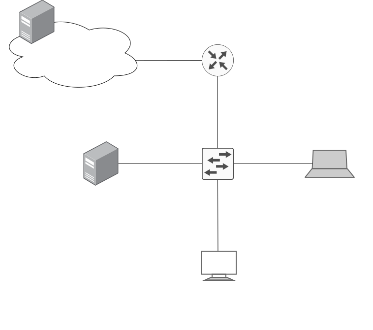

# 2021年全国硕士研究生招生考试408计算机学科专业基础综合真题
> 本真题试卷来源于权威公开考研真题题库整理，包含全部题目、完整选项、高清插图、专业标签及详细参考答案与解析。
---

## 选择题

### 【数据结构】

#### 【408-21-C-T01】第 1 题

已知头指针 h 指向一个带头结点的非空单循环链表，结点结构为


其中 `next` 是指向直接后继结点的指针，`p` 是尾指针，`q` 是临时指针。现要删除该链表的第一个元素，正确的语句序列是（ ）。

- **A.** `h->next = h->next->next; q = h->next; free(q);`
- **B.** `q = h->next; h->next = h->next->next; free(q);`
- **C.** `q = h->next; h->next = q->next; if (p != q) p = h; free(q);`
- **D.** `q = h->next; h->next = q->next; if (p == q) p = h; free(q);`

> **【唯一编号】** `408-21-C-T01`
> **【题型】** 选择题
> **【科目】** 数据结构
> **【分值】** 2分
> **【年份】** 2021年
> **【考点】** 链表

<details>
<summary><b>💡 查看参考答案与解析</b></summary>

**【参考答案】** D

**【解析】**

**正确答案：D**删除头结点后一个结点的基本流程为 `q = h->next; h->next = q->next; free(q);`，即通过指针操作跳过下一个结点后删除该结点。
由于题目中提到了该链表非空，所以可以确定 `q = h->next` 一定不为空。
但是如果链表中只有一个结点的话，我们还需要在删除该结点后，将尾指针指向头结点的位置，即 `if (p == q) p = h;`

</details>

---

#### 【408-21-C-T02】第 2 题

已知初始为空的队列 Q 的一端仅能进行入队操作，另外一端既能进行入队操作又能进行出队操作。若 Q 的入队序列是 1, 2, 3, 4, 5 , 则不能得到的出队序列是（ ）。

- **A.** 5,4,3,1,2
- **B.** 5,3,1,2,4
- **C.** 4,2,1,3,5
- **D.** 4,1,3,2,5

> **【唯一编号】** `408-21-C-T02`
> **【题型】** 选择题
> **【科目】** 数据结构
> **【分值】** 2分
> **【年份】** 2021年
> **【考点】** 队列

<details>
<summary><b>💡 查看参考答案与解析</b></summary>

**【参考答案】** D

**【解析】**

**正确答案：D**每次入队有两个选择，但是出队只有能一个选择，所以 2 在出队时必然和 1 相邻，3 在出队时必然与 2 相邻，以此类推，可以判断 D 选项是不可能的，因为 1 和 2 没有相邻。

</details>

---

#### 【408-21-C-T03】第 3 题

已知二维数组 `A` 按行优先方式存储，每个元素占用 1 个存储单元。若元素 `A[0][0]` 的存储地址是 100, `A[3][3]` 的存储地址是 220 , 则元素 `A[5][5]` 的存储地址是（ ）。

- **A.** 295
- **B.** 300
- **C.** 301
- **D.** 306

> **【唯一编号】** `408-21-C-T03`
> **【题型】** 选择题
> **【科目】** 数据结构
> **【分值】** 2分
> **【年份】** 2021年
> **【考点】** 二维数组

<details>
<summary><b>💡 查看参考答案与解析</b></summary>

**【参考答案】** B

**【解析】**

**正确答案：B**`A[3][3]` 和 `A[0][0]` 相差 3 行 3 列，`A[5][5]` 和 `A[3][3]` 相差 2 行 2 列，其在内存中的偏移比值为 3 / 2。
由此可以计算 `&A[5][5]`：220 + (220 - 100) / 3 * 2 = 300

</details>

---

#### 【408-21-C-T04】第 4 题

某森林 F 对应的二叉树为 T , 若 T 的先序遍历序列是 a, b, d, c, e, g, f , 中序遍历序列是 b, d, a, e, g, c, f , 则 F 中树的棵数是（ ）。

- **A.** 1
- **B.** 2
- **C.** 3
- **D.** 4

> **【唯一编号】** `408-21-C-T04`
> **【题型】** 选择题
> **【科目】** 数据结构
> **【分值】** 2分
> **【年份】** 2021年
> **【考点】** 二叉树构建、二叉树和森林的转换

<details>
<summary><b>💡 查看参考答案与解析</b></summary>

**【参考答案】** C

**【解析】**

**正确答案：C**这题考察的是两点，一是 二叉树构建，即根据 先序 和 中序 构建二叉树。二是 森林转二叉树，构建出二叉树后即可反向转化得到对应的森林。
森林中树的个数 即 二叉树根结点的右结点个数之和。

</details>

---

#### 【408-21-C-T05】第 5 题

若某二叉树有 5 个叶结点，其权值分别为 10、12、16、21、30，则其最小的带权路径长度（WPL）是（ ）。

- **A.** 89
- **B.** 200
- **C.** 208
- **D.** 289

> **【唯一编号】** `408-21-C-T05`
> **【题型】** 选择题
> **【科目】** 数据结构
> **【分值】** 2分
> **【年份】** 2021年
> **【考点】** 哈夫曼树

<details>
<summary><b>💡 查看参考答案与解析</b></summary>

**【参考答案】** B

**【解析】**

**正确答案：B**

根据 Huffman 构建过程 来构建得到如下二叉树：

```
89
      /      \
     52      37
   /   \    /  \
  22   30  16  21
 /  \
10  12
```

带权路径长度 为：
 (10+12)×3+(30+16+21)×2=200

</details>

---

#### 【408-21-C-T06】第 6 题

给定平衡二叉树如下图所示，插入关键字 23 后，根中的关键字是（ ）。


- **A.** 16
- **B.** 20
- **C.** 23
- **D.** 25

> **【唯一编号】** `408-21-C-T06`
> **【题型】** 选择题
> **【科目】** 数据结构
> **【分值】** 2分
> **【年份】** 2021年
> **【考点】** 平衡二叉树

<details>
<summary><b>💡 查看参考答案与解析</b></summary>

**【参考答案】** D

**【解析】**

**正确答案：D**

根据 AVL 旋转方法 可知，这题采用 RL 型旋转，旋转后树的结构为：

```
25
   /  \
  20   30
 /  \    \
16  23    40
```

根结点为 25

</details>

---

#### 【408-21-C-T07】第 7 题

给定如下有向图，该图的拓扑有序序列的个数是（ ）。


- **A.** 1
- **B.** 2
- **C.** 3
- **D.** 4

> **【唯一编号】** `408-21-C-T07`
> **【题型】** 选择题
> **【科目】** 数据结构
> **【分值】** 2分
> **【年份】** 2021年
> **【考点】** 拓扑排序

<details>
<summary><b>💡 查看参考答案与解析</b></summary>

**【参考答案】** A

**【解析】**

**正确答案：A**依次选择入度为 0 的顶点进行输出，得到 拓扑序列，发现只有一种可能性。

</details>

---

#### 【408-21-C-T08】第 8 题

使用 Dijkstra 算法求下图中从顶点 1 到其余各顶点的最短路径，将当前找到的从顶点 1 到顶点 2, 3, 4, 5 的最短路径长保存在数组 dist 中，求出第二条最短路径后，dist 中的内容更新为（ ）


- **A.** 26, 3, 14, 6
- **B.** 25, 3, 14, 6
- **C.** 21, 3, 14, 6
- **D.** 15, 3, 14, 6

> **【唯一编号】** `408-21-C-T08`
> **【题型】** 选择题
> **【科目】** 数据结构
> **【分值】** 2分
> **【年份】** 2021年
> **【考点】** 最短路径

<details>
<summary><b>💡 查看参考答案与解析</b></summary>

**【参考答案】** C

**【解析】**

**正确答案：C**在 dijkstra 算法 中，每次在 dist 数组中选择一个最小值加入顶点集，并从该顶点出发修改 dist 数组。本题中 dist 数组的变化过程如下：
`dist[26, 3, ∞, 6] → [25, 3, ∞, 6] → [21, 3, 14, 6]`

</details>

---

#### 【408-21-C-T09】第 9 题

在一棵高度为 3 的 3 阶 B 树中，根为第 1 层，若第 2 层中有 4 个关键字，则该树的结点个数最多是（ ）。

- **A.** 11
- **B.** 10
- **C.** 9
- **D.** 8

> **【唯一编号】** `408-21-C-T09`
> **【题型】** 选择题
> **【科目】** 数据结构
> **【分值】** 2分
> **【年份】** 2021年
> **【考点】** 树的概念

<details>
<summary><b>💡 查看参考答案与解析</b></summary>

**【参考答案】** A

**【解析】**

**正确答案：A**保证 特性 中的结点数量尽量多，然后每个结点中元素数量尽量多。
3 阶 B 树 中个结点最多有两个元素，三个孩子。

</details>

---

#### 【408-21-C-T10】第 10 题

设数组 S[] = {93, 946, 372, 9, 146,151, 301, 485, 236, 327, 43, 892}, 采用最低位优先（LSD）基数排序将 S 排列成升序序列。第 1 趟分配、收集后，元素 372 之前、之后紧邻的元素分别是 (  )

- **A.** 43,892
- **B.** 236,301
- **C.** 301,892
- **D.** 485,301

> **【唯一编号】** `408-21-C-T10`
> **【题型】** 选择题
> **【科目】** 数据结构
> **【分值】** 2分
> **【年份】** 2021年
> **【考点】** 排序算法、基数排序

<details>
<summary><b>💡 查看参考答案与解析</b></summary>

**【参考答案】** C

**【解析】**

**正确答案：C**LSD 基数排序 第一趟根据最低位对数组进行排序，得到的结果为 {151, 301, 372, 892, 93, 43, 485, 946, 146, 267, 327}。

</details>

---

#### 【408-21-C-T11】第 11 题

将关键字 6, 9, 1, 5, 8, 4, 7 依次插入到初始为空的大根堆 H 中，得到的 H 是（  ）。

- **A.** 9, 8, 7, 6, 5, 4, 1
- **B.** 9, 8, 7, 5, 6, 1, 4
- **C.** 9, 8, 7, 5, 6, 4, 1
- **D.** 9, 6, 7, 5, 8, 4, 1

> **【唯一编号】** `408-21-C-T11`
> **【题型】** 选择题
> **【科目】** 数据结构
> **【分值】** 2分
> **【年份】** 2021年
> **【考点】** 堆的概念

<details>
<summary><b>💡 查看参考答案与解析</b></summary>

**【参考答案】** B

**【解析】**

**正确答案：B**

参考 构造初始堆 的过程：


</details>

---

### 【组成原理】

#### 【408-21-C-T12】第 12 题

2017 年公布的全球超级计算机 TOP500 排名中，我国“神威·太湖之光”超级计算机蝉联第一，其浮点运算速度为 93.0146PFLOPS，说明该计算机每秒钟完成的浮点操作次数为（ ）。

- **A.** 9.3×1013
 次
- **B.** 9.3×1015
 次
- **C.** 9.3
千万亿次
- **D.** 9.3
亿亿次

> **【唯一编号】** `408-21-C-T12`
> **【题型】** 选择题
> **【科目】** 计算机组成原理
> **【分值】** 2分
> **【年份】** 2021年
> **【考点】** 计算机性能指标

<details>
<summary><b>💡 查看参考答案与解析</b></summary>

**【参考答案】** D

**【解析】**

**正确答案：D**PFLOPS =
 1015
FLOPS，
 93
PFOPS =
 9.3×1016
FLOPS，一个亿 =
 108
，所以
 1016
为 亿亿。

</details>

---

#### 【408-21-C-T13】第 13 题

已知带符号整数用补码表示，变量 x，y，z 的机器数分别为 FFFDH，FFDFH，7FFCH，下列结论中，正确的是（ ）。

- **A.** 若 x、y 和 z 为无符号整数，则 z < x < y
- **B.** 若 x、y 和 z 为无符号整数，则 x < y < z
- **C.** 若 x、y 和 z 为带符号整数，则 x < y < z
- **D.** 若 x、y 和 z 为带符号整数，则 y < x < z

> **【唯一编号】** `408-21-C-T13`
> **【题型】** 选择题
> **【科目】** 计算机组成原理
> **【分值】** 2分
> **【年份】** 2021年
> **【考点】** 补码

<details>
<summary><b>💡 查看参考答案与解析</b></summary>

**【参考答案】** D

**【解析】**

**正确答案：D**若 x, y 和 z 均为无符号整数，则 x > y > z，A 和 B 错误。若 x, y 和 z 均为带符号整数，补码的最高位是符号位，0 表示正数，1 表示负数，因此 z 为正数，而 x 和 y 为负数。对于 x 和 y 的比较，数值位取反加一，可知 x = -3H，y = -21H，故 x > y。

</details>

---

#### 【408-21-C-T14】第 14 题

下列数值中，不能用 IEEE754 浮点格式精确表示的（ ）。

- **A.** 1.2
- **B.** 1.25
- **C.** 2.0
- **D.** 2.5

> **【唯一编号】** `408-21-C-T14`
> **【题型】** 选择题
> **【科目】** 计算机组成原理
> **【分值】** 2分
> **【年份】** 2021年
> **【考点】** IEEE浮点数表示

<details>
<summary><b>💡 查看参考答案与解析</b></summary>

**【参考答案】** A

**【解析】**

**正确答案：A**

选项 B：
 1.25=1.01B×20
;

选项 C：
 2.0=1.0B×2
;

选项 D:
 2.5=1.01B×21
。

因此，选项 B、C 和 D 均可以用 IEEE 754 浮点数表示 精确表示。选项 A 的十进制小数 1.2 转换成二进制的结果是无限循环小数 1.001100110011…，无法用精度有限的 IEEE 754 格式精确表示。

</details>

---

#### 【408-21-C-T15】第 15 题

某计算机的存储器总线中有 24 位地址线和 32 位数据线，按字编址，字长为 32 位。若 000000H~3FFFFFH 为 RAM 区，则需要 512K×8 位的 RAM 芯片数为（ ）。

- **A.** 8
- **B.** 16
- **C.** 32
- **D.** 64

> **【唯一编号】** `408-21-C-T15`
> **【题型】** 选择题
> **【科目】** 计算机组成原理
> **【分值】** 2分
> **【年份】** 2021年
> **【考点】** 主存容量的扩展

<details>
<summary><b>💡 查看参考答案与解析</b></summary>

**【参考答案】** C

**【解析】**

**正确答案：C**

RAM 区的地址空间为 4FFFFFH =
 222
，用 22 位可以表示。字长为 32 bit。

参考 主存容量的扩展，如果要用
 219
x 8bit 的 RAM 芯片覆盖这些存储空间的话，需要的芯片个数为
 (222/219)×(32/8)=8×4=32

</details>

---

#### 【408-21-C-T16】第 16 题

若计算机主存地址为 32 位，按字节编址，Cache 数据区大小为 32KB，主存块大小为 32B，采用直接映射方式和回写（Write Back）策略，则 Cache 行的位数至少是（ ）。

- **A.** 275
- **B.** 274
- **C.** 258
- **D.** 257

> **【唯一编号】** `408-21-C-T16`
> **【题型】** 选择题
> **【科目】** 计算机组成原理
> **【分值】** 2分
> **【年份】** 2021年
> **【考点】** cache映射方式、cache写策略

<details>
<summary><b>💡 查看参考答案与解析</b></summary>

**【参考答案】** A

**【解析】**

**正确答案：A**

由于是 直接映射，所以物理地址的结构分为以下几个部分：

| Tag（17 bits） | Cache 块号（10 bits） | 块内偏移（5 bits） |

Cache 行包含以下几个部分：标记（tag 17bits）、有效位（valid 1bit）、修改位（dirty 1bit）、数据区（32B）

Cache 行的大小为 17 + 1 + 1 + 32 * 8 = 275

</details>

---

#### 【408-21-C-T17】第 17 题

下列存储器中，汇编语言程序员可见的是（ ）。

Ⅰ. 指令寄存器

Ⅱ. 微指令寄存器

Ⅲ. 基址寄存器

Ⅳ. 标志状态寄存器

- **A.** 仅Ⅰ、Ⅱ
- **B.** 仅Ⅰ、IV
- **C.** 仅Ⅱ、Ⅳ
- **D.** 仅Ⅲ、Ⅳ

> **【唯一编号】** `408-21-C-T17`
> **【题型】** 选择题
> **【科目】** 计算机组成原理
> **【分值】** 2分
> **【年份】** 2021年
> **【考点】** 寄存器类型

<details>
<summary><b>💡 查看参考答案与解析</b></summary>

**【参考答案】** D

**【解析】**

**正确答案：D**

参考 汇编程序员可见寄存器，指令寄存器（IR）和 微指令寄存器 都是 CPU 控制的，程序员无法通过汇编代码直接操作。

基址寄存器、标志状态寄存器（FLAGS）程序员可见。

</details>

---

#### 【408-21-C-T18】第 18 题

下列关于数据通路的叙述中，错误的是（ ）。

- **A.** 数据通路包含 ALU 等组合逻辑（操作）元件
- **B.** 数据通路包含寄存器等时序逻辑（状态）元件
- **C.** 数据通路不包含用于异常事件检测及响应的电路
- **D.** 数据通路中的数据流动路径由控制信号进行控制

> **【唯一编号】** `408-21-C-T18`
> **【题型】** 选择题
> **【科目】** 计算机组成原理
> **【分值】** 2分
> **【年份】** 2021年
> **【考点】** 数据通路

<details>
<summary><b>💡 查看参考答案与解析</b></summary>

**【参考答案】** C

**【解析】**

**正确答案：C**指令执行过程中数据所经过的路径，包括路径上的部件，称为数据通路。ALU、通用寄存器、状态寄存器、Cache、MMU、浮点运算逻辑、异常和中断处理逻辑等，都是指令执行过程中数据流经的部件，都属于 数据通路 的一部分。数据通路中的数据流动路径由控制部件控制，控制部件根据每条指令功能的不同，生成对数据通路的控制信号。

</details>

---

#### 【408-21-C-T19】第 19 题

下列关于总线的叙述中，错误的是（ ）。

- **A.** 总线是在两个或多个部件之间进行数据交换的传输介质
- **B.** 同步总线由时钟信号定时，时钟频率不一定等于工作频率
- **C.** 异步总线由握手信号定时，一次握手过程完成一位数据交换
- **D.** 突发（Burst）传送总线事务可以在总线上连续传送多个数据

> **【唯一编号】** `408-21-C-T19`
> **【题型】** 选择题
> **【科目】** 计算机组成原理
> **【分值】** 2分
> **【年份】** 2021年
> **【考点】** 总线概念

<details>
<summary><b>💡 查看参考答案与解析</b></summary>

**【参考答案】** C

**【解析】**

**正确答案：C**总线 是在两个或多个设备之间进行通信的传输介质，A 正确。同步总线 是指总线通信的双方采用同一个时钟信号，但是一次总线事务不一定在一个时钟周期内完成，即时钟频率不一定等于工作频率，B 正确。异步总线 采用握手的方式进行通信，每次握手的过程完成一次通信，但一次通信往往会交换多位而非一位数据，C 错误。突发总线传输事务 是指发送方在传输完地址后，连续进行若干次数据的发送，D 正确。

</details>

---

#### 【408-21-C-T20】第 20 题

下列选项中不属于 I/O 接口的是（ ）。

- **A.** 磁盘驱动器
- **B.** 打印机适配器
- **C.** 网络控制器
- **D.** 可编程中断控制器

> **【唯一编号】** `408-21-C-T20`
> **【题型】** 选择题
> **【科目】** 计算机组成原理
> **【分值】** 2分
> **【年份】** 2021年
> **【考点】** IO接口

<details>
<summary><b>💡 查看参考答案与解析</b></summary>

**【参考答案】** A

**【解析】**

**正确答案：A**

I/O 接口 处于计算机与外设之间，其功能是接收主机发送的 I/O 控制信号，实现主机和外设之间的信息交换。

磁盘驱动器并不属于接口，它是磁盘的一部分，它并不处于外设和主机之间。

</details>

---

#### 【408-21-C-T21】第 21 题

异常事件在当前指令执行过程中进行检测，中断请求则在当前指令执行后进行检测。下列事件中，相应处理程序执行后，必须回到当前指令重新执行的是（ ）。

- **A.** 系统调用
- **B.** 页缺失
- **C.** DMA 传送结束
- **D.** 打印机缺纸

> **【唯一编号】** `408-21-C-T21`
> **【题型】** 选择题
> **【科目】** 计算机组成原理
> **【分值】** 2分
> **【年份】** 2021年
> **【考点】** 异常和中断

<details>
<summary><b>💡 查看参考答案与解析</b></summary>

**【参考答案】** B

**【解析】**

**正确答案：B**大部分中断都是在一条指令执行完成后（中断周期）才被检测并处理，除了缺页中断和 DMA 请求。DMA 请求只请求总线的使用权，不影响当前指令的执行，不会导致被中断指令的重新执行；而缺页中断发生在取指或间址等指令执行过程之中，并且会阻塞整个指令。当缺页中断发生后，必须回到这条指令重新执行，以便重新访存。选 B。

</details>

---

#### 【408-21-C-T22】第 22 题

下列是关于多重中断系统中 CPU 响应中断的叙述，其中错误的是（ ）。

- **A.** 仅在用户态（执行用户程序）下，CPU 才能检测和响应中断
- **B.** CPU 只有在检测到中断请求信号后，才会进入中断响应周期
- **C.** 进入中断响应周期时，CPU 一定处于中断允许（开中断）状态
- **D.** 若 CPU 检测到中断请求信号，则一定存在未被屏蔽的中断源请求信号

> **【唯一编号】** `408-21-C-T22`
> **【题型】** 选择题
> **【科目】** 计算机组成原理
> **【分值】** 2分
> **【年份】** 2021年
> **【考点】** 多级中断

<details>
<summary><b>💡 查看参考答案与解析</b></summary>

**【参考答案】** A

**【解析】**

**正确答案：A**中断服务程序在内核态下执行，但这并不代表在用户态下就无法响应中断。若只能在用户态下检测和响应中断，显然无法实现多重中断（中断嵌套），A 错误。在 多重中断 中，CPU 只有在检测到中断请求信号后（中断处理优先级更低的中断请求信号是检测不到的），才会进入中断响应周期。进入中断响应周期时说明此时 CPU 一定处于中断允许状态，否则无法响应该中断。如果所有中断源都被屏蔽（说明该中断处理优先级最高），则 CPU 不会检测到任何中断请求信号。

</details>

---

### 【操作系统】

#### 【408-21-C-T23】第 23 题

下列指令中，只能在内核态执行的是（ ）。

- **A.** trap 指令
- **B.** I/O 指令
- **C.** 数据传送指令
- **D.** 设置断点指令

> **【唯一编号】** `408-21-C-T23`
> **【题型】** 选择题
> **【科目】** 操作系统
> **【分值】** 2分
> **【年份】** 2021年
> **【考点】** 用户态和内核态

<details>
<summary><b>💡 查看参考答案与解析</b></summary>

**【参考答案】** B

**【解析】**

**正确答案：B**

在 内核态 下，CPU 可执行任何指令，在用户态下 CPU 只能执行非特权指令，而特权指令只能在内核态下执行。常见的 特权指令 有：

- 有关对 IO 设备操作的指令；
- 有关访问程序状态的指令；
- 存取特殊寄存器指令；
- 其他指令。

A、C 和 D 都是提供给用户使用的指令，可以在用户态执行，只是可能会使 CPU 从用户态切换到内核态。

</details>

---

#### 【408-21-C-T24】第 24 题

下列操作中，操作系统在创建新进程时，必须完成的是（ ）。

I. 申请空白的进程控制块

II. 初始化进程控制块

III. 设置进程状态为执行态

- **A.** 仅 I
- **B.** 仅 I、II
- **C.** 仅 I、III
- **D.** 仅 II、III

> **【唯一编号】** `408-21-C-T24`
> **【题型】** 选择题
> **【科目】** 操作系统
> **【分值】** 2分
> **【年份】** 2021年
> **【考点】** 进程概念、进程状态

<details>
<summary><b>💡 查看参考答案与解析</b></summary>

**【参考答案】** B

**【解析】**

**正确答案：B**操作系统感知进程的唯一方式是通过进程控制块 PCB，所以创建一个新进程时就是为其申请一个空白的进程控制块，并初始化一些必要的进程信息，如初始化进程标志信息、初始化处理机状态信息、设置进程优先级等。I、Ⅱ正确。创建一个进程时，一般会为其分配除 CPU 外的大多数资源，所以一般是将其设置为就绪态，让其等待调度程序的调度。

</details>

---

#### 【408-21-C-T25】第 25 题

下列内核的数据结构或程序中，分时系统实现时间片轮转调度需要使用的是（ ）。

I. 进程控制块

II. 时钟中断处理程序

III. 进程就绪队列

IV. 进程阻塞队列

- **A.** 仅 II、III
- **B.** 仅 I、IV
- **C.** 仅 I、II、III
- **D.** 仅 I、II、IV

> **【唯一编号】** `408-21-C-T25`
> **【题型】** 选择题
> **【科目】** 操作系统
> **【分值】** 2分
> **【年份】** 2021年
> **【考点】** 处理机调度算法、时间片轮转

<details>
<summary><b>💡 查看参考答案与解析</b></summary>

**【参考答案】** C

**【解析】**

**正确答案：C**在分时系统的 时间片轮转 中，当系统检测到时钟中断时，会引出时钟中断处理程序调度程序从就绪队列中选择一个进程为其分配时间片，并修改该进程的进程控制块中的进程状态等信息，同时将时间片用完的进程放入就绪队列或让其结束运行。I、II、Ⅲ 正确。阻塞队列中的进程只有被唤醒进入就绪队列后，才能参与调度，所以该调度过程不使用阻塞队列。

</details>

---

#### 【408-21-C-T26】第 26 题

某系统中磁盘的磁道数为 200 (0~199), 磁头当前在 184 号磁道上。用户进程提出的磁盘访问请求对应的磁道号依次为 184, 187, 176, 182, 199。若采用最短寻道时间优先调度算法 (SSTF) 完成磁盘访问，则磁头移动的距离（磁道数）是（ ）。

- **A.** 37
- **B.** 38
- **C.** 41
- **D.** 42

> **【唯一编号】** `408-21-C-T26`
> **【题型】** 选择题
> **【科目】** 操作系统
> **【分值】** 2分
> **【年份】** 2021年
> **【考点】** 磁盘调度算法

<details>
<summary><b>💡 查看参考答案与解析</b></summary>

**【参考答案】** C

**【解析】**

**正确答案：C**最短寻道时间优先算法 总是选择调度与当前磁头所在磁道距离最近的磁道。可以得出访问序列 184,182,187,176,199，从而求出移动距离之和是 0+2+5+11+23=41。

</details>

---

#### 【408-21-C-T27】第 27 题

下列事件中，可能引起进程调度程序执行的是（ ）。

I. 中断处理结束

II. 进程阻塞

III. 进程执行结束

IV. 进程的时间片用完

- **A.** 仅 I、III
- **B.** 仅 II、IV
- **C.** 仅 III、IV
- **D.** I、II、III、 IV

> **【唯一编号】** `408-21-C-T27`
> **【题型】** 选择题
> **【科目】** 操作系统
> **【分值】** 2分
> **【年份】** 2021年
> **【考点】** 进程状态

<details>
<summary><b>💡 查看参考答案与解析</b></summary>

**【参考答案】** D

**【解析】**

**正确答案：D**当进程 状态转化 时，需要由进程调度程序执行。
。在时间片调度算法中，中断处理结束后，系统检测当前进程的时间片是否用完，如果用完，则将其设为就绪态或让其结束运行，若就绪队列不空，则调度就绪队列的队首进程执行，I 可能。当前进程阻塞时，将其放入阻塞队列，若就绪队列不空，则调度新进程执行，Ⅱ 可能。进程执行结束会导致当前进程释放 CPU，并从就绪队列中选择一个进程获得 CPU，III 可能。进程时间片用完，会导致当前进程让出 CPU，同时选择就绪队列的队首进程获得 CPU，IV 可能。

</details>

---

#### 【408-21-C-T28】第 28 题

某请求分页存储系统的页大小为 4KB，按字节编址。系统给进程 P 分配 2 个固定的页框并采用改进型 Clock 置换算法，进程 P 页表的部分内容如下表所示：


若 P 访问虚拟地址为 02A01H 的存储单元，则经地址变换后得到的物理地址是（）。

- **A.** 00A01H
- **B.** 20A01H
- **C.** 60A01H
- **D.** 80A01H

> **【唯一编号】** `408-21-C-T28`
> **【题型】** 选择题
> **【科目】** 操作系统
> **【分值】** 2分
> **【年份】** 2021年
> **【考点】** 页面置换算法、clock算法

<details>
<summary><b>💡 查看参考答案与解析</b></summary>

**【参考答案】** C

**【解析】**

**正确答案：C**页面大小为 4KB，低 12 位是页内偏移。虚拟地址为 02A01H，页号为 02H，02H 页对应的页表项中存在位为 0，进程 P 分配的页框固定为 2，且内存中已有两个页面存在。根据 CLOCK 算法，选择将 3 号页换出，将 2 号页放入 60H 页框，经过地址变换后得到的物理地址是 60A01H。

</details>

---

#### 【408-21-C-T29】第 29 题

在采用二级页表的分页系统中，CPU 页表基址寄存器中的内容是（ ）。

- **A.** 当前进程的一级页表的起始虚拟地址
- **B.** 当前进程的一级页表的起始物理地址
- **C.** 当前进程的二级页表的起始虚拟地址
- **D.** 当前进程的二级页表的起始物理地址

> **【唯一编号】** `408-21-C-T29`
> **【题型】** 选择题
> **【科目】** 操作系统
> **【分值】** 2分
> **【年份】** 2021年
> **【考点】** 页表

<details>
<summary><b>💡 查看参考答案与解析</b></summary>

**【参考答案】** B

**【解析】**

**正确答案：B**页表基址寄存器（PTBR，Page Table Base Register）中存储的是进程一级页表的物理地址。

</details>

---

#### 【408-21-C-T30】第 30 题

若目录 dir 下有文件 file1，则为删除该文件内核不必完成的工作是（ ）。

- **A.** 删除 file1 的快捷方式
- **B.** 释放 file1 的文件控制块
- **C.** 释放 file1 占用的磁盘空间
- **D.** 删除目录 dir 中与 file1 对应的目录项

> **【唯一编号】** `408-21-C-T30`
> **【题型】** 选择题
> **【科目】** 操作系统
> **【分值】** 2分
> **【年份】** 2021年
> **【考点】** 文件链接

<details>
<summary><b>💡 查看参考答案与解析</b></summary>

**【参考答案】** A

**【解析】**

**正确答案：A**

当你删除某个目录 `dir` 下的文件 `file1` 时，操作系统内核必须完成以下几项操作：

首先，内核会在目录 `dir` 中找到 `file1` 对应的目录项，并将其删除。目录项是文件名与其 inode（文件控制块）之间的映射。

然后，内核检查这个 inode 是否还有其他硬链接引用。如果 `file1` 是最后一个链接，那么系统会释放掉该 inode，以及文件占用的磁盘数据块。

也就是说，释放文件控制块（inode）和释放磁盘空间，都是删除文件过程中内核必须做的事情。

但如果有其他“快捷方式”指向 `file1`，比如 软链接（symbolic link），这些快捷方式本身是独立的文件。删除原文件不会影响这些快捷方式，它们会变成“悬挂链接”（指向一个不存在的文件）。因此，**内核在删除文件时不需要去删除这些快捷方式**。

所以，正确答案是：**A. 删除 file1 的快捷方式** —— 这是内核不必完成的工作。

</details>

---

#### 【408-21-C-T31】第 31 题

若系统中有 n (n≥2) 个进程，每个进程均需要使用某类临界资源 2 个，则系统不会发生死锁所需的该类资源总数至少是（ ）。

- **A.** 2
- **B.** n
- **C.** n+1
- **D.** 2n

> **【唯一编号】** `408-21-C-T31`
> **【题型】** 选择题
> **【科目】** 操作系统
> **【分值】** 2分
> **【年份】** 2021年
> **【考点】** 死锁产生的必要条件

<details>
<summary><b>💡 查看参考答案与解析</b></summary>

**【参考答案】** C

**【解析】**

**正确答案：C**考虑极端情况，当临界资源数为 n 时，每个进程都拥有 1 个临界资源并等待另一个资源，会发生死锁。当临界资源数为 n+1 时，则 n 个进程中至少有一个进程可以获得 2 个临界资源，顺利运行完后释放自己的临界资源，使得其他进程也能顺利运行，不会产生死锁。

</details>

---

#### 【408-21-C-T32】第 32 题

下列选项中，通过系统调用完成的操作是（ ）。

- **A.** 页置换
- **B.** 进程调度
- **C.** 创建新进程
- **D.** 生成随机整数

> **【唯一编号】** `408-21-C-T32`
> **【题型】** 选择题
> **【科目】** 操作系统
> **【分值】** 2分
> **【年份】** 2021年
> **【考点】** 系统调用

<details>
<summary><b>💡 查看参考答案与解析</b></summary>

**【参考答案】** C

**【解析】**

**正确答案：C**系统调用是由用户进程发起的，请求操作系统的服务。对于 A，当内存中的空闲页框不够时，操作系统会将某些页面调出，并将要访问的页面调入，这个过程完全由操作系统完成不涉及系统调用。对于 B，进程调度完全由操作系统完成，无法通过系统调用完成。对于 C，创建新进程可以通过系统调用来完成，如 Linux 中通过 fork 系统调用来创建子进程。对于 D，生成随机数只需要普通的函数调用，不涉及请求操作系统的服务，如 C 语言中 random() 函数。

</details>

---

### 【计算机网络】

#### 【408-21-C-T33】第 33 题

在 TCP/IP 参考模型中，由传输层相邻的下一层实现的主要功能是（ ）。

- **A.** 对话管理
- **B.** 路由选择
- **C.** 端到端报文段传输
- **D.** 结点到结点流量控制

> **【唯一编号】** `408-21-C-T33`
> **【题型】** 选择题
> **【科目】** 计算机网络
> **【分值】** 2分
> **【年份】** 2021年
> **【考点】** OSI模型

<details>
<summary><b>💡 查看参考答案与解析</b></summary>

**【参考答案】** B

**【解析】**

**正确答案：B**TCP/IP 参考模型中传输层相邻的下一层是网际层。TCP/IP 的网际层使用一种尽力而为的服务，它将分组发往任何网络，并为之独立选择合适的路由，但不保证各个分组有序到达，B 正确。TCP/IP 认为可靠性是端到端的问题（传输层的功能），因此它在网际层仅有无连接、不可靠的通信模式，无法完成结点到结点的流量控制（OSI 参考模型的网络层具有该功能）。对话管理和端到端的报文段传输均为传输层的功能。A、C 和 D 错误。

</details>

---

#### 【408-21-C-T34】第 34 题

若下图为一段差分曼彻斯特编码信号波形，则其编码的二进制位串是（ ）


- **A.** 1011 1001
- **B.** 1101 0001
- **C.** 0010 1110
- **D.** 1011 0110

> **【唯一编号】** `408-21-C-T34`
> **【题型】** 选择题
> **【科目】** 计算机网络
> **【分值】** 2分
> **【年份】** 2021年
> **【考点】** 编码方法

<details>
<summary><b>💡 查看参考答案与解析</b></summary>

**【参考答案】** A

**【解析】**

**正确答案：A**差分曼彻斯特编码 常用于局域网传输，其规则是：若码元为 1，则前半个码元的电平与上一码元的后半个码元的电平相同；若码元为 0，则情形相反。差分曼彻斯特编码的特点在于，在每个时钟周期的起始处，跳变则说明该比特是 0，不跳变则说明该比特是 1。根据题 34 图，第 1 个码元的信号波形因缺乏上一码元的信号波形，无法判断是 0 还是 1.但根据后面的信号波形，可以求出第 2~8 个码元为 011 1001，因此选 A。

</details>

---

#### 【408-21-C-T35】第 35 题

现将一个 IP 网络划分为 3 个子网，若其中一个子网是 192.168.9.128/26, 则下列网络中，不可能是另外两个子网之一的是（ ）

- **A.** 192.168.9.0/25
- **B.** 192.168.9.0/26
- **C.** 192.168.9.192/26
- **D.** 192.168.9.192/27

> **【唯一编号】** `408-21-C-T35`
> **【题型】** 选择题
> **【科目】** 计算机网络
> **【分值】** 2分
> **【年份】** 2021年
> **【考点】** 子网划分

<details>
<summary><b>💡 查看参考答案与解析</b></summary>

**【参考答案】** B

**【解析】**

**正确答案：B**

本题考察的是 子网划分。根据题意，将 IP 网络划分为 3 个子网。其中一个是 192.168.9.128/26。可以简写成 x.x.x.10/26（其中 10 是 128 的二进制 1000 0000 的前两位，因为 26-24=2）。

- A 选项可以简写成 x.x.x.0/25;
- B 选项可以简写成 x.x.x.00/26;
- C 选项可以简写成 x.x.x.11/26;
- D 选项可以简写成 x.x.x.110/27

对于 A 和 C，可以组成 x.x.x.0/25、x.x.x.10/26、x.x.x.11/26 这样 3 个互不重叠的子网对于 D，可以组成 x.x.x.10/26、x.x.x.110/27、x.x.x.111/27 这样 3 个互不重叠的子网。但对于 B，要想将一个 IP 网络划分为几个互不重叠的子网，3 个是不够的，至少需要划分为 4 个子网：x.x.x.00/26、x.x.x.01/26、x.x.x.10/26、x.x.x.11/26。

</details>

---

#### 【408-21-C-T36】第 36 题

若路由器向 MTU = 800B 的链路转发一个总长度为 1580B 的 IP 数据报（首部长度为 20B）时，进行了分片，且每个分片尽可能大，则第 2 个分片的总长度字段和 MF 标志位的值分别是（  ）

- **A.** 796,0
- **B.** 796, 1
- **C.** 800,0
- **D.** 800, 1

> **【唯一编号】** `408-21-C-T36`
> **【题型】** 选择题
> **【科目】** 计算机网络
> **【分值】** 2分
> **【年份】** 2021年
> **【考点】** IP数据报分片

<details>
<summary><b>💡 查看参考答案与解析</b></summary>

**【参考答案】** B

**【解析】**

**正确答案：B**

本题考察 IP 数据报分片。

链路层 MTU = 800B。IP 分组首部长 20B。片偏移以 8 个字节为偏移单位，因此除最后个分片，其他每个分片的数据部分长度都是 8B 的整数倍。所以，最大 IP 分片的数据部分长度为 776B。总长度 1580B 的卫 P 数据报中，数据部分占 1560B，1560B/776B=2.01…需要分成 3 片。故第 2 个分片的总长度字段为 796，MF 为 1（表示还有后续的分片）。

</details>

---

#### 【408-21-C-T37】第 37 题

某网络中的所有路由器均采用距离向量路由算法计算路由。若路由器 E 与邻居路由器 A,B,C 和 D 之间的直接链路距离分别是 8, 10, 12 和 6 , 且 E 收到邻居路由器的距离向量如下表所示，则路由器 E 更新后的到达目的网络 Netl~Net4 的距离分别是（ ）。


- **A.** 9, 10, 12, 6
- **B.** 9, 10, 28, 20
- **C.** 9, 20, 12, 20
- **D.** 9, 20, 28, 20

> **【唯一编号】** `408-21-C-T37`
> **【题型】** 选择题
> **【科目】** 计算机网络
> **【分值】** 2分
> **【年份】** 2021年
> **【考点】** 距离向量算法

<details>
<summary><b>💡 查看参考答案与解析</b></summary>

**【参考答案】** D

**【解析】**

**正确答案：D**

根据 距离向量 算法，E 收到相邻路由器的距离向量后，更新它的路由表：

① 当原路由表中没有目的网络时，把该项目添加到路由表中。

② 发来的路由信息中有一条到达某个目的网络的路由，该路由与当前使用的路由相比，有较短的距离，就用经过发送路由信息的结点的新路由替换。

分析题意可知，E 与邻居路由器 A、B、C 和 D 之间的直接链路距离分别是 8.10.12 和 6.到达 Net1~Net4 没有直接链路，需要通过邻居路由器。从上述算法可知，E 到达目的网络一定是经过 A,B,C 和 D 中距离最小的。根据题中所给的距离信息，计算 E 经邻居路由器到达目的网络 Net1~Net4 的距离，如下表所示，选择到达每个目的网络距离的最短值。

| 目的网络 | 经过 A 需要的距离 | 经过 B 需要的距离 | 经过 C 需要的距离 | 经过 D 需要的距离 |
| --- | --- | --- | --- | --- |
| Net1 | 9 | 33 | 32 | 28 |
| Net2 | 20 | 45 | 42 | 34 |
| Net3 | 32 | 28 | 28 | 42 |
| Net4 | 44 | 40 | 20 | 30 |

</details>

---

#### 【408-21-C-T38】第 38 题

若客户首先向服务器发送 FIN 段请求断开 TCP 连接，则当客户收到服务器发送的 FIN 段并向服务器发送了 ACK 段后，客户的 TCP 状态转换为（ ）。

- **A.** CLOSE_WAIT
- **B.** TIME_WAIT
- **C.** FIN_WAIT_1
- **D.** FIN_WAIT_2

> **【唯一编号】** `408-21-C-T38`
> **【题型】** 选择题
> **【科目】** 计算机网络
> **【分值】** 2分
> **【年份】** 2021年
> **【考点】** TCP四次挥手

<details>
<summary><b>💡 查看参考答案与解析</b></summary>

**【参考答案】** B

**【解析】**

**正确答案：B**本题考察 四次挥手 的状态转换。
当客户机收到服务器发送的 FIN 段并向服务器发送 ACK 段后，客户机的 TCP 状态变为 TIME_WAIT，此时 TCP 连接还未释放，必须经过时间等待计时器设置的时间 2MSL（最长报文段寿命）后，客户机才进入 CLOSED（连接关闭）状态。

</details>

---

#### 【408-21-C-T39】第 39 题

若大小为 12B 的应用层数据分别通过 1 个 UDP 数据报和 1 个 TCP 段传输，则该 UDP 数据报 和 TCP 段实现的有效载荷（应用层数据）最大传输效率分别是（ ）。

- **A.** 37.5%, 16.7%
- **B.** 37.5%, 37.5%
- **C.** 60.0%, 16.7%
- **D.** 60.0%, 37.5%

> **【唯一编号】** `408-21-C-T39`
> **【题型】** 选择题
> **【科目】** 计算机网络
> **【分值】** 2分
> **【年份】** 2021年
> **【考点】** TCP首部、UDP

<details>
<summary><b>💡 查看参考答案与解析</b></summary>

**【参考答案】** D

**【解析】**

**正确答案：D**应用层数据交给传输层时，放在报文段的数据部分。UDP 首部有 8B，TCP 首部最短有 20B。为了达到最大传输效率，通过 UDP 传输时，总长度为 20B，最大传输效率是 12B/20B=60% 通过 TCP 传输时，总长度为 32B，最大传输效率是 12B/32B=37.5%。

</details>

---

#### 【408-21-C-T40】第 40 题

设主机甲通过 TCP 向主机乙发送数据，部分过程如下图所示。甲在
 t0
时刻发送一个序号 seq=501、封装 200B 数据的段，在
 t1
时刻收到乙发送的序号 seq = 601、确认序号 ack_seq = 501、接收窗口 rcvwnd = 500B 的段，则甲在未收到新的确认段之前，可以继续向乙发送的数据序号范围是（ ）。


- **A.** 501 ~ 1000
- **B.** 601 ~ 1100
- **C.** 701 ~ 1000
- **D.** 801 ~ 1100

> **【唯一编号】** `408-21-C-T40`
> **【题型】** 选择题
> **【科目】** 计算机网络
> **【分值】** 2分
> **【年份】** 2021年
> **【考点】** TCP滑动窗口

<details>
<summary><b>💡 查看参考答案与解析</b></summary>

**【参考答案】** C

**【解析】**

**正确答案：C**本题考察 TCP 的滑动窗口机制。
依题意，甲发送完 200B 报文后，继续发送的报文段中序号字段 seq=701。由于乙告知接收窗口为 500，且甲未收到乙对 seq =501 报文段的确认，那么甲还能发送的报文段字节数为 500-200=300B，因此甲在未收到新的确认段之前，还能发送的数据序号范围是 701~1000。

</details>

---

## 解答题

### 【数据结构】

#### 【408-21-A-T41】第 41 题

已知无向连通图 G 由顶点集 V 和边集 E 组成，|E| > 0，当 G 中度为奇数的顶点个数为不大于 2 的偶数时，G 存在包含所有边且长度为|E|的路径（称为 EL 路径）。设图 G 采用邻接矩阵存储，类型定义如下：

```c
typedef struct {                    // 图的定义
    int numVertices, numEdges;      // 图中实际的顶点数和边数
    char VerticesList[MAXV];        // 顶点表，MAXV 为已定义常量
    int Edge[MAXV][MAXV];           // 邻接矩阵
} MGraph;
```

请设计算法 int IsExistEL(MGraph G)，判断 G 是否存在 EL 路径，若存在，则返回 1，否则返回 0。要求：

(1) 给出算法的基本设计思想。

(2) 根据设计思想，采用 C 或 C++ 语言描述算法，关键之处给出注释。

(3) 说明你所设计算法的时间复杂度和空间复杂度。

> **【唯一编号】** `408-21-A-T41`
> **【题型】** 综合应用题
> **【科目】** 数据结构
> **【分值】** 10分
> **【年份】** 2021年
> **【考点】** 邻接矩阵

<details>
<summary><b>💡 查看参考答案与解析</b></summary>

**【解析】**

1）算法的基本设计思想

本算法题属于送分题，题干已经告诉我们算法的思想。对于采用邻接矩阵存储的无向
图，在邻接矩阵的每一行（列）中，非零元素的个数为本行（列）对应顶点的度。可
以依次计算连通图 G 中各顶点的度，并记录度为奇数的顶点个数，若个数为 0 或 2，则
返回 1，否则返回 0。

2）算法实现

```c
int isExistEL(MGraph G) {
  // 统计度为奇数的定点个数
  int count = 0;
  for (int v = 0; v < numVertices; v++) {
    // 该顶点的度
    int degree = 0;
    for (int e = 0; e < numEdges; e++) {
      if (Edge[v][e] == 1) {
        degree++;
      }
    }
    if (degree % 2 == 1) {
      count++;
    }
  }
  if (count == 0 || count == 2) {
    return 1;
  }
  return 0;
}
```

3）时间和空间复杂度

算法需要遍历整个矩阵，所以时间复杂度为
 O(n2)
，空间复杂度为
 O(1)
。

</details>

---

#### 【408-21-A-T42】第 42 题

已知某排序算法如下：

```c
void cmpCountSort(int a[], int b[], int n)
{
    int i, j, *count;
    count = (int *) malloc(sizeof(int) * n) //C++ 语言：count = new int[n];
    for (i = 0; i < n; i++) count[i] = 0;
    for (i = 0; i < n - 1; i++)
        for (j = i + 1; j < n; j++)
            if (a[i] < a[j]) count[j]++;
            else count[i]++;
    for (i = 0; i < n; i++) b[count[i]]= a[i];
    free(count); // C++ 语言：delete count;
}
```

请回答下列问题。

(1) 若有 int a[] = {25, -10, 25, 10, 11, 19}, b[6]; ，则调用 cmpCountSort(a, b, 6) 后数组 b 中的内容是什么？

(2) 若 a 中含有 n 个元素，则算法执行过程中，元素之间的比较次数是多少？

(3) 该算法是稳定的吗？若是，则阐述理由；否则，修改为稳定排序算法。

> **【唯一编号】** `408-21-A-T42`
> **【题型】** 综合应用题
> **【科目】** 数据结构
> **【分值】** 15分
> **【年份】** 2021年
> **【考点】** 排序算法

<details>
<summary><b>💡 查看参考答案与解析</b></summary>

**【解析】**

cmpCountSort 算法基于计数排序的思想，对序列进行排序。cmpCountSort 算法遍历数组
中的元素，count 数组记录比对应待排序数组元素下标大的元素个数，例如，count[1]=3
的意思是数组 a 中有 3 个元素比 a[1]大，即 a[1]是第 4 大元素，a[1]的正确位置应是 b[3]。

1）排序结果为 `b[6]={-10,10,11,19,25,25}`。

2）由代码 `for(i=0;i<n-1;i++)` 和 `for(j=i+1;j<n;j++)` 可知，在循环过程中，每
个元素都与它后面的所有元素比较一次（即所有元素都两两比较一次），比较次数之和
为
 (n−1)+(n−2)+⋯+1
，故总的比较次数是
 n(n−1)/2
。

3）不是。需要将程序中的 if 语句修改如下：

```
if(a[i]<=a[j]) count[j]++;
else count[i]++;
```

如果不加等号，两个相等的元素比较时，前面元素的 count 值会加 1，导致原序列中
靠前的元素在排序后的序列中处于靠后的位置。

</details>

---

### 【组成原理】

#### 【408-21-A-T43】第 43 题

假定计算机 M 字长为 16 位，按字节编址，连接 CPU 和主存的系统总线中地址线为 20 位、数据线为 8 位，采用 16 位定长指令字，指令格式及其说明如下：


其中，op1~op3 为操作码，rs、rt 和 rd 为通用寄存器编号，R[r] 表示寄存器 r 的内容，imm 为立即数，target 为转移目标的形式地址。请回答下列问题。

(1) ALU 的宽度是多少位？可寻址主存空间大小为多少字节？指令寄存器、主存地址寄存器（MAR）和主存数据寄存器（MDR）分别应有多少位？

(2) R 型格式最多可定义多少种操作？I 型和 J 型格式总共最多可定义多少种操作？通用寄存器最多有多少个？

(3) 假定 op1 为 0010 和 0011 时，分别表示带符号整数减法和带符号整数乘法指令，则指令 01B2H 的功能是什么（参考上述指令功能说明的格式进行描述）？若 1、2、3 号通用寄存器当前内容分别为 B052H、0008H、0020H，则分别执行指令 01B2H 和 01B3H 后，3 号通用寄存器内容各是什么？各自结果是否溢出？

(4) 若采用 I 型格式的访存指令中 imm（偏移量）为带符号整数，则地址计算时应对 imm 进行零扩展还是符号扩展？

(5) 无条件转移指令可以采用上述哪种指令格式？

> **【唯一编号】** `408-21-A-T43`
> **【题型】** 综合应用题
> **【科目】** 计算机组成原理
> **【分值】** 8分
> **【年份】** 2021年
> **【考点】** 指令格式、指令操作码

<details>
<summary><b>💡 查看参考答案与解析</b></summary>

**【解析】**

1）ALU 的宽度为 16 位，ALU 的宽度即 ALU 运算对象的宽度，通常与字长相同。地址线为 20 位，按字节编址，可寻址主存空间大小为 2²⁰ 字节（或 1MB）。指令寄存器有 16 位，和单条指令长度相同。MAR 有 20 位，和地址线位数相同。MDR 有 8 位，和数据线宽度相同。

2）R 型格式的操作码有 4 位，最多有 2⁴（或 16）种操作。I 型和 J 型格式的操作码有 6 位，因为它们的操作码部分重叠，所以共享这 6 位的操作码空间，且前 6 位全 0 的编码已被 R 型格式占用，因此 I 和 J 型格式最多有 2⁶-1=63 种操作。从 R 型和 I 型格式的寄存器编号部分可知，只用 2 位对寄存器编码，因此通用寄存器最多有 4 个。

3）指令 01B2H=0000000110110010B 为一条 R 型指令，操作码 0010 表示带符号整数减法指令，其功能为 R[3]←R[1]-R[2]。执行指令 01B2H 后，R[3]=B052H-0008H=B04AH，结果未溢出。指令 01B3H=0000000110110011B，操作码 0011 表示带符号整数乘法指令，执行指令 01B3H 后，R[3]=R[1]×R[2]=B052H×0008H=8290H，结果溢出。

4）在进行指令的跳转时，可能向前跳转，也可能向后跳转，偏移量是一个带符号整数，因此在地址计算时，应对 imm 进行符号扩展。

5）无条件转移指令可以采用 J 型格式，将 tagt 部分写入 PC 的低 10 位，完成跳转。

</details>

---

#### 【408-21-A-T44】第 44 题

假设计算机 M 的主存地址为 24 位，按字节编址；采用分页存储管理方式，虚拟地址为 30 位，页大小为 4KB；TLB 采用 2 路组相联方式和 LRU 替换策略，共 8 组。请回答下列问题。

(1) 虚拟地址中哪几位表示虚页号？哪几位表示页内地址？

(2) 已知访问 TLB 时虚页号高位部分用作 TLB 标记，低位部分用作 TLB 组号，M 的虚拟地址中哪几位是 TLB 标记？哪几位是 TLB 组号？

(3) 假设 TLB 初始时为空，访问的虚页号依次为 10、12、16、7、26、4、12 和 20，在此过程中，哪一个虚页号对应的 TLB 表项被替换？说明理由。

(4) 若将 M 中的虚拟地址位数增加到 32 位，则 TLB 表项的位数增加几位？

> **【唯一编号】** `408-21-A-T44`
> **【题型】** 综合应用题
> **【科目】** 计算机组成原理
> **【分值】** 10分
> **【年份】** 2021年
> **【考点】** 地址翻译、TLB

<details>
<summary><b>💡 查看参考答案与解析</b></summary>

**【解析】**

注意：对于本题的 TLB，需要采用处理 Cache 的方式求解。

1）按字节编址，页面大小为 4KB=212B，页内地址为 12 位。虚拟地址中高 30-12=18
位表示虚页号，虚拟地址中低 12 位表示页内地址。

2）TLB 采用 2 路组相联方式，共 8=2 组，用 3 位来标记组号。虚拟地址（或虚页号）中
高 18-3=15 位为 TLB 标记，虚拟地址中随后 3 位（或虚页号中低 3 位）为 TLB 组号。

3）虚页号 4 对应的 TLB 表项被替换。因为虚页号与 TLB 组号的映射关系为 TLB 组号 = 虚
页号 mod TLB 组数 = 虚页号 mod 8，因此，虚页号 10,12,16,7,26,4,12,20 映射到的
TLB 组号依次为 2,4,0,7,2,4,4,4。TLB 采用 2 路组相联方式，从上述映射到的 TLB 组号
序列可以看出，只有映射到 4 号组的虚页号数量大于 2，相应虚页号依次是 12,4,12 和 20。
根据 LRU 替换策略，当访问第 20 页时，虚页号 4 对应的 TLB 表项被替换出来。

4）虚拟地址位数增加到 32 位时，虚页号增加了 32-30=2 位，使得每个 TLB 表项中的标
记字段增加 2 位，因此，每个 TLB 表项的位数增加 2 位。

</details>

---

### 【操作系统】

#### 【408-21-A-T45】第 45 题

下表给出了整型信号量 S 的 wait() 和 signal() 操作的功能描述，以及采用开/关中断指令实现信号量操作互斥的两种方法。

功能描述

```C
Semaphore S;

wait(S) {
    while (S <= 0);
    S = S-1;
}

signal(S) {
    S = S+1;
}
```

方法 1

```C
Semaphore S;

wait(S) {
    关中断；
    while(S <= 0);
    S = S-1;
    开中断；
}

signal(S) {
    关中断；
    S = S+1;
    开中断；
}
```

方法 2

```C
Semaphore S;

wait(S) {
    关中断；
    while(S <= 0) {
        开中断；
        关中断；
    }
    S = S-1;
    开中断；
}

signal(S) {
    关中断；
    S = S+1;
    开中断；
}
```

请回答下列问题。

(1) 为什么在 wait() 和 signal() 操作中对信号量 S 的访问必须互斥执行？

(2) 分别说明方法 1 和方法 2 是否正确。若不正确，请说明理由。

(3) 用户程序能否使用开/关中断指令实现临界区互斥？为什么？

> **【唯一编号】** `408-21-A-T45`
> **【题型】** 综合应用题
> **【科目】** 操作系统
> **【分值】** 7分
> **【年份】** 2021年
> **【考点】** 同步问题设计

<details>
<summary><b>💡 查看参考答案与解析</b></summary>

**【解析】**

1）信号量
 S
是能被多个进程共享的变量，多个进程都可通过 wait() 和 signal() 对
 S
进行读、写操作。所以，wait() 和 signal() 操作中对 S 的访问必须是互斥的。

2）方法 1 错误。在 wait() 中，当
 S≤0
时，关中断后，其他进程无法修改 S 的值，while
语句陷入死循环。方法 2 正确。方法 2 在循环体中有一个开中断操作，这样就可以使
其他进程修改
 S
的值，从而避免 while 语句陷入死循环。

3）用户程序不能使用开/关中断指令实现临界区互斥。因为开中断和关中断指令都是特权
指令，不能在用户态下执行，只能在内核态下执行。

</details>

---

#### 【408-21-A-T46】第 46 题

某计算机用硬盘作为启动盘，硬盘第一个扇区存放主引导记录，其中包含磁盘引导程序和分区表。磁盘引导程序用于选择要引导哪个分区的操作系统，分区表记录硬盘上各分区的位置等描述信息。硬盘被划分成若干个分区，每个分区的第一个扇区存放分区引导程序，用于引导该分区中的操作系统。系统采用多阶段引导方式，除了执行磁盘引导程序和分区引导程序外，还需要执行 ROM 中的引导程序。请回答下列问题。

(1) 系统启动过程中操作系统的初始化程序、分区引导程序、ROM 中的引导程序、磁盘引导程序的执行顺序是什么？

(2) 把硬盘制作为启动盘时，需要完成操作系统的安装、磁盘的物理格式化、逻辑格式化、对磁盘进行分区，执行这 4 个操作的正确顺序是什么？

(3) 磁盘扇区的划分和文件系统根目录的建立分别是在第 (2) 问的哪个操作中完成的？

> **【唯一编号】** `408-21-A-T46`
> **【题型】** 综合应用题
> **【科目】** 操作系统
> **【分值】** 8分
> **【年份】** 2021年
> **【考点】** 系统引导流程、磁盘格式化

<details>
<summary><b>💡 查看参考答案与解析</b></summary>

**【解析】**

1）参考 系统引导流程，执行顺序依次是 ROM 中的引导程序、磁盘引导程序、分区引导程序、操作系统的初始化程序。启动系统时，首先运行 ROM 中的引导代码（bootstrap）。为执行某个分区的
操作系统的初始化程序，需要先执行磁盘引导程序以指示引导到哪个分区，然后执行
该分区的引导程序，用于引导该分区的操作系统。

2）4 个操作的执行顺序依次是磁盘的物理格式化、对磁盘进行分区、逻辑格式化、操作系
统的安装。磁盘只有通过分区和逻辑格式化后才能安装系统和存储信息。物理格式化
（又称低级格式化，通常出厂时就已完成）的作用是为每个磁道划分扇区，安排扇区在
磁道中的排列顺序，并对已损坏的磁道和扇区做“坏”标记等。随后将磁盘的整体存
储空间划分为相互独立的多个分区（如 Windows 中划分 C 盘、D 盘等），这些分区可以
用作多种用途，如安装不同的操作系统和应用程序、存储文件等。然后进行逻辑格式
化（又称高级格式化），其作用是对扇区进行逻辑编号、建立逻辑盘的引导记录、文件
分配表、文件目录表和数据区等。最后才是操作系统的安装。

3）由上述解析可知，磁盘扇区的划分是在磁盘的物理格式化操作中完成的，文件系统根目
录的建立是在逻辑格式化操作中完成的。

</details>

---

### 【计算机网络】

#### 【408-21-A-T47】第 47 题

某网络拓扑如题 47 图所示，以太网交换机 S 通过路由器 R 与 Internet 互联。路由器部分接口、本地域名服务器、H1、H2 的 IP 地址和 MAC 地址如图中所示。在 t0 时刻 H1 的 ARP 表和 S 的交换表均为空，H1 在此刻利用浏览器通过域名 www.abc.com 请求访问 Web 服务器，在 t1 时刻（t1→t0）S 第一次收到了封装 HTTP 请求报文的以太网帧，假设从 t0 到 t1 期间网络未发生任何与此次 Web 访问无关的网络通信。



请回答下列问题。

(1) 从 t0 到 t1 期间，H1 除了 HTTP 之外还运行了哪个应用层协议？从应用层到数据链路层，该应用层协议报文是通过哪些协议进行逐层封装的？

(2) 若 S 的交换表结构为 <MAC 地址，端口>，则 t1 时刻 S 交换表的内容是什么？

(3) 从 t0 到 t1 期间，H2 至少会接收到几个与此次 Web 访问相关的帧？接收到的是什么帧？帧的目的 MAC 地址是什么？

> **【唯一编号】** `408-21-A-T47`
> **【题型】** 综合应用题
> **【科目】** 计算机网络
> **【分值】** 9分
> **【年份】** 2021年
> **【考点】** 协议数据单元、交换机

<details>
<summary><b>💡 查看参考答案与解析</b></summary>

**【解析】**

1）从
 t0
到
 t1
期间，除了 HTTP，H1 还运行了 DNS 应用层协议，以将域名转换为 IP 地址。
DNS 运行在 UDP 之上，UDP 将应用层交下来的 DNS 报文添加首部后，向下交付给 IP
层，IP 层使用 IP 数据报进行封装，封装好后，向下交付给数据链路层，数据链路层使
用 CSMA/CD 帧进行封装。因此，逐层封装关系如下：DNS 报文→ UDP 数据报→ IP 数
据报 → CSMA/CD 帧。

2）
 t0
时刻，H1 的 ARP 表和 S 的交换表为空。H1 利用浏览器通过域名请求访问 Wb 服务器。
由于要先解析域名，所以会发送 DS 报文到本地域名服务器，查询该域名对应的 P 地址，
所以要先向本地域名服务器发送请求。ARP 表为空，所以需要先发送 ARP 请求分组，查
询本地域名服务器对应的 MAC 地址。这些帧的目的 MAC 地址均是 FF-FF-FF-FF-FF-FF。
S 接收到这个帧，在交换表中记录下 MAC 地址为 00-11-22-33-44-cc，位于端口 4，然后广
播该帧。当本地域名服务器接收到 ARP 请求后，向 H1 发送响应 ARP 分组。S 接收到这个
帧，在交换表中记录下 MAC 地址为 00-11-22-33-44-bb 位于端口 1，然后把该帧从端口 4
发送出去。

得到了域名对应的 P 地址，发现不在本局域网中，需要通过路由表转发。

H1 的 ARP 表中并没有路由器对应的 MAC 地址，因此需要先发送 ARP 请求分组，查
询路由器对应的 MAC 地址。这些帧的目的 MAC 地址均是 FF-FF-FF-FF-FF-FF。S 接
收到这个帧，广播该帧。当路由器收到 ARP 请求后，向 H1 发送响应 ARP 分组。S 接
收到这个帧，在交换表中记录下 MAC 地址为 00-11-22-33-44-aa，位于端口 2，然后把
该帧从端口 4 发送出去。现在，H1 能把数据发送给路由器了。在整个过程中，并没有
涉及 H2，H2 没有主动发送数据。所以 S 并不会记录下 H2 的 MAC 地址和端口，所以
S 在
 t1
时刻的交换表如下表所示。

| MAC 地址 | 端口 |
| --- | --- |
| 00-11-22-33-44-cc | 4 |
| 00-11-22-33-44-bb | 1 |
| 00-11-22-33-44-aa | 2 |

3）H2 至少会接收到 2 个和此次 Web 访问相关的帧。接收到的均是封
装 ARP 查询报文的以太网帧；这些帧的目的 MAC 地址均是 FF-FF-FF-FF-FF-FF。

</details>

---
