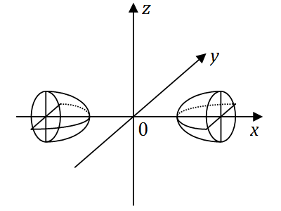

# 2008年全国硕士研究生招生考试数学一真题
> 本真题试卷来源于权威公开考研真题题库整理，包含全部题目、完整选项、高清插图、专业标签及详细参考答案与解析。
---

## 选择题

### 【M1-08-C-T01】第 1 题

设函数
$f(x)=\int_0^{x^2} \ln(2+t)dt$
，则
$f′(x)$
的零点个数为（）。

- **A.** 0
- **B.** 1
- **C.** 2
- **D.** 3

> **【唯一编号】** `M1-08-C-T01`
> **【题型】** 选择题
> **【科目】** 微积分
> **【分值】** 4分
> **【年份】** 2008年
> **【考点】** 一元函数微分学、导数与微分的计算

<b>💡 查看参考答案与解析</b>

**【参考答案】** B

**【解析】**

**正确答案：B**

f′(x)=[ln(2+x2)]⋅2x
，
$f′(0)=0$
，即
$x=0$
是
$f′(x)$
的一个零点。

又
$f′′(x)=2ln(2+x2)+2+x24x2>0$
，从而
$f′(x)$
单调递增
$(x∈(−∞,+∞))$
。

所以
$f′(x)$
只有一个零点。

---

### 【M1-08-C-T02】第 2 题

函数
$f(x,y)=arctanyx$
在点
$(0,1)$
处的梯度等于 ( )

- **A.** i
- **B.** −i
- **C.** j
- **D.** −j

> **【唯一编号】** `M1-08-C-T02`
> **【题型】** 选择题
> **【科目】** 微积分
> **【分值】** 4分
> **【年份】** 2008年
> **【考点】** 多元函数微分学、方向导数和梯度

<b>💡 查看参考答案与解析</b>

**【参考答案】** A

**【解析】**

**正确答案：A**

因为
$fx′=1+x2/y21/y$
，
$fy′=1+x2/y2−x/y2$
，

所以
$fx′(0,1)=1$
，
$fy′(0,1)=0$
，

因此
$gradf(0,1)=1⋅i+0⋅j=i$
。

---

### 【M1-08-C-T03】第 3 题

在下列微分方程中，以
$y=C1ex+C2cos2x+C3sin2x$
（
$C1$
、
$C2$
、
$C3$
为任意常数）为通解的是（ ）

- **A.** y′′′+y′′−4y′−4y=0
- **B.** y′′′+y′′+4y′+4y=0
- **C.** y′′′−y′′−4y′+4y=0
- **D.** y′′′−y′′+4y′−4y=0

> **【唯一编号】** `M1-08-C-T03`
> **【题型】** 选择题
> **【科目】** 微积分
> **【分值】** 4分
> **【年份】** 2008年
> **【考点】** 常微分方程、常系数齐次线性微分方程

<b>💡 查看参考答案与解析</b>

**【参考答案】** D

**【解析】**

**正确答案：D**

由微分方程的通解中含有
$ex$
、
$cos2x$
、
$sin2x$
可知，齐次线性方程所对应的特征方程有根
$r=1$
，
$r=±2i$
。

因此，特征方程为：

$$
(r−1)(r−2i)(r+2i)=0
$$

展开得：

$$
r3−r2+4r−4=0
$$

故以已知函数为通解的微分方程为：

$$
y′′′−y′′+4y′−4y=0
$$

---

### 【M1-08-C-T04】第 4 题

设函数
$f(x)$
在
$(−∞,+∞)$
内单调有界，
${xn}$
为数列，下列命题正确的是（　　）

- **A.** 若
${xn}$
收敛,则
${f(xn)}$
收敛
- **B.** 若
${xn}$
单调,则
${f(xn)}$
收敛
- **C.** 若
${f(xn)}$
收敛,则
${xn}$
收敛
- **D.** 若
${f(xn)}$
单调,则
${xn}$
收敛

> **【唯一编号】** `M1-08-C-T04`
> **【题型】** 选择题
> **【科目】** 微积分
> **【分值】** 4分
> **【年份】** 2008年
> **【考点】** 函数、极限、连续、函数的连续性

<b>💡 查看参考答案与解析</b>

**【参考答案】** B

**【解析】**

**正确答案：B**因为
$f(x)$
在
$(−∞,+∞)$
内单调有界，且
${xn}$
单调，所以
${f(xn)}$
单调且有界，故
${f(xn)}$
一定存在极限。

---

### 【M1-08-C-T05】第 5 题

设
$A$
为
$n$
阶非零矩阵，
$E$
为
$n$
阶单位矩阵，若
$A3=0$
，则（ ）

- **A.** E−A
不可逆,
$E+A$
不可逆
- **B.** E−A
不可逆,
$E+A$
可逆
- **C.** E−A
可逆,
$E+A$
可逆
- **D.** E−A
可逆,
$E+A$
不可逆

> **【唯一编号】** `M1-08-C-T05`
> **【题型】** 选择题
> **【科目】** 线性代数
> **【分值】** 4分
> **【年份】** 2008年
> **【考点】** 矩阵、伴随矩阵与可逆矩阵

<b>💡 查看参考答案与解析</b>

**【参考答案】** C

**【解析】**

**正确答案：C** (E−A)(E+A+A2)=E−A3=E
， (E+A)(E−A+A2)=E+A3=E
，故
$E−A$
与
$E+A$
均可逆。

---

### 【M1-08-C-T06】第 6 题

设二次型
$f(x,y,z)=XTAX$
（
$X=(x,y,z)T$
）的图形如图，则
$A$
的正特征值个数为（ ）

- **A.** 0
- **B.** 1
- **C.** 2
- **D.** 3

> **【唯一编号】** `M1-08-C-T06`
> **【题型】** 选择题
> **【科目】** 线性代数
> **【分值】** 4分
> **【年份】** 2008年
> **【考点】** 二次型

<b>💡 查看参考答案与解析</b>

**【参考答案】** B

**【解析】**

**正确答案：B**

图示的二次曲面为双叶双曲面，其方程为

$$
a2x′2−b2y′2−c2z′2=1,
$$

即二次型的标准形为

$$
f=a2x′2−b2y′2−c2z′2.
$$

因此，正惯性指数为
$1$
，说明矩阵
$A$
的正特征值个数为
$1$
。

---

### 【M1-08-C-T07】第 7 题

设随机变量
$X$
、
$Y$
独立同分布，且
$X$
的分布函数为
$F(x)$
，则
$Z=max{X,Y}$
的分布函数为（  ）

- **A.** F2(x)
- **B.** F(x)F(y)
- **C.** 1−[1−F(x)]2
- **D.** [1−F(x)][1−F(y)]

> **【唯一编号】** `M1-08-C-T07`
> **【题型】** 选择题
> **【科目】** 概率论与数理统计
> **【分值】** 4分
> **【年份】** 2008年
> **【考点】** 随机变量及其分布

<b>💡 查看参考答案与解析</b>

**【参考答案】** A

**【解析】**

**正确答案：A** FZ(x)=P(Z≤x)=P{max{X,Y}≤x}=P(X≤x)P(Y≤x)=F(x)F(x)=F2(x)

---

### 【M1-08-C-T08】第 8 题

设随机变量
$X∼N(0,1)$
，
$Y∼N(1,4)$
且相关系数
$ρXY=1$
，则()

- **A.** P{Y=−2X−1}=1
- **B.** P{Y=2X−1}=1
- **C.** P{Y=−2X+1}=1
- **D.** P{Y=2X+1}=1

> **【唯一编号】** `M1-08-C-T08`
> **【题型】** 选择题
> **【科目】** 概率论与数理统计
> **【分值】** 4分
> **【年份】** 2008年
> **【考点】** 随机变量的数字特征、协方差与相关系数

<b>💡 查看参考答案与解析</b>

**【参考答案】** D

**【解析】**

**正确答案：D**

用排除法，设
$Y=aX+b$
。由
$ρXY=1$
，可知
$X$
与
$Y$
正相关，得
$a>0$
，排除 (A) 和 (C)。由
$X∼N(0,1)$
，
$Y∼N(1,4)$
，得
$E(X)=0$
，
$E(Y)=1$
。于是

$$
E(Y)=E(aX+b)=aE(X)+b=a×0+b=1,
$$

所以
$b=1$
，排除 (B)。故选择 (D)。

---

## 填空题

### 【M1-08-F-T09】第 9 题

（填空题）微分方程
$xy′+y=0$
满足条件
$y(1)=1$
的解是
$y=$

> **【唯一编号】** `M1-08-F-T09`
> **【题型】** 填空题
> **【科目】** 微积分
> **【分值】** 4分
> **【年份】** 2008年
> **【考点】** 常微分方程、可分离变量的微分方程与齐次方程

<b>💡 查看参考答案与解析</b>

**【解析】**

**【答案】**
$y=x1$

**【解析】** 由
$dxdy=x−y$
分离变量积分得 −ln∣y∣=ln∣x∣+C1
，所以
$∣y∣1=∣x∣⋅C$
。

又
$y(1)=1$
，所以
$y=x1$
。

---

### 【M1-08-F-T10】第 10 题

（填空题）曲线
$sin(xy)+ln(y−x)=x$
在点
$(0,1)$
处的切线方程为

> **【唯一编号】** `M1-08-F-T10`
> **【题型】** 填空题
> **【科目】** 微积分
> **【分值】** 4分
> **【年份】** 2008年
> **【考点】** 一元函数微分学、导数的几何意义

<b>💡 查看参考答案与解析</b>

**【解析】**

**【答案】**
$y=x+1$

**【解析】** 设
$F(x,y)=sin(xy)+ln(y−x)−x$
，则

$$
dxdy=−Fy′Fx′=−xcos(xy)+y−x1ycos(xy)−y−x1−1
$$

将
$y(0)=1$
代入得

$$
dxdyx=0=1
$$

故切线方程为

$$
y−1=x−0
$$

即

$$
y=x+1
$$

---

### 【M1-08-F-T11】第 11 题

（填空题）已知幂级数
$∑n=0∞an(x+2)n$
在
$x=0$
处收敛，在
$x=−4$
处发散，则幂级数
$∑n=0∞an(x−3)n$
的收敛域为（）

> **【唯一编号】** `M1-08-F-T11`
> **【题型】** 填空题
> **【科目】** 微积分
> **【分值】** 4分
> **【年份】** 2008年
> **【考点】** 无穷级数、求幂级数的收敛半径、收敛区间和收敛域

<b>💡 查看参考答案与解析</b>

**【解析】**

**【答案】**
$(1,5]$

**【解析】**幂级数
$∑n=0∞an(x+2)n$
的收敛区间以
$x=−2$
为中心。由于该级数在
$x=0$
处收敛，在
$x=−4$
处发散，因此其收敛半径为
$2$
，收敛域为
$(−4,0]$
。即当
$−2<x+2≤2$
时级数收敛，亦即
$∑n=0∞antn$
的收敛半径为
$2$
，收敛域为
$(−2,2]$
。

对于
$∑n=0∞an(x−3)n$
，其收敛半径仍为
$2$
。由
$−2<x−3≤2$
可得
$1<x≤5$
，因此幂级数
$∑n=0∞an(x−3)n$
的收敛域为
$(1,5]$
。

---

### 【M1-08-F-T12】第 12 题

（填空题）设曲面
$Σ$
是
$z=4−x2−y2$
的上侧，则
$∬Σxydydz+xdzdx+x2dxdy=$

> **【唯一编号】** `M1-08-F-T12`
> **【题型】** 填空题
> **【科目】** 微积分
> **【分值】** 4分
> **【年份】** 2008年
> **【考点】** 多元函数积分学、第二类曲面积分

<b>💡 查看参考答案与解析</b>

**【解析】**

**【答案】** 4π

**【解析】** 给定曲面
$∑1:z=0$
（其中
$x2+y2≤4$
）的下侧，记
$∑$
与
$∑1$
所围成的空间区域为
$Ω$
。

则原式可表示为：

$$
∬∑+∑1(xydydz+xdzdx+x2dxdy)−∬∑1(xydydz+xdzdx+x2dxdy)
$$

利用高斯公式，第一项化为：

$$
∭Ωydxdydz
$$

第二项由于
$∑1$
取下侧，其法向量与
$z$
轴反向，故：

$$
∬x2+y2≤4x2dxdy
$$

因此原式等于：

$$
∭Ωydxdydz−(−∬x2+y2≤4x2dxdy)
$$

由于
$Ω$
关于
$x$
轴对称且被积函数
$y$
为奇函数，故：

$$
∭Ωydxdydz=0
$$

剩余部分为：

$$
∬x2+y2≤4x2dxdy
$$

利用对称性：

$$
∬x2+y2≤4x2dxdy=21∬x2+y2≤4(x2+y2)dxdy
$$

转换为极坐标：

$$
21∫02πdθ∫02r3dr=21⋅2π⋅416=4π
$$

最终结果为：

$$
4π
$$

---

### 【M1-08-F-T13】第 13 题

（填空题）设
$A$
为
$2$
阶矩阵，
$α1$
，
$α2$
为线性无关的
$2$
维列向量，
$Aα1=0$
，
$Aα2=2α1+α2$
，则
$A$
的非零特征值为（）

> **【唯一编号】** `M1-08-F-T13`
> **【题型】** 填空题
> **【科目】** 线性代数
> **【分值】** 4分
> **【年份】** 2008年
> **【考点】** 矩阵、矩阵的特征值与特征向量

<b>💡 查看参考答案与解析</b>

**【解析】**

**【答案】** 1

**【解析】** 由
$A(α1,α2)=(α1,α2)(0021)$
，记
$P=(α1,α2)$
，
$B=(0021)$
，则
$A$
与
$B$
相似。

由
$∣λE−B∣=λ(λ−1)=0$
，得
$B$
的特征值为
$0$
和
$1$
，故
$A$
的非零特征值为
$1$
。

---

### 【M1-08-F-T14】第 14 题

（填空题）设随机变量
$X$
服从参数为
$1$
的泊松分布，则
$P{X=EX2}=$
______

> **【唯一编号】** `M1-08-F-T14`
> **【题型】** 填空题
> **【科目】** 概率论与数理统计
> **【分值】** 4分
> **【年份】** 2008年
> **【考点】** 随机变量及其分布

<b>💡 查看参考答案与解析</b>

**【解析】**

**【答案】**
$2e1$

**【解析】** 由
$DX=EX2−(EX)2$
，
$X$
服从参数为 1 的泊松分布，故
$DX=EX=1$
。

所以
$EX2=1+1=2$
，则
$P{X=2}=2!12e−1=2e1$
。

---

## 解答题

### 【M1-08-A-T15】第 15 题

（本题满分 9 分）

求极限

$$
x→0limx4[sinx−sin(sinx)]sinx
$$

> **【唯一编号】** `M1-08-A-T15`
> **【题型】** 解答题
> **【科目】** 微积分
> **【分值】** 9分
> **【年份】** 2008年
> **【考点】** 函数、极限、连续、函数极限的计算

<b>💡 查看参考答案与解析</b>

**【解析】**

**【答案】**
$61$

**【解析】** 方法一：

$$
x→0limx4[sinx−sin(sinx)]sinx=x→0limx3sinx−sin(sinx)=x→0lim3x2cosx−cos(sinx)cosx=x→0lim3x21−cos(sinx)=x→0lim3x221sin2x=61
$$

方法二：

$$
∵sinxsin(sinx)=x−61x3+o(x3),=sinx−61sin3x+o(sin3x)
$$

$$
∴x→0limx4[sinx−sin(sinx)]sinx=x→0lim[6x4sin4x+x4o(sin4x)]=61
$$

---

### 【M1-08-A-T16】第 16 题

（本题满分 9 分）

计算曲线积分
$∫Lsin2xdx+2(x2−1)ydy$
，其中
$L$
是曲线
$y=sinx$
上从点
$(0,0)$
到点
$(π,0)$
的一段。

> **【唯一编号】** `M1-08-A-T16`
> **【题型】** 解答题
> **【科目】** 微积分
> **【分值】** 9分
> **【年份】** 2008年
> **【考点】** 多元函数积分学、第二类曲线积分

<b>💡 查看参考答案与解析</b>

**【解析】**

**【答案】**
$−2π2$

**【解析】** **方法一**：（直接取
$x$
为参数，将对坐标的曲线积分化成定积分计算）

$$
∫Lsin2xdx+2(x2−1)ydy=∫0π[sin2x+2(x2−1)sinx⋅cosx]dx=∫0πx2sin2xdx=−2x2cos2x0π+∫0πxcos2xdx=−2π2+2xsin2x0π−21∫0πsin2xdx=−2π2
$$

**方法二**：（添加
$x$
轴上的直线段，用格林公式化成二重积分计算）

取
$L1$
为
$x$
轴上从点
$(π,0)$
到点
$(0,0)$
的一段，
$D$
是由
$L$
与
$L1$
围成的区域。

$$
∫Lsin2xdx+2(x2−1)ydy=∫L+L1sin2xdx+2(x2−1)ydy−∫L1sin2xdx+2(x2−1)ydy=−∬D4xydxdy−∫π0sin2xdx=−∫0πdx∫0sinx4xydy−21cos2x0π=−∫0π2xsin2xdx=−∫0πx(1−cos2x)dx=−2x20π+2xsin2x0π−21∫0πsin2xdx=−2π2
$$

**方法三**：（将其拆成
$∫Lsin2xdx−2ydy+∫L2x2ydy$
，前者与路径无关，选择沿
$x$
轴上的直线段积分，后者化成定积分计算）

$$
∫Lsin2xdx+2(x2−1)ydy=∫Lsin2xdx−2ydy+∫L2x2ydy=I1+I2
$$

对于
$I1$
，因为
$∂y∂P=∂x∂Q=0$
，故曲线积分与路径无关，取
$(0,0)$
到
$(π,0)$
的直线段积分。

$$
I1=∫0πsin2xdx=0
$$

$$
I2=∫L2x2ydy=∫0π2x2sinxcosxdx=∫0πx2sin2xdx=−21∫0πx2dcos2x=−21x2cos2x0π+21∫0π2xcos2xdx=−21π2+21∫0πxdsin2x=−21π2+21[xsin2x+21cos2x]0π=−21π2
$$

所以，原式
$=−21π2$
。

---

### 【M1-08-A-T17】第 17 题

（本题满分 11 分）

已知曲线
$C:{x2+y2−2z2=0x+y+3z=5$
，求曲线
$C$
距离
$XOY$
面最远的点和最近的点。

> **【唯一编号】** `M1-08-A-T17`
> **【题型】** 解答题
> **【科目】** 微积分
> **【分值】** 11分
> **【年份】** 2008年
> **【考点】** 多元函数积分学、重积分的应用

<b>💡 查看参考答案与解析</b>

**【解析】**

**【答案】** 最远点为
$(−5,−5,5)$
，最近点为
$(1,1,1)$
。

**【解析】**

点
$(x,y,z)$
到
$xOy$
面的距离为
$∣z∣$
，故求
$C$
上距离
$xOy$
面的最远点和最近点的坐标，等价于求函数
$H=z2$
在条件
$x2+y2−2z2=0$
与
$x+y+3z=5$
下的最大值点和最小值点。

令

$$
L(x,y,z,λ,μ)=z2+λ(x2+y2−2z2)+μ(x+y+3z−5)
$$

则有

$$
⎩⎨⎧Lx′=2λx+μ=0Ly′=2λy+μ=0Lz′=2z−4λz+3μ=0x2+y2−2z2=0x+y+3z=5(1)(2)(3)(4)(5)
$$

由 (1) 和 (2) 得
$x=y$
，代入 (4) 和 (5) 得

$$
{x2−z2=02x+3z=5
$$

解得

$$
⎩⎨⎧x=−5y=−5z=5或⎩⎨⎧x=1y=1z=1
$$

---

### 【M1-08-A-T18】第 18 题

（本题满分 10 分）

设
$f(x)$
是连续函数，

(1) 利用定义证明函数
$F(x)=\int_0^x \f(t)dt$
可导，且
$F′(x)=f(x)$
；

(2) 当
$f(x)$
是以
$2$
为周期的周期函数时，证明函数
$G(x)=2\int_0^x \f(t)dt−x∫02f(t)dt$
也是以
$2$
为周期的周期函数。

> **【唯一编号】** `M1-08-A-T18`
> **【题型】** 解答题
> **【科目】** 微积分
> **【分值】** 10分
> **【年份】** 2008年
> **【考点】** 一元函数积分学、变限积分

<b>💡 查看参考答案与解析</b>

**【解析】**

**【答案】** 见解析

**【解析】**(1) 对任意的
$x$
，由于
$f$
是连续函数，所以

$$
Δx→0limΔxF(x+Δx)−F(x)=Δx→0limΔx∫0x+Δxf(t)dt−∫0xf(t)dt=Δx→0limΔx∫xx+Δxf(t)dt=Δx→0limΔxf(ξ)Δx=Δx→0limf(ξ),ξxx+Δx
$$

由于
$limΔx→0f(ξ)=f(x)$
，可知函数
$F(x)$
在
$x$
处可导，且
$F′(x)=f(x)$
。

(2) 方法一：要证明
$G(x)$
以
$2$
为周期，即要证明对任意的
$x$
，都有
$G(x+2)=G(x)$
。令
$H(x)=G(x+2)−G(x)$
，则

$$
H′(x)=(2∫0x+2f(t)dt−(x+2)∫02f(t)dt)′−(2∫0xf(t)dt−x∫02f(t)dt)′=2f(x+2)−∫02f(t)dt−2f(x)+∫02f(t)dt=0
$$

又因为

$$
H(0)=G(2)−G(0)=(2∫02f(t)dt−2∫02f(t)dt)−0=0
$$

所以
$H(x)=0$
，即
$G(x+2)=G(x)$
。

方法二：由于
$f$
是以
$2$
为周期的连续函数，所以对任意的
$x$
，有

$$
G(x+2)−G(x)=2∫0x+2f(t)dt−(x+2)∫02f(t)dt−2∫0xf(t)dt+x∫02f(t)dt=2[∫02f(t)dt+∫2x+2f(t)dt−∫0xf(t)dt]=2[−∫0xf(t)dt+∫0xf(u+2)du]=2∫0x[f(t+2)−f(t)]dt=0
$$

即
$G(x)$
是以
$2$
为周期的周期函数。

---

### 【M1-08-A-T19】第 19 题

（本题满分
$11$
分）

将
$f(x)=1−x2(0≤x≤π)$
展开为余弦级数，并求级数
$∑n=1∞n2(−1)n−1$
的和。

> **【唯一编号】** `M1-08-A-T19`
> **【题型】** 解答题
> **【科目】** 微积分
> **【分值】** 11分
> **【年份】** 2008年
> **【考点】** 无穷级数、傅里叶级数

<b>💡 查看参考答案与解析</b>

**【解析】**

**【答案】**
$∑n=1∞n2(−1)n−1=12π2$

**【解析】**由于

$$
a0=π2∫0π(1−x2)dx=2−32π2,
$$

$$
an=π2∫0π(1−x2)cosnxdx=(−1)n+1n24(n=1,2,…),
$$

所以

$$
f(x)=2a0+n=1∑∞ancosnx=1−3π2+4n=1∑∞n2(−1)n+1cosnx(0≤x≤π).
$$

令
$x=0$
，有

$$
f(0)=1−3π2+4n=1∑∞n2(−1)n+1.
$$

又
$f(0)=1$
，所以

$$
n=1∑∞n2(−1)n+1=12π2.
$$

---

### 【M1-08-A-T20】第 20 题

（本题满分 10 分）

设
$α,β$
为 3 维列向量，矩阵
$A=ααT+ββT$
，其中
$αT,βT$
分别是
$α,β$
的转置。证明：

（Ⅰ）
$r(A)≤2$
；

（Ⅱ）若
$α,β$
线性相关，则秩
$r(A)<2$
。

> **【唯一编号】** `M1-08-A-T20`
> **【题型】** 解答题
> **【科目】** 线性代数
> **【分值】** 10分
> **【年份】** 2008年
> **【考点】** 矩阵、矩阵的秩

<b>💡 查看参考答案与解析</b>

**【解析】**

**【答案】** 见解析

**【解析】**

(I) 我们有 r(A)=r(ααT+ββT)≤r(ααT)+r(ββT)≤r(α)+r(β)≤2
。

(II) 由于
$α$
、
$β$
线性相关，不妨设
$α=kβ$
。于是 r(A)=r(ααT+ββT)=r((1+k2)ββT)≤r(β)≤1<2
。

---

### 【M1-08-A-T21】第 21 题

（本题满分 12 分）

设
$n$
元线性方程组
$Ax=b$
，其中

$$
A=2aa212aa212a⋱⋱⋱a212a,x=x1x2⋮xn,b=10⋮0.
$$

(Ⅰ) 证明行列式
$∣A∣=(n+1)an$
；

(Ⅱ) 当
$a$
为何值时，该方程组有唯一解，并求
$x1$
；

(Ⅲ) 当
$a$
为何值时，该方程组有无穷多解，并求通解。

> **【唯一编号】** `M1-08-A-T21`
> **【题型】** 解答题
> **【科目】** 线性代数
> **【分值】** 12分
> **【年份】** 2008年
> **【考点】** 矩阵、伴随矩阵与可逆矩阵

<b>💡 查看参考答案与解析</b>

**【解析】**

**【答案】**（Ⅰ）见解析（Ⅱ）当
$a=0$
时，方程组有唯一解，且
$x1=(n+1)an （Ⅲ）当$
$a=0$
时，方程组有无穷多解，且通解为
$x=010⋮0+k100⋮0$
，其中
$k$
为任意常数。

**【解析】**（Ⅰ）**证明**记

$$
Dn=∣A∣=2aa212aa212a⋱⋱⋱a212an,
$$

下面用数学归纳法证明
$Dn=(n+1)an$
。

当
$n=1$
时，
$D1=2a$
，结论成立。

当
$n=2$
时，

$$
D2=2aa212a=3a2,
$$

结论成立。

假设结论对小于
$n$
的情况成立，将
$Dn$
按第一行展开，得

$$
Dn=2aDn−1−a2012aa212a⋱⋱⋱a212an−1.
$$

第二个行列式等于

$$
a2Dn−2,
$$

因此

$$
Dn=2aDn−1−a2Dn−2.
$$

代入归纳假设

$$
Dn−1=nan−1,Dn−2=(n−1)an−2,
$$

得

$$
Dn=2a⋅nan−1−a2⋅(n−1)an−2=(n+1)an.
$$

故

$$
∣A∣=(n+1)an.
$$

---

（Ⅱ）**解**当
$a=0$
时，方程组系数行列式
$Dn=0$
，故方程组有唯一解。

由 Cramer 法则，将
$Dn$
的第一列换成
$b$
，得行列式

$$
Δ1=10a212a2a⋱11⋱a2⋱2aa212an.
$$

按第一列展开，等于

$$
2aa212aa212a⋱⋱⋱a212an−1=Dn−1.
$$

已知

$$
Dn−1=nan−1,
$$

因此

$$
x1=DnΔ1=(n+1)annan−1=(n+1)an.
$$

---

（Ⅲ）**解**当
$a=0$
时，方程组化为

$$
0101⋱⋱010x1x2⋮xn−1xn=10⋮00.
$$

系数矩阵的秩与增广矩阵的秩均为
$n−1$
，方程组有无穷多解，通解为

$$
x=(0,1,0,…,0)T+k(1,0,0,…,0)T,
$$

其中
$k$
为任意常数。

---

### 【M1-08-A-T22】第 22 题

（本题满分 11 分）

设随机变量
$X$
与
$Y$
相互独立，
$X$
的概率分布为
$P{X=i}=31(i=−1,0,1)$
，
$Y$
的概率密度为

$$
fY(y)={1,0,0≤y<1其他
$$

记
$Z=X+Y$
。

(Ⅰ) 求
$P{Z≤21X=0}$
；

(Ⅱ) 求
$Z$
的概率密度
$fZ(z)$
。

> **【唯一编号】** `M1-08-A-T22`
> **【题型】** 解答题
> **【科目】** 概率论与数理统计
> **【分值】** 11分
> **【年份】** 2008年
> **【考点】** 多维随机变量及其分布、边缘分布和条件分布

<b>💡 查看参考答案与解析</b>

**【解析】**

**【答案】**(Ⅰ)
$P{Z≤21X=0}=21 (Ⅱ)$
$fZ(z)={31,0,−1≤z<2其他$

**【解析】**(1)

$$
P{Z≤21X=0}=P(X+Y≤21X=0)=P(X=0)P(X=0,Y≤21)=P(Y≤21)=∫0211dy=21.
$$

(2)

$$
FZ(z)=P{Z≤z}=P{X+Y≤z}=31[P{Y≤z+1}+P{Y≤z}+P{Y≤z−1}]=31[FY(z+1)+FY(z)+FY(z−1)],
$$

所以

$$
fZ(z)=31[fY(z+1)+fY(z)+fY(z−1)]={31,0,−1≤z<2,otherwise.
$$

---

### 【M1-08-A-T23】第 23 题

（本题满分 11 分）

设
$X1,X2,⋯,Xn$
是总体
$N(μ,σ2)$
的简单随机样本，记

Xˉ=n1∑i=1nXi
，
$S2=n−11∑i=1n(Xi−Xˉ)2$
，
$T=Xˉ2−n1S2$
。

（Ⅰ）证明
$T$
是
$μ2$
的无偏估计量；

（Ⅱ）当
$μ=0$
，
$σ=1$
时，求
$D(T)$
。

> **【唯一编号】** `M1-08-A-T23`
> **【题型】** 解答题
> **【科目】** 概率论与数理统计
> **【分值】** 11分
> **【年份】** 2008年
> **【考点】** 参数估计与假设检验、估计量的无偏性

<b>💡 查看参考答案与解析</b>

**【解析】**

**【答案】**（Ⅰ）见解析（Ⅱ）
$D(T)=n(n−1)2$

**【解析】**(1) 因为
$X∼N(μ,σ2)$
，所以
$Xˉ∼N(μ,nσ2)$
，从而
$EXˉ=μ$
，
$DXˉ=nσ2$
。

于是有：

$$
E(T)=E(Xˉ2−n1S2)=EXˉ2−n1E(S2)=DXˉ+(EXˉ)2−n1E(S2)=n1σ2+μ2−n1σ2=μ2,
$$

因此
$T$
是
$μ2$
的无偏估计量。

(2) 方法一：由
$D(T)=ET2−(ET)2$
，当
$μ=0$
，
$σ=1$
时，
$E(T)=0$
，
$E(S2)=σ2=1$
。

计算可得：

$$
E(Xˉ4)=n23,ES4=n−1n+1,
$$

于是：

$$
ET2=n23−n2⋅n1⋅1+n21⋅n−1n+1=n(n−1)2,
$$

即
$D(T)=n(n−1)2$
。

方法二：当
$μ=0$
，
$σ=1$
时，有：

$$
D(T)=D(Xˉ2−n1S2)=DXˉ2+n21DS2.
$$

进一步计算：

$$
DXˉ2=n21D(nXˉ)2=n21⋅2,
$$

$$
DS2=(n−1)21D[(n−1)S2]=(n−1)21⋅2(n−1)=n−12,
$$

所以：

$$
D(T)=n22+n21⋅n−12=n(n−1)2.
$$

---
