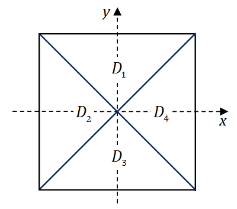
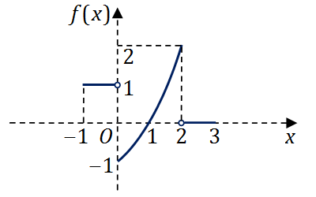
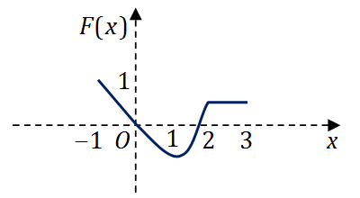
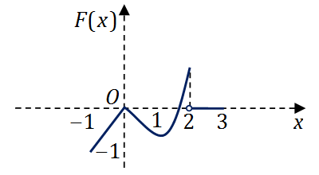
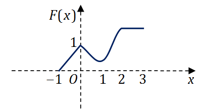
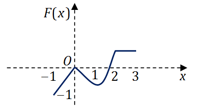

# 2009年全国硕士研究生招生考试数学一真题
> 本真题试卷来源于权威公开考研真题题库整理，包含全部题目、完整选项、高清插图、专业标签及详细参考答案与解析。
---

## 选择题

### 【M1-09-C-T01】第 1 题

当
$x→0$
时，
$f(x)=x−sinax$
与
$g(x)=x2ln(1−bx)$
等价无穷小，则

- **A.** a=1,b=−61
- **B.** a=1,b=61
- **C.** a=−1,b=−61
- **D.** a=−1,b=61

> **【唯一编号】** `M1-09-C-T01`
> **【题型】** 选择题
> **【科目】** 微积分
> **【分值】** 4分
> **【年份】** 2009年
> **【考点】** 函数、极限、连续、无穷小量的比较

<b>💡 查看参考答案与解析</b>

**【参考答案】** A

**【解析】**

**正确答案：A**

f(x)=x−sinax
，
$g(x)=x2ln(1−bx)$
为等价无穷小，则

$$
x→0limg(x)f(x)=x→0limx2ln(1−bx)x−sinax=x→0limx2⋅(−bx)x−sinax=洛必达x→0lim−3bx21−acosax=洛必达x→0lim−6bxa2sinax=x→0lim−a6b⋅axa2sinax=−6ba3=1⇒a3=−6b
$$

另外，
$\lim_{x \to 0}−3bx21−acosax$
存在，蕴含
$1−acosax→0(x→0)$
，故
$a=1$
，排除 (D)。

所以本题选 (A)。

---

### 【M1-09-C-T02】第 2 题

如图，正方形
${(x,y)∣∣x∣≤1,∣y∣≤1}$
被其对角线划分为四个区域
$Dk(k=1,2,3,4)$
，
$Ik=∬Dkycosxdxdy$
，则
$max1≤k≤4{∣Ik∣}=()$

- **A.** I1
- **B.** I2
- **C.** I3
- **D.** I4

> **【唯一编号】** `M1-09-C-T02`
> **【题型】** 选择题
> **【科目】** 微积分
> **【分值】** 4分
> **【年份】** 2009年
> **【考点】** 多元函数积分学、重积分的概念与性质

<b>💡 查看参考答案与解析</b>

**【参考答案】** A

**【解析】**

**正确答案：A**

本题利用二重积分区域的对称性及被积函数的奇偶性。

D2
、
$D4$
两区域关于
$x$
轴对称，而
$f(x,−y)=−ycosx=−f(x,y)$
，即被积函数是关于
$y$
的奇函数，所以
$I2=I4=0$
。

D1
、
$D3$
两区域关于
$y$
轴对称，而
$f(−x,y)=ycos(−x)=ycosx=f(x,y)$
，即被积函数是关于
$x$
的偶函数，因此：

$$
I1=2∬{(x,y)∣y≥x,0≤x≤1}ycosxdxdy>0
$$

$$
I3=2∬{(x,y)∣y≤−x,0≤x≤1}ycosxdxdy
$$

在
$I3$
的积分区域内，
$y≤−x≤0$
且
$cosx>0$
，故
$I3≤0$
。

因此，最大值为
$I1$
。

---

### 【M1-09-C-T03】第 3 题

设函数
$y=f(x)$
在区间
$[−1,3]$
上的图形如下图所示，则函数
$F(x)=\int_0^x \f(t)dt$
的图形为

###### A

###### B

###### C

###### D

> **【唯一编号】** `M1-09-C-T03`
> **【题型】** 选择题
> **【科目】** 微积分
> **【分值】** 4分
> **【年份】** 2009年
> **【考点】** 一元函数积分学、变限积分

<b>💡 查看参考答案与解析</b>

**【参考答案】** D

**【解析】**

**正确答案：D**

此题为定积分的应用知识考核。由
$y=f(x)$
的图形可见，其图像与
$x$
轴、
$y$
轴及
$x=x0$
所围图形的代数面积为所求函数
$F(x)$
，从而可得出以下几个方面的特征：

- 当
$x∈[0,1]$
时，
$F(x)≤0$
，且单调递减；
- 当
$x∈[1,2]$
时，
$F(x)$
单调递增；
- 当
$x∈[2,3]$
时，
$F(x)$
为常函数；
- 当
$x∈[−1,0]$
时，
$F(x)≤0$
，为线性函数，且单调递增；
- 由于
$F(x)$
为连续函数，结合上述特点，可见正确选项为 (D)。

---

### 【M1-09-C-T04】第 4 题

设有两个数列
${an}$
，
${bn}$
，若
$\lim_{n \to ∞}an=0$
，则

- **A.** 当
$∑n=1∞bn$
收敛时，
$∑n=1∞anbn$
收敛
- **B.** 当
$∑n=1∞bn$
发散时，
$∑n=1∞anbn$
发散
- **C.** 当
$∑n=1∞∣bn∣$
收敛时，
$∑n=1∞an2bn2$
收敛
- **D.** 当
$∑n=1∞∣bn∣$
发散时，
$∑n=1∞an2bn2$
发散

> **【唯一编号】** `M1-09-C-T04`
> **【题型】** 选择题
> **【科目】** 微积分
> **【分值】** 4分
> **【年份】** 2009年
> **【考点】** 无穷级数、常数项级数敛散性的判定

<b>💡 查看参考答案与解析</b>

**【参考答案】** C

**【解析】**

**正确答案：C**

方法一：举反例：

(A) 取
$an=bn=(−1)nn1$
，此时
$∑bn$
收敛但
$∑anbn=∑n1$
发散，故 (A) 错误；

(B) 取
$an=bn=n1$
，此时
$∑bn$
发散但
$∑anbn=∑n21$
收敛，故 (B) 错误；

(D) 取
$an=bn=n1$
，此时
$∑∣bn∣$
发散但
$∑an2bn2=∑n41$
收敛，故 (D) 错误；

方法二：

因为
$limn→∞an=0$
，则由定义可知
$∃N1$
，使得
$n>N1$
时，有
$∣an∣<1$
。

又因为
$∑n=1∞∣bn∣$
收敛，可得
$limn→∞∣bn∣=0$
，则由定义可知
$∃N2$
，使得
$n>N2$
时，有
$∣bn∣<1$
。

从而，当
$n>N1+N2$
时，有
$an2bn2<∣bn∣$
，则由正项级数的比较判别法可知
$∑n=1∞an2bn2$
收敛。

故答案为 (C)。

---

### 【M1-09-C-T05】第 5 题

设
$α1$
、
$α2$
、
$α3$
是 3 维向量空间
$R3$
的一组基，则由基
$α1$
、
$21α2$
、
$31α3$
到基
$α1+α2$
、
$α2+α3$
、
$α3+α1$
的过渡矩阵为

- **A.** 120023103
- **B.** 101220033
- **C.** 21−21214141−41−616161
- **D.** 2141−61−21416121−4161

> **【唯一编号】** `M1-09-C-T05`
> **【题型】** 选择题
> **【科目】** 线性代数
> **【分值】** 4分
> **【年份】** 2009年
> **【考点】** 向量、向量组之间的线性表示

<b>💡 查看参考答案与解析</b>

**【参考答案】** A

**【解析】**

**正确答案：A**

因为
$(η1,η2,⋯,ηn)=(α1,α2,⋯,αn)A$
，则
$A$
称为基
$α1,α2,⋯,αn$
到
$η1,η2,⋯,ηn$
的过渡矩阵。

则由基
$α1$
、
$21α2$
、
$31α3$
到
$α1+α2$
、
$α2+α3$
、
$α3+α1$
的过渡矩阵
$M$
满足：

$$
(α1+α2,α2+α3,α3+α1)=(α1,21α2,31α3)M=(α1,21α2,31α3)120023103
$$

所以此题选（A）。

---

### 【M1-09-C-T06】第 6 题

设
$A$
，
$B$
均为 2 阶矩阵，
$A∗$
，
$B∗$
分别为
$A$
，
$B$
的伴随矩阵。若
$∣A∣=2$
，
$∣B∣=3$
，则分块矩阵
$(OBAO)$
的伴随矩阵为

- **A.** (O2A∗3B∗O)
- **B.** (O3A∗2B∗O)
- **C.** (O2B∗3A∗O)
- **D.** (O3B∗2A∗O)

> **【唯一编号】** `M1-09-C-T06`
> **【题型】** 选择题
> **【科目】** 线性代数
> **【分值】** 4分
> **【年份】** 2009年
> **【考点】** 矩阵、伴随矩阵与可逆矩阵

<b>💡 查看参考答案与解析</b>

**【参考答案】** B

**【解析】**

**正确答案：B**

根据
$CC∗=∣C∣E$
，若
$C$
可逆，则
$C∗=∣C∣C−1$
。

分块矩阵

$$
(OBAO)
$$

的行列式为

$$
(OBAO)=(−1)2×2∣A∣∣B∣=2×3=6,
$$

即矩阵可逆。

于是有

$$
(OBAO)∗=OBAO(OBAO)−1=6(OA−1B−1O)=6(O∣A∣1A∗∣B∣1B∗O)=6(O21A∗31B∗O)=(O3A∗2B∗O).
$$

故答案为 (B)。

---

### 【M1-09-C-T07】第 7 题

设随机变量
$X$
的分布函数为
$F(x)=0.3Φ(x)+0.7Φ(2x−1)$
，其中
$Φ(x)$
为标准正态分布函数，则
$EX=$

- **A.** 0
- **B.** 0.3
- **C.** 0.7
- **D.** 1

> **【唯一编号】** `M1-09-C-T07`
> **【题型】** 选择题
> **【科目】** 概率论与数理统计
> **【分值】** 4分
> **【年份】** 2009年
> **【考点】** 随机变量的数字特征、数学期望与方差

<b>💡 查看参考答案与解析</b>

**【参考答案】** C

**【解析】**

**正确答案：C**

因为
$F(x)=0.3Φ(x)+0.7Φ(2x−1)$
，所以

$$
F′(x)=0.3Φ′(x)+20.7Φ′(2x−1).
$$

于是，

$$
EX=∫−∞+∞xF′(x)dx=∫−∞+∞x[0.3Φ′(x)+0.35Φ′(2x−1)]dx=0.3∫−∞+∞xΦ′(x)dx+0.35∫−∞+∞xΦ′(2x−1)dx.
$$

而
$\int_{-\infty}^{+\infty} xΦ′(x) \, dx=0$
。

令
$2x−1=u$
，则

$$
∫−∞+∞xΦ′(2x−1)dx=2∫−∞+∞(2u+1)Φ′(u)du=2(2×0+1)=2.
$$

所以，

$$
EX=0+0.35×2=0.7.
$$

---

### 【M1-09-C-T08】第 8 题

设随机变量
$X$
与
$Y$
相互独立，且
$X$
服从标准正态分布
$N(0,1)$
，
$Y$
的概率分布为
$P{Y=0}=P{Y=1}=21$
，记
$FZ(z)$
为随机变量
$Z=XY$
的分布函数，则函数
$FZ(z)$
的间断点个数为

- **A.** 0
- **B.** 1
- **C.** 2
- **D.** 3

> **【唯一编号】** `M1-09-C-T08`
> **【题型】** 选择题
> **【科目】** 概率论与数理统计
> **【分值】** 4分
> **【年份】** 2009年
> **【考点】** 多维随机变量及其分布、二维随机变量及其分布

<b>💡 查看参考答案与解析</b>

**【参考答案】** B

**【解析】**

**正确答案：B**

$$
FZ(z)=P(XY≤z)=P(XY≤z∣Y=0)P(Y=0)+P(XY≤z∣Y=1)P(Y=1)=21[P(X⋅0≤z∣Y=0)+P(X≤z∣Y=1)]=21[P(0≤z)+P(X≤z)]
$$

由于
$X$
与
$Y$
相互独立，因此：

(1) 若
$z<0$
，则
$FZ(z)=21Φ(z)$
；

(2) 若
$z≥0$
，则
$FZ(z)=21(1+Φ(z))$
。

在
$z=0$
处，左极限为
$21Φ(0)$
，右极限为
$21(1+Φ(0))$
。

由于
$Φ(0)=21$
，左右极限不相等，故
$z=0$
为间断点，因此选择 (B)。

---

## 填空题

### 【M1-09-F-T09】第 9 题

（填空题）设函数
$f(u,v)$
具有连续偏导数，
$z=f(x,xy)$
，则
$∂x∂y∂2z=$

> **【唯一编号】** `M1-09-F-T09`
> **【题型】** 填空题
> **【科目】** 微积分
> **【分值】** 4分
> **【年份】** 2009年
> **【考点】** 多元函数微分学、偏导数的概念与计算

<b>💡 查看参考答案与解析</b>

**【解析】**

**【答案】**
$xf12′′+f2′+xyf22′′$

**【解析】**

$$
∂x∂z=f1′+f2′⋅y
$$

$$
∂x∂y∂2z=xf12′′+f2′+yx⋅f22′′=xf12′′+f2′+xyf22′′
$$

---

### 【M1-09-F-T10】第 10 题

（填空题）若二阶常系数线性齐次微分方程
$y′′+ay′+by=0$
的通解为
$y=(C1+C2x)ex$
，则非齐次方程
$y′′+ay′+by=x$
满足条件
$y(0)=2$
，
$y′(0)=0$
的解为
$y=$

> **【唯一编号】** `M1-09-F-T10`
> **【题型】** 填空题
> **【科目】** 微积分
> **【分值】** 4分
> **【年份】** 2009年
> **【考点】** 常微分方程、常系数非齐次线性微分方程

<b>💡 查看参考答案与解析</b>

**【解析】**

**【答案】**
$y=−xex+x+2$

**【解析】**已知
$y=(c1+c2x)ex$
，可得
$λ1=λ2=1$
，因此
$a=−2$
，
$b=1$
。对应的微分方程为
$y′′−2y′+y=x$
。

设特解
$y∗=Ax+B$
，代入方程得
$y′=A$
，
$y′′=0$
。代入原方程：

$$
−2A+(Ax+B)=x
$$

比较系数得
$A=1$
，
$−2+B=0$
，解得
$B=2$
。因此特解为
$y∗=x+2$
，通解为

$$
y=(c1+c2x)ex+x+2
$$

代入初始条件
$y(0)=2$
，
$y′(0)=0$
：

$$
y(0)=c1+2=2⇒c1=0
$$

$$
y′=c2ex+(c1+c2x)ex+1
$$

代入
$x=0$
，
$y′(0)=c2+c1+1=0$
，结合
$c1=0$
得
$c2=−1$
。

因此所求特解为

$$
y=−xex+x+2
$$

---

### 【M1-09-F-T11】第 11 题

（填空题）已知曲线
$L:y=x2(0≤x≤2)$
，则
$∫Lxds=$
______

> **【唯一编号】** `M1-09-F-T11`
> **【题型】** 填空题
> **【科目】** 微积分
> **【分值】** 4分
> **【年份】** 2009年
> **【考点】** 一元函数积分学、定积分的应用

<b>💡 查看参考答案与解析</b>

**【解析】**

**【答案】**
$613$

**【解析】** 由题意可知，
$x=x$
，
$y=x2$
，且
$0≤x≤2$
。

则弧长微元为：

$$
ds=(x′)2+(y′)2dx=1+4x2dx
$$

因此所求积分为：

$$
∫Lxds=∫02x1+4x2dx
$$

利用凑微分法：

$$
∫02x1+4x2dx=81∫021+4x2d(1+4x2)
$$

计算得：

$$
81⋅32(1+4x2)302=121[(1+8)3/2−1]=121(27−1)=1226=613
$$

故：

$$
∫Lxds=613
$$

---

### 【M1-09-F-T12】第 12 题

（填空题）设
$Ω={(x,y,z)∣x2+y2+z2≤1}$
，则
$∭Ωz2dxdydz=$

> **【唯一编号】** `M1-09-F-T12`
> **【题型】** 填空题
> **【科目】** 微积分
> **【分值】** 4分
> **【年份】** 2009年
> **【考点】** 多元函数积分学、重积分的计算

<b>💡 查看参考答案与解析</b>

**【解析】**

**【答案】**
$154π$

**【解析】**方法一：

$$
∭z2dxdydz=∫02πdθ∫0πdφ∫01ρ2sinφ⋅ρ2cos2φdρ
$$

$$
=2π⋅[−3cos3φ]0π⋅51=154π
$$

方法二：由轮换对称性可知

$$
∭Ωz2dxdydz=∭Ωx2dxdydz=∭Ωy2dxdydz
$$

因此

$$
32π∫0πsinφdφ∫01r4dr=154π
$$

---

### 【M1-09-F-T13】第 13 题

（填空题）若
$3$
维列向量
$α$
、
$β$
满足
$αTβ=2$
，其中
$αT$
为
$α$
的转置，则矩阵
$βαT$
的非零特征值为。

> **【唯一编号】** `M1-09-F-T13`
> **【题型】** 填空题
> **【科目】** 线性代数
> **【分值】** 4分
> **【年份】** 2009年
> **【考点】** 矩阵、矩阵的特征值与特征向量

<b>💡 查看参考答案与解析</b>

**【解析】**

**【答案】** 2

**【解析】**因为
$αTβ=2$
，所以

$$
βαTβ=β(αTβ)=2⋅β
$$

故
$βαT$
的非零特征值为
$2$
。

---

### 【M1-09-F-T14】第 14 题

（填空题）设
$X1$
，
$X2$
，
$⋯$
，
$Xm$
为来自二项分布总体
$B(n,p)$
的简单随机样本，
$Xˉ$
和
$S2$
分别为样本均值和样本方差，若
$Xˉ+kS2$
为
$np2$
的无偏估计量，则
$k=$

> **【唯一编号】** `M1-09-F-T14`
> **【题型】** 填空题
> **【科目】** 概率论与数理统计
> **【分值】** 4分
> **【年份】** 2009年
> **【考点】** 参数估计与假设检验、矩估计和最大似然估计

<b>💡 查看参考答案与解析</b>

**【解析】**

**【答案】** -1

**【解析】**因为
$Xˉ+kS2$
是
$np2$
的无偏估计，所以有

$$
E(Xˉ+kS2)=np2.
$$

代入期望得

$$
np+knp(1−p)=np2.
$$

两边同时除以
$n$
并化简得

$$
p+kp(1−p)=p2,
$$

即

$$
1+k(1−p)=p.
$$

整理得

$$
k(1−p)=p−1,
$$

因此

$$
k=−1.
$$

---

## 解答题

### 【M1-09-A-T15】第 15 题

（本题满分 9 分）

求二元函数
$f(x,y)=x2(2+y2)+ylny$
的极值。

> **【唯一编号】** `M1-09-A-T15`
> **【题型】** 解答题
> **【科目】** 微积分
> **【分值】** 9分
> **【年份】** 2009年
> **【考点】** 多元函数微分学、多元函数的极值问题

<b>💡 查看参考答案与解析</b>

**【解析】**

**【答案】** 极小值为
$−e1$
，在点
$(0,e1)$
处取得。

**【解析】**求二元函数
$f(x,y)=x2(2+y2)+ylny$
的极值。

解析
$fx′(x,y)=2x(2+y2)=0$
， fy′(x,y)=2x2y+lny+1=0
，故
$x=0$
，
$y=e1$
。

二阶偏导数为：

$$
fxx′′=2(2+y2),fyy′′=2x2+y1,fxy′′=4xy.
$$

在点
$(0,e1)$
处有：

$$
fxx′′∣(0,e1)=2(2+e21),fxy′′(0,e1)=0,fyy′′(0,e1)=e.
$$

由于
$fxx′′>0$
，且
$(fxy′′)2−fxx′′fyy′′<0$
，因此二元函数在极小值
$f(0,e1)=−e1$
处取得极小值。

---

### 【M1-09-A-T16】第 16 题

（本题满分
$9$
分）

设
$an$
为曲线
$y=xn$
与
$y=xn+1$
（
$n=1,2,…$
）所围成区域的面积，记
$S1=∑n=1∞an$
，
$S2=∑n=1∞a2n−1$
，求
$S1$
与
$S2$
的值。

> **【唯一编号】** `M1-09-A-T16`
> **【题型】** 解答题
> **【科目】** 微积分
> **【分值】** 9分
> **【年份】** 2009年
> **【考点】** 一元函数积分学、定积分的应用

<b>💡 查看参考答案与解析</b>

**【解析】**

**【答案】**
$S1=21$
,
$S2=1−ln2$

**【解析】** 由题意，
$y=xn$
与
$y=xn+1$
（
$n=1,2,…$
）在点
$x=0$
和
$x=1$
处相交。

所以

$$
an=∫01(xn−xn+1)dx=(n+11xn+1−n+21xn+2)01=n+11−n+21.
$$

从而

$$
S1=n=1∑∞an=N→∞limn=1∑Nan=N→∞lim(21−31+⋯+N+11−N+21)=N→∞lim(21−N+21)=21.
$$

又

$$
S2=n=1∑∞a2n−1=n=1∑∞(2n1−2n+11)=(21−31+⋯+2N1−2N+11)=21−31+41−51+61−⋯
$$

由
$ln(1+x)=x−21x2+⋯+(−1)n−1nxn+⋯$
，取
$x=1$
得

$$
ln2=1−(21−31+41−⋯)=1−S2⇒S2=1−ln2.
$$

---

### 【M1-09-A-T17】第 17 题

（本题满分 11 分）

曲面
$S1$
是椭圆
$4x2+3y2=1$
绕
$x$
轴旋转而成，圆锥面
$S2$
是过点
$(4,0)$
且与椭圆
$4x2+3y2=1$
相切的直线绕
$x$
轴旋转而成。

(I) 求
$S1$
及
$S2$
的方程；

(II) 求
$S1$
与
$S2$
之间的立体体积。

> **【唯一编号】** `M1-09-A-T17`
> **【题型】** 解答题
> **【科目】** 微积分
> **【分值】** 11分
> **【年份】** 2009年
> **【考点】** 多元函数积分学、重积分的应用

<b>💡 查看参考答案与解析</b>

**【解析】**

**【答案】**(I)
$S1$
的方程为
$4x2+3y2+z2=1$
，
$S2$
的方程为
$y2+z2=(21x−2)2$
。(II)
$π$

解析】**（I）
$S1$
的方程为
$4x2+3y2+z2=1$
。过点
$(4,0)$
与椭圆
$4x2+3y2=1$
的切线为
$y=±(21x−2)$
，因此
$S2$
的方程为
$y2+z2=(21x−2)2$
。

（II）
$S1$
与
$S2$
之间的体积等于一个底面半径为
$23$
、高为
$3$
的圆锥体积
$49π$
与部分椭球体积
$V$
之差。其中
$V=43π∫12(4−x2)dx=45π$
，故所求体积为
$49π−45π=π$
。

---

### 【M1-09-A-T18】第 18 题

（本题满分 11 分）

(I) 证明拉格朗日中值定理：若函数
$f(x)$
在
$[a,b]$
上连续，在
$(a,b)$
内可导，则存在
$ξ∈(a,b)$
，使得
$f(b)−f(a)=f′(ξ)(b−a)$
。

(II) 证明：若函数
$f(x)$
在
$x=0$
处连续，在
$(0,δ)(δ>0)$
内可导，且
$\lim_{x \to 0}+f′(x)=A$
，则
$f+′(0)$
存在，且
$f+′(0)=A$
。

> **【唯一编号】** `M1-09-A-T18`
> **【题型】** 解答题
> **【科目】** 微积分
> **【分值】** 11分
> **【年份】** 2009年
> **【考点】** 一元函数微分学、微分中值定理

<b>💡 查看参考答案与解析</b>

**【解析】**

**【答案】** 见解析

**【解析】** (I) 作辅助函数
$φ(x)=f(x)−f(a)−b−af(b)−f(a)(x−a)$
，易验证
$φ(x)$
满足
$φ(a)=φ(b)$
；
$φ(x)$
在闭区间
$[a,b]$
上连续，在开区间
$(a,b)$
内可导，且
$φ′(x)=f′(x)−b−af(b)−f(a)$
。

根据罗尔定理，可得在
$(a,b)$
内至少有一点
$ξ$
，使
$φ′(ξ)=0$
，即

$$
f′(ξ)−b−af(b)−f(a)=0,∴f(b)−f(a)=f′(ξ)(b−a).
$$

(II) 任取
$x0∈(0,δ)$
，则函数
$f(x)$
满足：在闭区间
$[0,x0]$
上连续，开区间
$(0,x0)$
内可导。

从而由拉格朗日中值定理可得：存在
$ξx0∈(0,x0)⊂(0,δ)$
，使得

$$
f′(ξx0)=x0−0f(x0)−f(0).⋯⋯(∗)
$$

又由于
$\lim_{x \to 0}+f′(x)=A$
，对上式（
$∗$
式）两边取
$x0→0+$
时的极限可得：

$$
f+′(0)=x0→0+limx0−0f(x0)−f(0)=x0→0+limf′(ξx0)=ξx0→0+limf′(ξx0)=A.
$$

故
$f+′(0)$
存在，且
$f+′(0)=A$
。

---

### 【M1-09-A-T19】第 19 题

（本题满分
$10$
分）

计算曲面积分

$$
I=∬∑(x2+y2+z2)23xdydz+ydzdx+zdxdy
$$

，
其中
$∑$
是曲面
$2x2+2y2+z2=4$
的外侧。

> **【唯一编号】** `M1-09-A-T19`
> **【题型】** 解答题
> **【科目】** 微积分
> **【分值】** 10分
> **【年份】** 2009年
> **【考点】** 多元函数积分学、第二类曲面积分

<b>💡 查看参考答案与解析</b>

**【解析】**

**【答案】**
$4π$

**【解析】** 考虑曲面积分

$$
I=∬Σ(x2+y2+z2)3/2xdydz+ydxdz+zdxdy,
$$

其中曲面
$Σ$
由方程
$2x2+2y2+z2=4$
给出。

计算偏导数如下：

$$
∂x∂((x2+y2+z2)3/2x)=(x2+y2+z2)5/2y2+z2−2x2,
$$

$$
∂y∂((x2+y2+z2)3/2y)=(x2+y2+z2)5/2x2+z2−2y2,
$$

$$
∂z∂((x2+y2+z2)3/2z)=(x2+y2+z2)5/2x2+y2−2z2.
$$

将以上三式相加，得

$$
∂x∂((x2+y2+z2)3/2x)+∂y∂((x2+y2+z2)3/2y)+∂z∂((x2+y2+z2)3/2z)=0.
$$

由于被积函数及其偏导数在点
$(0,0,0)$
处不连续，作封闭曲面（外侧） ∑1:x2+y2+z2=R2
（
$0<R<1$
），将原点包含在内，则

$$
∬∑=∬∑1(x2+y2+z2)3/2xdydz+ydxdz+zdxdy.
$$

在
$∑1$
上，有
$x2+y2+z2=R2$
，所以

$$
∬∑=∬∑1R3xdydz+ydxdz+zdxdy.
$$

由高斯公式（散度定理），

$$
∬∑1R3xdydz+ydxdz+zdxdy=R31∭Ω3dV,
$$

其中
$Ω$
是由
$∑1$
所围成的球体。于是

$$
R31∭Ω3dV=R33⋅34πR3=4π.
$$

---

### 【M1-09-A-T20】第 20 题

（本题满分 11 分）

设
$A=1−10−11−4−11−2$
，
$ξ1=−11−2$
。

(I) 求满足
$Aξ2=ξ1$
的所有向量
$ξ2$
，
$A2ξ3=ξ1$
的所有向量
$ξ3$
；

(II) 对 (I) 中的任意向量
$ξ2$
，
$ξ3$
，证明
$ξ1$
，
$ξ2$
，
$ξ3$
线性无关。

> **【唯一编号】** `M1-09-A-T20`
> **【题型】** 解答题
> **【科目】** 线性代数
> **【分值】** 11分
> **【年份】** 2009年
> **【考点】** 线性方程组

<b>💡 查看参考答案与解析</b>

**【解析】**

**【答案】**(I) 满足
$Aξ2=ξ1$
的所有向量
$ξ2$
为
$ξ2=k11−12+001$
，其中
$k1$
为任意常数。满足
$A2ξ3=ξ1$
的所有向量
$ξ3$
为
$ξ3=k2−110+k3001+−2100$
，其中
$k2,k3$
为任意常数。(II) 见解析。

**【解析】**(I) 解方程
$Aξ2=ξ1$
，其中

$$
(A,ξ1)=1−10−11−4−11−2−11−2→100−102−101−101→100−120−110−110.
$$

由于
$r(A)=2$
，故有一个自由变量。令
$x3=2$
，由
$Ax=0$
解得
$x2=−1$
，
$x1=1$
。求特解时，令
$x1=x2=0$
，得
$x3=1$
，故

$$
ξ2=k11−12+001,
$$

其中
$k1$
为任意常数。

解方程
$A2ξ3=ξ1$
，其中

$$
A2=2−242−24000,
$$

$$
(A2,ξ1)=2−242−24000−11−2→100100000−2100.
$$

故有两个自由变量。令
$x2=0$
，
$x3=t$
（
$t$
为任意常数），由
$A2x=0$
得
$x1=−x2=0$
。取特解为
$−2100$
，故

$$
ξ3=k2−110+k3001+−2100,
$$

其中
$k2,k3$
为任意常数。

(II) 证明：设
$k1ξ1+k2ξ2+k3ξ3=0$
，即

$$
k1−11−2+k2k1′1−12+001+k3k2′−110+k3′001+−2100=000.
$$

整理后可得关于
$k1,k2,k3$
的线性方程组，其系数行列式为

$$
−11−2001−2100=−1⋅(0⋅0−1⋅(−21))−0+(−21)⋅(1⋅1−0⋅(−2))=−21+(−21)=−1=0.
$$

故
$ξ1,ξ2,ξ3$
线性无关。

---

### 【M1-09-A-T21】第 21 题

（本题满分 11 分）设二次型

$$
f(x1,x2,x3)=ax12+ax22+(a−1)x32+2x1x3−2x2x3
$$

（I）求二次型
$f$
的矩阵的所有特征值；（II）若二次型
$f$
的规范形为
$y12+y22$
，求
$a$
的值。

> **【唯一编号】** `M1-09-A-T21`
> **【题型】** 解答题
> **【科目】** 线性代数
> **【分值】** 11分
> **【年份】** 2009年
> **【考点】** 二次型

<b>💡 查看参考答案与解析</b>

**【解析】**

**【答案】**（I）二次型
$f$
的矩阵的所有特征值为
$a$
，
$a−2$
，
$a+1$
。（II）
$a=2$
。

**【解析】**（I）设矩阵 A=a010a−11−1a−1
。计算特征多项式：

$$
∣λE−A∣=λ−a0−10λ−a1−11λ−a+1=(λ−a)λ−a11λ−a+1−0−1λ−a1=(λ−a)[(λ−a)(λ−a+1)−1]−[0+(λ−a)]=(λ−a)[(λ−a)(λ−a+1)−2]=(λ−a)[λ2−2aλ+λ+a2−a−2]=(λ−a){[aλ+21(1−2a)]2−49}=(λ−a)(λ−a+2)(λ−a−1)
$$

因此，特征值为

$$
λ1=a,λ2=a−2,λ3=a+1
$$

（II）若规范形为
$y12+y22$
，说明有两个正特征值，一个零特征值。分情况讨论：

- 若
$λ1=a=0$
，则
$λ2=−2<0$
，
$λ3=1>0$
，不符合题意。
- 若
$λ2=0$
，即
$a=2$
，则
$λ1=2>0$
，
$λ3=3>0$
，符合题意。
- 若
$λ3=0$
，即
$a=−1$
，则
$λ1=−1<0$
，
$λ2=−3<0$
，不符合题意。

综上所述，
$a=2$
。

---

### 【M1-09-A-T22】第 22 题

（本题满分 11 分）袋中有
$1$
个红色球、
$2$
个黑色球与
$3$
个白球，现有放回地从袋中取两次，每次取一球，以
$X$
、
$Y$
、
$Z$
分别表示两次取球所取得的红球、黑球与白球的个数。

(I) 求
$P{X=1∣Z=0}$
；

(II) 求二维随机变量
$(X,Y)$
的概率分布。

> **【唯一编号】** `M1-09-A-T22`
> **【题型】** 解答题
> **【科目】** 概率论与数理统计
> **【分值】** 11分
> **【年份】** 2009年
> **【考点】** 多维随机变量及其分布、二维随机变量及其分布

<b>💡 查看参考答案与解析</b>

**【解析】**

**【答案】**(I)
$P{X=1∣Z=0}=94 (II) 二维随机变量$
$(X,Y)$
的概率分布为：

$$
X∖Y0120416136113191029100
$$

**【解析】**(I) 在没有取白球的情况下取了一次红球，利用压缩样本空间则相当于只有
$1$
个红球、
$2$
个黑球放回摸两次，其中摸了一个红球。因此，

$$
P(X=1∣Z=0)=C31⋅C31C21×2=94.
$$

(II)
$X$
、
$Y$
的取值范围为
$0,1,2$
，故

$$
P(X=0,Y=0)=C61⋅C61C31⋅C31=41,P(X=1,Y=0)=C61⋅C61C21⋅C31=61,P(X=2,Y=0)=C61⋅C611=361,P(X=0,Y=1)=C61⋅C61C21⋅C21⋅C31=31,P(X=1,Y=1)=C61⋅C61C21⋅C21=91,P(X=2,Y=1)=0,P(X=0,Y=2)=C61⋅C61C21⋅C21=91,P(X=1,Y=2)=0,P(X=2,Y=2)=0.
$$

联合分布表如下：

$$
X∖Y0120416136113191029100
$$

---

### 【M1-09-A-T23】第 23 题

（本题满分 11 分）设总体
$X$
的概率密度为

$$
f(x)={λ2xe−λx,0,x>0其他
$$

其中参数
$λ(λ>0)$
未知，
$X1,X2,⋯,Xn$
是来自总体
$X$
的简单随机样本。

(I) 求参数
$λ$
的矩估计量；(II) 求参数
$λ$
的最大似然估计量。

> **【唯一编号】** `M1-09-A-T23`
> **【题型】** 解答题
> **【科目】** 概率论与数理统计
> **【分值】** 11分
> **【年份】** 2009年
> **【考点】** 参数估计与假设检验、矩估计和最大似然估计

<b>💡 查看参考答案与解析</b>

**【解析】**

**【答案】**(I) 参数
$λ$
的矩估计量为
$λ^=Xˉ2$
。(II) 参数
$λ$
的最大似然估计量为
$λ^=Xˉ2$
。

**【解析】**(1) 由
$EX=Xˉ$
，而

$$
EX=∫0+∞λ2x2e−λxdx=λ2=Xˉ⇒λ^=Xˉ2
$$

为总体的矩估计量。

(2) 构造似然函数

$$
L(x1,⋯,xn;λ)=i=1∏nf(xi;λ)=λ2n⋅i=1∏nxi⋅e−λ∑i=1nxi.
$$

取对数

$$
lnL=2nlnλ+i=1∑nlnxi−λi=1∑nxi.
$$

令

$$
dλdlnL=0⇒λ2n−i=1∑nxi=0⇒λ=∑i=1nxi2n=n1∑i=1nxi2.
$$

故其最大似然估计量为
$λ^=Xˉ2$
。

---
