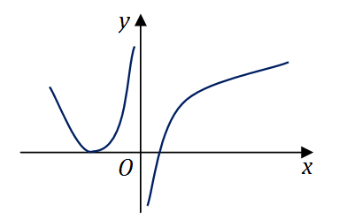

# 2015年全国硕士研究生招生考试数学一真题
> 本真题试卷来源于权威公开考研真题题库整理，包含全部题目、完整选项、高清插图、专业标签及详细参考答案与解析。
---

## 选择题

### 【M1-15-C-T01】第 1 题

设函数
$f(x)$
在
$(−∞,+∞)$
上连续，其二阶导数
$f′′(x)$
的图形如右图所示，则曲线
$y=f(x)$
在
$(−∞,+∞)$
的拐点个数为

- **A.** 0
- **B.** 1
- **C.** 2
- **D.** 3

> **【唯一编号】** `M1-15-C-T01`
> **【题型】** 选择题
> **【科目】** 微积分
> **【分值】** 4分
> **【年份】** 2015年
> **【考点】** 一元函数微分学、曲线的凹凸性、拐点及渐近线

<b>💡 查看参考答案与解析</b>

**【参考答案】** C

**【解析】**

**正确答案：C**

对于连续函数的曲线而言，拐点处的二阶导数等于零或者不存在。

从图上可以看出有两个二阶导数等于零的点，以及一个二阶导数不存在的点
$x=0$
。

对于这三个点，左边二阶导数等于零的点的两侧，二阶导数都是正的，因此对应的点不是拐点。

而另外两个点的两侧，二阶导数是异号的，对应的点才是拐点。

所以应该选 (C)。

---

### 【M1-15-C-T02】第 2 题

设
$y=21e2x+(x−31)ex$
是二阶常系数非齐次线性微分方程
$y′′+ay′+by=cex$
的一个特解，则

- **A.** a=−3,b=2,c=−1
- **B.** a=3,b=2,c=−1
- **C.** a=−3,b=2,c=1
- **D.** a=3,b=2,c=1

> **【唯一编号】** `M1-15-C-T02`
> **【题型】** 选择题
> **【科目】** 微积分
> **【分值】** 4分
> **【年份】** 2015年
> **【考点】** 常微分方程、常系数非齐次线性微分方程

<b>💡 查看参考答案与解析</b>

**【参考答案】** A

**【解析】**

**正确答案：A**

线性微分方程的特征方程为
$r2+ar+b=0$
，由特解可知
$r1=2$
一定是特征方程的一个实根。

如果
$r2=1$
不是特征方程的实根，则对应于
$f(x)=cex$
的特解形式应为
$Q(x)ex$
，其中
$Q(x)$
应是一个零次多项式，即常数，这与条件不符。

因此，
$r2=1$
也是特征方程的另一个实根。由韦达定理可得：

$$
a=−(2+1)=−3,b=2×1=2.
$$

同时，
$y∗=xex$
是原方程的一个解，代入可得
$c=−1$
，应选 (A)。

---

### 【M1-15-C-T03】第 3 题

若级数
$∑n=1∞an$
条件收敛，则
$x=3$
与
$x=3$
对于幂级数
$∑n=1∞nan(x−1)n$
的

- **A.** 收敛点，收敛点
- **B.** 收敛点，发散点
- **C.** 发散点，收敛点
- **D.** 发散点，发散点

> **【唯一编号】** `M1-15-C-T03`
> **【题型】** 选择题
> **【科目】** 微积分
> **【分值】** 4分
> **【年份】** 2015年
> **【考点】** 无穷级数、求幂级数的收敛半径、收敛区间和收敛域

<b>💡 查看参考答案与解析</b>

**【参考答案】** B

**【解析】**

**正确答案：B**

设幂级数
$∑n=1∞an$
条件收敛，表明幂级数
$∑n=1∞anxn$
在
$x=1$
处条件收敛，即该幂级数的收敛半径为
$1$
，故有：

$$
n→∞limanan+1=1.
$$

因此，对于幂级数
$∑n=1∞nan(x−1)n$
，其收敛半径为：

$$
R=n→∞lim(n+1)an+1nan=1,
$$

收敛区间为
$(0,2)$
。

显然，
$x=3$
位于收敛区间内，为收敛点；而
$x=3$
不在收敛区间内，为发散点。

因此，应选 (B)。

---

### 【M1-15-C-T04】第 4 题

设
$D$
是第一象限中由曲线
$2xy=1$
，
$4xy=1$
与直线
$y=x$
，
$y=3x$
所围成的平面区域，函数
$f(x,y)$
在
$D$
上连续，则

$$
∬Df(x,y)dxdy
$$

化为极坐标下的二次积分是

- **A.** ∫4π3πdθ∫2sin2θ1sin2θ1f(rcosθ,rsinθ)rdr
- **B.** ∫4π3πdθ∫sin2θ12sin2θ1f(rcosθ,rsinθ)rdr
- **C.** ∫4π3πdθ∫2sinθ1sinθ1f(rcosθ,rsinθ)dr
- **D.** ∫4π3πdθ∫sinθ12sinθ1f(rcosθ,rsinθ)dr

> **【唯一编号】** `M1-15-C-T04`
> **【题型】** 选择题
> **【科目】** 微积分
> **【分值】** 4分
> **【年份】** 2015年
> **【考点】** 多元函数积分学、交换积分次序与坐标系之间的转化

<b>💡 查看参考答案与解析</b>

**【参考答案】** A

**【解析】**

**正确答案：A**

积分区域如图所示，化成极坐标方程：

曲线
$2xy=1$
化为
$r2sin2θ=1$
，即
$r=2sin2θ1$
。

曲线
$4xy=1$
化为
$r2sin2θ=21$
，即
$r=sin2θ1$
。

直线
$y=x$
对应
$θ=4π$
，直线
$y=3x$
对应
$θ=3π$
。

因此，积分表达式为：

$$
∬Df(x,y)dxdy=∫4π3πdθ∫2sin2θ1sin2θ1f(rcosθ,rsinθ)rdr
$$

应该选 (A)。

---

### 【M1-15-C-T05】第 5 题

设矩阵
$A=1111241aa2$
，
$b=1dd2$
，若集合
$Ω={1,2}$
，则线性方程组
$Ax=b$
有无穷多解的充分必要条件是

- **A.** d∈/Ω
- **B.** d∈Ω
- **C.** d∈/Ω
且
$a∈Ω$
- **D.** d∈Ω
且
$a∈Ω$

> **【唯一编号】** `M1-15-C-T05`
> **【题型】** 选择题
> **【科目】** 线性代数
> **【分值】** 4分
> **【年份】** 2015年
> **【考点】** 线性方程组

<b>💡 查看参考答案与解析</b>

**【参考答案】** D

**【解析】**

**正确答案：D**

对线性方程组的增广矩阵进行初等行变换：方程组有无穷多解的充分必要条件是
$r(A)=r(A,b)<3$
，即

$$
(a−1)(a−2)=0且(d−1)(d−2)=0
$$

同时成立。因此，应选 (D)。

---

### 【M1-15-C-T06】第 6 题

设二次型
$f(x1,x2,x3)$
在正交变换
$x=Py$
下的标准形为
$2y12+y22−y32$
，其中
$P=(e1,e2,e3)$
，若
$Q=(e1,−e3,e2)$
，则
$f(x1,x2,x3)$
在
$x=Qy$
下的标准形为

- **A.** 2y12−y22+y32
- **B.** 2y12+y22−y32
- **C.** 2y12−y22−y32
- **D.** 2y12+y22+y32

> **【唯一编号】** `M1-15-C-T06`
> **【题型】** 选择题
> **【科目】** 线性代数
> **【分值】** 4分
> **【年份】** 2015年
> **【考点】** 二次型

<b>💡 查看参考答案与解析</b>

**【参考答案】** A

**【解析】**

**正确答案：A**

设
$Q=(e1,−e3,e2)=(e1,e2,e3)10000−1010=P10000−1010$
，则
$QT=1000010−10PT$
。

已知
$f=xTAx=yTPTAPy=yT21−1y$
，因此：

$$
QTAQ=1000010−10PTAP10000−1010=1000010−1021−110000−1010=2−11.
$$

故选择 (A)。

---

### 【M1-15-C-T07】第 7 题

若
$A$
，
$B$
为任意两个随机事件，则

- **A.** P(AB)≤P(A)P(B)
- **B.** P(AB)≥P(A)P(B)
- **C.** P(AB)≥2P(A)+P(B)
- **D.** P(AB)≥2P(A)+P(B)

> **【唯一编号】** `M1-15-C-T07`
> **【题型】** 选择题
> **【科目】** 概率论与数理统计
> **【分值】** 4分
> **【年份】** 2015年
> **【考点】** 随机事件和概率

<b>💡 查看参考答案与解析</b>

**【参考答案】** C

**【解析】**

**正确答案：C**

因为
$P(A)≥P(AB)$
且
$P(B)≥P(AB)$
，所以
$2P(AB)≤P(A)+P(B)$
，即
$P(AB)≤2P(A)+P(B)$
。

快速选 (C)。

---

### 【M1-15-C-T08】第 8 题

设随机变量
$X$
、
$Y$
不相关，且
$EX=2$
，
$EY=1$
，
$DX=3$
，则
$E(X(X+Y−2))=()$
。

- **A.** −3
- **B.** 3
- **C.** −5
- **D.** 5

> **【唯一编号】** `M1-15-C-T08`
> **【题型】** 选择题
> **【科目】** 概率论与数理统计
> **【分值】** 4分
> **【年份】** 2015年
> **【考点】** 随机变量的数字特征、数学期望与方差

<b>💡 查看参考答案与解析</b>

**【参考答案】** D

**【解析】**

**正确答案：D**

首先，计算期望
$E(X(X+Y−2))$
：

$$
E(X(X+Y−2))=E(X2)+E(XY)−2E(X)
$$

接着，利用方差与期望的关系
$D(X)=E(X2)−(E(X))2$
，代入
$E(X2)=D(X)+(E(X))2$
：

$$
E(X(X+Y−2))=D(X)+(E(X))2+E(XY)−2E(X)
$$

由于
$X$
与
$Y$
相互独立，有
$E(XY)=E(X)E(Y)$
，代入已知数值
$D(X)=3$
，
$E(X)=2$
，
$E(Y)=1$
：

$$
E(X(X+Y−2))=3+22+2×1−2×2
$$

计算得：

$$
3+4+2−4=5
$$

因此，答案为
$5$
，应选择 (D)。

---

## 填空题

### 【M1-15-F-T09】第 9 题

（填空题）
$\lim_{x \to 0}x2ln(cosx)=$
______

> **【唯一编号】** `M1-15-F-T09`
> **【题型】** 填空题
> **【科目】** 微积分
> **【分值】** 4分
> **【年份】** 2015年
> **【考点】** 函数、极限、连续、函数极限的计算

<b>💡 查看参考答案与解析</b>

**【解析】**

**【答案】**
$−21$

**【解析】** limx→0x2ln(cosx)=limx→02x−tanx=−21

---

### 【M1-15-F-T10】第 10 题

（填空题）
$∫−2π2π(1+cosxsinx+∣x∣)dx=$
______.

> **【唯一编号】** `M1-15-F-T10`
> **【题型】** 填空题
> **【科目】** 微积分
> **【分值】** 4分
> **【年份】** 2015年
> **【考点】** 一元函数积分学、定积分的计算

<b>💡 查看参考答案与解析</b>

**【解析】**

**【答案】**
$4π2$

**【解析】** 只要注意
$1+cosxsinx$
为奇函数，在对称区间上积分为零。

所以
$∫−2π2π(1+cosxsinx+∣x∣)dx=2∫02πxdx=4π2$

---

### 【M1-15-F-T11】第 11 题

（填空题）若函数
$z=z(x,y)$
是由方程
$ez+xyz+x+cosx=2$
确定，则
$dz∣(0,1)=$

> **【唯一编号】** `M1-15-F-T11`
> **【题型】** 填空题
> **【科目】** 微积分
> **【分值】** 4分
> **【年份】** 2015年
> **【考点】** 多元函数微分学、全微分的概念与计算

<b>💡 查看参考答案与解析</b>

**【解析】**

**【答案】**
$−dx$

**【解析】**

我们已知函数

$$
F(x,y,z)=ez+xyz+x+cosx−2
$$

其偏导数为：

$$
Fx′(x,y,z)=yz+1−sinx,Fy′(x,y,z)=xz,Fz′(x,y,z)=ez+xy
$$

在点
$(x,y,z)=(0,1,0)$
处，有：

$$
Fx′(0,1,0)=1⋅0+1−sin0=1,Fy′(0,1,0)=0,Fz′(0,1,0)=e0+0⋅1=1
$$

由隐函数求导公式：

$$
∂x∂z(0,1)=−Fz(0,1,0)Fx(0,1,0)=−1,
$$

$$
∂y∂z(0,1)=−Fz(0,1,0)Fy(0,1,0)=0
$$

因此，

$$
dz∣(0,1)=−1⋅dx+0⋅dy=−dx
$$

---

### 【M1-15-F-T12】第 12 题

（填空题）设
$Ω$
是由平面
$x+y+z=1$
和三个坐标面围成的空间区域，则

$$
∭Ω(x+2y+3z)dxdydz=
$$

> **【唯一编号】** `M1-15-F-T12`
> **【题型】** 填空题
> **【科目】** 微积分
> **【分值】** 4分
> **【年份】** 2015年
> **【考点】** 多元函数积分学、重积分的计算

<b>💡 查看参考答案与解析</b>

**【解析】**

**【答案】**
$41$

**【解析】** 【详解】注意在积分区域内，三个变量
$x$
、
$y$
、
$z$
具有轮换对称性，即

$$
∭Ωxdxdydz=∭Ωydxdydz=∭Ωzdxdydz
$$

因此，

$$
∭Ω(x+2y+3z)dxdydz=6∭Ωzdxdydz
$$

进一步计算：

$$
6∭Ωzdxdydz=6∫01zdz∬Dzdxdy
$$

其中，
$Dz$
为
$z$
固定时的截面区域，面积为
$(1−z)2$
，于是

$$
6∫01z(1−z)2dz=3∫01z(1−z)2dz
$$

计算该积分：

$$
3∫01z(1−z)2dz=3∫01(z−2z2+z3)dz=3[2z2−32z3+4z4]01=3(21−32+41)=41
$$

最终结果为
$41$
。

---

### 【M1-15-F-T13】第 13 题

（填空题）
$n$
阶行列式
$2−1⋮0002⋱00⋯⋯⋱⋯⋯00⋮2−122⋮22=$

> **【唯一编号】** `M1-15-F-T13`
> **【题型】** 填空题
> **【科目】** 线性代数
> **【分值】** 4分
> **【年份】** 2015年
> **【考点】** 行列式

<b>💡 查看参考答案与解析</b>

**【解析】**

**【答案】**

$$
Dn=2n+1−2
$$

**【解析】** 按照第一行展开，得

$$
Dn=2Dn−1+(−1)n+1⋅2(−1)n−1=2Dn−1+2,
$$

于是有

$$
Dn+2=2(Dn−1+2).
$$

已知
$D1=2$
，
$D2=6$
，可得

$$
Dn=2n+1−2.
$$

---

### 【M1-15-F-T14】第 14 题

（填空题）设二维随机变量
$(X,Y)$
服从正态分布
$N(1,0;1,1;0)$
，则
$P{XY−Y<0}=$

> **【唯一编号】** `M1-15-F-T14`
> **【题型】** 填空题
> **【科目】** 概率论与数理统计
> **【分值】** 4分
> **【年份】** 2015年
> **【考点】** 多维随机变量及其分布、二维随机变量及其分布

<b>💡 查看参考答案与解析</b>

**【解析】**

**【答案】**
$21$

**【解析】** 【详解】由于相关系数等于零，所以
$X$
、
$Y$
都服从正态分布，
$X∼N(1,1)$
，
$Y∼N(0,1)$
，且相互独立。因此，
$X−1∼N(0,1)$
。

$$
P{XY−Y<0}=P{Y(X−1)<0}
$$

由于
$Y$
与
$X−1$
相互独立，且均服从标准正态分布，可得：

$$
P{Y(X−1)<0}=P{Y<0,X−1>0}+P{Y>0,X−1<0}
$$

$$
=21×21+21×21=41+41=21
$$

---

## 解答题

### 【M1-15-A-T15】第 15 题

（本题满分 10 分）设函数
$f(x)=x+aln(1+x)+bxsinx$
，
$g(x)=kx3$
在
$x→0$
时为等价无穷小，求常数
$a,b,k$
的取值。

> **【唯一编号】** `M1-15-A-T15`
> **【题型】** 解答题
> **【科目】** 微积分
> **【分值】** 10分
> **【年份】** 2015年
> **【考点】** 函数、极限、连续、确定极限中的参数

<b>💡 查看参考答案与解析</b>

**【解析】**

**【答案】**
$a=−1$
，
$b=−21$
，
$k=−31$

**【解析】**
设函数
$f(x)=x+aln(1+x)+bxsinx$
与
$g(x)=kx3$
在
$x→0$
时为等价无穷小，即：

$$
x→0limg(x)f(x)=1
$$

代入
$f(x)$
和
$g(x)$
：

$$
x→0limkx3x+aln(1+x)+bxsinx=1
$$

等价于：

$$
x→0limx3x+aln(1+x)+bxsinx=k
$$

为确保极限存在，需使分子在
$x=0$
处的低阶项为零。首先计算
$f(0)$
：

$$
f(0)=0+aln1+b⋅0⋅sin0=0
$$

计算一阶导数
$f′(x)$
：

$$
f′(x)=1+a⋅1+x1+b(sinx+xcosx)
$$

在
$x=0$
处：

$$
f′(0)=1+a⋅1+b⋅0=1+a
$$

为使
$f(x)$
是比
$x$
更高阶的无穷小，需
$f′(0)=0$
，即：

$$
1+a=0⟹a=−1
$$

代入
$a=−1$
，得：

$$
f(x)=x−ln(1+x)+bxsinx
$$

计算二阶导数
$f′′(x)$
：

$$
f′(x)=1−1+x1+bsinx+bxcosx
$$

$$
f′′(x)=(1+x)21+bcosx+bcosx−bxsinx=(1+x)21+2bcosx−bxsinx
$$

在
$x=0$
处：

$$
f′′(0)=11+2b⋅1−0=1+2b
$$

为使
$f(x)$
是比
$x2$
更高阶的无穷小，需
$f′′(0)=0$
，即：

$$
1+2b=0⟹b=−21
$$

代入
$b=−21$
，得：

$$
f(x)=x−ln(1+x)−21xsinx
$$

现在求极限：

$$
x→0limx3f(x)=x→0limx3x−ln(1+x)−21xsinx
$$

使用泰勒展开：
$ln(1+x)=x−2x2+3x3−O(x4)$
，
$sinx=x−6x3+O(x5)$
，代入：

$$
x−ln(1+x)=x−(x−2x2+3x3−O(x4))=2x2−3x3+O(x4)
$$

$$
−21xsinx=−21x(x−6x3+O(x5))=−21x2+121x4+O(x6)
$$

相加：

$$
f(x)=(2x2−3x3)+(−21x2)+O(x4)=−3x3+O(x4)
$$

因此：

$$
x→0limx3f(x)=x→0limx3−3x3+O(x4)=−31
$$

故
$k=−31$
。

验证：

$$
x→0limg(x)f(x)=x→0limkx3f(x)=x→0lim−31x3f(x)=−31limx→0x3f(x)=−31−31=1
$$

满足等价无穷小条件。

因此，常数取值为
$a=−1$
，
$b=−21$
，
$k=−31$
。

---

### 【M1-15-A-T16】第 16 题

（本题满分 10 分）设函数
$y=f(x)$
在定义域
$I$
上的导数大于零，若对任意的
$x0∈I$
，曲线
$y=f(x)$
在点
$(x0,f(x0))$
处的切线与直线
$x=x0$
及
$x$
轴所围成区域的面积恒为 4，且
$f(0)=2$
，求
$f(x)$
的表达式。

> **【唯一编号】** `M1-15-A-T16`
> **【题型】** 解答题
> **【科目】** 微积分
> **【分值】** 10分
> **【年份】** 2015年
> **【考点】** 一元函数积分学、定积分的应用

<b>💡 查看参考答案与解析</b>

**【解析】**

**【答案】**
$y=4−x8$

**【解析】** 函数
$y=f(x)$
在点
$(x0,f(x0))$
处的切线方程为

$$
y=f′(x0)(x−x0)+f(x0)
$$

令
$y=0$
，解得

$$
x=x0−f′(x0)f(x0)
$$

曲线在该点处的切线与直线
$x=x0$
及
$x$
轴所围成区域的面积为

$$
S=21f(x0)x0−(x0−f′(x0)f(x0))=4
$$

整理得

$$
2f′(x0)f2(x0)=4
$$

即

$$
f′(x)=81f2(x)
$$

分离变量得

$$
f(x)1=C−81x
$$

由
$f(0)=2$
得
$C=21$
，所求函数表达式为

$$
y=4−x8
$$

---

### 【M1-15-A-T17】第 17 题

（本题满分 10 分）设函数
$f(x,y)=x+y+xy$
，曲线
$C:x2+y2+xy=3$
，求
$f(x,y)$
在曲线
$C$
上的最大方向导数。

> **【唯一编号】** `M1-15-A-T17`
> **【题型】** 解答题
> **【科目】** 微积分
> **【分值】** 10分
> **【年份】** 2015年
> **【考点】** 多元函数微分学、方向导数和梯度

<b>💡 查看参考答案与解析</b>

**【解析】**

**【答案】** 最大方向导数为 3

**【解析】** 函数
$f(x,y)=x+y+xy$
在
$(x,y)$
处的梯度为
$gradf=(1+y,1+x)$
，其模为
$∣gradf∣=(1+y)2+(1+x)2$
，此问题转化为求函数
$F(x,y)=(1+x)2+(1+y)2$
在条件
$C:x2+y2+xy=3$
下的条件极值。用拉格朗日乘子法，令
$L(x,y,λ)=(1+x)2+(1+y)2+λ(x2+y2+xy−3)$
，解方程组

$$
⎩⎨⎧Lx′=2(1+x)+(2x+y)λ=0Ly′=2(1+y)+(2y+x)λ=0x2+y2+xy=3
$$

可得在点
$(2,−1)$
或
$(−1,2)$
处方向导数取到最大，最大值为
$9=3$
。

---

### 【M1-15-A-T18】第 18 题

（本题满分 10 分）

(1) 设函数
$u(x)$
，
$v(x)$
都可导，利用导数定义证明
$(u(x)v(x))′=u′(x)v(x)+u(x)v′(x)$
；

(2) 设函数
$u1(x)$
，
$u2(x)$
，
$⋯$
，
$un(x)$
都可导，
$f(x)=u1(x)u2(x)⋯un(x)$
，写出
$f(x)$
的求导公式。

> **【唯一编号】** `M1-15-A-T18`
> **【题型】** 解答题
> **【科目】** 微积分
> **【分值】** 10分
> **【年份】** 2015年
> **【考点】** 一元函数微分学、导数与微分的计算

<b>💡 查看参考答案与解析</b>

**【解析】**

**【答案】**(1) 见解析(2)

$$
f′(x)=u1′(x)u2(x)⋯un(x)+u1(x)u2′(x)⋯un(x)+⋯+u1(x)u2(x)⋯un′(x)
$$

**【解析】**(1) 证明：设
$y=u(x)v(x)$
，则

$$
Δy=u(x+Δx)v(x+Δx)−u(x)v(x)=u(x+Δx)v(x+Δx)−u(x)v(x+Δx)+u(x)v(x+Δx)−u(x)v(x)=Δu⋅v(x+Δx)+u(x)⋅Δv,
$$

所以

$$
ΔxΔy=ΔxΔu⋅v(x+Δx)+u(x)⋅ΔxΔv.
$$

由导数的定义和可导与连续的关系，得

$$
y′=Δx→0limΔxΔy=u′(x)v(x)+u(x)v′(x).
$$

(2) 设
$f(x)=u1(x)u2(x)⋯un(x)$
，其求导公式为

$$
f′(x)=u1′(x)u2(x)⋯un(x)+u1(x)u2′(x)⋯un(x)+⋯+u1(x)u2(x)⋯un′(x).
$$

---

### 【M1-15-A-T19】第 19 题

（本题满分10分）已知曲线
$L$
的方程为

$$
{z=2−x2−y2z=x
$$

起点为
$A(0,2,0)$
，终点为
$B(0,−2,0)$
，计算曲线积分

$$
∫L(y+z)dx+(z2−x2+y)dy+(x2+y2)dz
$$

> **【唯一编号】** `M1-15-A-T19`
> **【题型】** 解答题
> **【科目】** 微积分
> **【分值】** 10分
> **【年份】** 2015年
> **【考点】** 多元函数积分学、第二类曲线积分

<b>💡 查看参考答案与解析</b>

**【解析】**

**【答案】**
$22π$

**【解析】** 曲线
$L$
的参数方程为

$$
⎩⎨⎧x=costy=2sintz=cost
$$

起点
$A(0,2,0)$
对应
$t=2π$
，终点为
$B(0,−2,0)$
对应
$t=−2π$
。

$$
∫L(y+z)dx+(z2−x2+y)dy+(x2+y2)dz
$$

$$
=∫2π−2π(2sint+cost)d(cost)+(2cost)d(2cost)+(2−cos2t)dcost
$$

$$
=22∫02πsin2tdt=22π
$$

---

### 【M1-15-A-T20】第 20 题

（本题满分 11 分）设向量组
$α1$
，
$α2$
，
$α3$
为向量空间
$R3$
的一组基，
$β1=2α1+2kα3$
，
$β2=2α2$
，
$β3=α1+(k+1)α3$
。

(1) 证明：向量组
$β1$
，
$β2$
，
$β3$
为向量空间
$R3$
的一组基；

(2) 当
$k$
为何值时，存在非零向量
$ξ$
，使得
$ξ$
在基
$α1$
，
$α2$
，
$α3$
和基
$β1$
，
$β2$
，
$β3$
下的坐标相同，并求出所有的非零向量。

> **【唯一编号】** `M1-15-A-T20`
> **【题型】** 解答题
> **【科目】** 线性代数
> **【分值】** 11分
> **【年份】** 2015年
> **【考点】** 向量、向量组的线性相关性

<b>💡 查看参考答案与解析</b>

**【解析】**

**【答案】**(1) 见解析(2) 当
$k=0$
时，存在非零向量
$ξ$
，使得
$ξ$
在基
$α1$
，
$α2$
，
$α3$
和基
$β1$
，
$β2$
，
$β3$
下的坐标相同，所有非零向量为
$ξ=cα1−cα3$
，其中
$c$
为非零常数。

**【解析】**(1) 由
$(β1,β2,β3)=(α1,α2,α3)202k02010k+1$
，计算矩阵行列式：

$$
202k02010k+1=2×2×[(2)(k+1)−1×2k]=4=0
$$

故向量组
$β1$
、
$β2$
、
$β3$
线性无关，为向量空间
$R3$
的一组基。

(2) 设非零向量
$ξ$
在两组基下的坐标都是
$(x1,x2,x3)$
，则：

$$
x1α1+x2α2+x3α3=x1β1+x2β2+x3β3
$$

整理得：

$$
x1(−α1−2kα3)+x2(−2α2)+x3(−α1−kα3)=0
$$

即：

$$
(−α1−2kα3,−2α2,−α1−kα3)x1x2x3=0
$$

该齐次线性方程组有非零解的充要条件是系数矩阵行列式为零：

$$
−10−2k0−20−10−k=(−1)×(−2)×[(−1)(−k)−(−1)(−2k)]=2×(−k)=0
$$

解得
$k=0$
。此时方程组为：

$$
(−α1,−2α2,−α1)x1x2x3=0
$$

即：

$$
{−x1−x3=0−2x2=0
$$

通解为
$x1=c$
，
$x2=0$
，
$x3=−c$
（
$c=0$
），故所有非零向量为
$ξ=cα1−cα3$
（
$c$
为非零常数）。

---

### 【M1-15-A-T21】第 21 题

（本题满分 11 分）已知矩阵
$A=0−1123−2−3−3a$
与
$B=100−2b3001$
相似。

(1) 求
$a$
，
$b$
的值；

(2) 求可逆矩阵
$P$
，使
$P−1AP$
为对角矩阵。

> **【唯一编号】** `M1-15-A-T21`
> **【题型】** 解答题
> **【科目】** 线性代数
> **【分值】** 11分
> **【年份】** 2015年
> **【考点】** 矩阵的相似与相似对角化

<b>💡 查看参考答案与解析</b>

**【解析】**

**【答案】**(1)
$a=4$
，
$b=5 (2)$
$P=210−3011−21$

**【解析】**(1) 因为矩阵
$A$
与
$B$
相似，所以迹相等且行列式相等，即

$$
{0+3+a=1+b+1∣A∣=∣B∣
$$

计算行列式：
$∣A∣=0−1123−2−3−3a=0⋅3−2−3a−2⋅−11−3a(−3)⋅−113−2=−2(−a+3)−3(2−3)=2a−6+3=2a−3$

$$
∣B∣=100−2b3001=1⋅b⋅1=b
$$

因此得到方程组：

$$
{3+a=2+b2a−3=b
$$

解得
$a=4$
，
$b=5$
。

---

(2) 由
$B$
的特征值为其对角元素
$1$
（二重）和
$5$
，故
$A$
的特征值也为
$1$
（二重）和
$5$
。

对于特征值
$λ=1$
，解方程组
$(E−A)x=0$
：

$$
E−A=11−1−2−2233−3
$$

经初等行变换得：

$$
100−200300
$$

基础解系为：

$$
ξ1=210,ξ2=−301
$$

对于特征值
$λ=5$
，解方程组
$(5E−A)x=0$
：

$$
5E−A=51−1−222331
$$

经初等行变换得：

$$
100010−120
$$

基础解系为：

$$
ξ3=1−21
$$

令
$P=(ξ1,ξ2,ξ3)=210−3011−21$
，则

$$
P−1AP=100010005
$$

---

### 【M1-15-A-T22】第 22 题

（本题满分 11 分）设
$f(x)={2−xln2,0,x>0x≤0$
，对
$X$
进行独立重复的观测，直到第 2 个大于 3 的观测值出现时停止，记
$Y$
为观测次数。求：

(1) 求
$Y$
的概率分布；

(2) 求数学期望
$E(Y)$
。

> **【唯一编号】** `M1-15-A-T22`
> **【题型】** 解答题
> **【科目】** 概率论与数理统计
> **【分值】** 11分
> **【年份】** 2015年
> **【考点】** 随机变量及其分布

<b>💡 查看参考答案与解析</b>

**【解析】**

**【答案】**(1)
$P(Y=k)=641(k−1)(87)k−2,k=2,3,4,… (2)$
$E(Y)=16$

**【解析】**(1) 对
$X$
进行独立重复的观测，得到观测值大于 3 的概率为

$$
P(X>3)=∫3+∞2−xln2dx=81
$$

显然
$Y$
的可能取值为
$2,3,4,…$

且

$$
P(Y=k)=81×Ck−1181×(87)k−2=641(k−1)(87)k−2,k=2,3,4,…
$$

(2) 设

$$
S(x)=n=2∑∞n(n−1)xn−2=n=2∑∞(xn)′′=(n=2∑∞xn)′′=(1−xx2)′′=(1−x)32,∣x∣<1
$$

$$
E(Y)=k=2∑∞kP(Y=k)=n=2∑∞641k(k−1)(87)k−2=641S(87)=16
$$

---

### 【M1-15-A-T23】第 23 题

（本题满分 11 分）设总体
$X$
的概率密度为

$$
f(x;θ)=⎩⎨⎧1−θ1,0,θ≤x≤1其他
$$

其中
$θ$
为未知参数，
$x1,x2,⋯,xn$
是来自总体的简单样本。

(1) 求参数
$θ$
的矩估计量；

(2) 求参数
$θ$
的最大似然估计量。

> **【唯一编号】** `M1-15-A-T23`
> **【题型】** 解答题
> **【科目】** 概率论与数理统计
> **【分值】** 11分
> **【年份】** 2015年
> **【考点】** 参数估计与假设检验、矩估计和最大似然估计

<b>💡 查看参考答案与解析</b>

**【解析】**

**【答案】**(1) 矩估计量：
$θ^=2xˉ−1 (2) 最大似然估计量：$
$θ^=min(x1,x2,⋯,xn)$

**【解析】**(1) 总体的数学期望为 E(X)=∫θ1x⋅1−θ1dx=21(1+θ)
。

令
$E(X)=Xˉ$
，解得参数
$θ$
的矩估计量为 θ^=2xˉ−1
。

(2) 似然函数为

$$
L(x1,x2,⋯,xn;θ)={(1−θ)n1,0,θ≤x1,x2,⋯,xn≤1其他
$$

显然
$L(θ)$
是关于
$θ$
的单调递增函数。为了使似然函数达到最大，只要使参数
$θ$
尽可能大即可，因此参数
$θ$
的最大似然估计量为 θ^=min(x1,x2,⋯,xn)
。

---
