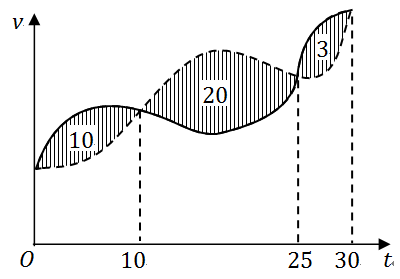

# 2017年全国硕士研究生招生考试数学一真题
> 本真题试卷来源于权威公开考研真题题库整理，包含全部题目、完整选项、高清插图、专业标签及详细参考答案与解析。
---

## 选择题

### 【M1-17-C-T01】第 1 题

若函数
$f(x)=⎩⎨⎧ax1−cosx,b,x>0,x≤0$
在
$x=0$
处连续，则( )

- **A.** ab=21
- **B.** ab=−21
- **C.** ab=0
- **D.** ab=2

> **【唯一编号】** `M1-17-C-T01`
> **【题型】** 选择题
> **【科目】** 微积分
> **【分值】** 4分
> **【年份】** 2017年
> **【考点】** 函数、极限、连续、函数的连续性

<b>💡 查看参考答案与解析</b>

**【参考答案】** A

**【解析】**

**正确答案：A**

【解】
$f(0+0)=x→0+limax1−cosx=2a1$
，
$f(0)=f(0−0)=b$
，

因为
$f(x)$
在
$x=0$
处连续，所以
$f(0+0)=f(0)=f(0−0)$
，

从而
$ab=21$
，应选(A).

---

### 【M1-17-C-T02】第 2 题

设函数
$f(x)$
可导，且
$f(x)f′(x)>0$
，则（）

- **A.** f(1)>f(−1)
．
- **B.** f(1)<f(−1)
．
- **C.** ∣f(1)∣>∣f(−1)∣
．
- **D.** ∣f(1)∣<∣f(−1)∣
．

> **【唯一编号】** `M1-17-C-T02`
> **【题型】** 选择题
> **【科目】** 微积分
> **【分值】** 4分
> **【年份】** 2017年
> **【考点】** 一元函数微分学、导数的几何意义

<b>💡 查看参考答案与解析</b>

**【参考答案】** C

**【解析】**

**正确答案：C**

【解】 方法一 若
$f(x)>0$
，则
$f′(x)>0$
，从而
$f(1)>f(−1)>0$
；

若
$f(x)<0$
，则
$f′(x)<0$
，从而
$f(1)<f(−1)<0$
，

故
$∣f(1)∣>∣f(−1)∣$
，应选（C）．

方法二 由
$f(x)⋅f′(x)=[21f2(x)]′>0$
得
$f2(x)$
单调递增，

从而
$f2(1)>f2(−1)$
，故
$∣f(1)∣>∣f(−1)∣$
，应选（C）．

---

### 【M1-17-C-T03】第 3 题

函数
$f(x,y,z)=x2y+z2$
在点
$(1,2,0)$
处沿向量
$n=(1,2,2)$
的方向导数为( )

- **A.** 12
- **B.** 6
- **C.** 4
- **D.** 2

> **【唯一编号】** `M1-17-C-T03`
> **【题型】** 选择题
> **【科目】** 微积分
> **【分值】** 4分
> **【年份】** 2017年
> **【考点】** 多元函数微分学、方向导数和梯度

<b>💡 查看参考答案与解析</b>

**【参考答案】** D

**【解析】**

**正确答案：D**

【解】
$∂x∂f=2xy$
，
$∂y∂f=x2$
，
$∂z∂f=2z$
，

∂x∂f(1,2,0)=4
，
$∂y∂f(1,2,0)=1$
，
$∂z∂f(1,2,0)=0$
，

cosα=31
，
$cosβ=32$
，
$cosγ=32$
，

所求的方向导数为
$∂n∂f(1,2,0)=4×31+1×32=2$
，应选(D).

【答案】(D).

---

### 【M1-17-C-T04】第 4 题

甲、乙两人赛跑，计时开始时，甲在乙前方 10（单位：m）处，图中，实线表示甲的速度曲线
$v=v1(t)$
（单位：m/s），虚线表示乙的速度曲线
$v=v2(t)$
，三块阴影部分面积的数值依次是 10,20,3。计时开始后乙追上甲的时刻记为
$t0$
（单位：s），则（）

- **A.** t0=10
- **B.** 15<t0<20
- **C.** t0=25
- **D.** t0>25

> **【唯一编号】** `M1-17-C-T04`
> **【题型】** 选择题
> **【科目】** 微积分
> **【分值】** 4分
> **【年份】** 2017年
> **【考点】** 一元函数积分学、定积分的应用

<b>💡 查看参考答案与解析</b>

**【参考答案】** C

**【解析】**

**正确答案：C**

【解】从
$t=0$
到
$t=t0$
的时间段内，甲、乙走过的距离分别为

$$
S1=∫0t0v1(t)dt,S2=∫0t0v2(t)dt.
$$

在
$t=t0$
时，有
$S1=S2+10$
，即

$$
∫0t0v1(t)dt=∫0t0v2(t)dt+10,
$$

或写作

$$
∫0t0[v1(t)−v2(t)]dt=10.
$$

由此解得
$t0=25$
，应选（C）。

---

### 【M1-17-C-T05】第 5 题

设
$α$
为
$n$
维单位列向量，
$E$
为
$n$
阶单位矩阵，则（）

- **A.** E−ααT
不可逆。
- **B.** E+ααT
不可逆。
- **C.** E+2ααT
不可逆。
- **D.** E−2ααT
不可逆。

> **【唯一编号】** `M1-17-C-T05`
> **【题型】** 选择题
> **【科目】** 线性代数
> **【分值】** 4分
> **【年份】** 2017年
> **【考点】** 矩阵、伴随矩阵与可逆矩阵

<b>💡 查看参考答案与解析</b>

**【参考答案】** A

**【解析】**

**正确答案：A**

【解】**方法一** 令
$A=ααT$
，
$A2=A$
，

令
$AX=λX$
，由
$(A2−A)X=(λ2−λ)X=0$
得
$λ2−λ=0$
，
$λ=0$
或
$λ=1$
，

因为
$trA=αTα=1=λ1+⋯+λn$
得
$A$
的特征值为
$λ1=⋯=λn−1=0$
，
$λn=1$
，

E−ααT
的特征值为
$λ1=⋯=λn−1=1$
，
$λn=0$
，从而
$∣E−ααT∣=0$
，

即
$E−ααT$
不可逆，应选（A）.

**方法二** 令
$A=E−ααT$
，
$A2=(E−ααT)⋅(E−ααT)=E−2ααT+ααT=A$
，

由
$A(E−A)=O$
得
$r(A)+r(E−A)≤n$
，

再由
$r(A)+r(E−A)≥r[A+(E−A)]=r(E)=n$
得

r(A)+r(E−A)=n
，

而
$E−A=ααT$
，
$r(E−A)=r(ααT)=r(α)=1$
，

于是
$r(A)=n−1<n$
，即
$E−ααT$
不可逆，应选（A）.

---

### 【M1-17-C-T06】第 6 题

已知矩阵
$A=200020011$
,
$B=200120001$
,
$C=100020002$
, 则( )

- **A.** A
与
$C$
相似，
$B$
与
$C$
相似。
- **B.** A
与
$C$
相似，
$B$
与
$C$
不相似。
- **C.** A
与
$C$
不相似，
$B$
与
$C$
相似。
- **D.** A
与
$C$
不相似，
$B$
与
$C$
不相似。

> **【唯一编号】** `M1-17-C-T06`
> **【题型】** 选择题
> **【科目】** 线性代数
> **【分值】** 4分
> **【年份】** 2017年
> **【考点】** 矩阵的特征值与特征向量、矩阵的相似与相似对角化

<b>💡 查看参考答案与解析</b>

**【参考答案】** B

**【解析】**

**正确答案：B**

【解】 显然矩阵
$A,B,C$
的特征值都是
$λ1=λ2=2$
,
$λ3=1$
,

由
$2E−A=0000000−11$
得
$r(2E−A)=1$
, 则 A 可相似对角化，从而
$A∼C$
;

由
$2E−B=000−100001$

得
$r(2E−B)=2$
, 则
$B$
不可相似对角化，从而
$B$
与
$A,C$
不相似，

应选 (B)。

---

### 【M1-17-C-T07】第 7 题

设
$A,B$
为随机事件.若
$0<P(A)<1,0<P(B)<1$
，则
$P(A∣B)>P(A∣B)$
的充分必要条件是( )

- **A.** P(B∣A)>P(B∣A)
- **B.** P(B∣A)<P(B∣A)
- **C.** P(B∣A)>P(B∣A)
- **D.** P(B∣A)<P(B∣A)

> **【唯一编号】** `M1-17-C-T07`
> **【题型】** 选择题
> **【科目】** 概率论与数理统计
> **【分值】** 4分
> **【年份】** 2017年
> **【考点】** 随机事件和概率

<b>💡 查看参考答案与解析</b>

**【参考答案】** A

**【解析】**

**正确答案：A**

【解】 由
$P(A∣B)>P(A∣B)$
得
$P(B)P(AB)>P(B)P(AB)=1−P(B)P(A)−P(AB)$
，即

P(A∣B)>P(A∣B)
等价于
$P(AB)>P(A)P(B)$
；

由
$P(B∣A)>P(B∣A)$
得
$P(A)P(AB)>1−P(A)P(B)−P(AB)$
，即

P(B∣A)>P(B∣A)
等价于
$P(AB)>P(A)P(B)$
，应选(A)。

---

### 【M1-17-C-T08】第 8 题

设
$X1,X2,⋯,Xn(n≥2)$
为来自总体
$N(μ,1)$
的简单随机样本，记
$X=n1∑i=1nXi$
，则下列结论中不正确的是（）

- **A.** ∑i=1n(Xi−μ)2
服从
$χ2$
分布。
- **B.** 2(Xn−X1)2
服从
$χ2$
分布。
- **C.** ∑i=1n(Xi−X)2
服从
$χ2$
分布。
- **D.** n(X−μ)2
服从
$χ2$
分布。

> **【唯一编号】** `M1-17-C-T08`
> **【题型】** 选择题
> **【科目】** 概率论与数理统计
> **【分值】** 4分
> **【年份】** 2017年
> **【考点】** 随机变量及其分布

<b>💡 查看参考答案与解析</b>

**【参考答案】** B

**【解析】**

**正确答案：B**

【解】 若总体
$X∼N(μ,σ2)$
，则

σ21∑i=1n(Xi−μ)2∼χ2(n)
，
$σ21∑i=1n(Xi−X)2∼χ2(n−1)$
，

因为总体
$X∼N(μ,1)$
，所以
$∑i=1n(Xi−μ)2∼χ2(n)$
，
$∑i=1n(Xi−X)2∼χ2(n−1)$
，

再由
$X∼N(μ,n1)$
得
$n1X−μ=n(X−μ)∼N(0,1)$
，从而
$n(X−μ)2∼χ2(1)$
，

不正确的是（B），应选（B）.

---

## 填空题

### 【M1-17-F-T09】第 9 题

（填空题）已知函数
$f(x)=1+x21$
，则
$f(3)(0)=$
______．

> **【唯一编号】** `M1-17-F-T09`
> **【题型】** 填空题
> **【科目】** 微积分
> **【分值】** 4分
> **【年份】** 2017年
> **【考点】** 一元函数微分学、导数与微分的计算

<b>💡 查看参考答案与解析</b>

**【解析】**

**【答案】** 0

**【解析】** 方法一
$f(x)=1+x21=1−x2+x4−x6+x8+o(x8)$
，

由
$3!f(3)(0)=0$
得
$f(3)(0)=0$
。

方法二 根据求导改变奇偶性的性质，因为
$f(x)$
为偶函数，所以
$f(3)(x)$
为奇函数，

故
$f(3)(0)=0$
。

---

### 【M1-17-F-T10】第 10 题

（填空题）微分方程
$y′′+2y′+3y=0$
的通解为
$y=$
______．

> **【唯一编号】** `M1-17-F-T10`
> **【题型】** 填空题
> **【科目】** 微积分
> **【分值】** 4分
> **【年份】** 2017年
> **【考点】** 常微分方程、常系数齐次线性微分方程

<b>💡 查看参考答案与解析</b>

**【解析】**

**【答案】**
$e−x(C1cos2x+C2sin2x)$
（
$C1,C2$
为任意常数）

**【解析】** 【解】 特征方程为
$λ2+2λ+3=0$
，特征值为
$λ1,2=−1±2i$
，通解为
$y=e−x(C1cos2x+C2sin2x)$
（
$C1,C2$
为任意常数）

---

### 【M1-17-F-T11】第 11 题

（填空题）若曲线积分
$∫Lx2+y2−1xdx−aydy$
在区域
$D={(x,y)∣x2+y2<1}$
内与路径无关，则
$a=$
______．

> **【唯一编号】** `M1-17-F-T11`
> **【题型】** 填空题
> **【科目】** 微积分
> **【分值】** 4分
> **【年份】** 2017年
> **【考点】** 多元函数积分学、第二类曲线积分

<b>💡 查看参考答案与解析</b>

**【解析】**

**【答案】** -1

**【解析】**

$$
P=x2+y2−1x,Q=−x2+y2−1ay
$$

$$
∂y∂P=−(x2+y2−1)22xy,∂x∂Q=(x2+y2−1)22axy
$$

由于曲线积分与路径无关，

$$
∂x∂Q=∂y∂P
$$

代入得

$$
(x2+y2−1)22axy=−(x2+y2−1)22xy
$$

因此

$$
a=−1
$$

---

### 【M1-17-F-T12】第 12 题

（填空题）幂级数
$∑n=1∞(−1)n−1nxn−1$
在区间
$(−1,1)$
内的和函数
$S(x)=$
______．

> **【唯一编号】** `M1-17-F-T12`
> **【题型】** 填空题
> **【科目】** 微积分
> **【分值】** 4分
> **【年份】** 2017年
> **【考点】** 无穷级数、幂级数的和函数及幂级数展开式

<b>💡 查看参考答案与解析</b>

**【解析】**

**【答案】**
$(1+x)21$

**【解析】****方法一**：
$S(x)=∑n=1∞(−1)n−1nxn−1=−[∑n=1∞(−1)nxn]′=−(1+x−x)′=(1+x)21$

**方法二**： 令
$S(x)=∑n=1∞(−1)n−1nxn−1$
，

则
$∫0xS(x)dx=∑n=1∞\int_0^x \(−1)n−1nxn−1dx=∑n=1∞(−1)n−1xn$

=−∑n=1∞(−x)n=−1+x−x=1+xx
，

故
$S(x)=(1+xx)′=(1+x)21$

---

### 【M1-17-F-T13】第 13 题

（填空题）设矩阵
$A=110011121,$
$α1,α2,α3$
为线性无关的
$3$
维列向量组，则向量组
$Aα1,Aα2,Aα3$
的秩为______．

> **【唯一编号】** `M1-17-F-T13`
> **【题型】** 填空题
> **【科目】** 线性代数
> **【分值】** 4分
> **【年份】** 2017年
> **【考点】** 矩阵、矩阵的秩

<b>💡 查看参考答案与解析</b>

**【解析】**

**【答案】** 2

**【解析】** (Aα1,Aα2,Aα3)=A(α1,α2,α3)
。

因为
$α1,α2,α3$
线性无关，所以
$(α1,α2,α3)$
可逆，从而

$$
r(Aα1,Aα2,Aα3)=r(A)
$$

由

$$
A→100010110,
$$

得
$r(A)=2$
，故向量组
$Aα1,Aα2,Aα3$
的秩为 2。

---

### 【M1-17-F-T14】第 14 题

（填空题）设随机变量
$X$
的分布函数为
$F(x)=0.5Φ(x)+0.5Φ(2x−4)$
，其中
$Φ(x)$
为标准正态分布函数，则
$E(X)=$
______．

> **【唯一编号】** `M1-17-F-T14`
> **【题型】** 填空题
> **【科目】** 概率论与数理统计
> **【分值】** 4分
> **【年份】** 2017年
> **【考点】** 随机变量及其分布

<b>💡 查看参考答案与解析</b>

**【解析】**

**【答案】** 2

**【解析】**随机变量
$X$
的概率密度函数为

$$
f(x)=0.5φ(x)+0.25φ(2x−4),
$$

其数学期望为

$$
E(X)=∫−∞+∞xf(x)dx=0.5∫−∞+∞xφ(x)dx+0.25∫−∞+∞xφ(2x−4)dx=0+∫−∞+∞(2x−4+2)φ(2x−4)d(2x−4)=∫−∞+∞(t+2)φ(t)dt(令t=2x−4)=2∫−∞+∞φ(t)dt=2.
$$

---

## 解答题

### 【M1-17-A-T15】第 15 题

（本题满分 10 分）

设函数
$f(u,v)$
具有 2 阶连续偏导数，
$y=f(ex,cosx)$
，求
$dxdyx=0$
，
$dx2d2yx=0$
．

> **【唯一编号】** `M1-17-A-T15`
> **【题型】** 解答题
> **【科目】** 微积分
> **【分值】** 10分
> **【年份】** 2017年
> **【考点】** 多元函数微分学、偏导数的概念与计算

<b>💡 查看参考答案与解析</b>

**【解析】**

**【答案】** dxdyx=0=f1′(1,1)  dx2d2yx=0=f1′(1,1)+f11′′(1,1)−f2′(1,1)

**【解析】**

$$
dxdy=exf1′−sinx⋅f2′,dxdyx=0=f1′(1,1)
$$

$$
dx2d2y=exf1′+ex(exf11′′−sinx⋅f12′′)−cosx⋅f2′−sinx(exf21′′−sinx⋅f22′′)
$$

$$
dx2d2yx=0=f1′(1,1)+f11′′(1,1)−f2′(1,1)
$$

---

### 【M1-17-A-T16】第 16 题

（本题满分 10 分）

$$
n→∞limk=1∑nn2kln(1+nk)=
$$

> **【唯一编号】** `M1-17-A-T16`
> **【题型】** 解答题
> **【科目】** 微积分
> **【分值】** 10分
> **【年份】** 2017年
> **【考点】** 一元函数积分学、定积分的概念、性质及几何意义

<b>💡 查看参考答案与解析</b>

**【解析】**

**【答案】**
$41$

**【解析】**

$$
n→∞limk=1∑nn2kln(1+nk)=n→∞limn1k=1∑nnkln(1+nk)=∫01xln(1+x)dx=21∫01ln(1+x)d(x2)=[21x2ln(1+x)]01−21∫011+xx2dx=21ln2−21∫01(x−1+1+x1)dx=21ln2−21[2x2−x+ln(1+x)]01=21ln2−21(21−1+ln2)=21ln2−21(ln2−21)=21ln2−21ln2+41=41
$$

---

### 【M1-17-A-T17】第 17 题

（本题满分 10 分）

已知函数
$y(x)$
由方程
$x3+y3−3x+3y−2=0$
确定，求
$y(x)$
的极值。

> **【唯一编号】** `M1-17-A-T17`
> **【题型】** 解答题
> **【科目】** 微积分
> **【分值】** 10分
> **【年份】** 2017年
> **【考点】** 一元函数微分学、函数的单调性、极值与最值

<b>💡 查看参考答案与解析</b>

**【解析】**

**【答案】**极小值点为
$x=−1$
，
$y=0$
；极大值点为
$x=1$
，
$y=1$
。

**【解析】**【解】
$x3+y3−3x+3y−2=0$
两边对
$x$
求导得
$3x2+3y2y′−3+3y′=0$
，令
$y′=0$
得
$x1=−1$
，
$x2=1$
，对应的函数值为
$y1=0$
，
$y2=1$
； 3x2+3y2y′−3+3y′=0
两边再对
$x$
求导得
$6x+6yy′y′′+3y2y′′+3y′′=0$
，由
$y′′(−1)=2>0$
得
$x=−1$
为极小值点，极小值为
$y=0$
；由
$y′′(1)=−1<0$
得
$x=1$
为极大值点，极大值为
$y=1$
。

---

### 【M1-17-A-T18】第 18 题

（本题满分 10 分）

设函数
$f(x)$
在区间
$[0,1]$
上具有 2 阶导数，且
$f(1)>0,x→0+limxf(x)<0$
证明：

(Ⅰ)方程
$f(x)=0$
在区间
$(0,1)$
内至少存在一个实根；

(Ⅱ)方程
$f(x)f′′(x)+[f′(x)]2=0$
在区间
$(0,1)$
内至少存在两个不同实根。

> **【唯一编号】** `M1-17-A-T18`
> **【题型】** 解答题
> **【科目】** 微积分
> **【分值】** 10分
> **【年份】** 2017年
> **【考点】** 一元函数微分学、方程根的存在性与个数

<b>💡 查看参考答案与解析</b>

**【解析】**

**【答案】** 见解析

**【解析】**(Ⅰ) 根据极限的保号性，由于

$$
x→0+limxf(x)<0,
$$

存在
$δ>0$
，使得当
$x∈(0,δ)$
时，

$$
xf(x)<0,
$$

即当
$x∈(0,δ)$
时，
$f(x)<0$
。于是存在
$c∈(0,δ)$
，满足
$f(c)<0$
。又因为
$f(c)⋅f(1)<0$
，由介值定理可知，存在
$x0∈(c,1)⊂(0,1)$
，使得

$$
f(x0)=0.
$$

(Ⅱ) 令

$$
F(x)=f(x)⋅f′(x),
$$

则

$$
F′(x)=f(x)f′′(x)+(f′(x))2.
$$

由
$f(0)=f(x0)=0$
，根据罗尔定理，存在
$ξ1∈(0,x0)$
，使得

$$
f′(ξ1)=0.
$$

由于
$f(0)=f(x0)=0$
，可得

$$
F(0)=F(ξ1)=F(x0)=0.
$$

再次应用罗尔定理，存在
$η1∈(0,ξ1)$
与
$η2∈(ξ1,x0)$
，使得

$$
F′(η1)=0,F′(η2)=0,
$$

即方程

$$
f(x)f′′(x)+(f′(x))2=0
$$

在区间
$(0,1)$
内至少有两个不同的实根。

---

### 【M1-17-A-T19】第 19 题

（本题满分 10 分）

设薄片型物体
$S$
是圆锥面
$z=x2+y2$
被柱面
$z2=2x$
割下的有限部分，其上任一点的密度为
$μ(x,y,z)=9x2+y2+z2$
。记圆锥面与柱面的交线为 C。

(Ⅰ)求
$C$
在
$xOy$
平面上的投影曲线的方程；

(Ⅱ)求
$S$
的质量
$M$
。

> **【唯一编号】** `M1-17-A-T19`
> **【题型】** 解答题
> **【科目】** 微积分
> **【分值】** 10分
> **【年份】** 2017年
> **【考点】** 多元函数积分学、第一类曲面积分

<b>💡 查看参考答案与解析</b>

**【解析】**

**【答案】**(Ⅰ)
$C$
在
$xOy$
平面上的投影曲线的方程为
${(x−1)2+y2=1z=0$
。(Ⅱ)
$S$
的质量
$M=64$
。

**【解析】**（Ⅰ）由
${z=x2+y2z2=2x$
，得
$x2+y2=2x$
，故 C 在 xOy 平面上的投影曲线为
$L:{(x−1)2+y2=1z=0$

（Ⅱ）

$$
M=∬S9x2+y2+z2dS
$$

由

$$
zx′=x2+y2x,zy′=x2+y2y
$$

得

$$
dS=1+zx′2+zy′2dxdy=2dxdy
$$

则

$$
M=∬S9x2+y2+z2dS=92∬Dx2+y2⋅2dxdy=18∬Dx2+y2dxdy=18∫−2π2πdθ∫02cosθr2dr=18×38∫−2π2πcos3θdθ=18×316∫02πcos3θdθ=64
$$

---

### 【M1-17-A-T20】第 20 题

（本题满分 11 分）

设 3 阶矩阵
$A=(α1,α2,α3)$
有 3 个不同的特征值，且
$α3=α1+2α2$
。

(Ⅰ) 证明
$r(A)=2$
；

(Ⅱ) 设
$β=α1+α2+α3$
，求方程组
$Ax=β$
的通解。

> **【唯一编号】** `M1-17-A-T20`
> **【题型】** 解答题
> **【科目】** 线性代数
> **【分值】** 11分
> **【年份】** 2017年
> **【考点】** 矩阵、伴随矩阵与可逆矩阵

<b>💡 查看参考答案与解析</b>

**【解析】**

**【答案】**(Ⅰ) 见解析(Ⅱ) 方程组
$Ax=β$
的通解为
$X=k12−1+111$
，其中
$k$
为任意常数。

**【解析】**【证明】(Ⅰ)设
$A$
的特征值为
$λ1,λ2,λ3$
，因为
$A$
有三个不同的特征值，所以
$A$
可以相似对角化，即存在可逆矩阵
$P$
，使得

$$
P−1AP=λ1λ2λ3
$$

因为
$λ1,λ2,λ3$
两两不同，所以
$r(A)≥2$
，又因为
$α3=α1+2α2$
，所以
$α1,α2,α3$
线性相关，从而
$r(A)<3$
，于是
$r(A)=2$
。

(Ⅱ)因为
$r(A)=2$
，所以
$AX=0$
基础解系含一个线性无关的解向量，由

$$
{α1+2α2−α3=0,α1+α2+α3=β,
$$

得
$AX=β$
的通解为

$$
X=k12−1+111(k∈R)
$$

---

### 【M1-17-A-T21】第 21 题

（本题满分 11 分）

设二次型
$f(x1,x2,x3)=2x12−x22+ax32+2x1x2−8x1x3+2x2x3$
在正交变换
$x=Qy$
下的标准形为
$λ1y12+λ2y22$
，求
$a$
的值及一个正交矩阵
$Q$
．

> **【唯一编号】** `M1-17-A-T21`
> **【题型】** 解答题
> **【科目】** 线性代数
> **【分值】** 11分
> **【年份】** 2017年
> **【考点】** 二次型

<b>💡 查看参考答案与解析</b>

**【解析】**

**【答案】**a = 2，正交矩阵
$Q=31−3131−21021616261$
，标准形为
$−3y12+6y22$
。

**【解析】**【解】
$A=21−41−11−41a$
，
$X=x1x2x3$
，
$f(x1,x2,x3)=XTAX$
，

因为
$λ3=0$
，所以
$∣A∣=0$
。

由
$∣A∣=21−41−11−41a=−3(a−2)=0$
，得
$a=2$
。

由
$∣λE−A∣=λ−2−14−1λ+1−14−1λ−2=λ(λ+3)(λ−6)=0$
，得
$λ1=−3$
，
$λ2=6$
，
$λ3=0$
．

由
$−3E−A→51−4121−415→100010−110$

得
$λ1=−3$
对应的线性无关的特征向量为
$α1=1−11$
；

由
$6E−A=4−14−17−14−14→100010100$

得
$λ2=6$
对应的线性无关的特征向量为
$α2=−101$
；

由
$0E−A→100010−1−20$
得
$λ3=0$
对应的线性无关的特征向量为
$α3=121$
。

规范化得
$γ1=311−11$
，
$γ2=21−101$
，
$γ3=61121$
，故正交矩阵为
$Q=31−3131−21021616261$
，

f(x1,x2,x3)=XTAX=x=Qy−3y12+6y22
。

---

### 【M1-17-A-T22】第 22 题

（本题满分 11 分）

设随机变量
$X$
，
$Y$
相互独立，且
$X$
的概率分布为
$P{X=0}=P{X=2}=21$
，
$Y$
的概率密度为

$$
f(y)={2y,0,0<y<1,其他
$$

(Ⅰ) 求
$P{Y≤E(Y)}$
；

(Ⅱ) 求
$Z=X+Y$
的概率密度。

> **【唯一编号】** `M1-17-A-T22`
> **【题型】** 解答题
> **【科目】** 概率论与数理统计
> **【分值】** 11分
> **【年份】** 2017年
> **【考点】** 随机变量的数字特征、数学期望与方差

<b>💡 查看参考答案与解析</b>

**【解析】**

**【答案】**(Ⅰ)
$P{Y≤E(Y)}=94 (Ⅱ)$
$Z=X+Y$
的概率密度为

$$
fZ(z)=⎩⎨⎧z,z−2,0,0<z<1,2<z<3,其他.
$$

**【解析】****（Ⅰ）** E(Y)=∫01y⋅2ydy=32
，

$$
P{Y≤E(Y)}=P{Y≤32}=∫0322ydy=94.
$$

**（Ⅱ）****方法一**

$$
FZ(z)=P{Z≤z}=P{X+Y≤z}.
$$

- 当
$z<0$
时，
$FZ(z)=0$
；
- 当
$z≥3$
时，
$FZ(z)=1$
；
- 当
$0≤z<1$
时，

$$
FZ(z)=P{X=0,Y≤z}=P{X=0}P{Y≤z}=21∫0z2ydy=2z2;
$$
- 当
$1≤z<2$
时，

$$
FZ(z)=P{X=0,Y≤z}=P{X=0}P{Y≤1}=21;
$$
- 当
$2≤z<3$
时，

$$
FZ(z)=P{X=0,Y≤z}+P{X=2,Y≤z−2}
$$

$$
=P{X=0}P{Y≤1}+P{X=2}P{Y≤z−2}
$$

$$
=21+21∫0z−22ydy=21+21(z−2)2.
$$

综上，

$$
FZ(z)=⎩⎨⎧0,2z2,21,21+21(z−2)2,1,z<0,0≤z<1,1≤z<2,2≤z<3,z≥3.
$$

概率密度为

$$
fZ(z)=⎩⎨⎧z,z−2,0,0<z<1,2<z<3,其他.
$$

**方法二**由全概率公式，

$$
FZ(z)=P{Z≤z}=P{X+Y≤z}
$$

$$
=P{X=0}P{X+Y≤z∣X=0}+P{X=2}P{X+Y≤z∣X=2}
$$

$$
=21P{Y≤z}+21P{Y≤z−2}.
$$

- 当
$z<0$
时，
$FZ(z)=0$
；
- 当
$0≤z<1$
时，

$$
FZ(z)=21P{Y≤z}=21∫0z2ydy=2z2;
$$
- 当
$1≤z<2$
时，

$$
FZ(z)=21P{Y≤1}=21;
$$
- 当
$2≤z<3$
时，

$$
FZ(z)=21+21P{Y≤z−2}=21+21∫0z−22ydy=21+2(z−2)2;
$$
- 当
$z≥3$
时，
$FZ(z)=1$
。

故

$$
fZ(z)=F′(z)=⎩⎨⎧z,z−2,0,0<z<1,2<z<3,其他.
$$

---

### 【M1-17-A-T23】第 23 题

（本题满分 11 分）

某工程师为了解一台天平的精度，用该天平对一物体的质量做
$n$
次测量，该物体的质量
$μ$
是已知的。设
$n$
次测量结果
$X1,X2,⋯,Xn$
相互独立且均服从正态分布
$N(μ,σ2)$
，该工程师记录的是
$n$
次测量的绝对误差
$Zi=∣Xi−μ∣(i=1,2,⋯,n)$
。利用
$Z1,Z2,⋯,Zn$
估计
$σ$
。

(Ⅰ) 求
$Z1$
的概率密度；

(Ⅱ) 利用一阶矩求
$σ$
的矩估计量；

(Ⅲ) 求
$σ$
的最大似然估计量。

> **【唯一编号】** `M1-17-A-T23`
> **【题型】** 解答题
> **【科目】** 概率论与数理统计
> **【分值】** 11分
> **【年份】** 2017年
> **【考点】** 参数估计与假设检验、矩估计和最大似然估计

<b>💡 查看参考答案与解析</b>

**【解析】**

**【答案】**（Ⅰ）
$Z1$
的概率密度为：

$$
f(z)={0,σ2φ(σz),z≤0,z>0,
$$

其中
$φ(⋅)$
是标准正态分布的概率密度函数。

（Ⅱ）
$σ$
的矩估计量为：

$$
σ^=2πZ.
$$

（Ⅲ）
$σ$
的最大似然估计量为：

$$
σ^=n1i=1∑nZi2.
$$

**【解析】**【解】（Ⅰ）由
$X1∼N(μ,σ2)$
得
$σX1−μ∼N(0,1)$
。

Z1
的分布函数为
$F(z)=P{Z1≤z}$
。

当
$z<0$
时，
$F(z)=0$
；

当
$z≥0$
时，

$$
F(z)=P{σX1−μ≤σz}=Φ(σz)−Φ(−σz)=2Φ(σz)−1,
$$

因此

$$
F(z)={0,2Φ(σz)−1,z<0,z≥0.
$$

Z1
的密度函数为

$$
f(z)={0,σ2φ(σz),z≤0,z>0.
$$

（Ⅱ）

$$
E(Z)=E(∣Xi−μ∣)=E(∣X1−μ∣)
$$

$$
=∫0+∞z⋅σ2φ(σz)dz=2σ∫0+∞σzφ(σz)d(σz)
$$

$$
=2σ∫0+∞tφ(t)dt=2π2σ∫0+∞te−2t2dt
$$

$$
=2π2σ∫0+∞e−2t2d(2t2)=2π2σ.
$$

由
$2π2σ=n1∑i=1nZi=Z$
，得
$σ$
的矩估计量为

$$
σ^=2πZ.
$$

（Ⅲ）似然函数为

$$
L=f(z1)⋯f(zn)=σn2n⋅(2π1)n⋅e−2σ21(z12+⋯+zn2)(zi>0,i=1,2,…,n),
$$

$$
lnL=nln2−nlnσ−nln2π−2σ21(z12+⋯+zn2).
$$

由

$$
dσdlnL=−σn+σ31(z12+⋯+zn2)=0
$$

得

$$
σ^=n1i=1∑nzi2,
$$

故
$σ$
的最大似然估计量为

$$
σ^=n1i=1∑nZi2.
$$

---
