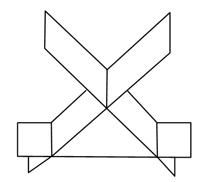

# 2019年全国硕士研究生招生考试数学一真题
> 本真题试卷来源于权威公开考研真题题库整理，包含全部题目、完整选项、高清插图、专业标签及详细参考答案与解析。
---

## 选择题

### 【M1-19-C-T01】第 1 题

当
$x→0$
时，若
$x−tanx$
与
$xk$
是同阶无穷小，则
$k=$

- **A.** 1
- **B.** 2
- **C.** 3
- **D.** 4

> **【唯一编号】** `M1-19-C-T01`
> **【题型】** 选择题
> **【科目】** 微积分
> **【分值】** 4分
> **【年份】** 2019年
> **【考点】** 函数、极限、连续、无穷小量的比较

<b>💡 查看参考答案与解析</b>

**【参考答案】** C

**【解析】**

**正确答案：C** x−tanx=x−(x+31x3+o(x3))∼−31x3
，故
$k=3$

---

### 【M1-19-C-T02】第 2 题

设函数
$f(x)={x∣x∣,xlnx,x≤0x>0$
则
$x=0$
是
$f(x)$
的

- **A.** 可导点，极值点。
- **B.** 不可导点，极值点。
- **C.** 可导点，非极值点。
- **D.** 不可导点，非极值点

> **【唯一编号】** `M1-19-C-T02`
> **【题型】** 选择题
> **【科目】** 微积分
> **【分值】** 4分
> **【年份】** 2019年
> **【考点】** 一元函数微分学、导数与微分的概念

<b>💡 查看参考答案与解析</b>

**【参考答案】** B

**【解析】**

**正确答案：B**

limx→0−x−0f(x)−f(0)=limx→0−xx∣x∣=0
，
$\lim_{x \to 0}+x−0f(x)−f(0)=\lim_{x \to 0}+xxlnx=−∞$
，故
$f(x)$
不可导。

当
$x>0$
时，
$f(x)<0$
;当
$x<0$
时，
$f(x)<0$
.故
$f(x)$
在
$x=0$
处取极大值.故选(B).

---

### 【M1-19-C-T03】第 3 题

设
${un}$
是单调递增的有界数列，则下列级数中收敛的是

- **A.** ∑n=1∞nun
- **B.** ∑n=1∞(−1)nun1
- **C.** ∑n=1∞(1−un+1un)
- **D.** ∑n=1∞(un+12−un2)

> **【唯一编号】** `M1-19-C-T03`
> **【题型】** 选择题
> **【科目】** 微积分
> **【分值】** 4分
> **【年份】** 2019年
> **【考点】** 无穷级数、常数项级数敛散性的判定

<b>💡 查看参考答案与解析</b>

**【参考答案】** D

**【解析】**

**正确答案：D**【解析】举反例：（A）
$un=nn−1$
（B）
$un=nn−1$
（C）
$un=−n1$

---

### 【M1-19-C-T04】第 4 题

设函数
$Q(x,y)=y2x$
，如果对上半平面
$(y>0)$
内的任意有向光滑封闭曲线 C 都有
$∮CP(x,y)dx+Q(x,y)dy=0$
,那么函数
$P(x,y)$
可取为

- **A.** y−y3x2
- **B.** y1−y3x2
- **C.** x1−y1
- **D.** x−y1

> **【唯一编号】** `M1-19-C-T04`
> **【题型】** 选择题
> **【科目】** 微积分
> **【分值】** 4分
> **【年份】** 2019年
> **【考点】** 多元函数积分学、第二类曲线积分

<b>💡 查看参考答案与解析</b>

**【参考答案】** D

**【解析】**

**正确答案：D**

$$
∂x∂Q=y21,
$$

故只需选择在上半平面有连续偏导数，且满足

$$
∂y∂P=y21
$$

的
$P$
函数，只有 D 选项成立。

---

### 【M1-19-C-T05】第 5 题

设 A 是 3 阶实对称矩阵，E 是 3 阶单位矩阵，若
$A2+A=2E$
,且
$∣A∣=4$
,则二次型
$xTAx$
的规范形为

- **A.** y12+y22+y32
- **B.** y12+y22−y32
- **C.** y12−y22−y32
- **D.** −y12−y22−y32

> **【唯一编号】** `M1-19-C-T05`
> **【题型】** 选择题
> **【科目】** 线性代数
> **【分值】** 4分
> **【年份】** 2019年
> **【考点】** 二次型

<b>💡 查看参考答案与解析</b>

**【参考答案】** C

**【解析】**

**正确答案：C**

∵A2+A=2E
,设 A 的特征值为
$λ$
，则
$λ2+λ=2$
，即
$(λ+2)(λ−1)=0$
，
$∴λ=−2$
或
$1$
。

∵∣A∣=4
，故 A 的特征值为
$λ1=λ2=−2$
,
$λ3=1$
，正惯性指数
$p=1$
，负惯性指数
$q=2$
，规范形为
$y12−y22−y32$
。

---

### 【M1-19-C-T06】第 6 题

如图所示，有 3 张平面两两相交，交线相互平行，它们的方程
$ai1x+ai2y+ai3z=di(i=1,2,3)$
组成的线性方程组的系数矩阵和增广矩阵分别记为
$A$
、
$Aˉ$
，则

- **A.** r=2,r(A)=3
- **B.** r=2,r(A)=2
- **C.** r=1,r(A)=2
- **D.** r=1,r(A)=1

> **【唯一编号】** `M1-19-C-T06`
> **【题型】** 选择题
> **【科目】** 线性代数
> **【分值】** 4分
> **【年份】** 2019年
> **【考点】** 线性方程组

<b>💡 查看参考答案与解析</b>

**【参考答案】** A

**【解析】**

**正确答案：A**

**【解析】** 因为他们两两相交，且交线相互平行，所以

$$
r(A)=r(A)≤3,
$$

所以排除 B 和 D 选项；

又因为他们两两相交，故其中任意两个平面不平行，所以

$$
2≤r(A),
$$

故选 A。

---

### 【M1-19-C-T07】第 7 题

设 A , B 为随机事件，则
$P(A)=P(B)$
的充分必要条件是

- **A.** P(A∪B)=P(A)+P(B)
- **B.** P(AB)=P(A)P(B)
- **C.** P(AB)=P(BA)
- **D.** P(AB)=P(AB)

> **【唯一编号】** `M1-19-C-T07`
> **【题型】** 选择题
> **【科目】** 概率论与数理统计
> **【分值】** 4分
> **【年份】** 2019年
> **【考点】** 随机事件和概率

<b>💡 查看参考答案与解析</b>

**【参考答案】** C

**【解析】**

**正确答案：C**

A 选项
$⇔P(AB)=0$
，排除；

B 选项
$⇔A$
、
$B$
独立，排除；

C 选项
$⇔P(A)−P(AB)=P(B)−P(AB)$
，即
$P(A)=P(B)$
，正确；

D 选项
$⇔1=P(A)+P(B)$
，排除。

---

### 【M1-19-C-T08】第 8 题

设随机变量
$X$
与
$Y$
相互独立，且都服从正态分布
$N(μ,σ2)$
，则
$P{∣X−Y∣<1}$

- **A.** 与
$μ$
无关，而与
$σ2$
有关。
- **B.** 与
$μ$
有关，而与
$σ2$
无关
- **C.** 与
$μ,σ2$
都有关。
- **D.** 与
$μ,σ2$
都无关。

> **【唯一编号】** `M1-19-C-T08`
> **【题型】** 选择题
> **【科目】** 概率论与数理统计
> **【分值】** 4分
> **【年份】** 2019年
> **【考点】** 多维随机变量及其分布、二维随机变量及其分布

<b>💡 查看参考答案与解析</b>

**【参考答案】** A

**【解析】**

**正确答案：A**

E(X−Y)=0,D(X−Y)=DX+DY=2σ2
, 所以
$2σX−Y∼N(0,1)$
.

P{∣X−Y∣<1}=P{2σ∣X−Y∣<2σ1}=2Φ(2σ1)−1
与
$σ2$
有关。故选(A)。

---

## 填空题

### 【M1-19-F-T09】第 9 题

（填空题）设函数
$f(u)$
可导，
$z=f(siny−sinx)+xy$
，则
$cosx1⋅∂x∂z+cosy1⋅∂y∂z=$

> **【唯一编号】** `M1-19-F-T09`
> **【题型】** 填空题
> **【科目】** 微积分
> **【分值】** 4分
> **【年份】** 2019年
> **【考点】** 多元函数微分学、偏导数的概念与计算

<b>💡 查看参考答案与解析</b>

**【解析】**

**【答案】**
$cosxy+cosyx$

**【解析】**

∂x∂z=f′(siny−sinx)(−cosx)+y
$∂y∂z=f′(siny−sinx)cosy+x$

故

cosx1⋅∂x∂z+cosy1⋅∂y∂z=−f′(siny−sinx)+cosxy+f′(siny−sinx)+cosyx=cosxy+cosyx

---

### 【M1-19-F-T10】第 10 题

（填空题）微分方程
$2yy′−y2−2=0$
满足条件
$y(0)=1$
的特解
$y=$

> **【唯一编号】** `M1-19-F-T10`
> **【题型】** 填空题
> **【科目】** 微积分
> **【分值】** 4分
> **【年份】** 2019年
> **【考点】** 常微分方程、一阶非齐次线性微分方程

<b>💡 查看参考答案与解析</b>

**【解析】**

**【答案】**
$y=3ex−2$

**【解析】**

$$
y′=2y2+y2⇒∫2+y22ydy=∫1dx
$$

$$
ln(2+y2)=x+C
$$

代入
$y(0)=1$
得
$C=ln3$
，于是：

$$
ln(2+y2)=x+ln3⇒2+y2=3ex
$$

因此：

$$
y=3ex−2
$$

---

### 【M1-19-F-T11】第 11 题

（填空题）求级数
$∑n=0∞(2n)!(−1)nxn$
在
$(0,+∞)$
内的和函数
$S(x)=$

> **【唯一编号】** `M1-19-F-T11`
> **【题型】** 填空题
> **【科目】** 微积分
> **【分值】** 4分
> **【年份】** 2019年
> **【考点】** 无穷级数、幂级数的和函数及幂级数展开式

<b>💡 查看参考答案与解析</b>

**【解析】**

**【答案】**
$cosx$

**【解析】**
$∑n=0∞(2n)!(−1)n(x)2n=cosx$

---

### 【M1-19-F-T12】第 12 题

（填空题）设
$∑$
为曲面
$x2+y2+4z2=4(z≥0)$
的上侧，则
$∬∑4−x2−4z2dxdy=$

> **【唯一编号】** `M1-19-F-T12`
> **【题型】** 填空题
> **【科目】** 微积分
> **【分值】** 4分
> **【年份】** 2019年
> **【考点】** 多元函数积分学、第二类曲面积分

<b>💡 查看参考答案与解析</b>

**【解析】**

**【答案】**
$332$

**【解析】**

$$
∬∑4−x2−4z2dxdy=∬Dxy∣y∣dxdy=4∬D′ydxdy==4∫02πdθ∫02r2sinθdr=332
$$

---

### 【M1-19-F-T13】第 13 题

（填空题）设
$A=(α1,α2,α3)$
为三阶矩阵，若
$α1$
，
$α2$
线性无关，且
$α3=−α1+2α2$
，则线性方程组
$Ax=0$
的通解为

> **【唯一编号】** `M1-19-F-T13`
> **【题型】** 填空题
> **【科目】** 线性代数
> **【分值】** 4分
> **【年份】** 2019年
> **【考点】** 向量、向量组的线性相关性

<b>💡 查看参考答案与解析</b>

**【解析】**

**【答案】**
$x=k(1,−2,1)T$
,
$k∈R$

**【解析】**

α1
，
$α2$
无关，
$A=(α1,α2,α3)$

∴r(A)≥2

∵α3=−α1+2α2

∴r(A)=2
故
$Ax=0$
的基础解系中有
$n−r(A)=3−2=1$
个解向量。

∵α1−2α2+α3=0

∴(1,−2,1)T
为
$Ax=0$
的解，作为基础解系。
$∴$
通解为
$x=k(1,−2,1)T$
，
$k∈R$

---

### 【M1-19-F-T14】第 14 题

（填空题）设
$f(x)={2x,0,0<x<2其他$
，
$F(x)$
为
$X$
的分布函数，
$EX$
为
$X$
的数学期望，则
$P{F(X)>EX−1}=$

> **【唯一编号】** `M1-19-F-T14`
> **【题型】** 填空题
> **【科目】** 概率论与数理统计
> **【分值】** 4分
> **【年份】** 2019年
> **【考点】** 随机变量及其分布

<b>💡 查看参考答案与解析</b>

**【解析】**

**【答案】**
$32$

**【解析】**

f(x)={2x,0,0<x<2其他

E(X)=∫−∞+∞xf(x)dx=∫022x2dx=61x302=34

F(x)=∫−∞xf(t)dt=⎩⎨⎧0,∫0x2tdt,1,x<00≤x<2x≥2

P(F(X)>E(X)−1)=P(F(X)>31)=P(4x2>31)=P(x>32)=∫3222xdx=32

---

## 解答题

### 【M1-19-A-T15】第 15 题

（本题满分 10 分）设函数
$y(x)$
是微分方程
$y′+xy=e−2x2$
满足条件
$y(0)=0$
的特解。

(Ⅰ) 求
$y(x)$
；

(Ⅱ) 求曲线
$y=y(x)$
的凹凸区间及拐点。

> **【唯一编号】** `M1-19-A-T15`
> **【题型】** 解答题
> **【科目】** 微积分
> **【分值】** 10分
> **【年份】** 2019年
> **【考点】** 常微分方程、一阶非齐次线性微分方程

<b>💡 查看参考答案与解析</b>

**【解析】**

**【答案】**(Ⅰ)
$y=xe−2x2 (Ⅱ) 曲线$
$y=y(x)$
的凸区间为
$(−∞,−3)$
及
$(0,3)$
，凹区间为
$(−3,0)$
及
$(3,+∞)$
，拐点为
$(−3,−3e−23)$
，
$(0,0)$
及
$(3,3e−23)$
。

**【解析】**

**(Ⅰ)**

y′+xy=e−2x2
的通解为
$y=(∫e−2x2⋅e∫xdxdx+C)e−∫xdx=(x+C)e−2x2$
，由
$y(0)=0$
得
$C=0$
，故
$y=xe−2x2$
。

**(Ⅱ)**

y′=(1−x2)e−2x2
，

y′′=(x3−3x)e−2x2=x(x+3)(x−3)e−2x2
，

令
$y′′=0$
得
$x=−3$
，
$x=0$
，
$x=3$
。

- 当
$x∈(−∞,−3)$
时，
$y′′<0$
；
- 当
$x∈(−3,0)$
时，
$y′′>0$
；
- 当
$x∈(0,3)$
时，
$y′′<0$
；
- 当
$x∈(3,+∞)$
时，
$y′′>0$
。

故
$y=xe−2x2$
的凸区间为
$(−∞,−3)$
及
$(0,3)$
；凹区间为
$(−3,0)$
及
$(3,+∞)$
。

曲线
$y=xe−2x2$
的拐点为
$(−3,−3e−23)$
，
$(0,0)$
及
$(3,3e−23)$
。

---

### 【M1-19-A-T16】第 16 题

（本题满分 10 分）设
$a$
，
$b$
为实数，函数
$z=2+ax2+by2$
在点
$(3,4)$
处的方向导数中，沿方向
$l=−3i−4j$
的方向导数最大，最大值为
$10$
。

（Ⅰ）求
$a$
，
$b$
；

（Ⅱ）求曲面
$z=2+ax2+by2(z≥0)$
的面积。

> **【唯一编号】** `M1-19-A-T16`
> **【题型】** 解答题
> **【科目】** 微积分
> **【分值】** 10分
> **【年份】** 2019年
> **【考点】** 多元函数微分学、方向导数和梯度

<b>💡 查看参考答案与解析</b>

**【解析】**

**【答案】**（Ⅰ）
$a=−1$
，
$b=−1 （Ⅱ）$
$313π$

**【解析】****（Ⅰ）** gradz={2ax,2by}
，
$gradz(3,4)={6a,8b}$
，因为梯度的方向即为方向导数最大的方向，所以有
$−36a=−48b$
，即
$a=b$
，再由
$36a2+64b2=10$
得
$a=b=−1$
。

**（Ⅱ）**曲面

$$
Σ:z=2−x2−y2,(x,y)∈Dxy
$$

其中

$$
Dxy={(x,y)∣x2+y2≤2}
$$

则曲面
$Σ$
的面积为

$$
S=∬Dxy1+zx′2+zy′2dxdy=∬Dxy1+4x2+4y2dxdy=2π∫02r1+4r2dr=4π∫02(1+4r2)21d(1+4r2)=4π×32(1+4r2)2302=6π(27−1)=313π.
$$

---

### 【M1-19-A-T17】第 17 题

（本题满分 10 分）求曲线
$y=e−xsinx(x≥0)$
与
$x$
轴之间图形的面积。

> **【唯一编号】** `M1-19-A-T17`
> **【题型】** 解答题
> **【科目】** 微积分
> **【分值】** 10分
> **【年份】** 2019年
> **【考点】** 一元函数积分学、定积分的应用

<b>💡 查看参考答案与解析</b>

**【解析】**

**【答案】**
$21+eπ−11$

**【解析】**

所求的面积为

$$
A=∫0+∞e−x∣sinx∣dx=n→∞limk=0∑n(−1)k∫kπ(k+1)πe−xsinxdx
$$

$$
=n→∞limk=0∑n(−1)k[−21e−x(sinx+cosx)]kπ(k+1)π
$$

$$
=21n→∞limk=0∑n(−1)k+1[e−(k+1)π(−1)k+1−e−kπ(−1)k]
$$

$$
=21n→∞limk=0∑n[e−(k+1)π+e−kπ]=21n→∞lim[1+2k=1∑ne−kπ+e−(n+1)π]
$$

$$
=21(1+2k=1∑∞e−kπ)=21(1+1−e−π2e−π)=21(1+eπ−12)=21+eπ−11.
$$

---

### 【M1-19-A-T18】第 18 题

（本题满分 10 分）设
$an=\int_0^1 xn1−x2 \, dx(n=0,1,2,⋯)$
．

（Ⅰ）证明数列
${an}$
单调递减，且
$an=n+2n−1an−2(n=2,3,⋯)$
；

（Ⅱ）求
$\lim_{n \to ∞}an−1an$
．

> **【唯一编号】** `M1-19-A-T18`
> **【题型】** 解答题
> **【科目】** 微积分
> **【分值】** 10分
> **【年份】** 2019年
> **【考点】** 一元函数积分学、变限积分

<b>💡 查看参考答案与解析</b>

**【解析】**

**【答案】**(1) 见解析(2)
$\lim_{n \to ∞}an−1an=1$

**【解析】**（Ⅰ）因为当
$0≤x≤1$
时，

$$
xn+11−x2≤xn1−x2,
$$

所以

$$
∫01xn+11−x2dx<∫01xn1−x2dx,
$$

即
$an+1<an$
，故
${an}$
单调递减。

令
$x=sint$
，则

$$
an=∫02πsinnt⋅cos2tdt=∫02π(sinnt−sinn+2t)dt.
$$

于是

$$
an=∫02πsinntdt−∫02πsinn+2tdt=In−n+2n+1In=n+21In.
$$

类似地，

$$
an−2=∫02πsinn−2t⋅cos2tdt=∫02π(sinn−2t−sinnt)dt,
$$

即

$$
an−2=In−2−In.
$$

利用递推关系
$In=nn−1In−2$
，得
$In−2=n−1nIn$
，于是

$$
an−2=n−1nIn−In=n−11In.
$$

因此

$$
an=n+2n−1an−2,n=2,3,…
$$

---

（Ⅱ）因为
${an}$
单调递减，

$$
an=n+2n−1an−2>n+2n−1an−1,
$$

所以

$$
n+2n−1<an−1an<1.
$$

由夹逼定理得

$$
n→∞liman−1an=1.
$$

---

### 【M1-19-A-T19】第 19 题

（本题满分 10 分） 设
$Ω$
是由锥面
$x2+(y−z)2=(1−z)2(0≤z≤1)$
与平面
$z=0$
围成的锥体，求
$Ω$
的形心坐标。

> **【唯一编号】** `M1-19-A-T19`
> **【题型】** 解答题
> **【科目】** 微积分
> **【分值】** 10分
> **【年份】** 2019年
> **【考点】** 多元函数积分学、重积分的应用

<b>💡 查看参考答案与解析</b>

**【解析】**

**【答案】**
$(0,41,41)$

**【解析】**
设
$Ω$
的形心坐标为
$(xˉ,yˉ,zˉ)$
，由对称性得
$xˉ=0$
，且

$$
yˉ=∭Ωdxdydz∭Ωydxdydz,zˉ=∭Ωdxdydz∭Ωzdxdydz.
$$

体积为

$$
∭Ωdxdydz=∫01dz∬x2+(y−z)2≤(1−z)2dxdy=π∫01(1−z)2dz=3π(z−1)301=3π.
$$

计算
$∭Ωydxdydz$
：

$$
∭Ωydxdydz=∫01dz∬x2+(y−z)2≤(1−z)2ydxdy.
$$

由代换
$y=u+z$
，得

$$
∬x2+(y−z)2≤(1−z)2ydxdy=∬x2+u2≤(1−z)2(u+z)dxdu=∬x2+u2≤(1−z)2zdxdu=πz(1−z)2.
$$

因此

$$
∭Ωydxdydz=π∫01z(1−z)2dz=12π.
$$

计算
$∭Ωzdxdydz$
：

$$
∭Ωzdxdydz=∫01zdz∬x2+(y−z)2≤(1−z)2dxdy=π∫01z(1−z)2dz=12π.
$$

故
$Ω$
的形心坐标为

$$
(xˉ,yˉ,zˉ)=(0,41,41).
$$

---

### 【M1-19-A-T20】第 20 题

（本题满分 11 分）

设向量组
$α1=(1,2,1)T$
，
$α2=(1,3,2)T$
，
$α3=(1,a,3)T$
为
$R3$
的一个基，
$β=(1,1,1)T$
在这个基下的坐标为
$(b,c,1)T$
。

（Ⅰ）求
$a,b,c$
；

（Ⅱ）证明
$α2,α3,β$
为
$R3$
的一个基，并求
$α2,α3,β$
到
$α1,α2,α3$
的过渡矩阵。

> **【唯一编号】** `M1-19-A-T20`
> **【题型】** 解答题
> **【科目】** 线性代数
> **【分值】** 11分
> **【年份】** 2019年
> **【考点】** 向量、向量组之间的线性表示

<b>💡 查看参考答案与解析</b>

**【解析】**

**【答案】**（Ⅰ）
$a=3$
,
$b=2$
,
$c=−2 （Ⅱ）过渡矩阵$
$Q=1−2121101010$

**【解析】**（Ⅰ）【解】 由题意得
$bα1+cα2+α3=β$
，即

$$
⎩⎨⎧b+c+1=1,2b+3c+a=1,b+2c+3=1,
$$

解得
$a=3$
，
$b=2$
，
$c=−2$
。

（Ⅱ）【证明】 因为

$$
∣α2,α3,β∣=132133111=1001011−2−1=2=0,
$$

所以
$α2,α3,β$
线性无关，故
$α2,α3,β$
为
$R3$
的一个基。

设由
$α2,α3,β$
到
$α1,α2,α3$
的过渡矩阵为
$Q$
，即

$$
(α1,α2,α3)=(α2,α3,β)Q,
$$

于是

$$
Q=(α2,α3,β)−1(α1,α2,α3).
$$

由

$$
132133111⋮⋮⋮100010001→1001011−2−1⋮⋮⋮1−3−2010001
$$

$$
→1001101−11⋮⋮⋮1−22300−21010→100110001⋮⋮⋮−21−212321−21−21010
$$

$$
→100010001⋮⋮⋮0−21231−21−21−110
$$

得

$$
(α2,α3,β)−1=0−21231−21−21−110,
$$

则

$$
Q=0−21231−21−21−110121132133=1−2121101010.
$$

---

### 【M1-19-A-T21】第 21 题

（本题满分 11 分）
已知矩阵
$A=−220−2x01−2−2$
与
$B=2001−1000y$
相似。

(Ⅰ) 求
$x,y$
；

(Ⅱ) 求可逆矩阵
$P$
使得
$P−1AP=B$
。

> **【唯一编号】** `M1-19-A-T21`
> **【题型】** 解答题
> **【科目】** 线性代数
> **【分值】** 11分
> **【年份】** 2019年
> **【考点】** 矩阵的相似与相似对角化

<b>💡 查看参考答案与解析</b>

**【解析】**

**【答案】**(Ⅰ)
$x=3$
，
$y=−2 (Ⅱ)$
$P=−120−110−124$

**【解析】****(Ⅰ)**

因为
$A∼B$
，所以
$trA=trB$
，即
$x−4=y+1$
，或
$y=x−5$
。

再由
$∣A∣=∣B∣$
得
$−2(−2x+4)=−2y$
，即
$y=−2x+4$
。

解得
$x=3$
，
$y=−2$
。

**(Ⅱ)**

$$
A=−220−2301−2−2,B=2001−1000−2
$$

显然矩阵
$A,B$
的特征值为
$λ1=−2$
，
$λ2=−1$
，
$λ3=2$
。

求矩阵
$A$
的特征向量

由

$$
2E+A→020−210100→10001041−210
$$

得
$A$
的属于特征值
$λ1=−2$
的特征向量为

$$
α1=−124
$$

由

$$
E+A→100200−110→100200010
$$

得
$A$
的属于特征值
$λ2=−1$
的特征向量为

$$
α2=−210
$$

由

$$
−2E+A→−420−2101−2−4→1002100010
$$

得
$A$
的属于特征值
$λ3=2$
的特征向量为

$$
α3=−120
$$

令

$$
P1=−124−210−120
$$

则

$$
P1−1AP1=−2000−10002
$$

求矩阵
$B$
的特征向量

由

$$
2E+B→400110000→100010000
$$

得
$B$
的属于特征值
$λ1=−2$
的特征向量为

$$
β1=001
$$

由

$$
E+B→300100001→1003100010
$$

得
$B$
的属于特征值
$λ2=−1$
的特征向量为

$$
β2=−130
$$

由

$$
−2E+B→0001−3000−4→000100010
$$

得
$B$
的属于特征值
$λ3=2$
的特征向量为

$$
β3=100
$$

令

$$
P2=001−130100
$$

则

$$
P2−1BP2=−2000−10002
$$

求相似变换矩阵
$P$

由
$P1−1AP1=P2−1BP2$
得
$(P1P2−1)−1A(P1P2−1)=B$
。

故

$$
P=P1P2−1=−120−110−124
$$

---

### 【M1-19-A-T22】第 22 题

（本题满分 11 分）设随机变量
$X$
与
$Y$
相互独立，
$X$
服从参数为
$1$
的指数分布，
$Y$
的概率分布为
$P{Y=−1}=p$
，
$P{Y=1}=1−p(0<p<1)$
，令
$Z=XY$
。

(Ⅰ) 求
$Z$
的概率密度；

(Ⅱ)
$p$
为何值时，
$X$
与
$Z$
不相关；

(Ⅲ)
$X$
与
$Z$
是否相互独立？

> **【唯一编号】** `M1-19-A-T22`
> **【题型】** 解答题
> **【科目】** 概率论与数理统计
> **【分值】** 11分
> **【年份】** 2019年
> **【考点】** 多维随机变量及其分布、边缘分布和条件分布

<b>💡 查看参考答案与解析</b>

**【解析】**

**【答案】**(Ⅰ)
$fZ(z)={pez,(1−p)e−z,z<0,z≥0. (Ⅱ)$
$p=21 (Ⅲ)$
$X$
与
$Z$
不相互独立

**【解析】****(Ⅰ)**

因为
$X∼E(1)$
，所以
$X$
的分布函数为

$$
F(x)={1−e−x,0,x≥0,x<0.
$$

$$
FZ(z)=P{XY≤z}=P{Y=−1}P{XY≤z∣Y=−1}+P{Y=1}P{XY≤z∣Y=1}=pP{−X≤z}+(1−p)P{X≤z}=pP{X≥−z}+(1−p)P{X≤z}=p[1−P{X≤−z}]+(1−p)P{X≤z}=p[1−F(−z)]+(1−p)F(z)
$$

当
$z<0$
时，
$FZ(z)=pez$
；

当
$z≥0$
时，
$FZ(z)=p+(1−p)(1−e−z)$
。

故

$$
fZ(z)={pez,(1−p)e−z,z<0,z≥0.
$$

**(Ⅱ)**

$$
Cov(X,Z)=Cov(X,XY)=E(X2Y)−E(X)⋅E(XY)=E(X2)E(Y)−[E(X)]2E(Y)=D(X)⋅E(Y)
$$

因为
$X∼E(1)$
，所以
$E(X)=1$
，
$D(X)=1$
。

又因为

$$
Y∼(−1p11−p)
$$

所以
$E(Y)=(−1)p+(1−p)=1−2p$
。

X
与
$Z$
不相关的充分必要条件是
$Cov(X,Z)=0$
，

故当
$p=21$
时，
$X$
与
$Z$
不相关。

**(Ⅲ)**

设
$F(x,y)$
为
$(X,Z)$
的联合分布函数，

$$
F(1,1)=P{X≤1,Z≤1}=P{X≤1,XY≤1}=P{Y=−1}P{X≤1,XY≤1∣Y=−1}+P{Y=1}P{X≤1,XY≤1∣Y=1}=21P{X≤1,−X≤1}+21P{X≤1}=21P{−1≤X≤1}+21P{X≤1}=P{X≤1}=F(1)=1−e1
$$

$$
FX(1)=P{X≤1}=1−e1
$$

$$
FZ(1)=P{XY≤1}=P{Y=−1}P{XY≤1∣Y=−1}+P{Y=1}P{XY≤1∣Y=1}=21P{−X≤1}+21P{X≤1}=21P{X≥−1}+21P{X≤1}=21+21(1−e1)=1−2e1
$$

因为
$F(1,1)=FX(1)⋅FZ(1)$
，所以
$X$
与
$Z$
不相互独立。

---

### 【M1-19-A-T23】第 23 题

（本题满分 11 分）设总体
$X$
的概率密度为

$$
f(x;σ2)={σAe−2σ2(x−μ)2,x≥μ,0,x<μ,
$$

其中
$μ$
是已知参数，
$σ>0$
是未知参数，
$A$
是常数。
$X1,X2,⋯,Xn$
是来自总体
$X$
的简单随机样本。

（Ⅰ）求
$A$
；

（Ⅱ）求
$σ2$
的最大似然估计量。

> **【唯一编号】** `M1-19-A-T23`
> **【题型】** 解答题
> **【科目】** 概率论与数理统计
> **【分值】** 11分
> **【年份】** 2019年
> **【考点】** 参数估计与假设检验、矩估计和最大似然估计

<b>💡 查看参考答案与解析</b>

**【解析】**

**【答案】**(Ⅰ)
$A=π2 (Ⅱ)$
$σ^2=n1∑i=1n(Xi−μ)2$

**【解析】**

**(Ⅰ)** 由归一性得：

$$
1=∫μ+∞σAe−2σ2(x−μ)2dx=A∫μ+∞e−21(σx−μ)2d(σx−μ)=A∫0+∞e−2x2dx=2πA∫0+∞2π1e−2x2dx=22πA∫−∞+∞2π1e−2x2dx=22πA
$$

解得：

$$
A=π2
$$

**(Ⅱ)** 似然函数为：

$$
L(σ2)=(σ2)2nAne−2σ21∑i=1n(xi−μ)2
$$

对数似然函数为：

$$
lnL(σ2)=nlnA−2nlnσ2−2σ21i=1∑n(xi−μ)2
$$

由：

$$
dσ2dlnL(σ2)=−2n⋅σ21+2σ41i=1∑n(xi−μ)2=0
$$

得
$σ2$
的最大似然估计值为：

$$
σ^2=n1i=1∑n(xi−μ)2
$$

故
$σ2$
的最大似然估计量为：

$$
σ^2=n1i=1∑n(Xi−μ)2
$$

---
