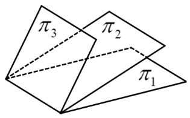

# 2024年全国硕士研究生招生考试数学一真题
> 本真题试卷来源于权威公开考研真题题库整理，包含全部题目、完整选项、高清插图、专业标签及详细参考答案与解析。
---

## 选择题

### 【M1-24-C-T01】第 1 题

已知函数
$f(x)=\int_0^x \ecostdt$
，
$g(x)=∫0sinxet2dt$
，则( )

- **A.** f(x)
是奇函数，
$g(x)$
是偶函数
- **B.** f(x)
是偶函数，
$g(x)$
是奇函数
- **C.** f(x)
与
$g(x)$
均为奇函数
- **D.** f(x)
与
$g(x)$
均为周期函数

> **【唯一编号】** `M1-24-C-T01`
> **【题型】** 选择题
> **【科目】** 微积分
> **【分值】** 5分
> **【年份】** 2024年
> **【考点】** 一元函数积分学、变限积分

<b>💡 查看参考答案与解析</b>

**【参考答案】** C

**【解析】**

**正确答案：C**

解析：由于
$ecost$
是偶函数，所以
$f(x)=\int_0^x \ecostdt$
是奇函数，又
$g′(x)=e(sinx)2cosx$
是偶函数，所以
$g(x)$
是奇函数。

故选 C。

---

### 【M1-24-C-T02】第 2 题

已知
$P=P(x,y,z)$
，
$Q=Q(x,y,z)$
均连续，
$∑$
为
$z=1−x2−y2$
，
$x≤0$
，
$y≥0$
的上侧，则
$∬∑Pdydz+Qdxdz=$

- **A.** ∬∑(zxP+zyQ)dxdy
- **B.** ∬∑(−zxP+zyQ)dxdy
- **C.** ∬∑(zxP−zyQ)dxdy
- **D.** ∬∑(−zxP−zyQ)dxdy

> **【唯一编号】** `M1-24-C-T02`
> **【题型】** 选择题
> **【科目】** 微积分
> **【分值】** 5分
> **【年份】** 2024年
> **【考点】** 多元函数积分学、第二类曲面积分

<b>💡 查看参考答案与解析</b>

**【参考答案】** A

**【解析】**

**正确答案：A**

由转换投影公式。

$$
==∬ΣP⋅(−∂x∂z)dxdy+Q⋅(−∂y∂z)dxdy∬Σ[P⋅(zx)+Q⋅(zy)]dxdy∬Σ(zPx+zQy)dxdy
$$

选 A。

---

### 【M1-24-C-T03】第 3 题

已知幂级数
$∑n=0∞anxn$
的和函数为
$ln(2+x)$
，则
$∑n=0∞na2n=$
（ ）

- **A.** −61
- **B.** −31
- **C.** 61
- **D.** 31

> **【唯一编号】** `M1-24-C-T03`
> **【题型】** 选择题
> **【科目】** 微积分
> **【分值】** 5分
> **【年份】** 2024年
> **【考点】** 无穷级数、幂级数的和函数及幂级数展开式

<b>💡 查看参考答案与解析</b>

**【参考答案】** A

**【解析】**

**正确答案：A**

【解析】

$$
ln(2+x)=ln(1+2x)+ln2=ln2+n=1∑∞(−1)n−1n(2x)n=ln2+2x−2(2x)2+3(2x)3−4(2x)4+⋯−6(2x)6+⋯
$$

$$
n=0∑∞na2n=0+a2+2a4+3a6+4a8+⋯=−2⋅221+2⋅(−24⋅41)−3⋅26⋅61+⋯=−[231+251+271+⋯]=−[1−221231]=−4381=−81×34=−61
$$

故选 A。

---

### 【M1-24-C-T04】第 4 题

设函数
$f(x)$
在区间
$(−1,1)$
上有定义，且
$\lim_{x \to 0}f(x)=0$
，则(  )

- **A.** 当
$\lim_{x \to 0}xf(x)=m$
时，
$f′(0)=m$
- **B.** 当
$f′(0)=m$
时，
$\lim_{x \to 0}xf(x)=m$
- **C.** 当
$\lim_{x \to 0}f′(x)=m$
时，
$f′(0)=m$
- **D.** 当
$f′(0)=m$
时，
$\lim_{x \to 0}f′(x)=m$

> **【唯一编号】** `M1-24-C-T04`
> **【题型】** 选择题
> **【科目】** 微积分
> **【分值】** 5分
> **【年份】** 2024年
> **【考点】** 一元函数微分学、导数与微分的概念

<b>💡 查看参考答案与解析</b>

**【参考答案】** B

**【解析】**

**正确答案：B**

因为
$f′(0)=m$
，所以
$f(x)$
在
$x=0$
处连续，

从而
$\lim_{x \to 0}f(x)=f(0)=0$
，所以
$\lim_{x \to 0}xf(x)=\lim_{x \to 0}x−0f(x)−f(0)=m$
，

故选 B.

对于 A 选项，
$\lim_{x \to 0}xf(x)=m$
，推不出来
$f′(0)=m$
；

对于C选项，
$f′(x)$
在
$x=0$
处不一定连续；

对于D选项，
$f′(x)$
在
$x=0$
处极限未必存在。

---

### 【M1-24-C-T05】第 5 题

在空间直角坐标系
$O−xyz$
中，三张平面 πi:aix+biy+ciz=di(i=1,2,3)
的位置关系如图所示，

记
$αi=(ai,bi,ci)$
，
$βi=(ai,bi,ci,di)$
，若

$$
rα1α2α3=m,rβ1β2β3=n,
$$

则（ ）

- **A.** m=1
，
$n=2$
- **B.** m=n=2
- **C.** m=2
，
$n=3$
- **D.** m=n=3

> **【唯一编号】** `M1-24-C-T05`
> **【题型】** 选择题
> **【科目】** 线性代数
> **【分值】** 5分
> **【年份】** 2024年
> **【考点】** 线性方程组

<b>💡 查看参考答案与解析</b>

**【参考答案】** B

**【解析】**

**正确答案：B**

【解析】由题意知

$$
α1α2α3x1x2x3=d1d2d3
$$

有无穷多解，故

$$
rα1α2α3=rβ1β2β3<3
$$

又由存在两平面的法向量不共线即线性无关，故

$$
rα1α2α3≥2
$$

则

$$
rα1α2α3=rβ1β2β3=2
$$

故
$m=n=2$
，故选 B。

---

### 【M1-24-C-T06】第 6 题

设向量
$α1=a1−11$
，
$α2=11ba$
，
$α3=1a−11$
，若
$α1,α2,α3$
线性相关，且其中任意两个向量均线性无关，则（ ）

- **A.** a=1,b=−1
- **B.** a=1,b=−1
- **C.** a=−2,b=2
- **D.** a=−2,b=2

> **【唯一编号】** `M1-24-C-T06`
> **【题型】** 选择题
> **【科目】** 线性代数
> **【分值】** 5分
> **【年份】** 2024年
> **【考点】** 向量、向量组的线性相关性

<b>💡 查看参考答案与解析</b>

**【参考答案】** D

**【解析】**

**正确答案：D**

【解析】由于向量组
$α1,α2,α3$
线性相关，因此其秩
$r(α1,α2,α3)<3$
。由此可得行列式

$$
a1111a1a1=0
$$

解得
$a=1$
或
$a=−2$
。

当
$a=1$
时，
$α1$
与
$α3$
线性相关，与题意矛盾，因此舍去。故取
$a=−2$
。

进一步，由

$$
a1−111b1a−1=−21−111b1−2−1=0
$$

解得
$b=2$
。

因此，正确答案为 **D**。

---

### 【M1-24-C-T07】第 7 题

设
$A$
是秩为
$2$
的
$3$
阶矩阵，
$α$
是满足
$Aα=0$
的非零向量，若对满足
$βTα=0$
的
$3$
维列向量
$β$
，均有
$Aβ=β$
，则( )

- **A.** A3
的迹为
$2$
- **B.** A3
的迹为
$5$
- **C.** A2
的迹为
$8$
- **D.** A2
的迹为
$9$

> **【唯一编号】** `M1-24-C-T07`
> **【题型】** 选择题
> **【科目】** 线性代数
> **【分值】** 5分
> **【年份】** 2024年
> **【考点】** 矩阵、矩阵的秩

<b>💡 查看参考答案与解析</b>

**【参考答案】** A

**【解析】**

**正确答案：A**

【解析】由
$Aα=0$
且
$α=0$
，故
$λ1=0$
，设非零向量
$β1,β2$
线性无关（因为与
$α$
垂直的平面中一定存在两个线性无关的向量）且满足
$β1Tα=β2Tα=0$
，则
$Aβ1=β1,Aβ2=β2$
，又由
$β1,β2$
线性无关，故
$λ=1$

至少为二重根，故
$λ1=0,λ2=λ3=1$
，故
$A3$
的特征值为
$0,1,1$
，故
$tr(A3)=0+1+1=2$
，故选A.

---

### 【M1-24-C-T08】第 8 题

设随机变量
$X$
，
$Y$
相互独立，且
$X$
服从正态分布
$N(0,2)$
，
$Y$
服从正态分布
$N(−2,2)$
，若
$P{2X+Y<a}=P{X>Y}$
，则
$a=($
$)$

- **A.** −2−10
- **B.** −2+10
- **C.** −2−6
- **D.** −2+6

> **【唯一编号】** `M1-24-C-T08`
> **【题型】** 选择题
> **【科目】** 概率论与数理统计
> **【分值】** 5分
> **【年份】** 2024年
> **【考点】** 随机变量及其分布

<b>💡 查看参考答案与解析</b>

**【参考答案】** B

**【解析】**

**正确答案：B**

【解析】
$2X+Y:N(−2,10)$
，
$Y−X:N(−2,22)$
，

所以
$P{2X+Y<a}=Φ(10a+2)=P{Y−X<0}=Φ(20+2)$
，

于是
$10a+2=20+2$
，
$a=−2+10$
。

故选 B.

---

### 【M1-24-C-T09】第 9 题

设随机变量
$X$
的概率密度为

$$
f(x)={2(1−x),0,0<x<1其它
$$

在
$X=x(0<x<1)$
的条件下，随机变量
$Y$
服从区间
$(x,1)$
上的均匀分布，则
$Cov(X,Y)=$
（  ）

- **A.** −361
- **B.** −721
- **C.** 721
- **D.** 361

> **【唯一编号】** `M1-24-C-T09`
> **【题型】** 选择题
> **【科目】** 概率论与数理统计
> **【分值】** 5分
> **【年份】** 2024年
> **【考点】** 多维随机变量及其分布、协方差与相关系数

<b>💡 查看参考答案与解析</b>

**【参考答案】** D

**【解析】**

**正确答案：D**

【解析】当
$0<x<1$
时，条件概率密度函数为：

$$
fY∣X(y∣x)=⎩⎨⎧1−x1,0,x<y<1其他
$$

联合概率密度函数为：

$$
f(x,y)={2,0,x<y<1,0<x<1其他
$$

计算
$EXY$
：

$$
EXY=−∞<x<+∞−∞<y<+∞∬xyf(x,y)dxdy=∫01dy∫0y2xydx=41
$$

计算
$EX$
：

$$
EX=∫01x⋅2(1−x)dx=31
$$

计算
$EY$
：

$$
EY=−∞<x<+∞−∞<y<+∞∬yf(x,y)dxdy=∫01dy∫0y2ydx=32
$$

计算协方差：

$$
Cov(X,Y)=EXY−EX⋅EY=41−31⋅32=361
$$

故选 D。

---

### 【M1-24-C-T10】第 10 题

设随机变量
$X,Y$
相互独立，且均服从参数为
$λ$
的指数分布，令
$Z=∣X−Y∣$
，则下列随机变量与
$Z$
同分布的是（  ）

- **A.** X+Y
- **B.** 2X+Y
- **C.** 2X
- **D.** X

> **【唯一编号】** `M1-24-C-T10`
> **【题型】** 选择题
> **【科目】** 概率论与数理统计
> **【分值】** 5分
> **【年份】** 2024年
> **【考点】** 多维随机变量及其分布、二维随机变量及其分布

<b>💡 查看参考答案与解析</b>

**【参考答案】** D

**【解析】**

**正确答案：D**

【解析】令
$Z=∣X−Y∣$
，则
$FZ(z)=P{Z≤z}=P{∣X−Y∣≤z}$
。

当
$z<0$
时，
$FZ(z)=0$
；

当
$z≥0$
时，

$$
FZ(z)=∬∣x−y∣≤zf(x,y)dxdy=∬∣x−y∣≤zλe−λxλe−λydxdy=2∫0∞dy∫yy+zλe−λxλe−λydx=1−e−λz
$$

因此，

$$
FZ(z)={0,1−e−λz,z<0z≥0
$$

显然，
$Z=∣X−Y∣$
与
$X$
同分布。

故选 D。

---

## 填空题

### 【M1-24-F-T11】第 11 题

（填空题）若
$\lim_{x \to 0}x3(1+ax2)sinx−1=6$
，则
$a=$
______

> **【唯一编号】** `M1-24-F-T11`
> **【题型】** 填空题
> **【科目】** 微积分
> **【分值】** 5分
> **【年份】** 2024年
> **【考点】** 函数、极限、连续、确定极限中的参数

<b>💡 查看参考答案与解析</b>

**【解析】**

**【答案】** 6

**【解析】**

$$
x→0limx3(1+ax2)sinx−1=x→0limx3esinxln(1+ax2)−1=x→0limx3sinx⋅ln(1+ax2)=x→0limx3ax3=6
$$

故
$a=6$

---

### 【M1-24-F-T12】第 12 题

（填空题）设函数
$f(u,v)$
具有 2 阶连续偏导数，且

$$
df∣(1,1)=3du+4dv,
$$

令
$y=f(cosx,1+x2)$
，则

$$
dx2d2yx=0=
$$

> **【唯一编号】** `M1-24-F-T12`
> **【题型】** 填空题
> **【科目】** 微积分
> **【分值】** 5分
> **【年份】** 2024年
> **【考点】** 多元函数微分学、偏导数的概念与计算

<b>💡 查看参考答案与解析</b>

**【解析】**

**【答案】** 5

**【解析】**由
$df∣(1,1)=3du+4dv$
可知，

$$
fu′(1,1)=3,fv′(1,1)=4
$$

又

$$
dxdy=fu′⋅(−sinx)+fv′⋅2x
$$

则

$$
dx2d2y=[fuu′′⋅(−sinx)+fuv′′⋅2x](−sinx)+fu′⋅(−cosx)+[fvu′′⋅(−sinx)+fvv′′⋅2x](2x)+2fv′
$$

因此，

$$
dx2d2yx=0=fu′(1,1)⋅(−1)+2fv′(1,1)=−3+8=5
$$

---

### 【M1-24-F-T13】第 13 题

（填空题）已知函数
$f(x)=x+1$
，若
$f(x)=2a0+∑n=1∞ancosnx$
，
$x∈[0,π]$
，则
$limn→∞n2sina2n−1=$
__________

> **【唯一编号】** `M1-24-F-T13`
> **【题型】** 填空题
> **【科目】** 微积分
> **【分值】** 5分
> **【年份】** 2024年
> **【考点】** 无穷级数、幂级数的和函数及幂级数展开式

<b>💡 查看参考答案与解析</b>

**【解析】**

**【答案】**
$−π1$

**【解析】**由题意可得将
$f(x)$
在
$[0,π]$
展为余弦级数，由公式可得

$$
an=π2∫0π(x+1)cosπnπxdx=π2[(x+1)n1sinnx+n21cosnx]0π=−n2π4,n=2k−1
$$

$$
n→∞limn2sina2n−1=n→∞lim[−(2n−1)2π4n2]=−π1
$$

---

### 【M1-24-F-T14】第 14 题

（填空题）微分方程
$y′=(x+y)21$
满足条件
$y(1)=0$
的解为______

> **【唯一编号】** `M1-24-F-T14`
> **【题型】** 填空题
> **【科目】** 微积分
> **【分值】** 5分
> **【年份】** 2024年
> **【考点】** 常微分方程、可分离变量的微分方程与齐次方程

<b>💡 查看参考答案与解析</b>

**【解析】**

**【答案】**
$x=tan(y+4π)−y$

**【解析**

- 令
$x+y=u$
，等式两边同时对
$x$
求导，得到
$u′=1+y′$
，代入原式可得
$u′−1=u21$
。
- 整理得
$dxdu=u21+u2$
，即
$∫u2+1u2du=∫dx$
。
- 求得
$u−arctanu=x+c$
，即
$y−arctan(x+y)=c$
。
- 把初始条件代入可得
$c=−4π$
，解得
$x=tan(y+4π)−y$
。

---

### 【M1-24-F-T15】第 15 题

（填空题）设实矩阵
$A=(a+1aaa)$
，若对任意实向量
$α=(x1x2)$
，
$β=(y1y2)$
，
$(αTAβ)2≤αTAα⋅βTAβ$
都成立，则
$a$
的取值范围是______

> **【唯一编号】** `M1-24-F-T15`
> **【题型】** 填空题
> **【科目】** 线性代数
> **【分值】** 5分
> **【年份】** 2024年
> **【考点】** 矩阵、伴随矩阵与可逆矩阵

<b>💡 查看参考答案与解析</b>

**【解析】**

**【答案】**
$[0,+∞)$

**【解析】** 由题意知：
$αTA(βαT−αβT)Aβ≤0$
恒成立。

设函数
$f(x1,x2,y1,y2)=αTA(βαT−αβT)Aβ$
。

由

$$
βαT−αβT=(y1y2)(x1x2)−(x1x2)(y1y2)=(x1y2−x2y1)(01−10),
$$

则

$$
A(βαT−αβT)A=(x1y2−x2y1)(a+1aaa)(01−10)(a+1aaa)=(x1y2−x2y1)(0a−a0),
$$

故

$$
f(x1,x2,y1,y2)=(x1y2−x2y1)αT(0a−a0)β=−a(x1y2−x2y1)2≤0,
$$

可得
$a≥0$
。

---

### 【M1-24-F-T16】第 16 题

（填空题）设随机试验每次成功的概率为
$P$
，现进行 3 次独立重复试验，在至少成功 1 次的条件下，3 次试验全部成功的概率为
$134$
，则
$P=$
______

> **【唯一编号】** `M1-24-F-T16`
> **【题型】** 填空题
> **【科目】** 概率论与数理统计
> **【分值】** 5分
> **【年份】** 2024年
> **【考点】** 随机事件和概率

<b>💡 查看参考答案与解析</b>

**【解析】**

**【答案】**
$32$

**【解析】** 设随机变量
$X$
表示三次试验中成功的次数，则
$X:B(3,p)$
，所以

$$
P{X=3∣X≥1}=P{X≥1}P{X=3,X≥1}=P{X≥1}P{X=3}=1−C30(1−P)3C33P3=134
$$

$$
∴P=32
$$

---

## 解答题

### 【M1-24-A-T17】第 17 题

（本题满分10分）

已知平面区域
$D={(x,y)∣1−y2≤x≤1,−1≤y≤1}$
，计算
$∬Dx2+y2xdxdy$

> **【唯一编号】** `M1-24-A-T17`
> **【题型】** 解答题
> **【科目】** 微积分
> **【分值】** 10分
> **【年份】** 2024年
> **【考点】** 多元函数积分学、重积分的计算

<b>💡 查看参考答案与解析</b>

**【解析】**

**【答案】**
$2−2+ln(1+2)$

**【解析】**

由于积分区域关于
$x$
轴对称，被积函数关于
$y$
为偶函数，故

∬Dx2+y2xdxdy=2∬D1x2+y2xdxdy=2∫01dy∫1−y21x2+y2xdx

=∫01dy∫1−y21x2+y21d(x2+y2)

=2∫011+y2dy−2=[y1+y2+ln(y+1+y2)]01−2

=2−2+ln(1+2)

---

### 【M1-24-A-T18】第 18 题

（本题满分12分）

已知函数
$f(x,y)=x3+y3−(x+y)2+3$
，设
$T$
是曲面
$z=f(x,y)$
在点
$(1,1,1)$
处的切平面，
$D$
为
$T$
与坐标平面所围成的有界区域在
$xOy$
平面上的投影。

(1) 求
$T$
的方程

(2) 求
$f(x,y)$
在
$D$
上的最大值和最小值

> **【唯一编号】** `M1-24-A-T18`
> **【题型】** 解答题
> **【科目】** 微积分
> **【分值】** 12分
> **【年份】** 2024年
> **【考点】** 多元函数微分学、多元函数微分学的几何应用

<b>💡 查看参考答案与解析</b>

**【解析】**

**【答案】**(1)
$x+y+z=3 (2) 最大值为21，最小值为$
$2717$

**【解析】**(1) 对于
$z=f(x,y)=x3+y3−(x+y)2+3$
，有
$zx′(1,1)=−1$
，
$zy′(1,1)=−1$
，从而曲面在点
$(1,1,1)$
处的一个法向量为

$$
n=(−zx,−zy,1)=(1,1,1),
$$

得该点处曲面的切平面方程为

$$
x+y+z=3.
$$

(2) 在
$xoy$
平面中，区域
$D:x+y≤3,x≥0,y≥0$
。在
$D$
内部求驻点，解方程组

$$
{fx′=3x2−2(x+y)=0,fy′=3y2−2(x+y)=0,
$$

得
$(34,34)$
，有
$f(34,34)=2717$
；

在边界
$y=0,0<x<3$
上，对于
$f(x,0)=x3−x2+3$
，解得其驻点
$(32,0)$
，有
$f(32,0)=2777$
；

在边界
$x=0,0<y<3$
上，对于
$f(0,y)=y3−y2+3$
，解得其驻点
$(0,32)$
，有
$f(0,32)=2777$
；

在边界
$x+y=3,0<x<3$
上，对于
$f(x,3−x)=x3+(3−x)3−6$
，解得其驻点
$(23,23)$
，有
$f(23,23)=43$
；

在边界顶点，有

$$
f(0,0)=3,f(3,0)=f(0,3)=21.
$$

综上，得
$f(x,y)$
在
$D$
上的最大值为
$f(3,0)=f(0,3)=21$
，最小值为
$f(34,34)=2717$
。

---

### 【M1-24-A-T19】第 19 题

（本题满分 12 分）

设函数
$f(x)$
具有 2 阶导数，且
$f′(0)=f′(1)$
，
$∣f′′(x)∣≤1$
，证明：

(1) 当
$x∈(0,1)$
时，
$∣f(x)−f(0)(1−x)−f(1)x∣≤2x(1−x)$

(2)
$\int_0^1 f(x) \, dx−2f(0)+f(1)≤121$

> **【唯一编号】** `M1-24-A-T19`
> **【题型】** 解答题
> **【科目】** 微积分
> **【分值】** 12分
> **【年份】** 2024年
> **【考点】** 一元函数微分学、微分中值定理

<b>💡 查看参考答案与解析</b>

**【解析】**

**【答案】** 见解析

**【解析】**

(1) 证明：令
$g(x)=f(0)(1−x)+f(1)x$
。令
$F(x)=f(x)−g(x)−2x(1−x)$
，其中
$x∈(0,1)$
。由于
$F(0)=0$
，
$F(1)=0$
，且
$F′′(x)=f′′(x)+1≥0$
（因为
$∣f′′(x)∣≤1$
），因此
$F(x)$
为凹函数，从而
$F(x)≥0$
。于是有

$$
f(x)−f(0)(1−x)−f(1)x≤2x(1−x).
$$

再令
$F(x)=f(x)−g(x)+2x(1−x)$
，其中
$x∈(0,1)$
。由于
$F(0)=0$
，
$F(1)=0$
，且
$F′′(x)=f′′(x)−1≤0$
（因为
$∣f′′(x)∣≤1$
），因此
$F(x)$
为凸函数，从而
$F(x)≥0$
。于是有

$$
f(x)−f(0)(1−x)−f(1)x≥−2x(1−x).
$$

综上，

$$
∣f(x)−f(0)(1−x)−f(1)x∣≤2x(1−x).
$$

(2) 由 (1) 中

$$
f(x)−f(0)(1−x)−f(1)x≤2x(1−x),
$$

两边在
$[0,1]$
上积分得

$$
∫01[f(x)−f(0)(1−x)−f(1)x]dx≤∫012x(1−x)dx.
$$

计算可得

$$
∫01f(x)dx−2f(0)+f(1)≤121.
$$

又由 (1) 中

$$
f(x)−f(0)(1−x)−f(1)x≥−2x(1−x),
$$

两边在
$[0,1]$
上积分得

$$
∫01[f(x)−f(0)(1−x)−f(1)x]dx≥−∫012x(1−x)dx,
$$

即

$$
∫01f(x)dx−2f(0)+f(1)≥−121.
$$

综上，

$$
∫01f(x)dx−2f(0)+f(1)≤121.
$$

---

### 【M1-24-A-T20】第 20 题

（本题满分12分）

已知有向曲线 L 的球面
$x2+y2+z2=2x$
与平面
$2x−z−1=0$
的交线，从 z 轴正向往 z 轴负向看去为逆时针方向，计算曲线积分

∫L(6xyz−yz2)dx+2x2zdy+xyzdz

> **【唯一编号】** `M1-24-A-T20`
> **【题型】** 解答题
> **【科目】** 微积分
> **【分值】** 12分
> **【年份】** 2024年
> **【考点】** 多元函数积分学、第二类曲线积分

<b>💡 查看参考答案与解析</b>

**【解析】**

**【答案】**
$2545π$

**【解析】**

$$
I=∮L(6xyz−yz2)dx+2x2zdy+xyzdz=∬∑dydz∂x∂6xyz−yz2dzdx∂y∂2x2zdxdy∂z∂xyz,其中∑:z=2x−1，取上侧=∬∑(xz−2x2)dydz+(6xy−3yz)dzdx+(z2−2xz)dxdy=∬∑[(xz−2x2)(−2)+(6xy−3yz)⋅0+(z2−2xz)]dxdy=∬∑(4x2−4xz+z2)dxdy=∬D[4x2−4x(2x−1)+(2x−1)2]dxdy,D:(52)2(x−53)2+(52)2y2≤1=∬D1dxdy=2545π.
$$

---

### 【M1-24-A-T21】第 21 题

（本题满分 12 分）

已知数列
${xn}$
，
${yn}$
，
${zn}$
满足
$x0=−1$
，
$y0=0$
，
$z0=2$
，且

$$
⎩⎨⎧xn=−2xn−1+2zn−1yn=−2yn−1−2zn−1zn=−6xn−1−3yn−1+3zn−1
$$

记
$αn=xnynzn$
，写出满足
$αn=Aαn−1$
的矩阵
$A$
，并求
$An$
及
$xn$
，
$yn$
，
$zn$
。

> **【唯一编号】** `M1-24-A-T21`
> **【题型】** 解答题
> **【科目】** 线性代数
> **【分值】** 12分
> **【年份】** 2024年
> **【考点】** 矩阵、矩阵的运算与变换

<b>💡 查看参考答案与解析</b>

**【解析】**

**【答案】**矩阵
$A=−20−60−2−32−23  An=−4+(−1)n+1⋅2n4+(−1)n⋅2n+1−6−2+(−1)n+1⋅2n2+(−1)n⋅2n+1−32−23  xn=8+(−2)n$
,
$yn=−8+(−2)n+1$
,
$zn=12$

**【解析】**

由题设得

$$
xnynzn=−20−60−2−32−23xn−1yn−1zn−1,
$$

即
$αn=Aαn−1$
，故

$$
A=−20−60−2−32−23.
$$

由
$∣λE−A∣=0$
，即

$$
λ+2060λ+23−22λ−3=0,
$$

得
$λ1=0$
，
$λ2=1$
，
$λ3=−2$
。

当
$λ1=0$
时，
$Ax=0$
，得基础解系为
$η1=(1,−1,1)T$
。

当
$λ2=1$
时，
$(E−A)x=0$
，得基础解系为
$η2=(2,−2,3)T$
。

当
$λ3=−2$
时，
$(−2E−A)x=0$
，得基础解系为
$η3=(−1,2,0)T$
。

故存在可逆矩阵

$$
P=(η1,η2,η3)=1−112−23−120,
$$

使
$P−1AP=01−2$
，即
$A=PΛP−1$
。

则

$$
An=PΛnP−1=1−112−23−12001−2n1−112−23−120−1
$$

$$
=−4+(−1)n+1⋅2n4+(−1)n⋅2n+1−6−2+(−1)n+1⋅2n2+(−1)n⋅2n+1−32−23.
$$

由
$αn=Aαn−1$
，得

$$
αn=Anα0=−4+(−1)n+1⋅2n4+(−1)n⋅2n+1−6−2+(−1)n+1⋅2n2+(−1)n⋅2n+1−32−23x0y0z0
$$

$$
=8+(−2)n−8+(−2)n+112.
$$

则

$$
xn=8+(−2)n,yn=−8+(−2)n+1,zn=12.
$$

---

### 【M1-24-A-T22】第 22 题

（本题满分 12 分）

设总体
$X$
服从
$[0,θ]$
上的均匀分布，其中
$θ∈(0,+∞)$
为未知参数，
$X1,X2,⋯,Xn$
是来自总体
$X$
的简单随机样本，记
$X(n)=max{X1,X2,⋯,Xn}$
，
$Tc=cX(n)$
。

（1）求
$c$
，使得
$Tc$
是
$θ$
的无偏估计；

（2）记
$h(c)=E(Tc−θ)2$
，求
$c$
使得
$h(c)$
最小。

> **【唯一编号】** `M1-24-A-T22`
> **【题型】** 解答题
> **【科目】** 概率论与数理统计
> **【分值】** 12分
> **【年份】** 2024年
> **【考点】** 参数估计与假设检验、估计量的无偏性

<b>💡 查看参考答案与解析</b>

**【解析】**

**【答案】**(1)
$c=nn+1 (2)$
$c=n+1n+2$

**【解析】**(1)
$X$
的概率密度为

$$
f(x)={θ1,0,0<x<θ其他
$$

X
的分布函数为

$$
F(x)=⎩⎨⎧0,θ1x,1,x<00≤x<θx≥θ
$$

X(n)
的分布函数为

$$
FX(n)(x)=P{max{X1,X2,⋯,Xn}≤x}=P{X1≤x,X2≤x,⋯,Xn≤x}
$$

$$
=P{X1≤x}⋅P{X2≤x}⋯P{Xn≤x}=Fn(x)
$$

X(n)
的概率密度为

$$
fX(n)(x)=nFn−1(x)⋅f(x)={θnnxn−1,0,0<x<θ其他
$$

计算期望：

$$
E(Tc)=cE(X(n))=c∫0θx⋅θnnxn−1dx=n+1cnθ
$$

令
$E(Tc)=n+1cnθ=θ$
，解得

$$
c=nn+1
$$

(2) 计算二阶矩：

$$
E(Tc2)=c2E(X(n)2)=c2∫0θx2⋅θnnxn−1dx=n+2c2nθ2
$$

定义函数：

$$
h(c)=E(Tc−θ)2=E(Tc2−2θTc+θ2)=E(Tc2)−2θE(Tc)+θ2
$$

代入得

$$
h(c)=n+2c2nθ2−n+12cnθ2+θ2
$$

求导：

$$
h′(c)=n+22cnθ2−n+12nθ2
$$

令
$h′(c)=0$
，解得

$$
c=n+1n+2
$$

二阶导数为

$$
h′′(c)=n+22nθ2>0
$$

因此当
$c=n+1n+2$
时，
$h(c)$
取得最小值。

---
