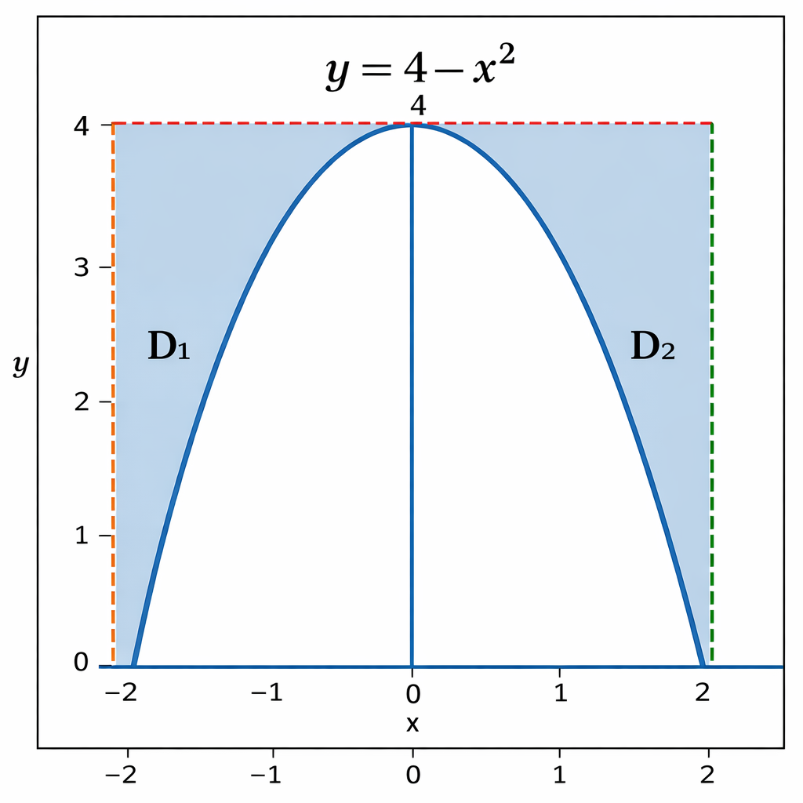

# 2025年全国硕士研究生招生考试数学一真题
> 本真题试卷来源于权威公开考研真题题库整理，包含全部题目、完整选项、高清插图、专业标签及详细参考答案与解析。
---

## 选择题

### 【M1-25-C-T01】第 1 题

已知函数
$f(x)=\int_0^x \et2sintdt$
，
$g(x)=\int_0^x \et2dt⋅sin2x$
，则

- **A.** x=0
是
$f(x)$
的极值点，也是
$g(x)$
的极值点.
- **B.** x=0
是
$f(x)$
的极值点，
$(0,0)$
是曲线
$y=g(x)$
的拐点.
- **C.** x=0
是
$f(x)$
的极值点，
$(0,0)$
是曲线
$y=f(x)$
的拐点.
- **D.** (0,0)
是曲线
$y=f(x)$
的拐点，也是曲线
$y=g(x)$
的拐点.

> **【唯一编号】** `M1-25-C-T01`
> **【题型】** 选择题
> **【科目】** 微积分
> **【分值】** 5分
> **【年份】** 2025年
> **【考点】** 一元函数微分学、函数的单调性、极值与最值

<b>💡 查看参考答案与解析</b>

**【参考答案】** B

**【解析】**

**正确答案：B**

【解析】

f′(x)=ex2sinx,f′′(x)=2xex2sinx+ex2cosx

f′(0)=0,f′′(0)=1>0
。

x=0
是
$f(x)$
的极值点。

g′(x)=ex2sin2x+sin2x∫0xet2dt
，

g′′(x)=ex2sin2x+2xex2sin2x+sin2xex2+2cos2x∫0xet2dt

g′(0)=0,g′′(0)=0,g′′′(0)>0
。

(0,0)
是
$y=g(x)$
的拐点。

---

### 【M1-25-C-T02】第 2 题

已知级数：①
$∑n=1∞sinn2+1n3π$
；②
$∑n=1∞(−1)n(3n21−tan3n21)$
，则

- **A.** ①与②均条件收敛.
- **B.** ①条件收敛，②绝对收敛.
- **C.** ①绝对收敛，②条件收敛.
- **D.** ①与②均绝对收敛.

> **【唯一编号】** `M1-25-C-T02`
> **【题型】** 选择题
> **【科目】** 微积分
> **【分值】** 5分
> **【年份】** 2025年
> **【考点】** 无穷级数、常数项级数敛散性的判定

<b>💡 查看参考答案与解析</b>

**【参考答案】** B

**【解析】**

**正确答案：B**

【解析】

sinn2+1n3π=sin(n2+1n3π−nπ)=sinn2+1nπ∼n2+1nπ∼n1π
.

∑n=1∞n1
发散
$∴$
不是绝对收敛.

sinn2+1n3π=(−1)nsin(n2+1n3π−nπ)=(−1)nsinn2+1nπ
，为交错级数.

sinn2+1nπ
递减，
$∴$
条件收敛.

∑n=1∞(−1)n(3n21−tan3n21)
.

(−1)n(3n21−tan3n21)=−31n32×231+o(n21)
（注：原解析此处
$n$
的次数书写可能有误，推测应为
$−31n341+o(n341)$
，按你提供内容提取 ），实际准确是利用等价无穷小，当
$x→0$
时，
$x−tanx∼−31x3$
，令
$x=3n21=n−32$
，则
$3n21−tan3n21∼−31n−2$
，所以
$(−1)n(3n21−tan3n21)∼3n21$
$）$

∑n=1∞n21
收敛
$∴∑n=1∞(−1)n(3n21−tan3n21)$
绝对收敛

---

### 【M1-25-C-T03】第 3 题

设函数
$f(x)$
在区间
$[0,+∞)$
上可导，则

- **A.** 当
$x→+∞limf(x)$
存在时，
$x→+∞limf′(x)$
存在。
- **B.** 当
$x→+∞limf′(x)$
存在时，
$x→+∞limf(x)$
存在。
- **C.** 当
$x→+∞limx\int_0^x \f(t)dt$
存在时，
$x→+∞limf(x)$
存在。
- **D.** 当
$x→+∞limf(x)$
存在时，
$x→+∞limx\int_0^x \f(t)dt$
存在。

> **【唯一编号】** `M1-25-C-T03`
> **【题型】** 选择题
> **【科目】** 微积分
> **【分值】** 5分
> **【年份】** 2025年
> **【考点】** 一元函数微分学、微分中值定理

<b>💡 查看参考答案与解析</b>

**【参考答案】** D

**【解析】**

**正确答案：D**

【解析】A 错误，反例：

f(x)=xsinx2,x→+∞limf(x)=0
，但
$x→+∞limf′(x)=x→+∞limx22x2cosx2−sinx2$
，极限不存在。

B 错误，反例：
$f(x)=x,f′(x)=2x1,x→+∞limf′(x)=0$
，极限存在，但
$x→+∞limf(x)$
极限不存在。

C 错误，反例：

f(x)=cosx
，则
$x→+∞limx\int_0^x \f(t)dt=x→+∞limxsinx$
存在，但
$x→+∞limf(x)=x→+∞limcosx$
不存在。

D 正确，用
$x→+∞limx\int_0^x \f(t)dt=x→+∞lim1f(x)=A$
，故选 D 。

---

### 【M1-25-C-T04】第 4 题

设函数
$f(x,y)$
连续，则

$$
∫−22dx∫4−x24f(x,y)dy=
$$

- **A.** ∫04[∫−2−4−yf(x,y)dx+∫4−y2f(x,y)dx]dy
- **B.** ∫04[∫−24−yf(x,y)dx+∫4−y2f(x,y)dx]dy
- **C.** ∫04[∫−2−4−yf(x,y)dx+∫24−yf(x,y)dx]dy
- **D.** 2∫04dy∫4−y2f(x,y)dx

> **【唯一编号】** `M1-25-C-T04`
> **【题型】** 选择题
> **【科目】** 微积分
> **【分值】** 5分
> **【年份】** 2025年
> **【考点】** 多元函数积分学、交换积分次序与坐标系之间的转化

<b>💡 查看参考答案与解析</b>

**【参考答案】** A

**【解析】**

**正确答案：A**

【解析】由题易知，此二重积分的积分区域为

D={(x,y)4−x2≤y≤4,−2≤x≤2}
，对应图像为上图所示。

记 D1={(x,y)4−x2≤y≤4,−2≤x≤0}
， D2={(x,y)4−x2≤y≤4,0≤x≤2}
，且
$I=∫−22dx∫4−x24f(x,y)dy$
，则
$I=∬D1f(x,y)dσ+∬D2f(x,y)dσ$
。

交换积分次序得

$$
I=∫04dy∫−2−4−yf(x,y)dx+∫04dy∫4−y2f(x,y)dx
$$

$$
=∫04[∫−2−4−yf(x,y)dx+∫4−y2f(x,y)dx]dy
$$

故 A 正确。

---

### 【M1-25-C-T05】第 5 题

二次型
$f(x1,x2,x3)=x12+2x1x2+2x1x3$
的正惯性指数

- **A.** 0
- **B.** 1
- **C.** 2
- **D.** 3

> **【唯一编号】** `M1-25-C-T05`
> **【题型】** 选择题
> **【科目】** 线性代数
> **【分值】** 5分
> **【年份】** 2025年
> **【考点】** 二次型

<b>💡 查看参考答案与解析</b>

**【参考答案】** B

**【解析】**

**正确答案：B**

【解析】矩阵

$$
A=111100100
$$

计算特征多项式：

$$
λE−A=λ−1−1−1−1λ0−10λ→λ−10−1−1λ0−1−λλ→λλ−10−1−110−1−1λ=λ[λ(λ−1)−1−1]=λ(λ2−λ−2)=λ(λ−2)(λ+1)
$$

解得特征值为：

$$
λ1=0,λ2=2,λ3=−1
$$

因此，正惯性指数为
$1$
，选 B。

---

### 【M1-25-C-T06】第 6 题

设
$α1,α2,α3,α4$
是
$n$
维列向量，
$α1,α2$
线性无关，
$α1,α2,α3$
线性相关，且
$α1+α2+α4=0$
。

在空间直角坐标系
$O−xyz$
中，关于
$x,y,z$
的方程组
$xα1+yα2+zα3=α4$
的几何图形是

- **A.** 过原点的一个平面.
- **B.** 过原点的一条直线.
- **C.** 不过原点的一个平面.
- **D.** 不过原点的一条直线.

> **【唯一编号】** `M1-25-C-T06`
> **【题型】** 选择题
> **【科目】** 线性代数
> **【分值】** 5分
> **【年份】** 2025年
> **【考点】** 向量、向量组的线性相关性

<b>💡 查看参考答案与解析</b>

**【参考答案】** D

**【解析】**

**正确答案：D**

【解析】记
$A=(α1,α2,α3)$
，由
$α1,α2$
线性无关，而
$α1,α2,α3$
线性相关，可得
$r(A)=2$
。

记
$A=(A∣α4)=(α1,α2,α3,α4)$
，再由
$α1+α2+α4=0$
，可得
$r(A)=2$
。于是方程
$Ax=α4$
有无穷多解。

方程
$xα1+yα2+zα3=α4$
等价于
$(α1,α2,α3)⋅(x,y,z)T=α4$
，即
$A⋅(x,y,z)T=α4$
。

若该方程所表示的平面过原点，则
$α4=0$
，但这与
$α1,α2$
线性无关矛盾，故平面不过原点。

将方程写为分量形式：

$$
⎩⎨⎧a11x+a12y+a13z=a14a21x+a22y+a23z=a24⋯an1x+an2y+an3z=an4
$$

由上述分析可知
$r(A)=r(A)=2$
，故该方程组表示两个平面交于一条直线，且不过原点。

因此，正确答案为 D。

---

### 【M1-25-C-T07】第 7 题

设
$n$
阶矩阵
$A$
、
$B$
、
$C$
满足
$r(A)+r(B)+r(C)=r(ABC)+2n$
，给出下列四个结论：

①
$r(ABC)+n=r(AB)+r(C)$
；②
$r(AB)+n=r(A)+r(B)$
；③
$r(A)=r(B)=r(C)=n$
；④
$r(AB)=r(BC)=n$
。

其中正确结论的序号是

- **A.** ①②.
- **B.** ①③.
- **C.** ②④.
- **D.** ③④.

> **【唯一编号】** `M1-25-C-T07`
> **【题型】** 选择题
> **【科目】** 线性代数
> **【分值】** 5分
> **【年份】** 2025年
> **【考点】** 矩阵、矩阵的秩

<b>💡 查看参考答案与解析</b>

**【参考答案】** A

**【解析】**

**正确答案：A**

【解析】设矩阵

$$
A=(1000),B=(0001),C=E
$$

满足

$$
r(A)+r(B)+r(C)=r(ABC)+2n
$$

计算得

$$
r(A)=1,r(B)=1,r(C)=2
$$

因此排除结论③和④，故选 A。

---

### 【M1-25-C-T08】第 8 题

设二维随机变量
$(X,Y)$
服从正态分布
$N(0,0;1,1;ρ)$
，其中
$ρ∈(−1,1)$
。若
$a,b$
为满足
$a2+b2=1$
的任意实数，则
$D(aX+bY)$
的最大值为

- **A.** 1
- **B.** 2
- **C.** 1+∣ρ∣
.
- **D.** 1+ρ2
.

> **【唯一编号】** `M1-25-C-T08`
> **【题型】** 选择题
> **【科目】** 概率论与数理统计
> **【分值】** 5分
> **【年份】** 2025年
> **【考点】** 多维随机变量及其分布、二维随机变量及其分布

<b>💡 查看参考答案与解析</b>

**【参考答案】** C

**【解析】**

**正确答案：C**

【解析】

D(aX+bY)=a2DX+b2DY+2abρ⋅1⋅1

=a2+b2+2abρ=1+2abρ=1+2a1−a2ρ=f(a)

f′(a)=ρ(21−a2+2a⋅1−a2−a)=2ρ(1−a2−1−a2a2)=0

即
$2ρ⋅1−a21−a2−a2=0$
，
$2a2=1⇒a2=21,b2=21$
，于是
$a=±21,b=±21$
。所以最大值为
$1+∣ρ∣$
，故选C。

---

### 【M1-25-C-T09】第 9 题

设
$X1,X2,⋯,X20$
是来自总体
$B(1,0.1)$
的简单随机样本.令
$T=∑i=120Xi$
，利用泊松分布近似表示二项分布的方法可得
$P{T≤1}≈$

- **A.** e21
- **B.** e22
- **C.** e23
- **D.** e24

> **【唯一编号】** `M1-25-C-T09`
> **【题型】** 选择题
> **【科目】** 概率论与数理统计
> **【分值】** 5分
> **【年份】** 2025年
> **【考点】** 大数定律和中心极限定理

<b>💡 查看参考答案与解析</b>

**【参考答案】** C

**【解析】**

**正确答案：C**

【解析】由题意可知
$T∼B(20,0.1).np=20×0.1=2$

P{T≤1}=P{T=0}+P{T=1}=0!20e−2+1!21e−2=e−2+2e−2=e23

---

### 【M1-25-C-T10】第 10 题

设
$X1,X2,⋯,Xn$
为来自正态总体
$N(μ,2)$
的简单随机样本，记
$Xˉ=n1∑i=1nXi$
，
$xˉ$
为
$Xˉ$
的观察值，
$zα$
表示标准正态分布的上侧
$α$
分位数，假设检验问题：
$H0:μ≤1,H1:μ>1$
的显著性水平为
$α$
的检验的拒绝域为（）.

- **A.** {(x1,x2,⋯,xn)∣xˉ>1+n2zα}
- **B.** {(x1,x2,⋯,xn)∣xˉ>1+n2zα}
- **C.** {(x1,x2,⋯,xn)∣xˉ>1+n2zα}
- **D.** {(x1,x2,⋯,xn)∣xˉ>1+n2zα}

> **【唯一编号】** `M1-25-C-T10`
> **【题型】** 选择题
> **【科目】** 概率论与数理统计
> **【分值】** 5分
> **【年份】** 2025年
> **【考点】** 参数估计与假设检验、假设检验

<b>💡 查看参考答案与解析</b>

**【参考答案】** D

**【解析】**

**正确答案：D**【解析】按题意需检验假设:
$H0:μ≤1$
，
$H1:μ>1$
，这是右边检验问题，
$σ2=2$
为已知，其拒绝域为
$σ/nXˉ−μ>zα$
，解得
$Xˉ>μ+nσzα=1+n2zα$
，故选 D.

---

## 填空题

### 【M1-25-F-T11】第 11 题

（填空题）

$$
x→0+limlnx⋅ln(1−x)xx−1=
$$

> **【唯一编号】** `M1-25-F-T11`
> **【题型】** 填空题
> **【科目】** 微积分
> **【分值】** 5分
> **【年份】** 2025年
> **【考点】** 一元函数微分学、微分中值定理

<b>💡 查看参考答案与解析</b>

**【解析】**

**【答案】**
$−1$

**【解析】**

$$
x→0+lim−xlnxexlnx−1=x→0+lim−xlnxxlnx=−1
$$

---

### 【M1-25-F-T12】第 12 题

（填空题）已知函数
$f(x)={0,x2,0≤x<2121≤x≤1$
的傅里叶级数为
$∑n=1∞bnsinnπx$
，
$S(x)$
为
$∑n=1∞bnsinnπx$
的和函数，则
$S(−27)=$
______．

> **【唯一编号】** `M1-25-F-T12`
> **【题型】** 填空题
> **【科目】** 微积分
> **【分值】** 5分
> **【年份】** 2025年
> **【考点】** 无穷级数、幂级数的和函数及幂级数展开式

<b>💡 查看参考答案与解析</b>

**【解析】**

**【答案】**
$81$

**【解析】**

$$
S(−27)=S(−27+4)=S(21)=81
$$

---

### 【M1-25-F-T13】第 13 题

（填空题）已知函数
$u(x,y,z)=xy2z3$
，向量
$n=(2,2,−1)$
，则

$$
∂n∂u(1,1,1)=
$$

> **【唯一编号】** `M1-25-F-T13`
> **【题型】** 填空题
> **【科目】** 微积分
> **【分值】** 5分
> **【年份】** 2025年
> **【考点】** 多元函数微分学、方向导数和梯度

<b>💡 查看参考答案与解析</b>

**【解析】**

**【答案】** 1

**【解析】**

由题易知，

$$
∂x∂u=y2z3,∂y∂u=2xyz3,∂z∂u=3xy2z2.
$$

在
$x=1$
，
$y=1$
，
$z=1$
处，有

$$
(∂x∂u,∂y∂u,∂z∂u)=(1,2,3).
$$

对于向量
$nˉ=(2,2,−1)$
，归一化可得

$$
nˉ0=(32,32,−31).
$$

故

$$
∂n∂u(1,1,1)=(∂x∂u,∂y∂u,∂z∂u)⋅nˉ0=(1,2,3)⋅(32,32,−31)=1⋅32+2⋅32+3⋅(−31)=1.
$$

---

### 【M1-25-F-T14】第 14 题

（填空题）已知有向曲线
$L$
是沿抛物线
$y=1−x2$
从点
$(1,0)$
到点
$(−1,0)$
的一段，则曲线积分
$∫L(y+cosx)dx+(2x+cosy)dy=$
______。

> **【唯一编号】** `M1-25-F-T14`
> **【题型】** 填空题
> **【科目】** 微积分
> **【分值】** 5分
> **【年份】** 2025年
> **【考点】** 多元函数积分学、第二类曲线积分

<b>💡 查看参考答案与解析</b>

**【解析】**

**【答案】**
$34−2sin1$

**【解析】**曲线积分
$∫L(y+cosx)dx+(2x+cosy)dy$
中，曲线
$L$
为抛物线
$y=1−x2$
从点
$(1,0)$
到点
$(−1,0)$
的一段。计算步骤如下：

**方法一：直接参数化**以
$x$
为参数，
$x$
从
$1$
到
$−1$
，
$y=1−x2$
，则
$dy=−2xdx$
。代入积分：

$$
I=∫1−1[(1−x2+cosx)+(2x+cos(1−x2))(−2x)]dx=∫1−1(1−5x2+cosx−2xcos(1−x2))dx.
$$

分别计算：

$$
∫1−11dx=−2,∫1−1(−5x2)dx=310,∫1−1cosxdx=−2sin1,
$$

而

$$
∫1−1(−2x)cos(1−x2)dx=0(因为被积函数为奇函数，且上下限对称).
$$

所以

$$
I=−2+310−2sin1=34−2sin1.
$$

**方法二：格林公式**补充线段
$L0:y=0$
从
$(−1,0)$
到
$(1,0)$
，与
$L$
形成逆时针闭曲线
$C=L∪L0$
。设
$P=y+cosx$
，
$Q=2x+cosy$
，则

$$
∂x∂Q−∂y∂P=2−1=1.
$$

闭曲线
$C$
所围区域
$D$
的面积为

$$
∬D1dA=∫−11(1−x2)dx=34.
$$

由格林公式，

$$
∮CPdx+Qdy=∬D1dA=34.
$$

又

$$
∫L0Pdx+Qdy=∫−11cosxdx=2sin1,
$$

故

$$
∫LPdx+Qdy=∮CPdx+Qdy−∫L0Pdx+Qdy=34−2sin1.
$$

综上，所求曲线积分为
$34−2sin1$
.

---

### 【M1-25-F-T15】第 15 题

（填空题）设矩阵
$A=4ab235−3−4−7$
，若方程组
$A2x=0$
与
$Ax=0$
不同解，则
$a−b=$
______。

> **【唯一编号】** `M1-25-F-T15`
> **【题型】** 填空题
> **【科目】** 线性代数
> **【分值】** 5分
> **【年份】** 2025年
> **【考点】** 矩阵、矩阵的运算与变换

<b>💡 查看参考答案与解析</b>

**【解析】**

**【答案】** -4

**【解析】** 由题知，
$A=4ab235−3−4−7$
。若
$A2x=0$
与
$Ax=0$
同解，则三秩相同，即
$r(A)=r(A2)=r(AA2)$
。

如果
$A$
可逆，三秩显然相同，则
$A2x=0$
与
$Ax=0$
同解。于是，要想
$A2x=0$
与
$Ax=0$
不同解，即
$A$
不可逆，于是
$∣A∣=0$
。

根据行列式的倍加性质易得：

$$
∣A∣=4ab235−3−4−7=4ab235−1−1−2=4ab011−1−1−2=4(−2+1)−(a−b)
$$

令
$∣A∣=0$
，有
$a−b=−4$
。

---

### 【M1-25-F-T16】第 16 题

（填空题）设
$A,B$
为两个不同的随机事件，且
$A$
与
$B$
相互独立，已知
$P(A)=2P(B)$
，
$P(A∪B)=85$
，则在
$A,B$
至少有一个发生的条件下，
$A,B$
中恰有一个发生的概率为______。

> **【唯一编号】** `M1-25-F-T16`
> **【题型】** 填空题
> **【科目】** 概率论与数理统计
> **【分值】** 5分
> **【年份】** 2025年
> **【考点】** 随机事件和概率

<b>💡 查看参考答案与解析</b>

**【解析】**

**【答案】**
$54$

**【解析】**

$$
P(AB)+P(AB)=P(A)−P(AB)+P(B)−P(AB)=P(A)+P(B)−2P(A)P(B)
$$

$$
P(A∪B)=P(A)+P(B)−P(AB)=85⇒3P(B)−2P2(B)=85⇒24P(B)−16P2(B)=5⇒16P2(B)−24P(B)+5=0⇒(4P(B)−1)(4P(B)−5)=0⇒P(B)=41,P(A)=21
$$

$$
P(AB)+P(AB)=P(A)−P(AB)+P(B)−P(AB)=P(A)+P(B)−2P(A)P(B)=21+41−2×41×21=21
$$

$$
P=8521=21×58=54
$$

---

## 解答题

### 【M1-25-A-T17】第 17 题

（本题满分10分）

计算
$\int_0^1 (x+1)(x2−2x+2)1 \, dx$
。

> **【唯一编号】** `M1-25-A-T17`
> **【题型】** 解答题
> **【科目】** 微积分
> **【分值】** 10分
> **【年份】** 2025年
> **【考点】** 一元函数积分学、定积分的计算

<b>💡 查看参考答案与解析</b>

**【解析】**

**【答案】**
$103ln2+101π$

**【解析】**

$$
∫01(x+1)(x2−2x+2)1dx=∫01(x+1A+x2−2x+2Bx+C)dx=∫01(x+151+x2−2x+2−51x+53)dx=51ln∣1+x∣01−101ln∣x2−2x+2∣01+52arctan(x−1)01=103ln2+101π
$$

---

### 【M1-25-A-T18】第 18 题

（本题满分12分）

已知函数
$f(u)$
在区间
$(0,+∞)$
内具有2阶导数，记
$g(x,y)=f(yx)$
，若
$g(x,y)$
满足
$x2∂x2∂2g+xy∂x∂y∂2g+y2∂y2∂2g=1$
，且
$g(x,x)=1$
，
$∂x∂g(x,x)=x2$
，求
$f(u)$
。

> **【唯一编号】** `M1-25-A-T18`
> **【题型】** 解答题
> **【科目】** 微积分
> **【分值】** 12分
> **【年份】** 2025年
> **【考点】** 多元函数微分学、偏导数的概念与计算

<b>💡 查看参考答案与解析</b>

**【解析】**

**【答案】**
$f(u)=21ln2u+2lnu+1$

**【解析】**

令
$u=yx$
，则

$$
∂x∂g=f′(u)y1,∂y∂g=f′(u)(−y2x).
$$

又

$$
g(x,x)=f(xx)=f(1)=1,∂x∂g(x,x)=f′(1)x1=x2,
$$

故
$f′(1)=2$
。

二阶偏导数为：

$$
∂x2∂2g=(f′′(u)y1)y1=f′′(u)y21(1)∂x∂y∂2g=f′′(u)(−y2x)y1+f′(u)(−y21)=−y3xf′′(u)−y21f′(u)(2)∂y2∂2g=f′′(u)(−y2x)yx+f′(u)(y22x)=y4x2f′′(u)+y32xf′(u)(3)
$$

将 (1)(2)(3) 代入

$$
x2∂x2∂2g+xy∂x∂y∂2g+y2∂y2∂2g=1,
$$

化简得

$$
u2f′′(u)+uf′(u)=1,
$$

即

$$
f′′(u)+u1f′(u)=u21.
$$

令
$p=f′(u)$
，则

$$
p′+u1p=u21.
$$

解得

$$
p=e−∫u1du[∫u21e∫u1dudu+C]=u1[∫u1du+C]=ulnu+uC.
$$

由
$p∣u=1=C=2$
，得

$$
p=ulnu+u2.
$$

因此

$$
dudf=ulnu+u2,
$$

积分得

$$
f(u)=∫(ulnu+u2)du=21ln2u+2lnu+C.
$$

由
$f(1)=C=1$
，得

$$
f(u)=21ln2u+2lnu+1.
$$

---

### 【M1-25-A-T19】第 19 题

（本题满分12分）

设函数
$f(x)$
在区间
$(a,b)$
内可导.证明导函数
$f′(x)$
在
$(a,b)$
内严格单调增加的充分必要条件是:对
$(a,b)$
内任意的
$x1,x2,x3$
，当
$x1<x2<x3$
时
$x2−x1f(x2)−f(x1)<x3−x2f(x3)−f(x2)$
.

> **【唯一编号】** `M1-25-A-T19`
> **【题型】** 解答题
> **【科目】** 微积分
> **【分值】** 12分
> **【年份】** 2025年
> **【考点】** 一元函数微分学、导数的几何意义

<b>💡 查看参考答案与解析</b>

**【解析】**

**【答案】** 见解析

**【解析】** 充分性：若对
$(a,b)$
内任意的
$x1,x2,x3$
，当
$x1<x2<x3$
时，都有

$$
x2−x1f(x2)−f(x1)<x3−x2f(x3)−f(x2)
$$

则在
$(a,b)$
内取任意的
$x1<x2<x3<x4<x5$
，有

$$
x2−x1f(x2)−f(x1)<x3−x2f(x3)−f(x2)<x4−x3f(x4)−f(x3)<x5−x4f(x5)−f(x4)
$$

在
$x2−x1f(x2)−f(x1)<x3−x2f(x3)−f(x2)$
两边同时令
$x2→x1+$
，得

$$
f+′(x1)≤x3−x1f(x3)−f(x1)
$$

两边同时令
$x2→x3−$
，得
$x3−x1f(x3)−f(x1)≤f−′(x3)$
，即

$$
f+′(x1)≤x3−x1f(x3)−f(x1)≤f−′(x3)
$$

同理可得
$f+′(x3)≤x3−x1f(x3)−f(x1)≤f−′(x5)$
.因为

$$
x3−x1f(x3)−f(x1)<x5−x3f(x5)−f(x3)
$$

所以
$f+′(x1)≤f−′(x5)$
.由
$x1,x5$
的任意性，可得
$f′(x)$
在
$(a,b)$
内严格单调递增，充分性得证。

再证必要性，即已知
$f′(x)$
单调递增，在
$[x1,x2],[x2,x3]$
上分别使用拉格朗日中值定理，知存在
$ξ1∈(x1,x2),ξ2∈(x2,x3)$
，使

$$
f′(ξ1)=x2−x1f(x2)−f(x1),f′(ξ2)=x3−x2f(x3)−f(x2)
$$

又由
$f′(x)$
单调递增，且
$ξ1<ξ2$
知，
$f′(ξ1)<f′(ξ2)$
，即

$$
x2−x1f(x2)−f(x1)<x3−x2f(x3)−f(x2)
$$

必要性得证。

综上所述，充要条件得证。

---

### 【M1-25-A-T20】第 20 题

（本题满分 12 分）

设
$Σ$
是由直线
${x=0y=0$
绕直线
$⎩⎨⎧x=ty=tz=t$
（
$t$
为参数）旋转一周得到的曲面，
$Σ1$
是
$Σ$
介于平面
$x+y+z=0$
与平面
$x+y+z=1$
之间部分的外侧，计算曲面积分

$$
I=Σ1∬xdydz+(y+1)dzdx+(z+2)dxdy
$$

> **【唯一编号】** `M1-25-A-T20`
> **【题型】** 解答题
> **【科目】** 微积分
> **【分值】** 12分
> **【年份】** 2025年
> **【考点】** 多元函数积分学、第二类曲面积分

<b>💡 查看参考答案与解析</b>

**【解析】**

**【答案】**
$−323π$

**【解析】**曲面
$Σ$
的方程为
$xy+yz+zx=0$
，是由直线
$x=0,y=0$
绕直线
$x=t,y=t,z=t$
旋转得到的圆锥面。
$Σ1$
是该圆锥面介于平面
$x+y+z=0$
与
$x+y+z=1$
之间的部分，取外侧。

计算曲面积分

$$
I=∬Σ1xdydz+(y+1)dzdx+(z+2)dxdy.
$$

记
$P=x,Q=y+1,R=z+2$
，散度

$$
divF=∂x∂P+∂y∂Q+∂z∂R=1+1+1=3.
$$

为应用高斯公式，补充平面区域：

- S1:x+y+z=1
上被圆锥面截下的部分，取上侧（外法向与
$(1,1,1)$
同向）；
- Sε:x+y+z=ε
上被圆锥面截下的部分（
$0<ε<1$
），取下侧（外法向与
$(1,1,1)$
反向）。
记
$Σ1,ε$
为圆锥面上满足
$ε≤x+y+z≤1$
的部分，取外侧。则
$Σ1,ε∪S1∪Sε$
构成封闭曲面，围成区域
$Ωε$
。由高斯公式，
$∬Σ1,εF⋅dS+∬S1F⋅dS+∬SεF⋅dS=∭Ωε3dV.$

计算区域
$Ωε$
的体积。作正交变换

$$
u=3x+y+z,v=2x−y,w=6x+y−2z,
$$

则圆锥面方程化为
$v2+w2=2u2$
，区域
$Ωε$
表示为

$$
3ε≤u≤31,v2+w2≤2u2.
$$

体积

$$
V(Ωε)=∫ε/31/3π(2u)2du=2π∫ε/31/3u2du=32π[u3]ε/31/3=932π(1−ε3).
$$

计算
$S1$
上的积分。在
$S1$
上，
$x+y+z=1$
，外法向方向余弦均为
$1/3$
，且

$$
P+Q+R=x+(y+1)+(z+2)=x+y+z+3=4.
$$

面积元
$dS=dvdw$
，区域
$v2+w2≤2/3$
，面积

$$
A(S1)=π⋅32=32π.
$$

故

$$
∬S1F⋅dS=∬S134dS=34⋅32π=338π.
$$

计算
$Sε$
上的积分。在
$Sε$
上，
$x+y+z=ε$
，外法向方向余弦均为
$−1/3$
，且

$$
P+Q+R=ε+3.
$$

面积

$$
A(Sε)=π⋅2(3ε)2=32πε2.
$$

故

$$
∬SεF⋅dS=∬Sε3−(ε+3)dS=−3ε+3⋅32πε2=−332πε2(ε+3).
$$

代入高斯公式，

$$
∬Σ1,εF⋅dS=3⋅932π(1−ε3)−338π+332πε2(ε+3).
$$

令
$ε→0+$
，得

$$
I=ε→0+lim∬Σ1,εF⋅dS=332π−338π=−336π=−32π.
$$

有理化得

$$
I=−323π.
$$

---

### 【M1-25-A-T21】第 21 题

（本题满分 12 分）设矩阵
$A=0−1−1−10−122a$
，已知
$1$
是
$A$
的特征多项式的重根。

(1) 求
$a$
的值；

(2) 求所有满足
$Aα=α+β$
，
$A2α=α+2β$
的非零列向量
$α$
，
$β$
。

> **【唯一编号】** `M1-25-A-T21`
> **【题型】** 解答题
> **【科目】** 线性代数
> **【分值】** 12分
> **【年份】** 2025年
> **【考点】** 矩阵的特征值与特征向量

<b>💡 查看参考答案与解析</b>

**【解析】**

**【答案】**(1)
$a=3 (2) 设$
$α=a1a2a3$
，其中
$a1,a2,a3$
满足
$a1a2a3=0$
且
$a1+a2=2a3$
，则
$β=2a3−a1−a22a3−a1−a22a3−a1−a2$
.

**【解析】**（1）由

$$
f(λ)=∣A−λE∣=(1−λ)[(λ−a)(λ+1)+4],
$$

代入
$λ=1$
得

$$
(1−a)(1+1)+4=0,a=3.
$$

（2）由（1）可知

$$
A=0−1−1−10−1223.
$$

由
$∣A−λE∣=0$
，得
$A$
的特征值
$λ1=λ2=λ3=1$
。

已知

$$
Aα=α+β,A2α=α+2β,
$$

则

$$
(A−E)α=β,(A2−E)α=2β=2(A−E)α,(A−E)2α=0,(A−E)2=0.
$$

故
$α$
可取任意非零向量。设

$$
α=(a1,a2,a3)T,a1a2a3=0.
$$

于是

$$
β=(A−E)α=−1−1−1−1−1−1222a1a2a3=2a3−a1−a22a3−a1−a22a3−a1−a2,
$$

其中
$a1+a2=2a3$
。

综上，

$$
α=a1a2a3,β=2a3−a1−a22a3−a1−a22a3−a1−a2,
$$

满足
$a1a2a3=0$
且
$a1+a2=2a3$
。

---

### 【M1-25-A-T22】第 22 题

（本题满分 12 分）

投保人的损失事件发生时，保险公司的赔付额
$Y$
与投保人的损失额
$X$
的关系为

$$
Y={0,X−100,X≤100,X>100.
$$

设定损事件发生时，投保人的损失额
$X$
的概率密度为

$$
f(x)=⎩⎨⎧(100+x)32×1002,0,x>0,x≤0.
$$

（1）求
$P{Y>0}$
及
$EY$
。

（2）这种损失事件在一年内发生的次数记为
$N$
，保险公司在一年内就这种损失事件产生的理赔次数记为
$M$
，假设
$N$
服从参数为
$8$
的泊松分布，在
$N=n$
（
$n≥1$
）的条件下，
$M$
服从二项分布
$B(n,p)$
，其中
$p=P{Y>0}$
，求
$M$
的概率分布。

> **【唯一编号】** `M1-25-A-T22`
> **【题型】** 解答题
> **【科目】** 概率论与数理统计
> **【分值】** 12分
> **【年份】** 2025年
> **【考点】** 多维随机变量及其分布、二维随机变量及其分布

<b>💡 查看参考答案与解析</b>

**【解析】**

**【答案】**(1)
$P{Y>0}=41$
，
$EY=50 (2)$
$M∼P(2)$
，即
$P{M=m}=m!2me−2$

**【解析】**(1)

$$
P{Y>0}=P{X−100>0}=P{X>100}=∫100+∞(100+x)32×1002dx=41
$$

$$
EY=∫100+∞(x−100)(100+x)32×1002dx=50
$$

(2)

$$
N∼P(8),{M∣N=n}∼B(n,41)
$$

$$
P{M=m}=n=m∑∞P{N=n}⋅P{M=m∣N=n}=n=m∑∞n!8ne−8⋅Cnm⋅(41)m⋅(43)n−m=n=m∑∞n!8ne−8⋅m!(n−m)!n!(41)m⋅(43)n−m=(41)me−8m!8mn=m∑∞(n−m)!8n−m⋅(43)n−m=(41)me−8m!8mn=m∑∞(n−m)!6n−m=m!2me−2
$$

---
