<!-- DIRECTED-REPAIR-MOVE:A-MOVE-DS-CH2-PREFACE-REMAINDER -->
## （三）线性表的应用

【知识框架】

视频讲解


## 【复习提示】

线性表是算法题命题的重点。应牢固掌握其在两种存储结构（顺序存储与链式存储）下的各  
种基本操作，并在平时的学习中注重动手能力的培养。另需提醒的是，算法最重要的是思想！考  
场时间紧迫，在试卷上并不要求代码具备实际可执行性，应着重清晰地表达出算法的核心思想与  
关键步骤，而不必过于拘泥于语法、边界等细节。此外，即使采用暴力法，通常也能获得大部分  
分数，因此在时间紧张时建议直接采用。注意，算法题只能使用C/C++语言实现。 育V

<!-- DIRECTED-REPAIR-FALLBACK:FALLBACK-DS-CH2-P25-OMITTED-CHAPTER-OPENING -->
> [!WARNING]
> 原 PDF 第 25 页回退：跨章移动仅能恢复 OCR 尾部残文，章名、完整考纲、知识框架和复习提示仍不能从现有 Markdown 安全补齐。

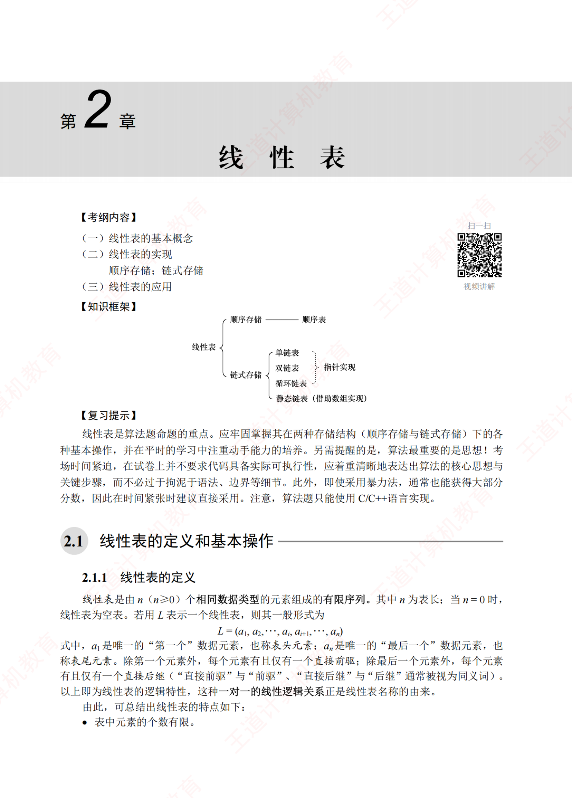

## 2.1 线性表的定义和基本操作

## 2.1.1线性表的定义

线性表是由n（n≥0）个相同数据类型的元素组成的有限序列。其中n为表长；当n=0时，线性表为空表。若用L表示一个线性表，则其一般形式为

$$
L = ( a _ { 1 } , a _ { 2 } , \cdots , a _ { i } , a _ { i + 1 } , \cdots , a _ { n } )
$$

式中， $a _ { 1 }$ 是唯一的“第一个”数据元素，也称表头元素； $a _ { n }$ 是唯一的“最后一个”数据元素，也称表尾元素。除第一个元素外，每个元素有且仅有一个直接前驱；除最后一个元素外，每个元素有且仅有一个直接后继（“直接前驱”与“前驱”、“直接后继”与“后继”通常被视为同义词）。以上即为线性表的逻辑特性，这种一对一的线性逻辑关系正是线性表名称的由来。

由此，可总结出线性表的特点如下：

● 表中元素的个数有限。

● 表中元素具有逻辑上的顺序性，即存在明确的先后次序。

· 表中元素均为数据元素，每个元素在线性表中被视为一个不可分割的单位。

· 表中元素的数据类型都相同，这意味着每个元素占有相同大小的存储空间。

● 表中元素具有抽象性，即仅讨论元素之间的逻辑关系，而不考虑其究竟表示什么内容。

## 注意

线性表是一种逻辑结构，表示元素之间一对一的相邻关系。顺序表和链表是两种存储结构，二者属于不同层面的概念，因此不要将其混淆。

## 2.1.2 线性表的基本操作

一个数据结构的基本操作是指其最核心、最基本的操作集合，其他较复杂的功能通常可通过调用这些基本操作来实现。线性表的主要操作如下。

● InitList(&L)：初始化表。构造一个空的线性表。

● Length(L)：求表长。返回线性表的长度，即其中数据元素的个数。

● LocateElem(L，e)：按值查找操作。在表L中查找值为e的元素，并返回其位置。

● GetElem(L,i)：按位查找操作。获取表L 中第i个位置的元素值。

● ListInsert(&L,i,e)：插入操作。在表L的第i个位置插入指定元素e。

● ListDelete(&L,i,&e)：删除操作。删除表L中第i 个位置的元素，并用e返回被删元素的值。

● PrintList(L)：输出操作。按前后顺序输出线性表L的所有元素值。

● Empty(L)：判空操作。若L为空表，则返回 true，否则返回 false。

● DestroyList(&L)：销毁操作。销毁线性表，并释放其占用的内存空间。

## 注意

①基本操作的具体实现取决于所用的存储结构，存储结构不同，算法的实现方式也不同。②符号&表示C++语言中的引用调用；在C语言中，可通过指针实现相同效果。

## 2.1.3 本节试题精选

## 单项选择题

01. 线性表是具有n个（）的有限序列。A. 数据表 B. 字符 C. 数据元素 D. 数据项

02.下列几种描述中，（）是一个线性表。A. 由n个实数组成的集合 B. 由100 个字符组成的序列C. 所有整数组成的序列 D. 邻接表

03.在线性表中，除开始元素外，每个元素（）。A. 只有唯一的前驱元素 B. 只有唯一的后继元素C. 有多个前驱元素 D. 有多个后继元素

04. 若非空线性表中的元素既没有直接前驱，又没有直接后继，则该表中有（）个元素。A. 1 B. 2 C.3 D. n

## 2.1.4 答案与解析

## 单项选择题

01. C

线性表是由具有相同数据类型的有限数据元素组成的，数据元素是由数据项组成的。

## 02. B

线性表定义的要求为：相同数据类型、有限序列。选项C的元素个数是无穷个，错误：选项A集合中的元素没有前后驱关系，错误；选项D属于一种存储结构，本题要求选出的是一个具体的线性表，不要将二者混为一谈。只有选项B符合线性表定义的要求。

## 03. A

线性表中，除最后一个（或第一个）元素外，每个元素都只有一个后继（或前驱）元素。

## 04. A

线性表中的第一个元素没有直接前驱，最后一个元素没有直接后继；当线性表中仅有一个元素时，该元素既没有直接前驱，又没有直接后继。 灿育

## 2.2 线性表的顺序表示

## 2.2.1顺序表的定义

考点追踪（算法题）顺序表的应用（2010、2011、2018、2020、2025）

线性表的顺序存储也称顺序表。它是用一组地址连续的存储单元依次存储线性表中的数据元素，使得逻辑上相邻的元素在物理位置上也相邻。第1个元素存储在顺序表的起始位置，第i个元素的存储位置之后紧接着存放的是第i+1个元素，称i为元素 $a _ { i }$ 在顺序表中的位序。因此，顺序表的特点是：表中元素的逻辑顺序与其物理存储顺序完全一致。

设顺序表L的起始存储地址为LOC(A)，每个数据元素占用的存储空间大小为sizeof(E1emType)，则顺序表的存储结构如图2.1所示。

  
图2.1 线性表的顺序存储结构

由于任意数据元素的存储地址与顺序表起始地址之间的偏移量与其位序呈线性关系，因此可在0(1)时间内直接访问表中任意位置的元素，这种特性使得线性表的顺序存储结构属于随机存取。在高级程序设计语言中，通常使用数组来实现顺序表。

注意  
线性表中元素的位序从1开始，而数组中元素的下标从0开始，注意二者之间的转换。

假定线性表的元素类型为ElemType，则静态分配的顺序表存储结构描述为  
#define MaxSize 50 //定义线性表的最大长度  
typedef struct{  
ElemType data[MaxSize]; //顺序表的元素

int length;   
}SqList;

//顺序表的当前长度  
//顺序表的类型定义

一维数组既可以静态分配，也可以动态分配。静态分配时，数组的大小和存储空间在编译时已经固定，一旦空间占满，再插入新元素将导致溢出，进而可能引发程序异常。

动态分配时，存储数组的空间是在程序执行过程中通过动态存储分配语句申请的。当空间占满时，可以另行开辟一块更大的存储空间，将原表中的所有元素复制到新空间中，从而实现存储容量的扩充，而无须在初始化时为线性表一次性划分全部可能用到的空间。

动态分配的顺序表存储结构描述为

```c
#define InitSize 100
typedef struct{
ElemType *data;
int MaxSize,length;
}SeqList;
```

//表长度的初始定义  
//指示动态分配数组的指针  
//数组的最大容量和当前个数  
//动态分配数组顺序表的类型定义

```c
L.data=(ElemType*)malloc(sizeof(ElemType)*InitSize);
C++的初始动态分配语句为
L.data=new ElemType[InitSize];
```

## 注意

动态分配并不是链式存储，它同样属于顺序存储结构。其物理结构没有变化，依然支持随机存取，只是存储空间的大小可以在运行时动态调整。

顺序表的主要优点：①可进行随机访问，即通过首地址和元素序号可在O(1)时间内找到指定的元素；②存储密度高，每个结点仅存储数据元素，无额外指针开销。顺序表的缺点也很明显：①插入和删除操作效率较低，需要移动大量元素；②要求分配连续的存储空间，不够灵活。

## 2.2.2 顺序表上基本操作的实现

## 考点追踪顺序表上操作的时间复杂度分析（2023）

本节仅讨论顺序表的初始化、插入、删除和按值查找，其他基本操作的实现都较为简单。

## 注意

在各种操作的实现中（包括严蔚敏老师的教材），通常可以忽略边界条件判断、变量定义、内存分配失败等实现细节，即不要求代码具有实际可执行性，而应重点体现算法的核心思想与逻辑步骤。

## 1. 顺序表的初始化

静态分配和动态分配的顺序表在初始化时有所不同。静态分配：在声明顺序表时，数组空间已由编译器分配，因此初始化只需将当前长度置为0。

//SqList L; //声明一个顺序表  
void InitList(SqList &L) {  
L.length=0; //顺序表初始长度为0  
}

动态分配：需在运行时为顺序表分配初始大小的数组空间，并设置长度和容量。

void InitList(SeqList &L){  
L.data=(ElemType \*)malloc(InitSize\*sizeof(ElemType));//分配存储空间

```c
L.length=0;
L.MaxSize=InitSize;
```

其中，MaxSize表示当前分配的存储空间上限。当插入元素导致空间不足时，需要扩容。

## 2. 插入操作

在顺序表L的第i（1≤i≤L.length+1）个位置插入新元素e。若i超出合法范围，或存储空间已满，则插入失败，返回fa1se；否则，将第i个元素及其后的所有元素依次后移一位，腾出一个空位置插入e，表长加1，返回true。

```c
bool ListInsert(SqList &L,int i,ElemType e){
if(i<1|li>L.length+1) //判断i的范围是否有效
return false;
if(L.length>=MaxSize) //当前存储空间已满
return false;
for(int j=L.length;j>=i;j--) //将第i 个元素及之后的元素后移
L.data[j]=L.data[j-1];
L.data[i-1]=e; //在位置i插入e（注意下标转换）
L.length++; //表长加1
return true;
```

## 注意

区分位序（从1开始）与数组下标（从0开始）。为什么判断插入位置时使用1ength+1，而移动元素的for循环中使用length？因为合法插入位置包括第n+1位，但移动元素时最多从第n位开始后移。

最好情况：在表尾插入 $(i = n + 1)$ ，无须移动元素，时间复杂度为O(1)。

最坏情况：在表头插入（i=1），需移动全部n个元素，时间复杂度为O(n)。

平均情况：设在第i个位置插入的概率为 $p _ { i } = 1 / ( n + 1 )$ ，则平均移动次数为

$$
\sum_{i = 1}^{n + 1}p_{i}(n - i + 1) = \sum_{i = 1}^{n + 1}\frac{1}{n + 1}(n - i + 1) = \frac{1}{n + 1}\sum_{i = 1}^{n + 1}(n - i + 1) = \frac{1}{n + 1}\frac{n(n + 1)}{2} = \frac{n}{2}
$$

因此，插入操作的平均时间复杂度为O(n)。

## 3. 删除操作

删除顺序表L中第i（1≤i≤L.1ength）个位置的元素，并通过引用参数e返回其值。若i非法，返回false；否则，保存被删元素，将其后所有元素前移一位，表长减1，返回true。

```c
bool ListDelete(SqList &L,int i,ElemType &e){
if(i<1|li>L.length) //判断i的范围是否有效
return false;
e=L.data[i-1]; //将被删除的元素赋给
for(int j=i;j<L.length;j++) //将第i 个位置后的元素前移
L.data[j-1]=L.data[j];
L.length--; //表长减1
return true;
```

最好情况：删除表尾元素（i=n），无须移动元素，时间复杂度为O(1)。

最坏情况：删除表头元素（i=1），需移动其余n−1个元素，时间复杂度为O(n)。

平均情况：设删除第i个元素的概率为 $p_{i}=1/n$ ，则平均移动次数为

$$
\sum_{i = 1}^{n}p_{i}(n - i) = \sum_{i = 1}^{n}\frac{1}{n}(n - i) = \frac{1}{n}\sum_{i = 1}^{n}(n - i) = \frac{1}{n}\frac{n(n - 1)}{2} = \frac{n - 1}{2}
$$

因此，删除操作的平均时间复杂度为 $O ( n )$

可见，顺序表的插入和删除操作的时间开销主要耗费在移动元素上，而移动元素的个数取决于操作位置。图2.2显示了顺序表插入和删除操作前、后的状态，以及数据元素在存储空间中的位置和表长变化。图2.2(a)将第4～7个元素从后往前依次后移一位，为新元素腾出位置。图2.2(b)将第5～7个元素从前往后依次前移一位，填补删除后的空缺。

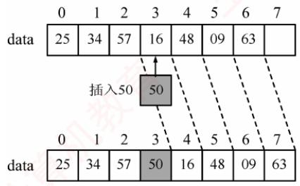  
(a) 插入新元素示例

  
(b) 删除表中元素示例  
图2.2 顺序表的插入和删除

## 4. 按值查找（顺序查找）

在顺序表L中查找第一个值等于e的元素，返回其位序；若未找到，则返回0。

```c
int LocateElem(SqList L,ElemType e){
int i; 育
for(i=0;i<L.length;i++)
if(L.data[i]==e)
return i+1; //下标为 i的元素值等于 e，返回其位序 i+1
return 0; //查找失败
```

最好情况：目标元素在表头（i=1），比较1次，时间复杂度为O(1)。

最坏情况：目标元素在表尾或不存在，需要比较n次，时间复杂度为O(n)。

平均情况：设目标元素在第i位的概率为 $p _ { i }   = 1 / n$ ，则平均比较次数为

$$
\sum_{i = 1}^{n}p_{i} \cdot i = \sum_{i = 1}^{n}\frac{1}{n} \cdot i = \frac{1}{n}\frac{n(n + 1)}{2} = \frac{n + 1}{2}
$$

因此，按值查找的平均时间复杂度为 $O ( n )$

顺序表的按序号查找非常简单，直接通过数组下标访问即可，时间复杂度为O(1)。

## 2.2.3 本节试题精选

## 一、单项选择题

01.下列叙述中，（）是顺序存储结构的优点。A. 存储密度大 B. 插入运算方便C. 删除运算方便 D. 方便地运用于各种逻辑结构的存储表示

02.下列关于顺序表的叙述中，正确的是（）。A. 顺序表可以利用一维数组表示，因此顺序表与一维数组在逻辑结构上是相同的B. 在顺序表中，逻辑上相邻的元素物理位置上不一定相邻C. 顺序表和一维数组一样，都可以进行随机存取D. 在顺序表中，每个元素的类型不必相同

03. 通常说顺序表具有随机存取的特性，指的是（）。

A. 查找值为x的元素的时间与顺序表中元素个数n无关B. 查找值为x的元素的时间与顺序表中元素个数n有关C. 查找序号为i的元素的时间与顺序表中元素个数n无关D. 查找序号为i的元素的时间与顺序表中元素个数n有关

04.一个顺序表所占用的存储空间大小与（）无关。A. 表的长度 B. 元素的存放顺序C. 元素的类型 D. 元素中各字段的类型

05. 若线性表最常用的操作是存取第i个元素及其前驱和后继元素的值，为了提高效率，应采用（）的存储方式。A. 单链表B. 双链表 C. 循环单链表D. 顺序表

06.一个线性表最常用的操作是存取任意一个指定序号的元素并在最后进行插入、删除操作，则利用（）存储方式可以节省时间。A. 顺序表 B. 双链表 道计算C.带头结点的循环双链表 D. 循环单链表

07.在n个元素的线性表的数组表示中，时间复杂度为O(1)的操作是（）。I. 访问第i（1≤i≤n）个结点和求第i(2≤i≤n）个结点的直接前驱Ⅱ. 在最后一个结点后插入一个新的结点Ⅲ. 删除第 1 个结点 教育IV. 在第i(1≤i≤n）个结点后插入一个结点A. I B. II、III C. I、ⅡI D. I、ⅡI、ⅢII

08. 设线性表有n个元素，严格说来，以下操作中，（）在顺序表上实现要比在链表上实现的效率高。I. 输出第i(1≤i≤n）个元素值I. 交换第3个元素与第4个元素的值I. 顺序输出这 n 个元素的值A. I B. I、III C. I、ⅡI D. II、III TA

09.在一个长度为n的顺序表中删除第i（1≤i≤n）个元素时，需向前移动（）个元素。A. n 妆 B. i-1 C. n−i D. n−i+ 1

10. 对于顺序表，访问第i个位置的元素和在第i个位置插入一个元素的时间复杂度为（）。A. O(n), O(n) B. O(n), O(1) C. O(1), O(n) D. O(1), O(1)

11. 对于顺序存储的线性表，其算法时间复杂度为O(1)的运算应该是（）。A.将n个元素从小到大排序 王道B. 删除第 $i ( 1 \leqslant i \leqslant n )$ 个元素C. 改变第 $i ( 1 \leqslant i \leqslant n )$ 个元素的值D. 在第i $( 1 \leqslant i \leqslant n )$ 个元素后插入一个新元素

12. 顺序表的插入算法中，当n个空间已满时，可再申请增加分配m个空间，若申请失败，则说明系统没有（）可分配的存储空间。A. m 个 B. m 个连续C. n + m 个 D. n + m 个连续

13.【2023统考真题】在下列对顺序存储的有序表（长度为n）实现给定操作的算法中，平均时间复杂度为O(1)的是（）。

A. 查找包含指定值元素的算法 B. 插入包含指定值元素的算法C. 删除第 $i ( 1 \leqslant i \leqslant n )$ 个元素的算法 D. 获取第 $i ( 1 \leqslant i \leqslant n )$ 个元素的算法

## 二、综合应用题

01. 从顺序表中删除具有最小值的元素（假设唯一）并由函数返回被删元素的值。空出的位置由最后一个元素填补，若顺序表为空，则显示出错信息并退出运行。

02. 设计一个高效算法，将顺序表L的所有元素逆置，要求算法的空间复杂度为 O(1)。

03. 对长度为n的顺序表L，编写一个时间复杂度为 $O ( n )$ 、空间复杂度为O(1)的算法，该算法删除顺序表中所有值为x的数据元素。

04. 从顺序表中删除其值在给定值s和t之间（包含s和t，要求 $s \leq t   )$ 的所有元素，若s或t不合理或顺序表为空，则显示出错信息并退出运行。 X

05. 从有序顺序表中删除所有其值重复的元素，使表中所有元素的值均不同。

06. 将两个有序顺序表合并为一个新的有序顺序表，并由函数返回结果顺序表。

07. 已知在一维数组 $A [ m + n ]$ 中依次存放两个线性表 $(a_{1}, a_{2}, a_{3}, \cdots, a_{m})$ 和 $(b_{1}, b_{2}, b_{3}, \cdots, b_{n})$ 。编写一个函数，将数组中两个顺序表的位置互换，即将 $(b_{1},b_{2},b_{3},\cdots,b_{n})$ 放在 $(a_{1}, a_{2}, a_{3}, \cdots, a_{m})$ 的前面。

08. 线性表 $(a_{1}, a_{2}, a_{3}, \cdots, a_{n})$ 中的元素递增有序且按顺序存储于计算机内。要求设计一个算法，完成用最少时间在表中查找数值为x的元素，若找到，则将其与后继元素位置相交换，若找不到，则将其插入表中并使表中元素仍然递增有序。

09. 给定三个序列A、B、C，长度均为n，且均为无重复元素的递增序列，请设计一个时间上尽可能高效的算法，逐行输出同时存在于这三个序列中的所有元素。例如，数组A为{1,2,3}，数组B为{2,3,4}，数组C为{-1,0,2}，则输出2。要求：1）给出算法的基本设计思想。2）根据设计思想，采用C或C++语言描述算法，关键之处给出注释。3）说明你的算法的时间复杂度和空间复杂度。

10.【2010统考真题】设将 $n (n > 1)$ 个整数存放到一维数组R中。设计一个在时间和空间两方面都尽可能高效的算法。将R中保存的序列循环左移 $p \left( 0 < p < n \right)$ 个位置，即将R中的数据由 $(X_{0},X_{1},\cdots,X_{n-1})$ 变换为 $( X _ { p } , X _ { p + 1 } , \cdots , X _ { n - 1 } , X _ { 0 } , X _ { 1 } , \cdots , X _ { p - 1 } )$ 。要求：1）给出算法的基本设计思想。3）说明你所设计算法的时间复杂度和空间复杂度。

11.【2011统考真题】一个长度为 $L ( L \geqslant 1 )$ 的升序序列S，处在第 $\left[ L / 2 \right]$ 个位置的数称为S的中位数。例如，若序列 $S_{1} = (11, 13, 15, 17, 19)$ ，则 $S _ { 1 }$ 的中位数是15，两个序列的中位数是含它们所有元素的升序序列的中位数。例如，若 $S_{2} = (2,4,6,8,20)$ ，则 $S _ { 1 }$ 和 $S _ { 2 }$ 的中位数是11。现在有两个等长升序序列A和B，试设计一个在时间和空间两方面都尽可能高效的算法，找出两个序列A和B的中位数。要求：1）给出算法的基本设计思想。2）根据设计思想，采用C或C++或Java语言描述算法，关键之处给出注释。

3）说明你所设计算法的时间复杂度和空间复杂度。

12.【2013统考真题】已知一个整数序列 $A = (a_{0}, a_{1}, \cdots, a_{n-1})$ ，其中 $0 \leqslant a_{i} < n \quad (0 \leqslant i < n)$ 若存在 $a_{p_{1}} = a_{p_{2}} = \cdots = a_{p_{m}} = x$ 且 $m>n/2 (0 \leqslant p_{k}<n,1 \leqslant k \leqslant m)$ ，则称x为A的主元素。例如 $A = ( 0 , 5 , 5 , 3 , 5 , 7 , 5 , 5 )$ ，则5为主元素；又如 $A = ( 0 , 5 , 5 , 3 , 5 , 1 , 5 , 7 )$ ，则A中没有主元素。假设A中的n个元素保存在一个一维数组中，请设计一个尽可能高效的算法，找出A的主元素。若存在主元素，则输出该元素；否则输出-1。要求：

1）给出算法的基本设计思想。

2）根据设计思想，采用C或C++或Java语言描述算法，关键之处给出注释。

3）说明你所设计算法的时间复杂度和空间复杂度。

13. 【2018统考真题】给定一个含 $n (n \geqslant 1)$ 个整数的数组，请设计一个在时间上尽可能高效的算法，找出数组中未出现的最小正整数。例如，数组{-5,3,2,3}中未出现的最小正整数是1；数组{1,2,3}中未出现的最小正整数是4。要求：

1）给出算法的基本设计思想。

2）根据设计思想，采用C或C++语言描述算法，关键之处给出注释。

3）说明你所设计算法的时间复杂度和空间复杂度。

14.【2020统考真题】定义三元组 $( a , b , c ) ( a , b , c$ 均为整数)的距离 $D = \left| a - b \right| + \left| b - c \right| + \left| c - a \right|$ 给定3个非空整数集合 $S _ { 1 }  、  S _ { 2 }$ 和 $S _ { 3 } ,$ ，按升序分别存储在3个数组中。请设计一个尽可能高效的算法，计算并输出所有可能的三元组 $(a,   b,   c) \quad (a \in S_1, \quad b \in S_2, \quad c \in S_3)$ 中的最小距离。例如 $S_{1} = \{-1, 0, 9\}, S_{2} = \{-25, -10, 10, 11\}, S_{3} = \{2, 9, 17, 30, 41\}$ ，则最小距离为2，相应的三元组为(9,10,9)。要求：

1）给出算法的基本设计思想。

2）根据设计思想，采用C语言或C++语言描述算法，关键之处给出注释。

3）说明你所设计算法的时间复杂度和空间复杂度。

15. 【2025统考真题】有两个长度均为n的一维整型数组A和res，对数组A中的每个元素A[i]，计算A[i]与 $\mathrm{A}[j](0 \leqslant i \leqslant j \leqslant n-1)$ 乘积的最大值，并将其保存到res[i]中。例如，当 $\mathrm { A } [   ] = \{   [ 1$ 4,-9, 6}时，得到 $ res [] = \{6,24,81,36\}$ 。现给定数组A，设计一个时间和空间上尽可能高效的算法calMulMax，求res中各元素的值。函数原型为 $\mathtt { v o i d \quad c a l M u l M a x \left( i n t \quad A \left[ \right] \right. }$ , intres[],int n)。要求如下：

1）给出算法的基本设计思想。

2）根据设计思想，采用C或C++语言描述算法，关键之处给出注释。

3）说明你所设计算法的时间复杂度和空间复杂度。

## 2.2.4 答案与解析

## 一、单项选择题

## 01. A

顺序表不像链表那样要在结点中存放指针域，因此存储密度大，选项A正确。选项B和C是链表的优点。选项D是错误的，比如对于树形结构，顺序表显然不如链表表示起来方便。

## 02. C

顺序表是顺序存储的线性表，表中所有元素的类型必须相同，且必须连续存放。一维数组中的元素可以不连续存放；此外，栈、队列和树等逻辑结构也可利用一维数组表示，但它与顺序表不属于相同的逻辑结构。在顺序表中，逻辑上相邻的元素物理位置上也相邻。

## 03. C

随机存取是指在O(1)的时间访问下标为i的元素，所需时间与顺序表中的元素个数n无关。

## 04. B

顺序表所占的存储空间=表长×sizeof（元素的类型），表长和元素的类型显然会影响存储空间的大小。若元素为结构体类型，则元素中各字段的类型也会影响存储空间的大小。

## 05. D

题干实际要求能最快存取第i-1、i和i+1个元素值。选项A、B、C都只能从头结点依次顺序查找，时间复杂度为O(n)；只有顺序表可以按序号随机存取，时间复杂度为O(1)。

## 06. A

只有顺序表可以按序号随机存取，且在最后进行插入和删除操作时不需要移动任何元素。

## 07. C

对说法I，解析略；对说法Ⅱ，在最后位置插入新结点不需要移动元素，时间复杂度为O(1);对说法Ⅲ，被删结点后的结点需要要依次前移，时间复杂度为O(n)；对说法IV，需要后移n-i个结点，时间复杂度为O(n)。 姚

## 08. C

对说法Ⅱ，顺序表只需3次交换操作；链表需要分别找到两个结点前驱，第4个结点断链后再插入到第2个结点后，效率较低。对说法Ⅲ，需要依次顺序访问每个元素，时间复杂度相同。

## 09. C

需要将元素 $a _ { i ^ { + } 1 } { \sim } a _ { n }$ 依次前移一位，共移动 n − (i + 1) + 1 = n − i 个元素。

## 10. C

在第i个位置插入一个元素，需要移动n−i +1个元素，时间复杂度为O(n)。

## 11. C

对n个元素进行排序的时间复杂度最小也要O(n)（初始有序时），通常为O(nlog2n)或 $O ( n ^ { 2 } )$ 通过第8章学习后会更容易理解。选项B和D显然错误。顺序表支持按序号的随机存取方式。

## 12. D

顺序存储需要连续的存储空间，在申请时需申请n+m个连续的存储空间，然后将线性表原来的n个元素复制到新申请的n+m个连续的存储空间的前n个单元。

## 13. D

对于顺序存储的有序表，查找指定值元素可以采用顺序查找法或折半查找法，平均时间复杂度最少为O(log2n)。插入指定值元素需要先找到插入位置，然后将该位置及之后的元素依次后移一个位置，最后将指定值元素插入到该位置，平均时间复杂度为O(n)。删除第i个元素需要将该元素之后的全部元素依次前移一个位置，平均时间复杂度为O(n)。获取第i个元素只需直接根据下标读取对应的数组元素即可，时间复杂度为O(1)。

## 二、综合应用题

## 01.【解答】

算法思想：搜索整个顺序表，查找最小值元素并记住其位置，搜索结束后用最后一个元素填补空出的原最小值元素的位置。 X

## 本题代码如下：

```c
bool Del Min(SqList &L,ElemType &value) {
//删除顺序表L中最小值元素结点，并通过引用型参数 value 返回其值
//若删除成功，则返回true；否则返回false
if(L.length==0)
return false; 算机教 //表空，中止操作返回
value=L.data[0];
int pos=0; //假定0号元素的值最小
for(int i=1;i<L.length;i++) //循环，寻找具有最小值的元素
if(L.data[i]<value) { //让 value 记忆当前具有最小值的元素
value=L.data[i];
```

pos=i;   
L.data[pos]=L.data[L.length-1];   
L.length--;   
return true;

## 注意

本题也可用函数返回值返回，两者的区别是：函数返回值只能返回一个值，而参数返回（引用传参）可以返回多个值。 V

## 02.【解答】

算法思想：扫描顺序表L的前半部分元素，对于元素L.data[i]（0<=i<L.1ength/2），将其与后半部分的对应元素L.data[L.length-i-1]进行交换。

本题代码如下：

```c
void Reverse(SqList &L) { ElemType temp; //辅助变量 道
for(int i=0;i<L.length/2;i++){
temp=L.data[i]; //交换L.data[i]与L.data[L.length-i-1]
L.data[i]=L.data[L.length-i-1];
L.data[L.length-i-1]=temp;
} 育
}
```

## 03.【解答】

解法1：用k记录顺序表L中不等于x的元素个数（需要保存的元素个数），扫描时将不等于x的元素移动到下标k的位置，并更新k值。扫描结束后修改L的长度。

本题代码如下：

```c
void del x 1(SqList &L,ElemType x){
//本算法实现删除顺序表L中所有值为×的数据元素
int k=0,i; //记录值不等于×的元素个数
for(i=0;i<L.length;i++)
if(L.data[i]!=x) {
L.data[k]=L.data[i];
k++; //不等于 x的元素增1
1
L.length=k; //顺序表L的长度等于k
```

解法2：用k记录顺序表L中等于x的元素个数，一边扫描L，一边统计k，并将不等于x的元素前移k个位置。扫描结束后修改L的长度。 美

本题代码如下：

```c
void del x 2(SqList &L,ElemType x){
int k=0,i=0; //k 记录值等于 x的元素个数
while(i<L.length) {
if(L.data[i]==x)
k++;
else
L.data[i-k]=L.data[i]；//当前元素前移k个位置
i++;
}
L.length=L.length-k; //顺序表L的长度递减
}
```

此外，本题还可以考虑设头、尾两个指针（i=1,j=n），从两端向中间移动，在遇到最左端

```c
bool Delete Same(SeqList& L) {
if(L.length==0)
return false;
int i,j; //i 存储第一个不相同的元素，j 为工作指针
for(i=0,j=1;j<L.length;j++)
if(L.data[i]!=L.data[j]) //查找下一个与上一个元素值不同的元素
王道 L.data[++i]=L.data[j]; //找到后，将元素前移
L.length=i+1;
return true;
1
```

值x的元素时，直接将最右端值非x的元素左移至值为x的数据元素位置，直到两指针相遇。但这种方法会改变原表中元素的相对位置。 临村

## 04.【解答】

算法思想：从前向后扫描顺序表L，用k记录值在s和t之间的元素个数（初始时k=0）。对于当前扫描的元素，若其值不在s和t之间，则前移k个位置；否则执行k++。每个不在s和t之间的元素仅移动一次，因此算法效率高。

本题代码如下：

```c
bool Del s t(SqList &L,ElemType s,ElemType t){
//删除顺序表L中值在给定值s 和 t（要求s<t）之间的所有元素
int i,k=0;
if(L.length==0|Is>=t)
return false; //线性表为空或s、t 不合法，返回
for(i=0;i<L.length;i++) {
if(L.data[i]>=s&&L.data[i]<=t)
k++;
else
L.data[i-k]=L.data[i]； ∥当前元素前移k个位置
} ∥for
L.length-=k; //长度减小
return true;
```

## 注意

本题也可从后向前扫描顺序表，每遇到一个值在s和t之间的元素，就删除该元素，其后的所有元素全部前移。但移动次数远大于前者，效率不够高。

## 05. 【解答】

算法思想：注意是有序顺序表，值相同的元素一定在连续的位置上，用类似于直接插入排序的思想，初始时将第一个元素视为非重复的有序表。之后依次判断后面的元素是否与前面非重复有序表的最后一个元素相同，若相同，则继续向后判断，若不同，则插入前面的非重复有序表的最后，直至判断到表尾为止。 YTA

本题代码如下：

对于本题的算法，请读者用序列1,2,2,2,2,3,3,3,4,4,5来手动模拟算法的执行过程，在模 拟过程中要标注i和j所指示的元素。 uK

思考：若将本题中的有序表改为无序表，你能想到时间复杂度为O(n)的方法吗？

(提示：使用散列表。）

## 06.【解答】

算法思想：首先，按顺序不断取下两个顺序表表头较小的结点存入新的顺序表中。然后，看哪个表还有剩余，将剩下的部分加到新的顺序表后面。

本题代码如下：

```c
bool Merge(SeqList A,SeqList B,SeqList &C) {
//将有序顺序表A与B合并为一个新的有序顺序表C
if(A.length+B.length>C.maxSize) //大于顺序表的最大长度
return false;
int i=0,j=0,k=0;
while(i<A.length&&j<B.length) { //循环，两两比较，小者存入结果表
if(A.data[i]<=B.data[j])
C.data[k++]=A.data[i++];
else
C.data[k++]=B.data[j++];
1
while(i<A.length) //还剩一个没有比较完的顺序表
C.data[k++]=A.data[i++];
while(j<B.length)
C.data[k++]=B.data[j++]; 道计算机
C.length=k;
return true;
```

## 注意

本算法的方法非常典型，需要牢固掌握。

## 07.【解答】

算法思想：首先将数组 A[m + n]中的全部元素 $(a_{1}, a_{2}, a_{3}, \cdots, a_{m}, b_{1}, b_{2}, b_{3}, \cdots, b_{n})$ 原地逆置为 $( b _ { n } , b _ { n - 1 } , b _ { n - 2 } , \cdots , b _ { 1 } , a _ { m } , a _ { m - 1 } , a _ { m - 2 } , \cdots , a _ { 1 } )$ ，然后对前n个元素和后m个元素分别使用逆置算法，即可得到 $(b_{1},b_{2},b_{3},\cdots,b_{n},a_{1},a_{2},a_{3},\cdots,a_{m})$ ，从而实现顺序表的位置互换。

本题代码如下：

```c
typedef int DataType;
void Reverse(DataType A[],int left,int right,int arraySize){
//逆转(aleft,aleft+1,aleft+2,,aright)为(aright,aright-1,…,aleft)
if(left>=right|lright>=arraySize)
return;
int mid=(left+right)/2;
for(int i=0;i<=mid-left;i++) {
DataType temp=A[left+i];
A[left+i]=A[right-i]; 算机教育
A[right-i]=temp;
void Exchange(DataType A[],int m,int n,int arraySize){
/*数组 A[m+n]中，从0到 m-1 存放顺序表(a1,a2，a3，…,am)，从 m到 m+n-1 存放顺序表
(b1,b2,b3，…,bn)，算法将这两个表的位置互换*/
Reverse(A,0,m+n-1,arraySize);
Reverse(A,0,n-1,arraySize);
Reverse(A,n,m+n-1,arraySize);
```

## 08.【解答】

算法思想：顺序存储的线性表递增有序，可以顺序查找，也可以折半查找。题目要求“用最少的时间在表中查找数值为x的元素”，这里应使用折半查找法。

本题代码如下：

void SearchExchangeInsert(ElemType A[],ElemType x) {   
int low=0,high=n-1,mid; //1ow 和 high 指向顺序表下界和上界的下标   
while(low<=high) {

```c
mid=(low+high)/2; //找中间位置
if(A[mid]==x) break; //找到 x，退出 while 循环
else if(A[mid]<x) low=mid+1;//到中点mid的右半部去查
else high=mid-1; //到中点 mid的左半部去查
∥/下面两个 if 语句只会执行一个
if(A[mid]==x&&mid!=n-1){ //若最后一个元素与×相等，则不存在与其后
继交换的操作
t=A[mid]; A[mid]=A[mid+1]; A[mid+1]=t;
1
if (low>high) { //查找失败，插入数据元素x
for(i=n-1;i>high;i--) A[i+1]=A[i]; ∥后移元素
A[i+1]=x; //插入x //结束插入 机教育
1
```

本题的算法也可写成三个函数：查找函数、交换后继函数与插入函数。写成三个函数的优点是逻辑清晰且易读。

## 09.【解析】

## 1）算法的基本设计思想。

使用三个下标变量从小到大遍历数组。当三个下标变量指向的元素相等时，输出并向前推进指针，否则仅移动小于最大元素的下标变量，直到某个下标变量移出数组范围，即可停止。

## 2）算法的实现。

void samekey(int A[],int B[],int C[],int n){  
int i=0,j=0,k=0; //定义三个工作指针  
while(i<n&&j<n&&k<n){ //相同则输出，并集体后移  
if(A[i]==B[j]&&B[j]==C[k]){  
printf("%d\n",A[i]);  
i++;j++;k++;  
}else {  
int maxNum=max(A[i],max(B[j],C[k]));  
if (A[i]<maxNum) i++;  
if(B[j]<maxNum)j++;  
if(C[k]<maxNum) k++;  
1  
1 育

3）每个指针移动的次数不超过n，且每次循环至少有一个指针后移，故时间复杂度为O(n)，算法只用到了常数个变量，空间复杂度为O(1)。 KKN

## 10. 【解答】

## 1）算法的基本设计思想：

可将问题视为把数组 ab 转换成数组 ba（a代表数组的前p 个元素，b 代表数组中余下的 n−p个元素），先将a逆置得到 $a ^ { - 1 } b ,$ ，再将b逆置得到 $a ^ { - 1 } b ^ { - 1 }$ ，最后将整个 $a ^ { - 1 } b ^ { - 1 }$ 逆置得到 $( \boldsymbol { a } ^ { - 1 } \boldsymbol { b } ^ { - 1 } ) ^ { - 1 }   =   b \boldsymbol { a }$ 。设Reverse函数执行将数组逆置的操作，对 abcdefgh向左循环移动 $3 ( p = 3 )$ 个位置的过程如下：

Reverse(0,p-1)得到 cbadefgh;  
Reverse (p,n-1) 得到 cbahgfed;  
Reverse(0,n-1)得到 defghabc。

注：在Reverse中，两个参数分别表示数组中待转换元素的始末位置。

## 2）使用C语言描述算法如下：

void Reverse(int R[],int from,int to) {   
int i,temp;

```c
for(i=0;i<(to-from+1)/2;i++)
{temp=R[from+i];R[from+i]=R[to-i];R[to-i]=temp;}
1
void Converse(int R[],int n,int p){
Reverse(R,0,p-1);
Reverse(R,p,n-1); Reverse(R,0,n-1) ; 道
}
```

3）上述算法中三个 Reverse函数的时间复杂度分别为 O(p/2)、O((n-p)/2)和 O(n/2)，故所设计的算法的时间复杂度为O(n)，空间复杂度为O(1)。

【另解】借助辅助数组来实现。算法思想：创建大小为p的辅助数组S，将R中前p个整数依次暂存在S 中，同时将R中后n-p个整数左移，然后将S 中暂存的p个数依次放回到R中的后续单元。时间复杂度为O(n)，空间复杂度为O(p)。 机

## 11. 【解答】

1）算法的基本设计思想如下。

分别求两个升序序列A、B的中位数，设为a和b，求序列A、B的中位数过程如下：

①若a= b，则a或b为所求中位数，算法结束。

②若a< b，则舍弃序列A中较小的一半，同时舍弃序列B中较大的一半，要求两次舍弃的长度相等。

③若a>b，则舍弃序列A中较大的一半，同时舍弃序列B中较小的一半，要求两次舍弃的长度相等。 K

在保留的两个升序序列中，重复过程①、②、③，直到两个序列中均只含一个元素时为止，较小者为所求的中位数。 临K

2）本题代码如下：

```c
int M Search(int A[],int B[],int n){
int s1,d1,m1,s2,d2,m2;
s1=0;d1=n-1;
s2=0;d2=n-1;
while(s1!=d1||s2!=d2){
m1=(s1+d1)/2;
m2=(s2+d2)/2;
if(A[m1]==B[m2])
return A[m1]; //满足条件①
if (A[m1]<B[m2]) { //满足条件②
if((s1+d1)%2==0){ //若元素个数为奇数
s1=m1; //舍弃A中间点以前的部分，且保留中间点
王道计算机 d2=m2; //舍弃B中间点以后的部分，且保留中间点
else{ //元素个数为偶数 王道
s1=m1+1; //舍弃 A的前半部分
d2=m2; //舍弃B的后半部分
1
else { //满足条件③
if((s1+d1)%2==0){ //若元素个数为奇数
d1=m1; //舍弃A中间点以后的部分，且保留中间点
s2=m2; //舍弃B中间点以前的部分，且保留中间点
1
else{ //元素个数为偶数
d1=m1; //舍弃 A 的后半部分
s2=m2+1; //舍弃B 的前半部分
```

}   
}   
return A[s1]<B[s2]? A[s1]:B[s2];

3）算法的时间复杂度为O(log2n)，空间复杂度为O(1)。

【另解】对两个长度为n的升序序列A和B中的元素按从小到大的顺序依次访问，这里访问的含义只是比较序列中两个元素的大小，并不实现两个序列的合并，因此空间复杂度为O(1)。按照上述规则访问第n个元素时，这个元素为两个序列A和B的中位数。

## 12. 【解答】

<!-- DIRECTED-REPAIR-FALLBACK:FALLBACK-QA-DS-CH2-P40-MAJORITY-CODE -->
> [!WARNING]
> 原 PDF 第 40 页回退：主元素算法代码的花括号层次与条件块被破坏，并混入多处推广水印；局部文本替换不足以可靠恢复控制流。

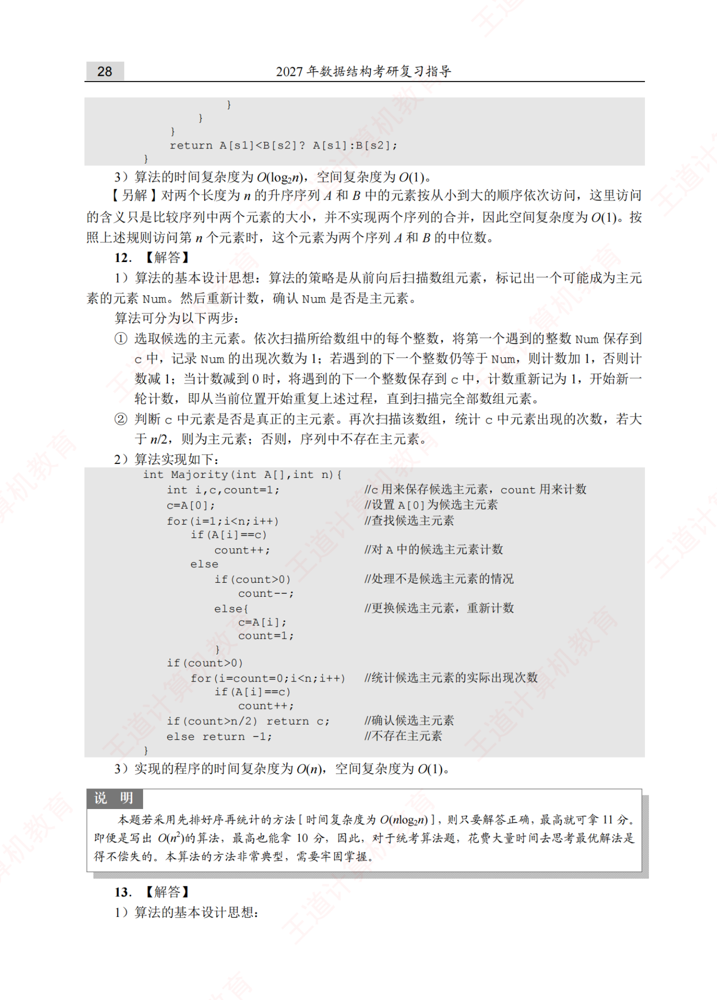

1）算法的基本设计思想：算法的策略是从前向后扫描数组元素，标记出一个可能成为主元素的元素Num。然后重新计数，确认Num是否是主元素。

算法可分为以下两步：

①选取候选的主元素。依次扫描所给数组中的每个整数，将第一个遇到的整数Num保存到c中，记录Num的出现次数为1；若遇到的下一个整数仍等于Num，则计数加1，否则计X 数减1；当计数减到0时，将遇到的下一个整数保存到c中，计数重新记为1，开始新一轮计数，即从当前位置开始重复上述过程，直到扫描完全部数组元素。

②判断c中元素是否是真正的主元素。再次扫描该数组，统计c中元素出现的次数，若大于n/2，则为主元素；否则，序列中不存在主元素。

2）算法实现如下：

int Majority(int A[],int n) {  
int i,c,count=1; //c 用来保存候选主元素，count 用来计数  
c=A[0]; //设置A[0]为候选主元素  
for(i=1;i<n;i++) //查找候选主元素  
if(A[i]==c) count++; 王道计 //对A 中的候选主元素计数  
else  
if(count>0) //处理不是候选主元素的情况  
count--;  
else{ //更换候选主元素，重新计数  
c=A[i];  
count=1;  
if (count>0) 卓机教  
for(i=count=0;i<n;i++) //统计候选主元素的实际出现次数  
if(A[i]==c)  
count++;  
if(count>n/2) return c; //确认候选主元素 王道计  
else return -1; //不存在主元素

3）实现的程序的时间复杂度为O(n)，空间复杂度为O(1)。

## 说明

本题若采用先排好序再统计的方法[时间复杂度为O(nlog2n)]，则只要解答正确，最高就可拿11分。即便是写出O(n²)的算法，最高也能拿10分，因此，对于统考算法题，花费大量时间去思考最优解法是得不偿失的。本算法的方法非常典型，需要牢固掌握。

## 13. 【解答】

1）算法的基本设计思想：

要求在时间上尽可能高效，因此采用空间换时间的办法。分配一个用于标记的数组B[n]，用来记录A中是否出现了1～n中的正整数，B01对应正整数1，B「n-11对应正整数n，初始化B中全部为0。A中含有n个整数，因此可能返回的值是 $1 \sim n + 1$ ，当A中n个数恰好为1\~n时返回n+1。当数组A中出现了小于或等于0或大于n的值时，会导致1～n中出现空余位置，返回结果必然在 $1   \sim   \mathtt { n }$ 中，因此对于A中出现了小于或等于0或大于n的值，可以不采取任何操作。

经过以上分析可以得出算法流程：从A「01开始遍历A，若 $0 < \mathbb{A} \left[ \downarrow \right] < = \mathbb{n}$ ，则令B $\left[ \mathbb { A } \left[ \downarrow \right] - \mathbb { 1 } \right] = \mathbb { 1 }$ .否则不做操作。对A遍历结束后，开始遍历数组B，若能查找到第一个满足B「i1==0的下标i，返回i+1即为结果，此时说明A中未出现的最小正整数在1和n之间。若B[i]全部不为0，返回i+1（跳出循环时i=n，i+1等于n+1），此时说明A中未出现的最小正整数是n+1。 K

2）算法实现：

```c
int findMissMin(int A[],int n)
int i,*B; //标记数组 道计算机
B=(int *)malloc(sizeof(int)*n);//分配空间
memset(B,0,sizeof(int) *n); //赋初值为0
for(i=0;i<n;i++)
if(A[i]>0&&A[i]<=n) //若A[i]的值介于 1~n，则标记数组B
B[A[i]-1]=1;
for(i=0;i<n;i++) //扫描数组B，找到目标值
if (B[i]==0) break;
return i+1; //返回结果
```

3）时间复杂度：遍历A一次，遍历B一次，两次循环内操作步骤为O(1)量级，因此时间复杂度为O(n)。空间复杂度：额外分配了B[n]，空间复杂度为O(n)。

## 14.【解答】

分析。由 $D = | a - b | + | b - c | + | c - a | \geqslant 0$ ，有如下结论。

①当 $a = b = c$ 时，距离最小。

②其余情况。不失一般性，假设 $a \leqslant b \leqslant c$ ，观察下面的数轴：


$$
L_{1}=|a-b|,\quad L_{2}=|b-c|,\quad L_{3}=|c-a|
$$

由D的表达式可知，事实上决定D大小的关键是a和c之间的距离，于是问题就可以简化为每次固定c找一个a，使得 $L _ { 3 } = | c - a |$ |最小。

1）算法的基本设计思想：

①使用 $D _ { \mathrm { m i n } }$ 记录所有已处理的三元组的最小距离，初值为一个足够大的整数。

②集合 $S _ { 1 }  、  S _ { 2 }$ 和 $S _ { 3 }$ 分别保存在数组A、B、C中。数组的下标变量 $i = j = k = 0$ ，当 $i \leq | S _ { 1 } |$ $j \leq | S _ { 2 } |$ 且 $k   \le | S _ { 3 } |$ 时（S|表示集合S中的元素个数），循环执行下面的步骤 $\mathrm { a )   \sim   c ) }$

a）计算(A[i], B[j], C[k])的距离 D；（计算 D)

b）若 $D   \le   D _ { \operatorname* { m i n } }$ ，则 $D _ { \mathrm { m i n } }   =   D   ;$ (更新D)

c）将A[i]、B[j、C[k]中的最小值的下标+1；（对照分析：最小值为a，最大值为c，这里c不变而更新a，试图寻找更小的距离D)

③输出 $D _ { \mathrm { m i n } }$ ，结束。

2）算法实现：

```c
#define INT MAX 0x7fffffff
int abs (int a){//计算绝对值 if(a<0) return -a; 直计算机
else return a;
}
bool xls min(int a,int b,int c){//a 是否是三个数中的最小值
if(a<=b&&a<=c) return true;
return false;
int findMinofTrip(int A[],int n,int B[],int m,int C[],int p){
//D min 用于记录三元组的最小距离，初值赋为 INT MAX
int i=0,j=0,k=0,D min=INT MAX,D;
while(i<n&&j<m&&k<p&&D min>0) {
D=abs (A[i]-B[j])+abs (B[j]-C[k])+abs (C[k]-A[i]);∥计算D
if(D<D_min) D_min=D; //更新 D
if(xls min(A[i],B[j],C[k])) i++; ∥更新a
else if(xls_min(B[j],C[k],A[i])) j++; 王道计集
else k++;
return D min;
```

3）设 n = (|S1| + |S₂| + |S3|)，时间复杂度为 O(n)，空间复杂度为 O(1)。

## 15.【解答】

1）算法的基本设计思想：

从后向前扫描一趟数组A，对每个 $\mathrm{A}[i](0 \leqslant i \leqslant n-1)$ ，分别找到从A[n-1]到A[i]中的最大值Max和最小值Min，然后分以下情况进行处理：①若 $\mathrm { A } [ i ] { \geqslant } 0$ ，则 A[i]与 Max 相乘；②若 A[i] < 0,则 A[i]与 Min 相乘。相乘的结果保存在 res[i]中。

2）算法实现：

```c
void calMulMax(int A[], int res[], int n)
int i, Max, Min;
Max=Min=A[n-1]
for(i=n-1；i>=0;i--)//从后向前扫描一趟数组 A
{
if(A[i]>Max) Max=A[i];
else if(A[i]<Min) Min = A[i];
if(A[i]>=0) res[i] = A[i]*Max; //根据 A[i]的正负性分别处理
else res[i]=A[i]*Min;
```

3）算法的时间复杂度为O(n)，空间复杂度为O(1)。

## 2.3 线性表的链式表示

顺序表支持随机存取任意元素，但插入和删除操作需要移动大量元素，效率较低。相比之下，链式存储的线性表不要求地址连续的存储单元，即逻辑上相邻的元素在物理位置上是可以不相邻的；它通过指针建立元素之间的逻辑关系，因此插入或删除操作无须移动元素，而只需修改相关指针，效率较高。然而，这样做的代价是失去了顺序表的随机存取能力，只能从头开始顺序访问。

## 2.3.1 单链表的定义

考点追踪单链表的应用（2009、2012、2013、2015、2016、2019）

线性表的链式存储也称单链表。它通过一组任意的存储单元（不要求地址连续）来存储线性表中的数据元素。为了建立数据元素之间的线性关系，每个链表结点除了存放元素自身的信息外，还需额外设置一个指向其后继结点的指针。单链表的结点结构如图2.3所示，其中data为数据域，用于存放数据元素；next为指针域，用于存放其后继结点的地址。

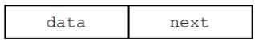  
图2.3 单链表的结点结构

单链表结点类型的定义如下：  
```c
typedef struct LNode{ //定义单链表结点类型
ElemType data; //数据域
struct LNode *next; //指针域
}LNode, *LinkList;
```

单链表避免了顺序表对连续内存空间的依赖，但每个结点需要额外存储一个指针，带来了一定的存储开销。同时，由于其元素离散地分布在内存中，单链表是一种非随机存取的存储结构，即无法直接定位到表中的某个特定结点，查找时要从表头开始依次遍历。

通常使用头指针（或head等）来标识一个单链表，该指针指向链表的起始位置。当头指针为NULL时，表示链表为空。此外，为了简化操作，在单链表的第一个数据结点之前常附加一个特殊的结点，称为头结点。头结点的数据域一般不存放有效数据（但可用于记录表长等信息）。在带头结点的单链表中，头指针工指向头结点，而头结点的next指向第一个数据结点，如图2.4(a)所示。在不带头结点的单链表中，头指针L直接指向第一个数据结点，如图2.4(b)所示。无论哪种形式，表尾结点的指针域为NULL（图中用“^”表示）。

  
图2.4 带头结点和不带头结点的单链表

头指针与头结点的关系：头指针始终指向链表的第一个结点（无论带不带头结点），而头结点仅存在于带头结点的链表中，它是链表的第一个结点，其数据域通常不存储实际数据。

引入头结点后，可带来以下两个主要优点：

①操作统一性：第一个数据结点的位置存储在头结点的指针域中，因此在链表首部进行插入、删除等操作时，与其他位置的操作逻辑一致，无须特殊处理。

②空表与非空表处理统一：无论链表是否为空，头指针始终是一个非空指针（指向头结点），而空表仅表现为头结点的next为NULL，从而避免了对空表的单独判断。

## 2.3.2 单链表上基本操作的实现

带头结点单链表在操作实现上更为简便。如无特殊说明，本节算法均默认链表带头结点。

## 1. 单链表的初始化

带头结点与不带头结点的单链表在初始化时有所不同。带头结点的单链表初始化时，需创建一个头结点，并令头指针L指向该头结点，其next指针初始化为NULL。

```c
L=(LNode*)malloc(sizeof(LNode)); //创建头结点①
L->next=NULL; //头结点之后暂无数据结点
return true;
1
```

不带头结点的单链表初始化时，只需将头指针工初始化为NULL。

bool InitList(LinkList &L){   
L=NULL;   
return true;

## 注意

设p为指向链表结点的结构体指针，则\*p表示该结点本身。可通过p->data或(\*p).data访问其数据域，二者完全等价。成员运算符（.）左侧应为结构体变量，指向运算符（->）左侧应为结构体指针。例如，p->next->data等价于(\*(\*p).next).data，表示当前结点后继结点的数据。

## 2. 求表长操作

求表长是指统计单链表中数据结点的个数（不包括头结点）。从第一个数据结点开始依次遍历，为此需要设置一个计数变量，每访问一个结点，其值加1，直到遇到NULL。

```c
int Length(LinkList L) {
int len=0;
LNode *p=L;
while(p->next!=NULL) {
p=p->next;
len++;
return len;
```

求表长操作的时间复杂度为O(n)。

另外，需要注意的是，由于表长不包含头结点，带头结点与不带头结点的实现细节略有不同。

## 3. 按序号查找结点

从单链表的第一个数据结点开始，沿next指针逐个查找，返回第i个结点的指针；若i超出表长，则返回NULL。

```c
LNode *GetElem(LinkList L,int i) {
LNode *p=L; //指针 p指向当前扫描结点
int j=0; //j 记录当前位序，头结点为第0 个结点
while(p!=NULL&&j<i) { //循环找到第i 个结点
p=p->next;
j++;
1
return p; //返回第 i 个结点的指针或 NULL
```

按序号查找操作的时间复杂度为O(n)。

## 4. 按值查找表结点

从单链表的第一个数据结点开始，依次比较各结点的数据域，若等于给定值e，则返回该结点指针；否则返回NULL。

LNode \*LocateElem(LinkList L,ElemType e) {  
LNode \*p=L->next;  
while(p!=NULL&&p->data!=e)∥//从第一个结点开始查找数据域为e的结点

p=p->next;   
return p;

//找到后返回该结点指针，否则返回 NULL

按值查找操作的时间复杂度为O(n)。

## 5. 插入结点操作

考点追踪单链表插入操作的过程（2016、2024）

将值为e的新结点插入到第i个位置（成为新的第i个数据结点）。先检查i的合法性，然后找到第i-1个结点（前驱），再在其后插入新结点。假设找到的第i-1个结点为\*p，然后令新结点\*s的next指向\*p的后继，再令\*p的next指向\*s，如图2.5所示。

  
图2.5 单链表的插入操作

```c
bool ListInsert(LinkList &L,int i,ElemType e){
LNode *p=L; //p 指向当前扫描结点
int j=0; //j 记录当前位序，头结点为第0个结点
while(p!=NULL&&j<i-1) { //循环找到第 i-1 个结点
p=p->next;
j++;
}
if(p==NULL) //i 值不合法
return false;
LNode *s=(LNode*)malloc(sizeof(LNode));
s->data=e;
s->next=p->next; 王 //图 2.5 中操作步骤①
p->next=s; //图 2.5 中操作步骤②
return true;
```

步骤①和②的顺序不可颠倒。若先执行p->next=s，则原后继地址丢失，导致s->next=p->next实际变为s->next=s，形成自环。该操作的时间复杂度为O(n)，主要开销在于查找前驱结点。若已知某结点指针，则在其后插入新结点的时间复杂度为O(1)。注意，当插入位置i=1时，不带头结点的单链表需要更新头指针工指向新首结点，而带头结点的则无须特殊处理。

扩展：对某个结点进行前插操作。

前插操作是指在某结点前插入一个新结点，与后插操作相反。任何前插操作均可转化为后插操作：只需从头结点开始顺序查找其前驱，时间复杂度为O(n)。若对给定结点进行前插，则还可采用另一种技巧（适用于数据可复制的情况）：将新结点\*s插入目标结点\*p之后，再交换\*p与\*s的数据域。这种技巧逻辑上等效于前插，且时间复杂度为O(1)。主要代码片段如下：

s->next=p->next; //修改指针域，不能颠倒  
p->next=s;  
temp=p->data; //交换数据域部分  
p->data=s->data;  
s->data=temp;

## 6. 删除结点操作

删除单链表的第i个数据结点。先检查i的合法性，然后找到第i-1个结点（前驱），再删

除其后继结点，并释放内存。假设找到的第i-1个结点为\*p，其后继为被删结点 $^ { \star } \mathrm { q }$ ，先将 $^ { \star } \mathrm { p }$ 的next 指向 $^ { \star } \mathrm { { q } }$ 的后继结点，然后释放\*q的存储空间，如图2.6所示。

  
图2.6 单链表结点的删除

```c
bool ListDelete(LinkList &L,int i,ElemType &e){ 育
LNode *p=L; //指针p指向当前扫描到的结点
int j=0; //记录当前结点的位序，头结点是第0个结点
while(p->next!=NULL&&j<i-1) {//循环找到第i-1 个结点
p=p->next;
1 j++; E道计算机
if(p->next==NULL|lj>i-1) //i 值不合法
王道 return false;
LNode *q=p->next; //令 q 指向被删除结点
e=q->data; //用 e 返回元素的值
p->next=q->next; //将*g结点从链中“断开”
free(q) ; //释放结点的存储空间①
return true;
2-
```

类似于插入操作，该操作的主要耗时也在查找操作上，时间复杂度为 $O ( n )$

当链表不带头结点时，需判断被删结点是否为首结点，若是，则要做特殊处理，将头指针指向新的首结点。当链表带头结点时，删除首结点和删除其他结点的操作是相同的。

扩展：删除给定结点 $^ { \star } \mathrm { p }$ o

常规方法需要从头遍历找到 $^ { \star } \mathrm { p }$ 的前驱，时间复杂度为O(n)。若允许修改结点内容，则可采用一种O(1)的技巧：将 $^ \star \mathrm { p }$ 的后继结点的数据复制到\*p中，然后删除其后继结点。该方法的局限性在于不能用于删除尾结点（因其无后继）。主要代码片段如下：

LNode \*q=p->next; //令 g 指向\*p 的后继结点  
p->data=p->next->data; //用后继结点的数据域覆盖  
p->next=q->next; //将\*g 结点从链中“断开  
free (q) ; //释放后继结点的存储空间

## 7. 采用头插法建立单链表

该方法从一个空表开始，生成新结点\*s，并将读取的数据存入其数据域。然后，令s->next指向头结点当前next所指的结点，再将头结点的next指向\*s，如图2.7所示。重复此过程，新结点始终成为第一个数据结点，最终链表中的元素顺序与输入顺序相反。

  
图2.7 采用头插法建立单链表

```c
LinkList List HeadInsert(LinkList &L){ //逆向建立单链表
LNode *s; int x; //设元素类型为整型
L=(LNode*)malloc(sizeof(LNode)); //创建头结点
L->next=NULL; //初始为空链表
scanf ("%d",&x); //输入结点的值
while(x!=9999) { //输入9999表示结束
s=(LNode*)malloc(sizeof(LNode));∥/创建新结点
s->data=x;
s->next=L->next;
L->next=s; //将新结点插入表中，L为头指针
scanf ("%d",&x) ;
}
return L;
```

每插入一个结点的时间复杂度为O(1)，总时间复杂度为O(n)。

## 思考

若单链表不带头结点，则上述代码中哪些地方需要修改？

## 8. 采用尾插法建立单链表

若希望输入顺序与链表中的元素顺序一致，则可采用尾插法。该方法将新结点插入当前链表的表尾。为此，需要维护一个尾指针r，并且始终指向当前的尾结点；插入时，令r->next指向新结点\*s，再将r更新为s，使其继续指向新的尾结点，如图2.8所示。

  
图2.8 采用尾插法建立单链表

```c
LinkList List TailInsert(LinkList &L){ //正向建立单链表
int x; //设元素类型为整型
L=(LNode*)malloc(sizeof(LNode)); //创建头结点
LNode *s,*r=L; //r 为表尾指针
scanf ("%d",&x); //输入结点的值
while(x!=9999) { //输入 9999 表示结束
s=(LNode *)malloc(sizeof(LNode));
首 百
s->data=x;
r->next=s;
r=s; //r 指向新的表尾结点
scanf("%d",&x);
1
r->next=NULL; //尾结点指针置空
return L;
```

因为附设了一个尾指针，故无须遍历查找尾部，总时间复杂度仍为O(n)。

## 注意

单链表是链式存储结构的基础，建议读者熟练掌握其基本操作。在设计算法时，可先通过画图理清指针变化逻辑，再编写代码，有助于避免常见错误（如指针丢失、内存泄漏等）。

## 2.3.3 双链表

单链表的每个结点仅包含一个指向其后继的指针，故只能从前往后依次遍历。若需访问某结点的前驱（插入或删除操作时），则要从头开始遍历，时间复杂度为O(n)。为了克服这一局限，引入了双链表，双链表中的每个结点包含两个指针prior和next，分别指向直接前驱和直接后继，如图2.9所示。其中，头结点的prior为NULL，尾结点的next也为NULL。

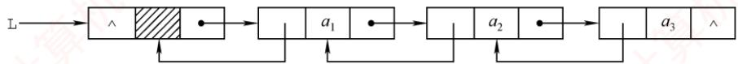  
图2.9 双链表示意图

双链表结点类型的定义如下：

```c
typedef struct DNode{ //定义双链表结点类型
ElemType data; //数据域
struct DNode *prior,*next; //前驱和后继指针
}DNode, *DLinklist;
```

双链表的按值查找操作和按位查找操作与单链表的相同，通常也需要从头结点开始顺序查找。由于增加了指向前驱的指针，双链表在插入操作和删除操作中要同时维护前驱与后继两个方向的链接，因此其实现方式与单链表的有较大差异。关键在于：修改指针时不能造成断链。得益于对前驱结点的直接访问，在已知目标结点的前提下，双链表的插入和删除操作的时间复杂度可降至0(1)。

## 1. 双链表的插入操作

考点追踪双链表中插入操作的实现（2023）

在双链表的结点\*p之后插入新结点\*s，其指针变化过程如图2.10所示。代码片段如下：

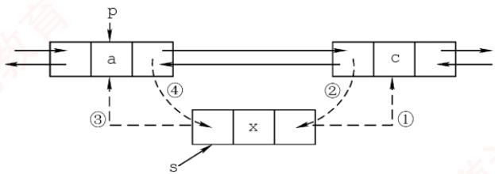

图2.10 双链表插入结点过程  
① s->next=p->next; //将结点\*s 插入到结点\*p 之后   
2 p->next->prior=s;   
③ s->prior=p;   
4 p->next=s;

上述语句的执行顺序并不是任意的：步骤①必须在步骤④之前，否则p->next被覆盖后，无法访问原后继结点，导致指针丢失，插入失败。其余步骤可在保证逻辑正确的前提下适当调整（例如③可在①前执行）。若问题改成要求在结点\*p之前插入结点\*s，则要如何处理？请读者自行推导操作步骤。

## 2. 双链表的删除操作

考点追踪双链表中删除操作的实现（2016）

删除双链表中结点 $^ { \star } \mathrm { p }$ 的后继结点 ${ } ^ { \star } \mathbb { Q }   ;$ ，其指针的变化过程如图2.11所示。

  
图2.11 双链表删除结点过程

$$
\begin{aligned} &\mathtt{p}->\mathtt{next}=\mathtt{q}->\mathtt{next};\\ &\mathtt{q}->\mathtt{next}->\mathtt{pr}\downarrow\circ\mathtt{r}=\mathtt{p};\\ &\mathtt{f}\mathtt{ree}\;(\mathtt{q})\;;\\ \end{aligned}
$$

若问题改成要求删除结点 $^ { \star } \mathrm { { q } }$ 的前驱结点 $^ { \star } \mathrm { p }$ ，请读者尝试写出对应的操作步骤。

建立双链表时，同样可以采用类似单链表的头插法或尾插法，但要注意：每次插入新结点时，要同时正确设置next 和 $\mathtt { p r i o r }$ 两个指针，以维持双向链接的完整性。

## 2.3.4 循环链表

## 1. 循环单链表

循环单链表与普通单链表的主要区别在于：表中最后一个结点的next域不再为NULL，而是指向头结点，从而使整个链表形成一个环。这种结构使得从任意一个结点出发均可遍历整个循环单链表，而不仅限于从表头开始，如图2.12所示。

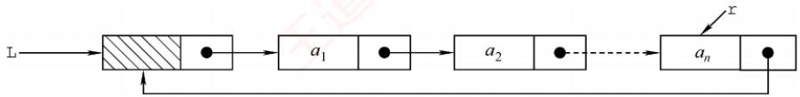  
图 2.12 循环单链表

尾结点 $^ { \star } \mathbb { T }$ 的next指向头结点，因此链表中不存在next为NULL的结点。判空条件不再是检查头指针L是否为空，而是检查头结点的next是否指向自身 $( \mathtt { L } - > \mathtt { n e x t } = = \mathtt { L } )$

## 考点追踪循环单链表中删除首元素的操作（2021）

循环单链表的插入和删除操作与普通单链表基本相同，但有一个关键差异：在表尾进行操作时，需要特别处理以维持链表的循环特性。然而，正是因为循环单链表是一个环，在任何位置上的插入和删除操作都是等价的，因此无须判断是否到达表尾。 H

为了提高效率，循环单链表有时不设头指针，而仅设置尾指针r。此时，在表头或表尾插入元素的时间复杂度均为O(1)。若使用头指针，则表尾插入需要遍历整个链表，时间复杂度为O(n)。例如，在表尾插入新结点 $^ { \star } \mathrm { S }$ 时，需要执行以下步骤：令 $\mathrm{s}->\mathrm{n}\mathrm{e}\times \mathrm{t}=\mathrm{r}->\mathrm{n}\mathrm{e}\times \mathrm{t}$ (使新结点的后继指向头结点，以维持环状结构）：将 $\mathtt { r } \mathtt { - } \mathtt { > } \mathtt { n } \mathtt { e } \mathtt { x } \mathtt { t }$ 指向新结点 $\left[ ^ { \star } \mathrm { S } \right]$ ；更新r为新结点 $^ { \star } \mathrm { S }$

## 2. 循环双链表

基于循环单链表的概念，不难推导出循环双链表。不同之处在于：循环双链表中的每个结点不仅包含指向下一个结点的 ${ \tt n e x t }$ 域，还包含指向前一个结点的 $\mathtt { [ p r i o r }$ 域。特别地，头结点的 $\mathtt { | p r i o r }$

需要指向表尾结点，从而形成一个完整的环形结构，如图2.13所示。

  
图 2.13 循环双链表

设尾结点为 $^ { \star } \mathrm { p }$ ，则p->next 应指向头结点 L；同时，L->prior 应指向 $^ { \star } \mathrm { p }$ 。当循环双链表为空时，其头结点L的prior 和 next都指向自身（L->prior== L且 $\mathtt { L } \mathtt { - } \mathtt { > } \mathtt { n e x } \mathtt { \textell } \mathtt { = } \mathtt { = } \mathtt { L } \mathtt { ) }$

## 2.3.5 静态链表

静态链表是用数组来模拟线性表的链式存储结构。每个结点都包含两个域：data域和next域。与动态链表不同的是，这里的指针实际上是结点在数组中的相对地址（数组下标），也称游标。类似于顺序表，静态链表也需要预先分配一块连续的内存空间。

静态链表和单链表的对应关系如图2.14所示。

  
(a)静态链表示例

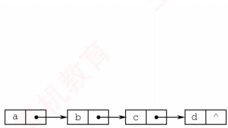  
(b)静态链表对应的单链表  
图2.14 静态链表和单链表的对应关系

静态链表的结构类型定义如下：

#define MaxSize 50 //静态链表的最大长度  
typedef struct{ //静态链表的结构类型定义  
ElemType data; //存储数据元素  
int next; //下一个元素的数组下标  
} SLinkList[MaxSize];

静态链表以next==-1作为其结束标志。静态链表的插入、删除操作与动态链表类似，只需修改指针（数组下标），而无须移动元素。尽管静态链表在灵活性上不及动态链表，但在一些不支持指针的编程语言（如Basic）中，它提供了一种巧妙的设计方案。 X

## 2.3.6 顺序表和链表的比较

## 1. 存取（读/写）方式

顺序表支持随机存取，可通过下标直接访问任意位置元素，时间复杂度为O(1)，同时也支持顺序存取。链表仅支持顺序存取，必须从头结点开始逐个遍历。例如，访问第i个元素时，顺序表只需一次操作；而链表需要遍历i个结点，平均时间复杂度为 $O ( n )$

## 2. 逻辑结构与物理结构

顺序存储中，逻辑上相邻的元素在物理内存中也连续存放，其邻接关系由地址自然体现；链式存储中，逻辑相邻的元素在物理上未必相邻，其逻辑关系通过指针显式维护。

## 3. 查找、插入和删除操作

对于按值查找，若表无序，则两者的时间复杂度均为O(n)；若表有序，则顺序表可以采用折半查找，时间复杂度为O(log2n)。对于按序号查找，顺序表的时间复杂度为O(1)，链表则为O(n)。对于插入/删除操作，顺序表平均需移动约一半的元素，开销较大；链表只需修改指针，无须移动元素，但前提是已知操作位置（否则仍需O(n)的时间定位）。

## 4. 空间分配

顺序表在静态分配下需预先设定容量：过大造成内存浪费，过小则易在插入时溢出。动态分配虽支持运行时扩容，但需要申请新的连续内存块并复制全部原有数据，不仅耗时，还可能因系统缺乏足够连续空闲空间而失败。相比之下，链表采用动态结点分配，按需扩展，灵活性高，但每个结点需额外存储指针域，导致存储密度小于1，空间利用率较低。

在实际应用中，该如何选择合适的存储结构呢？

## 1. 基于存储的考虑

当线性表的长度或规模难以预估时，顺序表因需预先分配固定容量而不适用；而链表无须预设容量，可按需动态扩展，但每个结点需额外存储指针，带来一定的空间开销。

## 2. 基于运算的考虑

若应用中频繁进行按序号访问（随机访问），顺序表具有O(1)的优势，明显更高效；而对于以插入和删除为主的操作，链表在定位目标位置后仅需调整指针，开销较小。尽管定位过程本身仍需O(n)时间，但在增删密集的场景下，链表的整体性能通常更优。

## 3. 基于环境的考虑

顺序表基于数组实现，几乎所有高级语言都支持，实现简单；链表则依赖指针操作，在部分环境中实现较为复杂。因此，开发语言和运行环境也是重要的考量因素。

综上所述，两种结构各有优劣。对于规模稳定、以随机访问为主的场景，宜采用顺序存储；而动态性强、频繁进行插入和删除操作的场景，则更适合链式存储。

## 注意

只有熟练掌握线性表的顺序存储和链式存储，才能深刻理解它们的优缺点。

## 2.3.7 本节试题精选

## 一、单项选择题

01. 下列关于线性表的存储结构的描述中，正确的是（）。 I. 线性表的顺序存储结构优于其链式存储结构 王道Ⅱ. 链式存储结构比顺序存储结构能更方便地表示各种逻辑结构Ⅲ. 若频繁使用插入和删除结点操作，则顺序存储结构更优于链式存储结构IV. 顺序存储结构和链式存储结构都可以进行顺序存取A. I、ⅡI、ⅢII B. II、IV C. II、III D. III、IV

02. 对于一个线性表，既要求能进行较快速地插入和删除，又要求存储结构能反映数据之间的逻辑关系，则应该用（）。A. 顺序存储方式 B. 链式存储方式C. 散列存储方式 D. 以上均可以

03. 链式存储设计时，结点内的存储单元地址（）。

A. 一定连续 B. 一定不连续C. 不一定连续 D. 部分连续，部分不连续

04. 下列关于线性表的说法中，正确的是（）。I. 顺序存储方式只能用于存储线性结构Ⅱ. 在一个设有头指针和尾指针的单链表中，删除表尾元素的时间复杂度与表长无关Ⅲ. 带头结点的循环单链表中不存在空指针IV. 在一个长度为 n的有序单链表中插入一个新结点并仍保持有序的时间复杂度为O(n)V. 若用单链表来表示队列，则应该选用带尾指针的循环链表A. I、ⅡI 教育 B. I、ⅢII、IV、V 7教育C. IV、V D. III、IV、V

05. 设线性表中有2n个元素，（）在单链表上实现要比在顺序表上实现效率更高。A. 删除所有值为 x的元素B. 在最后一个元素的后面插入一个新元素 道计算C. 顺序输出前k个元素D. 交换第i个元素和第 2n−i−1个元素的值（i=0,…,n−1）

06. 在一个单链表中，已知q所指结点是p所指结点的前驱结点，若在q和p之间插入结点s，则执行（）。7A. s->next=p->next;p->next=s; B. p->next=s->next;s->next=p;C. q->next=s;s->next=p; D. p->next=s;s->next=q;

07. 给定有n个元素的一维数组，建立一个有序单链表的最低时间复杂度是（）。A. O(1) B. O(n) C. O(n²) D. O(nlog2n)

08. 将长度为n的单链表链接在长度为 m的单链表后面，其算法的时间复杂度采用大O形式表示应该是（）。A. O(1) C. O(m) D. O(n + m)

09. 单链表中，增加一个头结点的目的是（）。A. 使单链表至少有一个结点 B. 标识表结点中首结点的位置C. 方便运算的实现 D. 说明单链表是线性表的链式存储

10. 在一个长度为n的带头结点的单链表h上，设有尾指针r，则执行（）操作与链表的表长有关。A. 删除单链表中的第一个元素B. 删除单链表中的最后一个元素 王道计算机C. 在单链表第一个元素前插入一个新元素D. 在单链表最后一个元素后插入一个新元素

11. 对于一个头指针为head的带头结点的单链表，判定该表为空表的条件是（）；对于不带头结点的单链表，判定空表的条件为（）。A. head==NULL B. head->next==NULLC. head->next==head D. head!=NULL

12. 在线性表 $a _ { 0 } , a _ { 1 } , \cdots , a _ { 1 0 0 }$ 中，删除元素 $a _ { 5 0 }$ 需要移动（）个元素。A. 0 B. 50 FI C. 51 D. 0或50

13. 通过含有n(n>1)个元素的数组a，采用头插法建立单链表L，则 L 中的元素次序（）。A. 与数组 a 的元素次序相同 B. 与数组 a的元素次序相反

C. 与数组a的元素次序无关 D. 以上都错误

14.下面关于线性表的一些说法中，正确的是（）。A. 对一个设有头指针和尾指针的单链表执行删除最后一个元素的操作与链表长度无关B. 线性表中每个元素都有一个直接前驱和一个直接后继C. 为了方便插入和删除数据，可以使用双链表存放数据D. 取线性表第i个元素的时间与i的大小有关

15. 在双链表中向p所指的结点之前插入一个结点q的操作为（）。A. p->prior=q; q->next=p; p->prior->next=q; q->prior=p->prior;B. q->prior=p->prior; p->prior->next=q; q->next=p; p->prior=q->next;C. q->next=p; p->next=q; q->prior->next=q; q->next=p;D. $\mathtt { p } { - } \mathtt { > } \mathtt { p } \mathtt { r } \mathtt { i } \mathtt { o } \mathtt { r } { - } \mathtt { > } \mathtt { n } \mathtt { e } \mathtt { x } \mathtt { t } { = } \mathtt { q } \mathtt { ; } \quad \mathtt { q } { - } \mathtt { > } \mathtt { n } \mathtt { e } \mathtt { x } \mathtt { t } { = } \mathtt { p } \mathtt { ; } \quad \mathtt { q } { - } \mathtt { > } \mathtt { p } \mathtt { r } \mathtt { i } \mathtt { o } \mathtt { r } { = } \mathtt { p } { - } \mathtt { > } \mathtt { p } \mathtt { r } \mathtt { i } \mathtt { o } \mathtt { r } \mathtt { ; } \quad \mathtt { p } { - } \mathtt { > } \mathtt { p } \mathtt { r } \mathtt { i } \mathtt { o } \mathtt { r } { = } \mathtt { q } \mathtt { ; }$

16. 在双链表存储结构中，删除p所指的结点时必须修改指针（）。A. p->prior->next=p->next; p->next->prior=p->prior;B. p->prior=p->prior->prior; p->prior->next=p;C. p->next->prior=p; p->next=p->next->next;D. p->next=p->prior->prior; p->prior=p->next->next;

17. 在如下图所示的双链表中，已知指针p指向结点A，若要在结点A和C之间插入指针q所指的结点B，则依次执行的语句序列可以是（）。


① q->next=p->next; ② q->prior=p; ③ p->next=q; ④ p->next->prior=q; A. ①②④③ B. ④③②① C. ③④①② D. ①③④②

18.在双链表的两个结点之间插入一个新结点，需要修改（）个指针域。A. 1 B. 3 C. 4 D. 2

19. 在长度为n的有序单链表中插入一个新结点，并仍然保持有序的时间复杂度是（）。A. O(1) B. O(n) C. O(n2) D. O(nlog2n)

20. 与单链表相比，双链表的优点之一是（）。A. 插入、删除操作更方便 B. 可以进行随机访问 KC. 可以省略表头指针或表尾指针 D. 访问前后相邻结点更灵活

21.对于一个带头结点的循环单链表L，判断该表为空表的条件是（）。A. 头结点的指针域为空 B. L 的值为 NULLC. 头结点的指针域与L的值相等 D. 头结点的指针域与L的地址相等

22. 对于一个带头结点的循环双链表L，判断该表为空表的条件是（）。A. $\mathtt { L } \mathtt { - } \mathtt { > } \mathtt { p r i o r } \mathtt { = } \mathtt { = } \mathtt { L } \mathtt { \& \& L } \mathtt { - } \mathtt { > } \mathtt { n e x t } \mathtt { = } \mathtt { = } \mathtt { N U L L }$ B. $\mathtt { L } \mathtt { - } \mathtt { > } \mathtt { p } \mathtt { \bar { r } } \mathtt { \downarrow } \mathtt { \circ } \mathtt { r } \mathtt { = } \mathtt { = } \mathtt { N } \mathtt { U } \mathtt { L } \mathtt { L } \mathtt { \& } \mathtt { \& } \mathtt { L } \mathtt { - } \mathtt { > } \mathtt { n } \mathtt { e } \mathtt { x } \mathtt { t } \mathtt { = } \mathtt { = } \mathtt { N } \mathtt { U } \mathtt { L } \mathtt { L }$ NC. $\mathtt { L } \mathtt { - } \mathtt { > } \mathtt { p r i o r } \mathtt { = } \mathtt { = } \mathtt { N U L L } \mathtt { \& \& L } \mathtt { - } \mathtt { > } \mathtt { n e x t } \mathtt { = } \mathtt { = } \mathtt { L }$ D. $\mathtt { L } - \mathtt { > } \mathtt { p r i o r } = = \mathtt { L } \& \& - \mathtt { > } \mathtt { n e x t } = = \mathtt { L }$

23.一个链表最常用的操作是在末尾插入结点和删除结点，则选用（）最节省时间。A. 带头结点的循环双链表 B. 循环单链表C. 带尾指针的循环单链表 D. 单链表

24. 设对n（n>1）个元素的线性表的运算只有4种：删除第一个元素；删除最后一个元素；在第一个元素之前插入新元素；在最后一个元素之后插入新元素，则最好使用（）。

A. 只有尾结点指针没有头结点指针的循环单链表B. 只有尾结点指针没有头结点指针的非循环双链表C. 只有头结点指针没有尾结点指针的循环双链表D. 既有头结点指针又有尾结点指针的循环单链表

25. 有两个长度为n的循环单链表，若要求两个循环单链表头尾相接的时间复杂度为O(1)，则对应两个循环单链表各设置一个指针，分别指向（）。A. 各自的头结点 B. 各自的尾结点C. 各自的首结点 D. 一个表的头结点，另一个表的尾结点

26. 有一个长度为n的循环单链表，若从表中删除首元结点的时间复杂度达到O(n)，则此时采用的循环单链表的结构可能是（）。A. 只有表头指针，没有头结点 B. 只有表尾指针，没有头结点C. 只有表尾指针，带头结点 D. 只有表头指针，带头结点

27. 某线性表用带头结点的循环单链表存储，头指针为 head，当 head->next->next==head成立时，线性表的长度可能是（）。 道L A. 0 B. 1 C. 2 D. 可能为0或1

28. 有两个长度都为 n 的双链表，若以 $h _ { 1 }$ 为头指针的双链表是非循环的，以 $h _ { 2 }$ 为头指针的双链表是循环的，则下列叙述中正确的是（）。A. 对于双链表 $h _ { 1 }$ ，删除首结点的时间复杂度是O(n)B. 对于双链表 $h _ { 2 } ,$ 删除首结点的时间复杂度是O(n)C. 对于双链表 $h _ { 1 } ,$ 删除尾结点的时间复杂度是O(1)D. 对于双链表 $h _ { 2 }$ ，删除尾结点的时间复杂度是O(1)

29.一个链表最常用的操作是在最后一个元素后插入一个元素和删除第一个元素，则选用（）A. 不带头结点的循环单链表 最节省时间。 道计 B. 双链表C. 单链表 D. 不带头结点且有尾指针的循环单链表

30. 需要分配较大连续空间，插入和删除不需要移动元素的线性表，其存储结构为（）。A. 单链表 1 B. 静态链表 C. 顺序表 D. 双链表 V

31.下列关于静态链表的说法中，正确的是（）。I. 静态链表兼具顺序表和单链表的优点，因此存取表中第i个元素的时间与i无关Ⅱ. 静态链表能容纳的最大元素个数在表定义时就确定了，以后不能增加Ⅲ.静态链表与动态链表在元素的插入、删除上类似，不需要移动元素IV.相比动态链表，静态链表可能浪费较多的存储空间A. I、Ⅱ、ⅢII B. II、ⅢII、IV 王道计C. I、III、IV D. I、II、IV

32. 【2016统考真题】已知一个带有表头结点的循环双链表L，结点结构为 $\boxed { \mathtt { p r e v } \; \boxed { \mathtt { d a t a } } \; \mathtt { n e x t } }$ 其中prev和next分别是指向其直接前驱和直接后继结点的指针。现要删除指针p所指的结点，正确的语句序列是（）。A. $\mathtt { p } \mathtt { - } \mathtt { > } \mathtt { n e } \mathtt { x t } \mathtt { - } \mathtt { > } \mathtt { p } \mathtt { x e } \mathtt { v } \mathtt { = } \mathtt { p } \mathtt { - } \mathtt { > } \mathtt { p } \mathtt { x e } \mathtt { v } \mathtt { ; } \quad \mathtt { p } \mathtt { - } \mathtt { > } \mathtt { p } \mathtt { x e } \mathtt { v } \mathtt { - } \mathtt { > } \mathtt { n e } \mathtt { x t } \mathtt { = } \mathtt { p } \mathtt { - } \mathtt { > } \mathtt { p } \mathtt { x e } \mathtt { v } \mathtt { ; } \quad \mathtt { f r e e } \quad \mathtt { ( p ) } \quad \mathtt { ; }$ B. `p->next->prior = p;` C. `p->next->prior = p;` D. $\mathtt { p } \mathtt { - } \mathtt { > } \mathtt { n e } \mathtt { x t } \mathtt { - } \mathtt { > } \mathtt { p } \mathtt { x e } \mathtt { v } \mathtt { = } \mathtt { p } \mathtt { - } \mathtt { > } \mathtt { p } \mathtt { x e } \mathtt { v } \mathtt { ; } \quad \mathtt { p } \mathtt { - } \mathtt { > } \mathtt { p } \mathtt { x e } \mathtt { v } \mathtt { - } \mathtt { > } \mathtt { n e } \mathtt { x t } \mathtt { = } \mathtt { p } \mathtt { - } \mathtt { > } \mathtt { n e } \mathtt { x t } \mathtt { ; } \quad \mathtt { f } \mathtt { x e } \mathtt { e } \quad \mathtt { ( p ) } \quad \mathtt { ; }$

<!-- DIRECTED-REPAIR-FALLBACK:FALLBACK-408-CAND_fda7d6123803fb10 -->
> [!WARNING]
> 原 PDF 第 54 页回退：结点字段prior/next与四个选项发生字符错乱和选项损失，不能可靠作答。；物理页54确认选项是多行代码，OCR已改变字段名和选项内容，需整题回填。

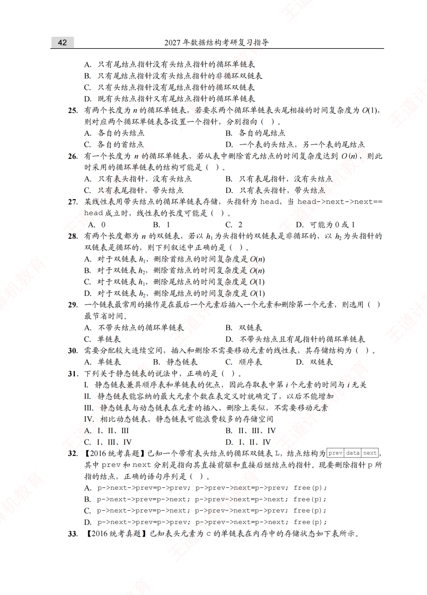

33.【2016统考真题】已知表头元素为c的单链表在内存中的存储状态如下表所示。

<table><tr><td rowspan=1 colspan=4>地址       元素      链接地址</td></tr><tr><td rowspan=1 colspan=2>1000H</td><td rowspan=1 colspan=1>a</td><td rowspan=1 colspan=1>1010H</td></tr><tr><td rowspan=1 colspan=2>1004H</td><td rowspan=1 colspan=1>b</td><td rowspan=1 colspan=1>100CH</td></tr><tr><td rowspan=1 colspan=2>1008H</td><td rowspan=1 colspan=1>C</td><td rowspan=1 colspan=1>1000H</td></tr><tr><td rowspan=1 colspan=2>100CH</td><td rowspan=1 colspan=1>d</td><td rowspan=1 colspan=1>NULL</td></tr><tr><td rowspan=1 colspan=1>1010H</td><td rowspan=1 colspan=1></td><td rowspan=1 colspan=1>e</td><td rowspan=1 colspan=1>1004H</td></tr><tr><td rowspan=1 colspan=2>1014H</td><td rowspan=1 colspan=1></td><td rowspan=1 colspan=1></td></tr></table>

现将f存放于1014H处并插入单链表，若f在逻辑上位于a和e之间，则a、e、f的“链接地址”依次是（）。A. 1010H、1014H、1004H B. 1010H、1004H、1014HC. 1014H、1010H、1004H D. 1014H、1004H、1010H 教育

34.【2021 统考真题】已知头指针h指向一个带头结点的非空循环单链表，结点结构为datanext，其中next是指向直接后继结点的指针，p是尾指针，q是临时指针。现要删除该链表的第一个元素，正确的语句序列是（）。A. h->next=h->next->next;q=h->next;free(q); 王道计B. q=h->next;h->next=h->next->next;free(q);C. q=h->next;h->next=q->next;if(p!=q) p=h;free(q);D. q=h->next;h->next=q->next;if(p==q) p=h;free(q);

35.【2023统考真题】现有非空双链表L，其结点结构为 $\boxed { \mathtt { p r e v } \boxed { \mathtt { d a t a } } \boxed { \mathtt { n e x t } } } ,$ prev是指向直接前驱结点的指针，next是指向直接后继结点的指针。若要在L中指针p所指向的结点(非尾结点）之后插入指针s指向的新结点，则在执行语句序列“s->next=p->next；p->next=s；”后，下列语句序列中还需要执行的是（）。A. s->next->prev=p; s->prev=p;B. p->next->prev=s; s->prev=p;C. s->prev=s->next->prev; s->next->prev=s;D. p->next->prev=s->prev; s->next->prev=p;

36.【2024统考真题】已知带头结点的非空单链表L的头指针为h，结点结构为data next其中next是指向直接后继结点的指针。现有指针p和q，若p指向L中非首且非尾的任意一个结点，则执行语句序列“q=p->next；p->next=q->next；q->next=h->next；h->next=q;”的结果是（）。A. 在p所指结点后插入 q所指结点B. 在 q所指结点后插入 p所指结点C. 将p所指结点移至L的头结点之后 D. 将q所指结点移动到L的头结点之后

## 二、综合应用题

01.在带头结点的单链表工中，删除所有值为×的结点，并释放其空间，假设值为×的结点不唯一，试编写算法以实现上述操作。

02. 试编写在带头结点的单链表工中删除一个最小值结点的高效算法（假设该结点唯一）。

03. 试编写算法将带头结点的单链表就地逆置，所谓“就地”是指辅助空间复杂度为O(1)。

04. 设在一个带表头结点的单链表中，所有结点的元素值无序，试编写一个函数，删除表中所有处于给定的两个值（作为函数参数给出）之间的元素（若存在）。

05.给定两个单链表，试分析找出两个链表的公共结点的思想（不用写代码）。

06. 设 $C = \{ a _ { 1 } , b _ { 1 } , a _ { 2 } , b _ { 2 } , \cdots , a _ { n } , b _ { n } \}$ 为线性表，采用带头结点的单链表存放，设计一个就地算法，将其拆分为两个线性表，使得 $A = \left\{ a_{1}, a_{2}, \cdots, a_{n} \right\}, B = \left\{ b_{n}, \cdots, b_{2}, b_{1} \right\}$

07. 在一个递增有序的单链表中，存在重复的元素。设计算法删除重复的元素，例如（7,10，

10,21,30,42,42,42,51,70）将变为（7,10,21,30,42,51,70）。

08. 设A和B是两个单链表（带头结点），其中元素递增有序。设计一个算法从A和B中的公共元素产生单链表C，要求不破坏A、B的结点。

09. 已知两个链表A和 B 分别表示两个集合，其元素递增排列。编制函数，求A 与 B 的交集，并存放于A链表中。

10. 两个整数序列 $A = a_{1}, a_{2}, a_{3}, \cdots, a_{m}$ 和 $B = b_{1}, b_{2}, b_{3}, \cdots, b_{n}  已$ 经存入两个单链表中，设计一个算法，判断序列B是否是序列A的连续子序列。

11. 设计一个算法用于判断带头结点的循环双链表是否对称。

12. 有两个循环单链表，链表头指针分别为 $h _ { 1 }$ 和 $h _ { 2 }$ ，编写一个函数将链表 $h _ { 2 }$ 链接到链表 $h _ { 1 }$ 之后，要求链接后的链表仍保持循环链表形式。

13. 设有一个带头结点的非循环双链表L，其每个结点中除有pre、data和next域外，还有一个访问频度域freq，其值均初始化为零。每当在链表中进行一次Locate(L,x)运算时，令值为×的结点中freq域的值增1，并使此链表中的结点保持按访问频度递减的顺序排列，且最近访问的结点排在频度相同的结点之前，以便使频繁访问的结点总是靠近表头。试编写符合上述要求的Locate(L，x)函数，返回找到结点的地址，类型为指针型。

14. 设将n（n>1）个整数存放到不带头结点的单链表L中，设计算法将L中保存的序列循环右移k（0<k<n）个位置。例如，若k=1，则将链表{0,1,2,3}变为{3,0,1,2}。要求：1）给出算法的基本设计思想。2）根据设计思想，采用C或C++语言描述算法，关键之处给出注释。3）说明你所设计算法的时间复杂度和空间复杂度。

15.单链表有环，是指单链表的最后一个结点的指针指向了链表中的某个结点（通常单链表的最后一个结点的指针域是空的）。试编写算法判断单链表是否存在环。

1）给出算法的基本设计思想。

2）根据设计思想，采用C或C++语言描述算法，关键之处给出注释。

3）说明你所设计算法的时间复杂度和空间复杂度。

16.设有一个长度n（n为偶数）的不带头结点的单链表，且结点值都大于0，设计算法求这个单链表的最大孪生和。孪生和定义为一个结点值与其孪生结点值之和，对于第i个结点（从0开始），其孪生结点为第n-i-1个结点。要求： X

1）给出算法的基本设计思想。

2）根据设计思想，采用C或C++语言描述算法，关键之处给出注释。

3）说明你的算法的时间复杂度和空间复杂度。

17.【2009统考真题】已知一个带有表头结点的单链表，结点结构为

<table><tr><td>data</td><td></td></tr><tr><td></td><td>link</td></tr></table>

假设该链表只给出了头指针1ist。在不改变链表的前提下，请设计一个尽可能高效的算法，查找链表中倒数第k个位置上的结点（k为正整数）。若查找成功，算法输出该结点的data域的值，并返回1；否则，只返回0。要求：

1）描述算法的基本设计思想。

2）描述算法的详细实现步骤。

3）根据设计思想和实现步骤，采用程序设计语言描述算法（使用C、C++或Java语言实现），关键之处请给出简要注释。

18.【2012统考真题】假定采用带头结点的单链表保存单词，当两个单词有相同的后缀时，可共享相同的后缀存储空间，例如，loading和being的存储映像如下图所示。


设str1和str2分别指向两个单词所在单链表的头结点，链表结点结构为 $\boxed { \mathtt { d a t a } \boxed { \mathtt { n e x t } } }$ 请设计一个时间上尽可能高效的算法，找出由str1和str2所指向两个链表共同后缀的起始位置（如图中字符i所在结点的位置p）。要求： XK

1）给出算法的基本设计思想。

2）根据设计思想，采用C或C++或Java语言描述算法，关键之处给出注释。

3）说明你所设计算法的时间复杂度。

19.【2015统考真题】用单链表保存m个整数，结点的结构为[data][1ink]，且|data|≤值相等的点，仅保一现的结点而其对，等的点。例如，若给定的单链表 head 如下：


则删除结点后的 head 为


要求：

1）给出算法的基本设计思想。

2）使用C或C++语言，给出单链表结点的数据类型定义。

3）根据设计思想，采用C或C++语言描述算法，关键之处给出注释。

4）说明你所设计算法的时间复杂度和空间复杂度。

20.【2019统考真题】设线性表 $L = \left( a_{1}, a_{2}, a_{3}, \cdots, a_{n-2}, a_{n-1}, a_{n} \right)$ 采用带头结点的单链表保存，链表中的结点定义如下： X

```c
typedef struct node
int data;
struct node*next;
}NODE;
```

请设计一个空间复杂度为O(1)且时间上尽可能高效的算法，重新排列L中的各结点，得到线性表 $L ^ { \prime } = ( a _ { 1 } , a _ { n } , a _ { 2 } , a _ { n - 1 } , a _ { 3 } , a _ { n - 2 } , \cdots )$ 。要求：

1）给出算法的基本设计思想。

2）根据设计思想，采用C或C++语言描述算法，关键之处给出注释。

3）说明你所设计的算法的时间复杂度。

## 2.3.8 答案与解析

## 一、单项选择题

01. B

两种存储结构适用于不同的场合，不能简单地说谁好谁坏，说法Ⅰ错误。链式存储用指针表

示逻辑结构，而指针的设置是任意的，因此比顺序存储结构能更方便地表示各种逻辑结构，说法Ⅱ正确。在顺序存储中，插入和删除结点需要移动大量元素，效率较低，说法Ⅲ的描述刚好相反。顺序存储结构既能随机存取又能顺序存取，而链式结构只能顺序存取，说法IV正确。

## 02. B

首先直接排除选项A和D。散列存储通过散列函数映射到物理空间，不能反映数据之间的逻辑关系，排除选项C。链式存储能方便地表示各种逻辑关系，且插入和删除操作的时间复杂度为O(1)。

## 03. A

链式存储设计时，各个不同结点的存储空间可以不连续，但结点内的存储单元地址必须连续。

## 04. D

顺序存储方式同样适用于存储图和树，说法Ⅰ错误。删除表尾结点时，必须从头开始找到表尾结点的前驱，其时间与表长有关，说法Ⅱ错误。循环单链表中最后一个结点的指针不是NULL，而是指向头结点，整个链表形成一个环，因此不存在空指针，说法Ⅲ正确。有序单链表只能依次查找插入位置，时间复杂度为O(n)，说法IV正确。队列需要在表头删除元素，表尾插入元素，采用带尾指针的循环链表较为方便，插入和删除的时间复杂度都为O(1)，说法V正确。

## 05. A

对于选项A，在单链表和顺序表上实现的时间复杂度都为O(n)，但后者要移动很多元素，因此在单链表上实现效率更高。对于选项B和D，顺序表的效率更高。C无区别。

## 06. C

s 插入后，q成为 s的前驱，而p成为 s的后继，选择选项C。

## 注意

可能有读者认为选项C中的两条语句交换后才正确。实际上，因为本题插入位置的前后结点都有指针指示（这与前面介绍的插入操作是不同的），所以选项C中的语句顺序并不会造成断链。在此提醒读者在学习过程中一定要多动脑思考，而不要生搬硬套。

## 07. D

若先建立链表，然后依次插入建立有序表，则每插入一个元素就需遍历链表寻找插入位置，即直接插入排序，时间复杂度为 $O ( n ^ { 2 } )$ 。若先将数组排好序，然后建立链表，建立链表的时间复杂度为O(n)，数组排序的最好时间复杂度为 O(nlog2n)，总时间复杂度为O(nlog2n)。故选择选项D。

## 08. C

先遍历长度为m的单链表，找到该单链表的尾结点，然后将其next域指向另一个单链表的首结点，其时间复杂度为O(m)。

## 09. C

单链表设置头结点的目的是方便运算的实现，主要好处体现在：第一，有头结点后，插入和删除数据元素的算法就统一了，不再需要判断是否在第一个元素之前插入或删除第一个元素；第二，不论链表是否为空，其头指针是指向头结点的非空指针，链表的头指针不变，因此空表和非空表的处理也就统一了。

## 10. B

删除单链表的最后一个结点需置其前驱结点的指针域为NULL，需要从头开始依次遍历找到该前驱结点，需要O(n)的时间，与表长有关。其他操作均与表长无关，读者可自行模拟。

## 11. B, A

在带头结点的单链表中，头指针head指向头结点，头结点的next域指向第一个元素结点，$\mathtt { h e a d { - } { > } n e x t { = } { = } N U L L }$ 表示该单链表为空。在不带头结点的单链表中，head直接指向第一个元素结点，head==NULL表示该单链表为空。

## 12. D

线性表有顺序存储和链式存储两种存储结构。若采用链式存储结构，则删除元素 $a _ { 5 0 }$ 不需要移动元素；若采用顺序存储结构，则需要依次移动50个元素。

## 13. B

当采用头插法建立单链表时，数组后面的元素插入到单链表L的最前端，所以L中的元素次序与数组a的元素次序相反。 H

## 14. C

选项A显然错误。选项B中第一个元素和最后一个元素不满足题设要求。双链表能很方便地访问前驱和后继，故删除和插入数据较为方便，选项C正确。选项D未考虑顺序存储的情况。

## 15. D

为了在 $\mathrm { p }$ 之前插入结点 $\mathbb { G } ;$ ，可以将p的前一个结点的 next 域指向 q，将 $\mathbb { q }$ 的 next 域指向p，将 $\mathbb { q }$ 的 $\mathtt { p r i o r }$ 域指向 $\wp$ 的前一个结点，将 $\wp$ 的 $\mathtt { p r i o r }$ 域指向 $\mathbb { G } \circ$ 仅选项D满足条件。

## 16. A

与上一题的分析基本类似，只不过这里是删除一个结点，注意将 $\mathrm { p }$ 的前、后两结点链接起来。关键是要保证在结点指针的修改过程中不断链！ X

注意，请读者仔细对比上述两题，弄清双链表的插入和删除方法。

## 17. A

结点A和B分别由指针 $\mathrm { p }$ 和 $\mathbb { q }$ 指示，但结点C仅能由p->next间接指示，因此在改变p->next之前，必须先将g->next指向结点C，即①要在③前面，且④要在③前面（因为若先执行③，则④相当于q->prior指向其自身，显然矛盾）。故只能选择选项A。

## 18. C

当在双链表的两个结点（分别用第一个、第二个结点表示）之间插入一个新结点时，需要修改四个指针域，分别是：新结点的前驱指针域，指向第一个结点；新结点的后继指针域，指向第二个结点；第一个结点的后继指针域，指向新结点；第二个结点的前驱指针域，指向新结点。

## 19. B

设单链表递增有序，首先要在单链表中找到第一个大于×的结点的直接前驱p，在p之后插入该结点。查找的时间复杂度为 $O ( n )$ ，插入的时间复杂度为O(1)，总时间复杂度为 $O ( n )$

## 20. D

在插入和删除操作上，单链表和双链表都不用移动元素，都很方便，但双链表修改指针的操作更为复杂，选项A错误。双链表中可以快速访问任何一个结点的前驱和后继结点，选项D正确。

## 21. C

带头结点的循环单链表工为空表时，满足 $\mathtt { L } \mathtt { - } \mathtt { > } \mathtt { n e x t } \mathtt { = } \mathtt { = } \mathtt { L }$ ，即头结点的指针域与工的值相等，而不是头结点的指针域与工的地址相等。注意，带头结点的循环单链表中不存在空指针。

## 22. D

循环双链表L判空的条件是头结点（头指针）的prior和next域都指向它自身。

## 23. A

在链表的末尾插入和删除一个结点时，需要修改其相邻结点的指针域。而寻找尾结点及尾结点的前驱结点时，只有带头结点的循环双链表所需要的时间最少。

## 24. C

对于选项A，删除尾结点 $^ { \star } \mathrm { p }$ 时，需要找到 $^ { \star } \mathrm { P }$ 的前一个结点，时间复杂度为 $O ( n )$ 。对于选项B,删除首结点 $^ \star \mathrm { p }$ 时，需要找到 $^ { \star } \mathrm { p }$ 结点，这里没有直接给出头结点指针，而是通过尾结点的 $\mathtt { p r i o r }$ 指针找到 $^ { \star } \mathrm { p }$ 结点的时间复杂度为 $O ( n )$ 。对于选项D，删除尾结点 $^ \star \mathrm { p }$ 时，需要找到 $^ { \star } \mathrm { p }$ 的前一个结点，时间复杂度为 $O ( n )$ 。对于C，执行这四种算法的时间复杂度均为O(1)。

## 25. B

要求用O(1)的时间将两个循环单链表头尾相接，并未指明哪个链表接在另一个链表之后，所以对两个链表都要在O(1)的时间找到头结点和尾结点。因此，两个指针应都指向尾结点。

## 26. A

在循环单链表中，删除首元结点后，要保持链表的循环性，因此需要找到首元结点的前驱。  
当链表带头结点时，其前驱就是头结点，因此不论是表头指针还是表尾指针，删除首元结点的时  
间都为O(1)。当链表不带头结点时，其前驱是尾结点，因此，若有表尾指针，就可在O(1)的时间  
找到尾结点：若只有表头指针，则需要遍历整个链表找到尾结点，时间为O(n)。V

## 27. D

对一个空循环单链表，有 head->next==head，推理 head->next->next==head->next==head。对含有一个元素的循环单链表，头结点（头指针 head 指示）的 next 域指向这个唯一的元素结点，该元素结点的 next 域指向头结点，因此也有 head->next->next=head。

## 28. D

对于两种双链表，删除首结点的时间复杂度都是O(1)。对于非循环双链表，删除尾结点的时间复杂度是O(n)；对于循环双链表，删除尾结点的时间复杂度是O(1)。

## 29. D

对于选项A，在最后一个元素之后插入元素的情况与普通单链表相同，时间复杂度为 O(n)；而删除第一个元素时，为保持循环单链表的性质（尾结点指向第一个结点），要先遍历整个链表找到尾结点，再做删除操作，时间复杂度为O(n)。对于选项B，双链表的情况与单链表的相同，一个是O(n)，一个是O(1)。对于选项C，在最后一个元素之后插入一个元素，要遍历整个链表才能找到插入位置，时间复杂度为O(n)；删除第一个元素的时间复杂度为O(1)。对于选项D，与选项A的分析对比，有尾结点的指针，省去了遍历链表的过程，因此时间复杂度均为O(1)。

## 30. B

静态链表采用数组表示，因此需要预先分配较大的连续空间，静态链表同时还具有一般链表的特点，即插入和删除不需要移动元素。

## 31. B

静态链表的存储空间虽然是顺序分配的，但元素的存储不是顺序的，查找时仍然需要按链依次进行，而插入、删除都不需要移动元素。静态链表的存储空间是一次性申请的，能容纳的最大元素个数在定义时就已确定。并非每个空间都存储了元素，因此会造成存储空间的浪费。

## 32. D

选项A的第二句代码，相当于将p前驱结点的后继指针指向其自身，错误；选项B和C的第一句代码，相当于将p后继结点的前驱指针指向其自身，错误。只有选项D正确。

## 33. D

根据存储状态，单链表的结构如下图所示。


其中“链接地址”是指结点next所指的内存地址。当结点f插入后，a指向f，f指向e，e指向 b。显然a、e和 f的“链接地址”分别是f、b和e的内存地址，即1014H、1004H和1010H。

## 34. D

如图1所示，要删除带头结点的非空循环单链表中的第一个元素，就要先用临时指针g指向待删结点，q=h->next；然后将 $\mathbb { q }$ 从链表中断开，h->next=q->next（这一步也可写成h->next=$\mathrm{h}->\mathrm{ne}\mathrm{x}\mathrm{t}->\mathrm{ne}\mathrm{x}\mathrm{t}$ ；此时要考虑一种特殊情况，若待删结点是链表的尾结点，即循环单链表中只有一个元素 $\mathrm { r ( p ) }$ 和 $\mathbb { q }$ 指向同一个结点)，如图2所示，则在删除后要将尾指针指向头结点，即 $\mathrm{i}\mathrm{f}\left(\mathrm{p}==\mathrm{q}\right)$ p=h；最后释放 $\mathbb { q }$ 结点即可，答案选择选项D。

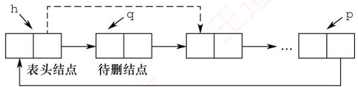  
图1

  
图2

## 35. C

链表的插入操作要保证不会造成断链，画图再依次判断选项。执行语句“①s->next=p->next；②p->next=s；”后的结构如下图所示（虚线表示prev，实线表示next）。


对于选项 A， $\mathtt { s } { \mathrel { \mathtt { - } } \mathrel { \mathtt { > } } } \mathtt { n e x t { \mathtt { - } } \mathrel { \mathtt { > } } } \mathtt { p r e v { \mathrel { \mathtt { = } } } p }$ ，错误。对于选项B， $\mathtt { p } { - } \mathtt { > } \mathtt { n e x t } { - } \mathtt { > } \mathtt { p r e v } { = } \mathtt { s }$ ，让 s的 prev指向s，错误。对于选项D,两句代码均错误。对于选项C，执行语句“③s->prev=s->next->prev；④s->next->prev=s；”后的结构如下图所示，满足插入的要求。


## 36. D

假设单链表的初始状态如图①所示。执行q=p->next后的状态如图②所示，q指向p的后继结点。执行 $\mathrm{p}->\mathrm{n}\mathrm{e}\times \mathrm{t}=\mathrm{q}->\mathrm{n}\mathrm{e}\times \mathrm{t}$ 后的状态如图③所示，结点p的 next指向 g的后继结点。执行q->next=h->next后的状态如图④所示，结点 q的next 指向h的后继结点。执行h->next=q后的状态如图⑤所示，g所指结点移至工的头结点h之后，选项D正确。

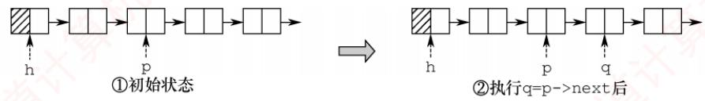


## 二、综合应用题

## 01.【解答】

解法1：用 $\wp$ 从头至尾扫描单链表，pre指向 $^ \star \mathrm { p }$ 结点的前驱。若 $\wp$ 所指结点的值为x，则删

除，并让p移向下一个结点，否则让pre、p指针同步后移一个结点。

本题代码如下：

```c
void Del_X_1(Linklist &L,ElemType x){
LNode *p=L->next,*pre=L,*q;∥/置p 和pre 的初始值
while(p!=NULL) {
if(p->data==x){
q=p; ∥/q指向被删结点
p=p->next;
pre->next=p; //将*q结点从链表中断开
free(q) ; //释放*q结点的空间
else{ //否则，pre 和 p 同步后移
pre=p;
p=p->next;
}//else
}//while
```

本算法是在无序单链表中删除满足某种条件的所有结点，这里的条件是结点的值为x。实际上，这个条件是可以任意指定的，只要修改if条件即可。比如，我们要求删除值介于mink和maxk之间的所有结点，只需将if 语句修改为if(p->data>mink&&p->data<maxk)。

解法2：采用尾插法建立单链表。用p指针扫描工的所有结点，当其值不为×时，将其链接到L之后，否则将其释放。

本题代码如下：

```c
void Del X 2(Linklist &L,ElemType x){
LNode *p=L->next,*r=L,*q; ∥/r指向尾结点，其初值为头结点
while(p!=NULL) {
if(p->data!=x) { //*p 结点值不为×时将其链接到L尾部
r->next=p;
r=p;
p=p->next; //继续扫描
}
else{ //*p 结点值为×时将其释放
q=p;
p=p->next; //继续扫描
free(q) ; //释放空间
}//while
r->next=NULL; //插入结束后置尾结点指针为NULL
```

上述两个算法扫描一遍链表，时间复杂度为O(n)，空间复杂度为O(1)。

## 02. 【解答】

算法思想：用p从头至尾扫描单链表，pre指向\*p结点的前驱，用minp保存值最小的结点指针（初值为p），minpre指向\*minp结点的前驱（初值为pre）。一边扫描，一边比较，若p->data 小于minp->data，则将p、pre 分别赋值给minp、minpre，如下图所示。当p扫描完毕时，minp指向最小值结点，minpre指向最小值结点的前驱结点，再将minp所指结点删除即可。

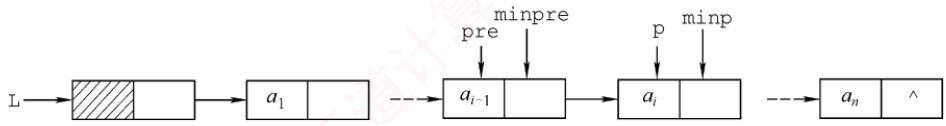

本题代码如下：

```c
LinkList Delete Min(LinkList &L){
LNode *pre=L，*p=pre->next；//p 为工作指针，pre 指向其前驱
LNode *minpre=pre，*minp=p；//保存最小值结点及其前驱
while(p!=NULL) {
if(p->data<minp->data) {
minp=p; //找到比之前找到的最小值结点更小的结点
minpre=pre;
1
pre=p; //继续扫描下一个结点
p=p->next;
}
minpre->next=minp->next; //删除最小值结点
free(minp);
return L;
```

算法需要从头至尾扫描链表，时间复杂度为O(n)，空间复杂度为O(1)。

若本题改为不带头结点的单链表，则实现上会有所不同，请读者自行思考。

## 03.【解答】

解法1：将头结点摘下，然后从第一结点开始，依次插入到头结点的后面（头插法建立单链表），直到最后一个结点为止，这样就实现了链表的逆置，如下图所示。


本题代码如下：

```c
LinkList Reverse 1(LinkList L) {
LNode *p, *r; //p为工作指针，r为p的后继，以防断链
p=L->next; //从第一个元素结点开始
L->next=NULL; //先将头结点 L 的 next 域置为 NULL
while(p!=NULL) { //依次将元素结点摘下
r=p->next; //暂存 p 的后继
p->next=L->next; //将p 结点插入到头结点之后
L->next=p;
p=r;
1 算机
return L;
```

解法2：大部分辅导书都只介绍解法1，这对读者的理解和思维是不利的。为了将调整指针这个复杂的过程分析清楚，我们借助图形来进行直观的分析。

假设pre、p和r指向三个相邻的结点，如下图所示。假设经过若于操作后，\*pre之前的结点的指针都已调整完毕，它们的next都指向其原前驱结点。现在令\*p结点的next域指向\*pre结点，注意到一旦调整指针的指向，\*p的后继结点的链就会断开，为此需要用r来指向原\*p的后继结点。处理时需要注意两点：一是在处理第一个结点时，应将其next域置为NULL，而不是指向头结点（因为它将作为新表的尾结点）；二是在处理完最后一个结点后，需要将头结点的指针指向它。

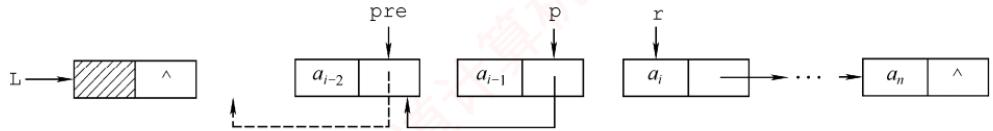

本题代码如下：

LinkList Reverse 2(LinkList L){  
LNode \*pre,\*p=L->next,\*r=p->next;  
p->next=NULL; //处理第一个结点  
while(r!=NULL){ //r为空，则说明p为最后一个结点  
pre=p; 王道 //依次继续遍历  
p=r;  
r=r->next;  
p->next=pre; //指针反转  
L->next=p; //处理最后一个结点  
return L;

上述两个算法的时间复杂度为O(n)，空间复杂度为O(1)。

## 04.【解答】

因为链表是无序的，所以只能逐个结点进行检查，执行删除。

本题代码如下：

```c
void RangeDelete(LinkList &L,int min,int max){
LNode *pr=L,*p=L->link; //p 是检测指针，pr 是其前驱
while(p!=NULL)
if(p->data>min&&p->data<max){ ∥寻找到被删结点，删除
pr->link=p->link;
free(p);
p=pr->link;
}
else{ 道计算机教育 //否则继续寻找被删结点
pr=p;
p=p->link;
```

## 05.【解答】

两个单链表有公共结点，即两个链表从某一结点开始，它们的next都指向同一结点。每个单链表结点只有一个next域，因此从第一个公共结点开始，之后的所有结点都是重合的，不可能再出现分叉。所以两个有公共结点而部分重合的单链表，拓扑形状看起来像Y，而不可能像X。

本题极容易联想到“蛮”方法：在第一个链表上顺序遍历每个结点，每遍历一个结点，在第二个链表上顺序遍历所有结点，若找到两个相同的结点，则找到了它们的公共结点。显然，该算法的时间复杂度为 O(len1·len2)。

接下来我们试着去寻找一个线性时间复杂度的算法。先把问题简化：如何判断两个单链表有  
没有公共结点？应注意到这样一个事实：若两个链表有一个公共结点，则该公共结点之后的所有  
结点都是重合的，即它们的最后一个结点必然是重合的。因此，我们判断两个链表是不是有重合  
的部分时，只需要分别遍历两个链表到最后一个结点。若两个尾结点是一样的，则说明它们有公  
共结点，否则两个链表没有公共结点。V

然而，在上面的思路中，顺序遍历两个链表到尾结点时，并不能保证在两个链表上同时到达尾结点。这是因为两个链表长度不一定一样。但假设一个链表比另一个长k个结点，我们先在长的链表上遍历k个结点，之后再同步遍历，此时我们就能保证同时到达最后一个结点。两个链表从第一个公共结点开始到链表的尾结点，这一部分是重合的，因此它们肯定也是同时到达第一公共结点的。于是在遍历中，第一个相同的结点就是第一个公共的结点。

根据这一思路中，我们先要分别遍历两个链表得到它们的长度，并求出两个长度之差。在长的链表上先遍历长度之差个结点之后，再同步遍历两个链表，直到找到相同的结点，或者一直到链表结束。此时，该方法的时间复杂度为O(len1+len2)。

## 06.【解答】

算法思想：循环遍历链表C，采用尾插法将一个结点插入表A，这个结点为奇数号结点，这样建立的表A与原来的结点顺序相同；采用头插法将下一结点插入表B，这个结点为偶数号结点，这样建立的表B与原来的结点顺序正好相反。

本题代码如下：

```c
LinkList DisCreat 2(LinkList &A){
LinkList B=(LinkList)malloc(sizeof(LNode));//创建B 表表头
B->next=NULL; //B 表的初始化
LNode *p=A->next,*q; //p 为工作指针
LNode *ra=A; //ra 始终指向 A 的尾结点 道计算机教育
while(p!=NULL) {
ra->next=p; ra=p; //将*p 链到 A 的表尾
p=p->next;
if (p!=NULL) {
q=p->next; //头插后，*p将断链，因此用 q记忆*p的后继
p->next=B->next; //将*p插入到B 的前端
B->next=p;
p=q;
} 育
}
ra->next=NULL; //A 尾结点的 next 域置空
return B;
1
```

要特别注意的是，该算法采用头插法插入结点后，\*p的指针域已改变，若不设变量保存其后继结点，则会引起断链，从而导致算法出错。

## 07.【解答】

算法思想：题中链表是有序表，因此所有相同值域的结点都是相邻的。用p扫描递增单链表L，若\*p结点的值域等于其后继结点的值域，则删除后者，否则p移向下一个结点。

本题代码如下：

```c
void Del Same(LinkList &L) {
LNode *p=L->next,*q; //p 为扫描工作指针
if(p==NULL)
return;
while(p->next!=NULL) {
q=p->next; //g 指向*p 的后继结点
道计 if(p->data==q->data) { //找到重复值的结点
p->next=q->next; //释放*q结点
free(q) ; //释放相同元素值的结点
1
else
p=p->next;
育
```

本算法的时间复杂度为 O(n)，空间复杂度为 O(1)。

本题也可采用尾插法，将头结点摘下，然后从第一结点开始，依次与已经插入结点的链表的最后一个结点比较，若不等则直接插入，否则将当前遍历的结点删除并处理下一个结点，直到最后一个结点为止。

## 08.【解答】

算法思想：表A、B都有序，可从第一个元素起依次比较A、B两表的元素，若元素值不等则值小的指针往后移，若元素值相等，则创建一个值等于两结点的元素值的新结点，使用尾插法插入到新的链表中，并将两个原表指针后移一位，直到其中一个链表遍历到表尾。

本题代码如下：

```c
roid Get Common(LinkList A,LinkList B){
LNode *p=A->next,*q=B->next,*r,*s;
LinkList C=(LinkList)malloc(sizeof(LNode)); //建立表C
r=C; /r 始终指向 C 的尾结点
while(p!=NULL&&q!=NULL) { //循环跳出条件
if(p->data<q->data)
p=p->next; //若A的当前元素较小，后移指针
else if(p->data>q->data)
q=q->next; //若B的当前元素较小，后移指针
else{ //找到公共元素结点
计算 s=(LNode*)malloc(sizeof(LNode));
s->data=p->data; //复制产生结点*s
r->next=s; //将*s链接到C上（尾插法）
r=s;
p=p->next; //表 A 和 B 继续向后扫描
q=q->next;
r->next=NULL; //置C 尾结点指针为空
```

## 09.【解答】

算法思想：采用归并的思想，设置两个工作指针pa和pb，对两个链表进行归并扫描，只有同时出现在两集合中的元素才链接到结果表中且仅保留一个，其他的结点全部释放。当一个链表遍历完毕后，释放另一个表中剩下的全部结点。

本题代码如下：

```c
LinkList Union(LinkList &la,LinkList &lb) {
LNode *pa=la->next; //设工作指针分别为 pa 和 pb
LNode *pb=1b->next;
LNode *u,*pc=la; //结果表中当前合并结点的前驱指针pc
while(pa&&pb) {
if(pa->data==pb->data) { //交集并入结果表中
pc->next=pa; //A 中结点链接到结果表
道计算机 pc=pa; pa=pa->next; 王道计算机教
u=pb; //B 中结点释放
pb=pb->next;
free(u) ;
}
else if(pa->data<pb->data) {//若A 中当前结点值小于 B 中当前结点值
u=pa;
pa=pa->next; //后移指针
free(u); //释放A中当前结点
}
else{ //若B 中当前结点值小于 A 中当前结点值
u=pb;
pb=pb->next; free(u); 道计算机 //后移指针 //释放B 中当前结点
}
}//while 结束
```

```c
while(pa) { //B 已遍历完，A未完
u=pa;
pa=pa->next;
free(u); //释放A 中剩余结点
} 王道计算机
while(pb) { //A 已遍历完，B未完
u=pb;
pb=pb->next;
free(u) ; //释放 B 中剩余结点
}
pc->next=NULL; //置结果链表尾指针为NULL
free(lb); //释放 B 表的头结点
return la;
1
```

链表归并类型的试题在各学校历年真题中出现的频率很高，故应扎实掌握解决此类问题的思想。该算法的时间复杂度为 O(len1 +len2)，空间复杂度为O(1)。

## 10.【解答】

算法思想：因为两个整数序列已存入两个链表中，操作从两个链表的第一个结点开始，若对应数据相等，则后移指针；若对应数据不等，则A链表从上次开始比较结点的后继开始，B链表仍从第一个结点开始比较，直到B链表到尾表示匹配成功。A链表到尾而B链表未到尾表示失败。操作中应记住A链表每次的开始结点，以便下次匹配时好从其后继开始。

本题代码如下：

```c
int Pattern(LinkList A,LinkList B){
LNode *p=A; //p 为A链表的工作指针，本题假定 A 和 B 均无头结点
LNode *pre=p; /pre 记住每趟比较中 A 链表的开始结点
LNode *q=B; //g 是B 链表的工作指针
while(p&&q)
if(p->data==q->data){//结点值相同
p=p->next;
q=q->next;
}
else{
pre=pre->next;
p=pre; //A链表新的开始比较结点
q=B; //g 从 B 链表第一个结点开始
if(q==NULL) //B 已经比较结束 道计算机教育
return 1; //说明 B 是 A 的子序列
else
return 0; //B 不是 A 的子序列
```

## 注意

该题其实是字符串模式匹配的链式表示形式，读者应该结合字符串模式匹配的内容重新考虑能否优化该算法。 TA

## 11.【解答】

算法思想：让p从左向右扫描，q从右向左扫描，直到它们指向同一结点（p==q，当循环双链表中结点个数为奇数时）或相邻 $(p - > \max t = q$ 或 $\mathtt { Q } - > \mathtt { p r i o r } = \mathtt { p }$ ，当循环双链表中结点个数为偶数时）为止，若它们所指结点值相同，则继续进行下去，否则返回0。若比较全部相等，则返回1。

本题代码如下：

```c
int Symmetry(DLinkList L){
DNode *p=L->next,*q=L->prior; //两头工作指针
while(p!=q&&p->next!=q) //循环跳出条件
if(p->data==q->data) { //所指结点值相同则继续比较
p=p->next;
q=q->prior;
王道
else //否则，返回0
return 0;
return 1; //比较结束后返回1
```

## 注意

while循环第二个判断条件易误写成q->next!=p，分析这样会产生什么问题。

## 12. 【解答】

算法思想：先找到两个链表的尾指针，将第一个链表的尾指针与第二个链表的头结点链接起来，再使之成为循环的。

本题代码如下：

```c
LinkList Link(LinkList &h1,LinkList &h2){
//将循环链表h2 链接到循环链表h1之后，使之仍保持循环链表的形式
LNode *p,*q; //分别指向两个链表的尾结点
p=h1;
while(p->next!=h1) //寻找 h1 的尾结点
p=p->next;
q=h2;
while(q->next!=h2) 王道计算机 //寻找 h2 的尾结点
q=q->next;
p->next=h2; //将 h2 链接到 h1 之后
q->next=h1; //令 h2 的尾结点指向 h1
return h1;
```

## 13. 【解答】

算法思想：首先在双链表中查找数据值为×的结点，查到后，将结点从链表上摘下，然后顺着结点的前驱链查找该结点的插入位置（频度递减，且排在同频度的第一个，即向前找到第一个比它的频度大的结点，插入位置为该结点之后），并插入到该位置。

本题代码如下：

```c
DLinkList Locate(DLinkList &L,ElemType x){
DNode *p=L->next,*q; /p为工作指针，q为p的前驱，用于查找插入位置
while(p&&p->data!=x)
p=p->next; //查找值为×的结点
if(!p)
exit(0); //不存在值为×的结点
else{
p->freq++; ∥/令元素值为x的结点的 freq 域加 1
if(p->pre==L|Ip->pre->freq>p->freq)
return p; //p 是链表首结点，或freq值小于前驱
if(p->next!=NULL) p->next->pre=p->pre;
p->pre->next=p->next；//将p结点从链表上摘下
q=p->pre; //以下查找p结点的插入位置
while(q!=L&&q->freq<=p->freq)
q=q->pre;
p->next=q->next;
```

```c
if(q->next!=NULL) q->next->pre=p; //将 p 结点排在同频率的第一个
p->pre=q;
q->next=p;
return p; //返回值为×的结点的指针
1
```

## 14.【解答】

## 1）算法的基本设计思想：

首先，遍历链表计算表长n，并找到链表的尾结点，将其与首结点相连，得到一个循环单链表。然后，找到新链表的尾结点，它为原链表的第n-k个结点，令工指向新链表尾结点的下一个结点，并将环断开，得到新链表。 姚

## 2）本题代码如下：

```c
LNode *Converse(LNode *L,int k) {
int n=1; /n 用来保存链表的长度
LNode *p=L; while(p->next!=NULL) { //p 为工作指针 //计算链表的长度 王道计算
p=p->next;
n++;
1 //循环执行后，p指向链表尾结点
p->next=L; //将链表连成一个环
for(int i=1;i<=n-k;i++) //寻找链表的第 n-k 个结点
p=p->next;
L=p->next; //令Ⅰ指向新链表尾结点的下一个结点
p->next=NULL; //将环断开
return L;
```

3）本算法的时间复杂度为O(n)，空间复杂度为O(1)。

## 15.【解答】

## 1）算法的基本设计思想：

设置快慢两个指针分别为fast和slow最初都指向链表头head。slow每次走一步，即slow=slow->next；fast每次走两步，即fast=fast->next->next。fast比slow走得快，若有环，则fast一定先进入环，而s1ow后进入环。两个指针都进入环后，经过若干操作后两个指针定能在环上相遇。这样就可以判断一个链表是否有环。

如下图所示，当slow刚进入环时，fast早已进入环。因为fast每次比slow多走一步且fast与slow的距离小于环的长度，所以fast与slow相遇时，slow所走的距离不超过环的长度。


如下图所示，设头结点到环的入口点的距离为a，环的入口点沿着环的方向到相遇点的距离为x，环长为r，相遇时fast绕过了n圈。


则有2(a+x)=a+n\*r+x，即 a=nr−x。显然从头结点到环的入口点的距离等于n倍的环长减去环的入口点到相遇点的距离。因此可设置两个指针，一个指向head，另一个指向相遇点，两个指针同步移动（均为一次走一步），相遇点即环的入口点。

## 2）本题代码如下：

```c
LNode* FindLoopStart(LNode *head) {
LNode *fast=head, *slow=head; //设置快慢两个指针
while(fast!=NULL&&fast->next!=NULL) {
slow=slow->next; //每次走一步
fast=fast->next->next; //每次走两步
if(slow==fast) break; //相遇
if(fast==NULL||fast->next==NULL)
return NULL; //没有环，返回NULL
LNode *p1=head, *p2=slow ; //分别指向开始点、相遇点
while(p1!=p2) {
p1=p1->next;
p2=p2->next; 王道计
return p1; //返回入口点
```

3）当fast与slow相遇时，slow肯定没有遍历完链表，故算法的时间复杂度为O(n)，空间复杂度为O(1)。 I

## 16. 【解答】

## 1）算法的基本设计思想：

设置快、慢两个指针分别为fast和slow，初始时slow指向L（第一个结点），fast指向L->next（第二个结点），之后slow每次走一步，fast每次走两步。当fast指向表尾（第n个结点）时，s1ow正好指向链表的中间点（第n/2个结点），即s1ow正好指向链表前半部分的最后一个结点。将链表的后半部分逆置，然后设置两个指针分别指向链表前半部分和后半部分的首结点，在遍历过程中计算两个指针所指结点的元素之和，并维护最大值。

## 2）本题代码如下：

```c
int PairSum(LinkList L){
LNode *fast=L->next,*slow=L;//利用快慢双指针找到链表的中间点
while(fast!=NULL&&fast->next!=NULL) {
fast=fast->next->next; //快指针每次走两步 计算机教育
slow=slow->next; //慢指针每次走一步
LNode *newHead=NULL,*p=slow->next,*tmp;
while(p!=NULL) { //反转链表后一半部分的元素，采用头插法
tmp=p->next; //p 指向当前待插入结点，令 tmp 指向其下一结点
p->next=newHead; //将p所指结点插入到新链表的首结点之前
newHead=p; //newHead指向刚才新插入的结点，作为新的首结点
p=tmp; //当前待处理结点变为下一结点
} int mx=0; p=L; 育
LNode *q=newHead;
while(q!=NULL) { //用p和q分别遍历两个链表
if((p->data+q->data)>mx)∥/用mx 记录最大值
mx=p->data+q->data;
p=p->next;
q=q->next;
1
```

return mx;

3）本算法的时间复杂度为O(n)，空间复杂度为O(1)。

## 17.【解答】

## 1）算法的基本设计思想：

问题的关键是设计一个尽可能高效的算法，通过链表的一次遍历，找到倒数第k个结点的位置。定义两个指针变量p和q，初始时均指向头结点的下一个结点（链表的第一个结点），p指针沿链表移动；当p指针移动到第k个结点时，q指针开始与p指针同步移动；当p指针移动到最后一个结点时，q指针所指示结点为倒数第k个结点。以上过程对链表仅进行一遍扫描。

2）算法的详细实现步骤如下：

① count=0，p和q指向链表表头结点的下一个结点。

②若p为空，转⑤。

③ 若 count等于 k，则 q指向下一个结点；否则，count=count+1。

④p指向下一个结点，转②。

⑤若count等于k，则查找成功，输出该结点的data域的值，返回1；否则，说明k值 超过了线性表的长度，查找失败，返回0。

⑥ 算法结束。

3）算法实现如下：

```c
typedef int ElemType; //链表数据的类型定义
typedef struct LNode{ //链表结点的结构定义
ElemType data; struct LNode *link; 算机 //结点数据 //结点链接指针
}LNode, *LinkList;
int Search k(LinkList list,int k){
LNode *p=list->link,*q=list->link； //指针p、q指示第一个结点
int count=0;
while(p!=NULL) { //遍历链表直到最后一个结点
if (count<k) count++; //计数，若 count<k 只移动p
else q=q->link;
p=p->link; //之后让p、q同步移动
}//while
if(count<k)
return 0; //查找失败返回0
else { //否则打印并返回1
printf("%d",q->data); 道计算机
return 1;
}
```

## 评分说明

若所给算法采用一遍扫描方式就能得到正确结果，则可给满分15分；若采用两遍或多遍扫描才能得到正确结果，则最高分为10分。若采用递归算法得到正确结果，则最高给10分；若实现算法的空间复杂度过高（使用了大小与k有关的辅助数组），但结果正确，则最高给10分。

## 18.【解答】

顺序遍历两个链表到尾结点时，并不能保证两个链表同时到达尾结点。这是因为两个链表的长度不同。假设一个链表比另一个链表长k个结点，我们先在长链表上遍历k个结点，之后同步遍历两个链表，这样就能够保证它们同时到达最后一个结点。因为两个链表从第一个公共结点到

链表的尾结点都是重合的，所以它们肯定同时到达第一个公共结点。

1）算法的基本设计思想：

① 分别求出 str1 和 str2 所指的两个链表的长度 m 和 n。

②将两个链表以表尾对齐：令指针 p、q分别指向 str1 和 str2的头结点，若 $m { \ngeq } n ,$ ，则指针p先走，使p指向链表中的第 m− n + 1个结点；若m < n，则使 q指向链表中的第n−m+1个结点，即使指针p和q所指的结点到表尾的长度相等。

③反复将指针p和q同步向后移动，并判断它们是否指向同一结点。当p、q指向同一结点，则该点即所求的共同后缀的起始地址。 XTA

2）本题代码如下：

```c
typedef struct Node{
char data;
struct Node *next;
} SNode; /*求链表长度的函数*/ 王道计算机系
int listlen(SNode *head) {
int len=0;
while(head->next!=NULL) {
len++;
head=head->next;
return len;
1
/*找出共同后缀的起始地址*/
SNode* find list(SNode *str1,SNode *str2) {
int m,n;
SNode *p,*q;
m=listlen(str1); //求 str1 的长度，O(m)
n=listlen(str2); 首 //求 str2 的长度，O(n)
for(p=str1;m>n;m--) /若 m>n，使 p 指向链表中的第 m-n+1 个结点
p=p->next;
for(q=str2;m<n;n--) //若 m<n，使 g 指向链表中的第 n-m+1 个结点
q=q->next;
while(p->next!=NULL&&p->next!=q->next){ //查找共同后缀的起始地址
p=p->next; //两个指针同步向后移动
} q=q->next; 算机教育
return p->next; //返回共同后缀的起始地址
```

3）时间复杂度为O(len1+len2)或O(max(len1,len2))，其中 len1、len2分别为两个链表的长度。

## 19.【解答】

1）算法的基本设计思想：

●算法的核心思想是用空间换时间。使用辅助数组记录链表中已出现的数值，从而只需对链表进行一趟扫描。

● 因为|data|≤n，故辅助数组g的大小为n+1，各元素的初值均为0。依次扫描链表中的各结点，同时检查 ${ \tt Q } \left[ \; | \; { \tt d a t a } \; | \; \right]$ 的值，若为0则保留该结点，并令q[|data|]=1；否则将该结点从链表中删除。

2）使用C语言描述的单链表结点的数据类型定义：

```c
typedef struct node {
int data;
struct node *link;
```

}NODE;   
Typedef NODE \*PNODE;

3）算法实现如下：

```c
void func (PNODE h,int n) {
PNODE p=h,r;
int *q,m;
q=(int *)malloc(sizeof(int)*(n+1))； //申请n+1 个位置的辅助空间
for(int i=0;i<n+1;i++) //数组元素初值置0
*(q+i)=0;
while(p->link!=NULL) {
m=p->link->data>0? p->link->data:-p->link->data;
if(*(q+m)==0){ //判断该结点的 data 是否已出现过
*(q+m)=1; //首次出现
p=p->link; //保留
else{ //重复出现 王道计算机教
r=p->link; //删除
道 p->link=r->link; free(r);
王 1
free(q) ;
```

4）参考答案所给算法的时间复杂度为O(m)，空间复杂度为O(n)。

## 20.【解答】

1）算法的基本设计思想：

先观察 $L = ( a _ { 1 } , a _ { 2 } , a _ { 3 } , \cdots , a _ { n - 2 } , a _ { n - 1 } , a _ { n } )$ 和 $L ^ { \prime } = ( a _ { 1 } , a _ { n } , a _ { 2 } , a _ { n - 1 } , a _ { 3 } , a _ { n - 2 } , \cdots )$ ，发现L'是由L摘取第一个元素，再摘取倒数第一个元素……依次合并而成的。为了方便链表后半段取元素，需要先将后半段原地逆置[题目要求空间复杂度为O(1)，不能借助栈]，否则每取最后一个结点都需要遍历一次链表。①先找出链表L的中间结点，为此设置两个指针p和q，指针p每次走一步，指针g每次走两步，当指针g到达链尾时，指针p正好在链表的中间结点；②然后将L的后半段结点原地逆置。③从单链表前后两段中依次各取一个结点，按要求重排。

## 2）算法实现如下：

```c
void change list (NODE*h) {
NOdE *p,*q, *r,*s;
p=q=h;
while(q->next!=NULL) { //寻找中间结点
p=p->next; //p 走一步 道计算机
q=q->next;
王道计 if(q->next!=NULL) q=q->next; //q走两步
1
q=p->next; //p所指结点为中间结点，q为后半段链表的首结点
p->next=NULL;
while(q!=NULL) { //将链表后半段逆置
r=q->next;
q->next=p->next;
p->next=q; 机教育
q=r;
}
s=h->next; //s 指向前半段的第一个数据结点，即插入点
q=p->next; //q指向后半段的第一个数据结点
p->next=NULL;
while(q!=NULL) { //将链表后半段的结点插入到指定位置
```

r=q->next; //r指向后半段的下一个结点  
q->next=s->next；//将 g 所指结点插入到 s 所指结点之后  
s->next=q;  
s=q->next; //s指向前半段的下一个插入点  
q=r;  
道

3）第一步找中间结点的时间复杂度为O(n)，第二步逆置的时间复杂度为O(n)，第三步合并链表的时间复杂度为O(n)，所以该算法的时间复杂度为O(n)。

## 归纳总结

本章是算法设计题的重点考查内容。线性表相关的算法题通常代码量较小，却蕴含一定的设计技巧，非常适合用于笔试考查。此类题目常采用“三段式”结构命题。

在给出题目背景和具体要求的前提下：

①给出算法的基本设计思想。

②采用C或C++语言描述算法，关键之处给出注释。

③分析所设计算法的时间复杂度和空间复杂度。

算法具体的设计思路灵活多变，难以一概而论。因此读者务必勤加练习，反复研读本章的典型例题，尝试用多种方法求解，并对比其时间与空间效率，从而逐步掌握各类题型的分析视角与最优解法。为此，编者整理了几种常用的算法设计技巧，供参考：针对链表，常用方法包括头插法、尾插法、逆置法、归并法、双指针法等，需根据具体问题灵活运用：针对顺序表，因其支持随机访问，常结合经典排序与查找策略进行设计，如归并排序、二分查找等。

## 注意

在算法设计题中，若能正确定义数据结构并清晰阐述算法思想，通常可获得至少一半的分数；若能进一步用规范代码实现，则得分更有保障；逻辑较复杂的部分可直接用文字说明，确保思路完整。

## 思维拓展

一个长度为 n 的整型数组 A[1...n]，给定整数 x，设计一个时间复杂度不超过 O(nlog2n)的算法，查找出这个数组中所有两两之和等于x的整数对（每个元素只输出一次）。

提示：本题若想到排序，则问题便迎刃而解。先用一种时间复杂度为O(nlog2n)的排序算法将A[1...n]从小到大排序，然后分别从数组的小端(i=1)和大端(j=n)开始查找：若 $\mathbb { A } \left[ \downarrow \right] + \mathbb { A } \left[ \downarrow \right] < \mathbb { X }$ i++；若A[i]+A[j]>x，j--；否则输出A[i]、A[j]，然后i++，j--；直到i>=j时停止。

请读者思考本题是否有其他求解算法。
