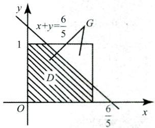
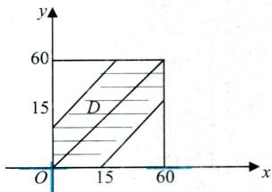
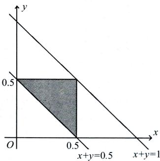

# 第一章 随机事件和概率

本章配套习题《基础700题》P3-P6

## 【大纲要求】

(1)了解样本空间(基本事件空间)的概念，理解随机事件的概念，掌握事件的关系及运算

(2)理解概率、条件概率的概念，掌握概率的基本性质，会计算古典概率和几何型概率，掌握概率的加法公式、减法公式、乘法公式、全概率公式及贝叶斯公式

(3)理解事件独立性的概念，掌握用事件独立性进行概率计算，理解独立重复试验的概念，掌握计算有关事件概率的方法.

## 【本章重点】

(1)计算概率的五大公式(加法、减法、乘法、全概率及贝叶斯公式).

(2)条件概率及事件的独立性.

(3)计算概率的三种概型(古典概型、几何概型、伯努利概型).

## 【基础知识】

## 一、两个基本原理

## (一)乘法原理

完成某事需要k个步骤，每一步分别有 $n_{1},n_{2},\cdots,n_{k}$ 种方法，则完成此事共有 $n_{1}n_{2}\cdots n_{k}$ 种方法.

## (二)加法原理

完成某事有k类方法，每一类分别对应有 $n_{1},n_{2},\cdots,n_{k}$ 种方法，则完成此事共有 $n_{1} + n_{2} + \cdots + n_{k}$ 种方法.

## 二、排列、组合

## (一)排列

1. 排列的定义

从n个不同的元素中任取r个(0 < r ≤n),按照一定顺序排成一列，则称为从 n个元素中取出r个元素

## 的一个排列，其个数记为 $\mathbf{P}_{n}^{r}$ 或 $\boldsymbol{A}_{n}^{r}.$

## 2. 排列的种类及计算公式

## 1)不放回抽样

选排列 从n个不同的元素中一次取一个不放回地取r次，一共的方法数：

若 $0 < r < n$ ,则 $\mathbf{A}_{n}^{r}=n(n-1)\cdots(n-r+1)$

若 $r = n$ ,则 $\mathbf{A}_{n}^{n} = n!$ ,此时也称为全排列.

## 2)有放回抽样

有重复的排列 从n个不同的元素中一次取一个有放回地取r次，一共的方法数：

$$
\mathbf{U}_{n}^{r}=n^{r}.
$$

## 良哥解读

从n个不同的元素中一次取一个,无论是放回(或不放回)取r次,都对应排列,数数时需考虑元素间的顺序.

【例】共有20件产品，其中有3件次品：

(1)若一次取一件不放回取3次，问有两件正品一件次品的取法有多少种?

(2)若一次取一件有放回取3次，问有两件正品一件次品的取法有多少种？

【解析】两件正品一件次品有三种顺序：{正、正、次}、{正、次、正}、{次、正、正}.

(1)不放回抽样：

若第一次取正品，第二次取正品，第三次取次品共有 $17 \times 16 \times 3$ 种取法，从而两件正品一件次品的取法共有 $17 \times 16 \times 3 \times 3 = 2448$ 种.

## (2)放回抽样：

若第一次取正品，第二次取正品，第三次取次品共有 $1 7   \times   1 7   \times   3$ 种取法，从而两件正品一件次品的取法共有 $17 \times 17 \times 3 \times 3 = 2601$ 种.

## (二)组合

## 1. 组合的定义

从 n个不同的元素中任取r个 $( 0 \leqslant r \leqslant n )$ ,不计顺序拼成一组，称为从n个元素中取出r个元素的组合,记为 $\mathbf { C } _ { n ^ { * } } ^ { r }$

## 2. 组合的计算公式

$$
C_{n}^{r}=\frac{A_{n}^{r}}{r!}.
$$

3. 组合的性质

$$
C_{n}^{r}=C_{n}^{n-r}.
$$

## 良哥解读

从n个不同的元素中一次取出r个(俗称一把抓),对应的是组合,数数时不用考虑元素间的顺序.其计算公式相当于用排列 $\mathbf{A}_{n}^{r}$ 除以 r个元素的 r！种顺序.

【例】共有20件产品，其中有3件次品，现从中任取3件，问：

(1)共有多少种不同的取法?

(2)恰有一件次品的取法?

(3)至少有一件次品的取法？

【解析】 (1) $\mathbf{C}_{20}^{3}$ 种.

(2)恰有一件次品，表示取到两件正品一件次品，则共有 $\mathbf{C}_{17}^{2}\mathbf{C}_{3}^{1}$ 种.

(3)至少有一件次品，表示有一件次品或两件次品或三件次品，故共有 $\mathrm{C}_{17}^{2} \mathrm{C}_{3}^{1}+\mathrm{C}_{17}^{1} \mathrm{C}_{3}^{2}+\mathrm{C}_{17}^{0} \mathrm{C}_{3}^{3}$ 种取法.也可以用下面方法：

由于至少一件次品的逆事件表示都为正品，故可以用总的取法减去都为正品的取法，即 $\mathrm{C}_{20}^{3}-\mathrm{C}_{17}^{3}$ 种.

## 三、随机试验E

定义：满足如下三个条件的试验称为随机试验：

(1)可以在相同的条件下重复地进行；

(2)进行一次试验之前不能确定哪一个结果会出现；

(3)每次试验的可能结果不止一个，并且能事先明确试验的所有可能结果.

## 四、样本空间

(1)样本点w:随机试验的每一个可能的结果称为一个样本点.

(2)样本空间Ω:所有样本点组成的集合称为样本空间.

## 五、随机事件

(1)随机事件:样本空间Ω的子集称为随机事件，通常用大写字母A,B,C等表示.

(2)基本事件:由一个样本点组成的单点集.

(3)事件发生：在每次试验中，当且仅当事件中有一个样本点出现时，称这一事件发生(出现).

(4)必然事件:样本空间Ω包含所有样本点，它是Ω自身的子集，在每次试验中总发生，称其为必然事件，记为Ω.

(5)不可能事件：空集∅不包含任何样本点，它也是样本空间的子集，在每次试验中都不发生，称其为不可能事件，记为∅.

## 六、随机事件的关系

(1)包含关系： $A \subset B$ 它表示事件A发生一定导致B发生.

(2)事件相等:若 $A \subset B$ 且 $B \subset A$ .则称事件A与B相等，即 $A = B.$

(3)A和B的和事件:称事件 $A \cup B = \left\{ x \mid x \in A  或  x \in B \right\}$ 为A 和 B的和事件.它表示A,B两个事件至少有一个发生时事件AUB发生，A∪B也记为A+B.

类似地，称 $\bigcup_{k = 1}^{n} A_{k}$ 为 n个事件 $A_{1},A_{2},\cdots,A_{n}$ 的和事件.

## 良哥解读

(1)若出现几个事件至少一个发生时,表示这几个事件的和事件.比如事件A,B,C至少一个发生，可表示为 $A + B + C.$

(2)隐含的包含关系 $:A \subset A + B; B \subset A + B.$

(4)A 和 B的积事件:称事件 $A \cap B = \left\{ x \mid x \in A  且  x \in B \right\}$ 为A和 B的积事件.它表示A,B 两个事件同时发生时事件A∩B发生，A∩B也记为AB.

类似地，称 $\bigcap_{k = 1}^{n} A_{k}$ 为n个事件 $A_{1},A_{2},\cdots,A_{n}$ 的积事件.

## 良哥解读

隐含的包含关系 $AB \subset A;AB \subset B.$

(5)A 和 B的差事件:事件 $A-B=\left\{x\mid x\in A 且 x\notin B\right\}$ 称为事件A和B的差事件.它表示A发生且B不发生时事件A-B发生.A-B也可记为AB

(6)互斥事件(互不相容):当AB=∅时，称事件A和B互不相容(或互斥).它表示事件A和B不能同时发生.

(7)对立事件(逆事件):若A∪B = Ω且 $A \cap B = \varnothing$ ,则称A和B互为逆事件，也称互为对立事件.A的对 立事件记为A.

## 良哥解读

互斥事件与对立事件的关系:两个事件对立则一定互斥,但互斥不一定对立.

(8)完全(备)事件组:若事件组 $A_{1},A_{2},\cdots,A_{n}$ 满足：

$A_{1} \cup A_{2} \cup \cdots \cup A_{n} = \Omega, A_{i}A_{j} = \varnothing, 1 \leq i \neq j \leq n$ ,则称事件 $A_{1},A_{2},\cdots,A_{n}$ 是一个完全(备)事件组，也称为样本空间的一个划分.

【例】设A,B,C是三个随机事件，试用A,B,C表示下列事件：

(1)A,B,C 中只有A发生； (2)A,B都发生，而C不发生；

(3)A,B,C同时发生； (4)A,B,C至少有一个发生；

(5)A,B,C至少有两个发生；(6)A,B,C只有一个发生；

(7)A,B,C不多于一个发生.

【解析】(1)A,B,C中只有A发生，表示A发生但B,C都不能发生，即 $\overline{ABC}$

(2 $)AB\overline{C}$

(3 $)ABC;$

(4)A,B,C至少有一个发生，表示A,B,C的和事件，即 $A + B + C;$

(5)A,B,C至少有两个发生,表示A,B,C中两个事件发生的和事件，即

$$
AB + AC + BC;
$$

(6)A,B,C只有一个发生,表示只有A发生或只有B发生或只有C发生，即

$$
A\overline{B}\overline{C}+B\overline{A}\overline{C}+C\overline{A}\overline{B};
$$

(7)A,B,C不多于一个发生，表示A,B,C中只有一个发生或者一个都不发生，即$A\overline{B}\overline{C}+B\overline{A}\overline{C}+C\overline{A}\overline{B}+\overline{A}\overline{B}\overline{C}$ 也可以表示为A,B,C中至少有两个不发生，即

$$
\overline{AB}+\overline{AC}+\overline{BC}
$$

## 七、随机事件的运算律

(1)交换律： $A \cup B = B \cup A; A \cap B = B \cap A.$

(2)结合律： $A \cup (B \cup C) = (A \cup B) \cup C; A \cap (B \cap C) = (A \cap B) \cap C.$

(3)分配律 $A \cup (B \cap C) = (A \cup B) \cap (A \cup C); A \cap (B \cup C) = (A \cap B) \cup (A \cap C).$

(4)对偶律(德摩根律 $\overline{A \cup B} = \overline{A} \cap \overline{B}, \overline{A \cap B} = \overline{A} \cup \overline{B}.$

【例】设A,B为两个事件，且 $A \ne \varnothing, B \ne \varnothing$ ,则 $(A + B)(\overline{A} + \overline{B})$ 表示( ).(A)必然事件 (B)不可能事件(C)A与B不能同时发生 (D)A与B中恰有一个发生

【解析】因 $(A + B)(\overline{A} + \overline{B}) = A\overline{A} + A\overline{B} + B\overline{A} + B\overline{B} = A\overline{B} + B\overline{A}$ ,故表示A与B中恰有一个发生，应选(D).

## 八、古典概型与几何概型

## (一)古典概型

(1)定义：具有以下两个特点的试验称为古典概型：

①样本空间有限： $\Omega = \left\{ e_{1}, e_{2} \cdots e_{n} \right\}$

②等可能性： $P(e_{1}) = P(e_{2}) = \cdots = P(e_{n})$

(2)计算方法：

$$
P(A)=\frac{A 中基本事件的个数 k}{\Omega 中基本事件总数 n}
$$

(3)古典概型的性质：

①非负性： $\forall A \in \Omega, 0 \leq P(A) \leq 1$ .

②规范性： $P(\varnothing)=0,P(\Omega)=1$

③有限可加性：设 $A_{1},A_{2},\cdots,A_{n}$ 是两两互不相容的事件，即对于 $i \ne j, A_i A_j = \varnothing, i, j = 1, 2, \cdots, n$ ,则

$$
P(A_{1} \cup A_{2} \cdots \cup A_{n}) = P(A_{1}) + P(A_{2}) + \cdots + P(A_{n}).
$$

【例】设100件产品中，有60件正品，40件次品，令A={三件均为次品}，B={两正品一次品}.

(1)从100件产品中一次取一件，任取三件,按照放回与不放回抽样,求P(A),P(B).(保留小数点后两位)

(2)从100件产品中一次取三件,求P(A),P(B).(保留小数点后两位)

【解析】

(1)放回抽样：

$$
\frac{40 \times 40 \times 40}{100 \times 100 \times 100} \approx 0.06, P(B)=\frac{60 \times 60 \times 40 \times 3}{100 \times 100 \times 100} \approx 0.43.
$$

不放回抽样：

$$
P(A)=\frac{40 \times 39 \times 38}{100 \times 99 \times 98} \approx 0.06, P(B)=\frac{60 \times 59 \times 40 \times 3}{100 \times 99 \times 98} \approx 0.44.
$$

(2)一次取三件的情况

$$
P(A)=\frac{C_{40}^{3}}{C_{100}^{3}}=\frac{40\times39\times38}{100\times99\times98}\approx0.06,P(B)=\frac{C_{40}^{2}C_{40}^{1}}{C_{100}^{3}}=\frac{60\times59\times40\times3}{100\times99\times98}\approx0.44.
$$

## 良哥解读

古典概率计算中,往往要用到排列与组合数数.若是一次取一件无论是放回还是不放回抽样,我们都将其当成排列来计算,此时最易犯错误的是漏掉产品间的顺序.从上面这个例子,我们容易看到：一次取一件不放回取三次与一次取三件计算事件的概率时结果一样.这不是巧合,适用于一般情况,以后如果遇到一次取一件不放回取几次计算事件的概率,我们可以将其当成一次取几件,此时我们可用组合计算，这样也可避免漏掉产品间的顺序

【例】将n个球随机地放入 $N(N \geq n)$ 个盒子中去，试求每个盒子至多有一个球的概率(设盒子数有限).【解析】因每个球都可以放入N个盒子中的任一个盒子，故共有 $N ^ { n }$ 种不同的放法，而每个盒子至多有一个球共有 $N(N-1)(N-2)\cdots[N-(n-1)]$ 种不同的方法，从而所求概率为

$$
\frac{N(N - 1)(N - 2)\cdots(N - n + 1)}{N^n} = \frac{\mathbf{A}_N^n}{N^n}.
$$

## (二)几何概型

如果试验E是从某一线段(或平面、空间中有界区域)Ω上任取一点，并且所取得点位于Ω中任意两个长度(或面积、体积)相等的子区间(或子区域)内的可能性相同,则所取得点位于Ω中任意子区间(或子 $\textcircled { 2 }$ 区域)A内这一事件(仍记作A)的概率为

$$
P(A)=\frac{A 的长度(或面积、体积) }{\Omega 的长度(或面积、体积) }
$$

## 良哥解读

## 几何概型的两个要点

(1)何时用几何概型？

以后遇到试验满足如下条件的某一个时,立即想到是考查几何概型：

①在某个区间(区域)内随机取数或者任意取点；

②在某个时间段内随机到达某个地方；

③在某个区间(区域)内任意子区间(区域)上取值概率与该区间(区域)的长度(面积)成正比.

(2)何时用长度比？何时用面积比?

①通过实验条件若只产生一个变量时用长度比,产生两个变量时用面积比.例如:在一个区间随机取一个数,求该数落在某个区间的概率,用长度比;在一个区间随机取两个数,求两数之差小于多少的概率,用面积比.

②若条件是在某个区间内任何子区间上取值概率与该区间长度成正比,则用长度比;若条件为在某个区域内任何子区域上取值概率与该区域面积成正比,用面积比.

【例】在区间(0,1)中随机地取两个数，则事件“两数之和小于”的概率为 $\frac{6}{5} ''$

【解析】将在(0,1)区间中随机取的两个数分别记为 $x , y .$ “两数之和小于 $\frac{6}{5},$ 即 $x + y < \frac{6}{5}$ 

如图所示，求 $P(x + y < \frac{6}{5})$ 即用 $(x + y < \frac{6}{5})$ 所在区域阴影部分面积除以总面积即可，即

$$
P(x+y<\frac{6}{5})=\frac{1-\frac{1}{2}\times\frac{4}{5}\times\frac{4}{5}}{1}=\frac{17}{25}=0.68.
$$

【例】星期天，甲乙约定上午09：00—10：00在某地见面，先到者等15分钟便离开，求两人能会面的概率?

【解析】设甲在09:00—10:00的第x分钟到达,乙在第y分钟到达，由于09：00—10:00共有60分钟，相当于x和y是在区间[0,60]上随机取值.由于先到者等15分钟便离开，故两人能会面即两人到达时刻相差不超过15分钟，所求概率为 $P\left( \left| x - y \right| \leqslant 15 \right) = \frac{60 \times 60 - 45 \times 45}{60 \times 60} = \frac{7}{16}.$

【例】随机地向半圆 $0 < y < \sqrt{2ax - x^{2}}$ 为正常数)内掷一点，点落在半圆内任何区域的概率与该区域的面积成正比.则原点与该点的连线与x轴的夹角小于的概率为 $\frac{\pi}{4}$

【解析】“在一个区域内任何子区域上取值概率与该区域的面积成正比”，说明是考查几何概型

设A表示事件“掷的点和原点连线与x轴的夹角小于”，如图所示，要求概率只需用图中阴影部分面 $\frac{\pi}{4}  \text{" }$ 积除以半圆的面积即可.

$$
\frac{\frac{1}{2}a^{2}+\frac{1}{4}\pi a^{2}}{\frac{1}{2}\pi a^{2}}=\frac{1}{\pi}+\frac{1}{2}
$$

【例】将长为1的木棒任意地折成三段，求：三段的长度都不超过0.5的概率.

【解析】设三段的长度分别为 $x,y,1-x-y$ ，如下图所示，样本空间为

$$
S = \left\{ (x,y) \mid 0 < x < 1, 0 < y < 1, 0 < x + y < 1 \right\} ,
$$

则样本空间的面积为 $\frac{1}{2}.$ 记A={三段的长度都不超过0.5}，则

$$
A=\left\{(x,y)\mid 0<x<0.5,0<y<0.5,0<1-x-y<0.5\right\}
$$

则A的面积为 $\frac{1}{8}.$ 故

$$
P(A)=\frac{\frac{1}{8}}{\frac{1}{2}}=\frac{1}{4}
$$

因此三段的长度都不超过0.5的概率为 $\frac{1}{4}.$

九、概率的公理化定义及性质

## (一)概率的公理化定义

设E是随机试验，Ω是它的样本空间，对于E上的每一个事件A赋予一个实数，记为 $P(A)$ ,称 $P(A)$ 为事件A的概率，如果集合函数 $P ( \bullet )$ 满足下列条件：

(1)非负性：对于每一个事件A,有 $P(A) \geq 0$ ;

(2)规范性：对于必然事件Ω,有 $P(\bar{\Omega}) = 1$ .

(3)可列可加性：设 $A_{1},A_{2},\cdots$ 是两两互不相容的事件,即对于 $i \ne j,A_{i}A_{j} = \varnothing,i,j = 1,2,\cdots$ ,则有 $P(A_{1} \cup A_{2} \cup \cdots) =$ $P(A_{1}) + P(A_{2}) + \cdots$

## (二)概率的性质

非负性：设A为随机事件，则 $0 \leqslant P(A) \leqslant 1$

规范性： $P(\varnothing)=0,P(\Omega)=1$

## 良哥解读

不可能事件的概率为0,必然事件的概率为1,但概率为0的事件不一定是不可能事件,概率为1的事件不一定是必然事件.例如,在 [0,1] 区间上随机取一个数记为 x,事件 $\{ x = \frac{1}{2} \}$ 的概率为 0,但 $\{ x = \frac{1}{2} \}$ 不是不可能事件.同理 $P\{x \neq \frac{1}{2}\} = 1$ ,但 $\{ x \neq \frac{1}{2} \}$ 不是必然事件.

有限可加性:设 $A_{1},A_{2},\cdots,A_{n}$ 是两两互不相容的事件，即对于 $i \ne j, A_i A_j = \varnothing, i, j = 1, 2, \cdots, n,$ 则有 $P(A_1 \cup A_2 \cdots \cup$ $A_{n}) = P(A_{1}) + P(A_{2}) + \cdots + P(A_{n})$

逆事件的概率：对于任一事件A，有 $P(\bar{A}) = 1 - P(A)$

## 良哥解读

逆事件概率公式是概率论中计算复杂事件概率的一个重要思维.若计算某事件的概率遇到困难,首先考虑其逆事件的概率是否容易解决

可比性：设A,B是两个事件，若 $A \subset B$ ,则有 $P(A) \leq P(B)$ 且 $P(B - A) = P(B) - P(A)$

一般地，设A,B是两个事件，则 $P(B - A) = P(B\overline{A}) = P(B) - P(AB)$ 称为减法公式

## 良哥解读

前面出现概率不等式的性质有:① $0 \leq P(A) \leq 1$ ;②若 $A \subset B$ ,则有 $P(A) \leq P(B)$ .若题目是解决事件 概率的不等式问题先考虑从这两个性质入手.

加法公式：对于任意两个随机事件A与B，有

$$
P(A+B)=P(A)+P(B)-P(AB).
$$

对于任意三个事件A,B,C,有

$$
P(A+B+C)=P(A)+P(B)+P(C)-P(AB)-P(BC)-P(AC)+P(ABC).
$$

【例】若两事件A,B满足 $P(\overline{A} + \overline{B}) = 1$ ,则().(A)A,B互不相容(互斥) $\overline{A} + \overline{B}$ 是必然事件(C)AB未必是不可能事件 $P(A)=0$ 或 $P(B)=0$

【解析】由 $1 = P(\overline{A} + \overline{B}) = P(\overline{A}\overline{B})$ ,故有 $P(AB) = 0.$

因概率为0的事件不一定是不可能事件，故应选(C).

对于(D)选项，由于P(AB)不一定等于 $P(A)P(B)$ ，从而得不到 $P(A)=0$ 或 $P(B) = 0$

【例】设一袋中装有9个红球.1个白球，现随机地从中摸出一球，并放入一红球，这样连续进行m-1次$(m \geq 2)$ ,求此时再从袋中摸出一球为红球的概率.

【解析】设事件B表示第m-1次摸球后再从袋中取出一球为红球，B表示第m-1次摸球后再从袋中 $\overline{B}$ 取出一球为白球. $\overline{P(\overline{B})}$ 表示前m-1次都取红球，第m次取白球的概率，故

$$
P(\overline{B}) = \left( \frac{9}{10} \right)^{m - 1} \times \frac{1}{10}
$$

所以 $P(B)=1-P(\overline{B})=1-\left(\frac{9}{10}\right)^{m-1}\times\frac{1}{10}.$

【例】若A,B为任意两个随机事件，则（ )$(A)P(AB) \leq P(A)P(B)$ (B $P(AB) \geqslant P(A)P(B)$ 

(C) $P(AB) \leqslant \frac{P(A) + P(B)}{2}$ (D $P(AB) \geq \frac{P(A) + P(B)}{2}$

【解析】由于 $AB \subset A,AB \subset B$ ,故由概率的比较性质，有

$$
P(AB) \leqslant P(A),P(AB) \leqslant P(B),
$$

从而 $2P(AB) \leqslant P(A) + P(B)$ ,即 $P(AB) \leqslant \frac{P(A) + P(B)}{2}$ .故应选(C).

若取 $B \subset A,0 < P(A) < 1,0 < P(B) < 1,$ 则 $P(AB)=P(B)>P(A)\cdot P(B)$ ,排除(A).

若取 $P(A)>0,P(B)>0,$ 且 $P(AB) = 0,$ 排除(B)(D).

【例】已知 $P(A)=0.8,P(A-B)=0.1$ ,则 $P(\overline{AB}) =$

【解析】因 $0.1 = P(A - B) = P(A) - P(AB)$ ,又 $P(A)=0.8$ ,故 $P(AB) = 0.7$ ,从而

$$
P(\overline{AB}) = 1 - P(AB) = 0.3
$$

【例】已知A,B两个随机事件满足 $P(AB) = P(\overline{A}\overline{B})$ ,且 $P(A)=p.$ 则 P(B) =【解析】因为

$$
\begin{aligned}P(\overline{A}\overline{B}) &= P(\overline{A + B}) = 1 - P(A + B) \\&= 1 - [P(A) + P(B) - P(AB)] \\&= 1 - P(A) - P(B) + P(AB),\end{aligned}
$$

又 $P(AB) = P(\overline{A}\overline{B})$ ,故有 $1 - P(A) - P(B) = 0,P(B) = 1 - P(A) = 1 - p.$

【例】已知 $P(A)=P(B)=P(C)=\frac{1}{4},P(AB)=0,P(AC)=P(BC)=\frac{1}{12}$ ,则事件A,B,C都不发生的概率为

【解析】由题意即求概率 $P(\overline{A} \overline{B} \overline{C}) = P(\overline{A + B + C}) = 1 - P(A + B + C)$

由加法公式

$$
P(A+B+C)=P(A)+P(B)+P(C)-P(AB)-P(AC)-P(BC)+P(ABC)
$$

因为 $P(AB) = 0$ ,可知 $P(ABC)=0$

又因为 $P(A)=P(B)=P(C)=\frac{1}{4},P(AC)=P(BC)=\frac{1}{12}$ ,故

$$
P(A+B+C)=\frac{3}{4}-0-\frac{1}{12}-\frac{1}{12}=\frac{7}{12},
$$

则 $P(\overline{A} \overline{B} \overline{C}) = 1 - \frac{7}{12} = \frac{5}{12}.$

【例】在1\~300的整数中随机地取一个数，问取到的整数既不能被3整除也不能被5整除的概率

【解析】设事件A为“取到的数能被3整除”，事件B为“取到的数能被5整除”，则所求概率为

$$
P\left( \overline{A} \overline{B} \right) = P\left( \overline{A \cup B} \right) = 1 - P\left( A \cup B \right) = 1 - \left[ P\left( A \right) + P\left( B \right) - P\left( AB \right) \right],
$$

因为1\~300的整数中能被3整除的数有 $\frac{300}{3} = 100$ 个，能被5整除的数有 $\frac{300}{5} = 60$ 个,故

$$
P(A)=\frac{100}{300}=\frac{1}{3},P(B)=\frac{60}{300}=\frac{1}{5}.
$$

一个数既能被3整除又能被5整除，相当于能被15整除，能被15整除的数有 $\frac{300}{15} = 20$ 个,则

$$
P(AB)=\frac{20}{300}=\frac{1}{15}.
$$

于是 $P\left(\overline{A}\overline{B}\right)=1-\left(\frac{1}{3}+\frac{1}{5}-\frac{1}{15}\right)=\frac{8}{15}$

## 十、条件概率及其性质

## (一)条件概率的定义

设A,B是两个随机事件，且 $P(A)>0$ ,称 $P(B \mid A) = \frac{P(AB)}{P(A)}$ 为在事件A发生的条件下事件B发生的条件概率.

## (二)条件概率的性质

若 $P(A)>0$ ,则有

①非负性： $P(B \mid A) \geq 0.$

②规范性： $P(\Omega \mid A) = 1$

③可列可加性：设 $B_{1},B_{2},\cdots$ 是两两互不相容的事件，则有

$$
P(\bigcup_{i = 1}^{\infty} B_i \mid A) = \sum_{i = 1}^{\infty} P(B_i \mid A).
$$

④逆事件的概率： $P(\overline{B} \mid A) = 1 - P(B \mid A)$

⑤加法公式： $P \left[ \left( B _ { 1 } + B _ { 2 } \right) \mid A \right] = P \left( B _ { 1 } \mid A \right) + P \left( B _ { 2 } \mid A \right) - P \left( B _ { 1 } B _ { 2 } \mid A \right) .$

## 良哥解读

条件概率也是概率,它与概率有相类似的性质与公式.只要熟记概率的性质与公式,则条件概率的性质与公式可类似写出.

【例】在 $1,2,\cdots,9$ 中任取一数，令 $A = \left\{ \begin{aligned} \end{aligned} \right.$ 是3的倍数}， $B_{1} = \left\{ \begin{aligned} \end{aligned} \right.$ 偶数}， $B_{2} = \left\{  大于  8 \right\}$ ,求 $P(A),P(A \mid B_{1}),P(A \mid B_{2})$ 【解析】(1)在 $1,2,\cdots,9$ 中是3的倍数的共有3个，故 $P(A)=\frac{3}{9}=\frac{1}{3}.$

(2)在 $1,2,\cdots,9$ 中偶数共有4个，在偶数中是3的倍数的只有1个，从而

$$
P(A \mid B_{1}) = \frac{1}{4}
$$

(3)在 $1,2,\cdots,9$ 中大于8的个数只有1个，在大于8的数中是3的倍数的只有1个，从而 $P(A \mid B_{2}) = 1$

## 良哥解读

事件A发生的概率与在某个事件的条件下事件A发生的条件概率没有明确的大小关系.例如本题中 $P(A \mid B_{1}) = \frac{1}{4} < P(A) = \frac{1}{3},P(A \mid B_{2}) = 1 > P(A) = \frac{1}{3}$ ,在一定条件下两个概率也能相等(比如事件A,B相互独立),有 $P(A \mid B) = P(A)(P(B) > 0)$ .若要比较事件概率与在某条件下该事件发生的条件概率的大小,需要视具体情况而定.

【例】已知 $P(B)=0.4,P(A+B)=0.5$ ,求 $P(A \mid \overline{B})$

【解析】因

$$
P(A \mid \overline{B}) = \frac{P(A\overline{B})}{P(\overline{B})} = \frac{P(A) - P(AB)}{1 - P(B)},
$$

又 $P(B)=0.4,0.5=P(A+B)=P(A)+P(B)-P(AB)$ ,则 $P(A)-P(AB)=0.1$ ,故 $P(A \mid \overline{B}) = \frac{0.1}{0.6} = \frac{1}{6}.$

## (三)乘法公式

设A,B为两个随机事件,若 $P(A)>0$ ,则有 $P(AB)=P(B|A)P(A)$

设A,B,C为三个随机事件，若 $P(AB)>0$ ,则有 $P(ABC)=P(C|AB)P(B|A)P(A)$

## 良哥解读

乘法公式本质是条件概率公式变形.当 $P(A)>0$ 时,由 $P(B \mid A) = \frac{P(AB)}{P(A)}$ ,得 $P(AB)=P(B|A)P(A)$ ;当$P(B)>0$ 时，由 $P(A|B)=\frac{P(AB)}{P(B)}$ 得 $P(AB)=P(A|B)P(B)$ ，故 $P(AB)=P(B|A)P(A)=P(A|B)P(B)$ 则$P(B|A),P(A),P(A|B),P(B)$ 四个概率中只要知道其中三个,另一个即可计算出.

【例】已知 $P(A)=0.4,P(B|A)=0.5,P(A|B)=0.25$ ,则 P(B) =

【解析】因 $P(B|A)P(A)=P(A|B)P(B)$ ,又 $P(A)=0.4,P(B|A)=0.5,P(A|B)=0.25$ ,故 $P(B)=0.8$

【例】判断下列命题是否正确,为什么?

(1)三人排队抓阄，只一阄有物，则抓中物的概率与抓阄的先后次序有关，先抓者抓中物的概率大

(2)三人排队抓阄，只一阄有物，若第一人未抓中，则第二人抓中物的概率将增大

【解析】(1)命题错误,理由如下.

设 $A _ { i }$ 表示“第i人抓阄有物 $\left( i = 1,2,3 \right)$ ,则：

第一人抓阄有物的概率为 $P(A_{1}) = \frac{1}{3};$

第二人抓阄有物，表示第一人没抓中且第二人抓中，即

$$
P\left(A_{2}\right)=P\left(\overline{A_{1}}A_{2}\right)=P\left(A_{2}\mid\overline{A_{1}}\right)P\left(\overline{A_{1}}\right)=\frac{1}{2}\times\frac{2}{3}=\frac{1}{3};
$$

第三人抓阄有物，表示第一、二人都没抓中且第三人抓中，即

$$
P\left(A_{3}\right)=P\left(\overline{A_{1}}\overline{A_{2}}A_{3}\right)=P\left(A_{3}\mid\overline{A_{1}}\overline{A_{2}}\right)P\left(\overline{A_{1}}\overline{A_{2}}\right)=P\left(A_{3}\mid\overline{A_{1}}\overline{A_{2}}\right)P\left(\overline{A_{2}}\mid\overline{A_{1}}\right)P\left(\overline{A_{1}}\right)=1\times\frac{1}{2}\times\frac{2}{3}=\frac{1}{3}.
$$

综上知，三人抓中物的概率相等，而与三人抓阄的先后次序无关，这就是我们所说的“抽签原理”或“抓阄原理”，无论先抓还是后抓每个人抓中物的概率一样大，所以无论计算第几次(或第几人)取到某物品的概率,我们均可以只计算第一次(或第一人)取到的概率.

(2)由(1)知， $P(A_{2}) = \frac{1}{3}$ ,而在第一人未抓中的条件下第二人抓中的概率为 $P\left(A_{2} \mid \overline{A_{1}}\right)=\frac{1}{2}$ ,从而有$P\left(A_{2} \mid \overline{A_{1}}\right) > P\left(A_{2}\right)$ ,故命题(2)正确.

【例】一批产品有10个正品和2个次品，任意抽取两次，每次抽一个，抽出后不放回，则第二次抽出的是次品的概率为

【解析】由“抽签原理”知，第二次取次品的概率与第一次取次品的概率相等，故第二次取次品的概率为 $\frac{2}{12} = \frac{1}{6}.$

## 十一、全概率公式与贝叶斯公式

## (一)全概率公式

设 $A_{1},A_{2},\cdots,A_{n}$ 是一组完全事件组，且 $P(A_i)>0,i=1,2,\cdots,n$ ,则

$$
P(B)=\sum_{i = 1}^{n}P(A_{i})P(B|A_{i}).
$$

## 良哥解读

## (1)全概率公式的推导

因 $A_{1},A_{2},\cdots,A_{n}$ 是一组完全事件组,故 $\sum_{i = 1}^{n} A_{i} = \Omega$ 且 $A_{1},A_{2},\cdots,A_{n}$ 两两互不相容.因 $P(B)=P(B \cup 2)=P(B \sum_{i=1}^{n} A_{i})=P(\sum_{i=1}^{n} BA_{i})$ ,而事件 $BA_{1},BA_{2},\cdots,BA_{n}$ 两两互不相容,故 $P(\sum_{i = 1}^{n}BA_{i}) =$ $\sum_{i = 1}^{n} P(BA_{i}) = \sum_{i = 1}^{n} P(A_{i})P(B|A_{i})$ ,进而有 $P(B)=\sum_{i = 1}^{n}P(A_{i})P(B|A_{i})$

## (2)全概率公式的本质

全概率公式本质是通过样本空间上的一组完全事件组将一个复杂事件分解成若干个简单事件,通过解决简单事件的概率,进而解决复杂事件的概率问题,所以它是我们解决复杂事件概率的又一重要思维.

## (3)何时想到用全概率公式?

思维层面:计算事件的概率若出现困难,立即启动两个重要思维:①逆事件思维;②全概率思维.先考虑该事件的逆事件概率是否容易计算,若逆事件的概率容易解决则该事件概率即可求出;当逆事件的概率也不好计算时,立即结合已知条件将复杂事件分解成若干个简单的事件用全概率公式解决.

具体试验:若一个试验可以看成分两个阶段完成,第一个阶段的具体结果未知,但所有可能结果已知,求第二个阶段某个结果发生的概率,用全概率公式.全概率公式的关键是找到完全事件组,而第一个阶段的所有可能结果即为完全事件组

【例】从数1.2.3.4中任取一个数，记为X,再从1,2,…，X中任取一个整数，记为Y,则 $P\left\{Y=2\right\}$ =【解析】由全概率公式，有

$$
P\left\{Y=2\right\}=\sum_{i=1}^{4}P\left\{Y=2\mid X=i\right\}P\left\{X=i\right\}=\frac{1}{4}\left(0+\frac{1}{2}+\frac{1}{3}+\frac{1}{4}\right)=\frac{13}{48}.
$$

## 良哥解读

此题的试验可以看成分两个阶段完成,第一个阶段是从数1,2,3,4 中取到X,第二个阶段是从$1 , 2 , \cdots , X$ 中取到一个整数Y,求事件 $\{ Y = 2 \}$ 的概率,故用全概率公式,完全事件组为第一个阶段的所有可能结果,即 $\left\{ X = i \right\} \left( i = 1,2,3,4 \right)$

【例】已知甲、乙两箱中装有同种产品，其中甲箱中装有3件合格品和3件次品，乙箱中仅装有3件合格品.从甲箱中任取3件产品放入乙箱后，求从乙箱中任取一件产品是次品的概率.

【解析】设 $A _ { i }$ 表示从甲箱中取 $i(i = 0,1,2,3)$ 件次品到乙箱，B表示从乙箱中任取一件产品是次品，由题意有

$$
P(A_{0})=\frac{C_{3}^{0}C_{3}^{3}}{C_{6}^{3}}=\frac{1}{20},P(A_{1})=\frac{C_{3}^{1}C_{3}^{2}}{C_{6}^{3}}=\frac{9}{20},P(A_{2})=\frac{C_{3}^{2}C_{3}^{1}}{C_{6}^{3}}=\frac{9}{20},
$$

$$
P(A_{3})=\frac{C_{3}^{3}C_{3}^{0}}{C_{6}^{3}}=\frac{1}{20},P(B|A_{0})=0,P(B|A_{1})=\frac{1}{6},
$$

$$
P(B \mid A_{2}) = \frac{2}{6} = \frac{1}{3}, P(B \mid A_{3}) = \frac{3}{6} = \frac{1}{2},
$$

故由全概率公式得

$$
P(B)=\sum_{i=0}^{3}P(A_{i})P(B|A_{i})=\frac{1}{20}\times0+\frac{9}{20}\times\frac{1}{6}+\frac{9}{20}\times\frac{1}{3}+\frac{1}{20}\times\frac{1}{2}=\frac{1}{4}.
$$

## 良哥解读

本题中两个阶段的意思也很明确,先从甲箱取三件产品到乙箱,再从乙箱取一件产品为次品,故考虑用全概率公式解决

## (二)贝叶斯公式

设 $A_{1},A_{2},\cdots,A_{n}$ 是一组完全事件组， $P(B)>0,P(A_{i})>0,i=1,2,\cdots,n$ ,则

$$
P(A_{i}|B)=\frac{P(A_{i})P(B|A_{i})}{\sum\limits_{i=1}^{n}P(A_{i})P(B|A_{i})},i=1,2,\cdots,n.
$$

## 良哥解读

## (1)贝叶斯公式的推导

因 $P(A_{i} \mid B) = \frac{P(A_{i}B)}{P(B)}$ 而 $P(A_{i}B)=P(A_{i})P(B|A_{i})$ ,由全概率公式 $P(B)=\sum_{i = 1}^{n}P(A_{i})P(B|A_{i})$ 故 $P(A_{i}|B)=$ $\frac{P(A_{i})P(B|A_{i})}{\sum\limits_{i = 1}^{n}P(A_{i})P(B|A_{i})},i = 1,2,\cdots,n.$

(2)何时用贝叶斯公式

若一个试验可以看成分两个阶段完成,第一个阶段的具体结果未知,但所有可能结果已知.已知第二个阶段某结果发生的概率,现计算其受第一个阶段某结果影响的概率,用贝叶斯公式.贝叶斯公式本质是求一个条件概率.

【例】玻璃杯成箱出售，每箱20只.假设各箱含0,1,2只残次品的概率相应为0.8,0.1和0.1.一顾客欲购一箱玻璃杯，在购买时，售货员随意取一箱，而顾客随机地察看4只，若无残次品，则买下该箱玻璃杯，否则退回.试求：

(1)顾客买下该箱的概率 α;(保留小数点后两位)

(2)在顾客买下的一箱中，确实没有残次品的概率β.(保留小数点后两位)

【解析】设事件A表示顾客买下所察看的一箱， $,B_{i}$ 表示箱中恰好有i件残次品 $(i = 0,1,2)$ 由题意可知，

$$
P(B_{0}) = 0.8, P(B_{1}) = 0.1, P(B_{2}) = 0.1,
$$

$$
P(A|B_{0})=1,P(A|B_{1})=\frac{C_{19}^{4}}{C_{20}^{4}}=\frac{4}{5},P(A|B_{2})=\frac{C_{18}^{4}}{C_{20}^{4}}=\frac{12}{19}.
$$

(1)由全概率公式 $\alpha = P(A)=\sum_{i = 0}^{2}P(A|B_{i})P(B_{i})=0.8 \times 1 + 0.1 \times \frac{4}{5} + \frac{12}{19} \times 0.1 \approx 0.94.$

(2)由贝叶斯公式 $\beta = P(B_{0} \mid A) = \frac{P(B_{0})P(A \mid B_{0})}{P(A)} \approx \frac{0.8}{0.94} \approx 0.85.$

【例】在一个生产线上，当机器无故障工作时，产品的合格率为0.95，而当机器发生某故障时，产品合格率为0.45.每天机器刚开动时，机器无故障的概率为0.94.试求已知某天生成的第一件产品是合格品时，机器是无故障工作的概率(保留小数点后两位)

【解析】设A表示“机器无故障工作”，B表示“产品合格”.由题意有 $P(A)=0.94,P(B|A)=0.95$ $P(B \mid \overline{A}) = 0.45$ ,所求概率为 $P(A|B)$

由贝叶斯公式

$$
P(A|B)=\frac{P(B|A)P(A)}{P(A)P(B|A)+P(A)P(B|A)}=\frac{0.94 \times 0.95}{0.94 \times 0.95+0.06 \times 0.45} \approx 0.97.
$$

十二、事件的独立性

## (一)两个事件的独立性

## 1. 独立的定义

设A,B是两个随机事件，若满足等式 $P(AB)=P(A)P(B)$ ,则称事件A,B相互独立，简称事件A,B独立良哥解读

(1)事件独立性的本质:表示一个事件发生或不发生不影响另外一个事件发生的概率,即若$0 < P(A) < 1$ 时， $P(B)=P(B \mid A),P(B)=P(B \mid \overline{A})$

$P(B)=P(B \mid A)$ ,有 $P(B)=\frac{P(AB)}{P(A)}$ ,进而有 $P(AB)=P(A)P(B)$

由 $P(B)=P(B \mid \overline{A})$ 有 $P(B)=\frac{P(B\overline{A})}{P(\overline{A})}=\frac{P(B)-P(AB)}{1-P(A)}$ ,进而有 $P(AB)=P(A)P(B)$

两种情况都得到相同结论 $P(AB)=P(A)P(B)$ ,故将其作为两个事件独立的定义.

(2)事件独立与事件互斥(互不相容)的关系.

独立与互斥(互不相容)是考生在学习中容易混淆的概念,抓住二者的本质就容易将其区分.事件独立表示两个事件互相不影响彼此发生的可能性大小;互斥(互不相容)表示两个事件没有交集,二者根本是两件不同的事情,所以它们之间没关系,独立推不出互斥,互斥也推不出独立.

若对于非零概率事件,独立一定不互斥(互不相容),互斥一定不独立.事实上,若 $P(A)>0,P(B)>0$ 当两个事件A,B 相互独立时,有 $P(AB)=P(A)P(B)>0$ ,故事件A,B 不互斥；反之事件A,B 互斥时,有$P(AB)=0$ ,但 $P(A)P(B)>0$ ,故 $P(AB) \ne P(A)P(B)$ ,从而事件 A,B 不相互独立.

## 良哥解读

(3)概率为0或者概率为1的事件与任何事件都独立.

事实上,若 $P(A)=0$ ,则 $P(AB) = 0$ ,从而有 $P(AB)=P(A)P(B)$ ,故事件 A, B 独立.若 $P(A)=1$ ，则 $P(A + B) = 1$ ，而 $P(A+B)=P(A)+P(B)-P(AB)$ ，从而有 $P(AB) = P(B)$ ，进而得$P(AB)=P(A)P(B)$ ,故事件 A, B 独立.

## 2. 独立的性质

若事件A,B相互独立，则下列各对事件也相互独立：A与 $\overline{B}, \overline{A}$ 与 $B , \overline { { A } }$ 与 $\overline { { B } } .$

## 良哥解读

四对事件 $A  与  B, A$ 与 $\overline{B}, \overline{A}$ 与 $B,\overline{A}$ 与 $\overline{B}$ 中，只要其中一对事件相互独立则其余三对事件也独立.简言之在事件的独立问题上,是否取对立事件不影响其独立性.如果事件独立,则取对立事件也独立,如果事件不独立,取对立事件也不独立.

## 3.独立的等价说法

若 $0 < P(A) < 1$ ,则事件A,B独立 $\Leftrightarrow P(B)=P(B \mid A) \Leftrightarrow P(B)=P(B \mid \overline{A}) \Leftrightarrow P(B \mid \overline{A})=P(B \mid \overline{A}).$

## 良哥解读

判断两个事件是否独立时,除了用定义 $P(AB)=P(A)P(B)$ 判定以外,也可以用等价说法中的某个来判定.

【例】设A和B是任意两个概率不为零的不相容事件,则下列结论中肯定正确的是((A $) \overline { { A } }$ 与 $\overline { { B } }$ 不相容 (B)A与 $\overline{B}$ 相容(C $P(AB)=P(A)P(B)$ (D $P(A - B) = P(A)$

【解析】因 $\widehat{AB} = \overline{A \cup B}$ ,若 $A \cup B = \Omega$ ,则 $\overline{AB} = \varnothing$ ,即 $\overline { { A } }$ 与 $\overline { { B } }$ 互不相容.  
若 $A \cup B \neq \Omega$ ,则 $\overline{AB} \ne \varnothing$ ,即 $\overline { { A } }$ 与 $\overline { { B } }$ 相容.

由于A,B的任意性，故选项(A)(B)均不正确.

因 $AB = \varnothing$ ,故 $P(AB) = 0$ ,又 $P(A)>0,P(B)>0$ ,故 $P(AB) \ne P(A)P(B)$ ,所以(C)不正确,故应选(D).事实上，对于(D)选项：由题意可知 $P(A - B) = P(A) - P(AB) = P(A)$

【例】设 $0 < P(A) < 1, 0 < P(B) < 1$ 且 $P(A \mid B) + P(\overline{A} \mid \overline{B}) = 1$ 则().(A)A与B互不相容 (B)A与B 互逆(C)A与B相互独立 (D)A与B不独立

【解析】当 $0 < P(B) < 1$ 时，A与B相互独立的等价说法有$\begin{aligned}P(AB) = P(A)P(B) & \Leftrightarrow P(A \mid B) = P(A) \\& \Leftrightarrow P(A \mid \overline{B}) = P(A) \\& \Leftrightarrow P(A \mid B) = P(A \mid \overline{B}).\end{aligned}$

由 $P(\bar{A} \mid B) + P(\bar{A} \mid \bar{B}) = 1$ ,有 $P(A \mid B) = 1 - P(\overline{A} \mid \overline{B}) = P(A \mid \overline{B})$ ,故得A和 B相互独立. 应选(C).

## (二)三个事件的独立性

设A,B,C是三个事件,如果满足等式

$$
\begin{cases}P(AB) = P(A)P(B), \\P(AC) = P(A)P(C), \\P(BC) = P(B)P(C),\end{cases}
$$

则称三个事件A,B,C两两独立.

如果满足等式

$$
\begin{cases}P(AB) = P(A)P(B), \\P(AC) = P(A)P(C), \\P(BC) = P(B)P(C), \\P(ABC) = P(A)P(B)P(C),\end{cases}
$$

则称三个事件A,B,C相互独立.

## 良哥解读

## (1)三个事件两两独立与相互独立的关系

三个事件两两独立是指三个事件A,B,C任意两个都独立,而三个事件相互独立是在两两独立的基础上还需满足 $P(ABC)=P(A)P(B)P(C)$ ,故三个事件相互独立一定两两独立,但两两独立不一定相互独立.

## (2)多个事件相互独立的结论

设 $A_{1},A_{2},\cdots,A_{n},B_{1},B_{2},\cdots,B_{m}$ 相互独立,则 $f(A_{1},A_{2},\cdots,A_{n})$ 与 $g(B_1, B_2, \cdots, B_m)$ 也相互独立,其中f(·)与 $g(\cdot)$ 表示事件的运算.例如 A,B,C,D 相互独立,则 A+ B 与 C- D 相互独立,但 $A + B + C$ 与C-D独立与否不确定.

【例】袋中有红，白，黑，绿四种颜色的球各一个，从中任选一个，以A表示“取到红球或白球”，B表示“取到红球或黑球”，C表示“取到红球或绿球”，问A,B，C是否两两独立？是否相互独立？

【解析】依题意知 $P(A)=P(B)=P(C)=\frac{C_{2}^{1}}{C_{4}^{1}}=\frac{1}{2}.$

又AB表示“取到的球为红球”，从而 $P(AB)=\frac{C_{1}^{1}}{C_{4}^{1}}=\frac{1}{4}$ ,故 $P(AB)=P(A)P(B)$ ，即A与B独立.同理可证A与C独立,B与C独立,因此A,B,C两两独立.

因为ABC表示“取到的球为红球”，从而 $P(ABC)=\frac{1}{4} \neq P(A)P(B)P(C)=\frac{1}{8}$ ,因此A,B,C不相互独立.

【例】将一枚硬币独立地掷两次，引进事件： $A_{1} = \left\{ \begin{aligned} \end{aligned} \right.$ 掷第一次出现正面}， $A_{2} = \left\{ \begin{aligned} \end{aligned} \right.$ 掷第二次出现正面}，$A_{3} = \left\{  正  \right.$ 反面各出现一次} $,A_{4} = \left\{ \begin{aligned} \end{aligned} \right.$ 正面出现两次}，则事件((A $A_{1},A_{2},A_{3}$ 相互独立 (B $A_{2},A_{3},A_{4}$ 相互独立(C $A_{1},A_{2},A_{3}$ 两两独立 (D $A_{2},A_{3},A_{4}$ 两两独立

【解析】因三个事件相互独立一定两两独立，但两两独立不一定相互独立，故排除(A)(B)选项，只需检验(C)(D)选项即可.

又因

$$
P(A_{3}A_{4}) = P(\varnothing) = 0 \neq P(A_{3})P(A_{4}) = \frac{1}{2} \times \frac{1}{4} = \frac{1}{8},
$$

故 $A_{3}$ 与 $A_{4}$ 不独立,排除(D)选项.故应选(C).

事实上对 $ 于 ( \mathbf{C}$ )选项，因为

$$
P(A_{1})=\frac{1}{2},P(A_{2})=\frac{1}{2},P(A_{3})=\frac{2}{4}=\frac{1}{2},P(A_{1}A_{2})=\frac{1}{4},P(A_{1}A_{3})=\frac{1}{4},P(A_{2}A_{3})=\frac{1}{4},
$$

故

$$
P(A_{1}A_{2})=P(A_{1})P(A_{2}),P(A_{1}A_{3})=P(A_{1})P(A_{3}),P(A_{2}A_{3})=P(A_{2})P(A_{3}),
$$

但 $0 = P(A_{1}A_{2}A_{3}) \neq P(A_{1})P(A_{2})P(A_{3}) = \frac{1}{8}$ ,从而 $A_{1},A_{2},A_{3}$ 只是两两独立而不相互独立.

【例】设A,B,C是三个相互独立的随机事件，且 $0 < P(C) < 1$ ,则下列给定的四对事件中可能不相互独立的是( ).(A $) \overline{A \cup B}$ 与C (B $) \overline{AC}$ 与 $\overline { { C } }$ (C) $\overline{A - B}$ 与 $\overline { { c } }$ (D $) \overline{AB}$ 与 $\overline { { c } }$

【解析】若随机事件 $A_{1},A_{2},\cdots,A_{n},B_{1},B_{2},\cdots,B_{m}$ 相互独立，则 $f(A_{1},A_{2},\cdots,A_{n}),g(B_{1},B_{2},\cdots,B_{m})$ 也相互独立，其中 $f(\cdot),g(\cdot)$ 表示事件的运算.所以 $(A)(C)(D$ )选项均相互独立.(B)选项中， $\overline{AC}$ 与 $\overline { { c } }$ 中均含有事件C，故是否独立不确定，应选(B).

【例】设 $A , B , C$ 为任意三个事件，则下列事件中一定独立的是((A $(A + B)(\overline{A} + B)(A + \overline{B})(\overline{A} + \overline{B})$ 与 $A B$ (B)A-B与C(C $) \overline{AC}$ 与 $\overline { { C } }$ (D $) \overline{AB}$ 与 $B + C$

【解析】因 $P\left[ \left( A + B \right) \left( \overline{A} + B \right) \left( A + \overline{B} \right) \left( \overline{A} + \overline{B} \right) \right] = P(\varnothing) = 0$ ，由于概率为0的事件与任何事件都独立，故(A)选项正确.应选(A).

## 良哥解读

此题很多同学容易误选( B),若前提条件为 A,B,C 相互独立,则(B)选项 A− B 与 C 独立,但前提为 A,B,C 是任意三个事件,故独立与否不确定.若涉及任意事件一定独立,我们需要想到概率为 0或概率为1的事件与任何事件都独立这个知识点,进而判定选项中是否有概率为0或者概率为1的事件即可.

【例】设两两相互独立的三个事件A,B和C满足条件 $ABC = \varnothing,P(A) = P(B) = P(C) < \frac{1}{2}$ ，且已知 $P(A \cup B \cup C) = \frac{9}{16}$ ,则 P(A) =

【解析】设 $P(A)=P(B)=P(C)=p$ ,由于A,B,C两两相互独立，故

$$
P(AB)=P(A)P(B)=p^{2},P(AC)=P(A)P(C)=p^{2},P(BC)=P(B)P(C)=p^{2}.
$$

又 $ABC = \varnothing$ ,故 $P(ABC)=0$

由加法公式，得

$$
\begin{aligned}P(A \cup B \cup C) &= P(A) + P(B) + P(C) - P(AC) - P(AB) - P(BC) + P(ABC) \\&= 3p - 3p^2 + 0 = 3p - 3p^2,\end{aligned}
$$

又 $P(A \cup B \cup C) = \frac{9}{16}$ ,故有 $3p - 3p^{2} = \frac{9}{16}$ ,整理有 $p^{2}-p+\frac{3}{16}=0$ ,解之得 $p = \frac{3}{4}$ 或 $p = { \frac { 1 } { 4 } } .$ 因 $P(A)<\frac{1}{2}$ ,故 $p = \frac{1}{4}$ 即 $P(A)=\frac{1}{4}.$

【例】设A,B,C为三个随机事件，且A与B相互独立，B与C相互独立，A与C互不相容，若

$P(A)=P(C)=\frac{1}{4},P(B)=\frac{1}{2}$ ,则在事件A,B,C至少有一个发生的条件下，三个事件A,B,C中恰有一个发生的概率为

【解析】由题意可得，所求概率为

$$
\begin{aligned}p = P(A\bar{B}\bar{C} + \bar{A}B\bar{C} + \bar{A}\bar{B}C|A + B + C) = \frac{P[(A\bar{B}\bar{C} + \bar{A}B\bar{C} + \bar{A}\bar{B}C)(A + B + C)]}{P(A + B + C)} \\= \frac{P(A\bar{B}\bar{C} + \bar{A}B\bar{C} + \bar{A}\bar{B}C)}{P(A + B + C)} = \frac{P(A + B + C) - P(AB + AC + BC)}{P(A + B + C)}\end{aligned}
$$

$$
P(AB+AC+BC)=P(AB)+P(BC)+P(AC)-3P(ABC)+P(ABC)
$$

$$
P\left(A+B+C\right)=P\left(A\right)+P\left(B\right)+P\left(C\right)-P\left(AB\right)-P\left(BC\right)-P\left(AC\right)+P\left(ABC\right),
$$

而 $P(AB)=P(A)P(B)=\frac{1}{8},P(BC)=P(B)P(C)=\frac{1}{8},P(AC)=0,P(ABC)=0$ ,故

$P\left(AB+AC+BC\right)=\frac{1}{8}+\frac{1}{8}=\frac{1}{4},P\left(A+B+C\right)=\frac{1}{4}+\frac{1}{2}+\frac{1}{4}-\frac{1}{8}-\frac{1}{8}-0+0=\frac{3}{4},$ 从而 $\frac{\frac{3}{4}-\frac{1}{4}}{\frac{3}{4}}=\frac{2}{3}$

## 良哥解读

本题中,我们在计算三个事件恰有一个发生的概率时,直接计算相对复杂,我们可以用三个事件至少一个发生的概率减去三个事件至少发生两个的概率得到,这样可以直接套用三个事件和事件的概率公式计算.

## 十三、n重伯努利概型及概率计算

## (一)定义

只有两个结果A和A的试验称为伯努利试验.若将伯努利试验独立重复地进行n次，称为n重伯努利 $\overline { { A } }$ 试验，也称为n次独立重复试验

## (二)二项概率公式

设在每次试验中，事件A发生的概率 $P(A)=p(0<p<1)$ ,在n重伯努利试验中，事件A发生k次记为$A_{k}$ ,则事件A发生k次的概率为

$$
P ( A _ { k } ) = C _ { n } ^ { k } p ^ { k } ( 1 - p ) ^ { n - k } , k = 0 , 1 , 2 , \cdots , n ,
$$

此公式称为二项概率公式.

【例】一射手对同一目标独立重复地进行4次射击，若至少命中一次的概率为，则该射手至少命中 $\frac{80}{81}$ 两次的概率为

【解析】设射手的命中率为p，由题意有

1−C0p0(1−p)4 80  81 

即 $(1 - p)^{4} = \frac{1}{81}$ ,得 $p = \frac{2}{3}$ ,则射手至少命中两次的概率为 $1 - C_{4}^{0}p^{0}(1 - p)^{4} - C_{4}^{1}p^{1}(1 - p)^{3} = \frac{8}{9}.$

## 良哥解读

在题干中只要看到做n次独立重复试验,且要计算某个事件发生或不发生多少次的概率问题,立即想到用二项概率公式解决.应用二项概率公式的关键是找到两个参数：①一共做的试验次数 $n ; \textcircled { 2 }$ 每次事件发生的概率 $p .$ 只要n 和p确定,代入二项概率公式即可计算.

【例】某人向同一目标独立重复射击，每次射击命中目标的概率为 $p(0 < p < 1)$ ,则此人第4次射击恰好第2次命中目标的概率为((A $3p(1 - p)^{2}$ (B $6p(1 - p)^{2}$ (C)3 $p^{2}(1 - p)^{2}$ (D $6p^{2}(1 - p)^{2}$

【解析】“第4次射击恰好是第2次命中”表示：4次射击，前三次只命中1次，第4次命中，其概率为

$$
C_{3}^{1}p(1 - p)^{2} \cdot p = 3p^{2}(1 - p)^{2}.
$$

故应选(C).

【例】袋中有3个黑球和若干个红球，现在有放回地取球4次，若至少取到一个红球的概率是 $\frac{80}{81}$ ,则袋中红球的个数是

【解析】设袋中红球的个数为a，则4次取球中没有取到红球的概率为

$$
\left( \frac{3}{3 + a} \right)^{4} = 1 - \frac{80}{81} = \frac{1}{81},
$$

由此解得 $a = 6$
