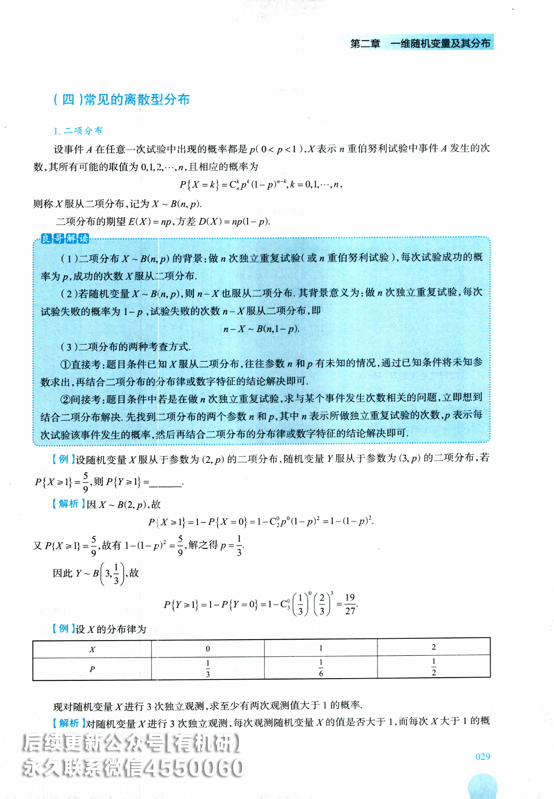

# 第二章 一维随机变量及其分布

本章配套习题《基础700题》P7-P12

## 【大纲要求】

(1)理解随机变量的概念，理解分布函数 $F(x)=P\left\{X\leqslant x\right\}\ (-\infty<x<+\infty)$ 的概念及性质，会计算与随机变量相联系的事件的概率

(2)理解离散型随机变量及其概率分布的概念，掌握0-1分布、二项分布 $B(n,p)$ 、几何分布、超几何分布、泊松(Poisson)分布P(λ)及其应用.

(3)了解泊松定理的结论和应用条件，会用泊松分布近似表示二项分布

(4)理解连续型随机变量及其概率密度的概念，掌握均匀分布 $U(a,b)$ 、正态分布 $N ( \mu , \sigma ^ { 2 } )$ 、指数分布及其应用，其中参数为 $\lambda ( \lambda > 0 )$ 的指数分布E(λ)的概率密度为

$$
f(x)=\begin{cases}\lambda \mathrm{e}^{-\lambda x},&x>0,\\0,&x\leq0.\end{cases}
$$

5.会求随机变量函数的分布.

## 【本章重点】

(1)一维离散型随机变量的分布律.

(2)一维连续型随机变量的概率密度函数，分布函数及其性质

(3)几个常见的分布：0-1分布、二项分布、几何分布、泊松分布、均匀分布、指数分布、正态分布

(4)一维随机变量函数的分布.

## 【基础知识】

## 一、随机变量的概念

## (一)随机变量的定义

在样本空间 $\Omega = \left\{ e \right\}$ 上定义的一个实值单值函数 $X = X(e) (e \in \mathcal{O})$ ,称为随机变量.随机变量常用大写字母X,Y,Z等表示,其取值通常用小写字母x,y,z等表示

## 良哥解读

随机变量本质是样本空间的样本点到实数建立的一种函数关系.这种函数通常用大写字母表示,而用小写字母表示其取值. 习惯上随机变量 X的取值用 x,Y的取值用 y,但 X的取值也可用 y,z,t等.随机变量只要取值就表示随机事件，比如 $\left\{ X \leq x \right\},\left\{ X > x \right\},\left\{ X = y \right\}$ 等均表示随机事件.

## (二)随机变量的分类

随机变量有以下三种：

(1)离散型随机变量；

(2)连续型随机变量；

(3)既非离散型也非连续型随机变量

## 二、随机变量的分布函数

## (一)随机变量分布函数的定义

设X是一个随机变量，对于任意实数x，令 $F(x)=P\left\{X\leqslant x\right\}(-\infty<x<+\infty)$ ,称 F(x) 为随机变量X的概率分布函数，简称为分布函数

## (二)利用分布函数求各种随机事件的概率

已知随机变量X的分布函数 $F(x) = P\{X \leq x\}$ ,则有：  
(1 $P\left\{X\leqslant a\right\}=F\left(a\right)$ (2 $P\left\{X>a\right\}=1-F\left(a\right);$   
(3 $P\left\{X<a\right\}=\lim_{x\to a^{-}}F(x)=F(a-0)$ (4) $P\left\{X\geq a\right\}=1-F\left(a-0\right)$   
(5 $P\left\{X=a\right\}=F(a)-F(a-0);$ (6) $P\left\{ a < X \leq b \right\} = F(b) - F(a)$   
(7 $P\left\{a\leqslant X<b\right\}=F(b-0)-F(a-0)$ (8 $P\left\{a<X<b\right\}=F(b-0)-F(a);$   
(9 $P\left\{a\leqslant X\leqslant b\right\}=F(b)-F(a-0).$

## 良哥解读

概率论中的核心问题之一是解决随机事件发生的可能性大小.引入随机变量这个概念,可以将随机事件量化,因为任何一个随机事件均可由随机变量在某个范围上的取值表示.在随机变量基础上引入分布函数的概念,只要分布函数已知,所有随机事件的概率均可通过分布函数计算(比如上面9种情况的概率均可由分布函数表示),因此分布是随机变量理论的灵魂,在研究随机变量时,只要找到其分布,其他问题就可迎刃而解.

【例】设随机变量X的分布函数为 $F(x)=\left\{\begin{aligned} & 0, & x < 0, \\ & \frac{1}{2}, & 0 \leq x < 1, \\ & 1 - \mathrm{e}^{-x}, & x \geq 1, \end{aligned}\right.$ 则 $P\left\{X=1\right\}=\left(\begin{array}{ccc}& \\& \end{array}\right).$ (A)0 (B $0 \frac{1}{2}$ (C $\frac{1}{2} - \mathrm{e}^{-1}$ (D $1 - \mathrm{e}^{-1}$

【解析】因 $P\left\{X=1\right\}=F(1)-F(1-0)=1-\mathrm{e}^{-1}-\lim_{x \to 1^{-}}F(x)=1-\mathrm{e}^{-1}-\lim_{x \to 1^{-}}\frac{1}{2}=\frac{1}{2}-\mathrm{e}^{-1}$ 故应选(C).

【例】设随机变量X的分布函数为 $F(x)=\left\{\begin{aligned}&\frac{1}{2}\mathrm{e}^{x}, \quad x<0, \\&1-\frac{1}{2}\mathrm{e}^{-x}, \quad x \geq 0.\end{aligned}\right.$ 则 $P\left\{X^{2} \leq 1\right\}$ 【解析 $P\left\{X^{2} \leq 1\right\}=P\left\{-1 \leq X \leq 1\right\}=F(1)-F(-1-0)=1-\frac{1}{2} \mathrm{e}^{-1}-\frac{1}{2} \mathrm{e}^{-1}=1-\mathrm{e}^{-1} .$

## (三)分布函数的性质

设随机变量X的分布函数为 $F(x) = P\{ X \leq x\}$ ,则 F(x) 满足

①非负性： $0 \leqslant F(x) \leqslant 1$

②规范性： $F(-\infty)=\lim_{x \to -\infty}F(x)=0,F(+\infty)=\lim_{x \to +\infty}F(x)=1.$

③单调不减性：对于任意 $x_{1} < x_{2}$ ,有 $F(x_{1}) \leqslant F(x_{2})$

④右连续性： $F(x_{0}) = F(x_{0} + 0)$

## 良哥解读

(1)分布函数的四条性质是一个函数能否成为某个随机变量分布函数的充要条件.若要判定一个函数是否为分布函数，只需逐一验证这四条性质.若四条皆满足，则一定是分布函数,四条性质只要有-条不满足,则一定不是分布函数

(2)当分布函数中含有未知参数时,通常用性质②④计算未知参数.

【例】下列函数中能够作为分布函数的是( ).$\begin{aligned} &F(x)F(x)=\left\{\begin{aligned}\\ &0, &x < 0, \\&\frac{1}{2}, &0 \leq x \leq 2, \\&1, &x > 2.\\ &\end{aligned}\right.\\ \end{aligned}$ (B $\begin{aligned}\left( \begin{array}{l}0, & x \leq 0, \\\frac{1 + \sin x}{x}, & x > 0.\end{array} \right)\end{aligned}$ (C $\begin{aligned}D F(x)=\begin{cases}0, & x<0, \\\dfrac{x+1}{3}, & 0 \leq x<2, \\1, & x \geq 2.\end{cases}\end{aligned}$ (D $\begin{aligned}D F(x) = \begin{cases}0, & x < 0, \\\cos x, & 0 \leq x < \pi, \\1, & x \geq \pi.\end{cases}\end{aligned}$

【解析对于(A)选项:因为 $F(2)=\frac{1}{2} \neq F(2+0)=1$ ,不满足右连续性，故排除(A).对于(B)选项：因为 $F(+\infty)=\lim_{x \to +\infty} \frac{1+\sin x}{x}=0 \neq 1$ ,故排除(B).  
对于(D)选项：因为当 $0 \leq x < \pi$ 时， $F(x) = \cos x$ 是单调递减函数，故排除(D).对于(C)选项：由于分布函数的四条性质均满足，故一定是分布函数.应选(C).【例】设 $X_{1}$ 和 $X_{2}$ 的分布函数分别为 $F_{1}(x)$ 和 $F_{2}(x)$ ,则( ).  
(A $F_{1}(x) + F_{2}(x)$ 必为某一随机变量的分布函数  
(B $F_{1}(x) - F_{2}(x)$ 必为某一随机变量的分布函数  
(C $F_{1}(x)F_{2}(x)$ 必为某一随机变量的分布函数  
/n) 以斗甘随却亦量的分布函数

(D) $-\frac{1}{3}F_{1}(x)+\frac{4}{3}F_{2}(x)$ 必为某一随机变量的分布函数

【解析】对于(A)选项：因为 $\lim_{x \to +\infty} \left[ F_1(x) + F_2(x) \right] = 2 \neq 1$ ,故 $F_{1}(x) + F_{2}(x)$ 不是分布函数.  
对于(B)选项：因为 $\lim_{x \to +\infty} \left[ F_1(x) - F_2(x) \right] = 1 - 1 = 0 \neq 1$ ,故 $F_{1}(x) - F_{2}(x)$ 不是分布函数.

对于(D)选项：因为函数 $F_{1}(x)$ 与 $F_{2}(x)$ 单调不减，故函数 $-\frac{1}{3}F_{1}(x)$ 单调不增，函数 $\frac{4}{3}F_{2}(x)$ 单调不减，但函数 $-\frac{1}{3}F_{1}(x)+\frac{4}{3}F_{2}(x)$ 单调性不定，故不确定 $-\frac{1}{3}F_{1}(x)+\frac{4}{3}F_{2}(x)$ 是否为分布函数，从而排除(D).

对于(C)选项：函数 $F_{1}(x)F_{2}(x)$ 满足分布函数的四条性质，故一定是分布函数.应选(C).

【例】设随机变量的分布函数为 $F(x)=\left\{\begin{aligned}&0, &x < 0, \\&A\sin x, &0 \leq x \leq \frac{\pi}{2}, \\&1, &x > \frac{\pi}{2}.\end{aligned}\right.$ 则A=， $P\left\{ \left| X \right| < \frac{\pi}{6} \right\}$

【解析】由分布函数的右连续性有 $F\left(\frac{\pi}{2} + 0\right) = F\left(\frac{\pi}{2}\right)$ ,即

$$
\lim_{x \to \frac{\pi}{2}^{+}} F(x) = \lim_{x \to \frac{\pi}{2}^{+}} 1 = 1 = A \sin \frac{\pi}{2},
$$

得A=1.

$$
P\left\{ \left| X \right| < \frac{\pi}{6} \right\} = P\left\{ - \frac{\pi}{6} < X < \frac{\pi}{6} \right\} = F\left( \frac{\pi}{6} - 0 \right) - F\left( - \frac{\pi}{6} \right) = \sin\frac{\pi}{6} - 0 = \frac{1}{2}.
$$

## 三、一维离散型随机变量及其概率分布

## (一)离散型随机变量的定义

若随机变量X的取值是有限个或者可列无穷多个，则称X为离散型随机变量

## (二)离散型随机变量的分布律

设X为离散型随机变量，其所有可能取值为 $x_{1},x_{2},\cdots,x_{k},\cdots$ ，且X取各个值x的概率为 $x _ { k }$ $P\left\{X=x_{k}\right\}=p_{k}$ 其中 $p_{k} \geqslant 0, k = 1, 2, \cdots, \sum_{k = 1}^{\infty} p_{k} = 1$ ,则称 $P\left\{X=x_{k}\right\}=p_{k},k=1,2,$ …为随机变量X的概率分布或分布律，也可记为

<table><tr><td rowspan=1 colspan=1> $X$ </td><td rowspan=1 colspan=1> $x _ { \mathrm { i } }$ </td><td rowspan=1 colspan=1> $x _ { 2 }$ </td><td rowspan=1 colspan=1> $x _ { 3 }$ </td><td rowspan=1 colspan=1></td><td rowspan=1 colspan=1> $x _ { k }$ </td><td rowspan=1 colspan=1></td></tr><tr><td rowspan=1 colspan=1> $P$ </td><td rowspan=1 colspan=1> $p_{1}$ </td><td rowspan=1 colspan=1> $p_{2}$ </td><td rowspan=1 colspan=1> $p_{3}$ </td><td rowspan=1 colspan=1></td><td rowspan=1 colspan=1> $p_{k}$ </td><td rowspan=1 colspan=1></td></tr></table>

## 良哥解读

若已知离散型随机变量的分布律,就容易解决与之相关的问题,因此对于离散型随机变量最核心的是找到其分布律.计算分布律的三个步骤:①定取值(找到随机变量的所有可能取值);②算概率(计算随机变量对应的每个取值的概率);③验证1(将所有取值概率加起来看是否为1).

【例】设10件产品中有2件次品，现任取3件，以X表示取到的次品数，求X的概率分布

【解析】由题意可知,X的所有可能取值为0,1,2,其对应概率分别为

$$
P\left\{X=0\right\}=\frac{C_{8}^{3}}{C_{10}^{3}}=\frac{7}{15};P\left\{X=1\right\}=\frac{C_{8}^{2}C_{2}^{1}}{C_{10}^{3}}=\frac{7}{15};P\left\{X=2\right\}=\frac{C_{8}^{1}C_{2}^{2}}{C_{10}^{3}}=\frac{1}{15},
$$

故X的概率分布为
<table><tr><td rowspan=1 colspan=1>X</td><td rowspan=1 colspan=1>0</td><td rowspan=1 colspan=1>1</td><td rowspan=1 colspan=1>2</td></tr><tr><td rowspan=1 colspan=1>P</td><td rowspan=1 colspan=1> $\frac{7}{15}$ </td><td rowspan=1 colspan=1> $\frac{7}{15}$ </td><td rowspan=1 colspan=1> $\frac{1}{15}$ </td></tr></table>

【例】一袋中装有5只球，编号为1，2,3,4,5,在袋中同时取3只，以X表示取出的3只球中的最大号码，写出随机变量X的分布律.

【解析】由题意可知,X的所有可能取值为3,4,5.

因{X=3}表示最大号码球为3，即取到的球只能为1,2,3,故 $P\left\{X=3\right\}=\frac{1}{C_{5}^{3}}=\frac{1}{10}.$

因 $\{ X = 4 \}$ 表示最大号码球为4.即取到的球有一个球为4号，其余的两个球只能在1，2，3号球中取，故 $P\left\{X=4\right\}=\frac{C_{3}^{2}}{C_{5}^{3}}=\frac{3}{10}.$

因{X=5}表示最大号码球为5,即取到的球有一个球为5号,其余的两个球只能在1,2,3,4号球中取,故 $P\left\{X=5\right\}=\frac{C_{4}^{2}}{C_{5}^{3}}=\frac{6}{10}=\frac{3}{5}.$

故X的概率分布为
<table><tr><td rowspan=1 colspan=1>X</td><td rowspan=1 colspan=1>3</td><td rowspan=1 colspan=1>4</td><td rowspan=1 colspan=1>5</td></tr><tr><td rowspan=1 colspan=1>P</td><td rowspan=1 colspan=1> $\frac{1}{10}$ </td><td rowspan=1 colspan=1> $\frac{3}{10}$ </td><td rowspan=1 colspan=1>3-5</td></tr></table>

【例】一汽车沿一街道行驶，需要通过三个均设有红绿信号灯的路口，每个信号灯为红或绿与其他信号灯为红或绿相互独立，且红绿两种信号显示的时间相等.以X表示该汽车首次遇到红灯前已通过的路口的个数.求X的概率分布.

【解析】设事件 $A_{i} =$ 汽车在第i个路口首次遇到红灯”,i=1,2,3,由题意， $A_{1},A_{2},A_{3}$ 相互独立.

随机变量X的所有可能取值为0,1,2,3,则

$$
\begin{align*}P\{ X = 0\} &= P(A_1) = \frac{1}{2}, \\P\{ X = 1\} &= P(\overline{A_1}A_2) = P(\overline{A_1})P(A_2) = \frac{1}{2} \times \frac{1}{2} = \frac{1}{4}, \\P\{ X = 2\} &= P(\overline{A_1}\overline{A_2}A_3) = P(\overline{A_1})P(\overline{A_2})P(A_3) = \frac{1}{2} \times \frac{1}{2} \times \frac{1}{2} = \frac{1}{8}, \\P\{ X = 3\} &= P(\overline{A_1}\overline{A_2}\overline{A_3}) = P(\overline{A_1})P(\overline{A_2})P(\overline{A_3}) = \frac{1}{2} \times \frac{1}{2} \times \frac{1}{2} = \frac{1}{8}.\end{align*}
$$

故X的概率分布为
<table><tr><td rowspan=1 colspan=1>3</td><td rowspan=1 colspan=1>11∞</td></tr><tr><td rowspan=1 colspan=1>2</td><td rowspan=1 colspan=1>1-∞</td></tr><tr><td rowspan=1 colspan=1>1</td><td rowspan=1 colspan=1>114</td></tr><tr><td rowspan=1 colspan=1>0</td><td rowspan=1 colspan=1>1-2</td></tr><tr><td rowspan=1 colspan=1>X</td><td rowspan=1 colspan=1>P</td></tr></table>

## 良哥解读

本题中,大家容易漏掉X的取值3,若按照定取值、算概率、验证1三步来求分布律,则能检查出问题.由于汽车在通过路口时,有可能一路绿灯,故 X可以取到 3.

## (三)离散型随机变量的分布函数

定义:若X的分布律为 $P\left\{X=x_{k}\right\}=p_{k},k=1,2,\cdots n$ ,不妨设 $x_{1} < x_{2} < \cdots < x_{k} < \cdots < x_{n}$ ,则

$$
\begin{aligned}F(x) = \begin{cases}0, & x < x_{1}, \\p_{1}, & x_{1} \leq x < x_{2}, \\p_{1} + p_{2}, & x_{2} \leq x < x_{3}, \\& \vdots \\1, & x \geq x_{n}.\end{cases}\end{aligned}
$$

## 良哥解读

离散型随机变量的分布律与分布函数是一一对应的,已知分布律我们就能求出分布函数,反之已知分布函数我们也能求分布律.若已知离散型随机变量的分布律求分布函数,可将离散型随机变量的取值点作为分布函数的分段点,为保证分布函数的右连续性,区间范围需要左闭右开;若已知分布函数求分布律,则离散型的所有取值点即为分布函数的分段点.

【例】已知随机变量X的概率分布为： $P\{ X = 1\} = 0.2,P\{ X = 2\} = 0.3,P\{ X = 3\} = 0.5.$ 试写出其分布函数F(x).

【解析】X的分布函数为

$$
F(x)=P\{X \leq x\}=\begin{cases}0, & x<1, \\0.2, & 1 \leq x<2, \\0.5, & 2 \leq x<3, \\1, & x \geq 3.\end{cases}
$$

【例】设随机变量X的分布函数为 $F(x)=\begin{cases}0, & x<-1, \\0.4, & -1 \leq x<1, \\0.8, & 1 \leq x<3, \\1, & 3 \leq x.\end{cases}$ 则X的分布律为

【解析】由题意易得，X的所有可能取值为-1,1,3.

$$
\begin{aligned} &P\{ X = - 1\} = F( - 1) - F( - 1 - 0) = 0.4 - 0 = 0.4, \\&P\{ X = 1\} = F( 1) - F( 1 - 0) = 0.8 - 0.4 = 0.4, \\&P\{ X = 3\} = F( 3) - F( 3 - 0) = 1 - 0.8 = 0.2.\\ \end{aligned}
$$

故X的分布律为

<table><tr><td rowspan=1 colspan=1>X</td><td rowspan=1 colspan=1>-1</td><td rowspan=1 colspan=1>1</td><td rowspan=1 colspan=1>3</td></tr><tr><td rowspan=1 colspan=1>P</td><td rowspan=1 colspan=1>0.4</td><td rowspan=1 colspan=1>0.4</td><td rowspan=1 colspan=1>0.2</td></tr></table>

## (四)常见的离散型分布

## 1. 二项分布

设事件A在任意一次试验中出现的概率都是 $p(0 < p < 1)$ .X表示n重伯努利试验中事件A发生的次数，其所有可能的取值为 $0,1,2,\cdots,n$ ,且相应的概率为

$$
P\left\{X=k\right\}=C_{n}^{k}p^{k}\left(1-p\right)^{n-k},k=0,1,\cdots,n,
$$

则称X服从二项分布，记为 $X \sim B(n, p)$

二项分布的期望 $E(X) = np$ ,方差 $D(X)=np(1-p)$

## 良哥解读

(1)二项分布 $X \sim B(n, p)$ 的背景:做n次独立重复试验(或n重伯努利试验),每次试验成功的概率为 p,成功的次数 X服从二项分布.

(2)若随机变量 $\bar{X} \sim B(n, p)$ ,则 $n - X$ 也服从二项分布.其背景意义为:做n次独立重复试验,每次试验失败的概率为 $1 - p$ ,试验失败的次数 $n - X$ 服从二项分布，即

$$
n - X \sim B(n,1 - p).
$$

## (3)二项分布的两种考查方式.

①直接考:题目条件已知X服从二项分布,往往参数n和p有未知的情况,通过已知条件将未知参数求出,再结合二项分布的分布律或数字特征的结论解决即可.

②间接考:题目条件中若是在做n次独立重复试验,求与某个事件发生次数相关的问题,立即想到结合二项分布解决.先找到二项分布的两个参数n和p,其中 n表示所做独立重复试验的次数，p表示每 $p$ $,p$ 次试验该事件发生的概率，然后再结合二项分布的分布律或数字特征的结论解决即可.

【例】设随机变量X服从于参数为 $(2,p)$ 的二项分布，随机变量Y服从于参数为 $(3,p)$ 的二项分布，若$P\left\{X\geq1\right\}=\frac{5}{9}$ ,则 $P\left\{Y \geq 1\right\} =$

【解析】因 $X \sim B(2, p)$ ,故

$$
P\left\{X\geq1\right\}=1-P\left\{X=0\right\}=1-C_{2}^{0}p^{0}\left(1-p\right)^{2}=1-\left(1-p\right)^{2}.
$$

又 $P\{ X \geq 1\} = \frac{5}{9}$ ,故有 $1 - (1 - p)^{2} = \frac{5}{9}$ ,解之得 $\stackrel{\frown}{p}=\frac{1}{3}.$

因此 $Y \sim B\left(3, \frac{1}{3}\right)$ ,故

$$
P\left\{Y\geq1\right\}=1-P\left\{Y=0\right\}=1-C_{3}^{0}\left(\frac{1}{3}\right)^{0}\left(\frac{2}{3}\right)^{3}=\frac{19}{27}.
$$

【例】设X的分布律为
<!-- DIRECTED-REPAIR-FALLBACK:FALLBACK-QA-R2-PROB-BASE-CH02-P36-DIST -->
> [!WARNING]
> 原 PDF 第 36 页回退：分布律表结构破坏,概率分数成连字符

<table><tr><td rowspan=1 colspan=1>2</td><td rowspan=1 colspan=1>1-2</td></tr><tr><td rowspan=1 colspan=1>1</td><td rowspan=1 colspan=1>1-6</td></tr><tr><td rowspan=1 colspan=1>0</td><td rowspan=1 colspan=1>1-3</td></tr><tr><td rowspan=1 colspan=1>X</td><td rowspan=1 colspan=1>P</td></tr></table>

现对随机变量X进行3次独立观测，求至少有两次观测值大于1的概率.

【解析】对随机变量X进行3次独立观测，每次观测随机变量X的值是否大于1,而每次X大于1的概029

率为 $p = P\{ X > 1\} = P\{ X = 2\} = \frac{1}{2}$ ,故可将条件看成做了3次独立重复试验，每次试验成功的概率为 $p = \frac{1}{2}$ ,记Y表示观测值大于1的次数(即成功的次数)，则Y服从二项分布，即 $Y \sim B(3,\frac{1}{2})$ 所求概率为

$$
P\{ Y \geqslant 2\} =1-P\{ Y = 0\}-P\{ Y = 1\}=1-C_{3}^{0}\left(\frac{1}{2}\right)^{0}\left(\frac{1}{2}\right)^{3}-C_{3}^{1}\left(\frac{1}{2}\right)^{1}\left(\frac{1}{2}\right)^{2}=\frac{1}{2}.
$$

【例】如果用X,Y分别表示将一枚硬币独立的掷8次正反面出现的次数，则t的一元二次方程$t^{2} + Xt + Y = 0$ 没有实根的概率是

【解析】因方程 $t^{2} + Xt + Y = 0$ 无实根,故 $X^{2} - 4Y < 0$ ,即 $X^{2} < 4Y.$

由题意知， $X \sim B\left( 8,\frac{1}{2} \right),Y = 8 - X$ ,故所求的概率为

$$
\begin{aligned}P\left\{ X^{2} < 4Y \right\} &= P\left\{ X^{2} < 4(8 - X) \right\} = P\left\{ X^{2} + 4X - 32 < 0 \right\} \\&= P\left\{ (X + 8)(X - 4) < 0 \right\} \\&= P\left\{ - 8 < X < 4 \right\} = P\left\{ 0 \leqslant X \leqslant 3 \right\} \\&= P\left\{ X = 0 \right\} + P\left\{ X = 1 \right\} + P\left\{ X = 2 \right\} + P\left\{ X = 3 \right\} \\&= \mathbf{C}_{8}^{0}\left( \frac{1}{2} \right)^{8} + \mathbf{C}_{8}^{1}\left( \frac{1}{2} \right)^{8} + \mathbf{C}_{8}^{2}\left( \frac{1}{2} \right)^{8} + \mathbf{C}_{8}^{3}\left( \frac{1}{2} \right)^{8} = \frac{93}{256}.\end{aligned}
$$

2.0-1分布

若随机变量X的概率分布为

$$
P\left\{X=k\right\}=p^{k}\left(1-p\right)^{1-k} \quad k=0,1,0<p<1,
$$

则称X服从0-1分布.

0-1分布X的期望 $E(X) = p$ ,方差 $D(X)=p(1-p)$

## 良哥解读

0-1 分布是一个特殊的二项分布,当 n=1 时的二项分布为 0-1 分布,即 $X \sim B(1, p)$

3. 泊松分布

设随机变量X的概率分布为

$$
P\left\{X=k\right\}=\frac{\lambda^{k}\mathrm{e}^{-\lambda}}{k!}, \quad k=0,1,2,\cdots,
$$

其中参数 $\lambda > 0$ ，则称X服从参数为λ的泊松分布，记为 $X \sim P(\lambda)$

泊松分布的期望 $E ( X ) = \lambda$ ,方差 $D(X) = \lambda$

## 良哥解读

对于泊松分布的考查通常比较直接,考生需要熟记泊松分布的分布律、期望和方差.若题目中泊松分布的参数λ已知,则直接利用泊松分布的分布律、期望和方差的结论解决即可;若参数λ未知,需根据已知条件先求出未知参数 λ,再利用泊松分布的结论解决.

【例】设某段时间内通过路口车流量服从泊松分布，已知该时段内没有车通过的概率为-，则这段时间 $\frac{1}{\mathrm{e}}$ 内至少有两辆车通过的概率为

【解析】设X表示路口车流量，则 $X \sim P(\lambda)$ ,由题意 $P\left\{X=0\right\}=\frac{\lambda^{0}\mathrm{e}^{-\lambda}}{0!}=\mathrm{e}^{-1}$ ,故λ=1.则至少有两辆车通

过的概率为

$$
\begin{aligned}P\left\{ X \geqslant 2 \right\} &= 1 - P\left\{ X < 2 \right\} = 1 - P\left\{ X = 0 \right\} - P\left\{ X = 1 \right\} \\&= 1 - \mathrm{e}^{- 1} - \frac{1^{1}\mathrm{e}^{- 1}}{1!} = 1 - 2\mathrm{e}^{- 1}.\end{aligned}
$$

## 4. 几何分布

设随机变量X的概率分布为

$$
P\left\{X=k\right\}=\left(1-p\right)^{k-1}p,0<p<1,k=1,2,\cdots,
$$

则称X服从几何分布.

几何分布的期望 $E(X)=\frac{1}{p}$ ,方差 $D(X)=\frac{1-p}{p^{2}}$

## 良哥解读

(1)几何分布的背景：做独立重复试验,每次试验成功的概率为p,直到试验成功为止一共做的试验次数服从几何分布.

(2)事件 $\{ X = k \}$ 表示直到成功为止，一共做了k次试验,则前k-1 次都失败,第k次成功.试验成功的概率为 p,失败的概率为 1- p,故 $P\left\{X=k\right\}=\left(1-p\right)^{k-1}p$ ,若要成功至少做一次试验,所以k的取值为 $k = 1, 2, \cdots$

## 5. 超几何分布

设随机变量X的概率分布为

$$
P \left\{ X = k \right\} = \frac{C_{M}^{k}C_{N - M}^{n - k}}{C_{N}^{n}}, \quad k = 0,1,2,\cdots n,
$$

其中,M,N,n都是正整数，且 $n \leq M \leq N.$ 则称X服从参数为M,N和n的超几何分布，记为 $X \sim H(n, M, N)$

## 良哥解读

超几何分布背景:共有 N件产品,其中 M 件次品,从 N件产品中取出 n件产品,其中所含有的次品数服从超几何分布.

## (五)泊松定理

设 $\lambda > 0$ 是一个常数，n是任意正整数，设 $\lambda = np_{n}$ ,则对于任一固定的非负整数k,有

$$
\lim_{n \to +\infty} C_n^k p_n^k \left(1 - p_n\right)^{n-k} = \frac{\lambda^k}{k!} \mathrm{e}^{-\lambda}, \quad k = 0, 1, 2, \cdots.
$$

## 良哥解读

(1)泊松定理的本质：当二项分布序列中的参数n比较大,参数 p相对较小时,可以用泊松分布的 $p_{n}$ 分布律近似代替二项分布的分布律做近似计算.在用泊松分布近似代替时,需要找到泊松分布的参数λ,λ近似为 $n p_{n}$

(2)若考查泊松定理,题干通常会提示用泊松定理,所以我们只需找到二项分布中的n与 $p_{n}$ ,这样就能求出泊松分布的参数 $\lambda \approx np_{n}$ ,再带入泊松分布的分布律近似计算即可.

【例】设一条生产线生产的产品，次品率为0.001.试用泊松定理计算在某段时间段内生产的1000件产031

品中至少有两件次品的概率.(保留小数点后3位)

【附表】

<table><tr><td rowspan=1 colspan=1> $\lambda$ </td><td rowspan=1 colspan=1>1</td><td rowspan=1 colspan=1>2</td><td rowspan=1 colspan=1>3</td><td rowspan=1 colspan=1>4</td><td rowspan=1 colspan=1>5</td><td rowspan=1 colspan=1>6</td><td rowspan=1 colspan=1>7</td><td rowspan=1 colspan=1>…</td></tr><tr><td rowspan=1 colspan=1> $\mathbf{e}^{-\lambda}$ </td><td rowspan=1 colspan=1>0.368</td><td rowspan=1 colspan=1>0.135</td><td rowspan=1 colspan=1>0.050</td><td rowspan=1 colspan=1>0.018</td><td rowspan=1 colspan=1>0.007</td><td rowspan=1 colspan=1>0.002</td><td rowspan=1 colspan=1>0.001</td><td rowspan=1 colspan=1>…</td></tr></table>

【解析】设随机变量X表示1000件产品中所含的次品数，由题意易得

$$
X \sim B ( 1 0 0 0 , 0 . 0 0 1 ) .
$$

由泊松定理知X近似服从泊松分布，其中参数 $\lambda = 1000 \times 0.001 = 1$

故1000件产品中至少两件次品的概率近似为

$$
P\left\{X\geq2\right\}=1-P\left\{X=0\right\}-P\left\{X=1\right\}=1-\frac{1^{0}e^{-1}}{0!}-\frac{1^{1}e^{-1}}{1!}=1-2e^{-1}\approx0.264.
$$

## 四、一维连续型随机变量及其概率分布

## (一)连续型随机变量的定义

如果对于随机变量X的分布函数F(x)，存在非负可积函数f(x)，使得对于任意实数x,有$F(x) = \int_{-\infty}^{x} f(t)   dt$ ,则称X为连续型随机变量，函数f(x)称为X的概率密度函数(简称密度函数).

## 良哥解读

(1)概率密度函数f(x)的定义域是 $( - \infty , + \infty )$ ,若求概率密度函数时,需将 $(-\infty, +\infty)$ 的表达式都 求出.

(2)若已知 X的概率密度函数 f(x),求其分布函数 F(x),用 $F(x) = \int_{-\infty}^{x} f(t)   dt$

(3)当被积函数可积时,变上限积分函数 $F(x) = \int_{-\infty}^{x} f(t)   dt$ 连续,故连续型随机变量的分布函数是连续函数.

(4)设X为连续型随机变量,则其分布函数 F(x) 连续,从而对任意的 $x_{0} \in \mathbf{R}, P\{X = x_{0}\} = F(x_{0}) -$ $F(x_{0} - 0) = 0$ ,即连续型随机变量在任何一点取值概率为0.因此计算连续型随机变量在某个区间取值概率时,增加、去掉或改变有限个点不影响其概率大小.

(5)当被积函数连续时,变上限积分函数 $F(x) = \int_{-\infty}^{x} f(t)   dt$ 可导,且 $F^{\prime}(x) = f(x)$ .在f(x) 的连续点处,有

$$
f(x)=\lim_{\Delta x \to 0^{+}}\frac{F(x+\Delta x)-F(x)}{\Delta x}=\lim_{\Delta x \to 0^{+}}\frac{P\{x<X\leq x+\Delta x\}}{\Delta x}
$$

由极限与无穷小的关系知 $\frac{P\{x < X \leq x + \Delta x\}}{\Delta x} = f(x) + \alpha.$ 其中α为 $\Delta x \rightarrow 0^{+}$ 时的无穷小量,故在x附近近似有 $f(x) \approx \frac{P\{x < X \leq x + \Delta x\}}{\Delta x}$ 由此可见f(x) 近似表示在区间 $\left\{ x < X \leq x + \Delta x \right\}$ 上取值的概率除以区间长度,所以f(x) 称为概率密度函数.

## 良哥解读

概率密度函数与概率的关系好比密度和质量的关系.物体的密度不是质量,但若体积相同时密度越大，质量就越大;相应的概率密度函数不是概率，但概率密度函数的大小可以反映随机变量在该点附近取值概率的大小,概率密度函数越大,在该点附近的取值概率就越大.

【例】已知连续型随机变量X的密度函数为

$$
f(x)=\begin{cases}x,&x\in[0,1),\\2-x,&x\in[1,2),\\0,& 其他 .\end{cases}
$$

求分布函数 $F(x)$

【解析】由 $F(x) = \int_{-\infty}^{x} f(t)   dt$ ,故

当 $x < 0$ 时 $F(x) = 0$

当 $0 \le x < 1$ 时， $F(x) = \int_{0}^{x} t \mathrm{d}t = \frac{x^{2}}{2}$

当 $1 \leq x < 2$ 时， $F(x)=\int_{0}^{1}t\mathrm{d}t+\int_{1}^{x}(2-t)\mathrm{d}t=-\frac{x^{2}}{2}+2x-1$

当 $x \geqslant 2$ 时， $F(x) = 1$ .故

$$
F(x)=\left\{\begin{aligned}&0, &x&<0, \\&\frac{x^{2}}{2}, &0&\leq x<1, \\&-\frac{x^{2}}{2}+2x-1, &1&\leq x<2, \\&1, &x&\geq 2.\end{aligned}\right.
$$

## 良哥解读

由于连续型随机变量的分布函数是连续函数,故可以通过验证其分布函数在分段点处是否连续来判定计算是否正确

## (二)概率密度的性质

①非负性 $f(x) \geqslant 0, -\infty < x < +\infty$

②规范性： $\int_{-\infty}^{+\infty} f(x) \mathrm{d}x = 1$

③对于任意实数a和 $b(a < b)$ ,有

$$
P\left\{ a < X \leq b \right\} = P\left\{ a \leq X < b \right\} = P\left\{ a < X < b \right\} = P\left\{ a \leq X \leq b \right\} = \int_{a}^{b}f(x)\mathrm{d}x.
$$

④在f(x)的连续点处,有 $F^{\prime}(x) = f(x)$

## 良哥解读

(1)概率密度函数的性质①②是一个函数成为某个随机变量密度函数的充要条件,若要判定一个函数是否为概率密度函数只需验证这两条性质.若两条性质都满足就一定是密度函数,只要有一条不满足就一定不是密度函数.

## 良哥解读

(2)若随机变量 Ⅹ的概率密度f(x)含有未知参数,可利用 $\int_{-\infty}^{+\infty} f(x) \mathrm{d}x = 1$ 来计算.

(3)若已知随机变量X的概率密度f(x),求某个随机事件的概率,利用性质③计算.随机变量在一个区间上取值的概率转化为在该区间上对密度函数算定积分求得.

(4)若要计算某随机变量的概率密度函数,利用 $F^{\prime}(x) = f(x)$ 计算.我们根据条件先求出该随机变量的分布函数,再对其求导得到概率密度函数

【例】设随机变量X具有概率密度

$$
\begin{aligned} &f(x) = \left\{ \begin{aligned}\\ &kx, & &x \in [0, 3), \\&2 - \frac{x}{2}, & &x \in [3, 4], \\&0, & & 其他 .\\ &\end{aligned} \right.\\ \end{aligned}
$$

(1)确定常数 $k ; (   2$ )求 $P\left\{ 2 < X \leq \frac{7}{2} \right\}$

【解析】(1)由 $\int_{-\infty}^{+\infty} f(x) \mathrm{d}x = 1$ ,有 $1 = \int_{0}^{3}kx\mathrm{d}x + \int_{3}^{4}2 - \frac{x}{2}\mathrm{d}x = \frac{9}{2}k + \frac{1}{4}$ ,解之得 $k = \frac{1}{6}.$

$$
P\left\{ 2 < X \leq \frac{7}{2} \right\} = \int_{2}^{\frac{7}{2}} f(x) \mathrm{d}x = \frac{1}{6} \int_{2}^{3} x \mathrm{d}x + \int_{3}^{\frac{7}{2}} 2 - \frac{x}{2} \mathrm{d}x = \frac{5}{12} + \frac{3}{16} = \frac{29}{48}.
$$

【例】设 $X_{1},X_{2}$ 为任意两个连续型随机变量，它们的密度函数分别为 $f_{1}(x)$ 和 $f_{2}(x)$ ,则().

(A $f_{1}(x) + f_{2}(x)$ 必为某随机变量的密度函数

(B $f_{1}(x) - f_{2}(x)$ 必为某随机变量的密度函数

(C) $-\frac{1}{3}f_{1}(x)+\frac{4}{3}f_{2}(x)$ 必为某随机变量的密度函数

(D $\frac{1}{3}f_{1}(x)+\frac{2}{3}f_{2}(x)$ 必为某随机变量的密度函数

【解析】对于(A)选项：

$$
\int _ { - \infty } ^ { + \infty } f _ { 1 } ( x ) + f _ { 2 } ( x ) \mathrm { d } x = \int _ { - \infty } ^ { + \infty } f _ { 1 } ( x ) \mathrm { d } x + \int _ { - \infty } ^ { + \infty } f _ { 2 } ( x ) \mathrm { d } x = 1 + 1 = 2 \neq 1 ,
$$

故 $f_{1}(x) + f_{2}(x)$ 一定不是密度函数.

对于(B)选项：因为

$$
\int _ { - \infty } ^ { + \infty } f _ { 1 } ( x ) - f _ { 2 } ( x ) \mathrm { d } x = \int _ { - \infty } ^ { + \infty } f _ { 1 } ( x ) \mathrm { d } x - \int _ { - \infty } ^ { + \infty } f _ { 2 } ( x ) \mathrm { d } x = 1 - 1 = 0 \neq 1 ,
$$

故 $f_{1}(x) - f_{2}(x)$ 定不是密度函数.

对于(C)选项：虽然

$$
\int _ { - \infty } ^ { + \infty } - \frac { 1 } { 3 } f _ { 1 } ( x ) + \frac { 4 } { 3 } f _ { 2 } ( x ) \mathrm { d } x = - \frac { 1 } { 3 } \int _ { - \infty } ^ { + \infty } f _ { 1 } ( x ) \mathrm { d } x + \frac { 4 } { 3 } \int _ { - \infty } ^ { + \infty } f _ { 2 } ( x ) \mathrm { d } x = 1 ,
$$

但 $-\frac{1}{3}f_{1}(x)+\frac{4}{3}f_{2}(x)$ 有可能小于0，非负性不一定满足，故 $-\frac{1}{3}f_{1}(x)+\frac{4}{3}f_{2}(x)$ 不一定是密度函数.比如取

$$
f_{1}(x)=\left\{\begin{aligned}&\frac{1}{2}, & 0 \leq x \leq 2, \\ &0, &  其他 ,\end{aligned}\right. \quad f_{2}(x)=\left\{\begin{aligned}&\frac{1}{2}, & 4 \leq x \leq 6, \\ &0, &  其他 .\end{aligned}\right.
$$

当 $0 \leq x \leq 2$ 时， $-\frac{1}{3}f_{1}(x)+\frac{4}{3}f_{2}(x)=-\frac{1}{3}\times\frac{1}{2}+\frac{4}{3}\times0=-\frac{1}{6}<0$ 从而不是密度函数.应选(D).事实上，对于(D)选项，因为 $\frac{1}{3} f_1(x) + \frac{2}{3} f_2(x) \geqslant 0$ ,且

$$
\int _ { - \infty } ^ { + \infty } \frac { 1 } { 3 } f _ { 1 } ( x ) + \frac { 2 } { 3 } f _ { 2 } ( x ) \mathrm { d } x = \frac { 1 } { 3 } \int _ { - \infty } ^ { + \infty } f _ { 1 } ( x ) \mathrm { d } x + \frac { 2 } { 3 } \int _ { - \infty } ^ { + \infty } f _ { 2 } ( x ) \mathrm { d } x = 1 ,
$$

故 $\frac{1}{3}f_{1}(x) + \frac{2}{3}f_{2}(x)$ 一定是密度函数

一般地，若 $f_{1}(x)$ 和 $f_{2}(x)$ 均为密度函数，则 $a_{1}f_{1}(x)+a_{2}f_{2}(x)(a_{1}\geqslant 0,a_{2}\geqslant 0,a_{1}+a_{2}=1)$ 一定是某个随机变量的密度函数.

【例】随机变量X的概率密度为 $f(x)=\left\{\begin{aligned}&\frac{1}{3}, \quad x \in [0,1], \\&\frac{2}{9}, \quad x \in [3,6], \\&0, \quad  其他 .\end{aligned}\right.$ 若k使得 $P\left\{X\geq k\right\}=\frac{2}{3}$ ,则k的取值范围是

【解析】当 $k < 0$ 时， $P\left\{X\geq k\right\}=1\neq\frac{2}{3}.$

当 $0 \leq k < 1$ 时， $P\left\{ X \geq k \right\} = \int_{k}^{+\infty} f(x) \mathrm{d}x = \int_{k}^{1} \frac{1}{3} \mathrm{d}x + \int_{3}^{6} \frac{2}{9} \mathrm{d}x = \frac{1 - k}{3} + \frac{2}{3} \neq \frac{2}{3}.$

当 $1 \leq k \leq 3$ 时 $P\left\{ X \geq k \right\} = \int_{k}^{+ \infty}f(x)\mathrm{d}x = \int_{k}^{3}0\mathrm{d}x + \int_{3}^{6}\frac{2}{9}\mathrm{d}x = \frac{2}{3}.$

当 $3 < k < 6$ 时 $P\left\{X\geq k\right\}=\int_{k}^{+\infty}f(x)\mathrm{d}x=\int_{k}^{6}\frac{2}{9}\mathrm{d}x=\frac{2}{9}(6-k)\neq\frac{2}{3}.$

当 $k \geqslant 6$ 时， $P\left\{X\geq k\right\}=0\neq\frac{2}{3}.$

综上有，要使 $P\left\{X\geq k\right\}=\frac{2}{3}$ ,则 $k \in [1,3]$

## (三)常见的连续型分布

## 1. 均匀分布

如果随机变量X的密度函数为

$$
f(x)=\left\{\begin{aligned}&\frac{1}{b-a},&a\leqslant x\leqslant b,\\&0,& 其他 .\end{aligned}\right.
$$

则称X服从[a,b]上的均匀分布，记作 $X \sim U(a,b)$ 其中 $a , b$ 是分布的参数.X的分布函数为

0, x < a, F(x) = x−a a ≤ x < b, b−a x≥b. 

均匀分布的期望 $E(X)=\frac{a+b}{2}$ ,方差 $D(X)=\frac{(b-a)^2}{12}$

## 良哥解读

均匀分布对应的是几何概型,当计算均匀分布在某个区间取值概率时,可以用此区间的有效长度除以总长度解决.

【例】若随机变量 $\xi$ 在(1,6)上服从均匀分布，则方程 $x^{2} + \xi x + 1 = 0$ 有实根的概率是

【解析】设事件A表示方程有实根，而方程 $x^{2} + \xi x + 1 = 0$ 有实根的充要条件为 $\Delta = \xi^{2} - 4 \geq 0$ 即 $A = \left\{ \xi^{2} \geqslant 4 \right\}$ 故

$$
P(A)=P\left\{\xi^{2} \geqslant 4\right\}=P\left\{\xi \geqslant 2 \cup \xi \leqslant -2\right\}=P\left\{\xi \geqslant 2\right\}=\frac{6-2}{6-1}=\frac{4}{5}.
$$

2. 指数分布

如果随机变量X的概率密度为

$$
f(x)=\begin{cases}\lambda \mathrm{e}^{-\lambda x},&x>0,\\0,&x\leqslant0,\end{cases}
$$

其中 $\lambda > 0$ 为参数，则称X服从参数为λ的指数分布，记作 $X { \sim } E ( \lambda )$

X的分布函数为

$$
F(x)=\begin{cases}1-\mathrm{e}^{-\lambda x},&x>0,\\0,&x\leq0.\end{cases}
$$

指数分布的期望 $E(X)=\frac{1}{\lambda}$ ,方差 $D(X)=\frac{1}{\lambda^{2}}$

## 良哥解读

(1)需要熟记指数分布的密度函数或分布函数,二者选其一记住即可,良哥推荐记分布函数.若熟记分布函数,在计算事件概率时可用分布函数取值计算,且当需要用到密度函数时,只需对分布函数求导即可.

(2)由 $\int_{-\infty}^{+\infty} f(x) \mathrm{d}x = 1$ ,有 $\int_{0}^{+\infty} \lambda \mathrm{e}^{-\lambda x} \mathrm{d}x = 1$ 借助此结论以后遇到计算类似 $\int_{0}^{+\infty} \mathrm{e}^{-\lambda x}  \mathrm{d}x$ 积分时,可将被积函数凑成指数分布的密度函数,然后直接得出积分值,不必再用牛-莱公式

例如计算 $\int_{0}^{+\infty} \mathrm{e}^{-3x}   \mathrm{d}x$ 则 $\int_{0}^{+ \infty}\mathrm{e}^{- 3x}\mathrm{d}x = \frac{1}{3}\int_{0}^{+ \infty}3\mathrm{e}^{- 3x}\mathrm{d}x = \frac{1}{3}$

(3)指数分布具有无记忆性,即若 $X \sim E(\lambda)$ ,则当 $s > 0, t > 0$ 时,有

$$
P\left\{X>t+s|X>t\right\}=P\left\{X>s\right\}.
$$

这里可用条件概率公式简单推导：

$$
\begin{aligned}P\left\{ X > t + s \mid X > t \right\} &= \frac{P\left\{ X > t + s, X > t \right\}}{P\left\{ X > t \right\}} = \frac{P\left\{ X > t + s \right\}}{P\left\{ X > t \right\}} \\&= \frac{1 - F(t + s)}{1 - F(t)} = \frac{\mathrm{e}^{-\lambda(t + s)}}{\mathrm{e}^{-\lambda t}} = \mathrm{e}^{-\lambda s} = P\left\{ X > s \right\}.\end{aligned}
$$

注:指数分布的无记忆性,考生可根据自身情况选择性掌握,如果不掌握,考试中借助条件概率公式计算即可.

【例】设随机变量Y服从参数为1的指数分布，a为常数且大于零，则 $P\left\{ Y \leqslant a + 1 \mid Y > a \right\} =$

【解析】法一:因随机变量Y服从参数为1的指数分布，故Y的分布函数

$$
F_{Y}(y)=\begin{cases}1-\mathrm{e}^{-y},&y\geq0,\\0,& 其他 .\end{cases}
$$

于是

$$
\begin{aligned}P\left\{ Y \leqslant a + 1 \mid Y > a \right\} = \frac{P\left\{ a < Y \leqslant a + 1 \right\}}{P\left\{ Y > a \right\}} = \frac{F(a + 1) - F(a)}{1 - F(a)} \\= \frac{1 - \mathrm{e}^{-(a + 1)} - 1 + \mathrm{e}^{- a}}{1 - (1 - \mathrm{e}^{- a})} = 1 - \mathrm{e}^{- 1}.\end{aligned}
$$

法二：用指数分布的“无记忆性”

$$
P\left\{ Y \leqslant a + 1 \mid Y > a \right\} = 1 - P\left\{ Y > a + 1 \mid Y > a \right\} = 1 - P\left\{ Y > 1 \right\} \\= P\left\{ Y \leqslant 1 \right\} = 1 - \mathrm{e}^{- 1}.
$$

【例】假设随机变量X服从参数为λ的指数分布，且X落入区间(1,2)内的概率为 $\mathbf{e}^{-1} - \mathbf{e}^{-2}$ ,则 $P\{ X > 5\} =$

【解析】因X服从参数为λ的指数分布，故其分布函数为

$$
F(x)=\begin{cases}1-\mathrm{e}^{-\lambda x},&x>0,\\0,&x\leq0.\end{cases}
$$

则X落入(1,2)内的概率为

$$
P\left\{1<X<2\right\}=F(2-0)-F(1)=1-\mathrm{e}^{-2\lambda}-1+\mathrm{e}^{-\lambda}=\mathrm{e}^{-\lambda}-\mathrm{e}^{-2\lambda}=\mathrm{e}^{-1}-\mathrm{e}^{-2}
$$

从而得λ=1.

故 $P\left\{X>5\right\}=1-F\left(5\right)=1-\left(1-\mathrm{e}^{-5}\right)=\mathrm{e}^{-5}.$

3. 正态分布

1)正态分布的定义

如果随机变量X的密度函数为

$$
f(x)=\frac{1}{\sqrt{2\pi}\sigma}\mathrm{e}^{-\frac{(x-\mu)^2}{2\sigma^2}},-\infty<x<+\infty,
$$

其中 $, \mu , \sigma$ 为常数， $-\infty < \mu < +\infty, \sigma > 0$ ,则称X服从参数为 $\mu$ 和 $\sigma ^ { 2 }$ 的正态分布，记作 $X \sim N(\mu, \sigma^2)$

  
正态分布密度函数

正态分布的期望 $E(X) = \mu,$ 方差 $D(X) = \sigma^{2}$

## 良哥解读

(1)正态分布的密度函数图像关于其期望 $x = \mu$ 对称,故有

$$
P\{ X \leqslant \mu \} = P\{ X > \mu \} = P\{ X \geqslant \mu \} = P\{ X < \mu \} = \frac{1}{2}.
$$

(2)由 $\int_{-\infty}^{+\infty} f(x) \mathrm{d}x = 1$ ,故 $\int_{-\infty}^{+\infty} \frac{1}{\sqrt{2\pi}\sigma} \mathrm{e}^{-\frac{(x-\mu)^2}{2\sigma^2}} \mathrm{d}x = 1$ 若遇到计算类似 $\int_{-\infty}^{+\infty} \mathrm{e}^{-x^2}   dx$ 的积分,由于 $e ^ { - x ^ { 2 } }$ 的原函数存在但用初等函数无法表示,所以反常积分 $\int_{-\infty}^{+\infty} \mathrm{e}^{-x^2}   \mathrm{d}x$ 用牛-莱公式无法计算，而函数 $e ^ { - x ^ { 2 } }$ 与正态分布的密度函数接近,故可考虑将 $\mathbf{e}^{-x^{2}}$ 凑成正态密度函数的形式,借助 $\int_{-\infty}^{+\infty} \frac{1}{\sqrt{2\pi}\sigma} \mathrm{e}^{-\frac{(x-\mu)^2}{2\sigma^2}} \mathrm{d}x = 1$ 计算,即

$$
\int_{-\infty}^{+\infty} \mathrm{e}^{-x^2}   dx = \sqrt{\pi} \int_{-\infty}^{+\infty} \frac{1}{\sqrt{2\pi}\frac{1}{\sqrt{2}}} \mathrm{e}^{-\frac{(x-0)^2}{2\left(\frac{1}{\sqrt{2}}\right)^2}}   dx = \sqrt{\pi}
$$

这个积分也叫泊松积分,可以作为一个常用结论直接写结果.

若遇到类似 $\int_{0}^{+\infty} \mathrm{e}^{-x^2}   dx$ 积分,由于 $e^{-x^{2}}$ 为偶函数,故 $\int_{0}^{+ \infty}\mathrm{e}^{- x^{2}}\mathrm{d}x = \frac{1}{2}\int_{- \infty}^{+ \infty}\mathrm{e}^{- x^{2}}\mathrm{d}x = \frac{\sqrt{\pi}}{2}$

借助正态分布密度函数的结论,可以简化概率论中的一些复杂积分计算,大家需要重点掌握.

【例】设随机变量X服从正态分布 $N(\mu,\sigma^{2})(\sigma>0)$ ，且二次方程 $y^{2}+4y+X=0$ 无实根的概率为 $\frac{1}{2}$ ,则$\mu = \underline{\hspace{1cm}}$

【解析】二次方程 $y^{2}+4y+X=0$ 无实根，即判别式 $\Delta = 16 - 4X < 0$ ,也即 $X > 4$

由题意有 $P\left\{X>4\right\}=\frac{1}{2}.$ 又 $X \sim N(\mu, \sigma^2) (\sigma > 0)$ ，因正态分布密度函数图像关于期望 $\mu$ 对称，故有$P\left\{X>\mu\right\}=\frac{1}{2}$ ,从而 $\mu = 4$

【例】利用正态分布概率密度的结论计算积分 $\int_{-\infty}^{+\infty} \mathrm{e}^{-x^2 + 2x}   dx$

【解析 $\int_{-\infty}^{+\infty} \mathrm{e}^{-x^2 + 2x}   dx = \int_{-\infty}^{+\infty} \mathrm{e}^{-(x-1)^2 + 1}   dx = \int_{-\infty}^{+\infty} \mathrm{e}^{-(x-1)^2}   dx = \sqrt{\pi} \mathrm{e} \int_{-\infty}^{+\infty} \frac{1}{\sqrt{2\pi} \sqrt{2}} \mathrm{e}^{-\frac{(x-1)^2}{2\sqrt{2}}}   dx = \sqrt{\pi} \mathrm{e}.$

2)标准正态分布

当正态分布中的参数 $\mu = 0 , \sigma = 1$ 时，称为标准正态分布，记作N(0,1),其密度函数用φ(x)表示,分布函数用φ(x)表示,其中 $\varphi(x)=\frac{1}{\sqrt{2\pi}}\mathrm{e}^{-\frac{x^2}{2}},-\infty<x<+\infty$

  
标准正态分布密度函数

## 3)标准正态的性质

① $\varphi(-x)=\varphi(x).$

② $\Phi(0)=\frac{1}{2}.$

③ $\Phi ( - x ) = 1 - \Phi ( x ) .$

4 $P\left\{ \left| X \right| \le a \right\} = 2\Phi(a) - 1.$

## 良哥解读

标准正态的性质本质是密度函数图像关于y轴对称,故结合图像及分布函数的定义容易得到以上几条性质.

## 4)上α分位点

设 $\bar{X} \sim N(0,1)$ ,对于给定的 $\alpha (0 < \alpha < 1)$ ,如果 $u _ { \alpha }$ 满足 $P\left\{X>u_{\alpha}\right\}=\alpha$ ,则称 $u _ { \alpha }$ 为标准正态分布的上α分位点.

  
标准正态分布上α分位点

## 良哥解读

上α分位点本质描述了 $u _ { \alpha }$ 与α的一一对应关系,其中 $u _ { \alpha }$ 是一个实数,α是随机变量X大于 $u _ { \alpha }$ 的概率.上α分位点主要有两种考察方式：

(1)已知标准正态在某个范围上取值的概率,求对应某点x的值.若要计算数值x,则根据条件将随机变量大于x的概率求得,比如求出其概率为 $P\{ X > x\} = \frac{\alpha}{2}$ ,则 $x = u_{\alpha}$

(2)已知数值 $u _ { \alpha }$ 求概率,比如计算 $P\{ X \leqslant u_{1} \} = 1 - P\{ X > u_{1} \} = 1 - \frac{1}{3} = \frac{2}{3}.$

【例】设随机变量X服从正态分布N(0,1)，对给定的 $\alpha (0 < \alpha < 1)$ ，数 $u _ { \alpha }$ 满足 $P\left\{X>u_{\alpha}\right\}=\alpha$ 若$P\left\{ \left| X \right| < x \right\} = \alpha$ ,则x等于().(A $\frac{0u_{\alpha}}{2}$ (B $) u _ { _ { 1 - \frac { \alpha } { 2 } } }$ (C $) u _ { \frac { 1 - \alpha } { 2 } }$ (D $) u _ { _ { 1 - \alpha } }$

【解析】因X服从标准正态分布，故由标准正态的对称性有

$$
P\left\{ \left| X \right| < x \right\} = 2\Phi(x) - 1 = 2P\left\{ X \leq x \right\} - 1 = \alpha,
$$

从而 $P\left\{X\leqslant x\right\}=\frac{1+\alpha}{2}$ ,即

$$
P\left\{X>x\right\}=1-P\left\{X\leqslant x\right\}=1-\frac{1+\alpha}{2}=\frac{1-\alpha}{2},
$$

则 $x = u_{\frac{1 - \alpha}{2}}$ 故应选(C).

【例】设随机变量X服从正态分布N(0,1)，对给定的 $\alpha (0 < \alpha < 1)$ ，数 $u _ { \alpha }$ 满足 $P\left\{X>u_{\alpha}\right\}=\alpha$ ，则039

$P\{ u_{\frac{1}{3}} < X < u_{\frac{1}{6}} \} =$

【解析】因

$$
P\{ u_{\frac{1}{3}} < X < u_{\frac{1}{6}} \} = P\{ X < u_{\frac{1}{6}} \} - P\{ X < u_{\frac{1}{3}} \} = 1 - P\{ X > u_{\frac{1}{6}} \} - [1 - P\{ X > u_{\frac{1}{3}} \}]
$$

则由上α分位点定义知

$$
P\{ u_{\frac{1}{3}} < X < u_{\frac{1}{6}} \} = 1 - \frac{1}{6} - 1 + \frac{1}{3} = \frac{1}{6}.
$$

## 5)标准化

若随机变量 $X \sim N(\mu, \sigma^2)$ ,则 $Z = \frac{\overline{X} - \mu}{\sigma} \sim N(0, 1)$

## 良哥解读

正态分布中研究最透彻的是标准正态分布,若遇到一般的正态分布不会解决时,不妨先将其通过标准化化为标准正态分布,再借助标准正态分布解决,这是解决一般正态分布问题的固有思维.

【例】随机变量 $\bar{X} \sim N(10, 0.02^2)$ 已知 $\Phi(x)=\int_{-\infty}^{x}\frac{1}{\sqrt{2\pi}}\mathrm{e}^{-\frac{u^{2}}{2}}\mathrm{d}u,\Phi(2.5)=0.9938$ ,则X落在区间(9.95,10.05)内的概率为

【解析】因 $X \sim N(10,0.02^{2})$ ,则

$$
P\left\{9.95 < X < 10.05\right\} = P\left\{\frac{9.95 - 10}{0.02} < \frac{X - 10}{0.02} < \frac{10.05 - 10}{0.02}\right\} \\= P\left\{-2.5 < \frac{X - 10}{0.02} < 2.5\right\} = 2\Phi(2.5) - 1 \\= 2 \times 0.9938 - 1 = 0.9876.
$$

【例】设随机变量X与Y均服从正态分布， $X \sim N(\mu, 4^2), Y \sim N(\mu, 5^2)$ 记 $p_{1}=P\left \{ X \leq \mu -4 \right \},p_{2}=$ $P\left\{Y \geq \mu + 5\right\}$ ,则( ).(A)对任何实数 $\mu ,$ 都有 $p_{1} = p_{2}$ (B)对任何实数 $\mu ,$ 都有 $p_{1} < p_{2}$ (C)只对 $\mu$ 的个别值，都有 $p_{1} = p_{2}$ (D)对任何实数 $\mu ;$ 都有 $p_{1} > p_{2}$

【解析】因 $X \sim N(\mu, 4^2), Y \sim N(\mu, 5^2)$ ,分别将X与Y标准化有

$$
\frac{X - \mu}{4} \sim N(0,1), \frac{Y - \mu}{5} \sim N(0,1).
$$

又

$$
\begin{aligned}p_{1} &= P\left\{ X \leqslant \mu - 4 \right\} = P\left\{ \frac{X - \mu}{4} \leqslant \frac{\mu - 4 - \mu}{4} \right\} \\&= P\left\{ \frac{X - \mu}{4} \leqslant - 1 \right\} = \Phi(-1) = 1 - \Phi(1). \\p_{2} &= P\left\{ Y \geqslant \mu + 5 \right\} = P\left\{ \frac{Y - \mu}{5} \geqslant \frac{\mu + 5 - \mu}{5} \right\} = P\left\{ \frac{Y - \mu}{5} \geqslant 1 \right\} \\&= 1 - P\left\{ \frac{Y - \mu}{5} < 1 \right\} = 1 - \Phi(1).\end{aligned}
$$

故对任何实数 $\mu ;$ 都有 $p_{1} = p_{2}$ 故应选(A).

【例】设随机变量 $X \sim N(\mu, \sigma^2), \sigma > 0$ ,记 $p = P \left\{ X \leq \mu + \sigma^{2} \right\}$ ,则().

(A)p随着 μ的增加而增加 (B)p随着σ的增加而增加(C)p随着μ的增加而减少 (D)p随着σ的增加而减少

【解析】因 $X \sim N(\mu, \sigma^2)$ ,故

$$
p = P \left\{ X \leqslant \mu + \sigma ^ { 2 } \right\} = P \left\{ \frac { X - \mu } { \sigma } \leqslant \frac { \mu + \sigma ^ { 2 } - \mu } { \sigma } \right\} = \varPhi \left( \sigma \right) ,
$$

其中，Φ(x)为标准正态分布函数，且单调增加，故p随着σ增加而增加.故应选(B).

【例】设 $f_{1}(x)$ 为标准正态分布的概率密度 $f_{2}(x)$ 为[-1,3]上均匀分布的概率密度,若 $f(x)=\begin{cases}af_{1}(x),&x\leq0,\\bf_{2}(x),&x>0,\end{cases}$ $a>0,b>0$ 为概率密度，则 a,b应满足((A $2a + 3b = 4$ (B $3a + 2b = 4$ (C)a+b=1 (D $a + b = 2$

【解析】因f(x)为概率密度,故

$$
1 = \int_{-\infty}^{+\infty} f(x) \mathrm{d}x = a \int_{-\infty}^{0} f_1(x) \mathrm{d}x + b \int_{0}^{+\infty} f_2(x) \mathrm{d}x = \frac{1}{2} a + b \times \int_{0}^{1} \frac{1}{4} \mathrm{d}x = \frac{1}{2} a + \frac{3}{4} b.
$$

即有 $2a + 3b = 4$ 故应选(A).

## 五、一维随机变量函数的分布

## 1.一维离散型随机变量函数的分布

设X是离散型随机变量，其概率分布为 $P\left\{X=x_{k}\right\}=p_{k},k=1,2,\cdots$ ，则随机变量X的函数 $Y = g(X)$ 般 $y = g(x)$ 为连续函数)取值为 $g(x_k)$ 的概率为

$$
P\left\{ Y = g(x_k) \right\} = p_k, \quad k = 1, 2, \cdots.
$$

如果 $g(x_k)$ 中出现相同的函数值，则将它们相应的概率之和作为随机变量 $Y = g(X)$ 取该值的概率，即可得到 $Y = g(X)$ 的概率分布.

【例】随机变量X的分布律为

<table><tr><td rowspan=1 colspan=1>X</td><td rowspan=1 colspan=1>-1</td><td rowspan=1 colspan=1>0</td><td rowspan=1 colspan=1>1</td><td rowspan=1 colspan=1>2</td></tr><tr><td rowspan=1 colspan=1>P</td><td rowspan=1 colspan=1>1-3</td><td rowspan=1 colspan=1>1-4</td><td rowspan=1 colspan=1>114</td><td rowspan=1 colspan=1>1-6</td></tr></table>

则 $Y = X^{2}$ 的分布律为

【解析】随机变量Y的所有可能取值为0,1,4,故Y的分布律为

<table><tr><td rowspan=1 colspan=1>4</td><td rowspan=1 colspan=1>1-6</td></tr><tr><td rowspan=1 colspan=1>1</td><td rowspan=1 colspan=1>712</td></tr><tr><td rowspan=1 colspan=1>0</td><td rowspan=1 colspan=1>114</td></tr><tr><td rowspan=1 colspan=1>Y</td><td rowspan=1 colspan=1>P</td></tr></table>

## 2.一维连续型随机变量函数的分布

随机变量X的概率密度为 $f_{X}(x)$ ,随机变量Y由X的某函数构成，即 $Y = g(X)$ 般 $y = g(x)$ 为连续函数),求随机变量Y的概率分布

分布函数法 $F_{Y}(y)=P(Y \leq y)=P\left\{g(X) \leq y\right\}=\int_{g(X) \leq y} f_{X}(x) \mathrm{d} x.$ 若要计算 $f_{Y}(y)$ ,再用 $f_{Y}(y) = F_{Y}^{\prime}(y)$ 即可.

## 良哥解读

一维连续型随机变量函数的分布是一个难点，主要难在计算积分 $\int_{g(X) \leq y} f_{X}(x) \mathrm{d}x.$ 因为被积函数$f_{X}(x)$ 已知,所以关键在于找到积分上下限,然后再进行积分计算.由于分布函数的定义域是 $( - \infty , + \infty )$ 所以y要取遍 $(-\infty, +\infty)$ ,但y只要变化,积分区间就会随之发生改变,故需要先讨论y的范围.

如何讨论γ的范围成为关键点,在此给大家介绍一个小窍门.由于y要取遍 $( - \infty , + \infty )$ ,则我们需要找几个点将整个数轴分开.我们可以通过找两类点将其分开:第一类点,将X密度函数 $f_{X}(x)$ 的分段点带入函数 $y = g(x)$ 算出函数值;第二类点,算出函数 $y = g(x)$ 在密度函数 $f_{X}(x) > 0$ 的区间内的最大值和最小值,最后确定一共找到几个不同的点,用这些点将数轴分开,每段分别计算分布函数即可.

例如:随机变量X的密度函数为 $f(x)=\left\{\begin{aligned}&\frac{1}{2}, & & 0 \leq x \leq 2, \\&0, & &  其他 \end{aligned}\right.$ 随机变量 $Y = X^{2}$ ,求 Y的分布函数 $F_{Y}(y)$ 时，y 范围的讨论. 将 f(x) 的分段点 $x = 0, x = 2$ 带入函数 $y = x ^ { 2 }$ 中,算出 $y = 0, y = 4$ ,再找函数 $y = x ^ { 2 }$ 在$f(x) > 0$ 的区间[0,2]上的最值,显然最大值 $y = 4$ ,最小值 $y = 0$ ,最后一共找到两个不同的点 $y = 0$ y = 4,所以 y范围分成三段 $y < 0, 0 \le y < 4$ 及 $y \geqslant 4 .$

【例】设随机变量X服从指数分布，则随机变量 $Y = \min \{ X, 2 \}$ 的分布函数( ).(A)是连续函数 (B)至少有两个间断点(C)是阶梯函数 (D)恰好有一个间断点

【解析】因X服从指数分布，设参数为 $\lambda ( \lambda > 0 )$ ,则X的分布函数为

$$
F_{X}(x)=\begin{cases}1-\mathrm{e}^{-\lambda x},&x>0,\\0,& 其他 .\end{cases}
$$

因 $\hat{Y} = \min\{X, 2\}$ ，故Y的分布函数 $F_{Y}(y)=P\left\{Y \leq y\right\}=P\left\{\min (X, 2) \leq y\right\}=1-P\left\{\min (X, 2)>y\right\}=1-P$ $\left\{ X > y, 2 > y \right\}$ ，则：当 $y < 0$ 时 $F_{Y}(y)=1-P\left\{X>y\right\}=P\left\{X\leqslant y\right\}=0$ 当 $y \geqslant 2$ 时， $F_{Y}(y) = 1$ 当故 $0 \leq y < 2$ 时， $F(y)=1-P\left\{X>y,2>y\right\}=1-P\left\{X>y\right\}=P\left\{X\leqslant y\right\}=1-\mathrm{e}^{-\lambda y}.$

$$
F_{Y}(y)=\begin{cases}0, & y < 0, \\1 - \mathrm{e}^{-\lambda y}, & 0 \leqslant y < 2, \\1, & y \geqslant 2.\end{cases}
$$

因 $\lim_{y \to 0^{-}} F_{Y}(y) = 0, \lim_{y \to 0^{+}} F_{Y}(y) = \lim_{y \to 0^{+}} (1 - \mathrm{e}^{-\lambda y}) = 0$ ,且 $F_{Y}(0) = 0$ ,故 $F_{Y}(y)$ 在 $y = 0$ 处连续.

又因 $\lim_{y \to 2^{-}} F_{Y}(y) = \lim_{y \to 2^{-}} (1 - \mathrm{e}^{-\lambda y}) = 1 - \mathrm{e}^{-2\lambda}, \lim_{y \to 2^{+}} F_{Y}(y) = 1$ ，则 $F_{Y}(2 - 0) \neq F_{Y}(2 + 0)$ ，所以 $F_{Y}(y)$ 在 $y = 2$ 处不连续.故 $F_{Y}(y)$ 恰有一个间断点，应选(D)

【例】设随机变量X的概率密度为 $f(x)=\begin{cases}1+x, & -1 \leq x \leq 0, \\1-x, & 0<x \leq 1, \\0, &  其他 ,\end{cases}$ 令 $Y = \left| X \right|$ ,求Y的概率密度函数 $f_{Y}(y)$ 

【解析】由 $F_{Y}(y)=P\left\{Y \leq y\right\}=P\left\{|X| \leq y\right\}$ ，则：

当 $y < 0$ 时， $F_{Y}(y) = 0$

当 $0 \le y < 1$ 时 $F_{Y}(y)=P\left\{-y \leq X \leq y\right\}=\int_{-y}^{0} 1+x \mathrm{d} x+\int_{0}^{y} 1-x \mathrm{d} x=\frac{2 y-y^{2}}{2}+\frac{2 y-y^{2}}{2}=2 y-y^{2};$

当 $y \geqslant 1$ 时， $F_{Y}(y) = 1$ ,故

$$
f_{Y}(y)=F_{Y}^{\prime}(y)=\begin{cases}2-2y,&0<y<1,\\0,& 其他 .\end{cases}
$$

【例】设随机变量X在区间(1,2)上服从均匀分布.试求随机变量 $Y = \mathbf{e}^{2X}$ 的概率密度 $f(y)$

【解析】由题意有 $f_{X}(x)=\begin{cases}1,&1<x<2,\\0,& 其他 .\end{cases}$

记 $F_{Y}(y) = P\{ Y \leq y\} = P\{ e^{2X} \leq y\}$ ，则：

当 $y < \mathrm{e}^{2}$ 时， $F_{Y}(y) = 0$

当 $\mathrm{e}^{2} \leqslant y < \mathrm{e}^{4}$ 时 $F_{Y}(y)=P\left\{2X \leq \ln y\right\}=P\left\{X \leq \frac{\ln y}{2}\right\}=\frac{\ln y}{2}-1;$

当 $y \geqslant \mathrm{e}^{4}$ 时， $F_{Y}(y) = 1$

故 $f_{Y}(y) = F_{Y}^{\prime}(y) = \left\{ \begin{aligned} &\frac{1}{2y}, & & e^{2} < y <  e ^{4}, \\ &0, & & 其他 . \end{aligned} \right.$

【例】设X为连续型随机变量，其分布函数F(x)单调增加，随机变量 $Y = F(X)$ ,求Y的分布函数.【解析】因X的分布函数F(x)单调增加，故F(x)具有反函数.又因 $0 \leqslant F(x) \leqslant 1$ ,则：

当 $y < 0$ 时 $F_{Y}(y)=P\{Y \leq y\}=P\{F(X) \leq y\}=0;$

当 $y \geqslant 1$ 时 $F_{Y}(y)=P\{Y \leq y\}=P\{F(X) \leq y\}=1$

当 $0 \leq y < 1$ 时 $F_{Y}(y)=P\{Y \leq y\}=P\{F(X) \leq y\}=P\{X \leq F^{-1}(y)\}=F\left[F^{-1}(y)\right]=y.$

综上，得 $F_{Y}(y)=\begin{cases}0, & y<0, \\y, & 0 \leq y<1, \\1, & y \geq 1.\end{cases}$

## 良哥解读

由上题我们可以得到一个结论:若将连续型随机变量X的分布函数F(x) 作用在自己身上,得到的随机变量 $Y = F(X)$ 服从[0,1] 区间上的均匀分布.这个结论以后在解决选择或填空题时可以直接应用.
