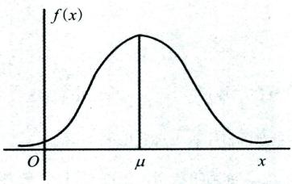
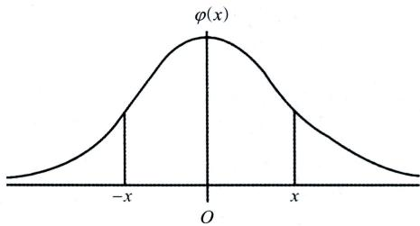

# 第二章 一维随机变量及其分布

# 【题型一分布函数的概念与性质】

<基础知识回顾>

## 一、随机变量分布函数的定义

设X是一个随机变量，对于任意实数x，令 $F(x)=P\left\{X\leqslant x\right\},-\infty<x<+\infty$ ,称 F(x) 为随机变量 X的概率分布函数，简称为分布函数

## 二、利用分布函数求各种随机事件的概率

已知随机变量X的分布函数 $F(x) = P\{ X \leq x\}$ ,则有

(1 $P\{ X \leqslant a\} = F(a);$

(3 $P\{ X < a\} = \lim_{x \to a^{-}} F(x) = F(a - 0);$

(5 $P\{ X = a\} = F(a) - F(a - 0);$

(7 $P\{ a \leqslant X < b\} = F(b - 0) - F(a - 0);$

(9 $P\{ a \leqslant X \leqslant b\} = F(b) - F(a - 0).$

(2 $P\{ X > a\} = 1 - F(a);$   
(4 $P\{ X \geq a\} = 1 - F(a - 0);$   
(6 $P\{ a < X \leq b\} = F(b) - F(a);$   
(8 $P\{ a < X < b\} = F(b - 0) - F(a);$

## 三、分布函数的性质

设随机变量X的分布函数为 $F(x) = P\{ X \leq x\}$ ,则 F(x) 满足

①非负性： $0 \leqslant F(x) \leqslant 1$

②规范性： $F(-\infty)=\lim_{x \to -\infty} F(x)=0,F(+\infty)=\lim_{x \to +\infty} F(x)=1$

③单调不减性：对于任意 $\overline{x_{1}} < \overline{x_{2}}$ ,有 $F(x_{1}) \leqslant F(x_{2})$

④右连续性： $F(x_{0}) = F(x_{0} + 0)$

## 考点及方法小结

(1)已知分布函数求某事件的概率,用知识二解决.

(2)求分布函数的未知参数,用知识三中的性质②或④解决.

(3)判定函数是否为分布函数,验证知识三中的四条性质,四条性质均满足即为分布函数,若有某一条后续不满是肯定不是分任函数，若有某不确定是否满足，则不确定是否为分布函数.

## <精选例题>

【例2.1】假设F(x)是随机变量X的分布函数，则不正确的是().(A)如果 $F(a) = 0$ ,则当 $x \leqslant a$ 时,有 $F(x) = 0$   
(B)如果 $F(a) = 1$ ,则当 $x \geqslant a$ 时,有 $F(x) = 1$   
(C)如果 $F(a)=\frac{1}{2}$ ,则 $P\left\{X\leqslant a\right\}=\frac{1}{2}$   
(D)如果 $F(a)=\frac{1}{2}$ ,则 $P\left\{X\geq a\right\}=\frac{1}{2}$

【解析】对于(A)选项,因为 $F(a) = 0$ ,即 $P\left\{X\leqslant a\right\}=0$ ,而当 $x \leq a$ 时， $\{ X \leqslant x \} \subset \{ X \leqslant a \}$ ,故 $P\left\{X\leqslant x\right\}=0$ 即 $F(x) = 0$ ,从而(A)正确.

对于(B)选项，因为 $F(a) = 1$ ,即 $P\left\{X\leqslant a\right\}=1$ ,而当 $x \geqslant a$ 时， $\{ X \leqslant a \} \subset \{ X \leqslant x \}$ ,故 $P\left\{X\leqslant x\right\}=1$ ,即$F(x) = 1$ ,从而(B)正确.

对于(C)选项,因 $F(a) = P\{X \leq a\}$ ,故(C)正确，从而应选(D).

事实上对于(D)选项，由 $F(a)=P\{X \leq a\}=\frac{1}{2}$ ,有 $P\left\{X\geq a\right\}=1-P\left\{X<a\right\}=1-F\left(a-0\right)$ ,但分布函数不一定左连续，即 $F(a - 0)$ 与F(a)不一定相等,从而 $P\left\{X\geq a\right\}=\frac{1}{2}$ 不一定成立.

【例2.2】设 $F_{1}(x)$ 与 $F_{2}(x)$ 为随机变量 $X _ { 1 }$ 与 $X_{2}$ 的分布函数.若 $F(x) = aF_1(x) - bF_2(x)$ 是某一变量的分布函数,在下列给定的各组数值中应取().(A $a=\frac{3}{5},b=-\frac{2}{5}$ (B $a = \frac{3}{5}, b = \frac{2}{3}$ (C $a=-\frac{1}{2},b=\frac{3}{2}$ (D $a=\frac{1}{2},b=-\frac{3}{2}$

【解析】若F(x)为分布函数，则 $\lim_{x \to +\infty} F(x) = 1$ ,故 $\lim_{x \to +\infty} \left[ aF_1(x) - bF_2(x) \right] = a - b = 1$ ，由于四个选项中只有(A)满足此条件.故应选(A).

## 良哥解读

设 $F_{1}(x)$ 与 $\bar{F}_{2}(x)$ 均为分布函数， $F(x)=aF_{1}(x)+bF_{2}(x)$ ,若 $a \geqslant 0,b \geqslant 0$ ,且 $a+b=1$ ,则 $F(x) -$ 定为某个随机变量的分布函数.

【例2.3】设随机变量X的分布函数为 $F(x)$ ,则下列可作为某个随机变量分布函数的是().(A $\lambda F(ax)$ (B $F(x^{2} + 1)$ (C $F(x^{3} - 1)$ (D $\textcircled{y} F ( \left| x \right| )$

【解析】对于(A)选项，当 $a < 0$ 时 $\lim_{x \to -\infty} F(ax) = 1$ ,故 F(ax)不一定是分布函数.

对于(B)选项，因 $\lim_{x \to -\infty} F(x^2 + 1) = 1$ ,故 $F(x^{2} + 1)$ 一定不是分布函数.

对于(C)选项，因 $0 \leqslant F(x^{3} - 1) \leqslant 1$ $\lim_{x \to -\infty} F(x^3 - 1) = 0, \lim_{x \to +\infty} F(x^3 - 1) = 1$ ，且满足单调不减性和右连续性，故$F(x^{3} - 1)$ 一定是分布函数,应选(C).

对于(D)选项，因 $\lim_{x \to -\infty} F(|x|) = 1$ ,故 $F ( \left| x \right| )$ 一定不是分布函数.

【例2.4】设随机变量X的分布函数为 $\frac{F(x)}{\left ( \frac{5x + 7}{16} \right ) }=\left\{\begin{aligned}&\frac{5x + 7}{16}, & -1 \leq x < 1, \\&1, & x \geq 1,\end{aligned}\right.$ 则 $P\left\{X^{2}=1\right\}=$ 

【解析】因 $P\left\{X^{2}=1\right\}=P\left\{X=1\right\}+P\left\{X=-1\right\}$ ,而

$$
P\left\{X=1\right\}=F(1)-F(1-0)=1-\frac{3}{4}=\frac{1}{4},
$$

$$
P\left\{X=-1\right\}=F(-1)-F(-1-0)=\frac{1}{8}-0=\frac{1}{8},
$$

故 $P\left\{X^{2}=1\right\}=\frac{3}{8}.$

## 【题型二一维离散型随机变量及其分布】

# <基础知识回顾>

## 一、离散型随机变量的定义

若随机变量X的取值是有限个或者可列无穷多个，则称X为离散型随机变量

## 二、离散型随机变量的分布律

设X为离散型随机变量，其所有可能取值为 $x_{1},x_{2},\cdots,x_{k},\cdots$ ，且X取各个值x,的概率为 $x _ { k }$ $P\left\{X=x_{k}\right\}=p_{k}$ 其中 $p_{k} \geqslant 0, k = 1, 2, \cdots, \sum_{k = 1}^{\infty} p_{k} = 1$ ,则称 $P\left\{X=x_{k}\right\}=p_{k},k=1,2,$ ..为随机变量X的概率分布或分布律，也可记为

<table><tr><td rowspan=1 colspan=1>X</td><td rowspan=1 colspan=1> $x _ { \parallel }$ </td><td rowspan=1 colspan=1> $x _ { 2 }$ </td><td rowspan=1 colspan=1> $x _ { 3 }$ </td><td rowspan=1 colspan=1></td><td rowspan=1 colspan=1> $x _ { k }$ </td><td rowspan=1 colspan=1></td></tr><tr><td rowspan=1 colspan=1>P</td><td rowspan=1 colspan=1> $p_{1}$ </td><td rowspan=1 colspan=1> $p_{2}$ </td><td rowspan=1 colspan=1> $p_{3}$ </td><td rowspan=1 colspan=1></td><td rowspan=1 colspan=1> $p_{k}$ </td><td rowspan=1 colspan=1></td></tr></table>

## 三、常见的离散型分布

## (一)二项分布

设事件A在任意一次试验中出现的概率均为 $p(0 < p < 1)$ .X表示n重伯努利试验中事件A发生的次数，其所有可能的取值为 $0,1,2,\cdots,n$ ,且相应的概率为

$$
P\left\{X=k\right\}=C_{n}^{k}p^{k}\left(1-p\right)^{n-k} \quad k=0,1,\cdots,n,
$$

则称X服从二项分布，记为 $X \sim B(n, p)$

二项分布的期望 $E(X) = np$ ,方差 $D(X)=np(1-p)$

## (二 )0-1 分布

若随机变量X的概率分布为

$$
P\{ X = k \} = p^{k}(1 - p)^{1 - k} \quad k = 0,1,0 < p < 1,
$$

则称X服从0-1分布.

0-1分布X的期望 $E(X) = p$ ,方差 $D(X)=p(1-p).$

## (三)泊松分布

设随机变量X的概率分布为

$$
P\{ X = k \} = \frac{\lambda^{k} \mathrm{e}^{-\lambda}}{k!} \quad k = 0, 1, 2, \cdots,
$$

其中参数 $\lambda > 0$ ,则称X服从参数为λ的泊松分布，记为 $X \sim P(\lambda)$

泊松分布的期望 $E(X) = \lambda$ ,方差 $D(X) = \lambda.$

## (四)几何分布

设随机变量X的概率分布为

$$
P\left\{X=k\right\}=\left(1-p\right)^{k-1}p\quad0<p<1,k=1,2,\cdots,
$$

则称X服从几何分布，记为 $X \sim G(p)$

几何分布的期望 $E(X)=\frac{1}{p}$ ,方差 $D(X)=\frac{1-p}{p^{2}}$

## (五)超几何分布

设随机变量X的概率分布为

$$
P\left\{X=k\right\}=\frac{\mathrm{C}_{M}^{k}\mathrm{C}_{N-M}^{n-k}}{\mathrm{C}_{N}^{n}} \quad k=0,1,2,\cdots,n,
$$

其中,M,N,n 都是正整数,且 $n \leq M \leq N$ ,则称X服从参数为M,N和n的超几何分布，记为 $X \sim H(n, M, N)$

## 四、泊松定理

设 $\lambda > 0$ 是一个常数,n 是任意正整数,设 $\lambda = np_{n}$ ,则对于任一固定的非负整数k,有

$$
\lim_{n \to +\infty} C_n^k p_n^k (1 - p_n)^{n-k} = \frac{\lambda^k}{k!} \mathrm{e}^{-\lambda} \quad k = 0, 1, 2, \cdots.
$$

## 考点及方法小结

(1)计算离散型随机变量分布律的三部曲:定取值,算概率,验证1.

(2)计算分布律中的未知参数可用 $\sum_{k = 1}^{\infty}p_{k} = 1$ 解决.

(3)计算离散型随机变量的概率分布,若没要求计算分布函数,则算出其分布律即可.

(4)二项分布的背景:做n次独立重复试验，每次试验成功的概率为p,成功的次数服从二项分布.解题 $p$ 过程中,通过背景辨别题目在考查二项分布,找到其参数n和 $p$ ,再结合二项分布的分布律和数字特征解决问题.

(5)泊松分布的关键是熟记其分布律和数字特征,根据题目条件找到泊松分布的参数λ,再结合分布律或数字特征的结论解决问题

(6)几何分布的背景:做独立重复试验,每次试验成功的概率为p,直到成功为止一共做的试验次数服从几何分布.解题过程中,通过背景辨别题目是考查几何分布,找到其参数p,再结合几何分布的分布律和数字特征解决问题.

(7)泊松定理的本质:用泊松分布近似代替二项分布近似计算,其中 $\lambda \approx np_{n}$

## <精选例题>

【例2.5】设X是离散型随机变量，其分布律为 $P\{ X = k \} = b\lambda^{k},k = 1,2,\cdots$ ·且 $b > 0$ 为常数，则λ为().$(A) \lambda > 0$ 的任意实数 (B)λ=b+1  
(C) $\lambda = \frac{1}{b + 1}$ (D $\lambda = \frac{1}{b - 1}$

【解析】因 $1 = \sum_{k = 1}^{\infty}P\{ X = k\} = \sum_{k = 1}^{\infty}b\lambda^{k}$ ,故级数 $\sum_{k = 1}^{\infty}\lambda^{k}$ 收敛且 $\sum_{k = 1}^{\infty}\lambda^{k} = \frac{1}{b}.$ 又 $b \lambda ^ { k }$ 是概率且 $b > 0$ ,则有 $0 < \lambda < 1$ 因 $\sum_{k = 1}^{\infty}\lambda^{k} = \frac{\lambda}{1 - \lambda}$ ,故有 $\frac{\lambda}{1 - \lambda} = \frac{1}{b}$ ,解得 $\lambda = \frac{1}{b + 1}$

故应选(C).

【例2.6】设离散型随机变量X服从分布律 $P\left\{X=k\right\}=\frac{C}{k!},k=0,1,2,\cdots$ ,则常数C必为().(A)1 (B)e (C $) \mathrm{e}^{-1}$ (D $) \mathbf{e}^{-2}$

【解析】由 $\sum_{k = 0}^{\infty}P\left\{ X = k \right\} = 1$ ,即 $1 = \sum_{k = 0}^{\infty}\frac{C}{k!} = C\sum_{k = 0}^{\infty}\frac{1}{k!} = C \cdot \mathrm{e}$ ,所以 $C = \mathrm{e}^{-1}$

故应选(C).

## 良哥解读

这里用到了公式 $e^{x} = \sum_{k = 0}^{\infty}\frac{x^{k}}{k!}, - \infty < x < + \infty$ ,本题也可对比泊松分布的分布律

$$
P\{ X = k \} = \frac{\lambda^{k}}{k!} \mathrm{e}^{-\lambda}, \quad k = 0, 1, 2, \cdots,
$$

可以看出当λ=1时,有 $P\left\{X=k\right\}=\frac{1}{k!}\mathrm{e}^{-1},k=0,1,2,\cdots$ ,得 $C = e^{-1}$

【例2.7】假设随机变量X的概率密度为 $f(x)=\begin{cases}2x,&0<x<1,\\0,& 其他 .\end{cases}$ 现在对 X进行n次独立重复观测，以 $V_{n}$ 表示观测值不大于0.1的次数，试求随机变量 $V _ { n }$ 的概率分布.

【解析】设每次观测值不大于0.1的概率为 $p$ ,则

$$
p = P\{ X \leq 0.1\} = \int_{-\infty}^{0.1} f(x) \mathrm{d}x = \int_{0}^{0.1} 2x \mathrm{d}x = 0.01.
$$

由题意知 $V _ { n }$ 服从参数为 $n , p$ 的二项分布，即 $V_{n} \sim B(n, 0.01)$ .故 $V _ { n }$ 的概率分布为

$$
P\{ V_n = k \} = C_n^k (0.01)^k (0.99)^{n-k}, k = 0, 1 \cdots , n.
$$

【例2.8】设随机变量X的分布律为 $P\left\{X=1\right\}=0.2,P\left\{X=2\right\}=0.3,P\left\{X=3\right\}=0.5$ 现对X进行独立重复观测，随机变量Y表示直到第三次观测值大于2出现为止一共观测的次数，求Y的概率分布.

【解析】设每次观测值大于2的概率为 $p$ ,则

$$
p = P\{ X > 2\} = P\{ X = 3\} = 0.5.
$$

由题意随机变量Y的所有可能取值为 $3,4,\cdots$ ,且事件 $\left\{ Y = k \right\} , k = 3 , 4 , \cdots$ 表示“在观测随机变量X时，第k次观察值大于2,前k-1次观察值有两次大于 $2 ^ { \circ }$ ,则Y的概率分布为

$$
P\{ Y = k\} = C_{k - 1}^{2}p^{2}(1 - p)^{k - 3}p = \frac{(k - 1)(k - 2)}{2}\left( \frac{1}{2} \right)^{k},k = 3,4,\cdots.
$$

【例2.9】袋中有8个球，其中3个白球5个黑球，现随意从中取出4个球，如果4个球中有2个白球2个黑球，试验停止.否则将4个球放回袋中，重新抽取4个球，直到出现2个白球2个黑球为止.用X表示抽取次数，则 $P\{ X = k \} = \underline{\hspace{2cm}},k = 1,2,\cdots$

【解析】若记 $A_{i} =$ 第i次取出4个球为2白2黑”，由于是有放回取球，所以 $A_{i}(i = 1,2,\cdots)$ 相互独立，而$P(A_{i}) = \frac{C_{3}^{2}C_{5}^{2}}{C_{8}^{4}} = \frac{3}{7}$ ,所以

$$
P\left\{X=k\right\}=P\left(\bar{A}_{1}\cdots\bar{A}_{k-1}\bar{A}_{k}\right)=\left(1-\frac{3}{7}\right)^{k-1}\cdot\frac{3}{7}=\frac{3}{7}\cdot\left(\frac{4}{7}\right)^{k-1},k=1,2,\cdots.
$$

【例2.10】在独立重复试验中，已知第4次试验恰好第2次成功的概率为 $\frac{3}{16}$ ,以X表示首次成功所需要的试验的次数，则X取偶数的概率为

【解析】设每次试验成功的概率为 $p$ ,由题意有

$$
C_{3}^{1}p(1 - p)^{2} \cdot p = \frac{3}{16},
$$

解得 $p = \frac{1}{2}.$

由题意知 $X \sim G\left(\frac{1}{2}\right)$ ,则所求的概率为

$$
\begin{aligned}\sum_{m = 1}^{\infty}P\{ X = 2m\} &= \sum_{m = 1}^{\infty}(1 - p)^{2m - 1}p = \sum_{m = 1}^{\infty}\left( \frac{1}{2} \right)^{2m} \\&= \sum_{m = 1}^{\infty}\left( \frac{1}{4} \right)^{m} = \frac{\frac{1}{4}}{1 - \frac{1}{4}} = \frac{1}{3}.\end{aligned}
$$

【例2.11】设 $X_{1},X_{2},\cdots,X_{20}$ 为来自总体 B(1,0.1)的简单随机样本，令 $T = \sum _ { i = 1 } ^ { 2 0 } X _ { i }$ ,利用泊松分布近似二项分布的方法可得 $P\left\{T\leqslant1\right\}\approx($ (A) $\frac{1}{\mathrm{e}^{2}}.$ (B) $\left| \frac{2}{\mathrm{e}^{2}} \right|$ (C) $0 \frac{3}{\mathbf{e}^2}.$ (D) $\textcircled{9}  \frac { 4 } { \mathbf { e } ^ { 2 } } .$

【解析】由题意知 $X_{1},X_{2},\cdots,X_{20}$ 相互独立，且均服从参数为0.1的0-1分布，故 $T = \sum_{i = 1}^{20} X_{i} \sim B(20, 0.1)$ 由泊松定理知，T近似服从泊松分布，参数 $\lambda = 20 \times 0.1 = 2$ ,即 T近似服从 P(2),则 $P\left\{T=k\right\}\approx\frac{2^{k}\mathrm{e}^{-2}}{k!}\left(k=0,1,2\cdots\right)$ 143

从而有

$P\left\{T\leqslant1\right\}=P\left\{T=0\right\}+P\left\{T=1\right\}\approx3\mathrm{e}^{-2}=\frac{3}{\mathrm{e}^{2}}$ ,应选(C).

## 良哥解读

① 0-1 分布是一个特殊的二项分布. 当 n =1 时的二项分布,即为 0-1 分布；

②二项分布 $B(n,p)$ 可以看成是n个独立同分布的 0-1 分布的和；

③二项分布的可加性:若 $X \sim B(n, p), Y \sim B(m, p)$ ,且X与 Y独立,则$X + Y \sim B(m + n,p);$

## 【题型三一维连续型随机变量及其分布】

## <基础知识回顾>

## 一、连续型随机变量的定义

如果对于随机变量X的分布函数 $F(x)$ ,存在非负可积函数f(x),使得对于任意实数x,有 $F(x) = \int_{-\infty}^{x} f(t)   dt$ 则称X为连续型随机变量，函数f(x)称为X的概率密度函数(简称密度函数).

## 二、概率密度的性质

①非负性 $f(x) \geqslant 0, -\infty < x < +\infty.$

②规范性： $\int_{-\infty}^{+\infty} f(x) \mathrm{d}x = 1$

③对于任意实数a 和 $b(a<b)$ ,有

$$
P\left\{ a < X \leq b \right\} = P\left\{ a \leq X < b \right\} = P\left\{ a < X < b \right\} = P\left\{ a \leq X \leq b \right\} = \int_{a}^{b} f(x) \mathrm{d}x.
$$

④在f(x)的连续点处,有 $F^{\prime}(x) = f(x)$

## 三、常见的连续型分布

## (一 )均匀分布

如果随机变量X的密度函数为

$$
f(x)=\left\{\begin{aligned}&\frac{1}{b-a},&a\leqslant x\leqslant b,\\&0,& 其他 .\end{aligned}\right.
$$

则称X服从[a,b]上的均匀分布，记作 $X { \sim } U ( a , b )$ .其中 $^ { a , b }$ 是分布的参数.

X的分布函数为

$$
\begin{aligned} &F(x) = \left\{ \begin{aligned}\\ &0, & &x < a, \\&\frac{x - a}{b - a}, & &a \leq x < b, \\&1, & &x \geq b.\\ &\end{aligned} \right.\\ \end{aligned}
$$

均匀分布的期望 $E(X)=\frac{a+b}{2}$ ,方差 $D(X)=\frac{(b-a)^{2}}{12}.$

## (二)指数分布

如果随机变量X的概率密度为

$$
f(x)=\begin{cases}\lambda \mathrm{e}^{-\lambda x},&x>0,\\0,&x\leqslant0,\end{cases}
$$

其中， $\lambda > 0$ 为参数,则称X服从参数为λ的指数分布，记作 $X \sim E(\lambda)$

X的分布函数为

$$
F(x)=\begin{cases}1-\mathrm{e}^{-\lambda x},&x>0,\\0,&x\leq0.\end{cases}
$$

指数分布的期望 $E(X)=\frac{1}{\lambda}$ ,方差 $D(X)=\frac{1}{\lambda^{2}}$

【注】指数分布具有“无记忆性”，即 $P\{ X > s + t \mid X > s \} = P\{ X > t \}, \forall s,t > 0,$

## (三)正态分布

1. 正态分布的定义

如果随机变量X的密度函数为

$$
f(x) = \frac{1}{\sqrt{2\pi}\sigma} \mathrm{e}^{-\frac{(x-\mu)^2}{2\sigma^2}}, \quad -\infty < x < +\infty,
$$

其中， $\mu , \sigma$ 为常数 $- \infty < \mu < + \infty, \sigma > 0$ ,则称X服从参数为 $\mu$ 和 $\sigma ^ { 2 }$ 的正态分布，记作 $X \sim N(\mu, \sigma^2)$

  
正态分布密度函数

正态分布的期望 $E(X) = \mu$ ,方差 $D(X) = \sigma^{2}$

## 2. 标准正态分布

当正态分布中的参数 $\mu = 0 , \sigma = 1$ 时，称为标准正态分布，记作N(0,1),其密度函数用φ(x)表示，分布函数用Φ(x)表示,其中 $\varphi(x)=\frac{1}{\sqrt{2\pi}}\mathrm{e}^{-\frac{x^{2}}{2}},-\infty<x<+\infty$

  
标准正态分布密度函数

3. 标准正态的性质 (1 $\varphi ( - x ) = \varphi ( x ) .$ (2 $\Phi(0)=\frac{1}{2}.$ (3 $\Phi ( - x ) = 1 - \Phi ( x )$ (4 $P\left\{ \left| X \right| \le a \right\} = 2\Phi(a) - 1.$

## 4. 上 α分位点

设 $X \sim N ( 0 , 1 )$ ,对于给定的 $\alpha (0 < \alpha < 1)$ ,如果 $u _ { \alpha }$ 满足 $P\left\{X>u_{\alpha}\right\}=\alpha$ ,则称 $u _ { \alpha }$ 为标准正态分布的上α分位点.

  
标准正态分布上α分位点

## 5. 标准化

若随机变量 $X \sim N(\mu, \sigma^2)$ ,则 $Z = \frac{X - \mu}{\sigma} \sim N(0,1)$

## 考点及方法小结

(1)已知概率密度函数计算分布函数,用 $F(x) = \int_{-\infty}^{x} f(t)   dt$ 解决.

(2)计算概率密度函数中的未知参数可用 $\int_{-\infty}^{+\infty} f(x)   dx = 1$ 解决.

（3)判定函数是否为概率密度函数验证知识二中的性质①与性质②,两条性质都满足即为密度函数；  
若某一条不满足,则一定不是密度函数;若有某条不确定是否满足,则不确定函数是否为密度函数.

(4)已知概率密度函数计算事件的概率,用知识二中的性质③解决.由于连续型随机变量在一点取值概率为0,故计算其在某区间上取值概率时,区间端点的等号是否取到不影响概率大小.

$F^{\prime}(x) = f(x)$ 求得密度函数. 

(6)常见连续型分布中的均匀分布、指数分布、正态分布均为考试的重点，考生需熟记其分布和数字特征.

(7)正态分布的一般解题步骤:标准化,利用对称性,若给表再查表计算.

## <精选例题>

【例2.12】设随机变量X的分布函数为 $F(x)$ ，其密度函数为 $f(x)=\begin{cases}Ax(1-x),&0\leq x\leq1,\\0,& 其他 ,\end{cases}$ 其中 A 为常数,则 $F(\frac{1}{2})$ 的值为().(A $) \frac{1}{2}$ (B $) \frac{1}{3}$ (C $ ) \frac{1}{4}$ (D $) \frac{1}{5}$

【解析】由规范性知，

$$
\int_{-\infty}^{+\infty} f(x) \mathrm{d}x = \int_{0}^{1} A x (1-x) \mathrm{d}x = A \int_{0}^{1} (x-x^2) \mathrm{d}x = \frac{A}{6} \Rightarrow A = 6.
$$

则

$$
F\left(\frac{1}{2}\right)=\int_{-\infty}^{\frac{1}{2}}f(x)\mathrm{d}x=\int_{0}^{\frac{1}{2}}6x(1-x)\mathrm{d}x=6\int_{0}^{\frac{1}{2}}(x-x^{2})\mathrm{d}x=6\left(\frac{1}{8}-\frac{1}{24}\right)=\frac{1}{2}.
$$

故应选(A).

【例2.13】已知随机变量X的概率密度函数 $f(x) = \frac{1}{2} \mathrm{e}^{-|x|}, -\infty < x < +\infty$ ,则 X的分布函数 F(x) =【解析】由 $F(x) = \int_{-\infty}^{x} f(t)   dt = \int_{-\infty}^{x} \frac{1}{2} e^{-|t|}   dt$ 得：  
当 $x < 0$ 时 $F(x) = \int_{-\infty}^{x} \frac{1}{2} \mathrm{e}^{t} \mathrm{d}t = \frac{1}{2} \mathrm{e}^{x};$   
当x≥0时， $F(x)=\int_{-\infty}^{x}\frac{1}{2}\mathrm{e}^{-|t|}\mathrm{d}t=\int_{-\infty}^{0}\frac{1}{2}\mathrm{e}^{t}\mathrm{d}t+\int_{0}^{x}\frac{1}{2}\mathrm{e}^{-t}\mathrm{d}t=1-\frac{1}{2}\mathrm{e}^{-x}.$   
因此 $F(x)=\left\{\begin{aligned}&\frac{1}{2}\mathrm{e}^{x}, \quad x<0, \\&1-\frac{1}{2}\mathrm{e}^{-x}, \quad x \geq 0,\end{aligned}\right.$   
【例2.14】设随机变量X的概率密度为f(x),则可以作为某随机变量密度的是().  
(A)f(2x) (B $f(2 - x)$ (C $) f ^ { 2 } ( x )$ (D $) f ( x ^ { 2 } )$

【解析】某函数可以作为概率密度的充要条件为： $f(x) \geqslant 0; \int_{-\infty}^{+\infty} f(x)   dx = 1$

对于(A)选项:因 $\int_{-\infty}^{+\infty} f(2x) \mathrm{d}x = \frac{1}{2} \int_{-\infty}^{+\infty} f(2x) \mathrm{d}(2x) = \frac{1}{2} \neq 1$ ,故f(2x) 不是概率密度.

对于(B)选项：因 $f(2 - x) \geqslant 0$ ,且 $\int_{-\infty}^{+\infty} f(2-x) \mathrm{d}x = -\int_{-\infty}^{+\infty} f(2-x) \mathrm{d}(2-x) = \int_{-\infty}^{+\infty} f(t) \mathrm{d}t = 1$ ,故 $f(2 - x)$ 是概率密度，应选(B).

$f(x)=\left\{\begin{aligned}&\frac{1}{8}, & -4<x<4, \\ &0, &  其他 ,\end{aligned}\right.$ 1 1对于(C)(D)选项,若取 则f²(x) = 64 −4 < x < 4, ,f(x2) = 8 −2 < x < 2,0, 其他 0, 其他.

因 $\int_{-\infty}^{+\infty} f^2(x) \mathrm{d}x = \int_{-4}^{4} \frac{1}{64} \mathrm{d}x = \frac{1}{8} \neq 1, \int_{-\infty}^{+\infty} f(x^2) \mathrm{d}x = \int_{-2}^{2} \frac{1}{8} \mathrm{d}x = \frac{1}{2} \neq 1$ ,故 $f^{2}_{\cdot}(x)$ 与 $f(x^{2})$ 都不一定是概率密度

【例2.15】设两个连续型随机变量的分布函数分别为 $F_{1}(x),F_{2}(x)$ ,其相应的概率密度 $\tilde{f}_{1}(x)$ 与 $f_{2}(x)$ 是连续函数，则必为概率密度的是().(A $\overline{{ ) f_1(x) }} f_2(x)$ (B $2f_{2}(x)F_{1}(x)$ (C $f_{1}(x)F_{2}(x)$ (D $f_{1}(x)F_{2}(x) + f_{2}(x)F_{1}(x)$

【解析】函数f(x)为某随机变量密度函数的充要条件是： $f(x) \geqslant 0; \int_{-\infty}^{+\infty} f(x)   dx = 1$

由于(A)(B)(C)(D)四个选项函数均非负，但只有(D)选项有

$$
\int _ { - \infty } ^ { + \infty } \left[ f _ { 1 } ( x ) F _ { 2 } ( x ) + f _ { 2 } ( x ) F _ { 1 } ( x ) \right] \mathrm { d } x = \left[ F _ { 1 } ( x ) F _ { 2 } ( x ) \right] _ { - \infty } ^ { + \infty } = 1 ,
$$

其他选项无法验证②，故应选(D).

【例2.16】设随机变量X的概率密度f(x)满足 $f(1 + x) = f(1 - x)$ ,且 $\int_{0}^{2} f(x) \mathrm{d}x = 0.6$ ,则 $P\{ X < 0\} = ($ (A)0.2 (B)0.3 (C )0.4 (D)0.5

【解析】由 $f(1 + x) = f(1 - x)$ 知,密度函数f(x)关于x=1对称，故 $\int_{-\infty}^{1} f(x) \mathrm{d}x = 0.5.$ 又 $\int_{0}^{2} f(x) \mathrm{d}x = 0.6$ ,故$\int_{0}^{1} f(x) \mathrm{d}x = 0.3$ .因此 $P\{ X < 0\} = \int_{-\infty}^{0} f(x) \mathrm{d}x = \int_{-\infty}^{1} f(x) \mathrm{d}x - \int_{0}^{1} f(x) \mathrm{d}x = 0.2$

故应选(A).

【例2.17】设随机变量X服从参数为λ的指数分布，对X进行三次独立重复观察，至少有一次观测值大于2的概率为 $\frac{7}{8}$ ,则 λ =

【解析】由题意有，X的密度函数为

$$
f(x)=\begin{cases}\lambda \mathrm{e}^{-\lambda x},&x>0,\\0,&x\leqslant0,\end{cases}
$$

记事件 $A = \left\{ X > 2 \right\}$ ，随机变量Y表示三次独立重复观察中，事件A发生的次数，则 $Y \sim B(3, p)$ ,其中$p = P\{ X > 2\} = \int_{2}^{+\infty} \lambda \mathrm{e}^{-\lambda x} \mathrm{d}x = \mathrm{e}^{-2\lambda}$ .又 $P\left\{Y \geqslant 1\right\}=1-P\left(Y=0\right)=1-\left(1-p\right)^{3}=\frac{7}{8}$ ,解之得 $p = \frac{1}{2}$ ,即有 $\mathrm{e}^{-2\lambda} = \frac{1}{2}$ ,从而得 $\lambda = \frac{1}{2} \ln 2$

【例2.18】假设随机变量X的分布函数为F(x),概率密度函数 $f(x) = af_1(x) + bf_2(x)$ ,其中 $f_{1}(x)$ 是正态分布 $N(0,\sigma^{2})$ 的密度函数 $f_{_2}(x)$ 是参数为λ的指数分布的密度函数，已知 $F(0)=\frac{1}{8}$ ,则().(A $a = 1, b = 0$ (B $a=\frac{3}{4},b=\frac{1}{4}$ (C $a=\frac{1}{2},b=\frac{1}{2}$ (D $a=\frac{1}{4},b=\frac{3}{4}$

【解析】由 $\int_{-\infty}^{+\infty} f(x) \mathrm{d}x = a \int_{-\infty}^{+\infty} f_1(x) \mathrm{d}x + b \int_{-\infty}^{+\infty} f_2(x) \mathrm{d}x = a + b = 1$ 知，四个选项均符合这个要求，因此只好通过 $F(0)=\frac{1}{8}$ ,确定正确选项.因为

$$
\begin{aligned}F(0) &= \int_{-\infty}^{0} f(x) \mathrm{d}x = a \int_{-\infty}^{0} f_1(x) \mathrm{d}x + b \int_{-\infty}^{0} f_2(x) \mathrm{d}x \\&= \frac{a}{2} = \frac{1}{8} \Rightarrow a = \frac{1}{4}.\end{aligned}
$$

则 $b = 1 - \frac { 1 } { 4 } = \frac { 3 } { 4 }$

故应选(D).

【例2.19】设随机变量X服从正态分布 $N(\mu_{1},\sigma_{1}^{2})$ ,随机变量Y服从正态分布 $N(\mu_{2},\sigma_{2}^{2})$ ,且 $P\left\{ \left| X - \mu_{1} \right| < 1 \right\} >$ $P\left\{ \left| Y - \mu_{2} \right| < 1 \right\}$ ,则必有().(A $\sigma_{1} < \sigma_{2}$ (B) $\sigma_{1} > \sigma_{2}$ (C $\lambda_{1} < \lambda_{2}$ (D $\mu_{1} > \mu_{2}$

【解析】因 $X \sim N(\mu_{1},\sigma_{1}^{2}), Y \sim N(\mu_{2},\sigma_{2}^{2})$ ,故将其标准化有

$$
\frac{X - \mu_{1}}{\sigma_{1}} \sim N(0,1), \frac{Y - \mu_{2}}{\sigma_{2}} \sim N(0,1).
$$

由 $P\left\{ \left| X - \mu_{1} \right| < 1 \right\} > P\left\{ \left| Y - \mu_{2} \right| < 1 \right\}$ ,则有

$$
P\left\{ \left| \frac{X - \mu_1}{\sigma_1} \right| < \frac{1}{\sigma_1} \right\} > P\left\{ \left| \frac{Y - \mu_2}{\sigma_2} \right| < \frac{1}{\sigma_2} \right\}.
$$

于是得 $2\Phi\left(\frac{1}{\sigma_{1}}\right)-1>2\Phi\left(\frac{1}{\sigma_{2}}\right)-1$ ,进而有 $\Phi \left( \frac{1}{\sigma_{1}} \right) > \Phi \left( \frac{1}{\sigma_{2}} \right)$ ,其中 $\phi(x)$ 为标准正态的分布函数.因Φ(x)单调增加,故有 $\frac{1}{\sigma_{1}} > \frac{1}{\sigma_{2}}$ ,即 $\sigma_{1} < \sigma_{2}$ 故应选(A).

【例2.20】设 $X_{1},X_{2},X_{3}$ 是随机变量，且 $X_{1} \sim N(0,1), X_{2} \sim N(0,2^{2}), X_{3} \sim N(5,3^{2}), p_{i} = P\{-2 \leq X_{i} \leq 2\}$ i =1,2,3,则(). (A $p_{1} > p_{2} > p_{3}$ (B $p_{2} > p_{1} > p_{3}$ (C $p_{3} > p_{1} > p_{2}$ (D $p_{1} > p_{3} > p_{2}$

【解析】因 $X_{1} \sim N(0,1)$ ,故 $p_{1}=P\left\{-2 \leqslant X_{1} \leqslant 2\right\}=2 \Phi(2)-1$

$X_{2} \sim N(0, 2^{2})$ ,故 $p_{2}=P\left\{-2 \leqslant X_{2} \leqslant 2\right\}=P\left\{-1 \leqslant \frac{X_{2}-0}{2} \leqslant 1\right\}=2 \Phi(1)-1.$

$X_{3} \sim N(5,3^{2})$ ,故 $p_{3}=P\left\{-2\leqslant X_{3}\leqslant2\right\}=P\left\{-\frac{7}{3}\leqslant\frac{X_{3}-5}{3}\leqslant-1\right\}=\Phi(-1)-\Phi\left(-\frac{7}{3}\right)=\Phi\left(\frac{7}{3}\right)-\Phi(1).$

容易得到 $p_{1} > p_{2} > p_{3}$ 故应选(A).

【例2.21】在电源电压不超过200伏,200～240伏和超过240伏三种情况下，某种电子元件损坏的概率分别为0.1,0.001和0.2.假设电源电压X服从正态分布N(220,252).试求：

(1)该电子元件损坏的概率α;(保留小数点后三位有效数字)

(2)该电子元件损坏时,电源电压在200～240伏的概率β(保留小数点后三位有效数字)

【附表】(表中 $\Phi(x)$ 是标准正态分布函数)

<table><tr><td rowspan=1 colspan=1>x</td><td rowspan=1 colspan=1>0.10</td><td rowspan=1 colspan=1>0.20</td><td rowspan=1 colspan=1>0.40</td><td rowspan=1 colspan=1>0.60</td><td rowspan=1 colspan=1>0.80</td><td rowspan=1 colspan=1>1.00</td><td rowspan=1 colspan=1>1.20</td><td rowspan=1 colspan=1>1.40</td></tr><tr><td rowspan=1 colspan=1> $\Phi(x)$ </td><td rowspan=1 colspan=1>0.530</td><td rowspan=1 colspan=1>0.579</td><td rowspan=1 colspan=1>0.655</td><td rowspan=1 colspan=1>0.726</td><td rowspan=1 colspan=1>0.788</td><td rowspan=1 colspan=1>0.841</td><td rowspan=1 colspan=1>0.885</td><td rowspan=1 colspan=1>0.919</td></tr></table>

【解析】设事件 $A_{1}=\left\{X \leq 200\right\}, A_{2}=\left\{200<X \leq 240\right\}, A_{3}=\left\{X>240\right\}, B=$ 电子元件损坏”，显然 $A_{1},A_{2},A_{3}$ 可以构成一个完备事件组，且

$$
\begin{aligned}P(A_{1}) &= P\{X \leq 200\} = P\left\{\frac{X - 220}{25} \leq \frac{200 - 220}{25}\right\} \\&= \Phi\left(\frac{200 - 220}{25}\right) = \Phi(-0.8) = 1 - \Phi(0.8) = 0.212, \\P(A_{2}) &= P\{200 < X \leq 240\} = P\left\{\frac{200 - 220}{25} < \frac{X - 220}{25} \leq \frac{240 - 220}{25}\right\} \\&= \Phi(0.8) - \Phi(-0.8) = 2\Phi(0.8) - 1 = 0.576, \\P(A_{3}) &= P\{X > 240\} = 1 - P(A_{1}) - P(A_{2}) = 0.212. \\&\quad P(B \mid A_{1}) = 0.1; P(B \mid A_{2}) = 0.001; P(B \mid A_{3}) = 0.2.\end{aligned}
$$

(1)由全概率公式，得

$$
\alpha = P(B)=\sum_{i = 1}^{3}P(A_{i})P(B \mid A_{i})=0.1 \times 0.212+0.001 \times 0.576+0.2 \times 0.212 \approx 0.064.
$$

(2)由条件概率定义，有

$$
\beta = P(A_{2} \mid B) = \frac{P(A_{2})P(B \mid A_{2})}{P(B)} \approx 0.009.
$$

【例2.22】假设测量的随机误差 $X \sim N(0,10^{2})$ ,试求100次独立重复测量中，至少有三次测量误差的绝对值大于19.6的概率 $\alpha ,$ 并利用泊松分布求出α的近似值(结果保留小数点后三位).

【附表】

<table><tr><td rowspan=1 colspan=1>λ</td><td rowspan=1 colspan=1>1</td><td rowspan=1 colspan=1>2</td><td rowspan=1 colspan=1>3</td><td rowspan=1 colspan=1>4</td><td rowspan=1 colspan=1>5</td><td rowspan=1 colspan=1>6</td><td rowspan=1 colspan=1>7</td><td rowspan=1 colspan=1>…</td></tr><tr><td rowspan=1 colspan=1> $\mathbf { e } ^ { - \lambda }$ </td><td rowspan=1 colspan=1>0.368</td><td rowspan=1 colspan=1>0.135</td><td rowspan=1 colspan=1>0.050</td><td rowspan=1 colspan=1>0.018</td><td rowspan=1 colspan=1>0.007</td><td rowspan=1 colspan=1>0.002</td><td rowspan=1 colspan=1>0.001</td><td rowspan=1 colspan=1>…</td></tr></table>

【解析】设事件 $A = \mathbf { \Omega } ^ { \mathrm { { e q } } }$ 每次测量中测量误差的绝对值大于 $19.6$ .因 $X \sim N(0,10^{2})$ ,故

$$
\begin{aligned}p &= P(A) = P\left\{ \left| X \right| > 19.6 \right\} = P\left\{ \frac{\left| X - 0 \right|}{10} > \frac{19.6 - 0}{10} \right\} \\&= P\left\{ \frac{\left| X \right|}{10} > 1.96 \right\} = 1 - P\left\{ \left| \frac{X}{10} \right| \leqslant 1.96 \right\} \\&= 1 - \left[ 2\Phi(1.96) - 1 \right] = 1 - (2 \times 0.975 - 1) = 0.05.\end{aligned}
$$

设Y为100次独立重复观测中事件A出现的次数，则Y服从参数 $n = 100, p = 0.05$ 的二项分布.故

$$
\alpha = P\{ Y \geq 3\} = 1 - P\{ Y < 3\} = 1 - P\{ Y = 0\} - P\{ Y = 1\} - P\{ Y = 2\} \\= 1 - C_{100}^{0}0.05^{0}(1 - 0.05)^{100} - C_{100}^{1}0.05^{1}(1 - 0.05)^{99} - C_{100}^{2}0.05^{2}(1 - 0.05)^{98} \\= 1 - 0.95^{100} - 5 \times 0.95^{99} - 50 \times 99 \times 0.05^{2} \times 0.95^{98}.
$$

由泊松定理知，Y近似服从 $\lambda = np = 5$ 的泊松分布，故

$$
\begin{aligned}\alpha &= P\{ Y \geq 3\} = 1 - P\{ Y < 3\} = 1 - P\{ Y = 0\} - P\{ Y = 1\} - P\{ Y = 2\} \\&\approx 1 - \frac{\lambda^{0}}{0!}\mathrm{e}^{-\lambda} - \frac{\lambda^{1}}{1!}\mathrm{e}^{-\lambda} - \frac{\lambda^{2}}{2!}\mathrm{e}^{-\lambda} \\&= 1 - \mathrm{e}^{-5}\left(1 + 5 + \frac{25}{2}\right) \approx 0.871.\end{aligned}
$$

# 【题型四一维随机变量函数的分布】

# <基础知识回顾>

## 一、一维连续型随机变量函数的分布

随机变量X的概率密度为 $f_{X}(x)$ ，随机变量Y由X的某函数构成，即 $Y = g(X)$ 通常 $y = g(x)$ 为连续函数),求随机变量Y的概率分布.

求随机变量Y的概率分布方法分布函数法

(1)求出Y的分布函数： $F_{Y}(y) = P\{ Y \leq y\} = P\{ g(X) \leq y\} = \int_{g(X) \leq y} f_{X}(x) \mathrm{d}x.$

( $2 ) F _ { Y } ( y )$ 对y求导，可得Y的概率密度为 $f_{Y}(y) = \frac{\mathrm{d}\left[ F_{Y}(y) \right]}{\mathrm{d}y}$

## <精选例题>

【例2.23】设随机变量X的概率密度为 $f(x)=\begin{cases}\dfrac{1}{3\sqrt[3]{x^{2}}}, & x\in[1,8], \\0, &  其他 .\end{cases}$ F(x)是X的分布函数. 求随机变量$Y = F(X)$ 的分布函数.

【解析】由 $F(x) = \int_{-\infty}^{x} f(t)   dt$ ,则

当 $x < 1$ 时， $F(x) = 0$

当 $x \geqslant 8$ 时 $F(x) = 1$

当 $1 \leq x < 8$ 时， $F(x)=\int_{-\infty}^{x}f(t)dt=\int_{1}^{x}\frac{1}{3\sqrt[3]{t^{2}}}dt=\sqrt[3]{x}-1.$

由分布函数的定义有， $F_{Y}(y)=P\left\{Y \leq y\right\}=P\left\{F(X) \leq y\right\}$ ,则：

当 $y < 0$ 时， $F_{Y}(y) = 0$

当 $y \geqslant 1$ 时 $F_{Y}(y) = 1$

当 $0 \leq y < 1$ 时，

$$
F_{Y}(y)=P\left\{F(X) \leqslant y\right\}=P\left\{\sqrt[3]{X}-1 \leqslant y\right\} \\=P\left\{X \leqslant(y+1)^{3}\right\} \\=F\left[(y+1)^{3}\right]=\sqrt[3]{(y+1)^{3}}-1=y,
$$

于是，Y的分布函数为

$$
F_{Y}(y)=\begin{cases}0, & y<0, \\y, & 0 \leq y<1, \\1, & y \geq 1.\end{cases}
$$

【例2.24】设随机变量X的概率密度为 $f_{X}(x)=\left\{\begin{aligned}&\frac{1}{2}, & -1<x<0, \\ &\frac{1}{4}, & 0 \leq x<2, \\ &0, &  其他 .\end{aligned}\right.$ $Y = X^{2}$ ,求Y的概率密度 $f_{Y}(y)$

【解析】由分布函数的定义 $F_{Y}(y)=P\left\{Y \leq y\right\}=P\left\{X^{2} \leq y\right\}$ ,则当 $y < 0$ 时， $F_{Y}(y) = 0$

当 $y \geqslant 4$ 时， $F_{Y}(y) = 1$

当 $0 \le y < 1$ 时，

$$
F_{Y}(y)=P\left\{X^{2} \leqslant y\right\}=P\left\{-\sqrt{y} \leqslant X \leqslant \sqrt{y}\right\}=\int_{-\sqrt{y}}^{\sqrt{y}} f_{X}(x) \mathrm{d} x \\=\int_{-\sqrt{y}}^{0} \frac{1}{2} \mathrm{d} x+\int_{0}^{\sqrt{y}} \frac{1}{4} \mathrm{d} x=\frac{3 \sqrt{y}}{4};
$$

$1 \leq y < 4$ 时，

$$
F_{Y}(y)=P\left\{X^{2} \leqslant y\right\}=P\left\{-\sqrt{y} \leqslant X \leqslant \sqrt{y}\right\}=\int_{-\sqrt{y}}^{\sqrt{y}} f_{X}(x) \mathrm{d} x \\=\int_{-1}^{0} \frac{1}{2} \mathrm{d} x+\int_{0}^{\sqrt{y}} \frac{1}{4} \mathrm{d} x=\frac{1}{2}+\frac{\sqrt{y}}{4},
$$

故Y的密度函数为

$$
f_{Y}(y) = F_{Y}^{'}(y) = \left\{ \begin{aligned} &\frac{3}{8\sqrt{y}}, & &0 < y < 1, \\ &\frac{1}{8\sqrt{y}}, & &1 \leq y < 4, \\ &0, & & 其他 . \end{aligned} \right.
$$

【例2.25】设随机变量X的概率密度为 $f(x)=\frac{\mathrm{e}^{x}}{\left(1+\mathrm{e}^{x}\right)^{2}}(-\infty<x<+\infty),$ 令 $Y = \mathbf{e}^{X}$

(1)求X的分布函数；

(2)求Y的概率密度函数

【解析】(1)

$$
\begin{aligned}F(x) = \int_{-\infty}^{x} f(t)   dt = \int_{-\infty}^{x} \frac{e^{t}}{\left(1 + e^{t}\right)^{2}}   dt \\= \int_{-\infty}^{x} \frac{d\left(1 + e^{t}\right)}{\left(1 + e^{t}\right)^{2}} = -\frac{1}{1 + e^{t}} \bigg|_{-\infty}^{x} \\= 1 - \frac{1}{1 + e^{x}} (-\infty < x < +\infty).\end{aligned}
$$

(2)Y的分布函数为 $F_{Y}(y) = P\{ Y \leq y\} = P\{ \mathrm{e}^{X} \leq y\}$ ,则当 $y \leq 0$ 时， $F_{Y}(y) = 0$

当 $y > 0$ 时， $F_{Y}(y)=P\left\{X \leq \ln y\right\}=1-\frac{1}{1+\mathrm{e}^{\ln y}}=1-\frac{1}{1+y},$

故 $f_{Y}(y) = F_{Y}^{\prime}(y) = \left\{ \begin{aligned} &\frac{1}{\left( 1 + y \right)^{2}}, & y > 0, \\ &0, &  其他 . \end{aligned} \right.$

【例2.26】假设一设备开机后无故障工作的时间X服从参数 $\lambda = \frac{1}{5}$ 的指数分布.设备定时开机，出现故障时自动关机，而在无故障的情况下工作2小时便关机.试求该设备每次开机无故障工作的时间Y的分布函数 $F(y)$

【解析】由题意有，X的分布函数为

$$
F_{X}(x)=\left\{\begin{aligned}&1-\mathrm{e}^{-\frac{x}{5}},&x>0,\\&0,& 其他 .\end{aligned}\right.
$$

随机变量 $Y = \min(X,2)$ ，由分布函数的定义有

$$
\begin{aligned}F(y) &= P\{Y \leq y\} = P\{\min(X, 2) \leq y\} \\&= 1 - P\{\min(X, 2) > y\} \\&= 1 - P\{X > y, 2 > y\}.\end{aligned}
$$

当 $y < 0$ 时， $F(y)=1-P\left\{X>y,2>y\right\}=1-P\left\{X>y\right\}=P\left\{X\leq y\right\}=0$

当 $y \geqslant 2$ 时， $F(y)=1-P\left\{X>y,2>y\right\}=1$

当 $0 \leq y < 2$ 时 $F(y)=1-P\{X>y,2>y\}=1-P\{X>y\}=P\{X \leq y\}=1-\mathrm{e}^{-\frac{y}{5}}.$

故Y的分布函数为

$$
F(y)=\left\{\begin{aligned}&0, &y<0, \\&1-\mathrm{e}^{-\frac{y}{5}}, &0 \leq y<2, \\&1, &y \geq 2.\end{aligned}\right.
$$

【例2.27】设随机变量X的概率密度为 $f(x)=\begin{cases}\dfrac{1}{9}x^{2},&0<x<3,\\0,& 其他 ,\end{cases}$ 令随机变量 $\begin{aligned}Y = \begin{cases}2, & X \leq 1, \\X, & 1 < X < 2, \\1, & X \geq 2,\end{cases}\end{aligned}$

(1)求Y的分布函数；

(2)求概率 $P\left\{X\leqslant Y\right\}$

【解析】(1)由分布函数的定义有 $F_{Y}(y) = P\{ Y \leq y\}$ ,则

当 $y < 1$ 时， $F_{Y}(y) = 0$

当 $y \geqslant 2$ 时， $F_{Y}(y) = 1$

当 $1 \leq y < 2$ 时，

$$
\begin{aligned}F_{Y}(y) &= P\{ Y \leq y\} = P\{ 1 \leq Y \leq y\} = P\{ Y = 1\} + P\{ 1 < Y \leq y\} \\&= P\{ X \geq 2\} + P\{ 1 < X \leq y\} \\&= \int_{2}^{3}\frac{1}{9}x^{2}\mathrm{d}x + \int_{1}^{y}\frac{1}{9}x^{2}\mathrm{d}x = \frac{y^{3} + 18}{27}.\end{aligned}
$$

所以Y的分布函数为

$$
F_{Y}(y)=\left\{\begin{aligned}&0, &y < 1, \\&\frac{y^{3}+18}{27}, &1 \leq y < 2, \\&1, &y \geq 2.\end{aligned}\right.
$$

$$
P\left\{X\leqslant Y\right\}=P\left\{X<2\right\}=\int_{0}^{2}\frac{1}{9}x^{2}\mathrm{d}x=\frac{8}{27}.
$$

【例2.28】在区间(0.2)上随机取一点，将该区间分成两段，较短一段的长度记为X,较长一段的长度记为Y,令 $Z = \frac{Y}{X}$

(1)求X的概率密度；

(2)求 Z的概率密度.

【解析】设(0,2)区间上随机取一数记为W,则由题意W\~U(0,2),且

$$
X = \min(W, 2 - W), Y = 2 - X.
$$

(1)由分布函数的定义有

$$
\begin{aligned}F_{X}(x) &= P\{ X \leq x\} = P\{\min(W, 2 - W) \leq x\} \\&= P\{\min(W, 2 - W) \leq x, 0 < W < 1\} + P\{\min(W, 2 - W) \leq x, 1 \leq W < 2\} \\&= P\{ W \leq x, 0 < W < 1\} + P\{ 2 - W \leq x, 1 \leq W < 2\},\end{aligned}
$$

则

当 $x < 0$ 时 $F_{X}(x) = 0$

当 $0 \le x < 1$ 时 $F_{X}(x)=P\{0<W \leq x\}+P\{2-x \leq W<2\}=\frac{x}{2}+\frac{x}{2}=x;$

当 $x \geqslant 1$ 时 $F_{X}(x) = 1$

故 $f_{X}(x) = F'_{X}(x) = \begin{cases} 1, & 0 < x < 1, \\ 0, &  其他 . \end{cases}$

(2)由分布函数的定义有

$$
\begin{aligned}F_{z}(z) &= P\{ Z \leq z\} = P\left\{ \frac{Y}{X} \leq z \right\} = P\left\{ \frac{2 - X}{X} \leq z \right\} \\&= P\left\{ \frac{2}{X} - 1 \leq z \right\} = P\left\{ \frac{2}{X} \leq z + 1 \right\},\end{aligned}
$$

则

当 $z < 1$ 时， $F_{Z}(z) = 0$

当z≥1时 $F_{z}(z)=P\left\{\frac{2}{X} \leq z+1\right\}=P\left\{X \geq \frac{2}{z+1}\right\}=1-P\left\{X < \frac{2}{z+1}\right\}=1-\frac{2}{z+1}.$

故 $f_{z}(z)=F_{z}^{\prime}(z)=\left\{\begin{aligned}&\frac{2}{(z+1)^{2}}, &z>1, \\ &0, &  其他 .\end{aligned}\right.$

## 【题型五 计算随机变量的分布】

【例2.29】假设随机变量X的绝对值不大于1 $P\{ X = - 1\} = \frac{1}{8},P\{ X = 1\} = \frac{1}{4}$ ;在事件 $\left\{ -1 < X < 1 \right\}$ 出现的条件下，X在(-1,1)内的任一子区间上取值的条件概率与该子区间长度成正比.试求X的分布函数 $F(x) = P\{ X \leq x\}$

【解析】因随机变量X的绝对值不大于1,即有 $P\left\{ \left| X \right| \le 1 \right\} = 1$ ,则：  

当 $x < -1$ 时 $F(x) = P\{X \leq x\} = 0$

当 $x \geqslant 1$ 时， $F(x) = P\{ X \leq x\} = 1$

当 $-1 \le x < 1$ 时，

$$
\begin{aligned}F(x) &= P\{ X \leq x\} = P\{ -1 \leq X \leq x\} \\&= P\{ X = -1\} + P\{ -1 < X \leq x\} \\&= P\{ X = -1\} + P\{ -1 < X \leq x, -1 < X < 1\} \\&= \frac{1}{8} + P\{ -1 < X \leq x \mid -1 < X < 1\}P\{ -1 < X < 1\}.\end{aligned}
$$

因在 $\left\{ -1 < X < 1 \right\}$ 的条件下，X在(-1,1)内任何一子区间上取值的条件概率与该子区间的长度成正比，故此条件概率可用几何概型计算，有 $P\{-1 < X \leq x \mid -1 < X < 1\} = \frac{x + 1}{2}.$

又 $P\left\{-1<X<1\right\}=1-P\left\{X=-1\right\}-P\left\{X=1\right\}=1-\frac{1}{8}-\frac{1}{4}=\frac{5}{8},$ 从而当 $-1 \leq x < 1$ 时，

$$
F(x)=\frac{1}{8}+\frac{x+1}{2}\times\frac{5}{8}=\frac{5x+7}{16}.
$$

综上，得 $F(x)=\left\{\begin{aligned}&0, &x<-1, \\&\frac{5x+7}{16}, &-1 \leq x<1, \\&1, &x \geq 1.\end{aligned}\right.$

【例2.30】设随机变量X的概率分布为 $P\{ X = 1\} = P\{ X = 2\} = \frac{1}{2}.$ 在给定X=i的条件下，随机变量Y服从均匀分布 $U(0,i)(i=1,2)$ .求Y的分布函数 $F_{Y}(y)$

【解析】(1)由分布函数的定义有，

$$
\begin{aligned}F_{Y}(y) &= P\{ Y \leq y\} = P\{ Y \leq y \mid X = 1\} P\{ X = 1\} + P\{ Y \leq y \mid X = 2\} P\{ X = 2\} \\&= \frac{1}{2}P\{ Y \leq y \mid X = 1\} + \frac{1}{2}P\{ Y \leq y \mid X = 2\},\end{aligned}
$$

则

当 $y < 0$ 时， $F_{Y}(y) = 0$

当 $0 \leq y < 1$ 时 $F_{Y}(y)=\frac{1}{2}y+\frac{1}{2}\times\frac{1}{2}y=\frac{3}{4}y;$

当 $1 \leq y < 2$ 时， $F_{Y}(y)=\frac{1}{2}+\frac{1}{2}\times\frac{1}{2}y=\frac{1}{2}+\frac{y}{4};$

当 $y \geqslant 2$ 时， $F_{Y}(y) = 1$

故Y的分布函数为 $F_{Y}(y)=\left\{\begin{aligned}&0, &y < 0, \\&\frac{3}{4}y, &0 \leq y < 1, \\&\frac{1}{2}+\frac{y}{4}, &1 \leq y < 2, \\&1, &y \geq 2.\end{aligned}\right.$

## 良哥解读

计算复杂事件概率时，须具备的两个重要思维:①逆事件思维；②全概率思维.此题中计算$F_{Y}(y) = P\{ Y \leq y\}$ 时，逆事件不能解决，进而我们考虑用全概率公式解决，这里将离散型随机变量X的所有可能取值 {X = 1}, {X = 2} 看成完全事件组,用全概率公式计算 $F_{Y}(y) = P\{ Y \leq y\}$ ,问题就迎刃而解了.

【例2.31】假设一大型设备在任何长为t的时间内发生故障的次数N(t)服从参数为 λt的泊松分布.

(1)求相继两次故障之间时间间隔T的概率分布；

(2)求在设备已经无故障工作8小时的情形下，再无故障运行8小时的概率.

【解析】因 $N(t) \sim P(\lambda t)$ ,故 $P\{ N(t) = k \} = \frac{(\lambda t)^k \mathrm{e}^{-\lambda t}}{k!}, k = 0, 1, 2 \cdots$

(1)因 $F_{T}(t) = P\{T \leq t\}$ ,则：

当t < 0时， $F_{T}(t) = 0$

当t≥0时 $F_{T}(t)=P\left\{T \leqslant t\right\}=1-P\left\{T>t\right\}=1-P\left\{N(t)=0\right\}=1-\frac{(\lambda t)^{0} \mathrm{e}^{-\lambda t}}{0!}=1-\mathrm{e}^{-\lambda t}.$

故 $F_{T}(t)=\begin{cases}1-\mathrm{e}^{-\lambda t},&t\geq0,\\0,&t<0.\end{cases}$

(2)由题意即求概率 $P\left\{T \geq 16 \mid T \geq 8\right\}$ ，由条件概率公式，得

$$
\begin{aligned}P\left\{ T \geqslant 16 \mid T \geqslant 8 \right\} = \frac{P\left\{ T \geqslant 16,T \geqslant 8 \right\}}{P\left\{ T \geqslant 8 \right\}} = \frac{P\left\{ T \geqslant 16 \right\}}{P\left\{ T \geqslant 8 \right\}} \\= \frac{1 - P\left\{ T \leqslant 16 \right\}}{1 - P\left\{ T \leqslant 8 \right\}} = \frac{1 - F(16)}{1 - F(8)} \\= \frac{1 - \left( 1 - \mathrm{e}^{- 16\lambda} \right)}{1 - \left( 1 - \mathrm{e}^{- 8\lambda} \right)} = \frac{\mathrm{e}^{- 16\lambda}}{\mathrm{e}^{- 8\lambda}} = \mathrm{e}^{- 8\lambda}.\end{aligned}
$$

## 良哥解读

事件 {T >t} 表示相继两次故障之间的时间间隔超过t,而 N(t) 表示任何长为t 的时间内发生故障的次数,故事件 $\{ T > t \}$ 即表示在长为t的时间内无故障,即事件 $\left\{ N(t) = 0 \right\}$
