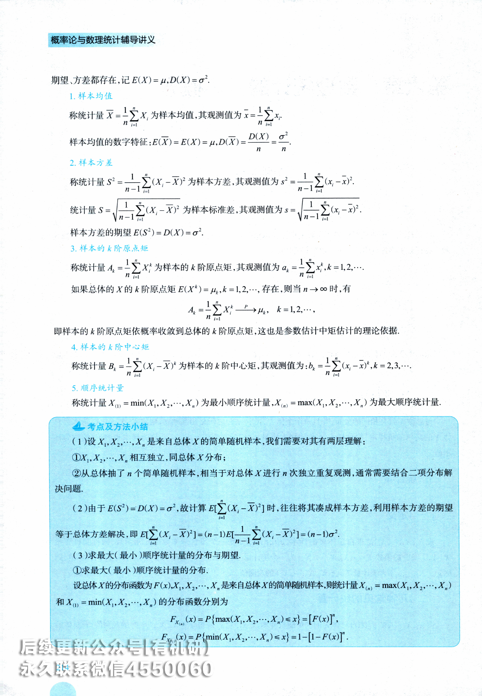
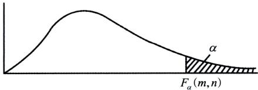
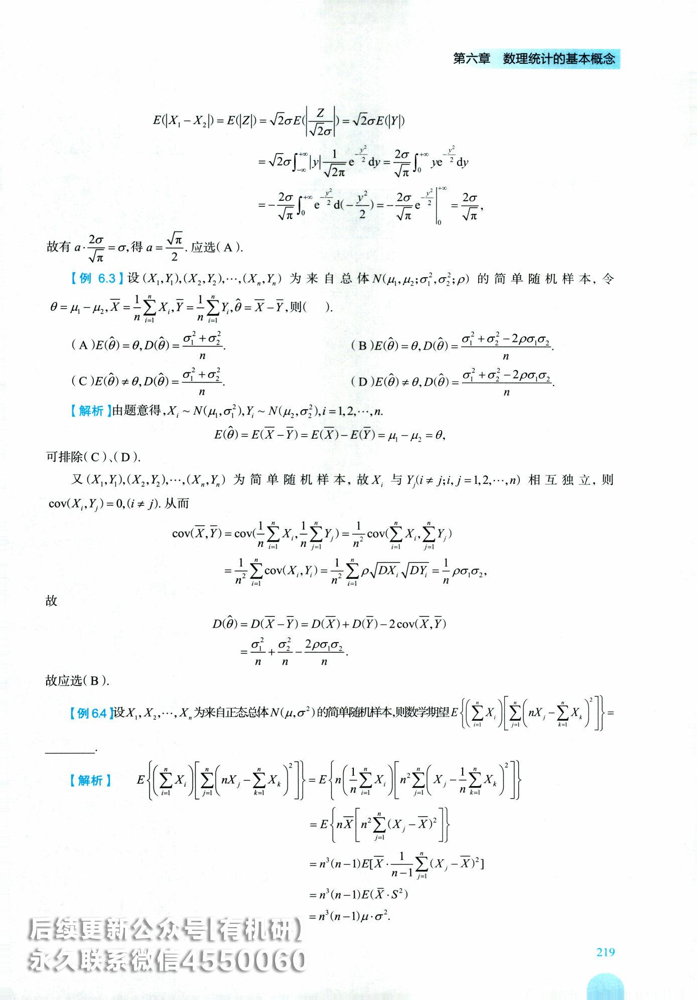

# 第六章 数理统计的基本概念

## <基础知识回顾>

## 一、总体

在数理统计中研究对象的某项数量指标X取值的全体称为总体.X是一个随机变量，X的分布函数和数字特征分别称为总体的分布函数和数字特征

## 二、个体

总体中的每个元素称为个体.

## 三、总体容量

总体中个体的数量称为总体的容量.容量为有限的总体称为有限总体，容量为无限的总体称为无限总体.

## 四、简单随机样本

与总体X具有相同的分布，并且每个个体 $X_{1},X_{2},\cdots,X_{n}$ 之间是相互独立，则称 $X_{1},X_{2},\cdots,X_{n}$ 为来自总体X的简单随机样本，简称样本，n称为样本容量.它们的观测值 $x_{1},x_{2},\cdots,x_{n}$ 称为样本观测值，简称为样本值.

## 五、统计量

## (一)定义

设 $X_{1},X_{2},\cdots,X_{n}$ 是来自总体X的样本， $g(t_1, t_2, \cdots, t_n)$ 是一个不含未知数的n元函数，则称随机变量$X_{1},X_{2},\cdots,X_{n}$ 的函数 $T = g(X_1, X_2, \cdots, X_n)$ 为一个统计量.设 $x_{1},x_{2},\cdots,x_{n}$ 是相应于 $X_{1},X_{2},\cdots,X_{n}$ 的样本值，则称 $g(x_1, x_2, \cdots, x_n)$ 为统计量 $T = g(X_1, X_2, \cdots, X_n)$ 的观测值.

## (二)几种常见的统计量

设 $X_{1},X_{2},\cdots,X_{n}$ 是来自总体X的简单随机样本， $x_{1},x_{2},\cdots,x_{n}$ 是相应于 $X_{1},X_{2},\cdots,X_{n}$ 的观测值.若总体的213

期望、方差都存在，记 $E(X)=\mu,D(X)=\sigma^{2}$

## 1. 样本均值

称统计量 $\overline{X} = \frac{1}{n} \sum_{i = 1}^{n} X_{i}$ 为样本均值，其观测值为 $\overline{x} = \frac{1}{n} \sum_{i = 1}^{n} x_{i}$

样本均值的数字特征： $E(\overline{X}) = E(X) = \mu, D(\overline{X}) = \frac{D(X)}{n} = \frac{\sigma^2}{n}.$

## 2.样本方差

称统计量 $S^{2} = \frac{1}{n - 1}\sum_{i = 1}^{n}(X_{i} - \overline{X})^{2}$ 为样本方差，其观测值为 $s^{2} = \frac{1}{n - 1}\sum_{i = 1}^{n}(x_{i} - \bar{x})^{2}$ 统计量 $S = \sqrt{\frac{1}{n - 1}\sum_{i = 1}^{n}\left( X_{i} - \overline{X} \right)^{2}}$ 为样本标准差，其观测值为 $s = \sqrt{\frac{1}{n - 1}\sum_{i = 1}^{n}(x_{i} - \bar{x})^{2}}$ 样本方差的期望 $E(S^{2}) = D(X) = \sigma^{2}$

## 3.样本的k阶原点矩

称统计量 $A_{k} = \frac{1}{n} \sum_{i = 1}^{n} X_{i}^{k}$ 为样本的k阶原点矩，其观测值为 $a_{k} = \frac{1}{n} \sum_{i = 1}^{n} x_{i}^{k}, k = 1, 2, \cdots$ 如果总体的X的 k阶原点矩 $E(X^{k}) = \mu_{k}, k = 1, 2, \cdots$ ，存在，则当 $n \to \infty$ 时,有

$$
A_{k} = \frac{1}{n} \sum_{i = 1}^{n} X_{i}^{k} \xrightarrow{P} \mu_{k}, \quad k = 1, 2, \cdots,
$$

即样本的k阶原点矩依概率收敛到总体的k阶原点矩，这也是参数估计中矩估计的理论依据

4. 样本的k阶中心矩

称统计量 $B_{k} = \frac{1}{n} \sum_{i = 1}^{n} (X_{i} - \overline{X})^{k}$ 为样本的k阶中心矩，其观测值为 $b_{k} = \frac{1}{n} \sum_{i = 1}^{n} (x_{i} - \bar{x})^{k}, k = 2, 3, \cdots$ 5. 顺序统计量称统计量 $X_{(1)} = \min(X_1, X_2, \cdots, X_n)$ 为<!-- DIRECTED-REPAIR-FALLBACK:FALLBACK-QA-R2-PROB-ADV-CH06-P220-ORDER-STAT -->
> [!WARNING]
> 原 PDF 第 220 页回退：X_(1)下标被写成X_n

最小顺序统计量 $X_{(n)} = \max(X_1, X_2, \cdots, X_n)$ 为最大顺序统计量

## 考点及方法小结

(1)设 $X_{1},X_{2},\cdots,X_{n}$ 是来自总体Χ的简单随机样本,我们需要对其有两层理解：

$X_{1},X_{2},\cdots,X_{n}$ 相互独立,同总体X分布；

②从总体抽了n个简单随机样本,相当于对总体X进行n次独立重复观测,通常需要结合二项分布解决问题.

(2)由于 $E(S^{2}) = D(X) = \sigma^{2}$ ,故计算 $E[\sum_{i = 1}^{n}(X_{i}-\overline{X})^{2}]$ 时,往往将其凑成样本方差,利用样本方差的期望等于总体方差解决,即 $E[\sum_{i = 1}^{n}(X_{i} - \overline{X})^{2}] = (n - 1)E[\frac{1}{n - 1}\sum_{i = 1}^{n}(X_{i} - \overline{X})^{2}] = (n - 1)\sigma^{2}.$

(3)求最大(最小)顺序统计量的分布与期望.

①求最大(最小)顺序统计量的分布.

设总体X的分布函数为 $F(x),X_{1},X_{2},\cdots,X_{n}$ 是来自总体X的简单随机样本,则统计量 $X_{(n)} = \max(X_1, X_2, \cdots, X_n)$ 和 $X_{(1)} = \min(X_1, X_2, \cdots, X_n)$ 的分布函数分别为

$$
F_{X_{(n)}}(x)=P\left\{\max (X_{1}, X_{2}, \cdots, X_{n}) \leq x\right\}=\left[F(x)\right]^{n},
$$

$$
F _ { X _ { n } } ( x ) = P \left\{ \min ( X _ { 1 } , X _ { 2 } , \cdots , X _ { n } ) \leq x \right\} = 1 - \left[ 1 - F ( x ) \right] ^ { n }
$$

②求最大(最小)顺序统计量的期望.

若总体为连续型总体,由①可得其分布函数 $F_{X_{(n)}}(x),F_{X_{(1)}}(x)$ ,则其概率密度为

$$
f_{X_{(n)}}(x)=F^{\prime}_{X_{(n)}}(x),f_{X_{(1)}}(x)=F^{\prime}_{X_{(1)}}(x),
$$

从而有

$$
E \left( X _ { ( n ) } \right) = \int _ { - \infty } ^ { + \infty } x f _ { X _ { ( n ) } } ( x ) \mathrm { d } x , E \left( X _ { ( 1 ) } \right) = \int _ { - \infty } ^ { + \infty } x f _ { X _ { ( 1 ) } } ( x ) \mathrm { d } x.
$$

## 六、三大分布

## (一 $) \chi ^ { 2 }$ 分布

## 1. 典型模式

设随机变量 $X_{1},X_{2},\cdots,X_{n}$ 相互独立，都服从标准正态分布N(0,1),称随机变量 $\chi^{2}=X_{1}^{2}+X_{2}^{2}+\cdots+X_{n}^{2}$ 为服从自由度是n的 $\chi ^ { 2 }$ 分布，记作 $\chi^{2} \sim \chi^{2}(n)$

## 2. $\chi ^ { 2 }$ 分布的性质

设 $X \sim \chi^{2}(m), Y \sim \chi^{2}(n)$ ，且X和Y相互独立，则 $X + Y \sim \chi^{2}(m + n)$

3. 上 α分位点 $\chi _ { a } ^ { 2 } ( n )$

设 $X{\sim}\chi^{2}(n)$ ,对于任给定的 $\alpha (0 < \alpha < 1)$ ,称满足条件 $P\left\{X>\chi_{a}^{2}(n)\right\}=\alpha$ 的点 $\chi_{a}^{2}(n)$ 为 X的上 α分位点.

  
x²分布上α分位点

## 4. $\chi ^ { 2 }$ 分布的数字特征

设 $X{\sim}\chi^{2}(n)$ ,则有 $E(X)=n,D(X)=2n$

## (二 )t 分布

## 1. 典型模式

设随机变量 $X \sim N(0,1), Y \sim \chi^{2}(n)$ ，且X和Y相互独立，则随机变量 $t = { \frac { X } { \sqrt { Y   /   n } } }$ 服从自由度为n的t分布，记作 t\~t(n).

2. 性质

t(n) 分布的概率密度f(x) 是偶函数且有 $\lim_{n \to \infty} f(x) = \frac{1}{\sqrt{2\pi}} \mathrm{e}^{-\frac{x^2}{2}}$ ,即当n充分大时，t(n)分布近似N(0,1)分布.

3. 上 α分位点 $\boldsymbol { t } _ { \alpha } ( n )$

  
t 分布上α分位点

设 $X{\sim}t(n)$ ，对于任给定的 $\alpha (0 < \alpha < 1)$ ,称满足条件 $P\left\{X>t_{\alpha}(n)\right\}=\alpha$ 的点 $t _ { \alpha } ( n )$ 为t分布的上α分位点. 由于t(n) 分布的概率密度是偶函数，因此 $t _ { \mathrm { l } - \alpha } ( n ) = - t _ { \alpha } ( n )$

## (三)F分布

## 1. 典型模式

设 $X \sim \chi^{2}(m), Y \sim \chi^{2}(n)$ ,且随机变量X,Y相互独立，则随机变量 $F = \frac{X / m}{Y / n}$ 服从自由度为 $(m,n)$ 的F分布,记作 $F \sim F(m, n)$

## 2. 性质

设 $F \sim F(m, n)$ ,则 $\frac{1}{F} \sim F(n,m)$

3. 上α分位点 $F_{\alpha}(m,n)$

设 $F \sim F(m, n)$ ,对于任给定的 $\alpha (0 < \alpha < 1)$ ,称满足条件 $P\left\{F>F_{a}(m,n)\right\}=\alpha$ 的点 $F_{\alpha}(m,n)$ 为 $F(m,n)$ 的 上α分位点，且有 $F _ { 1 - \alpha } ( m , n ) = \frac { 1 } { F _ { a } ( n , m ) } .$

  
F分布上α分位点

## 4.t分布与F分布的关系

若 T\~t(n),则 $T^{2} \sim F(1,n)$

因 $T { \sim } t ( n )$ ,则存在 $X \sim N(0,1), Y \sim \chi^{2}(n)$ ,且X和Y相互独立，有 $T = \frac{\overline{X}}{\sqrt{Y / n}}$

又 $T^{2}=\frac{X^{2}}{Y/n}$ ,而 $X^{2} \sim \chi^{2}(1)$ ,且 $X^{2}$ 和Y相互独立，故由F分布的典型模式有 $T^{2} = \frac{X^{2}/1}{Y/n} \sim F(1,n)$

## 七、正态总体抽样分布

## (一)一个正态总体的抽样分布

设 $X_{1},X_{2},\cdots,X_{n}$ 是来自正态总体 $X \sim N ( \mu , \sigma ^ { 2 } )$ 的简单随机样本， $\overline { { X } }$ 是样本均值， $S ^ { 2 }$ 是样本方差，则有：(1 $\overline{X} \sim N\left( \mu , \frac{\sigma^{2}}{n} \right), U = \frac{\overline{X} - \mu}{\sigma / \sqrt{n}} \sim N(0,1)$ .

(2)X与 $S^{2}$ 相互独立，且 $\frac{(n - 1)S^{2}}{\sigma^{2}} \sim \chi^{2}(n - 1)$

$$
t = \frac{\overline{X} - \mu}{S / \sqrt{n}} \sim t(n - 1);
$$

$$
\chi^{2}=\frac{1}{\sigma^{2}}\sum_{i = 1}^{n}(X_{i}-\mu)^{2}\sim\chi^{2}(n).
$$

## (二)两个正态总体的抽样分布

设 $X \sim N(\mu_{1},\sigma_{1}^{2}),Y \sim N(\mu_{2},\sigma_{2}^{2}),X_{1},X_{2},\cdots,X_{n}$ 和 $Y_{1},Y_{2},\cdots,Y_{n_{2}}$ 是分别来自总体X和Y的样本，且两个总体相互独立，则有

$$
\frac{\left( \overline{X} - \overline{Y} \right) - \left( \mu_{1} - \mu_{2} \right)}{\sqrt{\frac{\sigma_{1}^{2}}{n_{1}} + \frac{\sigma_{2}^{2}}{n_{2}}}} \sim N(0,1);
$$

(2)如果 $\sigma _ { 1 } ^ { 2 } = \sigma _ { 2 } ^ { 2 }$ ,则 $\frac{\left( \overline{X} - \overline{Y} \right) - \left( \mu_{1} - \mu_{2} \right)}{S_{w} \sqrt{\frac{1}{n_{1}} + \frac{1}{n_{2}}}} \sim t(n_{1} + n_{2} - 2)$ ,其中 $S_{w}^{2}=\frac{(n_{1}-1)S_{1}^{2}+(n_{2}-1)S_{2}^{2}}{n_{1}+n_{2}-2}$

$$
\frac{n_{2}\sigma_{2}^{2}}{n_{1}\sigma_{1}^{2}}\frac{\sum\limits_{i = 1}^{n_{1}}(X_{i} - \mu_{1})^{2}}{\sum\limits_{j = 1}^{n_{2}}(Y_{j} - \mu_{2})^{2}} \sim F(n_{1},n_{2});
$$

$$
(4)F = \frac{\sigma_{2}^{2}}{\sigma_{1}^{2}} \cdot \frac{S_{1}^{2}}{S_{2}^{2}} \sim F(n_{1} - 1,n_{2} - 1).
$$

## 考点及方法小结

(1)三大分布的典型构成模式是考查的重点,考生需要注意以下几点：

①构成 $\chi^{2}$ 分布需要找到独立的标准正态分布,将其平方相加即得,若有n个独立标准正态分布的平方相加,其自由度就为 $n(n \geq 1)$ .若是 $n(n \geq 2)$ 个标准正态平方相加,在缺少独立条件时,是得不到 $\chi^{2}$ 分布的.

②构成t分布需要找到一个标准正态分布X,一个 $\chi^{2}(n)$ 分布 Y,在X与 Y独立时,则 $\frac{X}{\sqrt{Y / n}}$ 服从自由度为n的t分布，t分布的自由度由构成它的 $\chi^{2}$ 分布的自由度确定.若X与Y不独立,则无法确定 $\frac{X}{\sqrt{Y / n}}$ 的分布.

③F分布需要两个独立的 $\chi^{2}$ 分布,分别除以自身的自由度相比得到.

若没有独立条件时，只是两个 $\chi^{2}$ 分布分别除以目由度相比得不到F分布.若 $X \sim \chi^{2}(n), Y \sim \chi^{2}(n)$ ,且 X与 Y独立,则 $F = \frac{\overline{X} / n}{Y / n} \sim F(n, n)$ 结合F分布的性质知F与 $\frac{1}{F}$ 同分布.(2)由于 $D[\chi^{2}(n)] = 2n$ ,可借助此结论解决以下两种情况：①若 $X \sim N(\mu, \sigma^2)$ ,计算 $D[(X - \mu)^2]$ .方法如下：因 $\frac{\overline{X}-\mu}{\sigma} \sim N(0,1)$ ,故 $\frac{(X - \mu)^2}{\sigma^2} \sim \chi^2(1)$ 又 $D[\chi^{2}(1)] = 2$ ,故有 $D[\frac{(X - \mu)^2}{\sigma^2}] = 2$ ,从而得 $D[(X - \mu)^2] = 2\sigma^4$ ②设 $X_{1},X_{2},\cdots,X_{n}$ 是来自正态总体 $X \sim N(\mu, \sigma^2)$ 的简单随机样本 $: S ^ { 2 }$ 是样本方差,计算 $D(S^{2})$ .方法如下：由于 $\frac{(n - 1)S^{2}}{\sigma^{2}} \sim \chi^{2}(n - 1)$ 故 $D\left[\frac{(n - 1)S^{2}}{\sigma^{2}}\right] = 2(n - 1)$ ,利用方差的性质得 $\frac{(n - 1)^2}{\sigma^4} D(S^2) = 2(n - 1)$ ,从而有 $D(S^{2}) = \frac{2\sigma^{4}}{n - 1}$

## 【题型一计算统计量数字特征】

【例6.1】设总体 $X \sim B(m,\theta), X_1, X_2, \cdots, X_n$ 为来自总体的简单随机样本 $, { \overline { { X } } }$ 为样本均值，则 $E\left[ \sum_{i = 1}^{n} (X_i - \overline{X})^2 \right]$ 为().(A $(m - 1)n\theta(1 - \theta)$ (B $m(n - 1)\theta(1 - \theta)$ (C $( m - 1 ) ( n - 1 ) \theta ( 1 - \theta )$ (D)mnθ(1−θ)

【解析】因 $X \sim B ( m , \theta )$ ,故 $D(X) = m\theta(1 - \theta)$

从而样本方差的期望为 $E\left[ \frac{1}{n - 1}\sum_{i = 1}^{n}(X_{i} - \overline{X})^{2} \right] = m\theta(1 - \theta)$ ,则$E \left[ \sum_{i=1}^{n} \left( X_i - \overline{X} \right)^2 \right] = (n-1)E \left[ \frac{1}{n-1} \sum_{i=1}^{n} \left( X_i - \overline{X} \right)^2 \right] = m(n-1)\theta(1-\theta),$

故应选(B).

【例6.2】设 $X_{1},X_{2}$ 是来自总体 $N ( \mu , \sigma ^ { 2 } )$ 的简单随机样本，其中 $\sigma \big ( \sigma   >   0 \big )$ 为未知参数.记 $\hat { \sigma } = a \left| X _ { 1 } - X _ { 2 } \right|$ 若 $E \left( \stackrel{\frown}{\sigma} \right) = \sigma,$ 则 a =( ).(A $) \frac{\sqrt{\pi}}{2}.$ (B) $1 { \frac { \sqrt { 2 \pi } } { 2 } } .$ (C $) \sqrt { \pi } .$ (D $) \sqrt { 2 \pi }$

【解析】由题意知，

$$
E \left( \widehat { \sigma } \right) = E \left( a \left| X _ { 1 } - X _ { 2 } \right| \right) = a E \left( \left| X _ { 1 } - X _ { 2 } \right| \right) = \sigma ,
$$

且 $X_{1},X_{2}$ 相互独立均服从 $N ( \mu , \sigma ^ { 2 } )$ ,令 $Z = X_{1} - X_{2}$ ,则由独立正态分布的性质有 $Z \sim N\left(0, 2\sigma^{2}\right)$ ,将其标准化  
有 $\frac{Z}{\sqrt{2}\sigma} \sim N(0,1)$ ,记 $Y   =   \frac { Z } { \sqrt { 2 } \sigma }$ ,则 $Y \sim N(0,1)$ ·  
因

$$
\begin{aligned}E( \left| X_{1} - X_{2} \right| ) = E( \left| Z \right| ) = \sqrt{2} \sigma E( \left| \frac{Z}{\sqrt{2} \sigma} \right| ) = \sqrt{2} \sigma E( \left| Y \right| ) \\= \sqrt{2} \sigma \int_{- \infty}^{+ \infty} \left| y \right| \frac{1}{\sqrt{2\pi}} e^{- \frac{y^{2}}{2}} \mathrm{d}y = \frac{2\sigma}{\sqrt{\pi}} \int_{0}^{+ \infty} y e^{- \frac{y^{2}}{2}} \mathrm{d}y \\= - \frac{2\sigma}{\sqrt{\pi}} \int_{0}^{+ \infty} e^{- \frac{y^{2}}{2}} \mathrm{d}( - \frac{y^{2}}{2}) = - \left. \frac{2\sigma}{\sqrt{\pi}} e^{- \frac{y^{2}}{2}} \right|_{0}^{+ \infty} = \frac{2\sigma}{\sqrt{\pi}},\end{aligned}
$$

故有 $a \cdot \frac{2\sigma}{\sqrt{\pi}} = \sigma$ 得 $a = \frac{\sqrt{\pi}}{2}$ .应选(A).

【例6.3】设 $(X_{1},Y_{1}),(X_{2},Y_{2}),\cdots,(X_{n},Y_{n})$ 为来自总体 $N(\mu_{1},\mu_{2};\sigma_{1}^{2},\sigma_{2}^{2};\rho)$ 的简单随机样本，令$\theta = \mu _ { 1 } - \mu _ { 2 } , \overline { X } = \frac { 1 } { n } \sum _ { i = 1 } ^ { n } X _ { i } , \overline { Y } = \frac { 1 } { n } \sum _ { i = 1 } ^ { n } Y _ { i } , \hat { \theta } = \overline { X } - \overline { Y }$ ,则().(A $DE(\hat{\theta}) = \theta, D(\hat{\theta}) = \frac{\sigma_1^2 + \sigma_2^2}{n}.$ (B $\begin{aligned}D E ( \hat { \theta } ) = \theta , D ( \hat { \theta } ) = \frac { \sigma _ { 1 } ^ { 2 } + \sigma _ { 2 } ^ { 2 } - 2 \rho \sigma _ { 1 } \sigma _ { 2 } } { n } .\end{aligned}$ (C) $\partial E(\hat{\theta}) \neq \theta, D(\hat{\theta}) = \frac{\sigma_1^2 + \sigma_2^2}{n}.$ (D $\begin{aligned}D E ( \hat { \theta } ) \neq \theta , D ( \hat { \theta } ) = \frac { \sigma _ { 1 } ^ { 2 } + \sigma _ { 2 } ^ { 2 } - 2 \rho \sigma _ { 1 } \sigma _ { 2 } } { n } .\end{aligned}$

【解析】由题意得 $X_{i} \sim N(\mu_{1},\sigma_{1}^{2}),Y_{i} \sim N(\mu_{2},\sigma_{2}^{2}),i = 1,2,\cdots,n.$

$$
E ( \hat { \theta } ) = E ( \overline { X } - \overline { Y } ) = E ( \overline { X } ) - E ( \overline { Y } ) = \mu _ { 1 } - \mu _ { 2 } = \theta ,
$$

可排除(C)、(D).

又 $(X_{1},Y_{1}),(X_{2},Y_{2}),\cdots,(X_{n},Y_{n})$ 为简单随机样本，故 $X _ { i }$ 与 $Y_{j}(i \neq j;i,j = 1,2,\cdots,n)$ 相互独立，则$\mathrm{cov}(X_{i},Y_{j}) = 0,(i \neq j)$ .从而

$$
\begin{aligned}\operatorname{cov}(\overline{X}, \overline{Y}) &= \operatorname{cov}(\frac{1}{n} \sum_{i=1}^{n} X_i, \frac{1}{n} \sum_{j=1}^{n} Y_j) = \frac{1}{n^2} \operatorname{cov}(\sum_{i=1}^{n} X_i, \sum_{j=1}^{n} Y_j) \\&= \frac{1}{n^2} \sum_{i=1}^{n} \operatorname{cov}(X_i, Y_i) = \frac{1}{n^2} \sum_{i=1}^{n} \rho \sqrt{DX_i} \sqrt{DY_i} = \frac{1}{n} \rho \sigma_1 \sigma_2,\end{aligned}
$$

故

$$
\begin{aligned}D(\hat{\theta}) &= D(\overline{X} - \overline{Y}) = D(\overline{X}) + D(\overline{Y}) - 2\operatorname{cov}(\overline{X}, \overline{Y}) \\&= \frac{\sigma_1^2}{n} + \frac{\sigma_2^2}{n} - \frac{2\rho\sigma_1\sigma_2}{n}.\end{aligned}
$$

故应选(B).

<!-- DIRECTED-REPAIR-FALLBACK:FALLBACK-PROB-ADV-CH6-P225-CORRUPTED-DERIVATION -->
> [!WARNING]
> 原 PDF 第 225 页回退：例6.4 的关键推导与最终式被大段重复 1/n 垃圾覆盖，不能从 OCR 文本安全反推。

【例6.4】设 $X_{1},X_{2},\cdots,X_{n}$ 为来自正态总体 $N(\mu,\sigma^{2})$ 的简单随机样本，则数学期望E $\left\{ \left( \sum_{i = 1}^{n} X_{i} \right) \left[ \sum_{j = 1}^{n} \left( nX_{j} - \sum_{k = 1}^{n} X_{k} \right)^{2} \right] \right\} =$

【解析】

$$
\begin{aligned}E\left\{\left(\sum_{i=1}^{n} X_{i}\right)\left[\sum_{j=1}^{n}\left(nX_{j}-\sum_{k=1}^{n}X_{k}\right)^{2}\right]\right\} &=E\left\{n\left(\frac{1}{n}\sum_{i=1}^{n}X_{i}\right)\left[n^{2}\sum_{j=1}^{n}\left(X_{j}-\frac{1}{n}\sum_{k=1}^{n}X_{k}\right)^{2}\right]\right\} \\&=E\left\{n\overline{X}\left[n^{2}\sum_{j=1}^{n}(X_{j}-\overline{X})^{2}\right]\right\} \\&=n^{3}(n-1)E[\overline{X}\cdot\frac{1}{n-1}\sum_{j=1}^{n}(X_{j}-\overline{X})^{2}] \\&=n^{3}(n-1)E(\overline{X}\cdot S^{2}) \\ 公众号  \frac{1}{n}  有扎  \frac{1}{n} \frac{1}{n} \frac{1}{n} \frac{1}{n} \frac{1}{n} \frac{1}{n} \frac{1}{n} \frac{1}{n} \frac{1}{n} \frac{1}{n} \frac{1}{n} \frac{1}{n} \frac{1}{n} \frac{1}{n} \frac{1}{n} \frac{1}{n} \frac{1}{n} \frac{1}{n} \frac{1}{n} \frac{1}{n} \frac{1}{n} \frac{1}{n} \frac{1}{n} \frac{1}{n} \frac{1}{n} \frac{1}{n} \frac{1}{n} \frac{1}{n} \frac{1}{n} \frac{1}{n} \frac{1}{n} \frac{1}{n} \frac{1}{n} \frac{1}{n} \frac{1}{n} \frac{1}{n} \frac{1}{n} \frac{1}{n} \frac{1}{n} \frac{1}{n} \frac{1}{n} \frac{1}{n} \frac{1}{n} \frac{1}{n} \frac{1}{n} \frac{1}{n} \frac{1}{n} \frac{1}{n} \frac{1}{n} \frac{1}{n} \frac{1}{n} \frac{1}{n} \frac{1}{n} \frac{1}{n} \frac{1}{n} \frac{1}{n} \frac{1}{n} \frac{1}{n} \frac{1}{n} \frac{1}{n} \frac{1}{n} \frac{1}{n} \frac{1}{n} \frac{1}{n} \frac{1}{n} \frac{1}{n} \frac{1}{n} \frac{1}{n} \frac{1}{n} \frac{1}{n} \frac{1}{n} \frac{1}{n} \frac{1}{n} \frac{1}{n} \frac{1}{n} \frac{1}{n} \frac{1}{n} \frac{1}{n} \frac{1}{n} \frac{1}{n} \frac{1}{n} \frac{1}{n} \frac{1}{n} \frac{1}{n} \frac{1}{n} \frac{1}{n} \frac{1}{n} \frac{1}{n} \frac{1}{n} \frac{1}{n} \frac{1}{n} \frac{1}{n} \frac{1}{n} \frac{1}{n} \frac{1}{n} \frac{1}{n} \frac{1}{n} \frac{1}{n} \frac{1}{n} \frac{1}{n} \frac{1}{n} \frac{1}{n} \frac{1}{n} \frac{1}{n} \frac{1}{n} \frac{1}{n} \frac{1}{n} \frac{1}{n} \frac{1}{n} \frac{1}{n} \frac{1}{n} \frac{1}{n} \frac{1}{n} \frac{1}{n} \frac{1}{n} \frac{1}{n} \frac{1}{n} \frac{1}{n} \frac{1}{n} \frac{1}{1}{n} \frac{1}{n} \frac{1}{n} \frac{1}{n} \frac{1}{n} \frac{1}{n} \frac{1}{1} \frac{1}{n} \frac{1}{n} \frac{1} \end{aligned}
$$

## 良哥解读

此题看起来非常复杂,若细心观察 $E\left\{ \left( \sum_{i = 1}^{n} X_{i} \right) \left[ \sum_{j = 1}^{n} \left( nX_{j} - \sum_{k = 1}^{n} X_{k} \right)^{2} \right] \right\}$ ,不难发现 $\sum_{i = 1}^{n}X_{i}$ 与样本均值类似 $\sum_{j = 1}^{n} \left( nX_{j} - \sum_{k = 1}^{n} X_{k} \right)^{2}$ 与样本方差类似，由于从一个正态总体抽样，样本均值与样本方差独立，从而考虑借助这个条件来化简.我们在计算过程中分别凑出样本均值和样本方差,然后再进一步解决问题.

【例6.5】设 $X_{1},X_{2},\cdots,X_{n}$ 是总体 N(0,1)的简单随机样本.记

$$
\overline{X} = \frac{1}{n} \sum_{i = 1}^{n} X_{i}, S^{2} = \frac{1}{n - 1} \sum_{i = 1}^{n} (X_{i} - \overline{X})^{2}, T = \overline{X}^{2} - \frac{1}{n}S^{2}.
$$

则 $D(T) = \underline{\hspace{2cm}}$

【解析】由 $\frac{\overline{X}-0}{\sqrt{n}} \sim N(0,1)$ ,即 $\sqrt{n} \overline{X} \sim N(0,1)$ ,从而 $n \overline { { X } } ^ { 2 } \sim \chi ^ { 2 } ( 1 )$ ,故 $D(n\overline{X}^2) = 2$ ,于是有 $n^{2}D(\overline{X}^{2}) = 2$ 解之得 $D(\overline{X}^2) = \frac{2}{n^2}$

又 $\frac{(n - 1)S^{2}}{\sigma^{2}} \sim \chi^{2}(n - 1)$ ,则 $(n - 1)S^{2} \sim \chi^{2}(n - 1)$ ,故有 $D[(n - 1)S^{2}] = 2(n - 1)$ ,于是有 $(n - 1)^{2} D(S^{2}) =$ $2(n - 1)$ ,解之得 $D ( S ^ { 2 } ) = { \frac { 2 } { n - 1 } } ,$

因 $\overline{X}$ 与 $S ^ { 2 }$ 相互独立，故

$$
\begin{aligned}D(T) &= D\left(\overline{X}^{2} - \frac{1}{n}S^{2}\right) = D(\overline{X}^{2}) + \frac{1}{n^{2}}D(S^{2}) \\&= \frac{2}{n^{2}} + \frac{1}{n^{2}} \cdot \frac{2}{n - 1} = \frac{2}{n(n - 1)}.\end{aligned}
$$

【例6.6】已知总体X服从正态分布 $N(\mu,\sigma^{2}),X_{1},X_{2},\cdots,X_{n}$ 是来自总体的简单随机样本，记 $\overline { { X } }   =   \frac { 1 } { n } \sum _ { i = 1 } ^ { n } X _ { i }$ $S^{2} = \frac{1}{n - 1}\sum_{i = 1}^{n}(X_{i} - \overline{X})^{2}$ ,则 $E \Big [ \Big ( \overline { { X } } S ^ { 2 } \Big ) ^ { 2 } \Big ] =$

【解析】因样本均值 $\overline{X}$ 与样本方差 $S ^ { 2 }$ 相互独立，故 $\overline { { X } } ^ { 2 }$ 与 $S ^ { 4 }$ 相互独立，从而有

$$
\begin{aligned}E\left[\left(\overline{X}S^{2}\right)^{2}\right] &= E(\overline{X}^{2}S^{4}) = E(\overline{X}^{2})E(S^{4}) \\&= \{D(\overline{X}) + [E(\overline{X})]^{2}\}\{D(S^{2}) + [E(S^{2})]^{2}\}.\end{aligned}
$$

因 $\frac{(n - 1)S^{2}}{\sigma^{2}} \sim \chi^{2}(n - 1)$ ，故 $D\left[\frac{(n - 1)S^{2}}{\sigma^{2}}\right] = 2(n - 1)$ ，利用方差的性质得 $\frac{(n - 1)^2}{\sigma^4} D(S^2) = 2(n - 1)$ ，从而有$D(S^{2}) = \frac{2\sigma^{4}}{n - 1}$

又 $D(\overline{X}) = \frac{\sigma^{2}}{n},E(\overline{X}) = \mu,E(S^{2}) = \sigma^{2}$ ,故 $E \left[ \left( \overline{X} S^{2} \right)^{2} \right] = \left( \frac{\sigma^{2}}{n} + \mu^{2} \right) \left( \frac{2 \sigma^{4}}{n - 1} + \sigma^{4} \right) = \frac{n + 1}{n - 1} \left( \frac{\sigma^{2}}{n} + \mu^{2} \right) \sigma^{4}.$

【例6.7】设总体X服从正态分布 $N(\mu,\sigma^{2})(\sigma>0)$ 从该总体中抽取简单随机样本 $X_{1},X_{2},\cdots X_{2n}(n \geqslant 2)$ 其样本均值为 $\overline{X} = \frac{1}{2n} \sum_{i = 1}^{2n} X_{i}$ .求统计量 $Y = \sum_{i = 1}^{n} \left( X_{i} + X_{n + i} - 2\overline{X} \right)^{2}$ 的数学期望E(Y).

后续更新号 $\frac{1}{n}\sum_{i = 1}^{n}X_{i} = \frac{1}{n}\sum_{i = 1}^{n}X_{i} = \frac{1}{n}\sum_{i = n + 1}^{2n}X_{i}$ ，则 $\overline{X} = \frac{1}{2n} \sum_{i = 1}^{2n} X_{i} = \frac{1}{2n} \left( \sum_{i = 1}^{n} X_{i} + \sum_{i = n + 1}^{2n} X_{i} \right) = \frac{1}{2} \left( \overline{X}_{1} + \overline{X}_{2} \right)$ ，即

$$
2\overline{X} = \overline{X_1} + \overline{X_2}
$$

故

$$
\begin{aligned}Y = & \sum_{i = 1}^{n}(X_{i} + X_{n + i} - 2\overline{X})^{2} = \sum_{i = 1}^{n}(X_{i} + X_{n + i} - \overline{X_{1}} - \overline{X_{2}})^{2} \\= & \sum_{i = 1}^{n}(X_{i} - \overline{X_{1}} + X_{n + i} - \overline{X_{2}})^{2} \\= & \sum_{i = 1}^{n}(X_{i} - \overline{X_{1}})^{2} + \sum_{i = 1}^{n}(X_{n + i} - \overline{X_{2}})^{2} + 2\sum_{i = 1}^{n}(X_{i} - \overline{X_{1}})(X_{n + i} - \overline{X_{2}}),\end{aligned}
$$

从而

$$
\begin{align*}E(Y) = & E\Biggl[\sum_{i=1}^{n}(X_i-\overline{X_1})^2+\sum_{i=1}^{n}(X_{n+i}-\overline{X_2})^2+2\sum_{i=1}^{n}(X_i-\overline{X_1})(X_{n+i}-\overline{X_2})\Biggr] \\= & (n-1)E\Biggl[\frac{1}{n-1}\sum_{i=1}^{n}(X_i-\overline{X_1})^2\Biggr]+(n-1)E\Biggl[\frac{1}{n-1}\sum_{i=1}^{n}(X_{n+i}-\overline{X_2})^2\Biggr] \\& +2E\Biggl[\sum_{i=1}^{n}(X_i-\overline{X_1})(X_{n+i}-\overline{X_2})\Biggr], \\= & (n-1)\sigma^2+(n-1)\sigma^2+2\sum_{i=1}^{n}E\Biggl[(X_i-\overline{X_1})(X_{n+i}-\overline{X_2})\Biggr],\end{align*}
$$

由题意有 $X_{1},X_{2},\cdots,X_{2n}$ 相互独立，从而 $X_{i}-\overline{X_{1}},X_{n+i}-\overline{X_{2}}$ 独立,则

$$
E\left[ \left( X_{i} - \overline{X_{1}} \right) \left( X_{n + i} - \overline{X_{2}} \right) \right] = E\left( X_{i} - \overline{X_{1}} \right) E\left( X_{n + i} - \overline{X_{2}} \right) \\= \left[ E(X_{i}) - E(\overline{X_{1}}) \right] \left[ E(X_{n + i}) - E(\overline{X_{2}}) \right] \\= (\mu - \mu)(\mu - \mu) = 0,
$$

所以 $E(Y)=2(n-1)\sigma^{2}+0=2(n-1)\sigma^{2}$

法二：由题意有 $X_{1},X_{2},\cdots,X_{2n}$ 相互独立且均服从 $N(\mu,\sigma^{2})$ ,故有 $X_{1} + X_{n + 1}, X_{2} + X_{n + 2}, \cdots, X_{n} + X_{2n}$ 也相互独立，且均服从 $N(2\mu,2\sigma^{2})$ .记 $Y_{i}=X_{i}+X_{n+i},(i=1,2,\cdots,n),\overline{Y}=\frac{1}{n}\sum_{i=1}^{n}Y_{i}$ ,则

$$
\overline{Y} = \frac{1}{n} \sum_{i = 1}^{n} Y_{i} = \frac{1}{n} \sum_{i = 1}^{n} (X_{i} + X_{n + i}) = \frac{1}{n} \sum_{i = 1}^{2n} X_{i} = 2\overline{X}.
$$

可将 $Y_{1},Y_{2},\cdots,Y_{n}$ 看成来自总体 $N ( 2 \mu , 2 \sigma ^ { 2 } )$ 的简单随机样本 $, \bar { Y }$ 为其样本均值，其样本方差 $S^{2} = \frac{1}{n - 1}\sum_{i = 1}^{n}(Y_{i} - \overline{Y})^{2} =$ $\frac{1}{n - 1}\sum_{i = 1}^{n}(X_{i} + X_{n + i} - 2\overline{X})^{2}$ .所以

$$
E(Y)=E\left[\sum_{i=1}^{n}(X_{i}+X_{n+i}-2\overline{X})^{2}\right]=E\left[\sum_{i=1}^{n}(Y_{i}-\overline{Y})^{2}\right]=(n-1)E\left[\frac{1}{n-1}\sum_{i=1}^{n}(Y_{i}-\overline{Y})^{2}\right]
$$

## 良哥解读

此题中应用了重要结论 $E(S^{2}) = \sigma^{2}$ ,其中 $S^{2} = \frac{1}{n - 1}\sum_{i = 1}^{n}(X_{i} - \overline{X})^{2}$ 为样本方差， $\sigma ^ { 2 }$ 为总体的方差.当计算 $E\left[ \sum_{i = 1}^{n} (X_i - \overline{X})^2 \right]$ 时，可以先将其凑成样本方差，再利用此结论解决，即

$$
E \left[ \sum_{i = 1}^{n} (X_i - \overline{X})^2 \right] = (n - 1) E \left[ \frac{1}{n - 1} \sum_{i = 1}^{n} (X_i - \overline{X})^2 \right] = (n - 1) \sigma^2.
$$

【例6.8】设总体X的概率密度 $f(x,\theta) = \left\{ \begin{aligned} &\frac{3x^{2}}{\theta^{3}}, & &0 < x < \theta, \\ &0, & & 其他 , \end{aligned} \right.$ 其中 $\theta \in (0, +\infty)$ 为未知参数， $X_{1},X_{2},X_{3}$ 为来自X的简单随机样本，令 $T = \max(X_1, X_2, X_3)$

(1)求 T的概率密度.

(2)确定 a,使得 E(aT) = θ.

【解析】(1)X的分布函数为 $F(x) = \int_{-\infty}^{x} f(t;\theta)   dt$ ,则

$x < 0$ 时,F(x)= 0;

当 $0 \leq x < \theta$ 时， $F(x) = \int_{0}^{x} \frac{3t^{2}}{\theta^{3}} \mathrm{d}t = \frac{x^{3}}{\theta^{3}};$

当 $x \geqslant \theta$ 时， $F ( x )   =   1$

T的分布函数为

$$
\begin{aligned}F_{T}(t;\theta) &= P\{T \leq t\} = P\{\max(X_{1},X_{2},X_{3}) \leq t\} \\&= P\{X_{1} \leq t,X_{2} \leq t,X_{3} \leq t\},\end{aligned}
$$

因 $X_{1},X_{2},X_{3}$ 相互独立同分布，故 $F_{T}(t)=P\left\{X_{1} \leqslant t\right\} P\left\{X_{2} \leqslant t\right\} P\left\{X_{3} \leqslant t\right\}=F^{3}(t)$ ,则当 $t < 0$ 时， $F_{T}(t) = 0$

当 $0 \leq t < \theta$ 时， $F_{T}(t)=\left(\frac{t^{3}}{\theta^{3}}\right)^{3}=\frac{t^{9}}{\theta^{9}}$

当t≥θ时， $F_{T}(t) = 1$

故T的密度函数为

$$
f_{T}(t) = F_{T}^{\prime}(t) = \left\{ \begin{aligned} \frac{9t^{8}}{\theta^{9}}, & \quad 0 < t < \theta, \\ 0, & \quad  其他 . \end{aligned} \right.
$$

(2)因 $E(aT) = \theta$ 即 aE(T) = θ. 又 $E ( T ) = \int _ { - \infty } ^ { + \infty } t f _ { T } ( t ) \mathrm { d } t = \int _ { 0 } ^ { \theta } \frac { 9 t ^ { 9 } } { \theta ^ { 9 } } \mathrm { d } t = \frac { 9 } { 1 0 } \theta ,$ 故有 $a \times \frac{9\theta}{10} = \theta,$ 解之得 $a = { \frac { 1 0 } { 9 } } ,$

【例6.9】设总体X的概率分布为

<table><tr><td rowspan=1 colspan=1> $X$ </td><td rowspan=1 colspan=1>1</td><td rowspan=1 colspan=1>2</td><td rowspan=1 colspan=1>3</td></tr><tr><td rowspan=1 colspan=1> $P$ </td><td rowspan=1 colspan=1>1-θ</td><td rowspan=1 colspan=1> $\theta - \theta^{2}$ </td><td rowspan=1 colspan=1> $\theta ^ { 2 }$ </td></tr></table>

其中参数 $\theta \in (0,1)$ 未知,以N表示来自总体X的简单随机样本(样本容量为n)中等于i的个数(i =1,2,3)， $N_{i}$ 统计量 $T = \sum_{i = 1}^{3} a_{i}N_{i}$ 试求常数 $a_{1},a_{2},a_{3}$ ,使 $E ( T ) = \theta ,$ 并求T的方差.

【解析】由题意知， $N_{1} \sim B(n,1-\theta), N_{2} \sim B(n,\theta-\theta^{2}), N_{3} \sim B(n,\theta^{2})$ ,因为 $E ( T ) = \theta ,$ 故

$$
E(T) = E\left( \sum_{i = 1}^{3} a_{i}N_{i} \right) = a_{1}E(N_{1}) + a_{2}E(N_{2}) + a_{3}E(N_{3}) \\= a_{1}n(1 - \theta) + a_{2}n(\theta - \theta^{2}) + a_{3}n\theta^{2} \\= na_{1} + n(a_{2} - a_{1})\theta + n(a_{3} - a_{2})\theta^{2} = \theta,
$$

则 $\begin{cases}na_{1} = 0, \\n(a_{2} - a_{1}) = 1, \\n(a_{3} - a_{2}) = 0,\end{cases}$ 解之得 $a_{1}=0,a_{2}=a_{3}=\frac{1}{n}.$

由于 $N_{1} + N_{2} + N_{3} = n$ ,故

$$
\begin{aligned}D(T) = D\left(\sum_{i = 1}^{3}a_{i}N_{i}\right) = D\left(\frac{1}{n}N_{2} + \frac{1}{n}N_{3}\right) = \frac{1}{n^{2}}D(N_{2} + N_{3}) \\= \frac{1}{n^{2}}D(n - N_{1}) = \frac{1}{n^{2}}D(N_{1}) \\= \frac{1}{n^{2}}n\theta(1 - \theta) = \frac{\theta(1 - \theta)}{n}.\end{aligned}
$$

## 良哥解读

从总体抽出n个简单随机样本，相当于对总体做了n次独立重复观测 $N_{i}$ 表示对总体进行的n次独立重复观测中,观测值i发生的次数,故 $N_{i}$ 服从二项分布.

## 【题型二三大分布】

【例6.10】设 $X_{1},X_{2},\cdots,X_{n}(n \geqslant 2)$ 为来自总体 $N(\mu,1)$ 的简单随机样本，记 $\overline { { X } }   =   \frac { 1 } { n } \sum _ { i = 1 } ^ { n } X _ { i }$ ,则下列结论不正确的是( ).(A $\sum_{i = 1}^{n} (X_i - \mu)^2$ 服从 $\chi ^ { 2 }$ 分布 (B $2(X_{n}-X_{1})^{2}$ 服从 $\chi^{2}$ 分布(C $\sum_{i = 1}^{n}(X_{i} - \bar{X})^{2}$ 服从 $\chi^{2}$ 分布 (D $n(\bar{X} - \mu)^2$ 服从 $\chi ^ { 2 }$ 分布

【解析】对于(A)选项：因 $X_{1},X_{2},\cdots,X_{n}$ 相互独立，且均服从 $N ( \mu ,  1 )$ ,故 $\frac{X_{i}-\mu}{1} \sim N(0,1),(i=1,2,\cdots,n)$ 从而 $\sum_{i = 1}^{n} (X_i - \mu)^2 \sim \chi^2(n)$ ,故(A)正确.

对于(C)选项：由 $\frac{(n - 1)S^{2}}{\sigma^{2}} \sim \chi^{2}(n - 1)$ ,其中 $\sigma = 1$ ,有 $\sum_{i = 1}^{n} \left( X_{i} - \overline{X} \right)^{2} \sim \chi^{2}(n - 1)$ ,故(C)正确.

对于(D)选项：由 $\frac{\bar{X} - \mu}{\sigma / \sqrt{n}} \sim N(0,1)$ ,其中 $\sigma = 1$ ,故 $\sqrt{n}(\overline{X} - \mu) \sim N(0,1)$ ,从而 $n(\overline{X} - \mu)^2 \sim \chi^2(1)$ ,故(D)正确.

对于(B)选项：因 $X_{n} - X_{1} \sim N(0,2)$ ,故 $\frac{X_{n}-X_{1}-0}{\sqrt{2}} \sim N(0,1)$ ,从而有 $\frac{(X_{n}-X_{1})^{2}}{2}\sim\chi^{2}(1)$ ,故(B)不正确.应选(B).

【例6.11】设 $X_{1},X_{2},\cdots,X_{n}$ 是来自正态总体 $N(\mu,\sigma^{2})$ 的简单随机样本 $, \overline { { X } }$ 为样本均值， $S ^ { 2 }$ 为样本方差，则可以作出服从自由度为n的 $\chi ^ { 2 }$ 分布的随机变量为().(A $\frac{\overline{X}^{2}}{\sigma^{2}}+\frac{(n-1)S^{2}}{\sigma^{2}}$ (B $\frac{n\overline{X}^{2}}{\sigma^{2}}+\frac{(n-1)S^{2}}{\sigma^{2}}$ (C $\frac{(\overline{X}-\mu)^{2}}{\sigma^{2}}+\frac{(n-1)S^{2}}{\sigma^{2}}$ (D $\frac{n(\overline{X}-\mu)^{2}}{\sigma^{2}}+\frac{(n-1)S^{2}}{\sigma^{2}}$

【解析】由于总体 $X \sim N(\mu, \sigma^2)$ ,故 $\frac{\overline{X}-\mu}{\sigma / \sqrt{n}} \sim N(0,1), \frac{(n-1) S^{2}}{\sigma^{2}} \sim \chi^{2}(n-1)$ ,进而有 $\left( \frac{\overline{X} - \mu}{\sigma / \sqrt{n}} \right)^{2} = \frac{n(\overline{X} - \mu)^{2}}{\sigma^{2}}$ $\chi ^ { 2 } ( 1 ) .$ 又因 $\overline { { X } }$ 与 $S ^ { 2 }$ 相互独立，故 $\frac{n(\overline{X}-\mu)^{2}}{\sigma^{2}}$ 与 $\frac{(n - 1)S^{2}}{\sigma^{2}}$ 相互独立. 由 $\chi^{2}$ 分布的性质，有 $\frac{n(\overline{X}-\mu)^{2}}{\sigma^{2}}+\frac{(n-1)S^{2}}{\sigma^{2}}\sim$ $\chi^{2}(n)$ ,应选(D).

【例6.12】设 $X_{1},X_{2},X_{3},X_{4}$ 为来自总体 $N(1,\sigma^{2})(\sigma>0)$ 的简单随机样本，则统计量 $\frac{X_{1}-X_{2}}{\left | X_{3}+X_{4}-2 \right | }$ 的分布().(A $) N ( 0 , 1 )$ (B)t(1) (C $) \chi ^ { 2 } ( 1 )$ (D $) F ( 1 , 1 )$

【解析】由题意知， $X_{1},X_{2},X_{3},X_{4}$ 相互独立，且均服从 $N(1,\sigma^{2})(\sigma>0)$ ,故 $X_{1} - X_{2} \sim N(0,2\sigma^{2}),X_{3} + X_{4} - 2$ $\sim N(0,2\sigma^{2})$ ,将其标准化有 $\frac{X_{1}-X_{2}}{\sqrt{2}\sigma}\sim N(0,1),\frac{X_{3}+X_{4}-2}{\sqrt{2}\sigma}\sim N(0,1)$ ,则 $\left( \frac{X_{3} + X_{4} - 2}{\sqrt{2} \sigma} \right)^{2} \sim \chi^{2}(1)$

又 $\frac{X_{1}-X_{2}}{\sqrt{2}\sigma}$ 与 $\frac{(X_{3}+X_{4}-2)^{2}}{2\sigma^{2}}$ 相互独立，由t分布的构成形式得

$$
\frac{\frac{X_{1}-X_{2}}{\sqrt{2}\sigma}}{\sqrt{\frac{(X_{3}+X_{4}-2)^{2}}{2\sigma^{2}}}}=\frac{X_{1}-X_{2}}{\left|X_{3}+X_{4}-2\right|}\sim t(1),
$$

故应选(B).

【例6.13】设 $X_{1},X_{2},\cdots,X_{n}(n \geqslant 2)$ 为来自总体 $N ( 0 , \sigma ^ { 2 } )$ 的简单随机样本， $\overline { { X } }$ 为样本均值， $S ^ { 2 }$ 为样本方差,则 $\frac{n(\overline{X})^{2}}{S^{2}}$ 服从 分布，参数为

【解析】因 $X_{1},X_{2},\cdots,X_{n}(n \geqslant 2)$ 为来自总体 $N ( 0 , \sigma ^ { 2 } )$ 的简单随机样本，故 $\frac{\overline{X}-0}{\sigma / \sqrt{n}}=\frac{\sqrt{n} \overline{X}}{\sigma} \sim N(0,1)$ $\frac{(n - 1)S^{2}}{\sigma^{2}} \sim \chi^{2}(n - 1)$ .进而有 $\frac{\sqrt{n}\overline{X}}{\sigma})^{2}=\frac{n(\overline{X})^{2}}{\sigma^{2}}\sim\chi^{2}(1)$

又因 $\overline { { X } }$ 与 $S ^ { 2 }$ 相互独立，故 $\frac{n(\overline{X})^{2}}{\sigma^{2}}$ 与 $\frac{(n - 1)S^{2}}{\sigma^{2}}$ 相互独立，故由F分布的典型模式有

$$
\frac{\frac{n(\overline{X})^{2}}{\sigma^{2}}}{\frac{(n - 1)S^{2}}{\sigma^{2}} / (n - 1)} = \frac{n(\overline{X})^{2}}{S^{2}} \sim F(1,n - 1).
$$

故 $\frac{n(\overline{X})^{2}}{S^{2}}$ 服从F分布，参数为 $1 , n - 1$

【例6.14】设总体X与Y相互独立，且均服从正态分布 $N ( 0 , \sigma ^ { 2 } )$ ,已知 $X_{1},X_{2},\cdots,X_{m}$ 与 $Y_{1},Y_{2},\cdots,Y_{n}$ 分别是来自总体X与Y的简单随机样本，若统计量 $\frac{2\left(X_{1}+X_{2}+\cdots+X_{m}\right)}{\sqrt{Y_{1}^{2}+Y_{2}^{2}+\cdots+Y_{n}^{2}}}$ 服从 t(n) 分布，则 $\frac{m}{n}$ 等于( ).(A)1 (B $0 \frac{1}{2}$ (C $) \frac{1}{3}$ (D) $0 \frac{1}{4}$

【解析】因独立正态分布的线性组合服从一维正态分布，故 $\sum_{i = 1}^{m} X_{i} \sim N(0, m\sigma^{2})$ ，将其标准化得，

$$
U = \frac{\sum\limits_{i = 1}^{m} X_{i}}{\sqrt{m\sigma}} \sim N(0,1).
$$

因 $Y_{i} \sim N(0, \sigma^{2})$ ，将其标准化得 $\frac{Y_{i}}{\sigma} \sim N(0,1)$ ,又 $Y_{1},Y_{2},\cdots,Y_{n}$ 相互独立，所以 $V = \sum_{i = 1}^{n} \left( \frac{Y_{i}}{\sigma} \right)^{2} \sim \chi^{2}(n)$ 由于总体X与Y相互独立，故U与V相互独立，根据t分布典型模式有

$$
\frac{U}{\sqrt{V / n}}=\sqrt{\frac{n}{m}} \frac{\sum\limits_{i=1}^{m} X_{i}}{\sqrt{Y_{1}^{2}+Y_{2}^{2}+\cdots Y_{n}^{2}}} \sim t(n) .
$$

由题意有 $\sqrt{\frac{n}{m}} = 2$ ,故 $\frac{m}{n} = \frac{1}{4}$ ,应选(D).

【例6.15】设总体X服从正态分布 $N(0,\sigma^{2}),X_{1},X_{2},\cdots,X_{10}$ 是来自总体X的简单随机样本，统计量$\frac{4(X_{1}^{2}+\cdots+X_{i}^{2})}{X_{i+1}^{2}+\cdots+X_{10}^{2}} (1 < i < 10)$ 服从F分布，则i等于().(A)5 (B)4 (C)3 (D)2

【解析】因 $X_{j} \sim N(0, \sigma^{2})$ ,故 $\frac{X_{_j}}{\sigma} \sim N(0,1)$ ,从而 $\left( \frac{X_{j}}{\sigma} \right)^{2} \sim \chi^{2}(1)(j = 1,2,\cdots,10)$ ,则$U = \sum_{j = 1}^{i} \left( \frac{X_{j}}{\sigma} \right)^{2} \sim \chi^{2}(i), V = \sum_{j = i + 1}^{10} \left( \frac{X_{j}}{\sigma} \right)^{2} \sim \chi^{2}(10 - i),$ 又U与V独立，故$\frac{U / i}{V / (10 - i)} = \frac{10 - i}{i} \frac{X_{1}^{2} + \cdots + X_{i}^{2}}{X_{i + 1}^{2} + \cdots + X_{10}^{2}} \sim F(i, 10 - i),$

由题意知 $\frac{10 - i}{i} = 4$ ,解之得i=2,故应选(D).

【例6.16】设随机变量 $X \sim t(n), Y \sim F(1, n)$ ,给定 $\alpha (0 < \alpha < 0.5)$ ,常数 c 满足 $P\left\{X>c\right\}=\alpha$ ,则 $P\left\{ Y > c^{2} \right\} =$ ( ).(A)α (B)1-α (C)2α (D)1-2α

【解析】因为X\~t(n),故 $X^{2} \sim F(1,n)$ ,从而 $X ^ { 2 }$ 与Y同分布.因 $P\left\{X>c\right\}=\alpha(0<\alpha<0.5)$ ,则 $c > 0$ ,从而$P\left\{Y>c^{2}\right\}=P\left\{X^{2}>c^{2}\right\}=P\left\{X>c\right\}+P\left\{X<-c\right\}=2\alpha$ ，故应选(C).

【例6.17】设 $X_{1},X_{2},\cdots,X_{n} (n \geqslant 2)$ 为来自总体 $N(\mu,\sigma^{2})(\sigma>0)$ 的简单随机样本，令$\overline{X} = \frac{1}{n} \sum_{i = 1}^{n} X_{i}, S = \sqrt{\frac{1}{n - 1} \sum_{i = 1}^{n} \left( X_{i} - \overline{X} \right)^{2}}, S^{*} = \sqrt{\frac{1}{n} \sum_{i = 1}^{n} \left( X_{i} - \mu \right)^{2}},$ 则().(A $\frac{\sqrt{n}(\overline{X}-\mu)}{S} \sim t(n)$ (B $\frac{\sqrt{n}(\overline{X}-\mu)}{S} \sim t(n-1)$ (C) $\frac{\sqrt{n}(\overline{X}-\mu)}{S^{*}} \sim t(n)$ (D $\frac{\sqrt{n}(\overline{X}-\mu)}{S^{*}} \sim t(n-1)$

【解析】由于 $X_{1},X_{2},\cdots,X_{n}$ 为来自总体 $X \sim N ( \mu , \sigma ^ { 2 } )$ 的简单随机样本，根据一个正态总体抽样分布的结论知， $\frac{\overline{X}-\mu}{S / \sqrt{n}}=\frac{\sqrt{n}(\overline{X}-\mu)}{S} \sim t(n-1)$ ,故应选(B).

【注】由于 $\overline{X}$ $S^{*}$ 的独立性不确定,故得不到 $\frac{\sqrt{n}(\overline{X}-\mu)}{S^{*}}$ 服从 t(n) 分布.

【例6.18】设总体X与Y相互独立，且都服从正态分布 $N(0,\sigma^{2}),X_{1},X_{2},\cdots,X_{n}$ 与 $Y_{1},Y_{2},\cdots,Y_{n}$ 是分别来自总体X与Y的简单随机样本，样本均值和方差分别为 $\overline{X},S_{X}^{2},\overline{Y},S_{Y}^{2}$ 则().(A $\overline{X} - \overline{Y} \sim N(0, \sigma^2)$ (B $S_{X}^{2}+S_{Y}^{2}\sim\chi^{2}(2n-2)$ (C) $\frac{\overline{X}-\overline{Y}}{\sqrt{S_{X}^{2}+S_{Y}^{2}}}\sim t(2n-2)$ (D $\frac{S_{X}^{2}}{S_{Y}^{2}} \sim F(n - 1,n - 1)$

【解析】因从正态总体抽样有样本均值与样本方差独立，且总体X与Y相互独立，故 $\overline{X}, \overline{Y}, S_{x}^{2}, S_{y}^{2}$ 相互独立.

又因 $\overline{X} \sim N(0,\frac{\sigma^{2}}{n}), \overline{Y} \sim N(0,\frac{\sigma^{2}}{n})$ ,故 $\overline{X}-\overline{Y}\sim N(0,\frac{2\sigma^{2}}{n})$ ,从而选项(A)不正确.

因 $\frac{(n - 1)S_{X}^{2}}{\sigma^{2}} \sim \chi^{2}(n - 1),\frac{(n - 1)S_{Y}^{2}}{\sigma^{2}} \sim \chi^{2}(n - 1)$ ，故 $\frac{(n - 1)S_{x}^{2}}{\sigma^{2}} + \frac{(n - 1)S_{y}^{2}}{\sigma^{2}} = \frac{(n - 1)}{\sigma^{2}}(S_{x}^{2} + S_{y}^{2}) \sim \chi^{2}(2n - 2)$ ,从而选项(B)不正确.

因 $\frac{\overline{X}-\overline{Y}}{\sqrt{2\sigma^{2}/n}}=\sqrt{n}(\overline{X}-\overline{Y})/\sqrt{2}\sigma\sim N(0,1)$ $\frac{(n - 1)}{\sigma^{2}}(S_{X}^{2} + S_{Y}^{2}) \sim \chi^{2}(2n - 2)$ ，故 $\frac{\sqrt{n}(\overline{X}-\overline{Y})/\sqrt{2}\sigma}{\sqrt{\frac{(n - 1)}{\sigma^{2}}(S_{X}^{2} + S_{Y}^{2})/(2n - 2)}}=$ $\frac{\sqrt{n}(\overline{X}-\overline{Y})}{\sqrt{S_{X}^{2}+S_{Y}^{2}}}\sim t(2n-2)$ ,从而选项(C)不正确.

因 $\frac{\frac{(n - 1)S_{x}^{2}}{\sigma^{2}} / (n - 1)}{\frac{(n - 1)S_{y}^{2}}{\sigma^{2}} / (n - 1)} = \frac{S_{x}^{2}}{S_{y}^{2}} \sim F(n - 1,n - 1)$ ,故应选(D).
