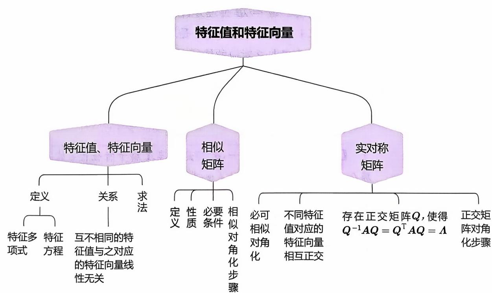
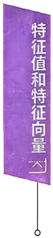
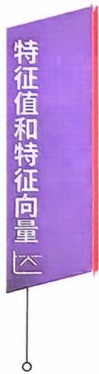
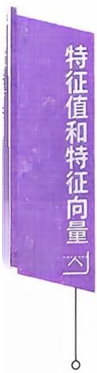
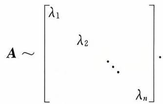
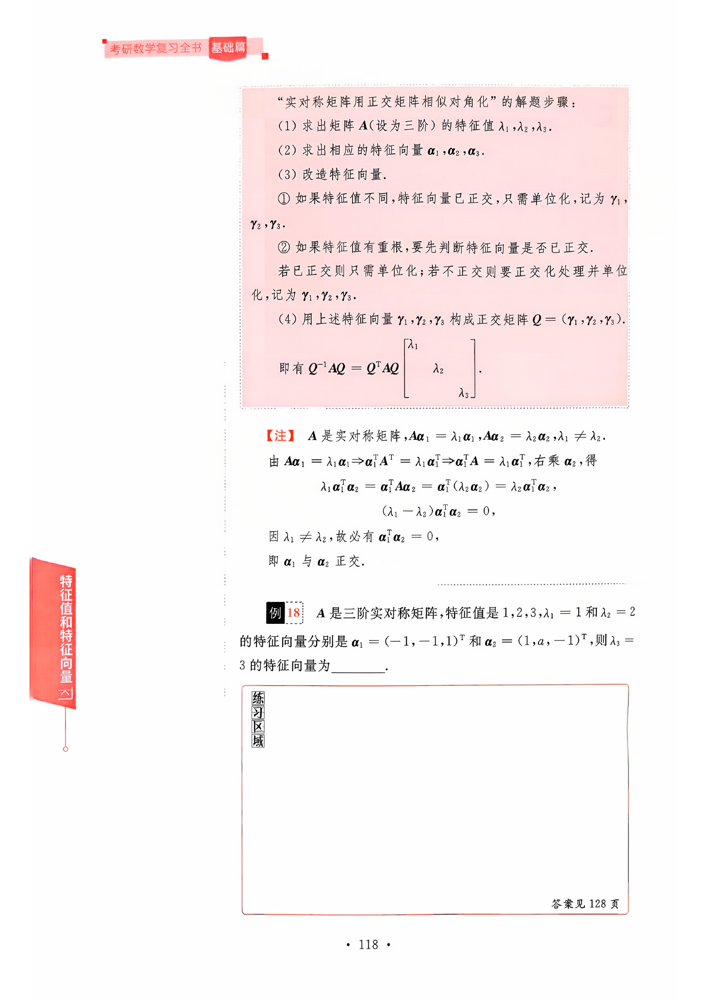

## 第五章 特征值和特征向量

## 本章考点

矩阵的特征值和特征向量的概念、性质相似矩阵的概念及性质矩阵可相似对角化的充分必要条件及相似对角矩阵实对称矩阵的特征值、特征向量及其相似对角矩阵

## 本章知识框图

## 知识梳理与例题

## 一、特征值、特征向量

定义设A是n阶矩阵，如果存在一个数λ及非零的n维列向量α,使得

$$
A\boldsymbol{\alpha} = \lambda\boldsymbol{\alpha}
$$

成立，则称λ是矩阵A的一个特征值，称非零向量α是矩阵A属于特征值λ的一个特征向量.

由定义 $A\boldsymbol{\alpha} = \lambda\boldsymbol{\alpha} , \boldsymbol{\alpha} \neq \boldsymbol{0}$ ,即 $\left( \lambda \boldsymbol{E} - \boldsymbol{A} \right) \boldsymbol{\alpha} = \boldsymbol{0}, \boldsymbol{\alpha} \neq \boldsymbol{0}$ 可知特征向量$\pmb { \alpha }$ 是齐次方程组 $\left( \lambda \boldsymbol{E} - \boldsymbol{A} \right) \boldsymbol{x} = \boldsymbol{0}$ 的非零解.

定义设 $A = \left[ a_{ij} \right]$ 为一个n阶矩阵，则行列式

$$
\left| \lambda \boldsymbol{E} - \boldsymbol{A} \right| = \left| \begin{matrix}
\lambda - a_{11} & - a_{12} & \cdots & - a_{1n} \\
- a_{21} & \lambda - a_{22} & \cdots & - a_{2n} \\
\vdots & \vdots &  & \vdots \\
- a_{n1} & - a_{n2} & \cdots & \lambda - a_{nn}
\end{matrix} \right|
$$

称为矩阵A的特征多项式， $\left| \lambda \boldsymbol{E} - \boldsymbol{A} \right| = 0$ 称为A的特征方程.

求特征值，特征向量的方法：

(1）先利用 $\left| \lambda \boldsymbol{E} - \boldsymbol{A} \right| = 0$ 求矩阵A的特征值 $\lambda_{i}$ (共n个). 再利用 $\lambda_{1}E$ $-A)x = 0$ 求基础解系，即矩阵A属于特征值 $\lambda_{i}$ 的线性无关的特征向量.

(2) 用定义 $A\boldsymbol{\alpha} = \lambda\boldsymbol{\alpha}$ 推理分析.

定理 5.1 如果 $\lambda_{1}, \lambda_{2}, \cdots, \lambda_{m}$ 是矩阵A的互不相同的特征值： $, \boldsymbol{a}_{1}$ ，$\alpha_{2},\cdots,\alpha_{m}$ 分别是与之对应的特征向量，则 $\alpha_{1}, \alpha_{2}, \cdots, \alpha_{m}$ 线性无关.

定理 5.2 设A 是 n阶矩阵 $\lambda_{1}, \lambda_{2}, \cdots, \lambda_{n}$ 是矩阵A的特征值，则

(1) $\sum \lambda_{i} = \sum a_{i i}$

(2) $\mid \boldsymbol{A} \mid = \prod \lambda_{i}.$

【注】如果 $\alpha_{1}, \alpha_{2}, \cdots, \alpha_{t}$ 都是矩阵A属于特征值λ的特征向量，那么当 $k_{1}\boldsymbol{\alpha}_{1} + k_{2}\boldsymbol{\alpha}_{2} + \cdots + k_{l}\boldsymbol{\alpha}_{l}$ 非零时， $k_{1}\boldsymbol{\alpha}_{1} + k_{2}\boldsymbol{\alpha}_{2} + \cdots + k_{t}\boldsymbol{\alpha}_{t}$ 仍是矩阵A属于特征值λ的特征向量.

如 $A\boldsymbol{\alpha} = \lambda\boldsymbol{\alpha} , \boldsymbol{\alpha} \neq \boldsymbol{0} , \forall k \neq 0 ,  有  k\boldsymbol{\alpha} \neq \boldsymbol{0}$ ,则

$$
A \left( k \boldsymbol { \alpha } \right) = k A \boldsymbol { \alpha } = k \left( \lambda \boldsymbol { \alpha } \right) = \lambda \left( k \boldsymbol { \alpha } \right) .
$$

即若α是矩阵A对应于特征值λ的特征向量，那么 $k\boldsymbol{\alpha} (k \neq 0$ 时）仍是 A 对应于λ的特征向量.

类似地，如 $A\boldsymbol{\alpha}_{1} = \lambda\boldsymbol{\alpha}_{1}, A\boldsymbol{\alpha}_{2} = \lambda\boldsymbol{\alpha}_{2}$ 且 $\boldsymbol{\alpha}_{1} \neq \boldsymbol{0}, \boldsymbol{\alpha}_{2} \neq \boldsymbol{0}$ ,那么 $\forall   k_{1}$ $k_{2}$ ,若 $k_{1} \boldsymbol{\alpha}_{1} + k_{2} \boldsymbol{\alpha}_{2} \neq \boldsymbol{0}$ ,有

$$
\begin{aligned}\boldsymbol{A}(k_{1} \boldsymbol{\alpha}_{1} + k_{2} \boldsymbol{\alpha}_{2}) &= \boldsymbol{A}(k_{1} \boldsymbol{\alpha}_{1}) + \boldsymbol{A}(k_{2} \boldsymbol{\alpha}_{2}) \\&= k_{1} \boldsymbol{A} \boldsymbol{\alpha}_{1} + k_{2} \boldsymbol{A} \boldsymbol{\alpha}_{2} \\&= k_{1}(\lambda \boldsymbol{\alpha}_{1}) + k_{2}(\lambda \boldsymbol{\alpha}_{2}) \\&= \lambda (k_{1} \boldsymbol{\alpha}_{1} + k_{2} \boldsymbol{\alpha}_{2}) ,\end{aligned}
$$

即 $k_{1} \boldsymbol{\alpha}_{1} + k_{2} \boldsymbol{\alpha}_{2}$ 仍是A对应于λ的特征向量.

例1 求矩阵 $\boldsymbol{A} = \begin{bmatrix}
17 & -2 & -2 \\
-2 & 14 & -4 \\
-2 & -4 & 14
\end{bmatrix}$ 的特征值与特征向量.

练习区域练习区域

例2求 $\boldsymbol{A} = \begin{bmatrix}
-1 & 1 & 0 \\
-4 & 3 & 0 \\
1 & 0 & 2
\end{bmatrix}$ 的特征值和特征向量.

答案见 120 页

例3求 $\boldsymbol{A} = \begin{bmatrix}
- 2 & - 1 & 2 \\
0 & - 1 & 4 \\
1 & 0 & 1
\end{bmatrix}$ 的特征值和特征向量.

例4 求A的特征值

答案见 121 页

$$
(1) \boldsymbol{A} = \begin{bmatrix}
1 & 0 & 0 \\
2 & 3 & 0 \\
4 & 5 & 6
\end{bmatrix}.
$$

$$
(2) \boldsymbol{A} = \begin{bmatrix}
1 & 2 & 3 \\
2 & 4 & 6 \\
3 & 6 & 9
\end{bmatrix}.
$$

## 例5 设λ是n 阶矩阵A 的特征值.证明

(1)λ + k 是A + kE 的特征值.

(2) $\lambda^{m}$ 是 $\boldsymbol{A}^{m}$ 的特征值.

答案见123 页

例6 已知A是三阶矩阵，特征值是—1,0，4，又知A+B≡2E，则矩阵B的特征值是

  
例8 已知A是三阶矩阵，且 $\boldsymbol{A}^{2}+2 \boldsymbol{A}-3 \boldsymbol{E}=\boldsymbol{O}.$

可逆矩阵的是$(A)A + E.$ (B)A — E. (C)A + 2E. (D)A - 2E.

答案见 123 页

证明：矩阵A的特征值只能是1或一3.

例9已知 $\boldsymbol{\alpha} = (1,1,-1)^{\mathrm{T}}$ 是矩阵 $\boldsymbol{A} = \begin{bmatrix}
2 & -1 & 2 \\
5 & a & 3 \\
-1 & b & -2
\end{bmatrix}$ 的一个特征向量，则a= , b =

答案见 124页

## 二、相似矩阵

定义设A，B都是n阶矩阵，若存在可逆矩阵P，使得 $\boldsymbol{P}^{-1} \boldsymbol{A} \boldsymbol{P} =$ B，则称B是A的相似矩阵，或A相似于B，记成A～B.

若A～Λ，其中Λ是对角阵，则称A可相似对角化.Λ是A的相似标准形.

根据相似的定义，可知

性质（1）A～A，反身性.

(2) 若 $A \sim B \Rightarrow B \sim A$ ,对称性.

(3) 若 $\boldsymbol{A} \sim \boldsymbol{B}, \boldsymbol{B} \sim \boldsymbol{C} \Rightarrow \boldsymbol{A} \sim \boldsymbol{C},$ 传递性.

两个矩阵相似的必要条件

⇒（1）特征多项式相同，即 $\left| \lambda \boldsymbol{E} - \boldsymbol{A} \right| = \left| \lambda \boldsymbol{E} - \boldsymbol{B} \right|$ ⇒（2）A,B有相同的特征值.⇒ (3) r(A) = r(B).A～B $\Rightarrow (4) \mid \boldsymbol{A} \mid = \mid \boldsymbol{B} \mid = \prod_{i = 1}^{n} \lambda_{i}.$ ⇒(5) $\sum_{i = 1}^{n} a_{ii} = \sum_{i = 1}^{n} b_{ii} = \sum_{i = 1}^{n} \lambda_{i}.$

由A～B可以联想到

(1)如A～B,则 $A^{2} \sim \boldsymbol{B}^{2}$ ,进而 $A^{n} \sim B^{n}$

因A～B,有 $P^{-1}AP = B$ ,于是

$$
\boldsymbol{B}^{2}=\left(\boldsymbol{P}^{-1} \boldsymbol{A} \boldsymbol{P}\right)^{2}=\left(\boldsymbol{P}^{-1} \boldsymbol{A} \boldsymbol{P}\right)\left(\boldsymbol{P}^{-1} \boldsymbol{A} \boldsymbol{P}\right)=\boldsymbol{P}^{-1} \boldsymbol{A}^{2} \boldsymbol{P},
$$

所以 $\boldsymbol{A}^{2} \sim \boldsymbol{B}^{2}$

(2)如A～B,则 $\boldsymbol{A} + k\boldsymbol{E} \sim \boldsymbol{B} + k\boldsymbol{E}$

因A～B,有 $\boldsymbol{P}^{-1} \boldsymbol{A} \boldsymbol{P} = \boldsymbol{B}$ ,那么

$$
\boldsymbol{P}^{-1}\left(\boldsymbol{A}+k\boldsymbol{E}\right)\boldsymbol{P}=\boldsymbol{P}^{-1}\boldsymbol{A}\boldsymbol{P}+\boldsymbol{P}^{-1}\left(k\boldsymbol{E}\right)\boldsymbol{P}=\boldsymbol{B}+k\boldsymbol{E},
$$

所以 $\boldsymbol{A} + k\boldsymbol{E} \sim \boldsymbol{B} + k\boldsymbol{E}$

（3)如A～B且A可逆，则 $\boldsymbol{A}^{-1} \sim \boldsymbol{B}^{-1}$

因A～B,有 $\left| \textbf{A} \right| = \left| \textbf{B} \right|$ .由A可逆知 $\mid \boldsymbol{B} \mid \neq 0$ ，即B必可逆.

$$
\boldsymbol{B}^{-1}=(\boldsymbol{P}^{-1}\boldsymbol{A}\boldsymbol{P})^{-1}=\boldsymbol{P}^{-1}\boldsymbol{A}^{-1}(\boldsymbol{P}^{-1})^{-1}=\boldsymbol{P}^{-1}\boldsymbol{A}^{-1}\boldsymbol{P},
$$

所以 $\boldsymbol{A}^{-1} \sim \boldsymbol{B}^{-1}$

定理5.3 n阶方阵A可对角化的充分必要条件是，A有n个线性 无关的特征向量.

推论若n阶矩阵A有n个不同的特征值 $\lambda_{1}, \lambda_{2}, \cdots, \lambda_{n}$ ，,则A可相似对角化，且

定理5.4 n阶矩阵A可相似对角化的充分必要条件是，A的每个特征值中，线性无关的特征向量的个数恰好等于该特征值的重数，即

$A \sim \Lambda \Leftrightarrow \lambda_{i}$ 是A的 $n _ { i }$ 重特征值，则 $\lambda_{i}$ 有 $n _ { i }$ 个线性无关的特征向量$\Leftrightarrow r(\lambda_{i}\boldsymbol{E}-\boldsymbol{A})=n-n_{i},\lambda_{i}$ 为 $n _ { i }$ 重特征值.

“求可逆矩阵P使 $\boldsymbol{P}^{-1} \boldsymbol{A} \boldsymbol{P} = \boldsymbol{\Lambda}$ 的解题步骤：

(1)求出矩阵A(设为三阶）的特征值 $\lambda_{1} , \lambda_{2} , \lambda_{3}$ (可以有重根).

(2)求出线性无关的特征向量 $\alpha_{1}, \alpha_{2}, \alpha_{3}$

(3)构造可逆矩阵 $\boldsymbol{P} = (\boldsymbol{\alpha}_{1}, \boldsymbol{\alpha}_{2}, \boldsymbol{\alpha}_{3})$ ,则有

$$
\boldsymbol{P}^{-1} \boldsymbol{A} \boldsymbol{P} = \boldsymbol{\Lambda} = \begin{bmatrix}
\lambda_{1} & & \\
& \lambda_{2} & \\
& & \lambda_{3}
\end{bmatrix}.
$$

注意：若 $A\boldsymbol{\alpha}_{1} = \lambda_{1}\boldsymbol{\alpha}_{1}, A\boldsymbol{\alpha}_{2} = \lambda_{2}\boldsymbol{\alpha}_{2}, A\boldsymbol{\alpha}_{3} = \lambda_{3}\boldsymbol{\alpha}_{3}$ 且 $\boldsymbol{a}_{1}, \boldsymbol{a}_{2}, \boldsymbol{a}_{3}$ 线性无关，则有

$$
\boldsymbol{A}(\boldsymbol{\alpha}_{1},\boldsymbol{\alpha}_{2},\boldsymbol{\alpha}_{3}) = (\lambda_{1}\boldsymbol{\alpha}_{1},\lambda_{2}\boldsymbol{\alpha}_{2},\lambda_{3}\boldsymbol{\alpha}_{3}) = (\boldsymbol{\alpha}_{1},\boldsymbol{\alpha}_{2},\boldsymbol{\alpha}_{3}) \begin{bmatrix}
\lambda_{1} & & \\
& \lambda_{2} & \\
& & \lambda_{3}
\end{bmatrix}.
$$

令 $\boldsymbol{P} = (\boldsymbol{\alpha}_{1},\boldsymbol{\alpha}_{2},\boldsymbol{\alpha}_{3})$ ，则P可逆，记 $\boldsymbol{\Lambda} = \begin{bmatrix}
\lambda_{1} & & \\
& \lambda_{2} & \\
& & \lambda_{3}
\end{bmatrix}$ ,即有 $AP = P\boldsymbol{\Lambda}$，得 $P^{-1}AP = \boldsymbol{\Lambda}$

故若A有n个线性无关的特征向量，则A～Λ.

反之,若 $\boldsymbol{P}^{-1} \boldsymbol{A} \boldsymbol{P} = \boldsymbol{\Lambda} \Rightarrow \boldsymbol{A} \boldsymbol{P} = \boldsymbol{P} \boldsymbol{\Lambda}$

$$
\begin{aligned} &\boldsymbol{A}(\boldsymbol{\alpha}_{1},\boldsymbol{\alpha}_{2},\boldsymbol{\alpha}_{3}) = (\boldsymbol{\alpha}_{1},\boldsymbol{\alpha}_{2},\boldsymbol{\alpha}_{3}) \begin{bmatrix}
a_{1} \\
a_{2} \\
a_{3}
\end{bmatrix} = (a_{1}\boldsymbol{\alpha}_{1},a_{2}\boldsymbol{\alpha}_{2},a_{3}\boldsymbol{\alpha}_{3})\\ &\Rightarrow \boldsymbol{A}\boldsymbol{\alpha}_{1} = a_{1}\boldsymbol{\alpha}_{1},\boldsymbol{A}\boldsymbol{\alpha}_{2} = a_{2}\boldsymbol{\alpha}_{2},\boldsymbol{A}\boldsymbol{\alpha}_{3} = a_{3}\boldsymbol{\alpha}_{3}.\\ \end{aligned}
$$

因 $\boldsymbol{P} = ( \boldsymbol{\alpha}_{1} , \boldsymbol{\alpha}_{2} , \boldsymbol{\alpha}_{3} )$ 可逆 $\Rightarrow \boldsymbol{\alpha}_{1} , \boldsymbol{\alpha}_{2} , \boldsymbol{\alpha}_{3}$ 线性无关，故A有n个线性无 关的特征向量.

例10 已知 $A \sim \boldsymbol{B}$ ,若 $\boldsymbol{A} = \begin{bmatrix}
-1 & 2 & 2 \\
2 & -1 & 2 \\
2 & 2 & -1
\end{bmatrix}$ ,则 $\left| \boldsymbol{B} + \boldsymbol{E} \right| =$

练习区域

答案见124 页

<!-- PDF pages 129-171; chunk 0002_p000129-000171 -->

答案见124页

例11 已知矩阵A和B相似，若 $\boldsymbol{B} = \begin{bmatrix}
1 & 2 & 3 \\
0 & 4 & 5 \\
0 & 0 & 6
\end{bmatrix}$ ,则秩r(A— E) =

例12设 $\boldsymbol{A} = \boldsymbol{\alpha} \boldsymbol{\beta}^{\mathrm{T}}$ ,其中 $\boldsymbol{\alpha} = (1,1,1)^{\mathrm{T}}, \boldsymbol{\beta} = (1,3,\boldsymbol{\alpha})^{\mathrm{T}}, \boldsymbol{B} =$ $\begin{bmatrix}
3 & 3 & 3 \\
3 & b & 3 \\
3 & 3 & 3
\end{bmatrix}$ ,且 $A \sim \pmb { B }$ ,则 a =

例13 (2023,数农)若矩阵 $\begin{bmatrix}
2 & 4 & - 4 \\
a & - 3 & 2 \\
0 & 0 & b
\end{bmatrix}$ 相似于 $\begin{bmatrix}
1 & 0 & 0 \\
0 & 2 & 0 \\
0 & 0 & - 2
\end{bmatrix}$ ,则(A) $a = 1, b = 2.$ (B) $a = -1, b = -2.$ (C) $a = 1, \\ b = - 2.$ (D) $a = -1, b = 2.$

练习区域

答案见 125 页

例14 判断下列矩阵能否相似对角化，如能相似对角化，则写出和其相似的对角矩阵.

$$
\begin{bmatrix}
1 & 3 & 5 \\
0 & 3 & 5 \\
0 & 0 & 5
\end{bmatrix}.
$$

$$
\begin{bmatrix}
-1 & 0 & 2 \\
1 & 2 & -1 \\
1 & 3 & 0
\end{bmatrix}.
$$

练习区域

例15 证明矩阵 $\boldsymbol{A} = \begin{bmatrix}
1 & 1 & 0 \\
-1 & 3 & 0 \\
1 & 1 & 2
\end{bmatrix}$ 不能相似对角化.

例16（2024，数农）设矩阵 $\boldsymbol{A} = \begin{bmatrix}
2 & a & -1 \\
a & 2 & b \\
-1 & b & 2
\end{bmatrix}$ 有特征向量 $\left[ \begin{matrix}
{ 1 } \\
{ 1 } \\
{ 1 }
\end{matrix} \right]$

(1) 求 a,b 的值.

答案见 126 页

(2) 求可逆矩阵P,使得 $P^{-1}AP$ 为对角矩阵.

例17 (2014，数农)已知 $\boldsymbol{A} = \begin{bmatrix}
0 & 2 & 1 \\
0 & 1 & 0 \\
1 & a & 0
\end{bmatrix}$ 相似于对角矩阵A.

(1) 求 a.

(2) 求可逆矩阵P和A，使 $\boldsymbol{P}^{-1} \boldsymbol{A} \boldsymbol{P} = \boldsymbol{\Lambda}$ 并验算.

答案见 127 页

## 三、实对称矩阵

定理5.5 实对称矩阵必可相似对角化.

定理5.6实对称矩阵的属于不同特征值对应的特征向量相互正交.

定理5.7 设A为n阶实对称矩阵，则必存在正交阵Q，使得$\boldsymbol{Q}^{-1} \boldsymbol{A} \boldsymbol{Q} = \boldsymbol{Q}^{\mathrm{T}} \boldsymbol{A} \boldsymbol{Q} = \boldsymbol{\Lambda}$

<!-- DIRECTED-REPAIR-FALLBACK:FALLBACK-QA-R2-LIN-BASE-CH05-P133-DIAG -->
> [!WARNING]
> 原 PDF 第 133 页回退：γ→Y替换+对角矩阵坍缩为列向量

“實對稱矩陣用正交矩陣相似對角化”的解題步骤：

（1）求出矩阵A（设为三阶）的特征值 $\lambda _ { 1 } , \lambda _ { 2 } , \lambda _ { 3 }$

（2)求出相应的特征向量 $\alpha_{1}, \alpha_{2}, \alpha_{3}$

（3）改造特征向量.

①如果特征值不同，特征向量已正交，只需单位化，记为 $\gamma _ { 1 }$ $\gamma _ { 2 } , \gamma _ { 3 }$

②如果特征值有重根，要先判断特征向量是否已正交.

若已正交则只需单位化；若不正交则要正交化处理并单位化，记为 $Y _ { 1 } , Y _ { 2 } , Y _ { 3 }$

(4)用上述特征向量 $Y _ { 1 } , Y _ { 2 } , Y _ { 3 }$ 构成正交矩阵 $\boldsymbol{Q} = ( \gamma_{1} , \gamma_{2} , \gamma_{3} )$

即有 $Q^{-1}AQ = Q^{\mathrm{T}}AQ = \begin{bmatrix}
\lambda_{1} & & \\
& \lambda_{2} & \\
& & \lambda_{3}
\end{bmatrix}.$

【注】A是实对称矩阵 $A\boldsymbol{\alpha}_{1} = \lambda_{1}\boldsymbol{\alpha}_{1}, A\boldsymbol{\alpha}_{2} = \lambda_{2}\boldsymbol{\alpha}_{2}, \lambda_{1} \neq \lambda_{2}$

由 $A\boldsymbol{\alpha}_{1} = \lambda_{1}\boldsymbol{\alpha}_{1} \Rightarrow \boldsymbol{\alpha}_{1}^{\mathrm{T}}\boldsymbol{A}^{\mathrm{T}} = \lambda_{1}\boldsymbol{\alpha}_{1}^{\mathrm{T}} \Rightarrow \boldsymbol{\alpha}_{1}^{\mathrm{T}}\boldsymbol{A} = \lambda_{1}\boldsymbol{\alpha}_{1}^{\mathrm{T}}$ ,右乘 $\alpha_{2}$ ,得

$$
\lambda _ { 1 } \boldsymbol { \alpha } _ { 1 } ^ { \mathrm { T } } \boldsymbol { \alpha } _ { 2 } = \boldsymbol { \alpha } _ { 1 } ^ { \mathrm { T } } \boldsymbol { A } \boldsymbol { \alpha } _ { 2 } = \boldsymbol { \alpha } _ { 1 } ^ { \mathrm { T } } \left( \lambda _ { 2 } \boldsymbol { \alpha } _ { 2 } \right) = \lambda _ { 2 } \boldsymbol { \alpha } _ { 1 } ^ { \mathrm { T } } \boldsymbol { \alpha } _ { 2 } ,
$$

$$
\left( \lambda _ { 1 } - \lambda _ { 2 } \right) \boldsymbol { \alpha } _ { 1 } ^ { \mathrm { T } } \boldsymbol { \alpha } _ { 2 } = 0   ,
$$

因 $\lambda_{1} \neq \lambda_{2}$ ，故必有 $\boldsymbol{\alpha}_{1}^{\mathrm{T}} \boldsymbol{\alpha}_{2} = 0$

即 $\alpha_{1}$ 与 $\pmb { \alpha } _ { 2 }$ 正交.

例18 A是三阶实对称矩阵，特征值是 $1,2,3,\lambda_{1} = 1$ 和 $\lambda_{2} = 2$ 的特征向量分别是 $\boldsymbol{\alpha}_{1} = (-1, -1, 1)^{\mathrm{T}}$ 和 $\boldsymbol{\alpha}_{2} = (1, a, -1)^{\mathrm{T}}$ ,则 $\lambda_{3} =$ 3 的特征向量为

练习区域

例19 已知A是三阶实对称矩阵，满足 $A^{2} = A$ ,若 $r(\boldsymbol{A} - \boldsymbol{E}) =$ 2,则A的特征值为

例20已知 $\boldsymbol{A} = \begin{bmatrix}
1 & a & -1 \\
a & 3 & 1 \\
-1 & 1 & 1
\end{bmatrix}$ ,如果 $r(A) = 2$

答案见 128 页

(1) 求 a.

练习区域

（2)求正交矩阵Q和对角矩阵Λ，使 $Q^{-1}AQ = \Lambda$

学习笔记

## 一、特征值、特征向量

例1 【解】由矩阵A的特征多项式

$$
\begin{aligned}\left| \lambda \boldsymbol{E} - \boldsymbol{A} \right| &=\left| \begin{matrix}
\lambda - 17 & 2 & 2 \\
2 & \lambda - 14 & 4 \\
2 & 4 & \lambda - 14
\end{matrix} \right| \\&=\left| \begin{matrix}
\lambda - 17 & 2 & 2 \\
2 & \lambda - 14 & 4 \\
0 & 18 - \lambda & \lambda - 18
\end{matrix} \right| \\&=\left| \begin{matrix}
\lambda - 17 & 4 & 2 \\
2 & \lambda - 10 & 4 \\
0 & 0 & \lambda - 18
\end{matrix} \right| \\&= (\lambda - 18)(\lambda^2 - 27\lambda + 16\lambda)\end{aligned}
$$

$$
\begin{aligned}=(\lambda - 18)(\lambda^{2} - 27\lambda + 162) = (\lambda - 18)^{2}(\lambda - 9)\end{aligned}
$$

得到矩阵A的特征值是 $\lambda_{1} = \lambda_{2} = 18, \lambda_{3} = 9$

当 $\lambda_{1} = \lambda_{2} = 18$ 时，解方程 $(18\boldsymbol{E} - \boldsymbol{A})\boldsymbol{x} = \boldsymbol{0}$ ,即

$$
\begin{bmatrix}
1 & 2 & 2 \\
2 & 4 & 4 \\
2 & 4 & 4
\end{bmatrix} \twoheadrightarrow \begin{bmatrix}
1 & 2 & 2 \\
0 & 0 & 0 \\
0 & 0 & 0
\end{bmatrix},
$$

特征值和特征向量

得基础解系 $\boldsymbol{\alpha}_{1}=(-2,1,0)^{\mathrm{T}}, \boldsymbol{\alpha}_{2}=(-2,0,1)^{\mathrm{T}}$

因此属于特征值 $\lambda_{1} = \lambda_{2} = 18$ 的特征向量是 $k_{1} \boldsymbol{\alpha}_{1} + k_{2} \boldsymbol{\alpha}_{2} (k_{1}, k_{2}$ 不全为0).

当 $\lambda_{3} = 9$ 时，由 $(9\boldsymbol{E} - \boldsymbol{A})\boldsymbol{x} = \boldsymbol{0}$ ,即

$$
\begin{bmatrix}
- 8 & 2 & 2 \\
2 & - 5 & 4 \\
2 & 4 & - 5
\end{bmatrix} \rightarrow \begin{bmatrix}
2 & - 5 & 4 \\
2 & 4 & - 5 \\
- 8 & 2 & 2
\end{bmatrix} \rightarrow \begin{bmatrix}
2 & - 5 & 4 \\
0 & 9 & - 9 \\
0 & - 18 & 18
\end{bmatrix}
$$

$$
\rightarrow \begin{bmatrix}
2 & -5 & 4 \\
0 & 1 & -1 \\
0 & 0 & 0
\end{bmatrix} \rightarrow \begin{bmatrix}
2 & 0 & -1 \\
0 & 1 & -1 \\
0 & 0 & 0
\end{bmatrix}
$$

$$
\rightarrow \begin{bmatrix}
1 & 0 & -\dfrac{1}{2} \\
0 & 1 & -1 \\
0 & 0 & 0
\end{bmatrix},
$$

得基础解系 $\boldsymbol{\alpha}_{3} = (1,2,2)^{\mathrm{T}}$

因此属于特征值 $\lambda_{3} = 9$ 的特征向量是 $k_{3} \boldsymbol{\alpha}_{3} \left( k_{3} \neq 0 \right)$

例2【解】由特征多项式

$$
\begin{aligned}\left| \lambda \boldsymbol{E} - \boldsymbol{A} \right| &= \left| \begin{matrix}
\lambda + 1 & - 1 & 0 \\
4 & \lambda - 3 & 0 \\
- 1 & 0 & \lambda - 2
\end{matrix} \right| = (\lambda - 2) \left| \begin{matrix}
\lambda + 1 & - 1 \\
4 & \lambda - 3
\end{matrix} \right| \\&= (\lambda - 2)(\lambda^{2} - 2\lambda + 1)  ,\end{aligned}
$$

得到矩阵A的特征值 $\lambda _ { 1 } = \lambda _ { 2 } = 1 , \lambda _ { 3 } = 2.$

当 $\lambda_{1} = \lambda_{2} = 1$ 时，解方程 $( \boldsymbol{E} - \boldsymbol{A} ) \boldsymbol{x} = \boldsymbol{0}$

$$
\begin{bmatrix}
2 & - 1 & 0 \\
4 & - 2 & 0 \\
- 1 & 0 & - 1
\end{bmatrix} \xrightarrow{} \begin{bmatrix}
1 & 0 & 1 \\
0 & 1 & 2 \\
0 & 0 & 0
\end{bmatrix},
$$

得基础解系 $\boldsymbol{\alpha}_{1} = (-1, -2, 1)^{\mathrm{T}}$ .所以特征值 $\lambda_{1} = \lambda_{2} = 1$ 的特征向量 为 $k_{1} \boldsymbol{\alpha}_{1} \left( k_{1} \neq 0 \right)$

当 $\lambda_{3} = 2$ 时，解方程 $(2\boldsymbol{E} - \boldsymbol{A})\boldsymbol{x} = \boldsymbol{0}$

$$
\begin{bmatrix}
3 & - 1 & 0 \\
4 & - 1 & 0 \\
- 1 & 0 & 0
\end{bmatrix} \xrightarrow{} \begin{bmatrix}
1 & 0 & 0 \\
0 & 1 & 0 \\
0 & 0 & 0
\end{bmatrix},
$$

得基础解系 $\boldsymbol{\alpha}_{2} = (0,0,1)^{\mathrm{T}}$ .所以特征值 $\lambda_{3} \; = \; 2$ 的特征向量为 $k_{2} \boldsymbol{\alpha}_{2} \left( k_{2} \neq 0 \right)$

【注】通过例1和例2大家应当注意到，当特征值是二重根时，有可能只有一个线性无关的特征向量，也可能有两个线性无关的特征向量，这一点在后面相似对角化问题上是重要的。

例3【解】由特征多项式

$$
\begin{aligned}\left| \lambda \boldsymbol{E} - \boldsymbol{A} \right| &=\left| \begin{matrix}
\lambda + 2 & 1 & - 2 \\
0 & \lambda + 1 & - 4 \\
- 1 & 0 & \lambda - 1
\end{matrix} \right|=\left| \begin{matrix}
\lambda + 2 & 1 & 0 \\
0 & \lambda + 1 & \lambda - 2 \\
- 1 & 0 & \lambda - 1
\end{matrix} \right| \\&=\left| \begin{matrix}
\lambda + 2 & 1 & 0 \\
2 & \lambda + 1 & 0 \\
- 1 & 0 & \lambda - 1
\end{matrix} \right|= (\lambda - 1) \left( \lambda^{2} + 3\lambda \right),\end{aligned}
$$

得矩阵A的特征值 $\lambda_{1} = 1 , \lambda_{2} = 0 , \lambda_{3} = - 3$

对 $\lambda_{1} = 1$ ,由 $(E - A)x = 0$

$$
\boldsymbol{E} - \boldsymbol{A} = \begin{bmatrix}
3 & 1 & - 2 \\
0 & 2 & - 4 \\
- 1 & 0 & 0
\end{bmatrix} \xrightarrow{} \begin{bmatrix}
1 & 0 & 0 \\
0 & 1 & - 2 \\
0 & 0 & 0
\end{bmatrix},
$$

得基础解系 $\boldsymbol{\alpha}_{1} = (0, 2, 1)^{\mathrm{T}}$

$\lambda_{1} = 1$ 的所有特征向量 $k_{1} \boldsymbol{\alpha}_{1} = k_{1} \left( 0, 2, 1 \right)^{\mathrm{T}}, k_{1} \neq 0$ 开业次业八人口营共可n

对 $\lambda_{2} = 0$ ,由 $\left( 0 \boldsymbol{E} - \boldsymbol{A} \right) \boldsymbol{x} = \boldsymbol{0}$

$$
0 \boldsymbol { E } - \boldsymbol { A } = \begin{bmatrix}
2 & 1 & - 2 \\
0 & 1 & - 4 \\
- 1 & 0 & - 1
\end{bmatrix} \xrightarrow { } \begin{bmatrix}
1 & 0 & 1 \\
0 & 1 & - 4 \\
0 & 0 & 0
\end{bmatrix},
$$

得基础解系 $\boldsymbol{a}_{2}=(-1,4,1)^{\mathrm{T}}$

$\lambda_{2} = 0$ 的所有特征向量 $k_{2} \boldsymbol{\alpha}_{2} = k_{2} (-1,4,1)^{\mathrm{T}}, k_{2} \neq 0.$

对 $\lambda_{3} = - 3$ ,由 $\left( - 3\boldsymbol{E} - \boldsymbol{A} \right)\boldsymbol{x} = \boldsymbol{0}$

$$
-3\boldsymbol{E}-\boldsymbol{A}=\begin{bmatrix}
-1 & 1 & -2 \\
0 & -2 & -4 \\
-1 & 0 & -4
\end{bmatrix}\xrightarrow{}\begin{bmatrix}
1 & 0 & 4 \\
0 & 1 & 2 \\
0 & 0 & 0
\end{bmatrix},
$$

得基础解系 $\boldsymbol{a}_{3} = (-4, -2, 1)^{\mathrm{T}}$

$\lambda_{3} = - 3$ 的所有特征向量： $k_{3} \boldsymbol{\alpha}_{3} = k_{3} \left( - 4 , - 2 , 1 \right)^{\mathrm{T}} , k_{3} \neq 0.$

## 例4【解】由特征多项式

$$
\left| \lambda \boldsymbol{E} - \boldsymbol{A} \right| = \left| \begin{matrix}
\lambda - 1 & 0 & 0 \\
- 2 & \lambda - 3 & 0 \\
- 4 & - 5 & \lambda - 6
\end{matrix} \right| = (\lambda - 1)(\lambda - 3)(\lambda - 6),
$$

得矩阵A的特征值为：1,3，6.

【注】上(下）三角矩阵的特征值就是主对角线元素 $a_{11}, a_{22}, \cdots, a_{m}$

$$
\begin{aligned}(2) \mid \lambda \boldsymbol{E}-\boldsymbol{A} \mid &= \left| \begin{matrix}
\lambda - 1 & - 2 & - 3 \\
- 2 & \lambda - 4 & - 6 \\
- 3 & - 6 & \lambda - 9
\end{matrix} \right| = \left| \begin{matrix}
\lambda - 1 & - 2 & - 3 \\
- 2 & \lambda - 4 & - 6 \\
- 3\lambda & 0 & \lambda
\end{matrix} \right| \\&= \left| \begin{matrix}
\lambda - 10 & - 2 & - 3 \\
- 20 & \lambda - 4 & - 6 \\
0 & 0 & \lambda
\end{matrix} \right| = \lambda \left| \begin{matrix}
\lambda - 10 & - 2 \\
- 20 & \lambda - 4
\end{matrix} \right| \\&= \lambda^{2} \left( \lambda - 14 \right),\end{aligned}
$$

得矩阵A的特征值为：14,0,0.

【注】如果 $r(\boldsymbol{A}) = 1$ ，则有公式 $\left| \lambda \boldsymbol{E} - \boldsymbol{A} \right| = \lambda^n - \sum a_{\ddot{a}} \lambda^{n - 1}$ ，即$r(\boldsymbol{A}) = 1$ 时，A的特征值为： $\sum a_{n},0,\cdots,0(n-1$ 个).

## 例5【证】因λ是A的特征值，设α是对应的特征向量.

即 $A \alpha = \lambda \alpha , \alpha \neq 0 .$

(1) $\left( \boldsymbol{A} + k\boldsymbol{E} \right)\boldsymbol{\alpha} = \boldsymbol{A}\boldsymbol{\alpha} + \left( k\boldsymbol{E} \right)\boldsymbol{\alpha} = \lambda\boldsymbol{\alpha} + k\boldsymbol{\alpha} = \left( \lambda + k \right)\boldsymbol{\alpha},\boldsymbol{\alpha} \neq \boldsymbol{0}$

所以λ+k是A+kE的特征值.

(2) 由 $A\alpha = \lambda\alpha, \alpha \neq 0$ ,有

$$
A ^ { 2 } \boldsymbol { \alpha } = A ( \lambda \boldsymbol { \alpha } ) = \lambda A \boldsymbol { \alpha } = \lambda ^ { 2 } \boldsymbol { \alpha } ,
$$

递推地 $A^{m} \boldsymbol{\alpha} = \lambda^{m} \boldsymbol{\alpha} , \boldsymbol{\alpha} \neq \mathbf{0}$ ,所以 $\lambda^{m}$ 是 $A^{m}$ 的特征值.

例6【分析】设矩阵A属于特征值—1的特征向量是 $\pmb { \alpha } _ { 1 }$ ,即$A\boldsymbol{\alpha}_{1} = - \boldsymbol{\alpha}_{1}$

由A + B = 2E有B = 2E-A,那么

$$
\boldsymbol{B}\boldsymbol{\alpha}_{1} = (2\boldsymbol{E} - \boldsymbol{A})\boldsymbol{\alpha}_{1} = 2\boldsymbol{\alpha}_{1} - \boldsymbol{A}\boldsymbol{\alpha}_{1} = 3\boldsymbol{\alpha}_{1},
$$

所以，3是矩阵B的一个特征值， $\pmb { \alpha } _ { 1 }$ 是矩阵B关于特征值λ=3的特征向量.

类似地，由 $A\boldsymbol{\alpha}_{2} = 0\boldsymbol{\alpha}_{2} , A\boldsymbol{\alpha}_{3} = 4\boldsymbol{\alpha}_{3}$ 知

$$
B\boldsymbol{\alpha}_{2} = (2\boldsymbol{E} - \boldsymbol{A})\boldsymbol{\alpha}_{2} = 2\boldsymbol{\alpha}_{2}, B\boldsymbol{\alpha}_{3} = (2\boldsymbol{E} - \boldsymbol{A})\boldsymbol{\alpha}_{3} = - 2\boldsymbol{\alpha}_{3}.
$$

可知矩阵B的特征值是3,2，-2.

## 例7【分析】因A的特征值是1，—1,2.于是

A+E的特征值是 2,0,3.

A-E的特征值是0，—2,1.

A+2E的特征值是3,1,4.

A-2E的特征值是—1，—3,0.

又 $\left| \boldsymbol{A} \right| = \prod \lambda_{i}$ ,故应选(C).

例8 【证】设λ是A的特征值，α是对应于λ的特征向量，则$A\alpha = \lambda\alpha , \alpha \neq 0$ ,那么

$$
A^{2} \boldsymbol{\alpha} = A ( \lambda \boldsymbol{\alpha} ) = \lambda A \boldsymbol{\alpha} = \lambda^{2} \boldsymbol{\alpha}.
$$

由 $A^{2} + 2A - 3E = O$ 得(A² + 2A − 3E)α = 0.

即 (λ²+2λ−3)α=0,α≠0,

故 $\lambda ^ { 2 } + 2 \lambda - 3 = ( \lambda - 1 ) ( \lambda + 3 ) = 0 ,$

所以矩阵A的特征值只能是1或一3.

【注】注意满足条件 $A^{2} + 2A - 3E = O$ 的矩阵A是不唯一的.例如

$$
\begin{bmatrix}
1 & & \\
& 1 & \\
& & 1
\end{bmatrix}, \begin{bmatrix}
-3 & & \\
& -3 & \\
& & -3
\end{bmatrix}, \begin{bmatrix}
1 & & \\
& 1 & \\
& & -3
\end{bmatrix},
$$

$$
\begin{bmatrix}
1 & & \\
& -3 & \\
& & -3
\end{bmatrix}, \begin{bmatrix}
0 & 3 & 0 \\
1 & -2 & 0 \\
0 & 0 & 1
\end{bmatrix}, \cdots.
$$

例9【分析】设α是对应于特征值λ的特征向量，即 $A\boldsymbol{\alpha} =$ λα，那么

$$
\begin{bmatrix}
2 & - 1 & 2 \\
5 & a & 3 \\
- 1 & b & - 2
\end{bmatrix} \begin{bmatrix}
1 \\
1 \\
- 1
\end{bmatrix} = \lambda \begin{bmatrix}
1 \\
1 \\
- 1
\end{bmatrix},
$$

即 $\begin{cases}2 - 1 - 2 = \lambda  ,  \\5 + a - 3 = \lambda  ,  \\-1 + b + 2 = -\lambda  , \end{cases}$ 得 $a = -3, b = 0.$

## 二、相似矩阵

例10【分析】由A～B知A+E～B+E,那么

$$
\left| \boldsymbol{B} + \boldsymbol{E} \right| = \left| \boldsymbol{A} + \boldsymbol{E} \right| = \left| \begin{matrix}
0 & 2 & 2 \\
2 & 0 & 2 \\
2 & 2 & 0
\end{matrix} \right| = 16.
$$

例11【分析】由A～B知A—E～B—E，故

$$
r(\boldsymbol{A} - \boldsymbol{E}) = r(\boldsymbol{B} - \boldsymbol{E}) = 2.
$$

[1] 3 a 例12 【分析】A = αβT = 1 [1,3,a] = 1 3 a ，且 1 1 3 a $r(A)=1$

由A～B知 $r\left( \boldsymbol{B} \right) = r\left[ \begin{aligned} 3 \quad 3 \quad 3 \\ 3 \quad b \quad 3 \\ 3 \quad 3 \quad 3 \end{aligned} \right] = 1.$ ,得 $b = 3$

因 $\sum a_{n} = \sum b_{n}, 1 + 3 + a = 3 + 3 + 3$ ,所以 $a = 5$

或由 $\lambda_{A} = \lambda_{B}$ 得 $1+3+a=9$

例13【分析】因 $A \sim \boldsymbol{B}$ ,有 $\sum a_{\bar{u}} = \sum b_{\bar{u}} , \left| \boldsymbol{A} \right| = \left| \boldsymbol{B} \right|$

$$
\left\{ \begin{aligned} 2 + ( - 3 ) + b = 1 + 2 + ( - 2 ) , \\ | A | = b ( - 6 - 4a ) = - 4 = | B | , \end{aligned} \right.
$$

所以 $a = -1, b = 2$

例14【解】（1）因A是上三角矩阵，特征值为1,3,5，由有3个不同的特征值，故A～Λ.

$$
\boldsymbol{\Lambda} = \begin{bmatrix}
1 & & \\
& 3 & \\
& & 5
\end{bmatrix}.
$$

2)由 $\begin{aligned}\left| \lambda \boldsymbol{E} - \boldsymbol{A} \right| &= \left| \begin{aligned}\lambda + 1 \quad & 0 \quad & -2 \\-1 \quad & \lambda - 2 \quad & 1 \\-1 \quad & -3 \quad & \lambda\end{aligned} \right| \\&= \left| \begin{aligned}\lambda - 1 \quad & 0 \quad & -2 \\0 \quad & \lambda - 2 \quad & 1 \\\lambda - 1 \quad & -3 \quad & \lambda\end{aligned} \right| \\&= \left( \lambda + 1 \right) \left( \lambda - 1 \right)^{\imath},\end{aligned}$

A 的特征值为1,1，-1.

对 $\lambda_{1} = \lambda_{2} = 1$ ,由 $\left( \boldsymbol{E} - \boldsymbol{A} \right) \boldsymbol{x} = \boldsymbol{0}$ ,因

$$
r(\boldsymbol{E} - \boldsymbol{A}) = r\begin{bmatrix}
2 & 0 & - 2 \\
- 1 & - 1 & 1 \\
- 1 & - 3 & 1
\end{bmatrix} = 2,3 - r(\boldsymbol{E} - \boldsymbol{A}) = 1,
$$

即 $(E - A)x = 0$ 只有1个线性无关的解.

亦 $\lambda_{1} = \lambda_{2} = 1$ 只有1个线性无关的特征向量，所以A不能相似

对角化.

例15【证】由特征多项式

$$
\begin{aligned} \left| \lambda \boldsymbol{E} - \boldsymbol{A} \right| &= \left| \begin{aligned}&\lambda - 1 & -1 & 0 \\&1 & \lambda - 3 & 0 \\&-1 & -1 & \lambda - 2 \\\end{aligned} \right| = (\lambda - 2) \left| \begin{aligned}&\lambda - 1 & -1 \\&1 & \lambda - 3 \\\end{aligned} \right|\\ &= (\lambda - 2)^3\\ \end{aligned}
$$

得到矩阵A 的特征值 $\lambda_{1} = \lambda_{2} = \lambda_{3} = 2.$

于是 $n - r(2\boldsymbol{E} - \boldsymbol{A}) = 3 - 2 = 1$ ，说明齐次方程组 $(2\boldsymbol{E} - \boldsymbol{A})\boldsymbol{x} =$ 0只有一个线性无关的解，亦即 $\lambda_{1} = \lambda_{2} = \lambda_{3} = 2$ 只有1个线性无关的特征向量.

三重特征值2只有1个线性无关的特征向量，故A不能相似对角化.

例16【解】（1）设 $\alpha = \begin{bmatrix}
1 \\
1 \\
1
\end{bmatrix}$ 是A关于λ的特征向量，即

$$
\begin{bmatrix}
2 & a & - 1 \\
a & 2 & b \\
- 1 & b & 2
\end{bmatrix} \begin{bmatrix}
1 \\
1 \\
1
\end{bmatrix} = \lambda \begin{bmatrix}
1 \\
1 \\
1
\end{bmatrix},
$$

有 $\begin{cases}a + 1 = \lambda  ,  \\a + b + 2 = \lambda  ,  \\b + 1 = \lambda  , \end{cases}$ ,解出 $\lambda = 0 , a = b = - 1$

(2) 由特征多项式

$$
\begin{aligned} &\left| \lambda \boldsymbol{E} - \boldsymbol{A} \right| = \left| \begin{matrix}
\lambda - 2 & 1 & 1 \\
1 & \lambda - 2 & 1 \\
1 & 1 & \lambda - 2
\end{matrix} \right| = \lambda (\lambda - 3)^{2}  ,\\ \end{aligned}
$$

知A的特征值：3,3,0.

对 $\lambda_{1} = \lambda_{2} = 3$ ,由 $(3\boldsymbol{E} - \boldsymbol{A})\boldsymbol{x} = \boldsymbol{0}$ 得特征向量

$$
\boldsymbol { \alpha } _ { 1 } = ( - 1 , 1 , 0 ) ^ { \mathrm { T } } , \boldsymbol { \alpha } _ { 2 } = ( - 1 , 0 , 1 ) ^ { \mathrm { T } }.
$$

对 $\lambda_{3} = 0$ ,特征向量

$$
\boldsymbol{\alpha} = (1,1,1)^{\mathrm{T}}.
$$

$\boldsymbol{P} = \left[ \boldsymbol{\alpha}_{1}, \boldsymbol{\alpha}_{2}, \boldsymbol{\alpha} \right] = \begin{bmatrix}
-1 & -1 & 1 \\
1 & 0 & 1 \\
0 & 1 & 1
\end{bmatrix}$ ,有 $\boldsymbol{P}^{-1} \boldsymbol{A} \boldsymbol{P} = \boldsymbol{\Lambda} = \begin{bmatrix}
3 & & \\
& 3 & \\
& & 0
\end{bmatrix}.$

例17【解】由A的特征多项式

$$
\begin{aligned} \left| \lambda \boldsymbol{E} - \boldsymbol{A} \right| &= \left| \begin{matrix}
\lambda & - 2 & - 1 \\
\lambda & - 2 & - 1 \\
0 & \lambda - 1 & 0 \\
- 1 & - a & \lambda
\end{matrix} \right| = (\lambda - 1) \left| \begin{matrix}
\lambda & - 1 \\
- 1 & \lambda
\end{matrix} \right| \\&= (\lambda - 1)^{\sharp}(\lambda + 1)\\ \end{aligned}
$$

得A的特征值：1，1，—1.

(1)因A～Λ，而 $\lambda_{1} = \lambda_{2} = 1$ 是二重特征值，那么 $\lambda_{1} = \lambda_{2} = 1$ 应 有2个线性无关的特征向量.

$(E - A)x = 0$ 应有2个线性无关的解，故

$n - r(\boldsymbol{E} - \boldsymbol{A}) = 3 - r(\boldsymbol{E} - \boldsymbol{A}) = 2$ ,即 $r(\boldsymbol{E} - \boldsymbol{A}) = 1$

$$
 而  \boldsymbol{E}-\boldsymbol{A}=\begin{bmatrix}
1 & -2 & -1 \\
0 & 0 & 0 \\
-1 & -a & 1
\end{bmatrix} \xrightarrow{} \begin{bmatrix}
1 & -2 & -1 \\
0 & a+2 & 0 \\
0 & 0 & 0
\end{bmatrix},
$$

所以 $a = - 2.$

(2)把a=—2代人A中.

对 $\lambda_{1} = \lambda_{2} = 1$ ,由 $(E - A)x = 0$ 9

$$
\begin{bmatrix}
1 & - 2 & - 1 \\
0 & 0 & 0 \\
- 1 & 2 & 1
\end{bmatrix} \xrightarrow{} \begin{bmatrix}
1 & - 2 & - 1 \\
0 & 0 & 0 \\
0 & 0 & 0
\end{bmatrix}
$$

得特征向量 $\boldsymbol{\alpha}_{1} = (2,1,0)^{\mathrm{T}}, \boldsymbol{\alpha}_{2} = (1,0,1)^{\mathrm{T}}$

对 $\lambda_{3} = - 1$ ,由 $\left( - \boldsymbol{E} - \boldsymbol{A} \right) \boldsymbol{x} = \boldsymbol{0}$ ,得特征向量 $\boldsymbol{\alpha}_{3} = (-1,0,1)^{\mathrm{T}}$

区 $\boldsymbol{P} = (\boldsymbol{\alpha}_{1},\boldsymbol{\alpha}_{2},\boldsymbol{\alpha}_{3}) = \begin{bmatrix}
2 & 1 & -1 \\
1 & 0 & 0 \\
0 & 1 & 1
\end{bmatrix}$ ,则 $\boldsymbol{P}^{-1} \boldsymbol{A} \boldsymbol{P} = \boldsymbol{\Lambda} = \begin{bmatrix}
1 & & \\
& 1 & \\
& & -1
\end{bmatrix}$

验算如下：

特征值和特征向量

$$
\begin{aligned}\boldsymbol{P}^{-1} \boldsymbol{A} \boldsymbol{P} &=\begin{bmatrix}
2 & 1 & -1 \\
1 & 0 & 0 \\
0 & 1 & 1
\end{bmatrix}^{-1}\begin{bmatrix}
0 & 2 & 1 \\
0 & 1 & 0 \\
1 & -2 & 0
\end{bmatrix}\begin{bmatrix}
2 & 1 & -1 \\
1 & 0 & 0 \\
0 & 1 & 1
\end{bmatrix} \\&= \frac{1}{2}\begin{bmatrix}
0 & 2 & 0 \\
1 & -2 & 1 \\
-1 & 2 & 1
\end{bmatrix}\begin{bmatrix}
0 & 2 & 1 \\
0 & 1 & 0 \\
1 & -2 & 0
\end{bmatrix}\begin{bmatrix}
2 & 1 & -1 \\
1 & 0 & 0 \\
0 & 1 & 1
\end{bmatrix} \\&= \frac{1}{2}\begin{bmatrix}
0 & 2 & 0 \\
1 & -2 & 1 \\
1 & -2 & -1
\end{bmatrix}\begin{bmatrix}
2 & 1 & -1 \\
1 & 0 & 0 \\
0 & 1 & 1
\end{bmatrix}\end{aligned}
$$

$$
= \frac{1}{2} \begin{bmatrix}
2 & & \\
& 2 & \\
& & - 2
\end{bmatrix} = \begin{bmatrix}
1 & & \\
& 1 & \\
& & - 1
\end{bmatrix}.
$$

## 三、实对称矩阵

例18【分析】因 $\lambda_{1} \neq \lambda_{2}$ ,知 $\alpha_{1}$ 与 $\pmb { \alpha } _ { 2 }$ 正交，

$$
\left( \boldsymbol { \alpha } _ { 1 } , \boldsymbol { \alpha } _ { 2 } \right) = ( - 1 ) \cdot 1 + ( - 1 ) \cdot a + 1 \cdot ( - 1 ) = 0 ,
$$

所以 $a = - 2$

设 $\lambda_{3} = 3$ 的特征向量 $\boldsymbol{\alpha} = (x_{1}, x_{2}, x_{3})^{\mathrm{T}}$ ,则

$$
\left\{ \begin{aligned} \left( \boldsymbol{\alpha}, \boldsymbol{\alpha}_{1} \right) &= - x_{1} - x_{2} + x_{3} = 0, \\ \left( \boldsymbol{\alpha}, \boldsymbol{\alpha}_{2} \right) &= x_{1} - 2x_{2} - x_{3} = 0, \end{aligned} \right.
$$

$$
{ \scriptstyle { \left[ { \begin{aligned} { } & { { } - 1 } & { - 1 } & { 1 } \\ { } & { { } 1 } & { - 2 } & { - 1 } \end{aligned} } \right] } \twoheadrightarrow { \left[ { \begin{aligned} { } & { { } 1 } & { 0 } & { - 1 } \\ { } & { { } 0 } & { 1 } & { 0 } \end{aligned} } \right] } , }
$$

则 $\boldsymbol{\alpha} = k(1,0,1)^{\mathrm{T}},k \neq 0$

例19【分析】设 $A\boldsymbol{\alpha} = \lambda\boldsymbol{\alpha}$ ,则 $A^{n} \boldsymbol{\alpha} = \lambda^{n} \boldsymbol{\alpha}$ ,于是由 $A^{2} = A$ 得 $A^{2} \boldsymbol{\alpha} = A \boldsymbol{\alpha}$ 即 $\left( \lambda ^ { 2 } - \lambda \right) \boldsymbol { \alpha } = \boldsymbol { 0 }$

知矩阵A的特征值为1或0.

因A是实对称矩阵，知 $\boldsymbol{A} \sim \boldsymbol{\Lambda}$ ,那么 $\boldsymbol{A} - \boldsymbol{E} \sim \boldsymbol{\Lambda} - \boldsymbol{E}$

故 $r(\boldsymbol{A} - \boldsymbol{E}) = r(\boldsymbol{A} - \boldsymbol{E}) = 2$ ,所以 $\boldsymbol{A} = \begin{bmatrix}
1 \\
0 \\
0
\end{bmatrix}$ ，即矩阵A的特征值为：1,0,0.

【注】注意和例8的区别.例8中不能求出A的具体特征值.

例20【解】（1）因A中有二阶子式非零，于是

$$
r(\boldsymbol{A}) = 2 \Leftrightarrow \left| \boldsymbol{A} \right| = 0,
$$

而 $\begin{vmatrix}
1 & a & - 1 \\
a & 3 & 1 \\
- 1 & 1 & 1
\end{vmatrix} = - (a + 1)^{2}$ ,所以 $a = -1$

(2) 由 A 的特征多项式

$$
\left| \lambda \boldsymbol{E} - \boldsymbol{A} \right| = \left| \begin{matrix}
\lambda - 1 & 1 & 1 \\
1 & \lambda - 3 & - 1 \\
1 & - 1 & \lambda - 1
\end{matrix} \right| = \lambda (\lambda - 1) (\lambda - 4)   ,
$$

得到A的特征值：1，4,0.

对 $\lambda_{1} = 1$ ,由 $(E - A)x = 0$ 得特征向量 $\boldsymbol{a}_{1} = (-1, -1, 1)^{\mathrm{T}}$

对 $\lambda_{2} = 4$ ,由 $(4E - A)x = 0$ 得特征向量 $\boldsymbol{a}_{2}=(-1,2,1)^{\mathrm{T}}$

对 $\lambda_{3} = 0$ ,由 $\left( 0 \boldsymbol{E} - \boldsymbol{A} \right) \boldsymbol{x} = \boldsymbol{0}$ 得特征向量 $\boldsymbol{\alpha}_{3} = (1,0,1)^{\mathrm{T}}$

因实对称矩阵的特征值不同，特征向量已相互正交，单位化后有

$$
\gamma_{1}=\frac{1}{\sqrt{3}}\left[\begin{aligned}-1 \\ -1 \\ 1\end{aligned}\right], \gamma_{2}=\frac{1}{\sqrt{6}}\left[\begin{aligned}-1 \\ 2 \\ 1\end{aligned}\right], \gamma_{3}=\frac{1}{\sqrt{2}}\left[\begin{aligned}1 \\ 0 \\ 1\end{aligned}\right].
$$

$\boldsymbol{Q}=\left(\boldsymbol{\gamma}_{1}, \boldsymbol{\gamma}_{2}, \boldsymbol{\gamma}_{3}\right)=\left[\begin{aligned}&-\frac{1}{\sqrt{3}} & -\frac{1}{\sqrt{6}} & \frac{1}{\sqrt{2}} \\&-\frac{1}{\sqrt{3}} & \frac{2}{\sqrt{6}} & 0 \\&\frac{1}{\sqrt{3}} & \frac{1}{\sqrt{6}} & \frac{1}{\sqrt{2}}\end{aligned}\right]$ ,则 $Q^{-1}AQ = \boldsymbol{\Lambda} = \begin{bmatrix}
1 & & \\
& 4 & \\
& & 0
\end{bmatrix}.$

## 本章作业超链接 《基础过关660题》优选

<table><tr><td>数学一</td><td>405</td><td>407</td><td>410</td><td>412</td><td>413</td><td>414</td><td>417</td><td>489</td><td>490</td><td>492</td><td>495</td></tr><tr><td>数学二</td><td>498</td><td>500</td><td></td><td></td><td></td><td></td><td></td><td></td><td></td><td></td><td></td></tr><tr><td></td><td>522</td><td>524</td><td>527</td><td>529</td><td>530</td><td>531</td><td>534</td><td>632</td><td>633</td><td>635</td><td>638</td></tr><tr><td>数学三</td><td>641 405</td><td>643</td><td>410</td><td></td><td>413</td><td></td><td>414417</td><td></td><td>490</td><td>492</td><td></td></tr><tr><td></td><td></td><td>407</td><td></td><td>412</td><td></td><td></td><td></td><td>489</td><td></td><td></td><td>495</td></tr><tr><td></td><td>498</td><td>500</td><td></td><td></td><td></td><td></td><td></td><td></td><td></td><td></td><td></td></tr></table>

