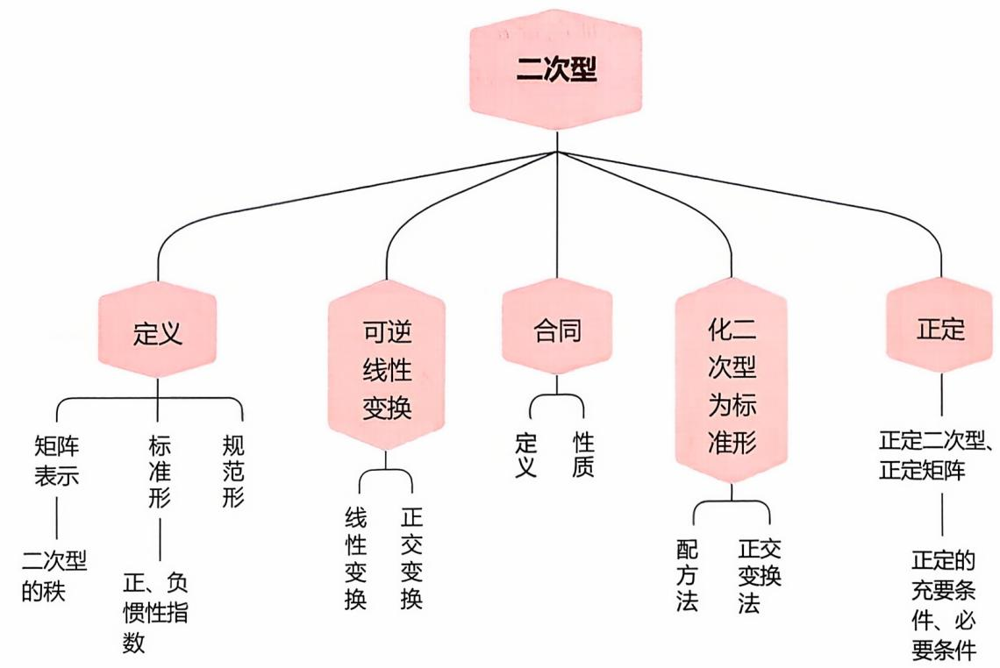
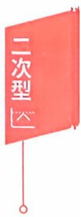
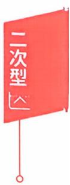
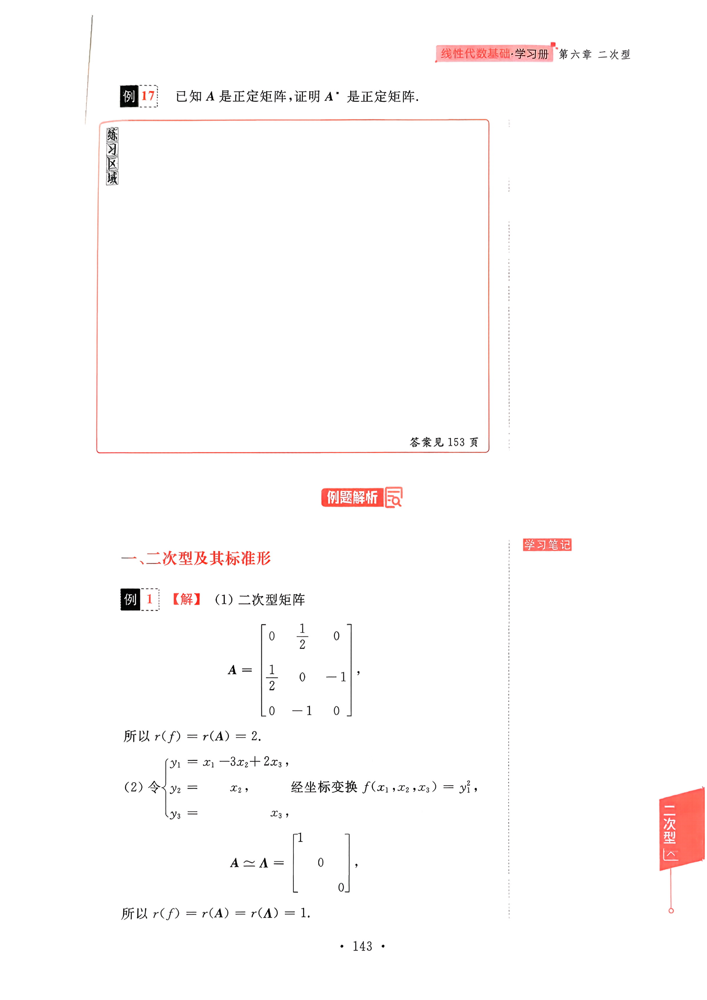
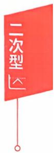
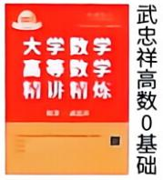
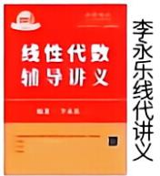
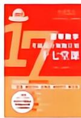
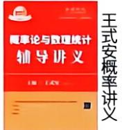
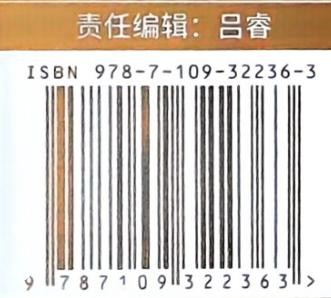

## 第六章 二次型

## 本章考点

二次型及其矩阵表示合同变换与合同矩阵二次型的秩惯性定理二次型的标准形和规范形用正交变换和配方法化二次型为标准形二次型及其矩阵的正定性

本章知识框图

## 知识梳理与例题

学习笔记

## 一、二次型及其标准形

定义含有n个变量的一个二次齐次多项式

$$
\begin{aligned}f\left( x_{1},x_{2},\cdots,x_{n} \right) = a_{11}x_{1}^{2} + 2a_{12}x_{1}x_{2} + 2a_{13}x_{1}x_{3} + \cdots + 2a_{1n}x_{1}x_{n} \\+ a_{22}x_{2}^{2} + 2a_{23}x_{2}x_{3} + \cdots + 2a_{2n}x_{2}x_{n} \\+ \cdots + a_{m}x_{n}^{2}\end{aligned}\tag{①}
$$

称为n个变量的二次型，系数均为实数时，称为n元实二次型.

若令 $a_{ij} = a_{ji}, i < j$ ,则 $2a_{ij}x_{i}x_{j}=a_{ij}x_{i}x_{j}+a_{ji}x_{j}x$ ，那么二次型①可以写成矩阵形式：

$$
\begin{aligned}f(x_{1},x_{2},\cdots,x_{n}) &= \sum_{i=1}^{n} \sum_{j=1}^{n} a_{ij}x_{i}x_{j} \\&= \left[ x_{1},x_{2},\cdots,x_{n} \right] \begin{bmatrix}
a_{11} & a_{12} & \cdots & a_{1n} \\
a_{21} & a_{22} & \cdots & a_{2n} \\
\vdots & \vdots &  & \vdots \\
a_{n1} & a_{n2} & \cdots & a_{nn}
\end{bmatrix} \begin{bmatrix}
x_{1} \\
x_{2} \\
\vdots \\
x_{n}
\end{bmatrix} \\&= x^{\mathrm{T}}Ax   ,\end{aligned}
$$

其中A是对称矩阵，称为二次型f的对应矩阵.

例如： $f\left(x_{1},x_{2},x_{3}\right)=x_{1}^{2}+2x_{2}^{2}+x_{3}^{2}+2x_{1}x_{2}+4x_{1}x_{3}+6x_{2}x_{3}$

$$
\left[ \begin{aligned} x_{1} &, x_{2} , x_{3} \end{aligned} \right] \left[ \begin{aligned} 1 & \quad 1 \quad 2 \\ 1 & \quad 2 \quad 3 \\ 2 & \quad 3 \quad 1 \end{aligned} \right] \left[ \begin{aligned} x_{1} \\ x_{2} \\ x_{3} \end{aligned} \right] = \boldsymbol{x}^{\mathrm{T}} \boldsymbol{A} \boldsymbol{x}.
$$

其中 $\boldsymbol{A} = \begin{bmatrix}
1 & 1 & 2 \\
1 & 2 & 3 \\
2 & 3 & 1
\end{bmatrix}, \boldsymbol{A}^{\mathrm{T}} = \boldsymbol{A}, \boldsymbol{x} = \begin{bmatrix}
x_{1} \\
x_{2} \\
x_{3}
\end{bmatrix}.$

注意当A是对称阵时，二次型 $f(x_{1},x_{2},\cdots,x_{n}) = \boldsymbol{x}^{\mathrm{T}} \boldsymbol{A} \boldsymbol{x}$ 和A一一对应.

定义若二次型 $f(x_{1},x_{2},\cdots,x_{n})$ 只有平方项，没有混合项(即混合项的系数全为零)，即

$$
f\left(x_{1}, x_{2}, \cdots, x_{n}\right)=\boldsymbol{x}^{\mathrm{T}} \boldsymbol{A} \boldsymbol{x}=a_{1} x_{1}^{2}+a_{2} x_{2}^{2}+\cdots+a_{n} x_{n}^{2},
$$

则称二次型为标准形(又称平方和).

在二次型的标准形中，若平方项的系数 $a_{i}$ 只是1，一1,0，即

$$
f\left( x_{1},x_{2},\cdots,x_{n} \right) = \boldsymbol{x}^{\mathrm{T}}\boldsymbol{A}\boldsymbol{x} = x_{1}^{2} + x_{2}^{2} + \cdots + x_{p}^{2} - x_{p + 1}^{2} - \cdots - x_{p + q}^{2},
$$

则称为二次型的规范形(系数中1的个数是 $p,-1$ 的个数是 $q , 0$ 的个数 是 $n - (p + q)$

定义在二次型 $\boldsymbol{x}^{\mathrm{T}} \boldsymbol{A} \boldsymbol{x}$ 的标准形中，正平方项的个数p称为二次型的正惯性指数，负平方项的个数q称为二次型的负惯性指数.

定义二次型 $x^{\mathrm{T}} A x$ 矩阵A的秩称为二次型的秩.

【注】对于 $f = (x_{1},x_{2},x_{3}) \begin{bmatrix}
1 & 3 & 0 \\
1 & 0 & 0 \\
0 & 4 & -1
\end{bmatrix} \begin{bmatrix}
x_{1} \\
x_{2} \\
x_{3}
\end{bmatrix}$ ,有

$$
\begin{aligned}f &= (x_{1} + x_{2}, 3x_{1} + 4x_{3}, - x_{3}) \begin{bmatrix}
x_{1} \\
x_{2} \\
x_{3}
\end{bmatrix} \\&= (x_{1} + x_{2})x_{1} + (3x_{1} + 4x_{3})x_{2} - x_{3}^{2},\end{aligned}
$$

故 $f = x_{1}^{2} - x_{3}^{2} + 4x_{1}x_{2} + 4x_{2}x_{3}$ ，为三元二次型，其二次型矩阵 $A =$ $\begin{bmatrix}
1 & 2 & 0 \\
2 & 0 & 2 \\
0 & 2 & - 1
\end{bmatrix}$ ,秩 $r(f) = r(\boldsymbol{A}) = 2.$

虽 $\boldsymbol{x}^{\mathrm{T}}\begin{bmatrix}
1 & 3 & 0 \\
1 & 0 & 0 \\
0 & 4 & -1
\end{bmatrix}\boldsymbol{x}$ 是二次型，但矩阵 $\begin{bmatrix}
1 & 3 & 0 \\
1 & 0 & 0 \\
0 & 4 & - 1
\end{bmatrix}$ 不是二次型

矩阵，其秩也不是二次型的秩.

定义（合同）设A，B是两个n阶方阵，若存在可逆阵C，使得$C^{\mathrm{T}} A C = B$ ，则称A合同于B，记成 $A \simeq \mathbf { \bar { B } } .$

合同矩阵有如下性质：

①反身性. $A \simeq A .$

②对称性.若 $A \simeq \pmb { B }$ ,则 $\mathbf { \mathit { B } } \simeq \mathbf { \mathit { A } } ,$

③传递性.若 $A \simeq B, B \simeq C$ ,则 $A \simeq \mathbf { C } .$

对于三元二次型 $f(x_{1},x_{2},x_{3}) = \boldsymbol{x}^{\mathrm{T}} \boldsymbol{A} \boldsymbol{x}$ ,如果

$$
\begin{cases}x_{1} = c_{11}y_{1} + c_{12}y_{2} + c_{13}y_{3}, \\x_{2} = c_{21}y_{1} + c_{22}y_{2} + c_{23}y_{3}, \\x_{3} = c_{31}y_{1} + c_{32}y_{2} + c_{33}y_{3},\end{cases}
$$

(\*)

满足

$$
\left| \textbf{\em C} \right| = \left| \begin{matrix}
c_{11} & c_{12} & c_{13} \\
c_{21} & c_{22} & c_{23} \\
c_{31} & c_{32} & c_{33}
\end{matrix} \right| \neq 0   ,
$$

则称(\*）是由 $\boldsymbol{x} = (x_{1}, x_{2}, x_{3})^{\mathrm{T}}$ 到 $\boldsymbol{y} = (y_1, y_2, y_3)^{\mathrm{T}}$ 的坐标变换.

用矩阵描述为： $x = Cy$

注意以 $\boldsymbol{x} = (x_{1}, x_{2}, x_{3})^{\mathrm{T}}$ 为自变量的二次型 $x^{\top}Ax$ ，经坐标变换$x = C y$ 后将成为以 $\boldsymbol{y} = (y_1, y_2, y_3)^{\mathrm{T}}$ 为自变量的二次型 $y^{\mathrm{T}} \boldsymbol{B} y$ ,其中 B$= C^{\mathrm{T}} A C$ 可见经坐标变换二次型矩阵A和B 是合同的.

定理6.1 对任意一个 n元二次型 $f\left(x_{1}, x_{2}, \cdots, x_{n}\right) = \boldsymbol{x}^{\mathrm{T}} \boldsymbol{A} \boldsymbol{x}$ ,必存在正交变换 $x = Qy$ ，其中Q是正交阵.化二次型为标准形，即

$$
f\left( x_{1},x_{2},\cdots,x_{n} \right) = \boldsymbol{x}^{\mathrm{T}}\boldsymbol{A}\boldsymbol{x} \xlongequal{x = Qy} \boldsymbol{y}^{\mathrm{T}}\boldsymbol{Q}^{\mathrm{T}}\boldsymbol{A}Q\boldsymbol{y} \\= \lambda_{1}y_{1}^{2} + \lambda_{2}y_{2}^{2} + \cdots + \lambda_{n}y_{n}^{2},
$$

其中 $\lambda_{1}, \lambda_{2}, \cdots, \lambda_{n}$ 是A的n 个特征值.

用矩阵的语言表达，即对任意一个n阶实对称阵A，必存在正交阵Q,使得

$$
Q^{-1}AQ = Q^{\mathrm{T}}AQ = \Lambda,
$$

其中 $\boldsymbol{A} = \begin{bmatrix}
\lambda_{1} & 0 & \cdots & 0 \\
0 & \lambda_{2} & \cdots & 0 \\
\vdots & \vdots &  & \vdots \\
0 & 0 & \cdots & \lambda_{n}
\end{bmatrix}, \lambda_{i} (i = 1,2,\cdots,n)$ 是A的特征值，即A必

既相似又合同于对角阵。

【注】正交变换法只能化二次型为标准形，平方项的系数即是特征值.

定理6.2 对任一个 n元二次型 $f\left(x_{1}, x_{2}, \cdots, x_{n}\right) = \boldsymbol{x}^{\mathrm{T}} \boldsymbol{A} \boldsymbol{x}$ ,都可以通过（配方法）可逆线性变换 $x = Cy$ ，其中C是可逆阵.化成标准形，即

$$
f\left(x_{1}, x_{2}, \cdots, x_{n}\right)=x^{\mathrm{T}} A x \xlongequal{x=C y} y^{\mathrm{T}} C^{\mathrm{T}} A C y \\=d_{1} y_{1}^{2}+d_{2} y_{2}^{2}+\cdots+d_{n} y_{n}^{2}.
$$

用矩阵的语言表达，即对任意一个n阶实对称阵A，一定存在可逆阵C,使得 $C^{\mathrm{T}} A C = \Lambda$ . 其中

$$
\boldsymbol{\varLambda} = \begin{bmatrix}
d_{1} & 0 & \cdots & 0 \\
0 & d_{2} & \cdots & 0 \\
\vdots & \vdots &  & \vdots \\
0 & 0 & \cdots & d_{n}
\end{bmatrix}.
$$

定理6.3（惯性定理）对一个二次型 $x^{\mathrm{T}} A x$ 经坐标变换化为标准形，其正惯性指数和负惯性指数都是唯一确定的.

(1) $f(x_{1},x_{2},x_{3})=x_{1}x_{2}-2x_{2}x_{3}.$

(2) $f(x_{1},x_{2},x_{3})=(x_{1}-3x_{2}+2x_{3})^{2}.$

例2用配方法化二次型

答案见 143 页

$$
f\left(x_{1},x_{2},x_{3}\right)=2x_{1}^{2}+3x_{2}^{2}+5x_{3}^{2}+4x_{1}x_{2}-8x_{2}x_{3}-4x_{3}x_{1}
$$

为标准形，写出所用坐标变换 $x = C y$ ,并验证 $C^{\mathrm{T}} A C = \Lambda$

答案见 144 页

  
答案见 145 页

练习区域

例3 二次型 $f(x_{1},x_{2},x_{3})=(x_{1}+x_{2})^{2}+(x_{2}-x_{3})^{2}+(x_{3}$ $+x_{1}\rangle^{2}$ 的标准形是(A) $y_{1}^{2}+y_{2}^{2}+y_{3}^{2}.$ (B) $y_{1}^{2}+y_{2}^{2}-y_{3}^{2}.$ (C) $y_{1}^{2} + y_{2}^{2}.$ (D) $y_{1}^{2}-y_{2}^{2}.$

练习区域

例4二次型 $f(x_{1},x_{2},x_{3})=x_{1}^{2}+3x_{2}^{2}+x_{3}^{2}+2ax_{1}x_{2}+2x_{1}x_{3}$ $+ 2x_{2}x_{3}$ ，经正交变换 x = Py 化为标准形 $y_{1}^{2} + 4y_{2}^{2}$ ,则 a =

例5二次型 $f(x_{1},x_{2}) = \boldsymbol{x}^{\mathrm{T}} \boldsymbol{A} \boldsymbol{x}$ 经正交变换x = Qy 化为标准形 $y_{1}^{2} + 3y_{2}^{2}$ ,若Q的第一列是 $\left[ \frac{1}{\sqrt{2}}, \frac{1}{\sqrt{2}} \right]^{\mathrm{T}}$ ,则 Q =

例6 用正交变换 x = Qy 化二次型 $f(x_{1},x_{2},x_{3}) = x_{1}^{2} - x_{2}^{2} +$ $2x_{3}^{2} + 4x_{2}x_{3}$ 为标准形，写出所用坐标变换，并用 $Q^{\mathrm{T}}AQ = \Lambda$ 验证.

答案见 146 页

## 例7 用正交变换化二次型

$$
f(x_{1},x_{2},x_{3})=x_{1}^{2}+4x_{2}^{2}+x_{3}^{2}-4x_{1}x_{2}-8x_{1}x_{3}-4x_{2}x_{3}
$$

练习区域

为标准形，并写出所用坐标变换.

例8已知二次型

答案见 148 页

$$
f(x_{1},x_{2},x_{3})=x_{1}^{2}-x_{2}^{2}+cx_{3}^{2}+2x_{1}x_{2}-2x_{1}x_{3}+6x_{2}x_{3}
$$

的秩为 2,则(1)c = .(2) 正惯性指数 p = \_

$$
f(x_{1},x_{2},x_{3})=5x_{1}^{2}+5x_{2}^{2}+cx_{3}^{2}-2x_{1}x_{2}+6x_{1}x_{3}-6x_{2}x_{3}
$$

的秩为2.

(1) 求 c 的值.

（2）求该二次型的正惯性指数、负惯性指数.

例10 二次型 $\boldsymbol{x}^{\mathrm{T}} \boldsymbol{A} \boldsymbol{x} = x_{1}^{2} - 4 x_{2} x_{3}$ 的规范形是

答案见 150 页

例11 与矩阵 $\boldsymbol{A} = \begin{bmatrix}
1 & 2 & 0 \\
2 & 1 & 0 \\
0 & 0 & 2
\end{bmatrix}$ 合同的矩阵是

(A) $\left[ \begin{matrix}
{ 1 } & { } & { } \\
{ } & { 1 } & { } \\
{ } & { } & { 0 }
\end{matrix} \right] .$

(B) $\begin{bmatrix}
1 & & \\
& 1 & \\
& & -1
\end{bmatrix}.$

(C) $\begin{bmatrix}
1 & & \\
& -1 & \\
& & -1
\end{bmatrix}.$

练习区域

(D) $\begin{bmatrix}
1 & & \\
& -1 & \\
& & 0
\end{bmatrix}$

练习区域

例12 已知 $\boldsymbol{A} = \begin{bmatrix}
1 & - 2 & 0 \\
- 2 & 2 & 2 \\
0 & 2 & - 2
\end{bmatrix}$ ，C是三阶可逆矩阵，且 $C^{\mathrm{T}}AC$ = A,则C =

答案见 151 页

## 二、正定二次型

定义（正定）若对于任意的非零向量 $\boldsymbol{x} = (x_{1}, x_{2}, \cdots, x_{n})^{\mathrm{T}}$ ,恒有

$$
f\left( x_{1},x_{2},\cdots,x_{n} \right) = \sum_{i = 1}^{n}{\sum_{j = 1}^{n}{a_{ij}x_{i}x_{j}}} = \boldsymbol{x}^{\mathrm{T}}\boldsymbol{A}\boldsymbol{x} > 0,
$$

则称二次型f为正定二次型，对应矩阵为正定矩阵.

例如：三元二次型 $f\left(x_{1},x_{2},x_{3}\right)=x_{1}^{2}+3x_{2}^{2}+5x_{3}^{2}$

$\forall   x = \begin{bmatrix}
t \\
u \\
v
\end{bmatrix} \neq \mathbf{0}$ ,恒有 $f(t,u,v)=t^{2}+3u^{2}+5v^{2}>0$

所以二次型f正定，矩阵 $\boldsymbol{A} = \begin{bmatrix}
1 & 0 & 0 \\
0 & 3 & 0 \\
0 & 0 & 5
\end{bmatrix}$ 是正定矩阵.

又如三元二次型 $f(x_{1},x_{2},x_{3})=x_{1}^{2}+4x_{3}^{2}+5x_{1}x_{2}$ 不是正定二次型，因为当 $\boldsymbol{x} = (0,1,0)^{\mathrm{T}}$ 时， $f(0,1,0) = 0$ 不满足 $\forall x \ne 0, f > 0$ 的要求.

定理6.4 可逆线性变换不改变二次型的正定性.

由定理可知，对一般的二次型（或对称阵）应设法作可逆线性变换化成标准形(或规范形)，根据 $d_{i}$ 是否均大于零来判别其正定性

定理6.5 f正定的充要条件

$f\left(x_{1}, x_{2}, \cdots, x_{n}\right) = \boldsymbol{x}^{\mathrm{T}} \boldsymbol{A} \boldsymbol{x}$ 正定

⇔A 的正惯性指数 $p = n$

$\Leftrightarrow \boldsymbol{A} \simeq \boldsymbol{E}$ ，即存在可逆阵C,使得 $C^{\mathrm{T}} A C = E$

$\Leftrightarrow \boldsymbol{A} = \boldsymbol{D}^{\mathrm{T}} \boldsymbol{D}$ ,其中D是可逆阵

⇔A 的全部特征值 $\lambda_{i} > 0, i = 1, 2, \cdots, n$

$\Leftrightarrow \boldsymbol{A}$ 的全部顺序主子式大于零，即

若 $\boldsymbol{A} = \begin{bmatrix}
a_{11} & a_{12} & \cdots & a_{1n} \\
a_{21} & a_{22} & \cdots & a_{2n} \\
\vdots & \vdots &  & \vdots \\
a_{n1} & a_{n2} & \cdots & a_{nn}
\end{bmatrix}$ 正定 $\Leftrightarrow a_{11} > 0,\left| \begin{matrix}
a_{11} & a_{12} \\
a_{21} & a_{22}
\end{matrix} \right| > 0,\cdots,\left| \begin{matrix}
A
\end{matrix} \right| > 0.$

定理6.6 $f = \boldsymbol{x}^{\mathrm{T}} \boldsymbol{A} \boldsymbol{x}$ 正定的必要条件

若二次型 $f(x_{1},x_{2},\cdots,x_{n}) = \boldsymbol{x}^{\mathrm{T}} \boldsymbol{A} \boldsymbol{x}$ 正定，则

(1)A的主对角元素 $a_{\ddot{a}} > 0$

(2)A 的行列式 $\mid \boldsymbol{A} \mid > 0.$

## 下列矩阵中，正定矩阵是

$$
\begin{bmatrix}
1 & 2 & 0 \\
2 & 3 & 0 \\
0 & 0 & 5
\end{bmatrix}.
$$

(A)

(B)

$$
\begin{bmatrix}
1 & 2 & 0 \\
2 & 5 & 0 \\
0 & 0 & - 3
\end{bmatrix}.
$$

(C)

$$
\begin{bmatrix}
3 & 0 & 0 \\
0 & 1 & - 2 \\
0 & - 2 & 4
\end{bmatrix}.
$$

练习区域

(D)

$$
\begin{bmatrix}
3 & 0 & 0 \\
0 & 1 & - 2 \\
0 & - 2 & 5
\end{bmatrix}.
$$

## 例14 判别二次型

答案见 151 页

$$
f\left(x_{1},x_{2},x_{3}\right)=2x_{1}^{2}+5x_{2}^{2}+5x_{3}^{2}+4x_{1}x_{2}-4x_{1}x_{3}-8x_{2}x_{3}
$$

的正定性.

练习区域

## 例15 已知二次型

$f\left(x_{1},x_{2},x_{3}\right)=x_{1}^{2}+4x_{2}^{2}+4x_{3}^{2}+2tx_{1}x_{2}-2x_{1}x_{3}+4x_{2}x_{3}$ 正定，求t的取值范围.

例16设 $\boldsymbol{A} = \begin{bmatrix}
0 & 1 & 1 \\
1 & 2 & 1 \\
1 & 1 & 0
\end{bmatrix}$ ，若A+E是正定矩阵，则k的取值 范围是

答案见152 页

## 例题解析

## 一、二次型及其标准形

【解】（1）二次型矩阵

$$
\boldsymbol{A} = \begin{bmatrix}
0 & \dfrac{1}{2} & 0 \\
\dfrac{1}{2} & 0 & -1 \\
0 & -1 & 0
\end{bmatrix},
$$

所以 $r(f) = r(A) = 2.$

(2) 令 $\begin{cases}y_{1} = x_{1} - 3x_{2} + 2x_{3}, \\y_{2} = \quad x_{2}, \\y_{3} = \quad x_{3}\end{cases}$ 经坐标变换 $f(x_{1},x_{2},x_{3}) = y_{1}^{2}$

$$
\boldsymbol{A} \simeq \boldsymbol{\Lambda} = \begin{bmatrix}
1 & & \\
& 0 & \\
& & 0
\end{bmatrix},
$$

所以 $r(f)=r(\boldsymbol{A})=r(\boldsymbol{\Lambda})=1$

$$
\begin{aligned} 或  f &= (x_1, x_2, x_3) \begin{bmatrix}
1 \\
-3 \\
2
\end{bmatrix} (1, -3, 2) \begin{bmatrix}
x_1 \\
x_2 \\
x_3
\end{bmatrix} \\&= (x_1, x_2, x_3) \begin{bmatrix}
1 & -3 & 2 \\
-3 & 9 & -6 \\
2 & -6 & 4
\end{bmatrix} \begin{bmatrix}
x_1 \\
x_2 \\
x_3
\end{bmatrix},\end{aligned}
$$

所以 $r(f) = r(\boldsymbol{A}) = r\begin{bmatrix}
1 & -3 & 2 \\
-3 & 9 & -6 \\
2 & -6 & 4
\end{bmatrix} = 1.$

## 例2【解】先把所有含 $x_{1}$ 的项配成一个完全平方，即有

$$
f = 2\left[ x_{1}^{2} + 2x_{1}(x_{2} - x_{3}) + (x_{2} - x_{3})^{2} \right] + 3x_{2}^{2} + 5x_{3}^{2} - 8x_{2}x_{3} - 2(x_{2} - x_{3})^{2} \\= 2(x_{1} + x_{2} - x_{3})^{2} + x_{2}^{2} + 3x_{3}^{2} - 4x_{2}x_{3},
$$

再把所有含 $x _ { 2 }$ 的项配成一个完全平方，即

$$
f = 2(x_{1} + x_{2} - x_{3})^{2} + (x_{2}^{2} - 4x_{2}x_{3} + 4x_{3}^{2}) + 3x_{3}^{2} - 4x_{3}^{2} \\= 2(x_{1} + x_{2} - x_{3})^{2} + (x_{2} - 2x_{3})^{2} - x_{3}^{2}.
$$

引人新变量，令

$$
\left\{ \begin{aligned} y_{1} &= x_{1} + x_{2} - x_{3}, \\ y_{2} &= \quad x_{2} - 2x_{3}, \\ y_{3} &= \quad x_{3}, \end{aligned} \right. \quad  即  \quad \left\{ \begin{aligned} x_{1} &= y_{1} - y_{2} - y_{3}, \\ x_{2} &= \quad y_{2} + 2y_{3}, \\ x_{3} &= \quad y_{3}, \end{aligned} \right.
$$

则有 $f$ 的标准形 $f = 2y_{1}^{2} + y_{2}^{2} - y_{3}^{2}$

用矩阵描述即：二次型矩阵 $\boldsymbol{A} = \begin{bmatrix}
2 & 2 & - 2 \\
2 & 3 & - 4 \\
- 2 & - 4 & 5
\end{bmatrix}$ ，经坐标变换

$x = Cy$ ,即

$$
\begin{bmatrix}
x_{1} \\
x_{2} \\
x_{3}
\end{bmatrix} = \begin{bmatrix}
1 & -1 & -1 \\
0 & 1 & 2 \\
0 & 0 & 1
\end{bmatrix} \begin{bmatrix}
y_{1} \\
y_{2} \\
y_{3}
\end{bmatrix},
$$

有 $\boldsymbol{x}^{\mathrm{T}} \boldsymbol{A} \boldsymbol{x} = (\boldsymbol{C} \boldsymbol{y})^{\mathrm{T}} \boldsymbol{A} (\boldsymbol{C} \boldsymbol{y}) = \boldsymbol{y}^{\mathrm{T}} \boldsymbol{A} \boldsymbol{y} = 2 y_{1}^{2} + y_{2}^{2} - y_{3}^{2}.$

$$
 验证:  \boldsymbol{C}^{\mathrm{T}} \boldsymbol{A} \boldsymbol{C}=\begin{bmatrix}
1 & 0 & 0 \\
-1 & 1 & 0 \\
-1 & 2 & 1
\end{bmatrix}\begin{bmatrix}
2 & 2 & -2 \\
2 & 3 & -4 \\
-2 & -4 & 5
\end{bmatrix}\begin{bmatrix}
1 & -1 & -1 \\
0 & 1 & 2 \\
0 & 0 & 1
\end{bmatrix}
$$

$$
= { \left[ \begin{aligned} { } & { { } 2 } & { 2 } & { { } - 2 } \\ { } & { { } 0 } & { 1 } & { { } - 2 } \\ { } & { { } 0 } & { 0 } & { { } - 1 } \end{aligned} \right] } { \left[ \begin{aligned} { } & { { } 1 } & { - 1 } & { { } - 1 } \\ { } & { { } 0 } & { 1 } & { { } 2 } \\ { } & { { } 0 } & { 0 } & { { } 1 } \end{aligned} \right] } = { \left[ \begin{aligned} { } & { { } 2 } & { 0 } & { { } 0 } \\ { } & { { } 0 } & { 1 } & { { } 0 } \\ { } & { { } 0 } & { 0 } & { { } - 1 } \end{aligned} \right] } .
$$

【注】对 $f = 2 \left( x _ { 1 } + x _ { 2 } - x _ { 3 } \right) ^ { 2 } + \left( x _ { 2 } - 2 x _ { 3 } \right) ^ { 2 } - x _ { 3 } ^ { 2 }$ ，如令

$$
y_{1} = \sqrt{2}x_{1} + \sqrt{2}x_{2} - \sqrt{2}x_{3}, \quad x_{1} = \frac{1}{\sqrt{2}}y_{1} - y_{2} - y_{3}, \quad x_{2} = \frac{1}{\sqrt{2}}x_{2} + \frac{1}{\sqrt{2}}y_{2} + \frac{1}{\sqrt{2}}x_{3},
$$

则有f的规范形 $f = y_{1}^{2} + y_{2}^{2} - y_{3}^{2}$

用此配方法可得到规范形。

## 例3【分析】

$$
\begin{aligned} f(x_{1},x_{2},x_{3})&=2x_{1}^{2}+2x_{2}^{2}+2x_{3}^{2}+2x_{1}x_{2}-2x_{2}x_{3}+2x_{1}x_{3}\\&=2\left[x_{1}^{2}+x_{1}(x_{2}+x_{3})+\frac{1}{4}(x_{2}+x_{3})^{2}\right]+2x_{2}^{2}+2x_{3}^{2}\\&\quad 2x_{3}^{2}-2x_{2}x_{3}-\frac{1}{2}(x_{2}+x_{3})^{2}\\&=2(x_{1}+\frac{1}{2}x_{2}+\frac{1}{2}x_{3})^{2}+\frac{3}{2}x_{2}^{2}+\frac{3}{2}x_{3}^{2}-3x_{2}x_{3}\\&=2(x_{1}+\frac{1}{2}x_{2}+\frac{1}{2}x_{3})^{2}+\frac{3}{2}(x_{2}-x_{3})^{2}\\ \end{aligned}
$$

可知 $p = 2, q = 0$ ,故应选(C).

【注】①标准形不唯一， $2y_{1}^{2}+\frac{3}{2}y_{2}^{2},3y_{1}^{2}+5y_{2}^{2},y_{1}^{2}+y_{2}^{2},\cdots$ ,均可以是f的标准形.

②如：令 $\begin{cases}y_{1} = x_{1} + x_{2}, \\y_{2} = \quad x_{2} - x_{3}, \\y_{3} = x_{1} + x_{3},\end{cases}$

(1)

得 $f = y_{1}^{2} + y_{2}^{2} + y_{3}^{2}$ (2)

因 $\begin{vmatrix}
1 & 1 & 0 \\
0 & 1 & - 1 \\
1 & 0 & 1
\end{vmatrix} = 0$ ，即（1）不是坐标变换，那么（2）就不是f的标准形.

例4【分析】二次型 $x^{\mathrm{T}} A x$ 经正交变换化为标准形 $y_{1}^{2} +$ 4y²，那么标准形中的平方项系数1，4，0就是A的特征值.

现 $\boldsymbol{A} = \begin{bmatrix}
1 & a & 1 \\
a & 3 & 1 \\
1 & 1 & 1
\end{bmatrix}$ ,由

$$
\left| \boldsymbol{A} \right| = \left| \begin{matrix}
1 & a & 1 \\
a & 3 & 1 \\
1 & 1 & 1
\end{matrix} \right| = \left| \begin{matrix}
0 & a - 1 & 0 \\
a & 3 & 1 \\
1 & 1 & 1
\end{matrix} \right| = - (a - 1)^{2} = 0
$$

得 $a = 1$

例5【分析】二次型 $x^{\mathrm{T}} A x$ 经正交变换 $x = Qy$ 化为标准形$y_{1}^{2} + 3y_{2}^{2}$ ，那么标准形中平方项系数1，3就是矩阵A的特征值，而正交矩阵Q的列向量就是A的特征向量.

已知Q的第一列是 $\left[ \frac{1}{\sqrt{2}}, \frac{1}{\sqrt{2}} \right]^{\mathrm{T}}$ ，即矩阵A关于 $\lambda_{1} = 1$ 的特征向量是 $\left[ \frac{1}{\sqrt{2}}, \frac{1}{\sqrt{2}} \right]^{\mathrm{T}}$ .设 $\lambda_{2} = 3$ 的特征向量是 $\boldsymbol{\alpha} = \left[ x_{1}, x_{2} \right]^{\mathrm{T}}$

于是 $\frac{1}{\sqrt{2}}x_{1} + \frac{1}{\sqrt{2}}x_{2} = 0$ ，解出基础解系[1，一1，单位化为 $\left[ \frac{1}{\sqrt{2}}, -\frac{1}{\sqrt{2}} \right]^{\mathrm{T}}$

所以 $\mathcal{Q} = \begin{bmatrix}
\frac{1}{\sqrt{2}} & \frac{1}{\sqrt{2}} \\
\frac{1}{\sqrt{2}} & -\frac{1}{\sqrt{2}}
\end{bmatrix}.$

例6【解】二次型矩阵 $\boldsymbol{A} = \begin{bmatrix}
1 & 0 & 0 \\
0 & -1 & 2 \\
0 & 2 & 2
\end{bmatrix}$ ，矩阵A的特征多项式

$$
\begin{aligned}\left| \lambda \boldsymbol{E} - \boldsymbol{A} \right| &= \left| \begin{matrix}
\lambda - 1 & 0 & 0 \\
0 & \lambda + 1 & - 2 \\
0 & - 2 & \lambda - 2
\end{matrix} \right| = (\lambda - 1) \left| \begin{matrix}
\lambda + 1 & - 2 \\
- 2 & \lambda - 2
\end{matrix} \right| \\&= (\lambda - 1)(\lambda - 3)(\lambda + 2)  ,\end{aligned}
$$

得到矩阵A的特征值：1,3，—2.

当 $\lambda_{1} = 1$ 时，由 $\left( \boldsymbol{E} - \boldsymbol{A} \right) \boldsymbol{x} = \boldsymbol{0}$

$$
\begin{bmatrix}
0 & 0 & 0 \\
0 & 2 & - 2 \\
0 & - 2 & - 1
\end{bmatrix} \rightarrow \begin{bmatrix}
0 & 1 & 0 \\
0 & 0 & 1 \\
0 & 0 & 0
\end{bmatrix}
$$

得到特征向量 $\boldsymbol{\alpha}_{1} = (1,0,0)^{\mathrm{T}}$

当 $\lambda_{2} = 3$ 时，由 $(3\boldsymbol{E} - \boldsymbol{A})\boldsymbol{x} = \boldsymbol{0}$

$$
\begin{bmatrix}
2 & 0 & 0 \\
0 & 4 & - 2 \\
0 & - 2 & 1
\end{bmatrix} \rightarrow \begin{bmatrix}
1 & 0 & 0 \\
0 & - 2 & 1 \\
0 & 0 & 0
\end{bmatrix}
$$

得到特征向量 $\boldsymbol{a}_{2} = (0,1,2)^{\mathrm{T}}$

当 $\lambda_{8} = - 2$ 时，由 $(-2\boldsymbol{E}-\boldsymbol{A})\boldsymbol{x}=\boldsymbol{0}$

$$
\begin{bmatrix}
- 3 & 0 & 0 \\
0 & - 1 & - 2 \\
0 & - 2 & - 4
\end{bmatrix} \xrightarrow{} \begin{bmatrix}
1 & 0 & 0 \\
0 & 1 & 2 \\
0 & 0 & 0
\end{bmatrix}
$$

得到特征向量 $\boldsymbol{\alpha}_{3} = (0, - 2,1)^{\mathrm{T}}$

实对称矩阵特征值不同特征向量相互正交，故只需单位化，

$$
\gamma_{1} = (1,0,0)^{\mathrm{T}}, \gamma_{2} = \frac{1}{\sqrt{5}}(0,1,2)^{\mathrm{T}}, \gamma_{3} = \frac{1}{\sqrt{5}}(0,-2,1)^{\mathrm{T}},
$$

那么令 $\boldsymbol{Q} = ( \gamma_{1} , \gamma_{2} , \gamma_{3} )$ ,即

$$
\begin{bmatrix}
x_{1} \\
x_{2} \\
\vdots \\
x_{3}
\end{bmatrix} = \begin{bmatrix}
1 & 0 & 0 \\
0 & \frac{1}{\sqrt{5}} & -\frac{2}{\sqrt{5}} \\
0 & \frac{2}{\sqrt{5}} & \frac{1}{\sqrt{5}}
\end{bmatrix} \begin{bmatrix}
y_{1} \\
y_{2} \\
y_{3}
\end{bmatrix},
$$

有 $\boldsymbol{x}^{\mathrm{T}} \boldsymbol{A} \boldsymbol{x} = \boldsymbol{y}^{\mathrm{T}}(\boldsymbol{Q}^{\mathrm{T}} \boldsymbol{A} \boldsymbol{Q}) \boldsymbol{y} = \boldsymbol{y}^{\mathrm{T}}(\boldsymbol{Q}^{-1} \boldsymbol{A} \boldsymbol{Q}) \boldsymbol{y} = y_{1}^{2} + 3 y_{2}^{2} - 2 y_{3}^{2}$

$$
Q^{\mathrm{T}}AQ = Q^{-1}AQ = \begin{bmatrix}
1 & 0 & 0 \\
0 & \frac{1}{\sqrt{5}} & \frac{2}{\sqrt{5}} \\
0 & -\frac{2}{\sqrt{5}} & \frac{1}{\sqrt{5}}
\end{bmatrix} \begin{bmatrix}
1 & 0 & 0 \\
0 & -1 & 2 \\
0 & 2 & 2
\end{bmatrix} \begin{bmatrix}
1 & 0 & 0 \\
0 & \frac{1}{\sqrt{5}} & -\frac{2}{\sqrt{5}} \\
0 & \frac{2}{\sqrt{5}} & \frac{1}{\sqrt{5}}
\end{bmatrix}
$$

$$
\begin{aligned}= \begin{bmatrix}
1 & 0 & 0 \\
0 & \frac{3}{\sqrt{5}} & \frac{6}{\sqrt{5}} \\
0 & \frac{4}{\sqrt{5}} & -\frac{2}{\sqrt{5}}
\end{bmatrix}\begin{bmatrix}
1 & 0 & 0 \\
0 & \frac{1}{\sqrt{5}} & -\frac{2}{\sqrt{5}} \\
0 & \frac{2}{\sqrt{5}} & \frac{1}{\sqrt{5}}
\end{bmatrix}= \begin{bmatrix}
1 & 0 & 0 \\
0 & 3 & 0 \\
0 & 0 & -2
\end{bmatrix}.\end{aligned}
$$

$$
\boldsymbol{A} = \begin{bmatrix}
1 & - 2 & - 4 \\
- 2 & 4 & - 2 \\
- 4 & - 2 & 1
\end{bmatrix},
$$

矩阵A的特征多项式

$$
\begin{aligned}\left| \lambda \boldsymbol{E} - \boldsymbol{A} \right| &= \left| \begin{matrix}
\lambda - 1 & 2 & 4 \\
2 & \lambda - 4 & 2 \\
4 & 2 & \lambda - 1
\end{matrix} \right| = \left| \begin{matrix}
\lambda - 5 & 0 & 5 - \lambda \\
2 & \lambda - 4 & 2 \\
4 & 2 & \lambda - 1
\end{matrix} \right| \\&= \left| \begin{matrix}
\lambda - 5 & 0 & 0 \\
2 & \lambda - 4 & 4 \\
4 & 2 & \lambda + 3
\end{matrix} \right| = (\lambda - 5) \left| \begin{matrix}
\lambda - 4 & 4 \\
2 & \lambda + 3
\end{matrix} \right| \\&= (\lambda - 5)^{\hat{z}} (\lambda + 4)  ,\end{aligned}
$$

得到矩阵A的特征值 $:5,5,-4$

当 $\lambda_{1} = \lambda_{2} = 5$ 时，由 $(5\boldsymbol{E} - \boldsymbol{A})\boldsymbol{x} = \boldsymbol{0}$ 2

$$
\begin{bmatrix}
4 & 2 & 4 \\
2 & 1 & 2 \\
4 & 2 & 4
\end{bmatrix} \xrightarrow{} \begin{bmatrix}
2 & 1 & 2 \\
0 & 0 & 0 \\
0 & 0 & 0
\end{bmatrix}
$$

得到特征向量 $\boldsymbol{\alpha}_{1}=(1,-2,0)^{\mathrm{T}}, \boldsymbol{\alpha}_{2}=(0,-2,1)^{\mathrm{T}}$

当 $\lambda_{3} = - 4$ 时，由 $(-4E-A)x=0$

$$
\begin{bmatrix}
- 5 & 2 & 4 \\
2 & - 8 & 2 \\
4 & 2 & - 5
\end{bmatrix} \xrightarrow{} \begin{bmatrix}
1 & - 2 & 0 \\
0 & - 2 & 1 \\
0 & 0 & 0
\end{bmatrix}
$$

得到特征向量 $\boldsymbol{\alpha}_{3} = (2,1,2)^{\mathrm{T}}$

属于特征值 $\lambda_{1} = \lambda_{2} = 5$ 的特征向量 $\boldsymbol{\alpha}_{1} \; , \boldsymbol{\alpha}_{2}$ 不正交，进行施密特正交化有：

$$
\boldsymbol { \beta } _ { 1 } = \boldsymbol { \alpha } _ { 1 } = ( 1 , - 2 , 0 ) ^ { \mathrm { T } } ,
$$

$$
\boldsymbol { \beta } _ { 2 } = \boldsymbol { \alpha } _ { 2 } - \frac { \left( \boldsymbol { \alpha } _ { 2 } , \boldsymbol { \beta } _ { 1 } \right) } { \left( \boldsymbol { \beta } _ { 1 } , \boldsymbol { \beta } _ { 1 } \right) } \boldsymbol { \beta } _ { 1 } = \left[ \begin{aligned} 0 \\ - 2 \\ 1 \end{aligned} \right] - \frac { 4 } { 5 } \left[ \begin{aligned} 1 \\ - 2 \\ 0 \end{aligned} \right] = \frac { 1 } { 5 } \left[ \begin{aligned} - 4 \\ - 2 \\ 5 \end{aligned} \right] .
$$

单位化得

$$
\gamma_{1}=\frac{1}{\sqrt{5}}\left[\begin{array}{c}1 \\ -2 \\ 0\end{array}\right], \gamma_{2}=\frac{1}{3 \sqrt{5}}\left[\begin{array}{c}-4 \\ -2 \\ 5\end{array}\right], \gamma_{3}=\frac{1}{3}\left[\begin{array}{c}2 \\ 1 \\ 2\end{array}\right]
$$

那么令 $\mathcal{Q} = (\gamma_{1}, \gamma_{2}, \gamma_{3}) = \begin{bmatrix}
\dfrac{1}{\sqrt{5}} & -\dfrac{4}{3\sqrt{5}} & \dfrac{2}{3} \\
-\dfrac{2}{\sqrt{5}} & -\dfrac{2}{3\sqrt{5}} & \dfrac{1}{3} \\
0 & \dfrac{5}{3\sqrt{5}} & \dfrac{2}{3}
\end{bmatrix}$ ,经 x = Qy 有

$$
\boldsymbol{x}^{\mathrm{T}} \boldsymbol{A} \boldsymbol{x} = \boldsymbol{y}^{\mathrm{T}}(\boldsymbol{Q}^{\mathrm{T}} \boldsymbol{A} \boldsymbol{Q}) \boldsymbol{y} = \boldsymbol{y}^{\mathrm{T}}(\boldsymbol{Q}^{-1} \boldsymbol{A} \boldsymbol{Q}) \boldsymbol{y} = 5 y_{1}^{2} + 5 y_{2}^{2} - 4 y_{3}^{2}.
$$

“用正交变换化二次型为标准形”，解题步骤如下：

（1)写出二次型矩阵A.

（2)求出A(设为三阶）的特征值 $\lambda_{1} , \lambda_{2} , \lambda_{3}$

（3）求出相应的特征向量 $\alpha_{1}, \alpha_{2}, \alpha_{3}$

(4)改造特征向量为 $\gamma _ { 1 } , \gamma _ { 2 } , \gamma _ { 3 }$

①如果特征值不同只需单位化.

②如果特征值有重根，要先判断特征向量是否已正交.  
若已正交，则只需单位化，否则要施密特正交化.

(5)构造正交矩阵 $\mathcal{Q} = ( \gamma_{1} , \gamma_{2} , \gamma_{3} )$ ,则经x = Qy有

$$
\boldsymbol{x}^{\mathrm{T}} \boldsymbol{A} \boldsymbol{x} = \boldsymbol{y}^{\mathrm{T}} \boldsymbol{\Lambda} \boldsymbol{y} = \lambda_1 y_1^2 + \lambda_2 y_2^2 + \lambda_3 y_3^2.
$$

## 【分析】二次型矩阵

$$
\boldsymbol{A} = \begin{bmatrix}
1 & 1 & -1 \\
1 & -1 & 3 \\
-1 & 3 & c
\end{bmatrix}.
$$

(1 $r(f)=2 \Leftrightarrow r(A)=2$ 2

$$
\boldsymbol { A } = \begin{bmatrix}
1 & 1 & - 1 \\
1 & - 1 & 3 \\
- 1 & 3 & c
\end{bmatrix} \xrightarrow { } \begin{bmatrix}
1 & 1 & - 1 \\
0 & 1 & - 2 \\
0 & 0 & c + 7
\end{bmatrix},
$$

所以 $c = - 7.$

(2) 由配方法

$$
\begin{aligned}f &= x_{1}^{2} - x_{2}^{2} - 7x_{3}^{2} + 2x_{1}x_{2} - 2x_{1}x_{3} + 6x_{2}x_{3} \\&= \left[ x_{1}^{2} + 2x_{1}(x_{2} - x_{3}) + (x_{2} - x_{3})^{2} \right] - x_{2}^{2} - 7x_{3}^{2} + 6x_{2}x_{3} \\&\quad - (x_{2} - x_{3})^{2} \\&= (x_{1} + x_{2} - x_{3})^{2} - 2(x_{2} - 2x_{3})^{2},\end{aligned}
$$

得标准形 $f = y_{1}^{2} - 2y_{2}^{2}$ ,所以 $p = 1$

## 例9【解】（1）二次型矩阵

$$
\boldsymbol{A} = \begin{bmatrix}
5 & -1 & 3 \\
-1 & 5 & -3 \\
3 & -3 & c
\end{bmatrix},
$$

## 二次型的秩 $r(f) = r(A) = 2$

$$
\boldsymbol { A } = \begin{bmatrix}
5 & - 1 & 3 \\
- 1 & 5 & - 3 \\
3 & - 3 & c
\end{bmatrix} \xrightarrow { } \begin{bmatrix}
4 & 4 & 0 \\
- 1 & 5 & - 3 \\
3 & - 3 & c
\end{bmatrix} \xrightarrow { } \begin{bmatrix}
1 & 1 & 0 \\
0 & 6 & - 3 \\
0 & - 6 & c
\end{bmatrix},
$$

解出 $c = 3.$

(2) 由 $\left| \lambda \boldsymbol{E} - \boldsymbol{A} \right| = \left| \begin{aligned} \lambda - 5 \quad 1 \quad - 3 \\ 1 \quad \lambda - 5 \quad 3 \\ - 3 \quad 3 \quad \lambda - 3 \end{aligned} \right| = \lambda (\lambda - 4)(\lambda - 9)   ,$

得特征值为：4，9,0.所以正惯性指数 $p = 2$ ，负惯性指数 $q = 0$

【注】也可用配方法，有：

$$
f = 5 \left( x _ { 1 } - \frac { 1 } { 5 } x _ { 2 } + \frac { 3 } { 5 } x _ { 3 } \right) ^ { 2 } + \frac { 6 } { 5 } \left( 2 x _ { 2 } - x _ { 3 } \right) ^ { 2 }
$$

从而得 $p = 2, q = 0$

例10 【分析】二次型的矩阵为 $\boldsymbol{A} = \begin{bmatrix}
1 & 0 & 0 \\
0 & 0 & - 2 \\
0 & - 2 & 0
\end{bmatrix}$ ,解

$$
\left| \lambda \boldsymbol{E} - \boldsymbol{A} \right| = \left| \begin{matrix}
\lambda - 1 & 0 & 0 \\
0 & \lambda & 2 \\
0 & 2 & \lambda
\end{matrix} \right| = (\lambda - 1)(\lambda - 2)(\lambda + 2) = 0,
$$

得A的特征值为1,2，一2，所以规范形为 $y_{1}^{2} + y_{2}^{2} - y_{3}^{2}$

或令 $\begin{cases}x_{1} = y_{1}, \\x_{2} = \quad y_{2} + y_{3}, \\x_{3} = \quad y_{3} - y_{3}.\end{cases}$ ,则，

$$
\boldsymbol{x}^{\mathrm{T}} \boldsymbol{A} \boldsymbol{x} = y_{1}^{2} - 4\left(y_{2} + y_{3}\right)\left(y_{2} - y_{3}\right) = y_{1}^{2} - 4 y_{2}^{2} + 4 y_{3}^{2}
$$

所以规范形为 $z_{1}^{2} + z_{2}^{2} - z_{3}^{2}$

【分析】 $A \simeq B \Leftrightarrow p_{A} = p_{B}, q_{A} = q_{B}$

方法一由特征多项式

$$
\left| \lambda \boldsymbol{E} - \boldsymbol{A} \right| = \left| \begin{matrix}
\lambda - 1 & - 2 & 0 \\
- 2 & \lambda - 1 & 0 \\
0 & 0 & \lambda - 2
\end{matrix} \right| = (\lambda - 2)(\lambda - 3)(\lambda + 1)
$$

知二次型的标准形为 $2y_{1}^{2}+3y_{2}^{2}-y_{3}^{2}$ ,即 $p = 2, q = 1$ .所以选(B).

方法二用配方法.

$$
\begin{aligned}\boldsymbol{x}^{\mathrm{T}} \boldsymbol{A} \boldsymbol{x} &= x_{1}^{2}+x_{2}^{2}+2 x_{3}^{2}+4 x_{1} x_{2} \\&=\left(x_{1}^{2}+4 x_{1} x_{2}+4 x_{2}^{2}\right)-4 x_{2}^{2}+x_{2}^{2}+2 x_{3}^{2} \\&=\left(x_{1}+2 x_{2}\right)^{2}-3 x_{2}^{2}+2 x_{3}^{2} \\&=y_{1}^{2}-3 y_{2}^{2}+2 y_{3}^{2},\end{aligned}
$$

亦知 $p = 2, q = 1$ .选(B).

例12【分析】 $C^{\mathrm{T}}AC = \boldsymbol{\Lambda}$ 且C可逆，即 $A \simeq \mathbf { \Lambda }$ ，亦即二次型$\boldsymbol{x}^{\mathrm{T}} \boldsymbol{A} \boldsymbol{x}$ 经坐标变换 $x = C y$ 化成标准形 $\boldsymbol{y}^{\mathrm{T}} \boldsymbol{A} \boldsymbol{y}$ ,求矩阵C就是求二次型化为标准形时的坐标变换矩阵.

$$
\begin{aligned}\boldsymbol{x}^{\mathrm{T}} \boldsymbol{A} \boldsymbol{x} &= x_{1}^{2}+2 x_{2}^{2}-2 x_{3}^{2}-4 x_{1} x_{2}+4 x_{2} x_{3} \\&=(x_{1}^{2}-4 x_{1} x_{2}+4 x_{2}^{2})-2 x_{2}^{2}+4 x_{2} x_{3}-2 x_{3}^{2} \\&=(x_{1}-2 x_{2})^{2}-2(x_{2}-x_{3})^{2} .\end{aligned}
$$

$\begin{cases}y_{1} = x_{1} - 2x_{2}, \\y_{2} = x_{2} - x_{3}, \\y_{3} = x_{3},\end{cases}$ 即 $\begin{bmatrix}
x_{1} \\
x_{2} \\
x_{3}
\end{bmatrix} = \begin{bmatrix}
1 & 2 & 2 \\
0 & 1 & 1 \\
0 & 0 & 1
\end{bmatrix} \begin{bmatrix}
y_{1} \\
y_{2} \\
y_{3}
\end{bmatrix}.$

故当 $\boldsymbol{C} = \begin{bmatrix}
1 & 2 & 2 \\
0 & 1 & 1 \\
0 & 0 & 1
\end{bmatrix}$ 时 $\boldsymbol{C}^{\mathrm{T}} \boldsymbol{A} \boldsymbol{C} = \boldsymbol{\Lambda} = \begin{bmatrix}
1 & & \\
& -2 & \\
& & 0
\end{bmatrix}$

【注】坐标变换不唯一.矩阵C也不唯一，也可用正交变换化二次型为标准形.

## 二、正定二次型

例13【分析】（A）中二阶主子式 $\begin{vmatrix}
1 & 2 \\
2 & 3
\end{vmatrix} < 0$ 中 $a_{33} <$ 0,(C)中 $\left| \textbf{A} \right| = 0$ ，故均不正定.

唯有(D)的顺序主子式全大于0，正定.

## 例14【解】方法一用顺序主子式

二次型矩阵 $\boldsymbol{A} = \begin{bmatrix}
2 & 2 & - 2 \\
2 & 5 & - 4 \\
- 2 & - 4 & 5
\end{bmatrix}$

$$
\Delta_{1} = 2 > 0,\Delta_{2} = \begin{vmatrix}
2 & 2 \\
2 & 5
\end{vmatrix} = 6 > 0,\Delta_{3} = |A| = 10 > 0,
$$

所以f是正定二次型.

方法二用特征值.由A的特征多项式

$$
\begin{aligned}\left| \lambda \boldsymbol{E} - \boldsymbol{A} \right| &= \left| \begin{matrix}
\lambda - 2 & - 2 & 2 \\
- 2 & \lambda - 5 & 4 \\
2 & 4 & \lambda - 5
\end{matrix} \right| = \left| \begin{matrix}
\lambda - 2 & - 2 & 2 \\
- 2 & \lambda - 5 & 4 \\
0 & \lambda - 1 & \lambda - 1
\end{matrix} \right| \\&= \left| \begin{matrix}
\lambda - 2 & - 4 & 2 \\
- 2 & \lambda - 9 & 4 \\
0 & 0 & \lambda - 1
\end{matrix} \right| = (\lambda - 1) \left| \begin{matrix}
\lambda - 2 & - 4 \\
- 2 & \lambda - 9
\end{matrix} \right| \\&= (\lambda - 1)^{2}(\lambda - 10)  . \end{aligned}
$$

A的特征值1,1,10全大于0，所以二次型f正定.

方法三用配方法.

$$
f = 2\left[x_{1} + 2x_{1}(x_{2} - x_{3}) + (x_{2} - x_{3})^{2}\right] + 5x_{2}^{2} + 5x_{3}^{2} - 8x_{2}x_{3} - 2(x_{2} - x_{3})^{2} \\= 2(x_{1} + x_{2} - x_{3})^{2} + 3x_{2}^{2} - 4x_{2}x_{3} + 3x_{3}^{2} \\= 2(x_{1} + x_{2} - x_{3})^{2} + 3\left[x_{2}^{2} - \frac{4}{3}x_{2}x_{3} + \left(\frac{2}{3}x_{3}\right)^{2}\right] + 3x_{3}^{2} - \frac{4}{3}x_{3}^{2} \\= 2(x_{1} + x_{2} - x_{3})^{2} + 3\left(x_{2} - \frac{2}{3}x_{3}\right)^{2} + \frac{5}{3}x_{3}^{2},
$$

可知正惯性指数 $p = 3$ ,负惯性指数 $q = 0$ ，故二次型f正定.

## 例15【解】二次型矩阵

$$
\boldsymbol{A} = \begin{bmatrix}
1 & t & - 1 \\
t & 4 & 2 \\
- 1 & 2 & 4
\end{bmatrix},
$$

其顺序主子式

$$
\Delta_{1} = 1, \Delta_{2} = \left| \begin{matrix}
1 & t \\
t & 4
\end{matrix} \right| = 4 - t^{2}, \Delta_{3} = \left| \begin{matrix}
A
\end{matrix} \right| = - 4t^{2} - 4t + 8.
$$

正定的充分必要条件是顺序主子式全大于0，故

$$
\left\{ \begin{aligned} 4 - t ^ { 2 } = ( 2 - t ) ( 2 + t ) > 0 , \quad t \in ( - 2 , 2 ) , \\ - 4 t ^ { 2 } - 4 t + 8 = - 4 ( t - 1 ) ( t + 2 ) > 0 , \quad t \in ( - 2 , 1 ) , \end{aligned} \right.
$$

故 $t \in (-2,1)$ 时，二次型f正定.

例16【分析】A正定⇔A的特征值 $\lambda > 0.$

$$
\begin{aligned}\left| \lambda \boldsymbol{E} - \boldsymbol{A} \right| &=\left| \begin{matrix}
\lambda & -1 & -1 \\
-1 & \lambda - 2 & -1 \\
-1 & -1 & \lambda
\end{matrix} \right|= \left| \begin{matrix}
\lambda + 1 & 0 & -\lambda - 1 \\
-1 & \lambda - 2 & -1 \\
-1 & -1 & \lambda
\end{matrix} \right| \\&= \lambda (\lambda + 1) (\lambda - 3)  .\end{aligned}
$$

A 的特征值为 $;0,-1,3$

A+E 的特征值为 $k,k-1,k+3.$

$\boldsymbol{A} + k\boldsymbol{E}$ 正定 $\Leftrightarrow \begin{cases} k > 0   , \\ k - 1 > 0   , \\ k + 3 > 0 \end{cases} \Leftrightarrow     k > 1.$

<!-- DIRECTED-REPAIR-FALLBACK:FALLBACK-LIN-BASE-CH6-P158-MISSING-PROBLEM -->
> [!WARNING]
> 原 PDF 第 158 页回退：例17 的完整题干‘已知 A 正定，证明 A* 正定’漏失，只剩证明，不能靠上下文补写。

例17【证】因A正定 $\Rightarrow A^{\mathrm{T}} = A, A$ 可逆且 $\mid \boldsymbol{A} \mid > 0.$

由 $\left( \boldsymbol{A}^{*} \right)^{\mathrm{T}} = \left( \boldsymbol{A}^{\mathrm{T}} \right)^{*} = \boldsymbol{A}^{*} \Rightarrow \boldsymbol{A}^{*}$ 是对称矩阵.

方法一用定义.因A可逆，故 $x = A y$ 是坐标变换，且 $\forall x \neq 0$ 必有 $y \ne \mathbf{0}$ ,那么 $\forall x \neq 0$

$$
x^{\mathrm{T}} A^{*} x = \left( A y \right)^{\mathrm{T}} A^{*} \left( A y \right) = y^{\mathrm{T}} \left( \left| A \right| A \right) y = \left| A \right| y^{\mathrm{T}} A y,
$$

因A正定， $\left| \boldsymbol{A} \right| > 0, \boldsymbol{y}^{\mathrm{T}} \boldsymbol{A} \boldsymbol{y} > 0$ ,从而 $\forall x \ne 0, x^{\mathrm{T}} A^{*} x = | A | y^{\mathrm{T}} A y >$ 0,故 $A^*$ 正定.

方法二用特征值.设 $A^{*} \boldsymbol{\alpha} = \lambda \boldsymbol{\alpha} , \boldsymbol{\alpha} \neq \mathbf{0}$ ,于是

$$
\boldsymbol{A}\boldsymbol{A}^{*} \boldsymbol{\alpha} = \lambda \boldsymbol{A}\boldsymbol{\alpha} ,  即  \lambda \boldsymbol{A}\boldsymbol{\alpha} = \left| \boldsymbol{A} \right|\boldsymbol{\alpha}.
$$

由A可逆知 $A^{*}$ 必可逆，那么 $A^{*}$ 的特征值 $\lambda \ne 0$

从而有 $A\boldsymbol{\alpha} = \frac{\left |  A\right | }{\lambda }\boldsymbol{\alpha}$ ,即 $\frac{\left| \begin{array}{c}  A  \end{array} \right|}{\lambda}$ 是A的特征值.

因A正定，得 $\frac{1}{\lambda} \left| \boldsymbol{A} \right| > 0$ ,而 $|A|>0$ ,故必有 $\lambda > 0$ ,故 $A^{*}$ 正定.

## 本章作业超链接

## 《基础过关660题》优选

<table><tr><td>数学一</td><td>418</td><td>419</td><td>420</td><td>502</td><td>503</td><td>504</td><td>505</td><td>506</td><td>508</td><td>510</td></tr><tr><td>数学二</td><td>539</td><td>540</td><td>541</td><td>650</td><td>651</td><td>652</td><td>653</td><td>654</td><td>656</td><td>658</td></tr><tr><td>数学三</td><td>418</td><td>419</td><td>420</td><td>502</td><td>503</td><td>504</td><td>505</td><td>506</td><td>508</td><td>510</td></tr></table>

## 作者寄语

# 珍惜大学时光，踏实、认真、自觉，放下手机.努力学习。李水乐

亲爱的同学：

翻到这一页，恭喜你顺利完成了这本书的学习。你的坚持和努力令人敬佩，相信这些付出终将带来丰硕的成果。

考研是一段艰辛但充实的旅程，希望你继续保持信心和毅力。

祝愿你在考研中取得优异成绩，实现心中的梦想，成功上岸，加油！

## 考研数学 满分高效复习5段论 上岸学习包使用建议

## 配套练习题

0基础

历年真题

教材

大学\~考研衔接

昆马“卷王”

## 大学数学高分学习及考研0基础入门教材

02

## 强化阶段

拖延症不能位于这个节类

大线刷 学性非 教代称 学教炼FAB

运用三基能力

## 建立三基：基本概念+基本理论+基本方法

## 核心王牌：进阶实战做题能力(思路、题型、技巧)

## 高效提分：重难点专项解决方案

2周掌握计算能力

## 把知识点转化为独立做题能力

## 解题方法+解题能力

908599O三

## 解答题专项解决方案

前一年911月

三 三前一年12月当年2月

武忠祥解答题技巧

## 查找基础知识漏洞

真题是最好的模拟题

2009—2026   
考研数学   
真题真刷·提高篇 粤点分费订服面

国前一年12月当年5月

79月

68月

911月

206月

10011月

## 考前查漏补缺

## 真正接近考研真题的模拟卷

11012月|11012月

## 金榜時代考研数学系列

## 书名

适用阶段

高等数学·基础篇

考研数学复习全书·基础篇·高等数学基础

考研数学复习全书·基础篇·线性代数基础

考研数学复习全书·基础篇·概率论与数理统计基础

线性代数·基础篇

概率论与数理统计·基础篇

数学基础过关660题

数学基础过关660题·二刷乱序版

考研数学真题真刷·基础篇

考研数学计算能力三遍过

数学强化通关330题

数学强化通关330题·二刷乱序版

高等数学辅导讲义

线性代数辅导讲义

概率论与数理统计辅导讲义

养成笔记与高分提档严选题·高等数学

养成笔记与高分提档严选题·线性代数

养成笔记与高分提档严选题·概率论与数理统计

考研数学真题真刷·提高篇

考研数学真题真刷(试卷版)

高等数学考研高分领跑计划·十七堂课

线性代数考研高分领跑计划·九堂课

概率论与数理统计考研高分领跑计划·七堂课

高等数学解题密码·选填题

高等数学解题密码·解答题

数学决胜冲刺6套卷

数学临阵磨枪

数学最后3套卷

2026年10月

2026年10月

## 总策划：杨朝晖

金榜时代官微考研资讯每日发布

金榜时代官方微博考研福利天天有  

智能辅学AI自测评估在线刷题  

