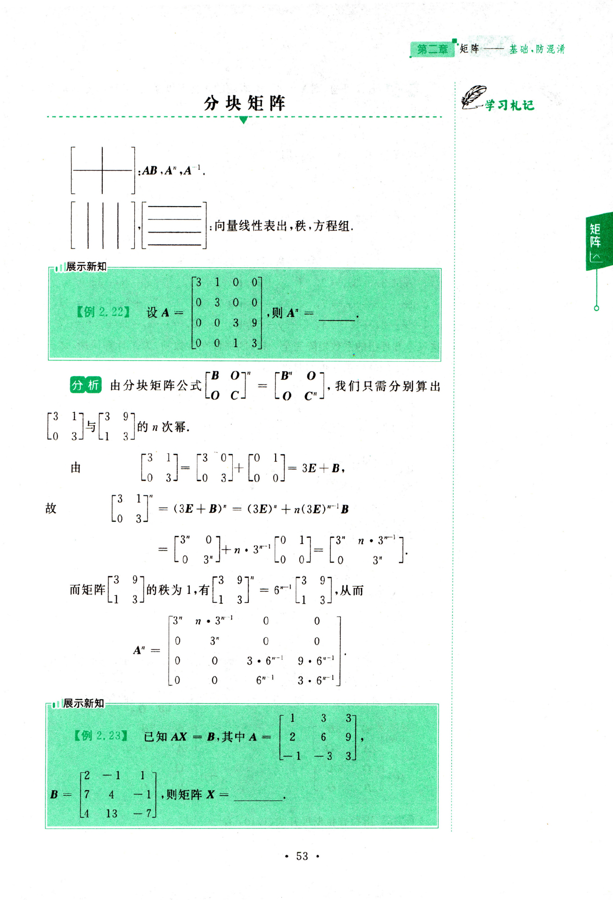
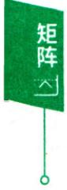
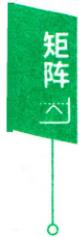
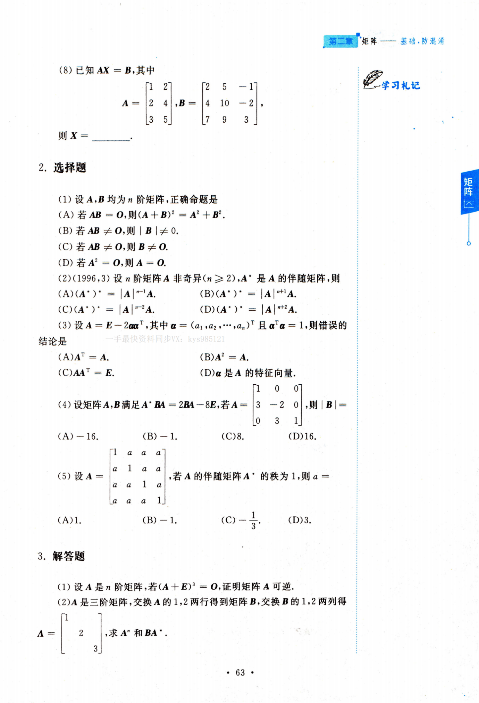

# 第二章 矩阵基础，防混淆

## 一、知识结构网络图

概念一m×n个数排成的m 行n列的表格

A+B,kA方阵的幂  
运算 AB<!-- DIRECTED-REPAIR-FALLBACK:FALLBACK-QA-R2-LIN-ADV-CH02-P66-BLOCK -->
> [!WARNING]
> 原 PDF 第 66 页回退：分块矩阵三种结构坍缩

分块矩阵AT初等矩阵P左乘A所得PA就是对A作了一次与P同样的行变换  
初等变换 初等矩阵 $- \boldsymbol { E } _ { i } ^ { - 1 } ( k ) = \boldsymbol { E } _ { i } \left( \frac { 1 } { k } \right) , \boldsymbol { E } _ { i , j } ^ { - 1 } = \boldsymbol { E } _ { i , j } , \boldsymbol { E } _ { i , j } ^ { - 1 } ( k ) = \boldsymbol { E } _ { i , j } ( - k )$ 等价 A →…→ B ⇔ PAQ = B,其中 P,Q 可逆

求法

$$
\boldsymbol{A}^{-1} = \frac{1}{\left| \boldsymbol{A} \right|} \boldsymbol{A}
$$

$$
\begin{bmatrix}
\boldsymbol{A} & \boldsymbol{O} \\
\boldsymbol{O} & \boldsymbol{B}
\end{bmatrix}^{-1} = \begin{bmatrix}
\boldsymbol{A}^{-1} & \boldsymbol{O} \\
\boldsymbol{O} & \boldsymbol{B}^{-1}
\end{bmatrix}, \begin{bmatrix}
\boldsymbol{O} & \boldsymbol{A} \\
\boldsymbol{B} & \boldsymbol{O}
\end{bmatrix}^{-1} = \begin{bmatrix}
\boldsymbol{O} & \boldsymbol{B}^{-1} \\
\boldsymbol{A}^{-1} & \boldsymbol{O}
\end{bmatrix}
$$

证法

秩

初等变换法定义法

参看本章主要公式

伴随矩阵 $A^{*} = \begin{bmatrix}
A_{11} & A_{21} & \cdots & A_{n1} \\
A_{12} & A_{22} & \cdots & A_{n2} \\
\vdots & \vdots &  & \vdots \\
A_{1n} & A_{2n} & \cdots & A_{nn}
\end{bmatrix}, A A^{*} = A^{*} A = \left| A \right| E$

对称矩阵 $\boldsymbol{A}^{\mathrm{T}} = \boldsymbol{A} \quad \Leftrightarrow \quad a_{ij} = a_{ji}$

反对称矩阵 $\boldsymbol{A}^{\mathrm{T}} = - \boldsymbol{A} \quad \Leftrightarrow \quad a_{ii} = 0, a_{ij} = - a_{ji}$

$$
\boldsymbol{A}\boldsymbol{A}^{\mathrm{T}} = \boldsymbol{A}^{\mathrm{T}}\boldsymbol{A} = \boldsymbol{E} \quad \Leftrightarrow \quad \boldsymbol{A}^{-1} = \boldsymbol{A}^{\mathrm{T}}
$$

-对角矩阵 $\begin{bmatrix}
a_{1} \\
a_{2} \\
\ddots \\
a_{n}
\end{bmatrix} , \begin{bmatrix}
a_{1} \\
a_{2} \\
a_{3}
\end{bmatrix} \begin{bmatrix}
b_{1} \\
b_{2} \\
b_{3}
\end{bmatrix} = \begin{bmatrix}
a_{1}b_{1} \\
a_{2}b_{2} \\
a_{3}b_{3}
\end{bmatrix} ,$

$$
A_{1}A_{2}=A_{2}A_{1},\begin{bmatrix}
a_{1} \\
a_{2} \\
a_{3}
\end{bmatrix}^{*}=\begin{bmatrix}
a_{1}^{*} \\
a_{2}^{*} \\
a_{3}^{*}
\end{bmatrix},\begin{bmatrix}
a_{1} \\
a_{2} \\
a_{3}
\end{bmatrix}^{-1}=\begin{bmatrix}
\frac{1}{a_{1}} \\
\frac{1}{a_{2}} \\
\frac{1}{a_{3}} \\
\frac{1}{a_{3}}
\end{bmatrix},
$$

其中 $a_{1}a_{2}a_{3} \ne 0$

$$
\begin{bmatrix}
k_{1} \\
k_{2} \\
k_{3}
\end{bmatrix} \begin{bmatrix}
a_{1} & b_{1} & c_{1} \\
a_{2} & b_{2} & c_{2} \\
a_{3} & b_{3} & c_{3}
\end{bmatrix} = \begin{bmatrix}
k_{1}a_{1} & k_{1}b_{1} & k_{1}c_{1} \\
k_{2}a_{2} & k_{2}b_{2} & k_{2}c_{2} \\
k_{3}a_{3} & k_{3}b_{3} & k_{3}c_{3}
\end{bmatrix} , \begin{bmatrix}
a_{1} & b_{1} & c_{1} \\
a_{2} & b_{2} & c_{2} \\
a_{3} & b_{3} & c_{3}
\end{bmatrix} \begin{bmatrix}
k_{1} \\
k_{2} \\
k_{3}
\end{bmatrix} = \begin{bmatrix}
k_{1}a_{1} & k_{1}b_{1} & k_{1}c_{1} \\
k_{1}a_{2} & k_{2}b_{2} & k_{1}c_{2} \\
k_{1}a_{3} & k_{2}b_{3} & k_{2}c_{3}
\end{bmatrix}
$$

【编者注】 矩阵是线性代数的核心内容，它贯彻线性代数的始终.复习时要引起考生足够的重视，概念要清晰，符号要习惯，运算要正确、迅速、简捷.

（1）理解矩阵的概念，了解几种特殊矩阵（单位矩阵、对角矩阵、数量矩阵、三角矩阵、对称矩阵、反对称矩阵、正交矩阵）的定义及性质.

(2)掌握矩阵运算(加、减、数乘、乘法)及其运算规律，掌握矩阵转置的性质，掌握行列式乘法公式，了解方阵的幂.

(3)理解逆矩阵的概念，掌握矩阵可逆的充要条件，掌握可逆矩阵的 性质，理解伴随矩阵的概念，会用伴随矩阵求矩阵的逆.

(4)掌握矩阵的初等变换，了解初等矩阵的性质及矩阵等价的概念， 理解矩阵秩的要领，掌握用初等变换求矩阵的逆和秩.

(5）了解分块矩阵的概念，掌握分块矩阵的运算.

## 今年考题

(2026，1,2)单位矩阵经过若干次互换两行得到的矩阵称为置换矩阵.设A 为n阶置换矩阵 $, \boldsymbol{A}^{*}$ 为A的伴随矩阵，则(A) $) \boldsymbol{A}^{\star}$ 为置换矩阵. (B) $\boldsymbol{A}^{-1}$ 为置换矩阵.(C) $\boldsymbol{A}^{-1} = \boldsymbol{A}^{*}$ (D) $\boldsymbol{A}^{-1} = -\boldsymbol{A}^*$

(2026,2,3)矩阵 $\boldsymbol{A} = \begin{pmatrix}
1 & 0 & 1 \\
0 & 0 & 1 \\
1 & 1 & 3 \\
1 & 1 & 1
\end{pmatrix}, \boldsymbol{C} = \begin{pmatrix}
2 & 0 \\
1 & 1 \\
1 & 1 \\
a & b
\end{pmatrix}$ ，存在矩阵B满足 $\boldsymbol{A}\boldsymbol{B}=$

C,则 (A) $a = - 1,b = - 1$ (B) $a = 2, b = 2.$ (C) $a = -1, b = 2.$ (D) $a = 2, b = -1.$

(2026,3)A为三阶非零矩阵 $, \boldsymbol{A}^{\star}$ 为A的伴随矩阵，若 $\boldsymbol{A}^{*} = - 2\boldsymbol{A}$ ,则 $\boldsymbol{A}^{2}=$ (A) $\begin{bmatrix}
- 4 \\
- 4 \\
- 4
\end{bmatrix}.$ (B) $\begin{bmatrix}
- 4 \\
- 4 \\
4
\end{bmatrix}$ (C) $\begin{bmatrix}
- 4 \\
4 \\
4
\end{bmatrix}.$ (D) $\begin{bmatrix}
4 \\
4 \\
4
\end{bmatrix}$

## 二、基本内容与重要结论

学习札记

## 基础知识

$m \times n$ 个数排成如下m行n列的一个表格

$$
\begin{bmatrix}
a_{11} & a_{12} & \cdots & a_{1n} \\
a_{21} & a_{22} & \cdots & a_{2n} \\
\vdots & \vdots &  & \vdots \\
a_{m1} & a_{m2} & \cdots & a_{mn}
\end{bmatrix}
$$

称为一个 $m \times n$ 矩阵.当 $m = n$ 时，矩阵A称为n阶矩阵或n阶方阵.

如果一个矩阵的所有元素都是0，即

$$
\begin{bmatrix}
0^{12} & 0 & \cdots & 0 \\
0 & 0 & \cdots & 0 \\
\vdots & \vdots &  & \vdots \\
0 & 0 & \cdots & 0
\end{bmatrix},
$$

则称这个矩阵是零矩阵，可简记为0.

两个 $m \times n$ 型矩阵 $\boldsymbol{A} = \left[ a_{ij} \right], \boldsymbol{B} = \left[ b_{ij} \right]$ ，如果对应的元素都相等，即$a_{ij} = b_{ij} \left( i = 1,2,\cdots,m; j = 1,2,\cdots,n \right)$ ，则称矩阵A与B相等，记作A=B.n阶方阵 $\boldsymbol{A} = \left[ a_{ij} \right]_{n \times n}$ 的元素所构成的行列式

$$
\begin{bmatrix}
a_{11} & a_{12} & \cdots & a_{1n} \\
a_{21} & a_{22} & \cdots & a_{2n} \\
\vdots & \vdots &  & \vdots \\
a_{n1} & a_{n2} & \cdots & a_{nn}
\end{bmatrix}
$$

称为n阶矩阵A的行列式，记成 $\left| \boldsymbol{A} \right|$ 或 detA.

1. 矩阵的运算与法则

(1) 设 $\boldsymbol{A} = \left[ a_{ij} \right], \boldsymbol{B} = \left[ b_{ij} \right]$ 是两个 $m \times n$ 矩阵，则 $m \times n$ 矩阵 $\boldsymbol{C} = \left[ c_{ij} \right]$ $= \left[ a_{ij} + b_{ij} \right]$ 称为矩阵A与B的和，记为 $\boldsymbol{A} + \boldsymbol{B} = \boldsymbol{C}.$

设 $\boldsymbol{A} = \left[ a_{ij} \right]$ 是 $m \times n$ 矩阵，k是一个常数，则 $m \times n$ 矩阵 $\left[ka_{ij}\right]$ 称为数k 与矩阵A的数乘，记为kA.

设A,B,C,O都是 $m \times n$ 矩阵，k，l是常数，则矩阵的加法和数乘运算满足：

$$
\textcircled{l} A + B = B + A .
$$

$$
\left( \boldsymbol{A} + \boldsymbol{B} \right) + \boldsymbol{C} = \boldsymbol{A} + \left( \boldsymbol{B} + \boldsymbol{C} \right).
$$

③A + O = A.

$$
A + ( - A ) = O.
$$

⑤1A = A.

6 $(l\boldsymbol{A}) = (kl)\boldsymbol{A}.$

$$
k(\boldsymbol{A} + \boldsymbol{B}) = k\boldsymbol{A} + k\boldsymbol{B}.
$$

⑧ $(k + l)\boldsymbol{A} = k\boldsymbol{A} + l\boldsymbol{A}.$

(2)设A=[aij]是m×n矩阵，B=[bjj]是n×s矩阵，那么m×s矩阵 $C = \left[ c_{ij} \right]$ ,其中

$$
c _ { i j } = a _ { i 1 } b _ { 1 j } + a _ { i 2 } b _ { 2 j } + \cdots + a _ { i n } b _ { n j } = \sum _ { k = 1 } ^ { n } a _ { i k } b _ { k j } ,
$$

称为A与B的乘积，记为 $C = AB$

矩阵的乘法可图示如下：

矩阵乘法有下列法则：注意没有交换律

$A(BC) = (AB)C.$

$$
\begin{aligned}\textcircled{2} A(\boldsymbol{B}+\boldsymbol{C})&=A\boldsymbol{B}+A\boldsymbol{C},(A+B)\boldsymbol{C}=AC+BC.\end{aligned}
$$

$$
\left( k \boldsymbol{A} \right) \left( l \boldsymbol{B} \right) = k l \boldsymbol{A} \boldsymbol{B}.
$$

$$
OA = O,AO = O.
$$

特别地，设A是n阶矩阵，k是正整数，A的k次方幂 $A^{k} = A \cdot A \cdots A(k$ 个A)，规定 $A^{0} = \boldsymbol{E},$ 有

$$
\boldsymbol{A}^{k} \cdot \boldsymbol{A}^{l}=\boldsymbol{A}^{k+l},(\boldsymbol{A}^{k})^{l}=\boldsymbol{A}^{kl}.
$$

对多项式 $f(x)=a_{m}x^{m}+a_{m - 1}x^{m - 1}+\cdots+a_{1}x+a_{0}$ ,则规定

$$
f(\boldsymbol{A}) = a_{m}\boldsymbol{A}^{m} + a_{m - 1}\boldsymbol{A}^{m - 1} + \cdots + a_{1}\boldsymbol{A} + a_{0}\boldsymbol{E}.
$$

（3）把矩阵A的行换成同序数的列得到一个新矩阵，称为矩阵A的转置矩阵，记为 $A^{\mathrm{T}}$

例如 $\boldsymbol{A} = \begin{bmatrix}
1 & 2 & 3 \\
4 & 5 & 6
\end{bmatrix}$ ,则 $\boldsymbol{A}^{\mathrm{T}} = \begin{bmatrix}
1 & 4 \\
2 & 5 \\
3 & 6
\end{bmatrix}.$

转置的法则

$$
\left( \boldsymbol{A}^{\mathrm{T}} \right)^{\mathrm{T}} = \boldsymbol{A}; \left( \boldsymbol{A} + \boldsymbol{B} \right)^{\mathrm{T}} = \boldsymbol{A}^{\mathrm{T}} + \boldsymbol{B}^{\mathrm{T}};
$$

$$
\left( k \boldsymbol{A} \right)^{\mathrm{T}} = k \boldsymbol{A}^{\mathrm{T}} ; \left( \boldsymbol{A} \boldsymbol{B} \right)^{\mathrm{T}} = \boldsymbol{B}^{\mathrm{T}} \boldsymbol{A}^{\mathrm{T}} .
$$

(4) 分块矩阵

对矩阵适当地分块处理，有如下运算法则：

$$
\left[ \begin{aligned} \boldsymbol{A}_{1} \quad \boldsymbol{A}_{2} \\ \boldsymbol{A}_{3} \quad \boldsymbol{A}_{4} \end{aligned} \right] + \left[ \begin{aligned} \boldsymbol{B}_{1} \quad \boldsymbol{B}_{2} \\ \boldsymbol{B}_{3} \quad \boldsymbol{B}_{4} \end{aligned} \right] = \left[ \begin{aligned} \boldsymbol{A}_{1} + \boldsymbol{B}_{1} \quad \boldsymbol{A}_{2} + \boldsymbol{B}_{2} \\ \boldsymbol{A}_{3} + \boldsymbol{B}_{3} \quad \boldsymbol{A}_{4} + \boldsymbol{B}_{4} \end{aligned} \right] ;
$$

$$
\begin{bmatrix}
\boldsymbol{A} & \boldsymbol{B} \\
\boldsymbol{C} & \boldsymbol{D}
\end{bmatrix} \begin{bmatrix}
\boldsymbol{X} & \boldsymbol{Y} \\
\boldsymbol{Z} & \boldsymbol{W}
\end{bmatrix} = \begin{bmatrix}
\boldsymbol{A}\boldsymbol{X} + \boldsymbol{B}\boldsymbol{Z} & \boldsymbol{A}\boldsymbol{Y} + \boldsymbol{B}\boldsymbol{W} \\
\boldsymbol{C}\boldsymbol{X} + \boldsymbol{D}\boldsymbol{Z} & \boldsymbol{C}\boldsymbol{Y} + \boldsymbol{D}\boldsymbol{W}
\end{bmatrix};
$$

$$
\left[ \begin{matrix}
{ \boldsymbol { A } } & { \boldsymbol { B } } \\
{ \boldsymbol { C } } & { \boldsymbol { D } }
\end{matrix} \right] ^ { \mathrm { T } } = \left[ \begin{matrix}
{ \boldsymbol { A } ^ { \mathrm { T } } } & { \boldsymbol { C } ^ { \mathrm { T } } } \\
{ \boldsymbol { B } ^ { \mathrm { T } } } & { \boldsymbol { D } ^ { \mathrm { T } } }
\end{matrix} \right] ;
$$

学习札记

若B,C分别是m阶与s阶矩阵，则 $\left[ \begin{matrix}
{ \boldsymbol { B } } & { \boldsymbol { O } } \\
{ \boldsymbol { O } } & { \boldsymbol { C } }
\end{matrix} \right] ^ { n } = \left[ \begin{matrix}
{ \boldsymbol { B } ^ { n } } & { \boldsymbol { O } } \\
{ \boldsymbol { O } } & { \boldsymbol { C } ^ { n } }
\end{matrix} \right] ;$

若B,C分别是m阶与n阶可逆矩阵，则

$$
\begin{bmatrix}
\boldsymbol{B} & \boldsymbol{O} \\
\boldsymbol{O} & \boldsymbol{C}
\end{bmatrix}^{-1} = \begin{bmatrix}
\boldsymbol{B}^{-1} & \boldsymbol{O} \\
\boldsymbol{O} & \boldsymbol{C}^{-1}
\end{bmatrix}, \begin{bmatrix}
\boldsymbol{O} & \boldsymbol{B} \\
\boldsymbol{C} & \boldsymbol{O}
\end{bmatrix}^{-1} = \begin{bmatrix}
\boldsymbol{O} & \boldsymbol{C}^{-1} \\
\boldsymbol{B}^{-1} & \boldsymbol{O}
\end{bmatrix};
$$

若A是 $m \times n$ 矩阵，B是 $n \times s$ 矩阵且 $AB = \boldsymbol{O},$ 对B和O矩阵按列分块有$AB = A[b_1,b_2,\cdots,b_r] = [Ab_1,Ab_2,\cdots,Ab_r] = [0,0,\cdots,0],$

$$
A \boldsymbol { b } _ { i } = \mathbf { 0 } \quad ( i = 1 , 2 , \cdots , s ) ,
$$

即B的列向量是齐次方程组 $Ax = \mathbf{0}$ 的解.

若 $A\boldsymbol{B} = \boldsymbol{C}$ ，其中A是 $m \times n$ 矩阵，B是 $n \times s$ 矩阵，则对B,C按行分块有

$$
\begin{bmatrix}
a_{11} & a_{12} & \cdots & a_{1n} \\
a_{21} & a_{22} & \cdots & a_{2n} \\
\vdots & \vdots &  & \vdots \\
a_{m1} & a_{m2} & \cdots & a_{mn}
\end{bmatrix}\begin{bmatrix}
\boldsymbol{\beta}_{1} \\
\boldsymbol{\beta}_{2} \\
\vdots \\
\boldsymbol{\beta}_{n}
\end{bmatrix}=\begin{bmatrix}
\boldsymbol{\alpha}_{1} \\
\boldsymbol{\alpha}_{2} \\
\vdots \\
\boldsymbol{\alpha}_{m}
\end{bmatrix},
$$

即

$$
\begin{cases}a_{11} \boldsymbol{\beta}_{1} + a_{12} \boldsymbol{\beta}_{2} + \cdots + a_{1n} \boldsymbol{\beta}_{n} = \boldsymbol{\alpha}_{1}, \\a_{21} \boldsymbol{\beta}_{1} + a_{22} \boldsymbol{\beta}_{2} + \cdots + a_{2n} \boldsymbol{\beta}_{n} = \boldsymbol{\alpha}_{2}, \\\vdots \quad \vdots \quad \vdots \quad \vdots \\a_{m1} \boldsymbol{\beta}_{1} + a_{m2} \boldsymbol{\beta}_{2} + \cdots + a_{mn} \boldsymbol{\beta}_{n} = \boldsymbol{\alpha}_{m},\end{cases}
$$

可见矩阵AB的行向量 $\alpha_{1}, \alpha_{2}, \cdots, \alpha_{m}$ 可由B的行向量 $\beta_{1}, \beta_{2}, \cdots, \beta_{n}$ 线性表出.

类似地，对矩阵A，C按列分块，有

$$
\left[ \gamma_{1} , \gamma_{2} , \cdots , \gamma_{n} \right] \begin{bmatrix}
b_{11} & b_{12} & \cdots & b_{1s} \\
b_{21} & b_{22} & \cdots & b_{2s} \\
\vdots & \vdots &  & \vdots \\
b_{n1} & b_{n2} & \cdots & b_{ns}
\end{bmatrix} = \left[ \boldsymbol{\delta}_{1} , \boldsymbol{\delta}_{2} , \cdots , \boldsymbol{\delta}_{s} \right] ,
$$

由此得

$$
\begin{cases}b_{11} \boldsymbol{\gamma}_{1} + b_{21} \boldsymbol{\gamma}_{2} + \cdots + b_{n1} \boldsymbol{\gamma}_{n} = \boldsymbol{\delta}_{1}, \\b_{12} \boldsymbol{\gamma}_{1} + b_{22} \boldsymbol{\gamma}_{2} + \cdots + b_{n2} \boldsymbol{\gamma}_{n} = \boldsymbol{\delta}_{2}, \\\vdots \quad \vdots \quad \vdots \quad \vdots \quad \vdots \\b_{1n} \boldsymbol{\gamma}_{1} + b_{2n} \boldsymbol{\gamma}_{2} + \cdots + b_{nn} \boldsymbol{\gamma}_{n} = \boldsymbol{\delta}.\end{cases}
$$

即矩阵AB的列向量可由A的列向量线性表出.

## 2. 重要矩阵

(1) 伴随矩阵

设 $\boldsymbol{A} = \left[ a_{ij} \right]$ 是n阶矩阵，行列式 $\left| \boldsymbol{A} \right|$ 的每个元素 $\boldsymbol{a}_{ij}$ 的代数余子式 $A _ { i j }$ 所构成的如下的矩阵

$$
\boldsymbol{A}^{\star} = \begin{bmatrix}
A_{11} & A_{21} & \cdots & A_{n1} \\
A_{12} & A_{22} & \cdots & A_{n2} \\
\vdots & \vdots &  & \vdots \\
A_{1n} & A_{2n} & \cdots & A_{nn}
\end{bmatrix}
$$

称为矩阵A的伴随矩阵.

【评注】设 $\boldsymbol{A} = \begin{bmatrix}
a & b \\
c & d
\end{bmatrix}$ ，由行列式 $\left| \begin{matrix}
{ a } & { b } \\
{ c } & { d }
\end{matrix} \right|$ 得到代数余子式

$$
A_{11} = d, A_{12} = -c, A_{21} = -b, A_{22} = a,
$$

所以矩阵A的伴随矩阵

$$
A^{*} = \left[ \begin{matrix}
A_{11} & A_{21} \\
A_{12} & A_{22}
\end{matrix} \right] = \left[ \begin{matrix}
d & -b \\
-c & a
\end{matrix} \right].
$$

对于二阶矩阵，用主对角线元素对换，副对角线元素变号即可求出 伴随矩阵.

$$
 例如 , \left[ \begin{aligned} 1 & \quad -1 \\ 2 & \quad 3 \end{aligned} \right]^{\bullet} = \left[ \begin{aligned} 3 & \quad 1 \\ -2 & \quad 1 \end{aligned} \right], \left[ \begin{aligned} 0 & \quad 1 \\ 1 & \quad 0 \end{aligned} \right]^{\bullet} = \left[ \begin{aligned} 0 & \quad -1 \\ -1 & \quad 0 \end{aligned} \right].
$$

## (2) 可逆矩阵

设A是n阶矩阵，如果存在n阶矩阵B使得

$$
AB = BA = E (单位矩阵)
$$

成立，则称A是可逆矩阵或非奇异矩阵，B是A的逆矩阵.

例如， ${ 1 \quad 3 \choose 1 \quad 2 } { - 2 \quad 3 \choose 1 \quad - 1 } = { - 2 \quad 3 \choose 1 \quad - 1 } { 1 \quad 3 \choose 1 \quad 2 } = { 1 \quad 0 \choose 0 \quad 1 }$ ,所以矩阵$\begin{bmatrix}
1 & 3 \\
1 & 2
\end{bmatrix}$ 可逆，且 ${ 1 \choose 1 \quad 2 } ^ { - 1 } = { - 2 \quad 3 \choose 1 \quad - 1 } .$

当然亦有 ${ \binom { -   2 \quad 3 } { 1 \quad -   1 } } ^ { ^ { - 1 } } = { \Big [ } { 1 \quad 3 \atop 1 \quad 2 } { \Big ] } .$

(3) 初等矩阵

对m×n矩阵，下列三种变换

(1) 用非零常数k乘矩阵的某一行(列).

(2)互换矩阵某两行(列）的位置.

（3）把某行(列）的k倍加至另一行（列).称为矩阵的初等行(列）变换，统称为矩阵的初等变换

初等矩阵：单位矩阵经过一次初等变换所得到的矩阵.

例如，三阶单位矩阵作如下初等变换

$$
\boldsymbol{E}_{1,2}=\begin{bmatrix}
0 & 1 & 0 \\
1 & 0 & 0 \\
0 & 0 & 1
\end{bmatrix}\quad\begin{aligned}\boldsymbol{E}& 一、二两行互换 \\ (或一、二两列互换 )\end{aligned}
$$

$\boldsymbol{E}_{12}(3)=\begin{bmatrix}
1 & 0 & 0 \\
3 & 1 & 0 \\
0 & 0 & 1
\end{bmatrix}$ E第一行的3倍加至第二行(或第二列的3倍加至第一列)，

学习札记

$E_{3}(-2)=\begin{bmatrix}
1 & 0 & 0 \\
0 & 1 & 0 \\
0 & 0 & -2
\end{bmatrix}$ E第三行乘以一2(或第三列乘以一2)

均是初等矩阵.

注初等矩阵的记号在各教材中不统一.

如果矩阵A经过有限次初等变换变成矩阵B，则称矩阵A与矩阵B等价，记作 $\boldsymbol{A} \cong \boldsymbol{B}.$

(4) 正交矩阵

设A是n阶矩阵，满足 $\boldsymbol{A}\boldsymbol{A}^{\mathrm{T}} = \boldsymbol{A}^{\mathrm{T}}\boldsymbol{A} = \boldsymbol{E}$ ，称A是正交矩阵.

【评注】A是正交矩阵 $\Leftrightarrow \boldsymbol{A}^{\mathrm{T}} = \boldsymbol{A}^{-1}$

↔A的行(列)向量两两正交、单位向量.

A 是正交矩阵 $\Rightarrow \left| \boldsymbol{A} \right|^{2} = 1$

设 $\boldsymbol{A} = \begin{bmatrix}
a_{1} & b_{1} & c_{1} \\
a_{2} & b_{2} & c_{2} \\
a_{3} & b_{3} & c_{3}
\end{bmatrix}$ 是正交矩阵，那么

$$
\boldsymbol { A } ^ { \mathrm { T } } \boldsymbol { A } = \begin{bmatrix}
a _ { 1 } & a _ { 2 } & a _ { 3 } \\
b _ { 1 } & b _ { 2 } & b _ { 3 } \\
c _ { 1 } & c _ { 2 } & c _ { 3 }
\end{bmatrix} \begin{bmatrix}
a _ { 1 } & b _ { 1 } & c _ { 1 } \\
a _ { 2 } & b _ { 2 } & c _ { 2 } \\
a _ { 3 } & b _ { 3 } & c _ { 3 }
\end{bmatrix} = \begin{bmatrix}
1 & 0 & 0 \\
0 & 1 & 0 \\
0 & 0 & 1
\end{bmatrix},
$$

即有 $a_{1}^{2}+a_{2}^{2}+a_{3}^{2}=1,a_{1}b_{1}+a_{2}b_{2}+a_{3}b_{3}=0,a_{1}c_{1}+a_{2}c_{2}+a_{3}c_{3}=0.$

若令 $\boldsymbol{\alpha}_{1}=(a_{1},a_{2},a_{3})^{\mathrm{T}},\boldsymbol{\alpha}_{2}=(b_{1},b_{2},b_{3})^{\mathrm{T}},\boldsymbol{\alpha}_{3}=(c_{1},c_{2},c_{3})^{\mathrm{T}}$ ，则上述关系式表明：

$$
\boldsymbol{\alpha}_{1}^{\mathrm{T}} \boldsymbol{\alpha}_{1}=1, \boldsymbol{\alpha}_{1}^{\mathrm{T}} \boldsymbol{\alpha}_{2}=0, \boldsymbol{\alpha}_{1}^{\mathrm{T}} \boldsymbol{\alpha}_{3}=0,
$$

即 $\pmb { \alpha } _ { 1 }$ 是单位向量， $, \pmb { \alpha } _ { 1 }$ 与 $\boldsymbol{\alpha}_{2} , \boldsymbol{\alpha}_{1}$ 与 $\pmb { \alpha } _ { 3 }$ 均正交.

说明正交矩阵的每个列向量长度均为1，列向量两两正交.

类似地，利用 $\boldsymbol{A} \boldsymbol{A}^{\mathrm{T}} = \boldsymbol{E}$ 可知正交矩阵的行向量长度均为1，行向量两两正交.

设 $\boldsymbol{\alpha} = (a_{1}, a_{2}, \cdots, a_{n})^{\mathrm{T}}, \boldsymbol{\beta} = (b_{1}, b_{2}, \cdots, b_{n})^{\mathrm{T}}.$

向量内积 $\left( \boldsymbol{\alpha}, \boldsymbol{\beta} \right) = \boldsymbol{\alpha}^{\mathrm{T}} \boldsymbol{\beta} = \boldsymbol{\beta}^{\mathrm{T}} \boldsymbol{\alpha} = a_{1} b_{1} + a_{2} b_{2} + \cdots + a_{n} b_{n}.$

【评注】向量 $\boldsymbol{a} = (a_{1}, a_{2}, \cdots, a_{n})^{\mathrm{T}}$ 的长度

$$
\left\| \boldsymbol{\alpha} \right\| = \sqrt{\boldsymbol{\alpha}^{\mathrm{T}} \boldsymbol{\alpha}} = \sqrt{a_{1}^{2} + a_{2}^{2} + \cdots + a_{n}^{2}}.
$$

例如， $\boldsymbol{\alpha} = (1,2,3)^{\mathrm{T}}$ ，则 $\boldsymbol{\alpha}^{\mathrm{T}} \boldsymbol{\alpha} = 1^{2} + 2^{2} + 3^{2} = 14$ ，那么向量α的长

度为 $\| \alpha \| = \sqrt{14} ,  而  \frac{1}{\sqrt{14}}(1,2,3)^{\mathrm{T}}$ 是单位向量.

$$
\boldsymbol{\alpha}^{\mathrm{T}} \boldsymbol{\alpha}=0 \Leftrightarrow a_{1}^{2}+a_{2}^{2}+\cdots+a_{n}^{2}=0 \Leftrightarrow \boldsymbol{\alpha}=0 .
$$

若 $( \boldsymbol{\alpha} , \boldsymbol{\beta} ) = 0$ 即 $a_{1}b_{1} + a_{2}b_{2} + \cdots + a_{n}b_{n} = 0$ ,称α与β正交，记为 $\alpha \perp \beta .$

## 重要定理

定理2.1若A是可逆矩阵，则矩阵A的逆矩阵唯一，记为 $\boldsymbol{A}^{-1}$

定理2.2n阶矩阵A 可逆⇔ $\left| \boldsymbol{A} \right| \neq 0$

⇔ $r(\boldsymbol{A}) = n$

↔A 的列(行)向量组线性无关

$\Leftrightarrow \boldsymbol{A} = \boldsymbol{P}_{1} \boldsymbol{P}_{2} \cdots \boldsymbol{P}_{s}, \boldsymbol{P}_{i} \left( i = 1, 2, \cdots, s \right)$ 是初等矩阵

⇔ A 与单位矩阵等价

↔ 0 不是矩阵A 的特征值.

定理2.3 若A是n阶矩阵，且满足 $\boldsymbol{A}\boldsymbol{B} = \boldsymbol{E}$ ,则必有 $\boldsymbol{B}\boldsymbol{A} = \boldsymbol{E}.$

【评注】由定理2.3，如A，B是n阶矩阵，且满足AB=E则可保证$\pmb { B } \pmb { A } = \pmb { E }$ 因而用定义法求 $A^{\cdots 1}$ 时，只需检验 $\boldsymbol{A}\boldsymbol{B} = \boldsymbol{E}$ 就可以了.但要注意的是定理2.3的条件“A是η阶矩阵”不能忽略.例如，对于

$$
\boldsymbol { A } \boldsymbol { B } = \begin{bmatrix}
1 & 0 & 3 \\
0 & 1 & 5
\end{bmatrix} \begin{bmatrix}
1 & 0 \\
0 & 1 \\
0 & 0
\end{bmatrix} = \begin{bmatrix}
1 & 0 \\
0 & 1
\end{bmatrix},
$$

但我们并不能说A可逆.

定理2.4用初等矩阵P左(右）乘矩阵A，其结果PA(AP)就是对矩阵A作一次相应的初等行(列）变换.

定理2.5 初等矩阵均可逆，且其逆是同类型的初等矩阵，即

$$
\boldsymbol { E } _ { i } ^ { - 1 } \left( k \right) = \boldsymbol { E } _ { i } \left( \frac { 1 } { k } \right) , \boldsymbol { E } _ { i j } ^ { - 1 } \left( k \right) = \boldsymbol { E } _ { i j } \left( - k \right) , \boldsymbol { E } _ { i j } ^ { - 1 } = \boldsymbol { E } _ { i j } .
$$

定理2.6 矩阵A与B等价的充分必要条件是存在可逆矩阵P与Q使 $PAQ = B.$

定理2.7 秩 $r(\boldsymbol{A}) = \boldsymbol{A}$ 的列秩= A 的行秩.

定理2.8 矩阵经初等变换后秩不变.

## 主要公式

学习札记

1. 可逆

$$
\left( \boldsymbol{A}^{-1} \right)^{-1} = \boldsymbol{A}; \left( k\boldsymbol{A} \right)^{-1} = \frac{1}{k}\boldsymbol{A}^{-1} \left( k \neq 0 \right);
$$

$$
\left( \boldsymbol{A} \boldsymbol{B} \right)^{-1} = \boldsymbol{B}^{-1} \boldsymbol{A}^{-1} ; \left( \boldsymbol{A}^{n} \right)^{-1} = \left( \boldsymbol{A}^{-1} \right)^{n} ;
$$

$$
\left( \boldsymbol{A}^{- 1} \right)^{\mathrm{T}} = \left( \boldsymbol{A}^{\mathrm{T}} \right)^{- 1}; \left| \boldsymbol{A}^{- 1} \right| = \frac{1}{\left| \boldsymbol{A} \right|};
$$

$$
\boldsymbol{A}^{-1} = \frac{1}{\left| \boldsymbol{A} \right|} \boldsymbol{A}^{*}
$$

2. 伴随

$$
\boldsymbol{A}\boldsymbol{A}^{*} = \boldsymbol{A}^{*}\boldsymbol{A} = \left| \boldsymbol{A} \right|\boldsymbol{E};
$$

$$
\boldsymbol{A}^{*} = \left| \boldsymbol{A} \right| \boldsymbol{A}^{-1} ; \left| \boldsymbol{A}^{*} \right| = \left| \boldsymbol{A} \right|^{n-1} ;
$$

$$
\left( \boldsymbol{A}^{*} \right)^{-1} = \left( \boldsymbol{A}^{-1} \right)^{*} = \frac{1}{\left| \boldsymbol{A} \right|} \boldsymbol{A};
$$

$$
\left( \boldsymbol{A}^{*} \right)^{\mathrm{T}} = \left( \boldsymbol{A}^{\mathrm{T}} \right)^{*}; \left( k\boldsymbol{A} \right)^{*} = k^{n - 1}\boldsymbol{A}^{*}; \left( \boldsymbol{A}^{*} \right)^{*} = \left| \boldsymbol{A} \right|^{n - 2}\boldsymbol{A};
$$

$$
r(A^{*}) = \begin{cases}n, &  如果  r(A) = n, \\1, &  如果  r(A) = n - 1, \\0, &  如果  r(A) < n - 1.\end{cases}
$$

3. 秩

$$
r(\boldsymbol{A}) = r(\boldsymbol{A}^{\mathrm{T}}) = r(\boldsymbol{A}^{\mathrm{T}}\boldsymbol{A}) = r(\boldsymbol{A}\boldsymbol{A}^{\mathrm{T}});
$$

当 $k \neq 0$ 时 $r(k\boldsymbol{A}) = r(\boldsymbol{A})$

$$
r(\boldsymbol{A} + \boldsymbol{B}) \leqslant r(\boldsymbol{A}, \boldsymbol{B}) \leqslant r(\boldsymbol{A}) + r(\boldsymbol{B});
$$

A是 $m \times n$ 矩阵，B是 $n \times s$ 矩阵，则

$$
r(\boldsymbol{A}) + r(\boldsymbol{B}) - n \leqslant r(\boldsymbol{A}\boldsymbol{B}) \leqslant \min(r(\boldsymbol{A}), r(\boldsymbol{B}));
$$

若A可逆，则 $r(\boldsymbol{A}\boldsymbol{B}) = r(\boldsymbol{B}), r(\boldsymbol{B}\boldsymbol{A}) = r(\boldsymbol{B})$

若A列满秩，则 $r(\boldsymbol{A}\boldsymbol{B}) = r(\boldsymbol{B})$

若B行满秩，则 $r(\boldsymbol{A}\boldsymbol{B}) = r(\boldsymbol{A})$ oa

若A是 $m \times n$ 矩阵，B是 $n \times s$ 矩阵且 $AB = \boldsymbol{O}$ ,则 $r(\boldsymbol{A}) + r(\boldsymbol{B}) \leqslant n;$ 若A是 $m \times n$ 矩阵，B是 $n \times s$ 矩阵，C是s×t矩阵，则

$$
r(AB)+r(BC)\leqslant r(ABC)+r(B);
$$

$$
r \left[ \begin{aligned} \boldsymbol{A} \quad \boldsymbol{O} \\ \boldsymbol{O} \quad \boldsymbol{B} \end{aligned} \right] = r \left[ \begin{aligned} \boldsymbol{O} \quad \boldsymbol{A} \\ \boldsymbol{B} \quad \boldsymbol{O} \end{aligned} \right] = r(\boldsymbol{A}) + r(\boldsymbol{B})
$$

$$
r \left[ \begin{aligned} \boldsymbol{A} \quad \boldsymbol{O} \\ \boldsymbol{C} \quad \boldsymbol{B} \end{aligned} \right] \geqslant r(\boldsymbol{A}) + r(\boldsymbol{B})
$$

若 $\boldsymbol{A} \sim \boldsymbol{B}$ ,则 $r(\boldsymbol{A}) = r(\boldsymbol{B}) , r(\boldsymbol{A} + k\boldsymbol{E}) = r(\boldsymbol{B} + k\boldsymbol{E}) ,$

## 三、典型例题分析选讲

## 矩阵运算

矩阵的乘法运算是重要的、基本的，也是一些考生不重视常出错的地方关于矩阵乘法要注意以下三个方面：

(1)矩阵乘法没有交换律，一般情况 $A B \neq B A$

例如 $\boldsymbol{A} = \begin{bmatrix}
0 & 1 \\
1 & 0
\end{bmatrix}, \boldsymbol{B} = \begin{bmatrix}
1 & 2 \\
3 & 4
\end{bmatrix}$ ,有

$$
AB = \begin{bmatrix}
0 & 1 \\
1 & 0
\end{bmatrix} \begin{bmatrix}
1 & 2 \\
3 & 4
\end{bmatrix} = \begin{bmatrix}
3 & 4 \\
1 & 2
\end{bmatrix},
$$

$$
\boldsymbol{B}\boldsymbol{A} = \begin{bmatrix}
1 & 2 \\
3 & 4
\end{bmatrix} \begin{bmatrix}
0 & 1 \\
1 & 0
\end{bmatrix} = \begin{bmatrix}
2 & 1 \\
4 & 3
\end{bmatrix}.
$$

又如 $\boldsymbol{A} = \begin{bmatrix}
1 & 1 & 1 \\
1 & 1 & 1 \\
1 & 1 & 1
\end{bmatrix}, \boldsymbol{B} = \begin{bmatrix}
1 & 1 & 0 \\
-1 & 0 & 0 \\
0 & -1 & 0
\end{bmatrix}$ ,有

$$
\boldsymbol { A } \boldsymbol { B } = \begin{bmatrix}
1 & 1 & 1 \\
1 & 1 & 1 \\
1 & 1 & 1
\end{bmatrix} \begin{bmatrix}
1 & 1 & 0 \\
- 1 & 0 & 0 \\
0 & - 1 & 0
\end{bmatrix} = \begin{bmatrix}
0 & 0 & 0 \\
0 & 0 & 0 \\
0 & 0 & 0
\end{bmatrix},
$$

$$
\boldsymbol{B}\boldsymbol{A} = \begin{bmatrix}
1 & 1 & 0 \\
-1 & 0 & 0 \\
0 & -1 & 0
\end{bmatrix} \begin{bmatrix}
1 & 1 & 1 \\
1 & 1 & 1 \\
1 & 1 & 1
\end{bmatrix} = \begin{bmatrix}
2 & 2 & 2 \\
-1 & -1 & -1 \\
-1 & -1 & -1
\end{bmatrix}.
$$

## 特别地

$\left( \boldsymbol{A} + \boldsymbol{B} \right)^{2} = \left( \boldsymbol{A} + \boldsymbol{B} \right)\left( \boldsymbol{A} + \boldsymbol{B} \right) = \boldsymbol{A}^{2} + \boldsymbol{A}\boldsymbol{B} + \boldsymbol{B}\boldsymbol{A} + \boldsymbol{B}^{2} \neq \boldsymbol{A}^{2} + 2\boldsymbol{A}\boldsymbol{B} + \boldsymbol{B}^{2}$ 但 $\left( \boldsymbol{A} + \boldsymbol{E} \right)^{2} = \boldsymbol{A}^{2} + 2\boldsymbol{A} + \boldsymbol{E}.$

(2) 由 $AB = \boldsymbol{O} \Rightarrow A = \boldsymbol{O}  或  B = \boldsymbol{O}.$

例如 $\boldsymbol{A} = \begin{bmatrix}
1 & 1 \\
2 & 2
\end{bmatrix}, \boldsymbol{B} = \begin{bmatrix}
1 & -3 \\
-1 & 3
\end{bmatrix}$ ,虽然 $\boldsymbol{A} \neq \boldsymbol{O}, \boldsymbol{B} \neq \boldsymbol{O}$ ,但

$$
AB = \begin{bmatrix}
1 & 1 \\
2 & 2
\end{bmatrix} \begin{bmatrix}
1 & -3 \\
-1 & 3
\end{bmatrix} = \begin{bmatrix}
0 & 0 \\
0 & 0
\end{bmatrix} = \boldsymbol{O}.
$$

在这里，矩阵运算与数的运算不要混淆.

(3) 由 $AB = AC,A \ne 0 \ne B = C.$

例如 $\boldsymbol{A} = \begin{bmatrix}
1 & 2 \\
3 & 6
\end{bmatrix}, \boldsymbol{B} = \begin{bmatrix}
3 & 4 \\
-1 & 2
\end{bmatrix}, \boldsymbol{C} = \begin{bmatrix}
1 & 2 \\
0 & 3
\end{bmatrix}$ ,有

$$
AB = \begin{bmatrix}
1 & 2 \\
3 & 6
\end{bmatrix} \begin{bmatrix}
3 & 4 \\
-1 & 2
\end{bmatrix} = \begin{bmatrix}
1 & 8 \\
3 & 24
\end{bmatrix},
$$

$$
AC = \begin{bmatrix}
1 & 2 \\
3 & 6
\end{bmatrix} \begin{bmatrix}
1 & 2 \\
0 & 3
\end{bmatrix} = \begin{bmatrix}
1 & 8 \\
3 & 24
\end{bmatrix},
$$

学习札记

显然 $\boldsymbol{B} \neq \boldsymbol{C}.$

1. $\alpha \beta ^ { \top }$ 与 $\alpha ^ { \top } \beta$

设 $\boldsymbol{\alpha} = (1,2,3)^{\mathrm{T}}, \boldsymbol{\beta} = (2, - 1,3)^{\mathrm{T}}$ ,则

$$
\boldsymbol{\alpha} \boldsymbol{\beta}^{\mathrm{T}}=\left[\begin{aligned}1 \\ 2 \\ 3\end{aligned}\right](2,-1,3)=\left[\begin{aligned}2 & -1 & 3 \\ 4 & -2 & 6 \\ 6 & -3 & 9\end{aligned}\right],
$$

$$
\boldsymbol{\beta} \boldsymbol{\alpha}^{\mathrm{T}}=\left[\begin{matrix}
2 \\
-1 \\
3
\end{matrix}\right](1,2,3)=\left[\begin{matrix}
2 & 4 & 6 \\
-1 & -2 & -3 \\
3 & 6 & 9
\end{matrix}\right],
$$

$$
\boldsymbol{\alpha}^{\mathrm{T}} \boldsymbol{\beta} = (1,2,3) \begin{bmatrix}
2 \\
-1 \\
3
\end{bmatrix} = 2 + (-2) + 9 = 9,
$$

$$
\boldsymbol{\beta}^{\mathrm{T}} \boldsymbol{\alpha} = (2, -1, 3) \begin{bmatrix}
1 \\
2 \\
3
\end{bmatrix} = 2 + (-2) + 9 = 9.
$$

前者 $\boldsymbol{\alpha} \boldsymbol{\beta}^{\mathrm{T}}$ 和 $\boldsymbol { \beta } \boldsymbol { \alpha } ^ { \mathrm { T } }$ 都是三阶矩阵(互为转置)，后者 $\pmb { \alpha } ^ { \mathrm { T } } \pmb { \beta }$ 和 $\pmb { \beta } ^ { \mathrm { T } } \pmb { \alpha }$ 都是一个数(相同)，这里的运算要正确，符号不要混淆.

特别地，设 $\boldsymbol{\alpha} = (a_{1}, a_{2}, a_{3})^{\mathrm{T}}$ ,则

$$
\boldsymbol{a}\boldsymbol{a}^{\mathrm{T}} = \begin{bmatrix}
a_{1} \\
a_{2} \\
a_{3}
\end{bmatrix} \left( a_{1}, a_{2}, a_{3} \right) = \begin{bmatrix}
a_{1}^{2} & a_{1}a_{2} & a_{1}a_{3} \\
a_{1}a_{2} & a_{2}^{2} & a_{2}a_{3} \\
a_{1}a_{3} & a_{2}a_{3} & a_{3}^{2}
\end{bmatrix}.
$$

对称

$$
\boldsymbol{\alpha}^{\mathrm{T}} \boldsymbol{\alpha} = (a_{1}, a_{2}, a_{3}) \begin{bmatrix}
a_{1} \\
a_{2} \\
a_{3}
\end{bmatrix} = a_{1}^{2} + a_{2}^{2} + a_{3}^{2}.
$$

平方和

展示新知

【例2.1】设 $a , B$ 是三维列向量 $\cdot B ^ { T }$ 是 $\pmb { \beta }$ 的转置，

如果 $\left[ \boldsymbol{\alpha} \boldsymbol{\beta}^{\mathrm{T}} = \begin{bmatrix}
1 & -1 & 2 \\
-2 & 2 & -4 \\
3 & -3 & 6
\end{bmatrix} \right]$ 则 $\alpha^{\mathrm{T}} \beta =$

分析设 $\boldsymbol{\alpha} = (x_{1},x_{2},x_{3})^{\mathrm{T}}, \boldsymbol{\beta} = (y_{1},y_{2},y_{3})^{\mathrm{T}}$ ,则

$$
\boldsymbol { \alpha } \boldsymbol { \beta } ^ { \mathrm { T } } = \begin{bmatrix}
x _ { 1 } \\
x _ { 2 } \\
x _ { 3 }
\end{bmatrix} \left( y _ { 1 } , y _ { 2 } , y _ { 3 } \right) = \begin{bmatrix}
x _ { 1 } y _ { 1 } & x _ { 1 } y _ { 2 } & x _ { 1 } y _ { 3 } \\
x _ { 2 } y _ { 1 } & x _ { 2 } y _ { 2 } & x _ { 2 } y _ { 3 } \\
x _ { 3 } y _ { 1 } & x _ { 3 } y _ { 2 } & x _ { 3 } y _ { 3 }
\end{bmatrix},
$$

[y1] 而 α+β=(x1,x2,x3） y2 = x1 y1 + x2 y2 + x3 y3. Ly₃

$$
\boldsymbol{\alpha}^{\mathrm{T}} \boldsymbol{\beta} = 1 + 2 + 6 = 9.
$$

2. 特殊矩阵的η次幂

## 展示新知

【例2.2】已知 $\boldsymbol{A} = \begin{bmatrix}
2 & 6 & 4 \\
-1 & -3 & -2 \\
2 & 6 & 4
\end{bmatrix}$ $A = \underline{\hspace{2cm}}$

分析由 $\boldsymbol{A} = \begin{bmatrix}
2 \\
-1 \\
2
\end{bmatrix} (1,3,2)$ ,故

$$
\boldsymbol{A}^{2}=\begin{bmatrix}
2 \\
-1 \\
2
\end{bmatrix}(1,3,2)\begin{bmatrix}
2 \\
-1 \\
2
\end{bmatrix}(1,3,2).
$$

因(1,3,2) $\left| \begin{matrix}
2 \\
- 1 \\
2
\end{matrix} \right| = 2 + ( - 3) + 4 = 3$ ,所以

$$
\boldsymbol{A}^{2}=3\begin{bmatrix}
2 \\
-1 \\
2
\end{bmatrix}(1,3,2)=3\boldsymbol{A}.
$$

那么 $A^{3} = A^{2} \cdot A = 3A^{2} = 3^{2}A$ ,归纳得 $\boldsymbol{A}^{n}=3^{n-1}\boldsymbol{A}$

【评注】若秩r(A)=1，则A可分解为一个列向量与一个行向量的乘积，有 $\boldsymbol{A}^{2}=l\boldsymbol{A}$ 之规律，从而 $\boldsymbol{A}^{n}=l^{n-1}\boldsymbol{A}$

$$
\boldsymbol { A } = \begin{bmatrix}
a _ { 1 } b _ { 1 } & a _ { 1 } b _ { 2 } & a _ { 1 } b _ { 3 } \\
a _ { 2 } b _ { 1 } & a _ { 2 } b _ { 2 } & a _ { 2 } b _ { 3 } \\
a _ { 3 } b _ { 1 } & a _ { 3 } b _ { 2 } & a _ { 3 } b _ { 3 }
\end{bmatrix} = \begin{bmatrix}
a _ { 1 } \\
a _ { 2 } \\
a _ { 3 }
\end{bmatrix} ( b _ { 1 } , b _ { 2 } , b _ { 3 } ) = \boldsymbol { \alpha } \boldsymbol { \beta } ^ { \mathrm { T } } ,
$$

那么

$$
\boldsymbol { A } ^ { 2 } = \left( \boldsymbol { \alpha } \boldsymbol { \beta } ^ { \mathrm { T } } \right) \left( \boldsymbol { \alpha } \boldsymbol { \beta } ^ { \mathrm { T } } \right) = \boldsymbol { \alpha } \left( \boldsymbol { \beta } ^ { \mathrm { T } } \boldsymbol { \alpha } \right) \boldsymbol { \beta } ^ { \mathrm { T } } = l \boldsymbol { \alpha } \boldsymbol { \beta } ^ { \mathrm { T } } = l \boldsymbol { A } ,
$$

其中

$$
l = \boldsymbol{\beta}^{\mathrm{T}} \boldsymbol{\alpha} = \boldsymbol{\alpha}^{\mathrm{T}} \boldsymbol{\beta} = a_{1} b_{1} + a_{2} b_{2} + a_{3} b_{3} = \sum a_{ii}.
$$

## 展示新知

【例2.3】若 $\boldsymbol{A} = \begin{bmatrix}
0 & 0 & 0 \\
2 & 0 & 0 \\
1 & 3 & 0
\end{bmatrix}$ $A^{2} =$ $A^{3} = \underline{\hspace{2cm}}$

## 分析由矩阵乘法，有

$$
\boldsymbol { A } ^ { 2 } = \begin{bmatrix}
0 & 0 & 0 \\
2 & 0 & 0 \\
1 & 3 & 0
\end{bmatrix} \begin{bmatrix}
0 & 0 & 0 \\
2 & 0 & 0 \\
1 & 3 & 0
\end{bmatrix} = \begin{bmatrix}
0 & 0 & 0 \\
0 & 0 & 0 \\
6 & 0 & 0
\end{bmatrix},
$$

$$
\boldsymbol { A } ^ { 3 } = \begin{bmatrix}
0 & 0 & 0 \\
0 & 0 & 0 \\
6 & 0 & 0
\end{bmatrix} \begin{bmatrix}
0 & 0 & 0 \\
2 & 0 & 0 \\
1 & 3 & 0
\end{bmatrix} = \begin{bmatrix}
0 & 0 & 0 \\
0 & 0 & 0 \\
0 & 0 & 0
\end{bmatrix} = \boldsymbol { O } .
$$

字习札记

【评注】对这类四阶矩阵，有

$$
\boldsymbol{B} = \begin{bmatrix}
0 & 1 & 2 & 3 \\
0 & 0 & 4 & 5 \\
0 & 0 & 0 & 6 \\
0 & 0 & 0 & 0
\end{bmatrix} = \begin{bmatrix}
0 & 0 & 0 & 24 \\
0 & 0 & 0 & 0 \\
0 & 0 & 0 & 0 \\
0 & 0 & 0 & 0
\end{bmatrix},  而  \boldsymbol{B}^{4} = \boldsymbol{O}, \boldsymbol{B}^{2} = 2
$$

展示新知 AH

【例2.4】若 $\boldsymbol{A} = \begin{bmatrix}
1 & 2 & 3 \\
0 & 1 & 4 \\
0 & 0 & 1
\end{bmatrix}.$ ,则 A″ =

分析以例2.3为背景，本题可把A分解为两个矩阵之和，即

$$
\boldsymbol{A} = \begin{bmatrix}
1 & 0 & 0 \\
0 & 1 & 0 \\
0 & 0 & 1
\end{bmatrix} + \begin{bmatrix}
0 & 2 & 3 \\
0 & 0 & 4 \\
0 & 0 & 0
\end{bmatrix} = \boldsymbol{E} + \boldsymbol{B},
$$

那么

$$
\begin{aligned}\boldsymbol{A}^{n} &= (\boldsymbol{E} + \boldsymbol{B})^{n} \\&= \boldsymbol{E}^{n} + n\boldsymbol{E}^{n - 1}\boldsymbol{B} + \frac{n(n - 1)}{2}\boldsymbol{E}^{n - 2}\boldsymbol{B}^{2} \\&= \begin{bmatrix}
1 & 0 & 0 \\
0 & 1 & 0 \\
0 & 0 & 1
\end{bmatrix} + n\begin{bmatrix}
0 & 2 & 3 \\
0 & 0 & 4 \\
0 & 0 & 0
\end{bmatrix} + \frac{n(n - 1)}{2}\begin{bmatrix}
0 & 0 & 8 \\
0 & 0 & 0 \\
0 & 0 & 0
\end{bmatrix} \\&= \begin{bmatrix}
1 & 2n & 4n^{2} - n \\
0 & 1 & 4n \\
0 & 0 & 1
\end{bmatrix}.\end{aligned}
$$

展示新知

【例2.5】已知 $\begin{aligned} &\boldsymbol{A} \boldsymbol{A} = \begin{bmatrix}
2 & 0 & 1 \\
0 & 3 & 0 \\
2 & 0 & 2
\end{bmatrix}, \boldsymbol{B} = \begin{bmatrix}
1 & 0 & 0 \\
0 & -1 & 0 \\
0 & 0 & 0
\end{bmatrix}.\\ \end{aligned}$ ,若X满足 $A X + 2 B$ $B A + 2 X$ 则

分析由矩阵方程，有

即

$$
\begin{aligned}\boldsymbol{A}\boldsymbol{X} - 2\boldsymbol{X} &= \boldsymbol{B}\boldsymbol{A} - 2\boldsymbol{B}, \\(\boldsymbol{A} - 2\boldsymbol{E})\boldsymbol{X} &= \boldsymbol{B}(\boldsymbol{A} - 2\boldsymbol{E}).\end{aligned}
$$

因为 $\boldsymbol{A} - 2\boldsymbol{E} = \begin{bmatrix}
0 & 0 & 1 \\
0 & 1 & 0 \\
2 & 0 & 0
\end{bmatrix}$ 可逆，所以

从而

$$
\begin{aligned}\boldsymbol{X}^{i} &= (\boldsymbol{A} - 2\boldsymbol{E})^{-1}\boldsymbol{B}^{i}(\boldsymbol{A} - 2\boldsymbol{E}) \\&= \begin{bmatrix}
0 & 0 & \dfrac{1}{2} \\
0 & 1 & 0 \\
1 & 0 & 0
\end{bmatrix}\begin{bmatrix}
1 & 0 & 0 \\
0 & 1 & 0 \\
0 & 0 & 0
\end{bmatrix}\begin{bmatrix}
0 & 0 & 1 \\
0 & 1 & 0 \\
2 & 0 & 0
\end{bmatrix}= \begin{bmatrix}
0 & 0 & 0 \\
0 & 1 & 0 \\
0 & 0 & 1
\end{bmatrix}.\end{aligned}
$$

【评注】若 $\boldsymbol{P}^{-1} \boldsymbol{A} \boldsymbol{P} = \boldsymbol{B}$ ，则 $\left( \boldsymbol{P}^{-1} \boldsymbol{A} \boldsymbol{P} \right) \left( \boldsymbol{P}^{-1} \boldsymbol{A} \boldsymbol{P} \right) = \boldsymbol{B}^2$ ,即 $\boldsymbol{P}^{-1} \boldsymbol{A}^{2} \boldsymbol{P} =$ $\pmb { B } ^ { 2 }$ .依此类推，得 $\boldsymbol{P}^{-1} \boldsymbol{A}^{n} \boldsymbol{P} = \boldsymbol{B}^{n}$ ,从而 $\boldsymbol{A}^{n}=\boldsymbol{P}\boldsymbol{B}^{n}\boldsymbol{P}^{-1}$

练习证明如果 $A^{2} = AB$ ，则 $\boldsymbol{A}^{n}=\boldsymbol{A} \boldsymbol{B}^{n-1}$

解题笔记

## 特殊矩阵

1. 伴随矩阵 $A ^ { \textsf { \scriptsize { r } } } = \left[ \begin{matrix}
{ A _ { 1 1 } } & { A _ { 2 1 } } & { A _ { 3 1 } } \\
{ A _ { 1 2 } } & { A _ { 2 2 } } & { A _ { 3 2 } } \\
{ A _ { 1 3 } } & { A _ { 2 3 } } & { A _ { 3 3 } }
\end{matrix} \right]$

$$
\boldsymbol{A}\boldsymbol{A}^{*} = \boldsymbol{A}^{*} \boldsymbol{A} = | \boldsymbol{A} | \boldsymbol{E}; \boldsymbol{A}^{*} = | \boldsymbol{A} | \boldsymbol{A}^{-1};
$$

$r(\boldsymbol{A}^{*}) = \begin{cases} n, \\ 1, \\ 0, \end{cases}$ 若若若 $r(\boldsymbol{A}) = n,$ $r(\boldsymbol{A}) = n - 1$ $r(\boldsymbol{A}) < n - 1.$

如 $\boldsymbol{A} = \begin{bmatrix}
0 & 1 & 3 \\
1 & -1 & 0 \\
-1 & 2 & 1
\end{bmatrix}$ ,则由

$$
A_{11} = \begin{vmatrix}
-1 & 0 \\
2 & 1
\end{vmatrix} = -1, \quad A_{12} = - \begin{vmatrix}
1 & 0 \\
-1 & 1
\end{vmatrix} = -1,
$$

$$
A_{13} = \begin{vmatrix}
1 & -1 \\
-1 & 2
\end{vmatrix} = 1, \quad A_{21} = 5, \quad A_{22} = 3,
$$

$$
A_{23} = -1, \quad A_{31} = 3, \quad A_{32} = 3, \quad A_{33} = -1,
$$

故按定义，得 $\boldsymbol{A}^{\cdot}=\begin{bmatrix}
-1 & 5 & 3 \\
-1 & 3 & 3 \\
1 & -1 & -1
\end{bmatrix}$

学习礼记

【例2.6】设n阶矩阵A可逆，证明

(1) $(A^{*})^{-1} = (A^{-1})^{*}$ (2) $\left( \boldsymbol{A}^{*} \right)^{*} = \left| \boldsymbol{A} \right|^{n - 2} \boldsymbol{A} \quad (n \geqslant 3).$

证明因 $\boldsymbol{A}\boldsymbol{A}^{*} = \left| \boldsymbol{A} \right|\boldsymbol{E}, \left| \boldsymbol{A} \right| \neq 0.$

(1) 有 $\frac{1}{\left| \boldsymbol{A} \right|} \boldsymbol{A} \cdot \boldsymbol{A}^{*} = \boldsymbol{E} \Rightarrow \left( \boldsymbol{A}^{*} \right)^{-1} = \frac{1}{\left| \boldsymbol{A} \right|} \boldsymbol{A}.$ 又 $\boldsymbol{A}^{-1} \cdot (\boldsymbol{A}^{-1})^* = |\boldsymbol{A}^{-1}| \boldsymbol{E} \Rightarrow (\boldsymbol{A}^{-1})^* = |\boldsymbol{A}^{-1}| \boldsymbol{A} = \frac{1}{|\boldsymbol{A}|} \boldsymbol{A},$

②

①②得 $\left( \boldsymbol{A}^{*} \right)^{-1} = \left( \boldsymbol{A}^{-1} \right)^{*}$

(2) 因A可逆，有 $\left| \boldsymbol{A}^{*} \right| = \left| \boldsymbol{A} \right|^{n - 1} \neq 0$ ，知 $\boldsymbol{A}^{*}$ 可逆.

$$
\begin{aligned}\boldsymbol{A}^{*} \cdot (\boldsymbol{A}^{*})^{*} = |\boldsymbol{A}^{*}| \boldsymbol{E} \Rightarrow (\boldsymbol{A}^{*})^{*} = |\boldsymbol{A}^{*}| (\boldsymbol{A}^{*})^{-1} \\= |\boldsymbol{A}^{*}|^{n-1} \cdot \frac{1}{|\boldsymbol{A}|} \boldsymbol{A} = |\boldsymbol{A}|^{n-2} \boldsymbol{A}.\end{aligned}
$$

【评注】如A不可逆，则 $\left( \boldsymbol{A}^{*} \right)^{*} = \boldsymbol{O} \left(  当  n \geqslant 3 \right)$ ;若A是二阶矩阵， 则 $\left( \boldsymbol{A}^{*} \right)^{*} = \boldsymbol{A}$ 

## 展示新知

【例2.7】已知A,B均为n阶可逆矩阵，证明 $( \boldsymbol{A} \boldsymbol{B} )^{*} = \boldsymbol{B}^{*} \boldsymbol{A}^{*}$

证明因 $\boldsymbol{A}\boldsymbol{A}^{*} = \left| \boldsymbol{A} \right|\boldsymbol{E}$ ,有

$$
\left( \boldsymbol{A} \boldsymbol{B} \right) \left( \boldsymbol{A} \boldsymbol{B} \right)^{*} = \left| \boldsymbol{A} \boldsymbol{B} \right| \boldsymbol{E},
$$

由A，B可逆，知AB可逆.于是

$$
\begin{aligned}\left( \boldsymbol{A} \boldsymbol{B} \right)^{*} &= \left| \boldsymbol{A} \boldsymbol{B} \right| \left( \boldsymbol{A} \boldsymbol{B} \right)^{-1} = \left| \boldsymbol{A} \right| \cdot \left| \boldsymbol{B} \right| \cdot \boldsymbol{B}^{-1} \boldsymbol{A}^{-1} \\&= \left| \boldsymbol{B} \right| \boldsymbol{B}^{-1} \cdot \left| \boldsymbol{A} \right| \boldsymbol{A}^{-1} = \boldsymbol{B}^{*} \boldsymbol{A}^{*}.\end{aligned}
$$

展示新知

【例2.8】三阶矩阵A，B满足关系式 $\boldsymbol{A}^{*} \boldsymbol{B} \boldsymbol{A} = (5 \boldsymbol{A}^{*})^{*} + \boldsymbol{B} \boldsymbol{A}$ ,且A $= \begin{bmatrix}
1 \\
2 \\
3
\end{bmatrix}.$ ,则 B =

分析由 $\left( k \boldsymbol{A} \right)^{*} = k^{n - 1} \boldsymbol{A}^{*} , \left( \boldsymbol{A}^{*} \right)^{*} = \left| \boldsymbol{A} \right|^{n - 2} \boldsymbol{A}$ ⇒(5A\*)\*= 5²(A\*)\*= 150A ⇒A'B = 150E + B ⇒AA\* B = 150A + AB ⇒(6E-A)B = 150A,

$$
\boldsymbol{B} = 150(6\boldsymbol{E} - \boldsymbol{A})^{-1}\boldsymbol{A} = 150\begin{bmatrix}
5 \\
4 \\
3
\end{bmatrix}^{-1}\begin{bmatrix}
1 \\
2 \\
3
\end{bmatrix}= \begin{bmatrix}
30 \\
75 \\
150
\end{bmatrix}.
$$

## 展示新知

【例2.9】设A是n阶矩阵，A是A的伴随矩阵，证明：n,若 $r(A)=n,$ r(A\* ) = 1， 若 r(A) = n−1,l0, 若 $r(A) < n - 1$

证明若秩 $r(\boldsymbol{A}) = n$ ,则 $\left| \boldsymbol{A} \right| \neq 0$ ,由于 $\boldsymbol{A}\boldsymbol{A}^{*} = \left| \boldsymbol{A} \right|\boldsymbol{E}$ ,故 $\left| \boldsymbol{A}^{*} \right| \neq 0$ 所以秩 $r(\boldsymbol{A}^{*}) = \dot{n}$

若秩 $r(\boldsymbol{A}) < n - 1$ ，则A中所有n—1阶子式均为0，即行列式 $\lceil A \rceil$ 的所有代数余子式均为0，即 $\boldsymbol{A}^{*} = \boldsymbol{O}$ ,故 $r(\boldsymbol{A}^{*}) = 0$

若秩 $r(\boldsymbol{A}) = n - 1$ ,则 $| \boldsymbol{A} | = 0$ 且A中存在n—1阶子式不为0.那么，由$\left| \boldsymbol{A} \right| = 0$ 有

$$
\boldsymbol{A}\boldsymbol{A}^{*} = \left| \boldsymbol{A} \right|\boldsymbol{E} = \boldsymbol{O},
$$

从而 $r(\boldsymbol{A}) + r(\boldsymbol{A}^{*}) \leqslant n$ ,得 $r(\boldsymbol{A}^{*}) \leqslant 1$

又因A中有n—1阶子式非0，知有 $A_{ij} \neq 0$ ,即 $\boldsymbol{A}^{*} \neq \boldsymbol{O},$ 得 $r(A^{*}) \geqslant 1$ ,故 $r(\boldsymbol{A}^{*}) = 1$

练习1 （2005,3）设矩阵 $\boldsymbol{A} = \left[ a_{ij} \right]_{3 \times 3}$ 满足 $\boldsymbol{A}^{*} = \boldsymbol{A}^{\mathrm{T}}$ ,其中 $A^{*}$ 为A的伴 随矩阵 $, \boldsymbol{A}^{\mathrm{T}}$ 为A的转置矩阵，若 $a_{11}, a_{12}, a_{13}$ 为三个相等的正数，则 $a_{11}$ 为 (A) ${ \frac { \sqrt { 3 } } { 3 } } .$ (B)3. (C) $\frac{1}{3}$ (D) ${ \sqrt { 3 } } .$

## 解题笔记

练习2(2026，3)A为三阶非零矩阵，A为A的伴随矩阵，若 $A^{*} =$ $-2\boldsymbol{A}$ ，则 $\boldsymbol{A}^{2}=$

$$
\begin{bmatrix}
- 4 \\
- 4 \\
- 4
\end{bmatrix}.
$$

$$
\begin{bmatrix}
- 4 \\
4 \\
4
\end{bmatrix}.
$$

$$
\left[ \begin{matrix}
{ - 4 } & { } & { } & { } \\
{ } & { - 4 } & { } & { } \\
{ } & { } & { } & { 4 }
\end{matrix} \right] .
$$

$$
\begin{bmatrix}
4 & \cdots & 7 \\
4 &  &  \\
\cdots & 4 & 
\end{bmatrix}
$$

## 2. 可逆矩阵

$AB = BA = E$ ，则A可逆，且 $\boldsymbol{A}^{-1} = \boldsymbol{B}.$

展示新知

【例2.10】若 $\boldsymbol{A} = \begin{bmatrix}
0 & 1 & 3 \\
1 & -1 & 0 \\
-1 & 2 & 1
\end{bmatrix}.$ ,则 $A ^ { - 1 } =$

分析求逆是基础知识，不要忘记，不要麻痹大意.两个基本求法：(方法一）（用伴随矩阵）求出 $A _ { i j }$ 构造 $A ^ { \star }$

$$
\boldsymbol{A}^{*} = \begin{bmatrix}
-1 & 5 & 3 \\
-1 & 3 & 3 \\
1 & -1 & -1
\end{bmatrix},
$$

又

$$
\left| \boldsymbol{A} \right| = \left| \begin{matrix}
0 & 1 & 3 \\
1 & - 1 & 0 \\
- 1 & 2 & 1
\end{matrix} \right| = \left| \begin{matrix}
1 & 1 & 3 \\
0 & - 1 & 0 \\
1 & 2 & 1
\end{matrix} \right| = 2,
$$

故

$$
\boldsymbol{A}^{-1} = \frac{\boldsymbol{A}^{*}}{|\boldsymbol{A}|} = \frac{1}{2} \begin{bmatrix}
-1 & 5 & 3 \\
-1 & 3 & 3 \\
1 & -1 & -1
\end{bmatrix}.
$$

（方法二）（用初等行变换求 $\boldsymbol{A}^{-1})$

$$
\begin{aligned}\left[ \boldsymbol{A} \vdots \boldsymbol{E} \right] &=\begin{bmatrix}
0 & 1 & 3 \vdots 1 & 0 & 0 \\
1 & -1 & 0 \vdots 0 & 1 & 0 \\
-1 & 2 & 1 \vdots 0 & 0 & 1
\end{bmatrix}\xrightarrow{}\begin{bmatrix}
1 & -1 & 0 \vdots 0 & 1 & 0 \\
0 & 1 & 3 \vdots 1 & 0 & 0 \\
-1 & -2 & 1 \vdots 0 & 0 & 1
\end{bmatrix}\\&\xrightarrow{}\begin{bmatrix}
1 & -1 & 0 \vdots 0 & 1 & 0 \\
0 & 1 & 3 \vdots 1 & 0 & 0 \\
0 & 1 & 1 \vdots 0 & 1 & 1
\end{bmatrix}\xrightarrow{}\begin{bmatrix}
1 & -1 & 0 & 1 & 0 &  \\
0 & 1 & 3 \vdots & 1 & 0 & 0 \\
0 & 0 & -2 \vdots - 1 & 1 & 1 & 
\end{bmatrix}\\&\xrightarrow{}\begin{bmatrix}
1 & -1 & 0 \vdots & 0 & 1 & 0 \\
0 & 1 & 3 \vdots & 1 & 0 & 0 \\
0 & 0 & 1 & 2 & -2 & -2
\end{bmatrix}\end{aligned}
$$

$$
\rightarrow \begin{bmatrix}
1 & -1 & 0 \vdots & 0 & 1 & 0 \\
\vdots &  &  &  &  &  \\
0 & 1 & 0 \vdots & -\frac{1}{2} & \frac{3}{2} & \frac{3}{2} \\
\vdots &  &  &  &  &  \\
0 & 0 & 1 \vdots & \frac{1}{2} & -\frac{1}{2} & -\frac{1}{2}
\end{bmatrix}
$$

$$
\to \begin{bmatrix}
1 & 0 & 0 \begin{bmatrix} \vdots & - \dfrac{1}{2} & \dfrac{5}{2} & \dfrac{3}{2} \\
\vdots & \vdots &  & \vdots &  &  \\
0 & 1 & 0 \begin{bmatrix} \vdots & - \dfrac{1}{2} & \dfrac{3}{2} & \dfrac{3}{2} \\
\vdots & \vdots &  & \vdots &  &  \\
0 & 0 & 1 \begin{bmatrix} \vdots & \dfrac{1}{2} & - \dfrac{1}{2} & - \dfrac{1}{2}
\end{bmatrix} \end{bmatrix} \end{bmatrix}, \end{bmatrix}
$$

故

$$
\boldsymbol{A}^{-1} = \frac{1}{2} \begin{bmatrix}
-1 & 5 & 3 \\
-1 & 3 & 3 \\
1 & -1 & -1
\end{bmatrix}.
$$

【评注】（1）求代数余子式 $A_{ij} = (-1)^{i+j}M_{ij}$ 时，不要忘记正负号.

$$
\boldsymbol{A}^{*} = \begin{bmatrix}
A_{11} & A_{21} & A_{31} \\
A_{12} & A_{22} & A_{32} \\
A_{13} & A_{23} & A_{33}
\end{bmatrix}
$$

求 $\boldsymbol{A}^{-1}$ 时不要忘记除以|A |.

(2) 用初等行变换求 $\boldsymbol{A}^{-1}$ 的常规步骤：

$$
\left( \boldsymbol{A} \quad \boldsymbol{E} \right) \xrightarrow{ 由上往下 } \left( \begin{array}{ccc} \end{array} \right) \xrightarrow{ 由下往上 } \left( \begin{array}{cc} \end{array} \right) \xrightarrow{ 某行乘  \; k} \left( \boldsymbol{E} \quad \boldsymbol{A}^{-1} \right).
$$

展示新知

【例2.11】 设 $\alpha , \beta$ 是相互正交的n维列向量，E是n阶单位矩阵，A$\mathbf{E} + \mathbf{\alpha} \mathbf{\beta}^{\mathrm{T}}$ ,则 $A ^ { - 1 } =$

分析令 $\boldsymbol{B} = \boldsymbol{\alpha} \boldsymbol{\beta}^{\mathrm{T}}$ ,则 $\boldsymbol{B}^{2}=(\boldsymbol{\alpha}\boldsymbol{\beta}^{\mathrm{T}})(\boldsymbol{\alpha}\boldsymbol{\beta}^{\mathrm{T}})=\boldsymbol{\alpha}(\boldsymbol{\beta}^{\mathrm{T}}\boldsymbol{\alpha})\boldsymbol{\beta}^{\mathrm{T}}=\boldsymbol{O},$

那么 $( \boldsymbol{A} - \boldsymbol{E} )^{2} = \boldsymbol{O}$ ,即 $\boldsymbol{A}(2\boldsymbol{E}-\boldsymbol{A})=\boldsymbol{E}$ ,故

$$
\boldsymbol{A}^{-1} = 2\boldsymbol{E} - \boldsymbol{A} = \boldsymbol{E} - \boldsymbol{\alpha}\boldsymbol{\beta}^{\top}.
$$

展示新知

【例2.12】（2000,2）设 $\boldsymbol{A} = \begin{bmatrix}
1 & 0 & 0 & 0 \\
- 2 & 3 & 0 & 0 \\
0 & - 4 & 5 & 0 \\
0 & 0 & - 6 & 7
\end{bmatrix}$ ,E 为四阶单位矩阵，且 $\boldsymbol{B} = \left( \boldsymbol{E} + \boldsymbol{A} \right)^{-1} \left( \boldsymbol{E} - \boldsymbol{A} \right)$ ,则 $\left( \boldsymbol{E} + \boldsymbol{B} \right)^{-1} =$

分析对于 $( \boldsymbol{A} + \boldsymbol{B} )^{-1}$ 没有运算法则，通常用单位矩阵恒等变形的技巧化为乘积的形式.

$$
\begin{aligned}(\boldsymbol{E} + \boldsymbol{B})^{-1} &= \left[ \boldsymbol{E} + (\boldsymbol{E} + \boldsymbol{A})^{-1} (\boldsymbol{E} - \boldsymbol{A}) \right]^{-1} \\&= \left[ (\boldsymbol{E} + \boldsymbol{A})^{-1} (\boldsymbol{E} + \boldsymbol{A}) + (\boldsymbol{E} + \boldsymbol{A})^{-1} (\boldsymbol{E} - \boldsymbol{A}) \right]^{-1} \\&= \left[ (\boldsymbol{E} + \boldsymbol{A})^{-1} (\boldsymbol{E} + \boldsymbol{A} + \boldsymbol{E} - \boldsymbol{A}) \right]^{-1} \\&= \left[ 2(\boldsymbol{E} + \boldsymbol{A})^{-1} \right]^{-1} \\&= \frac{1}{2} (\boldsymbol{E} + \boldsymbol{A}) = \begin{bmatrix}
1 & 0 & 0 & 0 \\
-1 & 2 & 0 & 0 \\
0 & -2 & 3 & 0 \\
0 & 0 & -3 & 4
\end{bmatrix}.\end{aligned}
$$

学习礼记

展示新知

【例2.13】已知A是n阶对称矩阵，且A可逆，若 $( \boldsymbol{A} - \boldsymbol{B} )^{2} = \boldsymbol{E}$ ,化简 $\left( \boldsymbol{E} + \boldsymbol{A}^{-1} \boldsymbol{B}^{\mathrm{T}} \right)^{\mathrm{T}} \left( \boldsymbol{E} - \boldsymbol{B} \boldsymbol{A}^{-1} \right)^{-1}$

$$
\begin{aligned} 圆  \boldsymbol{B}  原式  &= \left[ \boldsymbol{E}^{\mathrm{T}} + (\boldsymbol{A}^{-1} \boldsymbol{B}^{\mathrm{T}})^{\mathrm{T}} \right] \left[ \boldsymbol{A} \boldsymbol{A}^{-1} - \boldsymbol{B} \boldsymbol{A}^{-1} \right]^{-1} \\&= \left[ \boldsymbol{E} + (\boldsymbol{B}^{\mathrm{T}})^{\mathrm{T}} (\boldsymbol{A}^{-1})^{\mathrm{T}} \right] \left[ (\boldsymbol{A} - \boldsymbol{B}) \boldsymbol{A}^{-1} \right]^{-1} \\&= \left[ \boldsymbol{E} + \boldsymbol{B} (\boldsymbol{A}^{\mathrm{T}})^{-1} \right] \left[ (\boldsymbol{A}^{-1})^{-1} (\boldsymbol{A} - \boldsymbol{B})^{-1} \right] \\&= \left[ \boldsymbol{E} + \boldsymbol{B} \boldsymbol{A}^{-1} \right] \left[ \boldsymbol{A} (\boldsymbol{A} - \boldsymbol{B})^{-1} \right] \\&= (\boldsymbol{A} + \boldsymbol{B}) (\boldsymbol{A} - \boldsymbol{B})^{-1}.\end{aligned}
$$

又 $( \boldsymbol{A} - \boldsymbol{B} )^{2} = \boldsymbol{E}$ ,故 $( \boldsymbol{A} - \boldsymbol{B} )^{-1} = \boldsymbol{A} - \boldsymbol{B}$ ,从而原式 $= \left( \boldsymbol{A} + \boldsymbol{B} \right) \left( \boldsymbol{A} - \boldsymbol{B} \right)$ 展示新知

【例2.14】 已知A,B均为n阶矩阵，且A与E—AB都是可逆矩阵，证明 E— BA 可逆.

证明 $\begin{aligned}\left| \boldsymbol{E} - \boldsymbol{B} \boldsymbol{A} \right| &= \left| \boldsymbol{A}^{-1} \boldsymbol{A} - \boldsymbol{B} \boldsymbol{A} \right| = \left| (\boldsymbol{A}^{-1} - \boldsymbol{B}) \boldsymbol{A} \right| \\&= \left| \boldsymbol{A}^{-1} - \boldsymbol{B} \right| \left| \boldsymbol{A} \right| = \left| \boldsymbol{A} \right| \left| \boldsymbol{A}^{-1} - \boldsymbol{B} \right| \\&= \left| \boldsymbol{A} (\boldsymbol{A}^{-1} - \boldsymbol{B}) \right| = \left| \boldsymbol{E} - \boldsymbol{A} \boldsymbol{B} \right| \neq 0,\end{aligned}$

故E-BA 可逆.

练习设A，B，C均为n阶矩阵，E为n阶单位矩阵，若 $\boldsymbol{B} = \boldsymbol{E} + \boldsymbol{A}\boldsymbol{B}$ $\boldsymbol{C} = \boldsymbol{A} + \boldsymbol{C}\boldsymbol{A}$ ,则B-C = (A)E. (B) − E. (C)A. (D)-A.

解题笔记

3. 正交矩阵

$\boldsymbol{A}\boldsymbol{A}^{\mathrm{T}} = \boldsymbol{A}^{\mathrm{T}}\boldsymbol{A} = \boldsymbol{E};\boldsymbol{A}^{\mathrm{T}} = \boldsymbol{A}^{- 1}$ ;几何意义.

展示新知

【例2.15】设 $\boldsymbol{a} = (1, - 2,1)^{\mathrm{T}}, \boldsymbol{A} = \boldsymbol{E} + k\boldsymbol{\alpha}\boldsymbol{\alpha}^{\mathrm{T}}$ ,其中 $k \neq 0 .$ 如果A是正交矩阵，则k=

学习札记

分析A 是正交矩阵 $\Leftrightarrow \boldsymbol{A} \boldsymbol{A}^{\mathrm{T}} = \boldsymbol{E}$ 因为

$$
\begin{align*}\left( \boldsymbol{E} + k \boldsymbol{\alpha} \boldsymbol{\alpha}^{\top} \right) \left( \boldsymbol{E} + k \boldsymbol{\alpha} \boldsymbol{\alpha}^{\top} \right)^{\top} &= \left( \boldsymbol{E} + k \boldsymbol{\alpha} \boldsymbol{\alpha}^{\top} \right) \left( \boldsymbol{E} + k \boldsymbol{\alpha} \boldsymbol{\alpha}^{\top} \right) \\&= \boldsymbol{E} + k \boldsymbol{\alpha} \boldsymbol{\alpha}^{\top} + k \boldsymbol{\alpha} \boldsymbol{\alpha}^{\top} + k^2 \boldsymbol{\alpha} \boldsymbol{\alpha}^{\top} \boldsymbol{\alpha} \boldsymbol{\alpha}^{\top},\end{align*}
$$

且

$$
\boldsymbol{\alpha}^{\mathrm{T}} \boldsymbol{\alpha} = (1, - 2, 1) \begin{bmatrix}
1 \\
- 2 \\
1
\end{bmatrix} = 6,
$$

故 AAT = E + (2k + 6k² )αα+ = E⇔2k + 6k² = 0.

又 $k \neq 0$ ,故 $k = - \frac { 1 } { 3 }$

展示新知

【例2.16】（2004,4）设 $\boldsymbol{A} = \left[ a_{ij} \right]_{3 \times 3}$ 是正交矩阵，且 $a_{11} = 1, b$ $( 1 , 0 , 0 ) ^ { \mathrm { T } }$ ,则线性方程组 $Ax = b$ 的解是

分析由正交矩阵的几何意义，列(行)向量均是单位向量，因 $a_{11} = 1$ 必有

$$
\boldsymbol{A} = \begin{bmatrix}
1 & 0 & 0 \\
0 & a_{22} & a_{23} \\
0 & a_{32} & a_{33}
\end{bmatrix},
$$

即方程组 $\boldsymbol{A}\boldsymbol{x} = \boldsymbol{b}$ 为

$$
\begin{aligned}\left\{\begin{aligned}x_{1} &= 1, \\a_{22}x_{2} + a_{23}x_{3} &= 0, \\a_{32}x_{2} + a_{33}x_{3} &= 0.\end{aligned}\right.\end{aligned}
$$

由A可逆， $\begin{vmatrix}
a_{22} & a_{23} \\
a_{32} & a_{33}
\end{vmatrix} \neq 0$ ，故有唯一解 $(1,0,0)^{\mathrm{T}}$

展示新知

【例2.17】 设A，B均为n阶正交矩阵，且 $| \boldsymbol{A} | + | \boldsymbol{B} | = 0$ 证明 $| \boldsymbol{A} + \boldsymbol{B} | = 0$

证明 $\begin{aligned}\left| \boldsymbol{A} + \boldsymbol{B} \right| &= \left| \boldsymbol{E}\boldsymbol{A} + \boldsymbol{B}\boldsymbol{E} \right| = \left| (\boldsymbol{B}\boldsymbol{B}^{\top})\boldsymbol{A} + \boldsymbol{B}(\boldsymbol{A}^{\top}\boldsymbol{A}) \right| \\&= \left| \boldsymbol{B}(\boldsymbol{B}^{\top} + \boldsymbol{A}^{\top})\boldsymbol{A} \right| = \left| \boldsymbol{B}(\boldsymbol{A} + \boldsymbol{B})^{\top}\boldsymbol{A} \right| \\&= \left| \boldsymbol{B} \right| \bullet \left| (\boldsymbol{A} + \boldsymbol{B})^{\top} \right| \bullet \left| \boldsymbol{A} \right| = - \left| \boldsymbol{B} \right|^{2} \bullet \left| \boldsymbol{A} + \boldsymbol{B} \right| \\&= - \left| \boldsymbol{A} + \boldsymbol{B} \right| \bullet ( 注意对正交矩阵  \boldsymbol{B},  有  \left| \boldsymbol{B} \right|^{\frac{1}{2}} = 1)\end{aligned}$

所以 $\left| \boldsymbol{A} + \boldsymbol{B} \right| = 0$

4. 行最简矩阵

行阶梯矩阵

①如果矩阵中有零行(即这一行元素全是0)，则零行在矩阵的底部.

②每个非零行的主元(即该行最左边的第1个非零元)，它们的列指标随着行指标的递增而严格增大.

例 $\begin{bmatrix}
2 & 1 & 3 \\
0 & 0 & 0 \\
0 & 0 & 5
\end{bmatrix}, \begin{bmatrix}
1 & 3 & - 2 \\
0 & 1 & 4 \\
0 & 2 & 5
\end{bmatrix}$ 都不是行阶梯矩阵.

学习札记

例 $\begin{bmatrix}
1 & 2 & 0 & 3 \\
0 & 1 & -1 & 5 \\
0 & 0 & 0 & 6
\end{bmatrix} ; \begin{bmatrix}
3 & 0 & 1 & -4 \\
0 & 0 & 2 & 7 \\
0 & 0 & 0 & 0
\end{bmatrix}$ 是行阶梯矩阵.

## 行最简矩阵

一个行阶梯矩阵，如果还满足：

非零行的主元都是1，且主元所在的列的其他元素都是0，则称其为行最简矩阵.

$$
\begin{bmatrix}
1 & 0 & 3 & 1 \\
0 & 1 & 1 & 0 \\
0 & 0 & 0 & 1
\end{bmatrix}, \begin{bmatrix}
1 & 1 & 2 & 0 \\
0 & 1 & 3 & 0 \\
0 & 0 & 0 & 1
\end{bmatrix}, \begin{bmatrix}
1 & -1 & 0 & 0 \\
0 & 2 & 1 & 0 \\
0 & 0 & 0 & 1
\end{bmatrix}
$$

$ 例  \begin{bmatrix}
1 & 0 & -1 & 0 \\
0 & 1 & 2 & 0 \\
0 & 0 & 0 & 1
\end{bmatrix}, \begin{bmatrix}
1 & 0 & 0 & 2 \\
0 & 0 & 1 & 3 \\
0 & 0 & 0 & 0
\end{bmatrix}$ 是行最简矩阵.

## 初等变换，初等矩阵

左乘行变换，右乘列变换.

$$
\boldsymbol { E } _ { i j } ^ { - 1 } ( k ) = \boldsymbol { E } _ { i j } ( - k ) ; \boldsymbol { E } _ { i j } ^ { - 1 } = \boldsymbol { E } _ { i j } ; \boldsymbol { E } _ { i } ^ { - 1 } ( k ) = \boldsymbol { E } _ { i } \left( \frac { 1 } { k } \right).
$$

初等矩阵的n次方：

$$
\begin{bmatrix}
1 & 0 & 0 \\
k & 1 & 0 \\
0 & 0 & 1
\end{bmatrix}^{n} = \begin{bmatrix}
1 & 0 & 0 \\
n k & 1 & 0 \\
0 & 0 & 1
\end{bmatrix}, \begin{bmatrix}
1 & 0 & 0 \\
0 & k & 0 \\
0 & 0 & 1
\end{bmatrix}^{n} = \begin{bmatrix}
1 & 0 & 0 \\
0 & k^{n} & 0 \\
0 & 0 & 1
\end{bmatrix},
$$

$$
\begin{bmatrix}
0 & 1 & 0 \\
1 & 0 & 0 \\
0 & 0 & 1
\end{bmatrix}^{2n} = \begin{bmatrix}
1 & 0 & 0 \\
0 & 1 & 0 \\
0 & 0 & 1
\end{bmatrix}, \begin{bmatrix}
0 & 1 & 0 \\
1 & 0 & 0 \\
0 & 0 & 1
\end{bmatrix}^{2n-1} = \begin{bmatrix}
0 & 1 & 0 \\
1 & 0 & 0 \\
0 & 0 & 1
\end{bmatrix}.
$$

展示新知

【例2.18】已知

$$
\boxed { A = \left[ \begin{matrix}
{ a _ { 1 1 } } & { a _ { 1 2 } } & { a _ { 1 3 } } \\
{ a _ { 2 1 } } & { a _ { 2 2 } } & { a _ { 2 3 } } \\
{ a _ { 3 1 } } & { a _ { 3 2 } } & { a _ { 3 3 } }
\end{matrix} \right] } , B = \left[ \begin{matrix}
{ a _ { 1 1 } } & { a _ { 1 3 } } & { a _ { 1 2 } } \\
{ a _ { 2 1 } + 2 a _ { 3 1 } } & { a _ { 2 1 } + 2 a _ { 3 3 } } & { a _ { 2 2 } + 2 a _ { 3 2 } } \\
{ a _ { 3 1 } } & { a _ { 3 1 } } & { a _ { 3 2 } }
\end{matrix} \right]
$$

$$
\boldsymbol{A}^{-1} = \begin{bmatrix}
1 & 2 & 3 \\
0 & 4 & 5 \\
0 & 0 & 6
\end{bmatrix}
$$

$$
B ^ { - 1 } = \frac { 1 } { 2 }
$$

学习札记

分析 A经过行变换(第3行的2倍加至第2行)和列变换(2、3两列互换）得到矩阵B，即

$$
\boldsymbol{B} = \begin{bmatrix}
1 & 0 & 0 \\
0 & 1 & 2 \\
0 & 0 & 1
\end{bmatrix} \boldsymbol{A} \begin{bmatrix}
1 & 0 & 0 \\
0 & 0 & 1 \\
0 & 1 & 0
\end{bmatrix},
$$

所以

$$
\begin{aligned}\boldsymbol{B}^{-1} &= \begin{bmatrix}
1 & 0 & 0 \\
0 & 0 & 1 \\
0 & 1 & 0
\end{bmatrix}^{-1}\boldsymbol{A}^{-1}\begin{bmatrix}
1 & 0 & 0 \\
0 & 1 & 2 \\
0 & 0 & 1
\end{bmatrix}^{-1} \\&= \begin{bmatrix}
1 & 0 & 0 \\
0 & 0 & 1 \\
0 & 1 & 0
\end{bmatrix}\begin{bmatrix}
1 & 2 & 3 \\
0 & 4 & 5 \\
0 & 0 & 6
\end{bmatrix}\begin{bmatrix}
1 & 0 & 0 \\
0 & 1 & -2 \\
0 & 0 & 1
\end{bmatrix} \\&= \begin{bmatrix}
1 & 2 & -1 \\
0 & 0 & 6 \\
0 & 4 & -3
\end{bmatrix}.\end{aligned}
$$

## 展示新知

【例2.19】已知A是三阶矩阵，P是三阶可逆矩阵，且 $P^{-1}AP =$ $\begin{bmatrix}
1 \\
3 \\
2
\end{bmatrix}$ 若 $\boldsymbol{P} = \left[ \boldsymbol{\alpha}_{1} , \boldsymbol{\alpha}_{2} , \boldsymbol{\alpha}_{3} \right] , \boldsymbol{Q} = \left[ \boldsymbol{\alpha}_{1} , \boldsymbol{\alpha}_{1} + \boldsymbol{\alpha}_{2} , - 2 \boldsymbol{\alpha}_{3} \right]$ 则 $Q^{-1}AQ =$

$$
\left( \mathbf{A} \right) \begin{bmatrix}
1 & 2 & 0 \\
0 & 3 & 0 \\
0 & 0 & - 2
\end{bmatrix}.
$$

(B)

$$
\begin{bmatrix}
1 & - 2 & 0 \\
0 & 3 & 0 \\
0 & 0 & 2
\end{bmatrix}.
$$

$$
\begin{aligned}&\left( \mathbb{C} \right) \left[ \begin{matrix}
1 & 0 & 0 \\
2 & 3 & 0 \\
0 & 0 & - 2
\end{matrix} \right].\end{aligned}
$$

(D)

$$
\left[ \begin{matrix}
{ \vdots } & { 0 } & { 0 } \\
{ - 2 } & { 3 } & { 0 } \\
{ 0 } & { 0 } & { 2 }
\end{matrix} \right] .
$$

分析由下标知矩阵P经两次列变换(第1列加至第2列；第3列乘以一2）得到矩阵Q.即 

$$
\boldsymbol { Q } = \boldsymbol { P } \begin{bmatrix}
1 & 1 & 0 \\
0 & 1 & 0 \\
0 & 0 & 1
\end{bmatrix} \begin{bmatrix}
1 & 0 & 0 \\
0 & 1 & 0 \\
0 & 0 & - 2
\end{bmatrix} = \boldsymbol { P } \boldsymbol { P } _ { 1 } \boldsymbol { P } _ { 2 }   ,
$$

那么

$$
\boldsymbol{Q}^{-1} \boldsymbol{A} \boldsymbol{Q} = (\boldsymbol{P} \boldsymbol{P}_{1} \boldsymbol{P}_{2})^{-1} \boldsymbol{A} (\boldsymbol{P} \boldsymbol{P}_{1} \boldsymbol{P}_{2}) = \boldsymbol{P}_{2}^{-1} \boldsymbol{P}_{1}^{-1} \boldsymbol{P}^{-1} \boldsymbol{A} \boldsymbol{P} \boldsymbol{P}_{1} \boldsymbol{P}_{2}
$$

$$
\begin{aligned}= \begin{bmatrix}
1 & 0 & 0 \\
0 & 1 & 0 \\
0 & 0 & -\frac{1}{2}
\end{bmatrix}\begin{bmatrix}
1 & -1 & 0 \\
0 & 1 & 0 \\
0 & 0 & 1
\end{bmatrix}\begin{bmatrix}
1 \\
3 \\
2
\end{bmatrix}\begin{bmatrix}
1 & 1 & 0 \\
0 & 1 & 0 \\
0 & 0 & 1
\end{bmatrix}\begin{bmatrix}
1 & 0 & 0 \\
0 & 1 & 0 \\
0 & 0 & -2
\end{bmatrix}\end{aligned}
$$

$$
= \begin{bmatrix}
1 & - 2 & 0 \\
0 & 3 & 0 \\
0 & 0 & 2
\end{bmatrix}.
$$

学习札记

展示新知

【例2.20】已知三阶矩阵A可逆，将A的第2列与第3列交换得矩阵B，把B的第2列乘以—2得矩阵C,则满足 $PA^{\cdot} = C^{\cdot}$ 的矩阵Ρ为

分析按已知，右乘初等矩阵为列变换，有

$$
\boldsymbol{A} \begin{bmatrix}
1 & 0 & 0 \\
0 & 0 & 1 \\
0 & 1 & 0
\end{bmatrix} = \boldsymbol{B}, \boldsymbol{B} \begin{bmatrix}
1 & 0 & 0 \\
0 & -2 & 0 \\
0 & 0 & 1
\end{bmatrix} = \boldsymbol{C},
$$

于是

$$
\boldsymbol{A} \begin{bmatrix}
1 & 0 & 0 \\
0 & 0 & 1 \\
0 & 1 & 0
\end{bmatrix} \begin{bmatrix}
1 & 0 & 0 \\
0 & -2 & 0 \\
0 & 0 & 1
\end{bmatrix} = \boldsymbol{C},
$$

有

$$
2 \mid \boldsymbol{A} \mid = \mid \boldsymbol{C} \mid ,
$$

且

$$
\begin{bmatrix}
1 & 0 & 0 \\
0 & - 2 & 0 \\
0 & 0 & 1
\end{bmatrix}^{- 1}\begin{bmatrix}
1 & 0 & 0 \\
0 & 0 & 1 \\
0 & 1 & 0
\end{bmatrix}^{- 1}\frac{\boldsymbol{A}^{*}}{\left| \begin{array}{l} \boldsymbol{A} \end{array} \right|} = \frac{\boldsymbol{C}^{*}}{\left| \begin{array}{l} \boldsymbol{C} \end{array} \right|},
$$

故

$$
\boldsymbol{P} = 2\begin{bmatrix}
1 & 0 & 0 \\
0 & - 2 & 0 \\
0 & 0 & 1
\end{bmatrix}^{- 1}\begin{bmatrix}
1 & 0 & 0 \\
0 & 0 & 1 \\
0 & 1 & 0
\end{bmatrix}^{- 1}
$$

$$
\begin{aligned}= 2 \begin{bmatrix}
1 & 0 & 0 \\
0 & -\frac{1}{2} & 0 \\
0 & 0 & 1
\end{bmatrix} \begin{bmatrix}
1 & 0 & 0 \\
0 & 0 & 1 \\
0 & 1 & 0
\end{bmatrix} = \begin{bmatrix}
2 & 0 & 0 \\
0 & 0 & -1 \\
0 & 2 & 0
\end{bmatrix}.\end{aligned}
$$

展示新知

【例2.21】

$$
\begin{aligned}\cdot\left[\begin{matrix}
1 & 0 & 0 \\
0 & 1 & 0 \\
0 & 2 & 1
\end{matrix}\right]^{2010}\left[\begin{matrix}
1 & 2 & 3 \\
2 & 3 & 4 \\
3 & 4 & 5
\end{matrix}\right]\left[\begin{matrix}
0 & 0 & 1 \\
0 & 1 & 0 \\
1 & 0 & 0
\end{matrix}\right]^{2011}= \underline{\quad\quad} \cdot \underline{\quad}\end{aligned}
$$

分析因为

$$
\begin{bmatrix}
1 & 2 & 3 \\
2 & 3 & 4 \\
3 & 4 & 5
\end{bmatrix} \begin{bmatrix}
0 & 0 & 1 \\
0 & 1 & 0 \\
1 & 0 & 0
\end{bmatrix} = \begin{bmatrix}
3 & 2 & 1 \\
4 & 3 & 2 \\
5 & 4 & 3
\end{bmatrix},
$$

$$
\begin{bmatrix}
1 & 2 & 3 \\
2 & 3 & 4 \\
3 & 4 & 5
\end{bmatrix} \begin{bmatrix}
0 & 0 & 1 \\
0 & 1 & 0 \\
1 & 0 & 0
\end{bmatrix} ^ { 2 } = \begin{bmatrix}
1 & 2 & 3 \\
2 & 3 & 4 \\
3 & 4 & 5
\end{bmatrix},
$$

字习礼记

所以

$$
\begin{bmatrix}
1 & 2 & 3 \\
2 & 3 & 4 \\
3 & 4 & 5
\end{bmatrix} \begin{bmatrix}
0 & 0 & 1 \\
0 & 1 & 0 \\
1 & 0 & 0
\end{bmatrix}^{2011} = \begin{bmatrix}
3 & 2 & 1 \\
4 & 3 & 2 \\
5 & 4 & 3
\end{bmatrix}.
$$

又因

$$
\begin{bmatrix}
1 & 0 & 0 \\
0 & 1 & 0 \\
0 & 2 & 1
\end{bmatrix} \begin{bmatrix}
3 & 2 & 1 \\
4 & 3 & 2 \\
5 & 4 & 3
\end{bmatrix} \xlongequal {  记  } \begin{bmatrix}
1 & 0 & 0 \\
0 & 1 & 0 \\
0 & 2 & 1
\end{bmatrix} \begin{bmatrix}
\pmb { \alpha } _ { 1 } \\
\pmb { \alpha } _ { 2 } \\
\pmb { \alpha } _ { 3 }
\end{bmatrix} = \begin{bmatrix}
\pmb { \alpha } _ { 1 } \\
\pmb { \alpha } _ { 2 } \\
\pmb { \alpha } _ { 3 } + 2 \pmb { \alpha } _ { 2 }
\end{bmatrix},
$$

则

$$
\begin{aligned}\left| \begin{bmatrix}
1 & 0 & 0 \\
0 & 1 & 0 \\
0 & 2 & 1
\end{bmatrix}^{2}\begin{bmatrix}
3 & 2 & 1 \\
4 & 3 & 2 \\
5 & 4 & 3
\end{bmatrix}=\begin{bmatrix}
1 & 0 & 0 \\
0 & 1 & 0 \\
0 & 2 & 1
\end{bmatrix}\begin{bmatrix}
\boldsymbol{\alpha}_{1} \\
\boldsymbol{\alpha}_{2} \\
\boldsymbol{\alpha}_{3}+2\boldsymbol{\alpha}_{2}
\end{bmatrix}=\begin{bmatrix}
\boldsymbol{\alpha}_{1} \\
\boldsymbol{\alpha}_{2} \\
\boldsymbol{\alpha}_{3}+2\boldsymbol{\alpha}_{2}+2\boldsymbol{\alpha}_{2}
\end{bmatrix},\right.\end{aligned}
$$

故

$$
\begin{bmatrix}
1 & 0 & 0 \\
0 & 1 & 0 \\
0 & 2 & 1
\end{bmatrix}^{2010} \begin{bmatrix}
\pmb{\alpha}_{1} \\
\pmb{\alpha}_{2} \\
\pmb{\alpha}_{3}
\end{bmatrix} = \begin{bmatrix}
\pmb{\alpha}_{1} \\
\pmb{\alpha}_{2} \\
\pmb{\alpha}_{3} + 2010(2\pmb{\alpha}_{2})
\end{bmatrix} = \begin{bmatrix}
3 & 2 & 1 \\
4 & 3 & 2 \\
16085 & 12064 & 8043
\end{bmatrix}.
$$

 $\boldsymbol{G} = \begin{bmatrix}
1 & 1 \\
0 & -1 \\
-1 & 0 \\
-1 & -2
\end{bmatrix}, \boldsymbol{H} =$ 练习1 $(2026, \frac{1}{2,3}) \cdot  已$ 知 $A = GH$ ，其中$\begin{bmatrix}
1 & 0 & - 1 & 1 \\
0 & 1 & \quad 1 & - 1
\end{bmatrix}$ ，则 $\boldsymbol{A}^{10} =$

## 解题笔记

练习2设矩阵 $\boldsymbol{A} = \begin{bmatrix}
1 & 0 & 1 \\
a & -1 & 1 \\
0 & 2 & a
\end{bmatrix}  与  \boldsymbol{B} = \begin{bmatrix}
1 & 0 & 1 \\
0 & 1 & 1 \\
0 & 0 & 0
\end{bmatrix}$ 等价，则 $a =$

## 解题笔记

$$
\boxed{\begin{aligned}\boldsymbol{A}\boldsymbol{B}, \boldsymbol{A}^{n}, \boldsymbol{A}^{-1},\end{aligned}}
$$

$\left[ \begin{array} { c } { } \\ { } \\ { } \\ { } \\ { } \\ \end{array} \right] , \left[ \begin{array} { c } { } \\ { } \\ { } \\ { } \\ { } \\ { } \\ { } \\ \end{array} \right]$ ：向量线性表出，秩，方程组.

展示新知

☑设 $\boldsymbol{A} = \begin{bmatrix}
3 & 1 & 0 & 0 \\
0 & 3 & 0 & 0 \\
0 & 0 & 3 & 9 \\
0 & 0 & 1 & 3
\end{bmatrix}$ $A ^ { n } =$

分析由分块矩阵公式 $\left[ \begin{matrix}
{ \boldsymbol { B } } & { \boldsymbol { O } } \\
{ \boldsymbol { O } } & { \boldsymbol { C } }
\end{matrix} \right] ^ { n } = \left[ \begin{matrix}
{ \boldsymbol { B } ^ { n } } & { \boldsymbol { O } } \\
{ \boldsymbol { O } } & { \boldsymbol { C } ^ { n } }
\end{matrix} \right]$ ，我们只需分别算出$\begin{bmatrix}
3 & 1 \\
0 & 3
\end{bmatrix}$ 与 $\begin{bmatrix}
3 & 9 \\
1 & 3
\end{bmatrix}$ 的n次幂.

由

$$
\begin{bmatrix}
3 & 1 \\
0 & 3
\end{bmatrix} = \begin{bmatrix}
3 & 0 \\
0 & 3
\end{bmatrix} + \begin{bmatrix}
0 & 1 \\
0 & 0
\end{bmatrix} = 3\boldsymbol{E} + \boldsymbol{B},
$$

故

$$
\begin{aligned}\left[ \begin{matrix}
3 & 1 \\
0 & 3
\end{matrix} \right]^n &= (3\boldsymbol{E} + \boldsymbol{B})^n = (3\boldsymbol{E})^n + n(3\boldsymbol{E})^{n-1}\boldsymbol{B} \\&= \left[ \begin{matrix}
3^n & 0 \\
0 & 3^n
\end{matrix} \right] + n \cdot 3^{n-1} \left[ \begin{matrix}
0 & 1 \\
0 & 0
\end{matrix} \right] = \left[ \begin{matrix}
3^n & n \cdot 3^{n-1} \\
0 & 3^n
\end{matrix} \right].\end{aligned}
$$

而矩阵 $\begin{bmatrix}
3 & 9 \\
1 & 3
\end{bmatrix}$ 的秩为1，有 $\left[ \begin{matrix}
3 & 9 \\
1 & 3
\end{matrix} \right]^n = 6^{n-1} \left[ \begin{matrix}
3 & 9 \\
1 & 3
\end{matrix} \right]$ ,从而

$$
\boldsymbol{A}^{n}=\begin{bmatrix}
3^{n} & n\bullet3^{n-1} & 0 & 0 \\
0 & 3^{n} & 0 & 0 \\
0 & 0 & 3\bullet6^{n-1} & 9\bullet6^{n-1} \\
0 & 0 & 6^{n-1} & 3\bullet6^{n-1}
\end{bmatrix}.
$$

展示新知

【例2.23】已知 $A X = B$ ,其中 $\boldsymbol{A} = \begin{bmatrix}
1 & 3 & 3 \\
2 & 6 & 9 \\
-1 & -3 & 3
\end{bmatrix}.$ $\boldsymbol{B} = \begin{bmatrix}
2 & -1 & 1 \\
7 & 4 & -1 \\
4 & 13 & -7
\end{bmatrix}$ ,则矩阵 X =

学习札记

分析若A可逆，则 $\boldsymbol{X} = \boldsymbol{A}^{-1} \boldsymbol{B}$ ，本题的A是不可逆的，可转换为解非齐次线性方程组.

设 $\boldsymbol{X} = \begin{bmatrix}
x_{1} & y_{1} & z_{1} \\
x_{2} & y_{2} & z_{2} \\
x_{3} & y_{3} & z_{3}
\end{bmatrix}$ ,则

$$
\begin{bmatrix}
1 & 3 & 3 \\
2 & 6 & 9 \\
-1 & -3 & 3
\end{bmatrix} \begin{bmatrix}
x_1 & y_1 & z_1 \\
x_2 & y_2 & z_2 \\
x_3 & y_3 & z_3
\end{bmatrix} = \begin{bmatrix}
2 & -1 & 1 \\
7 & 4 & -1 \\
4 & 13 & -7
\end{bmatrix},
$$

即

$$
A x = \beta _ { 1 } , A y = \beta _ { 2 } , A z = \beta _ { 3 } ,
$$

$$
\left\{ \begin{aligned} x_{1} + 3x_{2} + 3x_{3} &= 2, \\ 2x_{1} + 6x_{2} + 9x_{3} &= 7, \\ - x_{1} - 3x_{2} + 3x_{3} &= 4, \end{aligned} \right. \quad \left\{ \begin{aligned} y_{1} + 3y_{2} + 3y_{3} &= - 1, \\ 2y_{1} + 6y_{2} + 9y_{3} &= 4, \\ - y_{1} - 3y_{2} + 3y_{3} &= 13, \end{aligned} \right. \quad \left\{ \begin{aligned} z_{1} + 3z_{2} + 3z_{3} &= 1, \\ 2z_{1} + 6z_{2} + 9z_{3} &= - 1, \\ - z_{1} - 3z_{2} + 3z_{3} &= - 7. \end{aligned} \right.
$$

这三个方程组的系数矩阵完全一样，区别仅在常数项，为了计算简捷，这三个方程组的高斯消元可同时进行，即

$$
\begin{bmatrix}
1 & 3 & 3 \vdots 2 & - 1 & 1 \\
2 & 6 & 9 \vdots 7 & 4 & - 1 \\
- 1 & - 3 & 3 \vdots 4 & 13 & - 7
\end{bmatrix} \xrightarrow{} \begin{bmatrix}
1 & 3 & 0 \vdots & - 1 & - 7 & 4 \\
0 & 0 & 1 \vdots & 1 & 2 & - 1 \\
0 & 0 & 0 \vdots & 0 & 0 & 0
\end{bmatrix}.
$$

从 $\begin{cases}x_{1} + 3x_{2} = - 1, \\x_{3} = 1\end{cases}$ 解出 $\begin{cases}x_{1} = - 3t - 1, \\x_{2} = t, \\x_{3} = 1.\end{cases}$

类似地

$$
\begin{cases}y_{1} = - 3u - 7, \\y_{2} = u, \\y_{3} = 2,\end{cases}\quad\begin{cases}z_{1} = - 3v + 4, \\z_{2} = v, \\z_{3} = - 1,\end{cases}
$$

从而 $\boldsymbol{X} = \begin{bmatrix}
- 3t - 1 & - 3u - 7 & - 3v + 4 \\
t & u & v \\
1 & 2 & - 1
\end{bmatrix}$ ,t,u,v为任意常数.

辰小利烟 【例2.24】 $(2009, \frac{1}{2,3})$ 设A,B 均为二阶矩阵 $A^{*},B^{*}$ 分别为A,B 的伴随矩阵.若 $\left| \boldsymbol{A} \right| = 2, \left| \boldsymbol{B} \right| = 3$ ,则分块矩阵 $\begin{bmatrix}
\boldsymbol{O} & \boldsymbol{A} \\
\boldsymbol{B} & \boldsymbol{O}
\end{bmatrix}$ 的伴随矩阵为 (A) $\left[ \begin{array}{cc} \boldsymbol{O} & 3\boldsymbol{B}^{*} \\ 2\boldsymbol{A}^{*} & \boldsymbol{O} \end{array} \right].$ (B) $[ \begin{matrix}
{ \pmb { O } } & { 2 \pmb { B } ^ { * } } \\
{ 3 \pmb { A } ^ { * } } & { \pmb { O } }
\end{matrix} ] .$ (C) $\begin{bmatrix}
\boldsymbol{O} & 3\boldsymbol{A}^{*} \\
2\boldsymbol{B}^{*} & \boldsymbol{O}
\end{bmatrix}$ (D) $\begin{bmatrix}
\boldsymbol{O} & 2\boldsymbol{A}^{*} \\
3\boldsymbol{B}^{*} & \boldsymbol{O}
\end{bmatrix}.$

$$
\begin{vmatrix}
\boldsymbol{O} & \boldsymbol{A} \\
\boldsymbol{B} & \boldsymbol{O}
\end{vmatrix} = (-1)^{2 \times 2} \left| \boldsymbol{A} \right| \left| \boldsymbol{B} \right| = 6.
$$

字习礼记

那么，矩阵 $\begin{bmatrix}
\boldsymbol{O} & \boldsymbol{A} \\
\boldsymbol{B} & \boldsymbol{O}
\end{bmatrix}$ 可逆，从而

$$
\begin{bmatrix}
\boldsymbol{O} & \boldsymbol{A} \\
\boldsymbol{B} & \boldsymbol{O}
\end{bmatrix}^{*} = \begin{bmatrix}
\boldsymbol{O} & \boldsymbol{A} \\
\boldsymbol{B} & \boldsymbol{O}
\end{bmatrix} \begin{bmatrix}
\boldsymbol{O} & \boldsymbol{A} \\
\boldsymbol{B} & \boldsymbol{O}
\end{bmatrix}^{-1} = 6 \begin{bmatrix}
\boldsymbol{O} & \boldsymbol{B}^{-1} \\
\boldsymbol{A}^{-1} & \boldsymbol{O}
\end{bmatrix} = \begin{bmatrix}
\boldsymbol{O} & 2\boldsymbol{B}^{*} \\
3\boldsymbol{A}^{*} & \boldsymbol{O}
\end{bmatrix}.
$$

所以应选(B).

或设 $\left[ \begin{matrix}
{ \boldsymbol { O } } & { \boldsymbol { A } } \\
{ \boldsymbol { B } } & { \boldsymbol { O } }
\end{matrix} \right] ^ { \star } = \left[ \begin{matrix}
{ \boldsymbol { X } } & { \boldsymbol { Y } } \\
{ \boldsymbol { Z } } & { \boldsymbol { W } }
\end{matrix} \right]$ ,则

$$
\begin{bmatrix}
\boldsymbol{O} & \boldsymbol{A} \\
\boldsymbol{B} & \boldsymbol{O}
\end{bmatrix} \begin{bmatrix}
\boldsymbol{X} & \boldsymbol{Y} \\
\boldsymbol{Z} & \boldsymbol{W}
\end{bmatrix} = \begin{bmatrix}
\boldsymbol{O} & \boldsymbol{A} \\
\boldsymbol{B} & \boldsymbol{O}
\end{bmatrix} \boldsymbol{E},
$$

$$
\left[ \begin{matrix}
{ \boldsymbol { X } } & { \boldsymbol { Y } } \\
{ \boldsymbol { Z } } & { \boldsymbol { W } }
\end{matrix} \right] = 6 \left[ \begin{matrix}
{ \boldsymbol { O } } & { \boldsymbol { A } } \\
{ \boldsymbol { B } } & { \boldsymbol { O } }
\end{matrix} \right] ^ { - 1 } = 6 \left[ \begin{matrix}
{ \boldsymbol { O } } & { \boldsymbol { B } ^ { - 1 } } \\
{ \boldsymbol { A } ^ { - 1 } } & { \boldsymbol { O } }
\end{matrix} \right] = \cdots .
$$

【评注】本题考查的知识点有3个：一是用公式 $\boldsymbol{A}^{*} = \left| \boldsymbol{A} \right| \boldsymbol{A}^{-1}$ 求伴随矩阵，二是行列式的拉普拉斯展开式，三是分块矩阵的求逆公式.这些都是线性代数中很重要的基础知识.

练习1 $\left[ \boldsymbol{A}, \boldsymbol{B} \right] \left[ \boldsymbol{E} \right] =$

[O E][O A]二LE OB O」

$$
\left[ \begin{matrix}
{ \boldsymbol { E } } & { - \boldsymbol { A } } \\
{ } & { } \\
{ \boldsymbol { O } } & { \boldsymbol { E } }
\end{matrix} \right] \left[ \begin{matrix}
{ \boldsymbol { A } } & { \boldsymbol { O } } \\
{ } & { } \\
{ \boldsymbol { E } } & { \boldsymbol { B } }
\end{matrix} \right] = \underline { { \hphantom { \left[ \begin{matrix}
{ \boldsymbol { E } } & { - \boldsymbol { A } } \\
{ } & { } \\
{ } & { }
\end{matrix} \right] } } } .
$$

$$
\left[ \begin{matrix}
{ \boldsymbol { E } } & { \boldsymbol { A } } \\
{ } & { } \\
{ \boldsymbol { B } } & { \boldsymbol { E } }
\end{matrix} \right] \left[ \begin{matrix}
{ \boldsymbol { E } } & { \boldsymbol { O } } \\
{ } & { } \\
{ } & { }
\end{matrix} \right] = \underline { { \hphantom { \left[ \begin{matrix}
{ \boldsymbol { E } } & { \boldsymbol { A } } \\
{ } & { } \\
{ } & { }
\end{matrix} \right] } } } .
$$

$$
\left[ \boldsymbol{x}^{\mathrm{T}}, \boldsymbol{y}^{\mathrm{T}} \right] \left[ \begin{aligned} \boldsymbol{A} \quad \boldsymbol{O} \\ \boldsymbol{O} \quad \boldsymbol{B} \end{aligned} \right] \left[ \begin{aligned} \boldsymbol{x} \\ \boldsymbol{y} \end{aligned} \right] =
$$

$$
\begin{aligned}\begin{bmatrix}
\boldsymbol{O} & \boldsymbol{E} \\
\boldsymbol{E} & \boldsymbol{O}
\end{bmatrix}\begin{bmatrix}
\boldsymbol{A} & \boldsymbol{B} \\
\boldsymbol{C} & \boldsymbol{D}
\end{bmatrix}\begin{bmatrix}
\boldsymbol{O} & \boldsymbol{E} \\
\boldsymbol{E} & \boldsymbol{O}
\end{bmatrix}=\end{aligned}
$$

解题笔记

$$
\left[ \begin{aligned} \boldsymbol{E} \quad \boldsymbol{O} \\ \boldsymbol{P} \quad \boldsymbol{E} \end{aligned} \right]  或  \left[ \begin{aligned} \boldsymbol{E} \quad \boldsymbol{P} \\ \boldsymbol{O} \quad \boldsymbol{E} \end{aligned} \right] ; \left[ \begin{aligned} \boldsymbol{P} \quad \boldsymbol{O} \\ \boldsymbol{O} \quad \boldsymbol{E} \end{aligned} \right]  或  \left[ \begin{aligned} \boldsymbol{E} \quad \boldsymbol{O} \\ \boldsymbol{O} \quad \boldsymbol{P} \end{aligned} \right] ; \left[ \begin{aligned} \boldsymbol{O} \quad \boldsymbol{E} \\ \boldsymbol{E} \quad \boldsymbol{O} \end{aligned} \right] .
$$

$$
\left[ \begin{matrix}
{ E } & { O } \\
{ P } & { E }
\end{matrix} \right] \left[ \begin{matrix}
{ A } & { B } \\
{ C } & { D }
\end{matrix} \right] = \left[ \begin{matrix}
{ A } & { B } \\
{ P A + C } & { P B + D }
\end{matrix} \right] .
$$

$$
\left[ \begin{matrix}
{ \boldsymbol { E } } & { \boldsymbol { P } } \\
{ \boldsymbol { O } } & { \boldsymbol { E } }
\end{matrix} \right] \left[ \begin{matrix}
{ \boldsymbol { A } } & { \boldsymbol { B } } \\
{ \boldsymbol { C } } & { \boldsymbol { D } }
\end{matrix} \right] = \left[ \begin{matrix}
{ \boldsymbol { A } + \boldsymbol { P } \boldsymbol { C } } & { \boldsymbol { B } + \boldsymbol { P } \boldsymbol { D } } \\
{ \boldsymbol { C } } & { \boldsymbol { D } }
\end{matrix} \right] .
$$

$$
\begin{bmatrix}
\boldsymbol{P} & \boldsymbol{O} \\
\boldsymbol{O} & \boldsymbol{E}
\end{bmatrix} \begin{bmatrix}
\boldsymbol{A} & \boldsymbol{B} \\
\boldsymbol{C} & \boldsymbol{D}
\end{bmatrix} = \begin{bmatrix}
\boldsymbol{P}\boldsymbol{A} & \boldsymbol{P}\boldsymbol{B} \\
\boldsymbol{C} & \boldsymbol{D}
\end{bmatrix}.
$$

$$
\begin{bmatrix}
\boldsymbol{E} & \boldsymbol{O} \\
\boldsymbol{O} & \boldsymbol{P}
\end{bmatrix} \begin{bmatrix}
\boldsymbol{A} & \boldsymbol{B} \\
\boldsymbol{C} & \boldsymbol{D}
\end{bmatrix} = \begin{bmatrix}
\boldsymbol{A} & \boldsymbol{B} \\
\boldsymbol{P}\boldsymbol{C} & \boldsymbol{P}\boldsymbol{D}
\end{bmatrix}.
$$

$$
\begin{bmatrix}
O & E \\
E & O
\end{bmatrix} \begin{bmatrix}
A & B \\
C & D
\end{bmatrix} = \begin{bmatrix}
C & D \\
A & B
\end{bmatrix}.
$$

左乘是不是类似于初等矩阵左乘的效果？

那么右乘会如何？

展示新知

【例2.25】设 $H = \begin{bmatrix}
A & C \\
O & B
\end{bmatrix}$ 其中 A,B 分别是 m 阶和 n 阶可逆矩阵，证明矩阵H可逆，并求其逆

证明因为A,B可逆，由拉普拉斯展开式(1.9)有

$$
\left| \boldsymbol{H} \right| = \left| \begin{matrix}
\boldsymbol{A} & \boldsymbol{C} \\
\boldsymbol{O} & \boldsymbol{B}
\end{matrix} \right| = \left| \boldsymbol{A} \right| \left| \boldsymbol{B} \right| \neq 0,
$$

所以矩阵H可逆.

设 $H^{-1} = \begin{bmatrix}
X & Y \\
Z & W
\end{bmatrix}$ ，则 $\left[ \begin{matrix}
{ \boldsymbol { A } } & { \boldsymbol { C } } \\
{ \boldsymbol { O } } & { \boldsymbol { B } }
\end{matrix} \right] \left[ \begin{matrix}
{ \boldsymbol { X } } & { \boldsymbol { Y } } \\
{ \boldsymbol { Z } } & { \boldsymbol { W } }
\end{matrix} \right] = \left[ \begin{matrix}
{ \boldsymbol { E } _ { m } } & { \boldsymbol { O } } \\
{ \boldsymbol { O } } & { \boldsymbol { E } _ { n } }
\end{matrix} \right]$ ,即

$$
\begin{cases}\boldsymbol{A}\boldsymbol{X} + \boldsymbol{C}\boldsymbol{Z} = \boldsymbol{E}, \\\boldsymbol{A}\boldsymbol{Y} + \boldsymbol{C}\boldsymbol{W} = \boldsymbol{O}, \\\boldsymbol{B}\boldsymbol{Z} = \boldsymbol{O}, \\\boldsymbol{B}\boldsymbol{W} = \boldsymbol{E},\end{cases}
$$

解出

$$
\begin{cases}\boldsymbol{X} = \boldsymbol{A}^{-1}, \\\boldsymbol{Y} = -\boldsymbol{A}^{-1} \boldsymbol{C} \boldsymbol{B}^{-1}, \\\boldsymbol{Z} = \boldsymbol{O}, \\\boldsymbol{W} = \boldsymbol{B}^{-1},\end{cases}
$$

故

$$
\left[ \begin{matrix}
{ \boldsymbol { A } } & { \boldsymbol { C } } \\
{ \boldsymbol { O } } & { \boldsymbol { B } }
\end{matrix} \right] ^ { - 1 } = \left[ \begin{matrix}
{ \boldsymbol { A } ^ { - 1 } } & { - \boldsymbol { A } ^ { - 1 } \boldsymbol { C } \boldsymbol { B } ^ { - 1 } } \\
{ \boldsymbol { O } } & { \boldsymbol { B } ^ { - 1 } }
\end{matrix} \right] .
$$

[H，E如果作分块矩阵的初等行变换，

$$
\begin{aligned}\left[ \boldsymbol{H}, \boldsymbol{E} \right] &= \left[ \begin{matrix}
\boldsymbol{A} & \boldsymbol{C} & \vdots \boldsymbol{E} & \boldsymbol{O} \\
\boldsymbol{O} & \boldsymbol{B} & \vdots & \boldsymbol{O}
\end{matrix} \right] \rightarrow \left[ \begin{matrix}
\boldsymbol{E} & \boldsymbol{A}^{-1} \boldsymbol{C} & \boldsymbol{A}^{-1} & \boldsymbol{O} &  \\
\boldsymbol{O} & \boldsymbol{E} & \vdots & \boldsymbol{O} & \boldsymbol{B}^{-1}
\end{matrix} \right] \\&\rightarrow \left[ \begin{matrix}
\boldsymbol{E} & \boldsymbol{O} & \boldsymbol{A}^{-1} & -\boldsymbol{A}^{-1} \boldsymbol{C} \boldsymbol{B}^{-1} \\
\boldsymbol{O} & \boldsymbol{E} & \boldsymbol{O} & \boldsymbol{B}^{-1}
\end{matrix} \right],\end{aligned}
$$

注意 $\begin{bmatrix}
\boldsymbol{A}^{-1} & -\boldsymbol{A}^{-1} \boldsymbol{C} \boldsymbol{B}^{-1} \\
\boldsymbol{O} & \boldsymbol{B}^{-1}
\end{bmatrix} \begin{bmatrix}
\boldsymbol{A} & \boldsymbol{C} \\
\boldsymbol{O} & \boldsymbol{B}
\end{bmatrix} = \begin{bmatrix}
\boldsymbol{E} & \boldsymbol{O} \\
\boldsymbol{O} & \boldsymbol{E}
\end{bmatrix}.$ 所以

$$
\left[ \begin{matrix}
{ \boldsymbol { A } } & { \boldsymbol { C } } \\
{ \boldsymbol { O } } & { \boldsymbol { B } }
\end{matrix} \right] ^ { - 1 } = \left[ \begin{matrix}
{ \boldsymbol { A } ^ { - 1 } } & { - \boldsymbol { A } ^ { - 1 } \boldsymbol { C } \boldsymbol { B } ^ { - 1 } } \\
{ \boldsymbol { O } } & { \boldsymbol { B } ^ { - 1 } }
\end{matrix} \right] .
$$

学习札记

## 展示新知

【例2.26】设A,B均为n阶矩阵.如果 $E - A B$ 可逆，证明 $E - B A$ 可逆

证明因

$$
\begin{bmatrix}
\boldsymbol{E} & \boldsymbol{O} \\
-\boldsymbol{A} & \boldsymbol{E}
\end{bmatrix} \begin{bmatrix}
\boldsymbol{E} & \boldsymbol{B} \\
\boldsymbol{A} & \boldsymbol{E}
\end{bmatrix} = \begin{bmatrix}
\boldsymbol{E} & \boldsymbol{B} \\
\boldsymbol{O} & \boldsymbol{E} - \boldsymbol{A}\boldsymbol{B}
\end{bmatrix},
$$

$$
\begin{vmatrix}
\boldsymbol{E} & \boldsymbol{O} \\
\hline -\boldsymbol{A} & \boldsymbol{E}
\end{vmatrix} \cdot \begin{vmatrix}
\boldsymbol{E} & \boldsymbol{B} \\
\hline \boldsymbol{A} & \boldsymbol{E}
\end{vmatrix} = \begin{vmatrix}
\boldsymbol{E} & \boldsymbol{B} \\
\boldsymbol{O} & \boldsymbol{E} - \boldsymbol{A}\boldsymbol{B}
\end{vmatrix},
$$

有

$$
\begin{vmatrix}
\boldsymbol{E} & \boldsymbol{B} \\
\boldsymbol{A} & \boldsymbol{E}
\end{vmatrix} = \left| \boldsymbol{E} - \boldsymbol{A} \boldsymbol{B} \right| .
$$

又

$$
\begin{bmatrix}
\boldsymbol{E} & \boldsymbol{B} \\
\boldsymbol{A} & \boldsymbol{E}
\end{bmatrix} \begin{bmatrix}
\boldsymbol{E} & \boldsymbol{O} \\
-\boldsymbol{A} & \boldsymbol{E}
\end{bmatrix} = \begin{bmatrix}
\boldsymbol{E} - \boldsymbol{B}\boldsymbol{A} & \boldsymbol{B} \\
\boldsymbol{O} & \boldsymbol{E}
\end{bmatrix},
$$

得

$$
\begin{vmatrix}
\boldsymbol{E} & \boldsymbol{B} \\
\boldsymbol{A} & \boldsymbol{E}
\end{vmatrix} = \left| \boldsymbol{E} - \boldsymbol{B} \boldsymbol{A} \right| .
$$

所以 $\left| \boldsymbol{E} - \boldsymbol{A} \boldsymbol{B} \right| = \left| \boldsymbol{E} - \boldsymbol{B} \boldsymbol{A} \right|$ 1.

因而，E-BA可逆.

或反证法：

如果 $\left| \boldsymbol{E} - \boldsymbol{B} \boldsymbol{A} \right| = 0$ ,则 $\left( \boldsymbol{E} - \boldsymbol{B} \boldsymbol{A} \right) \boldsymbol{x} = \boldsymbol{0}$ 有非零解.

设 $\boldsymbol{a} \neq \boldsymbol{0}, (\boldsymbol{E} - \boldsymbol{B}\boldsymbol{A})\boldsymbol{a} = \boldsymbol{0}$ ,于是 $\boldsymbol{B}\boldsymbol{A}\boldsymbol{\alpha} = \boldsymbol{\alpha} \neq \boldsymbol{0}$ ,而且 $A\boldsymbol{\alpha} \neq \boldsymbol{0}$ ,那么

$$
\left( \boldsymbol{E} - \boldsymbol{A} \boldsymbol{B} \right) \boldsymbol{A} \boldsymbol{\alpha} = \boldsymbol{A} \boldsymbol{\alpha} - \boldsymbol{A} \boldsymbol{B} \boldsymbol{A} \boldsymbol{\alpha} = \boldsymbol{A} \boldsymbol{\alpha} - \boldsymbol{A} \boldsymbol{\alpha} = \boldsymbol{0}.
$$

从而Aα是 $\left( \boldsymbol{E} - \boldsymbol{A} \boldsymbol{B} \right) \boldsymbol{x} = \boldsymbol{0}$ 的非零解与E一AB 可逆相矛盾.  
因而，E一BA可逆.

## 矩阵秩的计算

$r(\boldsymbol{A}) = r \Leftrightarrow \boldsymbol{A}$ 中存在r阶子式不为0，r+1(如果有)阶子式全为0.$r(\boldsymbol{A}\boldsymbol{B}) \leqslant \min(r(\boldsymbol{A}),r(\boldsymbol{B}))$ ,若A可逆，则 $r(\boldsymbol{A}\boldsymbol{B}) = r(\boldsymbol{B})$

展示新知

【例2.27】已知 $\boldsymbol{A} = \begin{bmatrix}
1 & 2 & 5 \\
2 & a & 7 \\
1 & 3 & 2
\end{bmatrix}.$ 若 $r(\boldsymbol{A}) + r(\boldsymbol{A}^*) = 3$ 则

分析由 $r(\boldsymbol{A}^{*}) = \left\{ \begin{aligned} & n, \quad r(\boldsymbol{A}) = n, \\ & 1, \quad r(\boldsymbol{A}) = n - 1, \\ & 0, \quad r(\boldsymbol{A}) < n - 1. \end{aligned} \right.$ ,知r(A) + r(A\*) = 3⇐r(A) = 2,

现A 中有二阶子式 $\begin{vmatrix}
1 & 2 \\
1 & 3
\end{vmatrix} \neq 0$ ,故 r(A) = 2⇔ | A | = 0.

由 $\left| \boldsymbol{A} \right| = 3(5 - a)$ ,所以 $a = 5$

## 展示新知

【例2.28】设 $\boldsymbol{A} = \begin{bmatrix}
2 & 3 & 4 \\
6 & t & 2 \\
4 & 6 & 3
\end{bmatrix}, \boldsymbol{B} = \begin{bmatrix}
1 \\
3 \\
0
\end{bmatrix}$ (2,3,4),若秩 $r(\boldsymbol{A} + \boldsymbol{A}\boldsymbol{B})$ = 2,则 t =

分析由于 $r(\boldsymbol{A} + \boldsymbol{A}\boldsymbol{B}) = r[\boldsymbol{A}(\boldsymbol{E} + \boldsymbol{B})]$ ,又

$$
\boldsymbol{E} + \boldsymbol{B} = \boldsymbol{E} + \begin{bmatrix}
1 \\
3 \\
0
\end{bmatrix} (2,3,4) = \boldsymbol{E} + \begin{bmatrix}
2 & 3 & 4 \\
6 & 9 & 12 \\
0 & 0 & 0
\end{bmatrix} = \begin{bmatrix}
3 & 3 & 4 \\
6 & 10 & 12 \\
0 & 0 & 1
\end{bmatrix}
$$

是可逆矩阵，故 $r(\boldsymbol{A} + \boldsymbol{A}\boldsymbol{B}) = r(\boldsymbol{A}) = 2$

对矩阵A作初等变换，有

$$
\boldsymbol{A} = \begin{bmatrix}
2 & 3 & 4 \\
6 & t & 2 \\
4 & 6 & 3
\end{bmatrix} \rightarrow \begin{bmatrix}
2 & 3 & 4 \\
0 & t - 9 & - 10 \\
0 & 0 & - 5
\end{bmatrix},
$$

那么 $r(\boldsymbol{A}) = 2 \Leftrightarrow t = 9$

## 展示新知

【例2.29】n阶矩阵A $\begin{aligned} &\boldsymbol{A} = \begin{bmatrix}
a & 1 & 1 & \cdots & 1 \\
1 & a & 1 & \cdots & 1 \\
1 & 1 & a & \cdots & 1 \\
\vdots & \vdots & \vdots &  & \vdots \\
1 & 1 & 1 & \cdots & a
\end{bmatrix}.\\ \end{aligned}$ 的秩=

分析（方法一）经初等变换矩阵的秩不变.

$$
\boldsymbol{A} = \begin{bmatrix}
a & 1 & 1 & \cdots & 1 \\
1 & a & 1 & \cdots & 1 \\
1 & 1 & a & \cdots & 1 \\
\vdots & \vdots & \vdots &  & \vdots \\
1 & 1 & 1 & \cdots & a
\end{bmatrix}\rightarrow\begin{bmatrix}
a & 1 & 1 & \cdots & 1 \\
1 - a & a - 1 & 0 & \cdots & 0 \\
1 - a & 0 & a - 1 & \cdots & 0 \\
\vdots & \vdots & \vdots &  & \vdots \\
1 - a & 0 & 0 & \cdots & a - 1
\end{bmatrix}
$$

$$
\rightarrow \begin{bmatrix}
a + n - 1 & 1 & 1 & \cdots & 1 \\
0 & a - 1 & 0 & \cdots & 0 \\
0 & 0 & a - 1 & \cdots & 0 \\
\vdots & \vdots & \vdots &  & \vdots \\
0 & 0 & 0 & \cdots & a - 1
\end{bmatrix}.
$$

若 $a \ne 1$ 且 $a \ne 1 - n$ ,则 $r(\boldsymbol{A}) = n.$

若 $a = 1$ ,则 $r(\mathbf{A}) = 1$

若 $a = 1 - n$ ,则 $r(\boldsymbol{A}) = n - 1$

(方法二)用行列式.

学习札记

$$
\left| \boldsymbol{A} \right| = \left| \begin{array}{ccccc}a & 1 & 1 & \cdots & 1 \\1 & a & 1 & \cdots & 1 \\1 & 1 & a & \cdots & 1 \\\vdots & \vdots & \vdots & & \vdots \\1 & 1 & 1 & \cdots & a \\\end{array} \right| = (a + n - 1)(a - 1)^{n - 1}.
$$

若 $a \neq 1$ 且 $a \ne 1 - n$ ,则 $| \textbf{A} | \neq 0$ ,故 $r(\mathbf{A}) = n$

若 $a = 1$ ,易见 $r(\boldsymbol{A}) = 1$

若 $a = 1 - n$ ，知n—1阶子式

$$
\begin{aligned} &A_{11} = \left| \begin{matrix}
a & 1 & \cdots & 1 \\
1 & a & \cdots & 1 \\
\vdots & \vdots &  & \vdots \\
1 & 1 & \cdots & a
\end{matrix} \right| = (a + n - 2)(a - 1)^{n - 2} \neq 0, \left| \boldsymbol{A} \right| = 0,\\ \end{aligned}
$$

故 $r(\boldsymbol{A}) = n - 1$

(方法三)用相似.

因为A是实对称矩阵，A～Λ. 只要求出r(A)就知r(A)，为此由A的特征值入手.因为

$$
\boldsymbol{A} = \begin{bmatrix}
a - 1 \\
a - 1 \\
a - 1 \\
\ddots \\
a - 1
\end{bmatrix} + \begin{bmatrix}
1 & 1 & 1 & \cdots & 1 \\
1 & 1 & 1 & \cdots & 1 \\
1 & 1 & 1 & \cdots & 1 \\
\vdots & \vdots & \vdots &  & \vdots \\
1 & 1 & 1 & \cdots & 1
\end{bmatrix} \\ = (a - 1)\boldsymbol{E} + \boldsymbol{B},
$$

而矩阵B的秩为1，有

$$
\left| \lambda \boldsymbol{E} - \boldsymbol{B} \right| = \lambda^n - n \lambda^{n-1}
$$

得到矩阵B的特征值是n，0,0,…,0(n—1个)，因此矩阵A的特征值是 $n +$ $a-1,a-1,a-1,\cdots,a-1$

又因A是实对称矩阵，故

$$
\boldsymbol{A} \sim \boldsymbol{A} = \begin{bmatrix}
n + a - 1 \\
a - 1 \\
\ddots \\
a - 1
\end{bmatrix},
$$

那么

$$
r(A)=\left\{\begin{aligned}&n, &  若  \; a \neq 1 \;  且  \; a \neq 1-n, \\&n-1, &  若  \; a=1-n, \\&1, &  若  \; a=1.\end{aligned}\right.
$$

【例2.30】已知 $\left| \boldsymbol{A} \right| = \left| \begin{matrix}
1 & 2 & - 2 \\
3 & a - 2 & 1 \\
2 & - 1 & a
\end{matrix} \right|$ ,B 是三阶非零矩阵，且$A B = O$ ,证明 $r(A)=2.$

丁取大贝呼H少VA：KySJOJIム证明因为A中有二阶子式 $\left| \begin{matrix}
1 & - 2 \\
3 & 1
\end{matrix} \right| \neq 0$ ,所以$r(\boldsymbol{A}) \geqslant 2.$

又 $AB = \boldsymbol{O}, \boldsymbol{B} \neq \boldsymbol{O}$ ，知 Ax = 0 有非零解，有

$$
r(\mathbf{A}) < 3.\tag{②}
$$

由 ①② 得必有r(A) = 2.

## 矩阵方程

对于矩阵方程，经恒等变形之后有三种可能的形式：

$$
AX = B;XA = B;AXC = B.
$$

如果矩阵A，C是可逆的，则依次有

$$
\boldsymbol{X}=\boldsymbol{A}^{-1}\boldsymbol{B}; \quad \boldsymbol{X}=\boldsymbol{B}\boldsymbol{A}^{-1}; \quad \boldsymbol{X}=\boldsymbol{A}^{-1}\boldsymbol{B}\boldsymbol{C}^{-1}.
$$

然后经计算就可求出X.

注意： $\boldsymbol{A}^{-1} \boldsymbol{B}$ 可以由 $\left[ \boldsymbol{A} \mid \boldsymbol{B} \right] \rightarrow \left[ \boldsymbol{E} \mid \boldsymbol{A}^{-1} \boldsymbol{B} \right]$ 来求.

因为矩阵乘法没有交换律，所以在恒等变形时，运算法则一定要正确.

展示新知

【例2.31】 已知A,B均是三阶矩阵，矩阵X满足

$$
AXA-BXB=BXA-AXB+E
$$

其中 E 是三阶单位矩阵，则 X =

(A) $( \boldsymbol{A}^{2} - \boldsymbol{B}^{2} )^{-1}$

$$
( \boldsymbol { B } ) ( \boldsymbol { A } - \boldsymbol { B } ) ^ { - 1 } ( \boldsymbol { A } + \boldsymbol { B } ) ^ { - 1 }
$$

(C) $( \boldsymbol{A} + \boldsymbol{B} )^{-1} ( \boldsymbol{A} - \boldsymbol{B} )$

(D) 条件不足，不能确定.

## 分析据已知，有

$$
A X A - B X A + A X B - B X B = E ,
$$

即

$$
( \boldsymbol { A } - \boldsymbol { B } ) \boldsymbol { X } \boldsymbol { A } + ( \boldsymbol { A } - \boldsymbol { B } ) \boldsymbol { X } \boldsymbol { B } = \boldsymbol { E } ,
$$

$$
( \boldsymbol{A} - \boldsymbol{B} ) \boldsymbol{X} ( \boldsymbol{A} + \boldsymbol{B} ) = \boldsymbol{E}.
$$

上式右端是单位矩阵，说明矩阵A一B，A+B均可逆，那么左乘 $(A -$ $\pmb { B } ) ^ { - 1 }$ ,右乘 $( \boldsymbol{A} + \boldsymbol{B} )^{-1}$ ,即知 $\boldsymbol{X} = (\boldsymbol{A} - \boldsymbol{B})^{-1}(\boldsymbol{A} + \boldsymbol{B})^{-1}$ ,故应选(B).

展示新知

【例2.32】（2000,1）设矩阵A的伴随矩阵

学习札记

$$
\left[ \boldsymbol{A}^{*} \right. = \left[ \begin{aligned} &1 & 0 & 0 & 0 \\ &0 & 1 & 0 & 0 \\ &1 & 0 & 1 & 0 \\ &0 & -3 & 0 & 8 \end{aligned} \right] ,
$$

且 $\boldsymbol{A}\boldsymbol{B}\boldsymbol{A}^{-1}=\boldsymbol{B}\boldsymbol{A}^{-1}+3\boldsymbol{E}$ ,其中E为四阶单位矩阵，求矩阵B.

解由 $\left| \boldsymbol{A}^{*} \right| = \left| \boldsymbol{A} \right|^{n - 1}$ ,有 $| \boldsymbol{A} |^{3} = 8$ ,得 $\left| \boldsymbol{A} \right| = 2.$ 用A右乘矩阵方程的两端，得

$$
AB - B = 3A.
$$

因为 $\boldsymbol{A}^{*} \boldsymbol{A} = \boldsymbol{A} \boldsymbol{A}^{*} = |\boldsymbol{A}| \boldsymbol{E}$ ,用 $A ^ { * }$ 左乘上式的两端，并将 $\left| \boldsymbol{A} \right| = 2$ 代入，得$( 2 \boldsymbol{E} - \boldsymbol{A}^* ) \boldsymbol{B} = 6 \boldsymbol{E}.$

于是 $2\boldsymbol{E} - \boldsymbol{A}^*$ 是可逆矩阵，从而

$$
\boldsymbol{B} = 6 \left( 2 \boldsymbol{E} - \boldsymbol{A}^{*} \right)^{-1}
$$

$$
= 6 { \left[ \begin{aligned} { 1 } & { { } } & { 0 } & { 0 } & { { } } & { 0 } \\ { 0 } & { { } } & { 1 } & { 0 } & { { } } & { 0 } \\ { - 1 } & { { } } & { 0 } & { { } } & { 1 } & { { } } & { 0 } \\ { 0 } & { { } } & { 3 } & { { } } & { 0 } & { { } - 6 } \end{aligned} \right] } ^ { - 1 } = 6 { \left[ \begin{aligned} { 1 } & { { } } & { 0 } & { { } } & { 0 } & { { } } & { 0 } \\ { 0 } & { { } } & { 1 } & { { } } & { 0 } & { { } } & { 0 } \\ { 1 } & { { } } & { 0 } & { { } } & { 1 } & { { } } & { 0 } \\ { 0 } & { { } } & { { } } & { 2 } & { { } } & { 0 } & { { } - { \frac { 1 } { 6 } } } \end{aligned} \right] } = { \left[ \begin{aligned} { 6 } & { { } } & { 0 } & { { } } & { 0 } & { { } } & { 0 } \\ { 0 } & { { } } & { 6 } & { { } } & { 0 } & { { } } & { 0 } \\ { 6 } & { { } } & { 0 } & { { } } & { 6 } & { { } } & { 0 } \\ { 0 } & { { } } & { 3 } & { { } } & { 0 } & { { } - 1 } \end{aligned} \right] } .
$$

练习 $(2015, \frac{2}{3})$ 设矩阵 $\boldsymbol{A} = \begin{bmatrix}
a & 1 & 0 \\
1 & a & -1 \\
0 & 1 & a
\end{bmatrix}$ ，且 $A^{3} = \boldsymbol{O}.$

(1)求a的值；

(2) 若矩阵 X 满足 $\boldsymbol{X}-\boldsymbol{X}\boldsymbol{A}^{2}-\boldsymbol{A}\boldsymbol{X}+\boldsymbol{A}\boldsymbol{X}\boldsymbol{A}^{2}=\boldsymbol{E}$ ，其中E为三阶单位矩阵，求X.

解题笔记

## 四、练习题严选

## 1. 填空题

(1)已知A是三阶矩阵，且所有元素都是一1，则 $A^{4} + 2A^{3} =$

(2) 求逆

$$
\begin{bmatrix}
0 & 0 & 0 & 1 \\
2 & 0 & 0 & 0 \\
0 & 3 & 0 & 0 \\
0 & 0 & 4 & 0
\end{bmatrix}^{-1}
$$

$$
\begin{bmatrix}
1 & 2 & 0 & 0 \\
3 & 5 & 0 & 0 \\
0 & 0 & 2 & -5 \\
0 & 0 & -1 & 3
\end{bmatrix}^{-1} =
$$

$$
\left( \mathrm{C} \right) \begin{bmatrix}
1 & 1 & - 1 \\
0 & 1 & 1 \\
0 & 0 & - 1
\end{bmatrix}^{- 1}
$$

$$
\left( \mathrm{D} \right) \begin{bmatrix}
1 & 1 & 1 \\
1 & 0 & 0 \\
1 & -1 & 1
\end{bmatrix}^{-1} = \underline{\hspace{2cm}} .
$$

(3) 设A 是 n阶矩阵，满足 $\left( \boldsymbol{A} - \boldsymbol{E} \right)^{3} = \left( \boldsymbol{A} + \boldsymbol{E} \right)^{3}$ ，则 $( \boldsymbol{A} - 2 \boldsymbol{E} )^{-1} =$

(4) 已知 $\boldsymbol{A} = \begin{bmatrix}
- 3 & 2 & - 2 \\
2 & a & 3 \\
3 & - 1 & 1
\end{bmatrix}$ ,B是三阶非零矩阵，且 $AB = \boldsymbol{O}$ ,则 $a =$

(5) 设矩阵 $\boldsymbol{A} = \begin{bmatrix}
2 & 1 \\
-1 & 2
\end{bmatrix}$ ,E为二阶单位矩阵，矩阵B满足 $\boldsymbol{B}\boldsymbol{A} = \boldsymbol{B} +$ 2E,则 B =

(6)设A 是三阶矩阵， $\textbf { A } ^ { * }$ 是A的伴随矩阵，若 $|A| = 4$ ，则$\left| \boldsymbol{A}^{*} - \left( \frac{1}{2} \boldsymbol{A} \right)^{-1} \right| =$

(7) 设A为三阶矩阵， $\boldsymbol{P} = \left[ \boldsymbol{\alpha}_{1} , \boldsymbol{\alpha}_{2} , \boldsymbol{\alpha}_{3} \right]$ 是三阶可逆矩阵， $\boldsymbol{Q} = \left[ \boldsymbol{\alpha}_{1} , 2\boldsymbol{\alpha}_{1} + \right.$ $\boldsymbol{a}_{2}, \boldsymbol{a}_{3}]$ ,如 $\boldsymbol{P}^{-1} \boldsymbol{A} \boldsymbol{P} = \begin{bmatrix}
1 & 1 & 0 \\
1 & -1 & 0 \\
0 & 0 & 2
\end{bmatrix}$ ,则 $Q^{-1}AQ =$

$$
\boldsymbol{A} = \begin{bmatrix}
1 & 2 \\
2 & 4 \\
3 & 5
\end{bmatrix}, \boldsymbol{B} = \begin{bmatrix}
2 & 5 & -1 \\
4 & 10 & -2 \\
7 & 9 & 3
\end{bmatrix},
$$

则 X =

## 2. 选择题

(1)设A,B均为n阶矩阵，正确命题是

(A) 若 $\boldsymbol{A}\boldsymbol{B} = \boldsymbol{O}$ ，则 $( \boldsymbol{A} + \boldsymbol{B} )^{2} = \boldsymbol{A}^{2} + \boldsymbol{B}^{2}$

(B) 若 $\boldsymbol{A}\boldsymbol{B} \neq \boldsymbol{O}$ ,则 $\left| \textbf{\em B} \right| \neq 0.$

(C) 若 $\boldsymbol{A}\boldsymbol{B} \neq \boldsymbol{O}$ ,则 $\boldsymbol{B} \neq \boldsymbol{O}.$

(D)若 $\boldsymbol{A}^{2}=\boldsymbol{O}$ ,则 $\boldsymbol{A} = \boldsymbol{O}.$

(2)(1996,3)设 n阶矩阵A 非奇异 $\left( n \geqslant 2 \right), \boldsymbol{A}^{*}$ 是A的伴随矩阵，则(A) $\left( \boldsymbol{A}^{*} \right)^{*} = \left| \boldsymbol{A} \right|^{n - 1} \boldsymbol{A}.$ (B) $\left( \boldsymbol{A}^{*} \right)^{*} = \left| \boldsymbol{A} \right|^{n + 1} \boldsymbol{A}$ (C) $\left( \boldsymbol{A}^{*} \right)^{*} = \left| \boldsymbol{A} \right|^{n - 2} \boldsymbol{A}.$ (D) $\left( \boldsymbol{A}^{*} \right)^{*} = \left| \boldsymbol{A} \right|^{n + 2} \boldsymbol{A}.$

(3) 设 $\boldsymbol{A} = \boldsymbol{E} - 2 \boldsymbol{\alpha} \boldsymbol{\alpha}^{\mathrm{T}}$ ,其中 $\boldsymbol{\alpha} = (a_{1}, a_{2}, \cdots, a_{n})^{\mathrm{T}}$ 且 $\boldsymbol{\alpha}^{\mathrm{T}} \boldsymbol{\alpha} = 1$ ,则错误的结论是 (A) $\boldsymbol{A}^{\mathrm{T}} = \boldsymbol{A}.$ (B) $\boldsymbol{A}^{2}=\boldsymbol{A}.$ (C) $\boldsymbol{A}\boldsymbol{A}^{\mathrm{T}} = \boldsymbol{E}.$ (D)α是A 的特征向量.

(4)设矩阵A,B满足 $\boldsymbol{A}^{*} \boldsymbol{B} \boldsymbol{A} = 2 \boldsymbol{B} \boldsymbol{A} - 8 \boldsymbol{E}$ ,若 $\boldsymbol{A} = \begin{bmatrix}
1 & 0 & 0 \\
3 & -2 & 0 \\
0 & 3 & 1
\end{bmatrix}$ ,则 $\left| \textbf{B} \right| =$ (A)-16. (B) -1. (C)8. (D)16.

(5) 设 $\boldsymbol{A} = \begin{bmatrix}
1 & a & a & a \\
a & 1 & a & a \\
a & a & 1 & a \\
a & a & a & 1
\end{bmatrix}$ ，若A的伴随矩阵 $\textbf { A } ^ { * }$ 的秩为1，则 $a =$ (A)1. (B) -1. (C) $-\frac{1}{3}.$ (D)3.

## 3. 解答题

(1)设A是n阶矩阵，若 $( \boldsymbol{A} + \boldsymbol{E} )^{3} = \boldsymbol{O}$ ，证明矩阵A可逆.

<!-- DIRECTED-REPAIR-FALLBACK:FALLBACK-LIN-ADV-CH2-P76-DAMAGED-PROBLEM -->
> [!WARNING]
> 原 PDF 第 76 页回退：题目中的对角矩阵、矩阵标签及两个伴随星号同时损坏，无法安全局部转写。

(2)A是三阶矩阵，交换A的1,2两行得到矩阵B，交换B的1,2两列得$\boldsymbol{A} = \begin{bmatrix}
1 \\
2 \\
3
\end{bmatrix}$ ,求A"和 $\pmb { B } \pmb { A } ^ { \star }$

学习札记

(3) 设B是 $m \times n$ 矩阵， $\pmb { B } \pmb { B } ^ { \mathrm { ~ T ~ } }$ 可逆 $\boldsymbol{A} = \boldsymbol{E} - \boldsymbol{B}^{\mathrm{T}} \left( \boldsymbol{B} \boldsymbol{B}^{\mathrm{T}} \right)^{-1} \boldsymbol{B}$ ，其中E是n阶单位矩阵.

证明： $( \mathbf{I} ) \mathbf{A}^{\mathrm{T}} = \mathbf{A}$

(Ⅱ $\dot{A}^{2} = A.$

## 参考答案与提示

$$
\begin{bmatrix}
9 & 9 & 9 \\
9 & 9 & 9 \\
9 & 9 & 9
\end{bmatrix},
$$

$$
\left( \mathbf{A} \right) \begin{bmatrix}
0 & \dfrac{1}{2} & 0 & 0 \\
0 & 0 & \dfrac{1}{3} & 0 \\
0 & 0 & 0 & \dfrac{1}{4} \\
1 & 0 & 0 & 0
\end{bmatrix}.
$$

$$
\begin{bmatrix}
-5 & 2 & 0 & 0 \\
3 & -1 & 0 & 0 \\
0 & 0 & 3 & 5 \\
0 & 0 & 1 & 2
\end{bmatrix}.
$$

(B)

(C) $\begin{bmatrix}
1 & - 1 & - 2 \\
0 & 1 & 1 \\
0 & 0 & - 1
\end{bmatrix}.$ (D) $\begin{bmatrix}
0 & 1 & 0 \\
\dfrac{1}{2} & 0 & -\dfrac{1}{2} \\
\dfrac{1}{2} & -1 & \dfrac{1}{2}
\end{bmatrix}.$ (3) $-\frac{3\boldsymbol{A} + 6\boldsymbol{E}}{13}.$

(4)-3. (5) $\left[ \begin{matrix}
{ 1 } & { - 1 } \\
{ } & { 1 }
\end{matrix} \right] .$ (6)2.(7) $\begin{bmatrix}
-1 & 1 & 0 \\
1 & 1 & 0 \\
0 & 0 & 2
\end{bmatrix}.$

(8) $\begin{bmatrix}
4 & - 7 & 11 \\
- 1 & 6 & - 6
\end{bmatrix}$

【提示】（1）秩r(A）=1,有 $A^{2} = lA$ ,其中 $l = \sum a_{ii} = - 3.$

(2)(A)(B) 用分块求逆；(C)(D) 用初等行变换.

(3) 由 $\left( \boldsymbol{A} + \boldsymbol{E} \right)^{3} = \left( \boldsymbol{A} - \boldsymbol{E} \right)^{3}$ 得 $3\boldsymbol{A}^{2}+\boldsymbol{E}=\boldsymbol{O}$ ，进而有 (A - 2E)(3A + 6E) + 13E = O.

(4) $AB = O,B \ne O$ ，说明齐次方程组 $Ax = \mathbf{0}$ 有非零解，故 $| \boldsymbol{A} | = 0$ 可将第3列加至第2列来求 a.

(5) $\boldsymbol{B} = 2(\boldsymbol{A} - \boldsymbol{E})^{-1}$ ，要会求二阶矩阵的逆.

(6) 根据 $\left( k \boldsymbol{A} \right)^{-1} = \frac{1}{k} \boldsymbol{A}^{-1}, \boldsymbol{A}^{*} = \left| \boldsymbol{A} \right| \boldsymbol{A}^{-1}$ 及 $|A^{-1}| = \frac{1}{|A|}$ ,有

$$
\left| \boldsymbol{A}^{*} - \left( \frac{1}{2} \boldsymbol{A} \right)^{-1} \right| = \left| \boldsymbol{A}^{*} - 2 \boldsymbol{A}^{-1} \right| = \left| 4 \boldsymbol{A}^{-1} - 2 \boldsymbol{A}^{-1} \right| = 8 \left| \boldsymbol{A}^{-1} \right|.
$$

(7)由下标，P到Q是列变换 $\boldsymbol{Q} = \boldsymbol{P} \begin{bmatrix}
1 & 2 & 0 \\
0 & 1 & 0 \\
0 & 0 & 1
\end{bmatrix}.$

(8) $\boldsymbol{X}=\begin{bmatrix}
x_{1} & y_{1} & z_{1} \\
x_{2} & y_{2} & z_{2}
\end{bmatrix},\boldsymbol{A}\boldsymbol{X}=\boldsymbol{B}$ 解三个方程组，系数矩阵都是A，常数 项依次是B的3列. 2.(1)C. (2)C. (3)B. (4)A. (5)C.

学习札记

【提示】（1）反证.若B=O,则 $AB = AO = O$ 与 $AB \ne \boldsymbol{O}$ 相矛盾.而 $AB = \boldsymbol{O} \nRightarrow BA = \boldsymbol{O}$ ,于是 $( \boldsymbol{A} + \boldsymbol{B} )^{2} = \boldsymbol{A}^{2} + \boldsymbol{B} \boldsymbol{A} + \boldsymbol{B}^{2}$ .故(A)不正确.

若 $\boldsymbol{A} = \begin{bmatrix}
0 & 1 \\
0 & 0
\end{bmatrix}, \boldsymbol{B} = \begin{bmatrix}
0 & 0 \\
1 & 0
\end{bmatrix}$ ,可知(B)(D)均不正确.

(2) $\left( \boldsymbol{A}^{*} \right)^{*} = \left| \boldsymbol{A}^{*} \right| \left( \hat{\boldsymbol{A}}^{*} \right)^{-1}$

(3 $\boldsymbol{A}^{2}=\left(\boldsymbol{E}-2 \boldsymbol{\alpha} \boldsymbol{\alpha}^{\mathrm{T}}\right)\left(\boldsymbol{E}-2 \boldsymbol{\alpha} \boldsymbol{\alpha}^{\mathrm{T}}\right)=\boldsymbol{E}-4 \boldsymbol{\alpha} \boldsymbol{\alpha}^{\mathrm{T}}+4 \boldsymbol{\alpha} \boldsymbol{\alpha}^{\mathrm{T}} \boldsymbol{\alpha} \boldsymbol{\alpha}^{\mathrm{T}},  又  \boldsymbol{\alpha}^{\mathrm{T}} \boldsymbol{\alpha}=1$ 于是 $\boldsymbol{A}^{2}=\boldsymbol{E}$

$$
A\boldsymbol{\alpha} = (\boldsymbol{E} - 2\boldsymbol{\alpha}\boldsymbol{\alpha}^{\mathrm{T}})\boldsymbol{\alpha} = \boldsymbol{\alpha} - 2\boldsymbol{\alpha}\boldsymbol{\alpha}^{\mathrm{T}}\boldsymbol{\alpha} = \boldsymbol{\alpha} - 2\boldsymbol{\alpha} = -\boldsymbol{\alpha},
$$

即一1是A的特征值，α是一1的特征向量.

(4)左乘A,右乘 $A^{-1} \mid A \mid = -2$ ,有 $( \boldsymbol{A} + \boldsymbol{E} ) \boldsymbol{B} = 4 \boldsymbol{E}.$

(5) 由于 $r(A^{*}) = \begin{cases}n, &  若  r(A) = n, \\1, &  若  r(A) = n - 1, \\0, &  若  r(A) < n - 1.\end{cases}$

本题 $r(\boldsymbol{A}^{*}) = 1$ 而 $n = 4$ ,说明 $r(\boldsymbol{A}) = 3,  故  \left| \boldsymbol{A} \right| = 0.$

因为 $\begin{aligned} &\left| \boldsymbol{A} \right| = \left| \begin{matrix}
3a + 1 & 3a + 1 & 3a + 1 & 3a + 1 \\
a & 1 & a & a \\
a & a & 1 & a \\
a & a & a & 1
\end{matrix} \right| = (3a + 1)(1 - a)^{3},\\ \end{aligned}$

显然 a = 1时 $r(\boldsymbol{A}) = 1$ ,那么只有 $a = - \frac{1}{3},$

3.(1)(用定义法)因为 $( \boldsymbol{A} + \boldsymbol{E} )^{3} = \boldsymbol{O}$ ,即

那么

$$
\begin{aligned}\boldsymbol{A}^{3} + 3\boldsymbol{A}^{2} + 3\boldsymbol{A} + \boldsymbol{E} &= \boldsymbol{O}, \\\boldsymbol{A}(-\boldsymbol{A}^{2} - 3\boldsymbol{A} - 3\boldsymbol{E}) &= \boldsymbol{E}.\end{aligned}
$$

$$
\begin{aligned} &(2) \boldsymbol{B} = \begin{bmatrix}
0 & 1 & 0 \\
1 & 0 & 0 \\
0 & 0 & 1
\end{bmatrix} \boldsymbol{A}, \boldsymbol{A} = \boldsymbol{B} \begin{bmatrix}
0 & 1 & 0 \\
1 & 0 & 0 \\
0 & 0 & 1
\end{bmatrix} = \boldsymbol{B} \boldsymbol{P},\\ \end{aligned}
$$

$\boldsymbol{P}\boldsymbol{A}\boldsymbol{P}=\boldsymbol{A}$ 亦 $\boldsymbol{P}^{-1} \boldsymbol{A} \boldsymbol{P} = \boldsymbol{\Lambda}$

$$
\boldsymbol{A}^{n}=\begin{bmatrix}
2^{n} \\
1 \\
3^{n}
\end{bmatrix},\boldsymbol{B}\boldsymbol{A}^{*}=\begin{bmatrix}
0 & 6 & 0 \\
6 & 0 & 0 \\
0 & 0 & 6
\end{bmatrix}.
$$

$$
\begin{align*}(3) (  I  ) \boldsymbol{A}^{\mathrm{T}} &= \left[ \boldsymbol{E} - \boldsymbol{B}^{\mathrm{T}} ( \boldsymbol{B} \boldsymbol{B}^{\mathrm{T}} )^{-1} \boldsymbol{B} \right]^{\mathrm{T}} = \boldsymbol{E}^{\mathrm{T}} - \left[ \boldsymbol{B}^{\mathrm{T}} ( \boldsymbol{B} \boldsymbol{B}^{\mathrm{T}} )^{-1} \boldsymbol{B} \right]^{\mathrm{T}} \\&= \boldsymbol{E} - \boldsymbol{B}^{\mathrm{T}} \left[ ( \boldsymbol{B} \boldsymbol{B}^{\mathrm{T}} )^{-1} \right]^{\mathrm{T}} ( \boldsymbol{B}^{\mathrm{T}} )^{\mathrm{T}} = \boldsymbol{E} - \boldsymbol{B}^{\mathrm{T}} \left[ ( \boldsymbol{B} \boldsymbol{B}^{\mathrm{T}} )^{\mathrm{T}} \right]^{-1} \boldsymbol{B} \\&= \boldsymbol{E} - \boldsymbol{B}^{\mathrm{T}} ( \boldsymbol{B} \boldsymbol{B}^{\mathrm{T}} )^{-1} \boldsymbol{B} = \boldsymbol{A}.\end{align*}
$$

## 线性代数辅导讲义

$$
\begin{aligned}(\parallel)\boldsymbol{A}^{2} &= \left[\boldsymbol{E} - \boldsymbol{B}^{\mathrm{T}}(\boldsymbol{B}\boldsymbol{B}^{\mathrm{T}})^{-1}\boldsymbol{B}\right]\left[\boldsymbol{E} - \boldsymbol{B}^{\mathrm{T}}(\boldsymbol{B}\boldsymbol{B}^{\mathrm{T}})^{-1}\boldsymbol{B}\right] \\&= \boldsymbol{E} - 2\boldsymbol{B}^{\mathrm{T}}(\boldsymbol{B}\boldsymbol{B}^{\mathrm{T}})^{-1}\boldsymbol{B} + \boldsymbol{B}^{\mathrm{T}}(\boldsymbol{B}\boldsymbol{B}^{\mathrm{T}})^{-1}\boldsymbol{B}\boldsymbol{B}^{\mathrm{T}}(\boldsymbol{B}\boldsymbol{B}^{\mathrm{T}})^{-1}\boldsymbol{B} \\&= \boldsymbol{E} - 2\boldsymbol{B}^{\mathrm{T}}(\boldsymbol{B}\boldsymbol{B}^{\mathrm{T}})^{-1}\boldsymbol{B} + \boldsymbol{B}^{\mathrm{T}}(\boldsymbol{B}\boldsymbol{B}^{\mathrm{T}})^{-1}\boldsymbol{B} = \boldsymbol{A}.\end{aligned}
$$

注意B 是 $m \times n$ 矩阵， $\left( \boldsymbol{B} \boldsymbol{B}^{\mathrm{T}} \right)^{-1} \neq \left( \boldsymbol{B}^{\mathrm{T}} \right)^{-1} \boldsymbol{B}^{-1}$

## 线性代数|做题进阶·三步法

《数学基础过关660题》本章对应全部题目

《线性代数辅导讲义·严选题》本章对应全部题目

《数学强化通关330题》本章优选题目

数学一 | 183 186 188 189

数学二 | 238 241 242 247 248

数学三 | 183 186 188 189
