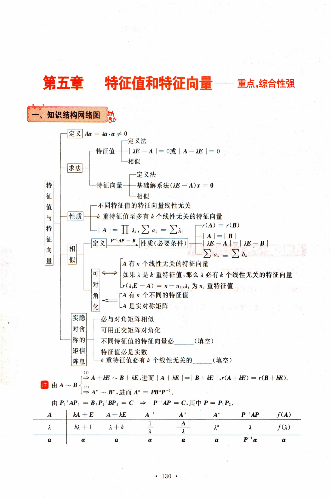
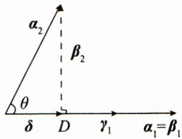

# 第五章 特征值和特征向量重点，综合性强

## 一、知识结构网络图

定义 Aα = λα，α ≠ 0

-特征值

特征值与特征向量

$$
\left| \boldsymbol{A} - \lambda \boldsymbol{E} \right| = 0
$$

求法

-相似

-定义法

特征向量

基础解系法(λE—A)x = 0

-相似

性质

-不同特征值的特征向量线性无关

一k重特征值至多有k个线性无关的特征向量

相似

定义

$$
-r(\boldsymbol{A}) = r(\boldsymbol{B})
$$

性质(必要条件)

$$
\lambda \boldsymbol{E} - \boldsymbol{A} \mid = \mid \lambda \boldsymbol{E} - \boldsymbol{B} \mid
$$

$$
\sum a_{i} = \sum b_{i}
$$

可对角化

A 有 n 个线性无关的特征向量

如果λ是k重特征值，那么λ必有k个线性无关的特征向量

$r ( \lambda _ { i } \boldsymbol { E } - \boldsymbol { A } ) = n - n _ { i } , \lambda _ { i }$ 为n；重特征值

A有n 个不同的特征值

LA 是实对称矩阵

实隐 对含 称的 矩信 阵息

-必与对角矩阵相似

可用正交矩阵对角化

不同特征值的特征向量必 (填空）

特征值必是实数

-k重特征值必有k 个线性无关的\_\_（填空）

$\boldsymbol{A} \sim \boldsymbol{B} \quad \stackrel{(1)}{\rightarrow} \boldsymbol{A}+k \boldsymbol{E} \sim \boldsymbol{B}+k \boldsymbol{E} \quad \stackrel{(2)}{\rightarrow} \boldsymbol{A}^{n} \sim \boldsymbol{B}^{n},  进而  \quad \boldsymbol{A}^{n}$ ,进而 $\left| \boldsymbol{A} + k\boldsymbol{E} \right| = \left| \boldsymbol{B} + k\boldsymbol{E} \right|, r(\boldsymbol{A} + k\boldsymbol{E}) = r(\boldsymbol{B} + k\boldsymbol{E}).$ 注由$\boldsymbol{A}^{n}=\boldsymbol{P}\boldsymbol{B}^{n}\boldsymbol{P}^{-1}$

<!-- DIRECTED-REPAIR-FALLBACK:FALLBACK-LIN-ADV-CH5-P143-EIGEN-TABLE -->
> [!WARNING]
> 原 PDF 第 143 页回退：特征值/特征向量对应表的 A*、|A|/λ 与多处 α 同时误识，扁平表格无法安全局部修补。

由 $\boldsymbol{P}_{1}^{-1} \boldsymbol{A} \boldsymbol{P}_{1}=\boldsymbol{B}, \boldsymbol{P}_{2}^{-1} \boldsymbol{B} \boldsymbol{P}_{2}=\boldsymbol{C} \Rightarrow \boldsymbol{P}^{-1} \boldsymbol{A} \boldsymbol{P}=\boldsymbol{C}$ ,其中 $\boldsymbol{P} = \boldsymbol{P}_{1} \boldsymbol{P}_{2}$

<table><tr><td>A</td><td> $k\boldsymbol{A} + \boldsymbol{E}$ </td><td> $\boldsymbol{A} + k\boldsymbol{E}$ </td><td> $\boldsymbol{A}^{-1}$ </td><td>A</td><td> $A^{n}$ </td><td> $\boldsymbol{P}^{-1} \boldsymbol{A} \boldsymbol{P}$ </td><td>f(A)</td></tr><tr><td> $\lambda$ </td><td> $k \lambda + 1$ </td><td> $\lambda + k$ </td><td> $\frac{1}{\lambda}$ </td><td> $\underline { { \mid \underline { { \mathbf { A } } } \mid } }$  λ</td><td> $\lambda ^ { n }$ </td><td> $\lambda$ </td><td>f(λ)</td></tr><tr><td>a</td><td>α</td><td>a</td><td>a</td><td>α</td><td>a</td><td> $\boldsymbol{P}^{-1} \boldsymbol{\alpha}$ </td><td>a</td></tr></table>

【编者注】 特征值与特征向量是线性代数的重要内容之一，也是考研的热点，复习应认真仔细.

（1）要理解特征值、特征向量的概念，掌握矩阵特征值的性质，掌握求矩阵特征值、特征向量的方法.

(2)要理解矩阵相似的概念，掌握相似矩阵的性质，搞清矩阵能相似对角化的条件，掌握将矩阵化为相似对角矩阵的方法.

(3)要熟悉实对称矩阵特征值、特征向量的特殊性质，掌握用正交矩阵化实对称矩阵为对角矩阵的方法.

## 今年考题

(2026,1)设矩阵 $\boldsymbol{A} = \begin{bmatrix}
1 & 0 & 0 \\
2 & a & 2 \\
0 & 2 & a
\end{bmatrix}, \boldsymbol{B} = \begin{bmatrix}
a & -1 & -1 \\
-1 & 2 & 1 \\
-1 & -1 & a
\end{bmatrix}$ ,记 $m(\boldsymbol{X})$ 为三阶矩阵X的实特征值中的最大值.若 $m(\boldsymbol{A}) < m(\boldsymbol{B})$ ,则a的取值范围是

(2026,2,3)设三阶矩阵A,B,满足 $AB + BA = A^{2} + B^{2}$ ,且 $\boldsymbol{A} \neq \boldsymbol{B}$ ,以下结论错误的是

(A) $( \boldsymbol{A} - \boldsymbol{B} )^{3} = \boldsymbol{O}.$

(B)A-B 只有零特征值.

(C)A,B 不能都是对角矩阵.

(D)A一B只有一个线性无关的特征向量.

## 二、基本内容与重要结论

## 基础知识

定义5.1 设A是n阶矩阵，如果存在一个数λ及非零的n维列向量α，使得

$$
A\boldsymbol{\alpha} = \lambda\boldsymbol{\alpha}\tag{5.1}
$$

成立，则称λ是矩阵A的一个特征值，称非零向量α是矩阵A属于特征值λ的一个特征向量

定义5.2 设 $\boldsymbol{A} = \left[ a_{ij} \right]$ 为一个n阶矩阵，则行列式

$$
\left| \lambda \boldsymbol{E} - \boldsymbol{A} \right| = \left| \begin{array}{cccc}\lambda - a_{11} & - a_{12} & \cdots & - a_{1n} \\- a_{21} & \lambda - a_{22} & \cdots & - a_{2n} \\\vdots & \vdots & & \vdots \\- a_{n1} & - a_{n2} & \cdots & \lambda - a_{nn} \\\end{array} \right|\tag{5.2}
$$

称为矩阵A的特征多项式， $\left| \lambda \boldsymbol{E} - \boldsymbol{A} \right| = 0$ 称为A 的特征方程.

【评注】由 $A \boldsymbol{\alpha} = \lambda \boldsymbol{\alpha} , \boldsymbol{\alpha} \neq \boldsymbol{0}$ 有

$$
\left( \lambda \boldsymbol{E} - \boldsymbol{A} \right) \boldsymbol{\alpha} = \boldsymbol{0}, \quad \boldsymbol{\alpha} \neq \boldsymbol{0},
$$

即α是齐次线性方程组 $\left( \lambda \boldsymbol{E} - \boldsymbol{A} \right) \boldsymbol{x} = \boldsymbol{0}$ 的非零解.

(1) 先由 $\left| \lambda \boldsymbol{E} - \boldsymbol{A} \right| = 0$ 求矩阵A的特征值λ(共n个).

(2) 再由 $\left( \lambda_{i} \boldsymbol{E} - \boldsymbol{A} \right) \boldsymbol{x} = \boldsymbol{0}$ 求基础解系，即矩阵A属于特征值$\lambda_{i}$的线性无关的特征向量.

如果有同学习惯于由 $\left| \boldsymbol{A} - \lambda \boldsymbol{E} \right| = 0, \left( \boldsymbol{A} - \lambda \boldsymbol{E} \right) \boldsymbol{x} = \boldsymbol{0}$ 求特征值，特征向量也是完全可以的.

定义5.3 设A和B都是n阶矩阵，如果存在可逆矩阵P，使得

$$
\boldsymbol{P}^{-1} \boldsymbol{A} \boldsymbol{P} = \boldsymbol{B},\tag{5.3}
$$

则称矩阵A和B相似，记作 $\mathbf { A } \sim \mathbf { B } ,$

特别地，如果A能与对角矩阵相似，则称A可对角化.

相似具有：（1）反身性 $\boldsymbol{A} \sim \boldsymbol{A}. (2)$ 对称性：如 $\boldsymbol{A} \sim \boldsymbol{B}$ ,则B～A.(3)传递性：若 $\boldsymbol{A} \sim \boldsymbol{B}, \boldsymbol{B} \sim \boldsymbol{C}$ 则A～C.

## 重要定理

定理5.1 如果 $\alpha_{1}, \alpha_{2}, \cdots, \alpha_{t}$ 都是矩阵A的属于特征值λ的特征向量，那么当 $k_{1} \boldsymbol{\alpha}_{1} + k_{2} \boldsymbol{\alpha}_{2} + \cdots + k_{t} \boldsymbol{\alpha}_{t}$ 非零时， $k_{1}\boldsymbol{\alpha}_{1} + k_{2}\boldsymbol{\alpha}_{2} + \cdots + k_{t}\boldsymbol{\alpha}$ 仍是矩阵A

\*若 $\boldsymbol{\alpha}_{1}, \boldsymbol{\alpha}_{2}$ 是矩阵A不同特征值的特征向量，则 $\boldsymbol{a}_{1}+\boldsymbol{a}_{2}$ 不是A的特征向量.

定理5.2 设A是n阶矩阵 $\lambda_{1}, \lambda_{2}, \cdots, \lambda_{n}$ 是矩阵A的特征值，则

(1) $\sum \lambda_{i} = \sum a_{i}.$

(5.4)

(2) $\left| \textbf{A} \right| = \prod \lambda_{i}.$

(5.5)

定理5.3如果 $\lambda_{1}, \lambda_{2}, \cdots, \lambda_{m}$ 是矩阵A的互不相同的特征值， $, \pmb { \alpha } _ { 1 } , \pmb { \alpha } _ { 2 }$ $\cdots, \boldsymbol{a}_{m}$ 分别是与之对应的特征向量，则 $\boldsymbol{\alpha}_{1}, \boldsymbol{\alpha}_{2}, \cdots, \boldsymbol{\alpha}_{m}$ 线性无关.

定理5.4 如果A是n阶矩阵 $, \lambda_{i}$ 是A的m重特征值，则属于 $\lambda_{i}$ 的线性无关的特征向量的个数不超过m个.

定理5.5如果n阶矩阵A与B相似，则A与B有相同的特征多项式，从而A与B有相同的特征值.即若A～B，则

$$
\left| \lambda \boldsymbol{E} - \boldsymbol{A} \right| = \left| \lambda \boldsymbol{E} - \boldsymbol{B} \right|.\tag{5.6}
$$

定理5.6n阶方阵A可相似对角化的充分必要条件是A 有n 个线性无关的特征向量.

【评注】若n阶矩阵 $\boldsymbol{A} \sim \boldsymbol{\Lambda}$ ，则有 $\boldsymbol{P}^{-1} \boldsymbol{A} \boldsymbol{P} = \boldsymbol{\Lambda}$ ，于是 $\boldsymbol{A}\boldsymbol{P} = \boldsymbol{P}\boldsymbol{\Lambda}$ (下设$n = 3 )$ ,即有

$$
\boldsymbol { A } \left[ \boldsymbol { \gamma } _ { 1 } , \boldsymbol { \gamma } _ { 2 } , \boldsymbol { \gamma } _ { 3 } \right] = \left[ \boldsymbol { \gamma } _ { 1 } , \boldsymbol { \gamma } _ { 2 } , \boldsymbol { \gamma } _ { 3 } \right] \begin{bmatrix}
a _ { 1 } & 0 & 0 \\
0 & a _ { 2 } & 0 \\
0 & 0 & a _ { 3 }
\end{bmatrix},
$$

即

$$
\left[ A \gamma _ { 1 } , A \gamma _ { 2 } , A \gamma _ { 3 } \right] = \left[ a _ { 1 } \gamma _ { 1 } , a _ { 2 } \gamma _ { 2 } , a _ { 3 } \gamma _ { 3 } \right] ,
$$

即

$$
A \gamma _ { 1 } = a _ { 1 } \gamma _ { 1 } , \quad A \gamma _ { 2 } = a _ { 2 } \gamma _ { 2 } , \quad A \gamma _ { 3 } = a _ { 3 } \gamma _ { 3 } .
$$

因为矩阵 $\boldsymbol{P} = \left[ \gamma_{1}, \gamma_{2}, \gamma_{3} \right]$ 可逆，故 $\gamma_{1}, \gamma_{2}, \gamma_{3}$ 线性无关.又由 $\boldsymbol{A} \boldsymbol{\gamma}_{i}=$ $a_{i} \gamma_{i}, \gamma_{i} \neq 0$ 知 $\gamma _ { i }$ 是矩阵A的属于特征值a；的特征向量.即

A ～ Λ ⇒ 矩阵 A 有 n 个线性无关的特征向量.

反过来，若A有n个线性无关的特征向量，则A必与对角矩阵相似(请自证).

定理5.7 若n阶矩阵A 有n个不同的特征值 $\lambda_{1}, \lambda_{2}, \cdots, \lambda_{n}$ ，则A可相似对角化，且

$$
\boldsymbol{A} \sim \begin{bmatrix}
\lambda_{1} \\
\lambda_{2} \\
\ddots \\
\lambda_{n}
\end{bmatrix}.\tag{5.7}
$$

定理5.8 n阶矩阵A 可相似对角化的充分必要条件是对于A的每个特征值，其线性无关的特征向量的个数恰好等于该特征值的重数.即

特征值和特征向量

学习札记

$\boldsymbol{A} \sim \boldsymbol{\Lambda} \Leftrightarrow \lambda_{i}$ 是A的 $n _ { i }$ 重特征值，则 $\lambda _ { i }$ 有 $n _ { i }$ 个线性无关的特征向量

(5.8)

$$
\Leftrightarrow \mathrm{秩} r(\lambda_i \boldsymbol{E} - \boldsymbol{A}) = n - n_i, \lambda_i  为  n_i  重特征值 .\tag{5.9}
$$

定理5.9 实对称矩阵A的不同特征值 $\lambda_{1}, \lambda_{2}$ 所对应的特征向量 $\pmb { \alpha } _ { 1 }   , \pmb { \alpha } _ { 2 }$ 必正交.

$$
\begin{aligned}\therefore \beta_{2} &= \boldsymbol{\alpha}_{2} - \left\| \boldsymbol{\alpha}_{2} \right\| \cos \theta_{1} \\&= \boldsymbol{\alpha}_{2} - \frac{\left\| \boldsymbol{\alpha}_{1} \right\| \left\| \boldsymbol{\alpha}_{2} \right\| \cos \theta}{\left\| \boldsymbol{\alpha}_{1} \right\| \cdot \left\| \boldsymbol{\alpha}_{1} \right\|} \beta_{1}\end{aligned}
$$

定理5.10 实对称矩阵A的特征值都是实数.

定理5.11 n阶实对称阵A必可对角化，且总存在正交阵 $Q$ ,使得

$$
\gamma_{1}=\frac{\boldsymbol{\alpha}_{1}}{\left\|\boldsymbol{\alpha}_{1}\right\|}=\frac{\boldsymbol{\beta}_{1}}{\left\|\boldsymbol{\beta}_{1}\right\|}
$$

δ = ∥α2∥cos θγ1

$$
\boldsymbol{Q}^{-1} \boldsymbol{A} \boldsymbol{Q} = \boldsymbol{Q}^{\mathrm{T}} \boldsymbol{A} \boldsymbol{Q} = \begin{bmatrix}
\lambda_{1} \\
\lambda_{2} \\
\ddots \\
\lambda_{n}
\end{bmatrix},\tag{5.10}
$$

其中 $\lambda_{1}, \lambda_{2}, \cdots, \lambda_{n}$ 是A的特征值.

Schmidt正交规范化方法

如果向量组 $\boldsymbol{\alpha}_{1}, \boldsymbol{\alpha}_{2}, \boldsymbol{\alpha}_{3}$ 线性无关，令

$$
\begin{aligned}\boldsymbol{\beta}_{1} &= \boldsymbol{\alpha}_{1}, \\\boldsymbol{\beta}_{2} &= \boldsymbol{\alpha}_{2} - \frac{(\boldsymbol{\alpha}_{2}, \boldsymbol{\beta}_{1})}{(\boldsymbol{\beta}_{1}, \boldsymbol{\beta}_{1})} \boldsymbol{\beta}_{1}, \\\boldsymbol{\beta}_{3} &= \boldsymbol{\alpha}_{3} - \frac{(\boldsymbol{\alpha}_{3}, \boldsymbol{\beta}_{1})}{(\boldsymbol{\beta}_{1}, \boldsymbol{\beta}_{1})} \boldsymbol{\beta}_{1} - \frac{(\boldsymbol{\alpha}_{3}, \boldsymbol{\beta}_{2})}{(\boldsymbol{\beta}_{2}, \boldsymbol{\beta}_{2})} \boldsymbol{\beta}_{2},\end{aligned}
$$

那么 $\boldsymbol{\beta}_{1}, \boldsymbol{\beta}_{2}, \boldsymbol{\beta}_{3}$ 两两正交，称为正交向量组.将其单位化，有

$$
\gamma _ { 1 } = \frac { \beta _ { 1 } } { \left\| \beta _ { 1 } \right\| } , \gamma _ { 2 } = \frac { \beta _ { 2 } } { \left\| \beta _ { 2 } \right\| } , \gamma _ { 3 } = \frac { \beta _ { 3 } } { \left\| \beta _ { 3 } \right\| } ,
$$

则 $\boldsymbol{\alpha}_{1}, \boldsymbol{\alpha}_{2}, \boldsymbol{\alpha}_{3}$ 到 $\gamma _ { 1 } , \gamma _ { 2 } , \gamma _ { 3 }$ 这一过程称为 Schmidt 正交规范化.

例如 $\boldsymbol{\alpha}_{1}=(0,1,2)^{\mathrm{T}}, \boldsymbol{\alpha}_{2}=(1,0,1)^{\mathrm{T}}, \boldsymbol{\alpha}_{3}=(1,1,0)^{\mathrm{T}}$ ,则有

$$
\pmb { \beta } _ { 1 } = \left[ \begin{matrix}
{ 0 } \\
{ 1 } \\
{ 2 }
\end{matrix} \right] ,
$$

$$
\pmb { \beta } _ { 2 } = \left[ \begin{matrix}
{ 1 } \\
{ 0 } \\
{ 1 }
\end{matrix} \right] - \frac { 2 } { 5 } \left[ \begin{matrix}
{ 0 } \\
{ 1 } \\
{ 2 }
\end{matrix} \right] = \frac { 1 } { 5 } \left[ \begin{matrix}
{ 5 } \\
{ - 2 } \\
{ 1 }
\end{matrix} \right] ,
$$

$$
\pmb { \beta } _ { 3 } = \begin{bmatrix}
1 \\
1 \\
0
\end{bmatrix} - \frac { 1 } { 5 } \begin{bmatrix}
0 \\
1 \\
2
\end{bmatrix} - \frac { 3 } { 3 0 } \begin{bmatrix}
5 \\
- 2 \\
1
\end{bmatrix} = \frac { 1 } { 1 0 } \begin{bmatrix}
5 \\
1 0 \\
- 5
\end{bmatrix} = \frac { 1 } { 2 } \begin{bmatrix}
1 \\
2 \\
- 1
\end{bmatrix},
$$

将其单位化，有

$$
\gamma_{1} = \frac{1}{\sqrt{5}}\left[ \begin{matrix}
0 \\
1 \\
2
\end{matrix} \right], \gamma_{2} = \frac{1}{\sqrt{30}}\left[ \begin{matrix}
5 \\
-2 \\
1
\end{matrix} \right], \gamma_{3} = \frac{1}{\sqrt{6}}\left[ \begin{matrix}
1 \\
2 \\
-1
\end{matrix} \right].
$$

## 三、典型例题分析选讲

# 特征值、特征向量

提示（1) $A\boldsymbol{\alpha} = \lambda \boldsymbol{\alpha} , \boldsymbol{\alpha} \neq \boldsymbol{0}$

(2)1 $\lambda \boldsymbol{E} - \boldsymbol{A} \mid = 0 ; (\lambda_{i} \boldsymbol{E} - \boldsymbol{A}) \boldsymbol{x} = \boldsymbol{0}.$

(3) 已知 $\boldsymbol{P}^{-1} \boldsymbol{A} \boldsymbol{P} = \boldsymbol{B}, \textcircled{1}$ 如 $\boldsymbol{B}\boldsymbol{\alpha} = \lambda\boldsymbol{\alpha}$ 则 $A(P\alpha) = \lambda(P\alpha)$ .由B求A.

② $A\boldsymbol{\alpha} = \lambda\boldsymbol{\alpha}$ 则 $\boldsymbol{B}(\boldsymbol{P}^{-1} \boldsymbol{\alpha}) = \lambda(\boldsymbol{P}^{-1} \boldsymbol{\alpha})$ .由A求B.

## 1. 数字型矩阵

展示新知

【例5.1】求矩阵 $\boldsymbol{A} = \begin{bmatrix}
1 & 1 & - 1 \\
1 & - 2 & 2 \\
- 3 & 1 & 3
\end{bmatrix}$ 的特征值与特征向量

## 解由矩阵A的特征多项式

$$
\begin{aligned}\left| \lambda \boldsymbol{E} - \boldsymbol{A} \right| &= \left| \begin{matrix}
\lambda - 1 & - 1 & 1 \\
- 1 & \lambda + 2 & - 2 \\
3 & - 1 & \lambda - 3
\end{matrix} \right| \\&= \left| \begin{matrix}
\lambda - 4 & 0 & 4 - \lambda \\
- 1 & \lambda + 2 & - 2 \\
3 & - 1 & \lambda - 3
\end{matrix} \right| = \left| \begin{matrix}
\lambda - 4 & 0 & 0 \\
- 1 & \lambda + 2 & - 3 \\
3 & - 1 & \lambda
\end{matrix} \right| \\&= (\lambda - 4)(\lambda^{2} + 2\lambda - 3) = (\lambda - 1)(\lambda - 4)(\lambda + 3),\end{aligned}
$$

得矩阵A 的特征值是 $\lambda_{1} = 1 , \lambda_{2} = 4 , \lambda_{3} = - 3$

当 $\lambda_{1} = 1$ 时，由 $\left( \boldsymbol{E} - \boldsymbol{A} \right) \boldsymbol{x} = \boldsymbol{0}$ ,即

$$
\begin{bmatrix}
0 & - 1 & 1 \\
- 1 & 3 & - 2 \\
3 & - 1 & - 2
\end{bmatrix} \twoheadrightarrow \begin{bmatrix}
1 & - 3 & 2 \\
0 & 1 & - 1 \\
0 & 0 & 0
\end{bmatrix} \twoheadrightarrow \begin{bmatrix}
1 & 0 & - 1 \\
0 & 1 & - 1 \\
0 & 0 & 0
\end{bmatrix},
$$

得基础解系 $\boldsymbol{a}_{1} = (1,1,1)^{\mathrm{T}}$

当 $\lambda_{2} = 4$ 时，由 $(4\boldsymbol{E} - \boldsymbol{A})\boldsymbol{x} = \boldsymbol{0}$ ,即

$$
\begin{bmatrix}
3 & - 1 & 1 \\
- 1 & 6 & - 2 \\
3 & - 1 & 1
\end{bmatrix} \xrightarrow{} \begin{bmatrix}
1 & - 6 & 2 \\
0 & 17 & - 5 \\
0 & 0 & 0
\end{bmatrix},
$$

得基础解系 $\boldsymbol{a}_{2}=(-4,5,17)^{\mathrm{T}}$

当 $\lambda_{3} = - 3$ 时，由 $(-3\boldsymbol{E}-\boldsymbol{A})\boldsymbol{x}=\boldsymbol{0}$ ,即

$$
\begin{bmatrix}
- 4 & - 1 & 1 \\
- 1 & - 1 & - 2 \\
3 & - 1 & - 6
\end{bmatrix} \xrightarrow{} \begin{bmatrix}
1 & 1 & 2 \\
0 & - 4 & - 12 \\
0 & 0 & 0
\end{bmatrix} \xrightarrow{} \begin{bmatrix}
1 & 0 & - 1 \\
0 & 1 & 3 \\
0 & 0 & 0
\end{bmatrix},
$$

得基础解系 $\boldsymbol{a}_{3} = (1, -3, 1)^{\mathrm{T}}$

所以矩阵A关于特征值 $1 , 4 , - 3$ 的特征向量分别是 $k_{1} \boldsymbol{\alpha}_{1}, k_{2} \boldsymbol{\alpha}_{2}, k_{3} \boldsymbol{\alpha}_{3}$ ,其中 $k_{1},k_{2},k_{3}$ 均为非零常数.

展示新知

【例5.2】求矩阵 $\boldsymbol{A} = \begin{bmatrix}
1 & 2 & 4 \\
0 & 3 & 5 \\
0 & 0 & 6
\end{bmatrix}$ 的特征值与特征向量

## 解由矩阵A的特征多项式

$$
\left| \lambda \boldsymbol{E} - \boldsymbol{A} \right| = \left| \begin{matrix}
\lambda - 1 & - 2 & - 4 \\
0 & \lambda - 3 & - 5 \\
0 & 0 & \lambda - 6
\end{matrix} \right| = (\lambda - 1)(\lambda - 3)(\lambda - 6)
$$

得矩阵A的特征值是 $\lambda_{1} = 1 , \lambda_{2} = 3 , \lambda_{3} = 6$

对 $\lambda_{1} = 1$ ,由 $( \boldsymbol{E} - \boldsymbol{A} ) \boldsymbol{x} = \boldsymbol{0}$ ,即

$$
\begin{bmatrix}
0 & - 2 & - 4 \\
0 & - 2 & - 5 \\
0 & 0 & - 5
\end{bmatrix} \rightarrow \begin{bmatrix}
0 & 1 & 0 \\
0 & 0 & 1 \\
0 & 0 & 0
\end{bmatrix},
$$

得基础解系 $\boldsymbol{\alpha}_{1} = (1,0,0)^{\mathrm{T}}$ ,因此属于特征值 $\lambda_{1} = 1$ 的特征向量是 $k_{1} \boldsymbol{\alpha}_{1} (k_{1} \neq 0)$ 对 $\lambda_{2} = 3$ ,由 $(3\boldsymbol{E} - \boldsymbol{A})\boldsymbol{x} = \boldsymbol{0}$ ,即

$$
\begin{bmatrix}
2 & - 2 & - 4 \\
0 & 0 & - 5 \\
0 & 0 & - 3
\end{bmatrix} \rightarrow \begin{bmatrix}
1 & - 1 & 0 \\
0 & 0 & 1 \\
0 & 0 & 0
\end{bmatrix},
$$

得基础解系 $\boldsymbol{\alpha}_{2} = (1,1,0)^{\mathrm{T}}$ ，因此属于特征值 $\lambda_{2} = 3$ 的特征向量是 $k_{2} \boldsymbol{\alpha}_{2} \left( k_{2} \neq 0 \right)$ 对 $\lambda_{3} = 6$ ,由 $(6\boldsymbol{E} - \boldsymbol{A})\boldsymbol{x} = \boldsymbol{0}$ ,即

$$
\begin{bmatrix}
5 & - 2 & - 4 \\
0 & 3 & - 5 \\
0 & 0 & 0
\end{bmatrix},
$$

得基础解系 $\boldsymbol{a}_{3} = (22, 25, 15)^{\mathrm{T}}$ ，因此属于特征值 $\lambda_{3} \; = \; 6$ 的特征向量是$k_{3} \boldsymbol{\alpha}_{3} \left( k_{3} \neq 0 \right)$

【评注】上三角矩阵、下三角矩阵、对角矩阵的特征值就是矩阵主对角线上的元素.

展示新知

【例5.3】求矩阵 $\boldsymbol{A} = \begin{bmatrix}
2 & 1 & 3 \\
4 & 2 & 6 \\
6 & 3 & 9
\end{bmatrix}$ 的特征值与特征向量

解由矩阵A的特征多项式

学习札记

$$
\begin{aligned}\left| \lambda \boldsymbol{E} - \boldsymbol{A} \right| &=\left| \begin{matrix}
\lambda - 2 & - 1 & - 3 \\
- 4 & \lambda - 2 & - 6 \\
- 6 & - 3 & \lambda - 9
\end{matrix} \right|= \left| \begin{matrix}
\lambda - 2 & - 1 & 0 \\
- 4 & \lambda - 2 & - 3\lambda \\
- 6 & - 3 & \lambda
\end{matrix} \right| \\&= \left| \begin{matrix}
\lambda - 2 & - 1 & 0 \\
- 22 & \lambda - 11 & 0 \\
- 6 & - 3 & \lambda
\end{matrix} \right|= \lambda(\lambda^{2} - 13\lambda)  ,\end{aligned}
$$

得到矩阵A的特征值是 $\lambda_{1} = 13 , \lambda_{2} = \lambda_{3} = 0.$

对 $\lambda_{1} = 13$ ,由 $(13\boldsymbol{E} - \boldsymbol{A})\boldsymbol{x} = \boldsymbol{0}$ ,即

$$
\begin{bmatrix}
11 & -1 & -3 \\
-4 & 11 & -6 \\
-6 & -3 & 4
\end{bmatrix} \xrightarrow{} \begin{bmatrix}
1 & 7 & -5 \\
-4 & 11 & -6 \\
-6 & -3 & 4
\end{bmatrix} \xrightarrow{} \begin{bmatrix}
1 & 7 & -5 \\
0 & 3 & -2 \\
0 & 0 & 0
\end{bmatrix},
$$

得基础解系 $\boldsymbol{a}_{1} = (1,2,3)^{\mathrm{T}}$

因此属于特征值 $\lambda_{1} = 13$ 的特征向量是 $k_{1} \alpha_{1} (k_{1} \neq 0)$

对 $\lambda_{2} = \lambda_{3} = 0$ ,由 $( 0 \boldsymbol{E} - \boldsymbol{A} ) \boldsymbol{x} = \boldsymbol{0}$ ,即

$$
\begin{bmatrix}
- 2 & - 1 & - 3 \\
- 4 & - 2 & - 6 \\
- 6 & - 3 & - 9
\end{bmatrix} \xrightarrow{} \begin{bmatrix}
2 & 1 & 3 \\
0 & 0 & 0 \\
0 & 0 & 0
\end{bmatrix},
$$

得基础解系 $\boldsymbol{a}_{2}=(1,-2,0)^{\mathrm{T}}, \boldsymbol{a}_{3}=(0,-3,1)^{\mathrm{T}}$

因此属于特征值 $\lambda_{2} = \lambda_{3} = 0$ 的特征向量是 $k_{2}\boldsymbol{\alpha}_{2}+k_{3}\boldsymbol{\alpha}_{3}(k_{2},k_{3}$ 不全为0).

【评注】设 $\boldsymbol{A} = \left[ a_{ij} \right]$ 是三阶矩阵，则

$$
\lambda \boldsymbol{E} - \boldsymbol{A} \mid = \left| \begin{aligned} \lambda - a_{11} & - a_{12} - a_{13} \\ - a_{21} & \lambda - a_{22} - a_{23} \\ - a_{31} & - a_{32} \lambda - a_{33} \end{aligned} \right| \\ = \lambda^3 - \sum_{i = 1}^{n} a_{ii} \lambda^2 + s_{2} \lambda - \left| \boldsymbol{A} \right| .
$$

其中 $s_{2} = \left| \begin{matrix}
a_{11} & a_{12} \\
a_{21} & a_{22}
\end{matrix} \right| + \left| \begin{matrix}
a_{11} & a_{13} \\
a_{31} & a_{33}
\end{matrix} \right| + \left| \begin{matrix}
a_{22} & a_{23} \\
a_{32} & a_{33}
\end{matrix} \right| .$

若秩 $r(\mathbf{A}) = 1$ ,则

$$
\left| \lambda \boldsymbol { E } - \boldsymbol { A } \right| = \lambda ^ { 3 } - \sum a _ { i i } \lambda ^ { 2 } = ( \lambda - \sum a _ { i i } ) \lambda ^ { 2 } ,
$$

矩阵 A 的特征值是 $\lambda _ { 1 } = \sum a _ { i i } , \lambda _ { 2 } = \lambda _ { 3 } = 0.$

一般地，A是n阶矩阵， $r(\mathbf{A}) = 1$ ，则 $\left| \lambda \boldsymbol{E} - \boldsymbol{A} \right| = \lambda^n - \sum a_{ii} \lambda^{n-1}$

$$
\lambda _ { 1 } = a _ { 1 1 } + a _ { 2 2 } + \cdots + a _ { m } , \lambda _ { 2 } = \cdots = \lambda _ { n } = 0.
$$

特征值和特征向量

展示新知

【例5.4】求矩阵 $\boldsymbol{A} = \begin{bmatrix}
3 & -1 & 3 & 0 \\
1 & 1 & 4 & -1 \\
0 & 0 & 5 & -3 \\
0 & 0 & 3 & -1
\end{bmatrix}$ 的特征值与特征向量

解由矩阵A的特征多项式

$$
\begin{aligned}\left| \lambda \boldsymbol{E}-\boldsymbol{A} \right| &=\left| \begin{matrix}
\lambda - 3 & 1 & - 3 & 0 \\
- 1 & \lambda - 1 & - 4 & 1 \\
0 & 0 & \lambda - 5 & 3 \\
0 & 0 & - 3 & \lambda + 1
\end{matrix} \right| \\&=\left| \begin{matrix}
\lambda - 3 & 1 \\
- 1 & \lambda - 1
\end{matrix} \right| \cdot \left| \begin{matrix}
\lambda - 5 & 3 \\
- 3 & \lambda + 1
\end{matrix} \right| \\&= (\lambda^{2} - 4\lambda + 4)(\lambda^{2} - 4\lambda + 4) = (\lambda - 2)^{4},\end{aligned}
$$

得到矩阵A 的特征值是λ = 2(4 重根).

当λ=2时，由 $(2\boldsymbol{E} - \boldsymbol{A})\boldsymbol{x} = \boldsymbol{0}$ ,即

$$
\begin{bmatrix}
- 1 & 1 & - 3 & 0 \\
- 1 & 1 & - 4 & 1 \\
0 & 0 & - 3 & 3 \\
0 & 0 & - 3 & 3
\end{bmatrix} \rightarrow \begin{bmatrix}
1 & - 1 & 3 & 0 \\
0 & 0 & - 1 & 1 \\
0 & 0 & 0 & 0 \\
0 & 0 & 0 & 0
\end{bmatrix},
$$

得到基础解系是 $\boldsymbol{\alpha}_{1}=(1,1,0,0)^{\mathrm{T}}, \boldsymbol{\alpha}_{2}=(-3,0,1,1)^{\mathrm{T}}$ ，因此属于特征值λ=2的特征向量是 $k_{1} \boldsymbol{\alpha}_{1} + k_{2} \boldsymbol{\alpha}_{2} (k_{1}, k_{2}$ 不全为0).

展示新知

【例5.5】已知 $a \neq 0$ ,求矩阵

$$
\boldsymbol{A} = \begin{bmatrix}
1 & a & a & a \\
a & 1 & a & a \\
a & a & 1 & a \\
a & a & a & 1
\end{bmatrix}.
$$

的特征值、特征向量.

解（方法一）（直接计算）由特征多项式

$$
\begin{aligned} &\left| \lambda \boldsymbol{E} - \boldsymbol{A} \right| = \left| \begin{aligned}\\ &\lambda - 1 & - a & - a & - a \\&- a & \lambda - 1 & - a & - a \\&- a & - a & \lambda - 1 & - a \\&- a & - a & - a & \lambda - 1\\ &\end{aligned} \right|\\ &= \left[ \lambda - (3a + 1) \right] (\lambda + a - 1)^3,\\ \end{aligned}
$$

得A的特征值是 $3a + 1 , 1 - a$ 重根).

当 $\lambda = 3a + 1$ 时，由 $\left[ (3a + 1)E - A \right] x = 0$ ,即

$$
\begin{bmatrix}
3a & - a & - a & - a \\
- a & 3a & - a & - a \\
- a & - a & 3a & - a \\
- a & - a & - a & 3a
\end{bmatrix} \rightarrow \begin{bmatrix}
3 & - 1 & - 1 & - 1 \\
- 1 & 3 & - 1 & - 1 \\
- 1 & - 1 & 3 & - 1 \\
- 1 & - 1 & - 1 & 3
\end{bmatrix}
$$

学习札记

$$
\begin{aligned}\rightarrow\begin{bmatrix}
1 & -3 & 1 & 1 \\
1 & 1 & -3 & 1 \\
1 & 1 & 1 & -3 \\
0 & 0 & 0 & 0
\end{bmatrix}\rightarrow\begin{bmatrix}
1 & 0 & 0 & -1 \\
0 & 1 & 0 & -1 \\
0 & 0 & 1 & -1 \\
0 & 0 & 0 & 0
\end{bmatrix},\end{aligned}
$$

可得基础解系 $\boldsymbol{a}_{1} = (1,1,1,1)^{\mathrm{T}}$ ,故 $\lambda = 3a + 1$ 的特征向量为 $k_{1} \boldsymbol{\alpha}_{1}, k_{1} \neq 0$

当 $\lambda = 1 - a$ 时，由 $\left[ (1 - a)\boldsymbol{E} - \boldsymbol{A} \right] \boldsymbol{x} = \boldsymbol{0}$ ,即

$$
\begin{bmatrix}
- a & - a & - a & - a \\
- a & - a & - a & - a \\
- a & - a & - a & - a \\
- a & - a & - a & - a
\end{bmatrix} \xrightarrow{} \begin{bmatrix}
1 & 1 & 1 & 1 \\
0 & 0 & 0 & 0 \\
0 & 0 & 0 & 0 \\
0 & 0 & 0 & 0
\end{bmatrix},
$$

得基础解系 $\boldsymbol{\alpha}_{2}=(-1,1,0,0)^{\mathrm{T}},\boldsymbol{\alpha}_{3}=(-1,0,1,0)^{\mathrm{T}},\boldsymbol{\alpha}_{4}=(-1,0,0,1)^{\mathrm{T}}$ 故 $\lambda = 1 - a$ 的特征向量为 $k_{2}\boldsymbol{\alpha}_{2}+k_{3}\boldsymbol{\alpha}_{3}+k_{4}\boldsymbol{\alpha}_{4}$ ,其中 $k_{2},k_{3},k_{4}$ 是不全为0的任意常数.

(方法二）（转换)

$$
\boldsymbol{A} = \left[ \begin{aligned} \boldsymbol{a} \quad \boldsymbol{a} \quad \boldsymbol{a} \quad \boldsymbol{a} \\ \boldsymbol{a} \quad \boldsymbol{a} \quad \boldsymbol{a} \quad \boldsymbol{a} \\ \boldsymbol{a} \quad \boldsymbol{a} \quad \boldsymbol{a} \quad \boldsymbol{a} \\ \boldsymbol{a} \quad \boldsymbol{a} \quad \boldsymbol{a} \quad \boldsymbol{a} \end{aligned} \right] + \left[ \begin{aligned} 1 - \boldsymbol{a} \quad 0 \quad 0 \quad 0 \\ 0 \quad 1 - \boldsymbol{a} \quad 0 \quad 0 \\ 0 \quad 0 \quad 1 - \boldsymbol{a} \quad 0 \\ 0 \quad 0 \quad 0 \quad 1 - \boldsymbol{a} \end{aligned} \right] \xlongequal{ 记 } \boldsymbol{B} + (1 - \boldsymbol{a})\boldsymbol{E}.
$$

由秩 $r(\boldsymbol{B}) = 1$ 有

$$
\left| \lambda \boldsymbol{E} - \boldsymbol{B} \right| = \lambda^4 - 4a\lambda^3
$$

得矩阵B的特征值为4a,0,0,0,从而矩阵A的特征值为 $3a+1,1-a,1-a$ $1 - a$

再求B的特征向量，即A的特征向量(下略).

## 2. 抽象型矩阵

设A是n阶矩阵，α是矩阵A属于特征值λ的特征向量，即

$$
A \alpha = \lambda \alpha , \quad \alpha \neq 0 ,
$$

那么

(1)

$$
\left( \boldsymbol{A} + k \boldsymbol{E} \right) \boldsymbol{\alpha} = \boldsymbol{A} \boldsymbol{\alpha} + k \boldsymbol{\alpha} = \left( \lambda + k \right) \boldsymbol{\alpha},
$$

说明矩阵A+E 的特征值是 $\lambda + k$ ,对应的特征向量是α.

(2)

$$
A^{2} \boldsymbol{\alpha} = A(\lambda \boldsymbol{\alpha}) = \lambda A \boldsymbol{\alpha} = \lambda^{2} \boldsymbol{\alpha},
$$

说明矩阵 $\boldsymbol{A}^{2}$ 的特征值是 $\lambda ^ { 2 }$ ,对应的特征向量是α.

(3)如果矩阵A可逆，则有

$$
\lambda A^{-1} \boldsymbol{\alpha} = \boldsymbol{\alpha}, \boldsymbol{\alpha} \neq \boldsymbol{0} \Rightarrow A^{-1} \boldsymbol{\alpha} = \frac{1}{\lambda} \boldsymbol{\alpha},
$$

(4) 由 $A^{-1} \boldsymbol{\alpha} = \frac{1}{\lambda} \boldsymbol{\alpha}$ ,即 $\frac{1}{\left| \boldsymbol{A} \right|} \boldsymbol{A}^{*} \boldsymbol{\alpha} = \frac{1}{\lambda} \boldsymbol{\alpha}$ ,可得

$$
\boldsymbol{A}^{*} \boldsymbol{\alpha} = \frac{\left| \boldsymbol{A} \right|}{\lambda} \boldsymbol{\alpha}.
$$

因 $\left| \boldsymbol{A} \right| = \prod \lambda_{i}$ ，则(三阶为例).

$$
\begin{aligned}A : & \lambda_{1}, \lambda_{2}, \lambda_{3}, \\A^{*} : & \lambda_{2} \lambda_{3}, \lambda_{1} \lambda_{3}, \lambda_{1} \lambda_{2}.\end{aligned}
$$

(5) 如果 $f(x) = 2x^{2} + 3x + 1$ ,则 $f(\boldsymbol{A}) = 2\boldsymbol{A}^{2} + 3\boldsymbol{A} + \boldsymbol{E}.$

$$
f(A)\boldsymbol{\alpha} = 2A^{2}\boldsymbol{\alpha} + 3A\boldsymbol{\alpha} + \boldsymbol{\alpha} \\= (2\lambda^{2} + 3\lambda + 1)\boldsymbol{\alpha},
$$

即 f(A)的特征值是 f(λ).

## 展示新知

【例5.6】设A是n阶矩阵 $A^{2} + 4A - 5E = O$

如 $A a = \lambda a$ ,则 $( \lambda ^ { 2 } + 4 \lambda - 5 ) \boldsymbol { \alpha } = \boldsymbol { 0 }$

于是 $\lambda ^ { 2 } + 4 \lambda - 5 = 0$

A 的特征值 $:1  或  -5.$

$$
\boldsymbol{A}^{2}+4 \boldsymbol{A}-5 \boldsymbol{E}=(\boldsymbol{A}-\boldsymbol{E})(\boldsymbol{A}+5 \boldsymbol{E}) 且 \boldsymbol{A}^{2}+4 \boldsymbol{E}-5 \boldsymbol{E}=\boldsymbol{O}
$$

可知 $\boldsymbol{A} + 5\boldsymbol{E}$ 的列向量是A 关于λ = 1 的特征向量.而 A—E的列向量是A 关于 $\lambda = - 5$ 的特征向量.

## 展示新知

【例5.7】（1）若 $\lambda = - 2$ 是矩阵 A 的特征值，则 $\boldsymbol{B} = \boldsymbol{A}^{3} + 2\boldsymbol{A}^{2} -$ $A + 3 E$ 必有特征值

（2)若三阶矩阵A满足 $A^{2}-3A-10E=O$ ，且A|的代数余子式 $A_{11} + A_{22} + A_{33} = -16$ ,则 $\left| \boldsymbol{A}^{-1} + 3\boldsymbol{E} \right| =$

(3)设A 是二阶矩阵，α，β是线性无关的二维列向量，且 $A \alpha = 3 \beta$ $A B = 3 a$ ,则 $\left| \boldsymbol{A} + 2\boldsymbol{E} \right| =$

分析（1）设 $A\boldsymbol{\alpha} = \lambda \boldsymbol{\alpha} , \boldsymbol{\alpha} \neq \boldsymbol{0}$ ,则 $\boldsymbol{A}^{n} \boldsymbol{\alpha} = \lambda^{n} \boldsymbol{\alpha}$ ,于是

$$
\boldsymbol { B } \boldsymbol { \alpha } = \left( \boldsymbol { A } ^ { 3 } + 2 \boldsymbol { A } ^ { 2 } - \boldsymbol { A } + 3 \boldsymbol { E } \right) \boldsymbol { \alpha } = \left( \lambda ^ { 3 } + 2 \lambda ^ { 2 } - \lambda + 3 \right) \boldsymbol { \alpha } ,
$$

故 $f(-2)=(-2)^{3}+2\cdot(-2)^{2}-(-2)+3=5$ 是B的特征值.

【评注】 $A\boldsymbol{\alpha} = \lambda\boldsymbol{\alpha}$ ，则 f(A)的特征值是 f(λ).

(2) 设 $A\boldsymbol{\alpha} = \lambda \boldsymbol{\alpha} , \boldsymbol{\alpha} \neq \boldsymbol{0}$ ,由 $\boldsymbol{A}^{2}-3 \boldsymbol{A}-10 \boldsymbol{E}=\boldsymbol{O}$ ,得 $\lambda^{2}-3\lambda-10=0$ 故A的特征值可能：5或－2.那么 $A ^ { \star }$ 的特征值可能 $25,4,-10$

因 $A_{11} + A_{22} + A_{33} = -16$ ,即 $\mathrm{tr}(\boldsymbol{A}^{*}) = -16$ ,故 $\boldsymbol{A}^{*}$ 的特征值是 $4,-10,-10$.

于是A的特征值 $5,-2,-2$

$$
\therefore \left| \boldsymbol{A}^{-1} + 3\boldsymbol{E} \right| = \left( \frac{1}{5} + 3 \right) \cdot \left( - \frac{1}{2} + 3 \right) \left( - \frac{1}{2} + 3 \right) = 20.
$$

(3) $\boldsymbol{A}(\boldsymbol{\alpha}+\boldsymbol{\beta})=3(\boldsymbol{\alpha}+\boldsymbol{\beta}),\boldsymbol{A}(\boldsymbol{\alpha}-\boldsymbol{\beta})=-3(\boldsymbol{\alpha}-\boldsymbol{\beta})$

$\alpha , \beta$ 线性无关，知 $\boldsymbol{\alpha}+\boldsymbol{\beta} \neq 0, \boldsymbol{\alpha}-\boldsymbol{\beta} \neq 0$

即A的特征值： $;3, -3$ ,那么 $\boldsymbol{A} + 2\boldsymbol{E}$ 的特征值：5，-1.

故 $\left| \boldsymbol{A} + 2\boldsymbol{E} \right| = - 5.$

## 展示新知

【例5.8】已知A是三阶矩阵，如果非齐次线性方程组 $A x = b$ 有通解 $5b + k_{1}\eta_{1} + k_{2}\eta_{2}$ ,其中 $m _ { 1 } , m _ { 2 }$ 是 $Ax = 0$ 的基础解系，求A的特征值和特征向量.

解由解的结构知 5b 是方程组 $Ax = \boldsymbol{b}$ 的一个解，即 $A(5b) = b$ ,从而

$$
A b = \frac { 1 } { 5 } b ,
$$

即 $\frac { 1 } { 5 }$ 是A的特征值，b是相应的特征向量.

又 $A \boldsymbol { \eta } _ { 1 } = \boldsymbol { 0 } = 0 \boldsymbol { \eta } _ { 1 } , A \boldsymbol { \eta } _ { 2 } = \boldsymbol { 0 } = 0 \boldsymbol { \eta } _ { 2 }$ ,故 $\pmb { \eta } _ { 1 } , \pmb { \eta } _ { 2 }$ 是A关于 $\lambda = 0$ 的线性无关的特征向量，所以矩阵A的特征值是 $\frac{1}{5},0,0$ ，对应的特征向量分别是kb，$k \neq 0$ 和 $k_{1} \boldsymbol{\eta}_{1} + k_{2} \boldsymbol{\eta}_{2}, k_{1}, k_{2}$ 不全为0.

3. 相似矩阵

展示新知

【例5.9】如果 $P^{-1}AP = B.$

(1)若 $A\alpha = \lambda \alpha , \alpha \neq 0$ ，则

$$
\boldsymbol{B}\left( \boldsymbol{P}^{- 1}\boldsymbol{\alpha} \right) = \left( \boldsymbol{P}^{- 1}\boldsymbol{A}\boldsymbol{P} \right)\left( \boldsymbol{P}^{- 1}\boldsymbol{\alpha} \right) = \boldsymbol{P}^{- 1}\boldsymbol{A}\boldsymbol{\alpha} = \lambda\left( \boldsymbol{P}^{- 1}\boldsymbol{\alpha} \right);
$$

说明 $\boldsymbol{B} = \boldsymbol{P}^{-1} \boldsymbol{A} \boldsymbol{P}$ 的特征值是λ,对应的特征向量是 $P ^ { - 1 } a .$

(2)若 $B \alpha = \lambda \alpha , \alpha \neq 0$ ,则

$$
\left( \boldsymbol{P}^{-1} \boldsymbol{A} \boldsymbol{P} \right) \boldsymbol{\alpha} = \lambda \boldsymbol{\alpha} \Rightarrow \boldsymbol{A} \left( \boldsymbol{P} \boldsymbol{\alpha} \right) = \lambda \left( \boldsymbol{P} \boldsymbol{\alpha} \right),
$$

说明矩阵A的特征值是λ，特征向量是 $\mathbf { P } \alpha$

## 展示新知

【例5.10】设A为三阶矩阵 $\alpha_{1}, \alpha_{2}, \alpha_{3}$ 是线性无关的三维列向量， $A\boldsymbol{\alpha}_{1} = - 2\boldsymbol{\alpha}_{1} + 2\boldsymbol{\alpha}_{2} + 3\boldsymbol{\alpha}_{3},A\boldsymbol{\alpha}_{2} = \boldsymbol{\alpha}_{3},A\boldsymbol{\alpha}_{3} = 2\boldsymbol{\alpha}_{2} + \boldsymbol{\alpha}_{3}$ ,求A的特征值、特 征向量.

解利用分块矩阵，有

$$
\boldsymbol{A}(\boldsymbol{\alpha}_{1},\boldsymbol{\alpha}_{2},\boldsymbol{\alpha}_{3})=(-2\boldsymbol{\alpha}_{1}+2\boldsymbol{\alpha}_{2}+3\boldsymbol{\alpha}_{3},\boldsymbol{\alpha}_{3},2\boldsymbol{\alpha}_{2}+\boldsymbol{\alpha}_{3})
$$

$$
\left( \boldsymbol{\alpha}_{1}, \boldsymbol{\alpha}_{2}, \boldsymbol{\alpha}_{3} \right) \begin{bmatrix}
-2 & 0 & 0 \\
2 & 0 & 2 \\
3 & 1 & 1
\end{bmatrix}.
$$

记 $\boldsymbol{B} = \begin{bmatrix}
- 2 & 0 & 0 \\
2 & 0 & 2 \\
3 & 1 & 1
\end{bmatrix}, \boldsymbol{P} = (\boldsymbol{\alpha}_{1},\boldsymbol{\alpha}_{2},\boldsymbol{\alpha}_{3})$ 且P可逆得 $\boldsymbol{P}^{-1} \boldsymbol{A} \boldsymbol{P} = \boldsymbol{B}$

由 $\left| \lambda \boldsymbol{E} - \boldsymbol{B} \right| = (\lambda + 2)(\lambda + 1)(\lambda - 2)$ ，得B的特征值：2，-1，—2.

由(2E-B)x =0得λ= 2的特征向量 $\boldsymbol{\beta}_{1} = (0,1,1)^{\mathrm{T}}$

(—E—B)x=0得λ=—1的特征向量 $\boldsymbol{\beta}_{2} = (0, - 2,1)^{\mathrm{T}}$

(—2E-B)x=0得λ=-2的特征向量 $\boldsymbol{\beta}_{3}=(-1,0,1)^{\mathrm{T}}$

那么A的特征值是2，-1，—2,特征向量依次为

$$
k_{1} \boldsymbol{P} \boldsymbol{\beta}_{1}=k_{1}\left(\boldsymbol{\alpha}_{2}+\boldsymbol{\alpha}_{3}\right), k_{2} \boldsymbol{P} \boldsymbol{\beta}_{2}=k_{2}\left(-2 \boldsymbol{\alpha}_{2}+\boldsymbol{\alpha}_{3}\right), k_{3} \boldsymbol{P} \boldsymbol{\beta}_{3}=k_{3}\left(-\boldsymbol{\alpha}_{1}+\boldsymbol{\alpha}_{3}\right)
$$

其中 $k_{1}k_{2}k_{3} \neq 0.$

## 相似、相似对角化

相似

提示如A～B，则

$$
\left| \boldsymbol{A} \right| = \left| \boldsymbol{B} \right| ; r(\boldsymbol{A}) = r(\boldsymbol{B}) ; \lambda_{\boldsymbol{A}} = \lambda_{\boldsymbol{B}} ; \sum a_{ii} = \sum b_{ii}.
$$

$$
(2)\boldsymbol{A} + k\boldsymbol{E} \sim \boldsymbol{B} + k\boldsymbol{E}, (\boldsymbol{A} + k\boldsymbol{E})^{n} \sim (\boldsymbol{B} + k\boldsymbol{E})^{n}, f(\boldsymbol{A}) \sim f(\boldsymbol{B}).
$$

(3 $\boldsymbol{A}^{\mathrm{T}} \sim \boldsymbol{B}^{\mathrm{T}}, \boldsymbol{A}^{*} \sim \boldsymbol{B}^{*}, \boldsymbol{A}^{-1} \sim \boldsymbol{B}^{-1}  (如  \boldsymbol{A}  可逆) .$

如 $\boldsymbol{A} \sim \boldsymbol{\Lambda}, \boldsymbol{B} \sim \boldsymbol{\Lambda}$ ，则 $\mathbf { \mathit { A } } \sim \mathbf { \mathit { B } } .$

$$
\boldsymbol{P}_{1}^{-1} \boldsymbol{A} \boldsymbol{P}_{1}=\boldsymbol{\Lambda}, \boldsymbol{P}_{2}^{-1} \boldsymbol{B} \boldsymbol{P}_{2}=\boldsymbol{\Lambda} \Rightarrow \boldsymbol{P}^{-1} \boldsymbol{A} \boldsymbol{P}=\boldsymbol{B}, \boldsymbol{P}=\boldsymbol{P}_{1} \boldsymbol{P}_{2}^{-1}.
$$

练习 $(2016, \frac{1}{2,3})$ 设A，B是可逆矩阵，且A与B相似，则下列结论错 误的是

(A) $) \boldsymbol{A}^{\mathrm{T}}$ 与 $\pmb { B } ^ { \mathrm { T } }$ 相似. (B) $\boldsymbol{\Lambda}^{-1}$ 与 $\pmb { B } ^ { - 1 }$ 相似.

(C) $\boldsymbol{A} + \boldsymbol{A}^{\mathrm{T}}$ 与 $\pmb { B } + \pmb { B } ^ { \tt T }$ 相似. (D) $\boldsymbol{A}+\dot{\boldsymbol{A}}^{-1}$ 与 $\boldsymbol{B}+\boldsymbol{B}^{-1}$ 相似.

本题难度系数0.495，0.538,0.475，区分度0.300,0.288,0.273.

分析由 $\boldsymbol{P}^{-1} \boldsymbol{A} \boldsymbol{P} = \boldsymbol{B}$ ,得

$$
\left( \boldsymbol{P}^{-1} \boldsymbol{A} \boldsymbol{P} \right)^{\mathrm{T}} = \boldsymbol{B}^{\mathrm{T}}, \left( \boldsymbol{P}^{-1} \boldsymbol{A} \boldsymbol{P} \right)^{-1} = \boldsymbol{B}^{-1}.
$$

解题笔记

展示新知

【例5.11】 已知A\~B,且 $\boldsymbol{B} = \begin{bmatrix}
2 & 1 & 3 \\
1 & 1 & 0 \\
3 & 0 & 1
\end{bmatrix}.$ ,则秩 $r(\boldsymbol{A}^{2} + \boldsymbol{A} - 2\boldsymbol{E}) =$

学习札记

分析因A～B有 $\boldsymbol{A}^{2}+\boldsymbol{A}-2 \boldsymbol{E} \sim \boldsymbol{B}^{2}+\boldsymbol{B}-2 \boldsymbol{E}$ ,又

$$
\boldsymbol{B} + 2\boldsymbol{E} = \begin{bmatrix}
4 & 1 & 3 \\
1 & 3 & 0 \\
3 & 0 & 3
\end{bmatrix}
$$

可逆，于是 $r\left( \boldsymbol{A}^{2} + \boldsymbol{A} - 2\boldsymbol{E} \right) = r\left[ \left( \boldsymbol{B} + 2\boldsymbol{E} \right)\left( \boldsymbol{B} - \boldsymbol{E} \right) \right] = r\left( \boldsymbol{B} - \boldsymbol{E} \right) = 2.$

展示新知

【例5.12】不能相似对角化的矩阵是

$$
\left[ \left( \mathbf{A} \right) \begin{bmatrix}
1 & 2 & 1 \\
0 & 3 & 0 \\
0 & 0 & 0
\end{bmatrix} \right]
$$

(B)

$$
\begin{bmatrix}
1 & 2 & - 3 \\
1 & 2 & - 3 \\
1 & 2 & - 3
\end{bmatrix}.
$$

$$
\begin{aligned}\left( \mathbb{C} \right) \begin{bmatrix}
1 & 1 & 1 \\
2 & 2 & 2 \\
3 & 3 & 3
\end{bmatrix}.\end{aligned}
$$

(D)

$$
\begin{bmatrix}
1 & 2 & 3 \\
2 & 4 & 5 \\
3 & 5 & 6
\end{bmatrix}.
$$

分析（A）上三角矩阵，特征值是1,3,0，有3个不同的特征值，故可对角化.

(B)秩为1的矩阵，B的特征值是0，0,0，三重根，而

$$
r(0\boldsymbol{E} - \boldsymbol{B}) = r(\boldsymbol{B}) = 1, n - r(0\boldsymbol{E} - \boldsymbol{B}) = 3 - 1 = 2,
$$

故 $\left( 0 \boldsymbol{E} - \boldsymbol{B} \right) \boldsymbol{x} = \boldsymbol{0}$ 只有2个无关的解，亦即λ=0只有2个无关的特征向量，所以B不能相似对角化.

(C)秩为1的矩阵，迹为 $\left| \lambda \boldsymbol{E} - \boldsymbol{C} \right| = \lambda^3 - 6\lambda^2$ ，特征值是6,0,0.

因为 $n - r(0\boldsymbol{E} - \boldsymbol{C}) = 3 - 1 = 2$ ,说明 $\lambda = 0$ 有2个线性无关的特征向量，所以矩阵可以相似对角化.

(D)实对称矩阵必可相似对角化.

展示新知

【例5.13】 判断矩阵A和B是否相似，并说明理由：

$$
(1) \boldsymbol{A} = \begin{bmatrix}
1 & 2 \\
0 & 0
\end{bmatrix}, \boldsymbol{B} = \begin{bmatrix}
2 & 4 \\
0 & 0
\end{bmatrix}.
$$

$$
(2) \boldsymbol{A} = \begin{bmatrix}
3 & 0 \\
0 & 3
\end{bmatrix}, \boldsymbol{B} = \begin{bmatrix}
3 & 1 \\
0 & 3
\end{bmatrix}.
$$

$$
\left[ (3) \boldsymbol{A} = \begin{bmatrix}
2 & 0 & 0 \\
0 & 2 & 2 \\
0 & 0 & 2
\end{bmatrix}, \boldsymbol{B} = \begin{bmatrix}
2 & 1 & 0 \\
0 & 2 & 1 \\
0 & 0 & 2
\end{bmatrix} \right]
$$

特征值和特征向量

解（1）因为矩阵A的特征值是1,0，而矩阵B的特征值是2,0.  
两个矩阵相似的必要条件是特征值相同.所以矩阵A和B不相似.

【评注】本题也可用相似的必要条件： $\sum a_{i} = \sum b_{i}$ 来说明矩阵A 和B 不相似.

(2)按相似的定义，如存在可逆矩阵P使 $\boldsymbol{P}^{-1} \boldsymbol{A} \boldsymbol{P} = \boldsymbol{B}$ ,则称矩阵A和B相似.现在任意二阶可逆矩阵P，恒有

$$
\boldsymbol{P}^{-1} \boldsymbol{A} \boldsymbol{P} = \boldsymbol{P}^{-1} (3 \boldsymbol{E}) \boldsymbol{P} = \boldsymbol{A},
$$

即矩阵A只和它自己相似.从而A和B 不相似.

或者，由矩阵B的特征值是3,3.而秩

$$
r \left( 3 \boldsymbol { E } - \boldsymbol { B } \right) = r \left[ \begin{aligned} 0 \quad - 1 \\ 0 \quad 0 \end{aligned} \right] = 1 ,
$$

$$
n - r(3\boldsymbol{E} - \boldsymbol{B}) = 2 - 1 = 1.
$$

齐次方程组 $(3\boldsymbol{E} - \boldsymbol{B})\boldsymbol{x} = \boldsymbol{0}$ 只有1个线性无关的解，亦即λ=3只有1个线性无关的特征向量.

那么矩阵B不能相似对角化.从而A和B不相似.

亦可(反证法)，如 $\boldsymbol{A} \sim \boldsymbol{B}$ ,则 $\boldsymbol{A}-3\boldsymbol{E}\sim\boldsymbol{B}-3\boldsymbol{E}.$

但 $\boldsymbol{A} - 3\boldsymbol{E} = \begin{bmatrix}
0 & 0 \\
0 & 0
\end{bmatrix}$ ，而 $\boldsymbol{B}-3\boldsymbol{E}=\begin{bmatrix}
0 & 1 \\
0 & 0
\end{bmatrix}$ ，两者秩不一样，不可能相似.  
$\because \boldsymbol{A}, \boldsymbol{B}$ 不相似.

(3)如A～B,由 $\boldsymbol{B}\boldsymbol{\alpha} = \lambda\boldsymbol{\alpha}$ 有 $A(P\alpha) = \lambda(P\alpha)$ ，即A和B对于λ线性无 关的特征向量的个数必然相同.而

$$
r ( 2 \boldsymbol { E } - \boldsymbol { A } ) = 1 , r ( 2 \boldsymbol { E } - \boldsymbol { B } ) = 2.
$$

对λ=2，A有2个线性无关的特征向量，B只有1个线性无关的特征向量，所以A和B不相似.

当然最好还是通过A—2E和B-2E来证明A和B 不相似.

展示新知

【例5.14】证明 $\boldsymbol{A} = \begin{bmatrix}
2 & 1 & - 1 \\
1 & 2 & 1 \\
- 1 & 1 & 2
\end{bmatrix}$ 和 $\boldsymbol{B} = \begin{bmatrix}
2 & 0 & 1 \\
-1 & 3 & 1 \\
2 & 0 & 1
\end{bmatrix}$ 相似.

证明对于B，由特征方程

$$
\begin{aligned}\left| \lambda \boldsymbol{E} - \boldsymbol{B} \right| &= \left| \begin{matrix}
\lambda - 2 & 0 & - 1 \\
1 & \lambda - 3 & - 1 \\
- 2 & 0 & \lambda - 1
\end{matrix} \right| = (\lambda - 3) \left| \begin{matrix}
\lambda - 2 & - 1 \\
- 2 & \lambda - 1
\end{matrix} \right| \\&= \lambda (\lambda - 3)^{2} = 0,\end{aligned}
$$

可得矩阵B的特征值是3,3,0.当 $\lambda = 3$ 时，

$$
r ( 3 \boldsymbol { E } - \boldsymbol { B } ) = r \begin{bmatrix}
1 & 0 & - 1 \\
1 & 0 & - 1 \\
- 2 & 0 & 2
\end{bmatrix} = 1 ,
$$

学习札记

即对于λ=3，矩阵B有2个线性无关的特征向量，所以B可对角化.

又因A是实对称矩阵，且

$$
\left| \lambda \boldsymbol{E} - \boldsymbol{A} \right| = \left| \begin{matrix}
\lambda - 2 & - 1 & 1 \\
- 1 & \lambda - 2 & - 1 \\
1 & - 1 & \lambda - 2
\end{matrix} \right| = \left| \begin{matrix}
\lambda - 3 & \lambda - 3 & 0 \\
- 1 & \lambda - 2 & - 1 \\
0 & \lambda - 3 & \lambda - 3
\end{matrix} \right| = \lambda(\lambda - 3)^{2},
$$

得矩阵A的特征值也是3,3,0,A，B均可对角化，且都与 $\begin{bmatrix}
3 & \cdots & 7 \\
\cdots 3 &  &  \\
\cdots & \ddots & 0
\end{bmatrix}$ 相似.所以A～B.

解题笔记

练习在此题条件下，求可逆矩阵P使 $\boldsymbol{P}^{-1} \boldsymbol{A} \boldsymbol{P} = \boldsymbol{B}$

## 展示新知

【例5.15】 设A是三阶矩阵， $\boldsymbol{\alpha}_{1}, \boldsymbol{\alpha}_{2}, \boldsymbol{\alpha}_{3}$ 是三维线性无关的列向量，且

$$
A\boldsymbol{\alpha}_{1} = \boldsymbol{\alpha}_{1} - \boldsymbol{\alpha}_{2} + 2\boldsymbol{\alpha}_{3}, A\boldsymbol{\alpha}_{2} = \boldsymbol{\alpha}_{1} + 3\boldsymbol{\alpha}_{2} - 6\boldsymbol{\alpha}_{3}, A\boldsymbol{\alpha}_{3} = \boldsymbol{0}.
$$

（1）判断矩阵A能否相似对角化，说明理由；

(2) 求方程组 $Ax = 2x$ 的通解.

解（1）由 $\boldsymbol{A} \boldsymbol{\alpha}_{3}=\boldsymbol{0}=0 \boldsymbol{\alpha}_{3}$ ,知 $\lambda = 0$ 是A的特征值， $\pmb { \alpha } _ { 3 }$ 是 $\lambda = 0$ 的特征向量，据已知条件有

$$
\begin{aligned}\boldsymbol{A} \left[ \boldsymbol{\alpha}_{1}, \boldsymbol{\alpha}_{2}, \boldsymbol{\alpha}_{3} \right] &= \left[ \boldsymbol{\alpha}_{1} - \boldsymbol{\alpha}_{2} + 2\boldsymbol{\alpha}_{3}, \boldsymbol{\alpha}_{1} + 3\boldsymbol{\alpha}_{2} - 6\boldsymbol{\alpha}_{3}, \boldsymbol{0} \right] \\&= \left[ \boldsymbol{\alpha}_{1}, \boldsymbol{\alpha}_{2}, \boldsymbol{\alpha}_{3} \right] \begin{bmatrix}
1 & 1 & 0 \\
-1 & 3 & 0 \\
2 & -6 & 0
\end{bmatrix}.\end{aligned}
$$

$AP = PB$ ,其中 $\boldsymbol{B} = \begin{bmatrix}
1 & 1 & 0 \\
-1 & 3 & 0 \\
2 & -6 & 0
\end{bmatrix},$

从而 $\boldsymbol{P}^{-1} \boldsymbol{A} \boldsymbol{P} = \boldsymbol{B}$ ，即A和B相似.

$$
\left| \lambda \boldsymbol{E} - \boldsymbol{B} \right| = \left| \begin{matrix}
\lambda - 1 & - 1 & 0 \\
1 & \lambda - 3 & 0 \\
- 2 & 6 & \lambda
\end{matrix} \right| = \lambda(\lambda - 2)^{2},
$$

得B的特征值是2,2,0.

对于矩阵B，由

$$
r \left( 2 \boldsymbol { E } - \boldsymbol { B } \right) = r \left[ \begin{aligned} 1 & \quad - 1 \quad 0 \\ 1 & \quad - 1 \quad 0 \\ - 2 & \quad 6 \quad 2 \end{aligned} \right] = 2 ,
$$

于是矩阵B对λ=2(二重根）只有1个线性无关的特征向量知B不能相似对角化.而A～B，所以A不能相似对角化.

(2)(2E—B)x = 0 的基础解系是 $\boldsymbol{\beta} = (1,1,-2)^{\mathrm{T}}$ ，则 $\boldsymbol{P}\boldsymbol{\beta} = \left[ \boldsymbol{\alpha}_{1} , \boldsymbol{\alpha}_{2} \right.$ $\boldsymbol{\alpha}_{3} \rfloor \boldsymbol{\beta} = \boldsymbol{\alpha}_{1} + \boldsymbol{\alpha}_{2} - 2\boldsymbol{\alpha}_{3}$ 是A 关于λ= 2的特征向量.

所以 $Ax = 2x$ 的通解是 $x = k \left( \boldsymbol{\alpha}_{1} + \boldsymbol{\alpha}_{2} - 2\boldsymbol{\alpha}_{3} \right), \forall   k.$

展示新知

【例5.16】设A是n阶矩阵，满足 $A^{2}-A-6E=O$ ，证明 $A \sim A .$

证明因 $\boldsymbol{A}^{2}-\boldsymbol{A}-6\boldsymbol{E}=\boldsymbol{O}$ ,即 $\left( \boldsymbol{A} - 3\boldsymbol{E} \right)\left( \boldsymbol{A} + 2\boldsymbol{E} \right) = \boldsymbol{O}$

于是

$$
r(\boldsymbol{A} - 3\boldsymbol{E}) + r(\boldsymbol{A} + 2\boldsymbol{E}) \leqslant n.\tag{①}
$$

$$
\begin{aligned}\boldsymbol{r}(\boldsymbol{A} - 3\boldsymbol{E}) + \boldsymbol{r}(\boldsymbol{A} + 2\boldsymbol{E}) &= \boldsymbol{r}(3\boldsymbol{E} - \boldsymbol{A}) + \boldsymbol{r}(\boldsymbol{A} + 2\boldsymbol{E}) \\&\geqslant \boldsymbol{r}[(3\boldsymbol{E} - \boldsymbol{A}) + (\boldsymbol{A} + 2\boldsymbol{E})] = n.\end{aligned}\tag{②}
$$

故

$$
r(\boldsymbol{A} - 3\boldsymbol{E}) + r(\boldsymbol{A} + 2\boldsymbol{E}) = n.
$$

设 $r(\boldsymbol{A} - 3\boldsymbol{E}) = k$ ,则 $r(\boldsymbol{A} + 2\boldsymbol{E}) = n - k$

于是 $n - r(\boldsymbol{A} - 3\boldsymbol{E}) = n - k$

即(3E— A)x = 0有 n — k 个无关的解，

即λ = 3 有 n — k 个无关的特征向量.

同理，

$$
n - r(\boldsymbol{A} + 2\boldsymbol{E}) = n - (n - k) = k,
$$

故 $\lambda = - 2$ 有k个无关的特征向量.

从而A有 $(n - k) + k = n$ 个无关的特征向量，因此

$$
\boldsymbol{A} \sim \boldsymbol{\Lambda} = \begin{bmatrix}
3 \searrow n - k \\
\searrow 3 \\
\searrow 2 \searrow k \\
\searrow 2
\end{bmatrix}.
$$

## 求参数的问题

提示利用：相似的必要条件；由特征向量构造方程组；相似对角化原理.

展示新知

【例5.17】已知 $\boldsymbol{A} = \begin{bmatrix}
1 & - 2 & - 4 \\
- 2 & x & - 2 \\
- 4 & - 2 & 1
\end{bmatrix}$ 和 $\boldsymbol{B} = \begin{bmatrix}
5 & 0 & 0 \\
0 & y & 0 \\
0 & 0 & - 4
\end{bmatrix}$ 相似，则 $y = \_$

分析（方法一）因A～B知 $\sum a_{i} = \sum b_{i}$ ，又A和B有相同的特征值，知λ=—4是A的特征值，故有

$$
\left\{ \begin{aligned} 1 + x + 1 &= 5 + y + ( - 4 ) , \\ \left| - 4\boldsymbol{E} - \boldsymbol{A} \right| &= \left| \begin{matrix}
- 5 & 2 & 4 \\
2 & - 4 - x & 2 \\
4 & 2 & - 5
\end{matrix} \right| = 0 , \end{aligned} \right.
$$

即 $\begin{cases}x + 1 = y, \\9(4 - x) = 0\end{cases}$ 解出 $\dot{y} = 5.$

【评注】

注意本题 $\left| 5\boldsymbol{E} - \boldsymbol{A} \right| = \left| \begin{matrix}
4 & 2 & 4 \\
2 & 5 - x & 2 \\
4 & 2 & 4
\end{matrix} \right| = 0$ 未出现含x的方程.

(方法二) 因A～B知 $\left| \lambda \boldsymbol{E} - \boldsymbol{A} \right| = \left| \lambda \boldsymbol{E} - \boldsymbol{B} \right|$ .又

$$
\begin{aligned}\left| \lambda \boldsymbol{E} - \boldsymbol{A} \right| &= \left| \begin{matrix}
\lambda - 1 & 2 & 4 \\
2 & \lambda - x & 2 \\
4 & 2 & \lambda - 1
\end{matrix} \right| = \left| \begin{matrix}
\lambda - 5 & 2 & 4 \\
0 & \lambda - x & 2 \\
5 - \lambda & 2 & \lambda - 1
\end{matrix} \right| \\&= (\lambda - 5)\left[ \lambda^{2} + (3 - x)\lambda - 3x - 8 \right],\end{aligned}
$$

$$
\left| \lambda \boldsymbol{E} - \boldsymbol{B} \right| = (\lambda - 5)(\lambda - y)(\lambda + 4)
$$

故 $\lambda ^ { 2 } + ( 3 - x ) \lambda - 3 x - 8 = \lambda ^ { 2 } + ( 4 - y ) \lambda - 4 y$ ,即

$$
\begin{cases}3 - x = 4 - y, \\3x + 8 = 4y,\end{cases}
$$

解出 $x = 4, y = 5.$

【例5.18】已知矩阵 $\boldsymbol{A} = \begin{bmatrix}
1 & a & - 3 \\
- 1 & 4 & - 3 \\
1 & - 2 & 5
\end{bmatrix}$ 的特征值有重根，判断矩阵A能否相似对角化，并说明理由.

解矩阵A的特征多项式为

$$
\left| \lambda \boldsymbol{E} - \boldsymbol{A} \right| = \left| \begin{matrix}
\lambda - 1 & - a & 3 \\
1 & \lambda - 4 & 3 \\
- 1 & 2 & \lambda - 5
\end{matrix} \right| = \left| \begin{matrix}
\lambda - 1 & - a & 3 \\
1 & \lambda - 4 & 3 \\
0 & \lambda - 2 & \lambda - 2
\end{matrix} \right| \\ = (\lambda - 2)(\lambda^{2} - 8\lambda + 10 + a).
$$

如果 $\lambda = 2$ 是重根，则 $\lambda^{2}-8\lambda+10+a$ 中含有λ一2的因式，于是 $2^{2}  一$ $16+10+a=0$ ,解出 $a = 2$ 此时 $\lambda^{2}-8\lambda+12=(\lambda-2)(\lambda-6)$ ，矩阵A的3 个特征值是2,2,6.

对于λ=2,由于

$$
r(2\boldsymbol{E} - \boldsymbol{A}) = r\begin{bmatrix}
1 & - 2 & 3 \\
1 & - 2 & 3 \\
- 1 & 2 & - 3
\end{bmatrix} = 1,
$$

故λ=2(二重根）有2个线性无关的特征向量，A可以相似对角化.

若λ=2不是重根，则 $\lambda^{2}-8\lambda+10+a$ 是完全平方，于是

$$
8^{2}-4(10+a)=0,
$$

解出 $a = 6$ ，从而矩阵A的特征值是2，4,4.

对于 $\lambda = 4$ ,由于

$$
r(4\boldsymbol{E}-\boldsymbol{A})=r\begin{bmatrix}
3 & -6 & 3 \\
1 & 0 & 3 \\
-1 & 2 & -1
\end{bmatrix}=2,
$$

说明λ=4（二重根）只有1个线性无关的特征向量，A不能相似对角化

练习（2003）设矩阵 $\boldsymbol{A} = \begin{bmatrix}
2 & 1 & 1 \\
1 & 2 & 1 \\
1 & 1 & a
\end{bmatrix}$ 可逆，向量 $\boldsymbol{\alpha} = \begin{bmatrix}
1 \\
\boldsymbol{b} \\
1
\end{bmatrix}$ 是矩阵 $\boldsymbol{A}^{*}$ 的一个特征向量，λ是α对应的特征值，其中 $\textbf { A } ^ { * }$ 是A 的伴随矩阵.试求 a，b和 $\lambda$ 的值.

解题笔记

提示若 $\boldsymbol{P}^{-1} \boldsymbol{A} \boldsymbol{P} = \boldsymbol{\Lambda}$ ,则 $\boldsymbol{P}  —— \boldsymbol{A}$ 的特征向量，A—A的特征值.

(1) 若 $\boldsymbol{P}_{1}^{-1} \boldsymbol{A} \boldsymbol{P}_{1}=\boldsymbol{B}, \boldsymbol{P}_{2}^{-1} \boldsymbol{B} \boldsymbol{P}_{2}=\boldsymbol{\Lambda}$ ，则 $\boldsymbol{P}^{-1} \boldsymbol{A} \boldsymbol{P} = \boldsymbol{\Lambda}, \boldsymbol{P} = \boldsymbol{P}_{1} \boldsymbol{P}_{2}$

(2) 若 $\boldsymbol{P}_{1}^{-1} \boldsymbol{A} \boldsymbol{P}_{1}=\boldsymbol{\Lambda}, \boldsymbol{P}_{2}^{-1} \boldsymbol{B} \boldsymbol{P}_{2}=\boldsymbol{\Lambda}$ ，则 $\boldsymbol{P}^{-1} \boldsymbol{A} \boldsymbol{P} = \boldsymbol{B}, \boldsymbol{P} = \boldsymbol{P}_{1} \boldsymbol{P}_{2}^{-1}$

求A的相似标准形的方法(对可对角化的矩阵).

(1)求A的特征值 $\lambda_{1} , \lambda_{2} , \lambda_{3}$

(2) 对每个特征值 $\lambda_{i}$ ,求 $\left( \lambda_{i} \boldsymbol{E} - \boldsymbol{A} \right) \boldsymbol{x} = \boldsymbol{0}$ 的基础解系，得特征向量$\boldsymbol{\alpha}_{1}, \boldsymbol{\alpha}_{2}, \boldsymbol{\alpha}_{3}$

(3) 令可逆矩阵 $\boldsymbol{P} = \left[ \boldsymbol{\alpha}_{1} , \boldsymbol{\alpha}_{2} , \boldsymbol{\alpha}_{3} \right]$ ，则

$$
\boldsymbol{P}^{-1} \boldsymbol{A} \boldsymbol{P} = \mathrm{diag} \left[ \lambda_1 , \lambda_2 , \lambda_3 \right].
$$

## 展示新知

【例5.19】 $( 2 0 2 1 , \frac { 2 } { 3 } )$ 设矩阵 $\boldsymbol{A} = \begin{bmatrix}
2 & 1 & 0 \\
1 & 2 & 0 \\
1 & a & b
\end{bmatrix}$ 仅有两个不同的特征值.若A相似于对角矩阵，求a,b的值，并求可逆矩阵P,使 $P ^ { - 1 } A P$ 为对角矩阵.

## 解由特征多项式

$$
\left| \lambda \boldsymbol{E} - \boldsymbol{A} \right| = \left| \begin{matrix}
\lambda - 2 & - 1 & 0 \\
- 1 & \lambda - 2 & 0 \\
- 1 & - a & \lambda - b
\end{matrix} \right| = (\lambda - b)(\lambda - 1)(\lambda - 3).
$$

因A只有两个不同的特征值，所以 $b = 1$ 或3.

(1)当b= 1时，A的特征值：1,1,3.

$$
\boldsymbol{A} \sim \boldsymbol{A} \Leftrightarrow r(\boldsymbol{E} - \boldsymbol{A}) = 1,
$$

$$
\boldsymbol{E}-\boldsymbol{A}=\begin{bmatrix}
-1 & -1 & 0 \\
-1 & -1 & 0 \\
-1 & -a & 0
\end{bmatrix}\xrightarrow{}\begin{bmatrix}
1 & 1 & 0 \\
0 & 1-a & 0 \\
0 & 0 & 0
\end{bmatrix},
$$

$\therefore a = 1$ ,且由 $\left( \boldsymbol{E} - \boldsymbol{A} \right) \boldsymbol{x} = \boldsymbol{0}$ 得特征向量

$$
\boldsymbol { \alpha } _ { 1 } = ( - 1 , 1 , 0 ) ^ { \mathrm { T } } , \boldsymbol { \alpha } _ { 2 } = ( 0 , 0 , 1 ) ^ { \mathrm { T } } ,
$$

由 $(3\boldsymbol{E} - \boldsymbol{A})\boldsymbol{x} = \boldsymbol{0}$ 得特征向量 $\boldsymbol{\alpha}_{3} = (1,1,1)^{\mathrm{T}}$

区 $\boldsymbol{P}_{1}=\left[\boldsymbol{\alpha}_{1}, \boldsymbol{\alpha}_{2}, \boldsymbol{\alpha}_{3}\right]=\begin{bmatrix}
-1 & 0 & 1 \\
1 & 0 & 1 \\
0 & 1 & 1
\end{bmatrix}$ ,有 $\boldsymbol{P}_{1}^{-1} \boldsymbol{A} \boldsymbol{P}_{1} = \begin{bmatrix}
1 \\
1 \\
3
\end{bmatrix}$

(2) 当 $b = 3$ 时，A的特征值：1,3,3.

$\boldsymbol{A} \sim \boldsymbol{A} \Leftrightarrow r(3\boldsymbol{E} - \boldsymbol{A}) = 1$ ,故 $a = -1$

由 $(3\boldsymbol{E} - \boldsymbol{A})\boldsymbol{x} = \boldsymbol{0}$ 解出特征向量 $\beta _ { 1 } = ( 1 , 1 , 0 ) ^ { \mathrm { T } } , \beta _ { 2 } = ( 0 , 0 , 1 ) ^ { \mathrm { T } }$

$\boldsymbol{P}_{2}=\left[\boldsymbol{\beta}_{1}, \boldsymbol{\beta}_{2}, \boldsymbol{\beta}_{3}\right]=\begin{bmatrix}
1 & 0 & -1 \\
1 & 0 & 1 \\
0 & 1 & 1
\end{bmatrix}$ ,则 $\boldsymbol{P}_{2}^{-1} \boldsymbol{A} \boldsymbol{P}_{2}=\begin{bmatrix}
3 \\
3 \\
1
\end{bmatrix}$

## 展示新知

【例5.20】设A为二阶矩阵， $\alpha_{1}, \alpha_{2}$ 是线性无关的二维列向量，且满 足 $A\boldsymbol{\alpha}_{1} = \boldsymbol{\alpha}_{2} , A\boldsymbol{\alpha}_{2} = - 2\boldsymbol{\alpha}_{1} + 3\boldsymbol{\alpha}_{2}$

（1）求矩阵A的特征值；

(2) 求可逆矩阵 P,使得 $P^{-1}AP$ 为对角矩阵.

## 解（1）按已知条件，有

$$
\left[ \boldsymbol { \alpha } _ { 1 } , \boldsymbol { \alpha } _ { 2 } \right] = \left[ \boldsymbol { \alpha } _ { 2 } , - 2 \boldsymbol { \alpha } _ { 1 } + 3 \boldsymbol { \alpha } _ { 2 } \right] = \left[ \boldsymbol { \alpha } _ { 1 } , \boldsymbol { \alpha } _ { 2 } \right] \begin{bmatrix}
0 & - 2 \\
1 & 3
\end{bmatrix}.
$$

记 $\boldsymbol{P}_{1}=\left[\boldsymbol{\alpha}_{1}, \boldsymbol{\alpha}_{2}\right]$ ，是可逆矩阵， $\boldsymbol{B} = \begin{bmatrix}
0 & - 2 \\
1 & 3
\end{bmatrix}$ ,有 $\boldsymbol{A} \boldsymbol{P}_{1}=\boldsymbol{P}_{1} \boldsymbol{B}$ ,从而 $\boldsymbol{P}_{1}^{-1} \boldsymbol{A} \boldsymbol{P}_{1}$ $= \boldsymbol{B}$ ,即A～B.由

$$
\left| \lambda \boldsymbol{E} - \boldsymbol{B} \right| = \left| \begin{matrix}
\lambda & 2 \\
- 1 & \lambda - 3
\end{matrix} \right| = \lambda^{2} - 3\lambda + 2 = (\lambda - 1)(\lambda - 2)
$$

知矩阵B的特征值是1,2，从而矩阵A的特征值是1,2.

(2) 对矩阵 B,由 $( \boldsymbol{E} - \boldsymbol{B} ) \boldsymbol{x} = \boldsymbol{0}$ 得矩阵B关于特征值λ=1的特征向量$\boldsymbol{\beta}_{1}=(-2,1)^{\mathrm{T}}$

由 $(2\boldsymbol{E} - \boldsymbol{B})\boldsymbol{x} = \boldsymbol{0}$ 得矩阵B关于特征值λ=2的特征向量 $\boldsymbol{\beta}_{2}=(-1,1)^{\mathrm{T}}$

区 $\boldsymbol{P}_{2}=\left[\boldsymbol{\beta}_{1}, \boldsymbol{\beta}_{2}\right]=\left[\begin{aligned}-2 & \quad -1 \\ 1 & \quad 1\end{aligned}\right]$ ,有 $\boldsymbol{P}_{2}^{-1} \boldsymbol{B} \boldsymbol{P}_{2} = \begin{bmatrix}
1 \\
2
\end{bmatrix}$ ,进而

$$
\boldsymbol{P}_{2}^{-1}(\boldsymbol{P}_{1}^{-1}\boldsymbol{A}\boldsymbol{P}_{1})\boldsymbol{P}_{2}=\begin{bmatrix}
1 \\
2
\end{bmatrix},
$$

得 $\boldsymbol{P} = \boldsymbol{P}_{1} \boldsymbol{P}_{2} = \left[ \boldsymbol{\alpha}_{1} , \boldsymbol{\alpha}_{2} \right] \begin{bmatrix}
-2 & -1 \\
1 & 1
\end{bmatrix} = \left[ -2 \boldsymbol{\alpha}_{1} + \boldsymbol{\alpha}_{2} , -\boldsymbol{\alpha}_{1} + \boldsymbol{\alpha}_{2} \right].$

【评注】也可由例5.9，例5.10所示，由B的特征向量直接求出A的特征向量 $\boldsymbol{P}_{1} \boldsymbol{\beta}_{1}, \boldsymbol{P}_{1} \boldsymbol{\beta}_{2}$

展示新知

【例5.21】已知矩阵 $\boldsymbol{A} = \begin{bmatrix}
1 & 4 \\
2 & 3
\end{bmatrix}$ 和 $\boldsymbol{B} = \begin{bmatrix}
6 & a \\
-1 & b
\end{bmatrix}$ 相似，求a,b的值，并求可逆矩阵Ρ使 $P^{-1}AP = B$

解由A～B知

$$
\begin{cases}1 + 3 = 6 + b, \\-5 = a + 6b,\end{cases}
$$

解出 $a = 7, \\ b = - 2.$

$$
\left| \lambda \boldsymbol{E} - \boldsymbol{A} \right| = \left| \begin{matrix}
\lambda - 1 & - 4 \\
- 2 & \lambda - 3
\end{matrix} \right| = \lambda^{2} - 4\lambda - 5 = (\lambda - 5)(\lambda + 1)
$$

得矩阵A的特征值为5，—1.

由 $(5\boldsymbol{E} - \boldsymbol{A})\boldsymbol{x} = \boldsymbol{0}$ 得基础解系 $\boldsymbol{\alpha}_{1} = (1,1)^{\mathrm{T}}$

由 $\left( - \boldsymbol{E} - \boldsymbol{A} \right) \boldsymbol{x} = \boldsymbol{0}$ 得基础解系 $\boldsymbol{a}_{2}=(-2,1)^{\mathrm{T}}$

区 $\boldsymbol{P}_{1}=\left[\boldsymbol{\alpha}_{1}, \boldsymbol{\alpha}_{2}\right]=\left[\begin{aligned}1 & \quad -2 \\ 1 & \quad 1\end{aligned}\right]$ ,得

$$
\boldsymbol{P}_{1}^{-1} \boldsymbol{A} \boldsymbol{P}_{1} = \boldsymbol{\Lambda} = \begin{bmatrix}
5 \\
-1
\end{bmatrix}.
$$

类似地，由 $(5\boldsymbol{E} - \boldsymbol{B})\boldsymbol{x} = \boldsymbol{0}$ 得基础解系 $\boldsymbol{\beta}_{1}=(-7,1)^{\mathrm{T}}$

由 $\left( - \boldsymbol{E} - \boldsymbol{B} \right) \boldsymbol{x} = \boldsymbol{0}$ 得基础解系 $\boldsymbol{\beta}_{2}=(-1,1)^{\mathrm{T}}$

$\boldsymbol{P}_{2}=\left[\boldsymbol{\beta}_{1}, \boldsymbol{\beta}_{2}\right]=\left[\begin{aligned}-7 & \quad -1 \\ 1 & \quad 1\end{aligned}\right]$ ,得 $\boldsymbol{P}_{2}^{-1} \boldsymbol{B} \boldsymbol{P}_{2} = \boldsymbol{\Lambda} = \begin{bmatrix}
5 \\
-1
\end{bmatrix}.$

由 $\boldsymbol{P}_{1}^{-1} \boldsymbol{A} \boldsymbol{P}_{1}=\boldsymbol{P}_{2}^{-1} \boldsymbol{B} \boldsymbol{P}_{2} \Rightarrow \boldsymbol{P}_{2} \boldsymbol{P}_{1}^{-1} \boldsymbol{A} \boldsymbol{P}_{1} \boldsymbol{P}_{2}^{-1}=\boldsymbol{B}.$

$\boldsymbol{P} = \boldsymbol{P}_{1} \boldsymbol{P}_{2}^{-1} = \begin{bmatrix}
1 & -2 \\
1 & 1
\end{bmatrix} \begin{bmatrix}
-7 & -1 \\
1 & 1
\end{bmatrix}^{-1} = \frac{1}{2} \begin{bmatrix}
-1 & -5 \\
0 & 2
\end{bmatrix}$ ,有

$$
\boldsymbol{P}^{-1} \boldsymbol{A} \boldsymbol{P} = \boldsymbol{B}.
$$

## 用相似求 $A^{n}$

提示 若A～A，则 $\boldsymbol{P}^{-1} \boldsymbol{A} \boldsymbol{P} = \boldsymbol{\Lambda}$ ,从而 $\boldsymbol{P}^{-1} \boldsymbol{A}^{n} \boldsymbol{P} = \boldsymbol{\Lambda}^{n}$ ,故 $\boldsymbol{A}^{n}=\boldsymbol{P}\boldsymbol{\Lambda}^{n}\boldsymbol{P}^{-1}$

## 展示新知

【例5.22】已知 $\boldsymbol{A} = \begin{bmatrix}
1 & 1 & 2 \\
0 & a & 2 \\
1 & -1 & 0
\end{bmatrix}$ ，且 $\lambda=0$ 是A的特征值，求a和 $\boldsymbol{A}^{n}$.

解由λ=0是A的特征值，有

$$
\left| \boldsymbol{A} \right| = \left| \begin{matrix}
1 & 1 & 2 \\
0 & a & 2 \\
1 & - 1 & 0
\end{matrix} \right| = 4 - 2a = 0,
$$

所以 a = 2.

又A的特征多项式

$$
\left| \lambda \boldsymbol{E} - \boldsymbol{A} \right| = \left| \begin{matrix}
\lambda - 1 & - 1 & - 2 \\
0 & \lambda - 2 & - 2 \\
- 1 & 1 & \lambda
\end{matrix} \right| = \lambda(\lambda - 1)(\lambda - 2),
$$

得到A的特征值是1,2,0.

由 $( \boldsymbol{E} - \boldsymbol{A} ) \boldsymbol{x} = \boldsymbol{0}$ ,即

特征值和特征向量

$$
\begin{bmatrix}
0 & - 1 & - 2 \\
0 & - 1 & - 2 \\
- 1 & 1 & 1
\end{bmatrix} \xrightarrow{} \begin{bmatrix}
1 & 0 & 1 \\
0 & 1 & 2 \\
0 & 0 & 0
\end{bmatrix},
$$

得λ=1的特征向量 $\boldsymbol{a}_{1} = (-1, -2, 1)^{\mathrm{T}}$

由 $(2\boldsymbol{E} - \boldsymbol{A})\boldsymbol{x} = \boldsymbol{0}$ ,即

$$
\begin{bmatrix}
1 & - 1 & - 2 \\
0 & 0 & - 2 \\
- 1 & 1 & 2
\end{bmatrix} \xrightarrow{} \begin{bmatrix}
1 & - 1 & 0 \\
0 & 0 & 1 \\
0 & 0 & 0
\end{bmatrix},
$$

得λ=2的特征向量 $\boldsymbol{a}_{2} = (1,1,0)^{\mathrm{T}}$

由 $( 0 \boldsymbol{E} - \boldsymbol{A} ) \boldsymbol{x} = \boldsymbol{0}$ ,即

$$
\begin{bmatrix}
- 1 & - 1 & - 2 \\
0 & - 2 & - 2 \\
- 1 & 1 & 0
\end{bmatrix} \xrightarrow{} \begin{bmatrix}
1 & 0 & 1 \\
0 & 1 & 1 \\
0 & 0 & 0
\end{bmatrix},
$$

得λ=0的特征向量 $\boldsymbol{\alpha}_{3} = (-1, -1, 1)^{\mathrm{T}}$

$\boldsymbol{P} = \left[ \boldsymbol{\alpha}_{1}, \boldsymbol{\alpha}_{2}, \boldsymbol{\alpha}_{3} \right] = \begin{bmatrix}
-1 & 1 & -1 \\
-2 & 1 & -1 \\
1 & 0 & 1
\end{bmatrix}$ ,有

$$
\boldsymbol{P}^{-1} \boldsymbol{A} \boldsymbol{P} = \boldsymbol{\Lambda} = \begin{bmatrix}
1 \\
2 \\
0
\end{bmatrix},
$$

那么 $\boldsymbol{P}^{-1} \boldsymbol{A}^{n} \boldsymbol{P} = \boldsymbol{\Lambda}^{n}$ ,从而

$$
\begin{aligned}\boldsymbol{A}^{n} = \boldsymbol{P} \boldsymbol{A}^{n} \boldsymbol{P}^{-1} &=\begin{bmatrix}
-1 & 1 & -1 \\
-2 & 1 & -1 \\
1 & 0 & 1
\end{bmatrix}\begin{bmatrix}
1 \\
2^{n} \\
0
\end{bmatrix}\begin{bmatrix}
1 & -1 & 0 \\
1 & 0 & 1 \\
-1 & 1 & 1
\end{bmatrix}\\&=\begin{bmatrix}
2^{n}-1 & 1 & 2^{n} \\
2^{n}-2 & 2 & 2^{n} \\
1 & -1 & 0
\end{bmatrix}.\end{aligned}
$$

展示新知

【例5.23】设 $\boldsymbol{A} = \begin{bmatrix}
3 & 4 \\
-1 & -1
\end{bmatrix}, \boldsymbol{P} = \begin{bmatrix}
2 & 3 \\
-1 & -1
\end{bmatrix}, \boldsymbol{B} = \boldsymbol{P}^{-1} \boldsymbol{A} \boldsymbol{P}$ 求 $A ^ { 1 0 0 } .$

分析因为A与B相似，有 $\boldsymbol{B}^{100}=\boldsymbol{P}^{-1}\boldsymbol{A}^{100}\boldsymbol{P}$ 从而可利用 $\pmb { B } ^ { 1 0 0 }$ 间接求出 $\boldsymbol{A}^{100}$

$$
\begin{aligned}\boldsymbol{B} &= \boldsymbol{P}^{-1} \boldsymbol{A} \boldsymbol{P} = \begin{bmatrix}
2 & 3 \\
-1 & -1
\end{bmatrix}^{-1} \begin{bmatrix}
3 & 4 \\
-1 & -1
\end{bmatrix} \begin{bmatrix}
2 & 3 \\
-1 & -1
\end{bmatrix} \\&= \begin{bmatrix}
-1 & -3 \\
1 & 2
\end{bmatrix} \begin{bmatrix}
3 & 4 \\
-1 & -1
\end{bmatrix} \begin{bmatrix}
2 & 3 \\
-1 & -1
\end{bmatrix} = \begin{bmatrix}
1 & 1 \\
0 & 1
\end{bmatrix}.\end{aligned}
$$

因为

$$
\boldsymbol { B } = \begin{bmatrix}
1 & 1 \\
0 & 1
\end{bmatrix} = \begin{bmatrix}
1 & 0 \\
0 & 1
\end{bmatrix} + \begin{bmatrix}
0 & 1 \\
0 & 0
\end{bmatrix} = \boldsymbol { E } + \boldsymbol { C } ,
$$

故

$$
\boldsymbol{B}^{100} = (\boldsymbol{E} + \boldsymbol{C})^{100} = \boldsymbol{E} + 100\boldsymbol{C} = \begin{bmatrix}
1 & 100 \\
0 & 1
\end{bmatrix},
$$

那么

$$
\begin{align*}\boldsymbol{A}^{100} &= (\boldsymbol{P}\boldsymbol{B}\boldsymbol{P}^{-1})^{100} = (\boldsymbol{P}\boldsymbol{B}\boldsymbol{P}^{-1})(\boldsymbol{P}\boldsymbol{B}\boldsymbol{P}^{-1})\cdots(\boldsymbol{P}\boldsymbol{B}\boldsymbol{P}^{-1}) = \boldsymbol{P}\boldsymbol{B}^{100}\boldsymbol{P}^{-1} \\&= \begin{bmatrix}
2 & 3 \\
-1 & -1
\end{bmatrix}\begin{bmatrix}
1 & 100 \\
0 & 1
\end{bmatrix}\begin{bmatrix}
-1 & -3 \\
1 & 2
\end{bmatrix}= \begin{bmatrix}
201 & 400 \\
-100 & -199
\end{bmatrix}.\end{align*}
$$

学习札记

# 反求矩阵A

提示如 $A\boldsymbol{\alpha}_{1} = \lambda_{1}\boldsymbol{\alpha}_{1}, A\boldsymbol{\alpha}_{2} = \lambda_{2}\boldsymbol{\alpha}_{2}, A\boldsymbol{\alpha}_{3} = \lambda_{3}\boldsymbol{\alpha}_{3}$ ，则

$$
\boldsymbol { A } = \left[ \lambda _ { 1 } \boldsymbol { \alpha } _ { 1 } , \lambda _ { 2 } \boldsymbol { \alpha } _ { 2 } , \lambda _ { 3 } \boldsymbol { \alpha } _ { 3 } \right] \left[ \boldsymbol { \alpha } _ { 1 } , \boldsymbol { \alpha } _ { 2 } , \boldsymbol { \alpha } _ { 3 } \right] ^ { - 1 } .
$$

或 $\boldsymbol{P}^{-1} \boldsymbol{A} \boldsymbol{P} = \boldsymbol{\Lambda}, \boldsymbol{A} = \boldsymbol{P} \boldsymbol{\Lambda} \boldsymbol{P}^{-1}$ ,其中

$$
\boldsymbol{P} = \left[ \boldsymbol{\alpha}_{1}, \boldsymbol{\alpha}_{2}, \boldsymbol{\alpha}_{3} \right], \boldsymbol{\Lambda} = \begin{bmatrix}
\lambda_{1} \\
\lambda_{2} \\
\lambda_{3}
\end{bmatrix}.
$$

## 展示新知

【例5.24】 已知A是三阶矩阵，特征值是1，—1,0对应的特征向量依次为 $\boldsymbol{a}_{1}=(1,2a,-1)^{\mathrm{T}}, \boldsymbol{a}_{2}=(a, a+3, a+2)^{\mathrm{T}}, \boldsymbol{a}_{3}=(a-2,-1)$ $a + 1 ) ^ { \top }$ ，又知方程组

$$
\begin{cases}x_{1} + 2x_{2} - x_{3} = 3, \\2x_{1} + (a + 4)x_{2} + 5x_{3} = 6, \\x_{1} + 2x_{2} + ax_{3} = 3,\end{cases}
$$

有无穷多解.

(1) 求a;

(2) 求矩阵A和 $r \left( \boldsymbol{A}^{2} - \boldsymbol{E} \right)$

解（1）对方程组的增广矩阵作初等行变换，

$$
\begin{bmatrix}
1 & 2 & - 1 \vdots 3 \\
2 & a + 4 & 5 \vdots \vdots 6 \\
1 & 2 & a \vdots 3
\end{bmatrix} \xrightarrow{} \begin{bmatrix}
1 & 2 & - 1 \vdots 3 \\
0 & a & 7 \vdots 0 \\
0 & 0 & a + 1 \vdots 0
\end{bmatrix},
$$

当a=—1或a=0时，方程组均有无穷多解.

但a =—1时， $\boldsymbol{\alpha}_{1}=(1,-2,-1)^{\mathrm{T}}, \boldsymbol{\alpha}_{2}=(-1,2,1)^{\mathrm{T}}$ 线性相关.不合 题意，舍去.

当 $a = 0$ 时 $\boldsymbol{\alpha}_{1}=(1,0,-1)^{\mathrm{T}}, \boldsymbol{\alpha}_{2}=(0,3,2)^{\mathrm{T}}, \boldsymbol{\alpha}_{3}=(-2,-1,1)^{\mathrm{T}}$ 线性无关.所以 $a = 0$

(2) 令 $\boldsymbol{P} = \left[ \boldsymbol{\alpha}_{1}, \boldsymbol{\alpha}_{2}, \boldsymbol{\alpha}_{3} \right] = \begin{bmatrix}
1 & 0 & - 2 \\
0 & 3 & - 1 \\
- 1 & 2 & 1
\end{bmatrix}$ ,则 $\boldsymbol{P}^{-1} \boldsymbol{A} \boldsymbol{P} = \boldsymbol{\Lambda} = \begin{bmatrix}
1 \\
-1 \\
0
\end{bmatrix}$

0-27 1 [-5 4 -67 于是 A = PAP-1 0 3 -1 -1 -1 1 -1 L-1 2 1 0 L-3 2 -3 [-5 4 -67 二 3 -3 3 7 -6 8

因 $\boldsymbol{P}^{-1} \boldsymbol{A} \boldsymbol{P} = \boldsymbol{\Lambda}$ 有 $\boldsymbol{P}^{-1}\left(\boldsymbol{A}^{2}-\boldsymbol{E}\right)\boldsymbol{P}=\boldsymbol{\Lambda}^{2}-\boldsymbol{E}$ ,所以

$$
r ( \boldsymbol { A } ^ { 2 } - \boldsymbol { E } ) = r ( \boldsymbol { A } ^ { 2 } - \boldsymbol { E } ) = 1.
$$

## 实对称矩阵

提示实对称矩阵有哪些特殊的性质？如何用来做题？

展示新知

【例5.25】设A是三阶实对称矩阵，秩 $r ( A ) = 2$ 若 $A ^ { 2 } = A$ ,则A的特征值是

分析设λ是A的任一特征值，α是属于λ的特征向量，即 $A\alpha = \lambda\alpha, \alpha \neq$ 0,那么

$$
A^{2} \boldsymbol{\alpha} = A(\lambda \boldsymbol{\alpha}) = \lambda A \boldsymbol{\alpha} = \lambda^{2} \boldsymbol{\alpha}.
$$

由 $\boldsymbol{A}^{2}=\boldsymbol{A}$ ,有 $\lambda^{2} \boldsymbol{\alpha} = \lambda \boldsymbol{\alpha}$ ,即 $( \lambda ^ { 2 } - \lambda ) \boldsymbol { \alpha } = \boldsymbol { 0 }$ 且 $\boldsymbol{\alpha} \neq \boldsymbol{0}$ ，故矩阵A的特征值是1 或0.

因为A是实对称矩阵，知A～Λ，且Λ由A的特征值所构成，根据秩$r(\boldsymbol{A}) = r(\boldsymbol{\Lambda})$ ,有

$$
\boldsymbol{A} = \begin{bmatrix}
1 \\
1 \\
0
\end{bmatrix},
$$

所以矩阵A的特征值是1,1,0.

【评注】因为满足 $\boldsymbol{A}^{2}=\boldsymbol{A}$ 的矩阵A 不唯一.例如

$$
{ 1 \choose 0 \quad 1 } ^ { \sharp } = { 1 \quad 0 \choose 0 \quad 1 } , \quad { 0 \quad 0 \choose 0 \quad 0 } ^ { \sharp } = { 0 \quad 0 \choose 0 \quad 0 } ,
$$

$$
{ 1 \choose 0 \quad 0 } ^ { \sharp } = { 1 \quad 0 \choose 0 \quad 0 } , \quad { - 1 \quad - 1 \choose 2 \quad 2 } ^ { \sharp } = { - 1 \quad - 1 \choose 2 \quad 2 } , \cdots
$$

所以仅由条件 $\boldsymbol{A}^{2}=\boldsymbol{A}$ 并不能确定矩阵A的特征值，只是知道矩阵A的特征值只能取1或0.

展示新知

【例5.26】设 $\boldsymbol{A} = \begin{bmatrix}
3 & - 2 & - 4 \\
- 2 & a & - 2 \\
- 4 & - 2 & 3
\end{bmatrix}$ 的特征值有重根.

学习札记

(1)求a的值；

(2)求正交矩阵Q，使 $Q ^ { \mathrm { T } } A Q = A .$

（1）由A的特征多项式

$$
\begin{aligned}\left| \lambda \boldsymbol{E} - \boldsymbol{A} \right| &=\left| \begin{matrix}
\lambda - 3 & 2 & 4 \\
2 & \lambda - a & 2 \\
4 & 2 & \lambda - 3
\end{matrix} \right|= \left| \begin{matrix}
\lambda - 7 & 0 & 7 - \lambda \\
2 & \lambda - a & 2 \\
4 & 2 & \lambda - 3
\end{matrix} \right| \\&= \left| \begin{matrix}
\lambda - 7 & 0 & 0 \\
2 & \lambda - a & 4 \\
4 & 2 & \lambda + 1
\end{matrix} \right|= (\lambda - 7) \left[ \lambda^2 + (1 - a)\lambda - a - 8 \right],\end{aligned}
$$

如λ=7是重根，则

$$
7^{2}+(1-a)\cdot 7-a-8=0,
$$

得 $a = 6.$

如λ=7是单根，则

$$
(1 - a)^{2} + 4(a + 8) = 0
$$

此时a无实根，所以 $a = 6$

(2) 当 $a = 6$ 时， $\left| \lambda \boldsymbol{E} - \boldsymbol{A} \right| = (\lambda - 7)(\lambda^2 - 5\lambda - 14)$ ，得矩阵A的特征值为 $\lambda_{1} = \lambda_{2} = 7, \lambda_{3} = -2$

对 $\lambda = 7$ ,由 $(7\boldsymbol{E} - \boldsymbol{A})\boldsymbol{x} = \boldsymbol{0}$ ,即

$$
\begin{bmatrix}
4 & 2 & 4 \\
2 & 1 & 2 \\
4 & 2 & 4
\end{bmatrix} \rightarrow \begin{bmatrix}
2 & 1 & 2 \\
0 & 0 & 0 \\
0 & 0 & 0
\end{bmatrix},
$$

得特征向量 $\boldsymbol{\alpha}_{1}=(-1,2,0)^{\mathrm{T}}, \boldsymbol{\alpha}_{2}=(-1,0,1)^{\mathrm{T}}$

对 $\lambda = - 2$ ,由 $\left( - 2\boldsymbol{E} - \boldsymbol{A} \right)\boldsymbol{x} = \boldsymbol{0}$ ,即

$$
\begin{bmatrix}
- 5 & 2 & 4 \\
2 & - 8 & 2 \\
4 & 2 & - 5
\end{bmatrix} \rightarrow \begin{bmatrix}
1 & - 4 & 1 \\
0 & 2 & - 1 \\
0 & 0 & 0
\end{bmatrix},
$$

得特征向量 $\boldsymbol{\alpha}_{3} = (2,1,2)^{\mathrm{T}}$

由于 $\boldsymbol{\alpha}_{1} : \boldsymbol{\alpha}_{2}$ 是同一个特征值的特征向量，不正交，故应Schmidt正交化.令

$$
\boldsymbol{\beta}_{1}=\boldsymbol{\alpha}_{1}=\left[\begin{array}{c}-1 \\ 2 \\ 0\end{array}\right],
$$

$$
\boldsymbol { \beta } _ { 2 } = \boldsymbol { \alpha } _ { 2 } - \frac { ( \boldsymbol { \alpha } _ { 2 } , \boldsymbol { \beta } _ { 1 } ) } { ( \boldsymbol { \beta } _ { 1 } , \boldsymbol { \beta } _ { 1 } ) } \boldsymbol { \beta } _ { 1 } = \left[ \begin{array} { c } - 1 \\ 0 \\ 1 \end{array} \right] - \frac { 1 } { 5 } \left[ \begin{array} { c } - 1 \\ 2 \\ 0 \end{array} \right] = \frac { 1 } { 5 } \left[ \begin{array} { c } - 4 \\ - 2 \\ 5 \end{array} \right] ,
$$

特征值和特征向量

$$
\gamma_{1}=\frac{1}{\sqrt{5}}\left[\begin{array}{c}-1 \\ 2 \\ 0\end{array}\right], \gamma_{2}=\frac{1}{3 \sqrt{5}}\left[\begin{array}{c}-4 \\ -2 \\ 5\end{array}\right].
$$

再对 $\pmb { \alpha } _ { 3 }$ 单位化，有

$$
\gamma_{3} = \frac{1}{3} \begin{bmatrix}
2 \\
1 \\
2
\end{bmatrix}.
$$

那么，令

$$
\boldsymbol{Q}=\left[\boldsymbol{\gamma}_{1}, \boldsymbol{\gamma}_{2}, \boldsymbol{\gamma}_{3}\right]=\left[\begin{aligned}-\frac{1}{\sqrt{5}} & \quad-\frac{4}{3 \sqrt{5}} & \quad\frac{2}{3} \\\frac{2}{\sqrt{5}} & \quad-\frac{2}{3 \sqrt{5}} & \quad\frac{1}{3} \\0 & \quad\frac{\sqrt{5}}{3} & \quad\frac{2}{3}\end{aligned}\right],
$$

则 $\pmb { Q }$ 为正交矩阵，且

$$
\boldsymbol{Q}^{-1} \boldsymbol{A} \boldsymbol{Q} = \boldsymbol{Q}^{\mathrm{T}} \boldsymbol{A} \boldsymbol{Q} = \boldsymbol{\Lambda} = \begin{bmatrix}
7 \\
7 \\
-2
\end{bmatrix}.
$$

【评注】搞清用正交矩阵把实对称矩阵A化为对角矩阵的步骤.这一类题目在考场上往往要先处理一些未知的参数，然后

(1)求矩阵A 的特征值.

(2) 求矩阵A 的特征向量.

(3)单位化，当特征值有重根时，可能还要Schmidt正交化.

(4)构造正交矩阵P，得 $\boldsymbol{P}^{-1} \boldsymbol{A} \boldsymbol{P} = \boldsymbol{\Lambda}$ (P与A 次序要协调一致).

展示新知

【例5.27】设A为三阶实对称矩阵，A的秩为2，且 $A B - 6 B = O$ 其中 $\boldsymbol{B} = \begin{bmatrix}
1 & 2 & - a \\
1 & a & 2 \\
0 & 1 & - 3
\end{bmatrix}$

(1)求a的值；

（2）求矩阵A的特征值、特征向量；

(3)求A和 $(A - 3E)^{100}$

$$
AB = 6B
$$

$$
\boldsymbol{A} = 6\boldsymbol{E}
$$

$$
r(\boldsymbol{A}) = 2
$$

$\left| \boldsymbol{B} \right| = 0,\left| \boldsymbol{B} \right| = \left| \begin{matrix}
1 & 2 & - a \\
1 & a & 2 \\
0 & 1 & - 3
\end{matrix} \right| = 4 - 4a$ ,所以 $a = 1$

(2)记 $\dot { \boldsymbol { B } } = \left[ \boldsymbol { \gamma } _ { 1 } , \boldsymbol { \gamma } _ { 2 } , \boldsymbol { \gamma } _ { 3 } \right]$ ,由 $AB - 6B = O$ ,得

$$
A \left[ \gamma _ { 1 } , \gamma _ { 2 } , \gamma _ { 3 } \right] = 6 \left[ \gamma _ { 1 } , \gamma _ { 2 } , \gamma _ { 3 } \right] ,
$$

字习礼记

于是 $\lambda = 6$ 是A的特征值， $\pmb { \gamma } _ { 1 } , \pmb { \gamma } _ { 2 }$ 是其线性无关的特征向量.

又 $r(\mathbf{A}) = 2$ ,知 $\left| \textbf{A} \right| = 0$ ,所以 $\lambda = 0$ 是A的一个特征值.

因实对称矩阵中不同特征值的特征向量相互正交，设 $\boldsymbol{a} = (x_{1}, x_{2}$ $x_{3} )^{ 下 }$ 是矩阵A 关于 $\lambda = 0$ 的特征向量.有 $\boldsymbol{\alpha}^{\mathrm{T}} \cdot \boldsymbol{\gamma}_{1}=0, \boldsymbol{\alpha}^{\mathrm{T}} \cdot \boldsymbol{\gamma}_{2}=0$ ,即

$$
\left\{ \begin{aligned} x_{1} + x_{2} &= 0, \\ 2x_{1} + x_{2} + x_{3} &= 0, \end{aligned} \right.
$$

解得基础解系为 $(-1,1,1)^{\mathrm{T}}$

故矩阵A的特征值为： $6,6,0,k_{1}(1,1,0)^{\mathrm{T}}+k_{2}(2,1,1)^{\mathrm{T}}$ (其中 $k_{1},k_{2}$ 不全为0)是 $\lambda = 6$ 的所有特征向量.

$k_{3}(-1,1,1)^{\mathrm{T}}(k_{3} \neq 0)$ 是 $\lambda = 0$ 的所有特征向量.

(3)令 $\boldsymbol{P} = \left[ \gamma_{1} , \gamma_{2} , \alpha \right]$ ,有 $\boldsymbol{P}^{-1} \boldsymbol{A} \boldsymbol{P} = \boldsymbol{A} = \begin{bmatrix}
6 \\
6 \\
0
\end{bmatrix}$ ,那么

$$
\begin{aligned}\boldsymbol{A} &= \boldsymbol{P} \boldsymbol{A} \boldsymbol{P}^{-1} \\&= \begin{bmatrix}
1 & 2 & -1 \\
1 & 1 & 1 \\
0 & 1 & 1
\end{bmatrix}\begin{bmatrix}
6 & 0 & 0 \\
0 & 6 & 0 \\
0 & 0 & 0
\end{bmatrix}\frac{1}{3}\begin{bmatrix}
0 & 3 & -3 \\
1 & -1 & 2 \\
-1 & 1 & 1
\end{bmatrix} \\&= \begin{bmatrix}
4 & 2 & 2 \\
2 & 4 & -2 \\
2 & -2 & 4
\end{bmatrix}.\end{aligned}
$$

由 $\boldsymbol{P}^{-1} \boldsymbol{A} \boldsymbol{P} = \boldsymbol{\Lambda}$ 有 $\boldsymbol{P}^{-1}(\boldsymbol{A}-3\boldsymbol{E})\boldsymbol{P}=\boldsymbol{\Lambda}-3\boldsymbol{E}.$

$$
\boldsymbol{P}^{-1}(\boldsymbol{A}-3\boldsymbol{E})^{100}\boldsymbol{P}=(\boldsymbol{A}-3\boldsymbol{E})^{100}=3^{100}\boldsymbol{E}.
$$

从而 $\left( \boldsymbol{A} - 3 \boldsymbol{E} \right)^{100} = \boldsymbol{P} \left( 3^{100} \boldsymbol{E} \right) \boldsymbol{P}^{-1} = 3^{100} \boldsymbol{E}.$

【评注】要会用正交来求特征向量.如果实对称矩阵A有3个不同的特征值，若知道两个特征向量，就可求出第三个特征向量，若特征值有重根，那么知道那个单根的特征向量就可求出重根的所有特征向量.

## 四、练习题严选

## 1. 填空题

(1) 若1 是矩阵 $\boldsymbol{A} = \begin{bmatrix}
2 & -1 & 2 \\
5 & a & 3 \\
-1 & 1 & -2
\end{bmatrix}$ 的特征值，则a=

(2)设A 是三阶矩阵，且矩阵A的各行元素之和均为5,则矩阵A必有特征向量

(3) 已知矩阵 $\boldsymbol{A} = \begin{bmatrix}
3 & a \\
1 & 5
\end{bmatrix}$ 只有一个线性无关的特征向量，则 $a =$

(4)A是四阶矩阵，伴随矩阵 $\boldsymbol{A}^{*}$ 的特征值是1，—2，—4,8,则矩阵A的 特征值是

(5) 已知 $\boldsymbol{a} = (1, a, 1)^{\mathrm{T}}$ 是 $\boldsymbol{A} = \begin{bmatrix}
2 & 1 & 1 \\
1 & 2 & 1 \\
1 & 1 & 2
\end{bmatrix}$ 的特征向量，则 $a =$

## 2. 选择题

(1) 矩阵 $\boldsymbol{A} = \begin{bmatrix}
1 & 1 & 1 \\
1 & 3 & 1 \\
1 & 1 & 1
\end{bmatrix}$ 的三个特征值是 (A)1,4,0. (B)2,3,0. (C)2,4,0. (D) $2,4,-1$

(2) 设A是三阶不可逆矩阵， $\widetilde{\boldsymbol{\alpha}}_{1}, \widetilde{\boldsymbol{\alpha}}_{2}$ 是Ax = 0的基础解系， $\pmb { \alpha } _ { 3 }$ 是A属于特征值λ=1的特征向量，则下列不是A的特征向量的是(A) $\boldsymbol{a}_{1} + 3\boldsymbol{a}_{2}$ (B) $5 \alpha _ { 3 }$ (C) $\boldsymbol{a}_{1} - \boldsymbol{a}_{2}$ (D) $\boldsymbol{a}_{2}-\boldsymbol{a}_{3}$

(3) 与矩阵 $\boldsymbol{A} = \begin{bmatrix}
1 & 2 \\
0 & 3
\end{bmatrix}$ 不相似的矩阵是(A) $\begin{bmatrix}
1 & 0 \\
2 & 3
\end{bmatrix}.$ (B) $\begin{bmatrix}
3 & 5 \\
0 & 1
\end{bmatrix}.$ (C) $\begin{bmatrix}
1 & 1 \\
3 & 3
\end{bmatrix}.$ (D) $\begin{bmatrix}
2 & 1 \\
1 & 2
\end{bmatrix}.$

(4)不能相似对角化的矩阵是

(A)

$$
\begin{bmatrix}
1 & 2 & - 1 \\
2 & 0 & 0 \\
- 1 & 0 & 0
\end{bmatrix}.
$$

(B)

$$
\begin{bmatrix}
0 & 0 & 0 \\
1 & 0 & 0 \\
0 & 2 & 1
\end{bmatrix}.
$$

学习札记

(C)

$$
\begin{bmatrix}
0 & 0 & 0 \\
0 & 0 & . 0 \\
1 & 2 & - 1
\end{bmatrix}.
$$

(D)

$$
\begin{bmatrix}
0 & 0 & 0 \\
0 & 1 & 0 \\
0 & 1 & 2
\end{bmatrix}.
$$

## 3. 解答题

(1)已知A是三阶实对称矩阵，特征值是1，1，一2，其中属于 $\lambda = - 2$ 的特征向量是 $\boldsymbol{\alpha} = (1,0,1)^{\mathrm{T}}$ ,求 $\boldsymbol{A}^{3}$

(2) 已知矩阵 $\boldsymbol{A} = \begin{bmatrix}
2 & 1 & 1 \\
3 & 0 & a \\
0 & 0 & 3
\end{bmatrix}$ 与对角矩阵A相似，求a的值.并求可逆矩阵P,使 $\boldsymbol{P}^{-1} \boldsymbol{A} \boldsymbol{P} = \boldsymbol{\Lambda}$

(3) 已知λ= 2是矩阵 $\boldsymbol{A} = \begin{bmatrix}
4 & 2 & 2 \\
2 & 4 & a \\
2 & a & a + 2
\end{bmatrix}$ 的二重特征值，求a的值并求正交矩阵Q使 $Q^{-1}AQ = \Lambda$

(4) 设 $\boldsymbol{\alpha}_{1} \cdot \boldsymbol{\alpha}_{2}$ 是矩阵A属于不同特征值的特征向量，证明 $\boldsymbol{a}_{1}+\boldsymbol{a}_{2}$ 不是矩阵A 的特征向量.

(5) 设 A 是 n 阶矩阵， $A \ne 0$ 但 $\boldsymbol{A}^{3}=\boldsymbol{O}$ ，证明A不能相似对角化.

## 参考答案与提示

1.(1)-4. (2) $k(1,1,1)^{\mathrm{T}},k \neq 0$ (3)-1. (4) $4,-2,-1,\frac{1}{2}.$

(5)1或-2.

【提示】（1）1是A的特征值，即 $\left| \boldsymbol{E} - \boldsymbol{A} \right| = 0$

$$
\left| \boldsymbol{E} - \boldsymbol{A} \right| = \left| \begin{matrix}
- 1 & 1 & - 2 \\
- 5 & 1 - a & - 3 \\
1 & - 1 & 3
\end{matrix} \right| = \left| \begin{matrix}
- 1 & 1 & - 2 \\
- 5 & 1 - a & - 3 \\
0 & 0 & 1
\end{matrix} \right| = a + 4.
$$

(2) $\begin{cases}a_{11} + a_{12} + a_{13} = 5, \\a_{21} + a_{22} + a_{23} = 5, \\a_{31} + a_{32} + a_{33} = 5.\end{cases}$ 即

$$
\begin{bmatrix}
a_{11} & a_{12} & a_{13} \\
a_{21} & a_{22} & a_{23} \\
a_{31} & a_{32} & a_{33}
\end{bmatrix} \begin{bmatrix}
1 \\
1 \\
1
\end{bmatrix} = \begin{bmatrix}
5 \\
5 \\
5
\end{bmatrix}.
$$

(3)因为矩阵A只有一个线性无关的特征向量，故A的特征值必是二重根.又 $\sum a_{i} = 8$ ，故4是特征值.

$$
\left| \lambda \boldsymbol{E} - \boldsymbol{A} \right| = \left| \begin{matrix}
\lambda - 3 & - a \\
- 1 & \lambda - 5
\end{matrix} \right| = \lambda^{2} - 8\lambda + 15 - a = (\lambda - 4)^{2}
$$

故 $a = -1$

(4) 由 $| \boldsymbol{A} | = \prod \lambda_{i}$ 及 $\left| \boldsymbol{A}^{*} \right| = \left| \boldsymbol{A} \right|^{n - 1}$ 知

$$
\left| \boldsymbol{A}^{*} \right| = 1 \cdot (-2) \cdot (-4) \cdot 8 = \left| \boldsymbol{A} \right|^{3} \Rightarrow \left| \boldsymbol{A} \right| = 4.
$$

又若A的特征值是λ，则 $A^{\star}$ 的特征值是 $\frac{\left| \textbf{A} \right|}{\lambda}$ ，从而知A的特征值是 $4 ; - 2$ $-1,\frac{1}{2}$

(5) 用定义 $A\boldsymbol{\alpha} = \lambda\boldsymbol{\alpha}$ 有 $\begin{cases}3 + a = \lambda, \\2 + 2a = a\lambda\end{cases}$ 2.(1)A. (2)D. (3)C. (4)B.

【提示】（1）易见 $\left| \textbf{A} \right| = 0, 0$ 必是A的特征值，可排除(D).  
由 $\sum \lambda_{i} = \sum a_{ii} = 5$ ,可排除(C).

对于(A)和(B)可任选一个不同的特征值计算，由于

$$
\left| \boldsymbol{E} - \boldsymbol{A} \right| = \left| \begin{aligned} 0 & \quad -1 & \quad -1 \\ -1 & \quad -2 & \quad -1 \\ -1 & \quad -1 & \quad 0 \end{aligned} \right| = 0 ,
$$

知λ=1必是特征值，因而应选(A).

(2) 注意结合定理 5.1 和解答题(4).

(3)矩阵A的特征值是1,3. $A - A = \begin{bmatrix}
1 \\
3
\end{bmatrix}$ ,矩阵(A)(B)(D)的特征 值也均是1，3，它们都可相似对角化，也就都与A相似

矩阵(C)的特征值是4,0，它不与A相似.因为相似的必要条件是有相同的特征值.

(4)(A)是实对称矩阵，(D)有3个不同的特征值，都可对角化.(B)(C)特征值有重根，用秩来判断.

3.(1)设 $\lambda = 1$ 的特征向量是 $\boldsymbol{\beta} = (x_{1}, x_{2}, x_{3})^{\mathrm{T}}$ ，因为A是实对称矩阵，$\pmb { \alpha }$ 与 $\pmb { \beta }$ 正交，即 $\boldsymbol{\alpha}^{\mathrm{T}} \boldsymbol{\beta} = x_{1} + x_{3} = 0$ ，解得属于 $\lambda = 1$ 的特征向量 $\boldsymbol{\beta}_{1} = (0, 1$ $\boldsymbol{0})^{\mathrm{T}}, \boldsymbol{\beta}_{2} = (-1, 0, 1)^{\mathrm{T}}$

因为A是实对称矩阵，必可相似对角化，有

$$
\boldsymbol{P}^{-1} \boldsymbol{A} \boldsymbol{P} = \boldsymbol{A} = \begin{bmatrix}
1 \\
1 \\
-2
\end{bmatrix},
$$

其中 $\boldsymbol{P} = \left[ \boldsymbol{\beta}_{1} , \boldsymbol{\beta}_{2} , \boldsymbol{\alpha} \right]$ ,那么 $\boldsymbol{A} = \boldsymbol{P}\boldsymbol{\Lambda}\boldsymbol{P}^{-1}$

$$
\boldsymbol{A}^{3}=(\boldsymbol{P}\boldsymbol{\Lambda}\boldsymbol{P}^{-1})(\boldsymbol{P}\boldsymbol{\Lambda}\boldsymbol{P}^{-1})(\boldsymbol{P}\boldsymbol{\Lambda}\boldsymbol{P}^{-1})=\boldsymbol{P}\boldsymbol{\Lambda}^{3}\boldsymbol{P}^{-1}
$$

$$
= \left[ \begin{aligned} & - \frac{7}{2} & 0 & - \frac{9}{2} \\ & 0 & 1 & 0 \\ & - \frac{9}{2} & 0 & - \frac{7}{2} \end{aligned} \right].
$$

(2)A的特征值是3,3，-1.

由 $A \sim \Lambda, r(3E - A) = 1$ ,求出 $a = - 3$

$$
\boldsymbol{P} = \begin{bmatrix}
1 & 1 & 1 \\
1 & 0 & - 3 \\
0 & 1 & 0
\end{bmatrix}, \boldsymbol{\Lambda} = \begin{bmatrix}
3 \\
3 \\
- 1
\end{bmatrix}.
$$

(3)A 是实对称矩阵 $\lambda = 2$ 是二重根，故λ=2必有2个线性无关的特征向量，从而秩 $r(2\boldsymbol{E} - \boldsymbol{A}) = 1$ ,可求出 $a = 2$

由 $\sum \lambda_{i} = \sum a_{ii}$ 可求出所有特征值.

$$
\boldsymbol{Q} = \left[ \begin{aligned} & - \frac{1}{\sqrt{2}} & - \frac{1}{\sqrt{6}} & \frac{1}{\sqrt{3}} \\ & \frac{1}{\sqrt{2}} & - \frac{1}{\sqrt{6}} & \frac{1}{\sqrt{3}} \\ & 0 & \frac{2}{\sqrt{6}} & \frac{1}{\sqrt{3}} \end{aligned} \right]
$$

$$
Q^{-1}AQ = \begin{bmatrix}
2 \\
2 \\
8
\end{bmatrix}.
$$

(4)【提示】用反证法.

（5)设λ是A的任一特征值，α是属于λ的特征向量，即

$$
A\boldsymbol{\alpha} = \lambda\boldsymbol{\alpha}, \boldsymbol{\alpha} \neq \mathbf{0}.
$$

那么 $A^{3} \boldsymbol{\alpha} = \lambda^{3} \boldsymbol{\alpha}$ 又因 $\boldsymbol{A}^{3}=\boldsymbol{O}$ ，可知 $\lambda = 0$ ，即矩阵A的特征值是 $\lambda = 0 ( n$ 个).

对于齐次线性方程组 $\left( 0 \boldsymbol{E} - \boldsymbol{A} \right) \boldsymbol{x} = \boldsymbol{0}$ ,由于

$$
r(0\boldsymbol{E} - \boldsymbol{A}) = r(\boldsymbol{A}) \geqslant 1,
$$

那么 $n - r(0\boldsymbol{E} - \boldsymbol{A}) \leqslant n - 1$ ,从而 $\lambda = 0$ 没有n个线性无关的特征向量.

## 线性代数|做题进阶·三步法

《数学基础过关660题》本章对应全部题目

《线性代数辅导讲义·严选题》本章对应全部题目

《数学强化通关330题》本章优选题目

<table><tr><td>数学一|213 215 数学二|281 283</td><td>216 221 231 233 284 290 300 303</td></tr></table>
