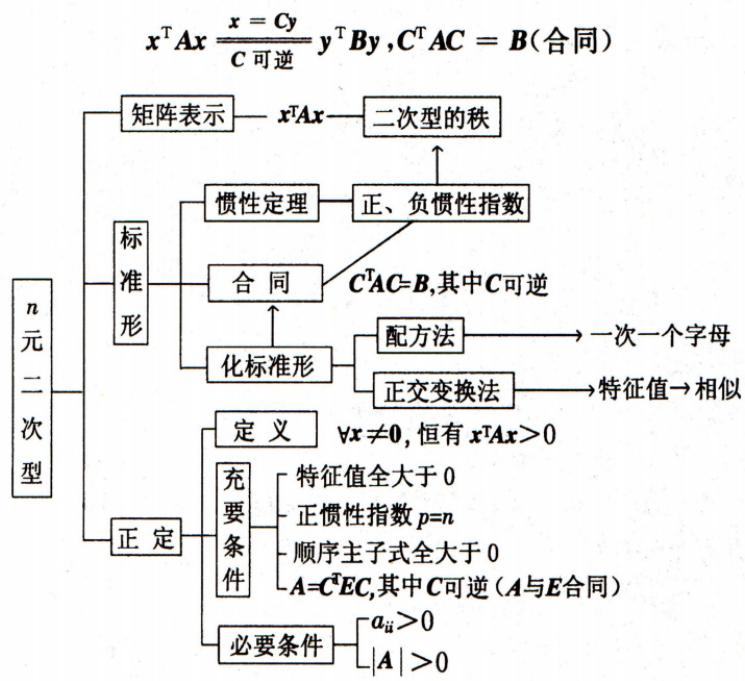
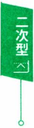
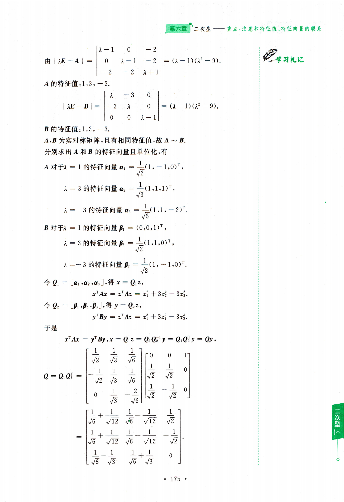
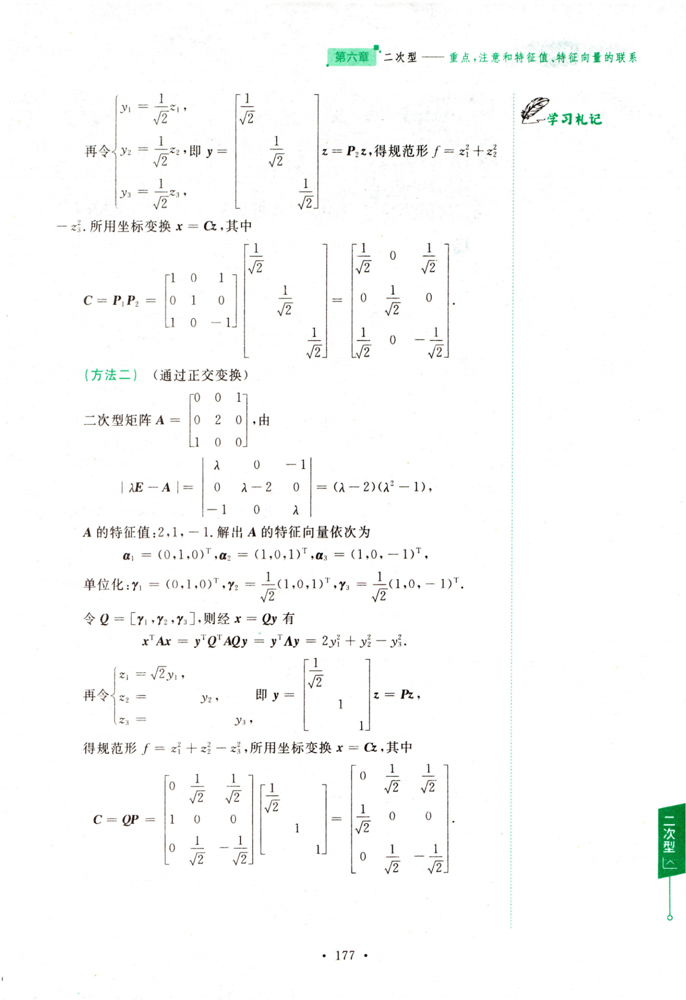
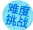
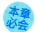

# 第六章 二次型

# 重点，注意和特征值、特征向量的联系

## 一、知识结构网络图

注意二次型的标准形不唯一，可以用不同的坐标变换化二次型为标准形.

二次型的规范形唯一，可以用正交变换先把二次型化为标准形，然后再做“伸缩”化为规范形，亦可用配方法直接得规范形.

【编者注】二次型的两大板块要复习整理清楚，一个是标准形，另一个是正定性.

（1）了解二次型的概念，掌握用矩阵形式表示二次型，了解合同变换和合同矩阵的概念.

（2）理解二次型秩的概念，了解二次型的标准形、规范形等概念，了解惯性定理的条件和结论，掌握用正交变换化二次型为标准形的方法，了解用配方法化二次型为标准形的方法.

(3)理解正定二次型、正定矩阵的概念，掌握正定矩阵的性质.

## 今年考题

(2026,1)\*设二次型 $f(x_{1},x_{2},x_{3})=a(x_{1}^{2}+x_{2}^{2}+x_{3}^{2})+4x_{1}x_{2}+4x_{1}x_{3}+$ $4x_{2}x_{3}$ .若方程 $f(x_{1},x_{2},x_{3}) = -1$ 表示的曲面为圆柱面，则

学习札记

(A)a =-4,且 $f(x_{1},x_{2},x_{3})$ 的规范形为 $-y_{1}^{2}-y_{2}^{2}-y_{3}^{2}$

(B)a =-4,且 $f(x_{1},x_{2},x_{3})$ 在正交变换下的标准形为 $-6y_{1}^{2}-6y_{2}^{2}$

(C)a = 2,且 $f(x_{1},x_{2},x_{3})$ 的规范形为 $-y_{1}^{2}-y_{2}^{2}-y_{3}^{2}$

(D)a = 2,且 $f(x_{1},x_{2},x_{3})$ 在正交变换下的标准形为 $-6y_{1}^{2}-6y_{2}^{2}$

(2026,2,3)矩阵 $\boldsymbol{A} = \begin{bmatrix}
1 & b & - 1 \\
a + 2 & 3 & - 3
\end{bmatrix}$ ，二次型 $\boldsymbol{x}^{\mathrm{T}}(\boldsymbol{A}\boldsymbol{A}^{\mathrm{T}})\boldsymbol{x}$ 的规范形为 yǐ，则 $a + b =$

\*：仅数学一要求

## 二、基本内容与重要结论

## 基础知识

定义6.1 含有n个变量 $x_{1},x_{2},\cdots,x_{n}$ 的二次齐次函数

$$
f(x_{1},x_{2},\cdots,x_{n})=\sum_{i,j=1}^{n}a_{ij}x_{i}x_{j}=a_{11}x_{1}^{2}+a_{22}x_{2}^{2}+\cdots+a_{nn}x_{n}^{2}\\+2a_{12}x_{1}x_{2}+2a_{13}x_{1}x_{3}+\cdots+2a_{n-1,n}x_{n-1}x_{n}
$$

称为n元二次型.若规定 $a_{ij} = a_{ji}, \forall   i,j = 1,2,\cdots,n$ ，则二次型有矩阵表示

$$
f(x_{1},x_{2},\cdots,x_{n}) = \boldsymbol{x}^{\mathrm{T}} \boldsymbol{A} \boldsymbol{x},\tag{6.1}
$$

其中 $\boldsymbol{x} = (x_{1}, x_{2}, \cdots, x_{n})^{\mathrm{T}}, \boldsymbol{A} = \left[ a_{ij} \right]$ 且 $\boldsymbol{A}^{\mathrm{T}} = \boldsymbol{A}$ 是对称矩阵，称A为二次型的矩阵.秩r(A)称为二次型的秩，记为 $r ( f )$

例如，二元二次型 $f(x_{1},x_{2})=x_{1}^{2}+5x_{2}^{2}+6x_{1}x_{2}$ ,有

$$
\begin{aligned}f(x_{1}, x_{2}) &= x_{1}^{2} + 3x_{1}x_{2} + 3x_{1}x_{2} + 5x_{2}^{2} \\&= x_{1}(x_{1} + 3x_{2}) + x_{2}(3x_{1} + 5x_{2}) \\&= \left[ x_{1}, x_{2} \right] \left[ x_{1} + 3x_{2} \right] \\&= \left[ x_{1}, x_{2} \right] \left[ x_{1} + 3 \right] \left[ x_{1} \right] = \boldsymbol{x}^{\mathrm{T}} \boldsymbol{A} \boldsymbol{x}\end{aligned}
$$

为二次型的矩阵表示.

定义6.2 如果二次型中只含有变量的平方项，所有混合项 $x_{i}x_{j}(i \neq$ j）的系数全是零，即

$$
\boldsymbol{x}^{\mathrm{T}} \boldsymbol{A} \boldsymbol{x} = d_{1} x_{1}^{2} + d_{2} x_{2}^{2} + \cdots + d_{n} x_{n}^{2},\tag{6.2}
$$

这样的二次型称为标准形.

在标准形中，若平方项的系数 $d _ { j }$ 为1，-1或0，即

$$
\boldsymbol{x}^{\mathrm{T}} \boldsymbol{A} \boldsymbol{x} = x_{1}^{2} + x_{2}^{2} + \cdots + x_{p}^{2} - x_{p + 1}^{2} - \cdots - x_{p + q}^{2},\tag{6.3}
$$

则称其为二次型的规范形.

定义6.3 在二次型 $\boldsymbol{x}^{\mathrm{T}} \boldsymbol{A} \boldsymbol{x}$ 的标准形中，正平方项的个数 $p$ 称为二次型的正惯性指数，负平方项的个数g称为二次型的负惯性指数.

定义6.4 如果

$$
\begin{cases}x_{1} = c_{11}y_{1} + c_{12}y_{2} + c_{13}y_{3}, \\x_{2} = c_{21}y_{1} + c_{22}y_{2} + c_{23}y_{3}, \\x_{3} = c_{31}y_{1} + c_{32}y_{2} + c_{33}y_{3}\end{cases}\tag{6.4}
$$

满足

$$
\left| \boldsymbol{C} \right| = \left| \begin{matrix}
c_{11} & c_{12} & c_{13} \\
c_{21} & c_{22} & c_{23} \\
c_{31} & c_{32} & c_{33}
\end{matrix} \right| \neq 0,
$$

学习札记

称(6.4) 为由 $\boldsymbol{x} = (x_{1}, x_{2}, x_{3})^{\mathrm{T}}$ 到 $\boldsymbol{y} = (y_1, y_2, y_3)^{\mathrm{T}}$ 的坐标变换.

【评注】坐标变换(6.4)用矩阵表示，即

$$
\begin{bmatrix}
x_{1} \\
x_{2} \\
x_{3}
\end{bmatrix} = \begin{bmatrix}
c_{11} & c_{12} & c_{13} \\
c_{21} & c_{22} & c_{23} \\
c_{31} & c_{32} & c_{33}
\end{bmatrix} \begin{bmatrix}
y_{1} \\
y_{2} \\
y_{3}
\end{bmatrix},  或  \quad \boldsymbol{x} = \boldsymbol{C}\boldsymbol{y}   ,
$$

其中C是可逆矩阵.

定义 6.5 两个n阶矩阵A和B，如果存在可逆矩阵C，使得

$$
\boldsymbol{C}^{\mathrm{T}} \boldsymbol{A} \boldsymbol{C} = \boldsymbol{B}\tag{6.5}
$$

就称矩阵A和B合同，记作 $\mathbf { A } \simeq \mathbf { B } ,$ 并称由A到B的变换为合同变换，称C 为合同变换的矩阵.

1) $\boldsymbol{A} \simeq \boldsymbol{B} \Leftrightarrow p_{A}=p_{B}, q_{A}=q_{B}.$

(2) 如 $\boldsymbol{A} \simeq \boldsymbol{B}, \boldsymbol{B} \simeq \boldsymbol{C}$ ,则 $\mathbf { A } \simeq \mathbf { C } ,$

因 $\boldsymbol{P}_{1}^{\mathrm{T}} \boldsymbol{A} \boldsymbol{P}_{1}=\boldsymbol{B}, \boldsymbol{P}_{2}^{\mathrm{T}} \boldsymbol{B} \boldsymbol{P}_{2}=\boldsymbol{C}, \boldsymbol{P}_{1}, \boldsymbol{P}_{2}$ 可逆.

于是 $\boldsymbol{P}_{2}^{\mathrm{T}}\left(\boldsymbol{P}_{1}^{\mathrm{T}} \boldsymbol{A} \boldsymbol{P}_{1}\right) \boldsymbol{P}_{2}=\boldsymbol{C}$ 有 $\boldsymbol{P} = \boldsymbol{P}_{1} \boldsymbol{P}_{2}$ 可逆且 $\boldsymbol{P}^{\mathrm{T}} \boldsymbol{A} \boldsymbol{P} = \boldsymbol{C}.$

(3) 如 $\boldsymbol{A} \simeq \boldsymbol{B}$ ,则 $r(\boldsymbol{A}) = r(\boldsymbol{B}) ; \left| \boldsymbol{A} \right| , \left| \boldsymbol{B} \right|$ 同正、负号.

定义6.6 对二次型 $\pmb { x } ^ { \mathsf { T } } \pmb { A } \pmb { x }$ ，如果对任何 $x \neq 0$ ,恒有 $\boldsymbol{x}^{\mathrm{T}} \boldsymbol{A} \boldsymbol{x} > 0$ ，则称二次型 $\boldsymbol{x}^{\mathrm{T}} \boldsymbol{A} \boldsymbol{x}$ 是正定二次型，并称实对称矩阵A是正定矩阵.

例如，二次型 $f(x_{1},x_{2},x_{3})=x_{1}^{2}+5x_{2}^{2}-4x_{3}^{2}+2x_{1}x_{2}$ ,平方项 $x_{3}^{2}$ 的系数是一4，如果取 $\boldsymbol{x} = (0,0,1)^{\mathrm{T}} \neq \boldsymbol{0}$ ,则有

$$
f(0,0,1)=-4<0,
$$

说明这个二次型不是正定的.二次型的矩阵

$$
\boldsymbol{A} = \begin{bmatrix}
1 & 1 & 0 \\
1 & 5 & 0 \\
0 & 0 & - 4
\end{bmatrix}
$$

也不是正定矩阵.

类似地，请考查 $f(x_{1},x_{2},x_{3})=x_{1}^{2}+5x_{3}^{2}+2x_{1}x_{3}$ ,若取 $\boldsymbol{x} = (0,1,0)^{\mathrm{T}}$ $\neq \mathbf { 0 }$ ,有 $f(0,1,0) = 0$ ，由此知A正定的必要条件是 $a_{ii} > 0 (i = 1,2,3)$

## 主要定理

定理6.1 变量 $\boldsymbol{x} = (x_{1}, x_{2}, \cdots, x_{n})^{\mathrm{T}}$ 的n元二次型 $\boldsymbol{x}^{\mathrm{T}} \boldsymbol{A} \boldsymbol{x}$ 经坐标变换

注意，n元二次型 $f(x_{1},x_{2},\cdots,x_{n}) = \boldsymbol{x}^{\mathrm{T}} \boldsymbol{A} \boldsymbol{x}$ 经坐标变换 $x = C y$ ,有

$$
\boldsymbol{x}^{\mathrm{T}} \boldsymbol{A} \boldsymbol{x} = (\boldsymbol{C} \boldsymbol{y})^{\mathrm{T}} \boldsymbol{A} (\boldsymbol{C} \boldsymbol{y}) = \boldsymbol{y}^{\mathrm{T}} \boldsymbol{C}^{\mathrm{T}} \boldsymbol{A} \boldsymbol{C} \boldsymbol{y} = \boldsymbol{y}^{\mathrm{T}} \boldsymbol{B} \boldsymbol{y} ,
$$

其中 $\boldsymbol{B} = \boldsymbol{C}^{\mathrm{T}} \boldsymbol{A} \boldsymbol{C}$

$$
\boldsymbol{B}^{\mathrm{T}}=(\boldsymbol{C}^{\mathrm{T}} \boldsymbol{A} \boldsymbol{C})^{\mathrm{T}}=\boldsymbol{C}^{\mathrm{T}} \boldsymbol{A}^{\mathrm{T}}(\boldsymbol{C}^{\mathrm{T}})^{\mathrm{T}}=\boldsymbol{C}^{\mathrm{T}} \boldsymbol{A} \boldsymbol{C}=\boldsymbol{B},
$$

说明 $\boldsymbol{y}^{\mathrm{T}} \boldsymbol{B} \boldsymbol{y}$ 是二次型的矩阵表示.即以 $x_{1},x_{2},\cdots,x_{n}$ 为自变量的二次型经坐标变换 $x = C y$ 化为以 $y_{1},y_{2},\cdots,y_{n}$ 为自变量的二次型.二次型矩阵由A转换为B，经坐标变换二次型矩阵是合同的.

特别地，若 $x = C y$ 是正交变换，即C是正交矩阵，则有

$$
\boldsymbol{B} = \boldsymbol{C}^{\mathrm{T}} \boldsymbol{A} \boldsymbol{C} = \boldsymbol{C}^{-1} \boldsymbol{A} \boldsymbol{C},
$$

即经过正交变换，二次型矩阵不仅合同而且相似.

定理6.2 任意的n元二次型 $\pmb { x } ^ { \mathrm { T } } \pmb { A } \pmb { x }$ 都可以通过坐标变换化成标准形

$$
d _ { 1 } y _ { 1 } ^ { 2 } + d _ { 2 } y _ { 2 } ^ { 2 } + \cdots + d _ { n } y _ { n } ^ { 2 } ,
$$

其中 $d_{i}(i = 1,2,\cdots,n)$ 是实数.

定理6.3 任一n阶实对称矩阵A，总可以合同于一个对角矩阵，即

$$
\boldsymbol{C}^{\mathrm{T}} \boldsymbol{A} \boldsymbol{C}=\begin{bmatrix}
d_{1} \\
d_{2} \\
\ddots \\
d_{n}
\end{bmatrix}.\tag{6.6}
$$

定理6.4（惯性定理）对于一个二次型，不论选取怎样的坐标变换使它化为仅含平方项的标准形，其中正平方项的个数p、负平方项的个数q都是由所给二次型唯一确定的.

若二次型 $\boldsymbol{x}^{\mathrm{T}} \boldsymbol{A} \boldsymbol{x}$ 经坐标变换 $x = C y$ 化为二次型 $\boldsymbol{y}^{\mathrm{T}} \boldsymbol{B} \boldsymbol{y}$

$$
\Leftrightarrow \boldsymbol{C}^{\mathrm{T}} \boldsymbol{A} \boldsymbol{C} = \boldsymbol{B}
$$

$$
\Leftrightarrow p_{A}=p_{B},q_{A}=q_{B}
$$

$\Leftrightarrow \boldsymbol{x}^{\mathrm{T}} \boldsymbol{A} \boldsymbol{x}$ 与 $\boldsymbol { y } ^ { \top } \boldsymbol { B } \boldsymbol { y }$ 有相同的规范形.

定理6.5 对任一个n元二次型 $\boldsymbol{x}^{\mathrm{T}} \boldsymbol{A} \boldsymbol{x}$ ，其中A是n阶实对称矩阵，必存在正交变换 $x = Q y ( Q$ 是正交矩阵)，使得 $\boldsymbol{x}^{\mathrm{T}} \boldsymbol{A} \boldsymbol{x}$ 化成标准形

$$
\lambda _ { 1 } y _ { 1 } ^ { 2 } + \lambda _ { 2 } y _ { 2 } ^ { 2 } + \cdots + \lambda _ { n } y _ { n } ^ { 2 } ,
$$

这里 $\lambda_{1}, \lambda_{2}, \cdots, \lambda_{n}$ 是A的 n 个特征值.

【评注】A为三阶实对称矩阵，存在正交矩阵Q，使 $Q^{-1}AQ = \Lambda$ 对 $\boldsymbol{x}^{\mathrm{T}} \boldsymbol{A} \boldsymbol{x}$ ,令 $x = Qy$ ，则

$$
\begin{aligned}\boldsymbol{x}^{\mathrm{T}} \boldsymbol{A} \boldsymbol{x} &= (\boldsymbol{Q} \boldsymbol{y})^{\mathrm{T}} \boldsymbol{A}(\boldsymbol{Q} \boldsymbol{y}) = \boldsymbol{y}^{\mathrm{T}} \boldsymbol{Q}^{\mathrm{T}} \boldsymbol{A} \boldsymbol{Q} \boldsymbol{y} \\&= \boldsymbol{y}^{\mathrm{T}} \boldsymbol{Q}^{-1} \boldsymbol{A} \boldsymbol{Q} \boldsymbol{y} = \boldsymbol{y}^{\mathrm{T}} \boldsymbol{A} \boldsymbol{y} \\&= \lambda_{1} y_{1}^{2} + \lambda_{2} y_{2}^{2} + \lambda_{3} y_{3}^{2}.\end{aligned}
$$

(1)A的正惯性指数是n.

(2)A与E合同，即存在可逆矩阵C,使 $\boldsymbol{C}^{\mathrm{T}} \boldsymbol{A} \boldsymbol{C} = \boldsymbol{E}$

(3)A 的所有特征值 $\lambda \left( i = 1,2,\cdots,n \right)$ 均为正数.

(4)A的各阶顺序主子式均大于零.

推论 $\boldsymbol{x}^{\mathrm{T}} \boldsymbol{A} \boldsymbol{x}$ 正定的必要条件是：

(1) $a_{ii} > 0 (i = 1,2,\cdots,n)$

(2) $| \textbf{A} | > 0.$

## 三、典型例题分析选讲

# 二次型基本概念

提示二次型矩阵A—对称；唯一；秩 $r(f);  正$ 、负惯性指数 ${ \not p } , q .$ 坐标变换 $x = C y,C$ 可逆；合同.

## 展示新知

【例6.1】二次型

$$
f(x_{1},x_{2},x_{3})=(x_{1}+2x_{2}+3x_{3})(x_{1}-2x_{2}+x_{3})
$$

的矩阵A =

分析

$$
\begin{aligned}f(x_{1},x_{2},x_{3}) &= (x_{1},x_{2},x_{3})\begin{bmatrix}
1 \\
2 \\
3
\end{bmatrix}(1, - 2,1)\begin{bmatrix}
x_{1} \\
x_{2} \\
x_{3}
\end{bmatrix} \\&= (x_{1},x_{2},x_{3})\begin{bmatrix}
1 & - 2 & 1 \\
2 & - 4 & 2 \\
3 & - 6 & 3
\end{bmatrix}\begin{bmatrix}
x_{1} \\
x_{2} \\
x_{3}
\end{bmatrix} \\&= (x_{1},x_{2},x_{3})\begin{bmatrix}
1 & 0 & 2 \\
0 & - 4 & - 2 \\
2 & - 2 & 3
\end{bmatrix}\begin{bmatrix}
x_{1} \\
x_{2} \\
x_{3}
\end{bmatrix},\end{aligned}
$$

故二次型矩阵 $\boldsymbol{A} = \begin{bmatrix}
1 & 0 & 2 \\
0 & - 4 & - 2 \\
2 & - 2 & 3
\end{bmatrix}$

【评注】本题中矩阵 $\boldsymbol{B} = \begin{bmatrix}
1 & - 2 & 1 \\
2 & - 4 & 2 \\
3 & - 6 & 3
\end{bmatrix}$ 不是对称矩阵，因而不是二次型的矩阵，改成对称矩阵A的方法 $a_{ii} = b_{ii}, a_{ij} = \frac{1}{2}(b_{ij} + b_{ji})$

展示新知

【例6.2】二次型 $f(x_{1},x_{2},x_{3})=x_{1}^{2}+ax_{2}^{2}+x_{3}^{2}+2x_{1}x_{2}+2ax_{1}x_{3}$ $+ 2 x_{2} x_{3}$ 的秩为2,则a

分析二次型 f的秩为2,即矩阵A的秩为2. 由于

$$
\boldsymbol{A} = \begin{bmatrix}
1 & 1 & a \\
1 & a & 1 \\
a & 1 & 1
\end{bmatrix},
$$

学习札记

由 $\left| \boldsymbol{A} \right| = - (a - 1)^{2}(a + 2) = 0$ ,知a = 1或—2. 易见a = 1时 $r(\mathbf{A}) =$ 1,故 a =-2.

展示新知

【例6.3】二次型 $f(x_{1},x_{2},x_{3})=(x_{1}+x_{2})^{2}+(x_{2}-x_{3})^{2}+(x_{3}+$ $x _ { 1 } ) ^ { 2 }$ 的正惯性指数p=

分析

$$
f(x_{1},x_{2},x_{3})=2x_{1}^{2}+2x_{2}^{2}+2x_{3}^{2}+2x_{1}x_{2}-2x_{2}x_{3}+2x_{3}x_{1}\\=2\left[x_{1}^{2}+x_{1}(x_{2}+x_{3})+\frac{1}{4}(x_{2}+x_{3})^{2}\right]+2x_{2}^{2}+2x_{3}^{2}+2x_{2}^{2}+2x_{3}^{2}+2x_{2}^{2}x_{3}-\frac{1}{2}(x_{2}+x_{3})^{2}\\=2\left(x_{1}+\frac{1}{2}x_{2}+\frac{1}{2}x_{3}\right)^{2}+\frac{3}{2}(x_{2}-x_{3})^{2},
$$

可见 $p = 2.$

【评注】如果认为二次型的标准形是

$$
f = y_{1}^{2} + y_{2}^{2} + y_{3}^{2}\tag{①}
$$

从而得 $p = 3, q = 0$ 就不正确了.

因为对于

$$
\begin{cases}y_{1} = x_{1} + x_{2}, \\y_{2} = \quad x_{2} - x_{3}, \\y_{3} = x_{1} + x_{3},\end{cases}\tag{②}
$$

有行列式

$$
\begin{aligned}\left| \begin{matrix}
1 & 1 & 0 \\
0 & 1 & - 1 \\
1 & 0 & 1
\end{matrix} \right| = 0  , \end{aligned}
$$

从而②不是坐标变换，那么①也就不是本题中二次型f的标准形.

## 二次型的标准形、规范形

提示标准形 $d_{1}x_{1}^{2} + d_{2}x_{2}^{2} + \cdots + d_{n}x_{n}^{2}$

规范形 $x_{1}^{2}+\cdots+x_{p}^{2}-x_{p+1}^{2}-\cdots-x_{p+q}^{2}$

坐标变换：(1)配方法；(2)正交变换法.

展示新知

【例6.4】用配方法化二次型

$$
f(x_{1},x_{2},x_{3})=x_{1}^{2}+3x_{2}^{2}+3x_{3}^{2}+2x_{1}x_{2}-4x_{1}x_{3}
$$

为标准形，并写出所用坐标变换.

$$
\begin{aligned}& 顯顯  \quad f(x_{1},x_{2},x_{3}) \\&= x_{1}^{2} + 3x_{2}^{2} + 3x_{3}^{2} + 2x_{1}x_{2} - 4x_{1}x_{3} \\&= x_{1}^{2} + 2x_{1}(x_{2} - 2x_{3}) + (x_{2} - 2x_{3})^{2} + 3x_{2}^{2} + 3x_{3}^{2} - (x_{2} - 2x_{3})^{2} \\&= (x_{1} + x_{2} - 2x_{3})^{2} + 2x_{2}^{2} + 4x_{2}x_{3} - x_{3}^{2} \\&= (x_{1} + x_{2} - 2x_{3})^{2} + 2(x_{2} + x_{3})^{2} - 3x_{3}^{2}.\end{aligned}
$$

今 $\begin{aligned}\left\{\begin{aligned}y_{1} &= x_{1} + x_{2} - 2x_{3}, \\y_{2} &= \quad x_{2} + x_{3}, \\y_{3} &= \quad x_{3},\end{aligned}\right. 即  \\\left\{\begin{aligned}x_{1} &= y_{1} - y_{2} + 3y_{3}, \\x_{2} &= \quad y_{2} - y_{3}, \\x_{3} &= \quad y_{3},\end{aligned}\right.\end{aligned}$ 经坐标变换或 $\boldsymbol{x} = \begin{bmatrix}
1 & -1 & 3 \\
0 & 1 & -1 \\
0 & 0 & 1
\end{bmatrix} \boldsymbol{y},$

则有 $f = y_{1}^{2} + 2y_{2}^{2} - 3y_{3}^{2}$

展示新知

【例6.5】用配方法化二次型

$$
f(x_{1},x_{2},x_{3})=2x_{1}x_{2}+4x_{1}x_{3}
$$

为标准形，并写出所用坐标变换.

解f中不含平方项，由于含有 $x_{1}x_{2}$ ,故可先令

$\begin{cases}x_{1} = y_{1} + y_{2}, \\x_{2} = y_{1} - y_{2}, \\x_{3} = \cdots \cdots \cdots \cdots\end{cases}$ 即 $\boldsymbol{x} = \begin{bmatrix}
1 & 1 & 0 \\
1 & -1 & 0 \\
0 & 0 & 1
\end{bmatrix} \boldsymbol{y} = \boldsymbol{C}_{1} \boldsymbol{y}.$

①

作出平方项，然后再配方，即

$$
f(x_{1},x_{2},x_{3})=2x_{1}x_{2}+4x_{1}x_{3}\\=2(y_{1}+y_{2})(y_{1}-y_{2})+4(y_{1}+y_{2})y_{3}\\=2y_{1}^{2}-2y_{2}^{2}+4y_{1}y_{3}+4y_{2}y_{3}\\=2y_{1}^{2}+4y_{1}y_{3}+2y_{2}^{2}-2y_{2}^{2}+4y_{2}y_{3}-2y_{3}^{2}\\=2(y_{1}+y_{3})^{2}-2(y_{2}-y_{3})^{2},
$$

再令 $\begin{cases}z_{1} = y_{1} + y_{3}, \\z_{2} = y_{2} - y_{3}, \\z_{3} = y_{3},\end{cases}$ 即 $\left\{ \begin{aligned} y_{1} &= z_{1} - z_{3}, \\ y_{2} &= \quad z_{2} + z_{3}, \\ y_{3} &= \quad z_{3}, \end{aligned} \right.$

或 $\boldsymbol{y} = \begin{bmatrix}
1 & 0 & -1 \\
0 & 1 & 1 \\
0 & 0 & 1
\end{bmatrix} \boldsymbol{z} = \boldsymbol{C}_{\boldsymbol{z}} \boldsymbol{z}.$

②

二次型化为标准形 $f = 2z_{1}^{2} - 2z_{2}^{2}$ .所用坐标变换 $x = C z$ ,其中

字习札记

$$
\boldsymbol{C} = \boldsymbol{C}_{1} \boldsymbol{C}_{2} = \begin{bmatrix}
1 & 1 & 0 \\
1 & -1 & 0 \\
0 & 0 & 1
\end{bmatrix} \begin{bmatrix}
1 & 0 & -1 \\
0 & 1 & 1 \\
0 & 0 & 1
\end{bmatrix} = \begin{bmatrix}
1 & 1 & 0 \\
1 & -1 & -2 \\
0 & 0 & 1
\end{bmatrix}.
$$

2.正交变换法化标准形

提示三元二次型 $\boldsymbol{x}^{\mathrm{T}} \boldsymbol{A} \boldsymbol{x} = \boldsymbol{Q} \boldsymbol{y} = \lambda_{1} y_{1}^{2} + \lambda_{2} y_{2}^{2} + \lambda_{3} y_{3}^{2}.$ $\boldsymbol { Q } = \left[ \boldsymbol { \gamma } _ { 1 } , \boldsymbol { \gamma } _ { 2 } , \boldsymbol { \gamma } _ { 3 } \right]$ γ—特征向量，λ—特征值

展示新知

【例6.6】已知二次型 $f(x_{1},x_{2},x_{3})=2x_{1}^{2}+ax_{3}^{2}+2x_{2}x_{3}$ 经正交变换 $x = p y$ 可化成标准形 $y_{1}^{2}+by_{2}^{2}-y_{3}^{2}$ 则

分析二次型 $\boldsymbol{x}^{\mathrm{T}} \boldsymbol{A} \boldsymbol{x}$ 必存在坐标变换x = Cy 化其为标准形 $y^{\mathrm{T}} \boldsymbol{A} y$ .即实对称矩阵A必存在可逆矩阵C使其与对角矩阵Λ合同，亦即 $\boldsymbol{C}^{\mathrm{T}} \boldsymbol{A} \boldsymbol{C} = \boldsymbol{\Lambda}$

如果选择正交变换，即C是正交矩阵，那么

$$
\boldsymbol{\Lambda} = \boldsymbol{C}^{\mathrm{T}} \boldsymbol{A} \boldsymbol{C} = \boldsymbol{C}^{-1} \boldsymbol{A} \boldsymbol{C},
$$

说明在正交变换下，A不仅与Λ合同而且A与Λ相似，因此A就是A的特征值.  
另一方面，在二次型 $\pmb { y } ^ { \mathrm { T } } \pmb { \Lambda } \pmb { y }$ 中，A的主对角线元素就是标准形平方项的系数.

因此，二次型 $\dot{\boldsymbol{x}}^{\mathrm{T}} \boldsymbol{A} \boldsymbol{x}$ 经正交变换化为标准形时，标准形中平方项的系数就是二次型矩阵A的特征值.

由 $\begin{bmatrix}
2 & 0 & 0 \\
0 & 0 & 1 \\
0 & 1 & a
\end{bmatrix} \sim \begin{bmatrix}
1 \\
b \\
-1
\end{bmatrix}$ ,有 $\sum a_{n} = \sum b_{n}$ 和 $| \textbf { \em A } | = | \textbf { \em B } |$ ,即 (2 + 0 + a = 1 + b + (− 1), (−2 =- b,

解得 $a = 0$

或者， $\left| \lambda \boldsymbol{E} - \boldsymbol{A} \right| = \left| \begin{matrix}
\lambda - 2 & 0 & 0 \\
0 & \lambda & - 1 \\
0 & - 1 & \lambda - a
\end{matrix} \right| = (\lambda - 2)(\lambda^{2} - a\lambda - 1)$

①

又A的特征值是1，b，—1，把λ=1代入①，得 $a = 0$

展示新知

【例6.7】已知二次型

$$
\boldsymbol{x}^{\mathrm{T}} \boldsymbol{A} \boldsymbol{x} = (a + 1) x_1^2 - 3 x_2^2 - 3 x_3^2 + 2 x_1 x_2 - 4 x_1 x_3 + 2 a x_2 x_3
$$

$\boldsymbol{a} = (5,1,-2)^{\mathrm{T}}$ 是A的特征向量.

(1)求a的值；

(2)用正交变换把二次型f化成标准形，并写出相应的正交矩阵；

（3）如 $x ^ { \mathrm { T } } x = 5$ ,求 $f(x_{1},x_{2},x_{3})$ 的最大值.

$$
\boldsymbol{A} = \begin{bmatrix}
a + 1 & 1 & - 2 \\
1 & - 3 & a \\
- 2 & a & - 3
\end{bmatrix}.
$$

设 $A\boldsymbol{\alpha} = \lambda\boldsymbol{\alpha}$ ,有

$$
\begin{bmatrix}
a + 1 & 1 & - 2 \\
1 & - 3 & a \\
- 2 & a & - 3
\end{bmatrix} \begin{bmatrix}
5 \\
1 \\
- 2
\end{bmatrix} = \lambda \begin{bmatrix}
5 \\
1 \\
- 2
\end{bmatrix}
$$

$$
\begin{aligned}5(a + 1) + 5 &= 5\lambda, \\2 - 2a &= \lambda, \\a - 4 &= - 2\lambda,\end{aligned}
$$

解出 $a = 0 , \lambda = 2.$

(2)由矩阵A的特征多项式

$$
\left| \lambda \boldsymbol{E} - \boldsymbol{A} \right| = \left| \begin{matrix}
\lambda - 1 & - 1 & 2 \\
- 1 & \lambda + 3 & 0 \\
2 & 0 & \lambda + 3
\end{matrix} \right| = (\lambda - 2)(\lambda + 3)(\lambda + 4)
$$

得到A的特征值是 $2,-3,-4$

当λ=2时，特征向量为 $\boldsymbol{a} = (5,1,-2)^{\mathrm{T}}$

当λ=—3时，由 $(-3\boldsymbol{E}-\boldsymbol{A})\boldsymbol{x}=\boldsymbol{0}$ ,即

$$
\begin{bmatrix}
- 4 & - 1 & 2 \\
- 1 & 0 & 0 \\
2 & 0 & 0
\end{bmatrix} \twoheadrightarrow \begin{bmatrix}
1 & 0 & 0 \\
0 & 1 & - 2 \\
0 & 0 & 0
\end{bmatrix},
$$

得基础解系 $\boldsymbol{a}_{2} = (0,2,1)^{\mathrm{T}}$ ,即 $\lambda = -3$ 的特征向量.

当 $\lambda = - 4$ 时，由 $(-4\boldsymbol{E}-\boldsymbol{A})\boldsymbol{x}=\boldsymbol{0}$ ,即

$$
\begin{bmatrix}
- 5 & - 1 & 2 \\
- 1 & - 1 & 0 \\
2 & 0 & - 1
\end{bmatrix} \xrightarrow{} \begin{bmatrix}
1 & 1 & 0 \\
0 & 2 & 1 \\
0 & 0 & 0
\end{bmatrix},
$$

得基础解系 $\boldsymbol{a}_{3} = (-1,1,-2)^{\mathrm{T}}$ ,即 $\lambda = - 4$ 的特征向量.

对于实对称矩阵，对应于不同特征值的特征向量相互正交，即 $\boldsymbol{a}, \boldsymbol{a}_{2}, \boldsymbol{a}_{3}$ 相互正交，故只需单位化，令

$$
\boldsymbol{\gamma}_{1}=\frac{1}{\sqrt{30}}\begin{bmatrix}
5 \\
1 \\
-2
\end{bmatrix}, \boldsymbol{\gamma}_{2}=\frac{1}{\sqrt{5}}\begin{bmatrix}
0 \\
2 \\
1
\end{bmatrix}, \boldsymbol{\gamma}_{3}=\frac{1}{\sqrt{6}}\begin{bmatrix}
-1 \\
1 \\
-2
\end{bmatrix},
$$

$$
\boldsymbol{Q}=\left[\boldsymbol{\gamma}_{1}, \boldsymbol{\gamma}_{2}, \boldsymbol{\gamma}_{3}\right]=\left[\begin{array}{ccc}\displaystyle\frac{5}{\sqrt{30}} & 0 & -\frac{1}{\sqrt{6}} \\ \displaystyle\frac{1}{\sqrt{30}} & \displaystyle\frac{2}{\sqrt{5}} & \displaystyle\frac{1}{\sqrt{6}} \\ \displaystyle-\frac{2}{\sqrt{30}} & \displaystyle\frac{1}{\sqrt{5}} & -\frac{2}{\sqrt{6}}\end{array}\right],
$$

则经正交变换 $x = Qy$ ，二次型化为标准形

$$
f\left(x_{1},x_{2},x_{3}\right)=\boldsymbol{x}^{\mathrm{T}}\boldsymbol{A}\boldsymbol{x}=\boldsymbol{y}^{\mathrm{T}}\boldsymbol{A}\boldsymbol{y}=2y_{1}^{2}-3y_{2}^{2}-4y_{3}^{2}.
$$

学习札记

(3) 因 $\boldsymbol{x}^{\mathrm{T}} \boldsymbol{x} = (\boldsymbol{Q} \boldsymbol{y})^{\mathrm{T}} (\boldsymbol{Q} \boldsymbol{y}) = \boldsymbol{y}^{\mathrm{T}} \boldsymbol{Q}^{\mathrm{T}} \boldsymbol{Q} \boldsymbol{y} = \boldsymbol{y}^{\mathrm{T}} \boldsymbol{y} = 5$ ,求 $f(x_{1},x_{2},x_{3})$ 在$x^{\top}x = 5$ 的最大值，即是求 $g(y_1, y_2, y_3)$ 在 $y^{\mathrm{T}} y = 5$ 的最大值，

$$
\boldsymbol{x}^{\mathrm{T}} \boldsymbol{A} \boldsymbol{x}=\boldsymbol{y}^{\mathrm{T}} \boldsymbol{A} \boldsymbol{y}=2 y_{1}^{2}-3 y_{2}^{2}-4 y_{3}^{2} \leqslant 2\left(y_{1}^{2}+y_{2}^{2}+y_{3}^{2}\right)=10 .
$$

注极大值点可取 $\boldsymbol{x} = \boldsymbol{Q} \begin{bmatrix}
\sqrt{5} \\
0 \\
0
\end{bmatrix} = \begin{bmatrix}
\dfrac{5}{\sqrt{6}} \\
\dfrac{1}{\sqrt{6}} \\
-\dfrac{2}{\sqrt{6}}
\end{bmatrix}$

【评注】要掌握用正交变换化二次型为标准形的方法，标准形中平方项的系数是二次型矩阵的特征值，所用的正交变换矩阵就是经过改造的二次型矩阵的特征向量.具体解题步骤如下：(下设 $n = 3$

(1)写出二次型矩阵A.

(2) 求矩阵 A 的特征值 $\lambda_{1} , \lambda_{2} , \lambda_{3}$

(3)求矩阵 A 的特征向量 $\boldsymbol{\alpha}_{1}, \boldsymbol{\alpha}_{2}, \boldsymbol{\alpha}_{3}$

(4)改造特征向量(Schmidt正交化、单位化) $\gamma_{1}, \gamma_{2}, \gamma_{3}$

(5)构造正交矩阵 $\boldsymbol{P} = \left[ \gamma_{1}, \gamma_{2}, \gamma_{3} \right]$

则经坐标变换 $x = P y$ ,得

$$
\boldsymbol{x}^{\mathrm{T}} \boldsymbol{A} \boldsymbol{x} = \boldsymbol{y}^{\mathrm{T}} \boldsymbol{A} \boldsymbol{y} = \lambda_1 y_1^2 + \lambda_2 y_2^2 + \lambda_3 y_3^2.
$$

【注意】特征值的顺序与正交矩阵P中对应的特征向量的顺序是一致的.

如果涉及求参数的问题，其方法与特征值中所归纳的方法是一样的.

展示新知

【例.6.8】（2024,2）设矩阵 $\boldsymbol{A} = \begin{bmatrix}
0 & 1 & a \\
1 & 0 & 1
\end{bmatrix}, \boldsymbol{B} = \begin{bmatrix}
1 & 1 \\
1 & 1 \\
b & 2
\end{bmatrix}.$ ,二次型$f(x_{1},x_{2},x_{3}) = \boldsymbol{x}^{\mathrm{T}} \boldsymbol{B} \boldsymbol{A} \boldsymbol{x}$ 已知方程组 $Ax = \mathbf{0}$ 的解均是 $B^{\mathrm{T}}x = 0$ 的解，但这两个方程组不同解.

(1)求 $a , b$ 的值.

(2) 求正交变换 $x = Q y$ 将 $f(x_{1},x_{2},x_{3})$ 化为标准形.

解（1）因 $Ax = \mathbf{0}$ 的解全是 $\boldsymbol{B}^{\mathrm{T}} \boldsymbol{x} = \boldsymbol{0}$ 的解知 $\left\{ \begin{aligned} \boldsymbol{A} \boldsymbol{x} &= \boldsymbol{0} \\ \boldsymbol{B}^{\mathrm{T}} \boldsymbol{x} &= \boldsymbol{0} \end{aligned} \right.$ 与 $\boldsymbol{A}\boldsymbol{x} = \boldsymbol{0}$ 同解.于是 $r \left[ \begin{matrix}
{ \boldsymbol { A } } \\
{ \boldsymbol { B } ^ { \mathrm { T } } }
\end{matrix} \right] = r ( \boldsymbol { A } ) = 2.$

字习札记

又因 $Ax = 0$ 与 $\boldsymbol{B}^{\mathrm{T}} \boldsymbol{x} = \boldsymbol{0}$ 不同解，所以 $r(\boldsymbol{A}) \neq r(\boldsymbol{B})$ 因此 $r(\boldsymbol{B}) = 1, b = 2$ ,因为

$$
\begin{bmatrix}
\boldsymbol{A} \\
\boldsymbol{B}^{\mathrm{T}}
\end{bmatrix} = \begin{bmatrix}
0 & 1 & a \\
1 & 0 & 1 \\
1 & 1 & 2 \\
1 & 1 & 2
\end{bmatrix} \rightarrow \begin{bmatrix}
1 & 0 & 1 \\
0 & 1 & a \\
0 & 0 & a-1 \\
0 & 0 & 0
\end{bmatrix}
$$

所以 $a = 1, b = 2$

(2)

## 解题笔记

## 展示新知

【例6.9】已知二次型

$$
f(x_{1},x_{2},x_{3})=x_{1}^{2}+x_{2}^{2}-x_{3}^{2}+4x_{1}x_{3}+4x_{2}x_{3}, \quad g(y_{1},y_{2},y_{3})=y_{3}^{2}+6y_{1}y_{2}.
$$

是否存在正交变换 $x = Q y$ 可将 f 化成 $g$ .若存在，则求正交矩阵Q,若不存在，则讲明原因.

## 解二次型f和 $g$ 的矩阵分别是

$$
\boldsymbol{A} = \begin{bmatrix}
1 & 0 & 2 \\
0 & 1 & 2 \\
2 & 2 & -1
\end{bmatrix}
$$

$$
\boldsymbol{B} = \begin{bmatrix}
0 & 3 & 0 \\
3 & 0 & 0 \\
0 & 0 & 1
\end{bmatrix}.
$$

由 $\left| \lambda \boldsymbol{E} - \boldsymbol{A} \right| = \left| \begin{matrix}
\lambda - 1 & 0 & - 2 \\
0 & \lambda - 1 & - 2 \\
- 2 & - 2 & \lambda + 1
\end{matrix} \right| = (\lambda - 1)(\lambda^{2} - 9).$

学习札记

A的特征值：1,3，-3.

$$
\left| \lambda \boldsymbol{E} - \boldsymbol{B} \right| = \left| \begin{matrix}
\lambda & - 3 & 0 \\
- 3 & \lambda & 0 \\
0 & 0 & \lambda - 1
\end{matrix} \right| = (\lambda - 1)(\lambda^{2} - 9).
$$

B的特征值：1,3，-3.

A，B为实对称矩阵，且有相同特征值，故A～B.分别求出A和B的特征向量且单位化，有

A 对于λ = 1 的特征向量 $\boldsymbol{\alpha}_{1}=\frac{1}{\sqrt{2}}(1,-1,0)^{\mathrm{T}}$

λ = 3 的特征向量 $\boldsymbol{\alpha}_{2}=\frac{1}{\sqrt{3}}(1,1,1)^{\mathrm{T}},$

λ=—3的特征向量 $\boldsymbol{\alpha}_{3}=\frac{1}{\sqrt{6}}(1,1,-2)^{\mathrm{T}}.$

B 对于λ = 1 的特征向量 $\boldsymbol{\beta}_{1} = (0,0,1)^{\mathrm{T}}$

λ = 3 的特征向量 $\boldsymbol{\beta}_{2}=\frac{1}{\sqrt{2}}(1,1,0)^{\mathrm{T}},$

λ=—3的特征向量 $\boldsymbol{\beta}_{3}=\frac{1}{\sqrt{2}}(1,-1,0)^{\mathrm{T}}.$

区 $\boldsymbol { Q } _ { 1 } = \left[ \boldsymbol { \alpha } _ { 1 } , \boldsymbol { \alpha } _ { 2 } , \boldsymbol { \alpha } _ { 3 } \right]$ ,得 $\boldsymbol{x} = \boldsymbol{Q}_{1} \boldsymbol{z}$

$$
\boldsymbol{x}^{\mathrm{T}} \boldsymbol{A} \boldsymbol{x} = \boldsymbol{z}^{\mathrm{T}} \boldsymbol{\Lambda} \boldsymbol{z} = z_{1}^{2} + 3 z_{2}^{2} - 3 z_{3}^{2}.
$$

$\boldsymbol { Q } _ { 2 } = \left[ \boldsymbol { \beta } _ { 1 } , \boldsymbol { \beta } _ { 2 } , \boldsymbol { \beta } _ { 3 } \right]$ ,得 $y = Q_{2}z$

$$
\boldsymbol{y}^{\mathrm{T}} \boldsymbol{B} \boldsymbol{y} = \boldsymbol{z}^{\mathrm{T}} \boldsymbol{A} \boldsymbol{z} = z_{1}^{2} + 3 z_{2}^{2} - 3 z_{3}^{2}.
$$

于是

$$
\boldsymbol{x}^{\mathrm{T}} \boldsymbol{A} \boldsymbol{x} = \boldsymbol{y}^{\mathrm{T}} \boldsymbol{B} \boldsymbol{y}, \boldsymbol{x} = Q_{1} \boldsymbol{z} = Q_{1} Q_{2}^{-1} \boldsymbol{y} = Q_{1} Q_{2}^{\mathrm{T}} \boldsymbol{y} = Q \boldsymbol{y},
$$

$$
<!-- DIRECTED-REPAIR-FALLBACK:FALLBACK-QA-R2-LIN-ADV-CH06-P188-Q-MATRIX -->
> [!WARNING]
> 原 PDF 第 188 页回退：Q₁Q₂^T矩阵结构崩溃

\begin{aligned}\boldsymbol{Q} = \boldsymbol{Q}_{1} \boldsymbol{Q}_{2}^{\tt T} &= \left[ \begin{aligned}&\frac{1}{\sqrt{2}} & \frac{1}{\sqrt{3}} & \frac{1}{\sqrt{6}} \\&-\frac{1}{\sqrt{2}} & \frac{1}{\sqrt{3}} & \frac{1}{\sqrt{6}} \\&0 & \frac{1}{\sqrt{3}} & -\frac{2}{\sqrt{6}}\end{aligned} \right]\left[ \begin{aligned}&\left[ \begin{aligned}&0 & 0 & 1 \\&\frac{1}{\sqrt{2}} & \frac{1}{\sqrt{2}} & 0 \\&\frac{1}{\sqrt{2}} & -\frac{1}{\sqrt{2}} & 0\end{aligned} \right] \\&= \left[ \begin{aligned}&\frac{1}{\sqrt{6}} + \frac{1}{\sqrt{12}} & \frac{1}{\sqrt{6}} - \frac{1}{\sqrt{12}} & \frac{1}{\sqrt{2}} \\&\frac{1}{\sqrt{6}} + \frac{1}{\sqrt{12}} & \frac{1}{\sqrt{6}} - \frac{1}{\sqrt{12}} & -\frac{1}{\sqrt{2}} \\&\frac{1}{\sqrt{6}} - \frac{1}{\sqrt{3}} & \frac{1}{\sqrt{6}} + \frac{1}{\sqrt{3}} & 0\end{aligned} \right].\end{aligned} \right.\end{aligned}
$$

提示 $x_{1}^{2}+\cdots+x_{p}^{2}-x_{p+1}^{2}-\cdots-x_{p+q}^{2}.$

## 展示新知

【例6.10】二次型 $x^{\mathrm{T}}Ax$ 经坐标变换 $x = c y$ 得二次型 $y^{\mathrm{T}} B y = 2 y_{2}^{2}$ $+ 2 y _ { 3 } ^ { 2 } + 2 y _ { 2 } y _ { 3 }$ ，则二次型 $x ^ { T } A x$ 的规范形是

分析经坐标变换，二次型矩阵A和B合同，正、负惯性指数不变.

λ 0 由|λE-B|= 0λ-2-1 =λ(λ-1)(λ−3). 0-1λ-2

B的特征值为1,3,0,于是 $p = 2, q = 0$ 故 $x^{\top}Ax$ 的规范形是 $z_{1}^{2} + z_{2}^{2}$ 或由配方法，

$$
2y_{2}^{2}+2y_{3}^{2}+2y_{2}y_{3}=2(y_{2}^{2}+y_{2}y_{3}+\frac{1}{4}y_{3}^{2})+2y_{3}^{2}-\frac{1}{2}y_{3}^{2}\\=2(y_{2}+\frac{1}{2}y_{3})^{2}+\frac{3}{2}y_{3}^{2},
$$

亦知 $p = 2, q = 0$ ，可得规范形是 $z_{1}^{2} + z_{2}^{2}$

练习 $f(x_{1},x_{2},x_{3})=ax_{1}^{2}+(a-1)x_{2}^{2}+(a+2)x_{3}^{2}$ 的规范形是 $y_{1}^{2}  一$ $y_{2}^{2}-y_{3}^{2}$ ，则a的取值范围是

## 解题笔记

## 展示新知

## 【例6.11】化二次型

$$
f = 2x_{2}^{2} + 2x_{1}x_{3}
$$

为规范形，并写出所用坐标变换.

## 解（方法一）（配方法）

$\begin{cases}x_{1} = y_{1} + y_{3}, \\x_{2} = y_{2}, \\x_{3} = y_{1} - y_{3},\end{cases}$ 即 $\boldsymbol{x} = \begin{bmatrix}
1 & 0 & 1 \\
0 & 1 & 0 \\
1 & 0 & -1
\end{bmatrix} \boldsymbol{y} = \boldsymbol{P}_1 \boldsymbol{y}.$

$$
f = 2y_{2}^{2} + 2(y_{1} + y_{3})(y_{1} - y_{3}) = 2y_{1}^{2} + 2y_{2}^{2} - 2y_{3}^{2}
$$

再令 $\left\{ \begin{aligned} y_{1} &= \frac{1}{\sqrt{2}}z_{1}, \\ y_{2} &= \frac{1}{\sqrt{2}}z_{2}, \\ y_{3} &= \frac{1}{\sqrt{2}}z_{3}, \end{aligned} \right.$ 即 $\begin{aligned} &\boldsymbol{y} = \left[ \begin{aligned}\\ &\frac{1}{\sqrt{2}} & 1 \\& \quad \frac{1}{\sqrt{2}} & \\& \quad & \frac{1}{\sqrt{2}}\\ &\end{aligned} \right] \boldsymbol{z} = \boldsymbol{P}_{2} \boldsymbol{z}\\ \end{aligned}$ ,得规范形 $f = z_{1}^{2} + z_{2}^{2}$

学习札记

$ 一  z_{3}^{2}$ .所用坐标变换 x = ，其中

$$
\boldsymbol{C} = \boldsymbol{P}_{1} \boldsymbol{P}_{2} = \begin{bmatrix}
1 & 0 & 1 \\
0 & 1 & 0 \\
1 & 0 & -1
\end{bmatrix} \begin{bmatrix}
\dfrac{1}{\sqrt{2}} \\
\dfrac{1}{\sqrt{2}} \\
\dfrac{1}{\sqrt{2}}
\end{bmatrix} = \begin{bmatrix}
\dfrac{1}{\sqrt{2}} & 0 & \dfrac{1}{\sqrt{2}} \\
0 & \dfrac{1}{\sqrt{2}} & 0 \\
\dfrac{1}{\sqrt{2}} & 0 & -\dfrac{1}{\sqrt{2}}
\end{bmatrix}.
$$

(方法二）（通过正交变换）

二次型矩阵 $\boldsymbol{A} = \begin{bmatrix}
0 & 0 & 1 \\
0 & 2 & 0 \\
1 & 0 & 0
\end{bmatrix}$ ,由

$$
\left| \lambda \boldsymbol{E} - \boldsymbol{A} \right| = \left| \begin{matrix}
\lambda & 0 & - 1 \\
0 & \lambda - 2 & 0 \\
- 1 & 0 & \lambda
\end{matrix} \right| = (\lambda - 2)(\lambda^{2} - 1)
$$

A的特征值：2,1，-1.解出A的特征向量依次为

$$
\boldsymbol { \alpha } _ { 1 } = ( 0 , 1 , 0 ) ^ { \mathrm { T } } , \boldsymbol { \alpha } _ { 2 } = ( 1 , 0 , 1 ) ^ { \mathrm { T } } , \boldsymbol { \alpha } _ { 3 } = ( 1 , 0 , - 1 ) ^ { \mathrm { T } } ,
$$

单位化 $\gamma_{1}=(0,1,0)^{\mathrm{T}}, \gamma_{2}=\frac{1}{\sqrt{2}}(1,0,1)^{\mathrm{T}}, \gamma_{3}=\frac{1}{\sqrt{2}}(1,0,-1)^{\mathrm{T}}.$

$\boldsymbol { Q } = \left[ \boldsymbol { \gamma } _ { 1 } , \boldsymbol { \gamma } _ { 2 } , \boldsymbol { \gamma } _ { 3 } \right]$ ,则经 $x = Qy$ 有

$$
\boldsymbol{x}^{\mathrm{T}} \boldsymbol{A} \boldsymbol{x} = \boldsymbol{y}^{\mathrm{T}} \boldsymbol{Q}^{\mathrm{T}} \boldsymbol{A} \boldsymbol{Q} \boldsymbol{y} = \boldsymbol{y}^{\mathrm{T}} \boldsymbol{A} \boldsymbol{y} = 2 y_{1}^{2} + y_{2}^{2} - y_{3}^{2}.
$$

再令 $\begin{cases}z_{1} = \sqrt{2} y_{1}, \\z_{2} = \quad y_{2}, \\z_{3} = \quad y_{3},\end{cases}$ 即 $\boldsymbol{y} = \begin{bmatrix}
\frac{1}{\sqrt{2}} \\
1 \\
1
\end{bmatrix} \boldsymbol{z} = \boldsymbol{P} \boldsymbol{z}   ,$ y3 ,

<!-- DIRECTED-REPAIR-FALLBACK:FALLBACK-LIN-ADV-CH6-P190-DAMAGED-TRANSFORM -->
> [!WARNING]
> 原 PDF 第 190 页回退：第二次坐标伸缩矩阵与最终 3×3 变换矩阵被截断、错行并产生空分母。

得规范形 $f = z_{1}^{2} + z_{2}^{2} - z_{3}^{2}$ ，所用坐标变换 $x = C z$ ,其中

$$
\boldsymbol{C} = \boldsymbol{Q} \boldsymbol{P} = \begin{bmatrix}
0 & \dfrac{1}{\sqrt{2}} & \dfrac{1}{\sqrt{2}} \\
1 & 0 & 0 \\
0 & \dfrac{1}{\sqrt{2}} & -\dfrac{1}{\sqrt{2}}
\end{bmatrix} \begin{bmatrix}
\dfrac{1}{\sqrt{2}} &  \\
\dfrac{1}{} & 1 \\
1 & 
\end{bmatrix} = \begin{bmatrix}
0 & \dfrac{1}{\sqrt{2}} & \dfrac{1}{\sqrt{2}} \\
\dfrac{1}{\sqrt{2}} & 0 &  \\
0 &  &  \\
0 & \dfrac{1}{\sqrt{2}} & -\dfrac{1}{\sqrt{2}}
\end{bmatrix}.
$$

学习札记

展示新知

【例6.12】已知二次型

f(x1,x₂,x3)= xAx = ax²+ax₂+ax3+2x₁x₂+2x1x3−2x2x3 的规范形是 $y _ { 1 } ^ { 2 } + y _ { 2 } ^ { 2 }$

(1)求a的值；

(2)利用正交变换将二次型f化为标准形，并写出所用的正交变换.

解（1）二次型f的矩阵

$$
\boldsymbol{A} = \begin{bmatrix}
a & 1 & 1 \\
1 & a & - 1 \\
1 & - 1 & a
\end{bmatrix},
$$

$$
\begin{aligned}\left| \lambda \boldsymbol{E} - \boldsymbol{A} \right| &= \left| \begin{aligned}&\lambda - a & - 1 & - 1 \\&- 1 & \lambda - a & 1 \\&- 1 & 1 & \lambda - a\end{aligned} \right| \\&= \left| \begin{aligned}&\lambda - a - 1 & 0 & \lambda - a - 1 \\&- 1 & \lambda - a & 1 \\&- 1 & 1 & \lambda - a\end{aligned} \right| \\&= (\lambda - a - 1)^{2}(\lambda - a + 2)  ,\end{aligned}
$$

得矩阵A 的特征值符号为 $a+1,a+1,a-2$

因为二次型的规范形是 $y_{1}^{2} + y_{2}^{2}$ ，说明A的特征值符号为+，十，0.所以$a = 2$

(2) 将 a = 2 代入矩阵 A 中.

对λ=3，由 $(3\boldsymbol{E} - \boldsymbol{A})\boldsymbol{x} = \boldsymbol{0}$ ,即

$$
\begin{bmatrix}
1 & - 1 & - 1 \\
- 1 & 1 & 1 \\
- 1 & 1 & 1
\end{bmatrix} \xrightarrow{} \begin{bmatrix}
1 & - 1 & - 1 \\
0 & 0 & 0 \\
0 & 0 & 0
\end{bmatrix},
$$

得特征向量 $\boldsymbol{\alpha}_{1}=(1,1,0)^{\mathrm{T}}, \boldsymbol{\alpha}_{2}=(1,0,1)^{\mathrm{T}}$

对λ=0，由 $( 0 \boldsymbol{E} - \boldsymbol{A} ) \boldsymbol{x} = \boldsymbol{0}$ ,即

$$
\begin{bmatrix}
- 2 & - 1 & - 1 \\
- 1 & - 2 & 1 \\
- 1 & 1 & - 2
\end{bmatrix} \xrightarrow{ ' } \begin{bmatrix}
1 & 0 & 1 \\
0 & 1 & - 1 \\
0 & 0 & 0
\end{bmatrix},
$$

得特征向量 $\boldsymbol{a}_{3} = (-1,1,1)^{\top}$

因为λ=3时，特征向量 $\pmb { \alpha } _ { 1 } , \pmb { \alpha } _ { 2 }$ 不正交，故需 Schmidt正交化.令

$$
\pmb { \beta } _ { 1 } = \pmb { \alpha } _ { 1 } = \begin{bmatrix}
1 \\
1 \\
0
\end{bmatrix},
$$

$$
\boldsymbol { \beta } _ { 2 } = \boldsymbol { \alpha } _ { 2 } - \frac { \left( \boldsymbol { \alpha } _ { 2 } , \boldsymbol { \beta } _ { 1 } \right) } { \left( \boldsymbol { \beta } _ { 1 } , \boldsymbol { \beta } _ { 1 } \right) } \boldsymbol { \beta } _ { 1 } = \begin{bmatrix}
1 \\
0 \\
1
\end{bmatrix} - \frac { 1 } { 2 } \begin{bmatrix}
1 \\
1 \\
0
\end{bmatrix} = \frac { 1 } { 2 } \begin{bmatrix}
1 \\
- 1 \\
2
\end{bmatrix},
$$

再将 $\boldsymbol{\beta}_{1}, \boldsymbol{\beta}_{2}$ 和 $\pmb { \alpha } _ { 3 }$ 单位化，有

$$
\gamma_{1}=\frac{1}{\sqrt{2}}\begin{bmatrix}
1 \\
1 \\
0
\end{bmatrix},\gamma_{2}=\frac{1}{\sqrt{6}}\begin{bmatrix}
1 \\
-1 \\
2
\end{bmatrix},\gamma_{3}=\frac{1}{\sqrt{3}}\begin{bmatrix}
-1 \\
1 \\
1
\end{bmatrix}.
$$

学习札记

那么，经正交变换

$$
\begin{aligned}\begin{bmatrix}
x_{1} \\
x_{2} \\
x_{3}
\end{bmatrix}=\begin{bmatrix}
\dfrac{1}{\sqrt{2}} & \dfrac{1}{\sqrt{6}} & -\dfrac{1}{\sqrt{3}} \\
\dfrac{1}{\sqrt{2}} & -\dfrac{1}{\sqrt{6}} & \dfrac{1}{\sqrt{3}} \\
0 & \dfrac{2}{\sqrt{6}} & \dfrac{1}{\sqrt{3}}
\end{bmatrix}\begin{bmatrix}
y_{1} \\
y_{2} \\
y_{3}
\end{bmatrix},\end{aligned}
$$

有 $\boldsymbol{x}^{\mathrm{T}} \boldsymbol{A} \boldsymbol{x} = \boldsymbol{y}^{\mathrm{T}} \boldsymbol{A} \boldsymbol{y} = 3 y_{1}^{2} + 3 y_{2}^{2}$

展示新知

【例6.13】设三元二次型 $f(x_{1},x_{2},x_{3}) = \boldsymbol{x}^{\mathrm{T}} \boldsymbol{A} \boldsymbol{x}$ 的矩阵A满足 $A ^ { 2 } - 2 A$ $= 0 ,$ 且 $\boldsymbol{a}_{1} = (0,1,1)^{\mathrm{T}}$ 是齐次线性方程组 $A x = 0$ 的基础解系.

(1)求二次型 $f(x_{1},x_{2},x_{3})$ 的表达式；

(2) 若二次型 $\boldsymbol{x}^{\mathrm{T}}(\boldsymbol{A}+k\boldsymbol{E})\boldsymbol{x}$ 的规范形是 $y_{1}^{2}+y_{2}^{2}-y_{3}^{2}$ ,求k.

分析求二次型表达式就是求矩阵A，故应由特征值、特征向量开始.

解（1）设λ是A的任一特征值，α是属于λ的特征向量，即 $A\boldsymbol{\alpha} = \lambda\boldsymbol{\alpha}$ $\boldsymbol{\alpha} \neq \boldsymbol{0}.$ 那么由 $\boldsymbol{A}^{2}-2 \boldsymbol{A}=\boldsymbol{O}$ ,有 $( \lambda ^ { 2 } - 2 \lambda ) \boldsymbol { \alpha } = \boldsymbol { 0 }$

又 $\boldsymbol{\alpha} \neq \boldsymbol{0}$ ,故 $\lambda^{2} - 2\lambda = 0$ ，从而A的特征值为0或2.

又因 $\pmb { \alpha } _ { 1 }$ 是 $Ax = \mathbf{0}$ 的基础解系，知 $r(\mathbf{A}) = 2$ ,且 $A\boldsymbol{\alpha}_{1} = \boldsymbol{0} = 0\boldsymbol{\alpha}_{1}$ ,即 $\pmb { \alpha } _ { 1 }$ 是A 关于 $\lambda = 0$ 的特征向量.

因实对称 $\boldsymbol{A} \sim \boldsymbol{A}, r(\boldsymbol{A}) = r(\boldsymbol{A}) = 2$ .因此，A的特征值为0,2,2.

设 $(x_{1},x_{2},x_{3})^{\mathrm{T}}$ 是A关于 $\lambda = 2$ 的特征向量，那么 $(x_{1},x_{2},x_{3})^{\mathrm{T}}$ 与 $( 0 , 1$ $1 ) ^ { \mathrm { T } }$ 正交，得 $x_{2} + x_{3} = 0$ .解得 $\boldsymbol { \alpha } _ { 2 } = ( 1 , 0 , 0 ) ^ { \mathrm { T } } , \boldsymbol { \alpha } _ { 3 } = ( 0 , - 1 , 1 ) ^ { \mathrm { T } }$ 是 $\lambda = 2$ 的特征向量.

于是 $\boldsymbol{A} \left[ \boldsymbol{\alpha}_{1} , \boldsymbol{\alpha}_{2} , \boldsymbol{\alpha}_{3} \right] = \left[ \boldsymbol{0} , 2 \boldsymbol{\alpha}_{2} , 2 \boldsymbol{\alpha}_{3} \right]$ ,故

$$
\begin{aligned}\boldsymbol{A} &= \left[ \boldsymbol{0}, 2\boldsymbol{\alpha}_{2}, 2\boldsymbol{\alpha}_{3} \right] \left[ \boldsymbol{\alpha}_{1}, \boldsymbol{\alpha}_{2}, \boldsymbol{\alpha}_{3} \right]^{-1} \\&= \begin{bmatrix}
0 & 2 & 0 \\
0 & 0 & -2 \\
0 & 0 & 2
\end{bmatrix} \begin{bmatrix}
0 & 1 & 0 \\
1 & 0 & -1 \\
1 & 0 & 1
\end{bmatrix}^{-1} = \begin{bmatrix}
2 & 0 & 0 \\
0 & 1 & -1 \\
0 & -1 & 1
\end{bmatrix},\end{aligned}
$$

所以二次型 $\boldsymbol{x}^{\mathrm{T}} \boldsymbol{A} \boldsymbol{x} = 2 x_{1}^{2} + x_{2}^{2} + x_{3}^{2} - 2 x_{2} x_{3}$

(2)因为A的特征值为0,2,2,故 $\boldsymbol{A} + k\boldsymbol{E}$ 的特征值为 $k,k+2,k+2$ 由规范形为 $y_{1}^{2} + y_{2}^{2} - y_{3}^{2}$ 知 $\begin{cases}k < 0, \\k + 2 > 0\end{cases}$ 即 $-2 < k < 0.$

二次型

# 二次型的正定性

提示 $\forall x \ne 0, x^{\mathrm{T}} A x > 0.$

特征值λ全大于0；顺序主子式全大于 $0 ; p = n ; A = C ^ { \dagger } C , C$ 可逆.

## 展示新知

【例6.14】下列矩阵中，正定矩阵是

(A

$$
D\begin{bmatrix}
1 & 2 & 1 \\
2 & 5 & 0 \\
1 & 0 & - 3
\end{bmatrix}.
$$

(B)

$$
\begin{bmatrix}
1 & 3 & 4 \\
3 & 9 & 2 \\
4 & 2 & 6
\end{bmatrix}.
$$

$$
\overline{\left ( \mathbb{C} \right ) \begin{bmatrix}
1 & 2 & 3 \\
2 & 5 & 7 \\
3 & 7 & 10
\end{bmatrix}}.
$$

(D)

$$
\left[ \begin{matrix}
2 & - 2 & 0 \\
- 2 & 5 & - 1 \\
0 & - 1 & 2
\end{matrix} \right]^{2}
$$

分析（A)中 $a_{33} = -3 < 0, (B)$ 中二阶顺序主子式 $\begin{vmatrix}
1 & 3 \\
3 & 9
\end{vmatrix} = 0, (C)$ 中行列式 $\left| \textbf{A} \right| = 0$ ，故它们均不是正定矩阵.所以应选(D).

或直接地，(D)中3个顺序主子式 $\Delta_{1} = 2, \Delta_{2} = 6, \Delta_{3} = 10$ 全大于0，从而知(D)正定.

展示新知

【例6.15】二次型 $x_{1}^{2}+4x_{2}^{2}+4x_{3}^{2}+2tx_{1}x_{2}-2x_{1}x_{3}+4x_{2}x_{3}$ 正定，则t的取值范围是

## 分析二次型矩阵

$$
\boldsymbol{A} = \begin{bmatrix}
1 & t & -1 \\
t & 4 & 2 \\
-1 & 2 & 4
\end{bmatrix}
$$

的顺序主子式应全大于0，即

$$
\Delta_{1} = 1 > 0   ,
$$

$$
\Delta_{2}=\left|\begin{matrix}
1 & t \\
t & 4
\end{matrix}\right|=4-t^{2}>0\Rightarrow t\in(-2,2),
$$

$$
\Delta_{3} = \left| \boldsymbol{A} \right| = - 4t^{2} - 4t + 8 > 0 \Rightarrow t \in ( - 2,1).
$$

可见 $t \in (-2,1)$ 时，二次型正定.

展示新知

【例6.16】判断n元二次型 $\sum_{i = 1}^{n}x_{i}^{2} + \sum_{1 \leqslant i < j \leqslant n}x_{i}x_{j}$ 的正定性.

解（方法一）（特征值）二次型矩阵

$$
\begin{aligned} &\boldsymbol{A} = \begin{bmatrix}
1 & \dfrac{1}{2} & \dfrac{1}{2} & \cdots & \dfrac{1}{2} \\
\dfrac{1}{2} & 1 & \dfrac{1}{2} & \cdots & \dfrac{1}{2} \\
\dfrac{1}{2} & \dfrac{1}{2} & 1 & \cdots & \dfrac{1}{2} \\
\dfrac{1}{2} & \dfrac{1}{2} & \dfrac{1}{2} & \cdots & \dfrac{1}{2} \\
\dfrac{1}{2} & \dfrac{1}{2} & \dfrac{1}{2} & \cdots & 1
\end{bmatrix}= \dfrac{1}{2}\begin{bmatrix}
2 & 1 & 1 & \cdots & 1 \\
1 & 2 & 1 & \cdots & 1 \\
1 & 1 & 2 & \cdots & 1 \\
\dfrac{1}{2} & \dfrac{1}{2} & \dfrac{1}{2} & \dfrac{1}{2} &  \\
1 & 1 & 1 & \cdots & 2
\end{bmatrix}\\ &= \dfrac{1}{2}\boldsymbol{E} + \dfrac{1}{2}\boldsymbol{B} ; \quad\\ \end{aligned}
$$

字习札记

其中 $\boldsymbol{B} = \begin{bmatrix}
1 & 1 & \cdots & 1 \\
1 & 1 & \cdots & 1 \\
\vdots & \vdots &  & \vdots \\
1 & 1 & \cdots & 1
\end{bmatrix}$ 9 $r(\boldsymbol{B}) = 1$ ，迹为n.那么B的特征值 $n,0(n-$ 1重).

故A的特征值： $\frac{1}{2}(n + 1),\frac{1}{2},\frac{1}{2},\cdots,\frac{1}{2}(n - 1$ 重).

因A的特征值大于0，A是正定矩阵，所以二次型是正定二次型.

(方法二）（顺序主子式)

$$
\Delta_{k} = \left| \begin{aligned} &\begin{array}{ccccc} 1 & \dfrac{1}{2} & \dfrac{1}{2} & \cdots & \dfrac{1}{2} \\ \dfrac{1}{2} & 1 & \dfrac{1}{2} & \cdots & \dfrac{1}{2} \\ \dfrac{1}{2} & \dfrac{1}{2} & 1 & \cdots & \dfrac{1}{2} \\ \dfrac{1}{2} & \dfrac{1}{2} & \dfrac{1}{2} & & & \\ \dfrac{1}{2} & \dfrac{1}{2} & \dfrac{1}{2} & & & \\ \end{array} \end{aligned} \right| \xrightarrow{ 展成爪型 , 消元 } \dfrac{k + 1}{2^{k}}.
$$

展示新知

【例6.17】 设A是三阶非零实对称矩阵，且满足 $A^{2} + 2A = 0$ 若$k A + E$ 是正定矩阵，则k的取值范围是

分析由 $A^{2} + 2A = O$ 知矩阵A的特征值是0或—2,那么kA的特征 值是0或—2k，kA+E的特征值是1或1—2k.又因为A是非零实对称矩阵， 故A一定有非零特征值一2，从而kA+E一定有特征值1—2k.

又因正定的充分必要条件是特征值全大于0，故 $k < \frac { 1 } { 2 }$

展示新知

【例6.18】 已知矩阵A是n阶正定矩阵，证明A-¹是正定矩阵.

字习札记

证明因为A正定，所以 $\boldsymbol{A}^{\mathrm{T}} = \boldsymbol{A}$ ,那么

$$
\left( \boldsymbol{A}^{-1} \right)^{\mathrm{T}} = \left( \boldsymbol{A}^{\mathrm{T}} \right)^{-1} = \boldsymbol{A}^{-1} ,
$$

于是 $A ^ { - 1 }$ 是对称矩阵.

关于正定性的证明可以有多种思路：

（方法一）（用特征值）设矩阵 $\boldsymbol { A } ^ { - 1 }$ 的特征值是 $\lambda_{1}, \lambda_{2}, \cdots, \lambda_{n}$ ,那么矩阵A 的特征值是 $\frac{1}{\lambda_{1}}, \frac{1}{\lambda_{2}}, \cdots, \frac{1}{\lambda_{n}}$ 由于A正定，知其特征值 $\frac{1}{\lambda_{i}}>0(i=1,2,\cdots$ $n )$ ，从而矩阵 $\boldsymbol{A}^{-1}$ 的特征值 $\lambda_{i}(i = 1,2,\cdots,n)$ 全大于0.因此矩阵 $\boldsymbol{A}^{-1}$ 正定.

（方法二）（用与E合同）因为矩阵A正定，故存在可逆矩阵C使 $C^{\mathrm{T}}AC$ $= \boldsymbol{E}$ ，两边取逆，得到

$$
\left( \boldsymbol{C}^{\mathrm{T}} \boldsymbol{A} \boldsymbol{C} \right)^{-1} = \boldsymbol{C}^{-1} \boldsymbol{A}^{-1} \left( \boldsymbol{C}^{\mathrm{T}} \right)^{-1} = \boldsymbol{C}^{-1} \boldsymbol{A}^{-1} \left( \boldsymbol{C}^{-1} \right)^{\mathrm{T}} = \boldsymbol{E}.
$$

记 $\boldsymbol{P} = (\boldsymbol{C}^{-1})^{\mathrm{T}}$ ,则 P可逆且 $\boldsymbol{P}^{\mathrm{T}} = \boldsymbol{C}^{-1}$ ,于是

$$
\boldsymbol{P}^{\mathrm{T}} \boldsymbol{A}^{-1} \boldsymbol{P} = \boldsymbol{E},
$$

所以 $\boldsymbol{A}^{-1}$ 与E合同，故 $A ^ { - 1 }$ 正定.

（方法三）（用定义，坐标变换）因为A正定，那么A可逆，对二次型$\boldsymbol{x}^{\mathrm{T}} \boldsymbol{A}^{-1} \boldsymbol{x}$ 作坐标变换 $x = A y$ ,有

$$
\boldsymbol{x}^{\mathrm{T}} \boldsymbol{A}^{-1} \boldsymbol{x} = (\boldsymbol{A} \boldsymbol{y})^{\mathrm{T}} \boldsymbol{A}^{-1} (\boldsymbol{A} \boldsymbol{y}) = \boldsymbol{y}^{\mathrm{T}} \boldsymbol{A}^{\mathrm{T}} \boldsymbol{y} = \boldsymbol{y}^{\mathrm{T}} \boldsymbol{A} \boldsymbol{y}.
$$

由于A可逆，那么 $\forall x \neq 0$ ,恒有 $y \ne \mathbf{0}$ ，又因A正定，那么有 $\boldsymbol{y}^{\mathrm{T}} \boldsymbol{A} \boldsymbol{y} > 0$ ,故$\forall x \neq 0$ ,恒有 $\boldsymbol{x}^{\mathrm{T}} \boldsymbol{A}^{-1} \boldsymbol{x} > 0$ ,所以 $\boldsymbol{A}^{-1}$ 正定.

（方法四）（用与已知的正定矩阵合同）因为A正定，那么A对称且可逆，于是

$$
\boldsymbol{A}^{\mathrm{T}} \boldsymbol{A}^{-1} \boldsymbol{A} = \boldsymbol{A},
$$

所以 $\boldsymbol{A}^{-1}$ 与A合同，即二次型 $\pmb { x } ^ { \mathsf { T } } \pmb { A } ^ { - 1 } \pmb { x }$ 与 $\pmb { x } ^ { \mathsf { T } } \pmb { A } \pmb { x }$ 合同，故它们有相同的正、负惯性指数.由 $\pmb { x } ^ { \mathsf { T } } \pmb { A } \pmb { x }$ 是正定二次型，知 $\boldsymbol{x}^{\mathrm{T}} \boldsymbol{A}^{-1} \boldsymbol{x}$ 正定，即 $\boldsymbol{A}^{-1}$ 正定.

展示新知

【例6.19】已知A与A-E均是n阶正定矩阵，证明 $E - A^{-1}$ 是正定矩阵.

证明（特征值法）由于

$$
\left( \boldsymbol{E} - \boldsymbol{A}^{-1} \right)^{\mathrm{T}} = \boldsymbol{E}^{\mathrm{T}} - \left( \boldsymbol{A}^{-1} \right)^{\mathrm{T}} = \boldsymbol{E} - \left( \boldsymbol{A}^{\mathrm{T}} \right)^{-1} = \boldsymbol{E} - \boldsymbol{A}^{-1}
$$

知矩阵 $\boldsymbol{E} - \boldsymbol{A}^{-1}$ 是对称矩阵.

设λ是矩阵A的特征值，那么A一E的特征值是 $\lambda - 1 , \boldsymbol{E} - \boldsymbol{A}^{-1}$ 的特征 值是 $1 - \frac{1}{\lambda}$

由A，A—E正定，知 $\lambda > 0 , \lambda - 1 > 0$ 故 $\boldsymbol{E} - \boldsymbol{A}^{-1}$ 的特征值 $\frac{\lambda - 1}{\lambda} > 0$ 所以矩阵 $\boldsymbol{E} - \boldsymbol{A}^{-1}$ 正定.

## 展示新知

【例6.20】已知A是三阶对称矩阵，证明矩阵A正定的充分必要条件是存在可逆矩阵C使 $A = C^{\mathrm{T}}C$ 即A与E 合同).

证明必要性如果A是正定矩阵，即二次型 $\pmb { x } ^ { \mathsf { T } } \pmb { A } \pmb { x }$ 是正定二次型，那么存在坐标变换 $x = C_{1} y$ 使

$$
\boldsymbol{x}^{\mathrm{T}} \boldsymbol{A} \boldsymbol{x} = \boldsymbol{y}^{\mathrm{T}} \boldsymbol{A} \boldsymbol{y} = d_{1} y_{1}^{2} + d_{2} y_{2}^{2} + d_{3} y_{3}^{2}
$$

其中 $d_{i} > 0 (i = 1,2,3)$

再令 $\begin{cases}z_{1} = \sqrt{d_{1}} y_{1}  , \\z_{2} = \sqrt{d_{2}} y_{2}  , \\z_{3} = \sqrt{d_{3}} y_{3}  ,\end{cases}$ 即 $y = C_{2}z$ ,其中 $C_{2} = \left[ \begin{matrix}
{ \frac{1}{\sqrt{d_{1}}} } & { \frac{1}{\sqrt{d_{2}}} } \\
{ \frac{1}{\sqrt{d_{2}}} } & { \frac{1}{\sqrt{d_{3}}} } \\
{ \frac{1}{\sqrt{d_{3}}} } & { \frac{1}{\sqrt{d_{3}}} }
\end{matrix} \right] ,$

则有 $\boldsymbol{x}^{\mathrm{T}} \boldsymbol{A} \boldsymbol{x} = \boldsymbol{y}^{\mathrm{T}} \boldsymbol{A} \boldsymbol{y} = z_{1}^{2} + z_{2}^{2} + z_{3}^{2}$

由于 $\boldsymbol{C}_{1}^{\mathrm{T}} \boldsymbol{A} \boldsymbol{C}_{1}=\boldsymbol{\Lambda}, \boldsymbol{C}_{2}^{\mathrm{T}} \boldsymbol{\Lambda} \boldsymbol{C}_{2}=\boldsymbol{E}$ ,故

$$
\boldsymbol{A} = (\boldsymbol{C}_{1}^{\mathrm{T}})^{-1} \boldsymbol{A} \boldsymbol{C}_{1}^{-1} = (\boldsymbol{C}_{1}^{\mathrm{T}})^{-1} (\boldsymbol{C}_{2}^{\mathrm{T}})^{-1} \boldsymbol{E} \boldsymbol{C}_{2}^{-1} \boldsymbol{C}_{1}^{-1} = (\boldsymbol{C}_{2}^{-1} \boldsymbol{C}_{1}^{-1})^{\mathrm{T}} (\boldsymbol{C}_{2}^{-1} \boldsymbol{C}_{1}^{-1}).
$$

记 $\dot{C} = C_{2}^{-1}C_{1}^{-1}$ ，则C可逆，且 $\boldsymbol{A} = \boldsymbol{C}^{\mathrm{T}} \boldsymbol{C}.$

充分性如果 $\boldsymbol{A} = \boldsymbol{C}^{\mathrm{T}} \boldsymbol{C},$ 其中C可逆，那么

$$
\boldsymbol{A}^{\mathrm{T}} = (\boldsymbol{C}^{\mathrm{T}} \boldsymbol{C})^{\mathrm{T}} = \boldsymbol{C}^{\mathrm{T}} (\boldsymbol{C}^{\mathrm{T}})^{\mathrm{T}} = \boldsymbol{C}^{\mathrm{T}} \boldsymbol{C} = \boldsymbol{A},
$$

从而A是对称矩阵.

$\forall x \neq 0$ ，由于C可逆，知 $Cx \neq 0$ ,于是

$$
\boldsymbol{x}^{\mathrm{T}} \boldsymbol{A} \boldsymbol{x} = \boldsymbol{x}^{\mathrm{T}} \boldsymbol{C}^{\mathrm{T}} \boldsymbol{C} \boldsymbol{x} = (\boldsymbol{C} \boldsymbol{x})^{\mathrm{T}} (\boldsymbol{C} \boldsymbol{x}) = \| \boldsymbol{C} \boldsymbol{x} \|^{2} > 0,
$$

从而 $\boldsymbol{x}^{\mathrm{T}} \boldsymbol{A} \boldsymbol{x}$ 是正定二次型，即A是正定矩阵.

【评注】关于充分性也可进行如下证明：

因为C可逆，那么二次型 $\boldsymbol{x}^{\mathrm{T}} \boldsymbol{A} \boldsymbol{x}$ 经坐标变换 $x = \mathbf{C}^{-1} y$ ,有

$$
\boldsymbol{x}^{\mathrm{T}} \boldsymbol{A} \boldsymbol{x} = (\boldsymbol{C}^{-1} \boldsymbol{y})^{\mathrm{T}} (\boldsymbol{C}^{\mathrm{T}} \boldsymbol{C}) (\boldsymbol{C}^{-1} \boldsymbol{y}) = \boldsymbol{y}^{\mathrm{T}} \boldsymbol{y} = y_{1}^{2} + y_{2}^{2} + \cdots + y_{n}^{2},
$$

可见正惯性指数 $p = n$ ，故A是正定矩阵.

## 展示新知

【例6.21】已知 $\boldsymbol{A} = \begin{bmatrix}
2 & 1 & 1 \\
1 & 2 & 1 \\
1 & 1 & 2
\end{bmatrix}^{\mathrm{T}}$ ,求正定矩阵B,使 $\boldsymbol{A} = \boldsymbol{B}^2$

分析如 $\boldsymbol{A} = \boldsymbol{B}^2$ 且B正定，由B可逆及 $\boldsymbol{A} = \boldsymbol{B}^{\mathrm{T}} \boldsymbol{E} \boldsymbol{B}$ ，知A必正定，那么A 的特征值 $\lambda_{i} > 0$ ，且存在正交矩阵Q使得

$$
\boldsymbol { Q } ^ { \mathrm { T } } \boldsymbol { A } \boldsymbol { Q } = \boldsymbol { Q } ^ { - 1 } \boldsymbol { A } \boldsymbol { Q } = \begin{bmatrix}
\lambda _ { 1 } \\
\lambda _ { 2 } \\
\lambda _ { 3 }
\end{bmatrix},
$$

$$
\begin{aligned}\boldsymbol{A} &= \boldsymbol{Q}\begin{bmatrix}
\lambda_{1} \\
\lambda_{2} \\
\lambda_{3}
\end{bmatrix}\boldsymbol{Q}^{\mathrm{T}} \\&= \boldsymbol{Q}\begin{bmatrix}
\sqrt{\lambda_{1}} \\
\sqrt{\lambda_{2}} \\
\sqrt{\lambda_{3}}
\end{bmatrix}\boldsymbol{Q}^{\mathrm{T}}\boldsymbol{Q}\begin{bmatrix}
\sqrt{\lambda_{1}} \\
\sqrt{\lambda_{2}} \\
\sqrt{\lambda_{3}}
\end{bmatrix}\boldsymbol{Q}^{\mathrm{T}} = \boldsymbol{B}^{2}.\end{aligned}
$$

解由 $\left| \lambda \boldsymbol{E} - \boldsymbol{A} \right| = \left| \begin{aligned} \lambda - 2 \quad - 1 \quad - 1 \\ - 1 \quad \lambda - 2 \quad - 1 \\ - 1 \quad - 1 \quad \lambda - 2 \end{aligned} \right| = (\lambda - 4)(\lambda - 1)^{2}.$

求出λ=1的特征向量(正交，单位化)

$$
\boldsymbol { \gamma } _ { 1 } = \left( - \frac { 1 } { \sqrt { 2 } } , \frac { 1 } { \sqrt { 2 } } , 0 \right) ^ { \mathrm { T } } , \boldsymbol { \gamma } _ { 2 } = \left( \frac { 1 } { \sqrt { 6 } } , \frac { 1 } { \sqrt { 6 } } , - \frac { 2 } { \sqrt { 6 } } \right) ^ { \mathrm { T } } .
$$

求出λ=4的特征向量(单位化)

$$
\boldsymbol{\gamma}_{3}=\left(\frac{1}{\sqrt{3}}, \frac{1}{\sqrt{3}}, \frac{1}{\sqrt{3}}\right)^{\mathrm{T}}.
$$

$\boldsymbol{Q} = (\gamma_{1}, \gamma_{2}, \gamma_{3})$ ,Q是正交矩阵.

$$
Q^{\mathrm{T}}AQ = Q^{-1}AQ = \begin{bmatrix}
1 \\
1 \\
4
\end{bmatrix},
$$

$$
\begin{aligned} 则  \boldsymbol{A} &= \boldsymbol{Q} \begin{bmatrix}
1 \\
1 \\
4
\end{bmatrix} \boldsymbol{Q}^{\mathrm{T}} = \boldsymbol{Q} \begin{bmatrix}
1 \\
1 \\
2
\end{bmatrix} \begin{bmatrix}
1 \\
1 \\
2
\end{bmatrix} \boldsymbol{Q}^{\mathrm{T}} \\&= \boldsymbol{Q} \begin{bmatrix}
1 \\
1 \\
2
\end{bmatrix} \boldsymbol{Q}^{\mathrm{T}} \boldsymbol{Q} \begin{bmatrix}
1 \\
1 \\
2
\end{bmatrix} \boldsymbol{Q}^{\mathrm{T}}.\end{aligned}
$$

区 $\boldsymbol{B} = \boldsymbol{Q} \begin{bmatrix}
1 \\
1 \\
2
\end{bmatrix} \boldsymbol{Q}^{\mathrm{T}}$ ，则B对称且 $\boldsymbol{B} \sim \begin{bmatrix}
1 \\
1 \\
2
\end{bmatrix}$ ，故B正定且满足

$\boldsymbol{B}^{2}=\boldsymbol{A}$ ,而

$$
\boldsymbol{B} = \begin{bmatrix}
- \dfrac{1}{\sqrt{2}} & \dfrac{1}{\sqrt{6}} & \dfrac{1}{\sqrt{3}} \\
\dfrac{1}{\sqrt{2}} & \dfrac{1}{\sqrt{6}} & \dfrac{1}{\sqrt{3}} \\
0 & - \dfrac{2}{\sqrt{6}} & \dfrac{1}{\sqrt{3}}
\end{bmatrix} \begin{bmatrix}
1 &  \\
1 &  \\
\ddots & 2 \\
\ddots & 
\end{bmatrix} \begin{bmatrix}
- \dfrac{1}{\sqrt{2}} & \dfrac{1}{\sqrt{2}} & 0 \\
\dfrac{1}{\sqrt{6}} & \dfrac{1}{\sqrt{6}} & - \dfrac{2}{\sqrt{6}} \\
\dfrac{1}{\sqrt{3}} & \dfrac{1}{\sqrt{3}} & \dfrac{1}{\sqrt{3}}
\end{bmatrix} = \begin{bmatrix}
\dfrac{4}{3} & \dfrac{1}{3} & \dfrac{1}{3} \\
\dfrac{1}{3} & \dfrac{4}{3} & \dfrac{1}{3} \\
\dfrac{1}{3} & \dfrac{1}{3} & \dfrac{4}{3}
\end{bmatrix}
$$

为所求.

## 展示新知

【例6.22】设A是n阶正定矩阵，B是n阶反对称矩阵，证明矩阵A-B可逆

学习札记

证明由A是正定矩阵知 $\boldsymbol{A}^{\mathrm{T}} = \boldsymbol{A}$ ，由B是反对称矩阵知 $\boldsymbol{B}^{\mathrm{T}} = - \boldsymbol{B},$ 于是

$$
\begin{aligned}\left( \boldsymbol{A} - \boldsymbol{B}^{2} \right)^{\mathrm{T}} &= \left( \boldsymbol{A} + \boldsymbol{B}^{\mathrm{T}} \boldsymbol{B} \right)^{\mathrm{T}} = \boldsymbol{A}^{\mathrm{T}} + \left( \boldsymbol{B}^{\mathrm{T}} \boldsymbol{B} \right)^{\mathrm{T}} \\&= \boldsymbol{A} + \boldsymbol{B}^{\mathrm{T}} \boldsymbol{B} = \boldsymbol{A} - \boldsymbol{B}^{2} ,\end{aligned}
$$

即 $\boldsymbol{A} - \boldsymbol{B}^2$ 是对称矩阵.

构造二次型 $\boldsymbol{x}^{\mathrm{T}}(\boldsymbol{A}-\boldsymbol{B}^{2})\boldsymbol{x}$ ,有

$$
\boldsymbol{x}^{\mathrm{T}}\left(\boldsymbol{A}-\boldsymbol{B}^{2}\right) \boldsymbol{x}=\boldsymbol{x}^{\mathrm{T}}\left(\boldsymbol{A}+\boldsymbol{B}^{\mathrm{T}} \boldsymbol{B}\right) \boldsymbol{x}=\boldsymbol{x}^{\mathrm{T}} \boldsymbol{A} \boldsymbol{x}+\left(\boldsymbol{B} \boldsymbol{x}\right)^{\mathrm{T}}\left(\boldsymbol{B} \boldsymbol{x}\right),
$$

因 $x \neq 0$ ,恒有 $\boldsymbol{x}^{\mathrm{T}} \boldsymbol{A} \boldsymbol{x} > 0, (\boldsymbol{B} \boldsymbol{x})^{\mathrm{T}} (\boldsymbol{B} \boldsymbol{x}) \geqslant 0$ ,即 $\forall x \neq 0$ ,恒有 $\boldsymbol{x}^{\mathrm{T}}(\boldsymbol{A}-\boldsymbol{B}^{2})\boldsymbol{x}>$ 0,所以 $\boldsymbol{x}^{\mathrm{T}}(\boldsymbol{A}-\boldsymbol{B}^{2})\boldsymbol{x}$ 是正定二次型.因此 $A - B^{2}$ 的各阶顺序主子式均大于零，特别地有 $\left| \boldsymbol{A} - \boldsymbol{B}^2 \right| > 0$ ,从而矩阵 $\boldsymbol{A} - \boldsymbol{B}^2$ 可逆.

## 展示新知

【例6.23】A,B均为n阶实对称矩阵，且A正定.证明

(1 $A B \sim A$

(2)存在可逆矩阵P,使 $\boldsymbol{P}^{\mathrm{T}} \boldsymbol{A} \boldsymbol{P}, \boldsymbol{P}^{\mathrm{T}} \boldsymbol{B} \boldsymbol{P}$ 都是对角矩阵.

证明（1）因A正定，知 $\mathbf { A } \simeq \mathbf { E } .$ 即日可逆矩阵C,使 $\boldsymbol{A} = \boldsymbol{C}^{\mathrm{T}} \boldsymbol{C}.$ 于是$\boldsymbol{A}\boldsymbol{B} = \boldsymbol{C}^{\mathrm{T}}\boldsymbol{C}\boldsymbol{B}.$

那么 $\left( \boldsymbol{C}^{\mathrm{T}} \right)^{-1} \left( \boldsymbol{A} \boldsymbol{B} \right) \boldsymbol{C}^{\mathrm{T}} = \boldsymbol{C} \boldsymbol{B} \boldsymbol{C}^{\mathrm{T}} \xlongequal{记} \boldsymbol{D}$ ,即 $\boldsymbol{A}\boldsymbol{B} \sim \boldsymbol{D}.$

而 $\boldsymbol{D}^{\mathrm{T}}=(\boldsymbol{C} \boldsymbol{B} \boldsymbol{C}^{\mathrm{T}})^{\mathrm{T}}=\boldsymbol{C} \boldsymbol{B} \boldsymbol{C}^{\mathrm{T}}=\boldsymbol{D}$ ，故存在对角阵A，有 $\pmb { D } \sim \pmb { \Lambda } ,$

所以AB～Λ.（相似的传递性)

(2) 因A正定，知 $\pmb { A }   \simeq   \pmb { E }$ ，故∃可逆矩阵C使 $\boldsymbol{C}^{\mathrm{T}} \boldsymbol{A} \boldsymbol{C} = \boldsymbol{E}.$ 记 $\boldsymbol{D}=\boldsymbol{C}^{\mathrm{T}} \boldsymbol{B} \boldsymbol{C}$ 由D是对称矩阵，故∃正交矩阵Q使

$$
Q^{-1}DQ = Q^{\mathrm{T}}DQ = Q^{\mathrm{T}}C^{\mathrm{T}}BCQ = \Lambda.
$$

记P=CQ可逆，则 $\boldsymbol{P}^{\mathrm{T}} \boldsymbol{B} \boldsymbol{P} = \boldsymbol{\Lambda}$ 而

$$
\boldsymbol{P}^{\mathrm{T}} \boldsymbol{A} \boldsymbol{P} = \boldsymbol{Q}^{\mathrm{T}} \boldsymbol{C}^{\mathrm{T}} \boldsymbol{A} \boldsymbol{C} \boldsymbol{Q} = \boldsymbol{Q}^{\mathrm{T}} \boldsymbol{E} \boldsymbol{Q} = \boldsymbol{Q}^{-1} \boldsymbol{Q} = \boldsymbol{E}.
$$

所以存在可逆矩阵 $P = Q$ 使 $\boldsymbol{P}^{\mathrm{T}} \boldsymbol{A} \boldsymbol{P}, \boldsymbol{P}^{\mathrm{T}} \boldsymbol{B} \boldsymbol{P}$ 同时为对称矩阵.

练习1设A是 $m \times n$ 矩阵 $r(\boldsymbol{A}) = n$ ,证明 $\boldsymbol{x}^{\mathrm{T}} \boldsymbol{A}^{\mathrm{T}} \boldsymbol{A} \boldsymbol{x}$ 是正定二次型.

## 解题笔记

练习2 f(x1,x2,x3) =(x1+ax₂)²+(x2+ax₃)²+(x₃+ax₁)²是 正定二次型，则a的取值范围是

解题笔记

## 矩阵的等价、相似、合同

## 1.A和B均为m×n矩阵，即同型矩阵

A 与B 等价⇔A经过初等变换得到B↔PAQ = B,其中 P,Q 可逆$\Leftrightarrow r(\boldsymbol{A}) = r(\boldsymbol{B}).$

2.A 和 B 均为 n 阶矩阵

A与B 相似⇔∃可逆矩阵P，使 $\boldsymbol{P}^{-1} \boldsymbol{A} \boldsymbol{P} = \boldsymbol{B}$

判断、证明相似：

(1) $\boldsymbol{A} \sim \boldsymbol{\Lambda}, \boldsymbol{B} \sim \boldsymbol{\Lambda}$ ,则 $\boldsymbol{A} \sim \boldsymbol{B}.$

(2) 实对称矩阵 $A \sim B \Leftrightarrow \lambda_{A} = \lambda_{B}$

判断不相似：

(1) $\sum a_{i} \neq \sum b_{i}$ 或 $\lambda_{A} \neq \lambda_{B}$ 或 $r(\boldsymbol{A}) \neq r(\boldsymbol{B})$ 或 $| \boldsymbol{A} | \neq | \boldsymbol{B} |$ 或 $\boldsymbol{A} + k\boldsymbol{E}$ 与 B + kE 不相似.

(2)A可相似对角化，B不能相似对角化.

3.A 和 B 均为n 阶实对称矩阵

A与B合同 $\Leftrightarrow \boldsymbol{C}^{\mathrm{T}} \boldsymbol{A} \boldsymbol{C} = \boldsymbol{B}$ ,其中 C 可逆

$\Leftrightarrow \boldsymbol{x}^{\mathrm{T}} \boldsymbol{A} \boldsymbol{x}$ 与 $\pmb { x } ^ { \mathrm { T } } \pmb { B } \pmb { x }$ 有相同的正、负惯性指数.

例如矩阵 $\boldsymbol{A} = \begin{bmatrix}
1 & 0 \\
0 & 2
\end{bmatrix}, \boldsymbol{B} = \begin{bmatrix}
1 & 0 \\
0 & 4
\end{bmatrix}$ 等价、合同但不相似.

因为秩 $r(\boldsymbol{A}) = r(\boldsymbol{B})$ ，所以A与B等价.

因为A与B特征值不相同，所以A，B不相似.

因为 $\boldsymbol{x}^{\mathrm{T}} \boldsymbol{A} \boldsymbol{x} = x_{1}^{2} + 2 x_{2}^{2}$ 与 $\boldsymbol{x}^{\mathrm{T}} \boldsymbol{B} \boldsymbol{x} = x_{1}^{2} + 4 x_{2}^{2}$ 有相同的正、负惯性指数，所以A与B合同.或直接地由

$$
\left[ 1 \quad \right] ^ { 1 } \left[ 1 \quad \right] ^ { 1 } \left[ 1 \quad \sqrt { 2 } \right] = \left[ 1 \quad \right] ,
$$

学习札记

知A与B合同.

展示新知

【例6.24】判断

$$
\boxed{\boldsymbol{A} = \begin{bmatrix}
1 & 2 \\
2 & 1
\end{bmatrix}, \boldsymbol{B} = \begin{bmatrix}
1 & -2 \\
-2 & a
\end{bmatrix}}
$$

是否等价、相似、合同.

解因为秩 $r(\boldsymbol{A}) = 2, \left| \boldsymbol{B} \right| = a - 4$ ,故 $a \ne 4$ 时， $r(\boldsymbol{A}) = r(\boldsymbol{B})$ ,矩阵A、B等价.

$$
\left| \lambda \boldsymbol{E} - \boldsymbol{A} \right| = \lambda^{2} - 2\lambda - 3, \left| \lambda \boldsymbol{E} - \boldsymbol{B} \right| = \lambda^{2} - (a + 1)\lambda + a - 4.
$$

实对称矩阵 $A \sim B \Leftrightarrow \lambda_{A} = \lambda_{B}$

由 $\begin{cases}a + 1 = 2, \\a - 4 = -3\end{cases} \Rightarrow a = 1$ ,即 $a = 1$ 时，A与B相似.

A与B合同 $\Leftrightarrow p_{A}=p_{B},q_{A}=q_{B}$

现 $p_{A} = 1, q_{A} = 1$ ,而

$$
\mathbf{y}^{\mathrm{T}} \mathbf{B} \mathbf{y} = y_{1}^{2} + a y_{2}^{2} - 4 y_{1} y_{2} = (y_{1} - 2 y_{2})^{2} + (a - 4) y_{2}^{2},
$$

即 $a < 4$ 时，A与B合同.

【评注】 实对称矩阵A与B相似⇒A与B合同，但A与B合同A与B相似.

## 展示新知

【例6.25】设A是三阶实对称矩阵，将矩阵A的1,2两行互换后再1,2两列互换得到的矩阵是B，试判断A与B是否等价、相似、合同.

解矩阵A经初等变换得到矩阵B，故A与B 必等价.

用初等矩阵表示，有

$$
\begin{bmatrix}
0 & 1 & 0 \\
1 & 0 & 0 \\
0 & 0 & 1
\end{bmatrix} \boldsymbol{A} \begin{bmatrix}
0 & 1 & 0 \\
1 & 0 & 0 \\
0 & 0 & 1
\end{bmatrix} = \boldsymbol{B}.
$$

因为

$$
\begin{bmatrix}
0 & 1 & 0 \\
1 & 0 & 0 \\
0 & 0 & 1
\end{bmatrix}^{-1} = \begin{bmatrix}
0 & 1 & 0 \\
1 & 0 & 0 \\
0 & 0 & 1
\end{bmatrix}, \begin{bmatrix}
0 & 1 & 0 \\
1 & 0 & 0 \\
0 & 0 & 1
\end{bmatrix}^{\mathsf{T}} = \begin{bmatrix}
0 & 1 & 0 \\
1 & 0 & 0 \\
0 & 0 & 1
\end{bmatrix},
$$

所以，A与B既相似也合同.

练习1（2013)矩阵 $\begin{bmatrix}
1 & a & 1 \\
a & b & a \\
1 & a & 1
\end{bmatrix}$ 和 $\begin{bmatrix}
2 & 0 & 0 \\
0 & b & 0 \\
0 & 0 & 0
\end{bmatrix}$ 相似的充分必要条件是

(A)a = 0,b = 2. (B)a = 0,b 为任意常数.   
(C) $a = 2, b = 0.$ (D) $a = 2, b$ 为任意常数.

## 解题笔记

## 解题笔记

练习2（2008,3)设矩阵 $\boldsymbol{A} = \begin{bmatrix}
1 & 2 \\
2 & 1
\end{bmatrix}$ ，下列与A合同的矩阵为   
(A) $\begin{bmatrix}
- 2 & 1 \\
1 & - 2
\end{bmatrix}$ (B) $\begin{bmatrix}
2 & -1 \\
-1 & 2
\end{bmatrix}$   
(C) $\begin{bmatrix}
2 & 1 \\
1 & 2
\end{bmatrix}.$ (D) $\begin{bmatrix}
1 & - 2 \\
- 2 & 1
\end{bmatrix}$

## 四、练习题严选

## 1. 填空题

(1) 二次型 $f\left(x_{1},x_{2},x_{3}\right)=x_{1}^{2}-3x_{3}^{2}-2x_{1}x_{2}+2x_{1}x_{3}-6x_{2}x_{3}$ 的秩 $r(f) =$

(2) 二次型 $f\left(x_{1},x_{2},x_{3}\right)=2x_{2}^{2}+2x_{1}x_{2}-2x_{1}x_{3}+2ax_{2}x_{3}$ 的秩为2，则f在正交变换下的标准形是

(3) 二次型 $f = x_{1}^{2} - x_{2}x_{3}$ 的规范形是

(4) 二次型 $5x_{1}^{2}+x_{2}^{2}+tx_{3}^{2}+4x_{1}x_{2}-2x_{1}x_{3}-2x_{2}x_{3}$ 正定，则t的取值范围是

(5) 已知 $\boldsymbol{A} = \begin{bmatrix}
1 & 1 & 1 \\
1 & 1 & 1 \\
1 & 1 & 1
\end{bmatrix}$ ,若 $\boldsymbol{A} + k\boldsymbol{E}$ 是正定矩阵，则k的取值范围是

## 2. 选择题

(1) 与矩阵 $\boldsymbol{A} = \begin{bmatrix}
1 & 0 & 0 \\
0 & -1 & 2 \\
0 & 2 & 2
\end{bmatrix}$ 合同的矩阵是

$$
\begin{bmatrix}
1 \\
-1 \\
0
\end{bmatrix}.
$$

$$
\left[ \begin{matrix}
{ 1 } & { } & { } \\
{ } & { 1 } & { } \\
{ } & { } & { - 1 }
\end{matrix} \right] .
$$

$$
\begin{bmatrix}
1 \\
-1 \\
-1
\end{bmatrix}
$$

$$
\begin{bmatrix}
-1 \\
-1 \\
-1
\end{bmatrix}.
$$

(2) 对于 n元二次型 $\boldsymbol{x}^{\mathrm{T}} \boldsymbol{A} \boldsymbol{x}$ ，下述结论中正确的是

(A) 化 $\boldsymbol{x}^{\mathrm{T}} \boldsymbol{A} \boldsymbol{x}$ 为标准形的坐标变换是唯一的.

(B) 化 $\boldsymbol{x}^{\mathrm{T}} \boldsymbol{A} \boldsymbol{x}$ 为规范形的坐标变换是唯一的.

(C) $\boldsymbol{x}^{\mathrm{T}} \boldsymbol{A} \boldsymbol{x}$ 的标准形是唯一的.

(D) $\boldsymbol{x}^{\mathrm{T}} \boldsymbol{A} \boldsymbol{x}$ 的规范形是唯一的.

(3)n元二次型 $\pmb { x } ^ { \mathrm { T } } \pmb { A } \pmb { x }$ 正定的充分必要条件是

(A)存在正交矩阵 $\boldsymbol{P}, \boldsymbol{P}^{\mathrm{T}} \boldsymbol{A} \boldsymbol{P} = \boldsymbol{E}.$ （B）负惯性指数为零.

(C)A与单位矩阵合同. (D)存在 n阶矩阵C，使 $\boldsymbol{A} = \boldsymbol{C}^{\mathrm{T}} \boldsymbol{C}.$

## 3. 解答题

(1) 已知二次型

$$
f(x_{1},x_{2},x_{3})=5x_{1}^{2}+5x_{2}^{2}+cx_{3}^{2}+2x_{1}x_{2}+4x_{1}x_{3}-4x_{2}x_{3}
$$

的秩为2，求c，并用正交变换把f化成标准形，写出相应的正交矩阵.

(2)已知A是n阶正定矩阵，证明A的伴随矩阵 $A^{*}$ 是正定矩阵.

(3) 设二次型

$$
f(x_{1},x_{2},x_{3})=2x_{1}^{2}-x_{2}^{2}+ax_{3}^{2}+2x_{1}x_{2}-8x_{1}x_{3}+2x_{2}x_{3}
$$

在正交变换 $x = Qy$ 下的标准形为 $\lambda_{1} y_{1}^{2} + \lambda_{2} y_{2}^{2}$ ,求a的值及一个正交矩阵Q.

(4) 已知 $\boldsymbol{A} = \begin{bmatrix}
1 & 1 & 1 \\
1 & 2 & 1 \\
1 & 1 & 2
\end{bmatrix}, \boldsymbol{B} = \begin{bmatrix}
0 & 0 & 1 \\
0 & 2 & 1 \\
1 & 1 & 2
\end{bmatrix}$ ,求可逆矩阵P使 $\boldsymbol{P}^{\mathrm{T}} \boldsymbol{A} \boldsymbol{P} =$ $\boldsymbol{\Lambda}_{1}, \boldsymbol{P}^{\mathrm{T}} \boldsymbol{B} \boldsymbol{P} = \boldsymbol{\Lambda}_{2}$

## 参考答案与提示

1.(1)2. (2) $3y_{1}^{2}-y_{3}^{2}.$ (3) $y_{1}^{2}+y_{2}^{2}-y_{3}^{2}$ . (4) $t > 2 .$ (5) $k > 0 .$

【提示】（1）二次型的秩也就是二次型矩阵的秩.

(2) 由 r( f) = 2,求出 $a = -1$ ，再求A的特征值.

（3）求二次型矩阵A的特征值，可知正、负惯性指数，即可知规范形.  
或用配方法，令 $\begin{cases}x_{1} = y_{1}, \\x_{2} = \quad y_{2} + y_{3}, \\x_{3} = \quad y_{3} - y_{3}.\end{cases}$ ,将二次型化成规范形.

(4) 用顺序主子式.

(5) 用特征值.

2.(1)B. (2)D. (3)C.

【提示】（1）求出A的特征值来看正、负惯性指数，用配方法也可.

(2)化二次型为标准形即可用正交变换法也可用配方法，所用坐标变换不同，标准形也可以不同，故(A)(C)均不正确.

化二次型为规范形一般用配方法，或者先用正交变换法化为标准形后再用配方法化为规范形，方法不同所用坐标变换也就可不同，故(B)不正确.

规范形实际上由二次型的正、负惯性指数所确定，而正、负惯性指数在坐标变换下是不变的(惯性定理6.4)，故仅(D)正确.

(3)(A)是充分条件，并不必要.因为P是正交矩阵，那么

$$
\boldsymbol{P}^{-1} \boldsymbol{A} \boldsymbol{P} = \boldsymbol{P}^{\mathrm{T}} \boldsymbol{A} \boldsymbol{P} = \boldsymbol{E},
$$

表明A的特征值全是1，所以A正定.但A正定时特征值可以不全是1.

(B)是必要条件，并不充分，因为 $\boldsymbol{x}^{\mathrm{T}} \boldsymbol{A} \boldsymbol{x}$ 正定的充要条件是 p = n. 显然

有q=0,但 $q = 0$ 不能保证必有 $p = n.$ 例如

$$
f(x_{1},x_{2},x_{3})=x_{1}^{2}+3x_{2}^{2}
$$

学习札记

$p = 2, q = 0$ ，并不是三元正定二次型.

(D)中矩阵C是否可逆不明确，若C不可逆，则

$$
\left| \boldsymbol{A} \right| = \left| \boldsymbol{C}^{\mathrm{r}} \boldsymbol{C} \right| = \left| \boldsymbol{C} \right|^{2} = 0,
$$

矩阵A不可能正定.

关于(C)的直接证明：若A与E合同，即对二次型 $\boldsymbol{x}^{\mathrm{T}} \boldsymbol{A} \boldsymbol{x}$ 存在坐标变换$x = C y$ ,使

$$
\boldsymbol{x}^{\mathrm{T}} \boldsymbol{A} \boldsymbol{x} = \boldsymbol{y}^{\mathrm{T}} \boldsymbol{E} \boldsymbol{y} = y_{1}^{2} + y_{2}^{2} + \cdots + y_{n}^{2}.
$$

$\forall x \neq 0$ ，由C可逆及 $x = C y$ ,知 $y \ne \mathbf{0}$ ,因此恒有 $\boldsymbol{x}^{\mathrm{T}} \boldsymbol{A} \boldsymbol{x} = \boldsymbol{y}^{\mathrm{T}} \boldsymbol{y} > 0$ ，即二次型 $\boldsymbol{x}^{\mathrm{T}} \boldsymbol{A} \boldsymbol{x}$ 正定.

反过来，若经坐标变换 $x = C y$ 化二次型为标准形

$$
f = d_{1}y_{1}^{2} + d_{2}y_{2}^{2} + \cdots + d_{n}y_{n}^{2},
$$

如果 $d_{n} \leqslant 0$ ,那么取 $\boldsymbol{y}_{0}=(0,0,\cdots,0,1)^{\mathrm{T}}$ ,有 $x_{0} = C y_{0} \neq 0$ ,而

$$
\boldsymbol{x}_{0}^{\mathrm{T}} \boldsymbol{A} \boldsymbol{x}_{0}=d_{n} \leqslant 0,
$$

与 $\boldsymbol{x}^{\mathrm{T}} \boldsymbol{A} \boldsymbol{x}$ 正定相矛盾，故必有 $d_{i} > 0 \left( i = 1,2,\cdots,n \right)$ .于是再经坐标变换

$$
z_{1} = \sqrt{d_{1}}y_{1}, z_{2} = \sqrt{d_{2}}y_{2}, \cdots, z_{n} = \sqrt{d_{n}}y_{n},
$$

有 $f = \boldsymbol{x}^{\mathrm{T}} \boldsymbol{A} \boldsymbol{x} = z_{1}^{2} + z_{2}^{2} + \cdots + z_{n}^{2}.$

3.(1)c = 2.

$$
 令  \boldsymbol{P}=\begin{bmatrix}
\dfrac{1}{\sqrt{2}} & \dfrac{1}{\sqrt{3}} & -\dfrac{1}{\sqrt{6}} \\
\dfrac{1}{\sqrt{2}} & -\dfrac{1}{\sqrt{3}} & \dfrac{1}{\sqrt{6}} \\
0 & \dfrac{1}{\sqrt{3}} & \dfrac{2}{\sqrt{6}}
\end{bmatrix},  经 \begin{bmatrix}
x_{1} \\
x_{2} \\
x_{3}
\end{bmatrix}=\boldsymbol{P}\begin{bmatrix}
y_{1} \\
y_{2} \\
y_{3}
\end{bmatrix},  有
$$

$$
\boldsymbol{x}^{\mathrm{T}} \boldsymbol{A} \boldsymbol{x} = \boldsymbol{y}^{\mathrm{T}} \boldsymbol{B} \boldsymbol{y} = 6 y_{1}^{2} + 6 y_{2}^{2}.
$$

（2)由A正定知A是可逆的对称矩阵，又 $\boldsymbol{A}^{*} = \left| \boldsymbol{A} \right| \boldsymbol{A}^{-1}$ ,故

$\left( \boldsymbol{A}^{*} \right)^{\top} = \left( \left| \boldsymbol{A} \right| \boldsymbol{A}^{-1} \right)^{\top} = \left| \boldsymbol{A} \right| \left( \boldsymbol{A}^{-1} \right)^{\top} = \left| \boldsymbol{A} \right| \left( \boldsymbol{A}^{\top} \right)^{-1} = \left| \boldsymbol{A} \right| \boldsymbol{A}^{-1} = \boldsymbol{A}^{*}$ 即A\*是对称矩阵.

若λ是矩阵A的特征值，则由A正定知 $\lambda > 0$ ,且 $\mid \pmb { A } \mid > 0$ ,故 $A^*$ 的特 征值 $\frac{\left| \textbf{A} \right|}{\lambda} > 0$

$$
(3)a = 2,\boldsymbol{Q} = \begin{bmatrix}
-\frac{1}{\sqrt{2}} & \frac{1}{\sqrt{3}} & \frac{1}{\sqrt{6}} \\
0 & -\frac{1}{\sqrt{3}} & \frac{2}{\sqrt{6}} \\
\frac{1}{\sqrt{2}} & \frac{1}{\sqrt{3}} & \frac{1}{\sqrt{6}}
\end{bmatrix}.
$$

标准形是 $\lambda_{1} y_{1}^{2} + \lambda_{2} y_{2}^{2}$ 说明A的特征值是 $\lambda_{1} , \lambda_{2} , 0.$

(4)由A正定(?)，求可逆矩阵C使 $C^{\mathrm{T}} A C = E$ 配方法).

将 $\boldsymbol{D} = \boldsymbol{C}^{\mathrm{T}} \boldsymbol{B} \boldsymbol{C}$ 用正交矩阵Q相似对角化，则 $P = Q$

$$
\boldsymbol{C} = \begin{bmatrix}
1 & -1 & -1 \\
0 & 1 & 0 \\
0 & 0 & 1
\end{bmatrix}
$$

$$
\boldsymbol{Q}=\begin{bmatrix}
0 & \frac{\sqrt{2}}{2} & \frac{\sqrt{2}}{2} \\
1 & 0 & 0 \\
0 & \frac{\sqrt{2}}{2} & -\frac{\sqrt{2}}{2}
\end{bmatrix}
$$

$$
\boldsymbol{A}_{1} = \boldsymbol{E}, \boldsymbol{A}_{2} = \begin{bmatrix}
2 \\
1 \\
-1
\end{bmatrix}.
$$

【提示】也可用配方法 $x = P_{2} y$ 将 $x ^ { \top } D x$ 化为标准形，则 $\boldsymbol{P} = \boldsymbol{C}\boldsymbol{P}_{2}$

$$
\boldsymbol{P}_{2}=\begin{bmatrix}
1 & 0 & 1 \\
0 & 1 & 0 \\
1 & 0 & -1
\end{bmatrix},\boldsymbol{A}_{1}=\begin{bmatrix}
2 \\
1 \\
2
\end{bmatrix},\boldsymbol{A}_{2}=\begin{bmatrix}
2 \\
2 \\
-2
\end{bmatrix}.
$$

## 线性代数|做题进阶·三步法

一阶

《数学基础过关660题》本章对应全部题目

《线性代数辅导讲义·严选题》本章对应全部题目

《数学强化通关330题》本章优选题目

<table><tr><td>数学一|239</td><td></td><td>241</td><td>248</td><td>249</td><td>252</td><td>255</td></tr><tr><td>数学二|312</td><td></td><td>314</td><td>323</td><td>324</td><td>327</td><td>330</td></tr><tr><td>数学三|239</td><td></td><td>241</td><td>248</td><td>249</td><td>252</td><td>255</td></tr></table>
