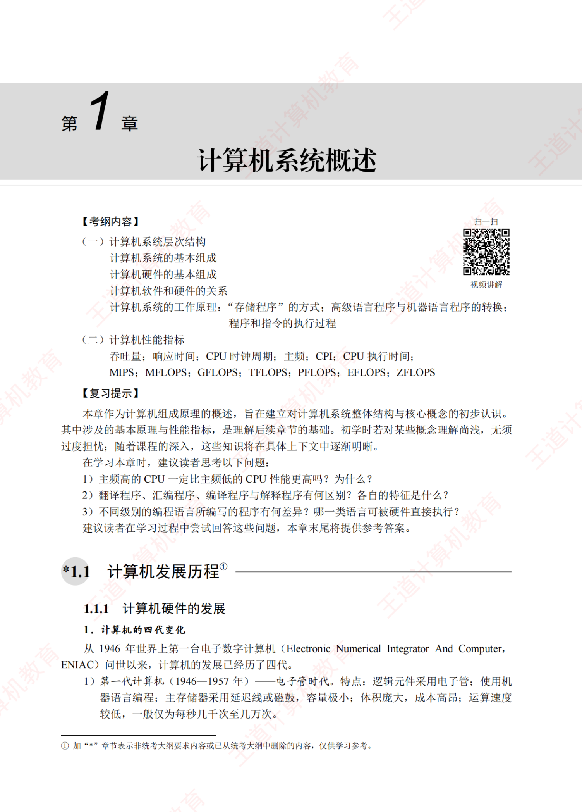
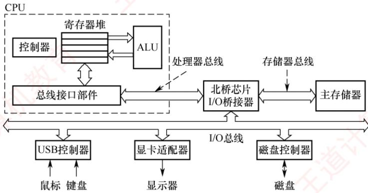
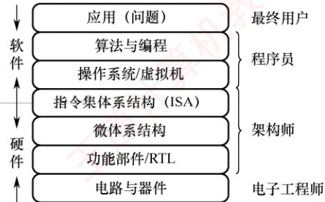
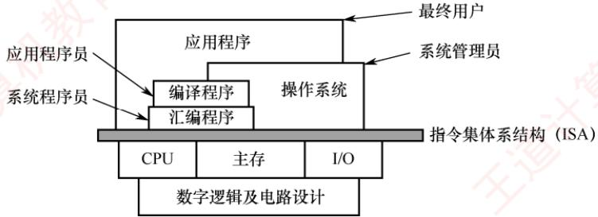
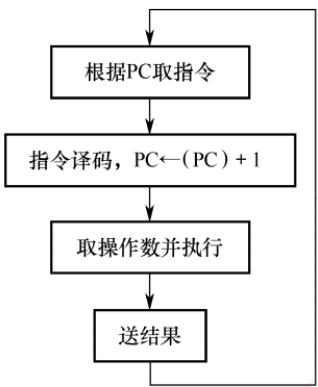
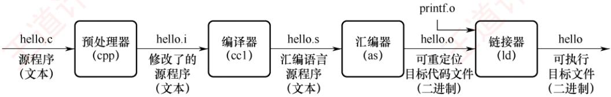

<!-- DIRECTED-REPAIR-FALLBACK:FALLBACK-CO-CH1-P13-OMITTED-CHAPTER-OPENING -->
> [!WARNING]
> 原 PDF 第 13 页回退：分章从 1.1.1 页中段起切，章名、考纲、复习提示及 1.1 层标题漏失，无法从现有 Markdown 完整恢复。

## 1.1.1 计算机硬件的发展

## 1. 计算机的四代变化

从 1946 年世界上第一台电子数字计算机（Electronic Numerical Integrator And Computer，ENIAC）问世以来，计算机的发展已经历了四代。

1）第一代计算机（1946—1957年）—电子管时代。特点：逻辑元件采用电子管；使用机器语言编程；主存储器采用延迟线或磁鼓，容量极小；体积庞大，成本高昂；运算速度较低，一般仅为每秒几千次至几万次。

2）第二代计算机（1958—1964年）—晶体管时代。特点：逻辑元件采用晶体管；运算速度提升至每秒几万次至几十万次；主存储器使用磁芯存储器；计算机软件开始发展，出现了高级语言及其编译程序，并形成了操作系统的雏形。

3）第三代计算机（1965—1971年）—中小规模集成电路时代。特点：逻辑元件采用中小规模集成电路；半导体存储器逐步取代磁芯存储器；高级语言迅速普及，操作系统进一步成熟，出现了分时操作系统。

4）第四代计算机（1972年至今）超大规模集成电路时代。特点：逻辑元件采用大规模和超大规模集成电路，微处理器由此诞生；并行处理、流水线、高速缓存和虚拟存储器等关键技术被广泛应用于该代计算机。

## 2. 计算机元件的更新换代

1）摩尔定律。在价格不变的前提下，集成电路上可容纳的晶体管数量约每18个月翻一番，从而推动性能显著提升。这意味着，18个月后以相同价格购买的处理器，其理论性能潜力约为当前产品的两倍。这一定律深刻揭示了信息技术的快速发展节奏。

2）半导体存储器的发展。1970年，美国仙童半导体公司研制出首个较大容量的半导体存储器。此后，单芯片存储容量从1KB、4KB、16KB、64KB、256KB，逐步发展到1MB、4MB、16MB、64MB、256MB、1GB，并已进入TB级别。

3）微处理器的发展。自1971年Intel公司推出首款微处理器Intel4004以来，微处理器不断演进，包括Intel 8008（8位）、Intel 8086（16位）、Pentium（32位）、Core i7（64位）等。其中，32位、64位指的是机器字长（简称字长），即CPU通用寄存器的宽度，它决定了单次整数运算可以处理的数据位数以及可直接寻址的内存空间大小。

## 1.1.2 计算机软件的发展

计算机软件技术的蓬勃发展，为计算机系统的发展做出了重要贡献。

计算机语言的演进经历了面向机器的机器语言和汇编语言，逐步发展到更接近人类表达方式的高级语言。高级语言极大地推动了软件产业的进步，其中包括用于科学与工程计算的FORTRAN，支持结构化程序设计的Pascal，面向对象的C++，以及具有跨平台特性的Java等。

与此同时，各类系统软件也取得了长足进展，对计算机系统的功能完善与高效运行起到了关键作用，其中尤以操作系统为代表，如Windows、UNIX、Linux等。

## 1.2 计算机系统层次结构

## 1.2.1 计算机系统的组成

一个完整的计算机系统由硬件与软件组成。硬件指有形的物理装置，即计算机系统中的各类物理部件；软件则是在硬件上运行的程序及其相关的数据与文档。

计算机系统的实际性能，在很大程度上取决于软件对硬件资源的利用效率，而该效率的实现依赖于硬件所提供的能力。因此，计算机系统设计必须合理划分软硬件的功能边界。一般而言，对于使用频繁且硬件实现成本较低的功能，宜由硬件实现，以显著提升整体效率。

## 1.2.2 计算机硬件

## 1. 冯·诺依曼机的基本思想

## 考点追踪冯·诺依曼机的特点（2019）

冯·诺依曼在研究EDVAC机时首次提出了“存储程序”的思想，奠定了现代计算机的基本结构。基于这一思想的计算机统称为冯·诺依曼机，其主要特点如下：

1）采用“存储程序”的工作方式：将编制好的程序和初始数据预先存入主存储器，计算机启动后能自动、连续地取指并执行，直至程序结束，无须人工干预。 XTIT

2）硬件系统由运算器、控制器、存储器、输入设备和输出设备五大部件组成。

3）指令和数据在存储器中以相同形式存放，仅凭内容无法区分，但计算机应能识别它们。

4）指令和数据均采用二进制编码表示。

5）指令由操作码和地址码组成，其中操作码指明操作类型，地址码指出操作数的地址。

## 2. 计算机的功能部件

现代计算机将运算器、控制器和各类寄存器高度集成，形成一块称为中央处理器（CentralProcessingUnit，CPU）的芯片。完整的计算机硬件系统主要包含以下部件：中央处理器、存储器、输入/输出控制器、外部设备，以及用于协调这些部件协同工作的总线。

## （1）中央处理器

中央处理器（CPU）是计算机系统中负责指令执行的核心部件。其传统基本组成部分为运算器和控制器；在现代处理器架构中，这两部分被系统地组织为数据通路与控制单元。

数据通路是执行实际运算的硬件通路，其核心包括算术逻辑单元（ALU）和通用寄存器组。ALU负责完成所有算术与逻辑运算：通用寄存器组则为ALU提供操作数并暂存运算结果，是实现高速数据访问的关键。此外，数据通路还包含多路选择器、内部互连通路等组件，用于在各个部件间高效传送数据。控制单元负责协调整个CPU的工作。它从存储器中取出指令并译码，随后根据指令语义生成一系列精确的控制信号，指挥数据通路中的各部件（例如，选择源寄存器、配置ALU功能、启动运算并在正确时序下完成结果写回），从而确保指令有序、高效地执行。

## (2) 存储器

按访问特性，存储器通常分为内存与外存。现代内存由主存和高速缓存（Cache）组成；但由于Cache是后期引入的，传统上“内存”仅指主存。在冯·诺依曼结构中，主存作为核心的工作存储器，用于存放待执行的程序和数据。外存则包括两类：一是可与主存交换数据的磁盘、固态硬盘等，二是用于长期备份的海量存储设备（如磁带、光盘等）。

## （3）外部设备和设备控制器

外部设备简称外设，也称I/O设备（I/O是Input/Output的缩写）。外设通常由物理功能部件（如打印头、鼠标滚轮或按键等）和设备控制器组成，二者在功能或物理实现上往往相互分离：前者负责实际的输入/输出操作，后者则负责与主机通信并控制前者的工作。

外设通过设备控制器连接到主机上，各种设备控制器统称I/O控制器或I/O接口。例如，键盘接口、显示控制器（简称显卡）、网络控制器（简称网卡）等都是设备控制器。

## (4)总线

总线是计算机中用于在各个部件之间传输信息的公共通路。CPU、主存和I/O接口通过总线互连；其中，CPU和I/O接口内部均包含寄存器，部分还集成了高速缓存。

图1.1展示了一个典型的多总线计算机硬件系统。CPU作为核心，内含控制器、ALU、寄存器堆和总线接口部件。CPU通过处理器总线，并经由I/O桥接器与主存和I/O设备通信：主存通过存储器总线，并经由I/O桥接器与CPU和I/O设备相连：各类I/O设备则通过其控制器(如USB控制器、显示适配器）接入I/O总线。按功能划分，ALU属于数据处理部件，负责对寄存器中的数据进行运算；主存和磁盘属于存储部件，分别承担临时存储与长期存储任务；而所有总线、桥接器、接口及控制器共同构成系统的互连结构，负责全系统的数据传输与协调。

  
图1.1 一个典型的多总线计算机硬件系统

## 1.2.3 计算机软件

## 1. 系统软件和应用软件

软件按其功能可分为系统软件和应用软件。

系统软件是一组保障计算机系统高效、正确运行的基础软件，用干管理和调度系统资源，为用户及应用程序提供基础服务。典型的系统软件包括：操作系统(OS）、数据库管理系统(DBMS)、语言处理程序、网络与分布式软件系统、标准库程序、服务性程序等。

应用软件是指用户为解决特定应用领域问题而开发的程序，例如科学计算、工程设计、数据统计与信息处理等领域的专用软件。

## 2. 软件和硬件的逻辑功能等价性

在计算机中，最基本的操作（如算术与逻辑运算）通常由硬件直接实现，而更复杂的功能则可由软件完成。对于某一特定功能，既可采用硬件实现，又可通过软件实现：从用户视角看，在相同规范下，二者在逻辑功能上是等价的。这一性质称为软/硬件逻辑功能的等价性。例如，浮点运算既可由专用浮点运算器硬件实现，又可通过软件子程序模拟；在相同输入和数值规范（如IEEE754）下，二者产生一致的数值结果，但硬件实现的效率通常远高于软件。

软/硬件逻辑功能的等价性是计算机系统设计的重要依据。如何合理划分软/硬件的功能边界，是计算机体系结构研究的核心问题之一。在系统设计过程中，必须综合考虑设计目标、成本效益与技术可行性等因素，明确哪些功能由硬件承担，哪些功能由软件实现。

## 1.2.4 计算机系统的层次结构

如图1.2所示，计算机系统采用多级层次结构，通过逐层抽象隔离复杂的硬件实现与高层应用需求。从用户的应用问题到物理器件，每层都向上提供简洁的接口，向下依赖更底层的功能实现。这种分层设计不仅明确了软/硬件的职责边界，还使系统开发和维护得以并行高效进行。 X

  
图1.2 计算机系统的层次结构示意图

## 1. 算法和编程

解决应用问题需要先将其抽象为一个正确的算法描述。随后，程序员将该算法用编程语言编写成程序。与自然语言不同，编程语言语法严谨、无二义性，能够精确描述计算机的执行顺序。

## （1）编程语言

编程语言可分为高级语言与低级语言。高级语言独立于计算机底层硬件结构，是主流软件开发语言；低级语言则紧密依赖机器结构，特指机器语言及其符号化形式——汇编语言。

## 考点追踪三种编程语言的特点（2015、2024）

1）机器语言。又称二进制代码语言，由0和1组成的指令序列构成。程序员需要熟记每条指令的二进制编码。它是计算机唯一能直接识别和执行的语言。

2）汇编语言。采用英文助记符（如mov、add）或其缩写代替二进制指令，显著提升了可读性与记忆性。但汇编程序不能被硬件直接执行，必须通过一个称为汇编程序的系统软件的翻译，将其转换为机器语言程序后，才能在计算机上运行。

3）高级语言。如C、C++、Java等，允许程序员以接近自然语言的方式描述问题求解过程，极大提高了开发效率。高级语言程序通常需经编译程序处理：或先编译为汇编语言，再经汇编生成机器语言；或直接编译为目标机器的机器语言程序。

## (2) 翻译程序

## 考点追踪各种翻译程序的概念（2016）

高级语言源程序必须转换为机器语言程序才能被计算机直接执行，用于完成该转换的系统软件称为翻译程序，转换后生成的程序称为目标程序。翻译程序主要分为以下三类：

1）汇编程序（汇编器）：将汇编语言源程序翻译为机器语言目标程序。

2）解释程序（解释器）：逐条翻译并立即执行高级语言源程序语句，不生成独立的目标程序。

3）编译程序（编译器）：将高级语言源程序一次性翻译为汇编语言或机器语言目标程序。

## 2. 操作系统

所有的语言处理系统都必须在操作系统提供的运行环境中执行；操作系统通过对计算机硬件及其底层结构的抽象，构建出一台可供程序员使用的虚拟机。

## 3. 指令集体系结构

指令集体系结构（Instruction SetArchitecture，ISA）是计算机软/硬件之间的关键接口，它从程序员和编译器的视角，完整地定义了软件可直接使用的硬件功能。主要包括：指令格式、操作类型、寻址方式，以及可访问的寄存器等硬件资源。

因此，ISA构成了软件所能“感知”到的计算机功能视图，也被称为软件可见部分。我们编写的机器语言程序，本质上就是一串严格遵循该ISA规范的指令序列；而硬件执行程序的过程，就是逐条解释并完成这些指令所规定操作的过程。

## 4. 微体系结构

微体系结构（又称微架构）是处理器内部的硬件组织方式，用于实现ISA定义的功能。如果说ISA定义了“做什么”，那么微架构则决定了“怎么做”。其核心设计包括数据通路组织、控制单元实现、流水线级数、缓存层次结构以及分支预测机制等。

例如，加法操作可能通过串行进位加法器、超前进位加法器，甚至专用的SIMD单元来实现，这些都属于微体系结构的范畴。相同的ISA可对应多种不同的微构架。以Intelx86为例，不同代际的处理器（如Core、Skylake、AlderLake）均遵循同一套ISA规范，但内部组织方式差异显著，体现了微架构的多样性与演进性。 XIT

## 1.2.5 计算机系统的不同用户

根据用户使用计算机完成任务的性质，可将用户划分为以下四类角色。

最终用户：直接操作应用程序完成特定任务的人员，如使用办公软件、浏览网页等的人员。他们通过操作系统提供的界面与计算机交互，无须了解底层技术细节。

系统管理员：负责配置、管理和维护计算机系统，确保其稳定高效运行的人员。主要职责包括安装软/硬件、管理用户账户、数据备份与系统升级等。

应用程序员：使用高级语言开发应用软件，以满足最终用户在办公、娱乐等领域的特定需求的人员。 XTA

系统程序员：设计并开发操作系统、编译器、数据库管理系统等核心系统软件的人员。

在实际使用中，同一用户可能在不同场景下承担多种角色。例如，一名计算机专业的学生：网上购物时是最终用户，管理磁盘、备份数据时是系统管理员，编写应用程序作业时是应用程序员，而参与操作系统开发时则是系统程序员。计算机系统采用层次化结构构建，不同用户正是依据其角色，工作在系统相应的抽象层级上的。

如图1.3所示，指令集体系结构（ISA）位于计算机软/硬件的交界处，是硬件功能的集中体现，也是软件执行的基础。ISA以下为硬件层，包括CPU、主存和I/O设备等物理组件；ISA以上为软件层，涵盖系统软件与应用软件。不同用户工作在以ISA为基础逐层构建的抽象层次上。 XTA XT

  
图1.3 计算机系统的层次与各层用户

系统程序员工作在机器语言层面，直接面向ISA；系统管理员工作在操作系统层面；应用程序员（高级语言程序员）工作在高级语言层面：最终用户则通过应用程序完成任务，处于最上层。在计算机系统中，下层机器的结构特性对上层用户通常是“透明”的。例如，ISA之下的硬件实现细节对高级语言程序员是透明的，他们无须了解底层机制即可进行开发。

## 1.2.6 计算机系统的工作原理

## 1. “存储程序”工作方式

“存储程序”工作方式规定：在程序执行前，需将其包含的指令和数据预先加载到主存储器中；一旦启动，计算机便无须人工于预，自动逐条取出并执行指令。如图1.4所示，程序的执行是一个周而复始的指令执行过程。每条指令的执行通常包括以下步骤：从主存储器中取指令（地址由程序计数器PC提供）、对指令译码、取操作数、执行操作，并将结果写回存储器。

  
图1.4 程序执行过程

程序开始执行前，先将第一条指令的地址存入程序计数器（PC）。取指令时，CPU使用PC的内容作为地址访问主存储器。在每条指令执行的最后阶段，系统根据指令类型更新PC：

● 若为顺序指令，则下一条指令地址为当前PC值加上指令长度；

● 若为跳转指令，则下一条指令地址为指令中指定的目标地址。

随后，CPU根据更新后的PC从主存储器中取出下一条待执行的指令，从而实现指令流的自动连续执行。

## 2. 从源程序到可执行文件

## 考点追踪翻译过程的四个阶段（2022）

在计算机中编写的C语言程序，必须经过编译与链接过程，转换为一系列低级机器指令，并按特定格式封装为可执行目标文件，最终以二进制形式存储于磁盘。以UNIX系统中的GCC编译器为例，给定源程序文件hello.c，系统通过四个阶段生成可执行文件hello，如图1.5所示。

  
图1.5 源程序转换为可执行文件的过程

1）预处理阶段：预处理器（cpp）处理源文件中以#开头的预处理指令，如将#include<stdio.h>替换为对应头文件的完整内容，生成预处理后的C文件hello.i。

2）编译阶段：编译器（cc1）将hello.i翻译为汇编程序hello.s，其中每条语句以文本形式描述一条低级机器指令。

3）汇编阶段：汇编器（as）将hello.s转换为机器语言指令，生成可重定位目标文件hello.o。

该文件为二进制格式，包含代码、数据及符号信息。

4）链接阶段：链接器（1d）将hello.o与标准C库中所需的函数（例如printf）进行链接，解析外部符号引用，最终生成完整的可执行文件hello，并保存至磁盘。

## 3. 指令执行过程的简要描述

可执行文件中的代码段由一条条机器指令构成。每条指令是一串二进制编码，用于指示CPU完成一个特定的基本操作。指令的执行可被建模为经典的“取指一译码一执行”三阶段循环。掌握这一抽象模型，对于理解软件如何驱动硬件至关重要。读者可能会自然地追问：“这个循环在硬件上究竟是如何一步步实现的？”这正是“计算机组成原理”课程要回答的核心问题之一。为保障初学阶段概念的清晰性，避免过早陷入复杂的硬件细节，控制器的工作原理、数据通路的结构、时序信号的控制等具体实现技术，已系统性地安排在第5章“中央处理器”中。届时，我们将基于前述抽象模型，深入硬件内部，揭示其底层工作原理。

## 1.2.7 本节习题精选

## 单项选择题

01. 完整的计算机系统应包括（）。A. 运算器、存储器、控制器 B. 外部设备和主机C. 主机和应用程序 D. 配套的硬件设备和软件系统

02. 冯·诺依曼机的基本工作方式是（）。A. 控制流驱动方式 B. 多指令多数据流方式C. 微程序控制方式 D. 数据流驱动方式

03. 冯．诺依曼机工作方式的基本特点是（）。A. 程序一边被输入计算机一边被执行B. 程序直接从磁盘读到CPU执行C. 按地址访问指令并自动按序执行程序D. 程序自动执行而数据手工输入

04.以下关于计算机各部件功能的叙述中，错误的是（）。A. 运算器（ALU）仅用来完成算术运算B. 存储器用来存放指令和数据C. 控制器负责指挥和协调计算机各部件D.输入/输出设备用来完成用户和计算机之间的信息交换

05.计算机系统采用层次化结构，从最上层的应用程序到最底层的硬件，其典型层次自上而下依次为（）。A. 高级语言虚拟机→操作系统虚拟机→汇编语言虚拟机→机器语言机器B. 高级语言虚拟机→汇编语言虚拟机→机器语言机器→操作系统虚拟机C. 高级语言虚拟机→汇编语言虚拟机→操作系统虚拟机→机器语言机器D. 操作系统虚拟机→高级语言虚拟机→汇编语言虚拟机→机器语言机器

06.下列关于计算机系统层次结构的说法中，正确的是（）。A. 高级语言程序经编译生成汇编语言后，可直接在机器上执行B. ISA仅定义指令功能，不涉及硬件实现细节C. 同一ISA可由不同微体系结构实现，软件无须修改即可兼容

D. 高级语言中的每条语句与 ISA 的机器指令一一对应

07.关于编译程序和解释程序，下列说法中错误的是（）。A. 编译程序和解释程序的作用都是将高级语言程序转换为机器语言程序B. 编译程序编译时间较长，运行速度较快C. 解释程序方法较简单，运行速度也较快D. 解释程序将源程序翻译成机器语言，并且翻译一条以后，立即执行这条语句

08. 只有当程序执行时才将源程序翻译成机器语言，并且一次只能翻译一行语句，边翻译边执行的是（）程序，把汇编语言源程序转换为机器语言程序的过程是（）。I. 编译 II. 目标 III. 汇编 IV. 解释 A. I、II B. IV、II C. IV、I D. IV、III

09.下列关于各种级别语言的描述中，错误的是（）。A. 可用高级语言和低级语言编写出功能等价的程序 首计算B. 低级语言的执行效率一般情况下高于高级语言C.机器语言源程序可在机器上直接执行，而高级语言和汇编语言源程序不可以D. 汇编语言与机器结构无关

10.下列关于机器指令和汇编指令的叙述中，错误的是（）。A. 可以直接用机器语言（机器指令）编写程序B. 汇编指令和机器指令都能被计算机直接执行C. 汇编语言和机器语言都与计算机系统结构相关D. 汇编指令和机器指令一一对应，功能相同

11.【2015统考真题】计算机硬件能够直接执行的是（）。I. 机器语言程序 Ⅱ. 汇编语言程序 Ⅲ. 硬件描述语言程序A. 仅I B. 仅I、Ⅱ C. 仅I、III D. I、ⅡI、ⅢII

12.【2016统考真题】将高级语言源程序转换为机器级目标代码文件的程序是（）。A. 汇编程序 B. 链接程序 C. 编译程序 D. 解释程序

13.【2019统考真题】下列关于冯·诺依曼机基本思想的叙述中，错误的是（）。A. 程序的功能都通过中央处理器执行指令实现B. 指令和数据都用二进制数表示，形式上无差别C. 指令按地址访问，数据都在指令中直接给出 +算机教D. 程序执行前，指令和数据需预先存放在存储器中

14.【2022统考真题】将高级语言源程序转换为可执行目标文件的主要过程是（）。A. 预处理→编译→汇编→链接 B. 预处理→汇编→编译→链接H C. 预处理→编译→链接→汇编 D. 预处理→汇编→链接→编译

## 1.2.8 答案与解析

## 单项选择题

01. D

选项A是计算机主机的组成部分，而选项B、C只涉及计算机系统的部分内容，都不完整。02. A

冯·诺依曼机的基本工作方式是控制流驱动方式，也就是按照指令的执行序列，依次读取指令，然后根据指令所含的控制信息，调用数据信息进行处理。因此，在执行程序的过程中，始终

以控制流为驱动工作的因素，而数据流则是被动地被调用处理。

## 03. C

冯·诺依曼机的核心特征包括“存储程序”、程序和数据统一存储、按地址访问，以及指令的自动顺序执行。其基本工作方式是：程序以二进制形式预先存入主存储器，CPU依据程序计数器（PC）提供的地址逐条取出指令，并自动按序执行，无须人工干预。

## 04. A

运算器（ALU）不仅负责算术运算，还承担逻辑运算（如与、或、非、移位等），因此选项A限定为“算术运算”是片面的，表述错误。选项B、C和D的描述明显正确。 XTA

## 05. C

计算机系统通常被抽象为多层虚拟机结构。用户程序以高级语言编写，在高级语言虚拟机上运行；经编译后生成汇编代码，在汇编语言虚拟机上抽象执行；但实际指令需要由操作系统加载、调度并管理资源，因此操作系统构成操作系统虚拟机层；最终，所有操作由机器语言机器执行。该层次自上而下为“高级语言虚拟机→汇编语言虚拟机→操作系统虚拟机→机器语言机器”

## 06. C

汇编语言仍需汇编为机器码才能执行。ISA是软/硬件的抽象接口，定义了软件可见的处理器行为（如指令、寄存器、寻址方式等），而非仅描述功能。同一ISA可由不同微体系结构（如流水线、缓存设计等）实现，软件无须修改即可兼容，选项C正确。高级语言高度抽象，与机器指令无直接对应关系，仅汇编语言与ISA指令基本一一对应。

## 07. C

编译程序是先完整编译后运行的程序，如C、C++等；解释程序是逐句翻译且边翻译边执行的程序，如JavaScript、Python等。解释程序要边翻译成机器语言边执行，因此一般速度较编译程序慢。为增加对该过程的理解，附C语言编译链接的过程：

$$
 源程序  (\text{. c}) \xrightarrow{\quad  C  编译器  \quad}  汇编语言源程序  \xrightarrow{\quad  正编程序  \quad}  可重定位目标文件  \xrightarrow{\quad  链接程序  \quad}  可执行文件
$$

解释程序的特点是翻译一句执行一句，边翻译边执行；由高级语言转化为汇编语言的过程称为编译，把汇编语言源程序翻译成机器语言程序的过程称为汇编。 灿育

## 09. D

在不同的设备中，汇编语言对应着不同的机器语言指令集，通过汇编程序转换为机器指令。特定的汇编语言与特定的机器语言指令集是一一对应的，不同平台之间不可直接移植。

## 10. B

计算机只能直接执行机器指令，而汇编指令需要通过汇编程序转换为机器指令才能被计算机直接执行。

## 11. A

硬件能直接执行的只能是机器语言（二进制编码），汇编语言是增强机器语言的可读性和记忆性的语言，经过汇编后才能被执行。

## 12. C

翻译程序是指把高级语言源程序转换为机器语言程序的软件。翻译程序有两种：一种是编译程序，它将源程序一次全部翻译成目标程序，并且会生成目标代码文件。另一种是解释程序，它将源程序的一条语句翻译成对应的机器目标代码，并立即执行，翻译一句执行一句，并且不会生成目标代码文件。汇编程序也是一种翻译程序，它把汇编语言源程序翻译为机器语言程序。

## 13. C

冯·诺依曼机的功能部件包括输入设备、输出设备、存储器、运算器和控制器，程序的功能都通过中央处理器（运算器和控制器）执行指令，选项A正确。指令和数据以同等地位存放于存储器内，形式上无差别，只在程序执行时具有不同的含义，选项B正确。指令按地址访问，数据由指令的地址码指出，除立即寻址外，数据均存放在存储器内，选项C错误。在程序执行前，指令和数据需预先存放在存储器中，中央处理器可以从存储器存取代码，选项D正确。

## 14. A

将源程序转换为可执行目标文件的过程分为预处理、编译、汇编、链接四个阶段。

## 1.3 计算机的性能指标

## 1.3.1 计算机的主要性能指标

## 1. 运算速度

考点追踪提高系统性能的综合措施（2010）

（1）吞吐量和响应时间

● 吞吐量。指系统在单位时间内处理请求的数量。它受多个环节影响，包括信息输入内存的速度、CPU取指令的速度、数据在内存中读写的速率，以及结果输出到外部设备的效率。由于主存储器在这些环节中扮演关键角色，其存取性能对系统吞吐量有显著影响。

● 响应时间。指从用户发出请求到系统返回所需结果的总等待时间，通常包括CPU时间（程序实际运行时间）和等待时间（如磁盘访问、内存访问、I/O操作等所花费的时间）。

（2）主频和CPU 时钟周期

## 考点追踪时钟脉冲信号和时钟周期的相关概念（2019）

· CPU时钟周期。机器内部主时钟脉冲的宽度，是CPU工作的最小时间单位。

时钟脉冲由机器脉冲源产生，经整形和分频后形成。

时钟周期通常以相邻状态单元间组合逻辑电路的最大延迟时间为基准确定：在流水线结构中，则以指令流水线的每个流水段的最大延迟时间为准。

考点追踪主频和时钟周期的转换计算（2013）

●主频（CPU时钟频率）。机器内部主时钟的频率，即时钟周期的倒数，是衡量处理器速度的重要参数。对于同一个型号的计算机，主频越高，执行指令的每个步骤所需时间越短，

## 注意

CPU时钟周期=1/主频。主频单位为赫兹（Hz），如10Hz表示每秒10个时钟周期。

## （3）CPI（Cycles Per Instruction），执行一条指令所需的时钟周期数

考点追踪IPS的相关计算（2023）

不同指令所需的时钟周期数可能不同，因此对于一个程序或一台机器来说，其CPI是指该程序或该机器指令集中的所有指令执行所需的平均时钟周期数，即平均CPI。

•IPS（Instructions Per Second），即每秒执行多少条指令，IPS = 主频/平均 CPI。

（4）CPU执行时间，运行一个程序所花费的时间

$$
 【基西面题】卜  $\mathsf { C P U }$  执行时间的相关计算  $( 2 0 1 2  、  2 0 1 3  、  2 0 1 4  、  2 0 1 7  、  2 0 2 2  、  2 0 2 3 )$
$$

$$
 CPU执行时间  =  CPU时钟周期数/主频  = (指令条数 \times  CPI) \div  主频
$$

上式表明，CPU性能（以执行时间衡量）取决于三个要素：指令条数、CPI和主频，三者之间存在制约关系。例如，采用更复杂的指令集（如CISC）可能会减少程序所需的指令条数，但往往会导致CPU控制逻辑更复杂，从而延长时钟周期，限制主频的提升；反之，精简指令集（如RISC)虽然可能会增加程序所需的指令条数，但有助于缩短时钟周期、提高主频。 XOT

【例1.1】假定计算机M1和M2具有相同的指令集体系结构，M1的主频为2GHz，程序P在M1 上的运行时间为10s。M2采用新技术可使主频大幅提升，但其平均CPI也增加到M1的1.5倍。则M2的主频至少需提升到多少，才能使程序P在M2上的运行时间缩短为6s?

解：

程序P在M1上的时钟周期数= 指令条数×平均 $\mathrm{CPI} = \mathrm{CPU}$ 执行时间×主频 $10\mathrm{s} \times 2\mathrm{GHz} = 2 \times 10^{10}$

M2 的平均 CPI 为 M1 的 1.5 倍，因此程序 P 在 M2 上的时钟周期数 $1.5 \times 2 \times 10^{10} = 3 \times 10^{10}$

要使程序P在M2上的运行时间缩短至6s，则M2所需的主频至少为

$$
 程序P在M2上的时钟周期数 \div CPU 执行时间 =3\times10^{10}\div6s=5 GHz
$$

由此可见，M2的主频是M1的2.5倍，但其实际性能仅提升至M1的1.67倍。

（5）MIPS（Million Instructions Per Second），每秒执行多少百万条指令

考点追踪MIPS相关的计算（2012、2013）

$$
MIPS =  指令条数  \div ( CPU执行时间  \times 10^6 ) =  主频  \div ( CPI  \times 10^6 )。
$$

MIPS用于不同机器间的性能比较存在明显缺陷：不同机器的指令集架构各异，指令的功能强度往往不等。例如，M1中一条指令完成的操作在M2上可能需多条指令实现；同时，各机器的CPI与时钟周期也不同，导致同一条指令的实际执行时间差异显著。

（6）FLOPS（Floating-point Operations Per Second），每秒执行的浮点运算次数

考点追踪浮点运算指标的概念（2011、2021）

•MFLOPS（Million FLOPS）：百万 $(   1 0 ^ { 6 }   )$ 次浮点运算/秒。

• GFLOPS （Giga FLOPS） ：十亿 $( 1 0 ^ { 9 } )$ 次浮点运算/秒。

• TFLOPS （Tera FLOPS）：万亿 $( 1 0 ^ { 1 2 } )$ 次浮点运算/秒。

●PFLOPS（Peta FLOPS）：千万亿 $(   1 0 ^ { 1 5 }   )$ 次浮点运算/秒。

•EFLOPS（Exa FLOPS）：百亿亿 $(   1 0 ^ { 1 8 }   )$ 次浮点运算/秒。

●ZFLOPS（Zetta FLOPS）：十万亿亿 $(   1 0 ^ { 2 1 }   )$ 次浮点运算/秒。

## 注意

在描述存储容量、文件大小等时，K、M、G、T通常基于2的幂次 $(如   1Kb = 2^{10}b)$ ；而在描述速率、频率等时，k、M、G、T通常基于10的幂次 $(如 1 \mathrm{kb/s} = 10^3 \mathrm{b/s})$ 习惯上，前者用大写K，后者用小写k，但其他前缀（M、G等）均为大写，具体含义需结合上下文判断。

## 2. 基准程序

基准程序（Benchmarks）是一组专门用于性能评测的典型程序，旨在模拟真实应用场景下的负载，从而较为准确地反映系统在实际使用中的运行效率。通过在不同机器上运行相同的基准程

序，并比较其执行时间，可以客观地评估和对比各系统的性能。

基准程序测评的局限性：其性能常依赖于某些关键代码片段。硬件或编译器开发者可能对此进行针对性优化，使这些片段执行极快，却无法代表系统处理一般负载的能力，导致评测结果失真。因此，应结合具体应用领域选择合适的基准程序，并辅以多种评测手段综合判断。

## 1.3.2 本节习题精选

## 一、单项选择题

01.关于CPU主频、CPI、MIPS、MFLOPS，说法正确的是（）。 育A. CPU 主频是指CPU执行指令的频率，CPI是执行一条指令平均使用的频率B. CPI 是执行一条指令平均使用 CPU 时钟的个数，MIPS 描述一条 CPU 指令平均使用的 CPU 时钟周期数 KC. MIPS是描述CPU执行指令的频率，MFLOPS 是计算机系统的浮点数指令D. CPU主频是CPU使用的时钟频率，CPI是执行一条指令平均使用的CPU时钟周期数

02.在用于科学计算的计算机中，标志系统性能的最有用的参数是（）。A. 主时钟频率 B. 主存容量 C. MFLOPS D. MIPS

03. 在计算机 M1 和计算机 M2 上分别运行功能完全相同的高级语言程序，程序在 M1 和A. M1 和 M2 执行速度相等B. M1 和 M2 中主频高的计算机执行速度快C. M1 和 M2 中主频低的计算机执行速度快D. 无法确定哪台机器的执行速度快

04. 计算机中，CPU的CPI与下列（）因素无关。A. 时钟频率 B. 系统结构 C. 指令集 D. 计算机组织

05. 某基准程序在机器A上运行的时间是20s，而在机器B上运行的时间是16s，那么相对来说，下列给出的结论中，（）是正确的。A. 所有程序在机器A 上都比在机器B上运行速度慢B. 机器 B 的速度是机器 A 的 1.25 倍C. 机器 A 的速度是机器 B 的 1.25 倍 筒机教育D. 机器 A 比机器 B 慢1.25 倍

06. 机器A的主频为 800MHz，某程序在机器A上运行需要12s。现在硬件设计人员想设计机器B，希望该程序在机器B上的运行时间能缩短为8s，使用新技术后可使机器B的主频大幅度提高，但在机器B上运行该程序所需的时钟周期数为在机器A上的1.5倍，则  
王机器B的主频至少应为（）。A. 800MHz B. 1.2GHz C. 1.5GHz D. 1.8GHz

07.下列可用于评价计算机系统性能的指标是（）。I. MIPS II. IPC III. CPI IV. 字长A. I、III B. I、III 和IV C. I、ⅡI和ⅢII D. 全部

08. 计算机的机器字长与下列（）指标最密切相关。A. 运算速度 B. 存取速度C. 内存容量 D. 运算精度

09. 假定编译器对高级语言的某条语句可以编译生成两种不同的指令序列，A、B和C三类指令的CPI和两种不同序列所含的三类指令条数如下表所示，两个指令序列都在时钟周期为2ns的机器上运行，则下列结论中正确的是（）。

<table><tr><td rowspan=1 colspan=1>指令类型</td><td rowspan=1 colspan=1>CPI</td><td rowspan=1 colspan=1>序列一的指令条数</td><td rowspan=1 colspan=1>序列二的指令条数</td></tr><tr><td rowspan=1 colspan=1>A</td><td rowspan=1 colspan=1>1</td><td rowspan=1 colspan=1>1</td><td rowspan=1 colspan=1>2</td></tr><tr><td rowspan=1 colspan=1>B</td><td rowspan=1 colspan=1>2</td><td rowspan=1 colspan=1>1</td><td rowspan=1 colspan=1>1</td></tr><tr><td rowspan=1 colspan=1>C</td><td rowspan=1 colspan=1>3</td><td rowspan=1 colspan=1>4</td><td rowspan=1 colspan=1>2</td></tr></table>

A. 序列一的 MIPS 数比序列二多 50，序列一的执行速度比序列二快10nsB. 序列一的 MIPS 数比序列二多 50，序列二的执行速度比序列一快 10nsC. 序列二的MIPS 数比序列一多 50，序列一的执行速度比序列二快10nsD. 序列二的 MIPS 数比序列一多 50，序列二的执行速度比序列一快10ns

10. 用一台40MHz的CPU执行标准测试程序，共包含100条指令，它所包含的指令混合比和不同指令的CPI见下表。该段程序的平均CPI和程序的执行时间分别为（）。

<table><tr><td rowspan=1 colspan=1>指令类型</td><td rowspan=1 colspan=1>CPI</td><td rowspan=1 colspan=1>指令混合比</td><td rowspan=1 colspan=1>指令类型</td><td rowspan=1 colspan=1>CPI</td><td rowspan=1 colspan=1>指令混合比</td></tr><tr><td rowspan=1 colspan=1>算术和逻辑</td><td rowspan=1 colspan=1>1</td><td rowspan=1 colspan=1>60%</td><td rowspan=1 colspan=1>转移</td><td rowspan=1 colspan=1>4</td><td rowspan=1 colspan=1>12%</td></tr><tr><td rowspan=1 colspan=1>高速缓存命中的访存</td><td rowspan=1 colspan=1>2</td><td rowspan=1 colspan=1>18%</td><td rowspan=1 colspan=1>高速缓存失效的访存</td><td rowspan=1 colspan=1>8</td><td rowspan=1 colspan=1>10%</td></tr></table>

A. $2.26, 5.6 \times 10^{-8}    s$ B. $2.26, 5.6 \times 10^{-6}  s$   
C. $2.24, 5.6 \times 10^{-6}$ D. $2.24, \; 5.6 \times 10^{-8}    s$

11. 下列给出了改善计算机性能的4种措施：I. 用更快的处理器来替换原来的慢速处理器 育Ⅱ. 增加同类处理器个数，使得不同的处理器同时执行程序Ⅲ.优化编译生成的代码，使得程序执行的总时钟周期数减少IV. 减少指令执行过程中的访存时间对于某个特定的程序，在以上措施中，能缩短其执行时间的措施是（）。A. I、ⅡI和III B. I、ⅡI和IV C. I、ⅢII和IV D. 全部

12.【2010统考真题】下列选项中，能缩短程序执行时间的措施是（）。I. 提高 CPU 时钟频率 I. 优化数据通路结构 Ⅲ. 对程序进行编译优化A. 仅I和Ⅱ B. 仅I和Ⅲ C. 仅Ⅱ和ⅢII D. I、II、ⅢII

13.【2011统考真题】下列选项中，描述浮点数操作速度指标的是（）。A. MIPS B. CPI C. IPC D. MFLOPS

14.【2012 统考真题】假定基准程序 A在某计算机上的运行时间为 100s，其中 90s为 CPU时间，其余为 I/O 时间。若 CPU速度提高 50%，I/O速度不变，则运行基准程序 A 所耗费的时间是（）。  
XA.55s B. 60s C. 65s D. 70s

15. 【2013统考真题】某计算机的主频为1.2GHz，其指令分为4类，它们在基准程序中所占比例及CPI如下表所示。

<table><tr><td rowspan=1 colspan=1>指令类型</td><td rowspan=1 colspan=1>所占比例</td><td rowspan=1 colspan=1>CPI</td><td rowspan=1 colspan=1>指令类型</td><td rowspan=1 colspan=1>所占比例</td><td rowspan=1 colspan=1>CPI</td></tr><tr><td rowspan=1 colspan=1>A</td><td rowspan=1 colspan=1>50%</td><td rowspan=1 colspan=1>2</td><td rowspan=1 colspan=1>C</td><td rowspan=1 colspan=1>10%</td><td rowspan=1 colspan=1>4</td></tr><tr><td rowspan=1 colspan=1>B</td><td rowspan=1 colspan=1>20%</td><td rowspan=1 colspan=1>3</td><td rowspan=1 colspan=1>D</td><td rowspan=1 colspan=1>20%</td><td rowspan=1 colspan=1>5</td></tr></table>

该机的 MIPS 数是（）。A. 100 B. 200 D. 600

16. 【2014统考真题】程序P在机器M上的执行时间是20s，编译优化后，P执行的指令数减少到原来的 70%，而 CPI增加到原来的1.2 倍，则P在 M 上的执行时间是（）。

A. 8.4s B. 11.7s C. 14s D. 16.8s

17.【2017统考真题】假定计算机M1和M2具有相同的指令集体系结构（ISA），主频分别为 1.5GHz和 1.2GHz。在 M1 和 M2 上运行某基准程序 P，平均 CPI 分别为 2 和 1，则程序 P 在 M1 和 M2 上运行时间的比值是（）。A. 0.4 B. 0.625 C. 1.6 D. 2.5

18.【2021统考真题】2017年公布的全球超级计算机TOP500排名中，我国“神威·太湖之光”超级计算机蝉联第一，其浮点运算速度为93.0146PFLOPS，说明该计算机每秒完成的浮点操作次数约为（）。A. $9 . 3   \times   1 0 ^ { 1 3 }$ 次B. $9 . 3   \times   1 0 ^ { 1 5 }$ 次 C. 9.3千万亿次 D. 9.3 亿亿次

19.【2022统考真题】某计算机主频为1GHz，程序P运行过程中，共执行了10000条指令，其中，80%的指令执行平均需1个时钟周期，20%的指令执行平均需10个时钟周期。程序P 的平均CPI和 CPU执行时间分别是（）。A. 2.8,28μs B. 28,28μs C. 2.8,28ms D. 28, 28ms

20. 【2023统考真题】若机器M的主频为1.5GHz，在M上执行程序P的指令条数为 $5   \times   1 0 ^ { 5 }$ P的平均 CPI 为1.2，则P在 M 上的指令执行速度和用户CPU 时间分别为（）。A. 0.8GIPS, 0.4ms B. 0.8GIPS, 0.4μs C. 1.25GIPS, 0.4ms D. 1.25GIPS, 0.4μs

## 二、综合应用题

01. 微机 A和B是采用不同主频的CPU芯片，片内逻辑电路完全相同。1）微机 A的 CPU 主频为 8MHz，微机 B 为12MHz，则微机 A 的 CPU 时钟周期为多少？2）微机A的平均指令执行速度为0.4MIPS，微机A的平均指令周期为多少？3）微机B的平均指令执行速度为多少？

02. 某台计算机只有LOAD/STORE指令能对存储器进行读/写操作，其他指令只对寄存器进行操作。根据程序跟踪试验结果，已知每条指令所占的比例及CPI数如下表所示。

<table><tr><td rowspan=1 colspan=1>指令类型</td><td rowspan=1 colspan=1>指令所占比例</td><td rowspan=1 colspan=1>CPI</td><td rowspan=1 colspan=1>指令类型</td><td rowspan=1 colspan=1>指令所占比例</td><td rowspan=1 colspan=1>CPI</td></tr><tr><td rowspan=1 colspan=1>算术逻辑指令</td><td rowspan=1 colspan=1>43%</td><td rowspan=1 colspan=1>1</td><td rowspan=1 colspan=1>STORE指令</td><td rowspan=1 colspan=1>12%</td><td rowspan=1 colspan=1>2</td></tr><tr><td rowspan=1 colspan=1>LOAD 指令</td><td rowspan=1 colspan=1>21%</td><td rowspan=1 colspan=1>2</td><td rowspan=1 colspan=1>转移指令</td><td rowspan=1 colspan=1>24%</td><td rowspan=1 colspan=1>2</td></tr></table>

求上述情况下的平均CPI。

假设程序由M条指令组成。算术逻辑运算中25%的指令的两个操作数中的一个已在寄存器中，另一个必须在算术逻辑指令执行前用LOAD指令从存储器中取到寄存器中。因此有人建议增加另一种算术逻辑指令，其特点是一个操作数取自寄存器，另一个操作数取自存储器，即寄存器-存储器类型，假设这种指令的CPI等于2。同时，转移指令的CPI变为 3。求新指令系统的平均CPI。

## 1.3.3 答案与解析

## 一、单项选择题

01. D

CPU 主频是指CPU使用的时钟频率，CPI 是执行一条指令平均使用的CPU时钟周期数。

02. C

MFLOPS是指每秒执行多少百万次浮点运算，该参数用来描述计算机的浮点运算性能，而用于科学计算的计算机主要评估浮点运算的性能。

## 03. D

CPU执行时间=指令条数×CPI×时钟周期，程序在M1 和M2上的平均 CPI相等，但影响CPU执行时间的因素还有指令条数和时钟周期，此外相同的高级语言程序在不同计算机上编译生成的机器指令条数可能不同，因此无法确定哪台机器执行该类程序的速度快。

## 04. A

CPI是执行一条指令所需的时钟周期数，系统结构、指令集、计算机组织都会影响CPI，而时钟频率并不会影响CPI，但可加快指令的执行速度。例如，执行一条指令需要10个时钟周期，则一台主频为1GHz的CPU，执行这条指令要比一台主频为100MHz的CPU快。

## 05. B

机器的速度与基准程序在该机器上的运行时间呈相反关系，因此可知：机器B的速度/机器A的速度 =基准程序在机器A上的运行时间/基准程序在机器B上的运行时间 $20\mathrm{s} \div 16\mathrm{s} = 1.25$ 因此，可以说，机器B的速度是机器A的1.25倍，或者机器A的速度是机器B的0.8倍。

## 06. D

该程序在机器A上需要的时钟周期数为 $12 \times 800\mathrm{M} = 9600\mathrm{M}$ ，因为在机器B上运行该程序需的时钟周期数为在机器A上的1.5倍，故在机器B上需要的时钟周期数为 $9600\mathrm{M} \times 1.5 = 14400\mathrm{M} =$ 14.4G，要求运行时间为8s，故机器B的时钟频率为 $14.4G \div 8 = 1.8GHz$ o

## 07. D

显然，MIPS、CPI、字长都是评价计算机系统性能的指标。IPC表示每个时钟周期运行多少条指令，它是CPI的倒数。

## 08. D

机器字长越长，数据的位数越多，定点数或浮点数所表示及运算的精度就越高，选项D正确。机器字长与运算速度的关系不大，机器字长与存取速度和内存容量基本没有关系。

## 09. D

MIPS = 主频 $( \mathrm { C P I } \times 1 0 ^ { 6 } )$ ，主频 = 1/时钟周期 $1/2\mathrm{ns}=500\mathrm{MHz},$ 序列一的 $\mathrm{CPI} = (1 \times 1 + 1 \times 2 + 4 \times 3) \div$ $6 = 15 \div 6 = 2.5$ ，序列二的 $\mathrm{CPI}=(2 \times 1+1 \times 2+2 \times 3) \div 5=10 \div 5=2$ ，故序列一的 $\mathrm{MIPS} = 500 \times 10^6 \div (2.5 \times 10^6) =$ 200，序列二的 $\mathrm{MIPS} = 500 \times 10^6 \div (2 \times 10^6) = 250$ 。CPU 执行时间 = 指令条数×CPI×时钟周期 = 程序的时钟周期数×时钟周期，序列一所需的时钟周期数是15，序列二所需的时钟周期数是10，所以序列一的执行时间为 $15 \times 2 \mathrm{ns} = 30 \mathrm{ns}$ ，序列二的执行时间为 $10 \times 2 \mathrm{ns} = 20 \mathrm{ns}$ 0

## 10. C

标准测试程序共包含4种指令，CPI是这4种指令的数学期望，平均 $CPI=1\times60\%+2\times18\%+$ $4 \times 12\% + 8 \times 10\% = 2.24$ 。程序的执行时间 $T = \mathrm{CPI} \times \mathrm{T} \mathrm{IC} \times \mathrm{I}$ ，其中T\_IC是一个时钟周期（它是主频f的倒数），I是指令条数，因此 $T = \mathrm{CPI} \times \mathrm{T}_{\mathrm{mIC}} \times I = \mathrm{CPI} \times (1/f) \times I = 5.6 \times 10^{-6} \mathrm{s}$

## 11. D

采用更快的处理器，可以减少单条指令的执行时间；增加处理器的个数，可以增加程序执行的并行性，缩短程序的执行时间；优化编译代码，可以减少指令之间的各种冲突；访存时间占指令执行的大部分时间，减少访存时间同样可以大大加快指令的执行时间。

## 12. D

CPU时钟频率（主频）越高，完成指令的一个执行步骤所用的时间就越短，执行指令的速度就越快，说法Ⅰ正确。数据通路的功能是实现CPU内部的运算器和寄存器及寄存器之间的数据交换，优化数据通路结构，可以有效提高计算机系统的吞吐量，从而加快程序的执行，说法Ⅱ正确。计算机程序需要先转化成机器指令序列才能最终得到执行，通过对程序进行编译优化可以得到更优的指令序列，从而使得程序的执行时间也越短，说法Ⅲ正确。

## 13. D

MIPS是每秒执行多少百万条指令，适用于衡量标量机的性能。CPI是平均每条指令的时钟周期数。IPC是CPI的倒数，即每个时钟周期执行的指令数。MFLOPS是每秒执行多少百万条浮点数运算，用来描述浮点数运算速度，适用于衡量向量机的性能。

## 14. D

程序 A 的运行时间为100s，减去 CPU 时间 90s，剩余10s 为I/O 时间。CPU提速 50%后运行基准程序A所耗费的时间是 $T = 90 \div 1.5 + 10 = 70 s$

## 误区

CPU速度提高50%，而误认为CPU时间减少一半，从而误选选项A。

## 15. C

基准程序的 $CPI = 2 \times 0.5 + 3 \times 0.2 + 4 \times 0.1 + 5 \times 0.2 = 3$ 。计算机的主频为1.2GHz，即1200MHz，因此该机器的 $\mathrm{MIPS} = 1200 \div 3 = 400$

## 16. D

假设原来的指令条数为x，则原CPI为20flx（f为CPU的时钟频率），经过编译优化后，指令条数减少到原来的70%，即指令条数为0.7x，而CPI增加到原来的1.2倍，即24flx，则现在程序P在机器M上的执行时间就为：(指令条数 $( \times  CPI  ) / f = (0.7x \times 24 \times f / x) / f = 24 \times 0.7 = 16.8 s$

## 17. C

运行时间 = 指令数×CPI/主频。M1 的时间 = 指令数×2/1.5，M2 的时间 = 指令数×1/1.2，两者之比为 $l ( 2 / 1 . 5 ) : ( 1 / 1 . 2 ) = 1 . 6$ 0

## 18. D

PFLOPS = 每秒千万亿 $( 1 0 ^ { 1 5 } )$ 次浮点运算。故 93.0146 PFLOPS ≈每秒 $9 . 3   \times   1 0 ^ { 1 6 }$ 次浮点运算，即每秒9.3亿亿次浮点运算。

## 19. A

CPI指平均每条指令的执行需要多少个时钟周期。80%的指令执行平均需要1个时钟周期，20%的指令执行平均需要10个时钟周期，因此 $\mathrm{CPI}=80\% \times 1+20\% \times 10=2.8$ 计算机主频为1GHz，程序P共执行10000条指令，平均每条指令需要2.8个时钟周期，因此，CPU执行时间=$(10000 \times 2.8) \div 10^{9} = 2.8 \times 10^{-5}  s  = 28 \mu  s$

## 20. C

程序P的指令条数为 $ 5 × 10 ^{5},$ ，平均CPI为1.2，程序P的总时钟周期数为 $5 \times 10^{5} \times 1.2 = 6 \times 10^{5}$ ，主频1.5GHz 说明1s 有 $1.5\mathrm{G}=1.5 \times 10^{9}$ 个时钟周期，故指令执行速度 = 主频/平均 $CPI = 1.5 \times 10^{9} \div 1.2 =$ 1.25GIPS，用户 CPU时间 $6 \times 10^{5} \div (1.5 \times 10^{9}) \mathrm{s} = 4 \times 10^{-4} \mathrm{s} = 0.4 \mathrm{ms}$

## 二、综合应用题

## 01.【解答】

1）微机A的CPU主频为8MHz，所以微机A的CPU时钟周期 $1 \div 8 \mathrm{MHz} = 0.125 \mu \mathrm{s}$

2）微机A的平均指令周期 $1 \div 0.4  MIPS  = 2.5 \mu  s$

3）微机A平均每条指令的时钟周期数 $2.5\mu  s  \div 0.125\mu  s  = 20$

因微机A和B的片内逻辑电路完全相同，所以微机B平均每条指令的时钟周期数也为20。因为微机 B 的 CPU 主频为12MHz，所以微机 B 的 CPU时钟周期 $1 \div 12\mathrm{MHz} = 1/12\mu\mathrm{s}$ 微机B的平均指令周期 $20 \times (1/12) = 5/3 \mu s$   
微机B的平均指令执行速度 $1 \div (5/3) \mu  s  = 0.6  MIPS$ o

【另解】微机B的平均指令执行速度=微机A的平均指令执行速度 $\times (12/8)=0.4  MIPS  \times (12/8)=$ 0.6MIPS。 临村

## 02. 【解答】

①本计算机共包含4种指令，则CPI就是这4种指令的数学期望，即

$$
CPI = 1 \times 43\% + 2 \times 21\% + 2 \times 12\% + 2 \times 24\% = 1.57
$$

②设原指令总数为M，因为新增的算术操作有取操作数的功能，替代了LOAD的功能，所以新指令总数为

$$
M+(0.25\times0.43M)-(0.25\times0.43M)-(0.25\times0.43M)=0.8925M
$$

增加另一种算术逻辑指令后，每种指令所占的比例及CPI如下表所示：

<table><tr><td rowspan=1 colspan=1>指令类型</td><td rowspan=1 colspan=1>指令所占比例</td><td rowspan=1 colspan=1>CPI</td></tr><tr><td rowspan=1 colspan=1>算术逻辑指令</td><td rowspan=1 colspan=1>(0.43M−0.43M×0.25)/0.8925M=0.3613</td><td rowspan=1 colspan=1>1</td></tr><tr><td rowspan=1 colspan=1>算术逻辑指令（新）</td><td rowspan=1 colspan=1>(0.43M×0.25)/0.8925M=0.1204</td><td rowspan=1 colspan=1>2</td></tr><tr><td rowspan=1 colspan=1>LOAD 指令</td><td rowspan=1 colspan=1>(0.21M−0.43M×0.25)/0.8925M= 0.1149</td><td rowspan=1 colspan=1>2</td></tr><tr><td rowspan=1 colspan=1>STORE 指令</td><td rowspan=1 colspan=1>0.12M/0.8925M= 0.1345</td><td rowspan=1 colspan=1>2</td></tr><tr><td rowspan=1 colspan=1>转移指令</td><td rowspan=1 colspan=1>0.24M/0.8925M= 0.2689</td><td rowspan=1 colspan=1>3</td></tr></table>

所以 $CPI' = 1 \times 0.3613 + 2 \times 0.1204 + 2 \times 0.1149 + 2 \times 0.1345 + 3 \times 0.2689 = 1.9076$

## 1.4 本章小结

本章开头提出的问题的参考答案如下。

1）主频高的CPU一定比主频低的CPU性能更高吗？为什么？

不一定。CPU性能受多种因素影响，不能仅凭主频高低判断优劣。主频表示CPU内部时钟信号的振荡频率，反映指令执行的节奏快慢，但并不直接等同于实际运算速度。实际性能还取决于微架构设计、流水线深度、缓存容量与层级、指令集效率、位宽、并行能力等。例如，一个主频较低但架构先进的.CPU，可能因更高的每周期指令数（IPC）而超越主频更高但架构陈旧的处理器。因此，在特定场景下，主频较高的CPU实际性能反而可能更低。 机手

## 2）翻译程序、汇编程序、编译程序与解释程序有何区别？各自的特征是什么？

详见本章常见问题和易混淆知识点1。

3）不同级别的语言所编写的程序有何差异？哪一类语言可被硬件直接执行？

机器语言由二进制指令构成，与硬件指令一一对应，可被CPU直接执行；汇编语言使用助记符，需要汇编后执行；高级语言更抽象，需要编译或解释转换。只有机器语言能被硬件直接执行。

## 1.5 常见问题和易混淆知识点

1. 翻译程序、解释程序、汇编程序、编译程序的区别和联系是什么？

翻译程序是将一种编程语言转换为另一种语言的程序，主要包括编译程序、解释程序和汇编程序。编译程序将高级语言源程序一次性全部翻译为目标程序（如机器码或汇编代码），生成可独立执行的文件；源程序不变时，无须重复编译。解释程序逐条读取源程序语句，翻译成机器指令并立即执行，通常不生成可存储的目标程序，执行过程为“边翻译边执行”。汇编程序是一种特殊的翻译程序，将汇编语言源程序翻译为机器语言程序。编译程序与汇编程序的区别：若源语言为高级语言（如C、Java），目标语言为低级语言（如汇编语言或机器语言），则称为编译程序；若源语言为汇编语言，目标语言为机器语言，则称为汇编程序。

## 2. 什么是透明性？透明是指什么都能看见吗？

在计算机领域，透明性指从某类用户的视角无法感知某一事物或属性的存在，这与日常生活中“透明=可见”的含义恰好相反。例如，对高级语言程序员而言，指令的格式、机器结构、数据格式等均是透明的：而对汇编或机器语言程序员，这些细节则不是透明的。CPU中的指令寄存器（IR）、存储器地址寄存器（MAR）和存储器数据寄存器（MDR），对所有程序员均透明。

## 3. 计算机体系结构和计算机组成的区别与联系是什么？

计算机体系结构是指程序员可见的机器属性，包括指令集、数据类型、寻址方式等，属于抽象层面的定义。计算机组成则是体系结构的具体实现，涉及硬件如何完成取指、译码、执行等操作，包含大量对程序员透明的细节。例如，是否提供乘法指令属于体系结构问题，而采用何种电路（如阵列乘法器或移位相加）实现该指令，则属于组成问题。因此，两台机器可具有相同体系结构，但组成方式迥异，从而在性能与成本上呈现显著差异。

## 4. 基准程序执行得越快说明机器的性能越好吗？

一般而言，基准程序的执行速度可反映机器性能，但单一程序通常只覆盖特定工作负载，难以全面代表系统整体性能，因其对计算、访存、I/O等资源的需求各异。

购买王道书，就上

wangdao.taobao.com

