## 第8讲

## 一元函数积分学的概念与性质

<table><tr><td rowspan=1 colspan=1>考题</td><td rowspan=1 colspan=1>不定积分、定积分、变限积分、反常积分</td></tr><tr><td rowspan=1 colspan=1>题型</td><td rowspan=1 colspan=1>选择题、填空题</td></tr><tr><td rowspan=1 colspan=1>目标</td><td rowspan=1 colspan=1>①理解原函数的概念，理解不定积分和定积分的概念（仅数学一、数学二）；理解原函数与不定积分的概念，了解定积分的概念（仅数学三）.②掌握不定积分和定积分的性质及定积分中值定理（仅数学一、数学二）；掌握不定积分的基本性质，了解定积分的基本性质，了解定积分中值定理（仅数学三）.③理解积分上限的函数，会求它的导数.④理解反常积分的概念，了解反常积分收敛的比较判别法</td></tr><tr><td rowspan=1 colspan=1>重难点</td><td rowspan=1 colspan=1>①不定积分和定积分的性质及积分中值定理；②变限积分函数的概念与性质；③反常积分的概念及敛散性</td></tr></table>

## 基础知识结构

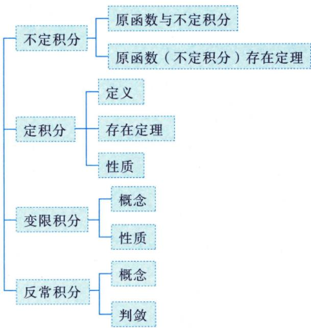

## 原函数与不定积分

设函数f(x)定义在某区间I上，若存在可导函数F(x)，对于该区间上任意一点都有 $F^{\prime}(x) = f(x)$ 成立，则称F(x)是f(x)在区间I上的一个原函数.称 $\frac{\left| \int f(x) \mathrm{d}x \right| = F(x) + C}{ 丿似是基达原函 }$ 为f(x)在区间I上的不定积分.数的记号

问：为什么强调一个？

全体原函数

答：因为若 $F^{\prime}(x) = f(x)$

则对于任意常数C，都有 $\left[ F(x) + C \right]' = F'(x) = f(x)$

故F(x)+C也是原函数，所以f(x)若有原函数，则原函数一定有无穷多个。 $F ( x ) + C$ 称为全体原函数

## 注谈到函数f(x)的原函数与不定积分，必须指明f(x)所定义的区间.

例8.1 设 $0 < x < 1$ ，且 $\int \left( 1 - x^{2} \right) f\left( x^{2} \right) \mathrm{d}x = \arcsin x + C$ ，则f(x) =( ).(A) $(1 - x)^{\frac{3}{2}}$ (B) $(1 - x)^{-\frac{3}{2}}$ (C) $(1 - x^{2})^{\frac{3}{2}}$ (D) $(1 - x^{2})^{-\frac{3}{2}}$

分析按照原函数定义 $\int \frac{\left |  f(x) \right | }{\left |  F^{\prime}(x) \right | } dx = F(x) + C$ 解应选 (B).

根据原函数F(x)的定义 $F^{\prime}(x) = f(x)$ 求解.

将所给表达式的等式两端分别关于x求导，得

$$
\left[ \int \left( 1 - x ^ { 2 } \right) f \left( x ^ { 2 } \right) \mathrm{d}x \right] ^ { \prime } = \left( \arcsin x + C \right) ^ { \prime } ,
$$

即 故

$$
(1 - x^{2})f(x^{2}) = \frac{1}{\sqrt{1 - x^{2}}}
$$

$$
f(x^{2}) = (1 - x^{2})^{-\frac{3}{2}}
$$

$$
f(x) = (1 - x)^{-\frac{3}{2}}
$$

故选(B).

例8.2 函数 $f(x)=\left\{\begin{aligned}&\frac{1}{\sqrt{1+x^{2}}}, \quad x \leq 0, \\&(x+1)\cos x, \quad x>0\end{aligned}\right.$ 的一个原函数为（）.

(A) $F(x)=\left\{\begin{aligned}&\ln\left(\sqrt{1+x^{2}}-x\right), & x \leq 0, \\&(x+1)\cos x-\sin x, & x>0\end{aligned}\right.$ (B) $F(x)=\left\{\begin{aligned}\ln \left(\sqrt{1+x^{2}}-x\right)+1, \quad x \leq 0, \\ (x+1) \cos x-\sin x, \quad x>0\end{aligned}\right.$ (C) $F(x)=\left\{\begin{aligned}\ln \left(\sqrt{1+x^{2}}+x\right), & \quad x \leq 0, \\ (x+1) \sin x+\cos x, & \quad x>0\end{aligned}\right.$ (D) $F(x)=\left\{\begin{aligned}\ln \left(\sqrt{1+x^{2}}+x\right)+1, \quad x \leq 0, \\ (x+1) \sin x+\cos x, \quad x>0\end{aligned}\right.$

分析 $F^{\prime}(x) = f(x)$ .由f(x)处处有定义得F(x)处处可导，推出F(x)处处连续.

对于选项(A): $\lim_{x \to 0^{-}} F(x) = 0 , \quad \lim_{x \to 0^{+}} F(x) = 1$ ，由于F(x)在x=0处左右极限不同，故F(x)不连续.  
对于选项(C): $\lim_{x \to 0^{-}} F(x) = 0$ $\lim_{x \to 0^{+}} F(x) = 1$ ，由于F(x)在x=0处左右极限不同，故F(x)不连续.  
由 $F^{\prime}(x) = f(x)$ 知，F(x)必连续，故可排除(A)，(C).对于选项(B):当 $x > 0$ 时， $F^{\prime}(x)=\cos x-(x+1)\sin x-\cos x=-(x+1)\sin x\ne(x+1)\cos x$ ，故可排除(B).  
因此选 (D).

## ②原函数（不定积分）存在定理

(1)连续函数f(x)必有原函数F(x) →不作要求，但最好在草稿本上写一遍，大致思路要懂

注证明：如果函数f(x)在[a，b]上连续，则函数 $F(x) = \int_{a}^{x} f(t)   dt$ 在[a,b]上可导，且 $F^{\prime}(x) = f(x)$ 证若 $x \in (a,   b)$ ，取Δx使 $x + \Delta x \in (a,   b)$ ，则 说明 $\int f(x) \mathrm{d}x = \int_{a}^{x} f(t) \mathrm{d}t + C.$

$$
\begin{aligned}\Delta F &= F(x + \Delta x) - F(x) = \int_{a}^{x + \Delta x} f(t) \mathrm{d}t - \int_{a}^{x} f(t) \mathrm{d}t \\&= \int_{a}^{x} f(t) \mathrm{d}t + \int_{x}^{x + \Delta x} f(t) \mathrm{d}t - \int_{a}^{x} f(t) \mathrm{d}t = \int_{x}^{x + \Delta x} f(t) \mathrm{d}t\end{aligned}
$$

使用积分中值定理，有 $\int_{x}^{x + \Delta x} f(t) \mathrm{d}t = f(\xi) \Delta x$ ，其中ξ介于x与 $x + \Delta x$ 之间，当 $\Delta x \rightarrow 0$ 时， $\xi \rightarrow x$ ，于是

$$
F^{\prime}(x)=\lim_{\Delta x \to 0}\frac{\frac{f(x)}{\Delta F}}{\frac{\Delta x}{\Delta x}}=\lim_{\Delta x \to 0}f(\xi)=\lim_{\frac{\xi \to x}{\sqrt{x}}}f(\xi)=f(x)
$$

若 $x = a$ ，取 $\Delta x > 0$ ，则同理可证 $F_{+}^{\prime}(a) = f(a)$ ;若 $x = b$ ，取 $\Delta x < 0$ ，则同理可证 $F_{-}^{\prime}(b) = f(b)$ 注意：当四则运算中出现不同形式的表达式时，需要化为统一的形式，本题借助了积分中值定理① $\int f(x) \mathrm{d}x$ 称为不定积分，表示全体原函数.

$\int_{a}^{b} f(x) \mathrm{d}x$ 称为定积分，表示面积.

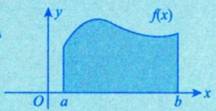

③ $F(x) = \int_{a}^{x} f(t)   dt$ 称为变上限积分，表示动态的面积.

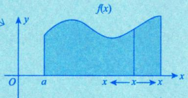

④积分中值定理：若函数f(x)在区间 a, b]上连续，则至少存在一点 $\xi \in [a, b]$ ，使

$$
\int_{a}^{b} f(x) \mathrm{d}x = f(\xi)(b - a) \atop S_{ 奇边据名 } = S_{ 单名 }
$$

总结：f(x)连续⇒ $\left\{ \begin{aligned} \int f(x) \mathrm{d}x &= \int_{a}^{x} f(t) \mathrm{d}t + C, \\ \left[ \int_{a}^{x} f(t) \mathrm{d}t \right]' &= f(x). \end{aligned} \right.$

(2)含有第一类间断点和无穷间断点的函数f(x)在包含该间断点的区间内必没有原函数 $F ( x )$

V可去间断点第一类间断点跳跃间断点《全国硕士研究生招生考试数学考试大纲》考查四类间断点无穷间断点振荡间断点

注1(1)函数f(x)在定义域I上可导，则

$$
f^{\prime}(x)=\lim_{X \to x}\frac{f(X)-f(x)}{X-x}=\left\{\begin{aligned} & 0, \\ & a \neq 0. \end{aligned}\right.
$$

(可导时，y与Y们比连续时靠得更近)

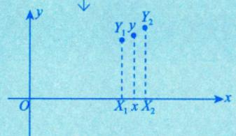

(2) 函数f(x)存在与f'(x)存在的区别.

① a. f(x)在 $x = x_{0}$ 处的极限存在不能得出f(x)在 $x = x_{0}$ 处连续.  
如 $\lim_{x \to x_0} f(x) = a$ 但 $f(x_{0})$ 有可能等于a，也有可能不等于a.

b. f(x)可导，且 $\lim_{x \to x_0} f'(x) = a$ ，则f'(x)在 $x_{0}$ 处连续.f'(x)存在

证

$$
f^{\prime}(x_0) = \lim_{x \to x_0} \frac{f(x) - f(x_0)}{x - x_0} \xlongequal[]{\frac{0}{0}} \lim_{x \to x_0} f^{\prime}(x) = a
$$

②a. f(x)存在不能得出f(x)有介值性.

介值定理：函数f(x)在[a,b]上连续，且 $f(a)=A,\ f(b)=B$ ，则当 $A < u < B$ 时，存在 $\xi \in (a, b)$ 使 $f(\xi) = u$

b. f'(x)存在，可得f'(x)有介值性.

达布定理： f(x)在 [a, b]上可导， $f_{+}^{\prime}(a) \neq f_{-}^{\prime}(b)$ ，则对任意介于ft(a)与f'(b)之间的u，存在 $\xi \in (a,   b)$ ，使得

$$
f^{\prime}(\xi) = u ,
$$

证令 $F(x) = f(x) - u x$ ，则 $F^{\prime}(x) = f^{\prime}(x) - u$

不妨设 $f_{+}^{\prime}(a) < u < f_{-}^{\prime}(b)$ ，则 $f_{+}^{\prime}(a)-u<0\ , f_{-}^{\prime}(b)-u>0$ ，即 $F^{\prime}_{+}(a)<0\ ,\ F^{\prime}_{-}(b)>0$

由例 6.3，可知存在 $\xi \in (a,   b)$ ，使 $F^{\prime}(\xi) = 0$ ，即 $f^{\prime}(\xi) = u$

$\left\{ \begin{aligned} f^{\prime}(x)  存在  \neq 0   ,   则  \\  在  \left[ a   ,   b \right]  上  f^{\prime}(x) \end{aligned} \right.$ 则f'(x)必保号（恒正或恒负）.反证：假设 $f^{\prime}(a)<0,\ f^{\prime}(b)>0$ ③由②b.可得 则存在 $\xi \in (a, b), f^{\prime}(\xi) = 0$ ，矛盾.存在，则f'(x)无第一类间断点.

注2证 设 F(x) 为 f(x)在 I 内的一个原函数，则 F(x) 在 I 内可导，且 $F^{\prime}(x) = f(x)$ ，并设$x = x_{0} \in I$ 为 $F^{\prime}(x)$ 的间断点，我们讨论如下三种情况： F'(x)

(1) $x = x_{0}$ 为可去间断点，即 $\lim_{x \to x_0} F'(x)$ 存在且为A，但 $A \ne F^{\prime}(x_0)$ ，而

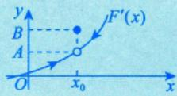

$$
F^{\prime}(x_{0}) = \lim_{x \to x_{0}} \frac{F(x) - F(x_{0})}{x - x_{0}} \xlongequal{洛必达法则} \lim_{x \to x_{0}} F^{\prime}(x) = A
$$

(2) $x = x_{0}$ 为跳跃间断点，即 $\lim_{x \to x_0^+} F'(x)$ 存在且为 $A_{+},\lim_{x \to x_{0}^{-}}F^{\prime}(x)$ 存在且为A\_，但 $A_{+} \neq A_{-}$ ，而

$$
F^{\prime}_{+}(x_{0}) = \lim_{x \to x_{0}^{+}} \frac{F(x) - F(x_{0})}{x - x_{0}} \xlongequal{洛必达法则} \lim_{x \to x_{0}^{+}} F^{\prime}(x) = A_{+}
$$

F(x)在I上处处可导.

$$
F^{\prime}_{-}(x_{0}) = \lim_{x \to x_{0}^{-}} \frac{F(x) - F(x_{0})}{x - x_{0}} \xlongequal{洛必达法则} \lim_{x \to x_{0}^{-}} F^{\prime}(x) = A.
$$

又 $F^{\prime}(x_{0})$ 是存在的，则 $F_{+}^{\prime}(x_{0}) = F_{-}^{\prime}(x_{0})$ ，即 $A_{+} = A_{-}$ ，矛盾；

(3) $x = x_{0}$ 为无穷间断点，即 $\lim_{x \to x_0} F'(x) = \infty$ ，而

$$
F^{\prime}(x_0) = \lim_{x \to x_0} \frac{F(x) - F(x_0)}{x - x_0} \xlongequal{洛必达法则} \lim_{x \to x_0} F^{\prime}(x) = \infty,
$$

又 $F^{\prime}(x_{0})$ 是存在的，矛盾.

综上所述，(1)，(2)和(3)的情形均不存在原函数，即导函数 $F^{\prime}(x)$ 在I内必定没有第一类间断点和无穷间断点，也即含有第一类间断点和无穷间断点的函数f(x)在包含该间断点的区间内没有原函数 $F(x)$

注3含有振荡间断点的函数是否有原函数呢？这是不确定的.举例来说，对于

$$
f(x)=\left\{\begin{aligned}&2x\sin\frac{1}{x}-\cos\frac{1}{x}, &x\neq0,\\&0, &x=0,\end{aligned}\right.
$$

$\lim_{x \to 0} f(x)$ 不存在，其在 $( - \infty , + \infty )$ 上不连续，它有一个振荡间断点 $x = 0$ 但是它在 $( - \infty , + \infty )$ 上存在原函数

$$
F(x)=\left\{\begin{aligned}&x^{2}\sin\frac{1}{x},&x\neq0,\\&0,&x=0.\end{aligned}\right.
$$

经验证，当 $x \neq 0$ 时， $F^{\prime}(x) = 2x\sin\frac{1}{x} - \cos\frac{1}{x}$ 当 $x = 0$ 时， $F^{\prime}(0)=\lim_{x \to 0}\frac{x^{2}\cdot\sin\frac{1}{x}-0}{x-0}=0$ 即对于$( - \infty , + \infty )$ 上任一点都有 $F^{\prime}(x) = f(x)$ 成立.

当然，对于

$$
f(x)=\left\{\begin{aligned}&\frac{1}{x}\sin\frac{1}{x},&x\neq0,\\&0,&x=0,\end{aligned}\right.
$$

其在 $( - \infty , + \infty )$ 上也有一个振荡间断点 $x = 0$ ，但其在 $( - \infty , + \infty )$ 上没有原函数.

注4综合以上几点，可以得出重要结论：可导函数F(x)求导后的函数 $F^{\prime}(x) = f(x)$ 不一定是连续函数，也可能有振荡间断点 连续函数或含振荡间断点的函数

有介值性

$$
\stackrel{\rightharpoonup }{ 若 } F(x)  处处可导  \Rightarrow F^{\prime}(x) \cdot
$$

$$
\boxed{ 极限存在  \Leftrightarrow F^{\prime}(x)  迹簇 }
$$

$$
\boxed{\neq 0 \Rightarrow F(x)  单调 }
$$

注5至此，我们可以总结导函数f'(x)的性质了.

(1)如果导函数f'(x)存在，当导函数在一点极限存在时，导函数在这一点必连续.

对比函数就会知道，如果函数在一点极限存在，并不能得出函数在这一点连续的结论.

导函数之所以有这个特性，而函数没有，归根结底是因为导函数存在（即函数可导），是指那些点相依相偎、充分靠近，也就是说，导函数如果存在，它们天生就是点点相依相偎的，而函数存在，只是每个点都在那里，也就是在那里而已，它们无牵无挂.所以，不要只记住导函数也是函数，更要记住，导函数是性质极强的函数.导函数在这一点存在（事实上函数在这一点连续就够了)，就能保证点点相依相偎.那么，如果导函数在一点存在，且它在这一点的极限值也存在时，必等于这一点的导数值，也就是说导函数在这一点必连续.

所以可以继续思考下去，得到微积分里极为重要的一个结论：

(2)如果导函数在一点存在，则这一点一定不会是导函数的第一类间断点.

对比函数，函数在一点存在，可以是第一类间断点.

为什么？因为导函数在一点存在，讨论它在这一点是不是第一类间断点，关键是看在导函数左右极限都存在的条件下，是左右极限不等（跳跃间断），还是左右极限相等但不等于导数值（可去间断）.显然，导函数在一点存在时，它的左极限和右极限如果存在，必然分别等于这一点的左右导数值，由于这一点可导，左右导数值相等，于是导函数的左右极限值也必然相等，也就回到了（1）.故一个可导函数的导函数是没有第一类间断点的.

请再思考：在一条处处有切线的曲线上，会不会发生切线斜率值在一点突变的情况？为什么？

答：在几何上讲的曲线处处有切线，在微分学上对应的就是导函数处处存在或无穷大.这里，切线斜率为无穷大是一种需要斟酌的情形.在高等数学（微积分）中，无穷大是（特殊的）不存在，对应着铅直切线（斜率无穷大，不存在)，但事实上，如果我们把 $y = x$ 对调（或者说旋转 $9 0 ^ { \circ } )$ ，铅直变成水平，斜率为0，这就是存在的了，比如 $y = x ^ { 3 }$ 与 $y = x^{\frac{1}{3}}$ ，就很容易理解.既然 $x = 0$ 附近$y = x ^ { 3 }$ 切线的斜率是没有突变的，那么 $x = 0$ 附近 $y = x^{\frac{1}{3}}$ 切线的斜率也不会突变.非零无穷小和无穷大互为倒数关系，在斜率这里就有了很好的体现.琢磨一下，为什么说非零无穷小和无穷大对应呢？因为 $y = x ^ { 3 }$ 虽然在x=0处导数（变化率）等于0，可是它不是没有变化，显然 $x = 0$ 处左边的函数值为负，右边的函数值为正，只是从导数这个变化率工具上来说，它没有能力（不够精确）测量到这

<table><tr><td>个变化而已（也许以后你们还会接触到分数阶导数甚至更为精细的刻画变化率的工具）. (3) 若f(x)可导，则  $f^{\prime}(x)$  可能连续，也可能含有振荡间断点. 连续不难理解，那么振荡间断点是什么样子？它是真的断了吗？在现代数学提出了超实数理论 后，我们已经知道了，事实上，没有什么线是连着的，只是点与点近不近，有多近的问题罢了. ①设  $f_{1}(x) = \sin x$   $\lim_{x \to +\infty} \sin x$  振荡不存在，其大致图形为 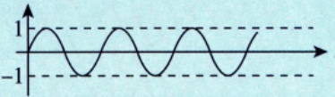  $f_{2}(x)=\left\{\begin{aligned}\sin\frac{1}{x},&x\neq0,\\0,&x=0,\end{aligned}\right.$  ②设</td></tr><tr><td> $\sin\frac{1}{x}$  由sinu和  $u = \frac{1}{x}$   $\lim_{x \to 0^{+}} \sin \frac{1}{x}$  可以看出， 复合而成.当  $x \to 0^{+}$  时，  $u \to +\infty$  故 依然是振荡不存在. 但这里有一个关键问题：这里的振荡是在  $x \to 0^{+}$  时发生的，也就是x与0充分靠近、无限靠近时</td></tr><tr><td>发生的，于是可以看作将①中的 “无限压缩”成-  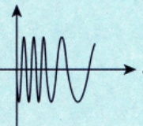 将  $x \to 0^{-}$  也画出来，则大致图形为 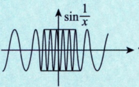</td></tr><tr><td>a.所谓“无限压缩”，可以认为在x=0的任意邻域内，都有无数次-1到1的振荡. b.若将横坐标x的比例放大无穷倍，就会看到形如 的样子了.我们能够放  大无穷倍吗？显然不能，故我们是看不到实际图形的，好在人类有思考能力可以想象到. c.振荡间断点露出了本来的面目，放大无穷倍后，即 还原成原来的样子，</td></tr></table>

密集地像矩形块一样无限靠

近y轴.

b.“间断”只是在描述上述特征，即 $\lim_{x \to 0} \sin \frac{1}{x}$ 不存在.

谁叫连续的定义是 $\lim_{x \to x_0} f(x) = f(x_0)$ 呢，就因为 $\lim_{x \to 0} \sin \frac{1}{x} \neq \sin \frac{1}{x} \bigg|_{x=0}$ (无定义)，于是只能叫间断.即使定义成 $\begin{cases}\sin \frac{1}{x}, & x \neq 0, \\0, & x = 0,\end{cases}$ 依然是 $\lim_{x \to 0} \sin \frac{1}{x} \neq 0$ 也只能叫间断.

不过，对于 $\begin{cases}\sin \frac{1}{x}, & x \neq 0, \\0, & x = 0\end{cases}$ 这样的振荡间断点，我们可以说，曲线上的点均是相依相偎的，它

们并没有“断开”（如像

样跳跃断开，或像

一样可去断开)，

而是像图形.

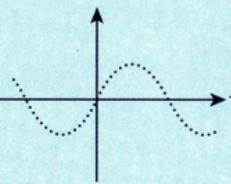

样绵延不绝.

总之，形如 $f(x)=\begin{cases}\sin\dfrac{1}{x},&x\neq0,\\0,&x=0.\end{cases}$ 这样的振荡间断点，没有实际上的“断开”，它们是点点相依相偎的.只是它有一个独特的地方，即无限次振荡，故只能称间断，曰：(无限次）振荡使得极限不存在而不得不称为间断的点.

还记得“连续函数”必有原函数吗？原函数当然是可导函数.也就是说，一个“点点相依相偎”（连续）的函数，一定有（是）一个“点点相依相偎更近”（可导）的函数求导而得到的.反过来说，一个“点点相依相偎更近”（可导）的函数，求导后，会得到一个“点点相依相偎”（可以理解为靠近程度降低）的函数.于是，不只是连续函数“点点相依相偎”，我们研究得如此细致的“振荡间断函数”也可以“点点相依相偎”啊！故可导函数求导后，可能得到连续函数，也可能得到含振荡间断点的函数，只要这些函数“点点相依相偎”（足够近）就行.

于是，若f(x)可导，则f'(x)可能连续，也可能含有振荡间断点.

现在可以准确回答这个问题了——振荡间断点是什么样子？它是真的断了吗？设

$$
f(x)=\left\{\begin{aligned}x^{2}\cos\frac{1}{x},x\neq0,\\0,\quad x=0,\end{aligned}\right.
$$

其在 $( - \infty , + \infty )$ 上处处可导，且其导函数为

$$
f^{\prime}(x)=\left\{\begin{aligned}2x\cos\frac{1}{x}+\sin\frac{1}{x}, \quad x \neq 0, \\ 0, \quad x=0.\end{aligned}\right.
$$

显然，

$$
\lim_{x \to 0} f'(x) = \lim_{x \to 0} 2x \cos \frac{1}{x} + \lim_{x \to 0} \sin \frac{1}{x} = \lim_{x \to 0} \sin \frac{1}{x}
$$

极限振荡不存在.请原谅我在(\*)处鲁莽地拆开了，那只是为了让各位更清楚地看到 $\lim_{x \to 0} \sin \frac{1}{x}$ .如前

所述，函数 $\begin{cases}\sin \frac{1}{x}, & x \neq 0, \\0, & x = 0\end{cases}$ 放大无穷倍后的样子为

导函数的值不会突变，我们可以放心了.

以上我们讨论了函数真实存在的样子，事实上，微积分就是在研究函数微观上的样子，当你懂得了这些，就会逐渐发现它们的威力，并拥有了揭示真实的力量.

## 定积分

## 1定义

①分割(分割方法不唯一，只要分成n份即可)：②近似；③求和；④取极限.

(1) 定积分的概念.

若函数f(x)在区间[a,b]上有界，在(a,b)上任取n-1个分点 $x_{i}(i = 1,2,3,\cdots,n - 1)$ ，定义 $x_{0}=a$ 和 $x _ { _ n } = b$ ，且 $a = x_{0} < x_{1} < x_{2} < x_{3} < \cdots < x_{n - 1} < x_{n} = b$ ，记 $\Delta x_{k}=x_{k}-x_{k-1},k=1,2,3,\cdots,n$ . 并任取一点$\xi_{k} \in \left[ x_{k-1}, x_{k} \right]$ ，记 $\lambda = \max_{1 \leq k \leq n} \{ \Delta x_k \}$ ，若当λ→0时，极限 $\lim_{\lambda \to 0} \sum_{k=1}^{n} f(\xi_k) \Delta x_k$ 存在且与分点 $x _ { i }$ 及点 $\xi _ { k }$ 的取法

无关，则称函数f(x)在区间[a,b]上可积，即

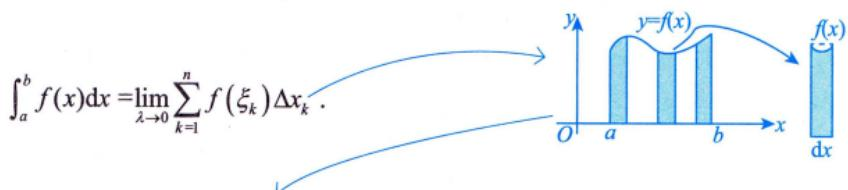

K如果你问我，积分号 $\cdot \int$ 是怎么来的，我情愿你这样看：

但事实上，积分号 $ \text{" }\int  \text{" }$ 是莱布尼茨给出的，在德国小城汉诺威（莱布尼茨在这里度过了人生的最后时光）的莱布尼茨纪念馆的一份他的手稿中，明确写到： $\int  来自"   suma  \text{" }$ 的首字母s拉长，写成了“]”

注定积分的定义是由德国数学家波恩哈德·黎曼(Bernhard Riemann) 给出的，故这种积分又被称为黎曼积分.

  
黎曼 (1826—1866)

(2) 几何意义.

在[a,b]上，①若 $f(x) \geqslant 0$ ，定积分 $\int_{a}^{b} f(x) \mathrm{d}x$ 表示由曲线 $y = f(x)$ 、直线 $x   =   a$ 、直线 $x = b$ 与x轴所围成的曲边梯形的面积[见图8-1(a)]；②若 $f(x) \leq 0$ ，定积分 $\int_{a}^{b} f(x) \mathrm{d}x$ 表示由曲线 $y = f(x)$ 、直线 $x = a$ 直线x=b与x轴所围成的曲边梯形面积的负值[见图8-1(b)]；③若f(x)既有正值又有负值，定积分$\int_{a}^{b} f(x) \mathrm{d}x$ 表示x轴上方图形的面积减去x轴下方图形的面积[见图8-1(c)].

  
(a)

  
图 8-1

  
(c)

(3)定积分的精确定义.

当定积分存在时，存在两个“任取”：分点 $x _ { i }$ 任取，一点 $\xi_{i} \in (x_{i-1}, x_{i})$ 任取.故可作两个“特取”：

将[a,b] n等分且取每个小区间的右端点为 $\xi _ { i }$ (见图8-2)，即

$$
\int_{a}^{b} f(x) \mathrm{d}x = \lim_{n \to \infty} \sum_{i=1}^{n} f\left(a + \frac{b-a}{n}i\right) \frac{b-a}{n}
$$

  
图 8-2

①n等分并取右端点的函数值作为高：   
②近似；   
③求和：   
④取极限.

取左端点的函数值作为高：

$$
\lim_{n \to \infty} \sum_{i=0}^{n-1} f\left(a + \frac{b-a}{n}i\right) \frac{b-a}{n} = \int_{a}^{b} f(x)   dx
$$

若将式子中的a，b特殊化为0,1这两个数，得出的形式更为简单：

$$
\int_{0}^{1} f(x) \mathrm{d}x = \lim_{n \to \infty} \sum_{i=1}^{n} f\left(\frac{i}{n}\right) \frac{1}{n}
$$

(4)定积分的值与字母无关.

当定积分存在时，有

$$
\int _ { a } ^ { b } f ( x ) \mathrm { d } x = \int _ { a } ^ { b } f ( t ) \mathrm { d } t = \int _ { a } ^ { b } f ( u ) \mathrm { d } u ,
$$

注：积分与字母无关，无论x，t，u，都只是一个符号

这就是说，定积分的值只与被积函数及积分区间有关，而与积分变量的记法无关

是个客观存在的数量值

## 2存在定理

定积分的存在性，也称一元函数的(常义)可积性.这里的“常义”是指“区间有限，函数有界”，也有人称为“黎曼”可积性，与后面要谈到的“区间无穷，函数无界”的“反常”积分有所区别.在本讲中所谈到的可积性都是指常义可积性. y

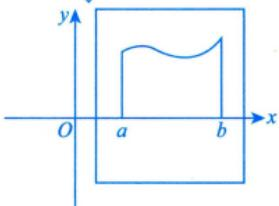  
函数与积分区间被限制在框之内。

按照《全国硕士研究生招生考试数学考试大纲》，定积分存在定理包括下面两个方面

(1)定积分存在的充分条件.

闭区间上连续函数一定有界：①若f(x)在[a,b]上连续，则 $\int_{a}^{b} f(x) \mathrm{d}x$ 存在. 连续函数一定存在定积分 连续函数一定存在不定积分：

②若f(x)在[a,b]上单调，则 $\int_{a}^{b} f(x) \mathrm{d}x$ 存在. ↓

由于函数单调，故f(a)，f(b)即为函数的界，对任意x∈(a，b)，f(x)一定介于f(a)，f(b)之间

③若f(x)在 $[a,b]$ 上有界，且只有有限个间断点，则 $\int_{a}^{b} f(x) \mathrm{d}x$ 存在.

不包含无穷间断点，因为无穷间断点会导致无界

④若f(x)在 $\left[ a , b \right]$ 上有有限个第一类间断点，则 $\int_{a}^{b} f(x) \mathrm{d}x$ 存在.

(2)定积分存在的必要条件.

可积函数必有界，即若定积分 $\int_{a}^{b} f(x) \mathrm{d}x$ 存在，则f(x)在[a,b]上必有界.

注1关于定积分存在的必要条件，不妨这样理解：当我们任意分割图形底边为若干小段时，若f(x)在区间[a,b]上无界，则至少存在一个小段Δx，在∆x上，f(x)可以任意大，于是一个“小竖条’的面积f(x)∆x便可以无穷大，这样整个曲边梯形的面积就是无穷大，于是极限就不存在了，所以可积函数必有界.

注意与反常积分作区分：反常积分有可能出现函数无界的情况.

注2函数不定积分存在定理与定积分存在定理的区别与联系见例8.3.

## ③ 性质（假设以下积分均存在）

两个规定：

(1)当b=a时， $\int_{a}^{a} f(x) \mathrm{d}x = 0$

(2) 当a>b时， $\int_{a}^{b} f(x) \mathrm{d}x = - \int_{b}^{a} f(x) \mathrm{d}x$

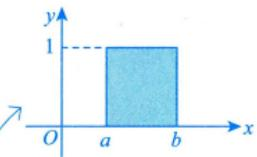

性质1(求区间长度）假设 $a < b$ ，则 $\int_{a}^{b} \mathrm{d}x = b - a = L$ ，其中L为区间[a,b]的长度.

性质2(积分的线性性质）设 $k_{1},   k_{2}$ 为常数，则 $\int_{a}^{b} \left[ k_{1} f(x) \pm k_{2} g(x) \right] \mathrm{d}x = k_{1} \int_{a}^{b} f(x) \mathrm{d}x \pm k_{2} \int_{a}^{b} g(x) \mathrm{d}x$

性质3(积分的可加（拆)性）无论a，b，c的大小如何，总有 $\int_{a}^{b} f(x) \mathrm{d}x = \int_{a}^{c} f(x) \mathrm{d}x + \int_{c}^{b} f(x) \mathrm{d}x$

性质4(积分的保号性）若在区间 $\left[ a , b \right]$ 上 $f(x) \leqslant g(x)$ ，则有 $\int_{a}^{b} f(x) \mathrm{d}x \leqslant \int_{a}^{b} g(x) \mathrm{d}x$

特殊地，有

由图可得， $\left| \int_{a}^{b} f(x) \mathrm{d}x \right| = |5 - 3| = 2$ $\int_{a}^{b} \left| f(x) \right| \mathrm{d}x = 5 + 3 = 8$ ，则有 $\left| \int_{a}^{b} f(x) \mathrm{d}x \right| \leqslant \int_{a}^{b} \left| f(x) \right| \mathrm{d}x.$

注事实上，设f(x)是[a,b]上非负的连续函数，只要f(x)不恒等于零，则必有

$$
\int_{a}^{b} f(x) \mathrm{d}x > 0
$$

在有些积分不等式的证明与定积分值的估计中，要求获得严格的不等式结果，便需要用到这个结论，其证明见例 8.7.

极限戴帽法： $f(x) > 0$ 则 $\lim_{x \to \cdot} f(x) \geq 0$ 与极限作区分 极限脱帽法： $\lim_{x \to \cdot} f(x) > 0$ 则 $f(x) > 0$

积分： $f(x) - g(x) \leq 0 , a < b$ ，则 $\int _ { a } ^ { b } \left[ f ( x ) - g ( x ) \right] \mathrm { d } x \leqslant 0$

若有条件f(x)-g(x)连续，且不恒为0，则 $\int_{a}^{b} \left[ f(x) - g(x) \right] dx < 0$ RO

性质5(估值定理) 设M，m分别是f(x)在[a,b]上的最大值和最小值，L为区间[a,b]的长度，则有

$$
m L \leqslant \int_{a}^{b} f(x) \mathrm{d} x \leqslant M L
$$

注证 $\int_{a}^{b} m \mathrm{d}x \leqslant \int_{a}^{b} f(x) \mathrm{d}x \leqslant \int_{a}^{b} M \mathrm{d}x$ ，有 $m L \leqslant \int_{a}^{b} f(x) \mathrm{d} x \leqslant M L.$ $\geqslant m \leqslant f(x) \leqslant M$

★★★性质6(中值定理） 设f(x)在区间[a，b]上连续，则在[a，b]上至少存在一点 $\xi$ ，使得

$$
\int _ { a } ^ { b } f ( x ) \mathrm { d } x = f ( \xi ) ( b - a ) .
$$

例8.3 在区间[-1,2]上，以下四个结论：

x=0是跳跃间断点$f(x)=\begin{cases}2, & x>0, \\1, & x=0, \\-1, & x<0\end{cases}$ 2① 有原函数，但其定积分不存在；→→ x0-1

② $f(x)=\left\{\begin{aligned}&2x\sin\frac{1}{x^{2}}-\frac{2}{x}\cos\frac{1}{x^{2}}, \quad x \neq 0, \\&0, \quad x=0\end{aligned}\right.$ 有原函数，其定积分也存在；

③ $f(x)=\begin{cases}\dfrac{1}{x},&x\neq0,\\0,&x=0\end{cases}$ 没有原函数，其定积分也不存在；

④ $f(x)=\left\{\begin{aligned}&2x\cos\frac{1}{x}+\sin\frac{1}{x},\\&0,\end{aligned}\right.$ $\begin{aligned} &x \ne 0   , \\&\begin{aligned}\\ &x = 0\\ &\end{aligned}\\ \end{aligned}$ 有原函数，其定积分也存在. x=0是无穷间断点

正确结论的个数为（ ).(A)1 (B)2 (C)3 (D)4分析有第一类间断点和无穷间断点的函数f(x)在包含该间断点的区间内必没有原函数.

定积分存在的充分条件：①f(x)在[a,b]上连续；②f(x)在 $\left[ a , b \right]$ 上有界，且只有有限个间断点；③f(x)在 [a, b]上单调.

定积分存在的必要条件：①[a，b]有限长度；②f(x)在[a，b]上有界.

应选 (B).

本题通过具体的例子考查考生是否能够明确区分不定积分与定积分的存在性.逐个分析即可.

对于 $f(x)=\begin{cases}2, & x>0 ,\\1, & x=0 ,\\-1, & x<0 ,\end{cases}$ 由于x=0是其跳跃间断点，根据不定积分存在定理，在任意一个包含x=0的区间[a,b]上，f(x)一定不存在原函数，但由于f(x)满足定积分存在定理，故定积分 $\int_{a}^{b} f(x) \mathrm{d}x$ 存在，所以①错误.

对于 $f(x)=\left\{\begin{aligned}&2x\sin\frac{1}{x^{2}}-\frac{2}{x}\cos\frac{1}{x^{2}}, \quad x\neq0, \\&0, \quad x=0,\end{aligned}\right.$ x=0是其振荡间断点，但是容易验证：

若 $F(x)=\left\{\begin{aligned}&x^{2}\sin\frac{1}{x^{2}}, &x\neq0,\\&0, &x=0,\end{aligned}\right.$ 则 $F^{\prime}(x)=f(x)(-\infty<x<+\infty)$ ，所以f(x)存在原函数，但在任意一个包含x=0的区间[a,b]上，定积分 $\int_{a}^{b} f(x) \mathrm{d}x$ 不存在，因为在x=0的邻域内f(x)无界，所以②错误.

对于 $f(x)=\begin{cases}\dfrac{1}{x},&x\neq0,\\0,&x=0,\end{cases}$ 因为x=0是其无穷间断点，所以f(x)在包含x=0的区间[a,b]上不存在原函数，定积分 $\int_{a}^{b} f(x) \mathrm{d}x$ 也不存在，所以③正确.

对于 $f(x)=\left\{\begin{aligned}&2x\cos\frac{1}{x}+\sin\frac{1}{x}, \quad x \neq 0, \\&0, \quad x=0,\end{aligned}\right.$ 它在 $(-\infty, +\infty)$ 内存在原函数 $F(x)=\left\{\begin{aligned}x^{2}\cos\frac{1}{x},\quad x\neq0,\\0,\quad x=0,\end{aligned}\right.$ 并且在任意一个包含x=0的区间[a,b]上，定积分 $\int_{a}^{b} f(x) \mathrm{d}x$ 也存在，因为f(x)有界且只有一个振荡间断点，↓所以④正确. $\left| 2x\cos\frac{1}{x} + \sin\frac{1}{x} \right| \leq 2\left| x \right| \cdot \left| \cos\frac{1}{x} \right| + \left| \sin\frac{1}{x} \right| \leq 2 \cdot 2 \cdot 1 + 1 = 5$

综上所述，答案选择(B).

例8.4 设可导函数 y = f(x) 在 $\left[0,   +\infty \right)$ 上的值域是[0, + ∞), f(0) =0, f'(x)> 0,x =φ(y)是y =f(x)的反函数.记 $I = \int_{0}^{a} f(x) \mathrm{d}x + \int_{0}^{b} \varphi(y) \mathrm{d}y$ ，常数 $a ,   b > 0$ ，当 $a < \varphi(b)$ 时，则（).$y = f(x)$ 和x=φ(y)是同一条曲(A) $I > ab$ (B) $I < ab$ 线，与 $y = f^{-1}(x)$ 关于y=x对称(C) $I = ab$ (D)I与 ab的大小关系不确定

解应选(A).

由题设易知，f(x)是过原点且在 $\left[0,   +\infty\right)$ 上单调递增的函数.已知 $x = \varphi(y)$ 是y = f(x)的反函数，则 $x = \varphi(y)$ 与 $y = f(x)$ 在同一坐标系下共线，如图8-3所示.

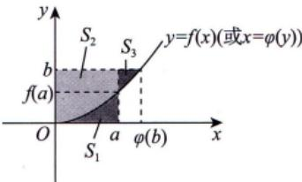  
图 8-3

由图8-3 可知，

$$
\begin{aligned}I = & \int_{0}^{a} f(x) \mathrm{d}x + \int_{0}^{b} \varphi(y) \mathrm{d}y \\= & S_{1} + S_{2} + S_{3} > S_{1} + S_{2} = ab\end{aligned}
$$

故 $I > ab$ . 因此选(A).

例8.5 $y = \mathrm{e}^{-x} \sin x$ 在 $\left[0,+\infty\right)$ 上与x轴所围平面区域的面积写成如下表达式：① $\int_{0}^{+\infty} \mathrm{e}^{-x} \left| \sin x \right| \mathrm{d}x$ in $\int_{0}^{+\infty} \mathrm{e}^{-x} \sin x   dx$ ; ③ $\lim_{n \to \infty} \sum_{k=0}^{n} \left| \int_{k\pi}^{(k+1)\pi} \mathrm{e}^{-x} \sin x   dx \right|$

其中正确表达式的个数是（(A) 0 (B)1 (C)2 (D)3

解应选(C).

由 $ \text{" } 二、 1. (2)  \text{" }$ 定积分的几何意义，因 $y = \mathrm{e}^{-x} \sin x$ 在 $\left[0,   +\infty\right)$ 上既有正值，也有负值，故 $\int_{0}^{+\infty} \mathrm{e}^{-x} \sin x  \mathrm{d}x$

表示其在x轴上方所围图形的面积减去其在x轴下方所围图形的面积，如图8-4所示. $\left| \int_{0}^{+\infty} \mathrm{e}^{-x} \sin x  \mathrm{d}x \right|$ 表示面积差的绝对值，不符合题意，排除②.

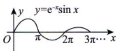  
图 8-4

而 $\int_{0}^{+\infty} \mathrm{e}^{-x} \left| \sin x \right| \mathrm{d}x = \int_{0}^{+\infty} \left| \mathrm{e}^{-x} \sin x \right| \mathrm{d}x$ ，表示 $\left| \mathbf{e}^{-x} \sin x \right|$ 在 $\left[0,   +\infty\right)$ 上与x轴所围图形的面积，如图8-5所示，符合题意，故①正确.

对于③， $\left| \int_{k\pi}^{(k + 1)\pi} \mathrm{e}^{-x} \sin x   dx \right|$ 表示在[kπ，(k+1)π]上 $\mathrm{e}^{-x}\sin x$ 与x轴所围图形的面 ^y\_y=|e−xsin x|=e−x|sin x|0 π 2π 3π… x积，故 $\lim_{n \to \infty} \sum_{k=0}^{n} \left| \int_{k\pi}^{(k+1)\pi} \mathrm{e}^{-x} \sin x   dx \right|$ 亦符合题意，故③正确.所以正确的表达式有2个. 图 8-5

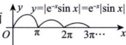

例8.6 $\lim_{n \to \infty} \left( \frac{n + 1}{n^2 + 1} + \frac{n + 2}{n^2 + 4} + \frac{n + 3}{n^2 + 9} + \cdots + \frac{n + n}{n^2 + n^2} \right)$ (A) $\int_{0}^{1} \frac{1 + x}{1 + x^{2}}   dx$ (B) $\int_{0}^{1} \frac{1}{1 + x}   dx$ (C) $\int_{0}^{1} \frac{x}{1 + x^{2}}   dx$ (D) $\int_{0}^{1} \frac{2x}{1 + x^{2}}   dx$

分析 $\lim_{n \to \infty} \sum_{i=1}^{n} f\left(\frac{i}{n}\right) \cdot \frac{1}{n} = \int_{0}^{1} f(x)   dx$ $\lim_{n \to \infty} \sum_{i=1}^{n} f\left(\frac{2i-1}{2n}\right) \frac{1}{n} = \int_{0}^{1} f(x)   dx$

如 $\lim_{n \to \infty} \left( \frac{1}{n^2 + n + 1} + \frac{2}{n^2 + n + 2} + \cdots + \frac{n}{n^2 + n + n} \right)$ ，利用夹逼准则，有

$$
\frac{\frac{n(n + 1)}{2}}{\frac{n^{2} + n + n}{2}} \leqslant \sum_{i = 1}^{n}\frac{i}{n^{2} + n + i} \leqslant \frac{\frac{n(n + 1)}{2}}{\frac{n^{2} + n + 1}{2}},
$$

故 $\lim_{n \to \infty} \sum_{i=1}^{n} \frac{i}{n^2 + n + i} = \frac{1}{2}$

此题若用夹逼准则，有

$$
\frac{n^{2}+\frac{n(n+1)}{2}}{n^{2}+n^{2}}<\sum_{i=1}^{n}\frac{n+i}{n^{2}+i^{2}}<\frac{n^{2}+\frac{n(n+1)}{2}}{n^{2}+1},
$$

夹不住

所以此题采用“凑定积分定义”法，即对于 $\lim_{n \to \infty} \sum_{i=1}^{n} g(n,   i)$ ，判别g(n, i) 能否写成 $f\left(\frac{i}{n}\right) \cdot \frac{1}{n}  或  \frac{1}{n} f\left(\frac{2i-1}{2n}\right)$

解应选(A).

→对于n项和的极限，先提 $\frac{1}{n}$

$$
\lim_{n \to \infty} \left( \frac{n + 1}{n^2 + 1} + \frac{n + 2}{n^2 + 4} + \frac{n + 3}{n^2 + 9} + \cdots + \frac{n + n}{n^2 + n^2} \right) = \lim_{n \to \infty} \sum_{i = 1}^{n} \frac{n + i}{n^2 + i^2}
$$

若能凑成 $f\left( \frac{i}{n} \right)$ ，则用定积分定义；  
若不能，则考虑夹逼准则。

$$
\lim_{n \rightarrow \infty}\sum_{i = 1}^{n}\frac{n^{2} + ni}{n^{2} + i^{2}} \cdot \frac{1}{n} \cdot \lim_{n \rightarrow \infty}\sum_{i = 1}^{n}\frac{1 + \frac{i}{n}}{1 + \left( \frac{i}{n} \right)^{2}} \cdot \frac{1}{n} \cdot \frac{1}{n} \cdot \frac{1 + x}{1 + x^{2}}\mathrm{d}x
$$

## 注“凑定积分定义”的步骤如下：

①先提出 $\frac{1}{n}$ ②再凑出 $\frac{i}{n}$ ③由于 $\frac{i}{n}=0+\frac{1-0}{n}i$ 故 $\frac{i}{n}$ 可以读作 $^ { \circ } 0$ 到1上的 $x^{ 即 }$ 且 $\frac{1}{n} = \frac{1 - 0}{n}$ 读作 $^ { \circ } 0$ 到1上的 $\mathbf{d}x^{\prime}$ ，于是，“凑定义”完毕.

例8.7 设f(x)是[a,b]上非负的连续函数，且f(x)不恒等于零，证明必有 $\int_{a}^{b} f(x) \mathrm{d}x > 0$

证因函数f(x)在 $\left[ a ,   b \right]$ 上不恒等于零，且非负，故至少存在一点 $x_{0} \in (a,   b)$ ，使得 $f(x_{0}) \neq 0$ ，即$f(x_{0}) > 0$

## 考研数学基础30讲·高等数学分册

由连续函数的局部保号性知，存在 $\delta > 0$ 与 $\eta > 0$ ，使得当 $x \in [x_0 - \delta, x_0 + \delta] \subset [a, b]$ 时，恒有$f(x) \geq \eta > 0$

根据定积分的不等式性质，有 $\int_{a}^{b} f(x) \mathrm{d}x \geqslant \int_{x_{0}-\delta}^{x_{0}+\delta} f(x) \mathrm{d}x \geqslant \eta \int_{x_{0}-\delta}^{x_{0}+\delta} \mathrm{d}x = 2\eta\delta > 0.$

注该命题的推论：若连续函数 $f(x),   g(x)$ 满足 $f(x) \geqslant g(x)$ ，且f(x)不恒等于 $g(x)$ ，又 $a < b$ 则必有严格不等式 $\int_{a}^{b} f(x) \mathrm{d}x > \int_{a}^{b} g(x) \mathrm{d}x$

$$
\begin{aligned}f(x) - g(x) \geq 0, \\  必  \end{aligned}
$$

$$
\int_{a}^{b} \left[ f(x) - g(x) \right] \mathrm{d}x \geqslant 0
$$

$$
\int_{a}^{b} f(x) \mathrm{d}x \geq \int_{a}^{b} g(x) \mathrm{d}x.
$$

例 8.8 设f(x)在 $\left[ a , b \right]$ 上连续，证明存在 $\xi \in [a,   b]$ ，使得

$$
\int _ { a } ^ { b } f ( x ) \mathrm { d } x = f ( \xi ) ( b - a ) .
$$

证因为f(x)在[a,b]上连续，所以f(x)在[a,b]上存在最大值M与最小值m，使得

$$
m(b - a) \leqslant \int_{a}^{b} f(x) \mathrm{d}x \leqslant M(b - a),
$$

故

$$
m \leqslant \frac{1}{b - a}\int_{a}^{b}f(x)\mathrm{d}x \leqslant M.
$$

由介值定理可知，存在 $\xi \in [a,   b]$ ，使得 $f(\xi) = \frac{1}{b - a}\int_{a}^{b}f(x)\mathrm{d}x$ ，得证.

## 注如何证明 $\xi \in (a,   b)$ 时，结论仍成立？

设f(x)在[a,b]上连续，证明存在 $\xi \in (a,   b)$ ，使得 $\int_{a}^{b} f(x) \mathrm{d}x = f(\xi)(b - a)$

证 方法一 令 $F(x) = \int_{a}^{x} f(t)   dt$ ，在 $\left[ a , b \right]$ 上用拉格朗日中值定理，则 $F(b)-F(a)=F^{\prime}(\xi)(b-a)$ 即

$$
\int _ { a } ^ { b } f ( x ) \mathrm { d } x - 0 = f ( \xi ) ( b - a ) , \xi \in ( a , b ) ,
$$

得证.

见到∫° f(x)dx) ①用积分中值定理： $\int_{a}^{b} f(x) \mathrm{d}x = f(\xi)(b - a)$ ②改成 $\int_{a}^{x} f(t) \mathrm{d}t$ 辅助法.

方法二 可用常数k来证明 $\int_{a}^{b} f(x) \mathrm{d}x = f(\xi)(b - a)$ 令 $k = \frac{\int_{a}^{b} f(x)   dx}{b - a}$ 设 $F(x)=\int_{a}^{x}f(t)\mathrm{d}t-k(x-a)$ 则 $F(b) = F(a) = 0$ 故由罗尔定理知，存在$\xi \in (a, b)$ $F^{\prime}(\xi) = 0$ 故 $\int_{a}^{b} f(x) \mathrm{d}x = f(\xi)(b - a)$ 考研真题中已经考过，可直接在大题中使用，不必证明.

例8.9 设 $I_{1} = \int_{0}^{\frac{\pi}{4}} \frac{\tan x}{x} \mathrm{d}x, I_{2} = \int_{0}^{\frac{\pi}{4}} \frac{x}{\tan x} \mathrm{d}x$ ，则（ ).(A) $I_{1} > I_{2} > 1$ (B) $1 > I_{1} > I_{2}$ (C) $I_{2} > I_{1} > 1$ (D) $1 > I_{2} > I_{1}$

## 解 应选(B).

方法一当 $x \in \left( 0, \frac{\pi}{4} \right)$ 时， $0<\sin x<x<\tan x$ ，故 $\frac{\tan x}{x} > \frac{x}{\tan x}$ ，则

$$
I_{1} = \int_{0}^{\frac{\pi}{4}} \frac{\tan x}{x}   dx > \int_{0}^{\frac{\pi}{4}} \frac{x}{\tan x}   dx = I_{2}
$$

这便排除了选项(C)和(D).

由第2讲 $^ { * 6 }$ 注 $\textcircled{2} \textcircled{7} ^ { \ast }$ 重要不等式可知，当 $0 < x < \frac{\pi}{4}$ 时， $\frac{\tan x}{x} < \frac{4}{\pi}$ ，则有 $I_{1} = \int_{0}^{\frac{\pi}{4}} \frac{\tan x}{x}   dx < \frac{4}{\pi} \int_{0}^{\frac{\pi}{4}}   dx = 1$ 故(B)正确.

方法二

$$
I_{2}-I_{1}=\int_{0}^{\frac{\pi}{4}}\frac{x}{\tan x}-\frac{\tan x}{x}\mathrm{d}x=\int_{0}^{\frac{\pi}{4}}\frac{(x+\tan x)(x-\tan x)}{x\tan x}\mathrm{d}x
$$

由积分的保号性，可知当 $x \in \left( 0, \frac{\pi}{4} \right)$ 时， $x - \tan x < 0$ ，故 $I_{2} - I_{1} < 0$ ，即 $I_{2} < I_{1}$

$g(x) = \frac{\tan x}{x}$ ，则 $g^{\prime}(x)=\frac{x\sec^{2}x-\tan x}{x^{2}}=\frac{x-\sin x\cdot\cos x}{x^{2}\cos^{2}x}$

当 $x \in \left( 0, \frac{\pi}{4} \right)$ 时， $g^{\prime}(x) > 0$ ，故g(x)单调递增，则

$$
g(x) < g\left(\frac{\pi}{4}\right) = \frac{4}{\pi}
$$

即 $I_{1} < 1$ ，故 $I_{2} < I_{1} < 1$ .因此选(B).

例8.10 设 $M = \int_{0}^{\frac{\pi}{2}} \sin(\sin x) \mathrm{d}x$ $N = \int_{0}^{\frac{\pi}{2}} \cos(\cos x)   dx$ ，则（ ).(A) $M < 1 < N$ (B) $M < N < 1$

(C) $N < M < 1$

(D) $1 < M < N$

分析考查复合函数 $f[g(x)]$

涉及知识点： $\int_{0}^{\frac{\pi}{2}} f(\sin x) \mathrm{d}x = \int_{0}^{\frac{\pi}{2}} f(\cos x) \mathrm{d}x$

$x = \frac{\pi}{2} - t$ ，则有 $\int_{0}^{\frac{\pi}{2}} f(\sin x) \mathrm{d}x = \int_{0}^{\frac{\pi}{2}} f(\cos t) \mathrm{d}t$ K积分与字母无关 ∫3 f(cos x)dx

## 解应选(A).

sin(sin x)， cos(cos x)均在 $\left[ 0 , \frac { \pi } { 2 } \right]$ 上连续，由 $\sin x \leqslant x$ 知 $\sin(\sin x) \leqslant \sin x$ ，且 $\sin(\sin x) \ne \sin x$ $\left( x \in \left[ 0 , \frac { \pi } { 2 } \right] \right)$ ，故

$\int_{0}^{\frac{\pi}{2}}\sin(\sin x)\mathrm{d}x<\int_{0}^{\frac{\pi}{2}}\sin x\mathrm{d}x=1$ ，即 $M < 1$

又

$\int_{0}^{\frac{\pi}{2}}\cos(\cos x)\mathrm{d}x=\frac{\pi}{2}-t\int_{0}^{\frac{\pi}{2}}\cos(\sin t)\mathrm{d}t>\int_{0}^{\frac{\pi}{2}}\cos t\mathrm{d}t=1$ ，即 $N > 1$

因此选(A).

## 变限积分

→本质是一个由定积分定义的函数。

## ①概念

当x在[a，b]上变动时，对应于每一个x值，积分 $\int_{a}^{x} f(t) \mathrm{d}t$ 都有一个确定的值，因此 $\int_{a}^{x} f(t) \mathrm{d}t$ 是一个关于x的函数，记作

$$
F(x)=\int_{a}^{x}f(t)\mathrm{d}t(a \leqslant x \leqslant b)
$$

称函数F(x)为变上限的定积分.同理可以定义变下限的定积分和上、下限都变化的定积分，这些都称↓为变限积分.事实上，变限积分就是定积分的推广

## 2 性质

(1)函数f(x)在I上可积，则函数 $F(x) = \int_{a}^{x} f(t)   dt$ 在I上连续 $f(x)  可导  \Rightarrow  违筷  \Rightarrow  可拟  \Rightarrow  有示$

F(x)若存在，则其一定连续.与f(x)作区分：f(x)存在但其并不一定连续.

⭐⭐⭐(2)函数f(x)在I上连续，则函数 $F(x) = \int_{a}^{x} f(t)   dt$ 在I上可导且 $F^{\prime}(x) = f(x)$

(3)若 $x = x_{0} \in I$ 是f(x)唯一的跳跃间断点，则 $F(x) = \int_{a}^{x} f(t)   dt$ 在 $x _ { 0 }$ 处不可导，且 $\left\{ \begin{aligned} F_{-}^{\prime}(x_{0}) = \lim_{x \rightarrow x_{0}^{-}} f(x), \\ F_{+}^{\prime}(x_{0}) = \lim_{x \rightarrow x_{0}^{+}} f(x). \end{aligned} \right.$ 若 $x = x_{0} \in I$ 是f(x)唯一的可去间断点，则 $F(x) = \int_{a}^{x} f(t)   dt$ 在 $x _ { 0 }$ 处可导，且 $F^{\prime}(x_0) = \lim_{x \to x_0} f(x) \neq f(x_0)$ 13.报可土间北上必空习 依据可去间断点的定义

## 注（1)第一个性质的证明如下.—→该证明不需掌握，看懂即可.

证对任意 $x, x + \Delta x \in I$ ，有

$$
F(x+\Delta x)-F(x)=\int_{x}^{x+\Delta x}f(t)\mathrm{d}t
$$

由可积的必要条件可知，存在 $M > 0$ ，使得在I上有 $\left| f(x) \right| \leq M$ ，所以有

$$
0 \leqslant \left| F(x + \Delta x) - F(x) \right| \leqslant M \left| \Delta x \right|,
$$

则 $\lim _ { \Delta x \rightarrow 0 } \left| F ( x + \Delta x ) - F ( x ) \right| = 0$ ，即 $\lim _ { \Delta x \rightarrow 0 } \left[ F ( x + \Delta x ) - F ( x ) \right] = 0$ 或 $\lim_{\Delta x \to 0} F(x + \Delta x) = F(x)$ ，得证.

## 充要条件

## F(x)在x点连续的定义 F(x)在x点逻读的定义

由此可见，对于变限积分 $F(x) = \int_{a}^{x} f(t)   dt$ 只要它存在，就必然是连续的

(2) 第二个性质的证明如下.

证 对任意的 $x, x + \Delta x \in I$ ，由于函数f(x)连续，因此

$$
\begin{aligned}\lim_{\Delta x \rightarrow 0} \frac{F(x + \Delta x) - F(x)}{\Delta x} = \lim_{\Delta x \rightarrow 0} \frac{\int_{a}^{x + \Delta x} f(t)   dt - \int_{a}^{x} f(t)   dt}{\Delta x} \\= \lim_{\Delta x \rightarrow 0} \frac{\int_{x}^{x + \Delta x} f(t)   dt}{\Delta x} = \lim_{\Delta x \rightarrow 0} \frac{f(\xi) \Delta x}{\Delta x} = \lim_{\Delta x \rightarrow 0} f(\xi) = f(x)\end{aligned}
$$

其中ξ介于x与 $x + \Delta x$ 之间.

由此可见，如果函数f(x)在区间I上连续，则 $F(x) = \int_{a}^{x} f(t)   dt$ 是f(x)在区间I上的一个原函数.

(3) 第三个性质的证明如下.

证因为 $x = x_{0} \in I$ 是f(x)唯一的间断点，所以 $x \ne x_{0}$ 时，f(x)连续，此时 $F(x) = \int_{a}^{x} f(t)   dt$ 可导，且  
$F^{\prime}(x) = f(x)$ 而 $F^{\prime}(x_0) = \lim_{x \to x_0} \frac{F(x) - F(x_0)}{x - x_0}$ →这两个等号使用洛必达法则若 $x_{0} \in I$ 是f(x)的跳跃间断点，则 $F_{-}^{\prime}(x_{0}) = \lim_{x \to x_{0}^{-}} f(x), \quad F_{+}^{\prime}(x_{0}) = \lim_{x \to x_{0}^{+}} f(x)$ 因为 $\lim_{x \to x_0^-} f(x) \neq \lim_{x \to x_0^+} f(x)$   
所以此时 $F^{\prime}_{-}(x_0) \neq F^{\prime}_{+}(x_0)$ 即 $F(x) = \int_{a}^{x} f(t)   dt$ 在 $x_{0}$ 处不可导.若 $x_{0} \in I$ 是f(x)的可去间断点，则 $\lim_{x \to x_0} f(x)$ 存在，于是 $F^{\prime}(x_0) = \lim_{x \to x_0} f(x)$ 存在.

例8.11 设函数y=f(x)在区间[-1,3]上的图形如图8-6所示，则函数 $F(x) = \int_{0}^{x} f(t)   dt$ 的图形为（).

  
图 8-6

(A)  

(B)  

(C)  

(D)  

## 解应选(D).

本题有三个要点：第一，变限积分只要存在就必连续，故排除(B);第二，由f(x)有两个跳跃间断点可知，F(x)应有两个不可导点，排除 $( \mathbf { A } ) ;$ 第三， $F(0)=\int_{0}^{0}f(t)\mathrm{d}t=0$ ，所以F(x)的图像过原点，排除(C).故答案选择(D).

注本题是考研真题，如果考生能够熟练掌握一元函数积分学的有关概念和性质，便可轻松解决这个问题，而无须进行烦琐的计算，从这个角度说，本题是概念题.

例8.12 设函数 $f(x)=\begin{cases}\cos x, & 0 \leq x < \pi, \\1, & \pi \leq x \leq 2\pi.\end{cases}$ $F(x) = \int_{0}^{x} f(t)   dt$ ，则（）.(A) x = π是函数 F(x) 的跳跃间断点 (B) x =π是函数 F(x)的可去间断点(C) F(x)在x =π处连续但不可导 (D) F(x)在x=π处可导

解应选(C). $\lim_{x \to \pi^{-}} \cos x = -1 ; \lim_{x \to \pi^{+}} 1 = 1$   
方法一 由于x=π为f(x)的跳跃间断点，因此 $F(x) = \int_{0}^{x} f(t) \mathrm{d}t$ 在x=π处连续但不可导，故选(C).  
方法二 $F(x)=\int_{0}^{x}f(t)\mathrm{d}t=\left\{\begin{aligned}&\int_{0}^{x}\cos t\mathrm{d}t,\\&\int_{0}^{x}\cos t\mathrm{d}t+\int_{x}^{x}1\end{aligned}\right.$ $\begin{aligned}0 \leqslant x < \pi, \\\pi \leqslant x \leqslant 2\pi\end{aligned}=\begin{cases}\sin x, & 0 \leqslant x < \pi, \\x - \pi, & \pi \leqslant x \leqslant 2\pi.\end{cases}$ ldt ,  
因为 $\lim_{x \to \pi^{+}} F(x) = \lim_{x \to \pi^{-}} F(x) = F(\pi) = 0$ ，所以F(x)在x=π处连续.而$F_{-}^{\prime}(\pi)=\lim_{x \to \pi^{-}}\frac{F(x)-F(\pi)}{x-\pi}=\lim_{x \to \pi^{-}}\frac{\sin x-0}{x-\pi}=\lim_{x \to \pi^{-}}\frac{\cos x}{1}=-1$ $F_{+}^{\prime}(\pi)=\lim_{x \to \pi^{+}}\frac{F(x)-F(\pi)}{x-\pi}=\lim_{x \to \pi^{+}}\frac{x-\pi-0}{x-\pi}=1$

因此 $F_{-}^{\prime}(\pi) \neq F_{+}^{\prime}(\pi)$ ，即F(x)在x=π处不可导.

例8.13设 $f(x) = \begin{cases} \mathrm{e}^{x^{2}} + x^{2}, & x \neq 0, \\ a, & x = 0, \end{cases}$ 其中a为常数，令 $F(x) = \int_{-1}^{x} f(t)   dt$ ，则以下命题：①当a=1时，F(x)在x=0处可导；  
②当a≠1时，F(x)在x=0处可导；  
③当a=1时，F(x)在x=0处不可导；  
④当a≠1时，F(x)在x=0处不可导.  
所有真命题的序号为（).  
(A) ①④ (B) ①② (C) ③④ (D) ②③

解应选(B).

若a=1，则f(x)在x=0处连续，此时F(x)在x=0处可导，且 $F^{\prime}(0) = f(0) = 1$

若 $a \neq 1$ ，则x=0是f(x)的可去间断点，此时

$$
\lim_{x \to 0} \frac{\int_{-1}^{x} (e^{t^2} + t^2)   dt - \int_{-1}^{0} (e^{t^2} + t^2)   dt}{x - 0} = \lim_{x \to 0} \frac{\int_{-1}^{x} (e^{t^2} + t^2)   dt}{x - 0} = \lim_{x \to 0} \frac{\int_{-1}^{x} (e^{t^2} + t^2)   dt}{x - 0}
$$

>或用 $ \text{" } \rightleftharpoons  \text{、 } 2. (3)  \text{" }$ 的结论，直接有于是 $F^{\prime}(0)$ 存在，即F(x)在x=0处仍可导，故选(B). F(x)在x=0处可导.

注当 $a \ne 1$ 时， $F^{\prime}(0)=1 \neq a=f(0)$ ，在包含 $x = 0$ 的区间上， $F(x)$ 不是f(x)的原函数.

例8.14设 $a > 0$ ，函数f(x)在 $\left[0,   +\infty\right)$ 内连续有界，C为任意常数，证明： $y = \mathrm{e}^{-ax} \left[ \int_{0}^{x} f(t) \mathrm{e}^{at}   dt + C \right]$ 有界.

证由 $f(x)$ 在 $\left[0,   +\infty\right)$ 内有界，设 $\left| f(x) \right| \leq M$ ，则当 $x   \geqslant   0$ 时，有

$$
\begin{aligned} \left| y(x) \right| = & \left| \mathrm{e}^{-\alpha x} \left[ C + \int_{0}^{x} f(t) \mathrm{e}^{\alpha t} \mathrm{d}t \right] \right| \leqslant \left| C \mathrm{e}^{-\alpha x} \right| + \mathrm{e}^{-\alpha x} \left| \int_{0}^{x} f(t) \mathrm{e}^{\alpha t} \mathrm{d}t \right| \quad 以 \quad \left| a \pm b \right| \leqslant | a | + | b | \\ \leqslant & \left| C \right| + \mathrm{e}^{-\alpha x} \int_{0}^{x} \left| f(t) \mathrm{e}^{\alpha t} \right| \mathrm{d}t \leqslant | C | + M \mathrm{e}^{-\alpha x} \int_{0}^{x} \mathrm{e}^{\alpha t} \mathrm{d}t \\ = & \left| C \right| + \frac{M}{a} \underbrace{\left( 1 - \mathrm{e}^{-\alpha x} \right) \leqslant | C | + \frac{M}{a}}_{一} \quad 与 \quad \int_{0}^{x} \mathrm{e}^{\alpha t} \mathrm{d}t = \frac{1}{a} \int_{0}^{x} \mathrm{e}^{\alpha t} \mathrm{d}(a t) = \frac{1}{a} \left( \mathrm{e}^{\alpha t} - 1 \right) \end{aligned}
$$

得证.

## 反常积分

## 1概念

前面已经指出，定积分存在有两个必要条件：一是积分区间有限，二是被积函数有界.如果破坏了  
积分区间的有限性，就引出无穷区间上的反常积分；如果破坏了被积函数的有界性，就引出无界函数  
的反常积分.区间有限  
定积分（常义积分）被积函数有界  
反常积分(广义积分)

(1)无穷区间上反常积分的概念与敛散性.

定义1 设 $F(x)$ 是f(x)在相应区间上的一个原函数.

①

$$
\int_{a}^{+\infty} f(x) \mathrm{d}x = \lim_{x \to +\infty} F(x) - F(a)
$$

若上述极限存在，则称反常积分收敛，否则称发散.

②

$$
\int _ { - \infty } ^ { b } f ( x ) \mathrm { d } x = F ( b ) - \lim _ { x \to - \infty } F ( x ) ,
$$

若上述极限存在，则称反常积分收敛，否则称发散

③

$$
\int _ { - \infty } ^ { + \infty } f ( x ) \mathrm { d } x = \int _ { - \infty } ^ { x _ { 0 } } f ( x ) \mathrm { d } x + \int _ { x _ { 0 } } ^ { + \infty } f ( x ) \mathrm { d } x ,
$$

若右端两个积分都收敛，则称反常积分收敛，否则称发散

只要有一个发散，则原反常积分就发散

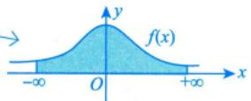

使 $f(x)  在  x_0$ 的邻域内无界的点即为瑕点，

$\lim_{x \to 0} \frac{1}{x} = \infty, \quad x = 0$ 为瑕点；

(2)无界函数的反常积分的概念与敛散性.

再 $\lim_{x \to 0} \frac{1}{x} \sin \frac{1}{x} = \pi$ 界振荡，x=0为瑕点. 7

定义2 设F(x)是f(x)在相应区间上的一个原函数， $x _ { 0 }$ 为f(x)的瑕点.

①若 $x = a$ 是唯一瑕点，则

$$
\int _ { a } ^ { b } f ( x ) \mathrm { d } x = F ( b ) - \lim _ { x \rightarrow a ^ { + } } F ( x ) ,
$$

若上述极限存在，则称反常积分收敛，否则称发散.

②若 $x = b$ 是唯一瑕点，则

$$
\int_{a}^{b} f(x) \mathrm{d}x = \lim_{x \to b^{-}} F(x) - F(a)
$$

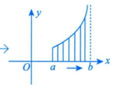

若上述极限存在，则称反常积分收敛，否则称发散.

③若 $x = c \in (a,   b)$ 是唯一瑕点，则

$$
\int _ { a } ^ { b } f ( x ) \mathrm { d } x = \int _ { a } ^ { c } f ( x ) \mathrm { d } x + \int _ { c } ^ { b } f ( x ) \mathrm { d } x ,
$$

只要等号右边有一个发散，左边即发散.不存在“发散+发散=收敛”的情形.如 $\int_{-\infty}^{+\infty} x^3 \mathrm{d}x = \int_{-\infty}^{0} x^3 \mathrm{d}x + \int_{0}^{+\infty} x^3 \mathrm{d}x.$ ，由于 $\int_{-\infty}^{0} x^3   dx = -\infty$ 发散，故 $\int_{-\infty}^{+\infty} x^3 \mathrm{d}x$ 发散，而不是 $\int_{-\infty}^{+\infty} x^3 \mathrm{d}x = 0 \cdot \int_{-\infty}^{+\infty} x^3 \mathrm{d}x \neq \lim_{R \to +\infty} \int_{-R}^{R} x^3 \mathrm{d}x$ ，只有当反常积分收敛时$\int_{-\infty}^{+\infty} f(x) \mathrm{d}x = \lim_{R \to +\infty} \int_{-R}^{R} f(x) \mathrm{d}x$ 才成立. J

若右端两个积分都收敛，则称反常积分收敛，否则称发散.

注1在反常积分中，一般把“∞”和瑕点统称为奇点：→判别前提

在判别积分敛散性时，一个积分中只能有一个奇点，若出现两个及以上奇点，需拆分.

注2请看(2)的①，当 $x = a$ 为f(x)的瑕点时，f(x)便是一个无界函数 $7$ ，积分 $\int_{a}^{b} f(x) \mathrm{d}x$ 也可能存在.细心的考生可能会联想到，前面我们不是说 $\int_{a}^{b} f(x) \mathrm{d}x$ 存在的必要条件是f(x)有界”吗？这不是矛盾了吗？事实上，前面所说的 $\int_{a}^{b} f(x) \mathrm{d}x$ 是定积分（黎曼积分)，而这里的 $\int_{a}^{b} f(x) \mathrm{d}x$ 是反常积分，它们并不是一个概念，所以没有任何矛盾.只是当考生读完这一段，最好今后在提到积分存在时，特别强调一下，是定积分存在(黎曼可积，常义可积)，还是反常积分存在(广义可积).

## 2 敛散性的判别法

(1) 无穷区间.

比较判别法 设函数f(x)，g(x)在区间 $\left[ a, +\infty \right)$ 上连续，并且 $0 \leqslant \overline{f(x) \leqslant g(x)} (a \leqslant x < +\infty)$ ，则

①当 $\int_{a}^{+\infty} g(x) \mathrm{d}x$ 收敛时， $\int_{a}^{+\infty} f(x) \mathrm{d}x$ 收敛；

②当 $\int_{a}^{+\infty} f(x) \mathrm{d}x$ 发散时， $\int_{a}^{+\infty} g(x) \mathrm{d}x$ 发散.

★比较判别法的极限形式 设函数f(x)，g(x)在区间 $\left[ a, +\infty \right)$ 上连续，且 $f(x) \geqslant 0,\; g(x) > 0,\; \lim_{x \to +\infty} \frac{f(x)}{g(x)} = \lambda.$ (有限或∞)，则→说明f(x)，g(x)是同阶无穷小 计算极限

①当 $\lambda \ne 0$ 且 $\overline{\lambda \neq \infty}$ 时， $\int_{a}^{+\infty} f(x) \mathrm{d}x$ 与 $\int_{a}^{+\infty} g(x) \mathrm{d}x$ 有相同的敛散性；

→f(x)趋于0的速度比g(x)更快

②当 $\overline{\lambda = 0}$ 时，若 $\int_{a}^{+\infty} g(x) \mathrm{d}x$ 收敛，则 $\int_{a}^{+\infty} f(x) \mathrm{d}x$ 也收敛；

→g(x)趋于0的速度比f(x)更快

③当 $\overline { \lambda = \infty }$ 时，若 $\int_{a}^{+\infty} g(x) \mathrm{d}x$ 发散，则 $\int_{a}^{+\infty} f(x) \mathrm{d}x$ 也发散.

(2)无界函数.

比较判别法 设f(x)， g(x)在(a, b]上连续，瑕点同为x=a，并且 $0 \leqslant \sqrt{f(x) \leqslant g(x)} (a < x \leqslant b)$ ，则

①当 $\int_{a}^{b}g(x)\mathrm{d}x$ 收敛时， $\int_{a}^{b} f(x) \mathrm{d}x$ 收敛；

②当 $\int_{a}^{b} f(x) \mathrm{d}x$ 发散时， $\int_{a}^{b} g(x) \mathrm{d}x$ 发散.

比较判别法的极限形式 设f(x)， g(x)在(a, b]上连续，瑕点同为 $x = a$ ，并且 $f(x) \geqslant 0, \; g(x) >$ $0(a<x \leq b), \lim_{x \to a^{+}} \frac{f(x)}{g(x)} = \lambda$ (有限或∞)，则 →计算极限

→说明f(x)，g(x)是同阶无穷大

①当 $\overline{\lambda \neq 0}$ 且 $\lambda \neq \infty$ 时， $\int_{a}^{b} f(x) \mathrm{d}x$ 和 $\int_{a}^{b} g(x) \mathrm{d}x$ 有相同的敛散性；

→g(x)趋于∞的速度比f(x)更快

②当 $\left| \lambda = 0 \right|$ 时，若 $\int_{a}^{b} g(x) \mathrm{d}x$ 收敛，则 $\int_{a}^{b} f(x) \mathrm{d}x$ 也收敛；

③当 $\overline { \lambda = \infty }$ 时，若 $\int_{a}^{b} g(x) \mathrm{d}x$ 发散，则 $\int_{a}^{b} f(x) \mathrm{d}x$ 也发散.

注两个重要结论.

① $\int_{0}^{1} \frac{1}{x^{p}}   dx$ 收敛， $0 < p < 1$ p=1是临界值， $\int_{0}^{1} \frac{1}{x}   dx = 0 - \lim_{x \to 0^{+}} \ln x = +\infty$ 发散， $p \geq 1$ 越小越收敛

收敛， $p > 1$ +00 ②J区 dx 发散， $p \leq 1$ 越大越收敛

$$
\int_{1}^{+\infty} \frac{1}{x}   dx = \lim_{x \to +\infty} \ln x - \ln 1 = +\infty
$$

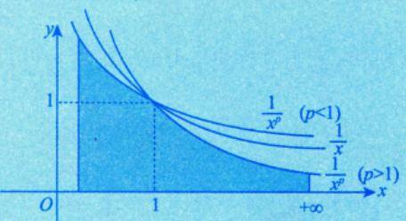

对于①，盯着 $x \to 0^{+}$ 看， $x^{p}$ 的次数p：当 $p \geq 1$ 时， $x^{p}$ 趋于0的“速度”够快，其倒数 $\frac{1}{x^{p}}$ 趋于+∞的“速度”亦够快，积分发散；当 $0 < p < 1$ 时， $x^{p}$ 趋于0的“速度”不够快，其倒数 $\frac{1}{x^{p}}$ 趋于 $+ \infty$ 的“速度”亦不够快，积分收敛.

懂得了以上道理后，便可有所发挥，如当 $x \to 0^{+}$ 时， $\left| \sin x - x \right|$ 这意味着 sin x 与 x趋于 0的“速度”一样.故 $\int_{0}^{1} \frac{1}{\sin^{p} x}   dx$ (有时命制成 $\int_{0}^{\frac{\pi}{2}} \frac{1}{\sin^{p} x}   dx$ 依然满足 $\lim_{x \to 0^{+}} \frac{\sin x}{x} = 1 ,  故  \lim_{x \to 0^{+}} \frac{\sin^{p} x}{x^{p}} = 1$

收敛 $0 < p < 1$ 发散， $p \geq 1$

事实上，凡是与x趋于0的“速度”一样的函数f(x)均可如上讨论.

对于②，盯着 $x \rightarrow +\infty$ 看， $x^{p}$ 的次数p：当 $p > 1$ 时， $x^{p}$ 趋于+∞的“速度”够快，其倒数 $\frac{1}{x^{p}}$ 趋于0的“速度”亦够快，积分收敛；当 $p \leq 1$ 时， $\dot{x}^{p}$ 趋于+∞的“速度”不够快，其倒数 $\frac{1}{x^{p}}$ 趋于0的“速度”亦不够快，积分发散.

这里的发挥简单些，如当 $x \rightarrow + \infty$ 且a>0时， $ax + b$ 亦趋于+∞，与x趋于+∞的“速度”一样当 $ax + b \geqslant k > 0$ 时， $\int_{1}^{+\infty} \frac{1}{(ax + b)^p}   dx$ 依然满足 收敛， 发散， $p \leq 1$ $p > 1$ $\lim_{x \to +\infty} \frac{(ax + b)^p}{(ax)^p} = 1$

例8.15设 $a > b > 0$ ，反常积分 $\int_{0}^{+\infty} \frac{1}{x^a + x^b}$ dx收敛，则（）.(A) a>1 且b>1 (B) a>1 且 $b   <   1$ (C) $a < 1$ 且 $a + b > 1$ (D) a <1且 $b < 1$

解应选(B).

理论依据在“四、 $2 ^ { \circ }$ 的注中讲过了，来看此题：

$$
\int_{0}^{1} \frac{1}{x^{a} + x^{b}}   dx + \int_{1}^{+\infty} \frac{1}{x^{a} + x^{b}}   dx = I_{1} + I_{2}
$$

对于 $I _ { 1 }$ ，盯着 $x \to 0 ^ { + }$ 看，由于 $a > b > 0$ ，因此 $x ^ { b }$ 趋于0的“速度”慢于 $x ^ { a }$ 趋于0的“速度”，

$x^{a}+x^{b}\sim x^{b}$ ，于是 $I _ { 1 }$ 与 $\int_{0}^{1} \frac{1}{x^{b}}   dx$ 同敛散，则 $b   <   1$

对于 $I _ { 2 }$ ，盯着 $x \to + \infty$ 看，由于 $a > b > 0$ ，因此 $x ^ { a }$ 趋于+∞的“速度”快于 $x^{b}$ 趋于+∞的“速度”，$x^{a}+x^{b}$ 与 $x ^ { a }$ 为等价无穷大量，于是 $I _ { 2 }$ 与 $\int_{1}^{+\infty} \frac{1}{x^a}   dx$ 同敛散，则 $a > 1$ ·

综上，a>1且 $b   <   1$ ，故选(B).

例8.16 若反常积分 $\int_{1}^{+\infty} \left( \mathrm{e}^{-\cos \frac{1}{x}} - \mathrm{e}^{-1} \right) x$ kdx收敛，则k的取值范围是

解应填k<1.

盯着x→+∞看，由 $\mathrm{e}^{-\cos \frac{1}{x}} - \mathrm{e}^{-1} = \mathrm{e}^{-1} \left( \mathrm{e}^{-\cos \frac{1}{x} + 1} - 1 \right)$ ，又当 $x \to + \infty$ 时，$\mathrm{e}^{-\cos \frac{1}{x}+1}-1 \sim 1-\cos \frac{1}{x} \sim \frac{1}{2} \cdot \frac{1}{x^{2}}$

故原反常积分与 $\int_{1}^{+\infty} \frac{1}{x^{2-k}}   dx$ 同敛散，故当2-k>1，即k<1时，原反常积分收敛.

例8.17 以下反常积分发散的是（).(A) $\int_{1}^{+\infty} \left[ \ln \left( 1 + \frac{1}{x} \right) - \frac{1}{1+x} \right] \mathrm{d}x$ (B) $\int_{0}^{+\infty} \frac{\ln x}{1 + x^2}   dx$ (C) $\int_{-1}^{1} \frac{\mathrm{d}x}{\sin x}$ (D) $\int_{-\infty}^{+\infty} \frac{\sin x}{1 + x^2}   dx$

解应选(C). → lr $\ln \left(1+\frac{1}{x}\right)=\ln \frac{x+1}{x}=\ln (x+1)-\ln x$ 拉格朗日中值定理1 $x < \xi < x + 1$   
对于(A)，对 $x \in [1, +\infty)$ ，有 故 $\frac{1}{x + 1} < \frac{1}{\xi} < \frac{1}{x}, \quad  即  \quad \frac{1}{x + 1} < \ln\left( 1 + \frac{1}{x} \right) < \frac{1}{x}$ $0<\ln\left(1+\frac{1}{x}\right)-\frac{1}{1+x}<\frac{1}{x}-\frac{1}{x+1}=\frac{1}{x(x+1)}<\frac{1}{x^2}$   
由 $\int_{1}^{+\infty} \frac{1}{x^2}   dx$ 收敛，可知 $\int_{1}^{+\infty} \left[ \ln \left( 1 + \frac{1}{x} \right) - \frac{1}{1 + x} \right]$ dx收敛.  
对于(B), $\int_{0}^{+ \infty}\frac{\ln x}{1 + x^{2}}\mathrm{d}x = \int_{0}^{1}\frac{\ln x}{1 + x^{2}}\mathrm{d}x + \int_{1}^{+ \infty}\frac{\ln x}{1 + x^{2}}\mathrm{d}x$ 当 $x \to + \infty$ 时， $\frac{\ln x}{\frac{1 + x^{2}}{\ln x}} = 1$   
因为 故 $\int_{1}^{+\infty} \frac{\ln x}{1 + x^2}$ dx敛散性与 $\int_{1}^{+\infty} \frac{\ln x}{x^2}   dx$ 相同，此$\frac{\ln x}{1 + x^{2}} = 1$ 式收敛，则 $\int_{1}^{+\infty} \frac{\ln x}{1 + x^2}$ dx收敛

且反常积分 $\int_{0}^{1} \ln x   dx$ 收敛，所以反常积分 $\int_{0}^{1} \frac{\ln x}{1 + x^{2}}$ dx收敛.V又因为 $\lim_{x \to 0^{+}} \frac{\ln x}{\frac{1}{\sqrt{x}}} = \lim_{x \to 0^{+}} \sqrt{x} \ln x = 0$ ，而 $\int_{0}^{1} \frac{1}{\sqrt{x}}   \mathrm{d}x$ 收敛，故∫ln xdx 收敛.

$$
\frac{\ln x}{\frac{1 + x^{2}}{1}} = 0
$$

且反常积分 $\int_{1}^{+\infty} \frac{1}{x^{\frac{3}{2}}} \mathrm{d}x$ 收敛，所以反常积分 $\int_{1}^{+\infty} \frac{\ln x}{1 + x^2}   dx$ 收敛.

综上可知，反常积分 $\int_{0}^{+\infty} \frac{\ln x}{1 + x^2}$ dx收敛.

对于(C)，由于 $\lim_{x \to 0^{+}} \frac{\frac{1}{\sin x}}{\frac{1}{x}} = 1$ ，因此 $\int_{0}^{1} \frac{1}{\sin x}   dx$ 发散.而 $\int_{- 1}^{1}\frac{1}{\sin x}\mathrm{d}x = \int_{- 1}^{0}\frac{1}{\sin x}\mathrm{d}x + \int_{0}^{1}\frac{1}{\sin x}\mathrm{d}x$ ，可知 $\int_{-1}^{1} \frac{1}{\sin x}   dx$ 发散.

对于(D), $\int_{-\infty}^{+\infty} \frac{\sin x}{1 + x^2}   dx = \int_{-\infty}^{0} \frac{\sin x}{1 + x^2}   dx + \int_{0}^{+\infty} \frac{\sin x}{1 + x^2}   dx$ dx，且有

$$
\int_{0}^{+\infty} \frac{\sin x}{1+x^2}   dx \leqslant \int_{0}^{+\infty} \left| \frac{\sin x}{1+x^2} \right|   dx \leqslant \int_{0}^{+\infty} \frac{1}{1+x^2}   dx = \left. \arctan x \right|_{0}^{+\infty} = \frac{\pi}{2}
$$

由对称区间反常积分结论（见下面的注），可知 $\int_{-\infty}^{+\infty} \frac{\sin x}{1 + x^2}$ dx收敛.

注当f(x) 为偶函数且 $\int_{0}^{+\infty} f(x) \mathrm{d}x$ 收敛时，

$$
\int _ { - \infty } ^ { + \infty } f ( x ) \mathrm { d } x = 2 \int _ { 0 } ^ { + \infty } f ( x ) \mathrm { d } x .
$$

当f(x)为奇函数且 $\int_{0}^{+\infty} f(x) \mathrm{d}x$ 收敛时，

$$
\int_{-\infty}^{+\infty} f(x) \mathrm{d}x = 0
$$

例8.18 已知α>0，则对于反常积分 $\int_{0}^{1} \frac{\ln x}{x^{\alpha}}   dx$ 的敛散性的判别，正确的是（).

(A)当α≥1时，积分收敛

$$
\alpha < 1
$$

分析 比较判别法 $\begin{aligned}&\left\{\begin{aligned}&\textcircled{1}  放缩  \; 0 \leq f(x) \leq g(x) \; ; \\&\textcircled{2}  计算极限  \left\{\begin{aligned}&\frac{0}{0} , \\&\frac{\infty}{\infty} .\end{aligned}\right.\end{aligned}\right.\end{aligned}$

当α<1时，取充分小的正数ε，使得 $\alpha + \varepsilon < 1$ ，由于故当 $x \to 0^{+}$ 时， $\frac{1}{x^{\alpha + \varepsilon}}$ 是比 $\frac{\ln x}{x^{\alpha}}$ 高阶的无穷大量，因为当 $\alpha + \varepsilon < 1$ 时， $\int_{0}^{1} \frac{1}{x^{\alpha + \varepsilon}}   dx$ 收敛，于是 $\int_{0}^{1} \frac{\ln x}{x^{\alpha}}   dx$ 收敛，选项(B) 正确；

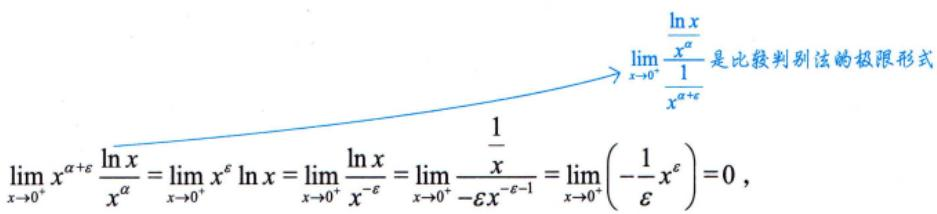

当 $\alpha   \geqslant   1$ 时，由于 $\lim_{x \to 0^{+}} x^{\alpha} \frac{\ln x}{x^{\alpha}} = \infty$ ，故当 $x   \to   0 ^ { + }$ 时， $\frac{1}{x^{\alpha}}$ 是比 $\frac{\ln x}{x^{\alpha}}$ 低阶的无穷大量，因为当 $\alpha   \geqslant   1$ 时，$\int_{0}^{1} \frac{1}{x^{\alpha}}   dx$ 发散，于是 $\int_{0}^{1} \frac{\ln x}{x^{\alpha}}   dx$ 发散. $\lim_{x \to 0^{+}} \frac{\frac{\ln x}{x^{\alpha}}}{\frac{1}{x^{\alpha}}}$ 是比较判别法的极限形式

注 $\int_{0}^{1} \frac{\ln x}{x^{p}}   dx$ 收敛， $0 \leq p < 1$ 发散， $p \geq 1$

例8.19 已知 $\alpha > 0$ ，则对于反常积分 $\int_{1}^{+\infty} \frac{\ln x}{x^{\alpha}}$ dx的敛散性的判别，正确的是（）.(A)当 $0 < \alpha \leq 1$ 时，积分收敛 (B)当α>1时，积分收敛(C)敛散性与α无关，必收敛 (D)敛散性与α无关，必发散

分析 反常积分判别敛散性.

①放缩法 $0 \leqslant f(x) \leqslant g(x)$ ②计算极限 $\frac{0}{0}, \frac{\infty}{\infty};$ 比较判别法$\left\{ \begin{aligned} &\int_{0}^{1} \frac{1}{x^{p}} \mathrm{d}x \left\{ \begin{aligned}\\ &\end{aligned} \right. \\&\int_{1}^{+\infty} \frac{1}{x^{p}} \mathrm{d}x \left\{ \begin{aligned}\\ &\end{aligned} \right. \\&\end{aligned} \right.$ 收敛， 发散， $\begin{aligned} &0 < p < 1, \\&p \geq 1;\\ \end{aligned}$ $\int_{0}^{1} \frac{\ln x}{x^{p}}   dx \Bigg\{$ 收敛， 发散， $p { \geq } 1$ $0 \leq p < 1$ ③4个结论收敛， $\left\{ p > 1 \right., \left. \int_{1}^{+\infty} \frac{\ln x}{x^p} \mathrm{d}x \right\}$ 收敛， $p   >   1$ 发散， 发散， $p { \leqslant } 1$

补充：若 $\lim_{x \to +\infty} x^p f(x) = \lambda \geq 0$ ，且 $p > 1$ ，则 $\int_{1}^{+\infty} f(x) \mathrm{d}x$ 收敛.$\lim_{x \to +\infty} \frac{f(x)}{\frac{1}{x^p}} = 0 , \quad p > 1$ 时， $\int_{1}^{+\infty} \frac{1}{x^p}   \mathrm{d}x.$ 收敛，故 $\int_{1}^{+\infty} f(x) \mathrm{d}x.$ 收敛.  
解应选(B). →  
当 $0 < \alpha \leq 1$ 且x充分大时， $\frac{\ln x}{x^{\alpha}} > \frac{1}{x^{\alpha}}$ ，由于 $\int_{1}^{+\infty} \frac{1}{x^{\alpha}}   dx$ 发散，因此 $\int_{1}^{+\infty} \frac{\ln x}{x^{\alpha}}   dx$ 发散；  
当 $\alpha   >   1$ 时，取充分小的正数ε，使 $\alpha - \varepsilon > 1$ ，由 $\lim_{x \to +\infty} \frac{\frac{\ln x}{x^\alpha}}{\frac{1}{x^{\alpha - \varepsilon}}} = \lim_{x \to +\infty} \frac{\ln x}{x^\varepsilon} = 0$ ，且 $\int_{1}^{+\infty} \frac{1}{x^{\alpha - \varepsilon}}   dx$ 收敛，

故 $\int_{1}^{+\infty} \frac{\ln x}{x^{\alpha}}   dx$ 收敛.

故选(B).

## 基础习题精练

## 习题

8.1 设 $I_{1} = \int_{0}^{\frac{\pi}{2}} \frac{\sin x}{x}   dx, \quad I_{2} = \int_{0}^{\frac{\pi}{2}} \frac{x}{\sin x}   dx$ ，则（ ).(A) $I_{1} > I_{2} > 1$ (B) $1   >   I _ { 1 }   >   I _ { 2 }$ (C) $I_{2} > I_{1} > 1$ (D) $1 > I_{2} > I_{1}$

8.2 设 $\begin{aligned} &df(x) = \left\{ \begin{aligned}\\ &x, &x < 0, \\&\frac{1}{2}, &x = 0, \\&1, &x > 0,\\ &\end{aligned} \right.\\ \end{aligned}$ 则下列命题：   
①f(x)在[-1,1]上有原函数; ②f(x)在[-1,1]上可积；   
③ $F(x) = \int_{-1}^{x} f(t)   dt$ 在x=0处可导； ④ $F(x) = \int_{-1}^{x} f(t)   dt$ 在x=0处连续但不可导. 正确命题的个数为（).   
(A)1 (B)2 (C)3 (D)4

8.3 若反常积分 $\int_{0}^{+\infty} \frac{\ln x}{(1 + x)x^{1-p}}$ dx收敛，则（ ).(A) $p < 1$ (B) $p   >   1$ (C) $0 < p < 1$ (D) $0 \leq p < 1$

8.4 $\lim_{n \to \infty} \left( \frac{1}{\sqrt{n^2 + n}} + \frac{1}{\sqrt{n^2 + 2n}} + \frac{1}{\sqrt{n^2 + 3n}} + \cdots + \frac{1}{\sqrt{n^2 + n^2}} \right)$

8.5 $\lim_{n \to \infty} \sum_{i=1}^{n} \frac{\sin \frac{i \pi}{n}}{n + \frac{1}{i}}$

8.6 设 $F(x) = \int_{0}^{x} (t - \left[ t \right]) \mathrm{d}t$ ，其中[x]表示不超过x的最大整数，则 $F_{-}^{\prime}(1) + F_{+}^{\prime}(1) =$ \_

8.7 讨论 $\int_{2}^{+\infty} \frac{1}{x \ln^{p} x}   dx$ 的敛散性，其中p为任意实数.

## 解答

8.1 (C) 解 当 $x \in \left( 0, \frac{\pi}{2} \right)$ 时， $\sin x < x$ ，故 $\frac{x}{\sin x} > 1 > \frac{\sin x}{x}$ ，则

$$
I _ { 2 } = \int _ { 0 } ^ { \frac { \pi } { 2 } } \frac { x } { \sin x } \mathrm { d } x > \int _ { 0 } ^ { \frac { \pi } { 2 } } \frac { \sin x } { x } \mathrm { d } x = I _ { 1 } ,
$$

排除选项(A)和(B).

由第2讲 $^ { \ast } 6 .$ 注(2) $\textcircled{8} ^ { \ast }$ 可知，当 $0 < x < \frac{\pi}{2}$ 时， $\frac{\sin x}{x} > \frac{2}{\pi}$ ，则有

$$
I _ { 1 } = \int _ { 0 } ^ { \frac { \pi } { 2 } } \frac { \sin x } { x } \mathrm { d } x > \int _ { 0 } ^ { \frac { \pi } { 2 } } \frac { 2 } { \pi } \mathrm { d } x = 1 .
$$

故(C)正确.

8.2 (B) 解 x =0是f(x)的跳跃间断点，于是①错误；

f(x)在[-1,1]上有界且只有一个间断点，于是②正确；

在f(x)的跳跃间断点x=0处， $F ( x )$ 连续但不可导，于是③错误，④正确.

注进一步，本题的 $f(x)=\begin{cases}x,&x<0,\\\dfrac{1}{2},&x=0,\\1,&x>0\end{cases}$ 可由 $\lim_{t \to 0^{+}} \frac{x + \mathrm{e}^{\frac{x}{t}}}{1 + \mathrm{e}^{\frac{x}{t}}}$ 获得，即 $f(x) = \lim_{t \to 0^{+}} \frac{x + \mathrm{e}^{\frac{x}{t}}}{1 + \mathrm{e}^{\frac{x}{t}}}$

8.3 (C) 解 此积分为有一个瑕点x=0的无穷区间上的反常积分，可写为

$$
\int_{0}^{+\infty} \frac{\ln x}{(1+x)x^{1-p}} \mathrm{d}x = \int_{0}^{1} \frac{\ln x}{(1+x)x^{1-p}} \mathrm{d}x + \int_{1}^{+\infty} \frac{\ln x}{(1+x)x^{1-p}} \mathrm{d}x
$$

对任意 $\varepsilon > 0$ ，有

$$
\lim _ { x \rightarrow 0 ^ { + } } \frac { \frac { \ln x } { ( 1 + x ) x ^ { 1 - p } } } { \frac { 1 } { x ^ { 1 - p + \varepsilon } } } = \lim _ { x \rightarrow 0 ^ { + } } x ^ { \varepsilon } \ln x = 0 ,
$$

若 $\int_{0}^{1} \frac{1}{x^{1 - p + \varepsilon}}$ dx收敛，即 $1 - p < 1, \; p > 0$ ，则 $\int_{0}^{1} \frac{\ln x}{(1 + x)x^{1 - p}}$ dx也收敛.

对任意 $\varepsilon > 0$ ，有

$$
\lim_{x \to +\infty} \frac{\frac{\ln x}{(1 + x)x^{1 - p}}}{\frac{1}{x^{2 - p - \varepsilon}}} = \lim_{x \to +\infty} \frac{\ln x}{x^{\varepsilon}} = 0
$$

若 $\int_{1}^{+\infty} \frac{1}{x^{2-p-\varepsilon}} \mathrm{d}x$ 收敛，即 $2 - p > 1, \; p < 1$ ，则 $\int_{1}^{+\infty} \frac{\ln x}{(1 + x)x^{1-p}}$ dx也收敛.

综上，当 $0 < p < 1$ 时，反常积分 $\int_{0}^{+\infty} \frac{\ln x}{(1 + x)x^{1-p}} \mathrm{d}x$ 收敛.

8.4 $2\sqrt{2}-2$ 解原式 $\begin{aligned}\xi = \lim_{n \rightarrow \infty} \sum_{i = 1}^{n} \frac{1}{\sqrt{n^{2} + ni}} = \lim_{n \rightarrow \infty} \sum_{i = 1}^{n} \frac{1}{\sqrt{1 + \frac{i}{n}}} \cdot \frac{1}{n} \\= \int_{0}^{1} \frac{1}{\sqrt{1 + x}}   dx = 2\sqrt{1 + x} \bigg|_{0}^{1} = 2\sqrt{2} - 2\end{aligned}$

注能凑成 $\frac{i}{n}$ 则用定积分定义；凑不成的，先用放缩法，放缩后再用定积分定义

常见的几种凑定积分定义的式子有

(1)

$$
\begin{aligned}\lim_{n \rightarrow \infty}\left( \frac{1}{n + 1} + \frac{1}{n + 2} + \cdots + \frac{1}{n + n} \right) = \lim_{n \rightarrow \infty}\sum_{i = 1}^{n}\frac{1}{n + i} = \lim_{n \rightarrow \infty}\sum_{i = 1}^{n}\frac{1}{1 + \frac{i}{n}} \cdot \frac{1}{n} \\= \int_{0}^{1}\frac{1}{1 + x}\mathrm{d}x = \ln\left( 1 + x \right)|_{0}^{1} = \ln 2\end{aligned}
$$

这里分母上有 $n + i$ ，提出n后，会化成 $1 + \frac{i}{n}$

(2)

$$
\begin{aligned} &\lim_{n \rightarrow \infty}\left( \frac{n}{n^{2} + 1^{2}} + \frac{n}{n^{2} + 2^{2}} + \cdots + \frac{n}{n^{2} + n^{2}} \right) = \lim_{n \rightarrow \infty}\sum_{i = 1}^{n}\frac{n}{n^{2} + i^{2}} \\&= \lim_{n \rightarrow \infty}\sum_{i = 1}^{n}\frac{n^{2}}{n^{2} + i^{2}} \cdot \frac{1}{n} = \lim_{n \rightarrow \infty}\sum_{i = 1}^{n}\frac{1}{1 + \left( \frac{i}{n} \right)^{2}} \cdot \frac{1}{n} \\&= \int_{0}^{1}\frac{1}{1 + x^{2}}\mathrm{d}x = \arctan x\Big|_{0}^{1} = \frac{\pi}{4}.\end{aligned}
$$

这里分母上有 $n^{2}+i^{2}$ ，提出 $n ^ { 2 }$ 后，会化成 $1 + \left( \frac{i}{n} \right)^{2}$

(3) 对于本题，分母上有 $n^{2} + ni$ ，提出 $n ^ { 2 }$ 后，会化成 $1 + \frac{i}{n}$

8.5 $\frac{2}{\pi}$ 解当各项分母相同且均为n时，

$$
\lim_{n \to \infty} \sum_{i=1}^{n} \frac{\sin \frac{i \pi}{n}}{n} = \lim_{n \to \infty} \frac{1}{n} \sum_{i=1}^{n} \sin \frac{i}{n} \pi = \int_{0}^{1} \sin \pi x   dx
$$

于是，先对 $\sum_{i = 1}^{n}\frac{\sin\frac{i\pi}{n}}{n + \frac{1}{i}}$ 进行放缩，有

$$
\sum_{i = 1}^{n}\frac{\sin\frac{i\pi}{n}}{n + 1} \leqslant \sum_{i = 1}^{n}\frac{\sin\frac{i\pi}{n}}{n + 1} \leqslant \sum_{i = 1}^{n}\frac{\sin\frac{i\pi}{n}}{n},
$$

由于

$$
\lim_{n \to \infty} \sum_{i=1}^{n} \frac{\sin \frac{i \pi}{n}}{n} = \lim_{n \to \infty} \frac{1}{n} \sum_{i=1}^{n} \sin \frac{i}{n} \pi = \int_{0}^{1} \sin \pi x   dx = \frac{2}{\pi}
$$

$$
\sum_{i = 1}^{n}\frac{\sin\frac{i\pi}{n}}{n + 1} = \lim_{n \rightarrow \infty}\frac{n}{n + 1} \cdot \frac{1}{n}\sum_{i = 1}^{n}\sin\frac{i}{n}\pi = 1 \cdot \int_{0}^{1}\sin\pi x\mathrm{d}x = \frac{2}{\pi}
$$

因此，由夹逼准则得

$$
\lim_{n \to \infty} \sum_{i=1}^{n} \frac{\sin \frac{i \pi}{n}}{n + \frac{1}{i}} = \frac{2}{\pi}
$$

8.6 1 解 设 $f(x) = x - \left[ x \right]$ ，其图形如图8-7所示.

  
图 8-7

方法一 因为x=1是 $y = f(x)$ 的跳跃间断点，所以

$$
F_{-}^{\prime}(1)=\lim_{x \to 1^{-}} f(x)=1,\;F_{+}^{\prime}(1)=\lim_{x \to 1^{+}} f(x)=0,
$$

故 $F_{-}^{\prime}(1) + F_{+}^{\prime}(1) = 1$

方法二

$$
F_{-}^{\prime}(1)=\lim_{x \to 1^{-}}\frac{F(x)-F(1)}{x-1}=\lim_{x \to 1^{-}}\frac{\int_{0}^{x}t\mathrm{d}t-\frac{1}{2}}{x-1}=\lim_{x \to 1^{-}}\frac{x}{1}=1
$$

$$
\begin{aligned}F_{+}^{\prime}(1) &= \lim_{x \rightarrow 1^{+}}\frac{F(x) - F(1)}{x - 1} = \lim_{x \rightarrow 1^{+}}\frac{\int_{0}^{1}t\mathrm{d}t + \int_{1}^{x}(t - 1)\mathrm{d}t - \frac{1}{2}}{x - 1} \\&= \lim_{x \rightarrow 1^{+}}\frac{\int_{1}^{x}(t - 1)\mathrm{d}t}{x - 1} = \lim_{x \rightarrow 1^{+}}\frac{x - 1}{1} = 0\end{aligned}
$$

故 $F_{-}^{\prime}(1) + F_{+}^{\prime}(1) = 1$

8.7 分析 本题考查反常积分敛散性的判别法(通过计算结果来判别是否收敛)，是历届考生复习

得比较薄弱的知识点.

解 ①当 $p = 1$ 时， $\int_{2}^{+\infty} \frac{1}{x \ln x}   dx = \ln \left| \ln x \right|_{2}^{+\infty} = +\infty$ ，发散；

②当 $p \neq 1$ 时，

$$
\int _ { 2 } ^ { + \infty } \frac { \mathrm { d } x } { x \ln ^ { p } x } = \frac { 1 } { 1 - p } \left( \ln x \right) ^ { 1 - p } \bigg | _ { 2 } ^ { + \infty } ,
$$

当 $p   >   1$ 时， $\lim_{x \to +\infty} (\ln x)^{1-p} = 0$ ，故收敛；当 $p < 1$ 时， $\lim_{x \to +\infty} (\ln x)^{1-p} = +\infty$ ，故发散.

综上， $\int_{2}^{+\infty} \frac{1}{x \ln^{p} x}   dx \Bigg\{$ 收敛， $\stackrel{\cdot}{p}>1$ 发散， $p { \leqslant } 1$
